# Parent Section Magnitude-Probability Distributions

Only fault sections with at least one triggered aftershock are plotted. Sections are sorted by total supraseismogenic trigger rate (decreasing)

## Table Of Contents

* [San Jacinto (Clark) rev](#san-jacinto-clark-rev)
* [San Jacinto (Anza) rev](#san-jacinto-anza-rev)
* [San Jacinto (Stepovers Combined)](#san-jacinto-stepovers-combined)
* [San Andreas (Coachella) rev](#san-andreas-coachella-rev)
* [Brawley (Seismic Zone) alt 1](#brawley-seismic-zone-alt-1)
* [San Jacinto (Coyote Creek)](#san-jacinto-coyote-creek)
* [Imperial](#imperial)
* [San Jacinto (San Jacinto Valley) rev](#san-jacinto-san-jacinto-valley-rev)
* [San Andreas (Cholame) rev](#san-andreas-cholame-rev)
* [San Andreas (San Bernardino N)](#san-andreas-san-bernardino-n)
* [San Jacinto (Borrego)](#san-jacinto-borrego)
* [Tank Canyon](#tank-canyon)
* [San Andreas (Parkfield)](#san-andreas-parkfield)
* [Sheephole](#sheephole)
* [North Frontal  (West)](#north-frontal--west)
* [Ventura-Pitas Point](#ventura-pitas-point)
* [Cleghorn](#cleghorn)
* [San Andreas (Big Bend)](#san-andreas-big-bend)
* [Bicycle Lake](#bicycle-lake)
* [Superstition Hills](#superstition-hills)
* [San Andreas (Mojave S)](#san-andreas-mojave-s)
* [San Andreas (Mojave N)](#san-andreas-mojave-n)
* [San Jacinto (Superstition Mtn)](#san-jacinto-superstition-mtn)
* [San Andreas (Carrizo) rev](#san-andreas-carrizo-rev)
* [North Frontal  (East)](#north-frontal--east)
* [San Jacinto (San Bernardino)](#san-jacinto-san-bernardino)
* [Elsinore (Temecula) rev](#elsinore-temecula-rev)

## San Jacinto (Clark) rev
*[(top)](#table-of-contents)*

| 1 Week | 1 Month | 1 Year | 10 Year |
|-----|-----|-----|-----|
|  |  |  |  |

| Magnitude | 1 wk TI Prob | 1 wk TD Prob | 1 wk ETAS Prob | 1 wk ETAS/TD Gain | 1 wk ETAS Triggered Only | 1 mo TI Prob | 1 mo TD Prob | 1 mo ETAS Prob | 1 mo ETAS/TD Gain | 1 mo ETAS Triggered Only | 1 yr TI Prob | 1 yr TD Prob | 1 yr ETAS Prob | 1 yr ETAS/TD Gain | 1 yr ETAS Triggered Only | 10 yr TI Prob | 10 yr TD Prob | 10 yr ETAS Prob | 10 yr ETAS/TD Gain | 10 yr ETAS Triggered Only |
|-----|-----|-----|-----|-----|-----|-----|-----|-----|-----|-----|-----|-----|-----|-----|-----|-----|-----|-----|-----|-----|
| 6.0 | 4.482615E-5 | 2.150038E-5 | 3.1500163E-5 | 1.465098 | 1.0E-5 | 1.9209793E-4 | 9.214129E-5 | 1.4213668E-4 | 1.5425949 | 5.0E-5 | 0.0023362834 | 0.0011212523 | 0.0012610953 | 1.1247205 | 1.4E-4 | 0.02311874 | 0.011686372 | 0.011923567 | 1.0202967 | 2.4E-4 |
| 6.1 | 4.482615E-5 | 2.150038E-5 | 3.1500163E-5 | 1.465098 | 1.0E-5 | 1.9209793E-4 | 9.214129E-5 | 1.4213668E-4 | 1.5425949 | 5.0E-5 | 0.0023362834 | 0.0011212523 | 0.0012610953 | 1.1247205 | 1.4E-4 | 0.02311874 | 0.011686372 | 0.011923567 | 1.0202967 | 2.4E-4 |
| 6.2 | 4.482615E-5 | 2.150038E-5 | 3.1500163E-5 | 1.465098 | 1.0E-5 | 1.9209793E-4 | 9.214129E-5 | 1.4213668E-4 | 1.5425949 | 5.0E-5 | 0.0023362834 | 0.0011212523 | 0.0012610953 | 1.1247205 | 1.4E-4 | 0.02311874 | 0.011686372 | 0.011923567 | 1.0202967 | 2.4E-4 |
| 6.3 | 4.482615E-5 | 2.150038E-5 | 3.1500163E-5 | 1.465098 | 1.0E-5 | 1.9209793E-4 | 9.214129E-5 | 1.4213668E-4 | 1.5425949 | 5.0E-5 | 0.0023362834 | 0.0011212523 | 0.0012610953 | 1.1247205 | 1.4E-4 | 0.02311874 | 0.011686372 | 0.011923567 | 1.0202967 | 2.4E-4 |
| 6.4 | 4.482615E-5 | 2.150038E-5 | 3.1500163E-5 | 1.465098 | 1.0E-5 | 1.9209793E-4 | 9.214129E-5 | 1.4213668E-4 | 1.5425949 | 5.0E-5 | 0.0023362834 | 0.0011212523 | 0.0012610953 | 1.1247205 | 1.4E-4 | 0.02311874 | 0.011686372 | 0.011923567 | 1.0202967 | 2.4E-4 |
| 6.5 | 3.7294863E-5 | 1.766778E-5 | 1.766778E-5 | 1.0 | 0.0 | 1.5982533E-4 | 7.571689E-5 | 1.1571386E-4 | 1.5282438 | 4.0E-5 | 0.0019441366 | 9.2146784E-4 | 0.0010313665 | 1.1192647 | 1.1E-4 | 0.01927216 | 0.0096530365 | 0.0098511055 | 1.0205189 | 2.0E-4 |
| 6.6 | 3.7294863E-5 | 1.766778E-5 | 1.766778E-5 | 1.0 | 0.0 | 1.5982533E-4 | 7.571689E-5 | 1.1571386E-4 | 1.5282438 | 4.0E-5 | 0.0019441366 | 9.2146784E-4 | 0.0010313665 | 1.1192647 | 1.1E-4 | 0.01927216 | 0.0096530365 | 0.0098511055 | 1.0205189 | 2.0E-4 |
| 6.7 | 3.6039248E-5 | 1.6909065E-5 | 1.6909065E-5 | 1.0 | 0.0 | 1.5444479E-4 | 7.246543E-5 | 1.12462534E-4 | 1.5519474 | 4.0E-5 | 0.0018787434 | 8.819138E-4 | 9.818256E-4 | 1.1132897 | 1.0E-4 | 0.01862939 | 0.009251939 | 0.009440182 | 1.0203463 | 1.9E-4 |
| 6.8 | 3.5031844E-5 | 1.6532282E-5 | 1.6532282E-5 | 1.0 | 0.0 | 1.5012783E-4 | 7.0850736E-5 | 1.00848614E-4 | 1.4233954 | 3.0E-5 | 0.0018262739 | 8.6227054E-4 | 9.422016E-4 | 1.0926983 | 8.0E-5 | 0.01811338 | 0.009048368 | 0.00921683 | 1.0186179 | 1.7E-4 |
| 6.9 | 3.435112E-5 | 1.635967E-5 | 1.635967E-5 | 1.0 | 0.0 | 1.4721078E-4 | 7.011101E-5 | 1.00108904E-4 | 1.4278629 | 3.0E-5 | 0.0017908178 | 8.5327146E-4 | 9.332032E-4 | 1.0936768 | 8.0E-5 | 0.017764548 | 0.008956034 | 0.009124511 | 1.0188116 | 1.7E-4 |
| 7.0 | 2.8959772E-5 | 1.4604018E-5 | 1.4604018E-5 | 1.0 | 0.0 | 1.241074E-4 | 6.258716E-5 | 7.258654E-5 | 1.1597672 | 1.0E-5 | 0.0015099603 | 7.617352E-4 | 8.116971E-4 | 1.0655897 | 5.0E-5 | 0.014997416 | 0.008012667 | 0.008141626 | 1.0160943 | 1.3E-4 |
| 7.1 | 2.6002877E-5 | 1.3073666E-5 | 1.3073666E-5 | 1.0 | 0.0 | 1.11436144E-4 | 5.602881E-5 | 6.6028246E-5 | 1.1784697 | 1.0E-5 | 0.0013558907 | 6.819394E-4 | 7.11919E-4 | 1.0439621 | 3.0E-5 | 0.013476475 | 0.0071782577 | 0.007257683 | 1.0110648 | 8.0E-5 |
| 7.2 | 2.2544838E-5 | 1.1484221E-5 | 1.1484221E-5 | 1.0 | 0.0 | 9.661716E-5 | 4.921717E-5 | 5.921668E-5 | 1.2031711 | 1.0E-5 | 0.001175679 | 5.990558E-4 | 6.090498E-4 | 1.016683 | 1.0E-5 | 0.011694785 | 0.0063110194 | 0.006350767 | 1.0062981 | 4.0E-5 |
| 7.3 | 1.75334E-5 | 1.1018111E-5 | 1.1018111E-5 | 1.0 | 0.0 | 7.514098E-5 | 4.721963E-5 | 5.7219157E-5 | 1.2117664 | 1.0E-5 | 9.144575E-4 | 5.7474873E-4 | 5.84743E-4 | 1.0173889 | 1.0E-5 | 0.009107036 | 0.006043663 | 0.006063542 | 1.0032892 | 2.0E-5 |
| 7.4 | 1.5924552E-5 | 1.0813359E-5 | 1.0813359E-5 | 1.0 | 0.0 | 6.82463E-5 | 4.634215E-5 | 5.6341687E-5 | 1.2157763 | 1.0E-5 | 8.305819E-4 | 5.64071E-4 | 5.740654E-4 | 1.0177183 | 1.0E-5 | 0.008274844 | 0.005928485 | 0.005938426 | 1.0016768 | 1.0E-5 |
| 7.5 | 1.3428931E-5 | 1.00432835E-5 | 1.00432835E-5 | 1.0 | 0.0 | 5.7551293E-5 | 4.3041942E-5 | 5.304151E-5 | 1.2323215 | 1.0E-5 | 7.004617E-4 | 5.2391074E-4 | 5.339055E-4 | 1.0190772 | 1.0E-5 | 0.006982579 | 0.0055084755 | 0.0055184206 | 1.0018054 | 1.0E-5 |
| 7.6 | 1.0688787E-5 | 8.790522E-6 | 8.790522E-6 | 1.0 | 0.0 | 4.5808283E-5 | 3.7673126E-5 | 4.7672747E-5 | 1.2654312 | 1.0E-5 | 5.5757316E-4 | 4.5857424E-4 | 4.6856966E-4 | 1.0217967 | 1.0E-5 | 0.005561762 | 0.0048352317 | 0.0048451833 | 1.0020581 | 1.0E-5 |
| 7.7 | 8.81236E-6 | 7.637795E-6 | 7.637795E-6 | 1.0 | 0.0 | 3.776671E-5 | 3.2732998E-5 | 4.273267E-5 | 1.3054922 | 1.0E-5 | 4.597127E-4 | 3.9845158E-4 | 4.0844758E-4 | 1.0250871 | 1.0E-5 | 0.0045876284 | 0.0042253393 | 0.004235297 | 1.0023566 | 1.0E-5 |
| 7.8 | 7.780431E-6 | 6.856873E-6 | 6.856873E-6 | 1.0 | 0.0 | 3.3344273E-5 | 2.9386269E-5 | 3.9385974E-5 | 1.340285 | 1.0E-5 | 4.0589093E-4 | 3.5771928E-4 | 3.677157E-4 | 1.0279449 | 1.0E-5 | 0.0040515037 | 0.0038085028 | 0.0038184647 | 1.0026157 | 1.0E-5 |
| 7.9 | 6.5437994E-6 | 5.9298372E-6 | 5.9298372E-6 | 1.0 | 0.0 | 2.8044553E-5 | 2.5413343E-5 | 3.5413086E-5 | 1.3934841 | 1.0E-5 | 3.4138895E-4 | 3.0936368E-4 | 3.1936058E-4 | 1.0323144 | 1.0E-5 | 0.0034086495 | 0.0033145063 | 0.003324473 | 1.003007 | 1.0E-5 |
| 8.0 | 5.4488164E-6 | 4.945817E-6 | 4.945817E-6 | 1.0 | 0.0 | 2.3351862E-5 | 2.1196189E-5 | 3.1195977E-5 | 1.4717729 | 1.0E-5 | 2.8427184E-4 | 2.580332E-4 | 2.6803062E-4 | 1.0387447 | 1.0E-5 | 0.0028390845 | 0.0027819802 | 0.0027919526 | 1.0035845 | 1.0E-5 |
| 8.1 | 2.8397242E-6 | 1.4196969E-6 | 1.4196969E-6 | 1.0 | 0.0 | 1.217019E-5 | 6.0844013E-6 | 6.0844013E-6 | 1.0 | 0.0 | 1.4816198E-4 | 7.4075084E-5 | 7.4075084E-5 | 1.0 | 0.0 | 0.0014806325 | 8.4118027E-4 | 8.4118027E-4 | 1.0 | 0.0 |
| 8.2 | 2.030244E-6 | 6.622629E-7 | 6.622629E-7 | 1.0 | 0.0 | 8.701017E-6 | 2.8382665E-6 | 2.8382665E-6 | 1.0 | 0.0 | 1.05929736E-4 | 3.4555353E-5 | 3.4555353E-5 | 1.0 | 0.0 | 0.0010587925 | 4.1252517E-4 | 4.1252517E-4 | 1.0 | 0.0 |
| 8.3 | 1.0659804E-6 | 3.0735617E-7 | 3.0735617E-7 | 1.0 | 0.0 | 4.568479E-6 | 1.31724E-6 | 1.31724E-6 | 1.0 | 0.0 | 5.5619817E-5 | 1.6037284E-5 | 1.6037284E-5 | 1.0 | 0.0 | 5.5605895E-4 | 1.9442748E-4 | 1.9442748E-4 | 1.0 | 0.0 |

## San Jacinto (Anza) rev
*[(top)](#table-of-contents)*

| 1 Week | 1 Month | 1 Year | 10 Year |
|-----|-----|-----|-----|
|  |  |  |  |

| Magnitude | 1 wk TI Prob | 1 wk TD Prob | 1 wk ETAS Prob | 1 wk ETAS/TD Gain | 1 wk ETAS Triggered Only | 1 mo TI Prob | 1 mo TD Prob | 1 mo ETAS Prob | 1 mo ETAS/TD Gain | 1 mo ETAS Triggered Only | 1 yr TI Prob | 1 yr TD Prob | 1 yr ETAS Prob | 1 yr ETAS/TD Gain | 1 yr ETAS Triggered Only | 10 yr TI Prob | 10 yr TD Prob | 10 yr ETAS Prob | 10 yr ETAS/TD Gain | 10 yr ETAS Triggered Only |
|-----|-----|-----|-----|-----|-----|-----|-----|-----|-----|-----|-----|-----|-----|-----|-----|-----|-----|-----|-----|-----|
| 6.0 | 6.3015636E-5 | 4.4022672E-5 | 4.4022672E-5 | 1.0 | 0.0 | 2.7003905E-4 | 1.8865502E-4 | 2.0865124E-4 | 1.1059936 | 2.0E-5 | 0.0032827691 | 0.0022944675 | 0.002374284 | 1.0347865 | 8.0E-5 | 0.032346968 | 0.023671139 | 0.02384688 | 1.0074242 | 1.8E-4 |
| 6.1 | 6.3015636E-5 | 4.4022672E-5 | 4.4022672E-5 | 1.0 | 0.0 | 2.7003905E-4 | 1.8865502E-4 | 2.0865124E-4 | 1.1059936 | 2.0E-5 | 0.0032827691 | 0.0022944675 | 0.002374284 | 1.0347865 | 8.0E-5 | 0.032346968 | 0.023671139 | 0.02384688 | 1.0074242 | 1.8E-4 |
| 6.2 | 6.3015636E-5 | 4.4022672E-5 | 4.4022672E-5 | 1.0 | 0.0 | 2.7003905E-4 | 1.8865502E-4 | 2.0865124E-4 | 1.1059936 | 2.0E-5 | 0.0032827691 | 0.0022944675 | 0.002374284 | 1.0347865 | 8.0E-5 | 0.032346968 | 0.023671139 | 0.02384688 | 1.0074242 | 1.8E-4 |
| 6.3 | 6.3015636E-5 | 4.4022672E-5 | 4.4022672E-5 | 1.0 | 0.0 | 2.7003905E-4 | 1.8865502E-4 | 2.0865124E-4 | 1.1059936 | 2.0E-5 | 0.0032827691 | 0.0022944675 | 0.002374284 | 1.0347865 | 8.0E-5 | 0.032346968 | 0.023671139 | 0.02384688 | 1.0074242 | 1.8E-4 |
| 6.4 | 6.3015636E-5 | 4.4022672E-5 | 4.4022672E-5 | 1.0 | 0.0 | 2.7003905E-4 | 1.8865502E-4 | 2.0865124E-4 | 1.1059936 | 2.0E-5 | 0.0032827691 | 0.0022944675 | 0.002374284 | 1.0347865 | 8.0E-5 | 0.032346968 | 0.023671139 | 0.02384688 | 1.0074242 | 1.8E-4 |
| 6.5 | 5.811017E-5 | 4.076789E-5 | 4.076789E-5 | 1.0 | 0.0 | 2.4901982E-4 | 1.7470786E-4 | 1.9470436E-4 | 1.1144568 | 2.0E-5 | 0.0030276014 | 0.002124999 | 0.002204829 | 1.037567 | 8.0E-5 | 0.02986684 | 0.021953586 | 0.022119856 | 1.0075736 | 1.7E-4 |
| 6.6 | 5.811017E-5 | 4.076789E-5 | 4.076789E-5 | 1.0 | 0.0 | 2.4901982E-4 | 1.7470786E-4 | 1.9470436E-4 | 1.1144568 | 2.0E-5 | 0.0030276014 | 0.002124999 | 0.002204829 | 1.037567 | 8.0E-5 | 0.02986684 | 0.021953586 | 0.022119856 | 1.0075736 | 1.7E-4 |
| 6.7 | 5.712442E-5 | 4.018377E-5 | 4.018377E-5 | 1.0 | 0.0 | 2.4479596E-4 | 1.7220483E-4 | 1.9220139E-4 | 1.1161208 | 2.0E-5 | 0.0029763177 | 0.0020945834 | 0.0021744159 | 1.0381137 | 8.0E-5 | 0.029367693 | 0.021639865 | 0.021806186 | 1.0076859 | 1.7E-4 |
| 6.8 | 5.6967532E-5 | 4.0038944E-5 | 4.0038944E-5 | 1.0 | 0.0 | 2.4412372E-4 | 1.7158422E-4 | 1.915808E-4 | 1.1165408 | 2.0E-5 | 0.0029681553 | 0.002087042 | 0.0021568958 | 1.0334703 | 7.0E-5 | 0.029288229 | 0.021563487 | 0.021720037 | 1.00726 | 1.6E-4 |
| 6.9 | 5.6211324E-5 | 3.973929E-5 | 3.973929E-5 | 1.0 | 0.0 | 2.4088343E-4 | 1.7030016E-4 | 1.9029675E-4 | 1.1174197 | 2.0E-5 | 0.0029288116 | 0.0020714384 | 0.0021412934 | 1.033723 | 7.0E-5 | 0.028905109 | 0.021400593 | 0.021557169 | 1.0073165 | 1.6E-4 |
| 7.0 | 5.4383527E-5 | 3.858488E-5 | 3.858488E-5 | 1.0 | 0.0 | 2.3305144E-4 | 1.6535333E-4 | 1.7535167E-4 | 1.0604665 | 1.0E-5 | 0.0028337094 | 0.0020113229 | 0.0020612222 | 1.0248092 | 5.0E-5 | 0.027978465 | 0.020785261 | 0.020922352 | 1.0065955 | 1.4E-4 |
| 7.1 | 5.1393665E-5 | 3.7025045E-5 | 3.7025045E-5 | 1.0 | 0.0 | 2.2023996E-4 | 1.5866914E-4 | 1.6866755E-4 | 1.0630143 | 1.0E-5 | 0.0026781242 | 0.0019300894 | 0.0019600315 | 1.0155133 | 3.0E-5 | 0.026460782 | 0.01994625 | 0.020034455 | 1.0044221 | 9.0E-5 |
| 7.2 | 4.785222E-5 | 3.5353543E-5 | 3.5353543E-5 | 1.0 | 0.0 | 2.0506482E-4 | 1.515064E-4 | 1.6150488E-4 | 1.0659938 | 1.0E-5 | 0.0024938055 | 0.0018430335 | 0.001853015 | 1.0054158 | 1.0E-5 | 0.024660049 | 0.019047642 | 0.019096691 | 1.002575 | 5.0E-5 |
| 7.3 | 4.2143256E-5 | 3.4430403E-5 | 3.4430403E-5 | 1.0 | 0.0 | 1.8060145E-4 | 1.4755054E-4 | 1.5754906E-4 | 1.0677634 | 1.0E-5 | 0.002196605 | 0.0017949512 | 0.0018049332 | 1.0055612 | 1.0E-5 | 0.02175019 | 0.018546604 | 0.018576046 | 1.0015875 | 3.0E-5 |
| 7.4 | 4.0264713E-5 | 3.4063163E-5 | 3.4063163E-5 | 1.0 | 0.0 | 1.7255165E-4 | 1.4597682E-4 | 1.5597537E-4 | 1.068494 | 1.0E-5 | 0.002098792 | 0.0017758226 | 0.0017858049 | 1.0056212 | 1.0E-5 | 0.020790804 | 0.018348377 | 0.018368011 | 1.00107 | 2.0E-5 |
| 7.5 | 3.694492E-5 | 3.2763222E-5 | 3.2763222E-5 | 1.0 | 0.0 | 1.5832575E-4 | 1.4040626E-4 | 1.5040487E-4 | 1.0712119 | 1.0E-5 | 0.0019259118 | 0.0017081092 | 0.001718092 | 1.0058445 | 1.0E-5 | 0.01909306 | 0.017657695 | 0.017677343 | 1.0011127 | 2.0E-5 |
| 7.6 | 3.200565E-5 | 3.005112E-5 | 3.005112E-5 | 1.0 | 0.0 | 1.3715986E-4 | 1.2878417E-4 | 1.3878288E-4 | 1.0776393 | 1.0E-5 | 0.001668642 | 0.0015668218 | 0.0015768062 | 1.0063723 | 1.0E-5 | 0.01656168 | 0.016231619 | 0.016251294 | 1.0012121 | 2.0E-5 |
| 7.7 | 2.731642E-5 | 2.6624792E-5 | 2.6624792E-5 | 1.0 | 0.0 | 1.1706512E-4 | 1.1410127E-4 | 1.2410013E-4 | 1.0876315 | 1.0E-5 | 0.001424336 | 0.0013882987 | 0.0013982848 | 1.0071931 | 1.0E-5 | 0.014152412 | 0.014445168 | 0.014455023 | 1.0006822 | 1.0E-5 |
| 7.8 | 2.3466424E-5 | 2.4013965E-5 | 2.4013965E-5 | 1.0 | 0.0 | 1.0056651E-4 | 1.0291294E-4 | 1.1291191E-4 | 1.0971595 | 1.0E-5 | 0.0012237094 | 0.0012522457 | 0.0012622331 | 1.0079757 | 1.0E-5 | 0.012169928 | 0.013075308 | 0.013085178 | 1.0007548 | 1.0E-5 |
| 7.9 | 1.8611925E-5 | 1.936148E-5 | 1.936148E-5 | 1.0 | 0.0 | 7.9762955E-5 | 8.297514E-5 | 9.2974304E-5 | 1.1205081 | 1.0E-5 | 9.7068126E-4 | 0.0010097548 | 0.0010197448 | 1.0098934 | 1.0E-5 | 0.0096645225 | 0.010632128 | 0.010642023 | 1.0009305 | 1.0E-5 |
| 8.0 | 1.5460775E-5 | 1.6143087E-5 | 1.6143087E-5 | 1.0 | 0.0 | 6.6258784E-5 | 6.9182825E-5 | 7.918214E-5 | 1.1445346 | 1.0E-5 | 8.0640207E-4 | 8.4197614E-4 | 8.519677E-4 | 1.0118668 | 1.0E-5 | 0.008034821 | 0.0089149745 | 0.008924886 | 1.0011117 | 1.0E-5 |
| 8.1 | 9.983884E-6 | 8.506816E-6 | 8.506816E-6 | 1.0 | 0.0 | 4.2787375E-5 | 3.6457277E-5 | 3.6457277E-5 | 1.0 | 0.0 | 5.2081177E-4 | 4.4377748E-4 | 4.4377748E-4 | 1.0 | 0.0 | 0.0051959283 | 0.0047674603 | 0.0047674603 | 1.0 | 0.0 |
| 8.2 | 4.1226E-6 | 1.6214071E-6 | 1.6214071E-6 | 1.0 | 0.0 | 1.7668166E-5 | 6.948869E-6 | 6.948869E-6 | 1.0 | 0.0 | 2.1508869E-4 | 8.459923E-5 | 8.459923E-5 | 1.0 | 0.0 | 0.0021488064 | 9.795947E-4 | 9.795947E-4 | 1.0 | 0.0 |
| 8.3 | 1.2750878E-6 | 3.7960186E-7 | 3.7960186E-7 | 1.0 | 0.0 | 5.4646503E-6 | 1.6268641E-6 | 1.6268641E-6 | 1.0 | 0.0 | 6.653009E-5 | 1.9806896E-5 | 1.9806896E-5 | 1.0 | 0.0 | 6.6510175E-4 | 2.3814308E-4 | 2.3814308E-4 | 1.0 | 0.0 |

## San Jacinto (Stepovers Combined)
*[(top)](#table-of-contents)*

| 1 Week | 1 Month | 1 Year | 10 Year |
|-----|-----|-----|-----|
|  |  |  |  |

| Magnitude | 1 wk TI Prob | 1 wk TD Prob | 1 wk ETAS Prob | 1 wk ETAS/TD Gain | 1 wk ETAS Triggered Only | 1 mo TI Prob | 1 mo TD Prob | 1 mo ETAS Prob | 1 mo ETAS/TD Gain | 1 mo ETAS Triggered Only | 1 yr TI Prob | 1 yr TD Prob | 1 yr ETAS Prob | 1 yr ETAS/TD Gain | 1 yr ETAS Triggered Only | 10 yr TI Prob | 10 yr TD Prob | 10 yr ETAS Prob | 10 yr ETAS/TD Gain | 10 yr ETAS Triggered Only |
|-----|-----|-----|-----|-----|-----|-----|-----|-----|-----|-----|-----|-----|-----|-----|-----|-----|-----|-----|-----|-----|
| 6.0 | 4.0667746E-5 | 3.5895966E-5 | 3.5895966E-5 | 1.0 | 0.0 | 1.742787E-4 | 1.538308E-4 | 1.6382926E-4 | 1.0649965 | 1.0E-5 | 0.0021197782 | 0.0018712822 | 0.0018812636 | 1.0053339 | 1.0E-5 | 0.020996714 | 0.019310122 | 0.019359156 | 1.0025393 | 5.0E-5 |
| 6.1 | 4.0667746E-5 | 3.5895966E-5 | 3.5895966E-5 | 1.0 | 0.0 | 1.742787E-4 | 1.538308E-4 | 1.6382926E-4 | 1.0649965 | 1.0E-5 | 0.0021197782 | 0.0018712822 | 0.0018812636 | 1.0053339 | 1.0E-5 | 0.020996714 | 0.019310122 | 0.019359156 | 1.0025393 | 5.0E-5 |
| 6.2 | 4.0667746E-5 | 3.5895966E-5 | 3.5895966E-5 | 1.0 | 0.0 | 1.742787E-4 | 1.538308E-4 | 1.6382926E-4 | 1.0649965 | 1.0E-5 | 0.0021197782 | 0.0018712822 | 0.0018812636 | 1.0053339 | 1.0E-5 | 0.020996714 | 0.019310122 | 0.019359156 | 1.0025393 | 5.0E-5 |
| 6.3 | 4.0667746E-5 | 3.5895966E-5 | 3.5895966E-5 | 1.0 | 0.0 | 1.742787E-4 | 1.538308E-4 | 1.6382926E-4 | 1.0649965 | 1.0E-5 | 0.0021197782 | 0.0018712822 | 0.0018812636 | 1.0053339 | 1.0E-5 | 0.020996714 | 0.019310122 | 0.019359156 | 1.0025393 | 5.0E-5 |
| 6.4 | 4.0577226E-5 | 3.576763E-5 | 3.576763E-5 | 1.0 | 0.0 | 1.738908E-4 | 1.5328084E-4 | 1.6327931E-4 | 1.0652298 | 1.0E-5 | 0.0021150648 | 0.0018645993 | 0.0018745806 | 1.0053531 | 1.0E-5 | 0.020950472 | 0.019244589 | 0.019293627 | 1.0025481 | 5.0E-5 |
| 6.5 | 4.0577226E-5 | 3.576763E-5 | 3.576763E-5 | 1.0 | 0.0 | 1.738908E-4 | 1.5328084E-4 | 1.6327931E-4 | 1.0652298 | 1.0E-5 | 0.0021150648 | 0.0018645993 | 0.0018745806 | 1.0053531 | 1.0E-5 | 0.020950472 | 0.019244589 | 0.019293627 | 1.0025481 | 5.0E-5 |
| 6.6 | 4.053861E-5 | 3.5712863E-5 | 3.5712863E-5 | 1.0 | 0.0 | 1.7372532E-4 | 1.5304617E-4 | 1.6304463E-4 | 1.0653298 | 1.0E-5 | 0.0021130538 | 0.0018617475 | 0.0018717289 | 1.0053613 | 1.0E-5 | 0.020930743 | 0.019216623 | 0.019265661 | 1.0025519 | 5.0E-5 |
| 6.7 | 4.0516545E-5 | 3.568188E-5 | 3.568188E-5 | 1.0 | 0.0 | 1.7363077E-4 | 1.5291339E-4 | 1.6291186E-4 | 1.0653865 | 1.0E-5 | 0.002111905 | 0.001860134 | 0.0018701154 | 1.005366 | 1.0E-5 | 0.020919468 | 0.019200794 | 0.019249834 | 1.002554 | 5.0E-5 |
| 6.8 | 4.049434E-5 | 3.5653273E-5 | 3.5653273E-5 | 1.0 | 0.0 | 1.7353562E-4 | 1.5279082E-4 | 1.6278928E-4 | 1.065439 | 1.0E-5 | 0.0021107488 | 0.0018586441 | 0.0018686255 | 1.0053703 | 1.0E-5 | 0.020908125 | 0.019186128 | 0.019235168 | 1.0025561 | 5.0E-5 |
| 6.9 | 4.046386E-5 | 3.5615678E-5 | 3.5615678E-5 | 1.0 | 0.0 | 1.73405E-4 | 1.5262971E-4 | 1.6262817E-4 | 1.065508 | 1.0E-5 | 0.0021091616 | 0.0018566861 | 0.0018666675 | 1.005376 | 1.0E-5 | 0.020892553 | 0.019166827 | 0.019215869 | 1.0025587 | 5.0E-5 |
| 7.0 | 4.036382E-5 | 3.5495723E-5 | 3.5495723E-5 | 1.0 | 0.0 | 1.7297632E-4 | 1.5211567E-4 | 1.6211414E-4 | 1.0657295 | 1.0E-5 | 0.0021039525 | 0.0018504384 | 0.0018604199 | 1.0053941 | 1.0E-5 | 0.02084144 | 0.01910519 | 0.019154236 | 1.002567 | 5.0E-5 |
| 7.1 | 4.0343282E-5 | 3.54741E-5 | 3.54741E-5 | 1.0 | 0.0 | 1.7288832E-4 | 1.5202301E-4 | 1.6202149E-4 | 1.0657696 | 1.0E-5 | 0.002102883 | 0.0018493122 | 0.0018592938 | 1.0053974 | 1.0E-5 | 0.020830948 | 0.019094035 | 0.01914308 | 1.0025686 | 5.0E-5 |
| 7.2 | 4.0257353E-5 | 3.537824E-5 | 3.537824E-5 | 1.0 | 0.0 | 1.725201E-4 | 1.5161223E-4 | 1.6161072E-4 | 1.0659478 | 1.0E-5 | 0.0020984085 | 0.0018443195 | 0.0018543011 | 1.0054121 | 1.0E-5 | 0.020787042 | 0.01904461 | 0.019093657 | 1.0025754 | 5.0E-5 |
| 7.3 | 3.9940667E-5 | 3.520338E-5 | 3.520338E-5 | 1.0 | 0.0 | 1.7116306E-4 | 1.508629E-4 | 1.608614E-4 | 1.0662754 | 1.0E-5 | 0.0020819185 | 0.0018352119 | 0.0018451936 | 1.0054389 | 1.0E-5 | 0.020625217 | 0.018951941 | 0.018981373 | 1.0015529 | 3.0E-5 |
| 7.4 | 3.9721202E-5 | 3.5087545E-5 | 3.5087545E-5 | 1.0 | 0.0 | 1.7022261E-4 | 1.5036654E-4 | 1.6036505E-4 | 1.0664941 | 1.0E-5 | 0.0020704903 | 0.0018291788 | 0.0018391606 | 1.0054569 | 1.0E-5 | 0.020513052 | 0.01889044 | 0.018910062 | 1.0010388 | 2.0E-5 |
| 7.5 | 3.7036873E-5 | 3.414307E-5 | 3.414307E-5 | 1.0 | 0.0 | 1.5871979E-4 | 1.4631925E-4 | 1.563178E-4 | 1.0683337 | 1.0E-5 | 0.0019307006 | 0.0017799843 | 0.0017899665 | 1.0056081 | 1.0E-5 | 0.019140124 | 0.018385863 | 0.018405495 | 1.0010678 | 2.0E-5 |
| 7.6 | 3.2940967E-5 | 3.1898926E-5 | 3.1898926E-5 | 1.0 | 0.0 | 1.4116794E-4 | 1.3670254E-4 | 1.4670118E-4 | 1.0731416 | 1.0E-5 | 0.0017173645 | 0.0016630851 | 0.0016730685 | 1.0060029 | 1.0E-5 | 0.01704153 | 0.017206043 | 0.0172257 | 1.0011424 | 2.0E-5 |
| 7.7 | 2.8236149E-5 | 2.8449733E-5 | 2.8449733E-5 | 1.0 | 0.0 | 1.2100645E-4 | 1.2192174E-4 | 1.3192052E-4 | 1.0820098 | 1.0E-5 | 0.0014722579 | 0.0014833874 | 0.0014933726 | 1.0067313 | 1.0E-5 | 0.014625421 | 0.015409627 | 0.015419473 | 1.000639 | 1.0E-5 |
| 7.8 | 2.4329287E-5 | 2.5749578E-5 | 2.5749578E-5 | 1.0 | 0.0 | 1.042642E-4 | 1.1035067E-4 | 1.2034957E-4 | 1.0906101 | 1.0E-5 | 0.0012686774 | 0.0013426923 | 0.0013526789 | 1.0074377 | 1.0E-5 | 0.012614589 | 0.01399476 | 0.014004621 | 1.0007045 | 1.0E-5 |
| 7.9 | 1.9370926E-5 | 2.0904588E-5 | 2.0904588E-5 | 1.0 | 0.0 | 8.301561E-5 | 8.958802E-5 | 9.958713E-5 | 1.1116121 | 1.0E-5 | 0.0010102465 | 0.0010901892 | 0.0011001783 | 1.0091627 | 1.0E-5 | 0.0100566605 | 0.011452278 | 0.011462164 | 1.0008632 | 1.0E-5 |
| 8.0 | 1.5583017E-5 | 1.6291933E-5 | 1.6291933E-5 | 1.0 | 0.0 | 6.6782646E-5 | 6.982071E-5 | 7.9820005E-5 | 1.143214 | 1.0E-5 | 8.127754E-4 | 8.497363E-4 | 8.597278E-4 | 1.0117583 | 1.0E-5 | 0.008098091 | 0.008995623 | 0.009005533 | 1.0011016 | 1.0E-5 |
| 8.1 | 1.0024873E-5 | 8.530247E-6 | 8.530247E-6 | 1.0 | 0.0 | 4.2963035E-5 | 3.6557693E-5 | 3.6557693E-5 | 1.0 | 0.0 | 5.229494E-4 | 4.4499955E-4 | 4.4499955E-4 | 1.0 | 0.0 | 0.0052172043 | 0.0047813924 | 0.0047813924 | 1.0 | 0.0 |
| 8.2 | 4.142796E-6 | 1.629824E-6 | 1.629824E-6 | 1.0 | 0.0 | 1.775472E-5 | 6.9849416E-6 | 6.9849416E-6 | 1.0 | 0.0 | 2.1614227E-4 | 8.503838E-5 | 8.503838E-5 | 1.0 | 0.0 | 0.0021593217 | 9.847819E-4 | 9.847819E-4 | 1.0 | 0.0 |
| 8.3 | 1.2750878E-6 | 3.7960186E-7 | 3.7960186E-7 | 1.0 | 0.0 | 5.4646503E-6 | 1.6268641E-6 | 1.6268641E-6 | 1.0 | 0.0 | 6.653009E-5 | 1.9806896E-5 | 1.9806896E-5 | 1.0 | 0.0 | 6.6510175E-4 | 2.3814308E-4 | 2.3814308E-4 | 1.0 | 0.0 |

## San Andreas (Coachella) rev
*[(top)](#table-of-contents)*

| 1 Week | 1 Month | 1 Year | 10 Year |
|-----|-----|-----|-----|
|  |  |  |  |

| Magnitude | 1 wk TI Prob | 1 wk TD Prob | 1 wk ETAS Prob | 1 wk ETAS/TD Gain | 1 wk ETAS Triggered Only | 1 mo TI Prob | 1 mo TD Prob | 1 mo ETAS Prob | 1 mo ETAS/TD Gain | 1 mo ETAS Triggered Only | 1 yr TI Prob | 1 yr TD Prob | 1 yr ETAS Prob | 1 yr ETAS/TD Gain | 1 yr ETAS Triggered Only | 10 yr TI Prob | 10 yr TD Prob | 10 yr ETAS Prob | 10 yr ETAS/TD Gain | 10 yr ETAS Triggered Only |
|-----|-----|-----|-----|-----|-----|-----|-----|-----|-----|-----|-----|-----|-----|-----|-----|-----|-----|-----|-----|-----|
| 6.0 | 1.1925945E-4 | 3.291765E-4 | 3.291765E-4 | 1.0 | 0.0 | 5.110118E-4 | 0.0014099984 | 0.0014199843 | 1.0070822 | 1.0E-5 | 0.0062038354 | 0.01703296 | 0.017052619 | 1.0011542 | 2.0E-5 | 0.060334753 | 0.15337054 | 0.15339594 | 1.0001656 | 3.0E-5 |
| 6.1 | 1.1925945E-4 | 3.291765E-4 | 3.291765E-4 | 1.0 | 0.0 | 5.110118E-4 | 0.0014099984 | 0.0014199843 | 1.0070822 | 1.0E-5 | 0.0062038354 | 0.01703296 | 0.017052619 | 1.0011542 | 2.0E-5 | 0.060334753 | 0.15337054 | 0.15339594 | 1.0001656 | 3.0E-5 |
| 6.2 | 1.07432395E-4 | 3.0417042E-4 | 3.0417042E-4 | 1.0 | 0.0 | 4.603433E-4 | 0.0013029403 | 0.0013129273 | 1.0076649 | 1.0E-5 | 0.005590286 | 0.01574903 | 0.015768714 | 1.0012499 | 2.0E-5 | 0.05451731 | 0.14255737 | 0.1425831 | 1.0001805 | 3.0E-5 |
| 6.3 | 1.0718766E-4 | 3.0362338E-4 | 3.0362338E-4 | 1.0 | 0.0 | 4.592948E-4 | 0.0013005983 | 0.0013105852 | 1.0076787 | 1.0E-5 | 0.005577586 | 0.015720926 | 0.01574061 | 1.0012522 | 2.0E-5 | 0.054396555 | 0.14232577 | 0.14235151 | 1.0001808 | 3.0E-5 |
| 6.4 | 1.0355944E-4 | 2.9570164E-4 | 2.9570164E-4 | 1.0 | 0.0 | 4.4375064E-4 | 0.0012666812 | 0.0012666812 | 1.0 | 0.0 | 0.0053892885 | 0.015313862 | 0.015323709 | 1.000643 | 1.0E-5 | 0.052604496 | 0.13888064 | 0.13889787 | 1.000124 | 2.0E-5 |
| 6.5 | 1.0227914E-4 | 2.928951E-4 | 2.928951E-4 | 1.0 | 0.0 | 4.382655E-4 | 0.0012546649 | 0.0012546649 | 1.0 | 0.0 | 0.0053228354 | 0.015169609 | 0.015179457 | 1.0006492 | 1.0E-5 | 0.051971316 | 0.13766095 | 0.13767819 | 1.0001253 | 2.0E-5 |
| 6.6 | 1.0116757E-4 | 2.9055178E-4 | 2.9055178E-4 | 1.0 | 0.0 | 4.3350324E-4 | 0.0012446316 | 0.0012446316 | 1.0 | 0.0 | 0.0052651367 | 0.015049148 | 0.015058997 | 1.0006545 | 1.0E-5 | 0.051421247 | 0.1366402 | 0.13665748 | 1.0001264 | 2.0E-5 |
| 6.7 | 1.0050676E-4 | 2.8913686E-4 | 2.8913686E-4 | 1.0 | 0.0 | 4.3067214E-4 | 0.0012385735 | 0.0012385735 | 1.0 | 0.0 | 0.005230834 | 0.0149764065 | 0.014986256 | 1.0006577 | 1.0E-5 | 0.051094085 | 0.13602445 | 0.13604173 | 1.0001271 | 2.0E-5 |
| 6.8 | 9.976819E-5 | 2.8716866E-4 | 2.8716866E-4 | 1.0 | 0.0 | 4.2750788E-4 | 0.0012301463 | 0.0012301463 | 1.0 | 0.0 | 0.0051924936 | 0.014875212 | 0.014885063 | 1.0006622 | 1.0E-5 | 0.050728295 | 0.13517529 | 0.13519259 | 1.0001279 | 2.0E-5 |
| 6.9 | 9.77719E-5 | 2.821223E-4 | 2.821223E-4 | 1.0 | 0.0 | 4.1895514E-4 | 0.0012085391 | 0.0012085391 | 1.0 | 0.0 | 0.0050888555 | 0.014615703 | 0.014625558 | 1.0006742 | 1.0E-5 | 0.049738888 | 0.13300061 | 0.13301796 | 1.0001304 | 2.0E-5 |
| 7.0 | 8.500761E-5 | 2.4935202E-4 | 2.4935202E-4 | 1.0 | 0.0 | 3.6426744E-4 | 0.0010682171 | 0.0010682171 | 1.0 | 0.0 | 0.0044259406 | 0.012928775 | 0.012938645 | 1.0007634 | 1.0E-5 | 0.04338823 | 0.11883683 | 0.11884564 | 1.0000741 | 1.0E-5 |
| 7.1 | 8.319876E-5 | 2.4535717E-4 | 2.4535717E-4 | 1.0 | 0.0 | 3.5651738E-4 | 0.0010511102 | 0.0010511102 | 1.0 | 0.0 | 0.004331963 | 0.012722949 | 0.0127328215 | 1.0007759 | 1.0E-5 | 0.042484846 | 0.11704986 | 0.11705869 | 1.0000755 | 1.0E-5 |
| 7.2 | 7.563917E-5 | 2.2578343E-4 | 2.2578343E-4 | 1.0 | 0.0 | 3.2412758E-4 | 9.672875E-4 | 9.672875E-4 | 1.0 | 0.0 | 0.0039391145 | 0.011713833 | 0.011723716 | 1.0008436 | 1.0E-5 | 0.03870018 | 0.10844048 | 0.1084494 | 1.0000823 | 1.0E-5 |
| 7.3 | 7.082985E-5 | 2.0887361E-4 | 2.0887361E-4 | 1.0 | 0.0 | 3.0352117E-4 | 8.9486846E-4 | 8.9486846E-4 | 1.0 | 0.0 | 0.0036891096 | 0.010841231 | 0.010841231 | 1.0 | 0.0 | 0.03628465 | 0.10094031 | 0.10094031 | 1.0 | 0.0 |
| 7.4 | 5.146215E-5 | 1.439831E-4 | 1.439831E-4 | 1.0 | 0.0 | 2.2053342E-4 | 6.1692536E-4 | 6.1692536E-4 | 1.0 | 0.0 | 0.0026816884 | 0.0074853906 | 0.0074853906 | 1.0 | 0.0 | 0.02649557 | 0.07139278 | 0.07139278 | 1.0 | 0.0 |
| 7.5 | 4.0285166E-5 | 1.10496214E-4 | 1.10496214E-4 | 1.0 | 0.0 | 1.7263928E-4 | 4.7346958E-4 | 4.7346958E-4 | 1.0 | 0.0 | 0.002099857 | 0.0057493267 | 0.0057493267 | 1.0 | 0.0 | 0.020801254 | 0.055491563 | 0.055491563 | 1.0 | 0.0 |
| 7.6 | 3.1168736E-5 | 8.534722E-5 | 8.534722E-5 | 1.0 | 0.0 | 1.3357346E-4 | 3.6572266E-4 | 3.6572266E-4 | 1.0 | 0.0 | 0.0016250437 | 0.0044436096 | 0.0044436096 | 1.0 | 0.0 | 0.016132116 | 0.04324164 | 0.04324164 | 1.0 | 0.0 |
| 7.7 | 2.2100989E-5 | 6.323157E-5 | 6.323157E-5 | 1.0 | 0.0 | 9.4715084E-5 | 2.7096434E-4 | 2.7096434E-4 | 1.0 | 0.0 | 0.001152546 | 0.003294007 | 0.003294007 | 1.0 | 0.0 | 0.011465867 | 0.032282755 | 0.032282755 | 1.0 | 0.0 |
| 7.8 | 1.7484861E-5 | 5.254816E-5 | 5.254816E-5 | 1.0 | 0.0 | 7.493296E-5 | 2.2518697E-4 | 2.2518697E-4 | 1.0 | 0.0 | 9.1192697E-4 | 0.0027382073 | 0.0027382073 | 1.0 | 0.0 | 0.009081938 | 0.026981955 | 0.026981955 | 1.0 | 0.0 |
| 7.9 | 1.3967285E-5 | 3.883993E-5 | 3.883993E-5 | 1.0 | 0.0 | 5.985842E-5 | 1.6644623E-4 | 1.6644623E-4 | 1.0 | 0.0 | 7.2853256E-4 | 0.0020246007 | 0.0020246007 | 1.0 | 0.0 | 0.0072614877 | 0.02019468 | 0.02019468 | 1.0 | 0.0 |
| 8.0 | 1.1887396E-5 | 3.159631E-5 | 3.159631E-5 | 1.0 | 0.0 | 5.094499E-5 | 1.3540573E-4 | 1.3540573E-4 | 1.0 | 0.0 | 6.200787E-4 | 0.0016473192 | 0.0016473192 | 1.0 | 0.0 | 0.006183513 | 0.0165266 | 0.0165266 | 1.0 | 0.0 |
| 8.1 | 5.100864E-6 | 9.191687E-6 | 9.191687E-6 | 1.0 | 0.0 | 2.1860664E-5 | 3.939235E-5 | 3.939235E-5 | 1.0 | 0.0 | 2.6612106E-4 | 4.794965E-4 | 4.794965E-4 | 1.0 | 0.0 | 0.002658026 | 0.005026348 | 0.005026348 | 1.0 | 0.0 |
| 8.2 | 2.3004484E-6 | 2.8732106E-6 | 2.8732106E-6 | 1.0 | 0.0 | 9.859027E-6 | 1.2313702E-5 | 1.2313702E-5 | 1.0 | 0.0 | 1.2002704E-4 | 1.4990904E-4 | 1.4990904E-4 | 1.0 | 0.0 | 0.0011996223 | 0.0016421712 | 0.0016421712 | 1.0 | 0.0 |
| 8.3 | 1.0424446E-7 | 6.049112E-8 | 6.049112E-8 | 1.0 | 0.0 | 4.4676187E-7 | 2.5924763E-7 | 2.5924763E-7 | 1.0 | 0.0 | 5.439312E-6 | 3.1563357E-6 | 3.1563357E-6 | 1.0 | 0.0 | 5.4391792E-5 | 3.3152777E-5 | 3.3152777E-5 | 1.0 | 0.0 |

## Brawley (Seismic Zone) alt 1
*[(top)](#table-of-contents)*

| 1 Week | 1 Month | 1 Year | 10 Year |
|-----|-----|-----|-----|
|  |  |  |  |

| Magnitude | 1 wk TI Prob | 1 wk TD Prob | 1 wk ETAS Prob | 1 wk ETAS/TD Gain | 1 wk ETAS Triggered Only | 1 mo TI Prob | 1 mo TD Prob | 1 mo ETAS Prob | 1 mo ETAS/TD Gain | 1 mo ETAS Triggered Only | 1 yr TI Prob | 1 yr TD Prob | 1 yr ETAS Prob | 1 yr ETAS/TD Gain | 1 yr ETAS Triggered Only | 10 yr TI Prob | 10 yr TD Prob | 10 yr ETAS Prob | 10 yr ETAS/TD Gain | 10 yr ETAS Triggered Only |
|-----|-----|-----|-----|-----|-----|-----|-----|-----|-----|-----|-----|-----|-----|-----|-----|-----|-----|-----|-----|-----|
| 6.0 | 2.2521618E-4 | 4.804283E-4 | 4.804283E-4 | 1.0 | 0.0 | 9.6485513E-4 | 0.0020573912 | 0.0020573912 | 1.0 | 0.0 | 0.011683988 | 0.02475419 | 0.024763944 | 1.000394 | 1.0E-5 | 0.11088423 | 0.2149016 | 0.21492516 | 1.0001096 | 3.0E-5 |
| 6.1 | 2.2521618E-4 | 4.804283E-4 | 4.804283E-4 | 1.0 | 0.0 | 9.6485513E-4 | 0.0020573912 | 0.0020573912 | 1.0 | 0.0 | 0.011683988 | 0.02475419 | 0.024763944 | 1.000394 | 1.0E-5 | 0.11088423 | 0.2149016 | 0.2149173 | 1.0000731 | 2.0E-5 |
| 6.2 | 2.198148E-4 | 4.7118348E-4 | 4.7118348E-4 | 1.0 | 0.0 | 9.417233E-4 | 0.0020178321 | 0.0020178321 | 1.0 | 0.0 | 0.011405343 | 0.024283905 | 0.024293661 | 1.0004019 | 1.0E-5 | 0.10837428 | 0.21131955 | 0.21133533 | 1.0000746 | 2.0E-5 |
| 6.3 | 2.1704129E-4 | 4.655221E-4 | 4.655221E-4 | 1.0 | 0.0 | 9.298453E-4 | 0.0019936063 | 0.0019936063 | 1.0 | 0.0 | 0.011262234 | 0.023996428 | 0.024006188 | 1.0004067 | 1.0E-5 | 0.107082725 | 0.2092093 | 0.2092251 | 1.0000756 | 2.0E-5 |
| 6.4 | 1.876142E-4 | 4.04286E-4 | 4.04286E-4 | 1.0 | 0.0 | 8.038131E-4 | 0.0017315184 | 0.0017315184 | 1.0 | 0.0 | 0.00974259 | 0.020874854 | 0.020884646 | 1.0004691 | 1.0E-5 | 0.093263686 | 0.18595448 | 0.18596262 | 1.0000437 | 1.0E-5 |
| 6.5 | 1.7390939E-4 | 3.784607E-4 | 3.784607E-4 | 1.0 | 0.0 | 7.45113E-4 | 0.0016209787 | 0.0016209787 | 1.0 | 0.0 | 0.009034078 | 0.019555943 | 0.019565746 | 1.0005014 | 1.0E-5 | 0.086755216 | 0.17574982 | 0.17575806 | 1.0000468 | 1.0E-5 |
| 6.6 | 1.591791E-4 | 3.5241197E-4 | 3.5241197E-4 | 1.0 | 0.0 | 6.8201777E-4 | 0.0015094732 | 0.0015094732 | 1.0 | 0.0 | 0.008271996 | 0.018224575 | 0.018234393 | 1.0005387 | 1.0E-5 | 0.07970774 | 0.16511406 | 0.1651224 | 1.0000505 | 1.0E-5 |
| 6.7 | 1.4268003E-4 | 3.238453E-4 | 3.238453E-4 | 1.0 | 0.0 | 6.1134255E-4 | 0.0013871787 | 0.0013871787 | 1.0 | 0.0 | 0.007417723 | 0.016759578 | 0.016769411 | 1.0005866 | 1.0E-5 | 0.07174956 | 0.15317883 | 0.15318729 | 1.0000553 | 1.0E-5 |
| 6.8 | 1.239713E-4 | 2.9325247E-4 | 2.9325247E-4 | 1.0 | 0.0 | 5.3119735E-4 | 0.0012561972 | 0.0012561972 | 1.0 | 0.0 | 0.0064481674 | 0.0151884165 | 0.015198264 | 1.0006484 | 1.0E-5 | 0.06264243 | 0.13945214 | 0.13946076 | 1.0000618 | 1.0E-5 |
| 6.9 | 1.0180238E-4 | 2.6459564E-4 | 2.6459564E-4 | 1.0 | 0.0 | 4.3622297E-4 | 0.0011334928 | 0.0011334928 | 1.0 | 0.0 | 0.005298089 | 0.01371397 | 0.0137238335 | 1.0007192 | 1.0E-5 | 0.05173543 | 0.12579392 | 0.12580265 | 1.0000695 | 1.0E-5 |
| 7.0 | 7.6619996E-5 | 2.2550984E-4 | 2.2550984E-4 | 1.0 | 0.0 | 3.283301E-4 | 9.66116E-4 | 9.66116E-4 | 1.0 | 0.0 | 0.0039900932 | 0.011699743 | 0.011709626 | 1.0008447 | 1.0E-5 | 0.039192066 | 0.107889734 | 0.10789865 | 1.0000827 | 1.0E-5 |
| 7.1 | 7.5127435E-5 | 2.2231991E-4 | 2.2231991E-4 | 1.0 | 0.0 | 3.2193496E-4 | 9.524549E-4 | 9.524549E-4 | 1.0 | 0.0 | 0.0039125155 | 0.011535192 | 0.011545077 | 1.0008569 | 1.0E-5 | 0.038443442 | 0.1064462 | 0.10645513 | 1.0000839 | 1.0E-5 |
| 7.2 | 6.788582E-5 | 2.0353976E-4 | 2.0353976E-4 | 1.0 | 0.0 | 2.9090676E-4 | 8.720247E-4 | 8.720247E-4 | 1.0 | 0.0 | 0.0035360386 | 0.010565866 | 0.01057576 | 1.0009364 | 1.0E-5 | 0.034803 | 0.098100096 | 0.09810912 | 1.0000919 | 1.0E-5 |
| 7.3 | 6.399602E-5 | 1.8978323E-4 | 1.8978323E-4 | 1.0 | 0.0 | 2.7423984E-4 | 8.13106E-4 | 8.13106E-4 | 1.0 | 0.0 | 0.0033337586 | 0.0098552285 | 0.0098552285 | 1.0 | 0.0 | 0.03284188 | 0.09197273 | 0.09197273 | 1.0 | 0.0 |
| 7.4 | 4.506759E-5 | 1.2633685E-4 | 1.2633685E-4 | 1.0 | 0.0 | 1.9313251E-4 | 5.413321E-4 | 5.413321E-4 | 1.0 | 0.0 | 0.0023488526 | 0.006570979 | 0.006570979 | 1.0 | 0.0 | 0.023241805 | 0.062822096 | 0.062822096 | 1.0 | 0.0 |
| 7.5 | 3.43289E-5 | 9.423699E-5 | 9.423699E-5 | 1.0 | 0.0 | 1.4711556E-4 | 4.038106E-4 | 4.038106E-4 | 1.0 | 0.0 | 0.0017896603 | 0.0049053747 | 0.0049053747 | 1.0 | 0.0 | 0.01775316 | 0.047449917 | 0.047449917 | 1.0 | 0.0 |
| 7.6 | 2.5980507E-5 | 7.129791E-5 | 7.129791E-5 | 1.0 | 0.0 | 1.1134028E-4 | 3.055268E-4 | 3.055268E-4 | 1.0 | 0.0 | 0.001354725 | 0.0037134688 | 0.0037134688 | 1.0 | 0.0 | 0.013464959 | 0.036187414 | 0.036187414 | 1.0 | 0.0 |
| 7.7 | 1.7292105E-5 | 5.0062798E-5 | 5.0062798E-5 | 1.0 | 0.0 | 7.4106916E-5 | 2.1453724E-4 | 2.1453724E-4 | 1.0 | 0.0 | 9.018782E-4 | 0.002608868 | 0.002608868 | 1.0 | 0.0 | 0.008982267 | 0.025587726 | 0.025587726 | 1.0 | 0.0 |
| 7.8 | 1.2927471E-5 | 4.0263472E-5 | 4.0263472E-5 | 1.0 | 0.0 | 5.5402274E-5 | 1.7254634E-4 | 1.7254634E-4 | 1.0 | 0.0 | 6.743139E-4 | 0.0020987303 | 0.0020987303 | 1.0 | 0.0 | 0.0067227143 | 0.020690456 | 0.020690456 | 1.0 | 0.0 |
| 7.9 | 1.0200774E-5 | 2.92069E-5 | 2.92069E-5 | 1.0 | 0.0 | 4.371687E-5 | 1.2516644E-4 | 1.2516644E-4 | 1.0 | 0.0 | 5.321229E-4 | 0.0015228372 | 0.0015228372 | 1.0 | 0.0 | 0.005308505 | 0.015204785 | 0.015204785 | 1.0 | 0.0 |
| 8.0 | 8.650396E-6 | 2.3673014E-5 | 2.3673014E-5 | 1.0 | 0.0 | 3.70726E-5 | 1.0145183E-4 | 1.0145183E-4 | 1.0 | 0.0 | 4.5126543E-4 | 0.001234477 | 0.001234477 | 1.0 | 0.0 | 0.0045035016 | 0.01239523 | 0.01239523 | 1.0 | 0.0 |
| 8.1 | 3.9368224E-6 | 7.4985655E-6 | 7.4985655E-6 | 1.0 | 0.0 | 1.6871985E-5 | 3.2136315E-5 | 3.2136315E-5 | 1.0 | 0.0 | 2.0539707E-4 | 3.911895E-4 | 3.911895E-4 | 1.0 | 0.0 | 0.0020520731 | 0.004085614 | 0.004085614 | 1.0 | 0.0 |
| 8.2 | 1.7101195E-6 | 2.2833995E-6 | 2.2833995E-6 | 1.0 | 0.0 | 7.329063E-6 | 9.785961E-6 | 9.785961E-6 | 1.0 | 0.0 | 8.922769E-5 | 1.191376E-4 | 1.191376E-4 | 1.0 | 0.0 | 8.9191867E-4 | 0.0013002566 | 0.0013002566 | 1.0 | 0.0 |
| 8.3 | 3.0346666E-8 | 1.790108E-8 | 1.790108E-8 | 1.0 | 0.0 | 1.3005713E-7 | 7.671891E-8 | 7.671891E-8 | 1.0 | 0.0 | 1.5834444E-6 | 9.3405265E-7 | 9.3405265E-7 | 1.0 | 0.0 | 1.5834332E-5 | 9.734798E-6 | 9.734798E-6 | 1.0 | 0.0 |

## San Jacinto (Coyote Creek)
*[(top)](#table-of-contents)*

| 1 Week | 1 Month | 1 Year | 10 Year |
|-----|-----|-----|-----|
|  |  |  |  |

| Magnitude | 1 wk TI Prob | 1 wk TD Prob | 1 wk ETAS Prob | 1 wk ETAS/TD Gain | 1 wk ETAS Triggered Only | 1 mo TI Prob | 1 mo TD Prob | 1 mo ETAS Prob | 1 mo ETAS/TD Gain | 1 mo ETAS Triggered Only | 1 yr TI Prob | 1 yr TD Prob | 1 yr ETAS Prob | 1 yr ETAS/TD Gain | 1 yr ETAS Triggered Only | 10 yr TI Prob | 10 yr TD Prob | 10 yr ETAS Prob | 10 yr ETAS/TD Gain | 10 yr ETAS Triggered Only |
|-----|-----|-----|-----|-----|-----|-----|-----|-----|-----|-----|-----|-----|-----|-----|-----|-----|-----|-----|-----|-----|
| 6.0 | 2.7374346E-5 | 2.450593E-5 | 2.450593E-5 | 1.0 | 0.0 | 1.1731335E-4 | 1.050212E-4 | 1.050212E-4 | 1.0 | 0.0 | 0.0014273542 | 0.0012778857 | 0.001287873 | 1.0078155 | 1.0E-5 | 0.01418221 | 0.013116612 | 0.01313635 | 1.0015048 | 2.0E-5 |
| 6.1 | 2.7374346E-5 | 2.450593E-5 | 2.450593E-5 | 1.0 | 0.0 | 1.1731335E-4 | 1.050212E-4 | 1.050212E-4 | 1.0 | 0.0 | 0.0014273542 | 0.0012778857 | 0.001287873 | 1.0078155 | 1.0E-5 | 0.01418221 | 0.013116612 | 0.01313635 | 1.0015048 | 2.0E-5 |
| 6.2 | 2.7374346E-5 | 2.450593E-5 | 2.450593E-5 | 1.0 | 0.0 | 1.1731335E-4 | 1.050212E-4 | 1.050212E-4 | 1.0 | 0.0 | 0.0014273542 | 0.0012778857 | 0.001287873 | 1.0078155 | 1.0E-5 | 0.01418221 | 0.013116612 | 0.01313635 | 1.0015048 | 2.0E-5 |
| 6.3 | 2.7374346E-5 | 2.450593E-5 | 2.450593E-5 | 1.0 | 0.0 | 1.1731335E-4 | 1.050212E-4 | 1.050212E-4 | 1.0 | 0.0 | 0.0014273542 | 0.0012778857 | 0.001287873 | 1.0078155 | 1.0E-5 | 0.01418221 | 0.013116612 | 0.01313635 | 1.0015048 | 2.0E-5 |
| 6.4 | 2.7374346E-5 | 2.450593E-5 | 2.450593E-5 | 1.0 | 0.0 | 1.1731335E-4 | 1.050212E-4 | 1.050212E-4 | 1.0 | 0.0 | 0.0014273542 | 0.0012778857 | 0.001287873 | 1.0078155 | 1.0E-5 | 0.01418221 | 0.013116612 | 0.01313635 | 1.0015048 | 2.0E-5 |
| 6.5 | 2.7282445E-5 | 2.4391866E-5 | 2.4391866E-5 | 1.0 | 0.0 | 1.16919524E-4 | 1.04532395E-4 | 1.04532395E-4 | 1.0 | 0.0 | 0.0014225657 | 0.0012719415 | 0.0012819289 | 1.007852 | 1.0E-5 | 0.014134934 | 0.013057877 | 0.013077616 | 1.0015117 | 2.0E-5 |
| 6.6 | 2.7282445E-5 | 2.4391866E-5 | 2.4391866E-5 | 1.0 | 0.0 | 1.16919524E-4 | 1.04532395E-4 | 1.04532395E-4 | 1.0 | 0.0 | 0.0014225657 | 0.0012719415 | 0.0012819289 | 1.007852 | 1.0E-5 | 0.014134934 | 0.013057877 | 0.013077616 | 1.0015117 | 2.0E-5 |
| 6.7 | 2.7216198E-5 | 2.431689E-5 | 2.431689E-5 | 1.0 | 0.0 | 1.1663563E-4 | 1.042111E-4 | 1.042111E-4 | 1.0 | 0.0 | 0.0014191137 | 0.0012680343 | 0.0012780217 | 1.0078763 | 1.0E-5 | 0.014100855 | 0.013019248 | 0.013038987 | 1.0015162 | 2.0E-5 |
| 6.8 | 2.7078617E-5 | 2.4233917E-5 | 2.4233917E-5 | 1.0 | 0.0 | 1.1604605E-4 | 1.0385553E-4 | 1.0385553E-4 | 1.0 | 0.0 | 0.001411945 | 0.0012637103 | 0.0012637103 | 1.0 | 0.0 | 0.014030075 | 0.012976306 | 0.012986177 | 1.0007607 | 1.0E-5 |
| 6.9 | 2.6982952E-5 | 2.4153229E-5 | 2.4153229E-5 | 1.0 | 0.0 | 1.15636096E-4 | 1.0350975E-4 | 1.0350975E-4 | 1.0 | 0.0 | 0.0014069602 | 0.0012595053 | 0.0012595053 | 1.0 | 0.0 | 0.013980856 | 0.012934517 | 0.012944387 | 1.0007632 | 1.0E-5 |
| 7.0 | 2.6449972E-5 | 2.3729506E-5 | 2.3729506E-5 | 1.0 | 0.0 | 1.1335209E-4 | 1.0169393E-4 | 1.0169393E-4 | 1.0 | 0.0 | 0.001379188 | 0.001237423 | 0.001237423 | 1.0 | 0.0 | 0.0137065975 | 0.012715543 | 0.012725416 | 1.0007764 | 1.0E-5 |
| 7.1 | 2.6257849E-5 | 2.3555207E-5 | 2.3555207E-5 | 1.0 | 0.0 | 1.1252879E-4 | 1.00947E-4 | 1.00947E-4 | 1.0 | 0.0 | 0.0013691769 | 0.0012283394 | 0.0012283394 | 1.0 | 0.0 | 0.013607717 | 0.012625217 | 0.012635091 | 1.000782 | 1.0E-5 |
| 7.2 | 2.5270041E-5 | 2.2747601E-5 | 2.2747601E-5 | 1.0 | 0.0 | 1.0829568E-4 | 9.748609E-5 | 9.748609E-5 | 1.0 | 0.0 | 0.0013177024 | 0.0011862493 | 0.0011862493 | 1.0 | 0.0 | 0.013099162 | 0.01220506 | 0.012214937 | 1.0008093 | 1.0E-5 |
| 7.3 | 2.339701E-5 | 2.1475009E-5 | 2.1475009E-5 | 1.0 | 0.0 | 1.0026905E-4 | 9.203252E-5 | 9.203252E-5 | 1.0 | 0.0 | 0.001220092 | 0.001119922 | 0.001119922 | 1.0 | 0.0 | 0.012134149 | 0.0115419505 | 0.011551835 | 1.0008564 | 1.0E-5 |
| 7.4 | 2.296333E-5 | 2.120423E-5 | 2.120423E-5 | 1.0 | 0.0 | 9.841056E-5 | 9.087212E-5 | 9.087212E-5 | 1.0 | 0.0 | 0.0011974899 | 0.0011058087 | 0.0011058087 | 1.0 | 0.0 | 0.011910575 | 0.011400492 | 0.011410378 | 1.0008671 | 1.0E-5 |
| 7.5 | 2.2188895E-5 | 2.072377E-5 | 2.072377E-5 | 1.0 | 0.0 | 9.50918E-5 | 8.881315E-5 | 8.881315E-5 | 1.0 | 0.0 | 0.0011571277 | 0.0010807657 | 0.0010807657 | 1.0 | 0.0 | 0.011511209 | 0.011148408 | 0.011158296 | 1.000887 | 1.0E-5 |
| 7.6 | 2.0013189E-5 | 1.9298142E-5 | 1.9298142E-5 | 1.0 | 0.0 | 8.5767984E-5 | 8.2703715E-5 | 8.2703715E-5 | 1.0 | 0.0 | 0.001043725 | 0.0010064543 | 0.0010064543 | 1.0 | 0.0 | 0.010388365 | 0.010400314 | 0.01041021 | 1.0009515 | 1.0E-5 |
| 7.7 | 1.7230794E-5 | 1.7070626E-5 | 1.7070626E-5 | 1.0 | 0.0 | 7.384417E-5 | 7.315778E-5 | 7.315778E-5 | 1.0 | 0.0 | 8.986819E-4 | 8.9033286E-4 | 8.9033286E-4 | 1.0 | 0.0 | 0.008950562 | 0.009234391 | 0.009234391 | 1.0 | 0.0 |
| 7.8 | 1.4478809E-5 | 1.5304944E-5 | 1.5304944E-5 | 1.0 | 0.0 | 6.205057E-5 | 6.5590975E-5 | 6.5590975E-5 | 1.0 | 0.0 | 7.552038E-4 | 7.982782E-4 | 7.982782E-4 | 1.0 | 0.0 | 0.0075264242 | 0.008306008 | 0.008306008 | 1.0 | 0.0 |
| 7.9 | 1.1114467E-5 | 1.1918907E-5 | 1.1918907E-5 | 1.0 | 0.0 | 4.7632562E-5 | 5.1080035E-5 | 5.1080035E-5 | 1.0 | 0.0 | 5.797721E-4 | 6.217226E-4 | 6.217226E-4 | 1.0 | 0.0 | 0.0057826187 | 0.0065245046 | 0.0065245046 | 1.0 | 0.0 |
| 8.0 | 9.327402E-6 | 1.0146777E-5 | 1.0146777E-5 | 1.0 | 0.0 | 3.9973966E-5 | 4.3485466E-5 | 4.3485466E-5 | 1.0 | 0.0 | 4.8657437E-4 | 5.293075E-4 | 5.293075E-4 | 1.0 | 0.0 | 0.0048551033 | 0.0055805366 | 0.0055805366 | 1.0 | 0.0 |
| 8.1 | 7.0235833E-6 | 7.0089895E-6 | 7.0089895E-6 | 1.0 | 0.0 | 3.0100724E-5 | 3.0038183E-5 | 3.0038183E-5 | 1.0 | 0.0 | 3.664147E-4 | 3.6565404E-4 | 3.6565404E-4 | 1.0 | 0.0 | 0.003658111 | 0.0038841087 | 0.0038841087 | 1.0 | 0.0 |
| 8.2 | 2.0358202E-6 | 9.365263E-7 | 9.365263E-7 | 1.0 | 0.0 | 8.724915E-6 | 4.0136783E-6 | 4.0136783E-6 | 1.0 | 0.0 | 1.06220665E-4 | 4.8865462E-5 | 4.8865462E-5 | 1.0 | 0.0 | 0.001061699 | 5.5342686E-4 | 5.5342686E-4 | 1.0 | 0.0 |
| 8.3 | 2.0051264E-7 | 6.958192E-8 | 6.958192E-8 | 1.0 | 0.0 | 8.5933965E-7 | 2.982082E-7 | 2.982082E-7 | 1.0 | 0.0 | 1.046241E-5 | 3.6306792E-6 | 3.6306792E-6 | 1.0 | 0.0 | 1.0461917E-4 | 4.210365E-5 | 4.210365E-5 | 1.0 | 0.0 |

## Imperial
*[(top)](#table-of-contents)*

| 1 Week | 1 Month | 1 Year | 10 Year |
|-----|-----|-----|-----|
|  |  |  |  |

| Magnitude | 1 wk TI Prob | 1 wk TD Prob | 1 wk ETAS Prob | 1 wk ETAS/TD Gain | 1 wk ETAS Triggered Only | 1 mo TI Prob | 1 mo TD Prob | 1 mo ETAS Prob | 1 mo ETAS/TD Gain | 1 mo ETAS Triggered Only | 1 yr TI Prob | 1 yr TD Prob | 1 yr ETAS Prob | 1 yr ETAS/TD Gain | 1 yr ETAS Triggered Only | 10 yr TI Prob | 10 yr TD Prob | 10 yr ETAS Prob | 10 yr ETAS/TD Gain | 10 yr ETAS Triggered Only |
|-----|-----|-----|-----|-----|-----|-----|-----|-----|-----|-----|-----|-----|-----|-----|-----|-----|-----|-----|-----|-----|
| 6.0 | 2.7496446E-4 | 5.111914E-4 | 5.111914E-4 | 1.0 | 0.0 | 0.0011778869 | 0.0021890206 | 0.0021890206 | 1.0 | 0.0 | 0.0142467655 | 0.026338352 | 0.026348088 | 1.0003697 | 1.0E-5 | 0.13367249 | 0.22992656 | 0.22994196 | 1.000067 | 2.0E-5 |
| 6.1 | 2.5356023E-4 | 4.915812E-4 | 4.915812E-4 | 1.0 | 0.0 | 0.001086234 | 0.0021051145 | 0.0021051145 | 1.0 | 0.0 | 0.013144928 | 0.025327845 | 0.025337592 | 1.0003848 | 1.0E-5 | 0.123940155 | 0.22118305 | 0.22119862 | 1.0000705 | 2.0E-5 |
| 6.2 | 2.4820742E-4 | 4.8244462E-4 | 4.8244462E-4 | 1.0 | 0.0 | 0.0010633124 | 0.0020660197 | 0.0020660197 | 1.0 | 0.0 | 0.01286919 | 0.024863338 | 0.024873089 | 1.0003922 | 1.0E-5 | 0.12148927 | 0.21767166 | 0.21768731 | 1.0000719 | 2.0E-5 |
| 6.3 | 2.3205351E-4 | 4.6336252E-4 | 4.6336252E-4 | 1.0 | 0.0 | 9.94136E-4 | 0.0019843653 | 0.0019843653 | 1.0 | 0.0 | 0.012036599 | 0.02389091 | 0.02390067 | 1.0004085 | 1.0E-5 | 0.11405133 | 0.20947771 | 0.20949352 | 1.0000755 | 2.0E-5 |
| 6.4 | 2.0304754E-4 | 4.0306573E-4 | 4.0306573E-4 | 1.0 | 0.0 | 8.6991355E-4 | 0.0017262959 | 0.0017262959 | 1.0 | 0.0 | 0.010539869 | 0.020817019 | 0.020826811 | 1.0004704 | 1.0E-5 | 0.100537635 | 0.18660863 | 0.18661676 | 1.0000436 | 1.0E-5 |
| 6.5 | 1.854992E-4 | 3.7390826E-4 | 3.7390826E-4 | 1.0 | 0.0 | 7.9475436E-4 | 0.0016014925 | 0.0016014925 | 1.0 | 0.0 | 0.009633281 | 0.019329313 | 0.01933912 | 1.0005074 | 1.0E-5 | 0.0922623 | 0.17477353 | 0.17478178 | 1.0000472 | 1.0E-5 |
| 6.6 | 1.6586106E-4 | 3.4400742E-4 | 3.4400742E-4 | 1.0 | 0.0 | 7.106394E-4 | 0.0014734949 | 0.0014734949 | 1.0 | 0.0 | 0.008617763 | 0.017796053 | 0.017805876 | 1.0005519 | 1.0E-5 | 0.08291132 | 0.16215366 | 0.16216204 | 1.0000516 | 1.0E-5 |
| 6.7 | 1.4224656E-4 | 3.10877E-4 | 3.10877E-4 | 1.0 | 0.0 | 6.094856E-4 | 0.0013316581 | 0.0013316581 | 1.0 | 0.0 | 0.0073952693 | 0.016093815 | 0.016103653 | 1.0006113 | 1.0E-5 | 0.07153955 | 0.14772433 | 0.14773285 | 1.0000577 | 1.0E-5 |
| 6.8 | 1.2317259E-4 | 2.805629E-4 | 2.805629E-4 | 1.0 | 0.0 | 5.2777573E-4 | 0.0012018647 | 0.0012018647 | 1.0 | 0.0 | 0.0064067547 | 0.014535947 | 0.014545802 | 1.000678 | 1.0E-5 | 0.06225166 | 0.13399914 | 0.13400781 | 1.0000646 | 1.0E-5 |
| 6.9 | 9.859898E-5 | 2.5208195E-4 | 2.5208195E-4 | 1.0 | 0.0 | 4.2249862E-4 | 0.0010799083 | 0.0010799083 | 1.0 | 0.0 | 0.0051317946 | 0.013069603 | 0.013079472 | 1.0007552 | 1.0E-5 | 0.05014893 | 0.12019898 | 0.12020778 | 1.0000732 | 1.0E-5 |
| 7.0 | 7.3191884E-5 | 2.1406579E-4 | 2.1406579E-4 | 1.0 | 0.0 | 3.136418E-4 | 9.1710547E-4 | 9.1710547E-4 | 1.0 | 0.0 | 0.003811904 | 0.011109289 | 0.011119178 | 1.0008901 | 1.0E-5 | 0.037471764 | 0.10264235 | 0.10265132 | 1.0000874 | 1.0E-5 |
| 7.1 | 7.1760296E-5 | 2.11058E-4 | 2.11058E-4 | 1.0 | 0.0 | 3.0750787E-4 | 9.0422394E-4 | 9.0422394E-4 | 1.0 | 0.0 | 0.003737482 | 0.010954043 | 0.010963934 | 1.0009029 | 1.0E-5 | 0.03675245 | 0.10127123 | 0.10128021 | 1.0000887 | 1.0E-5 |
| 7.2 | 6.46614E-5 | 1.9268636E-4 | 1.9268636E-4 | 1.0 | 0.0 | 2.7709085E-4 | 8.255404E-4 | 8.255404E-4 | 1.0 | 0.0 | 0.0033683628 | 0.010005265 | 0.0100151645 | 1.0009894 | 1.0E-5 | 0.033177625 | 0.09306167 | 0.09307074 | 1.0000975 | 1.0E-5 |
| 7.3 | 6.088115E-5 | 1.7933827E-4 | 1.7933827E-4 | 1.0 | 0.0 | 2.6089314E-4 | 7.6836906E-4 | 7.6836906E-4 | 1.0 | 0.0 | 0.0031717476 | 0.00931535 | 0.00931535 | 1.0 | 0.0 | 0.031268585 | 0.08709015 | 0.08709015 | 1.0 | 0.0 |
| 7.4 | 4.199346E-5 | 1.16031144E-4 | 1.16031144E-4 | 1.0 | 0.0 | 1.7995955E-4 | 4.971824E-4 | 4.971824E-4 | 1.0 | 0.0 | 0.0021888057 | 0.006036567 | 0.006036567 | 1.0 | 0.0 | 0.02167372 | 0.057849776 | 0.057849776 | 1.0 | 0.0 |
| 7.5 | 3.130448E-5 | 8.409887E-5 | 8.409887E-5 | 1.0 | 0.0 | 1.3415517E-4 | 3.6037425E-4 | 3.6037425E-4 | 1.0 | 0.0 | 0.0016321153 | 0.00437879 | 0.00437879 | 1.0 | 0.0 | 0.016201803 | 0.042477347 | 0.042477347 | 1.0 | 0.0 |
| 7.6 | 2.3074248E-5 | 6.149559E-5 | 6.149559E-5 | 1.0 | 0.0 | 9.888588E-5 | 2.6352605E-4 | 2.6352605E-4 | 1.0 | 0.0 | 0.0012032706 | 0.003203733 | 0.003203733 | 1.0 | 0.0 | 0.011967761 | 0.031323086 | 0.031323086 | 1.0 | 0.0 |
| 7.7 | 1.45864815E-5 | 4.066533E-5 | 4.066533E-5 | 1.0 | 0.0 | 6.2511994E-5 | 1.7426838E-4 | 1.7426838E-4 | 1.0 | 0.0 | 7.608177E-4 | 0.0021196585 | 0.0021196585 | 1.0 | 0.0 | 0.007582182 | 0.02087488 | 0.02087488 | 1.0 | 0.0 |
| 7.8 | 1.0352979E-5 | 3.142006E-5 | 3.142006E-5 | 1.0 | 0.0 | 4.4369157E-5 | 1.3465046E-4 | 1.3465046E-4 | 1.0 | 0.0 | 5.400606E-4 | 0.001638139 | 0.001638139 | 1.0 | 0.0 | 0.0053875 | 0.01622657 | 0.01622657 | 1.0 | 0.0 |
| 7.9 | 8.137906E-6 | 2.2518456E-5 | 2.2518456E-5 | 1.0 | 0.0 | 3.4876273E-5 | 9.65041E-5 | 9.65041E-5 | 1.0 | 0.0 | 4.2453592E-4 | 0.0011743051 | 0.0011743051 | 1.0 | 0.0 | 0.004237258 | 0.01178987 | 0.01178987 | 1.0 | 0.0 |
| 8.0 | 6.93792E-6 | 1.832683E-5 | 1.832683E-5 | 1.0 | 0.0 | 2.9733603E-5 | 7.854119E-5 | 7.854119E-5 | 1.0 | 0.0 | 3.6194647E-4 | 9.5582026E-4 | 9.5582026E-4 | 1.0 | 0.0 | 0.0036135751 | 0.009650563 | 0.009650563 | 1.0 | 0.0 |
| 8.1 | 3.4286315E-6 | 6.5289223E-6 | 6.5289223E-6 | 1.0 | 0.0 | 1.4694053E-5 | 2.7980797E-5 | 2.7980797E-5 | 1.0 | 0.0 | 1.7888541E-4 | 3.4061307E-4 | 3.4061307E-4 | 1.0 | 0.0 | 0.0017874148 | 0.0035598846 | 0.0035598846 | 1.0 | 0.0 |
| 8.2 | 1.4906886E-6 | 1.993911E-6 | 1.993911E-6 | 1.0 | 0.0 | 6.3886496E-6 | 8.545305E-6 | 8.545305E-6 | 1.0 | 0.0 | 7.7779034E-5 | 1.0403415E-4 | 1.0403415E-4 | 1.0 | 0.0 | 7.775182E-4 | 0.0011368756 | 0.0011368756 | 1.0 | 0.0 |
| 8.3 | 2.5758007E-8 | 1.5080602E-8 | 1.5080602E-8 | 1.0 | 0.0 | 1.10391454E-7 | 6.463115E-8 | 6.463115E-8 | 1.0 | 0.0 | 1.3440151E-6 | 7.8688424E-7 | 7.8688424E-7 | 1.0 | 0.0 | 1.344007E-5 | 8.199204E-6 | 8.199204E-6 | 1.0 | 0.0 |

## San Jacinto (San Jacinto Valley) rev
*[(top)](#table-of-contents)*

| 1 Week | 1 Month | 1 Year | 10 Year |
|-----|-----|-----|-----|
|  |  |  |  |

| Magnitude | 1 wk TI Prob | 1 wk TD Prob | 1 wk ETAS Prob | 1 wk ETAS/TD Gain | 1 wk ETAS Triggered Only | 1 mo TI Prob | 1 mo TD Prob | 1 mo ETAS Prob | 1 mo ETAS/TD Gain | 1 mo ETAS Triggered Only | 1 yr TI Prob | 1 yr TD Prob | 1 yr ETAS Prob | 1 yr ETAS/TD Gain | 1 yr ETAS Triggered Only | 10 yr TI Prob | 10 yr TD Prob | 10 yr ETAS Prob | 10 yr ETAS/TD Gain | 10 yr ETAS Triggered Only |
|-----|-----|-----|-----|-----|-----|-----|-----|-----|-----|-----|-----|-----|-----|-----|-----|-----|-----|-----|-----|-----|
| 6.0 | 3.652694E-5 | 3.5028046E-5 | 3.5028046E-5 | 1.0 | 0.0 | 1.5653463E-4 | 1.5011156E-4 | 1.6011007E-4 | 1.0666071 | 1.0E-5 | 0.0019041431 | 0.0018260782 | 0.0018360598 | 1.0054662 | 1.0E-5 | 0.018879099 | 0.018850058 | 0.018869681 | 1.001041 | 2.0E-5 |
| 6.1 | 3.652694E-5 | 3.5028046E-5 | 3.5028046E-5 | 1.0 | 0.0 | 1.5653463E-4 | 1.5011156E-4 | 1.6011007E-4 | 1.0666071 | 1.0E-5 | 0.0019041431 | 0.0018260782 | 0.0018360598 | 1.0054662 | 1.0E-5 | 0.018879099 | 0.018850058 | 0.018869681 | 1.001041 | 2.0E-5 |
| 6.2 | 3.652694E-5 | 3.5028046E-5 | 3.5028046E-5 | 1.0 | 0.0 | 1.5653463E-4 | 1.5011156E-4 | 1.6011007E-4 | 1.0666071 | 1.0E-5 | 0.0019041431 | 0.0018260782 | 0.0018360598 | 1.0054662 | 1.0E-5 | 0.018879099 | 0.018850058 | 0.018869681 | 1.001041 | 2.0E-5 |
| 6.3 | 3.652694E-5 | 3.5028046E-5 | 3.5028046E-5 | 1.0 | 0.0 | 1.5653463E-4 | 1.5011156E-4 | 1.6011007E-4 | 1.0666071 | 1.0E-5 | 0.0019041431 | 0.0018260782 | 0.0018360598 | 1.0054662 | 1.0E-5 | 0.018879099 | 0.018850058 | 0.018869681 | 1.001041 | 2.0E-5 |
| 6.4 | 3.646941E-5 | 3.494948E-5 | 3.494948E-5 | 1.0 | 0.0 | 1.5628811E-4 | 1.497749E-4 | 1.597734E-4 | 1.0667568 | 1.0E-5 | 0.0019011468 | 0.0018219865 | 0.0018319682 | 1.0054785 | 1.0E-5 | 0.018849645 | 0.018809883 | 0.018829506 | 1.0010433 | 2.0E-5 |
| 6.5 | 3.646941E-5 | 3.494948E-5 | 3.494948E-5 | 1.0 | 0.0 | 1.5628811E-4 | 1.497749E-4 | 1.597734E-4 | 1.0667568 | 1.0E-5 | 0.0019011468 | 0.0018219865 | 0.0018319682 | 1.0054785 | 1.0E-5 | 0.018849645 | 0.018809883 | 0.018829506 | 1.0010433 | 2.0E-5 |
| 6.6 | 3.6442503E-5 | 3.4912802E-5 | 3.4912802E-5 | 1.0 | 0.0 | 1.561728E-4 | 1.4961773E-4 | 1.5961623E-4 | 1.066827 | 1.0E-5 | 0.0018997455 | 0.0018200763 | 0.001830058 | 1.0054842 | 1.0E-5 | 0.018835869 | 0.018791124 | 0.018810749 | 1.0010443 | 2.0E-5 |
| 6.7 | 3.6432113E-5 | 3.489835E-5 | 3.489835E-5 | 1.0 | 0.0 | 1.5612828E-4 | 1.495558E-4 | 1.595543E-4 | 1.0668547 | 1.0E-5 | 0.0018992044 | 0.0018193236 | 0.0018293054 | 1.0054866 | 1.0E-5 | 0.018830549 | 0.018783737 | 0.018803362 | 1.0010448 | 2.0E-5 |
| 6.8 | 3.6409598E-5 | 3.4867346E-5 | 3.4867346E-5 | 1.0 | 0.0 | 1.560318E-4 | 1.4942294E-4 | 1.5942144E-4 | 1.0669141 | 1.0E-5 | 0.0018980318 | 0.0018177088 | 0.0018276906 | 1.0054914 | 1.0E-5 | 0.018819023 | 0.018767865 | 0.01878749 | 1.0010457 | 2.0E-5 |
| 6.9 | 3.638078E-5 | 3.482769E-5 | 3.482769E-5 | 1.0 | 0.0 | 1.5590832E-4 | 1.4925301E-4 | 1.5925152E-4 | 1.0669904 | 1.0E-5 | 0.0018965311 | 0.0018156434 | 0.0018256253 | 1.0054977 | 1.0E-5 | 0.018804269 | 0.018747568 | 0.018767193 | 1.0010468 | 2.0E-5 |
| 7.0 | 3.6294874E-5 | 3.470948E-5 | 3.470948E-5 | 1.0 | 0.0 | 1.5554018E-4 | 1.4874645E-4 | 1.5874497E-4 | 1.0672185 | 1.0E-5 | 0.0018920569 | 0.0018094864 | 0.0018194683 | 1.0055164 | 1.0E-5 | 0.018760284 | 0.018687053 | 0.018706677 | 1.0010502 | 2.0E-5 |
| 7.1 | 3.6260717E-5 | 3.46657E-5 | 3.46657E-5 | 1.0 | 0.0 | 1.5539382E-4 | 1.4855884E-4 | 1.5855735E-4 | 1.0673034 | 1.0E-5 | 0.001890278 | 0.0018072061 | 0.001817188 | 1.0055234 | 1.0E-5 | 0.018742796 | 0.018664636 | 0.018684262 | 1.0010515 | 2.0E-5 |
| 7.2 | 3.6210204E-5 | 3.4599707E-5 | 3.4599707E-5 | 1.0 | 0.0 | 1.5517735E-4 | 1.4827606E-4 | 1.5827458E-4 | 1.0674318 | 1.0E-5 | 0.001887647 | 0.0018037689 | 0.0018137508 | 1.0055339 | 1.0E-5 | 0.01871693 | 0.018630827 | 0.018650455 | 1.0010535 | 2.0E-5 |
| 7.3 | 3.6119454E-5 | 3.448739E-5 | 3.448739E-5 | 1.0 | 0.0 | 1.5478847E-4 | 1.4779475E-4 | 1.5779327E-4 | 1.0676514 | 1.0E-5 | 0.0018829206 | 0.0017979187 | 0.0018079007 | 1.0055519 | 1.0E-5 | 0.018670462 | 0.018573094 | 0.018592723 | 1.0010568 | 2.0E-5 |
| 7.4 | 3.607848E-5 | 3.4434583E-5 | 3.4434583E-5 | 1.0 | 0.0 | 1.5461289E-4 | 1.4756844E-4 | 1.5756697E-4 | 1.0677552 | 1.0E-5 | 0.0018807866 | 0.001795168 | 0.0018051501 | 1.0055605 | 1.0E-5 | 0.018649481 | 0.01854594 | 0.01856557 | 1.0010585 | 2.0E-5 |
| 7.5 | 3.5856774E-5 | 3.424251E-5 | 3.424251E-5 | 1.0 | 0.0 | 1.5366284E-4 | 1.4674537E-4 | 1.567439E-4 | 1.0681353 | 1.0E-5 | 0.0018692396 | 0.0017851635 | 0.0017951457 | 1.0055918 | 1.0E-5 | 0.018535944 | 0.018446108 | 0.018465739 | 1.0010642 | 2.0E-5 |
| 7.6 | 3.286655E-5 | 3.2748885E-5 | 3.2748885E-5 | 1.0 | 0.0 | 1.4084904E-4 | 1.4034483E-4 | 1.5034343E-4 | 1.071243 | 1.0E-5 | 0.001713488 | 0.0017073612 | 0.0017173442 | 1.005847 | 1.0E-5 | 0.017003361 | 0.017657327 | 0.017676974 | 1.0011127 | 2.0E-5 |
| 7.7 | 2.8882527E-5 | 2.9829349E-5 | 2.9829349E-5 | 1.0 | 0.0 | 1.237764E-4 | 1.278338E-4 | 1.3783253E-4 | 1.0782166 | 1.0E-5 | 0.0015059357 | 0.0015552666 | 0.001565251 | 1.0064198 | 1.0E-5 | 0.014957713 | 0.016137997 | 0.016147835 | 1.0006096 | 1.0E-5 |
| 7.8 | 2.4950225E-5 | 2.7096117E-5 | 2.7096117E-5 | 1.0 | 0.0 | 1.0692515E-4 | 1.1612105E-4 | 1.2611989E-4 | 1.086107 | 1.0E-5 | 0.0013010362 | 0.0014128579 | 0.0014228438 | 1.0070678 | 1.0E-5 | 0.012934455 | 0.014706988 | 0.01471684 | 1.00067 | 1.0E-5 |
| 7.9 | 1.9881603E-5 | 2.2013175E-5 | 2.2013175E-5 | 1.0 | 0.0 | 8.520408E-5 | 9.433877E-5 | 1.0433783E-4 | 1.105991 | 1.0E-5 | 0.001036866 | 0.0011479702 | 0.0011579588 | 1.0087011 | 1.0E-5 | 0.010320415 | 0.012040684 | 0.0120505635 | 1.0008205 | 1.0E-5 |
| 8.0 | 1.563292E-5 | 1.634456E-5 | 1.634456E-5 | 1.0 | 0.0 | 6.6996516E-5 | 7.004624E-5 | 8.004554E-5 | 1.1427529 | 1.0E-5 | 8.153773E-4 | 8.5248E-4 | 8.6247147E-4 | 1.0117205 | 1.0E-5 | 0.00812392 | 0.009025237 | 0.009035146 | 1.001098 | 1.0E-5 |
| 8.1 | 1.0045313E-5 | 8.540095E-6 | 8.540095E-6 | 1.0 | 0.0 | 4.305063E-5 | 3.65999E-5 | 3.65999E-5 | 1.0 | 0.0 | 5.2401534E-4 | 4.455132E-4 | 4.455132E-4 | 1.0 | 0.0 | 0.0052278144 | 0.004787349 | 0.004787349 | 1.0 | 0.0 |
| 8.2 | 4.1554413E-6 | 1.6346119E-6 | 1.6346119E-6 | 1.0 | 0.0 | 1.7808914E-5 | 7.0054607E-6 | 7.0054607E-6 | 1.0 | 0.0 | 2.1680194E-4 | 8.528818E-5 | 8.528818E-5 | 1.0 | 0.0 | 0.0021659054 | 9.877412E-4 | 9.877412E-4 | 1.0 | 0.0 |
| 8.3 | 1.2758221E-6 | 3.7989966E-7 | 3.7989966E-7 | 1.0 | 0.0 | 5.4677976E-6 | 1.6281404E-6 | 1.6281404E-6 | 1.0 | 0.0 | 6.65684E-5 | 1.9822433E-5 | 1.9822433E-5 | 1.0 | 0.0 | 6.6548464E-4 | 2.3832008E-4 | 2.3832008E-4 | 1.0 | 0.0 |

## San Andreas (Cholame) rev
*[(top)](#table-of-contents)*

| 1 Week | 1 Month | 1 Year | 10 Year |
|-----|-----|-----|-----|
| 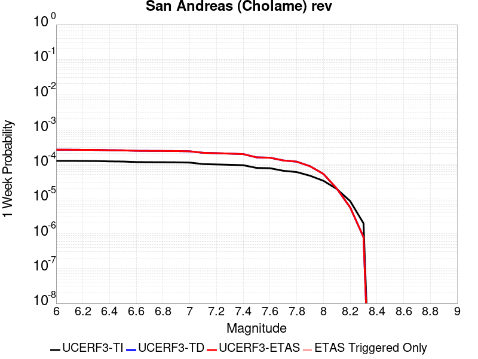 | 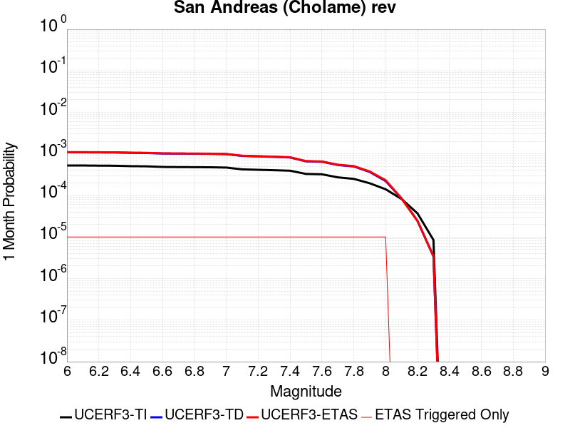 | 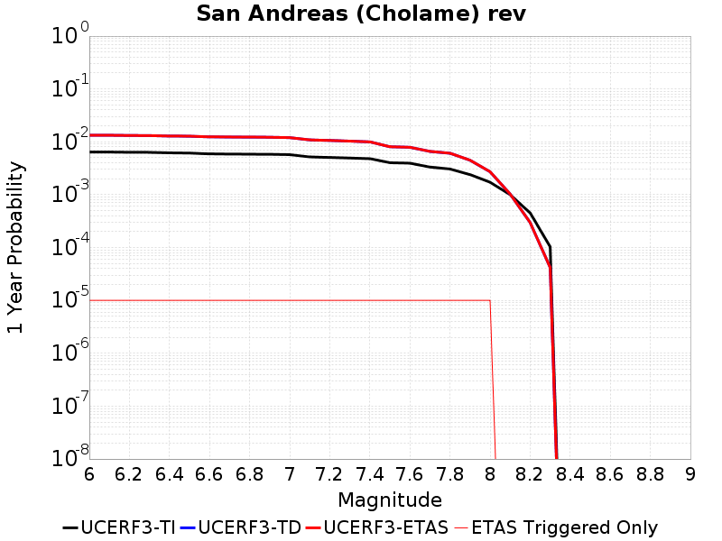 |  |

| Magnitude | 1 wk TI Prob | 1 wk TD Prob | 1 wk ETAS Prob | 1 wk ETAS/TD Gain | 1 wk ETAS Triggered Only | 1 mo TI Prob | 1 mo TD Prob | 1 mo ETAS Prob | 1 mo ETAS/TD Gain | 1 mo ETAS Triggered Only | 1 yr TI Prob | 1 yr TD Prob | 1 yr ETAS Prob | 1 yr ETAS/TD Gain | 1 yr ETAS Triggered Only | 10 yr TI Prob | 10 yr TD Prob | 10 yr ETAS Prob | 10 yr ETAS/TD Gain | 10 yr ETAS Triggered Only |
|-----|-----|-----|-----|-----|-----|-----|-----|-----|-----|-----|-----|-----|-----|-----|-----|-----|-----|-----|-----|-----|
| 6.0 | 1.2302514E-4 | 2.559359E-4 | 2.559359E-4 | 1.0 | 0.0 | 5.27144E-4 | 0.0010964087 | 0.0011063978 | 1.0091107 | 1.0E-5 | 0.0063991086 | 0.013267598 | 0.0132774655 | 1.0007437 | 1.0E-5 | 0.06217949 | 0.12605862 | 0.12606736 | 1.0000694 | 1.0E-5 |
| 6.1 | 1.2302514E-4 | 2.559359E-4 | 2.559359E-4 | 1.0 | 0.0 | 5.27144E-4 | 0.0010964087 | 0.0011063978 | 1.0091107 | 1.0E-5 | 0.0063991086 | 0.013267598 | 0.0132774655 | 1.0007437 | 1.0E-5 | 0.06217949 | 0.12605862 | 0.12606736 | 1.0000694 | 1.0E-5 |
| 6.2 | 1.2203569E-4 | 2.54099E-4 | 2.54099E-4 | 1.0 | 0.0 | 5.2290526E-4 | 0.0010885429 | 0.0010985319 | 1.0091766 | 1.0E-5 | 0.006347804 | 0.0131729925 | 0.01318286 | 1.0007491 | 1.0E-5 | 0.061695136 | 0.12524389 | 0.12525263 | 1.0000699 | 1.0E-5 |
| 6.3 | 1.2142645E-4 | 2.5295574E-4 | 2.5295574E-4 | 1.0 | 0.0 | 5.202953E-4 | 0.0010836473 | 0.0010936364 | 1.0092181 | 1.0E-5 | 0.006316212 | 0.013114108 | 0.013123977 | 1.0007526 | 1.0E-5 | 0.06139677 | 0.12473892 | 0.124747664 | 1.0000702 | 1.0E-5 |
| 6.4 | 1.1865206E-4 | 2.479874E-4 | 2.479874E-4 | 1.0 | 0.0 | 5.0840975E-4 | 0.0010623718 | 0.0010723611 | 1.0094029 | 1.0E-5 | 0.006172335 | 0.012858162 | 0.012868034 | 1.0007677 | 1.0E-5 | 0.060036868 | 0.122528896 | 0.12253767 | 1.0000716 | 1.0E-5 |
| 6.5 | 1.17443946E-4 | 2.4590464E-4 | 2.4590464E-4 | 1.0 | 0.0 | 5.032341E-4 | 0.001053453 | 0.0010634424 | 1.0094826 | 1.0E-5 | 0.006109677 | 0.012750848 | 0.012760721 | 1.0007743 | 1.0E-5 | 0.059444077 | 0.12159618 | 0.121604964 | 1.0000722 | 1.0E-5 |
| 6.6 | 1.13579066E-4 | 2.3894802E-4 | 2.3894802E-4 | 1.0 | 0.0 | 4.866766E-4 | 0.0010236626 | 0.0010336523 | 1.0097588 | 1.0E-5 | 0.0059092017 | 0.01239233 | 0.012402206 | 1.0007969 | 1.0E-5 | 0.057545185 | 0.11849995 | 0.11850876 | 1.0000744 | 1.0E-5 |
| 6.7 | 1.1271412E-4 | 2.3738199E-4 | 2.3738199E-4 | 1.0 | 0.0 | 4.829711E-4 | 0.0010169563 | 0.0010269461 | 1.0098233 | 1.0E-5 | 0.005864331 | 0.012311606 | 0.012321482 | 1.0008023 | 1.0E-5 | 0.057119697 | 0.1178011 | 0.11780992 | 1.0000749 | 1.0E-5 |
| 6.8 | 1.1217975E-4 | 2.3625708E-4 | 2.3625708E-4 | 1.0 | 0.0 | 4.8068175E-4 | 0.001012139 | 0.0010221289 | 1.00987 | 1.0E-5 | 0.005836608 | 0.012253617 | 0.012263495 | 1.0008061 | 1.0E-5 | 0.056856725 | 0.1172967 | 0.11730553 | 1.0000752 | 1.0E-5 |
| 6.9 | 1.1146753E-4 | 2.3473435E-4 | 2.3473435E-4 | 1.0 | 0.0 | 4.7763053E-4 | 0.0010056181 | 0.0010156081 | 1.0099342 | 1.0E-5 | 0.0057996577 | 0.012175116 | 0.012184993 | 1.0008113 | 1.0E-5 | 0.056506127 | 0.11661541 | 0.11662424 | 1.0000757 | 1.0E-5 |
| 7.0 | 1.0965793E-4 | 2.3093756E-4 | 2.3093756E-4 | 1.0 | 0.0 | 4.698779E-4 | 9.893585E-4 | 9.993486E-4 | 1.0100975 | 1.0E-5 | 0.005705768 | 0.011979349 | 0.011989228 | 1.0008248 | 1.0E-5 | 0.055614736 | 0.11490662 | 0.11491547 | 1.000077 | 1.0E-5 |
| 7.1 | 9.927982E-5 | 2.0898775E-4 | 2.0898775E-4 | 1.0 | 0.0 | 4.2541555E-4 | 8.953554E-4 | 9.053465E-4 | 1.0111587 | 1.0E-5 | 0.0051671406 | 0.010846771 | 0.010856663 | 1.000912 | 1.0E-5 | 0.05048634 | 0.10495565 | 0.10496461 | 1.0000852 | 1.0E-5 |
| 7.2 | 9.696786E-5 | 2.0400438E-4 | 2.0400438E-4 | 1.0 | 0.0 | 4.1551032E-4 | 8.7401253E-4 | 8.840038E-4 | 1.0114315 | 1.0E-5 | 0.00504711 | 0.010589476 | 0.010599369 | 1.0009344 | 1.0E-5 | 0.04934009 | 0.10268947 | 0.10269844 | 1.0000874 | 1.0E-5 |
| 7.3 | 9.4727984E-5 | 1.9823964E-4 | 1.9823964E-4 | 1.0 | 0.0 | 4.0591392E-4 | 8.493228E-4 | 8.593143E-4 | 1.011764 | 1.0E-5 | 0.0049308087 | 0.010291757 | 0.010301654 | 1.0009617 | 1.0E-5 | 0.048228268 | 0.1000385 | 0.1000475 | 1.00009 | 1.0E-5 |
| 7.4 | 9.220358E-5 | 1.9187997E-4 | 1.9187997E-4 | 1.0 | 0.0 | 3.9509835E-4 | 8.220845E-4 | 8.320763E-4 | 1.0121542 | 1.0E-5 | 0.004799717 | 0.009963202 | 0.009973103 | 1.0009937 | 1.0E-5 | 0.046973653 | 0.097090356 | 0.097099386 | 1.000093 | 1.0E-5 |
| 7.5 | 7.71631E-5 | 1.5480077E-4 | 1.5480077E-4 | 1.0 | 0.0 | 3.306571E-4 | 6.632634E-4 | 6.7325676E-4 | 1.015067 | 1.0E-5 | 0.0040183207 | 0.008045408 | 0.008055327 | 1.001233 | 1.0E-5 | 0.03946433 | 0.0796413 | 0.07965051 | 1.0001155 | 1.0E-5 |
| 7.6 | 7.5634416E-5 | 1.5135619E-4 | 1.5135619E-4 | 1.0 | 0.0 | 3.241072E-4 | 6.485083E-4 | 6.585018E-4 | 1.01541 | 1.0E-5 | 0.0039388672 | 0.0078670755 | 0.007876997 | 1.0012611 | 1.0E-5 | 0.038697794 | 0.077990256 | 0.07799947 | 1.0001183 | 1.0E-5 |
| 7.7 | 6.3783E-5 | 1.2626428E-4 | 1.2626428E-4 | 1.0 | 0.0 | 2.7332708E-4 | 5.410204E-4 | 5.51015E-4 | 1.0184736 | 1.0E-5 | 0.0033226798 | 0.0065670586 | 0.0065769926 | 1.0015128 | 1.0E-5 | 0.032734364 | 0.06576761 | 0.06577695 | 1.0001421 | 1.0E-5 |
| 7.8 | 5.863422E-5 | 1.1659585E-4 | 1.1659585E-4 | 1.0 | 0.0 | 2.512653E-4 | 4.9960084E-4 | 5.0959585E-4 | 1.020006 | 1.0E-5 | 0.003054864 | 0.0060656983 | 0.006075638 | 1.0016387 | 1.0E-5 | 0.030132094 | 0.060778867 | 0.06078826 | 1.0001545 | 1.0E-5 |
| 7.9 | 4.595283E-5 | 8.6050364E-5 | 8.6050364E-5 | 1.0 | 0.0 | 1.9692584E-4 | 3.6873514E-4 | 3.7873146E-4 | 1.0271097 | 1.0E-5 | 0.0023949358 | 0.0044801165 | 0.004490072 | 1.0022221 | 1.0E-5 | 0.023692891 | 0.04520556 | 0.045215108 | 1.0002112 | 1.0E-5 |
| 8.0 | 3.2950178E-5 | 5.1896655E-5 | 5.1896655E-5 | 1.0 | 0.0 | 1.412074E-4 | 2.2239529E-4 | 2.3239307E-4 | 1.044955 | 1.0E-5 | 0.0017178444 | 0.0027043023 | 0.0027142754 | 1.0036879 | 1.0E-5 | 0.017046256 | 0.027733834 | 0.027743557 | 1.0003506 | 1.0E-5 |
| 8.1 | 1.9177472E-5 | 1.974366E-5 | 1.974366E-5 | 1.0 | 0.0 | 8.218658E-5 | 8.461295E-5 | 8.461295E-5 | 1.0 | 0.0 | 0.0010001622 | 0.0010296764 | 0.0010296764 | 1.0 | 0.0 | 0.009956728 | 0.011051132 | 0.011051132 | 1.0 | 0.0 |
| 8.2 | 8.643924E-6 | 5.683797E-6 | 5.683797E-6 | 1.0 | 0.0 | 3.704486E-5 | 2.4358904E-5 | 2.4358904E-5 | 1.0 | 0.0 | 4.5092785E-4 | 2.9652938E-4 | 2.9652938E-4 | 1.0 | 0.0 | 0.0045001395 | 0.003362901 | 0.003362901 | 1.0 | 0.0 |
| 8.3 | 1.983087E-6 | 8.007468E-7 | 8.007468E-7 | 1.0 | 0.0 | 8.498917E-6 | 3.4317677E-6 | 3.4317677E-6 | 1.0 | 0.0 | 1.034694E-4 | 4.178099E-5 | 4.178099E-5 | 1.0 | 0.0 | 0.0010342124 | 4.9186987E-4 | 4.9186987E-4 | 1.0 | 0.0 |

## San Andreas (San Bernardino N)
*[(top)](#table-of-contents)*

| 1 Week | 1 Month | 1 Year | 10 Year |
|-----|-----|-----|-----|
| 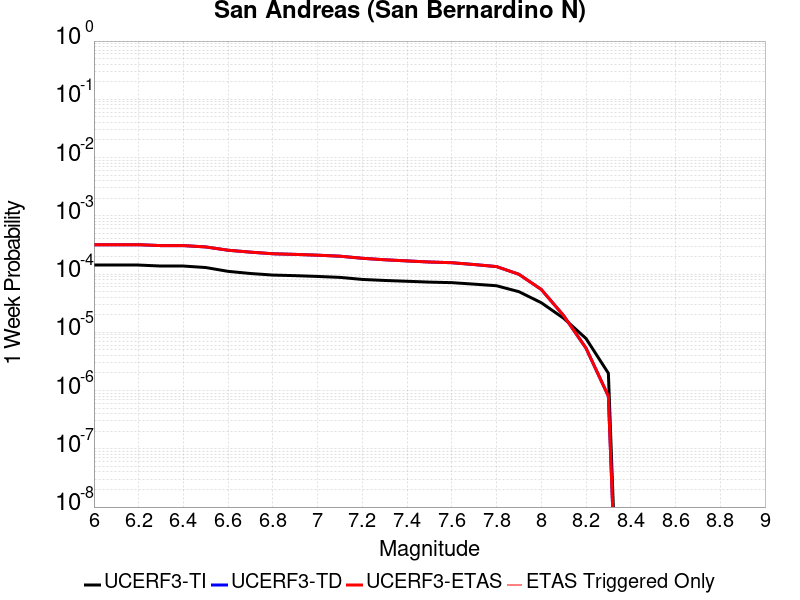 | 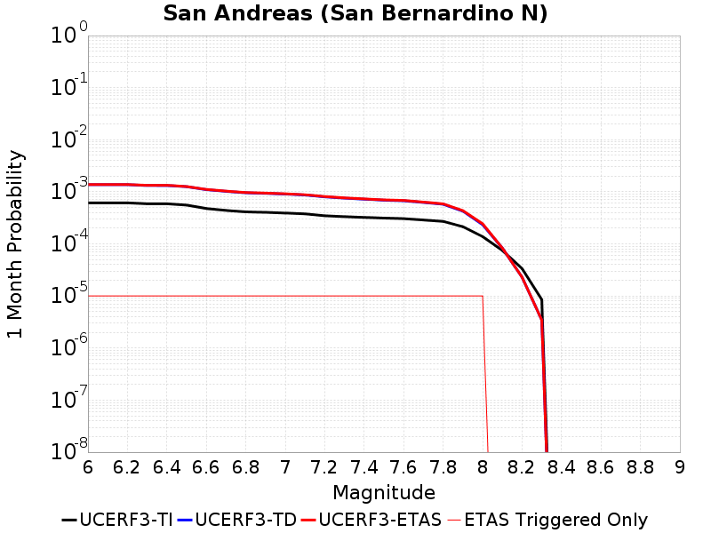 | 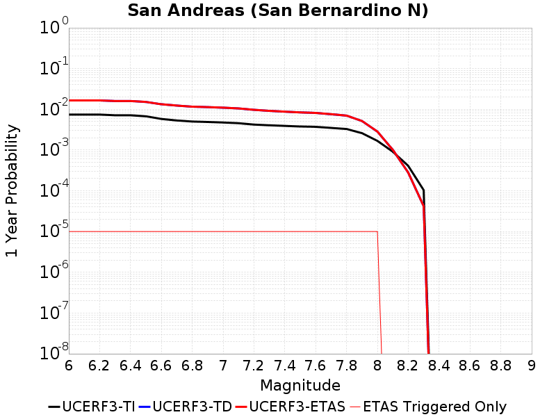 | 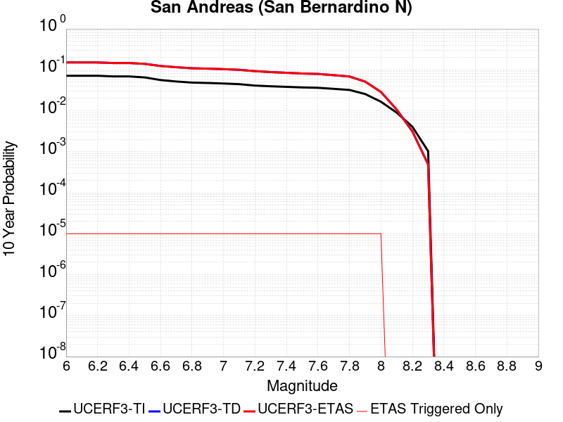 |

| Magnitude | 1 wk TI Prob | 1 wk TD Prob | 1 wk ETAS Prob | 1 wk ETAS/TD Gain | 1 wk ETAS Triggered Only | 1 mo TI Prob | 1 mo TD Prob | 1 mo ETAS Prob | 1 mo ETAS/TD Gain | 1 mo ETAS Triggered Only | 1 yr TI Prob | 1 yr TD Prob | 1 yr ETAS Prob | 1 yr ETAS/TD Gain | 1 yr ETAS Triggered Only | 10 yr TI Prob | 10 yr TD Prob | 10 yr ETAS Prob | 10 yr ETAS/TD Gain | 10 yr ETAS Triggered Only |
|-----|-----|-----|-----|-----|-----|-----|-----|-----|-----|-----|-----|-----|-----|-----|-----|-----|-----|-----|-----|-----|
| 6.0 | 1.4273766E-4 | 3.1903756E-4 | 3.1903756E-4 | 1.0 | 0.0 | 6.115894E-4 | 0.0013665933 | 0.0013765796 | 1.0073074 | 1.0E-5 | 0.0074207084 | 0.016512858 | 0.016522693 | 1.0005956 | 1.0E-5 | 0.07177748 | 0.15149045 | 0.15149894 | 1.000056 | 1.0E-5 |
| 6.1 | 1.4273766E-4 | 3.1903756E-4 | 3.1903756E-4 | 1.0 | 0.0 | 6.115894E-4 | 0.0013665933 | 0.0013765796 | 1.0073074 | 1.0E-5 | 0.0074207084 | 0.016512858 | 0.016522693 | 1.0005956 | 1.0E-5 | 0.07177748 | 0.15149045 | 0.15149894 | 1.000056 | 1.0E-5 |
| 6.2 | 1.4273766E-4 | 3.1903756E-4 | 3.1903756E-4 | 1.0 | 0.0 | 6.115894E-4 | 0.0013665933 | 0.0013765796 | 1.0073074 | 1.0E-5 | 0.0074207084 | 0.016512858 | 0.016522693 | 1.0005956 | 1.0E-5 | 0.07177748 | 0.15149045 | 0.15149894 | 1.000056 | 1.0E-5 |
| 6.3 | 1.3730655E-4 | 3.0807106E-4 | 3.0807106E-4 | 1.0 | 0.0 | 5.883239E-4 | 0.0013196422 | 0.001329629 | 1.0075678 | 1.0E-5 | 0.0071393442 | 0.0159497 | 0.015959542 | 1.000617 | 1.0E-5 | 0.06914291 | 0.14678681 | 0.14679533 | 1.0000582 | 1.0E-5 |
| 6.4 | 1.3730655E-4 | 3.0807106E-4 | 3.0807106E-4 | 1.0 | 0.0 | 5.883239E-4 | 0.0013196422 | 0.001329629 | 1.0075678 | 1.0E-5 | 0.0071393442 | 0.0159497 | 0.015959542 | 1.000617 | 1.0E-5 | 0.06914291 | 0.14678681 | 0.14679533 | 1.0000582 | 1.0E-5 |
| 6.5 | 1.2942807E-4 | 2.921945E-4 | 2.921945E-4 | 1.0 | 0.0 | 5.545738E-4 | 0.0012516665 | 0.0012616538 | 1.0079794 | 1.0E-5 | 0.0067310524 | 0.01513382 | 0.015143668 | 1.0006508 | 1.0E-5 | 0.06530788 | 0.13992606 | 0.13993466 | 1.0000615 | 1.0E-5 |
| 6.6 | 1.1125901E-4 | 2.5652538E-4 | 2.5652538E-4 | 1.0 | 0.0 | 4.767372E-4 | 0.0010989335 | 0.0011089225 | 1.0090897 | 1.0E-5 | 0.005788839 | 0.01329808 | 0.013307947 | 1.000742 | 1.0E-5 | 0.056403454 | 0.12422872 | 0.124237485 | 1.0000705 | 1.0E-5 |
| 6.7 | 1.02209575E-4 | 2.378541E-4 | 2.378541E-4 | 1.0 | 0.0 | 4.3796748E-4 | 0.0010189778 | 0.0010289677 | 1.0098038 | 1.0E-5 | 0.0053192247 | 0.012335917 | 0.012345794 | 1.0008006 | 1.0E-5 | 0.051936906 | 0.11601077 | 0.116019614 | 1.0000762 | 1.0E-5 |
| 6.8 | 9.610582E-5 | 2.2307251E-4 | 2.2307251E-4 | 1.0 | 0.0 | 4.1181705E-4 | 9.556755E-4 | 9.656659E-4 | 1.0104538 | 1.0E-5 | 0.0050023515 | 0.011573547 | 0.011583432 | 1.000854 | 1.0E-5 | 0.048912346 | 0.10941533 | 0.10942424 | 1.0000814 | 1.0E-5 |
| 6.9 | 9.3877505E-5 | 2.1761615E-4 | 2.1761615E-4 | 1.0 | 0.0 | 4.0227012E-4 | 9.32308E-4 | 9.422986E-4 | 1.0107161 | 1.0E-5 | 0.0048866454 | 0.011292026 | 0.011301913 | 1.0008756 | 1.0E-5 | 0.04780577 | 0.10700011 | 0.107009046 | 1.0000834 | 1.0E-5 |
| 7.0 | 9.1019785E-5 | 2.1086734E-4 | 2.1086734E-4 | 1.0 | 0.0 | 3.900265E-4 | 9.034047E-4 | 9.133957E-4 | 1.0110593 | 1.0E-5 | 0.0047382377 | 0.0109437145 | 0.010953605 | 1.0009037 | 1.0E-5 | 0.046384744 | 0.103965744 | 0.1039747 | 1.0000862 | 1.0E-5 |
| 7.1 | 8.771155E-5 | 2.025921E-4 | 2.025921E-4 | 1.0 | 0.0 | 3.758525E-4 | 8.679635E-4 | 8.7795476E-4 | 1.0115112 | 1.0E-5 | 0.0045664064 | 0.010516455 | 0.01052635 | 1.0009409 | 1.0E-5 | 0.044737056 | 0.1002758 | 0.10028479 | 1.0000898 | 1.0E-5 |
| 7.2 | 8.0830236E-5 | 1.8660576E-4 | 1.8660576E-4 | 1.0 | 0.0 | 3.4636928E-4 | 7.9949404E-4 | 8.09486E-4 | 1.0124979 | 1.0E-5 | 0.0042088944 | 0.009690507 | 0.00970041 | 1.001022 | 1.0E-5 | 0.041300658 | 0.092993 | 0.09300207 | 1.0000975 | 1.0E-5 |
| 7.3 | 7.7668235E-5 | 1.7599267E-4 | 1.7599267E-4 | 1.0 | 0.0 | 3.328214E-4 | 7.540363E-4 | 7.640288E-4 | 1.013252 | 1.0E-5 | 0.0040445733 | 0.009141832 | 0.009151741 | 1.0010839 | 1.0E-5 | 0.03971748 | 0.0882464 | 0.08825552 | 1.0001034 | 1.0E-5 |
| 7.4 | 7.520177E-5 | 1.6815656E-4 | 1.6815656E-4 | 1.0 | 0.0 | 3.2225347E-4 | 7.20472E-4 | 7.304648E-4 | 1.0138698 | 1.0E-5 | 0.0039163795 | 0.008736538 | 0.00874645 | 1.0011346 | 1.0E-5 | 0.038480744 | 0.08469451 | 0.08470367 | 1.0001081 | 1.0E-5 |
| 7.5 | 7.274697E-5 | 1.6099829E-4 | 1.6099829E-4 | 1.0 | 0.0 | 3.1173544E-4 | 6.8981026E-4 | 6.9980335E-4 | 1.0144868 | 1.0E-5 | 0.003788775 | 0.008366159 | 0.008376075 | 1.0011853 | 1.0E-5 | 0.03724827 | 0.08140123 | 0.081410415 | 1.0001129 | 1.0E-5 |
| 7.6 | 7.1185845E-5 | 1.5667448E-4 | 1.5667448E-4 | 1.0 | 0.0 | 3.0504653E-4 | 6.7128934E-4 | 6.812826E-4 | 1.0148867 | 1.0E-5 | 0.0037076178 | 0.008142375 | 0.008152294 | 1.0012182 | 1.0E-5 | 0.036463667 | 0.07938428 | 0.07939349 | 1.000116 | 1.0E-5 |
| 7.7 | 6.709961E-5 | 1.4570206E-4 | 1.4570206E-4 | 1.0 | 0.0 | 2.8753807E-4 | 6.2428793E-4 | 6.342817E-4 | 1.0160083 | 1.0E-5 | 0.003495157 | 0.0075742584 | 0.0075841825 | 1.0013102 | 1.0E-5 | 0.034406938 | 0.07419217 | 0.07420142 | 1.0001248 | 1.0E-5 |
| 7.8 | 6.300812E-5 | 1.3441214E-4 | 1.3441214E-4 | 1.0 | 0.0 | 2.7000686E-4 | 5.7592493E-4 | 5.8591913E-4 | 1.0173534 | 1.0E-5 | 0.0032823787 | 0.006989373 | 0.006999303 | 1.0014207 | 1.0E-5 | 0.032343175 | 0.06879882 | 0.06880813 | 1.0001353 | 1.0E-5 |
| 7.9 | 4.983037E-5 | 9.912027E-5 | 9.912027E-5 | 1.0 | 0.0 | 2.1354125E-4 | 4.24732E-4 | 4.3472776E-4 | 1.0235343 | 1.0E-5 | 0.0025967648 | 0.005158862 | 0.0051688105 | 1.0019284 | 1.0E-5 | 0.025666296 | 0.05152741 | 0.051536895 | 1.000184 | 1.0E-5 |
| 8.0 | 3.2211527E-5 | 5.441774E-5 | 5.441774E-5 | 1.0 | 0.0 | 1.380421E-4 | 2.3319804E-4 | 2.431957E-4 | 1.042872 | 1.0E-5 | 0.0016793669 | 0.0028354914 | 0.002845463 | 1.0035167 | 1.0E-5 | 0.016667323 | 0.02890437 | 0.028914081 | 1.0003359 | 1.0E-5 |
| 8.1 | 1.743376E-5 | 1.9346886E-5 | 1.9346886E-5 | 1.0 | 0.0 | 7.471398E-5 | 8.291259E-5 | 8.291259E-5 | 1.0 | 0.0 | 9.0926304E-4 | 0.0010089941 | 0.0010089941 | 1.0 | 0.0 | 0.009055517 | 0.010755678 | 0.010755678 | 1.0 | 0.0 |
| 8.2 | 7.831616E-6 | 5.3467506E-6 | 5.3467506E-6 | 1.0 | 0.0 | 3.3563636E-5 | 2.2914444E-5 | 2.2914444E-5 | 1.0 | 0.0 | 4.0856065E-4 | 2.7894773E-4 | 2.7894773E-4 | 1.0 | 0.0 | 0.004078103 | 0.0031459853 | 0.0031459853 | 1.0 | 0.0 |
| 8.3 | 1.983087E-6 | 8.007468E-7 | 8.007468E-7 | 1.0 | 0.0 | 8.498917E-6 | 3.4317677E-6 | 3.4317677E-6 | 1.0 | 0.0 | 1.034694E-4 | 4.178099E-5 | 4.178099E-5 | 1.0 | 0.0 | 0.0010342124 | 4.9186987E-4 | 4.9186987E-4 | 1.0 | 0.0 |

## San Jacinto (Borrego)
*[(top)](#table-of-contents)*

| 1 Week | 1 Month | 1 Year | 10 Year |
|-----|-----|-----|-----|
|  |  |  |  |

| Magnitude | 1 wk TI Prob | 1 wk TD Prob | 1 wk ETAS Prob | 1 wk ETAS/TD Gain | 1 wk ETAS Triggered Only | 1 mo TI Prob | 1 mo TD Prob | 1 mo ETAS Prob | 1 mo ETAS/TD Gain | 1 mo ETAS Triggered Only | 1 yr TI Prob | 1 yr TD Prob | 1 yr ETAS Prob | 1 yr ETAS/TD Gain | 1 yr ETAS Triggered Only | 10 yr TI Prob | 10 yr TD Prob | 10 yr ETAS Prob | 10 yr ETAS/TD Gain | 10 yr ETAS Triggered Only |
|-----|-----|-----|-----|-----|-----|-----|-----|-----|-----|-----|-----|-----|-----|-----|-----|-----|-----|-----|-----|-----|
| 6.0 | 3.543992E-5 | 2.8266526E-5 | 2.8266526E-5 | 1.0 | 0.0 | 1.5187653E-4 | 1.211367E-4 | 1.211367E-4 | 1.0 | 0.0 | 0.0018475284 | 0.001473854 | 0.001473854 | 1.0 | 0.0 | 0.018322436 | 0.0150465295 | 0.015056378 | 1.0006546 | 1.0E-5 |
| 6.1 | 3.542281E-5 | 2.8266526E-5 | 2.8266526E-5 | 1.0 | 0.0 | 1.5180321E-4 | 1.211367E-4 | 1.211367E-4 | 1.0 | 0.0 | 0.0018466372 | 0.001473854 | 0.001473854 | 1.0 | 0.0 | 0.018313672 | 0.0150465295 | 0.015056378 | 1.0006546 | 1.0E-5 |
| 6.2 | 3.4688688E-5 | 2.8266526E-5 | 2.8266526E-5 | 1.0 | 0.0 | 1.4865733E-4 | 1.211367E-4 | 1.211367E-4 | 1.0 | 0.0 | 0.0018084005 | 0.001473854 | 0.001473854 | 1.0 | 0.0 | 0.017937548 | 0.015046529 | 0.015056378 | 1.0006546 | 1.0E-5 |
| 6.3 | 3.2087122E-5 | 2.8111679E-5 | 2.8111679E-5 | 1.0 | 0.0 | 1.3750899E-4 | 1.2047313E-4 | 1.2047313E-4 | 1.0 | 0.0 | 0.0016728862 | 0.0014657858 | 0.0014657858 | 1.0 | 0.0 | 0.016603488 | 0.014967603 | 0.014977453 | 1.0006582 | 1.0E-5 |
| 6.4 | 3.1828724E-5 | 2.80786E-5 | 2.80786E-5 | 1.0 | 0.0 | 1.364017E-4 | 1.2033138E-4 | 1.2033138E-4 | 1.0 | 0.0 | 0.0016594254 | 0.0014640624 | 0.0014640624 | 1.0 | 0.0 | 0.016470885 | 0.014950773 | 0.014960622 | 1.0006589 | 1.0E-5 |
| 6.5 | 3.1563577E-5 | 2.7817592E-5 | 2.7817592E-5 | 1.0 | 0.0 | 1.3526545E-4 | 1.1921288E-4 | 1.1921288E-4 | 1.0 | 0.0 | 0.0016456128 | 0.0014504627 | 0.0014504627 | 1.0 | 0.0 | 0.0163348 | 0.014816515 | 0.014826368 | 1.000665 | 1.0E-5 |
| 6.6 | 3.1467625E-5 | 2.7661226E-5 | 2.7661226E-5 | 1.0 | 0.0 | 1.3485427E-4 | 1.1854279E-4 | 1.1854279E-4 | 1.0 | 0.0 | 0.0016406142 | 0.0014423153 | 0.0014423153 | 1.0 | 0.0 | 0.016285548 | 0.014736409 | 0.014746262 | 1.0006686 | 1.0E-5 |
| 6.7 | 3.1223695E-5 | 2.7278638E-5 | 2.7278638E-5 | 1.0 | 0.0 | 1.3380898E-4 | 1.16903284E-4 | 1.16903284E-4 | 1.0 | 0.0 | 0.0016279068 | 0.0014223804 | 0.0014223804 | 1.0 | 0.0 | 0.01616033 | 0.014540374 | 0.014550229 | 1.0006777 | 1.0E-5 |
| 6.8 | 3.1015585E-5 | 2.709897E-5 | 2.709897E-5 | 1.0 | 0.0 | 1.3291716E-4 | 1.1613334E-4 | 1.1613334E-4 | 1.0 | 0.0 | 0.001617065 | 0.0014130186 | 0.0014130186 | 1.0 | 0.0 | 0.016053487 | 0.01444733 | 0.014457185 | 1.0006821 | 1.0E-5 |
| 6.9 | 2.6641965E-5 | 2.2502854E-5 | 2.2502854E-5 | 1.0 | 0.0 | 1.1417485E-4 | 9.643726E-5 | 9.643726E-5 | 1.0 | 0.0 | 0.0013891924 | 0.0011734952 | 0.0011734952 | 1.0 | 0.0 | 0.0138054015 | 0.01204921 | 0.01205909 | 1.0008199 | 1.0E-5 |
| 7.0 | 2.3854353E-5 | 2.0787507E-5 | 2.0787507E-5 | 1.0 | 0.0 | 1.02228936E-4 | 8.908629E-5 | 8.908629E-5 | 1.0 | 0.0 | 0.0012439266 | 0.0010840885 | 0.0010840885 | 1.0 | 0.0 | 0.012369866 | 0.011144552 | 0.011154441 | 1.0008873 | 1.0E-5 |
| 7.1 | 2.3672901E-5 | 2.0623705E-5 | 2.0623705E-5 | 1.0 | 0.0 | 1.0145135E-4 | 8.838433E-5 | 8.838433E-5 | 1.0 | 0.0 | 0.0012344702 | 0.0010755507 | 0.0010755507 | 1.0 | 0.0 | 0.0122763505 | 0.011059558 | 0.011069447 | 1.0008942 | 1.0E-5 |
| 7.2 | 2.2717244E-5 | 1.9848838E-5 | 1.9848838E-5 | 1.0 | 0.0 | 9.735599E-5 | 8.5063686E-5 | 8.5063686E-5 | 1.0 | 0.0 | 0.0011846646 | 0.0010351607 | 0.0010351607 | 1.0 | 0.0 | 0.01178369 | 0.010655772 | 0.010665665 | 1.0009284 | 1.0E-5 |
| 7.3 | 2.1016205E-5 | 1.8686704E-5 | 1.8686704E-5 | 1.0 | 0.0 | 9.006634E-5 | 8.008343E-5 | 8.008343E-5 | 1.0 | 0.0 | 0.001096006 | 9.745817E-4 | 9.745817E-4 | 1.0 | 0.0 | 0.010906163 | 0.010049641 | 0.01005954 | 1.000985 | 1.0E-5 |
| 7.4 | 2.0683625E-5 | 1.8488447E-5 | 1.8488447E-5 | 1.0 | 0.0 | 8.86411E-5 | 7.92338E-5 | 7.92338E-5 | 1.0 | 0.0 | 0.001078671 | 9.6424675E-4 | 9.6424675E-4 | 1.0 | 0.0 | 0.010734501 | 0.009945973 | 0.009955874 | 1.0009954 | 1.0E-5 |
| 7.5 | 1.9993966E-5 | 1.808091E-5 | 1.808091E-5 | 1.0 | 0.0 | 8.568561E-5 | 7.748732E-5 | 7.748732E-5 | 1.0 | 0.0 | 0.001042723 | 9.430018E-4 | 9.430018E-4 | 1.0 | 0.0 | 0.010378438 | 0.009731612 | 0.009741515 | 1.0010176 | 1.0E-5 |
| 7.6 | 1.788966E-5 | 1.6722408E-5 | 1.6722408E-5 | 1.0 | 0.0 | 7.666772E-5 | 7.1665505E-5 | 7.1665505E-5 | 1.0 | 0.0 | 9.3302975E-4 | 8.7218E-4 | 8.7218E-4 | 1.0 | 0.0 | 0.00929122 | 0.009017453 | 0.009027363 | 1.001099 | 1.0E-5 |
| 7.7 | 1.5125781E-5 | 1.4515723E-5 | 1.4515723E-5 | 1.0 | 0.0 | 6.4823165E-5 | 6.220876E-5 | 6.220876E-5 | 1.0 | 0.0 | 7.889362E-4 | 7.5712934E-4 | 7.5712934E-4 | 1.0 | 0.0 | 0.007861412 | 0.007860734 | 0.007860734 | 1.0 | 0.0 |
| 7.8 | 1.250089E-5 | 1.2897328E-5 | 1.2897328E-5 | 1.0 | 0.0 | 5.3574146E-5 | 5.5273096E-5 | 5.5273096E-5 | 1.0 | 0.0 | 6.5207E-4 | 6.7274284E-4 | 6.7274284E-4 | 1.0 | 0.0 | 0.006501599 | 0.007008176 | 0.007008176 | 1.0 | 0.0 |
| 7.9 | 9.561E-6 | 9.9869785E-6 | 9.9869785E-6 | 1.0 | 0.0 | 4.0975072E-5 | 4.280064E-5 | 4.280064E-5 | 1.0 | 0.0 | 4.987573E-4 | 5.2097376E-4 | 5.2097376E-4 | 1.0 | 0.0 | 0.0049763937 | 0.0054751732 | 0.0054751732 | 1.0 | 0.0 |
| 8.0 | 8.01699E-6 | 8.503995E-6 | 8.503995E-6 | 1.0 | 0.0 | 3.4358076E-5 | 3.6445184E-5 | 3.6445184E-5 | 1.0 | 0.0 | 4.1822926E-4 | 4.4363033E-4 | 4.4363033E-4 | 1.0 | 0.0 | 0.0041744304 | 0.0046847775 | 0.0046847775 | 1.0 | 0.0 |
| 8.1 | 6.541947E-6 | 6.6321454E-6 | 6.6321454E-6 | 1.0 | 0.0 | 2.8036617E-5 | 2.8423174E-5 | 2.8423174E-5 | 1.0 | 0.0 | 3.4129233E-4 | 3.4599772E-4 | 3.4599772E-4 | 1.0 | 0.0 | 0.0034076865 | 0.003670945 | 0.003670945 | 1.0 | 0.0 |
| 8.2 | 1.7968189E-6 | 8.297333E-7 | 8.297333E-7 | 1.0 | 0.0 | 7.70063E-6 | 3.5559954E-6 | 3.5559954E-6 | 1.0 | 0.0 | 9.3751136E-5 | 4.3293407E-5 | 4.3293407E-5 | 1.0 | 0.0 | 9.371159E-4 | 4.8955804E-4 | 4.8955804E-4 | 1.0 | 0.0 |
| 8.3 | 1.5167889E-7 | 5.1530144E-8 | 5.1530144E-8 | 1.0 | 0.0 | 6.500522E-7 | 2.2084346E-7 | 2.2084346E-7 | 1.0 | 0.0 | 7.9143565E-6 | 2.6887662E-6 | 2.6887662E-6 | 1.0 | 0.0 | 7.914075E-5 | 3.1167798E-5 | 3.1167798E-5 | 1.0 | 0.0 |

## Tank Canyon
*[(top)](#table-of-contents)*

| 1 Week | 1 Month | 1 Year | 10 Year |
|-----|-----|-----|-----|
| 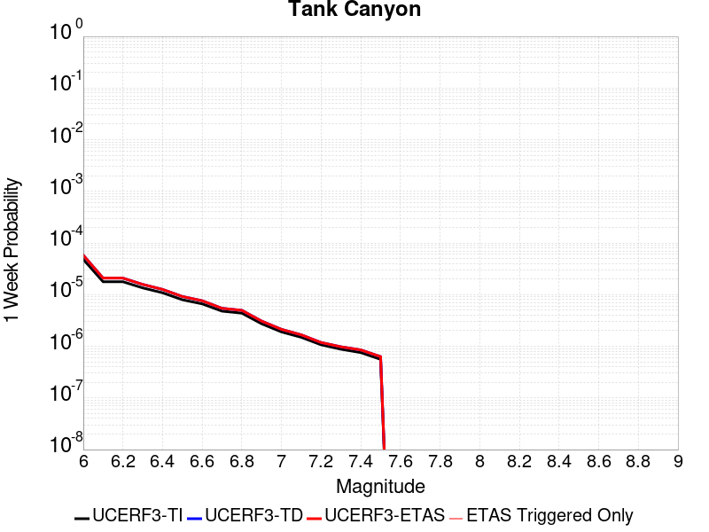 | 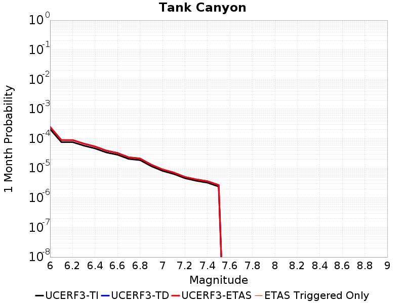 | 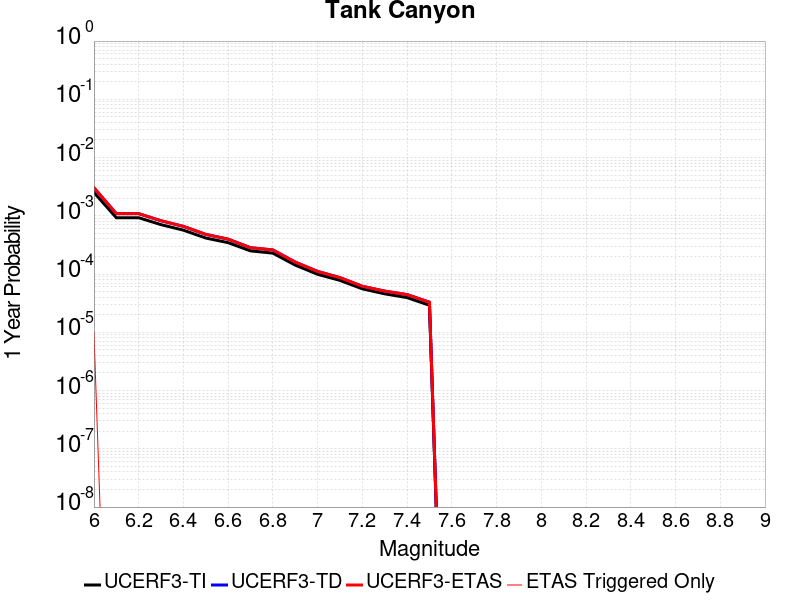 | 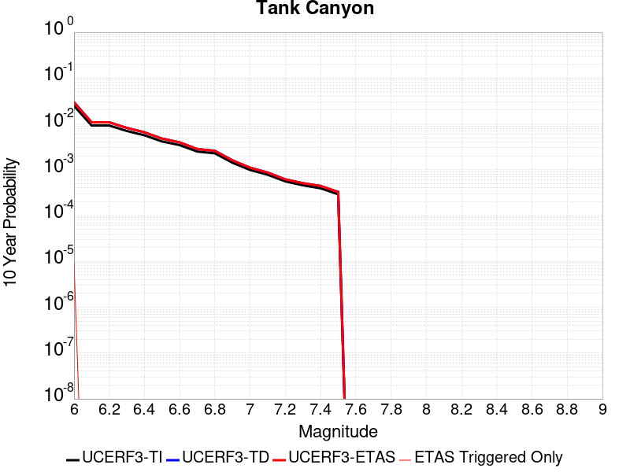 |

| Magnitude | 1 wk TI Prob | 1 wk TD Prob | 1 wk ETAS Prob | 1 wk ETAS/TD Gain | 1 wk ETAS Triggered Only | 1 mo TI Prob | 1 mo TD Prob | 1 mo ETAS Prob | 1 mo ETAS/TD Gain | 1 mo ETAS Triggered Only | 1 yr TI Prob | 1 yr TD Prob | 1 yr ETAS Prob | 1 yr ETAS/TD Gain | 1 yr ETAS Triggered Only | 10 yr TI Prob | 10 yr TD Prob | 10 yr ETAS Prob | 10 yr ETAS/TD Gain | 10 yr ETAS Triggered Only |
|-----|-----|-----|-----|-----|-----|-----|-----|-----|-----|-----|-----|-----|-----|-----|-----|-----|-----|-----|-----|-----|
| 6.0 | 4.8284557E-5 | 5.802642E-5 | 5.802642E-5 | 1.0 | 0.0 | 2.0691741E-4 | 2.486648E-4 | 2.486648E-4 | 1.0 | 0.0 | 0.0025163088 | 0.0030239564 | 0.003033926 | 1.003297 | 1.0E-5 | 0.02488006 | 0.029895037 | 0.029904738 | 1.0003245 | 1.0E-5 |
| 6.1 | 1.7796336E-5 | 2.0893045E-5 | 2.0893045E-5 | 1.0 | 0.0 | 7.626778E-5 | 8.9538764E-5 | 8.9538764E-5 | 1.0 | 0.0 | 9.281647E-4 | 0.0010896276 | 0.0010896276 | 1.0 | 0.0 | 0.009242975 | 0.010846769 | 0.010846769 | 1.0 | 0.0 |
| 6.2 | 1.7796336E-5 | 2.0893045E-5 | 2.0893045E-5 | 1.0 | 0.0 | 7.626778E-5 | 8.9538764E-5 | 8.9538764E-5 | 1.0 | 0.0 | 9.281647E-4 | 0.0010896276 | 0.0010896276 | 1.0 | 0.0 | 0.009242975 | 0.010846769 | 0.010846769 | 1.0 | 0.0 |
| 6.3 | 1.3515912E-5 | 1.5774076E-5 | 1.5774076E-5 | 1.0 | 0.0 | 5.792405E-5 | 6.760156E-5 | 6.760156E-5 | 1.0 | 0.0 | 7.049971E-4 | 8.2276197E-4 | 8.2276197E-4 | 1.0 | 0.0 | 0.007027647 | 0.008199598 | 0.008199598 | 1.0 | 0.0 |
| 6.4 | 1.0870146E-5 | 1.2629439E-5 | 1.2629439E-5 | 1.0 | 0.0 | 4.658551E-5 | 5.4125147E-5 | 5.4125147E-5 | 1.0 | 0.0 | 5.67031E-4 | 6.5879215E-4 | 6.5879215E-4 | 1.0 | 0.0 | 0.005655863 | 0.006570228 | 0.006570228 | 1.0 | 0.0 |
| 6.5 | 7.964826E-6 | 9.2043265E-6 | 9.2043265E-6 | 1.0 | 0.0 | 3.4134522E-5 | 3.9446575E-5 | 3.9446575E-5 | 1.0 | 0.0 | 4.1550855E-4 | 4.801668E-4 | 4.801668E-4 | 1.0 | 0.0 | 0.0041473247 | 0.0047924113 | 0.0047924113 | 1.0 | 0.0 |
| 6.6 | 6.6317E-6 | 7.619025E-6 | 7.619025E-6 | 1.0 | 0.0 | 2.8421264E-5 | 3.2652606E-5 | 3.2652606E-5 | 1.0 | 0.0 | 3.4597394E-4 | 3.9748207E-4 | 3.9748207E-4 | 1.0 | 0.0 | 0.0034543579 | 0.00396868 | 0.00396868 | 1.0 | 0.0 |
| 6.7 | 4.793663E-6 | 5.4354878E-6 | 5.4354878E-6 | 1.0 | 0.0 | 2.0544108E-5 | 2.3294764E-5 | 2.3294764E-5 | 1.0 | 0.0 | 2.500958E-4 | 2.8358123E-4 | 2.8358123E-4 | 1.0 | 0.0 | 0.0024981452 | 0.0028327003 | 0.0028327003 | 1.0 | 0.0 |
| 6.8 | 4.382823E-6 | 4.97357E-6 | 4.97357E-6 | 1.0 | 0.0 | 1.8783392E-5 | 2.131515E-5 | 2.131515E-5 | 1.0 | 0.0 | 2.286638E-4 | 2.5948533E-4 | 2.5948533E-4 | 1.0 | 0.0 | 0.0022842865 | 0.0025923061 | 0.0025923061 | 1.0 | 0.0 |
| 6.9 | 2.729601E-6 | 3.0765998E-6 | 3.0765998E-6 | 1.0 | 0.0 | 1.1698237E-5 | 1.3185368E-5 | 1.3185368E-5 | 1.0 | 0.0 | 1.4241673E-4 | 1.6052125E-4 | 1.6052125E-4 | 1.0 | 0.0 | 0.001423255 | 0.0016042575 | 0.0016042575 | 1.0 | 0.0 |
| 7.0 | 1.8987357E-6 | 2.1292992E-6 | 2.1292992E-6 | 1.0 | 0.0 | 8.137413E-6 | 9.125541E-6 | 9.125541E-6 | 1.0 | 0.0 | 9.90685E-5 | 1.1109849E-4 | 1.1109849E-4 | 1.0 | 0.0 | 9.902435E-4 | 0.0011104982 | 0.0011104982 | 1.0 | 0.0 |
| 7.1 | 1.4928986E-6 | 1.6652963E-6 | 1.6652963E-6 | 1.0 | 0.0 | 6.398121E-6 | 7.1369677E-6 | 7.1369677E-6 | 1.0 | 0.0 | 7.789434E-5 | 8.688971E-5 | 8.688971E-5 | 1.0 | 0.0 | 7.786704E-4 | 8.686153E-4 | 8.686153E-4 | 1.0 | 0.0 |
| 7.2 | 1.069082E-6 | 1.1832976E-6 | 1.1832976E-6 | 1.0 | 0.0 | 4.581772E-6 | 5.0712683E-6 | 5.0712683E-6 | 1.0 | 0.0 | 5.5781646E-5 | 6.174148E-5 | 6.174148E-5 | 1.0 | 0.0 | 5.576765E-4 | 6.172955E-4 | 6.172955E-4 | 1.0 | 0.0 |
| 7.3 | 8.776551E-7 | 9.773709E-7 | 9.773709E-7 | 1.0 | 0.0 | 3.7613736E-6 | 4.1887283E-6 | 4.1887283E-6 | 1.0 | 0.0 | 4.579376E-5 | 5.0997096E-5 | 5.0997096E-5 | 1.0 | 0.0 | 4.5784327E-4 | 5.09905E-4 | 5.09905E-4 | 1.0 | 0.0 |
| 7.4 | 7.55721E-7 | 8.511933E-7 | 8.511933E-7 | 1.0 | 0.0 | 3.2388E-6 | 3.6479692E-6 | 3.6479692E-6 | 1.0 | 0.0 | 3.9431678E-5 | 4.441364E-5 | 4.441364E-5 | 1.0 | 0.0 | 3.942468E-4 | 4.440985E-4 | 4.440985E-4 | 1.0 | 0.0 |
| 7.5 | 5.587665E-7 | 6.3068524E-7 | 6.3068524E-7 | 1.0 | 0.0 | 2.3947114E-6 | 2.7029369E-6 | 2.7029369E-6 | 1.0 | 0.0 | 2.915522E-5 | 3.2908254E-5 | 3.2908254E-5 | 1.0 | 0.0 | 2.9151395E-4 | 3.2908254E-4 | 3.2908254E-4 | 1.0 | 0.0 |

## San Andreas (Parkfield)
*[(top)](#table-of-contents)*

| 1 Week | 1 Month | 1 Year | 10 Year |
|-----|-----|-----|-----|
| 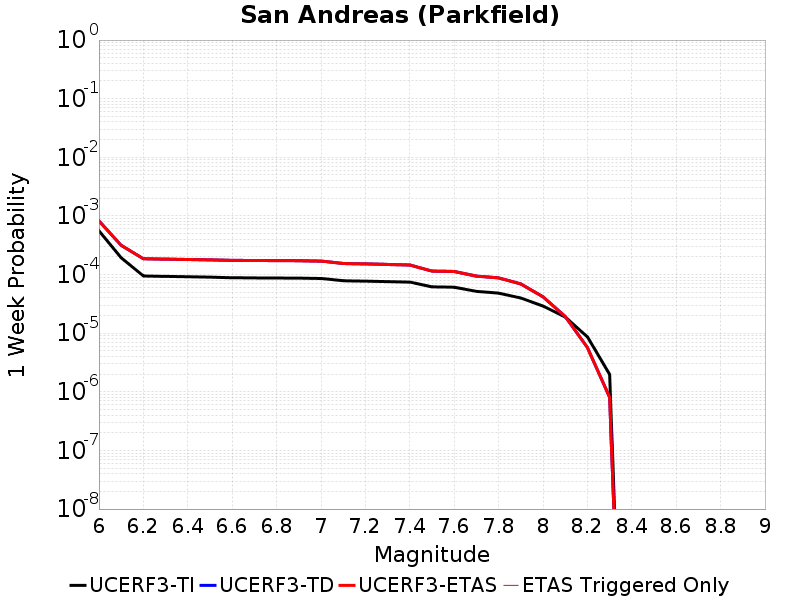 | 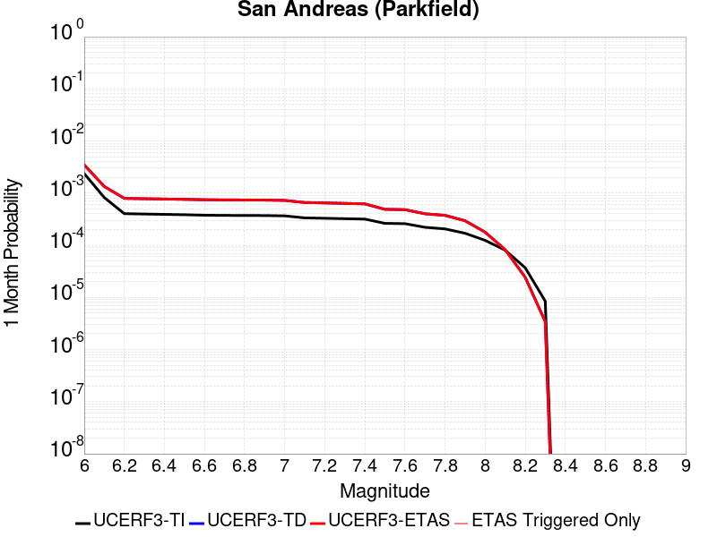 | 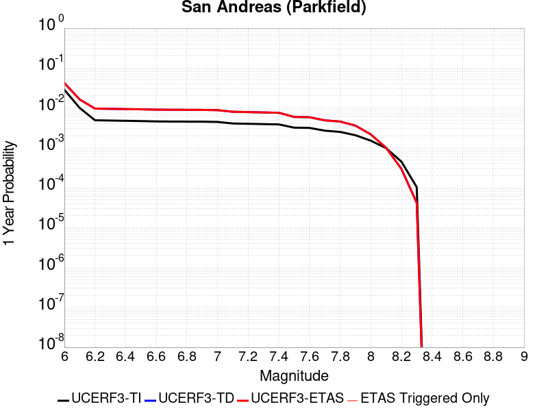 | 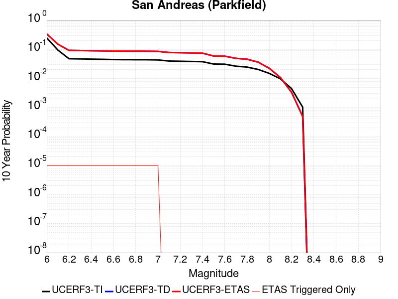 |

| Magnitude | 1 wk TI Prob | 1 wk TD Prob | 1 wk ETAS Prob | 1 wk ETAS/TD Gain | 1 wk ETAS Triggered Only | 1 mo TI Prob | 1 mo TD Prob | 1 mo ETAS Prob | 1 mo ETAS/TD Gain | 1 mo ETAS Triggered Only | 1 yr TI Prob | 1 yr TD Prob | 1 yr ETAS Prob | 1 yr ETAS/TD Gain | 1 yr ETAS Triggered Only | 10 yr TI Prob | 10 yr TD Prob | 10 yr ETAS Prob | 10 yr ETAS/TD Gain | 10 yr ETAS Triggered Only |
|-----|-----|-----|-----|-----|-----|-----|-----|-----|-----|-----|-----|-----|-----|-----|-----|-----|-----|-----|-----|-----|
| 6.0 | 5.556969E-4 | 8.17164E-4 | 8.17164E-4 | 1.0 | 0.0 | 0.0023793848 | 0.0034980506 | 0.0034980506 | 1.0 | 0.0 | 0.028586963 | 0.042098954 | 0.042098954 | 1.0 | 0.0 | 0.25176284 | 0.3430003 | 0.34300688 | 1.0000192 | 1.0E-5 |
| 6.1 | 1.925858E-4 | 3.1390446E-4 | 3.1390446E-4 | 1.0 | 0.0 | 8.2510663E-4 | 0.0013447183 | 0.0013447183 | 1.0 | 0.0 | 0.0099994885 | 0.016322343 | 0.016322343 | 1.0 | 0.0 | 0.095613256 | 0.15240446 | 0.15241294 | 1.0000557 | 1.0E-5 |
| 6.2 | 9.4306815E-5 | 1.8552414E-4 | 1.8552414E-4 | 1.0 | 0.0 | 4.0410945E-4 | 7.9486246E-4 | 7.9486246E-4 | 1.0 | 0.0 | 0.0049089384 | 0.009634714 | 0.009634714 | 1.0 | 0.0 | 0.048019063 | 0.09321594 | 0.09322501 | 1.0000973 | 1.0E-5 |
| 6.3 | 9.283051E-5 | 1.8247614E-4 | 1.8247614E-4 | 1.0 | 0.0 | 3.9778434E-4 | 7.8180747E-4 | 7.8180747E-4 | 1.0 | 0.0 | 0.0048322747 | 0.009477171 | 0.009477171 | 1.0 | 0.0 | 0.047285385 | 0.09186609 | 0.09187517 | 1.0000988 | 1.0E-5 |
| 6.4 | 9.138826E-5 | 1.8007784E-4 | 1.8007784E-4 | 1.0 | 0.0 | 3.916052E-4 | 7.7153515E-4 | 7.7153515E-4 | 1.0 | 0.0 | 0.0047573745 | 0.009353185 | 0.009353185 | 1.0 | 0.0 | 0.046568092 | 0.09076338 | 0.09077248 | 1.0001001 | 1.0E-5 |
| 6.5 | 9.000255E-5 | 1.7764067E-4 | 1.7764067E-4 | 1.0 | 0.0 | 3.8566816E-4 | 7.6109625E-4 | 7.6109625E-4 | 1.0 | 0.0 | 0.0046854047 | 0.009227184 | 0.009227184 | 1.0 | 0.0 | 0.045878403 | 0.089641154 | 0.08965026 | 1.0001016 | 1.0E-5 |
| 6.6 | 8.8109264E-5 | 1.7441278E-4 | 1.7441278E-4 | 1.0 | 0.0 | 3.7755648E-4 | 7.472704E-4 | 7.472704E-4 | 1.0 | 0.0 | 0.0045870654 | 0.0090602795 | 0.0090602795 | 1.0 | 0.0 | 0.04493529 | 0.08815918 | 0.0881683 | 1.0001035 | 1.0E-5 |
| 6.7 | 8.738073E-5 | 1.7307505E-4 | 1.7307505E-4 | 1.0 | 0.0 | 3.7443507E-4 | 7.415405E-4 | 7.415405E-4 | 1.0 | 0.0 | 0.0045492216 | 0.0089911455 | 0.0089911455 | 1.0 | 0.0 | 0.04457213 | 0.087557174 | 0.0875663 | 1.0001042 | 1.0E-5 |
| 6.8 | 8.710195E-5 | 1.7252339E-4 | 1.7252339E-4 | 1.0 | 0.0 | 3.7324068E-4 | 7.391776E-4 | 7.391776E-4 | 1.0 | 0.0 | 0.0045347405 | 0.008962622 | 0.008962622 | 1.0 | 0.0 | 0.04443313 | 0.0873027 | 0.08731183 | 1.0001045 | 1.0E-5 |
| 6.9 | 8.6801556E-5 | 1.7192693E-4 | 1.7192693E-4 | 1.0 | 0.0 | 3.7195362E-4 | 7.3662284E-4 | 7.3662284E-4 | 1.0 | 0.0 | 0.0045191357 | 0.008931774 | 0.008931774 | 1.0 | 0.0 | 0.044283327 | 0.08702675 | 0.08703588 | 1.0001049 | 1.0E-5 |
| 7.0 | 8.5571606E-5 | 1.6943096E-4 | 1.6943096E-4 | 1.0 | 0.0 | 3.6668387E-4 | 7.259318E-4 | 7.259318E-4 | 1.0 | 0.0 | 0.004455241 | 0.008802668 | 0.008802668 | 1.0 | 0.0 | 0.043669727 | 0.085866496 | 0.08587564 | 1.0001065 | 1.0E-5 |
| 7.1 | 7.82589E-5 | 1.5412977E-4 | 1.5412977E-4 | 1.0 | 0.0 | 3.3535215E-4 | 6.6038966E-4 | 6.6038966E-4 | 1.0 | 0.0 | 0.0040752706 | 0.0080107795 | 0.0080107795 | 1.0 | 0.0 | 0.040013418 | 0.07874443 | 0.07874443 | 1.0 | 0.0 |
| 7.2 | 7.690929E-5 | 1.514791E-4 | 1.514791E-4 | 1.0 | 0.0 | 3.2956956E-4 | 6.490353E-4 | 6.490353E-4 | 1.0 | 0.0 | 0.004005129 | 0.007873547 | 0.007873547 | 1.0 | 0.0 | 0.0393371 | 0.07751011 | 0.07751011 | 1.0 | 0.0 |
| 7.3 | 7.5543794E-5 | 1.4840897E-4 | 1.4840897E-4 | 1.0 | 0.0 | 3.2371894E-4 | 6.358841E-4 | 6.358841E-4 | 1.0 | 0.0 | 0.003934157 | 0.0077145756 | 0.0077145756 | 1.0 | 0.0 | 0.038652334 | 0.07605846 | 0.07605846 | 1.0 | 0.0 |
| 7.4 | 7.4214564E-5 | 1.4538114E-4 | 1.4538114E-4 | 1.0 | 0.0 | 3.1802364E-4 | 6.22914E-4 | 6.22914E-4 | 1.0 | 0.0 | 0.003865065 | 0.0075577702 | 0.0075577702 | 1.0 | 0.0 | 0.03798529 | 0.07461869 | 0.07461869 | 1.0 | 0.0 |
| 7.5 | 6.149578E-5 | 1.14281545E-4 | 1.14281545E-4 | 1.0 | 0.0 | 2.6352672E-4 | 4.896862E-4 | 4.896862E-4 | 1.0 | 0.0 | 0.0032037178 | 0.0059456658 | 0.0059456658 | 1.0 | 0.0 | 0.03157923 | 0.059652414 | 0.059652414 | 1.0 | 0.0 |
| 7.6 | 6.0643448E-5 | 1.125463E-4 | 1.125463E-4 | 1.0 | 0.0 | 2.598746E-4 | 4.8225222E-4 | 4.8225222E-4 | 1.0 | 0.0 | 0.0031593828 | 0.005855647 | 0.005855647 | 1.0 | 0.0 | 0.031148417 | 0.058805026 | 0.058805026 | 1.0 | 0.0 |
| 7.7 | 5.1652263E-5 | 9.3861716E-5 | 9.3861716E-5 | 1.0 | 0.0 | 2.2134806E-4 | 4.022025E-4 | 4.022025E-4 | 1.0 | 0.0 | 0.002691582 | 0.0048858314 | 0.0048858314 | 1.0 | 0.0 | 0.026592141 | 0.0495259 | 0.0495259 | 1.0 | 0.0 |
| 7.8 | 4.8090482E-5 | 8.7543485E-5 | 8.7543485E-5 | 1.0 | 0.0 | 2.060858E-4 | 3.7513243E-4 | 3.7513243E-4 | 1.0 | 0.0 | 0.0025062072 | 0.0045576817 | 0.0045576817 | 1.0 | 0.0 | 0.024781305 | 0.04621692 | 0.04621692 | 1.0 | 0.0 |
| 7.9 | 3.970278E-5 | 6.9023175E-5 | 6.9023175E-5 | 1.0 | 0.0 | 1.7014367E-4 | 2.9578008E-4 | 2.9578008E-4 | 1.0 | 0.0 | 0.002069531 | 0.00359518 | 0.00359518 | 1.0 | 0.0 | 0.020503636 | 0.036608204 | 0.036608204 | 1.0 | 0.0 |
| 8.0 | 2.8982335E-5 | 4.166626E-5 | 4.166626E-5 | 1.0 | 0.0 | 1.2420409E-4 | 1.7855746E-4 | 1.7855746E-4 | 1.0 | 0.0 | 0.0015111357 | 0.002171771 | 0.002171771 | 1.0 | 0.0 | 0.015009012 | 0.022494249 | 0.022494249 | 1.0 | 0.0 |
| 8.1 | 1.8836186E-5 | 1.9230074E-5 | 1.9230074E-5 | 1.0 | 0.0 | 8.0724014E-5 | 8.2412E-5 | 8.2412E-5 | 1.0 | 0.0 | 9.823717E-4 | 0.001002905 | 0.001002905 | 1.0 | 0.0 | 0.009780403 | 0.010776151 | 0.010776151 | 1.0 | 0.0 |
| 8.2 | 8.643924E-6 | 5.683797E-6 | 5.683797E-6 | 1.0 | 0.0 | 3.704486E-5 | 2.4358904E-5 | 2.4358904E-5 | 1.0 | 0.0 | 4.5092785E-4 | 2.9652938E-4 | 2.9652938E-4 | 1.0 | 0.0 | 0.0045001395 | 0.003362901 | 0.003362901 | 1.0 | 0.0 |
| 8.3 | 1.983087E-6 | 8.007468E-7 | 8.007468E-7 | 1.0 | 0.0 | 8.498917E-6 | 3.4317677E-6 | 3.4317677E-6 | 1.0 | 0.0 | 1.034694E-4 | 4.178099E-5 | 4.178099E-5 | 1.0 | 0.0 | 0.0010342124 | 4.9186987E-4 | 4.9186987E-4 | 1.0 | 0.0 |

## Sheephole
*[(top)](#table-of-contents)*

| 1 Week | 1 Month | 1 Year | 10 Year |
|-----|-----|-----|-----|
|  |  |  |  |

| Magnitude | 1 wk TI Prob | 1 wk TD Prob | 1 wk ETAS Prob | 1 wk ETAS/TD Gain | 1 wk ETAS Triggered Only | 1 mo TI Prob | 1 mo TD Prob | 1 mo ETAS Prob | 1 mo ETAS/TD Gain | 1 mo ETAS Triggered Only | 1 yr TI Prob | 1 yr TD Prob | 1 yr ETAS Prob | 1 yr ETAS/TD Gain | 1 yr ETAS Triggered Only | 10 yr TI Prob | 10 yr TD Prob | 10 yr ETAS Prob | 10 yr ETAS/TD Gain | 10 yr ETAS Triggered Only |
|-----|-----|-----|-----|-----|-----|-----|-----|-----|-----|-----|-----|-----|-----|-----|-----|-----|-----|-----|-----|-----|
| 6.0 | 4.5579695E-6 | 4.7422673E-6 | 4.7422673E-6 | 1.0 | 0.0 | 1.9534009E-5 | 2.0323876E-5 | 3.0323674E-5 | 1.4920222 | 1.0E-5 | 2.3780059E-4 | 2.4742066E-4 | 2.5741817E-4 | 1.040407 | 1.0E-5 | 0.0023754628 | 0.0024719965 | 0.0024819716 | 1.0040354 | 1.0E-5 |
| 6.1 | 4.5579695E-6 | 4.7422673E-6 | 4.7422673E-6 | 1.0 | 0.0 | 1.9534009E-5 | 2.0323876E-5 | 3.0323674E-5 | 1.4920222 | 1.0E-5 | 2.3780059E-4 | 2.4742066E-4 | 2.5741817E-4 | 1.040407 | 1.0E-5 | 0.0023754628 | 0.0024719965 | 0.0024819716 | 1.0040354 | 1.0E-5 |
| 6.2 | 2.6677674E-6 | 2.7880528E-6 | 2.7880528E-6 | 1.0 | 0.0 | 1.1433239E-5 | 1.19487495E-5 | 1.19487495E-5 | 1.0 | 0.0 | 1.3919079E-4 | 1.4546739E-4 | 1.4546739E-4 | 1.0 | 0.0 | 0.0013910364 | 0.0014538276 | 0.0014538276 | 1.0 | 0.0 |
| 6.3 | 2.6677674E-6 | 2.7880528E-6 | 2.7880528E-6 | 1.0 | 0.0 | 1.1433239E-5 | 1.19487495E-5 | 1.19487495E-5 | 1.0 | 0.0 | 1.3919079E-4 | 1.4546739E-4 | 1.4546739E-4 | 1.0 | 0.0 | 0.0013910364 | 0.0014538276 | 0.0014538276 | 1.0 | 0.0 |
| 6.4 | 2.2159759E-6 | 2.3234686E-6 | 2.3234686E-6 | 1.0 | 0.0 | 9.497005E-6 | 9.957689E-6 | 9.957689E-6 | 1.0 | 0.0 | 1.156199E-4 | 1.2122893E-4 | 1.2122893E-4 | 1.0 | 0.0 | 0.0011555976 | 0.0012117074 | 0.0012117074 | 1.0 | 0.0 |
| 6.5 | 2.1986082E-6 | 2.3053449E-6 | 2.3053449E-6 | 1.0 | 0.0 | 9.4225725E-6 | 9.8800165E-6 | 9.8800165E-6 | 1.0 | 0.0 | 1.1471378E-4 | 1.2028337E-4 | 1.2028337E-4 | 1.0 | 0.0 | 0.0011465458 | 0.001202262 | 0.001202262 | 1.0 | 0.0 |
| 6.6 | 1.5232331E-6 | 1.6023271E-6 | 1.6023271E-6 | 1.0 | 0.0 | 6.5281256E-6 | 6.867099E-6 | 6.867099E-6 | 1.0 | 0.0 | 7.947703E-5 | 8.360391E-5 | 8.360391E-5 | 1.0 | 0.0 | 7.9448614E-4 | 8.357433E-4 | 8.357433E-4 | 1.0 | 0.0 |
| 6.7 | 1.3137362E-6 | 1.3832016E-6 | 1.3832016E-6 | 1.0 | 0.0 | 5.6302856E-6 | 5.927994E-6 | 5.927994E-6 | 1.0 | 0.0 | 6.854657E-5 | 7.217108E-5 | 7.217108E-5 | 1.0 | 0.0 | 6.8525434E-4 | 7.214903E-4 | 7.214903E-4 | 1.0 | 0.0 |
| 6.8 | 1.2275751E-6 | 1.292643E-6 | 1.292643E-6 | 1.0 | 0.0 | 5.2610258E-6 | 5.5398878E-6 | 5.5398878E-6 | 1.0 | 0.0 | 6.4051106E-5 | 6.7446184E-5 | 6.7446184E-5 | 1.0 | 0.0 | 6.4032647E-4 | 6.7427044E-4 | 6.7427044E-4 | 1.0 | 0.0 |
| 6.9 | 1.1837088E-6 | 1.2464476E-6 | 1.2464476E-6 | 1.0 | 0.0 | 5.0730278E-6 | 5.341908E-6 | 5.341908E-6 | 1.0 | 0.0 | 6.176237E-5 | 6.503592E-5 | 6.503592E-5 | 1.0 | 0.0 | 6.17452E-4 | 6.501821E-4 | 6.501821E-4 | 1.0 | 0.0 |
| 7.0 | 9.849371E-7 | 1.036915E-6 | 1.036915E-6 | 1.0 | 0.0 | 4.2211523E-6 | 4.4439143E-6 | 4.4439143E-6 | 1.0 | 0.0 | 5.1391315E-5 | 5.410342E-5 | 5.410342E-5 | 1.0 | 0.0 | 5.137943E-4 | 5.4091256E-4 | 5.4091256E-4 | 1.0 | 0.0 |
| 7.1 | 8.1643645E-7 | 8.594035E-7 | 8.594035E-7 | 1.0 | 0.0 | 3.4990085E-6 | 3.683153E-6 | 3.683153E-6 | 1.0 | 0.0 | 4.2599597E-5 | 4.4841552E-5 | 4.4841552E-5 | 1.0 | 0.0 | 4.259143E-4 | 4.4833368E-4 | 4.4833368E-4 | 1.0 | 0.0 |
| 7.2 | 5.7295756E-7 | 6.0311623E-7 | 6.0311623E-7 | 1.0 | 0.0 | 2.45553E-6 | 2.5847817E-6 | 2.5847817E-6 | 1.0 | 0.0 | 2.9895667E-5 | 3.146933E-5 | 3.146933E-5 | 1.0 | 0.0 | 2.9891645E-4 | 3.1465545E-4 | 3.1465545E-4 | 1.0 | 0.0 |

## North Frontal  (West)
*[(top)](#table-of-contents)*

| 1 Week | 1 Month | 1 Year | 10 Year |
|-----|-----|-----|-----|
|  |  |  |  |

| Magnitude | 1 wk TI Prob | 1 wk TD Prob | 1 wk ETAS Prob | 1 wk ETAS/TD Gain | 1 wk ETAS Triggered Only | 1 mo TI Prob | 1 mo TD Prob | 1 mo ETAS Prob | 1 mo ETAS/TD Gain | 1 mo ETAS Triggered Only | 1 yr TI Prob | 1 yr TD Prob | 1 yr ETAS Prob | 1 yr ETAS/TD Gain | 1 yr ETAS Triggered Only | 10 yr TI Prob | 10 yr TD Prob | 10 yr ETAS Prob | 10 yr ETAS/TD Gain | 10 yr ETAS Triggered Only |
|-----|-----|-----|-----|-----|-----|-----|-----|-----|-----|-----|-----|-----|-----|-----|-----|-----|-----|-----|-----|-----|
| 6.0 | 4.7316266E-6 | 4.853416E-6 | 4.853416E-6 | 1.0 | 0.0 | 2.0278241E-5 | 2.0800198E-5 | 2.0800198E-5 | 1.0 | 0.0 | 2.4685962E-4 | 2.5321444E-4 | 2.5321444E-4 | 1.0 | 0.0 | 0.0024658558 | 0.0025294055 | 0.0025393802 | 1.0039434 | 1.0E-5 |
| 6.1 | 4.7316266E-6 | 4.853416E-6 | 4.853416E-6 | 1.0 | 0.0 | 2.0278241E-5 | 2.0800198E-5 | 2.0800198E-5 | 1.0 | 0.0 | 2.4685962E-4 | 2.5321444E-4 | 2.5321444E-4 | 1.0 | 0.0 | 0.0024658558 | 0.0025294055 | 0.0025393802 | 1.0039434 | 1.0E-5 |
| 6.2 | 4.7316266E-6 | 4.853416E-6 | 4.853416E-6 | 1.0 | 0.0 | 2.0278241E-5 | 2.0800198E-5 | 2.0800198E-5 | 1.0 | 0.0 | 2.4685962E-4 | 2.5321444E-4 | 2.5321444E-4 | 1.0 | 0.0 | 0.0024658558 | 0.0025294055 | 0.0025393802 | 1.0039434 | 1.0E-5 |
| 6.3 | 4.7316266E-6 | 4.853416E-6 | 4.853416E-6 | 1.0 | 0.0 | 2.0278241E-5 | 2.0800198E-5 | 2.0800198E-5 | 1.0 | 0.0 | 2.4685962E-4 | 2.5321444E-4 | 2.5321444E-4 | 1.0 | 0.0 | 0.0024658558 | 0.0025294055 | 0.0025393802 | 1.0039434 | 1.0E-5 |
| 6.4 | 4.7316266E-6 | 4.853416E-6 | 4.853416E-6 | 1.0 | 0.0 | 2.0278241E-5 | 2.0800198E-5 | 2.0800198E-5 | 1.0 | 0.0 | 2.4685962E-4 | 2.5321444E-4 | 2.5321444E-4 | 1.0 | 0.0 | 0.0024658558 | 0.0025294055 | 0.0025393802 | 1.0039434 | 1.0E-5 |
| 6.5 | 4.7316266E-6 | 4.853416E-6 | 4.853416E-6 | 1.0 | 0.0 | 2.0278241E-5 | 2.0800198E-5 | 2.0800198E-5 | 1.0 | 0.0 | 2.4685962E-4 | 2.5321444E-4 | 2.5321444E-4 | 1.0 | 0.0 | 0.0024658558 | 0.0025294055 | 0.0025393802 | 1.0039434 | 1.0E-5 |
| 6.6 | 4.7316266E-6 | 4.853416E-6 | 4.853416E-6 | 1.0 | 0.0 | 2.0278241E-5 | 2.0800198E-5 | 2.0800198E-5 | 1.0 | 0.0 | 2.4685962E-4 | 2.5321444E-4 | 2.5321444E-4 | 1.0 | 0.0 | 0.0024658558 | 0.0025294055 | 0.0025393802 | 1.0039434 | 1.0E-5 |
| 6.7 | 3.5382777E-6 | 3.6314764E-6 | 3.6314764E-6 | 1.0 | 0.0 | 1.516396E-5 | 1.5563382E-5 | 1.5563382E-5 | 1.0 | 0.0 | 1.8460557E-4 | 1.8946848E-4 | 1.8946848E-4 | 1.0 | 0.0 | 0.0018445229 | 0.0018931464 | 0.0019031275 | 1.0052723 | 1.0E-5 |
| 6.8 | 3.5382777E-6 | 3.6314764E-6 | 3.6314764E-6 | 1.0 | 0.0 | 1.516396E-5 | 1.5563382E-5 | 1.5563382E-5 | 1.0 | 0.0 | 1.8460557E-4 | 1.8946848E-4 | 1.8946848E-4 | 1.0 | 0.0 | 0.0018445229 | 0.0018931464 | 0.0019031275 | 1.0052723 | 1.0E-5 |
| 6.9 | 3.0428037E-6 | 3.1232828E-6 | 3.1232828E-6 | 1.0 | 0.0 | 1.30405215E-5 | 1.3385433E-5 | 1.3385433E-5 | 1.0 | 0.0 | 1.5875678E-4 | 1.6295614E-4 | 1.6295614E-4 | 1.0 | 0.0 | 0.0015864341 | 0.0016284336 | 0.0016384174 | 1.0061308 | 1.0E-5 |
| 7.0 | 2.538778E-6 | 2.6065443E-6 | 2.6065443E-6 | 1.0 | 0.0 | 1.0880432E-5 | 1.117086E-5 | 1.117086E-5 | 1.0 | 0.0 | 1.324612E-4 | 1.359972E-4 | 1.359972E-4 | 1.0 | 0.0 | 0.0013238228 | 0.0013591865 | 0.0013691729 | 1.0073473 | 1.0E-5 |
| 7.1 | 2.2418935E-6 | 2.301618E-6 | 2.301618E-6 | 1.0 | 0.0 | 9.60808E-6 | 9.864043E-6 | 9.864043E-6 | 1.0 | 0.0 | 1.1697209E-4 | 1.20088545E-4 | 1.20088545E-4 | 1.0 | 0.0 | 0.0011691054 | 0.0012002805 | 0.0012102685 | 1.0083214 | 1.0E-5 |
| 7.2 | 1.6526745E-6 | 1.6927899E-6 | 1.6927899E-6 | 1.0 | 0.0 | 7.082872E-6 | 7.254795E-6 | 7.254795E-6 | 1.0 | 0.0 | 8.623055E-5 | 8.83238E-5 | 8.83238E-5 | 1.0 | 0.0 | 8.61971E-4 | 8.829121E-4 | 8.9290325E-4 | 1.0113162 | 1.0E-5 |
| 7.3 | 1.0246019E-6 | 1.0444212E-6 | 1.0444212E-6 | 1.0 | 0.0 | 4.391144E-6 | 4.4760836E-6 | 4.4760836E-6 | 1.0 | 0.0 | 5.3460866E-5 | 5.4495074E-5 | 5.4495074E-5 | 1.0 | 0.0 | 5.344801E-4 | 5.448286E-4 | 5.5482314E-4 | 1.0183444 | 1.0E-5 |
| 7.4 | 8.9045164E-7 | 9.05827E-7 | 9.05827E-7 | 1.0 | 0.0 | 3.8162157E-6 | 3.8821104E-6 | 3.8821104E-6 | 1.0 | 0.0 | 4.646144E-5 | 4.726378E-5 | 4.726378E-5 | 1.0 | 0.0 | 4.6451724E-4 | 4.7254816E-4 | 4.8254343E-4 | 1.0211519 | 1.0E-5 |
| 7.5 | 6.3357E-7 | 6.4039494E-7 | 6.4039494E-7 | 1.0 | 0.0 | 2.7152971E-6 | 2.7445471E-6 | 2.7445471E-6 | 1.0 | 0.0 | 3.305824E-5 | 3.3414417E-5 | 3.3414417E-5 | 1.0 | 0.0 | 3.3053322E-4 | 3.341005E-4 | 3.341005E-4 | 1.0 | 0.0 |
| 7.6 | 2.5087024E-7 | 2.4365974E-7 | 2.4365974E-7 | 1.0 | 0.0 | 1.0751578E-6 | 1.0442558E-6 | 1.0442558E-6 | 1.0 | 0.0 | 1.3089967E-5 | 1.2713761E-5 | 1.2713761E-5 | 1.0 | 0.0 | 1.3089196E-4 | 1.271324E-4 | 1.271324E-4 | 1.0 | 0.0 |
| 7.7 | 3.282987E-8 | 2.2879625E-8 | 2.2879625E-8 | 1.0 | 0.0 | 1.4069944E-7 | 9.805553E-8 | 9.805553E-8 | 1.0 | 0.0 | 1.7130144E-6 | 1.1938255E-6 | 1.1938255E-6 | 1.0 | 0.0 | 1.7130013E-5 | 1.1938199E-5 | 1.1938199E-5 | 1.0 | 0.0 |
| 7.8 | 8.77499E-9 | 5.684049E-9 | 5.684049E-9 | 1.0 | 0.0 | 3.7607098E-8 | 2.436021E-8 | 2.436021E-8 | 1.0 | 0.0 | 4.578663E-7 | 2.965855E-7 | 2.965855E-7 | 1.0 | 0.0 | 4.5786537E-6 | 2.9658527E-6 | 2.9658527E-6 | 1.0 | 0.0 |

## Ventura-Pitas Point
*[(top)](#table-of-contents)*

| 1 Week | 1 Month | 1 Year | 10 Year |
|-----|-----|-----|-----|
| 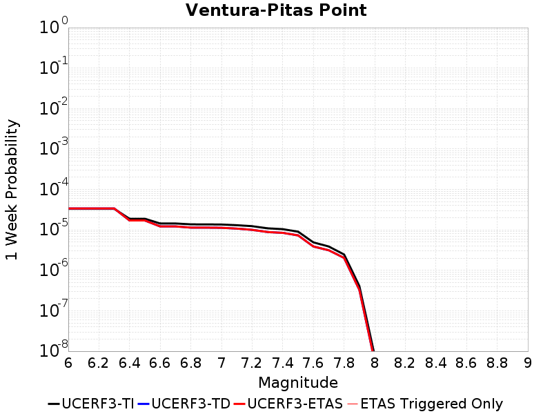 | 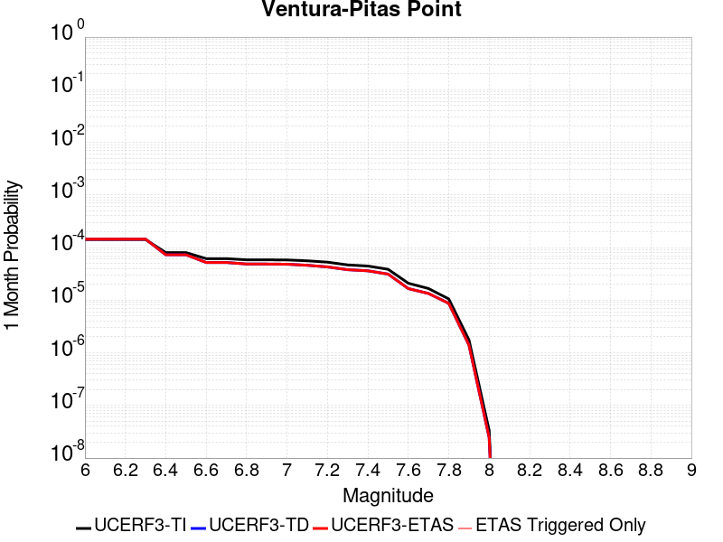 | 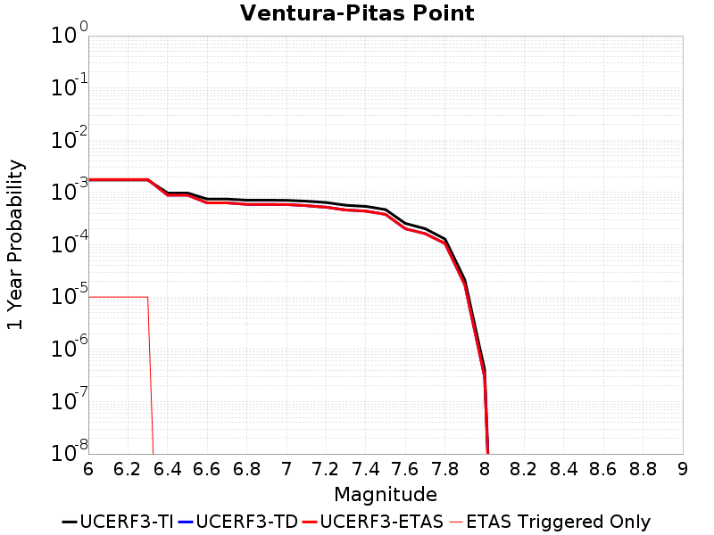 | 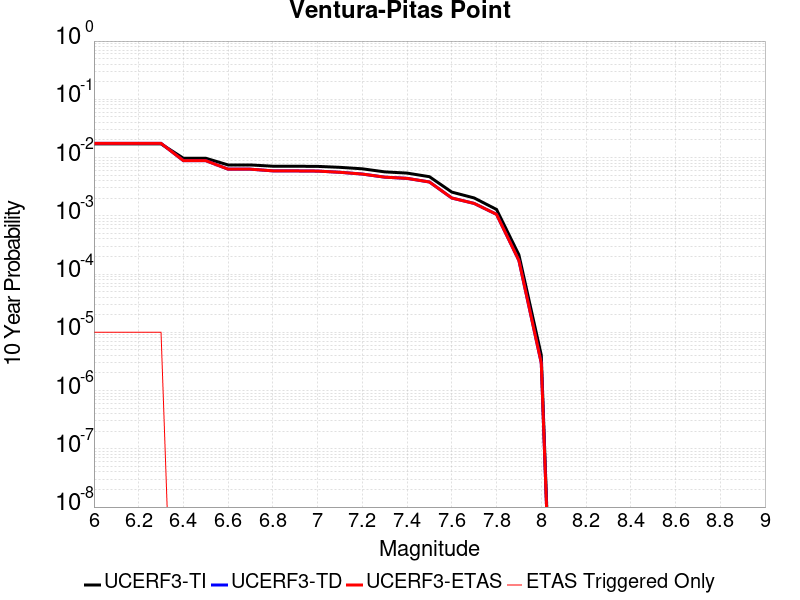 |

| Magnitude | 1 wk TI Prob | 1 wk TD Prob | 1 wk ETAS Prob | 1 wk ETAS/TD Gain | 1 wk ETAS Triggered Only | 1 mo TI Prob | 1 mo TD Prob | 1 mo ETAS Prob | 1 mo ETAS/TD Gain | 1 mo ETAS Triggered Only | 1 yr TI Prob | 1 yr TD Prob | 1 yr ETAS Prob | 1 yr ETAS/TD Gain | 1 yr ETAS Triggered Only | 10 yr TI Prob | 10 yr TD Prob | 10 yr ETAS Prob | 10 yr ETAS/TD Gain | 10 yr ETAS Triggered Only |
|-----|-----|-----|-----|-----|-----|-----|-----|-----|-----|-----|-----|-----|-----|-----|-----|-----|-----|-----|-----|-----|
| 6.0 | 3.3179622E-5 | 3.3772703E-5 | 3.3772703E-5 | 1.0 | 0.0 | 1.4219063E-4 | 1.4473358E-4 | 1.4473358E-4 | 1.0 | 0.0 | 0.0017297962 | 0.0017609643 | 0.0017709467 | 1.0056688 | 1.0E-5 | 0.017163932 | 0.01749559 | 0.017505415 | 1.0005616 | 1.0E-5 |
| 6.1 | 3.3179622E-5 | 3.3772703E-5 | 3.3772703E-5 | 1.0 | 0.0 | 1.4219063E-4 | 1.4473358E-4 | 1.4473358E-4 | 1.0 | 0.0 | 0.0017297962 | 0.0017609643 | 0.0017709467 | 1.0056688 | 1.0E-5 | 0.017163932 | 0.01749559 | 0.017505415 | 1.0005616 | 1.0E-5 |
| 6.2 | 3.3179622E-5 | 3.3772703E-5 | 3.3772703E-5 | 1.0 | 0.0 | 1.4219063E-4 | 1.4473358E-4 | 1.4473358E-4 | 1.0 | 0.0 | 0.0017297962 | 0.0017609643 | 0.0017709467 | 1.0056688 | 1.0E-5 | 0.017163932 | 0.01749559 | 0.017505415 | 1.0005616 | 1.0E-5 |
| 6.3 | 3.3179622E-5 | 3.3772703E-5 | 3.3772703E-5 | 1.0 | 0.0 | 1.4219063E-4 | 1.4473358E-4 | 1.4473358E-4 | 1.0 | 0.0 | 0.0017297962 | 0.0017609643 | 0.0017709467 | 1.0056688 | 1.0E-5 | 0.017163932 | 0.01749559 | 0.017505415 | 1.0005616 | 1.0E-5 |
| 6.4 | 1.8754668E-5 | 1.7043103E-5 | 1.7043103E-5 | 1.0 | 0.0 | 8.037467E-5 | 7.3039955E-5 | 7.3039955E-5 | 1.0 | 0.0 | 9.781223E-4 | 8.889218E-4 | 8.889218E-4 | 1.0 | 0.0 | 0.009738282 | 0.008855915 | 0.008855915 | 1.0 | 0.0 |
| 6.5 | 1.8754668E-5 | 1.7043103E-5 | 1.7043103E-5 | 1.0 | 0.0 | 8.037467E-5 | 7.3039955E-5 | 7.3039955E-5 | 1.0 | 0.0 | 9.781223E-4 | 8.889218E-4 | 8.889218E-4 | 1.0 | 0.0 | 0.009738282 | 0.008855915 | 0.008855915 | 1.0 | 0.0 |
| 6.6 | 1.4361558E-5 | 1.21428075E-5 | 1.21428075E-5 | 1.0 | 0.0 | 6.154808E-5 | 5.203958E-5 | 5.203958E-5 | 1.0 | 0.0 | 7.490902E-4 | 6.334E-4 | 6.334E-4 | 1.0 | 0.0 | 0.0074657016 | 0.0063161184 | 0.0063161184 | 1.0 | 0.0 |
| 6.7 | 1.4361558E-5 | 1.21428075E-5 | 1.21428075E-5 | 1.0 | 0.0 | 6.154808E-5 | 5.203958E-5 | 5.203958E-5 | 1.0 | 0.0 | 7.490902E-4 | 6.334E-4 | 6.334E-4 | 1.0 | 0.0 | 0.0074657016 | 0.0063161184 | 0.0063161184 | 1.0 | 0.0 |
| 6.8 | 1.3663846E-5 | 1.136448E-5 | 1.136448E-5 | 1.0 | 0.0 | 5.8558027E-5 | 4.870402E-5 | 4.870402E-5 | 1.0 | 0.0 | 7.127108E-4 | 5.92812E-4 | 5.92812E-4 | 1.0 | 0.0 | 0.007104293 | 0.0059124376 | 0.0059124376 | 1.0 | 0.0 |
| 6.9 | 1.3644157E-5 | 1.13425685E-5 | 1.13425685E-5 | 1.0 | 0.0 | 5.8473648E-5 | 4.8610113E-5 | 4.8610113E-5 | 1.0 | 0.0 | 7.116841E-4 | 5.9166935E-4 | 5.9166935E-4 | 1.0 | 0.0 | 0.007094092 | 0.0059010712 | 0.0059010712 | 1.0 | 0.0 |
| 7.0 | 1.3568845E-5 | 1.1262076E-5 | 1.1262076E-5 | 1.0 | 0.0 | 5.8150898E-5 | 4.826516E-5 | 4.826516E-5 | 1.0 | 0.0 | 7.077572E-4 | 5.874718E-4 | 5.874718E-4 | 1.0 | 0.0 | 0.007055073 | 0.005859318 | 0.005859318 | 1.0 | 0.0 |
| 7.1 | 1.306572E-5 | 1.0738053E-5 | 1.0738053E-5 | 1.0 | 0.0 | 5.599474E-5 | 4.6019424E-5 | 4.6019424E-5 | 1.0 | 0.0 | 6.815227E-4 | 5.601443E-4 | 5.601443E-4 | 1.0 | 0.0 | 0.0067943637 | 0.0055874437 | 0.0055874437 | 1.0 | 0.0 |
| 7.2 | 1.232604E-5 | 1.0010099E-5 | 1.0010099E-5 | 1.0 | 0.0 | 5.2824813E-5 | 4.289973E-5 | 4.289973E-5 | 1.0 | 0.0 | 6.429523E-4 | 5.221808E-4 | 5.221808E-4 | 1.0 | 0.0 | 0.0064109527 | 0.0052096443 | 0.0052096443 | 1.0 | 0.0 |
| 7.3 | 1.0917261E-5 | 8.856373E-6 | 8.856373E-6 | 1.0 | 0.0 | 4.678742E-5 | 3.795534E-5 | 3.795534E-5 | 1.0 | 0.0 | 5.69488E-4 | 4.6200983E-4 | 4.6200983E-4 | 1.0 | 0.0 | 0.0056803077 | 0.0046105734 | 0.0046105734 | 1.0 | 0.0 |
| 7.4 | 1.039959E-5 | 8.435699E-6 | 8.435699E-6 | 1.0 | 0.0 | 4.456891E-5 | 3.61525E-5 | 3.61525E-5 | 1.0 | 0.0 | 5.424914E-4 | 4.4006936E-4 | 4.4006936E-4 | 1.0 | 0.0 | 0.0054116896 | 0.0043920553 | 0.0043920553 | 1.0 | 0.0 |
| 7.5 | 9.015877E-6 | 7.30862E-6 | 7.30862E-6 | 1.0 | 0.0 | 3.86389E-5 | 3.1322288E-5 | 3.1322288E-5 | 1.0 | 0.0 | 4.7032707E-4 | 3.8128355E-4 | 3.8128355E-4 | 1.0 | 0.0 | 0.004693329 | 0.0038063547 | 0.0038063547 | 1.0 | 0.0 |
| 7.6 | 4.900162E-6 | 3.8761314E-6 | 3.8761314E-6 | 1.0 | 0.0 | 2.1000526E-5 | 1.6611886E-5 | 1.6611886E-5 | 1.0 | 0.0 | 2.556514E-4 | 2.0223107E-4 | 2.0223107E-4 | 1.0 | 0.0 | 0.0025535747 | 0.002020484 | 0.002020484 | 1.0 | 0.0 |
| 7.7 | 3.8850626E-6 | 3.128368E-6 | 3.128368E-6 | 1.0 | 0.0 | 1.6650163E-5 | 1.3407223E-5 | 1.3407223E-5 | 1.0 | 0.0 | 2.0269687E-4 | 1.632208E-4 | 1.632208E-4 | 1.0 | 0.0 | 0.002025121 | 0.0016310186 | 0.0016310186 | 1.0 | 0.0 |
| 7.8 | 2.4654719E-6 | 2.0309967E-6 | 2.0309967E-6 | 1.0 | 0.0 | 1.0566265E-5 | 8.704243E-6 | 8.704243E-6 | 1.0 | 0.0 | 1.2863669E-4 | 1.0596905E-4 | 1.0596905E-4 | 1.0 | 0.0 | 0.0012856225 | 0.0010591899 | 0.0010591899 | 1.0 | 0.0 |
| 7.9 | 4.095894E-7 | 3.2777157E-7 | 3.2777157E-7 | 1.0 | 0.0 | 1.7553821E-6 | 1.4047346E-6 | 1.4047346E-6 | 1.0 | 0.0 | 2.1371567E-5 | 1.7102511E-5 | 1.7102511E-5 | 1.0 | 0.0 | 2.1369511E-4 | 1.7101227E-4 | 1.7101227E-4 | 1.0 | 0.0 |
| 8.0 | 7.791402E-9 | 5.6859557E-9 | 5.6859557E-9 | 1.0 | 0.0 | 3.3391725E-8 | 2.4368381E-8 | 2.4368381E-8 | 1.0 | 0.0 | 4.0654416E-7 | 2.9668502E-7 | 2.9668502E-7 | 1.0 | 0.0 | 4.065434E-6 | 2.9668483E-6 | 2.9668483E-6 | 1.0 | 0.0 |

## Cleghorn
*[(top)](#table-of-contents)*

| 1 Week | 1 Month | 1 Year | 10 Year |
|-----|-----|-----|-----|
|  |  |  |  |

| Magnitude | 1 wk TI Prob | 1 wk TD Prob | 1 wk ETAS Prob | 1 wk ETAS/TD Gain | 1 wk ETAS Triggered Only | 1 mo TI Prob | 1 mo TD Prob | 1 mo ETAS Prob | 1 mo ETAS/TD Gain | 1 mo ETAS Triggered Only | 1 yr TI Prob | 1 yr TD Prob | 1 yr ETAS Prob | 1 yr ETAS/TD Gain | 1 yr ETAS Triggered Only | 10 yr TI Prob | 10 yr TD Prob | 10 yr ETAS Prob | 10 yr ETAS/TD Gain | 10 yr ETAS Triggered Only |
|-----|-----|-----|-----|-----|-----|-----|-----|-----|-----|-----|-----|-----|-----|-----|-----|-----|-----|-----|-----|-----|
| 6.0 | 7.9267165E-6 | 9.874098E-6 | 9.874098E-6 | 1.0 | 0.0 | 3.39712E-5 | 4.2316937E-5 | 4.2316937E-5 | 1.0 | 0.0 | 4.1352084E-4 | 5.150975E-4 | 5.150975E-4 | 1.0 | 0.0 | 0.004127522 | 0.0051535247 | 0.005163473 | 1.0019305 | 1.0E-5 |
| 6.1 | 7.9267165E-6 | 9.874098E-6 | 9.874098E-6 | 1.0 | 0.0 | 3.39712E-5 | 4.2316937E-5 | 4.2316937E-5 | 1.0 | 0.0 | 4.1352084E-4 | 5.150975E-4 | 5.150975E-4 | 1.0 | 0.0 | 0.004127522 | 0.0051535247 | 0.005163473 | 1.0019305 | 1.0E-5 |
| 6.2 | 7.9267165E-6 | 9.874098E-6 | 9.874098E-6 | 1.0 | 0.0 | 3.39712E-5 | 4.2316937E-5 | 4.2316937E-5 | 1.0 | 0.0 | 4.1352084E-4 | 5.150975E-4 | 5.150975E-4 | 1.0 | 0.0 | 0.004127522 | 0.0051535247 | 0.005163473 | 1.0019305 | 1.0E-5 |
| 6.3 | 7.9267165E-6 | 9.874098E-6 | 9.874098E-6 | 1.0 | 0.0 | 3.39712E-5 | 4.2316937E-5 | 4.2316937E-5 | 1.0 | 0.0 | 4.1352084E-4 | 5.150975E-4 | 5.150975E-4 | 1.0 | 0.0 | 0.004127522 | 0.0051535247 | 0.005163473 | 1.0019305 | 1.0E-5 |
| 6.4 | 4.3445207E-6 | 6.133091E-6 | 6.133091E-6 | 1.0 | 0.0 | 1.8619241E-5 | 2.6284417E-5 | 2.6284417E-5 | 1.0 | 0.0 | 2.2666567E-4 | 3.1996678E-4 | 3.1996678E-4 | 1.0 | 0.0 | 0.0022643462 | 0.0032086247 | 0.0032185926 | 1.0031066 | 1.0E-5 |
| 6.5 | 4.3445207E-6 | 6.133091E-6 | 6.133091E-6 | 1.0 | 0.0 | 1.8619241E-5 | 2.6284417E-5 | 2.6284417E-5 | 1.0 | 0.0 | 2.2666567E-4 | 3.1996678E-4 | 3.1996678E-4 | 1.0 | 0.0 | 0.0022643462 | 0.0032086247 | 0.0032185926 | 1.0031066 | 1.0E-5 |
| 6.6 | 4.040109E-6 | 5.8154264E-6 | 5.8154264E-6 | 1.0 | 0.0 | 1.7314638E-5 | 2.4923023E-5 | 2.4923023E-5 | 1.0 | 0.0 | 2.1078532E-4 | 3.033965E-4 | 3.033965E-4 | 1.0 | 0.0 | 0.002105855 | 0.0030433803 | 0.00305335 | 1.0032759 | 1.0E-5 |
| 6.7 | 3.3632055E-6 | 5.108763E-6 | 5.108763E-6 | 1.0 | 0.0 | 1.4413658E-5 | 2.1894517E-5 | 2.1894517E-5 | 1.0 | 0.0 | 1.7547216E-4 | 2.6653346E-4 | 2.6653346E-4 | 1.0 | 0.0 | 0.0017533366 | 0.0026756388 | 0.002685612 | 1.0037274 | 1.0E-5 |
| 6.8 | 3.2902772E-6 | 5.0306403E-6 | 5.0306403E-6 | 1.0 | 0.0 | 1.4101111E-5 | 2.155971E-5 | 2.155971E-5 | 1.0 | 0.0 | 1.716675E-4 | 2.6245817E-4 | 2.6245817E-4 | 1.0 | 0.0 | 0.0017153495 | 0.0026349828 | 0.0026449563 | 1.0037851 | 1.0E-5 |
| 6.9 | 3.031547E-6 | 4.731996E-6 | 4.731996E-6 | 1.0 | 0.0 | 1.299228E-5 | 2.0279826E-5 | 2.0279826E-5 | 1.0 | 0.0 | 1.5816953E-4 | 2.4687918E-4 | 2.4687918E-4 | 1.0 | 0.0 | 0.00158057 | 0.0024795479 | 0.002489523 | 1.004023 | 1.0E-5 |
| 7.0 | 2.8259715E-6 | 4.410469E-6 | 4.410469E-6 | 1.0 | 0.0 | 1.211125E-5 | 1.8901874E-5 | 1.8901874E-5 | 1.0 | 0.0 | 1.4744449E-4 | 2.3010626E-4 | 2.3010626E-4 | 1.0 | 0.0 | 0.001473467 | 0.002312177 | 0.002322154 | 1.0043149 | 1.0E-5 |
| 7.1 | 2.5962665E-6 | 4.105151E-6 | 4.105151E-6 | 1.0 | 0.0 | 1.1126809E-5 | 1.7593387E-5 | 1.7593387E-5 | 1.0 | 0.0 | 1.3546048E-4 | 2.1417867E-4 | 2.1417867E-4 | 1.0 | 0.0 | 0.0013537793 | 0.0021532255 | 0.0021632041 | 1.0046341 | 1.0E-5 |
| 7.2 | 2.3247253E-6 | 3.714965E-6 | 3.714965E-6 | 1.0 | 0.0 | 9.96307E-6 | 1.5921183E-5 | 1.5921183E-5 | 1.0 | 0.0 | 1.21293626E-4 | 1.9382335E-4 | 1.9382335E-4 | 1.0 | 0.0 | 0.0012122744 | 0.0019500658 | 0.0019600464 | 1.005118 | 1.0E-5 |
| 7.3 | 2.056928E-6 | 3.272071E-6 | 3.272071E-6 | 1.0 | 0.0 | 8.815376E-6 | 1.4023087E-5 | 1.4023087E-5 | 1.0 | 0.0 | 1.0732192E-4 | 1.7071786E-4 | 1.7071786E-4 | 1.0 | 0.0 | 0.001072701 | 0.0017194574 | 0.0017294403 | 1.0058057 | 1.0E-5 |
| 7.4 | 1.8055999E-6 | 2.8608583E-6 | 2.8608583E-6 | 1.0 | 0.0 | 7.738263E-6 | 1.2260764E-5 | 1.2260764E-5 | 1.0 | 0.0 | 9.4209274E-5 | 1.4926473E-4 | 1.4926473E-4 | 1.0 | 0.0 | 9.4169343E-4 | 0.001505392 | 0.001515377 | 1.0066328 | 1.0E-5 |
| 7.5 | 1.4683443E-6 | 2.4593496E-6 | 2.4593496E-6 | 1.0 | 0.0 | 6.292889E-6 | 1.0540029E-5 | 1.0540029E-5 | 1.0 | 0.0 | 7.661323E-5 | 1.2831738E-4 | 1.2831738E-4 | 1.0 | 0.0 | 7.658682E-4 | 0.0012962079 | 0.0012962079 | 1.0 | 0.0 |
| 7.6 | 9.804088E-7 | 1.934428E-6 | 1.934428E-6 | 1.0 | 0.0 | 4.201745E-6 | 8.29038E-6 | 8.29038E-6 | 1.0 | 0.0 | 5.1155046E-5 | 1.00930745E-4 | 1.00930745E-4 | 1.0 | 0.0 | 5.114327E-4 | 0.0010226612 | 0.0010226612 | 1.0 | 0.0 |
| 7.7 | 7.3434086E-7 | 1.6621416E-6 | 1.6621416E-6 | 1.0 | 0.0 | 3.1471714E-6 | 7.123445E-6 | 7.123445E-6 | 1.0 | 0.0 | 3.831614E-5 | 8.672452E-5 | 8.672452E-5 | 1.0 | 0.0 | 3.8309532E-4 | 8.8075636E-4 | 8.8075636E-4 | 1.0 | 0.0 |
| 7.8 | 6.434184E-7 | 1.5544687E-6 | 1.5544687E-6 | 1.0 | 0.0 | 2.7575045E-6 | 6.661992E-6 | 6.661992E-6 | 1.0 | 0.0 | 3.35721E-5 | 8.110676E-5 | 8.110676E-5 | 1.0 | 0.0 | 3.3567028E-4 | 8.243014E-4 | 8.243014E-4 | 1.0 | 0.0 |
| 7.9 | 3.4943926E-7 | 7.751397E-7 | 7.751397E-7 | 1.0 | 0.0 | 1.497596E-6 | 3.3220233E-6 | 3.3220233E-6 | 1.0 | 0.0 | 1.8233079E-5 | 4.044489E-5 | 4.044489E-5 | 1.0 | 0.0 | 1.8231584E-4 | 4.1297925E-4 | 4.1297925E-4 | 1.0 | 0.0 |
| 8.0 | 6.717524E-8 | 6.054743E-8 | 6.054743E-8 | 1.0 | 0.0 | 2.8789387E-7 | 2.5948896E-7 | 2.5948896E-7 | 1.0 | 0.0 | 3.505102E-6 | 3.1592735E-6 | 3.1592735E-6 | 1.0 | 0.0 | 3.5050467E-5 | 3.388617E-5 | 3.388617E-5 | 1.0 | 0.0 |
| 8.1 | 3.1984914E-8 | 1.3639449E-8 | 1.3639449E-8 | 1.0 | 0.0 | 1.370782E-7 | 5.8454777E-8 | 5.8454777E-8 | 1.0 | 0.0 | 1.6689258E-6 | 7.116867E-7 | 7.116867E-7 | 1.0 | 0.0 | 1.6689133E-5 | 8.131241E-6 | 8.131241E-6 | 1.0 | 0.0 |
| 8.2 | 1.21887656E-8 | 3.860208E-9 | 3.860208E-9 | 1.0 | 0.0 | 5.2237567E-8 | 1.6543751E-8 | 1.6543751E-8 | 1.0 | 0.0 | 6.359922E-7 | 2.0142014E-7 | 2.0142014E-7 | 1.0 | 0.0 | 6.3599036E-6 | 2.369225E-6 | 2.369225E-6 | 1.0 | 0.0 |

## San Andreas (Big Bend)
*[(top)](#table-of-contents)*

| 1 Week | 1 Month | 1 Year | 10 Year |
|-----|-----|-----|-----|
|  | 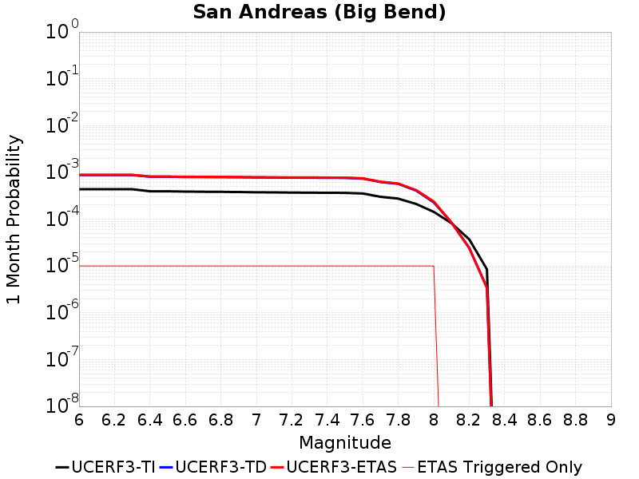 | 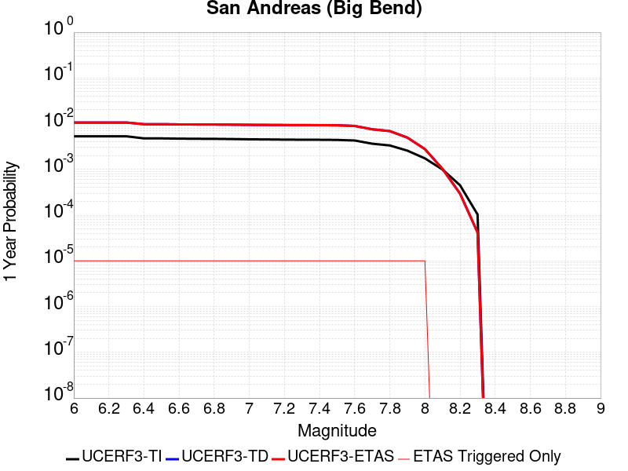 | 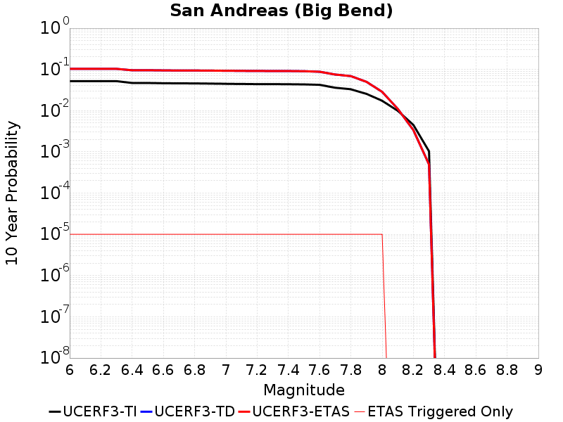 |

| Magnitude | 1 wk TI Prob | 1 wk TD Prob | 1 wk ETAS Prob | 1 wk ETAS/TD Gain | 1 wk ETAS Triggered Only | 1 mo TI Prob | 1 mo TD Prob | 1 mo ETAS Prob | 1 mo ETAS/TD Gain | 1 mo ETAS Triggered Only | 1 yr TI Prob | 1 yr TD Prob | 1 yr ETAS Prob | 1 yr ETAS/TD Gain | 1 yr ETAS Triggered Only | 10 yr TI Prob | 10 yr TD Prob | 10 yr ETAS Prob | 10 yr ETAS/TD Gain | 10 yr ETAS Triggered Only |
|-----|-----|-----|-----|-----|-----|-----|-----|-----|-----|-----|-----|-----|-----|-----|-----|-----|-----|-----|-----|-----|
| 6.0 | 1.0179969E-4 | 2.041586E-4 | 2.041586E-4 | 1.0 | 0.0 | 4.362114E-4 | 8.746731E-4 | 8.8466436E-4 | 1.0114229 | 1.0E-5 | 0.0052979486 | 0.0105974395 | 0.010607333 | 1.0009336 | 1.0E-5 | 0.051734097 | 0.10292932 | 0.102938294 | 1.0000871 | 1.0E-5 |
| 6.1 | 1.0179969E-4 | 2.041586E-4 | 2.041586E-4 | 1.0 | 0.0 | 4.362114E-4 | 8.746731E-4 | 8.8466436E-4 | 1.0114229 | 1.0E-5 | 0.0052979486 | 0.0105974395 | 0.010607333 | 1.0009336 | 1.0E-5 | 0.051734097 | 0.10292932 | 0.102938294 | 1.0000871 | 1.0E-5 |
| 6.2 | 1.0179969E-4 | 2.041586E-4 | 2.041586E-4 | 1.0 | 0.0 | 4.362114E-4 | 8.746731E-4 | 8.8466436E-4 | 1.0114229 | 1.0E-5 | 0.0052979486 | 0.0105974395 | 0.010607333 | 1.0009336 | 1.0E-5 | 0.051734097 | 0.10292932 | 0.102938294 | 1.0000871 | 1.0E-5 |
| 6.3 | 1.0179969E-4 | 2.041586E-4 | 2.041586E-4 | 1.0 | 0.0 | 4.362114E-4 | 8.746731E-4 | 8.8466436E-4 | 1.0114229 | 1.0E-5 | 0.0052979486 | 0.0105974395 | 0.010607333 | 1.0009336 | 1.0E-5 | 0.051734097 | 0.10292932 | 0.102938294 | 1.0000871 | 1.0E-5 |
| 6.4 | 9.1639464E-5 | 1.8766396E-4 | 1.8766396E-4 | 1.0 | 0.0 | 3.9268145E-4 | 8.0402644E-4 | 8.1401836E-4 | 1.0124274 | 1.0E-5 | 0.0047704205 | 0.009745209 | 0.009755111 | 1.0010161 | 1.0E-5 | 0.046693064 | 0.095264755 | 0.0952738 | 1.000095 | 1.0E-5 |
| 6.5 | 9.1639464E-5 | 1.8766396E-4 | 1.8766396E-4 | 1.0 | 0.0 | 3.9268145E-4 | 8.0402644E-4 | 8.1401836E-4 | 1.0124274 | 1.0E-5 | 0.0047704205 | 0.009745209 | 0.009755111 | 1.0010161 | 1.0E-5 | 0.046693064 | 0.095264755 | 0.0952738 | 1.000095 | 1.0E-5 |
| 6.6 | 9.042622E-5 | 1.8572666E-4 | 1.8572666E-4 | 1.0 | 0.0 | 3.8748336E-4 | 7.957288E-4 | 8.0572086E-4 | 1.0125571 | 1.0E-5 | 0.0047074095 | 0.009645082 | 0.009654986 | 1.0010267 | 1.0E-5 | 0.046089325 | 0.094352566 | 0.094361626 | 1.000096 | 1.0E-5 |
| 6.7 | 8.9836685E-5 | 1.8486717E-4 | 1.8486717E-4 | 1.0 | 0.0 | 3.8495753E-4 | 7.920475E-4 | 8.020396E-4 | 1.0126156 | 1.0E-5 | 0.00467679 | 0.009600657 | 0.009610561 | 1.0010316 | 1.0E-5 | 0.045795817 | 0.09394615 | 0.09395521 | 1.0000964 | 1.0E-5 |
| 6.8 | 8.9471854E-5 | 1.8433185E-4 | 1.8433185E-4 | 1.0 | 0.0 | 3.8339442E-4 | 7.897547E-4 | 7.997468E-4 | 1.0126522 | 1.0E-5 | 0.004657841 | 0.009572987 | 0.009582891 | 1.0010346 | 1.0E-5 | 0.04561414 | 0.09369198 | 0.09370104 | 1.0000967 | 1.0E-5 |
| 6.9 | 8.858234E-5 | 1.8314621E-4 | 1.8314621E-4 | 1.0 | 0.0 | 3.7958333E-4 | 7.8467646E-4 | 7.946686E-4 | 1.012734 | 1.0E-5 | 0.004611638 | 0.009511701 | 0.009521606 | 1.0010413 | 1.0E-5 | 0.04517103 | 0.09313006 | 0.09313913 | 1.0000974 | 1.0E-5 |
| 7.0 | 8.7433385E-5 | 1.815259E-4 | 1.815259E-4 | 1.0 | 0.0 | 3.746607E-4 | 7.7773636E-4 | 7.877286E-4 | 1.0128478 | 1.0E-5 | 0.004551957 | 0.00942794 | 0.009437845 | 1.0010507 | 1.0E-5 | 0.044598386 | 0.09236155 | 0.09237062 | 1.0000982 | 1.0E-5 |
| 7.1 | 8.684964E-5 | 1.806402E-4 | 1.806402E-4 | 1.0 | 0.0 | 3.7215967E-4 | 7.739428E-4 | 7.839351E-4 | 1.0129108 | 1.0E-5 | 0.0045216335 | 0.009382152 | 0.009392058 | 1.0010558 | 1.0E-5 | 0.04430731 | 0.0919413 | 0.09195038 | 1.0000988 | 1.0E-5 |
| 7.2 | 8.606521E-5 | 1.7954104E-4 | 1.7954104E-4 | 1.0 | 0.0 | 3.6879873E-4 | 7.692349E-4 | 7.7922724E-4 | 1.0129899 | 1.0E-5 | 0.0044808835 | 0.0093253255 | 0.009335232 | 1.0010624 | 1.0E-5 | 0.043916024 | 0.09142021 | 0.09142929 | 1.0000994 | 1.0E-5 |
| 7.3 | 8.568266E-5 | 1.7895487E-4 | 1.7895487E-4 | 1.0 | 0.0 | 3.6715972E-4 | 7.667242E-4 | 7.767165E-4 | 1.0130326 | 1.0E-5 | 0.0044610105 | 0.009295018 | 0.009304926 | 1.0010659 | 1.0E-5 | 0.043725148 | 0.091138914 | 0.091148004 | 1.0000998 | 1.0E-5 |
| 7.4 | 8.5432206E-5 | 1.7857675E-4 | 1.7857675E-4 | 1.0 | 0.0 | 3.6608664E-4 | 7.6510466E-4 | 7.7509705E-4 | 1.0130601 | 1.0E-5 | 0.004447999 | 0.009275469 | 0.009285376 | 1.0010681 | 1.0E-5 | 0.043600157 | 0.090957664 | 0.09096675 | 1.0000999 | 1.0E-5 |
| 7.5 | 8.4791965E-5 | 1.7725662E-4 | 1.7725662E-4 | 1.0 | 0.0 | 3.633435E-4 | 7.5945025E-4 | 7.6944265E-4 | 1.0131574 | 1.0E-5 | 0.0044147377 | 0.00920721 | 0.009217118 | 1.0010761 | 1.0E-5 | 0.043280575 | 0.090328716 | 0.09033781 | 1.0001007 | 1.0E-5 |
| 7.6 | 8.241105E-5 | 1.7165487E-4 | 1.7165487E-4 | 1.0 | 0.0 | 3.531424E-4 | 7.354565E-4 | 7.4544916E-4 | 1.013587 | 1.0E-5 | 0.0042910352 | 0.008917513 | 0.008927424 | 1.0011114 | 1.0E-5 | 0.042091176 | 0.08768749 | 0.08769662 | 1.0001041 | 1.0E-5 |
| 7.7 | 7.00432E-5 | 1.4498337E-4 | 1.4498337E-4 | 1.0 | 0.0 | 3.001506E-4 | 6.212094E-4 | 6.312032E-4 | 1.0160877 | 1.0E-5 | 0.0036482112 | 0.0075370385 | 0.007546963 | 1.0013168 | 1.0E-5 | 0.035888977 | 0.07484731 | 0.07485656 | 1.0001236 | 1.0E-5 |
| 7.8 | 6.415362E-5 | 1.3234153E-4 | 1.3234153E-4 | 1.0 | 0.0 | 2.749151E-4 | 5.670548E-4 | 5.770491E-4 | 1.017625 | 1.0E-5 | 0.0033419547 | 0.006882069 | 0.0068920003 | 1.001443 | 1.0E-5 | 0.03292141 | 0.06845829 | 0.0684676 | 1.000136 | 1.0E-5 |
| 7.9 | 4.939911E-5 | 9.5324E-5 | 9.5324E-5 | 1.0 | 0.0 | 2.116933E-4 | 4.084675E-4 | 4.184634E-4 | 1.0244718 | 1.0E-5 | 0.0025743195 | 0.004961761 | 0.004971712 | 1.0020055 | 1.0E-5 | 0.025447013 | 0.049810443 | 0.049819943 | 1.0001907 | 1.0E-5 |
| 8.0 | 3.344983E-5 | 5.3371914E-5 | 5.3371914E-5 | 1.0 | 0.0 | 1.4334853E-4 | 2.2871673E-4 | 2.3871445E-4 | 1.0437123 | 1.0E-5 | 0.0017438711 | 0.0027810722 | 0.0027910443 | 1.0035857 | 1.0E-5 | 0.017302496 | 0.028485218 | 0.028494932 | 1.000341 | 1.0E-5 |
| 8.1 | 1.9104898E-5 | 1.9730729E-5 | 1.9730729E-5 | 1.0 | 0.0 | 8.1875565E-5 | 8.4557534E-5 | 8.4557534E-5 | 1.0 | 0.0 | 9.963791E-4 | 0.0010290025 | 0.0010290025 | 1.0 | 0.0 | 0.009919235 | 0.011042263 | 0.011042263 | 1.0 | 0.0 |
| 8.2 | 8.643924E-6 | 5.683797E-6 | 5.683797E-6 | 1.0 | 0.0 | 3.704486E-5 | 2.4358904E-5 | 2.4358904E-5 | 1.0 | 0.0 | 4.5092785E-4 | 2.9652938E-4 | 2.9652938E-4 | 1.0 | 0.0 | 0.0045001395 | 0.003362901 | 0.003362901 | 1.0 | 0.0 |
| 8.3 | 1.983087E-6 | 8.007468E-7 | 8.007468E-7 | 1.0 | 0.0 | 8.498917E-6 | 3.4317677E-6 | 3.4317677E-6 | 1.0 | 0.0 | 1.034694E-4 | 4.178099E-5 | 4.178099E-5 | 1.0 | 0.0 | 0.0010342124 | 4.9186987E-4 | 4.9186987E-4 | 1.0 | 0.0 |

## Bicycle Lake
*[(top)](#table-of-contents)*

| 1 Week | 1 Month | 1 Year | 10 Year |
|-----|-----|-----|-----|
| 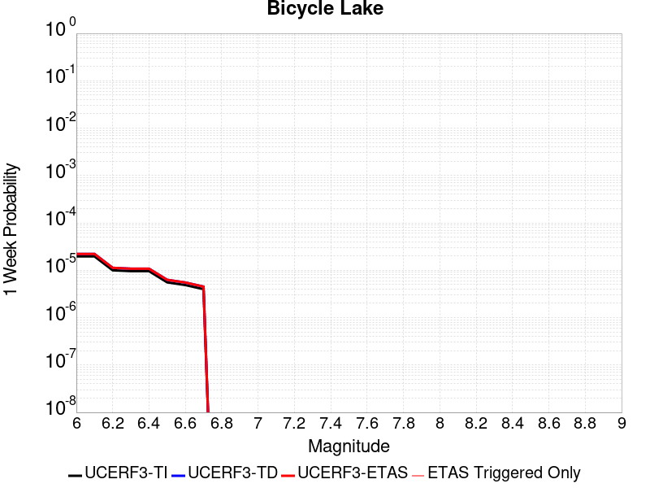 | 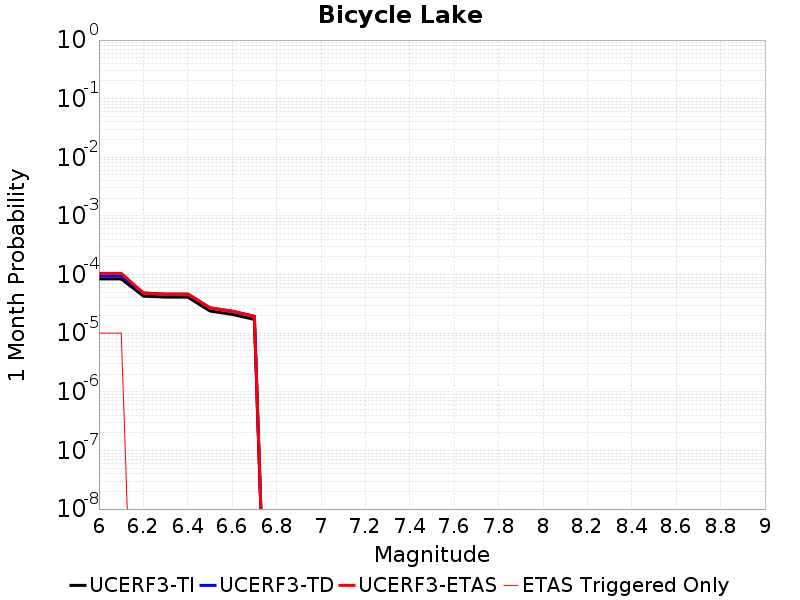 | 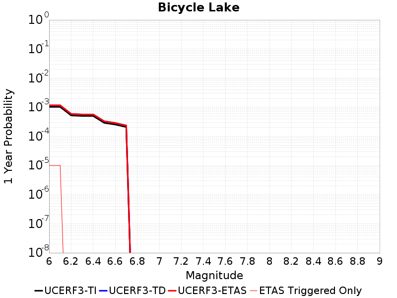 | 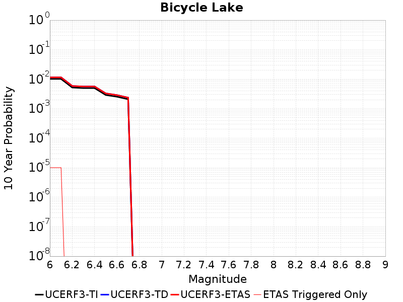 |

| Magnitude | 1 wk TI Prob | 1 wk TD Prob | 1 wk ETAS Prob | 1 wk ETAS/TD Gain | 1 wk ETAS Triggered Only | 1 mo TI Prob | 1 mo TD Prob | 1 mo ETAS Prob | 1 mo ETAS/TD Gain | 1 mo ETAS Triggered Only | 1 yr TI Prob | 1 yr TD Prob | 1 yr ETAS Prob | 1 yr ETAS/TD Gain | 1 yr ETAS Triggered Only | 10 yr TI Prob | 10 yr TD Prob | 10 yr ETAS Prob | 10 yr ETAS/TD Gain | 10 yr ETAS Triggered Only |
|-----|-----|-----|-----|-----|-----|-----|-----|-----|-----|-----|-----|-----|-----|-----|-----|-----|-----|-----|-----|-----|
| 6.0 | 1.9621975E-5 | 2.2111757E-5 | 2.2111757E-5 | 1.0 | 0.0 | 8.4091465E-5 | 9.476199E-5 | 1.0476104E-4 | 1.1055175 | 1.0E-5 | 0.0010233327 | 0.0011532517 | 0.0011632403 | 1.0086612 | 1.0E-5 | 0.01018633 | 0.011485999 | 0.0114958845 | 1.0008606 | 1.0E-5 |
| 6.1 | 1.9621975E-5 | 2.2111757E-5 | 2.2111757E-5 | 1.0 | 0.0 | 8.4091465E-5 | 9.476199E-5 | 1.0476104E-4 | 1.1055175 | 1.0E-5 | 0.0010233327 | 0.0011532517 | 0.0011632403 | 1.0086612 | 1.0E-5 | 0.01018633 | 0.011485999 | 0.0114958845 | 1.0008606 | 1.0E-5 |
| 6.2 | 9.9971285E-6 | 1.1263099E-5 | 1.1263099E-5 | 1.0 | 0.0 | 4.2844134E-5 | 4.8269823E-5 | 4.8269823E-5 | 1.0 | 0.0 | 5.2150246E-4 | 5.875787E-4 | 5.875787E-4 | 1.0 | 0.0 | 0.0052028033 | 0.0058653634 | 0.0058653634 | 1.0 | 0.0 |
| 6.3 | 9.589428E-6 | 1.0805512E-5 | 1.0805512E-5 | 1.0 | 0.0 | 4.10969E-5 | 4.630881E-5 | 4.630881E-5 | 1.0 | 0.0 | 5.002399E-4 | 5.637158E-4 | 5.637158E-4 | 1.0 | 0.0 | 0.0049911533 | 0.0056279553 | 0.0056279553 | 1.0 | 0.0 |
| 6.4 | 9.589428E-6 | 1.0805512E-5 | 1.0805512E-5 | 1.0 | 0.0 | 4.10969E-5 | 4.630881E-5 | 4.630881E-5 | 1.0 | 0.0 | 5.002399E-4 | 5.637158E-4 | 5.637158E-4 | 1.0 | 0.0 | 0.0049911533 | 0.0056279553 | 0.0056279553 | 1.0 | 0.0 |
| 6.5 | 5.557707E-6 | 6.2899344E-6 | 6.2899344E-6 | 1.0 | 0.0 | 2.3818526E-5 | 2.6956734E-5 | 2.6956734E-5 | 1.0 | 0.0 | 2.8995197E-4 | 3.2817572E-4 | 3.2817572E-4 | 1.0 | 0.0 | 0.0028957394 | 0.0032795507 | 0.0032795507 | 1.0 | 0.0 |
| 6.6 | 4.8742945E-6 | 5.5170935E-6 | 5.5170935E-6 | 1.0 | 0.0 | 2.0889667E-5 | 2.3644621E-5 | 2.3644621E-5 | 1.0 | 0.0 | 2.54302E-4 | 2.8786148E-4 | 2.8786148E-4 | 1.0 | 0.0 | 0.002540112 | 0.0028774582 | 0.0028774582 | 1.0 | 0.0 |
| 6.7 | 3.991108E-6 | 4.5190354E-6 | 4.5190354E-6 | 1.0 | 0.0 | 1.7104636E-5 | 1.9367295E-5 | 1.9367295E-5 | 1.0 | 0.0 | 2.0822904E-4 | 2.3579682E-4 | 2.3579682E-4 | 1.0 | 0.0 | 0.0020803404 | 0.0023579681 | 0.0023579681 | 1.0 | 0.0 |

## Superstition Hills
*[(top)](#table-of-contents)*

| 1 Week | 1 Month | 1 Year | 10 Year |
|-----|-----|-----|-----|
|  |  |  |  |

| Magnitude | 1 wk TI Prob | 1 wk TD Prob | 1 wk ETAS Prob | 1 wk ETAS/TD Gain | 1 wk ETAS Triggered Only | 1 mo TI Prob | 1 mo TD Prob | 1 mo ETAS Prob | 1 mo ETAS/TD Gain | 1 mo ETAS Triggered Only | 1 yr TI Prob | 1 yr TD Prob | 1 yr ETAS Prob | 1 yr ETAS/TD Gain | 1 yr ETAS Triggered Only | 10 yr TI Prob | 10 yr TD Prob | 10 yr ETAS Prob | 10 yr ETAS/TD Gain | 10 yr ETAS Triggered Only |
|-----|-----|-----|-----|-----|-----|-----|-----|-----|-----|-----|-----|-----|-----|-----|-----|-----|-----|-----|-----|-----|
| 6.0 | 6.6865185E-5 | 1.4265E-5 | 1.4265E-5 | 1.0 | 0.0 | 2.8653358E-4 | 6.113437E-5 | 6.113437E-5 | 1.0 | 0.0 | 0.0034829667 | 7.440731E-4 | 7.440731E-4 | 1.0 | 0.0 | 0.03428881 | 0.007586333 | 0.007596257 | 1.0013082 | 1.0E-5 |
| 6.1 | 6.544851E-5 | 1.4264999E-5 | 1.4264999E-5 | 1.0 | 0.0 | 2.8046346E-4 | 6.113437E-5 | 6.113437E-5 | 1.0 | 0.0 | 0.0034092965 | 7.440731E-4 | 7.440731E-4 | 1.0 | 0.0 | 0.033574644 | 0.007586332 | 0.007596256 | 1.0013082 | 1.0E-5 |
| 6.2 | 6.544851E-5 | 1.4264999E-5 | 1.4264999E-5 | 1.0 | 0.0 | 2.8046346E-4 | 6.113437E-5 | 6.113437E-5 | 1.0 | 0.0 | 0.0034092965 | 7.440731E-4 | 7.440731E-4 | 1.0 | 0.0 | 0.033574644 | 0.007586332 | 0.007596256 | 1.0013082 | 1.0E-5 |
| 6.3 | 5.2402065E-5 | 1.4264998E-5 | 1.4264998E-5 | 1.0 | 0.0 | 2.2456095E-4 | 6.1134364E-5 | 6.1134364E-5 | 1.0 | 0.0 | 0.0027306017 | 7.44073E-4 | 7.44073E-4 | 1.0 | 0.0 | 0.02697292 | 0.007586325 | 0.007596249 | 1.0013082 | 1.0E-5 |
| 6.4 | 4.542238E-5 | 1.4264997E-5 | 1.4264997E-5 | 1.0 | 0.0 | 1.9465282E-4 | 6.1134364E-5 | 6.1134364E-5 | 1.0 | 0.0 | 0.0023673223 | 7.44073E-4 | 7.44073E-4 | 1.0 | 0.0 | 0.023422617 | 0.007586322 | 0.007596246 | 1.0013082 | 1.0E-5 |
| 6.5 | 2.9672969E-5 | 1.4264995E-5 | 1.4264995E-5 | 1.0 | 0.0 | 1.2716366E-4 | 6.113436E-5 | 6.113436E-5 | 1.0 | 0.0 | 0.0015471181 | 7.440729E-4 | 7.440729E-4 | 1.0 | 0.0 | 0.015363912 | 0.007586314 | 0.007596238 | 1.0013082 | 1.0E-5 |
| 6.6 | 2.6056105E-5 | 1.3929872E-5 | 1.3929872E-5 | 1.0 | 0.0 | 1.1166424E-4 | 5.9698177E-5 | 5.9698177E-5 | 1.0 | 0.0 | 0.0013586642 | 7.2659913E-4 | 7.2659913E-4 | 1.0 | 0.0 | 0.013503874 | 0.0074103405 | 0.007420266 | 1.0013394 | 1.0E-5 |
| 6.7 | 1.4611248E-5 | 1.3509075E-5 | 1.3509075E-5 | 1.0 | 0.0 | 6.261813E-5 | 5.7894842E-5 | 5.7894842E-5 | 1.0 | 0.0 | 7.6210906E-4 | 7.046578E-4 | 7.046578E-4 | 1.0 | 0.0 | 0.0075950073 | 0.0071912645 | 0.0072011924 | 1.0013806 | 1.0E-5 |
| 6.8 | 1.30607E-5 | 1.1099052E-5 | 1.1099052E-5 | 1.0 | 0.0 | 5.597323E-5 | 4.7566547E-5 | 4.7566547E-5 | 1.0 | 0.0 | 6.8126095E-4 | 5.789777E-4 | 5.789777E-4 | 1.0 | 0.0 | 0.006791762 | 0.005936466 | 0.005946407 | 1.0016745 | 1.0E-5 |
| 6.9 | 1.0443096E-5 | 8.304636E-6 | 8.304636E-6 | 1.0 | 0.0 | 4.4755358E-5 | 3.5590827E-5 | 3.5590827E-5 | 1.0 | 0.0 | 5.447602E-4 | 4.3323456E-4 | 4.3323456E-4 | 1.0 | 0.0 | 0.005434267 | 0.004466649 | 0.0044766045 | 1.0022289 | 1.0E-5 |
| 7.0 | 8.045912E-6 | 6.839326E-6 | 6.839326E-6 | 1.0 | 0.0 | 3.4482026E-5 | 2.9311073E-5 | 2.9311073E-5 | 1.0 | 0.0 | 4.197378E-4 | 3.5680493E-4 | 3.5680493E-4 | 1.0 | 0.0 | 0.0041894587 | 0.0036856798 | 0.0036956428 | 1.0027032 | 1.0E-5 |
| 7.1 | 8.045912E-6 | 6.839326E-6 | 6.839326E-6 | 1.0 | 0.0 | 3.4482026E-5 | 2.9311073E-5 | 2.9311073E-5 | 1.0 | 0.0 | 4.197378E-4 | 3.5680493E-4 | 3.5680493E-4 | 1.0 | 0.0 | 0.0041894587 | 0.0036856798 | 0.0036956428 | 1.0027032 | 1.0E-5 |
| 7.2 | 7.375506E-6 | 6.344483E-6 | 6.344483E-6 | 1.0 | 0.0 | 3.1608928E-5 | 2.7190365E-5 | 2.7190365E-5 | 1.0 | 0.0 | 3.8477074E-4 | 3.3099327E-4 | 3.3099327E-4 | 1.0 | 0.0 | 0.003841052 | 0.003425199 | 0.003435165 | 1.0029095 | 1.0E-5 |
| 7.3 | 6.6063913E-6 | 5.8953524E-6 | 5.8953524E-6 | 1.0 | 0.0 | 2.8312797E-5 | 2.5265555E-5 | 2.5265555E-5 | 1.0 | 0.0 | 3.446538E-4 | 3.0756547E-4 | 3.0756547E-4 | 1.0 | 0.0 | 0.0034411973 | 0.0031887211 | 0.003198689 | 1.003126 | 1.0E-5 |
| 7.4 | 6.4313126E-6 | 5.7764632E-6 | 5.7764632E-6 | 1.0 | 0.0 | 2.7562477E-5 | 2.475604E-5 | 2.475604E-5 | 1.0 | 0.0 | 3.355215E-4 | 3.0136382E-4 | 3.0136382E-4 | 1.0 | 0.0 | 0.0033501536 | 0.0031263104 | 0.003136279 | 1.0031886 | 1.0E-5 |
| 7.5 | 6.0742927E-6 | 5.5711243E-6 | 5.5711243E-6 | 1.0 | 0.0 | 2.6032423E-5 | 2.3876031E-5 | 2.3876031E-5 | 1.0 | 0.0 | 3.1689866E-4 | 2.9065262E-4 | 2.9065262E-4 | 1.0 | 0.0 | 0.0031644711 | 0.00301754 | 0.00302751 | 1.003304 | 1.0E-5 |
| 7.6 | 5.6987187E-6 | 5.3881213E-6 | 5.3881213E-6 | 1.0 | 0.0 | 2.4422852E-5 | 2.3091749E-5 | 2.3091749E-5 | 1.0 | 0.0 | 2.9730765E-4 | 2.8110645E-4 | 2.8110645E-4 | 1.0 | 0.0 | 0.002969102 | 0.0029201487 | 0.0029301194 | 1.0034145 | 1.0E-5 |
| 7.7 | 5.1658035E-6 | 5.0171157E-6 | 5.0171157E-6 | 1.0 | 0.0 | 2.2138971E-5 | 2.1501752E-5 | 2.1501752E-5 | 1.0 | 0.0 | 2.6950863E-4 | 2.61753E-4 | 2.61753E-4 | 1.0 | 0.0 | 0.00269182 | 0.0027241197 | 0.0027241197 | 1.0 | 0.0 |
| 7.8 | 3.6864697E-6 | 4.2844904E-6 | 4.2844904E-6 | 1.0 | 0.0 | 1.579906E-5 | 1.8361976E-5 | 1.8361976E-5 | 1.0 | 0.0 | 1.9233658E-4 | 2.235346E-4 | 2.235346E-4 | 1.0 | 0.0 | 0.0019217018 | 0.0023354597 | 0.0023354597 | 1.0 | 0.0 |
| 7.9 | 3.0265903E-6 | 3.6454207E-6 | 3.6454207E-6 | 1.0 | 0.0 | 1.2971037E-5 | 1.5623142E-5 | 1.5623142E-5 | 1.0 | 0.0 | 1.5791094E-4 | 1.901956E-4 | 1.901956E-4 | 1.0 | 0.0 | 0.0015779877 | 0.00199649 | 0.00199649 | 1.0 | 0.0 |
| 8.0 | 2.5271493E-6 | 3.1620043E-6 | 3.1620043E-6 | 1.0 | 0.0 | 1.0830595E-5 | 1.3551379E-5 | 1.3551379E-5 | 1.0 | 0.0 | 1.3185451E-4 | 1.64976E-4 | 1.64976E-4 | 1.0 | 0.0 | 0.0013177631 | 0.0017370136 | 0.0017370136 | 1.0 | 0.0 |
| 8.1 | 2.3749135E-6 | 2.9895293E-6 | 2.9895293E-6 | 1.0 | 0.0 | 1.0178161E-5 | 1.2812208E-5 | 1.2812208E-5 | 1.0 | 0.0 | 1.2391206E-4 | 1.559779E-4 | 1.559779E-4 | 1.0 | 0.0 | 0.0012384299 | 0.0016429456 | 0.0016429456 | 1.0 | 0.0 |
| 8.2 | 1.7186406E-9 | 1.1788669E-9 | 1.1788669E-9 | 1.0 | 0.0 | 7.3656024E-9 | 5.0522866E-9 | 5.0522866E-9 | 1.0 | 0.0 | 8.9676206E-8 | 6.151159E-8 | 6.151159E-8 | 1.0 | 0.0 | 8.9676166E-7 | 6.57714E-7 | 6.57714E-7 | 1.0 | 0.0 |

## San Andreas (Mojave S)
*[(top)](#table-of-contents)*

| 1 Week | 1 Month | 1 Year | 10 Year |
|-----|-----|-----|-----|
| 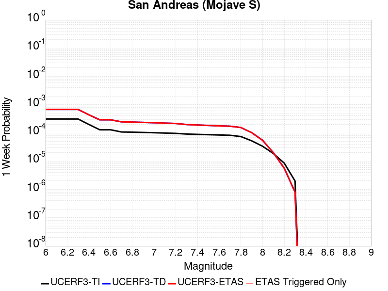 | 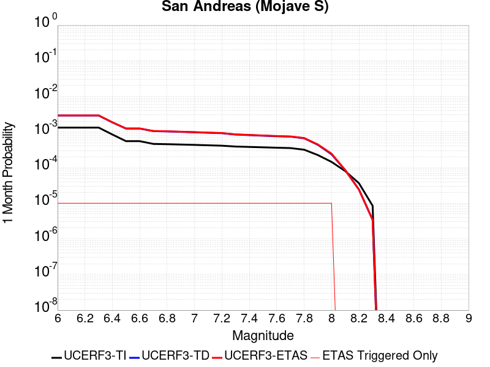 | 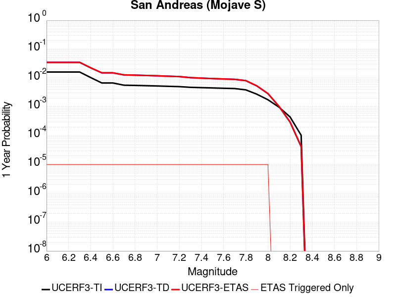 | 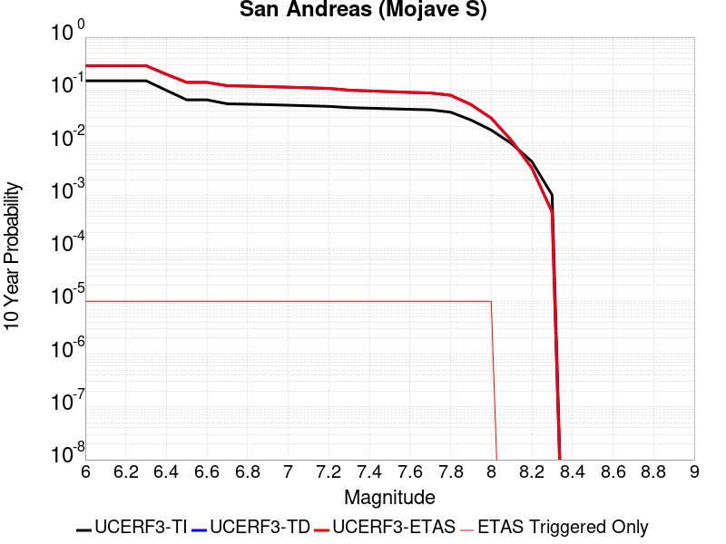 |

| Magnitude | 1 wk TI Prob | 1 wk TD Prob | 1 wk ETAS Prob | 1 wk ETAS/TD Gain | 1 wk ETAS Triggered Only | 1 mo TI Prob | 1 mo TD Prob | 1 mo ETAS Prob | 1 mo ETAS/TD Gain | 1 mo ETAS Triggered Only | 1 yr TI Prob | 1 yr TD Prob | 1 yr ETAS Prob | 1 yr ETAS/TD Gain | 1 yr ETAS Triggered Only | 10 yr TI Prob | 10 yr TD Prob | 10 yr ETAS Prob | 10 yr ETAS/TD Gain | 10 yr ETAS Triggered Only |
|-----|-----|-----|-----|-----|-----|-----|-----|-----|-----|-----|-----|-----|-----|-----|-----|-----|-----|-----|-----|-----|
| 6.0 | 3.1064058E-4 | 6.7851454E-4 | 6.7851454E-4 | 1.0 | 0.0 | 0.0013306376 | 0.0029048072 | 0.0029147782 | 1.0034325 | 1.0E-5 | 0.016080605 | 0.034761686 | 0.034771338 | 1.0002776 | 1.0E-5 | 0.1496549 | 0.2878585 | 0.2878656 | 1.0000248 | 1.0E-5 |
| 6.1 | 3.1064058E-4 | 6.7851454E-4 | 6.7851454E-4 | 1.0 | 0.0 | 0.0013306376 | 0.0029048072 | 0.0029147782 | 1.0034325 | 1.0E-5 | 0.016080605 | 0.034761686 | 0.034771338 | 1.0002776 | 1.0E-5 | 0.1496549 | 0.2878585 | 0.2878656 | 1.0000248 | 1.0E-5 |
| 6.2 | 3.1064058E-4 | 6.7851454E-4 | 6.7851454E-4 | 1.0 | 0.0 | 0.0013306376 | 0.0029048072 | 0.0029147782 | 1.0034325 | 1.0E-5 | 0.016080605 | 0.034761686 | 0.034771338 | 1.0002776 | 1.0E-5 | 0.1496549 | 0.2878585 | 0.2878656 | 1.0000248 | 1.0E-5 |
| 6.3 | 3.1064058E-4 | 6.7851454E-4 | 6.7851454E-4 | 1.0 | 0.0 | 0.0013306376 | 0.0029048072 | 0.0029147782 | 1.0034325 | 1.0E-5 | 0.016080605 | 0.034761686 | 0.034771338 | 1.0002776 | 1.0E-5 | 0.1496549 | 0.2878585 | 0.2878656 | 1.0000248 | 1.0E-5 |
| 6.4 | 1.9872203E-4 | 4.3551042E-4 | 4.3551042E-4 | 1.0 | 0.0 | 8.5138786E-4 | 0.0018651665 | 0.0018751478 | 1.0053514 | 1.0E-5 | 0.010316478 | 0.022478132 | 0.022487907 | 1.0004349 | 1.0E-5 | 0.098504856 | 0.1984968 | 0.19850482 | 1.0000404 | 1.0E-5 |
| 6.5 | 1.291105E-4 | 2.9105865E-4 | 2.9105865E-4 | 1.0 | 0.0 | 5.5321335E-4 | 0.0012468006 | 0.0012567881 | 1.0080105 | 1.0E-5 | 0.006714592 | 0.015074985 | 0.015084834 | 1.0006534 | 1.0E-5 | 0.065152965 | 0.13951135 | 0.13951994 | 1.0000616 | 1.0E-5 |
| 6.6 | 1.291105E-4 | 2.9105865E-4 | 2.9105865E-4 | 1.0 | 0.0 | 5.5321335E-4 | 0.0012468006 | 0.0012567881 | 1.0080105 | 1.0E-5 | 0.006714592 | 0.015074985 | 0.015084834 | 1.0006534 | 1.0E-5 | 0.065152965 | 0.13951135 | 0.13951994 | 1.0000616 | 1.0E-5 |
| 6.7 | 1.08001186E-4 | 2.4681858E-4 | 2.4681858E-4 | 1.0 | 0.0 | 4.6278012E-4 | 0.0010573658 | 0.0010673552 | 1.0094475 | 1.0E-5 | 0.0056198016 | 0.01279775 | 0.012807622 | 1.0007714 | 1.0E-5 | 0.054797906 | 0.12066254 | 0.12067134 | 1.0000728 | 1.0E-5 |
| 6.8 | 1.0624356E-4 | 2.4198538E-4 | 2.4198538E-4 | 1.0 | 0.0 | 4.5525006E-4 | 0.0010366685 | 0.0010466581 | 1.0096363 | 1.0E-5 | 0.0055285925 | 0.012548682 | 0.012558557 | 1.0007869 | 1.0E-5 | 0.053930566 | 0.11861166 | 0.11862048 | 1.0000743 | 1.0E-5 |
| 6.9 | 1.0393785E-4 | 2.3567598E-4 | 2.3567598E-4 | 1.0 | 0.0 | 4.4537184E-4 | 0.0010096494 | 0.0010196393 | 1.0098944 | 1.0E-5 | 0.0054089287 | 0.012223456 | 0.012233334 | 1.0008081 | 1.0E-5 | 0.05279156 | 0.11590465 | 0.11591349 | 1.0000763 | 1.0E-5 |
| 7.0 | 1.0155622E-4 | 2.2935652E-4 | 2.2935652E-4 | 1.0 | 0.0 | 4.3516833E-4 | 9.825866E-4 | 9.925768E-4 | 1.0101672 | 1.0E-5 | 0.005285311 | 0.011897608 | 0.011907488 | 1.0008305 | 1.0E-5 | 0.05161361 | 0.113163106 | 0.11317197 | 1.0000783 | 1.0E-5 |
| 7.1 | 9.885595E-5 | 2.2222353E-4 | 2.2222353E-4 | 1.0 | 0.0 | 4.2359953E-4 | 9.5203926E-4 | 9.6202974E-4 | 1.0104938 | 1.0E-5 | 0.0051451353 | 0.011529683 | 0.011539567 | 1.0008574 | 1.0E-5 | 0.05027629 | 0.11004769 | 0.110056594 | 1.0000808 | 1.0E-5 |
| 7.2 | 9.6411415E-5 | 2.1583757E-4 | 2.1583757E-4 | 1.0 | 0.0 | 4.1312634E-4 | 9.2469057E-4 | 9.346813E-4 | 1.0108044 | 1.0E-5 | 0.005018219 | 0.011200182 | 0.01121007 | 1.0008829 | 1.0E-5 | 0.049064007 | 0.107233286 | 0.10724222 | 1.0000832 | 1.0E-5 |
| 7.3 | 9.1180635E-5 | 1.980321E-4 | 1.980321E-4 | 1.0 | 0.0 | 3.907156E-4 | 8.4843306E-4 | 8.584246E-4 | 1.0117764 | 1.0E-5 | 0.004746591 | 0.010280866 | 0.010290763 | 1.0009627 | 1.0E-5 | 0.046464786 | 0.099402145 | 0.09941115 | 1.0000906 | 1.0E-5 |
| 7.4 | 8.887388E-5 | 1.9047984E-4 | 1.9047984E-4 | 1.0 | 0.0 | 3.8083247E-4 | 8.1608683E-4 | 8.2607864E-4 | 1.0122436 | 1.0E-5 | 0.0046267817 | 0.009890694 | 0.009900596 | 1.001001 | 1.0E-5 | 0.045316286 | 0.096029714 | 0.09603875 | 1.0000942 | 1.0E-5 |
| 7.5 | 8.6750515E-5 | 1.8376023E-4 | 1.8376023E-4 | 1.0 | 0.0 | 3.7173493E-4 | 7.873062E-4 | 7.9729833E-4 | 1.0126915 | 1.0E-5 | 0.004516484 | 0.009543415 | 0.00955332 | 1.0010378 | 1.0E-5 | 0.04425787 | 0.092984304 | 0.09299337 | 1.0000975 | 1.0E-5 |
| 7.6 | 8.453092E-5 | 1.7759397E-4 | 1.7759397E-4 | 1.0 | 0.0 | 3.6222505E-4 | 7.608951E-4 | 7.708875E-4 | 1.0131325 | 1.0E-5 | 0.0044011753 | 0.009224627 | 0.0092345355 | 1.0010741 | 1.0E-5 | 0.04315024 | 0.0901318 | 0.090140894 | 1.000101 | 1.0E-5 |
| 7.7 | 8.259102E-5 | 1.7278038E-4 | 1.7278038E-4 | 1.0 | 0.0 | 3.539135E-4 | 7.4027723E-4 | 7.5026986E-4 | 1.0134984 | 1.0E-5 | 0.004300386 | 0.008975702 | 0.008985613 | 1.0011041 | 1.0E-5 | 0.042181134 | 0.08787043 | 0.087879546 | 1.0001038 | 1.0E-5 |
| 7.8 | 7.444844E-5 | 1.5572333E-4 | 1.5572333E-4 | 1.0 | 0.0 | 3.1902574E-4 | 6.672151E-4 | 6.772084E-4 | 1.0149777 | 1.0E-5 | 0.0038772223 | 0.008093139 | 0.008103058 | 1.0012256 | 1.0E-5 | 0.03810269 | 0.07958597 | 0.07959517 | 1.0001156 | 1.0E-5 |
| 7.9 | 5.2586525E-5 | 1.0204509E-4 | 1.0204509E-4 | 1.0 | 0.0 | 2.2535135E-4 | 4.372628E-4 | 4.4725844E-4 | 1.0228596 | 1.0E-5 | 0.0027402006 | 0.0053106914 | 0.0053206384 | 1.001873 | 1.0E-5 | 0.027066574 | 0.0531247 | 0.05313417 | 1.0001782 | 1.0E-5 |
| 8.0 | 3.379877E-5 | 5.5226297E-5 | 5.5226297E-5 | 1.0 | 0.0 | 1.4484383E-4 | 2.3666266E-4 | 2.466603E-4 | 1.0422442 | 1.0E-5 | 0.0017620471 | 0.0028775628 | 0.002887534 | 1.0034652 | 1.0E-5 | 0.017481409 | 0.02939936 | 0.029409066 | 1.0003301 | 1.0E-5 |
| 8.1 | 1.8668277E-5 | 1.9859279E-5 | 1.9859279E-5 | 1.0 | 0.0 | 8.000444E-5 | 8.5108426E-5 | 8.5108426E-5 | 1.0 | 0.0 | 9.736188E-4 | 0.0010357032 | 0.0010357032 | 1.0 | 0.0 | 0.009693642 | 0.011086355 | 0.011086355 | 1.0 | 0.0 |
| 8.2 | 8.541571E-6 | 5.669046E-6 | 5.669046E-6 | 1.0 | 0.0 | 3.660622E-5 | 2.4295685E-5 | 2.4295685E-5 | 1.0 | 0.0 | 4.455896E-4 | 2.957599E-4 | 2.957599E-4 | 1.0 | 0.0 | 0.0044469717 | 0.0033546085 | 0.0033546085 | 1.0 | 0.0 |
| 8.3 | 1.983087E-6 | 8.007468E-7 | 8.007468E-7 | 1.0 | 0.0 | 8.498917E-6 | 3.4317677E-6 | 3.4317677E-6 | 1.0 | 0.0 | 1.034694E-4 | 4.178099E-5 | 4.178099E-5 | 1.0 | 0.0 | 0.0010342124 | 4.9186987E-4 | 4.9186987E-4 | 1.0 | 0.0 |

## San Andreas (Mojave N)
*[(top)](#table-of-contents)*

| 1 Week | 1 Month | 1 Year | 10 Year |
|-----|-----|-----|-----|
|  | 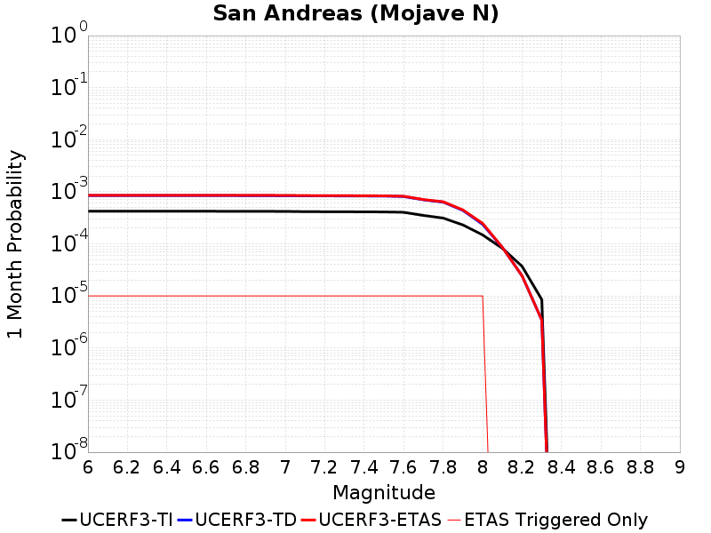 | 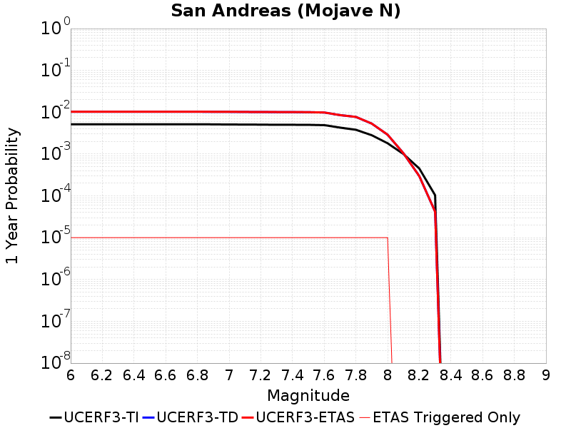 | 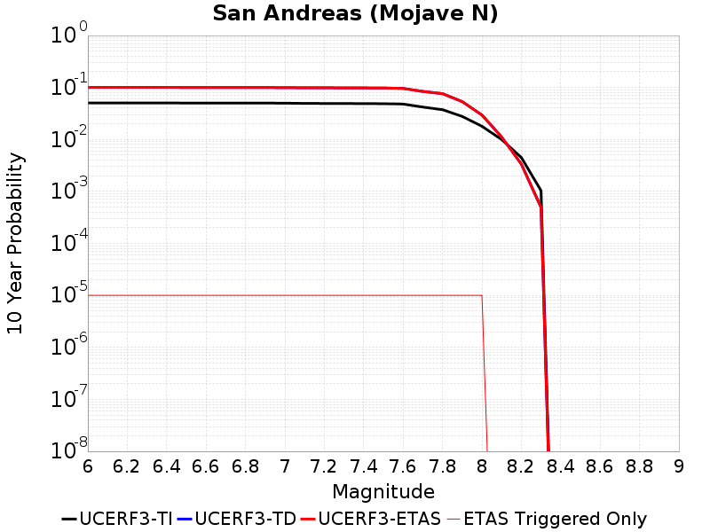 |

| Magnitude | 1 wk TI Prob | 1 wk TD Prob | 1 wk ETAS Prob | 1 wk ETAS/TD Gain | 1 wk ETAS Triggered Only | 1 mo TI Prob | 1 mo TD Prob | 1 mo ETAS Prob | 1 mo ETAS/TD Gain | 1 mo ETAS Triggered Only | 1 yr TI Prob | 1 yr TD Prob | 1 yr ETAS Prob | 1 yr ETAS/TD Gain | 1 yr ETAS Triggered Only | 10 yr TI Prob | 10 yr TD Prob | 10 yr ETAS Prob | 10 yr ETAS/TD Gain | 10 yr ETAS Triggered Only |
|-----|-----|-----|-----|-----|-----|-----|-----|-----|-----|-----|-----|-----|-----|-----|-----|-----|-----|-----|-----|-----|
| 6.0 | 9.877682E-5 | 1.9751955E-4 | 1.9751955E-4 | 1.0 | 0.0 | 4.2326056E-4 | 8.4623793E-4 | 8.5622945E-4 | 1.011807 | 1.0E-5 | 0.0051410277 | 0.010254409 | 0.010264306 | 1.0009652 | 1.0E-5 | 0.05023708 | 0.099856324 | 0.099865325 | 1.0000901 | 1.0E-5 |
| 6.1 | 9.877682E-5 | 1.9751955E-4 | 1.9751955E-4 | 1.0 | 0.0 | 4.2326056E-4 | 8.4623793E-4 | 8.5622945E-4 | 1.011807 | 1.0E-5 | 0.0051410277 | 0.010254409 | 0.010264306 | 1.0009652 | 1.0E-5 | 0.05023708 | 0.099856324 | 0.099865325 | 1.0000901 | 1.0E-5 |
| 6.2 | 9.877682E-5 | 1.9751955E-4 | 1.9751955E-4 | 1.0 | 0.0 | 4.2326056E-4 | 8.4623793E-4 | 8.5622945E-4 | 1.011807 | 1.0E-5 | 0.0051410277 | 0.010254409 | 0.010264306 | 1.0009652 | 1.0E-5 | 0.05023708 | 0.099856324 | 0.099865325 | 1.0000901 | 1.0E-5 |
| 6.3 | 9.877682E-5 | 1.9751955E-4 | 1.9751955E-4 | 1.0 | 0.0 | 4.2326056E-4 | 8.4623793E-4 | 8.5622945E-4 | 1.011807 | 1.0E-5 | 0.0051410277 | 0.010254409 | 0.010264306 | 1.0009652 | 1.0E-5 | 0.05023708 | 0.099856324 | 0.099865325 | 1.0000901 | 1.0E-5 |
| 6.4 | 9.877682E-5 | 1.9751955E-4 | 1.9751955E-4 | 1.0 | 0.0 | 4.2326056E-4 | 8.4623793E-4 | 8.5622945E-4 | 1.011807 | 1.0E-5 | 0.0051410277 | 0.010254409 | 0.010264306 | 1.0009652 | 1.0E-5 | 0.05023708 | 0.099856324 | 0.099865325 | 1.0000901 | 1.0E-5 |
| 6.5 | 9.861474E-5 | 1.9725614E-4 | 1.9725614E-4 | 1.0 | 0.0 | 4.2256617E-4 | 8.451098E-4 | 8.5510133E-4 | 1.0118228 | 1.0E-5 | 0.0051326132 | 0.010240803 | 0.010250701 | 1.0009664 | 1.0E-5 | 0.050156746 | 0.09973397 | 0.09974297 | 1.0000902 | 1.0E-5 |
| 6.6 | 9.861474E-5 | 1.9725614E-4 | 1.9725614E-4 | 1.0 | 0.0 | 4.2256617E-4 | 8.451098E-4 | 8.5510133E-4 | 1.0118228 | 1.0E-5 | 0.0051326132 | 0.010240803 | 0.010250701 | 1.0009664 | 1.0E-5 | 0.050156746 | 0.09973397 | 0.09974297 | 1.0000902 | 1.0E-5 |
| 6.7 | 9.8552715E-5 | 1.9715527E-4 | 1.9715527E-4 | 1.0 | 0.0 | 4.223004E-4 | 8.4467774E-4 | 8.546693E-4 | 1.0118288 | 1.0E-5 | 0.0051293927 | 0.010235592 | 0.01024549 | 1.000967 | 1.0E-5 | 0.050125998 | 0.09968692 | 0.09969592 | 1.0000904 | 1.0E-5 |
| 6.8 | 9.8464974E-5 | 1.9700588E-4 | 1.9700588E-4 | 1.0 | 0.0 | 4.219245E-4 | 8.440379E-4 | 8.5402944E-4 | 1.0118378 | 1.0E-5 | 0.0051248376 | 0.010227875 | 0.010237773 | 1.0009677 | 1.0E-5 | 0.05008251 | 0.0996165 | 0.0996255 | 1.0000904 | 1.0E-5 |
| 6.9 | 9.825824E-5 | 1.9668411E-4 | 1.9668411E-4 | 1.0 | 0.0 | 4.2103877E-4 | 8.426598E-4 | 8.5265137E-4 | 1.0118572 | 1.0E-5 | 0.0051141046 | 0.0102112545 | 0.010221153 | 1.0009693 | 1.0E-5 | 0.049980022 | 0.09946478 | 0.09947379 | 1.0000905 | 1.0E-5 |
| 7.0 | 9.781462E-5 | 1.9599378E-4 | 1.9599378E-4 | 1.0 | 0.0 | 4.1913814E-4 | 8.3970313E-4 | 8.4969477E-4 | 1.011899 | 1.0E-5 | 0.005091073 | 0.010175594 | 0.010185492 | 1.0009727 | 1.0E-5 | 0.04976007 | 0.099139795 | 0.0991488 | 1.0000908 | 1.0E-5 |
| 7.1 | 9.7121134E-5 | 1.950055E-4 | 1.950055E-4 | 1.0 | 0.0 | 4.1616702E-4 | 8.354704E-4 | 8.45462E-4 | 1.0119593 | 1.0E-5 | 0.005055068 | 0.01012454 | 0.010134439 | 1.0009778 | 1.0E-5 | 0.04941613 | 0.09867466 | 0.09868367 | 1.0000913 | 1.0E-5 |
| 7.2 | 9.663819E-5 | 1.9430947E-4 | 1.9430947E-4 | 1.0 | 0.0 | 4.1409794E-4 | 8.324893E-4 | 8.424809E-4 | 1.0120021 | 1.0E-5 | 0.0050299936 | 0.010088582 | 0.010098481 | 1.0009812 | 1.0E-5 | 0.049176537 | 0.09834658 | 0.098355606 | 1.0000917 | 1.0E-5 |
| 7.3 | 9.6277574E-5 | 1.938297E-4 | 1.938297E-4 | 1.0 | 0.0 | 4.125529E-4 | 8.304345E-4 | 8.404262E-4 | 1.0120319 | 1.0E-5 | 0.0050112694 | 0.010063796 | 0.010073695 | 1.0009837 | 1.0E-5 | 0.04899759 | 0.09811815 | 0.09812717 | 1.0000919 | 1.0E-5 |
| 7.4 | 9.593308E-5 | 1.9322208E-4 | 1.9322208E-4 | 1.0 | 0.0 | 4.1107697E-4 | 8.2783203E-4 | 8.378237E-4 | 1.0120697 | 1.0E-5 | 0.0049933824 | 0.010032403 | 0.010042303 | 1.0009868 | 1.0E-5 | 0.04882661 | 0.09783463 | 0.097843654 | 1.0000923 | 1.0E-5 |
| 7.5 | 9.561707E-5 | 1.92678E-4 | 1.92678E-4 | 1.0 | 0.0 | 4.0972308E-4 | 8.255017E-4 | 8.3549344E-4 | 1.0121038 | 1.0E-5 | 0.0049769743 | 0.010004293 | 0.010014193 | 1.0009896 | 1.0E-5 | 0.048669744 | 0.097578995 | 0.097588025 | 1.0000925 | 1.0E-5 |
| 7.6 | 9.418194E-5 | 1.8917157E-4 | 1.8917157E-4 | 1.0 | 0.0 | 4.0357444E-4 | 8.104836E-4 | 8.2047546E-4 | 1.0123283 | 1.0E-5 | 0.004902454 | 0.00982311 | 0.009833012 | 1.001008 | 1.0E-5 | 0.047957025 | 0.09595352 | 0.09596256 | 1.0000942 | 1.0E-5 |
| 7.7 | 8.202141E-5 | 1.6337055E-4 | 1.6337055E-4 | 1.0 | 0.0 | 3.51473E-4 | 6.999717E-4 | 7.099647E-4 | 1.0142763 | 1.0E-5 | 0.00427079 | 0.008488915 | 0.008498831 | 1.001168 | 1.0E-5 | 0.04189639 | 0.08365015 | 0.08365931 | 1.0001096 | 1.0E-5 |
| 7.8 | 7.2859846E-5 | 1.4800634E-4 | 1.4800634E-4 | 1.0 | 0.0 | 3.1221908E-4 | 6.341587E-4 | 6.441524E-4 | 1.0157589 | 1.0E-5 | 0.003794643 | 0.0076935934 | 0.0077035166 | 1.0012897 | 1.0E-5 | 0.037304975 | 0.07600791 | 0.07601715 | 1.0001216 | 1.0E-5 |
| 7.9 | 5.3874453E-5 | 1.0245892E-4 | 1.0245892E-4 | 1.0 | 0.0 | 2.3087008E-4 | 4.3903576E-4 | 4.490314E-4 | 1.0227672 | 1.0E-5 | 0.0028072202 | 0.005332172 | 0.0053421184 | 1.0018654 | 1.0E-5 | 0.02772022 | 0.05336033 | 0.053369798 | 1.0001774 | 1.0E-5 |
| 8.0 | 3.468538E-5 | 5.5423512E-5 | 5.5423512E-5 | 1.0 | 0.0 | 1.4864317E-4 | 2.3750772E-4 | 2.4750535E-4 | 1.0420939 | 1.0E-5 | 0.0018082283 | 0.002887824 | 0.002897795 | 1.0034528 | 1.0E-5 | 0.017935853 | 0.029518222 | 0.029527927 | 1.0003288 | 1.0E-5 |
| 8.1 | 1.9152367E-5 | 1.9958083E-5 | 1.9958083E-5 | 1.0 | 0.0 | 8.207899E-5 | 8.5531836E-5 | 8.5531836E-5 | 1.0 | 0.0 | 9.988535E-4 | 0.0010408533 | 0.0010408533 | 1.0 | 0.0 | 0.009943757 | 0.011146904 | 0.011146904 | 1.0 | 0.0 |
| 8.2 | 8.643924E-6 | 5.683797E-6 | 5.683797E-6 | 1.0 | 0.0 | 3.704486E-5 | 2.4358904E-5 | 2.4358904E-5 | 1.0 | 0.0 | 4.5092785E-4 | 2.9652938E-4 | 2.9652938E-4 | 1.0 | 0.0 | 0.0045001395 | 0.003362901 | 0.003362901 | 1.0 | 0.0 |
| 8.3 | 1.983087E-6 | 8.007468E-7 | 8.007468E-7 | 1.0 | 0.0 | 8.498917E-6 | 3.4317677E-6 | 3.4317677E-6 | 1.0 | 0.0 | 1.034694E-4 | 4.178099E-5 | 4.178099E-5 | 1.0 | 0.0 | 0.0010342124 | 4.9186987E-4 | 4.9186987E-4 | 1.0 | 0.0 |

## San Jacinto (Superstition Mtn)
*[(top)](#table-of-contents)*

| 1 Week | 1 Month | 1 Year | 10 Year |
|-----|-----|-----|-----|
|  |  |  |  |

| Magnitude | 1 wk TI Prob | 1 wk TD Prob | 1 wk ETAS Prob | 1 wk ETAS/TD Gain | 1 wk ETAS Triggered Only | 1 mo TI Prob | 1 mo TD Prob | 1 mo ETAS Prob | 1 mo ETAS/TD Gain | 1 mo ETAS Triggered Only | 1 yr TI Prob | 1 yr TD Prob | 1 yr ETAS Prob | 1 yr ETAS/TD Gain | 1 yr ETAS Triggered Only | 10 yr TI Prob | 10 yr TD Prob | 10 yr ETAS Prob | 10 yr ETAS/TD Gain | 10 yr ETAS Triggered Only |
|-----|-----|-----|-----|-----|-----|-----|-----|-----|-----|-----|-----|-----|-----|-----|-----|-----|-----|-----|-----|-----|
| 6.0 | 6.4193904E-5 | 9.632504E-5 | 9.632504E-5 | 1.0 | 0.0 | 2.7508775E-4 | 4.127639E-4 | 4.127639E-4 | 1.0 | 0.0 | 0.0033440501 | 0.0050152326 | 0.0050152326 | 1.0 | 0.0 | 0.03294174 | 0.048988733 | 0.048998244 | 1.0001941 | 1.0E-5 |
| 6.1 | 6.4193904E-5 | 9.632504E-5 | 9.632504E-5 | 1.0 | 0.0 | 2.7508775E-4 | 4.127639E-4 | 4.127639E-4 | 1.0 | 0.0 | 0.0033440501 | 0.0050152326 | 0.0050152326 | 1.0 | 0.0 | 0.03294174 | 0.048988733 | 0.048998244 | 1.0001941 | 1.0E-5 |
| 6.2 | 5.7023593E-5 | 8.3455096E-5 | 8.3455096E-5 | 1.0 | 0.0 | 2.4436394E-4 | 3.5762507E-4 | 3.5762507E-4 | 1.0 | 0.0 | 0.002971072 | 0.0043470403 | 0.0043470403 | 1.0 | 0.0 | 0.029316625 | 0.042663764 | 0.04267334 | 1.0002244 | 1.0E-5 |
| 6.3 | 5.6940098E-5 | 8.3300256E-5 | 8.3300256E-5 | 1.0 | 0.0 | 2.4400617E-4 | 3.5696168E-4 | 3.5696168E-4 | 1.0 | 0.0 | 0.002966728 | 0.0043389956 | 0.0043389956 | 1.0 | 0.0 | 0.029274331 | 0.042587053 | 0.042596627 | 1.0002248 | 1.0E-5 |
| 6.4 | 5.4171585E-5 | 7.7786484E-5 | 7.7786484E-5 | 1.0 | 0.0 | 2.3214328E-4 | 3.3333738E-4 | 3.3333738E-4 | 1.0 | 0.0 | 0.0028226813 | 0.0040524816 | 0.0040524816 | 1.0 | 0.0 | 0.02787096 | 0.039873227 | 0.03988283 | 1.0002408 | 1.0E-5 |
| 6.5 | 4.375144E-5 | 5.6689543E-5 | 5.6689543E-5 | 1.0 | 0.0 | 1.874927E-4 | 2.4293919E-4 | 2.4293919E-4 | 1.0 | 0.0 | 0.0022803338 | 0.0029549496 | 0.0029549496 | 1.0 | 0.0 | 0.022570757 | 0.029377116 | 0.029386822 | 1.0003304 | 1.0E-5 |
| 6.6 | 2.772192E-5 | 2.5743811E-5 | 2.5743811E-5 | 1.0 | 0.0 | 1.1880282E-4 | 1.10326066E-4 | 1.10326066E-4 | 1.0 | 0.0 | 0.0014454646 | 0.0013424117 | 0.0013424117 | 1.0 | 0.0 | 0.014360986 | 0.013673099 | 0.013682962 | 1.0007213 | 1.0E-5 |
| 6.7 | 2.7124124E-5 | 2.4953553E-5 | 2.4953553E-5 | 1.0 | 0.0 | 1.1624106E-4 | 1.0693953E-4 | 1.0693953E-4 | 1.0 | 0.0 | 0.0014143161 | 0.0013012305 | 0.0013012305 | 1.0 | 0.0 | 0.014053487 | 0.013265894 | 0.013275761 | 1.0007439 | 1.0E-5 |
| 6.8 | 2.5475807E-5 | 2.2412625E-5 | 2.2412625E-5 | 1.0 | 0.0 | 1.0917746E-4 | 9.605064E-5 | 9.605064E-5 | 1.0 | 0.0 | 0.001328425 | 0.0011688013 | 0.0011688013 | 1.0 | 0.0 | 0.0132051185 | 0.011950806 | 0.011960686 | 1.0008267 | 1.0E-5 |
| 6.9 | 2.1162023E-5 | 1.7855928E-5 | 1.7855928E-5 | 1.0 | 0.0 | 9.069123E-5 | 7.652318E-5 | 7.652318E-5 | 1.0 | 0.0 | 0.0011036064 | 9.3127537E-4 | 9.3127537E-4 | 1.0 | 0.0 | 0.010981417 | 0.009567097 | 0.009577001 | 1.0010352 | 1.0E-5 |
| 7.0 | 1.8754288E-5 | 1.6381511E-5 | 1.6381511E-5 | 1.0 | 0.0 | 8.037304E-5 | 7.02046E-5 | 7.02046E-5 | 1.0 | 0.0 | 9.781026E-4 | 8.5440837E-4 | 8.5440837E-4 | 1.0 | 0.0 | 0.009738087 | 0.008785367 | 0.00879528 | 1.0011282 | 1.0E-5 |
| 7.1 | 1.8678527E-5 | 1.6306447E-5 | 1.6306447E-5 | 1.0 | 0.0 | 8.0048376E-5 | 6.988292E-5 | 6.988292E-5 | 1.0 | 0.0 | 9.7415317E-4 | 8.504949E-4 | 8.504949E-4 | 1.0 | 0.0 | 0.009698939 | 0.008746194 | 0.008756106 | 1.0011333 | 1.0E-5 |
| 7.2 | 1.7804578E-5 | 1.5598845E-5 | 1.5598845E-5 | 1.0 | 0.0 | 7.6303106E-5 | 6.6850494E-5 | 6.6850494E-5 | 1.0 | 0.0 | 9.285943E-4 | 8.1360317E-4 | 8.1360317E-4 | 1.0 | 0.0 | 0.009247236 | 0.008376371 | 0.008386288 | 1.0011839 | 1.0E-5 |
| 7.3 | 1.6583685E-5 | 1.4745573E-5 | 1.4745573E-5 | 1.0 | 0.0 | 7.1070994E-5 | 6.3193795E-5 | 6.3193795E-5 | 1.0 | 0.0 | 8.649459E-4 | 7.691149E-4 | 7.691149E-4 | 1.0 | 0.0 | 0.00861587 | 0.007930585 | 0.007940506 | 1.001251 | 1.0E-5 |
| 7.4 | 1.6387552E-5 | 1.4610069E-5 | 1.4610069E-5 | 1.0 | 0.0 | 7.023047E-5 | 6.261309E-5 | 6.261309E-5 | 1.0 | 0.0 | 8.5472054E-4 | 7.620498E-4 | 7.620498E-4 | 1.0 | 0.0 | 0.008514405 | 0.007859764 | 0.007869685 | 1.0012623 | 1.0E-5 |
| 7.5 | 1.5790754E-5 | 1.4248698E-5 | 1.4248698E-5 | 1.0 | 0.0 | 6.767291E-5 | 6.1064435E-5 | 6.1064435E-5 | 1.0 | 0.0 | 8.236062E-4 | 7.432079E-4 | 7.432079E-4 | 1.0 | 0.0 | 0.008205604 | 0.0076692905 | 0.007679214 | 1.0012939 | 1.0E-5 |
| 7.6 | 1.4248672E-5 | 1.3259852E-5 | 1.3259852E-5 | 1.0 | 0.0 | 6.106431E-5 | 5.6826706E-5 | 5.6826706E-5 | 1.0 | 0.0 | 7.432043E-4 | 6.916473E-4 | 6.916473E-4 | 1.0 | 0.0 | 0.007407237 | 0.007147804 | 0.0071577323 | 1.001389 | 1.0E-5 |
| 7.7 | 1.15449975E-5 | 1.1100097E-5 | 1.1100097E-5 | 1.0 | 0.0 | 4.947762E-5 | 4.7570982E-5 | 4.7570982E-5 | 1.0 | 0.0 | 6.022235E-4 | 5.790236E-4 | 5.790236E-4 | 1.0 | 0.0 | 0.006005941 | 0.0060134665 | 0.0060134665 | 1.0 | 0.0 |
| 7.8 | 9.1391985E-6 | 9.7031125E-6 | 9.7031125E-6 | 1.0 | 0.0 | 3.9167408E-5 | 4.1584106E-5 | 4.1584106E-5 | 1.0 | 0.0 | 4.767588E-4 | 5.061695E-4 | 5.061695E-4 | 1.0 | 0.0 | 0.0047573727 | 0.005275837 | 0.005275837 | 1.0 | 0.0 |
| 7.9 | 6.973017E-6 | 7.5496514E-6 | 7.5496514E-6 | 1.0 | 0.0 | 2.9884017E-5 | 3.2355252E-5 | 3.2355252E-5 | 1.0 | 0.0 | 3.6377716E-4 | 3.9385454E-4 | 3.9385454E-4 | 1.0 | 0.0 | 0.0036318225 | 0.0041401642 | 0.0041401642 | 1.0 | 0.0 |
| 8.0 | 5.7638235E-6 | 6.4131905E-6 | 6.4131905E-6 | 1.0 | 0.0 | 2.4701867E-5 | 2.7484815E-5 | 2.7484815E-5 | 1.0 | 0.0 | 3.0070372E-4 | 3.3457676E-4 | 3.3457676E-4 | 1.0 | 0.0 | 0.0030029714 | 0.003534385 | 0.003534385 | 1.0 | 0.0 |
| 8.1 | 5.1124434E-6 | 5.6352847E-6 | 5.6352847E-6 | 1.0 | 0.0 | 2.1910288E-5 | 2.4150999E-5 | 2.4150999E-5 | 1.0 | 0.0 | 2.6672508E-4 | 2.9399927E-4 | 2.9399927E-4 | 1.0 | 0.0 | 0.0026640517 | 0.0031141378 | 0.0031141378 | 1.0 | 0.0 |
| 8.2 | 1.1075938E-6 | 5.5302365E-7 | 5.5302365E-7 | 1.0 | 0.0 | 4.7468216E-6 | 2.3700993E-6 | 2.3700993E-6 | 1.0 | 0.0 | 5.779102E-5 | 2.88556E-5 | 2.88556E-5 | 1.0 | 0.0 | 5.777599E-4 | 3.242734E-4 | 3.242734E-4 | 1.0 | 0.0 |
| 8.3 | 1.3584393E-8 | 4.6557E-9 | 4.6557E-9 | 1.0 | 0.0 | 5.8218827E-8 | 1.9953E-8 | 1.9953E-8 | 1.0 | 0.0 | 7.0881396E-7 | 2.4292777E-7 | 2.4292777E-7 | 1.0 | 0.0 | 7.0881174E-6 | 2.7191868E-6 | 2.7191868E-6 | 1.0 | 0.0 |

## San Andreas (Carrizo) rev
*[(top)](#table-of-contents)*

| 1 Week | 1 Month | 1 Year | 10 Year |
|-----|-----|-----|-----|
| 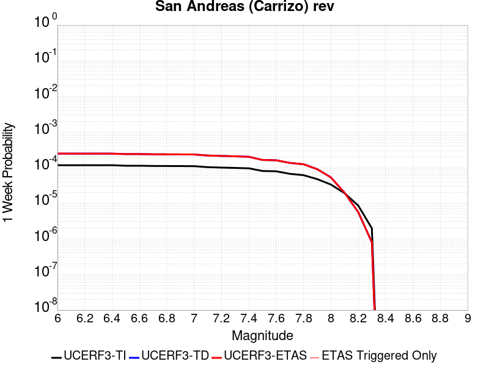 | 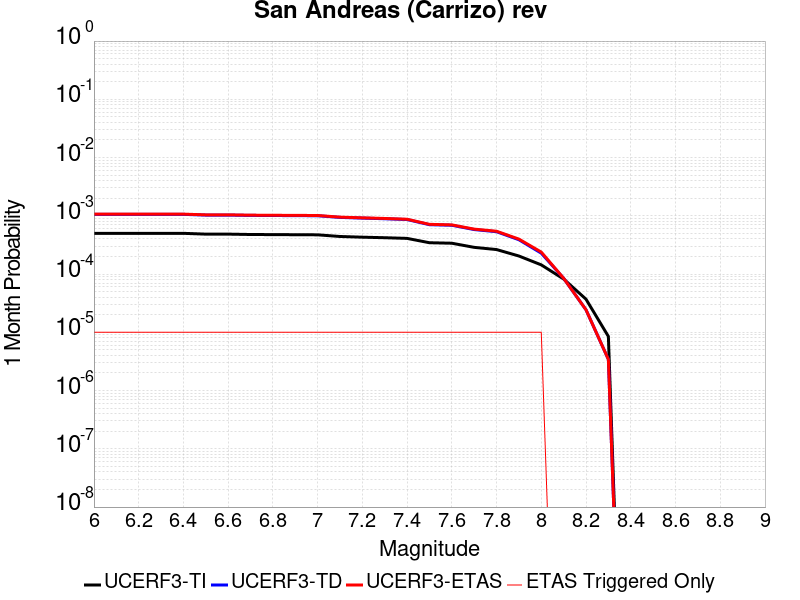 | 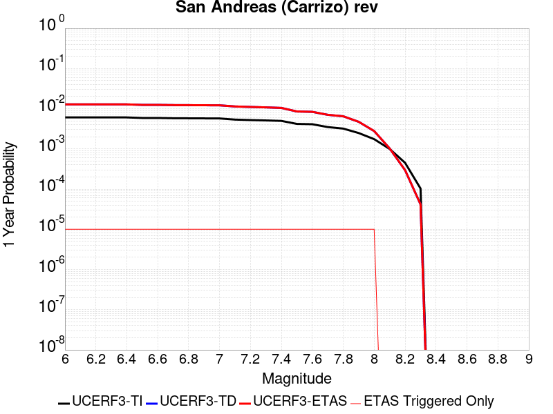 | 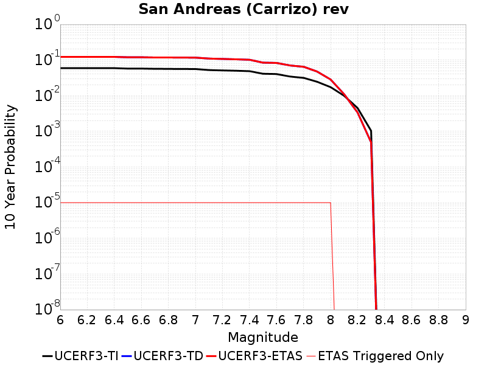 |

| Magnitude | 1 wk TI Prob | 1 wk TD Prob | 1 wk ETAS Prob | 1 wk ETAS/TD Gain | 1 wk ETAS Triggered Only | 1 mo TI Prob | 1 mo TD Prob | 1 mo ETAS Prob | 1 mo ETAS/TD Gain | 1 mo ETAS Triggered Only | 1 yr TI Prob | 1 yr TD Prob | 1 yr ETAS Prob | 1 yr ETAS/TD Gain | 1 yr ETAS Triggered Only | 10 yr TI Prob | 10 yr TD Prob | 10 yr ETAS Prob | 10 yr ETAS/TD Gain | 10 yr ETAS Triggered Only |
|-----|-----|-----|-----|-----|-----|-----|-----|-----|-----|-----|-----|-----|-----|-----|-----|-----|-----|-----|-----|-----|
| 6.0 | 1.1674632E-4 | 2.4708404E-4 | 2.4708404E-4 | 1.0 | 0.0 | 5.002454E-4 | 0.0010585035 | 0.001068493 | 1.0094373 | 1.0E-5 | 0.006073493 | 0.012811629 | 0.0128215 | 1.0007706 | 1.0E-5 | 0.0591016 | 0.122283034 | 0.12229181 | 1.0000718 | 1.0E-5 |
| 6.1 | 1.1674632E-4 | 2.4708404E-4 | 2.4708404E-4 | 1.0 | 0.0 | 5.002454E-4 | 0.0010585035 | 0.001068493 | 1.0094373 | 1.0E-5 | 0.006073493 | 0.012811629 | 0.0128215 | 1.0007706 | 1.0E-5 | 0.0591016 | 0.122283034 | 0.12229181 | 1.0000718 | 1.0E-5 |
| 6.2 | 1.1674632E-4 | 2.4708404E-4 | 2.4708404E-4 | 1.0 | 0.0 | 5.002454E-4 | 0.0010585035 | 0.001068493 | 1.0094373 | 1.0E-5 | 0.006073493 | 0.012811629 | 0.0128215 | 1.0007706 | 1.0E-5 | 0.0591016 | 0.122283034 | 0.12229181 | 1.0000718 | 1.0E-5 |
| 6.3 | 1.1674632E-4 | 2.4708404E-4 | 2.4708404E-4 | 1.0 | 0.0 | 5.002454E-4 | 0.0010585035 | 0.001068493 | 1.0094373 | 1.0E-5 | 0.006073493 | 0.012811629 | 0.0128215 | 1.0007706 | 1.0E-5 | 0.0591016 | 0.122283034 | 0.12229181 | 1.0000718 | 1.0E-5 |
| 6.4 | 1.1674632E-4 | 2.4708404E-4 | 2.4708404E-4 | 1.0 | 0.0 | 5.002454E-4 | 0.0010585035 | 0.001068493 | 1.0094373 | 1.0E-5 | 0.006073493 | 0.012811629 | 0.0128215 | 1.0007706 | 1.0E-5 | 0.0591016 | 0.122283034 | 0.12229181 | 1.0000718 | 1.0E-5 |
| 6.5 | 1.13136164E-4 | 2.4026746E-4 | 2.4026746E-4 | 1.0 | 0.0 | 4.847792E-4 | 0.0010293128 | 0.0010393026 | 1.0097052 | 1.0E-5 | 0.0058862255 | 0.012460338 | 0.012470214 | 1.0007925 | 1.0E-5 | 0.057327334 | 0.11924674 | 0.11925555 | 1.0000739 | 1.0E-5 |
| 6.6 | 1.13136164E-4 | 2.4026746E-4 | 2.4026746E-4 | 1.0 | 0.0 | 4.847792E-4 | 0.0010293128 | 0.0010393026 | 1.0097052 | 1.0E-5 | 0.0058862255 | 0.012460338 | 0.012470214 | 1.0007925 | 1.0E-5 | 0.057327334 | 0.11924674 | 0.11925555 | 1.0000739 | 1.0E-5 |
| 6.7 | 1.1149675E-4 | 2.3717205E-4 | 2.3717205E-4 | 1.0 | 0.0 | 4.777557E-4 | 0.0010160572 | 0.001026047 | 1.009832 | 1.0E-5 | 0.0058011734 | 0.012300781 | 0.012310659 | 1.000803 | 1.0E-5 | 0.05652051 | 0.11786452 | 0.11787334 | 1.0000749 | 1.0E-5 |
| 6.8 | 1.1103589E-4 | 2.3618901E-4 | 2.3618901E-4 | 1.0 | 0.0 | 4.7578133E-4 | 0.0010118475 | 0.0010218373 | 1.0098729 | 1.0E-5 | 0.005777263 | 0.012250105 | 0.0122599825 | 1.0008063 | 1.0E-5 | 0.056293584 | 0.117424026 | 0.117432855 | 1.0000751 | 1.0E-5 |
| 6.9 | 1.1053259E-4 | 2.3510764E-4 | 2.3510764E-4 | 1.0 | 0.0 | 4.7362508E-4 | 0.0010072166 | 0.0010172065 | 1.0099183 | 1.0E-5 | 0.0057511497 | 0.012194357 | 0.0122042345 | 1.00081 | 1.0E-5 | 0.05604569 | 0.116940506 | 0.116949335 | 1.0000755 | 1.0E-5 |
| 7.0 | 1.1005377E-4 | 2.3411142E-4 | 2.3411142E-4 | 1.0 | 0.0 | 4.7157376E-4 | 0.0010029504 | 0.0010129403 | 1.0099605 | 1.0E-5 | 0.0057263062 | 0.012142996 | 0.012152875 | 1.0008135 | 1.0E-5 | 0.055809796 | 0.116490595 | 0.11649943 | 1.0000758 | 1.0E-5 |
| 7.1 | 1.0308142E-4 | 2.1913632E-4 | 2.1913632E-4 | 1.0 | 0.0 | 4.417027E-4 | 9.388187E-4 | 9.488093E-4 | 1.0106417 | 1.0E-5 | 0.0053644776 | 0.011370541 | 0.011380427 | 1.0008695 | 1.0E-5 | 0.052368138 | 0.109733105 | 0.10974201 | 1.0000812 | 1.0E-5 |
| 7.2 | 1.0027479E-4 | 2.1318583E-4 | 2.1318583E-4 | 1.0 | 0.0 | 4.296783E-4 | 9.1333466E-4 | 9.2332554E-4 | 1.0109389 | 1.0E-5 | 0.0052187922 | 0.011063463 | 0.011073353 | 1.0008938 | 1.0E-5 | 0.050979212 | 0.10703024 | 0.10703917 | 1.0000834 | 1.0E-5 |
| 7.3 | 9.816942E-5 | 2.0788758E-4 | 2.0788758E-4 | 1.0 | 0.0 | 4.2065824E-4 | 8.9064357E-4 | 9.006347E-4 | 1.0112178 | 1.0E-5 | 0.005109493 | 0.010789968 | 0.010799861 | 1.0009168 | 1.0E-5 | 0.049935985 | 0.104594424 | 0.10460338 | 1.0000856 | 1.0E-5 |
| 7.4 | 9.5634205E-5 | 2.015172E-4 | 2.015172E-4 | 1.0 | 0.0 | 4.0979648E-4 | 8.6336024E-4 | 8.7335164E-4 | 1.0115726 | 1.0E-5 | 0.0049778637 | 0.010461023 | 0.010470918 | 1.0009459 | 1.0E-5 | 0.048678253 | 0.10165495 | 0.10166393 | 1.0000883 | 1.0E-5 |
| 7.5 | 8.052417E-5 | 1.642939E-4 | 1.642939E-4 | 1.0 | 0.0 | 3.4505792E-4 | 7.039269E-4 | 7.139199E-4 | 1.014196 | 1.0E-5 | 0.0041929903 | 0.008536718 | 0.008546633 | 1.0011615 | 1.0E-5 | 0.04114753 | 0.084223665 | 0.08423282 | 1.0001087 | 1.0E-5 |
| 7.6 | 7.897024E-5 | 1.6078672E-4 | 1.6078672E-4 | 1.0 | 0.0 | 3.384E-4 | 6.8890414E-4 | 6.9889723E-4 | 1.0145059 | 1.0E-5 | 0.0041122385 | 0.008355232 | 0.008365149 | 1.0011868 | 1.0E-5 | 0.040369697 | 0.08255048 | 0.08255965 | 1.0001111 | 1.0E-5 |
| 7.7 | 6.707427E-5 | 1.3558345E-4 | 1.3558345E-4 | 1.0 | 0.0 | 2.8742946E-4 | 5.8094255E-4 | 5.9093675E-4 | 1.0172035 | 1.0E-5 | 0.003493839 | 0.0070500723 | 0.007060002 | 1.0014085 | 1.0E-5 | 0.034394164 | 0.07033379 | 0.070343085 | 1.0001322 | 1.0E-5 |
| 7.8 | 6.147705E-5 | 1.2453114E-4 | 1.2453114E-4 | 1.0 | 0.0 | 2.6344648E-4 | 5.3359574E-4 | 5.435904E-4 | 1.0187308 | 1.0E-5 | 0.0032027436 | 0.0064772037 | 0.0064871386 | 1.0015339 | 1.0E-5 | 0.031569764 | 0.06468327 | 0.064692624 | 1.0001446 | 1.0E-5 |
| 7.9 | 4.7636717E-5 | 9.065018E-5 | 9.065018E-5 | 1.0 | 0.0 | 2.0414138E-4 | 3.8844295E-4 | 3.9843904E-4 | 1.0257338 | 1.0E-5 | 0.0024825884 | 0.0047190455 | 0.0047289985 | 1.002109 | 1.0E-5 | 0.024550365 | 0.047499284 | 0.047508806 | 1.0002005 | 1.0E-5 |
| 8.0 | 3.3554235E-5 | 5.328268E-5 | 5.328268E-5 | 1.0 | 0.0 | 1.4379594E-4 | 2.2833438E-4 | 2.3833208E-4 | 1.0437855 | 1.0E-5 | 0.0017493097 | 0.0027764288 | 0.0027864012 | 1.0035918 | 1.0E-5 | 0.017356034 | 0.028444665 | 0.02845438 | 1.0003415 | 1.0E-5 |
| 8.1 | 1.9175432E-5 | 1.974348E-5 | 1.974348E-5 | 1.0 | 0.0 | 8.217783E-5 | 8.461218E-5 | 8.461218E-5 | 1.0 | 0.0 | 0.0010000558 | 0.0010296671 | 0.0010296671 | 1.0 | 0.0 | 0.009955673 | 0.01105101 | 0.01105101 | 1.0 | 0.0 |
| 8.2 | 8.643924E-6 | 5.683797E-6 | 5.683797E-6 | 1.0 | 0.0 | 3.704486E-5 | 2.4358904E-5 | 2.4358904E-5 | 1.0 | 0.0 | 4.5092785E-4 | 2.9652938E-4 | 2.9652938E-4 | 1.0 | 0.0 | 0.0045001395 | 0.003362901 | 0.003362901 | 1.0 | 0.0 |
| 8.3 | 1.983087E-6 | 8.007468E-7 | 8.007468E-7 | 1.0 | 0.0 | 8.498917E-6 | 3.4317677E-6 | 3.4317677E-6 | 1.0 | 0.0 | 1.034694E-4 | 4.178099E-5 | 4.178099E-5 | 1.0 | 0.0 | 0.0010342124 | 4.9186987E-4 | 4.9186987E-4 | 1.0 | 0.0 |

## North Frontal  (East)
*[(top)](#table-of-contents)*

| 1 Week | 1 Month | 1 Year | 10 Year |
|-----|-----|-----|-----|
|  |  |  |  |

| Magnitude | 1 wk TI Prob | 1 wk TD Prob | 1 wk ETAS Prob | 1 wk ETAS/TD Gain | 1 wk ETAS Triggered Only | 1 mo TI Prob | 1 mo TD Prob | 1 mo ETAS Prob | 1 mo ETAS/TD Gain | 1 mo ETAS Triggered Only | 1 yr TI Prob | 1 yr TD Prob | 1 yr ETAS Prob | 1 yr ETAS/TD Gain | 1 yr ETAS Triggered Only | 10 yr TI Prob | 10 yr TD Prob | 10 yr ETAS Prob | 10 yr ETAS/TD Gain | 10 yr ETAS Triggered Only |
|-----|-----|-----|-----|-----|-----|-----|-----|-----|-----|-----|-----|-----|-----|-----|-----|-----|-----|-----|-----|-----|
| 6.0 | 7.135738E-6 | 7.479061E-6 | 7.479061E-6 | 1.0 | 0.0 | 3.0581377E-5 | 3.2052838E-5 | 3.2052838E-5 | 1.0 | 0.0 | 3.7226462E-4 | 3.9019337E-4 | 3.9019337E-4 | 1.0 | 0.0 | 0.0037164164 | 0.0038970413 | 0.0039070025 | 1.0025561 | 1.0E-5 |
| 6.1 | 7.135738E-6 | 7.479061E-6 | 7.479061E-6 | 1.0 | 0.0 | 3.0581377E-5 | 3.2052838E-5 | 3.2052838E-5 | 1.0 | 0.0 | 3.7226462E-4 | 3.9019337E-4 | 3.9019337E-4 | 1.0 | 0.0 | 0.0037164164 | 0.0038970413 | 0.0039070025 | 1.0025561 | 1.0E-5 |
| 6.2 | 7.135738E-6 | 7.479061E-6 | 7.479061E-6 | 1.0 | 0.0 | 3.0581377E-5 | 3.2052838E-5 | 3.2052838E-5 | 1.0 | 0.0 | 3.7226462E-4 | 3.9019337E-4 | 3.9019337E-4 | 1.0 | 0.0 | 0.0037164164 | 0.0038970413 | 0.0039070025 | 1.0025561 | 1.0E-5 |
| 6.3 | 7.135738E-6 | 7.479061E-6 | 7.479061E-6 | 1.0 | 0.0 | 3.0581377E-5 | 3.2052838E-5 | 3.2052838E-5 | 1.0 | 0.0 | 3.7226462E-4 | 3.9019337E-4 | 3.9019337E-4 | 1.0 | 0.0 | 0.0037164164 | 0.0038970413 | 0.0039070025 | 1.0025561 | 1.0E-5 |
| 6.4 | 7.135738E-6 | 7.479061E-6 | 7.479061E-6 | 1.0 | 0.0 | 3.0581377E-5 | 3.2052838E-5 | 3.2052838E-5 | 1.0 | 0.0 | 3.7226462E-4 | 3.9019337E-4 | 3.9019337E-4 | 1.0 | 0.0 | 0.0037164164 | 0.0038970413 | 0.0039070025 | 1.0025561 | 1.0E-5 |
| 6.5 | 7.135738E-6 | 7.479061E-6 | 7.479061E-6 | 1.0 | 0.0 | 3.0581377E-5 | 3.2052838E-5 | 3.2052838E-5 | 1.0 | 0.0 | 3.7226462E-4 | 3.9019337E-4 | 3.9019337E-4 | 1.0 | 0.0 | 0.0037164164 | 0.0038970413 | 0.0039070025 | 1.0025561 | 1.0E-5 |
| 6.6 | 7.135738E-6 | 7.479061E-6 | 7.479061E-6 | 1.0 | 0.0 | 3.0581377E-5 | 3.2052838E-5 | 3.2052838E-5 | 1.0 | 0.0 | 3.7226462E-4 | 3.9019337E-4 | 3.9019337E-4 | 1.0 | 0.0 | 0.0037164164 | 0.0038970413 | 0.0039070025 | 1.0025561 | 1.0E-5 |
| 6.7 | 7.135738E-6 | 7.479061E-6 | 7.479061E-6 | 1.0 | 0.0 | 3.0581377E-5 | 3.2052838E-5 | 3.2052838E-5 | 1.0 | 0.0 | 3.7226462E-4 | 3.9019337E-4 | 3.9019337E-4 | 1.0 | 0.0 | 0.0037164164 | 0.0038970413 | 0.0039070025 | 1.0025561 | 1.0E-5 |
| 6.8 | 5.959142E-6 | 6.238213E-6 | 6.238213E-6 | 1.0 | 0.0 | 2.553893E-5 | 2.6735026E-5 | 2.6735026E-5 | 1.0 | 0.0 | 3.108921E-4 | 3.254684E-4 | 3.254684E-4 | 1.0 | 0.0 | 0.0031045752 | 0.0032516916 | 0.003261659 | 1.0030653 | 1.0E-5 |
| 6.9 | 2.2946929E-6 | 2.3829405E-6 | 2.3829405E-6 | 1.0 | 0.0 | 9.834361E-6 | 1.0212565E-5 | 1.0212565E-5 | 1.0 | 0.0 | 1.1972676E-4 | 1.2433136E-4 | 1.2433136E-4 | 1.0 | 0.0 | 0.0011966228 | 0.0012426644 | 0.001252652 | 1.0080372 | 1.0E-5 |
| 7.0 | 2.2468673E-6 | 2.33262E-6 | 2.33262E-6 | 1.0 | 0.0 | 9.629396E-6 | 9.9969075E-6 | 9.9969075E-6 | 1.0 | 0.0 | 1.1723159E-4 | 1.2170602E-4 | 1.2170602E-4 | 1.0 | 0.0 | 0.0011716976 | 0.00121644 | 0.0012264278 | 1.0082107 | 1.0E-5 |
| 7.1 | 1.9921076E-6 | 2.0649986E-6 | 2.0649986E-6 | 1.0 | 0.0 | 8.537577E-6 | 8.849967E-6 | 8.849967E-6 | 1.0 | 0.0 | 1.0394004E-4 | 1.0774346E-4 | 1.0774346E-4 | 1.0 | 0.0 | 0.0010389143 | 0.0010769549 | 0.0010869441 | 1.0092754 | 1.0E-5 |
| 7.2 | 1.4524545E-6 | 1.5047987E-6 | 1.5047987E-6 | 1.0 | 0.0 | 6.2247905E-6 | 6.4491223E-6 | 6.4491223E-6 | 1.0 | 0.0 | 7.5784184E-5 | 7.8515484E-5 | 7.8515484E-5 | 1.0 | 0.0 | 7.575835E-4 | 7.849019E-4 | 7.9489406E-4 | 1.0127305 | 1.0E-5 |
| 7.3 | 8.9802575E-7 | 9.31052E-7 | 9.31052E-7 | 1.0 | 0.0 | 3.848676E-6 | 3.9902175E-6 | 3.9902175E-6 | 1.0 | 0.0 | 4.685662E-5 | 4.857993E-5 | 4.857993E-5 | 1.0 | 0.0 | 4.6846745E-4 | 4.857044E-4 | 4.956995E-4 | 1.0205786 | 1.0E-5 |
| 7.4 | 7.776139E-7 | 8.062026E-7 | 8.062026E-7 | 1.0 | 0.0 | 3.3326266E-6 | 3.45515E-6 | 3.45515E-6 | 1.0 | 0.0 | 4.0573974E-5 | 4.206575E-5 | 4.206575E-5 | 1.0 | 0.0 | 4.0566566E-4 | 4.2058862E-4 | 4.3058442E-4 | 1.0237662 | 1.0E-5 |
| 7.5 | 5.244417E-7 | 5.4422935E-7 | 5.4422935E-7 | 1.0 | 0.0 | 2.2476054E-6 | 2.3324098E-6 | 2.3324098E-6 | 1.0 | 0.0 | 2.7364253E-5 | 2.8396786E-5 | 2.8396786E-5 | 1.0 | 0.0 | 2.7360884E-4 | 2.8393808E-4 | 2.8393808E-4 | 1.0 | 0.0 |
| 7.6 | 1.5489647E-7 | 1.6092783E-7 | 1.6092783E-7 | 1.0 | 0.0 | 6.6384183E-7 | 6.896906E-7 | 6.896906E-7 | 1.0 | 0.0 | 8.082245E-6 | 8.396971E-6 | 8.396971E-6 | 1.0 | 0.0 | 8.08195E-5 | 8.396853E-5 | 8.396853E-5 | 1.0 | 0.0 |

## San Jacinto (San Bernardino)
*[(top)](#table-of-contents)*

| 1 Week | 1 Month | 1 Year | 10 Year |
|-----|-----|-----|-----|
| 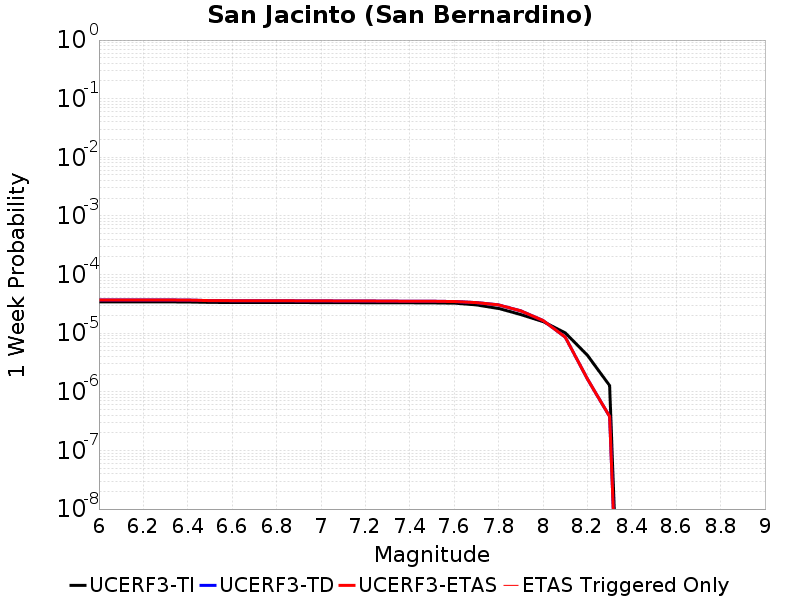 | 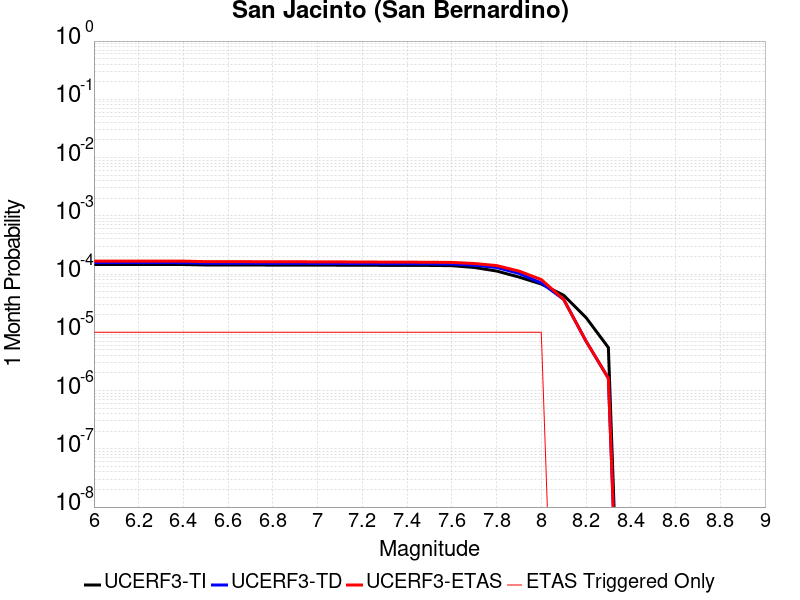 | 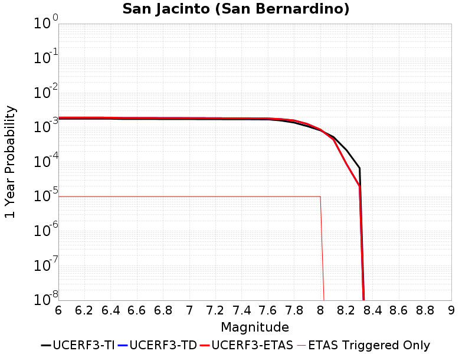 | 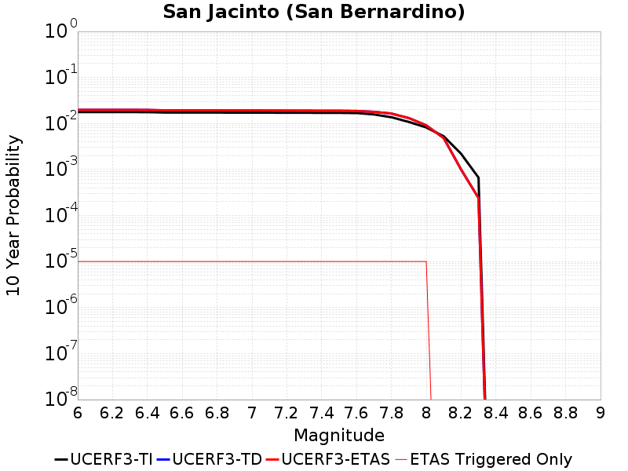 |

| Magnitude | 1 wk TI Prob | 1 wk TD Prob | 1 wk ETAS Prob | 1 wk ETAS/TD Gain | 1 wk ETAS Triggered Only | 1 mo TI Prob | 1 mo TD Prob | 1 mo ETAS Prob | 1 mo ETAS/TD Gain | 1 mo ETAS Triggered Only | 1 yr TI Prob | 1 yr TD Prob | 1 yr ETAS Prob | 1 yr ETAS/TD Gain | 1 yr ETAS Triggered Only | 10 yr TI Prob | 10 yr TD Prob | 10 yr ETAS Prob | 10 yr ETAS/TD Gain | 10 yr ETAS Triggered Only |
|-----|-----|-----|-----|-----|-----|-----|-----|-----|-----|-----|-----|-----|-----|-----|-----|-----|-----|-----|-----|-----|
| 6.0 | 3.409352E-5 | 3.6655027E-5 | 3.6655027E-5 | 1.0 | 0.0 | 1.461069E-4 | 1.5708352E-4 | 1.6708195E-4 | 1.0636504 | 1.0E-5 | 0.0017774 | 0.001910816 | 0.0019207968 | 1.0052234 | 1.0E-5 | 0.01763251 | 0.019692319 | 0.019702122 | 1.0004978 | 1.0E-5 |
| 6.1 | 3.409352E-5 | 3.6655027E-5 | 3.6655027E-5 | 1.0 | 0.0 | 1.461069E-4 | 1.5708352E-4 | 1.6708195E-4 | 1.0636504 | 1.0E-5 | 0.0017774 | 0.001910816 | 0.0019207968 | 1.0052234 | 1.0E-5 | 0.01763251 | 0.019692319 | 0.019702122 | 1.0004978 | 1.0E-5 |
| 6.2 | 3.409352E-5 | 3.6655027E-5 | 3.6655027E-5 | 1.0 | 0.0 | 1.461069E-4 | 1.5708352E-4 | 1.6708195E-4 | 1.0636504 | 1.0E-5 | 0.0017774 | 0.001910816 | 0.0019207968 | 1.0052234 | 1.0E-5 | 0.01763251 | 0.019692319 | 0.019702122 | 1.0004978 | 1.0E-5 |
| 6.3 | 3.409352E-5 | 3.6655027E-5 | 3.6655027E-5 | 1.0 | 0.0 | 1.461069E-4 | 1.5708352E-4 | 1.6708195E-4 | 1.0636504 | 1.0E-5 | 0.0017774 | 0.001910816 | 0.0019207968 | 1.0052234 | 1.0E-5 | 0.01763251 | 0.019692319 | 0.019702122 | 1.0004978 | 1.0E-5 |
| 6.4 | 3.400795E-5 | 3.654755E-5 | 3.654755E-5 | 1.0 | 0.0 | 1.4574021E-4 | 1.5662296E-4 | 1.666214E-4 | 1.0638376 | 1.0E-5 | 0.0017729428 | 0.0019052185 | 0.0019151994 | 1.0052388 | 1.0E-5 | 0.017588645 | 0.019637346 | 0.01964715 | 1.0004992 | 1.0E-5 |
| 6.5 | 3.341482E-5 | 3.580723E-5 | 3.580723E-5 | 1.0 | 0.0 | 1.4319851E-4 | 1.5345053E-4 | 1.63449E-4 | 1.0651575 | 1.0E-5 | 0.0017420477 | 0.0018666608 | 0.0018766421 | 1.0053471 | 1.0E-5 | 0.017284546 | 0.019258535 | 0.019268343 | 1.0005093 | 1.0E-5 |
| 6.6 | 3.3364955E-5 | 3.5744364E-5 | 3.5744364E-5 | 1.0 | 0.0 | 1.4298483E-4 | 1.5318114E-4 | 1.631796E-4 | 1.0652722 | 1.0E-5 | 0.0017394501 | 0.0018633865 | 0.0018733679 | 1.0053566 | 1.0E-5 | 0.017258976 | 0.019226369 | 0.019236175 | 1.0005101 | 1.0E-5 |
| 6.7 | 3.335922E-5 | 3.5734123E-5 | 3.5734123E-5 | 1.0 | 0.0 | 1.4296026E-4 | 1.5313725E-4 | 1.6313573E-4 | 1.0652909 | 1.0E-5 | 0.0017391514 | 0.0018628532 | 0.0018728345 | 1.0053581 | 1.0E-5 | 0.017256035 | 0.019221155 | 0.019230962 | 1.0005102 | 1.0E-5 |
| 6.8 | 3.327683E-5 | 3.5628036E-5 | 3.5628036E-5 | 1.0 | 0.0 | 1.4260718E-4 | 1.5268265E-4 | 1.6268113E-4 | 1.0654854 | 1.0E-5 | 0.0017348597 | 0.0018573279 | 0.0018673093 | 1.0053741 | 1.0E-5 | 0.017213784 | 0.019166864 | 0.019176673 | 1.0005118 | 1.0E-5 |
| 6.9 | 3.3235785E-5 | 3.5568894E-5 | 3.5568894E-5 | 1.0 | 0.0 | 1.4243131E-4 | 1.5242922E-4 | 1.624277E-4 | 1.0655942 | 1.0E-5 | 0.0017327217 | 0.0018542475 | 0.001864229 | 1.005383 | 1.0E-5 | 0.017192734 | 0.019136697 | 0.019146506 | 1.0005126 | 1.0E-5 |
| 7.0 | 3.3197095E-5 | 3.5508714E-5 | 3.5508714E-5 | 1.0 | 0.0 | 1.422655E-4 | 1.5217133E-4 | 1.6216982E-4 | 1.0657054 | 1.0E-5 | 0.0017307063 | 0.001851113 | 0.0018610946 | 1.0053922 | 1.0E-5 | 0.017172894 | 0.01910603 | 0.01911584 | 1.0005134 | 1.0E-5 |
| 7.1 | 3.3129716E-5 | 3.5388675E-5 | 3.5388675E-5 | 1.0 | 0.0 | 1.4197677E-4 | 1.5165693E-4 | 1.6165542E-4 | 1.0659283 | 1.0E-5 | 0.0017271966 | 0.001844861 | 0.0018548425 | 1.0054104 | 1.0E-5 | 0.017138338 | 0.019045005 | 0.019054813 | 1.0005151 | 1.0E-5 |
| 7.2 | 3.3034008E-5 | 3.5255904E-5 | 3.5255904E-5 | 1.0 | 0.0 | 1.4156665E-4 | 1.5108798E-4 | 1.6108647E-4 | 1.0661767 | 1.0E-5 | 0.0017222111 | 0.0018379457 | 0.0018479272 | 1.0054308 | 1.0E-5 | 0.017089253 | 0.018977318 | 0.018987129 | 1.0005169 | 1.0E-5 |
| 7.3 | 3.2956614E-5 | 3.5123147E-5 | 3.5123147E-5 | 1.0 | 0.0 | 1.4123498E-4 | 1.5051909E-4 | 1.6051758E-4 | 1.0664268 | 1.0E-5 | 0.0017181796 | 0.001831031 | 0.0018410127 | 1.0054514 | 1.0E-5 | 0.017049557 | 0.018909844 | 0.018919654 | 1.0005188 | 1.0E-5 |
| 7.4 | 3.2915937E-5 | 3.5044468E-5 | 3.5044468E-5 | 1.0 | 0.0 | 1.4106068E-4 | 1.5018194E-4 | 1.6018044E-4 | 1.0665759 | 1.0E-5 | 0.0017160608 | 0.0018269331 | 0.0018369149 | 1.0054636 | 1.0E-5 | 0.017028693 | 0.018869933 | 0.018879743 | 1.00052 | 1.0E-5 |
| 7.5 | 3.281791E-5 | 3.4908855E-5 | 3.4908855E-5 | 1.0 | 0.0 | 1.406406E-4 | 1.496008E-4 | 1.5959931E-4 | 1.0668346 | 1.0E-5 | 0.0017109542 | 0.0018198696 | 0.0018298514 | 1.0054849 | 1.0E-5 | 0.016978411 | 0.01880058 | 0.018810393 | 1.0005219 | 1.0E-5 |
| 7.6 | 3.2521442E-5 | 3.463255E-5 | 3.463255E-5 | 1.0 | 0.0 | 1.3937015E-4 | 1.4841679E-4 | 1.584153E-4 | 1.0673678 | 1.0E-5 | 0.0016955109 | 0.0018054782 | 0.0018154602 | 1.0055287 | 1.0E-5 | 0.016826328 | 0.018657632 | 0.018667445 | 1.000526 | 1.0E-5 |
| 7.7 | 3.0287873E-5 | 3.3109165E-5 | 3.3109165E-5 | 1.0 | 0.0 | 1.297987E-4 | 1.4188871E-4 | 1.5188729E-4 | 1.0704678 | 1.0E-5 | 0.0015791537 | 0.0017261273 | 0.0017361101 | 1.0057833 | 1.0E-5 | 0.01567979 | 0.017865086 | 0.017874908 | 1.0005498 | 1.0E-5 |
| 7.8 | 2.6316151E-5 | 3.0294523E-5 | 3.0294523E-5 | 1.0 | 0.0 | 1.1277862E-4 | 1.2982721E-4 | 1.3982592E-4 | 1.0770154 | 1.0E-5 | 0.0013722149 | 0.0015795013 | 0.0015894854 | 1.0063211 | 1.0E-5 | 0.013637724 | 0.016393771 | 0.016403606 | 1.0006 | 1.0E-5 |
| 7.9 | 2.0761147E-5 | 2.3963488E-5 | 2.3963488E-5 | 1.0 | 0.0 | 8.897331E-5 | 1.0269662E-4 | 1.126956E-4 | 1.0973642 | 1.0E-5 | 0.0010827117 | 0.0012496151 | 0.0012596026 | 1.0079925 | 1.0E-5 | 0.010774517 | 0.013075549 | 0.013085418 | 1.0007548 | 1.0E-5 |
| 8.0 | 1.5738568E-5 | 1.644415E-5 | 1.644415E-5 | 1.0 | 0.0 | 6.744926E-5 | 7.0473034E-5 | 8.0472324E-5 | 1.1418883 | 1.0E-5 | 8.2088535E-4 | 8.5767213E-4 | 8.6766353E-4 | 1.0116495 | 1.0E-5 | 0.008178596 | 0.009082434 | 0.009092343 | 1.001091 | 1.0E-5 |
| 8.1 | 1.0105832E-5 | 8.5701995E-6 | 8.5701995E-6 | 1.0 | 0.0 | 4.3309992E-5 | 3.672891E-5 | 3.672891E-5 | 1.0 | 0.0 | 5.2717153E-4 | 4.4708326E-4 | 4.4708326E-4 | 1.0 | 0.0 | 0.005259227 | 0.004806273 | 0.004806273 | 1.0 | 0.0 |
| 8.2 | 4.189207E-6 | 1.6481603E-6 | 1.6481603E-6 | 1.0 | 0.0 | 1.7953622E-5 | 7.0635247E-6 | 7.0635247E-6 | 1.0 | 0.0 | 2.1856341E-4 | 8.599505E-5 | 8.599505E-5 | 1.0 | 0.0 | 0.0021834858 | 9.96432E-4 | 9.96432E-4 | 1.0 | 0.0 |
| 8.3 | 1.2758221E-6 | 3.7989966E-7 | 3.7989966E-7 | 1.0 | 0.0 | 5.4677976E-6 | 1.6281404E-6 | 1.6281404E-6 | 1.0 | 0.0 | 6.65684E-5 | 1.9822433E-5 | 1.9822433E-5 | 1.0 | 0.0 | 6.6548464E-4 | 2.3832008E-4 | 2.3832008E-4 | 1.0 | 0.0 |

## Elsinore (Temecula) rev
*[(top)](#table-of-contents)*

| 1 Week | 1 Month | 1 Year | 10 Year |
|-----|-----|-----|-----|
| 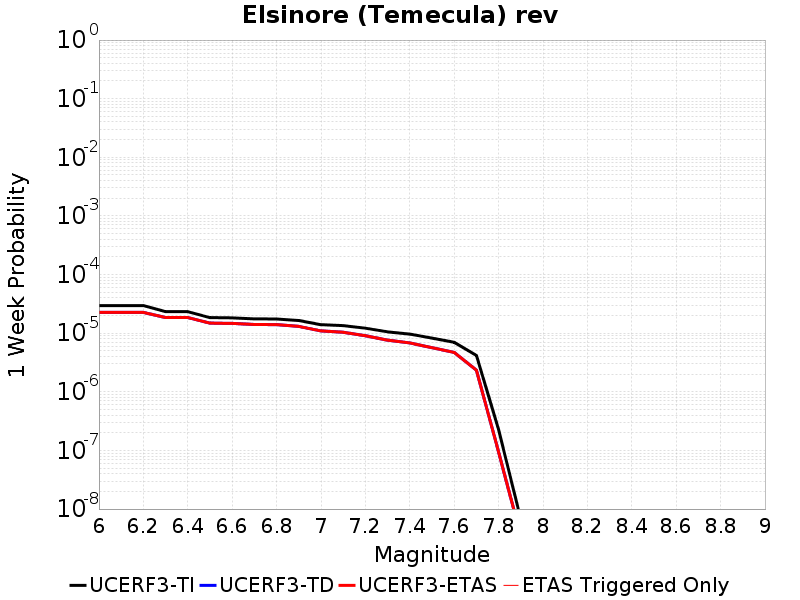 |  | 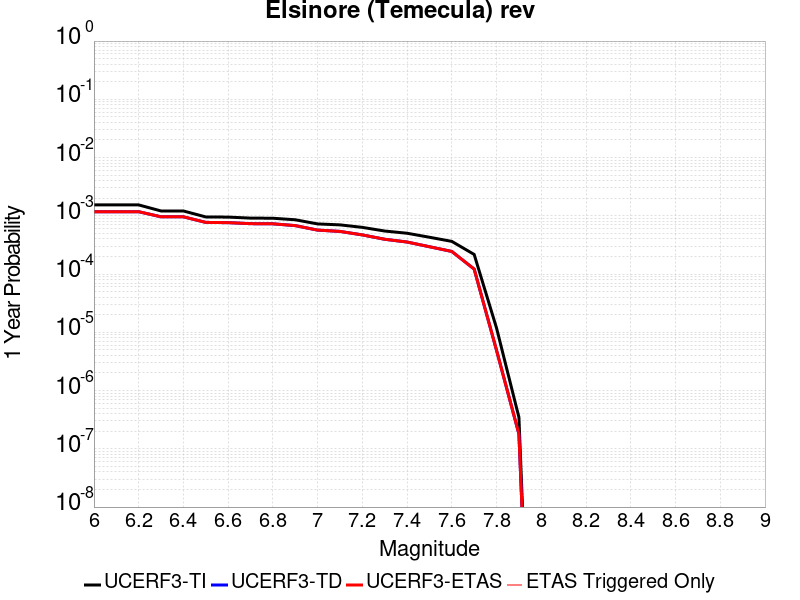 | 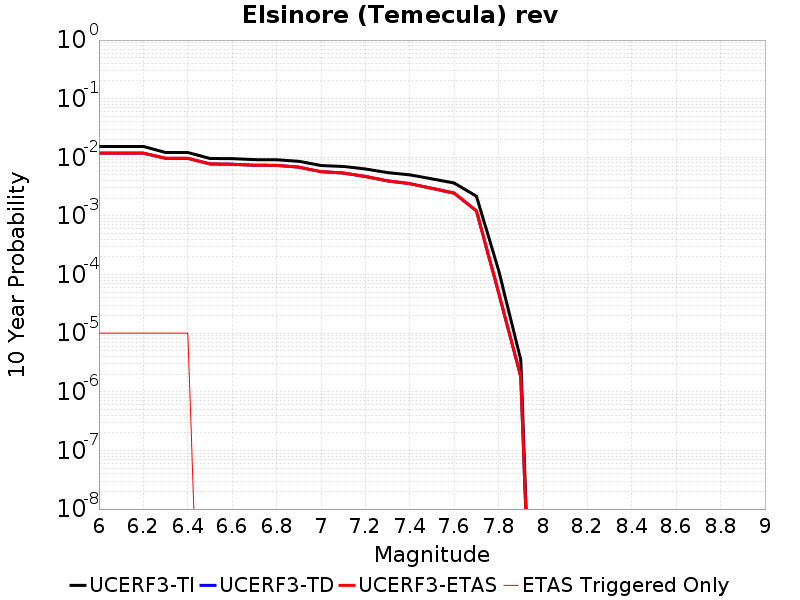 |

| Magnitude | 1 wk TI Prob | 1 wk TD Prob | 1 wk ETAS Prob | 1 wk ETAS/TD Gain | 1 wk ETAS Triggered Only | 1 mo TI Prob | 1 mo TD Prob | 1 mo ETAS Prob | 1 mo ETAS/TD Gain | 1 mo ETAS Triggered Only | 1 yr TI Prob | 1 yr TD Prob | 1 yr ETAS Prob | 1 yr ETAS/TD Gain | 1 yr ETAS Triggered Only | 10 yr TI Prob | 10 yr TD Prob | 10 yr ETAS Prob | 10 yr ETAS/TD Gain | 10 yr ETAS Triggered Only |
|-----|-----|-----|-----|-----|-----|-----|-----|-----|-----|-----|-----|-----|-----|-----|-----|-----|-----|-----|-----|-----|
| 6.0 | 2.9514995E-5 | 2.2564887E-5 | 2.2564887E-5 | 1.0 | 0.0 | 1.264867E-4 | 9.67032E-5 | 9.67032E-5 | 1.0 | 0.0 | 0.0015388876 | 0.0011767476 | 0.0011767476 | 1.0 | 0.0 | 0.015282745 | 0.011733061 | 0.011742943 | 1.0008423 | 1.0E-5 |
| 6.1 | 2.9514995E-5 | 2.2564887E-5 | 2.2564887E-5 | 1.0 | 0.0 | 1.264867E-4 | 9.67032E-5 | 9.67032E-5 | 1.0 | 0.0 | 0.0015388876 | 0.0011767476 | 0.0011767476 | 1.0 | 0.0 | 0.015282745 | 0.011733061 | 0.011742943 | 1.0008423 | 1.0E-5 |
| 6.2 | 2.9514995E-5 | 2.2564887E-5 | 2.2564887E-5 | 1.0 | 0.0 | 1.264867E-4 | 9.67032E-5 | 9.67032E-5 | 1.0 | 0.0 | 0.0015388876 | 0.0011767476 | 0.0011767476 | 1.0 | 0.0 | 0.015282745 | 0.011733061 | 0.011742943 | 1.0008423 | 1.0E-5 |
| 6.3 | 2.3223649E-5 | 1.8442242E-5 | 1.8442242E-5 | 1.0 | 0.0 | 9.952613E-5 | 7.903589E-5 | 7.903589E-5 | 1.0 | 0.0 | 0.001211057 | 9.618544E-4 | 9.618544E-4 | 1.0 | 0.0 | 0.012044783 | 0.009584903 | 0.0095948065 | 1.0010333 | 1.0E-5 |
| 6.4 | 2.3223649E-5 | 1.8442242E-5 | 1.8442242E-5 | 1.0 | 0.0 | 9.952613E-5 | 7.903589E-5 | 7.903589E-5 | 1.0 | 0.0 | 0.001211057 | 9.618544E-4 | 9.618544E-4 | 1.0 | 0.0 | 0.012044783 | 0.009584903 | 0.0095948065 | 1.0010333 | 1.0E-5 |
| 6.5 | 1.8338875E-5 | 1.4776915E-5 | 1.4776915E-5 | 1.0 | 0.0 | 7.8592806E-5 | 6.3328145E-5 | 6.3328145E-5 | 1.0 | 0.0 | 9.5644733E-4 | 7.707562E-4 | 7.707562E-4 | 1.0 | 0.0 | 0.009523412 | 0.007683414 | 0.007683414 | 1.0 | 0.0 |
| 6.6 | 1.8223333E-5 | 1.4639334E-5 | 1.4639334E-5 | 1.0 | 0.0 | 7.809766E-5 | 6.2738545E-5 | 6.2738545E-5 | 1.0 | 0.0 | 9.504242E-4 | 7.635829E-4 | 7.635829E-4 | 1.0 | 0.0 | 0.009463696 | 0.0076121725 | 0.0076121725 | 1.0 | 0.0 |
| 6.7 | 1.7512752E-5 | 1.4052556E-5 | 1.4052556E-5 | 1.0 | 0.0 | 7.505249E-5 | 6.02239E-5 | 6.02239E-5 | 1.0 | 0.0 | 9.13381E-4 | 7.3298794E-4 | 7.3298794E-4 | 1.0 | 0.0 | 0.00909636 | 0.007312785 | 0.007312785 | 1.0 | 0.0 |
| 6.8 | 1.7417142E-5 | 1.3976378E-5 | 1.3976378E-5 | 1.0 | 0.0 | 7.4642754E-5 | 5.9897437E-5 | 5.9897437E-5 | 1.0 | 0.0 | 9.083966E-4 | 7.290159E-4 | 7.290159E-4 | 1.0 | 0.0 | 0.009046922 | 0.0072732647 | 0.0072732647 | 1.0 | 0.0 |
| 6.9 | 1.6402591E-5 | 1.3012405E-5 | 1.3012405E-5 | 1.0 | 0.0 | 7.0294926E-5 | 5.5766304E-5 | 5.5766304E-5 | 1.0 | 0.0 | 8.5550465E-4 | 6.78751E-4 | 6.78751E-4 | 1.0 | 0.0 | 0.008522186 | 0.006772415 | 0.006772415 | 1.0 | 0.0 |
| 7.0 | 1.3912486E-5 | 1.0899437E-5 | 1.0899437E-5 | 1.0 | 0.0 | 5.9623577E-5 | 4.671105E-5 | 4.671105E-5 | 1.0 | 0.0 | 7.2567526E-4 | 5.685614E-4 | 5.685614E-4 | 1.0 | 0.0 | 0.0072331014 | 0.0056749717 | 0.0056749717 | 1.0 | 0.0 |
| 7.1 | 1.3405147E-5 | 1.0347592E-5 | 1.0347592E-5 | 1.0 | 0.0 | 5.7449364E-5 | 4.4346085E-5 | 4.4346085E-5 | 1.0 | 0.0 | 6.9922156E-4 | 5.397824E-4 | 5.397824E-4 | 1.0 | 0.0 | 0.0069702556 | 0.005388024 | 0.005388024 | 1.0 | 0.0 |
| 7.2 | 1.21402E-5 | 9.014415E-6 | 9.014415E-6 | 1.0 | 0.0 | 5.202839E-5 | 3.8632643E-5 | 3.8632643E-5 | 1.0 | 0.0 | 6.332616E-4 | 4.702527E-4 | 4.702527E-4 | 1.0 | 0.0 | 0.0063146 | 0.004693972 | 0.004693972 | 1.0 | 0.0 |
| 7.3 | 1.05047775E-5 | 7.586732E-6 | 7.586732E-6 | 1.0 | 0.0 | 4.5019697E-5 | 3.251417E-5 | 3.251417E-5 | 1.0 | 0.0 | 5.4797693E-4 | 3.9578957E-4 | 3.9578957E-4 | 1.0 | 0.0 | 0.005466277 | 0.003951206 | 0.003951206 | 1.0 | 0.0 |
| 7.4 | 9.624483E-6 | 6.8002846E-6 | 6.8002846E-6 | 1.0 | 0.0 | 4.124713E-5 | 2.914376E-5 | 2.914376E-5 | 1.0 | 0.0 | 5.0206814E-4 | 3.5476888E-4 | 3.5476888E-4 | 1.0 | 0.0 | 0.005009353 | 0.003542176 | 0.003542176 | 1.0 | 0.0 |
| 7.5 | 8.215151E-6 | 5.6466665E-6 | 5.6466665E-6 | 1.0 | 0.0 | 3.5207315E-5 | 2.4199782E-5 | 2.4199782E-5 | 1.0 | 0.0 | 4.2856473E-4 | 2.945938E-4 | 2.945938E-4 | 1.0 | 0.0 | 0.004277392 | 0.0029421612 | 0.0029421612 | 1.0 | 0.0 |
| 7.6 | 6.975058E-6 | 4.68556E-6 | 4.68556E-6 | 1.0 | 0.0 | 2.9892764E-5 | 2.0080823E-5 | 2.0080823E-5 | 1.0 | 0.0 | 3.6388362E-4 | 2.4445777E-4 | 2.4445777E-4 | 1.0 | 0.0 | 0.0036328835 | 0.0024420053 | 0.0024420053 | 1.0 | 0.0 |
| 7.7 | 4.159604E-6 | 2.3323726E-6 | 2.3323726E-6 | 1.0 | 0.0 | 1.7826753E-5 | 9.995848E-6 | 9.995848E-6 | 1.0 | 0.0 | 2.1701909E-4 | 1.21693396E-4 | 1.21693396E-4 | 1.0 | 0.0 | 0.0021680726 | 0.0012163409 | 0.0012163409 | 1.0 | 0.0 |
| 7.8 | 2.2692414E-7 | 9.403839E-8 | 9.403839E-8 | 1.0 | 0.0 | 9.725317E-7 | 4.0302163E-7 | 4.0302163E-7 | 1.0 | 0.0 | 1.1840509E-5 | 4.9067808E-6 | 4.9067808E-6 | 1.0 | 0.0 | 1.1839878E-4 | 4.906705E-5 | 4.906705E-5 | 1.0 | 0.0 |
| 7.9 | 6.676829E-9 | 3.4446446E-9 | 3.4446446E-9 | 1.0 | 0.0 | 2.861498E-8 | 1.4762762E-8 | 1.4762762E-8 | 1.0 | 0.0 | 3.4838732E-7 | 1.797366E-7 | 1.797366E-7 | 1.0 | 0.0 | 3.4838679E-6 | 1.7973648E-6 | 1.7973648E-6 | 1.0 | 0.0 |

