# Parent Section Magnitude-Probability Distributions

Only fault sections with at least one triggered aftershock are plotted. Sections are sorted by total supraseismogenic trigger rate (decreasing)

## Table Of Contents

* [San Jacinto (Clark) rev](#san-jacinto-clark-rev)
* [San Jacinto (Anza) rev](#san-jacinto-anza-rev)
* [Brawley (Seismic Zone) alt 1](#brawley-seismic-zone-alt-1)
* [San Jacinto (Coyote Creek)](#san-jacinto-coyote-creek)
* [San Jacinto (Borrego)](#san-jacinto-borrego)
* [San Jacinto (Superstition Mtn)](#san-jacinto-superstition-mtn)
* [San Andreas (Coachella) rev](#san-andreas-coachella-rev)
* [North Frontal  (East)](#north-frontal--east)
* [Sheephole](#sheephole)
* [North Frontal  (West)](#north-frontal--west)
* [Cleghorn](#cleghorn)
* [San Jacinto (Stepovers Combined)](#san-jacinto-stepovers-combined)
* [Imperial](#imperial)
* [San Jacinto (San Jacinto Valley) rev](#san-jacinto-san-jacinto-valley-rev)
* [Superstition Hills](#superstition-hills)

## San Jacinto (Clark) rev
*[(top)](#table-of-contents)*

| 1 Week | 1 Month | 1 Year | 10 Year |
|-----|-----|-----|-----|
| 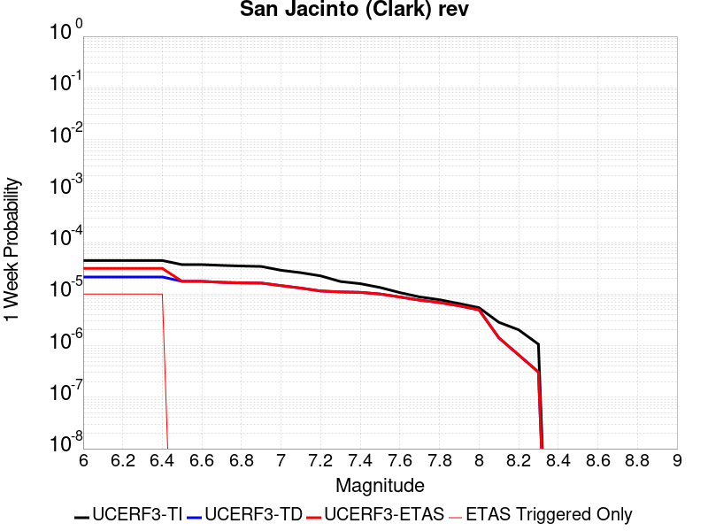 |  | 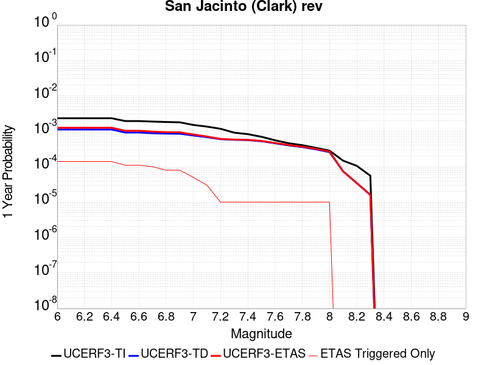 | 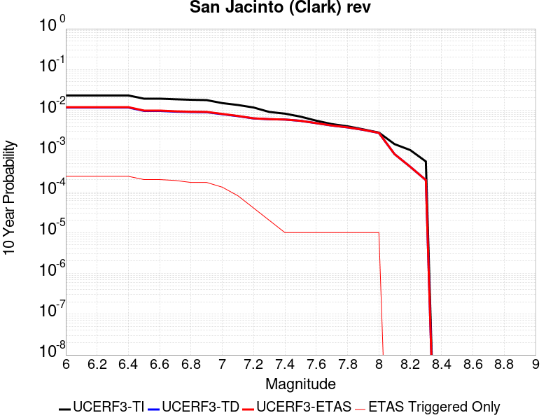 |

| Magnitude | 1 wk TI Prob | 1 wk TD Prob | 1 wk ETAS Prob | 1 wk ETAS/TD Gain | 1 wk ETAS Triggered Only | 1 mo TI Prob | 1 mo TD Prob | 1 mo ETAS Prob | 1 mo ETAS/TD Gain | 1 mo ETAS Triggered Only | 1 yr TI Prob | 1 yr TD Prob | 1 yr ETAS Prob | 1 yr ETAS/TD Gain | 1 yr ETAS Triggered Only | 10 yr TI Prob | 10 yr TD Prob | 10 yr ETAS Prob | 10 yr ETAS/TD Gain | 10 yr ETAS Triggered Only |
|-----|-----|-----|-----|-----|-----|-----|-----|-----|-----|-----|-----|-----|-----|-----|-----|-----|-----|-----|-----|-----|
| 6.0 | 4.482615E-5 | 2.150038E-5 | 2.150038E-5 | 1.0 | 0.0 | 1.9209793E-4 | 9.214129E-5 | 9.214129E-5 | 1.0 | 0.0 | 0.0023362834 | 0.0011212523 | 0.0012457231 | 1.1110106 | 1.246106E-4 | 0.02311874 | 0.011686372 | 0.011901892 | 1.018442 | 2.1806854E-4 |
| 6.1 | 4.482615E-5 | 2.150038E-5 | 2.150038E-5 | 1.0 | 0.0 | 1.9209793E-4 | 9.214129E-5 | 9.214129E-5 | 1.0 | 0.0 | 0.0023362834 | 0.0011212523 | 0.0012457231 | 1.1110106 | 1.246106E-4 | 0.02311874 | 0.011686372 | 0.011901892 | 1.018442 | 2.1806854E-4 |
| 6.2 | 4.482615E-5 | 2.150038E-5 | 2.150038E-5 | 1.0 | 0.0 | 1.9209793E-4 | 9.214129E-5 | 9.214129E-5 | 1.0 | 0.0 | 0.0023362834 | 0.0011212523 | 0.0012457231 | 1.1110106 | 1.246106E-4 | 0.02311874 | 0.011686372 | 0.011901892 | 1.018442 | 2.1806854E-4 |
| 6.3 | 4.482615E-5 | 2.150038E-5 | 2.150038E-5 | 1.0 | 0.0 | 1.9209793E-4 | 9.214129E-5 | 9.214129E-5 | 1.0 | 0.0 | 0.0023362834 | 0.0011212523 | 0.0012457231 | 1.1110106 | 1.246106E-4 | 0.02311874 | 0.011686372 | 0.011901892 | 1.018442 | 2.1806854E-4 |
| 6.4 | 4.482615E-5 | 2.150038E-5 | 2.150038E-5 | 1.0 | 0.0 | 1.9209793E-4 | 9.214129E-5 | 9.214129E-5 | 1.0 | 0.0 | 0.0023362834 | 0.0011212523 | 0.0012457231 | 1.1110106 | 1.246106E-4 | 0.02311874 | 0.011686372 | 0.011901892 | 1.018442 | 2.1806854E-4 |
| 6.5 | 3.7294863E-5 | 1.766778E-5 | 1.766778E-5 | 1.0 | 0.0 | 1.5982533E-4 | 7.571689E-5 | 7.571689E-5 | 1.0 | 0.0 | 0.0019441366 | 9.2146784E-4 | 0.0010148397 | 1.1013294 | 9.3457944E-5 | 0.01927216 | 0.0096530365 | 0.009807296 | 1.0159805 | 1.5576323E-4 |
| 6.6 | 3.7294863E-5 | 1.766778E-5 | 1.766778E-5 | 1.0 | 0.0 | 1.5982533E-4 | 7.571689E-5 | 7.571689E-5 | 1.0 | 0.0 | 0.0019441366 | 9.2146784E-4 | 0.0010148397 | 1.1013294 | 9.3457944E-5 | 0.01927216 | 0.0096530365 | 0.009807296 | 1.0159805 | 1.5576323E-4 |
| 6.7 | 3.6039248E-5 | 1.6909065E-5 | 1.6909065E-5 | 1.0 | 0.0 | 1.5444479E-4 | 7.246543E-5 | 7.246543E-5 | 1.0 | 0.0 | 0.0018787434 | 8.819138E-4 | 9.441641E-4 | 1.0705855 | 6.23053E-5 | 0.01862939 | 0.009251939 | 0.009375397 | 1.0133439 | 1.246106E-4 |
| 6.8 | 3.5031844E-5 | 1.6532282E-5 | 1.6532282E-5 | 1.0 | 0.0 | 1.5012783E-4 | 7.0850736E-5 | 7.0850736E-5 | 1.0 | 0.0 | 0.0018262739 | 8.6227054E-4 | 9.245221E-4 | 1.0721949 | 6.23053E-5 | 0.01811338 | 0.009048368 | 0.009171851 | 1.013647 | 1.246106E-4 |
| 6.9 | 3.435112E-5 | 1.635967E-5 | 1.635967E-5 | 1.0 | 0.0 | 1.4721078E-4 | 7.011101E-5 | 7.011101E-5 | 1.0 | 0.0 | 0.0017908178 | 8.5327146E-4 | 9.155236E-4 | 1.072957 | 6.23053E-5 | 0.017764548 | 0.008956034 | 0.009079528 | 1.0137889 | 1.246106E-4 |
| 7.0 | 2.8959772E-5 | 1.4604018E-5 | 1.4604018E-5 | 1.0 | 0.0 | 1.241074E-4 | 6.258716E-5 | 6.258716E-5 | 1.0 | 0.0 | 0.0015099603 | 7.617352E-4 | 7.928641E-4 | 1.0408658 | 3.115265E-5 | 0.014997416 | 0.008012667 | 0.008074474 | 1.0077136 | 6.23053E-5 |
| 7.1 | 2.6002877E-5 | 1.3073666E-5 | 1.3073666E-5 | 1.0 | 0.0 | 1.11436144E-4 | 5.602881E-5 | 5.602881E-5 | 1.0 | 0.0 | 0.0013558907 | 6.819394E-4 | 6.819394E-4 | 1.0 | 0.0 | 0.013476475 | 0.0071782577 | 0.0071782577 | 1.0 | 0.0 |
| 7.2 | 2.2544838E-5 | 1.1484221E-5 | 1.1484221E-5 | 1.0 | 0.0 | 9.661716E-5 | 4.921717E-5 | 4.921717E-5 | 1.0 | 0.0 | 0.001175679 | 5.990558E-4 | 5.990558E-4 | 1.0 | 0.0 | 0.011694785 | 0.0063110194 | 0.0063110194 | 1.0 | 0.0 |
| 7.3 | 1.75334E-5 | 1.1018111E-5 | 1.1018111E-5 | 1.0 | 0.0 | 7.514098E-5 | 4.721963E-5 | 4.721963E-5 | 1.0 | 0.0 | 9.144575E-4 | 5.7474873E-4 | 5.7474873E-4 | 1.0 | 0.0 | 0.009107036 | 0.006043663 | 0.006043663 | 1.0 | 0.0 |
| 7.4 | 1.5924552E-5 | 1.0813359E-5 | 1.0813359E-5 | 1.0 | 0.0 | 6.82463E-5 | 4.634215E-5 | 4.634215E-5 | 1.0 | 0.0 | 8.305819E-4 | 5.64071E-4 | 5.64071E-4 | 1.0 | 0.0 | 0.008274844 | 0.005928485 | 0.005928485 | 1.0 | 0.0 |
| 7.5 | 1.3428931E-5 | 1.00432835E-5 | 1.00432835E-5 | 1.0 | 0.0 | 5.7551293E-5 | 4.3041942E-5 | 4.3041942E-5 | 1.0 | 0.0 | 7.004617E-4 | 5.2391074E-4 | 5.2391074E-4 | 1.0 | 0.0 | 0.006982579 | 0.0055084755 | 0.0055084755 | 1.0 | 0.0 |
| 7.6 | 1.0688787E-5 | 8.790522E-6 | 8.790522E-6 | 1.0 | 0.0 | 4.5808283E-5 | 3.7673126E-5 | 3.7673126E-5 | 1.0 | 0.0 | 5.5757316E-4 | 4.5857424E-4 | 4.5857424E-4 | 1.0 | 0.0 | 0.005561762 | 0.0048352317 | 0.0048352317 | 1.0 | 0.0 |
| 7.7 | 8.81236E-6 | 7.637795E-6 | 7.637795E-6 | 1.0 | 0.0 | 3.776671E-5 | 3.2732998E-5 | 3.2732998E-5 | 1.0 | 0.0 | 4.597127E-4 | 3.9845158E-4 | 3.9845158E-4 | 1.0 | 0.0 | 0.0045876284 | 0.0042253393 | 0.0042253393 | 1.0 | 0.0 |
| 7.8 | 7.780431E-6 | 6.856873E-6 | 6.856873E-6 | 1.0 | 0.0 | 3.3344273E-5 | 2.9386269E-5 | 2.9386269E-5 | 1.0 | 0.0 | 4.0589093E-4 | 3.5771928E-4 | 3.5771928E-4 | 1.0 | 0.0 | 0.0040515037 | 0.0038085028 | 0.0038085028 | 1.0 | 0.0 |
| 7.9 | 6.5437994E-6 | 5.9298372E-6 | 5.9298372E-6 | 1.0 | 0.0 | 2.8044553E-5 | 2.5413343E-5 | 2.5413343E-5 | 1.0 | 0.0 | 3.4138895E-4 | 3.0936368E-4 | 3.0936368E-4 | 1.0 | 0.0 | 0.0034086495 | 0.0033145063 | 0.0033145063 | 1.0 | 0.0 |
| 8.0 | 5.4488164E-6 | 4.945817E-6 | 4.945817E-6 | 1.0 | 0.0 | 2.3351862E-5 | 2.1196189E-5 | 2.1196189E-5 | 1.0 | 0.0 | 2.8427184E-4 | 2.580332E-4 | 2.580332E-4 | 1.0 | 0.0 | 0.0028390845 | 0.0027819802 | 0.0027819802 | 1.0 | 0.0 |
| 8.1 | 2.8397242E-6 | 1.4196969E-6 | 1.4196969E-6 | 1.0 | 0.0 | 1.217019E-5 | 6.0844013E-6 | 6.0844013E-6 | 1.0 | 0.0 | 1.4816198E-4 | 7.4075084E-5 | 7.4075084E-5 | 1.0 | 0.0 | 0.0014806325 | 8.4118027E-4 | 8.4118027E-4 | 1.0 | 0.0 |
| 8.2 | 2.030244E-6 | 6.622629E-7 | 6.622629E-7 | 1.0 | 0.0 | 8.701017E-6 | 2.8382665E-6 | 2.8382665E-6 | 1.0 | 0.0 | 1.05929736E-4 | 3.4555353E-5 | 3.4555353E-5 | 1.0 | 0.0 | 0.0010587925 | 4.1252517E-4 | 4.1252517E-4 | 1.0 | 0.0 |
| 8.3 | 1.0659804E-6 | 3.0735617E-7 | 3.0735617E-7 | 1.0 | 0.0 | 4.568479E-6 | 1.31724E-6 | 1.31724E-6 | 1.0 | 0.0 | 5.5619817E-5 | 1.6037284E-5 | 1.6037284E-5 | 1.0 | 0.0 | 5.5605895E-4 | 1.9442748E-4 | 1.9442748E-4 | 1.0 | 0.0 |

## San Jacinto (Anza) rev
*[(top)](#table-of-contents)*

| 1 Week | 1 Month | 1 Year | 10 Year |
|-----|-----|-----|-----|
|  | 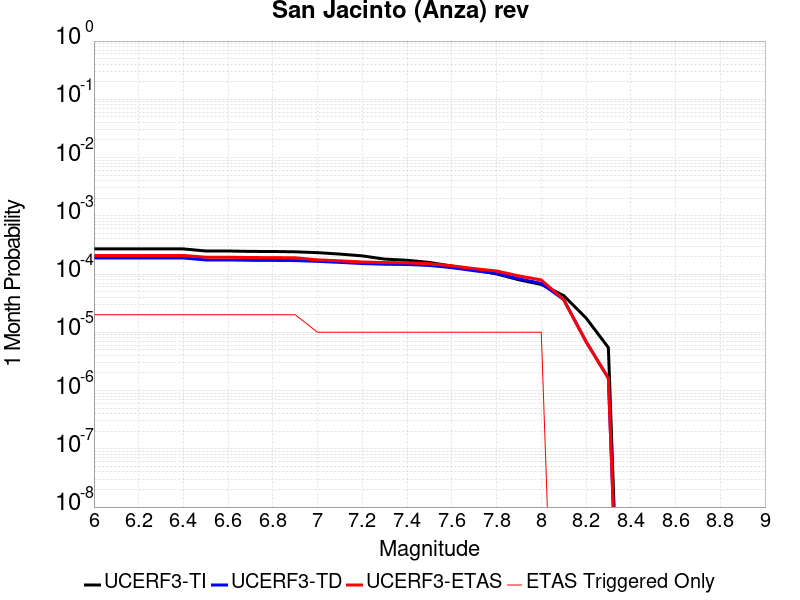 |  |  |

| Magnitude | 1 wk TI Prob | 1 wk TD Prob | 1 wk ETAS Prob | 1 wk ETAS/TD Gain | 1 wk ETAS Triggered Only | 1 mo TI Prob | 1 mo TD Prob | 1 mo ETAS Prob | 1 mo ETAS/TD Gain | 1 mo ETAS Triggered Only | 1 yr TI Prob | 1 yr TD Prob | 1 yr ETAS Prob | 1 yr ETAS/TD Gain | 1 yr ETAS Triggered Only | 10 yr TI Prob | 10 yr TD Prob | 10 yr ETAS Prob | 10 yr ETAS/TD Gain | 10 yr ETAS Triggered Only |
|-----|-----|-----|-----|-----|-----|-----|-----|-----|-----|-----|-----|-----|-----|-----|-----|-----|-----|-----|-----|-----|
| 6.0 | 6.3015636E-5 | 4.4022672E-5 | 4.4022672E-5 | 1.0 | 0.0 | 2.7003905E-4 | 1.8865502E-4 | 1.8865502E-4 | 1.0 | 0.0 | 0.0032827691 | 0.0022944675 | 0.0023566298 | 1.0270922 | 6.23053E-5 | 0.032346968 | 0.023671139 | 0.023792801 | 1.0051396 | 1.246106E-4 |
| 6.1 | 6.3015636E-5 | 4.4022672E-5 | 4.4022672E-5 | 1.0 | 0.0 | 2.7003905E-4 | 1.8865502E-4 | 1.8865502E-4 | 1.0 | 0.0 | 0.0032827691 | 0.0022944675 | 0.0023566298 | 1.0270922 | 6.23053E-5 | 0.032346968 | 0.023671139 | 0.023792801 | 1.0051396 | 1.246106E-4 |
| 6.2 | 6.3015636E-5 | 4.4022672E-5 | 4.4022672E-5 | 1.0 | 0.0 | 2.7003905E-4 | 1.8865502E-4 | 1.8865502E-4 | 1.0 | 0.0 | 0.0032827691 | 0.0022944675 | 0.0023566298 | 1.0270922 | 6.23053E-5 | 0.032346968 | 0.023671139 | 0.023792801 | 1.0051396 | 1.246106E-4 |
| 6.3 | 6.3015636E-5 | 4.4022672E-5 | 4.4022672E-5 | 1.0 | 0.0 | 2.7003905E-4 | 1.8865502E-4 | 1.8865502E-4 | 1.0 | 0.0 | 0.0032827691 | 0.0022944675 | 0.0023566298 | 1.0270922 | 6.23053E-5 | 0.032346968 | 0.023671139 | 0.023792801 | 1.0051396 | 1.246106E-4 |
| 6.4 | 6.3015636E-5 | 4.4022672E-5 | 4.4022672E-5 | 1.0 | 0.0 | 2.7003905E-4 | 1.8865502E-4 | 1.8865502E-4 | 1.0 | 0.0 | 0.0032827691 | 0.0022944675 | 0.0023566298 | 1.0270922 | 6.23053E-5 | 0.032346968 | 0.023671139 | 0.023792801 | 1.0051396 | 1.246106E-4 |
| 6.5 | 5.811017E-5 | 4.076789E-5 | 4.076789E-5 | 1.0 | 0.0 | 2.4901982E-4 | 1.7470786E-4 | 1.7470786E-4 | 1.0 | 0.0 | 0.0030276014 | 0.002124999 | 0.0021871717 | 1.0292579 | 6.23053E-5 | 0.02986684 | 0.021953586 | 0.022075463 | 1.0055515 | 1.246106E-4 |
| 6.6 | 5.811017E-5 | 4.076789E-5 | 4.076789E-5 | 1.0 | 0.0 | 2.4901982E-4 | 1.7470786E-4 | 1.7470786E-4 | 1.0 | 0.0 | 0.0030276014 | 0.002124999 | 0.0021871717 | 1.0292579 | 6.23053E-5 | 0.02986684 | 0.021953586 | 0.022075463 | 1.0055515 | 1.246106E-4 |
| 6.7 | 5.712442E-5 | 4.018377E-5 | 4.018377E-5 | 1.0 | 0.0 | 2.4479596E-4 | 1.7220483E-4 | 1.7220483E-4 | 1.0 | 0.0 | 0.0029763177 | 0.0020945834 | 0.0021567582 | 1.0296836 | 6.23053E-5 | 0.029367693 | 0.021639865 | 0.021761779 | 1.0056337 | 1.246106E-4 |
| 6.8 | 5.6967532E-5 | 4.0038944E-5 | 4.0038944E-5 | 1.0 | 0.0 | 2.4412372E-4 | 1.7158422E-4 | 1.7158422E-4 | 1.0 | 0.0 | 0.0029681553 | 0.002087042 | 0.0021492173 | 1.0297911 | 6.23053E-5 | 0.029288229 | 0.021563487 | 0.02168541 | 1.0056542 | 1.246106E-4 |
| 6.9 | 5.6211324E-5 | 3.973929E-5 | 3.973929E-5 | 1.0 | 0.0 | 2.4088343E-4 | 1.7030016E-4 | 1.7030016E-4 | 1.0 | 0.0 | 0.0029288116 | 0.0020714384 | 0.0021336146 | 1.030016 | 6.23053E-5 | 0.028905109 | 0.021400593 | 0.021522537 | 1.0056982 | 1.246106E-4 |
| 7.0 | 5.4383527E-5 | 3.858488E-5 | 3.858488E-5 | 1.0 | 0.0 | 2.3305144E-4 | 1.6535333E-4 | 1.6535333E-4 | 1.0 | 0.0 | 0.0028337094 | 0.0020113229 | 0.0020424128 | 1.0154575 | 3.115265E-5 | 0.027978465 | 0.020785261 | 0.020876776 | 1.0044029 | 9.3457944E-5 |
| 7.1 | 5.1393665E-5 | 3.7025045E-5 | 3.7025045E-5 | 1.0 | 0.0 | 2.2023996E-4 | 1.5866914E-4 | 1.5866914E-4 | 1.0 | 0.0 | 0.0026781242 | 0.0019300894 | 0.0019300894 | 1.0 | 0.0 | 0.026460782 | 0.01994625 | 0.019976782 | 1.0015306 | 3.115265E-5 |
| 7.2 | 4.785222E-5 | 3.5353543E-5 | 3.5353543E-5 | 1.0 | 0.0 | 2.0506482E-4 | 1.515064E-4 | 1.515064E-4 | 1.0 | 0.0 | 0.0024938055 | 0.0018430335 | 0.0018430335 | 1.0 | 0.0 | 0.024660049 | 0.019047642 | 0.019078203 | 1.0016043 | 3.115265E-5 |
| 7.3 | 4.2143256E-5 | 3.4430403E-5 | 3.4430403E-5 | 1.0 | 0.0 | 1.8060145E-4 | 1.4755054E-4 | 1.4755054E-4 | 1.0 | 0.0 | 0.002196605 | 0.0017949512 | 0.0017949512 | 1.0 | 0.0 | 0.02175019 | 0.018546604 | 0.018577177 | 1.0016485 | 3.115265E-5 |
| 7.4 | 4.0264713E-5 | 3.4063163E-5 | 3.4063163E-5 | 1.0 | 0.0 | 1.7255165E-4 | 1.4597682E-4 | 1.4597682E-4 | 1.0 | 0.0 | 0.002098792 | 0.0017758226 | 0.0017758226 | 1.0 | 0.0 | 0.020790804 | 0.018348377 | 0.018378958 | 1.0016667 | 3.115265E-5 |
| 7.5 | 3.694492E-5 | 3.2763222E-5 | 3.2763222E-5 | 1.0 | 0.0 | 1.5832575E-4 | 1.4040626E-4 | 1.4040626E-4 | 1.0 | 0.0 | 0.0019259118 | 0.0017081092 | 0.0017081092 | 1.0 | 0.0 | 0.01909306 | 0.017657695 | 0.017688299 | 1.0017331 | 3.115265E-5 |
| 7.6 | 3.200565E-5 | 3.005112E-5 | 3.005112E-5 | 1.0 | 0.0 | 1.3715986E-4 | 1.2878417E-4 | 1.2878417E-4 | 1.0 | 0.0 | 0.001668642 | 0.0015668218 | 0.0015668218 | 1.0 | 0.0 | 0.01656168 | 0.016231619 | 0.016262265 | 1.0018882 | 3.115265E-5 |
| 7.7 | 2.731642E-5 | 2.6624792E-5 | 2.6624792E-5 | 1.0 | 0.0 | 1.1706512E-4 | 1.1410127E-4 | 1.1410127E-4 | 1.0 | 0.0 | 0.001424336 | 0.0013882987 | 0.0013882987 | 1.0 | 0.0 | 0.014152412 | 0.014445168 | 0.014445168 | 1.0 | 0.0 |
| 7.8 | 2.3466424E-5 | 2.4013965E-5 | 2.4013965E-5 | 1.0 | 0.0 | 1.0056651E-4 | 1.0291294E-4 | 1.0291294E-4 | 1.0 | 0.0 | 0.0012237094 | 0.0012522457 | 0.0012522457 | 1.0 | 0.0 | 0.012169928 | 0.013075308 | 0.013075308 | 1.0 | 0.0 |
| 7.9 | 1.8611925E-5 | 1.936148E-5 | 1.936148E-5 | 1.0 | 0.0 | 7.9762955E-5 | 8.297514E-5 | 8.297514E-5 | 1.0 | 0.0 | 9.7068126E-4 | 0.0010097548 | 0.0010097548 | 1.0 | 0.0 | 0.0096645225 | 0.010632128 | 0.010632128 | 1.0 | 0.0 |
| 8.0 | 1.5460775E-5 | 1.6143087E-5 | 1.6143087E-5 | 1.0 | 0.0 | 6.6258784E-5 | 6.9182825E-5 | 6.9182825E-5 | 1.0 | 0.0 | 8.0640207E-4 | 8.4197614E-4 | 8.4197614E-4 | 1.0 | 0.0 | 0.008034821 | 0.0089149745 | 0.0089149745 | 1.0 | 0.0 |
| 8.1 | 9.983884E-6 | 8.506816E-6 | 8.506816E-6 | 1.0 | 0.0 | 4.2787375E-5 | 3.6457277E-5 | 3.6457277E-5 | 1.0 | 0.0 | 5.2081177E-4 | 4.4377748E-4 | 4.4377748E-4 | 1.0 | 0.0 | 0.0051959283 | 0.0047674603 | 0.0047674603 | 1.0 | 0.0 |
| 8.2 | 4.1226E-6 | 1.6214071E-6 | 1.6214071E-6 | 1.0 | 0.0 | 1.7668166E-5 | 6.948869E-6 | 6.948869E-6 | 1.0 | 0.0 | 2.1508869E-4 | 8.459923E-5 | 8.459923E-5 | 1.0 | 0.0 | 0.0021488064 | 9.795947E-4 | 9.795947E-4 | 1.0 | 0.0 |
| 8.3 | 1.2750878E-6 | 3.7960186E-7 | 3.7960186E-7 | 1.0 | 0.0 | 5.4646503E-6 | 1.6268641E-6 | 1.6268641E-6 | 1.0 | 0.0 | 6.653009E-5 | 1.9806896E-5 | 1.9806896E-5 | 1.0 | 0.0 | 6.6510175E-4 | 2.3814308E-4 | 2.3814308E-4 | 1.0 | 0.0 |

## Brawley (Seismic Zone) alt 1
*[(top)](#table-of-contents)*

| 1 Week | 1 Month | 1 Year | 10 Year |
|-----|-----|-----|-----|
|  |  | 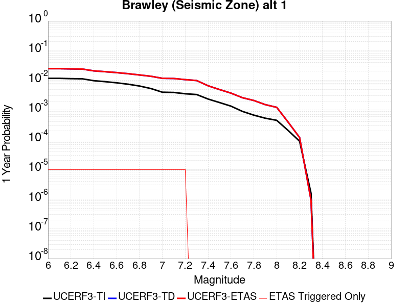 |  |

| Magnitude | 1 wk TI Prob | 1 wk TD Prob | 1 wk ETAS Prob | 1 wk ETAS/TD Gain | 1 wk ETAS Triggered Only | 1 mo TI Prob | 1 mo TD Prob | 1 mo ETAS Prob | 1 mo ETAS/TD Gain | 1 mo ETAS Triggered Only | 1 yr TI Prob | 1 yr TD Prob | 1 yr ETAS Prob | 1 yr ETAS/TD Gain | 1 yr ETAS Triggered Only | 10 yr TI Prob | 10 yr TD Prob | 10 yr ETAS Prob | 10 yr ETAS/TD Gain | 10 yr ETAS Triggered Only |
|-----|-----|-----|-----|-----|-----|-----|-----|-----|-----|-----|-----|-----|-----|-----|-----|-----|-----|-----|-----|-----|
| 6.0 | 2.2521618E-4 | 4.804283E-4 | 4.804283E-4 | 1.0 | 0.0 | 9.6485513E-4 | 0.0020573912 | 0.0020573912 | 1.0 | 0.0 | 0.011683988 | 0.02475419 | 0.02475419 | 1.0 | 0.0 | 0.11088423 | 0.2149016 | 0.21492605 | 1.0001138 | 3.115265E-5 |
| 6.1 | 2.2521618E-4 | 4.804283E-4 | 4.804283E-4 | 1.0 | 0.0 | 9.6485513E-4 | 0.0020573912 | 0.0020573912 | 1.0 | 0.0 | 0.011683988 | 0.02475419 | 0.02475419 | 1.0 | 0.0 | 0.11088423 | 0.2149016 | 0.21492605 | 1.0001138 | 3.115265E-5 |
| 6.2 | 2.198148E-4 | 4.7118348E-4 | 4.7118348E-4 | 1.0 | 0.0 | 9.417233E-4 | 0.0020178321 | 0.0020178321 | 1.0 | 0.0 | 0.011405343 | 0.024283905 | 0.024283905 | 1.0 | 0.0 | 0.10837428 | 0.21131955 | 0.21134412 | 1.0001162 | 3.115265E-5 |
| 6.3 | 2.1704129E-4 | 4.655221E-4 | 4.655221E-4 | 1.0 | 0.0 | 9.298453E-4 | 0.0019936063 | 0.0019936063 | 1.0 | 0.0 | 0.011262234 | 0.023996428 | 0.023996428 | 1.0 | 0.0 | 0.107082725 | 0.2092093 | 0.20923392 | 1.0001178 | 3.115265E-5 |
| 6.4 | 1.876142E-4 | 4.04286E-4 | 4.04286E-4 | 1.0 | 0.0 | 8.038131E-4 | 0.0017315184 | 0.0017315184 | 1.0 | 0.0 | 0.00974259 | 0.020874854 | 0.020874854 | 1.0 | 0.0 | 0.093263686 | 0.18595448 | 0.18595448 | 1.0 | 0.0 |
| 6.5 | 1.7390939E-4 | 3.784607E-4 | 3.784607E-4 | 1.0 | 0.0 | 7.45113E-4 | 0.0016209787 | 0.0016209787 | 1.0 | 0.0 | 0.009034078 | 0.019555943 | 0.019555943 | 1.0 | 0.0 | 0.086755216 | 0.17574982 | 0.17574982 | 1.0 | 0.0 |
| 6.6 | 1.591791E-4 | 3.5241197E-4 | 3.5241197E-4 | 1.0 | 0.0 | 6.8201777E-4 | 0.0015094732 | 0.0015094732 | 1.0 | 0.0 | 0.008271996 | 0.018224575 | 0.018224575 | 1.0 | 0.0 | 0.07970774 | 0.16511406 | 0.16511406 | 1.0 | 0.0 |
| 6.7 | 1.4268003E-4 | 3.238453E-4 | 3.238453E-4 | 1.0 | 0.0 | 6.1134255E-4 | 0.0013871787 | 0.0013871787 | 1.0 | 0.0 | 0.007417723 | 0.016759578 | 0.016759578 | 1.0 | 0.0 | 0.07174956 | 0.15317883 | 0.15317883 | 1.0 | 0.0 |
| 6.8 | 1.239713E-4 | 2.9325247E-4 | 2.9325247E-4 | 1.0 | 0.0 | 5.3119735E-4 | 0.0012561972 | 0.0012561972 | 1.0 | 0.0 | 0.0064481674 | 0.0151884165 | 0.0151884165 | 1.0 | 0.0 | 0.06264243 | 0.13945214 | 0.13945214 | 1.0 | 0.0 |
| 6.9 | 1.0180238E-4 | 2.6459564E-4 | 2.6459564E-4 | 1.0 | 0.0 | 4.3622297E-4 | 0.0011334928 | 0.0011334928 | 1.0 | 0.0 | 0.005298089 | 0.01371397 | 0.01371397 | 1.0 | 0.0 | 0.05173543 | 0.12579392 | 0.12579392 | 1.0 | 0.0 |
| 7.0 | 7.6619996E-5 | 2.2550984E-4 | 2.2550984E-4 | 1.0 | 0.0 | 3.283301E-4 | 9.66116E-4 | 9.66116E-4 | 1.0 | 0.0 | 0.0039900932 | 0.011699743 | 0.011699743 | 1.0 | 0.0 | 0.039192066 | 0.107889734 | 0.107889734 | 1.0 | 0.0 |
| 7.1 | 7.5127435E-5 | 2.2231991E-4 | 2.2231991E-4 | 1.0 | 0.0 | 3.2193496E-4 | 9.524549E-4 | 9.524549E-4 | 1.0 | 0.0 | 0.0039125155 | 0.011535192 | 0.011535192 | 1.0 | 0.0 | 0.038443442 | 0.1064462 | 0.1064462 | 1.0 | 0.0 |
| 7.2 | 6.788582E-5 | 2.0353976E-4 | 2.0353976E-4 | 1.0 | 0.0 | 2.9090676E-4 | 8.720247E-4 | 8.720247E-4 | 1.0 | 0.0 | 0.0035360386 | 0.010565866 | 0.010565866 | 1.0 | 0.0 | 0.034803 | 0.098100096 | 0.098100096 | 1.0 | 0.0 |
| 7.3 | 6.399602E-5 | 1.8978323E-4 | 1.8978323E-4 | 1.0 | 0.0 | 2.7423984E-4 | 8.13106E-4 | 8.13106E-4 | 1.0 | 0.0 | 0.0033337586 | 0.0098552285 | 0.0098552285 | 1.0 | 0.0 | 0.03284188 | 0.09197273 | 0.09197273 | 1.0 | 0.0 |
| 7.4 | 4.506759E-5 | 1.2633685E-4 | 1.2633685E-4 | 1.0 | 0.0 | 1.9313251E-4 | 5.413321E-4 | 5.413321E-4 | 1.0 | 0.0 | 0.0023488526 | 0.006570979 | 0.006570979 | 1.0 | 0.0 | 0.023241805 | 0.062822096 | 0.062822096 | 1.0 | 0.0 |
| 7.5 | 3.43289E-5 | 9.423699E-5 | 9.423699E-5 | 1.0 | 0.0 | 1.4711556E-4 | 4.038106E-4 | 4.038106E-4 | 1.0 | 0.0 | 0.0017896603 | 0.0049053747 | 0.0049053747 | 1.0 | 0.0 | 0.01775316 | 0.047449917 | 0.047449917 | 1.0 | 0.0 |
| 7.6 | 2.5980507E-5 | 7.129791E-5 | 7.129791E-5 | 1.0 | 0.0 | 1.1134028E-4 | 3.055268E-4 | 3.055268E-4 | 1.0 | 0.0 | 0.001354725 | 0.0037134688 | 0.0037134688 | 1.0 | 0.0 | 0.013464959 | 0.036187414 | 0.036187414 | 1.0 | 0.0 |
| 7.7 | 1.7292105E-5 | 5.0062798E-5 | 5.0062798E-5 | 1.0 | 0.0 | 7.4106916E-5 | 2.1453724E-4 | 2.1453724E-4 | 1.0 | 0.0 | 9.018782E-4 | 0.002608868 | 0.002608868 | 1.0 | 0.0 | 0.008982267 | 0.025587726 | 0.025587726 | 1.0 | 0.0 |
| 7.8 | 1.2927471E-5 | 4.0263472E-5 | 4.0263472E-5 | 1.0 | 0.0 | 5.5402274E-5 | 1.7254634E-4 | 1.7254634E-4 | 1.0 | 0.0 | 6.743139E-4 | 0.0020987303 | 0.0020987303 | 1.0 | 0.0 | 0.0067227143 | 0.020690456 | 0.020690456 | 1.0 | 0.0 |
| 7.9 | 1.0200774E-5 | 2.92069E-5 | 2.92069E-5 | 1.0 | 0.0 | 4.371687E-5 | 1.2516644E-4 | 1.2516644E-4 | 1.0 | 0.0 | 5.321229E-4 | 0.0015228372 | 0.0015228372 | 1.0 | 0.0 | 0.005308505 | 0.015204785 | 0.015204785 | 1.0 | 0.0 |
| 8.0 | 8.650396E-6 | 2.3673014E-5 | 2.3673014E-5 | 1.0 | 0.0 | 3.70726E-5 | 1.0145183E-4 | 1.0145183E-4 | 1.0 | 0.0 | 4.5126543E-4 | 0.001234477 | 0.001234477 | 1.0 | 0.0 | 0.0045035016 | 0.01239523 | 0.01239523 | 1.0 | 0.0 |
| 8.1 | 3.9368224E-6 | 7.4985655E-6 | 7.4985655E-6 | 1.0 | 0.0 | 1.6871985E-5 | 3.2136315E-5 | 3.2136315E-5 | 1.0 | 0.0 | 2.0539707E-4 | 3.911895E-4 | 3.911895E-4 | 1.0 | 0.0 | 0.0020520731 | 0.004085614 | 0.004085614 | 1.0 | 0.0 |
| 8.2 | 1.7101195E-6 | 2.2833995E-6 | 2.2833995E-6 | 1.0 | 0.0 | 7.329063E-6 | 9.785961E-6 | 9.785961E-6 | 1.0 | 0.0 | 8.922769E-5 | 1.191376E-4 | 1.191376E-4 | 1.0 | 0.0 | 8.9191867E-4 | 0.0013002566 | 0.0013002566 | 1.0 | 0.0 |
| 8.3 | 3.0346666E-8 | 1.790108E-8 | 1.790108E-8 | 1.0 | 0.0 | 1.3005713E-7 | 7.671891E-8 | 7.671891E-8 | 1.0 | 0.0 | 1.5834444E-6 | 9.3405265E-7 | 9.3405265E-7 | 1.0 | 0.0 | 1.5834332E-5 | 9.734798E-6 | 9.734798E-6 | 1.0 | 0.0 |

## San Jacinto (Coyote Creek)
*[(top)](#table-of-contents)*

| 1 Week | 1 Month | 1 Year | 10 Year |
|-----|-----|-----|-----|
| 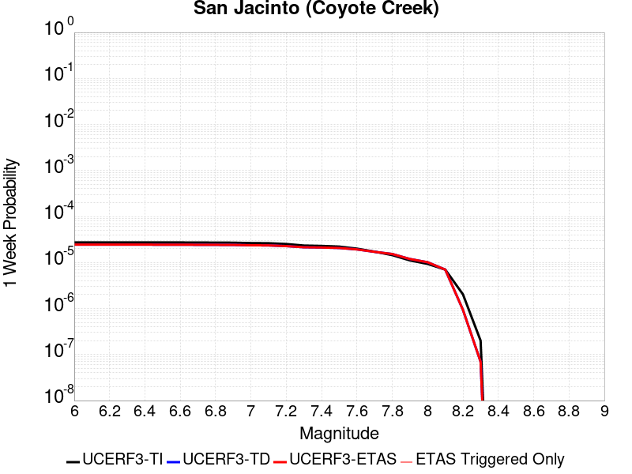 |  |  |  |

| Magnitude | 1 wk TI Prob | 1 wk TD Prob | 1 wk ETAS Prob | 1 wk ETAS/TD Gain | 1 wk ETAS Triggered Only | 1 mo TI Prob | 1 mo TD Prob | 1 mo ETAS Prob | 1 mo ETAS/TD Gain | 1 mo ETAS Triggered Only | 1 yr TI Prob | 1 yr TD Prob | 1 yr ETAS Prob | 1 yr ETAS/TD Gain | 1 yr ETAS Triggered Only | 10 yr TI Prob | 10 yr TD Prob | 10 yr ETAS Prob | 10 yr ETAS/TD Gain | 10 yr ETAS Triggered Only |
|-----|-----|-----|-----|-----|-----|-----|-----|-----|-----|-----|-----|-----|-----|-----|-----|-----|-----|-----|-----|-----|
| 6.0 | 2.7374346E-5 | 2.450593E-5 | 2.450593E-5 | 1.0 | 0.0 | 1.1731335E-4 | 1.050212E-4 | 1.050212E-4 | 1.0 | 0.0 | 0.0014273542 | 0.0012778857 | 0.0012778857 | 1.0 | 0.0 | 0.01418221 | 0.013116612 | 0.013147356 | 1.0023439 | 3.115265E-5 |
| 6.1 | 2.7374346E-5 | 2.450593E-5 | 2.450593E-5 | 1.0 | 0.0 | 1.1731335E-4 | 1.050212E-4 | 1.050212E-4 | 1.0 | 0.0 | 0.0014273542 | 0.0012778857 | 0.0012778857 | 1.0 | 0.0 | 0.01418221 | 0.013116612 | 0.013147356 | 1.0023439 | 3.115265E-5 |
| 6.2 | 2.7374346E-5 | 2.450593E-5 | 2.450593E-5 | 1.0 | 0.0 | 1.1731335E-4 | 1.050212E-4 | 1.050212E-4 | 1.0 | 0.0 | 0.0014273542 | 0.0012778857 | 0.0012778857 | 1.0 | 0.0 | 0.01418221 | 0.013116612 | 0.013147356 | 1.0023439 | 3.115265E-5 |
| 6.3 | 2.7374346E-5 | 2.450593E-5 | 2.450593E-5 | 1.0 | 0.0 | 1.1731335E-4 | 1.050212E-4 | 1.050212E-4 | 1.0 | 0.0 | 0.0014273542 | 0.0012778857 | 0.0012778857 | 1.0 | 0.0 | 0.01418221 | 0.013116612 | 0.013147356 | 1.0023439 | 3.115265E-5 |
| 6.4 | 2.7374346E-5 | 2.450593E-5 | 2.450593E-5 | 1.0 | 0.0 | 1.1731335E-4 | 1.050212E-4 | 1.050212E-4 | 1.0 | 0.0 | 0.0014273542 | 0.0012778857 | 0.0012778857 | 1.0 | 0.0 | 0.01418221 | 0.013116612 | 0.013147356 | 1.0023439 | 3.115265E-5 |
| 6.5 | 2.7282445E-5 | 2.4391866E-5 | 2.4391866E-5 | 1.0 | 0.0 | 1.16919524E-4 | 1.04532395E-4 | 1.04532395E-4 | 1.0 | 0.0 | 0.0014225657 | 0.0012719415 | 0.0012719415 | 1.0 | 0.0 | 0.014134934 | 0.013057877 | 0.013088623 | 1.0023546 | 3.115265E-5 |
| 6.6 | 2.7282445E-5 | 2.4391866E-5 | 2.4391866E-5 | 1.0 | 0.0 | 1.16919524E-4 | 1.04532395E-4 | 1.04532395E-4 | 1.0 | 0.0 | 0.0014225657 | 0.0012719415 | 0.0012719415 | 1.0 | 0.0 | 0.014134934 | 0.013057877 | 0.013088623 | 1.0023546 | 3.115265E-5 |
| 6.7 | 2.7216198E-5 | 2.431689E-5 | 2.431689E-5 | 1.0 | 0.0 | 1.1663563E-4 | 1.042111E-4 | 1.042111E-4 | 1.0 | 0.0 | 0.0014191137 | 0.0012680343 | 0.0012680343 | 1.0 | 0.0 | 0.014100855 | 0.013019248 | 0.013049995 | 1.0023617 | 3.115265E-5 |
| 6.8 | 2.7078617E-5 | 2.4233917E-5 | 2.4233917E-5 | 1.0 | 0.0 | 1.1604605E-4 | 1.0385553E-4 | 1.0385553E-4 | 1.0 | 0.0 | 0.001411945 | 0.0012637103 | 0.0012637103 | 1.0 | 0.0 | 0.014030075 | 0.012976306 | 0.013007054 | 1.0023695 | 3.115265E-5 |
| 6.9 | 2.6982952E-5 | 2.4153229E-5 | 2.4153229E-5 | 1.0 | 0.0 | 1.15636096E-4 | 1.0350975E-4 | 1.0350975E-4 | 1.0 | 0.0 | 0.0014069602 | 0.0012595053 | 0.0012595053 | 1.0 | 0.0 | 0.013980856 | 0.012934517 | 0.012965267 | 1.0023774 | 3.115265E-5 |
| 7.0 | 2.6449972E-5 | 2.3729506E-5 | 2.3729506E-5 | 1.0 | 0.0 | 1.1335209E-4 | 1.0169393E-4 | 1.0169393E-4 | 1.0 | 0.0 | 0.001379188 | 0.001237423 | 0.001237423 | 1.0 | 0.0 | 0.0137065975 | 0.012715543 | 0.0127463 | 1.0024188 | 3.115265E-5 |
| 7.1 | 2.6257849E-5 | 2.3555207E-5 | 2.3555207E-5 | 1.0 | 0.0 | 1.1252879E-4 | 1.00947E-4 | 1.00947E-4 | 1.0 | 0.0 | 0.0013691769 | 0.0012283394 | 0.0012283394 | 1.0 | 0.0 | 0.013607717 | 0.012625217 | 0.012655976 | 1.0024364 | 3.115265E-5 |
| 7.2 | 2.5270041E-5 | 2.2747601E-5 | 2.2747601E-5 | 1.0 | 0.0 | 1.0829568E-4 | 9.748609E-5 | 9.748609E-5 | 1.0 | 0.0 | 0.0013177024 | 0.0011862493 | 0.0011862493 | 1.0 | 0.0 | 0.013099162 | 0.01220506 | 0.012235832 | 1.0025213 | 3.115265E-5 |
| 7.3 | 2.339701E-5 | 2.1475009E-5 | 2.1475009E-5 | 1.0 | 0.0 | 1.0026905E-4 | 9.203252E-5 | 9.203252E-5 | 1.0 | 0.0 | 0.001220092 | 0.001119922 | 0.001119922 | 1.0 | 0.0 | 0.012134149 | 0.0115419505 | 0.011572744 | 1.0026679 | 3.115265E-5 |
| 7.4 | 2.296333E-5 | 2.120423E-5 | 2.120423E-5 | 1.0 | 0.0 | 9.841056E-5 | 9.087212E-5 | 9.087212E-5 | 1.0 | 0.0 | 0.0011974899 | 0.0011058087 | 0.0011058087 | 1.0 | 0.0 | 0.011910575 | 0.011400492 | 0.01143129 | 1.0027014 | 3.115265E-5 |
| 7.5 | 2.2188895E-5 | 2.072377E-5 | 2.072377E-5 | 1.0 | 0.0 | 9.50918E-5 | 8.881315E-5 | 8.881315E-5 | 1.0 | 0.0 | 0.0011571277 | 0.0010807657 | 0.0010807657 | 1.0 | 0.0 | 0.011511209 | 0.011148408 | 0.011179213 | 1.0027632 | 3.115265E-5 |
| 7.6 | 2.0013189E-5 | 1.9298142E-5 | 1.9298142E-5 | 1.0 | 0.0 | 8.5767984E-5 | 8.2703715E-5 | 8.2703715E-5 | 1.0 | 0.0 | 0.001043725 | 0.0010064543 | 0.0010064543 | 1.0 | 0.0 | 0.010388365 | 0.010400314 | 0.0104311425 | 1.0029643 | 3.115265E-5 |
| 7.7 | 1.7230794E-5 | 1.7070626E-5 | 1.7070626E-5 | 1.0 | 0.0 | 7.384417E-5 | 7.315778E-5 | 7.315778E-5 | 1.0 | 0.0 | 8.986819E-4 | 8.9033286E-4 | 8.9033286E-4 | 1.0 | 0.0 | 0.008950562 | 0.009234391 | 0.009234391 | 1.0 | 0.0 |
| 7.8 | 1.4478809E-5 | 1.5304944E-5 | 1.5304944E-5 | 1.0 | 0.0 | 6.205057E-5 | 6.5590975E-5 | 6.5590975E-5 | 1.0 | 0.0 | 7.552038E-4 | 7.982782E-4 | 7.982782E-4 | 1.0 | 0.0 | 0.0075264242 | 0.008306008 | 0.008306008 | 1.0 | 0.0 |
| 7.9 | 1.1114467E-5 | 1.1918907E-5 | 1.1918907E-5 | 1.0 | 0.0 | 4.7632562E-5 | 5.1080035E-5 | 5.1080035E-5 | 1.0 | 0.0 | 5.797721E-4 | 6.217226E-4 | 6.217226E-4 | 1.0 | 0.0 | 0.0057826187 | 0.0065245046 | 0.0065245046 | 1.0 | 0.0 |
| 8.0 | 9.327402E-6 | 1.0146777E-5 | 1.0146777E-5 | 1.0 | 0.0 | 3.9973966E-5 | 4.3485466E-5 | 4.3485466E-5 | 1.0 | 0.0 | 4.8657437E-4 | 5.293075E-4 | 5.293075E-4 | 1.0 | 0.0 | 0.0048551033 | 0.0055805366 | 0.0055805366 | 1.0 | 0.0 |
| 8.1 | 7.0235833E-6 | 7.0089895E-6 | 7.0089895E-6 | 1.0 | 0.0 | 3.0100724E-5 | 3.0038183E-5 | 3.0038183E-5 | 1.0 | 0.0 | 3.664147E-4 | 3.6565404E-4 | 3.6565404E-4 | 1.0 | 0.0 | 0.003658111 | 0.0038841087 | 0.0038841087 | 1.0 | 0.0 |
| 8.2 | 2.0358202E-6 | 9.365263E-7 | 9.365263E-7 | 1.0 | 0.0 | 8.724915E-6 | 4.0136783E-6 | 4.0136783E-6 | 1.0 | 0.0 | 1.06220665E-4 | 4.8865462E-5 | 4.8865462E-5 | 1.0 | 0.0 | 0.001061699 | 5.5342686E-4 | 5.5342686E-4 | 1.0 | 0.0 |
| 8.3 | 2.0051264E-7 | 6.958192E-8 | 6.958192E-8 | 1.0 | 0.0 | 8.5933965E-7 | 2.982082E-7 | 2.982082E-7 | 1.0 | 0.0 | 1.046241E-5 | 3.6306792E-6 | 3.6306792E-6 | 1.0 | 0.0 | 1.0461917E-4 | 4.210365E-5 | 4.210365E-5 | 1.0 | 0.0 |

## San Jacinto (Borrego)
*[(top)](#table-of-contents)*

| 1 Week | 1 Month | 1 Year | 10 Year |
|-----|-----|-----|-----|
| 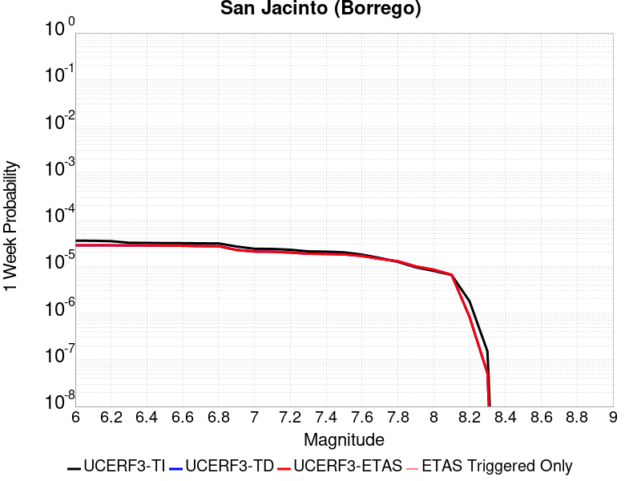 |  |  |  |

| Magnitude | 1 wk TI Prob | 1 wk TD Prob | 1 wk ETAS Prob | 1 wk ETAS/TD Gain | 1 wk ETAS Triggered Only | 1 mo TI Prob | 1 mo TD Prob | 1 mo ETAS Prob | 1 mo ETAS/TD Gain | 1 mo ETAS Triggered Only | 1 yr TI Prob | 1 yr TD Prob | 1 yr ETAS Prob | 1 yr ETAS/TD Gain | 1 yr ETAS Triggered Only | 10 yr TI Prob | 10 yr TD Prob | 10 yr ETAS Prob | 10 yr ETAS/TD Gain | 10 yr ETAS Triggered Only |
|-----|-----|-----|-----|-----|-----|-----|-----|-----|-----|-----|-----|-----|-----|-----|-----|-----|-----|-----|-----|-----|
| 6.0 | 3.543992E-5 | 2.8266526E-5 | 2.8266526E-5 | 1.0 | 0.0 | 1.5187653E-4 | 1.211367E-4 | 1.211367E-4 | 1.0 | 0.0 | 0.0018475284 | 0.001473854 | 0.001473854 | 1.0 | 0.0 | 0.018322436 | 0.0150465295 | 0.015077213 | 1.0020393 | 3.115265E-5 |
| 6.1 | 3.542281E-5 | 2.8266526E-5 | 2.8266526E-5 | 1.0 | 0.0 | 1.5180321E-4 | 1.211367E-4 | 1.211367E-4 | 1.0 | 0.0 | 0.0018466372 | 0.001473854 | 0.001473854 | 1.0 | 0.0 | 0.018313672 | 0.0150465295 | 0.015077213 | 1.0020393 | 3.115265E-5 |
| 6.2 | 3.4688688E-5 | 2.8266526E-5 | 2.8266526E-5 | 1.0 | 0.0 | 1.4865733E-4 | 1.211367E-4 | 1.211367E-4 | 1.0 | 0.0 | 0.0018084005 | 0.001473854 | 0.001473854 | 1.0 | 0.0 | 0.017937548 | 0.015046529 | 0.015077213 | 1.0020393 | 3.115265E-5 |
| 6.3 | 3.2087122E-5 | 2.8111679E-5 | 2.8111679E-5 | 1.0 | 0.0 | 1.3750899E-4 | 1.2047313E-4 | 1.2047313E-4 | 1.0 | 0.0 | 0.0016728862 | 0.0014657858 | 0.0014657858 | 1.0 | 0.0 | 0.016603488 | 0.014967603 | 0.014998289 | 1.0020502 | 3.115265E-5 |
| 6.4 | 3.1828724E-5 | 2.80786E-5 | 2.80786E-5 | 1.0 | 0.0 | 1.364017E-4 | 1.2033138E-4 | 1.2033138E-4 | 1.0 | 0.0 | 0.0016594254 | 0.0014640624 | 0.0014640624 | 1.0 | 0.0 | 0.016470885 | 0.014950773 | 0.014981459 | 1.0020525 | 3.115265E-5 |
| 6.5 | 3.1563577E-5 | 2.7817592E-5 | 2.7817592E-5 | 1.0 | 0.0 | 1.3526545E-4 | 1.1921288E-4 | 1.1921288E-4 | 1.0 | 0.0 | 0.0016456128 | 0.0014504627 | 0.0014504627 | 1.0 | 0.0 | 0.0163348 | 0.014816515 | 0.014847207 | 1.0020714 | 3.115265E-5 |
| 6.6 | 3.1467625E-5 | 2.7661226E-5 | 2.7661226E-5 | 1.0 | 0.0 | 1.3485427E-4 | 1.1854279E-4 | 1.1854279E-4 | 1.0 | 0.0 | 0.0016406142 | 0.0014423153 | 0.0014423153 | 1.0 | 0.0 | 0.016285548 | 0.014736409 | 0.014767103 | 1.0020828 | 3.115265E-5 |
| 6.7 | 3.1223695E-5 | 2.7278638E-5 | 2.7278638E-5 | 1.0 | 0.0 | 1.3380898E-4 | 1.16903284E-4 | 1.16903284E-4 | 1.0 | 0.0 | 0.0016279068 | 0.0014223804 | 0.0014223804 | 1.0 | 0.0 | 0.01616033 | 0.014540374 | 0.014571074 | 1.0021113 | 3.115265E-5 |
| 6.8 | 3.1015585E-5 | 2.709897E-5 | 2.709897E-5 | 1.0 | 0.0 | 1.3291716E-4 | 1.1613334E-4 | 1.1613334E-4 | 1.0 | 0.0 | 0.001617065 | 0.0014130186 | 0.0014130186 | 1.0 | 0.0 | 0.016053487 | 0.01444733 | 0.014478032 | 1.0021251 | 3.115265E-5 |
| 6.9 | 2.6641965E-5 | 2.2502854E-5 | 2.2502854E-5 | 1.0 | 0.0 | 1.1417485E-4 | 9.643726E-5 | 9.643726E-5 | 1.0 | 0.0 | 0.0013891924 | 0.0011734952 | 0.0011734952 | 1.0 | 0.0 | 0.0138054015 | 0.01204921 | 0.012079988 | 1.0025543 | 3.115265E-5 |
| 7.0 | 2.3854353E-5 | 2.0787507E-5 | 2.0787507E-5 | 1.0 | 0.0 | 1.02228936E-4 | 8.908629E-5 | 8.908629E-5 | 1.0 | 0.0 | 0.0012439266 | 0.0010840885 | 0.0010840885 | 1.0 | 0.0 | 0.012369866 | 0.011144552 | 0.011175359 | 1.0027642 | 3.115265E-5 |
| 7.1 | 2.3672901E-5 | 2.0623705E-5 | 2.0623705E-5 | 1.0 | 0.0 | 1.0145135E-4 | 8.838433E-5 | 8.838433E-5 | 1.0 | 0.0 | 0.0012344702 | 0.0010755507 | 0.0010755507 | 1.0 | 0.0 | 0.0122763505 | 0.011059558 | 0.011090366 | 1.0027857 | 3.115265E-5 |
| 7.2 | 2.2717244E-5 | 1.9848838E-5 | 1.9848838E-5 | 1.0 | 0.0 | 9.735599E-5 | 8.5063686E-5 | 8.5063686E-5 | 1.0 | 0.0 | 0.0011846646 | 0.0010351607 | 0.0010351607 | 1.0 | 0.0 | 0.01178369 | 0.010655772 | 0.010686593 | 1.0028924 | 3.115265E-5 |
| 7.3 | 2.1016205E-5 | 1.8686704E-5 | 1.8686704E-5 | 1.0 | 0.0 | 9.006634E-5 | 8.008343E-5 | 8.008343E-5 | 1.0 | 0.0 | 0.001096006 | 9.745817E-4 | 9.745817E-4 | 1.0 | 0.0 | 0.010906163 | 0.010049641 | 0.010080481 | 1.0030687 | 3.115265E-5 |
| 7.4 | 2.0683625E-5 | 1.8488447E-5 | 1.8488447E-5 | 1.0 | 0.0 | 8.86411E-5 | 7.92338E-5 | 7.92338E-5 | 1.0 | 0.0 | 0.001078671 | 9.6424675E-4 | 9.6424675E-4 | 1.0 | 0.0 | 0.010734501 | 0.009945973 | 0.009976815 | 1.003101 | 3.115265E-5 |
| 7.5 | 1.9993966E-5 | 1.808091E-5 | 1.808091E-5 | 1.0 | 0.0 | 8.568561E-5 | 7.748732E-5 | 7.748732E-5 | 1.0 | 0.0 | 0.001042723 | 9.430018E-4 | 9.430018E-4 | 1.0 | 0.0 | 0.010378438 | 0.009731612 | 0.009762462 | 1.00317 | 3.115265E-5 |
| 7.6 | 1.788966E-5 | 1.6722408E-5 | 1.6722408E-5 | 1.0 | 0.0 | 7.666772E-5 | 7.1665505E-5 | 7.1665505E-5 | 1.0 | 0.0 | 9.3302975E-4 | 8.7218E-4 | 8.7218E-4 | 1.0 | 0.0 | 0.00929122 | 0.009017453 | 0.009048325 | 1.0034236 | 3.115265E-5 |
| 7.7 | 1.5125781E-5 | 1.4515723E-5 | 1.4515723E-5 | 1.0 | 0.0 | 6.4823165E-5 | 6.220876E-5 | 6.220876E-5 | 1.0 | 0.0 | 7.889362E-4 | 7.5712934E-4 | 7.5712934E-4 | 1.0 | 0.0 | 0.007861412 | 0.007860734 | 0.007860734 | 1.0 | 0.0 |
| 7.8 | 1.250089E-5 | 1.2897328E-5 | 1.2897328E-5 | 1.0 | 0.0 | 5.3574146E-5 | 5.5273096E-5 | 5.5273096E-5 | 1.0 | 0.0 | 6.5207E-4 | 6.7274284E-4 | 6.7274284E-4 | 1.0 | 0.0 | 0.006501599 | 0.007008176 | 0.007008176 | 1.0 | 0.0 |
| 7.9 | 9.561E-6 | 9.9869785E-6 | 9.9869785E-6 | 1.0 | 0.0 | 4.0975072E-5 | 4.280064E-5 | 4.280064E-5 | 1.0 | 0.0 | 4.987573E-4 | 5.2097376E-4 | 5.2097376E-4 | 1.0 | 0.0 | 0.0049763937 | 0.0054751732 | 0.0054751732 | 1.0 | 0.0 |
| 8.0 | 8.01699E-6 | 8.503995E-6 | 8.503995E-6 | 1.0 | 0.0 | 3.4358076E-5 | 3.6445184E-5 | 3.6445184E-5 | 1.0 | 0.0 | 4.1822926E-4 | 4.4363033E-4 | 4.4363033E-4 | 1.0 | 0.0 | 0.0041744304 | 0.0046847775 | 0.0046847775 | 1.0 | 0.0 |
| 8.1 | 6.541947E-6 | 6.6321454E-6 | 6.6321454E-6 | 1.0 | 0.0 | 2.8036617E-5 | 2.8423174E-5 | 2.8423174E-5 | 1.0 | 0.0 | 3.4129233E-4 | 3.4599772E-4 | 3.4599772E-4 | 1.0 | 0.0 | 0.0034076865 | 0.003670945 | 0.003670945 | 1.0 | 0.0 |
| 8.2 | 1.7968189E-6 | 8.297333E-7 | 8.297333E-7 | 1.0 | 0.0 | 7.70063E-6 | 3.5559954E-6 | 3.5559954E-6 | 1.0 | 0.0 | 9.3751136E-5 | 4.3293407E-5 | 4.3293407E-5 | 1.0 | 0.0 | 9.371159E-4 | 4.8955804E-4 | 4.8955804E-4 | 1.0 | 0.0 |
| 8.3 | 1.5167889E-7 | 5.1530144E-8 | 5.1530144E-8 | 1.0 | 0.0 | 6.500522E-7 | 2.2084346E-7 | 2.2084346E-7 | 1.0 | 0.0 | 7.9143565E-6 | 2.6887662E-6 | 2.6887662E-6 | 1.0 | 0.0 | 7.914075E-5 | 3.1167798E-5 | 3.1167798E-5 | 1.0 | 0.0 |

## San Jacinto (Superstition Mtn)
*[(top)](#table-of-contents)*

| 1 Week | 1 Month | 1 Year | 10 Year |
|-----|-----|-----|-----|
|  |  | 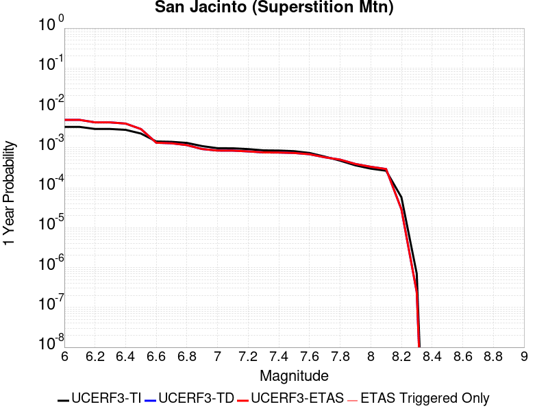 | 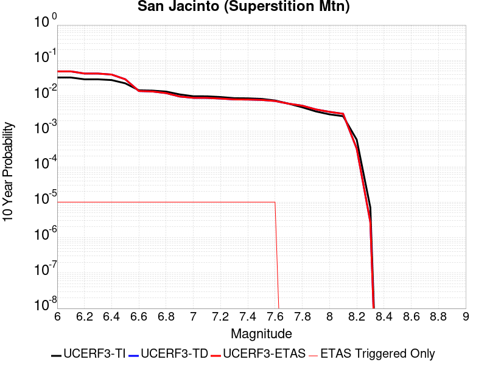 |

| Magnitude | 1 wk TI Prob | 1 wk TD Prob | 1 wk ETAS Prob | 1 wk ETAS/TD Gain | 1 wk ETAS Triggered Only | 1 mo TI Prob | 1 mo TD Prob | 1 mo ETAS Prob | 1 mo ETAS/TD Gain | 1 mo ETAS Triggered Only | 1 yr TI Prob | 1 yr TD Prob | 1 yr ETAS Prob | 1 yr ETAS/TD Gain | 1 yr ETAS Triggered Only | 10 yr TI Prob | 10 yr TD Prob | 10 yr ETAS Prob | 10 yr ETAS/TD Gain | 10 yr ETAS Triggered Only |
|-----|-----|-----|-----|-----|-----|-----|-----|-----|-----|-----|-----|-----|-----|-----|-----|-----|-----|-----|-----|-----|
| 6.0 | 6.4193904E-5 | 9.632504E-5 | 9.632504E-5 | 1.0 | 0.0 | 2.7508775E-4 | 4.127639E-4 | 4.127639E-4 | 1.0 | 0.0 | 0.0033440501 | 0.0050152326 | 0.0050152326 | 1.0 | 0.0 | 0.03294174 | 0.048988733 | 0.04901836 | 1.0006047 | 3.115265E-5 |
| 6.1 | 6.4193904E-5 | 9.632504E-5 | 9.632504E-5 | 1.0 | 0.0 | 2.7508775E-4 | 4.127639E-4 | 4.127639E-4 | 1.0 | 0.0 | 0.0033440501 | 0.0050152326 | 0.0050152326 | 1.0 | 0.0 | 0.03294174 | 0.048988733 | 0.04901836 | 1.0006047 | 3.115265E-5 |
| 6.2 | 5.7023593E-5 | 8.3455096E-5 | 8.3455096E-5 | 1.0 | 0.0 | 2.4436394E-4 | 3.5762507E-4 | 3.5762507E-4 | 1.0 | 0.0 | 0.002971072 | 0.0043470403 | 0.0043470403 | 1.0 | 0.0 | 0.029316625 | 0.042663764 | 0.042693585 | 1.000699 | 3.115265E-5 |
| 6.3 | 5.6940098E-5 | 8.3300256E-5 | 8.3300256E-5 | 1.0 | 0.0 | 2.4400617E-4 | 3.5696168E-4 | 3.5696168E-4 | 1.0 | 0.0 | 0.002966728 | 0.0043389956 | 0.0043389956 | 1.0 | 0.0 | 0.029274331 | 0.042587053 | 0.042616878 | 1.0007004 | 3.115265E-5 |
| 6.4 | 5.4171585E-5 | 7.7786484E-5 | 7.7786484E-5 | 1.0 | 0.0 | 2.3214328E-4 | 3.3333738E-4 | 3.3333738E-4 | 1.0 | 0.0 | 0.0028226813 | 0.0040524816 | 0.0040524816 | 1.0 | 0.0 | 0.02787096 | 0.039873227 | 0.039903138 | 1.0007502 | 3.115265E-5 |
| 6.5 | 4.375144E-5 | 5.6689543E-5 | 5.6689543E-5 | 1.0 | 0.0 | 1.874927E-4 | 2.4293919E-4 | 2.4293919E-4 | 1.0 | 0.0 | 0.0022803338 | 0.0029549496 | 0.0029549496 | 1.0 | 0.0 | 0.022570757 | 0.029377116 | 0.029407352 | 1.0010293 | 3.115265E-5 |
| 6.6 | 2.772192E-5 | 2.5743811E-5 | 2.5743811E-5 | 1.0 | 0.0 | 1.1880282E-4 | 1.10326066E-4 | 1.10326066E-4 | 1.0 | 0.0 | 0.0014454646 | 0.0013424117 | 0.0013424117 | 1.0 | 0.0 | 0.014360986 | 0.013673099 | 0.013703826 | 1.0022472 | 3.115265E-5 |
| 6.7 | 2.7124124E-5 | 2.4953553E-5 | 2.4953553E-5 | 1.0 | 0.0 | 1.1624106E-4 | 1.0693953E-4 | 1.0693953E-4 | 1.0 | 0.0 | 0.0014143161 | 0.0013012305 | 0.0013012305 | 1.0 | 0.0 | 0.014053487 | 0.013265894 | 0.013296633 | 1.0023172 | 3.115265E-5 |
| 6.8 | 2.5475807E-5 | 2.2412625E-5 | 2.2412625E-5 | 1.0 | 0.0 | 1.0917746E-4 | 9.605064E-5 | 9.605064E-5 | 1.0 | 0.0 | 0.001328425 | 0.0011688013 | 0.0011688013 | 1.0 | 0.0 | 0.0132051185 | 0.011950806 | 0.011981586 | 1.0025756 | 3.115265E-5 |
| 6.9 | 2.1162023E-5 | 1.7855928E-5 | 1.7855928E-5 | 1.0 | 0.0 | 9.069123E-5 | 7.652318E-5 | 7.652318E-5 | 1.0 | 0.0 | 0.0011036064 | 9.3127537E-4 | 9.3127537E-4 | 1.0 | 0.0 | 0.010981417 | 0.009567097 | 0.009597952 | 1.0032251 | 3.115265E-5 |
| 7.0 | 1.8754288E-5 | 1.6381511E-5 | 1.6381511E-5 | 1.0 | 0.0 | 8.037304E-5 | 7.02046E-5 | 7.02046E-5 | 1.0 | 0.0 | 9.781026E-4 | 8.5440837E-4 | 8.5440837E-4 | 1.0 | 0.0 | 0.009738087 | 0.008785367 | 0.008816247 | 1.0035148 | 3.115265E-5 |
| 7.1 | 1.8678527E-5 | 1.6306447E-5 | 1.6306447E-5 | 1.0 | 0.0 | 8.0048376E-5 | 6.988292E-5 | 6.988292E-5 | 1.0 | 0.0 | 9.7415317E-4 | 8.504949E-4 | 8.504949E-4 | 1.0 | 0.0 | 0.009698939 | 0.008746194 | 0.008777074 | 1.0035307 | 3.115265E-5 |
| 7.2 | 1.7804578E-5 | 1.5598845E-5 | 1.5598845E-5 | 1.0 | 0.0 | 7.6303106E-5 | 6.6850494E-5 | 6.6850494E-5 | 1.0 | 0.0 | 9.285943E-4 | 8.1360317E-4 | 8.1360317E-4 | 1.0 | 0.0 | 0.009247236 | 0.008376371 | 0.008407263 | 1.003688 | 3.115265E-5 |
| 7.3 | 1.6583685E-5 | 1.4745573E-5 | 1.4745573E-5 | 1.0 | 0.0 | 7.1070994E-5 | 6.3193795E-5 | 6.3193795E-5 | 1.0 | 0.0 | 8.649459E-4 | 7.691149E-4 | 7.691149E-4 | 1.0 | 0.0 | 0.00861587 | 0.007930585 | 0.00796149 | 1.0038971 | 3.115265E-5 |
| 7.4 | 1.6387552E-5 | 1.4610069E-5 | 1.4610069E-5 | 1.0 | 0.0 | 7.023047E-5 | 6.261309E-5 | 6.261309E-5 | 1.0 | 0.0 | 8.5472054E-4 | 7.620498E-4 | 7.620498E-4 | 1.0 | 0.0 | 0.008514405 | 0.007859764 | 0.0078906715 | 1.0039324 | 3.115265E-5 |
| 7.5 | 1.5790754E-5 | 1.4248698E-5 | 1.4248698E-5 | 1.0 | 0.0 | 6.767291E-5 | 6.1064435E-5 | 6.1064435E-5 | 1.0 | 0.0 | 8.236062E-4 | 7.432079E-4 | 7.432079E-4 | 1.0 | 0.0 | 0.008205604 | 0.0076692905 | 0.0077002044 | 1.0040308 | 3.115265E-5 |
| 7.6 | 1.4248672E-5 | 1.3259852E-5 | 1.3259852E-5 | 1.0 | 0.0 | 6.106431E-5 | 5.6826706E-5 | 5.6826706E-5 | 1.0 | 0.0 | 7.432043E-4 | 6.916473E-4 | 6.916473E-4 | 1.0 | 0.0 | 0.007407237 | 0.007147804 | 0.007178734 | 1.0043272 | 3.115265E-5 |
| 7.7 | 1.15449975E-5 | 1.1100097E-5 | 1.1100097E-5 | 1.0 | 0.0 | 4.947762E-5 | 4.7570982E-5 | 4.7570982E-5 | 1.0 | 0.0 | 6.022235E-4 | 5.790236E-4 | 5.790236E-4 | 1.0 | 0.0 | 0.006005941 | 0.0060134665 | 0.0060134665 | 1.0 | 0.0 |
| 7.8 | 9.1391985E-6 | 9.7031125E-6 | 9.7031125E-6 | 1.0 | 0.0 | 3.9167408E-5 | 4.1584106E-5 | 4.1584106E-5 | 1.0 | 0.0 | 4.767588E-4 | 5.061695E-4 | 5.061695E-4 | 1.0 | 0.0 | 0.0047573727 | 0.005275837 | 0.005275837 | 1.0 | 0.0 |
| 7.9 | 6.973017E-6 | 7.5496514E-6 | 7.5496514E-6 | 1.0 | 0.0 | 2.9884017E-5 | 3.2355252E-5 | 3.2355252E-5 | 1.0 | 0.0 | 3.6377716E-4 | 3.9385454E-4 | 3.9385454E-4 | 1.0 | 0.0 | 0.0036318225 | 0.0041401642 | 0.0041401642 | 1.0 | 0.0 |
| 8.0 | 5.7638235E-6 | 6.4131905E-6 | 6.4131905E-6 | 1.0 | 0.0 | 2.4701867E-5 | 2.7484815E-5 | 2.7484815E-5 | 1.0 | 0.0 | 3.0070372E-4 | 3.3457676E-4 | 3.3457676E-4 | 1.0 | 0.0 | 0.0030029714 | 0.003534385 | 0.003534385 | 1.0 | 0.0 |
| 8.1 | 5.1124434E-6 | 5.6352847E-6 | 5.6352847E-6 | 1.0 | 0.0 | 2.1910288E-5 | 2.4150999E-5 | 2.4150999E-5 | 1.0 | 0.0 | 2.6672508E-4 | 2.9399927E-4 | 2.9399927E-4 | 1.0 | 0.0 | 0.0026640517 | 0.0031141378 | 0.0031141378 | 1.0 | 0.0 |
| 8.2 | 1.1075938E-6 | 5.5302365E-7 | 5.5302365E-7 | 1.0 | 0.0 | 4.7468216E-6 | 2.3700993E-6 | 2.3700993E-6 | 1.0 | 0.0 | 5.779102E-5 | 2.88556E-5 | 2.88556E-5 | 1.0 | 0.0 | 5.777599E-4 | 3.242734E-4 | 3.242734E-4 | 1.0 | 0.0 |
| 8.3 | 1.3584393E-8 | 4.6557E-9 | 4.6557E-9 | 1.0 | 0.0 | 5.8218827E-8 | 1.9953E-8 | 1.9953E-8 | 1.0 | 0.0 | 7.0881396E-7 | 2.4292777E-7 | 2.4292777E-7 | 1.0 | 0.0 | 7.0881174E-6 | 2.7191868E-6 | 2.7191868E-6 | 1.0 | 0.0 |

## San Andreas (Coachella) rev
*[(top)](#table-of-contents)*

| 1 Week | 1 Month | 1 Year | 10 Year |
|-----|-----|-----|-----|
|  | 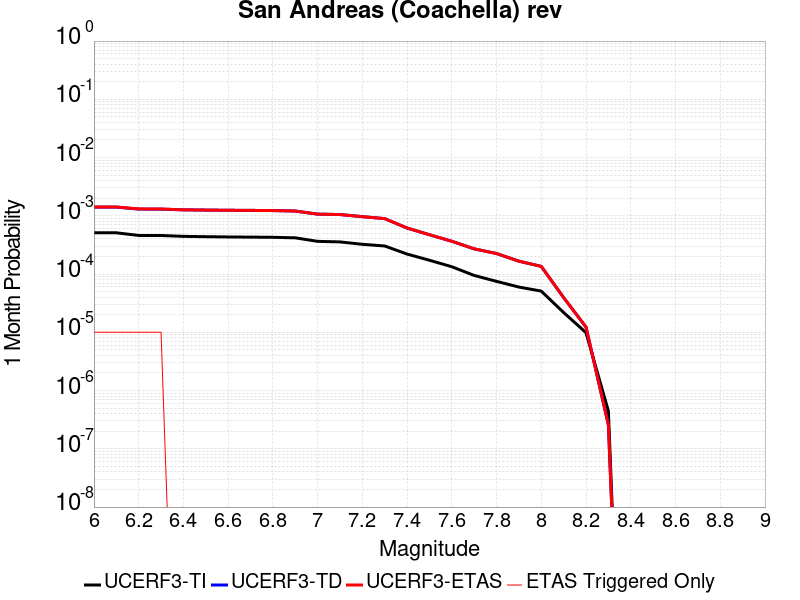 |  |  |

| Magnitude | 1 wk TI Prob | 1 wk TD Prob | 1 wk ETAS Prob | 1 wk ETAS/TD Gain | 1 wk ETAS Triggered Only | 1 mo TI Prob | 1 mo TD Prob | 1 mo ETAS Prob | 1 mo ETAS/TD Gain | 1 mo ETAS Triggered Only | 1 yr TI Prob | 1 yr TD Prob | 1 yr ETAS Prob | 1 yr ETAS/TD Gain | 1 yr ETAS Triggered Only | 10 yr TI Prob | 10 yr TD Prob | 10 yr ETAS Prob | 10 yr ETAS/TD Gain | 10 yr ETAS Triggered Only |
|-----|-----|-----|-----|-----|-----|-----|-----|-----|-----|-----|-----|-----|-----|-----|-----|-----|-----|-----|-----|-----|
| 6.0 | 1.1925945E-4 | 3.291765E-4 | 3.291765E-4 | 1.0 | 0.0 | 5.110118E-4 | 0.0014099984 | 0.0014099984 | 1.0 | 0.0 | 0.0062038354 | 0.01703296 | 0.01703296 | 1.0 | 0.0 | 0.060334753 | 0.15337054 | 0.15339692 | 1.000172 | 3.115265E-5 |
| 6.1 | 1.1925945E-4 | 3.291765E-4 | 3.291765E-4 | 1.0 | 0.0 | 5.110118E-4 | 0.0014099984 | 0.0014099984 | 1.0 | 0.0 | 0.0062038354 | 0.01703296 | 0.01703296 | 1.0 | 0.0 | 0.060334753 | 0.15337054 | 0.15339692 | 1.000172 | 3.115265E-5 |
| 6.2 | 1.07432395E-4 | 3.0417042E-4 | 3.0417042E-4 | 1.0 | 0.0 | 4.603433E-4 | 0.0013029403 | 0.0013029403 | 1.0 | 0.0 | 0.005590286 | 0.01574903 | 0.01574903 | 1.0 | 0.0 | 0.05451731 | 0.14255737 | 0.14258409 | 1.0001874 | 3.115265E-5 |
| 6.3 | 1.0718766E-4 | 3.0362338E-4 | 3.0362338E-4 | 1.0 | 0.0 | 4.592948E-4 | 0.0013005983 | 0.0013005983 | 1.0 | 0.0 | 0.005577586 | 0.015720926 | 0.015720926 | 1.0 | 0.0 | 0.054396555 | 0.14232577 | 0.14235249 | 1.0001878 | 3.115265E-5 |
| 6.4 | 1.0355944E-4 | 2.9570164E-4 | 2.9570164E-4 | 1.0 | 0.0 | 4.4375064E-4 | 0.0012666812 | 0.0012666812 | 1.0 | 0.0 | 0.0053892885 | 0.015313862 | 0.015313862 | 1.0 | 0.0 | 0.052604496 | 0.13888064 | 0.13890748 | 1.0001931 | 3.115265E-5 |
| 6.5 | 1.0227914E-4 | 2.928951E-4 | 2.928951E-4 | 1.0 | 0.0 | 4.382655E-4 | 0.0012546649 | 0.0012546649 | 1.0 | 0.0 | 0.0053228354 | 0.015169609 | 0.015169609 | 1.0 | 0.0 | 0.051971316 | 0.13766095 | 0.1376878 | 1.0001951 | 3.115265E-5 |
| 6.6 | 1.0116757E-4 | 2.9055178E-4 | 2.9055178E-4 | 1.0 | 0.0 | 4.3350324E-4 | 0.0012446316 | 0.0012446316 | 1.0 | 0.0 | 0.0052651367 | 0.015049148 | 0.015049148 | 1.0 | 0.0 | 0.051421247 | 0.1366402 | 0.1366671 | 1.0001968 | 3.115265E-5 |
| 6.7 | 1.0050676E-4 | 2.8913686E-4 | 2.8913686E-4 | 1.0 | 0.0 | 4.3067214E-4 | 0.0012385735 | 0.0012385735 | 1.0 | 0.0 | 0.005230834 | 0.0149764065 | 0.0149764065 | 1.0 | 0.0 | 0.051094085 | 0.13602445 | 0.13605136 | 1.0001979 | 3.115265E-5 |
| 6.8 | 9.976819E-5 | 2.8716866E-4 | 2.8716866E-4 | 1.0 | 0.0 | 4.2750788E-4 | 0.0012301463 | 0.0012301463 | 1.0 | 0.0 | 0.0051924936 | 0.014875212 | 0.014875212 | 1.0 | 0.0 | 0.050728295 | 0.13517529 | 0.13520223 | 1.0001993 | 3.115265E-5 |
| 6.9 | 9.77719E-5 | 2.821223E-4 | 2.821223E-4 | 1.0 | 0.0 | 4.1895514E-4 | 0.0012085391 | 0.0012085391 | 1.0 | 0.0 | 0.0050888555 | 0.014615703 | 0.014615703 | 1.0 | 0.0 | 0.049738888 | 0.13300061 | 0.13302761 | 1.0002031 | 3.115265E-5 |
| 7.0 | 8.500761E-5 | 2.4935202E-4 | 2.4935202E-4 | 1.0 | 0.0 | 3.6426744E-4 | 0.0010682171 | 0.0010682171 | 1.0 | 0.0 | 0.0044259406 | 0.012928775 | 0.012928775 | 1.0 | 0.0 | 0.04338823 | 0.11883683 | 0.11883683 | 1.0 | 0.0 |
| 7.1 | 8.319876E-5 | 2.4535717E-4 | 2.4535717E-4 | 1.0 | 0.0 | 3.5651738E-4 | 0.0010511102 | 0.0010511102 | 1.0 | 0.0 | 0.004331963 | 0.012722949 | 0.012722949 | 1.0 | 0.0 | 0.042484846 | 0.11704986 | 0.11704986 | 1.0 | 0.0 |
| 7.2 | 7.563917E-5 | 2.2578343E-4 | 2.2578343E-4 | 1.0 | 0.0 | 3.2412758E-4 | 9.672875E-4 | 9.672875E-4 | 1.0 | 0.0 | 0.0039391145 | 0.011713833 | 0.011713833 | 1.0 | 0.0 | 0.03870018 | 0.10844048 | 0.10844048 | 1.0 | 0.0 |
| 7.3 | 7.082985E-5 | 2.0887361E-4 | 2.0887361E-4 | 1.0 | 0.0 | 3.0352117E-4 | 8.9486846E-4 | 8.9486846E-4 | 1.0 | 0.0 | 0.0036891096 | 0.010841231 | 0.010841231 | 1.0 | 0.0 | 0.03628465 | 0.10094031 | 0.10094031 | 1.0 | 0.0 |
| 7.4 | 5.146215E-5 | 1.439831E-4 | 1.439831E-4 | 1.0 | 0.0 | 2.2053342E-4 | 6.1692536E-4 | 6.1692536E-4 | 1.0 | 0.0 | 0.0026816884 | 0.0074853906 | 0.0074853906 | 1.0 | 0.0 | 0.02649557 | 0.07139278 | 0.07139278 | 1.0 | 0.0 |
| 7.5 | 4.0285166E-5 | 1.10496214E-4 | 1.10496214E-4 | 1.0 | 0.0 | 1.7263928E-4 | 4.7346958E-4 | 4.7346958E-4 | 1.0 | 0.0 | 0.002099857 | 0.0057493267 | 0.0057493267 | 1.0 | 0.0 | 0.020801254 | 0.055491563 | 0.055491563 | 1.0 | 0.0 |
| 7.6 | 3.1168736E-5 | 8.534722E-5 | 8.534722E-5 | 1.0 | 0.0 | 1.3357346E-4 | 3.6572266E-4 | 3.6572266E-4 | 1.0 | 0.0 | 0.0016250437 | 0.0044436096 | 0.0044436096 | 1.0 | 0.0 | 0.016132116 | 0.04324164 | 0.04324164 | 1.0 | 0.0 |
| 7.7 | 2.2100989E-5 | 6.323157E-5 | 6.323157E-5 | 1.0 | 0.0 | 9.4715084E-5 | 2.7096434E-4 | 2.7096434E-4 | 1.0 | 0.0 | 0.001152546 | 0.003294007 | 0.003294007 | 1.0 | 0.0 | 0.011465867 | 0.032282755 | 0.032282755 | 1.0 | 0.0 |
| 7.8 | 1.7484861E-5 | 5.254816E-5 | 5.254816E-5 | 1.0 | 0.0 | 7.493296E-5 | 2.2518697E-4 | 2.2518697E-4 | 1.0 | 0.0 | 9.1192697E-4 | 0.0027382073 | 0.0027382073 | 1.0 | 0.0 | 0.009081938 | 0.026981955 | 0.026981955 | 1.0 | 0.0 |
| 7.9 | 1.3967285E-5 | 3.883993E-5 | 3.883993E-5 | 1.0 | 0.0 | 5.985842E-5 | 1.6644623E-4 | 1.6644623E-4 | 1.0 | 0.0 | 7.2853256E-4 | 0.0020246007 | 0.0020246007 | 1.0 | 0.0 | 0.0072614877 | 0.02019468 | 0.02019468 | 1.0 | 0.0 |
| 8.0 | 1.1887396E-5 | 3.159631E-5 | 3.159631E-5 | 1.0 | 0.0 | 5.094499E-5 | 1.3540573E-4 | 1.3540573E-4 | 1.0 | 0.0 | 6.200787E-4 | 0.0016473192 | 0.0016473192 | 1.0 | 0.0 | 0.006183513 | 0.0165266 | 0.0165266 | 1.0 | 0.0 |
| 8.1 | 5.100864E-6 | 9.191687E-6 | 9.191687E-6 | 1.0 | 0.0 | 2.1860664E-5 | 3.939235E-5 | 3.939235E-5 | 1.0 | 0.0 | 2.6612106E-4 | 4.794965E-4 | 4.794965E-4 | 1.0 | 0.0 | 0.002658026 | 0.005026348 | 0.005026348 | 1.0 | 0.0 |
| 8.2 | 2.3004484E-6 | 2.8732106E-6 | 2.8732106E-6 | 1.0 | 0.0 | 9.859027E-6 | 1.2313702E-5 | 1.2313702E-5 | 1.0 | 0.0 | 1.2002704E-4 | 1.4990904E-4 | 1.4990904E-4 | 1.0 | 0.0 | 0.0011996223 | 0.0016421712 | 0.0016421712 | 1.0 | 0.0 |
| 8.3 | 1.0424446E-7 | 6.049112E-8 | 6.049112E-8 | 1.0 | 0.0 | 4.4676187E-7 | 2.5924763E-7 | 2.5924763E-7 | 1.0 | 0.0 | 5.439312E-6 | 3.1563357E-6 | 3.1563357E-6 | 1.0 | 0.0 | 5.4391792E-5 | 3.3152777E-5 | 3.3152777E-5 | 1.0 | 0.0 |

## North Frontal  (East)
*[(top)](#table-of-contents)*

| 1 Week | 1 Month | 1 Year | 10 Year |
|-----|-----|-----|-----|
| 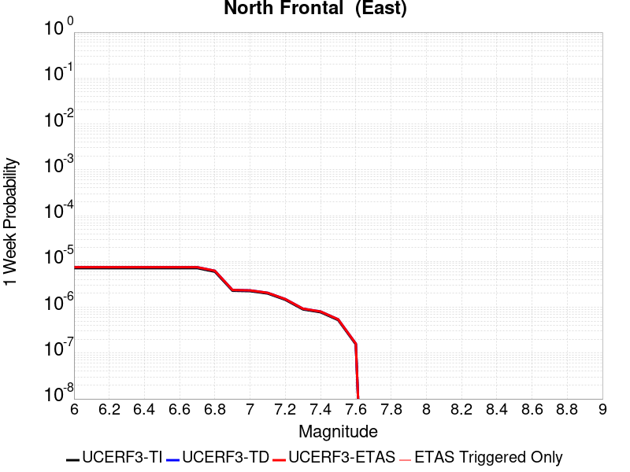 | 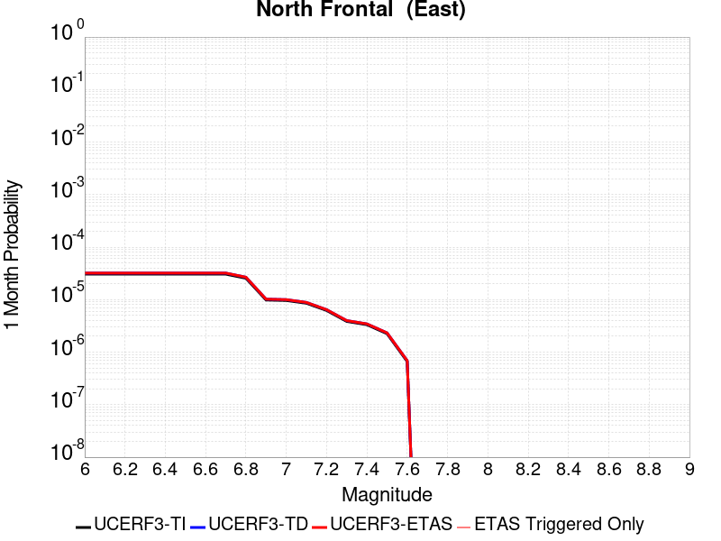 |  | 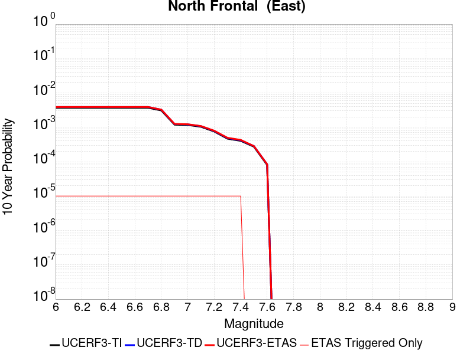 |

| Magnitude | 1 wk TI Prob | 1 wk TD Prob | 1 wk ETAS Prob | 1 wk ETAS/TD Gain | 1 wk ETAS Triggered Only | 1 mo TI Prob | 1 mo TD Prob | 1 mo ETAS Prob | 1 mo ETAS/TD Gain | 1 mo ETAS Triggered Only | 1 yr TI Prob | 1 yr TD Prob | 1 yr ETAS Prob | 1 yr ETAS/TD Gain | 1 yr ETAS Triggered Only | 10 yr TI Prob | 10 yr TD Prob | 10 yr ETAS Prob | 10 yr ETAS/TD Gain | 10 yr ETAS Triggered Only |
|-----|-----|-----|-----|-----|-----|-----|-----|-----|-----|-----|-----|-----|-----|-----|-----|-----|-----|-----|-----|-----|
| 6.0 | 7.135738E-6 | 7.479061E-6 | 7.479061E-6 | 1.0 | 0.0 | 3.0581377E-5 | 3.2052838E-5 | 3.2052838E-5 | 1.0 | 0.0 | 3.7226462E-4 | 3.9019337E-4 | 3.9019337E-4 | 1.0 | 0.0 | 0.0037164164 | 0.0038970413 | 0.0039280728 | 1.0079628 | 3.115265E-5 |
| 6.1 | 7.135738E-6 | 7.479061E-6 | 7.479061E-6 | 1.0 | 0.0 | 3.0581377E-5 | 3.2052838E-5 | 3.2052838E-5 | 1.0 | 0.0 | 3.7226462E-4 | 3.9019337E-4 | 3.9019337E-4 | 1.0 | 0.0 | 0.0037164164 | 0.0038970413 | 0.0039280728 | 1.0079628 | 3.115265E-5 |
| 6.2 | 7.135738E-6 | 7.479061E-6 | 7.479061E-6 | 1.0 | 0.0 | 3.0581377E-5 | 3.2052838E-5 | 3.2052838E-5 | 1.0 | 0.0 | 3.7226462E-4 | 3.9019337E-4 | 3.9019337E-4 | 1.0 | 0.0 | 0.0037164164 | 0.0038970413 | 0.0039280728 | 1.0079628 | 3.115265E-5 |
| 6.3 | 7.135738E-6 | 7.479061E-6 | 7.479061E-6 | 1.0 | 0.0 | 3.0581377E-5 | 3.2052838E-5 | 3.2052838E-5 | 1.0 | 0.0 | 3.7226462E-4 | 3.9019337E-4 | 3.9019337E-4 | 1.0 | 0.0 | 0.0037164164 | 0.0038970413 | 0.0039280728 | 1.0079628 | 3.115265E-5 |
| 6.4 | 7.135738E-6 | 7.479061E-6 | 7.479061E-6 | 1.0 | 0.0 | 3.0581377E-5 | 3.2052838E-5 | 3.2052838E-5 | 1.0 | 0.0 | 3.7226462E-4 | 3.9019337E-4 | 3.9019337E-4 | 1.0 | 0.0 | 0.0037164164 | 0.0038970413 | 0.0039280728 | 1.0079628 | 3.115265E-5 |
| 6.5 | 7.135738E-6 | 7.479061E-6 | 7.479061E-6 | 1.0 | 0.0 | 3.0581377E-5 | 3.2052838E-5 | 3.2052838E-5 | 1.0 | 0.0 | 3.7226462E-4 | 3.9019337E-4 | 3.9019337E-4 | 1.0 | 0.0 | 0.0037164164 | 0.0038970413 | 0.0039280728 | 1.0079628 | 3.115265E-5 |
| 6.6 | 7.135738E-6 | 7.479061E-6 | 7.479061E-6 | 1.0 | 0.0 | 3.0581377E-5 | 3.2052838E-5 | 3.2052838E-5 | 1.0 | 0.0 | 3.7226462E-4 | 3.9019337E-4 | 3.9019337E-4 | 1.0 | 0.0 | 0.0037164164 | 0.0038970413 | 0.0039280728 | 1.0079628 | 3.115265E-5 |
| 6.7 | 7.135738E-6 | 7.479061E-6 | 7.479061E-6 | 1.0 | 0.0 | 3.0581377E-5 | 3.2052838E-5 | 3.2052838E-5 | 1.0 | 0.0 | 3.7226462E-4 | 3.9019337E-4 | 3.9019337E-4 | 1.0 | 0.0 | 0.0037164164 | 0.0038970413 | 0.0039280728 | 1.0079628 | 3.115265E-5 |
| 6.8 | 5.959142E-6 | 6.238213E-6 | 6.238213E-6 | 1.0 | 0.0 | 2.553893E-5 | 2.6735026E-5 | 2.6735026E-5 | 1.0 | 0.0 | 3.108921E-4 | 3.254684E-4 | 3.254684E-4 | 1.0 | 0.0 | 0.0031045752 | 0.0032516916 | 0.0032827428 | 1.0095493 | 3.115265E-5 |
| 6.9 | 2.2946929E-6 | 2.3829405E-6 | 2.3829405E-6 | 1.0 | 0.0 | 9.834361E-6 | 1.0212565E-5 | 1.0212565E-5 | 1.0 | 0.0 | 1.1972676E-4 | 1.2433136E-4 | 1.2433136E-4 | 1.0 | 0.0 | 0.0011966228 | 0.0012426644 | 0.0012737784 | 1.0250381 | 3.115265E-5 |
| 7.0 | 2.2468673E-6 | 2.33262E-6 | 2.33262E-6 | 1.0 | 0.0 | 9.629396E-6 | 9.9969075E-6 | 9.9969075E-6 | 1.0 | 0.0 | 1.1723159E-4 | 1.2170602E-4 | 1.2170602E-4 | 1.0 | 0.0 | 0.0011716976 | 0.00121644 | 0.0012475548 | 1.0255785 | 3.115265E-5 |
| 7.1 | 1.9921076E-6 | 2.0649986E-6 | 2.0649986E-6 | 1.0 | 0.0 | 8.537577E-6 | 8.849967E-6 | 8.849967E-6 | 1.0 | 0.0 | 1.0394004E-4 | 1.0774346E-4 | 1.0774346E-4 | 1.0 | 0.0 | 0.0010389143 | 0.0010769549 | 0.001108074 | 1.0288955 | 3.115265E-5 |
| 7.2 | 1.4524545E-6 | 1.5047987E-6 | 1.5047987E-6 | 1.0 | 0.0 | 6.2247905E-6 | 6.4491223E-6 | 6.4491223E-6 | 1.0 | 0.0 | 7.5784184E-5 | 7.8515484E-5 | 7.8515484E-5 | 1.0 | 0.0 | 7.575835E-4 | 7.849019E-4 | 8.1603014E-4 | 1.0396587 | 3.115265E-5 |
| 7.3 | 8.9802575E-7 | 9.31052E-7 | 9.31052E-7 | 1.0 | 0.0 | 3.848676E-6 | 3.9902175E-6 | 3.9902175E-6 | 1.0 | 0.0 | 4.685662E-5 | 4.857993E-5 | 4.857993E-5 | 1.0 | 0.0 | 4.6846745E-4 | 4.857044E-4 | 5.168419E-4 | 1.064108 | 3.115265E-5 |
| 7.4 | 7.776139E-7 | 8.062026E-7 | 8.062026E-7 | 1.0 | 0.0 | 3.3326266E-6 | 3.45515E-6 | 3.45515E-6 | 1.0 | 0.0 | 4.0573974E-5 | 4.206575E-5 | 4.206575E-5 | 1.0 | 0.0 | 4.0566566E-4 | 4.2058862E-4 | 4.5172818E-4 | 1.074038 | 3.115265E-5 |
| 7.5 | 5.244417E-7 | 5.4422935E-7 | 5.4422935E-7 | 1.0 | 0.0 | 2.2476054E-6 | 2.3324098E-6 | 2.3324098E-6 | 1.0 | 0.0 | 2.7364253E-5 | 2.8396786E-5 | 2.8396786E-5 | 1.0 | 0.0 | 2.7360884E-4 | 2.8393808E-4 | 2.8393808E-4 | 1.0 | 0.0 |
| 7.6 | 1.5489647E-7 | 1.6092783E-7 | 1.6092783E-7 | 1.0 | 0.0 | 6.6384183E-7 | 6.896906E-7 | 6.896906E-7 | 1.0 | 0.0 | 8.082245E-6 | 8.396971E-6 | 8.396971E-6 | 1.0 | 0.0 | 8.08195E-5 | 8.396853E-5 | 8.396853E-5 | 1.0 | 0.0 |

## Sheephole
*[(top)](#table-of-contents)*

| 1 Week | 1 Month | 1 Year | 10 Year |
|-----|-----|-----|-----|
|  |  |  |  |

| Magnitude | 1 wk TI Prob | 1 wk TD Prob | 1 wk ETAS Prob | 1 wk ETAS/TD Gain | 1 wk ETAS Triggered Only | 1 mo TI Prob | 1 mo TD Prob | 1 mo ETAS Prob | 1 mo ETAS/TD Gain | 1 mo ETAS Triggered Only | 1 yr TI Prob | 1 yr TD Prob | 1 yr ETAS Prob | 1 yr ETAS/TD Gain | 1 yr ETAS Triggered Only | 10 yr TI Prob | 10 yr TD Prob | 10 yr ETAS Prob | 10 yr ETAS/TD Gain | 10 yr ETAS Triggered Only |
|-----|-----|-----|-----|-----|-----|-----|-----|-----|-----|-----|-----|-----|-----|-----|-----|-----|-----|-----|-----|-----|
| 6.0 | 4.5579695E-6 | 4.7422673E-6 | 4.7422673E-6 | 1.0 | 0.0 | 1.9534009E-5 | 2.0323876E-5 | 5.147589E-5 | 2.5327792 | 3.115265E-5 | 2.3780059E-4 | 2.4742066E-4 | 2.785656E-4 | 1.1258785 | 3.115265E-5 | 0.0023754628 | 0.0024719965 | 0.0025030721 | 1.0125711 | 3.115265E-5 |
| 6.1 | 4.5579695E-6 | 4.7422673E-6 | 4.7422673E-6 | 1.0 | 0.0 | 1.9534009E-5 | 2.0323876E-5 | 5.147589E-5 | 2.5327792 | 3.115265E-5 | 2.3780059E-4 | 2.4742066E-4 | 2.785656E-4 | 1.1258785 | 3.115265E-5 | 0.0023754628 | 0.0024719965 | 0.0025030721 | 1.0125711 | 3.115265E-5 |
| 6.2 | 2.6677674E-6 | 2.7880528E-6 | 2.7880528E-6 | 1.0 | 0.0 | 1.1433239E-5 | 1.19487495E-5 | 1.19487495E-5 | 1.0 | 0.0 | 1.3919079E-4 | 1.4546739E-4 | 1.4546739E-4 | 1.0 | 0.0 | 0.0013910364 | 0.0014538276 | 0.0014538276 | 1.0 | 0.0 |
| 6.3 | 2.6677674E-6 | 2.7880528E-6 | 2.7880528E-6 | 1.0 | 0.0 | 1.1433239E-5 | 1.19487495E-5 | 1.19487495E-5 | 1.0 | 0.0 | 1.3919079E-4 | 1.4546739E-4 | 1.4546739E-4 | 1.0 | 0.0 | 0.0013910364 | 0.0014538276 | 0.0014538276 | 1.0 | 0.0 |
| 6.4 | 2.2159759E-6 | 2.3234686E-6 | 2.3234686E-6 | 1.0 | 0.0 | 9.497005E-6 | 9.957689E-6 | 9.957689E-6 | 1.0 | 0.0 | 1.156199E-4 | 1.2122893E-4 | 1.2122893E-4 | 1.0 | 0.0 | 0.0011555976 | 0.0012117074 | 0.0012117074 | 1.0 | 0.0 |
| 6.5 | 2.1986082E-6 | 2.3053449E-6 | 2.3053449E-6 | 1.0 | 0.0 | 9.4225725E-6 | 9.8800165E-6 | 9.8800165E-6 | 1.0 | 0.0 | 1.1471378E-4 | 1.2028337E-4 | 1.2028337E-4 | 1.0 | 0.0 | 0.0011465458 | 0.001202262 | 0.001202262 | 1.0 | 0.0 |
| 6.6 | 1.5232331E-6 | 1.6023271E-6 | 1.6023271E-6 | 1.0 | 0.0 | 6.5281256E-6 | 6.867099E-6 | 6.867099E-6 | 1.0 | 0.0 | 7.947703E-5 | 8.360391E-5 | 8.360391E-5 | 1.0 | 0.0 | 7.9448614E-4 | 8.357433E-4 | 8.357433E-4 | 1.0 | 0.0 |
| 6.7 | 1.3137362E-6 | 1.3832016E-6 | 1.3832016E-6 | 1.0 | 0.0 | 5.6302856E-6 | 5.927994E-6 | 5.927994E-6 | 1.0 | 0.0 | 6.854657E-5 | 7.217108E-5 | 7.217108E-5 | 1.0 | 0.0 | 6.8525434E-4 | 7.214903E-4 | 7.214903E-4 | 1.0 | 0.0 |
| 6.8 | 1.2275751E-6 | 1.292643E-6 | 1.292643E-6 | 1.0 | 0.0 | 5.2610258E-6 | 5.5398878E-6 | 5.5398878E-6 | 1.0 | 0.0 | 6.4051106E-5 | 6.7446184E-5 | 6.7446184E-5 | 1.0 | 0.0 | 6.4032647E-4 | 6.7427044E-4 | 6.7427044E-4 | 1.0 | 0.0 |
| 6.9 | 1.1837088E-6 | 1.2464476E-6 | 1.2464476E-6 | 1.0 | 0.0 | 5.0730278E-6 | 5.341908E-6 | 5.341908E-6 | 1.0 | 0.0 | 6.176237E-5 | 6.503592E-5 | 6.503592E-5 | 1.0 | 0.0 | 6.17452E-4 | 6.501821E-4 | 6.501821E-4 | 1.0 | 0.0 |
| 7.0 | 9.849371E-7 | 1.036915E-6 | 1.036915E-6 | 1.0 | 0.0 | 4.2211523E-6 | 4.4439143E-6 | 4.4439143E-6 | 1.0 | 0.0 | 5.1391315E-5 | 5.410342E-5 | 5.410342E-5 | 1.0 | 0.0 | 5.137943E-4 | 5.4091256E-4 | 5.4091256E-4 | 1.0 | 0.0 |
| 7.1 | 8.1643645E-7 | 8.594035E-7 | 8.594035E-7 | 1.0 | 0.0 | 3.4990085E-6 | 3.683153E-6 | 3.683153E-6 | 1.0 | 0.0 | 4.2599597E-5 | 4.4841552E-5 | 4.4841552E-5 | 1.0 | 0.0 | 4.259143E-4 | 4.4833368E-4 | 4.4833368E-4 | 1.0 | 0.0 |
| 7.2 | 5.7295756E-7 | 6.0311623E-7 | 6.0311623E-7 | 1.0 | 0.0 | 2.45553E-6 | 2.5847817E-6 | 2.5847817E-6 | 1.0 | 0.0 | 2.9895667E-5 | 3.146933E-5 | 3.146933E-5 | 1.0 | 0.0 | 2.9891645E-4 | 3.1465545E-4 | 3.1465545E-4 | 1.0 | 0.0 |

## North Frontal  (West)
*[(top)](#table-of-contents)*

| 1 Week | 1 Month | 1 Year | 10 Year |
|-----|-----|-----|-----|
|  |  |  |  |

| Magnitude | 1 wk TI Prob | 1 wk TD Prob | 1 wk ETAS Prob | 1 wk ETAS/TD Gain | 1 wk ETAS Triggered Only | 1 mo TI Prob | 1 mo TD Prob | 1 mo ETAS Prob | 1 mo ETAS/TD Gain | 1 mo ETAS Triggered Only | 1 yr TI Prob | 1 yr TD Prob | 1 yr ETAS Prob | 1 yr ETAS/TD Gain | 1 yr ETAS Triggered Only | 10 yr TI Prob | 10 yr TD Prob | 10 yr ETAS Prob | 10 yr ETAS/TD Gain | 10 yr ETAS Triggered Only |
|-----|-----|-----|-----|-----|-----|-----|-----|-----|-----|-----|-----|-----|-----|-----|-----|-----|-----|-----|-----|-----|
| 6.0 | 4.7316266E-6 | 4.853416E-6 | 4.853416E-6 | 1.0 | 0.0 | 2.0278241E-5 | 2.0800198E-5 | 2.0800198E-5 | 1.0 | 0.0 | 2.4685962E-4 | 2.5321444E-4 | 2.5321444E-4 | 1.0 | 0.0 | 0.0024658558 | 0.0025294055 | 0.0025604793 | 1.012285 | 3.115265E-5 |
| 6.1 | 4.7316266E-6 | 4.853416E-6 | 4.853416E-6 | 1.0 | 0.0 | 2.0278241E-5 | 2.0800198E-5 | 2.0800198E-5 | 1.0 | 0.0 | 2.4685962E-4 | 2.5321444E-4 | 2.5321444E-4 | 1.0 | 0.0 | 0.0024658558 | 0.0025294055 | 0.0025604793 | 1.012285 | 3.115265E-5 |
| 6.2 | 4.7316266E-6 | 4.853416E-6 | 4.853416E-6 | 1.0 | 0.0 | 2.0278241E-5 | 2.0800198E-5 | 2.0800198E-5 | 1.0 | 0.0 | 2.4685962E-4 | 2.5321444E-4 | 2.5321444E-4 | 1.0 | 0.0 | 0.0024658558 | 0.0025294055 | 0.0025604793 | 1.012285 | 3.115265E-5 |
| 6.3 | 4.7316266E-6 | 4.853416E-6 | 4.853416E-6 | 1.0 | 0.0 | 2.0278241E-5 | 2.0800198E-5 | 2.0800198E-5 | 1.0 | 0.0 | 2.4685962E-4 | 2.5321444E-4 | 2.5321444E-4 | 1.0 | 0.0 | 0.0024658558 | 0.0025294055 | 0.0025604793 | 1.012285 | 3.115265E-5 |
| 6.4 | 4.7316266E-6 | 4.853416E-6 | 4.853416E-6 | 1.0 | 0.0 | 2.0278241E-5 | 2.0800198E-5 | 2.0800198E-5 | 1.0 | 0.0 | 2.4685962E-4 | 2.5321444E-4 | 2.5321444E-4 | 1.0 | 0.0 | 0.0024658558 | 0.0025294055 | 0.0025604793 | 1.012285 | 3.115265E-5 |
| 6.5 | 4.7316266E-6 | 4.853416E-6 | 4.853416E-6 | 1.0 | 0.0 | 2.0278241E-5 | 2.0800198E-5 | 2.0800198E-5 | 1.0 | 0.0 | 2.4685962E-4 | 2.5321444E-4 | 2.5321444E-4 | 1.0 | 0.0 | 0.0024658558 | 0.0025294055 | 0.0025604793 | 1.012285 | 3.115265E-5 |
| 6.6 | 4.7316266E-6 | 4.853416E-6 | 4.853416E-6 | 1.0 | 0.0 | 2.0278241E-5 | 2.0800198E-5 | 2.0800198E-5 | 1.0 | 0.0 | 2.4685962E-4 | 2.5321444E-4 | 2.5321444E-4 | 1.0 | 0.0 | 0.0024658558 | 0.0025294055 | 0.0025604793 | 1.012285 | 3.115265E-5 |
| 6.7 | 3.5382777E-6 | 3.6314764E-6 | 3.6314764E-6 | 1.0 | 0.0 | 1.516396E-5 | 1.5563382E-5 | 1.5563382E-5 | 1.0 | 0.0 | 1.8460557E-4 | 1.8946848E-4 | 1.8946848E-4 | 1.0 | 0.0 | 0.0018445229 | 0.0018931464 | 0.00192424 | 1.0164243 | 3.115265E-5 |
| 6.8 | 3.5382777E-6 | 3.6314764E-6 | 3.6314764E-6 | 1.0 | 0.0 | 1.516396E-5 | 1.5563382E-5 | 1.5563382E-5 | 1.0 | 0.0 | 1.8460557E-4 | 1.8946848E-4 | 1.8946848E-4 | 1.0 | 0.0 | 0.0018445229 | 0.0018931464 | 0.00192424 | 1.0164243 | 3.115265E-5 |
| 6.9 | 3.0428037E-6 | 3.1232828E-6 | 3.1232828E-6 | 1.0 | 0.0 | 1.30405215E-5 | 1.3385433E-5 | 1.3385433E-5 | 1.0 | 0.0 | 1.5875678E-4 | 1.6295614E-4 | 1.6295614E-4 | 1.0 | 0.0 | 0.0015864341 | 0.0016284336 | 0.0016595356 | 1.0190992 | 3.115265E-5 |
| 7.0 | 2.538778E-6 | 2.6065443E-6 | 2.6065443E-6 | 1.0 | 0.0 | 1.0880432E-5 | 1.117086E-5 | 1.117086E-5 | 1.0 | 0.0 | 1.324612E-4 | 1.359972E-4 | 1.359972E-4 | 1.0 | 0.0 | 0.0013238228 | 0.0013591865 | 0.0013902968 | 1.0228889 | 3.115265E-5 |
| 7.1 | 2.2418935E-6 | 2.301618E-6 | 2.301618E-6 | 1.0 | 0.0 | 9.60808E-6 | 9.864043E-6 | 9.864043E-6 | 1.0 | 0.0 | 1.1697209E-4 | 1.20088545E-4 | 1.20088545E-4 | 1.0 | 0.0 | 0.0011691054 | 0.0012002805 | 0.0012313958 | 1.0259234 | 3.115265E-5 |
| 7.2 | 1.6526745E-6 | 1.6927899E-6 | 1.6927899E-6 | 1.0 | 0.0 | 7.082872E-6 | 7.254795E-6 | 7.254795E-6 | 1.0 | 0.0 | 8.623055E-5 | 8.83238E-5 | 8.83238E-5 | 1.0 | 0.0 | 8.61971E-4 | 8.829121E-4 | 9.140372E-4 | 1.0352528 | 3.115265E-5 |
| 7.3 | 1.0246019E-6 | 1.0444212E-6 | 1.0444212E-6 | 1.0 | 0.0 | 4.391144E-6 | 4.4760836E-6 | 4.4760836E-6 | 1.0 | 0.0 | 5.3460866E-5 | 5.4495074E-5 | 5.4495074E-5 | 1.0 | 0.0 | 5.344801E-4 | 5.448286E-4 | 5.759643E-4 | 1.0571476 | 3.115265E-5 |
| 7.4 | 8.9045164E-7 | 9.05827E-7 | 9.05827E-7 | 1.0 | 0.0 | 3.8162157E-6 | 3.8821104E-6 | 3.8821104E-6 | 1.0 | 0.0 | 4.646144E-5 | 4.726378E-5 | 4.726378E-5 | 1.0 | 0.0 | 4.6451724E-4 | 4.7254816E-4 | 5.036861E-4 | 1.0658937 | 3.115265E-5 |
| 7.5 | 6.3357E-7 | 6.4039494E-7 | 6.4039494E-7 | 1.0 | 0.0 | 2.7152971E-6 | 2.7445471E-6 | 2.7445471E-6 | 1.0 | 0.0 | 3.305824E-5 | 3.3414417E-5 | 3.3414417E-5 | 1.0 | 0.0 | 3.3053322E-4 | 3.341005E-4 | 3.341005E-4 | 1.0 | 0.0 |
| 7.6 | 2.5087024E-7 | 2.4365974E-7 | 2.4365974E-7 | 1.0 | 0.0 | 1.0751578E-6 | 1.0442558E-6 | 1.0442558E-6 | 1.0 | 0.0 | 1.3089967E-5 | 1.2713761E-5 | 1.2713761E-5 | 1.0 | 0.0 | 1.3089196E-4 | 1.271324E-4 | 1.271324E-4 | 1.0 | 0.0 |
| 7.7 | 3.282987E-8 | 2.2879625E-8 | 2.2879625E-8 | 1.0 | 0.0 | 1.4069944E-7 | 9.805553E-8 | 9.805553E-8 | 1.0 | 0.0 | 1.7130144E-6 | 1.1938255E-6 | 1.1938255E-6 | 1.0 | 0.0 | 1.7130013E-5 | 1.1938199E-5 | 1.1938199E-5 | 1.0 | 0.0 |
| 7.8 | 8.77499E-9 | 5.684049E-9 | 5.684049E-9 | 1.0 | 0.0 | 3.7607098E-8 | 2.436021E-8 | 2.436021E-8 | 1.0 | 0.0 | 4.578663E-7 | 2.965855E-7 | 2.965855E-7 | 1.0 | 0.0 | 4.5786537E-6 | 2.9658527E-6 | 2.9658527E-6 | 1.0 | 0.0 |

## Cleghorn
*[(top)](#table-of-contents)*

| 1 Week | 1 Month | 1 Year | 10 Year |
|-----|-----|-----|-----|
| 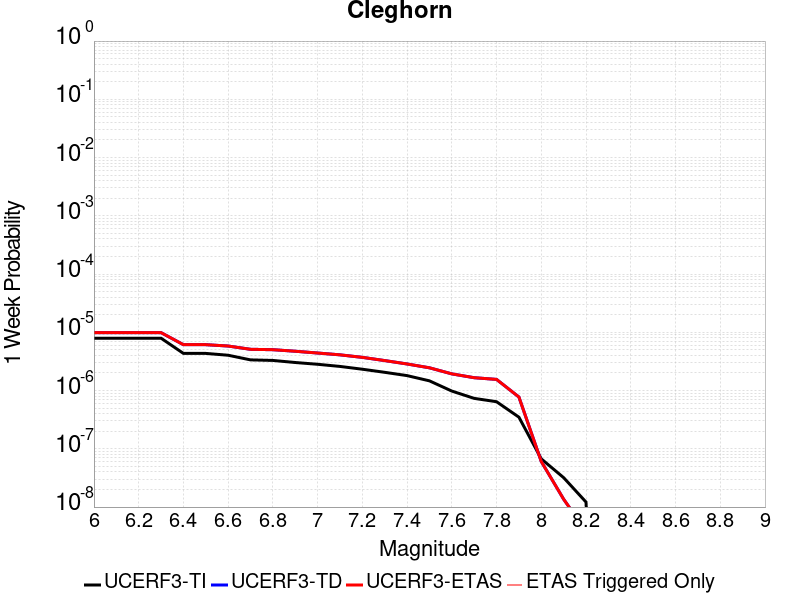 |  | 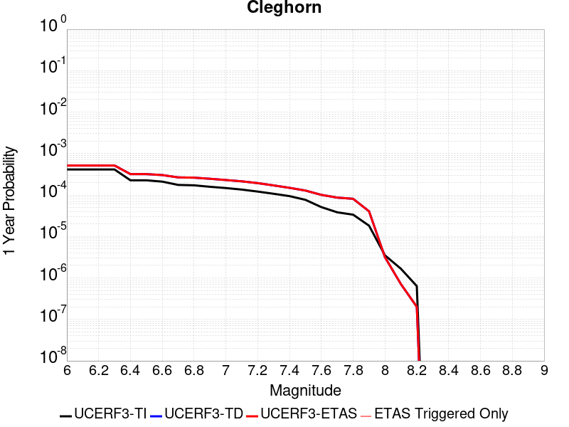 | 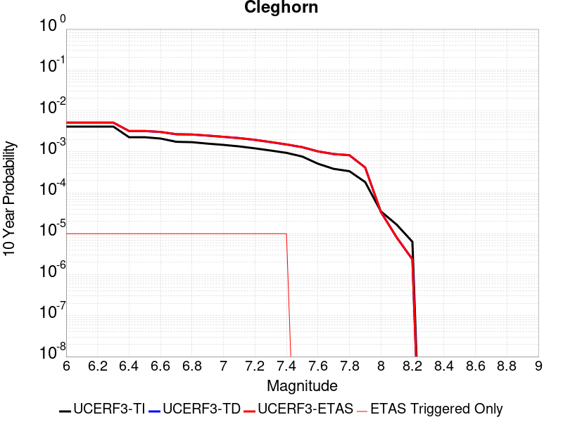 |

| Magnitude | 1 wk TI Prob | 1 wk TD Prob | 1 wk ETAS Prob | 1 wk ETAS/TD Gain | 1 wk ETAS Triggered Only | 1 mo TI Prob | 1 mo TD Prob | 1 mo ETAS Prob | 1 mo ETAS/TD Gain | 1 mo ETAS Triggered Only | 1 yr TI Prob | 1 yr TD Prob | 1 yr ETAS Prob | 1 yr ETAS/TD Gain | 1 yr ETAS Triggered Only | 10 yr TI Prob | 10 yr TD Prob | 10 yr ETAS Prob | 10 yr ETAS/TD Gain | 10 yr ETAS Triggered Only |
|-----|-----|-----|-----|-----|-----|-----|-----|-----|-----|-----|-----|-----|-----|-----|-----|-----|-----|-----|-----|-----|
| 6.0 | 7.9267165E-6 | 9.874098E-6 | 9.874098E-6 | 1.0 | 0.0 | 3.39712E-5 | 4.2316937E-5 | 4.2316937E-5 | 1.0 | 0.0 | 4.1352084E-4 | 5.150975E-4 | 5.150975E-4 | 1.0 | 0.0 | 0.004127522 | 0.0051535247 | 0.005184517 | 1.0060138 | 3.115265E-5 |
| 6.1 | 7.9267165E-6 | 9.874098E-6 | 9.874098E-6 | 1.0 | 0.0 | 3.39712E-5 | 4.2316937E-5 | 4.2316937E-5 | 1.0 | 0.0 | 4.1352084E-4 | 5.150975E-4 | 5.150975E-4 | 1.0 | 0.0 | 0.004127522 | 0.0051535247 | 0.005184517 | 1.0060138 | 3.115265E-5 |
| 6.2 | 7.9267165E-6 | 9.874098E-6 | 9.874098E-6 | 1.0 | 0.0 | 3.39712E-5 | 4.2316937E-5 | 4.2316937E-5 | 1.0 | 0.0 | 4.1352084E-4 | 5.150975E-4 | 5.150975E-4 | 1.0 | 0.0 | 0.004127522 | 0.0051535247 | 0.005184517 | 1.0060138 | 3.115265E-5 |
| 6.3 | 7.9267165E-6 | 9.874098E-6 | 9.874098E-6 | 1.0 | 0.0 | 3.39712E-5 | 4.2316937E-5 | 4.2316937E-5 | 1.0 | 0.0 | 4.1352084E-4 | 5.150975E-4 | 5.150975E-4 | 1.0 | 0.0 | 0.004127522 | 0.0051535247 | 0.005184517 | 1.0060138 | 3.115265E-5 |
| 6.4 | 4.3445207E-6 | 6.133091E-6 | 6.133091E-6 | 1.0 | 0.0 | 1.8619241E-5 | 2.6284417E-5 | 2.6284417E-5 | 1.0 | 0.0 | 2.2666567E-4 | 3.1996678E-4 | 3.1996678E-4 | 1.0 | 0.0 | 0.0022643462 | 0.0032086247 | 0.0032396773 | 1.0096779 | 3.115265E-5 |
| 6.5 | 4.3445207E-6 | 6.133091E-6 | 6.133091E-6 | 1.0 | 0.0 | 1.8619241E-5 | 2.6284417E-5 | 2.6284417E-5 | 1.0 | 0.0 | 2.2666567E-4 | 3.1996678E-4 | 3.1996678E-4 | 1.0 | 0.0 | 0.0022643462 | 0.0032086247 | 0.0032396773 | 1.0096779 | 3.115265E-5 |
| 6.6 | 4.040109E-6 | 5.8154264E-6 | 5.8154264E-6 | 1.0 | 0.0 | 1.7314638E-5 | 2.4923023E-5 | 2.4923023E-5 | 1.0 | 0.0 | 2.1078532E-4 | 3.033965E-4 | 3.033965E-4 | 1.0 | 0.0 | 0.002105855 | 0.0030433803 | 0.003074438 | 1.010205 | 3.115265E-5 |
| 6.7 | 3.3632055E-6 | 5.108763E-6 | 5.108763E-6 | 1.0 | 0.0 | 1.4413658E-5 | 2.1894517E-5 | 2.1894517E-5 | 1.0 | 0.0 | 1.7547216E-4 | 2.6653346E-4 | 2.6653346E-4 | 1.0 | 0.0 | 0.0017533366 | 0.0026756388 | 0.0027067082 | 1.0116119 | 3.115265E-5 |
| 6.8 | 3.2902772E-6 | 5.0306403E-6 | 5.0306403E-6 | 1.0 | 0.0 | 1.4101111E-5 | 2.155971E-5 | 2.155971E-5 | 1.0 | 0.0 | 1.716675E-4 | 2.6245817E-4 | 2.6245817E-4 | 1.0 | 0.0 | 0.0017153495 | 0.0026349828 | 0.0026660534 | 1.0117916 | 3.115265E-5 |
| 6.9 | 3.031547E-6 | 4.731996E-6 | 4.731996E-6 | 1.0 | 0.0 | 1.299228E-5 | 2.0279826E-5 | 2.0279826E-5 | 1.0 | 0.0 | 1.5816953E-4 | 2.4687918E-4 | 2.4687918E-4 | 1.0 | 0.0 | 0.00158057 | 0.0024795479 | 0.002510623 | 1.0125327 | 3.115265E-5 |
| 7.0 | 2.8259715E-6 | 4.410469E-6 | 4.410469E-6 | 1.0 | 0.0 | 1.211125E-5 | 1.8901874E-5 | 1.8901874E-5 | 1.0 | 0.0 | 1.4744449E-4 | 2.3010626E-4 | 2.3010626E-4 | 1.0 | 0.0 | 0.001473467 | 0.002312177 | 0.0023432577 | 1.0134422 | 3.115265E-5 |
| 7.1 | 2.5962665E-6 | 4.105151E-6 | 4.105151E-6 | 1.0 | 0.0 | 1.1126809E-5 | 1.7593387E-5 | 1.7593387E-5 | 1.0 | 0.0 | 1.3546048E-4 | 2.1417867E-4 | 2.1417867E-4 | 1.0 | 0.0 | 0.0013537793 | 0.0021532255 | 0.0021843112 | 1.0144367 | 3.115265E-5 |
| 7.2 | 2.3247253E-6 | 3.714965E-6 | 3.714965E-6 | 1.0 | 0.0 | 9.96307E-6 | 1.5921183E-5 | 1.5921183E-5 | 1.0 | 0.0 | 1.21293626E-4 | 1.9382335E-4 | 1.9382335E-4 | 1.0 | 0.0 | 0.0012122744 | 0.0019500658 | 0.0019811578 | 1.015944 | 3.115265E-5 |
| 7.3 | 2.056928E-6 | 3.272071E-6 | 3.272071E-6 | 1.0 | 0.0 | 8.815376E-6 | 1.4023087E-5 | 1.4023087E-5 | 1.0 | 0.0 | 1.0732192E-4 | 1.7071786E-4 | 1.7071786E-4 | 1.0 | 0.0 | 0.001072701 | 0.0017194574 | 0.0017505565 | 1.0180866 | 3.115265E-5 |
| 7.4 | 1.8055999E-6 | 2.8608583E-6 | 2.8608583E-6 | 1.0 | 0.0 | 7.738263E-6 | 1.2260764E-5 | 1.2260764E-5 | 1.0 | 0.0 | 9.4209274E-5 | 1.4926473E-4 | 1.4926473E-4 | 1.0 | 0.0 | 9.4169343E-4 | 0.001505392 | 0.0015364978 | 1.0206629 | 3.115265E-5 |
| 7.5 | 1.4683443E-6 | 2.4593496E-6 | 2.4593496E-6 | 1.0 | 0.0 | 6.292889E-6 | 1.0540029E-5 | 1.0540029E-5 | 1.0 | 0.0 | 7.661323E-5 | 1.2831738E-4 | 1.2831738E-4 | 1.0 | 0.0 | 7.658682E-4 | 0.0012962079 | 0.0012962079 | 1.0 | 0.0 |
| 7.6 | 9.804088E-7 | 1.934428E-6 | 1.934428E-6 | 1.0 | 0.0 | 4.201745E-6 | 8.29038E-6 | 8.29038E-6 | 1.0 | 0.0 | 5.1155046E-5 | 1.00930745E-4 | 1.00930745E-4 | 1.0 | 0.0 | 5.114327E-4 | 0.0010226612 | 0.0010226612 | 1.0 | 0.0 |
| 7.7 | 7.3434086E-7 | 1.6621416E-6 | 1.6621416E-6 | 1.0 | 0.0 | 3.1471714E-6 | 7.123445E-6 | 7.123445E-6 | 1.0 | 0.0 | 3.831614E-5 | 8.672452E-5 | 8.672452E-5 | 1.0 | 0.0 | 3.8309532E-4 | 8.8075636E-4 | 8.8075636E-4 | 1.0 | 0.0 |
| 7.8 | 6.434184E-7 | 1.5544687E-6 | 1.5544687E-6 | 1.0 | 0.0 | 2.7575045E-6 | 6.661992E-6 | 6.661992E-6 | 1.0 | 0.0 | 3.35721E-5 | 8.110676E-5 | 8.110676E-5 | 1.0 | 0.0 | 3.3567028E-4 | 8.243014E-4 | 8.243014E-4 | 1.0 | 0.0 |
| 7.9 | 3.4943926E-7 | 7.751397E-7 | 7.751397E-7 | 1.0 | 0.0 | 1.497596E-6 | 3.3220233E-6 | 3.3220233E-6 | 1.0 | 0.0 | 1.8233079E-5 | 4.044489E-5 | 4.044489E-5 | 1.0 | 0.0 | 1.8231584E-4 | 4.1297925E-4 | 4.1297925E-4 | 1.0 | 0.0 |
| 8.0 | 6.717524E-8 | 6.054743E-8 | 6.054743E-8 | 1.0 | 0.0 | 2.8789387E-7 | 2.5948896E-7 | 2.5948896E-7 | 1.0 | 0.0 | 3.505102E-6 | 3.1592735E-6 | 3.1592735E-6 | 1.0 | 0.0 | 3.5050467E-5 | 3.388617E-5 | 3.388617E-5 | 1.0 | 0.0 |
| 8.1 | 3.1984914E-8 | 1.3639449E-8 | 1.3639449E-8 | 1.0 | 0.0 | 1.370782E-7 | 5.8454777E-8 | 5.8454777E-8 | 1.0 | 0.0 | 1.6689258E-6 | 7.116867E-7 | 7.116867E-7 | 1.0 | 0.0 | 1.6689133E-5 | 8.131241E-6 | 8.131241E-6 | 1.0 | 0.0 |
| 8.2 | 1.21887656E-8 | 3.860208E-9 | 3.860208E-9 | 1.0 | 0.0 | 5.2237567E-8 | 1.6543751E-8 | 1.6543751E-8 | 1.0 | 0.0 | 6.359922E-7 | 2.0142014E-7 | 2.0142014E-7 | 1.0 | 0.0 | 6.3599036E-6 | 2.369225E-6 | 2.369225E-6 | 1.0 | 0.0 |

## San Jacinto (Stepovers Combined)
*[(top)](#table-of-contents)*

| 1 Week | 1 Month | 1 Year | 10 Year |
|-----|-----|-----|-----|
| 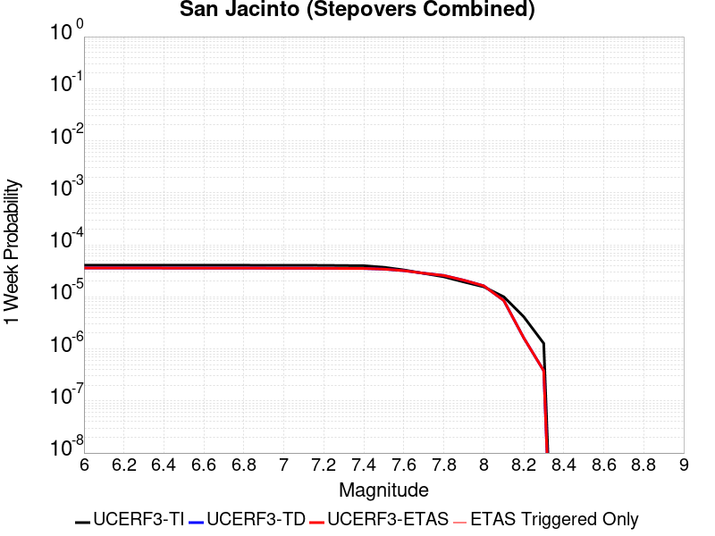 |  | 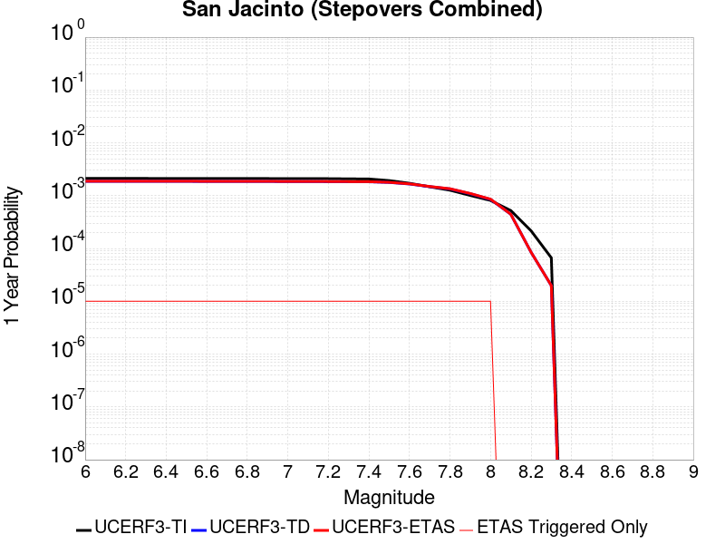 | 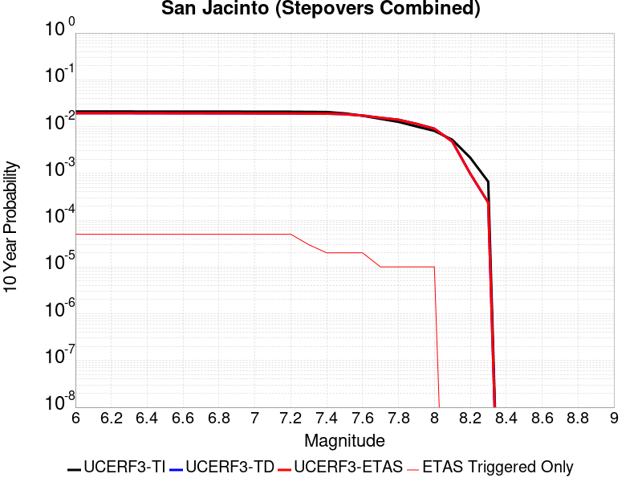 |

| Magnitude | 1 wk TI Prob | 1 wk TD Prob | 1 wk ETAS Prob | 1 wk ETAS/TD Gain | 1 wk ETAS Triggered Only | 1 mo TI Prob | 1 mo TD Prob | 1 mo ETAS Prob | 1 mo ETAS/TD Gain | 1 mo ETAS Triggered Only | 1 yr TI Prob | 1 yr TD Prob | 1 yr ETAS Prob | 1 yr ETAS/TD Gain | 1 yr ETAS Triggered Only | 10 yr TI Prob | 10 yr TD Prob | 10 yr ETAS Prob | 10 yr ETAS/TD Gain | 10 yr ETAS Triggered Only |
|-----|-----|-----|-----|-----|-----|-----|-----|-----|-----|-----|-----|-----|-----|-----|-----|-----|-----|-----|-----|-----|
| 6.0 | 4.0667746E-5 | 3.5895966E-5 | 3.5895966E-5 | 1.0 | 0.0 | 1.742787E-4 | 1.538308E-4 | 1.538308E-4 | 1.0 | 0.0 | 0.0021197782 | 0.0018712822 | 0.0018712822 | 1.0 | 0.0 | 0.020996714 | 0.019310122 | 0.019340673 | 1.0015821 | 3.115265E-5 |
| 6.1 | 4.0667746E-5 | 3.5895966E-5 | 3.5895966E-5 | 1.0 | 0.0 | 1.742787E-4 | 1.538308E-4 | 1.538308E-4 | 1.0 | 0.0 | 0.0021197782 | 0.0018712822 | 0.0018712822 | 1.0 | 0.0 | 0.020996714 | 0.019310122 | 0.019340673 | 1.0015821 | 3.115265E-5 |
| 6.2 | 4.0667746E-5 | 3.5895966E-5 | 3.5895966E-5 | 1.0 | 0.0 | 1.742787E-4 | 1.538308E-4 | 1.538308E-4 | 1.0 | 0.0 | 0.0021197782 | 0.0018712822 | 0.0018712822 | 1.0 | 0.0 | 0.020996714 | 0.019310122 | 0.019340673 | 1.0015821 | 3.115265E-5 |
| 6.3 | 4.0667746E-5 | 3.5895966E-5 | 3.5895966E-5 | 1.0 | 0.0 | 1.742787E-4 | 1.538308E-4 | 1.538308E-4 | 1.0 | 0.0 | 0.0021197782 | 0.0018712822 | 0.0018712822 | 1.0 | 0.0 | 0.020996714 | 0.019310122 | 0.019340673 | 1.0015821 | 3.115265E-5 |
| 6.4 | 4.0577226E-5 | 3.576763E-5 | 3.576763E-5 | 1.0 | 0.0 | 1.738908E-4 | 1.5328084E-4 | 1.5328084E-4 | 1.0 | 0.0 | 0.0021150648 | 0.0018645993 | 0.0018645993 | 1.0 | 0.0 | 0.020950472 | 0.019244589 | 0.019275142 | 1.0015876 | 3.115265E-5 |
| 6.5 | 4.0577226E-5 | 3.576763E-5 | 3.576763E-5 | 1.0 | 0.0 | 1.738908E-4 | 1.5328084E-4 | 1.5328084E-4 | 1.0 | 0.0 | 0.0021150648 | 0.0018645993 | 0.0018645993 | 1.0 | 0.0 | 0.020950472 | 0.019244589 | 0.019275142 | 1.0015876 | 3.115265E-5 |
| 6.6 | 4.053861E-5 | 3.5712863E-5 | 3.5712863E-5 | 1.0 | 0.0 | 1.7372532E-4 | 1.5304617E-4 | 1.5304617E-4 | 1.0 | 0.0 | 0.0021130538 | 0.0018617475 | 0.0018617475 | 1.0 | 0.0 | 0.020930743 | 0.019216623 | 0.019247176 | 1.00159 | 3.115265E-5 |
| 6.7 | 4.0516545E-5 | 3.568188E-5 | 3.568188E-5 | 1.0 | 0.0 | 1.7363077E-4 | 1.5291339E-4 | 1.5291339E-4 | 1.0 | 0.0 | 0.002111905 | 0.001860134 | 0.001860134 | 1.0 | 0.0 | 0.020919468 | 0.019200794 | 0.01923135 | 1.0015913 | 3.115265E-5 |
| 6.8 | 4.049434E-5 | 3.5653273E-5 | 3.5653273E-5 | 1.0 | 0.0 | 1.7353562E-4 | 1.5279082E-4 | 1.5279082E-4 | 1.0 | 0.0 | 0.0021107488 | 0.0018586441 | 0.0018586441 | 1.0 | 0.0 | 0.020908125 | 0.019186128 | 0.019216683 | 1.0015925 | 3.115265E-5 |
| 6.9 | 4.046386E-5 | 3.5615678E-5 | 3.5615678E-5 | 1.0 | 0.0 | 1.73405E-4 | 1.5262971E-4 | 1.5262971E-4 | 1.0 | 0.0 | 0.0021091616 | 0.0018566861 | 0.0018566861 | 1.0 | 0.0 | 0.020892553 | 0.019166827 | 0.019197382 | 1.0015942 | 3.115265E-5 |
| 7.0 | 4.036382E-5 | 3.5495723E-5 | 3.5495723E-5 | 1.0 | 0.0 | 1.7297632E-4 | 1.5211567E-4 | 1.5211567E-4 | 1.0 | 0.0 | 0.0021039525 | 0.0018504384 | 0.0018504384 | 1.0 | 0.0 | 0.02084144 | 0.01910519 | 0.019135749 | 1.0015994 | 3.115265E-5 |
| 7.1 | 4.0343282E-5 | 3.54741E-5 | 3.54741E-5 | 1.0 | 0.0 | 1.7288832E-4 | 1.5202301E-4 | 1.5202301E-4 | 1.0 | 0.0 | 0.002102883 | 0.0018493122 | 0.0018493122 | 1.0 | 0.0 | 0.020830948 | 0.019094035 | 0.019124594 | 1.0016004 | 3.115265E-5 |
| 7.2 | 4.0257353E-5 | 3.537824E-5 | 3.537824E-5 | 1.0 | 0.0 | 1.725201E-4 | 1.5161223E-4 | 1.5161223E-4 | 1.0 | 0.0 | 0.0020984085 | 0.0018443195 | 0.0018443195 | 1.0 | 0.0 | 0.020787042 | 0.01904461 | 0.019075168 | 1.0016047 | 3.115265E-5 |
| 7.3 | 3.9940667E-5 | 3.520338E-5 | 3.520338E-5 | 1.0 | 0.0 | 1.7116306E-4 | 1.508629E-4 | 1.508629E-4 | 1.0 | 0.0 | 0.0020819185 | 0.0018352119 | 0.0018352119 | 1.0 | 0.0 | 0.020625217 | 0.018951941 | 0.018982504 | 1.0016127 | 3.115265E-5 |
| 7.4 | 3.9721202E-5 | 3.5087545E-5 | 3.5087545E-5 | 1.0 | 0.0 | 1.7022261E-4 | 1.5036654E-4 | 1.5036654E-4 | 1.0 | 0.0 | 0.0020704903 | 0.0018291788 | 0.0018291788 | 1.0 | 0.0 | 0.020513052 | 0.01889044 | 0.018921005 | 1.001618 | 3.115265E-5 |
| 7.5 | 3.7036873E-5 | 3.414307E-5 | 3.414307E-5 | 1.0 | 0.0 | 1.5871979E-4 | 1.4631925E-4 | 1.4631925E-4 | 1.0 | 0.0 | 0.0019307006 | 0.0017799843 | 0.0017799843 | 1.0 | 0.0 | 0.019140124 | 0.018385863 | 0.018416442 | 1.0016632 | 3.115265E-5 |
| 7.6 | 3.2940967E-5 | 3.1898926E-5 | 3.1898926E-5 | 1.0 | 0.0 | 1.4116794E-4 | 1.3670254E-4 | 1.3670254E-4 | 1.0 | 0.0 | 0.0017173645 | 0.0016630851 | 0.0016630851 | 1.0 | 0.0 | 0.01704153 | 0.017206043 | 0.01723666 | 1.0017794 | 3.115265E-5 |
| 7.7 | 2.8236149E-5 | 2.8449733E-5 | 2.8449733E-5 | 1.0 | 0.0 | 1.2100645E-4 | 1.2192174E-4 | 1.2192174E-4 | 1.0 | 0.0 | 0.0014722579 | 0.0014833874 | 0.0014833874 | 1.0 | 0.0 | 0.014625421 | 0.015409627 | 0.015409627 | 1.0 | 0.0 |
| 7.8 | 2.4329287E-5 | 2.5749578E-5 | 2.5749578E-5 | 1.0 | 0.0 | 1.042642E-4 | 1.1035067E-4 | 1.1035067E-4 | 1.0 | 0.0 | 0.0012686774 | 0.0013426923 | 0.0013426923 | 1.0 | 0.0 | 0.012614589 | 0.01399476 | 0.01399476 | 1.0 | 0.0 |
| 7.9 | 1.9370926E-5 | 2.0904588E-5 | 2.0904588E-5 | 1.0 | 0.0 | 8.301561E-5 | 8.958802E-5 | 8.958802E-5 | 1.0 | 0.0 | 0.0010102465 | 0.0010901892 | 0.0010901892 | 1.0 | 0.0 | 0.0100566605 | 0.011452278 | 0.011452278 | 1.0 | 0.0 |
| 8.0 | 1.5583017E-5 | 1.6291933E-5 | 1.6291933E-5 | 1.0 | 0.0 | 6.6782646E-5 | 6.982071E-5 | 6.982071E-5 | 1.0 | 0.0 | 8.127754E-4 | 8.497363E-4 | 8.497363E-4 | 1.0 | 0.0 | 0.008098091 | 0.008995623 | 0.008995623 | 1.0 | 0.0 |
| 8.1 | 1.0024873E-5 | 8.530247E-6 | 8.530247E-6 | 1.0 | 0.0 | 4.2963035E-5 | 3.6557693E-5 | 3.6557693E-5 | 1.0 | 0.0 | 5.229494E-4 | 4.4499955E-4 | 4.4499955E-4 | 1.0 | 0.0 | 0.0052172043 | 0.0047813924 | 0.0047813924 | 1.0 | 0.0 |
| 8.2 | 4.142796E-6 | 1.629824E-6 | 1.629824E-6 | 1.0 | 0.0 | 1.775472E-5 | 6.9849416E-6 | 6.9849416E-6 | 1.0 | 0.0 | 2.1614227E-4 | 8.503838E-5 | 8.503838E-5 | 1.0 | 0.0 | 0.0021593217 | 9.847819E-4 | 9.847819E-4 | 1.0 | 0.0 |
| 8.3 | 1.2750878E-6 | 3.7960186E-7 | 3.7960186E-7 | 1.0 | 0.0 | 5.4646503E-6 | 1.6268641E-6 | 1.6268641E-6 | 1.0 | 0.0 | 6.653009E-5 | 1.9806896E-5 | 1.9806896E-5 | 1.0 | 0.0 | 6.6510175E-4 | 2.3814308E-4 | 2.3814308E-4 | 1.0 | 0.0 |

## Imperial
*[(top)](#table-of-contents)*

| 1 Week | 1 Month | 1 Year | 10 Year |
|-----|-----|-----|-----|
| 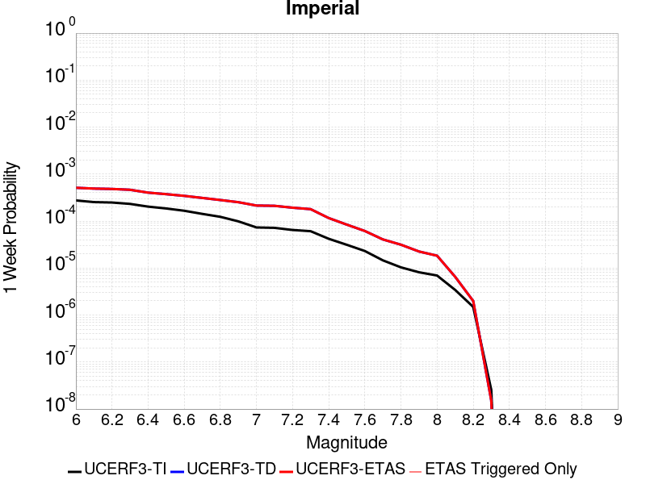 | 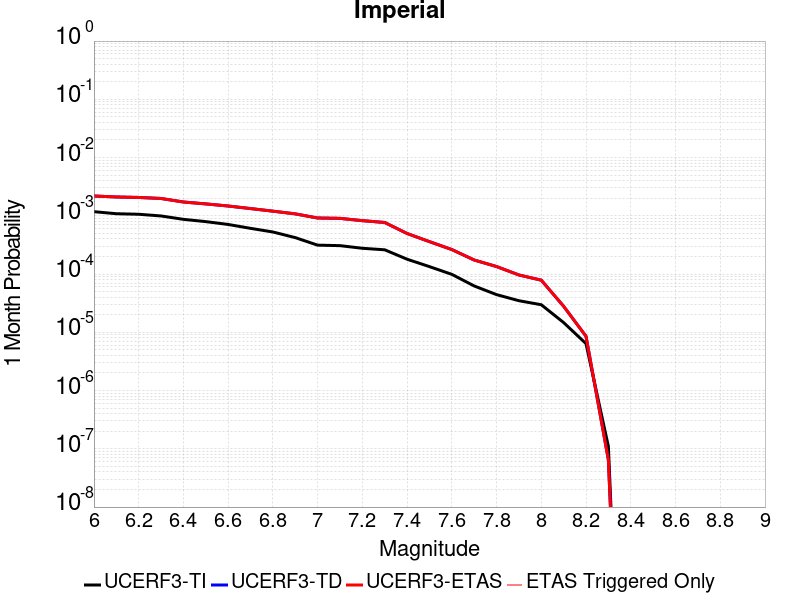 | 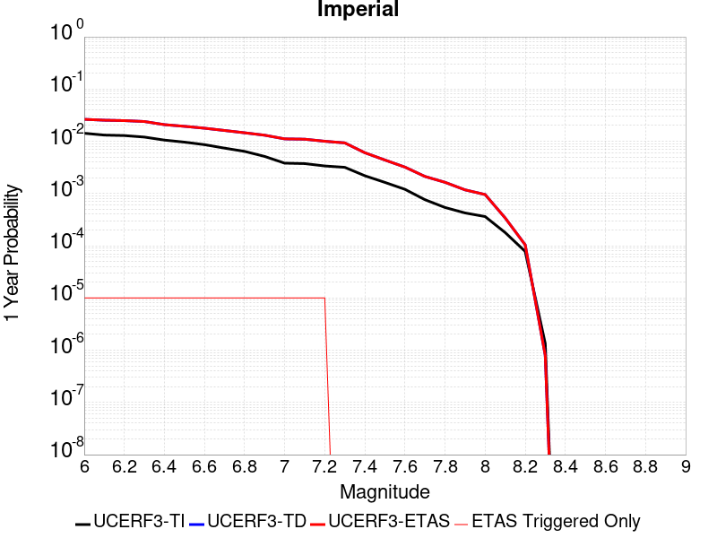 |  |

| Magnitude | 1 wk TI Prob | 1 wk TD Prob | 1 wk ETAS Prob | 1 wk ETAS/TD Gain | 1 wk ETAS Triggered Only | 1 mo TI Prob | 1 mo TD Prob | 1 mo ETAS Prob | 1 mo ETAS/TD Gain | 1 mo ETAS Triggered Only | 1 yr TI Prob | 1 yr TD Prob | 1 yr ETAS Prob | 1 yr ETAS/TD Gain | 1 yr ETAS Triggered Only | 10 yr TI Prob | 10 yr TD Prob | 10 yr ETAS Prob | 10 yr ETAS/TD Gain | 10 yr ETAS Triggered Only |
|-----|-----|-----|-----|-----|-----|-----|-----|-----|-----|-----|-----|-----|-----|-----|-----|-----|-----|-----|-----|-----|
| 6.0 | 2.7496446E-4 | 5.111914E-4 | 5.111914E-4 | 1.0 | 0.0 | 0.0011778869 | 0.0021890206 | 0.0021890206 | 1.0 | 0.0 | 0.0142467655 | 0.026338352 | 0.026338352 | 1.0 | 0.0 | 0.13367249 | 0.22992656 | 0.22995055 | 1.0001043 | 3.115265E-5 |
| 6.1 | 2.5356023E-4 | 4.915812E-4 | 4.915812E-4 | 1.0 | 0.0 | 0.001086234 | 0.0021051145 | 0.0021051145 | 1.0 | 0.0 | 0.013144928 | 0.025327845 | 0.025327845 | 1.0 | 0.0 | 0.123940155 | 0.22118305 | 0.2212073 | 1.0001097 | 3.115265E-5 |
| 6.2 | 2.4820742E-4 | 4.8244462E-4 | 4.8244462E-4 | 1.0 | 0.0 | 0.0010633124 | 0.0020660197 | 0.0020660197 | 1.0 | 0.0 | 0.01286919 | 0.024863338 | 0.024863338 | 1.0 | 0.0 | 0.12148927 | 0.21767166 | 0.21769603 | 1.0001119 | 3.115265E-5 |
| 6.3 | 2.3205351E-4 | 4.6336252E-4 | 4.6336252E-4 | 1.0 | 0.0 | 9.94136E-4 | 0.0019843653 | 0.0019843653 | 1.0 | 0.0 | 0.012036599 | 0.02389091 | 0.02389091 | 1.0 | 0.0 | 0.11405133 | 0.20947771 | 0.20950234 | 1.0001175 | 3.115265E-5 |
| 6.4 | 2.0304754E-4 | 4.0306573E-4 | 4.0306573E-4 | 1.0 | 0.0 | 8.6991355E-4 | 0.0017262959 | 0.0017262959 | 1.0 | 0.0 | 0.010539869 | 0.020817019 | 0.020817019 | 1.0 | 0.0 | 0.100537635 | 0.18660863 | 0.18660863 | 1.0 | 0.0 |
| 6.5 | 1.854992E-4 | 3.7390826E-4 | 3.7390826E-4 | 1.0 | 0.0 | 7.9475436E-4 | 0.0016014925 | 0.0016014925 | 1.0 | 0.0 | 0.009633281 | 0.019329313 | 0.019329313 | 1.0 | 0.0 | 0.0922623 | 0.17477353 | 0.17477353 | 1.0 | 0.0 |
| 6.6 | 1.6586106E-4 | 3.4400742E-4 | 3.4400742E-4 | 1.0 | 0.0 | 7.106394E-4 | 0.0014734949 | 0.0014734949 | 1.0 | 0.0 | 0.008617763 | 0.017796053 | 0.017796053 | 1.0 | 0.0 | 0.08291132 | 0.16215366 | 0.16215366 | 1.0 | 0.0 |
| 6.7 | 1.4224656E-4 | 3.10877E-4 | 3.10877E-4 | 1.0 | 0.0 | 6.094856E-4 | 0.0013316581 | 0.0013316581 | 1.0 | 0.0 | 0.0073952693 | 0.016093815 | 0.016093815 | 1.0 | 0.0 | 0.07153955 | 0.14772433 | 0.14772433 | 1.0 | 0.0 |
| 6.8 | 1.2317259E-4 | 2.805629E-4 | 2.805629E-4 | 1.0 | 0.0 | 5.2777573E-4 | 0.0012018647 | 0.0012018647 | 1.0 | 0.0 | 0.0064067547 | 0.014535947 | 0.014535947 | 1.0 | 0.0 | 0.06225166 | 0.13399914 | 0.13399914 | 1.0 | 0.0 |
| 6.9 | 9.859898E-5 | 2.5208195E-4 | 2.5208195E-4 | 1.0 | 0.0 | 4.2249862E-4 | 0.0010799083 | 0.0010799083 | 1.0 | 0.0 | 0.0051317946 | 0.013069603 | 0.013069603 | 1.0 | 0.0 | 0.05014893 | 0.12019898 | 0.12019898 | 1.0 | 0.0 |
| 7.0 | 7.3191884E-5 | 2.1406579E-4 | 2.1406579E-4 | 1.0 | 0.0 | 3.136418E-4 | 9.1710547E-4 | 9.1710547E-4 | 1.0 | 0.0 | 0.003811904 | 0.011109289 | 0.011109289 | 1.0 | 0.0 | 0.037471764 | 0.10264235 | 0.10264235 | 1.0 | 0.0 |
| 7.1 | 7.1760296E-5 | 2.11058E-4 | 2.11058E-4 | 1.0 | 0.0 | 3.0750787E-4 | 9.0422394E-4 | 9.0422394E-4 | 1.0 | 0.0 | 0.003737482 | 0.010954043 | 0.010954043 | 1.0 | 0.0 | 0.03675245 | 0.10127123 | 0.10127123 | 1.0 | 0.0 |
| 7.2 | 6.46614E-5 | 1.9268636E-4 | 1.9268636E-4 | 1.0 | 0.0 | 2.7709085E-4 | 8.255404E-4 | 8.255404E-4 | 1.0 | 0.0 | 0.0033683628 | 0.010005265 | 0.010005265 | 1.0 | 0.0 | 0.033177625 | 0.09306167 | 0.09306167 | 1.0 | 0.0 |
| 7.3 | 6.088115E-5 | 1.7933827E-4 | 1.7933827E-4 | 1.0 | 0.0 | 2.6089314E-4 | 7.6836906E-4 | 7.6836906E-4 | 1.0 | 0.0 | 0.0031717476 | 0.00931535 | 0.00931535 | 1.0 | 0.0 | 0.031268585 | 0.08709015 | 0.08709015 | 1.0 | 0.0 |
| 7.4 | 4.199346E-5 | 1.16031144E-4 | 1.16031144E-4 | 1.0 | 0.0 | 1.7995955E-4 | 4.971824E-4 | 4.971824E-4 | 1.0 | 0.0 | 0.0021888057 | 0.006036567 | 0.006036567 | 1.0 | 0.0 | 0.02167372 | 0.057849776 | 0.057849776 | 1.0 | 0.0 |
| 7.5 | 3.130448E-5 | 8.409887E-5 | 8.409887E-5 | 1.0 | 0.0 | 1.3415517E-4 | 3.6037425E-4 | 3.6037425E-4 | 1.0 | 0.0 | 0.0016321153 | 0.00437879 | 0.00437879 | 1.0 | 0.0 | 0.016201803 | 0.042477347 | 0.042477347 | 1.0 | 0.0 |
| 7.6 | 2.3074248E-5 | 6.149559E-5 | 6.149559E-5 | 1.0 | 0.0 | 9.888588E-5 | 2.6352605E-4 | 2.6352605E-4 | 1.0 | 0.0 | 0.0012032706 | 0.003203733 | 0.003203733 | 1.0 | 0.0 | 0.011967761 | 0.031323086 | 0.031323086 | 1.0 | 0.0 |
| 7.7 | 1.45864815E-5 | 4.066533E-5 | 4.066533E-5 | 1.0 | 0.0 | 6.2511994E-5 | 1.7426838E-4 | 1.7426838E-4 | 1.0 | 0.0 | 7.608177E-4 | 0.0021196585 | 0.0021196585 | 1.0 | 0.0 | 0.007582182 | 0.02087488 | 0.02087488 | 1.0 | 0.0 |
| 7.8 | 1.0352979E-5 | 3.142006E-5 | 3.142006E-5 | 1.0 | 0.0 | 4.4369157E-5 | 1.3465046E-4 | 1.3465046E-4 | 1.0 | 0.0 | 5.400606E-4 | 0.001638139 | 0.001638139 | 1.0 | 0.0 | 0.0053875 | 0.01622657 | 0.01622657 | 1.0 | 0.0 |
| 7.9 | 8.137906E-6 | 2.2518456E-5 | 2.2518456E-5 | 1.0 | 0.0 | 3.4876273E-5 | 9.65041E-5 | 9.65041E-5 | 1.0 | 0.0 | 4.2453592E-4 | 0.0011743051 | 0.0011743051 | 1.0 | 0.0 | 0.004237258 | 0.01178987 | 0.01178987 | 1.0 | 0.0 |
| 8.0 | 6.93792E-6 | 1.832683E-5 | 1.832683E-5 | 1.0 | 0.0 | 2.9733603E-5 | 7.854119E-5 | 7.854119E-5 | 1.0 | 0.0 | 3.6194647E-4 | 9.5582026E-4 | 9.5582026E-4 | 1.0 | 0.0 | 0.0036135751 | 0.009650563 | 0.009650563 | 1.0 | 0.0 |
| 8.1 | 3.4286315E-6 | 6.5289223E-6 | 6.5289223E-6 | 1.0 | 0.0 | 1.4694053E-5 | 2.7980797E-5 | 2.7980797E-5 | 1.0 | 0.0 | 1.7888541E-4 | 3.4061307E-4 | 3.4061307E-4 | 1.0 | 0.0 | 0.0017874148 | 0.0035598846 | 0.0035598846 | 1.0 | 0.0 |
| 8.2 | 1.4906886E-6 | 1.993911E-6 | 1.993911E-6 | 1.0 | 0.0 | 6.3886496E-6 | 8.545305E-6 | 8.545305E-6 | 1.0 | 0.0 | 7.7779034E-5 | 1.0403415E-4 | 1.0403415E-4 | 1.0 | 0.0 | 7.775182E-4 | 0.0011368756 | 0.0011368756 | 1.0 | 0.0 |
| 8.3 | 2.5758007E-8 | 1.5080602E-8 | 1.5080602E-8 | 1.0 | 0.0 | 1.10391454E-7 | 6.463115E-8 | 6.463115E-8 | 1.0 | 0.0 | 1.3440151E-6 | 7.8688424E-7 | 7.8688424E-7 | 1.0 | 0.0 | 1.344007E-5 | 8.199204E-6 | 8.199204E-6 | 1.0 | 0.0 |

## San Jacinto (San Jacinto Valley) rev
*[(top)](#table-of-contents)*

| 1 Week | 1 Month | 1 Year | 10 Year |
|-----|-----|-----|-----|
|  |  | 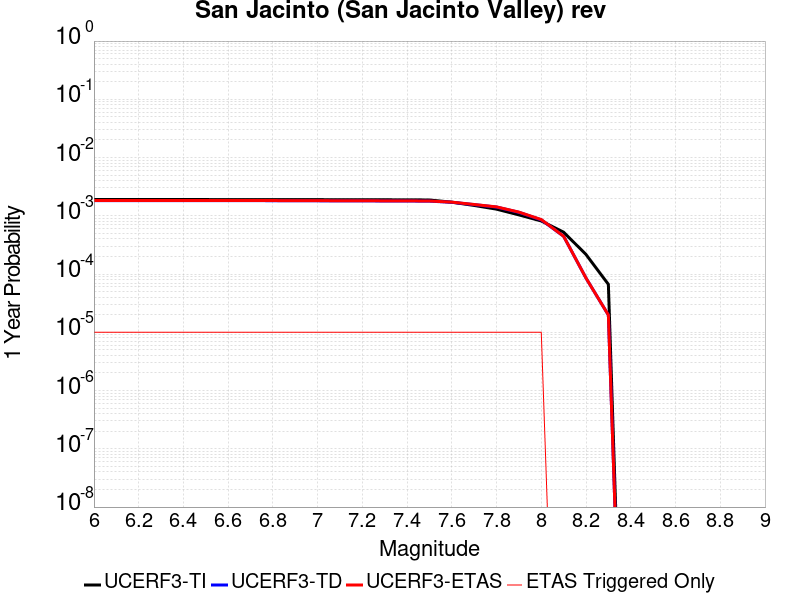 |  |

| Magnitude | 1 wk TI Prob | 1 wk TD Prob | 1 wk ETAS Prob | 1 wk ETAS/TD Gain | 1 wk ETAS Triggered Only | 1 mo TI Prob | 1 mo TD Prob | 1 mo ETAS Prob | 1 mo ETAS/TD Gain | 1 mo ETAS Triggered Only | 1 yr TI Prob | 1 yr TD Prob | 1 yr ETAS Prob | 1 yr ETAS/TD Gain | 1 yr ETAS Triggered Only | 10 yr TI Prob | 10 yr TD Prob | 10 yr ETAS Prob | 10 yr ETAS/TD Gain | 10 yr ETAS Triggered Only |
|-----|-----|-----|-----|-----|-----|-----|-----|-----|-----|-----|-----|-----|-----|-----|-----|-----|-----|-----|-----|-----|
| 6.0 | 3.652694E-5 | 3.5028046E-5 | 3.5028046E-5 | 1.0 | 0.0 | 1.5653463E-4 | 1.5011156E-4 | 1.5011156E-4 | 1.0 | 0.0 | 0.0019041431 | 0.0018260782 | 0.0018260782 | 1.0 | 0.0 | 0.018879099 | 0.018850058 | 0.018880624 | 1.0016215 | 3.115265E-5 |
| 6.1 | 3.652694E-5 | 3.5028046E-5 | 3.5028046E-5 | 1.0 | 0.0 | 1.5653463E-4 | 1.5011156E-4 | 1.5011156E-4 | 1.0 | 0.0 | 0.0019041431 | 0.0018260782 | 0.0018260782 | 1.0 | 0.0 | 0.018879099 | 0.018850058 | 0.018880624 | 1.0016215 | 3.115265E-5 |
| 6.2 | 3.652694E-5 | 3.5028046E-5 | 3.5028046E-5 | 1.0 | 0.0 | 1.5653463E-4 | 1.5011156E-4 | 1.5011156E-4 | 1.0 | 0.0 | 0.0019041431 | 0.0018260782 | 0.0018260782 | 1.0 | 0.0 | 0.018879099 | 0.018850058 | 0.018880624 | 1.0016215 | 3.115265E-5 |
| 6.3 | 3.652694E-5 | 3.5028046E-5 | 3.5028046E-5 | 1.0 | 0.0 | 1.5653463E-4 | 1.5011156E-4 | 1.5011156E-4 | 1.0 | 0.0 | 0.0019041431 | 0.0018260782 | 0.0018260782 | 1.0 | 0.0 | 0.018879099 | 0.018850058 | 0.018880624 | 1.0016215 | 3.115265E-5 |
| 6.4 | 3.646941E-5 | 3.494948E-5 | 3.494948E-5 | 1.0 | 0.0 | 1.5628811E-4 | 1.497749E-4 | 1.497749E-4 | 1.0 | 0.0 | 0.0019011468 | 0.0018219865 | 0.0018219865 | 1.0 | 0.0 | 0.018849645 | 0.018809883 | 0.018840449 | 1.0016251 | 3.115265E-5 |
| 6.5 | 3.646941E-5 | 3.494948E-5 | 3.494948E-5 | 1.0 | 0.0 | 1.5628811E-4 | 1.497749E-4 | 1.497749E-4 | 1.0 | 0.0 | 0.0019011468 | 0.0018219865 | 0.0018219865 | 1.0 | 0.0 | 0.018849645 | 0.018809883 | 0.018840449 | 1.0016251 | 3.115265E-5 |
| 6.6 | 3.6442503E-5 | 3.4912802E-5 | 3.4912802E-5 | 1.0 | 0.0 | 1.561728E-4 | 1.4961773E-4 | 1.4961773E-4 | 1.0 | 0.0 | 0.0018997455 | 0.0018200763 | 0.0018200763 | 1.0 | 0.0 | 0.018835869 | 0.018791124 | 0.018821692 | 1.0016267 | 3.115265E-5 |
| 6.7 | 3.6432113E-5 | 3.489835E-5 | 3.489835E-5 | 1.0 | 0.0 | 1.5612828E-4 | 1.495558E-4 | 1.495558E-4 | 1.0 | 0.0 | 0.0018992044 | 0.0018193236 | 0.0018193236 | 1.0 | 0.0 | 0.018830549 | 0.018783737 | 0.018814305 | 1.0016273 | 3.115265E-5 |
| 6.8 | 3.6409598E-5 | 3.4867346E-5 | 3.4867346E-5 | 1.0 | 0.0 | 1.560318E-4 | 1.4942294E-4 | 1.4942294E-4 | 1.0 | 0.0 | 0.0018980318 | 0.0018177088 | 0.0018177088 | 1.0 | 0.0 | 0.018819023 | 0.018767865 | 0.018798433 | 1.0016288 | 3.115265E-5 |
| 6.9 | 3.638078E-5 | 3.482769E-5 | 3.482769E-5 | 1.0 | 0.0 | 1.5590832E-4 | 1.4925301E-4 | 1.4925301E-4 | 1.0 | 0.0 | 0.0018965311 | 0.0018156434 | 0.0018156434 | 1.0 | 0.0 | 0.018804269 | 0.018747568 | 0.018778136 | 1.0016305 | 3.115265E-5 |
| 7.0 | 3.6294874E-5 | 3.470948E-5 | 3.470948E-5 | 1.0 | 0.0 | 1.5554018E-4 | 1.4874645E-4 | 1.4874645E-4 | 1.0 | 0.0 | 0.0018920569 | 0.0018094864 | 0.0018094864 | 1.0 | 0.0 | 0.018760284 | 0.018687053 | 0.018717622 | 1.0016359 | 3.115265E-5 |
| 7.1 | 3.6260717E-5 | 3.46657E-5 | 3.46657E-5 | 1.0 | 0.0 | 1.5539382E-4 | 1.4855884E-4 | 1.4855884E-4 | 1.0 | 0.0 | 0.001890278 | 0.0018072061 | 0.0018072061 | 1.0 | 0.0 | 0.018742796 | 0.018664636 | 0.018695205 | 1.0016379 | 3.115265E-5 |
| 7.2 | 3.6210204E-5 | 3.4599707E-5 | 3.4599707E-5 | 1.0 | 0.0 | 1.5517735E-4 | 1.4827606E-4 | 1.4827606E-4 | 1.0 | 0.0 | 0.001887647 | 0.0018037689 | 0.0018037689 | 1.0 | 0.0 | 0.01871693 | 0.018630827 | 0.0186614 | 1.0016409 | 3.115265E-5 |
| 7.3 | 3.6119454E-5 | 3.448739E-5 | 3.448739E-5 | 1.0 | 0.0 | 1.5478847E-4 | 1.4779475E-4 | 1.4779475E-4 | 1.0 | 0.0 | 0.0018829206 | 0.0017979187 | 0.0017979187 | 1.0 | 0.0 | 0.018670462 | 0.018573094 | 0.01860367 | 1.0016462 | 3.115265E-5 |
| 7.4 | 3.607848E-5 | 3.4434583E-5 | 3.4434583E-5 | 1.0 | 0.0 | 1.5461289E-4 | 1.4756844E-4 | 1.4756844E-4 | 1.0 | 0.0 | 0.0018807866 | 0.001795168 | 0.001795168 | 1.0 | 0.0 | 0.018649481 | 0.01854594 | 0.018576514 | 1.0016485 | 3.115265E-5 |
| 7.5 | 3.5856774E-5 | 3.424251E-5 | 3.424251E-5 | 1.0 | 0.0 | 1.5366284E-4 | 1.4674537E-4 | 1.4674537E-4 | 1.0 | 0.0 | 0.0018692396 | 0.0017851635 | 0.0017851635 | 1.0 | 0.0 | 0.018535944 | 0.018446108 | 0.018476687 | 1.0016577 | 3.115265E-5 |
| 7.6 | 3.286655E-5 | 3.2748885E-5 | 3.2748885E-5 | 1.0 | 0.0 | 1.4084904E-4 | 1.4034483E-4 | 1.4034483E-4 | 1.0 | 0.0 | 0.001713488 | 0.0017073612 | 0.0017073612 | 1.0 | 0.0 | 0.017003361 | 0.017657327 | 0.01768793 | 1.0017332 | 3.115265E-5 |
| 7.7 | 2.8882527E-5 | 2.9829349E-5 | 2.9829349E-5 | 1.0 | 0.0 | 1.237764E-4 | 1.278338E-4 | 1.278338E-4 | 1.0 | 0.0 | 0.0015059357 | 0.0015552666 | 0.0015552666 | 1.0 | 0.0 | 0.014957713 | 0.016137997 | 0.016137997 | 1.0 | 0.0 |
| 7.8 | 2.4950225E-5 | 2.7096117E-5 | 2.7096117E-5 | 1.0 | 0.0 | 1.0692515E-4 | 1.1612105E-4 | 1.1612105E-4 | 1.0 | 0.0 | 0.0013010362 | 0.0014128579 | 0.0014128579 | 1.0 | 0.0 | 0.012934455 | 0.014706988 | 0.014706988 | 1.0 | 0.0 |
| 7.9 | 1.9881603E-5 | 2.2013175E-5 | 2.2013175E-5 | 1.0 | 0.0 | 8.520408E-5 | 9.433877E-5 | 9.433877E-5 | 1.0 | 0.0 | 0.001036866 | 0.0011479702 | 0.0011479702 | 1.0 | 0.0 | 0.010320415 | 0.012040684 | 0.012040684 | 1.0 | 0.0 |
| 8.0 | 1.563292E-5 | 1.634456E-5 | 1.634456E-5 | 1.0 | 0.0 | 6.6996516E-5 | 7.004624E-5 | 7.004624E-5 | 1.0 | 0.0 | 8.153773E-4 | 8.5248E-4 | 8.5248E-4 | 1.0 | 0.0 | 0.00812392 | 0.009025237 | 0.009025237 | 1.0 | 0.0 |
| 8.1 | 1.0045313E-5 | 8.540095E-6 | 8.540095E-6 | 1.0 | 0.0 | 4.305063E-5 | 3.65999E-5 | 3.65999E-5 | 1.0 | 0.0 | 5.2401534E-4 | 4.455132E-4 | 4.455132E-4 | 1.0 | 0.0 | 0.0052278144 | 0.004787349 | 0.004787349 | 1.0 | 0.0 |
| 8.2 | 4.1554413E-6 | 1.6346119E-6 | 1.6346119E-6 | 1.0 | 0.0 | 1.7808914E-5 | 7.0054607E-6 | 7.0054607E-6 | 1.0 | 0.0 | 2.1680194E-4 | 8.528818E-5 | 8.528818E-5 | 1.0 | 0.0 | 0.0021659054 | 9.877412E-4 | 9.877412E-4 | 1.0 | 0.0 |
| 8.3 | 1.2758221E-6 | 3.7989966E-7 | 3.7989966E-7 | 1.0 | 0.0 | 5.4677976E-6 | 1.6281404E-6 | 1.6281404E-6 | 1.0 | 0.0 | 6.65684E-5 | 1.9822433E-5 | 1.9822433E-5 | 1.0 | 0.0 | 6.6548464E-4 | 2.3832008E-4 | 2.3832008E-4 | 1.0 | 0.0 |

## Superstition Hills
*[(top)](#table-of-contents)*

| 1 Week | 1 Month | 1 Year | 10 Year |
|-----|-----|-----|-----|
| 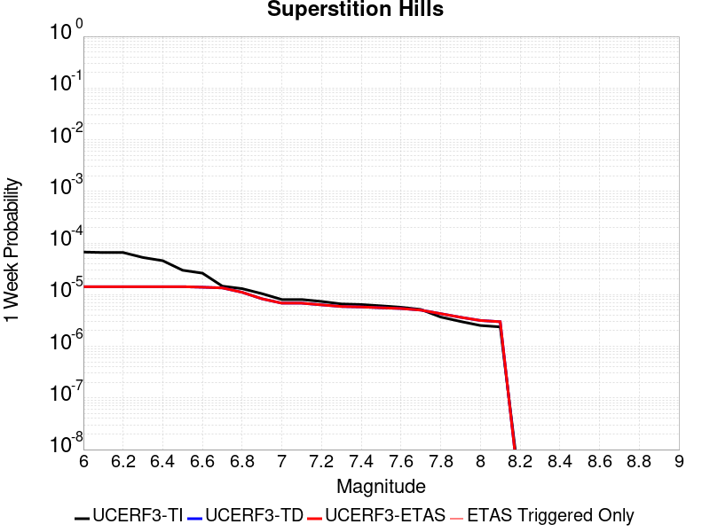 |  |  | 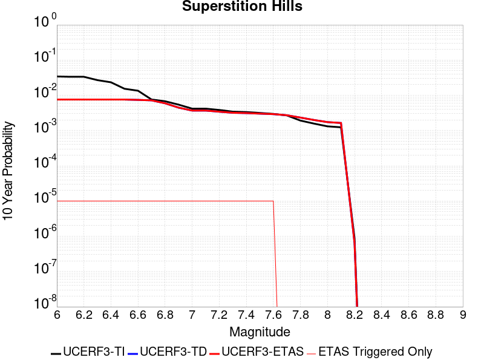 |

| Magnitude | 1 wk TI Prob | 1 wk TD Prob | 1 wk ETAS Prob | 1 wk ETAS/TD Gain | 1 wk ETAS Triggered Only | 1 mo TI Prob | 1 mo TD Prob | 1 mo ETAS Prob | 1 mo ETAS/TD Gain | 1 mo ETAS Triggered Only | 1 yr TI Prob | 1 yr TD Prob | 1 yr ETAS Prob | 1 yr ETAS/TD Gain | 1 yr ETAS Triggered Only | 10 yr TI Prob | 10 yr TD Prob | 10 yr ETAS Prob | 10 yr ETAS/TD Gain | 10 yr ETAS Triggered Only |
|-----|-----|-----|-----|-----|-----|-----|-----|-----|-----|-----|-----|-----|-----|-----|-----|-----|-----|-----|-----|-----|
| 6.0 | 6.6865185E-5 | 1.4265E-5 | 1.4265E-5 | 1.0 | 0.0 | 2.8653358E-4 | 6.113437E-5 | 6.113437E-5 | 1.0 | 0.0 | 0.0034829667 | 7.440731E-4 | 7.440731E-4 | 1.0 | 0.0 | 0.03428881 | 0.007586333 | 0.007617249 | 1.0040753 | 3.115265E-5 |
| 6.1 | 6.544851E-5 | 1.4264999E-5 | 1.4264999E-5 | 1.0 | 0.0 | 2.8046346E-4 | 6.113437E-5 | 6.113437E-5 | 1.0 | 0.0 | 0.0034092965 | 7.440731E-4 | 7.440731E-4 | 1.0 | 0.0 | 0.033574644 | 0.007586332 | 0.0076172487 | 1.0040753 | 3.115265E-5 |
| 6.2 | 6.544851E-5 | 1.4264999E-5 | 1.4264999E-5 | 1.0 | 0.0 | 2.8046346E-4 | 6.113437E-5 | 6.113437E-5 | 1.0 | 0.0 | 0.0034092965 | 7.440731E-4 | 7.440731E-4 | 1.0 | 0.0 | 0.033574644 | 0.007586332 | 0.0076172487 | 1.0040753 | 3.115265E-5 |
| 6.3 | 5.2402065E-5 | 1.4264998E-5 | 1.4264998E-5 | 1.0 | 0.0 | 2.2456095E-4 | 6.1134364E-5 | 6.1134364E-5 | 1.0 | 0.0 | 0.0027306017 | 7.44073E-4 | 7.44073E-4 | 1.0 | 0.0 | 0.02697292 | 0.007586325 | 0.0076172417 | 1.0040753 | 3.115265E-5 |
| 6.4 | 4.542238E-5 | 1.4264997E-5 | 1.4264997E-5 | 1.0 | 0.0 | 1.9465282E-4 | 6.1134364E-5 | 6.1134364E-5 | 1.0 | 0.0 | 0.0023673223 | 7.44073E-4 | 7.44073E-4 | 1.0 | 0.0 | 0.023422617 | 0.007586322 | 0.007617238 | 1.0040753 | 3.115265E-5 |
| 6.5 | 2.9672969E-5 | 1.4264995E-5 | 1.4264995E-5 | 1.0 | 0.0 | 1.2716366E-4 | 6.113436E-5 | 6.113436E-5 | 1.0 | 0.0 | 0.0015471181 | 7.440729E-4 | 7.440729E-4 | 1.0 | 0.0 | 0.015363912 | 0.007586314 | 0.00761723 | 1.0040753 | 3.115265E-5 |
| 6.6 | 2.6056105E-5 | 1.3929872E-5 | 1.3929872E-5 | 1.0 | 0.0 | 1.1166424E-4 | 5.9698177E-5 | 5.9698177E-5 | 1.0 | 0.0 | 0.0013586642 | 7.2659913E-4 | 7.2659913E-4 | 1.0 | 0.0 | 0.013503874 | 0.0074103405 | 0.0074412622 | 1.0041728 | 3.115265E-5 |
| 6.7 | 1.4611248E-5 | 1.3509075E-5 | 1.3509075E-5 | 1.0 | 0.0 | 6.261813E-5 | 5.7894842E-5 | 5.7894842E-5 | 1.0 | 0.0 | 7.6210906E-4 | 7.046578E-4 | 7.046578E-4 | 1.0 | 0.0 | 0.0075950073 | 0.0071912645 | 0.0072221933 | 1.0043008 | 3.115265E-5 |
| 6.8 | 1.30607E-5 | 1.1099052E-5 | 1.1099052E-5 | 1.0 | 0.0 | 5.597323E-5 | 4.7566547E-5 | 4.7566547E-5 | 1.0 | 0.0 | 6.8126095E-4 | 5.789777E-4 | 5.789777E-4 | 1.0 | 0.0 | 0.006791762 | 0.005936466 | 0.005967434 | 1.0052165 | 3.115265E-5 |
| 6.9 | 1.0443096E-5 | 8.304636E-6 | 8.304636E-6 | 1.0 | 0.0 | 4.4755358E-5 | 3.5590827E-5 | 3.5590827E-5 | 1.0 | 0.0 | 5.447602E-4 | 4.3323456E-4 | 4.3323456E-4 | 1.0 | 0.0 | 0.005434267 | 0.004466649 | 0.0044976627 | 1.0069433 | 3.115265E-5 |
| 7.0 | 8.045912E-6 | 6.839326E-6 | 6.839326E-6 | 1.0 | 0.0 | 3.4482026E-5 | 2.9311073E-5 | 2.9311073E-5 | 1.0 | 0.0 | 4.197378E-4 | 3.5680493E-4 | 3.5680493E-4 | 1.0 | 0.0 | 0.0041894587 | 0.0036856798 | 0.0037167175 | 1.0084212 | 3.115265E-5 |
| 7.1 | 8.045912E-6 | 6.839326E-6 | 6.839326E-6 | 1.0 | 0.0 | 3.4482026E-5 | 2.9311073E-5 | 2.9311073E-5 | 1.0 | 0.0 | 4.197378E-4 | 3.5680493E-4 | 3.5680493E-4 | 1.0 | 0.0 | 0.0041894587 | 0.0036856798 | 0.0037167175 | 1.0084212 | 3.115265E-5 |
| 7.2 | 7.375506E-6 | 6.344483E-6 | 6.344483E-6 | 1.0 | 0.0 | 3.1608928E-5 | 2.7190365E-5 | 2.7190365E-5 | 1.0 | 0.0 | 3.8477074E-4 | 3.3099327E-4 | 3.3099327E-4 | 1.0 | 0.0 | 0.003841052 | 0.003425199 | 0.003456245 | 1.009064 | 3.115265E-5 |
| 7.3 | 6.6063913E-6 | 5.8953524E-6 | 5.8953524E-6 | 1.0 | 0.0 | 2.8312797E-5 | 2.5265555E-5 | 2.5265555E-5 | 1.0 | 0.0 | 3.446538E-4 | 3.0756547E-4 | 3.0756547E-4 | 1.0 | 0.0 | 0.0034411973 | 0.0031887211 | 0.0032197745 | 1.0097384 | 3.115265E-5 |
| 7.4 | 6.4313126E-6 | 5.7764632E-6 | 5.7764632E-6 | 1.0 | 0.0 | 2.7562477E-5 | 2.475604E-5 | 2.475604E-5 | 1.0 | 0.0 | 3.355215E-4 | 3.0136382E-4 | 3.0136382E-4 | 1.0 | 0.0 | 0.0033501536 | 0.0031263104 | 0.0031573656 | 1.0099335 | 3.115265E-5 |
| 7.5 | 6.0742927E-6 | 5.5711243E-6 | 5.5711243E-6 | 1.0 | 0.0 | 2.6032423E-5 | 2.3876031E-5 | 2.3876031E-5 | 1.0 | 0.0 | 3.1689866E-4 | 2.9065262E-4 | 2.9065262E-4 | 1.0 | 0.0 | 0.0031644711 | 0.00301754 | 0.0030485988 | 1.0102926 | 3.115265E-5 |
| 7.6 | 5.6987187E-6 | 5.3881213E-6 | 5.3881213E-6 | 1.0 | 0.0 | 2.4422852E-5 | 2.3091749E-5 | 2.3091749E-5 | 1.0 | 0.0 | 2.9730765E-4 | 2.8110645E-4 | 2.8110645E-4 | 1.0 | 0.0 | 0.002969102 | 0.0029201487 | 0.0029512104 | 1.010637 | 3.115265E-5 |
| 7.7 | 5.1658035E-6 | 5.0171157E-6 | 5.0171157E-6 | 1.0 | 0.0 | 2.2138971E-5 | 2.1501752E-5 | 2.1501752E-5 | 1.0 | 0.0 | 2.6950863E-4 | 2.61753E-4 | 2.61753E-4 | 1.0 | 0.0 | 0.00269182 | 0.0027241197 | 0.0027241197 | 1.0 | 0.0 |
| 7.8 | 3.6864697E-6 | 4.2844904E-6 | 4.2844904E-6 | 1.0 | 0.0 | 1.579906E-5 | 1.8361976E-5 | 1.8361976E-5 | 1.0 | 0.0 | 1.9233658E-4 | 2.235346E-4 | 2.235346E-4 | 1.0 | 0.0 | 0.0019217018 | 0.0023354597 | 0.0023354597 | 1.0 | 0.0 |
| 7.9 | 3.0265903E-6 | 3.6454207E-6 | 3.6454207E-6 | 1.0 | 0.0 | 1.2971037E-5 | 1.5623142E-5 | 1.5623142E-5 | 1.0 | 0.0 | 1.5791094E-4 | 1.901956E-4 | 1.901956E-4 | 1.0 | 0.0 | 0.0015779877 | 0.00199649 | 0.00199649 | 1.0 | 0.0 |
| 8.0 | 2.5271493E-6 | 3.1620043E-6 | 3.1620043E-6 | 1.0 | 0.0 | 1.0830595E-5 | 1.3551379E-5 | 1.3551379E-5 | 1.0 | 0.0 | 1.3185451E-4 | 1.64976E-4 | 1.64976E-4 | 1.0 | 0.0 | 0.0013177631 | 0.0017370136 | 0.0017370136 | 1.0 | 0.0 |
| 8.1 | 2.3749135E-6 | 2.9895293E-6 | 2.9895293E-6 | 1.0 | 0.0 | 1.0178161E-5 | 1.2812208E-5 | 1.2812208E-5 | 1.0 | 0.0 | 1.2391206E-4 | 1.559779E-4 | 1.559779E-4 | 1.0 | 0.0 | 0.0012384299 | 0.0016429456 | 0.0016429456 | 1.0 | 0.0 |
| 8.2 | 1.7186406E-9 | 1.1788669E-9 | 1.1788669E-9 | 1.0 | 0.0 | 7.3656024E-9 | 5.0522866E-9 | 5.0522866E-9 | 1.0 | 0.0 | 8.9676206E-8 | 6.151159E-8 | 6.151159E-8 | 1.0 | 0.0 | 8.9676166E-7 | 6.57714E-7 | 6.57714E-7 | 1.0 | 0.0 |

