# ComCat M4.87 (ci39126079), Point Source, kCOV=1.5 Results

|   | ComCat M4.87 (ci39126079), Point Source, kCOV=1.5 |
|-----|-----|
| Num Simulations | 38500 (incomplete) |
| Start Time | 2020/04/04 01:53:19 UTC |
| Start Time Epoch Milliseconds | 1585965199920 |
| Duration | 10 Years |
| Includes Spontaneous? | false |
| Trigger Ruptures | *(none)* |
| Config Generated With | u3etas_comcat_event_config_builder.sh --event-id ci39126079 --radius 10 --mag-complete 2.5 --num-simulations 100000 --days-before 7 --etas-k-cov 1.5 --finite-surf-shakemap --finite-surf-shakemap-min-mag 4.5 --hpc-site USC_HPC --nodes 32 --hours 24 |

## Table Of Contents

* [Probabilities Summary Table](#probabilities-summary-table)
* [Magnitude Number Distribution](#magnitude-number-distribution)
  * [10 Year Magnitude Number Distribution](#10-year-magnitude-number-distribution)
  * [1 Year Magnitude Number Distribution](#1-year-magnitude-number-distribution)
  * [1 Month Magnitude Number Distribution](#1-month-magnitude-number-distribution)
  * [1 Week Magnitude Number Distribution](#1-week-magnitude-number-distribution)
  * [1 Day Magnitude Number Distribution](#1-day-magnitude-number-distribution)
  * [1 Hour Magnitude Number Distribution](#1-hour-magnitude-number-distribution)
* [Hazard Change Over Time](#hazard-change-over-time)
  * [M&ge;5.0 Hazard Change Over Time](#m50-hazard-change-over-time)
  * [M&ge;6.0 Hazard Change Over Time](#m60-hazard-change-over-time)
  * [M&ge;7.0 Hazard Change Over Time](#m70-hazard-change-over-time)
  * [M&ge;8.0 Hazard Change Over Time](#m80-hazard-change-over-time)
* [Trigger Rupture Fault Map](#trigger-rupture-fault-map)
* [Fault Distances To Triggers](#fault-distances-to-triggers)
* [Individual Simulated Catalog Maps](#individual-simulated-catalog-maps)
* [ComCat Data Comparisons](#comcat-data-comparisons)
  * [ComCat Magnitude-Number Distributions](#comcat-magnitude-number-distributions)
  * [ComCat Time-Dependent Mc](#comcat-time-dependent-mc)
  * [ComCat Cumulative Number Vs Time](#comcat-cumulative-number-vs-time)
  * [ComCat Cumulative Number Simulation Percentiles](#comcat-cumulative-number-simulation-percentiles)
  * [ComCat Probability Spatial Distribution](#comcat-probability-spatial-distribution)
  * [ComCat Mean Expectation Spatial Distribution](#comcat-mean-expectation-spatial-distribution)
  * [ComCat Depth Distribution](#comcat-depth-distribution)
* [Section Participation](#section-participation)
  * [Supra-Seismogenic Parent Sections Table](#supra-seismogenic-parent-sections-table)
  * [M≥6.5 Parent Sections Table](#m65-parent-sections-table)
  * [M≥7 Parent Sections Table](#m7-parent-sections-table)
  * [M≥7.5 Parent Sections Table](#m75-parent-sections-table)
  * [M≥8 Parent Sections Table](#m8-parent-sections-table)
* [Fault Magnitude-Probability Distributions](#fault-magnitude-probability-distributions)
* [JSON Input File](#json-input-file)

## Probabilities Summary Table
*[(top)](#table-of-contents)*

| Magnitude | 1 Hour Prob | 1 Day Prob | 1 Week Prob | 1 Month Prob | 1 Year Prob | 10 Year Prob |
|-----|-----|-----|-----|-----|-----|-----|
| **M&ge;3** | 0.430 (43.03%) | 0.640 (64.04%) | 0.705 (70.50%) | 0.738 (73.79%) | 0.779 (77.89%) | 0.803 (80.27%) |
| *95% Conf* | *[42.53% 43.52%]* | *[63.56% 64.52%]* | *[70.05% 70.96%]* | *[73.34% 74.23%]* | *[77.47% 78.30%]* | *[79.87% 80.67%]* |
| **M&ge;3.5** | 0.200 (19.98%) | 0.365 (36.46%) | 0.432 (43.23%) | 0.469 (46.91%) | 0.520 (51.98%) | 0.555 (55.48%) |
| *95% Conf* | *[19.58% 20.39%]* | *[35.98% 36.95%]* | *[42.73% 43.72%]* | *[46.41% 47.41%]* | *[51.48% 52.48%]* | *[54.98% 55.98%]* |
| **M&ge;4** | 0.077 (7.68%) | 0.164 (16.38%) | 0.204 (20.42%) | 0.230 (23.02%) | 0.268 (26.77%) | 0.297 (29.66%) |
| *95% Conf* | *[7.42% 7.95%]* | *[16.01% 16.75%]* | *[20.02% 20.83%]* | *[22.60% 23.44%]* | *[26.33% 27.21%]* | *[29.21% 30.12%]* |
| **M&ge;4.5** | 0.027 (2.68%) | 0.062 (6.22%) | 0.082 (8.21%) | 0.095 (9.51%) | 0.114 (11.44%) | 0.130 (12.98%) |
| *95% Conf* | *[2.53% 2.85%]* | *[5.98% 6.46%]* | *[7.93% 8.48%]* | *[9.22% 9.81%]* | *[11.13% 11.77%]* | *[12.65% 13.33%]* |
| **M&ge;4.87** | 0.012 (1.18%) | 0.028 (2.84%) | 0.038 (3.82%) | 0.045 (4.51%) | 0.055 (5.54%) | 0.064 (6.41%) |
| *95% Conf* | *[1.07% 1.29%]* | *[2.67% 3.01%]* | *[3.63% 4.02%]* | *[4.31% 4.72%]* | *[5.32% 5.78%]* | *[6.17% 6.66%]* |
| **M&ge;5** | 8.75E-3 (0.88%) | 0.021 (2.11%) | 0.029 (2.87%) | 0.034 (3.38%) | 0.042 (4.19%) | 0.049 (4.87%) |
| *95% Conf* | *[0.79% 0.97%]* | *[1.97% 2.26%]* | *[2.71% 3.04%]* | *[3.20% 3.57%]* | *[3.99% 4.40%]* | *[4.66% 5.09%]* |
| **M&ge;5.5** | 2.44E-3 (0.24%) | 6.36E-3 (0.64%) | 8.96E-3 (0.90%) | 0.011 (1.06%) | 0.013 (1.33%) | 0.017 (1.66%) |
| *95% Conf* | *[0.20% 0.30%]* | *[0.56% 0.72%]* | *[0.81% 1.00%]* | *[0.96% 1.17%]* | *[1.22% 1.45%]* | *[1.54% 1.79%]* |
| **M&ge;6** | 5.71E-4 (0.06%) | 1.45E-3 (0.15%) | 2.16E-3 (0.22%) | 2.86E-3 (0.29%) | 3.58E-3 (0.36%) | 4.10E-3 (0.41%) |
| *95% Conf* | *[0.04% 0.09%]* | *[0.11% 0.19%]* | *[0.17% 0.27%]* | *[0.24% 0.35%]* | *[0.30% 0.42%]* | *[0.35% 0.48%]* |
| **M&ge;6.5** | 5.19E-5 (0.01%) | 2.34E-4 (0.02%) | 3.38E-4 (0.03%) | 4.68E-4 (0.05%) | 5.71E-4 (0.06%) | 6.75E-4 (0.07%) |
| *95% Conf* | *[0.00% 0.02%]* | *[0.01% 0.05%]* | *[0.02% 0.06%]* | *[0.03% 0.08%]* | *[0.04% 0.09%]* | *[0.05% 0.10%]* |
| **M&ge;7** | 5.19E-5 (0.01%) | 2.08E-4 (0.02%) | 2.34E-4 (0.02%) | 3.12E-4 (0.03%) | 3.38E-4 (0.03%) | 4.16E-4 (0.04%) |
| *95% Conf* | *[0.00% 0.02%]* | *[0.01% 0.04%]* | *[0.01% 0.05%]* | *[0.02% 0.06%]* | *[0.02% 0.06%]* | *[0.02% 0.07%]* |
| **M&ge;7.5** | 5.19E-5 (0.01%) | 1.04E-4 (0.01%) | 1.30E-4 (0.01%) | 1.56E-4 (0.02%) | 1.56E-4 (0.02%) | 1.56E-4 (0.02%) |
| *95% Conf* | *[0.00% 0.02%]* | *[0.00% 0.03%]* | *[0.00% 0.03%]* | *[0.01% 0.04%]* | *[0.01% 0.04%]* | *[0.01% 0.04%]* |
| **M&ge;8** | 2.60E-5 (0.00%) | 5.19E-5 (0.01%) | 7.79E-5 (0.01%) | 7.79E-5 (0.01%) | 7.79E-5 (0.01%) | 7.79E-5 (0.01%) |
| *95% Conf* | *[0.00% 0.02%]* | *[0.00% 0.02%]* | *[0.00% 0.02%]* | *[0.00% 0.02%]* | *[0.00% 0.02%]* | *[0.00% 0.02%]* |

## Magnitude Number Distribution
*[(top)](#table-of-contents)*

### 10 Year Magnitude Number Distribution
*[(top)](#table-of-contents)*

**Legend**
* **Mean** (thick black line): mean expected number across all 38500 catalogs
* **2.5%,97.5%** (thin black lines): expected number percentiles across all 38500 catalogs
* **Median** (thin blue line): median expected number across all 38500 catalogs
* **Mode** (thin cyan line): modal expected number across all 38500 catalogs
* **10 yr Probability** (thin red line): 10 year probability calculated as the fraction of catalogs with at least 1 occurrence
* **10 yr Supraseismogenic Probability** (thin dashed red line): same as above, but only for supraseismogenic ruptures on explicitly modeled UCERF3 faults
* **95% Conf** (light red shaded region): binomial 95% confidence bounds on probability
* **Primary** (thin green line): mean expected number from primary triggered aftershocks only (no secondary, tertiary, etc...) across all 38500 catalogs


| Mag | Mean | 2.5 %ile | 97.5 %ile | Median | Mode | 10 yr Probability | 10 yr Prob 95% Conf | 10 yr Supra-Seis Prob | Primary Aftershocks Mean |
|-----|-----|-----|-----|-----|-----|-----|-----|-----|-----|
| **M&ge;2.5** | 28.327 | 0.000 | 122.000 | 9.000 | 2.000 | 0.947 (94.73%) | [94.50% 94.95%] | 9.61E-4 (0.10%) | 12.291 |
| **M&ge;2.6** | 22.515 | 0.000 | 98.000 | 7.000 | 1.000 | 0.928 (92.84%) | [92.57% 93.09%] | 9.61E-4 (0.10%) | 9.774 |
| **M&ge;2.7** | 17.879 | 0.000 | 78.000 | 6.000 | 1.000 | 0.905 (90.45%) | [90.15% 90.74%] | 9.61E-4 (0.10%) | 7.763 |
| **M&ge;2.8** | 14.202 | 0.000 | 62.000 | 4.000 | 0.000 | 0.876 (87.63%) | [87.29% 87.95%] | 9.61E-4 (0.10%) | 6.167 |
| **M&ge;2.9** | 11.283 | 0.000 | 50.000 | 4.000 | 0.000 | 0.842 (84.19%) | [83.82% 84.55%] | 9.61E-4 (0.10%) | 4.894 |
| **M&ge;3** | 8.966 | 0.000 | 40.000 | 3.000 | 0.000 | 0.803 (80.27%) | [79.87% 80.67%] | 9.61E-4 (0.10%) | 3.887 |
| **M&ge;3.1** | 7.123 | 0.000 | 32.000 | 2.000 | 0.000 | 0.759 (75.85%) | [75.42% 76.28%] | 9.61E-4 (0.10%) | 3.086 |
| **M&ge;3.2** | 5.658 | 0.000 | 26.000 | 2.000 | 0.000 | 0.711 (71.14%) | [70.68% 71.59%] | 9.61E-4 (0.10%) | 2.453 |
| **M&ge;3.3** | 4.485 | 0.000 | 21.000 | 1.000 | 0.000 | 0.661 (66.14%) | [65.66% 66.61%] | 9.61E-4 (0.10%) | 1.947 |
| **M&ge;3.4** | 3.561 | 0.000 | 17.000 | 1.000 | 0.000 | 0.607 (60.68%) | [60.19% 61.16%] | 9.61E-4 (0.10%) | 1.543 |
| **M&ge;3.5** | 2.826 | 0.000 | 13.000 | 1.000 | 0.000 | 0.555 (55.48%) | [54.98% 55.98%] | 9.61E-4 (0.10%) | 1.223 |
| **M&ge;3.6** | 2.243 | 0.000 | 11.000 | 0.000 | 0.000 | 0.500 (49.99%) | [49.49% 50.49%] | 9.61E-4 (0.10%) | 0.971 |
| **M&ge;3.7** | 1.780 | 0.000 | 9.000 | 0.000 | 0.000 | 0.446 (44.60%) | [44.10% 45.10%] | 9.61E-4 (0.10%) | 0.771 |
| **M&ge;3.8** | 1.418 | 0.000 | 7.000 | 0.000 | 0.000 | 0.397 (39.66%) | [39.17% 40.15%] | 9.61E-4 (0.10%) | 0.615 |
| **M&ge;3.9** | 1.125 | 0.000 | 6.000 | 0.000 | 0.000 | 0.345 (34.49%) | [34.01% 34.97%] | 9.61E-4 (0.10%) | 0.487 |
| **M&ge;4** | 0.893 | 0.000 | 5.000 | 0.000 | 0.000 | 0.297 (29.66%) | [29.21% 30.12%] | 9.61E-4 (0.10%) | 0.386 |
| **M&ge;4.1** | 0.711 | 0.000 | 4.000 | 0.000 | 0.000 | 0.255 (25.50%) | [25.06% 25.94%] | 9.61E-4 (0.10%) | 0.308 |
| **M&ge;4.2** | 0.564 | 0.000 | 3.000 | 0.000 | 0.000 | 0.218 (21.82%) | [21.41% 22.24%] | 9.61E-4 (0.10%) | 0.245 |
| **M&ge;4.3** | 0.447 | 0.000 | 3.000 | 0.000 | 0.000 | 0.185 (18.49%) | [18.10% 18.88%] | 9.61E-4 (0.10%) | 0.194 |
| **M&ge;4.4** | 0.354 | 0.000 | 2.000 | 0.000 | 0.000 | 0.156 (15.56%) | [15.20% 15.93%] | 9.61E-4 (0.10%) | 0.154 |
| **M&ge;4.5** | 0.280 | 0.000 | 2.000 | 0.000 | 0.000 | 0.130 (12.98%) | [12.65% 13.33%] | 9.61E-4 (0.10%) | 0.123 |
| **M&ge;4.6** | 0.220 | 0.000 | 2.000 | 0.000 | 0.000 | 0.107 (10.70%) | [10.39% 11.01%] | 9.61E-4 (0.10%) | 0.096 |
| **M&ge;4.7** | 0.176 | 0.000 | 1.000 | 0.000 | 0.000 | 0.090 (8.97%) | [8.69% 9.26%] | 9.61E-4 (0.10%) | 0.077 |
| **M&ge;4.8** | 0.139 | 0.000 | 1.000 | 0.000 | 0.000 | 0.073 (7.34%) | [7.08% 7.60%] | 9.61E-4 (0.10%) | 0.061 |
| **M&ge;4.9** | 0.109 | 0.000 | 1.000 | 0.000 | 0.000 | 0.060 (6.01%) | [5.78% 6.25%] | 9.61E-4 (0.10%) | 0.048 |
| **M&ge;5** | 0.086 | 0.000 | 1.000 | 0.000 | 0.000 | 0.049 (4.87%) | [4.66% 5.09%] | 9.61E-4 (0.10%) | 0.037 |
| **M&ge;5.1** | 0.067 | 0.000 | 1.000 | 0.000 | 0.000 | 0.039 (3.94%) | [3.75% 4.14%] | 9.61E-4 (0.10%) | 0.029 |
| **M&ge;5.2** | 0.053 | 0.000 | 1.000 | 0.000 | 0.000 | 0.032 (3.19%) | [3.01% 3.37%] | 9.61E-4 (0.10%) | 0.023 |
| **M&ge;5.3** | 0.041 | 0.000 | 1.000 | 0.000 | 0.000 | 0.026 (2.57%) | [2.42% 2.74%] | 9.61E-4 (0.10%) | 0.018 |
| **M&ge;5.4** | 0.032 | 0.000 | 0.000 | 0.000 | 0.000 | 0.021 (2.06%) | [1.93% 2.21%] | 9.61E-4 (0.10%) | 0.014 |
| **M&ge;5.5** | 0.025 | 0.000 | 0.000 | 0.000 | 0.000 | 0.017 (1.66%) | [1.54% 1.79%] | 9.61E-4 (0.10%) | 0.011 |
| **M&ge;5.6** | 0.019 | 0.000 | 0.000 | 0.000 | 0.000 | 0.013 (1.27%) | [1.16% 1.39%] | 9.61E-4 (0.10%) | 8.29E-3 |
| **M&ge;5.7** | 0.014 | 0.000 | 0.000 | 0.000 | 0.000 | 0.010 (1.00%) | [0.90% 1.11%] | 9.61E-4 (0.10%) | 6.34E-3 |
| **M&ge;5.8** | 0.011 | 0.000 | 0.000 | 0.000 | 0.000 | 7.64E-3 (0.76%) | [0.68% 0.86%] | 9.61E-4 (0.10%) | 4.91E-3 |
| **M&ge;5.9** | 7.66E-3 | 0.000 | 0.000 | 0.000 | 0.000 | 5.58E-3 (0.56%) | [0.49% 0.64%] | 9.61E-4 (0.10%) | 3.45E-3 |
| **M&ge;6** | 5.35E-3 | 0.000 | 0.000 | 0.000 | 0.000 | 4.10E-3 (0.41%) | [0.35% 0.48%] | 9.61E-4 (0.10%) | 2.60E-3 |
| **M&ge;6.1** | 3.69E-3 | 0.000 | 0.000 | 0.000 | 0.000 | 2.94E-3 (0.29%) | [0.24% 0.35%] | 9.61E-4 (0.10%) | 1.58E-3 |
| **M&ge;6.2** | 2.29E-3 | 0.000 | 0.000 | 0.000 | 0.000 | 1.84E-3 (0.18%) | [0.15% 0.23%] | 8.83E-4 (0.09%) | 9.35E-4 |
| **M&ge;6.3** | 1.66E-3 | 0.000 | 0.000 | 0.000 | 0.000 | 1.35E-3 (0.14%) | [0.10% 0.18%] | 7.79E-4 (0.08%) | 7.01E-4 |
| **M&ge;6.4** | 1.22E-3 | 0.000 | 0.000 | 0.000 | 0.000 | 1.09E-3 (0.11%) | [0.08% 0.15%] | 7.79E-4 (0.08%) | 4.94E-4 |
| **M&ge;6.5** | 7.53E-4 | 0.000 | 0.000 | 0.000 | 0.000 | 6.75E-4 (0.07%) | [0.05% 0.10%] | 5.97E-4 (0.06%) | 3.12E-4 |
| **M&ge;6.6** | 6.75E-4 | 0.000 | 0.000 | 0.000 | 0.000 | 6.23E-4 (0.06%) | [0.04% 0.09%] | 5.97E-4 (0.06%) | 3.12E-4 |
| **M&ge;6.7** | 5.45E-4 | 0.000 | 0.000 | 0.000 | 0.000 | 5.19E-4 (0.05%) | [0.03% 0.08%] | 4.94E-4 (0.05%) | 2.86E-4 |
| **M&ge;6.8** | 5.19E-4 | 0.000 | 0.000 | 0.000 | 0.000 | 4.94E-4 (0.05%) | [0.03% 0.08%] | 4.68E-4 (0.05%) | 2.86E-4 |
| **M&ge;6.9** | 4.94E-4 | 0.000 | 0.000 | 0.000 | 0.000 | 4.68E-4 (0.05%) | [0.03% 0.08%] | 4.68E-4 (0.05%) | 2.60E-4 |
| **M&ge;7** | 4.42E-4 | 0.000 | 0.000 | 0.000 | 0.000 | 4.16E-4 (0.04%) | [0.02% 0.07%] | 4.16E-4 (0.04%) | 2.34E-4 |
| **M&ge;7.1** | 3.64E-4 | 0.000 | 0.000 | 0.000 | 0.000 | 3.38E-4 (0.03%) | [0.02% 0.06%] | 3.38E-4 (0.03%) | 2.08E-4 |
| **M&ge;7.2** | 2.60E-4 | 0.000 | 0.000 | 0.000 | 0.000 | 2.34E-4 (0.02%) | [0.01% 0.05%] | 2.34E-4 (0.02%) | 1.56E-4 |
| **M&ge;7.3** | 2.08E-4 | 0.000 | 0.000 | 0.000 | 0.000 | 1.82E-4 (0.02%) | [0.01% 0.04%] | 1.82E-4 (0.02%) | 1.56E-4 |
| **M&ge;7.4** | 2.08E-4 | 0.000 | 0.000 | 0.000 | 0.000 | 1.82E-4 (0.02%) | [0.01% 0.04%] | 1.82E-4 (0.02%) | 1.56E-4 |
| **M&ge;7.5** | 1.82E-4 | 0.000 | 0.000 | 0.000 | 0.000 | 1.56E-4 (0.02%) | [0.01% 0.04%] | 1.56E-4 (0.02%) | 1.56E-4 |
| **M&ge;7.6** | 1.82E-4 | 0.000 | 0.000 | 0.000 | 0.000 | 1.56E-4 (0.02%) | [0.01% 0.04%] | 1.56E-4 (0.02%) | 1.56E-4 |
| **M&ge;7.7** | 1.82E-4 | 0.000 | 0.000 | 0.000 | 0.000 | 1.56E-4 (0.02%) | [0.01% 0.04%] | 1.56E-4 (0.02%) | 1.56E-4 |
| **M&ge;7.8** | 1.30E-4 | 0.000 | 0.000 | 0.000 | 0.000 | 1.30E-4 (0.01%) | [0.00% 0.03%] | 1.30E-4 (0.01%) | 1.04E-4 |
| **M&ge;7.9** | 1.30E-4 | 0.000 | 0.000 | 0.000 | 0.000 | 1.30E-4 (0.01%) | [0.00% 0.03%] | 1.30E-4 (0.01%) | 1.04E-4 |
| **M&ge;8** | 7.79E-5 | 0.000 | 0.000 | 0.000 | 0.000 | 7.79E-5 (0.01%) | [0.00% 0.02%] | 7.79E-5 (0.01%) | 7.79E-5 |
| **M&ge;8.1** | 5.19E-5 | 0.000 | 0.000 | 0.000 | 0.000 | 5.19E-5 (0.01%) | [0.00% 0.02%] | 5.19E-5 (0.01%) | 5.19E-5 |
| **M&ge;8.2** | 0.000 | 0.000 | 0.000 | 0.000 | 0.000 | 0.000 (0.00%) | [0.00% 0.01%] | 0.000 (0.00%) | 0.000 |
| **M&ge;8.3** | 0.000 | 0.000 | 0.000 | 0.000 | 0.000 | 0.000 (0.00%) | [0.00% 0.01%] | 0.000 (0.00%) | 0.000 |
| **M&ge;8.4** | 0.000 | 0.000 | 0.000 | 0.000 | 0.000 | 0.000 (0.00%) | [0.00% 0.01%] | 0.000 (0.00%) | 0.000 |
| **M&ge;8.5** | 0.000 | 0.000 | 0.000 | 0.000 | 0.000 | 0.000 (0.00%) | [0.00% 0.01%] | 0.000 (0.00%) | 0.000 |
| **M&ge;8.6** | 0.000 | 0.000 | 0.000 | 0.000 | 0.000 | 0.000 (0.00%) | [0.00% 0.01%] | 0.000 (0.00%) | 0.000 |
| **M&ge;8.7** | 0.000 | 0.000 | 0.000 | 0.000 | 0.000 | 0.000 (0.00%) | [0.00% 0.01%] | 0.000 (0.00%) | 0.000 |
| **M&ge;8.8** | 0.000 | 0.000 | 0.000 | 0.000 | 0.000 | 0.000 (0.00%) | [0.00% 0.01%] | 0.000 (0.00%) | 0.000 |
| **M&ge;8.9** | 0.000 | 0.000 | 0.000 | 0.000 | 0.000 | 0.000 (0.00%) | [0.00% 0.01%] | 0.000 (0.00%) | 0.000 |
| **M&ge;9** | 0.000 | 0.000 | 0.000 | 0.000 | 0.000 | 0.000 (0.00%) | [0.00% 0.01%] | 0.000 (0.00%) | 0.000 |

### 1 Year Magnitude Number Distribution
*[(top)](#table-of-contents)*

**Legend**
* **Mean** (thick black line): mean expected number across all 38500 catalogs
* **2.5%,97.5%** (thin black lines): expected number percentiles across all 38500 catalogs
* **Median** (thin blue line): median expected number across all 38500 catalogs
* **Mode** (thin cyan line): modal expected number across all 38500 catalogs
* **1 yr Probability** (thin red line): 1 year probability calculated as the fraction of catalogs with at least 1 occurrence
* **1 yr Supraseismogenic Probability** (thin dashed red line): same as above, but only for supraseismogenic ruptures on explicitly modeled UCERF3 faults
* **95% Conf** (light red shaded region): binomial 95% confidence bounds on probability
* **Primary** (thin green line): mean expected number from primary triggered aftershocks only (no secondary, tertiary, etc...) across all 38500 catalogs


| Mag | Mean | 2.5 %ile | 97.5 %ile | Median | Mode | 1 yr Probability | 1 yr Prob 95% Conf | 1 yr Supra-Seis Prob | Primary Aftershocks Mean |
|-----|-----|-----|-----|-----|-----|-----|-----|-----|-----|
| **M&ge;2.5** | 22.323 | 0.000 | 96.000 | 8.000 | 1.000 | 0.937 (93.74%) | [93.49% 93.97%] | 7.79E-4 (0.08%) | 10.872 |
| **M&ge;2.6** | 17.751 | 0.000 | 77.000 | 6.000 | 1.000 | 0.917 (91.67%) | [91.39% 91.94%] | 7.79E-4 (0.08%) | 8.648 |
| **M&ge;2.7** | 14.095 | 0.000 | 61.000 | 5.000 | 1.000 | 0.890 (89.03%) | [88.71% 89.34%] | 7.79E-4 (0.08%) | 6.867 |
| **M&ge;2.8** | 11.198 | 0.000 | 49.000 | 4.000 | 0.000 | 0.859 (85.91%) | [85.56% 86.26%] | 7.79E-4 (0.08%) | 5.457 |
| **M&ge;2.9** | 8.894 | 0.000 | 39.000 | 3.000 | 0.000 | 0.822 (82.18%) | [81.79% 82.56%] | 7.79E-4 (0.08%) | 4.329 |
| **M&ge;3** | 7.070 | 0.000 | 31.000 | 2.000 | 0.000 | 0.779 (77.89%) | [77.47% 78.30%] | 7.79E-4 (0.08%) | 3.439 |
| **M&ge;3.1** | 5.618 | 0.000 | 25.000 | 2.000 | 0.000 | 0.731 (73.11%) | [72.66% 73.55%] | 7.79E-4 (0.08%) | 2.729 |
| **M&ge;3.2** | 4.463 | 0.000 | 20.000 | 1.000 | 0.000 | 0.682 (68.17%) | [67.70% 68.64%] | 7.79E-4 (0.08%) | 2.170 |
| **M&ge;3.3** | 3.541 | 0.000 | 16.000 | 1.000 | 0.000 | 0.629 (62.93%) | [62.44% 63.41%] | 7.79E-4 (0.08%) | 1.723 |
| **M&ge;3.4** | 2.809 | 0.000 | 13.000 | 1.000 | 0.000 | 0.573 (57.34%) | [56.85% 57.84%] | 7.79E-4 (0.08%) | 1.364 |
| **M&ge;3.5** | 2.231 | 0.000 | 11.000 | 1.000 | 0.000 | 0.520 (51.98%) | [51.48% 52.48%] | 7.79E-4 (0.08%) | 1.082 |
| **M&ge;3.6** | 1.771 | 0.000 | 9.000 | 0.000 | 0.000 | 0.465 (46.52%) | [46.02% 47.02%] | 7.79E-4 (0.08%) | 0.860 |
| **M&ge;3.7** | 1.405 | 0.000 | 7.000 | 0.000 | 0.000 | 0.412 (41.17%) | [40.68% 41.66%] | 7.79E-4 (0.08%) | 0.681 |
| **M&ge;3.8** | 1.121 | 0.000 | 6.000 | 0.000 | 0.000 | 0.363 (36.32%) | [35.84% 36.81%] | 7.79E-4 (0.08%) | 0.544 |
| **M&ge;3.9** | 0.889 | 0.000 | 5.000 | 0.000 | 0.000 | 0.313 (31.27%) | [30.81% 31.74%] | 7.79E-4 (0.08%) | 0.429 |
| **M&ge;4** | 0.707 | 0.000 | 4.000 | 0.000 | 0.000 | 0.268 (26.77%) | [26.33% 27.21%] | 7.79E-4 (0.08%) | 0.340 |
| **M&ge;4.1** | 0.563 | 0.000 | 3.000 | 0.000 | 0.000 | 0.229 (22.86%) | [22.45% 23.29%] | 7.79E-4 (0.08%) | 0.271 |
| **M&ge;4.2** | 0.447 | 0.000 | 3.000 | 0.000 | 0.000 | 0.195 (19.47%) | [19.08% 19.87%] | 7.79E-4 (0.08%) | 0.216 |
| **M&ge;4.3** | 0.354 | 0.000 | 2.000 | 0.000 | 0.000 | 0.165 (16.45%) | [16.09% 16.83%] | 7.79E-4 (0.08%) | 0.172 |
| **M&ge;4.4** | 0.281 | 0.000 | 2.000 | 0.000 | 0.000 | 0.138 (13.81%) | [13.47% 14.16%] | 7.79E-4 (0.08%) | 0.137 |
| **M&ge;4.5** | 0.222 | 0.000 | 2.000 | 0.000 | 0.000 | 0.114 (11.44%) | [11.13% 11.77%] | 7.79E-4 (0.08%) | 0.109 |
| **M&ge;4.6** | 0.175 | 0.000 | 1.000 | 0.000 | 0.000 | 0.094 (9.43%) | [9.14% 9.73%] | 7.79E-4 (0.08%) | 0.085 |
| **M&ge;4.7** | 0.140 | 0.000 | 1.000 | 0.000 | 0.000 | 0.078 (7.84%) | [7.58% 8.12%] | 7.79E-4 (0.08%) | 0.068 |
| **M&ge;4.8** | 0.110 | 0.000 | 1.000 | 0.000 | 0.000 | 0.064 (6.38%) | [6.14% 6.63%] | 7.79E-4 (0.08%) | 0.054 |
| **M&ge;4.9** | 0.087 | 0.000 | 1.000 | 0.000 | 0.000 | 0.052 (5.18%) | [4.96% 5.41%] | 7.79E-4 (0.08%) | 0.042 |
| **M&ge;5** | 0.068 | 0.000 | 1.000 | 0.000 | 0.000 | 0.042 (4.19%) | [3.99% 4.40%] | 7.79E-4 (0.08%) | 0.033 |
| **M&ge;5.1** | 0.053 | 0.000 | 1.000 | 0.000 | 0.000 | 0.034 (3.35%) | [3.18% 3.54%] | 7.79E-4 (0.08%) | 0.026 |
| **M&ge;5.2** | 0.042 | 0.000 | 1.000 | 0.000 | 0.000 | 0.027 (2.71%) | [2.55% 2.87%] | 7.79E-4 (0.08%) | 0.021 |
| **M&ge;5.3** | 0.032 | 0.000 | 0.000 | 0.000 | 0.000 | 0.021 (2.14%) | [2.00% 2.29%] | 7.79E-4 (0.08%) | 0.016 |
| **M&ge;5.4** | 0.025 | 0.000 | 0.000 | 0.000 | 0.000 | 0.017 (1.69%) | [1.57% 1.83%] | 7.79E-4 (0.08%) | 0.012 |
| **M&ge;5.5** | 0.020 | 0.000 | 0.000 | 0.000 | 0.000 | 0.013 (1.33%) | [1.22% 1.45%] | 7.79E-4 (0.08%) | 9.40E-3 |
| **M&ge;5.6** | 0.015 | 0.000 | 0.000 | 0.000 | 0.000 | 0.010 (1.03%) | [0.93% 1.14%] | 7.79E-4 (0.08%) | 7.22E-3 |
| **M&ge;5.7** | 0.011 | 0.000 | 0.000 | 0.000 | 0.000 | 8.21E-3 (0.82%) | [0.73% 0.92%] | 7.79E-4 (0.08%) | 5.58E-3 |
| **M&ge;5.8** | 8.47E-3 | 0.000 | 0.000 | 0.000 | 0.000 | 6.36E-3 (0.64%) | [0.56% 0.72%] | 7.79E-4 (0.08%) | 4.29E-3 |
| **M&ge;5.9** | 6.05E-3 | 0.000 | 0.000 | 0.000 | 0.000 | 4.68E-3 (0.47%) | [0.40% 0.54%] | 7.79E-4 (0.08%) | 3.04E-3 |
| **M&ge;6** | 4.44E-3 | 0.000 | 0.000 | 0.000 | 0.000 | 3.58E-3 (0.36%) | [0.30% 0.42%] | 7.79E-4 (0.08%) | 2.31E-3 |
| **M&ge;6.1** | 3.04E-3 | 0.000 | 0.000 | 0.000 | 0.000 | 2.49E-3 (0.25%) | [0.20% 0.31%] | 7.79E-4 (0.08%) | 1.40E-3 |
| **M&ge;6.2** | 1.87E-3 | 0.000 | 0.000 | 0.000 | 0.000 | 1.56E-3 (0.16%) | [0.12% 0.20%] | 7.27E-4 (0.07%) | 7.79E-4 |
| **M&ge;6.3** | 1.35E-3 | 0.000 | 0.000 | 0.000 | 0.000 | 1.12E-3 (0.11%) | [0.08% 0.15%] | 6.23E-4 (0.06%) | 5.71E-4 |
| **M&ge;6.4** | 1.01E-3 | 0.000 | 0.000 | 0.000 | 0.000 | 9.09E-4 (0.09%) | [0.06% 0.13%] | 6.23E-4 (0.06%) | 3.90E-4 |
| **M&ge;6.5** | 6.49E-4 | 0.000 | 0.000 | 0.000 | 0.000 | 5.71E-4 (0.06%) | [0.04% 0.09%] | 4.94E-4 (0.05%) | 2.86E-4 |
| **M&ge;6.6** | 5.71E-4 | 0.000 | 0.000 | 0.000 | 0.000 | 5.19E-4 (0.05%) | [0.03% 0.08%] | 4.94E-4 (0.05%) | 2.86E-4 |
| **M&ge;6.7** | 4.42E-4 | 0.000 | 0.000 | 0.000 | 0.000 | 4.16E-4 (0.04%) | [0.02% 0.07%] | 3.90E-4 (0.04%) | 2.60E-4 |
| **M&ge;6.8** | 4.16E-4 | 0.000 | 0.000 | 0.000 | 0.000 | 3.90E-4 (0.04%) | [0.02% 0.07%] | 3.64E-4 (0.04%) | 2.60E-4 |
| **M&ge;6.9** | 3.90E-4 | 0.000 | 0.000 | 0.000 | 0.000 | 3.64E-4 (0.04%) | [0.02% 0.06%] | 3.64E-4 (0.04%) | 2.34E-4 |
| **M&ge;7** | 3.64E-4 | 0.000 | 0.000 | 0.000 | 0.000 | 3.38E-4 (0.03%) | [0.02% 0.06%] | 3.38E-4 (0.03%) | 2.08E-4 |
| **M&ge;7.1** | 3.12E-4 | 0.000 | 0.000 | 0.000 | 0.000 | 2.86E-4 (0.03%) | [0.02% 0.05%] | 2.86E-4 (0.03%) | 2.08E-4 |
| **M&ge;7.2** | 2.08E-4 | 0.000 | 0.000 | 0.000 | 0.000 | 1.82E-4 (0.02%) | [0.01% 0.04%] | 1.82E-4 (0.02%) | 1.56E-4 |
| **M&ge;7.3** | 1.82E-4 | 0.000 | 0.000 | 0.000 | 0.000 | 1.56E-4 (0.02%) | [0.01% 0.04%] | 1.56E-4 (0.02%) | 1.56E-4 |
| **M&ge;7.4** | 1.82E-4 | 0.000 | 0.000 | 0.000 | 0.000 | 1.56E-4 (0.02%) | [0.01% 0.04%] | 1.56E-4 (0.02%) | 1.56E-4 |
| **M&ge;7.5** | 1.82E-4 | 0.000 | 0.000 | 0.000 | 0.000 | 1.56E-4 (0.02%) | [0.01% 0.04%] | 1.56E-4 (0.02%) | 1.56E-4 |
| **M&ge;7.6** | 1.82E-4 | 0.000 | 0.000 | 0.000 | 0.000 | 1.56E-4 (0.02%) | [0.01% 0.04%] | 1.56E-4 (0.02%) | 1.56E-4 |
| **M&ge;7.7** | 1.82E-4 | 0.000 | 0.000 | 0.000 | 0.000 | 1.56E-4 (0.02%) | [0.01% 0.04%] | 1.56E-4 (0.02%) | 1.56E-4 |
| **M&ge;7.8** | 1.30E-4 | 0.000 | 0.000 | 0.000 | 0.000 | 1.30E-4 (0.01%) | [0.00% 0.03%] | 1.30E-4 (0.01%) | 1.04E-4 |
| **M&ge;7.9** | 1.30E-4 | 0.000 | 0.000 | 0.000 | 0.000 | 1.30E-4 (0.01%) | [0.00% 0.03%] | 1.30E-4 (0.01%) | 1.04E-4 |
| **M&ge;8** | 7.79E-5 | 0.000 | 0.000 | 0.000 | 0.000 | 7.79E-5 (0.01%) | [0.00% 0.02%] | 7.79E-5 (0.01%) | 7.79E-5 |
| **M&ge;8.1** | 5.19E-5 | 0.000 | 0.000 | 0.000 | 0.000 | 5.19E-5 (0.01%) | [0.00% 0.02%] | 5.19E-5 (0.01%) | 5.19E-5 |
| **M&ge;8.2** | 0.000 | 0.000 | 0.000 | 0.000 | 0.000 | 0.000 (0.00%) | [0.00% 0.01%] | 0.000 (0.00%) | 0.000 |
| **M&ge;8.3** | 0.000 | 0.000 | 0.000 | 0.000 | 0.000 | 0.000 (0.00%) | [0.00% 0.01%] | 0.000 (0.00%) | 0.000 |
| **M&ge;8.4** | 0.000 | 0.000 | 0.000 | 0.000 | 0.000 | 0.000 (0.00%) | [0.00% 0.01%] | 0.000 (0.00%) | 0.000 |
| **M&ge;8.5** | 0.000 | 0.000 | 0.000 | 0.000 | 0.000 | 0.000 (0.00%) | [0.00% 0.01%] | 0.000 (0.00%) | 0.000 |
| **M&ge;8.6** | 0.000 | 0.000 | 0.000 | 0.000 | 0.000 | 0.000 (0.00%) | [0.00% 0.01%] | 0.000 (0.00%) | 0.000 |
| **M&ge;8.7** | 0.000 | 0.000 | 0.000 | 0.000 | 0.000 | 0.000 (0.00%) | [0.00% 0.01%] | 0.000 (0.00%) | 0.000 |
| **M&ge;8.8** | 0.000 | 0.000 | 0.000 | 0.000 | 0.000 | 0.000 (0.00%) | [0.00% 0.01%] | 0.000 (0.00%) | 0.000 |
| **M&ge;8.9** | 0.000 | 0.000 | 0.000 | 0.000 | 0.000 | 0.000 (0.00%) | [0.00% 0.01%] | 0.000 (0.00%) | 0.000 |
| **M&ge;9** | 0.000 | 0.000 | 0.000 | 0.000 | 0.000 | 0.000 (0.00%) | [0.00% 0.01%] | 0.000 (0.00%) | 0.000 |

### 1 Month Magnitude Number Distribution
*[(top)](#table-of-contents)*

**Legend**
* **Mean** (thick black line): mean expected number across all 38500 catalogs
* **2.5%,97.5%** (thin black lines): expected number percentiles across all 38500 catalogs
* **Median** (thin blue line): median expected number across all 38500 catalogs
* **Mode** (thin cyan line): modal expected number across all 38500 catalogs
* **1 mo Probability** (thin red line): 1 month probability calculated as the fraction of catalogs with at least 1 occurrence
* **1 mo Supraseismogenic Probability** (thin dashed red line): same as above, but only for supraseismogenic ruptures on explicitly modeled UCERF3 faults
* **95% Conf** (light red shaded region): binomial 95% confidence bounds on probability
* **Primary** (thin green line): mean expected number from primary triggered aftershocks only (no secondary, tertiary, etc...) across all 38500 catalogs


| Mag | Mean | 2.5 %ile | 97.5 %ile | Median | Mode | 1 mo Probability | 1 mo Prob 95% Conf | 1 mo Supra-Seis Prob | Primary Aftershocks Mean |
|-----|-----|-----|-----|-----|-----|-----|-----|-----|-----|
| **M&ge;2.5** | 16.355 | 0.000 | 70.000 | 6.000 | 1.000 | 0.920 (91.97%) | [91.69% 92.24%] | 6.49E-4 (0.06%) | 9.057 |
| **M&ge;2.6** | 13.001 | 0.000 | 56.000 | 5.000 | 1.000 | 0.895 (89.49%) | [89.18% 89.79%] | 6.49E-4 (0.06%) | 7.202 |
| **M&ge;2.7** | 10.328 | 0.000 | 45.000 | 4.000 | 0.000 | 0.865 (86.46%) | [86.12% 86.80%] | 6.49E-4 (0.06%) | 5.720 |
| **M&ge;2.8** | 8.202 | 0.000 | 36.000 | 3.000 | 0.000 | 0.828 (82.84%) | [82.46% 83.21%] | 6.49E-4 (0.06%) | 4.546 |
| **M&ge;2.9** | 6.514 | 0.000 | 29.000 | 2.000 | 0.000 | 0.785 (78.54%) | [78.13% 78.95%] | 6.49E-4 (0.06%) | 3.608 |
| **M&ge;3** | 5.176 | 0.000 | 23.000 | 2.000 | 0.000 | 0.738 (73.79%) | [73.34% 74.23%] | 6.49E-4 (0.06%) | 2.865 |
| **M&ge;3.1** | 4.110 | 0.000 | 18.000 | 1.000 | 0.000 | 0.686 (68.60%) | [68.13% 69.06%] | 6.49E-4 (0.06%) | 2.271 |
| **M&ge;3.2** | 3.266 | 0.000 | 15.000 | 1.000 | 0.000 | 0.634 (63.44%) | [62.96% 63.93%] | 6.49E-4 (0.06%) | 1.806 |
| **M&ge;3.3** | 2.594 | 0.000 | 12.000 | 1.000 | 0.000 | 0.580 (57.99%) | [57.50% 58.49%] | 6.49E-4 (0.06%) | 1.436 |
| **M&ge;3.4** | 2.059 | 0.000 | 10.000 | 1.000 | 0.000 | 0.523 (52.27%) | [51.77% 52.77%] | 6.49E-4 (0.06%) | 1.137 |
| **M&ge;3.5** | 1.634 | 0.000 | 8.000 | 0.000 | 0.000 | 0.469 (46.91%) | [46.41% 47.41%] | 6.49E-4 (0.06%) | 0.903 |
| **M&ge;3.6** | 1.295 | 0.000 | 7.000 | 0.000 | 0.000 | 0.415 (41.52%) | [41.03% 42.02%] | 6.49E-4 (0.06%) | 0.716 |
| **M&ge;3.7** | 1.028 | 0.000 | 5.000 | 0.000 | 0.000 | 0.364 (36.42%) | [35.94% 36.90%] | 6.49E-4 (0.06%) | 0.567 |
| **M&ge;3.8** | 0.820 | 0.000 | 5.000 | 0.000 | 0.000 | 0.318 (31.76%) | [31.30% 32.23%] | 6.49E-4 (0.06%) | 0.453 |
| **M&ge;3.9** | 0.650 | 0.000 | 4.000 | 0.000 | 0.000 | 0.271 (27.11%) | [26.66% 27.55%] | 6.49E-4 (0.06%) | 0.358 |
| **M&ge;4** | 0.518 | 0.000 | 3.000 | 0.000 | 0.000 | 0.230 (23.02%) | [22.60% 23.44%] | 6.49E-4 (0.06%) | 0.284 |
| **M&ge;4.1** | 0.413 | 0.000 | 3.000 | 0.000 | 0.000 | 0.195 (19.54%) | [19.15% 19.94%] | 6.49E-4 (0.06%) | 0.227 |
| **M&ge;4.2** | 0.328 | 0.000 | 2.000 | 0.000 | 0.000 | 0.165 (16.50%) | [16.13% 16.88%] | 6.49E-4 (0.06%) | 0.181 |
| **M&ge;4.3** | 0.260 | 0.000 | 2.000 | 0.000 | 0.000 | 0.139 (13.88%) | [13.53% 14.23%] | 6.49E-4 (0.06%) | 0.144 |
| **M&ge;4.4** | 0.206 | 0.000 | 2.000 | 0.000 | 0.000 | 0.115 (11.54%) | [11.22% 11.86%] | 6.49E-4 (0.06%) | 0.114 |
| **M&ge;4.5** | 0.163 | 0.000 | 1.000 | 0.000 | 0.000 | 0.095 (9.51%) | [9.22% 9.81%] | 6.49E-4 (0.06%) | 0.091 |
| **M&ge;4.6** | 0.129 | 0.000 | 1.000 | 0.000 | 0.000 | 0.078 (7.76%) | [7.50% 8.03%] | 6.49E-4 (0.06%) | 0.071 |
| **M&ge;4.7** | 0.103 | 0.000 | 1.000 | 0.000 | 0.000 | 0.064 (6.42%) | [6.18% 6.67%] | 6.49E-4 (0.06%) | 0.057 |
| **M&ge;4.8** | 0.081 | 0.000 | 1.000 | 0.000 | 0.000 | 0.052 (5.21%) | [4.99% 5.43%] | 6.49E-4 (0.06%) | 0.045 |
| **M&ge;4.9** | 0.064 | 0.000 | 1.000 | 0.000 | 0.000 | 0.042 (4.21%) | [4.02% 4.42%] | 6.49E-4 (0.06%) | 0.035 |
| **M&ge;5** | 0.050 | 0.000 | 1.000 | 0.000 | 0.000 | 0.034 (3.38%) | [3.20% 3.57%] | 6.49E-4 (0.06%) | 0.028 |
| **M&ge;5.1** | 0.039 | 0.000 | 1.000 | 0.000 | 0.000 | 0.027 (2.67%) | [2.52% 2.84%] | 6.49E-4 (0.06%) | 0.022 |
| **M&ge;5.2** | 0.031 | 0.000 | 0.000 | 0.000 | 0.000 | 0.022 (2.16%) | [2.02% 2.31%] | 6.49E-4 (0.06%) | 0.017 |
| **M&ge;5.3** | 0.024 | 0.000 | 0.000 | 0.000 | 0.000 | 0.017 (1.71%) | [1.58% 1.84%] | 6.49E-4 (0.06%) | 0.013 |
| **M&ge;5.4** | 0.019 | 0.000 | 0.000 | 0.000 | 0.000 | 0.013 (1.35%) | [1.23% 1.47%] | 6.49E-4 (0.06%) | 0.010 |
| **M&ge;5.5** | 0.015 | 0.000 | 0.000 | 0.000 | 0.000 | 0.011 (1.06%) | [0.96% 1.17%] | 6.49E-4 (0.06%) | 8.05E-3 |
| **M&ge;5.6** | 0.011 | 0.000 | 0.000 | 0.000 | 0.000 | 8.16E-3 (0.82%) | [0.73% 0.91%] | 6.49E-4 (0.06%) | 6.21E-3 |
| **M&ge;5.7** | 8.55E-3 | 0.000 | 0.000 | 0.000 | 0.000 | 6.57E-3 (0.66%) | [0.58% 0.74%] | 6.49E-4 (0.06%) | 4.88E-3 |
| **M&ge;5.8** | 6.42E-3 | 0.000 | 0.000 | 0.000 | 0.000 | 4.96E-3 (0.50%) | [0.43% 0.57%] | 6.49E-4 (0.06%) | 3.69E-3 |
| **M&ge;5.9** | 4.65E-3 | 0.000 | 0.000 | 0.000 | 0.000 | 3.61E-3 (0.36%) | [0.30% 0.43%] | 6.49E-4 (0.06%) | 2.57E-3 |
| **M&ge;6** | 3.48E-3 | 0.000 | 0.000 | 0.000 | 0.000 | 2.86E-3 (0.29%) | [0.24% 0.35%] | 6.49E-4 (0.06%) | 1.95E-3 |
| **M&ge;6.1** | 2.36E-3 | 0.000 | 0.000 | 0.000 | 0.000 | 1.92E-3 (0.19%) | [0.15% 0.24%] | 6.49E-4 (0.06%) | 1.14E-3 |
| **M&ge;6.2** | 1.51E-3 | 0.000 | 0.000 | 0.000 | 0.000 | 1.19E-3 (0.12%) | [0.09% 0.16%] | 6.23E-4 (0.06%) | 6.49E-4 |
| **M&ge;6.3** | 1.12E-3 | 0.000 | 0.000 | 0.000 | 0.000 | 8.83E-4 (0.09%) | [0.06% 0.12%] | 5.45E-4 (0.05%) | 4.94E-4 |
| **M&ge;6.4** | 8.31E-4 | 0.000 | 0.000 | 0.000 | 0.000 | 7.27E-4 (0.07%) | [0.05% 0.11%] | 5.45E-4 (0.05%) | 3.64E-4 |
| **M&ge;6.5** | 5.45E-4 | 0.000 | 0.000 | 0.000 | 0.000 | 4.68E-4 (0.05%) | [0.03% 0.08%] | 4.42E-4 (0.04%) | 2.60E-4 |
| **M&ge;6.6** | 4.94E-4 | 0.000 | 0.000 | 0.000 | 0.000 | 4.42E-4 (0.04%) | [0.03% 0.07%] | 4.42E-4 (0.04%) | 2.60E-4 |
| **M&ge;6.7** | 3.90E-4 | 0.000 | 0.000 | 0.000 | 0.000 | 3.64E-4 (0.04%) | [0.02% 0.06%] | 3.64E-4 (0.04%) | 2.34E-4 |
| **M&ge;6.8** | 3.64E-4 | 0.000 | 0.000 | 0.000 | 0.000 | 3.38E-4 (0.03%) | [0.02% 0.06%] | 3.38E-4 (0.03%) | 2.34E-4 |
| **M&ge;6.9** | 3.64E-4 | 0.000 | 0.000 | 0.000 | 0.000 | 3.38E-4 (0.03%) | [0.02% 0.06%] | 3.38E-4 (0.03%) | 2.34E-4 |
| **M&ge;7** | 3.38E-4 | 0.000 | 0.000 | 0.000 | 0.000 | 3.12E-4 (0.03%) | [0.02% 0.06%] | 3.12E-4 (0.03%) | 2.08E-4 |
| **M&ge;7.1** | 2.86E-4 | 0.000 | 0.000 | 0.000 | 0.000 | 2.60E-4 (0.03%) | [0.01% 0.05%] | 2.60E-4 (0.03%) | 2.08E-4 |
| **M&ge;7.2** | 2.08E-4 | 0.000 | 0.000 | 0.000 | 0.000 | 1.82E-4 (0.02%) | [0.01% 0.04%] | 1.82E-4 (0.02%) | 1.56E-4 |
| **M&ge;7.3** | 1.82E-4 | 0.000 | 0.000 | 0.000 | 0.000 | 1.56E-4 (0.02%) | [0.01% 0.04%] | 1.56E-4 (0.02%) | 1.56E-4 |
| **M&ge;7.4** | 1.82E-4 | 0.000 | 0.000 | 0.000 | 0.000 | 1.56E-4 (0.02%) | [0.01% 0.04%] | 1.56E-4 (0.02%) | 1.56E-4 |
| **M&ge;7.5** | 1.82E-4 | 0.000 | 0.000 | 0.000 | 0.000 | 1.56E-4 (0.02%) | [0.01% 0.04%] | 1.56E-4 (0.02%) | 1.56E-4 |
| **M&ge;7.6** | 1.82E-4 | 0.000 | 0.000 | 0.000 | 0.000 | 1.56E-4 (0.02%) | [0.01% 0.04%] | 1.56E-4 (0.02%) | 1.56E-4 |
| **M&ge;7.7** | 1.82E-4 | 0.000 | 0.000 | 0.000 | 0.000 | 1.56E-4 (0.02%) | [0.01% 0.04%] | 1.56E-4 (0.02%) | 1.56E-4 |
| **M&ge;7.8** | 1.30E-4 | 0.000 | 0.000 | 0.000 | 0.000 | 1.30E-4 (0.01%) | [0.00% 0.03%] | 1.30E-4 (0.01%) | 1.04E-4 |
| **M&ge;7.9** | 1.30E-4 | 0.000 | 0.000 | 0.000 | 0.000 | 1.30E-4 (0.01%) | [0.00% 0.03%] | 1.30E-4 (0.01%) | 1.04E-4 |
| **M&ge;8** | 7.79E-5 | 0.000 | 0.000 | 0.000 | 0.000 | 7.79E-5 (0.01%) | [0.00% 0.02%] | 7.79E-5 (0.01%) | 7.79E-5 |
| **M&ge;8.1** | 5.19E-5 | 0.000 | 0.000 | 0.000 | 0.000 | 5.19E-5 (0.01%) | [0.00% 0.02%] | 5.19E-5 (0.01%) | 5.19E-5 |
| **M&ge;8.2** | 0.000 | 0.000 | 0.000 | 0.000 | 0.000 | 0.000 (0.00%) | [0.00% 0.01%] | 0.000 (0.00%) | 0.000 |
| **M&ge;8.3** | 0.000 | 0.000 | 0.000 | 0.000 | 0.000 | 0.000 (0.00%) | [0.00% 0.01%] | 0.000 (0.00%) | 0.000 |
| **M&ge;8.4** | 0.000 | 0.000 | 0.000 | 0.000 | 0.000 | 0.000 (0.00%) | [0.00% 0.01%] | 0.000 (0.00%) | 0.000 |
| **M&ge;8.5** | 0.000 | 0.000 | 0.000 | 0.000 | 0.000 | 0.000 (0.00%) | [0.00% 0.01%] | 0.000 (0.00%) | 0.000 |
| **M&ge;8.6** | 0.000 | 0.000 | 0.000 | 0.000 | 0.000 | 0.000 (0.00%) | [0.00% 0.01%] | 0.000 (0.00%) | 0.000 |
| **M&ge;8.7** | 0.000 | 0.000 | 0.000 | 0.000 | 0.000 | 0.000 (0.00%) | [0.00% 0.01%] | 0.000 (0.00%) | 0.000 |
| **M&ge;8.8** | 0.000 | 0.000 | 0.000 | 0.000 | 0.000 | 0.000 (0.00%) | [0.00% 0.01%] | 0.000 (0.00%) | 0.000 |
| **M&ge;8.9** | 0.000 | 0.000 | 0.000 | 0.000 | 0.000 | 0.000 (0.00%) | [0.00% 0.01%] | 0.000 (0.00%) | 0.000 |
| **M&ge;9** | 0.000 | 0.000 | 0.000 | 0.000 | 0.000 | 0.000 (0.00%) | [0.00% 0.01%] | 0.000 (0.00%) | 0.000 |

### 1 Week Magnitude Number Distribution
*[(top)](#table-of-contents)*

**Legend**
* **Mean** (thick black line): mean expected number across all 38500 catalogs
* **2.5%,97.5%** (thin black lines): expected number percentiles across all 38500 catalogs
* **Median** (thin blue line): median expected number across all 38500 catalogs
* **Mode** (thin cyan line): modal expected number across all 38500 catalogs
* **1 wk Probability** (thin red line): 1 week probability calculated as the fraction of catalogs with at least 1 occurrence
* **1 wk Supraseismogenic Probability** (thin dashed red line): same as above, but only for supraseismogenic ruptures on explicitly modeled UCERF3 faults
* **95% Conf** (light red shaded region): binomial 95% confidence bounds on probability
* **Primary** (thin green line): mean expected number from primary triggered aftershocks only (no secondary, tertiary, etc...) across all 38500 catalogs


| Mag | Mean | 2.5 %ile | 97.5 %ile | Median | Mode | 1 wk Probability | 1 wk Prob 95% Conf | 1 wk Supra-Seis Prob | Primary Aftershocks Mean |
|-----|-----|-----|-----|-----|-----|-----|-----|-----|-----|
| **M&ge;2.5** | 12.820 | 0.000 | 56.000 | 5.000 | 1.000 | 0.904 (90.38%) | [90.08% 90.68%] | 4.94E-4 (0.05%) | 7.860 |
| **M&ge;2.6** | 10.188 | 0.000 | 45.000 | 4.000 | 1.000 | 0.875 (87.55%) | [87.21% 87.88%] | 4.94E-4 (0.05%) | 6.248 |
| **M&ge;2.7** | 8.095 | 0.000 | 36.000 | 3.000 | 0.000 | 0.841 (84.06%) | [83.69% 84.42%] | 4.94E-4 (0.05%) | 4.962 |
| **M&ge;2.8** | 6.425 | 0.000 | 29.000 | 3.000 | 0.000 | 0.802 (80.18%) | [79.78% 80.58%] | 4.94E-4 (0.05%) | 3.941 |
| **M&ge;2.9** | 5.100 | 0.000 | 23.000 | 2.000 | 0.000 | 0.755 (75.55%) | [75.11% 75.98%] | 4.94E-4 (0.05%) | 3.125 |
| **M&ge;3** | 4.052 | 0.000 | 19.000 | 1.000 | 0.000 | 0.705 (70.50%) | [70.05% 70.96%] | 4.94E-4 (0.05%) | 2.481 |
| **M&ge;3.1** | 3.219 | 0.000 | 15.000 | 1.000 | 0.000 | 0.651 (65.10%) | [64.62% 65.57%] | 4.94E-4 (0.05%) | 1.968 |
| **M&ge;3.2** | 2.560 | 0.000 | 12.000 | 1.000 | 0.000 | 0.598 (59.83%) | [59.34% 60.32%] | 4.94E-4 (0.05%) | 1.565 |
| **M&ge;3.3** | 2.034 | 0.000 | 10.000 | 1.000 | 0.000 | 0.542 (54.24%) | [53.74% 54.74%] | 4.94E-4 (0.05%) | 1.244 |
| **M&ge;3.4** | 1.612 | 0.000 | 8.000 | 0.000 | 0.000 | 0.485 (48.55%) | [48.05% 49.05%] | 4.94E-4 (0.05%) | 0.985 |
| **M&ge;3.5** | 1.281 | 0.000 | 7.000 | 0.000 | 0.000 | 0.432 (43.23%) | [42.73% 43.72%] | 4.94E-4 (0.05%) | 0.783 |
| **M&ge;3.6** | 1.018 | 0.000 | 5.000 | 0.000 | 0.000 | 0.380 (37.95%) | [37.47% 38.44%] | 4.94E-4 (0.05%) | 0.621 |
| **M&ge;3.7** | 0.809 | 0.000 | 4.000 | 0.000 | 0.000 | 0.331 (33.08%) | [32.61% 33.56%] | 4.94E-4 (0.05%) | 0.492 |
| **M&ge;3.8** | 0.644 | 0.000 | 4.000 | 0.000 | 0.000 | 0.286 (28.62%) | [28.17% 29.07%] | 4.94E-4 (0.05%) | 0.393 |
| **M&ge;3.9** | 0.511 | 0.000 | 3.000 | 0.000 | 0.000 | 0.242 (24.21%) | [23.79% 24.64%] | 4.94E-4 (0.05%) | 0.311 |
| **M&ge;4** | 0.406 | 0.000 | 3.000 | 0.000 | 0.000 | 0.204 (20.42%) | [20.02% 20.83%] | 4.94E-4 (0.05%) | 0.246 |
| **M&ge;4.1** | 0.325 | 0.000 | 2.000 | 0.000 | 0.000 | 0.173 (17.27%) | [16.90% 17.65%] | 4.94E-4 (0.05%) | 0.197 |
| **M&ge;4.2** | 0.258 | 0.000 | 2.000 | 0.000 | 0.000 | 0.145 (14.48%) | [14.13% 14.83%] | 4.94E-4 (0.05%) | 0.158 |
| **M&ge;4.3** | 0.206 | 0.000 | 2.000 | 0.000 | 0.000 | 0.121 (12.14%) | [11.81% 12.47%] | 4.94E-4 (0.05%) | 0.126 |
| **M&ge;4.4** | 0.163 | 0.000 | 1.000 | 0.000 | 0.000 | 0.100 (10.02%) | [9.73% 10.33%] | 4.94E-4 (0.05%) | 0.100 |
| **M&ge;4.5** | 0.129 | 0.000 | 1.000 | 0.000 | 0.000 | 0.082 (8.21%) | [7.93% 8.48%] | 4.94E-4 (0.05%) | 0.080 |
| **M&ge;4.6** | 0.101 | 0.000 | 1.000 | 0.000 | 0.000 | 0.066 (6.64%) | [6.39% 6.89%] | 4.94E-4 (0.05%) | 0.062 |
| **M&ge;4.7** | 0.081 | 0.000 | 1.000 | 0.000 | 0.000 | 0.055 (5.48%) | [5.26% 5.72%] | 4.94E-4 (0.05%) | 0.050 |
| **M&ge;4.8** | 0.064 | 0.000 | 1.000 | 0.000 | 0.000 | 0.044 (4.42%) | [4.22% 4.63%] | 4.94E-4 (0.05%) | 0.039 |
| **M&ge;4.9** | 0.050 | 0.000 | 1.000 | 0.000 | 0.000 | 0.036 (3.56%) | [3.38% 3.75%] | 4.94E-4 (0.05%) | 0.031 |
| **M&ge;5** | 0.040 | 0.000 | 1.000 | 0.000 | 0.000 | 0.029 (2.87%) | [2.71% 3.04%] | 4.94E-4 (0.05%) | 0.024 |
| **M&ge;5.1** | 0.031 | 0.000 | 0.000 | 0.000 | 0.000 | 0.023 (2.26%) | [2.11% 2.41%] | 4.94E-4 (0.05%) | 0.019 |
| **M&ge;5.2** | 0.024 | 0.000 | 0.000 | 0.000 | 0.000 | 0.018 (1.80%) | [1.67% 1.94%] | 4.94E-4 (0.05%) | 0.015 |
| **M&ge;5.3** | 0.019 | 0.000 | 0.000 | 0.000 | 0.000 | 0.014 (1.40%) | [1.29% 1.53%] | 4.94E-4 (0.05%) | 0.011 |
| **M&ge;5.4** | 0.015 | 0.000 | 0.000 | 0.000 | 0.000 | 0.011 (1.11%) | [1.01% 1.23%] | 4.94E-4 (0.05%) | 8.73E-3 |
| **M&ge;5.5** | 0.012 | 0.000 | 0.000 | 0.000 | 0.000 | 8.96E-3 (0.90%) | [0.81% 1.00%] | 4.94E-4 (0.05%) | 6.88E-3 |
| **M&ge;5.6** | 8.57E-3 | 0.000 | 0.000 | 0.000 | 0.000 | 6.70E-3 (0.67%) | [0.59% 0.76%] | 4.94E-4 (0.05%) | 5.19E-3 |
| **M&ge;5.7** | 6.44E-3 | 0.000 | 0.000 | 0.000 | 0.000 | 5.27E-3 (0.53%) | [0.46% 0.61%] | 4.94E-4 (0.05%) | 4.05E-3 |
| **M&ge;5.8** | 4.78E-3 | 0.000 | 0.000 | 0.000 | 0.000 | 3.92E-3 (0.39%) | [0.33% 0.46%] | 4.94E-4 (0.05%) | 3.01E-3 |
| **M&ge;5.9** | 3.38E-3 | 0.000 | 0.000 | 0.000 | 0.000 | 2.73E-3 (0.27%) | [0.22% 0.33%] | 4.94E-4 (0.05%) | 2.05E-3 |
| **M&ge;6** | 2.55E-3 | 0.000 | 0.000 | 0.000 | 0.000 | 2.16E-3 (0.22%) | [0.17% 0.27%] | 4.94E-4 (0.05%) | 1.51E-3 |
| **M&ge;6.1** | 1.71E-3 | 0.000 | 0.000 | 0.000 | 0.000 | 1.43E-3 (0.14%) | [0.11% 0.19%] | 4.94E-4 (0.05%) | 8.57E-4 |
| **M&ge;6.2** | 1.14E-3 | 0.000 | 0.000 | 0.000 | 0.000 | 9.61E-4 (0.10%) | [0.07% 0.13%] | 4.68E-4 (0.05%) | 5.19E-4 |
| **M&ge;6.3** | 7.79E-4 | 0.000 | 0.000 | 0.000 | 0.000 | 6.49E-4 (0.06%) | [0.04% 0.10%] | 3.90E-4 (0.04%) | 3.64E-4 |
| **M&ge;6.4** | 5.71E-4 | 0.000 | 0.000 | 0.000 | 0.000 | 4.94E-4 (0.05%) | [0.03% 0.08%] | 3.90E-4 (0.04%) | 2.60E-4 |
| **M&ge;6.5** | 3.90E-4 | 0.000 | 0.000 | 0.000 | 0.000 | 3.38E-4 (0.03%) | [0.02% 0.06%] | 3.38E-4 (0.03%) | 2.08E-4 |
| **M&ge;6.6** | 3.64E-4 | 0.000 | 0.000 | 0.000 | 0.000 | 3.38E-4 (0.03%) | [0.02% 0.06%] | 3.38E-4 (0.03%) | 2.08E-4 |
| **M&ge;6.7** | 2.86E-4 | 0.000 | 0.000 | 0.000 | 0.000 | 2.86E-4 (0.03%) | [0.02% 0.05%] | 2.86E-4 (0.03%) | 2.08E-4 |
| **M&ge;6.8** | 2.60E-4 | 0.000 | 0.000 | 0.000 | 0.000 | 2.60E-4 (0.03%) | [0.01% 0.05%] | 2.60E-4 (0.03%) | 2.08E-4 |
| **M&ge;6.9** | 2.60E-4 | 0.000 | 0.000 | 0.000 | 0.000 | 2.60E-4 (0.03%) | [0.01% 0.05%] | 2.60E-4 (0.03%) | 2.08E-4 |
| **M&ge;7** | 2.34E-4 | 0.000 | 0.000 | 0.000 | 0.000 | 2.34E-4 (0.02%) | [0.01% 0.05%] | 2.34E-4 (0.02%) | 1.82E-4 |
| **M&ge;7.1** | 1.82E-4 | 0.000 | 0.000 | 0.000 | 0.000 | 1.82E-4 (0.02%) | [0.01% 0.04%] | 1.82E-4 (0.02%) | 1.82E-4 |
| **M&ge;7.2** | 1.30E-4 | 0.000 | 0.000 | 0.000 | 0.000 | 1.30E-4 (0.01%) | [0.00% 0.03%] | 1.30E-4 (0.01%) | 1.30E-4 |
| **M&ge;7.3** | 1.30E-4 | 0.000 | 0.000 | 0.000 | 0.000 | 1.30E-4 (0.01%) | [0.00% 0.03%] | 1.30E-4 (0.01%) | 1.30E-4 |
| **M&ge;7.4** | 1.30E-4 | 0.000 | 0.000 | 0.000 | 0.000 | 1.30E-4 (0.01%) | [0.00% 0.03%] | 1.30E-4 (0.01%) | 1.30E-4 |
| **M&ge;7.5** | 1.30E-4 | 0.000 | 0.000 | 0.000 | 0.000 | 1.30E-4 (0.01%) | [0.00% 0.03%] | 1.30E-4 (0.01%) | 1.30E-4 |
| **M&ge;7.6** | 1.30E-4 | 0.000 | 0.000 | 0.000 | 0.000 | 1.30E-4 (0.01%) | [0.00% 0.03%] | 1.30E-4 (0.01%) | 1.30E-4 |
| **M&ge;7.7** | 1.30E-4 | 0.000 | 0.000 | 0.000 | 0.000 | 1.30E-4 (0.01%) | [0.00% 0.03%] | 1.30E-4 (0.01%) | 1.30E-4 |
| **M&ge;7.8** | 1.04E-4 | 0.000 | 0.000 | 0.000 | 0.000 | 1.04E-4 (0.01%) | [0.00% 0.03%] | 1.04E-4 (0.01%) | 1.04E-4 |
| **M&ge;7.9** | 1.04E-4 | 0.000 | 0.000 | 0.000 | 0.000 | 1.04E-4 (0.01%) | [0.00% 0.03%] | 1.04E-4 (0.01%) | 1.04E-4 |
| **M&ge;8** | 7.79E-5 | 0.000 | 0.000 | 0.000 | 0.000 | 7.79E-5 (0.01%) | [0.00% 0.02%] | 7.79E-5 (0.01%) | 7.79E-5 |
| **M&ge;8.1** | 5.19E-5 | 0.000 | 0.000 | 0.000 | 0.000 | 5.19E-5 (0.01%) | [0.00% 0.02%] | 5.19E-5 (0.01%) | 5.19E-5 |
| **M&ge;8.2** | 0.000 | 0.000 | 0.000 | 0.000 | 0.000 | 0.000 (0.00%) | [0.00% 0.01%] | 0.000 (0.00%) | 0.000 |
| **M&ge;8.3** | 0.000 | 0.000 | 0.000 | 0.000 | 0.000 | 0.000 (0.00%) | [0.00% 0.01%] | 0.000 (0.00%) | 0.000 |
| **M&ge;8.4** | 0.000 | 0.000 | 0.000 | 0.000 | 0.000 | 0.000 (0.00%) | [0.00% 0.01%] | 0.000 (0.00%) | 0.000 |
| **M&ge;8.5** | 0.000 | 0.000 | 0.000 | 0.000 | 0.000 | 0.000 (0.00%) | [0.00% 0.01%] | 0.000 (0.00%) | 0.000 |
| **M&ge;8.6** | 0.000 | 0.000 | 0.000 | 0.000 | 0.000 | 0.000 (0.00%) | [0.00% 0.01%] | 0.000 (0.00%) | 0.000 |
| **M&ge;8.7** | 0.000 | 0.000 | 0.000 | 0.000 | 0.000 | 0.000 (0.00%) | [0.00% 0.01%] | 0.000 (0.00%) | 0.000 |
| **M&ge;8.8** | 0.000 | 0.000 | 0.000 | 0.000 | 0.000 | 0.000 (0.00%) | [0.00% 0.01%] | 0.000 (0.00%) | 0.000 |
| **M&ge;8.9** | 0.000 | 0.000 | 0.000 | 0.000 | 0.000 | 0.000 (0.00%) | [0.00% 0.01%] | 0.000 (0.00%) | 0.000 |
| **M&ge;9** | 0.000 | 0.000 | 0.000 | 0.000 | 0.000 | 0.000 (0.00%) | [0.00% 0.01%] | 0.000 (0.00%) | 0.000 |

### 1 Day Magnitude Number Distribution
*[(top)](#table-of-contents)*

**Legend**
* **Mean** (thick black line): mean expected number across all 38500 catalogs
* **2.5%,97.5%** (thin black lines): expected number percentiles across all 38500 catalogs
* **Median** (thin blue line): median expected number across all 38500 catalogs
* **Mode** (thin cyan line): modal expected number across all 38500 catalogs
* **1 d Probability** (thin red line): 1 day probability calculated as the fraction of catalogs with at least 1 occurrence
* **1 d Supraseismogenic Probability** (thin dashed red line): same as above, but only for supraseismogenic ruptures on explicitly modeled UCERF3 faults
* **95% Conf** (light red shaded region): binomial 95% confidence bounds on probability
* **Primary** (thin green line): mean expected number from primary triggered aftershocks only (no secondary, tertiary, etc...) across all 38500 catalogs


| Mag | Mean | 2.5 %ile | 97.5 %ile | Median | Mode | 1 d Probability | 1 d Prob 95% Conf | 1 d Supra-Seis Prob | Primary Aftershocks Mean |
|-----|-----|-----|-----|-----|-----|-----|-----|-----|-----|
| **M&ge;2.5** | 8.374 | 0.000 | 38.000 | 4.000 | 1.000 | 0.870 (86.96%) | [86.61% 87.29%] | 3.38E-4 (0.03%) | 6.051 |
| **M&ge;2.6** | 6.660 | 0.000 | 31.000 | 3.000 | 0.000 | 0.836 (83.55%) | [83.18% 83.92%] | 3.38E-4 (0.03%) | 4.813 |
| **M&ge;2.7** | 5.288 | 0.000 | 25.000 | 2.000 | 0.000 | 0.793 (79.29%) | [78.88% 79.69%] | 3.38E-4 (0.03%) | 3.821 |
| **M&ge;2.8** | 4.197 | 0.000 | 20.000 | 2.000 | 0.000 | 0.747 (74.66%) | [74.22% 75.09%] | 3.38E-4 (0.03%) | 3.035 |
| **M&ge;2.9** | 3.333 | 0.000 | 16.000 | 1.000 | 0.000 | 0.695 (69.48%) | [69.01% 69.94%] | 3.38E-4 (0.03%) | 2.408 |
| **M&ge;3** | 2.648 | 0.000 | 13.000 | 1.000 | 0.000 | 0.640 (64.04%) | [63.56% 64.52%] | 3.38E-4 (0.03%) | 1.912 |
| **M&ge;3.1** | 2.107 | 0.000 | 10.000 | 1.000 | 0.000 | 0.584 (58.45%) | [57.95% 58.94%] | 3.38E-4 (0.03%) | 1.519 |
| **M&ge;3.2** | 1.673 | 0.000 | 9.000 | 1.000 | 0.000 | 0.529 (52.85%) | [52.35% 53.35%] | 3.38E-4 (0.03%) | 1.205 |
| **M&ge;3.3** | 1.329 | 0.000 | 7.000 | 0.000 | 0.000 | 0.472 (47.25%) | [46.75% 47.75%] | 3.38E-4 (0.03%) | 0.959 |
| **M&ge;3.4** | 1.050 | 0.000 | 6.000 | 0.000 | 0.000 | 0.416 (41.61%) | [41.11% 42.10%] | 3.38E-4 (0.03%) | 0.757 |
| **M&ge;3.5** | 0.835 | 0.000 | 5.000 | 0.000 | 0.000 | 0.365 (36.46%) | [35.98% 36.95%] | 3.38E-4 (0.03%) | 0.601 |
| **M&ge;3.6** | 0.664 | 0.000 | 4.000 | 0.000 | 0.000 | 0.317 (31.68%) | [31.22% 32.15%] | 3.38E-4 (0.03%) | 0.478 |
| **M&ge;3.7** | 0.528 | 0.000 | 3.000 | 0.000 | 0.000 | 0.273 (27.28%) | [26.84% 27.73%] | 3.38E-4 (0.03%) | 0.379 |
| **M&ge;3.8** | 0.423 | 0.000 | 3.000 | 0.000 | 0.000 | 0.233 (23.34%) | [22.92% 23.76%] | 3.38E-4 (0.03%) | 0.304 |
| **M&ge;3.9** | 0.336 | 0.000 | 2.000 | 0.000 | 0.000 | 0.195 (19.54%) | [19.15% 19.94%] | 3.38E-4 (0.03%) | 0.241 |
| **M&ge;4** | 0.268 | 0.000 | 2.000 | 0.000 | 0.000 | 0.164 (16.38%) | [16.01% 16.75%] | 3.38E-4 (0.03%) | 0.192 |
| **M&ge;4.1** | 0.214 | 0.000 | 2.000 | 0.000 | 0.000 | 0.137 (13.69%) | [13.35% 14.04%] | 3.38E-4 (0.03%) | 0.153 |
| **M&ge;4.2** | 0.171 | 0.000 | 2.000 | 0.000 | 0.000 | 0.114 (11.40%) | [11.08% 11.72%] | 3.38E-4 (0.03%) | 0.123 |
| **M&ge;4.3** | 0.137 | 0.000 | 1.000 | 0.000 | 0.000 | 0.094 (9.44%) | [9.15% 9.74%] | 3.38E-4 (0.03%) | 0.099 |
| **M&ge;4.4** | 0.108 | 0.000 | 1.000 | 0.000 | 0.000 | 0.077 (7.69%) | [7.43% 7.97%] | 3.38E-4 (0.03%) | 0.078 |
| **M&ge;4.5** | 0.085 | 0.000 | 1.000 | 0.000 | 0.000 | 0.062 (6.22%) | [5.98% 6.46%] | 3.38E-4 (0.03%) | 0.062 |
| **M&ge;4.6** | 0.067 | 0.000 | 1.000 | 0.000 | 0.000 | 0.051 (5.06%) | [4.84% 5.28%] | 3.38E-4 (0.03%) | 0.049 |
| **M&ge;4.7** | 0.054 | 0.000 | 1.000 | 0.000 | 0.000 | 0.041 (4.15%) | [3.95% 4.35%] | 3.38E-4 (0.03%) | 0.039 |
| **M&ge;4.8** | 0.042 | 0.000 | 1.000 | 0.000 | 0.000 | 0.033 (3.33%) | [3.15% 3.52%] | 3.38E-4 (0.03%) | 0.031 |
| **M&ge;4.9** | 0.033 | 0.000 | 1.000 | 0.000 | 0.000 | 0.026 (2.62%) | [2.47% 2.79%] | 3.38E-4 (0.03%) | 0.024 |
| **M&ge;5** | 0.026 | 0.000 | 0.000 | 0.000 | 0.000 | 0.021 (2.11%) | [1.97% 2.26%] | 3.38E-4 (0.03%) | 0.019 |
| **M&ge;5.1** | 0.020 | 0.000 | 0.000 | 0.000 | 0.000 | 0.016 (1.65%) | [1.53% 1.78%] | 3.38E-4 (0.03%) | 0.014 |
| **M&ge;5.2** | 0.016 | 0.000 | 0.000 | 0.000 | 0.000 | 0.013 (1.29%) | [1.18% 1.41%] | 3.38E-4 (0.03%) | 0.011 |
| **M&ge;5.3** | 0.012 | 0.000 | 0.000 | 0.000 | 0.000 | 0.010 (1.00%) | [0.90% 1.11%] | 3.38E-4 (0.03%) | 8.68E-3 |
| **M&ge;5.4** | 9.79E-3 | 0.000 | 0.000 | 0.000 | 0.000 | 8.10E-3 (0.81%) | [0.72% 0.91%] | 3.38E-4 (0.03%) | 6.86E-3 |
| **M&ge;5.5** | 7.53E-3 | 0.000 | 0.000 | 0.000 | 0.000 | 6.36E-3 (0.64%) | [0.56% 0.72%] | 3.38E-4 (0.03%) | 5.27E-3 |
| **M&ge;5.6** | 5.53E-3 | 0.000 | 0.000 | 0.000 | 0.000 | 4.70E-3 (0.47%) | [0.41% 0.54%] | 3.38E-4 (0.03%) | 3.92E-3 |
| **M&ge;5.7** | 4.29E-3 | 0.000 | 0.000 | 0.000 | 0.000 | 3.74E-3 (0.37%) | [0.32% 0.44%] | 3.38E-4 (0.03%) | 3.09E-3 |
| **M&ge;5.8** | 3.17E-3 | 0.000 | 0.000 | 0.000 | 0.000 | 2.81E-3 (0.28%) | [0.23% 0.34%] | 3.38E-4 (0.03%) | 2.31E-3 |
| **M&ge;5.9** | 2.08E-3 | 0.000 | 0.000 | 0.000 | 0.000 | 1.84E-3 (0.18%) | [0.15% 0.23%] | 3.38E-4 (0.03%) | 1.53E-3 |
| **M&ge;6** | 1.61E-3 | 0.000 | 0.000 | 0.000 | 0.000 | 1.45E-3 (0.15%) | [0.11% 0.19%] | 3.38E-4 (0.03%) | 1.12E-3 |
| **M&ge;6.1** | 9.61E-4 | 0.000 | 0.000 | 0.000 | 0.000 | 8.31E-4 (0.08%) | [0.06% 0.12%] | 3.38E-4 (0.03%) | 5.45E-4 |
| **M&ge;6.2** | 7.01E-4 | 0.000 | 0.000 | 0.000 | 0.000 | 6.23E-4 (0.06%) | [0.04% 0.09%] | 3.12E-4 (0.03%) | 3.64E-4 |
| **M&ge;6.3** | 4.94E-4 | 0.000 | 0.000 | 0.000 | 0.000 | 4.42E-4 (0.04%) | [0.03% 0.07%] | 2.86E-4 (0.03%) | 2.86E-4 |
| **M&ge;6.4** | 3.64E-4 | 0.000 | 0.000 | 0.000 | 0.000 | 3.38E-4 (0.03%) | [0.02% 0.06%] | 2.86E-4 (0.03%) | 2.08E-4 |
| **M&ge;6.5** | 2.60E-4 | 0.000 | 0.000 | 0.000 | 0.000 | 2.34E-4 (0.02%) | [0.01% 0.05%] | 2.34E-4 (0.02%) | 1.56E-4 |
| **M&ge;6.6** | 2.60E-4 | 0.000 | 0.000 | 0.000 | 0.000 | 2.34E-4 (0.02%) | [0.01% 0.05%] | 2.34E-4 (0.02%) | 1.56E-4 |
| **M&ge;6.7** | 2.08E-4 | 0.000 | 0.000 | 0.000 | 0.000 | 2.08E-4 (0.02%) | [0.01% 0.04%] | 2.08E-4 (0.02%) | 1.56E-4 |
| **M&ge;6.8** | 2.08E-4 | 0.000 | 0.000 | 0.000 | 0.000 | 2.08E-4 (0.02%) | [0.01% 0.04%] | 2.08E-4 (0.02%) | 1.56E-4 |
| **M&ge;6.9** | 2.08E-4 | 0.000 | 0.000 | 0.000 | 0.000 | 2.08E-4 (0.02%) | [0.01% 0.04%] | 2.08E-4 (0.02%) | 1.56E-4 |
| **M&ge;7** | 2.08E-4 | 0.000 | 0.000 | 0.000 | 0.000 | 2.08E-4 (0.02%) | [0.01% 0.04%] | 2.08E-4 (0.02%) | 1.56E-4 |
| **M&ge;7.1** | 1.56E-4 | 0.000 | 0.000 | 0.000 | 0.000 | 1.56E-4 (0.02%) | [0.01% 0.04%] | 1.56E-4 (0.02%) | 1.56E-4 |
| **M&ge;7.2** | 1.04E-4 | 0.000 | 0.000 | 0.000 | 0.000 | 1.04E-4 (0.01%) | [0.00% 0.03%] | 1.04E-4 (0.01%) | 1.04E-4 |
| **M&ge;7.3** | 1.04E-4 | 0.000 | 0.000 | 0.000 | 0.000 | 1.04E-4 (0.01%) | [0.00% 0.03%] | 1.04E-4 (0.01%) | 1.04E-4 |
| **M&ge;7.4** | 1.04E-4 | 0.000 | 0.000 | 0.000 | 0.000 | 1.04E-4 (0.01%) | [0.00% 0.03%] | 1.04E-4 (0.01%) | 1.04E-4 |
| **M&ge;7.5** | 1.04E-4 | 0.000 | 0.000 | 0.000 | 0.000 | 1.04E-4 (0.01%) | [0.00% 0.03%] | 1.04E-4 (0.01%) | 1.04E-4 |
| **M&ge;7.6** | 1.04E-4 | 0.000 | 0.000 | 0.000 | 0.000 | 1.04E-4 (0.01%) | [0.00% 0.03%] | 1.04E-4 (0.01%) | 1.04E-4 |
| **M&ge;7.7** | 1.04E-4 | 0.000 | 0.000 | 0.000 | 0.000 | 1.04E-4 (0.01%) | [0.00% 0.03%] | 1.04E-4 (0.01%) | 1.04E-4 |
| **M&ge;7.8** | 7.79E-5 | 0.000 | 0.000 | 0.000 | 0.000 | 7.79E-5 (0.01%) | [0.00% 0.02%] | 7.79E-5 (0.01%) | 7.79E-5 |
| **M&ge;7.9** | 7.79E-5 | 0.000 | 0.000 | 0.000 | 0.000 | 7.79E-5 (0.01%) | [0.00% 0.02%] | 7.79E-5 (0.01%) | 7.79E-5 |
| **M&ge;8** | 5.19E-5 | 0.000 | 0.000 | 0.000 | 0.000 | 5.19E-5 (0.01%) | [0.00% 0.02%] | 5.19E-5 (0.01%) | 5.19E-5 |
| **M&ge;8.1** | 2.60E-5 | 0.000 | 0.000 | 0.000 | 0.000 | 2.60E-5 (0.00%) | [0.00% 0.02%] | 2.60E-5 (0.00%) | 2.60E-5 |
| **M&ge;8.2** | 0.000 | 0.000 | 0.000 | 0.000 | 0.000 | 0.000 (0.00%) | [0.00% 0.01%] | 0.000 (0.00%) | 0.000 |
| **M&ge;8.3** | 0.000 | 0.000 | 0.000 | 0.000 | 0.000 | 0.000 (0.00%) | [0.00% 0.01%] | 0.000 (0.00%) | 0.000 |
| **M&ge;8.4** | 0.000 | 0.000 | 0.000 | 0.000 | 0.000 | 0.000 (0.00%) | [0.00% 0.01%] | 0.000 (0.00%) | 0.000 |
| **M&ge;8.5** | 0.000 | 0.000 | 0.000 | 0.000 | 0.000 | 0.000 (0.00%) | [0.00% 0.01%] | 0.000 (0.00%) | 0.000 |
| **M&ge;8.6** | 0.000 | 0.000 | 0.000 | 0.000 | 0.000 | 0.000 (0.00%) | [0.00% 0.01%] | 0.000 (0.00%) | 0.000 |
| **M&ge;8.7** | 0.000 | 0.000 | 0.000 | 0.000 | 0.000 | 0.000 (0.00%) | [0.00% 0.01%] | 0.000 (0.00%) | 0.000 |
| **M&ge;8.8** | 0.000 | 0.000 | 0.000 | 0.000 | 0.000 | 0.000 (0.00%) | [0.00% 0.01%] | 0.000 (0.00%) | 0.000 |
| **M&ge;8.9** | 0.000 | 0.000 | 0.000 | 0.000 | 0.000 | 0.000 (0.00%) | [0.00% 0.01%] | 0.000 (0.00%) | 0.000 |
| **M&ge;9** | 0.000 | 0.000 | 0.000 | 0.000 | 0.000 | 0.000 (0.00%) | [0.00% 0.01%] | 0.000 (0.00%) | 0.000 |

### 1 Hour Magnitude Number Distribution
*[(top)](#table-of-contents)*

**Legend**
* **Mean** (thick black line): mean expected number across all 38500 catalogs
* **2.5%,97.5%** (thin black lines): expected number percentiles across all 38500 catalogs
* **Median** (thin blue line): median expected number across all 38500 catalogs
* **Mode** (thin cyan line): modal expected number across all 38500 catalogs
* **1 hr Probability** (thin red line): 1 hour probability calculated as the fraction of catalogs with at least 1 occurrence
* **1 hr Supraseismogenic Probability** (thin dashed red line): same as above, but only for supraseismogenic ruptures on explicitly modeled UCERF3 faults
* **95% Conf** (light red shaded region): binomial 95% confidence bounds on probability
* **Primary** (thin green line): mean expected number from primary triggered aftershocks only (no secondary, tertiary, etc...) across all 38500 catalogs


| Mag | Mean | 2.5 %ile | 97.5 %ile | Median | Mode | 1 hr Probability | 1 hr Prob 95% Conf | 1 hr Supra-Seis Prob | Primary Aftershocks Mean |
|-----|-----|-----|-----|-----|-----|-----|-----|-----|-----|
| **M&ge;2.5** | 3.010 | 0.000 | 15.000 | 1.000 | 0.000 | 0.712 (71.16%) | [70.71% 71.61%] | 1.04E-4 (0.01%) | 2.660 |
| **M&ge;2.6** | 2.396 | 0.000 | 12.000 | 1.000 | 0.000 | 0.659 (65.88%) | [65.41% 66.36%] | 1.04E-4 (0.01%) | 2.116 |
| **M&ge;2.7** | 1.903 | 0.000 | 9.000 | 1.000 | 0.000 | 0.604 (60.35%) | [59.86% 60.84%] | 1.04E-4 (0.01%) | 1.682 |
| **M&ge;2.8** | 1.512 | 0.000 | 8.000 | 1.000 | 0.000 | 0.546 (54.56%) | [54.06% 55.05%] | 1.04E-4 (0.01%) | 1.336 |
| **M&ge;2.9** | 1.202 | 0.000 | 6.000 | 0.000 | 0.000 | 0.487 (48.75%) | [48.25% 49.25%] | 1.04E-4 (0.01%) | 1.061 |
| **M&ge;3** | 0.956 | 0.000 | 5.000 | 0.000 | 0.000 | 0.430 (43.03%) | [42.53% 43.52%] | 1.04E-4 (0.01%) | 0.843 |
| **M&ge;3.1** | 0.758 | 0.000 | 4.000 | 0.000 | 0.000 | 0.376 (37.61%) | [37.12% 38.09%] | 1.04E-4 (0.01%) | 0.668 |
| **M&ge;3.2** | 0.604 | 0.000 | 4.000 | 0.000 | 0.000 | 0.326 (32.61%) | [32.15% 33.08%] | 1.04E-4 (0.01%) | 0.532 |
| **M&ge;3.3** | 0.479 | 0.000 | 3.000 | 0.000 | 0.000 | 0.280 (27.99%) | [27.54% 28.44%] | 1.04E-4 (0.01%) | 0.422 |
| **M&ge;3.4** | 0.379 | 0.000 | 3.000 | 0.000 | 0.000 | 0.237 (23.73%) | [23.31% 24.16%] | 1.04E-4 (0.01%) | 0.335 |
| **M&ge;3.5** | 0.299 | 0.000 | 2.000 | 0.000 | 0.000 | 0.200 (19.98%) | [19.58% 20.39%] | 1.04E-4 (0.01%) | 0.264 |
| **M&ge;3.6** | 0.239 | 0.000 | 2.000 | 0.000 | 0.000 | 0.167 (16.72%) | [16.35% 17.10%] | 1.04E-4 (0.01%) | 0.210 |
| **M&ge;3.7** | 0.189 | 0.000 | 2.000 | 0.000 | 0.000 | 0.139 (13.92%) | [13.58% 14.27%] | 1.04E-4 (0.01%) | 0.166 |
| **M&ge;3.8** | 0.152 | 0.000 | 1.000 | 0.000 | 0.000 | 0.116 (11.56%) | [11.24% 11.88%] | 1.04E-4 (0.01%) | 0.133 |
| **M&ge;3.9** | 0.120 | 0.000 | 1.000 | 0.000 | 0.000 | 0.095 (9.45%) | [9.17% 9.75%] | 1.04E-4 (0.01%) | 0.106 |
| **M&ge;4** | 0.095 | 0.000 | 1.000 | 0.000 | 0.000 | 0.077 (7.68%) | [7.42% 7.95%] | 1.04E-4 (0.01%) | 0.083 |
| **M&ge;4.1** | 0.075 | 0.000 | 1.000 | 0.000 | 0.000 | 0.062 (6.23%) | [6.00% 6.48%] | 1.04E-4 (0.01%) | 0.066 |
| **M&ge;4.2** | 0.060 | 0.000 | 1.000 | 0.000 | 0.000 | 0.051 (5.11%) | [4.89% 5.34%] | 1.04E-4 (0.01%) | 0.053 |
| **M&ge;4.3** | 0.048 | 0.000 | 1.000 | 0.000 | 0.000 | 0.042 (4.17%) | [3.97% 4.37%] | 1.04E-4 (0.01%) | 0.042 |
| **M&ge;4.4** | 0.038 | 0.000 | 1.000 | 0.000 | 0.000 | 0.033 (3.35%) | [3.17% 3.53%] | 1.04E-4 (0.01%) | 0.033 |
| **M&ge;4.5** | 0.030 | 0.000 | 1.000 | 0.000 | 0.000 | 0.027 (2.68%) | [2.53% 2.85%] | 1.04E-4 (0.01%) | 0.026 |
| **M&ge;4.6** | 0.024 | 0.000 | 0.000 | 0.000 | 0.000 | 0.021 (2.10%) | [1.96% 2.25%] | 1.04E-4 (0.01%) | 0.021 |
| **M&ge;4.7** | 0.019 | 0.000 | 0.000 | 0.000 | 0.000 | 0.017 (1.72%) | [1.60% 1.86%] | 1.04E-4 (0.01%) | 0.017 |
| **M&ge;4.8** | 0.015 | 0.000 | 0.000 | 0.000 | 0.000 | 0.014 (1.38%) | [1.27% 1.50%] | 1.04E-4 (0.01%) | 0.013 |
| **M&ge;4.9** | 0.012 | 0.000 | 0.000 | 0.000 | 0.000 | 0.011 (1.09%) | [0.99% 1.20%] | 1.04E-4 (0.01%) | 0.010 |
| **M&ge;5** | 9.48E-3 | 0.000 | 0.000 | 0.000 | 0.000 | 8.75E-3 (0.88%) | [0.79% 0.97%] | 1.04E-4 (0.01%) | 8.21E-3 |
| **M&ge;5.1** | 7.38E-3 | 0.000 | 0.000 | 0.000 | 0.000 | 6.91E-3 (0.69%) | [0.61% 0.78%] | 1.04E-4 (0.01%) | 6.47E-3 |
| **M&ge;5.2** | 5.58E-3 | 0.000 | 0.000 | 0.000 | 0.000 | 5.27E-3 (0.53%) | [0.46% 0.61%] | 1.04E-4 (0.01%) | 4.91E-3 |
| **M&ge;5.3** | 4.16E-3 | 0.000 | 0.000 | 0.000 | 0.000 | 3.95E-3 (0.39%) | [0.34% 0.46%] | 1.04E-4 (0.01%) | 3.64E-3 |
| **M&ge;5.4** | 3.32E-3 | 0.000 | 0.000 | 0.000 | 0.000 | 3.19E-3 (0.32%) | [0.27% 0.38%] | 1.04E-4 (0.01%) | 2.86E-3 |
| **M&ge;5.5** | 2.57E-3 | 0.000 | 0.000 | 0.000 | 0.000 | 2.44E-3 (0.24%) | [0.20% 0.30%] | 1.04E-4 (0.01%) | 2.10E-3 |
| **M&ge;5.6** | 1.95E-3 | 0.000 | 0.000 | 0.000 | 0.000 | 1.84E-3 (0.18%) | [0.15% 0.23%] | 1.04E-4 (0.01%) | 1.56E-3 |
| **M&ge;5.7** | 1.38E-3 | 0.000 | 0.000 | 0.000 | 0.000 | 1.38E-3 (0.14%) | [0.10% 0.18%] | 1.04E-4 (0.01%) | 1.14E-3 |
| **M&ge;5.8** | 1.14E-3 | 0.000 | 0.000 | 0.000 | 0.000 | 1.14E-3 (0.11%) | [0.08% 0.15%] | 1.04E-4 (0.01%) | 9.61E-4 |
| **M&ge;5.9** | 7.01E-4 | 0.000 | 0.000 | 0.000 | 0.000 | 7.01E-4 (0.07%) | [0.05% 0.10%] | 1.04E-4 (0.01%) | 5.97E-4 |
| **M&ge;6** | 5.71E-4 | 0.000 | 0.000 | 0.000 | 0.000 | 5.71E-4 (0.06%) | [0.04% 0.09%] | 1.04E-4 (0.01%) | 4.68E-4 |
| **M&ge;6.1** | 3.90E-4 | 0.000 | 0.000 | 0.000 | 0.000 | 3.90E-4 (0.04%) | [0.02% 0.07%] | 1.04E-4 (0.01%) | 3.12E-4 |
| **M&ge;6.2** | 2.34E-4 | 0.000 | 0.000 | 0.000 | 0.000 | 2.34E-4 (0.02%) | [0.01% 0.05%] | 7.79E-5 (0.01%) | 1.82E-4 |
| **M&ge;6.3** | 1.04E-4 | 0.000 | 0.000 | 0.000 | 0.000 | 1.04E-4 (0.01%) | [0.00% 0.03%] | 5.19E-5 (0.01%) | 1.04E-4 |
| **M&ge;6.4** | 7.79E-5 | 0.000 | 0.000 | 0.000 | 0.000 | 7.79E-5 (0.01%) | [0.00% 0.02%] | 5.19E-5 (0.01%) | 7.79E-5 |
| **M&ge;6.5** | 5.19E-5 | 0.000 | 0.000 | 0.000 | 0.000 | 5.19E-5 (0.01%) | [0.00% 0.02%] | 5.19E-5 (0.01%) | 5.19E-5 |
| **M&ge;6.6** | 5.19E-5 | 0.000 | 0.000 | 0.000 | 0.000 | 5.19E-5 (0.01%) | [0.00% 0.02%] | 5.19E-5 (0.01%) | 5.19E-5 |
| **M&ge;6.7** | 5.19E-5 | 0.000 | 0.000 | 0.000 | 0.000 | 5.19E-5 (0.01%) | [0.00% 0.02%] | 5.19E-5 (0.01%) | 5.19E-5 |
| **M&ge;6.8** | 5.19E-5 | 0.000 | 0.000 | 0.000 | 0.000 | 5.19E-5 (0.01%) | [0.00% 0.02%] | 5.19E-5 (0.01%) | 5.19E-5 |
| **M&ge;6.9** | 5.19E-5 | 0.000 | 0.000 | 0.000 | 0.000 | 5.19E-5 (0.01%) | [0.00% 0.02%] | 5.19E-5 (0.01%) | 5.19E-5 |
| **M&ge;7** | 5.19E-5 | 0.000 | 0.000 | 0.000 | 0.000 | 5.19E-5 (0.01%) | [0.00% 0.02%] | 5.19E-5 (0.01%) | 5.19E-5 |
| **M&ge;7.1** | 5.19E-5 | 0.000 | 0.000 | 0.000 | 0.000 | 5.19E-5 (0.01%) | [0.00% 0.02%] | 5.19E-5 (0.01%) | 5.19E-5 |
| **M&ge;7.2** | 5.19E-5 | 0.000 | 0.000 | 0.000 | 0.000 | 5.19E-5 (0.01%) | [0.00% 0.02%] | 5.19E-5 (0.01%) | 5.19E-5 |
| **M&ge;7.3** | 5.19E-5 | 0.000 | 0.000 | 0.000 | 0.000 | 5.19E-5 (0.01%) | [0.00% 0.02%] | 5.19E-5 (0.01%) | 5.19E-5 |
| **M&ge;7.4** | 5.19E-5 | 0.000 | 0.000 | 0.000 | 0.000 | 5.19E-5 (0.01%) | [0.00% 0.02%] | 5.19E-5 (0.01%) | 5.19E-5 |
| **M&ge;7.5** | 5.19E-5 | 0.000 | 0.000 | 0.000 | 0.000 | 5.19E-5 (0.01%) | [0.00% 0.02%] | 5.19E-5 (0.01%) | 5.19E-5 |
| **M&ge;7.6** | 5.19E-5 | 0.000 | 0.000 | 0.000 | 0.000 | 5.19E-5 (0.01%) | [0.00% 0.02%] | 5.19E-5 (0.01%) | 5.19E-5 |
| **M&ge;7.7** | 5.19E-5 | 0.000 | 0.000 | 0.000 | 0.000 | 5.19E-5 (0.01%) | [0.00% 0.02%] | 5.19E-5 (0.01%) | 5.19E-5 |
| **M&ge;7.8** | 2.60E-5 | 0.000 | 0.000 | 0.000 | 0.000 | 2.60E-5 (0.00%) | [0.00% 0.02%] | 2.60E-5 (0.00%) | 2.60E-5 |
| **M&ge;7.9** | 2.60E-5 | 0.000 | 0.000 | 0.000 | 0.000 | 2.60E-5 (0.00%) | [0.00% 0.02%] | 2.60E-5 (0.00%) | 2.60E-5 |
| **M&ge;8** | 2.60E-5 | 0.000 | 0.000 | 0.000 | 0.000 | 2.60E-5 (0.00%) | [0.00% 0.02%] | 2.60E-5 (0.00%) | 2.60E-5 |
| **M&ge;8.1** | 0.000 | 0.000 | 0.000 | 0.000 | 0.000 | 0.000 (0.00%) | [0.00% 0.01%] | 0.000 (0.00%) | 0.000 |
| **M&ge;8.2** | 0.000 | 0.000 | 0.000 | 0.000 | 0.000 | 0.000 (0.00%) | [0.00% 0.01%] | 0.000 (0.00%) | 0.000 |
| **M&ge;8.3** | 0.000 | 0.000 | 0.000 | 0.000 | 0.000 | 0.000 (0.00%) | [0.00% 0.01%] | 0.000 (0.00%) | 0.000 |
| **M&ge;8.4** | 0.000 | 0.000 | 0.000 | 0.000 | 0.000 | 0.000 (0.00%) | [0.00% 0.01%] | 0.000 (0.00%) | 0.000 |
| **M&ge;8.5** | 0.000 | 0.000 | 0.000 | 0.000 | 0.000 | 0.000 (0.00%) | [0.00% 0.01%] | 0.000 (0.00%) | 0.000 |
| **M&ge;8.6** | 0.000 | 0.000 | 0.000 | 0.000 | 0.000 | 0.000 (0.00%) | [0.00% 0.01%] | 0.000 (0.00%) | 0.000 |
| **M&ge;8.7** | 0.000 | 0.000 | 0.000 | 0.000 | 0.000 | 0.000 (0.00%) | [0.00% 0.01%] | 0.000 (0.00%) | 0.000 |
| **M&ge;8.8** | 0.000 | 0.000 | 0.000 | 0.000 | 0.000 | 0.000 (0.00%) | [0.00% 0.01%] | 0.000 (0.00%) | 0.000 |
| **M&ge;8.9** | 0.000 | 0.000 | 0.000 | 0.000 | 0.000 | 0.000 (0.00%) | [0.00% 0.01%] | 0.000 (0.00%) | 0.000 |
| **M&ge;9** | 0.000 | 0.000 | 0.000 | 0.000 | 0.000 | 0.000 (0.00%) | [0.00% 0.01%] | 0.000 (0.00%) | 0.000 |


## Hazard Change Over Time
*[(top)](#table-of-contents)*

These plots show how the probability of ruptures of various magnitudes within the region used to fetch ComCat trigger ruptures changes over time

### M&ge;5.0 Hazard Change Over Time
*[(top)](#table-of-contents)*


| Forecast Duration | UCERF3-ETAS [95% Conf] | UCERF3-ETAS Triggered Only | UCERF3-TD | UCERF3-ETAS/TD Gain | UCERF3-TI |
|-----|-----|-----|-----|-----|-----|
| 1 Hour | 8.03E-3 [7.17E-3 - 8.98E-3] | 8.03E-3 | 3.40E-6 | 2362.77 | 3.35E-6 |
| 1 Day | 0.019 [0.018 - 0.020] | 0.019 | 8.16E-5 | 233.79 | 8.05E-5 |
| 1 Week | 0.026 [0.025 - 0.028] | 0.026 | 5.71E-4 | 45.98 | 5.63E-4 |
| 1 Month | 0.033 [0.031 - 0.034] | 0.030 | 2.44E-3 | 13.36 | 2.41E-3 |
| 1 Year | 0.066 [0.064 - 0.067] | 0.037 | 0.029 | 2.23 | 0.029 |
| 10 Years | 0.291 [0.289 - 0.292] | 0.043 | 0.258 | 1.12 | 0.255 |
| 30 Years | 0.614 [0.613 - 0.615] \* | \* | 0.596 | 1.03 \* | 0.586 |
| 100 Years | 0.958 [0.958 - 0.958] \* | \* | 0.956 | 1 \* | 0.947 |

\* *forecast duration is longer than simulation length, only ETAS ruptures from the first 10 years are included*
### M&ge;6.0 Hazard Change Over Time
*[(top)](#table-of-contents)*


| Forecast Duration | UCERF3-ETAS [95% Conf] | UCERF3-ETAS Triggered Only | UCERF3-TD | UCERF3-ETAS/TD Gain | UCERF3-TI |
|-----|-----|-----|-----|-----|-----|
| 1 Hour | 5.20E-4 [3.27E-4 - 8.18E-4] | 5.19E-4 | 4.38E-7 | 1185.93 | 3.94E-7 |
| 1 Day | 1.23E-3 [9.18E-4 - 1.65E-3] | 1.22E-3 | 1.05E-5 | 117.02 | 9.46E-6 |
| 1 Week | 1.84E-3 [1.46E-3 - 2.33E-3] | 1.77E-3 | 7.36E-5 | 24.98 | 6.62E-5 |
| 1 Month | 2.65E-3 [2.21E-3 - 3.20E-3] | 2.34E-3 | 3.16E-4 | 8.4 | 2.84E-4 |
| 1 Year | 6.68E-3 [6.19E-3 - 7.28E-3] | 2.86E-3 | 3.84E-3 | 1.74 | 3.45E-3 |
| 10 Years | 0.042 [0.041 - 0.042] | 3.27E-3 | 0.039 | 1.08 | 0.034 |
| 30 Years | 0.123 [0.123 - 0.124] \* | \* | 0.120 | 1.02 \* | 0.098 |
| 100 Years | 0.409 [0.409 - 0.409] \* | \* | 0.407 | 1 \* | 0.292 |

\* *forecast duration is longer than simulation length, only ETAS ruptures from the first 10 years are included*
### M&ge;7.0 Hazard Change Over Time
*[(top)](#table-of-contents)*


| Forecast Duration | UCERF3-ETAS [95% Conf] | UCERF3-ETAS Triggered Only | UCERF3-TD | UCERF3-ETAS/TD Gain | UCERF3-TI |
|-----|-----|-----|-----|-----|-----|
| 1 Hour | 5.22E-5 [9.22E-6 - 2.10E-4] | 5.19E-5 | 2.27E-7 | 229.88 | 1.83E-7 |
| 1 Day | 2.13E-4 [1.02E-4 - 4.33E-4] | 2.08E-4 | 5.45E-6 | 39.15 | 4.40E-6 |
| 1 Week | 2.72E-4 [1.52E-4 - 4.99E-4] | 2.34E-4 | 3.81E-5 | 7.13 | 3.08E-5 |
| 1 Month | 4.75E-4 [3.32E-4 - 7.25E-4] | 3.12E-4 | 1.63E-4 | 2.91 | 1.32E-4 |
| 1 Year | 2.32E-3 [2.18E-3 - 2.58E-3] | 3.38E-4 | 1.99E-3 | 1.17 | 1.61E-3 |
| 10 Years | 0.021 [0.021 - 0.021] | 3.64E-4 | 0.021 | 1.02 | 0.016 |
| 30 Years | 0.069 [0.069 - 0.069] \* | \* | 0.068 | 1 \* | 0.047 |
| 100 Years | 0.272 [0.272 - 0.272] \* | \* | 0.272 | 1 \* | 0.148 |

\* *forecast duration is longer than simulation length, only ETAS ruptures from the first 10 years are included*
### M&ge;8.0 Hazard Change Over Time
*[(top)](#table-of-contents)*


| Forecast Duration | UCERF3-ETAS [95% Conf] | UCERF3-ETAS Triggered Only | UCERF3-TD | UCERF3-ETAS/TD Gain | UCERF3-TI |
|-----|-----|-----|-----|-----|-----|
| 1 Hour | 2.61E-5 [1.45E-6 - 1.69E-4] | 2.60E-5 | 9.23E-8 | 282.45 | 7.41E-8 |
| 1 Day | 5.42E-5 [1.12E-5 - 2.12E-4] | 5.19E-5 | 2.21E-6 | 24.45 | 1.78E-6 |
| 1 Week | 9.34E-5 [3.56E-5 - 2.64E-4] | 7.79E-5 | 1.55E-5 | 6.03 | 1.24E-5 |
| 1 Month | 1.44E-4 [8.66E-5 - 3.15E-4] | 7.79E-5 | 6.64E-5 | 2.17 | 5.33E-5 |
| 1 Year | 8.87E-4 [8.29E-4 - 1.06E-3] | 7.79E-5 | 8.09E-4 | 1.1 | 6.49E-4 |
| 10 Years | 8.65E-3 [8.59E-3 - 8.82E-3] | 7.79E-5 | 8.57E-3 | 1.01 | 6.47E-3 |
| 30 Years | 0.030 [0.030 - 0.030] \* | \* | 0.030 | 1 \* | 0.019 |
| 100 Years | 0.128 [0.128 - 0.128] \* | \* | 0.128 | 1 \* | 0.063 |

\* *forecast duration is longer than simulation length, only ETAS ruptures from the first 10 years are included*

## Trigger Rupture Fault Map
*[(top)](#table-of-contents)*

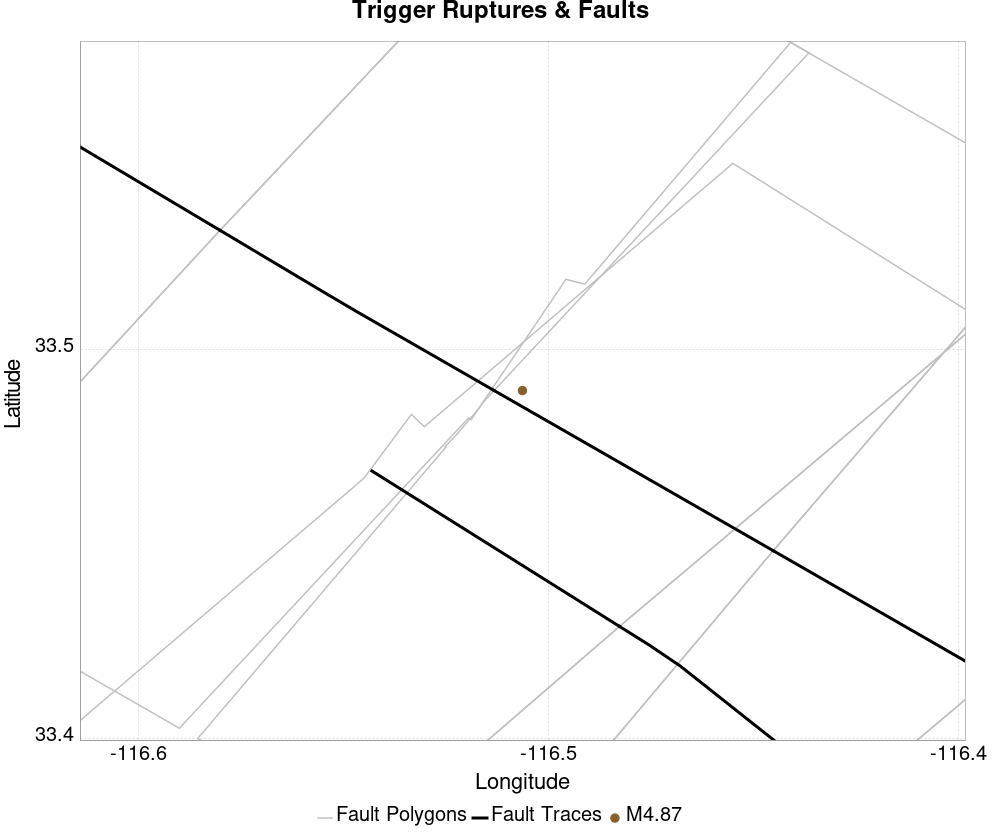

## Fault Distances To Triggers
*[(top)](#table-of-contents)*

| Section Name | Strike, Dip, Rake | Hypocenter In Polygon? | Surface In Polygon? | Minimum Distance (km) | Minimum Poly Distance (km) |
|-----|-----|-----|-----|-----|-----|
| San Jacinto (Clark) rev | 124, 90, 180 | true | true | 0.721 | 0.000 |
| San Jacinto (Coyote Creek) | 133, 90, 180 | true | true | 3.961 | 0.000 |
| San Jacinto (Anza) rev | 127, 90, 180 | false | false | 0.771 | 0.516 |

## Individual Simulated Catalog Maps
*[(top)](#table-of-contents)*

These are map plots of individual catalogs from the simulations, selected as the closest catalog to each of the given percentiles in terms of total number of events.

| Duration | p0.0 %-ile | p25.0 %-ile | p50.0 %-ile | p75.0 %-ile | p90.0 %-ile | p95.0 %-ile | p97.5 %-ile | p98.0 %-ile | p99.0 %-ile | p99.5 %-ile | p99.9 %-ile | p99.997403 %-ile |
|-----|-----|-----|-----|-----|-----|-----|-----|-----|-----|-----|-----|-----|
| **1 Week** |  |  |  |  |  |  |  |  |  |  |  |  |
| **1 Month** |  |  |  | 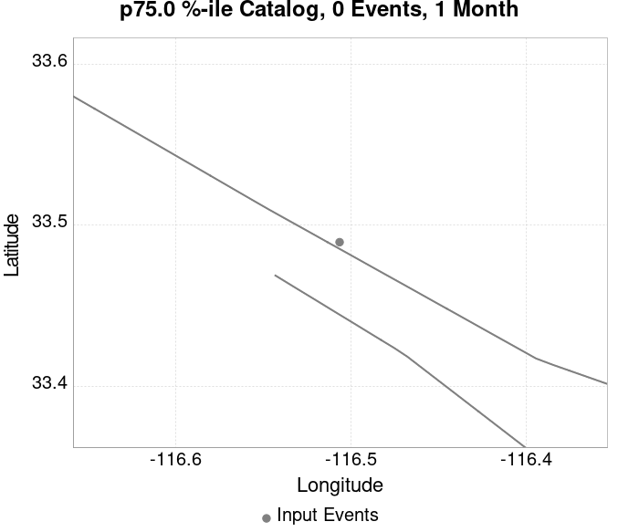 |  |  |  |  |  |  |  | 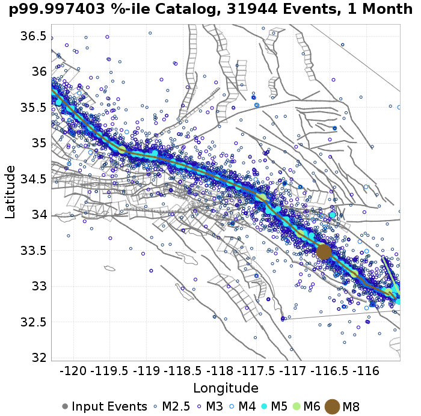 |
| **1 Year** |  |  | 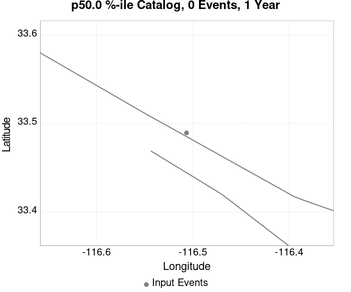 |  |  |  |  |  |  |  |  |  |
| **10 Year** |  |  |  |  |  |  |  |  |  |  |  | 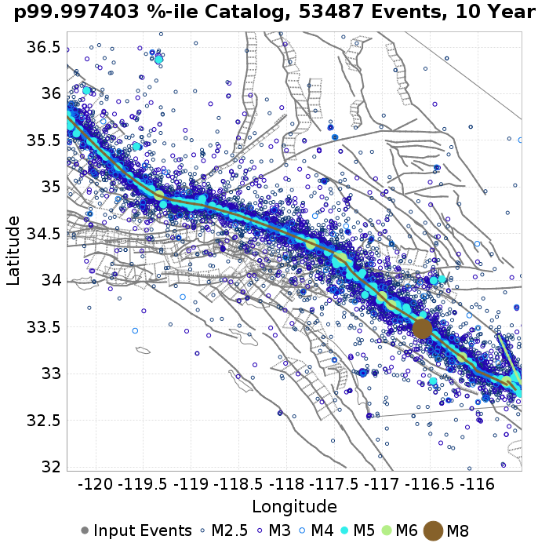 |

## ComCat Data Comparisons
*[(top)](#table-of-contents)*

These plots compare simulated sequences with data from ComCat. All plots only consider events with hypocenters inside the ComCat region defined in the JSON input file.

Last updated at 2020/04/08 23:53:36 UTC, 4.9 days after the simulation start time.

Total matching ComCat events found: 0

### ComCat Magnitude-Number Distributions
*[(top)](#table-of-contents)*

| Incremental MND | Cumulative MND |
|-----|-----|
|  | 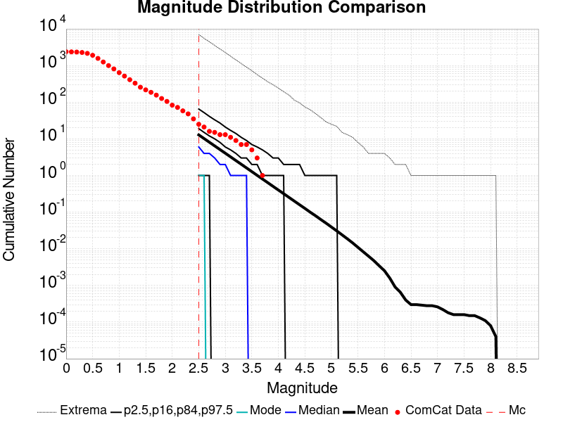 |

### ComCat Time-Dependent Mc
*[(top)](#table-of-contents)*

The following plots compare simulation results with ComCat data above a magnitude threshold. Plots labeled as *M&ge;Mc(t)* use the time-dependent magnitude of completeness (Mc) defined in Helmstetter et al. (2006), which is plotted below. In the case of multiple M&ge;5 ruptures, either as input to the simulation or in the comparison data, the maximum calculated time-dependent Mc is used. This time-dependent Mc function is plotted below.


### ComCat Cumulative Number Vs Time
*[(top)](#table-of-contents)*

| M&ge;Mc(t) | M&ge;2.5 | M&ge;3 | M&ge;3.5 | M&ge;4 |
|-----|-----|-----|-----|-----|
|  |  |  |  | 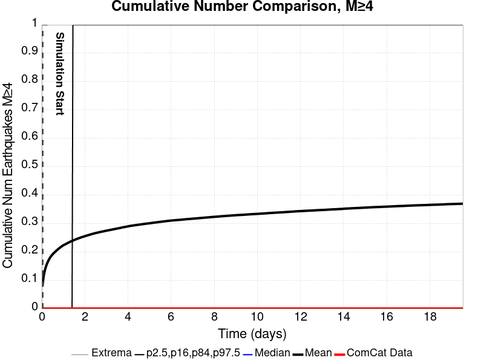 |

### ComCat Cumulative Number Simulation Percentiles
*[(top)](#table-of-contents)*

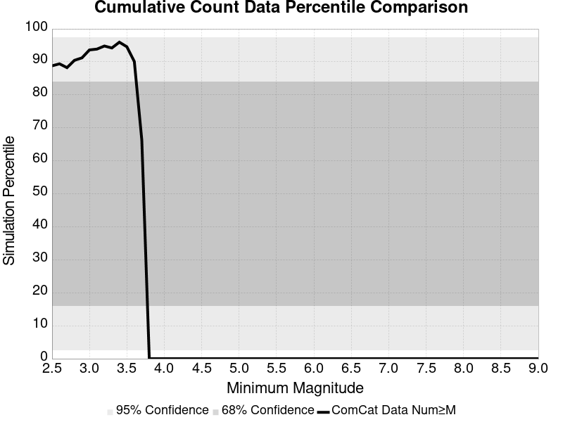

### ComCat Probability Spatial Distribution
*[(top)](#table-of-contents)*

*Note: maps labeled 'Forecast' are for a duration that extends into the future, only forecasted values are plotted (ComCat data omitted)*

|  | 1 Day | Current (4.9 Day) | Forecast: 1 Week | Forecast: 1 Month | Forecast: 1 Year |
|-----|-----|-----|-----|-----|-----|
| **M&ge;Mc(t)** |  |  |  |  |  |
|  | Prob: 85.53%, Actual: 0 | Prob: 88.69%, Actual: 0 | Prob: 89.17% | Prob: 90.92% | Prob: 92.88% |
| **M&ge;2.5** |  | 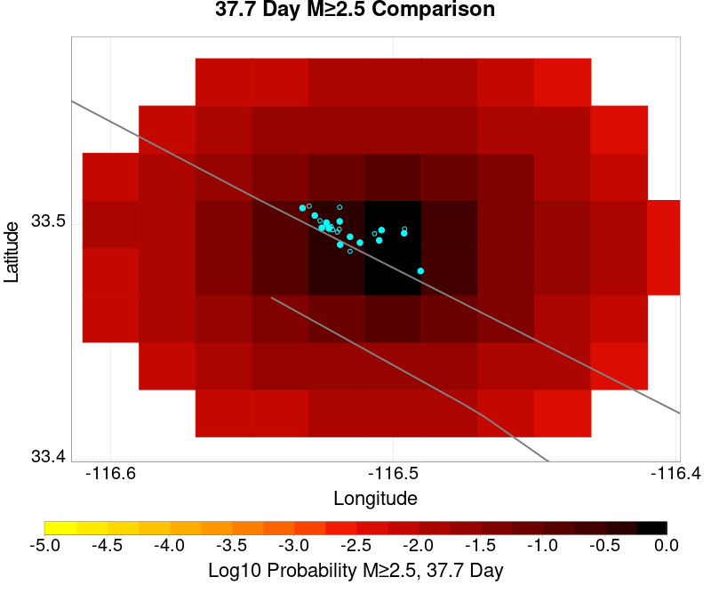 |  |  |  |
|  | Prob: 85.86%, Actual: 0 | Prob: 88.91%, Actual: 0 | Prob: 89.37% | Prob: 91.09% | Prob: 92.99% |
| **M&ge;3** |  |  |  | 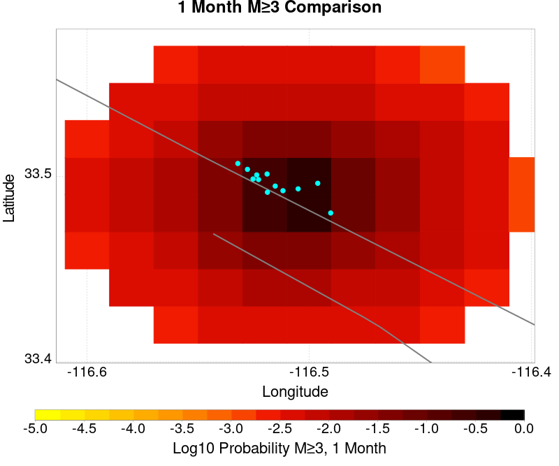 |  |
|  | Prob: 62.13%, Actual: 0 | Prob: 67.61%, Actual: 0 | Prob: 68.62% | Prob: 71.99% | Prob: 76.24% |
| **M&ge;3.5** |  |  |  |  |  |
|  | Prob: 34.53%, Actual: 0 | Prob: 40.03%, Actual: 0 | Prob: 41.13% | Prob: 44.74% | Prob: 49.84% |
| **M&ge;4** |  |  | 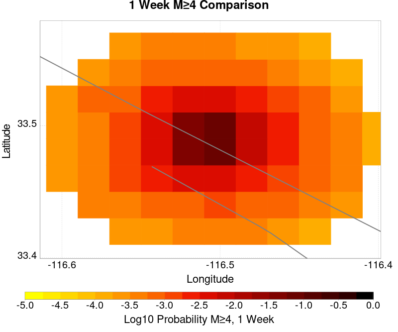 |  |  |
|  | Prob: 15.20%, Actual: 0 | Prob: 18.38%, Actual: 0 | Prob: 19.01% | Prob: 21.41% | Prob: 24.99% |
| **M&ge;4.5** |  |  |  |  |  |
|  | Prob: 5.73%, Actual: 0 | Prob: 7.24%, Actual: 0 | Prob: 7.52% | Prob: 8.71% | Prob: 10.48% |
| **M&ge;5** |  |  |  |  | 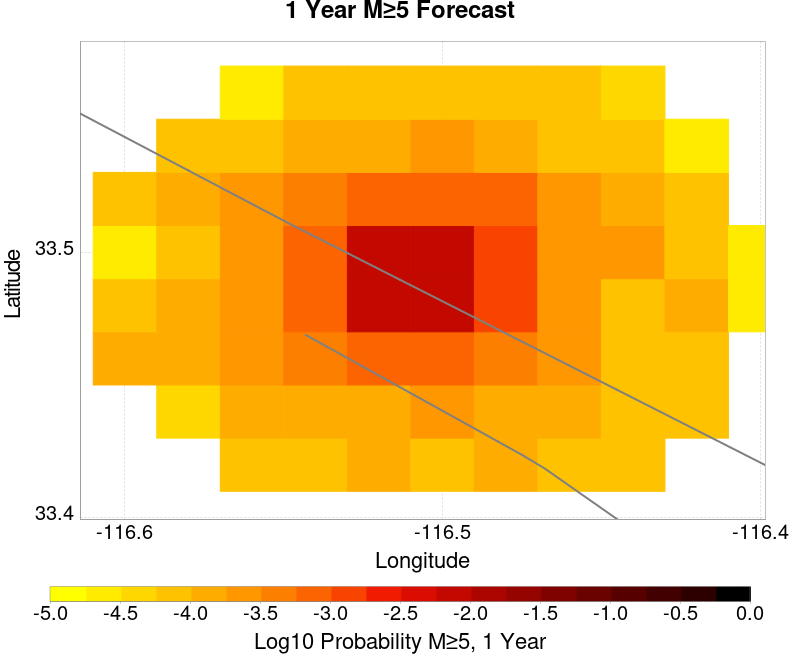 |
|  | Prob: 1.89%, Actual: 0 | Prob: 2.45%, Actual: 0 | Prob: 2.56% | Prob: 3.02% | Prob: 3.72% |
| **M&ge;5.5** |  |  |  |  |  |
|  | Prob: 0.56%, Actual: 0 | Prob: 0.74%, Actual: 0 | Prob: 0.79% | Prob: 0.94% | Prob: 1.16% |

### ComCat Mean Expectation Spatial Distribution
*[(top)](#table-of-contents)*

*Note: maps labeled 'Forecast' are for a duration that extends into the future, only forecasted values are plotted (ComCat data omitted)*

|  | 1 Day | Current (4.9 Day) | Forecast: 1 Week | Forecast: 1 Month | Forecast: 1 Year |
|-----|-----|-----|-----|-----|-----|
| **M&ge;Mc(t)** |  |  |  |  | 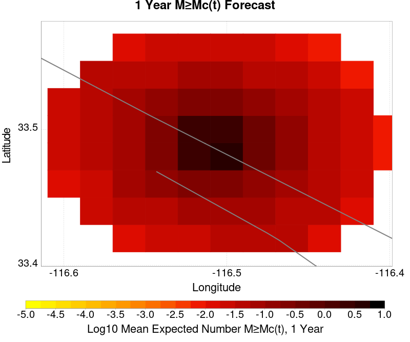 |
|  | Mean: 6.846, Actual: 0 | Mean: 9.255, Actual: 0 | Mean: 9.801 | Mean: 12.096 | Mean: 16.127 |
| **M&ge;2.5** |  |  |  |  |  |
|  | Mean: 6.962, Actual: 0 | Mean: 9.371, Actual: 0 | Mean: 9.917 | Mean: 12.212 | Mean: 16.243 |
| **M&ge;3** |  |  |  |  |  |
|  | Mean: 2.199, Actual: 0 | Mean: 2.956, Actual: 0 | Mean: 3.131 | Mean: 3.860 | Mean: 5.138 |
| **M&ge;3.5** | 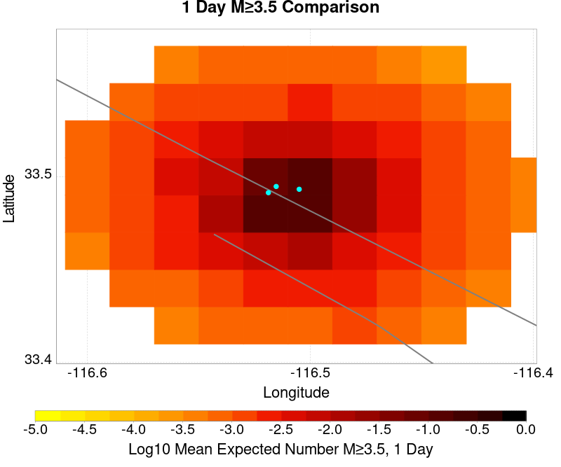 |  |  |  |  |
|  | Mean: 0.693, Actual: 0 | Mean: 0.935, Actual: 0 | Mean: 0.989 | Mean: 1.218 | Mean: 1.621 |
| **M&ge;4** |  |  |  |  |  |
|  | Mean: 0.221, Actual: 0 | Mean: 0.295, Actual: 0 | Mean: 0.311 | Mean: 0.383 | Mean: 0.509 |
| **M&ge;4.5** |  |  |  |  |  |
|  | Mean: 0.071, Actual: 0 | Mean: 0.094, Actual: 0 | Mean: 0.099 | Mean: 0.122 | Mean: 0.161 |
| **M&ge;5** |  |  |  |  |  |
|  | Mean: 0.021, Actual: 0 | Mean: 0.028, Actual: 0 | Mean: 0.030 | Mean: 0.036 | Mean: 0.049 |
| **M&ge;5.5** |  |  |  |  |  |
|  | Mean: 5.92E-3, Actual: 0 | Mean: 7.92E-3, Actual: 0 | Mean: 8.49E-3 | Mean: 0.010 | Mean: 0.014 |

### ComCat Depth Distribution
*[(top)](#table-of-contents)*

| M&ge;Mc(t) | M&ge;2.5 | M&ge;3 | M&ge;3.5 | M&ge;4 | M&ge;4.5 | M&ge;5 | M&ge;5.5 |
|-----|-----|-----|-----|-----|-----|-----|-----|
|  |  |  |  |  |  |  |  |

## Section Participation
*[(top)](#table-of-contents)*


### Supra-Seismogenic Parent Sections Table
*[(top)](#table-of-contents)*

*First 10 of 34 with matching ruptures shown*

| Parent Name | Triggered 10 Year Mean Count | Triggered 1 Day Prob | Triggered 1 Day 95% Conf | Triggered 1 Week Prob | Triggered 1 Week 95% Conf | Triggered 1 Month Prob | Triggered 1 Month 95% Conf | Triggered 1 Year Prob | Triggered 1 Year 95% Conf | Triggered 10 Year Prob | Triggered 10 Year 95% Conf | Triggered 10 Year Primary Mean Count |
|-----|-----|-----|-----|-----|-----|-----|-----|-----|-----|-----|-----|-----|
| San Jacinto (Anza) rev | 4.935065E-4 | 2.08E-4 (0.02%) | [0.01% 0.04%] | 2.60E-4 (0.03%) | [0.01% 0.05%] | 3.64E-4 (0.04%) | [0.02% 0.06%] | 4.16E-4 (0.04%) | [0.02% 0.07%] | 4.94E-4 (0.05%) | [0.03% 0.08%] | 2.8571428E-4 |
| San Jacinto (Clark) rev | 3.896104E-4 | 1.82E-4 (0.02%) | [0.01% 0.04%] | 2.34E-4 (0.02%) | [0.01% 0.05%] | 3.12E-4 (0.03%) | [0.02% 0.06%] | 3.38E-4 (0.03%) | [0.02% 0.06%] | 3.90E-4 (0.04%) | [0.02% 0.07%] | 1.8181818E-4 |
| San Andreas (San Bernardino N) | 2.5974025E-4 | 1.04E-4 (0.01%) | [0.00% 0.03%] | 1.56E-4 (0.02%) | [0.01% 0.04%] | 1.82E-4 (0.02%) | [0.01% 0.04%] | 1.82E-4 (0.02%) | [0.01% 0.04%] | 1.82E-4 (0.02%) | [0.01% 0.04%] | 1.2987012E-4 |
| San Jacinto (Stepovers Combined) | 1.8181818E-4 | 1.04E-4 (0.01%) | [0.00% 0.03%] | 1.30E-4 (0.01%) | [0.00% 0.03%] | 1.82E-4 (0.02%) | [0.01% 0.04%] | 1.82E-4 (0.02%) | [0.01% 0.04%] | 1.82E-4 (0.02%) | [0.01% 0.04%] | 1.5584416E-4 |
| San Andreas (Mojave S) | 1.5584416E-4 | 7.79E-5 (0.01%) | [0.00% 0.02%] | 1.04E-4 (0.01%) | [0.00% 0.03%] | 1.30E-4 (0.01%) | [0.00% 0.03%] | 1.30E-4 (0.01%) | [0.00% 0.03%] | 1.30E-4 (0.01%) | [0.00% 0.03%] | 1.2987012E-4 |
| San Jacinto (Coyote Creek) | 1.5584416E-4 | 7.79E-5 (0.01%) | [0.00% 0.02%] | 1.04E-4 (0.01%) | [0.00% 0.03%] | 1.30E-4 (0.01%) | [0.00% 0.03%] | 1.30E-4 (0.01%) | [0.00% 0.03%] | 1.56E-4 (0.02%) | [0.01% 0.04%] | 1.2987012E-4 |
| San Jacinto (San Bernardino) | 1.5584416E-4 | 1.04E-4 (0.01%) | [0.00% 0.03%] | 1.30E-4 (0.01%) | [0.00% 0.03%] | 1.56E-4 (0.02%) | [0.01% 0.04%] | 1.56E-4 (0.02%) | [0.01% 0.04%] | 1.56E-4 (0.02%) | [0.01% 0.04%] | 1.5584416E-4 |
| San Jacinto (San Jacinto Valley) rev | 1.5584416E-4 | 1.04E-4 (0.01%) | [0.00% 0.03%] | 1.30E-4 (0.01%) | [0.00% 0.03%] | 1.56E-4 (0.02%) | [0.01% 0.04%] | 1.56E-4 (0.02%) | [0.01% 0.04%] | 1.56E-4 (0.02%) | [0.01% 0.04%] | 1.5584416E-4 |
| San Andreas (Mojave N) | 1.2987012E-4 | 7.79E-5 (0.01%) | [0.00% 0.02%] | 1.04E-4 (0.01%) | [0.00% 0.03%] | 1.30E-4 (0.01%) | [0.00% 0.03%] | 1.30E-4 (0.01%) | [0.00% 0.03%] | 1.30E-4 (0.01%) | [0.00% 0.03%] | 1.03896105E-4 |
| San Andreas (Big Bend) | 1.03896105E-4 | 5.19E-5 (0.01%) | [0.00% 0.02%] | 7.79E-5 (0.01%) | [0.00% 0.02%] | 1.04E-4 (0.01%) | [0.00% 0.03%] | 1.04E-4 (0.01%) | [0.00% 0.03%] | 1.04E-4 (0.01%) | [0.00% 0.03%] | 7.792208E-5 |

### M≥6.5 Parent Sections Table
*[(top)](#table-of-contents)*

*First 10 of 29 with matching ruptures shown*

| Parent Name | Triggered 10 Year Mean Count | Triggered 1 Day Prob | Triggered 1 Day 95% Conf | Triggered 1 Week Prob | Triggered 1 Week 95% Conf | Triggered 1 Month Prob | Triggered 1 Month 95% Conf | Triggered 1 Year Prob | Triggered 1 Year 95% Conf | Triggered 10 Year Prob | Triggered 10 Year 95% Conf | Triggered 10 Year Primary Mean Count |
|-----|-----|-----|-----|-----|-----|-----|-----|-----|-----|-----|-----|-----|
| San Jacinto (Anza) rev | 4.1558442E-4 | 2.08E-4 (0.02%) | [0.01% 0.04%] | 2.60E-4 (0.03%) | [0.01% 0.05%] | 3.38E-4 (0.03%) | [0.02% 0.06%] | 3.64E-4 (0.04%) | [0.02% 0.06%] | 4.16E-4 (0.04%) | [0.02% 0.07%] | 2.3376623E-4 |
| San Jacinto (Clark) rev | 2.8571428E-4 | 1.30E-4 (0.01%) | [0.00% 0.03%] | 1.82E-4 (0.02%) | [0.01% 0.04%] | 2.34E-4 (0.02%) | [0.01% 0.05%] | 2.60E-4 (0.03%) | [0.01% 0.05%] | 2.86E-4 (0.03%) | [0.02% 0.05%] | 1.03896105E-4 |
| San Andreas (San Bernardino N) | 2.3376623E-4 | 1.04E-4 (0.01%) | [0.00% 0.03%] | 1.56E-4 (0.02%) | [0.01% 0.04%] | 1.82E-4 (0.02%) | [0.01% 0.04%] | 1.82E-4 (0.02%) | [0.01% 0.04%] | 1.82E-4 (0.02%) | [0.01% 0.04%] | 1.2987012E-4 |
| San Jacinto (Stepovers Combined) | 1.8181818E-4 | 1.04E-4 (0.01%) | [0.00% 0.03%] | 1.30E-4 (0.01%) | [0.00% 0.03%] | 1.82E-4 (0.02%) | [0.01% 0.04%] | 1.82E-4 (0.02%) | [0.01% 0.04%] | 1.82E-4 (0.02%) | [0.01% 0.04%] | 1.5584416E-4 |
| San Andreas (Mojave S) | 1.5584416E-4 | 7.79E-5 (0.01%) | [0.00% 0.02%] | 1.04E-4 (0.01%) | [0.00% 0.03%] | 1.30E-4 (0.01%) | [0.00% 0.03%] | 1.30E-4 (0.01%) | [0.00% 0.03%] | 1.30E-4 (0.01%) | [0.00% 0.03%] | 1.2987012E-4 |
| San Jacinto (Coyote Creek) | 1.5584416E-4 | 7.79E-5 (0.01%) | [0.00% 0.02%] | 1.04E-4 (0.01%) | [0.00% 0.03%] | 1.30E-4 (0.01%) | [0.00% 0.03%] | 1.30E-4 (0.01%) | [0.00% 0.03%] | 1.56E-4 (0.02%) | [0.01% 0.04%] | 1.2987012E-4 |
| San Jacinto (San Bernardino) | 1.5584416E-4 | 1.04E-4 (0.01%) | [0.00% 0.03%] | 1.30E-4 (0.01%) | [0.00% 0.03%] | 1.56E-4 (0.02%) | [0.01% 0.04%] | 1.56E-4 (0.02%) | [0.01% 0.04%] | 1.56E-4 (0.02%) | [0.01% 0.04%] | 1.5584416E-4 |
| San Jacinto (San Jacinto Valley) rev | 1.5584416E-4 | 1.04E-4 (0.01%) | [0.00% 0.03%] | 1.30E-4 (0.01%) | [0.00% 0.03%] | 1.56E-4 (0.02%) | [0.01% 0.04%] | 1.56E-4 (0.02%) | [0.01% 0.04%] | 1.56E-4 (0.02%) | [0.01% 0.04%] | 1.5584416E-4 |
| San Andreas (Mojave N) | 1.2987012E-4 | 7.79E-5 (0.01%) | [0.00% 0.02%] | 1.04E-4 (0.01%) | [0.00% 0.03%] | 1.30E-4 (0.01%) | [0.00% 0.03%] | 1.30E-4 (0.01%) | [0.00% 0.03%] | 1.30E-4 (0.01%) | [0.00% 0.03%] | 1.03896105E-4 |
| San Andreas (Big Bend) | 1.03896105E-4 | 5.19E-5 (0.01%) | [0.00% 0.02%] | 7.79E-5 (0.01%) | [0.00% 0.02%] | 1.04E-4 (0.01%) | [0.00% 0.03%] | 1.04E-4 (0.01%) | [0.00% 0.03%] | 1.04E-4 (0.01%) | [0.00% 0.03%] | 7.792208E-5 |

### M≥7 Parent Sections Table
*[(top)](#table-of-contents)*

*First 10 of 27 with matching ruptures shown*

| Parent Name | Triggered 10 Year Mean Count | Triggered 1 Day Prob | Triggered 1 Day 95% Conf | Triggered 1 Week Prob | Triggered 1 Week 95% Conf | Triggered 1 Month Prob | Triggered 1 Month 95% Conf | Triggered 1 Year Prob | Triggered 1 Year 95% Conf | Triggered 10 Year Prob | Triggered 10 Year 95% Conf | Triggered 10 Year Primary Mean Count |
|-----|-----|-----|-----|-----|-----|-----|-----|-----|-----|-----|-----|-----|
| San Jacinto (Anza) rev | 3.6363635E-4 | 2.08E-4 (0.02%) | [0.01% 0.04%] | 2.34E-4 (0.02%) | [0.01% 0.05%] | 3.12E-4 (0.03%) | [0.02% 0.06%] | 3.38E-4 (0.03%) | [0.02% 0.06%] | 3.64E-4 (0.04%) | [0.02% 0.06%] | 2.0779221E-4 |
| San Jacinto (Clark) rev | 2.0779221E-4 | 1.30E-4 (0.01%) | [0.00% 0.03%] | 1.30E-4 (0.01%) | [0.00% 0.03%] | 1.82E-4 (0.02%) | [0.01% 0.04%] | 2.08E-4 (0.02%) | [0.01% 0.04%] | 2.08E-4 (0.02%) | [0.01% 0.04%] | 7.792208E-5 |
| San Jacinto (Stepovers Combined) | 1.8181818E-4 | 1.04E-4 (0.01%) | [0.00% 0.03%] | 1.30E-4 (0.01%) | [0.00% 0.03%] | 1.82E-4 (0.02%) | [0.01% 0.04%] | 1.82E-4 (0.02%) | [0.01% 0.04%] | 1.82E-4 (0.02%) | [0.01% 0.04%] | 1.5584416E-4 |
| San Andreas (Mojave S) | 1.5584416E-4 | 7.79E-5 (0.01%) | [0.00% 0.02%] | 1.04E-4 (0.01%) | [0.00% 0.03%] | 1.30E-4 (0.01%) | [0.00% 0.03%] | 1.30E-4 (0.01%) | [0.00% 0.03%] | 1.30E-4 (0.01%) | [0.00% 0.03%] | 1.2987012E-4 |
| San Andreas (San Bernardino N) | 1.5584416E-4 | 7.79E-5 (0.01%) | [0.00% 0.02%] | 1.04E-4 (0.01%) | [0.00% 0.03%] | 1.30E-4 (0.01%) | [0.00% 0.03%] | 1.30E-4 (0.01%) | [0.00% 0.03%] | 1.30E-4 (0.01%) | [0.00% 0.03%] | 1.2987012E-4 |
| San Jacinto (Coyote Creek) | 1.5584416E-4 | 7.79E-5 (0.01%) | [0.00% 0.02%] | 1.04E-4 (0.01%) | [0.00% 0.03%] | 1.30E-4 (0.01%) | [0.00% 0.03%] | 1.30E-4 (0.01%) | [0.00% 0.03%] | 1.56E-4 (0.02%) | [0.01% 0.04%] | 1.2987012E-4 |
| San Jacinto (San Bernardino) | 1.5584416E-4 | 1.04E-4 (0.01%) | [0.00% 0.03%] | 1.30E-4 (0.01%) | [0.00% 0.03%] | 1.56E-4 (0.02%) | [0.01% 0.04%] | 1.56E-4 (0.02%) | [0.01% 0.04%] | 1.56E-4 (0.02%) | [0.01% 0.04%] | 1.5584416E-4 |
| San Jacinto (San Jacinto Valley) rev | 1.5584416E-4 | 1.04E-4 (0.01%) | [0.00% 0.03%] | 1.30E-4 (0.01%) | [0.00% 0.03%] | 1.56E-4 (0.02%) | [0.01% 0.04%] | 1.56E-4 (0.02%) | [0.01% 0.04%] | 1.56E-4 (0.02%) | [0.01% 0.04%] | 1.5584416E-4 |
| San Andreas (Mojave N) | 1.2987012E-4 | 7.79E-5 (0.01%) | [0.00% 0.02%] | 1.04E-4 (0.01%) | [0.00% 0.03%] | 1.30E-4 (0.01%) | [0.00% 0.03%] | 1.30E-4 (0.01%) | [0.00% 0.03%] | 1.30E-4 (0.01%) | [0.00% 0.03%] | 1.03896105E-4 |
| San Andreas (Big Bend) | 1.03896105E-4 | 5.19E-5 (0.01%) | [0.00% 0.02%] | 7.79E-5 (0.01%) | [0.00% 0.02%] | 1.04E-4 (0.01%) | [0.00% 0.03%] | 1.04E-4 (0.01%) | [0.00% 0.03%] | 1.04E-4 (0.01%) | [0.00% 0.03%] | 7.792208E-5 |

### M≥7.5 Parent Sections Table
*[(top)](#table-of-contents)*

*First 10 of 22 with matching ruptures shown*

| Parent Name | Triggered 10 Year Mean Count | Triggered 1 Day Prob | Triggered 1 Day 95% Conf | Triggered 1 Week Prob | Triggered 1 Week 95% Conf | Triggered 1 Month Prob | Triggered 1 Month 95% Conf | Triggered 1 Year Prob | Triggered 1 Year 95% Conf | Triggered 10 Year Prob | Triggered 10 Year 95% Conf | Triggered 10 Year Primary Mean Count |
|-----|-----|-----|-----|-----|-----|-----|-----|-----|-----|-----|-----|-----|
| San Andreas (Mojave S) | 1.5584416E-4 | 7.79E-5 (0.01%) | [0.00% 0.02%] | 1.04E-4 (0.01%) | [0.00% 0.03%] | 1.30E-4 (0.01%) | [0.00% 0.03%] | 1.30E-4 (0.01%) | [0.00% 0.03%] | 1.30E-4 (0.01%) | [0.00% 0.03%] | 1.2987012E-4 |
| San Andreas (San Bernardino N) | 1.5584416E-4 | 7.79E-5 (0.01%) | [0.00% 0.02%] | 1.04E-4 (0.01%) | [0.00% 0.03%] | 1.30E-4 (0.01%) | [0.00% 0.03%] | 1.30E-4 (0.01%) | [0.00% 0.03%] | 1.30E-4 (0.01%) | [0.00% 0.03%] | 1.2987012E-4 |
| San Jacinto (Anza) rev | 1.5584416E-4 | 1.04E-4 (0.01%) | [0.00% 0.03%] | 1.30E-4 (0.01%) | [0.00% 0.03%] | 1.56E-4 (0.02%) | [0.01% 0.04%] | 1.56E-4 (0.02%) | [0.01% 0.04%] | 1.56E-4 (0.02%) | [0.01% 0.04%] | 1.5584416E-4 |
| San Jacinto (San Bernardino) | 1.5584416E-4 | 1.04E-4 (0.01%) | [0.00% 0.03%] | 1.30E-4 (0.01%) | [0.00% 0.03%] | 1.56E-4 (0.02%) | [0.01% 0.04%] | 1.56E-4 (0.02%) | [0.01% 0.04%] | 1.56E-4 (0.02%) | [0.01% 0.04%] | 1.5584416E-4 |
| San Jacinto (San Jacinto Valley) rev | 1.5584416E-4 | 1.04E-4 (0.01%) | [0.00% 0.03%] | 1.30E-4 (0.01%) | [0.00% 0.03%] | 1.56E-4 (0.02%) | [0.01% 0.04%] | 1.56E-4 (0.02%) | [0.01% 0.04%] | 1.56E-4 (0.02%) | [0.01% 0.04%] | 1.5584416E-4 |
| San Jacinto (Stepovers Combined) | 1.5584416E-4 | 1.04E-4 (0.01%) | [0.00% 0.03%] | 1.30E-4 (0.01%) | [0.00% 0.03%] | 1.56E-4 (0.02%) | [0.01% 0.04%] | 1.56E-4 (0.02%) | [0.01% 0.04%] | 1.56E-4 (0.02%) | [0.01% 0.04%] | 1.5584416E-4 |
| San Andreas (Mojave N) | 1.2987012E-4 | 7.79E-5 (0.01%) | [0.00% 0.02%] | 1.04E-4 (0.01%) | [0.00% 0.03%] | 1.30E-4 (0.01%) | [0.00% 0.03%] | 1.30E-4 (0.01%) | [0.00% 0.03%] | 1.30E-4 (0.01%) | [0.00% 0.03%] | 1.03896105E-4 |
| San Jacinto (Coyote Creek) | 1.2987012E-4 | 7.79E-5 (0.01%) | [0.00% 0.02%] | 1.04E-4 (0.01%) | [0.00% 0.03%] | 1.30E-4 (0.01%) | [0.00% 0.03%] | 1.30E-4 (0.01%) | [0.00% 0.03%] | 1.30E-4 (0.01%) | [0.00% 0.03%] | 1.2987012E-4 |
| San Andreas (Big Bend) | 1.03896105E-4 | 5.19E-5 (0.01%) | [0.00% 0.02%] | 7.79E-5 (0.01%) | [0.00% 0.02%] | 1.04E-4 (0.01%) | [0.00% 0.03%] | 1.04E-4 (0.01%) | [0.00% 0.03%] | 1.04E-4 (0.01%) | [0.00% 0.03%] | 7.792208E-5 |
| San Andreas (Carrizo) rev | 1.03896105E-4 | 5.19E-5 (0.01%) | [0.00% 0.02%] | 7.79E-5 (0.01%) | [0.00% 0.02%] | 1.04E-4 (0.01%) | [0.00% 0.03%] | 1.04E-4 (0.01%) | [0.00% 0.03%] | 1.04E-4 (0.01%) | [0.00% 0.03%] | 7.792208E-5 |

### M≥8 Parent Sections Table
*[(top)](#table-of-contents)*

*First 10 of 19 with matching ruptures shown*

| Parent Name | Triggered 10 Year Mean Count | Triggered 1 Day Prob | Triggered 1 Day 95% Conf | Triggered 1 Week Prob | Triggered 1 Week 95% Conf | Triggered 1 Month Prob | Triggered 1 Month 95% Conf | Triggered 1 Year Prob | Triggered 1 Year 95% Conf | Triggered 10 Year Prob | Triggered 10 Year 95% Conf | Triggered 10 Year Primary Mean Count |
|-----|-----|-----|-----|-----|-----|-----|-----|-----|-----|-----|-----|-----|
| San Andreas (Big Bend) | 7.792208E-5 | 5.19E-5 (0.01%) | [0.00% 0.02%] | 7.79E-5 (0.01%) | [0.00% 0.02%] | 7.79E-5 (0.01%) | [0.00% 0.02%] | 7.79E-5 (0.01%) | [0.00% 0.02%] | 7.79E-5 (0.01%) | [0.00% 0.02%] | 7.792208E-5 |
| San Andreas (Carrizo) rev | 7.792208E-5 | 5.19E-5 (0.01%) | [0.00% 0.02%] | 7.79E-5 (0.01%) | [0.00% 0.02%] | 7.79E-5 (0.01%) | [0.00% 0.02%] | 7.79E-5 (0.01%) | [0.00% 0.02%] | 7.79E-5 (0.01%) | [0.00% 0.02%] | 7.792208E-5 |
| San Andreas (Cholame) rev | 7.792208E-5 | 5.19E-5 (0.01%) | [0.00% 0.02%] | 7.79E-5 (0.01%) | [0.00% 0.02%] | 7.79E-5 (0.01%) | [0.00% 0.02%] | 7.79E-5 (0.01%) | [0.00% 0.02%] | 7.79E-5 (0.01%) | [0.00% 0.02%] | 7.792208E-5 |
| San Andreas (Mojave N) | 7.792208E-5 | 5.19E-5 (0.01%) | [0.00% 0.02%] | 7.79E-5 (0.01%) | [0.00% 0.02%] | 7.79E-5 (0.01%) | [0.00% 0.02%] | 7.79E-5 (0.01%) | [0.00% 0.02%] | 7.79E-5 (0.01%) | [0.00% 0.02%] | 7.792208E-5 |
| San Andreas (Mojave S) | 7.792208E-5 | 5.19E-5 (0.01%) | [0.00% 0.02%] | 7.79E-5 (0.01%) | [0.00% 0.02%] | 7.79E-5 (0.01%) | [0.00% 0.02%] | 7.79E-5 (0.01%) | [0.00% 0.02%] | 7.79E-5 (0.01%) | [0.00% 0.02%] | 7.792208E-5 |
| San Andreas (San Bernardino N) | 7.792208E-5 | 5.19E-5 (0.01%) | [0.00% 0.02%] | 7.79E-5 (0.01%) | [0.00% 0.02%] | 7.79E-5 (0.01%) | [0.00% 0.02%] | 7.79E-5 (0.01%) | [0.00% 0.02%] | 7.79E-5 (0.01%) | [0.00% 0.02%] | 7.792208E-5 |
| San Jacinto (Anza) rev | 7.792208E-5 | 5.19E-5 (0.01%) | [0.00% 0.02%] | 7.79E-5 (0.01%) | [0.00% 0.02%] | 7.79E-5 (0.01%) | [0.00% 0.02%] | 7.79E-5 (0.01%) | [0.00% 0.02%] | 7.79E-5 (0.01%) | [0.00% 0.02%] | 7.792208E-5 |
| San Jacinto (San Bernardino) | 7.792208E-5 | 5.19E-5 (0.01%) | [0.00% 0.02%] | 7.79E-5 (0.01%) | [0.00% 0.02%] | 7.79E-5 (0.01%) | [0.00% 0.02%] | 7.79E-5 (0.01%) | [0.00% 0.02%] | 7.79E-5 (0.01%) | [0.00% 0.02%] | 7.792208E-5 |
| San Jacinto (San Jacinto Valley) rev | 7.792208E-5 | 5.19E-5 (0.01%) | [0.00% 0.02%] | 7.79E-5 (0.01%) | [0.00% 0.02%] | 7.79E-5 (0.01%) | [0.00% 0.02%] | 7.79E-5 (0.01%) | [0.00% 0.02%] | 7.79E-5 (0.01%) | [0.00% 0.02%] | 7.792208E-5 |
| San Jacinto (Stepovers Combined) | 7.792208E-5 | 5.19E-5 (0.01%) | [0.00% 0.02%] | 7.79E-5 (0.01%) | [0.00% 0.02%] | 7.79E-5 (0.01%) | [0.00% 0.02%] | 7.79E-5 (0.01%) | [0.00% 0.02%] | 7.79E-5 (0.01%) | [0.00% 0.02%] | 7.792208E-5 |

## Fault Magnitude-Probability Distributions
*[(top)](#table-of-contents)*

The first 5 sections (sorted by trigger rate) are plotted below. All fault MPDs are available [here](plots/parent_sect_mpds/README.md)

| 1 Week | 1 Month | 1 Year | 10 Year |
|-----|-----|-----|-----|
|  |  |  |  |
|  |  |  |  |
|  |  | 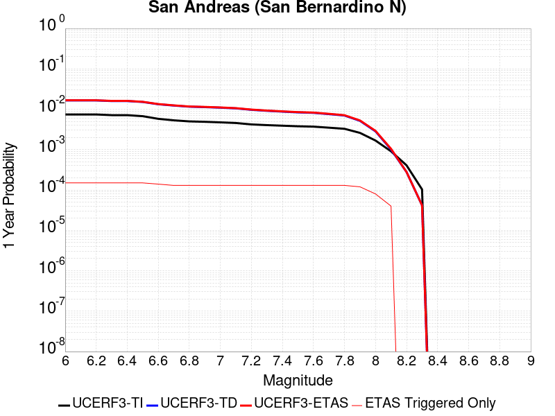 |  |
|  |  |  |  |
|  | 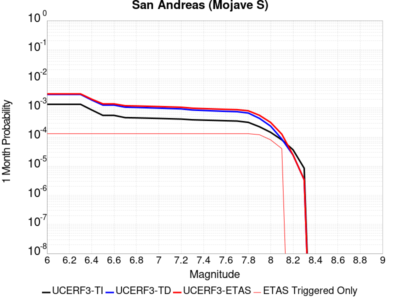 |  |  |


## JSON Input File
*[(top)](#table-of-contents)*

```
{
  "numSimulations": 100000,
  "duration": 10.0,
  "startTimeMillis": 1585965199920,
  "includeSpontaneous": false,
  "randomSeed": 1586368110344,
  "binaryOutput": true,
  "binaryOutputFilters": [
    {
      "prefix": "results_complete",
      "descendantsOnly": false
    },
    {
      "prefix": "results_m5_preserve_chain",
      "minMag": 5.0,
      "preserveChainBelowMag": true,
      "descendantsOnly": false
    }
  ],
  "forceRecalc": false,
  "simulationName": "ComCat M4.87 (ci39126079), Point Source, kCOV\u003d1.5",
  "numRetries": 3,
  "outputDir": "${ETAS_SIM_DIR}/2020_04_08-ComCatM4p87_ci39126079_PointSource_kCOV1p5",
  "treatTriggerCatalogAsSpontaneous": false,
  "triggerRuptures": [
    {
      "occurrenceTimeMillis": 1585965198920,
      "comcatEventID": "ci39126079",
      "mag": 4.87,
      "latitude": 33.4895,
      "longitude": -116.50633330000001,
      "depth": 10.45
    }
  ],
  "cacheDir": "${ETAS_LAUNCHER}/inputs/cache_fm3p1_ba",
  "fssFile": "${ETAS_LAUNCHER}/inputs/2013_05_10-ucerf3p3-production-10runs_COMPOUND_SOL_FM3_1_SpatSeisU3_MEAN_BRANCH_AVG_SOL.zip",
  "probModel": "FULL_TD",
  "applySubSeisForSupraNucl": true,
  "totRateScaleFactor": 1.14,
  "gridSeisCorr": true,
  "timeIndependentERF": false,
  "griddedOnly": false,
  "imposeGR": false,
  "includeIndirectTriggering": true,
  "gridSeisDiscr": 0.1,
  "catalogCompletenessModel": "RELAXED",
  "etas_k_cov": 1.5,
  "configCommand": "u3etas_comcat_event_config_builder.sh --event-id ci39126079 --radius 10 --mag-complete 2.5 --num-simulations 100000 --days-before 7 --etas-k-cov 1.5 --finite-surf-shakemap --finite-surf-shakemap-min-mag 4.5 --hpc-site USC_HPC --nodes 32 --hours 24",
  "configTime": 1586368110344,
  "comcatMetadata": {
    "region": {
      "centerLatitude": 33.4895,
      "centerLongitude": -116.50633330000001,
      "radius": 10.0
    },
    "eventID": "ci39126079",
    "minDepth": -10.0,
    "maxDepth": 24.0,
    "minMag": 2.5,
    "startTime": 1585360398920,
    "endTime": 1585965198920,
    "magComplete": 2.5
  }
}
```

