# ComCat M4.87 (ci39126079), Point Source, kCOV=1.5 Results

|   | ComCat M4.87 (ci39126079), Point Source, kCOV=1.5 |
|-----|-----|
| Num Simulations | 100000 |
| Start Time | 2020/04/04 01:53:19 UTC |
| Start Time Epoch Milliseconds | 1585965199920 |
| Duration | 10 Years |
| Includes Spontaneous? | false |
| Trigger Ruptures | *(none)* |
| Config Generated With | u3etas_comcat_event_config_builder.sh --event-id ci39126079 --radius 10 --mag-complete 2.5 --num-simulations 100000 --days-before 7 --etas-k-cov 1.5 --finite-surf-shakemap --finite-surf-shakemap-min-mag 4.5 --hpc-site USC_HPC --nodes 32 --hours 24 |

## Table Of Contents

* [Probabilities Summary Table](#probabilities-summary-table)
* [Magnitude Number Distribution](#magnitude-number-distribution)
  * [10 Year Magnitude Number Distribution](#10-year-magnitude-number-distribution)
  * [1 Year Magnitude Number Distribution](#1-year-magnitude-number-distribution)
  * [1 Month Magnitude Number Distribution](#1-month-magnitude-number-distribution)
  * [1 Week Magnitude Number Distribution](#1-week-magnitude-number-distribution)
  * [1 Day Magnitude Number Distribution](#1-day-magnitude-number-distribution)
  * [1 Hour Magnitude Number Distribution](#1-hour-magnitude-number-distribution)
* [Hazard Change Over Time](#hazard-change-over-time)
  * [M&ge;5.0 Hazard Change Over Time](#m50-hazard-change-over-time)
  * [M&ge;6.0 Hazard Change Over Time](#m60-hazard-change-over-time)
  * [M&ge;7.0 Hazard Change Over Time](#m70-hazard-change-over-time)
  * [M&ge;8.0 Hazard Change Over Time](#m80-hazard-change-over-time)
* [Trigger Rupture Fault Map](#trigger-rupture-fault-map)
* [Fault Distances To Triggers](#fault-distances-to-triggers)
* [Individual Simulated Catalog Maps](#individual-simulated-catalog-maps)
* [ComCat Data Comparisons](#comcat-data-comparisons)
  * [ComCat Magnitude-Number Distributions](#comcat-magnitude-number-distributions)
  * [ComCat Time-Dependent Mc](#comcat-time-dependent-mc)
  * [ComCat Cumulative Number Vs Time](#comcat-cumulative-number-vs-time)
  * [ComCat Cumulative Number Simulation Percentiles](#comcat-cumulative-number-simulation-percentiles)
  * [ComCat Probability Spatial Distribution](#comcat-probability-spatial-distribution)
  * [ComCat Mean Expectation Spatial Distribution](#comcat-mean-expectation-spatial-distribution)
  * [ComCat Depth Distribution](#comcat-depth-distribution)
* [JSON Input File](#json-input-file)

## Probabilities Summary Table
*[(top)](#table-of-contents)*

| Magnitude | 1 Hour Prob | 1 Day Prob | 1 Week Prob | 1 Month Prob | 1 Year Prob | 10 Year Prob |
|-----|-----|-----|-----|-----|-----|-----|
| **M&ge;5** | 8.46E-3 (0.85%) | 0.021 (2.11%) | 0.029 (2.90%) | 0.034 (3.41%) | 0.042 (4.23%) | 0.049 (4.91%) |
| *95% Conf* | *[0.79% 0.91%]* | *[2.02% 2.20%]* | *[2.80% 3.01%]* | *[3.30% 3.53%]* | *[4.11% 4.36%]* | *[4.78% 5.05%]* |
| **M&ge;5.5** | 2.22E-3 (0.22%) | 6.13E-3 (0.61%) | 8.88E-3 (0.89%) | 0.011 (1.06%) | 0.013 (1.35%) | 0.016 (1.63%) |
| *95% Conf* | *[0.19% 0.25%]* | *[0.57% 0.66%]* | *[0.83% 0.95%]* | *[1.00% 1.12%]* | *[1.28% 1.42%]* | *[1.55% 1.71%]* |
| **M&ge;6** | 4.70E-4 (0.05%) | 1.52E-3 (0.15%) | 2.22E-3 (0.22%) | 2.81E-3 (0.28%) | 3.49E-3 (0.35%) | 4.04E-3 (0.40%) |
| *95% Conf* | *[0.03% 0.06%]* | *[0.13% 0.18%]* | *[0.19% 0.25%]* | *[0.25% 0.32%]* | *[0.31% 0.39%]* | *[0.37% 0.45%]* |
| **M&ge;6.5** | 7.00E-5 (0.01%) | 2.20E-4 (0.02%) | 3.00E-4 (0.03%) | 4.20E-4 (0.04%) | 5.20E-4 (0.05%) | 6.10E-4 (0.06%) |
| *95% Conf* | *[0.00% 0.02%]* | *[0.01% 0.03%]* | *[0.02% 0.04%]* | *[0.03% 0.06%]* | *[0.04% 0.07%]* | *[0.05% 0.08%]* |
| **M&ge;7** | 6.00E-5 (0.01%) | 1.90E-4 (0.02%) | 2.30E-4 (0.02%) | 3.20E-4 (0.03%) | 3.60E-4 (0.04%) | 4.20E-4 (0.04%) |
| *95% Conf* | *[0.00% 0.01%]* | *[0.01% 0.03%]* | *[0.01% 0.04%]* | *[0.02% 0.05%]* | *[0.03% 0.05%]* | *[0.03% 0.06%]* |
| **M&ge;7.5** | 5.00E-5 (0.01%) | 9.00E-5 (0.01%) | 1.20E-4 (0.01%) | 1.60E-4 (0.02%) | 1.80E-4 (0.02%) | 2.10E-4 (0.02%) |
| *95% Conf* | *[0.00% 0.01%]* | *[0.00% 0.02%]* | *[0.01% 0.02%]* | *[0.01% 0.03%]* | *[0.01% 0.03%]* | *[0.01% 0.03%]* |
| **M&ge;8** | 4.00E-5 (0.00%) | 6.00E-5 (0.01%) | 7.00E-5 (0.01%) | 8.00E-5 (0.01%) | 8.00E-5 (0.01%) | 8.00E-5 (0.01%) |
| *95% Conf* | *[0.00% 0.01%]* | *[0.00% 0.01%]* | *[0.00% 0.02%]* | *[0.00% 0.02%]* | *[0.00% 0.02%]* | *[0.00% 0.02%]* |

## Magnitude Number Distribution
*[(top)](#table-of-contents)*

### 10 Year Magnitude Number Distribution
*[(top)](#table-of-contents)*

**Legend**
* **Mean** (thick black line): mean expected number across all 100000 catalogs
* **2.5%,97.5%** (thin black lines): expected number percentiles across all 100000 catalogs
* **Median** (thin blue line): median expected number across all 100000 catalogs
* **Mode** (thin cyan line): modal expected number across all 100000 catalogs
* **10 yr Probability** (thin red line): 10 year probability calculated as the fraction of catalogs with at least 1 occurrence
* **10 yr Supraseismogenic Probability** (thin dashed red line): same as above, but only for supraseismogenic ruptures on explicitly modeled UCERF3 faults
* **95% Conf** (light red shaded region): binomial 95% confidence bounds on probability
* **Primary** (thin green line): mean expected number from primary triggered aftershocks only (no secondary, tertiary, etc...) across all 100000 catalogs


| Mag | Mean | 2.5 %ile | 97.5 %ile | Median | Mode | 10 yr Probability | 10 yr Prob 95% Conf | 10 yr Supra-Seis Prob | Primary Aftershocks Mean |
|-----|-----|-----|-----|-----|-----|-----|-----|-----|-----|
| **M&ge;5** | 0.098 | 0.000 | 1.000 | 0.000 | 0.000 | 0.049 (4.91%) | [4.78% 5.05%] | 8.30E-4 (0.08%) | 0.037 |
| **M&ge;5.1** | 0.077 | 0.000 | 1.000 | 0.000 | 0.000 | 0.040 (3.98%) | [3.86% 4.10%] | 8.30E-4 (0.08%) | 0.029 |
| **M&ge;5.2** | 0.059 | 0.000 | 1.000 | 0.000 | 0.000 | 0.032 (3.18%) | [3.07% 3.29%] | 8.30E-4 (0.08%) | 0.023 |
| **M&ge;5.3** | 0.046 | 0.000 | 1.000 | 0.000 | 0.000 | 0.026 (2.57%) | [2.48% 2.68%] | 8.30E-4 (0.08%) | 0.018 |
| **M&ge;5.4** | 0.036 | 0.000 | 0.000 | 0.000 | 0.000 | 0.021 (2.05%) | [1.97% 2.14%] | 8.30E-4 (0.08%) | 0.014 |
| **M&ge;5.5** | 0.028 | 0.000 | 0.000 | 0.000 | 0.000 | 0.016 (1.63%) | [1.55% 1.71%] | 8.30E-4 (0.08%) | 0.011 |
| **M&ge;5.6** | 0.021 | 0.000 | 0.000 | 0.000 | 0.000 | 0.013 (1.25%) | [1.18% 1.32%] | 8.30E-4 (0.08%) | 7.93E-3 |
| **M&ge;5.7** | 0.016 | 0.000 | 0.000 | 0.000 | 0.000 | 9.66E-3 (0.97%) | [0.91% 1.03%] | 8.30E-4 (0.08%) | 5.99E-3 |
| **M&ge;5.8** | 0.012 | 0.000 | 0.000 | 0.000 | 0.000 | 7.40E-3 (0.74%) | [0.69% 0.80%] | 8.30E-4 (0.08%) | 4.61E-3 |
| **M&ge;5.9** | 8.47E-3 | 0.000 | 0.000 | 0.000 | 0.000 | 5.59E-3 (0.56%) | [0.51% 0.61%] | 8.20E-4 (0.08%) | 3.33E-3 |
| **M&ge;6** | 5.82E-3 | 0.000 | 0.000 | 0.000 | 0.000 | 4.04E-3 (0.40%) | [0.37% 0.45%] | 8.20E-4 (0.08%) | 2.41E-3 |
| **M&ge;6.1** | 3.82E-3 | 0.000 | 0.000 | 0.000 | 0.000 | 2.71E-3 (0.27%) | [0.24% 0.31%] | 8.10E-4 (0.08%) | 1.53E-3 |
| **M&ge;6.2** | 2.37E-3 | 0.000 | 0.000 | 0.000 | 0.000 | 1.70E-3 (0.17%) | [0.15% 0.20%] | 7.80E-4 (0.08%) | 8.90E-4 |
| **M&ge;6.3** | 1.71E-3 | 0.000 | 0.000 | 0.000 | 0.000 | 1.27E-3 (0.13%) | [0.11% 0.15%] | 7.20E-4 (0.07%) | 6.70E-4 |
| **M&ge;6.4** | 1.10E-3 | 0.000 | 0.000 | 0.000 | 0.000 | 8.70E-4 (0.09%) | [0.07% 0.11%] | 7.00E-4 (0.07%) | 4.40E-4 |
| **M&ge;6.5** | 7.80E-4 | 0.000 | 0.000 | 0.000 | 0.000 | 6.10E-4 (0.06%) | [0.05% 0.08%] | 5.80E-4 (0.06%) | 3.00E-4 |
| **M&ge;6.6** | 7.20E-4 | 0.000 | 0.000 | 0.000 | 0.000 | 5.80E-4 (0.06%) | [0.04% 0.08%] | 5.70E-4 (0.06%) | 2.90E-4 |
| **M&ge;6.7** | 6.30E-4 | 0.000 | 0.000 | 0.000 | 0.000 | 5.30E-4 (0.05%) | [0.04% 0.07%] | 5.20E-4 (0.05%) | 2.80E-4 |
| **M&ge;6.8** | 5.70E-4 | 0.000 | 0.000 | 0.000 | 0.000 | 5.00E-4 (0.05%) | [0.04% 0.07%] | 4.90E-4 (0.05%) | 2.70E-4 |
| **M&ge;6.9** | 5.20E-4 | 0.000 | 0.000 | 0.000 | 0.000 | 4.60E-4 (0.05%) | [0.03% 0.06%] | 4.60E-4 (0.05%) | 2.60E-4 |
| **M&ge;7** | 4.70E-4 | 0.000 | 0.000 | 0.000 | 0.000 | 4.20E-4 (0.04%) | [0.03% 0.06%] | 4.20E-4 (0.04%) | 2.30E-4 |
| **M&ge;7.1** | 3.90E-4 | 0.000 | 0.000 | 0.000 | 0.000 | 3.50E-4 (0.03%) | [0.02% 0.05%] | 3.50E-4 (0.03%) | 1.90E-4 |
| **M&ge;7.2** | 3.30E-4 | 0.000 | 0.000 | 0.000 | 0.000 | 2.90E-4 (0.03%) | [0.02% 0.04%] | 2.90E-4 (0.03%) | 1.50E-4 |
| **M&ge;7.3** | 2.90E-4 | 0.000 | 0.000 | 0.000 | 0.000 | 2.50E-4 (0.03%) | [0.02% 0.04%] | 2.50E-4 (0.03%) | 1.50E-4 |
| **M&ge;7.4** | 2.60E-4 | 0.000 | 0.000 | 0.000 | 0.000 | 2.40E-4 (0.02%) | [0.02% 0.04%] | 2.40E-4 (0.02%) | 1.40E-4 |
| **M&ge;7.5** | 2.30E-4 | 0.000 | 0.000 | 0.000 | 0.000 | 2.10E-4 (0.02%) | [0.01% 0.03%] | 2.10E-4 (0.02%) | 1.40E-4 |
| **M&ge;7.6** | 2.10E-4 | 0.000 | 0.000 | 0.000 | 0.000 | 1.90E-4 (0.02%) | [0.01% 0.03%] | 1.90E-4 (0.02%) | 1.40E-4 |
| **M&ge;7.7** | 1.90E-4 | 0.000 | 0.000 | 0.000 | 0.000 | 1.70E-4 (0.02%) | [0.01% 0.03%] | 1.70E-4 (0.02%) | 1.40E-4 |
| **M&ge;7.8** | 1.70E-4 | 0.000 | 0.000 | 0.000 | 0.000 | 1.60E-4 (0.02%) | [0.01% 0.03%] | 1.60E-4 (0.02%) | 1.20E-4 |
| **M&ge;7.9** | 1.20E-4 | 0.000 | 0.000 | 0.000 | 0.000 | 1.20E-4 (0.01%) | [0.01% 0.02%] | 1.20E-4 (0.01%) | 1.00E-4 |
| **M&ge;8** | 8.00E-5 | 0.000 | 0.000 | 0.000 | 0.000 | 8.00E-5 (0.01%) | [0.00% 0.02%] | 8.00E-5 (0.01%) | 7.00E-5 |
| **M&ge;8.1** | 4.00E-5 | 0.000 | 0.000 | 0.000 | 0.000 | 4.00E-5 (0.00%) | [0.00% 0.01%] | 4.00E-5 (0.00%) | 3.00E-5 |
| **M&ge;8.2** | 0.000 | 0.000 | 0.000 | 0.000 | 0.000 | 0.000 (0.00%) | [0.00% 0.00%] | 0.000 (0.00%) | 0.000 |
| **M&ge;8.3** | 0.000 | 0.000 | 0.000 | 0.000 | 0.000 | 0.000 (0.00%) | [0.00% 0.00%] | 0.000 (0.00%) | 0.000 |
| **M&ge;8.4** | 0.000 | 0.000 | 0.000 | 0.000 | 0.000 | 0.000 (0.00%) | [0.00% 0.00%] | 0.000 (0.00%) | 0.000 |
| **M&ge;8.5** | 0.000 | 0.000 | 0.000 | 0.000 | 0.000 | 0.000 (0.00%) | [0.00% 0.00%] | 0.000 (0.00%) | 0.000 |
| **M&ge;8.6** | 0.000 | 0.000 | 0.000 | 0.000 | 0.000 | 0.000 (0.00%) | [0.00% 0.00%] | 0.000 (0.00%) | 0.000 |
| **M&ge;8.7** | 0.000 | 0.000 | 0.000 | 0.000 | 0.000 | 0.000 (0.00%) | [0.00% 0.00%] | 0.000 (0.00%) | 0.000 |
| **M&ge;8.8** | 0.000 | 0.000 | 0.000 | 0.000 | 0.000 | 0.000 (0.00%) | [0.00% 0.00%] | 0.000 (0.00%) | 0.000 |
| **M&ge;8.9** | 0.000 | 0.000 | 0.000 | 0.000 | 0.000 | 0.000 (0.00%) | [0.00% 0.00%] | 0.000 (0.00%) | 0.000 |
| **M&ge;9** | 0.000 | 0.000 | 0.000 | 0.000 | 0.000 | 0.000 (0.00%) | [0.00% 0.00%] | 0.000 (0.00%) | 0.000 |

### 1 Year Magnitude Number Distribution
*[(top)](#table-of-contents)*

**Legend**
* **Mean** (thick black line): mean expected number across all 100000 catalogs
* **2.5%,97.5%** (thin black lines): expected number percentiles across all 100000 catalogs
* **Median** (thin blue line): median expected number across all 100000 catalogs
* **Mode** (thin cyan line): modal expected number across all 100000 catalogs
* **1 yr Probability** (thin red line): 1 year probability calculated as the fraction of catalogs with at least 1 occurrence
* **1 yr Supraseismogenic Probability** (thin dashed red line): same as above, but only for supraseismogenic ruptures on explicitly modeled UCERF3 faults
* **95% Conf** (light red shaded region): binomial 95% confidence bounds on probability
* **Primary** (thin green line): mean expected number from primary triggered aftershocks only (no secondary, tertiary, etc...) across all 100000 catalogs


| Mag | Mean | 2.5 %ile | 97.5 %ile | Median | Mode | 1 yr Probability | 1 yr Prob 95% Conf | 1 yr Supra-Seis Prob | Primary Aftershocks Mean |
|-----|-----|-----|-----|-----|-----|-----|-----|-----|-----|
| **M&ge;5** | 0.079 | 0.000 | 1.000 | 0.000 | 0.000 | 0.042 (4.23%) | [4.11% 4.36%] | 6.90E-4 (0.07%) | 0.033 |
| **M&ge;5.1** | 0.062 | 0.000 | 1.000 | 0.000 | 0.000 | 0.034 (3.41%) | [3.30% 3.52%] | 6.90E-4 (0.07%) | 0.026 |
| **M&ge;5.2** | 0.048 | 0.000 | 1.000 | 0.000 | 0.000 | 0.027 (2.72%) | [2.62% 2.82%] | 6.90E-4 (0.07%) | 0.020 |
| **M&ge;5.3** | 0.037 | 0.000 | 0.000 | 0.000 | 0.000 | 0.022 (2.19%) | [2.10% 2.28%] | 6.90E-4 (0.07%) | 0.016 |
| **M&ge;5.4** | 0.029 | 0.000 | 0.000 | 0.000 | 0.000 | 0.017 (1.72%) | [1.64% 1.80%] | 6.90E-4 (0.07%) | 0.012 |
| **M&ge;5.5** | 0.022 | 0.000 | 0.000 | 0.000 | 0.000 | 0.013 (1.35%) | [1.28% 1.42%] | 6.90E-4 (0.07%) | 9.28E-3 |
| **M&ge;5.6** | 0.017 | 0.000 | 0.000 | 0.000 | 0.000 | 0.010 (1.04%) | [0.98% 1.10%] | 6.90E-4 (0.07%) | 7.02E-3 |
| **M&ge;5.7** | 0.013 | 0.000 | 0.000 | 0.000 | 0.000 | 8.06E-3 (0.81%) | [0.75% 0.86%] | 6.90E-4 (0.07%) | 5.34E-3 |
| **M&ge;5.8** | 9.38E-3 | 0.000 | 0.000 | 0.000 | 0.000 | 6.25E-3 (0.62%) | [0.58% 0.68%] | 6.90E-4 (0.07%) | 4.12E-3 |
| **M&ge;5.9** | 6.94E-3 | 0.000 | 0.000 | 0.000 | 0.000 | 4.72E-3 (0.47%) | [0.43% 0.52%] | 6.90E-4 (0.07%) | 2.98E-3 |
| **M&ge;6** | 4.87E-3 | 0.000 | 0.000 | 0.000 | 0.000 | 3.49E-3 (0.35%) | [0.31% 0.39%] | 6.90E-4 (0.07%) | 2.21E-3 |
| **M&ge;6.1** | 3.21E-3 | 0.000 | 0.000 | 0.000 | 0.000 | 2.36E-3 (0.24%) | [0.21% 0.27%] | 6.80E-4 (0.07%) | 1.41E-3 |
| **M&ge;6.2** | 2.01E-3 | 0.000 | 0.000 | 0.000 | 0.000 | 1.47E-3 (0.15%) | [0.12% 0.17%] | 6.60E-4 (0.07%) | 7.90E-4 |
| **M&ge;6.3** | 1.45E-3 | 0.000 | 0.000 | 0.000 | 0.000 | 1.09E-3 (0.11%) | [0.09% 0.13%] | 6.00E-4 (0.06%) | 5.90E-4 |
| **M&ge;6.4** | 9.30E-4 | 0.000 | 0.000 | 0.000 | 0.000 | 7.20E-4 (0.07%) | [0.06% 0.09%] | 5.80E-4 (0.06%) | 3.80E-4 |
| **M&ge;6.5** | 6.80E-4 | 0.000 | 0.000 | 0.000 | 0.000 | 5.20E-4 (0.05%) | [0.04% 0.07%] | 4.90E-4 (0.05%) | 2.80E-4 |
| **M&ge;6.6** | 6.20E-4 | 0.000 | 0.000 | 0.000 | 0.000 | 4.90E-4 (0.05%) | [0.04% 0.07%] | 4.80E-4 (0.05%) | 2.70E-4 |
| **M&ge;6.7** | 5.30E-4 | 0.000 | 0.000 | 0.000 | 0.000 | 4.40E-4 (0.04%) | [0.03% 0.06%] | 4.30E-4 (0.04%) | 2.60E-4 |
| **M&ge;6.8** | 4.80E-4 | 0.000 | 0.000 | 0.000 | 0.000 | 4.20E-4 (0.04%) | [0.03% 0.06%] | 4.10E-4 (0.04%) | 2.50E-4 |
| **M&ge;6.9** | 4.30E-4 | 0.000 | 0.000 | 0.000 | 0.000 | 3.80E-4 (0.04%) | [0.03% 0.05%] | 3.80E-4 (0.04%) | 2.40E-4 |
| **M&ge;7** | 4.00E-4 | 0.000 | 0.000 | 0.000 | 0.000 | 3.60E-4 (0.04%) | [0.03% 0.05%] | 3.60E-4 (0.04%) | 2.20E-4 |
| **M&ge;7.1** | 3.30E-4 | 0.000 | 0.000 | 0.000 | 0.000 | 3.00E-4 (0.03%) | [0.02% 0.04%] | 3.00E-4 (0.03%) | 1.90E-4 |
| **M&ge;7.2** | 2.70E-4 | 0.000 | 0.000 | 0.000 | 0.000 | 2.40E-4 (0.02%) | [0.02% 0.04%] | 2.40E-4 (0.02%) | 1.50E-4 |
| **M&ge;7.3** | 2.40E-4 | 0.000 | 0.000 | 0.000 | 0.000 | 2.10E-4 (0.02%) | [0.01% 0.03%] | 2.10E-4 (0.02%) | 1.50E-4 |
| **M&ge;7.4** | 2.10E-4 | 0.000 | 0.000 | 0.000 | 0.000 | 2.00E-4 (0.02%) | [0.01% 0.03%] | 2.00E-4 (0.02%) | 1.40E-4 |
| **M&ge;7.5** | 1.90E-4 | 0.000 | 0.000 | 0.000 | 0.000 | 1.80E-4 (0.02%) | [0.01% 0.03%] | 1.80E-4 (0.02%) | 1.40E-4 |
| **M&ge;7.6** | 1.70E-4 | 0.000 | 0.000 | 0.000 | 0.000 | 1.60E-4 (0.02%) | [0.01% 0.03%] | 1.60E-4 (0.02%) | 1.40E-4 |
| **M&ge;7.7** | 1.60E-4 | 0.000 | 0.000 | 0.000 | 0.000 | 1.50E-4 (0.01%) | [0.01% 0.03%] | 1.50E-4 (0.01%) | 1.40E-4 |
| **M&ge;7.8** | 1.40E-4 | 0.000 | 0.000 | 0.000 | 0.000 | 1.40E-4 (0.01%) | [0.01% 0.02%] | 1.40E-4 (0.01%) | 1.20E-4 |
| **M&ge;7.9** | 1.20E-4 | 0.000 | 0.000 | 0.000 | 0.000 | 1.20E-4 (0.01%) | [0.01% 0.02%] | 1.20E-4 (0.01%) | 1.00E-4 |
| **M&ge;8** | 8.00E-5 | 0.000 | 0.000 | 0.000 | 0.000 | 8.00E-5 (0.01%) | [0.00% 0.02%] | 8.00E-5 (0.01%) | 7.00E-5 |
| **M&ge;8.1** | 4.00E-5 | 0.000 | 0.000 | 0.000 | 0.000 | 4.00E-5 (0.00%) | [0.00% 0.01%] | 4.00E-5 (0.00%) | 3.00E-5 |
| **M&ge;8.2** | 0.000 | 0.000 | 0.000 | 0.000 | 0.000 | 0.000 (0.00%) | [0.00% 0.00%] | 0.000 (0.00%) | 0.000 |
| **M&ge;8.3** | 0.000 | 0.000 | 0.000 | 0.000 | 0.000 | 0.000 (0.00%) | [0.00% 0.00%] | 0.000 (0.00%) | 0.000 |
| **M&ge;8.4** | 0.000 | 0.000 | 0.000 | 0.000 | 0.000 | 0.000 (0.00%) | [0.00% 0.00%] | 0.000 (0.00%) | 0.000 |
| **M&ge;8.5** | 0.000 | 0.000 | 0.000 | 0.000 | 0.000 | 0.000 (0.00%) | [0.00% 0.00%] | 0.000 (0.00%) | 0.000 |
| **M&ge;8.6** | 0.000 | 0.000 | 0.000 | 0.000 | 0.000 | 0.000 (0.00%) | [0.00% 0.00%] | 0.000 (0.00%) | 0.000 |
| **M&ge;8.7** | 0.000 | 0.000 | 0.000 | 0.000 | 0.000 | 0.000 (0.00%) | [0.00% 0.00%] | 0.000 (0.00%) | 0.000 |
| **M&ge;8.8** | 0.000 | 0.000 | 0.000 | 0.000 | 0.000 | 0.000 (0.00%) | [0.00% 0.00%] | 0.000 (0.00%) | 0.000 |
| **M&ge;8.9** | 0.000 | 0.000 | 0.000 | 0.000 | 0.000 | 0.000 (0.00%) | [0.00% 0.00%] | 0.000 (0.00%) | 0.000 |
| **M&ge;9** | 0.000 | 0.000 | 0.000 | 0.000 | 0.000 | 0.000 (0.00%) | [0.00% 0.00%] | 0.000 (0.00%) | 0.000 |

### 1 Month Magnitude Number Distribution
*[(top)](#table-of-contents)*

**Legend**
* **Mean** (thick black line): mean expected number across all 100000 catalogs
* **2.5%,97.5%** (thin black lines): expected number percentiles across all 100000 catalogs
* **Median** (thin blue line): median expected number across all 100000 catalogs
* **Mode** (thin cyan line): modal expected number across all 100000 catalogs
* **1 mo Probability** (thin red line): 1 month probability calculated as the fraction of catalogs with at least 1 occurrence
* **1 mo Supraseismogenic Probability** (thin dashed red line): same as above, but only for supraseismogenic ruptures on explicitly modeled UCERF3 faults
* **95% Conf** (light red shaded region): binomial 95% confidence bounds on probability
* **Primary** (thin green line): mean expected number from primary triggered aftershocks only (no secondary, tertiary, etc...) across all 100000 catalogs


| Mag | Mean | 2.5 %ile | 97.5 %ile | Median | Mode | 1 mo Probability | 1 mo Prob 95% Conf | 1 mo Supra-Seis Prob | Primary Aftershocks Mean |
|-----|-----|-----|-----|-----|-----|-----|-----|-----|-----|
| **M&ge;5** | 0.058 | 0.000 | 1.000 | 0.000 | 0.000 | 0.034 (3.41%) | [3.30% 3.53%] | 5.80E-4 (0.06%) | 0.028 |
| **M&ge;5.1** | 0.045 | 0.000 | 1.000 | 0.000 | 0.000 | 0.027 (2.73%) | [2.63% 2.84%] | 5.80E-4 (0.06%) | 0.022 |
| **M&ge;5.2** | 0.035 | 0.000 | 0.000 | 0.000 | 0.000 | 0.022 (2.17%) | [2.08% 2.26%] | 5.80E-4 (0.06%) | 0.017 |
| **M&ge;5.3** | 0.027 | 0.000 | 0.000 | 0.000 | 0.000 | 0.017 (1.72%) | [1.64% 1.81%] | 5.80E-4 (0.06%) | 0.013 |
| **M&ge;5.4** | 0.021 | 0.000 | 0.000 | 0.000 | 0.000 | 0.014 (1.35%) | [1.28% 1.42%] | 5.80E-4 (0.06%) | 0.010 |
| **M&ge;5.5** | 0.016 | 0.000 | 0.000 | 0.000 | 0.000 | 0.011 (1.06%) | [1.00% 1.12%] | 5.80E-4 (0.06%) | 7.82E-3 |
| **M&ge;5.6** | 0.012 | 0.000 | 0.000 | 0.000 | 0.000 | 8.12E-3 (0.81%) | [0.76% 0.87%] | 5.80E-4 (0.06%) | 5.92E-3 |
| **M&ge;5.7** | 9.37E-3 | 0.000 | 0.000 | 0.000 | 0.000 | 6.34E-3 (0.63%) | [0.59% 0.69%] | 5.80E-4 (0.06%) | 4.52E-3 |
| **M&ge;5.8** | 7.05E-3 | 0.000 | 0.000 | 0.000 | 0.000 | 4.88E-3 (0.49%) | [0.45% 0.53%] | 5.80E-4 (0.06%) | 3.45E-3 |
| **M&ge;5.9** | 5.30E-3 | 0.000 | 0.000 | 0.000 | 0.000 | 3.69E-3 (0.37%) | [0.33% 0.41%] | 5.80E-4 (0.06%) | 2.50E-3 |
| **M&ge;6** | 3.87E-3 | 0.000 | 0.000 | 0.000 | 0.000 | 2.81E-3 (0.28%) | [0.25% 0.32%] | 5.80E-4 (0.06%) | 1.89E-3 |
| **M&ge;6.1** | 2.53E-3 | 0.000 | 0.000 | 0.000 | 0.000 | 1.86E-3 (0.19%) | [0.16% 0.22%] | 5.70E-4 (0.06%) | 1.19E-3 |
| **M&ge;6.2** | 1.61E-3 | 0.000 | 0.000 | 0.000 | 0.000 | 1.16E-3 (0.12%) | [0.10% 0.14%] | 5.60E-4 (0.06%) | 7.00E-4 |
| **M&ge;6.3** | 1.16E-3 | 0.000 | 0.000 | 0.000 | 0.000 | 8.50E-4 (0.08%) | [0.07% 0.11%] | 5.10E-4 (0.05%) | 5.20E-4 |
| **M&ge;6.4** | 7.50E-4 | 0.000 | 0.000 | 0.000 | 0.000 | 5.90E-4 (0.06%) | [0.05% 0.08%] | 4.90E-4 (0.05%) | 3.50E-4 |
| **M&ge;6.5** | 5.30E-4 | 0.000 | 0.000 | 0.000 | 0.000 | 4.20E-4 (0.04%) | [0.03% 0.06%] | 4.10E-4 (0.04%) | 2.50E-4 |
| **M&ge;6.6** | 4.90E-4 | 0.000 | 0.000 | 0.000 | 0.000 | 4.10E-4 (0.04%) | [0.03% 0.06%] | 4.10E-4 (0.04%) | 2.50E-4 |
| **M&ge;6.7** | 4.30E-4 | 0.000 | 0.000 | 0.000 | 0.000 | 3.80E-4 (0.04%) | [0.03% 0.05%] | 3.80E-4 (0.04%) | 2.40E-4 |
| **M&ge;6.8** | 3.90E-4 | 0.000 | 0.000 | 0.000 | 0.000 | 3.60E-4 (0.04%) | [0.03% 0.05%] | 3.60E-4 (0.04%) | 2.30E-4 |
| **M&ge;6.9** | 3.70E-4 | 0.000 | 0.000 | 0.000 | 0.000 | 3.40E-4 (0.03%) | [0.02% 0.05%] | 3.40E-4 (0.03%) | 2.30E-4 |
| **M&ge;7** | 3.50E-4 | 0.000 | 0.000 | 0.000 | 0.000 | 3.20E-4 (0.03%) | [0.02% 0.05%] | 3.20E-4 (0.03%) | 2.10E-4 |
| **M&ge;7.1** | 2.80E-4 | 0.000 | 0.000 | 0.000 | 0.000 | 2.60E-4 (0.03%) | [0.02% 0.04%] | 2.60E-4 (0.03%) | 1.80E-4 |
| **M&ge;7.2** | 2.40E-4 | 0.000 | 0.000 | 0.000 | 0.000 | 2.20E-4 (0.02%) | [0.01% 0.03%] | 2.20E-4 (0.02%) | 1.50E-4 |
| **M&ge;7.3** | 2.10E-4 | 0.000 | 0.000 | 0.000 | 0.000 | 1.90E-4 (0.02%) | [0.01% 0.03%] | 1.90E-4 (0.02%) | 1.50E-4 |
| **M&ge;7.4** | 1.90E-4 | 0.000 | 0.000 | 0.000 | 0.000 | 1.80E-4 (0.02%) | [0.01% 0.03%] | 1.80E-4 (0.02%) | 1.40E-4 |
| **M&ge;7.5** | 1.70E-4 | 0.000 | 0.000 | 0.000 | 0.000 | 1.60E-4 (0.02%) | [0.01% 0.03%] | 1.60E-4 (0.02%) | 1.40E-4 |
| **M&ge;7.6** | 1.60E-4 | 0.000 | 0.000 | 0.000 | 0.000 | 1.50E-4 (0.01%) | [0.01% 0.03%] | 1.50E-4 (0.01%) | 1.40E-4 |
| **M&ge;7.7** | 1.60E-4 | 0.000 | 0.000 | 0.000 | 0.000 | 1.50E-4 (0.01%) | [0.01% 0.03%] | 1.50E-4 (0.01%) | 1.40E-4 |
| **M&ge;7.8** | 1.40E-4 | 0.000 | 0.000 | 0.000 | 0.000 | 1.40E-4 (0.01%) | [0.01% 0.02%] | 1.40E-4 (0.01%) | 1.20E-4 |
| **M&ge;7.9** | 1.20E-4 | 0.000 | 0.000 | 0.000 | 0.000 | 1.20E-4 (0.01%) | [0.01% 0.02%] | 1.20E-4 (0.01%) | 1.00E-4 |
| **M&ge;8** | 8.00E-5 | 0.000 | 0.000 | 0.000 | 0.000 | 8.00E-5 (0.01%) | [0.00% 0.02%] | 8.00E-5 (0.01%) | 7.00E-5 |
| **M&ge;8.1** | 4.00E-5 | 0.000 | 0.000 | 0.000 | 0.000 | 4.00E-5 (0.00%) | [0.00% 0.01%] | 4.00E-5 (0.00%) | 3.00E-5 |
| **M&ge;8.2** | 0.000 | 0.000 | 0.000 | 0.000 | 0.000 | 0.000 (0.00%) | [0.00% 0.00%] | 0.000 (0.00%) | 0.000 |
| **M&ge;8.3** | 0.000 | 0.000 | 0.000 | 0.000 | 0.000 | 0.000 (0.00%) | [0.00% 0.00%] | 0.000 (0.00%) | 0.000 |
| **M&ge;8.4** | 0.000 | 0.000 | 0.000 | 0.000 | 0.000 | 0.000 (0.00%) | [0.00% 0.00%] | 0.000 (0.00%) | 0.000 |
| **M&ge;8.5** | 0.000 | 0.000 | 0.000 | 0.000 | 0.000 | 0.000 (0.00%) | [0.00% 0.00%] | 0.000 (0.00%) | 0.000 |
| **M&ge;8.6** | 0.000 | 0.000 | 0.000 | 0.000 | 0.000 | 0.000 (0.00%) | [0.00% 0.00%] | 0.000 (0.00%) | 0.000 |
| **M&ge;8.7** | 0.000 | 0.000 | 0.000 | 0.000 | 0.000 | 0.000 (0.00%) | [0.00% 0.00%] | 0.000 (0.00%) | 0.000 |
| **M&ge;8.8** | 0.000 | 0.000 | 0.000 | 0.000 | 0.000 | 0.000 (0.00%) | [0.00% 0.00%] | 0.000 (0.00%) | 0.000 |
| **M&ge;8.9** | 0.000 | 0.000 | 0.000 | 0.000 | 0.000 | 0.000 (0.00%) | [0.00% 0.00%] | 0.000 (0.00%) | 0.000 |
| **M&ge;9** | 0.000 | 0.000 | 0.000 | 0.000 | 0.000 | 0.000 (0.00%) | [0.00% 0.00%] | 0.000 (0.00%) | 0.000 |

### 1 Week Magnitude Number Distribution
*[(top)](#table-of-contents)*

**Legend**
* **Mean** (thick black line): mean expected number across all 100000 catalogs
* **2.5%,97.5%** (thin black lines): expected number percentiles across all 100000 catalogs
* **Median** (thin blue line): median expected number across all 100000 catalogs
* **Mode** (thin cyan line): modal expected number across all 100000 catalogs
* **1 wk Probability** (thin red line): 1 week probability calculated as the fraction of catalogs with at least 1 occurrence
* **1 wk Supraseismogenic Probability** (thin dashed red line): same as above, but only for supraseismogenic ruptures on explicitly modeled UCERF3 faults
* **95% Conf** (light red shaded region): binomial 95% confidence bounds on probability
* **Primary** (thin green line): mean expected number from primary triggered aftershocks only (no secondary, tertiary, etc...) across all 100000 catalogs


| Mag | Mean | 2.5 %ile | 97.5 %ile | Median | Mode | 1 wk Probability | 1 wk Prob 95% Conf | 1 wk Supra-Seis Prob | Primary Aftershocks Mean |
|-----|-----|-----|-----|-----|-----|-----|-----|-----|-----|
| **M&ge;5** | 0.045 | 0.000 | 1.000 | 0.000 | 0.000 | 0.029 (2.90%) | [2.80% 3.01%] | 4.40E-4 (0.04%) | 0.024 |
| **M&ge;5.1** | 0.035 | 0.000 | 0.000 | 0.000 | 0.000 | 0.023 (2.32%) | [2.23% 2.41%] | 4.40E-4 (0.04%) | 0.019 |
| **M&ge;5.2** | 0.027 | 0.000 | 0.000 | 0.000 | 0.000 | 0.018 (1.82%) | [1.74% 1.91%] | 4.40E-4 (0.04%) | 0.015 |
| **M&ge;5.3** | 0.021 | 0.000 | 0.000 | 0.000 | 0.000 | 0.014 (1.45%) | [1.38% 1.53%] | 4.40E-4 (0.04%) | 0.011 |
| **M&ge;5.4** | 0.016 | 0.000 | 0.000 | 0.000 | 0.000 | 0.011 (1.14%) | [1.07% 1.20%] | 4.40E-4 (0.04%) | 8.70E-3 |
| **M&ge;5.5** | 0.013 | 0.000 | 0.000 | 0.000 | 0.000 | 8.88E-3 (0.89%) | [0.83% 0.95%] | 4.40E-4 (0.04%) | 6.77E-3 |
| **M&ge;5.6** | 9.52E-3 | 0.000 | 0.000 | 0.000 | 0.000 | 6.72E-3 (0.67%) | [0.62% 0.73%] | 4.40E-4 (0.04%) | 5.06E-3 |
| **M&ge;5.7** | 7.21E-3 | 0.000 | 0.000 | 0.000 | 0.000 | 5.21E-3 (0.52%) | [0.48% 0.57%] | 4.40E-4 (0.04%) | 3.86E-3 |
| **M&ge;5.8** | 5.45E-3 | 0.000 | 0.000 | 0.000 | 0.000 | 3.99E-3 (0.40%) | [0.36% 0.44%] | 4.40E-4 (0.04%) | 2.95E-3 |
| **M&ge;5.9** | 4.04E-3 | 0.000 | 0.000 | 0.000 | 0.000 | 2.91E-3 (0.29%) | [0.26% 0.33%] | 4.40E-4 (0.04%) | 2.09E-3 |
| **M&ge;6** | 2.96E-3 | 0.000 | 0.000 | 0.000 | 0.000 | 2.22E-3 (0.22%) | [0.19% 0.25%] | 4.40E-4 (0.04%) | 1.55E-3 |
| **M&ge;6.1** | 1.92E-3 | 0.000 | 0.000 | 0.000 | 0.000 | 1.45E-3 (0.14%) | [0.12% 0.17%] | 4.30E-4 (0.04%) | 9.40E-4 |
| **M&ge;6.2** | 1.24E-3 | 0.000 | 0.000 | 0.000 | 0.000 | 9.10E-4 (0.09%) | [0.07% 0.11%] | 4.20E-4 (0.04%) | 5.50E-4 |
| **M&ge;6.3** | 8.50E-4 | 0.000 | 0.000 | 0.000 | 0.000 | 6.30E-4 (0.06%) | [0.05% 0.08%] | 3.70E-4 (0.04%) | 3.80E-4 |
| **M&ge;6.4** | 5.40E-4 | 0.000 | 0.000 | 0.000 | 0.000 | 4.20E-4 (0.04%) | [0.03% 0.06%] | 3.50E-4 (0.03%) | 2.60E-4 |
| **M&ge;6.5** | 3.90E-4 | 0.000 | 0.000 | 0.000 | 0.000 | 3.00E-4 (0.03%) | [0.02% 0.04%] | 3.00E-4 (0.03%) | 1.90E-4 |
| **M&ge;6.6** | 3.70E-4 | 0.000 | 0.000 | 0.000 | 0.000 | 3.00E-4 (0.03%) | [0.02% 0.04%] | 3.00E-4 (0.03%) | 1.90E-4 |
| **M&ge;6.7** | 3.20E-4 | 0.000 | 0.000 | 0.000 | 0.000 | 2.80E-4 (0.03%) | [0.02% 0.04%] | 2.80E-4 (0.03%) | 1.90E-4 |
| **M&ge;6.8** | 2.80E-4 | 0.000 | 0.000 | 0.000 | 0.000 | 2.60E-4 (0.03%) | [0.02% 0.04%] | 2.60E-4 (0.03%) | 1.80E-4 |
| **M&ge;6.9** | 2.70E-4 | 0.000 | 0.000 | 0.000 | 0.000 | 2.50E-4 (0.03%) | [0.02% 0.04%] | 2.50E-4 (0.03%) | 1.80E-4 |
| **M&ge;7** | 2.50E-4 | 0.000 | 0.000 | 0.000 | 0.000 | 2.30E-4 (0.02%) | [0.01% 0.04%] | 2.30E-4 (0.02%) | 1.60E-4 |
| **M&ge;7.1** | 2.00E-4 | 0.000 | 0.000 | 0.000 | 0.000 | 1.90E-4 (0.02%) | [0.01% 0.03%] | 1.90E-4 (0.02%) | 1.40E-4 |
| **M&ge;7.2** | 1.70E-4 | 0.000 | 0.000 | 0.000 | 0.000 | 1.60E-4 (0.02%) | [0.01% 0.03%] | 1.60E-4 (0.02%) | 1.10E-4 |
| **M&ge;7.3** | 1.60E-4 | 0.000 | 0.000 | 0.000 | 0.000 | 1.50E-4 (0.01%) | [0.01% 0.03%] | 1.50E-4 (0.01%) | 1.10E-4 |
| **M&ge;7.4** | 1.40E-4 | 0.000 | 0.000 | 0.000 | 0.000 | 1.40E-4 (0.01%) | [0.01% 0.02%] | 1.40E-4 (0.01%) | 1.00E-4 |
| **M&ge;7.5** | 1.20E-4 | 0.000 | 0.000 | 0.000 | 0.000 | 1.20E-4 (0.01%) | [0.01% 0.02%] | 1.20E-4 (0.01%) | 1.00E-4 |
| **M&ge;7.6** | 1.10E-4 | 0.000 | 0.000 | 0.000 | 0.000 | 1.10E-4 (0.01%) | [0.01% 0.02%] | 1.10E-4 (0.01%) | 1.00E-4 |
| **M&ge;7.7** | 1.10E-4 | 0.000 | 0.000 | 0.000 | 0.000 | 1.10E-4 (0.01%) | [0.01% 0.02%] | 1.10E-4 (0.01%) | 1.00E-4 |
| **M&ge;7.8** | 1.00E-4 | 0.000 | 0.000 | 0.000 | 0.000 | 1.00E-4 (0.01%) | [0.01% 0.02%] | 1.00E-4 (0.01%) | 9.00E-5 |
| **M&ge;7.9** | 9.00E-5 | 0.000 | 0.000 | 0.000 | 0.000 | 9.00E-5 (0.01%) | [0.00% 0.02%] | 9.00E-5 (0.01%) | 8.00E-5 |
| **M&ge;8** | 7.00E-5 | 0.000 | 0.000 | 0.000 | 0.000 | 7.00E-5 (0.01%) | [0.00% 0.02%] | 7.00E-5 (0.01%) | 6.00E-5 |
| **M&ge;8.1** | 4.00E-5 | 0.000 | 0.000 | 0.000 | 0.000 | 4.00E-5 (0.00%) | [0.00% 0.01%] | 4.00E-5 (0.00%) | 3.00E-5 |
| **M&ge;8.2** | 0.000 | 0.000 | 0.000 | 0.000 | 0.000 | 0.000 (0.00%) | [0.00% 0.00%] | 0.000 (0.00%) | 0.000 |
| **M&ge;8.3** | 0.000 | 0.000 | 0.000 | 0.000 | 0.000 | 0.000 (0.00%) | [0.00% 0.00%] | 0.000 (0.00%) | 0.000 |
| **M&ge;8.4** | 0.000 | 0.000 | 0.000 | 0.000 | 0.000 | 0.000 (0.00%) | [0.00% 0.00%] | 0.000 (0.00%) | 0.000 |
| **M&ge;8.5** | 0.000 | 0.000 | 0.000 | 0.000 | 0.000 | 0.000 (0.00%) | [0.00% 0.00%] | 0.000 (0.00%) | 0.000 |
| **M&ge;8.6** | 0.000 | 0.000 | 0.000 | 0.000 | 0.000 | 0.000 (0.00%) | [0.00% 0.00%] | 0.000 (0.00%) | 0.000 |
| **M&ge;8.7** | 0.000 | 0.000 | 0.000 | 0.000 | 0.000 | 0.000 (0.00%) | [0.00% 0.00%] | 0.000 (0.00%) | 0.000 |
| **M&ge;8.8** | 0.000 | 0.000 | 0.000 | 0.000 | 0.000 | 0.000 (0.00%) | [0.00% 0.00%] | 0.000 (0.00%) | 0.000 |
| **M&ge;8.9** | 0.000 | 0.000 | 0.000 | 0.000 | 0.000 | 0.000 (0.00%) | [0.00% 0.00%] | 0.000 (0.00%) | 0.000 |
| **M&ge;9** | 0.000 | 0.000 | 0.000 | 0.000 | 0.000 | 0.000 (0.00%) | [0.00% 0.00%] | 0.000 (0.00%) | 0.000 |

### 1 Day Magnitude Number Distribution
*[(top)](#table-of-contents)*

**Legend**
* **Mean** (thick black line): mean expected number across all 100000 catalogs
* **2.5%,97.5%** (thin black lines): expected number percentiles across all 100000 catalogs
* **Median** (thin blue line): median expected number across all 100000 catalogs
* **Mode** (thin cyan line): modal expected number across all 100000 catalogs
* **1 d Probability** (thin red line): 1 day probability calculated as the fraction of catalogs with at least 1 occurrence
* **1 d Supraseismogenic Probability** (thin dashed red line): same as above, but only for supraseismogenic ruptures on explicitly modeled UCERF3 faults
* **95% Conf** (light red shaded region): binomial 95% confidence bounds on probability
* **Primary** (thin green line): mean expected number from primary triggered aftershocks only (no secondary, tertiary, etc...) across all 100000 catalogs


| Mag | Mean | 2.5 %ile | 97.5 %ile | Median | Mode | 1 d Probability | 1 d Prob 95% Conf | 1 d Supra-Seis Prob | Primary Aftershocks Mean |
|-----|-----|-----|-----|-----|-----|-----|-----|-----|-----|
| **M&ge;5** | 0.030 | 0.000 | 0.000 | 0.000 | 0.000 | 0.021 (2.11%) | [2.02% 2.20%] | 3.00E-4 (0.03%) | 0.019 |
| **M&ge;5.1** | 0.024 | 0.000 | 0.000 | 0.000 | 0.000 | 0.017 (1.67%) | [1.59% 1.75%] | 3.00E-4 (0.03%) | 0.014 |
| **M&ge;5.2** | 0.018 | 0.000 | 0.000 | 0.000 | 0.000 | 0.013 (1.31%) | [1.24% 1.38%] | 3.00E-4 (0.03%) | 0.011 |
| **M&ge;5.3** | 0.014 | 0.000 | 0.000 | 0.000 | 0.000 | 0.010 (1.02%) | [0.96% 1.09%] | 3.00E-4 (0.03%) | 8.60E-3 |
| **M&ge;5.4** | 0.011 | 0.000 | 0.000 | 0.000 | 0.000 | 8.04E-3 (0.80%) | [0.75% 0.86%] | 3.00E-4 (0.03%) | 6.70E-3 |
| **M&ge;5.5** | 8.38E-3 | 0.000 | 0.000 | 0.000 | 0.000 | 6.13E-3 (0.61%) | [0.57% 0.66%] | 3.00E-4 (0.03%) | 5.07E-3 |
| **M&ge;5.6** | 6.33E-3 | 0.000 | 0.000 | 0.000 | 0.000 | 4.66E-3 (0.47%) | [0.43% 0.51%] | 3.00E-4 (0.03%) | 3.76E-3 |
| **M&ge;5.7** | 4.91E-3 | 0.000 | 0.000 | 0.000 | 0.000 | 3.71E-3 (0.37%) | [0.33% 0.41%] | 3.00E-4 (0.03%) | 2.96E-3 |
| **M&ge;5.8** | 3.72E-3 | 0.000 | 0.000 | 0.000 | 0.000 | 2.87E-3 (0.29%) | [0.26% 0.32%] | 3.00E-4 (0.03%) | 2.27E-3 |
| **M&ge;5.9** | 2.62E-3 | 0.000 | 0.000 | 0.000 | 0.000 | 2.00E-3 (0.20%) | [0.17% 0.23%] | 3.00E-4 (0.03%) | 1.56E-3 |
| **M&ge;6** | 1.95E-3 | 0.000 | 0.000 | 0.000 | 0.000 | 1.52E-3 (0.15%) | [0.13% 0.18%] | 3.00E-4 (0.03%) | 1.16E-3 |
| **M&ge;6.1** | 1.25E-3 | 0.000 | 0.000 | 0.000 | 0.000 | 9.40E-4 (0.09%) | [0.08% 0.12%] | 2.90E-4 (0.03%) | 6.70E-4 |
| **M&ge;6.2** | 7.60E-4 | 0.000 | 0.000 | 0.000 | 0.000 | 5.40E-4 (0.05%) | [0.04% 0.07%] | 2.80E-4 (0.03%) | 3.70E-4 |
| **M&ge;6.3** | 5.50E-4 | 0.000 | 0.000 | 0.000 | 0.000 | 4.00E-4 (0.04%) | [0.03% 0.06%] | 2.70E-4 (0.03%) | 3.00E-4 |
| **M&ge;6.4** | 3.80E-4 | 0.000 | 0.000 | 0.000 | 0.000 | 3.00E-4 (0.03%) | [0.02% 0.04%] | 2.60E-4 (0.03%) | 2.20E-4 |
| **M&ge;6.5** | 2.90E-4 | 0.000 | 0.000 | 0.000 | 0.000 | 2.20E-4 (0.02%) | [0.01% 0.03%] | 2.20E-4 (0.02%) | 1.60E-4 |
| **M&ge;6.6** | 2.80E-4 | 0.000 | 0.000 | 0.000 | 0.000 | 2.20E-4 (0.02%) | [0.01% 0.03%] | 2.20E-4 (0.02%) | 1.60E-4 |
| **M&ge;6.7** | 2.40E-4 | 0.000 | 0.000 | 0.000 | 0.000 | 2.10E-4 (0.02%) | [0.01% 0.03%] | 2.10E-4 (0.02%) | 1.60E-4 |
| **M&ge;6.8** | 2.10E-4 | 0.000 | 0.000 | 0.000 | 0.000 | 2.00E-4 (0.02%) | [0.01% 0.03%] | 2.00E-4 (0.02%) | 1.50E-4 |
| **M&ge;6.9** | 2.10E-4 | 0.000 | 0.000 | 0.000 | 0.000 | 2.00E-4 (0.02%) | [0.01% 0.03%] | 2.00E-4 (0.02%) | 1.50E-4 |
| **M&ge;7** | 2.00E-4 | 0.000 | 0.000 | 0.000 | 0.000 | 1.90E-4 (0.02%) | [0.01% 0.03%] | 1.90E-4 (0.02%) | 1.40E-4 |
| **M&ge;7.1** | 1.60E-4 | 0.000 | 0.000 | 0.000 | 0.000 | 1.50E-4 (0.01%) | [0.01% 0.03%] | 1.50E-4 (0.01%) | 1.20E-4 |
| **M&ge;7.2** | 1.30E-4 | 0.000 | 0.000 | 0.000 | 0.000 | 1.20E-4 (0.01%) | [0.01% 0.02%] | 1.20E-4 (0.01%) | 9.00E-5 |
| **M&ge;7.3** | 1.20E-4 | 0.000 | 0.000 | 0.000 | 0.000 | 1.10E-4 (0.01%) | [0.01% 0.02%] | 1.10E-4 (0.01%) | 9.00E-5 |
| **M&ge;7.4** | 1.00E-4 | 0.000 | 0.000 | 0.000 | 0.000 | 1.00E-4 (0.01%) | [0.01% 0.02%] | 1.00E-4 (0.01%) | 8.00E-5 |
| **M&ge;7.5** | 9.00E-5 | 0.000 | 0.000 | 0.000 | 0.000 | 9.00E-5 (0.01%) | [0.00% 0.02%] | 9.00E-5 (0.01%) | 8.00E-5 |
| **M&ge;7.6** | 9.00E-5 | 0.000 | 0.000 | 0.000 | 0.000 | 9.00E-5 (0.01%) | [0.00% 0.02%] | 9.00E-5 (0.01%) | 8.00E-5 |
| **M&ge;7.7** | 9.00E-5 | 0.000 | 0.000 | 0.000 | 0.000 | 9.00E-5 (0.01%) | [0.00% 0.02%] | 9.00E-5 (0.01%) | 8.00E-5 |
| **M&ge;7.8** | 8.00E-5 | 0.000 | 0.000 | 0.000 | 0.000 | 8.00E-5 (0.01%) | [0.00% 0.02%] | 8.00E-5 (0.01%) | 7.00E-5 |
| **M&ge;7.9** | 8.00E-5 | 0.000 | 0.000 | 0.000 | 0.000 | 8.00E-5 (0.01%) | [0.00% 0.02%] | 8.00E-5 (0.01%) | 7.00E-5 |
| **M&ge;8** | 6.00E-5 | 0.000 | 0.000 | 0.000 | 0.000 | 6.00E-5 (0.01%) | [0.00% 0.01%] | 6.00E-5 (0.01%) | 5.00E-5 |
| **M&ge;8.1** | 3.00E-5 | 0.000 | 0.000 | 0.000 | 0.000 | 3.00E-5 (0.00%) | [0.00% 0.01%] | 3.00E-5 (0.00%) | 2.00E-5 |
| **M&ge;8.2** | 0.000 | 0.000 | 0.000 | 0.000 | 0.000 | 0.000 (0.00%) | [0.00% 0.00%] | 0.000 (0.00%) | 0.000 |
| **M&ge;8.3** | 0.000 | 0.000 | 0.000 | 0.000 | 0.000 | 0.000 (0.00%) | [0.00% 0.00%] | 0.000 (0.00%) | 0.000 |
| **M&ge;8.4** | 0.000 | 0.000 | 0.000 | 0.000 | 0.000 | 0.000 (0.00%) | [0.00% 0.00%] | 0.000 (0.00%) | 0.000 |
| **M&ge;8.5** | 0.000 | 0.000 | 0.000 | 0.000 | 0.000 | 0.000 (0.00%) | [0.00% 0.00%] | 0.000 (0.00%) | 0.000 |
| **M&ge;8.6** | 0.000 | 0.000 | 0.000 | 0.000 | 0.000 | 0.000 (0.00%) | [0.00% 0.00%] | 0.000 (0.00%) | 0.000 |
| **M&ge;8.7** | 0.000 | 0.000 | 0.000 | 0.000 | 0.000 | 0.000 (0.00%) | [0.00% 0.00%] | 0.000 (0.00%) | 0.000 |
| **M&ge;8.8** | 0.000 | 0.000 | 0.000 | 0.000 | 0.000 | 0.000 (0.00%) | [0.00% 0.00%] | 0.000 (0.00%) | 0.000 |
| **M&ge;8.9** | 0.000 | 0.000 | 0.000 | 0.000 | 0.000 | 0.000 (0.00%) | [0.00% 0.00%] | 0.000 (0.00%) | 0.000 |
| **M&ge;9** | 0.000 | 0.000 | 0.000 | 0.000 | 0.000 | 0.000 (0.00%) | [0.00% 0.00%] | 0.000 (0.00%) | 0.000 |

### 1 Hour Magnitude Number Distribution
*[(top)](#table-of-contents)*

**Legend**
* **Mean** (thick black line): mean expected number across all 100000 catalogs
* **2.5%,97.5%** (thin black lines): expected number percentiles across all 100000 catalogs
* **Median** (thin blue line): median expected number across all 100000 catalogs
* **Mode** (thin cyan line): modal expected number across all 100000 catalogs
* **1 hr Probability** (thin red line): 1 hour probability calculated as the fraction of catalogs with at least 1 occurrence
* **1 hr Supraseismogenic Probability** (thin dashed red line): same as above, but only for supraseismogenic ruptures on explicitly modeled UCERF3 faults
* **95% Conf** (light red shaded region): binomial 95% confidence bounds on probability
* **Primary** (thin green line): mean expected number from primary triggered aftershocks only (no secondary, tertiary, etc...) across all 100000 catalogs


| Mag | Mean | 2.5 %ile | 97.5 %ile | Median | Mode | 1 hr Probability | 1 hr Prob 95% Conf | 1 hr Supra-Seis Prob | Primary Aftershocks Mean |
|-----|-----|-----|-----|-----|-----|-----|-----|-----|-----|
| **M&ge;5** | 0.010 | 0.000 | 0.000 | 0.000 | 0.000 | 8.46E-3 (0.85%) | [0.79% 0.91%] | 1.00E-4 (0.01%) | 8.11E-3 |
| **M&ge;5.1** | 8.21E-3 | 0.000 | 0.000 | 0.000 | 0.000 | 6.64E-3 (0.66%) | [0.62% 0.72%] | 1.00E-4 (0.01%) | 6.30E-3 |
| **M&ge;5.2** | 6.26E-3 | 0.000 | 0.000 | 0.000 | 0.000 | 5.13E-3 (0.51%) | [0.47% 0.56%] | 1.00E-4 (0.01%) | 4.86E-3 |
| **M&ge;5.3** | 4.75E-3 | 0.000 | 0.000 | 0.000 | 0.000 | 3.90E-3 (0.39%) | [0.35% 0.43%] | 1.00E-4 (0.01%) | 3.64E-3 |
| **M&ge;5.4** | 3.58E-3 | 0.000 | 0.000 | 0.000 | 0.000 | 2.99E-3 (0.30%) | [0.27% 0.34%] | 1.00E-4 (0.01%) | 2.79E-3 |
| **M&ge;5.5** | 2.70E-3 | 0.000 | 0.000 | 0.000 | 0.000 | 2.22E-3 (0.22%) | [0.19% 0.25%] | 1.00E-4 (0.01%) | 2.03E-3 |
| **M&ge;5.6** | 1.96E-3 | 0.000 | 0.000 | 0.000 | 0.000 | 1.57E-3 (0.16%) | [0.13% 0.18%] | 1.00E-4 (0.01%) | 1.40E-3 |
| **M&ge;5.7** | 1.45E-3 | 0.000 | 0.000 | 0.000 | 0.000 | 1.20E-3 (0.12%) | [0.10% 0.14%] | 1.00E-4 (0.01%) | 1.06E-3 |
| **M&ge;5.8** | 1.15E-3 | 0.000 | 0.000 | 0.000 | 0.000 | 9.60E-4 (0.10%) | [0.08% 0.12%] | 1.00E-4 (0.01%) | 8.60E-4 |
| **M&ge;5.9** | 7.50E-4 | 0.000 | 0.000 | 0.000 | 0.000 | 6.30E-4 (0.06%) | [0.05% 0.08%] | 1.00E-4 (0.01%) | 5.70E-4 |
| **M&ge;6** | 5.60E-4 | 0.000 | 0.000 | 0.000 | 0.000 | 4.70E-4 (0.05%) | [0.03% 0.06%] | 1.00E-4 (0.01%) | 4.10E-4 |
| **M&ge;6.1** | 3.80E-4 | 0.000 | 0.000 | 0.000 | 0.000 | 3.20E-4 (0.03%) | [0.02% 0.05%] | 1.00E-4 (0.01%) | 2.70E-4 |
| **M&ge;6.2** | 2.30E-4 | 0.000 | 0.000 | 0.000 | 0.000 | 2.00E-4 (0.02%) | [0.01% 0.03%] | 9.00E-5 (0.01%) | 1.70E-4 |
| **M&ge;6.3** | 1.30E-4 | 0.000 | 0.000 | 0.000 | 0.000 | 1.20E-4 (0.01%) | [0.01% 0.02%] | 8.00E-5 (0.01%) | 1.20E-4 |
| **M&ge;6.4** | 1.10E-4 | 0.000 | 0.000 | 0.000 | 0.000 | 1.00E-4 (0.01%) | [0.01% 0.02%] | 8.00E-5 (0.01%) | 1.00E-4 |
| **M&ge;6.5** | 8.00E-5 | 0.000 | 0.000 | 0.000 | 0.000 | 7.00E-5 (0.01%) | [0.00% 0.02%] | 7.00E-5 (0.01%) | 7.00E-5 |
| **M&ge;6.6** | 8.00E-5 | 0.000 | 0.000 | 0.000 | 0.000 | 7.00E-5 (0.01%) | [0.00% 0.02%] | 7.00E-5 (0.01%) | 7.00E-5 |
| **M&ge;6.7** | 7.00E-5 | 0.000 | 0.000 | 0.000 | 0.000 | 7.00E-5 (0.01%) | [0.00% 0.02%] | 7.00E-5 (0.01%) | 7.00E-5 |
| **M&ge;6.8** | 6.00E-5 | 0.000 | 0.000 | 0.000 | 0.000 | 6.00E-5 (0.01%) | [0.00% 0.01%] | 6.00E-5 (0.01%) | 6.00E-5 |
| **M&ge;6.9** | 6.00E-5 | 0.000 | 0.000 | 0.000 | 0.000 | 6.00E-5 (0.01%) | [0.00% 0.01%] | 6.00E-5 (0.01%) | 6.00E-5 |
| **M&ge;7** | 6.00E-5 | 0.000 | 0.000 | 0.000 | 0.000 | 6.00E-5 (0.01%) | [0.00% 0.01%] | 6.00E-5 (0.01%) | 6.00E-5 |
| **M&ge;7.1** | 5.00E-5 | 0.000 | 0.000 | 0.000 | 0.000 | 5.00E-5 (0.01%) | [0.00% 0.01%] | 5.00E-5 (0.01%) | 5.00E-5 |
| **M&ge;7.2** | 5.00E-5 | 0.000 | 0.000 | 0.000 | 0.000 | 5.00E-5 (0.01%) | [0.00% 0.01%] | 5.00E-5 (0.01%) | 5.00E-5 |
| **M&ge;7.3** | 5.00E-5 | 0.000 | 0.000 | 0.000 | 0.000 | 5.00E-5 (0.01%) | [0.00% 0.01%] | 5.00E-5 (0.01%) | 5.00E-5 |
| **M&ge;7.4** | 5.00E-5 | 0.000 | 0.000 | 0.000 | 0.000 | 5.00E-5 (0.01%) | [0.00% 0.01%] | 5.00E-5 (0.01%) | 5.00E-5 |
| **M&ge;7.5** | 5.00E-5 | 0.000 | 0.000 | 0.000 | 0.000 | 5.00E-5 (0.01%) | [0.00% 0.01%] | 5.00E-5 (0.01%) | 5.00E-5 |
| **M&ge;7.6** | 5.00E-5 | 0.000 | 0.000 | 0.000 | 0.000 | 5.00E-5 (0.01%) | [0.00% 0.01%] | 5.00E-5 (0.01%) | 5.00E-5 |
| **M&ge;7.7** | 5.00E-5 | 0.000 | 0.000 | 0.000 | 0.000 | 5.00E-5 (0.01%) | [0.00% 0.01%] | 5.00E-5 (0.01%) | 5.00E-5 |
| **M&ge;7.8** | 4.00E-5 | 0.000 | 0.000 | 0.000 | 0.000 | 4.00E-5 (0.00%) | [0.00% 0.01%] | 4.00E-5 (0.00%) | 4.00E-5 |
| **M&ge;7.9** | 4.00E-5 | 0.000 | 0.000 | 0.000 | 0.000 | 4.00E-5 (0.00%) | [0.00% 0.01%] | 4.00E-5 (0.00%) | 4.00E-5 |
| **M&ge;8** | 4.00E-5 | 0.000 | 0.000 | 0.000 | 0.000 | 4.00E-5 (0.00%) | [0.00% 0.01%] | 4.00E-5 (0.00%) | 4.00E-5 |
| **M&ge;8.1** | 1.00E-5 | 0.000 | 0.000 | 0.000 | 0.000 | 1.00E-5 (0.00%) | [0.00% 0.01%] | 1.00E-5 (0.00%) | 1.00E-5 |
| **M&ge;8.2** | 0.000 | 0.000 | 0.000 | 0.000 | 0.000 | 0.000 (0.00%) | [0.00% 0.00%] | 0.000 (0.00%) | 0.000 |
| **M&ge;8.3** | 0.000 | 0.000 | 0.000 | 0.000 | 0.000 | 0.000 (0.00%) | [0.00% 0.00%] | 0.000 (0.00%) | 0.000 |
| **M&ge;8.4** | 0.000 | 0.000 | 0.000 | 0.000 | 0.000 | 0.000 (0.00%) | [0.00% 0.00%] | 0.000 (0.00%) | 0.000 |
| **M&ge;8.5** | 0.000 | 0.000 | 0.000 | 0.000 | 0.000 | 0.000 (0.00%) | [0.00% 0.00%] | 0.000 (0.00%) | 0.000 |
| **M&ge;8.6** | 0.000 | 0.000 | 0.000 | 0.000 | 0.000 | 0.000 (0.00%) | [0.00% 0.00%] | 0.000 (0.00%) | 0.000 |
| **M&ge;8.7** | 0.000 | 0.000 | 0.000 | 0.000 | 0.000 | 0.000 (0.00%) | [0.00% 0.00%] | 0.000 (0.00%) | 0.000 |
| **M&ge;8.8** | 0.000 | 0.000 | 0.000 | 0.000 | 0.000 | 0.000 (0.00%) | [0.00% 0.00%] | 0.000 (0.00%) | 0.000 |
| **M&ge;8.9** | 0.000 | 0.000 | 0.000 | 0.000 | 0.000 | 0.000 (0.00%) | [0.00% 0.00%] | 0.000 (0.00%) | 0.000 |
| **M&ge;9** | 0.000 | 0.000 | 0.000 | 0.000 | 0.000 | 0.000 (0.00%) | [0.00% 0.00%] | 0.000 (0.00%) | 0.000 |


## Hazard Change Over Time
*[(top)](#table-of-contents)*

These plots show how the probability of ruptures of various magnitudes within the region used to fetch ComCat trigger ruptures changes over time

### M&ge;5.0 Hazard Change Over Time
*[(top)](#table-of-contents)*


| Forecast Duration | UCERF3-ETAS [95% Conf] | UCERF3-ETAS Triggered Only | UCERF3-TD | UCERF3-ETAS/TD Gain | UCERF3-TI |
|-----|-----|-----|-----|-----|-----|
| 1 Hour | 7.75E-3 [7.22E-3 - 8.32E-3] | 7.75E-3 | 3.40E-6 | 2281.56 | 3.35E-6 |
| 1 Day | 0.019 [0.018 - 0.020] | 0.019 | 8.16E-5 | 234.44 | 8.05E-5 |
| 1 Week | 0.027 [0.026 - 0.028] | 0.026 | 5.71E-4 | 46.74 | 5.63E-4 |
| 1 Month | 0.033 [0.032 - 0.034] | 0.031 | 2.44E-3 | 13.57 | 2.41E-3 |
| 1 Year | 0.066 [0.065 - 0.067] | 0.038 | 0.029 | 2.26 | 0.029 |
| 10 Years | 0.291 [0.290 - 0.292] | 0.044 | 0.258 | 1.13 | 0.255 |
| 30 Years | 0.614 [0.613 - 0.614] \* | \* | 0.596 | 1.03 \* | 0.586 |
| 100 Years | 0.958 [0.958 - 0.958] \* | \* | 0.956 | 1 \* | 0.947 |

\* *forecast duration is longer than simulation length, only ETAS ruptures from the first 10 years are included*
### M&ge;6.0 Hazard Change Over Time
*[(top)](#table-of-contents)*


| Forecast Duration | UCERF3-ETAS [95% Conf] | UCERF3-ETAS Triggered Only | UCERF3-TD | UCERF3-ETAS/TD Gain | UCERF3-TI |
|-----|-----|-----|-----|-----|-----|
| 1 Hour | 4.30E-4 [3.15E-4 - 5.85E-4] | 4.30E-4 | 4.38E-7 | 981.82 | 3.94E-7 |
| 1 Day | 1.31E-3 [1.10E-3 - 1.56E-3] | 1.30E-3 | 1.05E-5 | 124.55 | 9.46E-6 |
| 1 Week | 1.92E-3 [1.67E-3 - 2.22E-3] | 1.85E-3 | 7.36E-5 | 26.12 | 6.62E-5 |
| 1 Month | 2.66E-3 [2.38E-3 - 2.99E-3] | 2.35E-3 | 3.16E-4 | 8.44 | 2.84E-4 |
| 1 Year | 6.71E-3 [6.40E-3 - 7.07E-3] | 2.89E-3 | 3.84E-3 | 1.75 | 3.45E-3 |
| 10 Years | 0.042 [0.042 - 0.042] | 3.39E-3 | 0.039 | 1.08 | 0.034 |
| 30 Years | 0.123 [0.123 - 0.124] \* | \* | 0.120 | 1.02 \* | 0.098 |
| 100 Years | 0.409 [0.409 - 0.409] \* | \* | 0.407 | 1 \* | 0.292 |

\* *forecast duration is longer than simulation length, only ETAS ruptures from the first 10 years are included*
### M&ge;7.0 Hazard Change Over Time
*[(top)](#table-of-contents)*


| Forecast Duration | UCERF3-ETAS [95% Conf] | UCERF3-ETAS Triggered Only | UCERF3-TD | UCERF3-ETAS/TD Gain | UCERF3-TI |
|-----|-----|-----|-----|-----|-----|
| 1 Hour | 6.02E-5 [2.46E-5 - 1.38E-4] | 6.00E-5 | 2.27E-7 | 265.35 | 1.83E-7 |
| 1 Day | 1.65E-4 [1.00E-4 - 2.72E-4] | 1.60E-4 | 5.45E-6 | 30.37 | 4.40E-6 |
| 1 Week | 2.38E-4 [1.64E-4 - 3.53E-4] | 2.00E-4 | 3.81E-5 | 6.24 | 3.08E-5 |
| 1 Month | 4.53E-4 [3.61E-4 - 5.86E-4] | 2.90E-4 | 1.63E-4 | 2.77 | 1.32E-4 |
| 1 Year | 2.32E-3 [2.22E-3 - 2.46E-3] | 3.30E-4 | 1.99E-3 | 1.17 | 1.61E-3 |
| 10 Years | 0.021 [0.021 - 0.021] | 3.70E-4 | 0.021 | 1.02 | 0.016 |
| 30 Years | 0.069 [0.069 - 0.069] \* | \* | 0.068 | 1.01 \* | 0.047 |
| 100 Years | 0.272 [0.272 - 0.272] \* | \* | 0.272 | 1 \* | 0.148 |

\* *forecast duration is longer than simulation length, only ETAS ruptures from the first 10 years are included*
### M&ge;8.0 Hazard Change Over Time
*[(top)](#table-of-contents)*


| Forecast Duration | UCERF3-ETAS [95% Conf] | UCERF3-ETAS Triggered Only | UCERF3-TD | UCERF3-ETAS/TD Gain | UCERF3-TI |
|-----|-----|-----|-----|-----|-----|
| 1 Hour | 4.01E-5 [1.29E-5 - 1.10E-4] | 4.00E-5 | 9.23E-8 | 434.44 | 7.41E-8 |
| 1 Day | 6.22E-5 [2.66E-5 - 1.40E-4] | 6.00E-5 | 2.21E-6 | 28.09 | 1.78E-6 |
| 1 Week | 8.55E-5 [4.62E-5 - 1.67E-4] | 7.00E-5 | 1.55E-5 | 5.51 | 1.24E-5 |
| 1 Month | 1.46E-4 [1.04E-4 - 2.31E-4] | 8.00E-5 | 6.64E-5 | 2.2 | 5.33E-5 |
| 1 Year | 8.89E-4 [8.46E-4 - 9.73E-4] | 8.00E-5 | 8.09E-4 | 1.1 | 6.49E-4 |
| 10 Years | 8.65E-3 [8.61E-3 - 8.73E-3] | 8.00E-5 | 8.57E-3 | 1.01 | 6.47E-3 |
| 30 Years | 0.030 [0.030 - 0.030] \* | \* | 0.030 | 1 \* | 0.019 |
| 100 Years | 0.128 [0.128 - 0.128] \* | \* | 0.128 | 1 \* | 0.063 |

\* *forecast duration is longer than simulation length, only ETAS ruptures from the first 10 years are included*

## Trigger Rupture Fault Map
*[(top)](#table-of-contents)*


## Fault Distances To Triggers
*[(top)](#table-of-contents)*

| Section Name | Strike, Dip, Rake | Hypocenter In Polygon? | Surface In Polygon? | Minimum Distance (km) | Minimum Poly Distance (km) |
|-----|-----|-----|-----|-----|-----|
| San Jacinto (Clark) rev | 124, 90, 180 | true | true | 0.721 | 0.000 |
| San Jacinto (Coyote Creek) | 133, 90, 180 | true | true | 3.961 | 0.000 |
| San Jacinto (Anza) rev | 127, 90, 180 | false | false | 0.771 | 0.516 |

## Individual Simulated Catalog Maps
*[(top)](#table-of-contents)*

These are map plots of individual catalogs from the simulations, selected as the closest catalog to each of the given percentiles in terms of total number of events.

| Duration | p0.0 %-ile | p25.0 %-ile | p50.0 %-ile | p75.0 %-ile | p90.0 %-ile | p95.0 %-ile | p97.5 %-ile | p98.0 %-ile | p99.0 %-ile | p99.5 %-ile | p99.9 %-ile | p99.999 %-ile |
|-----|-----|-----|-----|-----|-----|-----|-----|-----|-----|-----|-----|-----|
| **1 Week** |  |  |  |  |  |  |  |  |  |  |  |  |
| **1 Month** |  |  |  |  |  |  |  |  |  |  |  |  |
| **1 Year** |  |  |  |  |  |  |  |  |  |  |  |  |
| **10 Year** |  |  |  |  |  |  |  |  |  |  |  | 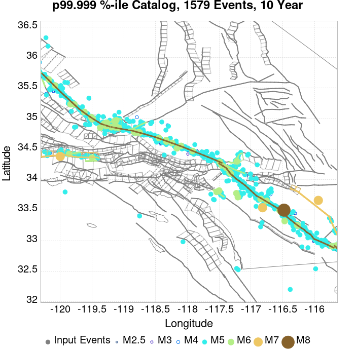 |

## ComCat Data Comparisons
*[(top)](#table-of-contents)*

These plots compare simulated sequences with data from ComCat. All plots only consider events with hypocenters inside the ComCat region defined in the JSON input file.

Last updated at 2020/04/09 11:33:30 UTC, 5.4 days after the simulation start time.

Total matching ComCat events found: 23

### ComCat Magnitude-Number Distributions
*[(top)](#table-of-contents)*

| Incremental MND | Cumulative MND |
|-----|-----|
|  |  |

### ComCat Time-Dependent Mc
*[(top)](#table-of-contents)*

The following plots compare simulation results with ComCat data above a magnitude threshold. Plots labeled as *M&ge;Mc(t)* use the time-dependent magnitude of completeness (Mc) defined in Helmstetter et al. (2006), which is plotted below. In the case of multiple M&ge;5 ruptures, either as input to the simulation or in the comparison data, the maximum calculated time-dependent Mc is used. This time-dependent Mc function is plotted below.

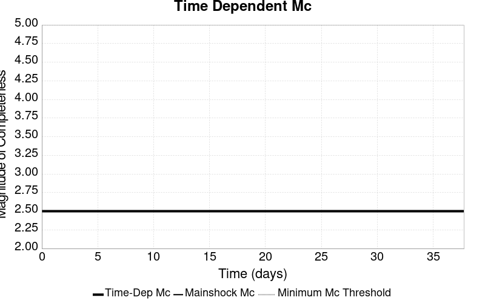

### ComCat Cumulative Number Vs Time
*[(top)](#table-of-contents)*

| M&ge;Mc(t) | M&ge;2.5 | M&ge;3 | M&ge;3.5 | M&ge;4 | M&ge;4.5 | M&ge;5 |
|-----|-----|-----|-----|-----|-----|-----|
|  |  |  |  |  |  |  |

### ComCat Cumulative Number Simulation Percentiles
*[(top)](#table-of-contents)*


### ComCat Probability Spatial Distribution
*[(top)](#table-of-contents)*

*Note: maps labeled 'Forecast' are for a duration that extends into the future, only forecasted values are plotted (ComCat data omitted)*

|  | 1 Day | Current (5.4 Day) | Forecast: 1 Week | Forecast: 1 Month | Forecast: 1 Year |
|-----|-----|-----|-----|-----|-----|
| **M&ge;Mc(t)** |  |  |  |  |  |
|  | Prob: 85.30%, Actual: 9 | Prob: 88.75%, Actual: 23 | Prob: 89.15% | Prob: 90.93% | Prob: 92.87% |
| **M&ge;2.5** |  |  | 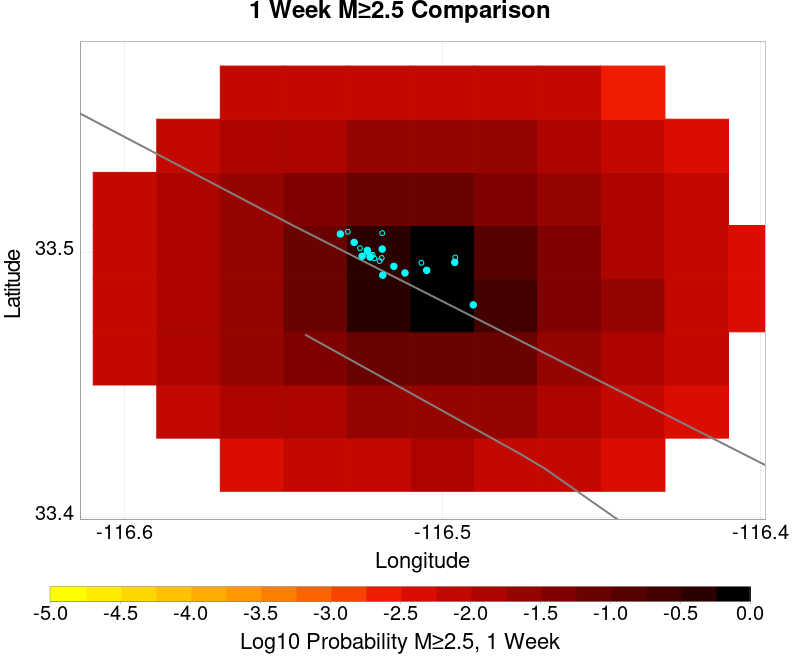 |  | 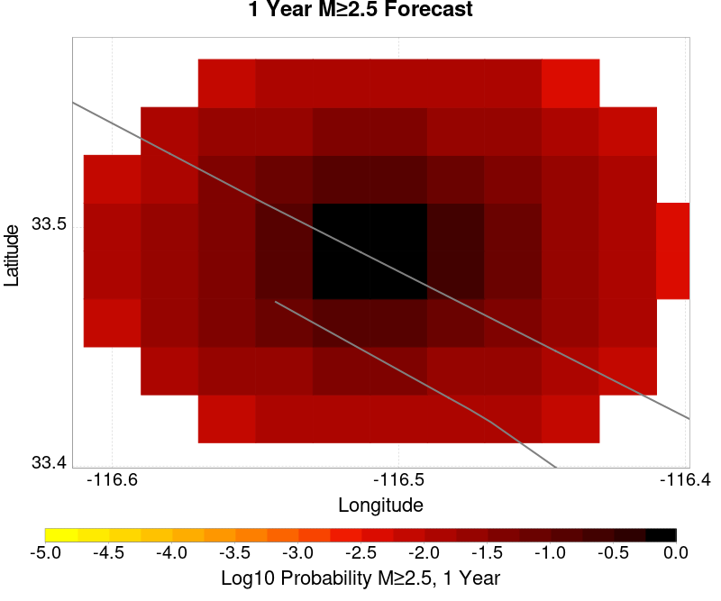 |
|  | Prob: 85.61%, Actual: 9 | Prob: 88.94%, Actual: 23 | Prob: 89.33% | Prob: 91.08% | Prob: 92.98% |
| **M&ge;3** |  |  |  |  |  |
|  | Prob: 61.86%, Actual: 6 | Prob: 67.68%, Actual: 13 | Prob: 68.42% | Prob: 71.84% | Prob: 76.04% |
| **M&ge;3.5** |  |  |  |  |  |
|  | Prob: 34.51%, Actual: 3 | Prob: 40.25%, Actual: 5 | Prob: 41.02% | Prob: 44.66% | Prob: 49.59% |
| **M&ge;4** |  |  |  |  |  |
|  | Prob: 15.25%, Actual: 0 | Prob: 18.72%, Actual: 0 | Prob: 19.20% | Prob: 21.70% | Prob: 25.24% |
| **M&ge;4.5** | 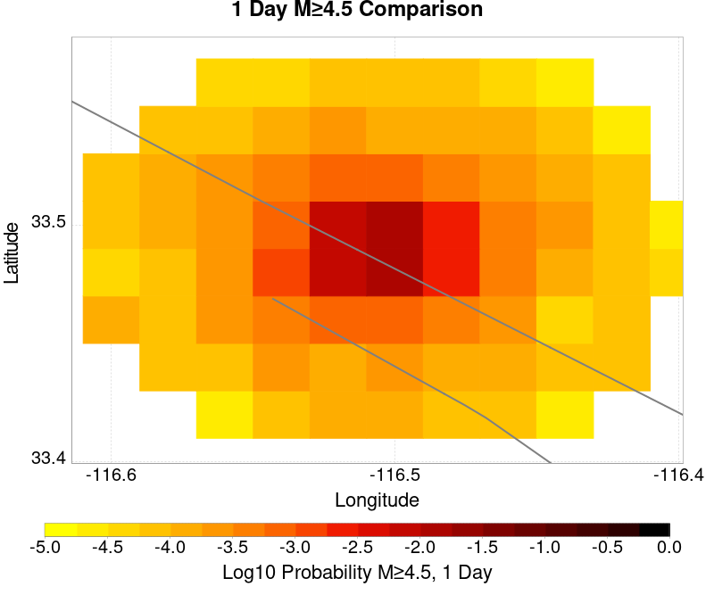 | 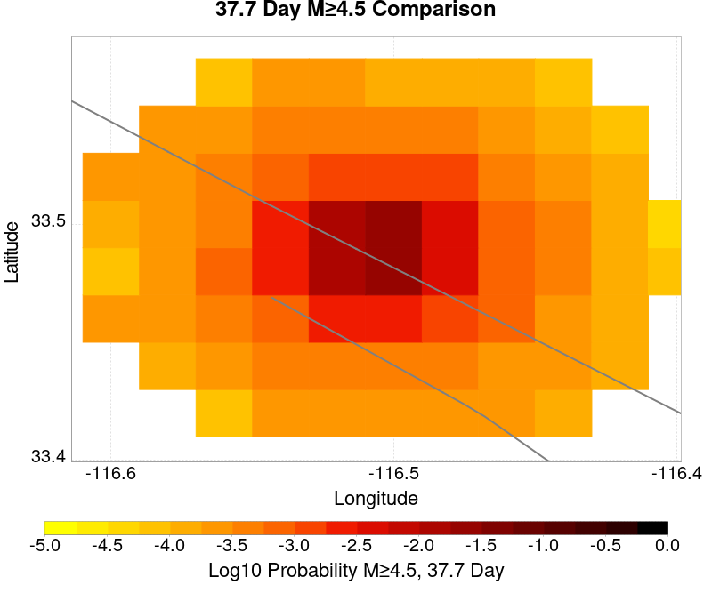 |  |  |  |
|  | Prob: 5.71%, Actual: 0 | Prob: 7.33%, Actual: 0 | Prob: 7.54% | Prob: 8.76% | Prob: 10.55% |
| **M&ge;5** |  |  |  |  |  |
|  | Prob: 1.90%, Actual: 0 | Prob: 2.52%, Actual: 0 | Prob: 2.61% | Prob: 3.07% | Prob: 3.80% |
| **M&ge;5.5** |  |  |  |  |  |
|  | Prob: 0.54%, Actual: 0 | Prob: 0.75%, Actual: 0 | Prob: 0.78% | Prob: 0.94% | Prob: 1.19% |

### ComCat Mean Expectation Spatial Distribution
*[(top)](#table-of-contents)*

*Note: maps labeled 'Forecast' are for a duration that extends into the future, only forecasted values are plotted (ComCat data omitted)*

|  | 1 Day | Current (5.4 Day) | Forecast: 1 Week | Forecast: 1 Month | Forecast: 1 Year |
|-----|-----|-----|-----|-----|-----|
| **M&ge;Mc(t)** |  |  |  |  |  |
|  | Mean: 6.949, Actual: 9 | Mean: 9.554, Actual: 23 | Mean: 9.956 | Mean: 12.286 | Mean: 16.323 |
| **M&ge;2.5** |  |  |  |  |  |
|  | Mean: 7.064, Actual: 9 | Mean: 9.668, Actual: 23 | Mean: 10.071 | Mean: 12.401 | Mean: 16.438 |
| **M&ge;3** | 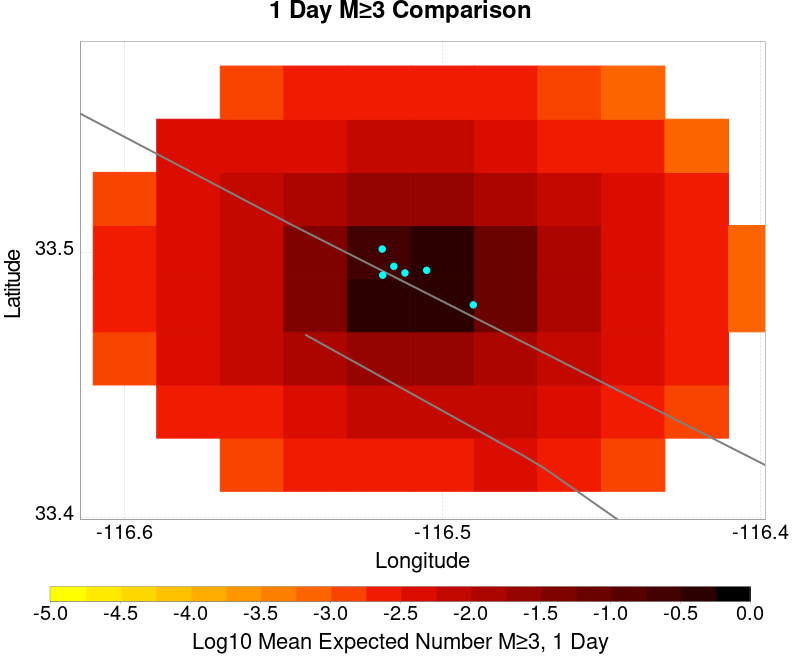 |  |  |  |  |
|  | Mean: 2.232, Actual: 6 | Mean: 3.056, Actual: 13 | Mean: 3.184 | Mean: 3.923 | Mean: 5.199 |
| **M&ge;3.5** |  | 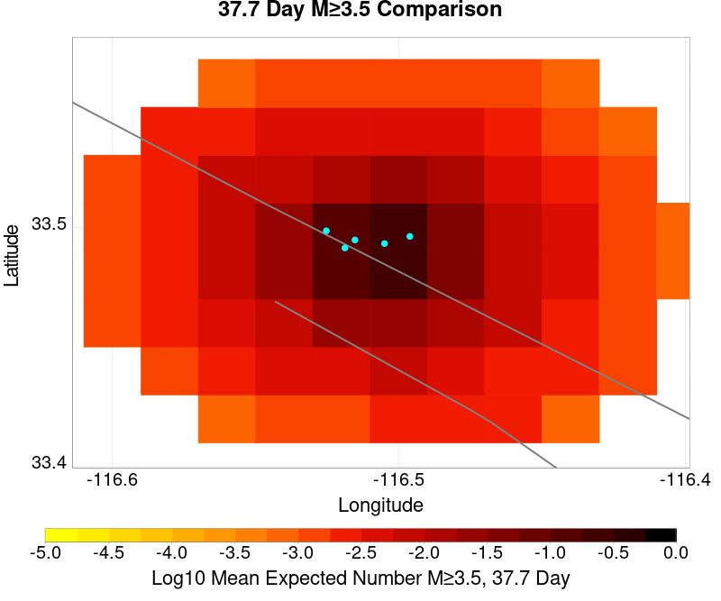 |  |  |  |
|  | Mean: 0.703, Actual: 3 | Mean: 0.964, Actual: 5 | Mean: 1.003 | Mean: 1.236 | Mean: 1.637 |
| **M&ge;4** |  |  |  | 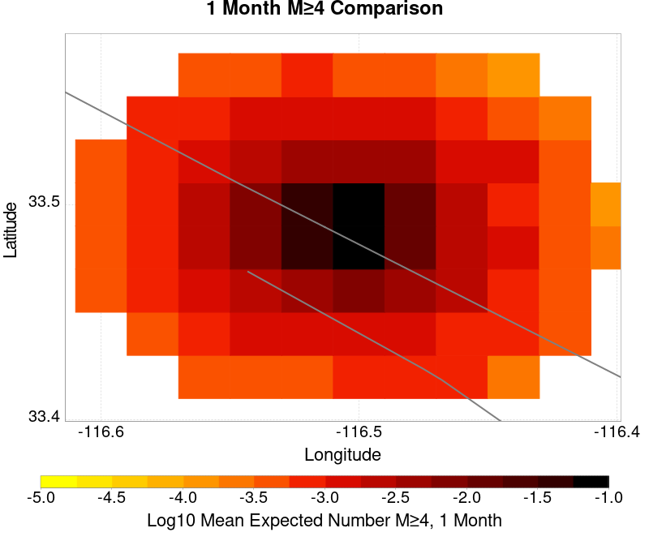 |  |
|  | Mean: 0.222, Actual: 0 | Mean: 0.304, Actual: 0 | Mean: 0.316 | Mean: 0.389 | Mean: 0.515 |
| **M&ge;4.5** |  |  |  | 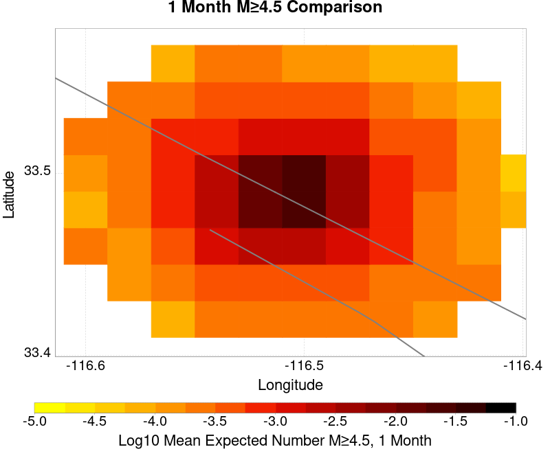 |  |
|  | Mean: 0.070, Actual: 0 | Mean: 0.096, Actual: 0 | Mean: 0.100 | Mean: 0.123 | Mean: 0.161 |
| **M&ge;5** |  |  |  |  |  |
|  | Mean: 0.021, Actual: 0 | Mean: 0.030, Actual: 0 | Mean: 0.031 | Mean: 0.038 | Mean: 0.050 |
| **M&ge;5.5** |  |  |  |  |  |
|  | Mean: 5.75E-3, Actual: 0 | Mean: 8.10E-3, Actual: 0 | Mean: 8.47E-3 | Mean: 0.011 | Mean: 0.014 |

### ComCat Depth Distribution
*[(top)](#table-of-contents)*

| M&ge;Mc(t) | M&ge;2.5 | M&ge;3 | M&ge;3.5 | M&ge;4 | M&ge;4.5 | M&ge;5 | M&ge;5.5 |
|-----|-----|-----|-----|-----|-----|-----|-----|
|  |  |  |  |  | 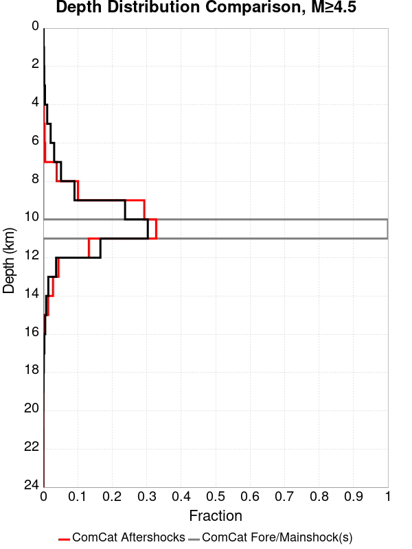 |  |  |


## JSON Input File
*[(top)](#table-of-contents)*

```
{
  "numSimulations": 100000,
  "duration": 10.0,
  "startTimeMillis": 1585965199920,
  "includeSpontaneous": false,
  "randomSeed": 1586368110344,
  "binaryOutput": true,
  "binaryOutputFilters": [
    {
      "prefix": "results_complete",
      "descendantsOnly": false
    },
    {
      "prefix": "results_m5_preserve_chain",
      "minMag": 5.0,
      "preserveChainBelowMag": true,
      "descendantsOnly": false
    }
  ],
  "forceRecalc": false,
  "simulationName": "ComCat M4.87 (ci39126079), Point Source, kCOV\u003d1.5",
  "numRetries": 3,
  "outputDir": "${ETAS_SIM_DIR}/2020_04_08-ComCatM4p87_ci39126079_PointSource_kCOV1p5",
  "treatTriggerCatalogAsSpontaneous": false,
  "triggerRuptures": [
    {
      "occurrenceTimeMillis": 1585965198920,
      "comcatEventID": "ci39126079",
      "mag": 4.87,
      "latitude": 33.4895,
      "longitude": -116.50633330000001,
      "depth": 10.45
    }
  ],
  "cacheDir": "${ETAS_LAUNCHER}/inputs/cache_fm3p1_ba",
  "fssFile": "${ETAS_LAUNCHER}/inputs/2013_05_10-ucerf3p3-production-10runs_COMPOUND_SOL_FM3_1_SpatSeisU3_MEAN_BRANCH_AVG_SOL.zip",
  "probModel": "FULL_TD",
  "applySubSeisForSupraNucl": true,
  "totRateScaleFactor": 1.14,
  "gridSeisCorr": true,
  "timeIndependentERF": false,
  "griddedOnly": false,
  "imposeGR": false,
  "includeIndirectTriggering": true,
  "gridSeisDiscr": 0.1,
  "catalogCompletenessModel": "RELAXED",
  "etas_k_cov": 1.5,
  "configCommand": "u3etas_comcat_event_config_builder.sh --event-id ci39126079 --radius 10 --mag-complete 2.5 --num-simulations 100000 --days-before 7 --etas-k-cov 1.5 --finite-surf-shakemap --finite-surf-shakemap-min-mag 4.5 --hpc-site USC_HPC --nodes 32 --hours 24",
  "configTime": 1586368110344,
  "comcatMetadata": {
    "region": {
      "centerLatitude": 33.4895,
      "centerLongitude": -116.50633330000001,
      "radius": 10.0
    },
    "eventID": "ci39126079",
    "minDepth": -10.0,
    "maxDepth": 24.0,
    "minMag": 2.5,
    "startTime": 1585360398920,
    "endTime": 1585965198920,
    "magComplete": 2.5
  }
}
```

