# ComCat M4.87 (ci39126079), Point Source, kCOV=1.5 Results

|   | ComCat M4.87 (ci39126079), Point Source, kCOV=1.5 |
|-----|-----|
| Num Simulations | 48100 (incomplete) |
| Start Time | 2020/04/04 01:53:19 UTC |
| Start Time Epoch Milliseconds | 1585965199920 |
| Duration | 10 Years |
| Includes Spontaneous? | false |
| Trigger Ruptures | *(none)* |
| Config Generated With | u3etas_comcat_event_config_builder.sh --event-id ci39126079 --radius 10 --mag-complete 2.5 --num-simulations 100000 --days-before 7 --etas-k-cov 1.5 --finite-surf-shakemap --finite-surf-shakemap-min-mag 4.5 --hpc-site USC_HPC --nodes 32 --hours 24 |

## Table Of Contents

* [Probabilities Summary Table](#probabilities-summary-table)
* [Magnitude Number Distribution](#magnitude-number-distribution)
  * [10 Year Magnitude Number Distribution](#10-year-magnitude-number-distribution)
  * [1 Year Magnitude Number Distribution](#1-year-magnitude-number-distribution)
  * [1 Month Magnitude Number Distribution](#1-month-magnitude-number-distribution)
  * [1 Week Magnitude Number Distribution](#1-week-magnitude-number-distribution)
  * [1 Day Magnitude Number Distribution](#1-day-magnitude-number-distribution)
  * [1 Hour Magnitude Number Distribution](#1-hour-magnitude-number-distribution)
* [Hazard Change Over Time](#hazard-change-over-time)
  * [M&ge;5.0 Hazard Change Over Time](#m50-hazard-change-over-time)
  * [M&ge;6.0 Hazard Change Over Time](#m60-hazard-change-over-time)
  * [M&ge;7.0 Hazard Change Over Time](#m70-hazard-change-over-time)
  * [M&ge;8.0 Hazard Change Over Time](#m80-hazard-change-over-time)
* [Trigger Rupture Fault Map](#trigger-rupture-fault-map)
* [Fault Distances To Triggers](#fault-distances-to-triggers)
* [Individual Simulated Catalog Maps](#individual-simulated-catalog-maps)
* [ComCat Data Comparisons](#comcat-data-comparisons)
  * [ComCat Magnitude-Number Distributions](#comcat-magnitude-number-distributions)
  * [ComCat Time-Dependent Mc](#comcat-time-dependent-mc)
  * [ComCat Cumulative Number Vs Time](#comcat-cumulative-number-vs-time)
  * [ComCat Cumulative Number Simulation Percentiles](#comcat-cumulative-number-simulation-percentiles)
  * [ComCat Probability Spatial Distribution](#comcat-probability-spatial-distribution)
  * [ComCat Mean Expectation Spatial Distribution](#comcat-mean-expectation-spatial-distribution)
  * [ComCat Depth Distribution](#comcat-depth-distribution)
* [Section Participation](#section-participation)
  * [Supra-Seismogenic Parent Sections Table](#supra-seismogenic-parent-sections-table)
  * [M≥6.5 Parent Sections Table](#m65-parent-sections-table)
  * [M≥7 Parent Sections Table](#m7-parent-sections-table)
  * [M≥7.5 Parent Sections Table](#m75-parent-sections-table)
  * [M≥8 Parent Sections Table](#m8-parent-sections-table)
* [Fault Magnitude-Probability Distributions](#fault-magnitude-probability-distributions)
* [JSON Input File](#json-input-file)

## Probabilities Summary Table
*[(top)](#table-of-contents)*

| Magnitude | 1 Hour Prob | 1 Day Prob | 1 Week Prob | 1 Month Prob | 1 Year Prob | 10 Year Prob |
|-----|-----|-----|-----|-----|-----|-----|
| **M&ge;3** | 0.431 (43.10%) | 0.640 (64.04%) | 0.705 (70.53%) | 0.738 (73.84%) | 0.779 (77.93%) | 0.803 (80.35%) |
| *95% Conf* | *[42.65% 43.54%]* | *[63.61% 64.47%]* | *[70.12% 70.93%]* | *[73.45% 74.24%]* | *[77.55% 78.29%]* | *[79.99% 80.70%]* |
| **M&ge;3.5** | 0.200 (20.03%) | 0.365 (36.47%) | 0.432 (43.23%) | 0.469 (46.93%) | 0.521 (52.06%) | 0.556 (55.61%) |
| *95% Conf* | *[19.68% 20.39%]* | *[36.04% 36.91%]* | *[42.78% 43.67%]* | *[46.48% 47.38%]* | *[51.62% 52.51%]* | *[55.16% 56.05%]* |
| **M&ge;4** | 0.077 (7.75%) | 0.164 (16.35%) | 0.204 (20.42%) | 0.230 (23.00%) | 0.268 (26.83%) | 0.297 (29.74%) |
| *95% Conf* | *[7.51% 7.99%]* | *[16.02% 16.69%]* | *[20.06% 20.78%]* | *[22.63% 23.38%]* | *[26.43% 27.23%]* | *[29.33% 30.15%]* |
| **M&ge;4.5** | 0.027 (2.69%) | 0.062 (6.21%) | 0.082 (8.16%) | 0.095 (9.46%) | 0.114 (11.43%) | 0.130 (13.00%) |
| *95% Conf* | *[2.55% 2.84%]* | *[6.00% 6.43%]* | *[7.92% 8.41%]* | *[9.20% 9.73%]* | *[11.14% 11.71%]* | *[12.70% 13.30%]* |
| **M&ge;4.87** | 0.012 (1.20%) | 0.028 (2.83%) | 0.038 (3.79%) | 0.045 (4.48%) | 0.055 (5.52%) | 0.064 (6.40%) |
| *95% Conf* | *[1.10% 1.30%]* | *[2.68% 2.98%]* | *[3.63% 3.97%]* | *[4.29% 4.66%]* | *[5.32% 5.73%]* | *[6.18% 6.62%]* |
| **M&ge;5** | 8.81E-3 (0.88%) | 0.021 (2.11%) | 0.029 (2.85%) | 0.034 (3.35%) | 0.042 (4.18%) | 0.049 (4.88%) |
| *95% Conf* | *[0.80% 0.97%]* | *[1.98% 2.24%]* | *[2.70% 3.00%]* | *[3.20% 3.52%]* | *[4.00% 4.36%]* | *[4.69% 5.08%]* |
| **M&ge;5.5** | 2.35E-3 (0.23%) | 6.28E-3 (0.63%) | 8.73E-3 (0.87%) | 0.010 (1.03%) | 0.013 (1.30%) | 0.016 (1.62%) |
| *95% Conf* | *[0.19% 0.28%]* | *[0.56% 0.70%]* | *[0.79% 0.96%]* | *[0.94% 1.12%]* | *[1.20% 1.41%]* | *[1.51% 1.74%]* |
| **M&ge;6** | 5.61E-4 (0.06%) | 1.52E-3 (0.15%) | 2.18E-3 (0.22%) | 2.89E-3 (0.29%) | 3.66E-3 (0.37%) | 4.18E-3 (0.42%) |
| *95% Conf* | *[0.04% 0.08%]* | *[0.12% 0.19%]* | *[0.18% 0.27%]* | *[0.24% 0.34%]* | *[0.31% 0.43%]* | *[0.36% 0.48%]* |
| **M&ge;6.5** | 6.24E-5 (0.01%) | 2.29E-4 (0.02%) | 3.12E-4 (0.03%) | 4.37E-4 (0.04%) | 5.20E-4 (0.05%) | 6.03E-4 (0.06%) |
| *95% Conf* | *[0.00% 0.02%]* | *[0.01% 0.04%]* | *[0.02% 0.05%]* | *[0.03% 0.07%]* | *[0.03% 0.08%]* | *[0.04% 0.09%]* |
| **M&ge;7** | 4.16E-5 (0.00%) | 1.87E-4 (0.02%) | 2.08E-4 (0.02%) | 2.91E-4 (0.03%) | 3.12E-4 (0.03%) | 3.74E-4 (0.04%) |
| *95% Conf* | *[0.00% 0.02%]* | *[0.01% 0.04%]* | *[0.01% 0.04%]* | *[0.02% 0.05%]* | *[0.02% 0.05%]* | *[0.02% 0.06%]* |
| **M&ge;7.5** | 4.16E-5 (0.00%) | 1.04E-4 (0.01%) | 1.25E-4 (0.01%) | 1.66E-4 (0.02%) | 1.66E-4 (0.02%) | 1.66E-4 (0.02%) |
| *95% Conf* | *[0.00% 0.02%]* | *[0.00% 0.03%]* | *[0.01% 0.03%]* | *[0.01% 0.03%]* | *[0.01% 0.03%]* | *[0.01% 0.03%]* |
| **M&ge;8** | 2.08E-5 (0.00%) | 4.16E-5 (0.00%) | 6.24E-5 (0.01%) | 8.32E-5 (0.01%) | 8.32E-5 (0.01%) | 8.32E-5 (0.01%) |
| *95% Conf* | *[0.00% 0.01%]* | *[0.00% 0.02%]* | *[0.00% 0.02%]* | *[0.00% 0.02%]* | *[0.00% 0.02%]* | *[0.00% 0.02%]* |

## Magnitude Number Distribution
*[(top)](#table-of-contents)*

### 10 Year Magnitude Number Distribution
*[(top)](#table-of-contents)*

**Legend**
* **Mean** (thick black line): mean expected number across all 48100 catalogs
* **2.5%,97.5%** (thin black lines): expected number percentiles across all 48100 catalogs
* **Median** (thin blue line): median expected number across all 48100 catalogs
* **Mode** (thin cyan line): modal expected number across all 48100 catalogs
* **10 yr Probability** (thin red line): 10 year probability calculated as the fraction of catalogs with at least 1 occurrence
* **10 yr Supraseismogenic Probability** (thin dashed red line): same as above, but only for supraseismogenic ruptures on explicitly modeled UCERF3 faults
* **95% Conf** (light red shaded region): binomial 95% confidence bounds on probability
* **Primary** (thin green line): mean expected number from primary triggered aftershocks only (no secondary, tertiary, etc...) across all 48100 catalogs


| Mag | Mean | 2.5 %ile | 97.5 %ile | Median | Mode | 10 yr Probability | 10 yr Prob 95% Conf | 10 yr Supra-Seis Prob | Primary Aftershocks Mean |
|-----|-----|-----|-----|-----|-----|-----|-----|-----|-----|
| **M&ge;2.5** | 30.356 | 0.000 | 122.000 | 9.000 | 1.000 | 0.948 (94.78%) | [94.58% 94.98%] | 8.52E-4 (0.09%) | 12.344 |
| **M&ge;2.6** | 24.124 | 0.000 | 97.000 | 7.000 | 1.000 | 0.929 (92.91%) | [92.68% 93.14%] | 8.52E-4 (0.09%) | 9.813 |
| **M&ge;2.7** | 19.154 | 0.000 | 78.000 | 6.000 | 1.000 | 0.905 (90.52%) | [90.26% 90.78%] | 8.52E-4 (0.09%) | 7.793 |
| **M&ge;2.8** | 15.216 | 0.000 | 62.000 | 4.000 | 0.000 | 0.877 (87.72%) | [87.42% 88.01%] | 8.52E-4 (0.09%) | 6.192 |
| **M&ge;2.9** | 12.086 | 0.000 | 50.000 | 4.000 | 0.000 | 0.843 (84.28%) | [83.96% 84.61%] | 8.52E-4 (0.09%) | 4.916 |
| **M&ge;3** | 9.599 | 0.000 | 40.000 | 3.000 | 0.000 | 0.803 (80.35%) | [79.99% 80.70%] | 8.52E-4 (0.09%) | 3.903 |
| **M&ge;3.1** | 7.627 | 0.000 | 32.000 | 2.000 | 0.000 | 0.759 (75.92%) | [75.54% 76.30%] | 8.52E-4 (0.09%) | 3.100 |
| **M&ge;3.2** | 6.056 | 0.000 | 26.000 | 2.000 | 0.000 | 0.713 (71.25%) | [70.85% 71.66%] | 8.52E-4 (0.09%) | 2.461 |
| **M&ge;3.3** | 4.804 | 0.000 | 21.000 | 1.000 | 0.000 | 0.663 (66.27%) | [65.85% 66.70%] | 8.52E-4 (0.09%) | 1.955 |
| **M&ge;3.4** | 3.814 | 0.000 | 17.000 | 1.000 | 0.000 | 0.609 (60.89%) | [60.45% 61.32%] | 8.52E-4 (0.09%) | 1.549 |
| **M&ge;3.5** | 3.026 | 0.000 | 13.000 | 1.000 | 0.000 | 0.556 (55.61%) | [55.16% 56.05%] | 8.52E-4 (0.09%) | 1.227 |
| **M&ge;3.6** | 2.404 | 0.000 | 11.000 | 1.000 | 0.000 | 0.502 (50.16%) | [49.71% 50.61%] | 8.52E-4 (0.09%) | 0.976 |
| **M&ge;3.7** | 1.909 | 0.000 | 9.000 | 0.000 | 0.000 | 0.448 (44.78%) | [44.33% 45.22%] | 8.52E-4 (0.09%) | 0.774 |
| **M&ge;3.8** | 1.517 | 0.000 | 7.000 | 0.000 | 0.000 | 0.397 (39.73%) | [39.30% 40.17%] | 8.52E-4 (0.09%) | 0.617 |
| **M&ge;3.9** | 1.203 | 0.000 | 6.000 | 0.000 | 0.000 | 0.346 (34.59%) | [34.17% 35.02%] | 8.52E-4 (0.09%) | 0.488 |
| **M&ge;4** | 0.954 | 0.000 | 5.000 | 0.000 | 0.000 | 0.297 (29.74%) | [29.33% 30.15%] | 8.52E-4 (0.09%) | 0.386 |
| **M&ge;4.1** | 0.759 | 0.000 | 4.000 | 0.000 | 0.000 | 0.256 (25.57%) | [25.18% 25.96%] | 8.52E-4 (0.09%) | 0.307 |
| **M&ge;4.2** | 0.603 | 0.000 | 3.000 | 0.000 | 0.000 | 0.219 (21.93%) | [21.56% 22.30%] | 8.52E-4 (0.09%) | 0.245 |
| **M&ge;4.3** | 0.476 | 0.000 | 3.000 | 0.000 | 0.000 | 0.185 (18.52%) | [18.18% 18.87%] | 8.52E-4 (0.09%) | 0.194 |
| **M&ge;4.4** | 0.376 | 0.000 | 2.000 | 0.000 | 0.000 | 0.156 (15.60%) | [15.27% 15.92%] | 8.52E-4 (0.09%) | 0.153 |
| **M&ge;4.5** | 0.297 | 0.000 | 2.000 | 0.000 | 0.000 | 0.130 (13.00%) | [12.70% 13.30%] | 8.52E-4 (0.09%) | 0.122 |
| **M&ge;4.6** | 0.234 | 0.000 | 2.000 | 0.000 | 0.000 | 0.107 (10.74%) | [10.46% 11.02%] | 8.52E-4 (0.09%) | 0.096 |
| **M&ge;4.7** | 0.187 | 0.000 | 1.000 | 0.000 | 0.000 | 0.090 (8.97%) | [8.72% 9.23%] | 8.52E-4 (0.09%) | 0.077 |
| **M&ge;4.8** | 0.147 | 0.000 | 1.000 | 0.000 | 0.000 | 0.073 (7.33%) | [7.10% 7.57%] | 8.52E-4 (0.09%) | 0.060 |
| **M&ge;4.9** | 0.116 | 0.000 | 1.000 | 0.000 | 0.000 | 0.060 (6.00%) | [5.79% 6.22%] | 8.52E-4 (0.09%) | 0.048 |
| **M&ge;5** | 0.092 | 0.000 | 1.000 | 0.000 | 0.000 | 0.049 (4.88%) | [4.69% 5.08%] | 8.52E-4 (0.09%) | 0.038 |
| **M&ge;5.1** | 0.072 | 0.000 | 1.000 | 0.000 | 0.000 | 0.040 (3.95%) | [3.78% 4.13%] | 8.52E-4 (0.09%) | 0.029 |
| **M&ge;5.2** | 0.056 | 0.000 | 1.000 | 0.000 | 0.000 | 0.032 (3.15%) | [3.00% 3.31%] | 8.52E-4 (0.09%) | 0.023 |
| **M&ge;5.3** | 0.043 | 0.000 | 1.000 | 0.000 | 0.000 | 0.025 (2.54%) | [2.41% 2.69%] | 8.52E-4 (0.09%) | 0.018 |
| **M&ge;5.4** | 0.034 | 0.000 | 0.000 | 0.000 | 0.000 | 0.020 (2.03%) | [1.91% 2.16%] | 8.52E-4 (0.09%) | 0.014 |
| **M&ge;5.5** | 0.026 | 0.000 | 0.000 | 0.000 | 0.000 | 0.016 (1.62%) | [1.51% 1.74%] | 8.52E-4 (0.09%) | 0.011 |
| **M&ge;5.6** | 0.020 | 0.000 | 0.000 | 0.000 | 0.000 | 0.013 (1.25%) | [1.16% 1.36%] | 8.52E-4 (0.09%) | 8.30E-3 |
| **M&ge;5.7** | 0.015 | 0.000 | 0.000 | 0.000 | 0.000 | 9.92E-3 (0.99%) | [0.91% 1.09%] | 8.52E-4 (0.09%) | 6.47E-3 |
| **M&ge;5.8** | 0.011 | 0.000 | 0.000 | 0.000 | 0.000 | 7.69E-3 (0.77%) | [0.69% 0.85%] | 8.52E-4 (0.09%) | 5.07E-3 |
| **M&ge;5.9** | 8.09E-3 | 0.000 | 0.000 | 0.000 | 0.000 | 5.72E-3 (0.57%) | [0.51% 0.64%] | 8.52E-4 (0.09%) | 3.66E-3 |
| **M&ge;6** | 5.65E-3 | 0.000 | 0.000 | 0.000 | 0.000 | 4.18E-3 (0.42%) | [0.36% 0.48%] | 8.52E-4 (0.09%) | 2.68E-3 |
| **M&ge;6.1** | 3.74E-3 | 0.000 | 0.000 | 0.000 | 0.000 | 2.89E-3 (0.29%) | [0.24% 0.34%] | 8.32E-4 (0.08%) | 1.64E-3 |
| **M&ge;6.2** | 2.22E-3 | 0.000 | 0.000 | 0.000 | 0.000 | 1.79E-3 (0.18%) | [0.14% 0.22%] | 7.69E-4 (0.08%) | 9.36E-4 |
| **M&ge;6.3** | 1.64E-3 | 0.000 | 0.000 | 0.000 | 0.000 | 1.33E-3 (0.13%) | [0.10% 0.17%] | 6.86E-4 (0.07%) | 7.28E-4 |
| **M&ge;6.4** | 1.12E-3 | 0.000 | 0.000 | 0.000 | 0.000 | 9.77E-4 (0.10%) | [0.07% 0.13%] | 6.86E-4 (0.07%) | 4.99E-4 |
| **M&ge;6.5** | 6.86E-4 | 0.000 | 0.000 | 0.000 | 0.000 | 6.03E-4 (0.06%) | [0.04% 0.09%] | 5.41E-4 (0.05%) | 3.12E-4 |
| **M&ge;6.6** | 6.03E-4 | 0.000 | 0.000 | 0.000 | 0.000 | 5.61E-4 (0.06%) | [0.04% 0.08%] | 5.41E-4 (0.05%) | 3.12E-4 |
| **M&ge;6.7** | 4.99E-4 | 0.000 | 0.000 | 0.000 | 0.000 | 4.78E-4 (0.05%) | [0.03% 0.07%] | 4.57E-4 (0.05%) | 2.91E-4 |
| **M&ge;6.8** | 4.57E-4 | 0.000 | 0.000 | 0.000 | 0.000 | 4.37E-4 (0.04%) | [0.03% 0.07%] | 4.16E-4 (0.04%) | 2.70E-4 |
| **M&ge;6.9** | 4.37E-4 | 0.000 | 0.000 | 0.000 | 0.000 | 4.16E-4 (0.04%) | [0.03% 0.07%] | 4.16E-4 (0.04%) | 2.49E-4 |
| **M&ge;7** | 3.95E-4 | 0.000 | 0.000 | 0.000 | 0.000 | 3.74E-4 (0.04%) | [0.02% 0.06%] | 3.74E-4 (0.04%) | 2.29E-4 |
| **M&ge;7.1** | 3.33E-4 | 0.000 | 0.000 | 0.000 | 0.000 | 3.12E-4 (0.03%) | [0.02% 0.05%] | 3.12E-4 (0.03%) | 2.08E-4 |
| **M&ge;7.2** | 2.49E-4 | 0.000 | 0.000 | 0.000 | 0.000 | 2.29E-4 (0.02%) | [0.01% 0.04%] | 2.29E-4 (0.02%) | 1.66E-4 |
| **M&ge;7.3** | 2.08E-4 | 0.000 | 0.000 | 0.000 | 0.000 | 1.87E-4 (0.02%) | [0.01% 0.04%] | 1.87E-4 (0.02%) | 1.66E-4 |
| **M&ge;7.4** | 2.08E-4 | 0.000 | 0.000 | 0.000 | 0.000 | 1.87E-4 (0.02%) | [0.01% 0.04%] | 1.87E-4 (0.02%) | 1.66E-4 |
| **M&ge;7.5** | 1.87E-4 | 0.000 | 0.000 | 0.000 | 0.000 | 1.66E-4 (0.02%) | [0.01% 0.03%] | 1.66E-4 (0.02%) | 1.66E-4 |
| **M&ge;7.6** | 1.87E-4 | 0.000 | 0.000 | 0.000 | 0.000 | 1.66E-4 (0.02%) | [0.01% 0.03%] | 1.66E-4 (0.02%) | 1.66E-4 |
| **M&ge;7.7** | 1.87E-4 | 0.000 | 0.000 | 0.000 | 0.000 | 1.66E-4 (0.02%) | [0.01% 0.03%] | 1.66E-4 (0.02%) | 1.66E-4 |
| **M&ge;7.8** | 1.46E-4 | 0.000 | 0.000 | 0.000 | 0.000 | 1.46E-4 (0.01%) | [0.01% 0.03%] | 1.46E-4 (0.01%) | 1.25E-4 |
| **M&ge;7.9** | 1.46E-4 | 0.000 | 0.000 | 0.000 | 0.000 | 1.46E-4 (0.01%) | [0.01% 0.03%] | 1.46E-4 (0.01%) | 1.25E-4 |
| **M&ge;8** | 8.32E-5 | 0.000 | 0.000 | 0.000 | 0.000 | 8.32E-5 (0.01%) | [0.00% 0.02%] | 8.32E-5 (0.01%) | 8.32E-5 |
| **M&ge;8.1** | 4.16E-5 | 0.000 | 0.000 | 0.000 | 0.000 | 4.16E-5 (0.00%) | [0.00% 0.02%] | 4.16E-5 (0.00%) | 4.16E-5 |
| **M&ge;8.2** | 0.000 | 0.000 | 0.000 | 0.000 | 0.000 | 0.000 (0.00%) | [0.00% 0.01%] | 0.000 (0.00%) | 0.000 |
| **M&ge;8.3** | 0.000 | 0.000 | 0.000 | 0.000 | 0.000 | 0.000 (0.00%) | [0.00% 0.01%] | 0.000 (0.00%) | 0.000 |
| **M&ge;8.4** | 0.000 | 0.000 | 0.000 | 0.000 | 0.000 | 0.000 (0.00%) | [0.00% 0.01%] | 0.000 (0.00%) | 0.000 |
| **M&ge;8.5** | 0.000 | 0.000 | 0.000 | 0.000 | 0.000 | 0.000 (0.00%) | [0.00% 0.01%] | 0.000 (0.00%) | 0.000 |
| **M&ge;8.6** | 0.000 | 0.000 | 0.000 | 0.000 | 0.000 | 0.000 (0.00%) | [0.00% 0.01%] | 0.000 (0.00%) | 0.000 |
| **M&ge;8.7** | 0.000 | 0.000 | 0.000 | 0.000 | 0.000 | 0.000 (0.00%) | [0.00% 0.01%] | 0.000 (0.00%) | 0.000 |
| **M&ge;8.8** | 0.000 | 0.000 | 0.000 | 0.000 | 0.000 | 0.000 (0.00%) | [0.00% 0.01%] | 0.000 (0.00%) | 0.000 |
| **M&ge;8.9** | 0.000 | 0.000 | 0.000 | 0.000 | 0.000 | 0.000 (0.00%) | [0.00% 0.01%] | 0.000 (0.00%) | 0.000 |
| **M&ge;9** | 0.000 | 0.000 | 0.000 | 0.000 | 0.000 | 0.000 (0.00%) | [0.00% 0.01%] | 0.000 (0.00%) | 0.000 |

### 1 Year Magnitude Number Distribution
*[(top)](#table-of-contents)*

**Legend**
* **Mean** (thick black line): mean expected number across all 48100 catalogs
* **2.5%,97.5%** (thin black lines): expected number percentiles across all 48100 catalogs
* **Median** (thin blue line): median expected number across all 48100 catalogs
* **Mode** (thin cyan line): modal expected number across all 48100 catalogs
* **1 yr Probability** (thin red line): 1 year probability calculated as the fraction of catalogs with at least 1 occurrence
* **1 yr Supraseismogenic Probability** (thin dashed red line): same as above, but only for supraseismogenic ruptures on explicitly modeled UCERF3 faults
* **95% Conf** (light red shaded region): binomial 95% confidence bounds on probability
* **Primary** (thin green line): mean expected number from primary triggered aftershocks only (no secondary, tertiary, etc...) across all 48100 catalogs


| Mag | Mean | 2.5 %ile | 97.5 %ile | Median | Mode | 1 yr Probability | 1 yr Prob 95% Conf | 1 yr Supra-Seis Prob | Primary Aftershocks Mean |
|-----|-----|-----|-----|-----|-----|-----|-----|-----|-----|
| **M&ge;2.5** | 24.078 | 0.000 | 96.000 | 8.000 | 1.000 | 0.938 (93.78%) | [93.56% 94.00%] | 7.07E-4 (0.07%) | 10.923 |
| **M&ge;2.6** | 19.137 | 0.000 | 77.000 | 6.000 | 1.000 | 0.917 (91.74%) | [91.49% 91.98%] | 7.07E-4 (0.07%) | 8.683 |
| **M&ge;2.7** | 15.196 | 0.000 | 62.000 | 5.000 | 1.000 | 0.891 (89.10%) | [88.81% 89.37%] | 7.07E-4 (0.07%) | 6.895 |
| **M&ge;2.8** | 12.074 | 0.000 | 50.000 | 4.000 | 0.000 | 0.860 (85.99%) | [85.68% 86.30%] | 7.07E-4 (0.07%) | 5.481 |
| **M&ge;2.9** | 9.585 | 0.000 | 39.000 | 3.000 | 0.000 | 0.823 (82.26%) | [81.92% 82.60%] | 7.07E-4 (0.07%) | 4.350 |
| **M&ge;3** | 7.614 | 0.000 | 32.000 | 2.000 | 0.000 | 0.779 (77.93%) | [77.55% 78.29%] | 7.07E-4 (0.07%) | 3.454 |
| **M&ge;3.1** | 6.050 | 0.000 | 25.000 | 2.000 | 0.000 | 0.732 (73.19%) | [72.79% 73.58%] | 7.07E-4 (0.07%) | 2.743 |
| **M&ge;3.2** | 4.804 | 0.000 | 20.000 | 1.000 | 0.000 | 0.683 (68.27%) | [67.85% 68.68%] | 7.07E-4 (0.07%) | 2.178 |
| **M&ge;3.3** | 3.814 | 0.000 | 16.000 | 1.000 | 0.000 | 0.630 (63.01%) | [62.58% 63.45%] | 7.07E-4 (0.07%) | 1.729 |
| **M&ge;3.4** | 3.024 | 0.000 | 13.000 | 1.000 | 0.000 | 0.575 (57.50%) | [57.06% 57.94%] | 7.07E-4 (0.07%) | 1.370 |
| **M&ge;3.5** | 2.400 | 0.000 | 11.000 | 1.000 | 0.000 | 0.521 (52.06%) | [51.62% 52.51%] | 7.07E-4 (0.07%) | 1.084 |
| **M&ge;3.6** | 1.906 | 0.000 | 9.000 | 0.000 | 0.000 | 0.467 (46.70%) | [46.26% 47.15%] | 7.07E-4 (0.07%) | 0.864 |
| **M&ge;3.7** | 1.513 | 0.000 | 7.000 | 0.000 | 0.000 | 0.414 (41.36%) | [40.92% 41.81%] | 7.07E-4 (0.07%) | 0.684 |
| **M&ge;3.8** | 1.205 | 0.000 | 6.000 | 0.000 | 0.000 | 0.364 (36.43%) | [36.00% 36.86%] | 7.07E-4 (0.07%) | 0.545 |
| **M&ge;3.9** | 0.955 | 0.000 | 5.000 | 0.000 | 0.000 | 0.314 (31.40%) | [30.98% 31.82%] | 7.07E-4 (0.07%) | 0.430 |
| **M&ge;4** | 0.758 | 0.000 | 4.000 | 0.000 | 0.000 | 0.268 (26.83%) | [26.43% 27.23%] | 7.07E-4 (0.07%) | 0.340 |
| **M&ge;4.1** | 0.604 | 0.000 | 3.000 | 0.000 | 0.000 | 0.229 (22.93%) | [22.55% 23.31%] | 7.07E-4 (0.07%) | 0.271 |
| **M&ge;4.2** | 0.480 | 0.000 | 3.000 | 0.000 | 0.000 | 0.195 (19.54%) | [19.19% 19.90%] | 7.07E-4 (0.07%) | 0.216 |
| **M&ge;4.3** | 0.379 | 0.000 | 2.000 | 0.000 | 0.000 | 0.164 (16.45%) | [16.12% 16.78%] | 7.07E-4 (0.07%) | 0.171 |
| **M&ge;4.4** | 0.299 | 0.000 | 2.000 | 0.000 | 0.000 | 0.138 (13.78%) | [13.48% 14.09%] | 7.07E-4 (0.07%) | 0.135 |
| **M&ge;4.5** | 0.237 | 0.000 | 2.000 | 0.000 | 0.000 | 0.114 (11.43%) | [11.14% 11.71%] | 7.07E-4 (0.07%) | 0.108 |
| **M&ge;4.6** | 0.187 | 0.000 | 1.000 | 0.000 | 0.000 | 0.094 (9.43%) | [9.17% 9.69%] | 7.07E-4 (0.07%) | 0.085 |
| **M&ge;4.7** | 0.150 | 0.000 | 1.000 | 0.000 | 0.000 | 0.078 (7.82%) | [7.59% 8.07%] | 7.07E-4 (0.07%) | 0.068 |
| **M&ge;4.8** | 0.118 | 0.000 | 1.000 | 0.000 | 0.000 | 0.064 (6.36%) | [6.14% 6.58%] | 7.07E-4 (0.07%) | 0.054 |
| **M&ge;4.9** | 0.093 | 0.000 | 1.000 | 0.000 | 0.000 | 0.052 (5.16%) | [4.97% 5.36%] | 7.07E-4 (0.07%) | 0.042 |
| **M&ge;5** | 0.073 | 0.000 | 1.000 | 0.000 | 0.000 | 0.042 (4.18%) | [4.00% 4.36%] | 7.07E-4 (0.07%) | 0.033 |
| **M&ge;5.1** | 0.057 | 0.000 | 1.000 | 0.000 | 0.000 | 0.033 (3.35%) | [3.19% 3.51%] | 7.07E-4 (0.07%) | 0.026 |
| **M&ge;5.2** | 0.044 | 0.000 | 1.000 | 0.000 | 0.000 | 0.027 (2.67%) | [2.53% 2.82%] | 7.07E-4 (0.07%) | 0.020 |
| **M&ge;5.3** | 0.034 | 0.000 | 0.000 | 0.000 | 0.000 | 0.021 (2.12%) | [1.99% 2.25%] | 7.07E-4 (0.07%) | 0.016 |
| **M&ge;5.4** | 0.027 | 0.000 | 0.000 | 0.000 | 0.000 | 0.017 (1.67%) | [1.56% 1.79%] | 7.07E-4 (0.07%) | 0.012 |
| **M&ge;5.5** | 0.021 | 0.000 | 0.000 | 0.000 | 0.000 | 0.013 (1.30%) | [1.20% 1.41%] | 7.07E-4 (0.07%) | 9.38E-3 |
| **M&ge;5.6** | 0.016 | 0.000 | 0.000 | 0.000 | 0.000 | 0.010 (1.01%) | [0.93% 1.11%] | 7.07E-4 (0.07%) | 7.15E-3 |
| **M&ge;5.7** | 0.012 | 0.000 | 0.000 | 0.000 | 0.000 | 8.19E-3 (0.82%) | [0.74% 0.90%] | 7.07E-4 (0.07%) | 5.65E-3 |
| **M&ge;5.8** | 8.98E-3 | 0.000 | 0.000 | 0.000 | 0.000 | 6.42E-3 (0.64%) | [0.57% 0.72%] | 7.07E-4 (0.07%) | 4.41E-3 |
| **M&ge;5.9** | 6.42E-3 | 0.000 | 0.000 | 0.000 | 0.000 | 4.76E-3 (0.48%) | [0.42% 0.54%] | 7.07E-4 (0.07%) | 3.18E-3 |
| **M&ge;6** | 4.74E-3 | 0.000 | 0.000 | 0.000 | 0.000 | 3.66E-3 (0.37%) | [0.31% 0.43%] | 7.07E-4 (0.07%) | 2.41E-3 |
| **M&ge;6.1** | 3.16E-3 | 0.000 | 0.000 | 0.000 | 0.000 | 2.54E-3 (0.25%) | [0.21% 0.30%] | 6.86E-4 (0.07%) | 1.50E-3 |
| **M&ge;6.2** | 1.89E-3 | 0.000 | 0.000 | 0.000 | 0.000 | 1.56E-3 (0.16%) | [0.12% 0.20%] | 6.44E-4 (0.06%) | 8.11E-4 |
| **M&ge;6.3** | 1.39E-3 | 0.000 | 0.000 | 0.000 | 0.000 | 1.14E-3 (0.11%) | [0.09% 0.15%] | 5.61E-4 (0.06%) | 6.24E-4 |
| **M&ge;6.4** | 9.56E-4 | 0.000 | 0.000 | 0.000 | 0.000 | 8.32E-4 (0.08%) | [0.06% 0.11%] | 5.61E-4 (0.06%) | 4.16E-4 |
| **M&ge;6.5** | 6.03E-4 | 0.000 | 0.000 | 0.000 | 0.000 | 5.20E-4 (0.05%) | [0.03% 0.08%] | 4.57E-4 (0.05%) | 2.91E-4 |
| **M&ge;6.6** | 5.20E-4 | 0.000 | 0.000 | 0.000 | 0.000 | 4.78E-4 (0.05%) | [0.03% 0.07%] | 4.57E-4 (0.05%) | 2.91E-4 |
| **M&ge;6.7** | 4.16E-4 | 0.000 | 0.000 | 0.000 | 0.000 | 3.95E-4 (0.04%) | [0.02% 0.06%] | 3.74E-4 (0.04%) | 2.70E-4 |
| **M&ge;6.8** | 3.74E-4 | 0.000 | 0.000 | 0.000 | 0.000 | 3.53E-4 (0.04%) | [0.02% 0.06%] | 3.33E-4 (0.03%) | 2.49E-4 |
| **M&ge;6.9** | 3.53E-4 | 0.000 | 0.000 | 0.000 | 0.000 | 3.33E-4 (0.03%) | [0.02% 0.06%] | 3.33E-4 (0.03%) | 2.29E-4 |
| **M&ge;7** | 3.33E-4 | 0.000 | 0.000 | 0.000 | 0.000 | 3.12E-4 (0.03%) | [0.02% 0.05%] | 3.12E-4 (0.03%) | 2.08E-4 |
| **M&ge;7.1** | 2.91E-4 | 0.000 | 0.000 | 0.000 | 0.000 | 2.70E-4 (0.03%) | [0.02% 0.05%] | 2.70E-4 (0.03%) | 2.08E-4 |
| **M&ge;7.2** | 2.08E-4 | 0.000 | 0.000 | 0.000 | 0.000 | 1.87E-4 (0.02%) | [0.01% 0.04%] | 1.87E-4 (0.02%) | 1.66E-4 |
| **M&ge;7.3** | 1.87E-4 | 0.000 | 0.000 | 0.000 | 0.000 | 1.66E-4 (0.02%) | [0.01% 0.03%] | 1.66E-4 (0.02%) | 1.66E-4 |
| **M&ge;7.4** | 1.87E-4 | 0.000 | 0.000 | 0.000 | 0.000 | 1.66E-4 (0.02%) | [0.01% 0.03%] | 1.66E-4 (0.02%) | 1.66E-4 |
| **M&ge;7.5** | 1.87E-4 | 0.000 | 0.000 | 0.000 | 0.000 | 1.66E-4 (0.02%) | [0.01% 0.03%] | 1.66E-4 (0.02%) | 1.66E-4 |
| **M&ge;7.6** | 1.87E-4 | 0.000 | 0.000 | 0.000 | 0.000 | 1.66E-4 (0.02%) | [0.01% 0.03%] | 1.66E-4 (0.02%) | 1.66E-4 |
| **M&ge;7.7** | 1.87E-4 | 0.000 | 0.000 | 0.000 | 0.000 | 1.66E-4 (0.02%) | [0.01% 0.03%] | 1.66E-4 (0.02%) | 1.66E-4 |
| **M&ge;7.8** | 1.46E-4 | 0.000 | 0.000 | 0.000 | 0.000 | 1.46E-4 (0.01%) | [0.01% 0.03%] | 1.46E-4 (0.01%) | 1.25E-4 |
| **M&ge;7.9** | 1.46E-4 | 0.000 | 0.000 | 0.000 | 0.000 | 1.46E-4 (0.01%) | [0.01% 0.03%] | 1.46E-4 (0.01%) | 1.25E-4 |
| **M&ge;8** | 8.32E-5 | 0.000 | 0.000 | 0.000 | 0.000 | 8.32E-5 (0.01%) | [0.00% 0.02%] | 8.32E-5 (0.01%) | 8.32E-5 |
| **M&ge;8.1** | 4.16E-5 | 0.000 | 0.000 | 0.000 | 0.000 | 4.16E-5 (0.00%) | [0.00% 0.02%] | 4.16E-5 (0.00%) | 4.16E-5 |
| **M&ge;8.2** | 0.000 | 0.000 | 0.000 | 0.000 | 0.000 | 0.000 (0.00%) | [0.00% 0.01%] | 0.000 (0.00%) | 0.000 |
| **M&ge;8.3** | 0.000 | 0.000 | 0.000 | 0.000 | 0.000 | 0.000 (0.00%) | [0.00% 0.01%] | 0.000 (0.00%) | 0.000 |
| **M&ge;8.4** | 0.000 | 0.000 | 0.000 | 0.000 | 0.000 | 0.000 (0.00%) | [0.00% 0.01%] | 0.000 (0.00%) | 0.000 |
| **M&ge;8.5** | 0.000 | 0.000 | 0.000 | 0.000 | 0.000 | 0.000 (0.00%) | [0.00% 0.01%] | 0.000 (0.00%) | 0.000 |
| **M&ge;8.6** | 0.000 | 0.000 | 0.000 | 0.000 | 0.000 | 0.000 (0.00%) | [0.00% 0.01%] | 0.000 (0.00%) | 0.000 |
| **M&ge;8.7** | 0.000 | 0.000 | 0.000 | 0.000 | 0.000 | 0.000 (0.00%) | [0.00% 0.01%] | 0.000 (0.00%) | 0.000 |
| **M&ge;8.8** | 0.000 | 0.000 | 0.000 | 0.000 | 0.000 | 0.000 (0.00%) | [0.00% 0.01%] | 0.000 (0.00%) | 0.000 |
| **M&ge;8.9** | 0.000 | 0.000 | 0.000 | 0.000 | 0.000 | 0.000 (0.00%) | [0.00% 0.01%] | 0.000 (0.00%) | 0.000 |
| **M&ge;9** | 0.000 | 0.000 | 0.000 | 0.000 | 0.000 | 0.000 (0.00%) | [0.00% 0.01%] | 0.000 (0.00%) | 0.000 |

### 1 Month Magnitude Number Distribution
*[(top)](#table-of-contents)*

**Legend**
* **Mean** (thick black line): mean expected number across all 48100 catalogs
* **2.5%,97.5%** (thin black lines): expected number percentiles across all 48100 catalogs
* **Median** (thin blue line): median expected number across all 48100 catalogs
* **Mode** (thin cyan line): modal expected number across all 48100 catalogs
* **1 mo Probability** (thin red line): 1 month probability calculated as the fraction of catalogs with at least 1 occurrence
* **1 mo Supraseismogenic Probability** (thin dashed red line): same as above, but only for supraseismogenic ruptures on explicitly modeled UCERF3 faults
* **95% Conf** (light red shaded region): binomial 95% confidence bounds on probability
* **Primary** (thin green line): mean expected number from primary triggered aftershocks only (no secondary, tertiary, etc...) across all 48100 catalogs


| Mag | Mean | 2.5 %ile | 97.5 %ile | Median | Mode | 1 mo Probability | 1 mo Prob 95% Conf | 1 mo Supra-Seis Prob | Primary Aftershocks Mean |
|-----|-----|-----|-----|-----|-----|-----|-----|-----|-----|
| **M&ge;2.5** | 17.648 | 0.000 | 70.000 | 6.000 | 1.000 | 0.921 (92.05%) | [91.81% 92.29%] | 6.03E-4 (0.06%) | 9.100 |
| **M&ge;2.6** | 14.023 | 0.000 | 56.000 | 5.000 | 1.000 | 0.896 (89.60%) | [89.32% 89.87%] | 6.03E-4 (0.06%) | 7.235 |
| **M&ge;2.7** | 11.139 | 0.000 | 45.000 | 4.000 | 1.000 | 0.866 (86.57%) | [86.26% 86.87%] | 6.03E-4 (0.06%) | 5.744 |
| **M&ge;2.8** | 8.848 | 0.000 | 36.000 | 3.000 | 0.000 | 0.830 (82.97%) | [82.63% 83.31%] | 6.03E-4 (0.06%) | 4.568 |
| **M&ge;2.9** | 7.023 | 0.000 | 29.000 | 2.000 | 0.000 | 0.787 (78.66%) | [78.29% 79.02%] | 6.03E-4 (0.06%) | 3.626 |
| **M&ge;3** | 5.577 | 0.000 | 23.000 | 2.000 | 0.000 | 0.738 (73.84%) | [73.45% 74.24%] | 6.03E-4 (0.06%) | 2.879 |
| **M&ge;3.1** | 4.429 | 0.000 | 19.000 | 1.000 | 0.000 | 0.687 (68.72%) | [68.30% 69.13%] | 6.03E-4 (0.06%) | 2.284 |
| **M&ge;3.2** | 3.515 | 0.000 | 15.000 | 1.000 | 0.000 | 0.635 (63.53%) | [63.10% 63.96%] | 6.03E-4 (0.06%) | 1.812 |
| **M&ge;3.3** | 2.791 | 0.000 | 12.000 | 1.000 | 0.000 | 0.581 (58.06%) | [57.62% 58.51%] | 6.03E-4 (0.06%) | 1.441 |
| **M&ge;3.4** | 2.213 | 0.000 | 10.000 | 1.000 | 0.000 | 0.524 (52.39%) | [51.95% 52.84%] | 6.03E-4 (0.06%) | 1.140 |
| **M&ge;3.5** | 1.754 | 0.000 | 8.000 | 0.000 | 0.000 | 0.469 (46.93%) | [46.48% 47.38%] | 6.03E-4 (0.06%) | 0.903 |
| **M&ge;3.6** | 1.391 | 0.000 | 7.000 | 0.000 | 0.000 | 0.416 (41.63%) | [41.19% 42.07%] | 6.03E-4 (0.06%) | 0.717 |
| **M&ge;3.7** | 1.105 | 0.000 | 5.000 | 0.000 | 0.000 | 0.365 (36.50%) | [36.07% 36.93%] | 6.03E-4 (0.06%) | 0.568 |
| **M&ge;3.8** | 0.879 | 0.000 | 5.000 | 0.000 | 0.000 | 0.318 (31.77%) | [31.35% 32.19%] | 6.03E-4 (0.06%) | 0.453 |
| **M&ge;3.9** | 0.697 | 0.000 | 4.000 | 0.000 | 0.000 | 0.271 (27.10%) | [26.71% 27.50%] | 6.03E-4 (0.06%) | 0.358 |
| **M&ge;4** | 0.554 | 0.000 | 3.000 | 0.000 | 0.000 | 0.230 (23.00%) | [22.63% 23.38%] | 6.03E-4 (0.06%) | 0.283 |
| **M&ge;4.1** | 0.442 | 0.000 | 3.000 | 0.000 | 0.000 | 0.195 (19.54%) | [19.19% 19.90%] | 6.03E-4 (0.06%) | 0.226 |
| **M&ge;4.2** | 0.351 | 0.000 | 2.000 | 0.000 | 0.000 | 0.165 (16.49%) | [16.16% 16.83%] | 6.03E-4 (0.06%) | 0.180 |
| **M&ge;4.3** | 0.278 | 0.000 | 2.000 | 0.000 | 0.000 | 0.138 (13.80%) | [13.49% 14.11%] | 6.03E-4 (0.06%) | 0.143 |
| **M&ge;4.4** | 0.220 | 0.000 | 2.000 | 0.000 | 0.000 | 0.115 (11.46%) | [11.17% 11.75%] | 6.03E-4 (0.06%) | 0.113 |
| **M&ge;4.5** | 0.174 | 0.000 | 1.000 | 0.000 | 0.000 | 0.095 (9.46%) | [9.20% 9.73%] | 6.03E-4 (0.06%) | 0.090 |
| **M&ge;4.6** | 0.138 | 0.000 | 1.000 | 0.000 | 0.000 | 0.077 (7.73%) | [7.49% 7.97%] | 6.03E-4 (0.06%) | 0.071 |
| **M&ge;4.7** | 0.110 | 0.000 | 1.000 | 0.000 | 0.000 | 0.064 (6.37%) | [6.16% 6.60%] | 6.03E-4 (0.06%) | 0.056 |
| **M&ge;4.8** | 0.087 | 0.000 | 1.000 | 0.000 | 0.000 | 0.052 (5.16%) | [4.96% 5.36%] | 6.03E-4 (0.06%) | 0.045 |
| **M&ge;4.9** | 0.068 | 0.000 | 1.000 | 0.000 | 0.000 | 0.042 (4.18%) | [4.01% 4.37%] | 6.03E-4 (0.06%) | 0.035 |
| **M&ge;5** | 0.053 | 0.000 | 1.000 | 0.000 | 0.000 | 0.034 (3.35%) | [3.20% 3.52%] | 6.03E-4 (0.06%) | 0.028 |
| **M&ge;5.1** | 0.042 | 0.000 | 1.000 | 0.000 | 0.000 | 0.027 (2.66%) | [2.52% 2.81%] | 6.03E-4 (0.06%) | 0.022 |
| **M&ge;5.2** | 0.033 | 0.000 | 0.000 | 0.000 | 0.000 | 0.021 (2.13%) | [2.00% 2.26%] | 6.03E-4 (0.06%) | 0.017 |
| **M&ge;5.3** | 0.025 | 0.000 | 0.000 | 0.000 | 0.000 | 0.017 (1.68%) | [1.57% 1.80%] | 6.03E-4 (0.06%) | 0.013 |
| **M&ge;5.4** | 0.020 | 0.000 | 0.000 | 0.000 | 0.000 | 0.013 (1.32%) | [1.22% 1.43%] | 6.03E-4 (0.06%) | 0.010 |
| **M&ge;5.5** | 0.015 | 0.000 | 0.000 | 0.000 | 0.000 | 0.010 (1.03%) | [0.94% 1.12%] | 6.03E-4 (0.06%) | 7.90E-3 |
| **M&ge;5.6** | 0.011 | 0.000 | 0.000 | 0.000 | 0.000 | 7.94E-3 (0.79%) | [0.72% 0.88%] | 6.03E-4 (0.06%) | 6.07E-3 |
| **M&ge;5.7** | 8.79E-3 | 0.000 | 0.000 | 0.000 | 0.000 | 6.44E-3 (0.64%) | [0.58% 0.72%] | 6.03E-4 (0.06%) | 4.84E-3 |
| **M&ge;5.8** | 6.67E-3 | 0.000 | 0.000 | 0.000 | 0.000 | 4.97E-3 (0.50%) | [0.44% 0.56%] | 6.03E-4 (0.06%) | 3.72E-3 |
| **M&ge;5.9** | 4.93E-3 | 0.000 | 0.000 | 0.000 | 0.000 | 3.68E-3 (0.37%) | [0.32% 0.43%] | 6.03E-4 (0.06%) | 2.66E-3 |
| **M&ge;6** | 3.72E-3 | 0.000 | 0.000 | 0.000 | 0.000 | 2.89E-3 (0.29%) | [0.24% 0.34%] | 6.03E-4 (0.06%) | 2.02E-3 |
| **M&ge;6.1** | 2.43E-3 | 0.000 | 0.000 | 0.000 | 0.000 | 1.93E-3 (0.19%) | [0.16% 0.24%] | 5.82E-4 (0.06%) | 1.23E-3 |
| **M&ge;6.2** | 1.52E-3 | 0.000 | 0.000 | 0.000 | 0.000 | 1.19E-3 (0.12%) | [0.09% 0.15%] | 5.61E-4 (0.06%) | 6.86E-4 |
| **M&ge;6.3** | 1.14E-3 | 0.000 | 0.000 | 0.000 | 0.000 | 8.94E-4 (0.09%) | [0.07% 0.12%] | 4.99E-4 (0.05%) | 5.41E-4 |
| **M&ge;6.4** | 8.11E-4 | 0.000 | 0.000 | 0.000 | 0.000 | 6.86E-4 (0.07%) | [0.05% 0.10%] | 4.99E-4 (0.05%) | 3.95E-4 |
| **M&ge;6.5** | 5.20E-4 | 0.000 | 0.000 | 0.000 | 0.000 | 4.37E-4 (0.04%) | [0.03% 0.07%] | 4.16E-4 (0.04%) | 2.70E-4 |
| **M&ge;6.6** | 4.57E-4 | 0.000 | 0.000 | 0.000 | 0.000 | 4.16E-4 (0.04%) | [0.03% 0.07%] | 4.16E-4 (0.04%) | 2.70E-4 |
| **M&ge;6.7** | 3.74E-4 | 0.000 | 0.000 | 0.000 | 0.000 | 3.53E-4 (0.04%) | [0.02% 0.06%] | 3.53E-4 (0.04%) | 2.49E-4 |
| **M&ge;6.8** | 3.33E-4 | 0.000 | 0.000 | 0.000 | 0.000 | 3.12E-4 (0.03%) | [0.02% 0.05%] | 3.12E-4 (0.03%) | 2.29E-4 |
| **M&ge;6.9** | 3.33E-4 | 0.000 | 0.000 | 0.000 | 0.000 | 3.12E-4 (0.03%) | [0.02% 0.05%] | 3.12E-4 (0.03%) | 2.29E-4 |
| **M&ge;7** | 3.12E-4 | 0.000 | 0.000 | 0.000 | 0.000 | 2.91E-4 (0.03%) | [0.02% 0.05%] | 2.91E-4 (0.03%) | 2.08E-4 |
| **M&ge;7.1** | 2.70E-4 | 0.000 | 0.000 | 0.000 | 0.000 | 2.49E-4 (0.02%) | [0.01% 0.04%] | 2.49E-4 (0.02%) | 2.08E-4 |
| **M&ge;7.2** | 2.08E-4 | 0.000 | 0.000 | 0.000 | 0.000 | 1.87E-4 (0.02%) | [0.01% 0.04%] | 1.87E-4 (0.02%) | 1.66E-4 |
| **M&ge;7.3** | 1.87E-4 | 0.000 | 0.000 | 0.000 | 0.000 | 1.66E-4 (0.02%) | [0.01% 0.03%] | 1.66E-4 (0.02%) | 1.66E-4 |
| **M&ge;7.4** | 1.87E-4 | 0.000 | 0.000 | 0.000 | 0.000 | 1.66E-4 (0.02%) | [0.01% 0.03%] | 1.66E-4 (0.02%) | 1.66E-4 |
| **M&ge;7.5** | 1.87E-4 | 0.000 | 0.000 | 0.000 | 0.000 | 1.66E-4 (0.02%) | [0.01% 0.03%] | 1.66E-4 (0.02%) | 1.66E-4 |
| **M&ge;7.6** | 1.87E-4 | 0.000 | 0.000 | 0.000 | 0.000 | 1.66E-4 (0.02%) | [0.01% 0.03%] | 1.66E-4 (0.02%) | 1.66E-4 |
| **M&ge;7.7** | 1.87E-4 | 0.000 | 0.000 | 0.000 | 0.000 | 1.66E-4 (0.02%) | [0.01% 0.03%] | 1.66E-4 (0.02%) | 1.66E-4 |
| **M&ge;7.8** | 1.46E-4 | 0.000 | 0.000 | 0.000 | 0.000 | 1.46E-4 (0.01%) | [0.01% 0.03%] | 1.46E-4 (0.01%) | 1.25E-4 |
| **M&ge;7.9** | 1.46E-4 | 0.000 | 0.000 | 0.000 | 0.000 | 1.46E-4 (0.01%) | [0.01% 0.03%] | 1.46E-4 (0.01%) | 1.25E-4 |
| **M&ge;8** | 8.32E-5 | 0.000 | 0.000 | 0.000 | 0.000 | 8.32E-5 (0.01%) | [0.00% 0.02%] | 8.32E-5 (0.01%) | 8.32E-5 |
| **M&ge;8.1** | 4.16E-5 | 0.000 | 0.000 | 0.000 | 0.000 | 4.16E-5 (0.00%) | [0.00% 0.02%] | 4.16E-5 (0.00%) | 4.16E-5 |
| **M&ge;8.2** | 0.000 | 0.000 | 0.000 | 0.000 | 0.000 | 0.000 (0.00%) | [0.00% 0.01%] | 0.000 (0.00%) | 0.000 |
| **M&ge;8.3** | 0.000 | 0.000 | 0.000 | 0.000 | 0.000 | 0.000 (0.00%) | [0.00% 0.01%] | 0.000 (0.00%) | 0.000 |
| **M&ge;8.4** | 0.000 | 0.000 | 0.000 | 0.000 | 0.000 | 0.000 (0.00%) | [0.00% 0.01%] | 0.000 (0.00%) | 0.000 |
| **M&ge;8.5** | 0.000 | 0.000 | 0.000 | 0.000 | 0.000 | 0.000 (0.00%) | [0.00% 0.01%] | 0.000 (0.00%) | 0.000 |
| **M&ge;8.6** | 0.000 | 0.000 | 0.000 | 0.000 | 0.000 | 0.000 (0.00%) | [0.00% 0.01%] | 0.000 (0.00%) | 0.000 |
| **M&ge;8.7** | 0.000 | 0.000 | 0.000 | 0.000 | 0.000 | 0.000 (0.00%) | [0.00% 0.01%] | 0.000 (0.00%) | 0.000 |
| **M&ge;8.8** | 0.000 | 0.000 | 0.000 | 0.000 | 0.000 | 0.000 (0.00%) | [0.00% 0.01%] | 0.000 (0.00%) | 0.000 |
| **M&ge;8.9** | 0.000 | 0.000 | 0.000 | 0.000 | 0.000 | 0.000 (0.00%) | [0.00% 0.01%] | 0.000 (0.00%) | 0.000 |
| **M&ge;9** | 0.000 | 0.000 | 0.000 | 0.000 | 0.000 | 0.000 (0.00%) | [0.00% 0.01%] | 0.000 (0.00%) | 0.000 |

### 1 Week Magnitude Number Distribution
*[(top)](#table-of-contents)*

**Legend**
* **Mean** (thick black line): mean expected number across all 48100 catalogs
* **2.5%,97.5%** (thin black lines): expected number percentiles across all 48100 catalogs
* **Median** (thin blue line): median expected number across all 48100 catalogs
* **Mode** (thin cyan line): modal expected number across all 48100 catalogs
* **1 wk Probability** (thin red line): 1 week probability calculated as the fraction of catalogs with at least 1 occurrence
* **1 wk Supraseismogenic Probability** (thin dashed red line): same as above, but only for supraseismogenic ruptures on explicitly modeled UCERF3 faults
* **95% Conf** (light red shaded region): binomial 95% confidence bounds on probability
* **Primary** (thin green line): mean expected number from primary triggered aftershocks only (no secondary, tertiary, etc...) across all 48100 catalogs


| Mag | Mean | 2.5 %ile | 97.5 %ile | Median | Mode | 1 wk Probability | 1 wk Prob 95% Conf | 1 wk Supra-Seis Prob | Primary Aftershocks Mean |
|-----|-----|-----|-----|-----|-----|-----|-----|-----|-----|
| **M&ge;2.5** | 12.897 | 0.000 | 57.000 | 5.000 | 1.000 | 0.905 (90.45%) | [90.18% 90.71%] | 4.57E-4 (0.05%) | 7.896 |
| **M&ge;2.6** | 10.248 | 0.000 | 46.000 | 4.000 | 1.000 | 0.877 (87.69%) | [87.39% 87.98%] | 4.57E-4 (0.05%) | 6.276 |
| **M&ge;2.7** | 8.141 | 0.000 | 36.000 | 3.000 | 0.000 | 0.842 (84.19%) | [83.86% 84.51%] | 4.57E-4 (0.05%) | 4.983 |
| **M&ge;2.8** | 6.464 | 0.000 | 29.000 | 3.000 | 0.000 | 0.803 (80.30%) | [79.94% 80.65%] | 4.57E-4 (0.05%) | 3.959 |
| **M&ge;2.9** | 5.130 | 0.000 | 23.000 | 2.000 | 0.000 | 0.756 (75.64%) | [75.26% 76.02%] | 4.57E-4 (0.05%) | 3.141 |
| **M&ge;3** | 4.072 | 0.000 | 19.000 | 1.000 | 0.000 | 0.705 (70.53%) | [70.12% 70.93%] | 4.57E-4 (0.05%) | 2.494 |
| **M&ge;3.1** | 3.238 | 0.000 | 15.000 | 1.000 | 0.000 | 0.652 (65.16%) | [64.73% 65.58%] | 4.57E-4 (0.05%) | 1.980 |
| **M&ge;3.2** | 2.573 | 0.000 | 12.000 | 1.000 | 0.000 | 0.599 (59.86%) | [59.42% 60.30%] | 4.57E-4 (0.05%) | 1.571 |
| **M&ge;3.3** | 2.044 | 0.000 | 10.000 | 1.000 | 0.000 | 0.543 (54.28%) | [53.83% 54.72%] | 4.57E-4 (0.05%) | 1.249 |
| **M&ge;3.4** | 1.621 | 0.000 | 8.000 | 0.000 | 0.000 | 0.486 (48.61%) | [48.16% 49.06%] | 4.57E-4 (0.05%) | 0.988 |
| **M&ge;3.5** | 1.286 | 0.000 | 7.000 | 0.000 | 0.000 | 0.432 (43.23%) | [42.78% 43.67%] | 4.57E-4 (0.05%) | 0.783 |
| **M&ge;3.6** | 1.023 | 0.000 | 5.000 | 0.000 | 0.000 | 0.380 (38.01%) | [37.58% 38.45%] | 4.57E-4 (0.05%) | 0.622 |
| **M&ge;3.7** | 0.813 | 0.000 | 5.000 | 0.000 | 0.000 | 0.331 (33.10%) | [32.68% 33.52%] | 4.57E-4 (0.05%) | 0.493 |
| **M&ge;3.8** | 0.647 | 0.000 | 4.000 | 0.000 | 0.000 | 0.286 (28.59%) | [28.19% 29.00%] | 4.57E-4 (0.05%) | 0.393 |
| **M&ge;3.9** | 0.512 | 0.000 | 3.000 | 0.000 | 0.000 | 0.242 (24.21%) | [23.83% 24.60%] | 4.57E-4 (0.05%) | 0.310 |
| **M&ge;4** | 0.407 | 0.000 | 3.000 | 0.000 | 0.000 | 0.204 (20.42%) | [20.06% 20.78%] | 4.57E-4 (0.05%) | 0.246 |
| **M&ge;4.1** | 0.325 | 0.000 | 2.000 | 0.000 | 0.000 | 0.173 (17.27%) | [16.93% 17.61%] | 4.57E-4 (0.05%) | 0.196 |
| **M&ge;4.2** | 0.258 | 0.000 | 2.000 | 0.000 | 0.000 | 0.145 (14.46%) | [14.15% 14.78%] | 4.57E-4 (0.05%) | 0.157 |
| **M&ge;4.3** | 0.205 | 0.000 | 2.000 | 0.000 | 0.000 | 0.120 (12.04%) | [11.75% 12.34%] | 4.57E-4 (0.05%) | 0.125 |
| **M&ge;4.4** | 0.162 | 0.000 | 1.000 | 0.000 | 0.000 | 0.100 (9.95%) | [9.69% 10.22%] | 4.57E-4 (0.05%) | 0.099 |
| **M&ge;4.5** | 0.128 | 0.000 | 1.000 | 0.000 | 0.000 | 0.082 (8.16%) | [7.92% 8.41%] | 4.57E-4 (0.05%) | 0.079 |
| **M&ge;4.6** | 0.101 | 0.000 | 1.000 | 0.000 | 0.000 | 0.066 (6.63%) | [6.41% 6.85%] | 4.57E-4 (0.05%) | 0.061 |
| **M&ge;4.7** | 0.081 | 0.000 | 1.000 | 0.000 | 0.000 | 0.055 (5.45%) | [5.25% 5.66%] | 4.57E-4 (0.05%) | 0.049 |
| **M&ge;4.8** | 0.064 | 0.000 | 1.000 | 0.000 | 0.000 | 0.044 (4.38%) | [4.20% 4.57%] | 4.57E-4 (0.05%) | 0.039 |
| **M&ge;4.9** | 0.050 | 0.000 | 1.000 | 0.000 | 0.000 | 0.035 (3.54%) | [3.38% 3.71%] | 4.57E-4 (0.05%) | 0.031 |
| **M&ge;5** | 0.040 | 0.000 | 1.000 | 0.000 | 0.000 | 0.029 (2.85%) | [2.70% 3.00%] | 4.57E-4 (0.05%) | 0.024 |
| **M&ge;5.1** | 0.031 | 0.000 | 0.000 | 0.000 | 0.000 | 0.023 (2.26%) | [2.13% 2.39%] | 4.57E-4 (0.05%) | 0.019 |
| **M&ge;5.2** | 0.024 | 0.000 | 0.000 | 0.000 | 0.000 | 0.018 (1.79%) | [1.67% 1.91%] | 4.57E-4 (0.05%) | 0.015 |
| **M&ge;5.3** | 0.019 | 0.000 | 0.000 | 0.000 | 0.000 | 0.014 (1.40%) | [1.30% 1.51%] | 4.57E-4 (0.05%) | 0.011 |
| **M&ge;5.4** | 0.015 | 0.000 | 0.000 | 0.000 | 0.000 | 0.011 (1.11%) | [1.02% 1.20%] | 4.57E-4 (0.05%) | 8.67E-3 |
| **M&ge;5.5** | 0.011 | 0.000 | 0.000 | 0.000 | 0.000 | 8.73E-3 (0.87%) | [0.79% 0.96%] | 4.57E-4 (0.05%) | 6.80E-3 |
| **M&ge;5.6** | 8.44E-3 | 0.000 | 0.000 | 0.000 | 0.000 | 6.57E-3 (0.66%) | [0.59% 0.73%] | 4.57E-4 (0.05%) | 5.14E-3 |
| **M&ge;5.7** | 6.32E-3 | 0.000 | 0.000 | 0.000 | 0.000 | 5.22E-3 (0.52%) | [0.46% 0.59%] | 4.57E-4 (0.05%) | 4.07E-3 |
| **M&ge;5.8** | 4.76E-3 | 0.000 | 0.000 | 0.000 | 0.000 | 3.93E-3 (0.39%) | [0.34% 0.45%] | 4.57E-4 (0.05%) | 3.08E-3 |
| **M&ge;5.9** | 3.43E-3 | 0.000 | 0.000 | 0.000 | 0.000 | 2.79E-3 (0.28%) | [0.23% 0.33%] | 4.57E-4 (0.05%) | 2.14E-3 |
| **M&ge;6** | 2.60E-3 | 0.000 | 0.000 | 0.000 | 0.000 | 2.18E-3 (0.22%) | [0.18% 0.27%] | 4.57E-4 (0.05%) | 1.58E-3 |
| **M&ge;6.1** | 1.68E-3 | 0.000 | 0.000 | 0.000 | 0.000 | 1.43E-3 (0.14%) | [0.11% 0.18%] | 4.37E-4 (0.04%) | 9.36E-4 |
| **M&ge;6.2** | 1.10E-3 | 0.000 | 0.000 | 0.000 | 0.000 | 9.36E-4 (0.09%) | [0.07% 0.13%] | 4.16E-4 (0.04%) | 5.61E-4 |
| **M&ge;6.3** | 7.90E-4 | 0.000 | 0.000 | 0.000 | 0.000 | 6.65E-4 (0.07%) | [0.05% 0.10%] | 3.53E-4 (0.04%) | 4.16E-4 |
| **M&ge;6.4** | 5.41E-4 | 0.000 | 0.000 | 0.000 | 0.000 | 4.78E-4 (0.05%) | [0.03% 0.07%] | 3.53E-4 (0.04%) | 2.91E-4 |
| **M&ge;6.5** | 3.53E-4 | 0.000 | 0.000 | 0.000 | 0.000 | 3.12E-4 (0.03%) | [0.02% 0.05%] | 3.12E-4 (0.03%) | 2.08E-4 |
| **M&ge;6.6** | 3.33E-4 | 0.000 | 0.000 | 0.000 | 0.000 | 3.12E-4 (0.03%) | [0.02% 0.05%] | 3.12E-4 (0.03%) | 2.08E-4 |
| **M&ge;6.7** | 2.70E-4 | 0.000 | 0.000 | 0.000 | 0.000 | 2.70E-4 (0.03%) | [0.02% 0.05%] | 2.70E-4 (0.03%) | 2.08E-4 |
| **M&ge;6.8** | 2.29E-4 | 0.000 | 0.000 | 0.000 | 0.000 | 2.29E-4 (0.02%) | [0.01% 0.04%] | 2.29E-4 (0.02%) | 1.87E-4 |
| **M&ge;6.9** | 2.29E-4 | 0.000 | 0.000 | 0.000 | 0.000 | 2.29E-4 (0.02%) | [0.01% 0.04%] | 2.29E-4 (0.02%) | 1.87E-4 |
| **M&ge;7** | 2.08E-4 | 0.000 | 0.000 | 0.000 | 0.000 | 2.08E-4 (0.02%) | [0.01% 0.04%] | 2.08E-4 (0.02%) | 1.66E-4 |
| **M&ge;7.1** | 1.66E-4 | 0.000 | 0.000 | 0.000 | 0.000 | 1.66E-4 (0.02%) | [0.01% 0.03%] | 1.66E-4 (0.02%) | 1.66E-4 |
| **M&ge;7.2** | 1.25E-4 | 0.000 | 0.000 | 0.000 | 0.000 | 1.25E-4 (0.01%) | [0.01% 0.03%] | 1.25E-4 (0.01%) | 1.25E-4 |
| **M&ge;7.3** | 1.25E-4 | 0.000 | 0.000 | 0.000 | 0.000 | 1.25E-4 (0.01%) | [0.01% 0.03%] | 1.25E-4 (0.01%) | 1.25E-4 |
| **M&ge;7.4** | 1.25E-4 | 0.000 | 0.000 | 0.000 | 0.000 | 1.25E-4 (0.01%) | [0.01% 0.03%] | 1.25E-4 (0.01%) | 1.25E-4 |
| **M&ge;7.5** | 1.25E-4 | 0.000 | 0.000 | 0.000 | 0.000 | 1.25E-4 (0.01%) | [0.01% 0.03%] | 1.25E-4 (0.01%) | 1.25E-4 |
| **M&ge;7.6** | 1.25E-4 | 0.000 | 0.000 | 0.000 | 0.000 | 1.25E-4 (0.01%) | [0.01% 0.03%] | 1.25E-4 (0.01%) | 1.25E-4 |
| **M&ge;7.7** | 1.25E-4 | 0.000 | 0.000 | 0.000 | 0.000 | 1.25E-4 (0.01%) | [0.01% 0.03%] | 1.25E-4 (0.01%) | 1.25E-4 |
| **M&ge;7.8** | 1.04E-4 | 0.000 | 0.000 | 0.000 | 0.000 | 1.04E-4 (0.01%) | [0.00% 0.03%] | 1.04E-4 (0.01%) | 1.04E-4 |
| **M&ge;7.9** | 1.04E-4 | 0.000 | 0.000 | 0.000 | 0.000 | 1.04E-4 (0.01%) | [0.00% 0.03%] | 1.04E-4 (0.01%) | 1.04E-4 |
| **M&ge;8** | 6.24E-5 | 0.000 | 0.000 | 0.000 | 0.000 | 6.24E-5 (0.01%) | [0.00% 0.02%] | 6.24E-5 (0.01%) | 6.24E-5 |
| **M&ge;8.1** | 4.16E-5 | 0.000 | 0.000 | 0.000 | 0.000 | 4.16E-5 (0.00%) | [0.00% 0.02%] | 4.16E-5 (0.00%) | 4.16E-5 |
| **M&ge;8.2** | 0.000 | 0.000 | 0.000 | 0.000 | 0.000 | 0.000 (0.00%) | [0.00% 0.01%] | 0.000 (0.00%) | 0.000 |
| **M&ge;8.3** | 0.000 | 0.000 | 0.000 | 0.000 | 0.000 | 0.000 (0.00%) | [0.00% 0.01%] | 0.000 (0.00%) | 0.000 |
| **M&ge;8.4** | 0.000 | 0.000 | 0.000 | 0.000 | 0.000 | 0.000 (0.00%) | [0.00% 0.01%] | 0.000 (0.00%) | 0.000 |
| **M&ge;8.5** | 0.000 | 0.000 | 0.000 | 0.000 | 0.000 | 0.000 (0.00%) | [0.00% 0.01%] | 0.000 (0.00%) | 0.000 |
| **M&ge;8.6** | 0.000 | 0.000 | 0.000 | 0.000 | 0.000 | 0.000 (0.00%) | [0.00% 0.01%] | 0.000 (0.00%) | 0.000 |
| **M&ge;8.7** | 0.000 | 0.000 | 0.000 | 0.000 | 0.000 | 0.000 (0.00%) | [0.00% 0.01%] | 0.000 (0.00%) | 0.000 |
| **M&ge;8.8** | 0.000 | 0.000 | 0.000 | 0.000 | 0.000 | 0.000 (0.00%) | [0.00% 0.01%] | 0.000 (0.00%) | 0.000 |
| **M&ge;8.9** | 0.000 | 0.000 | 0.000 | 0.000 | 0.000 | 0.000 (0.00%) | [0.00% 0.01%] | 0.000 (0.00%) | 0.000 |
| **M&ge;9** | 0.000 | 0.000 | 0.000 | 0.000 | 0.000 | 0.000 (0.00%) | [0.00% 0.01%] | 0.000 (0.00%) | 0.000 |

### 1 Day Magnitude Number Distribution
*[(top)](#table-of-contents)*

**Legend**
* **Mean** (thick black line): mean expected number across all 48100 catalogs
* **2.5%,97.5%** (thin black lines): expected number percentiles across all 48100 catalogs
* **Median** (thin blue line): median expected number across all 48100 catalogs
* **Mode** (thin cyan line): modal expected number across all 48100 catalogs
* **1 d Probability** (thin red line): 1 day probability calculated as the fraction of catalogs with at least 1 occurrence
* **1 d Supraseismogenic Probability** (thin dashed red line): same as above, but only for supraseismogenic ruptures on explicitly modeled UCERF3 faults
* **95% Conf** (light red shaded region): binomial 95% confidence bounds on probability
* **Primary** (thin green line): mean expected number from primary triggered aftershocks only (no secondary, tertiary, etc...) across all 48100 catalogs


| Mag | Mean | 2.5 %ile | 97.5 %ile | Median | Mode | 1 d Probability | 1 d Prob 95% Conf | 1 d Supra-Seis Prob | Primary Aftershocks Mean |
|-----|-----|-----|-----|-----|-----|-----|-----|-----|-----|
| **M&ge;2.5** | 8.550 | 0.000 | 39.000 | 4.000 | 1.000 | 0.870 (87.01%) | [86.70% 87.30%] | 3.33E-4 (0.03%) | 6.071 |
| **M&ge;2.6** | 6.797 | 0.000 | 31.000 | 3.000 | 0.000 | 0.836 (83.63%) | [83.30% 83.96%] | 3.33E-4 (0.03%) | 4.828 |
| **M&ge;2.7** | 5.395 | 0.000 | 25.000 | 2.000 | 0.000 | 0.793 (79.33%) | [78.97% 79.70%] | 3.33E-4 (0.03%) | 3.830 |
| **M&ge;2.8** | 4.283 | 0.000 | 20.000 | 2.000 | 0.000 | 0.747 (74.71%) | [74.32% 75.10%] | 3.33E-4 (0.03%) | 3.043 |
| **M&ge;2.9** | 3.401 | 0.000 | 16.000 | 1.000 | 0.000 | 0.695 (69.50%) | [69.08% 69.91%] | 3.33E-4 (0.03%) | 2.417 |
| **M&ge;3** | 2.700 | 0.000 | 13.000 | 1.000 | 0.000 | 0.640 (64.04%) | [63.61% 64.47%] | 3.33E-4 (0.03%) | 1.919 |
| **M&ge;3.1** | 2.150 | 0.000 | 11.000 | 1.000 | 0.000 | 0.584 (58.45%) | [58.01% 58.89%] | 3.33E-4 (0.03%) | 1.526 |
| **M&ge;3.2** | 1.705 | 0.000 | 9.000 | 1.000 | 0.000 | 0.528 (52.81%) | [52.36% 53.26%] | 3.33E-4 (0.03%) | 1.209 |
| **M&ge;3.3** | 1.357 | 0.000 | 7.000 | 0.000 | 0.000 | 0.472 (47.22%) | [46.77% 47.66%] | 3.33E-4 (0.03%) | 0.962 |
| **M&ge;3.4** | 1.073 | 0.000 | 6.000 | 0.000 | 0.000 | 0.416 (41.65%) | [41.21% 42.09%] | 3.33E-4 (0.03%) | 0.761 |
| **M&ge;3.5** | 0.852 | 0.000 | 5.000 | 0.000 | 0.000 | 0.365 (36.47%) | [36.04% 36.91%] | 3.33E-4 (0.03%) | 0.602 |
| **M&ge;3.6** | 0.678 | 0.000 | 4.000 | 0.000 | 0.000 | 0.317 (31.73%) | [31.32% 32.15%] | 3.33E-4 (0.03%) | 0.480 |
| **M&ge;3.7** | 0.539 | 0.000 | 3.000 | 0.000 | 0.000 | 0.273 (27.30%) | [26.90% 27.70%] | 3.33E-4 (0.03%) | 0.379 |
| **M&ge;3.8** | 0.430 | 0.000 | 3.000 | 0.000 | 0.000 | 0.233 (23.32%) | [22.94% 23.70%] | 3.33E-4 (0.03%) | 0.304 |
| **M&ge;3.9** | 0.342 | 0.000 | 2.000 | 0.000 | 0.000 | 0.195 (19.54%) | [19.19% 19.90%] | 3.33E-4 (0.03%) | 0.240 |
| **M&ge;4** | 0.273 | 0.000 | 2.000 | 0.000 | 0.000 | 0.164 (16.35%) | [16.02% 16.69%] | 3.33E-4 (0.03%) | 0.192 |
| **M&ge;4.1** | 0.218 | 0.000 | 2.000 | 0.000 | 0.000 | 0.137 (13.71%) | [13.40% 14.02%] | 3.33E-4 (0.03%) | 0.153 |
| **M&ge;4.2** | 0.174 | 0.000 | 2.000 | 0.000 | 0.000 | 0.114 (11.40%) | [11.12% 11.69%] | 3.33E-4 (0.03%) | 0.123 |
| **M&ge;4.3** | 0.138 | 0.000 | 1.000 | 0.000 | 0.000 | 0.094 (9.37%) | [9.11% 9.63%] | 3.33E-4 (0.03%) | 0.098 |
| **M&ge;4.4** | 0.109 | 0.000 | 1.000 | 0.000 | 0.000 | 0.077 (7.65%) | [7.42% 7.89%] | 3.33E-4 (0.03%) | 0.077 |
| **M&ge;4.5** | 0.086 | 0.000 | 1.000 | 0.000 | 0.000 | 0.062 (6.21%) | [6.00% 6.43%] | 3.33E-4 (0.03%) | 0.061 |
| **M&ge;4.6** | 0.068 | 0.000 | 1.000 | 0.000 | 0.000 | 0.051 (5.06%) | [4.87% 5.26%] | 3.33E-4 (0.03%) | 0.048 |
| **M&ge;4.7** | 0.055 | 0.000 | 1.000 | 0.000 | 0.000 | 0.041 (4.13%) | [3.96% 4.31%] | 3.33E-4 (0.03%) | 0.039 |
| **M&ge;4.8** | 0.043 | 0.000 | 1.000 | 0.000 | 0.000 | 0.033 (3.31%) | [3.15% 3.48%] | 3.33E-4 (0.03%) | 0.030 |
| **M&ge;4.9** | 0.034 | 0.000 | 1.000 | 0.000 | 0.000 | 0.026 (2.62%) | [2.48% 2.77%] | 3.33E-4 (0.03%) | 0.024 |
| **M&ge;5** | 0.027 | 0.000 | 0.000 | 0.000 | 0.000 | 0.021 (2.11%) | [1.98% 2.24%] | 3.33E-4 (0.03%) | 0.019 |
| **M&ge;5.1** | 0.021 | 0.000 | 0.000 | 0.000 | 0.000 | 0.017 (1.67%) | [1.56% 1.79%] | 3.33E-4 (0.03%) | 0.014 |
| **M&ge;5.2** | 0.016 | 0.000 | 0.000 | 0.000 | 0.000 | 0.013 (1.31%) | [1.21% 1.42%] | 3.33E-4 (0.03%) | 0.011 |
| **M&ge;5.3** | 0.013 | 0.000 | 0.000 | 0.000 | 0.000 | 0.010 (1.01%) | [0.93% 1.11%] | 3.33E-4 (0.03%) | 8.61E-3 |
| **M&ge;5.4** | 0.010 | 0.000 | 0.000 | 0.000 | 0.000 | 8.13E-3 (0.81%) | [0.74% 0.90%] | 3.33E-4 (0.03%) | 6.82E-3 |
| **M&ge;5.5** | 7.61E-3 | 0.000 | 0.000 | 0.000 | 0.000 | 6.28E-3 (0.63%) | [0.56% 0.70%] | 3.33E-4 (0.03%) | 5.18E-3 |
| **M&ge;5.6** | 5.63E-3 | 0.000 | 0.000 | 0.000 | 0.000 | 4.68E-3 (0.47%) | [0.41% 0.53%] | 3.33E-4 (0.03%) | 3.85E-3 |
| **M&ge;5.7** | 4.37E-3 | 0.000 | 0.000 | 0.000 | 0.000 | 3.78E-3 (0.38%) | [0.33% 0.44%] | 3.33E-4 (0.03%) | 3.12E-3 |
| **M&ge;5.8** | 3.26E-3 | 0.000 | 0.000 | 0.000 | 0.000 | 2.85E-3 (0.28%) | [0.24% 0.34%] | 3.33E-4 (0.03%) | 2.35E-3 |
| **M&ge;5.9** | 2.20E-3 | 0.000 | 0.000 | 0.000 | 0.000 | 1.91E-3 (0.19%) | [0.16% 0.24%] | 3.33E-4 (0.03%) | 1.56E-3 |
| **M&ge;6** | 1.73E-3 | 0.000 | 0.000 | 0.000 | 0.000 | 1.52E-3 (0.15%) | [0.12% 0.19%] | 3.33E-4 (0.03%) | 1.16E-3 |
| **M&ge;6.1** | 9.98E-4 | 0.000 | 0.000 | 0.000 | 0.000 | 8.73E-4 (0.09%) | [0.06% 0.12%] | 3.12E-4 (0.03%) | 6.03E-4 |
| **M&ge;6.2** | 6.86E-4 | 0.000 | 0.000 | 0.000 | 0.000 | 6.03E-4 (0.06%) | [0.04% 0.09%] | 2.91E-4 (0.03%) | 3.74E-4 |
| **M&ge;6.3** | 5.20E-4 | 0.000 | 0.000 | 0.000 | 0.000 | 4.57E-4 (0.05%) | [0.03% 0.07%] | 2.70E-4 (0.03%) | 3.12E-4 |
| **M&ge;6.4** | 3.53E-4 | 0.000 | 0.000 | 0.000 | 0.000 | 3.33E-4 (0.03%) | [0.02% 0.06%] | 2.70E-4 (0.03%) | 2.29E-4 |
| **M&ge;6.5** | 2.49E-4 | 0.000 | 0.000 | 0.000 | 0.000 | 2.29E-4 (0.02%) | [0.01% 0.04%] | 2.29E-4 (0.02%) | 1.66E-4 |
| **M&ge;6.6** | 2.49E-4 | 0.000 | 0.000 | 0.000 | 0.000 | 2.29E-4 (0.02%) | [0.01% 0.04%] | 2.29E-4 (0.02%) | 1.66E-4 |
| **M&ge;6.7** | 2.08E-4 | 0.000 | 0.000 | 0.000 | 0.000 | 2.08E-4 (0.02%) | [0.01% 0.04%] | 2.08E-4 (0.02%) | 1.66E-4 |
| **M&ge;6.8** | 1.87E-4 | 0.000 | 0.000 | 0.000 | 0.000 | 1.87E-4 (0.02%) | [0.01% 0.04%] | 1.87E-4 (0.02%) | 1.46E-4 |
| **M&ge;6.9** | 1.87E-4 | 0.000 | 0.000 | 0.000 | 0.000 | 1.87E-4 (0.02%) | [0.01% 0.04%] | 1.87E-4 (0.02%) | 1.46E-4 |
| **M&ge;7** | 1.87E-4 | 0.000 | 0.000 | 0.000 | 0.000 | 1.87E-4 (0.02%) | [0.01% 0.04%] | 1.87E-4 (0.02%) | 1.46E-4 |
| **M&ge;7.1** | 1.46E-4 | 0.000 | 0.000 | 0.000 | 0.000 | 1.46E-4 (0.01%) | [0.01% 0.03%] | 1.46E-4 (0.01%) | 1.46E-4 |
| **M&ge;7.2** | 1.04E-4 | 0.000 | 0.000 | 0.000 | 0.000 | 1.04E-4 (0.01%) | [0.00% 0.03%] | 1.04E-4 (0.01%) | 1.04E-4 |
| **M&ge;7.3** | 1.04E-4 | 0.000 | 0.000 | 0.000 | 0.000 | 1.04E-4 (0.01%) | [0.00% 0.03%] | 1.04E-4 (0.01%) | 1.04E-4 |
| **M&ge;7.4** | 1.04E-4 | 0.000 | 0.000 | 0.000 | 0.000 | 1.04E-4 (0.01%) | [0.00% 0.03%] | 1.04E-4 (0.01%) | 1.04E-4 |
| **M&ge;7.5** | 1.04E-4 | 0.000 | 0.000 | 0.000 | 0.000 | 1.04E-4 (0.01%) | [0.00% 0.03%] | 1.04E-4 (0.01%) | 1.04E-4 |
| **M&ge;7.6** | 1.04E-4 | 0.000 | 0.000 | 0.000 | 0.000 | 1.04E-4 (0.01%) | [0.00% 0.03%] | 1.04E-4 (0.01%) | 1.04E-4 |
| **M&ge;7.7** | 1.04E-4 | 0.000 | 0.000 | 0.000 | 0.000 | 1.04E-4 (0.01%) | [0.00% 0.03%] | 1.04E-4 (0.01%) | 1.04E-4 |
| **M&ge;7.8** | 8.32E-5 | 0.000 | 0.000 | 0.000 | 0.000 | 8.32E-5 (0.01%) | [0.00% 0.02%] | 8.32E-5 (0.01%) | 8.32E-5 |
| **M&ge;7.9** | 8.32E-5 | 0.000 | 0.000 | 0.000 | 0.000 | 8.32E-5 (0.01%) | [0.00% 0.02%] | 8.32E-5 (0.01%) | 8.32E-5 |
| **M&ge;8** | 4.16E-5 | 0.000 | 0.000 | 0.000 | 0.000 | 4.16E-5 (0.00%) | [0.00% 0.02%] | 4.16E-5 (0.00%) | 4.16E-5 |
| **M&ge;8.1** | 2.08E-5 | 0.000 | 0.000 | 0.000 | 0.000 | 2.08E-5 (0.00%) | [0.00% 0.01%] | 2.08E-5 (0.00%) | 2.08E-5 |
| **M&ge;8.2** | 0.000 | 0.000 | 0.000 | 0.000 | 0.000 | 0.000 (0.00%) | [0.00% 0.01%] | 0.000 (0.00%) | 0.000 |
| **M&ge;8.3** | 0.000 | 0.000 | 0.000 | 0.000 | 0.000 | 0.000 (0.00%) | [0.00% 0.01%] | 0.000 (0.00%) | 0.000 |
| **M&ge;8.4** | 0.000 | 0.000 | 0.000 | 0.000 | 0.000 | 0.000 (0.00%) | [0.00% 0.01%] | 0.000 (0.00%) | 0.000 |
| **M&ge;8.5** | 0.000 | 0.000 | 0.000 | 0.000 | 0.000 | 0.000 (0.00%) | [0.00% 0.01%] | 0.000 (0.00%) | 0.000 |
| **M&ge;8.6** | 0.000 | 0.000 | 0.000 | 0.000 | 0.000 | 0.000 (0.00%) | [0.00% 0.01%] | 0.000 (0.00%) | 0.000 |
| **M&ge;8.7** | 0.000 | 0.000 | 0.000 | 0.000 | 0.000 | 0.000 (0.00%) | [0.00% 0.01%] | 0.000 (0.00%) | 0.000 |
| **M&ge;8.8** | 0.000 | 0.000 | 0.000 | 0.000 | 0.000 | 0.000 (0.00%) | [0.00% 0.01%] | 0.000 (0.00%) | 0.000 |
| **M&ge;8.9** | 0.000 | 0.000 | 0.000 | 0.000 | 0.000 | 0.000 (0.00%) | [0.00% 0.01%] | 0.000 (0.00%) | 0.000 |
| **M&ge;9** | 0.000 | 0.000 | 0.000 | 0.000 | 0.000 | 0.000 (0.00%) | [0.00% 0.01%] | 0.000 (0.00%) | 0.000 |

### 1 Hour Magnitude Number Distribution
*[(top)](#table-of-contents)*

**Legend**
* **Mean** (thick black line): mean expected number across all 48100 catalogs
* **2.5%,97.5%** (thin black lines): expected number percentiles across all 48100 catalogs
* **Median** (thin blue line): median expected number across all 48100 catalogs
* **Mode** (thin cyan line): modal expected number across all 48100 catalogs
* **1 hr Probability** (thin red line): 1 hour probability calculated as the fraction of catalogs with at least 1 occurrence
* **1 hr Supraseismogenic Probability** (thin dashed red line): same as above, but only for supraseismogenic ruptures on explicitly modeled UCERF3 faults
* **95% Conf** (light red shaded region): binomial 95% confidence bounds on probability
* **Primary** (thin green line): mean expected number from primary triggered aftershocks only (no secondary, tertiary, etc...) across all 48100 catalogs


| Mag | Mean | 2.5 %ile | 97.5 %ile | Median | Mode | 1 hr Probability | 1 hr Prob 95% Conf | 1 hr Supra-Seis Prob | Primary Aftershocks Mean |
|-----|-----|-----|-----|-----|-----|-----|-----|-----|-----|
| **M&ge;2.5** | 2.995 | 0.000 | 15.000 | 1.000 | 0.000 | 0.711 (71.09%) | [70.68% 71.49%] | 1.04E-4 (0.01%) | 2.669 |
| **M&ge;2.6** | 2.382 | 0.000 | 12.000 | 1.000 | 0.000 | 0.658 (65.83%) | [65.40% 66.25%] | 1.04E-4 (0.01%) | 2.122 |
| **M&ge;2.7** | 1.891 | 0.000 | 9.000 | 1.000 | 0.000 | 0.603 (60.29%) | [59.85% 60.73%] | 1.04E-4 (0.01%) | 1.686 |
| **M&ge;2.8** | 1.502 | 0.000 | 8.000 | 1.000 | 0.000 | 0.545 (54.55%) | [54.10% 54.99%] | 1.04E-4 (0.01%) | 1.339 |
| **M&ge;2.9** | 1.195 | 0.000 | 6.000 | 0.000 | 0.000 | 0.488 (48.81%) | [48.37% 49.26%] | 1.04E-4 (0.01%) | 1.065 |
| **M&ge;3** | 0.950 | 0.000 | 5.000 | 0.000 | 0.000 | 0.431 (43.10%) | [42.65% 43.54%] | 1.04E-4 (0.01%) | 0.846 |
| **M&ge;3.1** | 0.755 | 0.000 | 4.000 | 0.000 | 0.000 | 0.377 (37.72%) | [37.29% 38.15%] | 1.04E-4 (0.01%) | 0.671 |
| **M&ge;3.2** | 0.600 | 0.000 | 4.000 | 0.000 | 0.000 | 0.327 (32.68%) | [32.26% 33.10%] | 1.04E-4 (0.01%) | 0.534 |
| **M&ge;3.3** | 0.477 | 0.000 | 3.000 | 0.000 | 0.000 | 0.281 (28.07%) | [27.67% 28.48%] | 1.04E-4 (0.01%) | 0.424 |
| **M&ge;3.4** | 0.377 | 0.000 | 3.000 | 0.000 | 0.000 | 0.238 (23.80%) | [23.42% 24.18%] | 1.04E-4 (0.01%) | 0.336 |
| **M&ge;3.5** | 0.297 | 0.000 | 2.000 | 0.000 | 0.000 | 0.200 (20.03%) | [19.68% 20.39%] | 1.04E-4 (0.01%) | 0.264 |
| **M&ge;3.6** | 0.238 | 0.000 | 2.000 | 0.000 | 0.000 | 0.168 (16.81%) | [16.48% 17.15%] | 1.04E-4 (0.01%) | 0.211 |
| **M&ge;3.7** | 0.188 | 0.000 | 2.000 | 0.000 | 0.000 | 0.140 (13.98%) | [13.67% 14.29%] | 1.04E-4 (0.01%) | 0.167 |
| **M&ge;3.8** | 0.150 | 0.000 | 1.000 | 0.000 | 0.000 | 0.116 (11.60%) | [11.32% 11.89%] | 1.04E-4 (0.01%) | 0.133 |
| **M&ge;3.9** | 0.120 | 0.000 | 1.000 | 0.000 | 0.000 | 0.095 (9.51%) | [9.25% 9.78%] | 1.04E-4 (0.01%) | 0.106 |
| **M&ge;4** | 0.094 | 0.000 | 1.000 | 0.000 | 0.000 | 0.077 (7.75%) | [7.51% 7.99%] | 1.04E-4 (0.01%) | 0.084 |
| **M&ge;4.1** | 0.075 | 0.000 | 1.000 | 0.000 | 0.000 | 0.063 (6.32%) | [6.10% 6.54%] | 1.04E-4 (0.01%) | 0.066 |
| **M&ge;4.2** | 0.060 | 0.000 | 1.000 | 0.000 | 0.000 | 0.052 (5.16%) | [4.97% 5.36%] | 1.04E-4 (0.01%) | 0.053 |
| **M&ge;4.3** | 0.048 | 0.000 | 1.000 | 0.000 | 0.000 | 0.042 (4.18%) | [4.00% 4.36%] | 1.04E-4 (0.01%) | 0.042 |
| **M&ge;4.4** | 0.038 | 0.000 | 1.000 | 0.000 | 0.000 | 0.033 (3.35%) | [3.19% 3.51%] | 1.04E-4 (0.01%) | 0.033 |
| **M&ge;4.5** | 0.030 | 0.000 | 1.000 | 0.000 | 0.000 | 0.027 (2.69%) | [2.55% 2.84%] | 1.04E-4 (0.01%) | 0.027 |
| **M&ge;4.6** | 0.023 | 0.000 | 0.000 | 0.000 | 0.000 | 0.021 (2.11%) | [1.98% 2.24%] | 1.04E-4 (0.01%) | 0.021 |
| **M&ge;4.7** | 0.019 | 0.000 | 0.000 | 0.000 | 0.000 | 0.017 (1.72%) | [1.61% 1.84%] | 1.04E-4 (0.01%) | 0.017 |
| **M&ge;4.8** | 0.015 | 0.000 | 0.000 | 0.000 | 0.000 | 0.014 (1.40%) | [1.30% 1.51%] | 1.04E-4 (0.01%) | 0.013 |
| **M&ge;4.9** | 0.012 | 0.000 | 0.000 | 0.000 | 0.000 | 0.011 (1.11%) | [1.02% 1.21%] | 1.04E-4 (0.01%) | 0.011 |
| **M&ge;5** | 9.48E-3 | 0.000 | 0.000 | 0.000 | 0.000 | 8.81E-3 (0.88%) | [0.80% 0.97%] | 1.04E-4 (0.01%) | 8.30E-3 |
| **M&ge;5.1** | 7.42E-3 | 0.000 | 0.000 | 0.000 | 0.000 | 6.99E-3 (0.70%) | [0.63% 0.78%] | 1.04E-4 (0.01%) | 6.55E-3 |
| **M&ge;5.2** | 5.72E-3 | 0.000 | 0.000 | 0.000 | 0.000 | 5.41E-3 (0.54%) | [0.48% 0.61%] | 1.04E-4 (0.01%) | 5.05E-3 |
| **M&ge;5.3** | 4.22E-3 | 0.000 | 0.000 | 0.000 | 0.000 | 4.01E-3 (0.40%) | [0.35% 0.46%] | 1.04E-4 (0.01%) | 3.68E-3 |
| **M&ge;5.4** | 3.24E-3 | 0.000 | 0.000 | 0.000 | 0.000 | 3.12E-3 (0.31%) | [0.26% 0.37%] | 1.04E-4 (0.01%) | 2.83E-3 |
| **M&ge;5.5** | 2.47E-3 | 0.000 | 0.000 | 0.000 | 0.000 | 2.35E-3 (0.23%) | [0.19% 0.28%] | 1.04E-4 (0.01%) | 2.06E-3 |
| **M&ge;5.6** | 1.85E-3 | 0.000 | 0.000 | 0.000 | 0.000 | 1.75E-3 (0.17%) | [0.14% 0.22%] | 1.04E-4 (0.01%) | 1.50E-3 |
| **M&ge;5.7** | 1.35E-3 | 0.000 | 0.000 | 0.000 | 0.000 | 1.33E-3 (0.13%) | [0.10% 0.17%] | 1.04E-4 (0.01%) | 1.14E-3 |
| **M&ge;5.8** | 1.10E-3 | 0.000 | 0.000 | 0.000 | 0.000 | 1.08E-3 (0.11%) | [0.08% 0.14%] | 1.04E-4 (0.01%) | 9.36E-4 |
| **M&ge;5.9** | 7.07E-4 | 0.000 | 0.000 | 0.000 | 0.000 | 7.07E-4 (0.07%) | [0.05% 0.10%] | 1.04E-4 (0.01%) | 6.24E-4 |
| **M&ge;6** | 5.61E-4 | 0.000 | 0.000 | 0.000 | 0.000 | 5.61E-4 (0.06%) | [0.04% 0.08%] | 1.04E-4 (0.01%) | 4.78E-4 |
| **M&ge;6.1** | 3.74E-4 | 0.000 | 0.000 | 0.000 | 0.000 | 3.74E-4 (0.04%) | [0.02% 0.06%] | 1.04E-4 (0.01%) | 3.12E-4 |
| **M&ge;6.2** | 2.08E-4 | 0.000 | 0.000 | 0.000 | 0.000 | 2.08E-4 (0.02%) | [0.01% 0.04%] | 8.32E-5 (0.01%) | 1.66E-4 |
| **M&ge;6.3** | 1.04E-4 | 0.000 | 0.000 | 0.000 | 0.000 | 1.04E-4 (0.01%) | [0.00% 0.03%] | 6.24E-5 (0.01%) | 1.04E-4 |
| **M&ge;6.4** | 8.32E-5 | 0.000 | 0.000 | 0.000 | 0.000 | 8.32E-5 (0.01%) | [0.00% 0.02%] | 6.24E-5 (0.01%) | 8.32E-5 |
| **M&ge;6.5** | 6.24E-5 | 0.000 | 0.000 | 0.000 | 0.000 | 6.24E-5 (0.01%) | [0.00% 0.02%] | 6.24E-5 (0.01%) | 6.24E-5 |
| **M&ge;6.6** | 6.24E-5 | 0.000 | 0.000 | 0.000 | 0.000 | 6.24E-5 (0.01%) | [0.00% 0.02%] | 6.24E-5 (0.01%) | 6.24E-5 |
| **M&ge;6.7** | 6.24E-5 | 0.000 | 0.000 | 0.000 | 0.000 | 6.24E-5 (0.01%) | [0.00% 0.02%] | 6.24E-5 (0.01%) | 6.24E-5 |
| **M&ge;6.8** | 4.16E-5 | 0.000 | 0.000 | 0.000 | 0.000 | 4.16E-5 (0.00%) | [0.00% 0.02%] | 4.16E-5 (0.00%) | 4.16E-5 |
| **M&ge;6.9** | 4.16E-5 | 0.000 | 0.000 | 0.000 | 0.000 | 4.16E-5 (0.00%) | [0.00% 0.02%] | 4.16E-5 (0.00%) | 4.16E-5 |
| **M&ge;7** | 4.16E-5 | 0.000 | 0.000 | 0.000 | 0.000 | 4.16E-5 (0.00%) | [0.00% 0.02%] | 4.16E-5 (0.00%) | 4.16E-5 |
| **M&ge;7.1** | 4.16E-5 | 0.000 | 0.000 | 0.000 | 0.000 | 4.16E-5 (0.00%) | [0.00% 0.02%] | 4.16E-5 (0.00%) | 4.16E-5 |
| **M&ge;7.2** | 4.16E-5 | 0.000 | 0.000 | 0.000 | 0.000 | 4.16E-5 (0.00%) | [0.00% 0.02%] | 4.16E-5 (0.00%) | 4.16E-5 |
| **M&ge;7.3** | 4.16E-5 | 0.000 | 0.000 | 0.000 | 0.000 | 4.16E-5 (0.00%) | [0.00% 0.02%] | 4.16E-5 (0.00%) | 4.16E-5 |
| **M&ge;7.4** | 4.16E-5 | 0.000 | 0.000 | 0.000 | 0.000 | 4.16E-5 (0.00%) | [0.00% 0.02%] | 4.16E-5 (0.00%) | 4.16E-5 |
| **M&ge;7.5** | 4.16E-5 | 0.000 | 0.000 | 0.000 | 0.000 | 4.16E-5 (0.00%) | [0.00% 0.02%] | 4.16E-5 (0.00%) | 4.16E-5 |
| **M&ge;7.6** | 4.16E-5 | 0.000 | 0.000 | 0.000 | 0.000 | 4.16E-5 (0.00%) | [0.00% 0.02%] | 4.16E-5 (0.00%) | 4.16E-5 |
| **M&ge;7.7** | 4.16E-5 | 0.000 | 0.000 | 0.000 | 0.000 | 4.16E-5 (0.00%) | [0.00% 0.02%] | 4.16E-5 (0.00%) | 4.16E-5 |
| **M&ge;7.8** | 2.08E-5 | 0.000 | 0.000 | 0.000 | 0.000 | 2.08E-5 (0.00%) | [0.00% 0.01%] | 2.08E-5 (0.00%) | 2.08E-5 |
| **M&ge;7.9** | 2.08E-5 | 0.000 | 0.000 | 0.000 | 0.000 | 2.08E-5 (0.00%) | [0.00% 0.01%] | 2.08E-5 (0.00%) | 2.08E-5 |
| **M&ge;8** | 2.08E-5 | 0.000 | 0.000 | 0.000 | 0.000 | 2.08E-5 (0.00%) | [0.00% 0.01%] | 2.08E-5 (0.00%) | 2.08E-5 |
| **M&ge;8.1** | 0.000 | 0.000 | 0.000 | 0.000 | 0.000 | 0.000 (0.00%) | [0.00% 0.01%] | 0.000 (0.00%) | 0.000 |
| **M&ge;8.2** | 0.000 | 0.000 | 0.000 | 0.000 | 0.000 | 0.000 (0.00%) | [0.00% 0.01%] | 0.000 (0.00%) | 0.000 |
| **M&ge;8.3** | 0.000 | 0.000 | 0.000 | 0.000 | 0.000 | 0.000 (0.00%) | [0.00% 0.01%] | 0.000 (0.00%) | 0.000 |
| **M&ge;8.4** | 0.000 | 0.000 | 0.000 | 0.000 | 0.000 | 0.000 (0.00%) | [0.00% 0.01%] | 0.000 (0.00%) | 0.000 |
| **M&ge;8.5** | 0.000 | 0.000 | 0.000 | 0.000 | 0.000 | 0.000 (0.00%) | [0.00% 0.01%] | 0.000 (0.00%) | 0.000 |
| **M&ge;8.6** | 0.000 | 0.000 | 0.000 | 0.000 | 0.000 | 0.000 (0.00%) | [0.00% 0.01%] | 0.000 (0.00%) | 0.000 |
| **M&ge;8.7** | 0.000 | 0.000 | 0.000 | 0.000 | 0.000 | 0.000 (0.00%) | [0.00% 0.01%] | 0.000 (0.00%) | 0.000 |
| **M&ge;8.8** | 0.000 | 0.000 | 0.000 | 0.000 | 0.000 | 0.000 (0.00%) | [0.00% 0.01%] | 0.000 (0.00%) | 0.000 |
| **M&ge;8.9** | 0.000 | 0.000 | 0.000 | 0.000 | 0.000 | 0.000 (0.00%) | [0.00% 0.01%] | 0.000 (0.00%) | 0.000 |
| **M&ge;9** | 0.000 | 0.000 | 0.000 | 0.000 | 0.000 | 0.000 (0.00%) | [0.00% 0.01%] | 0.000 (0.00%) | 0.000 |


## Hazard Change Over Time
*[(top)](#table-of-contents)*

These plots show how the probability of ruptures of various magnitudes within the region used to fetch ComCat trigger ruptures changes over time

### M&ge;5.0 Hazard Change Over Time
*[(top)](#table-of-contents)*


| Forecast Duration | UCERF3-ETAS [95% Conf] | UCERF3-ETAS Triggered Only | UCERF3-TD | UCERF3-ETAS/TD Gain | UCERF3-TI |
|-----|-----|-----|-----|-----|-----|
| 1 Hour | 8.05E-3 [7.28E-3 - 8.90E-3] | 8.05E-3 | 3.40E-6 | 2368.58 | 3.35E-6 |
| 1 Day | 0.019 [0.018 - 0.020] | 0.019 | 8.16E-5 | 233.47 | 8.05E-5 |
| 1 Week | 0.026 [0.025 - 0.027] | 0.025 | 5.71E-4 | 45.49 | 5.63E-4 |
| 1 Month | 0.032 [0.031 - 0.034] | 0.030 | 2.44E-3 | 13.23 | 2.41E-3 |
| 1 Year | 0.065 [0.064 - 0.067] | 0.037 | 0.029 | 2.23 | 0.029 |
| 10 Years | 0.291 [0.289 - 0.292] | 0.043 | 0.258 | 1.12 | 0.255 |
| 30 Years | 0.614 [0.613 - 0.614] \* | \* | 0.596 | 1.03 \* | 0.586 |
| 100 Years | 0.958 [0.958 - 0.958] \* | \* | 0.956 | 1 \* | 0.947 |

\* *forecast duration is longer than simulation length, only ETAS ruptures from the first 10 years are included*
### M&ge;6.0 Hazard Change Over Time
*[(top)](#table-of-contents)*


| Forecast Duration | UCERF3-ETAS [95% Conf] | UCERF3-ETAS Triggered Only | UCERF3-TD | UCERF3-ETAS/TD Gain | UCERF3-TI |
|-----|-----|-----|-----|-----|-----|
| 1 Hour | 4.99E-4 [3.27E-4 - 7.55E-4] | 4.99E-4 | 4.38E-7 | 1139.12 | 3.94E-7 |
| 1 Day | 1.26E-3 [9.71E-4 - 1.63E-3] | 1.25E-3 | 1.05E-5 | 119.55 | 9.46E-6 |
| 1 Week | 1.84E-3 [1.49E-3 - 2.27E-3] | 1.77E-3 | 7.36E-5 | 24.99 | 6.62E-5 |
| 1 Month | 2.68E-3 [2.28E-3 - 3.17E-3] | 2.37E-3 | 3.16E-4 | 8.51 | 2.84E-4 |
| 1 Year | 6.78E-3 [6.32E-3 - 7.31E-3] | 2.95E-3 | 3.84E-3 | 1.77 | 3.45E-3 |
| 10 Years | 0.042 [0.041 - 0.042] | 3.39E-3 | 0.039 | 1.08 | 0.034 |
| 30 Years | 0.123 [0.123 - 0.124] \* | \* | 0.120 | 1.02 \* | 0.098 |
| 100 Years | 0.409 [0.409 - 0.409] \* | \* | 0.407 | 1 \* | 0.292 |

\* *forecast duration is longer than simulation length, only ETAS ruptures from the first 10 years are included*
### M&ge;7.0 Hazard Change Over Time
*[(top)](#table-of-contents)*


| Forecast Duration | UCERF3-ETAS [95% Conf] | UCERF3-ETAS Triggered Only | UCERF3-TD | UCERF3-ETAS/TD Gain | UCERF3-TI |
|-----|-----|-----|-----|-----|-----|
| 1 Hour | 4.18E-5 [7.43E-6 - 1.68E-4] | 4.16E-5 | 2.27E-7 | 184.2 | 1.83E-7 |
| 1 Day | 1.93E-4 [9.68E-5 - 3.75E-4] | 1.87E-4 | 5.45E-6 | 35.35 | 4.40E-6 |
| 1 Week | 2.46E-4 [1.44E-4 - 4.34E-4] | 2.08E-4 | 3.81E-5 | 6.45 | 3.08E-5 |
| 1 Month | 4.54E-4 [3.29E-4 - 6.65E-4] | 2.91E-4 | 1.63E-4 | 2.78 | 1.32E-4 |
| 1 Year | 2.30E-3 [2.17E-3 - 2.51E-3] | 3.12E-4 | 1.99E-3 | 1.16 | 1.61E-3 |
| 10 Years | 0.021 [0.021 - 0.021] | 3.33E-4 | 0.021 | 1.02 | 0.016 |
| 30 Years | 0.069 [0.069 - 0.069] \* | \* | 0.068 | 1 \* | 0.047 |
| 100 Years | 0.272 [0.272 - 0.272] \* | \* | 0.272 | 1 \* | 0.148 |

\* *forecast duration is longer than simulation length, only ETAS ruptures from the first 10 years are included*
### M&ge;8.0 Hazard Change Over Time
*[(top)](#table-of-contents)*


| Forecast Duration | UCERF3-ETAS [95% Conf] | UCERF3-ETAS Triggered Only | UCERF3-TD | UCERF3-ETAS/TD Gain | UCERF3-TI |
|-----|-----|-----|-----|-----|-----|
| 1 Hour | 2.09E-5 [1.18E-6 - 1.35E-4] | 2.08E-5 | 9.23E-8 | 226.28 | 7.41E-8 |
| 1 Day | 4.38E-5 [9.42E-6 - 1.70E-4] | 4.16E-5 | 2.21E-6 | 19.77 | 1.78E-6 |
| 1 Week | 7.79E-5 [3.16E-5 - 2.14E-4] | 6.24E-5 | 1.55E-5 | 5.02 | 1.24E-5 |
| 1 Month | 1.50E-4 [9.31E-5 - 2.95E-4] | 8.32E-5 | 6.64E-5 | 2.25 | 5.33E-5 |
| 1 Year | 8.92E-4 [8.35E-4 - 1.04E-3] | 8.32E-5 | 8.09E-4 | 1.1 | 6.49E-4 |
| 10 Years | 8.65E-3 [8.60E-3 - 8.80E-3] | 8.32E-5 | 8.57E-3 | 1.01 | 6.47E-3 |
| 30 Years | 0.030 [0.030 - 0.030] \* | \* | 0.030 | 1 \* | 0.019 |
| 100 Years | 0.128 [0.128 - 0.128] \* | \* | 0.128 | 1 \* | 0.063 |

\* *forecast duration is longer than simulation length, only ETAS ruptures from the first 10 years are included*

## Trigger Rupture Fault Map
*[(top)](#table-of-contents)*


## Fault Distances To Triggers
*[(top)](#table-of-contents)*

| Section Name | Strike, Dip, Rake | Hypocenter In Polygon? | Surface In Polygon? | Minimum Distance (km) | Minimum Poly Distance (km) |
|-----|-----|-----|-----|-----|-----|
| San Jacinto (Clark) rev | 124, 90, 180 | true | true | 0.721 | 0.000 |
| San Jacinto (Coyote Creek) | 133, 90, 180 | true | true | 3.961 | 0.000 |
| San Jacinto (Anza) rev | 127, 90, 180 | false | false | 0.771 | 0.516 |

## Individual Simulated Catalog Maps
*[(top)](#table-of-contents)*

These are map plots of individual catalogs from the simulations, selected as the closest catalog to each of the given percentiles in terms of total number of events.

| Duration | p0.0 %-ile | p25.0 %-ile | p50.0 %-ile | p75.0 %-ile | p90.0 %-ile | p95.0 %-ile | p97.5 %-ile | p98.0 %-ile | p99.0 %-ile | p99.5 %-ile | p99.9 %-ile | p99.997921 %-ile |
|-----|-----|-----|-----|-----|-----|-----|-----|-----|-----|-----|-----|-----|
| **1 Week** |  |  |  |  |  | 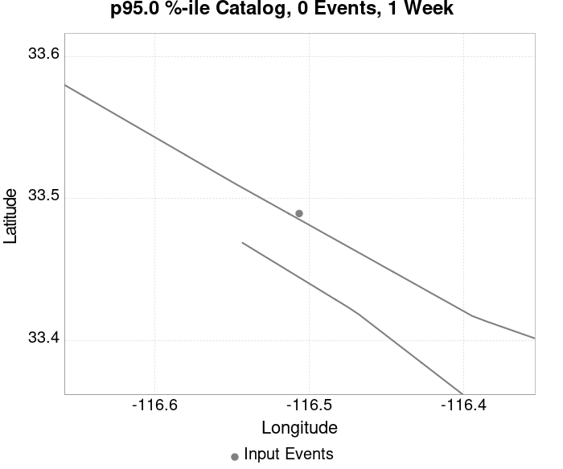 |  |  | 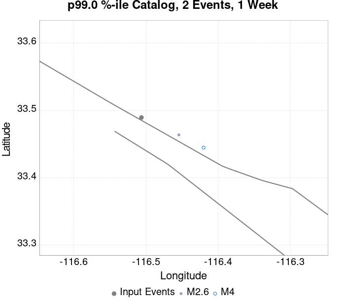 |  |  | 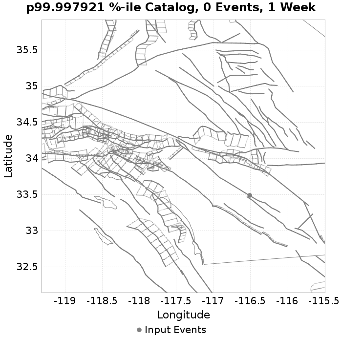 |
| **1 Month** |  |  |  |  |  |  | 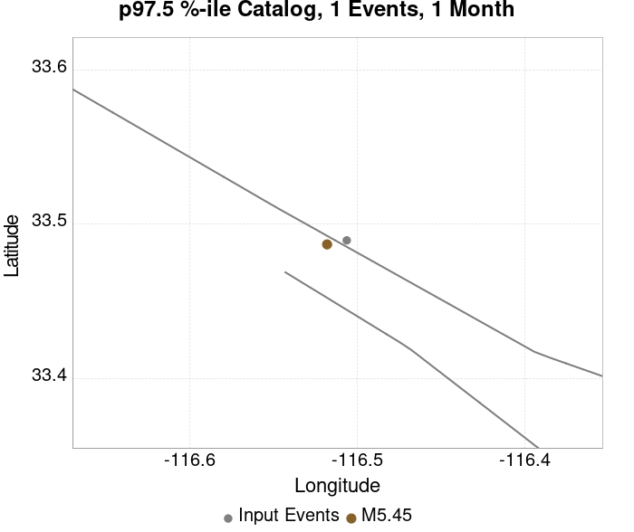 |  |  | 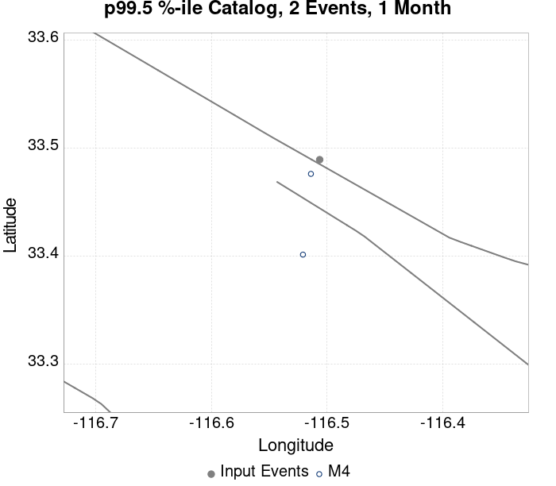 |  | 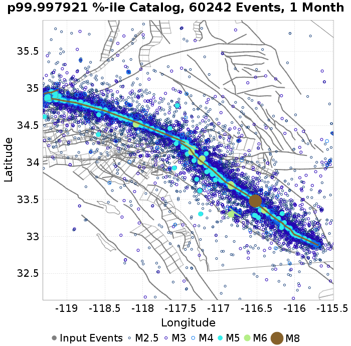 |
| **1 Year** |  |  |  |  |  |  | 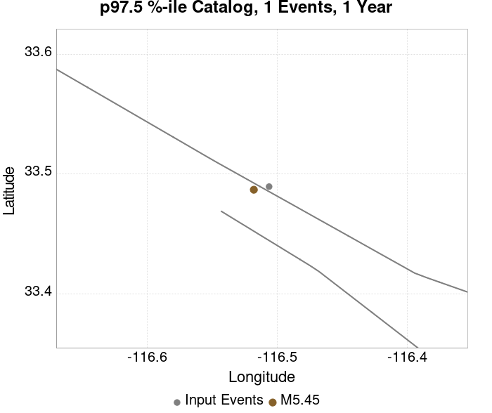 |  |  |  |  | 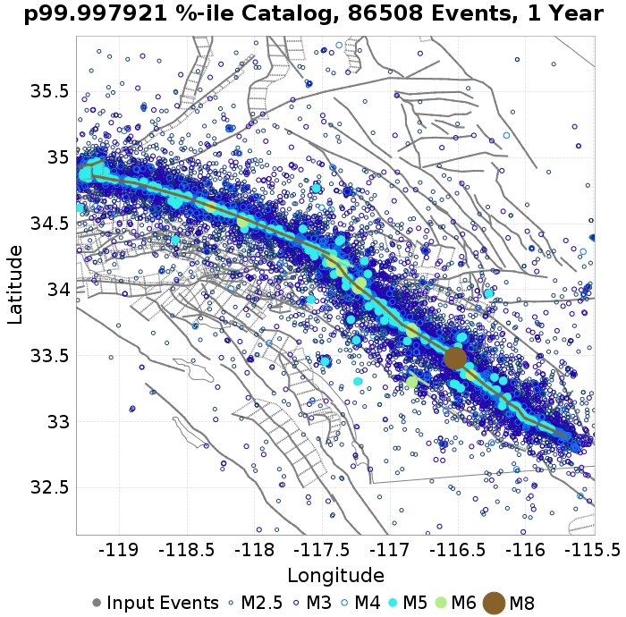 |
| **10 Year** |  |  |  |  |  |  |  |  |  |  |  |  |

## ComCat Data Comparisons
*[(top)](#table-of-contents)*

These plots compare simulated sequences with data from ComCat. All plots only consider events with hypocenters inside the ComCat region defined in the JSON input file.

Last updated at 2020/04/09 00:15:54 UTC, 4.9 days after the simulation start time.

Total matching ComCat events found: 20

### ComCat Magnitude-Number Distributions
*[(top)](#table-of-contents)*

| Incremental MND | Cumulative MND |
|-----|-----|
| 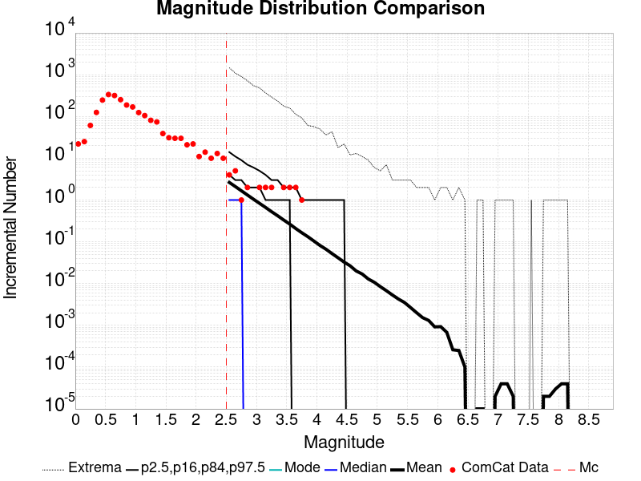 |  |

### ComCat Time-Dependent Mc
*[(top)](#table-of-contents)*

The following plots compare simulation results with ComCat data above a magnitude threshold. Plots labeled as *M&ge;Mc(t)* use the time-dependent magnitude of completeness (Mc) defined in Helmstetter et al. (2006), which is plotted below. In the case of multiple M&ge;5 ruptures, either as input to the simulation or in the comparison data, the maximum calculated time-dependent Mc is used. This time-dependent Mc function is plotted below.


### ComCat Cumulative Number Vs Time
*[(top)](#table-of-contents)*

| M&ge;Mc(t) | M&ge;2.5 | M&ge;3 | M&ge;3.5 | M&ge;4 | M&ge;4.5 | M&ge;5 |
|-----|-----|-----|-----|-----|-----|-----|
|  |  | 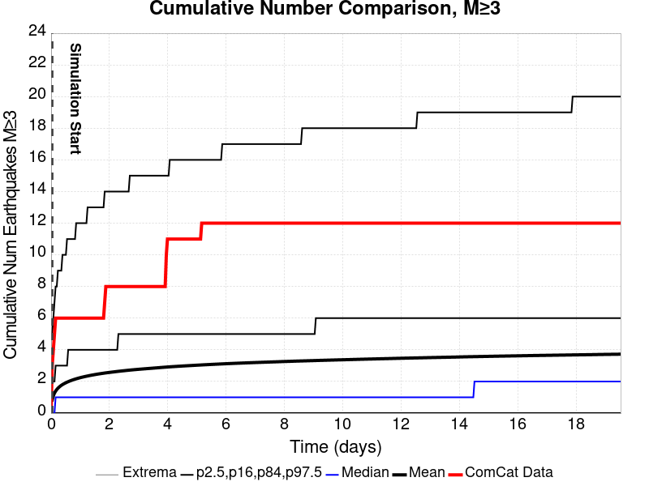 |  |  |  | 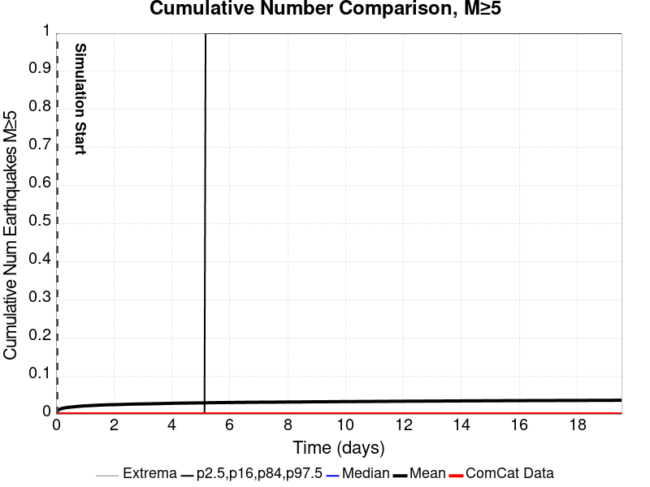 |

### ComCat Cumulative Number Simulation Percentiles
*[(top)](#table-of-contents)*


### ComCat Probability Spatial Distribution
*[(top)](#table-of-contents)*

*Note: maps labeled 'Forecast' are for a duration that extends into the future, only forecasted values are plotted (ComCat data omitted)*

|  | 1 Day | Current (4.9 Day) | Forecast: 1 Week | Forecast: 1 Month | Forecast: 1 Year |
|-----|-----|-----|-----|-----|-----|
| **M&ge;Mc(t)** |  |  |  |  |  |
|  | Prob: 85.59%, Actual: 9 | Prob: 88.77%, Actual: 20 | Prob: 89.29% | Prob: 91.03% | Prob: 92.94% |
| **M&ge;2.5** |  |  |  |  |  |
|  | Prob: 85.90%, Actual: 9 | Prob: 88.97%, Actual: 20 | Prob: 89.47% | Prob: 91.18% | Prob: 93.04% |
| **M&ge;3** |  |  |  |  |  |
|  | Prob: 62.13%, Actual: 6 | Prob: 67.63%, Actual: 11 | Prob: 68.64% | Prob: 72.04% | Prob: 76.26% |
| **M&ge;3.5** | 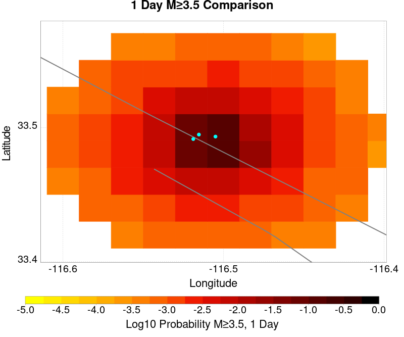 |  |  |  |  |
|  | Prob: 34.57%, Actual: 3 | Prob: 40.06%, Actual: 5 | Prob: 41.15% | Prob: 44.81% | Prob: 49.95% |
| **M&ge;4** |  |  |  |  | 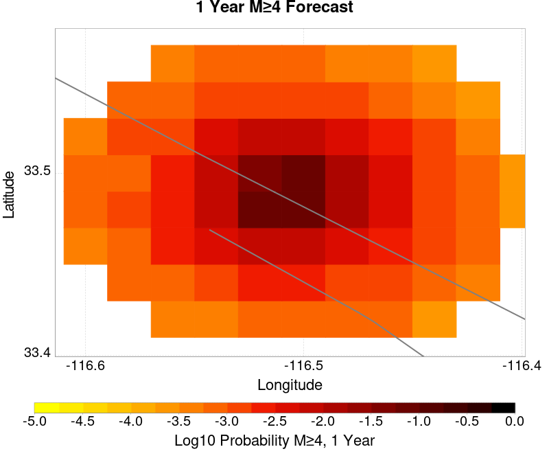 |
|  | Prob: 15.15%, Actual: 0 | Prob: 18.35%, Actual: 0 | Prob: 18.99% | Prob: 21.39% | Prob: 25.04% |
| **M&ge;4.5** |  |  |  | 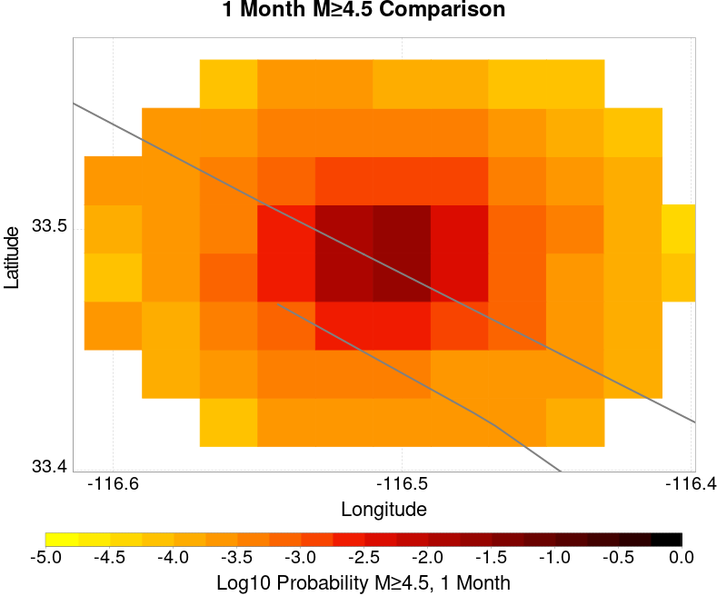 |  |
|  | Prob: 5.69%, Actual: 0 | Prob: 7.15%, Actual: 0 | Prob: 7.45% | Prob: 8.64% | Prob: 10.45% |
| **M&ge;5** |  |  |  |  |  |
|  | Prob: 1.89%, Actual: 0 | Prob: 2.42%, Actual: 0 | Prob: 2.53% | Prob: 2.98% | Prob: 3.70% |
| **M&ge;5.5** | 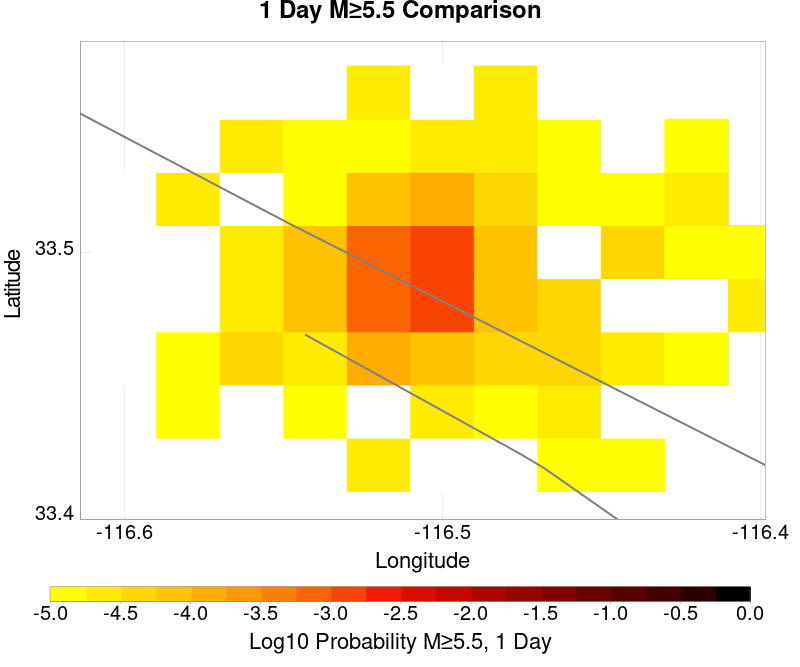 |  |  | 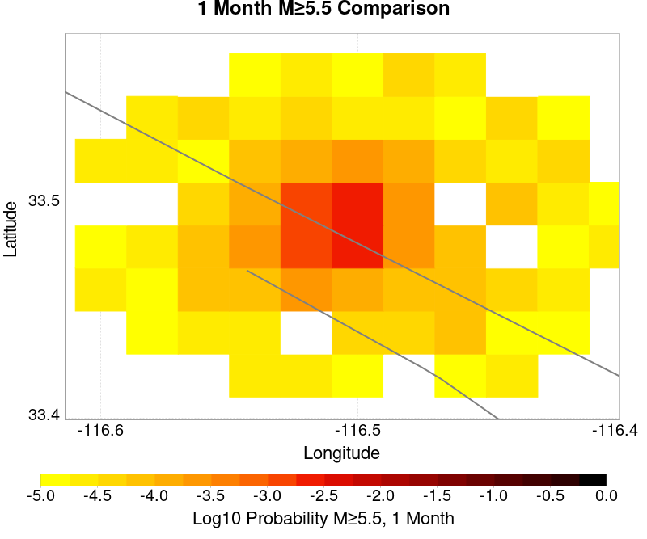 |  |
|  | Prob: 0.54%, Actual: 0 | Prob: 0.71%, Actual: 0 | Prob: 0.75% | Prob: 0.90% | Prob: 1.12% |

### ComCat Mean Expectation Spatial Distribution
*[(top)](#table-of-contents)*

*Note: maps labeled 'Forecast' are for a duration that extends into the future, only forecasted values are plotted (ComCat data omitted)*

|  | 1 Day | Current (4.9 Day) | Forecast: 1 Week | Forecast: 1 Month | Forecast: 1 Year |
|-----|-----|-----|-----|-----|-----|
| **M&ge;Mc(t)** |  |  |  |  |  |
|  | Mean: 6.880, Actual: 9 | Mean: 9.290, Actual: 20 | Mean: 9.830 | Mean: 12.170 | Mean: 16.221 |
| **M&ge;2.5** | 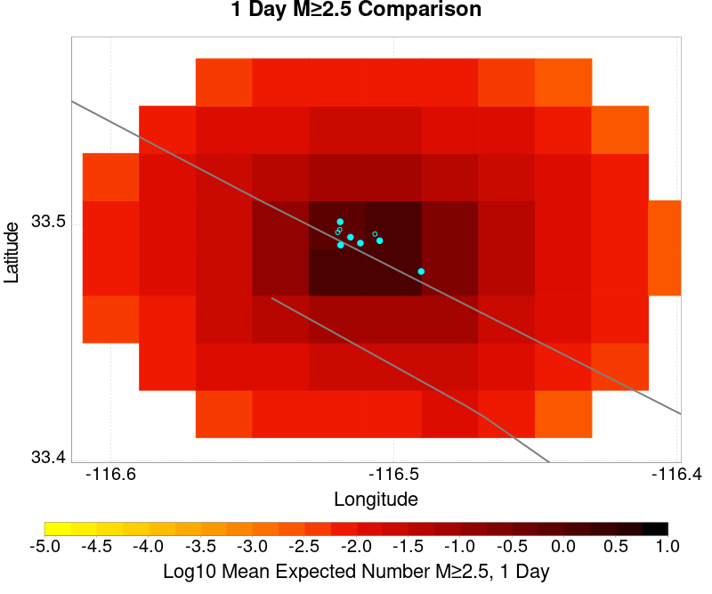 |  |  |  |  |
|  | Mean: 6.996, Actual: 9 | Mean: 9.405, Actual: 20 | Mean: 9.946 | Mean: 12.286 | Mean: 16.337 |
| **M&ge;3** |  |  |  |  |  |
|  | Mean: 2.208, Actual: 6 | Mean: 2.966, Actual: 11 | Mean: 3.138 | Mean: 3.880 | Mean: 5.165 |
| **M&ge;3.5** |  |  |  |  |  |
|  | Mean: 0.696, Actual: 3 | Mean: 0.936, Actual: 5 | Mean: 0.989 | Mean: 1.222 | Mean: 1.630 |
| **M&ge;4** |  |  | 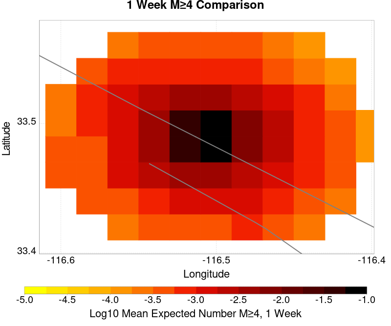 |  |  |
|  | Mean: 0.221, Actual: 0 | Mean: 0.294, Actual: 0 | Mean: 0.311 | Mean: 0.383 | Mean: 0.511 |
| **M&ge;4.5** |  |  |  |  |  |
|  | Mean: 0.070, Actual: 0 | Mean: 0.093, Actual: 0 | Mean: 0.098 | Mean: 0.121 | Mean: 0.160 |
| **M&ge;5** |  |  |  | 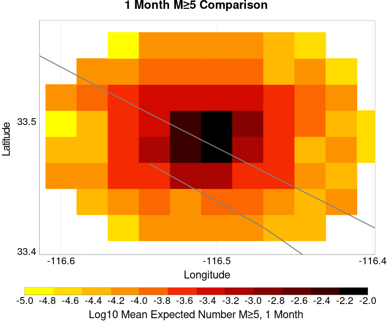 |  |
|  | Mean: 0.021, Actual: 0 | Mean: 0.028, Actual: 0 | Mean: 0.030 | Mean: 0.036 | Mean: 0.049 |
| **M&ge;5.5** |  |  | 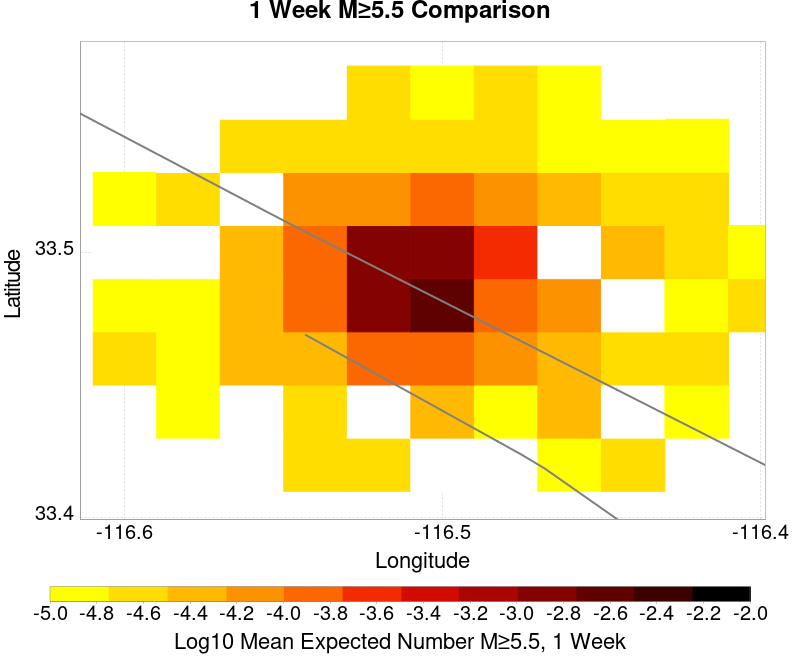 |  |  |
|  | Mean: 5.78E-3, Actual: 0 | Mean: 7.61E-3, Actual: 0 | Mean: 8.13E-3 | Mean: 0.010 | Mean: 0.013 |

### ComCat Depth Distribution
*[(top)](#table-of-contents)*

| M&ge;Mc(t) | M&ge;2.5 | M&ge;3 | M&ge;3.5 | M&ge;4 | M&ge;4.5 | M&ge;5 | M&ge;5.5 |
|-----|-----|-----|-----|-----|-----|-----|-----|
| 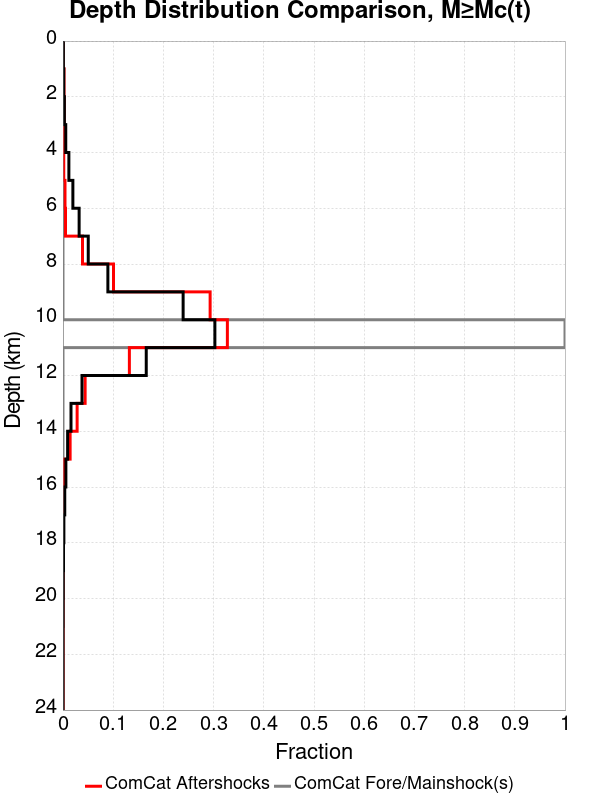 |  |  |  |  |  |  | 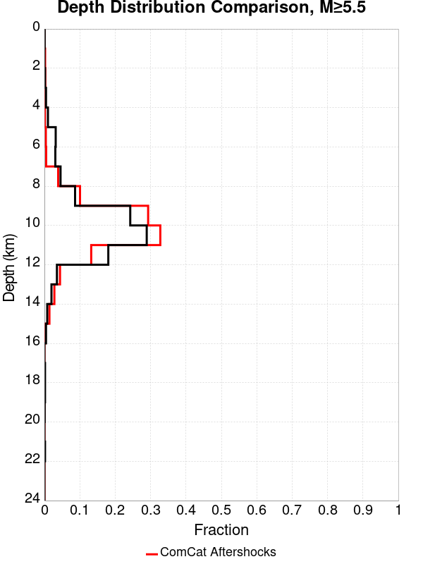 |

## Section Participation
*[(top)](#table-of-contents)*


### Supra-Seismogenic Parent Sections Table
*[(top)](#table-of-contents)*

*First 10 of 36 with matching ruptures shown*

| Parent Name | Triggered 10 Year Mean Count | Triggered 1 Day Prob | Triggered 1 Day 95% Conf | Triggered 1 Week Prob | Triggered 1 Week 95% Conf | Triggered 1 Month Prob | Triggered 1 Month 95% Conf | Triggered 1 Year Prob | Triggered 1 Year 95% Conf | Triggered 10 Year Prob | Triggered 10 Year 95% Conf | Triggered 10 Year Primary Mean Count |
|-----|-----|-----|-----|-----|-----|-----|-----|-----|-----|-----|-----|-----|
| San Jacinto (Anza) rev | 4.3659043E-4 | 1.87E-4 (0.02%) | [0.01% 0.04%] | 2.29E-4 (0.02%) | [0.01% 0.04%] | 3.33E-4 (0.03%) | [0.02% 0.06%] | 3.74E-4 (0.04%) | [0.02% 0.06%] | 4.37E-4 (0.04%) | [0.03% 0.07%] | 2.7027028E-4 |
| San Jacinto (Clark) rev | 3.3264034E-4 | 1.66E-4 (0.02%) | [0.01% 0.03%] | 2.08E-4 (0.02%) | [0.01% 0.04%] | 2.70E-4 (0.03%) | [0.02% 0.05%] | 2.91E-4 (0.03%) | [0.02% 0.05%] | 3.33E-4 (0.03%) | [0.02% 0.06%] | 1.6632017E-4 |
| San Andreas (San Bernardino N) | 2.7027028E-4 | 1.04E-4 (0.01%) | [0.00% 0.03%] | 1.46E-4 (0.01%) | [0.01% 0.03%] | 1.87E-4 (0.02%) | [0.01% 0.04%] | 1.87E-4 (0.02%) | [0.01% 0.04%] | 1.87E-4 (0.02%) | [0.01% 0.04%] | 1.4553014E-4 |
| San Jacinto (Stepovers Combined) | 1.8711018E-4 | 1.04E-4 (0.01%) | [0.00% 0.03%] | 1.25E-4 (0.01%) | [0.01% 0.03%] | 1.87E-4 (0.02%) | [0.01% 0.04%] | 1.87E-4 (0.02%) | [0.01% 0.04%] | 1.87E-4 (0.02%) | [0.01% 0.04%] | 1.6632017E-4 |
| San Andreas (Mojave S) | 1.6632017E-4 | 8.32E-5 (0.01%) | [0.00% 0.02%] | 1.04E-4 (0.01%) | [0.00% 0.03%] | 1.46E-4 (0.01%) | [0.01% 0.03%] | 1.46E-4 (0.01%) | [0.01% 0.03%] | 1.46E-4 (0.01%) | [0.01% 0.03%] | 1.4553014E-4 |
| San Jacinto (Coyote Creek) | 1.6632017E-4 | 8.32E-5 (0.01%) | [0.00% 0.02%] | 1.04E-4 (0.01%) | [0.00% 0.03%] | 1.46E-4 (0.01%) | [0.01% 0.03%] | 1.46E-4 (0.01%) | [0.01% 0.03%] | 1.66E-4 (0.02%) | [0.01% 0.03%] | 1.4553014E-4 |
| San Jacinto (San Bernardino) | 1.6632017E-4 | 1.04E-4 (0.01%) | [0.00% 0.03%] | 1.25E-4 (0.01%) | [0.01% 0.03%] | 1.66E-4 (0.02%) | [0.01% 0.03%] | 1.66E-4 (0.02%) | [0.01% 0.03%] | 1.66E-4 (0.02%) | [0.01% 0.03%] | 1.6632017E-4 |
| San Jacinto (San Jacinto Valley) rev | 1.6632017E-4 | 1.04E-4 (0.01%) | [0.00% 0.03%] | 1.25E-4 (0.01%) | [0.01% 0.03%] | 1.66E-4 (0.02%) | [0.01% 0.03%] | 1.66E-4 (0.02%) | [0.01% 0.03%] | 1.66E-4 (0.02%) | [0.01% 0.03%] | 1.6632017E-4 |
| San Andreas (Mojave N) | 1.4553014E-4 | 8.32E-5 (0.01%) | [0.00% 0.02%] | 1.04E-4 (0.01%) | [0.00% 0.03%] | 1.46E-4 (0.01%) | [0.01% 0.03%] | 1.46E-4 (0.01%) | [0.01% 0.03%] | 1.46E-4 (0.01%) | [0.01% 0.03%] | 1.2474012E-4 |
| San Jacinto (Borrego) | 1.2474012E-4 | 6.24E-5 (0.01%) | [0.00% 0.02%] | 8.32E-5 (0.01%) | [0.00% 0.02%] | 1.25E-4 (0.01%) | [0.01% 0.03%] | 1.25E-4 (0.01%) | [0.01% 0.03%] | 1.25E-4 (0.01%) | [0.01% 0.03%] | 1.2474012E-4 |

### M≥6.5 Parent Sections Table
*[(top)](#table-of-contents)*

*First 10 of 30 with matching ruptures shown*

| Parent Name | Triggered 10 Year Mean Count | Triggered 1 Day Prob | Triggered 1 Day 95% Conf | Triggered 1 Week Prob | Triggered 1 Week 95% Conf | Triggered 1 Month Prob | Triggered 1 Month 95% Conf | Triggered 1 Year Prob | Triggered 1 Year 95% Conf | Triggered 10 Year Prob | Triggered 10 Year 95% Conf | Triggered 10 Year Primary Mean Count |
|-----|-----|-----|-----|-----|-----|-----|-----|-----|-----|-----|-----|-----|
| San Jacinto (Anza) rev | 3.7422037E-4 | 1.87E-4 (0.02%) | [0.01% 0.04%] | 2.29E-4 (0.02%) | [0.01% 0.04%] | 3.12E-4 (0.03%) | [0.02% 0.05%] | 3.33E-4 (0.03%) | [0.02% 0.06%] | 3.74E-4 (0.04%) | [0.02% 0.06%] | 2.2869023E-4 |
| San Jacinto (Clark) rev | 2.4948025E-4 | 1.25E-4 (0.01%) | [0.01% 0.03%] | 1.66E-4 (0.02%) | [0.01% 0.03%] | 2.08E-4 (0.02%) | [0.01% 0.04%] | 2.29E-4 (0.02%) | [0.01% 0.04%] | 2.49E-4 (0.02%) | [0.01% 0.04%] | 1.0395011E-4 |
| San Andreas (San Bernardino N) | 2.2869023E-4 | 1.04E-4 (0.01%) | [0.00% 0.03%] | 1.46E-4 (0.01%) | [0.01% 0.03%] | 1.87E-4 (0.02%) | [0.01% 0.04%] | 1.87E-4 (0.02%) | [0.01% 0.04%] | 1.87E-4 (0.02%) | [0.01% 0.04%] | 1.4553014E-4 |
| San Jacinto (Stepovers Combined) | 1.8711018E-4 | 1.04E-4 (0.01%) | [0.00% 0.03%] | 1.25E-4 (0.01%) | [0.01% 0.03%] | 1.87E-4 (0.02%) | [0.01% 0.04%] | 1.87E-4 (0.02%) | [0.01% 0.04%] | 1.87E-4 (0.02%) | [0.01% 0.04%] | 1.6632017E-4 |
| San Andreas (Mojave S) | 1.6632017E-4 | 8.32E-5 (0.01%) | [0.00% 0.02%] | 1.04E-4 (0.01%) | [0.00% 0.03%] | 1.46E-4 (0.01%) | [0.01% 0.03%] | 1.46E-4 (0.01%) | [0.01% 0.03%] | 1.46E-4 (0.01%) | [0.01% 0.03%] | 1.4553014E-4 |
| San Jacinto (Coyote Creek) | 1.6632017E-4 | 8.32E-5 (0.01%) | [0.00% 0.02%] | 1.04E-4 (0.01%) | [0.00% 0.03%] | 1.46E-4 (0.01%) | [0.01% 0.03%] | 1.46E-4 (0.01%) | [0.01% 0.03%] | 1.66E-4 (0.02%) | [0.01% 0.03%] | 1.4553014E-4 |
| San Jacinto (San Bernardino) | 1.6632017E-4 | 1.04E-4 (0.01%) | [0.00% 0.03%] | 1.25E-4 (0.01%) | [0.01% 0.03%] | 1.66E-4 (0.02%) | [0.01% 0.03%] | 1.66E-4 (0.02%) | [0.01% 0.03%] | 1.66E-4 (0.02%) | [0.01% 0.03%] | 1.6632017E-4 |
| San Jacinto (San Jacinto Valley) rev | 1.6632017E-4 | 1.04E-4 (0.01%) | [0.00% 0.03%] | 1.25E-4 (0.01%) | [0.01% 0.03%] | 1.66E-4 (0.02%) | [0.01% 0.03%] | 1.66E-4 (0.02%) | [0.01% 0.03%] | 1.66E-4 (0.02%) | [0.01% 0.03%] | 1.6632017E-4 |
| San Andreas (Mojave N) | 1.4553014E-4 | 8.32E-5 (0.01%) | [0.00% 0.02%] | 1.04E-4 (0.01%) | [0.00% 0.03%] | 1.46E-4 (0.01%) | [0.01% 0.03%] | 1.46E-4 (0.01%) | [0.01% 0.03%] | 1.46E-4 (0.01%) | [0.01% 0.03%] | 1.2474012E-4 |
| San Jacinto (Borrego) | 1.2474012E-4 | 6.24E-5 (0.01%) | [0.00% 0.02%] | 8.32E-5 (0.01%) | [0.00% 0.02%] | 1.25E-4 (0.01%) | [0.01% 0.03%] | 1.25E-4 (0.01%) | [0.01% 0.03%] | 1.25E-4 (0.01%) | [0.01% 0.03%] | 1.2474012E-4 |

### M≥7 Parent Sections Table
*[(top)](#table-of-contents)*

*First 10 of 28 with matching ruptures shown*

| Parent Name | Triggered 10 Year Mean Count | Triggered 1 Day Prob | Triggered 1 Day 95% Conf | Triggered 1 Week Prob | Triggered 1 Week 95% Conf | Triggered 1 Month Prob | Triggered 1 Month 95% Conf | Triggered 1 Year Prob | Triggered 1 Year 95% Conf | Triggered 10 Year Prob | Triggered 10 Year 95% Conf | Triggered 10 Year Primary Mean Count |
|-----|-----|-----|-----|-----|-----|-----|-----|-----|-----|-----|-----|-----|
| San Jacinto (Anza) rev | 3.3264034E-4 | 1.87E-4 (0.02%) | [0.01% 0.04%] | 2.08E-4 (0.02%) | [0.01% 0.04%] | 2.91E-4 (0.03%) | [0.02% 0.05%] | 3.12E-4 (0.03%) | [0.02% 0.05%] | 3.33E-4 (0.03%) | [0.02% 0.06%] | 2.0790022E-4 |
| San Jacinto (Stepovers Combined) | 1.8711018E-4 | 1.04E-4 (0.01%) | [0.00% 0.03%] | 1.25E-4 (0.01%) | [0.01% 0.03%] | 1.87E-4 (0.02%) | [0.01% 0.04%] | 1.87E-4 (0.02%) | [0.01% 0.04%] | 1.87E-4 (0.02%) | [0.01% 0.04%] | 1.6632017E-4 |
| San Andreas (Mojave S) | 1.6632017E-4 | 8.32E-5 (0.01%) | [0.00% 0.02%] | 1.04E-4 (0.01%) | [0.00% 0.03%] | 1.46E-4 (0.01%) | [0.01% 0.03%] | 1.46E-4 (0.01%) | [0.01% 0.03%] | 1.46E-4 (0.01%) | [0.01% 0.03%] | 1.4553014E-4 |
| San Andreas (San Bernardino N) | 1.6632017E-4 | 8.32E-5 (0.01%) | [0.00% 0.02%] | 1.04E-4 (0.01%) | [0.00% 0.03%] | 1.46E-4 (0.01%) | [0.01% 0.03%] | 1.46E-4 (0.01%) | [0.01% 0.03%] | 1.46E-4 (0.01%) | [0.01% 0.03%] | 1.4553014E-4 |
| San Jacinto (Clark) rev | 1.6632017E-4 | 1.04E-4 (0.01%) | [0.00% 0.03%] | 1.04E-4 (0.01%) | [0.00% 0.03%] | 1.46E-4 (0.01%) | [0.01% 0.03%] | 1.66E-4 (0.02%) | [0.01% 0.03%] | 1.66E-4 (0.02%) | [0.01% 0.03%] | 6.237006E-5 |
| San Jacinto (Coyote Creek) | 1.6632017E-4 | 8.32E-5 (0.01%) | [0.00% 0.02%] | 1.04E-4 (0.01%) | [0.00% 0.03%] | 1.46E-4 (0.01%) | [0.01% 0.03%] | 1.46E-4 (0.01%) | [0.01% 0.03%] | 1.66E-4 (0.02%) | [0.01% 0.03%] | 1.4553014E-4 |
| San Jacinto (San Bernardino) | 1.6632017E-4 | 1.04E-4 (0.01%) | [0.00% 0.03%] | 1.25E-4 (0.01%) | [0.01% 0.03%] | 1.66E-4 (0.02%) | [0.01% 0.03%] | 1.66E-4 (0.02%) | [0.01% 0.03%] | 1.66E-4 (0.02%) | [0.01% 0.03%] | 1.6632017E-4 |
| San Jacinto (San Jacinto Valley) rev | 1.6632017E-4 | 1.04E-4 (0.01%) | [0.00% 0.03%] | 1.25E-4 (0.01%) | [0.01% 0.03%] | 1.66E-4 (0.02%) | [0.01% 0.03%] | 1.66E-4 (0.02%) | [0.01% 0.03%] | 1.66E-4 (0.02%) | [0.01% 0.03%] | 1.6632017E-4 |
| San Andreas (Mojave N) | 1.4553014E-4 | 8.32E-5 (0.01%) | [0.00% 0.02%] | 1.04E-4 (0.01%) | [0.00% 0.03%] | 1.46E-4 (0.01%) | [0.01% 0.03%] | 1.46E-4 (0.01%) | [0.01% 0.03%] | 1.46E-4 (0.01%) | [0.01% 0.03%] | 1.2474012E-4 |
| San Jacinto (Borrego) | 1.2474012E-4 | 6.24E-5 (0.01%) | [0.00% 0.02%] | 8.32E-5 (0.01%) | [0.00% 0.02%] | 1.25E-4 (0.01%) | [0.01% 0.03%] | 1.25E-4 (0.01%) | [0.01% 0.03%] | 1.25E-4 (0.01%) | [0.01% 0.03%] | 1.2474012E-4 |

### M≥7.5 Parent Sections Table
*[(top)](#table-of-contents)*

*First 10 of 23 with matching ruptures shown*

| Parent Name | Triggered 10 Year Mean Count | Triggered 1 Day Prob | Triggered 1 Day 95% Conf | Triggered 1 Week Prob | Triggered 1 Week 95% Conf | Triggered 1 Month Prob | Triggered 1 Month 95% Conf | Triggered 1 Year Prob | Triggered 1 Year 95% Conf | Triggered 10 Year Prob | Triggered 10 Year 95% Conf | Triggered 10 Year Primary Mean Count |
|-----|-----|-----|-----|-----|-----|-----|-----|-----|-----|-----|-----|-----|
| San Andreas (Mojave S) | 1.6632017E-4 | 8.32E-5 (0.01%) | [0.00% 0.02%] | 1.04E-4 (0.01%) | [0.00% 0.03%] | 1.46E-4 (0.01%) | [0.01% 0.03%] | 1.46E-4 (0.01%) | [0.01% 0.03%] | 1.46E-4 (0.01%) | [0.01% 0.03%] | 1.4553014E-4 |
| San Andreas (San Bernardino N) | 1.6632017E-4 | 8.32E-5 (0.01%) | [0.00% 0.02%] | 1.04E-4 (0.01%) | [0.00% 0.03%] | 1.46E-4 (0.01%) | [0.01% 0.03%] | 1.46E-4 (0.01%) | [0.01% 0.03%] | 1.46E-4 (0.01%) | [0.01% 0.03%] | 1.4553014E-4 |
| San Jacinto (Anza) rev | 1.6632017E-4 | 1.04E-4 (0.01%) | [0.00% 0.03%] | 1.25E-4 (0.01%) | [0.01% 0.03%] | 1.66E-4 (0.02%) | [0.01% 0.03%] | 1.66E-4 (0.02%) | [0.01% 0.03%] | 1.66E-4 (0.02%) | [0.01% 0.03%] | 1.6632017E-4 |
| San Jacinto (San Bernardino) | 1.6632017E-4 | 1.04E-4 (0.01%) | [0.00% 0.03%] | 1.25E-4 (0.01%) | [0.01% 0.03%] | 1.66E-4 (0.02%) | [0.01% 0.03%] | 1.66E-4 (0.02%) | [0.01% 0.03%] | 1.66E-4 (0.02%) | [0.01% 0.03%] | 1.6632017E-4 |
| San Jacinto (San Jacinto Valley) rev | 1.6632017E-4 | 1.04E-4 (0.01%) | [0.00% 0.03%] | 1.25E-4 (0.01%) | [0.01% 0.03%] | 1.66E-4 (0.02%) | [0.01% 0.03%] | 1.66E-4 (0.02%) | [0.01% 0.03%] | 1.66E-4 (0.02%) | [0.01% 0.03%] | 1.6632017E-4 |
| San Jacinto (Stepovers Combined) | 1.6632017E-4 | 1.04E-4 (0.01%) | [0.00% 0.03%] | 1.25E-4 (0.01%) | [0.01% 0.03%] | 1.66E-4 (0.02%) | [0.01% 0.03%] | 1.66E-4 (0.02%) | [0.01% 0.03%] | 1.66E-4 (0.02%) | [0.01% 0.03%] | 1.6632017E-4 |
| San Andreas (Mojave N) | 1.4553014E-4 | 8.32E-5 (0.01%) | [0.00% 0.02%] | 1.04E-4 (0.01%) | [0.00% 0.03%] | 1.46E-4 (0.01%) | [0.01% 0.03%] | 1.46E-4 (0.01%) | [0.01% 0.03%] | 1.46E-4 (0.01%) | [0.01% 0.03%] | 1.2474012E-4 |
| San Jacinto (Coyote Creek) | 1.4553014E-4 | 8.32E-5 (0.01%) | [0.00% 0.02%] | 1.04E-4 (0.01%) | [0.00% 0.03%] | 1.46E-4 (0.01%) | [0.01% 0.03%] | 1.46E-4 (0.01%) | [0.01% 0.03%] | 1.46E-4 (0.01%) | [0.01% 0.03%] | 1.4553014E-4 |
| San Jacinto (Borrego) | 1.2474012E-4 | 6.24E-5 (0.01%) | [0.00% 0.02%] | 8.32E-5 (0.01%) | [0.00% 0.02%] | 1.25E-4 (0.01%) | [0.01% 0.03%] | 1.25E-4 (0.01%) | [0.01% 0.03%] | 1.25E-4 (0.01%) | [0.01% 0.03%] | 1.2474012E-4 |
| San Andreas (Big Bend) | 1.0395011E-4 | 4.16E-5 (0.00%) | [0.00% 0.02%] | 6.24E-5 (0.01%) | [0.00% 0.02%] | 1.04E-4 (0.01%) | [0.00% 0.03%] | 1.04E-4 (0.01%) | [0.00% 0.03%] | 1.04E-4 (0.01%) | [0.00% 0.03%] | 8.3160085E-5 |

### M≥8 Parent Sections Table
*[(top)](#table-of-contents)*

*First 10 of 20 with matching ruptures shown*

| Parent Name | Triggered 10 Year Mean Count | Triggered 1 Day Prob | Triggered 1 Day 95% Conf | Triggered 1 Week Prob | Triggered 1 Week 95% Conf | Triggered 1 Month Prob | Triggered 1 Month 95% Conf | Triggered 1 Year Prob | Triggered 1 Year 95% Conf | Triggered 10 Year Prob | Triggered 10 Year 95% Conf | Triggered 10 Year Primary Mean Count |
|-----|-----|-----|-----|-----|-----|-----|-----|-----|-----|-----|-----|-----|
| San Andreas (Big Bend) | 8.3160085E-5 | 4.16E-5 (0.00%) | [0.00% 0.02%] | 6.24E-5 (0.01%) | [0.00% 0.02%] | 8.32E-5 (0.01%) | [0.00% 0.02%] | 8.32E-5 (0.01%) | [0.00% 0.02%] | 8.32E-5 (0.01%) | [0.00% 0.02%] | 8.3160085E-5 |
| San Andreas (Mojave N) | 8.3160085E-5 | 4.16E-5 (0.00%) | [0.00% 0.02%] | 6.24E-5 (0.01%) | [0.00% 0.02%] | 8.32E-5 (0.01%) | [0.00% 0.02%] | 8.32E-5 (0.01%) | [0.00% 0.02%] | 8.32E-5 (0.01%) | [0.00% 0.02%] | 8.3160085E-5 |
| San Andreas (Mojave S) | 8.3160085E-5 | 4.16E-5 (0.00%) | [0.00% 0.02%] | 6.24E-5 (0.01%) | [0.00% 0.02%] | 8.32E-5 (0.01%) | [0.00% 0.02%] | 8.32E-5 (0.01%) | [0.00% 0.02%] | 8.32E-5 (0.01%) | [0.00% 0.02%] | 8.3160085E-5 |
| San Andreas (San Bernardino N) | 8.3160085E-5 | 4.16E-5 (0.00%) | [0.00% 0.02%] | 6.24E-5 (0.01%) | [0.00% 0.02%] | 8.32E-5 (0.01%) | [0.00% 0.02%] | 8.32E-5 (0.01%) | [0.00% 0.02%] | 8.32E-5 (0.01%) | [0.00% 0.02%] | 8.3160085E-5 |
| San Jacinto (Anza) rev | 8.3160085E-5 | 4.16E-5 (0.00%) | [0.00% 0.02%] | 6.24E-5 (0.01%) | [0.00% 0.02%] | 8.32E-5 (0.01%) | [0.00% 0.02%] | 8.32E-5 (0.01%) | [0.00% 0.02%] | 8.32E-5 (0.01%) | [0.00% 0.02%] | 8.3160085E-5 |
| San Jacinto (San Bernardino) | 8.3160085E-5 | 4.16E-5 (0.00%) | [0.00% 0.02%] | 6.24E-5 (0.01%) | [0.00% 0.02%] | 8.32E-5 (0.01%) | [0.00% 0.02%] | 8.32E-5 (0.01%) | [0.00% 0.02%] | 8.32E-5 (0.01%) | [0.00% 0.02%] | 8.3160085E-5 |
| San Jacinto (San Jacinto Valley) rev | 8.3160085E-5 | 4.16E-5 (0.00%) | [0.00% 0.02%] | 6.24E-5 (0.01%) | [0.00% 0.02%] | 8.32E-5 (0.01%) | [0.00% 0.02%] | 8.32E-5 (0.01%) | [0.00% 0.02%] | 8.32E-5 (0.01%) | [0.00% 0.02%] | 8.3160085E-5 |
| San Jacinto (Stepovers Combined) | 8.3160085E-5 | 4.16E-5 (0.00%) | [0.00% 0.02%] | 6.24E-5 (0.01%) | [0.00% 0.02%] | 8.32E-5 (0.01%) | [0.00% 0.02%] | 8.32E-5 (0.01%) | [0.00% 0.02%] | 8.32E-5 (0.01%) | [0.00% 0.02%] | 8.3160085E-5 |
| San Andreas (Carrizo) rev | 6.237006E-5 | 4.16E-5 (0.00%) | [0.00% 0.02%] | 6.24E-5 (0.01%) | [0.00% 0.02%] | 6.24E-5 (0.01%) | [0.00% 0.02%] | 6.24E-5 (0.01%) | [0.00% 0.02%] | 6.24E-5 (0.01%) | [0.00% 0.02%] | 6.237006E-5 |
| San Andreas (Cholame) rev | 6.237006E-5 | 4.16E-5 (0.00%) | [0.00% 0.02%] | 6.24E-5 (0.01%) | [0.00% 0.02%] | 6.24E-5 (0.01%) | [0.00% 0.02%] | 6.24E-5 (0.01%) | [0.00% 0.02%] | 6.24E-5 (0.01%) | [0.00% 0.02%] | 6.237006E-5 |

## Fault Magnitude-Probability Distributions
*[(top)](#table-of-contents)*

The first 5 sections (sorted by trigger rate) are plotted below. All fault MPDs are available [here](plots/parent_sect_mpds/README.md)

| 1 Week | 1 Month | 1 Year | 10 Year |
|-----|-----|-----|-----|
|  |  |  | 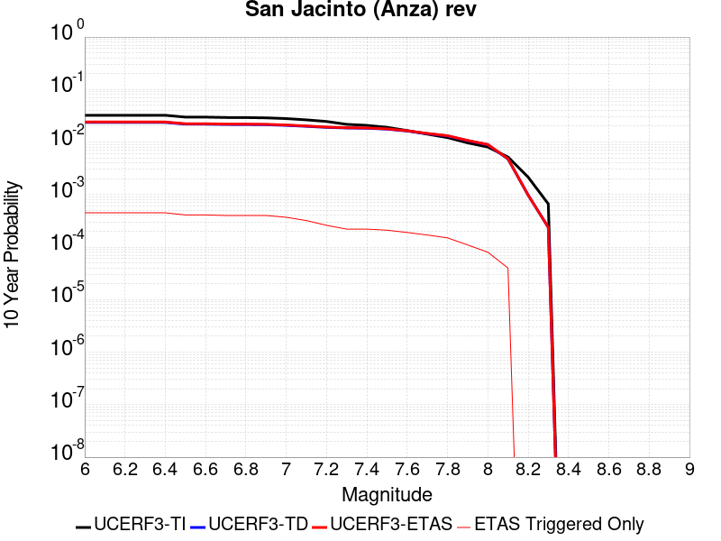 |
|  |  |  |  |
|  |  |  |  |
|  |  |  |  |
|  |  |  |  |


## JSON Input File
*[(top)](#table-of-contents)*

```
{
  "numSimulations": 100000,
  "duration": 10.0,
  "startTimeMillis": 1585965199920,
  "includeSpontaneous": false,
  "randomSeed": 1586368110344,
  "binaryOutput": true,
  "binaryOutputFilters": [
    {
      "prefix": "results_complete",
      "descendantsOnly": false
    },
    {
      "prefix": "results_m5_preserve_chain",
      "minMag": 5.0,
      "preserveChainBelowMag": true,
      "descendantsOnly": false
    }
  ],
  "forceRecalc": false,
  "simulationName": "ComCat M4.87 (ci39126079), Point Source, kCOV\u003d1.5",
  "numRetries": 3,
  "outputDir": "${ETAS_SIM_DIR}/2020_04_08-ComCatM4p87_ci39126079_PointSource_kCOV1p5",
  "treatTriggerCatalogAsSpontaneous": false,
  "triggerRuptures": [
    {
      "occurrenceTimeMillis": 1585965198920,
      "comcatEventID": "ci39126079",
      "mag": 4.87,
      "latitude": 33.4895,
      "longitude": -116.50633330000001,
      "depth": 10.45
    }
  ],
  "cacheDir": "${ETAS_LAUNCHER}/inputs/cache_fm3p1_ba",
  "fssFile": "${ETAS_LAUNCHER}/inputs/2013_05_10-ucerf3p3-production-10runs_COMPOUND_SOL_FM3_1_SpatSeisU3_MEAN_BRANCH_AVG_SOL.zip",
  "probModel": "FULL_TD",
  "applySubSeisForSupraNucl": true,
  "totRateScaleFactor": 1.14,
  "gridSeisCorr": true,
  "timeIndependentERF": false,
  "griddedOnly": false,
  "imposeGR": false,
  "includeIndirectTriggering": true,
  "gridSeisDiscr": 0.1,
  "catalogCompletenessModel": "RELAXED",
  "etas_k_cov": 1.5,
  "configCommand": "u3etas_comcat_event_config_builder.sh --event-id ci39126079 --radius 10 --mag-complete 2.5 --num-simulations 100000 --days-before 7 --etas-k-cov 1.5 --finite-surf-shakemap --finite-surf-shakemap-min-mag 4.5 --hpc-site USC_HPC --nodes 32 --hours 24",
  "configTime": 1586368110344,
  "comcatMetadata": {
    "region": {
      "centerLatitude": 33.4895,
      "centerLongitude": -116.50633330000001,
      "radius": 10.0
    },
    "eventID": "ci39126079",
    "minDepth": -10.0,
    "maxDepth": 24.0,
    "minMag": 2.5,
    "startTime": 1585360398920,
    "endTime": 1585965198920,
    "magComplete": 2.5
  }
}
```

