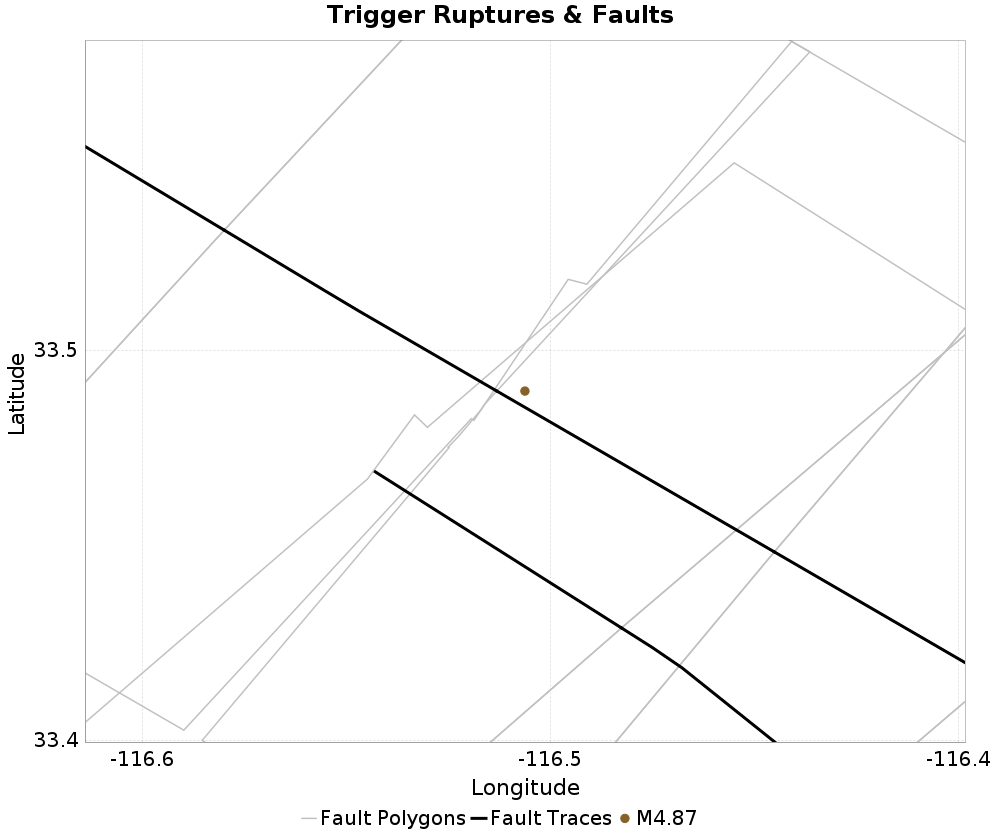
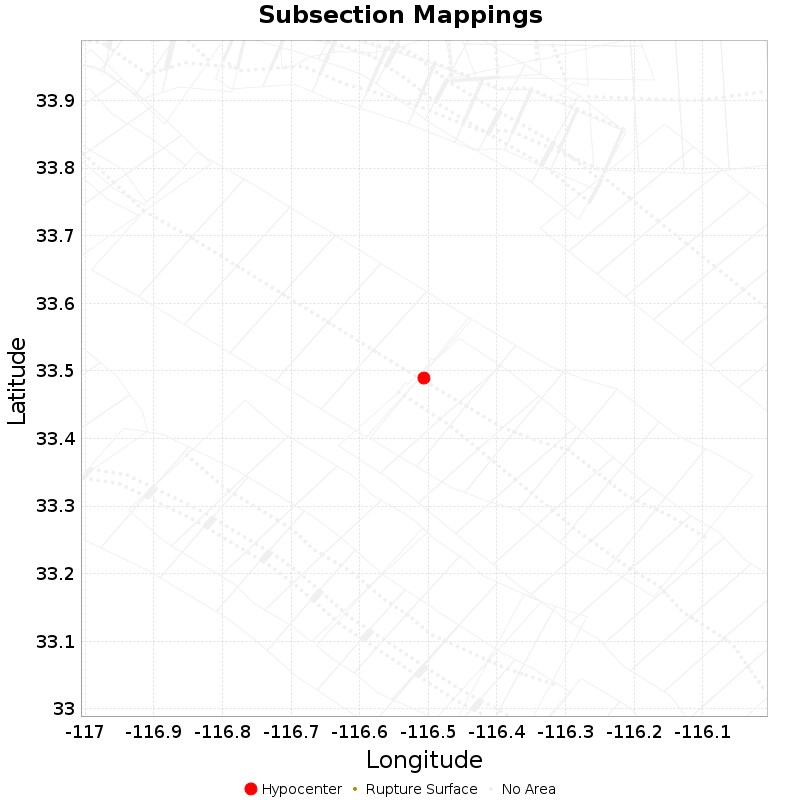

# ETAS Configuration for ComCat M4.87 (ci39126079), Point Source, kCOV=1.5

|   | ComCat M4.87 (ci39126079), Point Source, kCOV=1.5 |
|-----|-----|
| Num Simulations | 100000 |
| Start Time | 2020/04/04 01:53:19 UTC |
| Start Time Epoch Milliseconds | 1585965199920 |
| Duration | 10 Years |
| Includes Spontaneous? | false |
| Trigger Ruptures | *(none)* |
| Config Generated With | u3etas_comcat_event_config_builder.sh --event-id ci39126079 --radius 10 --mag-complete 2.5 --num-simulations 100000 --days-before 7 --etas-k-cov 1.5 --finite-surf-shakemap --finite-surf-shakemap-min-mag 4.5 --hpc-site USC_HPC --nodes 32 --hours 24 |

## Table Of Contents

* [Trigger Rupture Fault Map](#trigger-rupture-fault-map)
* [Fault Distances To Triggers](#fault-distances-to-triggers)
* [ci39126079 Possible Finite Rupture Subsection Mappings](#ci39126079-possible-finite-rupture-subsection-mappings)
* [JSON Input File](#json-input-file)

## Trigger Rupture Fault Map
*[(top)](#table-of-contents)*



## Fault Distances To Triggers
*[(top)](#table-of-contents)*

| Section Name | Strike, Dip, Rake | Hypocenter In Polygon? | Surface In Polygon? | Minimum Distance (km) | Minimum Poly Distance (km) |
|-----|-----|-----|-----|-----|-----|
| San Jacinto (Clark) rev | 124, 90, 180 | true | true | 0.721 | 0.000 |
| San Jacinto (Coyote Creek) | 133, 90, 180 | true | true | 3.961 | 0.000 |
| San Jacinto (Anza) rev | 126, 90, 180 | false | false | 0.771 | 0.516 |

## ci39126079 Possible Finite Rupture Subsection Mappings
*[(top)](#table-of-contents)*

This gives any possible finite rupture surface subsection mappings. In the plot below, potentially suggested subsections are outlined in green, and all subsections for which any of this rupture is within the fault polygon are in gray. Suggested sections are those for which the area of the input rupture within the polygon is at least 50.0 % of the sub section area

Overlapping polygons are removed according to the mean distance of the actual subsection surface, with the polygons of closer sections masking out the polygons of further sections

As this is a point source, there will be no matches, but sections within 25km will be listed



| Section Index | Section Name | Suggested Match? | Section Area | Sect Distance To Rup | Hypocenter in Polygon? |
|-----|-----|-----|-----|-----|-----|
| 2155 | San Jacinto (Anza) rev, Subsection 2 | no | 125.44 | mean=27.81 [23.31 32.85] [km] | no |
| 2156 | San Jacinto (Anza) rev, Subsection 3 | no | 125.44 | mean=20.31 [15.62 25.62] [km] | no |
| 2157 | San Jacinto (Anza) rev, Subsection 4 | no | 125.44 | mean=13.03 [7.93 18.77] [km] | no |
| 2158 | San Jacinto (Anza) rev, Subsection 5 | no | 125.44 | mean=6.72 [0.44 12.91] [km] | no |
| 2165 | San Jacinto (Clark) rev, Subsection 0 | no | 118.01 | mean=5.98 [0.65 11.53] [km] | *yes* |
| 2166 | San Jacinto (Clark) rev, Subsection 1 | no | 118.01 | mean=12.25 [7.29 17.58] [km] | no |
| 2167 | San Jacinto (Clark) rev, Subsection 2 | no | 118.01 | mean=19.56 [15.05 24.49] [km] | no |
| 2168 | San Jacinto (Clark) rev, Subsection 3 | no | 118.01 | mean=27.03 [22.68 31.78] [km] | no |
| 2171 | San Jacinto (Coyote Creek), Subsection 0 | no | 113.67 | mean=7.14 [3.95 12.56] [km] | *yes* |
| 2172 | San Jacinto (Coyote Creek), Subsection 1 | no | 113.67 | mean=11.64 [7.11 17.2] [km] | no |
| 2173 | San Jacinto (Coyote Creek), Subsection 2 | no | 113.67 | mean=18.08 [13.81 23.18] [km] | no |
| 2174 | San Jacinto (Coyote Creek), Subsection 3 | no | 113.67 | mean=24.92 [20.84 29.68] [km] | no |

## JSON Input File
*[(top)](#table-of-contents)*

```
{
  "numSimulations": 100000,
  "duration": 10.0,
  "startTimeMillis": 1585965199920,
  "includeSpontaneous": false,
  "randomSeed": 1586368110344,
  "binaryOutput": true,
  "binaryOutputFilters": [
    {
      "prefix": "results_complete",
      "descendantsOnly": false
    },
    {
      "prefix": "results_m5_preserve_chain",
      "minMag": 5.0,
      "preserveChainBelowMag": true,
      "descendantsOnly": false
    }
  ],
  "forceRecalc": false,
  "simulationName": "ComCat M4.87 (ci39126079), Point Source, kCOV\u003d1.5",
  "numRetries": 3,
  "outputDir": "${ETAS_SIM_DIR}/2020_04_08-ComCatM4p87_ci39126079_PointSource_kCOV1p5",
  "treatTriggerCatalogAsSpontaneous": false,
  "triggerRuptures": [
    {
      "occurrenceTimeMillis": 1585965198920,
      "comcatEventID": "ci39126079",
      "mag": 4.87,
      "latitude": 33.4895,
      "longitude": -116.50633330000001,
      "depth": 10.45
    }
  ],
  "cacheDir": "${ETAS_LAUNCHER}/inputs/cache_fm3p1_ba",
  "fssFile": "${ETAS_LAUNCHER}/inputs/2013_05_10-ucerf3p3-production-10runs_COMPOUND_SOL_FM3_1_SpatSeisU3_MEAN_BRANCH_AVG_SOL.zip",
  "probModel": "FULL_TD",
  "applySubSeisForSupraNucl": true,
  "totRateScaleFactor": 1.14,
  "gridSeisCorr": true,
  "timeIndependentERF": false,
  "griddedOnly": false,
  "imposeGR": false,
  "includeIndirectTriggering": true,
  "gridSeisDiscr": 0.1,
  "catalogCompletenessModel": "RELAXED",
  "etas_k_cov": 1.5,
  "configCommand": "u3etas_comcat_event_config_builder.sh --event-id ci39126079 --radius 10 --mag-complete 2.5 --num-simulations 100000 --days-before 7 --etas-k-cov 1.5 --finite-surf-shakemap --finite-surf-shakemap-min-mag 4.5 --hpc-site USC_HPC --nodes 32 --hours 24",
  "configTime": 1586368110344,
  "comcatMetadata": {
    "region": {
      "centerLatitude": 33.4895,
      "centerLongitude": -116.50633330000001,
      "radius": 10.0
    },
    "eventID": "ci39126079",
    "minDepth": -10.0,
    "maxDepth": 24.0,
    "minMag": 2.5,
    "startTime": 1585360398920,
    "endTime": 1585965198920,
    "magComplete": 2.5
  }
}
```

