# Parent Section Magnitude-Probability Distributions

Only fault sections with at least one triggered aftershock are plotted. Sections are sorted by total supraseismogenic trigger rate (decreasing)

## Table Of Contents

* [San Jacinto (Anza) rev](#san-jacinto-anza-rev)
* [San Jacinto (Clark) rev](#san-jacinto-clark-rev)
* [San Andreas (San Bernardino N)](#san-andreas-san-bernardino-n)
* [San Jacinto (Stepovers Combined)](#san-jacinto-stepovers-combined)
* [San Jacinto (Coyote Creek)](#san-jacinto-coyote-creek)
* [San Jacinto (San Jacinto Valley) rev](#san-jacinto-san-jacinto-valley-rev)
* [San Jacinto (San Bernardino)](#san-jacinto-san-bernardino)
* [San Andreas (Mojave S)](#san-andreas-mojave-s)
* [San Andreas (Mojave N)](#san-andreas-mojave-n)
* [San Jacinto (Borrego)](#san-jacinto-borrego)
* [San Andreas (Coachella) rev](#san-andreas-coachella-rev)
* [San Jacinto (Superstition Mtn)](#san-jacinto-superstition-mtn)
* [San Andreas (Big Bend)](#san-andreas-big-bend)
* [Brawley (Seismic Zone) alt 1](#brawley-seismic-zone-alt-1)
* [San Andreas (San Gorgonio Pass-Garnet HIll)](#san-andreas-san-gorgonio-pass-garnet-hill)
* [San Andreas (Cholame) rev](#san-andreas-cholame-rev)
* [San Andreas (Carrizo) rev](#san-andreas-carrizo-rev)
* [Elsinore (Glen Ivy) rev](#elsinore-glen-ivy-rev)
* [Imperial](#imperial)
* [San Jacinto (Lytle Creek connector)](#san-jacinto-lytle-creek-connector)
* [San Andreas (Parkfield)](#san-andreas-parkfield)
* [San Andreas (San Bernardino S)](#san-andreas-san-bernardino-s)
* [Superstition Hills](#superstition-hills)
* [Earthquake Valley (No  Extension)](#earthquake-valley-no--extension)
* [Pleito](#pleito)
* [San Andreas (Creeping Section) 2011 CFM](#san-andreas-creeping-section-2011-cfm)
* [Rose Canyon](#rose-canyon)
* [Cleghorn](#cleghorn)
* [Blue Cut](#blue-cut)
* [Mission Ridge-Arroyo Parida-Santa Ana](#mission-ridge-arroyo-parida-santa-ana)
* [Earthquake Valley](#earthquake-valley)
* [San Andreas (Santa Cruz Mts) 2011 CFM](#san-andreas-santa-cruz-mts-2011-cfm)
* [Hollywood](#hollywood)
* [Garlock (West)](#garlock-west)
* [North Frontal  (West)](#north-frontal--west)
* [Cady](#cady)
* [Earthquake Valley (So Extension)](#earthquake-valley-so-extension)
* [Cerro Prieto](#cerro-prieto)
* [Elysian Park (Upper)](#elysian-park-upper)
* [Red Mountain](#red-mountain)
* [San Andreas (Peninsula) 2011 CFM](#san-andreas-peninsula-2011-cfm)
* [Ventura-Pitas Point](#ventura-pitas-point)
* [Cucamonga](#cucamonga)
* [Pisgah-Bullion Mtn-Mesquite Lk](#pisgah-bullion-mtn-mesquite-lk)
* [Death Valley (So)](#death-valley-so)
* [Sierra Madre](#sierra-madre)
* [Coronado Bank alt1](#coronado-bank-alt1)
* [Garlock (East)](#garlock-east)
* [San Juan](#san-juan)
* [Elsinore (Coyote Mountains)](#elsinore-coyote-mountains)
* [San Gorgonio Pass](#san-gorgonio-pass)
* [Elsinore (Temecula) rev](#elsinore-temecula-rev)
* [Raymond](#raymond)

## San Jacinto (Anza) rev
*[(top)](#table-of-contents)*

| 1 Week | 1 Month | 1 Year | 10 Year |
|-----|-----|-----|-----|
|  |  |  |  |

| Magnitude | 1 wk TI Prob | 1 wk TD Prob | 1 wk ETAS Prob | 1 wk ETAS/TD Gain | 1 wk ETAS Triggered Only | 1 mo TI Prob | 1 mo TD Prob | 1 mo ETAS Prob | 1 mo ETAS/TD Gain | 1 mo ETAS Triggered Only | 1 yr TI Prob | 1 yr TD Prob | 1 yr ETAS Prob | 1 yr ETAS/TD Gain | 1 yr ETAS Triggered Only | 10 yr TI Prob | 10 yr TD Prob | 10 yr ETAS Prob | 10 yr ETAS/TD Gain | 10 yr ETAS Triggered Only |
|-----|-----|-----|-----|-----|-----|-----|-----|-----|-----|-----|-----|-----|-----|-----|-----|-----|-----|-----|-----|-----|
| 6.0 | 6.3015636E-5 | 4.4012224E-5 | 2.6400253E-4 | 5.9983916 | 2.2E-4 | 2.7003905E-4 | 1.8861024E-4 | 5.085499E-4 | 2.6963005 | 3.2E-4 | 0.0032827691 | 0.0022939236 | 0.0026730518 | 1.1652751 | 3.8E-4 | 0.032346968 | 0.02366162 | 0.024100974 | 1.0185682 | 4.5E-4 |
| 6.1 | 6.3015636E-5 | 4.4012224E-5 | 2.6400253E-4 | 5.9983916 | 2.2E-4 | 2.7003905E-4 | 1.8861024E-4 | 5.085499E-4 | 2.6963005 | 3.2E-4 | 0.0032827691 | 0.0022939236 | 0.0026730518 | 1.1652751 | 3.8E-4 | 0.032346968 | 0.02366162 | 0.024100974 | 1.0185682 | 4.5E-4 |
| 6.2 | 6.3015636E-5 | 4.4012224E-5 | 2.6400253E-4 | 5.9983916 | 2.2E-4 | 2.7003905E-4 | 1.8861024E-4 | 5.085499E-4 | 2.6963005 | 3.2E-4 | 0.0032827691 | 0.0022939236 | 0.0026730518 | 1.1652751 | 3.8E-4 | 0.032346968 | 0.02366162 | 0.024100974 | 1.0185682 | 4.5E-4 |
| 6.3 | 6.3015636E-5 | 4.4012224E-5 | 2.6400253E-4 | 5.9983916 | 2.2E-4 | 2.7003905E-4 | 1.8861024E-4 | 5.085499E-4 | 2.6963005 | 3.2E-4 | 0.0032827691 | 0.0022939236 | 0.0026730518 | 1.1652751 | 3.8E-4 | 0.032346968 | 0.02366162 | 0.024100974 | 1.0185682 | 4.5E-4 |
| 6.4 | 6.3015636E-5 | 4.4012224E-5 | 2.6400253E-4 | 5.9983916 | 2.2E-4 | 2.7003905E-4 | 1.8861024E-4 | 5.085499E-4 | 2.6963005 | 3.2E-4 | 0.0032827691 | 0.0022939236 | 0.0026730518 | 1.1652751 | 3.8E-4 | 0.032346968 | 0.02366162 | 0.024100974 | 1.0185682 | 4.5E-4 |
| 6.5 | 5.811017E-5 | 4.075744E-5 | 2.5074888E-4 | 6.152223 | 2.1E-4 | 2.4901982E-4 | 1.7466309E-4 | 4.746107E-4 | 2.7172925 | 3.0E-4 | 0.0030276014 | 0.0021244548 | 0.0024737113 | 1.1643982 | 3.5E-4 | 0.02986684 | 0.021944052 | 0.022345055 | 1.0182738 | 4.1E-4 |
| 6.6 | 5.811017E-5 | 4.075744E-5 | 2.5074888E-4 | 6.152223 | 2.1E-4 | 2.4901982E-4 | 1.7466309E-4 | 4.746107E-4 | 2.7172925 | 3.0E-4 | 0.0030276014 | 0.0021244548 | 0.0024737113 | 1.1643982 | 3.5E-4 | 0.02986684 | 0.021944052 | 0.022345055 | 1.0182738 | 4.1E-4 |
| 6.7 | 5.712442E-5 | 4.0173334E-5 | 2.5016489E-4 | 6.227138 | 2.1E-4 | 2.4479596E-4 | 1.721601E-4 | 4.7210846E-4 | 2.742264 | 3.0E-4 | 0.0029763177 | 0.0020940397 | 0.0024333277 | 1.1620256 | 3.4E-4 | 0.029367693 | 0.021632643 | 0.02202399 | 1.0180906 | 4.0E-4 |
| 6.8 | 5.6967532E-5 | 4.0028506E-5 | 2.500201E-4 | 6.2460513 | 2.1E-4 | 2.4412372E-4 | 1.7153949E-4 | 4.7148802E-4 | 2.7485685 | 3.0E-4 | 0.0029681553 | 0.0020864983 | 0.002425789 | 1.1626124 | 3.4E-4 | 0.029288229 | 0.021556264 | 0.02194764 | 1.018156 | 4.0E-4 |
| 6.9 | 5.6211324E-5 | 3.9728853E-5 | 2.497205E-4 | 6.2856207 | 2.1E-4 | 2.4088343E-4 | 1.7025543E-4 | 4.7020437E-4 | 2.7617583 | 3.0E-4 | 0.0029288116 | 0.002070895 | 0.0024101906 | 1.1638403 | 3.4E-4 | 0.028905109 | 0.021393368 | 0.02178481 | 1.0182974 | 4.0E-4 |
| 7.0 | 5.4383527E-5 | 3.857445E-5 | 2.3856673E-4 | 6.1845794 | 2.0E-4 | 2.3305144E-4 | 1.6530862E-4 | 4.5526068E-4 | 2.7540045 | 2.9E-4 | 0.0028337094 | 0.0020107795 | 0.002340116 | 1.1637855 | 3.3E-4 | 0.027978465 | 0.020779364 | 0.021141674 | 1.0174361 | 3.7E-4 |
| 7.1 | 5.1393665E-5 | 3.701462E-5 | 2.0700833E-4 | 5.5926104 | 1.7E-4 | 2.2023996E-4 | 1.5862445E-4 | 3.985864E-4 | 2.5127676 | 2.4E-4 | 0.0026781242 | 0.0019295464 | 0.002209006 | 1.1448318 | 2.8E-4 | 0.026460782 | 0.019940337 | 0.020253956 | 1.0157279 | 3.2E-4 |
| 7.2 | 4.785222E-5 | 3.5343168E-5 | 1.7533822E-4 | 4.9610214 | 1.4E-4 | 2.0506482E-4 | 1.5146195E-4 | 3.5143166E-4 | 2.3202636 | 2.0E-4 | 0.0024938055 | 0.0018424931 | 0.0020620879 | 1.1191834 | 2.2E-4 | 0.024660049 | 0.01904172 | 0.01929677 | 1.0133942 | 2.6E-4 |
| 7.3 | 4.2143256E-5 | 3.442131E-5 | 1.6441684E-4 | 4.7766 | 1.3E-4 | 1.8060145E-4 | 1.4751159E-4 | 3.174865E-4 | 2.152282 | 1.7E-4 | 0.002196605 | 0.0017944776 | 0.0019841366 | 1.1056904 | 1.9E-4 | 0.02175019 | 0.01854146 | 0.01875738 | 1.0116453 | 2.2E-4 |
| 7.4 | 4.0264713E-5 | 3.4054156E-5 | 1.6404972E-4 | 4.817319 | 1.3E-4 | 1.7255165E-4 | 1.4593823E-4 | 3.1591344E-4 | 2.1647065 | 1.7E-4 | 0.002098792 | 0.0017753534 | 0.0019650161 | 1.106831 | 1.9E-4 | 0.020790804 | 0.01834325 | 0.018559214 | 1.0117735 | 2.2E-4 |
| 7.5 | 3.694492E-5 | 3.2754397E-5 | 1.5275046E-4 | 4.6635103 | 1.2E-4 | 1.5832575E-4 | 1.4036844E-4 | 3.00346E-4 | 2.1396973 | 1.6E-4 | 0.0019259118 | 0.0017076494 | 0.0018873421 | 1.1052281 | 1.8E-4 | 0.01909306 | 0.017652586 | 0.01785888 | 1.0116863 | 2.1E-4 |
| 7.6 | 3.200565E-5 | 3.00425E-5 | 1.4003919E-4 | 4.66137 | 1.1E-4 | 1.3715986E-4 | 1.2874723E-4 | 2.787279E-4 | 2.1649237 | 1.5E-4 | 0.001668642 | 0.0015663727 | 0.0017261221 | 1.1019868 | 1.6E-4 | 0.01656168 | 0.016226653 | 0.01641357 | 1.0115191 | 1.9E-4 |
| 7.7 | 2.731642E-5 | 2.661642E-5 | 1.366135E-4 | 5.132677 | 1.1E-4 | 1.1706512E-4 | 1.1406539E-4 | 2.6404829E-4 | 2.3148851 | 1.5E-4 | 0.001424336 | 0.0013878625 | 0.0015376543 | 1.1079298 | 1.5E-4 | 0.014152412 | 0.014440214 | 0.014607759 | 1.0116026 | 1.7E-4 |
| 7.8 | 2.3466424E-5 | 2.4005945E-5 | 1.2400355E-4 | 5.1655345 | 1.0E-4 | 1.0056651E-4 | 1.0287857E-4 | 2.328652E-4 | 2.2634957 | 1.3E-4 | 0.0012237094 | 0.0012518278 | 0.001381665 | 1.1037182 | 1.3E-4 | 0.012169928 | 0.013070661 | 0.0132187 | 1.0113261 | 1.5E-4 |
| 7.9 | 1.8611925E-5 | 1.935421E-5 | 1.0935247E-4 | 5.650061 | 9.0E-5 | 7.9762955E-5 | 8.294398E-5 | 1.9293485E-4 | 2.3260863 | 1.1E-4 | 9.7068126E-4 | 0.0010093759 | 0.0011192649 | 1.1088682 | 1.1E-4 | 0.0096645225 | 0.010627878 | 0.0107367085 | 1.0102402 | 1.1E-4 |
| 8.0 | 1.5460775E-5 | 1.6136648E-5 | 8.613552E-5 | 5.3378816 | 7.0E-5 | 6.6258784E-5 | 6.9155234E-5 | 1.491497E-4 | 2.1567378 | 8.0E-5 | 8.0640207E-4 | 8.4164046E-4 | 9.2157314E-4 | 1.0949725 | 8.0E-5 | 0.008034821 | 0.008911137 | 0.008990424 | 1.0088975 | 8.0E-5 |
| 8.1 | 9.983884E-6 | 8.503049E-6 | 4.850271E-5 | 5.704155 | 4.0E-5 | 4.2787375E-5 | 3.644113E-5 | 7.6439675E-5 | 2.0976207 | 4.0E-5 | 5.2081177E-4 | 4.4358103E-4 | 4.835633E-4 | 1.0901352 | 4.0E-5 | 0.0051959283 | 0.0047649597 | 0.004804769 | 1.0083547 | 4.0E-5 |
| 8.2 | 4.1226E-6 | 1.6203016E-6 | 1.6203016E-6 | 1.0 | 0.0 | 1.7668166E-5 | 6.944131E-6 | 6.944131E-6 | 1.0 | 0.0 | 2.1508869E-4 | 8.454155E-5 | 8.454155E-5 | 1.0 | 0.0 | 0.0021488064 | 9.789203E-4 | 9.789203E-4 | 1.0 | 0.0 |
| 8.3 | 1.2750878E-6 | 3.7928442E-7 | 3.7928442E-7 | 1.0 | 0.0 | 5.4646503E-6 | 1.6255036E-6 | 1.6255036E-6 | 1.0 | 0.0 | 6.653009E-5 | 1.9790332E-5 | 1.9790332E-5 | 1.0 | 0.0 | 6.6510175E-4 | 2.379671E-4 | 2.379671E-4 | 1.0 | 0.0 |

## San Jacinto (Clark) rev
*[(top)](#table-of-contents)*

| 1 Week | 1 Month | 1 Year | 10 Year |
|-----|-----|-----|-----|
|  |  |  |  |

| Magnitude | 1 wk TI Prob | 1 wk TD Prob | 1 wk ETAS Prob | 1 wk ETAS/TD Gain | 1 wk ETAS Triggered Only | 1 mo TI Prob | 1 mo TD Prob | 1 mo ETAS Prob | 1 mo ETAS/TD Gain | 1 mo ETAS Triggered Only | 1 yr TI Prob | 1 yr TD Prob | 1 yr ETAS Prob | 1 yr ETAS/TD Gain | 1 yr ETAS Triggered Only | 10 yr TI Prob | 10 yr TD Prob | 10 yr ETAS Prob | 10 yr ETAS/TD Gain | 10 yr ETAS Triggered Only |
|-----|-----|-----|-----|-----|-----|-----|-----|-----|-----|-----|-----|-----|-----|-----|-----|-----|-----|-----|-----|-----|
| 6.0 | 4.482615E-5 | 2.149583E-5 | 1.8149239E-4 | 8.443144 | 1.6E-4 | 1.9209793E-4 | 9.2121794E-5 | 3.1210153E-4 | 3.3879228 | 2.2E-4 | 0.0023362834 | 0.0011210152 | 0.0013607461 | 1.2138517 | 2.4E-4 | 0.02311874 | 0.011682168 | 0.011988547 | 1.0262262 | 3.1E-4 |
| 6.1 | 4.482615E-5 | 2.149583E-5 | 1.8149239E-4 | 8.443144 | 1.6E-4 | 1.9209793E-4 | 9.2121794E-5 | 3.1210153E-4 | 3.3879228 | 2.2E-4 | 0.0023362834 | 0.0011210152 | 0.0013607461 | 1.2138517 | 2.4E-4 | 0.02311874 | 0.011682168 | 0.011988547 | 1.0262262 | 3.1E-4 |
| 6.2 | 4.482615E-5 | 2.149583E-5 | 1.8149239E-4 | 8.443144 | 1.6E-4 | 1.9209793E-4 | 9.2121794E-5 | 3.1210153E-4 | 3.3879228 | 2.2E-4 | 0.0023362834 | 0.0011210152 | 0.0013607461 | 1.2138517 | 2.4E-4 | 0.02311874 | 0.011682168 | 0.011988547 | 1.0262262 | 3.1E-4 |
| 6.3 | 4.482615E-5 | 2.149583E-5 | 1.8149239E-4 | 8.443144 | 1.6E-4 | 1.9209793E-4 | 9.2121794E-5 | 3.1210153E-4 | 3.3879228 | 2.2E-4 | 0.0023362834 | 0.0011210152 | 0.0013607461 | 1.2138517 | 2.4E-4 | 0.02311874 | 0.011682168 | 0.011988547 | 1.0262262 | 3.1E-4 |
| 6.4 | 4.482615E-5 | 2.149583E-5 | 1.8149239E-4 | 8.443144 | 1.6E-4 | 1.9209793E-4 | 9.2121794E-5 | 3.1210153E-4 | 3.3879228 | 2.2E-4 | 0.0023362834 | 0.0011210152 | 0.0013607461 | 1.2138517 | 2.4E-4 | 0.02311874 | 0.011682168 | 0.011988547 | 1.0262262 | 3.1E-4 |
| 6.5 | 3.7294863E-5 | 1.7663233E-5 | 1.3766112E-4 | 7.7936535 | 1.2E-4 | 1.5982533E-4 | 7.56974E-5 | 2.4568452E-4 | 3.2456138 | 1.7E-4 | 0.0019441366 | 9.2123076E-4 | 0.0011110557 | 1.2060559 | 1.9E-4 | 0.01927216 | 0.009648823 | 0.009886508 | 1.0246335 | 2.4E-4 |
| 6.6 | 3.7294863E-5 | 1.7663233E-5 | 1.3766112E-4 | 7.7936535 | 1.2E-4 | 1.5982533E-4 | 7.56974E-5 | 2.4568452E-4 | 3.2456138 | 1.7E-4 | 0.0019441366 | 9.2123076E-4 | 0.0011110557 | 1.2060559 | 1.9E-4 | 0.01927216 | 0.009648823 | 0.009886508 | 1.0246335 | 2.4E-4 |
| 6.7 | 3.6039248E-5 | 1.6904516E-5 | 1.2690265E-4 | 7.5070267 | 1.1E-4 | 1.5444479E-4 | 7.244594E-5 | 2.3243435E-4 | 3.2083833 | 1.6E-4 | 0.0018787434 | 8.816767E-4 | 0.001061518 | 1.2039765 | 1.8E-4 | 0.01862939 | 0.009247725 | 0.009475598 | 1.024641 | 2.3E-4 |
| 6.8 | 3.5031844E-5 | 1.6527734E-5 | 1.16526084E-4 | 7.0503364 | 1.0E-4 | 1.5012783E-4 | 7.0831244E-5 | 2.2082063E-4 | 3.1175594 | 1.5E-4 | 0.0018262739 | 8.6203346E-4 | 0.0010318869 | 1.1970382 | 1.7E-4 | 0.01811338 | 0.009045837 | 0.009263847 | 1.0241005 | 2.2E-4 |
| 6.9 | 3.435112E-5 | 1.6355121E-5 | 1.1635348E-4 | 7.1141925 | 1.0E-4 | 1.4721078E-4 | 7.009152E-5 | 2.2008101E-4 | 3.1399093 | 1.5E-4 | 0.0017908178 | 8.530343E-4 | 0.0010228893 | 1.1991186 | 1.7E-4 | 0.017764548 | 0.008953502 | 0.0091715325 | 1.0243514 | 2.2E-4 |
| 7.0 | 2.8959772E-5 | 1.459947E-5 | 9.4598305E-5 | 6.479571 | 8.0E-5 | 1.241074E-4 | 6.256767E-5 | 1.9255954E-4 | 3.0776203 | 1.3E-4 | 0.0015099603 | 7.6149806E-4 | 9.1138383E-4 | 1.1968302 | 1.5E-4 | 0.014997416 | 0.008010134 | 0.008188692 | 1.0222915 | 1.8E-4 |
| 7.1 | 2.6002877E-5 | 1.3069119E-5 | 6.3068466E-5 | 4.8257627 | 5.0E-5 | 1.11436144E-4 | 5.6009318E-5 | 1.3600483E-4 | 2.428254 | 8.0E-5 | 0.0013558907 | 6.817023E-4 | 7.8163407E-4 | 1.1465917 | 1.0E-4 | 0.013476475 | 0.007175722 | 0.007304789 | 1.0179867 | 1.3E-4 |
| 7.2 | 2.2544838E-5 | 1.1479721E-5 | 3.1479492E-5 | 2.7421825 | 2.0E-5 | 9.661716E-5 | 4.9197886E-5 | 8.919592E-5 | 1.8130031 | 4.0E-5 | 0.001175679 | 5.9882115E-4 | 6.387972E-4 | 1.0667579 | 4.0E-5 | 0.011694785 | 0.0063084844 | 0.0063780425 | 1.0110261 | 7.0E-5 |
| 7.3 | 1.75334E-5 | 1.1014846E-5 | 3.1014624E-5 | 2.8157113 | 2.0E-5 | 7.514098E-5 | 4.7205634E-5 | 6.720469E-5 | 1.4236583 | 2.0E-5 | 9.144575E-4 | 5.745785E-4 | 5.94567E-4 | 1.0347881 | 2.0E-5 | 0.009107036 | 0.0060420227 | 0.0060917204 | 1.0082253 | 5.0E-5 |
| 7.4 | 1.5924552E-5 | 1.0810164E-5 | 3.0809948E-5 | 2.8500907 | 2.0E-5 | 6.82463E-5 | 4.632846E-5 | 6.6327535E-5 | 1.4316801 | 2.0E-5 | 8.305819E-4 | 5.639044E-4 | 5.8389315E-4 | 1.035447 | 2.0E-5 | 0.008274844 | 0.005926856 | 0.0059765596 | 1.0083861 | 5.0E-5 |
| 7.5 | 1.3428931E-5 | 1.0040226E-5 | 2.0040126E-5 | 1.9959835 | 1.0E-5 | 5.7551293E-5 | 4.302884E-5 | 5.302841E-5 | 1.2323923 | 1.0E-5 | 7.004617E-4 | 5.2375125E-4 | 5.3374603E-4 | 1.019083 | 1.0E-5 | 0.006982579 | 0.0055068806 | 0.00554666 | 1.0072236 | 4.0E-5 |
| 7.6 | 1.0688787E-5 | 8.787555E-6 | 1.8787467E-5 | 2.137963 | 1.0E-5 | 4.5808283E-5 | 3.7660408E-5 | 4.7660033E-5 | 1.2655208 | 1.0E-5 | 5.5757316E-4 | 4.584195E-4 | 4.6841492E-4 | 1.0218041 | 1.0E-5 | 0.005561762 | 0.004833719 | 0.004873526 | 1.0082352 | 4.0E-5 |
| 7.7 | 8.81236E-6 | 7.634947E-6 | 1.7634871E-5 | 2.3097568 | 1.0E-5 | 3.776671E-5 | 3.2720793E-5 | 4.2720465E-5 | 1.305606 | 1.0E-5 | 4.597127E-4 | 3.9830306E-4 | 4.0829906E-4 | 1.0250965 | 1.0E-5 | 0.0045876284 | 0.004223741 | 0.0042536147 | 1.0070727 | 3.0E-5 |
| 7.8 | 7.780431E-6 | 6.8541876E-6 | 1.685412E-5 | 2.4589522 | 1.0E-5 | 3.3344273E-5 | 2.937476E-5 | 3.9374467E-5 | 1.3404183 | 1.0E-5 | 4.0589093E-4 | 3.575792E-4 | 3.6757562E-4 | 1.0279559 | 1.0E-5 | 0.0040515037 | 0.0038070125 | 0.0038368981 | 1.0078502 | 3.0E-5 |
| 7.9 | 6.5437994E-6 | 5.9273216E-6 | 1.5927262E-5 | 2.6870925 | 1.0E-5 | 2.8044553E-5 | 2.540256E-5 | 3.5402307E-5 | 1.3936511 | 1.0E-5 | 3.4138895E-4 | 3.0923245E-4 | 3.1922935E-4 | 1.0323281 | 1.0E-5 | 0.0034086495 | 0.0033131074 | 0.0033230742 | 1.0030084 | 1.0E-5 |
| 8.0 | 5.4488164E-6 | 4.943602E-6 | 1.4943553E-5 | 3.0228064 | 1.0E-5 | 2.3351862E-5 | 2.1186695E-5 | 3.1186482E-5 | 1.4719844 | 1.0E-5 | 2.8427184E-4 | 2.5791762E-4 | 2.6791505E-4 | 1.0387621 | 1.0E-5 | 0.0028390845 | 0.0027807665 | 0.0027907386 | 1.0035862 | 1.0E-5 |
| 8.1 | 2.8397242E-6 | 1.4188071E-6 | 1.4188071E-6 | 1.0 | 0.0 | 1.217019E-5 | 6.080588E-6 | 6.080588E-6 | 1.0 | 0.0 | 1.4816198E-4 | 7.4028656E-5 | 7.4028656E-5 | 1.0 | 0.0 | 0.0014806325 | 8.4064476E-4 | 8.4064476E-4 | 1.0 | 0.0 |
| 8.2 | 2.030244E-6 | 6.6173953E-7 | 6.6173953E-7 | 1.0 | 0.0 | 8.701017E-6 | 2.8360234E-6 | 2.8360234E-6 | 1.0 | 0.0 | 1.05929736E-4 | 3.4528042E-5 | 3.4528042E-5 | 1.0 | 0.0 | 0.0010587925 | 4.1223396E-4 | 4.1223396E-4 | 1.0 | 0.0 |
| 8.3 | 1.0659804E-6 | 3.070894E-7 | 3.070894E-7 | 1.0 | 0.0 | 4.568479E-6 | 1.3160968E-6 | 1.3160968E-6 | 1.0 | 0.0 | 5.5619817E-5 | 1.6023365E-5 | 1.6023365E-5 | 1.0 | 0.0 | 5.5605895E-4 | 1.9428149E-4 | 1.9428149E-4 | 1.0 | 0.0 |

## San Andreas (San Bernardino N)
*[(top)](#table-of-contents)*

| 1 Week | 1 Month | 1 Year | 10 Year |
|-----|-----|-----|-----|
|  |  |  |  |

| Magnitude | 1 wk TI Prob | 1 wk TD Prob | 1 wk ETAS Prob | 1 wk ETAS/TD Gain | 1 wk ETAS Triggered Only | 1 mo TI Prob | 1 mo TD Prob | 1 mo ETAS Prob | 1 mo ETAS/TD Gain | 1 mo ETAS Triggered Only | 1 yr TI Prob | 1 yr TD Prob | 1 yr ETAS Prob | 1 yr ETAS/TD Gain | 1 yr ETAS Triggered Only | 10 yr TI Prob | 10 yr TD Prob | 10 yr ETAS Prob | 10 yr ETAS/TD Gain | 10 yr ETAS Triggered Only |
|-----|-----|-----|-----|-----|-----|-----|-----|-----|-----|-----|-----|-----|-----|-----|-----|-----|-----|-----|-----|-----|
| 6.0 | 1.4273766E-4 | 3.189915E-4 | 4.389532E-4 | 1.3760656 | 1.2E-4 | 6.115894E-4 | 0.0013663961 | 0.001516191 | 1.1096278 | 1.5E-4 | 0.0074207084 | 0.016510492 | 0.016658016 | 1.0089351 | 1.5E-4 | 0.07177748 | 0.15147589 | 0.15162015 | 1.0009522 | 1.7E-4 |
| 6.1 | 1.4273766E-4 | 3.189915E-4 | 4.389532E-4 | 1.3760656 | 1.2E-4 | 6.115894E-4 | 0.0013663961 | 0.001516191 | 1.1096278 | 1.5E-4 | 0.0074207084 | 0.016510492 | 0.016658016 | 1.0089351 | 1.5E-4 | 0.07177748 | 0.15147589 | 0.15162015 | 1.0009522 | 1.7E-4 |
| 6.2 | 1.4273766E-4 | 3.189915E-4 | 4.389532E-4 | 1.3760656 | 1.2E-4 | 6.115894E-4 | 0.0013663961 | 0.001516191 | 1.1096278 | 1.5E-4 | 0.0074207084 | 0.016510492 | 0.016658016 | 1.0089351 | 1.5E-4 | 0.07177748 | 0.15147589 | 0.15162015 | 1.0009522 | 1.7E-4 |
| 6.3 | 1.3730655E-4 | 3.0802502E-4 | 4.2798804E-4 | 1.3894588 | 1.2E-4 | 5.883239E-4 | 0.001319445 | 0.001469247 | 1.1135342 | 1.5E-4 | 0.0071393442 | 0.015947336 | 0.016094944 | 1.009256 | 1.5E-4 | 0.06914291 | 0.1467877 | 0.14693275 | 1.0009881 | 1.7E-4 |
| 6.4 | 1.3730655E-4 | 3.0802502E-4 | 4.2798804E-4 | 1.3894588 | 1.2E-4 | 5.883239E-4 | 0.001319445 | 0.001469247 | 1.1135342 | 1.5E-4 | 0.0071393442 | 0.015947336 | 0.016094944 | 1.009256 | 1.5E-4 | 0.06914291 | 0.1467877 | 0.14693275 | 1.0009881 | 1.7E-4 |
| 6.5 | 1.2942807E-4 | 2.921489E-4 | 4.1211385E-4 | 1.4106294 | 1.2E-4 | 5.545738E-4 | 0.0012514712 | 0.0014012834 | 1.1197089 | 1.5E-4 | 0.0067310524 | 0.015131476 | 0.015279206 | 1.0097631 | 1.5E-4 | 0.06530788 | 0.13991421 | 0.14006042 | 1.001045 | 1.7E-4 |
| 6.6 | 1.1125901E-4 | 2.5647978E-4 | 3.6645157E-4 | 1.4287738 | 1.1E-4 | 4.767372E-4 | 0.0010987383 | 0.0012385845 | 1.1272789 | 1.4E-4 | 0.005788839 | 0.0132957315 | 0.01343387 | 1.0103897 | 1.4E-4 | 0.056403454 | 0.12421665 | 0.124356784 | 1.0011281 | 1.6E-4 |
| 6.7 | 1.02209575E-4 | 2.378085E-4 | 3.3778473E-4 | 1.4204065 | 1.0E-4 | 4.3796748E-4 | 0.0010187826 | 0.0011486502 | 1.1274732 | 1.3E-4 | 0.0053192247 | 0.012333566 | 0.012461963 | 1.0104103 | 1.3E-4 | 0.051936906 | 0.116000526 | 0.11613312 | 1.0011431 | 1.5E-4 |
| 6.8 | 9.610582E-5 | 2.2302699E-4 | 3.2300467E-4 | 1.4482763 | 1.0E-4 | 4.1181705E-4 | 9.554805E-4 | 0.0010853563 | 1.1359272 | 1.3E-4 | 0.0050023515 | 0.011571199 | 0.011699694 | 1.0111048 | 1.3E-4 | 0.048912346 | 0.10941177 | 0.10954536 | 1.001221 | 1.5E-4 |
| 6.9 | 9.3877505E-5 | 2.1757066E-4 | 3.175489E-4 | 1.4595208 | 1.0E-4 | 4.0227012E-4 | 9.3211315E-4 | 0.001061992 | 1.139338 | 1.3E-4 | 0.0048866454 | 0.0112896785 | 0.011418211 | 1.011385 | 1.3E-4 | 0.04780577 | 0.10699908 | 0.10713302 | 1.0012519 | 1.5E-4 |
| 7.0 | 9.1019785E-5 | 2.1082193E-4 | 3.1080085E-4 | 1.474234 | 1.0E-4 | 3.900265E-4 | 9.0321037E-4 | 0.001033093 | 1.1438011 | 1.3E-4 | 0.0047382377 | 0.010941371 | 0.011069949 | 1.0117515 | 1.3E-4 | 0.046384744 | 0.1039648 | 0.10409921 | 1.0012928 | 1.5E-4 |
| 7.1 | 8.771155E-5 | 2.0254731E-4 | 3.0252704E-4 | 1.4936118 | 1.0E-4 | 3.758525E-4 | 8.677716E-4 | 9.976588E-4 | 1.149679 | 1.3E-4 | 0.0045664064 | 0.010514142 | 0.010642775 | 1.0122343 | 1.3E-4 | 0.044737056 | 0.100267194 | 0.100402154 | 1.001346 | 1.5E-4 |
| 7.2 | 8.0830236E-5 | 1.865613E-4 | 2.8654264E-4 | 1.5359169 | 1.0E-4 | 3.4636928E-4 | 7.993036E-4 | 9.291997E-4 | 1.1625116 | 1.3E-4 | 0.0042088944 | 0.009688209 | 0.009816949 | 1.0132884 | 1.3E-4 | 0.041300658 | 0.09298421 | 0.09312026 | 1.0014632 | 1.5E-4 |
| 7.3 | 7.7668235E-5 | 1.7594914E-4 | 2.7593155E-4 | 1.568246 | 1.0E-4 | 3.328214E-4 | 7.538499E-4 | 8.8375196E-4 | 1.1723181 | 1.3E-4 | 0.0040445733 | 0.009139582 | 0.009268394 | 1.0140939 | 1.3E-4 | 0.03971748 | 0.0882316 | 0.08836837 | 1.0015501 | 1.5E-4 |
| 7.4 | 7.520177E-5 | 1.6811433E-4 | 2.6809753E-4 | 1.5947332 | 1.0E-4 | 3.2225347E-4 | 7.202911E-4 | 8.5019745E-4 | 1.1803526 | 1.3E-4 | 0.0039163795 | 0.008734352 | 0.008863217 | 1.0147538 | 1.3E-4 | 0.038480744 | 0.08467445 | 0.08481175 | 1.0016215 | 1.5E-4 |
| 7.5 | 7.274697E-5 | 1.6095651E-4 | 2.609404E-4 | 1.6211858 | 1.0E-4 | 3.1173544E-4 | 6.896313E-4 | 8.195417E-4 | 1.1883765 | 1.3E-4 | 0.003788775 | 0.008363998 | 0.00849291 | 1.0154128 | 1.3E-4 | 0.03724827 | 0.08138077 | 0.08151856 | 1.0016931 | 1.5E-4 |
| 7.6 | 7.1185845E-5 | 1.56633E-4 | 2.5661735E-4 | 1.6383351 | 1.0E-4 | 3.0504653E-4 | 6.7111163E-4 | 8.010244E-4 | 1.1935785 | 1.3E-4 | 0.0037076178 | 0.008140228 | 0.008269169 | 1.01584 | 1.3E-4 | 0.036463667 | 0.079364 | 0.0795021 | 1.00174 | 1.5E-4 |
| 7.7 | 6.709961E-5 | 1.4566159E-4 | 2.45647E-4 | 1.6864228 | 1.0E-4 | 2.8753807E-4 | 6.2411465E-4 | 7.540335E-4 | 1.208165 | 1.3E-4 | 0.003495157 | 0.0075721624 | 0.007701178 | 1.0170381 | 1.3E-4 | 0.034406938 | 0.07417128 | 0.07431015 | 1.0018723 | 1.5E-4 |
| 7.8 | 6.300812E-5 | 1.3437372E-4 | 2.3436028E-4 | 1.7440932 | 1.0E-4 | 2.7000686E-4 | 5.7576026E-4 | 7.056854E-4 | 1.2256584 | 1.3E-4 | 0.0032823787 | 0.0069873813 | 0.007116473 | 1.0184749 | 1.3E-4 | 0.032343175 | 0.068779215 | 0.0689189 | 1.0020308 | 1.5E-4 |
| 7.9 | 4.983037E-5 | 9.9089295E-5 | 1.8908038E-4 | 1.9081817 | 9.0E-5 | 2.1354125E-4 | 4.245993E-4 | 5.445483E-4 | 1.2824994 | 1.2E-4 | 0.0025967648 | 0.005157254 | 0.0052766353 | 1.0231482 | 1.2E-4 | 0.025666296 | 0.051512357 | 0.051626176 | 1.0022095 | 1.2E-4 |
| 8.0 | 3.2211527E-5 | 5.439938E-5 | 1.2439558E-4 | 2.2867093 | 7.0E-5 | 1.380421E-4 | 2.3311938E-4 | 3.1310073E-4 | 1.3430918 | 8.0E-5 | 0.0016793669 | 0.0028345364 | 0.0029143095 | 1.0281433 | 8.0E-5 | 0.016667323 | 0.028895305 | 0.028972995 | 1.0026886 | 8.0E-5 |
| 8.1 | 1.743376E-5 | 1.9338206E-5 | 5.933743E-5 | 3.0684042 | 4.0E-5 | 7.471398E-5 | 8.287539E-5 | 1.2287208E-4 | 1.4826123 | 4.0E-5 | 9.0926304E-4 | 0.0010085416 | 0.0010485012 | 1.0396212 | 4.0E-5 | 0.009055517 | 0.0107507445 | 0.0107903145 | 1.0036807 | 4.0E-5 |
| 8.2 | 7.831616E-6 | 5.343494E-6 | 5.343494E-6 | 1.0 | 0.0 | 3.3563636E-5 | 2.2900489E-5 | 2.2900489E-5 | 1.0 | 0.0 | 4.0856065E-4 | 2.7877785E-4 | 2.7877785E-4 | 1.0 | 0.0 | 0.004078103 | 0.0031442586 | 0.0031442586 | 1.0 | 0.0 |
| 8.3 | 1.983087E-6 | 8.001618E-7 | 8.001618E-7 | 1.0 | 0.0 | 8.498917E-6 | 3.4292605E-6 | 3.4292605E-6 | 1.0 | 0.0 | 1.034694E-4 | 4.1750463E-5 | 4.1750463E-5 | 1.0 | 0.0 | 0.0010342124 | 4.915874E-4 | 4.915874E-4 | 1.0 | 0.0 |

## San Jacinto (Stepovers Combined)
*[(top)](#table-of-contents)*

| 1 Week | 1 Month | 1 Year | 10 Year |
|-----|-----|-----|-----|
|  |  |  |  |

| Magnitude | 1 wk TI Prob | 1 wk TD Prob | 1 wk ETAS Prob | 1 wk ETAS/TD Gain | 1 wk ETAS Triggered Only | 1 mo TI Prob | 1 mo TD Prob | 1 mo ETAS Prob | 1 mo ETAS/TD Gain | 1 mo ETAS Triggered Only | 1 yr TI Prob | 1 yr TD Prob | 1 yr ETAS Prob | 1 yr ETAS/TD Gain | 1 yr ETAS Triggered Only | 10 yr TI Prob | 10 yr TD Prob | 10 yr ETAS Prob | 10 yr ETAS/TD Gain | 10 yr ETAS Triggered Only |
|-----|-----|-----|-----|-----|-----|-----|-----|-----|-----|-----|-----|-----|-----|-----|-----|-----|-----|-----|-----|-----|
| 6.0 | 4.0667746E-5 | 3.5886456E-5 | 1.5588215E-4 | 4.34376 | 1.2E-4 | 1.742787E-4 | 1.5379004E-4 | 3.237639E-4 | 2.1052332 | 1.7E-4 | 0.0021197782 | 0.0018707869 | 0.0020504503 | 1.0960362 | 1.8E-4 | 0.020996714 | 0.019304737 | 0.019510683 | 1.0106682 | 2.1E-4 |
| 6.1 | 4.0667746E-5 | 3.5886456E-5 | 1.5588215E-4 | 4.34376 | 1.2E-4 | 1.742787E-4 | 1.5379004E-4 | 3.237639E-4 | 2.1052332 | 1.7E-4 | 0.0021197782 | 0.0018707869 | 0.0020504503 | 1.0960362 | 1.8E-4 | 0.020996714 | 0.019304737 | 0.019510683 | 1.0106682 | 2.1E-4 |
| 6.2 | 4.0667746E-5 | 3.5886456E-5 | 1.5588215E-4 | 4.34376 | 1.2E-4 | 1.742787E-4 | 1.5379004E-4 | 3.237639E-4 | 2.1052332 | 1.7E-4 | 0.0021197782 | 0.0018707869 | 0.0020504503 | 1.0960362 | 1.8E-4 | 0.020996714 | 0.019304737 | 0.019510683 | 1.0106682 | 2.1E-4 |
| 6.3 | 4.0667746E-5 | 3.5886456E-5 | 1.5588215E-4 | 4.34376 | 1.2E-4 | 1.742787E-4 | 1.5379004E-4 | 3.237639E-4 | 2.1052332 | 1.7E-4 | 0.0021197782 | 0.0018707869 | 0.0020504503 | 1.0960362 | 1.8E-4 | 0.020996714 | 0.019304737 | 0.019510683 | 1.0106682 | 2.1E-4 |
| 6.4 | 4.0577226E-5 | 3.5758123E-5 | 1.5575383E-4 | 4.355761 | 1.2E-4 | 1.738908E-4 | 1.5324011E-4 | 3.2321404E-4 | 2.1092002 | 1.7E-4 | 0.0021150648 | 0.0018641042 | 0.0020437688 | 1.0963811 | 1.8E-4 | 0.020950472 | 0.019239204 | 0.019445164 | 1.0107052 | 2.1E-4 |
| 6.5 | 4.0577226E-5 | 3.5758123E-5 | 1.5575383E-4 | 4.355761 | 1.2E-4 | 1.738908E-4 | 1.5324011E-4 | 3.2321404E-4 | 2.1092002 | 1.7E-4 | 0.0021150648 | 0.0018641042 | 0.0020437688 | 1.0963811 | 1.8E-4 | 0.020950472 | 0.019239204 | 0.019445164 | 1.0107052 | 2.1E-4 |
| 6.6 | 4.053861E-5 | 3.570336E-5 | 1.5569908E-4 | 4.360908 | 1.2E-4 | 1.7372532E-4 | 1.5300544E-4 | 3.2297944E-4 | 2.1109016 | 1.7E-4 | 0.0021130538 | 0.0018612526 | 0.0020409175 | 1.0965291 | 1.8E-4 | 0.020930743 | 0.019211238 | 0.019417204 | 1.0107211 | 2.1E-4 |
| 6.7 | 4.0516545E-5 | 3.5672376E-5 | 1.556681E-4 | 4.3638277 | 1.2E-4 | 1.7363077E-4 | 1.5287267E-4 | 3.228467E-4 | 2.1118665 | 1.7E-4 | 0.002111905 | 0.0018596391 | 0.0020393042 | 1.0966129 | 1.8E-4 | 0.020919468 | 0.019195411 | 0.01940138 | 1.0107301 | 2.1E-4 |
| 6.8 | 4.049434E-5 | 3.564377E-5 | 1.556395E-4 | 4.366527 | 1.2E-4 | 1.7353562E-4 | 1.5275009E-4 | 3.2272414E-4 | 2.1127589 | 1.7E-4 | 0.0021107488 | 0.0018581492 | 0.0020378148 | 1.0966905 | 1.8E-4 | 0.020908125 | 0.019180743 | 0.019386716 | 1.0107385 | 2.1E-4 |
| 6.9 | 4.046386E-5 | 3.5606176E-5 | 1.556019E-4 | 4.370082 | 1.2E-4 | 1.73405E-4 | 1.52589E-4 | 3.2256305E-4 | 2.113934 | 1.7E-4 | 0.0021091616 | 0.0018561912 | 0.0020358572 | 1.0967928 | 1.8E-4 | 0.020892553 | 0.019161444 | 0.019367421 | 1.0107495 | 2.1E-4 |
| 7.0 | 4.036382E-5 | 3.5486224E-5 | 1.5548196E-4 | 4.3814735 | 1.2E-4 | 1.7297632E-4 | 1.5207498E-4 | 3.2204913E-4 | 2.1176996 | 1.7E-4 | 0.0021039525 | 0.0018499439 | 0.0020296108 | 1.0971203 | 1.8E-4 | 0.02084144 | 0.019099811 | 0.0193058 | 1.0107849 | 2.1E-4 |
| 7.1 | 4.0343282E-5 | 3.5464604E-5 | 1.5546035E-4 | 4.3835354 | 1.2E-4 | 1.7288832E-4 | 1.5198233E-4 | 3.219565E-4 | 2.118381 | 1.7E-4 | 0.002102883 | 0.0018488177 | 0.0020284848 | 1.0971795 | 1.8E-4 | 0.020830948 | 0.019088656 | 0.019294647 | 1.0107913 | 2.1E-4 |
| 7.2 | 4.0257353E-5 | 3.536875E-5 | 1.5536451E-4 | 4.3927054 | 1.2E-4 | 1.725201E-4 | 1.5157157E-4 | 3.215458E-4 | 2.1214123 | 1.7E-4 | 0.0020984085 | 0.0018438252 | 0.0020234934 | 1.0974431 | 1.8E-4 | 0.020787042 | 0.019039229 | 0.01924523 | 1.0108199 | 2.1E-4 |
| 7.3 | 3.9940667E-5 | 3.519391E-5 | 1.5518969E-4 | 4.4095607 | 1.2E-4 | 1.7116306E-4 | 1.5082234E-4 | 3.107982E-4 | 2.0606909 | 1.6E-4 | 0.0020819185 | 0.0018347187 | 0.0020044069 | 1.0924872 | 1.7E-4 | 0.020625217 | 0.018946571 | 0.019142782 | 1.010356 | 2.0E-4 |
| 7.4 | 3.9721202E-5 | 3.507809E-5 | 1.5507388E-4 | 4.420819 | 1.2E-4 | 1.7022261E-4 | 1.5032603E-4 | 3.1030198E-4 | 2.0641932 | 1.6E-4 | 0.0020704903 | 0.0018286865 | 0.0019983756 | 1.0927929 | 1.7E-4 | 0.020513052 | 0.018885082 | 0.019081304 | 1.0103904 | 2.0E-4 |
| 7.5 | 3.7036873E-5 | 3.4133758E-5 | 1.4413E-4 | 4.222506 | 1.1E-4 | 1.5871979E-4 | 1.4627934E-4 | 2.962574E-4 | 2.0252852 | 1.5E-4 | 0.0019307006 | 0.0017794993 | 0.0019392146 | 1.0897529 | 1.6E-4 | 0.019140124 | 0.018380545 | 0.018567054 | 1.010147 | 1.9E-4 |
| 7.6 | 3.2940967E-5 | 3.1889773E-5 | 1.4188627E-4 | 4.4492717 | 1.1E-4 | 1.4116794E-4 | 1.3666331E-4 | 2.866428E-4 | 2.0974379 | 1.5E-4 | 0.0017173645 | 0.0016626082 | 0.0018223422 | 1.0960743 | 1.6E-4 | 0.01704153 | 0.017200848 | 0.01738758 | 1.0108559 | 1.9E-4 |
| 7.7 | 2.8236149E-5 | 2.8440829E-5 | 1.384377E-4 | 4.867569 | 1.1E-4 | 1.2100645E-4 | 1.21883575E-4 | 2.7186528E-4 | 2.2305326 | 1.5E-4 | 0.0014722579 | 0.0014829235 | 0.0016327011 | 1.1010015 | 1.5E-4 | 0.014625421 | 0.015404444 | 0.015571825 | 1.0108658 | 1.7E-4 |
| 7.8 | 2.4329287E-5 | 2.5741047E-5 | 1.2573847E-4 | 4.884746 | 1.0E-4 | 1.042642E-4 | 1.1031411E-4 | 2.4029978E-4 | 2.178323 | 1.3E-4 | 0.0012686774 | 0.0013422477 | 0.0014720733 | 1.0967225 | 1.3E-4 | 0.012614589 | 0.013989859 | 0.014137761 | 1.0105721 | 1.5E-4 |
| 7.9 | 1.9370926E-5 | 2.0896858E-5 | 1.1089498E-4 | 5.3067775 | 9.0E-5 | 8.301561E-5 | 8.9554895E-5 | 1.9954504E-4 | 2.2281868 | 1.1E-4 | 0.0010102465 | 0.0010897863 | 0.0011996664 | 1.1008272 | 1.1E-4 | 0.0100566605 | 0.011447777 | 0.011556518 | 1.0094988 | 1.1E-4 |
| 8.0 | 1.5583017E-5 | 1.6285441E-5 | 8.62843E-5 | 5.2982473 | 7.0E-5 | 6.6782646E-5 | 6.9792884E-5 | 1.497873E-4 | 2.1461687 | 8.0E-5 | 8.127754E-4 | 8.4939785E-4 | 9.293299E-4 | 1.0941044 | 8.0E-5 | 0.008098091 | 0.008991747 | 0.009071027 | 1.0088171 | 8.0E-5 |
| 8.1 | 1.0024873E-5 | 8.5264655E-6 | 4.8526123E-5 | 5.691236 | 4.0E-5 | 4.2963035E-5 | 3.6541485E-5 | 7.6540025E-5 | 2.0946062 | 4.0E-5 | 5.229494E-4 | 4.448023E-4 | 4.847845E-4 | 1.0898876 | 4.0E-5 | 0.0052172043 | 0.0047788825 | 0.0048186914 | 1.0083301 | 4.0E-5 |
| 8.2 | 4.142796E-6 | 1.6287123E-6 | 1.6287123E-6 | 1.0 | 0.0 | 1.775472E-5 | 6.980177E-6 | 6.980177E-6 | 1.0 | 0.0 | 2.1614227E-4 | 8.498038E-5 | 8.498038E-5 | 1.0 | 0.0 | 0.0021593217 | 9.841041E-4 | 9.841041E-4 | 1.0 | 0.0 |
| 8.3 | 1.2750878E-6 | 3.7928442E-7 | 3.7928442E-7 | 1.0 | 0.0 | 5.4646503E-6 | 1.6255036E-6 | 1.6255036E-6 | 1.0 | 0.0 | 6.653009E-5 | 1.9790332E-5 | 1.9790332E-5 | 1.0 | 0.0 | 6.6510175E-4 | 2.379671E-4 | 2.379671E-4 | 1.0 | 0.0 |

## San Jacinto (Coyote Creek)
*[(top)](#table-of-contents)*

| 1 Week | 1 Month | 1 Year | 10 Year |
|-----|-----|-----|-----|
|  |  |  |  |

| Magnitude | 1 wk TI Prob | 1 wk TD Prob | 1 wk ETAS Prob | 1 wk ETAS/TD Gain | 1 wk ETAS Triggered Only | 1 mo TI Prob | 1 mo TD Prob | 1 mo ETAS Prob | 1 mo ETAS/TD Gain | 1 mo ETAS Triggered Only | 1 yr TI Prob | 1 yr TD Prob | 1 yr ETAS Prob | 1 yr ETAS/TD Gain | 1 yr ETAS Triggered Only | 10 yr TI Prob | 10 yr TD Prob | 10 yr ETAS Prob | 10 yr ETAS/TD Gain | 10 yr ETAS Triggered Only |
|-----|-----|-----|-----|-----|-----|-----|-----|-----|-----|-----|-----|-----|-----|-----|-----|-----|-----|-----|-----|-----|
| 6.0 | 2.7374346E-5 | 2.4500561E-5 | 1.4449762E-4 | 5.897727 | 1.2E-4 | 1.1731335E-4 | 1.04998195E-4 | 2.6498138E-4 | 2.5236757 | 1.6E-4 | 0.0014273542 | 0.001277606 | 0.001457376 | 1.1407084 | 1.8E-4 | 0.01418221 | 0.013113335 | 0.013300843 | 1.014299 | 1.9E-4 |
| 6.1 | 2.7374346E-5 | 2.4500561E-5 | 1.4449762E-4 | 5.897727 | 1.2E-4 | 1.1731335E-4 | 1.04998195E-4 | 2.6498138E-4 | 2.5236757 | 1.6E-4 | 0.0014273542 | 0.001277606 | 0.001457376 | 1.1407084 | 1.8E-4 | 0.01418221 | 0.013113335 | 0.013300843 | 1.014299 | 1.9E-4 |
| 6.2 | 2.7374346E-5 | 2.4500561E-5 | 1.4449762E-4 | 5.897727 | 1.2E-4 | 1.1731335E-4 | 1.04998195E-4 | 2.6498138E-4 | 2.5236757 | 1.6E-4 | 0.0014273542 | 0.001277606 | 0.001457376 | 1.1407084 | 1.8E-4 | 0.01418221 | 0.013113335 | 0.013300843 | 1.014299 | 1.9E-4 |
| 6.3 | 2.7374346E-5 | 2.4500561E-5 | 1.4449762E-4 | 5.897727 | 1.2E-4 | 1.1731335E-4 | 1.04998195E-4 | 2.6498138E-4 | 2.5236757 | 1.6E-4 | 0.0014273542 | 0.001277606 | 0.001457376 | 1.1407084 | 1.8E-4 | 0.01418221 | 0.013113335 | 0.013300843 | 1.014299 | 1.9E-4 |
| 6.4 | 2.7374346E-5 | 2.4500561E-5 | 1.4449762E-4 | 5.897727 | 1.2E-4 | 1.1731335E-4 | 1.04998195E-4 | 2.6498138E-4 | 2.5236757 | 1.6E-4 | 0.0014273542 | 0.001277606 | 0.001457376 | 1.1407084 | 1.8E-4 | 0.01418221 | 0.013113335 | 0.013300843 | 1.014299 | 1.9E-4 |
| 6.5 | 2.7282445E-5 | 2.43865E-5 | 1.4438358E-4 | 5.9206357 | 1.2E-4 | 1.16919524E-4 | 1.04509396E-4 | 2.6449267E-4 | 2.5308027 | 1.6E-4 | 0.0014225657 | 0.0012716618 | 0.0014514329 | 1.1413671 | 1.8E-4 | 0.014134934 | 0.013054601 | 0.013242121 | 1.0143642 | 1.9E-4 |
| 6.6 | 2.7282445E-5 | 2.43865E-5 | 1.4438358E-4 | 5.9206357 | 1.2E-4 | 1.16919524E-4 | 1.04509396E-4 | 2.6449267E-4 | 2.5308027 | 1.6E-4 | 0.0014225657 | 0.0012716618 | 0.0014514329 | 1.1413671 | 1.8E-4 | 0.014134934 | 0.013054601 | 0.013242121 | 1.0143642 | 1.9E-4 |
| 6.7 | 2.7216198E-5 | 2.4311526E-5 | 1.4430861E-4 | 5.93581 | 1.2E-4 | 1.1663563E-4 | 1.0418811E-4 | 2.6417145E-4 | 2.535524 | 1.6E-4 | 0.0014191137 | 0.0012677548 | 0.0014475266 | 1.1418033 | 1.8E-4 | 0.014100855 | 0.013015969 | 0.013203496 | 1.0144074 | 1.9E-4 |
| 6.8 | 2.7078617E-5 | 2.4228557E-5 | 1.4422565E-4 | 5.952713 | 1.2E-4 | 1.1604605E-4 | 1.0383256E-4 | 2.6381595E-4 | 2.5407825 | 1.6E-4 | 0.001411945 | 0.0012634309 | 0.0014432035 | 1.1422892 | 1.8E-4 | 0.014030075 | 0.012973026 | 0.013160561 | 1.0144558 | 1.9E-4 |
| 6.9 | 2.6982952E-5 | 2.4147872E-5 | 1.4414497E-4 | 5.969262 | 1.2E-4 | 1.15636096E-4 | 1.0348679E-4 | 2.6347023E-4 | 2.545931 | 1.6E-4 | 0.0014069602 | 0.0012592261 | 0.0014389994 | 1.1427649 | 1.8E-4 | 0.013980856 | 0.012931234 | 0.013118777 | 1.0145031 | 1.9E-4 |
| 7.0 | 2.6449972E-5 | 2.3724157E-5 | 1.437213E-4 | 6.0580153 | 1.2E-4 | 1.1335209E-4 | 1.0167101E-4 | 2.6165476E-4 | 2.5735433 | 1.6E-4 | 0.001379188 | 0.0012371443 | 0.0014169216 | 1.1453164 | 1.8E-4 | 0.0137065975 | 0.01271228 | 0.012899865 | 1.0147562 | 1.9E-4 |
| 7.1 | 2.6257849E-5 | 2.3549865E-5 | 1.4354703E-4 | 6.095451 | 1.2E-4 | 1.1252879E-4 | 1.009241E-4 | 2.6090795E-4 | 2.5851898 | 1.6E-4 | 0.0013691769 | 0.0012280609 | 0.0014078399 | 1.1463926 | 1.8E-4 | 0.013607717 | 0.012621975 | 0.0128095765 | 1.0148631 | 1.9E-4 |
| 7.2 | 2.5270041E-5 | 2.2742275E-5 | 1.4273955E-4 | 6.276397 | 1.2E-4 | 1.0829568E-4 | 9.7463264E-5 | 2.5744768E-4 | 2.6414843 | 1.6E-4 | 0.0013177024 | 0.0011859717 | 0.0013657582 | 1.1515943 | 1.8E-4 | 0.013099162 | 0.012202043 | 0.012389725 | 1.0153812 | 1.9E-4 |
| 7.3 | 2.339701E-5 | 2.1469774E-5 | 1.3146742E-4 | 6.123372 | 1.1E-4 | 1.0026905E-4 | 9.201008E-5 | 2.4199628E-4 | 2.6301062 | 1.5E-4 | 0.001220092 | 0.0011196492 | 0.0012894588 | 1.1516633 | 1.7E-4 | 0.012134149 | 0.01153875 | 0.011706788 | 1.014563 | 1.7E-4 |
| 7.4 | 2.296333E-5 | 2.1199014E-5 | 1.3119668E-4 | 6.188811 | 1.1E-4 | 9.841056E-5 | 9.084976E-5 | 2.4083613E-4 | 2.6509275 | 1.5E-4 | 0.0011974899 | 0.0011055367 | 0.0012753488 | 1.1536014 | 1.7E-4 | 0.011910575 | 0.011397297 | 0.011565359 | 1.0147458 | 1.7E-4 |
| 7.5 | 2.2188895E-5 | 2.0718597E-5 | 1.3071632E-4 | 6.3091297 | 1.1E-4 | 9.50918E-5 | 8.879098E-5 | 2.3877766E-4 | 2.689211 | 1.5E-4 | 0.0011571277 | 0.0010804961 | 0.0012503124 | 1.1571652 | 1.7E-4 | 0.011511209 | 0.011145198 | 0.011313303 | 1.0150832 | 1.7E-4 |
| 7.6 | 2.0013189E-5 | 1.9293082E-5 | 1.1929115E-4 | 6.183105 | 1.0E-4 | 8.5767984E-5 | 8.2682025E-5 | 2.2267045E-4 | 2.6930938 | 1.4E-4 | 0.001043725 | 0.0010061905 | 0.0011560397 | 1.1489271 | 1.5E-4 | 0.010388365 | 0.01039717 | 0.01054561 | 1.014277 | 1.5E-4 |
| 7.7 | 1.7230794E-5 | 1.7065691E-5 | 1.1706398E-4 | 6.85961 | 1.0E-4 | 7.384417E-5 | 7.313663E-5 | 2.1312639E-4 | 2.9140854 | 1.4E-4 | 8.986819E-4 | 8.900755E-4 | 0.0010299509 | 1.15715 | 1.4E-4 | 0.008950562 | 0.009231347 | 0.009370054 | 1.0150257 | 1.4E-4 |
| 7.8 | 1.4478809E-5 | 1.5300193E-5 | 1.05298815E-4 | 6.8821893 | 9.0E-5 | 6.205057E-5 | 6.557061E-5 | 1.8556273E-4 | 2.8299682 | 1.2E-4 | 7.552038E-4 | 7.980304E-4 | 9.1793464E-4 | 1.1502502 | 1.2E-4 | 0.0075264242 | 0.008303156 | 0.00842216 | 1.0143323 | 1.2E-4 |
| 7.9 | 1.1114467E-5 | 1.19146625E-5 | 9.191371E-5 | 7.714336 | 8.0E-5 | 4.7632562E-5 | 5.106184E-5 | 1.5105674E-4 | 2.9583097 | 1.0E-4 | 5.797721E-4 | 6.215012E-4 | 7.21439E-4 | 1.1608007 | 1.0E-4 | 0.0057826187 | 0.0065218983 | 0.006621246 | 1.0152329 | 1.0E-4 |
| 8.0 | 9.327402E-6 | 1.0142922E-5 | 7.014231E-5 | 6.915395 | 6.0E-5 | 3.9973966E-5 | 4.3468946E-5 | 1.134659E-4 | 2.610275 | 7.0E-5 | 4.8657437E-4 | 5.291065E-4 | 5.990694E-4 | 1.1322285 | 7.0E-5 | 0.0048551033 | 0.0055780914 | 0.0056477007 | 1.0124791 | 7.0E-5 |
| 8.1 | 7.0235833E-6 | 7.006159E-6 | 4.700588E-5 | 6.7092223 | 4.0E-5 | 3.0100724E-5 | 3.0026053E-5 | 7.002485E-5 | 2.3321364 | 4.0E-5 | 3.664147E-4 | 3.655064E-4 | 4.054918E-4 | 1.1093972 | 4.0E-5 | 0.003658111 | 0.0038821623 | 0.003922007 | 1.0102636 | 4.0E-5 |
| 8.2 | 2.0358202E-6 | 9.35961E-7 | 9.35961E-7 | 1.0 | 0.0 | 8.724915E-6 | 4.0112554E-6 | 4.0112554E-6 | 1.0 | 0.0 | 1.06220665E-4 | 4.8835966E-5 | 4.8835966E-5 | 1.0 | 0.0 | 0.001061699 | 5.530527E-4 | 5.530527E-4 | 1.0 | 0.0 |
| 8.3 | 2.0051264E-7 | 6.953347E-8 | 6.953347E-8 | 1.0 | 0.0 | 8.5933965E-7 | 2.9800057E-7 | 2.9800057E-7 | 1.0 | 0.0 | 1.046241E-5 | 3.6281513E-6 | 3.6281513E-6 | 1.0 | 0.0 | 1.0461917E-4 | 4.2074455E-5 | 4.2074455E-5 | 1.0 | 0.0 |

## San Jacinto (San Jacinto Valley) rev
*[(top)](#table-of-contents)*

| 1 Week | 1 Month | 1 Year | 10 Year |
|-----|-----|-----|-----|
|  |  |  |  |

| Magnitude | 1 wk TI Prob | 1 wk TD Prob | 1 wk ETAS Prob | 1 wk ETAS/TD Gain | 1 wk ETAS Triggered Only | 1 mo TI Prob | 1 mo TD Prob | 1 mo ETAS Prob | 1 mo ETAS/TD Gain | 1 mo ETAS Triggered Only | 1 yr TI Prob | 1 yr TD Prob | 1 yr ETAS Prob | 1 yr ETAS/TD Gain | 1 yr ETAS Triggered Only | 10 yr TI Prob | 10 yr TD Prob | 10 yr ETAS Prob | 10 yr ETAS/TD Gain | 10 yr ETAS Triggered Only |
|-----|-----|-----|-----|-----|-----|-----|-----|-----|-----|-----|-----|-----|-----|-----|-----|-----|-----|-----|-----|-----|
| 6.0 | 3.652694E-5 | 3.5018347E-5 | 1.4501449E-4 | 4.1411004 | 1.1E-4 | 1.5653463E-4 | 1.5007002E-4 | 3.000475E-4 | 1.9993834 | 1.5E-4 | 0.0019041431 | 0.001825573 | 0.001985281 | 1.0874838 | 1.6E-4 | 0.018879099 | 0.018844653 | 0.019031072 | 1.0098925 | 1.9E-4 |
| 6.1 | 3.652694E-5 | 3.5018347E-5 | 1.4501449E-4 | 4.1411004 | 1.1E-4 | 1.5653463E-4 | 1.5007002E-4 | 3.000475E-4 | 1.9993834 | 1.5E-4 | 0.0019041431 | 0.001825573 | 0.001985281 | 1.0874838 | 1.6E-4 | 0.018879099 | 0.018844653 | 0.019031072 | 1.0098925 | 1.9E-4 |
| 6.2 | 3.652694E-5 | 3.5018347E-5 | 1.4501449E-4 | 4.1411004 | 1.1E-4 | 1.5653463E-4 | 1.5007002E-4 | 3.000475E-4 | 1.9993834 | 1.5E-4 | 0.0019041431 | 0.001825573 | 0.001985281 | 1.0874838 | 1.6E-4 | 0.018879099 | 0.018844653 | 0.019031072 | 1.0098925 | 1.9E-4 |
| 6.3 | 3.652694E-5 | 3.5018347E-5 | 1.4501449E-4 | 4.1411004 | 1.1E-4 | 1.5653463E-4 | 1.5007002E-4 | 3.000475E-4 | 1.9993834 | 1.5E-4 | 0.0019041431 | 0.001825573 | 0.001985281 | 1.0874838 | 1.6E-4 | 0.018879099 | 0.018844653 | 0.019031072 | 1.0098925 | 1.9E-4 |
| 6.4 | 3.646941E-5 | 3.4939785E-5 | 1.4493594E-4 | 4.1481633 | 1.1E-4 | 1.5628811E-4 | 1.4973336E-4 | 2.997109E-4 | 2.0016308 | 1.5E-4 | 0.0019011468 | 0.0018214815 | 0.00198119 | 1.0876806 | 1.6E-4 | 0.018849645 | 0.018804476 | 0.018990904 | 1.0099139 | 1.9E-4 |
| 6.5 | 3.646941E-5 | 3.4939785E-5 | 1.4493594E-4 | 4.1481633 | 1.1E-4 | 1.5628811E-4 | 1.4973336E-4 | 2.997109E-4 | 2.0016308 | 1.5E-4 | 0.0019011468 | 0.0018214815 | 0.00198119 | 1.0876806 | 1.6E-4 | 0.018849645 | 0.018804476 | 0.018990904 | 1.0099139 | 1.9E-4 |
| 6.6 | 3.6442503E-5 | 3.4903107E-5 | 1.4489927E-4 | 4.1514716 | 1.1E-4 | 1.561728E-4 | 1.4957618E-4 | 2.9955374E-4 | 2.0026834 | 1.5E-4 | 0.0018997455 | 0.0018195714 | 0.0019792803 | 1.0877728 | 1.6E-4 | 0.018835869 | 0.018785719 | 0.01897215 | 1.009924 | 1.9E-4 |
| 6.7 | 3.6432113E-5 | 3.4888657E-5 | 1.4488482E-4 | 4.152777 | 1.1E-4 | 1.5612828E-4 | 1.4951426E-4 | 2.9949183E-4 | 2.0030987 | 1.5E-4 | 0.0018992044 | 0.0018188187 | 0.0019785278 | 1.0878092 | 1.6E-4 | 0.018830549 | 0.018778332 | 0.018964764 | 1.009928 | 1.9E-4 |
| 6.8 | 3.6409598E-5 | 3.4857654E-5 | 1.4485382E-4 | 4.1555815 | 1.1E-4 | 1.560318E-4 | 1.493814E-4 | 2.99359E-4 | 2.0039911 | 1.5E-4 | 0.0018980318 | 0.0018172039 | 0.001976913 | 1.0878874 | 1.6E-4 | 0.018819023 | 0.018762462 | 0.018948896 | 1.0099366 | 1.9E-4 |
| 6.9 | 3.638078E-5 | 3.4818E-5 | 1.4481417E-4 | 4.1591754 | 1.1E-4 | 1.5590832E-4 | 1.4921148E-4 | 2.991891E-4 | 2.0051346 | 1.5E-4 | 0.0018965311 | 0.0018151386 | 0.0019748483 | 1.0879875 | 1.6E-4 | 0.018804269 | 0.018742163 | 0.018928602 | 1.0099475 | 1.9E-4 |
| 7.0 | 3.6294874E-5 | 3.469979E-5 | 1.4469598E-4 | 4.1699376 | 1.1E-4 | 1.5554018E-4 | 1.4870493E-4 | 2.9868263E-4 | 2.008559 | 1.5E-4 | 0.0018920569 | 0.0018089819 | 0.0019686923 | 1.0882876 | 1.6E-4 | 0.018760284 | 0.01868165 | 0.0188681 | 1.0099804 | 1.9E-4 |
| 7.1 | 3.6260717E-5 | 3.4656012E-5 | 1.4465221E-4 | 4.1739426 | 1.1E-4 | 1.5539382E-4 | 1.4851733E-4 | 2.9849506E-4 | 2.009833 | 1.5E-4 | 0.001890278 | 0.0018067015 | 0.0019664124 | 1.0883992 | 1.6E-4 | 0.018742796 | 0.018659234 | 0.018845689 | 1.0099926 | 1.9E-4 |
| 7.2 | 3.6210204E-5 | 3.4590023E-5 | 1.4458621E-4 | 4.1799974 | 1.1E-4 | 1.5517735E-4 | 1.4823455E-4 | 2.982123E-4 | 2.0117598 | 1.5E-4 | 0.001887647 | 0.0018032645 | 0.0019629758 | 1.088568 | 1.6E-4 | 0.01871693 | 0.018625425 | 0.018811885 | 1.0100111 | 1.9E-4 |
| 7.3 | 3.6119454E-5 | 3.447771E-5 | 1.4447392E-4 | 4.1903567 | 1.1E-4 | 1.5478847E-4 | 1.4775326E-4 | 2.977311E-4 | 2.015056 | 1.5E-4 | 0.0018829206 | 0.0017974145 | 0.001957127 | 1.0888567 | 1.6E-4 | 0.018670462 | 0.018567692 | 0.018754166 | 1.0100428 | 1.9E-4 |
| 7.4 | 3.607848E-5 | 3.4424906E-5 | 1.4442112E-4 | 4.195251 | 1.1E-4 | 1.5461289E-4 | 1.4752698E-4 | 2.9750486E-4 | 2.0166132 | 1.5E-4 | 0.0018807866 | 0.001794664 | 0.001954377 | 1.0889932 | 1.6E-4 | 0.018649481 | 0.01854054 | 0.01872702 | 1.0100578 | 1.9E-4 |
| 7.5 | 3.5856774E-5 | 3.4232846E-5 | 1.4422908E-4 | 4.213178 | 1.1E-4 | 1.5366284E-4 | 1.4670397E-4 | 2.9668197E-4 | 2.0223172 | 1.5E-4 | 0.0018692396 | 0.0017846603 | 0.0019443748 | 1.0894929 | 1.6E-4 | 0.018535944 | 0.01844072 | 0.018627217 | 1.0101132 | 1.9E-4 |
| 7.6 | 3.286655E-5 | 3.2739328E-5 | 1.4273572E-4 | 4.3597636 | 1.1E-4 | 1.4084904E-4 | 1.4030386E-4 | 2.9028283E-4 | 2.068958 | 1.5E-4 | 0.001713488 | 0.0017068633 | 0.0018665901 | 1.0935792 | 1.6E-4 | 0.017003361 | 0.017652057 | 0.017838703 | 1.0105736 | 1.9E-4 |
| 7.7 | 2.8882527E-5 | 2.9820016E-5 | 1.3981674E-4 | 4.6886873 | 1.1E-4 | 1.237764E-4 | 1.2779381E-4 | 2.7777464E-4 | 2.1736157 | 1.5E-4 | 0.0015059357 | 0.0015547804 | 0.0017045471 | 1.0963267 | 1.5E-4 | 0.014957713 | 0.016132638 | 0.016299894 | 1.0103676 | 1.7E-4 |
| 7.8 | 2.4950225E-5 | 2.7087162E-5 | 1.2708445E-4 | 4.6916857 | 1.0E-4 | 1.0692515E-4 | 1.1608268E-4 | 2.460676E-4 | 2.1197615 | 1.3E-4 | 0.0013010362 | 0.0014123913 | 0.0015422077 | 1.0919125 | 1.3E-4 | 0.012934455 | 0.014701912 | 0.0148497075 | 1.0100528 | 1.5E-4 |
| 7.9 | 1.9881603E-5 | 2.200509E-5 | 1.1200311E-4 | 5.089873 | 9.0E-5 | 8.520408E-5 | 9.430412E-5 | 2.0429374E-4 | 2.166329 | 1.1E-4 | 0.001036866 | 0.0011475488 | 0.0012574225 | 1.0957465 | 1.1E-4 | 0.010320415 | 0.012036041 | 0.012144717 | 1.0090293 | 1.1E-4 |
| 8.0 | 1.563292E-5 | 1.6338041E-5 | 8.63369E-5 | 5.2844095 | 7.0E-5 | 6.6996516E-5 | 7.00183E-5 | 1.500127E-4 | 2.1424785 | 8.0E-5 | 8.153773E-4 | 8.521401E-4 | 9.3207194E-4 | 1.0938013 | 8.0E-5 | 0.00812392 | 0.009021346 | 0.009100624 | 1.0087879 | 8.0E-5 |
| 8.1 | 1.0045313E-5 | 8.536306E-6 | 4.8535963E-5 | 5.6858273 | 4.0E-5 | 4.305063E-5 | 3.658366E-5 | 7.65822E-5 | 2.0933442 | 4.0E-5 | 5.2401534E-4 | 4.4531559E-4 | 4.8529776E-4 | 1.0897839 | 4.0E-5 | 0.0052278144 | 0.004784835 | 0.0048246435 | 1.0083197 | 4.0E-5 |
| 8.2 | 4.1554413E-6 | 1.6334963E-6 | 1.6334963E-6 | 1.0 | 0.0 | 1.7808914E-5 | 7.0006795E-6 | 7.0006795E-6 | 1.0 | 0.0 | 2.1680194E-4 | 8.522997E-5 | 8.522997E-5 | 1.0 | 0.0 | 0.0021659054 | 9.870611E-4 | 9.870611E-4 | 1.0 | 0.0 |
| 8.3 | 1.2758221E-6 | 3.7958202E-7 | 3.7958202E-7 | 1.0 | 0.0 | 5.4677976E-6 | 1.6267791E-6 | 1.6267791E-6 | 1.0 | 0.0 | 6.65684E-5 | 1.9805859E-5 | 1.9805859E-5 | 1.0 | 0.0 | 6.6548464E-4 | 2.3814397E-4 | 2.3814397E-4 | 1.0 | 0.0 |

## San Jacinto (San Bernardino)
*[(top)](#table-of-contents)*

| 1 Week | 1 Month | 1 Year | 10 Year |
|-----|-----|-----|-----|
|  |  |  |  |

| Magnitude | 1 wk TI Prob | 1 wk TD Prob | 1 wk ETAS Prob | 1 wk ETAS/TD Gain | 1 wk ETAS Triggered Only | 1 mo TI Prob | 1 mo TD Prob | 1 mo ETAS Prob | 1 mo ETAS/TD Gain | 1 mo ETAS Triggered Only | 1 yr TI Prob | 1 yr TD Prob | 1 yr ETAS Prob | 1 yr ETAS/TD Gain | 1 yr ETAS Triggered Only | 10 yr TI Prob | 10 yr TD Prob | 10 yr ETAS Prob | 10 yr ETAS/TD Gain | 10 yr ETAS Triggered Only |
|-----|-----|-----|-----|-----|-----|-----|-----|-----|-----|-----|-----|-----|-----|-----|-----|-----|-----|-----|-----|-----|
| 6.0 | 3.409352E-5 | 3.6644473E-5 | 1.4664045E-4 | 4.001707 | 1.1E-4 | 1.461069E-4 | 1.570383E-4 | 3.0701474E-4 | 1.9550309 | 1.5E-4 | 0.0017774 | 0.0019102664 | 0.0020599798 | 1.0783731 | 1.5E-4 | 0.01763251 | 0.019686501 | 0.019862957 | 1.0089633 | 1.8E-4 |
| 6.1 | 3.409352E-5 | 3.6644473E-5 | 1.4664045E-4 | 4.001707 | 1.1E-4 | 1.461069E-4 | 1.570383E-4 | 3.0701474E-4 | 1.9550309 | 1.5E-4 | 0.0017774 | 0.0019102664 | 0.0020599798 | 1.0783731 | 1.5E-4 | 0.01763251 | 0.019686501 | 0.019862957 | 1.0089633 | 1.8E-4 |
| 6.2 | 3.409352E-5 | 3.6644473E-5 | 1.4664045E-4 | 4.001707 | 1.1E-4 | 1.461069E-4 | 1.570383E-4 | 3.0701474E-4 | 1.9550309 | 1.5E-4 | 0.0017774 | 0.0019102664 | 0.0020599798 | 1.0783731 | 1.5E-4 | 0.01763251 | 0.019686501 | 0.019862957 | 1.0089633 | 1.8E-4 |
| 6.3 | 3.409352E-5 | 3.6644473E-5 | 1.4664045E-4 | 4.001707 | 1.1E-4 | 1.461069E-4 | 1.570383E-4 | 3.0701474E-4 | 1.9550309 | 1.5E-4 | 0.0017774 | 0.0019102664 | 0.0020599798 | 1.0783731 | 1.5E-4 | 0.01763251 | 0.019686501 | 0.019862957 | 1.0089633 | 1.8E-4 |
| 6.4 | 3.400795E-5 | 3.6537E-5 | 1.4653298E-4 | 4.0105367 | 1.1E-4 | 1.4574021E-4 | 1.5657775E-4 | 3.0655426E-4 | 1.9578404 | 1.5E-4 | 0.0017729428 | 0.001904669 | 0.0020543833 | 1.0786039 | 1.5E-4 | 0.017588645 | 0.01963153 | 0.019807996 | 1.008989 | 1.8E-4 |
| 6.5 | 3.341482E-5 | 3.5796696E-5 | 1.4579276E-4 | 4.072799 | 1.1E-4 | 1.4319851E-4 | 1.534054E-4 | 3.0338237E-4 | 1.9776514 | 1.5E-4 | 0.0017420477 | 0.0018661121 | 0.002015832 | 1.0802311 | 1.5E-4 | 0.017284546 | 0.019252725 | 0.019429259 | 1.0091693 | 1.8E-4 |
| 6.6 | 3.3364955E-5 | 3.5733832E-5 | 1.457299E-4 | 4.0782056 | 1.1E-4 | 1.4298483E-4 | 1.53136E-4 | 3.0311305E-4 | 1.9793714 | 1.5E-4 | 0.0017394501 | 0.0018628379 | 0.0020125585 | 1.0803723 | 1.5E-4 | 0.017258976 | 0.019220559 | 0.019397099 | 1.009185 | 1.8E-4 |
| 6.7 | 3.335922E-5 | 3.572359E-5 | 1.4571966E-4 | 4.0790877 | 1.1E-4 | 1.4296026E-4 | 1.5309213E-4 | 3.0306916E-4 | 1.9796522 | 1.5E-4 | 0.0017391514 | 0.0018623046 | 0.0020120253 | 1.0803953 | 1.5E-4 | 0.017256035 | 0.019215345 | 0.019391887 | 1.0091875 | 1.8E-4 |
| 6.8 | 3.327683E-5 | 3.5617508E-5 | 1.456136E-4 | 4.0882587 | 1.1E-4 | 1.4260718E-4 | 1.5263754E-4 | 3.0261464E-4 | 1.9825703 | 1.5E-4 | 0.0017348597 | 0.0018567794 | 0.002006501 | 1.0806351 | 1.5E-4 | 0.017213784 | 0.019161059 | 0.019337611 | 1.009214 | 1.8E-4 |
| 6.9 | 3.3235785E-5 | 3.555837E-5 | 1.4555446E-4 | 4.093395 | 1.1E-4 | 1.4243131E-4 | 1.523841E-4 | 3.0236124E-4 | 1.9842046 | 1.5E-4 | 0.0017327217 | 0.0018536992 | 0.002003421 | 1.0807693 | 1.5E-4 | 0.017192734 | 0.019130893 | 0.01930745 | 1.0092288 | 1.8E-4 |
| 7.0 | 3.3197095E-5 | 3.5498186E-5 | 1.4549428E-4 | 4.09864 | 1.1E-4 | 1.422655E-4 | 1.5212623E-4 | 3.021034E-4 | 1.9858732 | 1.5E-4 | 0.0017307063 | 0.0018505648 | 0.0020002872 | 1.0809064 | 1.5E-4 | 0.017172894 | 0.019100228 | 0.01927679 | 1.009244 | 1.8E-4 |
| 7.1 | 3.3129716E-5 | 3.5378154E-5 | 1.4537426E-4 | 4.1091537 | 1.1E-4 | 1.4197677E-4 | 1.5161185E-4 | 3.015891E-4 | 1.9892186 | 1.5E-4 | 0.0017271966 | 0.001844313 | 0.0019940364 | 1.081181 | 1.5E-4 | 0.017138338 | 0.019039204 | 0.019215778 | 1.0092741 | 1.8E-4 |
| 7.2 | 3.3034008E-5 | 3.5245383E-5 | 1.452415E-4 | 4.1208663 | 1.1E-4 | 1.4156665E-4 | 1.5104291E-4 | 3.0102025E-4 | 1.9929453 | 1.5E-4 | 0.0017222111 | 0.0018373978 | 0.0019871222 | 1.0814872 | 1.5E-4 | 0.017089253 | 0.01897152 | 0.019148106 | 1.0093079 | 1.8E-4 |
| 7.3 | 3.2956614E-5 | 3.5112633E-5 | 1.4510877E-4 | 4.1326656 | 1.1E-4 | 1.4123498E-4 | 1.5047405E-4 | 3.0045147E-4 | 1.9966997 | 1.5E-4 | 0.0017181796 | 0.0018304836 | 0.001980209 | 1.0817956 | 1.5E-4 | 0.017049557 | 0.018904038 | 0.019080635 | 1.0093417 | 1.8E-4 |
| 7.4 | 3.2915937E-5 | 3.503396E-5 | 1.450301E-4 | 4.1397004 | 1.1E-4 | 1.4106068E-4 | 1.5013691E-4 | 3.001144E-4 | 1.9989381 | 1.5E-4 | 0.0017160608 | 0.001826386 | 0.001976112 | 1.0819794 | 1.5E-4 | 0.017028693 | 0.018864144 | 0.019040748 | 1.0093619 | 1.8E-4 |
| 7.5 | 3.281791E-5 | 3.4898356E-5 | 1.4489451E-4 | 4.1519012 | 1.1E-4 | 1.406406E-4 | 1.4955581E-4 | 2.9953336E-4 | 2.00282 | 1.5E-4 | 0.0017109542 | 0.0018193228 | 0.00196905 | 1.0822983 | 1.5E-4 | 0.016978411 | 0.018794795 | 0.018971413 | 1.0093971 | 1.8E-4 |
| 7.6 | 3.2521442E-5 | 3.4622077E-5 | 1.4461827E-4 | 4.1770535 | 1.1E-4 | 1.3937015E-4 | 1.483719E-4 | 2.9834965E-4 | 2.010823 | 1.5E-4 | 0.0016955109 | 0.0018049326 | 0.001954662 | 1.0829556 | 1.5E-4 | 0.016826328 | 0.018651856 | 0.0188285 | 1.0094705 | 1.8E-4 |
| 7.7 | 3.0287873E-5 | 3.3098826E-5 | 1.4309518E-4 | 4.323271 | 1.1E-4 | 1.297987E-4 | 1.418444E-4 | 2.9182312E-4 | 2.0573468 | 1.5E-4 | 0.0015791537 | 0.0017255888 | 0.0018753299 | 1.0867769 | 1.5E-4 | 0.01567979 | 0.017859232 | 0.018026195 | 1.0093489 | 1.7E-4 |
| 7.8 | 2.6316151E-5 | 3.0284582E-5 | 1.3028155E-4 | 4.3019104 | 1.0E-4 | 1.1277862E-4 | 1.2978462E-4 | 2.5976775E-4 | 2.0015295 | 1.3E-4 | 0.0013722149 | 0.0015789834 | 0.0017087781 | 1.0822015 | 1.3E-4 | 0.013637724 | 0.016388219 | 0.01653576 | 1.0090029 | 1.5E-4 |
| 7.9 | 2.0761147E-5 | 2.3954779E-5 | 1.1395262E-4 | 4.756989 | 9.0E-5 | 8.897331E-5 | 1.0265931E-4 | 2.1264801E-4 | 2.0713954 | 1.1E-4 | 0.0010827117 | 0.0012491613 | 0.0013590239 | 1.087949 | 1.1E-4 | 0.010774517 | 0.013070523 | 0.013179085 | 1.0083059 | 1.1E-4 |
| 8.0 | 1.5738568E-5 | 1.6437572E-5 | 8.643642E-5 | 5.2584662 | 7.0E-5 | 6.744926E-5 | 7.044485E-5 | 1.5043921E-4 | 2.1355603 | 8.0E-5 | 8.2088535E-4 | 8.573292E-4 | 9.3726063E-4 | 1.093233 | 8.0E-5 | 0.008178596 | 0.009078517 | 0.00915779 | 1.008732 | 8.0E-5 |
| 8.1 | 1.0105832E-5 | 8.566386E-6 | 4.8566042E-5 | 5.6693735 | 4.0E-5 | 4.3309992E-5 | 3.671257E-5 | 7.67111E-5 | 2.0895052 | 4.0E-5 | 5.2717153E-4 | 4.468844E-4 | 4.868665E-4 | 1.0894686 | 4.0E-5 | 0.005259227 | 0.0048037446 | 0.004843552 | 1.0082868 | 4.0E-5 |
| 8.2 | 4.189207E-6 | 1.647033E-6 | 1.647033E-6 | 1.0 | 0.0 | 1.7953622E-5 | 7.0586934E-6 | 7.0586934E-6 | 1.0 | 0.0 | 2.1856341E-4 | 8.593623E-5 | 8.593623E-5 | 1.0 | 0.0 | 0.0021834858 | 9.957465E-4 | 9.957465E-4 | 1.0 | 0.0 |
| 8.3 | 1.2758221E-6 | 3.7958202E-7 | 3.7958202E-7 | 1.0 | 0.0 | 5.4677976E-6 | 1.6267791E-6 | 1.6267791E-6 | 1.0 | 0.0 | 6.65684E-5 | 1.9805859E-5 | 1.9805859E-5 | 1.0 | 0.0 | 6.6548464E-4 | 2.3814397E-4 | 2.3814397E-4 | 1.0 | 0.0 |

## San Andreas (Mojave S)
*[(top)](#table-of-contents)*

| 1 Week | 1 Month | 1 Year | 10 Year |
|-----|-----|-----|-----|
|  |  |  |  |

| Magnitude | 1 wk TI Prob | 1 wk TD Prob | 1 wk ETAS Prob | 1 wk ETAS/TD Gain | 1 wk ETAS Triggered Only | 1 mo TI Prob | 1 mo TD Prob | 1 mo ETAS Prob | 1 mo ETAS/TD Gain | 1 mo ETAS Triggered Only | 1 yr TI Prob | 1 yr TD Prob | 1 yr ETAS Prob | 1 yr ETAS/TD Gain | 1 yr ETAS Triggered Only | 10 yr TI Prob | 10 yr TD Prob | 10 yr ETAS Prob | 10 yr ETAS/TD Gain | 10 yr ETAS Triggered Only |
|-----|-----|-----|-----|-----|-----|-----|-----|-----|-----|-----|-----|-----|-----|-----|-----|-----|-----|-----|-----|-----|
| 6.0 | 3.1064058E-4 | 6.784524E-4 | 7.783845E-4 | 1.1472943 | 1.0E-4 | 0.0013306376 | 0.0029045416 | 0.003034164 | 1.0446275 | 1.3E-4 | 0.016080605 | 0.03475855 | 0.03488403 | 1.0036101 | 1.3E-4 | 0.1496549 | 0.28788635 | 0.28799316 | 1.0003711 | 1.5E-4 |
| 6.1 | 3.1064058E-4 | 6.784524E-4 | 7.783845E-4 | 1.1472943 | 1.0E-4 | 0.0013306376 | 0.0029045416 | 0.003034164 | 1.0446275 | 1.3E-4 | 0.016080605 | 0.03475855 | 0.03488403 | 1.0036101 | 1.3E-4 | 0.1496549 | 0.28788635 | 0.28799316 | 1.0003711 | 1.5E-4 |
| 6.2 | 3.1064058E-4 | 6.784524E-4 | 7.783845E-4 | 1.1472943 | 1.0E-4 | 0.0013306376 | 0.0029045416 | 0.003034164 | 1.0446275 | 1.3E-4 | 0.016080605 | 0.03475855 | 0.03488403 | 1.0036101 | 1.3E-4 | 0.1496549 | 0.28788635 | 0.28799316 | 1.0003711 | 1.5E-4 |
| 6.3 | 3.1064058E-4 | 6.784524E-4 | 7.783845E-4 | 1.1472943 | 1.0E-4 | 0.0013306376 | 0.0029045416 | 0.003034164 | 1.0446275 | 1.3E-4 | 0.016080605 | 0.03475855 | 0.03488403 | 1.0036101 | 1.3E-4 | 0.1496549 | 0.28788635 | 0.28799316 | 1.0003711 | 1.5E-4 |
| 6.4 | 1.9872203E-4 | 4.354543E-4 | 5.3541077E-4 | 1.2295452 | 1.0E-4 | 8.5138786E-4 | 0.0018649263 | 0.0019946839 | 1.0695778 | 1.3E-4 | 0.010316478 | 0.022475269 | 0.022602348 | 1.0056541 | 1.3E-4 | 0.098504856 | 0.1984136 | 0.19853383 | 1.000606 | 1.5E-4 |
| 6.5 | 1.291105E-4 | 2.9100254E-4 | 3.9097344E-4 | 1.3435396 | 1.0E-4 | 5.5321335E-4 | 0.0012465604 | 0.0013763984 | 1.104157 | 1.3E-4 | 0.006714592 | 0.015072101 | 0.015200141 | 1.0084952 | 1.3E-4 | 0.065152965 | 0.13949637 | 0.13962545 | 1.0009253 | 1.5E-4 |
| 6.6 | 1.291105E-4 | 2.9100254E-4 | 3.9097344E-4 | 1.3435396 | 1.0E-4 | 5.5321335E-4 | 0.0012465604 | 0.0013763984 | 1.104157 | 1.3E-4 | 0.006714592 | 0.015072101 | 0.015200141 | 1.0084952 | 1.3E-4 | 0.065152965 | 0.13949637 | 0.13962545 | 1.0009253 | 1.5E-4 |
| 6.7 | 1.08001186E-4 | 2.4676247E-4 | 3.467378E-4 | 1.405148 | 1.0E-4 | 4.6278012E-4 | 0.0010571254 | 0.001186988 | 1.122845 | 1.3E-4 | 0.0056198016 | 0.012794859 | 0.012923195 | 1.0100304 | 1.3E-4 | 0.054797906 | 0.120647244 | 0.12077914 | 1.0010933 | 1.5E-4 |
| 6.8 | 1.0624356E-4 | 2.4192933E-4 | 3.4190514E-4 | 1.4132439 | 1.0E-4 | 4.5525006E-4 | 0.0010364285 | 0.0011662937 | 1.1253008 | 1.3E-4 | 0.0055285925 | 0.012545793 | 0.012674163 | 1.0102321 | 1.3E-4 | 0.053930566 | 0.11860254 | 0.11873475 | 1.0011147 | 1.5E-4 |
| 6.9 | 1.0393785E-4 | 2.3561994E-4 | 3.3559639E-4 | 1.4243124 | 1.0E-4 | 4.4537184E-4 | 0.0010094094 | 0.0011392782 | 1.1286582 | 1.3E-4 | 0.0054089287 | 0.012220567 | 0.012348978 | 1.0105078 | 1.3E-4 | 0.05279156 | 0.11589757 | 0.11603019 | 1.0011443 | 1.5E-4 |
| 7.0 | 1.0155622E-4 | 2.2930074E-4 | 3.292778E-4 | 1.4360085 | 1.0E-4 | 4.3516833E-4 | 9.823478E-4 | 0.00111222 | 1.1322061 | 1.3E-4 | 0.005285311 | 0.01189473 | 0.012023184 | 1.0107992 | 1.3E-4 | 0.05161361 | 0.11315286 | 0.11328589 | 1.0011756 | 1.5E-4 |
| 7.1 | 9.885595E-5 | 2.2216808E-4 | 3.2214588E-4 | 1.4500097 | 1.0E-4 | 4.2359953E-4 | 9.5180183E-4 | 0.0010816781 | 1.136453 | 1.3E-4 | 0.0051451353 | 0.011526822 | 0.011655324 | 1.0111481 | 1.3E-4 | 0.05027629 | 0.11003228 | 0.11016578 | 1.0012132 | 1.5E-4 |
| 7.2 | 9.6411415E-5 | 2.1578232E-4 | 3.1576073E-4 | 1.46333 | 1.0E-4 | 4.1312634E-4 | 9.244539E-4 | 0.0010543338 | 1.1404935 | 1.3E-4 | 0.005018219 | 0.011197331 | 0.011325875 | 1.0114799 | 1.3E-4 | 0.049064007 | 0.10721889 | 0.10735281 | 1.001249 | 1.5E-4 |
| 7.3 | 9.1180635E-5 | 1.979777E-4 | 2.979579E-4 | 1.5050074 | 1.0E-4 | 3.907156E-4 | 8.4820006E-4 | 9.780898E-4 | 1.1531358 | 1.3E-4 | 0.004746591 | 0.010278056 | 0.0104067195 | 1.0125183 | 1.3E-4 | 0.046464786 | 0.099382766 | 0.09951786 | 1.0013593 | 1.5E-4 |
| 7.4 | 8.887388E-5 | 1.9042684E-4 | 2.904078E-4 | 1.5250361 | 1.0E-4 | 3.8083247E-4 | 8.158599E-4 | 9.457538E-4 | 1.159211 | 1.3E-4 | 0.0046267817 | 0.009887956 | 0.010016671 | 1.0130173 | 1.3E-4 | 0.045316286 | 0.09600473 | 0.096140325 | 1.0014124 | 1.5E-4 |
| 7.5 | 8.6750515E-5 | 1.8370777E-4 | 2.836894E-4 | 1.5442427 | 1.0E-4 | 3.7173493E-4 | 7.8708155E-4 | 9.169792E-4 | 1.1650372 | 1.3E-4 | 0.004516484 | 0.009540703 | 0.009669463 | 1.0134958 | 1.3E-4 | 0.04425787 | 0.09295863 | 0.09309469 | 1.0014637 | 1.5E-4 |
| 7.6 | 8.453092E-5 | 1.7754246E-4 | 2.775247E-4 | 1.5631455 | 1.0E-4 | 3.6222505E-4 | 7.606745E-4 | 8.905756E-4 | 1.170771 | 1.3E-4 | 0.0044011753 | 0.009221964 | 0.0093507655 | 1.0139668 | 1.3E-4 | 0.04315024 | 0.09010393 | 0.09024041 | 1.0015148 | 1.5E-4 |
| 7.7 | 8.259102E-5 | 1.7272946E-4 | 2.727122E-4 | 1.57884 | 1.0E-4 | 3.539135E-4 | 7.400592E-4 | 8.6996297E-4 | 1.1755316 | 1.3E-4 | 0.004300386 | 0.008973069 | 0.009101902 | 1.0143578 | 1.3E-4 | 0.042181134 | 0.08784187 | 0.08797869 | 1.0015576 | 1.5E-4 |
| 7.8 | 7.444844E-5 | 1.5567704E-4 | 2.5566146E-4 | 1.6422555 | 1.0E-4 | 3.1902574E-4 | 6.670168E-4 | 7.9693005E-4 | 1.1947677 | 1.3E-4 | 0.0038772223 | 0.008090743 | 0.008219691 | 1.0159378 | 1.3E-4 | 0.03810269 | 0.07956187 | 0.07969993 | 1.0017353 | 1.5E-4 |
| 7.9 | 5.2586525E-5 | 1.02012564E-4 | 1.9200338E-4 | 1.8821542 | 9.0E-5 | 2.2535135E-4 | 4.3712347E-4 | 5.57071E-4 | 1.274402 | 1.2E-4 | 0.0027402006 | 0.0053090034 | 0.0054283664 | 1.0224831 | 1.2E-4 | 0.027066574 | 0.053109016 | 0.05322264 | 1.0021394 | 1.2E-4 |
| 8.0 | 3.379877E-5 | 5.5207278E-5 | 1.2520341E-4 | 2.2678788 | 7.0E-5 | 1.4484383E-4 | 2.3658118E-4 | 3.1656225E-4 | 1.3380703 | 8.0E-5 | 0.0017620471 | 0.0028765732 | 0.002956343 | 1.0277308 | 8.0E-5 | 0.017481409 | 0.029390022 | 0.02946767 | 1.002642 | 8.0E-5 |
| 8.1 | 1.8668277E-5 | 1.9850148E-5 | 5.9849353E-5 | 3.0150583 | 4.0E-5 | 8.000444E-5 | 8.506929E-5 | 1.2506588E-4 | 1.4701649 | 4.0E-5 | 9.736188E-4 | 0.0010352272 | 0.0010751857 | 1.0385989 | 4.0E-5 | 0.009693642 | 0.011081195 | 0.0111207515 | 1.0035697 | 4.0E-5 |
| 8.2 | 8.541571E-6 | 5.6655254E-6 | 5.6655254E-6 | 1.0 | 0.0 | 3.660622E-5 | 2.4280596E-5 | 2.4280596E-5 | 1.0 | 0.0 | 4.455896E-4 | 2.9557626E-4 | 2.9557626E-4 | 1.0 | 0.0 | 0.0044469717 | 0.003352735 | 0.003352735 | 1.0 | 0.0 |
| 8.3 | 1.983087E-6 | 8.001618E-7 | 8.001618E-7 | 1.0 | 0.0 | 8.498917E-6 | 3.4292605E-6 | 3.4292605E-6 | 1.0 | 0.0 | 1.034694E-4 | 4.1750463E-5 | 4.1750463E-5 | 1.0 | 0.0 | 0.0010342124 | 4.915874E-4 | 4.915874E-4 | 1.0 | 0.0 |

## San Andreas (Mojave N)
*[(top)](#table-of-contents)*

| 1 Week | 1 Month | 1 Year | 10 Year |
|-----|-----|-----|-----|
|  |  |  |  |

| Magnitude | 1 wk TI Prob | 1 wk TD Prob | 1 wk ETAS Prob | 1 wk ETAS/TD Gain | 1 wk ETAS Triggered Only | 1 mo TI Prob | 1 mo TD Prob | 1 mo ETAS Prob | 1 mo ETAS/TD Gain | 1 mo ETAS Triggered Only | 1 yr TI Prob | 1 yr TD Prob | 1 yr ETAS Prob | 1 yr ETAS/TD Gain | 1 yr ETAS Triggered Only | 10 yr TI Prob | 10 yr TD Prob | 10 yr ETAS Prob | 10 yr ETAS/TD Gain | 10 yr ETAS Triggered Only |
|-----|-----|-----|-----|-----|-----|-----|-----|-----|-----|-----|-----|-----|-----|-----|-----|-----|-----|-----|-----|-----|
| 6.0 | 9.877682E-5 | 1.9746333E-4 | 2.8744558E-4 | 1.4556909 | 9.0E-5 | 4.2326056E-4 | 8.459972E-4 | 9.6589566E-4 | 1.1417245 | 1.2E-4 | 0.0051410277 | 0.010251505 | 0.010370275 | 1.0115856 | 1.2E-4 | 0.05023708 | 0.09982648 | 0.099961504 | 1.0013525 | 1.5E-4 |
| 6.1 | 9.877682E-5 | 1.9746333E-4 | 2.8744558E-4 | 1.4556909 | 9.0E-5 | 4.2326056E-4 | 8.459972E-4 | 9.6589566E-4 | 1.1417245 | 1.2E-4 | 0.0051410277 | 0.010251505 | 0.010370275 | 1.0115856 | 1.2E-4 | 0.05023708 | 0.09982648 | 0.099961504 | 1.0013525 | 1.5E-4 |
| 6.2 | 9.877682E-5 | 1.9746333E-4 | 2.8744558E-4 | 1.4556909 | 9.0E-5 | 4.2326056E-4 | 8.459972E-4 | 9.6589566E-4 | 1.1417245 | 1.2E-4 | 0.0051410277 | 0.010251505 | 0.010370275 | 1.0115856 | 1.2E-4 | 0.05023708 | 0.09982648 | 0.099961504 | 1.0013525 | 1.5E-4 |
| 6.3 | 9.877682E-5 | 1.9746333E-4 | 2.8744558E-4 | 1.4556909 | 9.0E-5 | 4.2326056E-4 | 8.459972E-4 | 9.6589566E-4 | 1.1417245 | 1.2E-4 | 0.0051410277 | 0.010251505 | 0.010370275 | 1.0115856 | 1.2E-4 | 0.05023708 | 0.09982648 | 0.099961504 | 1.0013525 | 1.5E-4 |
| 6.4 | 9.877682E-5 | 1.9746333E-4 | 2.8744558E-4 | 1.4556909 | 9.0E-5 | 4.2326056E-4 | 8.459972E-4 | 9.6589566E-4 | 1.1417245 | 1.2E-4 | 0.0051410277 | 0.010251505 | 0.010370275 | 1.0115856 | 1.2E-4 | 0.05023708 | 0.09982648 | 0.099961504 | 1.0013525 | 1.5E-4 |
| 6.5 | 9.861474E-5 | 1.9719993E-4 | 2.871822E-4 | 1.4562997 | 9.0E-5 | 4.2256617E-4 | 8.44869E-4 | 9.6476765E-4 | 1.1419139 | 1.2E-4 | 0.0051326132 | 0.0102379 | 0.01035667 | 1.0116012 | 1.2E-4 | 0.050156746 | 0.09970412 | 0.09983916 | 1.0013545 | 1.5E-4 |
| 6.6 | 9.861474E-5 | 1.9719993E-4 | 2.871822E-4 | 1.4562997 | 9.0E-5 | 4.2256617E-4 | 8.44869E-4 | 9.6476765E-4 | 1.1419139 | 1.2E-4 | 0.0051326132 | 0.0102379 | 0.01035667 | 1.0116012 | 1.2E-4 | 0.050156746 | 0.09970412 | 0.09983916 | 1.0013545 | 1.5E-4 |
| 6.7 | 9.8552715E-5 | 1.9709907E-4 | 2.8708135E-4 | 1.4565332 | 9.0E-5 | 4.223004E-4 | 8.4443705E-4 | 9.6433575E-4 | 1.1419865 | 1.2E-4 | 0.0051293927 | 0.01023269 | 0.010351461 | 1.0116072 | 1.2E-4 | 0.050125998 | 0.09965707 | 0.09979212 | 1.0013552 | 1.5E-4 |
| 6.8 | 9.8464974E-5 | 1.9694971E-4 | 2.86932E-4 | 1.4568795 | 9.0E-5 | 4.219245E-4 | 8.437973E-4 | 9.6369605E-4 | 1.1420943 | 1.2E-4 | 0.0051248376 | 0.010224974 | 0.010343746 | 1.011616 | 1.2E-4 | 0.05008251 | 0.09958654 | 0.099721596 | 1.0013562 | 1.5E-4 |
| 6.9 | 9.825824E-5 | 1.9662795E-4 | 2.8661027E-4 | 1.4576272 | 9.0E-5 | 4.2103877E-4 | 8.424193E-4 | 9.623182E-4 | 1.1423268 | 1.2E-4 | 0.0051141046 | 0.010208353 | 0.010327129 | 1.0116351 | 1.2E-4 | 0.049980022 | 0.09943499 | 0.09957007 | 1.0013585 | 1.5E-4 |
| 7.0 | 9.781462E-5 | 1.9593768E-4 | 2.8592005E-4 | 1.4592397 | 9.0E-5 | 4.1913814E-4 | 8.3946285E-4 | 9.5936214E-4 | 1.1428286 | 1.2E-4 | 0.005091073 | 0.010172696 | 0.010291475 | 1.0116763 | 1.2E-4 | 0.04976007 | 0.09911008 | 0.09924522 | 1.0013635 | 1.5E-4 |
| 7.1 | 9.7121134E-5 | 1.9494945E-4 | 2.849319E-4 | 1.4615681 | 9.0E-5 | 4.1616702E-4 | 8.352303E-4 | 9.551301E-4 | 1.1435529 | 1.2E-4 | 0.005055068 | 0.0101216445 | 0.01024043 | 1.0117358 | 1.2E-4 | 0.04941613 | 0.098645054 | 0.09878025 | 1.0013705 | 1.5E-4 |
| 7.2 | 9.663819E-5 | 1.9425346E-4 | 2.8423598E-4 | 1.4632223 | 9.0E-5 | 4.1409794E-4 | 8.3224935E-4 | 9.521495E-4 | 1.1440675 | 1.2E-4 | 0.0050299936 | 0.010085688 | 0.010204478 | 1.011778 | 1.2E-4 | 0.049176537 | 0.098317176 | 0.09845243 | 1.0013757 | 1.5E-4 |
| 7.3 | 9.6277574E-5 | 1.9377375E-4 | 2.8375632E-4 | 1.4643692 | 9.0E-5 | 4.125529E-4 | 8.3019485E-4 | 9.5009524E-4 | 1.1444244 | 1.2E-4 | 0.0050112694 | 0.0100609055 | 0.0101796985 | 1.0118073 | 1.2E-4 | 0.04899759 | 0.098088905 | 0.09822419 | 1.0013793 | 1.5E-4 |
| 7.4 | 9.593308E-5 | 1.9316633E-4 | 2.8314895E-4 | 1.4658297 | 9.0E-5 | 4.1107697E-4 | 8.2759326E-4 | 9.4749394E-4 | 1.1448787 | 1.2E-4 | 0.0049933824 | 0.010029524 | 0.010148319 | 1.0118446 | 1.2E-4 | 0.04882661 | 0.097804934 | 0.09794026 | 1.0013837 | 1.5E-4 |
| 7.5 | 9.561707E-5 | 1.9262238E-4 | 2.8260503E-4 | 1.4671454 | 9.0E-5 | 4.0972308E-4 | 8.252635E-4 | 9.451645E-4 | 1.1452881 | 1.2E-4 | 0.0049769743 | 0.010001419 | 0.01012022 | 1.0118783 | 1.2E-4 | 0.048669744 | 0.09754904 | 0.097684406 | 1.0013877 | 1.5E-4 |
| 7.6 | 9.418194E-5 | 1.891167E-4 | 2.7909968E-4 | 1.4758066 | 9.0E-5 | 4.0357444E-4 | 8.102486E-4 | 9.301513E-4 | 1.1479827 | 1.2E-4 | 0.004902454 | 0.009820274 | 0.009939096 | 1.0120996 | 1.2E-4 | 0.047957025 | 0.095921256 | 0.09605687 | 1.0014138 | 1.5E-4 |
| 7.7 | 8.202141E-5 | 1.6331924E-4 | 2.5330455E-4 | 1.550978 | 9.0E-5 | 3.51473E-4 | 6.997519E-4 | 8.1966794E-4 | 1.1713693 | 1.2E-4 | 0.00427079 | 0.008486261 | 0.008605242 | 1.0140206 | 1.2E-4 | 0.04189639 | 0.08362149 | 0.08375894 | 1.0016438 | 1.5E-4 |
| 7.8 | 7.2859846E-5 | 1.4796063E-4 | 2.3794732E-4 | 1.6081799 | 9.0E-5 | 3.1221908E-4 | 6.339629E-4 | 7.538869E-4 | 1.1891655 | 1.2E-4 | 0.003794643 | 0.0076912264 | 0.0078103035 | 1.0154822 | 1.2E-4 | 0.037304975 | 0.07598348 | 0.07612208 | 1.0018241 | 1.5E-4 |
| 7.9 | 5.3874453E-5 | 1.0242607E-4 | 1.9241686E-4 | 1.8785925 | 9.0E-5 | 2.3087008E-4 | 4.3889505E-4 | 5.588424E-4 | 1.2732939 | 1.2E-4 | 0.0028072202 | 0.005330467 | 0.0054498273 | 1.0223922 | 1.2E-4 | 0.02772022 | 0.05334444 | 0.05345804 | 1.0021296 | 1.2E-4 |
| 8.0 | 3.468538E-5 | 5.540432E-5 | 1.2540045E-4 | 2.2633693 | 7.0E-5 | 1.4864317E-4 | 2.3742548E-4 | 3.174065E-4 | 1.3368678 | 8.0E-5 | 0.0018082283 | 0.0028868255 | 0.0029665946 | 1.0276321 | 8.0E-5 | 0.017935853 | 0.029508779 | 0.029586418 | 1.0026311 | 8.0E-5 |
| 8.1 | 1.9152367E-5 | 1.9948859E-5 | 5.994806E-5 | 3.0050874 | 4.0E-5 | 8.207899E-5 | 8.5492306E-5 | 1.2548889E-4 | 1.4678384 | 4.0E-5 | 9.988535E-4 | 0.0010403725 | 0.0010803309 | 1.0384078 | 4.0E-5 | 0.009943757 | 0.011141689 | 0.011181243 | 1.0035502 | 4.0E-5 |
| 8.2 | 8.643924E-6 | 5.680264E-6 | 5.680264E-6 | 1.0 | 0.0 | 3.704486E-5 | 2.4343763E-5 | 2.4343763E-5 | 1.0 | 0.0 | 4.5092785E-4 | 2.963451E-4 | 2.963451E-4 | 1.0 | 0.0 | 0.0045001395 | 0.0033610219 | 0.0033610219 | 1.0 | 0.0 |
| 8.3 | 1.983087E-6 | 8.001618E-7 | 8.001618E-7 | 1.0 | 0.0 | 8.498917E-6 | 3.4292605E-6 | 3.4292605E-6 | 1.0 | 0.0 | 1.034694E-4 | 4.1750463E-5 | 4.1750463E-5 | 1.0 | 0.0 | 0.0010342124 | 4.915874E-4 | 4.915874E-4 | 1.0 | 0.0 |

## San Jacinto (Borrego)
*[(top)](#table-of-contents)*

| 1 Week | 1 Month | 1 Year | 10 Year |
|-----|-----|-----|-----|
|  |  |  |  |

| Magnitude | 1 wk TI Prob | 1 wk TD Prob | 1 wk ETAS Prob | 1 wk ETAS/TD Gain | 1 wk ETAS Triggered Only | 1 mo TI Prob | 1 mo TD Prob | 1 mo ETAS Prob | 1 mo ETAS/TD Gain | 1 mo ETAS Triggered Only | 1 yr TI Prob | 1 yr TD Prob | 1 yr ETAS Prob | 1 yr ETAS/TD Gain | 1 yr ETAS Triggered Only | 10 yr TI Prob | 10 yr TD Prob | 10 yr ETAS Prob | 10 yr ETAS/TD Gain | 10 yr ETAS Triggered Only |
|-----|-----|-----|-----|-----|-----|-----|-----|-----|-----|-----|-----|-----|-----|-----|-----|-----|-----|-----|-----|-----|
| 6.0 | 3.543992E-5 | 2.8261535E-5 | 1.0825927E-4 | 3.8306227 | 8.0E-5 | 1.5187653E-4 | 1.2111531E-4 | 2.211032E-4 | 1.8255595 | 1.0E-4 | 0.0018475284 | 0.0014735938 | 0.001593417 | 1.0813136 | 1.2E-4 | 0.018322436 | 0.015044008 | 0.015162203 | 1.0078566 | 1.2E-4 |
| 6.1 | 3.542281E-5 | 2.8261535E-5 | 1.0825927E-4 | 3.8306227 | 8.0E-5 | 1.5180321E-4 | 1.2111531E-4 | 2.211032E-4 | 1.8255595 | 1.0E-4 | 0.0018466372 | 0.0014735938 | 0.001593417 | 1.0813136 | 1.2E-4 | 0.018313672 | 0.015044008 | 0.015162203 | 1.0078566 | 1.2E-4 |
| 6.2 | 3.4688688E-5 | 2.8261533E-5 | 1.0825927E-4 | 3.8306227 | 8.0E-5 | 1.4865733E-4 | 1.2111531E-4 | 2.211032E-4 | 1.8255595 | 1.0E-4 | 0.0018084005 | 0.0014735938 | 0.0015934169 | 1.0813136 | 1.2E-4 | 0.017937548 | 0.015044007 | 0.0151622025 | 1.0078566 | 1.2E-4 |
| 6.3 | 3.2087122E-5 | 2.8106686E-5 | 1.0810444E-4 | 3.8462179 | 8.0E-5 | 1.3750899E-4 | 1.2045173E-4 | 2.2043969E-4 | 1.830108 | 1.0E-4 | 0.0016728862 | 0.0014655257 | 0.0015853498 | 1.0817618 | 1.2E-4 | 0.016603488 | 0.014965082 | 0.015083286 | 1.0078987 | 1.2E-4 |
| 6.4 | 3.1828724E-5 | 2.807361E-5 | 1.0807136E-4 | 3.8495715 | 8.0E-5 | 1.364017E-4 | 1.2030999E-4 | 2.2029795E-4 | 1.8310862 | 1.0E-4 | 0.0016594254 | 0.0014638023 | 0.0015836266 | 1.0818583 | 1.2E-4 | 0.016470885 | 0.014948252 | 0.015066458 | 1.0079077 | 1.2E-4 |
| 6.5 | 3.1563577E-5 | 2.7812603E-5 | 1.0781038E-4 | 3.8763137 | 8.0E-5 | 1.3526545E-4 | 1.1919149E-4 | 2.1917958E-4 | 1.838886 | 1.0E-4 | 0.0016456128 | 0.0014502028 | 0.0015700287 | 1.082627 | 1.2E-4 | 0.0163348 | 0.014813996 | 0.014932218 | 1.0079805 | 1.2E-4 |
| 6.6 | 3.1467625E-5 | 2.7656239E-5 | 1.0765403E-4 | 3.8925765 | 8.0E-5 | 1.3485427E-4 | 1.1852142E-4 | 2.1850957E-4 | 1.8436294 | 1.0E-4 | 0.0016406142 | 0.0014420555 | 0.0015618824 | 1.0830946 | 1.2E-4 | 0.016285548 | 0.014733896 | 0.014852128 | 1.0080245 | 1.2E-4 |
| 6.7 | 3.1223695E-5 | 2.727366E-5 | 1.0727148E-4 | 3.9331532 | 8.0E-5 | 1.3380898E-4 | 1.1688194E-4 | 2.1687025E-4 | 1.8554641 | 1.0E-4 | 0.0016279068 | 0.001422121 | 0.0015419503 | 1.0842611 | 1.2E-4 | 0.01616033 | 0.014537855 | 0.014656111 | 1.0081344 | 1.2E-4 |
| 6.8 | 3.1015585E-5 | 2.7093998E-5 | 1.0709183E-4 | 3.9526033 | 8.0E-5 | 1.3291716E-4 | 1.1611204E-4 | 2.1610042E-4 | 1.8611372 | 1.0E-4 | 0.001617065 | 0.0014127595 | 0.00153259 | 1.0848202 | 1.2E-4 | 0.016053487 | 0.014444801 | 0.014563068 | 1.0081875 | 1.2E-4 |
| 6.9 | 2.6641965E-5 | 2.2498154E-5 | 1.0249636E-4 | 4.555767 | 8.0E-5 | 1.1417485E-4 | 9.641712E-5 | 1.9640748E-4 | 2.0370603 | 1.0E-4 | 0.0013891924 | 0.0011732503 | 0.0012931095 | 1.10216 | 1.2E-4 | 0.0138054015 | 0.01204618 | 0.012164734 | 1.0098417 | 1.2E-4 |
| 7.0 | 2.3854353E-5 | 2.0782958E-5 | 1.007813E-4 | 4.849228 | 8.0E-5 | 1.02228936E-4 | 8.9066794E-5 | 1.8905789E-4 | 2.122653 | 1.0E-4 | 0.0012439266 | 0.0010838513 | 0.0012037213 | 1.1105963 | 1.2E-4 | 0.012369866 | 0.011141631 | 0.011260293 | 1.0106504 | 1.2E-4 |
| 7.1 | 2.3672901E-5 | 2.0619162E-5 | 1.00617515E-4 | 4.879806 | 8.0E-5 | 1.0145135E-4 | 8.836485E-5 | 1.8835602E-4 | 2.1315715 | 1.0E-4 | 0.0012344702 | 0.0010753138 | 0.0011951848 | 1.1114753 | 1.2E-4 | 0.0122763505 | 0.011056654 | 0.011175328 | 1.0107332 | 1.2E-4 |
| 7.2 | 2.2717244E-5 | 1.9844307E-5 | 9.984272E-5 | 5.031303 | 8.0E-5 | 9.735599E-5 | 8.504427E-5 | 1.8503577E-4 | 2.1757581 | 1.0E-4 | 0.0011846646 | 0.0010349245 | 0.0011548003 | 1.1158305 | 1.2E-4 | 0.01178369 | 0.010653099 | 0.010771821 | 1.0111443 | 1.2E-4 |
| 7.3 | 2.1016205E-5 | 1.8682242E-5 | 9.868075E-5 | 5.2820616 | 8.0E-5 | 9.006634E-5 | 8.00643E-5 | 1.800563E-4 | 2.2488961 | 1.0E-4 | 0.001096006 | 9.743491E-4 | 0.0010942322 | 1.1230391 | 1.2E-4 | 0.010906163 | 0.010046812 | 0.010165606 | 1.0118241 | 1.2E-4 |
| 7.4 | 2.0683625E-5 | 1.8483997E-5 | 9.848252E-5 | 5.327988 | 8.0E-5 | 8.86411E-5 | 7.921474E-5 | 1.7920682E-4 | 2.2622914 | 1.0E-4 | 0.001078671 | 9.640148E-4 | 0.0010838992 | 1.1243594 | 1.2E-4 | 0.010734501 | 0.009943142 | 0.010061949 | 1.0119486 | 1.2E-4 |
| 7.5 | 1.9993966E-5 | 1.8076502E-5 | 9.8075056E-5 | 5.425555 | 8.0E-5 | 8.568561E-5 | 7.746843E-5 | 1.7746068E-4 | 2.2907484 | 1.0E-4 | 0.001042723 | 9.427721E-4 | 0.001062659 | 1.1271642 | 1.2E-4 | 0.010378438 | 0.009728766 | 0.009847598 | 1.0122145 | 1.2E-4 |
| 7.6 | 1.788966E-5 | 1.671811E-5 | 8.671694E-5 | 5.187006 | 7.0E-5 | 7.666772E-5 | 7.164709E-5 | 1.6164064E-4 | 2.2560673 | 9.0E-5 | 9.3302975E-4 | 8.7195594E-4 | 9.7186875E-4 | 1.1145847 | 1.0E-4 | 0.00929122 | 0.009014663 | 0.009113762 | 1.010993 | 1.0E-4 |
| 7.7 | 1.5125781E-5 | 1.451155E-5 | 8.451053E-5 | 5.8236737 | 7.0E-5 | 6.4823165E-5 | 6.219088E-5 | 1.5218528E-4 | 2.4470675 | 9.0E-5 | 7.889362E-4 | 7.5691176E-4 | 8.4684364E-4 | 1.1188142 | 9.0E-5 | 0.007861412 | 0.007858045 | 0.007947339 | 1.0113633 | 9.0E-5 |
| 7.8 | 1.250089E-5 | 1.2893317E-5 | 7.2892544E-5 | 5.653514 | 6.0E-5 | 5.3574146E-5 | 5.5255903E-5 | 1.2525203E-4 | 2.266763 | 7.0E-5 | 6.5207E-4 | 6.7253364E-4 | 7.4248656E-4 | 1.104014 | 7.0E-5 | 0.006501599 | 0.0070056715 | 0.007075181 | 1.0099219 | 7.0E-5 |
| 7.9 | 9.561E-6 | 9.9834015E-6 | 5.9982904E-5 | 6.008263 | 5.0E-5 | 4.0975072E-5 | 4.278531E-5 | 1.0278274E-4 | 2.4022906 | 6.0E-5 | 4.987573E-4 | 5.207872E-4 | 5.80756E-4 | 1.1151502 | 6.0E-5 | 0.0049763937 | 0.005472866 | 0.0055325376 | 1.0109031 | 6.0E-5 |
| 8.0 | 8.01699E-6 | 8.50074E-6 | 3.8500486E-5 | 4.5290747 | 3.0E-5 | 3.4358076E-5 | 3.6431236E-5 | 7.642978E-5 | 2.097919 | 4.0E-5 | 4.1822926E-4 | 4.4346057E-4 | 4.8344283E-4 | 1.0901597 | 4.0E-5 | 0.0041744304 | 0.0046825903 | 0.004722403 | 1.0085022 | 4.0E-5 |
| 8.1 | 6.541947E-6 | 6.6294883E-6 | 3.6629288E-5 | 5.525206 | 3.0E-5 | 2.8036617E-5 | 2.8411787E-5 | 5.8410933E-5 | 2.0558698 | 3.0E-5 | 3.4129233E-4 | 3.4585912E-4 | 3.7584876E-4 | 1.0867106 | 3.0E-5 | 0.0034076865 | 0.003669098 | 0.0036989881 | 1.0081464 | 3.0E-5 |
| 8.2 | 1.7968189E-6 | 8.2923634E-7 | 8.2923634E-7 | 1.0 | 0.0 | 7.70063E-6 | 3.5538653E-6 | 3.5538653E-6 | 1.0 | 0.0 | 9.3751136E-5 | 4.3267475E-5 | 4.3267475E-5 | 1.0 | 0.0 | 9.371159E-4 | 4.8922515E-4 | 4.8922515E-4 | 1.0 | 0.0 |
| 8.3 | 1.5167889E-7 | 5.1493988E-8 | 5.1493988E-8 | 1.0 | 0.0 | 6.500522E-7 | 2.206885E-7 | 2.206885E-7 | 1.0 | 0.0 | 7.9143565E-6 | 2.6868797E-6 | 2.6868797E-6 | 1.0 | 0.0 | 7.914075E-5 | 3.1145588E-5 | 3.1145588E-5 | 1.0 | 0.0 |

## San Andreas (Coachella) rev
*[(top)](#table-of-contents)*

| 1 Week | 1 Month | 1 Year | 10 Year |
|-----|-----|-----|-----|
|  |  |  |  |

| Magnitude | 1 wk TI Prob | 1 wk TD Prob | 1 wk ETAS Prob | 1 wk ETAS/TD Gain | 1 wk ETAS Triggered Only | 1 mo TI Prob | 1 mo TD Prob | 1 mo ETAS Prob | 1 mo ETAS/TD Gain | 1 mo ETAS Triggered Only | 1 yr TI Prob | 1 yr TD Prob | 1 yr ETAS Prob | 1 yr ETAS/TD Gain | 1 yr ETAS Triggered Only | 10 yr TI Prob | 10 yr TD Prob | 10 yr ETAS Prob | 10 yr ETAS/TD Gain | 10 yr ETAS Triggered Only |
|-----|-----|-----|-----|-----|-----|-----|-----|-----|-----|-----|-----|-----|-----|-----|-----|-----|-----|-----|-----|-----|
| 6.0 | 1.1925945E-4 | 3.291473E-4 | 3.8912756E-4 | 1.1822292 | 6.0E-5 | 5.110118E-4 | 0.0014098734 | 0.0014697888 | 1.042497 | 6.0E-5 | 0.0062038354 | 0.017031463 | 0.017100269 | 1.00404 | 7.0E-5 | 0.060334753 | 0.15336467 | 0.1534578 | 1.0006073 | 1.1E-4 |
| 6.1 | 1.1925945E-4 | 3.291473E-4 | 3.8912756E-4 | 1.1822292 | 6.0E-5 | 5.110118E-4 | 0.0014098734 | 0.0014697888 | 1.042497 | 6.0E-5 | 0.0062038354 | 0.017031463 | 0.017100269 | 1.00404 | 7.0E-5 | 0.060334753 | 0.15336467 | 0.1534578 | 1.0006073 | 1.1E-4 |
| 6.2 | 1.07432395E-4 | 3.0414126E-4 | 3.5412604E-4 | 1.1643473 | 5.0E-5 | 4.603433E-4 | 0.0013028155 | 0.0013527503 | 1.0383284 | 5.0E-5 | 0.005590286 | 0.01574753 | 0.015806586 | 1.0037501 | 6.0E-5 | 0.05451731 | 0.14254856 | 0.14262573 | 1.0005413 | 9.0E-5 |
| 6.3 | 1.0718766E-4 | 3.0359422E-4 | 3.5357906E-4 | 1.1646435 | 5.0E-5 | 4.592948E-4 | 0.0013004733 | 0.0013504083 | 1.0383976 | 5.0E-5 | 0.005577586 | 0.015719427 | 0.015778484 | 1.0037569 | 6.0E-5 | 0.054396555 | 0.142317 | 0.14239419 | 1.0005424 | 9.0E-5 |
| 6.4 | 1.0355944E-4 | 2.9567248E-4 | 3.2566363E-4 | 1.1014336 | 3.0E-5 | 4.4375064E-4 | 0.0012665564 | 0.0012965185 | 1.0236562 | 3.0E-5 | 0.0053892885 | 0.015312363 | 0.015351751 | 1.0025723 | 4.0E-5 | 0.052604496 | 0.13887933 | 0.13893962 | 1.000434 | 7.0E-5 |
| 6.5 | 1.0227914E-4 | 2.9286597E-4 | 3.2285717E-4 | 1.1024059 | 3.0E-5 | 4.382655E-4 | 0.00125454 | 0.0012845024 | 1.0238831 | 3.0E-5 | 0.0053228354 | 0.015168111 | 0.015207504 | 1.0025971 | 4.0E-5 | 0.051971316 | 0.13766108 | 0.13772145 | 1.0004385 | 7.0E-5 |
| 6.6 | 1.0116757E-4 | 2.9052264E-4 | 3.2051394E-4 | 1.1032321 | 3.0E-5 | 4.3350324E-4 | 0.0012445069 | 0.0012744695 | 1.024076 | 3.0E-5 | 0.0052651367 | 0.015047651 | 0.0150870485 | 1.0026182 | 4.0E-5 | 0.051421247 | 0.13663979 | 0.13670021 | 1.0004423 | 7.0E-5 |
| 6.7 | 1.0050676E-4 | 2.8910773E-4 | 3.1909905E-4 | 1.1037376 | 3.0E-5 | 4.3067214E-4 | 0.0012384488 | 0.0012684116 | 1.0241939 | 3.0E-5 | 0.005230834 | 0.014974909 | 0.01500446 | 1.0019734 | 3.0E-5 | 0.051094085 | 0.13602425 | 0.13607608 | 1.0003811 | 6.0E-5 |
| 6.8 | 9.976819E-5 | 2.8713958E-4 | 3.1713097E-4 | 1.1044488 | 3.0E-5 | 4.2750788E-4 | 0.0012300218 | 0.0012599849 | 1.0243598 | 3.0E-5 | 0.0051924936 | 0.014873716 | 0.01490327 | 1.001987 | 3.0E-5 | 0.050728295 | 0.13517484 | 0.13521808 | 1.0003198 | 5.0E-5 |
| 6.9 | 9.77719E-5 | 2.820934E-4 | 3.120849E-4 | 1.1063178 | 3.0E-5 | 4.1895514E-4 | 0.0012084155 | 0.0012383792 | 1.0247959 | 3.0E-5 | 0.0050888555 | 0.014614218 | 0.014643779 | 1.0020227 | 3.0E-5 | 0.049738888 | 0.13300022 | 0.13304357 | 1.0003259 | 5.0E-5 |
| 7.0 | 8.500761E-5 | 2.4932486E-4 | 2.7931738E-4 | 1.1202949 | 3.0E-5 | 3.6426744E-4 | 0.0010681008 | 0.0010980688 | 1.0280572 | 3.0E-5 | 0.0044259406 | 0.012927375 | 0.012956987 | 1.0022906 | 3.0E-5 | 0.04338823 | 0.11882093 | 0.11886499 | 1.0003709 | 5.0E-5 |
| 7.1 | 8.319876E-5 | 2.453303E-4 | 2.7532293E-4 | 1.1222541 | 3.0E-5 | 3.5651738E-4 | 0.0010509952 | 0.0010809636 | 1.0285144 | 3.0E-5 | 0.004331963 | 0.012721565 | 0.0127511835 | 1.0023282 | 3.0E-5 | 0.042484846 | 0.11703406 | 0.117078215 | 1.0003772 | 5.0E-5 |
| 7.2 | 7.563917E-5 | 2.2575747E-4 | 2.557507E-4 | 1.132856 | 3.0E-5 | 3.2412758E-4 | 9.6717634E-4 | 9.971473E-4 | 1.0309881 | 3.0E-5 | 0.0039391145 | 0.011712493 | 0.011742142 | 1.0025314 | 3.0E-5 | 0.03870018 | 0.10842431 | 0.10846889 | 1.0004112 | 5.0E-5 |
| 7.3 | 7.082985E-5 | 2.088487E-4 | 2.3884243E-4 | 1.1436146 | 3.0E-5 | 3.0352117E-4 | 8.947617E-4 | 9.2473486E-4 | 1.0334985 | 3.0E-5 | 0.0036891096 | 0.010839944 | 0.0108696185 | 1.0027375 | 3.0E-5 | 0.03628465 | 0.10092532 | 0.10097027 | 1.0004454 | 5.0E-5 |
| 7.4 | 5.146215E-5 | 1.4396245E-4 | 1.5396101E-4 | 1.0694525 | 1.0E-5 | 2.2053342E-4 | 6.1683694E-4 | 6.2683073E-4 | 1.0162017 | 1.0E-5 | 0.0026816884 | 0.007484321 | 0.007494246 | 1.0013261 | 1.0E-5 | 0.02649557 | 0.07138268 | 0.071410544 | 1.0003903 | 3.0E-5 |
| 7.5 | 4.0285166E-5 | 1.10478424E-4 | 1.10478424E-4 | 1.0 | 0.0 | 1.7263928E-4 | 4.7339336E-4 | 4.7339336E-4 | 1.0 | 0.0 | 0.002099857 | 0.0057484037 | 0.0057484037 | 1.0 | 0.0 | 0.020801254 | 0.055483423 | 0.055492867 | 1.0001702 | 1.0E-5 |
| 7.6 | 3.1168736E-5 | 8.533131E-5 | 8.533131E-5 | 1.0 | 0.0 | 1.3357346E-4 | 3.6565447E-4 | 3.6565447E-4 | 1.0 | 0.0 | 0.0016250437 | 0.004442783 | 0.004442783 | 1.0 | 0.0 | 0.016132116 | 0.043234903 | 0.04324447 | 1.0002213 | 1.0E-5 |
| 7.7 | 2.2100989E-5 | 6.321754E-5 | 6.321754E-5 | 1.0 | 0.0 | 9.4715084E-5 | 2.7090422E-4 | 2.7090422E-4 | 1.0 | 0.0 | 0.001152546 | 0.0032932772 | 0.0032932772 | 1.0 | 0.0 | 0.011465867 | 0.032276515 | 0.032286193 | 1.0002998 | 1.0E-5 |
| 7.8 | 1.7484861E-5 | 5.2535514E-5 | 5.2535514E-5 | 1.0 | 0.0 | 7.493296E-5 | 2.251328E-4 | 2.251328E-4 | 1.0 | 0.0 | 9.1192697E-4 | 0.0027375494 | 0.0027375494 | 1.0 | 0.0 | 0.009081938 | 0.026976457 | 0.026986187 | 1.0003607 | 1.0E-5 |
| 7.9 | 1.3967285E-5 | 3.882949E-5 | 3.882949E-5 | 1.0 | 0.0 | 5.985842E-5 | 1.664015E-4 | 1.664015E-4 | 1.0 | 0.0 | 7.2853256E-4 | 0.002024057 | 0.002024057 | 1.0 | 0.0 | 0.0072614877 | 0.020189794 | 0.020189794 | 1.0 | 0.0 |
| 8.0 | 1.1887396E-5 | 3.158727E-5 | 3.158727E-5 | 1.0 | 0.0 | 5.094499E-5 | 1.3536701E-4 | 1.3536701E-4 | 1.0 | 0.0 | 6.200787E-4 | 0.0016468484 | 0.0016468484 | 1.0 | 0.0 | 0.006183513 | 0.01652257 | 0.01652257 | 1.0 | 0.0 |
| 8.1 | 5.100864E-6 | 9.187861E-6 | 9.187861E-6 | 1.0 | 0.0 | 2.1860664E-5 | 3.9375955E-5 | 3.9375955E-5 | 1.0 | 0.0 | 2.6612106E-4 | 4.7929693E-4 | 4.7929693E-4 | 1.0 | 0.0 | 0.002658026 | 0.005024468 | 0.005024468 | 1.0 | 0.0 |
| 8.2 | 2.3004484E-6 | 2.871653E-6 | 2.871653E-6 | 1.0 | 0.0 | 9.859027E-6 | 1.2307026E-5 | 1.2307026E-5 | 1.0 | 0.0 | 1.2002704E-4 | 1.4982777E-4 | 1.4982777E-4 | 1.0 | 0.0 | 0.0011996223 | 0.0016413967 | 0.0016413967 | 1.0 | 0.0 |
| 8.3 | 1.0424446E-7 | 6.0452116E-8 | 6.0452116E-8 | 1.0 | 0.0 | 4.4676187E-7 | 2.5908048E-7 | 2.5908048E-7 | 1.0 | 0.0 | 5.439312E-6 | 3.1543007E-6 | 3.1543007E-6 | 1.0 | 0.0 | 5.4391792E-5 | 3.313235E-5 | 3.313235E-5 | 1.0 | 0.0 |

## San Jacinto (Superstition Mtn)
*[(top)](#table-of-contents)*

| 1 Week | 1 Month | 1 Year | 10 Year |
|-----|-----|-----|-----|
|  |  |  |  |

| Magnitude | 1 wk TI Prob | 1 wk TD Prob | 1 wk ETAS Prob | 1 wk ETAS/TD Gain | 1 wk ETAS Triggered Only | 1 mo TI Prob | 1 mo TD Prob | 1 mo ETAS Prob | 1 mo ETAS/TD Gain | 1 mo ETAS Triggered Only | 1 yr TI Prob | 1 yr TD Prob | 1 yr ETAS Prob | 1 yr ETAS/TD Gain | 1 yr ETAS Triggered Only | 10 yr TI Prob | 10 yr TD Prob | 10 yr ETAS Prob | 10 yr ETAS/TD Gain | 10 yr ETAS Triggered Only |
|-----|-----|-----|-----|-----|-----|-----|-----|-----|-----|-----|-----|-----|-----|-----|-----|-----|-----|-----|-----|-----|
| 6.0 | 6.4193904E-5 | 9.632058E-5 | 1.7631288E-4 | 1.8304797 | 8.0E-5 | 2.7508775E-4 | 4.1274485E-4 | 5.027077E-4 | 1.2179624 | 9.0E-5 | 0.0033440501 | 0.005014996 | 0.005124444 | 1.0218242 | 1.1E-4 | 0.03294174 | 0.04898744 | 0.049092054 | 1.0021355 | 1.1E-4 |
| 6.1 | 6.4193904E-5 | 9.632058E-5 | 1.7631288E-4 | 1.8304797 | 8.0E-5 | 2.7508775E-4 | 4.1274485E-4 | 5.027077E-4 | 1.2179624 | 9.0E-5 | 0.0033440501 | 0.005014996 | 0.005124444 | 1.0218242 | 1.1E-4 | 0.03294174 | 0.04898744 | 0.049092054 | 1.0021355 | 1.1E-4 |
| 6.2 | 5.7023593E-5 | 8.3450796E-5 | 1.6344413E-4 | 1.9585687 | 8.0E-5 | 2.4436394E-4 | 3.5760668E-4 | 4.475745E-4 | 1.2515831 | 9.0E-5 | 0.002971072 | 0.0043468177 | 0.00445634 | 1.0251958 | 1.1E-4 | 0.029316625 | 0.04266259 | 0.042767897 | 1.0024683 | 1.1E-4 |
| 6.3 | 5.6940098E-5 | 8.329596E-5 | 1.632893E-4 | 1.9603508 | 8.0E-5 | 2.4400617E-4 | 3.569433E-4 | 4.4691114E-4 | 1.2520509 | 9.0E-5 | 0.002966728 | 0.004338773 | 0.004448296 | 1.0252428 | 1.1E-4 | 0.029274331 | 0.04258588 | 0.042691194 | 1.002473 | 1.1E-4 |
| 6.4 | 5.4171585E-5 | 7.778227E-5 | 1.5777606E-4 | 2.028432 | 8.0E-5 | 2.3214328E-4 | 3.3331933E-4 | 4.232893E-4 | 1.2699213 | 9.0E-5 | 0.0028226813 | 0.0040522623 | 0.0041618166 | 1.0270354 | 1.1E-4 | 0.02787096 | 0.039872114 | 0.03997773 | 1.0026488 | 1.1E-4 |
| 6.5 | 4.375144E-5 | 5.6685432E-5 | 1.366809E-4 | 2.4112172 | 8.0E-5 | 1.874927E-4 | 2.4292158E-4 | 3.328997E-4 | 1.3704 | 9.0E-5 | 0.0022803338 | 0.0029547357 | 0.0030644108 | 1.0371183 | 1.1E-4 | 0.022570757 | 0.029376756 | 0.029483525 | 1.0036345 | 1.1E-4 |
| 6.6 | 2.772192E-5 | 2.5739886E-5 | 1.05737825E-4 | 4.107937 | 8.0E-5 | 1.1880282E-4 | 1.1030924E-4 | 2.0029931E-4 | 1.8157982 | 9.0E-5 | 0.0014454646 | 0.0013422071 | 0.0014520595 | 1.0818446 | 1.1E-4 | 0.014360986 | 0.013671017 | 0.013779514 | 1.0079362 | 1.1E-4 |
| 6.7 | 2.7124124E-5 | 2.4949653E-5 | 1.04947656E-4 | 4.2063775 | 8.0E-5 | 1.1624106E-4 | 1.0692281E-4 | 1.9691318E-4 | 1.8416387 | 9.0E-5 | 0.0014143161 | 0.0013010271 | 0.0014108841 | 1.0844386 | 1.1E-4 | 0.014053487 | 0.013263782 | 0.013372323 | 1.0081832 | 1.1E-4 |
| 6.8 | 2.5475807E-5 | 2.2408816E-5 | 1.0240702E-4 | 4.5699434 | 8.0E-5 | 1.0917746E-4 | 9.603431E-5 | 1.8602567E-4 | 1.937075 | 9.0E-5 | 0.001328425 | 0.0011686027 | 0.0012784741 | 1.0940195 | 1.1E-4 | 0.0132051185 | 0.011948765 | 0.012057451 | 1.009096 | 1.1E-4 |
| 6.9 | 2.1162023E-5 | 1.7852388E-5 | 9.785096E-5 | 5.4811134 | 8.0E-5 | 9.069123E-5 | 7.650801E-5 | 1.6650112E-4 | 2.1762574 | 9.0E-5 | 0.0011036064 | 9.3109085E-4 | 0.0010409884 | 1.118031 | 1.1E-4 | 0.010981417 | 0.009564555 | 0.009673503 | 1.0113908 | 1.1E-4 |
| 7.0 | 1.8754288E-5 | 1.6378119E-5 | 9.637681E-5 | 5.884486 | 8.0E-5 | 8.037304E-5 | 7.0190064E-5 | 1.6018374E-4 | 2.2821429 | 9.0E-5 | 9.781026E-4 | 8.542315E-4 | 9.641375E-4 | 1.1286607 | 1.1E-4 | 0.009738087 | 0.008782918 | 0.008891951 | 1.0124143 | 1.1E-4 |
| 7.1 | 1.8678527E-5 | 1.6303058E-5 | 9.630175E-5 | 5.906975 | 8.0E-5 | 8.0048376E-5 | 6.9868394E-5 | 1.598621E-4 | 2.2880461 | 9.0E-5 | 9.7415317E-4 | 8.503182E-4 | 9.6022466E-4 | 1.1292534 | 1.1E-4 | 0.009698939 | 0.008743743 | 0.008852782 | 1.0124704 | 1.1E-4 |
| 7.2 | 1.7804578E-5 | 1.559547E-5 | 9.559422E-5 | 6.1296153 | 8.0E-5 | 7.6303106E-5 | 6.683602E-5 | 1.5683E-4 | 2.3464892 | 9.0E-5 | 9.285943E-4 | 8.134271E-4 | 9.2333765E-4 | 1.1351203 | 1.1E-4 | 0.009247236 | 0.00837414 | 0.008483218 | 1.0130256 | 1.1E-4 |
| 7.3 | 1.6583685E-5 | 1.4742242E-5 | 9.474106E-5 | 6.426503 | 8.0E-5 | 7.1070994E-5 | 6.317952E-5 | 1.5317384E-4 | 2.4244223 | 9.0E-5 | 8.649459E-4 | 7.6894125E-4 | 8.7885663E-4 | 1.1429439 | 1.1E-4 | 0.00861587 | 0.007928274 | 0.008037402 | 1.0137644 | 1.1E-4 |
| 7.4 | 1.6387552E-5 | 1.4606746E-5 | 9.460558E-5 | 6.4768414 | 8.0E-5 | 7.023047E-5 | 6.259885E-5 | 1.5259322E-4 | 2.4376361 | 9.0E-5 | 8.5472054E-4 | 7.618765E-4 | 8.717927E-4 | 1.1442703 | 1.1E-4 | 0.008514405 | 0.007857449 | 0.007966585 | 1.0138894 | 1.1E-4 |
| 7.5 | 1.5790754E-5 | 1.4245413E-5 | 9.424427E-5 | 6.6157627 | 8.0E-5 | 6.767291E-5 | 6.105035E-5 | 1.5104486E-4 | 2.474103 | 9.0E-5 | 8.236062E-4 | 7.4303657E-4 | 8.529548E-4 | 1.1479312 | 1.1E-4 | 0.008205604 | 0.007666961 | 0.0077761174 | 1.0142373 | 1.1E-4 |
| 7.6 | 1.4248672E-5 | 1.3256656E-5 | 8.325573E-5 | 6.2802963 | 7.0E-5 | 6.106431E-5 | 5.6813013E-5 | 1.3680846E-4 | 2.4080482 | 8.0E-5 | 7.432043E-4 | 6.9148064E-4 | 7.814184E-4 | 1.1300654 | 9.0E-5 | 0.007407237 | 0.007145507 | 0.0072348635 | 1.0125053 | 9.0E-5 |
| 7.7 | 1.15449975E-5 | 1.1097024E-5 | 8.1096245E-5 | 7.3079276 | 7.0E-5 | 4.947762E-5 | 4.7557813E-5 | 1.2755401E-4 | 2.6820831 | 8.0E-5 | 6.022235E-4 | 5.788634E-4 | 6.58817E-4 | 1.1381218 | 8.0E-5 | 0.006005941 | 0.006011268 | 0.0060907872 | 1.0132283 | 8.0E-5 |
| 7.8 | 9.1391985E-6 | 9.700172E-6 | 6.969959E-5 | 7.185397 | 6.0E-5 | 3.9167408E-5 | 4.1571508E-5 | 1.11568595E-4 | 2.6837757 | 7.0E-5 | 4.767588E-4 | 5.060162E-4 | 5.7598075E-4 | 1.1382655 | 7.0E-5 | 0.0047573727 | 0.005273771 | 0.005343402 | 1.0132033 | 7.0E-5 |
| 7.9 | 6.973017E-6 | 7.5470216E-6 | 5.7546644E-5 | 7.62508 | 5.0E-5 | 2.9884017E-5 | 3.234398E-5 | 9.234204E-5 | 2.8549993 | 6.0E-5 | 3.6377716E-4 | 3.9371738E-4 | 4.5369376E-4 | 1.1523336 | 6.0E-5 | 0.0036318225 | 0.004138271 | 0.0041980227 | 1.0144389 | 6.0E-5 |
| 8.0 | 5.7638235E-6 | 6.4108012E-6 | 3.641061E-5 | 5.679572 | 3.0E-5 | 2.4701867E-5 | 2.7474576E-5 | 6.747348E-5 | 2.4558513 | 4.0E-5 | 3.0070372E-4 | 3.3445217E-4 | 3.744388E-4 | 1.1195586 | 4.0E-5 | 0.0030029714 | 0.0035325673 | 0.003572426 | 1.0112832 | 4.0E-5 |
| 8.1 | 5.1124434E-6 | 5.633107E-6 | 3.5632936E-5 | 6.325628 | 3.0E-5 | 2.1910288E-5 | 2.4141666E-5 | 5.4140943E-5 | 2.2426348 | 3.0E-5 | 2.6672508E-4 | 2.9388565E-4 | 3.2387683E-4 | 1.1020505 | 3.0E-5 | 0.0026640517 | 0.0031124477 | 0.0031423543 | 1.0096087 | 3.0E-5 |
| 8.2 | 1.1075938E-6 | 5.527077E-7 | 5.527077E-7 | 1.0 | 0.0 | 4.7468216E-6 | 2.3687453E-6 | 2.3687453E-6 | 1.0 | 0.0 | 5.779102E-5 | 2.8839117E-5 | 2.8839117E-5 | 1.0 | 0.0 | 5.777599E-4 | 3.2405232E-4 | 3.2405232E-4 | 1.0 | 0.0 |
| 8.3 | 1.3584393E-8 | 4.6533355E-9 | 4.6533355E-9 | 1.0 | 0.0 | 5.8218827E-8 | 1.9942865E-8 | 1.9942865E-8 | 1.0 | 0.0 | 7.0881396E-7 | 2.428044E-7 | 2.428044E-7 | 1.0 | 0.0 | 7.0881174E-6 | 2.7157685E-6 | 2.7157685E-6 | 1.0 | 0.0 |

## San Andreas (Big Bend)
*[(top)](#table-of-contents)*

| 1 Week | 1 Month | 1 Year | 10 Year |
|-----|-----|-----|-----|
|  |  |  |  |

| Magnitude | 1 wk TI Prob | 1 wk TD Prob | 1 wk ETAS Prob | 1 wk ETAS/TD Gain | 1 wk ETAS Triggered Only | 1 mo TI Prob | 1 mo TD Prob | 1 mo ETAS Prob | 1 mo ETAS/TD Gain | 1 mo ETAS Triggered Only | 1 yr TI Prob | 1 yr TD Prob | 1 yr ETAS Prob | 1 yr ETAS/TD Gain | 1 yr ETAS Triggered Only | 10 yr TI Prob | 10 yr TD Prob | 10 yr ETAS Prob | 10 yr ETAS/TD Gain | 10 yr ETAS Triggered Only |
|-----|-----|-----|-----|-----|-----|-----|-----|-----|-----|-----|-----|-----|-----|-----|-----|-----|-----|-----|-----|-----|
| 6.0 | 1.0179969E-4 | 2.0410359E-4 | 2.740893E-4 | 1.3428931 | 7.0E-5 | 4.362114E-4 | 8.7443745E-4 | 9.7435E-4 | 1.1142592 | 1.0E-4 | 0.0052979486 | 0.010594598 | 0.010693539 | 1.0093387 | 1.0E-4 | 0.051734097 | 0.10289851 | 0.10298822 | 1.0008718 | 1.0E-4 |
| 6.1 | 1.0179969E-4 | 2.0410359E-4 | 2.740893E-4 | 1.3428931 | 7.0E-5 | 4.362114E-4 | 8.7443745E-4 | 9.7435E-4 | 1.1142592 | 1.0E-4 | 0.0052979486 | 0.010594598 | 0.010693539 | 1.0093387 | 1.0E-4 | 0.051734097 | 0.10289851 | 0.10298822 | 1.0008718 | 1.0E-4 |
| 6.2 | 1.0179969E-4 | 2.0410359E-4 | 2.740893E-4 | 1.3428931 | 7.0E-5 | 4.362114E-4 | 8.7443745E-4 | 9.7435E-4 | 1.1142592 | 1.0E-4 | 0.0052979486 | 0.010594598 | 0.010693539 | 1.0093387 | 1.0E-4 | 0.051734097 | 0.10289851 | 0.10298822 | 1.0008718 | 1.0E-4 |
| 6.3 | 1.0179969E-4 | 2.0410359E-4 | 2.740893E-4 | 1.3428931 | 7.0E-5 | 4.362114E-4 | 8.7443745E-4 | 9.7435E-4 | 1.1142592 | 1.0E-4 | 0.0052979486 | 0.010594598 | 0.010693539 | 1.0093387 | 1.0E-4 | 0.051734097 | 0.10289851 | 0.10298822 | 1.0008718 | 1.0E-4 |
| 6.4 | 9.1639464E-5 | 1.8760894E-4 | 2.575958E-4 | 1.3730465 | 7.0E-5 | 3.9268145E-4 | 8.0379075E-4 | 9.037104E-4 | 1.1243105 | 1.0E-4 | 0.0047704205 | 0.009742365 | 0.009841391 | 1.0101645 | 1.0E-4 | 0.046693064 | 0.09523404 | 0.09532452 | 1.0009501 | 1.0E-4 |
| 6.5 | 9.1639464E-5 | 1.8760894E-4 | 2.575958E-4 | 1.3730465 | 7.0E-5 | 3.9268145E-4 | 8.0379075E-4 | 9.037104E-4 | 1.1243105 | 1.0E-4 | 0.0047704205 | 0.009742365 | 0.009841391 | 1.0101645 | 1.0E-4 | 0.046693064 | 0.09523404 | 0.09532452 | 1.0009501 | 1.0E-4 |
| 6.6 | 9.042622E-5 | 1.8567167E-4 | 2.5565867E-4 | 1.3769395 | 7.0E-5 | 3.8748336E-4 | 7.954933E-4 | 8.9541374E-4 | 1.1256082 | 1.0E-4 | 0.0047074095 | 0.00964224 | 0.009741276 | 1.0102711 | 1.0E-4 | 0.046089325 | 0.094321586 | 0.094412155 | 1.0009602 | 1.0E-4 |
| 6.7 | 8.9836685E-5 | 1.8481225E-4 | 2.5479932E-4 | 1.3786927 | 7.0E-5 | 3.8495753E-4 | 7.918123E-4 | 8.917331E-4 | 1.1261926 | 1.0E-4 | 0.00467679 | 0.009597818 | 0.009696859 | 1.010319 | 1.0E-4 | 0.045795817 | 0.093915194 | 0.0940058 | 1.0009648 | 1.0E-4 |
| 6.8 | 8.9471854E-5 | 1.8427697E-4 | 2.5426407E-4 | 1.3797929 | 7.0E-5 | 3.8339442E-4 | 7.8951963E-4 | 8.8944065E-4 | 1.1265593 | 1.0E-4 | 0.004657841 | 0.009570151 | 0.009669194 | 1.0103492 | 1.0E-4 | 0.04561414 | 0.09366103 | 0.09375166 | 1.0009676 | 1.0E-4 |
| 6.9 | 8.858234E-5 | 1.830914E-4 | 2.530786E-4 | 1.3822527 | 7.0E-5 | 3.7958333E-4 | 7.8444165E-4 | 8.8436325E-4 | 1.1273792 | 1.0E-4 | 0.004611638 | 0.009508868 | 0.009607917 | 1.0104165 | 1.0E-4 | 0.04517103 | 0.09309975 | 0.09319044 | 1.000974 | 1.0E-4 |
| 7.0 | 8.7433385E-5 | 1.8147116E-4 | 2.5145846E-4 | 1.3856663 | 7.0E-5 | 3.746607E-4 | 7.7750196E-4 | 8.774242E-4 | 1.128517 | 1.0E-4 | 0.004551957 | 0.00942511 | 0.0095241675 | 1.01051 | 1.0E-4 | 0.044598386 | 0.09233145 | 0.09242221 | 1.000983 | 1.0E-4 |
| 7.1 | 8.684964E-5 | 1.805855E-4 | 2.5057286E-4 | 1.387558 | 7.0E-5 | 3.7215967E-4 | 7.737085E-4 | 8.736311E-4 | 1.1291476 | 1.0E-4 | 0.0045216335 | 0.009379324 | 0.009478386 | 1.0105617 | 1.0E-4 | 0.04430731 | 0.09191126 | 0.092002064 | 1.000988 | 1.0E-4 |
| 7.2 | 8.606521E-5 | 1.7948652E-4 | 2.4947396E-4 | 1.3899314 | 7.0E-5 | 3.6879873E-4 | 7.6900143E-4 | 8.689245E-4 | 1.1299387 | 1.0E-4 | 0.0044808835 | 0.009322506 | 0.009421574 | 1.0106267 | 1.0E-4 | 0.043916024 | 0.09138969 | 0.09148055 | 1.0009942 | 1.0E-4 |
| 7.3 | 8.568266E-5 | 1.789004E-4 | 2.4888787E-4 | 1.3912091 | 7.0E-5 | 3.6715972E-4 | 7.6649094E-4 | 8.664143E-4 | 1.1303647 | 1.0E-4 | 0.0044610105 | 0.009292203 | 0.009391273 | 1.0106617 | 1.0E-4 | 0.043725148 | 0.091109 | 0.09119989 | 1.0009975 | 1.0E-4 |
| 7.4 | 8.5432206E-5 | 1.7852234E-4 | 2.4850984E-4 | 1.3920377 | 7.0E-5 | 3.6608664E-4 | 7.6487166E-4 | 8.647951E-4 | 1.1306409 | 1.0E-4 | 0.004447999 | 0.0092726555 | 0.009371729 | 1.0106844 | 1.0E-4 | 0.043600157 | 0.0909278 | 0.09101871 | 1.0009998 | 1.0E-4 |
| 7.5 | 8.4791965E-5 | 1.7720247E-4 | 2.4719007E-4 | 1.3949584 | 7.0E-5 | 3.633435E-4 | 7.5921835E-4 | 8.591424E-4 | 1.1316144 | 1.0E-4 | 0.0044147377 | 0.009204411 | 0.00930349 | 1.0107644 | 1.0E-4 | 0.043280575 | 0.090299375 | 0.09039035 | 1.0010074 | 1.0E-4 |
| 7.6 | 8.241105E-5 | 1.7160331E-4 | 2.415913E-4 | 1.4078475 | 7.0E-5 | 3.531424E-4 | 7.3523563E-4 | 8.351621E-4 | 1.1359109 | 1.0E-4 | 0.0042910352 | 0.008914847 | 0.0090139555 | 1.0111172 | 1.0E-4 | 0.042091176 | 0.087656416 | 0.08774765 | 1.0010408 | 1.0E-4 |
| 7.7 | 7.00432E-5 | 1.4493566E-4 | 2.1492552E-4 | 1.4829029 | 7.0E-5 | 3.001506E-4 | 6.21005E-4 | 7.209429E-4 | 1.1609293 | 1.0E-4 | 0.0036482112 | 0.0075345673 | 0.0076338137 | 1.0131721 | 1.0E-4 | 0.035888977 | 0.07482006 | 0.07491258 | 1.0012366 | 1.0E-4 |
| 7.8 | 6.415362E-5 | 1.3229893E-4 | 2.0228967E-4 | 1.5290349 | 7.0E-5 | 2.749151E-4 | 5.6687224E-4 | 6.6681555E-4 | 1.1763066 | 1.0E-4 | 0.0033419547 | 0.006879861 | 0.006979173 | 1.0144352 | 1.0E-4 | 0.03292141 | 0.06843511 | 0.068528265 | 1.0013613 | 1.0E-4 |
| 7.9 | 4.939911E-5 | 9.529268E-5 | 1.6528601E-4 | 1.734509 | 7.0E-5 | 2.116933E-4 | 4.083333E-4 | 5.0829246E-4 | 1.244798 | 1.0E-4 | 0.0025743195 | 0.004960135 | 0.005059639 | 1.0200608 | 1.0E-4 | 0.025447013 | 0.049795263 | 0.049890283 | 1.0019082 | 1.0E-4 |
| 8.0 | 3.344983E-5 | 5.3353087E-5 | 1.2334935E-4 | 2.311944 | 7.0E-5 | 1.4334853E-4 | 2.2863605E-4 | 3.0861777E-4 | 1.3498211 | 8.0E-5 | 0.0017438711 | 0.0027800924 | 0.0028598702 | 1.0286961 | 8.0E-5 | 0.017302496 | 0.028475642 | 0.028553363 | 1.0027294 | 8.0E-5 |
| 8.1 | 1.9104898E-5 | 1.9721523E-5 | 5.9720736E-5 | 3.0282009 | 4.0E-5 | 8.1875565E-5 | 8.4518084E-5 | 1.245147E-4 | 1.4732316 | 4.0E-5 | 9.963791E-4 | 0.0010285225 | 0.0010684814 | 1.0388508 | 4.0E-5 | 0.009919235 | 0.011036915 | 0.011076474 | 1.0035841 | 4.0E-5 |
| 8.2 | 8.643924E-6 | 5.680264E-6 | 5.680264E-6 | 1.0 | 0.0 | 3.704486E-5 | 2.4343763E-5 | 2.4343763E-5 | 1.0 | 0.0 | 4.5092785E-4 | 2.963451E-4 | 2.963451E-4 | 1.0 | 0.0 | 0.0045001395 | 0.0033610219 | 0.0033610219 | 1.0 | 0.0 |
| 8.3 | 1.983087E-6 | 8.001618E-7 | 8.001618E-7 | 1.0 | 0.0 | 8.498917E-6 | 3.4292605E-6 | 3.4292605E-6 | 1.0 | 0.0 | 1.034694E-4 | 4.1750463E-5 | 4.1750463E-5 | 1.0 | 0.0 | 0.0010342124 | 4.915874E-4 | 4.915874E-4 | 1.0 | 0.0 |

## Brawley (Seismic Zone) alt 1
*[(top)](#table-of-contents)*

| 1 Week | 1 Month | 1 Year | 10 Year |
|-----|-----|-----|-----|
|  |  |  |  |

| Magnitude | 1 wk TI Prob | 1 wk TD Prob | 1 wk ETAS Prob | 1 wk ETAS/TD Gain | 1 wk ETAS Triggered Only | 1 mo TI Prob | 1 mo TD Prob | 1 mo ETAS Prob | 1 mo ETAS/TD Gain | 1 mo ETAS Triggered Only | 1 yr TI Prob | 1 yr TD Prob | 1 yr ETAS Prob | 1 yr ETAS/TD Gain | 1 yr ETAS Triggered Only | 10 yr TI Prob | 10 yr TD Prob | 10 yr ETAS Prob | 10 yr ETAS/TD Gain | 10 yr ETAS Triggered Only |
|-----|-----|-----|-----|-----|-----|-----|-----|-----|-----|-----|-----|-----|-----|-----|-----|-----|-----|-----|-----|-----|
| 6.0 | 2.2521618E-4 | 4.803704E-4 | 5.10356E-4 | 1.0624218 | 3.0E-5 | 9.6485513E-4 | 0.0020571435 | 0.0020970611 | 1.0194044 | 4.0E-5 | 0.011683988 | 0.024750125 | 0.024798889 | 1.0019702 | 5.0E-5 | 0.11088423 | 0.21487078 | 0.21493359 | 1.0002923 | 8.0E-5 |
| 6.1 | 2.2521618E-4 | 4.803704E-4 | 5.10356E-4 | 1.0624218 | 3.0E-5 | 9.6485513E-4 | 0.0020571435 | 0.0020970611 | 1.0194044 | 4.0E-5 | 0.011683988 | 0.024750125 | 0.024798889 | 1.0019702 | 5.0E-5 | 0.11088423 | 0.21487078 | 0.21492575 | 1.0002558 | 7.0E-5 |
| 6.2 | 2.198148E-4 | 4.7112687E-4 | 5.011127E-4 | 1.0636472 | 3.0E-5 | 9.417233E-4 | 0.0020175898 | 0.002057509 | 1.0197856 | 4.0E-5 | 0.011405343 | 0.024279837 | 0.024328623 | 1.0020093 | 5.0E-5 | 0.10837428 | 0.2112889 | 0.21134411 | 1.0002613 | 7.0E-5 |
| 6.3 | 2.1704129E-4 | 4.654657E-4 | 4.9545174E-4 | 1.0644215 | 3.0E-5 | 9.298453E-4 | 0.001993365 | 0.0020332853 | 1.0200266 | 4.0E-5 | 0.011262234 | 0.023992386 | 0.024041187 | 1.002034 | 5.0E-5 | 0.107082725 | 0.20917864 | 0.209234 | 1.0002646 | 7.0E-5 |
| 6.4 | 1.876142E-4 | 4.0423116E-4 | 4.2422308E-4 | 1.0494566 | 2.0E-5 | 8.038131E-4 | 0.0017312837 | 0.0017512491 | 1.0115321 | 2.0E-5 | 0.00974259 | 0.020873617 | 0.020902991 | 1.0014073 | 3.0E-5 | 0.093263686 | 0.18592408 | 0.1859648 | 1.0002189 | 5.0E-5 |
| 6.5 | 1.7390939E-4 | 3.784078E-4 | 3.9840024E-4 | 1.0528331 | 2.0E-5 | 7.45113E-4 | 0.0016207523 | 0.0016407198 | 1.0123199 | 2.0E-5 | 0.009034078 | 0.019554611 | 0.019584024 | 1.0015042 | 3.0E-5 | 0.086755216 | 0.17571972 | 0.17576094 | 1.0002345 | 5.0E-5 |
| 6.6 | 1.591791E-4 | 3.5236194E-4 | 3.7235487E-4 | 1.0567398 | 2.0E-5 | 6.8201777E-4 | 0.0015092589 | 0.0015292288 | 1.0132315 | 2.0E-5 | 0.008271996 | 0.018221226 | 0.018240862 | 1.0010777 | 2.0E-5 | 0.07970774 | 0.16508435 | 0.16511774 | 1.0002023 | 4.0E-5 |
| 6.7 | 1.4268003E-4 | 3.2379685E-4 | 3.4379037E-4 | 1.0617471 | 2.0E-5 | 6.1134255E-4 | 0.0013869712 | 0.0014069434 | 1.0143999 | 2.0E-5 | 0.007417723 | 0.016756322 | 0.016775988 | 1.0011736 | 2.0E-5 | 0.07174956 | 0.15315758 | 0.15319145 | 1.0002211 | 4.0E-5 |
| 6.8 | 1.239713E-4 | 2.932116E-4 | 3.1320576E-4 | 1.0681901 | 2.0E-5 | 5.3119735E-4 | 0.0012560224 | 0.0012759973 | 1.0159032 | 2.0E-5 | 0.0064481674 | 0.015186317 | 0.015206013 | 1.001297 | 2.0E-5 | 0.06264243 | 0.13943222 | 0.13946664 | 1.0002469 | 4.0E-5 |
| 6.9 | 1.0180238E-4 | 2.6456433E-4 | 2.8455904E-4 | 1.075576 | 2.0E-5 | 4.3622297E-4 | 0.0011333587 | 0.001153336 | 1.0176266 | 2.0E-5 | 0.005298089 | 0.013712358 | 0.013732084 | 1.0014385 | 2.0E-5 | 0.05173543 | 0.12577653 | 0.12581149 | 1.000278 | 4.0E-5 |
| 7.0 | 7.6619996E-5 | 2.2548612E-4 | 2.454816E-4 | 1.0886773 | 2.0E-5 | 3.283301E-4 | 9.660144E-4 | 9.85995E-4 | 1.0206836 | 2.0E-5 | 0.0039900932 | 0.011698519 | 0.011718285 | 1.0016897 | 2.0E-5 | 0.039192066 | 0.10787473 | 0.10791041 | 1.0003308 | 4.0E-5 |
| 7.1 | 7.5127435E-5 | 2.222965E-4 | 2.4229205E-4 | 1.08995 | 2.0E-5 | 3.2193496E-4 | 9.5235463E-4 | 9.723356E-4 | 1.0209806 | 2.0E-5 | 0.0039125155 | 0.011533984 | 0.011553753 | 1.001714 | 2.0E-5 | 0.038443442 | 0.10643124 | 0.10646698 | 1.0003358 | 4.0E-5 |
| 7.2 | 6.788582E-5 | 2.0351722E-4 | 2.2351314E-4 | 1.0982518 | 2.0E-5 | 2.9090676E-4 | 8.719282E-4 | 8.919107E-4 | 1.0229176 | 2.0E-5 | 0.0035360386 | 0.010564702 | 0.01058449 | 1.0018731 | 2.0E-5 | 0.034803 | 0.09808476 | 0.09812084 | 1.0003678 | 4.0E-5 |
| 7.3 | 6.399602E-5 | 1.8976163E-4 | 2.0975783E-4 | 1.1053754 | 2.0E-5 | 2.7423984E-4 | 8.130135E-4 | 8.3299726E-4 | 1.0245799 | 2.0E-5 | 0.0033337586 | 0.009854113 | 0.009873915 | 1.0020096 | 2.0E-5 | 0.03284188 | 0.091958724 | 0.091995046 | 1.0003949 | 4.0E-5 |
| 7.4 | 4.506759E-5 | 1.2631947E-4 | 1.3631821E-4 | 1.0791544 | 1.0E-5 | 1.9313251E-4 | 5.4125773E-4 | 5.5125233E-4 | 1.0184655 | 1.0E-5 | 0.0023488526 | 0.0065700784 | 0.006580013 | 1.001512 | 1.0E-5 | 0.023241805 | 0.062813066 | 0.062841184 | 1.0004476 | 3.0E-5 |
| 7.5 | 3.43289E-5 | 9.422243E-5 | 9.422243E-5 | 1.0 | 0.0 | 1.4711556E-4 | 4.037482E-4 | 4.037482E-4 | 1.0 | 0.0 | 0.0017896603 | 0.004904618 | 0.004904618 | 1.0 | 0.0 | 0.01775316 | 0.04744282 | 0.047452345 | 1.0002007 | 1.0E-5 |
| 7.6 | 2.5980507E-5 | 7.128511E-5 | 7.128511E-5 | 1.0 | 0.0 | 1.1134028E-4 | 3.05472E-4 | 3.05472E-4 | 1.0 | 0.0 | 0.001354725 | 0.0037128036 | 0.0037128036 | 1.0 | 0.0 | 0.013464959 | 0.036181886 | 0.036191527 | 1.0002664 | 1.0E-5 |
| 7.7 | 1.7292105E-5 | 5.0051847E-5 | 5.0051847E-5 | 1.0 | 0.0 | 7.4106916E-5 | 2.1449031E-4 | 2.1449031E-4 | 1.0 | 0.0 | 9.018782E-4 | 0.002608298 | 0.002608298 | 1.0 | 0.0 | 0.008982267 | 0.0255827 | 0.025592443 | 1.0003809 | 1.0E-5 |
| 7.8 | 1.2927471E-5 | 4.025381E-5 | 4.025381E-5 | 1.0 | 0.0 | 5.5402274E-5 | 1.7250494E-4 | 1.7250494E-4 | 1.0 | 0.0 | 6.743139E-4 | 0.0020982272 | 0.0020982272 | 1.0 | 0.0 | 0.0067227143 | 0.020686088 | 0.02069588 | 1.0004734 | 1.0E-5 |
| 7.9 | 1.0200774E-5 | 2.9199016E-5 | 2.9199016E-5 | 1.0 | 0.0 | 4.371687E-5 | 1.2513265E-4 | 1.2513265E-4 | 1.0 | 0.0 | 5.321229E-4 | 0.0015224264 | 0.0015224264 | 1.0 | 0.0 | 0.005308505 | 0.015200868 | 0.015200868 | 1.0 | 0.0 |
| 8.0 | 8.650396E-6 | 2.3666194E-5 | 2.3666194E-5 | 1.0 | 0.0 | 3.70726E-5 | 1.0142261E-4 | 1.0142261E-4 | 1.0 | 0.0 | 4.5126543E-4 | 0.0012341216 | 0.0012341216 | 1.0 | 0.0 | 0.0045035016 | 0.012392036 | 0.012392036 | 1.0 | 0.0 |
| 8.1 | 3.9368224E-6 | 7.495482E-6 | 7.495482E-6 | 1.0 | 0.0 | 1.6871985E-5 | 3.21231E-5 | 3.21231E-5 | 1.0 | 0.0 | 2.0539707E-4 | 3.9102868E-4 | 3.9102868E-4 | 1.0 | 0.0 | 0.0020520731 | 0.004084044 | 0.004084044 | 1.0 | 0.0 |
| 8.2 | 1.7101195E-6 | 2.2821782E-6 | 2.2821782E-6 | 1.0 | 0.0 | 7.329063E-6 | 9.780727E-6 | 9.780727E-6 | 1.0 | 0.0 | 8.922769E-5 | 1.1907388E-4 | 1.1907388E-4 | 1.0 | 0.0 | 8.9191867E-4 | 0.0012996283 | 0.0012996283 | 1.0 | 0.0 |
| 8.3 | 3.0346666E-8 | 1.7889603E-8 | 1.7889603E-8 | 1.0 | 0.0 | 1.3005713E-7 | 7.666972E-8 | 7.666972E-8 | 1.0 | 0.0 | 1.5834444E-6 | 9.3345375E-7 | 9.3345375E-7 | 1.0 | 0.0 | 1.5834332E-5 | 9.728626E-6 | 9.728626E-6 | 1.0 | 0.0 |

## San Andreas (San Gorgonio Pass-Garnet HIll)
*[(top)](#table-of-contents)*

| 1 Week | 1 Month | 1 Year | 10 Year |
|-----|-----|-----|-----|
|  |  |  |  |

| Magnitude | 1 wk TI Prob | 1 wk TD Prob | 1 wk ETAS Prob | 1 wk ETAS/TD Gain | 1 wk ETAS Triggered Only | 1 mo TI Prob | 1 mo TD Prob | 1 mo ETAS Prob | 1 mo ETAS/TD Gain | 1 mo ETAS Triggered Only | 1 yr TI Prob | 1 yr TD Prob | 1 yr ETAS Prob | 1 yr ETAS/TD Gain | 1 yr ETAS Triggered Only | 10 yr TI Prob | 10 yr TD Prob | 10 yr ETAS Prob | 10 yr ETAS/TD Gain | 10 yr ETAS Triggered Only |
|-----|-----|-----|-----|-----|-----|-----|-----|-----|-----|-----|-----|-----|-----|-----|-----|-----|-----|-----|-----|-----|
| 6.0 | 8.31567E-5 | 2.3545265E-4 | 2.7544322E-4 | 1.1698456 | 4.0E-5 | 3.5633717E-4 | 0.0010086936 | 0.0010586431 | 1.0495191 | 5.0E-5 | 0.004329778 | 0.012211585 | 0.012270853 | 1.0048534 | 6.0E-5 | 0.042463828 | 0.11324443 | 0.11332423 | 1.0007048 | 9.0E-5 |
| 6.1 | 8.31567E-5 | 2.3545265E-4 | 2.7544322E-4 | 1.1698456 | 4.0E-5 | 3.5633717E-4 | 0.0010086936 | 0.0010586431 | 1.0495191 | 5.0E-5 | 0.004329778 | 0.012211585 | 0.012270853 | 1.0048534 | 6.0E-5 | 0.042463828 | 0.11324443 | 0.11332423 | 1.0007048 | 9.0E-5 |
| 6.2 | 8.31567E-5 | 2.3545265E-4 | 2.7544322E-4 | 1.1698456 | 4.0E-5 | 3.5633717E-4 | 0.0010086936 | 0.0010586431 | 1.0495191 | 5.0E-5 | 0.004329778 | 0.012211585 | 0.012270853 | 1.0048534 | 6.0E-5 | 0.042463828 | 0.11324443 | 0.11332423 | 1.0007048 | 9.0E-5 |
| 6.3 | 8.31567E-5 | 2.3545265E-4 | 2.7544322E-4 | 1.1698456 | 4.0E-5 | 3.5633717E-4 | 0.0010086936 | 0.0010586431 | 1.0495191 | 5.0E-5 | 0.004329778 | 0.012211585 | 0.012270853 | 1.0048534 | 6.0E-5 | 0.042463828 | 0.11324443 | 0.11332423 | 1.0007048 | 9.0E-5 |
| 6.4 | 8.059055E-5 | 2.3101942E-4 | 2.7101018E-4 | 1.1731056 | 4.0E-5 | 3.4534236E-4 | 9.897087E-4 | 0.0010396593 | 1.0504699 | 5.0E-5 | 0.0041964394 | 0.011983341 | 0.012042621 | 1.004947 | 6.0E-5 | 0.041180745 | 0.11122319 | 0.11130318 | 1.0007192 | 9.0E-5 |
| 6.5 | 8.059055E-5 | 2.3101942E-4 | 2.7101018E-4 | 1.1731056 | 4.0E-5 | 3.4534236E-4 | 9.897087E-4 | 0.0010396593 | 1.0504699 | 5.0E-5 | 0.0041964394 | 0.011983341 | 0.012042621 | 1.004947 | 6.0E-5 | 0.041180745 | 0.11122319 | 0.11130318 | 1.0007192 | 9.0E-5 |
| 6.6 | 7.619237E-5 | 2.2345147E-4 | 2.6344252E-4 | 1.1789697 | 4.0E-5 | 3.2649786E-4 | 9.572999E-4 | 0.001007252 | 1.0521803 | 5.0E-5 | 0.0039678677 | 0.011593396 | 0.0116527 | 1.0051154 | 6.0E-5 | 0.03897764 | 0.1077565 | 0.107836805 | 1.0007452 | 9.0E-5 |
| 6.7 | 7.440636E-5 | 2.2020619E-4 | 2.6019738E-4 | 1.181608 | 4.0E-5 | 3.188454E-4 | 9.434017E-4 | 9.933546E-4 | 1.0529497 | 5.0E-5 | 0.0038750346 | 0.011425967 | 0.011475396 | 1.004326 | 5.0E-5 | 0.038081564 | 0.10626462 | 0.10633612 | 1.0006728 | 8.0E-5 |
| 6.8 | 7.3735864E-5 | 2.186723E-4 | 2.5866355E-4 | 1.1828821 | 4.0E-5 | 3.1597257E-4 | 9.368327E-4 | 9.867859E-4 | 1.0533214 | 5.0E-5 | 0.0038401815 | 0.011346827 | 0.01139626 | 1.0043565 | 5.0E-5 | 0.03774495 | 0.10556438 | 0.105626985 | 1.0005931 | 7.0E-5 |
| 6.9 | 7.27575E-5 | 2.1635788E-4 | 2.4635138E-4 | 1.1386292 | 3.0E-5 | 3.117806E-4 | 9.2692085E-4 | 9.668838E-4 | 1.0431136 | 4.0E-5 | 0.003789323 | 0.011227401 | 0.011266952 | 1.0035228 | 4.0E-5 | 0.037253562 | 0.10451131 | 0.10456505 | 1.0005141 | 6.0E-5 |
| 7.0 | 7.102591E-5 | 2.1219115E-4 | 2.4218479E-4 | 1.1413519 | 3.0E-5 | 3.0436125E-4 | 9.0907596E-4 | 9.4903965E-4 | 1.0439607 | 4.0E-5 | 0.003699303 | 0.011012354 | 0.011051914 | 1.0035923 | 4.0E-5 | 0.03638325 | 0.10261181 | 0.102665655 | 1.0005248 | 6.0E-5 |
| 7.1 | 7.028513E-5 | 2.1054245E-4 | 2.4053614E-4 | 1.142459 | 3.0E-5 | 3.0118722E-4 | 9.02015E-4 | 9.4197894E-4 | 1.0443052 | 4.0E-5 | 0.0036607897 | 0.010927253 | 0.010966816 | 1.0036206 | 4.0E-5 | 0.036010686 | 0.10185316 | 0.10190705 | 1.000529 | 6.0E-5 |
| 7.2 | 6.8498244E-5 | 2.0661353E-4 | 2.3660733E-4 | 1.1451687 | 3.0E-5 | 2.9353087E-4 | 8.851883E-4 | 9.251529E-4 | 1.0451481 | 4.0E-5 | 0.003567883 | 0.01072442 | 0.010763991 | 1.0036898 | 4.0E-5 | 0.035111405 | 0.1000435 | 0.1000975 | 1.0005398 | 6.0E-5 |
| 7.3 | 6.622592E-5 | 1.9886195E-4 | 2.2885599E-4 | 1.1508284 | 3.0E-5 | 2.8379448E-4 | 8.519893E-4 | 8.919553E-4 | 1.046909 | 4.0E-5 | 0.0034497243 | 0.010324122 | 0.010363709 | 1.0038344 | 4.0E-5 | 0.033966612 | 0.096531354 | 0.09658556 | 1.0005616 | 6.0E-5 |
| 7.4 | 5.1050705E-5 | 1.4818583E-4 | 1.5818434E-4 | 1.0674728 | 1.0E-5 | 2.1877038E-4 | 6.3492847E-4 | 6.5491576E-4 | 1.0314796 | 2.0E-5 | 0.002660276 | 0.00770305 | 0.007722896 | 1.0025764 | 2.0E-5 | 0.02628654 | 0.073422804 | 0.07345986 | 1.0005047 | 4.0E-5 |
| 7.5 | 3.9302922E-5 | 1.12425034E-4 | 1.12425034E-4 | 1.0 | 0.0 | 1.6843023E-4 | 4.8173292E-4 | 4.917281E-4 | 1.0207484 | 1.0E-5 | 0.0020487092 | 0.0058493963 | 0.0058593377 | 1.0016996 | 1.0E-5 | 0.020299247 | 0.05650614 | 0.056525007 | 1.0003339 | 2.0E-5 |
| 7.6 | 2.9851626E-5 | 8.594978E-5 | 8.594978E-5 | 1.0 | 0.0 | 1.2792926E-4 | 3.6830435E-4 | 3.7830067E-4 | 1.0271415 | 1.0E-5 | 0.0015564259 | 0.004474912 | 0.004484867 | 1.0022247 | 1.0E-5 | 0.0154556995 | 0.04364114 | 0.04366027 | 1.0004383 | 2.0E-5 |
| 7.7 | 2.1135214E-5 | 6.441881E-5 | 6.441881E-5 | 1.0 | 0.0 | 9.0576345E-5 | 2.7605143E-4 | 2.8604866E-4 | 1.0362152 | 1.0E-5 | 0.0011022091 | 0.003355752 | 0.0033657185 | 1.00297 | 1.0E-5 | 0.010967582 | 0.03298265 | 0.03300199 | 1.0005864 | 2.0E-5 |
| 7.8 | 1.883379E-5 | 5.6456047E-5 | 5.6456047E-5 | 1.0 | 0.0 | 8.0713755E-5 | 2.4193207E-4 | 2.5192965E-4 | 1.0413239 | 1.0E-5 | 9.822468E-4 | 0.0029415477 | 0.0029515182 | 1.0033896 | 1.0E-5 | 0.0097791655 | 0.029063748 | 0.029083168 | 1.0006682 | 2.0E-5 |
| 7.9 | 1.5156185E-5 | 4.232976E-5 | 4.232976E-5 | 1.0 | 0.0 | 6.495346E-5 | 1.8140065E-4 | 1.9139884E-4 | 1.0551167 | 1.0E-5 | 7.9052144E-4 | 0.0022063174 | 0.0022162953 | 1.0045224 | 1.0E-5 | 0.007877152 | 0.02206722 | 0.022077002 | 1.0004432 | 1.0E-5 |
| 8.0 | 1.1405907E-5 | 3.0480802E-5 | 3.0480802E-5 | 1.0 | 0.0 | 4.8881542E-5 | 1.3062547E-4 | 1.3062547E-4 | 1.0 | 0.0 | 5.9497025E-4 | 0.0015892059 | 0.0015892059 | 1.0 | 0.0 | 0.005933798 | 0.016007971 | 0.016007971 | 1.0 | 0.0 |
| 8.1 | 4.3511436E-6 | 7.554156E-6 | 7.554156E-6 | 1.0 | 0.0 | 1.8647626E-5 | 3.2374555E-5 | 3.2374555E-5 | 1.0 | 0.0 | 2.2701119E-4 | 3.9408906E-4 | 3.9408906E-4 | 1.0 | 0.0 | 0.0022677942 | 0.0042083836 | 0.0042083836 | 1.0 | 0.0 |
| 8.2 | 2.3042528E-6 | 2.8181848E-6 | 2.8181848E-6 | 1.0 | 0.0 | 9.875332E-6 | 1.207788E-5 | 1.207788E-5 | 1.0 | 0.0 | 1.2022553E-4 | 1.470383E-4 | 1.470383E-4 | 1.0 | 0.0 | 0.0012016051 | 0.001642521 | 0.001642521 | 1.0 | 0.0 |
| 8.3 | 5.202968E-7 | 3.2857102E-7 | 3.2857102E-7 | 1.0 | 0.0 | 2.2298414E-6 | 1.4081608E-6 | 1.4081608E-6 | 1.0 | 0.0 | 2.714798E-5 | 1.7144237E-5 | 1.7144237E-5 | 1.0 | 0.0 | 2.7144665E-4 | 2.0274338E-4 | 2.0274338E-4 | 1.0 | 0.0 |

## San Andreas (Cholame) rev
*[(top)](#table-of-contents)*

| 1 Week | 1 Month | 1 Year | 10 Year |
|-----|-----|-----|-----|
|  |  |  |  |

| Magnitude | 1 wk TI Prob | 1 wk TD Prob | 1 wk ETAS Prob | 1 wk ETAS/TD Gain | 1 wk ETAS Triggered Only | 1 mo TI Prob | 1 mo TD Prob | 1 mo ETAS Prob | 1 mo ETAS/TD Gain | 1 mo ETAS Triggered Only | 1 yr TI Prob | 1 yr TD Prob | 1 yr ETAS Prob | 1 yr ETAS/TD Gain | 1 yr ETAS Triggered Only | 10 yr TI Prob | 10 yr TD Prob | 10 yr ETAS Prob | 10 yr ETAS/TD Gain | 10 yr ETAS Triggered Only |
|-----|-----|-----|-----|-----|-----|-----|-----|-----|-----|-----|-----|-----|-----|-----|-----|-----|-----|-----|-----|-----|
| 6.0 | 1.2302514E-4 | 2.558767E-4 | 3.258588E-4 | 1.2734993 | 7.0E-5 | 5.27144E-4 | 0.0010961553 | 0.0011760675 | 1.0729023 | 8.0E-5 | 0.0063991086 | 0.013264549 | 0.013343487 | 1.0059512 | 8.0E-5 | 0.06217949 | 0.12598167 | 0.1260516 | 1.000555 | 8.0E-5 |
| 6.1 | 1.2302514E-4 | 2.558767E-4 | 3.258588E-4 | 1.2734993 | 7.0E-5 | 5.27144E-4 | 0.0010961553 | 0.0011760675 | 1.0729023 | 8.0E-5 | 0.0063991086 | 0.013264549 | 0.013343487 | 1.0059512 | 8.0E-5 | 0.06217949 | 0.12598167 | 0.1260516 | 1.000555 | 8.0E-5 |
| 6.2 | 1.2203569E-4 | 2.5403977E-4 | 3.24022E-4 | 1.2754774 | 7.0E-5 | 5.2290526E-4 | 0.0010882893 | 0.0011682023 | 1.0734298 | 8.0E-5 | 0.006347804 | 0.013169942 | 0.013248889 | 1.0059944 | 8.0E-5 | 0.061695136 | 0.12516876 | 0.12523875 | 1.0005591 | 8.0E-5 |
| 6.3 | 1.2142645E-4 | 2.528966E-4 | 3.2287888E-4 | 1.2767229 | 7.0E-5 | 5.202953E-4 | 0.001083394 | 0.0011633073 | 1.073762 | 8.0E-5 | 0.006316212 | 0.013111061 | 0.013190012 | 1.0060217 | 8.0E-5 | 0.06139677 | 0.12466285 | 0.124732874 | 1.0005617 | 8.0E-5 |
| 6.4 | 1.1865206E-4 | 2.4792837E-4 | 3.17911E-4 | 1.2822696 | 7.0E-5 | 5.0840975E-4 | 0.0010621191 | 0.0011420341 | 1.0752411 | 8.0E-5 | 0.006172335 | 0.012855121 | 0.012934092 | 1.0061432 | 8.0E-5 | 0.060036868 | 0.12245626 | 0.12252646 | 1.0005733 | 8.0E-5 |
| 6.5 | 1.17443946E-4 | 2.4584573E-4 | 3.1582854E-4 | 1.2846614 | 7.0E-5 | 5.032341E-4 | 0.0010532007 | 0.0011331164 | 1.075879 | 8.0E-5 | 0.006109677 | 0.012747813 | 0.012826793 | 1.0061955 | 8.0E-5 | 0.059444077 | 0.12152345 | 0.12159373 | 1.0005783 | 8.0E-5 |
| 6.6 | 1.13579066E-4 | 2.388898E-4 | 3.0887307E-4 | 1.2929522 | 7.0E-5 | 4.866766E-4 | 0.0010234133 | 0.0011033313 | 1.0780898 | 8.0E-5 | 0.0059092017 | 0.012389328 | 0.012468337 | 1.0063772 | 8.0E-5 | 0.057545185 | 0.1184282 | 0.11849873 | 1.0005956 | 8.0E-5 |
| 6.7 | 1.1271412E-4 | 2.3732395E-4 | 3.0730735E-4 | 1.2948855 | 7.0E-5 | 4.829711E-4 | 0.0010167077 | 0.0010966264 | 1.0786053 | 8.0E-5 | 0.005864331 | 0.012308614 | 0.01238763 | 1.0064195 | 8.0E-5 | 0.057119697 | 0.117728546 | 0.117799126 | 1.0005995 | 8.0E-5 |
| 6.8 | 1.1217975E-4 | 2.361992E-4 | 3.0618266E-4 | 1.29629 | 7.0E-5 | 4.8068175E-4 | 0.001011891 | 0.0010918102 | 1.0789798 | 8.0E-5 | 0.005836608 | 0.012250633 | 0.012329653 | 1.0064503 | 8.0E-5 | 0.056856725 | 0.11722409 | 0.117294714 | 1.0006025 | 8.0E-5 |
| 6.9 | 1.1146753E-4 | 2.346768E-4 | 3.0466038E-4 | 1.2982125 | 7.0E-5 | 4.7763053E-4 | 0.0010053716 | 0.0010852912 | 1.0794926 | 8.0E-5 | 0.0057996577 | 0.012172148 | 0.012251174 | 1.0064924 | 8.0E-5 | 0.056506127 | 0.11654113 | 0.11661181 | 1.0006064 | 8.0E-5 |
| 7.0 | 1.0965793E-4 | 2.3088048E-4 | 3.008643E-4 | 1.3031172 | 7.0E-5 | 4.698779E-4 | 9.89114E-4 | 0.0010690349 | 1.0808004 | 8.0E-5 | 0.005705768 | 0.011976405 | 0.012055447 | 1.0065998 | 8.0E-5 | 0.055614736 | 0.1148323 | 0.114903115 | 1.0006167 | 8.0E-5 |
| 7.1 | 9.927982E-5 | 2.0893132E-4 | 2.789167E-4 | 1.3349683 | 7.0E-5 | 4.2541555E-4 | 8.9511374E-4 | 9.750421E-4 | 1.0892941 | 8.0E-5 | 0.0051671406 | 0.010843857 | 0.01092299 | 1.0072974 | 8.0E-5 | 0.05048634 | 0.10489253 | 0.10496414 | 1.0006827 | 8.0E-5 |
| 7.2 | 9.696786E-5 | 2.0394818E-4 | 2.739339E-4 | 1.3431544 | 7.0E-5 | 4.1551032E-4 | 8.737719E-4 | 9.5370197E-4 | 1.091477 | 8.0E-5 | 0.00504711 | 0.010586574 | 0.010665727 | 1.0074767 | 8.0E-5 | 0.04934009 | 0.10262802 | 0.10269981 | 1.0006995 | 8.0E-5 |
| 7.3 | 9.4727984E-5 | 1.9818364E-4 | 2.6816977E-4 | 1.3531377 | 7.0E-5 | 4.0591392E-4 | 8.49083E-4 | 9.290151E-4 | 1.0941393 | 8.0E-5 | 0.0049308087 | 0.010288864 | 0.010368042 | 1.0076954 | 8.0E-5 | 0.048228268 | 0.09998308 | 0.10005508 | 1.0007201 | 8.0E-5 |
| 7.4 | 9.220358E-5 | 1.9182474E-4 | 2.618113E-4 | 1.3648465 | 7.0E-5 | 3.9509835E-4 | 8.21848E-4 | 9.0178224E-4 | 1.0972615 | 8.0E-5 | 0.004799717 | 0.00996035 | 0.010039552 | 1.0079519 | 8.0E-5 | 0.046973653 | 0.09703452 | 0.097106755 | 1.0007445 | 8.0E-5 |
| 7.5 | 7.71631E-5 | 1.5475159E-4 | 2.2474075E-4 | 1.4522679 | 7.0E-5 | 3.306571E-4 | 6.630527E-4 | 7.4299966E-4 | 1.1205741 | 8.0E-5 | 0.0040183207 | 0.008042862 | 0.008122218 | 1.0098667 | 8.0E-5 | 0.03946433 | 0.07961034 | 0.079683974 | 1.000925 | 8.0E-5 |
| 7.6 | 7.5634416E-5 | 1.5130898E-4 | 2.2129838E-4 | 1.4625596 | 7.0E-5 | 3.241072E-4 | 6.4830604E-4 | 7.282542E-4 | 1.1233186 | 8.0E-5 | 0.0039388672 | 0.007864631 | 0.007944002 | 1.0100921 | 8.0E-5 | 0.038697794 | 0.07795997 | 0.07803373 | 1.0009462 | 8.0E-5 |
| 7.7 | 6.3783E-5 | 1.2622074E-4 | 1.9621191E-4 | 1.5545139 | 7.0E-5 | 2.7332708E-4 | 5.408339E-4 | 6.2079064E-4 | 1.1478397 | 8.0E-5 | 0.0033226798 | 0.0065648016 | 0.0066442764 | 1.0121062 | 8.0E-5 | 0.032734364 | 0.06574206 | 0.0658168 | 1.0011369 | 8.0E-5 |
| 7.8 | 5.863422E-5 | 1.16556854E-4 | 1.865487E-4 | 1.6004953 | 7.0E-5 | 2.512653E-4 | 4.994338E-4 | 5.793938E-4 | 1.1601014 | 8.0E-5 | 0.003054864 | 0.0060636755 | 0.0061431904 | 1.0131133 | 8.0E-5 | 0.030132094 | 0.060756896 | 0.060832035 | 1.0012367 | 8.0E-5 |
| 7.9 | 4.595283E-5 | 8.6021086E-5 | 1.5601506E-4 | 1.813684 | 7.0E-5 | 1.9692584E-4 | 3.686097E-4 | 4.4858022E-4 | 1.2169517 | 8.0E-5 | 0.0023949358 | 0.0044785957 | 0.0045582373 | 1.0177827 | 8.0E-5 | 0.023692891 | 0.04519146 | 0.045267843 | 1.0016903 | 8.0E-5 |
| 8.0 | 3.2950178E-5 | 5.187817E-5 | 1.2187454E-4 | 2.349245 | 7.0E-5 | 1.412074E-4 | 2.2231608E-4 | 2.923005E-4 | 1.314797 | 7.0E-5 | 0.0017178444 | 0.0027033405 | 0.0027731513 | 1.0258238 | 7.0E-5 | 0.017046256 | 0.027724383 | 0.027792443 | 1.0024549 | 7.0E-5 |
| 8.1 | 1.9177472E-5 | 1.9734442E-5 | 5.973365E-5 | 3.026873 | 4.0E-5 | 8.218658E-5 | 8.457344E-5 | 1.2457006E-4 | 1.4729217 | 4.0E-5 | 0.0010001622 | 0.0010291958 | 0.0010691547 | 1.0388253 | 4.0E-5 | 0.009956728 | 0.011045779 | 0.011085337 | 1.0035813 | 4.0E-5 |
| 8.2 | 8.643924E-6 | 5.680264E-6 | 5.680264E-6 | 1.0 | 0.0 | 3.704486E-5 | 2.4343763E-5 | 2.4343763E-5 | 1.0 | 0.0 | 4.5092785E-4 | 2.963451E-4 | 2.963451E-4 | 1.0 | 0.0 | 0.0045001395 | 0.0033610219 | 0.0033610219 | 1.0 | 0.0 |
| 8.3 | 1.983087E-6 | 8.001618E-7 | 8.001618E-7 | 1.0 | 0.0 | 8.498917E-6 | 3.4292605E-6 | 3.4292605E-6 | 1.0 | 0.0 | 1.034694E-4 | 4.1750463E-5 | 4.1750463E-5 | 1.0 | 0.0 | 0.0010342124 | 4.915874E-4 | 4.915874E-4 | 1.0 | 0.0 |

## San Andreas (Carrizo) rev
*[(top)](#table-of-contents)*

| 1 Week | 1 Month | 1 Year | 10 Year |
|-----|-----|-----|-----|
|  |  |  |  |

| Magnitude | 1 wk TI Prob | 1 wk TD Prob | 1 wk ETAS Prob | 1 wk ETAS/TD Gain | 1 wk ETAS Triggered Only | 1 mo TI Prob | 1 mo TD Prob | 1 mo ETAS Prob | 1 mo ETAS/TD Gain | 1 mo ETAS Triggered Only | 1 yr TI Prob | 1 yr TD Prob | 1 yr ETAS Prob | 1 yr ETAS/TD Gain | 1 yr ETAS Triggered Only | 10 yr TI Prob | 10 yr TD Prob | 10 yr ETAS Prob | 10 yr ETAS/TD Gain | 10 yr ETAS Triggered Only |
|-----|-----|-----|-----|-----|-----|-----|-----|-----|-----|-----|-----|-----|-----|-----|-----|-----|-----|-----|-----|-----|
| 6.0 | 1.1674632E-4 | 2.4702487E-4 | 3.170076E-4 | 1.2833023 | 7.0E-5 | 5.002454E-4 | 0.0010582502 | 0.0011381656 | 1.0755165 | 8.0E-5 | 0.006073493 | 0.01280858 | 0.012887555 | 1.0061659 | 8.0E-5 | 0.0591016 | 0.12221004 | 0.12228026 | 1.0005746 | 8.0E-5 |
| 6.1 | 1.1674632E-4 | 2.4702487E-4 | 3.170076E-4 | 1.2833023 | 7.0E-5 | 5.002454E-4 | 0.0010582502 | 0.0011381656 | 1.0755165 | 8.0E-5 | 0.006073493 | 0.01280858 | 0.012887555 | 1.0061659 | 8.0E-5 | 0.0591016 | 0.12221004 | 0.12228026 | 1.0005746 | 8.0E-5 |
| 6.2 | 1.1674632E-4 | 2.4702487E-4 | 3.170076E-4 | 1.2833023 | 7.0E-5 | 5.002454E-4 | 0.0010582502 | 0.0011381656 | 1.0755165 | 8.0E-5 | 0.006073493 | 0.01280858 | 0.012887555 | 1.0061659 | 8.0E-5 | 0.0591016 | 0.12221004 | 0.12228026 | 1.0005746 | 8.0E-5 |
| 6.3 | 1.1674632E-4 | 2.4702487E-4 | 3.170076E-4 | 1.2833023 | 7.0E-5 | 5.002454E-4 | 0.0010582502 | 0.0011381656 | 1.0755165 | 8.0E-5 | 0.006073493 | 0.01280858 | 0.012887555 | 1.0061659 | 8.0E-5 | 0.0591016 | 0.12221004 | 0.12228026 | 1.0005746 | 8.0E-5 |
| 6.4 | 1.1674632E-4 | 2.4702487E-4 | 3.170076E-4 | 1.2833023 | 7.0E-5 | 5.002454E-4 | 0.0010582502 | 0.0011381656 | 1.0755165 | 8.0E-5 | 0.006073493 | 0.01280858 | 0.012887555 | 1.0061659 | 8.0E-5 | 0.0591016 | 0.12221004 | 0.12228026 | 1.0005746 | 8.0E-5 |
| 6.5 | 1.13136164E-4 | 2.4020836E-4 | 3.1019156E-4 | 1.2913437 | 7.0E-5 | 4.847792E-4 | 0.0010290599 | 0.0011089775 | 1.0776609 | 8.0E-5 | 0.0058862255 | 0.0124572925 | 0.012536297 | 1.0063419 | 8.0E-5 | 0.057327334 | 0.119173534 | 0.119243994 | 1.0005913 | 8.0E-5 |
| 6.6 | 1.13136164E-4 | 2.4020836E-4 | 3.1019156E-4 | 1.2913437 | 7.0E-5 | 4.847792E-4 | 0.0010290599 | 0.0011089775 | 1.0776609 | 8.0E-5 | 0.0058862255 | 0.0124572925 | 0.012536297 | 1.0063419 | 8.0E-5 | 0.057327334 | 0.119173534 | 0.119243994 | 1.0005913 | 8.0E-5 |
| 6.7 | 1.1149675E-4 | 2.3711297E-4 | 3.0709637E-4 | 1.2951479 | 7.0E-5 | 4.777557E-4 | 0.0010158042 | 0.0010957229 | 1.0786754 | 8.0E-5 | 0.0058011734 | 0.012297736 | 0.012376752 | 1.0064253 | 8.0E-5 | 0.05652051 | 0.11779478 | 0.11786536 | 1.0005991 | 8.0E-5 |
| 6.8 | 1.1103589E-4 | 2.3612993E-4 | 3.061134E-4 | 1.296377 | 7.0E-5 | 4.7578133E-4 | 0.0010115944 | 0.0010915135 | 1.0790031 | 8.0E-5 | 0.005777263 | 0.0122470595 | 0.012326079 | 1.0064522 | 8.0E-5 | 0.056293584 | 0.11735426 | 0.11742487 | 1.0006016 | 8.0E-5 |
| 6.9 | 1.1053259E-4 | 2.3504878E-4 | 3.0503233E-4 | 1.2977405 | 7.0E-5 | 4.7362508E-4 | 0.0010069646 | 0.0010868841 | 1.0793667 | 8.0E-5 | 0.0057511497 | 0.012191323 | 0.012270347 | 1.006482 | 8.0E-5 | 0.05604569 | 0.11686914 | 0.11693978 | 1.0006045 | 8.0E-5 |
| 7.0 | 1.1005377E-4 | 2.3405258E-4 | 3.040362E-4 | 1.2990081 | 7.0E-5 | 4.7157376E-4 | 0.0010026984 | 0.0010826181 | 1.0797048 | 8.0E-5 | 0.0057263062 | 0.012139962 | 0.012218991 | 1.0065098 | 8.0E-5 | 0.055809796 | 0.11641989 | 0.11649057 | 1.0006071 | 8.0E-5 |
| 7.1 | 1.0308142E-4 | 2.190775E-4 | 2.8906215E-4 | 1.3194517 | 7.0E-5 | 4.417027E-4 | 9.3856675E-4 | 0.0010184917 | 1.0851563 | 8.0E-5 | 0.0053644776 | 0.011367505 | 0.011446596 | 1.0069577 | 8.0E-5 | 0.052368138 | 0.10967 | 0.109741226 | 1.0006495 | 8.0E-5 |
| 7.2 | 1.0027479E-4 | 2.131273E-4 | 2.831124E-4 | 1.3283722 | 7.0E-5 | 4.296783E-4 | 9.13084E-4 | 9.93011E-4 | 1.0875351 | 8.0E-5 | 0.0052187922 | 0.011060443 | 0.011139558 | 1.007153 | 8.0E-5 | 0.050979212 | 0.10696822 | 0.10703966 | 1.0006679 | 8.0E-5 |
| 7.3 | 9.816942E-5 | 2.0782916E-4 | 2.778146E-4 | 1.3367451 | 7.0E-5 | 4.2065824E-4 | 8.9039333E-4 | 9.703221E-4 | 1.0897679 | 8.0E-5 | 0.005109493 | 0.0107869515 | 0.010866089 | 1.0073364 | 8.0E-5 | 0.049935985 | 0.10453878 | 0.10461042 | 1.0006852 | 8.0E-5 |
| 7.4 | 9.5634205E-5 | 2.0145954E-4 | 2.7144543E-4 | 1.3473943 | 7.0E-5 | 4.0979648E-4 | 8.6311327E-4 | 9.430442E-4 | 1.0926077 | 8.0E-5 | 0.0049778637 | 0.010458045 | 0.010537208 | 1.0075697 | 8.0E-5 | 0.048678253 | 0.10159893 | 0.10167081 | 1.0007074 | 8.0E-5 |
| 7.5 | 8.052417E-5 | 1.6424242E-4 | 2.3423093E-4 | 1.4261292 | 7.0E-5 | 3.4505792E-4 | 7.037064E-4 | 7.836501E-4 | 1.1136038 | 8.0E-5 | 0.0041929903 | 0.008534053 | 0.008613371 | 1.0092942 | 8.0E-5 | 0.04114753 | 0.0841919 | 0.084265165 | 1.0008702 | 8.0E-5 |
| 7.6 | 7.897024E-5 | 1.6073721E-4 | 2.3072596E-4 | 1.4354234 | 7.0E-5 | 3.384E-4 | 6.886921E-4 | 7.68637E-4 | 1.1160822 | 8.0E-5 | 0.0041122385 | 0.008352671 | 0.008432003 | 1.0094978 | 8.0E-5 | 0.040369697 | 0.08251935 | 0.08259275 | 1.0008894 | 8.0E-5 |
| 7.7 | 6.707427E-5 | 1.3553763E-4 | 2.0552815E-4 | 1.5163918 | 7.0E-5 | 2.8742946E-4 | 5.807463E-4 | 6.6069985E-4 | 1.1376737 | 8.0E-5 | 0.003493839 | 0.0070476984 | 0.0071271346 | 1.0112712 | 8.0E-5 | 0.034394164 | 0.07030739 | 0.07038176 | 1.0010579 | 8.0E-5 |
| 7.8 | 6.147705E-5 | 1.244901E-4 | 1.944814E-4 | 1.5622237 | 7.0E-5 | 2.6344648E-4 | 5.3341995E-4 | 6.133773E-4 | 1.1498957 | 8.0E-5 | 0.0032027436 | 0.006475076 | 0.006554558 | 1.0122751 | 8.0E-5 | 0.031569764 | 0.0646608 | 0.06473563 | 1.0011573 | 8.0E-5 |
| 7.9 | 4.7636717E-5 | 9.061984E-5 | 1.6061349E-4 | 1.7723877 | 7.0E-5 | 2.0414138E-4 | 3.8831294E-4 | 4.6828188E-4 | 1.2059394 | 8.0E-5 | 0.0024825884 | 0.00471747 | 0.0047970926 | 1.0168782 | 8.0E-5 | 0.024550365 | 0.04748465 | 0.047560852 | 1.0016048 | 8.0E-5 |
| 8.0 | 3.3554235E-5 | 5.3263848E-5 | 1.2326012E-4 | 2.3141422 | 7.0E-5 | 1.4379594E-4 | 2.2825366E-4 | 2.982377E-4 | 1.3066063 | 7.0E-5 | 0.0017493097 | 0.0027754488 | 0.0028452545 | 1.0251511 | 7.0E-5 | 0.017356034 | 0.028435072 | 0.02850308 | 1.0023917 | 7.0E-5 |
| 8.1 | 1.9175432E-5 | 1.9734262E-5 | 5.9733473E-5 | 3.0268917 | 4.0E-5 | 8.217783E-5 | 8.457267E-5 | 1.2456928E-4 | 1.472926 | 4.0E-5 | 0.0010000558 | 0.0010291865 | 0.0010691454 | 1.0388256 | 4.0E-5 | 0.009955673 | 0.011045657 | 0.011085215 | 1.0035813 | 4.0E-5 |
| 8.2 | 8.643924E-6 | 5.680264E-6 | 5.680264E-6 | 1.0 | 0.0 | 3.704486E-5 | 2.4343763E-5 | 2.4343763E-5 | 1.0 | 0.0 | 4.5092785E-4 | 2.963451E-4 | 2.963451E-4 | 1.0 | 0.0 | 0.0045001395 | 0.0033610219 | 0.0033610219 | 1.0 | 0.0 |
| 8.3 | 1.983087E-6 | 8.001618E-7 | 8.001618E-7 | 1.0 | 0.0 | 8.498917E-6 | 3.4292605E-6 | 3.4292605E-6 | 1.0 | 0.0 | 1.034694E-4 | 4.1750463E-5 | 4.1750463E-5 | 1.0 | 0.0 | 0.0010342124 | 4.915874E-4 | 4.915874E-4 | 1.0 | 0.0 |

## Elsinore (Glen Ivy) rev
*[(top)](#table-of-contents)*

| 1 Week | 1 Month | 1 Year | 10 Year |
|-----|-----|-----|-----|
|  |  |  |  |

| Magnitude | 1 wk TI Prob | 1 wk TD Prob | 1 wk ETAS Prob | 1 wk ETAS/TD Gain | 1 wk ETAS Triggered Only | 1 mo TI Prob | 1 mo TD Prob | 1 mo ETAS Prob | 1 mo ETAS/TD Gain | 1 mo ETAS Triggered Only | 1 yr TI Prob | 1 yr TD Prob | 1 yr ETAS Prob | 1 yr ETAS/TD Gain | 1 yr ETAS Triggered Only | 10 yr TI Prob | 10 yr TD Prob | 10 yr ETAS Prob | 10 yr ETAS/TD Gain | 10 yr ETAS Triggered Only |
|-----|-----|-----|-----|-----|-----|-----|-----|-----|-----|-----|-----|-----|-----|-----|-----|-----|-----|-----|-----|-----|
| 6.0 | 1.6204086E-4 | 2.9444287E-4 | 3.4442815E-4 | 1.1697623 | 5.0E-5 | 6.94276E-4 | 0.0012614432 | 0.0013113802 | 1.0395871 | 5.0E-5 | 0.008420097 | 0.01527141 | 0.015330494 | 1.0038689 | 6.0E-5 | 0.081081145 | 0.1398329 | 0.13988452 | 1.0003691 | 6.0E-5 |
| 6.1 | 1.6204086E-4 | 2.9444287E-4 | 3.4442815E-4 | 1.1697623 | 5.0E-5 | 6.94276E-4 | 0.0012614432 | 0.0013113802 | 1.0395871 | 5.0E-5 | 0.008420097 | 0.01527141 | 0.015330494 | 1.0038689 | 6.0E-5 | 0.081081145 | 0.1398329 | 0.13988452 | 1.0003691 | 6.0E-5 |
| 6.2 | 1.6204086E-4 | 2.9444287E-4 | 3.4442815E-4 | 1.1697623 | 5.0E-5 | 6.94276E-4 | 0.0012614432 | 0.0013113802 | 1.0395871 | 5.0E-5 | 0.008420097 | 0.01527141 | 0.015330494 | 1.0038689 | 6.0E-5 | 0.081081145 | 0.1398329 | 0.13988452 | 1.0003691 | 6.0E-5 |
| 6.3 | 1.0111737E-4 | 1.7747794E-4 | 1.8747617E-4 | 1.056335 | 1.0E-5 | 4.332882E-4 | 7.6051534E-4 | 7.805001E-4 | 1.0262779 | 2.0E-5 | 0.005262531 | 0.0092407605 | 0.009260575 | 1.0021443 | 2.0E-5 | 0.0513964 | 0.08718332 | 0.08720158 | 1.0002095 | 2.0E-5 |
| 6.4 | 1.0111737E-4 | 1.7747794E-4 | 1.8747617E-4 | 1.056335 | 1.0E-5 | 4.332882E-4 | 7.6051534E-4 | 7.805001E-4 | 1.0262779 | 2.0E-5 | 0.005262531 | 0.0092407605 | 0.009260575 | 1.0021443 | 2.0E-5 | 0.0513964 | 0.08718332 | 0.08720158 | 1.0002095 | 2.0E-5 |
| 6.5 | 3.6624708E-5 | 4.648968E-5 | 4.648968E-5 | 1.0 | 0.0 | 1.569536E-4 | 1.9922832E-4 | 1.9922832E-4 | 1.0 | 0.0 | 0.001909235 | 0.002423268 | 0.002423268 | 1.0 | 0.0 | 0.01892915 | 0.023819776 | 0.023819776 | 1.0 | 0.0 |
| 6.6 | 2.5051324E-5 | 2.62082E-5 | 2.62082E-5 | 1.0 | 0.0 | 1.073584E-4 | 1.1231627E-4 | 1.1231627E-4 | 1.0 | 0.0 | 0.0013063047 | 0.0013666375 | 0.0013666375 | 1.0 | 0.0 | 0.012986525 | 0.013595992 | 0.013595992 | 1.0 | 0.0 |
| 6.7 | 2.2189772E-5 | 2.2120003E-5 | 2.2120003E-5 | 1.0 | 0.0 | 9.509556E-5 | 9.479677E-5 | 9.479677E-5 | 1.0 | 0.0 | 0.0011571734 | 0.0011535762 | 0.0011535762 | 1.0 | 0.0 | 0.011511663 | 0.011489917 | 0.011489917 | 1.0 | 0.0 |
| 6.8 | 1.6654378E-5 | 1.4465826E-5 | 1.4465826E-5 | 1.0 | 0.0 | 7.137396E-5 | 6.199496E-5 | 6.199496E-5 | 1.0 | 0.0 | 8.686314E-4 | 7.5453235E-4 | 7.5453235E-4 | 1.0 | 0.0 | 0.008652439 | 0.007525044 | 0.007525044 | 1.0 | 0.0 |
| 6.9 | 1.5042909E-5 | 1.2355792E-5 | 1.2355792E-5 | 1.0 | 0.0 | 6.446802E-5 | 5.295234E-5 | 5.295234E-5 | 1.0 | 0.0 | 7.8461546E-4 | 6.445072E-4 | 6.445072E-4 | 1.0 | 0.0 | 0.007818509 | 0.006430585 | 0.006430585 | 1.0 | 0.0 |
| 7.0 | 1.4361385E-5 | 1.1473409E-5 | 1.1473409E-5 | 1.0 | 0.0 | 6.154734E-5 | 4.9170845E-5 | 4.9170845E-5 | 1.0 | 0.0 | 7.490812E-4 | 5.984935E-4 | 5.984935E-4 | 1.0 | 0.0 | 0.007465612 | 0.005972814 | 0.005972814 | 1.0 | 0.0 |
| 7.1 | 1.3265571E-5 | 1.0264765E-5 | 1.0264765E-5 | 1.0 | 0.0 | 5.6851208E-5 | 4.399112E-5 | 4.399112E-5 | 1.0 | 0.0 | 6.919436E-4 | 5.354628E-4 | 5.354628E-4 | 1.0 | 0.0 | 0.006897931 | 0.0053452267 | 0.0053452267 | 1.0 | 0.0 |
| 7.2 | 1.1596403E-5 | 8.521792E-6 | 8.521792E-6 | 1.0 | 0.0 | 4.9697923E-5 | 3.6521462E-5 | 3.6521462E-5 | 1.0 | 0.0 | 6.049042E-4 | 4.4455976E-4 | 4.4455976E-4 | 1.0 | 0.0 | 0.006032603 | 0.0044380995 | 0.0044380995 | 1.0 | 0.0 |
| 7.3 | 1.0150827E-5 | 7.253003E-6 | 7.253003E-6 | 1.0 | 0.0 | 4.3502816E-5 | 3.1083935E-5 | 3.1083935E-5 | 1.0 | 0.0 | 5.2951806E-4 | 3.7838265E-4 | 3.7838265E-4 | 1.0 | 0.0 | 0.005282581 | 0.0037777624 | 0.0037777624 | 1.0 | 0.0 |
| 7.4 | 9.080705E-6 | 6.365048E-6 | 6.365048E-6 | 1.0 | 0.0 | 3.8916725E-5 | 2.72785E-5 | 2.72785E-5 | 1.0 | 0.0 | 4.7370812E-4 | 3.320665E-4 | 3.320665E-4 | 1.0 | 0.0 | 0.004726996 | 0.0033158541 | 0.0033158541 | 1.0 | 0.0 |
| 7.5 | 7.671649E-6 | 5.2361775E-6 | 5.2361775E-6 | 1.0 | 0.0 | 3.287808E-5 | 2.2440574E-5 | 2.2440574E-5 | 1.0 | 0.0 | 4.0021708E-4 | 2.73181E-4 | 2.73181E-4 | 1.0 | 0.0 | 0.0039949706 | 0.0027285772 | 0.0027285772 | 1.0 | 0.0 |
| 7.6 | 6.990086E-6 | 4.6968826E-6 | 4.6968826E-6 | 1.0 | 0.0 | 2.9957167E-5 | 2.012935E-5 | 2.012935E-5 | 1.0 | 0.0 | 3.6466747E-4 | 2.4504843E-4 | 2.4504843E-4 | 1.0 | 0.0 | 0.0036406964 | 0.002447899 | 0.002447899 | 1.0 | 0.0 |
| 7.7 | 4.163505E-6 | 2.334804E-6 | 2.334804E-6 | 1.0 | 0.0 | 1.7843471E-5 | 1.0006269E-5 | 1.0006269E-5 | 1.0 | 0.0 | 2.172226E-4 | 1.2182026E-4 | 1.2182026E-4 | 1.0 | 0.0 | 0.0021701038 | 0.0012176081 | 0.0012176081 | 1.0 | 0.0 |
| 7.8 | 2.2692414E-7 | 9.402787E-8 | 9.402787E-8 | 1.0 | 0.0 | 9.725317E-7 | 4.0297653E-7 | 4.0297653E-7 | 1.0 | 0.0 | 1.1840509E-5 | 4.9062314E-6 | 4.9062314E-6 | 1.0 | 0.0 | 1.1839878E-4 | 4.906156E-5 | 4.906156E-5 | 1.0 | 0.0 |
| 7.9 | 6.676829E-9 | 3.444583E-9 | 3.444583E-9 | 1.0 | 0.0 | 2.861498E-8 | 1.4762499E-8 | 1.4762499E-8 | 1.0 | 0.0 | 3.4838732E-7 | 1.797334E-7 | 1.797334E-7 | 1.0 | 0.0 | 3.4838679E-6 | 1.7973327E-6 | 1.7973327E-6 | 1.0 | 0.0 |

## Imperial
*[(top)](#table-of-contents)*

| 1 Week | 1 Month | 1 Year | 10 Year |
|-----|-----|-----|-----|
|  |  |  |  |

| Magnitude | 1 wk TI Prob | 1 wk TD Prob | 1 wk ETAS Prob | 1 wk ETAS/TD Gain | 1 wk ETAS Triggered Only | 1 mo TI Prob | 1 mo TD Prob | 1 mo ETAS Prob | 1 mo ETAS/TD Gain | 1 mo ETAS Triggered Only | 1 yr TI Prob | 1 yr TD Prob | 1 yr ETAS Prob | 1 yr ETAS/TD Gain | 1 yr ETAS Triggered Only | 10 yr TI Prob | 10 yr TD Prob | 10 yr ETAS Prob | 10 yr ETAS/TD Gain | 10 yr ETAS Triggered Only |
|-----|-----|-----|-----|-----|-----|-----|-----|-----|-----|-----|-----|-----|-----|-----|-----|-----|-----|-----|-----|-----|
| 6.0 | 2.7496446E-4 | 5.1111897E-4 | 5.3110876E-4 | 1.0391098 | 2.0E-5 | 0.0011778869 | 0.0021887107 | 0.002218645 | 1.0136766 | 3.0E-5 | 0.0142467655 | 0.026309898 | 0.026348846 | 1.0014803 | 4.0E-5 | 0.13367249 | 0.22988556 | 0.22993177 | 1.000201 | 6.0E-5 |
| 6.1 | 2.5356023E-4 | 4.9151987E-4 | 5.1151E-4 | 1.0406702 | 2.0E-5 | 0.001086234 | 0.0021048519 | 0.0021347888 | 1.0142227 | 3.0E-5 | 0.013144928 | 0.02531982 | 0.025358807 | 1.0015398 | 4.0E-5 | 0.123940155 | 0.22113477 | 0.2211815 | 1.0002114 | 6.0E-5 |
| 6.2 | 2.4820742E-4 | 4.8238455E-4 | 5.023749E-4 | 1.0414407 | 2.0E-5 | 0.0010633124 | 0.0020657626 | 0.0020957007 | 1.0144925 | 3.0E-5 | 0.01286919 | 0.02485531 | 0.024894316 | 1.0015693 | 4.0E-5 | 0.12148927 | 0.21762344 | 0.21767038 | 1.0002156 | 6.0E-5 |
| 6.3 | 2.3205351E-4 | 4.6330655E-4 | 4.8329728E-4 | 1.0431479 | 2.0E-5 | 9.94136E-4 | 0.001984126 | 0.0020140663 | 1.01509 | 3.0E-5 | 0.012036599 | 0.023878967 | 0.023918012 | 1.0016351 | 4.0E-5 | 0.11405133 | 0.20944852 | 0.20949595 | 1.0002265 | 6.0E-5 |
| 6.4 | 2.0304754E-4 | 4.0301133E-4 | 4.2300325E-4 | 1.0496064 | 2.0E-5 | 8.6991355E-4 | 0.001726063 | 0.0017460285 | 1.0115671 | 2.0E-5 | 0.010539869 | 0.020807855 | 0.02083723 | 1.0014118 | 3.0E-5 | 0.100537635 | 0.18657975 | 0.18662041 | 1.000218 | 5.0E-5 |
| 6.5 | 1.854992E-4 | 3.7385584E-4 | 3.9384837E-4 | 1.0534766 | 2.0E-5 | 7.9475436E-4 | 0.0016012681 | 0.0016212361 | 1.0124701 | 2.0E-5 | 0.009633281 | 0.019320047 | 0.019349467 | 1.0015228 | 3.0E-5 | 0.0922623 | 0.17474523 | 0.1747865 | 1.0002362 | 5.0E-5 |
| 6.6 | 1.6586106E-4 | 3.4395838E-4 | 3.639515E-4 | 1.0581266 | 2.0E-5 | 7.106394E-4 | 0.0014732849 | 0.0014932555 | 1.013555 | 2.0E-5 | 0.008617763 | 0.017784782 | 0.017804427 | 1.0011046 | 2.0E-5 | 0.08291132 | 0.16212535 | 0.16215886 | 1.0002067 | 4.0E-5 |
| 6.7 | 1.4224656E-4 | 3.1083007E-4 | 3.3082385E-4 | 1.0643238 | 2.0E-5 | 6.094856E-4 | 0.0013314572 | 0.0013514305 | 1.0150012 | 2.0E-5 | 0.0073952693 | 0.016090635 | 0.016110314 | 1.001223 | 2.0E-5 | 0.07153955 | 0.14770412 | 0.14773822 | 1.0002308 | 4.0E-5 |
| 6.8 | 1.2317259E-4 | 2.805236E-4 | 3.00518E-4 | 1.0712752 | 2.0E-5 | 5.2777573E-4 | 0.0012016965 | 0.0012216724 | 1.0166231 | 2.0E-5 | 0.0064067547 | 0.014533926 | 0.014553634 | 1.0013561 | 2.0E-5 | 0.06225166 | 0.13398027 | 0.13401492 | 1.0002586 | 4.0E-5 |
| 6.9 | 9.859898E-5 | 2.520523E-4 | 2.7204724E-4 | 1.0793287 | 2.0E-5 | 4.2249862E-4 | 0.0010797812 | 0.0010997596 | 1.0185022 | 2.0E-5 | 0.0051317946 | 0.013068073 | 0.013087812 | 1.0015105 | 2.0E-5 | 0.05014893 | 0.12018268 | 0.12021787 | 1.0002928 | 4.0E-5 |
| 7.0 | 7.3191884E-5 | 2.1404427E-4 | 2.3403998E-4 | 1.0934186 | 2.0E-5 | 3.136418E-4 | 9.1701327E-4 | 9.369949E-4 | 1.0217899 | 2.0E-5 | 0.003811904 | 0.011108178 | 0.011127955 | 1.0017805 | 2.0E-5 | 0.037471764 | 0.102628276 | 0.10266417 | 1.0003498 | 4.0E-5 |
| 7.1 | 7.1760296E-5 | 2.1103678E-4 | 2.3103257E-4 | 1.0947502 | 2.0E-5 | 3.0750787E-4 | 9.041331E-4 | 9.2411495E-4 | 1.0221007 | 2.0E-5 | 0.003737482 | 0.010952948 | 0.010972729 | 1.001806 | 2.0E-5 | 0.03675245 | 0.10125723 | 0.10129318 | 1.000355 | 4.0E-5 |
| 7.2 | 6.46614E-5 | 1.9266602E-4 | 2.1266215E-4 | 1.1037866 | 2.0E-5 | 2.7709085E-4 | 8.2545326E-4 | 8.4543676E-4 | 1.0242091 | 2.0E-5 | 0.0033683628 | 0.010004213 | 0.010024013 | 1.0019791 | 2.0E-5 | 0.033177625 | 0.0930473 | 0.093083575 | 1.0003899 | 4.0E-5 |
| 7.3 | 6.088115E-5 | 1.7931883E-4 | 1.9931524E-4 | 1.1115131 | 2.0E-5 | 2.6089314E-4 | 7.682858E-4 | 7.8827044E-4 | 1.026012 | 2.0E-5 | 0.0031717476 | 0.009314345 | 0.009334158 | 1.0021272 | 2.0E-5 | 0.031268585 | 0.08707713 | 0.08711365 | 1.0004194 | 4.0E-5 |
| 7.4 | 4.199346E-5 | 1.1601593E-4 | 1.2601477E-4 | 1.0861851 | 1.0E-5 | 1.7995955E-4 | 4.971173E-4 | 5.071123E-4 | 1.020106 | 1.0E-5 | 0.0021888057 | 0.0060357777 | 0.0060457177 | 1.0016468 | 1.0E-5 | 0.02167372 | 0.057841793 | 0.05787006 | 1.0004886 | 3.0E-5 |
| 7.5 | 3.130448E-5 | 8.408645E-5 | 8.408645E-5 | 1.0 | 0.0 | 1.3415517E-4 | 3.6032108E-4 | 3.6032108E-4 | 1.0 | 0.0 | 0.0016321153 | 0.004378145 | 0.004378145 | 1.0 | 0.0 | 0.016201803 | 0.042471316 | 0.04248089 | 1.0002254 | 1.0E-5 |
| 7.6 | 2.3074248E-5 | 6.1484934E-5 | 6.1484934E-5 | 1.0 | 0.0 | 9.888588E-5 | 2.6348038E-4 | 2.6348038E-4 | 1.0 | 0.0 | 0.0012032706 | 0.0032031788 | 0.0032031788 | 1.0 | 0.0 | 0.011967761 | 0.031318657 | 0.031328347 | 1.0003093 | 1.0E-5 |
| 7.7 | 1.45864815E-5 | 4.06565E-5 | 4.06565E-5 | 1.0 | 0.0 | 6.2511994E-5 | 1.7423055E-4 | 1.7423055E-4 | 1.0 | 0.0 | 7.608177E-4 | 0.0021191987 | 0.0021191987 | 1.0 | 0.0 | 0.007582182 | 0.020870956 | 0.020880746 | 1.0004691 | 1.0E-5 |
| 7.8 | 1.0352979E-5 | 3.1412455E-5 | 3.1412455E-5 | 1.0 | 0.0 | 4.4369157E-5 | 1.3461788E-4 | 1.3461788E-4 | 1.0 | 0.0 | 5.400606E-4 | 0.001637743 | 0.001637743 | 1.0 | 0.0 | 0.0053875 | 0.01622328 | 0.016233118 | 1.0006064 | 1.0E-5 |
| 7.9 | 8.137906E-6 | 2.2512344E-5 | 2.2512344E-5 | 1.0 | 0.0 | 3.4876273E-5 | 9.647791E-5 | 9.647791E-5 | 1.0 | 0.0 | 4.2453592E-4 | 0.0011739866 | 0.0011739866 | 1.0 | 0.0 | 0.004237258 | 0.011786923 | 0.011786923 | 1.0 | 0.0 |
| 8.0 | 6.93792E-6 | 1.832156E-5 | 1.832156E-5 | 1.0 | 0.0 | 2.9733603E-5 | 7.8518606E-5 | 7.8518606E-5 | 1.0 | 0.0 | 3.6194647E-4 | 9.555456E-4 | 9.555456E-4 | 1.0 | 0.0 | 0.0036135751 | 0.009648206 | 0.009648206 | 1.0 | 0.0 |
| 8.1 | 3.4286315E-6 | 6.5264885E-6 | 6.5264885E-6 | 1.0 | 0.0 | 1.4694053E-5 | 2.7970365E-5 | 2.7970365E-5 | 1.0 | 0.0 | 1.7888541E-4 | 3.4048612E-4 | 3.4048612E-4 | 1.0 | 0.0 | 0.0017874148 | 0.0035586485 | 0.0035586485 | 1.0 | 0.0 |
| 8.2 | 1.4906886E-6 | 1.99294E-6 | 1.99294E-6 | 1.0 | 0.0 | 6.3886496E-6 | 8.541144E-6 | 8.541144E-6 | 1.0 | 0.0 | 7.7779034E-5 | 1.0398349E-4 | 1.0398349E-4 | 1.0 | 0.0 | 7.775182E-4 | 0.0011363715 | 0.0011363715 | 1.0 | 0.0 |
| 8.3 | 2.5758007E-8 | 1.5070936E-8 | 1.5070936E-8 | 1.0 | 0.0 | 1.10391454E-7 | 6.458973E-8 | 6.458973E-8 | 1.0 | 0.0 | 1.3440151E-6 | 7.863799E-7 | 7.863799E-7 | 1.0 | 0.0 | 1.344007E-5 | 8.194007E-6 | 8.194007E-6 | 1.0 | 0.0 |

## San Jacinto (Lytle Creek connector)
*[(top)](#table-of-contents)*

| 1 Week | 1 Month | 1 Year | 10 Year |
|-----|-----|-----|-----|
|  |  |  |  |

| Magnitude | 1 wk TI Prob | 1 wk TD Prob | 1 wk ETAS Prob | 1 wk ETAS/TD Gain | 1 wk ETAS Triggered Only | 1 mo TI Prob | 1 mo TD Prob | 1 mo ETAS Prob | 1 mo ETAS/TD Gain | 1 mo ETAS Triggered Only | 1 yr TI Prob | 1 yr TD Prob | 1 yr ETAS Prob | 1 yr ETAS/TD Gain | 1 yr ETAS Triggered Only | 10 yr TI Prob | 10 yr TD Prob | 10 yr ETAS Prob | 10 yr ETAS/TD Gain | 10 yr ETAS Triggered Only |
|-----|-----|-----|-----|-----|-----|-----|-----|-----|-----|-----|-----|-----|-----|-----|-----|-----|-----|-----|-----|-----|
| 6.0 | 6.693995E-6 | 6.766212E-6 | 2.6766076E-5 | 3.9558434 | 2.0E-5 | 2.8688235E-5 | 2.899773E-5 | 6.8996575E-5 | 2.3793783 | 4.0E-5 | 3.492233E-4 | 3.5299026E-4 | 3.9297616E-4 | 1.1132776 | 4.0E-5 | 0.00348675 | 0.0036045043 | 0.003664288 | 1.0165858 | 6.0E-5 |
| 6.1 | 6.693995E-6 | 6.766212E-6 | 2.6766076E-5 | 3.9558434 | 2.0E-5 | 2.8688235E-5 | 2.899773E-5 | 6.8996575E-5 | 2.3793783 | 4.0E-5 | 3.492233E-4 | 3.5299026E-4 | 3.9297616E-4 | 1.1132776 | 4.0E-5 | 0.00348675 | 0.0036045043 | 0.003664288 | 1.0165858 | 6.0E-5 |
| 6.2 | 6.693995E-6 | 6.766212E-6 | 2.6766076E-5 | 3.9558434 | 2.0E-5 | 2.8688235E-5 | 2.899773E-5 | 6.8996575E-5 | 2.3793783 | 4.0E-5 | 3.492233E-4 | 3.5299026E-4 | 3.9297616E-4 | 1.1132776 | 4.0E-5 | 0.00348675 | 0.0036045043 | 0.003664288 | 1.0165858 | 6.0E-5 |
| 6.3 | 6.693995E-6 | 6.766212E-6 | 2.6766076E-5 | 3.9558434 | 2.0E-5 | 2.8688235E-5 | 2.899773E-5 | 6.8996575E-5 | 2.3793783 | 4.0E-5 | 3.492233E-4 | 3.5299026E-4 | 3.9297616E-4 | 1.1132776 | 4.0E-5 | 0.00348675 | 0.0036045043 | 0.003664288 | 1.0165858 | 6.0E-5 |
| 6.4 | 6.693995E-6 | 6.766212E-6 | 2.6766076E-5 | 3.9558434 | 2.0E-5 | 2.8688235E-5 | 2.899773E-5 | 6.8996575E-5 | 2.3793783 | 4.0E-5 | 3.492233E-4 | 3.5299026E-4 | 3.9297616E-4 | 1.1132776 | 4.0E-5 | 0.00348675 | 0.0036045043 | 0.003664288 | 1.0165858 | 6.0E-5 |
| 6.5 | 6.6561875E-6 | 6.7264195E-6 | 2.6726286E-5 | 3.97333 | 2.0E-5 | 2.8526205E-5 | 2.8827195E-5 | 6.882604E-5 | 2.3875387 | 4.0E-5 | 3.472512E-4 | 3.5091466E-4 | 3.9090062E-4 | 1.1139479 | 4.0E-5 | 0.0034670907 | 0.0035838154 | 0.0036436003 | 1.0166819 | 6.0E-5 |
| 6.6 | 6.6561875E-6 | 6.7264195E-6 | 2.6726286E-5 | 3.97333 | 2.0E-5 | 2.8526205E-5 | 2.8827195E-5 | 6.882604E-5 | 2.3875387 | 4.0E-5 | 3.472512E-4 | 3.5091466E-4 | 3.9090062E-4 | 1.1139479 | 4.0E-5 | 0.0034670907 | 0.0035838154 | 0.0036436003 | 1.0166819 | 6.0E-5 |
| 6.7 | 6.5802237E-6 | 6.6455714E-6 | 2.6645439E-5 | 4.009503 | 2.0E-5 | 2.8200653E-5 | 2.8480708E-5 | 6.847957E-5 | 2.4044194 | 4.0E-5 | 3.4328885E-4 | 3.4669755E-4 | 3.8668368E-4 | 1.1153344 | 4.0E-5 | 0.0034275902 | 0.003541779 | 0.0036015664 | 1.0168806 | 6.0E-5 |
| 6.8 | 6.575632E-6 | 6.640055E-6 | 2.6639922E-5 | 4.0120034 | 2.0E-5 | 2.8180975E-5 | 2.8457069E-5 | 6.845593E-5 | 2.4055862 | 4.0E-5 | 3.4304935E-4 | 3.464098E-4 | 3.8639593E-4 | 1.1154301 | 4.0E-5 | 0.0034252026 | 0.0035389108 | 0.0035986984 | 1.0168943 | 6.0E-5 |
| 6.9 | 6.570433E-6 | 6.6314337E-6 | 2.6631302E-5 | 4.015919 | 2.0E-5 | 2.8158694E-5 | 2.8420121E-5 | 6.841899E-5 | 2.4074135 | 4.0E-5 | 3.4277816E-4 | 3.459601E-4 | 3.8594627E-4 | 1.1155803 | 4.0E-5 | 0.0034224992 | 0.0035344283 | 0.0035942162 | 1.0169159 | 6.0E-5 |
| 7.0 | 6.5643826E-6 | 6.621537E-6 | 2.6621405E-5 | 4.0204268 | 2.0E-5 | 2.8132765E-5 | 2.8377706E-5 | 6.837657E-5 | 2.409517 | 4.0E-5 | 3.424626E-4 | 3.4544387E-4 | 3.8543006E-4 | 1.115753 | 4.0E-5 | 0.0034193532 | 0.0035292825 | 0.0035890706 | 1.0169406 | 6.0E-5 |
| 7.1 | 6.557402E-6 | 6.6102307E-6 | 2.6610098E-5 | 4.0255933 | 2.0E-5 | 2.8102848E-5 | 2.8329252E-5 | 6.832812E-5 | 2.4119282 | 4.0E-5 | 3.4209844E-4 | 3.4485414E-4 | 3.8484033E-4 | 1.1159511 | 4.0E-5 | 0.0034157229 | 0.0035234047 | 0.0035831933 | 1.016969 | 6.0E-5 |
| 7.2 | 6.546394E-6 | 6.5921618E-6 | 2.659203E-5 | 4.033886 | 2.0E-5 | 2.8055672E-5 | 2.8251816E-5 | 6.825069E-5 | 2.4157982 | 4.0E-5 | 3.4152428E-4 | 3.4391164E-4 | 3.838979E-4 | 1.116269 | 4.0E-5 | 0.0034099987 | 0.003514014 | 0.0035738032 | 1.0170145 | 6.0E-5 |
| 7.3 | 6.5364216E-6 | 6.572879E-6 | 2.6572749E-5 | 4.0427866 | 2.0E-5 | 2.8012933E-5 | 2.816918E-5 | 6.8168054E-5 | 2.4199517 | 4.0E-5 | 3.4100408E-4 | 3.4290587E-4 | 3.8289215E-4 | 1.11661 | 4.0E-5 | 0.003404813 | 0.003504003 | 0.0035637927 | 1.0170633 | 6.0E-5 |
| 7.4 | 6.5269523E-6 | 6.553889E-6 | 2.6553758E-5 | 4.0516033 | 2.0E-5 | 2.7972354E-5 | 2.8087794E-5 | 6.808667E-5 | 2.424066 | 4.0E-5 | 3.4051016E-4 | 3.419153E-4 | 3.8190163E-4 | 1.116948 | 4.0E-5 | 0.0033998888 | 0.0034941523 | 0.0035539425 | 1.0171115 | 6.0E-5 |
| 7.5 | 6.5111835E-6 | 6.5300806E-6 | 2.652995E-5 | 4.0627294 | 2.0E-5 | 2.7904773E-5 | 2.798576E-5 | 6.798464E-5 | 2.4292583 | 4.0E-5 | 3.3968766E-4 | 3.4067343E-4 | 3.806598E-4 | 1.1173745 | 4.0E-5 | 0.0033916887 | 0.0034817832 | 0.0035415743 | 1.0171726 | 6.0E-5 |
| 7.6 | 6.4768806E-6 | 6.489061E-6 | 2.6488931E-5 | 4.08209 | 2.0E-5 | 2.7757764E-5 | 2.7809965E-5 | 6.7808855E-5 | 2.4382932 | 4.0E-5 | 3.3789838E-4 | 3.385338E-4 | 3.7852026E-4 | 1.1181166 | 4.0E-5 | 0.0033738504 | 0.0034604485 | 0.0035202408 | 1.0172788 | 6.0E-5 |
| 7.7 | 6.1655364E-6 | 6.280712E-6 | 2.6280586E-5 | 4.1843324 | 2.0E-5 | 2.642346E-5 | 2.691706E-5 | 6.6915985E-5 | 2.4860065 | 4.0E-5 | 3.2165812E-4 | 3.27666E-4 | 3.676529E-4 | 1.1220355 | 4.0E-5 | 0.0032119295 | 0.0033516511 | 0.0034014834 | 1.014868 | 5.0E-5 |
| 7.8 | 5.5043524E-6 | 5.8386922E-6 | 2.5838575E-5 | 4.4254045 | 2.0E-5 | 2.3589868E-5 | 2.5022726E-5 | 5.5021977E-5 | 2.1988802 | 3.0E-5 | 2.871688E-4 | 3.0460916E-4 | 3.3460002E-4 | 1.0984569 | 3.0E-5 | 0.0028679797 | 0.0031201732 | 0.0031600485 | 1.0127798 | 4.0E-5 |
| 7.9 | 3.889249E-6 | 4.159367E-6 | 2.4159284E-5 | 5.808404 | 2.0E-5 | 1.6668104E-5 | 1.7825738E-5 | 3.7825383E-5 | 2.1219532 | 2.0E-5 | 2.0291525E-4 | 2.1700677E-4 | 2.3700244E-4 | 1.092143 | 2.0E-5 | 0.0020273007 | 0.0022375188 | 0.002257474 | 1.0089185 | 2.0E-5 |
| 8.0 | 2.668535E-6 | 2.588679E-6 | 1.2588654E-5 | 4.8629637 | 1.0E-5 | 1.1436528E-5 | 1.1094292E-5 | 2.1094182E-5 | 1.9013544 | 1.0E-5 | 1.3923083E-4 | 1.3506466E-4 | 1.4506331E-4 | 1.0740286 | 1.0E-5 | 0.0013914363 | 0.0014061021 | 0.001416088 | 1.0071019 | 1.0E-5 |
| 8.1 | 1.5911459E-6 | 1.2491577E-6 | 1.2491577E-6 | 1.0 | 0.0 | 6.8191785E-6 | 5.353522E-6 | 5.353522E-6 | 1.0 | 0.0 | 8.3020335E-5 | 6.5177206E-5 | 6.5177206E-5 | 1.0 | 0.0 | 8.298933E-4 | 6.8574783E-4 | 6.8574783E-4 | 1.0 | 0.0 |
| 8.2 | 6.1294963E-7 | 2.2715274E-7 | 2.2715274E-7 | 1.0 | 0.0 | 2.6269242E-6 | 9.735113E-7 | 9.735113E-7 | 1.0 | 0.0 | 3.1982334E-5 | 1.1852437E-5 | 1.1852437E-5 | 1.0 | 0.0 | 3.1977732E-4 | 1.3291596E-4 | 1.3291596E-4 | 1.0 | 0.0 |
| 8.3 | 1.762871E-7 | 4.9813675E-8 | 4.9813675E-8 | 1.0 | 0.0 | 7.5551594E-7 | 2.1348716E-7 | 2.1348716E-7 | 1.0 | 0.0 | 9.1983675E-6 | 2.599203E-6 | 2.599203E-6 | 1.0 | 0.0 | 9.197987E-5 | 2.9990626E-5 | 2.9990626E-5 | 1.0 | 0.0 |

## San Andreas (Parkfield)
*[(top)](#table-of-contents)*

| 1 Week | 1 Month | 1 Year | 10 Year |
|-----|-----|-----|-----|
|  |  |  |  |

| Magnitude | 1 wk TI Prob | 1 wk TD Prob | 1 wk ETAS Prob | 1 wk ETAS/TD Gain | 1 wk ETAS Triggered Only | 1 mo TI Prob | 1 mo TD Prob | 1 mo ETAS Prob | 1 mo ETAS/TD Gain | 1 mo ETAS Triggered Only | 1 yr TI Prob | 1 yr TD Prob | 1 yr ETAS Prob | 1 yr ETAS/TD Gain | 1 yr ETAS Triggered Only | 10 yr TI Prob | 10 yr TD Prob | 10 yr ETAS Prob | 10 yr ETAS/TD Gain | 10 yr ETAS Triggered Only |
|-----|-----|-----|-----|-----|-----|-----|-----|-----|-----|-----|-----|-----|-----|-----|-----|-----|-----|-----|-----|-----|
| 6.0 | 5.556969E-4 | 8.1651966E-4 | 8.6647883E-4 | 1.0611855 | 5.0E-5 | 0.0023793848 | 0.0034952953 | 0.0035451204 | 1.0142549 | 5.0E-5 | 0.028586963 | 0.042068228 | 0.042116124 | 1.0011386 | 5.0E-5 | 0.25176284 | 0.34289595 | 0.3429288 | 1.0000958 | 5.0E-5 |
| 6.1 | 1.925858E-4 | 3.137197E-4 | 3.6370402E-4 | 1.159328 | 5.0E-5 | 8.2510663E-4 | 0.001343927 | 0.0013938599 | 1.0371544 | 5.0E-5 | 0.0099994885 | 0.016313266 | 0.01636245 | 1.003015 | 5.0E-5 | 0.095613256 | 0.15234688 | 0.15238926 | 1.0002782 | 5.0E-5 |
| 6.2 | 9.4306815E-5 | 1.854751E-4 | 2.3546582E-4 | 1.2695279 | 5.0E-5 | 4.0410945E-4 | 7.946524E-4 | 8.4461266E-4 | 1.0628706 | 5.0E-5 | 0.0049089384 | 0.009632187 | 0.009681705 | 1.0051409 | 5.0E-5 | 0.048019063 | 0.0931797 | 0.09322505 | 1.0004866 | 5.0E-5 |
| 6.3 | 9.283051E-5 | 1.8242722E-4 | 2.324181E-4 | 1.2740319 | 5.0E-5 | 3.9778434E-4 | 7.815979E-4 | 8.3155883E-4 | 1.0639215 | 5.0E-5 | 0.0048322747 | 0.009474651 | 0.009524178 | 1.0052272 | 5.0E-5 | 0.047285385 | 0.09183048 | 0.09187589 | 1.0004945 | 5.0E-5 |
| 6.4 | 9.138826E-5 | 1.8002909E-4 | 2.300201E-4 | 1.2776829 | 5.0E-5 | 3.916052E-4 | 7.7132636E-4 | 8.2128774E-4 | 1.0647734 | 5.0E-5 | 0.0047573745 | 0.009350671 | 0.009400204 | 1.0052972 | 5.0E-5 | 0.046568092 | 0.0907278 | 0.09077326 | 1.0005012 | 5.0E-5 |
| 6.5 | 9.000255E-5 | 1.7759205E-4 | 2.2758318E-4 | 1.2814941 | 5.0E-5 | 3.8566816E-4 | 7.60888E-4 | 8.1084995E-4 | 1.0656627 | 5.0E-5 | 0.0046854047 | 0.009224672 | 0.009274211 | 1.0053703 | 5.0E-5 | 0.045878403 | 0.089605525 | 0.08965105 | 1.000508 | 5.0E-5 |
| 6.6 | 8.8109264E-5 | 1.743648E-4 | 2.2435607E-4 | 1.2867051 | 5.0E-5 | 3.7755648E-4 | 7.470649E-4 | 7.970275E-4 | 1.0668786 | 5.0E-5 | 0.0045870654 | 0.0090578 | 0.009107348 | 1.0054702 | 5.0E-5 | 0.04493529 | 0.088123694 | 0.08816929 | 1.0005174 | 5.0E-5 |
| 6.7 | 8.738073E-5 | 1.7302726E-4 | 2.2301862E-4 | 1.2889218 | 5.0E-5 | 3.7443507E-4 | 7.4133585E-4 | 7.912988E-4 | 1.0673958 | 5.0E-5 | 0.0045492216 | 0.008988673 | 0.009038223 | 1.0055126 | 5.0E-5 | 0.04457213 | 0.08752088 | 0.08756651 | 1.0005213 | 5.0E-5 |
| 6.8 | 8.710195E-5 | 1.7247576E-4 | 2.2246713E-4 | 1.2898458 | 5.0E-5 | 3.7324068E-4 | 7.389736E-4 | 7.889366E-4 | 1.0676115 | 5.0E-5 | 0.0045347405 | 0.008960159 | 0.0090097105 | 1.0055302 | 5.0E-5 | 0.04443313 | 0.08726624 | 0.08731187 | 1.000523 | 5.0E-5 |
| 6.9 | 8.6801556E-5 | 1.7187938E-4 | 2.2187078E-4 | 1.2908517 | 5.0E-5 | 3.7195362E-4 | 7.364191E-4 | 7.863823E-4 | 1.0678461 | 5.0E-5 | 0.0045191357 | 0.008929313 | 0.008978866 | 1.0055496 | 5.0E-5 | 0.044283327 | 0.08699028 | 0.08703593 | 1.0005248 | 5.0E-5 |
| 7.0 | 8.5571606E-5 | 1.6938374E-4 | 2.1937527E-4 | 1.2951378 | 5.0E-5 | 3.6668387E-4 | 7.2572957E-4 | 7.756933E-4 | 1.0688462 | 5.0E-5 | 0.004455241 | 0.008800226 | 0.008849786 | 1.0056317 | 5.0E-5 | 0.043669727 | 0.08583031 | 0.08587602 | 1.0005325 | 5.0E-5 |
| 7.1 | 7.82589E-5 | 1.5408327E-4 | 2.0407558E-4 | 1.3244499 | 5.0E-5 | 3.3535215E-4 | 6.6019053E-4 | 7.1015756E-4 | 1.0756857 | 5.0E-5 | 0.0040752706 | 0.008008373 | 0.008057972 | 1.0061935 | 5.0E-5 | 0.040013418 | 0.078711875 | 0.07875794 | 1.0005852 | 5.0E-5 |
| 7.2 | 7.690929E-5 | 1.5143286E-4 | 2.0142528E-4 | 1.3301294 | 5.0E-5 | 3.2956956E-4 | 6.488373E-4 | 6.9880486E-4 | 1.0770109 | 5.0E-5 | 0.004005129 | 0.007871154 | 0.00792076 | 1.0063024 | 5.0E-5 | 0.0393371 | 0.07747872 | 0.07752485 | 1.0005953 | 5.0E-5 |
| 7.3 | 7.5543794E-5 | 1.4836296E-4 | 1.9835554E-4 | 1.3369614 | 5.0E-5 | 3.2371894E-4 | 6.35687E-4 | 6.856553E-4 | 1.078605 | 5.0E-5 | 0.003934157 | 0.007712193 | 0.007761807 | 1.0064332 | 5.0E-5 | 0.038652334 | 0.0760293 | 0.0760755 | 1.0006076 | 5.0E-5 |
| 7.4 | 7.4214564E-5 | 1.4533575E-4 | 1.9532848E-4 | 1.343981 | 5.0E-5 | 3.1802364E-4 | 6.227196E-4 | 6.726884E-4 | 1.080243 | 5.0E-5 | 0.003865065 | 0.007555419 | 0.0076050414 | 1.0065677 | 5.0E-5 | 0.03798529 | 0.07458969 | 0.07463596 | 1.0006204 | 5.0E-5 |
| 7.5 | 6.149578E-5 | 1.1424215E-4 | 1.6423644E-4 | 1.4376168 | 5.0E-5 | 2.6352672E-4 | 4.8951746E-4 | 5.39493E-4 | 1.1020914 | 5.0E-5 | 0.0032037178 | 0.005943622 | 0.005993325 | 1.0083624 | 5.0E-5 | 0.03157923 | 0.05963148 | 0.0596785 | 1.0007885 | 5.0E-5 |
| 7.6 | 6.0643448E-5 | 1.1250723E-4 | 1.625016E-4 | 1.4443659 | 5.0E-5 | 2.598746E-4 | 4.8208487E-4 | 5.3206075E-4 | 1.1036662 | 5.0E-5 | 0.0031593828 | 0.00585362 | 0.0059033274 | 1.0084918 | 5.0E-5 | 0.031148417 | 0.05878424 | 0.0588313 | 1.0008006 | 5.0E-5 |
| 7.7 | 5.1652263E-5 | 9.382579E-5 | 1.4382109E-4 | 1.5328525 | 5.0E-5 | 2.2134806E-4 | 4.0204855E-4 | 4.5202844E-4 | 1.1243131 | 5.0E-5 | 0.002691582 | 0.0048839655 | 0.0049337214 | 1.0101876 | 5.0E-5 | 0.026592141 | 0.049511142 | 0.049558666 | 1.0009599 | 5.0E-5 |
| 7.8 | 4.8090482E-5 | 8.7510394E-5 | 1.3750602E-4 | 1.5713106 | 5.0E-5 | 2.060858E-4 | 3.7499066E-4 | 4.2497192E-4 | 1.1332866 | 5.0E-5 | 0.0025062072 | 0.0045559625 | 0.0046057347 | 1.0109246 | 5.0E-5 | 0.024781305 | 0.046203107 | 0.046250798 | 1.0010322 | 5.0E-5 |
| 7.9 | 3.970278E-5 | 6.899808E-5 | 1.1899463E-4 | 1.7246078 | 5.0E-5 | 1.7014367E-4 | 2.9567254E-4 | 3.4565775E-4 | 1.1690559 | 5.0E-5 | 0.002069531 | 0.0035938753 | 0.0036436955 | 1.0138626 | 5.0E-5 | 0.020503636 | 0.036596112 | 0.036644284 | 1.0013163 | 5.0E-5 |
| 8.0 | 2.8982335E-5 | 4.1650288E-5 | 9.16482E-5 | 2.2004218 | 5.0E-5 | 1.2420409E-4 | 1.7848902E-4 | 2.284801E-4 | 1.2800792 | 5.0E-5 | 0.0015111357 | 0.0021709392 | 0.0022208306 | 1.0229815 | 5.0E-5 | 0.015009012 | 0.022486161 | 0.022535037 | 1.0021735 | 5.0E-5 |
| 8.1 | 1.8836186E-5 | 1.9220972E-5 | 5.9220205E-5 | 3.08102 | 4.0E-5 | 8.0724014E-5 | 8.2373E-5 | 1.223697E-4 | 1.485556 | 4.0E-5 | 9.823717E-4 | 0.0010024305 | 0.0010423904 | 1.039863 | 4.0E-5 | 0.009780403 | 0.010771171 | 0.01081074 | 1.0036737 | 4.0E-5 |
| 8.2 | 8.643924E-6 | 5.680264E-6 | 5.680264E-6 | 1.0 | 0.0 | 3.704486E-5 | 2.4343763E-5 | 2.4343763E-5 | 1.0 | 0.0 | 4.5092785E-4 | 2.963451E-4 | 2.963451E-4 | 1.0 | 0.0 | 0.0045001395 | 0.0033610219 | 0.0033610219 | 1.0 | 0.0 |
| 8.3 | 1.983087E-6 | 8.001618E-7 | 8.001618E-7 | 1.0 | 0.0 | 8.498917E-6 | 3.4292605E-6 | 3.4292605E-6 | 1.0 | 0.0 | 1.034694E-4 | 4.1750463E-5 | 4.1750463E-5 | 1.0 | 0.0 | 0.0010342124 | 4.915874E-4 | 4.915874E-4 | 1.0 | 0.0 |

## San Andreas (San Bernardino S)
*[(top)](#table-of-contents)*

| 1 Week | 1 Month | 1 Year | 10 Year |
|-----|-----|-----|-----|
|  |  |  |  |

| Magnitude | 1 wk TI Prob | 1 wk TD Prob | 1 wk ETAS Prob | 1 wk ETAS/TD Gain | 1 wk ETAS Triggered Only | 1 mo TI Prob | 1 mo TD Prob | 1 mo ETAS Prob | 1 mo ETAS/TD Gain | 1 mo ETAS Triggered Only | 1 yr TI Prob | 1 yr TD Prob | 1 yr ETAS Prob | 1 yr ETAS/TD Gain | 1 yr ETAS Triggered Only | 10 yr TI Prob | 10 yr TD Prob | 10 yr ETAS Prob | 10 yr ETAS/TD Gain | 10 yr ETAS Triggered Only |
|-----|-----|-----|-----|-----|-----|-----|-----|-----|-----|-----|-----|-----|-----|-----|-----|-----|-----|-----|-----|-----|
| 6.0 | 1.2336002E-4 | 3.0197148E-4 | 3.319624E-4 | 1.0993172 | 3.0E-5 | 5.2857865E-4 | 0.0012935478 | 0.0013334961 | 1.0308827 | 4.0E-5 | 0.006416472 | 0.01564021 | 0.015679585 | 1.0025175 | 4.0E-5 | 0.06234337 | 0.14364538 | 0.1436882 | 1.000298 | 5.0E-5 |
| 6.1 | 1.2336002E-4 | 3.0197148E-4 | 3.319624E-4 | 1.0993172 | 3.0E-5 | 5.2857865E-4 | 0.0012935478 | 0.0013334961 | 1.0308827 | 4.0E-5 | 0.006416472 | 0.01564021 | 0.015679585 | 1.0025175 | 4.0E-5 | 0.06234337 | 0.14364538 | 0.1436882 | 1.000298 | 5.0E-5 |
| 6.2 | 1.2336002E-4 | 3.0197148E-4 | 3.319624E-4 | 1.0993172 | 3.0E-5 | 5.2857865E-4 | 0.0012935478 | 0.0013334961 | 1.0308827 | 4.0E-5 | 0.006416472 | 0.01564021 | 0.015679585 | 1.0025175 | 4.0E-5 | 0.06234337 | 0.14364538 | 0.1436882 | 1.000298 | 5.0E-5 |
| 6.3 | 1.1712257E-4 | 2.898341E-4 | 3.198254E-4 | 1.1034775 | 3.0E-5 | 5.018573E-4 | 0.0012415807 | 0.001281531 | 1.032177 | 4.0E-5 | 0.006093008 | 0.015016349 | 0.015055749 | 1.0026238 | 4.0E-5 | 0.059286322 | 0.13835679 | 0.13839987 | 1.0003114 | 5.0E-5 |
| 6.4 | 1.1712257E-4 | 2.898341E-4 | 3.198254E-4 | 1.1034775 | 3.0E-5 | 5.018573E-4 | 0.0012415807 | 0.001281531 | 1.032177 | 4.0E-5 | 0.006093008 | 0.015016349 | 0.015055749 | 1.0026238 | 4.0E-5 | 0.059286322 | 0.13835679 | 0.13839987 | 1.0003114 | 5.0E-5 |
| 6.5 | 1.0689076E-4 | 2.6993037E-4 | 2.9992228E-4 | 1.1111097 | 3.0E-5 | 4.5802278E-4 | 0.0011563565 | 0.0011963103 | 1.0345514 | 4.0E-5 | 0.0055621783 | 0.013992408 | 0.014031848 | 1.0028187 | 4.0E-5 | 0.05425003 | 0.12960236 | 0.12964587 | 1.0003358 | 5.0E-5 |
| 6.6 | 9.7648895E-5 | 2.5234558E-4 | 2.7234052E-4 | 1.0792364 | 2.0E-5 | 4.1842813E-4 | 0.0010810565 | 0.0011110241 | 1.0277206 | 3.0E-5 | 0.005082469 | 0.013086828 | 0.013116435 | 1.0022624 | 3.0E-5 | 0.049677886 | 0.12176599 | 0.12180112 | 1.0002885 | 4.0E-5 |
| 6.7 | 8.757013E-5 | 2.3302004E-4 | 2.5301537E-4 | 1.0858095 | 2.0E-5 | 3.7524657E-4 | 9.982976E-4 | 0.0010282676 | 1.0300212 | 3.0E-5 | 0.00455906 | 0.012090651 | 0.012120289 | 1.0024513 | 3.0E-5 | 0.04466656 | 0.11311712 | 0.11315259 | 1.0003136 | 4.0E-5 |
| 6.8 | 8.562978E-5 | 2.2860448E-4 | 2.386022E-4 | 1.0437337 | 1.0E-5 | 3.6693315E-4 | 9.79388E-4 | 9.993684E-4 | 1.0204009 | 2.0E-5 | 0.004458263 | 0.01186295 | 0.011882713 | 1.001666 | 2.0E-5 | 0.043698758 | 0.111118436 | 0.1111451 | 1.00024 | 3.0E-5 |
| 6.9 | 6.124075E-5 | 1.7228001E-4 | 1.7228001E-4 | 1.0 | 0.0 | 2.6243398E-4 | 7.3813484E-4 | 7.4812747E-4 | 1.0135376 | 1.0E-5 | 0.0031904527 | 0.008949972 | 0.008959882 | 1.0011073 | 1.0E-5 | 0.031450346 | 0.08488899 | 0.08490729 | 1.0002156 | 2.0E-5 |
| 7.0 | 5.8598747E-5 | 1.66553E-4 | 1.66553E-4 | 1.0 | 0.0 | 2.5111332E-4 | 7.136041E-4 | 7.2359695E-4 | 1.0140034 | 1.0E-5 | 0.0030530186 | 0.008653718 | 0.008663632 | 1.0011456 | 1.0E-5 | 0.03011414 | 0.082203336 | 0.082221694 | 1.0002233 | 2.0E-5 |
| 7.1 | 5.613814E-5 | 1.6072052E-4 | 1.6072052E-4 | 1.0 | 0.0 | 2.4056983E-4 | 6.8862113E-4 | 6.986143E-4 | 1.0145118 | 1.0E-5 | 0.0029250039 | 0.008351917 | 0.008361834 | 1.0011873 | 1.0E-5 | 0.028868021 | 0.07949258 | 0.07951099 | 1.0002316 | 2.0E-5 |
| 7.2 | 4.991222E-5 | 1.4674799E-4 | 1.4674799E-4 | 1.0 | 0.0 | 2.1389198E-4 | 6.287687E-4 | 6.3876243E-4 | 1.015894 | 1.0E-5 | 0.002601025 | 0.007628494 | 0.0076384177 | 1.0013009 | 1.0E-5 | 0.025707912 | 0.07293082 | 0.07294936 | 1.0002543 | 2.0E-5 |
| 7.3 | 4.7410045E-5 | 1.3865474E-4 | 1.3865474E-4 | 1.0 | 0.0 | 2.0317009E-4 | 5.940996E-4 | 6.0409366E-4 | 1.0168222 | 1.0E-5 | 0.0024707897 | 0.0072092614 | 0.0072191893 | 1.0013771 | 1.0E-5 | 0.024434982 | 0.06919559 | 0.06921421 | 1.000269 | 2.0E-5 |
| 7.4 | 4.5556746E-5 | 1.3270804E-4 | 1.3270804E-4 | 1.0 | 0.0 | 1.952286E-4 | 5.686251E-4 | 5.786194E-4 | 1.0175763 | 1.0E-5 | 0.002374317 | 0.0069011156 | 0.0069110463 | 1.0014391 | 1.0E-5 | 0.023491086 | 0.066436276 | 0.06645495 | 1.0002811 | 2.0E-5 |
| 7.5 | 4.3084514E-5 | 1.2502912E-4 | 1.2502912E-4 | 1.0 | 0.0 | 1.8463485E-4 | 5.357294E-4 | 5.45724E-4 | 1.0186561 | 1.0E-5 | 0.0022456115 | 0.0065030716 | 0.0065130065 | 1.0015278 | 1.0E-5 | 0.022230545 | 0.062825486 | 0.06284423 | 1.0002984 | 2.0E-5 |
| 7.6 | 3.408608E-5 | 9.969324E-5 | 9.969324E-5 | 1.0 | 0.0 | 1.4607502E-4 | 4.271869E-4 | 4.3718264E-4 | 1.023399 | 1.0E-5 | 0.0017770125 | 0.005188624 | 0.005198572 | 1.0019172 | 1.0E-5 | 0.017628696 | 0.05061345 | 0.05063244 | 1.0003752 | 2.0E-5 |
| 7.7 | 2.8315713E-5 | 8.374454E-5 | 8.374454E-5 | 1.0 | 0.0 | 1.2134742E-4 | 3.5885582E-4 | 3.6885223E-4 | 1.0278563 | 1.0E-5 | 0.0014764034 | 0.0043603266 | 0.004370283 | 1.0022835 | 1.0E-5 | 0.01466633 | 0.04283281 | 0.04285195 | 1.0004469 | 2.0E-5 |
| 7.8 | 2.6222975E-5 | 7.580657E-5 | 7.580657E-5 | 1.0 | 0.0 | 1.1237934E-4 | 3.2484488E-4 | 3.3484164E-4 | 1.0307739 | 1.0E-5 | 0.0013673597 | 0.0039478205 | 0.003957781 | 1.0025231 | 1.0E-5 | 0.013589768 | 0.038964145 | 0.038983367 | 1.0004933 | 2.0E-5 |
| 7.9 | 2.1469694E-5 | 5.8860456E-5 | 5.8860456E-5 | 1.0 | 0.0 | 9.200973E-5 | 2.5223472E-4 | 2.622322E-4 | 1.0396357 | 1.0E-5 | 0.0011196428 | 0.0030666364 | 0.0030766057 | 1.003251 | 1.0E-5 | 0.011140184 | 0.030598465 | 0.030608159 | 1.0003169 | 1.0E-5 |
| 8.0 | 1.2420249E-5 | 3.1867392E-5 | 3.1867392E-5 | 1.0 | 0.0 | 5.322855E-5 | 1.365674E-4 | 1.365674E-4 | 1.0 | 0.0 | 6.478649E-4 | 0.001661441 | 0.001661441 | 1.0 | 0.0 | 0.0064597935 | 0.016778521 | 0.016778521 | 1.0 | 0.0 |
| 8.1 | 4.9197724E-6 | 8.025736E-6 | 8.025736E-6 | 1.0 | 0.0 | 2.1084568E-5 | 3.439556E-5 | 3.439556E-5 | 1.0 | 0.0 | 2.566744E-4 | 4.186856E-4 | 4.186856E-4 | 1.0 | 0.0 | 0.002563781 | 0.004486374 | 0.004486374 | 1.0 | 0.0 |
| 8.2 | 2.5634774E-6 | 2.999787E-6 | 2.999787E-6 | 1.0 | 0.0 | 1.0986286E-5 | 1.2856167E-5 | 1.2856167E-5 | 1.0 | 0.0 | 1.3374983E-4 | 1.5651264E-4 | 1.5651264E-4 | 1.0 | 0.0 | 0.0013366934 | 0.00175384 | 0.00175384 | 1.0 | 0.0 |
| 8.3 | 5.2850464E-7 | 3.3367226E-7 | 3.3367226E-7 | 1.0 | 0.0 | 2.2650179E-6 | 1.4300233E-6 | 1.4300233E-6 | 1.0 | 0.0 | 2.7576245E-5 | 1.7410408E-5 | 1.7410408E-5 | 1.0 | 0.0 | 2.7572823E-4 | 2.0592175E-4 | 2.0592175E-4 | 1.0 | 0.0 |

## Superstition Hills
*[(top)](#table-of-contents)*

| 1 Week | 1 Month | 1 Year | 10 Year |
|-----|-----|-----|-----|
|  |  |  |  |

| Magnitude | 1 wk TI Prob | 1 wk TD Prob | 1 wk ETAS Prob | 1 wk ETAS/TD Gain | 1 wk ETAS Triggered Only | 1 mo TI Prob | 1 mo TD Prob | 1 mo ETAS Prob | 1 mo ETAS/TD Gain | 1 mo ETAS Triggered Only | 1 yr TI Prob | 1 yr TD Prob | 1 yr ETAS Prob | 1 yr ETAS/TD Gain | 1 yr ETAS Triggered Only | 10 yr TI Prob | 10 yr TD Prob | 10 yr ETAS Prob | 10 yr ETAS/TD Gain | 10 yr ETAS Triggered Only |
|-----|-----|-----|-----|-----|-----|-----|-----|-----|-----|-----|-----|-----|-----|-----|-----|-----|-----|-----|-----|-----|
| 6.0 | 6.6865185E-5 | 1.4263028E-5 | 6.426231E-5 | 4.505517 | 5.0E-5 | 2.8653358E-4 | 6.1125924E-5 | 1.1112287E-4 | 1.8179336 | 5.0E-5 | 0.0034829667 | 7.4397033E-4 | 7.939331E-4 | 1.067157 | 5.0E-5 | 0.03428881 | 0.0075850785 | 0.0076346993 | 1.0065418 | 5.0E-5 |
| 6.1 | 6.544851E-5 | 1.4263028E-5 | 6.426231E-5 | 4.505517 | 5.0E-5 | 2.8046346E-4 | 6.1125924E-5 | 1.1112287E-4 | 1.8179336 | 5.0E-5 | 0.0034092965 | 7.4397033E-4 | 7.939331E-4 | 1.067157 | 5.0E-5 | 0.033574644 | 0.0075850775 | 0.0076346984 | 1.0065418 | 5.0E-5 |
| 6.2 | 6.544851E-5 | 1.4263028E-5 | 6.426231E-5 | 4.505517 | 5.0E-5 | 2.8046346E-4 | 6.1125924E-5 | 1.1112287E-4 | 1.8179336 | 5.0E-5 | 0.0034092965 | 7.4397033E-4 | 7.939331E-4 | 1.067157 | 5.0E-5 | 0.033574644 | 0.0075850775 | 0.0076346984 | 1.0065418 | 5.0E-5 |
| 6.3 | 5.2402065E-5 | 1.4263027E-5 | 6.426231E-5 | 4.5055175 | 5.0E-5 | 2.2456095E-4 | 6.112592E-5 | 1.1112286E-4 | 1.8179337 | 5.0E-5 | 0.0027306017 | 7.439703E-4 | 7.9393305E-4 | 1.067157 | 5.0E-5 | 0.02697292 | 0.0075850706 | 0.0076346914 | 1.0065418 | 5.0E-5 |
| 6.4 | 4.542238E-5 | 1.4263026E-5 | 6.426231E-5 | 4.5055175 | 5.0E-5 | 1.9465282E-4 | 6.112592E-5 | 1.11122856E-4 | 1.8179337 | 5.0E-5 | 0.0023673223 | 7.439702E-4 | 7.93933E-4 | 1.067157 | 5.0E-5 | 0.023422617 | 0.007585067 | 0.0076346877 | 1.0065418 | 5.0E-5 |
| 6.5 | 2.9672969E-5 | 1.4263024E-5 | 6.426231E-5 | 4.505518 | 5.0E-5 | 1.2716366E-4 | 6.112591E-5 | 1.1112285E-4 | 1.8179338 | 5.0E-5 | 0.0015471181 | 7.439701E-4 | 7.9393294E-4 | 1.067157 | 5.0E-5 | 0.015363912 | 0.0075850594 | 0.00763468 | 1.0065418 | 5.0E-5 |
| 6.6 | 2.6056105E-5 | 1.39279155E-5 | 6.392722E-5 | 4.5898623 | 5.0E-5 | 1.1166424E-4 | 5.968979E-5 | 1.0968681E-4 | 1.8376142 | 5.0E-5 | 0.0013586642 | 7.264971E-4 | 7.764608E-4 | 1.0687734 | 5.0E-5 | 0.013503874 | 0.0074090934 | 0.007458723 | 1.0066985 | 5.0E-5 |
| 6.7 | 1.4611248E-5 | 1.3507138E-5 | 6.3506464E-5 | 4.7016964 | 5.0E-5 | 6.261813E-5 | 5.7886537E-5 | 1.0788364E-4 | 1.8637087 | 5.0E-5 | 7.6210906E-4 | 7.0455676E-4 | 7.545215E-4 | 1.0709167 | 5.0E-5 | 0.0075950073 | 0.00718999 | 0.0072396304 | 1.0069041 | 5.0E-5 |
| 6.8 | 1.30607E-5 | 1.10972E-5 | 6.1096645E-5 | 5.5055914 | 5.0E-5 | 5.597323E-5 | 4.755861E-5 | 9.755623E-5 | 2.0512843 | 5.0E-5 | 6.8126095E-4 | 5.7888107E-4 | 6.288521E-4 | 1.0863235 | 5.0E-5 | 0.006791762 | 0.005935272 | 0.0059849755 | 1.0083742 | 5.0E-5 |
| 6.9 | 1.0443096E-5 | 8.302914E-6 | 5.83025E-5 | 7.021932 | 5.0E-5 | 4.4755358E-5 | 3.5583445E-5 | 8.558167E-5 | 2.4050977 | 5.0E-5 | 5.447602E-4 | 4.331447E-4 | 4.8312306E-4 | 1.1153848 | 5.0E-5 | 0.005434267 | 0.004465156 | 0.0045149326 | 1.0111479 | 5.0E-5 |
| 7.0 | 8.045912E-6 | 6.8377494E-6 | 5.683741E-5 | 8.312298 | 5.0E-5 | 3.4482026E-5 | 2.9304318E-5 | 7.930285E-5 | 2.7061832 | 5.0E-5 | 4.197378E-4 | 3.567227E-4 | 4.0670487E-4 | 1.1401149 | 5.0E-5 | 0.0041894587 | 0.0036842793 | 0.003734095 | 1.0135212 | 5.0E-5 |
| 7.1 | 8.045912E-6 | 6.8377494E-6 | 5.683741E-5 | 8.312298 | 5.0E-5 | 3.4482026E-5 | 2.9304318E-5 | 7.930285E-5 | 2.7061832 | 5.0E-5 | 4.197378E-4 | 3.567227E-4 | 4.0670487E-4 | 1.1401149 | 5.0E-5 | 0.0041894587 | 0.0036842793 | 0.003734095 | 1.0135212 | 5.0E-5 |
| 7.2 | 7.375506E-6 | 6.3429165E-6 | 5.63426E-5 | 8.882759 | 5.0E-5 | 3.1608928E-5 | 2.7183649E-5 | 7.718229E-5 | 2.839291 | 5.0E-5 | 3.8477074E-4 | 3.3091154E-4 | 3.80895E-4 | 1.1510478 | 5.0E-5 | 0.003841052 | 0.003423995 | 0.0034738241 | 1.0145528 | 5.0E-5 |
| 7.3 | 6.6063913E-6 | 5.8938135E-6 | 5.5893517E-5 | 9.483421 | 5.0E-5 | 2.8312797E-5 | 2.525896E-5 | 7.5257696E-5 | 2.9794455 | 5.0E-5 | 3.446538E-4 | 3.074852E-4 | 3.574698E-4 | 1.1625595 | 5.0E-5 | 0.0034411973 | 0.0031874662 | 0.0032373068 | 1.0156364 | 5.0E-5 |
| 7.4 | 6.4313126E-6 | 5.77493E-6 | 5.5774643E-5 | 9.658064 | 5.0E-5 | 2.7562477E-5 | 2.4749468E-5 | 7.474823E-5 | 3.0201955 | 5.0E-5 | 3.355215E-4 | 3.012838E-4 | 3.5126877E-4 | 1.1659064 | 5.0E-5 | 0.0033501536 | 0.0031250583 | 0.0031749022 | 1.0159497 | 5.0E-5 |
| 7.5 | 6.0742927E-6 | 5.569611E-6 | 5.5569333E-5 | 9.977238 | 5.0E-5 | 2.6032423E-5 | 2.3869547E-5 | 7.386835E-5 | 3.0946693 | 5.0E-5 | 3.1689866E-4 | 2.9057366E-4 | 3.4055914E-4 | 1.1720234 | 5.0E-5 | 0.0031644711 | 0.0030162872 | 0.0030661365 | 1.0165267 | 5.0E-5 |
| 7.6 | 5.6987187E-6 | 5.3866315E-6 | 5.538636E-5 | 10.282189 | 5.0E-5 | 2.4422852E-5 | 2.3085362E-5 | 7.308421E-5 | 3.1658247 | 5.0E-5 | 2.9730765E-4 | 2.810287E-4 | 3.3101466E-4 | 1.1778678 | 5.0E-5 | 0.002969102 | 0.0029189105 | 0.0029687644 | 1.0170797 | 5.0E-5 |
| 7.7 | 5.1658035E-6 | 5.0156445E-6 | 5.5015393E-5 | 10.968759 | 5.0E-5 | 2.2138971E-5 | 2.1495447E-5 | 7.1494374E-5 | 3.326024 | 5.0E-5 | 2.6950863E-4 | 2.6167626E-4 | 3.1166317E-4 | 1.1910259 | 5.0E-5 | 0.00269182 | 0.0027229479 | 0.0027728116 | 1.0183125 | 5.0E-5 |
| 7.8 | 3.6864697E-6 | 4.2830957E-6 | 4.4282926E-5 | 10.339 | 4.0E-5 | 1.579906E-5 | 1.8355997E-5 | 5.8355265E-5 | 3.1790843 | 4.0E-5 | 1.9233658E-4 | 2.2346184E-4 | 2.634529E-4 | 1.1789615 | 4.0E-5 | 0.0019217018 | 0.0023343216 | 0.002374228 | 1.0170956 | 4.0E-5 |
| 7.9 | 3.0265903E-6 | 3.6441354E-6 | 4.364399E-5 | 11.9765005 | 4.0E-5 | 1.2971037E-5 | 1.5617632E-5 | 5.561701E-5 | 3.5611677 | 4.0E-5 | 1.5791094E-4 | 1.9012854E-4 | 2.3012093E-4 | 1.210344 | 4.0E-5 | 0.0015779877 | 0.0019953814 | 0.0020353016 | 1.0200063 | 4.0E-5 |
| 8.0 | 2.5271493E-6 | 3.1608417E-6 | 3.3160748E-5 | 10.491113 | 3.0E-5 | 1.0830595E-5 | 1.3546397E-5 | 4.354599E-5 | 3.214581 | 3.0E-5 | 1.3185451E-4 | 1.6491534E-4 | 1.9491039E-4 | 1.1818815 | 3.0E-5 | 0.0013177631 | 0.0017359158 | 0.0017658637 | 1.017252 | 3.0E-5 |
| 8.1 | 2.3749135E-6 | 2.9884177E-6 | 3.298833E-5 | 11.038728 | 3.0E-5 | 1.0178161E-5 | 1.2807444E-5 | 4.280706E-5 | 3.3423579 | 3.0E-5 | 1.2391206E-4 | 1.5591992E-4 | 1.8591523E-4 | 1.1923765 | 3.0E-5 | 0.0012384299 | 0.0016418818 | 0.0016718325 | 1.0182418 | 3.0E-5 |
| 8.2 | 1.7186406E-9 | 1.1783147E-9 | 1.1783147E-9 | 1.0 | 0.0 | 7.3656024E-9 | 5.04992E-9 | 5.04992E-9 | 1.0 | 0.0 | 8.9676206E-8 | 6.148278E-8 | 6.148278E-8 | 1.0 | 0.0 | 8.9676166E-7 | 6.572634E-7 | 6.572634E-7 | 1.0 | 0.0 |

## Earthquake Valley (No  Extension)
*[(top)](#table-of-contents)*

| 1 Week | 1 Month | 1 Year | 10 Year |
|-----|-----|-----|-----|
|  |  |  |  |

| Magnitude | 1 wk TI Prob | 1 wk TD Prob | 1 wk ETAS Prob | 1 wk ETAS/TD Gain | 1 wk ETAS Triggered Only | 1 mo TI Prob | 1 mo TD Prob | 1 mo ETAS Prob | 1 mo ETAS/TD Gain | 1 mo ETAS Triggered Only | 1 yr TI Prob | 1 yr TD Prob | 1 yr ETAS Prob | 1 yr ETAS/TD Gain | 1 yr ETAS Triggered Only | 10 yr TI Prob | 10 yr TD Prob | 10 yr ETAS Prob | 10 yr ETAS/TD Gain | 10 yr ETAS Triggered Only |
|-----|-----|-----|-----|-----|-----|-----|-----|-----|-----|-----|-----|-----|-----|-----|-----|-----|-----|-----|-----|-----|
| 6.0 | 2.1859703E-5 | 2.5218891E-5 | 3.521864E-5 | 1.3965181 | 1.0E-5 | 9.3681076E-5 | 1.080773E-4 | 1.3807406E-4 | 1.2775491 | 3.0E-5 | 0.0011399703 | 0.0013151922 | 0.0013451527 | 1.0227803 | 3.0E-5 | 0.011341401 | 0.013088471 | 0.013127948 | 1.0030161 | 4.0E-5 |
| 6.1 | 2.1859703E-5 | 2.5218891E-5 | 3.521864E-5 | 1.3965181 | 1.0E-5 | 9.3681076E-5 | 1.080773E-4 | 1.3807406E-4 | 1.2775491 | 3.0E-5 | 0.0011399703 | 0.0013151922 | 0.0013451527 | 1.0227803 | 3.0E-5 | 0.011341401 | 0.013088471 | 0.013127948 | 1.0030161 | 4.0E-5 |
| 6.2 | 2.1859703E-5 | 2.5218891E-5 | 3.521864E-5 | 1.3965181 | 1.0E-5 | 9.3681076E-5 | 1.080773E-4 | 1.3807406E-4 | 1.2775491 | 3.0E-5 | 0.0011399703 | 0.0013151922 | 0.0013451527 | 1.0227803 | 3.0E-5 | 0.011341401 | 0.013088471 | 0.013127948 | 1.0030161 | 4.0E-5 |
| 6.3 | 2.1859703E-5 | 2.5218891E-5 | 3.521864E-5 | 1.3965181 | 1.0E-5 | 9.3681076E-5 | 1.080773E-4 | 1.3807406E-4 | 1.2775491 | 3.0E-5 | 0.0011399703 | 0.0013151922 | 0.0013451527 | 1.0227803 | 3.0E-5 | 0.011341401 | 0.013088471 | 0.013127948 | 1.0030161 | 4.0E-5 |
| 6.4 | 2.1859703E-5 | 2.5218891E-5 | 3.521864E-5 | 1.3965181 | 1.0E-5 | 9.3681076E-5 | 1.080773E-4 | 1.3807406E-4 | 1.2775491 | 3.0E-5 | 0.0011399703 | 0.0013151922 | 0.0013451527 | 1.0227803 | 3.0E-5 | 0.011341401 | 0.013088471 | 0.013127948 | 1.0030161 | 4.0E-5 |
| 6.5 | 2.1859703E-5 | 2.5218891E-5 | 3.521864E-5 | 1.3965181 | 1.0E-5 | 9.3681076E-5 | 1.080773E-4 | 1.3807406E-4 | 1.2775491 | 3.0E-5 | 0.0011399703 | 0.0013151922 | 0.0013451527 | 1.0227803 | 3.0E-5 | 0.011341401 | 0.013088471 | 0.013127948 | 1.0030161 | 4.0E-5 |
| 6.6 | 1.597E-5 | 1.8371084E-5 | 2.8370901E-5 | 1.5443237 | 1.0E-5 | 6.8441055E-5 | 7.873133E-5 | 9.872976E-5 | 1.2540084 | 2.0E-5 | 8.329513E-4 | 9.582199E-4 | 9.782007E-4 | 1.0208521 | 2.0E-5 | 0.008298361 | 0.009549504 | 0.009579218 | 1.0031115 | 3.0E-5 |
| 6.7 | 1.597E-5 | 1.8371084E-5 | 2.8370901E-5 | 1.5443237 | 1.0E-5 | 6.8441055E-5 | 7.873133E-5 | 9.872976E-5 | 1.2540084 | 2.0E-5 | 8.329513E-4 | 9.582199E-4 | 9.782007E-4 | 1.0208521 | 2.0E-5 | 0.008298361 | 0.009549504 | 0.009579218 | 1.0031115 | 3.0E-5 |
| 6.8 | 1.5315149E-5 | 1.7616308E-5 | 2.7616132E-5 | 1.5676458 | 1.0E-5 | 6.5634704E-5 | 7.549677E-5 | 9.5495256E-5 | 1.264892 | 2.0E-5 | 7.988095E-4 | 9.1887236E-4 | 9.38854E-4 | 1.0217458 | 2.0E-5 | 0.007959441 | 0.009159285 | 0.00918901 | 1.0032454 | 3.0E-5 |
| 6.9 | 1.3634728E-5 | 1.5688578E-5 | 2.5688421E-5 | 1.6373965 | 1.0E-5 | 5.8433237E-5 | 6.7235494E-5 | 7.723482E-5 | 1.148721 | 1.0E-5 | 7.1119244E-4 | 8.183669E-4 | 8.2835875E-4 | 1.0122094 | 1.0E-5 | 0.007089207 | 0.008161617 | 0.008181454 | 1.0024304 | 2.0E-5 |
| 7.0 | 1.3496271E-5 | 1.5530493E-5 | 2.5530338E-5 | 1.6438845 | 1.0E-5 | 5.783988E-5 | 6.655802E-5 | 7.655736E-5 | 1.1502348 | 1.0E-5 | 7.03973E-4 | 8.101249E-4 | 8.201168E-4 | 1.0123338 | 1.0E-5 | 0.007017471 | 0.008079798 | 0.008099636 | 1.0024554 | 2.0E-5 |
| 7.1 | 8.242798E-6 | 9.480524E-6 | 9.480524E-6 | 1.0 | 0.0 | 3.53258E-5 | 4.0630563E-5 | 4.0630563E-5 | 1.0 | 0.0 | 4.300067E-4 | 4.94632E-4 | 4.94632E-4 | 1.0 | 0.0 | 0.004291756 | 0.004941898 | 0.004941898 | 1.0 | 0.0 |
| 7.2 | 2.6506527E-7 | 2.259121E-7 | 2.259121E-7 | 1.0 | 0.0 | 1.1359936E-6 | 9.681944E-7 | 9.681944E-7 | 1.0 | 0.0 | 1.3830633E-5 | 1.1787707E-5 | 1.1787707E-5 | 1.0 | 0.0 | 1.3829772E-4 | 1.17871234E-4 | 1.17871234E-4 | 1.0 | 0.0 |
| 7.3 | 2.5810488E-7 | 2.1986037E-7 | 2.1986037E-7 | 1.0 | 0.0 | 1.1061633E-6 | 9.422584E-7 | 9.422584E-7 | 1.0 | 0.0 | 1.3467455E-5 | 1.147194E-5 | 1.147194E-5 | 1.0 | 0.0 | 1.3466639E-4 | 1.1471389E-4 | 1.1471389E-4 | 1.0 | 0.0 |
| 7.4 | 2.2676066E-7 | 1.9140145E-7 | 1.9140145E-7 | 1.0 | 0.0 | 9.71831E-7 | 8.202917E-7 | 8.202917E-7 | 1.0 | 0.0 | 1.1831979E-5 | 9.987009E-6 | 9.987009E-6 | 1.0 | 0.0 | 1.1831349E-4 | 9.9865996E-5 | 9.9865996E-5 | 1.0 | 0.0 |
| 7.5 | 1.5553917E-7 | 1.3136662E-7 | 1.3136662E-7 | 1.0 | 0.0 | 6.6659624E-7 | 5.629997E-7 | 5.629997E-7 | 1.0 | 0.0 | 8.115779E-6 | 6.854502E-6 | 6.854502E-6 | 1.0 | 0.0 | 8.115482E-5 | 6.854312E-5 | 6.854312E-5 | 1.0 | 0.0 |
| 7.6 | 1.3448629E-7 | 1.1310612E-7 | 1.1310612E-7 | 1.0 | 0.0 | 5.7636964E-7 | 4.8474044E-7 | 4.8474044E-7 | 1.0 | 0.0 | 7.017278E-6 | 5.901701E-6 | 5.901701E-6 | 1.0 | 0.0 | 7.0170565E-5 | 5.9015656E-5 | 5.9015656E-5 | 1.0 | 0.0 |
| 7.7 | 2.9719402E-8 | 1.4609411E-8 | 1.4609411E-8 | 1.0 | 0.0 | 1.2736886E-7 | 6.261176E-8 | 6.261176E-8 | 1.0 | 0.0 | 1.5507147E-6 | 7.6229793E-7 | 7.6229793E-7 | 1.0 | 0.0 | 1.550704E-5 | 7.622959E-6 | 7.622959E-6 | 1.0 | 0.0 |
| 7.8 | 7.4390196E-9 | 3.2560412E-9 | 3.2560412E-9 | 1.0 | 0.0 | 3.1881513E-8 | 1.3954462E-8 | 1.3954462E-8 | 1.0 | 0.0 | 3.8815733E-7 | 1.6989556E-7 | 1.6989556E-7 | 1.0 | 0.0 | 3.8815665E-6 | 1.6989545E-6 | 1.6989545E-6 | 1.0 | 0.0 |
| 7.9 | 1.5373532E-9 | 8.451272E-10 | 8.451272E-10 | 1.0 | 0.0 | 6.5886567E-9 | 3.6219738E-9 | 3.6219738E-9 | 1.0 | 0.0 | 8.021689E-8 | 4.4097533E-8 | 4.4097533E-8 | 1.0 | 0.0 | 8.0216864E-7 | 4.409753E-7 | 4.409753E-7 | 1.0 | 0.0 |

## Pleito
*[(top)](#table-of-contents)*

| 1 Week | 1 Month | 1 Year | 10 Year |
|-----|-----|-----|-----|
|  |  |  |  |

| Magnitude | 1 wk TI Prob | 1 wk TD Prob | 1 wk ETAS Prob | 1 wk ETAS/TD Gain | 1 wk ETAS Triggered Only | 1 mo TI Prob | 1 mo TD Prob | 1 mo ETAS Prob | 1 mo ETAS/TD Gain | 1 mo ETAS Triggered Only | 1 yr TI Prob | 1 yr TD Prob | 1 yr ETAS Prob | 1 yr ETAS/TD Gain | 1 yr ETAS Triggered Only | 10 yr TI Prob | 10 yr TD Prob | 10 yr ETAS Prob | 10 yr ETAS/TD Gain | 10 yr ETAS Triggered Only |
|-----|-----|-----|-----|-----|-----|-----|-----|-----|-----|-----|-----|-----|-----|-----|-----|-----|-----|-----|-----|-----|
| 6.0 | 1.6763008E-5 | 2.5027999E-5 | 4.50275E-5 | 1.799085 | 2.0E-5 | 7.183948E-5 | 1.0725885E-4 | 1.3725563E-4 | 1.2796671 | 3.0E-5 | 8.742947E-4 | 0.0013051664 | 0.0013451142 | 1.0306075 | 4.0E-5 | 0.00870863 | 0.013087297 | 0.013126773 | 1.0030164 | 4.0E-5 |
| 6.1 | 1.6763008E-5 | 2.5027999E-5 | 4.50275E-5 | 1.799085 | 2.0E-5 | 7.183948E-5 | 1.0725885E-4 | 1.3725563E-4 | 1.2796671 | 3.0E-5 | 8.742947E-4 | 0.0013051664 | 0.0013451142 | 1.0306075 | 4.0E-5 | 0.00870863 | 0.013087297 | 0.013126773 | 1.0030164 | 4.0E-5 |
| 6.2 | 1.6763008E-5 | 2.5027999E-5 | 4.50275E-5 | 1.799085 | 2.0E-5 | 7.183948E-5 | 1.0725885E-4 | 1.3725563E-4 | 1.2796671 | 3.0E-5 | 8.742947E-4 | 0.0013051664 | 0.0013451142 | 1.0306075 | 4.0E-5 | 0.00870863 | 0.013087297 | 0.013126773 | 1.0030164 | 4.0E-5 |
| 6.3 | 1.6763008E-5 | 2.5027999E-5 | 4.50275E-5 | 1.799085 | 2.0E-5 | 7.183948E-5 | 1.0725885E-4 | 1.3725563E-4 | 1.2796671 | 3.0E-5 | 8.742947E-4 | 0.0013051664 | 0.0013451142 | 1.0306075 | 4.0E-5 | 0.00870863 | 0.013087297 | 0.013126773 | 1.0030164 | 4.0E-5 |
| 6.4 | 1.6763008E-5 | 2.5027999E-5 | 4.50275E-5 | 1.799085 | 2.0E-5 | 7.183948E-5 | 1.0725885E-4 | 1.3725563E-4 | 1.2796671 | 3.0E-5 | 8.742947E-4 | 0.0013051664 | 0.0013451142 | 1.0306075 | 4.0E-5 | 0.00870863 | 0.013087297 | 0.013126773 | 1.0030164 | 4.0E-5 |
| 6.5 | 1.6763008E-5 | 2.5027999E-5 | 4.50275E-5 | 1.799085 | 2.0E-5 | 7.183948E-5 | 1.0725885E-4 | 1.3725563E-4 | 1.2796671 | 3.0E-5 | 8.742947E-4 | 0.0013051664 | 0.0013451142 | 1.0306075 | 4.0E-5 | 0.00870863 | 0.013087297 | 0.013126773 | 1.0030164 | 4.0E-5 |
| 6.6 | 9.910213E-6 | 1.7474815E-5 | 3.7474467E-5 | 2.1444843 | 2.0E-5 | 4.247165E-5 | 7.488994E-5 | 1.0488769E-4 | 1.4005579 | 3.0E-5 | 5.169696E-4 | 9.114073E-4 | 9.5137086E-4 | 1.0438482 | 4.0E-5 | 0.0051576863 | 0.009182575 | 0.0092222085 | 1.0043161 | 4.0E-5 |
| 6.7 | 9.910213E-6 | 1.7474815E-5 | 3.7474467E-5 | 2.1444843 | 2.0E-5 | 4.247165E-5 | 7.488994E-5 | 1.0488769E-4 | 1.4005579 | 3.0E-5 | 5.169696E-4 | 9.114073E-4 | 9.5137086E-4 | 1.0438482 | 4.0E-5 | 0.0051576863 | 0.009182575 | 0.0092222085 | 1.0043161 | 4.0E-5 |
| 6.8 | 8.300162E-6 | 1.5733694E-5 | 2.5733538E-5 | 1.6355686 | 1.0E-5 | 3.557164E-5 | 6.742839E-5 | 8.742704E-5 | 1.296591 | 2.0E-5 | 4.3299864E-4 | 8.2063285E-4 | 8.406164E-4 | 1.0243515 | 2.0E-5 | 0.004321559 | 0.008281754 | 0.008301589 | 1.0023949 | 2.0E-5 |
| 6.9 | 8.183114E-6 | 1.5604792E-5 | 2.5604637E-5 | 1.6408188 | 1.0E-5 | 3.5070017E-5 | 6.6875975E-5 | 8.6874636E-5 | 1.299041 | 2.0E-5 | 4.2689382E-4 | 8.1391225E-4 | 8.33896E-4 | 1.0245527 | 2.0E-5 | 0.0042607468 | 0.0082150465 | 0.008234883 | 1.0024146 | 2.0E-5 |
| 7.0 | 7.1748823E-6 | 1.4388531E-5 | 2.4388388E-5 | 1.694988 | 1.0E-5 | 3.0749135E-5 | 6.1663675E-5 | 8.1662445E-5 | 1.3243201 | 2.0E-5 | 3.743064E-4 | 7.504972E-4 | 7.7048223E-4 | 1.026629 | 2.0E-5 | 0.0037367654 | 0.007585022 | 0.0076048705 | 1.0026168 | 2.0E-5 |
| 7.1 | 7.1671807E-6 | 1.4378867E-5 | 2.4378724E-5 | 1.6954551 | 1.0E-5 | 3.0716128E-5 | 6.162226E-5 | 8.162103E-5 | 1.324538 | 2.0E-5 | 3.7390468E-4 | 7.499933E-4 | 7.6997833E-4 | 1.0266469 | 2.0E-5 | 0.0037327618 | 0.0075800177 | 0.007599866 | 1.0026186 | 2.0E-5 |
| 7.2 | 7.0649667E-6 | 1.4225317E-5 | 2.4225174E-5 | 1.702962 | 1.0E-5 | 3.0278077E-5 | 6.096422E-5 | 8.0963E-5 | 1.3280413 | 2.0E-5 | 3.6857324E-4 | 7.4198714E-4 | 7.619723E-4 | 1.0269346 | 2.0E-5 | 0.0036796255 | 0.007500352 | 0.0075202016 | 1.0026466 | 2.0E-5 |
| 7.3 | 7.02082E-6 | 1.4168281E-5 | 2.416814E-5 | 1.705792 | 1.0E-5 | 3.008888E-5 | 6.0719794E-5 | 8.071858E-5 | 1.3293619 | 2.0E-5 | 3.6627054E-4 | 7.390133E-4 | 7.589985E-4 | 1.0270431 | 2.0E-5 | 0.0036566744 | 0.0074706026 | 0.0074904533 | 1.0026572 | 2.0E-5 |
| 7.4 | 6.987146E-6 | 1.4127567E-5 | 2.4127425E-5 | 1.707826 | 1.0E-5 | 2.9944567E-5 | 6.0545313E-5 | 8.05441E-5 | 1.3303111 | 2.0E-5 | 3.6451413E-4 | 7.3689036E-4 | 7.5687567E-4 | 1.0271211 | 2.0E-5 | 0.0036391679 | 0.0074493987 | 0.0074692494 | 1.0026648 | 2.0E-5 |
| 7.5 | 6.9494554E-6 | 1.4084261E-5 | 2.408412E-5 | 1.7100024 | 1.0E-5 | 2.9783041E-5 | 6.035973E-5 | 8.035852E-5 | 1.3313267 | 2.0E-5 | 3.625482E-4 | 7.346324E-4 | 7.5461774E-4 | 1.0272045 | 2.0E-5 | 0.0036195726 | 0.0074269213 | 0.0074467724 | 1.0026729 | 2.0E-5 |
| 7.6 | 6.92694E-6 | 1.4042984E-5 | 2.4042844E-5 | 1.7120893 | 1.0E-5 | 2.9686547E-5 | 6.0182832E-5 | 8.018163E-5 | 1.3323007 | 2.0E-5 | 3.6137376E-4 | 7.324802E-4 | 7.524655E-4 | 1.0272845 | 2.0E-5 | 0.0036078666 | 0.007405478 | 0.0074253296 | 1.0026807 | 2.0E-5 |
| 7.7 | 6.395867E-6 | 1.2911186E-5 | 2.2911057E-5 | 1.7745122 | 1.0E-5 | 2.741057E-5 | 5.5332483E-5 | 7.533137E-5 | 1.3614314 | 2.0E-5 | 3.336726E-4 | 6.734651E-4 | 6.934516E-4 | 1.0296772 | 2.0E-5 | 0.0033317201 | 0.0068187383 | 0.006838602 | 1.0029131 | 2.0E-5 |
| 7.8 | 5.8664327E-6 | 1.1757821E-5 | 2.1757704E-5 | 1.8504877 | 1.0E-5 | 2.5141611E-5 | 5.038969E-5 | 7.038868E-5 | 1.3968866 | 2.0E-5 | 3.060561E-4 | 6.13322E-4 | 6.3330977E-4 | 1.0325893 | 2.0E-5 | 0.0030563495 | 0.0062136077 | 0.0062334836 | 1.0031987 | 2.0E-5 |
| 7.9 | 3.7167474E-6 | 7.2485695E-6 | 1.7248498E-5 | 2.3795726 | 1.0E-5 | 1.592882E-5 | 3.106493E-5 | 5.1064308E-5 | 1.6437929 | 2.0E-5 | 1.9391612E-4 | 3.7815003E-4 | 3.9814247E-4 | 1.0528691 | 2.0E-5 | 0.0019374699 | 0.0038358897 | 0.0038558128 | 1.005194 | 2.0E-5 |
| 8.0 | 1.0903841E-6 | 1.3175929E-6 | 1.3175929E-6 | 1.0 | 0.0 | 4.6730665E-6 | 5.6468148E-6 | 1.5646758E-5 | 2.7709 | 1.0E-5 | 5.68931E-5 | 6.874781E-5 | 7.874713E-5 | 1.1454492 | 1.0E-5 | 5.6878536E-4 | 7.097497E-4 | 7.197426E-4 | 1.0140795 | 1.0E-5 |
| 8.1 | 2.6894583E-7 | 1.1559236E-7 | 1.1559236E-7 | 1.0 | 0.0 | 1.1526245E-6 | 4.9539574E-7 | 4.9539574E-7 | 1.0 | 0.0 | 1.4033113E-5 | 6.0314264E-6 | 6.0314264E-6 | 1.0 | 0.0 | 1.4032227E-4 | 6.73526E-5 | 6.73526E-5 | 1.0 | 0.0 |
| 8.2 | 5.2967013E-9 | 2.5757556E-9 | 2.5757556E-9 | 1.0 | 0.0 | 2.2700148E-8 | 1.1038953E-8 | 1.1038953E-8 | 1.0 | 0.0 | 2.7637427E-7 | 1.3439924E-7 | 1.3439924E-7 | 1.0 | 0.0 | 2.7637393E-6 | 1.5250008E-6 | 1.5250008E-6 | 1.0 | 0.0 |

## San Andreas (Creeping Section) 2011 CFM
*[(top)](#table-of-contents)*

| 1 Week | 1 Month | 1 Year | 10 Year |
|-----|-----|-----|-----|
|  |  |  |  |

| Magnitude | 1 wk TI Prob | 1 wk TD Prob | 1 wk ETAS Prob | 1 wk ETAS/TD Gain | 1 wk ETAS Triggered Only | 1 mo TI Prob | 1 mo TD Prob | 1 mo ETAS Prob | 1 mo ETAS/TD Gain | 1 mo ETAS Triggered Only | 1 yr TI Prob | 1 yr TD Prob | 1 yr ETAS Prob | 1 yr ETAS/TD Gain | 1 yr ETAS Triggered Only | 10 yr TI Prob | 10 yr TD Prob | 10 yr ETAS Prob | 10 yr ETAS/TD Gain | 10 yr ETAS Triggered Only |
|-----|-----|-----|-----|-----|-----|-----|-----|-----|-----|-----|-----|-----|-----|-----|-----|-----|-----|-----|-----|-----|
| 6.0 | 5.986481E-4 | 0.0012321565 | 0.0012621195 | 1.0243175 | 3.0E-5 | 0.0025631124 | 0.005265187 | 0.005295029 | 1.0056678 | 3.0E-5 | 0.030762846 | 0.06143059 | 0.061458748 | 1.0004584 | 3.0E-5 | 0.26835477 | 0.42711884 | 0.42713603 | 1.0000403 | 3.0E-5 |
| 6.1 | 5.015945E-4 | 0.0010255221 | 0.0010554914 | 1.0292234 | 3.0E-5 | 0.00214792 | 0.0043839044 | 0.004413773 | 1.0068132 | 3.0E-5 | 0.025839351 | 0.051435083 | 0.05146354 | 1.0005533 | 3.0E-5 | 0.23032776 | 0.37398085 | 0.37399963 | 1.0000502 | 3.0E-5 |
| 6.2 | 4.073338E-4 | 8.143994E-4 | 8.4437494E-4 | 1.036807 | 3.0E-5 | 0.0017445484 | 0.0034829527 | 0.0035128482 | 1.0085834 | 3.0E-5 | 0.021034058 | 0.04111887 | 0.041147634 | 1.0006996 | 3.0E-5 | 0.19150782 | 0.31425294 | 0.3142735 | 1.0000654 | 3.0E-5 |
| 6.3 | 3.464099E-4 | 6.7759946E-4 | 7.0757914E-4 | 1.0442439 | 3.0E-5 | 0.0014837692 | 0.0028987958 | 0.0029287087 | 1.0103191 | 3.0E-5 | 0.017915873 | 0.0343766 | 0.03440557 | 1.0008427 | 3.0E-5 | 0.16538359 | 0.27260998 | 0.27263182 | 1.00008 | 3.0E-5 |
| 6.4 | 2.935057E-4 | 5.581249E-4 | 5.881082E-4 | 1.0537214 | 3.0E-5 | 0.0012572751 | 0.0023884408 | 0.0024183693 | 1.0125304 | 3.0E-5 | 0.015200248 | 0.028453352 | 0.028482499 | 1.0010244 | 3.0E-5 | 0.14201577 | 0.23435058 | 0.23437354 | 1.000098 | 3.0E-5 |
| 6.5 | 2.3409708E-4 | 4.2464296E-4 | 4.546302E-4 | 1.0706176 | 3.0E-5 | 0.0010028875 | 0.0018178936 | 0.0018478391 | 1.0164726 | 3.0E-5 | 0.012141965 | 0.021777635 | 0.021806981 | 1.0013475 | 3.0E-5 | 0.11499573 | 0.18827106 | 0.18829541 | 1.0001293 | 3.0E-5 |
| 6.6 | 1.5842178E-4 | 2.5439166E-4 | 2.8438403E-4 | 1.1178983 | 3.0E-5 | 6.7877385E-4 | 0.0010897855 | 0.0011197529 | 1.0274984 | 3.0E-5 | 0.0082328 | 0.013186039 | 0.013215644 | 1.0022452 | 3.0E-5 | 0.07934396 | 0.12469782 | 0.12472408 | 1.0002105 | 3.0E-5 |
| 6.7 | 1.5616413E-4 | 2.497475E-4 | 2.7974002E-4 | 1.1200913 | 3.0E-5 | 6.691031E-4 | 0.0010699016 | 0.0010998695 | 1.02801 | 3.0E-5 | 0.0081159435 | 0.012947458 | 0.012977069 | 1.002287 | 3.0E-5 | 0.0782586 | 0.122724846 | 0.12275116 | 1.0002145 | 3.0E-5 |
| 6.8 | 1.5538467E-4 | 2.4797782E-4 | 2.7797036E-4 | 1.1209486 | 3.0E-5 | 6.6576427E-4 | 0.001062324 | 0.0010922921 | 1.0282099 | 3.0E-5 | 0.008075596 | 0.012856445 | 0.0128860595 | 1.0023035 | 3.0E-5 | 0.07788358 | 0.121953905 | 0.12198024 | 1.000216 | 3.0E-5 |
| 6.9 | 1.5153569E-4 | 2.3903942E-4 | 2.6903226E-4 | 1.1254723 | 3.0E-5 | 6.49277E-4 | 0.0010240544 | 0.0010540236 | 1.0292653 | 3.0E-5 | 0.007876333 | 0.012397124 | 0.012426753 | 1.0023899 | 3.0E-5 | 0.07602952 | 0.118018895 | 0.11804535 | 1.0002242 | 3.0E-5 |
| 7.0 | 1.4588932E-4 | 2.2754297E-4 | 2.5753613E-4 | 1.1318133 | 3.0E-5 | 6.250901E-4 | 9.748217E-4 | 0.0010047924 | 1.0307449 | 3.0E-5 | 0.0075839474 | 0.01180438 | 0.011834026 | 1.0025114 | 3.0E-5 | 0.073302895 | 0.112846896 | 0.11287351 | 1.0002358 | 3.0E-5 |
| 7.1 | 1.1565079E-4 | 1.659106E-4 | 1.9590562E-4 | 1.1807903 | 3.0E-5 | 4.955521E-4 | 7.1085256E-4 | 7.4083125E-4 | 1.0421728 | 3.0E-5 | 0.006016669 | 0.008620496 | 0.008650237 | 1.00345 | 3.0E-5 | 0.058563538 | 0.085055165 | 0.08508261 | 1.0003227 | 3.0E-5 |
| 7.2 | 1.0393792E-4 | 1.4905258E-4 | 1.790481E-4 | 1.2012413 | 3.0E-5 | 4.4537216E-4 | 6.386412E-4 | 6.68622E-4 | 1.0469447 | 3.0E-5 | 0.005408933 | 0.0077479114 | 0.0077776792 | 1.003842 | 3.0E-5 | 0.052791595 | 0.07693036 | 0.076958045 | 1.00036 | 3.0E-5 |
| 7.3 | 9.332884E-5 | 1.303591E-4 | 1.603552E-4 | 1.2301035 | 3.0E-5 | 3.999194E-4 | 5.5856287E-4 | 5.885461E-4 | 1.0536792 | 3.0E-5 | 0.0048581534 | 0.0067794374 | 0.006809234 | 1.0043951 | 3.0E-5 | 0.047533102 | 0.06765879 | 0.06768676 | 1.0004134 | 3.0E-5 |
| 7.4 | 8.670252E-5 | 1.1942912E-4 | 1.4942554E-4 | 1.251165 | 3.0E-5 | 3.715293E-4 | 5.117393E-4 | 5.417239E-4 | 1.0585936 | 3.0E-5 | 0.004513991 | 0.006212752 | 0.0062425653 | 1.0047988 | 3.0E-5 | 0.044233937 | 0.062263906 | 0.06229204 | 1.0004518 | 3.0E-5 |
| 7.5 | 7.3036405E-5 | 9.20819E-5 | 1.2207915E-4 | 1.3257669 | 3.0E-5 | 3.129756E-4 | 3.9457713E-4 | 4.2456528E-4 | 1.0760008 | 3.0E-5 | 0.0038038217 | 0.004793417 | 0.004823273 | 1.0062286 | 3.0E-5 | 0.03739367 | 0.048842624 | 0.048871156 | 1.0005842 | 3.0E-5 |
| 7.6 | 6.3935775E-5 | 8.463472E-5 | 1.14632174E-4 | 1.3544345 | 3.0E-5 | 2.7398168E-4 | 3.6266987E-4 | 3.9265899E-4 | 1.0826899 | 3.0E-5 | 0.0033306254 | 0.0044065854 | 0.0044364533 | 1.006778 | 3.0E-5 | 0.032811474 | 0.044864945 | 0.0448936 | 1.0006387 | 3.0E-5 |
| 7.7 | 5.5050095E-5 | 6.824078E-5 | 9.823873E-5 | 1.4395899 | 3.0E-5 | 2.3590765E-4 | 2.924277E-4 | 3.2241893E-4 | 1.1025594 | 3.0E-5 | 0.0028683927 | 0.0035544995 | 0.0035843928 | 1.00841 | 3.0E-5 | 0.0283165 | 0.036581945 | 0.03661085 | 1.0007901 | 3.0E-5 |
| 7.8 | 5.027131E-5 | 6.311271E-5 | 9.3110815E-5 | 1.4753101 | 3.0E-5 | 2.1543067E-4 | 2.7045503E-4 | 3.004469E-4 | 1.1108942 | 3.0E-5 | 0.0026197135 | 0.0032878215 | 0.003317723 | 1.0090946 | 3.0E-5 | 0.025890453 | 0.033847377 | 0.033876363 | 1.0008563 | 3.0E-5 |
| 7.9 | 3.7271806E-5 | 5.1421433E-5 | 8.1419894E-5 | 1.5833843 | 3.0E-5 | 1.5972654E-4 | 2.2035897E-4 | 2.5035234E-4 | 1.1361115 | 3.0E-5 | 0.0019429359 | 0.0026795717 | 0.0027094914 | 1.0111659 | 3.0E-5 | 0.019260362 | 0.027654678 | 0.027683847 | 1.0010548 | 3.0E-5 |
| 8.0 | 2.7310243E-5 | 3.2223743E-5 | 6.2222774E-5 | 1.9309605 | 3.0E-5 | 1.17038646E-4 | 1.3809444E-4 | 1.6809031E-4 | 1.2172126 | 3.0E-5 | 0.0014240141 | 0.0016800042 | 0.0017099538 | 1.0178272 | 3.0E-5 | 0.014149235 | 0.017617824 | 0.017647294 | 1.0016729 | 3.0E-5 |
| 8.1 | 1.7940547E-5 | 1.7913762E-5 | 3.7913404E-5 | 2.11644 | 2.0E-5 | 7.688579E-5 | 7.677101E-5 | 9.676947E-5 | 1.260495 | 2.0E-5 | 9.3568244E-4 | 9.342868E-4 | 9.5426815E-4 | 1.0213867 | 2.0E-5 | 0.009317525 | 0.010068464 | 0.010088263 | 1.0019664 | 2.0E-5 |
| 8.2 | 8.643924E-6 | 5.680264E-6 | 5.680264E-6 | 1.0 | 0.0 | 3.704486E-5 | 2.4343763E-5 | 2.4343763E-5 | 1.0 | 0.0 | 4.5092785E-4 | 2.963451E-4 | 2.963451E-4 | 1.0 | 0.0 | 0.0045001395 | 0.0033610219 | 0.0033610219 | 1.0 | 0.0 |
| 8.3 | 1.983087E-6 | 8.001618E-7 | 8.001618E-7 | 1.0 | 0.0 | 8.498917E-6 | 3.4292605E-6 | 3.4292605E-6 | 1.0 | 0.0 | 1.034694E-4 | 4.1750463E-5 | 4.1750463E-5 | 1.0 | 0.0 | 0.0010342124 | 4.915874E-4 | 4.915874E-4 | 1.0 | 0.0 |

## Rose Canyon
*[(top)](#table-of-contents)*

| 1 Week | 1 Month | 1 Year | 10 Year |
|-----|-----|-----|-----|
|  |  |  |  |

| Magnitude | 1 wk TI Prob | 1 wk TD Prob | 1 wk ETAS Prob | 1 wk ETAS/TD Gain | 1 wk ETAS Triggered Only | 1 mo TI Prob | 1 mo TD Prob | 1 mo ETAS Prob | 1 mo ETAS/TD Gain | 1 mo ETAS Triggered Only | 1 yr TI Prob | 1 yr TD Prob | 1 yr ETAS Prob | 1 yr ETAS/TD Gain | 1 yr ETAS Triggered Only | 10 yr TI Prob | 10 yr TD Prob | 10 yr ETAS Prob | 10 yr ETAS/TD Gain | 10 yr ETAS Triggered Only |
|-----|-----|-----|-----|-----|-----|-----|-----|-----|-----|-----|-----|-----|-----|-----|-----|-----|-----|-----|-----|-----|
| 6.0 | 4.5923203E-5 | 4.9851275E-5 | 4.9851275E-5 | 1.0 | 0.0 | 1.9679888E-4 | 2.1363217E-4 | 2.2363004E-4 | 1.0467994 | 1.0E-5 | 0.0023933933 | 0.0025980715 | 0.0026180195 | 1.007678 | 2.0E-5 | 0.023677798 | 0.02568982 | 0.02571905 | 1.0011377 | 3.0E-5 |
| 6.1 | 4.5923203E-5 | 4.9851275E-5 | 4.9851275E-5 | 1.0 | 0.0 | 1.9679888E-4 | 2.1363217E-4 | 2.1363217E-4 | 1.0 | 0.0 | 0.0023933933 | 0.0025980715 | 0.0026080455 | 1.003839 | 1.0E-5 | 0.023677798 | 0.02568982 | 0.025709307 | 1.0007585 | 2.0E-5 |
| 6.2 | 2.8844734E-5 | 2.9769451E-5 | 2.9769451E-5 | 1.0 | 0.0 | 1.2361443E-4 | 1.2757732E-4 | 1.2757732E-4 | 1.0 | 0.0 | 0.0015039665 | 0.0015521768 | 0.0015521768 | 1.0 | 0.0 | 0.0149382865 | 0.015414888 | 0.015414888 | 1.0 | 0.0 |
| 6.3 | 2.3171577E-5 | 2.3251425E-5 | 2.3251425E-5 | 1.0 | 0.0 | 9.9302975E-5 | 9.964523E-5 | 9.964523E-5 | 1.0 | 0.0 | 0.0012083431 | 0.001212519 | 0.001212519 | 1.0 | 0.0 | 0.012017938 | 0.012063286 | 0.012063286 | 1.0 | 0.0 |
| 6.4 | 2.0066604E-5 | 1.9727737E-5 | 1.9727737E-5 | 1.0 | 0.0 | 8.599689E-5 | 8.454476E-5 | 8.454476E-5 | 1.0 | 0.0 | 0.0010465092 | 0.0010288565 | 0.0010288565 | 1.0 | 0.0 | 0.010415946 | 0.010250669 | 0.010250669 | 1.0 | 0.0 |
| 6.5 | 1.776989E-5 | 1.7155178E-5 | 1.7155178E-5 | 1.0 | 0.0 | 7.615444E-5 | 7.352016E-5 | 7.352016E-5 | 1.0 | 0.0 | 9.267859E-4 | 8.947473E-4 | 8.947473E-4 | 1.0 | 0.0 | 0.009229303 | 0.008921383 | 0.008921383 | 1.0 | 0.0 |
| 6.6 | 1.5227364E-5 | 1.436118E-5 | 1.436118E-5 | 1.0 | 0.0 | 6.52585E-5 | 6.154649E-5 | 6.154649E-5 | 1.0 | 0.0 | 7.942326E-4 | 7.4907613E-4 | 7.4907613E-4 | 1.0 | 0.0 | 0.007914 | 0.0074789803 | 0.0074789803 | 1.0 | 0.0 |
| 6.7 | 1.2703898E-5 | 1.168615E-5 | 1.168615E-5 | 1.0 | 0.0 | 5.4444143E-5 | 5.0082563E-5 | 5.0082563E-5 | 1.0 | 0.0 | 6.626558E-4 | 6.0958887E-4 | 6.0958887E-4 | 1.0 | 0.0 | 0.006606833 | 0.0060905092 | 0.0060905092 | 1.0 | 0.0 |
| 6.8 | 1.1554917E-5 | 1.0620452E-5 | 1.0620452E-5 | 1.0 | 0.0 | 4.9520135E-5 | 4.551545E-5 | 4.551545E-5 | 1.0 | 0.0 | 6.0274085E-4 | 5.5401376E-4 | 5.5401376E-4 | 1.0 | 0.0 | 0.0060110865 | 0.0055420734 | 0.0055420734 | 1.0 | 0.0 |
| 6.9 | 8.732078E-6 | 7.886201E-6 | 7.886201E-6 | 1.0 | 0.0 | 3.7422655E-5 | 3.3797583E-5 | 3.3797583E-5 | 1.0 | 0.0 | 4.5552556E-4 | 4.1141085E-4 | 4.1141085E-4 | 1.0 | 0.0 | 0.0045459294 | 0.004123286 | 0.004123286 | 1.0 | 0.0 |
| 7.0 | 5.9337494E-6 | 5.1104976E-6 | 5.1104976E-6 | 1.0 | 0.0 | 2.5430107E-5 | 2.190195E-5 | 2.190195E-5 | 1.0 | 0.0 | 3.0956755E-4 | 2.6662374E-4 | 2.6662374E-4 | 1.0 | 0.0 | 0.0030913667 | 0.0026630543 | 0.0026630543 | 1.0 | 0.0 |
| 7.1 | 5.013409E-6 | 4.1798767E-6 | 4.1798767E-6 | 1.0 | 0.0 | 2.1485863E-5 | 1.7913635E-5 | 1.7913635E-5 | 1.0 | 0.0 | 2.6155898E-4 | 2.1807678E-4 | 2.1807678E-4 | 1.0 | 0.0 | 0.0026125133 | 0.0021786394 | 0.0021786394 | 1.0 | 0.0 |
| 7.2 | 4.120763E-6 | 3.2843095E-6 | 3.2843095E-6 | 1.0 | 0.0 | 1.7660293E-5 | 1.4075537E-5 | 1.4075537E-5 | 1.0 | 0.0 | 2.1499286E-4 | 1.7135628E-4 | 1.7135628E-4 | 1.0 | 0.0 | 0.0021478499 | 0.0017122511 | 0.0017122511 | 1.0 | 0.0 |
| 7.3 | 3.2081239E-6 | 2.4422322E-6 | 2.4422322E-6 | 1.0 | 0.0 | 1.374903E-5 | 1.0466669E-5 | 1.0466669E-5 | 1.0 | 0.0 | 1.6738157E-4 | 1.274243E-4 | 1.274243E-4 | 1.0 | 0.0 | 0.0016725556 | 0.0012735194 | 0.0012735194 | 1.0 | 0.0 |
| 7.4 | 2.4194755E-6 | 1.7694528E-6 | 1.7694528E-6 | 1.0 | 0.0 | 1.0369139E-5 | 7.5833473E-6 | 7.5833473E-6 | 1.0 | 0.0 | 1.2623696E-4 | 9.23234E-5 | 9.23234E-5 | 1.0 | 0.0 | 0.0012616527 | 9.228558E-4 | 9.228558E-4 | 1.0 | 0.0 |
| 7.5 | 1.3842889E-6 | 9.3900115E-7 | 9.3900115E-7 | 1.0 | 0.0 | 5.9326535E-6 | 4.024285E-6 | 4.024285E-6 | 1.0 | 0.0 | 7.222766E-5 | 4.89946E-5 | 4.89946E-5 | 1.0 | 0.0 | 7.220419E-4 | 4.898415E-4 | 4.898415E-4 | 1.0 | 0.0 |
| 7.6 | 1.0021575E-6 | 6.414722E-7 | 6.414722E-7 | 1.0 | 0.0 | 4.2949537E-6 | 2.7491637E-6 | 2.7491637E-6 | 1.0 | 0.0 | 5.2289808E-5 | 3.3470576E-5 | 3.3470576E-5 | 1.0 | 0.0 | 5.2277505E-4 | 3.346575E-4 | 3.346575E-4 | 1.0 | 0.0 |
| 7.7 | 8.7620116E-8 | 6.4511134E-8 | 6.4511134E-8 | 1.0 | 0.0 | 3.7551473E-7 | 2.7647627E-7 | 2.7647627E-7 | 1.0 | 0.0 | 4.5718825E-6 | 3.3660936E-6 | 3.3660936E-6 | 1.0 | 0.0 | 4.5717883E-5 | 3.3660453E-5 | 3.3660453E-5 | 1.0 | 0.0 |

## Cleghorn
*[(top)](#table-of-contents)*

| 1 Week | 1 Month | 1 Year | 10 Year |
|-----|-----|-----|-----|
| 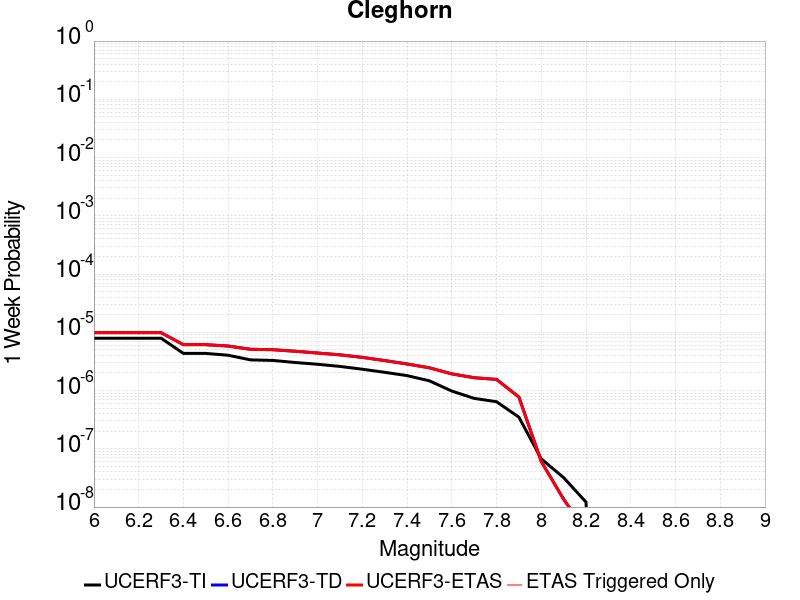 | 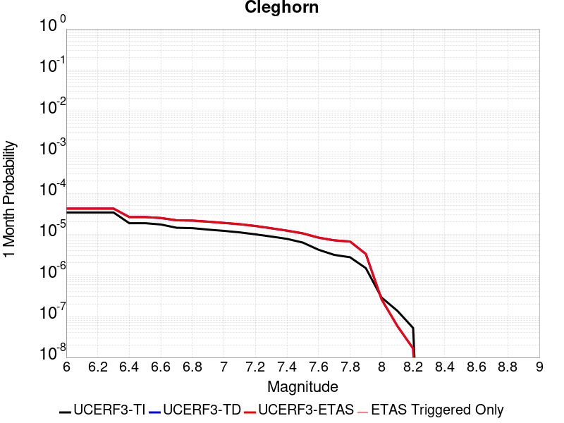 | 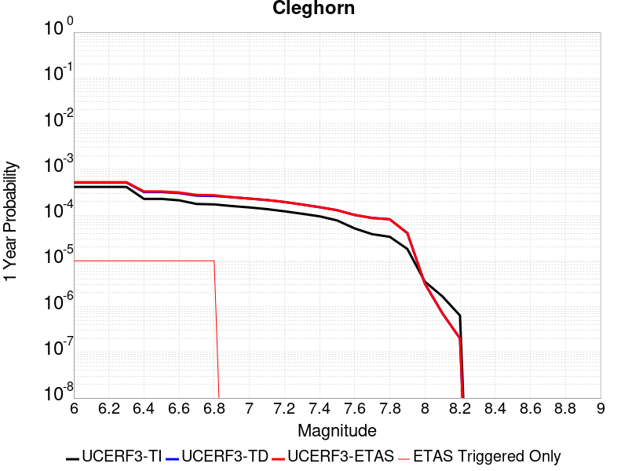 | 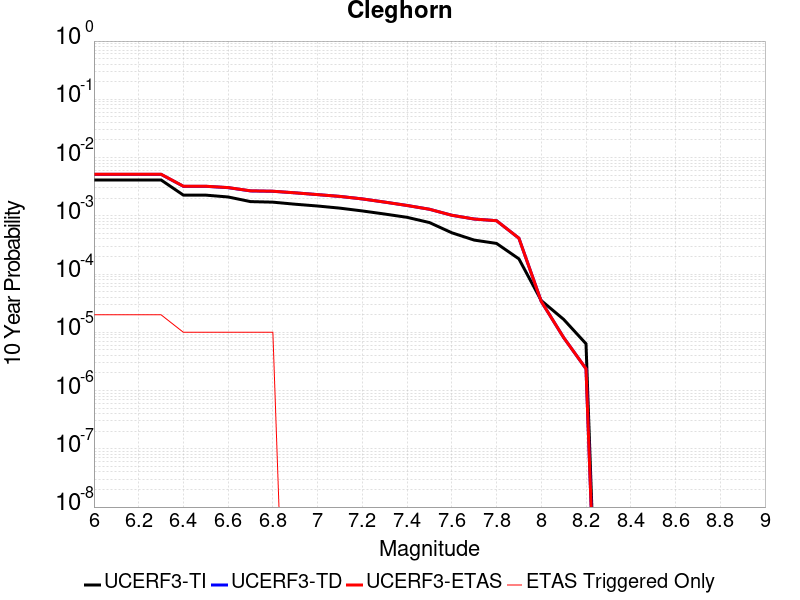 |

| Magnitude | 1 wk TI Prob | 1 wk TD Prob | 1 wk ETAS Prob | 1 wk ETAS/TD Gain | 1 wk ETAS Triggered Only | 1 mo TI Prob | 1 mo TD Prob | 1 mo ETAS Prob | 1 mo ETAS/TD Gain | 1 mo ETAS Triggered Only | 1 yr TI Prob | 1 yr TD Prob | 1 yr ETAS Prob | 1 yr ETAS/TD Gain | 1 yr ETAS Triggered Only | 10 yr TI Prob | 10 yr TD Prob | 10 yr ETAS Prob | 10 yr ETAS/TD Gain | 10 yr ETAS Triggered Only |
|-----|-----|-----|-----|-----|-----|-----|-----|-----|-----|-----|-----|-----|-----|-----|-----|-----|-----|-----|-----|-----|
| 6.0 | 7.9267165E-6 | 9.873436E-6 | 9.873436E-6 | 1.0 | 0.0 | 3.39712E-5 | 4.2314103E-5 | 4.2314103E-5 | 1.0 | 0.0 | 4.1352084E-4 | 5.15063E-4 | 5.250579E-4 | 1.0194051 | 1.0E-5 | 0.004127522 | 0.005153185 | 0.0051730825 | 1.0038611 | 2.0E-5 |
| 6.1 | 7.9267165E-6 | 9.873436E-6 | 9.873436E-6 | 1.0 | 0.0 | 3.39712E-5 | 4.2314103E-5 | 4.2314103E-5 | 1.0 | 0.0 | 4.1352084E-4 | 5.15063E-4 | 5.250579E-4 | 1.0194051 | 1.0E-5 | 0.004127522 | 0.005153185 | 0.0051730825 | 1.0038611 | 2.0E-5 |
| 6.2 | 7.9267165E-6 | 9.873436E-6 | 9.873436E-6 | 1.0 | 0.0 | 3.39712E-5 | 4.2314103E-5 | 4.2314103E-5 | 1.0 | 0.0 | 4.1352084E-4 | 5.15063E-4 | 5.250579E-4 | 1.0194051 | 1.0E-5 | 0.004127522 | 0.005153185 | 0.0051730825 | 1.0038611 | 2.0E-5 |
| 6.3 | 7.9267165E-6 | 9.873436E-6 | 9.873436E-6 | 1.0 | 0.0 | 3.39712E-5 | 4.2314103E-5 | 4.2314103E-5 | 1.0 | 0.0 | 4.1352084E-4 | 5.15063E-4 | 5.250579E-4 | 1.0194051 | 1.0E-5 | 0.004127522 | 0.005153185 | 0.0051730825 | 1.0038611 | 2.0E-5 |
| 6.4 | 4.3445207E-6 | 6.132444E-6 | 6.132444E-6 | 1.0 | 0.0 | 1.8619241E-5 | 2.6281643E-5 | 2.6281643E-5 | 1.0 | 0.0 | 2.2666567E-4 | 3.1993305E-4 | 3.2992984E-4 | 1.0312465 | 1.0E-5 | 0.0022643462 | 0.0032082924 | 0.0032182604 | 1.003107 | 1.0E-5 |
| 6.5 | 4.3445207E-6 | 6.132444E-6 | 6.132444E-6 | 1.0 | 0.0 | 1.8619241E-5 | 2.6281643E-5 | 2.6281643E-5 | 1.0 | 0.0 | 2.2666567E-4 | 3.1993305E-4 | 3.2992984E-4 | 1.0312465 | 1.0E-5 | 0.0022643462 | 0.0032082924 | 0.0032182604 | 1.003107 | 1.0E-5 |
| 6.6 | 4.040109E-6 | 5.8147807E-6 | 5.8147807E-6 | 1.0 | 0.0 | 1.7314638E-5 | 2.4920255E-5 | 2.4920255E-5 | 1.0 | 0.0 | 2.1078532E-4 | 3.0336282E-4 | 3.1335978E-4 | 1.0329539 | 1.0E-5 | 0.002105855 | 0.0030430485 | 0.0030530181 | 1.0032762 | 1.0E-5 |
| 6.7 | 3.3632055E-6 | 5.10812E-6 | 5.10812E-6 | 1.0 | 0.0 | 1.4413658E-5 | 2.1891761E-5 | 2.1891761E-5 | 1.0 | 0.0 | 1.7547216E-4 | 2.664999E-4 | 2.7649725E-4 | 1.0375135 | 1.0E-5 | 0.0017533366 | 0.0026753084 | 0.0026852817 | 1.0037279 | 1.0E-5 |
| 6.8 | 3.2902772E-6 | 5.0299977E-6 | 5.0299977E-6 | 1.0 | 0.0 | 1.4101111E-5 | 2.1556956E-5 | 2.1556956E-5 | 1.0 | 0.0 | 1.716675E-4 | 2.6242464E-4 | 2.7242204E-4 | 1.0380962 | 1.0E-5 | 0.0017153495 | 0.0026346527 | 0.0026446262 | 1.0037856 | 1.0E-5 |
| 6.9 | 3.031547E-6 | 4.731357E-6 | 4.731357E-6 | 1.0 | 0.0 | 1.299228E-5 | 2.0277088E-5 | 2.0277088E-5 | 1.0 | 0.0 | 1.5816953E-4 | 2.4684586E-4 | 2.4684586E-4 | 1.0 | 0.0 | 0.00158057 | 0.0024792193 | 0.0024792193 | 1.0 | 0.0 |
| 7.0 | 2.8259715E-6 | 4.4098397E-6 | 4.4098397E-6 | 1.0 | 0.0 | 1.211125E-5 | 1.8899176E-5 | 1.8899176E-5 | 1.0 | 0.0 | 1.4744449E-4 | 2.3007342E-4 | 2.3007342E-4 | 1.0 | 0.0 | 0.001473467 | 0.0023118537 | 0.0023118537 | 1.0 | 0.0 |
| 7.1 | 2.5962665E-6 | 4.1045264E-6 | 4.1045264E-6 | 1.0 | 0.0 | 1.1126809E-5 | 1.7590712E-5 | 1.7590712E-5 | 1.0 | 0.0 | 1.3546048E-4 | 2.1414607E-4 | 2.1414607E-4 | 1.0 | 0.0 | 0.0013537793 | 0.0021529053 | 0.0021529053 | 1.0 | 0.0 |
| 7.2 | 2.3247253E-6 | 3.7143498E-6 | 3.7143498E-6 | 1.0 | 0.0 | 9.96307E-6 | 1.5918546E-5 | 1.5918546E-5 | 1.0 | 0.0 | 1.21293626E-4 | 1.9379125E-4 | 1.9379125E-4 | 1.0 | 0.0 | 0.0012122744 | 0.0019497507 | 0.0019497507 | 1.0 | 0.0 |
| 7.3 | 2.056928E-6 | 3.2714736E-6 | 3.2714736E-6 | 1.0 | 0.0 | 8.815376E-6 | 1.4020527E-5 | 1.4020527E-5 | 1.0 | 0.0 | 1.0732192E-4 | 1.706867E-4 | 1.706867E-4 | 1.0 | 0.0 | 0.001072701 | 0.0017191477 | 0.0017191477 | 1.0 | 0.0 |
| 7.4 | 1.8055999E-6 | 2.8602847E-6 | 2.8602847E-6 | 1.0 | 0.0 | 7.738263E-6 | 1.2258306E-5 | 1.2258306E-5 | 1.0 | 0.0 | 9.4209274E-5 | 1.492348E-4 | 1.492348E-4 | 1.0 | 0.0 | 9.4169343E-4 | 0.001505056 | 0.001505056 | 1.0 | 0.0 |
| 7.5 | 1.4683443E-6 | 2.4587857E-6 | 2.4587857E-6 | 1.0 | 0.0 | 6.292889E-6 | 1.0537611E-5 | 1.0537611E-5 | 1.0 | 0.0 | 7.661323E-5 | 1.2828795E-4 | 1.2828795E-4 | 1.0 | 0.0 | 7.658682E-4 | 0.0012958813 | 0.0012958813 | 1.0 | 0.0 |
| 7.6 | 9.804088E-7 | 1.9338704E-6 | 1.9338704E-6 | 1.0 | 0.0 | 4.201745E-6 | 8.28799E-6 | 8.28799E-6 | 1.0 | 0.0 | 5.1155046E-5 | 1.0090165E-4 | 1.0090165E-4 | 1.0 | 0.0 | 5.114327E-4 | 0.0010223378 | 0.0010223378 | 1.0 | 0.0 |
| 7.7 | 7.3434086E-7 | 1.6615903E-6 | 1.6615903E-6 | 1.0 | 0.0 | 3.1471714E-6 | 7.1210825E-6 | 7.1210825E-6 | 1.0 | 0.0 | 3.831614E-5 | 8.6695756E-5 | 8.6695756E-5 | 1.0 | 0.0 | 3.8309532E-4 | 8.80439E-4 | 8.80439E-4 | 1.0 | 0.0 |
| 7.8 | 6.434184E-7 | 1.5539347E-6 | 1.5539347E-6 | 1.0 | 0.0 | 2.7575045E-6 | 6.659703E-6 | 6.659703E-6 | 1.0 | 0.0 | 3.35721E-5 | 8.107889E-5 | 8.107889E-5 | 1.0 | 0.0 | 3.3567028E-4 | 8.239765E-4 | 8.239765E-4 | 1.0 | 0.0 |
| 7.9 | 3.4943926E-7 | 7.7484884E-7 | 7.7484884E-7 | 1.0 | 0.0 | 1.497596E-6 | 3.3207764E-6 | 3.3207764E-6 | 1.0 | 0.0 | 1.8233079E-5 | 4.0429713E-5 | 4.0429713E-5 | 1.0 | 0.0 | 1.8231584E-4 | 4.1280067E-4 | 4.1280067E-4 | 1.0 | 0.0 |
| 8.0 | 6.717524E-8 | 6.0501215E-8 | 6.0501215E-8 | 1.0 | 0.0 | 2.8789387E-7 | 2.5929089E-7 | 2.5929089E-7 | 1.0 | 0.0 | 3.505102E-6 | 3.1568622E-6 | 3.1568622E-6 | 1.0 | 0.0 | 3.5050467E-5 | 3.3892997E-5 | 3.3892997E-5 | 1.0 | 0.0 |
| 8.1 | 3.1984914E-8 | 1.362791E-8 | 1.362791E-8 | 1.0 | 0.0 | 1.370782E-7 | 5.840533E-8 | 5.840533E-8 | 1.0 | 0.0 | 1.6689258E-6 | 7.110846E-7 | 7.110846E-7 | 1.0 | 0.0 | 1.6689133E-5 | 8.124853E-6 | 8.124853E-6 | 1.0 | 0.0 |
| 8.2 | 1.21887656E-8 | 3.8567585E-9 | 3.8567585E-9 | 1.0 | 0.0 | 5.2237567E-8 | 1.6528967E-8 | 1.6528967E-8 | 1.0 | 0.0 | 6.359922E-7 | 2.0124016E-7 | 2.0124016E-7 | 1.0 | 0.0 | 6.3599036E-6 | 2.3667244E-6 | 2.3667244E-6 | 1.0 | 0.0 |

## Blue Cut
*[(top)](#table-of-contents)*

| 1 Week | 1 Month | 1 Year | 10 Year |
|-----|-----|-----|-----|
|  |  |  |  |

| Magnitude | 1 wk TI Prob | 1 wk TD Prob | 1 wk ETAS Prob | 1 wk ETAS/TD Gain | 1 wk ETAS Triggered Only | 1 mo TI Prob | 1 mo TD Prob | 1 mo ETAS Prob | 1 mo ETAS/TD Gain | 1 mo ETAS Triggered Only | 1 yr TI Prob | 1 yr TD Prob | 1 yr ETAS Prob | 1 yr ETAS/TD Gain | 1 yr ETAS Triggered Only | 10 yr TI Prob | 10 yr TD Prob | 10 yr ETAS Prob | 10 yr ETAS/TD Gain | 10 yr ETAS Triggered Only |
|-----|-----|-----|-----|-----|-----|-----|-----|-----|-----|-----|-----|-----|-----|-----|-----|-----|-----|-----|-----|-----|
| 6.0 | 2.1227985E-5 | 2.2727847E-5 | 2.2727847E-5 | 1.0 | 0.0 | 9.097391E-5 | 9.7401746E-5 | 1.17399795E-4 | 1.2053151 | 2.0E-5 | 0.0011070445 | 0.0011852792 | 0.0012052555 | 1.0168537 | 2.0E-5 | 0.011015458 | 0.011795422 | 0.011815186 | 1.0016756 | 2.0E-5 |
| 6.1 | 2.1227985E-5 | 2.2727847E-5 | 2.2727847E-5 | 1.0 | 0.0 | 9.097391E-5 | 9.7401746E-5 | 1.17399795E-4 | 1.2053151 | 2.0E-5 | 0.0011070445 | 0.0011852792 | 0.0012052555 | 1.0168537 | 2.0E-5 | 0.011015458 | 0.011795422 | 0.011815186 | 1.0016756 | 2.0E-5 |
| 6.2 | 2.1227985E-5 | 2.2727847E-5 | 2.2727847E-5 | 1.0 | 0.0 | 9.097391E-5 | 9.7401746E-5 | 1.17399795E-4 | 1.2053151 | 2.0E-5 | 0.0011070445 | 0.0011852792 | 0.0012052555 | 1.0168537 | 2.0E-5 | 0.011015458 | 0.011795422 | 0.011815186 | 1.0016756 | 2.0E-5 |
| 6.3 | 1.1613981E-5 | 1.2357614E-5 | 1.2357614E-5 | 1.0 | 0.0 | 4.9773254E-5 | 5.2960197E-5 | 7.2959134E-5 | 1.3776221 | 2.0E-5 | 6.0582085E-4 | 6.446121E-4 | 6.645992E-4 | 1.0310065 | 2.0E-5 | 0.0060417196 | 0.006428671 | 0.0064485427 | 1.0030911 | 2.0E-5 |
| 6.4 | 1.1613981E-5 | 1.2357614E-5 | 1.2357614E-5 | 1.0 | 0.0 | 4.9773254E-5 | 5.2960197E-5 | 7.2959134E-5 | 1.3776221 | 2.0E-5 | 6.0582085E-4 | 6.446121E-4 | 6.645992E-4 | 1.0310065 | 2.0E-5 | 0.0060417196 | 0.006428671 | 0.0064485427 | 1.0030911 | 2.0E-5 |
| 6.5 | 8.931326E-6 | 9.484623E-6 | 9.484623E-6 | 1.0 | 0.0 | 3.8276554E-5 | 4.06478E-5 | 5.064739E-5 | 1.2460058 | 1.0E-5 | 4.6591737E-4 | 4.9478374E-4 | 5.047788E-4 | 1.0202008 | 1.0E-5 | 0.0046494175 | 0.004937731 | 0.004947682 | 1.0020152 | 1.0E-5 |
| 6.6 | 7.345353E-6 | 7.792721E-6 | 7.792721E-6 | 1.0 | 0.0 | 3.1479703E-5 | 3.339699E-5 | 4.3396656E-5 | 1.2994182 | 1.0E-5 | 3.83198E-4 | 4.0654052E-4 | 4.1653644E-4 | 1.0245878 | 1.0E-5 | 0.0038253788 | 0.00405876 | 0.004068719 | 1.0024538 | 1.0E-5 |
| 6.7 | 6.2775666E-6 | 6.6572197E-6 | 6.6572197E-6 | 1.0 | 0.0 | 2.690358E-5 | 2.8530672E-5 | 2.8530672E-5 | 1.0 | 0.0 | 3.2750185E-4 | 3.473131E-4 | 3.473131E-4 | 1.0 | 0.0 | 0.0032701963 | 0.0034684443 | 0.0034684443 | 1.0 | 0.0 |
| 6.8 | 5.5234095E-6 | 5.8569303E-6 | 5.8569303E-6 | 1.0 | 0.0 | 2.367154E-5 | 2.5100928E-5 | 2.5100928E-5 | 1.0 | 0.0 | 2.8816288E-4 | 3.0556825E-4 | 3.0556825E-4 | 1.0 | 0.0 | 0.002877895 | 0.0030521972 | 0.0030521972 | 1.0 | 0.0 |
| 6.9 | 4.7780054E-6 | 5.066997E-6 | 5.066997E-6 | 1.0 | 0.0 | 2.0477004E-5 | 2.171556E-5 | 2.171556E-5 | 1.0 | 0.0 | 2.4927902E-4 | 2.643619E-4 | 2.643619E-4 | 1.0 | 0.0 | 0.0024899957 | 0.0026411668 | 0.0026411668 | 1.0 | 0.0 |
| 7.0 | 3.883171E-6 | 4.119778E-6 | 4.119778E-6 | 1.0 | 0.0 | 1.6642054E-5 | 1.7656112E-5 | 1.7656112E-5 | 1.0 | 0.0 | 2.0259817E-4 | 2.1494884E-4 | 2.1494884E-4 | 1.0 | 0.0 | 0.0020241356 | 0.0021480855 | 0.0021480855 | 1.0 | 0.0 |
| 7.1 | 2.8358215E-6 | 3.0106705E-6 | 3.0106705E-6 | 1.0 | 0.0 | 1.2153464E-5 | 1.2902847E-5 | 1.2902847E-5 | 1.0 | 0.0 | 1.4795837E-4 | 1.5708742E-4 | 1.5708742E-4 | 1.0 | 0.0 | 0.001478599 | 0.0015704094 | 0.0015704094 | 1.0 | 0.0 |

## Mission Ridge-Arroyo Parida-Santa Ana
*[(top)](#table-of-contents)*

| 1 Week | 1 Month | 1 Year | 10 Year |
|-----|-----|-----|-----|
| 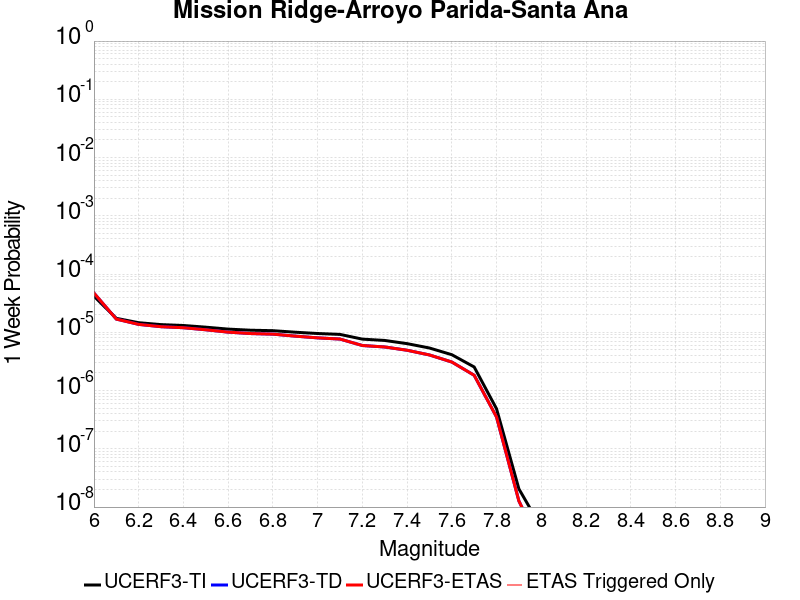 | 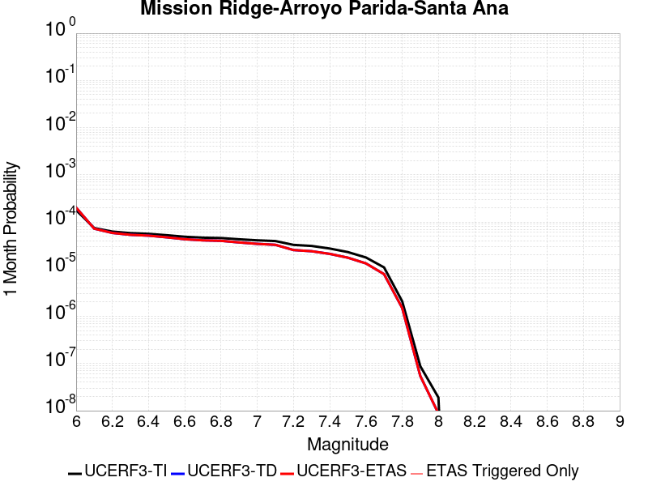 | 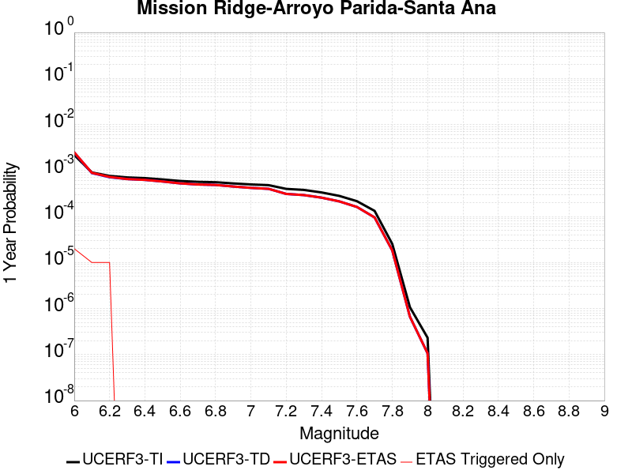 | 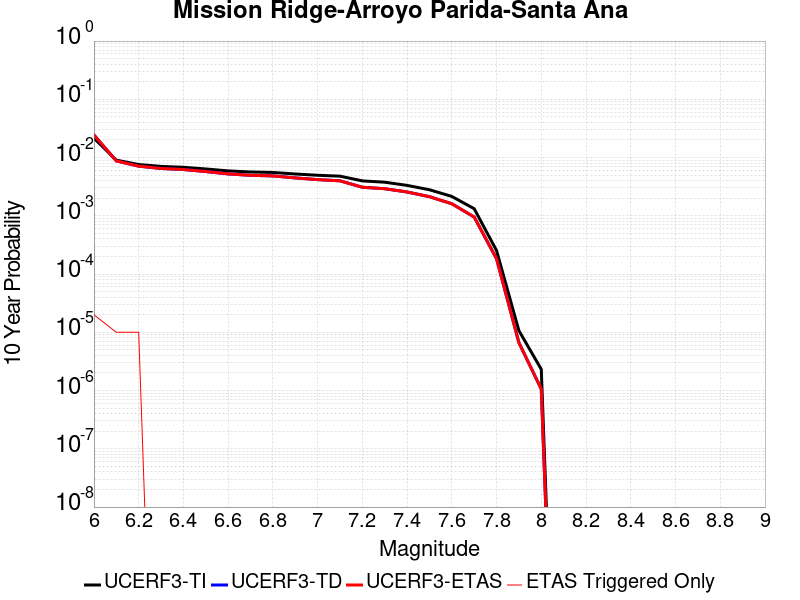 |

| Magnitude | 1 wk TI Prob | 1 wk TD Prob | 1 wk ETAS Prob | 1 wk ETAS/TD Gain | 1 wk ETAS Triggered Only | 1 mo TI Prob | 1 mo TD Prob | 1 mo ETAS Prob | 1 mo ETAS/TD Gain | 1 mo ETAS Triggered Only | 1 yr TI Prob | 1 yr TD Prob | 1 yr ETAS Prob | 1 yr ETAS/TD Gain | 1 yr ETAS Triggered Only | 10 yr TI Prob | 10 yr TD Prob | 10 yr ETAS Prob | 10 yr ETAS/TD Gain | 10 yr ETAS Triggered Only |
|-----|-----|-----|-----|-----|-----|-----|-----|-----|-----|-----|-----|-----|-----|-----|-----|-----|-----|-----|-----|-----|
| 6.0 | 4.169034E-5 | 4.718782E-5 | 4.718782E-5 | 1.0 | 0.0 | 1.7866064E-4 | 2.0222188E-4 | 2.0222188E-4 | 1.0 | 0.0 | 0.0021730233 | 0.0024601044 | 0.0024800552 | 1.0081097 | 2.0E-5 | 0.021518968 | 0.024410559 | 0.024430072 | 1.0007993 | 2.0E-5 |
| 6.1 | 1.73813E-5 | 1.6866376E-5 | 1.6866376E-5 | 1.0 | 0.0 | 7.4489166E-5 | 7.228253E-5 | 7.228253E-5 | 1.0 | 0.0 | 9.065282E-4 | 8.796952E-4 | 8.8968634E-4 | 1.0113575 | 1.0E-5 | 0.009028391 | 0.008763235 | 0.008773147 | 1.0011312 | 1.0E-5 |
| 6.2 | 1.4622182E-5 | 1.3682883E-5 | 1.3682883E-5 | 1.0 | 0.0 | 6.2664985E-5 | 5.863963E-5 | 5.863963E-5 | 1.0 | 0.0 | 7.6267915E-4 | 7.1370753E-4 | 7.237004E-4 | 1.0140014 | 1.0E-5 | 0.007600669 | 0.00711456 | 0.0071244887 | 1.0013956 | 1.0E-5 |
| 6.3 | 1.3552434E-5 | 1.2491088E-5 | 1.2491088E-5 | 1.0 | 0.0 | 5.8080568E-5 | 5.3532152E-5 | 5.3532152E-5 | 1.0 | 0.0 | 7.069015E-4 | 6.515622E-4 | 6.515622E-4 | 1.0 | 0.0 | 0.00704657 | 0.0064968443 | 0.0064968443 | 1.0 | 0.0 |
| 6.4 | 1.30977305E-5 | 1.1987764E-5 | 1.1987764E-5 | 1.0 | 0.0 | 5.613192E-5 | 5.1375137E-5 | 5.1375137E-5 | 1.0 | 0.0 | 6.831918E-4 | 6.253158E-4 | 6.253158E-4 | 1.0 | 0.0 | 0.006810953 | 0.0062358705 | 0.0062358705 | 1.0 | 0.0 |
| 6.5 | 1.225205E-5 | 1.1056927E-5 | 1.1056927E-5 | 1.0 | 0.0 | 5.2507727E-5 | 4.7385987E-5 | 4.7385987E-5 | 1.0 | 0.0 | 6.3909404E-4 | 5.7677436E-4 | 5.7677436E-4 | 1.0 | 0.0 | 0.006372592 | 0.005753046 | 0.005753046 | 1.0 | 0.0 |
| 6.6 | 1.1352241E-5 | 1.0071174E-5 | 1.0071174E-5 | 1.0 | 0.0 | 4.8651553E-5 | 4.316147E-5 | 4.316147E-5 | 1.0 | 0.0 | 5.921717E-4 | 5.2536634E-4 | 5.2536634E-4 | 1.0 | 0.0 | 0.0059059616 | 0.005241452 | 0.005241452 | 1.0 | 0.0 |
| 6.7 | 1.0864116E-5 | 9.524323E-6 | 9.524323E-6 | 1.0 | 0.0 | 4.6559664E-5 | 4.08179E-5 | 4.08179E-5 | 1.0 | 0.0 | 5.667165E-4 | 4.968466E-4 | 4.968466E-4 | 1.0 | 0.0 | 0.005652734 | 0.004957554 | 0.004957554 | 1.0 | 0.0 |
| 6.8 | 1.0666365E-5 | 9.306963E-6 | 9.306963E-6 | 1.0 | 0.0 | 4.571219E-5 | 3.9886385E-5 | 3.9886385E-5 | 1.0 | 0.0 | 5.564038E-4 | 4.8551054E-4 | 4.8551054E-4 | 1.0 | 0.0 | 0.005550127 | 0.0048446925 | 0.0048446925 | 1.0 | 0.0 |
| 6.9 | 1.0038665E-5 | 8.598761E-6 | 8.598761E-6 | 1.0 | 0.0 | 4.302214E-5 | 3.685132E-5 | 3.685132E-5 | 1.0 | 0.0 | 5.236687E-4 | 4.4857428E-4 | 4.4857428E-4 | 1.0 | 0.0 | 0.005224364 | 0.004476861 | 0.004476861 | 1.0 | 0.0 |
| 7.0 | 9.5379955E-6 | 8.031379E-6 | 8.031379E-6 | 1.0 | 0.0 | 4.0876483E-5 | 3.4419754E-5 | 3.4419754E-5 | 1.0 | 0.0 | 4.975576E-4 | 4.1898165E-4 | 4.1898165E-4 | 1.0 | 0.0 | 0.00496445 | 0.0041820784 | 0.0041820784 | 1.0 | 0.0 |
| 7.1 | 9.207389E-6 | 7.658404E-6 | 7.658404E-6 | 1.0 | 0.0 | 3.945964E-5 | 3.282133E-5 | 3.282133E-5 | 1.0 | 0.0 | 4.803152E-4 | 3.9952807E-4 | 3.9952807E-4 | 1.0 | 0.0 | 0.004792784 | 0.003988256 | 0.003988256 | 1.0 | 0.0 |
| 7.2 | 7.638091E-6 | 5.935706E-6 | 5.935706E-6 | 1.0 | 0.0 | 3.2734264E-5 | 2.5438494E-5 | 2.5438494E-5 | 1.0 | 0.0 | 3.984668E-4 | 3.0966997E-4 | 3.0966997E-4 | 1.0 | 0.0 | 0.0039775306 | 0.0030924028 | 0.0030924028 | 1.0 | 0.0 |
| 7.3 | 7.2500147E-6 | 5.600438E-6 | 5.600438E-6 | 1.0 | 0.0 | 3.1071122E-5 | 2.4001658E-5 | 2.4001658E-5 | 1.0 | 0.0 | 3.7822526E-4 | 2.921813E-4 | 2.921813E-4 | 1.0 | 0.0 | 0.0037758215 | 0.0029179885 | 0.0029179885 | 1.0 | 0.0 |
| 7.4 | 6.3899715E-6 | 4.922199E-6 | 4.922199E-6 | 1.0 | 0.0 | 2.7385306E-5 | 2.109497E-5 | 2.109497E-5 | 1.0 | 0.0 | 3.3336508E-4 | 2.5680117E-4 | 2.5680117E-4 | 1.0 | 0.0 | 0.0033286542 | 0.0025650503 | 0.0025650503 | 1.0 | 0.0 |
| 7.5 | 5.379025E-6 | 4.086902E-6 | 4.086902E-6 | 1.0 | 0.0 | 2.305276E-5 | 1.7515178E-5 | 1.7515178E-5 | 1.0 | 0.0 | 2.806312E-4 | 2.1322654E-4 | 2.1322654E-4 | 1.0 | 0.0 | 0.0028027708 | 0.002130231 | 0.002130231 | 1.0 | 0.0 |
| 7.6 | 4.1270696E-6 | 3.0904635E-6 | 3.0904635E-6 | 1.0 | 0.0 | 1.768732E-5 | 1.3244776E-5 | 1.3244776E-5 | 1.0 | 0.0 | 2.1532185E-4 | 1.612433E-4 | 1.612433E-4 | 1.0 | 0.0 | 0.0021511333 | 0.0016112712 | 0.0016112712 | 1.0 | 0.0 |
| 7.7 | 2.5406805E-6 | 1.8294287E-6 | 1.8294287E-6 | 1.0 | 0.0 | 1.0888585E-5 | 7.8403855E-6 | 7.8403855E-6 | 1.0 | 0.0 | 1.3256045E-4 | 9.5452575E-5 | 9.5452575E-5 | 1.0 | 0.0 | 0.0013248142 | 9.5412193E-4 | 9.5412193E-4 | 1.0 | 0.0 |
| 7.8 | 4.8608285E-7 | 3.512613E-7 | 3.512613E-7 | 1.0 | 0.0 | 2.0832106E-6 | 1.5054046E-6 | 1.5054046E-6 | 1.0 | 0.0 | 2.5362791E-5 | 1.8328148E-5 | 1.8328148E-5 | 1.0 | 0.0 | 2.5359896E-4 | 1.8326649E-4 | 1.8326649E-4 | 1.0 | 0.0 |
| 7.9 | 2.0472514E-8 | 1.2702763E-8 | 1.2702763E-8 | 1.0 | 0.0 | 8.7739345E-8 | 5.4440417E-8 | 5.4440417E-8 | 1.0 | 0.0 | 1.068226E-6 | 6.6281183E-7 | 6.6281183E-7 | 1.0 | 0.0 | 1.0682209E-5 | 6.6281E-6 | 6.6281E-6 | 1.0 | 0.0 |
| 8.0 | 4.443582E-9 | 2.0376503E-9 | 2.0376503E-9 | 1.0 | 0.0 | 1.9043922E-8 | 8.732787E-9 | 8.732787E-9 | 1.0 | 0.0 | 2.3185973E-7 | 1.0632167E-7 | 1.0632167E-7 | 1.0 | 0.0 | 2.3185949E-6 | 1.0632164E-6 | 1.0632164E-6 | 1.0 | 0.0 |

## Earthquake Valley
*[(top)](#table-of-contents)*

| 1 Week | 1 Month | 1 Year | 10 Year |
|-----|-----|-----|-----|
|  |  |  |  |

| Magnitude | 1 wk TI Prob | 1 wk TD Prob | 1 wk ETAS Prob | 1 wk ETAS/TD Gain | 1 wk ETAS Triggered Only | 1 mo TI Prob | 1 mo TD Prob | 1 mo ETAS Prob | 1 mo ETAS/TD Gain | 1 mo ETAS Triggered Only | 1 yr TI Prob | 1 yr TD Prob | 1 yr ETAS Prob | 1 yr ETAS/TD Gain | 1 yr ETAS Triggered Only | 10 yr TI Prob | 10 yr TD Prob | 10 yr ETAS Prob | 10 yr ETAS/TD Gain | 10 yr ETAS Triggered Only |
|-----|-----|-----|-----|-----|-----|-----|-----|-----|-----|-----|-----|-----|-----|-----|-----|-----|-----|-----|-----|-----|
| 6.0 | 1.9416384E-5 | 2.2603754E-5 | 3.260353E-5 | 1.4423944 | 1.0E-5 | 8.321042E-5 | 9.687031E-5 | 1.0686934E-4 | 1.1032208 | 1.0E-5 | 0.001012616 | 0.0011788778 | 0.001188866 | 1.0084727 | 1.0E-5 | 0.010080142 | 0.011738093 | 0.011757857 | 1.0016838 | 2.0E-5 |
| 6.1 | 1.9416384E-5 | 2.2603754E-5 | 3.260353E-5 | 1.4423944 | 1.0E-5 | 8.321042E-5 | 9.687031E-5 | 1.0686934E-4 | 1.1032208 | 1.0E-5 | 0.001012616 | 0.0011788778 | 0.001188866 | 1.0084727 | 1.0E-5 | 0.010080142 | 0.011738093 | 0.011757857 | 1.0016838 | 2.0E-5 |
| 6.2 | 1.9416384E-5 | 2.2603754E-5 | 3.260353E-5 | 1.4423944 | 1.0E-5 | 8.321042E-5 | 9.687031E-5 | 1.0686934E-4 | 1.1032208 | 1.0E-5 | 0.001012616 | 0.0011788778 | 0.001188866 | 1.0084727 | 1.0E-5 | 0.010080142 | 0.011738093 | 0.011757857 | 1.0016838 | 2.0E-5 |
| 6.3 | 1.9416384E-5 | 2.2603754E-5 | 3.260353E-5 | 1.4423944 | 1.0E-5 | 8.321042E-5 | 9.687031E-5 | 1.0686934E-4 | 1.1032208 | 1.0E-5 | 0.001012616 | 0.0011788778 | 0.001188866 | 1.0084727 | 1.0E-5 | 0.010080142 | 0.011738093 | 0.011757857 | 1.0016838 | 2.0E-5 |
| 6.4 | 1.9416384E-5 | 2.2603754E-5 | 3.260353E-5 | 1.4423944 | 1.0E-5 | 8.321042E-5 | 9.687031E-5 | 1.0686934E-4 | 1.1032208 | 1.0E-5 | 0.001012616 | 0.0011788778 | 0.001188866 | 1.0084727 | 1.0E-5 | 0.010080142 | 0.011738093 | 0.011757857 | 1.0016838 | 2.0E-5 |
| 6.5 | 1.9389157E-5 | 2.2572318E-5 | 3.2572094E-5 | 1.4430106 | 1.0E-5 | 8.309374E-5 | 9.6735595E-5 | 1.06734624E-4 | 1.1033646 | 1.0E-5 | 0.0010111968 | 0.0011772393 | 0.0011872277 | 1.0084845 | 1.0E-5 | 0.010066078 | 0.011721881 | 0.0117416475 | 1.0016862 | 2.0E-5 |
| 6.6 | 1.9389157E-5 | 2.2572318E-5 | 3.2572094E-5 | 1.4430106 | 1.0E-5 | 8.309374E-5 | 9.6735595E-5 | 1.06734624E-4 | 1.1033646 | 1.0E-5 | 0.0010111968 | 0.0011772393 | 0.0011872277 | 1.0084845 | 1.0E-5 | 0.010066078 | 0.011721881 | 0.0117416475 | 1.0016862 | 2.0E-5 |
| 6.7 | 1.4925434E-5 | 1.7222386E-5 | 2.7222213E-5 | 1.5806296 | 1.0E-5 | 6.396457E-5 | 7.380862E-5 | 8.380788E-5 | 1.1354755 | 1.0E-5 | 7.7849044E-4 | 8.9833466E-4 | 9.0832566E-4 | 1.0111217 | 1.0E-5 | 0.007757689 | 0.008955422 | 0.008975242 | 1.0022132 | 2.0E-5 |
| 6.8 | 1.3570335E-5 | 1.5629566E-5 | 2.562941E-5 | 1.639803 | 1.0E-5 | 5.8157282E-5 | 6.69826E-5 | 7.698192E-5 | 1.1492825 | 1.0E-5 | 7.0783484E-4 | 8.152902E-4 | 8.2528207E-4 | 1.0122555 | 1.0E-5 | 0.0070558446 | 0.008131076 | 0.008150913 | 1.0024397 | 2.0E-5 |
| 6.9 | 1.3570335E-5 | 1.5629566E-5 | 2.562941E-5 | 1.639803 | 1.0E-5 | 5.8157282E-5 | 6.69826E-5 | 7.698192E-5 | 1.1492825 | 1.0E-5 | 7.0783484E-4 | 8.152902E-4 | 8.2528207E-4 | 1.0122555 | 1.0E-5 | 0.0070558446 | 0.008131076 | 0.008150913 | 1.0024397 | 2.0E-5 |
| 7.0 | 1.3433392E-5 | 1.5472993E-5 | 2.5472838E-5 | 1.6462773 | 1.0E-5 | 5.757041E-5 | 6.631161E-5 | 7.631095E-5 | 1.1507932 | 1.0E-5 | 7.0069433E-4 | 8.07127E-4 | 8.171189E-4 | 1.0123796 | 1.0E-5 | 0.006984891 | 0.008050037 | 0.008069876 | 1.0024644 | 2.0E-5 |
| 7.1 | 8.181609E-6 | 9.424742E-6 | 9.424742E-6 | 1.0 | 0.0 | 3.5063567E-5 | 4.0391504E-5 | 4.0391504E-5 | 1.0 | 0.0 | 4.268153E-4 | 4.917228E-4 | 4.917228E-4 | 1.0 | 0.0 | 0.0042599645 | 0.0049129347 | 0.0049129347 | 1.0 | 0.0 |
| 7.2 | 2.0663983E-7 | 1.7290735E-7 | 1.7290735E-7 | 1.0 | 0.0 | 8.855989E-7 | 7.410313E-7 | 7.410313E-7 | 1.0 | 0.0 | 1.0782113E-5 | 9.022022E-6 | 9.022022E-6 | 1.0 | 0.0 | 1.07815904E-4 | 9.021692E-5 | 9.021692E-5 | 1.0 | 0.0 |
| 7.3 | 2.0462376E-7 | 1.7106106E-7 | 1.7106106E-7 | 1.0 | 0.0 | 8.7695867E-7 | 7.3311867E-7 | 7.3311867E-7 | 1.0 | 0.0 | 1.0676919E-5 | 8.925687E-6 | 8.925687E-6 | 1.0 | 0.0 | 1.0676406E-4 | 8.925364E-5 | 8.925364E-5 | 1.0 | 0.0 |
| 7.4 | 2.0171088E-7 | 1.6888337E-7 | 1.6888337E-7 | 1.0 | 0.0 | 8.644749E-7 | 7.237857E-7 | 7.237857E-7 | 1.0 | 0.0 | 1.0524931E-5 | 8.812059E-6 | 8.812059E-6 | 1.0 | 0.0 | 1.05244326E-4 | 8.811746E-5 | 8.811746E-5 | 1.0 | 0.0 |
| 7.5 | 1.4847944E-7 | 1.2582723E-7 | 1.2582723E-7 | 1.0 | 0.0 | 6.363403E-7 | 5.392595E-7 | 5.392595E-7 | 1.0 | 0.0 | 7.747416E-6 | 6.5654663E-6 | 6.5654663E-6 | 1.0 | 0.0 | 7.747146E-5 | 6.5652945E-5 | 6.5652945E-5 | 1.0 | 0.0 |
| 7.6 | 1.3185847E-7 | 1.1145084E-7 | 1.1145084E-7 | 1.0 | 0.0 | 5.6510765E-7 | 4.776464E-7 | 4.776464E-7 | 1.0 | 0.0 | 6.8801637E-6 | 5.815331E-6 | 5.815331E-6 | 1.0 | 0.0 | 6.8799505E-5 | 5.8152003E-5 | 5.8152003E-5 | 1.0 | 0.0 |
| 7.7 | 2.8609954E-8 | 1.419746E-8 | 1.419746E-8 | 1.0 | 0.0 | 1.2261408E-7 | 6.0846254E-8 | 6.0846254E-8 | 1.0 | 0.0 | 1.4928254E-6 | 7.4080293E-7 | 7.4080293E-7 | 1.0 | 0.0 | 1.4928154E-5 | 7.4080103E-6 | 7.4080103E-6 | 1.0 | 0.0 |
| 7.8 | 6.527266E-9 | 2.928577E-9 | 2.928577E-9 | 1.0 | 0.0 | 2.7973995E-8 | 1.2551044E-8 | 1.2551044E-8 | 1.0 | 0.0 | 3.4058334E-7 | 1.5280895E-7 | 1.5280895E-7 | 1.0 | 0.0 | 3.4058282E-6 | 1.5280887E-6 | 1.5280887E-6 | 1.0 | 0.0 |
| 7.9 | 1.2898267E-9 | 7.136971E-10 | 7.136971E-10 | 1.0 | 0.0 | 5.527829E-9 | 3.058702E-9 | 3.058702E-9 | 1.0 | 0.0 | 6.7301315E-8 | 3.7239698E-8 | 3.7239698E-8 | 1.0 | 0.0 | 6.7301295E-7 | 3.7239695E-7 | 3.7239695E-7 | 1.0 | 0.0 |

## San Andreas (Santa Cruz Mts) 2011 CFM
*[(top)](#table-of-contents)*

| 1 Week | 1 Month | 1 Year | 10 Year |
|-----|-----|-----|-----|
|  |  |  |  |

| Magnitude | 1 wk TI Prob | 1 wk TD Prob | 1 wk ETAS Prob | 1 wk ETAS/TD Gain | 1 wk ETAS Triggered Only | 1 mo TI Prob | 1 mo TD Prob | 1 mo ETAS Prob | 1 mo ETAS/TD Gain | 1 mo ETAS Triggered Only | 1 yr TI Prob | 1 yr TD Prob | 1 yr ETAS Prob | 1 yr ETAS/TD Gain | 1 yr ETAS Triggered Only | 10 yr TI Prob | 10 yr TD Prob | 10 yr ETAS Prob | 10 yr ETAS/TD Gain | 10 yr ETAS Triggered Only |
|-----|-----|-----|-----|-----|-----|-----|-----|-----|-----|-----|-----|-----|-----|-----|-----|-----|-----|-----|-----|-----|
| 6.0 | 1.7221631E-4 | 1.4025059E-4 | 1.6024779E-4 | 1.1425819 | 2.0E-5 | 7.378611E-4 | 6.009376E-4 | 6.2092557E-4 | 1.0332613 | 2.0E-5 | 0.008946515 | 0.0072922586 | 0.007312113 | 1.0027226 | 2.0E-5 | 0.08594794 | 0.07167054 | 0.07168911 | 1.000259 | 2.0E-5 |
| 6.1 | 1.7221631E-4 | 1.4025059E-4 | 1.6024779E-4 | 1.1425819 | 2.0E-5 | 7.378611E-4 | 6.009376E-4 | 6.2092557E-4 | 1.0332613 | 2.0E-5 | 0.008946515 | 0.0072922586 | 0.007312113 | 1.0027226 | 2.0E-5 | 0.08594794 | 0.07167054 | 0.07168911 | 1.000259 | 2.0E-5 |
| 6.2 | 1.7221631E-4 | 1.4025059E-4 | 1.6024779E-4 | 1.1425819 | 2.0E-5 | 7.378611E-4 | 6.009376E-4 | 6.2092557E-4 | 1.0332613 | 2.0E-5 | 0.008946515 | 0.0072922586 | 0.007312113 | 1.0027226 | 2.0E-5 | 0.08594794 | 0.07167054 | 0.07168911 | 1.000259 | 2.0E-5 |
| 6.3 | 1.716926E-4 | 1.3943961E-4 | 1.5943682E-4 | 1.1434113 | 2.0E-5 | 7.3561794E-4 | 5.974636E-4 | 6.174516E-4 | 1.0334549 | 2.0E-5 | 0.008919428 | 0.0072502443 | 0.007270099 | 1.0027385 | 2.0E-5 | 0.08569809 | 0.071280695 | 0.07129927 | 1.0002606 | 2.0E-5 |
| 6.4 | 1.6392978E-4 | 1.3814664E-4 | 1.5814388E-4 | 1.1447537 | 2.0E-5 | 7.02367E-4 | 5.9192476E-4 | 6.119129E-4 | 1.033768 | 2.0E-5 | 0.008517839 | 0.0071832547 | 0.007203111 | 1.0027642 | 2.0E-5 | 0.08198654 | 0.07048169 | 0.070500284 | 1.0002638 | 2.0E-5 |
| 6.5 | 1.5742714E-4 | 1.2866968E-4 | 1.4866711E-4 | 1.1554167 | 2.0E-5 | 6.745133E-4 | 5.513267E-4 | 5.713157E-4 | 1.0362561 | 2.0E-5 | 0.00818132 | 0.0066920654 | 0.0067119314 | 1.0029687 | 2.0E-5 | 0.078865945 | 0.065920696 | 0.065939374 | 1.0002834 | 2.0E-5 |
| 6.6 | 1.3038084E-4 | 1.1787747E-4 | 1.3787512E-4 | 1.1696477 | 2.0E-5 | 5.5865536E-4 | 5.0509267E-4 | 5.250826E-4 | 1.0395766 | 2.0E-5 | 0.006780438 | 0.006132401 | 0.0061522787 | 1.0032414 | 2.0E-5 | 0.0657725 | 0.060263954 | 0.06028275 | 1.0003119 | 2.0E-5 |
| 6.7 | 1.2867592E-4 | 1.1512854E-4 | 1.3512625E-4 | 1.1736989 | 2.0E-5 | 5.5135164E-4 | 4.9331604E-4 | 5.133062E-4 | 1.040522 | 2.0E-5 | 0.0066920654 | 0.0059898165 | 0.006009697 | 1.003319 | 2.0E-5 | 0.06494093 | 0.058969937 | 0.05898876 | 1.0003191 | 2.0E-5 |
| 6.8 | 1.2801298E-4 | 1.1450069E-4 | 1.344984E-4 | 1.1746514 | 2.0E-5 | 5.485117E-4 | 4.9062626E-4 | 5.1061646E-4 | 1.0407442 | 2.0E-5 | 0.0066577005 | 0.0059572584 | 0.005977139 | 1.0033373 | 2.0E-5 | 0.06461738 | 0.058682535 | 0.058701362 | 1.0003208 | 2.0E-5 |
| 6.9 | 1.269149E-4 | 1.1291407E-4 | 1.3291182E-4 | 1.1771058 | 2.0E-5 | 5.4380763E-4 | 4.83829E-4 | 5.038193E-4 | 1.0413169 | 2.0E-5 | 0.006600777 | 0.005874951 | 0.0058948337 | 1.0033842 | 2.0E-5 | 0.06408122 | 0.057951514 | 0.057970352 | 1.0003251 | 2.0E-5 |
| 7.0 | 1.2030331E-4 | 1.1018017E-4 | 1.3017797E-4 | 1.1815009 | 2.0E-5 | 5.154837E-4 | 4.7211658E-4 | 4.921071E-4 | 1.0423424 | 2.0E-5 | 0.006257969 | 0.005733111 | 0.005752996 | 1.0034685 | 2.0E-5 | 0.06084648 | 0.056605607 | 0.056624476 | 1.0003333 | 2.0E-5 |
| 7.1 | 8.049617E-5 | 5.538574E-5 | 7.538463E-5 | 1.3610837 | 2.0E-5 | 3.4493793E-4 | 2.3734606E-4 | 2.573413E-4 | 1.0842452 | 2.0E-5 | 0.0041915346 | 0.0028858953 | 0.0029058377 | 1.0069102 | 2.0E-5 | 0.041133516 | 0.030344456 | 0.03036385 | 1.0006391 | 2.0E-5 |
| 7.2 | 7.093979E-5 | 4.4221182E-5 | 6.4220294E-5 | 1.4522519 | 2.0E-5 | 3.0399222E-4 | 1.895057E-4 | 2.0950193E-4 | 1.1055177 | 2.0E-5 | 0.0036948253 | 0.0023048148 | 0.0023247686 | 1.0086575 | 2.0E-5 | 0.03633994 | 0.024588754 | 0.024608262 | 1.0007933 | 2.0E-5 |
| 7.3 | 6.193693E-5 | 2.9864168E-5 | 4.986357E-5 | 1.6696789 | 2.0E-5 | 2.6541698E-4 | 1.2798302E-4 | 1.4798046E-4 | 1.1562507 | 2.0E-5 | 0.0032266637 | 0.0015570815 | 0.0015770503 | 1.0128245 | 2.0E-5 | 0.031802133 | 0.017008903 | 0.017028563 | 1.0011559 | 2.0E-5 |
| 7.4 | 5.906492E-5 | 2.7939626E-5 | 4.793907E-5 | 1.7158091 | 2.0E-5 | 2.5311083E-4 | 1.1973577E-4 | 1.3973337E-4 | 1.1670145 | 2.0E-5 | 0.0030772698 | 0.0014568097 | 0.0014767805 | 1.0137086 | 2.0E-5 | 0.030350044 | 0.015955238 | 0.015974918 | 1.0012335 | 2.0E-5 |
| 7.5 | 5.424296E-5 | 2.5520172E-5 | 4.551966E-5 | 1.7836738 | 2.0E-5 | 2.324491E-4 | 1.0936759E-4 | 1.293654E-4 | 1.1828495 | 2.0E-5 | 0.002826395 | 0.0013307383 | 0.0013507117 | 1.0150093 | 2.0E-5 | 0.027907165 | 0.014610685 | 0.014630393 | 1.0013489 | 2.0E-5 |
| 7.6 | 4.43084E-5 | 2.0571671E-5 | 4.057126E-5 | 1.9721907 | 2.0E-5 | 1.8987931E-4 | 8.816132E-5 | 1.0815956E-4 | 1.2268368 | 2.0E-5 | 0.0023093296 | 0.0010728359 | 0.0010928144 | 1.0186222 | 2.0E-5 | 0.022854783 | 0.011769547 | 0.011789312 | 1.0016793 | 2.0E-5 |
| 7.7 | 4.118098E-5 | 1.9574463E-5 | 3.957407E-5 | 2.0217195 | 2.0E-5 | 1.7647797E-4 | 8.388786E-5 | 1.0388618E-4 | 1.2383935 | 2.0E-5 | 0.002146502 | 0.0010208564 | 0.001040836 | 1.0195714 | 2.0E-5 | 0.021258866 | 0.011211814 | 0.01123159 | 1.0017638 | 2.0E-5 |
| 7.8 | 3.5408906E-5 | 1.9186084E-5 | 3.91857E-5 | 2.0424023 | 2.0E-5 | 1.5174363E-4 | 8.222348E-5 | 1.02221835E-4 | 1.2432195 | 2.0E-5 | 0.0018459131 | 0.0010006113 | 0.0010205914 | 1.0199678 | 2.0E-5 | 0.018306552 | 0.010983693 | 0.011003474 | 1.0018009 | 2.0E-5 |
| 7.9 | 2.5860836E-5 | 1.788097E-5 | 3.788061E-5 | 2.1184876 | 2.0E-5 | 1.10827445E-4 | 7.663048E-5 | 9.6628944E-5 | 1.2609727 | 2.0E-5 | 0.001348489 | 9.32577E-4 | 9.5255836E-4 | 1.021426 | 2.0E-5 | 0.013403354 | 0.010206873 | 0.010226668 | 1.0019394 | 2.0E-5 |
| 8.0 | 1.9777332E-5 | 1.5322148E-5 | 3.5321842E-5 | 2.30528 | 2.0E-5 | 8.4757245E-5 | 6.5664695E-5 | 8.566338E-5 | 1.3045577 | 2.0E-5 | 0.0010314309 | 7.991746E-4 | 8.191586E-4 | 1.0250058 | 2.0E-5 | 0.010266567 | 0.00876486 | 0.008784685 | 1.0022619 | 2.0E-5 |
| 8.1 | 1.468494E-5 | 1.2502896E-5 | 3.2502645E-5 | 2.5996094 | 2.0E-5 | 6.293394E-5 | 5.3582742E-5 | 7.358167E-5 | 1.3732345 | 2.0E-5 | 7.6595135E-4 | 6.521748E-4 | 6.7216175E-4 | 1.0306467 | 2.0E-5 | 0.0076331664 | 0.007179751 | 0.0071996073 | 1.0027657 | 2.0E-5 |
| 8.2 | 8.63836E-6 | 5.674352E-6 | 5.674352E-6 | 1.0 | 0.0 | 3.7021015E-5 | 2.4318424E-5 | 2.4318424E-5 | 1.0 | 0.0 | 4.5063766E-4 | 2.9603668E-4 | 2.9603668E-4 | 1.0 | 0.0 | 0.004497249 | 0.003357947 | 0.003357947 | 1.0 | 0.0 |
| 8.3 | 1.983087E-6 | 8.001618E-7 | 8.001618E-7 | 1.0 | 0.0 | 8.498917E-6 | 3.4292605E-6 | 3.4292605E-6 | 1.0 | 0.0 | 1.034694E-4 | 4.1750463E-5 | 4.1750463E-5 | 1.0 | 0.0 | 0.0010342124 | 4.915874E-4 | 4.915874E-4 | 1.0 | 0.0 |

## Hollywood
*[(top)](#table-of-contents)*

| 1 Week | 1 Month | 1 Year | 10 Year |
|-----|-----|-----|-----|
| 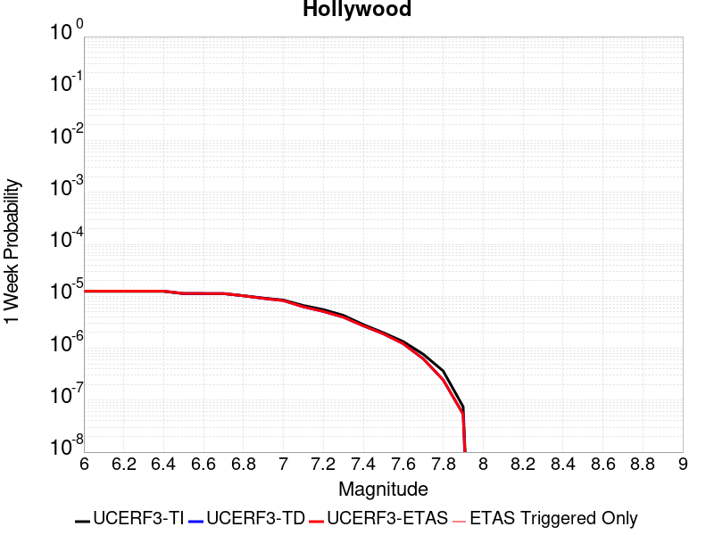 | 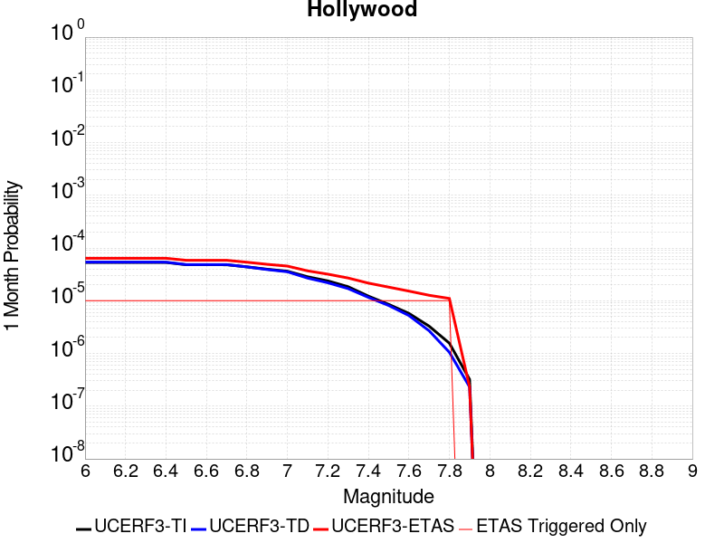 | 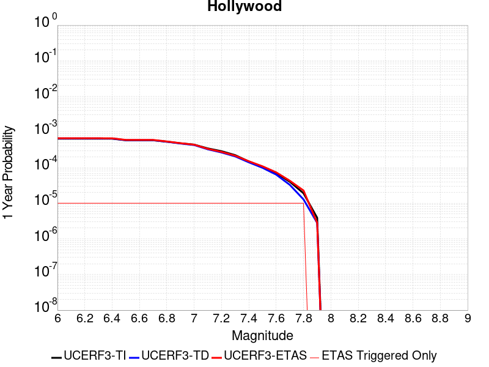 | 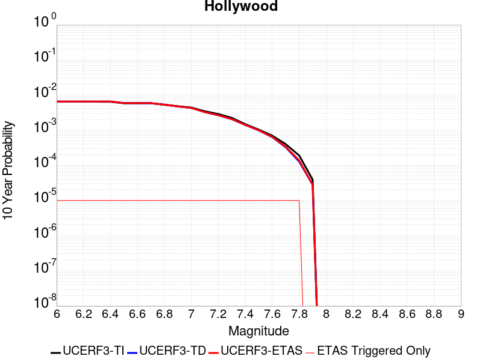 |

| Magnitude | 1 wk TI Prob | 1 wk TD Prob | 1 wk ETAS Prob | 1 wk ETAS/TD Gain | 1 wk ETAS Triggered Only | 1 mo TI Prob | 1 mo TD Prob | 1 mo ETAS Prob | 1 mo ETAS/TD Gain | 1 mo ETAS Triggered Only | 1 yr TI Prob | 1 yr TD Prob | 1 yr ETAS Prob | 1 yr ETAS/TD Gain | 1 yr ETAS Triggered Only | 10 yr TI Prob | 10 yr TD Prob | 10 yr ETAS Prob | 10 yr ETAS/TD Gain | 10 yr ETAS Triggered Only |
|-----|-----|-----|-----|-----|-----|-----|-----|-----|-----|-----|-----|-----|-----|-----|-----|-----|-----|-----|-----|-----|
| 6.0 | 1.24487615E-5 | 1.2599427E-5 | 1.2599427E-5 | 1.0 | 0.0 | 5.3350745E-5 | 5.3996453E-5 | 6.399591E-5 | 1.1851873 | 1.0E-5 | 6.4935174E-4 | 6.5721315E-4 | 6.672066E-4 | 1.0152057 | 1.0E-5 | 0.0064745755 | 0.006553184 | 0.006563118 | 1.001516 | 1.0E-5 |
| 6.1 | 1.24487615E-5 | 1.2599427E-5 | 1.2599427E-5 | 1.0 | 0.0 | 5.3350745E-5 | 5.3996453E-5 | 6.399591E-5 | 1.1851873 | 1.0E-5 | 6.4935174E-4 | 6.5721315E-4 | 6.672066E-4 | 1.0152057 | 1.0E-5 | 0.0064745755 | 0.006553184 | 0.006563118 | 1.001516 | 1.0E-5 |
| 6.2 | 1.24487615E-5 | 1.2599427E-5 | 1.2599427E-5 | 1.0 | 0.0 | 5.3350745E-5 | 5.3996453E-5 | 6.399591E-5 | 1.1851873 | 1.0E-5 | 6.4935174E-4 | 6.5721315E-4 | 6.672066E-4 | 1.0152057 | 1.0E-5 | 0.0064745755 | 0.006553184 | 0.006563118 | 1.001516 | 1.0E-5 |
| 6.3 | 1.24487615E-5 | 1.2599427E-5 | 1.2599427E-5 | 1.0 | 0.0 | 5.3350745E-5 | 5.3996453E-5 | 6.399591E-5 | 1.1851873 | 1.0E-5 | 6.4935174E-4 | 6.5721315E-4 | 6.672066E-4 | 1.0152057 | 1.0E-5 | 0.0064745755 | 0.006553184 | 0.006563118 | 1.001516 | 1.0E-5 |
| 6.4 | 1.2431024E-5 | 1.2580031E-5 | 1.2580031E-5 | 1.0 | 0.0 | 5.327473E-5 | 5.391333E-5 | 6.391279E-5 | 1.1854728 | 1.0E-5 | 6.4842677E-4 | 6.5620174E-4 | 6.661952E-4 | 1.0152292 | 1.0E-5 | 0.0064653796 | 0.006543129 | 0.006553064 | 1.0015184 | 1.0E-5 |
| 6.5 | 1.1242222E-5 | 1.1323625E-5 | 1.1323625E-5 | 1.0 | 0.0 | 4.8180063E-5 | 4.852893E-5 | 5.8528447E-5 | 1.2060527 | 1.0E-5 | 5.864344E-4 | 5.9068226E-4 | 6.0067634E-4 | 1.0169196 | 1.0E-5 | 0.0058488925 | 0.0058914092 | 0.0059013506 | 1.0016874 | 1.0E-5 |
| 6.6 | 1.1234066E-5 | 1.1314734E-5 | 1.1314734E-5 | 1.0 | 0.0 | 4.8145106E-5 | 4.849083E-5 | 5.8490346E-5 | 1.2062145 | 1.0E-5 | 5.86009E-4 | 5.9021864E-4 | 6.002127E-4 | 1.0169328 | 1.0E-5 | 0.005844661 | 0.005886798 | 0.0058967387 | 1.0016887 | 1.0E-5 |
| 6.7 | 1.12294E-5 | 1.1309474E-5 | 1.1309474E-5 | 1.0 | 0.0 | 4.812511E-5 | 4.846829E-5 | 5.8467806E-5 | 1.2063105 | 1.0E-5 | 5.857657E-4 | 5.8994436E-4 | 5.9993844E-4 | 1.0169407 | 1.0E-5 | 0.0058422405 | 0.0058840695 | 0.0058940104 | 1.0016896 | 1.0E-5 |
| 6.8 | 1.0252819E-5 | 1.0223633E-5 | 1.0223633E-5 | 1.0 | 0.0 | 4.3939912E-5 | 4.3814845E-5 | 5.3814405E-5 | 1.2282232 | 1.0E-5 | 5.3483713E-4 | 5.333173E-4 | 5.4331194E-4 | 1.0187405 | 1.0E-5 | 0.005335517 | 0.0053206007 | 0.005330547 | 1.0018694 | 1.0E-5 |
| 6.9 | 9.252289E-6 | 9.114876E-6 | 9.114876E-6 | 1.0 | 0.0 | 3.9652066E-5 | 3.9063176E-5 | 4.9062786E-5 | 1.2559856 | 1.0E-5 | 4.8265693E-4 | 4.7549204E-4 | 4.8548728E-4 | 1.0210209 | 1.0E-5 | 0.0048161 | 0.00474492 | 0.0047548725 | 1.0020975 | 1.0E-5 |
| 7.0 | 8.474604E-6 | 8.262404E-6 | 8.262404E-6 | 1.0 | 0.0 | 3.6319227E-5 | 3.540983E-5 | 4.5409473E-5 | 1.2823975 | 1.0E-5 | 4.4209688E-4 | 4.310308E-4 | 4.4102652E-4 | 1.0231901 | 1.0E-5 | 0.004412184 | 0.0043020984 | 0.0043120557 | 1.0023144 | 1.0E-5 |
| 7.1 | 6.643643E-6 | 6.2715453E-6 | 6.2715453E-6 | 1.0 | 0.0 | 2.8472443E-5 | 2.6877777E-5 | 3.6877507E-5 | 1.3720446 | 1.0E-5 | 3.4659685E-4 | 3.2718823E-4 | 3.3718496E-4 | 1.0305535 | 1.0E-5 | 0.0034605677 | 0.0032671113 | 0.0032770785 | 1.0030508 | 1.0E-5 |
| 7.2 | 5.549002E-6 | 5.111377E-6 | 5.111377E-6 | 1.0 | 0.0 | 2.378122E-5 | 2.1905718E-5 | 3.19055E-5 | 1.4564918 | 1.0E-5 | 2.8949787E-4 | 2.666696E-4 | 2.7666695E-4 | 1.0374895 | 1.0E-5 | 0.0028912104 | 0.0026635127 | 0.002673486 | 1.0037445 | 1.0E-5 |
| 7.3 | 4.3059727E-6 | 3.962112E-6 | 3.962112E-6 | 1.0 | 0.0 | 1.8454039E-5 | 1.698037E-5 | 2.6980199E-5 | 1.5889053 | 1.0E-5 | 2.2465475E-4 | 2.0671648E-4 | 2.1671441E-4 | 1.0483655 | 1.0E-5 | 0.0022442779 | 0.002065252 | 0.0020752314 | 1.004832 | 1.0E-5 |
| 7.4 | 2.8550733E-6 | 2.703084E-6 | 2.703084E-6 | 1.0 | 0.0 | 1.2235971E-5 | 1.1584595E-5 | 2.158448E-5 | 1.8632053 | 1.0E-5 | 1.4896276E-4 | 1.4103336E-4 | 1.5103196E-4 | 1.0708952 | 1.0E-5 | 0.0014886294 | 0.0014094437 | 0.0014194296 | 1.007085 | 1.0E-5 |
| 7.5 | 1.9927045E-6 | 1.8989821E-6 | 1.8989821E-6 | 1.0 | 0.0 | 8.540134E-6 | 8.13847E-6 | 1.8138388E-5 | 2.2287223 | 1.0E-5 | 1.0397117E-4 | 9.908139E-5 | 1.0908041E-4 | 1.1009171 | 1.0E-5 | 0.0010392254 | 9.903758E-4 | 0.0010003659 | 1.0100871 | 1.0E-5 |
| 7.6 | 1.345084E-6 | 1.2225105E-6 | 1.2225105E-6 | 1.0 | 0.0 | 5.764633E-6 | 5.23932E-6 | 1.5239268E-5 | 2.9086344 | 1.0E-5 | 7.018215E-5 | 6.378688E-5 | 7.3786236E-5 | 1.156762 | 1.0E-5 | 7.0159987E-4 | 6.376877E-4 | 6.476813E-4 | 1.0156716 | 1.0E-5 |
| 7.7 | 7.6835164E-7 | 6.284514E-7 | 6.284514E-7 | 1.0 | 0.0 | 3.2929315E-6 | 2.6933603E-6 | 1.2693334E-5 | 4.712824 | 1.0E-5 | 4.00907E-5 | 3.2791184E-5 | 4.2790856E-5 | 1.30495 | 1.0E-5 | 4.0083472E-4 | 3.2786495E-4 | 3.3786165E-4 | 1.0304904 | 1.0E-5 |
| 7.8 | 3.6562128E-7 | 2.459082E-7 | 2.459082E-7 | 1.0 | 0.0 | 1.5669474E-6 | 1.0538919E-6 | 1.1053881E-5 | 10.488629 | 1.0E-5 | 1.9077417E-5 | 1.2831062E-5 | 2.2830935E-5 | 1.7793487 | 1.0E-5 | 1.907578E-4 | 1.2830358E-4 | 1.383023E-4 | 1.0779301 | 1.0E-5 |
| 7.9 | 7.5024424E-8 | 5.3936116E-8 | 5.3936116E-8 | 1.0 | 0.0 | 3.215332E-7 | 2.3115477E-7 | 2.3115477E-7 | 1.0 | 0.0 | 3.91466E-6 | 2.814307E-6 | 2.814307E-6 | 1.0 | 0.0 | 3.9145907E-5 | 2.8142846E-5 | 2.8142846E-5 | 1.0 | 0.0 |

## Garlock (West)
*[(top)](#table-of-contents)*

| 1 Week | 1 Month | 1 Year | 10 Year |
|-----|-----|-----|-----|
| 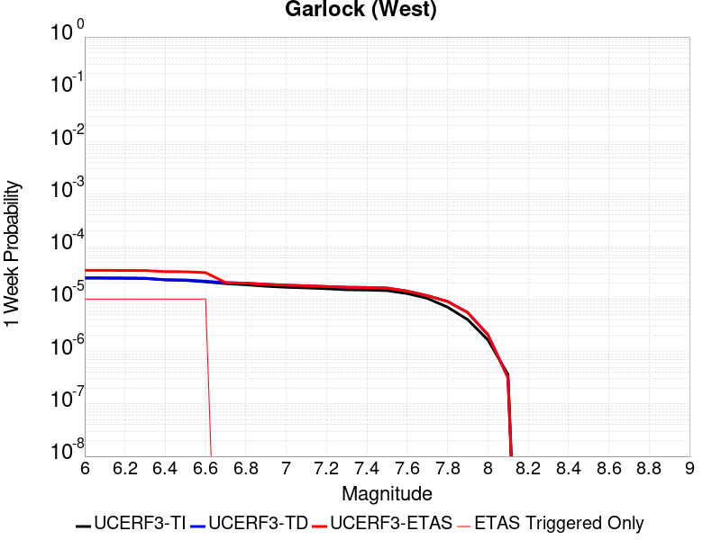 | 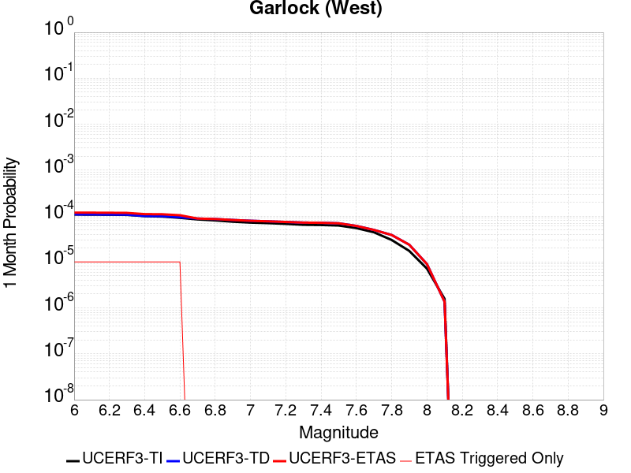 | 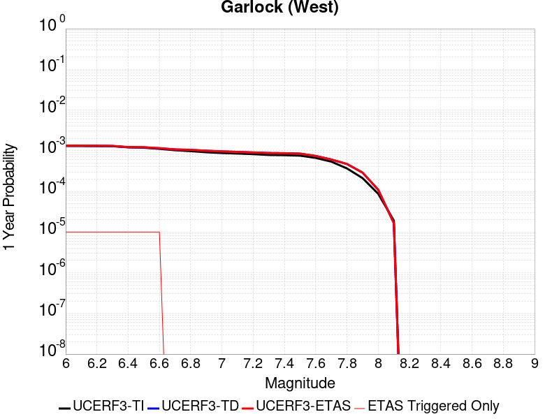 | 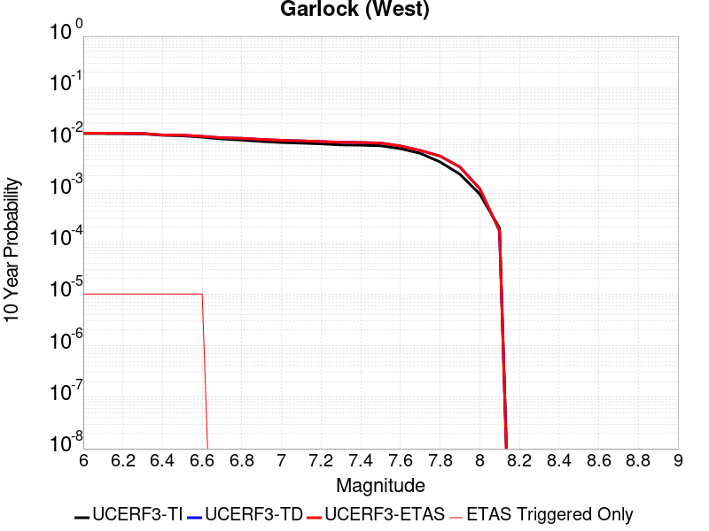 |

| Magnitude | 1 wk TI Prob | 1 wk TD Prob | 1 wk ETAS Prob | 1 wk ETAS/TD Gain | 1 wk ETAS Triggered Only | 1 mo TI Prob | 1 mo TD Prob | 1 mo ETAS Prob | 1 mo ETAS/TD Gain | 1 mo ETAS Triggered Only | 1 yr TI Prob | 1 yr TD Prob | 1 yr ETAS Prob | 1 yr ETAS/TD Gain | 1 yr ETAS Triggered Only | 10 yr TI Prob | 10 yr TD Prob | 10 yr ETAS Prob | 10 yr ETAS/TD Gain | 10 yr ETAS Triggered Only |
|-----|-----|-----|-----|-----|-----|-----|-----|-----|-----|-----|-----|-----|-----|-----|-----|-----|-----|-----|-----|-----|
| 6.0 | 2.5181727E-5 | 2.5396972E-5 | 3.539672E-5 | 1.3937377 | 1.0E-5 | 1.0791722E-4 | 1.08839646E-4 | 1.1883856E-4 | 1.0918683 | 1.0E-5 | 0.0013131002 | 0.0013243206 | 0.0013343074 | 1.0075411 | 1.0E-5 | 0.013053683 | 0.013245028 | 0.013254896 | 1.000745 | 1.0E-5 |
| 6.1 | 2.5077732E-5 | 2.5297977E-5 | 3.5297722E-5 | 1.3952786 | 1.0E-5 | 1.0747157E-4 | 1.08415414E-4 | 1.1841433E-4 | 1.0922278 | 1.0E-5 | 0.001307681 | 0.0013191618 | 0.0013291487 | 1.0075706 | 1.0E-5 | 0.013000126 | 0.013194055 | 0.013203924 | 1.0007479 | 1.0E-5 |
| 6.2 | 2.494612E-5 | 2.5179503E-5 | 3.517925E-5 | 1.3971385 | 1.0E-5 | 1.0690756E-4 | 1.0790771E-4 | 1.1790663E-4 | 1.0926617 | 1.0E-5 | 0.0013008224 | 0.0013129881 | 0.0013229749 | 1.0076063 | 1.0E-5 | 0.012932341 | 0.013133048 | 0.013142916 | 1.0007515 | 1.0E-5 |
| 6.3 | 2.4733758E-5 | 2.4998679E-5 | 3.499843E-5 | 1.4000112 | 1.0E-5 | 1.0599751E-4 | 1.07132815E-4 | 1.1713175E-4 | 1.093332 | 1.0E-5 | 0.0012897556 | 0.001303565 | 0.001313552 | 1.0076612 | 1.0E-5 | 0.012822957 | 0.013039928 | 0.013049797 | 1.0007569 | 1.0E-5 |
| 6.4 | 2.3237335E-5 | 2.3376611E-5 | 3.337638E-5 | 1.427768 | 1.0E-5 | 9.958477E-5 | 1.0018165E-4 | 1.1018065E-4 | 1.0998087 | 1.0E-5 | 0.0012117702 | 0.0012190319 | 0.0012290197 | 1.0081933 | 1.0E-5 | 0.012051838 | 0.012204153 | 0.012214031 | 1.0008094 | 1.0E-5 |
| 6.5 | 2.2732203E-5 | 2.3190267E-5 | 3.3190037E-5 | 1.4312054 | 1.0E-5 | 9.742009E-5 | 9.938309E-5 | 1.093821E-4 | 1.1006107 | 1.0E-5 | 0.0011854442 | 0.0012093203 | 0.0012193082 | 1.008259 | 1.0E-5 | 0.011791403 | 0.0121081 | 0.012117979 | 1.0008159 | 1.0E-5 |
| 6.6 | 2.1319436E-5 | 2.1969068E-5 | 3.1968848E-5 | 1.4551754 | 1.0E-5 | 9.136581E-5 | 9.4149764E-5 | 1.0414882E-4 | 1.1062038 | 1.0E-5 | 0.001111811 | 0.001145673 | 0.0011556615 | 1.0087185 | 1.0E-5 | 0.011062649 | 0.011478346 | 0.011488232 | 1.0008612 | 1.0E-5 |
| 6.7 | 1.970802E-5 | 2.0587033E-5 | 2.0587033E-5 | 1.0 | 0.0 | 8.446021E-5 | 8.822717E-5 | 8.822717E-5 | 1.0 | 0.0 | 0.001027818 | 0.0010736382 | 0.0010736382 | 1.0 | 0.0 | 0.010230771 | 0.0107651595 | 0.0107651595 | 1.0 | 0.0 |
| 6.8 | 1.8744462E-5 | 2.0092908E-5 | 2.0092908E-5 | 1.0 | 0.0 | 8.033094E-5 | 8.6109634E-5 | 8.6109634E-5 | 1.0 | 0.0 | 9.775903E-4 | 0.0010478823 | 0.0010478823 | 1.0 | 0.0 | 0.009733009 | 0.01051005 | 0.01051005 | 1.0 | 0.0 |
| 6.9 | 1.7559682E-5 | 1.9143672E-5 | 1.9143672E-5 | 1.0 | 0.0 | 7.5253614E-5 | 8.204174E-5 | 8.204174E-5 | 1.0 | 0.0 | 9.158276E-4 | 9.984019E-4 | 9.984019E-4 | 1.0 | 0.0 | 0.0091206245 | 0.010019711 | 0.010019711 | 1.0 | 0.0 |
| 7.0 | 1.6794445E-5 | 1.8403889E-5 | 1.8403889E-5 | 1.0 | 0.0 | 7.197421E-5 | 7.887143E-5 | 7.887143E-5 | 1.0 | 0.0 | 8.759337E-4 | 9.5983804E-4 | 9.5983804E-4 | 1.0 | 0.0 | 0.008724891 | 0.009637345 | 0.009637345 | 1.0 | 0.0 |
| 7.1 | 1.6337795E-5 | 1.7903694E-5 | 1.7903694E-5 | 1.0 | 0.0 | 7.0017246E-5 | 7.672787E-5 | 7.672787E-5 | 1.0 | 0.0 | 8.521265E-4 | 9.3376276E-4 | 9.3376276E-4 | 1.0 | 0.0 | 0.008488664 | 0.009378765 | 0.009378765 | 1.0 | 0.0 |
| 7.2 | 1.5780008E-5 | 1.7351626E-5 | 1.7351626E-5 | 1.0 | 0.0 | 6.762685E-5 | 7.4362E-5 | 7.4362E-5 | 1.0 | 0.0 | 8.2304585E-4 | 9.0498256E-4 | 9.0498256E-4 | 1.0 | 0.0 | 0.008200042 | 0.00909327 | 0.00909327 | 1.0 | 0.0 |
| 7.3 | 1.5058865E-5 | 1.6803348E-5 | 1.6803348E-5 | 1.0 | 0.0 | 6.45364E-5 | 7.2012364E-5 | 7.2012364E-5 | 1.0 | 0.0 | 7.854473E-4 | 8.763991E-4 | 8.763991E-4 | 1.0 | 0.0 | 0.00782677 | 0.008809303 | 0.008809303 | 1.0 | 0.0 |
| 7.4 | 1.4887923E-5 | 1.6638744E-5 | 1.6638744E-5 | 1.0 | 0.0 | 6.380382E-5 | 7.130696E-5 | 7.130696E-5 | 1.0 | 0.0 | 7.7653467E-4 | 8.678176E-4 | 8.678176E-4 | 1.0 | 0.0 | 0.0077382675 | 0.008723826 | 0.008723826 | 1.0 | 0.0 |
| 7.5 | 1.4509299E-5 | 1.622937E-5 | 1.622937E-5 | 1.0 | 0.0 | 6.218123E-5 | 6.95526E-5 | 6.95526E-5 | 1.0 | 0.0 | 7.567935E-4 | 8.4647513E-4 | 8.4647513E-4 | 1.0 | 0.0 | 0.0075422134 | 0.008511444 | 0.008511444 | 1.0 | 0.0 |
| 7.6 | 1.2756717E-5 | 1.4223491E-5 | 1.4223491E-5 | 1.0 | 0.0 | 5.4670498E-5 | 6.0956398E-5 | 6.0956398E-5 | 1.0 | 0.0 | 6.6541E-4 | 7.4189215E-4 | 7.4189215E-4 | 1.0 | 0.0 | 0.006634211 | 0.007471359 | 0.007471359 | 1.0 | 0.0 |
| 7.7 | 1.0328985E-5 | 1.1622026E-5 | 1.1622026E-5 | 1.0 | 0.0 | 4.4266326E-5 | 4.9807735E-5 | 4.9807735E-5 | 1.0 | 0.0 | 5.388092E-4 | 6.062409E-4 | 6.062409E-4 | 1.0 | 0.0 | 0.0053750467 | 0.006122246 | 0.006122246 | 1.0 | 0.0 |
| 7.8 | 7.0306583E-6 | 9.028785E-6 | 9.028785E-6 | 1.0 | 0.0 | 3.0131043E-5 | 3.869422E-5 | 3.869422E-5 | 1.0 | 0.0 | 3.667837E-4 | 4.7100044E-4 | 4.7100044E-4 | 1.0 | 0.0 | 0.003661789 | 0.004762395 | 0.004762395 | 1.0 | 0.0 |
| 7.9 | 4.060633E-6 | 5.5402907E-6 | 5.5402907E-6 | 1.0 | 0.0 | 1.7402595E-5 | 2.3743887E-5 | 2.3743887E-5 | 1.0 | 0.0 | 2.11856E-4 | 2.890436E-4 | 2.890436E-4 | 1.0 | 0.0 | 0.0021165414 | 0.0029231892 | 0.0029231892 | 1.0 | 0.0 |
| 8.0 | 1.6729537E-6 | 2.1026237E-6 | 2.1026237E-6 | 1.0 | 0.0 | 7.169782E-6 | 9.0112135E-6 | 9.0112135E-6 | 1.0 | 0.0 | 8.7288594E-5 | 1.0970603E-4 | 1.0970603E-4 | 1.0 | 0.0 | 8.7254314E-4 | 0.0011101598 | 0.0011101598 | 1.0 | 0.0 |
| 8.1 | 3.6733252E-7 | 3.184797E-7 | 3.184797E-7 | 1.0 | 0.0 | 1.5742813E-6 | 1.3649124E-6 | 1.3649124E-6 | 1.0 | 0.0 | 1.9166706E-5 | 1.6617698E-5 | 1.6617698E-5 | 1.0 | 0.0 | 1.9165053E-4 | 1.6828527E-4 | 1.6828527E-4 | 1.0 | 0.0 |

## North Frontal  (West)
*[(top)](#table-of-contents)*

| 1 Week | 1 Month | 1 Year | 10 Year |
|-----|-----|-----|-----|
| 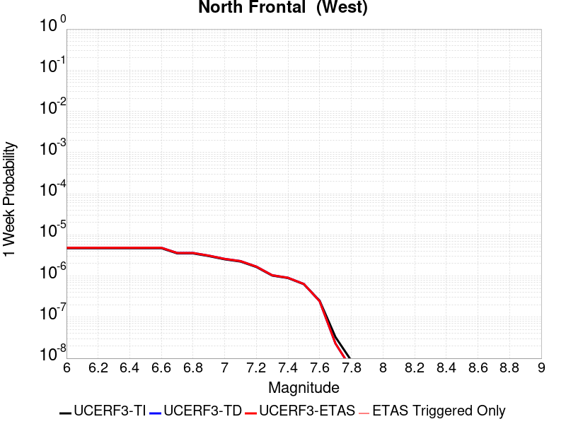 |  | 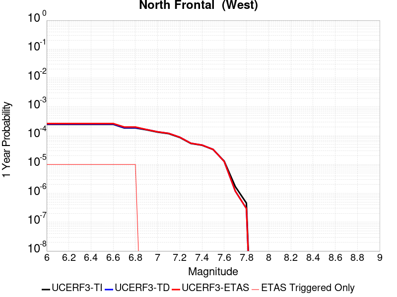 | 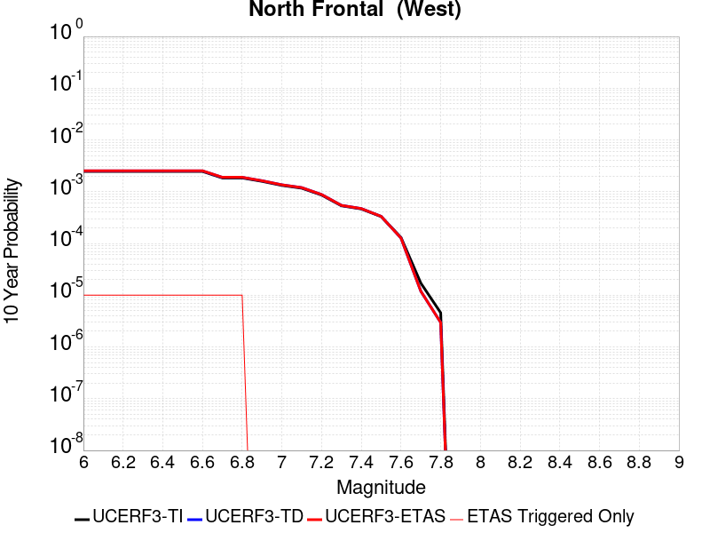 |

| Magnitude | 1 wk TI Prob | 1 wk TD Prob | 1 wk ETAS Prob | 1 wk ETAS/TD Gain | 1 wk ETAS Triggered Only | 1 mo TI Prob | 1 mo TD Prob | 1 mo ETAS Prob | 1 mo ETAS/TD Gain | 1 mo ETAS Triggered Only | 1 yr TI Prob | 1 yr TD Prob | 1 yr ETAS Prob | 1 yr ETAS/TD Gain | 1 yr ETAS Triggered Only | 10 yr TI Prob | 10 yr TD Prob | 10 yr ETAS Prob | 10 yr ETAS/TD Gain | 10 yr ETAS Triggered Only |
|-----|-----|-----|-----|-----|-----|-----|-----|-----|-----|-----|-----|-----|-----|-----|-----|-----|-----|-----|-----|-----|
| 6.0 | 4.7316266E-6 | 4.853404E-6 | 4.853404E-6 | 1.0 | 0.0 | 2.0278241E-5 | 2.0800146E-5 | 2.0800146E-5 | 1.0 | 0.0 | 2.4685962E-4 | 2.532138E-4 | 2.632113E-4 | 1.0394824 | 1.0E-5 | 0.0024658558 | 0.002529399 | 0.0025393737 | 1.0039436 | 1.0E-5 |
| 6.1 | 4.7316266E-6 | 4.853404E-6 | 4.853404E-6 | 1.0 | 0.0 | 2.0278241E-5 | 2.0800146E-5 | 2.0800146E-5 | 1.0 | 0.0 | 2.4685962E-4 | 2.532138E-4 | 2.632113E-4 | 1.0394824 | 1.0E-5 | 0.0024658558 | 0.002529399 | 0.0025393737 | 1.0039436 | 1.0E-5 |
| 6.2 | 4.7316266E-6 | 4.853404E-6 | 4.853404E-6 | 1.0 | 0.0 | 2.0278241E-5 | 2.0800146E-5 | 2.0800146E-5 | 1.0 | 0.0 | 2.4685962E-4 | 2.532138E-4 | 2.632113E-4 | 1.0394824 | 1.0E-5 | 0.0024658558 | 0.002529399 | 0.0025393737 | 1.0039436 | 1.0E-5 |
| 6.3 | 4.7316266E-6 | 4.853404E-6 | 4.853404E-6 | 1.0 | 0.0 | 2.0278241E-5 | 2.0800146E-5 | 2.0800146E-5 | 1.0 | 0.0 | 2.4685962E-4 | 2.532138E-4 | 2.632113E-4 | 1.0394824 | 1.0E-5 | 0.0024658558 | 0.002529399 | 0.0025393737 | 1.0039436 | 1.0E-5 |
| 6.4 | 4.7316266E-6 | 4.853404E-6 | 4.853404E-6 | 1.0 | 0.0 | 2.0278241E-5 | 2.0800146E-5 | 2.0800146E-5 | 1.0 | 0.0 | 2.4685962E-4 | 2.532138E-4 | 2.632113E-4 | 1.0394824 | 1.0E-5 | 0.0024658558 | 0.002529399 | 0.0025393737 | 1.0039436 | 1.0E-5 |
| 6.5 | 4.7316266E-6 | 4.853404E-6 | 4.853404E-6 | 1.0 | 0.0 | 2.0278241E-5 | 2.0800146E-5 | 2.0800146E-5 | 1.0 | 0.0 | 2.4685962E-4 | 2.532138E-4 | 2.632113E-4 | 1.0394824 | 1.0E-5 | 0.0024658558 | 0.002529399 | 0.0025393737 | 1.0039436 | 1.0E-5 |
| 6.6 | 4.7316266E-6 | 4.853404E-6 | 4.853404E-6 | 1.0 | 0.0 | 2.0278241E-5 | 2.0800146E-5 | 2.0800146E-5 | 1.0 | 0.0 | 2.4685962E-4 | 2.532138E-4 | 2.632113E-4 | 1.0394824 | 1.0E-5 | 0.0024658558 | 0.002529399 | 0.0025393737 | 1.0039436 | 1.0E-5 |
| 6.7 | 3.5382777E-6 | 3.6314666E-6 | 3.6314666E-6 | 1.0 | 0.0 | 1.516396E-5 | 1.556334E-5 | 1.556334E-5 | 1.0 | 0.0 | 1.8460557E-4 | 1.8946797E-4 | 1.9946607E-4 | 1.0527694 | 1.0E-5 | 0.0018445229 | 0.0018931413 | 0.0019031224 | 1.0052723 | 1.0E-5 |
| 6.8 | 3.5382777E-6 | 3.6314666E-6 | 3.6314666E-6 | 1.0 | 0.0 | 1.516396E-5 | 1.556334E-5 | 1.556334E-5 | 1.0 | 0.0 | 1.8460557E-4 | 1.8946797E-4 | 1.9946607E-4 | 1.0527694 | 1.0E-5 | 0.0018445229 | 0.0018931413 | 0.0019031224 | 1.0052723 | 1.0E-5 |
| 6.9 | 3.0428037E-6 | 3.1232742E-6 | 3.1232742E-6 | 1.0 | 0.0 | 1.30405215E-5 | 1.33853955E-5 | 1.33853955E-5 | 1.0 | 0.0 | 1.5875678E-4 | 1.629557E-4 | 1.629557E-4 | 1.0 | 0.0 | 0.0015864341 | 0.0016284292 | 0.0016284292 | 1.0 | 0.0 |
| 7.0 | 2.538778E-6 | 2.606537E-6 | 2.606537E-6 | 1.0 | 0.0 | 1.0880432E-5 | 1.1170827E-5 | 1.1170827E-5 | 1.0 | 0.0 | 1.324612E-4 | 1.359968E-4 | 1.359968E-4 | 1.0 | 0.0 | 0.0013238228 | 0.0013591826 | 0.0013591826 | 1.0 | 0.0 |
| 7.1 | 2.2418935E-6 | 2.3016114E-6 | 2.3016114E-6 | 1.0 | 0.0 | 9.60808E-6 | 9.864014E-6 | 9.864014E-6 | 1.0 | 0.0 | 1.1697209E-4 | 1.20088196E-4 | 1.20088196E-4 | 1.0 | 0.0 | 0.0011691054 | 0.001200277 | 0.001200277 | 1.0 | 0.0 |
| 7.2 | 1.6526745E-6 | 1.6927848E-6 | 1.6927848E-6 | 1.0 | 0.0 | 7.082872E-6 | 7.2547737E-6 | 7.2547737E-6 | 1.0 | 0.0 | 8.623055E-5 | 8.832355E-5 | 8.832355E-5 | 1.0 | 0.0 | 8.61971E-4 | 8.8290946E-4 | 8.8290946E-4 | 1.0 | 0.0 |
| 7.3 | 1.0246019E-6 | 1.0444181E-6 | 1.0444181E-6 | 1.0 | 0.0 | 4.391144E-6 | 4.4760704E-6 | 4.4760704E-6 | 1.0 | 0.0 | 5.3460866E-5 | 5.449491E-5 | 5.449491E-5 | 1.0 | 0.0 | 5.344801E-4 | 5.4482697E-4 | 5.4482697E-4 | 1.0 | 0.0 |
| 7.4 | 8.9045164E-7 | 9.0582427E-7 | 9.0582427E-7 | 1.0 | 0.0 | 3.8162157E-6 | 3.8820986E-6 | 3.8820986E-6 | 1.0 | 0.0 | 4.646144E-5 | 4.726364E-5 | 4.726364E-5 | 1.0 | 0.0 | 4.6451724E-4 | 4.7254673E-4 | 4.7254673E-4 | 1.0 | 0.0 |
| 7.5 | 6.3357E-7 | 6.4039295E-7 | 6.4039295E-7 | 1.0 | 0.0 | 2.7152971E-6 | 2.7445387E-6 | 2.7445387E-6 | 1.0 | 0.0 | 3.305824E-5 | 3.3414315E-5 | 3.3414315E-5 | 1.0 | 0.0 | 3.3053322E-4 | 3.340995E-4 | 3.340995E-4 | 1.0 | 0.0 |
| 7.6 | 2.5087024E-7 | 2.436591E-7 | 2.436591E-7 | 1.0 | 0.0 | 1.0751578E-6 | 1.0442529E-6 | 1.0442529E-6 | 1.0 | 0.0 | 1.3089967E-5 | 1.27137255E-5 | 1.27137255E-5 | 1.0 | 0.0 | 1.3089196E-4 | 1.2713204E-4 | 1.2713204E-4 | 1.0 | 0.0 |
| 7.7 | 3.282987E-8 | 2.2879625E-8 | 2.2879625E-8 | 1.0 | 0.0 | 1.4069944E-7 | 9.805553E-8 | 9.805553E-8 | 1.0 | 0.0 | 1.7130144E-6 | 1.1938255E-6 | 1.1938255E-6 | 1.0 | 0.0 | 1.7130013E-5 | 1.1938199E-5 | 1.1938199E-5 | 1.0 | 0.0 |
| 7.8 | 8.77499E-9 | 5.684049E-9 | 5.684049E-9 | 1.0 | 0.0 | 3.7607098E-8 | 2.436021E-8 | 2.436021E-8 | 1.0 | 0.0 | 4.578663E-7 | 2.965855E-7 | 2.965855E-7 | 1.0 | 0.0 | 4.5786537E-6 | 2.9658527E-6 | 2.9658527E-6 | 1.0 | 0.0 |

## Cady
*[(top)](#table-of-contents)*

| 1 Week | 1 Month | 1 Year | 10 Year |
|-----|-----|-----|-----|
|  |  |  |  |

| Magnitude | 1 wk TI Prob | 1 wk TD Prob | 1 wk ETAS Prob | 1 wk ETAS/TD Gain | 1 wk ETAS Triggered Only | 1 mo TI Prob | 1 mo TD Prob | 1 mo ETAS Prob | 1 mo ETAS/TD Gain | 1 mo ETAS Triggered Only | 1 yr TI Prob | 1 yr TD Prob | 1 yr ETAS Prob | 1 yr ETAS/TD Gain | 1 yr ETAS Triggered Only | 10 yr TI Prob | 10 yr TD Prob | 10 yr ETAS Prob | 10 yr ETAS/TD Gain | 10 yr ETAS Triggered Only |
|-----|-----|-----|-----|-----|-----|-----|-----|-----|-----|-----|-----|-----|-----|-----|-----|-----|-----|-----|-----|-----|
| 6.0 | 1.9892565E-5 | 2.1869915E-5 | 3.1869695E-5 | 1.4572392 | 1.0E-5 | 8.525106E-5 | 9.372535E-5 | 1.03724415E-4 | 1.1066847 | 1.0E-5 | 0.0010374374 | 0.0011405998 | 0.0011505884 | 1.0087574 | 1.0E-5 | 0.010326075 | 0.011356481 | 0.011366367 | 1.0008706 | 1.0E-5 |
| 6.1 | 1.9892565E-5 | 2.1869915E-5 | 3.1869695E-5 | 1.4572392 | 1.0E-5 | 8.525106E-5 | 9.372535E-5 | 1.03724415E-4 | 1.1066847 | 1.0E-5 | 0.0010374374 | 0.0011405998 | 0.0011505884 | 1.0087574 | 1.0E-5 | 0.010326075 | 0.011356481 | 0.011366367 | 1.0008706 | 1.0E-5 |
| 6.2 | 1.9892565E-5 | 2.1869915E-5 | 3.1869695E-5 | 1.4572392 | 1.0E-5 | 8.525106E-5 | 9.372535E-5 | 1.03724415E-4 | 1.1066847 | 1.0E-5 | 0.0010374374 | 0.0011405998 | 0.0011505884 | 1.0087574 | 1.0E-5 | 0.010326075 | 0.011356481 | 0.011366367 | 1.0008706 | 1.0E-5 |
| 6.3 | 1.1117327E-5 | 1.218259E-5 | 2.2182468E-5 | 1.8208336 | 1.0E-5 | 4.764482E-5 | 5.221023E-5 | 6.220971E-5 | 1.1915233 | 1.0E-5 | 5.7992124E-4 | 6.355057E-4 | 6.454993E-4 | 1.0157255 | 1.0E-5 | 0.0057841022 | 0.006339993 | 0.0063499296 | 1.0015672 | 1.0E-5 |
| 6.4 | 1.1117327E-5 | 1.218259E-5 | 2.2182468E-5 | 1.8208336 | 1.0E-5 | 4.764482E-5 | 5.221023E-5 | 6.220971E-5 | 1.1915233 | 1.0E-5 | 5.7992124E-4 | 6.355057E-4 | 6.454993E-4 | 1.0157255 | 1.0E-5 | 0.0057841022 | 0.006339993 | 0.0063499296 | 1.0015672 | 1.0E-5 |
| 6.5 | 6.103093E-6 | 6.6752414E-6 | 1.6675174E-5 | 2.498063 | 1.0E-5 | 2.615585E-5 | 2.8607934E-5 | 3.8607646E-5 | 1.3495433 | 1.0E-5 | 3.1840094E-4 | 3.482585E-4 | 3.5825503E-4 | 1.0287043 | 1.0E-5 | 0.0031794512 | 0.0034783627 | 0.0034883278 | 1.002865 | 1.0E-5 |
| 6.6 | 5.817237E-6 | 6.3687653E-6 | 1.6368702E-5 | 2.570153 | 1.0E-5 | 2.4930776E-5 | 2.7294494E-5 | 3.729422E-5 | 1.3663642 | 1.0E-5 | 3.034899E-4 | 3.3227223E-4 | 3.4226893E-4 | 1.0300858 | 1.0E-5 | 0.0030307577 | 0.0033189778 | 0.0033289446 | 1.003003 | 1.0E-5 |
| 6.7 | 4.8846314E-6 | 5.343149E-6 | 1.5343096E-5 | 2.8715456 | 1.0E-5 | 2.0933967E-5 | 2.2899076E-5 | 3.2898846E-5 | 1.4366889 | 1.0E-5 | 2.5484123E-4 | 2.7877238E-4 | 2.8876957E-4 | 1.0358616 | 1.0E-5 | 0.0025454918 | 0.0027853833 | 0.0027953554 | 1.0035802 | 1.0E-5 |
| 6.8 | 1.7788773E-6 | 1.9408171E-6 | 1.9408171E-6 | 1.0 | 0.0 | 7.6237375E-6 | 8.31777E-6 | 8.31777E-6 | 1.0 | 0.0 | 9.281505E-5 | 1.0126572E-4 | 1.0126572E-4 | 1.0 | 0.0 | 9.2776294E-4 | 0.0010123505 | 0.0010123505 | 1.0 | 0.0 |
| 6.9 | 7.5455404E-7 | 8.301368E-7 | 8.301368E-7 | 1.0 | 0.0 | 3.233799E-6 | 3.5577261E-6 | 3.5577261E-6 | 1.0 | 0.0 | 3.937079E-5 | 4.331479E-5 | 4.331479E-5 | 1.0 | 0.0 | 3.9363815E-4 | 4.330965E-4 | 4.330965E-4 | 1.0 | 0.0 |
| 7.0 | 6.8578805E-7 | 7.5457075E-7 | 7.5457075E-7 | 1.0 | 0.0 | 2.9390883E-6 | 3.2338726E-6 | 3.2338726E-6 | 1.0 | 0.0 | 3.578281E-5 | 3.937202E-5 | 3.937202E-5 | 1.0 | 0.0 | 3.577705E-4 | 3.9368295E-4 | 3.9368295E-4 | 1.0 | 0.0 |

## Earthquake Valley (So Extension)
*[(top)](#table-of-contents)*

| 1 Week | 1 Month | 1 Year | 10 Year |
|-----|-----|-----|-----|
|  |  |  |  |

| Magnitude | 1 wk TI Prob | 1 wk TD Prob | 1 wk ETAS Prob | 1 wk ETAS/TD Gain | 1 wk ETAS Triggered Only | 1 mo TI Prob | 1 mo TD Prob | 1 mo ETAS Prob | 1 mo ETAS/TD Gain | 1 mo ETAS Triggered Only | 1 yr TI Prob | 1 yr TD Prob | 1 yr ETAS Prob | 1 yr ETAS/TD Gain | 1 yr ETAS Triggered Only | 10 yr TI Prob | 10 yr TD Prob | 10 yr ETAS Prob | 10 yr ETAS/TD Gain | 10 yr ETAS Triggered Only |
|-----|-----|-----|-----|-----|-----|-----|-----|-----|-----|-----|-----|-----|-----|-----|-----|-----|-----|-----|-----|-----|
| 6.0 | 3.0194888E-5 | 3.711621E-5 | 4.711584E-5 | 1.2694141 | 1.0E-5 | 1.2940024E-4 | 1.5906284E-4 | 1.6906124E-4 | 1.0628582 | 1.0E-5 | 0.0015743093 | 0.0019353795 | 0.0019453602 | 1.005157 | 1.0E-5 | 0.01563203 | 0.019235648 | 0.019245457 | 1.0005099 | 1.0E-5 |
| 6.1 | 3.0194888E-5 | 3.711621E-5 | 4.711584E-5 | 1.2694141 | 1.0E-5 | 1.2940024E-4 | 1.5906284E-4 | 1.6906124E-4 | 1.0628582 | 1.0E-5 | 0.0015743093 | 0.0019353795 | 0.0019453602 | 1.005157 | 1.0E-5 | 0.01563203 | 0.019235648 | 0.019245457 | 1.0005099 | 1.0E-5 |
| 6.2 | 3.0194888E-5 | 3.711621E-5 | 4.711584E-5 | 1.2694141 | 1.0E-5 | 1.2940024E-4 | 1.5906284E-4 | 1.6906124E-4 | 1.0628582 | 1.0E-5 | 0.0015743093 | 0.0019353795 | 0.0019453602 | 1.005157 | 1.0E-5 | 0.01563203 | 0.019235648 | 0.019245457 | 1.0005099 | 1.0E-5 |
| 6.3 | 1.5795305E-5 | 1.8463072E-5 | 1.8463072E-5 | 1.0 | 0.0 | 6.769241E-5 | 7.9125675E-5 | 7.9125675E-5 | 1.0 | 0.0 | 8.238434E-4 | 9.630403E-4 | 9.630403E-4 | 1.0 | 0.0 | 0.008207959 | 0.009599585 | 0.009599585 | 1.0 | 0.0 |
| 6.4 | 1.5795305E-5 | 1.8463072E-5 | 1.8463072E-5 | 1.0 | 0.0 | 6.769241E-5 | 7.9125675E-5 | 7.9125675E-5 | 1.0 | 0.0 | 8.238434E-4 | 9.630403E-4 | 9.630403E-4 | 1.0 | 0.0 | 0.008207959 | 0.009599585 | 0.009599585 | 1.0 | 0.0 |
| 6.5 | 1.5795305E-5 | 1.8463072E-5 | 1.8463072E-5 | 1.0 | 0.0 | 6.769241E-5 | 7.9125675E-5 | 7.9125675E-5 | 1.0 | 0.0 | 8.238434E-4 | 9.630403E-4 | 9.630403E-4 | 1.0 | 0.0 | 0.008207959 | 0.009599585 | 0.009599585 | 1.0 | 0.0 |
| 6.6 | 1.5795305E-5 | 1.8463072E-5 | 1.8463072E-5 | 1.0 | 0.0 | 6.769241E-5 | 7.9125675E-5 | 7.9125675E-5 | 1.0 | 0.0 | 8.238434E-4 | 9.630403E-4 | 9.630403E-4 | 1.0 | 0.0 | 0.008207959 | 0.009599585 | 0.009599585 | 1.0 | 0.0 |
| 6.7 | 1.1363076E-5 | 1.31493225E-5 | 1.31493225E-5 | 1.0 | 0.0 | 4.8697988E-5 | 5.635345E-5 | 5.635345E-5 | 1.0 | 0.0 | 5.927367E-4 | 6.8596355E-4 | 6.8596355E-4 | 1.0 | 0.0 | 0.0059115817 | 0.006845947 | 0.006845947 | 1.0 | 0.0 |
| 6.8 | 1.0049611E-5 | 1.1603959E-5 | 1.1603959E-5 | 1.0 | 0.0 | 4.306905E-5 | 4.973072E-5 | 4.973072E-5 | 1.0 | 0.0 | 5.242395E-4 | 6.053766E-4 | 6.053766E-4 | 1.0 | 0.0 | 0.0052300454 | 0.0060444633 | 0.0060444633 | 1.0 | 0.0 |
| 6.9 | 1.0049611E-5 | 1.1603959E-5 | 1.1603959E-5 | 1.0 | 0.0 | 4.306905E-5 | 4.973072E-5 | 4.973072E-5 | 1.0 | 0.0 | 5.242395E-4 | 6.053766E-4 | 6.053766E-4 | 1.0 | 0.0 | 0.0052300454 | 0.0060444633 | 0.0060444633 | 1.0 | 0.0 |
| 7.0 | 1.0049611E-5 | 1.1603959E-5 | 1.1603959E-5 | 1.0 | 0.0 | 4.306905E-5 | 4.973072E-5 | 4.973072E-5 | 1.0 | 0.0 | 5.242395E-4 | 6.053766E-4 | 6.053766E-4 | 1.0 | 0.0 | 0.0052300454 | 0.0060444633 | 0.0060444633 | 1.0 | 0.0 |
| 7.1 | 8.140254E-6 | 9.391277E-6 | 9.391277E-6 | 1.0 | 0.0 | 3.4886336E-5 | 4.0248084E-5 | 4.0248084E-5 | 1.0 | 0.0 | 4.2465836E-4 | 4.899774E-4 | 4.899774E-4 | 1.0 | 0.0 | 0.0042384774 | 0.0048955586 | 0.0048955586 | 1.0 | 0.0 |
| 7.2 | 1.673835E-7 | 1.4174799E-7 | 1.4174799E-7 | 1.0 | 0.0 | 7.173577E-7 | 6.0749124E-7 | 6.0749124E-7 | 1.0 | 0.0 | 8.733795E-6 | 7.396184E-6 | 7.396184E-6 | 1.0 | 0.0 | 8.733451E-5 | 7.395974E-5 | 7.395974E-5 | 1.0 | 0.0 |
| 7.3 | 1.6632116E-7 | 1.4072968E-7 | 1.4072968E-7 | 1.0 | 0.0 | 7.1280476E-7 | 6.031271E-7 | 6.031271E-7 | 1.0 | 0.0 | 8.678364E-6 | 7.3430515E-6 | 7.3430515E-6 | 1.0 | 0.0 | 8.6780245E-5 | 7.342844E-5 | 7.342844E-5 | 1.0 | 0.0 |
| 7.4 | 1.6569169E-7 | 1.4017557E-7 | 1.4017557E-7 | 1.0 | 0.0 | 7.1010703E-7 | 6.0075234E-7 | 6.0075234E-7 | 1.0 | 0.0 | 8.645519E-6 | 7.3141387E-6 | 7.3141387E-6 | 1.0 | 0.0 | 8.645182E-5 | 7.313934E-5 | 7.313934E-5 | 1.0 | 0.0 |
| 7.5 | 1.1764555E-7 | 1.0112932E-7 | 1.0112932E-7 | 1.0 | 0.0 | 5.041951E-7 | 4.334113E-7 | 4.334113E-7 | 1.0 | 0.0 | 6.138558E-6 | 5.276772E-6 | 5.276772E-6 | 1.0 | 0.0 | 6.1383886E-5 | 5.276668E-5 | 5.276668E-5 | 1.0 | 0.0 |
| 7.6 | 1.07927605E-7 | 9.277027E-8 | 9.277027E-8 | 1.0 | 0.0 | 4.6254678E-7 | 3.9758683E-7 | 3.9758683E-7 | 1.0 | 0.0 | 5.6314925E-6 | 4.840611E-6 | 4.840611E-6 | 1.0 | 0.0 | 5.63135E-5 | 4.8405265E-5 | 4.8405265E-5 | 1.0 | 0.0 |
| 7.7 | 2.1826905E-8 | 1.1201442E-8 | 1.1201442E-8 | 1.0 | 0.0 | 9.3543875E-8 | 4.800618E-8 | 4.800618E-8 | 1.0 | 0.0 | 1.1388961E-6 | 5.844751E-7 | 5.844751E-7 | 1.0 | 0.0 | 1.1388902E-5 | 5.8447413E-6 | 5.8447413E-6 | 1.0 | 0.0 |
| 7.8 | 2.6169649E-9 | 1.1991095E-9 | 1.1991095E-9 | 1.0 | 0.0 | 1.1215564E-8 | 5.1390403E-9 | 5.1390403E-9 | 1.0 | 0.0 | 1.3654947E-7 | 6.2567814E-8 | 6.2567814E-8 | 1.0 | 0.0 | 1.365494E-6 | 6.256781E-7 | 6.256781E-7 | 1.0 | 0.0 |

## Cerro Prieto
*[(top)](#table-of-contents)*

| 1 Week | 1 Month | 1 Year | 10 Year |
|-----|-----|-----|-----|
| 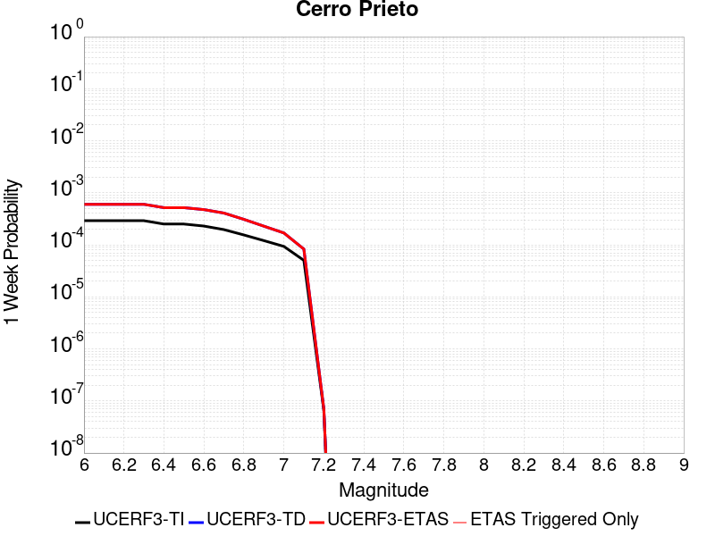 | 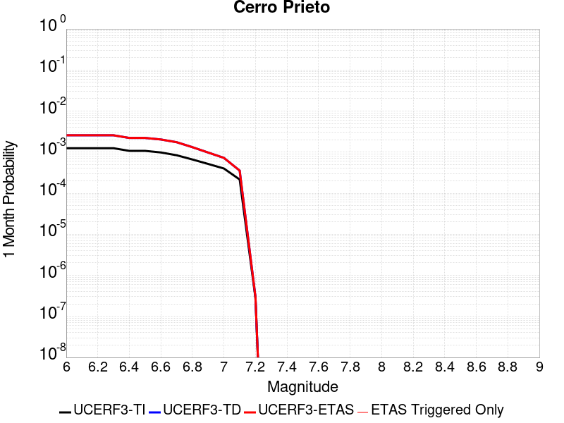 | 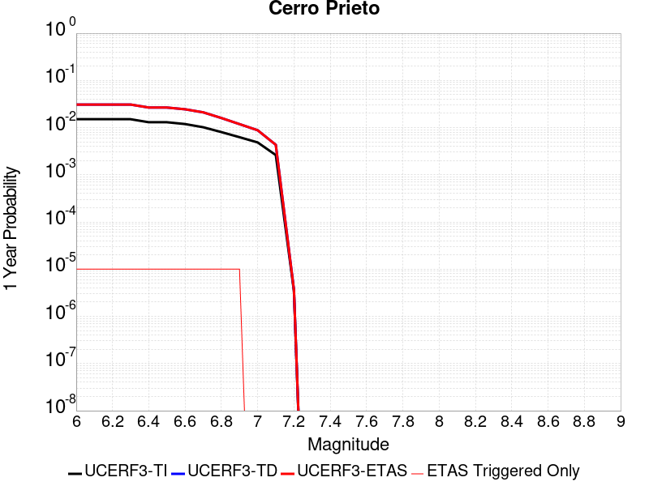 | 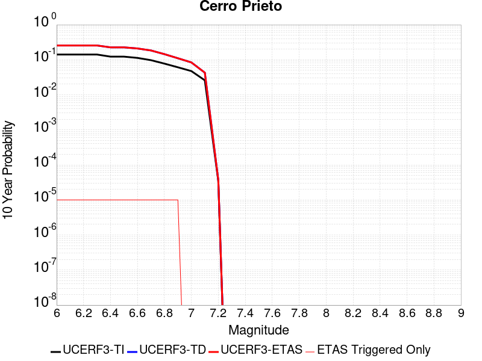 |

| Magnitude | 1 wk TI Prob | 1 wk TD Prob | 1 wk ETAS Prob | 1 wk ETAS/TD Gain | 1 wk ETAS Triggered Only | 1 mo TI Prob | 1 mo TD Prob | 1 mo ETAS Prob | 1 mo ETAS/TD Gain | 1 mo ETAS Triggered Only | 1 yr TI Prob | 1 yr TD Prob | 1 yr ETAS Prob | 1 yr ETAS/TD Gain | 1 yr ETAS Triggered Only | 10 yr TI Prob | 10 yr TD Prob | 10 yr ETAS Prob | 10 yr ETAS/TD Gain | 10 yr ETAS Triggered Only |
|-----|-----|-----|-----|-----|-----|-----|-----|-----|-----|-----|-----|-----|-----|-----|-----|-----|-----|-----|-----|-----|
| 6.0 | 2.9101528E-4 | 6.0073973E-4 | 6.0073973E-4 | 1.0 | 0.0 | 0.0012466122 | 0.0025723036 | 0.0025723036 | 1.0 | 0.0 | 0.015072231 | 0.030820794 | 0.030830488 | 1.0003145 | 1.0E-5 | 0.14089979 | 0.25533175 | 0.2553392 | 1.0000292 | 1.0E-5 |
| 6.1 | 2.9101528E-4 | 6.0073973E-4 | 6.0073973E-4 | 1.0 | 0.0 | 0.0012466122 | 0.0025723036 | 0.0025723036 | 1.0 | 0.0 | 0.015072231 | 0.030820794 | 0.030830488 | 1.0003145 | 1.0E-5 | 0.14089979 | 0.25533175 | 0.2553392 | 1.0000292 | 1.0E-5 |
| 6.2 | 2.9101528E-4 | 6.0073973E-4 | 6.0073973E-4 | 1.0 | 0.0 | 0.0012466122 | 0.0025723036 | 0.0025723036 | 1.0 | 0.0 | 0.015072231 | 0.030820794 | 0.030830488 | 1.0003145 | 1.0E-5 | 0.14089979 | 0.25533175 | 0.2553392 | 1.0000292 | 1.0E-5 |
| 6.3 | 2.9101528E-4 | 6.0073973E-4 | 6.0073973E-4 | 1.0 | 0.0 | 0.0012466122 | 0.0025723036 | 0.0025723036 | 1.0 | 0.0 | 0.015072231 | 0.030820794 | 0.030830488 | 1.0003145 | 1.0E-5 | 0.14089979 | 0.25533175 | 0.2553392 | 1.0000292 | 1.0E-5 |
| 6.4 | 2.508648E-4 | 5.180249E-4 | 5.180249E-4 | 1.0 | 0.0 | 0.0010746918 | 0.002218419 | 0.002218419 | 1.0 | 0.0 | 0.013006088 | 0.026636705 | 0.026646439 | 1.0003654 | 1.0E-5 | 0.12270685 | 0.2256933 | 0.22570105 | 1.0000343 | 1.0E-5 |
| 6.5 | 2.508648E-4 | 5.180249E-4 | 5.180249E-4 | 1.0 | 0.0 | 0.0010746918 | 0.002218419 | 0.002218419 | 1.0 | 0.0 | 0.013006088 | 0.026636705 | 0.026646439 | 1.0003654 | 1.0E-5 | 0.12270685 | 0.2256933 | 0.22570105 | 1.0000343 | 1.0E-5 |
| 6.6 | 2.294914E-4 | 4.7508982E-4 | 4.7508982E-4 | 1.0 | 0.0 | 9.831638E-4 | 0.0020347007 | 0.0020347007 | 1.0 | 0.0 | 0.011904482 | 0.024468353 | 0.024478108 | 1.0003986 | 1.0E-5 | 0.11286586 | 0.20988652 | 0.20989442 | 1.0000377 | 1.0E-5 |
| 6.7 | 1.9621674E-4 | 4.079062E-4 | 4.079062E-4 | 1.0 | 0.0 | 8.4065786E-4 | 0.0017471592 | 0.0017471592 | 1.0 | 0.0 | 0.010187071 | 0.021075172 | 0.021084962 | 1.0004644 | 1.0E-5 | 0.09732539 | 0.18414553 | 0.18415368 | 1.0000443 | 1.0E-5 |
| 6.8 | 1.5476145E-4 | 3.0872397E-4 | 3.0872397E-4 | 1.0 | 0.0 | 6.6309475E-4 | 0.001322536 | 0.001322536 | 1.0 | 0.0 | 0.008043335 | 0.015980894 | 0.015990734 | 1.0006157 | 1.0E-5 | 0.07758363 | 0.14446524 | 0.14447379 | 1.0000592 | 1.0E-5 |
| 6.9 | 1.20509176E-4 | 2.2833576E-4 | 2.2833576E-4 | 1.0 | 0.0 | 5.1636563E-4 | 9.782794E-4 | 9.782794E-4 | 1.0 | 0.0 | 0.006268645 | 0.011860678 | 0.011870559 | 1.0008332 | 1.0E-5 | 0.060947374 | 0.11041445 | 0.11042335 | 1.0000806 | 1.0E-5 |
| 7.0 | 9.3269155E-5 | 1.691879E-4 | 1.691879E-4 | 1.0 | 0.0 | 3.9966372E-4 | 7.2493363E-4 | 7.2493363E-4 | 1.0 | 0.0 | 0.0048550544 | 0.008798177 | 0.008798177 | 1.0 | 0.0 | 0.04750344 | 0.083943 | 0.083943 | 1.0 | 0.0 |
| 7.1 | 5.029709E-5 | 8.287903E-5 | 8.287903E-5 | 1.0 | 0.0 | 2.1554115E-4 | 3.5516729E-4 | 3.5516729E-4 | 1.0 | 0.0 | 0.0026210553 | 0.0043190974 | 0.0043190974 | 1.0 | 0.0 | 0.025903556 | 0.042771716 | 0.042771716 | 1.0 | 0.0 |
| 7.2 | 6.5445185E-8 | 7.047727E-8 | 7.047727E-8 | 1.0 | 0.0 | 2.8047933E-7 | 3.0204544E-7 | 3.0204544E-7 | 1.0 | 0.0 | 3.4148304E-6 | 3.6774031E-6 | 3.6774031E-6 | 1.0 | 0.0 | 3.414778E-5 | 3.6774032E-5 | 3.6774032E-5 | 1.0 | 0.0 |

## Elysian Park (Upper)
*[(top)](#table-of-contents)*

| 1 Week | 1 Month | 1 Year | 10 Year |
|-----|-----|-----|-----|
| 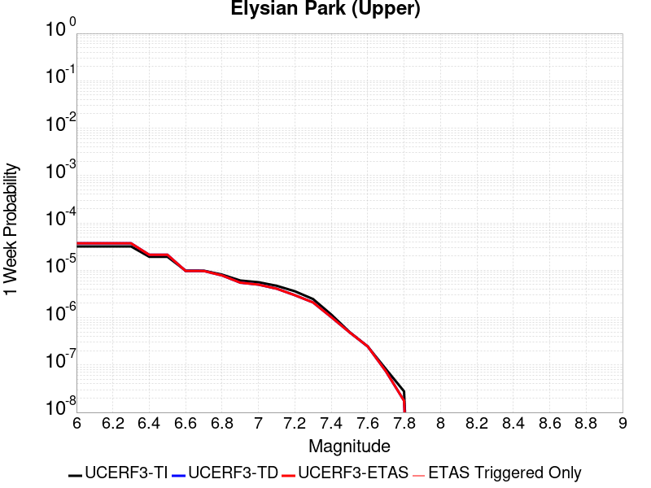 | 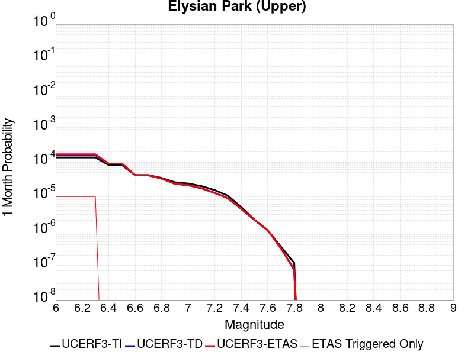 | 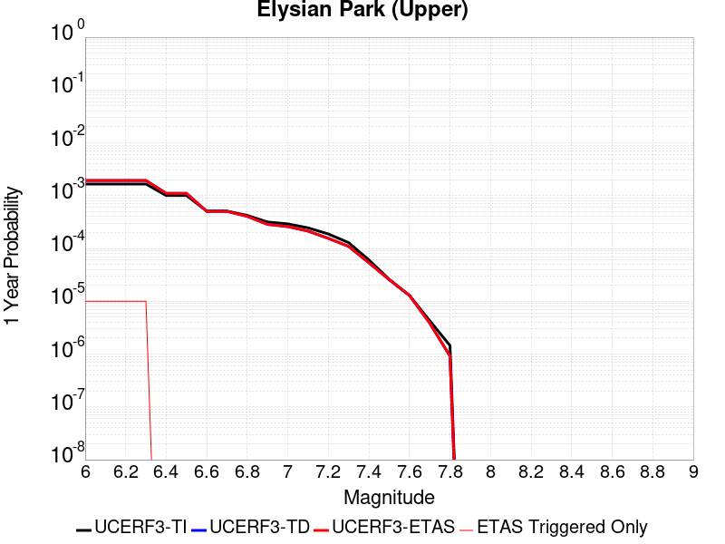 | 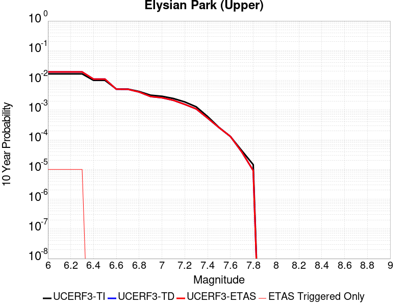 |

| Magnitude | 1 wk TI Prob | 1 wk TD Prob | 1 wk ETAS Prob | 1 wk ETAS/TD Gain | 1 wk ETAS Triggered Only | 1 mo TI Prob | 1 mo TD Prob | 1 mo ETAS Prob | 1 mo ETAS/TD Gain | 1 mo ETAS Triggered Only | 1 yr TI Prob | 1 yr TD Prob | 1 yr ETAS Prob | 1 yr ETAS/TD Gain | 1 yr ETAS Triggered Only | 10 yr TI Prob | 10 yr TD Prob | 10 yr ETAS Prob | 10 yr ETAS/TD Gain | 10 yr ETAS Triggered Only |
|-----|-----|-----|-----|-----|-----|-----|-----|-----|-----|-----|-----|-----|-----|-----|-----|-----|-----|-----|-----|-----|
| 6.0 | 3.1876025E-5 | 3.7074256E-5 | 3.7074256E-5 | 1.0 | 0.0 | 1.3660437E-4 | 1.5888258E-4 | 1.6888099E-4 | 1.0629295 | 1.0E-5 | 0.0016618895 | 0.0019331521 | 0.0019431327 | 1.005163 | 1.0E-5 | 0.016495159 | 0.019209871 | 0.01921968 | 1.0005106 | 1.0E-5 |
| 6.1 | 3.1876025E-5 | 3.7074256E-5 | 3.7074256E-5 | 1.0 | 0.0 | 1.3660437E-4 | 1.5888258E-4 | 1.6888099E-4 | 1.0629295 | 1.0E-5 | 0.0016618895 | 0.0019331521 | 0.0019431327 | 1.005163 | 1.0E-5 | 0.016495159 | 0.019209871 | 0.01921968 | 1.0005106 | 1.0E-5 |
| 6.2 | 3.1876025E-5 | 3.7074256E-5 | 3.7074256E-5 | 1.0 | 0.0 | 1.3660437E-4 | 1.5888258E-4 | 1.6888099E-4 | 1.0629295 | 1.0E-5 | 0.0016618895 | 0.0019331521 | 0.0019431327 | 1.005163 | 1.0E-5 | 0.016495159 | 0.019209871 | 0.01921968 | 1.0005106 | 1.0E-5 |
| 6.3 | 3.1876025E-5 | 3.7074256E-5 | 3.7074256E-5 | 1.0 | 0.0 | 1.3660437E-4 | 1.5888258E-4 | 1.6888099E-4 | 1.0629295 | 1.0E-5 | 0.0016618895 | 0.0019331521 | 0.0019431327 | 1.005163 | 1.0E-5 | 0.016495159 | 0.019209871 | 0.01921968 | 1.0005106 | 1.0E-5 |
| 6.4 | 1.9273462E-5 | 2.1220661E-5 | 2.1220661E-5 | 1.0 | 0.0 | 8.259794E-5 | 9.0943504E-5 | 9.0943504E-5 | 1.0 | 0.0 | 0.001005166 | 0.001106847 | 0.001106847 | 1.0 | 0.0 | 0.010006315 | 0.011030178 | 0.011030178 | 1.0 | 0.0 |
| 6.5 | 1.9273462E-5 | 2.1220661E-5 | 2.1220661E-5 | 1.0 | 0.0 | 8.259794E-5 | 9.0943504E-5 | 9.0943504E-5 | 1.0 | 0.0 | 0.001005166 | 0.001106847 | 0.001106847 | 1.0 | 0.0 | 0.010006315 | 0.011030178 | 0.011030178 | 1.0 | 0.0 |
| 6.6 | 9.813258E-6 | 9.670764E-6 | 9.670764E-6 | 1.0 | 0.0 | 4.205614E-5 | 4.1445513E-5 | 4.1445513E-5 | 1.0 | 0.0 | 5.119132E-4 | 5.044895E-4 | 5.044895E-4 | 1.0 | 0.0 | 0.005107356 | 0.0050341673 | 0.0050341673 | 1.0 | 0.0 |
| 6.7 | 9.801478E-6 | 9.658329E-6 | 9.658329E-6 | 1.0 | 0.0 | 4.2005657E-5 | 4.1392224E-5 | 4.1392224E-5 | 1.0 | 0.0 | 5.112989E-4 | 5.0384103E-4 | 5.0384103E-4 | 1.0 | 0.0 | 0.0051012407 | 0.005027712 | 0.005027712 | 1.0 | 0.0 |
| 6.8 | 8.102489E-6 | 7.777123E-6 | 7.777123E-6 | 1.0 | 0.0 | 3.4724493E-5 | 3.333013E-5 | 3.333013E-5 | 1.0 | 0.0 | 4.2268867E-4 | 4.0572375E-4 | 4.0572375E-4 | 1.0 | 0.0 | 0.004218856 | 0.0040503247 | 0.0040503247 | 1.0 | 0.0 |
| 6.9 | 6.08275E-6 | 5.483974E-6 | 5.483974E-6 | 1.0 | 0.0 | 2.6068668E-5 | 2.3502536E-5 | 2.3502536E-5 | 1.0 | 0.0 | 3.173398E-4 | 2.8610657E-4 | 2.8610657E-4 | 1.0 | 0.0 | 0.0031688702 | 0.0028574602 | 0.0028574602 | 1.0 | 0.0 |
| 7.0 | 5.5995934E-6 | 4.985069E-6 | 4.985069E-6 | 1.0 | 0.0 | 2.3998036E-5 | 2.136441E-5 | 2.136441E-5 | 1.0 | 0.0 | 2.9213692E-4 | 2.6008132E-4 | 2.6008132E-4 | 1.0 | 0.0 | 0.0029175316 | 0.0025978368 | 0.0025978368 | 1.0 | 0.0 |
| 7.1 | 4.709881E-6 | 4.0892874E-6 | 4.0892874E-6 | 1.0 | 0.0 | 2.0185047E-5 | 1.7525403E-5 | 1.7525403E-5 | 1.0 | 0.0 | 2.4572524E-4 | 2.1335129E-4 | 2.1335129E-4 | 1.0 | 0.0 | 0.002454537 | 0.002131506 | 0.002131506 | 1.0 | 0.0 |
| 7.2 | 3.6063436E-6 | 2.9793243E-6 | 2.9793243E-6 | 1.0 | 0.0 | 1.5455667E-5 | 1.2768471E-5 | 1.2768471E-5 | 1.0 | 0.0 | 1.881565E-4 | 1.5544516E-4 | 1.5544516E-4 | 1.0 | 0.0 | 0.0018799726 | 0.0015533755 | 0.0015533755 | 1.0 | 0.0 |
| 7.3 | 2.471135E-6 | 2.0964676E-6 | 2.0964676E-6 | 1.0 | 0.0 | 1.0590536E-5 | 8.984831E-6 | 8.984831E-6 | 1.0 | 0.0 | 1.2893214E-4 | 1.093849E-4 | 1.093849E-4 | 1.0 | 0.0 | 0.0012885736 | 0.0010933178 | 0.0010933178 | 1.0 | 0.0 |
| 7.4 | 1.163943E-6 | 1.0281103E-6 | 1.0281103E-6 | 1.0 | 0.0 | 4.988318E-6 | 4.40618E-6 | 4.40618E-6 | 1.0 | 0.0 | 6.0731076E-5 | 5.364395E-5 | 5.364395E-5 | 1.0 | 0.0 | 6.071448E-4 | 5.36313E-4 | 5.36313E-4 | 1.0 | 0.0 |
| 7.5 | 4.99459E-7 | 4.9201634E-7 | 4.9201634E-7 | 1.0 | 0.0 | 2.140537E-6 | 2.1086398E-6 | 2.1086398E-6 | 1.0 | 0.0 | 2.6060725E-5 | 2.5672403E-5 | 2.5672403E-5 | 1.0 | 0.0 | 2.605767E-4 | 2.5669593E-4 | 2.5669593E-4 | 1.0 | 0.0 |
| 7.6 | 2.4667852E-7 | 2.4791538E-7 | 2.4791538E-7 | 1.0 | 0.0 | 1.0571932E-6 | 1.0624941E-6 | 1.0624941E-6 | 1.0 | 0.0 | 1.2871251E-5 | 1.2935792E-5 | 1.2935792E-5 | 1.0 | 0.0 | 1.2870505E-4 | 1.2935077E-4 | 1.2935077E-4 | 1.0 | 0.0 |
| 7.7 | 8.2312795E-8 | 7.3936036E-8 | 7.3936036E-8 | 1.0 | 0.0 | 3.527691E-7 | 3.1686866E-7 | 3.1686866E-7 | 1.0 | 0.0 | 4.294955E-6 | 3.8578705E-6 | 3.8578705E-6 | 1.0 | 0.0 | 4.2948723E-5 | 3.857815E-5 | 3.857815E-5 | 1.0 | 0.0 |
| 7.8 | 2.7819295E-8 | 1.7616506E-8 | 1.7616506E-8 | 1.0 | 0.0 | 1.1922555E-7 | 7.549931E-8 | 7.549931E-8 | 1.0 | 0.0 | 1.45157E-6 | 9.192038E-7 | 9.192038E-7 | 1.0 | 0.0 | 1.45156055E-5 | 9.192015E-6 | 9.192015E-6 | 1.0 | 0.0 |

## Red Mountain
*[(top)](#table-of-contents)*

| 1 Week | 1 Month | 1 Year | 10 Year |
|-----|-----|-----|-----|
| 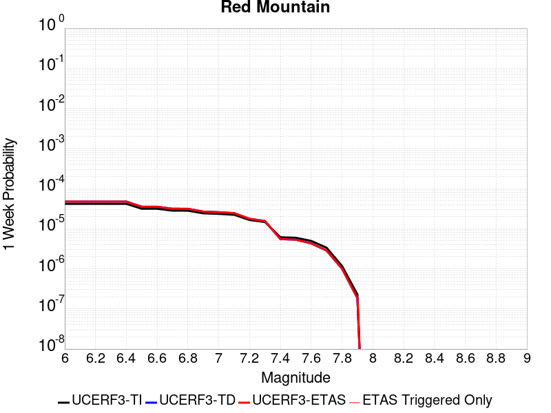 | 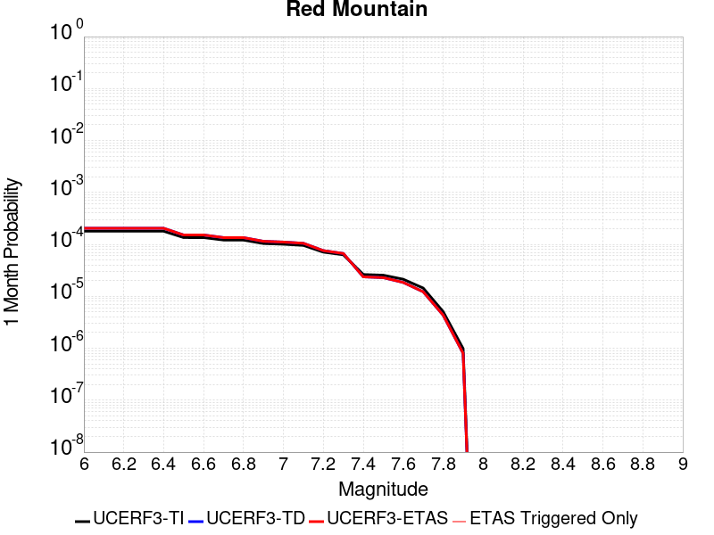 | 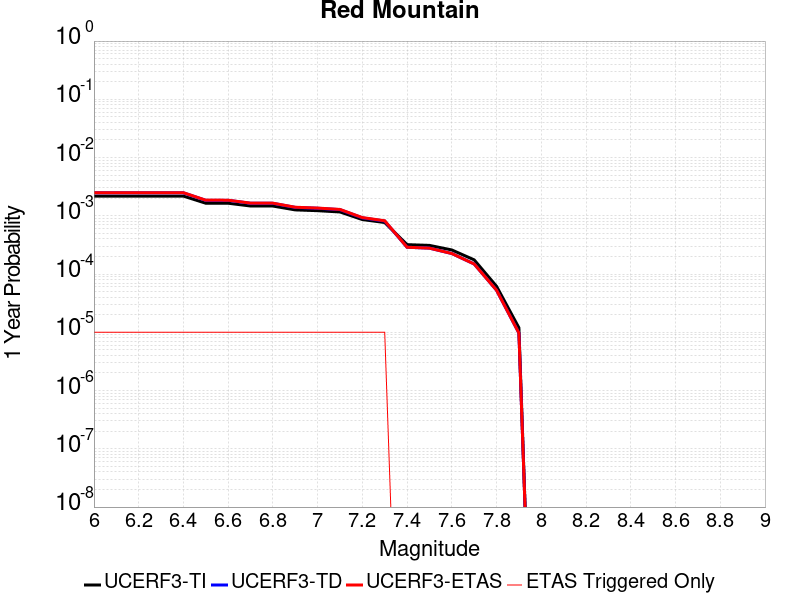 | 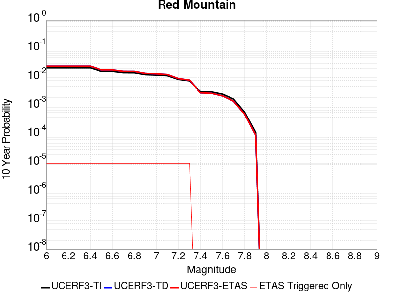 |

| Magnitude | 1 wk TI Prob | 1 wk TD Prob | 1 wk ETAS Prob | 1 wk ETAS/TD Gain | 1 wk ETAS Triggered Only | 1 mo TI Prob | 1 mo TD Prob | 1 mo ETAS Prob | 1 mo ETAS/TD Gain | 1 mo ETAS Triggered Only | 1 yr TI Prob | 1 yr TD Prob | 1 yr ETAS Prob | 1 yr ETAS/TD Gain | 1 yr ETAS Triggered Only | 10 yr TI Prob | 10 yr TD Prob | 10 yr ETAS Prob | 10 yr ETAS/TD Gain | 10 yr ETAS Triggered Only |
|-----|-----|-----|-----|-----|-----|-----|-----|-----|-----|-----|-----|-----|-----|-----|-----|-----|-----|-----|-----|-----|
| 6.0 | 4.1810763E-5 | 4.7631856E-5 | 4.7631856E-5 | 1.0 | 0.0 | 1.7917668E-4 | 2.0412148E-4 | 2.0412148E-4 | 1.0 | 0.0 | 0.0021792934 | 0.0024825116 | 0.0024924867 | 1.0040182 | 1.0E-5 | 0.021580452 | 0.024565434 | 0.024575189 | 1.0003971 | 1.0E-5 |
| 6.1 | 4.1810763E-5 | 4.7631856E-5 | 4.7631856E-5 | 1.0 | 0.0 | 1.7917668E-4 | 2.0412148E-4 | 2.0412148E-4 | 1.0 | 0.0 | 0.0021792934 | 0.0024825116 | 0.0024924867 | 1.0040182 | 1.0E-5 | 0.021580452 | 0.024565434 | 0.024575189 | 1.0003971 | 1.0E-5 |
| 6.2 | 4.1810763E-5 | 4.7631856E-5 | 4.7631856E-5 | 1.0 | 0.0 | 1.7917668E-4 | 2.0412148E-4 | 2.0412148E-4 | 1.0 | 0.0 | 0.0021792934 | 0.0024825116 | 0.0024924867 | 1.0040182 | 1.0E-5 | 0.021580452 | 0.024565434 | 0.024575189 | 1.0003971 | 1.0E-5 |
| 6.3 | 4.1810763E-5 | 4.7631856E-5 | 4.7631856E-5 | 1.0 | 0.0 | 1.7917668E-4 | 2.0412148E-4 | 2.0412148E-4 | 1.0 | 0.0 | 0.0021792934 | 0.0024825116 | 0.0024924867 | 1.0040182 | 1.0E-5 | 0.021580452 | 0.024565434 | 0.024575189 | 1.0003971 | 1.0E-5 |
| 6.4 | 4.1810763E-5 | 4.7631856E-5 | 4.7631856E-5 | 1.0 | 0.0 | 1.7917668E-4 | 2.0412148E-4 | 2.0412148E-4 | 1.0 | 0.0 | 0.0021792934 | 0.0024825116 | 0.0024924867 | 1.0040182 | 1.0E-5 | 0.021580452 | 0.024565434 | 0.024575189 | 1.0003971 | 1.0E-5 |
| 6.5 | 3.154503E-5 | 3.5389497E-5 | 3.5389497E-5 | 1.0 | 0.0 | 1.3518598E-4 | 1.5166098E-4 | 1.5166098E-4 | 1.0 | 0.0 | 0.0016446467 | 0.0018450008 | 0.0018549823 | 1.0054101 | 1.0E-5 | 0.01632528 | 0.018306496 | 0.018316312 | 1.0005362 | 1.0E-5 |
| 6.6 | 3.1535834E-5 | 3.537887E-5 | 3.537887E-5 | 1.0 | 0.0 | 1.3514658E-4 | 1.5161543E-4 | 1.5161543E-4 | 1.0 | 0.0 | 0.0016441676 | 0.0018444473 | 0.0018544289 | 1.0054116 | 1.0E-5 | 0.01632056 | 0.018301051 | 0.01831087 | 1.0005364 | 1.0E-5 |
| 6.7 | 2.8267326E-5 | 3.1495332E-5 | 3.1495332E-5 | 1.0 | 0.0 | 1.2114006E-4 | 1.349735E-4 | 1.349735E-4 | 1.0 | 0.0 | 0.0014738824 | 0.0016421488 | 0.0016521324 | 1.0060796 | 1.0E-5 | 0.014641452 | 0.016308922 | 0.016318759 | 1.0006032 | 1.0E-5 |
| 6.8 | 2.8212884E-5 | 3.1433174E-5 | 3.1433174E-5 | 1.0 | 0.0 | 1.20906756E-4 | 1.3470712E-4 | 1.3470712E-4 | 1.0 | 0.0 | 0.0014710457 | 0.0016389106 | 0.0016488943 | 1.0060916 | 1.0E-5 | 0.014613459 | 0.016277015 | 0.016286852 | 1.0006044 | 1.0E-5 |
| 6.9 | 2.4227871E-5 | 2.6728556E-5 | 2.6728556E-5 | 1.0 | 0.0 | 1.03829596E-4 | 1.14546354E-4 | 1.14546354E-4 | 1.0 | 0.0 | 0.0012633923 | 0.0013937857 | 0.0014037718 | 1.0071647 | 1.0E-5 | 0.012562336 | 0.013858144 | 0.013868005 | 1.0007116 | 1.0E-5 |
| 7.0 | 2.348524E-5 | 2.5856558E-5 | 2.5856558E-5 | 1.0 | 0.0 | 1.0064714E-4 | 1.10809546E-4 | 1.10809546E-4 | 1.0 | 0.0 | 0.0012246901 | 0.001348347 | 0.0013583335 | 1.0074065 | 1.0E-5 | 0.012179627 | 0.01340931 | 0.013419176 | 1.0007358 | 1.0E-5 |
| 7.1 | 2.2311642E-5 | 2.4482411E-5 | 2.4482411E-5 | 1.0 | 0.0 | 9.561782E-5 | 1.0492082E-4 | 1.0492082E-4 | 1.0 | 0.0 | 0.0011635252 | 0.0012767374 | 0.0012867247 | 1.0078225 | 1.0E-5 | 0.01157452 | 0.012701554 | 0.012711427 | 1.0007774 | 1.0E-5 |
| 7.2 | 1.6533986E-5 | 1.768375E-5 | 1.768375E-5 | 1.0 | 0.0 | 7.085802E-5 | 7.5785654E-5 | 7.5785654E-5 | 1.0 | 0.0 | 8.623549E-4 | 9.223633E-4 | 9.323541E-4 | 1.0108317 | 1.0E-5 | 0.008590161 | 0.00919164 | 0.009201548 | 1.0010779 | 1.0E-5 |
| 7.3 | 1.4703092E-5 | 1.5571237E-5 | 1.5571237E-5 | 1.0 | 0.0 | 6.301173E-5 | 6.6732515E-5 | 6.6732515E-5 | 1.0 | 0.0 | 7.668978E-4 | 8.1222726E-4 | 8.222191E-4 | 1.0123018 | 1.0E-5 | 0.0076425658 | 0.008098672 | 0.008108592 | 1.0012248 | 1.0E-5 |
| 7.4 | 6.1331984E-6 | 5.5317146E-6 | 5.5317146E-6 | 1.0 | 0.0 | 2.6284872E-5 | 2.3707134E-5 | 2.3707134E-5 | 1.0 | 0.0 | 3.199713E-4 | 2.8859667E-4 | 2.8859667E-4 | 1.0 | 0.0 | 0.0031951098 | 0.0028822734 | 0.0028822734 | 1.0 | 0.0 |
| 7.5 | 5.954766E-6 | 5.3412596E-6 | 5.3412596E-6 | 1.0 | 0.0 | 2.5520176E-5 | 2.2890916E-5 | 2.2890916E-5 | 1.0 | 0.0 | 3.1066386E-4 | 2.7866178E-4 | 2.7866178E-4 | 1.0 | 0.0 | 0.003102299 | 0.0027831774 | 0.0027831774 | 1.0 | 0.0 |
| 7.6 | 4.9726646E-6 | 4.317639E-6 | 4.317639E-6 | 1.0 | 0.0 | 2.1311245E-5 | 1.8504037E-5 | 1.8504037E-5 | 1.0 | 0.0 | 2.5943352E-4 | 2.252637E-4 | 2.252637E-4 | 1.0 | 0.0 | 0.0025913084 | 0.0022503885 | 0.0022503885 | 1.0 | 0.0 |
| 7.7 | 3.3613894E-6 | 2.854296E-6 | 2.854296E-6 | 1.0 | 0.0 | 1.4405875E-5 | 1.2232642E-5 | 1.2232642E-5 | 1.0 | 0.0 | 1.7537741E-4 | 1.489225E-4 | 1.489225E-4 | 1.0 | 0.0 | 0.0017523908 | 0.0014882532 | 0.0014882532 | 1.0 | 0.0 |
| 7.8 | 1.1828961E-6 | 1.0130304E-6 | 1.0130304E-6 | 1.0 | 0.0 | 5.069545E-6 | 4.341552E-6 | 4.341552E-6 | 1.0 | 0.0 | 6.171996E-5 | 5.2857144E-5 | 5.2857144E-5 | 1.0 | 0.0 | 6.170282E-4 | 5.2844867E-4 | 5.2844867E-4 | 1.0 | 0.0 |
| 7.9 | 2.2967266E-7 | 1.8625491E-7 | 1.8625491E-7 | 1.0 | 0.0 | 9.843111E-7 | 7.982351E-7 | 7.982351E-7 | 1.0 | 0.0 | 1.19839215E-5 | 9.718472E-6 | 9.718472E-6 | 1.0 | 0.0 | 1.1983275E-4 | 9.718075E-5 | 9.718075E-5 | 1.0 | 0.0 |

## San Andreas (Peninsula) 2011 CFM
*[(top)](#table-of-contents)*

| 1 Week | 1 Month | 1 Year | 10 Year |
|-----|-----|-----|-----|
|  |  |  |  |

| Magnitude | 1 wk TI Prob | 1 wk TD Prob | 1 wk ETAS Prob | 1 wk ETAS/TD Gain | 1 wk ETAS Triggered Only | 1 mo TI Prob | 1 mo TD Prob | 1 mo ETAS Prob | 1 mo ETAS/TD Gain | 1 mo ETAS Triggered Only | 1 yr TI Prob | 1 yr TD Prob | 1 yr ETAS Prob | 1 yr ETAS/TD Gain | 1 yr ETAS Triggered Only | 10 yr TI Prob | 10 yr TD Prob | 10 yr ETAS Prob | 10 yr ETAS/TD Gain | 10 yr ETAS Triggered Only |
|-----|-----|-----|-----|-----|-----|-----|-----|-----|-----|-----|-----|-----|-----|-----|-----|-----|-----|-----|-----|-----|
| 6.0 | 8.6200685E-5 | 2.6140377E-5 | 3.6140114E-5 | 1.38254 | 1.0E-5 | 3.6937918E-4 | 1.1202538E-4 | 1.2202426E-4 | 1.0892555 | 1.0E-5 | 0.0044879215 | 0.0013630574 | 0.0013730437 | 1.0073265 | 1.0E-5 | 0.043983612 | 0.015279642 | 0.01528949 | 1.0006444 | 1.0E-5 |
| 6.1 | 8.6200685E-5 | 2.6140377E-5 | 3.6140114E-5 | 1.38254 | 1.0E-5 | 3.6937918E-4 | 1.1202538E-4 | 1.2202426E-4 | 1.0892555 | 1.0E-5 | 0.0044879215 | 0.0013630574 | 0.0013730437 | 1.0073265 | 1.0E-5 | 0.043983612 | 0.015279642 | 0.01528949 | 1.0006444 | 1.0E-5 |
| 6.2 | 8.6200685E-5 | 2.6140377E-5 | 3.6140114E-5 | 1.38254 | 1.0E-5 | 3.6937918E-4 | 1.1202538E-4 | 1.2202426E-4 | 1.0892555 | 1.0E-5 | 0.0044879215 | 0.0013630574 | 0.0013730437 | 1.0073265 | 1.0E-5 | 0.043983612 | 0.015279642 | 0.01528949 | 1.0006444 | 1.0E-5 |
| 6.3 | 8.551163E-5 | 2.582592E-5 | 3.5825662E-5 | 1.3871979 | 1.0E-5 | 3.6642692E-4 | 1.1067783E-4 | 1.2067672E-4 | 1.0903423 | 1.0E-5 | 0.004452125 | 0.0013466714 | 0.0013566578 | 1.0074158 | 1.0E-5 | 0.043639794 | 0.015102992 | 0.0151128415 | 1.0006521 | 1.0E-5 |
| 6.4 | 8.551163E-5 | 2.582592E-5 | 3.5825662E-5 | 1.3871979 | 1.0E-5 | 3.6642692E-4 | 1.1067783E-4 | 1.2067672E-4 | 1.0903423 | 1.0E-5 | 0.004452125 | 0.0013466714 | 0.0013566578 | 1.0074158 | 1.0E-5 | 0.043639794 | 0.015102992 | 0.0151128415 | 1.0006521 | 1.0E-5 |
| 6.5 | 8.511146E-5 | 2.5643623E-5 | 3.5643367E-5 | 1.3899505 | 1.0E-5 | 3.647124E-4 | 1.09896624E-4 | 1.1989553E-4 | 1.0909846 | 1.0E-5 | 0.004431336 | 0.0013371719 | 0.0013471586 | 1.0074685 | 1.0E-5 | 0.04344007 | 0.015000985 | 0.015010835 | 1.0006566 | 1.0E-5 |
| 6.6 | 8.4985084E-5 | 2.5573196E-5 | 3.557294E-5 | 1.3910245 | 1.0E-5 | 3.6417096E-4 | 1.0959481E-4 | 1.19593715E-4 | 1.0912352 | 1.0E-5 | 0.0044247704 | 0.0013335019 | 0.0013434886 | 1.0074891 | 1.0E-5 | 0.043376986 | 0.014962403 | 0.014972254 | 1.0006584 | 1.0E-5 |
| 6.7 | 8.462618E-5 | 2.5398518E-5 | 3.5398265E-5 | 1.3937137 | 1.0E-5 | 3.6263323E-4 | 1.0884626E-4 | 1.1884517E-4 | 1.0918627 | 1.0E-5 | 0.004406125 | 0.0013243994 | 0.0013343861 | 1.0075406 | 1.0E-5 | 0.043197807 | 0.014865392 | 0.014875243 | 1.0006627 | 1.0E-5 |
| 6.8 | 8.42337E-5 | 2.5291727E-5 | 3.5291476E-5 | 1.3953762 | 1.0E-5 | 3.6095164E-4 | 1.0838862E-4 | 1.1838754E-4 | 1.0922506 | 1.0E-5 | 0.004385734 | 0.0013188344 | 0.0013288212 | 1.0075724 | 1.0E-5 | 0.043001823 | 0.01480478 | 0.014814631 | 1.0006654 | 1.0E-5 |
| 6.9 | 8.365989E-5 | 2.5092304E-5 | 3.5092053E-5 | 1.3985186 | 1.0E-5 | 3.5849313E-4 | 1.07534026E-4 | 1.17532945E-4 | 1.0929838 | 1.0E-5 | 0.004355922 | 0.0013084421 | 0.001318429 | 1.0076327 | 1.0E-5 | 0.04271523 | 0.014695167 | 0.014705019 | 1.0006706 | 1.0E-5 |
| 7.0 | 8.30936E-5 | 2.485017E-5 | 3.484992E-5 | 1.4024018 | 1.0E-5 | 3.560668E-4 | 1.0649639E-4 | 1.1649532E-4 | 1.09389 | 1.0E-5 | 0.004326499 | 0.0012958241 | 0.0013058111 | 1.0077071 | 1.0E-5 | 0.042432297 | 0.0145642925 | 0.014574147 | 1.0006766 | 1.0E-5 |
| 7.1 | 8.041264E-5 | 2.4528608E-5 | 3.4528362E-5 | 1.4076772 | 1.0E-5 | 3.4458007E-4 | 1.0511838E-4 | 1.1511733E-4 | 1.0951208 | 1.0E-5 | 0.0041871946 | 0.0012790667 | 0.0012890538 | 1.0078082 | 1.0E-5 | 0.041091725 | 0.014382651 | 0.014392507 | 1.0006853 | 1.0E-5 |
| 7.2 | 7.8427016E-5 | 2.3942212E-5 | 3.394197E-5 | 1.4176624 | 1.0E-5 | 3.3607247E-4 | 1.02605445E-4 | 1.1260442E-4 | 1.0974507 | 1.0E-5 | 0.004084008 | 0.0012485072 | 0.0012584947 | 1.0079995 | 1.0E-5 | 0.040097635 | 0.014061596 | 0.014071455 | 1.0007012 | 1.0E-5 |
| 7.3 | 7.721087E-5 | 2.37235E-5 | 3.3723263E-5 | 1.421513 | 1.0E-5 | 3.3086175E-4 | 1.01668185E-4 | 1.1166717E-4 | 1.0983492 | 1.0E-5 | 0.004020803 | 0.0012371091 | 0.0012470967 | 1.0080733 | 1.0E-5 | 0.03948827 | 0.013943321 | 0.013953181 | 1.0007071 | 1.0E-5 |
| 7.4 | 7.3536525E-5 | 2.1785814E-5 | 3.1785596E-5 | 1.4590043 | 1.0E-5 | 3.1511846E-4 | 9.336444E-5 | 1.03363505E-4 | 1.1070971 | 1.0E-5 | 0.0038298194 | 0.0011361206 | 0.0011461093 | 1.0087919 | 1.0E-5 | 0.037644852 | 0.012873475 | 0.0128833465 | 1.0007668 | 1.0E-5 |
| 7.5 | 6.806207E-5 | 1.9516918E-5 | 2.9516723E-5 | 1.5123659 | 1.0E-5 | 2.9166197E-4 | 8.364126E-5 | 9.364042E-5 | 1.1195482 | 1.0E-5 | 0.0035452035 | 0.0010178577 | 0.0010278475 | 1.0098145 | 1.0E-5 | 0.034891766 | 0.0115886405 | 0.011598525 | 1.000853 | 1.0E-5 |
| 7.6 | 5.6731416E-5 | 1.4749307E-5 | 2.4749159E-5 | 1.6779879 | 1.0E-5 | 2.43112E-4 | 6.320979E-5 | 7.320915E-5 | 1.1581933 | 1.0E-5 | 0.0029558712 | 7.6930755E-4 | 7.792999E-4 | 1.0129887 | 1.0E-5 | 0.02916862 | 0.0088075185 | 0.008817431 | 1.0011253 | 1.0E-5 |
| 7.7 | 4.946994E-5 | 1.3774739E-5 | 2.3774603E-5 | 1.7259566 | 1.0E-5 | 2.1199681E-4 | 5.9033264E-5 | 6.903267E-5 | 1.169386 | 1.0E-5 | 0.002578006 | 7.1849313E-4 | 7.2848593E-4 | 1.013908 | 1.0E-5 | 0.02548303 | 0.00820545 | 0.008215369 | 1.0012087 | 1.0E-5 |
| 7.8 | 3.9718198E-5 | 1.3490156E-5 | 2.3490022E-5 | 1.7412713 | 1.0E-5 | 1.7020974E-4 | 5.781367E-5 | 6.78131E-5 | 1.1729594 | 1.0E-5 | 0.0020703338 | 7.036543E-4 | 7.136472E-4 | 1.0142015 | 1.0E-5 | 0.020511515 | 0.008001879 | 0.008011798 | 1.0012397 | 1.0E-5 |
| 7.9 | 2.4115114E-5 | 1.2634918E-5 | 2.2634791E-5 | 1.7914474 | 1.0E-5 | 1.0334639E-4 | 5.4148524E-5 | 6.4147986E-5 | 1.1846672 | 1.0E-5 | 0.001257516 | 6.5905903E-4 | 6.690524E-4 | 1.0151632 | 1.0E-5 | 0.012504238 | 0.0074038287 | 0.0074137547 | 1.0013406 | 1.0E-5 |
| 8.0 | 1.7756569E-5 | 1.181544E-5 | 2.1815322E-5 | 1.8463402 | 1.0E-5 | 7.6097356E-5 | 5.063662E-5 | 6.0636114E-5 | 1.1974756 | 1.0E-5 | 9.260915E-4 | 6.163266E-4 | 6.263204E-4 | 1.0162152 | 1.0E-5 | 0.009222416 | 0.006877804 | 0.0068877353 | 1.001444 | 1.0E-5 |
| 8.1 | 1.3159258E-5 | 1.0088933E-5 | 2.0088832E-5 | 1.9911752 | 1.0E-5 | 5.6395602E-5 | 4.3237567E-5 | 5.3237134E-5 | 1.2312703 | 1.0E-5 | 6.864001E-4 | 5.262903E-4 | 5.362851E-4 | 1.0189909 | 1.0E-5 | 0.0068428386 | 0.005874056 | 0.005883997 | 1.0016924 | 1.0E-5 |
| 8.2 | 8.635426E-6 | 5.672124E-6 | 5.672124E-6 | 1.0 | 0.0 | 3.700844E-5 | 2.4308876E-5 | 2.4308876E-5 | 1.0 | 0.0 | 4.5048463E-4 | 2.9592047E-4 | 2.9592047E-4 | 1.0 | 0.0 | 0.004495725 | 0.0033567175 | 0.0033567175 | 1.0 | 0.0 |
| 8.3 | 1.983087E-6 | 8.001618E-7 | 8.001618E-7 | 1.0 | 0.0 | 8.498917E-6 | 3.4292605E-6 | 3.4292605E-6 | 1.0 | 0.0 | 1.034694E-4 | 4.1750463E-5 | 4.1750463E-5 | 1.0 | 0.0 | 0.0010342124 | 4.915874E-4 | 4.915874E-4 | 1.0 | 0.0 |

## Ventura-Pitas Point
*[(top)](#table-of-contents)*

| 1 Week | 1 Month | 1 Year | 10 Year |
|-----|-----|-----|-----|
| 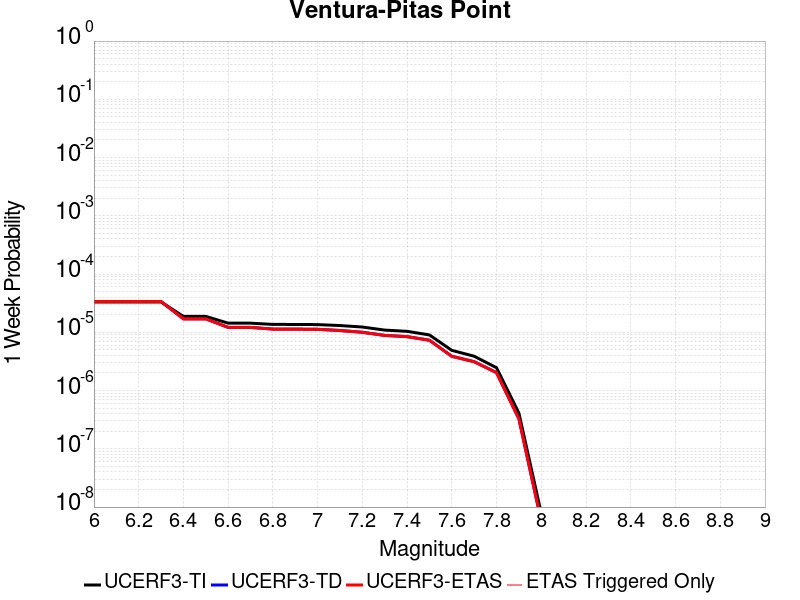 | 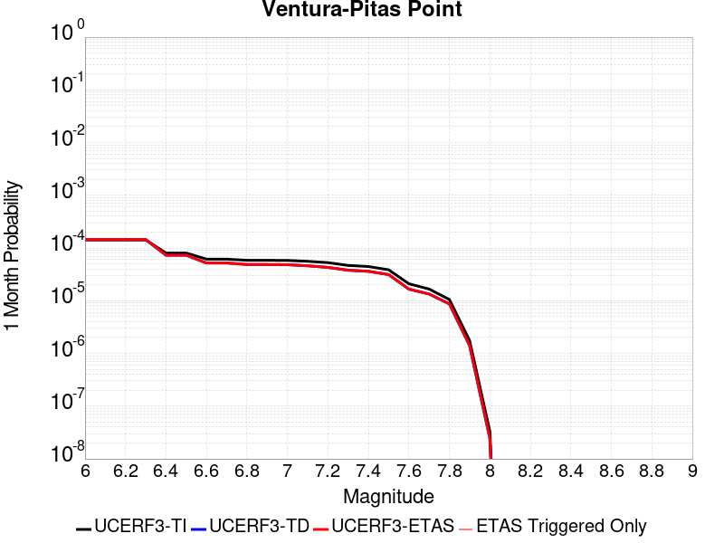 | 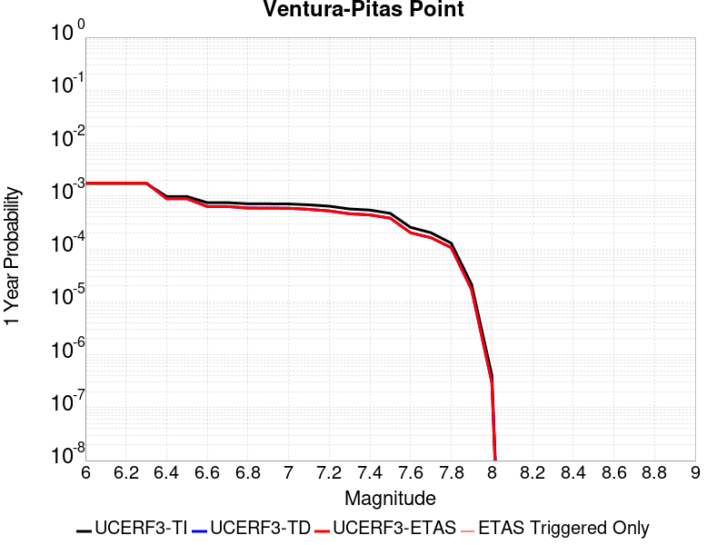 | 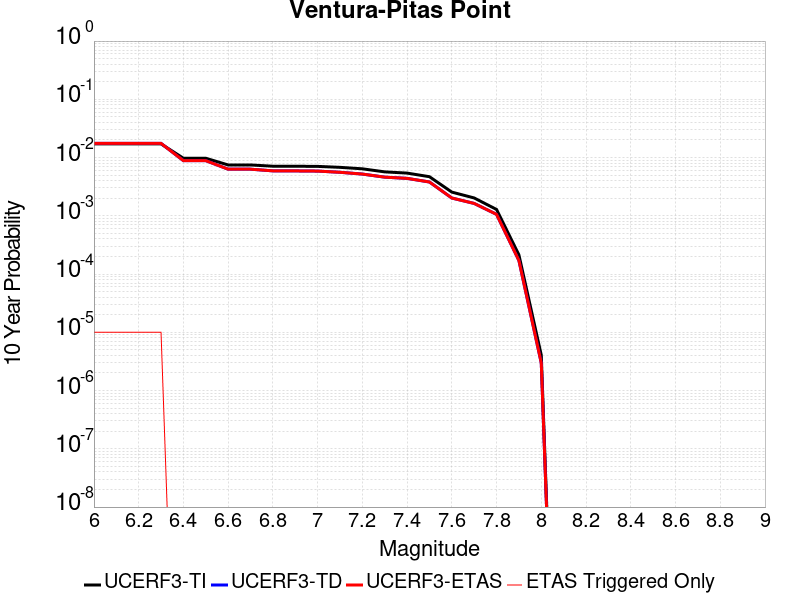 |

| Magnitude | 1 wk TI Prob | 1 wk TD Prob | 1 wk ETAS Prob | 1 wk ETAS/TD Gain | 1 wk ETAS Triggered Only | 1 mo TI Prob | 1 mo TD Prob | 1 mo ETAS Prob | 1 mo ETAS/TD Gain | 1 mo ETAS Triggered Only | 1 yr TI Prob | 1 yr TD Prob | 1 yr ETAS Prob | 1 yr ETAS/TD Gain | 1 yr ETAS Triggered Only | 10 yr TI Prob | 10 yr TD Prob | 10 yr ETAS Prob | 10 yr ETAS/TD Gain | 10 yr ETAS Triggered Only |
|-----|-----|-----|-----|-----|-----|-----|-----|-----|-----|-----|-----|-----|-----|-----|-----|-----|-----|-----|-----|-----|
| 6.0 | 3.3179622E-5 | 3.3772267E-5 | 3.3772267E-5 | 1.0 | 0.0 | 1.4219063E-4 | 1.447317E-4 | 1.447317E-4 | 1.0 | 0.0 | 0.0017297962 | 0.0017609413 | 0.0017609413 | 1.0 | 0.0 | 0.017163932 | 0.017495444 | 0.01750527 | 1.0005616 | 1.0E-5 |
| 6.1 | 3.3179622E-5 | 3.3772267E-5 | 3.3772267E-5 | 1.0 | 0.0 | 1.4219063E-4 | 1.447317E-4 | 1.447317E-4 | 1.0 | 0.0 | 0.0017297962 | 0.0017609413 | 0.0017609413 | 1.0 | 0.0 | 0.017163932 | 0.017495444 | 0.01750527 | 1.0005616 | 1.0E-5 |
| 6.2 | 3.3179622E-5 | 3.3772267E-5 | 3.3772267E-5 | 1.0 | 0.0 | 1.4219063E-4 | 1.447317E-4 | 1.447317E-4 | 1.0 | 0.0 | 0.0017297962 | 0.0017609413 | 0.0017609413 | 1.0 | 0.0 | 0.017163932 | 0.017495444 | 0.01750527 | 1.0005616 | 1.0E-5 |
| 6.3 | 3.3179622E-5 | 3.3772267E-5 | 3.3772267E-5 | 1.0 | 0.0 | 1.4219063E-4 | 1.447317E-4 | 1.447317E-4 | 1.0 | 0.0 | 0.0017297962 | 0.0017609413 | 0.0017609413 | 1.0 | 0.0 | 0.017163932 | 0.017495444 | 0.01750527 | 1.0005616 | 1.0E-5 |
| 6.4 | 1.8754668E-5 | 1.70429E-5 | 1.70429E-5 | 1.0 | 0.0 | 8.037467E-5 | 7.303909E-5 | 7.303909E-5 | 1.0 | 0.0 | 9.781223E-4 | 8.889112E-4 | 8.889112E-4 | 1.0 | 0.0 | 0.009738282 | 0.008855891 | 0.008855891 | 1.0 | 0.0 |
| 6.5 | 1.8754668E-5 | 1.70429E-5 | 1.70429E-5 | 1.0 | 0.0 | 8.037467E-5 | 7.303909E-5 | 7.303909E-5 | 1.0 | 0.0 | 9.781223E-4 | 8.889112E-4 | 8.889112E-4 | 1.0 | 0.0 | 0.009738282 | 0.008855891 | 0.008855891 | 1.0 | 0.0 |
| 6.6 | 1.4361558E-5 | 1.2142655E-5 | 1.2142655E-5 | 1.0 | 0.0 | 6.154808E-5 | 5.2038922E-5 | 5.2038922E-5 | 1.0 | 0.0 | 7.490902E-4 | 6.33392E-4 | 6.33392E-4 | 1.0 | 0.0 | 0.0074657016 | 0.0063161207 | 0.0063161207 | 1.0 | 0.0 |
| 6.7 | 1.4361558E-5 | 1.2142655E-5 | 1.2142655E-5 | 1.0 | 0.0 | 6.154808E-5 | 5.2038922E-5 | 5.2038922E-5 | 1.0 | 0.0 | 7.490902E-4 | 6.33392E-4 | 6.33392E-4 | 1.0 | 0.0 | 0.0074657016 | 0.0063161207 | 0.0063161207 | 1.0 | 0.0 |
| 6.8 | 1.3663846E-5 | 1.13643355E-5 | 1.13643355E-5 | 1.0 | 0.0 | 5.8558027E-5 | 4.8703398E-5 | 4.8703398E-5 | 1.0 | 0.0 | 7.127108E-4 | 5.9280446E-4 | 5.9280446E-4 | 1.0 | 0.0 | 0.007104293 | 0.0059124436 | 0.0059124436 | 1.0 | 0.0 |
| 6.9 | 1.3644157E-5 | 1.1342423E-5 | 1.1342423E-5 | 1.0 | 0.0 | 5.8473648E-5 | 4.860949E-5 | 4.860949E-5 | 1.0 | 0.0 | 7.116841E-4 | 5.916618E-4 | 5.916618E-4 | 1.0 | 0.0 | 0.007094092 | 0.0059010778 | 0.0059010778 | 1.0 | 0.0 |
| 7.0 | 1.3568845E-5 | 1.1261933E-5 | 1.1261933E-5 | 1.0 | 0.0 | 5.8150898E-5 | 4.8264545E-5 | 4.8264545E-5 | 1.0 | 0.0 | 7.077572E-4 | 5.8746437E-4 | 5.8746437E-4 | 1.0 | 0.0 | 0.007055073 | 0.005859325 | 0.005859325 | 1.0 | 0.0 |
| 7.1 | 1.306572E-5 | 1.0737913E-5 | 1.0737913E-5 | 1.0 | 0.0 | 5.599474E-5 | 4.6018824E-5 | 4.6018824E-5 | 1.0 | 0.0 | 6.815227E-4 | 5.6013704E-4 | 5.6013704E-4 | 1.0 | 0.0 | 0.0067943637 | 0.005587453 | 0.005587453 | 1.0 | 0.0 |
| 7.2 | 1.232604E-5 | 1.0009974E-5 | 1.0009974E-5 | 1.0 | 0.0 | 5.2824813E-5 | 4.2899195E-5 | 4.2899195E-5 | 1.0 | 0.0 | 6.429523E-4 | 5.221743E-4 | 5.221743E-4 | 1.0 | 0.0 | 0.0064109527 | 0.0052096616 | 0.0052096616 | 1.0 | 0.0 |
| 7.3 | 1.0917261E-5 | 8.856259E-6 | 8.856259E-6 | 1.0 | 0.0 | 4.678742E-5 | 3.7954855E-5 | 3.7954855E-5 | 1.0 | 0.0 | 5.69488E-4 | 4.6200393E-4 | 4.6200393E-4 | 1.0 | 0.0 | 0.0056803077 | 0.004610596 | 0.004610596 | 1.0 | 0.0 |
| 7.4 | 1.039959E-5 | 8.4355925E-6 | 8.4355925E-6 | 1.0 | 0.0 | 4.456891E-5 | 3.6152047E-5 | 3.6152047E-5 | 1.0 | 0.0 | 5.424914E-4 | 4.4006383E-4 | 4.4006383E-4 | 1.0 | 0.0 | 0.0054116896 | 0.0043920814 | 0.0043920814 | 1.0 | 0.0 |
| 7.5 | 9.015877E-6 | 7.308533E-6 | 7.308533E-6 | 1.0 | 0.0 | 3.86389E-5 | 3.1321917E-5 | 3.1321917E-5 | 1.0 | 0.0 | 4.7032707E-4 | 3.81279E-4 | 3.81279E-4 | 1.0 | 0.0 | 0.004693329 | 0.003806389 | 0.003806389 | 1.0 | 0.0 |
| 7.6 | 4.900162E-6 | 3.8761027E-6 | 3.8761027E-6 | 1.0 | 0.0 | 2.1000526E-5 | 1.6611764E-5 | 1.6611764E-5 | 1.0 | 0.0 | 2.556514E-4 | 2.0222958E-4 | 2.0222958E-4 | 1.0 | 0.0 | 0.0025535747 | 0.0020204692 | 0.0020204692 | 1.0 | 0.0 |
| 7.7 | 3.8850626E-6 | 3.128345E-6 | 3.128345E-6 | 1.0 | 0.0 | 1.6650163E-5 | 1.3407125E-5 | 1.3407125E-5 | 1.0 | 0.0 | 2.0269687E-4 | 1.632196E-4 | 1.632196E-4 | 1.0 | 0.0 | 0.002025121 | 0.0016310066 | 0.0016310066 | 1.0 | 0.0 |
| 7.8 | 2.4654719E-6 | 2.030982E-6 | 2.030982E-6 | 1.0 | 0.0 | 1.0566265E-5 | 8.70418E-6 | 8.70418E-6 | 1.0 | 0.0 | 1.2863669E-4 | 1.0596828E-4 | 1.0596828E-4 | 1.0 | 0.0 | 0.0012856225 | 0.0010591822 | 0.0010591822 | 1.0 | 0.0 |
| 7.9 | 4.095894E-7 | 3.2776973E-7 | 3.2776973E-7 | 1.0 | 0.0 | 1.7553821E-6 | 1.4047266E-6 | 1.4047266E-6 | 1.0 | 0.0 | 2.1371567E-5 | 1.7102417E-5 | 1.7102417E-5 | 1.0 | 0.0 | 2.1369511E-4 | 1.7101131E-4 | 1.7101131E-4 | 1.0 | 0.0 |
| 8.0 | 7.791402E-9 | 5.685699E-9 | 5.685699E-9 | 1.0 | 0.0 | 3.3391725E-8 | 2.436728E-8 | 2.436728E-8 | 1.0 | 0.0 | 4.0654416E-7 | 2.9667163E-7 | 2.9667163E-7 | 1.0 | 0.0 | 4.065434E-6 | 2.9667142E-6 | 2.9667142E-6 | 1.0 | 0.0 |

## Cucamonga
*[(top)](#table-of-contents)*

| 1 Week | 1 Month | 1 Year | 10 Year |
|-----|-----|-----|-----|
| 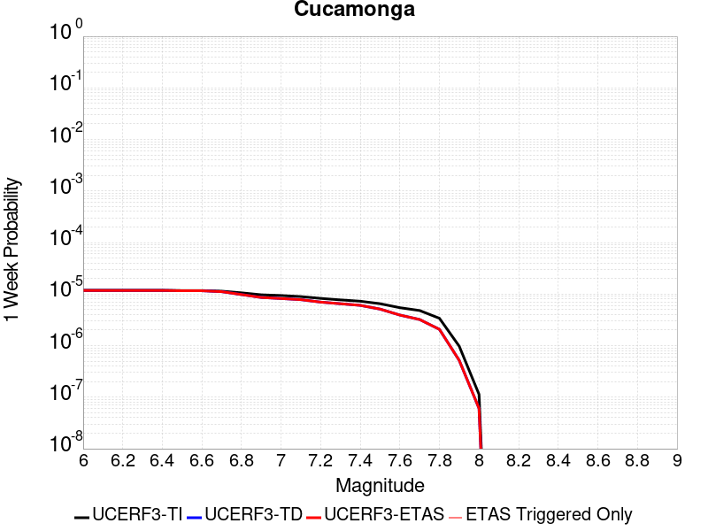 | 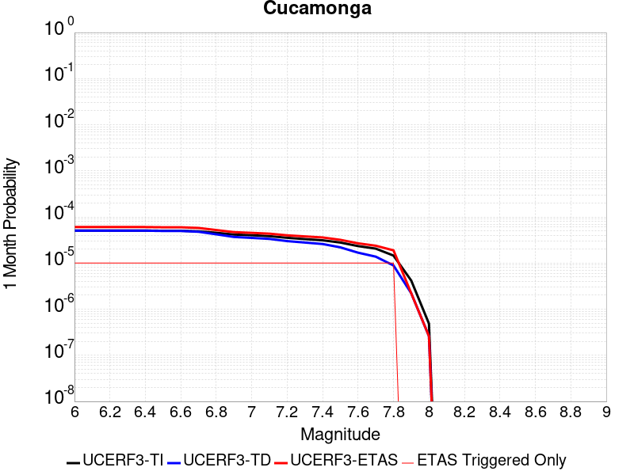 | 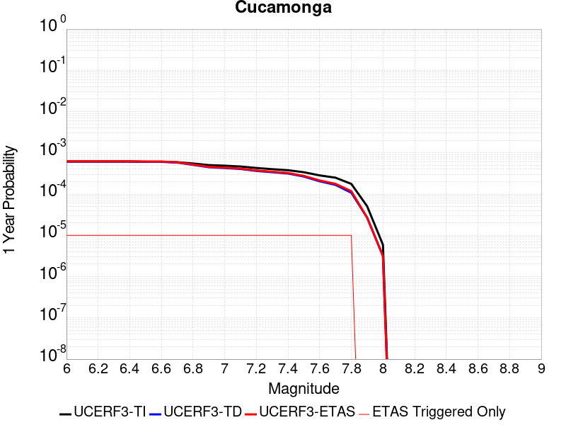 | 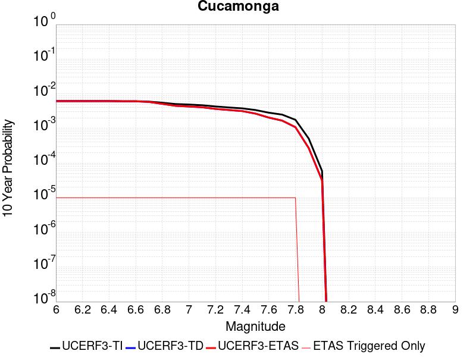 |

| Magnitude | 1 wk TI Prob | 1 wk TD Prob | 1 wk ETAS Prob | 1 wk ETAS/TD Gain | 1 wk ETAS Triggered Only | 1 mo TI Prob | 1 mo TD Prob | 1 mo ETAS Prob | 1 mo ETAS/TD Gain | 1 mo ETAS Triggered Only | 1 yr TI Prob | 1 yr TD Prob | 1 yr ETAS Prob | 1 yr ETAS/TD Gain | 1 yr ETAS Triggered Only | 10 yr TI Prob | 10 yr TD Prob | 10 yr ETAS Prob | 10 yr ETAS/TD Gain | 10 yr ETAS Triggered Only |
|-----|-----|-----|-----|-----|-----|-----|-----|-----|-----|-----|-----|-----|-----|-----|-----|-----|-----|-----|-----|-----|
| 6.0 | 1.1848348E-5 | 1.1764833E-5 | 1.1764833E-5 | 1.0 | 0.0 | 5.0777642E-5 | 5.0419756E-5 | 6.0419254E-5 | 1.1983249 | 1.0E-5 | 6.180424E-4 | 6.1369035E-4 | 6.236842E-4 | 1.0162848 | 1.0E-5 | 0.0061632637 | 0.0061209933 | 0.0061309324 | 1.0016237 | 1.0E-5 |
| 6.1 | 1.1848348E-5 | 1.1764833E-5 | 1.1764833E-5 | 1.0 | 0.0 | 5.0777642E-5 | 5.0419756E-5 | 6.0419254E-5 | 1.1983249 | 1.0E-5 | 6.180424E-4 | 6.1369035E-4 | 6.236842E-4 | 1.0162848 | 1.0E-5 | 0.0061632637 | 0.0061209933 | 0.0061309324 | 1.0016237 | 1.0E-5 |
| 6.2 | 1.1848348E-5 | 1.1764833E-5 | 1.1764833E-5 | 1.0 | 0.0 | 5.0777642E-5 | 5.0419756E-5 | 6.0419254E-5 | 1.1983249 | 1.0E-5 | 6.180424E-4 | 6.1369035E-4 | 6.236842E-4 | 1.0162848 | 1.0E-5 | 0.0061632637 | 0.0061209933 | 0.0061309324 | 1.0016237 | 1.0E-5 |
| 6.3 | 1.1848348E-5 | 1.1764833E-5 | 1.1764833E-5 | 1.0 | 0.0 | 5.0777642E-5 | 5.0419756E-5 | 6.0419254E-5 | 1.1983249 | 1.0E-5 | 6.180424E-4 | 6.1369035E-4 | 6.236842E-4 | 1.0162848 | 1.0E-5 | 0.0061632637 | 0.0061209933 | 0.0061309324 | 1.0016237 | 1.0E-5 |
| 6.4 | 1.1848348E-5 | 1.1764833E-5 | 1.1764833E-5 | 1.0 | 0.0 | 5.0777642E-5 | 5.0419756E-5 | 6.0419254E-5 | 1.1983249 | 1.0E-5 | 6.180424E-4 | 6.1369035E-4 | 6.236842E-4 | 1.0162848 | 1.0E-5 | 0.0061632637 | 0.0061209933 | 0.0061309324 | 1.0016237 | 1.0E-5 |
| 6.5 | 1.16988695E-5 | 1.16038E-5 | 1.16038E-5 | 1.0 | 0.0 | 5.013705E-5 | 4.972964E-5 | 5.9729144E-5 | 1.2010773 | 1.0E-5 | 6.102476E-4 | 6.0529285E-4 | 6.152868E-4 | 1.016511 | 1.0E-5 | 0.006085745 | 0.0060374755 | 0.0060474155 | 1.0016463 | 1.0E-5 |
| 6.6 | 1.16988695E-5 | 1.16038E-5 | 1.16038E-5 | 1.0 | 0.0 | 5.013705E-5 | 4.972964E-5 | 5.9729144E-5 | 1.2010773 | 1.0E-5 | 6.102476E-4 | 6.0529285E-4 | 6.152868E-4 | 1.016511 | 1.0E-5 | 0.006085745 | 0.0060374755 | 0.0060474155 | 1.0016463 | 1.0E-5 |
| 6.7 | 1.1397107E-5 | 1.1142029E-5 | 1.1142029E-5 | 1.0 | 0.0 | 4.884383E-5 | 4.775069E-5 | 5.7750214E-5 | 1.209411 | 1.0E-5 | 5.9451134E-4 | 5.812121E-4 | 5.912063E-4 | 1.0171955 | 1.0E-5 | 0.005929234 | 0.005797933 | 0.0058078747 | 1.0017147 | 1.0E-5 |
| 6.8 | 1.058387E-5 | 9.808954E-6 | 9.808954E-6 | 1.0 | 0.0 | 4.5358654E-5 | 4.2037704E-5 | 5.203728E-5 | 1.2378716 | 1.0E-5 | 5.521017E-4 | 5.1169E-4 | 5.216848E-4 | 1.019533 | 1.0E-5 | 0.00550732 | 0.0051059877 | 0.0051159365 | 1.0019485 | 1.0E-5 |
| 6.9 | 9.690046E-6 | 8.601399E-6 | 8.601399E-6 | 1.0 | 0.0 | 4.1528107E-5 | 3.686262E-5 | 4.6862253E-5 | 1.2712675 | 1.0E-5 | 5.054874E-4 | 4.4871037E-4 | 4.587059E-4 | 1.022276 | 1.0E-5 | 0.005043391 | 0.0044788397 | 0.004488795 | 1.0022228 | 1.0E-5 |
| 7.0 | 9.381461E-6 | 8.208473E-6 | 8.208473E-6 | 1.0 | 0.0 | 4.020564E-5 | 3.5178702E-5 | 4.517835E-5 | 1.2842529 | 1.0E-5 | 4.893937E-4 | 4.2821688E-4 | 4.382126E-4 | 1.0233426 | 1.0E-5 | 0.0048831734 | 0.0042747133 | 0.0042846706 | 1.0023293 | 1.0E-5 |
| 7.1 | 8.946492E-6 | 7.802865E-6 | 7.802865E-6 | 1.0 | 0.0 | 3.8341543E-5 | 3.3440425E-5 | 4.344009E-5 | 1.2990292 | 1.0E-5 | 4.667083E-4 | 4.0706142E-4 | 4.1705737E-4 | 1.0245563 | 1.0E-5 | 0.0046572937 | 0.0040639564 | 0.004073916 | 1.0024507 | 1.0E-5 |
| 7.2 | 8.251016E-6 | 6.994931E-6 | 6.994931E-6 | 1.0 | 0.0 | 3.5361016E-5 | 2.9977931E-5 | 3.9977633E-5 | 1.3335687 | 1.0E-5 | 4.3043532E-4 | 3.6492044E-4 | 3.749168E-4 | 1.0273932 | 1.0E-5 | 0.0042960253 | 0.0036440052 | 0.0036539687 | 1.0027342 | 1.0E-5 |
| 7.3 | 7.717881E-6 | 6.505414E-6 | 6.505414E-6 | 1.0 | 0.0 | 3.3076216E-5 | 2.7880049E-5 | 3.787977E-5 | 1.3586694 | 1.0E-5 | 4.026285E-4 | 3.3938696E-4 | 3.4938357E-4 | 1.029455 | 1.0E-5 | 0.004018998 | 0.0033894796 | 0.003399446 | 1.0029403 | 1.0E-5 |
| 7.4 | 7.275623E-6 | 6.0503494E-6 | 6.0503494E-6 | 1.0 | 0.0 | 3.118087E-5 | 2.5929812E-5 | 3.592955E-5 | 1.3856465 | 1.0E-5 | 3.7956095E-4 | 3.1564993E-4 | 3.2564678E-4 | 1.0316707 | 1.0E-5 | 0.0037891332 | 0.0031528068 | 0.0031627754 | 1.0031618 | 1.0E-5 |
| 7.5 | 6.5109502E-6 | 5.1169486E-6 | 5.1169486E-6 | 1.0 | 0.0 | 2.7903774E-5 | 2.1929596E-5 | 3.1929376E-5 | 1.4559947 | 1.0E-5 | 3.3967546E-4 | 2.6696027E-4 | 2.769576E-4 | 1.0374488 | 1.0E-5 | 0.0033915674 | 0.0026671775 | 0.0026771508 | 1.0037392 | 1.0E-5 |
| 7.6 | 5.4495326E-6 | 3.923203E-6 | 3.923203E-6 | 1.0 | 0.0 | 2.335493E-5 | 1.681362E-5 | 2.6813452E-5 | 1.5947459 | 1.0E-5 | 2.8430918E-4 | 2.0468666E-4 | 2.1468461E-4 | 1.0488452 | 1.0E-5 | 0.0028394572 | 0.0020457595 | 0.002055739 | 1.0048782 | 1.0E-5 |
| 7.7 | 4.7997164E-6 | 3.2134674E-6 | 3.2134674E-6 | 1.0 | 0.0 | 2.057005E-5 | 1.3771931E-5 | 2.3771792E-5 | 1.7261046 | 1.0E-5 | 2.504116E-4 | 1.6766039E-4 | 1.7765872E-4 | 1.0596343 | 1.0E-5 | 0.002501296 | 0.0016761302 | 0.0016861134 | 1.0059562 | 1.0E-5 |
| 7.8 | 3.3941733E-6 | 2.0710604E-6 | 2.0710604E-6 | 1.0 | 0.0 | 1.4546376E-5 | 8.8759425E-6 | 1.8875855E-5 | 2.1266308 | 1.0E-5 | 1.7708774E-4 | 1.0805926E-4 | 1.1805818E-4 | 1.0925318 | 1.0E-5 | 0.0017694668 | 0.0010801622 | 0.0010901515 | 1.0092479 | 1.0E-5 |
| 7.9 | 9.750552E-7 | 5.171369E-7 | 5.171369E-7 | 1.0 | 0.0 | 4.178801E-6 | 2.2162992E-6 | 2.2162992E-6 | 1.0 | 0.0 | 5.0875715E-5 | 2.6983114E-5 | 2.6983114E-5 | 1.0 | 0.0 | 5.086407E-4 | 2.697988E-4 | 2.697988E-4 | 1.0 | 0.0 |
| 8.0 | 1.133857E-7 | 6.067156E-8 | 6.067156E-8 | 1.0 | 0.0 | 4.8593864E-7 | 2.6002095E-7 | 2.6002095E-7 | 1.0 | 0.0 | 5.9162867E-6 | 3.1657505E-6 | 3.1657505E-6 | 1.0 | 0.0 | 5.916129E-5 | 3.1657073E-5 | 3.1657073E-5 | 1.0 | 0.0 |

## Pisgah-Bullion Mtn-Mesquite Lk
*[(top)](#table-of-contents)*

| 1 Week | 1 Month | 1 Year | 10 Year |
|-----|-----|-----|-----|
|  |  |  |  |

| Magnitude | 1 wk TI Prob | 1 wk TD Prob | 1 wk ETAS Prob | 1 wk ETAS/TD Gain | 1 wk ETAS Triggered Only | 1 mo TI Prob | 1 mo TD Prob | 1 mo ETAS Prob | 1 mo ETAS/TD Gain | 1 mo ETAS Triggered Only | 1 yr TI Prob | 1 yr TD Prob | 1 yr ETAS Prob | 1 yr ETAS/TD Gain | 1 yr ETAS Triggered Only | 10 yr TI Prob | 10 yr TD Prob | 10 yr ETAS Prob | 10 yr ETAS/TD Gain | 10 yr ETAS Triggered Only |
|-----|-----|-----|-----|-----|-----|-----|-----|-----|-----|-----|-----|-----|-----|-----|-----|-----|-----|-----|-----|-----|
| 6.0 | 3.0240792E-5 | 2.4106846E-5 | 3.4106604E-5 | 1.41481 | 1.0E-5 | 1.2959696E-4 | 1.0331153E-4 | 1.13310496E-4 | 1.0967846 | 1.0E-5 | 0.0015767008 | 0.0012571929 | 0.0012671804 | 1.0079442 | 1.0E-5 | 0.015655609 | 0.012510845 | 0.01252072 | 1.0007893 | 1.0E-5 |
| 6.1 | 3.0240792E-5 | 2.4106846E-5 | 3.4106604E-5 | 1.41481 | 1.0E-5 | 1.2959696E-4 | 1.0331153E-4 | 1.13310496E-4 | 1.0967846 | 1.0E-5 | 0.0015767008 | 0.0012571929 | 0.0012671804 | 1.0079442 | 1.0E-5 | 0.015655609 | 0.012510845 | 0.01252072 | 1.0007893 | 1.0E-5 |
| 6.2 | 3.0240792E-5 | 2.4106846E-5 | 3.4106604E-5 | 1.41481 | 1.0E-5 | 1.2959696E-4 | 1.0331153E-4 | 1.13310496E-4 | 1.0967846 | 1.0E-5 | 0.0015767008 | 0.0012571929 | 0.0012671804 | 1.0079442 | 1.0E-5 | 0.015655609 | 0.012510845 | 0.01252072 | 1.0007893 | 1.0E-5 |
| 6.3 | 2.0498217E-5 | 1.3645967E-5 | 1.3645967E-5 | 1.0 | 0.0 | 8.784654E-5 | 5.8481495E-5 | 5.8481495E-5 | 1.0 | 0.0 | 0.0010690069 | 7.117958E-4 | 7.117958E-4 | 1.0 | 0.0 | 0.01063879 | 0.007096788 | 0.007096788 | 1.0 | 0.0 |
| 6.4 | 2.0498217E-5 | 1.3645967E-5 | 1.3645967E-5 | 1.0 | 0.0 | 8.784654E-5 | 5.8481495E-5 | 5.8481495E-5 | 1.0 | 0.0 | 0.0010690069 | 7.117958E-4 | 7.117958E-4 | 1.0 | 0.0 | 0.01063879 | 0.007096788 | 0.007096788 | 1.0 | 0.0 |
| 6.5 | 1.7316182E-5 | 1.04830515E-5 | 1.04830515E-5 | 1.0 | 0.0 | 7.42101E-5 | 4.4926648E-5 | 4.4926648E-5 | 1.0 | 0.0 | 9.0313336E-4 | 5.4685463E-4 | 5.4685463E-4 | 1.0 | 0.0 | 0.008994718 | 0.0054560862 | 0.0054560862 | 1.0 | 0.0 |
| 6.6 | 1.5251077E-5 | 8.41909E-6 | 8.41909E-6 | 1.0 | 0.0 | 6.536012E-5 | 3.6081354E-5 | 3.6081354E-5 | 1.0 | 0.0 | 7.9546886E-4 | 4.3920917E-4 | 4.3920917E-4 | 1.0 | 0.0 | 0.007926274 | 0.0043841293 | 0.0043841293 | 1.0 | 0.0 |
| 6.7 | 1.2997425E-5 | 6.415197E-6 | 6.415197E-6 | 1.0 | 0.0 | 5.570206E-5 | 2.7493437E-5 | 2.7493437E-5 | 1.0 | 0.0 | 6.7796157E-4 | 3.3468584E-4 | 3.3468584E-4 | 1.0 | 0.0 | 0.0067589693 | 0.0033422785 | 0.0033422785 | 1.0 | 0.0 |
| 6.8 | 1.035386E-5 | 4.3361665E-6 | 4.3361665E-6 | 1.0 | 0.0 | 4.437293E-5 | 1.8583443E-5 | 1.8583443E-5 | 1.0 | 0.0 | 5.401065E-4 | 2.262308E-4 | 2.262308E-4 | 1.0 | 0.0 | 0.0053879567 | 0.0022600917 | 0.0022600917 | 1.0 | 0.0 |
| 6.9 | 8.816252E-6 | 3.5832113E-6 | 3.5832113E-6 | 1.0 | 0.0 | 3.778339E-5 | 1.5356532E-5 | 1.5356532E-5 | 1.0 | 0.0 | 4.5991567E-4 | 1.8695033E-4 | 1.8695033E-4 | 1.0 | 0.0 | 0.00458965 | 0.0018679891 | 0.0018679891 | 1.0 | 0.0 |
| 7.0 | 6.8232207E-6 | 2.569746E-6 | 2.569746E-6 | 1.0 | 0.0 | 2.9242048E-5 | 1.1013151E-5 | 1.1013151E-5 | 1.0 | 0.0 | 3.5596377E-4 | 1.3407719E-4 | 1.3407719E-4 | 1.0 | 0.0 | 0.0035539411 | 0.001339994 | 0.001339994 | 1.0 | 0.0 |
| 7.1 | 5.837013E-6 | 2.229158E-6 | 2.229158E-6 | 1.0 | 0.0 | 2.501553E-5 | 9.5535015E-6 | 9.5535015E-6 | 1.0 | 0.0 | 3.045215E-4 | 1.16307965E-4 | 1.16307965E-4 | 1.0 | 0.0 | 0.0030410455 | 0.0011625 | 0.0011625 | 1.0 | 0.0 |
| 7.2 | 4.278052E-6 | 1.6289536E-6 | 1.6289536E-6 | 1.0 | 0.0 | 1.833438E-5 | 6.981212E-6 | 6.981212E-6 | 1.0 | 0.0 | 2.231982E-4 | 8.4993175E-5 | 8.4993175E-5 | 1.0 | 0.0 | 0.0022297418 | 8.496299E-4 | 8.496299E-4 | 1.0 | 0.0 |
| 7.3 | 1.8803692E-6 | 8.3536554E-7 | 8.3536554E-7 | 1.0 | 0.0 | 8.0587E-6 | 3.580134E-6 | 3.580134E-6 | 1.0 | 0.0 | 9.811026E-5 | 4.3587406E-5 | 4.3587406E-5 | 1.0 | 0.0 | 9.806695E-4 | 4.3580306E-4 | 4.3580306E-4 | 1.0 | 0.0 |

## Death Valley (So)
*[(top)](#table-of-contents)*

| 1 Week | 1 Month | 1 Year | 10 Year |
|-----|-----|-----|-----|
| 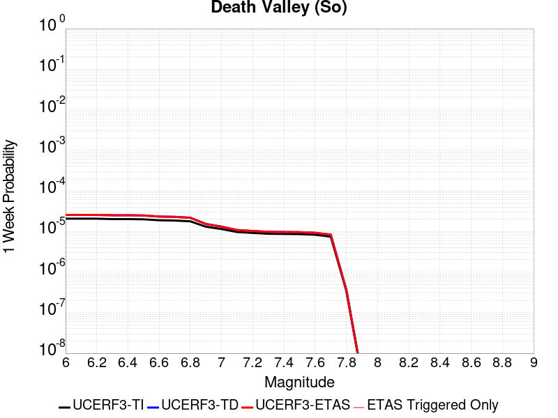 | 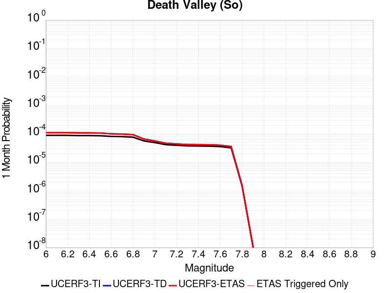 | 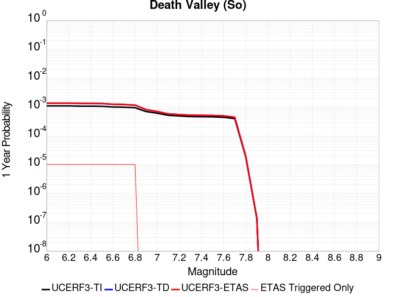 | 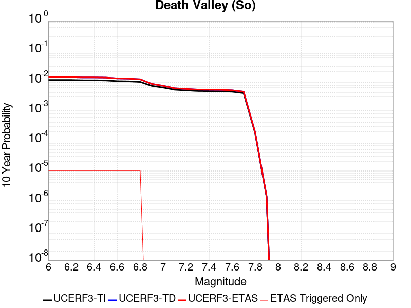 |

| Magnitude | 1 wk TI Prob | 1 wk TD Prob | 1 wk ETAS Prob | 1 wk ETAS/TD Gain | 1 wk ETAS Triggered Only | 1 mo TI Prob | 1 mo TD Prob | 1 mo ETAS Prob | 1 mo ETAS/TD Gain | 1 mo ETAS Triggered Only | 1 yr TI Prob | 1 yr TD Prob | 1 yr ETAS Prob | 1 yr ETAS/TD Gain | 1 yr ETAS Triggered Only | 10 yr TI Prob | 10 yr TD Prob | 10 yr ETAS Prob | 10 yr ETAS/TD Gain | 10 yr ETAS Triggered Only |
|-----|-----|-----|-----|-----|-----|-----|-----|-----|-----|-----|-----|-----|-----|-----|-----|-----|-----|-----|-----|-----|
| 6.0 | 2.0684236E-5 | 2.5660403E-5 | 2.5660403E-5 | 1.0 | 0.0 | 8.864371E-5 | 1.0996862E-4 | 1.0996862E-4 | 1.0 | 0.0 | 0.0010787029 | 0.0013380626 | 0.0013480493 | 1.0074635 | 1.0E-5 | 0.010734817 | 0.013306425 | 0.013316291 | 1.0007415 | 1.0E-5 |
| 6.1 | 2.0684236E-5 | 2.5660403E-5 | 2.5660403E-5 | 1.0 | 0.0 | 8.864371E-5 | 1.0996862E-4 | 1.0996862E-4 | 1.0 | 0.0 | 0.0010787029 | 0.0013380626 | 0.0013480493 | 1.0074635 | 1.0E-5 | 0.010734817 | 0.013306425 | 0.013316291 | 1.0007415 | 1.0E-5 |
| 6.2 | 2.0684236E-5 | 2.5660403E-5 | 2.5660403E-5 | 1.0 | 0.0 | 8.864371E-5 | 1.0996862E-4 | 1.0996862E-4 | 1.0 | 0.0 | 0.0010787029 | 0.0013380626 | 0.0013480493 | 1.0074635 | 1.0E-5 | 0.010734817 | 0.013306425 | 0.013316291 | 1.0007415 | 1.0E-5 |
| 6.3 | 2.0240292E-5 | 2.5160161E-5 | 2.5160161E-5 | 1.0 | 0.0 | 8.6741224E-5 | 1.07824904E-4 | 1.07824904E-4 | 1.0 | 0.0 | 0.0010555626 | 0.0013119945 | 0.0013219813 | 1.007612 | 1.0E-5 | 0.010505628 | 0.013048822 | 0.013058691 | 1.0007564 | 1.0E-5 |
| 6.4 | 2.0240292E-5 | 2.5160161E-5 | 2.5160161E-5 | 1.0 | 0.0 | 8.6741224E-5 | 1.07824904E-4 | 1.07824904E-4 | 1.0 | 0.0 | 0.0010555626 | 0.0013119945 | 0.0013219813 | 1.007612 | 1.0E-5 | 0.010505628 | 0.013048822 | 0.013058691 | 1.0007564 | 1.0E-5 |
| 6.5 | 1.9962767E-5 | 2.4849222E-5 | 2.4849222E-5 | 1.0 | 0.0 | 8.55519E-5 | 1.06492414E-4 | 1.06492414E-4 | 1.0 | 0.0 | 0.0010410968 | 0.0012957908 | 0.0013057778 | 1.0077072 | 1.0E-5 | 0.010362327 | 0.012888674 | 0.012898545 | 1.0007659 | 1.0E-5 |
| 6.6 | 1.8937297E-5 | 2.3345141E-5 | 2.3345141E-5 | 1.0 | 0.0 | 8.115732E-5 | 1.00046855E-4 | 1.00046855E-4 | 1.0 | 0.0 | 9.876423E-4 | 0.0012174044 | 0.0012273922 | 1.0082042 | 1.0E-5 | 0.009832645 | 0.012113388 | 0.012123266 | 1.0008155 | 1.0E-5 |
| 6.7 | 1.8621096E-5 | 2.2945207E-5 | 2.2945207E-5 | 1.0 | 0.0 | 7.980225E-5 | 9.833298E-5 | 9.833298E-5 | 1.0 | 0.0 | 9.711593E-4 | 0.001196561 | 0.0012065491 | 1.0083473 | 1.0E-5 | 0.009669261 | 0.011907207 | 0.011917087 | 1.0008298 | 1.0E-5 |
| 6.8 | 1.7830353E-5 | 2.1835465E-5 | 2.1835465E-5 | 1.0 | 0.0 | 7.641356E-5 | 9.357729E-5 | 9.357729E-5 | 1.0 | 0.0 | 9.29938E-4 | 0.0011387222 | 0.0011487107 | 1.0087718 | 1.0E-5 | 0.009260561 | 0.011333121 | 0.011343008 | 1.0008724 | 1.0E-5 |
| 6.9 | 1.3135183E-5 | 1.5316382E-5 | 1.5316382E-5 | 1.0 | 0.0 | 5.6292425E-5 | 6.5640015E-5 | 6.5640015E-5 | 1.0 | 0.0 | 6.8514474E-4 | 7.988807E-4 | 7.988807E-4 | 1.0 | 0.0 | 0.006830362 | 0.0079615135 | 0.0079615135 | 1.0 | 0.0 |
| 7.0 | 1.1507512E-5 | 1.316378E-5 | 1.316378E-5 | 1.0 | 0.0 | 4.9316975E-5 | 5.6415014E-5 | 5.6415014E-5 | 1.0 | 0.0 | 6.002687E-4 | 6.8664213E-4 | 6.8664213E-4 | 1.0 | 0.0 | 0.0059864987 | 0.0068464004 | 0.0068464004 | 1.0 | 0.0 |
| 7.1 | 9.715903E-6 | 1.0872149E-5 | 1.0872149E-5 | 1.0 | 0.0 | 4.1638916E-5 | 4.6594116E-5 | 4.6594116E-5 | 1.0 | 0.0 | 5.068359E-4 | 5.6713994E-4 | 5.6713994E-4 | 1.0 | 0.0 | 0.0050568148 | 0.005657364 | 0.005657364 | 1.0 | 0.0 |
| 7.2 | 9.233269E-6 | 1.0292659E-5 | 1.0292659E-5 | 1.0 | 0.0 | 3.9570554E-5 | 4.4110675E-5 | 4.4110675E-5 | 1.0 | 0.0 | 4.81665E-4 | 5.3691934E-4 | 5.3691934E-4 | 1.0 | 0.0 | 0.0048062233 | 0.005356653 | 0.005356653 | 1.0 | 0.0 |
| 7.3 | 8.8041315E-6 | 9.813981E-6 | 9.813981E-6 | 1.0 | 0.0 | 3.7731446E-5 | 4.2059262E-5 | 4.2059262E-5 | 1.0 | 0.0 | 4.592835E-4 | 5.119554E-4 | 5.119554E-4 | 1.0 | 0.0 | 0.0045833546 | 0.0051081874 | 0.0051081874 | 1.0 | 0.0 |
| 7.4 | 8.708749E-6 | 9.71296E-6 | 9.71296E-6 | 1.0 | 0.0 | 3.7322676E-5 | 4.1626332E-5 | 4.1626332E-5 | 1.0 | 0.0 | 4.5430884E-4 | 5.066869E-4 | 5.066869E-4 | 1.0 | 0.0 | 0.004533812 | 0.0050557433 | 0.0050557433 | 1.0 | 0.0 |
| 7.5 | 8.612678E-6 | 9.610567E-6 | 9.610567E-6 | 1.0 | 0.0 | 3.6910955E-5 | 4.1187515E-5 | 4.1187515E-5 | 1.0 | 0.0 | 4.492982E-4 | 5.0134683E-4 | 5.0134683E-4 | 1.0 | 0.0 | 0.004483909 | 0.0050025843 | 0.0050025843 | 1.0 | 0.0 |
| 7.6 | 8.319024E-6 | 9.28951E-6 | 9.28951E-6 | 1.0 | 0.0 | 3.5652476E-5 | 3.98116E-5 | 3.98116E-5 | 1.0 | 0.0 | 4.3398244E-4 | 4.8460264E-4 | 4.8460264E-4 | 1.0 | 0.0 | 0.0043313587 | 0.004835883 | 0.004835883 | 1.0 | 0.0 |
| 7.7 | 7.4718328E-6 | 8.350235E-6 | 8.350235E-6 | 1.0 | 0.0 | 3.2021748E-5 | 3.5786252E-5 | 3.5786252E-5 | 1.0 | 0.0 | 3.8979502E-4 | 4.3561458E-4 | 4.3561458E-4 | 1.0 | 0.0 | 0.00389112 | 0.0043480126 | 0.0043480126 | 1.0 | 0.0 |
| 7.8 | 3.4586725E-7 | 3.6493012E-7 | 3.6493012E-7 | 1.0 | 0.0 | 1.4822873E-6 | 1.5639854E-6 | 1.5639854E-6 | 1.0 | 0.0 | 1.80467E-5 | 1.904136E-5 | 1.904136E-5 | 1.0 | 0.0 | 1.8045233E-4 | 1.9039772E-4 | 1.9039772E-4 | 1.0 | 0.0 |
| 7.9 | 2.5591178E-9 | 2.6702682E-9 | 2.6702682E-9 | 1.0 | 0.0 | 1.0967647E-8 | 1.1444007E-8 | 1.1444007E-8 | 1.0 | 0.0 | 1.335311E-7 | 1.3933078E-7 | 1.3933078E-7 | 1.0 | 0.0 | 1.3353102E-6 | 1.3933078E-6 | 1.3933078E-6 | 1.0 | 0.0 |

## Sierra Madre
*[(top)](#table-of-contents)*

| 1 Week | 1 Month | 1 Year | 10 Year |
|-----|-----|-----|-----|
| 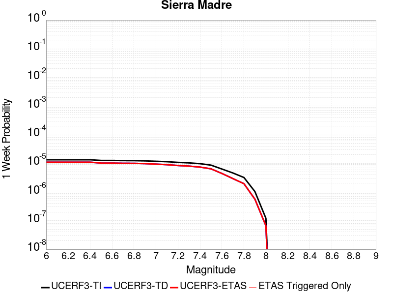 | 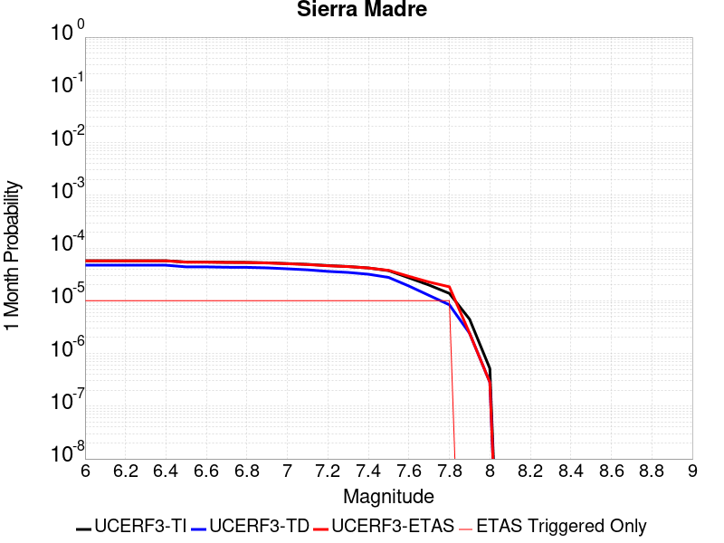 | 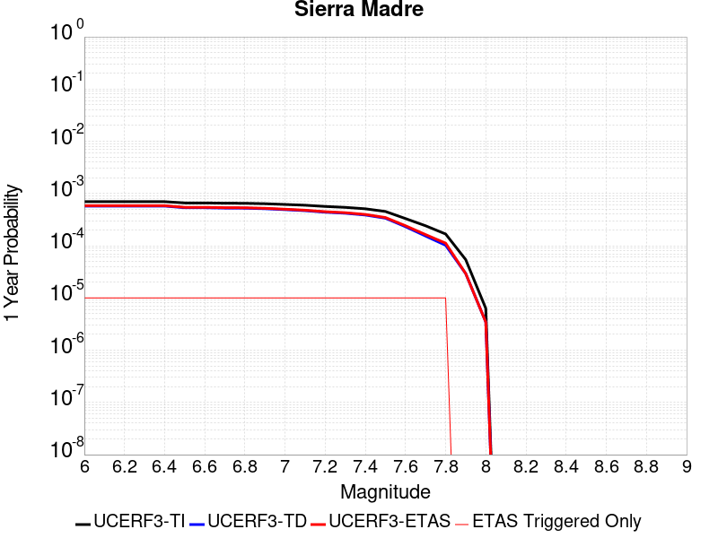 |  |

| Magnitude | 1 wk TI Prob | 1 wk TD Prob | 1 wk ETAS Prob | 1 wk ETAS/TD Gain | 1 wk ETAS Triggered Only | 1 mo TI Prob | 1 mo TD Prob | 1 mo ETAS Prob | 1 mo ETAS/TD Gain | 1 mo ETAS Triggered Only | 1 yr TI Prob | 1 yr TD Prob | 1 yr ETAS Prob | 1 yr ETAS/TD Gain | 1 yr ETAS Triggered Only | 10 yr TI Prob | 10 yr TD Prob | 10 yr ETAS Prob | 10 yr ETAS/TD Gain | 10 yr ETAS Triggered Only |
|-----|-----|-----|-----|-----|-----|-----|-----|-----|-----|-----|-----|-----|-----|-----|-----|-----|-----|-----|-----|-----|
| 6.0 | 1.3379373E-5 | 1.1013343E-5 | 1.1013343E-5 | 1.0 | 0.0 | 5.7338908E-5 | 4.7199195E-5 | 5.7198726E-5 | 1.211858 | 1.0E-5 | 6.978776E-4 | 5.745002E-4 | 5.8449444E-4 | 1.0173965 | 1.0E-5 | 0.0069569005 | 0.005730351 | 0.005740294 | 1.0017351 | 1.0E-5 |
| 6.1 | 1.3379373E-5 | 1.1013343E-5 | 1.1013343E-5 | 1.0 | 0.0 | 5.7338908E-5 | 4.7199195E-5 | 5.7198726E-5 | 1.211858 | 1.0E-5 | 6.978776E-4 | 5.745002E-4 | 5.8449444E-4 | 1.0173965 | 1.0E-5 | 0.0069569005 | 0.005730351 | 0.005740294 | 1.0017351 | 1.0E-5 |
| 6.2 | 1.3379373E-5 | 1.1013343E-5 | 1.1013343E-5 | 1.0 | 0.0 | 5.7338908E-5 | 4.7199195E-5 | 5.7198726E-5 | 1.211858 | 1.0E-5 | 6.978776E-4 | 5.745002E-4 | 5.8449444E-4 | 1.0173965 | 1.0E-5 | 0.0069569005 | 0.005730351 | 0.005740294 | 1.0017351 | 1.0E-5 |
| 6.3 | 1.3379373E-5 | 1.1013343E-5 | 1.1013343E-5 | 1.0 | 0.0 | 5.7338908E-5 | 4.7199195E-5 | 5.7198726E-5 | 1.211858 | 1.0E-5 | 6.978776E-4 | 5.745002E-4 | 5.8449444E-4 | 1.0173965 | 1.0E-5 | 0.0069569005 | 0.005730351 | 0.005740294 | 1.0017351 | 1.0E-5 |
| 6.4 | 1.3379373E-5 | 1.1013343E-5 | 1.1013343E-5 | 1.0 | 0.0 | 5.7338908E-5 | 4.7199195E-5 | 5.7198726E-5 | 1.211858 | 1.0E-5 | 6.978776E-4 | 5.745002E-4 | 5.8449444E-4 | 1.0173965 | 1.0E-5 | 0.0069569005 | 0.005730351 | 0.005740294 | 1.0017351 | 1.0E-5 |
| 6.5 | 1.26563245E-5 | 1.0242537E-5 | 1.0242537E-5 | 1.0 | 0.0 | 5.4240263E-5 | 4.3895856E-5 | 5.3895415E-5 | 1.2278019 | 1.0E-5 | 6.601751E-4 | 5.343021E-4 | 5.4429675E-4 | 1.018706 | 1.0E-5 | 0.006582173 | 0.005330333 | 0.00534028 | 1.0018661 | 1.0E-5 |
| 6.6 | 1.26563245E-5 | 1.0242537E-5 | 1.0242537E-5 | 1.0 | 0.0 | 5.4240263E-5 | 4.3895856E-5 | 5.3895415E-5 | 1.2278019 | 1.0E-5 | 6.601751E-4 | 5.343021E-4 | 5.4429675E-4 | 1.018706 | 1.0E-5 | 0.006582173 | 0.005330333 | 0.00534028 | 1.0018661 | 1.0E-5 |
| 6.7 | 1.2502474E-5 | 1.00786265E-5 | 1.00786265E-5 | 1.0 | 0.0 | 5.3580934E-5 | 4.3193402E-5 | 5.3192973E-5 | 1.2315068 | 1.0E-5 | 6.521526E-4 | 5.257539E-4 | 5.357486E-4 | 1.0190103 | 1.0E-5 | 0.0065024206 | 0.0052452562 | 0.0052552037 | 1.0018965 | 1.0E-5 |
| 6.8 | 1.2454966E-5 | 1.0030875E-5 | 1.0030875E-5 | 1.0 | 0.0 | 5.3377335E-5 | 4.2988762E-5 | 5.2988333E-5 | 1.2326089 | 1.0E-5 | 6.4967526E-4 | 5.232636E-4 | 5.332583E-4 | 1.0191008 | 1.0E-5 | 0.006477792 | 0.0052204705 | 0.0052304184 | 1.0019056 | 1.0E-5 |
| 6.9 | 1.2225574E-5 | 9.804615E-6 | 9.804615E-6 | 1.0 | 0.0 | 5.2394265E-5 | 4.2019106E-5 | 5.2018688E-5 | 1.2379769 | 1.0E-5 | 6.3771347E-4 | 5.114636E-4 | 5.214585E-4 | 1.0195417 | 1.0E-5 | 0.006358865 | 0.0051030177 | 0.0051129665 | 1.0019497 | 1.0E-5 |
| 7.0 | 1.182946E-5 | 9.410993E-6 | 9.410993E-6 | 1.0 | 0.0 | 5.06967E-5 | 4.033221E-5 | 5.0331808E-5 | 1.2479308 | 1.0E-5 | 6.1705755E-4 | 4.9093505E-4 | 5.009301E-4 | 1.0203593 | 1.0E-5 | 0.006153469 | 0.0048986534 | 0.0049086045 | 1.0020313 | 1.0E-5 |
| 7.1 | 1.14369095E-5 | 8.997686E-6 | 8.997686E-6 | 1.0 | 0.0 | 4.9014405E-5 | 3.8560946E-5 | 4.856056E-5 | 1.2593198 | 1.0E-5 | 5.9658696E-4 | 4.6937933E-4 | 4.7937466E-4 | 1.0212947 | 1.0E-5 | 0.005949879 | 0.004684022 | 0.004693975 | 1.0021249 | 1.0E-5 |
| 7.2 | 1.0836419E-5 | 8.410674E-6 | 8.410674E-6 | 1.0 | 0.0 | 4.644097E-5 | 3.6045254E-5 | 4.6044894E-5 | 1.2774191 | 1.0E-5 | 5.652721E-4 | 4.3876353E-4 | 4.4875912E-4 | 1.0227814 | 1.0E-5 | 0.0056383642 | 0.004379106 | 0.0043890625 | 1.0022736 | 1.0E-5 |
| 7.3 | 1.0403439E-5 | 8.031735E-6 | 8.031735E-6 | 1.0 | 0.0 | 4.4585406E-5 | 3.4421275E-5 | 4.442093E-5 | 1.290508 | 1.0E-5 | 5.426921E-4 | 4.1899932E-4 | 4.2899515E-4 | 1.0238564 | 1.0E-5 | 0.005413687 | 0.004182225 | 0.0041921833 | 1.0023811 | 1.0E-5 |
| 7.4 | 9.768864E-6 | 7.425012E-6 | 7.425012E-6 | 1.0 | 0.0 | 4.186589E-5 | 3.1821095E-5 | 4.182078E-5 | 1.3142469 | 1.0E-5 | 5.09598E-4 | 3.8735388E-4 | 3.9735E-4 | 1.0258062 | 1.0E-5 | 0.0050843097 | 0.0038669154 | 0.0038768766 | 1.002576 | 1.0E-5 |
| 7.5 | 8.687089E-6 | 6.460002E-6 | 6.460002E-6 | 1.0 | 0.0 | 3.722985E-5 | 2.7685433E-5 | 3.7685157E-5 | 1.3611908 | 1.0E-5 | 4.5317915E-4 | 3.370189E-4 | 3.470155E-4 | 1.0296619 | 1.0E-5 | 0.004522561 | 0.0033652016 | 0.003375168 | 1.0029616 | 1.0E-5 |
| 7.6 | 6.3506063E-6 | 4.4391E-6 | 4.4391E-6 | 1.0 | 0.0 | 2.72166E-5 | 1.9024577E-5 | 2.9024388E-5 | 1.5256258 | 1.0E-5 | 3.3131172E-4 | 2.3159987E-4 | 2.4159755E-4 | 1.043168 | 1.0E-5 | 0.003308182 | 0.0023136465 | 0.0023236233 | 1.0043122 | 1.0E-5 |
| 7.7 | 4.62223E-6 | 2.9411317E-6 | 2.9411317E-6 | 1.0 | 0.0 | 1.9809406E-5 | 1.260479E-5 | 2.2604663E-5 | 1.7933393 | 1.0E-5 | 2.4115283E-4 | 1.5345254E-4 | 1.63451E-4 | 1.0651567 | 1.0E-5 | 0.0024089129 | 0.0015335041 | 0.0015434887 | 1.006511 | 1.0E-5 |
| 7.8 | 3.2145008E-6 | 1.955273E-6 | 1.955273E-6 | 1.0 | 0.0 | 1.3776359E-5 | 8.379715E-6 | 1.8379631E-5 | 2.193348 | 1.0E-5 | 1.6771426E-4 | 1.0201827E-4 | 1.12017246E-4 | 1.0980116 | 1.0E-5 | 0.0016758774 | 0.0010196908 | 0.0010296806 | 1.0097969 | 1.0E-5 |
| 7.9 | 1.0391769E-6 | 5.618356E-7 | 5.618356E-7 | 1.0 | 0.0 | 4.4536077E-6 | 2.4078645E-6 | 2.4078645E-6 | 1.0 | 0.0 | 5.4221324E-5 | 2.931536E-5 | 2.931536E-5 | 1.0 | 0.0 | 5.4208096E-4 | 2.9311536E-4 | 2.9311536E-4 | 1.0 | 0.0 |
| 8.0 | 1.210983E-7 | 6.6274886E-8 | 6.6274886E-8 | 1.0 | 0.0 | 5.1899264E-7 | 2.840352E-7 | 2.840352E-7 | 1.0 | 0.0 | 6.3187167E-6 | 3.4581233E-6 | 3.4581233E-6 | 1.0 | 0.0 | 6.318537E-5 | 3.4580713E-5 | 3.4580713E-5 | 1.0 | 0.0 |

## Coronado Bank alt1
*[(top)](#table-of-contents)*

| 1 Week | 1 Month | 1 Year | 10 Year |
|-----|-----|-----|-----|
|  |  |  |  |

| Magnitude | 1 wk TI Prob | 1 wk TD Prob | 1 wk ETAS Prob | 1 wk ETAS/TD Gain | 1 wk ETAS Triggered Only | 1 mo TI Prob | 1 mo TD Prob | 1 mo ETAS Prob | 1 mo ETAS/TD Gain | 1 mo ETAS Triggered Only | 1 yr TI Prob | 1 yr TD Prob | 1 yr ETAS Prob | 1 yr ETAS/TD Gain | 1 yr ETAS Triggered Only | 10 yr TI Prob | 10 yr TD Prob | 10 yr ETAS Prob | 10 yr ETAS/TD Gain | 10 yr ETAS Triggered Only |
|-----|-----|-----|-----|-----|-----|-----|-----|-----|-----|-----|-----|-----|-----|-----|-----|-----|-----|-----|-----|-----|
| 6.0 | 7.533492E-5 | 9.4070165E-5 | 1.0406922E-4 | 1.1062937 | 1.0E-5 | 3.22824E-4 | 4.0309978E-4 | 4.1309575E-4 | 1.0247978 | 1.0E-5 | 0.0039233007 | 0.0048973025 | 0.0049072537 | 1.0020319 | 1.0E-5 | 0.03854755 | 0.04796287 | 0.04797239 | 1.0001985 | 1.0E-5 |
| 6.1 | 4.1807285E-5 | 5.054759E-5 | 5.054759E-5 | 1.0 | 0.0 | 1.7916178E-4 | 2.1661512E-4 | 2.1661512E-4 | 1.0 | 0.0 | 0.0021791123 | 0.0026341788 | 0.0026341788 | 1.0 | 0.0 | 0.021578677 | 0.02603881 | 0.02603881 | 1.0 | 0.0 |
| 6.2 | 4.1807285E-5 | 5.054759E-5 | 5.054759E-5 | 1.0 | 0.0 | 1.7916178E-4 | 2.1661512E-4 | 2.1661512E-4 | 1.0 | 0.0 | 0.0021791123 | 0.0026341788 | 0.0026341788 | 1.0 | 0.0 | 0.021578677 | 0.02603881 | 0.02603881 | 1.0 | 0.0 |
| 6.3 | 3.1793104E-5 | 3.774784E-5 | 3.774784E-5 | 1.0 | 0.0 | 1.3624904E-4 | 1.6176661E-4 | 1.6176661E-4 | 1.0 | 0.0 | 0.0016575698 | 0.001967761 | 0.001967761 | 1.0 | 0.0 | 0.016452603 | 0.019507261 | 0.019507261 | 1.0 | 0.0 |
| 6.4 | 2.9878007E-5 | 3.5369583E-5 | 3.5369583E-5 | 1.0 | 0.0 | 1.2804232E-4 | 1.515753E-4 | 1.515753E-4 | 1.0 | 0.0 | 0.0015578003 | 0.0018438987 | 0.0018438987 | 1.0 | 0.0 | 0.015469253 | 0.018289756 | 0.018289756 | 1.0 | 0.0 |
| 6.5 | 2.4512565E-5 | 2.8790253E-5 | 2.8790253E-5 | 1.0 | 0.0 | 1.0504962E-4 | 1.233811E-4 | 1.233811E-4 | 1.0 | 0.0 | 0.0012782287 | 0.0015011567 | 0.0015011567 | 1.0 | 0.0 | 0.012709012 | 0.014913132 | 0.014913132 | 1.0 | 0.0 |
| 6.6 | 2.1317413E-5 | 2.4928675E-5 | 2.4928675E-5 | 1.0 | 0.0 | 9.135714E-5 | 1.0683292E-4 | 1.0683292E-4 | 1.0 | 0.0 | 0.0011117056 | 0.001299937 | 0.001299937 | 1.0 | 0.0 | 0.011061605 | 0.012925743 | 0.012925743 | 1.0 | 0.0 |
| 6.7 | 1.8585655E-5 | 2.165353E-5 | 2.165353E-5 | 1.0 | 0.0 | 7.9650374E-5 | 9.279766E-5 | 9.279766E-5 | 1.0 | 0.0 | 9.6931186E-4 | 0.0011292464 | 0.0011292464 | 1.0 | 0.0 | 0.0096509475 | 0.011237249 | 0.011237249 | 1.0 | 0.0 |
| 6.8 | 1.5862879E-5 | 1.8435097E-5 | 1.8435097E-5 | 1.0 | 0.0 | 6.798199E-5 | 7.900528E-5 | 7.900528E-5 | 1.0 | 0.0 | 8.273665E-4 | 9.614841E-4 | 9.614841E-4 | 1.0 | 0.0 | 0.008242928 | 0.009575228 | 0.009575228 | 1.0 | 0.0 |
| 6.9 | 1.3021509E-5 | 1.5107951E-5 | 1.5107951E-5 | 1.0 | 0.0 | 5.5805274E-5 | 6.4746855E-5 | 6.4746855E-5 | 1.0 | 0.0 | 6.792174E-4 | 7.88026E-4 | 7.88026E-4 | 1.0 | 0.0 | 0.006771452 | 0.007854144 | 0.007854144 | 1.0 | 0.0 |
| 7.0 | 1.0974371E-5 | 1.2730811E-5 | 1.2730811E-5 | 1.0 | 0.0 | 4.7032172E-5 | 5.455958E-5 | 5.455958E-5 | 1.0 | 0.0 | 5.7246623E-4 | 6.64078E-4 | 6.64078E-4 | 1.0 | 0.0 | 0.0057099373 | 0.0066226884 | 0.0066226884 | 1.0 | 0.0 |
| 7.1 | 8.766221E-6 | 1.01724445E-5 | 1.01724445E-5 | 1.0 | 0.0 | 3.7568978E-5 | 4.359556E-5 | 4.359556E-5 | 1.0 | 0.0 | 4.573063E-4 | 5.3066394E-4 | 5.3066394E-4 | 1.0 | 0.0 | 0.0045636636 | 0.00529567 | 0.00529567 | 1.0 | 0.0 |
| 7.2 | 8.026024E-7 | 8.3347965E-7 | 8.3347965E-7 | 1.0 | 0.0 | 3.43972E-6 | 3.5720507E-6 | 3.5720507E-6 | 1.0 | 0.0 | 4.1877785E-5 | 4.348886E-5 | 4.348886E-5 | 1.0 | 0.0 | 4.1869894E-4 | 4.348046E-4 | 4.348046E-4 | 1.0 | 0.0 |
| 7.3 | 3.7293114E-7 | 3.7012265E-7 | 3.7012265E-7 | 1.0 | 0.0 | 1.5982754E-6 | 1.5862389E-6 | 1.5862389E-6 | 1.0 | 0.0 | 1.9458828E-5 | 1.9312289E-5 | 1.9312289E-5 | 1.0 | 0.0 | 1.9457124E-4 | 1.9310617E-4 | 1.9310617E-4 | 1.0 | 0.0 |
| 7.4 | 2.0557036E-7 | 1.9680401E-7 | 1.9680401E-7 | 1.0 | 0.0 | 8.810155E-7 | 8.434455E-7 | 8.434455E-7 | 1.0 | 0.0 | 1.0726311E-5 | 1.0268901E-5 | 1.0268901E-5 | 1.0 | 0.0 | 1.0725793E-4 | 1.02684295E-4 | 1.02684295E-4 | 1.0 | 0.0 |
| 7.5 | 6.845446E-8 | 6.281132E-8 | 6.281132E-8 | 1.0 | 0.0 | 2.9337625E-7 | 2.6919133E-7 | 2.6919133E-7 | 1.0 | 0.0 | 3.5718497E-6 | 3.2773994E-6 | 3.2773994E-6 | 1.0 | 0.0 | 3.5717923E-5 | 3.277352E-5 | 3.277352E-5 | 1.0 | 0.0 |
| 7.6 | 6.0975145E-9 | 5.5323337E-9 | 5.5323337E-9 | 1.0 | 0.0 | 2.6132206E-8 | 2.3710001E-8 | 2.3710001E-8 | 1.0 | 0.0 | 3.1815955E-7 | 2.8866924E-7 | 2.8866924E-7 | 1.0 | 0.0 | 3.181591E-6 | 2.8866896E-6 | 2.8866896E-6 | 1.0 | 0.0 |

## Garlock (East)
*[(top)](#table-of-contents)*

| 1 Week | 1 Month | 1 Year | 10 Year |
|-----|-----|-----|-----|
| 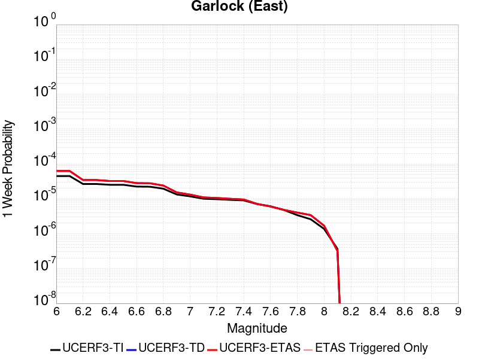 | 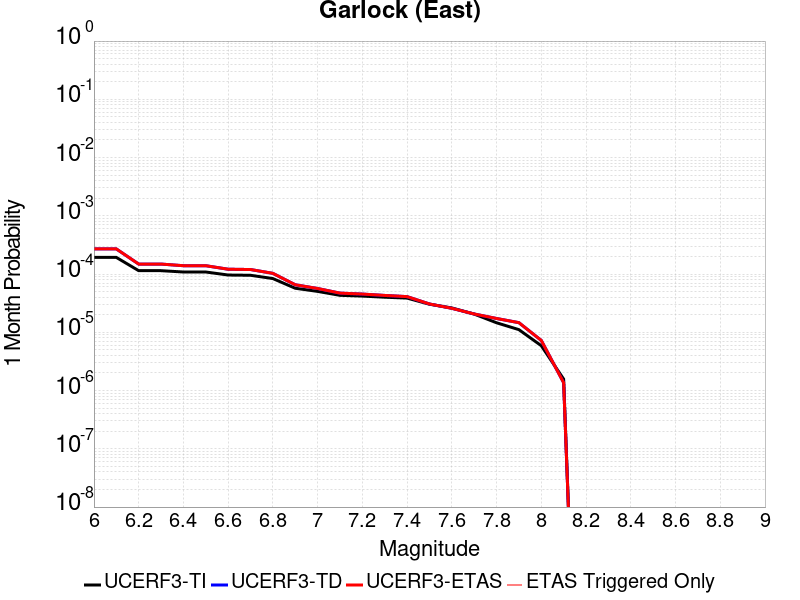 | 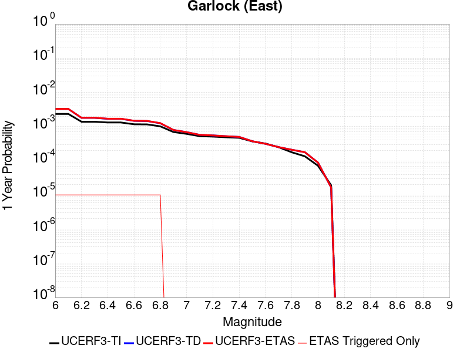 | 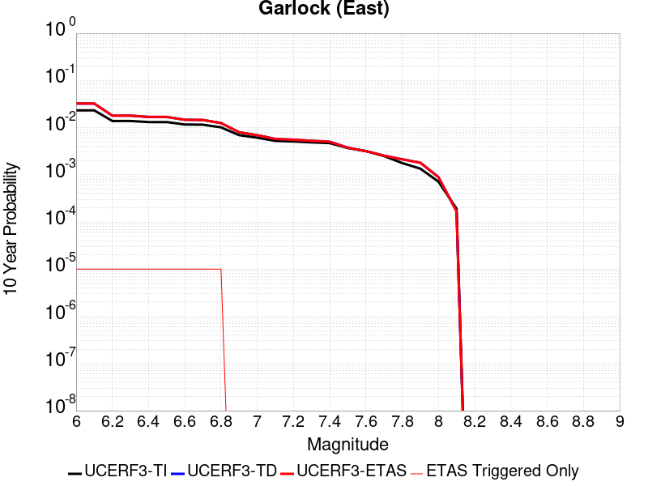 |

| Magnitude | 1 wk TI Prob | 1 wk TD Prob | 1 wk ETAS Prob | 1 wk ETAS/TD Gain | 1 wk ETAS Triggered Only | 1 mo TI Prob | 1 mo TD Prob | 1 mo ETAS Prob | 1 mo ETAS/TD Gain | 1 mo ETAS Triggered Only | 1 yr TI Prob | 1 yr TD Prob | 1 yr ETAS Prob | 1 yr ETAS/TD Gain | 1 yr ETAS Triggered Only | 10 yr TI Prob | 10 yr TD Prob | 10 yr ETAS Prob | 10 yr ETAS/TD Gain | 10 yr ETAS Triggered Only |
|-----|-----|-----|-----|-----|-----|-----|-----|-----|-----|-----|-----|-----|-----|-----|-----|-----|-----|-----|-----|-----|
| 6.0 | 4.5092507E-5 | 6.3060776E-5 | 6.3060776E-5 | 1.0 | 0.0 | 1.9323928E-4 | 2.70235E-4 | 2.70235E-4 | 1.0 | 0.0 | 0.0023501497 | 0.0032855943 | 0.0032955613 | 1.0030336 | 1.0E-5 | 0.023254504 | 0.03240551 | 0.032415185 | 1.0002986 | 1.0E-5 |
| 6.1 | 4.5092507E-5 | 6.3060776E-5 | 6.3060776E-5 | 1.0 | 0.0 | 1.9323928E-4 | 2.70235E-4 | 2.70235E-4 | 1.0 | 0.0 | 0.0023501497 | 0.0032855943 | 0.0032955613 | 1.0030336 | 1.0E-5 | 0.023254504 | 0.03240551 | 0.032415185 | 1.0002986 | 1.0E-5 |
| 6.2 | 2.6674514E-5 | 3.4640714E-5 | 3.4640714E-5 | 1.0 | 0.0 | 1.1431433E-4 | 1.4845195E-4 | 1.4845195E-4 | 1.0 | 0.0 | 0.0013908884 | 0.0018059373 | 0.0018159192 | 1.0055273 | 1.0E-5 | 0.01382215 | 0.017932432 | 0.017942254 | 1.0005476 | 1.0E-5 |
| 6.3 | 2.6674514E-5 | 3.4640714E-5 | 3.4640714E-5 | 1.0 | 0.0 | 1.1431433E-4 | 1.4845195E-4 | 1.4845195E-4 | 1.0 | 0.0 | 0.0013908884 | 0.0018059373 | 0.0018159192 | 1.0055273 | 1.0E-5 | 0.01382215 | 0.017932432 | 0.017942254 | 1.0005476 | 1.0E-5 |
| 6.4 | 2.5312667E-5 | 3.2467433E-5 | 3.2467433E-5 | 1.0 | 0.0 | 1.0847834E-4 | 1.3913888E-4 | 1.3913888E-4 | 1.0 | 0.0 | 0.0013199237 | 0.0016927292 | 0.0017027123 | 1.0058976 | 1.0E-5 | 0.013121112 | 0.01683149 | 0.01684132 | 1.0005841 | 1.0E-5 |
| 6.5 | 2.5312667E-5 | 3.2467433E-5 | 3.2467433E-5 | 1.0 | 0.0 | 1.0847834E-4 | 1.3913888E-4 | 1.3913888E-4 | 1.0 | 0.0 | 0.0013199237 | 0.0016927292 | 0.0017027123 | 1.0058976 | 1.0E-5 | 0.013121112 | 0.01683149 | 0.01684132 | 1.0005841 | 1.0E-5 |
| 6.6 | 2.246556E-5 | 2.8250657E-5 | 2.8250657E-5 | 1.0 | 0.0 | 9.627742E-5 | 1.2106876E-4 | 1.2106876E-4 | 1.0 | 0.0 | 0.0011715472 | 0.0014730392 | 0.0014830244 | 1.0067787 | 1.0E-5 | 0.011653901 | 0.014676737 | 0.01468659 | 1.0006714 | 1.0E-5 |
| 6.7 | 2.2241198E-5 | 2.7919748E-5 | 2.7919748E-5 | 1.0 | 0.0 | 9.531594E-5 | 1.1965071E-4 | 1.1965071E-4 | 1.0 | 0.0 | 0.0011598538 | 0.0014557976 | 0.001465783 | 1.0068591 | 1.0E-5 | 0.011538187 | 0.014506059 | 0.014515914 | 1.0006794 | 1.0E-5 |
| 6.8 | 1.9528685E-5 | 2.400518E-5 | 2.400518E-5 | 1.0 | 0.0 | 8.369167E-5 | 1.0287539E-4 | 1.0287539E-4 | 1.0 | 0.0 | 0.0010184698 | 0.001251808 | 0.0012617955 | 1.0079784 | 1.0E-5 | 0.010138147 | 0.012493789 | 0.012503664 | 1.0007904 | 1.0E-5 |
| 6.9 | 1.3318621E-5 | 1.5285035E-5 | 1.5285035E-5 | 1.0 | 0.0 | 5.7078556E-5 | 6.550568E-5 | 6.550568E-5 | 1.0 | 0.0 | 6.9470983E-4 | 7.972456E-4 | 7.972456E-4 | 1.0 | 0.0 | 0.0069254204 | 0.007985784 | 0.007985784 | 1.0 | 0.0 |
| 7.0 | 1.1760853E-5 | 1.3190986E-5 | 1.3190986E-5 | 1.0 | 0.0 | 5.0402683E-5 | 5.65316E-5 | 5.65316E-5 | 1.0 | 0.0 | 6.134799E-4 | 6.880599E-4 | 6.880599E-4 | 1.0 | 0.0 | 0.0061178906 | 0.0069010034 | 0.0069010034 | 1.0 | 0.0 |
| 7.1 | 1.0064758E-5 | 1.09833545E-5 | 1.09833545E-5 | 1.0 | 0.0 | 4.3133965E-5 | 4.707069E-5 | 4.707069E-5 | 1.0 | 0.0 | 5.2502943E-4 | 5.7293853E-4 | 5.7293853E-4 | 1.0 | 0.0 | 0.005237907 | 0.0057555805 | 0.0057555805 | 1.0 | 0.0 |
| 7.2 | 9.768808E-6 | 1.0578682E-5 | 1.0578682E-5 | 1.0 | 0.0 | 4.186565E-5 | 4.533644E-5 | 4.533644E-5 | 1.0 | 0.0 | 5.095951E-4 | 5.518349E-4 | 5.518349E-4 | 1.0 | 0.0 | 0.0050842804 | 0.005545591 | 0.005545591 | 1.0 | 0.0 |
| 7.3 | 9.344516E-6 | 1.0022867E-5 | 1.0022867E-5 | 1.0 | 0.0 | 4.004731E-5 | 4.2954456E-5 | 4.2954456E-5 | 1.0 | 0.0 | 4.8746695E-4 | 5.228485E-4 | 5.228485E-4 | 1.0 | 0.0 | 0.0048639905 | 0.0052565215 | 0.0052565215 | 1.0 | 0.0 |
| 7.4 | 9.023491E-6 | 9.56752E-6 | 9.56752E-6 | 1.0 | 0.0 | 3.867153E-5 | 4.100303E-5 | 4.100303E-5 | 1.0 | 0.0 | 4.7072413E-4 | 4.991009E-4 | 4.991009E-4 | 1.0 | 0.0 | 0.004697283 | 0.0050192317 | 0.0050192317 | 1.0 | 0.0 |
| 7.5 | 7.081253E-6 | 7.1561967E-6 | 7.1561967E-6 | 1.0 | 0.0 | 3.0347876E-5 | 3.0669056E-5 | 3.0669056E-5 | 1.0 | 0.0 | 3.6942272E-4 | 3.7333256E-4 | 3.7333256E-4 | 1.0 | 0.0 | 0.003688092 | 0.003760737 | 0.003760737 | 1.0 | 0.0 |
| 7.6 | 6.116396E-6 | 6.021629E-6 | 6.021629E-6 | 1.0 | 0.0 | 2.6212863E-5 | 2.5806727E-5 | 2.5806727E-5 | 1.0 | 0.0 | 3.1909486E-4 | 3.1415187E-4 | 3.1415187E-4 | 1.0 | 0.0 | 0.0031863707 | 0.0031689603 | 0.0031689603 | 1.0 | 0.0 |
| 7.7 | 4.797145E-6 | 4.816367E-6 | 4.816367E-6 | 1.0 | 0.0 | 2.055903E-5 | 2.064141E-5 | 2.064141E-5 | 1.0 | 0.0 | 2.5027743E-4 | 2.5128032E-4 | 2.5128032E-4 | 1.0 | 0.0 | 0.0024999576 | 0.0025403802 | 0.0025403802 | 1.0 | 0.0 |
| 7.8 | 3.4028885E-6 | 4.03126E-6 | 4.03126E-6 | 1.0 | 0.0 | 1.4583726E-5 | 1.7276714E-5 | 1.7276714E-5 | 1.0 | 0.0 | 1.775424E-4 | 2.1032376E-4 | 2.1032376E-4 | 1.0 | 0.0 | 0.0017740062 | 0.002128967 | 0.002128967 | 1.0 | 0.0 |
| 7.9 | 2.5928412E-6 | 3.4171514E-6 | 3.4171514E-6 | 1.0 | 0.0 | 1.1112129E-5 | 1.4644853E-5 | 1.4644853E-5 | 1.0 | 0.0 | 1.3528178E-4 | 1.7828656E-4 | 1.7828656E-4 | 1.0 | 0.0 | 0.0013519945 | 0.0018047167 | 0.0018047167 | 1.0 | 0.0 |
| 8.0 | 1.3743648E-6 | 1.6937237E-6 | 1.6937237E-6 | 1.0 | 0.0 | 5.8901214E-6 | 7.258796E-6 | 7.258796E-6 | 1.0 | 0.0 | 7.1709874E-5 | 8.837229E-5 | 8.837229E-5 | 1.0 | 0.0 | 7.1686733E-4 | 8.9448167E-4 | 8.9448167E-4 | 1.0 | 0.0 |
| 8.1 | 3.6733252E-7 | 3.184797E-7 | 3.184797E-7 | 1.0 | 0.0 | 1.5742813E-6 | 1.3649124E-6 | 1.3649124E-6 | 1.0 | 0.0 | 1.9166706E-5 | 1.6617698E-5 | 1.6617698E-5 | 1.0 | 0.0 | 1.9165053E-4 | 1.6828527E-4 | 1.6828527E-4 | 1.0 | 0.0 |

## San Juan
*[(top)](#table-of-contents)*

| 1 Week | 1 Month | 1 Year | 10 Year |
|-----|-----|-----|-----|
| 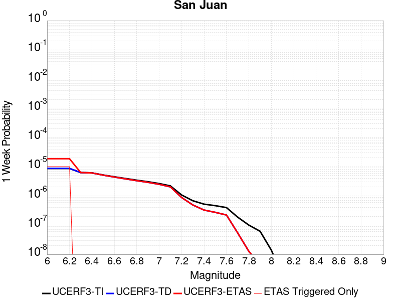 | 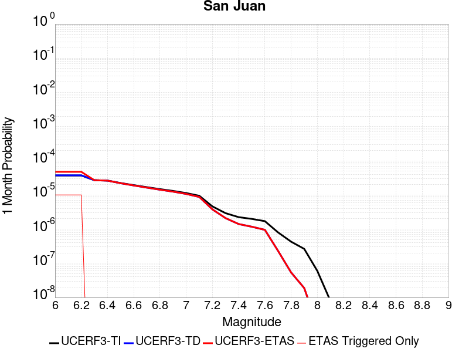 | 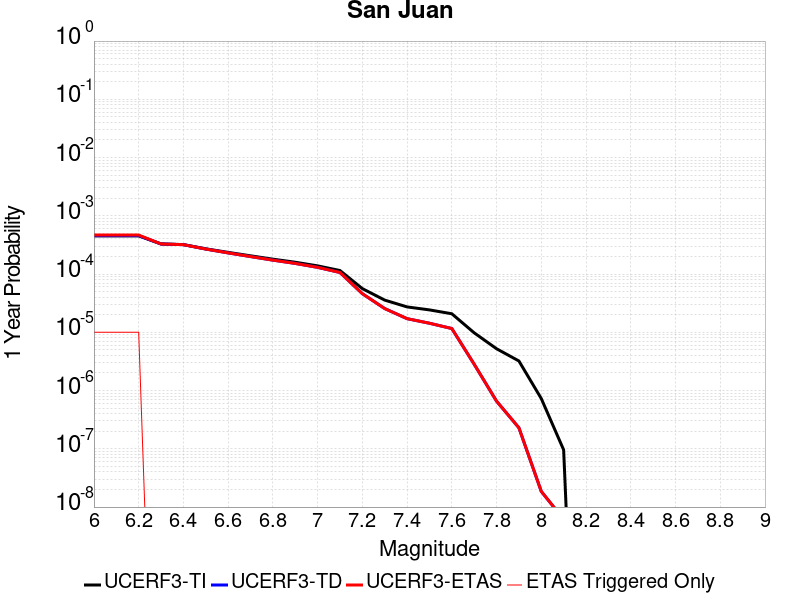 | 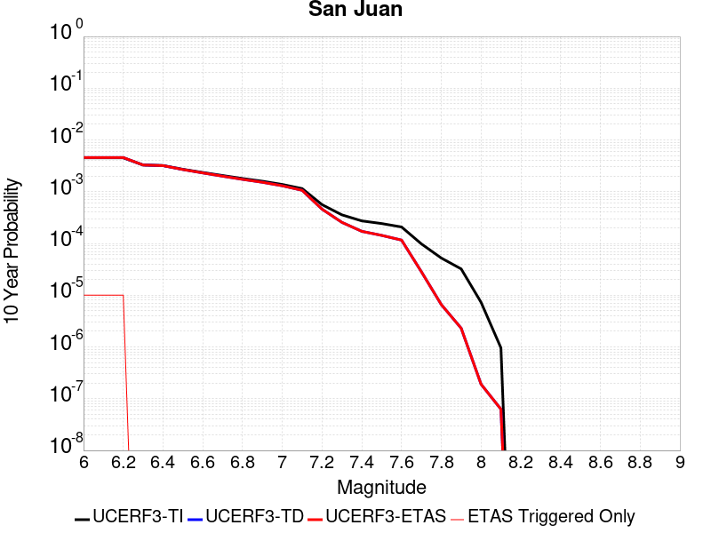 |

| Magnitude | 1 wk TI Prob | 1 wk TD Prob | 1 wk ETAS Prob | 1 wk ETAS/TD Gain | 1 wk ETAS Triggered Only | 1 mo TI Prob | 1 mo TD Prob | 1 mo ETAS Prob | 1 mo ETAS/TD Gain | 1 mo ETAS Triggered Only | 1 yr TI Prob | 1 yr TD Prob | 1 yr ETAS Prob | 1 yr ETAS/TD Gain | 1 yr ETAS Triggered Only | 10 yr TI Prob | 10 yr TD Prob | 10 yr ETAS Prob | 10 yr ETAS/TD Gain | 10 yr ETAS Triggered Only |
|-----|-----|-----|-----|-----|-----|-----|-----|-----|-----|-----|-----|-----|-----|-----|-----|-----|-----|-----|-----|-----|
| 6.0 | 8.682808E-6 | 8.765042E-6 | 1.8764955E-5 | 2.1408858 | 1.0E-5 | 3.72115E-5 | 3.7563954E-5 | 4.756358E-5 | 1.2662027 | 1.0E-5 | 4.5295584E-4 | 4.5725E-4 | 4.6724544E-4 | 1.0218599 | 1.0E-5 | 0.004520337 | 0.0045636347 | 0.004573589 | 1.0021813 | 1.0E-5 |
| 6.1 | 8.682808E-6 | 8.765042E-6 | 1.8764955E-5 | 2.1408858 | 1.0E-5 | 3.72115E-5 | 3.7563954E-5 | 4.756358E-5 | 1.2662027 | 1.0E-5 | 4.5295584E-4 | 4.5725E-4 | 4.6724544E-4 | 1.0218599 | 1.0E-5 | 0.004520337 | 0.0045636347 | 0.004573589 | 1.0021813 | 1.0E-5 |
| 6.2 | 8.682808E-6 | 8.765042E-6 | 1.8764955E-5 | 2.1408858 | 1.0E-5 | 3.72115E-5 | 3.7563954E-5 | 4.756358E-5 | 1.2662027 | 1.0E-5 | 4.5295584E-4 | 4.5725E-4 | 4.6724544E-4 | 1.0218599 | 1.0E-5 | 0.004520337 | 0.0045636347 | 0.004573589 | 1.0021813 | 1.0E-5 |
| 6.3 | 6.3054235E-6 | 6.2979852E-6 | 6.2979852E-6 | 1.0 | 0.0 | 2.7022963E-5 | 2.6991094E-5 | 2.6991094E-5 | 1.0 | 0.0 | 3.2895492E-4 | 3.2856842E-4 | 3.2856842E-4 | 1.0 | 0.0 | 0.003284684 | 0.0032810282 | 0.0032810282 | 1.0 | 0.0 |
| 6.4 | 6.1490473E-6 | 6.127801E-6 | 6.127801E-6 | 1.0 | 0.0 | 2.6352795E-5 | 2.6261749E-5 | 2.6261749E-5 | 1.0 | 0.0 | 3.2079802E-4 | 3.1969126E-4 | 3.1969126E-4 | 1.0 | 0.0 | 0.0032033534 | 0.0031925116 | 0.0031925116 | 1.0 | 0.0 |
| 6.5 | 5.204848E-6 | 5.150153E-6 | 5.150153E-6 | 1.0 | 0.0 | 2.23063E-5 | 2.2071903E-5 | 2.2071903E-5 | 1.0 | 0.0 | 2.7154534E-4 | 2.6869323E-4 | 2.6869323E-4 | 1.0 | 0.0 | 0.0027121378 | 0.0026838395 | 0.0026838395 | 1.0 | 0.0 |
| 6.6 | 4.5179986E-6 | 4.424813E-6 | 4.424813E-6 | 1.0 | 0.0 | 1.9362706E-5 | 1.8963352E-5 | 1.8963352E-5 | 1.0 | 0.0 | 2.3571544E-4 | 2.3085515E-4 | 2.3085515E-4 | 1.0 | 0.0 | 0.0023546559 | 0.002306292 | 0.002306292 | 1.0 | 0.0 |
| 6.7 | 3.9442616E-6 | 3.8286116E-6 | 3.8286116E-6 | 1.0 | 0.0 | 1.6903869E-5 | 1.6408238E-5 | 1.6408238E-5 | 1.0 | 0.0 | 2.0578515E-4 | 1.9975264E-4 | 1.9975264E-4 | 1.0 | 0.0 | 0.002055947 | 0.0019958576 | 0.0019958576 | 1.0 | 0.0 |
| 6.8 | 3.4536245E-6 | 3.3247688E-6 | 3.3247688E-6 | 1.0 | 0.0 | 1.4801163E-5 | 1.4248935E-5 | 1.4248935E-5 | 1.0 | 0.0 | 1.8018926E-4 | 1.7346759E-4 | 1.7346759E-4 | 1.0 | 0.0 | 0.0018004322 | 0.0017334424 | 0.0017334424 | 1.0 | 0.0 |
| 6.9 | 3.059865E-6 | 2.9200883E-6 | 2.9200883E-6 | 1.0 | 0.0 | 1.3113641E-5 | 1.2514607E-5 | 1.2514607E-5 | 1.0 | 0.0 | 1.596469E-4 | 1.5235525E-4 | 1.5235525E-4 | 1.0 | 0.0 | 0.0015953224 | 0.0015226244 | 0.0015226244 | 1.0 | 0.0 |
| 7.0 | 2.6504351E-6 | 2.49962E-6 | 2.49962E-6 | 1.0 | 0.0 | 1.1358958E-5 | 1.0712616E-5 | 1.0712616E-5 | 1.0 | 0.0 | 1.3828653E-4 | 1.3041883E-4 | 1.3041883E-4 | 1.0 | 0.0 | 0.0013820052 | 0.0013035366 | 0.0013035366 | 1.0 | 0.0 |
| 7.1 | 2.2039317E-6 | 2.0401394E-6 | 2.0401394E-6 | 1.0 | 0.0 | 9.445387E-6 | 8.743427E-6 | 8.743427E-6 | 1.0 | 0.0 | 1.1499152E-4 | 1.0644656E-4 | 1.0644656E-4 | 1.0 | 0.0 | 0.0011493203 | 0.0010640675 | 0.0010640675 | 1.0 | 0.0 |
| 7.2 | 1.0786707E-6 | 8.824808E-7 | 8.824808E-7 | 1.0 | 0.0 | 4.622866E-6 | 3.782055E-6 | 3.782055E-6 | 1.0 | 0.0 | 5.628194E-5 | 4.604556E-5 | 4.604556E-5 | 1.0 | 0.0 | 5.6267687E-4 | 4.60421E-4 | 4.60421E-4 | 1.0 | 0.0 |
| 7.3 | 6.846433E-7 | 4.901992E-7 | 4.901992E-7 | 1.0 | 0.0 | 2.9341822E-6 | 2.100852E-6 | 2.100852E-6 | 1.0 | 0.0 | 3.5723086E-5 | 2.5577574E-5 | 2.5577574E-5 | 1.0 | 0.0 | 3.571734E-4 | 2.557799E-4 | 2.557799E-4 | 1.0 | 0.0 |
| 7.4 | 5.23043E-7 | 3.287686E-7 | 3.287686E-7 | 1.0 | 0.0 | 2.2416111E-6 | 1.4090076E-6 | 1.4090076E-6 | 1.0 | 0.0 | 2.7291273E-5 | 1.7154533E-5 | 1.7154533E-5 | 1.0 | 0.0 | 2.7287923E-4 | 1.7156392E-4 | 1.7156392E-4 | 1.0 | 0.0 |
| 7.5 | 4.648444E-7 | 2.7450287E-7 | 2.7450287E-7 | 1.0 | 0.0 | 1.9921886E-6 | 1.1764403E-6 | 1.1764403E-6 | 1.0 | 0.0 | 2.4254627E-5 | 1.4323066E-5 | 1.4323066E-5 | 1.0 | 0.0 | 2.425198E-4 | 1.4325092E-4 | 1.4325092E-4 | 1.0 | 0.0 |
| 7.6 | 3.9906567E-7 | 2.2255307E-7 | 2.2255307E-7 | 1.0 | 0.0 | 1.7102802E-6 | 9.537985E-7 | 9.537985E-7 | 1.0 | 0.0 | 2.0822463E-5 | 1.1612436E-5 | 1.1612436E-5 | 1.0 | 0.0 | 2.0820512E-4 | 1.16143085E-4 | 1.16143085E-4 | 1.0 | 0.0 |
| 7.7 | 1.8784601E-7 | 5.429814E-8 | 5.429814E-8 | 1.0 | 0.0 | 8.0505407E-7 | 2.327063E-7 | 2.327063E-7 | 1.0 | 0.0 | 9.80149E-6 | 2.8331954E-6 | 2.8331954E-6 | 1.0 | 0.0 | 9.801057E-5 | 2.8340704E-5 | 2.8340704E-5 | 1.0 | 0.0 |
| 7.8 | 1.00154914E-7 | 1.2617505E-8 | 1.2617505E-8 | 1.0 | 0.0 | 4.2923529E-7 | 5.4075024E-8 | 5.4075024E-8 | 1.0 | 0.0 | 5.225927E-6 | 6.583632E-7 | 6.583632E-7 | 1.0 | 0.0 | 5.225804E-5 | 6.5898666E-6 | 6.5898666E-6 | 1.0 | 0.0 |
| 7.9 | 6.171429E-8 | 4.4014445E-9 | 4.4014445E-9 | 1.0 | 0.0 | 2.6448978E-7 | 1.8863336E-8 | 1.8863336E-8 | 1.0 | 0.0 | 3.2201583E-6 | 2.2966111E-7 | 2.2966111E-7 | 1.0 | 0.0 | 3.2201115E-5 | 2.3022128E-6 | 2.3022128E-6 | 1.0 | 0.0 |
| 8.0 | 1.3974572E-8 | 3.5629255E-10 | 3.5629255E-10 | 1.0 | 0.0 | 5.989102E-8 | 1.526972E-9 | 1.526972E-9 | 1.0 | 0.0 | 7.2917294E-7 | 1.8590892E-8 | 1.8590892E-8 | 1.0 | 0.0 | 7.2917055E-6 | 1.9043252E-7 | 1.9043252E-7 | 1.0 | 0.0 |
| 8.1 | 1.8403477E-9 | 1.1758894E-10 | 1.1758894E-10 | 1.0 | 0.0 | 7.887204E-9 | 5.0395443E-10 | 5.0395443E-10 | 1.0 | 0.0 | 9.602671E-8 | 6.1356475E-9 | 6.1356475E-9 | 1.0 | 0.0 | 9.602667E-7 | 6.261992E-8 | 6.261992E-8 | 1.0 | 0.0 |

## Elsinore (Coyote Mountains)
*[(top)](#table-of-contents)*

| 1 Week | 1 Month | 1 Year | 10 Year |
|-----|-----|-----|-----|
|  |  |  |  |

| Magnitude | 1 wk TI Prob | 1 wk TD Prob | 1 wk ETAS Prob | 1 wk ETAS/TD Gain | 1 wk ETAS Triggered Only | 1 mo TI Prob | 1 mo TD Prob | 1 mo ETAS Prob | 1 mo ETAS/TD Gain | 1 mo ETAS Triggered Only | 1 yr TI Prob | 1 yr TD Prob | 1 yr ETAS Prob | 1 yr ETAS/TD Gain | 1 yr ETAS Triggered Only | 10 yr TI Prob | 10 yr TD Prob | 10 yr ETAS Prob | 10 yr ETAS/TD Gain | 10 yr ETAS Triggered Only |
|-----|-----|-----|-----|-----|-----|-----|-----|-----|-----|-----|-----|-----|-----|-----|-----|-----|-----|-----|-----|-----|
| 6.0 | 4.20513E-5 | 4.86968E-5 | 4.86968E-5 | 1.0 | 0.0 | 1.8020741E-4 | 2.0868712E-4 | 2.0868712E-4 | 1.0 | 0.0 | 0.0021918174 | 0.0025383183 | 0.0025383183 | 1.0 | 0.0 | 0.021703249 | 0.025144503 | 0.02515425 | 1.0003877 | 1.0E-5 |
| 6.1 | 4.20513E-5 | 4.86968E-5 | 4.86968E-5 | 1.0 | 0.0 | 1.8020741E-4 | 2.0868712E-4 | 2.0868712E-4 | 1.0 | 0.0 | 0.0021918174 | 0.0025383183 | 0.0025383183 | 1.0 | 0.0 | 0.021703249 | 0.025144503 | 0.02515425 | 1.0003877 | 1.0E-5 |
| 6.2 | 2.3413893E-5 | 2.47266E-5 | 2.47266E-5 | 1.0 | 0.0 | 1.0034139E-4 | 1.05967374E-4 | 1.05967374E-4 | 1.0 | 0.0 | 0.0012209718 | 0.0012894757 | 0.0012894757 | 1.0 | 0.0 | 0.012142851 | 0.012828605 | 0.012838476 | 1.0007695 | 1.0E-5 |
| 6.3 | 2.3413893E-5 | 2.47266E-5 | 2.47266E-5 | 1.0 | 0.0 | 1.0034139E-4 | 1.05967374E-4 | 1.05967374E-4 | 1.0 | 0.0 | 0.0012209718 | 0.0012894757 | 0.0012894757 | 1.0 | 0.0 | 0.012142851 | 0.012828605 | 0.012838476 | 1.0007695 | 1.0E-5 |
| 6.4 | 1.6894814E-5 | 1.658908E-5 | 1.658908E-5 | 1.0 | 0.0 | 7.240433E-5 | 7.109433E-5 | 7.109433E-5 | 1.0 | 0.0 | 8.811662E-4 | 8.6526637E-4 | 8.6526637E-4 | 1.0 | 0.0 | 0.0087768035 | 0.008622632 | 0.008622632 | 1.0 | 0.0 |
| 6.5 | 1.6894814E-5 | 1.658908E-5 | 1.658908E-5 | 1.0 | 0.0 | 7.240433E-5 | 7.109433E-5 | 7.109433E-5 | 1.0 | 0.0 | 8.811662E-4 | 8.6526637E-4 | 8.6526637E-4 | 1.0 | 0.0 | 0.0087768035 | 0.008622632 | 0.008622632 | 1.0 | 0.0 |
| 6.6 | 1.1910969E-5 | 1.0544801E-5 | 1.0544801E-5 | 1.0 | 0.0 | 5.1046012E-5 | 4.519129E-5 | 4.519129E-5 | 1.0 | 0.0 | 6.21308E-4 | 5.500782E-4 | 5.500782E-4 | 1.0 | 0.0 | 0.0061957375 | 0.0054884683 | 0.0054884683 | 1.0 | 0.0 |
| 6.7 | 9.1486E-6 | 7.213386E-6 | 7.213386E-6 | 1.0 | 0.0 | 3.9207694E-5 | 3.0914165E-5 | 3.0914165E-5 | 1.0 | 0.0 | 4.7724912E-4 | 3.763188E-4 | 3.763188E-4 | 1.0 | 0.0 | 0.0047622547 | 0.0037571958 | 0.0037571958 | 1.0 | 0.0 |
| 6.8 | 7.90441E-6 | 5.7381435E-6 | 5.7381435E-6 | 1.0 | 0.0 | 3.3875604E-5 | 2.459182E-5 | 2.459182E-5 | 1.0 | 0.0 | 4.1235742E-4 | 2.9936555E-4 | 2.9936555E-4 | 1.0 | 0.0 | 0.0041159308 | 0.0029897518 | 0.0029897518 | 1.0 | 0.0 |
| 6.9 | 7.77015E-6 | 5.5920314E-6 | 5.5920314E-6 | 1.0 | 0.0 | 3.3300217E-5 | 2.3965637E-5 | 2.3965637E-5 | 1.0 | 0.0 | 4.0535472E-4 | 2.9174384E-4 | 2.9174384E-4 | 1.0 | 0.0 | 0.004046161 | 0.0029137358 | 0.0029137358 | 1.0 | 0.0 |
| 7.0 | 7.675798E-6 | 5.4888405E-6 | 5.4888405E-6 | 1.0 | 0.0 | 3.289586E-5 | 2.3523397E-5 | 2.3523397E-5 | 1.0 | 0.0 | 4.004335E-4 | 2.8636097E-4 | 2.8636097E-4 | 1.0 | 0.0 | 0.003997127 | 0.0028600467 | 0.0028600467 | 1.0 | 0.0 |
| 7.1 | 7.447814E-6 | 5.247635E-6 | 5.247635E-6 | 1.0 | 0.0 | 3.191881E-5 | 2.2489678E-5 | 2.2489678E-5 | 1.0 | 0.0 | 3.8854225E-4 | 2.7377866E-4 | 2.7377866E-4 | 1.0 | 0.0 | 0.003878636 | 0.0027345386 | 0.0027345386 | 1.0 | 0.0 |
| 7.2 | 7.128185E-6 | 4.914247E-6 | 4.914247E-6 | 1.0 | 0.0 | 3.0549007E-5 | 2.1060896E-5 | 2.1060896E-5 | 1.0 | 0.0 | 3.7187067E-4 | 2.5638743E-4 | 2.5638743E-4 | 1.0 | 0.0 | 0.00371249 | 0.002561035 | 0.002561035 | 1.0 | 0.0 |
| 7.3 | 7.0913875E-6 | 4.8829074E-6 | 4.8829074E-6 | 1.0 | 0.0 | 3.0391306E-5 | 2.0926585E-5 | 2.0926585E-5 | 1.0 | 0.0 | 3.6995133E-4 | 2.5475258E-4 | 2.5475258E-4 | 1.0 | 0.0 | 0.0036933604 | 0.0025447241 | 0.0025447241 | 1.0 | 0.0 |
| 7.4 | 7.051521E-6 | 4.846747E-6 | 4.846747E-6 | 1.0 | 0.0 | 3.0220453E-5 | 2.0771615E-5 | 2.0771615E-5 | 1.0 | 0.0 | 3.6787192E-4 | 2.5286624E-4 | 2.5286624E-4 | 1.0 | 0.0 | 0.0036726352 | 0.002525904 | 0.002525904 | 1.0 | 0.0 |
| 7.5 | 6.910666E-6 | 4.742132E-6 | 4.742132E-6 | 1.0 | 0.0 | 2.9616802E-5 | 2.0323272E-5 | 2.0323272E-5 | 1.0 | 0.0 | 3.605249E-4 | 2.4740893E-4 | 2.4740893E-4 | 1.0 | 0.0 | 0.0035994058 | 0.0024714533 | 0.0024714533 | 1.0 | 0.0 |
| 7.6 | 6.341753E-6 | 4.3148316E-6 | 4.3148316E-6 | 1.0 | 0.0 | 2.7178658E-5 | 1.8492012E-5 | 1.8492012E-5 | 1.0 | 0.0 | 3.3084993E-4 | 2.2511814E-4 | 2.2511814E-4 | 1.0 | 0.0 | 0.0033035777 | 0.0022490167 | 0.0022490167 | 1.0 | 0.0 |
| 7.7 | 3.9205916E-6 | 2.2489335E-6 | 2.2489335E-6 | 1.0 | 0.0 | 1.6802427E-5 | 9.638255E-6 | 9.638255E-6 | 1.0 | 0.0 | 2.0455034E-4 | 1.17340176E-4 | 1.17340176E-4 | 1.0 | 0.0 | 0.0020436216 | 0.0011728555 | 0.0011728555 | 1.0 | 0.0 |
| 7.8 | 2.0846227E-7 | 8.5023146E-8 | 8.5023146E-8 | 1.0 | 0.0 | 8.9340944E-7 | 3.6438487E-7 | 3.6438487E-7 | 1.0 | 0.0 | 1.0877206E-5 | 4.43638E-6 | 4.43638E-6 | 1.0 | 0.0 | 1.0876673E-4 | 4.4363245E-5 | 4.4363245E-5 | 1.0 | 0.0 |
| 7.9 | 4.4969806E-9 | 2.272358E-9 | 2.272358E-9 | 1.0 | 0.0 | 1.9272775E-8 | 9.7386765E-9 | 9.7386765E-9 | 1.0 | 0.0 | 2.3464601E-7 | 1.1856839E-7 | 1.1856839E-7 | 1.0 | 0.0 | 2.3464577E-6 | 1.1856833E-6 | 1.1856833E-6 | 1.0 | 0.0 |

## San Gorgonio Pass
*[(top)](#table-of-contents)*

| 1 Week | 1 Month | 1 Year | 10 Year |
|-----|-----|-----|-----|
| 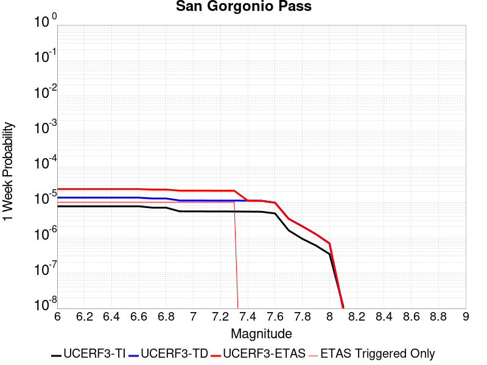 | 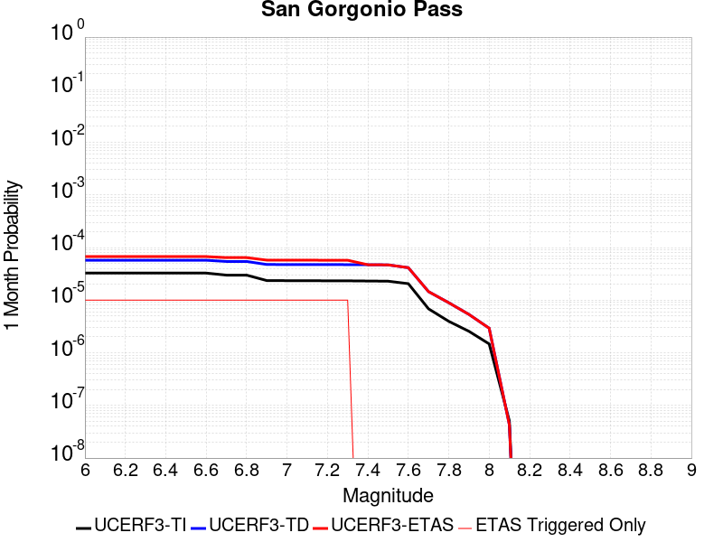 | 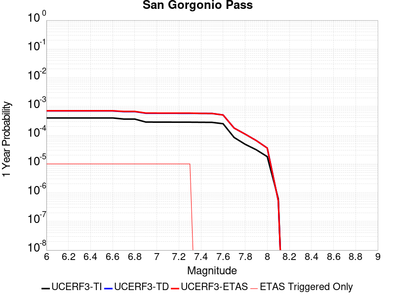 | 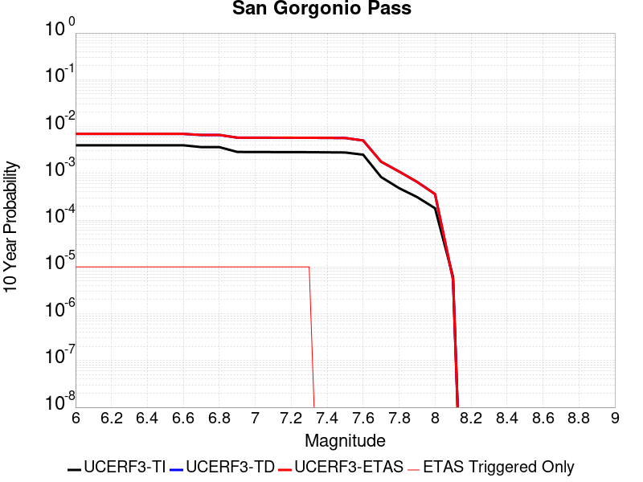 |

| Magnitude | 1 wk TI Prob | 1 wk TD Prob | 1 wk ETAS Prob | 1 wk ETAS/TD Gain | 1 wk ETAS Triggered Only | 1 mo TI Prob | 1 mo TD Prob | 1 mo ETAS Prob | 1 mo ETAS/TD Gain | 1 mo ETAS Triggered Only | 1 yr TI Prob | 1 yr TD Prob | 1 yr ETAS Prob | 1 yr ETAS/TD Gain | 1 yr ETAS Triggered Only | 10 yr TI Prob | 10 yr TD Prob | 10 yr ETAS Prob | 10 yr ETAS/TD Gain | 10 yr ETAS Triggered Only |
|-----|-----|-----|-----|-----|-----|-----|-----|-----|-----|-----|-----|-----|-----|-----|-----|-----|-----|-----|-----|-----|
| 6.0 | 7.644328E-6 | 1.3395718E-5 | 2.3395583E-5 | 1.7464972 | 1.0E-5 | 3.2760996E-5 | 5.7409005E-5 | 6.740843E-5 | 1.1741787 | 1.0E-5 | 3.987921E-4 | 6.9873914E-4 | 7.087321E-4 | 1.0143015 | 1.0E-5 | 0.003980772 | 0.0069722575 | 0.0069821877 | 1.0014243 | 1.0E-5 |
| 6.1 | 7.644328E-6 | 1.3395718E-5 | 2.3395583E-5 | 1.7464972 | 1.0E-5 | 3.2760996E-5 | 5.7409005E-5 | 6.740843E-5 | 1.1741787 | 1.0E-5 | 3.987921E-4 | 6.9873914E-4 | 7.087321E-4 | 1.0143015 | 1.0E-5 | 0.003980772 | 0.0069722575 | 0.0069821877 | 1.0014243 | 1.0E-5 |
| 6.2 | 7.644328E-6 | 1.3395718E-5 | 2.3395583E-5 | 1.7464972 | 1.0E-5 | 3.2760996E-5 | 5.7409005E-5 | 6.740843E-5 | 1.1741787 | 1.0E-5 | 3.987921E-4 | 6.9873914E-4 | 7.087321E-4 | 1.0143015 | 1.0E-5 | 0.003980772 | 0.0069722575 | 0.0069821877 | 1.0014243 | 1.0E-5 |
| 6.3 | 7.644328E-6 | 1.3395718E-5 | 2.3395583E-5 | 1.7464972 | 1.0E-5 | 3.2760996E-5 | 5.7409005E-5 | 6.740843E-5 | 1.1741787 | 1.0E-5 | 3.987921E-4 | 6.9873914E-4 | 7.087321E-4 | 1.0143015 | 1.0E-5 | 0.003980772 | 0.0069722575 | 0.0069821877 | 1.0014243 | 1.0E-5 |
| 6.4 | 7.644328E-6 | 1.3395718E-5 | 2.3395583E-5 | 1.7464972 | 1.0E-5 | 3.2760996E-5 | 5.7409005E-5 | 6.740843E-5 | 1.1741787 | 1.0E-5 | 3.987921E-4 | 6.9873914E-4 | 7.087321E-4 | 1.0143015 | 1.0E-5 | 0.003980772 | 0.0069722575 | 0.0069821877 | 1.0014243 | 1.0E-5 |
| 6.5 | 7.644328E-6 | 1.3395718E-5 | 2.3395583E-5 | 1.7464972 | 1.0E-5 | 3.2760996E-5 | 5.7409005E-5 | 6.740843E-5 | 1.1741787 | 1.0E-5 | 3.987921E-4 | 6.9873914E-4 | 7.087321E-4 | 1.0143015 | 1.0E-5 | 0.003980772 | 0.0069722575 | 0.0069821877 | 1.0014243 | 1.0E-5 |
| 6.6 | 7.644328E-6 | 1.3395718E-5 | 2.3395583E-5 | 1.7464972 | 1.0E-5 | 3.2760996E-5 | 5.7409005E-5 | 6.740843E-5 | 1.1741787 | 1.0E-5 | 3.987921E-4 | 6.9873914E-4 | 7.087321E-4 | 1.0143015 | 1.0E-5 | 0.003980772 | 0.0069722575 | 0.0069821877 | 1.0014243 | 1.0E-5 |
| 6.7 | 6.987586E-6 | 1.2699778E-5 | 2.269965E-5 | 1.7874054 | 1.0E-5 | 2.9946454E-5 | 5.442653E-5 | 6.4425985E-5 | 1.1837239 | 1.0E-5 | 3.645371E-4 | 6.6244975E-4 | 6.7244313E-4 | 1.0150855 | 1.0E-5 | 0.0036393967 | 0.006611538 | 0.006621472 | 1.0015025 | 1.0E-5 |
| 6.8 | 6.987586E-6 | 1.2699778E-5 | 2.269965E-5 | 1.7874054 | 1.0E-5 | 2.9946454E-5 | 5.442653E-5 | 6.4425985E-5 | 1.1837239 | 1.0E-5 | 3.645371E-4 | 6.6244975E-4 | 6.7244313E-4 | 1.0150855 | 1.0E-5 | 0.0036393967 | 0.006611538 | 0.006621472 | 1.0015025 | 1.0E-5 |
| 6.9 | 5.504702E-6 | 1.113017E-5 | 2.1130058E-5 | 1.898449 | 1.0E-5 | 2.3591367E-5 | 4.7699883E-5 | 5.7699406E-5 | 1.2096341 | 1.0E-5 | 2.8718702E-4 | 5.8059645E-4 | 5.9059064E-4 | 1.0172137 | 1.0E-5 | 0.0028681618 | 0.00579728 | 0.005807222 | 1.001715 | 1.0E-5 |
| 7.0 | 5.4825764E-6 | 1.1106502E-5 | 2.110639E-5 | 1.9003634 | 1.0E-5 | 2.3496545E-5 | 4.7598456E-5 | 5.759798E-5 | 1.2100809 | 1.0E-5 | 2.8603288E-4 | 5.793622E-4 | 5.893564E-4 | 1.0172504 | 1.0E-5 | 0.00285665 | 0.005785002 | 0.005794944 | 1.0017186 | 1.0E-5 |
| 7.1 | 5.4692787E-6 | 1.10922065E-5 | 2.1092095E-5 | 1.9015238 | 1.0E-5 | 2.3439556E-5 | 4.753719E-5 | 5.7536716E-5 | 1.2103516 | 1.0E-5 | 2.8533922E-4 | 5.7861675E-4 | 5.8861094E-4 | 1.0172726 | 1.0E-5 | 0.0028497311 | 0.005777586 | 0.005787528 | 1.0017208 | 1.0E-5 |
| 7.2 | 5.453661E-6 | 1.1075225E-5 | 2.1075115E-5 | 1.9029062 | 1.0E-5 | 2.3372622E-5 | 4.746442E-5 | 5.746394E-5 | 1.2106742 | 1.0E-5 | 2.8452452E-4 | 5.777312E-4 | 5.877254E-4 | 1.017299 | 1.0E-5 | 0.002841605 | 0.0057687764 | 0.0057787187 | 1.0017235 | 1.0E-5 |
| 7.3 | 5.4422303E-6 | 1.1062136E-5 | 2.1062026E-5 | 1.9039745 | 1.0E-5 | 2.3323635E-5 | 4.740832E-5 | 5.7407848E-5 | 1.2109234 | 1.0E-5 | 2.8392827E-4 | 5.770486E-4 | 5.8704277E-4 | 1.0173196 | 1.0E-5 | 0.0028356577 | 0.005761985 | 0.005771928 | 1.0017256 | 1.0E-5 |
| 7.4 | 5.398595E-6 | 1.1009453E-5 | 1.1009453E-5 | 1.0 | 0.0 | 2.313663E-5 | 4.7182548E-5 | 4.7182548E-5 | 1.0 | 0.0 | 2.8165206E-4 | 5.7430123E-4 | 5.7430123E-4 | 1.0 | 0.0 | 0.0028129534 | 0.0057346537 | 0.0057346537 | 1.0 | 0.0 |
| 7.5 | 5.3578788E-6 | 1.0935828E-5 | 1.0935828E-5 | 1.0 | 0.0 | 2.2962136E-5 | 4.686702E-5 | 4.686702E-5 | 1.0 | 0.0 | 2.7952815E-4 | 5.704617E-4 | 5.704617E-4 | 1.0 | 0.0 | 0.002791768 | 0.005696476 | 0.005696476 | 1.0 | 0.0 |
| 7.6 | 4.8091474E-6 | 9.679598E-6 | 9.679598E-6 | 1.0 | 0.0 | 2.0610469E-5 | 4.1483363E-5 | 4.1483363E-5 | 1.0 | 0.0 | 2.5090357E-4 | 5.049478E-4 | 5.049478E-4 | 1.0 | 0.0 | 0.0025062046 | 0.0050448533 | 0.0050448533 | 1.0 | 0.0 |
| 7.7 | 1.5991155E-6 | 3.3939439E-6 | 3.3939439E-6 | 1.0 | 0.0 | 6.853334E-6 | 1.4545394E-5 | 1.4545394E-5 | 1.0 | 0.0 | 8.343615E-5 | 1.7707604E-4 | 1.7707604E-4 | 1.0 | 0.0 | 8.340483E-4 | 0.0017746543 | 0.0017746543 | 1.0 | 0.0 |
| 7.8 | 9.258398E-7 | 2.0886412E-6 | 2.0886412E-6 | 1.0 | 0.0 | 3.967879E-6 | 8.951289E-6 | 8.951289E-6 | 1.0 | 0.0 | 4.8307855E-5 | 1.0897651E-4 | 1.0897651E-4 | 1.0 | 0.0 | 4.8297356E-4 | 0.0010945254 | 0.0010945254 | 1.0 | 0.0 |
| 7.9 | 5.975575E-7 | 1.2513159E-6 | 1.2513159E-6 | 1.0 | 0.0 | 2.5609581E-6 | 5.3627714E-6 | 5.3627714E-6 | 1.0 | 0.0 | 3.117922E-5 | 6.5289794E-5 | 6.5289794E-5 | 1.0 | 0.0 | 3.1174847E-4 | 6.576436E-4 | 6.576436E-4 | 1.0 | 0.0 |
| 8.0 | 3.4413725E-7 | 6.8472633E-7 | 6.8472633E-7 | 1.0 | 0.0 | 1.4748731E-6 | 2.934538E-6 | 2.934538E-6 | 1.0 | 0.0 | 1.7956432E-5 | 3.5727422E-5 | 3.5727422E-5 | 1.0 | 0.0 | 1.7954981E-4 | 3.604935E-4 | 3.604935E-4 | 1.0 | 0.0 |
| 8.1 | 1.1787731E-8 | 9.973102E-9 | 9.973102E-9 | 1.0 | 0.0 | 5.0518846E-8 | 4.2741867E-8 | 4.2741867E-8 | 1.0 | 0.0 | 6.1506677E-7 | 5.203821E-7 | 5.203821E-7 | 1.0 | 0.0 | 6.1506507E-6 | 5.42159E-6 | 5.42159E-6 | 1.0 | 0.0 |

## Elsinore (Temecula) rev
*[(top)](#table-of-contents)*

| 1 Week | 1 Month | 1 Year | 10 Year |
|-----|-----|-----|-----|
|  | 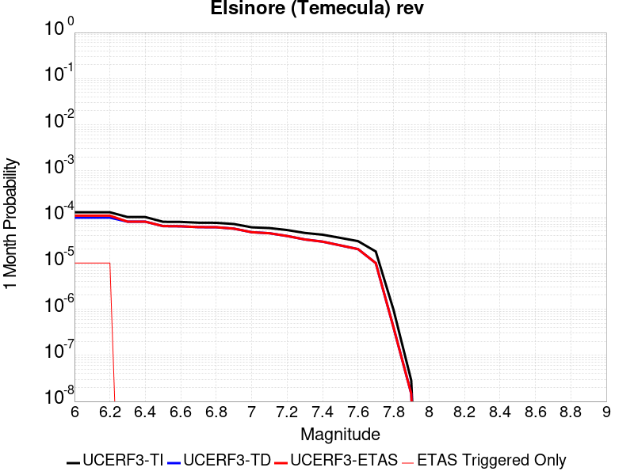 |  | 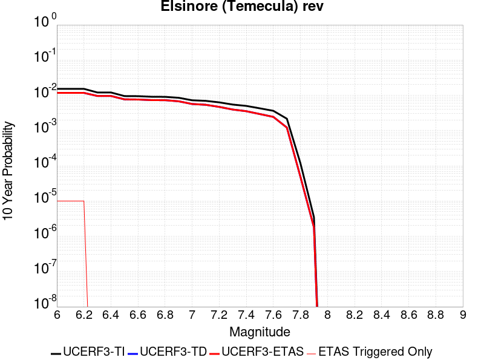 |

| Magnitude | 1 wk TI Prob | 1 wk TD Prob | 1 wk ETAS Prob | 1 wk ETAS/TD Gain | 1 wk ETAS Triggered Only | 1 mo TI Prob | 1 mo TD Prob | 1 mo ETAS Prob | 1 mo ETAS/TD Gain | 1 mo ETAS Triggered Only | 1 yr TI Prob | 1 yr TD Prob | 1 yr ETAS Prob | 1 yr ETAS/TD Gain | 1 yr ETAS Triggered Only | 10 yr TI Prob | 10 yr TD Prob | 10 yr ETAS Prob | 10 yr ETAS/TD Gain | 10 yr ETAS Triggered Only |
|-----|-----|-----|-----|-----|-----|-----|-----|-----|-----|-----|-----|-----|-----|-----|-----|-----|-----|-----|-----|-----|
| 6.0 | 2.9514995E-5 | 2.2564207E-5 | 3.256398E-5 | 1.4431697 | 1.0E-5 | 1.264867E-4 | 9.670028E-5 | 1.0669931E-4 | 1.1034024 | 1.0E-5 | 0.0015388876 | 0.0011767121 | 0.0011867003 | 1.0084883 | 1.0E-5 | 0.015282745 | 0.011731517 | 0.0117414 | 1.0008425 | 1.0E-5 |
| 6.1 | 2.9514995E-5 | 2.2564207E-5 | 3.256398E-5 | 1.4431697 | 1.0E-5 | 1.264867E-4 | 9.670028E-5 | 1.0669931E-4 | 1.1034024 | 1.0E-5 | 0.0015388876 | 0.0011767121 | 0.0011867003 | 1.0084883 | 1.0E-5 | 0.015282745 | 0.011731517 | 0.0117414 | 1.0008425 | 1.0E-5 |
| 6.2 | 2.9514995E-5 | 2.2564207E-5 | 3.256398E-5 | 1.4431697 | 1.0E-5 | 1.264867E-4 | 9.670028E-5 | 1.0669931E-4 | 1.1034024 | 1.0E-5 | 0.0015388876 | 0.0011767121 | 0.0011867003 | 1.0084883 | 1.0E-5 | 0.015282745 | 0.011731517 | 0.0117414 | 1.0008425 | 1.0E-5 |
| 6.3 | 2.3223649E-5 | 1.8441593E-5 | 1.8441593E-5 | 1.0 | 0.0 | 9.952613E-5 | 7.9033096E-5 | 7.9033096E-5 | 1.0 | 0.0 | 0.001211057 | 9.618204E-4 | 9.618204E-4 | 1.0 | 0.0 | 0.012044783 | 0.00958337 | 0.00958337 | 1.0 | 0.0 |
| 6.4 | 2.3223649E-5 | 1.8441593E-5 | 1.8441593E-5 | 1.0 | 0.0 | 9.952613E-5 | 7.9033096E-5 | 7.9033096E-5 | 1.0 | 0.0 | 0.001211057 | 9.618204E-4 | 9.618204E-4 | 1.0 | 0.0 | 0.012044783 | 0.00958337 | 0.00958337 | 1.0 | 0.0 |
| 6.5 | 1.8338875E-5 | 1.4776305E-5 | 1.4776305E-5 | 1.0 | 0.0 | 7.8592806E-5 | 6.332553E-5 | 6.332553E-5 | 1.0 | 0.0 | 9.5644733E-4 | 7.7072444E-4 | 7.7072444E-4 | 1.0 | 0.0 | 0.009523412 | 0.007681901 | 0.007681901 | 1.0 | 0.0 |
| 6.6 | 1.8223333E-5 | 1.46387265E-5 | 1.46387265E-5 | 1.0 | 0.0 | 7.809766E-5 | 6.273594E-5 | 6.273594E-5 | 1.0 | 0.0 | 9.504242E-4 | 7.6355116E-4 | 7.6355116E-4 | 1.0 | 0.0 | 0.009463696 | 0.0076106605 | 0.0076106605 | 1.0 | 0.0 |
| 6.7 | 1.7512752E-5 | 1.4051949E-5 | 1.4051949E-5 | 1.0 | 0.0 | 7.505249E-5 | 6.0221297E-5 | 6.0221297E-5 | 1.0 | 0.0 | 9.13381E-4 | 7.329562E-4 | 7.329562E-4 | 1.0 | 0.0 | 0.00909636 | 0.0073112724 | 0.0073112724 | 1.0 | 0.0 |
| 6.8 | 1.7417142E-5 | 1.3975771E-5 | 1.3975771E-5 | 1.0 | 0.0 | 7.4642754E-5 | 5.9894835E-5 | 5.9894835E-5 | 1.0 | 0.0 | 9.083966E-4 | 7.2898425E-4 | 7.2898425E-4 | 1.0 | 0.0 | 0.009046922 | 0.0072722263 | 0.0072722263 | 1.0 | 0.0 |
| 6.9 | 1.6402591E-5 | 1.3011801E-5 | 1.3011801E-5 | 1.0 | 0.0 | 7.0294926E-5 | 5.576371E-5 | 5.576371E-5 | 1.0 | 0.0 | 8.5550465E-4 | 6.7871937E-4 | 6.7871937E-4 | 1.0 | 0.0 | 0.008522186 | 0.0067720534 | 0.0067720534 | 1.0 | 0.0 |
| 7.0 | 1.3912486E-5 | 1.0898835E-5 | 1.0898835E-5 | 1.0 | 0.0 | 5.9623577E-5 | 4.6708472E-5 | 4.6708472E-5 | 1.0 | 0.0 | 7.2567526E-4 | 5.6853E-4 | 5.6853E-4 | 1.0 | 0.0 | 0.0072331014 | 0.0056746113 | 0.0056746113 | 1.0 | 0.0 |
| 7.1 | 1.3405147E-5 | 1.0346994E-5 | 1.0346994E-5 | 1.0 | 0.0 | 5.7449364E-5 | 4.434352E-5 | 4.434352E-5 | 1.0 | 0.0 | 6.9922156E-4 | 5.397512E-4 | 5.397512E-4 | 1.0 | 0.0 | 0.0069702556 | 0.005387879 | 0.005387879 | 1.0 | 0.0 |
| 7.2 | 1.21402E-5 | 9.013864E-6 | 9.013864E-6 | 1.0 | 0.0 | 5.202839E-5 | 3.863028E-5 | 3.863028E-5 | 1.0 | 0.0 | 6.332616E-4 | 4.7022398E-4 | 4.7022398E-4 | 1.0 | 0.0 | 0.0063146 | 0.0046936953 | 0.0046936953 | 1.0 | 0.0 |
| 7.3 | 1.05047775E-5 | 7.586223E-6 | 7.586223E-6 | 1.0 | 0.0 | 4.5019697E-5 | 3.2511987E-5 | 3.2511987E-5 | 1.0 | 0.0 | 5.4797693E-4 | 3.9576303E-4 | 3.9576303E-4 | 1.0 | 0.0 | 0.005466277 | 0.0039509637 | 0.0039509637 | 1.0 | 0.0 |
| 7.4 | 9.624483E-6 | 6.7998017E-6 | 6.7998017E-6 | 1.0 | 0.0 | 4.124713E-5 | 2.9141689E-5 | 2.9141689E-5 | 1.0 | 0.0 | 5.0206814E-4 | 3.5474368E-4 | 3.5474368E-4 | 1.0 | 0.0 | 0.005009353 | 0.0035419283 | 0.0035419283 | 1.0 | 0.0 |
| 7.5 | 8.215151E-6 | 5.64646E-6 | 5.64646E-6 | 1.0 | 0.0 | 3.5207315E-5 | 2.4198896E-5 | 2.4198896E-5 | 1.0 | 0.0 | 4.2856473E-4 | 2.94583E-4 | 2.94583E-4 | 1.0 | 0.0 | 0.004277392 | 0.0029420536 | 0.0029420536 | 1.0 | 0.0 |
| 7.6 | 6.975058E-6 | 4.6853743E-6 | 4.6853743E-6 | 1.0 | 0.0 | 2.9892764E-5 | 2.0080026E-5 | 2.0080026E-5 | 1.0 | 0.0 | 3.6388362E-4 | 2.4444808E-4 | 2.4444808E-4 | 1.0 | 0.0 | 0.0036328835 | 0.0024419085 | 0.0024419085 | 1.0 | 0.0 |
| 7.7 | 4.159604E-6 | 2.3322598E-6 | 2.3322598E-6 | 1.0 | 0.0 | 1.7826753E-5 | 9.995365E-6 | 9.995365E-6 | 1.0 | 0.0 | 2.1701909E-4 | 1.2168752E-4 | 1.2168752E-4 | 1.0 | 0.0 | 0.0021680726 | 0.0012162821 | 0.0012162821 | 1.0 | 0.0 |
| 7.8 | 2.2692414E-7 | 9.402787E-8 | 9.402787E-8 | 1.0 | 0.0 | 9.725317E-7 | 4.0297653E-7 | 4.0297653E-7 | 1.0 | 0.0 | 1.1840509E-5 | 4.9062314E-6 | 4.9062314E-6 | 1.0 | 0.0 | 1.1839878E-4 | 4.906156E-5 | 4.906156E-5 | 1.0 | 0.0 |
| 7.9 | 6.676829E-9 | 3.444583E-9 | 3.444583E-9 | 1.0 | 0.0 | 2.861498E-8 | 1.4762499E-8 | 1.4762499E-8 | 1.0 | 0.0 | 3.4838732E-7 | 1.797334E-7 | 1.797334E-7 | 1.0 | 0.0 | 3.4838679E-6 | 1.7973327E-6 | 1.7973327E-6 | 1.0 | 0.0 |

## Raymond
*[(top)](#table-of-contents)*

| 1 Week | 1 Month | 1 Year | 10 Year |
|-----|-----|-----|-----|
|  | 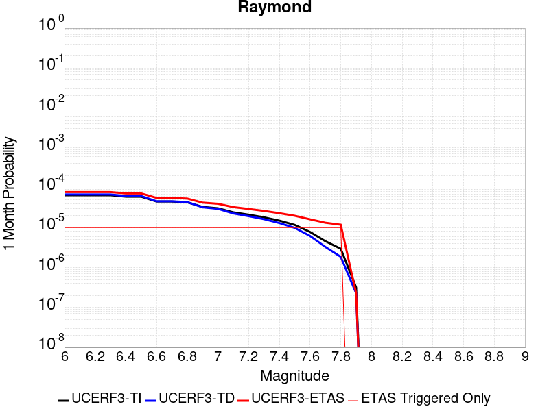 | 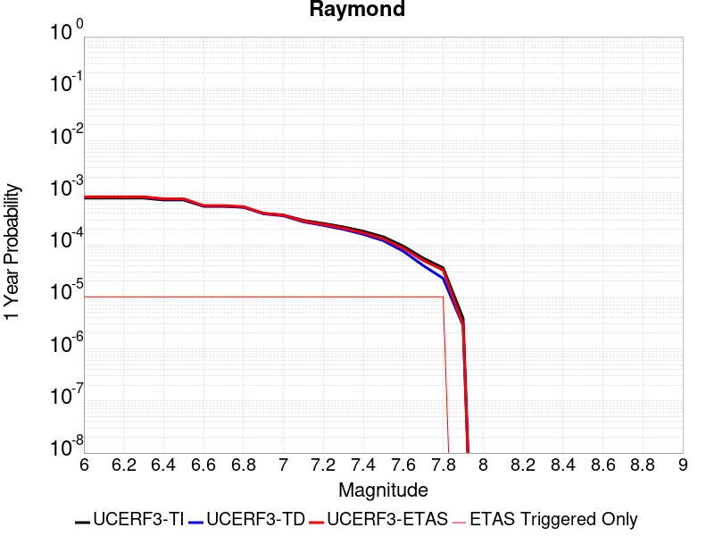 | 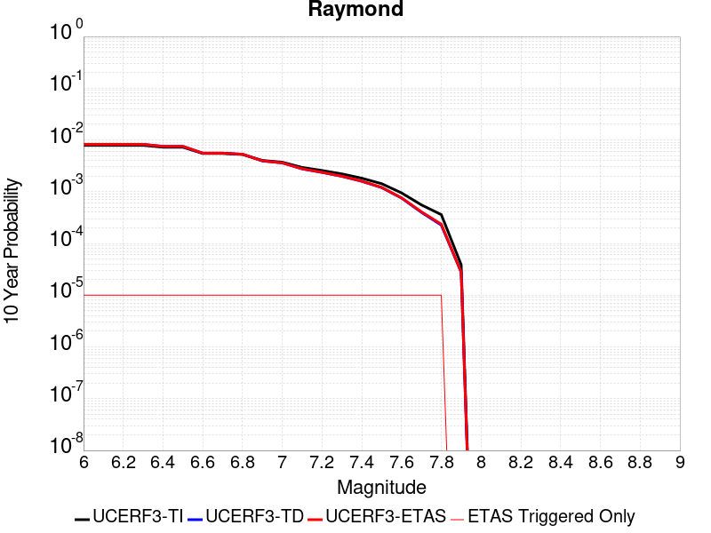 |

| Magnitude | 1 wk TI Prob | 1 wk TD Prob | 1 wk ETAS Prob | 1 wk ETAS/TD Gain | 1 wk ETAS Triggered Only | 1 mo TI Prob | 1 mo TD Prob | 1 mo ETAS Prob | 1 mo ETAS/TD Gain | 1 mo ETAS Triggered Only | 1 yr TI Prob | 1 yr TD Prob | 1 yr ETAS Prob | 1 yr ETAS/TD Gain | 1 yr ETAS Triggered Only | 10 yr TI Prob | 10 yr TD Prob | 10 yr ETAS Prob | 10 yr ETAS/TD Gain | 10 yr ETAS Triggered Only |
|-----|-----|-----|-----|-----|-----|-----|-----|-----|-----|-----|-----|-----|-----|-----|-----|-----|-----|-----|-----|-----|
| 6.0 | 1.5157413E-5 | 1.5820031E-5 | 1.5820031E-5 | 1.0 | 0.0 | 6.4958724E-5 | 6.7798515E-5 | 7.7797835E-5 | 1.1474859 | 1.0E-5 | 7.905855E-4 | 8.2515937E-4 | 8.351511E-4 | 1.0121089 | 1.0E-5 | 0.007877788 | 0.008223483 | 0.008233401 | 1.001206 | 1.0E-5 |
| 6.1 | 1.5157413E-5 | 1.5820031E-5 | 1.5820031E-5 | 1.0 | 0.0 | 6.4958724E-5 | 6.7798515E-5 | 7.7797835E-5 | 1.1474859 | 1.0E-5 | 7.905855E-4 | 8.2515937E-4 | 8.351511E-4 | 1.0121089 | 1.0E-5 | 0.007877788 | 0.008223483 | 0.008233401 | 1.001206 | 1.0E-5 |
| 6.2 | 1.5157413E-5 | 1.5820031E-5 | 1.5820031E-5 | 1.0 | 0.0 | 6.4958724E-5 | 6.7798515E-5 | 7.7797835E-5 | 1.1474859 | 1.0E-5 | 7.905855E-4 | 8.2515937E-4 | 8.351511E-4 | 1.0121089 | 1.0E-5 | 0.007877788 | 0.008223483 | 0.008233401 | 1.001206 | 1.0E-5 |
| 6.3 | 1.5157413E-5 | 1.5820031E-5 | 1.5820031E-5 | 1.0 | 0.0 | 6.4958724E-5 | 6.7798515E-5 | 7.7797835E-5 | 1.1474859 | 1.0E-5 | 7.905855E-4 | 8.2515937E-4 | 8.351511E-4 | 1.0121089 | 1.0E-5 | 0.007877788 | 0.008223483 | 0.008233401 | 1.001206 | 1.0E-5 |
| 6.4 | 1.3941944E-5 | 1.4463786E-5 | 1.4463786E-5 | 1.0 | 0.0 | 5.9749822E-5 | 6.198631E-5 | 7.198569E-5 | 1.1613159 | 1.0E-5 | 7.2721124E-4 | 7.544454E-4 | 7.6443783E-4 | 1.0132447 | 1.0E-5 | 0.007248361 | 0.0075211846 | 0.0075311097 | 1.0013195 | 1.0E-5 |
| 6.5 | 1.3941944E-5 | 1.4463786E-5 | 1.4463786E-5 | 1.0 | 0.0 | 5.9749822E-5 | 6.198631E-5 | 7.198569E-5 | 1.1613159 | 1.0E-5 | 7.2721124E-4 | 7.544454E-4 | 7.6443783E-4 | 1.0132447 | 1.0E-5 | 0.007248361 | 0.0075211846 | 0.0075311097 | 1.0013195 | 1.0E-5 |
| 6.6 | 1.0542609E-5 | 1.0677995E-5 | 1.0677995E-5 | 1.0 | 0.0 | 4.5181827E-5 | 4.5762066E-5 | 5.5761608E-5 | 1.2185116 | 1.0E-5 | 5.499499E-4 | 5.570162E-4 | 5.670106E-4 | 1.0179428 | 1.0E-5 | 0.005485909 | 0.005556769 | 0.0055667134 | 1.0017896 | 1.0E-5 |
| 6.7 | 1.0542609E-5 | 1.0677995E-5 | 1.0677995E-5 | 1.0 | 0.0 | 4.5181827E-5 | 4.5762066E-5 | 5.5761608E-5 | 1.2185116 | 1.0E-5 | 5.499499E-4 | 5.570162E-4 | 5.670106E-4 | 1.0179428 | 1.0E-5 | 0.005485909 | 0.005556769 | 0.0055667134 | 1.0017896 | 1.0E-5 |
| 6.8 | 1.0079132E-5 | 1.0183354E-5 | 1.0183354E-5 | 1.0 | 0.0 | 4.3195567E-5 | 4.3642245E-5 | 5.364181E-5 | 1.2291257 | 1.0E-5 | 5.257791E-4 | 5.3122017E-4 | 5.4121483E-4 | 1.0188146 | 1.0E-5 | 0.0052453685 | 0.0053000604 | 0.0053100074 | 1.0018767 | 1.0E-5 |
| 6.9 | 7.721598E-6 | 7.5540374E-6 | 7.5540374E-6 | 1.0 | 0.0 | 3.3092143E-5 | 3.2374053E-5 | 4.237373E-5 | 1.3088794 | 1.0E-5 | 4.0282236E-4 | 3.9408403E-4 | 4.0408008E-4 | 1.0253654 | 1.0E-5 | 0.0040209293 | 0.0039339922 | 0.003943953 | 1.002532 | 1.0E-5 |
| 7.0 | 7.137566E-6 | 6.9161338E-6 | 6.9161338E-6 | 1.0 | 0.0 | 3.058921E-5 | 2.9640241E-5 | 3.9639945E-5 | 1.3373692 | 1.0E-5 | 3.7236E-4 | 3.6081127E-4 | 3.7080765E-4 | 1.0277053 | 1.0E-5 | 0.0037173668 | 0.00360238 | 0.0036123437 | 1.0027659 | 1.0E-5 |
| 7.1 | 5.654976E-6 | 5.303639E-6 | 5.303639E-6 | 1.0 | 0.0 | 2.4235387E-5 | 2.2729686E-5 | 3.272946E-5 | 1.4399433 | 1.0E-5 | 2.9502588E-4 | 2.76699E-4 | 2.8669622E-4 | 1.0361303 | 1.0E-5 | 0.0029463451 | 0.0027635826 | 0.002773555 | 1.0036085 | 1.0E-5 |
| 7.2 | 4.9358455E-6 | 4.5304214E-6 | 4.5304214E-6 | 1.0 | 0.0 | 2.1153453E-5 | 1.941595E-5 | 2.9415754E-5 | 1.5150305 | 1.0E-5 | 2.5751285E-4 | 2.3636367E-4 | 2.463613E-4 | 1.0422977 | 1.0E-5 | 0.0025721465 | 0.0023611516 | 0.0023711282 | 1.0042253 | 1.0E-5 |
| 7.3 | 4.2368597E-6 | 3.809095E-6 | 3.809095E-6 | 1.0 | 0.0 | 1.8157843E-5 | 1.6324591E-5 | 2.632443E-5 | 1.6125628 | 1.0E-5 | 2.2104931E-4 | 1.9873389E-4 | 2.087319E-4 | 1.0503086 | 1.0E-5 | 0.0022082955 | 0.0019855872 | 0.0019955675 | 1.0050263 | 1.0E-5 |
| 7.4 | 3.4999923E-6 | 3.0468573E-6 | 3.0468573E-6 | 1.0 | 0.0 | 1.49998805E-5 | 1.3057895E-5 | 2.3057764E-5 | 1.7658103 | 1.0E-5 | 1.8260824E-4 | 1.5896835E-4 | 1.6896676E-4 | 1.0628957 | 1.0E-5 | 0.0018245826 | 0.0015885689 | 0.001598553 | 1.006285 | 1.0E-5 |
| 7.5 | 2.738017E-6 | 2.3046093E-6 | 2.3046093E-6 | 1.0 | 0.0 | 1.1734306E-5 | 9.8768605E-6 | 1.9876761E-5 | 2.0124574 | 1.0E-5 | 1.428558E-4 | 1.2024421E-4 | 1.30243E-4 | 1.0831541 | 1.0E-5 | 0.0014276401 | 0.0012018126 | 0.0012118006 | 1.0083108 | 1.0E-5 |
| 7.6 | 1.8186392E-6 | 1.4441314E-6 | 1.4441314E-6 | 1.0 | 0.0 | 7.794145E-6 | 6.1891196E-6 | 1.6189058E-5 | 2.6157286 | 1.0E-5 | 9.488958E-5 | 7.534997E-5 | 8.534922E-5 | 1.132704 | 1.0E-5 | 9.4849075E-4 | 7.532626E-4 | 7.6325506E-4 | 1.0132656 | 1.0E-5 |
| 7.7 | 1.0660348E-6 | 7.658643E-7 | 7.658643E-7 | 1.0 | 0.0 | 4.5687125E-6 | 3.2822716E-6 | 1.3282239E-5 | 4.0466604 | 1.0E-5 | 5.5622655E-5 | 3.9960938E-5 | 4.996054E-5 | 1.2502344 | 1.0E-5 | 5.5608735E-4 | 3.995535E-4 | 4.095495E-4 | 1.025018 | 1.0E-5 |
| 7.8 | 6.913602E-7 | 4.3329342E-7 | 4.3329342E-7 | 1.0 | 0.0 | 2.962969E-6 | 1.8569705E-6 | 1.1856952E-5 | 6.385105 | 1.0E-5 | 3.607355E-5 | 2.2608387E-5 | 3.260816E-5 | 1.4423038 | 1.0E-5 | 3.6067693E-4 | 2.260757E-4 | 2.3607345E-4 | 1.044223 | 1.0E-5 |
| 7.9 | 7.425201E-8 | 5.334125E-8 | 5.334125E-8 | 1.0 | 0.0 | 3.1822285E-7 | 2.2860534E-7 | 2.2860534E-7 | 1.0 | 0.0 | 3.874356E-6 | 2.783268E-6 | 2.783268E-6 | 1.0 | 0.0 | 3.8742884E-5 | 2.783246E-5 | 2.783246E-5 | 1.0 | 0.0 |

