# Parent Section Magnitude-Probability Distributions

Only fault sections with at least one triggered aftershock are plotted. Sections are sorted by total supraseismogenic trigger rate (decreasing)

## Table Of Contents

* [San Jacinto (Anza) rev](#san-jacinto-anza-rev)
* [San Jacinto (Clark) rev](#san-jacinto-clark-rev)
* [San Andreas (San Bernardino N)](#san-andreas-san-bernardino-n)
* [San Jacinto (Stepovers Combined)](#san-jacinto-stepovers-combined)
* [San Andreas (Mojave S)](#san-andreas-mojave-s)
* [San Jacinto (Coyote Creek)](#san-jacinto-coyote-creek)
* [San Jacinto (San Bernardino)](#san-jacinto-san-bernardino)
* [San Jacinto (San Jacinto Valley) rev](#san-jacinto-san-jacinto-valley-rev)
* [San Andreas (Mojave N)](#san-andreas-mojave-n)
* [San Andreas (Big Bend)](#san-andreas-big-bend)
* [San Jacinto (Borrego)](#san-jacinto-borrego)
* [San Andreas (Cholame) rev](#san-andreas-cholame-rev)
* [San Andreas (Carrizo) rev](#san-andreas-carrizo-rev)
* [San Andreas (Coachella) rev](#san-andreas-coachella-rev)
* [San Jacinto (Superstition Mtn)](#san-jacinto-superstition-mtn)
* [Superstition Hills](#superstition-hills)
* [San Andreas (San Gorgonio Pass-Garnet HIll)](#san-andreas-san-gorgonio-pass-garnet-hill)
* [Imperial](#imperial)
* [San Andreas (Parkfield)](#san-andreas-parkfield)
* [San Andreas (San Bernardino S)](#san-andreas-san-bernardino-s)
* [San Jacinto (Lytle Creek connector)](#san-jacinto-lytle-creek-connector)
* [Elsinore (Glen Ivy) rev](#elsinore-glen-ivy-rev)
* [Rose Canyon](#rose-canyon)
* [Brawley (Seismic Zone) alt 1](#brawley-seismic-zone-alt-1)
* [Earthquake Valley (No  Extension)](#earthquake-valley-no--extension)
* [San Andreas (Creeping Section) 2011 CFM](#san-andreas-creeping-section-2011-cfm)
* [San Andreas (Peninsula) 2011 CFM](#san-andreas-peninsula-2011-cfm)
* [Earthquake Valley](#earthquake-valley)
* [Pisgah-Bullion Mtn-Mesquite Lk](#pisgah-bullion-mtn-mesquite-lk)
* [Earthquake Valley (So Extension)](#earthquake-valley-so-extension)
* [Elsinore (Coyote Mountains)](#elsinore-coyote-mountains)
* [San Andreas (Santa Cruz Mts) 2011 CFM](#san-andreas-santa-cruz-mts-2011-cfm)
* [Blue Cut](#blue-cut)
* [Cady](#cady)

## San Jacinto (Anza) rev
*[(top)](#table-of-contents)*

| 1 Week | 1 Month | 1 Year | 10 Year |
|-----|-----|-----|-----|
|  |  |  |  |

| Magnitude | 1 wk TI Prob | 1 wk TD Prob | 1 wk ETAS Prob | 1 wk ETAS/TD Gain | 1 wk ETAS Triggered Only | 1 mo TI Prob | 1 mo TD Prob | 1 mo ETAS Prob | 1 mo ETAS/TD Gain | 1 mo ETAS Triggered Only | 1 yr TI Prob | 1 yr TD Prob | 1 yr ETAS Prob | 1 yr ETAS/TD Gain | 1 yr ETAS Triggered Only | 10 yr TI Prob | 10 yr TD Prob | 10 yr ETAS Prob | 10 yr ETAS/TD Gain | 10 yr ETAS Triggered Only |
|-----|-----|-----|-----|-----|-----|-----|-----|-----|-----|-----|-----|-----|-----|-----|-----|-----|-----|-----|-----|-----|
| 6.0 | 6.3015636E-5 | 4.4012224E-5 | 3.0374105E-4 | 6.9012885 | 2.5974025E-4 | 2.7003905E-4 | 1.8861024E-4 | 5.52178E-4 | 2.9276142 | 3.6363635E-4 | 0.0032827691 | 0.0022939236 | 0.0027085547 | 1.1807519 | 4.1558442E-4 | 0.032346968 | 0.02366162 | 0.02414345 | 1.0203633 | 4.935065E-4 |
| 6.1 | 6.3015636E-5 | 4.4012224E-5 | 3.0374105E-4 | 6.9012885 | 2.5974025E-4 | 2.7003905E-4 | 1.8861024E-4 | 5.52178E-4 | 2.9276142 | 3.6363635E-4 | 0.0032827691 | 0.0022939236 | 0.0027085547 | 1.1807519 | 4.1558442E-4 | 0.032346968 | 0.02366162 | 0.02414345 | 1.0203633 | 4.935065E-4 |
| 6.2 | 6.3015636E-5 | 4.4012224E-5 | 3.0374105E-4 | 6.9012885 | 2.5974025E-4 | 2.7003905E-4 | 1.8861024E-4 | 5.52178E-4 | 2.9276142 | 3.6363635E-4 | 0.0032827691 | 0.0022939236 | 0.0027085547 | 1.1807519 | 4.1558442E-4 | 0.032346968 | 0.02366162 | 0.02414345 | 1.0203633 | 4.935065E-4 |
| 6.3 | 6.3015636E-5 | 4.4012224E-5 | 3.0374105E-4 | 6.9012885 | 2.5974025E-4 | 2.7003905E-4 | 1.8861024E-4 | 5.52178E-4 | 2.9276142 | 3.6363635E-4 | 0.0032827691 | 0.0022939236 | 0.0027085547 | 1.1807519 | 4.1558442E-4 | 0.032346968 | 0.02366162 | 0.02414345 | 1.0203633 | 4.935065E-4 |
| 6.4 | 6.3015636E-5 | 4.4012224E-5 | 3.0374105E-4 | 6.9012885 | 2.5974025E-4 | 2.7003905E-4 | 1.8861024E-4 | 5.52178E-4 | 2.9276142 | 3.6363635E-4 | 0.0032827691 | 0.0022939236 | 0.0027085547 | 1.1807519 | 4.1558442E-4 | 0.032346968 | 0.02366162 | 0.02414345 | 1.0203633 | 4.935065E-4 |
| 6.5 | 5.811017E-5 | 4.075744E-5 | 3.0048713E-4 | 7.3725705 | 2.5974025E-4 | 2.4901982E-4 | 1.7466309E-4 | 5.122665E-4 | 2.9328833 | 3.3766235E-4 | 0.0030276014 | 0.0021244548 | 0.0024873188 | 1.1708033 | 3.6363635E-4 | 0.02986684 | 0.021944052 | 0.022350516 | 1.0185227 | 4.1558442E-4 |
| 6.6 | 5.811017E-5 | 4.075744E-5 | 3.0048713E-4 | 7.3725705 | 2.5974025E-4 | 2.4901982E-4 | 1.7466309E-4 | 5.122665E-4 | 2.9328833 | 3.3766235E-4 | 0.0030276014 | 0.0021244548 | 0.0024873188 | 1.1708033 | 3.6363635E-4 | 0.02986684 | 0.021944052 | 0.022350516 | 1.0185227 | 4.1558442E-4 |
| 6.7 | 5.712442E-5 | 4.0173334E-5 | 2.9990316E-4 | 7.46523 | 2.5974025E-4 | 2.4479596E-4 | 1.721601E-4 | 5.097643E-4 | 2.96099 | 3.3766235E-4 | 0.0029763177 | 0.0020940397 | 0.0024569146 | 1.1732894 | 3.6363635E-4 | 0.029367693 | 0.021632643 | 0.022039237 | 1.0187954 | 4.1558442E-4 |
| 6.8 | 5.6967532E-5 | 4.0028506E-5 | 2.9975837E-4 | 7.4886227 | 2.5974025E-4 | 2.4412372E-4 | 1.7153949E-4 | 5.091439E-4 | 2.9680858 | 3.3766235E-4 | 0.0029681553 | 0.0020864983 | 0.002449376 | 1.173917 | 3.6363635E-4 | 0.029288229 | 0.021556264 | 0.021962889 | 1.0188634 | 4.1558442E-4 |
| 6.9 | 5.6211324E-5 | 3.9728853E-5 | 2.994588E-4 | 7.5375648 | 2.5974025E-4 | 2.4088343E-4 | 1.7025543E-4 | 5.0786027E-4 | 2.9829314 | 3.3766235E-4 | 0.0029288116 | 0.002070895 | 0.002433778 | 1.1752301 | 3.6363635E-4 | 0.028905109 | 0.021393368 | 0.021800062 | 1.0190103 | 4.1558442E-4 |
| 7.0 | 5.4383527E-5 | 3.857445E-5 | 2.7233167E-4 | 7.059898 | 2.3376623E-4 | 2.3305144E-4 | 1.6530862E-4 | 4.769454E-4 | 2.8851817 | 3.1168832E-4 | 0.0028337094 | 0.0020107795 | 0.002347763 | 1.1675885 | 3.3766235E-4 | 0.027978465 | 0.020779364 | 0.021135444 | 1.0171362 | 3.6363635E-4 |
| 7.1 | 5.1393665E-5 | 3.701462E-5 | 2.1882607E-4 | 5.9118824 | 1.8181818E-4 | 2.2023996E-4 | 1.5862445E-4 | 4.183235E-4 | 2.6371944 | 2.5974025E-4 | 0.0026781242 | 0.0019295464 | 0.0022147093 | 1.1477876 | 2.8571428E-4 | 0.026460782 | 0.019940337 | 0.02024581 | 1.0153193 | 3.1168832E-4 |
| 7.2 | 4.785222E-5 | 3.5343168E-5 | 1.6520871E-4 | 4.674417 | 1.2987012E-4 | 2.0506482E-4 | 1.5146195E-4 | 3.332526E-4 | 2.2002397 | 1.8181818E-4 | 0.0024938055 | 0.0018424931 | 0.0020239763 | 1.0984987 | 1.8181818E-4 | 0.024660049 | 0.01904172 | 0.019245557 | 1.0107046 | 2.0779221E-4 |
| 7.3 | 4.2143256E-5 | 3.442131E-5 | 1.6428698E-4 | 4.772827 | 1.2987012E-4 | 1.8060145E-4 | 1.4751159E-4 | 3.0333275E-4 | 2.0563316 | 1.5584416E-4 | 0.002196605 | 0.0017944776 | 0.0019500421 | 1.0866907 | 1.5584416E-4 | 0.02175019 | 0.01854146 | 0.018694416 | 1.0082493 | 1.5584416E-4 |
| 7.4 | 4.0264713E-5 | 3.4054156E-5 | 1.6391986E-4 | 4.8135056 | 1.2987012E-4 | 1.7255165E-4 | 1.4593823E-4 | 3.0175966E-4 | 2.0677216 | 1.5584416E-4 | 0.002098792 | 0.0017753534 | 0.001930921 | 1.0876262 | 1.5584416E-4 | 0.020790804 | 0.01834325 | 0.018496236 | 1.0083401 | 1.5584416E-4 |
| 7.5 | 3.694492E-5 | 3.2754397E-5 | 1.6262027E-4 | 4.964838 | 1.2987012E-4 | 1.5832575E-4 | 1.4036844E-4 | 2.9619073E-4 | 2.1100948 | 1.5584416E-4 | 0.0019259118 | 0.0017076494 | 0.0018632275 | 1.0911065 | 1.5584416E-4 | 0.01909306 | 0.017652586 | 0.017805679 | 1.0086726 | 1.5584416E-4 |
| 7.6 | 3.200565E-5 | 3.00425E-5 | 1.5990873E-4 | 5.3227506 | 1.2987012E-4 | 1.3715986E-4 | 1.2874723E-4 | 2.8457132E-4 | 2.2103102 | 1.5584416E-4 | 0.001668642 | 0.0015663727 | 0.0017219728 | 1.0993378 | 1.5584416E-4 | 0.01656168 | 0.016226653 | 0.016379967 | 1.0094484 | 1.5584416E-4 |
| 7.7 | 2.731642E-5 | 2.661642E-5 | 1.5648309E-4 | 5.879194 | 1.2987012E-4 | 1.1706512E-4 | 1.1406539E-4 | 2.6989178E-4 | 2.3661144 | 1.5584416E-4 | 0.001424336 | 0.0013878625 | 0.0015434903 | 1.1121349 | 1.5584416E-4 | 0.014152412 | 0.014440214 | 0.014593808 | 1.0106366 | 1.5584416E-4 |
| 7.8 | 2.3466424E-5 | 2.4005945E-5 | 1.2789956E-4 | 5.3278284 | 1.03896105E-4 | 1.0056651E-4 | 1.0287857E-4 | 2.0676399E-4 | 2.0097866 | 1.03896105E-4 | 0.0012237094 | 0.0012518278 | 0.0013555938 | 1.0828916 | 1.03896105E-4 | 0.012169928 | 0.013070661 | 0.013173198 | 1.0078449 | 1.03896105E-4 |
| 7.9 | 1.8611925E-5 | 1.935421E-5 | 1.232483E-4 | 6.368036 | 1.03896105E-4 | 7.9762955E-5 | 8.294398E-5 | 1.8683147E-4 | 2.2525017 | 1.03896105E-4 | 9.7068126E-4 | 0.0010093759 | 0.0011131671 | 1.1028272 | 1.03896105E-4 | 0.0096645225 | 0.010627878 | 0.01073067 | 1.0096719 | 1.03896105E-4 |
| 8.0 | 1.5460775E-5 | 1.6136648E-5 | 9.405747E-5 | 5.8288107 | 7.792208E-5 | 6.6258784E-5 | 6.9155234E-5 | 1.4707193E-4 | 2.1266925 | 7.792208E-5 | 8.0640207E-4 | 8.4164046E-4 | 9.1949693E-4 | 1.0925057 | 7.792208E-5 | 0.008034821 | 0.008911137 | 0.008988365 | 1.0086664 | 7.792208E-5 |
| 8.1 | 9.983884E-6 | 8.503049E-6 | 6.045066E-5 | 7.109292 | 5.1948053E-5 | 4.2787375E-5 | 3.644113E-5 | 8.838729E-5 | 2.4254813 | 5.1948053E-5 | 5.2081177E-4 | 4.4358103E-4 | 4.9550604E-4 | 1.1170586 | 5.1948053E-5 | 0.0051959283 | 0.0047649597 | 0.00481666 | 1.0108502 | 5.1948053E-5 |
| 8.2 | 4.1226E-6 | 1.6203016E-6 | 1.6203016E-6 | 1.0 | 0.0 | 1.7668166E-5 | 6.944131E-6 | 6.944131E-6 | 1.0 | 0.0 | 2.1508869E-4 | 8.454155E-5 | 8.454155E-5 | 1.0 | 0.0 | 0.0021488064 | 9.789203E-4 | 9.789203E-4 | 1.0 | 0.0 |
| 8.3 | 1.2750878E-6 | 3.7928442E-7 | 3.7928442E-7 | 1.0 | 0.0 | 5.4646503E-6 | 1.6255036E-6 | 1.6255036E-6 | 1.0 | 0.0 | 6.653009E-5 | 1.9790332E-5 | 1.9790332E-5 | 1.0 | 0.0 | 6.6510175E-4 | 2.379671E-4 | 2.379671E-4 | 1.0 | 0.0 |

## San Jacinto (Clark) rev
*[(top)](#table-of-contents)*

| 1 Week | 1 Month | 1 Year | 10 Year |
|-----|-----|-----|-----|
|  |  |  |  |

| Magnitude | 1 wk TI Prob | 1 wk TD Prob | 1 wk ETAS Prob | 1 wk ETAS/TD Gain | 1 wk ETAS Triggered Only | 1 mo TI Prob | 1 mo TD Prob | 1 mo ETAS Prob | 1 mo ETAS/TD Gain | 1 mo ETAS Triggered Only | 1 yr TI Prob | 1 yr TD Prob | 1 yr ETAS Prob | 1 yr ETAS/TD Gain | 1 yr ETAS Triggered Only | 10 yr TI Prob | 10 yr TD Prob | 10 yr ETAS Prob | 10 yr ETAS/TD Gain | 10 yr ETAS Triggered Only |
|-----|-----|-----|-----|-----|-----|-----|-----|-----|-----|-----|-----|-----|-----|-----|-----|-----|-----|-----|-----|-----|
| 6.0 | 4.482615E-5 | 2.149583E-5 | 2.5525704E-4 | 11.8747225 | 2.3376623E-4 | 1.9209793E-4 | 9.2121794E-5 | 4.037814E-4 | 4.383126 | 3.1168832E-4 | 0.0023362834 | 0.0011210152 | 0.001458299 | 1.3008735 | 3.3766235E-4 | 0.02311874 | 0.011682168 | 0.012067227 | 1.0329612 | 3.896104E-4 |
| 6.1 | 4.482615E-5 | 2.149583E-5 | 2.5525704E-4 | 11.8747225 | 2.3376623E-4 | 1.9209793E-4 | 9.2121794E-5 | 4.037814E-4 | 4.383126 | 3.1168832E-4 | 0.0023362834 | 0.0011210152 | 0.001458299 | 1.3008735 | 3.3766235E-4 | 0.02311874 | 0.011682168 | 0.012067227 | 1.0329612 | 3.896104E-4 |
| 6.2 | 4.482615E-5 | 2.149583E-5 | 2.5525704E-4 | 11.8747225 | 2.3376623E-4 | 1.9209793E-4 | 9.2121794E-5 | 4.037814E-4 | 4.383126 | 3.1168832E-4 | 0.0023362834 | 0.0011210152 | 0.001458299 | 1.3008735 | 3.3766235E-4 | 0.02311874 | 0.011682168 | 0.012067227 | 1.0329612 | 3.896104E-4 |
| 6.3 | 4.482615E-5 | 2.149583E-5 | 2.5525704E-4 | 11.8747225 | 2.3376623E-4 | 1.9209793E-4 | 9.2121794E-5 | 4.037814E-4 | 4.383126 | 3.1168832E-4 | 0.0023362834 | 0.0011210152 | 0.001458299 | 1.3008735 | 3.3766235E-4 | 0.02311874 | 0.011682168 | 0.012067227 | 1.0329612 | 3.896104E-4 |
| 6.4 | 4.482615E-5 | 2.149583E-5 | 2.5525704E-4 | 11.8747225 | 2.3376623E-4 | 1.9209793E-4 | 9.2121794E-5 | 4.037814E-4 | 4.383126 | 3.1168832E-4 | 0.0023362834 | 0.0011210152 | 0.001458299 | 1.3008735 | 3.3766235E-4 | 0.02311874 | 0.011682168 | 0.012067227 | 1.0329612 | 3.896104E-4 |
| 6.5 | 3.7294863E-5 | 1.7663233E-5 | 1.994782E-4 | 11.293414 | 1.8181818E-4 | 1.5982533E-4 | 7.56974E-5 | 3.0944592E-4 | 4.0879335 | 2.3376623E-4 | 0.0019441366 | 9.2123076E-4 | 0.0011807317 | 1.2816894 | 2.5974025E-4 | 0.01927216 | 0.009648823 | 0.00993178 | 1.0293256 | 2.8571428E-4 |
| 6.6 | 3.7294863E-5 | 1.7663233E-5 | 1.994782E-4 | 11.293414 | 1.8181818E-4 | 1.5982533E-4 | 7.56974E-5 | 3.0944592E-4 | 4.0879335 | 2.3376623E-4 | 0.0019441366 | 9.2123076E-4 | 0.0011807317 | 1.2816894 | 2.5974025E-4 | 0.01927216 | 0.009648823 | 0.00993178 | 1.0293256 | 2.8571428E-4 |
| 6.7 | 3.6039248E-5 | 1.6904516E-5 | 1.7274603E-4 | 10.218928 | 1.5584416E-4 | 1.5444479E-4 | 7.244594E-5 | 2.802231E-4 | 3.8680303 | 2.0779221E-4 | 0.0018787434 | 8.816767E-4 | 0.0011152368 | 1.2649045 | 2.3376623E-4 | 0.01862939 | 0.009247725 | 0.009505063 | 1.0278271 | 2.5974025E-4 |
| 6.8 | 3.5031844E-5 | 1.6527734E-5 | 1.7236931E-4 | 10.429095 | 1.5584416E-4 | 1.5012783E-4 | 7.0831244E-5 | 2.7860873E-4 | 3.9334157 | 2.0779221E-4 | 0.0018262739 | 8.6203346E-4 | 0.0010955982 | 1.2709463 | 2.3376623E-4 | 0.01811338 | 0.009045837 | 0.009303228 | 1.0284541 | 2.5974025E-4 |
| 6.9 | 3.435112E-5 | 1.6355121E-5 | 1.7219673E-4 | 10.528612 | 1.5584416E-4 | 1.4721078E-4 | 7.009152E-5 | 2.7786917E-4 | 3.9643764 | 2.0779221E-4 | 0.0017908178 | 8.530343E-4 | 0.0010866012 | 1.273807 | 2.3376623E-4 | 0.017764548 | 0.008953502 | 0.009210917 | 1.0287502 | 2.5974025E-4 |
| 7.0 | 2.8959772E-5 | 1.459947E-5 | 1.444677E-4 | 9.895408 | 1.2987012E-4 | 1.241074E-4 | 6.256767E-5 | 2.4437447E-4 | 3.9057627 | 1.8181818E-4 | 0.0015099603 | 7.6149806E-4 | 9.69132E-4 | 1.2726651 | 2.0779221E-4 | 0.014997416 | 0.008010134 | 0.008216262 | 1.0257334 | 2.0779221E-4 |
| 7.1 | 2.6002877E-5 | 1.3069119E-5 | 9.099018E-5 | 6.962228 | 7.792208E-5 | 1.11436144E-4 | 5.6009318E-5 | 1.8587217E-4 | 3.3185937 | 1.2987012E-4 | 0.0013558907 | 6.817023E-4 | 8.374402E-4 | 1.2284545 | 1.5584416E-4 | 0.013476475 | 0.007175722 | 0.007330448 | 1.0215625 | 1.5584416E-4 |
| 7.2 | 2.2544838E-5 | 1.1479721E-5 | 3.745345E-5 | 3.2625747 | 2.5974026E-5 | 9.661716E-5 | 4.9197886E-5 | 1.01143385E-4 | 2.0558481 | 5.1948053E-5 | 0.001175679 | 5.9882115E-4 | 6.507381E-4 | 1.0866985 | 5.1948053E-5 | 0.011694785 | 0.0063084844 | 0.0063601043 | 1.0081826 | 5.1948053E-5 |
| 7.3 | 1.75334E-5 | 1.1014846E-5 | 3.6988586E-5 | 3.3580666 | 2.5974026E-5 | 7.514098E-5 | 4.7205634E-5 | 7.317843E-5 | 1.5502055 | 2.5974026E-5 | 9.144575E-4 | 5.745785E-4 | 6.005376E-4 | 1.0451794 | 2.5974026E-5 | 0.009107036 | 0.0060420227 | 0.00606784 | 1.0042729 | 2.5974026E-5 |
| 7.4 | 1.5924552E-5 | 1.0810164E-5 | 3.678391E-5 | 3.4027152 | 2.5974026E-5 | 6.82463E-5 | 4.632846E-5 | 7.2301285E-5 | 1.5606235 | 2.5974026E-5 | 8.305819E-4 | 5.639044E-4 | 5.898638E-4 | 1.046035 | 2.5974026E-5 | 0.008274844 | 0.005926856 | 0.0059526763 | 1.0043565 | 2.5974026E-5 |
| 7.5 | 1.3428931E-5 | 1.0040226E-5 | 3.6013993E-5 | 3.58697 | 2.5974026E-5 | 5.7551293E-5 | 4.302884E-5 | 6.900175E-5 | 1.6036164 | 2.5974026E-5 | 7.004617E-4 | 5.2375125E-4 | 5.497117E-4 | 1.0495663 | 2.5974026E-5 | 0.006982579 | 0.0055068806 | 0.0055327113 | 1.0046906 | 2.5974026E-5 |
| 7.6 | 1.0688787E-5 | 8.787555E-6 | 3.4761353E-5 | 3.9557478 | 2.5974026E-5 | 4.5808283E-5 | 3.7660408E-5 | 6.363346E-5 | 1.6896645 | 2.5974026E-5 | 5.5757316E-4 | 4.584195E-4 | 4.8438163E-4 | 1.056634 | 2.5974026E-5 | 0.005561762 | 0.004833719 | 0.0048595676 | 1.0053475 | 2.5974026E-5 |
| 7.7 | 8.81236E-6 | 7.634947E-6 | 3.3608776E-5 | 4.4019656 | 2.5974026E-5 | 3.776671E-5 | 3.2720793E-5 | 5.869397E-5 | 1.793782 | 2.5974026E-5 | 4.597127E-4 | 3.9830306E-4 | 4.2426673E-4 | 1.0651858 | 2.5974026E-5 | 0.0045876284 | 0.004223741 | 0.004249606 | 1.0061235 | 2.5974026E-5 |
| 7.8 | 7.780431E-6 | 6.8541876E-6 | 3.2828037E-5 | 4.789486 | 2.5974026E-5 | 3.3344273E-5 | 2.937476E-5 | 5.5348024E-5 | 1.8842034 | 2.5974026E-5 | 4.0589093E-4 | 3.575792E-4 | 3.8354393E-4 | 1.0726125 | 2.5974026E-5 | 0.0040515037 | 0.0038070125 | 0.0038328876 | 1.0067967 | 2.5974026E-5 |
| 7.9 | 6.5437994E-6 | 5.9273216E-6 | 3.1901192E-5 | 5.3820586 | 2.5974026E-5 | 2.8044553E-5 | 2.540256E-5 | 5.1375926E-5 | 2.0224705 | 2.5974026E-5 | 3.4138895E-4 | 3.0923245E-4 | 3.3519845E-4 | 1.0839691 | 2.5974026E-5 | 0.0034086495 | 0.0033131074 | 0.0033389954 | 1.0078138 | 2.5974026E-5 |
| 8.0 | 5.4488164E-6 | 4.943602E-6 | 3.09175E-5 | 6.2540426 | 2.5974026E-5 | 2.3351862E-5 | 2.1186695E-5 | 4.716017E-5 | 2.2259333 | 2.5974026E-5 | 2.8427184E-4 | 2.5791762E-4 | 2.8388496E-4 | 1.1006807 | 2.5974026E-5 | 0.0028390845 | 0.0027807665 | 0.0028066682 | 1.0093147 | 2.5974026E-5 |
| 8.1 | 2.8397242E-6 | 1.4188071E-6 | 1.4188071E-6 | 1.0 | 0.0 | 1.217019E-5 | 6.080588E-6 | 6.080588E-6 | 1.0 | 0.0 | 1.4816198E-4 | 7.4028656E-5 | 7.4028656E-5 | 1.0 | 0.0 | 0.0014806325 | 8.4064476E-4 | 8.4064476E-4 | 1.0 | 0.0 |
| 8.2 | 2.030244E-6 | 6.6173953E-7 | 6.6173953E-7 | 1.0 | 0.0 | 8.701017E-6 | 2.8360234E-6 | 2.8360234E-6 | 1.0 | 0.0 | 1.05929736E-4 | 3.4528042E-5 | 3.4528042E-5 | 1.0 | 0.0 | 0.0010587925 | 4.1223396E-4 | 4.1223396E-4 | 1.0 | 0.0 |
| 8.3 | 1.0659804E-6 | 3.070894E-7 | 3.070894E-7 | 1.0 | 0.0 | 4.568479E-6 | 1.3160968E-6 | 1.3160968E-6 | 1.0 | 0.0 | 5.5619817E-5 | 1.6023365E-5 | 1.6023365E-5 | 1.0 | 0.0 | 5.5605895E-4 | 1.9428149E-4 | 1.9428149E-4 | 1.0 | 0.0 |

## San Andreas (San Bernardino N)
*[(top)](#table-of-contents)*

| 1 Week | 1 Month | 1 Year | 10 Year |
|-----|-----|-----|-----|
|  |  |  |  |

| Magnitude | 1 wk TI Prob | 1 wk TD Prob | 1 wk ETAS Prob | 1 wk ETAS/TD Gain | 1 wk ETAS Triggered Only | 1 mo TI Prob | 1 mo TD Prob | 1 mo ETAS Prob | 1 mo ETAS/TD Gain | 1 mo ETAS Triggered Only | 1 yr TI Prob | 1 yr TD Prob | 1 yr ETAS Prob | 1 yr ETAS/TD Gain | 1 yr ETAS Triggered Only | 10 yr TI Prob | 10 yr TD Prob | 10 yr ETAS Prob | 10 yr ETAS/TD Gain | 10 yr ETAS Triggered Only |
|-----|-----|-----|-----|-----|-----|-----|-----|-----|-----|-----|-----|-----|-----|-----|-----|-----|-----|-----|-----|-----|
| 6.0 | 1.4273766E-4 | 3.189915E-4 | 4.7478592E-4 | 1.4883969 | 1.5584416E-4 | 6.115894E-4 | 0.0013663961 | 0.0015479658 | 1.1328822 | 1.8181818E-4 | 0.0074207084 | 0.016510492 | 0.016689308 | 1.0108305 | 1.8181818E-4 | 0.07177748 | 0.15147589 | 0.15163018 | 1.0010185 | 1.8181818E-4 |
| 6.1 | 1.4273766E-4 | 3.189915E-4 | 4.7478592E-4 | 1.4883969 | 1.5584416E-4 | 6.115894E-4 | 0.0013663961 | 0.0015479658 | 1.1328822 | 1.8181818E-4 | 0.0074207084 | 0.016510492 | 0.016689308 | 1.0108305 | 1.8181818E-4 | 0.07177748 | 0.15147589 | 0.15163018 | 1.0010185 | 1.8181818E-4 |
| 6.2 | 1.4273766E-4 | 3.189915E-4 | 4.7478592E-4 | 1.4883969 | 1.5584416E-4 | 6.115894E-4 | 0.0013663961 | 0.0015479658 | 1.1328822 | 1.8181818E-4 | 0.0074207084 | 0.016510492 | 0.016689308 | 1.0108305 | 1.8181818E-4 | 0.07177748 | 0.15147589 | 0.15163018 | 1.0010185 | 1.8181818E-4 |
| 6.3 | 1.3730655E-4 | 3.0802502E-4 | 4.6382117E-4 | 1.5057906 | 1.5584416E-4 | 5.883239E-4 | 0.001319445 | 0.0015010233 | 1.1376171 | 1.8181818E-4 | 0.0071393442 | 0.015947336 | 0.016126255 | 1.0112194 | 1.8181818E-4 | 0.06914291 | 0.1467877 | 0.14694282 | 1.0010568 | 1.8181818E-4 |
| 6.4 | 1.3730655E-4 | 3.0802502E-4 | 4.6382117E-4 | 1.5057906 | 1.5584416E-4 | 5.883239E-4 | 0.001319445 | 0.0015010233 | 1.1376171 | 1.8181818E-4 | 0.0071393442 | 0.015947336 | 0.016126255 | 1.0112194 | 1.8181818E-4 | 0.06914291 | 0.1467877 | 0.14694282 | 1.0010568 | 1.8181818E-4 |
| 6.5 | 1.2942807E-4 | 2.921489E-4 | 4.4794756E-4 | 1.533285 | 1.5584416E-4 | 5.545738E-4 | 0.0012514712 | 0.0014330618 | 1.1451018 | 1.8181818E-4 | 0.0067310524 | 0.015131476 | 0.015310543 | 1.011834 | 1.8181818E-4 | 0.06530788 | 0.13991421 | 0.14007059 | 1.0011177 | 1.8181818E-4 |
| 6.6 | 1.1125901E-4 | 2.5647978E-4 | 3.863166E-4 | 1.5062264 | 1.2987012E-4 | 4.767372E-4 | 0.0010987383 | 0.0012544112 | 1.1416833 | 1.5584416E-4 | 0.005788839 | 0.0132957315 | 0.013449504 | 1.0115656 | 1.5584416E-4 | 0.056403454 | 0.12421665 | 0.12435314 | 1.0010988 | 1.5584416E-4 |
| 6.7 | 1.02209575E-4 | 2.378085E-4 | 3.416799E-4 | 1.4367858 | 1.03896105E-4 | 4.3796748E-4 | 0.0010187826 | 0.0011485205 | 1.1273459 | 1.2987012E-4 | 0.0053192247 | 0.012333566 | 0.0124618355 | 1.0103999 | 1.2987012E-4 | 0.051936906 | 0.116000526 | 0.11611533 | 1.0009897 | 1.2987012E-4 |
| 6.8 | 9.610582E-5 | 2.2302699E-4 | 3.2689993E-4 | 1.4657415 | 1.03896105E-4 | 4.1181705E-4 | 9.554805E-4 | 0.0010852265 | 1.1357914 | 1.2987012E-4 | 0.0050023515 | 0.011571199 | 0.011699566 | 1.0110937 | 1.2987012E-4 | 0.048912346 | 0.10941177 | 0.10952743 | 1.0010571 | 1.2987012E-4 |
| 6.9 | 9.3877505E-5 | 2.1757066E-4 | 3.2144415E-4 | 1.4774241 | 1.03896105E-4 | 4.0227012E-4 | 9.3211315E-4 | 0.0010618622 | 1.1391989 | 1.2987012E-4 | 0.0048866454 | 0.0112896785 | 0.011418083 | 1.0113735 | 1.2987012E-4 | 0.04780577 | 0.10699908 | 0.107115045 | 1.0010839 | 1.2987012E-4 |
| 7.0 | 9.1019785E-5 | 2.1082193E-4 | 3.1469614E-4 | 1.4927106 | 1.03896105E-4 | 3.900265E-4 | 9.0321037E-4 | 0.0010329632 | 1.1436573 | 1.2987012E-4 | 0.0047382377 | 0.010941371 | 0.01106982 | 1.0117397 | 1.2987012E-4 | 0.046384744 | 0.1039648 | 0.10408117 | 1.0011193 | 1.2987012E-4 |
| 7.1 | 8.771155E-5 | 2.0254731E-4 | 3.0642236E-4 | 1.5128435 | 1.03896105E-4 | 3.758525E-4 | 8.677716E-4 | 9.97529E-4 | 1.1495295 | 1.2987012E-4 | 0.0045664064 | 0.010514142 | 0.010642647 | 1.012222 | 1.2987012E-4 | 0.044737056 | 0.100267194 | 0.10038404 | 1.0011654 | 1.2987012E-4 |
| 7.2 | 8.0830236E-5 | 1.865613E-4 | 2.90438E-4 | 1.5567968 | 1.03896105E-4 | 3.4636928E-4 | 7.993036E-4 | 9.290699E-4 | 1.1623492 | 1.2987012E-4 | 0.0042088944 | 0.009688209 | 0.009816821 | 1.0132751 | 1.2987012E-4 | 0.041300658 | 0.09298421 | 0.09310201 | 1.0012668 | 1.2987012E-4 |
| 7.3 | 7.7668235E-5 | 1.7594914E-4 | 2.7982696E-4 | 1.5903856 | 1.03896105E-4 | 3.328214E-4 | 7.538499E-4 | 8.8362215E-4 | 1.172146 | 1.2987012E-4 | 0.0040445733 | 0.009139582 | 0.009268265 | 1.0140798 | 1.2987012E-4 | 0.03971748 | 0.0882316 | 0.08835001 | 1.001342 | 1.2987012E-4 |
| 7.4 | 7.520177E-5 | 1.6811433E-4 | 2.7199296E-4 | 1.6179047 | 1.03896105E-4 | 3.2225347E-4 | 7.202911E-4 | 8.500677E-4 | 1.1801724 | 1.2987012E-4 | 0.0039163795 | 0.008734352 | 0.008863088 | 1.014739 | 1.2987012E-4 | 0.038480744 | 0.08467445 | 0.08479332 | 1.0014039 | 1.2987012E-4 |
| 7.5 | 7.274697E-5 | 1.6095651E-4 | 2.648359E-4 | 1.6453879 | 1.03896105E-4 | 3.1173544E-4 | 6.896313E-4 | 8.194119E-4 | 1.1881883 | 1.2987012E-4 | 0.003788775 | 0.008363998 | 0.008492781 | 1.0153974 | 1.2987012E-4 | 0.03724827 | 0.08138077 | 0.08150007 | 1.0014659 | 1.2987012E-4 |
| 7.6 | 7.1185845E-5 | 1.56633E-4 | 2.6051284E-4 | 1.6632053 | 1.03896105E-4 | 3.0504653E-4 | 6.7111163E-4 | 8.0089463E-4 | 1.1933851 | 1.2987012E-4 | 0.0037076178 | 0.008140228 | 0.008269041 | 1.0158242 | 1.2987012E-4 | 0.036463667 | 0.079364 | 0.07948357 | 1.0015066 | 1.2987012E-4 |
| 7.7 | 6.709961E-5 | 1.4566159E-4 | 2.4954256E-4 | 1.7131666 | 1.03896105E-4 | 2.8753807E-4 | 6.2411465E-4 | 7.539037E-4 | 1.2079571 | 1.2987012E-4 | 0.003495157 | 0.0075721624 | 0.007701049 | 1.0170212 | 1.2987012E-4 | 0.034406938 | 0.07417128 | 0.07429152 | 1.0016211 | 1.2987012E-4 |
| 7.8 | 6.300812E-5 | 1.3437372E-4 | 2.3825586E-4 | 1.7730838 | 1.03896105E-4 | 2.7000686E-4 | 5.7576026E-4 | 7.0555566E-4 | 1.225433 | 1.2987012E-4 | 0.0032823787 | 0.0069873813 | 0.007116344 | 1.0184565 | 1.2987012E-4 | 0.032343175 | 0.068779215 | 0.06890015 | 1.0017583 | 1.2987012E-4 |
| 7.9 | 4.983037E-5 | 9.9089295E-5 | 2.029751E-4 | 2.048406 | 1.03896105E-4 | 2.1354125E-4 | 4.245993E-4 | 5.544143E-4 | 1.3057352 | 1.2987012E-4 | 0.0025967648 | 0.005157254 | 0.0052864547 | 1.0250522 | 1.2987012E-4 | 0.025666296 | 0.051512357 | 0.051635537 | 1.0023912 | 1.2987012E-4 |
| 8.0 | 3.2211527E-5 | 5.439938E-5 | 1.3231722E-4 | 2.4323294 | 7.792208E-5 | 1.380421E-4 | 2.3311938E-4 | 3.110233E-4 | 1.3341804 | 7.792208E-5 | 0.0016793669 | 0.0028345364 | 0.0029122375 | 1.0274123 | 7.792208E-5 | 0.016667323 | 0.028895305 | 0.028970975 | 1.0026188 | 7.792208E-5 |
| 8.1 | 1.743376E-5 | 1.9338206E-5 | 7.1285256E-5 | 3.6862392 | 5.1948053E-5 | 7.471398E-5 | 8.287539E-5 | 1.3481914E-4 | 1.6267692 | 5.1948053E-5 | 9.0926304E-4 | 0.0010085416 | 0.0010604372 | 1.0514561 | 5.1948053E-5 | 0.009055517 | 0.0107507445 | 0.010802134 | 1.00478 | 5.1948053E-5 |
| 8.2 | 7.831616E-6 | 5.343494E-6 | 5.343494E-6 | 1.0 | 0.0 | 3.3563636E-5 | 2.2900489E-5 | 2.2900489E-5 | 1.0 | 0.0 | 4.0856065E-4 | 2.7877785E-4 | 2.7877785E-4 | 1.0 | 0.0 | 0.004078103 | 0.0031442586 | 0.0031442586 | 1.0 | 0.0 |
| 8.3 | 1.983087E-6 | 8.001618E-7 | 8.001618E-7 | 1.0 | 0.0 | 8.498917E-6 | 3.4292605E-6 | 3.4292605E-6 | 1.0 | 0.0 | 1.034694E-4 | 4.1750463E-5 | 4.1750463E-5 | 1.0 | 0.0 | 0.0010342124 | 4.915874E-4 | 4.915874E-4 | 1.0 | 0.0 |

## San Jacinto (Stepovers Combined)
*[(top)](#table-of-contents)*

| 1 Week | 1 Month | 1 Year | 10 Year |
|-----|-----|-----|-----|
|  |  |  |  |

| Magnitude | 1 wk TI Prob | 1 wk TD Prob | 1 wk ETAS Prob | 1 wk ETAS/TD Gain | 1 wk ETAS Triggered Only | 1 mo TI Prob | 1 mo TD Prob | 1 mo ETAS Prob | 1 mo ETAS/TD Gain | 1 mo ETAS Triggered Only | 1 yr TI Prob | 1 yr TD Prob | 1 yr ETAS Prob | 1 yr ETAS/TD Gain | 1 yr ETAS Triggered Only | 10 yr TI Prob | 10 yr TD Prob | 10 yr ETAS Prob | 10 yr ETAS/TD Gain | 10 yr ETAS Triggered Only |
|-----|-----|-----|-----|-----|-----|-----|-----|-----|-----|-----|-----|-----|-----|-----|-----|-----|-----|-----|-----|-----|
| 6.0 | 4.0667746E-5 | 3.5886456E-5 | 1.6575193E-4 | 4.618788 | 1.2987012E-4 | 1.742787E-4 | 1.5379004E-4 | 3.3558026E-4 | 2.1820676 | 1.8181818E-4 | 0.0021197782 | 0.0018707869 | 0.002052265 | 1.0970062 | 1.8181818E-4 | 0.020996714 | 0.019304737 | 0.019483045 | 1.0092365 | 1.8181818E-4 |
| 6.1 | 4.0667746E-5 | 3.5886456E-5 | 1.6575193E-4 | 4.618788 | 1.2987012E-4 | 1.742787E-4 | 1.5379004E-4 | 3.3558026E-4 | 2.1820676 | 1.8181818E-4 | 0.0021197782 | 0.0018707869 | 0.002052265 | 1.0970062 | 1.8181818E-4 | 0.020996714 | 0.019304737 | 0.019483045 | 1.0092365 | 1.8181818E-4 |
| 6.2 | 4.0667746E-5 | 3.5886456E-5 | 1.6575193E-4 | 4.618788 | 1.2987012E-4 | 1.742787E-4 | 1.5379004E-4 | 3.3558026E-4 | 2.1820676 | 1.8181818E-4 | 0.0021197782 | 0.0018707869 | 0.002052265 | 1.0970062 | 1.8181818E-4 | 0.020996714 | 0.019304737 | 0.019483045 | 1.0092365 | 1.8181818E-4 |
| 6.3 | 4.0667746E-5 | 3.5886456E-5 | 1.6575193E-4 | 4.618788 | 1.2987012E-4 | 1.742787E-4 | 1.5379004E-4 | 3.3558026E-4 | 2.1820676 | 1.8181818E-4 | 0.0021197782 | 0.0018707869 | 0.002052265 | 1.0970062 | 1.8181818E-4 | 0.020996714 | 0.019304737 | 0.019483045 | 1.0092365 | 1.8181818E-4 |
| 6.4 | 4.0577226E-5 | 3.5758123E-5 | 1.6562361E-4 | 4.631776 | 1.2987012E-4 | 1.738908E-4 | 1.5324011E-4 | 3.3503043E-4 | 2.1863103 | 1.8181818E-4 | 0.0021150648 | 0.0018641042 | 0.0020455834 | 1.0973547 | 1.8181818E-4 | 0.020950472 | 0.019239204 | 0.019417524 | 1.0092686 | 1.8181818E-4 |
| 6.5 | 4.0577226E-5 | 3.5758123E-5 | 1.6562361E-4 | 4.631776 | 1.2987012E-4 | 1.738908E-4 | 1.5324011E-4 | 3.3503043E-4 | 2.1863103 | 1.8181818E-4 | 0.0021150648 | 0.0018641042 | 0.0020455834 | 1.0973547 | 1.8181818E-4 | 0.020950472 | 0.019239204 | 0.019417524 | 1.0092686 | 1.8181818E-4 |
| 6.6 | 4.053861E-5 | 3.570336E-5 | 1.6556885E-4 | 4.6373467 | 1.2987012E-4 | 1.7372532E-4 | 1.5300544E-4 | 3.347958E-4 | 2.1881301 | 1.8181818E-4 | 0.0021130538 | 0.0018612526 | 0.0020427322 | 1.0975041 | 1.8181818E-4 | 0.020930743 | 0.019211238 | 0.019389564 | 1.0092824 | 1.8181818E-4 |
| 6.7 | 4.0516545E-5 | 3.5672376E-5 | 1.6553787E-4 | 4.640506 | 1.2987012E-4 | 1.7363077E-4 | 1.5287267E-4 | 3.3466305E-4 | 2.189162 | 1.8181818E-4 | 0.002111905 | 0.0018596391 | 0.0020411192 | 1.0975889 | 1.8181818E-4 | 0.020919468 | 0.019195411 | 0.01937374 | 1.0092901 | 1.8181818E-4 |
| 6.8 | 4.049434E-5 | 3.564377E-5 | 1.6550928E-4 | 4.643428 | 1.2987012E-4 | 1.7353562E-4 | 1.5275009E-4 | 3.345405E-4 | 2.1901164 | 1.8181818E-4 | 0.0021107488 | 0.0018581492 | 0.0020396295 | 1.0976672 | 1.8181818E-4 | 0.020908125 | 0.019180743 | 0.019359075 | 1.0092974 | 1.8181818E-4 |
| 6.9 | 4.046386E-5 | 3.5606176E-5 | 1.6547168E-4 | 4.6472745 | 1.2987012E-4 | 1.73405E-4 | 1.52589E-4 | 3.3437944E-4 | 2.191373 | 1.8181818E-4 | 0.0021091616 | 0.0018561912 | 0.0020376719 | 1.0977705 | 1.8181818E-4 | 0.020892553 | 0.019161444 | 0.01933978 | 1.0093069 | 1.8181818E-4 |
| 7.0 | 4.036382E-5 | 3.5486224E-5 | 1.6535175E-4 | 4.6596036 | 1.2987012E-4 | 1.7297632E-4 | 1.5207498E-4 | 3.3386552E-4 | 2.1954007 | 1.8181818E-4 | 0.0021039525 | 0.0018499439 | 0.0020314257 | 1.0981013 | 1.8181818E-4 | 0.02084144 | 0.019099811 | 0.019278156 | 1.0093375 | 1.8181818E-4 |
| 7.1 | 4.0343282E-5 | 3.5464604E-5 | 1.6533013E-4 | 4.6618347 | 1.2987012E-4 | 1.7288832E-4 | 1.5198233E-4 | 3.3377288E-4 | 2.1961296 | 1.8181818E-4 | 0.002102883 | 0.0018488177 | 0.0020302997 | 1.0981611 | 1.8181818E-4 | 0.020830948 | 0.019088656 | 0.019267004 | 1.0093431 | 1.8181818E-4 |
| 7.2 | 4.0257353E-5 | 3.536875E-5 | 1.6523429E-4 | 4.671759 | 1.2987012E-4 | 1.725201E-4 | 1.5157157E-4 | 3.333622E-4 | 2.1993716 | 1.8181818E-4 | 0.0020984085 | 0.0018438252 | 0.002025308 | 1.0984274 | 1.8181818E-4 | 0.020787042 | 0.019039229 | 0.019217584 | 1.0093678 | 1.8181818E-4 |
| 7.3 | 3.9940667E-5 | 3.519391E-5 | 1.6505946E-4 | 4.690001 | 1.2987012E-4 | 1.7116306E-4 | 1.5082234E-4 | 3.06643E-4 | 2.0331404 | 1.5584416E-4 | 0.0020819185 | 0.0018347187 | 0.001990277 | 1.0847858 | 1.5584416E-4 | 0.020625217 | 0.018946571 | 0.019099463 | 1.0080696 | 1.5584416E-4 |
| 7.4 | 3.9721202E-5 | 3.507809E-5 | 1.6494366E-4 | 4.7021847 | 1.2987012E-4 | 1.7022261E-4 | 1.5032603E-4 | 3.0614677E-4 | 2.036552 | 1.5584416E-4 | 0.0020704903 | 0.0018286865 | 0.0019842456 | 1.0850661 | 1.5584416E-4 | 0.020513052 | 0.018885082 | 0.019037982 | 1.0080963 | 1.5584416E-4 |
| 7.5 | 3.7036873E-5 | 3.4133758E-5 | 1.6399946E-4 | 4.8046117 | 1.2987012E-4 | 1.5871979E-4 | 1.4627934E-4 | 3.021007E-4 | 2.0652313 | 1.5584416E-4 | 0.0019307006 | 0.0017794993 | 0.0019350662 | 1.0874217 | 1.5584416E-4 | 0.019140124 | 0.018380545 | 0.018533524 | 1.008323 | 1.5584416E-4 |
| 7.6 | 3.2940967E-5 | 3.1889773E-5 | 1.6175576E-4 | 5.0723395 | 1.2987012E-4 | 1.4116794E-4 | 1.3666331E-4 | 2.9248616E-4 | 2.1401954 | 1.5584416E-4 | 0.0017173645 | 0.0016626082 | 0.0018181932 | 1.0935789 | 1.5584416E-4 | 0.01704153 | 0.017200848 | 0.017354012 | 1.0089045 | 1.5584416E-4 |
| 7.7 | 2.8236149E-5 | 2.8440829E-5 | 1.5830726E-4 | 5.5661974 | 1.2987012E-4 | 1.2100645E-4 | 1.21883575E-4 | 2.7770875E-4 | 2.2784755 | 1.5584416E-4 | 0.0014722579 | 0.0014829235 | 0.0016385366 | 1.1049367 | 1.5584416E-4 | 0.014625421 | 0.015404444 | 0.015557888 | 1.009961 | 1.5584416E-4 |
| 7.8 | 2.4329287E-5 | 2.5741047E-5 | 1.2963447E-4 | 5.0360994 | 1.03896105E-4 | 1.042642E-4 | 1.1031411E-4 | 2.1419875E-4 | 1.9417167 | 1.03896105E-4 | 0.0012686774 | 0.0013422477 | 0.0014460044 | 1.0773007 | 1.03896105E-4 | 0.012614589 | 0.013989859 | 0.014092301 | 1.0073227 | 1.03896105E-4 |
| 7.9 | 1.9370926E-5 | 2.0896858E-5 | 1.247908E-4 | 5.971749 | 1.03896105E-4 | 8.301561E-5 | 8.9554895E-5 | 1.934417E-4 | 2.160035 | 1.03896105E-4 | 0.0010102465 | 0.0010897863 | 0.0011935692 | 1.0952324 | 1.03896105E-4 | 0.0100566605 | 0.011447777 | 0.011550484 | 1.0089718 | 1.03896105E-4 |
| 8.0 | 1.5583017E-5 | 1.6285441E-5 | 9.420625E-5 | 5.7846913 | 7.792208E-5 | 6.6782646E-5 | 6.9792884E-5 | 1.4770952E-4 | 2.116398 | 7.792208E-5 | 8.127754E-4 | 8.4939785E-4 | 9.2725374E-4 | 1.0916601 | 7.792208E-5 | 0.008098091 | 0.008991747 | 0.009068968 | 1.0085881 | 7.792208E-5 |
| 8.1 | 1.0024873E-5 | 8.5264655E-6 | 6.0474074E-5 | 7.092514 | 5.1948053E-5 | 4.2963035E-5 | 3.6541485E-5 | 8.8487635E-5 | 2.4215665 | 5.1948053E-5 | 5.229494E-4 | 4.448023E-4 | 4.9672724E-4 | 1.1167371 | 5.1948053E-5 | 0.0052172043 | 0.0047788825 | 0.004830582 | 1.0108184 | 5.1948053E-5 |
| 8.2 | 4.142796E-6 | 1.6287123E-6 | 1.6287123E-6 | 1.0 | 0.0 | 1.775472E-5 | 6.980177E-6 | 6.980177E-6 | 1.0 | 0.0 | 2.1614227E-4 | 8.498038E-5 | 8.498038E-5 | 1.0 | 0.0 | 0.0021593217 | 9.841041E-4 | 9.841041E-4 | 1.0 | 0.0 |
| 8.3 | 1.2750878E-6 | 3.7928442E-7 | 3.7928442E-7 | 1.0 | 0.0 | 5.4646503E-6 | 1.6255036E-6 | 1.6255036E-6 | 1.0 | 0.0 | 6.653009E-5 | 1.9790332E-5 | 1.9790332E-5 | 1.0 | 0.0 | 6.6510175E-4 | 2.379671E-4 | 2.379671E-4 | 1.0 | 0.0 |

## San Andreas (Mojave S)
*[(top)](#table-of-contents)*

| 1 Week | 1 Month | 1 Year | 10 Year |
|-----|-----|-----|-----|
|  |  |  |  |

| Magnitude | 1 wk TI Prob | 1 wk TD Prob | 1 wk ETAS Prob | 1 wk ETAS/TD Gain | 1 wk ETAS Triggered Only | 1 mo TI Prob | 1 mo TD Prob | 1 mo ETAS Prob | 1 mo ETAS/TD Gain | 1 mo ETAS Triggered Only | 1 yr TI Prob | 1 yr TD Prob | 1 yr ETAS Prob | 1 yr ETAS/TD Gain | 1 yr ETAS Triggered Only | 10 yr TI Prob | 10 yr TD Prob | 10 yr ETAS Prob | 10 yr ETAS/TD Gain | 10 yr ETAS Triggered Only |
|-----|-----|-----|-----|-----|-----|-----|-----|-----|-----|-----|-----|-----|-----|-----|-----|-----|-----|-----|-----|-----|
| 6.0 | 3.1064058E-4 | 6.784524E-4 | 7.82278E-4 | 1.153033 | 1.03896105E-4 | 0.0013306376 | 0.0029045416 | 0.0030340343 | 1.044583 | 1.2987012E-4 | 0.016080605 | 0.03475855 | 0.034883905 | 1.0036064 | 1.2987012E-4 | 0.1496549 | 0.28788635 | 0.28797883 | 1.0003213 | 1.2987012E-4 |
| 6.1 | 3.1064058E-4 | 6.784524E-4 | 7.82278E-4 | 1.153033 | 1.03896105E-4 | 0.0013306376 | 0.0029045416 | 0.0030340343 | 1.044583 | 1.2987012E-4 | 0.016080605 | 0.03475855 | 0.034883905 | 1.0036064 | 1.2987012E-4 | 0.1496549 | 0.28788635 | 0.28797883 | 1.0003213 | 1.2987012E-4 |
| 6.2 | 3.1064058E-4 | 6.784524E-4 | 7.82278E-4 | 1.153033 | 1.03896105E-4 | 0.0013306376 | 0.0029045416 | 0.0030340343 | 1.044583 | 1.2987012E-4 | 0.016080605 | 0.03475855 | 0.034883905 | 1.0036064 | 1.2987012E-4 | 0.1496549 | 0.28788635 | 0.28797883 | 1.0003213 | 1.2987012E-4 |
| 6.3 | 3.1064058E-4 | 6.784524E-4 | 7.82278E-4 | 1.153033 | 1.03896105E-4 | 0.0013306376 | 0.0029045416 | 0.0030340343 | 1.044583 | 1.2987012E-4 | 0.016080605 | 0.03475855 | 0.034883905 | 1.0036064 | 1.2987012E-4 | 0.1496549 | 0.28788635 | 0.28797883 | 1.0003213 | 1.2987012E-4 |
| 6.4 | 1.9872203E-4 | 4.354543E-4 | 5.3930515E-4 | 1.2384886 | 1.03896105E-4 | 8.5138786E-4 | 0.0018649263 | 0.0019945542 | 1.0695083 | 1.2987012E-4 | 0.010316478 | 0.022475269 | 0.022602221 | 1.0056485 | 1.2987012E-4 | 0.098504856 | 0.1984136 | 0.19851771 | 1.0005246 | 1.2987012E-4 |
| 6.5 | 1.291105E-4 | 2.9100254E-4 | 3.948684E-4 | 1.3569243 | 1.03896105E-4 | 5.5321335E-4 | 0.0012465604 | 0.0013762687 | 1.1040529 | 1.2987012E-4 | 0.006714592 | 0.015072101 | 0.015200013 | 1.0084867 | 1.2987012E-4 | 0.065152965 | 0.13949637 | 0.13960813 | 1.0008011 | 1.2987012E-4 |
| 6.6 | 1.291105E-4 | 2.9100254E-4 | 3.948684E-4 | 1.3569243 | 1.03896105E-4 | 5.5321335E-4 | 0.0012465604 | 0.0013762687 | 1.1040529 | 1.2987012E-4 | 0.006714592 | 0.015072101 | 0.015200013 | 1.0084867 | 1.2987012E-4 | 0.065152965 | 0.13949637 | 0.13960813 | 1.0008011 | 1.2987012E-4 |
| 6.7 | 1.08001186E-4 | 2.4676247E-4 | 3.5063294E-4 | 1.420933 | 1.03896105E-4 | 4.6278012E-4 | 0.0010571254 | 0.0011868583 | 1.1227223 | 1.2987012E-4 | 0.0056198016 | 0.012794859 | 0.012923067 | 1.0100203 | 1.2987012E-4 | 0.054797906 | 0.120647244 | 0.12076145 | 1.0009465 | 1.2987012E-4 |
| 6.8 | 1.0624356E-4 | 2.4192933E-4 | 3.458003E-4 | 1.4293443 | 1.03896105E-4 | 4.5525006E-4 | 0.0010364285 | 0.0011661641 | 1.1251756 | 1.2987012E-4 | 0.0055285925 | 0.012545793 | 0.012674035 | 1.0102218 | 1.2987012E-4 | 0.053930566 | 0.11860254 | 0.11871701 | 1.0009651 | 1.2987012E-4 |
| 6.9 | 1.0393785E-4 | 2.3561994E-4 | 3.3949155E-4 | 1.4408439 | 1.03896105E-4 | 4.4537184E-4 | 0.0010094094 | 0.0011391484 | 1.1285297 | 1.2987012E-4 | 0.0054089287 | 0.012220567 | 0.01234885 | 1.0104973 | 1.2987012E-4 | 0.05279156 | 0.11589757 | 0.11601239 | 1.0009907 | 1.2987012E-4 |
| 7.0 | 1.0155622E-4 | 2.2930074E-4 | 3.3317303E-4 | 1.4529958 | 1.03896105E-4 | 4.3516833E-4 | 9.823478E-4 | 0.0011120903 | 1.132074 | 1.2987012E-4 | 0.005285311 | 0.01189473 | 0.012023056 | 1.0107884 | 1.2987012E-4 | 0.05161361 | 0.11315286 | 0.11326804 | 1.0010179 | 1.2987012E-4 |
| 7.1 | 9.885595E-5 | 2.2216808E-4 | 3.260411E-4 | 1.4675425 | 1.03896105E-4 | 4.2359953E-4 | 9.5180183E-4 | 0.0010815484 | 1.1363168 | 1.2987012E-4 | 0.0051451353 | 0.011526822 | 0.011655196 | 1.0111369 | 1.2987012E-4 | 0.05027629 | 0.11003228 | 0.11014786 | 1.0010505 | 1.2987012E-4 |
| 7.2 | 9.6411415E-5 | 2.1578232E-4 | 3.1965598E-4 | 1.4813818 | 1.03896105E-4 | 4.1312634E-4 | 9.244539E-4 | 0.001054204 | 1.1403532 | 1.2987012E-4 | 0.005018219 | 0.011197331 | 0.011325747 | 1.0114684 | 1.2987012E-4 | 0.049064007 | 0.10721889 | 0.10733484 | 1.0010813 | 1.2987012E-4 |
| 7.3 | 9.1180635E-5 | 1.979777E-4 | 3.0185323E-4 | 1.524683 | 1.03896105E-4 | 3.907156E-4 | 8.4820006E-4 | 9.779601E-4 | 1.1529827 | 1.2987012E-4 | 0.004746591 | 0.010278056 | 0.010406591 | 1.0125058 | 1.2987012E-4 | 0.046464786 | 0.099382766 | 0.099499725 | 1.001177 | 1.2987012E-4 |
| 7.4 | 8.887388E-5 | 1.9042684E-4 | 2.9430317E-4 | 1.545492 | 1.03896105E-4 | 3.8083247E-4 | 8.158599E-4 | 9.45624E-4 | 1.159052 | 1.2987012E-4 | 0.0046267817 | 0.009887956 | 0.010016542 | 1.0130043 | 1.2987012E-4 | 0.045316286 | 0.09600473 | 0.09612213 | 1.0012228 | 1.2987012E-4 |
| 7.5 | 8.6750515E-5 | 1.8370777E-4 | 2.875848E-4 | 1.5654471 | 1.03896105E-4 | 3.7173493E-4 | 7.8708155E-4 | 9.168494E-4 | 1.1648723 | 1.2987012E-4 | 0.004516484 | 0.009540703 | 0.009669335 | 1.0134823 | 1.2987012E-4 | 0.04425787 | 0.09295863 | 0.09307643 | 1.0012672 | 1.2987012E-4 |
| 7.6 | 8.453092E-5 | 1.7754246E-4 | 2.8142013E-4 | 1.5850862 | 1.03896105E-4 | 3.6222505E-4 | 7.606745E-4 | 8.904458E-4 | 1.1706004 | 1.2987012E-4 | 0.0044011753 | 0.009221964 | 0.009350636 | 1.0139529 | 1.2987012E-4 | 0.04315024 | 0.09010393 | 0.0902221 | 1.0013114 | 1.2987012E-4 |
| 7.7 | 8.259102E-5 | 1.7272946E-4 | 2.7660764E-4 | 1.6013923 | 1.03896105E-4 | 3.539135E-4 | 7.400592E-4 | 8.6983317E-4 | 1.1753563 | 1.2987012E-4 | 0.004300386 | 0.008973069 | 0.009101774 | 1.0143435 | 1.2987012E-4 | 0.042181134 | 0.08784187 | 0.08796033 | 1.0013486 | 1.2987012E-4 |
| 7.8 | 7.444844E-5 | 1.5567704E-4 | 2.5955695E-4 | 1.6672784 | 1.03896105E-4 | 3.1902574E-4 | 6.670168E-4 | 7.9680025E-4 | 1.194573 | 1.2987012E-4 | 0.0038772223 | 0.008090743 | 0.008219562 | 1.0159218 | 1.2987012E-4 | 0.03810269 | 0.07956187 | 0.079681404 | 1.0015024 | 1.2987012E-4 |
| 7.9 | 5.2586525E-5 | 1.02012564E-4 | 2.0589808E-4 | 2.01836 | 1.03896105E-4 | 2.2535135E-4 | 4.3712347E-4 | 5.669368E-4 | 1.2969718 | 1.2987012E-4 | 0.0027402006 | 0.0053090034 | 0.005438184 | 1.0243324 | 1.2987012E-4 | 0.027066574 | 0.053109016 | 0.053231988 | 1.0023155 | 1.2987012E-4 |
| 8.0 | 3.379877E-5 | 5.5207278E-5 | 1.3312505E-4 | 2.411368 | 7.792208E-5 | 1.4484383E-4 | 2.3658118E-4 | 3.1448482E-4 | 1.3292893 | 7.792208E-5 | 0.0017620471 | 0.0028765732 | 0.0029542712 | 1.0270106 | 7.792208E-5 | 0.017481409 | 0.029390022 | 0.029465655 | 1.0025734 | 7.792208E-5 |
| 8.1 | 1.8668277E-5 | 1.9850148E-5 | 7.179717E-5 | 3.6169589 | 5.1948053E-5 | 8.000444E-5 | 8.506929E-5 | 1.3701292E-4 | 1.6106038 | 5.1948053E-5 | 9.736188E-4 | 0.0010352272 | 0.0010871214 | 1.0501283 | 5.1948053E-5 | 0.009693642 | 0.011081195 | 0.011132567 | 1.004636 | 5.1948053E-5 |
| 8.2 | 8.541571E-6 | 5.6655254E-6 | 5.6655254E-6 | 1.0 | 0.0 | 3.660622E-5 | 2.4280596E-5 | 2.4280596E-5 | 1.0 | 0.0 | 4.455896E-4 | 2.9557626E-4 | 2.9557626E-4 | 1.0 | 0.0 | 0.0044469717 | 0.003352735 | 0.003352735 | 1.0 | 0.0 |
| 8.3 | 1.983087E-6 | 8.001618E-7 | 8.001618E-7 | 1.0 | 0.0 | 8.498917E-6 | 3.4292605E-6 | 3.4292605E-6 | 1.0 | 0.0 | 1.034694E-4 | 4.1750463E-5 | 4.1750463E-5 | 1.0 | 0.0 | 0.0010342124 | 4.915874E-4 | 4.915874E-4 | 1.0 | 0.0 |

## San Jacinto (Coyote Creek)
*[(top)](#table-of-contents)*

| 1 Week | 1 Month | 1 Year | 10 Year |
|-----|-----|-----|-----|
|  |  | 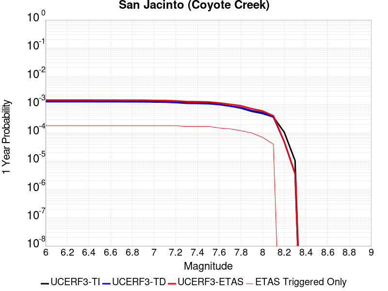 |  |

| Magnitude | 1 wk TI Prob | 1 wk TD Prob | 1 wk ETAS Prob | 1 wk ETAS/TD Gain | 1 wk ETAS Triggered Only | 1 mo TI Prob | 1 mo TD Prob | 1 mo ETAS Prob | 1 mo ETAS/TD Gain | 1 mo ETAS Triggered Only | 1 yr TI Prob | 1 yr TD Prob | 1 yr ETAS Prob | 1 yr ETAS/TD Gain | 1 yr ETAS Triggered Only | 10 yr TI Prob | 10 yr TD Prob | 10 yr ETAS Prob | 10 yr ETAS/TD Gain | 10 yr ETAS Triggered Only |
|-----|-----|-----|-----|-----|-----|-----|-----|-----|-----|-----|-----|-----|-----|-----|-----|-----|-----|-----|-----|-----|
| 6.0 | 2.7374346E-5 | 2.4500561E-5 | 1.2839412E-4 | 5.240456 | 1.03896105E-4 | 1.1731335E-4 | 1.04998195E-4 | 2.3485468E-4 | 2.23675 | 1.2987012E-4 | 0.0014273542 | 0.001277606 | 0.0014073103 | 1.1015213 | 1.2987012E-4 | 0.01418221 | 0.013113335 | 0.013267135 | 1.0117285 | 1.5584416E-4 |
| 6.1 | 2.7374346E-5 | 2.4500561E-5 | 1.2839412E-4 | 5.240456 | 1.03896105E-4 | 1.1731335E-4 | 1.04998195E-4 | 2.3485468E-4 | 2.23675 | 1.2987012E-4 | 0.0014273542 | 0.001277606 | 0.0014073103 | 1.1015213 | 1.2987012E-4 | 0.01418221 | 0.013113335 | 0.013267135 | 1.0117285 | 1.5584416E-4 |
| 6.2 | 2.7374346E-5 | 2.4500561E-5 | 1.2839412E-4 | 5.240456 | 1.03896105E-4 | 1.1731335E-4 | 1.04998195E-4 | 2.3485468E-4 | 2.23675 | 1.2987012E-4 | 0.0014273542 | 0.001277606 | 0.0014073103 | 1.1015213 | 1.2987012E-4 | 0.01418221 | 0.013113335 | 0.013267135 | 1.0117285 | 1.5584416E-4 |
| 6.3 | 2.7374346E-5 | 2.4500561E-5 | 1.2839412E-4 | 5.240456 | 1.03896105E-4 | 1.1731335E-4 | 1.04998195E-4 | 2.3485468E-4 | 2.23675 | 1.2987012E-4 | 0.0014273542 | 0.001277606 | 0.0014073103 | 1.1015213 | 1.2987012E-4 | 0.01418221 | 0.013113335 | 0.013267135 | 1.0117285 | 1.5584416E-4 |
| 6.4 | 2.7374346E-5 | 2.4500561E-5 | 1.2839412E-4 | 5.240456 | 1.03896105E-4 | 1.1731335E-4 | 1.04998195E-4 | 2.3485468E-4 | 2.23675 | 1.2987012E-4 | 0.0014273542 | 0.001277606 | 0.0014073103 | 1.1015213 | 1.2987012E-4 | 0.01418221 | 0.013113335 | 0.013267135 | 1.0117285 | 1.5584416E-4 |
| 6.5 | 2.7282445E-5 | 2.43865E-5 | 1.2828007E-4 | 5.2602906 | 1.03896105E-4 | 1.16919524E-4 | 1.04509396E-4 | 2.3436596E-4 | 2.2425349 | 1.2987012E-4 | 0.0014225657 | 0.0012716618 | 0.0014013669 | 1.1019964 | 1.2987012E-4 | 0.014134934 | 0.013054601 | 0.013208411 | 1.011782 | 1.5584416E-4 |
| 6.6 | 2.7282445E-5 | 2.43865E-5 | 1.2828007E-4 | 5.2602906 | 1.03896105E-4 | 1.16919524E-4 | 1.04509396E-4 | 2.3436596E-4 | 2.2425349 | 1.2987012E-4 | 0.0014225657 | 0.0012716618 | 0.0014013669 | 1.1019964 | 1.2987012E-4 | 0.014134934 | 0.013054601 | 0.013208411 | 1.011782 | 1.5584416E-4 |
| 6.7 | 2.7216198E-5 | 2.4311526E-5 | 1.2820511E-4 | 5.273429 | 1.03896105E-4 | 1.1663563E-4 | 1.0418811E-4 | 2.3404471E-4 | 2.2463667 | 1.2987012E-4 | 0.0014191137 | 0.0012677548 | 0.0013974603 | 1.1023111 | 1.2987012E-4 | 0.014100855 | 0.013015969 | 0.013169785 | 1.0118175 | 1.5584416E-4 |
| 6.8 | 2.7078617E-5 | 2.4228557E-5 | 1.2812215E-4 | 5.2880635 | 1.03896105E-4 | 1.1604605E-4 | 1.0383256E-4 | 2.336892E-4 | 2.2506351 | 1.2987012E-4 | 0.001411945 | 0.0012634309 | 0.001393137 | 1.1026617 | 1.2987012E-4 | 0.014030075 | 0.012973026 | 0.013126848 | 1.0118572 | 1.5584416E-4 |
| 6.9 | 2.6982952E-5 | 2.4147872E-5 | 1.2804147E-4 | 5.302391 | 1.03896105E-4 | 1.15636096E-4 | 1.0348679E-4 | 2.3334348E-4 | 2.2548141 | 1.2987012E-4 | 0.0014069602 | 0.0012592261 | 0.0013889327 | 1.103005 | 1.2987012E-4 | 0.013980856 | 0.012931234 | 0.013085064 | 1.0118959 | 1.5584416E-4 |
| 7.0 | 2.6449972E-5 | 2.3724157E-5 | 1.276178E-4 | 5.3792343 | 1.03896105E-4 | 1.1335209E-4 | 1.0167101E-4 | 2.3152794E-4 | 2.2772267 | 1.2987012E-4 | 0.001379188 | 0.0012371443 | 0.0013668537 | 1.1048459 | 1.2987012E-4 | 0.0137065975 | 0.01271228 | 0.012866143 | 1.0121034 | 1.5584416E-4 |
| 7.1 | 2.6257849E-5 | 2.3549865E-5 | 1.2744352E-4 | 5.4116454 | 1.03896105E-4 | 1.1252879E-4 | 1.009241E-4 | 2.3078112E-4 | 2.28668 | 1.2987012E-4 | 0.0013691769 | 0.0012280609 | 0.0013577716 | 1.1056223 | 1.2987012E-4 | 0.013607717 | 0.012621975 | 0.012775851 | 1.0121912 | 1.5584416E-4 |
| 7.2 | 2.5270041E-5 | 2.2742275E-5 | 1.2663602E-4 | 5.5683093 | 1.03896105E-4 | 1.0829568E-4 | 9.7463264E-5 | 2.2732074E-4 | 2.3323736 | 1.2987012E-4 | 0.0013177024 | 0.0011859717 | 0.0013156878 | 1.1093754 | 1.2987012E-4 | 0.013099162 | 0.012202043 | 0.012355986 | 1.0126162 | 1.5584416E-4 |
| 7.3 | 2.339701E-5 | 2.1469774E-5 | 1.2536364E-4 | 5.8390765 | 1.03896105E-4 | 1.0026905E-4 | 9.201008E-5 | 2.2186826E-4 | 2.4113474 | 1.2987012E-4 | 0.001220092 | 0.0011196492 | 0.0012493739 | 1.1158619 | 1.2987012E-4 | 0.012134149 | 0.01153875 | 0.011667121 | 1.0111252 | 1.2987012E-4 |
| 7.4 | 2.296333E-5 | 2.1199014E-5 | 1.2509292E-4 | 5.9008837 | 1.03896105E-4 | 9.841056E-5 | 9.084976E-5 | 2.207081E-4 | 2.4293745 | 1.2987012E-4 | 0.0011974899 | 0.0011055367 | 0.0012352633 | 1.1173426 | 1.2987012E-4 | 0.011910575 | 0.011397297 | 0.011525687 | 1.0112649 | 1.2987012E-4 |
| 7.5 | 2.2188895E-5 | 2.0718597E-5 | 1.2461255E-4 | 6.0145264 | 1.03896105E-4 | 9.50918E-5 | 8.879098E-5 | 2.1864957E-4 | 2.4625204 | 1.2987012E-4 | 0.0011571277 | 0.0010804961 | 0.0012102259 | 1.1200651 | 1.2987012E-4 | 0.011511209 | 0.011145198 | 0.011273621 | 1.0115227 | 1.2987012E-4 |
| 7.6 | 2.0013189E-5 | 1.9293082E-5 | 1.2318719E-4 | 6.3850446 | 1.03896105E-4 | 8.5767984E-5 | 8.2682025E-5 | 2.1254142E-4 | 2.5705879 | 1.2987012E-4 | 0.001043725 | 0.0010061905 | 0.00113593 | 1.1289413 | 1.2987012E-4 | 0.010388365 | 0.01039717 | 0.010525689 | 1.012361 | 1.2987012E-4 |
| 7.7 | 1.7230794E-5 | 1.7065691E-5 | 1.2096002E-4 | 7.0879064 | 1.03896105E-4 | 7.384417E-5 | 7.313663E-5 | 2.0299727E-4 | 2.7755895 | 1.2987012E-4 | 8.986819E-4 | 8.900755E-4 | 0.0010198301 | 1.1457793 | 1.2987012E-4 | 0.008950562 | 0.009231347 | 0.009360018 | 1.0139385 | 1.2987012E-4 |
| 7.8 | 1.4478809E-5 | 1.5300193E-5 | 9.3221075E-5 | 6.0928044 | 7.792208E-5 | 6.205057E-5 | 6.557061E-5 | 1.4348757E-4 | 2.188291 | 7.792208E-5 | 7.552038E-4 | 7.980304E-4 | 8.758903E-4 | 1.097565 | 7.792208E-5 | 0.0075264242 | 0.008303156 | 0.008380431 | 1.0093067 | 7.792208E-5 |
| 7.9 | 1.1114467E-5 | 1.19146625E-5 | 8.983581E-5 | 7.539938 | 7.792208E-5 | 4.7632562E-5 | 5.106184E-5 | 1.2897994E-4 | 2.5259554 | 7.792208E-5 | 5.797721E-4 | 6.215012E-4 | 6.993748E-4 | 1.1252993 | 7.792208E-5 | 0.0057826187 | 0.0065218983 | 0.006599312 | 1.0118698 | 7.792208E-5 |
| 8.0 | 9.327402E-6 | 1.0142922E-5 | 6.209045E-5 | 6.121554 | 5.1948053E-5 | 3.9973966E-5 | 4.3468946E-5 | 9.541474E-5 | 2.1950092 | 5.1948053E-5 | 4.8657437E-4 | 5.291065E-4 | 5.81027E-4 | 1.0981288 | 5.1948053E-5 | 0.0048551033 | 0.0055780914 | 0.0056297495 | 1.0092609 | 5.1948053E-5 |
| 8.1 | 7.0235833E-6 | 7.006159E-6 | 5.8953847E-5 | 8.414575 | 5.1948053E-5 | 3.0100724E-5 | 3.0026053E-5 | 8.197255E-5 | 2.7300472 | 5.1948053E-5 | 3.664147E-4 | 3.655064E-4 | 4.1743548E-4 | 1.1420743 | 5.1948053E-5 | 0.003658111 | 0.0038821623 | 0.0039339084 | 1.0133293 | 5.1948053E-5 |
| 8.2 | 2.0358202E-6 | 9.35961E-7 | 9.35961E-7 | 1.0 | 0.0 | 8.724915E-6 | 4.0112554E-6 | 4.0112554E-6 | 1.0 | 0.0 | 1.06220665E-4 | 4.8835966E-5 | 4.8835966E-5 | 1.0 | 0.0 | 0.001061699 | 5.530527E-4 | 5.530527E-4 | 1.0 | 0.0 |
| 8.3 | 2.0051264E-7 | 6.953347E-8 | 6.953347E-8 | 1.0 | 0.0 | 8.5933965E-7 | 2.9800057E-7 | 2.9800057E-7 | 1.0 | 0.0 | 1.046241E-5 | 3.6281513E-6 | 3.6281513E-6 | 1.0 | 0.0 | 1.0461917E-4 | 4.2074455E-5 | 4.2074455E-5 | 1.0 | 0.0 |

## San Jacinto (San Bernardino)
*[(top)](#table-of-contents)*

| 1 Week | 1 Month | 1 Year | 10 Year |
|-----|-----|-----|-----|
|  |  |  |  |

| Magnitude | 1 wk TI Prob | 1 wk TD Prob | 1 wk ETAS Prob | 1 wk ETAS/TD Gain | 1 wk ETAS Triggered Only | 1 mo TI Prob | 1 mo TD Prob | 1 mo ETAS Prob | 1 mo ETAS/TD Gain | 1 mo ETAS Triggered Only | 1 yr TI Prob | 1 yr TD Prob | 1 yr ETAS Prob | 1 yr ETAS/TD Gain | 1 yr ETAS Triggered Only | 10 yr TI Prob | 10 yr TD Prob | 10 yr ETAS Prob | 10 yr ETAS/TD Gain | 10 yr ETAS Triggered Only |
|-----|-----|-----|-----|-----|-----|-----|-----|-----|-----|-----|-----|-----|-----|-----|-----|-----|-----|-----|-----|-----|
| 6.0 | 3.409352E-5 | 3.6644473E-5 | 1.6650984E-4 | 4.5439277 | 1.2987012E-4 | 1.461069E-4 | 1.570383E-4 | 3.12858E-4 | 1.99224 | 1.5584416E-4 | 0.0017774 | 0.0019102664 | 0.0020658127 | 1.0814266 | 1.5584416E-4 | 0.01763251 | 0.019686501 | 0.019839277 | 1.0077604 | 1.5584416E-4 |
| 6.1 | 3.409352E-5 | 3.6644473E-5 | 1.6650984E-4 | 4.5439277 | 1.2987012E-4 | 1.461069E-4 | 1.570383E-4 | 3.12858E-4 | 1.99224 | 1.5584416E-4 | 0.0017774 | 0.0019102664 | 0.0020658127 | 1.0814266 | 1.5584416E-4 | 0.01763251 | 0.019686501 | 0.019839277 | 1.0077604 | 1.5584416E-4 |
| 6.2 | 3.409352E-5 | 3.6644473E-5 | 1.6650984E-4 | 4.5439277 | 1.2987012E-4 | 1.461069E-4 | 1.570383E-4 | 3.12858E-4 | 1.99224 | 1.5584416E-4 | 0.0017774 | 0.0019102664 | 0.0020658127 | 1.0814266 | 1.5584416E-4 | 0.01763251 | 0.019686501 | 0.019839277 | 1.0077604 | 1.5584416E-4 |
| 6.3 | 3.409352E-5 | 3.6644473E-5 | 1.6650984E-4 | 4.5439277 | 1.2987012E-4 | 1.461069E-4 | 1.570383E-4 | 3.12858E-4 | 1.99224 | 1.5584416E-4 | 0.0017774 | 0.0019102664 | 0.0020658127 | 1.0814266 | 1.5584416E-4 | 0.01763251 | 0.019686501 | 0.019839277 | 1.0077604 | 1.5584416E-4 |
| 6.4 | 3.400795E-5 | 3.6537E-5 | 1.6640239E-4 | 4.5543528 | 1.2987012E-4 | 1.4574021E-4 | 1.5657775E-4 | 3.1239752E-4 | 1.9951589 | 1.5584416E-4 | 0.0017729428 | 0.001904669 | 0.0020602164 | 1.0816664 | 1.5584416E-4 | 0.017588645 | 0.01963153 | 0.019784315 | 1.0077826 | 1.5584416E-4 |
| 6.5 | 3.341482E-5 | 3.5796696E-5 | 1.6566218E-4 | 4.6278625 | 1.2987012E-4 | 1.4319851E-4 | 1.534054E-4 | 3.0922564E-4 | 2.0157416 | 1.5584416E-4 | 0.0017420477 | 0.0018661121 | 0.0020216655 | 1.0833569 | 1.5584416E-4 | 0.017284546 | 0.019252725 | 0.019405568 | 1.0079389 | 1.5584416E-4 |
| 6.6 | 3.3364955E-5 | 3.5733832E-5 | 1.6559933E-4 | 4.634245 | 1.2987012E-4 | 1.4298483E-4 | 1.53136E-4 | 3.089563E-4 | 2.0175288 | 1.5584416E-4 | 0.0017394501 | 0.0018628379 | 0.0020183919 | 1.0835037 | 1.5584416E-4 | 0.017258976 | 0.019220559 | 0.019373408 | 1.0079523 | 1.5584416E-4 |
| 6.7 | 3.335922E-5 | 3.572359E-5 | 1.6558908E-4 | 4.635287 | 1.2987012E-4 | 1.4296026E-4 | 1.5309213E-4 | 3.0891242E-4 | 2.0178204 | 1.5584416E-4 | 0.0017391514 | 0.0018623046 | 0.0020178587 | 1.0835277 | 1.5584416E-4 | 0.017256035 | 0.019215345 | 0.019368194 | 1.0079546 | 1.5584416E-4 |
| 6.8 | 3.327683E-5 | 3.5617508E-5 | 1.6548301E-4 | 4.6461143 | 1.2987012E-4 | 1.4260718E-4 | 1.5263754E-4 | 3.084579E-4 | 2.0208523 | 1.5584416E-4 | 0.0017348597 | 0.0018567794 | 0.0020123343 | 1.0837767 | 1.5584416E-4 | 0.017213784 | 0.019161059 | 0.019313917 | 1.0079775 | 1.5584416E-4 |
| 6.9 | 3.3235785E-5 | 3.555837E-5 | 1.6542387E-4 | 4.652179 | 1.2987012E-4 | 1.4243131E-4 | 1.523841E-4 | 3.0820453E-4 | 2.0225503 | 1.5584416E-4 | 0.0017327217 | 0.0018536992 | 0.0020092544 | 1.0839162 | 1.5584416E-4 | 0.017192734 | 0.019130893 | 0.019283755 | 1.0079904 | 1.5584416E-4 |
| 7.0 | 3.3197095E-5 | 3.5498186E-5 | 1.653637E-4 | 4.6583705 | 1.2987012E-4 | 1.422655E-4 | 1.5212623E-4 | 3.0794667E-4 | 2.024284 | 1.5584416E-4 | 0.0017307063 | 0.0018505648 | 0.0020061205 | 1.0840585 | 1.5584416E-4 | 0.017172894 | 0.019100228 | 0.019253096 | 1.0080035 | 1.5584416E-4 |
| 7.1 | 3.3129716E-5 | 3.5378154E-5 | 1.6524369E-4 | 4.6707835 | 1.2987012E-4 | 1.4197677E-4 | 1.5161185E-4 | 3.0743238E-4 | 2.0277596 | 1.5584416E-4 | 0.0017271966 | 0.001844313 | 0.0019998697 | 1.084344 | 1.5584416E-4 | 0.017138338 | 0.019039204 | 0.019192081 | 1.0080296 | 1.5584416E-4 |
| 7.2 | 3.3034008E-5 | 3.5245383E-5 | 1.6511093E-4 | 4.684612 | 1.2987012E-4 | 1.4156665E-4 | 1.5104291E-4 | 3.068635E-4 | 2.0316315 | 1.5584416E-4 | 0.0017222111 | 0.0018373978 | 0.0019929556 | 1.084662 | 1.5584416E-4 | 0.017089253 | 0.01897152 | 0.019124407 | 1.0080588 | 1.5584416E-4 |
| 7.3 | 3.2956614E-5 | 3.5112633E-5 | 1.649782E-4 | 4.6985426 | 1.2987012E-4 | 1.4123498E-4 | 1.5047405E-4 | 3.0629477E-4 | 2.035532 | 1.5584416E-4 | 0.0017181796 | 0.0018304836 | 0.0019860424 | 1.0849824 | 1.5584416E-4 | 0.017049557 | 0.018904038 | 0.019056937 | 1.0080881 | 1.5584416E-4 |
| 7.4 | 3.2915937E-5 | 3.503396E-5 | 1.6489954E-4 | 4.706848 | 1.2987012E-4 | 1.4106068E-4 | 1.5013691E-4 | 3.0595768E-4 | 2.0378578 | 1.5584416E-4 | 0.0017160608 | 0.001826386 | 0.0019819455 | 1.0851734 | 1.5584416E-4 | 0.017028693 | 0.018864144 | 0.019017048 | 1.0081055 | 1.5584416E-4 |
| 7.5 | 3.281791E-5 | 3.4898356E-5 | 1.6476396E-4 | 4.721253 | 1.2987012E-4 | 1.406406E-4 | 1.4955581E-4 | 3.0537666E-4 | 2.0418909 | 1.5584416E-4 | 0.0017109542 | 0.0018193228 | 0.0019748835 | 1.0855047 | 1.5584416E-4 | 0.016978411 | 0.018794795 | 0.018947711 | 1.008136 | 1.5584416E-4 |
| 7.6 | 3.2521442E-5 | 3.4622077E-5 | 1.644877E-4 | 4.750949 | 1.2987012E-4 | 1.3937015E-4 | 1.483719E-4 | 3.0419294E-4 | 2.050206 | 1.5584416E-4 | 0.0016955109 | 0.0018049326 | 0.0019604955 | 1.0861876 | 1.5584416E-4 | 0.016826328 | 0.018651856 | 0.018804794 | 1.0081996 | 1.5584416E-4 |
| 7.7 | 3.0287873E-5 | 3.3098826E-5 | 1.6296466E-4 | 4.9235783 | 1.2987012E-4 | 1.297987E-4 | 1.418444E-4 | 2.9766644E-4 | 2.0985422 | 1.5584416E-4 | 0.0015791537 | 0.0017255888 | 0.001881164 | 1.0901577 | 1.5584416E-4 | 0.01567979 | 0.017859232 | 0.018012293 | 1.0085704 | 1.5584416E-4 |
| 7.8 | 2.6316151E-5 | 3.0284582E-5 | 1.3417754E-4 | 4.4305563 | 1.03896105E-4 | 1.1277862E-4 | 1.2978462E-4 | 2.3366723E-4 | 1.8004233 | 1.03896105E-4 | 0.0013722149 | 0.0015789834 | 0.0016827155 | 1.0656955 | 1.03896105E-4 | 0.013637724 | 0.016388219 | 0.016490413 | 1.0062358 | 1.03896105E-4 |
| 7.9 | 2.0761147E-5 | 2.3954779E-5 | 1.278484E-4 | 5.3370724 | 1.03896105E-4 | 8.897331E-5 | 1.0265931E-4 | 2.0654475E-4 | 2.0119438 | 1.03896105E-4 | 0.0010827117 | 0.0012491613 | 0.0013529276 | 1.0830688 | 1.03896105E-4 | 0.010774517 | 0.013070523 | 0.013173061 | 1.007845 | 1.03896105E-4 |
| 8.0 | 1.5738568E-5 | 1.6437572E-5 | 9.435837E-5 | 5.7404075 | 7.792208E-5 | 6.744926E-5 | 7.044485E-5 | 1.4836143E-4 | 2.1060653 | 7.792208E-5 | 8.2088535E-4 | 8.573292E-4 | 9.351845E-4 | 1.0908114 | 7.792208E-5 | 0.008178596 | 0.009078517 | 0.009155731 | 1.0085052 | 7.792208E-5 |
| 8.1 | 1.0105832E-5 | 8.566386E-6 | 6.0513994E-5 | 7.0641217 | 5.1948053E-5 | 4.3309992E-5 | 3.671257E-5 | 8.8658715E-5 | 2.4149418 | 5.1948053E-5 | 5.2717153E-4 | 4.468844E-4 | 4.988092E-4 | 1.116193 | 5.1948053E-5 | 0.005259227 | 0.0048037446 | 0.004855443 | 1.0107621 | 5.1948053E-5 |
| 8.2 | 4.189207E-6 | 1.647033E-6 | 1.647033E-6 | 1.0 | 0.0 | 1.7953622E-5 | 7.0586934E-6 | 7.0586934E-6 | 1.0 | 0.0 | 2.1856341E-4 | 8.593623E-5 | 8.593623E-5 | 1.0 | 0.0 | 0.0021834858 | 9.957465E-4 | 9.957465E-4 | 1.0 | 0.0 |
| 8.3 | 1.2758221E-6 | 3.7958202E-7 | 3.7958202E-7 | 1.0 | 0.0 | 5.4677976E-6 | 1.6267791E-6 | 1.6267791E-6 | 1.0 | 0.0 | 6.65684E-5 | 1.9805859E-5 | 1.9805859E-5 | 1.0 | 0.0 | 6.6548464E-4 | 2.3814397E-4 | 2.3814397E-4 | 1.0 | 0.0 |

## San Jacinto (San Jacinto Valley) rev
*[(top)](#table-of-contents)*

| 1 Week | 1 Month | 1 Year | 10 Year |
|-----|-----|-----|-----|
|  |  |  |  |

| Magnitude | 1 wk TI Prob | 1 wk TD Prob | 1 wk ETAS Prob | 1 wk ETAS/TD Gain | 1 wk ETAS Triggered Only | 1 mo TI Prob | 1 mo TD Prob | 1 mo ETAS Prob | 1 mo ETAS/TD Gain | 1 mo ETAS Triggered Only | 1 yr TI Prob | 1 yr TD Prob | 1 yr ETAS Prob | 1 yr ETAS/TD Gain | 1 yr ETAS Triggered Only | 10 yr TI Prob | 10 yr TD Prob | 10 yr ETAS Prob | 10 yr ETAS/TD Gain | 10 yr ETAS Triggered Only |
|-----|-----|-----|-----|-----|-----|-----|-----|-----|-----|-----|-----|-----|-----|-----|-----|-----|-----|-----|-----|-----|
| 6.0 | 3.652694E-5 | 3.5018347E-5 | 1.6488392E-4 | 4.7085013 | 1.2987012E-4 | 1.5653463E-4 | 1.5007002E-4 | 3.0589078E-4 | 2.0383205 | 1.5584416E-4 | 0.0019041431 | 0.001825573 | 0.0019811327 | 1.0852114 | 1.5584416E-4 | 0.018879099 | 0.018844653 | 0.01899756 | 1.0081141 | 1.5584416E-4 |
| 6.1 | 3.652694E-5 | 3.5018347E-5 | 1.6488392E-4 | 4.7085013 | 1.2987012E-4 | 1.5653463E-4 | 1.5007002E-4 | 3.0589078E-4 | 2.0383205 | 1.5584416E-4 | 0.0019041431 | 0.001825573 | 0.0019811327 | 1.0852114 | 1.5584416E-4 | 0.018879099 | 0.018844653 | 0.01899756 | 1.0081141 | 1.5584416E-4 |
| 6.2 | 3.652694E-5 | 3.5018347E-5 | 1.6488392E-4 | 4.7085013 | 1.2987012E-4 | 1.5653463E-4 | 1.5007002E-4 | 3.0589078E-4 | 2.0383205 | 1.5584416E-4 | 0.0019041431 | 0.001825573 | 0.0019811327 | 1.0852114 | 1.5584416E-4 | 0.018879099 | 0.018844653 | 0.01899756 | 1.0081141 | 1.5584416E-4 |
| 6.3 | 3.652694E-5 | 3.5018347E-5 | 1.6488392E-4 | 4.7085013 | 1.2987012E-4 | 1.5653463E-4 | 1.5007002E-4 | 3.0589078E-4 | 2.0383205 | 1.5584416E-4 | 0.0019041431 | 0.001825573 | 0.0019811327 | 1.0852114 | 1.5584416E-4 | 0.018879099 | 0.018844653 | 0.01899756 | 1.0081141 | 1.5584416E-4 |
| 6.4 | 3.646941E-5 | 3.4939785E-5 | 1.6480537E-4 | 4.7168403 | 1.2987012E-4 | 1.5628811E-4 | 1.4973336E-4 | 3.0555416E-4 | 2.0406554 | 1.5584416E-4 | 0.0019011468 | 0.0018214815 | 0.0019770418 | 1.0854032 | 1.5584416E-4 | 0.018849645 | 0.018804476 | 0.01895739 | 1.0081317 | 1.5584416E-4 |
| 6.5 | 3.646941E-5 | 3.4939785E-5 | 1.6480537E-4 | 4.7168403 | 1.2987012E-4 | 1.5628811E-4 | 1.4973336E-4 | 3.0555416E-4 | 2.0406554 | 1.5584416E-4 | 0.0019011468 | 0.0018214815 | 0.0019770418 | 1.0854032 | 1.5584416E-4 | 0.018849645 | 0.018804476 | 0.01895739 | 1.0081317 | 1.5584416E-4 |
| 6.6 | 3.6442503E-5 | 3.4903107E-5 | 1.647687E-4 | 4.720746 | 1.2987012E-4 | 1.561728E-4 | 1.4957618E-4 | 3.0539703E-4 | 2.041749 | 1.5584416E-4 | 0.0018997455 | 0.0018195714 | 0.001975132 | 1.085493 | 1.5584416E-4 | 0.018835869 | 0.018785719 | 0.018938636 | 1.0081401 | 1.5584416E-4 |
| 6.7 | 3.6432113E-5 | 3.4888657E-5 | 1.6475425E-4 | 4.722287 | 1.2987012E-4 | 1.5612828E-4 | 1.4951426E-4 | 3.0533512E-4 | 2.0421805 | 1.5584416E-4 | 0.0018992044 | 0.0018188187 | 0.0019743794 | 1.0855284 | 1.5584416E-4 | 0.018830549 | 0.018778332 | 0.01893125 | 1.0081433 | 1.5584416E-4 |
| 6.8 | 3.6409598E-5 | 3.4857654E-5 | 1.6472326E-4 | 4.725598 | 1.2987012E-4 | 1.560318E-4 | 1.493814E-4 | 3.0520227E-4 | 2.0431075 | 1.5584416E-4 | 0.0018980318 | 0.0018172039 | 0.001972765 | 1.0856045 | 1.5584416E-4 | 0.018819023 | 0.018762462 | 0.018915381 | 1.0081503 | 1.5584416E-4 |
| 6.9 | 3.638078E-5 | 3.4818E-5 | 1.646836E-4 | 4.729841 | 1.2987012E-4 | 1.5590832E-4 | 1.4921148E-4 | 3.050324E-4 | 2.0442955 | 1.5584416E-4 | 0.0018965311 | 0.0018151386 | 0.0019707 | 1.0857022 | 1.5584416E-4 | 0.018804269 | 0.018742163 | 0.018895086 | 1.0081593 | 1.5584416E-4 |
| 7.0 | 3.6294874E-5 | 3.469979E-5 | 1.6456541E-4 | 4.7425475 | 1.2987012E-4 | 1.5554018E-4 | 1.4870493E-4 | 3.0452592E-4 | 2.0478535 | 1.5584416E-4 | 0.0018920569 | 0.0018089819 | 0.0019645442 | 1.0859944 | 1.5584416E-4 | 0.018760284 | 0.01868165 | 0.018834582 | 1.0081862 | 1.5584416E-4 |
| 7.1 | 3.6260717E-5 | 3.4656012E-5 | 1.6452164E-4 | 4.7472754 | 1.2987012E-4 | 1.5539382E-4 | 1.4851733E-4 | 3.0433835E-4 | 2.0491774 | 1.5584416E-4 | 0.001890278 | 0.0018067015 | 0.001962264 | 1.0861031 | 1.5584416E-4 | 0.018742796 | 0.018659234 | 0.01881217 | 1.0081962 | 1.5584416E-4 |
| 7.2 | 3.6210204E-5 | 3.4590023E-5 | 1.6445566E-4 | 4.7544246 | 1.2987012E-4 | 1.5517735E-4 | 1.4823455E-4 | 3.040556E-4 | 2.051179 | 1.5584416E-4 | 0.001887647 | 0.0018032645 | 0.0019588275 | 1.0862675 | 1.5584416E-4 | 0.01871693 | 0.018625425 | 0.018778367 | 1.0082115 | 1.5584416E-4 |
| 7.3 | 3.6119454E-5 | 3.447771E-5 | 1.6434336E-4 | 4.766655 | 1.2987012E-4 | 1.5478847E-4 | 1.4775326E-4 | 3.035744E-4 | 2.0546036 | 1.5584416E-4 | 0.0018829206 | 0.0017974145 | 0.0019529785 | 1.0865488 | 1.5584416E-4 | 0.018670462 | 0.018567692 | 0.018720644 | 1.0082375 | 1.5584416E-4 |
| 7.4 | 3.607848E-5 | 3.4424906E-5 | 1.6429057E-4 | 4.7724333 | 1.2987012E-4 | 1.5461289E-4 | 1.4752698E-4 | 3.0334815E-4 | 2.0562215 | 1.5584416E-4 | 0.0018807866 | 0.001794664 | 0.0019502285 | 1.0866817 | 1.5584416E-4 | 0.018649481 | 0.01854054 | 0.018693496 | 1.0082498 | 1.5584416E-4 |
| 7.5 | 3.5856774E-5 | 3.4232846E-5 | 1.6409853E-4 | 4.7935987 | 1.2987012E-4 | 1.5366284E-4 | 1.4670397E-4 | 3.0252527E-4 | 2.0621479 | 1.5584416E-4 | 0.0018692396 | 0.0017846603 | 0.0019402263 | 1.0871685 | 1.5584416E-4 | 0.018535944 | 0.01844072 | 0.018593691 | 1.0082953 | 1.5584416E-4 |
| 7.6 | 3.286655E-5 | 3.2739328E-5 | 1.6260521E-4 | 4.966663 | 1.2987012E-4 | 1.4084904E-4 | 1.4030386E-4 | 2.9612615E-4 | 2.1106057 | 1.5584416E-4 | 0.001713488 | 0.0017068633 | 0.0018624414 | 1.0911486 | 1.5584416E-4 | 0.017003361 | 0.017652057 | 0.01780515 | 1.0086728 | 1.5584416E-4 |
| 7.7 | 2.8882527E-5 | 2.9820016E-5 | 1.5968627E-4 | 5.355003 | 1.2987012E-4 | 1.237764E-4 | 1.2779381E-4 | 2.8361805E-4 | 2.219341 | 1.5584416E-4 | 0.0015059357 | 0.0015547804 | 0.0017103822 | 1.1000797 | 1.5584416E-4 | 0.014957713 | 0.016132638 | 0.016285967 | 1.0095043 | 1.5584416E-4 |
| 7.8 | 2.4950225E-5 | 2.7087162E-5 | 1.3098045E-4 | 4.8355174 | 1.03896105E-4 | 1.0692515E-4 | 1.1608268E-4 | 2.1996672E-4 | 1.8949143 | 1.03896105E-4 | 0.0013010362 | 0.0014123913 | 0.0015161406 | 1.0734565 | 1.03896105E-4 | 0.012934455 | 0.014701912 | 0.014804281 | 1.0069629 | 1.03896105E-4 |
| 7.9 | 1.9881603E-5 | 2.200509E-5 | 1.258989E-4 | 5.721354 | 1.03896105E-4 | 8.520408E-5 | 9.430412E-5 | 1.9819042E-4 | 2.1016095 | 1.03896105E-4 | 0.001036866 | 0.0011475488 | 0.0012513256 | 1.0904335 | 1.03896105E-4 | 0.010320415 | 0.012036041 | 0.012138686 | 1.0085282 | 1.03896105E-4 |
| 8.0 | 1.563292E-5 | 1.6338041E-5 | 9.4258845E-5 | 5.769287 | 7.792208E-5 | 6.6996516E-5 | 7.00183E-5 | 1.4793492E-4 | 2.1128037 | 7.792208E-5 | 8.153773E-4 | 8.521401E-4 | 9.299958E-4 | 1.0913649 | 7.792208E-5 | 0.00812392 | 0.009021346 | 0.009098565 | 1.0085596 | 7.792208E-5 |
| 8.1 | 1.0045313E-5 | 8.536306E-6 | 6.0483915E-5 | 7.08549 | 5.1948053E-5 | 4.305063E-5 | 3.658366E-5 | 8.8529814E-5 | 2.4199276 | 5.1948053E-5 | 5.2401534E-4 | 4.4531559E-4 | 4.972405E-4 | 1.1166025 | 5.1948053E-5 | 0.0052278144 | 0.004784835 | 0.004836534 | 1.0108049 | 5.1948053E-5 |
| 8.2 | 4.1554413E-6 | 1.6334963E-6 | 1.6334963E-6 | 1.0 | 0.0 | 1.7808914E-5 | 7.0006795E-6 | 7.0006795E-6 | 1.0 | 0.0 | 2.1680194E-4 | 8.522997E-5 | 8.522997E-5 | 1.0 | 0.0 | 0.0021659054 | 9.870611E-4 | 9.870611E-4 | 1.0 | 0.0 |
| 8.3 | 1.2758221E-6 | 3.7958202E-7 | 3.7958202E-7 | 1.0 | 0.0 | 5.4677976E-6 | 1.6267791E-6 | 1.6267791E-6 | 1.0 | 0.0 | 6.65684E-5 | 1.9805859E-5 | 1.9805859E-5 | 1.0 | 0.0 | 6.6548464E-4 | 2.3814397E-4 | 2.3814397E-4 | 1.0 | 0.0 |

## San Andreas (Mojave N)
*[(top)](#table-of-contents)*

| 1 Week | 1 Month | 1 Year | 10 Year |
|-----|-----|-----|-----|
|  |  |  | 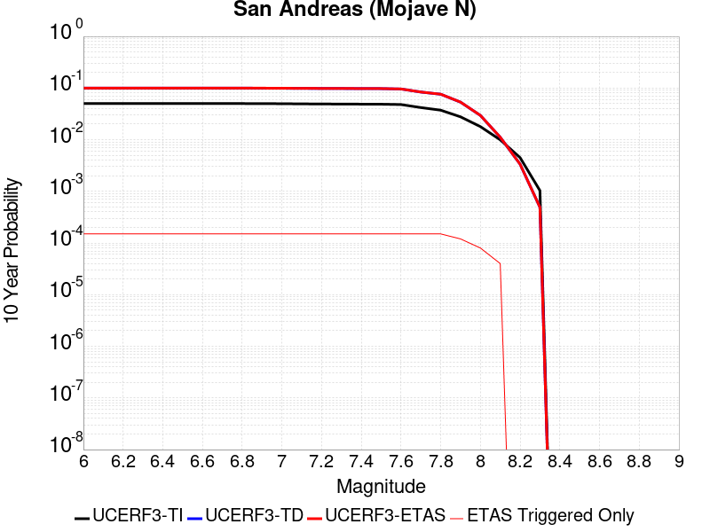 |

| Magnitude | 1 wk TI Prob | 1 wk TD Prob | 1 wk ETAS Prob | 1 wk ETAS/TD Gain | 1 wk ETAS Triggered Only | 1 mo TI Prob | 1 mo TD Prob | 1 mo ETAS Prob | 1 mo ETAS/TD Gain | 1 mo ETAS Triggered Only | 1 yr TI Prob | 1 yr TD Prob | 1 yr ETAS Prob | 1 yr ETAS/TD Gain | 1 yr ETAS Triggered Only | 10 yr TI Prob | 10 yr TD Prob | 10 yr ETAS Prob | 10 yr ETAS/TD Gain | 10 yr ETAS Triggered Only |
|-----|-----|-----|-----|-----|-----|-----|-----|-----|-----|-----|-----|-----|-----|-----|-----|-----|-----|-----|-----|-----|
| 6.0 | 9.877682E-5 | 1.9746333E-4 | 3.0133894E-4 | 1.52605 | 1.03896105E-4 | 4.2326056E-4 | 8.459972E-4 | 9.7575743E-4 | 1.1533815 | 1.2987012E-4 | 0.0051410277 | 0.010251505 | 0.010380044 | 1.0125386 | 1.2987012E-4 | 0.05023708 | 0.09982648 | 0.099943385 | 1.0011711 | 1.2987012E-4 |
| 6.1 | 9.877682E-5 | 1.9746333E-4 | 3.0133894E-4 | 1.52605 | 1.03896105E-4 | 4.2326056E-4 | 8.459972E-4 | 9.7575743E-4 | 1.1533815 | 1.2987012E-4 | 0.0051410277 | 0.010251505 | 0.010380044 | 1.0125386 | 1.2987012E-4 | 0.05023708 | 0.09982648 | 0.099943385 | 1.0011711 | 1.2987012E-4 |
| 6.2 | 9.877682E-5 | 1.9746333E-4 | 3.0133894E-4 | 1.52605 | 1.03896105E-4 | 4.2326056E-4 | 8.459972E-4 | 9.7575743E-4 | 1.1533815 | 1.2987012E-4 | 0.0051410277 | 0.010251505 | 0.010380044 | 1.0125386 | 1.2987012E-4 | 0.05023708 | 0.09982648 | 0.099943385 | 1.0011711 | 1.2987012E-4 |
| 6.3 | 9.877682E-5 | 1.9746333E-4 | 3.0133894E-4 | 1.52605 | 1.03896105E-4 | 4.2326056E-4 | 8.459972E-4 | 9.7575743E-4 | 1.1533815 | 1.2987012E-4 | 0.0051410277 | 0.010251505 | 0.010380044 | 1.0125386 | 1.2987012E-4 | 0.05023708 | 0.09982648 | 0.099943385 | 1.0011711 | 1.2987012E-4 |
| 6.4 | 9.877682E-5 | 1.9746333E-4 | 3.0133894E-4 | 1.52605 | 1.03896105E-4 | 4.2326056E-4 | 8.459972E-4 | 9.7575743E-4 | 1.1533815 | 1.2987012E-4 | 0.0051410277 | 0.010251505 | 0.010380044 | 1.0125386 | 1.2987012E-4 | 0.05023708 | 0.09982648 | 0.099943385 | 1.0011711 | 1.2987012E-4 |
| 6.5 | 9.861474E-5 | 1.9719993E-4 | 3.0107555E-4 | 1.5267528 | 1.03896105E-4 | 4.2256617E-4 | 8.44869E-4 | 9.746294E-4 | 1.1535864 | 1.2987012E-4 | 0.0051326132 | 0.0102379 | 0.01036644 | 1.0125554 | 1.2987012E-4 | 0.050156746 | 0.09970412 | 0.09982104 | 1.0011727 | 1.2987012E-4 |
| 6.6 | 9.861474E-5 | 1.9719993E-4 | 3.0107555E-4 | 1.5267528 | 1.03896105E-4 | 4.2256617E-4 | 8.44869E-4 | 9.746294E-4 | 1.1535864 | 1.2987012E-4 | 0.0051326132 | 0.0102379 | 0.01036644 | 1.0125554 | 1.2987012E-4 | 0.050156746 | 0.09970412 | 0.09982104 | 1.0011727 | 1.2987012E-4 |
| 6.7 | 9.8552715E-5 | 1.9709907E-4 | 3.009747E-4 | 1.5270224 | 1.03896105E-4 | 4.223004E-4 | 8.4443705E-4 | 9.741975E-4 | 1.1536651 | 1.2987012E-4 | 0.0051293927 | 0.01023269 | 0.010361231 | 1.0125618 | 1.2987012E-4 | 0.050125998 | 0.09965707 | 0.099774 | 1.0011733 | 1.2987012E-4 |
| 6.8 | 9.8464974E-5 | 1.9694971E-4 | 3.0082534E-4 | 1.5274222 | 1.03896105E-4 | 4.219245E-4 | 8.437973E-4 | 9.735579E-4 | 1.1537817 | 1.2987012E-4 | 0.0051248376 | 0.010224974 | 0.010353516 | 1.0125715 | 1.2987012E-4 | 0.05008251 | 0.09958654 | 0.099703476 | 1.0011742 | 1.2987012E-4 |
| 6.9 | 9.825824E-5 | 1.9662795E-4 | 3.0050363E-4 | 1.5282854 | 1.03896105E-4 | 4.2103877E-4 | 8.424193E-4 | 9.7218005E-4 | 1.1540334 | 1.2987012E-4 | 0.0051141046 | 0.010208353 | 0.010336898 | 1.0125921 | 1.2987012E-4 | 0.049980022 | 0.09943499 | 0.09955194 | 1.0011762 | 1.2987012E-4 |
| 7.0 | 9.781462E-5 | 1.9593768E-4 | 2.9981343E-4 | 1.5301468 | 1.03896105E-4 | 4.1913814E-4 | 8.3946285E-4 | 9.6922397E-4 | 1.1545763 | 1.2987012E-4 | 0.005091073 | 0.010172696 | 0.010301244 | 1.0126367 | 1.2987012E-4 | 0.04976007 | 0.09911008 | 0.099227086 | 1.0011805 | 1.2987012E-4 |
| 7.1 | 9.7121134E-5 | 1.9494945E-4 | 2.988253E-4 | 1.5328348 | 1.03896105E-4 | 4.1616702E-4 | 8.352303E-4 | 9.64992E-4 | 1.1553603 | 1.2987012E-4 | 0.005055068 | 0.0101216445 | 0.0102502 | 1.012701 | 1.2987012E-4 | 0.04941613 | 0.098645054 | 0.09876211 | 1.0011867 | 1.2987012E-4 |
| 7.2 | 9.663819E-5 | 1.9425346E-4 | 2.9812937E-4 | 1.5347443 | 1.03896105E-4 | 4.1409794E-4 | 8.3224935E-4 | 9.620114E-4 | 1.1559173 | 1.2987012E-4 | 0.0050299936 | 0.010085688 | 0.010214249 | 1.0127468 | 1.2987012E-4 | 0.049176537 | 0.098317176 | 0.09843428 | 1.001191 | 1.2987012E-4 |
| 7.3 | 9.6277574E-5 | 1.9377375E-4 | 2.9764973E-4 | 1.5360683 | 1.03896105E-4 | 4.125529E-4 | 8.3019485E-4 | 9.5995713E-4 | 1.1563034 | 1.2987012E-4 | 0.0050112694 | 0.0100609055 | 0.010189469 | 1.0127785 | 1.2987012E-4 | 0.04899759 | 0.098088905 | 0.098206036 | 1.0011941 | 1.2987012E-4 |
| 7.4 | 9.593308E-5 | 1.9316633E-4 | 2.9704237E-4 | 1.5377543 | 1.03896105E-4 | 4.1107697E-4 | 8.2759326E-4 | 9.573559E-4 | 1.1567951 | 1.2987012E-4 | 0.0049933824 | 0.010029524 | 0.010158091 | 1.0128189 | 1.2987012E-4 | 0.04882661 | 0.097804934 | 0.0979221 | 1.0011979 | 1.2987012E-4 |
| 7.5 | 9.561707E-5 | 1.9262238E-4 | 2.9649847E-4 | 1.5392733 | 1.03896105E-4 | 4.0972308E-4 | 8.252635E-4 | 9.550265E-4 | 1.1572382 | 1.2987012E-4 | 0.0049769743 | 0.010001419 | 0.010129991 | 1.0128553 | 1.2987012E-4 | 0.048669744 | 0.09754904 | 0.09766624 | 1.0012015 | 1.2987012E-4 |
| 7.6 | 9.418194E-5 | 1.891167E-4 | 2.9299315E-4 | 1.5492717 | 1.03896105E-4 | 4.0357444E-4 | 8.102486E-4 | 9.400135E-4 | 1.1601545 | 1.2987012E-4 | 0.004902454 | 0.009820274 | 0.009948869 | 1.0130948 | 1.2987012E-4 | 0.047957025 | 0.095921256 | 0.09603867 | 1.001224 | 1.2987012E-4 |
| 7.7 | 8.202141E-5 | 1.6331924E-4 | 2.671984E-4 | 1.6360495 | 1.03896105E-4 | 3.51473E-4 | 6.997519E-4 | 8.2953117E-4 | 1.1854646 | 1.2987012E-4 | 0.00427079 | 0.008486261 | 0.008615028 | 1.0151737 | 1.2987012E-4 | 0.04189639 | 0.08362149 | 0.083740495 | 1.0014232 | 1.2987012E-4 |
| 7.8 | 7.2859846E-5 | 1.4796063E-4 | 2.5184135E-4 | 1.7020836 | 1.03896105E-4 | 3.1221908E-4 | 6.339629E-4 | 7.6375075E-4 | 1.2047246 | 1.2987012E-4 | 0.003794643 | 0.0076912264 | 0.007820098 | 1.0167556 | 1.2987012E-4 | 0.037304975 | 0.07598348 | 0.076103486 | 1.0015793 | 1.2987012E-4 |
| 7.9 | 5.3874453E-5 | 1.0242607E-4 | 2.0631154E-4 | 2.0142481 | 1.03896105E-4 | 2.3087008E-4 | 4.3889505E-4 | 5.687082E-4 | 1.2957726 | 1.2987012E-4 | 0.0028072202 | 0.005330467 | 0.005459645 | 1.0242338 | 1.2987012E-4 | 0.02772022 | 0.05334444 | 0.05346738 | 1.0023047 | 1.2987012E-4 |
| 8.0 | 3.468538E-5 | 5.540432E-5 | 1.3332209E-4 | 2.406348 | 7.792208E-5 | 1.4864317E-4 | 2.3742548E-4 | 3.1532906E-4 | 1.328118 | 7.792208E-5 | 0.0018082283 | 0.0028868255 | 0.0029645227 | 1.0269144 | 7.792208E-5 | 0.017935853 | 0.029508779 | 0.0295844 | 1.0025628 | 7.792208E-5 |
| 8.1 | 1.9152367E-5 | 1.9948859E-5 | 7.1895876E-5 | 3.6040094 | 5.1948053E-5 | 8.207899E-5 | 8.5492306E-5 | 1.3743591E-4 | 1.6075823 | 5.1948053E-5 | 9.988535E-4 | 0.0010403725 | 0.0010922665 | 1.0498803 | 5.1948053E-5 | 0.009943757 | 0.011141689 | 0.011193058 | 1.0046105 | 5.1948053E-5 |
| 8.2 | 8.643924E-6 | 5.680264E-6 | 5.680264E-6 | 1.0 | 0.0 | 3.704486E-5 | 2.4343763E-5 | 2.4343763E-5 | 1.0 | 0.0 | 4.5092785E-4 | 2.963451E-4 | 2.963451E-4 | 1.0 | 0.0 | 0.0045001395 | 0.0033610219 | 0.0033610219 | 1.0 | 0.0 |
| 8.3 | 1.983087E-6 | 8.001618E-7 | 8.001618E-7 | 1.0 | 0.0 | 8.498917E-6 | 3.4292605E-6 | 3.4292605E-6 | 1.0 | 0.0 | 1.034694E-4 | 4.1750463E-5 | 4.1750463E-5 | 1.0 | 0.0 | 0.0010342124 | 4.915874E-4 | 4.915874E-4 | 1.0 | 0.0 |

## San Andreas (Big Bend)
*[(top)](#table-of-contents)*

| 1 Week | 1 Month | 1 Year | 10 Year |
|-----|-----|-----|-----|
|  |  |  | 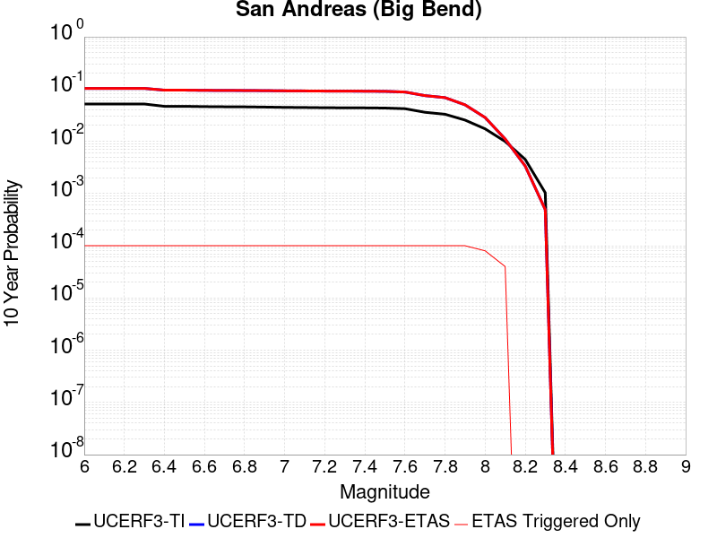 |

| Magnitude | 1 wk TI Prob | 1 wk TD Prob | 1 wk ETAS Prob | 1 wk ETAS/TD Gain | 1 wk ETAS Triggered Only | 1 mo TI Prob | 1 mo TD Prob | 1 mo ETAS Prob | 1 mo ETAS/TD Gain | 1 mo ETAS Triggered Only | 1 yr TI Prob | 1 yr TD Prob | 1 yr ETAS Prob | 1 yr ETAS/TD Gain | 1 yr ETAS Triggered Only | 10 yr TI Prob | 10 yr TD Prob | 10 yr ETAS Prob | 10 yr ETAS/TD Gain | 10 yr ETAS Triggered Only |
|-----|-----|-----|-----|-----|-----|-----|-----|-----|-----|-----|-----|-----|-----|-----|-----|-----|-----|-----|-----|-----|
| 6.0 | 1.0179969E-4 | 2.0410359E-4 | 2.8200977E-4 | 1.3816992 | 7.792208E-5 | 4.362114E-4 | 8.7443745E-4 | 9.782427E-4 | 1.1187109 | 1.03896105E-4 | 0.0052979486 | 0.010594598 | 0.010697394 | 1.0097026 | 1.03896105E-4 | 0.051734097 | 0.10289851 | 0.102991715 | 1.0009058 | 1.03896105E-4 |
| 6.1 | 1.0179969E-4 | 2.0410359E-4 | 2.8200977E-4 | 1.3816992 | 7.792208E-5 | 4.362114E-4 | 8.7443745E-4 | 9.782427E-4 | 1.1187109 | 1.03896105E-4 | 0.0052979486 | 0.010594598 | 0.010697394 | 1.0097026 | 1.03896105E-4 | 0.051734097 | 0.10289851 | 0.102991715 | 1.0009058 | 1.03896105E-4 |
| 6.2 | 1.0179969E-4 | 2.0410359E-4 | 2.8200977E-4 | 1.3816992 | 7.792208E-5 | 4.362114E-4 | 8.7443745E-4 | 9.782427E-4 | 1.1187109 | 1.03896105E-4 | 0.0052979486 | 0.010594598 | 0.010697394 | 1.0097026 | 1.03896105E-4 | 0.051734097 | 0.10289851 | 0.102991715 | 1.0009058 | 1.03896105E-4 |
| 6.3 | 1.0179969E-4 | 2.0410359E-4 | 2.8200977E-4 | 1.3816992 | 7.792208E-5 | 4.362114E-4 | 8.7443745E-4 | 9.782427E-4 | 1.1187109 | 1.03896105E-4 | 0.0052979486 | 0.010594598 | 0.010697394 | 1.0097026 | 1.03896105E-4 | 0.051734097 | 0.10289851 | 0.102991715 | 1.0009058 | 1.03896105E-4 |
| 6.4 | 9.1639464E-5 | 1.8760894E-4 | 2.655164E-4 | 1.4152652 | 7.792208E-5 | 3.9268145E-4 | 8.0379075E-4 | 9.0760336E-4 | 1.1291537 | 1.03896105E-4 | 0.0047704205 | 0.009742365 | 0.009845249 | 1.0105605 | 1.03896105E-4 | 0.046693064 | 0.09523404 | 0.09532804 | 1.000987 | 1.03896105E-4 |
| 6.5 | 9.1639464E-5 | 1.8760894E-4 | 2.655164E-4 | 1.4152652 | 7.792208E-5 | 3.9268145E-4 | 8.0379075E-4 | 9.0760336E-4 | 1.1291537 | 1.03896105E-4 | 0.0047704205 | 0.009742365 | 0.009845249 | 1.0105605 | 1.03896105E-4 | 0.046693064 | 0.09523404 | 0.09532804 | 1.000987 | 1.03896105E-4 |
| 6.6 | 9.042622E-5 | 1.8567167E-4 | 2.6357928E-4 | 1.4195988 | 7.792208E-5 | 3.8748336E-4 | 7.954933E-4 | 8.9930673E-4 | 1.130502 | 1.03896105E-4 | 0.0047074095 | 0.00964224 | 0.009745134 | 1.0106713 | 1.03896105E-4 | 0.046089325 | 0.094321586 | 0.09441568 | 1.0009977 | 1.03896105E-4 |
| 6.7 | 8.9836685E-5 | 1.8481225E-4 | 2.6271993E-4 | 1.4215504 | 7.792208E-5 | 3.8495753E-4 | 7.918123E-4 | 8.9562614E-4 | 1.1311091 | 1.03896105E-4 | 0.00467679 | 0.009597818 | 0.009700717 | 1.0107211 | 1.03896105E-4 | 0.045795817 | 0.093915194 | 0.09400933 | 1.0010024 | 1.03896105E-4 |
| 6.8 | 8.9471854E-5 | 1.8427697E-4 | 2.6218468E-4 | 1.4227751 | 7.792208E-5 | 3.8339442E-4 | 7.8951963E-4 | 8.933337E-4 | 1.1314902 | 1.03896105E-4 | 0.004657841 | 0.009570151 | 0.0096730525 | 1.0107523 | 1.03896105E-4 | 0.04561414 | 0.09366103 | 0.09375519 | 1.0010054 | 1.03896105E-4 |
| 6.9 | 8.858234E-5 | 1.830914E-4 | 2.6099922E-4 | 1.4255133 | 7.792208E-5 | 3.7958333E-4 | 7.8444165E-4 | 8.882563E-4 | 1.132342 | 1.03896105E-4 | 0.004611638 | 0.009508868 | 0.009611776 | 1.0108223 | 1.03896105E-4 | 0.04517103 | 0.09309975 | 0.09319397 | 1.0010121 | 1.03896105E-4 |
| 7.0 | 8.7433385E-5 | 1.8147116E-4 | 2.593791E-4 | 1.4293131 | 7.792208E-5 | 3.746607E-4 | 7.7750196E-4 | 8.8131725E-4 | 1.1335242 | 1.03896105E-4 | 0.004551957 | 0.00942511 | 0.009528027 | 1.0109195 | 1.03896105E-4 | 0.044598386 | 0.09233145 | 0.09242575 | 1.0010214 | 1.03896105E-4 |
| 7.1 | 8.684964E-5 | 1.805855E-4 | 2.584935E-4 | 1.4314189 | 7.792208E-5 | 3.7215967E-4 | 7.737085E-4 | 8.775242E-4 | 1.1341794 | 1.03896105E-4 | 0.0045216335 | 0.009379324 | 0.009482245 | 1.0109732 | 1.03896105E-4 | 0.04430731 | 0.09191126 | 0.0920056 | 1.0010265 | 1.03896105E-4 |
| 7.2 | 8.606521E-5 | 1.7948652E-4 | 2.5739463E-4 | 1.4340609 | 7.792208E-5 | 3.6879873E-4 | 7.6900143E-4 | 8.728176E-4 | 1.1350013 | 1.03896105E-4 | 0.0044808835 | 0.009322506 | 0.009425434 | 1.0110408 | 1.03896105E-4 | 0.043916024 | 0.09138969 | 0.0914841 | 1.001033 | 1.03896105E-4 |
| 7.3 | 8.568266E-5 | 1.789004E-4 | 2.5680853E-4 | 1.4354833 | 7.792208E-5 | 3.6715972E-4 | 7.6649094E-4 | 8.703074E-4 | 1.1354438 | 1.03896105E-4 | 0.0044610105 | 0.009292203 | 0.009395134 | 1.011077 | 1.03896105E-4 | 0.043725148 | 0.091109 | 0.09120343 | 1.0010364 | 1.03896105E-4 |
| 7.4 | 8.5432206E-5 | 1.7852234E-4 | 2.564305E-4 | 1.4364057 | 7.792208E-5 | 3.6608664E-4 | 7.6487166E-4 | 8.686883E-4 | 1.1357307 | 1.03896105E-4 | 0.004447999 | 0.0092726555 | 0.009375589 | 1.0111006 | 1.03896105E-4 | 0.043600157 | 0.0909278 | 0.09102225 | 1.0010387 | 1.03896105E-4 |
| 7.5 | 8.4791965E-5 | 1.7720247E-4 | 2.5511073E-4 | 1.4396567 | 7.792208E-5 | 3.633435E-4 | 7.5921835E-4 | 8.6303556E-4 | 1.1367422 | 1.03896105E-4 | 0.0044147377 | 0.009204411 | 0.00930735 | 1.0111837 | 1.03896105E-4 | 0.043280575 | 0.090299375 | 0.09039389 | 1.0010467 | 1.03896105E-4 |
| 7.6 | 8.241105E-5 | 1.7160331E-4 | 2.4951203E-4 | 1.4540046 | 7.792208E-5 | 3.531424E-4 | 7.3523563E-4 | 8.390554E-4 | 1.141206 | 1.03896105E-4 | 0.0042910352 | 0.008914847 | 0.009017817 | 1.0115504 | 1.03896105E-4 | 0.042091176 | 0.087656416 | 0.0877512 | 1.0010813 | 1.03896105E-4 |
| 7.7 | 7.00432E-5 | 1.4493566E-4 | 2.2284644E-4 | 1.5375543 | 7.792208E-5 | 3.001506E-4 | 6.21005E-4 | 7.248366E-4 | 1.1671993 | 1.03896105E-4 | 0.0036482112 | 0.0075345673 | 0.0076376805 | 1.0136853 | 1.03896105E-4 | 0.035888977 | 0.07482006 | 0.074916184 | 1.0012847 | 1.03896105E-4 |
| 7.8 | 6.415362E-5 | 1.3229893E-4 | 2.102107E-4 | 1.588907 | 7.792208E-5 | 2.749151E-4 | 5.6687224E-4 | 6.707095E-4 | 1.1831757 | 1.03896105E-4 | 0.0033419547 | 0.006879861 | 0.006983042 | 1.0149976 | 1.03896105E-4 | 0.03292141 | 0.06843511 | 0.06853189 | 1.0014143 | 1.03896105E-4 |
| 7.9 | 4.939911E-5 | 9.529268E-5 | 1.7320733E-4 | 1.8176352 | 7.792208E-5 | 2.116933E-4 | 4.083333E-4 | 5.1218696E-4 | 1.2543355 | 1.03896105E-4 | 0.0025743195 | 0.004960135 | 0.0050635156 | 1.0208423 | 1.03896105E-4 | 0.025447013 | 0.049795263 | 0.049893986 | 1.0019826 | 1.03896105E-4 |
| 8.0 | 3.344983E-5 | 5.3353087E-5 | 1.3127101E-4 | 2.4604201 | 7.792208E-5 | 1.4334853E-4 | 2.2863605E-4 | 3.065403E-4 | 1.3407348 | 7.792208E-5 | 0.0017438711 | 0.0027800924 | 0.002857798 | 1.0279506 | 7.792208E-5 | 0.017302496 | 0.028475642 | 0.028551344 | 1.0026585 | 7.792208E-5 |
| 8.1 | 1.9104898E-5 | 1.9721523E-5 | 7.166855E-5 | 3.634027 | 5.1948053E-5 | 8.1875565E-5 | 8.4518084E-5 | 1.3646175E-4 | 1.6145864 | 5.1948053E-5 | 9.963791E-4 | 0.0010285225 | 0.0010804172 | 1.0504555 | 5.1948053E-5 | 0.009919235 | 0.011036915 | 0.01108829 | 1.0046548 | 5.1948053E-5 |
| 8.2 | 8.643924E-6 | 5.680264E-6 | 5.680264E-6 | 1.0 | 0.0 | 3.704486E-5 | 2.4343763E-5 | 2.4343763E-5 | 1.0 | 0.0 | 4.5092785E-4 | 2.963451E-4 | 2.963451E-4 | 1.0 | 0.0 | 0.0045001395 | 0.0033610219 | 0.0033610219 | 1.0 | 0.0 |
| 8.3 | 1.983087E-6 | 8.001618E-7 | 8.001618E-7 | 1.0 | 0.0 | 8.498917E-6 | 3.4292605E-6 | 3.4292605E-6 | 1.0 | 0.0 | 1.034694E-4 | 4.1750463E-5 | 4.1750463E-5 | 1.0 | 0.0 | 0.0010342124 | 4.915874E-4 | 4.915874E-4 | 1.0 | 0.0 |

## San Jacinto (Borrego)
*[(top)](#table-of-contents)*

| 1 Week | 1 Month | 1 Year | 10 Year |
|-----|-----|-----|-----|
|  |  |  |  |

| Magnitude | 1 wk TI Prob | 1 wk TD Prob | 1 wk ETAS Prob | 1 wk ETAS/TD Gain | 1 wk ETAS Triggered Only | 1 mo TI Prob | 1 mo TD Prob | 1 mo ETAS Prob | 1 mo ETAS/TD Gain | 1 mo ETAS Triggered Only | 1 yr TI Prob | 1 yr TD Prob | 1 yr ETAS Prob | 1 yr ETAS/TD Gain | 1 yr ETAS Triggered Only | 10 yr TI Prob | 10 yr TD Prob | 10 yr ETAS Prob | 10 yr ETAS/TD Gain | 10 yr ETAS Triggered Only |
|-----|-----|-----|-----|-----|-----|-----|-----|-----|-----|-----|-----|-----|-----|-----|-----|-----|-----|-----|-----|-----|
| 6.0 | 3.543992E-5 | 2.8261535E-5 | 1.0618141E-4 | 3.7571 | 7.792208E-5 | 1.5187653E-4 | 1.2111531E-4 | 2.2499883E-4 | 1.8577241 | 1.03896105E-4 | 0.0018475284 | 0.0014735938 | 0.0015773368 | 1.0704013 | 1.03896105E-4 | 0.018322436 | 0.015044008 | 0.015146341 | 1.0068022 | 1.03896105E-4 |
| 6.1 | 3.542281E-5 | 2.8261535E-5 | 1.0618141E-4 | 3.7571 | 7.792208E-5 | 1.5180321E-4 | 1.2111531E-4 | 2.2499883E-4 | 1.8577241 | 1.03896105E-4 | 0.0018466372 | 0.0014735938 | 0.0015773368 | 1.0704013 | 1.03896105E-4 | 0.018313672 | 0.015044008 | 0.015146341 | 1.0068022 | 1.03896105E-4 |
| 6.2 | 3.4688688E-5 | 2.8261533E-5 | 1.0618141E-4 | 3.7571 | 7.792208E-5 | 1.4865733E-4 | 1.2111531E-4 | 2.2499883E-4 | 1.8577242 | 1.03896105E-4 | 0.0018084005 | 0.0014735938 | 0.0015773368 | 1.0704013 | 1.03896105E-4 | 0.017937548 | 0.015044007 | 0.015146341 | 1.0068022 | 1.03896105E-4 |
| 6.3 | 3.2087122E-5 | 2.8106686E-5 | 1.0602657E-4 | 3.77229 | 7.792208E-5 | 1.3750899E-4 | 1.2045173E-4 | 2.2433532E-4 | 1.8624499 | 1.03896105E-4 | 0.0016728862 | 0.0014655257 | 0.0015692696 | 1.0707895 | 1.03896105E-4 | 0.016603488 | 0.014965082 | 0.015067423 | 1.0068387 | 1.03896105E-4 |
| 6.4 | 3.1828724E-5 | 2.807361E-5 | 1.059935E-4 | 3.7755566 | 7.792208E-5 | 1.364017E-4 | 1.2030999E-4 | 2.2419359E-4 | 1.8634661 | 1.03896105E-4 | 0.0016594254 | 0.0014638023 | 0.0015675463 | 1.070873 | 1.03896105E-4 | 0.016470885 | 0.014948252 | 0.015050595 | 1.0068465 | 1.03896105E-4 |
| 6.5 | 3.1563577E-5 | 2.7812603E-5 | 1.0573251E-4 | 3.8016043 | 7.792208E-5 | 1.3526545E-4 | 1.1919149E-4 | 2.2307521E-4 | 1.8715699 | 1.03896105E-4 | 0.0016456128 | 0.0014502028 | 0.0015539482 | 1.0715386 | 1.03896105E-4 | 0.0163348 | 0.014813996 | 0.014916353 | 1.0069095 | 1.03896105E-4 |
| 6.6 | 3.1467625E-5 | 2.7656239E-5 | 1.0557616E-4 | 3.8174446 | 7.792208E-5 | 1.3485427E-4 | 1.1852142E-4 | 2.2240522E-4 | 1.876498 | 1.03896105E-4 | 0.0016406142 | 0.0014420555 | 0.0015458018 | 1.0719433 | 1.03896105E-4 | 0.016285548 | 0.014733896 | 0.014836261 | 1.0069476 | 1.03896105E-4 |
| 6.7 | 3.1223695E-5 | 2.727366E-5 | 1.0519361E-4 | 3.8569674 | 7.792208E-5 | 1.3380898E-4 | 1.1688194E-4 | 2.207659E-4 | 1.888794 | 1.03896105E-4 | 0.0016279068 | 0.001422121 | 0.0015258694 | 1.0729532 | 1.03896105E-4 | 0.01616033 | 0.014537855 | 0.014640241 | 1.0070426 | 1.03896105E-4 |
| 6.8 | 3.1015585E-5 | 2.7093998E-5 | 1.0501397E-4 | 3.8759124 | 7.792208E-5 | 1.3291716E-4 | 1.1611204E-4 | 2.1999607E-4 | 1.8946879 | 1.03896105E-4 | 0.001617065 | 0.0014127595 | 0.0015165089 | 1.0734373 | 1.03896105E-4 | 0.016053487 | 0.014444801 | 0.014547196 | 1.0070888 | 1.03896105E-4 |
| 6.9 | 2.6641965E-5 | 2.2498154E-5 | 1.0041848E-4 | 4.46341 | 7.792208E-5 | 1.1417485E-4 | 9.641712E-5 | 2.0030321E-4 | 2.077465 | 1.03896105E-4 | 0.0013891924 | 0.0011732503 | 0.0012770245 | 1.0884502 | 1.03896105E-4 | 0.0138054015 | 0.01204618 | 0.0121488245 | 1.008521 | 1.03896105E-4 |
| 7.0 | 2.3854353E-5 | 2.0782958E-5 | 9.8703415E-5 | 4.749248 | 7.792208E-5 | 1.02228936E-4 | 8.9066794E-5 | 1.9295364E-4 | 2.1663926 | 1.03896105E-4 | 0.0012439266 | 0.0010838513 | 0.0011876349 | 1.0957544 | 1.03896105E-4 | 0.012369866 | 0.011141631 | 0.011244369 | 1.0092212 | 1.03896105E-4 |
| 7.1 | 2.3672901E-5 | 2.0619162E-5 | 9.853963E-5 | 4.779032 | 7.792208E-5 | 1.0145135E-4 | 8.836485E-5 | 1.9225178E-4 | 2.1756587 | 1.03896105E-4 | 0.0012344702 | 0.0010753138 | 0.0011790982 | 1.0965154 | 1.03896105E-4 | 0.0122763505 | 0.011056654 | 0.011159401 | 1.0092928 | 1.03896105E-4 |
| 7.2 | 2.2717244E-5 | 1.9844307E-5 | 9.776484E-5 | 4.926594 | 7.792208E-5 | 9.735599E-5 | 8.504427E-5 | 1.8893153E-4 | 2.221567 | 1.03896105E-4 | 0.0011846646 | 0.0010349245 | 0.0011387131 | 1.1002861 | 1.03896105E-4 | 0.01178369 | 0.010653099 | 0.010755889 | 1.0096488 | 1.03896105E-4 |
| 7.3 | 2.1016205E-5 | 1.8682242E-5 | 9.660286E-5 | 5.170839 | 7.792208E-5 | 9.006634E-5 | 8.00643E-5 | 1.8395208E-4 | 2.2975543 | 1.03896105E-4 | 0.001096006 | 9.743491E-4 | 0.001078144 | 1.1065274 | 1.03896105E-4 | 0.010906163 | 0.010046812 | 0.010149663 | 1.0102373 | 1.03896105E-4 |
| 7.4 | 2.0683625E-5 | 1.8483997E-5 | 9.6404634E-5 | 5.215573 | 7.792208E-5 | 8.86411E-5 | 7.921474E-5 | 1.8310262E-4 | 2.3114715 | 1.03896105E-4 | 0.001078671 | 9.640148E-4 | 0.0010678107 | 1.1076705 | 1.03896105E-4 | 0.010734501 | 0.009943142 | 0.010046004 | 1.0103451 | 1.03896105E-4 |
| 7.5 | 1.9993966E-5 | 1.8076502E-5 | 9.599717E-5 | 5.3106055 | 7.792208E-5 | 8.568561E-5 | 7.746843E-5 | 1.8135649E-4 | 2.3410373 | 1.03896105E-4 | 0.001042723 | 9.427721E-4 | 0.0010465703 | 1.1100988 | 1.03896105E-4 | 0.010378438 | 0.009728766 | 0.009831651 | 1.0105754 | 1.03896105E-4 |
| 7.6 | 1.788966E-5 | 1.671811E-5 | 9.463888E-5 | 5.66086 | 7.792208E-5 | 7.666772E-5 | 7.164709E-5 | 1.7553575E-4 | 2.4500053 | 1.03896105E-4 | 9.3302975E-4 | 8.7195594E-4 | 9.757615E-4 | 1.1190491 | 1.03896105E-4 | 0.00929122 | 0.009014663 | 0.009117623 | 1.0114213 | 1.03896105E-4 |
| 7.7 | 1.5125781E-5 | 1.451155E-5 | 9.24325E-5 | 6.369581 | 7.792208E-5 | 6.4823165E-5 | 6.219088E-5 | 1.6608051E-4 | 2.6704965 | 1.03896105E-4 | 7.889362E-4 | 7.5691176E-4 | 8.607292E-4 | 1.1371592 | 1.03896105E-4 | 0.007861412 | 0.007858045 | 0.007961125 | 1.0131177 | 1.03896105E-4 |
| 7.8 | 1.250089E-5 | 1.2893317E-5 | 6.48407E-5 | 5.029016 | 5.1948053E-5 | 5.3574146E-5 | 5.5255903E-5 | 1.07201085E-4 | 1.9400839 | 5.1948053E-5 | 6.5207E-4 | 6.7253364E-4 | 7.244468E-4 | 1.0771904 | 5.1948053E-5 | 0.006501599 | 0.0070056715 | 0.0070572556 | 1.0073632 | 5.1948053E-5 |
| 7.9 | 9.561E-6 | 9.9834015E-6 | 6.1930936E-5 | 6.20339 | 5.1948053E-5 | 4.0975072E-5 | 4.278531E-5 | 9.4731135E-5 | 2.2141044 | 5.1948053E-5 | 4.987573E-4 | 5.207872E-4 | 5.727082E-4 | 1.0996971 | 5.1948053E-5 | 0.0049763937 | 0.005472866 | 0.0055245296 | 1.00944 | 5.1948053E-5 |
| 8.0 | 8.01699E-6 | 8.50074E-6 | 3.4474546E-5 | 4.055476 | 2.5974026E-5 | 3.4358076E-5 | 3.6431236E-5 | 6.240432E-5 | 1.7129344 | 2.5974026E-5 | 4.1822926E-4 | 4.4346057E-4 | 4.6942307E-4 | 1.0585452 | 2.5974026E-5 | 0.0041744304 | 0.0046825903 | 0.0047084424 | 1.0055209 | 2.5974026E-5 |
| 8.1 | 6.541947E-6 | 6.6294883E-6 | 3.260334E-5 | 4.9179273 | 2.5974026E-5 | 2.8036617E-5 | 2.8411787E-5 | 5.4385073E-5 | 1.914173 | 2.5974026E-5 | 3.4129233E-4 | 3.4585912E-4 | 3.7182416E-4 | 1.0750741 | 2.5974026E-5 | 0.0034076865 | 0.003669098 | 0.003694977 | 1.0070531 | 2.5974026E-5 |
| 8.2 | 1.7968189E-6 | 8.2923634E-7 | 8.2923634E-7 | 1.0 | 0.0 | 7.70063E-6 | 3.5538653E-6 | 3.5538653E-6 | 1.0 | 0.0 | 9.3751136E-5 | 4.3267475E-5 | 4.3267475E-5 | 1.0 | 0.0 | 9.371159E-4 | 4.8922515E-4 | 4.8922515E-4 | 1.0 | 0.0 |
| 8.3 | 1.5167889E-7 | 5.1493988E-8 | 5.1493988E-8 | 1.0 | 0.0 | 6.500522E-7 | 2.206885E-7 | 2.206885E-7 | 1.0 | 0.0 | 7.9143565E-6 | 2.6868797E-6 | 2.6868797E-6 | 1.0 | 0.0 | 7.914075E-5 | 3.1145588E-5 | 3.1145588E-5 | 1.0 | 0.0 |

## San Andreas (Cholame) rev
*[(top)](#table-of-contents)*

| 1 Week | 1 Month | 1 Year | 10 Year |
|-----|-----|-----|-----|
| 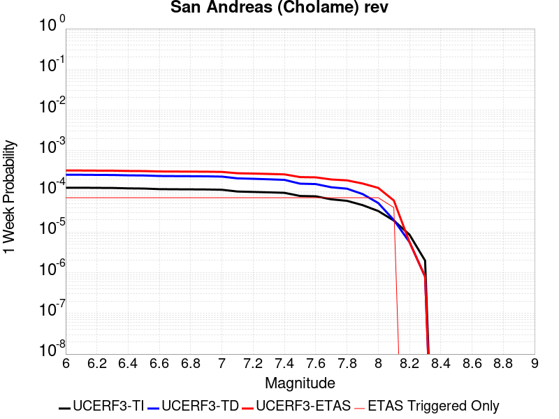 |  |  |  |

| Magnitude | 1 wk TI Prob | 1 wk TD Prob | 1 wk ETAS Prob | 1 wk ETAS/TD Gain | 1 wk ETAS Triggered Only | 1 mo TI Prob | 1 mo TD Prob | 1 mo ETAS Prob | 1 mo ETAS/TD Gain | 1 mo ETAS Triggered Only | 1 yr TI Prob | 1 yr TD Prob | 1 yr ETAS Prob | 1 yr ETAS/TD Gain | 1 yr ETAS Triggered Only | 10 yr TI Prob | 10 yr TD Prob | 10 yr ETAS Prob | 10 yr ETAS/TD Gain | 10 yr ETAS Triggered Only |
|-----|-----|-----|-----|-----|-----|-----|-----|-----|-----|-----|-----|-----|-----|-----|-----|-----|-----|-----|-----|-----|
| 6.0 | 1.2302514E-4 | 2.558767E-4 | 3.3377885E-4 | 1.3044518 | 7.792208E-5 | 5.27144E-4 | 0.0010961553 | 0.0011999374 | 1.0946784 | 1.03896105E-4 | 0.0063991086 | 0.013264549 | 0.013367066 | 1.0077287 | 1.03896105E-4 | 0.06217949 | 0.12598167 | 0.12607248 | 1.0007207 | 1.03896105E-4 |
| 6.1 | 1.2302514E-4 | 2.558767E-4 | 3.3377885E-4 | 1.3044518 | 7.792208E-5 | 5.27144E-4 | 0.0010961553 | 0.0011999374 | 1.0946784 | 1.03896105E-4 | 0.0063991086 | 0.013264549 | 0.013367066 | 1.0077287 | 1.03896105E-4 | 0.06217949 | 0.12598167 | 0.12607248 | 1.0007207 | 1.03896105E-4 |
| 6.2 | 1.2203569E-4 | 2.5403977E-4 | 3.3194205E-4 | 1.3066539 | 7.792208E-5 | 5.2290526E-4 | 0.0010882893 | 0.0011920723 | 1.0953635 | 1.03896105E-4 | 0.006347804 | 0.013169942 | 0.01327247 | 1.007785 | 1.03896105E-4 | 0.061695136 | 0.12516876 | 0.12525965 | 1.0007261 | 1.03896105E-4 |
| 6.3 | 1.2142645E-4 | 2.528966E-4 | 3.3079897E-4 | 1.3080404 | 7.792208E-5 | 5.202953E-4 | 0.001083394 | 0.0011871776 | 1.0957948 | 1.03896105E-4 | 0.006316212 | 0.013111061 | 0.013213595 | 1.0078204 | 1.03896105E-4 | 0.06139677 | 0.12466285 | 0.12475379 | 1.0007296 | 1.03896105E-4 |
| 6.4 | 1.1865206E-4 | 2.4792837E-4 | 3.2583112E-4 | 1.3142148 | 7.792208E-5 | 5.0840975E-4 | 0.0010621191 | 0.0011659048 | 1.0977157 | 1.03896105E-4 | 0.006172335 | 0.012855121 | 0.012957682 | 1.0079782 | 1.03896105E-4 | 0.060036868 | 0.12245626 | 0.12254743 | 1.0007446 | 1.03896105E-4 |
| 6.5 | 1.17443946E-4 | 2.4584573E-4 | 3.2374865E-4 | 1.3168772 | 7.792208E-5 | 5.032341E-4 | 0.0010532007 | 0.0011569874 | 1.0985441 | 1.03896105E-4 | 0.006109677 | 0.012747813 | 0.012850384 | 1.0080463 | 1.03896105E-4 | 0.059444077 | 0.12152345 | 0.12161472 | 1.000751 | 1.03896105E-4 |
| 6.6 | 1.13579066E-4 | 2.388898E-4 | 3.1679327E-4 | 1.3261063 | 7.792208E-5 | 4.866766E-4 | 0.0010234133 | 0.001127203 | 1.1014153 | 1.03896105E-4 | 0.0059092017 | 0.012389328 | 0.012491937 | 1.0082821 | 1.03896105E-4 | 0.057545185 | 0.1184282 | 0.11851979 | 1.0007734 | 1.03896105E-4 |
| 6.7 | 1.1271412E-4 | 2.3732395E-4 | 3.1522755E-4 | 1.3282584 | 7.792208E-5 | 4.829711E-4 | 0.0010167077 | 0.0011204982 | 1.1020849 | 1.03896105E-4 | 0.005864331 | 0.012308614 | 0.012411231 | 1.008337 | 1.03896105E-4 | 0.057119697 | 0.117728546 | 0.11782021 | 1.0007786 | 1.03896105E-4 |
| 6.8 | 1.1217975E-4 | 2.361992E-4 | 3.1410286E-4 | 1.329822 | 7.792208E-5 | 4.8068175E-4 | 0.001011891 | 0.0011156821 | 1.1025712 | 1.03896105E-4 | 0.005836608 | 0.012250633 | 0.012353256 | 1.008377 | 1.03896105E-4 | 0.056856725 | 0.11722409 | 0.11731581 | 1.0007824 | 1.03896105E-4 |
| 6.9 | 1.1146753E-4 | 2.346768E-4 | 3.1258058E-4 | 1.3319621 | 7.792208E-5 | 4.7763053E-4 | 0.0010053716 | 0.0011091633 | 1.1032372 | 1.03896105E-4 | 0.0057996577 | 0.012172148 | 0.012274779 | 1.0084317 | 1.03896105E-4 | 0.056506127 | 0.11654113 | 0.116632916 | 1.0007876 | 1.03896105E-4 |
| 7.0 | 1.0965793E-4 | 2.3088048E-4 | 3.0878457E-4 | 1.3374217 | 7.792208E-5 | 4.698779E-4 | 9.89114E-4 | 0.0010929074 | 1.1049356 | 1.03896105E-4 | 0.005705768 | 0.011976405 | 0.012079057 | 1.0085711 | 1.03896105E-4 | 0.055614736 | 0.1148323 | 0.11492427 | 1.0008008 | 1.03896105E-4 |
| 7.1 | 9.927982E-5 | 2.0893132E-4 | 2.868371E-4 | 1.3728776 | 7.792208E-5 | 4.2541555E-4 | 8.9511374E-4 | 9.989168E-4 | 1.1159664 | 1.03896105E-4 | 0.0051671406 | 0.010843857 | 0.010946627 | 1.0094773 | 1.03896105E-4 | 0.05048634 | 0.10489253 | 0.10498553 | 1.0008866 | 1.03896105E-4 |
| 7.2 | 9.696786E-5 | 2.0394818E-4 | 2.8185436E-4 | 1.3819901 | 7.792208E-5 | 4.1551032E-4 | 8.737719E-4 | 9.775772E-4 | 1.1188014 | 1.03896105E-4 | 0.00504711 | 0.010586574 | 0.01068937 | 1.0097101 | 1.03896105E-4 | 0.04934009 | 0.10262802 | 0.10272125 | 1.0009085 | 1.03896105E-4 |
| 7.3 | 9.4727984E-5 | 1.9818364E-4 | 2.760903E-4 | 1.3931032 | 7.792208E-5 | 4.0591392E-4 | 8.49083E-4 | 9.528909E-4 | 1.1222588 | 1.03896105E-4 | 0.0049308087 | 0.010288864 | 0.010391692 | 1.009994 | 1.03896105E-4 | 0.048228268 | 0.09998308 | 0.10007659 | 1.0009352 | 1.03896105E-4 |
| 7.4 | 9.220358E-5 | 1.9182474E-4 | 2.6973189E-4 | 1.406137 | 7.792208E-5 | 3.9509835E-4 | 8.21848E-4 | 9.2565874E-4 | 1.1263138 | 1.03896105E-4 | 0.004799717 | 0.00996035 | 0.0100632105 | 1.0103271 | 1.03896105E-4 | 0.046973653 | 0.09703452 | 0.09712833 | 1.0009668 | 1.03896105E-4 |
| 7.5 | 7.71631E-5 | 1.5475159E-4 | 2.3266161E-4 | 1.5034522 | 7.792208E-5 | 3.306571E-4 | 6.630527E-4 | 7.668799E-4 | 1.1565897 | 1.03896105E-4 | 0.0040183207 | 0.008042862 | 0.008145922 | 1.0128139 | 1.03896105E-4 | 0.03946433 | 0.07961034 | 0.07970597 | 1.0012012 | 1.03896105E-4 |
| 7.6 | 7.5634416E-5 | 1.5130898E-4 | 2.2921927E-4 | 1.5149086 | 7.792208E-5 | 3.241072E-4 | 6.4830604E-4 | 7.5213483E-4 | 1.1601539 | 1.03896105E-4 | 0.0039388672 | 0.007864631 | 0.0079677105 | 1.0131067 | 1.03896105E-4 | 0.038697794 | 0.07795997 | 0.07805576 | 1.0012288 | 1.03896105E-4 |
| 7.7 | 6.3783E-5 | 1.2622074E-4 | 2.0413299E-4 | 1.6172698 | 7.792208E-5 | 2.7332708E-4 | 5.408339E-4 | 6.446738E-4 | 1.1919997 | 1.03896105E-4 | 0.0033226798 | 0.0065648016 | 0.0066680154 | 1.0157224 | 1.03896105E-4 | 0.032734364 | 0.06574206 | 0.06583913 | 1.0014764 | 1.03896105E-4 |
| 7.8 | 5.863422E-5 | 1.16556854E-4 | 1.9446985E-4 | 1.6684549 | 7.792208E-5 | 2.512653E-4 | 4.994338E-4 | 6.03278E-4 | 1.2079239 | 1.03896105E-4 | 0.003054864 | 0.0060636755 | 0.0061669415 | 1.0170302 | 1.03896105E-4 | 0.030132094 | 0.060756896 | 0.060854476 | 1.0016061 | 1.03896105E-4 |
| 7.9 | 4.595283E-5 | 8.6021086E-5 | 1.6393646E-4 | 1.9057707 | 7.792208E-5 | 1.9692584E-4 | 3.686097E-4 | 4.724675E-4 | 1.2817554 | 1.03896105E-4 | 0.0023949358 | 0.0044785957 | 0.0045820265 | 1.0230944 | 1.03896105E-4 | 0.023692891 | 0.04519146 | 0.04529066 | 1.0021951 | 1.03896105E-4 |
| 8.0 | 3.2950178E-5 | 5.187817E-5 | 1.297962E-4 | 2.5019426 | 7.792208E-5 | 1.412074E-4 | 2.2231608E-4 | 3.0022083E-4 | 1.3504233 | 7.792208E-5 | 0.0017178444 | 0.0027033405 | 0.002781052 | 1.0287465 | 7.792208E-5 | 0.017046256 | 0.027724383 | 0.027800145 | 1.0027326 | 7.792208E-5 |
| 8.1 | 1.9177472E-5 | 1.9734442E-5 | 7.168147E-5 | 3.6323028 | 5.1948053E-5 | 8.218658E-5 | 8.457344E-5 | 1.365171E-4 | 1.614184 | 5.1948053E-5 | 0.0010001622 | 0.0010291958 | 0.0010810905 | 1.0504224 | 5.1948053E-5 | 0.009956728 | 0.011045779 | 0.011097153 | 1.0046511 | 5.1948053E-5 |
| 8.2 | 8.643924E-6 | 5.680264E-6 | 5.680264E-6 | 1.0 | 0.0 | 3.704486E-5 | 2.4343763E-5 | 2.4343763E-5 | 1.0 | 0.0 | 4.5092785E-4 | 2.963451E-4 | 2.963451E-4 | 1.0 | 0.0 | 0.0045001395 | 0.0033610219 | 0.0033610219 | 1.0 | 0.0 |
| 8.3 | 1.983087E-6 | 8.001618E-7 | 8.001618E-7 | 1.0 | 0.0 | 8.498917E-6 | 3.4292605E-6 | 3.4292605E-6 | 1.0 | 0.0 | 1.034694E-4 | 4.1750463E-5 | 4.1750463E-5 | 1.0 | 0.0 | 0.0010342124 | 4.915874E-4 | 4.915874E-4 | 1.0 | 0.0 |

## San Andreas (Carrizo) rev
*[(top)](#table-of-contents)*

| 1 Week | 1 Month | 1 Year | 10 Year |
|-----|-----|-----|-----|
|  |  |  |  |

| Magnitude | 1 wk TI Prob | 1 wk TD Prob | 1 wk ETAS Prob | 1 wk ETAS/TD Gain | 1 wk ETAS Triggered Only | 1 mo TI Prob | 1 mo TD Prob | 1 mo ETAS Prob | 1 mo ETAS/TD Gain | 1 mo ETAS Triggered Only | 1 yr TI Prob | 1 yr TD Prob | 1 yr ETAS Prob | 1 yr ETAS/TD Gain | 1 yr ETAS Triggered Only | 10 yr TI Prob | 10 yr TD Prob | 10 yr ETAS Prob | 10 yr ETAS/TD Gain | 10 yr ETAS Triggered Only |
|-----|-----|-----|-----|-----|-----|-----|-----|-----|-----|-----|-----|-----|-----|-----|-----|-----|-----|-----|-----|-----|
| 6.0 | 1.1674632E-4 | 2.4702487E-4 | 3.249277E-4 | 1.3153642 | 7.792208E-5 | 5.002454E-4 | 0.0010582502 | 0.0011620363 | 1.0980734 | 1.03896105E-4 | 0.006073493 | 0.01280858 | 0.012911146 | 1.0080075 | 1.03896105E-4 | 0.0591016 | 0.12221004 | 0.12230124 | 1.0007463 | 1.03896105E-4 |
| 6.1 | 1.1674632E-4 | 2.4702487E-4 | 3.249277E-4 | 1.3153642 | 7.792208E-5 | 5.002454E-4 | 0.0010582502 | 0.0011620363 | 1.0980734 | 1.03896105E-4 | 0.006073493 | 0.01280858 | 0.012911146 | 1.0080075 | 1.03896105E-4 | 0.0591016 | 0.12221004 | 0.12230124 | 1.0007463 | 1.03896105E-4 |
| 6.2 | 1.1674632E-4 | 2.4702487E-4 | 3.249277E-4 | 1.3153642 | 7.792208E-5 | 5.002454E-4 | 0.0010582502 | 0.0011620363 | 1.0980734 | 1.03896105E-4 | 0.006073493 | 0.01280858 | 0.012911146 | 1.0080075 | 1.03896105E-4 | 0.0591016 | 0.12221004 | 0.12230124 | 1.0007463 | 1.03896105E-4 |
| 6.3 | 1.1674632E-4 | 2.4702487E-4 | 3.249277E-4 | 1.3153642 | 7.792208E-5 | 5.002454E-4 | 0.0010582502 | 0.0011620363 | 1.0980734 | 1.03896105E-4 | 0.006073493 | 0.01280858 | 0.012911146 | 1.0080075 | 1.03896105E-4 | 0.0591016 | 0.12221004 | 0.12230124 | 1.0007463 | 1.03896105E-4 |
| 6.4 | 1.1674632E-4 | 2.4702487E-4 | 3.249277E-4 | 1.3153642 | 7.792208E-5 | 5.002454E-4 | 0.0010582502 | 0.0011620363 | 1.0980734 | 1.03896105E-4 | 0.006073493 | 0.01280858 | 0.012911146 | 1.0080075 | 1.03896105E-4 | 0.0591016 | 0.12221004 | 0.12230124 | 1.0007463 | 1.03896105E-4 |
| 6.5 | 1.13136164E-4 | 2.4020836E-4 | 3.1811174E-4 | 1.3243158 | 7.792208E-5 | 4.847792E-4 | 0.0010290599 | 0.001132849 | 1.1008582 | 1.03896105E-4 | 0.0058862255 | 0.0124572925 | 0.0125598945 | 1.0082363 | 1.03896105E-4 | 0.057327334 | 0.119173534 | 0.11926504 | 1.000768 | 1.03896105E-4 |
| 6.6 | 1.13136164E-4 | 2.4020836E-4 | 3.1811174E-4 | 1.3243158 | 7.792208E-5 | 4.847792E-4 | 0.0010290599 | 0.001132849 | 1.1008582 | 1.03896105E-4 | 0.0058862255 | 0.0124572925 | 0.0125598945 | 1.0082363 | 1.03896105E-4 | 0.057327334 | 0.119173534 | 0.11926504 | 1.000768 | 1.03896105E-4 |
| 6.7 | 1.1149675E-4 | 2.3711297E-4 | 3.1501657E-4 | 1.3285506 | 7.792208E-5 | 4.777557E-4 | 0.0010158042 | 0.0011195948 | 1.1021757 | 1.03896105E-4 | 0.0058011734 | 0.012297736 | 0.012400354 | 1.0083445 | 1.03896105E-4 | 0.05652051 | 0.11779478 | 0.11788644 | 1.0007781 | 1.03896105E-4 |
| 6.8 | 1.1103589E-4 | 2.3612993E-4 | 3.1403362E-4 | 1.3299187 | 7.792208E-5 | 4.7578133E-4 | 0.0010115944 | 0.0011153854 | 1.1026014 | 1.03896105E-4 | 0.005777263 | 0.0122470595 | 0.012349683 | 1.0083795 | 1.03896105E-4 | 0.056293584 | 0.11735426 | 0.11744596 | 1.0007814 | 1.03896105E-4 |
| 6.9 | 1.1053259E-4 | 2.3504878E-4 | 3.1295256E-4 | 1.3314365 | 7.792208E-5 | 4.7362508E-4 | 0.0010069646 | 0.0011107561 | 1.1030736 | 1.03896105E-4 | 0.0057511497 | 0.012191323 | 0.0122939525 | 1.0084182 | 1.03896105E-4 | 0.05604569 | 0.11686914 | 0.11696089 | 1.0007851 | 1.03896105E-4 |
| 7.0 | 1.1005377E-4 | 2.3405258E-4 | 3.1195642E-4 | 1.3328476 | 7.792208E-5 | 4.7157376E-4 | 0.0010026984 | 0.0011064904 | 1.1035126 | 1.03896105E-4 | 0.0057263062 | 0.012139962 | 0.0122425975 | 1.0084543 | 1.03896105E-4 | 0.055809796 | 0.11641989 | 0.11651169 | 1.0007886 | 1.03896105E-4 |
| 7.1 | 1.0308142E-4 | 2.190775E-4 | 2.969825E-4 | 1.3556048 | 7.792208E-5 | 4.417027E-4 | 9.3856675E-4 | 0.0010423653 | 1.1105926 | 1.03896105E-4 | 0.0053644776 | 0.011367505 | 0.01147022 | 1.0090358 | 1.03896105E-4 | 0.052368138 | 0.10967 | 0.109762505 | 1.0008434 | 1.03896105E-4 |
| 7.2 | 1.0027479E-4 | 2.131273E-4 | 2.9103277E-4 | 1.3655349 | 7.792208E-5 | 4.296783E-4 | 9.13084E-4 | 0.0010168853 | 1.113682 | 1.03896105E-4 | 0.0052187922 | 0.011060443 | 0.01116319 | 1.0092896 | 1.03896105E-4 | 0.050979212 | 0.10696822 | 0.107061 | 1.0008674 | 1.03896105E-4 |
| 7.3 | 9.816942E-5 | 2.0782916E-4 | 2.8573503E-4 | 1.3748554 | 7.792208E-5 | 4.2065824E-4 | 8.9039333E-4 | 9.94197E-4 | 1.1165817 | 1.03896105E-4 | 0.005109493 | 0.0107869515 | 0.010889728 | 1.0095278 | 1.03896105E-4 | 0.049935985 | 0.10453878 | 0.10463182 | 1.0008899 | 1.03896105E-4 |
| 7.4 | 9.5634205E-5 | 2.0145954E-4 | 2.7936592E-4 | 1.3867098 | 7.792208E-5 | 4.0979648E-4 | 8.6311327E-4 | 9.669197E-4 | 1.1202698 | 1.03896105E-4 | 0.0049778637 | 0.010458045 | 0.010560854 | 1.0098307 | 1.03896105E-4 | 0.048678253 | 0.10159893 | 0.101692274 | 1.0009187 | 1.03896105E-4 |
| 7.5 | 8.052417E-5 | 1.6424242E-4 | 2.421517E-4 | 1.4743555 | 7.792208E-5 | 3.4505792E-4 | 7.037064E-4 | 8.075294E-4 | 1.1475374 | 1.03896105E-4 | 0.0041929903 | 0.008534053 | 0.008637063 | 1.0120704 | 1.03896105E-4 | 0.04114753 | 0.0841919 | 0.084287055 | 1.0011301 | 1.03896105E-4 |
| 7.6 | 7.897024E-5 | 1.6073721E-4 | 2.3864677E-4 | 1.4847014 | 7.792208E-5 | 3.384E-4 | 6.886921E-4 | 7.925166E-4 | 1.1507561 | 1.03896105E-4 | 0.0041122385 | 0.008352671 | 0.008455699 | 1.0123348 | 1.03896105E-4 | 0.040369697 | 0.08251935 | 0.082614675 | 1.0011551 | 1.03896105E-4 |
| 7.7 | 6.707427E-5 | 1.3553763E-4 | 2.1344915E-4 | 1.574833 | 7.792208E-5 | 2.8742946E-4 | 5.807463E-4 | 6.8458205E-4 | 1.1787971 | 1.03896105E-4 | 0.003493839 | 0.0070476984 | 0.0071508624 | 1.014638 | 1.03896105E-4 | 0.034394164 | 0.07030739 | 0.07040398 | 1.0013739 | 1.03896105E-4 |
| 7.8 | 6.147705E-5 | 1.244901E-4 | 2.0240249E-4 | 1.625852 | 7.792208E-5 | 2.6344648E-4 | 5.3341995E-4 | 6.372607E-4 | 1.1946696 | 1.03896105E-4 | 0.0032027436 | 0.006475076 | 0.0065782997 | 1.0159416 | 1.03896105E-4 | 0.031569764 | 0.0646608 | 0.06475798 | 1.0015029 | 1.03896105E-4 |
| 7.9 | 4.7636717E-5 | 9.061984E-5 | 1.6853485E-4 | 1.8598008 | 7.792208E-5 | 2.0414138E-4 | 3.8831294E-4 | 4.921687E-4 | 1.2674538 | 1.03896105E-4 | 0.0024825884 | 0.00471747 | 0.004820876 | 1.0219198 | 1.03896105E-4 | 0.024550365 | 0.04748465 | 0.047583614 | 1.0020841 | 1.03896105E-4 |
| 8.0 | 3.3554235E-5 | 5.3263848E-5 | 1.3118178E-4 | 2.462867 | 7.792208E-5 | 1.4379594E-4 | 2.2825366E-4 | 3.0615795E-4 | 1.3413057 | 7.792208E-5 | 0.0017493097 | 0.0027754488 | 0.0028531544 | 1.0279976 | 7.792208E-5 | 0.017356034 | 0.028435072 | 0.028510777 | 1.0026624 | 7.792208E-5 |
| 8.1 | 1.9175432E-5 | 1.9734262E-5 | 7.168129E-5 | 3.6323268 | 5.1948053E-5 | 8.217783E-5 | 8.457267E-5 | 1.3651633E-4 | 1.6141896 | 5.1948053E-5 | 0.0010000558 | 0.0010291865 | 0.0010810811 | 1.0504229 | 5.1948053E-5 | 0.009955673 | 0.011045657 | 0.011097032 | 1.0046511 | 5.1948053E-5 |
| 8.2 | 8.643924E-6 | 5.680264E-6 | 5.680264E-6 | 1.0 | 0.0 | 3.704486E-5 | 2.4343763E-5 | 2.4343763E-5 | 1.0 | 0.0 | 4.5092785E-4 | 2.963451E-4 | 2.963451E-4 | 1.0 | 0.0 | 0.0045001395 | 0.0033610219 | 0.0033610219 | 1.0 | 0.0 |
| 8.3 | 1.983087E-6 | 8.001618E-7 | 8.001618E-7 | 1.0 | 0.0 | 8.498917E-6 | 3.4292605E-6 | 3.4292605E-6 | 1.0 | 0.0 | 1.034694E-4 | 4.1750463E-5 | 4.1750463E-5 | 1.0 | 0.0 | 0.0010342124 | 4.915874E-4 | 4.915874E-4 | 1.0 | 0.0 |

## San Andreas (Coachella) rev
*[(top)](#table-of-contents)*

| 1 Week | 1 Month | 1 Year | 10 Year |
|-----|-----|-----|-----|
|  |  |  |  |

| Magnitude | 1 wk TI Prob | 1 wk TD Prob | 1 wk ETAS Prob | 1 wk ETAS/TD Gain | 1 wk ETAS Triggered Only | 1 mo TI Prob | 1 mo TD Prob | 1 mo ETAS Prob | 1 mo ETAS/TD Gain | 1 mo ETAS Triggered Only | 1 yr TI Prob | 1 yr TD Prob | 1 yr ETAS Prob | 1 yr ETAS/TD Gain | 1 yr ETAS Triggered Only | 10 yr TI Prob | 10 yr TD Prob | 10 yr ETAS Prob | 10 yr ETAS/TD Gain | 10 yr ETAS Triggered Only |
|-----|-----|-----|-----|-----|-----|-----|-----|-----|-----|-----|-----|-----|-----|-----|-----|-----|-----|-----|-----|-----|
| 6.0 | 1.1925945E-4 | 3.291473E-4 | 3.5511277E-4 | 1.0788871 | 2.5974026E-5 | 5.110118E-4 | 0.0014098734 | 0.0014358108 | 1.018397 | 2.5974026E-5 | 0.0062038354 | 0.017031463 | 0.017082525 | 1.0029982 | 5.1948053E-5 | 0.060334753 | 0.15336467 | 0.15345263 | 1.0005735 | 1.03896105E-4 |
| 6.1 | 1.1925945E-4 | 3.291473E-4 | 3.5511277E-4 | 1.0788871 | 2.5974026E-5 | 5.110118E-4 | 0.0014098734 | 0.0014358108 | 1.018397 | 2.5974026E-5 | 0.0062038354 | 0.017031463 | 0.017082525 | 1.0029982 | 5.1948053E-5 | 0.060334753 | 0.15336467 | 0.15345263 | 1.0005735 | 1.03896105E-4 |
| 6.2 | 1.07432395E-4 | 3.0414126E-4 | 3.0414126E-4 | 1.0 | 0.0 | 4.603433E-4 | 0.0013028155 | 0.0013028155 | 1.0 | 0.0 | 0.005590286 | 0.01574753 | 0.015773095 | 1.0016234 | 2.5974026E-5 | 0.05451731 | 0.14254856 | 0.14259312 | 1.0003124 | 5.1948053E-5 |
| 6.3 | 1.0718766E-4 | 3.0359422E-4 | 3.0359422E-4 | 1.0 | 0.0 | 4.592948E-4 | 0.0013004733 | 0.0013004733 | 1.0 | 0.0 | 0.005577586 | 0.015719427 | 0.015744993 | 1.0016264 | 2.5974026E-5 | 0.054396555 | 0.142317 | 0.14236155 | 1.000313 | 5.1948053E-5 |
| 6.4 | 1.0355944E-4 | 2.9567248E-4 | 2.9567248E-4 | 1.0 | 0.0 | 4.4375064E-4 | 0.0012665564 | 0.0012665564 | 1.0 | 0.0 | 0.0053892885 | 0.015312363 | 0.01533794 | 1.0016704 | 2.5974026E-5 | 0.052604496 | 0.13887933 | 0.13892408 | 1.0003221 | 5.1948053E-5 |
| 6.5 | 1.0227914E-4 | 2.9286597E-4 | 2.9286597E-4 | 1.0 | 0.0 | 4.382655E-4 | 0.00125454 | 0.00125454 | 1.0 | 0.0 | 0.0053228354 | 0.015168111 | 0.015193691 | 1.0016865 | 2.5974026E-5 | 0.051971316 | 0.13766108 | 0.13770589 | 1.0003254 | 5.1948053E-5 |
| 6.6 | 1.0116757E-4 | 2.9052264E-4 | 2.9052264E-4 | 1.0 | 0.0 | 4.3350324E-4 | 0.0012445069 | 0.0012445069 | 1.0 | 0.0 | 0.0052651367 | 0.015047651 | 0.015073233 | 1.0017002 | 2.5974026E-5 | 0.051421247 | 0.13663979 | 0.13668464 | 1.0003282 | 5.1948053E-5 |
| 6.7 | 1.0050676E-4 | 2.8910773E-4 | 2.8910773E-4 | 1.0 | 0.0 | 4.3067214E-4 | 0.0012384488 | 0.0012384488 | 1.0 | 0.0 | 0.005230834 | 0.014974909 | 0.014974909 | 1.0 | 0.0 | 0.051094085 | 0.13602425 | 0.1360467 | 1.000165 | 2.5974026E-5 |
| 6.8 | 9.976819E-5 | 2.8713958E-4 | 2.8713958E-4 | 1.0 | 0.0 | 4.2750788E-4 | 0.0012300218 | 0.0012300218 | 1.0 | 0.0 | 0.0051924936 | 0.014873716 | 0.014873716 | 1.0 | 0.0 | 0.050728295 | 0.13517484 | 0.13519731 | 1.0001662 | 2.5974026E-5 |
| 6.9 | 9.77719E-5 | 2.820934E-4 | 2.820934E-4 | 1.0 | 0.0 | 4.1895514E-4 | 0.0012084155 | 0.0012084155 | 1.0 | 0.0 | 0.0050888555 | 0.014614218 | 0.014614218 | 1.0 | 0.0 | 0.049738888 | 0.13300022 | 0.13302274 | 1.0001693 | 2.5974026E-5 |
| 7.0 | 8.500761E-5 | 2.4932486E-4 | 2.4932486E-4 | 1.0 | 0.0 | 3.6426744E-4 | 0.0010681008 | 0.0010681008 | 1.0 | 0.0 | 0.0044259406 | 0.012927375 | 0.012927375 | 1.0 | 0.0 | 0.04338823 | 0.11882093 | 0.118843816 | 1.0001926 | 2.5974026E-5 |
| 7.1 | 8.319876E-5 | 2.453303E-4 | 2.453303E-4 | 1.0 | 0.0 | 3.5651738E-4 | 0.0010509952 | 0.0010509952 | 1.0 | 0.0 | 0.004331963 | 0.012721565 | 0.012721565 | 1.0 | 0.0 | 0.042484846 | 0.11703406 | 0.117056996 | 1.000196 | 2.5974026E-5 |
| 7.2 | 7.563917E-5 | 2.2575747E-4 | 2.2575747E-4 | 1.0 | 0.0 | 3.2412758E-4 | 9.6717634E-4 | 9.6717634E-4 | 1.0 | 0.0 | 0.0039391145 | 0.011712493 | 0.011712493 | 1.0 | 0.0 | 0.03870018 | 0.10842431 | 0.10844747 | 1.0002136 | 2.5974026E-5 |
| 7.3 | 7.082985E-5 | 2.088487E-4 | 2.088487E-4 | 1.0 | 0.0 | 3.0352117E-4 | 8.947617E-4 | 8.947617E-4 | 1.0 | 0.0 | 0.0036891096 | 0.010839944 | 0.010839944 | 1.0 | 0.0 | 0.03628465 | 0.10092532 | 0.10094867 | 1.0002314 | 2.5974026E-5 |
| 7.4 | 5.146215E-5 | 1.4396245E-4 | 1.4396245E-4 | 1.0 | 0.0 | 2.2053342E-4 | 6.1683694E-4 | 6.1683694E-4 | 1.0 | 0.0 | 0.0026816884 | 0.007484321 | 0.007484321 | 1.0 | 0.0 | 0.02649557 | 0.07138268 | 0.071406804 | 1.0003378 | 2.5974026E-5 |
| 7.5 | 4.0285166E-5 | 1.10478424E-4 | 1.10478424E-4 | 1.0 | 0.0 | 1.7263928E-4 | 4.7339336E-4 | 4.7339336E-4 | 1.0 | 0.0 | 0.002099857 | 0.0057484037 | 0.0057484037 | 1.0 | 0.0 | 0.020801254 | 0.055483423 | 0.055483423 | 1.0 | 0.0 |
| 7.6 | 3.1168736E-5 | 8.533131E-5 | 8.533131E-5 | 1.0 | 0.0 | 1.3357346E-4 | 3.6565447E-4 | 3.6565447E-4 | 1.0 | 0.0 | 0.0016250437 | 0.004442783 | 0.004442783 | 1.0 | 0.0 | 0.016132116 | 0.043234903 | 0.043234903 | 1.0 | 0.0 |
| 7.7 | 2.2100989E-5 | 6.321754E-5 | 6.321754E-5 | 1.0 | 0.0 | 9.4715084E-5 | 2.7090422E-4 | 2.7090422E-4 | 1.0 | 0.0 | 0.001152546 | 0.0032932772 | 0.0032932772 | 1.0 | 0.0 | 0.011465867 | 0.032276515 | 0.032276515 | 1.0 | 0.0 |
| 7.8 | 1.7484861E-5 | 5.2535514E-5 | 5.2535514E-5 | 1.0 | 0.0 | 7.493296E-5 | 2.251328E-4 | 2.251328E-4 | 1.0 | 0.0 | 9.1192697E-4 | 0.0027375494 | 0.0027375494 | 1.0 | 0.0 | 0.009081938 | 0.026976457 | 0.026976457 | 1.0 | 0.0 |
| 7.9 | 1.3967285E-5 | 3.882949E-5 | 3.882949E-5 | 1.0 | 0.0 | 5.985842E-5 | 1.664015E-4 | 1.664015E-4 | 1.0 | 0.0 | 7.2853256E-4 | 0.002024057 | 0.002024057 | 1.0 | 0.0 | 0.0072614877 | 0.020189794 | 0.020189794 | 1.0 | 0.0 |
| 8.0 | 1.1887396E-5 | 3.158727E-5 | 3.158727E-5 | 1.0 | 0.0 | 5.094499E-5 | 1.3536701E-4 | 1.3536701E-4 | 1.0 | 0.0 | 6.200787E-4 | 0.0016468484 | 0.0016468484 | 1.0 | 0.0 | 0.006183513 | 0.01652257 | 0.01652257 | 1.0 | 0.0 |
| 8.1 | 5.100864E-6 | 9.187861E-6 | 9.187861E-6 | 1.0 | 0.0 | 2.1860664E-5 | 3.9375955E-5 | 3.9375955E-5 | 1.0 | 0.0 | 2.6612106E-4 | 4.7929693E-4 | 4.7929693E-4 | 1.0 | 0.0 | 0.002658026 | 0.005024468 | 0.005024468 | 1.0 | 0.0 |
| 8.2 | 2.3004484E-6 | 2.871653E-6 | 2.871653E-6 | 1.0 | 0.0 | 9.859027E-6 | 1.2307026E-5 | 1.2307026E-5 | 1.0 | 0.0 | 1.2002704E-4 | 1.4982777E-4 | 1.4982777E-4 | 1.0 | 0.0 | 0.0011996223 | 0.0016413967 | 0.0016413967 | 1.0 | 0.0 |
| 8.3 | 1.0424446E-7 | 6.0452116E-8 | 6.0452116E-8 | 1.0 | 0.0 | 4.4676187E-7 | 2.5908048E-7 | 2.5908048E-7 | 1.0 | 0.0 | 5.439312E-6 | 3.1543007E-6 | 3.1543007E-6 | 1.0 | 0.0 | 5.4391792E-5 | 3.313235E-5 | 3.313235E-5 | 1.0 | 0.0 |

## San Jacinto (Superstition Mtn)
*[(top)](#table-of-contents)*

| 1 Week | 1 Month | 1 Year | 10 Year |
|-----|-----|-----|-----|
|  |  |  |  |

| Magnitude | 1 wk TI Prob | 1 wk TD Prob | 1 wk ETAS Prob | 1 wk ETAS/TD Gain | 1 wk ETAS Triggered Only | 1 mo TI Prob | 1 mo TD Prob | 1 mo ETAS Prob | 1 mo ETAS/TD Gain | 1 mo ETAS Triggered Only | 1 yr TI Prob | 1 yr TD Prob | 1 yr ETAS Prob | 1 yr ETAS/TD Gain | 1 yr ETAS Triggered Only | 10 yr TI Prob | 10 yr TD Prob | 10 yr ETAS Prob | 10 yr ETAS/TD Gain | 10 yr ETAS Triggered Only |
|-----|-----|-----|-----|-----|-----|-----|-----|-----|-----|-----|-----|-----|-----|-----|-----|-----|-----|-----|-----|-----|
| 6.0 | 6.4193904E-5 | 9.632058E-5 | 1.7423516E-4 | 1.8089088 | 7.792208E-5 | 2.7508775E-4 | 4.1274485E-4 | 4.9063476E-4 | 1.188712 | 7.792208E-5 | 0.0033440501 | 0.005014996 | 0.0050925273 | 1.0154599 | 7.792208E-5 | 0.03294174 | 0.04898744 | 0.049061548 | 1.0015128 | 7.792208E-5 |
| 6.1 | 6.4193904E-5 | 9.632058E-5 | 1.7423516E-4 | 1.8089088 | 7.792208E-5 | 2.7508775E-4 | 4.1274485E-4 | 4.9063476E-4 | 1.188712 | 7.792208E-5 | 0.0033440501 | 0.005014996 | 0.0050925273 | 1.0154599 | 7.792208E-5 | 0.03294174 | 0.04898744 | 0.049061548 | 1.0015128 | 7.792208E-5 |
| 6.2 | 5.7023593E-5 | 8.3450796E-5 | 1.6136638E-4 | 1.9336709 | 7.792208E-5 | 2.4436394E-4 | 3.5760668E-4 | 4.355009E-4 | 1.2178209 | 7.792208E-5 | 0.002971072 | 0.0043468177 | 0.0044244016 | 1.0178483 | 7.792208E-5 | 0.029316625 | 0.04266259 | 0.04273719 | 1.0017486 | 7.792208E-5 |
| 6.3 | 5.6940098E-5 | 8.329596E-5 | 1.6121154E-4 | 1.9354066 | 7.792208E-5 | 2.4400617E-4 | 3.569433E-4 | 4.3483754E-4 | 1.2182258 | 7.792208E-5 | 0.002966728 | 0.004338773 | 0.0044163573 | 1.0178815 | 7.792208E-5 | 0.029274331 | 0.04258588 | 0.042660482 | 1.0017519 | 7.792208E-5 |
| 6.4 | 5.4171585E-5 | 7.778227E-5 | 1.5569829E-4 | 2.0017195 | 7.792208E-5 | 2.3214328E-4 | 3.3331933E-4 | 4.112154E-4 | 1.2336981 | 7.792208E-5 | 0.0028226813 | 0.0040522623 | 0.004129869 | 1.0191513 | 7.792208E-5 | 0.02787096 | 0.039872114 | 0.03994693 | 1.0018764 | 7.792208E-5 |
| 6.5 | 4.375144E-5 | 5.6685432E-5 | 1.3460309E-4 | 2.3745623 | 7.792208E-5 | 1.874927E-4 | 2.4292158E-4 | 3.2082474E-4 | 1.3206925 | 7.792208E-5 | 0.0022803338 | 0.0029547357 | 0.0030324275 | 1.026294 | 7.792208E-5 | 0.022570757 | 0.029376756 | 0.02945239 | 1.0025746 | 7.792208E-5 |
| 6.6 | 2.772192E-5 | 2.5739886E-5 | 1.0365996E-4 | 4.027211 | 7.792208E-5 | 1.1880282E-4 | 1.1030924E-4 | 1.8822272E-4 | 1.7063187 | 7.792208E-5 | 0.0014454646 | 0.0013422071 | 0.0014200247 | 1.0579773 | 7.792208E-5 | 0.014360986 | 0.013671017 | 0.013747875 | 1.0056219 | 7.792208E-5 |
| 6.7 | 2.7124124E-5 | 2.4949653E-5 | 1.0286979E-4 | 4.123095 | 7.792208E-5 | 1.1624106E-4 | 1.0692281E-4 | 1.8483655E-4 | 1.7286916 | 7.792208E-5 | 0.0014143161 | 0.0013010271 | 0.0013788479 | 1.0598148 | 7.792208E-5 | 0.014053487 | 0.013263782 | 0.01334067 | 1.0057969 | 7.792208E-5 |
| 6.8 | 2.5475807E-5 | 2.2408816E-5 | 1.0032915E-4 | 4.4772177 | 7.792208E-5 | 1.0917746E-4 | 9.603431E-5 | 1.7394891E-4 | 1.8113204 | 7.792208E-5 | 0.001328425 | 0.0011686027 | 0.0012464337 | 1.0666018 | 7.792208E-5 | 0.0132051185 | 0.011948765 | 0.012025756 | 1.0064434 | 7.792208E-5 |
| 6.9 | 2.1162023E-5 | 1.7852388E-5 | 9.577307E-5 | 5.364721 | 7.792208E-5 | 9.069123E-5 | 7.650801E-5 | 1.5442412E-4 | 2.0184047 | 7.792208E-5 | 0.0011036064 | 9.3109085E-4 | 0.0010089404 | 1.0836111 | 7.792208E-5 | 0.010981417 | 0.009564555 | 0.009641732 | 1.008069 | 7.792208E-5 |
| 7.0 | 1.8754288E-5 | 1.6378119E-5 | 9.429892E-5 | 5.757616 | 7.792208E-5 | 8.037304E-5 | 7.0190064E-5 | 1.4810667E-4 | 2.1100802 | 7.792208E-5 | 9.781026E-4 | 8.542315E-4 | 9.3208696E-4 | 1.091141 | 7.792208E-5 | 0.009738087 | 0.008782918 | 0.008860155 | 1.0087941 | 7.792208E-5 |
| 7.1 | 1.8678527E-5 | 1.6303058E-5 | 9.422386E-5 | 5.779521 | 7.792208E-5 | 8.0048376E-5 | 6.9868394E-5 | 1.4778503E-4 | 2.1151915 | 7.792208E-5 | 9.7415317E-4 | 8.503182E-4 | 9.28174E-4 | 1.0915608 | 7.792208E-5 | 0.009698939 | 0.008743743 | 0.0088209845 | 1.0088339 | 7.792208E-5 |
| 7.2 | 1.7804578E-5 | 1.559547E-5 | 9.351633E-5 | 5.9963784 | 7.792208E-5 | 7.6303106E-5 | 6.683602E-5 | 1.4475289E-4 | 2.1657915 | 7.792208E-5 | 9.285943E-4 | 8.134271E-4 | 8.912858E-4 | 1.0957168 | 7.792208E-5 | 0.009247236 | 0.00837414 | 0.00845141 | 1.0092272 | 7.792208E-5 |
| 7.3 | 1.6583685E-5 | 1.4742242E-5 | 9.266317E-5 | 6.285555 | 7.792208E-5 | 7.1070994E-5 | 6.317952E-5 | 1.4109668E-4 | 2.233266 | 7.792208E-5 | 8.649459E-4 | 7.6894125E-4 | 8.4680336E-4 | 1.1012589 | 7.792208E-5 | 0.00861587 | 0.007928274 | 0.008005578 | 1.0097505 | 7.792208E-5 |
| 7.4 | 1.6387552E-5 | 1.4606746E-5 | 9.252768E-5 | 6.334586 | 7.792208E-5 | 7.023047E-5 | 6.259885E-5 | 1.4051604E-4 | 2.2447066 | 7.792208E-5 | 8.5472054E-4 | 7.618765E-4 | 8.397392E-4 | 1.1021986 | 7.792208E-5 | 0.008514405 | 0.007857449 | 0.007934759 | 1.009839 | 7.792208E-5 |
| 7.5 | 1.5790754E-5 | 1.4245413E-5 | 9.216638E-5 | 6.469899 | 7.792208E-5 | 6.767291E-5 | 6.105035E-5 | 1.3896768E-4 | 2.2762797 | 7.792208E-5 | 8.236062E-4 | 7.4303657E-4 | 8.209007E-4 | 1.1047919 | 7.792208E-5 | 0.008205604 | 0.007666961 | 0.0077442853 | 1.0100855 | 7.792208E-5 |
| 7.6 | 1.4248672E-5 | 1.3256656E-5 | 9.11777E-5 | 6.877881 | 7.792208E-5 | 6.106431E-5 | 5.6813013E-5 | 1.3473067E-4 | 2.3714755 | 7.792208E-5 | 7.432043E-4 | 6.9148064E-4 | 7.693489E-4 | 1.1126108 | 7.792208E-5 | 0.007407237 | 0.007145507 | 0.007222872 | 1.0108271 | 7.792208E-5 |
| 7.7 | 1.15449975E-5 | 1.1097024E-5 | 8.9018235E-5 | 8.0218115 | 7.792208E-5 | 4.947762E-5 | 4.7557813E-5 | 1.2547619E-4 | 2.6383927 | 7.792208E-5 | 6.022235E-4 | 5.788634E-4 | 6.5674033E-4 | 1.1345342 | 7.792208E-5 | 0.006005941 | 0.006011268 | 0.006088722 | 1.0128847 | 7.792208E-5 |
| 7.8 | 9.1391985E-6 | 9.700172E-6 | 6.164772E-5 | 6.3553224 | 5.1948053E-5 | 3.9167408E-5 | 4.1571508E-5 | 9.35174E-5 | 2.249555 | 5.1948053E-5 | 4.767588E-4 | 5.060162E-4 | 5.5793795E-4 | 1.1026089 | 5.1948053E-5 | 0.0047573727 | 0.005273771 | 0.0053254454 | 1.0097983 | 5.1948053E-5 |
| 7.9 | 6.973017E-6 | 7.5470216E-6 | 5.9494683E-5 | 7.8832 | 5.1948053E-5 | 2.9884017E-5 | 3.234398E-5 | 8.4290354E-5 | 2.60606 | 5.1948053E-5 | 3.6377716E-4 | 3.9371738E-4 | 4.4564498E-4 | 1.1318905 | 5.1948053E-5 | 0.0036318225 | 0.004138271 | 0.004190004 | 1.0125011 | 5.1948053E-5 |
| 8.0 | 5.7638235E-6 | 6.4108012E-6 | 3.238466E-5 | 5.0515776 | 2.5974026E-5 | 2.4701867E-5 | 2.7474576E-5 | 5.344789E-5 | 1.945358 | 2.5974026E-5 | 3.0070372E-4 | 3.3445217E-4 | 3.604175E-4 | 1.0776354 | 2.5974026E-5 | 0.0030029714 | 0.0035325673 | 0.0035584494 | 1.0073267 | 2.5974026E-5 |
| 8.1 | 5.1124434E-6 | 5.633107E-6 | 3.1606985E-5 | 5.6109333 | 2.5974026E-5 | 2.1910288E-5 | 2.4141666E-5 | 5.0115064E-5 | 2.0758743 | 2.5974026E-5 | 2.6672508E-4 | 2.9388565E-4 | 3.1985203E-4 | 1.0883554 | 2.5974026E-5 | 0.0026640517 | 0.0031124477 | 0.003138341 | 1.0083193 | 2.5974026E-5 |
| 8.2 | 1.1075938E-6 | 5.527077E-7 | 5.527077E-7 | 1.0 | 0.0 | 4.7468216E-6 | 2.3687453E-6 | 2.3687453E-6 | 1.0 | 0.0 | 5.779102E-5 | 2.8839117E-5 | 2.8839117E-5 | 1.0 | 0.0 | 5.777599E-4 | 3.2405232E-4 | 3.2405232E-4 | 1.0 | 0.0 |
| 8.3 | 1.3584393E-8 | 4.6533355E-9 | 4.6533355E-9 | 1.0 | 0.0 | 5.8218827E-8 | 1.9942865E-8 | 1.9942865E-8 | 1.0 | 0.0 | 7.0881396E-7 | 2.428044E-7 | 2.428044E-7 | 1.0 | 0.0 | 7.0881174E-6 | 2.7157685E-6 | 2.7157685E-6 | 1.0 | 0.0 |

## Superstition Hills
*[(top)](#table-of-contents)*

| 1 Week | 1 Month | 1 Year | 10 Year |
|-----|-----|-----|-----|
|  |  |  |  |

| Magnitude | 1 wk TI Prob | 1 wk TD Prob | 1 wk ETAS Prob | 1 wk ETAS/TD Gain | 1 wk ETAS Triggered Only | 1 mo TI Prob | 1 mo TD Prob | 1 mo ETAS Prob | 1 mo ETAS/TD Gain | 1 mo ETAS Triggered Only | 1 yr TI Prob | 1 yr TD Prob | 1 yr ETAS Prob | 1 yr ETAS/TD Gain | 1 yr ETAS Triggered Only | 10 yr TI Prob | 10 yr TD Prob | 10 yr ETAS Prob | 10 yr ETAS/TD Gain | 10 yr ETAS Triggered Only |
|-----|-----|-----|-----|-----|-----|-----|-----|-----|-----|-----|-----|-----|-----|-----|-----|-----|-----|-----|-----|-----|
| 6.0 | 6.6865185E-5 | 1.4263028E-5 | 9.2184E-5 | 6.4631433 | 7.792208E-5 | 2.8653358E-4 | 6.1125924E-5 | 1.3904324E-4 | 2.2747016 | 7.792208E-5 | 0.0034829667 | 7.4397033E-4 | 8.2183443E-4 | 1.1046603 | 7.792208E-5 | 0.03428881 | 0.0075850785 | 0.0076624095 | 1.0101951 | 7.792208E-5 |
| 6.1 | 6.544851E-5 | 1.4263028E-5 | 9.2184E-5 | 6.4631433 | 7.792208E-5 | 2.8046346E-4 | 6.1125924E-5 | 1.3904324E-4 | 2.2747016 | 7.792208E-5 | 0.0034092965 | 7.4397033E-4 | 8.2183443E-4 | 1.1046603 | 7.792208E-5 | 0.033574644 | 0.0075850775 | 0.0076624085 | 1.0101951 | 7.792208E-5 |
| 6.2 | 6.544851E-5 | 1.4263028E-5 | 9.2184E-5 | 6.4631433 | 7.792208E-5 | 2.8046346E-4 | 6.1125924E-5 | 1.3904324E-4 | 2.2747016 | 7.792208E-5 | 0.0034092965 | 7.4397033E-4 | 8.2183443E-4 | 1.1046603 | 7.792208E-5 | 0.033574644 | 0.0075850775 | 0.0076624085 | 1.0101951 | 7.792208E-5 |
| 6.3 | 5.2402065E-5 | 1.4263027E-5 | 9.2184E-5 | 6.463144 | 7.792208E-5 | 2.2456095E-4 | 6.112592E-5 | 1.3904323E-4 | 2.2747018 | 7.792208E-5 | 0.0027306017 | 7.439703E-4 | 8.218344E-4 | 1.1046603 | 7.792208E-5 | 0.02697292 | 0.0075850706 | 0.0076624015 | 1.0101951 | 7.792208E-5 |
| 6.4 | 4.542238E-5 | 1.4263026E-5 | 9.218399E-5 | 6.4631443 | 7.792208E-5 | 1.9465282E-4 | 6.112592E-5 | 1.3904323E-4 | 2.2747018 | 7.792208E-5 | 0.0023673223 | 7.439702E-4 | 8.218343E-4 | 1.1046603 | 7.792208E-5 | 0.023422617 | 0.007585067 | 0.0076623983 | 1.0101951 | 7.792208E-5 |
| 6.5 | 2.9672969E-5 | 1.4263024E-5 | 9.218399E-5 | 6.463145 | 7.792208E-5 | 1.2716366E-4 | 6.112591E-5 | 1.3904322E-4 | 2.274702 | 7.792208E-5 | 0.0015471181 | 7.439701E-4 | 8.2183426E-4 | 1.1046603 | 7.792208E-5 | 0.015363912 | 0.0075850594 | 0.0076623904 | 1.0101951 | 7.792208E-5 |
| 6.6 | 2.6056105E-5 | 1.39279155E-5 | 9.184891E-5 | 6.594591 | 7.792208E-5 | 1.1166424E-4 | 5.968979E-5 | 1.3760722E-4 | 2.3053727 | 7.792208E-5 | 0.0013586642 | 7.264971E-4 | 8.043626E-4 | 1.1071793 | 7.792208E-5 | 0.013503874 | 0.0074090934 | 0.0074864384 | 1.0104392 | 7.792208E-5 |
| 6.7 | 1.4611248E-5 | 1.3507138E-5 | 9.142816E-5 | 6.768878 | 7.792208E-5 | 6.261813E-5 | 5.7886537E-5 | 1.358041E-4 | 2.3460395 | 7.792208E-5 | 7.6210906E-4 | 7.0455676E-4 | 7.8242394E-4 | 1.1105194 | 7.792208E-5 | 0.0075950073 | 0.00718999 | 0.0072673517 | 1.0107597 | 7.792208E-5 |
| 6.8 | 1.30607E-5 | 1.10972E-5 | 8.901841E-5 | 8.021701 | 7.792208E-5 | 5.597323E-5 | 4.755861E-5 | 1.2547697E-4 | 2.6383653 | 7.792208E-5 | 6.8126095E-4 | 5.7888107E-4 | 6.56758E-4 | 1.1345302 | 7.792208E-5 | 0.006791762 | 0.005935272 | 0.0060127317 | 1.0130507 | 7.792208E-5 |
| 6.9 | 1.0443096E-5 | 8.302914E-6 | 8.622435E-5 | 10.3848295 | 7.792208E-5 | 4.4755358E-5 | 3.5583445E-5 | 1.1350275E-4 | 3.1897628 | 7.792208E-5 | 5.447602E-4 | 4.331447E-4 | 5.1103305E-4 | 1.1798205 | 7.792208E-5 | 0.005434267 | 0.004465156 | 0.0045427303 | 1.0173732 | 7.792208E-5 |
| 7.0 | 8.045912E-6 | 6.8377494E-6 | 8.47593E-5 | 12.395788 | 7.792208E-5 | 3.4482026E-5 | 2.9304318E-5 | 1.07224114E-4 | 3.6589868 | 7.792208E-5 | 4.197378E-4 | 3.567227E-4 | 4.34617E-4 | 1.2183609 | 7.792208E-5 | 0.0041894587 | 0.0036842793 | 0.0037619143 | 1.0210719 | 7.792208E-5 |
| 7.1 | 8.045912E-6 | 6.8377494E-6 | 8.47593E-5 | 12.395788 | 7.792208E-5 | 3.4482026E-5 | 2.9304318E-5 | 1.07224114E-4 | 3.6589868 | 7.792208E-5 | 4.197378E-4 | 3.567227E-4 | 4.34617E-4 | 1.2183609 | 7.792208E-5 | 0.0041894587 | 0.0036842793 | 0.0037619143 | 1.0210719 | 7.792208E-5 |
| 7.2 | 7.375506E-6 | 6.3429165E-6 | 8.42645E-5 | 13.28482 | 7.792208E-5 | 3.1608928E-5 | 2.7183649E-5 | 1.0510361E-4 | 3.8664274 | 7.792208E-5 | 3.8477074E-4 | 3.3091154E-4 | 4.0880783E-4 | 1.2353991 | 7.792208E-5 | 0.003841052 | 0.003423995 | 0.0035016504 | 1.0226797 | 7.792208E-5 |
| 7.3 | 6.6063913E-6 | 5.8938135E-6 | 8.381543E-5 | 14.220917 | 7.792208E-5 | 2.8312797E-5 | 2.525896E-5 | 1.0317907E-4 | 4.0848503 | 7.792208E-5 | 3.446538E-4 | 3.074852E-4 | 3.853833E-4 | 1.2533394 | 7.792208E-5 | 0.0034411973 | 0.0031874662 | 0.0032651399 | 1.0243685 | 7.792208E-5 |
| 7.4 | 6.4313126E-6 | 5.77493E-6 | 8.3696556E-5 | 14.493087 | 7.792208E-5 | 2.7562477E-5 | 2.4749468E-5 | 1.0266962E-4 | 4.1483564 | 7.792208E-5 | 3.355215E-4 | 3.012838E-4 | 3.7918243E-4 | 1.2585555 | 7.792208E-5 | 0.0033501536 | 0.0031250583 | 0.0032027368 | 1.0248567 | 7.792208E-5 |
| 7.5 | 6.0742927E-6 | 5.569611E-6 | 8.349126E-5 | 14.9905 | 7.792208E-5 | 2.6032423E-5 | 2.3869547E-5 | 1.0178977E-4 | 4.2644196 | 7.792208E-5 | 3.1689866E-4 | 2.9057366E-4 | 3.6847312E-4 | 1.2680885 | 7.792208E-5 | 0.0031644711 | 0.0030162872 | 0.0030939742 | 1.0257559 | 7.792208E-5 |
| 7.6 | 5.6987187E-6 | 5.3866315E-6 | 8.330829E-5 | 15.465749 | 7.792208E-5 | 2.4422852E-5 | 2.3085362E-5 | 1.01005644E-4 | 4.375311 | 7.792208E-5 | 2.9730765E-4 | 2.810287E-4 | 3.589289E-4 | 1.2771965 | 7.792208E-5 | 0.002969102 | 0.0029189105 | 0.0029966051 | 1.0266176 | 7.792208E-5 |
| 7.7 | 5.1658035E-6 | 5.0156445E-6 | 8.293733E-5 | 16.535727 | 7.792208E-5 | 2.2138971E-5 | 2.1495447E-5 | 9.941585E-5 | 4.6249723 | 7.792208E-5 | 2.6950863E-4 | 2.6167626E-4 | 3.3957793E-4 | 1.2977026 | 7.792208E-5 | 0.00269182 | 0.0027229479 | 0.0028006576 | 1.028539 | 7.792208E-5 |
| 7.8 | 3.6864697E-6 | 4.2830957E-6 | 5.6230925E-5 | 13.1285715 | 5.1948053E-5 | 1.579906E-5 | 1.8355997E-5 | 7.03031E-5 | 3.8299797 | 5.1948053E-5 | 1.9233658E-4 | 2.2346184E-4 | 2.7539828E-4 | 1.2324175 | 5.1948053E-5 | 0.0019217018 | 0.0023343216 | 0.0023861483 | 1.0222021 | 5.1948053E-5 |
| 7.9 | 3.0265903E-6 | 3.6441354E-6 | 5.5591998E-5 | 15.255196 | 5.1948053E-5 | 1.2971037E-5 | 1.5617632E-5 | 6.756487E-5 | 4.326192 | 5.1948053E-5 | 1.5791094E-4 | 1.9012854E-4 | 2.4206672E-4 | 1.273174 | 5.1948053E-5 | 0.0015779877 | 0.0019953814 | 0.0020472258 | 1.0259821 | 5.1948053E-5 |
| 8.0 | 2.5271493E-6 | 3.1608417E-6 | 2.9134786E-5 | 9.217414 | 2.5974026E-5 | 1.0830595E-5 | 1.3546397E-5 | 3.952007E-5 | 2.9173863 | 2.5974026E-5 | 1.3185451E-4 | 1.6491534E-4 | 1.9088508E-4 | 1.1574732 | 2.5974026E-5 | 0.0013177631 | 0.0017359158 | 0.0017618447 | 1.0149368 | 2.5974026E-5 |
| 8.1 | 2.3749135E-6 | 2.9884177E-6 | 2.8962366E-5 | 9.691539 | 2.5974026E-5 | 1.0178161E-5 | 1.2807444E-5 | 3.8781138E-5 | 3.0280154 | 2.5974026E-5 | 1.2391206E-4 | 1.5591992E-4 | 1.8188989E-4 | 1.1665597 | 2.5974026E-5 | 0.0012384299 | 0.0016418818 | 0.0016678132 | 1.0157937 | 2.5974026E-5 |
| 8.2 | 1.7186406E-9 | 1.1783147E-9 | 1.1783147E-9 | 1.0 | 0.0 | 7.3656024E-9 | 5.04992E-9 | 5.04992E-9 | 1.0 | 0.0 | 8.9676206E-8 | 6.148278E-8 | 6.148278E-8 | 1.0 | 0.0 | 8.9676166E-7 | 6.572634E-7 | 6.572634E-7 | 1.0 | 0.0 |

## San Andreas (San Gorgonio Pass-Garnet HIll)
*[(top)](#table-of-contents)*

| 1 Week | 1 Month | 1 Year | 10 Year |
|-----|-----|-----|-----|
|  |  | 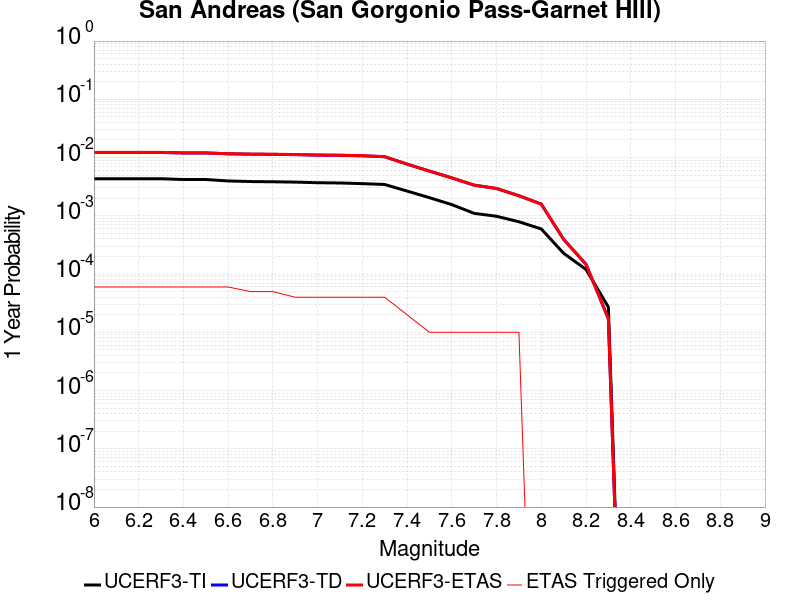 |  |

| Magnitude | 1 wk TI Prob | 1 wk TD Prob | 1 wk ETAS Prob | 1 wk ETAS/TD Gain | 1 wk ETAS Triggered Only | 1 mo TI Prob | 1 mo TD Prob | 1 mo ETAS Prob | 1 mo ETAS/TD Gain | 1 mo ETAS Triggered Only | 1 yr TI Prob | 1 yr TD Prob | 1 yr ETAS Prob | 1 yr ETAS/TD Gain | 1 yr ETAS Triggered Only | 10 yr TI Prob | 10 yr TD Prob | 10 yr ETAS Prob | 10 yr ETAS/TD Gain | 10 yr ETAS Triggered Only |
|-----|-----|-----|-----|-----|-----|-----|-----|-----|-----|-----|-----|-----|-----|-----|-----|-----|-----|-----|-----|-----|
| 6.0 | 8.31567E-5 | 2.3545265E-4 | 2.3545265E-4 | 1.0 | 0.0 | 3.5633717E-4 | 0.0010086936 | 0.0010346414 | 1.0257242 | 2.5974026E-5 | 0.004329778 | 0.012211585 | 0.012262899 | 1.004202 | 5.1948053E-5 | 0.042463828 | 0.11324443 | 0.113313526 | 1.0006101 | 7.792208E-5 |
| 6.1 | 8.31567E-5 | 2.3545265E-4 | 2.3545265E-4 | 1.0 | 0.0 | 3.5633717E-4 | 0.0010086936 | 0.0010346414 | 1.0257242 | 2.5974026E-5 | 0.004329778 | 0.012211585 | 0.012262899 | 1.004202 | 5.1948053E-5 | 0.042463828 | 0.11324443 | 0.113313526 | 1.0006101 | 7.792208E-5 |
| 6.2 | 8.31567E-5 | 2.3545265E-4 | 2.3545265E-4 | 1.0 | 0.0 | 3.5633717E-4 | 0.0010086936 | 0.0010346414 | 1.0257242 | 2.5974026E-5 | 0.004329778 | 0.012211585 | 0.012262899 | 1.004202 | 5.1948053E-5 | 0.042463828 | 0.11324443 | 0.113313526 | 1.0006101 | 7.792208E-5 |
| 6.3 | 8.31567E-5 | 2.3545265E-4 | 2.3545265E-4 | 1.0 | 0.0 | 3.5633717E-4 | 0.0010086936 | 0.0010346414 | 1.0257242 | 2.5974026E-5 | 0.004329778 | 0.012211585 | 0.012262899 | 1.004202 | 5.1948053E-5 | 0.042463828 | 0.11324443 | 0.113313526 | 1.0006101 | 7.792208E-5 |
| 6.4 | 8.059055E-5 | 2.3101942E-4 | 2.3101942E-4 | 1.0 | 0.0 | 3.4534236E-4 | 9.897087E-4 | 0.001015657 | 1.0262182 | 2.5974026E-5 | 0.0041964394 | 0.011983341 | 0.012034666 | 1.0042831 | 5.1948053E-5 | 0.041180745 | 0.11122319 | 0.111292444 | 1.0006226 | 7.792208E-5 |
| 6.5 | 8.059055E-5 | 2.3101942E-4 | 2.3101942E-4 | 1.0 | 0.0 | 3.4534236E-4 | 9.897087E-4 | 0.001015657 | 1.0262182 | 2.5974026E-5 | 0.0041964394 | 0.011983341 | 0.012034666 | 1.0042831 | 5.1948053E-5 | 0.041180745 | 0.11122319 | 0.111292444 | 1.0006226 | 7.792208E-5 |
| 6.6 | 7.619237E-5 | 2.2345147E-4 | 2.2345147E-4 | 1.0 | 0.0 | 3.2649786E-4 | 9.572999E-4 | 9.83249E-4 | 1.0271066 | 2.5974026E-5 | 0.0039678677 | 0.011593396 | 0.0116447415 | 1.0044289 | 5.1948053E-5 | 0.03897764 | 0.1077565 | 0.107826024 | 1.0006452 | 7.792208E-5 |
| 6.7 | 7.440636E-5 | 2.2020619E-4 | 2.2020619E-4 | 1.0 | 0.0 | 3.188454E-4 | 9.434017E-4 | 9.693512E-4 | 1.0275064 | 2.5974026E-5 | 0.0038750346 | 0.011425967 | 0.011451645 | 1.0022472 | 2.5974026E-5 | 0.038081564 | 0.10626462 | 0.106311046 | 1.0004369 | 5.1948053E-5 |
| 6.8 | 7.3735864E-5 | 2.186723E-4 | 2.186723E-4 | 1.0 | 0.0 | 3.1597257E-4 | 9.368327E-4 | 9.6278236E-4 | 1.0276994 | 2.5974026E-5 | 0.0038401815 | 0.011346827 | 0.011372507 | 1.0022631 | 2.5974026E-5 | 0.03774495 | 0.10556438 | 0.10561084 | 1.0004401 | 5.1948053E-5 |
| 6.9 | 7.27575E-5 | 2.1635788E-4 | 2.1635788E-4 | 1.0 | 0.0 | 3.117806E-4 | 9.2692085E-4 | 9.528708E-4 | 1.0279958 | 2.5974026E-5 | 0.003789323 | 0.011227401 | 0.011253083 | 1.0022875 | 2.5974026E-5 | 0.037253562 | 0.10451131 | 0.104557835 | 1.0004451 | 5.1948053E-5 |
| 7.0 | 7.102591E-5 | 2.1219115E-4 | 2.1219115E-4 | 1.0 | 0.0 | 3.0436125E-4 | 9.0907596E-4 | 9.350264E-4 | 1.028546 | 2.5974026E-5 | 0.003699303 | 0.011012354 | 0.011038042 | 1.0023327 | 2.5974026E-5 | 0.03638325 | 0.10261181 | 0.10265843 | 1.0004543 | 5.1948053E-5 |
| 7.1 | 7.028513E-5 | 2.1054245E-4 | 2.1054245E-4 | 1.0 | 0.0 | 3.0118722E-4 | 9.02015E-4 | 9.279656E-4 | 1.0287696 | 2.5974026E-5 | 0.0036607897 | 0.010927253 | 0.010952943 | 1.002351 | 2.5974026E-5 | 0.036010686 | 0.10185316 | 0.10189982 | 1.0004581 | 5.1948053E-5 |
| 7.2 | 6.8498244E-5 | 2.0661353E-4 | 2.0661353E-4 | 1.0 | 0.0 | 2.9353087E-4 | 8.851883E-4 | 9.1113936E-4 | 1.029317 | 2.5974026E-5 | 0.003567883 | 0.01072442 | 0.010750116 | 1.002396 | 2.5974026E-5 | 0.035111405 | 0.1000435 | 0.10009025 | 1.0004673 | 5.1948053E-5 |
| 7.3 | 6.622592E-5 | 1.9886195E-4 | 1.9886195E-4 | 1.0 | 0.0 | 2.8379448E-4 | 8.519893E-4 | 8.7794126E-4 | 1.0304604 | 2.5974026E-5 | 0.0034497243 | 0.010324122 | 0.010349828 | 1.0024899 | 2.5974026E-5 | 0.033966612 | 0.096531354 | 0.096578285 | 1.0004863 | 5.1948053E-5 |
| 7.4 | 5.1050705E-5 | 1.4818583E-4 | 1.4818583E-4 | 1.0 | 0.0 | 2.1877038E-4 | 6.3492847E-4 | 6.60886E-4 | 1.0408826 | 2.5974026E-5 | 0.002660276 | 0.00770305 | 0.007728824 | 1.003346 | 2.5974026E-5 | 0.02628654 | 0.073422804 | 0.073470935 | 1.0006555 | 5.1948053E-5 |
| 7.5 | 3.9302922E-5 | 1.12425034E-4 | 1.12425034E-4 | 1.0 | 0.0 | 1.6843023E-4 | 4.8173292E-4 | 5.0769444E-4 | 1.0538919 | 2.5974026E-5 | 0.0020487092 | 0.0058493963 | 0.0058752187 | 1.0044144 | 2.5974026E-5 | 0.020299247 | 0.05650614 | 0.056530643 | 1.0004337 | 2.5974026E-5 |
| 7.6 | 2.9851626E-5 | 8.594978E-5 | 8.594978E-5 | 1.0 | 0.0 | 1.2792926E-4 | 3.6830435E-4 | 3.942688E-4 | 1.0704973 | 2.5974026E-5 | 0.0015564259 | 0.004474912 | 0.0045007695 | 1.0057784 | 2.5974026E-5 | 0.0154556995 | 0.04364114 | 0.04366598 | 1.0005692 | 2.5974026E-5 |
| 7.7 | 2.1135214E-5 | 6.441881E-5 | 6.441881E-5 | 1.0 | 0.0 | 9.0576345E-5 | 2.7605143E-4 | 3.0201828E-4 | 1.0940653 | 2.5974026E-5 | 0.0011022091 | 0.003355752 | 0.003381639 | 1.0077142 | 2.5974026E-5 | 0.010967582 | 0.03298265 | 0.033007767 | 1.0007615 | 2.5974026E-5 |
| 7.8 | 1.883379E-5 | 5.6456047E-5 | 5.6456047E-5 | 1.0 | 0.0 | 8.0713755E-5 | 2.4193207E-4 | 2.678998E-4 | 1.1073349 | 2.5974026E-5 | 9.822468E-4 | 0.0029415477 | 0.0029674452 | 1.0088041 | 2.5974026E-5 | 0.0097791655 | 0.029063748 | 0.029088968 | 1.0008677 | 2.5974026E-5 |
| 7.9 | 1.5156185E-5 | 4.232976E-5 | 4.232976E-5 | 1.0 | 0.0 | 6.495346E-5 | 1.8140065E-4 | 2.0736996E-4 | 1.14316 | 2.5974026E-5 | 7.9052144E-4 | 0.0022063174 | 0.002232234 | 1.0117466 | 2.5974026E-5 | 0.007877152 | 0.02206722 | 0.022092622 | 1.0011511 | 2.5974026E-5 |
| 8.0 | 1.1405907E-5 | 3.0480802E-5 | 3.0480802E-5 | 1.0 | 0.0 | 4.8881542E-5 | 1.3062547E-4 | 1.3062547E-4 | 1.0 | 0.0 | 5.9497025E-4 | 0.0015892059 | 0.0015892059 | 1.0 | 0.0 | 0.005933798 | 0.016007971 | 0.016007971 | 1.0 | 0.0 |
| 8.1 | 4.3511436E-6 | 7.554156E-6 | 7.554156E-6 | 1.0 | 0.0 | 1.8647626E-5 | 3.2374555E-5 | 3.2374555E-5 | 1.0 | 0.0 | 2.2701119E-4 | 3.9408906E-4 | 3.9408906E-4 | 1.0 | 0.0 | 0.0022677942 | 0.0042083836 | 0.0042083836 | 1.0 | 0.0 |
| 8.2 | 2.3042528E-6 | 2.8181848E-6 | 2.8181848E-6 | 1.0 | 0.0 | 9.875332E-6 | 1.207788E-5 | 1.207788E-5 | 1.0 | 0.0 | 1.2022553E-4 | 1.470383E-4 | 1.470383E-4 | 1.0 | 0.0 | 0.0012016051 | 0.001642521 | 0.001642521 | 1.0 | 0.0 |
| 8.3 | 5.202968E-7 | 3.2857102E-7 | 3.2857102E-7 | 1.0 | 0.0 | 2.2298414E-6 | 1.4081608E-6 | 1.4081608E-6 | 1.0 | 0.0 | 2.714798E-5 | 1.7144237E-5 | 1.7144237E-5 | 1.0 | 0.0 | 2.7144665E-4 | 2.0274338E-4 | 2.0274338E-4 | 1.0 | 0.0 |

## Imperial
*[(top)](#table-of-contents)*

| 1 Week | 1 Month | 1 Year | 10 Year |
|-----|-----|-----|-----|
|  |  |  |  |

| Magnitude | 1 wk TI Prob | 1 wk TD Prob | 1 wk ETAS Prob | 1 wk ETAS/TD Gain | 1 wk ETAS Triggered Only | 1 mo TI Prob | 1 mo TD Prob | 1 mo ETAS Prob | 1 mo ETAS/TD Gain | 1 mo ETAS Triggered Only | 1 yr TI Prob | 1 yr TD Prob | 1 yr ETAS Prob | 1 yr ETAS/TD Gain | 1 yr ETAS Triggered Only | 10 yr TI Prob | 10 yr TD Prob | 10 yr ETAS Prob | 10 yr ETAS/TD Gain | 10 yr ETAS Triggered Only |
|-----|-----|-----|-----|-----|-----|-----|-----|-----|-----|-----|-----|-----|-----|-----|-----|-----|-----|-----|-----|-----|
| 6.0 | 2.7496446E-4 | 5.1111897E-4 | 5.1111897E-4 | 1.0 | 0.0 | 0.0011778869 | 0.0021887107 | 0.002214628 | 1.0118413 | 2.5974026E-5 | 0.0142467655 | 0.026309898 | 0.02633519 | 1.0009613 | 2.5974026E-5 | 0.13367249 | 0.22988556 | 0.22992557 | 1.000174 | 5.1948053E-5 |
| 6.1 | 2.5356023E-4 | 4.9151987E-4 | 4.9151987E-4 | 1.0 | 0.0 | 0.001086234 | 0.0021048519 | 0.0021307713 | 1.0123141 | 2.5974026E-5 | 0.013144928 | 0.02531982 | 0.025345137 | 1.0009998 | 2.5974026E-5 | 0.123940155 | 0.22113477 | 0.22117524 | 1.000183 | 5.1948053E-5 |
| 6.2 | 2.4820742E-4 | 4.8238455E-4 | 4.8238455E-4 | 1.0 | 0.0 | 0.0010633124 | 0.0020657626 | 0.0020916832 | 1.0125476 | 2.5974026E-5 | 0.01286919 | 0.02485531 | 0.024880638 | 1.001019 | 2.5974026E-5 | 0.12148927 | 0.21762344 | 0.21766408 | 1.0001868 | 5.1948053E-5 |
| 6.3 | 2.3205351E-4 | 4.6330655E-4 | 4.6330655E-4 | 1.0 | 0.0 | 9.94136E-4 | 0.001984126 | 0.0020100484 | 1.013065 | 2.5974026E-5 | 0.012036599 | 0.023878967 | 0.023904322 | 1.0010618 | 2.5974026E-5 | 0.11405133 | 0.20944852 | 0.20948958 | 1.0001961 | 5.1948053E-5 |
| 6.4 | 2.0304754E-4 | 4.0301133E-4 | 4.0301133E-4 | 1.0 | 0.0 | 8.6991355E-4 | 0.001726063 | 0.001726063 | 1.0 | 0.0 | 0.010539869 | 0.020807855 | 0.020807855 | 1.0 | 0.0 | 0.100537635 | 0.18657975 | 0.18660088 | 1.0001132 | 2.5974026E-5 |
| 6.5 | 1.854992E-4 | 3.7385584E-4 | 3.7385584E-4 | 1.0 | 0.0 | 7.9475436E-4 | 0.0016012681 | 0.0016012681 | 1.0 | 0.0 | 0.009633281 | 0.019320047 | 0.019320047 | 1.0 | 0.0 | 0.0922623 | 0.17474523 | 0.17476667 | 1.0001227 | 2.5974026E-5 |
| 6.6 | 1.6586106E-4 | 3.4395838E-4 | 3.4395838E-4 | 1.0 | 0.0 | 7.106394E-4 | 0.0014732849 | 0.0014732849 | 1.0 | 0.0 | 0.008617763 | 0.017784782 | 0.017784782 | 1.0 | 0.0 | 0.08291132 | 0.16212535 | 0.1621471 | 1.0001342 | 2.5974026E-5 |
| 6.7 | 1.4224656E-4 | 3.1083007E-4 | 3.1083007E-4 | 1.0 | 0.0 | 6.094856E-4 | 0.0013314572 | 0.0013314572 | 1.0 | 0.0 | 0.0073952693 | 0.016090635 | 0.016090635 | 1.0 | 0.0 | 0.07153955 | 0.14770412 | 0.14772627 | 1.0001498 | 2.5974026E-5 |
| 6.8 | 1.2317259E-4 | 2.805236E-4 | 2.805236E-4 | 1.0 | 0.0 | 5.2777573E-4 | 0.0012016965 | 0.0012016965 | 1.0 | 0.0 | 0.0064067547 | 0.014533926 | 0.014533926 | 1.0 | 0.0 | 0.06225166 | 0.13398027 | 0.13400277 | 1.0001678 | 2.5974026E-5 |
| 6.9 | 9.859898E-5 | 2.520523E-4 | 2.520523E-4 | 1.0 | 0.0 | 4.2249862E-4 | 0.0010797812 | 0.0010797812 | 1.0 | 0.0 | 0.0051317946 | 0.013068073 | 0.013068073 | 1.0 | 0.0 | 0.05014893 | 0.12018268 | 0.12020553 | 1.0001901 | 2.5974026E-5 |
| 7.0 | 7.3191884E-5 | 2.1404427E-4 | 2.1404427E-4 | 1.0 | 0.0 | 3.136418E-4 | 9.1701327E-4 | 9.1701327E-4 | 1.0 | 0.0 | 0.003811904 | 0.011108178 | 0.011108178 | 1.0 | 0.0 | 0.037471764 | 0.102628276 | 0.10265159 | 1.0002271 | 2.5974026E-5 |
| 7.1 | 7.1760296E-5 | 2.1103678E-4 | 2.1103678E-4 | 1.0 | 0.0 | 3.0750787E-4 | 9.041331E-4 | 9.041331E-4 | 1.0 | 0.0 | 0.003737482 | 0.010952948 | 0.010952948 | 1.0 | 0.0 | 0.03675245 | 0.10125723 | 0.10128058 | 1.0002306 | 2.5974026E-5 |
| 7.2 | 6.46614E-5 | 1.9266602E-4 | 1.9266602E-4 | 1.0 | 0.0 | 2.7709085E-4 | 8.2545326E-4 | 8.2545326E-4 | 1.0 | 0.0 | 0.0033683628 | 0.010004213 | 0.010004213 | 1.0 | 0.0 | 0.033177625 | 0.0930473 | 0.09307086 | 1.0002532 | 2.5974026E-5 |
| 7.3 | 6.088115E-5 | 1.7931883E-4 | 1.7931883E-4 | 1.0 | 0.0 | 2.6089314E-4 | 7.682858E-4 | 7.682858E-4 | 1.0 | 0.0 | 0.0031717476 | 0.009314345 | 0.009314345 | 1.0 | 0.0 | 0.031268585 | 0.08707713 | 0.08710084 | 1.0002723 | 2.5974026E-5 |
| 7.4 | 4.199346E-5 | 1.1601593E-4 | 1.1601593E-4 | 1.0 | 0.0 | 1.7995955E-4 | 4.971173E-4 | 4.971173E-4 | 1.0 | 0.0 | 0.0021888057 | 0.0060357777 | 0.0060357777 | 1.0 | 0.0 | 0.02167372 | 0.057841793 | 0.057866264 | 1.0004231 | 2.5974026E-5 |
| 7.5 | 3.130448E-5 | 8.408645E-5 | 8.408645E-5 | 1.0 | 0.0 | 1.3415517E-4 | 3.6032108E-4 | 3.6032108E-4 | 1.0 | 0.0 | 0.0016321153 | 0.004378145 | 0.004378145 | 1.0 | 0.0 | 0.016201803 | 0.042471316 | 0.042471316 | 1.0 | 0.0 |
| 7.6 | 2.3074248E-5 | 6.1484934E-5 | 6.1484934E-5 | 1.0 | 0.0 | 9.888588E-5 | 2.6348038E-4 | 2.6348038E-4 | 1.0 | 0.0 | 0.0012032706 | 0.0032031788 | 0.0032031788 | 1.0 | 0.0 | 0.011967761 | 0.031318657 | 0.031318657 | 1.0 | 0.0 |
| 7.7 | 1.45864815E-5 | 4.06565E-5 | 4.06565E-5 | 1.0 | 0.0 | 6.2511994E-5 | 1.7423055E-4 | 1.7423055E-4 | 1.0 | 0.0 | 7.608177E-4 | 0.0021191987 | 0.0021191987 | 1.0 | 0.0 | 0.007582182 | 0.020870956 | 0.020870956 | 1.0 | 0.0 |
| 7.8 | 1.0352979E-5 | 3.1412455E-5 | 3.1412455E-5 | 1.0 | 0.0 | 4.4369157E-5 | 1.3461788E-4 | 1.3461788E-4 | 1.0 | 0.0 | 5.400606E-4 | 0.001637743 | 0.001637743 | 1.0 | 0.0 | 0.0053875 | 0.01622328 | 0.01622328 | 1.0 | 0.0 |
| 7.9 | 8.137906E-6 | 2.2512344E-5 | 2.2512344E-5 | 1.0 | 0.0 | 3.4876273E-5 | 9.647791E-5 | 9.647791E-5 | 1.0 | 0.0 | 4.2453592E-4 | 0.0011739866 | 0.0011739866 | 1.0 | 0.0 | 0.004237258 | 0.011786923 | 0.011786923 | 1.0 | 0.0 |
| 8.0 | 6.93792E-6 | 1.832156E-5 | 1.832156E-5 | 1.0 | 0.0 | 2.9733603E-5 | 7.8518606E-5 | 7.8518606E-5 | 1.0 | 0.0 | 3.6194647E-4 | 9.555456E-4 | 9.555456E-4 | 1.0 | 0.0 | 0.0036135751 | 0.009648206 | 0.009648206 | 1.0 | 0.0 |
| 8.1 | 3.4286315E-6 | 6.5264885E-6 | 6.5264885E-6 | 1.0 | 0.0 | 1.4694053E-5 | 2.7970365E-5 | 2.7970365E-5 | 1.0 | 0.0 | 1.7888541E-4 | 3.4048612E-4 | 3.4048612E-4 | 1.0 | 0.0 | 0.0017874148 | 0.0035586485 | 0.0035586485 | 1.0 | 0.0 |
| 8.2 | 1.4906886E-6 | 1.99294E-6 | 1.99294E-6 | 1.0 | 0.0 | 6.3886496E-6 | 8.541144E-6 | 8.541144E-6 | 1.0 | 0.0 | 7.7779034E-5 | 1.0398349E-4 | 1.0398349E-4 | 1.0 | 0.0 | 7.775182E-4 | 0.0011363715 | 0.0011363715 | 1.0 | 0.0 |
| 8.3 | 2.5758007E-8 | 1.5070936E-8 | 1.5070936E-8 | 1.0 | 0.0 | 1.10391454E-7 | 6.458973E-8 | 6.458973E-8 | 1.0 | 0.0 | 1.3440151E-6 | 7.863799E-7 | 7.863799E-7 | 1.0 | 0.0 | 1.344007E-5 | 8.194007E-6 | 8.194007E-6 | 1.0 | 0.0 |

## San Andreas (Parkfield)
*[(top)](#table-of-contents)*

| 1 Week | 1 Month | 1 Year | 10 Year |
|-----|-----|-----|-----|
|  |  | 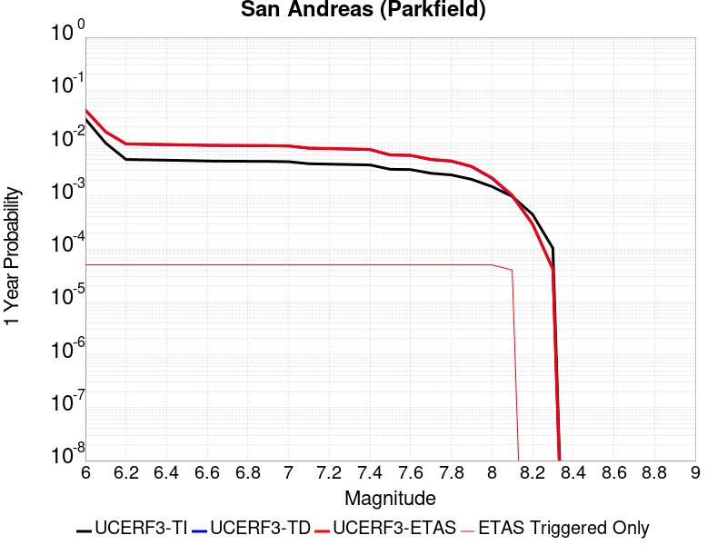 |  |

| Magnitude | 1 wk TI Prob | 1 wk TD Prob | 1 wk ETAS Prob | 1 wk ETAS/TD Gain | 1 wk ETAS Triggered Only | 1 mo TI Prob | 1 mo TD Prob | 1 mo ETAS Prob | 1 mo ETAS/TD Gain | 1 mo ETAS Triggered Only | 1 yr TI Prob | 1 yr TD Prob | 1 yr ETAS Prob | 1 yr ETAS/TD Gain | 1 yr ETAS Triggered Only | 10 yr TI Prob | 10 yr TD Prob | 10 yr ETAS Prob | 10 yr ETAS/TD Gain | 10 yr ETAS Triggered Only |
|-----|-----|-----|-----|-----|-----|-----|-----|-----|-----|-----|-----|-----|-----|-----|-----|-----|-----|-----|-----|-----|
| 6.0 | 5.556969E-4 | 8.1651966E-4 | 8.684253E-4 | 1.0635693 | 5.1948053E-5 | 0.0023793848 | 0.0034952953 | 0.0035470617 | 1.0148103 | 5.1948053E-5 | 0.028586963 | 0.042068228 | 0.04211799 | 1.0011829 | 5.1948053E-5 | 0.25176284 | 0.34289595 | 0.34293008 | 1.0000995 | 5.1948053E-5 |
| 6.1 | 1.925858E-4 | 3.137197E-4 | 3.6565145E-4 | 1.1655356 | 5.1948053E-5 | 8.2510663E-4 | 0.001343927 | 0.0013958053 | 1.038602 | 5.1948053E-5 | 0.0099994885 | 0.016313266 | 0.016364366 | 1.0031325 | 5.1948053E-5 | 0.095613256 | 0.15234688 | 0.15239091 | 1.0002891 | 5.1948053E-5 |
| 6.2 | 9.4306815E-5 | 1.854751E-4 | 2.3741351E-4 | 1.280029 | 5.1948053E-5 | 4.0410945E-4 | 7.946524E-4 | 8.465591E-4 | 1.0653201 | 5.1948053E-5 | 0.0049089384 | 0.009632187 | 0.009683634 | 1.0053412 | 5.1948053E-5 | 0.048019063 | 0.0931797 | 0.09322681 | 1.0005056 | 5.1948053E-5 |
| 6.3 | 9.283051E-5 | 1.8242722E-4 | 2.343658E-4 | 1.2847085 | 5.1948053E-5 | 3.9778434E-4 | 7.815979E-4 | 8.3350536E-4 | 1.066412 | 5.1948053E-5 | 0.0048322747 | 0.009474651 | 0.0095261065 | 1.0054309 | 5.1948053E-5 | 0.047285385 | 0.09183048 | 0.091877654 | 1.0005138 | 5.1948053E-5 |
| 6.4 | 9.138826E-5 | 1.8002909E-4 | 2.319678E-4 | 1.2885017 | 5.1948053E-5 | 3.916052E-4 | 7.7132636E-4 | 8.232343E-4 | 1.0672971 | 5.1948053E-5 | 0.0047573745 | 0.009350671 | 0.0094021335 | 1.0055035 | 5.1948053E-5 | 0.046568092 | 0.0907278 | 0.090775035 | 1.0005206 | 5.1948053E-5 |
| 6.5 | 9.000255E-5 | 1.7759205E-4 | 2.2953088E-4 | 1.2924614 | 5.1948053E-5 | 3.8566816E-4 | 7.60888E-4 | 8.127965E-4 | 1.068221 | 5.1948053E-5 | 0.0046854047 | 0.009224672 | 0.0092761405 | 1.0055795 | 5.1948053E-5 | 0.045878403 | 0.089605525 | 0.08965282 | 1.0005277 | 5.1948053E-5 |
| 6.6 | 8.8109264E-5 | 1.743648E-4 | 2.2630379E-4 | 1.2978754 | 5.1948053E-5 | 3.7755648E-4 | 7.470649E-4 | 7.989741E-4 | 1.0694842 | 5.1948053E-5 | 0.0045870654 | 0.0090578 | 0.009109277 | 1.0056832 | 5.1948053E-5 | 0.04493529 | 0.088123694 | 0.088171065 | 1.0005375 | 5.1948053E-5 |
| 6.7 | 8.738073E-5 | 1.7302726E-4 | 2.2496634E-4 | 1.3001785 | 5.1948053E-5 | 3.7443507E-4 | 7.4133585E-4 | 7.932454E-4 | 1.0700216 | 5.1948053E-5 | 0.0045492216 | 0.008988673 | 0.009040154 | 1.0057273 | 5.1948053E-5 | 0.04457213 | 0.08752088 | 0.08756828 | 1.0005416 | 5.1948053E-5 |
| 6.8 | 8.710195E-5 | 1.7247576E-4 | 2.2441485E-4 | 1.3011385 | 5.1948053E-5 | 3.7324068E-4 | 7.389736E-4 | 7.9088326E-4 | 1.0702456 | 5.1948053E-5 | 0.0045347405 | 0.008960159 | 0.009011641 | 1.0057458 | 5.1948053E-5 | 0.04443313 | 0.08726624 | 0.08731365 | 1.0005434 | 5.1948053E-5 |
| 6.9 | 8.6801556E-5 | 1.7187938E-4 | 2.238185E-4 | 1.3021836 | 5.1948053E-5 | 3.7195362E-4 | 7.364191E-4 | 7.8832894E-4 | 1.0704895 | 5.1948053E-5 | 0.0045191357 | 0.008929313 | 0.008980797 | 1.0057658 | 5.1948053E-5 | 0.044283327 | 0.08699028 | 0.08703771 | 1.0005453 | 5.1948053E-5 |
| 7.0 | 8.5571606E-5 | 1.6938374E-4 | 2.21323E-4 | 1.3066366 | 5.1948053E-5 | 3.6668387E-4 | 7.2572957E-4 | 7.776399E-4 | 1.0715286 | 5.1948053E-5 | 0.004455241 | 0.008800226 | 0.008851716 | 1.005851 | 5.1948053E-5 | 0.043669727 | 0.08583031 | 0.0858778 | 1.0005533 | 5.1948053E-5 |
| 7.1 | 7.82589E-5 | 1.5408327E-4 | 2.0602332E-4 | 1.3370907 | 5.1948053E-5 | 3.3535215E-4 | 6.6019053E-4 | 7.121043E-4 | 1.0786345 | 5.1948053E-5 | 0.0040752706 | 0.008008373 | 0.008059905 | 1.0064348 | 5.1948053E-5 | 0.040013418 | 0.078711875 | 0.07875974 | 1.0006081 | 5.1948053E-5 |
| 7.2 | 7.690929E-5 | 1.5143286E-4 | 2.0337304E-4 | 1.3429915 | 5.1948053E-5 | 3.2956956E-4 | 6.488373E-4 | 7.007516E-4 | 1.0800114 | 5.1948053E-5 | 0.004005129 | 0.007871154 | 0.007922693 | 1.0065478 | 5.1948053E-5 | 0.0393371 | 0.07747872 | 0.077526644 | 1.0006186 | 5.1948053E-5 |
| 7.3 | 7.5543794E-5 | 1.4836296E-4 | 2.003033E-4 | 1.3500897 | 5.1948053E-5 | 3.2371894E-4 | 6.35687E-4 | 6.876021E-4 | 1.0816675 | 5.1948053E-5 | 0.003934157 | 0.007712193 | 0.00776374 | 1.0066838 | 5.1948053E-5 | 0.038652334 | 0.0760293 | 0.0760773 | 1.0006313 | 5.1948053E-5 |
| 7.4 | 7.4214564E-5 | 1.4533575E-4 | 1.9727625E-4 | 1.3573828 | 5.1948053E-5 | 3.1802364E-4 | 6.227196E-4 | 6.7463523E-4 | 1.0833694 | 5.1948053E-5 | 0.003865065 | 0.007555419 | 0.0076069743 | 1.0068237 | 5.1948053E-5 | 0.03798529 | 0.07458969 | 0.07463776 | 1.0006444 | 5.1948053E-5 |
| 7.5 | 6.149578E-5 | 1.1424215E-4 | 1.6618427E-4 | 1.4546669 | 5.1948053E-5 | 2.6352672E-4 | 4.8951746E-4 | 5.414401E-4 | 1.106069 | 5.1948053E-5 | 0.0032037178 | 0.005943622 | 0.005995261 | 1.0086882 | 5.1948053E-5 | 0.03157923 | 0.05963148 | 0.05968033 | 1.0008192 | 5.1948053E-5 |
| 7.6 | 6.0643448E-5 | 1.1250723E-4 | 1.6444945E-4 | 1.4616789 | 5.1948053E-5 | 2.598746E-4 | 4.8208487E-4 | 5.3400785E-4 | 1.1077051 | 5.1948053E-5 | 0.0031593828 | 0.00585362 | 0.005905264 | 1.0088226 | 5.1948053E-5 | 0.031148417 | 0.05878424 | 0.058833133 | 1.0008317 | 5.1948053E-5 |
| 7.7 | 5.1652263E-5 | 9.382579E-5 | 1.4576897E-4 | 1.5536131 | 5.1948053E-5 | 2.2134806E-4 | 4.0204855E-4 | 4.5397572E-4 | 1.1291565 | 5.1948053E-5 | 0.002691582 | 0.0048839655 | 0.00493566 | 1.0105845 | 5.1948053E-5 | 0.026592141 | 0.049511142 | 0.049560517 | 1.0009973 | 5.1948053E-5 |
| 7.8 | 4.8090482E-5 | 8.7510394E-5 | 1.394539E-4 | 1.5935695 | 5.1948053E-5 | 2.060858E-4 | 3.7499066E-4 | 4.2691926E-4 | 1.1384796 | 5.1948053E-5 | 0.0025062072 | 0.0045559625 | 0.004607674 | 1.0113503 | 5.1948053E-5 | 0.024781305 | 0.046203107 | 0.046252657 | 1.0010724 | 5.1948053E-5 |
| 7.9 | 3.970278E-5 | 6.899808E-5 | 1.20942546E-4 | 1.7528393 | 5.1948053E-5 | 1.7014367E-4 | 2.9567254E-4 | 3.4760524E-4 | 1.1756426 | 5.1948053E-5 | 0.002069531 | 0.0035938753 | 0.0036456366 | 1.0144026 | 5.1948053E-5 | 0.020503636 | 0.036596112 | 0.03664616 | 1.0013676 | 5.1948053E-5 |
| 8.0 | 2.8982335E-5 | 4.1650288E-5 | 9.359617E-5 | 2.2471917 | 5.1948053E-5 | 1.2420409E-4 | 1.7848902E-4 | 2.304278E-4 | 1.2909914 | 5.1948053E-5 | 0.0015111357 | 0.0021709392 | 0.0022227746 | 1.0238769 | 5.1948053E-5 | 0.015009012 | 0.022486161 | 0.02253694 | 1.0022583 | 5.1948053E-5 |
| 8.1 | 1.8836186E-5 | 1.9220972E-5 | 7.1168026E-5 | 3.7026236 | 5.1948053E-5 | 8.0724014E-5 | 8.2373E-5 | 1.3431677E-4 | 1.6305922 | 5.1948053E-5 | 9.823717E-4 | 0.0010024305 | 0.0010543264 | 1.0517702 | 5.1948053E-5 | 0.009780403 | 0.010771171 | 0.01082256 | 1.0047709 | 5.1948053E-5 |
| 8.2 | 8.643924E-6 | 5.680264E-6 | 5.680264E-6 | 1.0 | 0.0 | 3.704486E-5 | 2.4343763E-5 | 2.4343763E-5 | 1.0 | 0.0 | 4.5092785E-4 | 2.963451E-4 | 2.963451E-4 | 1.0 | 0.0 | 0.0045001395 | 0.0033610219 | 0.0033610219 | 1.0 | 0.0 |
| 8.3 | 1.983087E-6 | 8.001618E-7 | 8.001618E-7 | 1.0 | 0.0 | 8.498917E-6 | 3.4292605E-6 | 3.4292605E-6 | 1.0 | 0.0 | 1.034694E-4 | 4.1750463E-5 | 4.1750463E-5 | 1.0 | 0.0 | 0.0010342124 | 4.915874E-4 | 4.915874E-4 | 1.0 | 0.0 |

## San Andreas (San Bernardino S)
*[(top)](#table-of-contents)*

| 1 Week | 1 Month | 1 Year | 10 Year |
|-----|-----|-----|-----|
|  |  |  |  |

| Magnitude | 1 wk TI Prob | 1 wk TD Prob | 1 wk ETAS Prob | 1 wk ETAS/TD Gain | 1 wk ETAS Triggered Only | 1 mo TI Prob | 1 mo TD Prob | 1 mo ETAS Prob | 1 mo ETAS/TD Gain | 1 mo ETAS Triggered Only | 1 yr TI Prob | 1 yr TD Prob | 1 yr ETAS Prob | 1 yr ETAS/TD Gain | 1 yr ETAS Triggered Only | 10 yr TI Prob | 10 yr TD Prob | 10 yr ETAS Prob | 10 yr ETAS/TD Gain | 10 yr ETAS Triggered Only |
|-----|-----|-----|-----|-----|-----|-----|-----|-----|-----|-----|-----|-----|-----|-----|-----|-----|-----|-----|-----|-----|
| 6.0 | 1.2336002E-4 | 3.0197148E-4 | 3.2793765E-4 | 1.0859889 | 2.5974026E-5 | 5.2857865E-4 | 0.0012935478 | 0.0013454286 | 1.0401074 | 5.1948053E-5 | 0.006416472 | 0.01564021 | 0.015691346 | 1.0032696 | 5.1948053E-5 | 0.06234337 | 0.14364538 | 0.14368987 | 1.0003097 | 5.1948053E-5 |
| 6.1 | 1.2336002E-4 | 3.0197148E-4 | 3.2793765E-4 | 1.0859889 | 2.5974026E-5 | 5.2857865E-4 | 0.0012935478 | 0.0013454286 | 1.0401074 | 5.1948053E-5 | 0.006416472 | 0.01564021 | 0.015691346 | 1.0032696 | 5.1948053E-5 | 0.06234337 | 0.14364538 | 0.14368987 | 1.0003097 | 5.1948053E-5 |
| 6.2 | 1.2336002E-4 | 3.0197148E-4 | 3.2793765E-4 | 1.0859889 | 2.5974026E-5 | 5.2857865E-4 | 0.0012935478 | 0.0013454286 | 1.0401074 | 5.1948053E-5 | 0.006416472 | 0.01564021 | 0.015691346 | 1.0032696 | 5.1948053E-5 | 0.06234337 | 0.14364538 | 0.14368987 | 1.0003097 | 5.1948053E-5 |
| 6.3 | 1.1712257E-4 | 2.898341E-4 | 3.158006E-4 | 1.0895909 | 2.5974026E-5 | 5.018573E-4 | 0.0012415807 | 0.0012934642 | 1.0417883 | 5.1948053E-5 | 0.006093008 | 0.015016349 | 0.015067517 | 1.0034075 | 5.1948053E-5 | 0.059286322 | 0.13835679 | 0.13840155 | 1.0003235 | 5.1948053E-5 |
| 6.4 | 1.1712257E-4 | 2.898341E-4 | 3.158006E-4 | 1.0895909 | 2.5974026E-5 | 5.018573E-4 | 0.0012415807 | 0.0012934642 | 1.0417883 | 5.1948053E-5 | 0.006093008 | 0.015016349 | 0.015067517 | 1.0034075 | 5.1948053E-5 | 0.059286322 | 0.13835679 | 0.13840155 | 1.0003235 | 5.1948053E-5 |
| 6.5 | 1.0689076E-4 | 2.6993037E-4 | 2.958974E-4 | 1.0961989 | 2.5974026E-5 | 4.5802278E-4 | 0.0011563565 | 0.0012082445 | 1.0448719 | 5.1948053E-5 | 0.0055621783 | 0.013992408 | 0.014043629 | 1.0036607 | 5.1948053E-5 | 0.05425003 | 0.12960236 | 0.12964757 | 1.0003489 | 5.1948053E-5 |
| 6.6 | 9.7648895E-5 | 2.5234558E-4 | 2.5234558E-4 | 1.0 | 0.0 | 4.1842813E-4 | 0.0010810565 | 0.0011070025 | 1.0240005 | 2.5974026E-5 | 0.005082469 | 0.013086828 | 0.013112462 | 1.0019587 | 2.5974026E-5 | 0.049677886 | 0.12176599 | 0.1217888 | 1.0001873 | 2.5974026E-5 |
| 6.7 | 8.757013E-5 | 2.3302004E-4 | 2.3302004E-4 | 1.0 | 0.0 | 3.7524657E-4 | 9.982976E-4 | 0.0010242456 | 1.0259924 | 2.5974026E-5 | 0.00455906 | 0.012090651 | 0.012116311 | 1.0021223 | 2.5974026E-5 | 0.04466656 | 0.11311712 | 0.11314015 | 1.0002036 | 2.5974026E-5 |
| 6.8 | 8.562978E-5 | 2.2860448E-4 | 2.2860448E-4 | 1.0 | 0.0 | 3.6693315E-4 | 9.79388E-4 | 0.0010053365 | 1.0264947 | 2.5974026E-5 | 0.004458263 | 0.01186295 | 0.011888616 | 1.0021635 | 2.5974026E-5 | 0.043698758 | 0.111118436 | 0.111141525 | 1.0002078 | 2.5974026E-5 |
| 6.9 | 6.124075E-5 | 1.7228001E-4 | 1.7228001E-4 | 1.0 | 0.0 | 2.6243398E-4 | 7.3813484E-4 | 7.640897E-4 | 1.0351628 | 2.5974026E-5 | 0.0031904527 | 0.008949972 | 0.008975713 | 1.0028762 | 2.5974026E-5 | 0.031450346 | 0.08488899 | 0.084912755 | 1.00028 | 2.5974026E-5 |
| 7.0 | 5.8598747E-5 | 1.66553E-4 | 1.66553E-4 | 1.0 | 0.0 | 2.5111332E-4 | 7.136041E-4 | 7.395596E-4 | 1.0363724 | 2.5974026E-5 | 0.0030530186 | 0.008653718 | 0.008679467 | 1.0029755 | 2.5974026E-5 | 0.03011414 | 0.082203336 | 0.08222718 | 1.00029 | 2.5974026E-5 |
| 7.1 | 5.613814E-5 | 1.6072052E-4 | 1.6072052E-4 | 1.0 | 0.0 | 2.4056983E-4 | 6.8862113E-4 | 7.1457727E-4 | 1.0376929 | 2.5974026E-5 | 0.0029250039 | 0.008351917 | 0.008377674 | 1.003084 | 2.5974026E-5 | 0.028868021 | 0.07949258 | 0.079516485 | 1.0003008 | 2.5974026E-5 |
| 7.2 | 4.991222E-5 | 1.4674799E-4 | 1.4674799E-4 | 1.0 | 0.0 | 2.1389198E-4 | 6.287687E-4 | 6.547264E-4 | 1.0412834 | 2.5974026E-5 | 0.002601025 | 0.007628494 | 0.00765427 | 1.0033789 | 2.5974026E-5 | 0.025707912 | 0.07293082 | 0.07295489 | 1.0003302 | 2.5974026E-5 |
| 7.3 | 4.7410045E-5 | 1.3865474E-4 | 1.3865474E-4 | 1.0 | 0.0 | 2.0317009E-4 | 5.940996E-4 | 6.200582E-4 | 1.043694 | 2.5974026E-5 | 0.0024707897 | 0.0072092614 | 0.007235048 | 1.0035769 | 2.5974026E-5 | 0.024434982 | 0.06919559 | 0.06921977 | 1.0003494 | 2.5974026E-5 |
| 7.4 | 4.5556746E-5 | 1.3270804E-4 | 1.3270804E-4 | 1.0 | 0.0 | 1.952286E-4 | 5.686251E-4 | 5.945844E-4 | 1.0456526 | 2.5974026E-5 | 0.002374317 | 0.0069011156 | 0.0069269105 | 1.0037378 | 2.5974026E-5 | 0.023491086 | 0.066436276 | 0.06646053 | 1.000365 | 2.5974026E-5 |
| 7.5 | 4.3084514E-5 | 1.2502912E-4 | 1.2502912E-4 | 1.0 | 0.0 | 1.8463485E-4 | 5.357294E-4 | 5.616895E-4 | 1.0484575 | 2.5974026E-5 | 0.0022456115 | 0.0065030716 | 0.0065288767 | 1.0039681 | 2.5974026E-5 | 0.022230545 | 0.062825486 | 0.062849835 | 1.0003874 | 2.5974026E-5 |
| 7.6 | 3.408608E-5 | 9.969324E-5 | 9.969324E-5 | 1.0 | 0.0 | 1.4607502E-4 | 4.271869E-4 | 4.531498E-4 | 1.0607765 | 2.5974026E-5 | 0.0017770125 | 0.005188624 | 0.005214463 | 1.00498 | 2.5974026E-5 | 0.017628696 | 0.05061345 | 0.05063811 | 1.0004872 | 2.5974026E-5 |
| 7.7 | 2.8315713E-5 | 8.374454E-5 | 8.374454E-5 | 1.0 | 0.0 | 1.2134742E-4 | 3.5885582E-4 | 3.8482054E-4 | 1.0723542 | 2.5974026E-5 | 0.0014764034 | 0.0043603266 | 0.004386187 | 1.0059309 | 2.5974026E-5 | 0.01466633 | 0.04283281 | 0.04285767 | 1.0005804 | 2.5974026E-5 |
| 7.8 | 2.6222975E-5 | 7.580657E-5 | 7.580657E-5 | 1.0 | 0.0 | 1.1237934E-4 | 3.2484488E-4 | 3.5081047E-4 | 1.0799322 | 2.5974026E-5 | 0.0013673597 | 0.0039478205 | 0.003973692 | 1.0065534 | 2.5974026E-5 | 0.013589768 | 0.038964145 | 0.038989108 | 1.0006406 | 2.5974026E-5 |
| 7.9 | 2.1469694E-5 | 5.8860456E-5 | 5.8860456E-5 | 1.0 | 0.0 | 9.200973E-5 | 2.5223472E-4 | 2.782022E-4 | 1.1029496 | 2.5974026E-5 | 0.0011196428 | 0.0030666364 | 0.0030925309 | 1.008444 | 2.5974026E-5 | 0.011140184 | 0.030598465 | 0.030623645 | 1.0008229 | 2.5974026E-5 |
| 8.0 | 1.2420249E-5 | 3.1867392E-5 | 3.1867392E-5 | 1.0 | 0.0 | 5.322855E-5 | 1.365674E-4 | 1.365674E-4 | 1.0 | 0.0 | 6.478649E-4 | 0.001661441 | 0.001661441 | 1.0 | 0.0 | 0.0064597935 | 0.016778521 | 0.016778521 | 1.0 | 0.0 |
| 8.1 | 4.9197724E-6 | 8.025736E-6 | 8.025736E-6 | 1.0 | 0.0 | 2.1084568E-5 | 3.439556E-5 | 3.439556E-5 | 1.0 | 0.0 | 2.566744E-4 | 4.186856E-4 | 4.186856E-4 | 1.0 | 0.0 | 0.002563781 | 0.004486374 | 0.004486374 | 1.0 | 0.0 |
| 8.2 | 2.5634774E-6 | 2.999787E-6 | 2.999787E-6 | 1.0 | 0.0 | 1.0986286E-5 | 1.2856167E-5 | 1.2856167E-5 | 1.0 | 0.0 | 1.3374983E-4 | 1.5651264E-4 | 1.5651264E-4 | 1.0 | 0.0 | 0.0013366934 | 0.00175384 | 0.00175384 | 1.0 | 0.0 |
| 8.3 | 5.2850464E-7 | 3.3367226E-7 | 3.3367226E-7 | 1.0 | 0.0 | 2.2650179E-6 | 1.4300233E-6 | 1.4300233E-6 | 1.0 | 0.0 | 2.7576245E-5 | 1.7410408E-5 | 1.7410408E-5 | 1.0 | 0.0 | 2.7572823E-4 | 2.0592175E-4 | 2.0592175E-4 | 1.0 | 0.0 |

## San Jacinto (Lytle Creek connector)
*[(top)](#table-of-contents)*

| 1 Week | 1 Month | 1 Year | 10 Year |
|-----|-----|-----|-----|
|  |  |  |  |

| Magnitude | 1 wk TI Prob | 1 wk TD Prob | 1 wk ETAS Prob | 1 wk ETAS/TD Gain | 1 wk ETAS Triggered Only | 1 mo TI Prob | 1 mo TD Prob | 1 mo ETAS Prob | 1 mo ETAS/TD Gain | 1 mo ETAS Triggered Only | 1 yr TI Prob | 1 yr TD Prob | 1 yr ETAS Prob | 1 yr ETAS/TD Gain | 1 yr ETAS Triggered Only | 10 yr TI Prob | 10 yr TD Prob | 10 yr ETAS Prob | 10 yr ETAS/TD Gain | 10 yr ETAS Triggered Only |
|-----|-----|-----|-----|-----|-----|-----|-----|-----|-----|-----|-----|-----|-----|-----|-----|-----|-----|-----|-----|-----|
| 6.0 | 6.693995E-6 | 6.766212E-6 | 3.2740063E-5 | 4.838758 | 2.5974026E-5 | 2.8688235E-5 | 2.899773E-5 | 8.094428E-5 | 2.7914004 | 5.1948053E-5 | 3.492233E-4 | 3.5299026E-4 | 4.0492E-4 | 1.1471137 | 5.1948053E-5 | 0.00348675 | 0.0036045043 | 0.003656265 | 1.0143601 | 5.1948053E-5 |
| 6.1 | 6.693995E-6 | 6.766212E-6 | 3.2740063E-5 | 4.838758 | 2.5974026E-5 | 2.8688235E-5 | 2.899773E-5 | 8.094428E-5 | 2.7914004 | 5.1948053E-5 | 3.492233E-4 | 3.5299026E-4 | 4.0492E-4 | 1.1471137 | 5.1948053E-5 | 0.00348675 | 0.0036045043 | 0.003656265 | 1.0143601 | 5.1948053E-5 |
| 6.2 | 6.693995E-6 | 6.766212E-6 | 3.2740063E-5 | 4.838758 | 2.5974026E-5 | 2.8688235E-5 | 2.899773E-5 | 8.094428E-5 | 2.7914004 | 5.1948053E-5 | 3.492233E-4 | 3.5299026E-4 | 4.0492E-4 | 1.1471137 | 5.1948053E-5 | 0.00348675 | 0.0036045043 | 0.003656265 | 1.0143601 | 5.1948053E-5 |
| 6.3 | 6.693995E-6 | 6.766212E-6 | 3.2740063E-5 | 4.838758 | 2.5974026E-5 | 2.8688235E-5 | 2.899773E-5 | 8.094428E-5 | 2.7914004 | 5.1948053E-5 | 3.492233E-4 | 3.5299026E-4 | 4.0492E-4 | 1.1471137 | 5.1948053E-5 | 0.00348675 | 0.0036045043 | 0.003656265 | 1.0143601 | 5.1948053E-5 |
| 6.4 | 6.693995E-6 | 6.766212E-6 | 3.2740063E-5 | 4.838758 | 2.5974026E-5 | 2.8688235E-5 | 2.899773E-5 | 8.094428E-5 | 2.7914004 | 5.1948053E-5 | 3.492233E-4 | 3.5299026E-4 | 4.0492E-4 | 1.1471137 | 5.1948053E-5 | 0.00348675 | 0.0036045043 | 0.003656265 | 1.0143601 | 5.1948053E-5 |
| 6.5 | 6.6561875E-6 | 6.7264195E-6 | 3.270027E-5 | 4.8614674 | 2.5974026E-5 | 2.8526205E-5 | 2.8827195E-5 | 8.077375E-5 | 2.8019981 | 5.1948053E-5 | 3.472512E-4 | 3.5091466E-4 | 4.0284448E-4 | 1.1479841 | 5.1948053E-5 | 0.0034670907 | 0.0035838154 | 0.0036355772 | 1.0144433 | 5.1948053E-5 |
| 6.6 | 6.6561875E-6 | 6.7264195E-6 | 3.270027E-5 | 4.8614674 | 2.5974026E-5 | 2.8526205E-5 | 2.8827195E-5 | 8.077375E-5 | 2.8019981 | 5.1948053E-5 | 3.472512E-4 | 3.5091466E-4 | 4.0284448E-4 | 1.1479841 | 5.1948053E-5 | 0.0034670907 | 0.0035838154 | 0.0036355772 | 1.0144433 | 5.1948053E-5 |
| 6.7 | 6.5802237E-6 | 6.6455714E-6 | 3.2619424E-5 | 4.9084454 | 2.5974026E-5 | 2.8200653E-5 | 2.8480708E-5 | 8.042728E-5 | 2.8239214 | 5.1948053E-5 | 3.4328885E-4 | 3.4669755E-4 | 3.9862757E-4 | 1.1497848 | 5.1948053E-5 | 0.0034275902 | 0.003541779 | 0.003593543 | 1.0146153 | 5.1948053E-5 |
| 6.8 | 6.575632E-6 | 6.640055E-6 | 3.261391E-5 | 4.9116926 | 2.5974026E-5 | 2.8180975E-5 | 2.8457069E-5 | 8.040364E-5 | 2.8254366 | 5.1948053E-5 | 3.4304935E-4 | 3.464098E-4 | 3.9833985E-4 | 1.1499094 | 5.1948053E-5 | 0.0034252026 | 0.0035389108 | 0.003590675 | 1.0146272 | 5.1948053E-5 |
| 6.9 | 6.570433E-6 | 6.6314337E-6 | 3.2605287E-5 | 4.916778 | 2.5974026E-5 | 2.8158694E-5 | 2.8420121E-5 | 8.03667E-5 | 2.8278098 | 5.1948053E-5 | 3.4277816E-4 | 3.459601E-4 | 3.978902E-4 | 1.1501043 | 5.1948053E-5 | 0.0034224992 | 0.0035344283 | 0.0035861926 | 1.0146458 | 5.1948053E-5 |
| 7.0 | 6.5643826E-6 | 6.621537E-6 | 3.259539E-5 | 4.922632 | 2.5974026E-5 | 2.8132765E-5 | 2.8377706E-5 | 8.032429E-5 | 2.8305418 | 5.1948053E-5 | 3.424626E-4 | 3.4544387E-4 | 3.9737398E-4 | 1.1503286 | 5.1948053E-5 | 0.0034193532 | 0.0035292825 | 0.003581047 | 1.0146672 | 5.1948053E-5 |
| 7.1 | 6.557402E-6 | 6.6102307E-6 | 3.2584085E-5 | 4.929342 | 2.5974026E-5 | 2.8102848E-5 | 2.8329252E-5 | 8.027583E-5 | 2.8336728 | 5.1948053E-5 | 3.4209844E-4 | 3.4485414E-4 | 3.9678428E-4 | 1.1505858 | 5.1948053E-5 | 0.0034157229 | 0.0035234047 | 0.0035751697 | 1.0146917 | 5.1948053E-5 |
| 7.2 | 6.546394E-6 | 6.5921618E-6 | 3.2566015E-5 | 4.940112 | 2.5974026E-5 | 2.8055672E-5 | 2.8251816E-5 | 8.01984E-5 | 2.8386989 | 5.1948053E-5 | 3.4152428E-4 | 3.4391164E-4 | 3.9584184E-4 | 1.1509986 | 5.1948053E-5 | 0.0034099987 | 0.003514014 | 0.0035657794 | 1.0147312 | 5.1948053E-5 |
| 7.3 | 6.5364216E-6 | 6.572879E-6 | 3.2546734E-5 | 4.9516706 | 2.5974026E-5 | 2.8012933E-5 | 2.816918E-5 | 8.0115766E-5 | 2.844093 | 5.1948053E-5 | 3.4100408E-4 | 3.4290587E-4 | 3.948361E-4 | 1.1514417 | 5.1948053E-5 | 0.003404813 | 0.003504003 | 0.0035557689 | 1.0147734 | 5.1948053E-5 |
| 7.4 | 6.5269523E-6 | 6.553889E-6 | 3.2527743E-5 | 4.963121 | 2.5974026E-5 | 2.7972354E-5 | 2.8087794E-5 | 8.0034384E-5 | 2.8494365 | 5.1948053E-5 | 3.4051016E-4 | 3.419153E-4 | 3.9384558E-4 | 1.1518806 | 5.1948053E-5 | 0.0033998888 | 0.0034941523 | 0.0035459187 | 1.0148152 | 5.1948053E-5 |
| 7.5 | 6.5111835E-6 | 6.5300806E-6 | 3.2503936E-5 | 4.9775705 | 2.5974026E-5 | 2.7904773E-5 | 2.798576E-5 | 7.993236E-5 | 2.8561797 | 5.1948053E-5 | 3.3968766E-4 | 3.4067343E-4 | 3.9260378E-4 | 1.1524345 | 5.1948053E-5 | 0.0033916887 | 0.0034817832 | 0.0035335503 | 1.014868 | 5.1948053E-5 |
| 7.6 | 6.4768806E-6 | 6.489061E-6 | 3.2462918E-5 | 5.002714 | 2.5974026E-5 | 2.7757764E-5 | 2.7809965E-5 | 7.975657E-5 | 2.8679135 | 5.1948053E-5 | 3.3789838E-4 | 3.385338E-4 | 3.9046427E-4 | 1.1533982 | 5.1948053E-5 | 0.0033738504 | 0.0034604485 | 0.0035122167 | 1.01496 | 5.1948053E-5 |
| 7.7 | 6.1655364E-6 | 6.280712E-6 | 3.2254575E-5 | 5.1354966 | 2.5974026E-5 | 2.642346E-5 | 2.691706E-5 | 7.886371E-5 | 2.9298785 | 5.1948053E-5 | 3.2165812E-4 | 3.27666E-4 | 3.79597E-4 | 1.1584877 | 5.1948053E-5 | 0.0032119295 | 0.0033516511 | 0.003403425 | 1.0154473 | 5.1948053E-5 |
| 7.8 | 5.5043524E-6 | 5.8386922E-6 | 3.1812568E-5 | 5.4485774 | 2.5974026E-5 | 2.3589868E-5 | 2.5022726E-5 | 5.0996103E-5 | 2.0379915 | 2.5974026E-5 | 2.871688E-4 | 3.0460916E-4 | 3.3057528E-4 | 1.085244 | 2.5974026E-5 | 0.0028679797 | 0.0031201732 | 0.0031460663 | 1.0082985 | 2.5974026E-5 |
| 7.9 | 3.889249E-6 | 4.159367E-6 | 3.0133286E-5 | 7.2446804 | 2.5974026E-5 | 1.6668104E-5 | 1.7825738E-5 | 4.37993E-5 | 2.457082 | 2.5974026E-5 | 2.0291525E-4 | 2.1700677E-4 | 2.4297518E-4 | 1.1196662 | 2.5974026E-5 | 0.0020273007 | 0.0022375188 | 0.0022634347 | 1.0115824 | 2.5974026E-5 |
| 8.0 | 2.668535E-6 | 2.588679E-6 | 2.588679E-6 | 1.0 | 0.0 | 1.1436528E-5 | 1.1094292E-5 | 1.1094292E-5 | 1.0 | 0.0 | 1.3923083E-4 | 1.3506466E-4 | 1.3506466E-4 | 1.0 | 0.0 | 0.0013914363 | 0.0014061021 | 0.0014061021 | 1.0 | 0.0 |
| 8.1 | 1.5911459E-6 | 1.2491577E-6 | 1.2491577E-6 | 1.0 | 0.0 | 6.8191785E-6 | 5.353522E-6 | 5.353522E-6 | 1.0 | 0.0 | 8.3020335E-5 | 6.5177206E-5 | 6.5177206E-5 | 1.0 | 0.0 | 8.298933E-4 | 6.8574783E-4 | 6.8574783E-4 | 1.0 | 0.0 |
| 8.2 | 6.1294963E-7 | 2.2715274E-7 | 2.2715274E-7 | 1.0 | 0.0 | 2.6269242E-6 | 9.735113E-7 | 9.735113E-7 | 1.0 | 0.0 | 3.1982334E-5 | 1.1852437E-5 | 1.1852437E-5 | 1.0 | 0.0 | 3.1977732E-4 | 1.3291596E-4 | 1.3291596E-4 | 1.0 | 0.0 |
| 8.3 | 1.762871E-7 | 4.9813675E-8 | 4.9813675E-8 | 1.0 | 0.0 | 7.5551594E-7 | 2.1348716E-7 | 2.1348716E-7 | 1.0 | 0.0 | 9.1983675E-6 | 2.599203E-6 | 2.599203E-6 | 1.0 | 0.0 | 9.197987E-5 | 2.9990626E-5 | 2.9990626E-5 | 1.0 | 0.0 |

## Elsinore (Glen Ivy) rev
*[(top)](#table-of-contents)*

| 1 Week | 1 Month | 1 Year | 10 Year |
|-----|-----|-----|-----|
|  |  |  |  |

| Magnitude | 1 wk TI Prob | 1 wk TD Prob | 1 wk ETAS Prob | 1 wk ETAS/TD Gain | 1 wk ETAS Triggered Only | 1 mo TI Prob | 1 mo TD Prob | 1 mo ETAS Prob | 1 mo ETAS/TD Gain | 1 mo ETAS Triggered Only | 1 yr TI Prob | 1 yr TD Prob | 1 yr ETAS Prob | 1 yr ETAS/TD Gain | 1 yr ETAS Triggered Only | 10 yr TI Prob | 10 yr TD Prob | 10 yr ETAS Prob | 10 yr ETAS/TD Gain | 10 yr ETAS Triggered Only |
|-----|-----|-----|-----|-----|-----|-----|-----|-----|-----|-----|-----|-----|-----|-----|-----|-----|-----|-----|-----|-----|
| 6.0 | 1.6204086E-4 | 2.9444287E-4 | 3.2040922E-4 | 1.0881882 | 2.5974026E-5 | 6.94276E-4 | 0.0012614432 | 0.0012873845 | 1.0205648 | 2.5974026E-5 | 0.008420097 | 0.01527141 | 0.015322565 | 1.0033497 | 5.1948053E-5 | 0.081081145 | 0.1398329 | 0.13987759 | 1.0003196 | 5.1948053E-5 |
| 6.1 | 1.6204086E-4 | 2.9444287E-4 | 3.2040922E-4 | 1.0881882 | 2.5974026E-5 | 6.94276E-4 | 0.0012614432 | 0.0012873845 | 1.0205648 | 2.5974026E-5 | 0.008420097 | 0.01527141 | 0.015322565 | 1.0033497 | 5.1948053E-5 | 0.081081145 | 0.1398329 | 0.13987759 | 1.0003196 | 5.1948053E-5 |
| 6.2 | 1.6204086E-4 | 2.9444287E-4 | 3.2040922E-4 | 1.0881882 | 2.5974026E-5 | 6.94276E-4 | 0.0012614432 | 0.0012873845 | 1.0205648 | 2.5974026E-5 | 0.008420097 | 0.01527141 | 0.015322565 | 1.0033497 | 5.1948053E-5 | 0.081081145 | 0.1398329 | 0.13987759 | 1.0003196 | 5.1948053E-5 |
| 6.3 | 1.0111737E-4 | 1.7747794E-4 | 1.7747794E-4 | 1.0 | 0.0 | 4.332882E-4 | 7.6051534E-4 | 7.6051534E-4 | 1.0 | 0.0 | 0.005262531 | 0.0092407605 | 0.0092407605 | 1.0 | 0.0 | 0.0513964 | 0.08718332 | 0.08718332 | 1.0 | 0.0 |
| 6.4 | 1.0111737E-4 | 1.7747794E-4 | 1.7747794E-4 | 1.0 | 0.0 | 4.332882E-4 | 7.6051534E-4 | 7.6051534E-4 | 1.0 | 0.0 | 0.005262531 | 0.0092407605 | 0.0092407605 | 1.0 | 0.0 | 0.0513964 | 0.08718332 | 0.08718332 | 1.0 | 0.0 |
| 6.5 | 3.6624708E-5 | 4.648968E-5 | 4.648968E-5 | 1.0 | 0.0 | 1.569536E-4 | 1.9922832E-4 | 1.9922832E-4 | 1.0 | 0.0 | 0.001909235 | 0.002423268 | 0.002423268 | 1.0 | 0.0 | 0.01892915 | 0.023819776 | 0.023819776 | 1.0 | 0.0 |
| 6.6 | 2.5051324E-5 | 2.62082E-5 | 2.62082E-5 | 1.0 | 0.0 | 1.073584E-4 | 1.1231627E-4 | 1.1231627E-4 | 1.0 | 0.0 | 0.0013063047 | 0.0013666375 | 0.0013666375 | 1.0 | 0.0 | 0.012986525 | 0.013595992 | 0.013595992 | 1.0 | 0.0 |
| 6.7 | 2.2189772E-5 | 2.2120003E-5 | 2.2120003E-5 | 1.0 | 0.0 | 9.509556E-5 | 9.479677E-5 | 9.479677E-5 | 1.0 | 0.0 | 0.0011571734 | 0.0011535762 | 0.0011535762 | 1.0 | 0.0 | 0.011511663 | 0.011489917 | 0.011489917 | 1.0 | 0.0 |
| 6.8 | 1.6654378E-5 | 1.4465826E-5 | 1.4465826E-5 | 1.0 | 0.0 | 7.137396E-5 | 6.199496E-5 | 6.199496E-5 | 1.0 | 0.0 | 8.686314E-4 | 7.5453235E-4 | 7.5453235E-4 | 1.0 | 0.0 | 0.008652439 | 0.007525044 | 0.007525044 | 1.0 | 0.0 |
| 6.9 | 1.5042909E-5 | 1.2355792E-5 | 1.2355792E-5 | 1.0 | 0.0 | 6.446802E-5 | 5.295234E-5 | 5.295234E-5 | 1.0 | 0.0 | 7.8461546E-4 | 6.445072E-4 | 6.445072E-4 | 1.0 | 0.0 | 0.007818509 | 0.006430585 | 0.006430585 | 1.0 | 0.0 |
| 7.0 | 1.4361385E-5 | 1.1473409E-5 | 1.1473409E-5 | 1.0 | 0.0 | 6.154734E-5 | 4.9170845E-5 | 4.9170845E-5 | 1.0 | 0.0 | 7.490812E-4 | 5.984935E-4 | 5.984935E-4 | 1.0 | 0.0 | 0.007465612 | 0.005972814 | 0.005972814 | 1.0 | 0.0 |
| 7.1 | 1.3265571E-5 | 1.0264765E-5 | 1.0264765E-5 | 1.0 | 0.0 | 5.6851208E-5 | 4.399112E-5 | 4.399112E-5 | 1.0 | 0.0 | 6.919436E-4 | 5.354628E-4 | 5.354628E-4 | 1.0 | 0.0 | 0.006897931 | 0.0053452267 | 0.0053452267 | 1.0 | 0.0 |
| 7.2 | 1.1596403E-5 | 8.521792E-6 | 8.521792E-6 | 1.0 | 0.0 | 4.9697923E-5 | 3.6521462E-5 | 3.6521462E-5 | 1.0 | 0.0 | 6.049042E-4 | 4.4455976E-4 | 4.4455976E-4 | 1.0 | 0.0 | 0.006032603 | 0.0044380995 | 0.0044380995 | 1.0 | 0.0 |
| 7.3 | 1.0150827E-5 | 7.253003E-6 | 7.253003E-6 | 1.0 | 0.0 | 4.3502816E-5 | 3.1083935E-5 | 3.1083935E-5 | 1.0 | 0.0 | 5.2951806E-4 | 3.7838265E-4 | 3.7838265E-4 | 1.0 | 0.0 | 0.005282581 | 0.0037777624 | 0.0037777624 | 1.0 | 0.0 |
| 7.4 | 9.080705E-6 | 6.365048E-6 | 6.365048E-6 | 1.0 | 0.0 | 3.8916725E-5 | 2.72785E-5 | 2.72785E-5 | 1.0 | 0.0 | 4.7370812E-4 | 3.320665E-4 | 3.320665E-4 | 1.0 | 0.0 | 0.004726996 | 0.0033158541 | 0.0033158541 | 1.0 | 0.0 |
| 7.5 | 7.671649E-6 | 5.2361775E-6 | 5.2361775E-6 | 1.0 | 0.0 | 3.287808E-5 | 2.2440574E-5 | 2.2440574E-5 | 1.0 | 0.0 | 4.0021708E-4 | 2.73181E-4 | 2.73181E-4 | 1.0 | 0.0 | 0.0039949706 | 0.0027285772 | 0.0027285772 | 1.0 | 0.0 |
| 7.6 | 6.990086E-6 | 4.6968826E-6 | 4.6968826E-6 | 1.0 | 0.0 | 2.9957167E-5 | 2.012935E-5 | 2.012935E-5 | 1.0 | 0.0 | 3.6466747E-4 | 2.4504843E-4 | 2.4504843E-4 | 1.0 | 0.0 | 0.0036406964 | 0.002447899 | 0.002447899 | 1.0 | 0.0 |
| 7.7 | 4.163505E-6 | 2.334804E-6 | 2.334804E-6 | 1.0 | 0.0 | 1.7843471E-5 | 1.0006269E-5 | 1.0006269E-5 | 1.0 | 0.0 | 2.172226E-4 | 1.2182026E-4 | 1.2182026E-4 | 1.0 | 0.0 | 0.0021701038 | 0.0012176081 | 0.0012176081 | 1.0 | 0.0 |
| 7.8 | 2.2692414E-7 | 9.402787E-8 | 9.402787E-8 | 1.0 | 0.0 | 9.725317E-7 | 4.0297653E-7 | 4.0297653E-7 | 1.0 | 0.0 | 1.1840509E-5 | 4.9062314E-6 | 4.9062314E-6 | 1.0 | 0.0 | 1.1839878E-4 | 4.906156E-5 | 4.906156E-5 | 1.0 | 0.0 |
| 7.9 | 6.676829E-9 | 3.444583E-9 | 3.444583E-9 | 1.0 | 0.0 | 2.861498E-8 | 1.4762499E-8 | 1.4762499E-8 | 1.0 | 0.0 | 3.4838732E-7 | 1.797334E-7 | 1.797334E-7 | 1.0 | 0.0 | 3.4838679E-6 | 1.7973327E-6 | 1.7973327E-6 | 1.0 | 0.0 |

## Rose Canyon
*[(top)](#table-of-contents)*

| 1 Week | 1 Month | 1 Year | 10 Year |
|-----|-----|-----|-----|
|  |  |  |  |

| Magnitude | 1 wk TI Prob | 1 wk TD Prob | 1 wk ETAS Prob | 1 wk ETAS/TD Gain | 1 wk ETAS Triggered Only | 1 mo TI Prob | 1 mo TD Prob | 1 mo ETAS Prob | 1 mo ETAS/TD Gain | 1 mo ETAS Triggered Only | 1 yr TI Prob | 1 yr TD Prob | 1 yr ETAS Prob | 1 yr ETAS/TD Gain | 1 yr ETAS Triggered Only | 10 yr TI Prob | 10 yr TD Prob | 10 yr ETAS Prob | 10 yr ETAS/TD Gain | 10 yr ETAS Triggered Only |
|-----|-----|-----|-----|-----|-----|-----|-----|-----|-----|-----|-----|-----|-----|-----|-----|-----|-----|-----|-----|-----|
| 6.0 | 4.5923203E-5 | 4.9851275E-5 | 4.9851275E-5 | 1.0 | 0.0 | 1.9679888E-4 | 2.1363217E-4 | 2.1363217E-4 | 1.0 | 0.0 | 0.0023933933 | 0.0025980715 | 0.002623978 | 1.0099715 | 2.5974026E-5 | 0.023677798 | 0.02568982 | 0.025740433 | 1.0019702 | 5.1948053E-5 |
| 6.1 | 4.5923203E-5 | 4.9851275E-5 | 4.9851275E-5 | 1.0 | 0.0 | 1.9679888E-4 | 2.1363217E-4 | 2.1363217E-4 | 1.0 | 0.0 | 0.0023933933 | 0.0025980715 | 0.002623978 | 1.0099715 | 2.5974026E-5 | 0.023677798 | 0.02568982 | 0.025740433 | 1.0019702 | 5.1948053E-5 |
| 6.2 | 2.8844734E-5 | 2.9769451E-5 | 2.9769451E-5 | 1.0 | 0.0 | 1.2361443E-4 | 1.2757732E-4 | 1.2757732E-4 | 1.0 | 0.0 | 0.0015039665 | 0.0015521768 | 0.0015521768 | 1.0 | 0.0 | 0.0149382865 | 0.015414888 | 0.015414888 | 1.0 | 0.0 |
| 6.3 | 2.3171577E-5 | 2.3251425E-5 | 2.3251425E-5 | 1.0 | 0.0 | 9.9302975E-5 | 9.964523E-5 | 9.964523E-5 | 1.0 | 0.0 | 0.0012083431 | 0.001212519 | 0.001212519 | 1.0 | 0.0 | 0.012017938 | 0.012063286 | 0.012063286 | 1.0 | 0.0 |
| 6.4 | 2.0066604E-5 | 1.9727737E-5 | 1.9727737E-5 | 1.0 | 0.0 | 8.599689E-5 | 8.454476E-5 | 8.454476E-5 | 1.0 | 0.0 | 0.0010465092 | 0.0010288565 | 0.0010288565 | 1.0 | 0.0 | 0.010415946 | 0.010250669 | 0.010250669 | 1.0 | 0.0 |
| 6.5 | 1.776989E-5 | 1.7155178E-5 | 1.7155178E-5 | 1.0 | 0.0 | 7.615444E-5 | 7.352016E-5 | 7.352016E-5 | 1.0 | 0.0 | 9.267859E-4 | 8.947473E-4 | 8.947473E-4 | 1.0 | 0.0 | 0.009229303 | 0.008921383 | 0.008921383 | 1.0 | 0.0 |
| 6.6 | 1.5227364E-5 | 1.436118E-5 | 1.436118E-5 | 1.0 | 0.0 | 6.52585E-5 | 6.154649E-5 | 6.154649E-5 | 1.0 | 0.0 | 7.942326E-4 | 7.4907613E-4 | 7.4907613E-4 | 1.0 | 0.0 | 0.007914 | 0.0074789803 | 0.0074789803 | 1.0 | 0.0 |
| 6.7 | 1.2703898E-5 | 1.168615E-5 | 1.168615E-5 | 1.0 | 0.0 | 5.4444143E-5 | 5.0082563E-5 | 5.0082563E-5 | 1.0 | 0.0 | 6.626558E-4 | 6.0958887E-4 | 6.0958887E-4 | 1.0 | 0.0 | 0.006606833 | 0.0060905092 | 0.0060905092 | 1.0 | 0.0 |
| 6.8 | 1.1554917E-5 | 1.0620452E-5 | 1.0620452E-5 | 1.0 | 0.0 | 4.9520135E-5 | 4.551545E-5 | 4.551545E-5 | 1.0 | 0.0 | 6.0274085E-4 | 5.5401376E-4 | 5.5401376E-4 | 1.0 | 0.0 | 0.0060110865 | 0.0055420734 | 0.0055420734 | 1.0 | 0.0 |
| 6.9 | 8.732078E-6 | 7.886201E-6 | 7.886201E-6 | 1.0 | 0.0 | 3.7422655E-5 | 3.3797583E-5 | 3.3797583E-5 | 1.0 | 0.0 | 4.5552556E-4 | 4.1141085E-4 | 4.1141085E-4 | 1.0 | 0.0 | 0.0045459294 | 0.004123286 | 0.004123286 | 1.0 | 0.0 |
| 7.0 | 5.9337494E-6 | 5.1104976E-6 | 5.1104976E-6 | 1.0 | 0.0 | 2.5430107E-5 | 2.190195E-5 | 2.190195E-5 | 1.0 | 0.0 | 3.0956755E-4 | 2.6662374E-4 | 2.6662374E-4 | 1.0 | 0.0 | 0.0030913667 | 0.0026630543 | 0.0026630543 | 1.0 | 0.0 |
| 7.1 | 5.013409E-6 | 4.1798767E-6 | 4.1798767E-6 | 1.0 | 0.0 | 2.1485863E-5 | 1.7913635E-5 | 1.7913635E-5 | 1.0 | 0.0 | 2.6155898E-4 | 2.1807678E-4 | 2.1807678E-4 | 1.0 | 0.0 | 0.0026125133 | 0.0021786394 | 0.0021786394 | 1.0 | 0.0 |
| 7.2 | 4.120763E-6 | 3.2843095E-6 | 3.2843095E-6 | 1.0 | 0.0 | 1.7660293E-5 | 1.4075537E-5 | 1.4075537E-5 | 1.0 | 0.0 | 2.1499286E-4 | 1.7135628E-4 | 1.7135628E-4 | 1.0 | 0.0 | 0.0021478499 | 0.0017122511 | 0.0017122511 | 1.0 | 0.0 |
| 7.3 | 3.2081239E-6 | 2.4422322E-6 | 2.4422322E-6 | 1.0 | 0.0 | 1.374903E-5 | 1.0466669E-5 | 1.0466669E-5 | 1.0 | 0.0 | 1.6738157E-4 | 1.274243E-4 | 1.274243E-4 | 1.0 | 0.0 | 0.0016725556 | 0.0012735194 | 0.0012735194 | 1.0 | 0.0 |
| 7.4 | 2.4194755E-6 | 1.7694528E-6 | 1.7694528E-6 | 1.0 | 0.0 | 1.0369139E-5 | 7.5833473E-6 | 7.5833473E-6 | 1.0 | 0.0 | 1.2623696E-4 | 9.23234E-5 | 9.23234E-5 | 1.0 | 0.0 | 0.0012616527 | 9.228558E-4 | 9.228558E-4 | 1.0 | 0.0 |
| 7.5 | 1.3842889E-6 | 9.3900115E-7 | 9.3900115E-7 | 1.0 | 0.0 | 5.9326535E-6 | 4.024285E-6 | 4.024285E-6 | 1.0 | 0.0 | 7.222766E-5 | 4.89946E-5 | 4.89946E-5 | 1.0 | 0.0 | 7.220419E-4 | 4.898415E-4 | 4.898415E-4 | 1.0 | 0.0 |
| 7.6 | 1.0021575E-6 | 6.414722E-7 | 6.414722E-7 | 1.0 | 0.0 | 4.2949537E-6 | 2.7491637E-6 | 2.7491637E-6 | 1.0 | 0.0 | 5.2289808E-5 | 3.3470576E-5 | 3.3470576E-5 | 1.0 | 0.0 | 5.2277505E-4 | 3.346575E-4 | 3.346575E-4 | 1.0 | 0.0 |
| 7.7 | 8.7620116E-8 | 6.4511134E-8 | 6.4511134E-8 | 1.0 | 0.0 | 3.7551473E-7 | 2.7647627E-7 | 2.7647627E-7 | 1.0 | 0.0 | 4.5718825E-6 | 3.3660936E-6 | 3.3660936E-6 | 1.0 | 0.0 | 4.5717883E-5 | 3.3660453E-5 | 3.3660453E-5 | 1.0 | 0.0 |

## Brawley (Seismic Zone) alt 1
*[(top)](#table-of-contents)*

| 1 Week | 1 Month | 1 Year | 10 Year |
|-----|-----|-----|-----|
|  | 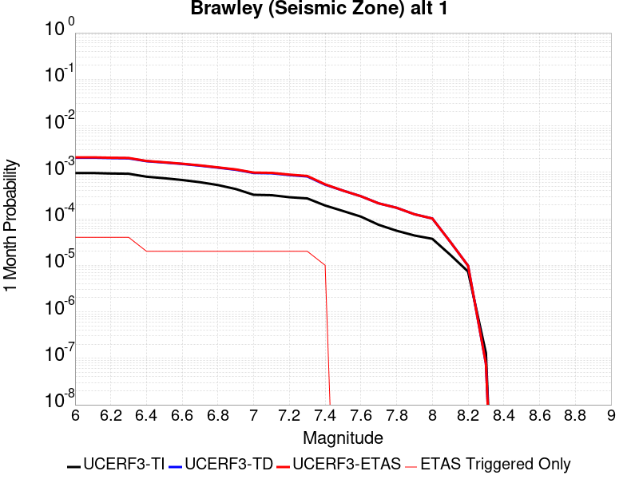 |  |  |

| Magnitude | 1 wk TI Prob | 1 wk TD Prob | 1 wk ETAS Prob | 1 wk ETAS/TD Gain | 1 wk ETAS Triggered Only | 1 mo TI Prob | 1 mo TD Prob | 1 mo ETAS Prob | 1 mo ETAS/TD Gain | 1 mo ETAS Triggered Only | 1 yr TI Prob | 1 yr TD Prob | 1 yr ETAS Prob | 1 yr ETAS/TD Gain | 1 yr ETAS Triggered Only | 10 yr TI Prob | 10 yr TD Prob | 10 yr ETAS Prob | 10 yr ETAS/TD Gain | 10 yr ETAS Triggered Only |
|-----|-----|-----|-----|-----|-----|-----|-----|-----|-----|-----|-----|-----|-----|-----|-----|-----|-----|-----|-----|-----|
| 6.0 | 2.2521618E-4 | 4.803704E-4 | 4.803704E-4 | 1.0 | 0.0 | 9.6485513E-4 | 0.0020571435 | 0.002083064 | 1.0126003 | 2.5974026E-5 | 0.011683988 | 0.024750125 | 0.024775457 | 1.0010235 | 2.5974026E-5 | 0.11088423 | 0.21487078 | 0.21491157 | 1.0001898 | 5.1948053E-5 |
| 6.1 | 2.2521618E-4 | 4.803704E-4 | 4.803704E-4 | 1.0 | 0.0 | 9.6485513E-4 | 0.0020571435 | 0.002083064 | 1.0126003 | 2.5974026E-5 | 0.011683988 | 0.024750125 | 0.024775457 | 1.0010235 | 2.5974026E-5 | 0.11088423 | 0.21487078 | 0.21491157 | 1.0001898 | 5.1948053E-5 |
| 6.2 | 2.198148E-4 | 4.7112687E-4 | 4.7112687E-4 | 1.0 | 0.0 | 9.417233E-4 | 0.0020175898 | 0.0020435115 | 1.0128478 | 2.5974026E-5 | 0.011405343 | 0.024279837 | 0.02430518 | 1.0010438 | 2.5974026E-5 | 0.10837428 | 0.2112889 | 0.21132988 | 1.000194 | 5.1948053E-5 |
| 6.3 | 2.1704129E-4 | 4.654657E-4 | 4.654657E-4 | 1.0 | 0.0 | 9.298453E-4 | 0.001993365 | 0.0020192873 | 1.0130043 | 2.5974026E-5 | 0.011262234 | 0.023992386 | 0.024017738 | 1.0010567 | 2.5974026E-5 | 0.107082725 | 0.20917864 | 0.20921972 | 1.0001963 | 5.1948053E-5 |
| 6.4 | 1.876142E-4 | 4.0423116E-4 | 4.0423116E-4 | 1.0 | 0.0 | 8.038131E-4 | 0.0017312837 | 0.0017312837 | 1.0 | 0.0 | 0.00974259 | 0.020873617 | 0.020873617 | 1.0 | 0.0 | 0.093263686 | 0.18592408 | 0.18594523 | 1.0001137 | 2.5974026E-5 |
| 6.5 | 1.7390939E-4 | 3.784078E-4 | 3.784078E-4 | 1.0 | 0.0 | 7.45113E-4 | 0.0016207523 | 0.0016207523 | 1.0 | 0.0 | 0.009034078 | 0.019554611 | 0.019554611 | 1.0 | 0.0 | 0.086755216 | 0.17571972 | 0.17574114 | 1.0001218 | 2.5974026E-5 |
| 6.6 | 1.591791E-4 | 3.5236194E-4 | 3.5236194E-4 | 1.0 | 0.0 | 6.8201777E-4 | 0.0015092589 | 0.0015092589 | 1.0 | 0.0 | 0.008271996 | 0.018221226 | 0.018221226 | 1.0 | 0.0 | 0.07970774 | 0.16508435 | 0.16510604 | 1.0001314 | 2.5974026E-5 |
| 6.7 | 1.4268003E-4 | 3.2379685E-4 | 3.2379685E-4 | 1.0 | 0.0 | 6.1134255E-4 | 0.0013869712 | 0.0013869712 | 1.0 | 0.0 | 0.007417723 | 0.016756322 | 0.016756322 | 1.0 | 0.0 | 0.07174956 | 0.15315758 | 0.15317957 | 1.0001436 | 2.5974026E-5 |
| 6.8 | 1.239713E-4 | 2.932116E-4 | 2.932116E-4 | 1.0 | 0.0 | 5.3119735E-4 | 0.0012560224 | 0.0012560224 | 1.0 | 0.0 | 0.0064481674 | 0.015186317 | 0.015186317 | 1.0 | 0.0 | 0.06264243 | 0.13943222 | 0.13945457 | 1.0001603 | 2.5974026E-5 |
| 6.9 | 1.0180238E-4 | 2.6456433E-4 | 2.6456433E-4 | 1.0 | 0.0 | 4.3622297E-4 | 0.0011333587 | 0.0011333587 | 1.0 | 0.0 | 0.005298089 | 0.013712358 | 0.013712358 | 1.0 | 0.0 | 0.05173543 | 0.12577653 | 0.12579924 | 1.0001805 | 2.5974026E-5 |
| 7.0 | 7.6619996E-5 | 2.2548612E-4 | 2.2548612E-4 | 1.0 | 0.0 | 3.283301E-4 | 9.660144E-4 | 9.660144E-4 | 1.0 | 0.0 | 0.0039900932 | 0.011698519 | 0.011698519 | 1.0 | 0.0 | 0.039192066 | 0.10787473 | 0.1078979 | 1.0002148 | 2.5974026E-5 |
| 7.1 | 7.5127435E-5 | 2.222965E-4 | 2.222965E-4 | 1.0 | 0.0 | 3.2193496E-4 | 9.5235463E-4 | 9.5235463E-4 | 1.0 | 0.0 | 0.0039125155 | 0.011533984 | 0.011533984 | 1.0 | 0.0 | 0.038443442 | 0.10643124 | 0.10645445 | 1.000218 | 2.5974026E-5 |
| 7.2 | 6.788582E-5 | 2.0351722E-4 | 2.0351722E-4 | 1.0 | 0.0 | 2.9090676E-4 | 8.719282E-4 | 8.719282E-4 | 1.0 | 0.0 | 0.0035360386 | 0.010564702 | 0.010564702 | 1.0 | 0.0 | 0.034803 | 0.09808476 | 0.09810819 | 1.0002389 | 2.5974026E-5 |
| 7.3 | 6.399602E-5 | 1.8976163E-4 | 1.8976163E-4 | 1.0 | 0.0 | 2.7423984E-4 | 8.130135E-4 | 8.130135E-4 | 1.0 | 0.0 | 0.0033337586 | 0.009854113 | 0.009854113 | 1.0 | 0.0 | 0.03284188 | 0.091958724 | 0.09198231 | 1.0002565 | 2.5974026E-5 |
| 7.4 | 4.506759E-5 | 1.2631947E-4 | 1.2631947E-4 | 1.0 | 0.0 | 1.9313251E-4 | 5.4125773E-4 | 5.4125773E-4 | 1.0 | 0.0 | 0.0023488526 | 0.0065700784 | 0.0065700784 | 1.0 | 0.0 | 0.023241805 | 0.062813066 | 0.06283741 | 1.0003875 | 2.5974026E-5 |
| 7.5 | 3.43289E-5 | 9.422243E-5 | 9.422243E-5 | 1.0 | 0.0 | 1.4711556E-4 | 4.037482E-4 | 4.037482E-4 | 1.0 | 0.0 | 0.0017896603 | 0.004904618 | 0.004904618 | 1.0 | 0.0 | 0.01775316 | 0.04744282 | 0.04744282 | 1.0 | 0.0 |
| 7.6 | 2.5980507E-5 | 7.128511E-5 | 7.128511E-5 | 1.0 | 0.0 | 1.1134028E-4 | 3.05472E-4 | 3.05472E-4 | 1.0 | 0.0 | 0.001354725 | 0.0037128036 | 0.0037128036 | 1.0 | 0.0 | 0.013464959 | 0.036181886 | 0.036181886 | 1.0 | 0.0 |
| 7.7 | 1.7292105E-5 | 5.0051847E-5 | 5.0051847E-5 | 1.0 | 0.0 | 7.4106916E-5 | 2.1449031E-4 | 2.1449031E-4 | 1.0 | 0.0 | 9.018782E-4 | 0.002608298 | 0.002608298 | 1.0 | 0.0 | 0.008982267 | 0.0255827 | 0.0255827 | 1.0 | 0.0 |
| 7.8 | 1.2927471E-5 | 4.025381E-5 | 4.025381E-5 | 1.0 | 0.0 | 5.5402274E-5 | 1.7250494E-4 | 1.7250494E-4 | 1.0 | 0.0 | 6.743139E-4 | 0.0020982272 | 0.0020982272 | 1.0 | 0.0 | 0.0067227143 | 0.020686088 | 0.020686088 | 1.0 | 0.0 |
| 7.9 | 1.0200774E-5 | 2.9199016E-5 | 2.9199016E-5 | 1.0 | 0.0 | 4.371687E-5 | 1.2513265E-4 | 1.2513265E-4 | 1.0 | 0.0 | 5.321229E-4 | 0.0015224264 | 0.0015224264 | 1.0 | 0.0 | 0.005308505 | 0.015200868 | 0.015200868 | 1.0 | 0.0 |
| 8.0 | 8.650396E-6 | 2.3666194E-5 | 2.3666194E-5 | 1.0 | 0.0 | 3.70726E-5 | 1.0142261E-4 | 1.0142261E-4 | 1.0 | 0.0 | 4.5126543E-4 | 0.0012341216 | 0.0012341216 | 1.0 | 0.0 | 0.0045035016 | 0.012392036 | 0.012392036 | 1.0 | 0.0 |
| 8.1 | 3.9368224E-6 | 7.495482E-6 | 7.495482E-6 | 1.0 | 0.0 | 1.6871985E-5 | 3.21231E-5 | 3.21231E-5 | 1.0 | 0.0 | 2.0539707E-4 | 3.9102868E-4 | 3.9102868E-4 | 1.0 | 0.0 | 0.0020520731 | 0.004084044 | 0.004084044 | 1.0 | 0.0 |
| 8.2 | 1.7101195E-6 | 2.2821782E-6 | 2.2821782E-6 | 1.0 | 0.0 | 7.329063E-6 | 9.780727E-6 | 9.780727E-6 | 1.0 | 0.0 | 8.922769E-5 | 1.1907388E-4 | 1.1907388E-4 | 1.0 | 0.0 | 8.9191867E-4 | 0.0012996283 | 0.0012996283 | 1.0 | 0.0 |
| 8.3 | 3.0346666E-8 | 1.7889603E-8 | 1.7889603E-8 | 1.0 | 0.0 | 1.3005713E-7 | 7.666972E-8 | 7.666972E-8 | 1.0 | 0.0 | 1.5834444E-6 | 9.3345375E-7 | 9.3345375E-7 | 1.0 | 0.0 | 1.5834332E-5 | 9.728626E-6 | 9.728626E-6 | 1.0 | 0.0 |

## Earthquake Valley (No  Extension)
*[(top)](#table-of-contents)*

| 1 Week | 1 Month | 1 Year | 10 Year |
|-----|-----|-----|-----|
|  |  |  |  |

| Magnitude | 1 wk TI Prob | 1 wk TD Prob | 1 wk ETAS Prob | 1 wk ETAS/TD Gain | 1 wk ETAS Triggered Only | 1 mo TI Prob | 1 mo TD Prob | 1 mo ETAS Prob | 1 mo ETAS/TD Gain | 1 mo ETAS Triggered Only | 1 yr TI Prob | 1 yr TD Prob | 1 yr ETAS Prob | 1 yr ETAS/TD Gain | 1 yr ETAS Triggered Only | 10 yr TI Prob | 10 yr TD Prob | 10 yr ETAS Prob | 10 yr ETAS/TD Gain | 10 yr ETAS Triggered Only |
|-----|-----|-----|-----|-----|-----|-----|-----|-----|-----|-----|-----|-----|-----|-----|-----|-----|-----|-----|-----|-----|
| 6.0 | 2.1859703E-5 | 2.5218891E-5 | 2.5218891E-5 | 1.0 | 0.0 | 9.3681076E-5 | 1.080773E-4 | 1.080773E-4 | 1.0 | 0.0 | 0.0011399703 | 0.0013151922 | 0.0013151922 | 1.0 | 0.0 | 0.011341401 | 0.013088471 | 0.013114105 | 1.0019585 | 2.5974026E-5 |
| 6.1 | 2.1859703E-5 | 2.5218891E-5 | 2.5218891E-5 | 1.0 | 0.0 | 9.3681076E-5 | 1.080773E-4 | 1.080773E-4 | 1.0 | 0.0 | 0.0011399703 | 0.0013151922 | 0.0013151922 | 1.0 | 0.0 | 0.011341401 | 0.013088471 | 0.013114105 | 1.0019585 | 2.5974026E-5 |
| 6.2 | 2.1859703E-5 | 2.5218891E-5 | 2.5218891E-5 | 1.0 | 0.0 | 9.3681076E-5 | 1.080773E-4 | 1.080773E-4 | 1.0 | 0.0 | 0.0011399703 | 0.0013151922 | 0.0013151922 | 1.0 | 0.0 | 0.011341401 | 0.013088471 | 0.013114105 | 1.0019585 | 2.5974026E-5 |
| 6.3 | 2.1859703E-5 | 2.5218891E-5 | 2.5218891E-5 | 1.0 | 0.0 | 9.3681076E-5 | 1.080773E-4 | 1.080773E-4 | 1.0 | 0.0 | 0.0011399703 | 0.0013151922 | 0.0013151922 | 1.0 | 0.0 | 0.011341401 | 0.013088471 | 0.013114105 | 1.0019585 | 2.5974026E-5 |
| 6.4 | 2.1859703E-5 | 2.5218891E-5 | 2.5218891E-5 | 1.0 | 0.0 | 9.3681076E-5 | 1.080773E-4 | 1.080773E-4 | 1.0 | 0.0 | 0.0011399703 | 0.0013151922 | 0.0013151922 | 1.0 | 0.0 | 0.011341401 | 0.013088471 | 0.013114105 | 1.0019585 | 2.5974026E-5 |
| 6.5 | 2.1859703E-5 | 2.5218891E-5 | 2.5218891E-5 | 1.0 | 0.0 | 9.3681076E-5 | 1.080773E-4 | 1.080773E-4 | 1.0 | 0.0 | 0.0011399703 | 0.0013151922 | 0.0013151922 | 1.0 | 0.0 | 0.011341401 | 0.013088471 | 0.013114105 | 1.0019585 | 2.5974026E-5 |
| 6.6 | 1.597E-5 | 1.8371084E-5 | 1.8371084E-5 | 1.0 | 0.0 | 6.8441055E-5 | 7.873133E-5 | 7.873133E-5 | 1.0 | 0.0 | 8.329513E-4 | 9.582199E-4 | 9.582199E-4 | 1.0 | 0.0 | 0.008298361 | 0.009549504 | 0.00957523 | 1.002694 | 2.5974026E-5 |
| 6.7 | 1.597E-5 | 1.8371084E-5 | 1.8371084E-5 | 1.0 | 0.0 | 6.8441055E-5 | 7.873133E-5 | 7.873133E-5 | 1.0 | 0.0 | 8.329513E-4 | 9.582199E-4 | 9.582199E-4 | 1.0 | 0.0 | 0.008298361 | 0.009549504 | 0.00957523 | 1.002694 | 2.5974026E-5 |
| 6.8 | 1.5315149E-5 | 1.7616308E-5 | 1.7616308E-5 | 1.0 | 0.0 | 6.5634704E-5 | 7.549677E-5 | 7.549677E-5 | 1.0 | 0.0 | 7.988095E-4 | 9.1887236E-4 | 9.1887236E-4 | 1.0 | 0.0 | 0.007959441 | 0.009159285 | 0.009185021 | 1.0028099 | 2.5974026E-5 |
| 6.9 | 1.3634728E-5 | 1.5688578E-5 | 1.5688578E-5 | 1.0 | 0.0 | 5.8433237E-5 | 6.7235494E-5 | 6.7235494E-5 | 1.0 | 0.0 | 7.1119244E-4 | 8.183669E-4 | 8.183669E-4 | 1.0 | 0.0 | 0.007089207 | 0.008161617 | 0.008187379 | 1.0031565 | 2.5974026E-5 |
| 7.0 | 1.3496271E-5 | 1.5530493E-5 | 1.5530493E-5 | 1.0 | 0.0 | 5.783988E-5 | 6.655802E-5 | 6.655802E-5 | 1.0 | 0.0 | 7.03973E-4 | 8.101249E-4 | 8.101249E-4 | 1.0 | 0.0 | 0.007017471 | 0.008079798 | 0.008105562 | 1.0031887 | 2.5974026E-5 |
| 7.1 | 8.242798E-6 | 9.480524E-6 | 9.480524E-6 | 1.0 | 0.0 | 3.53258E-5 | 4.0630563E-5 | 4.0630563E-5 | 1.0 | 0.0 | 4.300067E-4 | 4.94632E-4 | 4.94632E-4 | 1.0 | 0.0 | 0.004291756 | 0.004941898 | 0.004941898 | 1.0 | 0.0 |
| 7.2 | 2.6506527E-7 | 2.259121E-7 | 2.259121E-7 | 1.0 | 0.0 | 1.1359936E-6 | 9.681944E-7 | 9.681944E-7 | 1.0 | 0.0 | 1.3830633E-5 | 1.1787707E-5 | 1.1787707E-5 | 1.0 | 0.0 | 1.3829772E-4 | 1.17871234E-4 | 1.17871234E-4 | 1.0 | 0.0 |
| 7.3 | 2.5810488E-7 | 2.1986037E-7 | 2.1986037E-7 | 1.0 | 0.0 | 1.1061633E-6 | 9.422584E-7 | 9.422584E-7 | 1.0 | 0.0 | 1.3467455E-5 | 1.147194E-5 | 1.147194E-5 | 1.0 | 0.0 | 1.3466639E-4 | 1.1471389E-4 | 1.1471389E-4 | 1.0 | 0.0 |
| 7.4 | 2.2676066E-7 | 1.9140145E-7 | 1.9140145E-7 | 1.0 | 0.0 | 9.71831E-7 | 8.202917E-7 | 8.202917E-7 | 1.0 | 0.0 | 1.1831979E-5 | 9.987009E-6 | 9.987009E-6 | 1.0 | 0.0 | 1.1831349E-4 | 9.9865996E-5 | 9.9865996E-5 | 1.0 | 0.0 |
| 7.5 | 1.5553917E-7 | 1.3136662E-7 | 1.3136662E-7 | 1.0 | 0.0 | 6.6659624E-7 | 5.629997E-7 | 5.629997E-7 | 1.0 | 0.0 | 8.115779E-6 | 6.854502E-6 | 6.854502E-6 | 1.0 | 0.0 | 8.115482E-5 | 6.854312E-5 | 6.854312E-5 | 1.0 | 0.0 |
| 7.6 | 1.3448629E-7 | 1.1310612E-7 | 1.1310612E-7 | 1.0 | 0.0 | 5.7636964E-7 | 4.8474044E-7 | 4.8474044E-7 | 1.0 | 0.0 | 7.017278E-6 | 5.901701E-6 | 5.901701E-6 | 1.0 | 0.0 | 7.0170565E-5 | 5.9015656E-5 | 5.9015656E-5 | 1.0 | 0.0 |
| 7.7 | 2.9719402E-8 | 1.4609411E-8 | 1.4609411E-8 | 1.0 | 0.0 | 1.2736886E-7 | 6.261176E-8 | 6.261176E-8 | 1.0 | 0.0 | 1.5507147E-6 | 7.6229793E-7 | 7.6229793E-7 | 1.0 | 0.0 | 1.550704E-5 | 7.622959E-6 | 7.622959E-6 | 1.0 | 0.0 |
| 7.8 | 7.4390196E-9 | 3.2560412E-9 | 3.2560412E-9 | 1.0 | 0.0 | 3.1881513E-8 | 1.3954462E-8 | 1.3954462E-8 | 1.0 | 0.0 | 3.8815733E-7 | 1.6989556E-7 | 1.6989556E-7 | 1.0 | 0.0 | 3.8815665E-6 | 1.6989545E-6 | 1.6989545E-6 | 1.0 | 0.0 |
| 7.9 | 1.5373532E-9 | 8.451272E-10 | 8.451272E-10 | 1.0 | 0.0 | 6.5886567E-9 | 3.6219738E-9 | 3.6219738E-9 | 1.0 | 0.0 | 8.021689E-8 | 4.4097533E-8 | 4.4097533E-8 | 1.0 | 0.0 | 8.0216864E-7 | 4.409753E-7 | 4.409753E-7 | 1.0 | 0.0 |

## San Andreas (Creeping Section) 2011 CFM
*[(top)](#table-of-contents)*

| 1 Week | 1 Month | 1 Year | 10 Year |
|-----|-----|-----|-----|
|  |  |  |  |

| Magnitude | 1 wk TI Prob | 1 wk TD Prob | 1 wk ETAS Prob | 1 wk ETAS/TD Gain | 1 wk ETAS Triggered Only | 1 mo TI Prob | 1 mo TD Prob | 1 mo ETAS Prob | 1 mo ETAS/TD Gain | 1 mo ETAS Triggered Only | 1 yr TI Prob | 1 yr TD Prob | 1 yr ETAS Prob | 1 yr ETAS/TD Gain | 1 yr ETAS Triggered Only | 10 yr TI Prob | 10 yr TD Prob | 10 yr ETAS Prob | 10 yr ETAS/TD Gain | 10 yr ETAS Triggered Only |
|-----|-----|-----|-----|-----|-----|-----|-----|-----|-----|-----|-----|-----|-----|-----|-----|-----|-----|-----|-----|-----|
| 6.0 | 5.986481E-4 | 0.0012321565 | 0.0012580985 | 1.0210541 | 2.5974026E-5 | 0.0025631124 | 0.005265187 | 0.005291024 | 1.0049071 | 2.5974026E-5 | 0.030762846 | 0.06143059 | 0.061454967 | 1.0003968 | 2.5974026E-5 | 0.26835477 | 0.42711884 | 0.42713374 | 1.0000348 | 2.5974026E-5 |
| 6.1 | 5.015945E-4 | 0.0010255221 | 0.0010514695 | 1.0253017 | 2.5974026E-5 | 0.00214792 | 0.0043839044 | 0.004409765 | 1.0058988 | 2.5974026E-5 | 0.025839351 | 0.051435083 | 0.05145972 | 1.000479 | 2.5974026E-5 | 0.23032776 | 0.37398085 | 0.3739971 | 1.0000435 | 2.5974026E-5 |
| 6.2 | 4.073338E-4 | 8.143994E-4 | 8.4035227E-4 | 1.0318675 | 2.5974026E-5 | 0.0017445484 | 0.0034829527 | 0.0035088363 | 1.0074315 | 2.5974026E-5 | 0.021034058 | 0.04111887 | 0.041143775 | 1.0006057 | 2.5974026E-5 | 0.19150782 | 0.31425294 | 0.31427076 | 1.0000566 | 2.5974026E-5 |
| 6.3 | 3.464099E-4 | 6.7759946E-4 | 7.035559E-4 | 1.0383065 | 2.5974026E-5 | 0.0014837692 | 0.0028987958 | 0.0029246944 | 1.0089343 | 2.5974026E-5 | 0.017915873 | 0.0343766 | 0.03440168 | 1.0007296 | 2.5974026E-5 | 0.16538359 | 0.27260998 | 0.27262887 | 1.0000693 | 2.5974026E-5 |
| 6.4 | 2.935057E-4 | 5.581249E-4 | 5.840845E-4 | 1.046512 | 2.5974026E-5 | 0.0012572751 | 0.0023884408 | 0.0024143527 | 1.0108489 | 2.5974026E-5 | 0.015200248 | 0.028453352 | 0.028478587 | 1.0008869 | 2.5974026E-5 | 0.14201577 | 0.23435058 | 0.23437046 | 1.0000849 | 2.5974026E-5 |
| 6.5 | 2.3409708E-4 | 4.2464296E-4 | 4.5060596E-4 | 1.0611408 | 2.5974026E-5 | 0.0010028875 | 0.0018178936 | 0.0018438204 | 1.014262 | 2.5974026E-5 | 0.012141965 | 0.021777635 | 0.021803044 | 1.0011667 | 2.5974026E-5 | 0.11499573 | 0.18827106 | 0.18829215 | 1.0001119 | 2.5974026E-5 |
| 6.6 | 1.5842178E-4 | 2.5439166E-4 | 2.8035906E-4 | 1.1020765 | 2.5974026E-5 | 6.7877385E-4 | 0.0010897855 | 0.0011157312 | 1.0238081 | 2.5974026E-5 | 0.0082328 | 0.013186039 | 0.013211671 | 1.0019438 | 2.5974026E-5 | 0.07934396 | 0.12469782 | 0.12472056 | 1.0001823 | 2.5974026E-5 |
| 6.7 | 1.5616413E-4 | 2.497475E-4 | 2.7571505E-4 | 1.1039752 | 2.5974026E-5 | 6.691031E-4 | 0.0010699016 | 0.0010958478 | 1.0242511 | 2.5974026E-5 | 0.0081159435 | 0.012947458 | 0.012973095 | 1.0019802 | 2.5974026E-5 | 0.0782586 | 0.122724846 | 0.12274763 | 1.0001857 | 2.5974026E-5 |
| 6.8 | 1.5538467E-4 | 2.4797782E-4 | 2.739454E-4 | 1.1047174 | 2.5974026E-5 | 6.6576427E-4 | 0.001062324 | 0.0010882705 | 1.0244242 | 2.5974026E-5 | 0.008075596 | 0.012856445 | 0.0128820855 | 1.0019944 | 2.5974026E-5 | 0.07788358 | 0.121953905 | 0.12197671 | 1.000187 | 2.5974026E-5 |
| 6.9 | 1.5153569E-4 | 2.3903942E-4 | 2.6500726E-4 | 1.108634 | 2.5974026E-5 | 6.49277E-4 | 0.0010240544 | 0.0010500018 | 1.0253379 | 2.5974026E-5 | 0.007876333 | 0.012397124 | 0.012422776 | 1.0020692 | 2.5974026E-5 | 0.07602952 | 0.118018895 | 0.118041806 | 1.0001941 | 2.5974026E-5 |
| 7.0 | 1.4588932E-4 | 2.2754297E-4 | 2.5351107E-4 | 1.1141241 | 2.5974026E-5 | 6.250901E-4 | 9.748217E-4 | 0.0010007704 | 1.026619 | 2.5974026E-5 | 0.0075839474 | 0.01180438 | 0.011830048 | 1.0021744 | 2.5974026E-5 | 0.073302895 | 0.112846896 | 0.11286994 | 1.0002042 | 2.5974026E-5 |
| 7.1 | 1.1565079E-4 | 1.659106E-4 | 1.9188032E-4 | 1.1565284 | 2.5974026E-5 | 4.955521E-4 | 7.1085256E-4 | 7.368081E-4 | 1.0365133 | 2.5974026E-5 | 0.006016669 | 0.008620496 | 0.008646246 | 1.002987 | 2.5974026E-5 | 0.058563538 | 0.085055165 | 0.085078925 | 1.0002794 | 2.5974026E-5 |
| 7.2 | 1.0393792E-4 | 1.4905258E-4 | 1.7502274E-4 | 1.1742349 | 2.5974026E-5 | 4.4537216E-4 | 6.386412E-4 | 6.645986E-4 | 1.0406448 | 2.5974026E-5 | 0.005408933 | 0.0077479114 | 0.0077736843 | 1.0033264 | 2.5974026E-5 | 0.052791595 | 0.07693036 | 0.076954335 | 1.0003116 | 2.5974026E-5 |
| 7.3 | 9.332884E-5 | 1.303591E-4 | 1.5632974E-4 | 1.1992239 | 2.5974026E-5 | 3.999194E-4 | 5.5856287E-4 | 5.845224E-4 | 1.0464755 | 2.5974026E-5 | 0.0048581534 | 0.0067794374 | 0.0068052355 | 1.0038053 | 2.5974026E-5 | 0.047533102 | 0.06765879 | 0.067683004 | 1.0003579 | 2.5974026E-5 |
| 7.4 | 8.670252E-5 | 1.1942912E-4 | 1.4540004E-4 | 1.2174588 | 2.5974026E-5 | 3.715293E-4 | 5.117393E-4 | 5.377E-4 | 1.0507303 | 2.5974026E-5 | 0.004513991 | 0.006212752 | 0.0062385644 | 1.0041548 | 2.5974026E-5 | 0.044233937 | 0.062263906 | 0.062288262 | 1.0003912 | 2.5974026E-5 |
| 7.5 | 7.3036405E-5 | 9.20819E-5 | 1.1805353E-4 | 1.2820493 | 2.5974026E-5 | 3.129756E-4 | 3.9457713E-4 | 4.205409E-4 | 1.0658015 | 2.5974026E-5 | 0.0038038217 | 0.004793417 | 0.0048192665 | 1.0053927 | 2.5974026E-5 | 0.03739367 | 0.048842624 | 0.048867326 | 1.0005058 | 2.5974026E-5 |
| 7.6 | 6.3935775E-5 | 8.463472E-5 | 1.1060654E-4 | 1.3068696 | 2.5974026E-5 | 2.7398168E-4 | 3.6266987E-4 | 3.8863448E-4 | 1.0715929 | 2.5974026E-5 | 0.0033306254 | 0.0044065854 | 0.004432445 | 1.0058684 | 2.5974026E-5 | 0.032811474 | 0.044864945 | 0.044889756 | 1.000553 | 2.5974026E-5 |
| 7.7 | 5.5050095E-5 | 6.824078E-5 | 9.421303E-5 | 1.3805972 | 2.5974026E-5 | 2.3590765E-4 | 2.924277E-4 | 3.1839413E-4 | 1.088796 | 2.5974026E-5 | 0.0028683927 | 0.0035544995 | 0.0035803812 | 1.0072814 | 2.5974026E-5 | 0.0283165 | 0.036581945 | 0.036606967 | 1.000684 | 2.5974026E-5 |
| 7.8 | 5.027131E-5 | 6.311271E-5 | 8.908509E-5 | 1.4115238 | 2.5974026E-5 | 2.1543067E-4 | 2.7045503E-4 | 2.9642202E-4 | 1.0960122 | 2.5974026E-5 | 0.0026197135 | 0.0032878215 | 0.0033137102 | 1.0078741 | 2.5974026E-5 | 0.025890453 | 0.033847377 | 0.033872474 | 1.0007414 | 2.5974026E-5 |
| 7.9 | 3.7271806E-5 | 5.1421433E-5 | 7.739412E-5 | 1.5050946 | 2.5974026E-5 | 1.5972654E-4 | 2.2035897E-4 | 2.4632725E-4 | 1.1178454 | 2.5974026E-5 | 0.0019429359 | 0.0026795717 | 0.0027054762 | 1.0096674 | 2.5974026E-5 | 0.019260362 | 0.027654678 | 0.027679933 | 1.0009133 | 2.5974026E-5 |
| 8.0 | 2.7310243E-5 | 3.2223743E-5 | 5.8196933E-5 | 1.8060265 | 2.5974026E-5 | 1.17038646E-4 | 1.3809444E-4 | 1.6406488E-4 | 1.1880629 | 2.5974026E-5 | 0.0014240141 | 0.0016800042 | 0.0017059346 | 1.0154347 | 2.5974026E-5 | 0.014149235 | 0.017617824 | 0.01764334 | 1.0014483 | 2.5974026E-5 |
| 8.1 | 1.7940547E-5 | 1.7913762E-5 | 4.3887325E-5 | 2.449922 | 2.5974026E-5 | 7.688579E-5 | 7.677101E-5 | 1.0274304E-4 | 1.3383052 | 2.5974026E-5 | 9.3568244E-4 | 9.342868E-4 | 9.602366E-4 | 1.0277749 | 2.5974026E-5 | 0.009317525 | 0.010068464 | 0.010094177 | 1.0025538 | 2.5974026E-5 |
| 8.2 | 8.643924E-6 | 5.680264E-6 | 5.680264E-6 | 1.0 | 0.0 | 3.704486E-5 | 2.4343763E-5 | 2.4343763E-5 | 1.0 | 0.0 | 4.5092785E-4 | 2.963451E-4 | 2.963451E-4 | 1.0 | 0.0 | 0.0045001395 | 0.0033610219 | 0.0033610219 | 1.0 | 0.0 |
| 8.3 | 1.983087E-6 | 8.001618E-7 | 8.001618E-7 | 1.0 | 0.0 | 8.498917E-6 | 3.4292605E-6 | 3.4292605E-6 | 1.0 | 0.0 | 1.034694E-4 | 4.1750463E-5 | 4.1750463E-5 | 1.0 | 0.0 | 0.0010342124 | 4.915874E-4 | 4.915874E-4 | 1.0 | 0.0 |

## San Andreas (Peninsula) 2011 CFM
*[(top)](#table-of-contents)*

| 1 Week | 1 Month | 1 Year | 10 Year |
|-----|-----|-----|-----|
|  |  |  |  |

| Magnitude | 1 wk TI Prob | 1 wk TD Prob | 1 wk ETAS Prob | 1 wk ETAS/TD Gain | 1 wk ETAS Triggered Only | 1 mo TI Prob | 1 mo TD Prob | 1 mo ETAS Prob | 1 mo ETAS/TD Gain | 1 mo ETAS Triggered Only | 1 yr TI Prob | 1 yr TD Prob | 1 yr ETAS Prob | 1 yr ETAS/TD Gain | 1 yr ETAS Triggered Only | 10 yr TI Prob | 10 yr TD Prob | 10 yr ETAS Prob | 10 yr ETAS/TD Gain | 10 yr ETAS Triggered Only |
|-----|-----|-----|-----|-----|-----|-----|-----|-----|-----|-----|-----|-----|-----|-----|-----|-----|-----|-----|-----|-----|
| 6.0 | 8.6200685E-5 | 2.6140377E-5 | 5.2113723E-5 | 1.9936103 | 2.5974026E-5 | 3.6937918E-4 | 1.1202538E-4 | 1.379965E-4 | 1.2318324 | 2.5974026E-5 | 0.0044879215 | 0.0013630574 | 0.001388996 | 1.0190297 | 2.5974026E-5 | 0.043983612 | 0.015279642 | 0.01530522 | 1.0016739 | 2.5974026E-5 |
| 6.1 | 8.6200685E-5 | 2.6140377E-5 | 5.2113723E-5 | 1.9936103 | 2.5974026E-5 | 3.6937918E-4 | 1.1202538E-4 | 1.379965E-4 | 1.2318324 | 2.5974026E-5 | 0.0044879215 | 0.0013630574 | 0.001388996 | 1.0190297 | 2.5974026E-5 | 0.043983612 | 0.015279642 | 0.01530522 | 1.0016739 | 2.5974026E-5 |
| 6.2 | 8.6200685E-5 | 2.6140377E-5 | 5.2113723E-5 | 1.9936103 | 2.5974026E-5 | 3.6937918E-4 | 1.1202538E-4 | 1.379965E-4 | 1.2318324 | 2.5974026E-5 | 0.0044879215 | 0.0013630574 | 0.001388996 | 1.0190297 | 2.5974026E-5 | 0.043983612 | 0.015279642 | 0.01530522 | 1.0016739 | 2.5974026E-5 |
| 6.3 | 8.551163E-5 | 2.582592E-5 | 5.1799274E-5 | 2.0057087 | 2.5974026E-5 | 3.6642692E-4 | 1.1067783E-4 | 1.3664897E-4 | 1.2346554 | 2.5974026E-5 | 0.004452125 | 0.0013466714 | 0.0013726105 | 1.0192616 | 2.5974026E-5 | 0.043639794 | 0.015102992 | 0.015128574 | 1.0016938 | 2.5974026E-5 |
| 6.4 | 8.551163E-5 | 2.582592E-5 | 5.1799274E-5 | 2.0057087 | 2.5974026E-5 | 3.6642692E-4 | 1.1067783E-4 | 1.3664897E-4 | 1.2346554 | 2.5974026E-5 | 0.004452125 | 0.0013466714 | 0.0013726105 | 1.0192616 | 2.5974026E-5 | 0.043639794 | 0.015102992 | 0.015128574 | 1.0016938 | 2.5974026E-5 |
| 6.5 | 8.511146E-5 | 2.5643623E-5 | 5.1616982E-5 | 2.0128584 | 2.5974026E-5 | 3.647124E-4 | 1.09896624E-4 | 1.358678E-4 | 1.2363236 | 2.5974026E-5 | 0.004431336 | 0.0013371719 | 0.0013631112 | 1.0193986 | 2.5974026E-5 | 0.04344007 | 0.015000985 | 0.015026569 | 1.0017055 | 2.5974026E-5 |
| 6.6 | 8.4985084E-5 | 2.5573196E-5 | 5.1546558E-5 | 2.015648 | 2.5974026E-5 | 3.6417096E-4 | 1.0959481E-4 | 1.3556599E-4 | 1.2369745 | 2.5974026E-5 | 0.0044247704 | 0.0013335019 | 0.0013594412 | 1.0194521 | 2.5974026E-5 | 0.043376986 | 0.014962403 | 0.014987988 | 1.0017099 | 2.5974026E-5 |
| 6.7 | 8.462618E-5 | 2.5398518E-5 | 5.1371884E-5 | 2.022633 | 2.5974026E-5 | 3.6263323E-4 | 1.0884626E-4 | 1.3481746E-4 | 1.2386044 | 2.5974026E-5 | 0.004406125 | 0.0013243994 | 0.0013503389 | 1.019586 | 2.5974026E-5 | 0.043197807 | 0.014865392 | 0.01489098 | 1.0017213 | 2.5974026E-5 |
| 6.8 | 8.42337E-5 | 2.5291727E-5 | 5.1265095E-5 | 2.026951 | 2.5974026E-5 | 3.6095164E-4 | 1.0838862E-4 | 1.3435983E-4 | 1.239612 | 2.5974026E-5 | 0.004385734 | 0.0013188344 | 0.0013447742 | 1.0196687 | 2.5974026E-5 | 0.043001823 | 0.01480478 | 0.014830369 | 1.0017284 | 2.5974026E-5 |
| 6.9 | 8.365989E-5 | 2.5092304E-5 | 5.106568E-5 | 2.035113 | 2.5974026E-5 | 3.5849313E-4 | 1.07534026E-4 | 1.3350525E-4 | 1.2415165 | 2.5974026E-5 | 0.004355922 | 0.0013084421 | 0.0013343822 | 1.0198251 | 2.5974026E-5 | 0.04271523 | 0.014695167 | 0.014720758 | 1.0017415 | 2.5974026E-5 |
| 7.0 | 8.30936E-5 | 2.485017E-5 | 5.082355E-5 | 2.0451994 | 2.5974026E-5 | 3.560668E-4 | 1.0649639E-4 | 1.3246764E-4 | 1.2438699 | 2.5974026E-5 | 0.004326499 | 0.0012958241 | 0.0013217644 | 1.0200185 | 2.5974026E-5 | 0.042432297 | 0.0145642925 | 0.014589889 | 1.0017574 | 2.5974026E-5 |
| 7.1 | 8.041264E-5 | 2.4528608E-5 | 5.0501996E-5 | 2.0589018 | 2.5974026E-5 | 3.4458007E-4 | 1.0511838E-4 | 1.3108968E-4 | 1.2470671 | 2.5974026E-5 | 0.0041871946 | 0.0012790667 | 0.0013050074 | 1.0202811 | 2.5974026E-5 | 0.041091725 | 0.014382651 | 0.014408251 | 1.0017799 | 2.5974026E-5 |
| 7.2 | 7.8427016E-5 | 2.3942212E-5 | 4.9915616E-5 | 2.0848374 | 2.5974026E-5 | 3.3607247E-4 | 1.02605445E-4 | 1.2857681E-4 | 1.2531188 | 2.5974026E-5 | 0.004084008 | 0.0012485072 | 0.0012744487 | 1.0207781 | 2.5974026E-5 | 0.040097635 | 0.014061596 | 0.014087205 | 1.0018212 | 2.5974026E-5 |
| 7.3 | 7.721087E-5 | 2.37235E-5 | 4.9696908E-5 | 2.0948389 | 2.5974026E-5 | 3.3086175E-4 | 1.01668185E-4 | 1.2763958E-4 | 1.2554524 | 2.5974026E-5 | 0.004020803 | 0.0012371091 | 0.001263051 | 1.0209697 | 2.5974026E-5 | 0.03948827 | 0.013943321 | 0.013968932 | 1.0018369 | 2.5974026E-5 |
| 7.4 | 7.3536525E-5 | 2.1785814E-5 | 4.7759273E-5 | 2.192219 | 2.5974026E-5 | 3.1511846E-4 | 9.336444E-5 | 1.1933604E-4 | 1.2781744 | 2.5974026E-5 | 0.0038298194 | 0.0011361206 | 0.0011620652 | 1.0228361 | 2.5974026E-5 | 0.037644852 | 0.012873475 | 0.012899116 | 1.0019916 | 2.5974026E-5 |
| 7.5 | 6.806207E-5 | 1.9516918E-5 | 4.5490437E-5 | 2.3308208 | 2.5974026E-5 | 2.9166197E-4 | 8.364126E-5 | 1.0961311E-4 | 1.3105148 | 2.5974026E-5 | 0.0035452035 | 0.0010178577 | 0.0010438053 | 1.0254923 | 2.5974026E-5 | 0.034891766 | 0.0115886405 | 0.011614313 | 1.0022154 | 2.5974026E-5 |
| 7.6 | 5.6731416E-5 | 1.4749307E-5 | 4.072295E-5 | 2.7610075 | 2.5974026E-5 | 2.43112E-4 | 6.320979E-5 | 8.918217E-5 | 1.4108918 | 2.5974026E-5 | 0.0029558712 | 7.6930755E-4 | 7.952616E-4 | 1.033737 | 2.5974026E-5 | 0.02916862 | 0.0088075185 | 0.008833264 | 1.0029231 | 2.5974026E-5 |
| 7.7 | 4.946994E-5 | 1.3774739E-5 | 3.9748407E-5 | 2.8856013 | 2.5974026E-5 | 2.1199681E-4 | 5.9033264E-5 | 8.5005755E-5 | 1.4399637 | 2.5974026E-5 | 0.002578006 | 7.1849313E-4 | 7.4444845E-4 | 1.0361247 | 2.5974026E-5 | 0.02548303 | 0.00820545 | 0.008231211 | 1.0031395 | 2.5974026E-5 |
| 7.8 | 3.9718198E-5 | 1.3490156E-5 | 3.946383E-5 | 2.92538 | 2.5974026E-5 | 1.7020974E-4 | 5.781367E-5 | 8.3786195E-5 | 1.4492453 | 2.5974026E-5 | 0.0020703338 | 7.036543E-4 | 7.2961004E-4 | 1.036887 | 2.5974026E-5 | 0.020511515 | 0.008001879 | 0.008027645 | 1.00322 | 2.5974026E-5 |
| 7.9 | 2.4115114E-5 | 1.2634918E-5 | 3.8608614E-5 | 3.0557077 | 2.5974026E-5 | 1.0334639E-4 | 5.4148524E-5 | 8.012114E-5 | 1.4796551 | 2.5974026E-5 | 0.001257516 | 6.5905903E-4 | 6.850159E-4 | 1.0393848 | 2.5974026E-5 | 0.012504238 | 0.0074038287 | 0.0074296105 | 1.0034822 | 2.5974026E-5 |
| 8.0 | 1.7756569E-5 | 1.181544E-5 | 3.778916E-5 | 3.198286 | 2.5974026E-5 | 7.6097356E-5 | 5.063662E-5 | 7.660933E-5 | 1.5129235 | 2.5974026E-5 | 9.260915E-4 | 6.163266E-4 | 6.4228463E-4 | 1.0421174 | 2.5974026E-5 | 0.009222416 | 0.006877804 | 0.0069035995 | 1.0037506 | 2.5974026E-5 |
| 8.1 | 1.3159258E-5 | 1.0088933E-5 | 3.60627E-5 | 3.5744808 | 2.5974026E-5 | 5.6395602E-5 | 4.3237567E-5 | 6.9210466E-5 | 1.6007023 | 2.5974026E-5 | 6.864001E-4 | 5.262903E-4 | 5.522507E-4 | 1.049327 | 2.5974026E-5 | 0.0068428386 | 0.005874056 | 0.0058998773 | 1.0043958 | 2.5974026E-5 |
| 8.2 | 8.635426E-6 | 5.672124E-6 | 5.672124E-6 | 1.0 | 0.0 | 3.700844E-5 | 2.4308876E-5 | 2.4308876E-5 | 1.0 | 0.0 | 4.5048463E-4 | 2.9592047E-4 | 2.9592047E-4 | 1.0 | 0.0 | 0.004495725 | 0.0033567175 | 0.0033567175 | 1.0 | 0.0 |
| 8.3 | 1.983087E-6 | 8.001618E-7 | 8.001618E-7 | 1.0 | 0.0 | 8.498917E-6 | 3.4292605E-6 | 3.4292605E-6 | 1.0 | 0.0 | 1.034694E-4 | 4.1750463E-5 | 4.1750463E-5 | 1.0 | 0.0 | 0.0010342124 | 4.915874E-4 | 4.915874E-4 | 1.0 | 0.0 |

## Earthquake Valley
*[(top)](#table-of-contents)*

| 1 Week | 1 Month | 1 Year | 10 Year |
|-----|-----|-----|-----|
|  |  |  |  |

| Magnitude | 1 wk TI Prob | 1 wk TD Prob | 1 wk ETAS Prob | 1 wk ETAS/TD Gain | 1 wk ETAS Triggered Only | 1 mo TI Prob | 1 mo TD Prob | 1 mo ETAS Prob | 1 mo ETAS/TD Gain | 1 mo ETAS Triggered Only | 1 yr TI Prob | 1 yr TD Prob | 1 yr ETAS Prob | 1 yr ETAS/TD Gain | 1 yr ETAS Triggered Only | 10 yr TI Prob | 10 yr TD Prob | 10 yr ETAS Prob | 10 yr ETAS/TD Gain | 10 yr ETAS Triggered Only |
|-----|-----|-----|-----|-----|-----|-----|-----|-----|-----|-----|-----|-----|-----|-----|-----|-----|-----|-----|-----|-----|
| 6.0 | 1.9416384E-5 | 2.2603754E-5 | 2.2603754E-5 | 1.0 | 0.0 | 8.321042E-5 | 9.687031E-5 | 9.687031E-5 | 1.0 | 0.0 | 0.001012616 | 0.0011788778 | 0.0011788778 | 1.0 | 0.0 | 0.010080142 | 0.011738093 | 0.011763762 | 1.0021868 | 2.5974026E-5 |
| 6.1 | 1.9416384E-5 | 2.2603754E-5 | 2.2603754E-5 | 1.0 | 0.0 | 8.321042E-5 | 9.687031E-5 | 9.687031E-5 | 1.0 | 0.0 | 0.001012616 | 0.0011788778 | 0.0011788778 | 1.0 | 0.0 | 0.010080142 | 0.011738093 | 0.011763762 | 1.0021868 | 2.5974026E-5 |
| 6.2 | 1.9416384E-5 | 2.2603754E-5 | 2.2603754E-5 | 1.0 | 0.0 | 8.321042E-5 | 9.687031E-5 | 9.687031E-5 | 1.0 | 0.0 | 0.001012616 | 0.0011788778 | 0.0011788778 | 1.0 | 0.0 | 0.010080142 | 0.011738093 | 0.011763762 | 1.0021868 | 2.5974026E-5 |
| 6.3 | 1.9416384E-5 | 2.2603754E-5 | 2.2603754E-5 | 1.0 | 0.0 | 8.321042E-5 | 9.687031E-5 | 9.687031E-5 | 1.0 | 0.0 | 0.001012616 | 0.0011788778 | 0.0011788778 | 1.0 | 0.0 | 0.010080142 | 0.011738093 | 0.011763762 | 1.0021868 | 2.5974026E-5 |
| 6.4 | 1.9416384E-5 | 2.2603754E-5 | 2.2603754E-5 | 1.0 | 0.0 | 8.321042E-5 | 9.687031E-5 | 9.687031E-5 | 1.0 | 0.0 | 0.001012616 | 0.0011788778 | 0.0011788778 | 1.0 | 0.0 | 0.010080142 | 0.011738093 | 0.011763762 | 1.0021868 | 2.5974026E-5 |
| 6.5 | 1.9389157E-5 | 2.2572318E-5 | 2.2572318E-5 | 1.0 | 0.0 | 8.309374E-5 | 9.6735595E-5 | 9.6735595E-5 | 1.0 | 0.0 | 0.0010111968 | 0.0011772393 | 0.0011772393 | 1.0 | 0.0 | 0.010066078 | 0.011721881 | 0.011747551 | 1.0021899 | 2.5974026E-5 |
| 6.6 | 1.9389157E-5 | 2.2572318E-5 | 2.2572318E-5 | 1.0 | 0.0 | 8.309374E-5 | 9.6735595E-5 | 9.6735595E-5 | 1.0 | 0.0 | 0.0010111968 | 0.0011772393 | 0.0011772393 | 1.0 | 0.0 | 0.010066078 | 0.011721881 | 0.011747551 | 1.0021899 | 2.5974026E-5 |
| 6.7 | 1.4925434E-5 | 1.7222386E-5 | 1.7222386E-5 | 1.0 | 0.0 | 6.396457E-5 | 7.380862E-5 | 7.380862E-5 | 1.0 | 0.0 | 7.7849044E-4 | 8.9833466E-4 | 8.9833466E-4 | 1.0 | 0.0 | 0.007757689 | 0.008955422 | 0.008981164 | 1.0028744 | 2.5974026E-5 |
| 6.8 | 1.3570335E-5 | 1.5629566E-5 | 1.5629566E-5 | 1.0 | 0.0 | 5.8157282E-5 | 6.69826E-5 | 6.69826E-5 | 1.0 | 0.0 | 7.0783484E-4 | 8.152902E-4 | 8.152902E-4 | 1.0 | 0.0 | 0.0070558446 | 0.008131076 | 0.008156838 | 1.0031685 | 2.5974026E-5 |
| 6.9 | 1.3570335E-5 | 1.5629566E-5 | 1.5629566E-5 | 1.0 | 0.0 | 5.8157282E-5 | 6.69826E-5 | 6.69826E-5 | 1.0 | 0.0 | 7.0783484E-4 | 8.152902E-4 | 8.152902E-4 | 1.0 | 0.0 | 0.0070558446 | 0.008131076 | 0.008156838 | 1.0031685 | 2.5974026E-5 |
| 7.0 | 1.3433392E-5 | 1.5472993E-5 | 1.5472993E-5 | 1.0 | 0.0 | 5.757041E-5 | 6.631161E-5 | 6.631161E-5 | 1.0 | 0.0 | 7.0069433E-4 | 8.07127E-4 | 8.07127E-4 | 1.0 | 0.0 | 0.006984891 | 0.008050037 | 0.008075802 | 1.0032007 | 2.5974026E-5 |
| 7.1 | 8.181609E-6 | 9.424742E-6 | 9.424742E-6 | 1.0 | 0.0 | 3.5063567E-5 | 4.0391504E-5 | 4.0391504E-5 | 1.0 | 0.0 | 4.268153E-4 | 4.917228E-4 | 4.917228E-4 | 1.0 | 0.0 | 0.0042599645 | 0.0049129347 | 0.0049129347 | 1.0 | 0.0 |
| 7.2 | 2.0663983E-7 | 1.7290735E-7 | 1.7290735E-7 | 1.0 | 0.0 | 8.855989E-7 | 7.410313E-7 | 7.410313E-7 | 1.0 | 0.0 | 1.0782113E-5 | 9.022022E-6 | 9.022022E-6 | 1.0 | 0.0 | 1.07815904E-4 | 9.021692E-5 | 9.021692E-5 | 1.0 | 0.0 |
| 7.3 | 2.0462376E-7 | 1.7106106E-7 | 1.7106106E-7 | 1.0 | 0.0 | 8.7695867E-7 | 7.3311867E-7 | 7.3311867E-7 | 1.0 | 0.0 | 1.0676919E-5 | 8.925687E-6 | 8.925687E-6 | 1.0 | 0.0 | 1.0676406E-4 | 8.925364E-5 | 8.925364E-5 | 1.0 | 0.0 |
| 7.4 | 2.0171088E-7 | 1.6888337E-7 | 1.6888337E-7 | 1.0 | 0.0 | 8.644749E-7 | 7.237857E-7 | 7.237857E-7 | 1.0 | 0.0 | 1.0524931E-5 | 8.812059E-6 | 8.812059E-6 | 1.0 | 0.0 | 1.05244326E-4 | 8.811746E-5 | 8.811746E-5 | 1.0 | 0.0 |
| 7.5 | 1.4847944E-7 | 1.2582723E-7 | 1.2582723E-7 | 1.0 | 0.0 | 6.363403E-7 | 5.392595E-7 | 5.392595E-7 | 1.0 | 0.0 | 7.747416E-6 | 6.5654663E-6 | 6.5654663E-6 | 1.0 | 0.0 | 7.747146E-5 | 6.5652945E-5 | 6.5652945E-5 | 1.0 | 0.0 |
| 7.6 | 1.3185847E-7 | 1.1145084E-7 | 1.1145084E-7 | 1.0 | 0.0 | 5.6510765E-7 | 4.776464E-7 | 4.776464E-7 | 1.0 | 0.0 | 6.8801637E-6 | 5.815331E-6 | 5.815331E-6 | 1.0 | 0.0 | 6.8799505E-5 | 5.8152003E-5 | 5.8152003E-5 | 1.0 | 0.0 |
| 7.7 | 2.8609954E-8 | 1.419746E-8 | 1.419746E-8 | 1.0 | 0.0 | 1.2261408E-7 | 6.0846254E-8 | 6.0846254E-8 | 1.0 | 0.0 | 1.4928254E-6 | 7.4080293E-7 | 7.4080293E-7 | 1.0 | 0.0 | 1.4928154E-5 | 7.4080103E-6 | 7.4080103E-6 | 1.0 | 0.0 |
| 7.8 | 6.527266E-9 | 2.928577E-9 | 2.928577E-9 | 1.0 | 0.0 | 2.7973995E-8 | 1.2551044E-8 | 1.2551044E-8 | 1.0 | 0.0 | 3.4058334E-7 | 1.5280895E-7 | 1.5280895E-7 | 1.0 | 0.0 | 3.4058282E-6 | 1.5280887E-6 | 1.5280887E-6 | 1.0 | 0.0 |
| 7.9 | 1.2898267E-9 | 7.136971E-10 | 7.136971E-10 | 1.0 | 0.0 | 5.527829E-9 | 3.058702E-9 | 3.058702E-9 | 1.0 | 0.0 | 6.7301315E-8 | 3.7239698E-8 | 3.7239698E-8 | 1.0 | 0.0 | 6.7301295E-7 | 3.7239695E-7 | 3.7239695E-7 | 1.0 | 0.0 |

## Pisgah-Bullion Mtn-Mesquite Lk
*[(top)](#table-of-contents)*

| 1 Week | 1 Month | 1 Year | 10 Year |
|-----|-----|-----|-----|
|  |  | 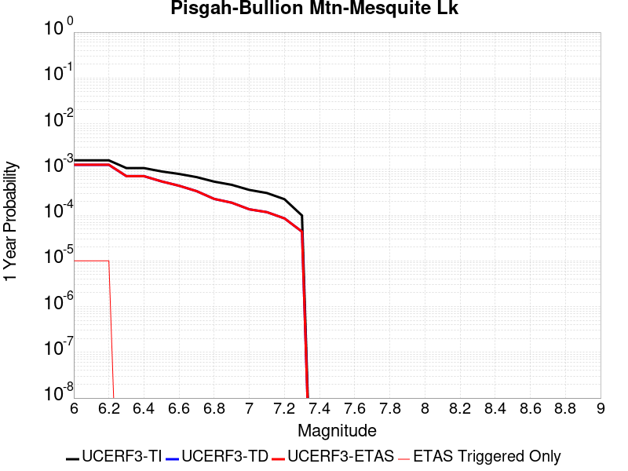 |  |

| Magnitude | 1 wk TI Prob | 1 wk TD Prob | 1 wk ETAS Prob | 1 wk ETAS/TD Gain | 1 wk ETAS Triggered Only | 1 mo TI Prob | 1 mo TD Prob | 1 mo ETAS Prob | 1 mo ETAS/TD Gain | 1 mo ETAS Triggered Only | 1 yr TI Prob | 1 yr TD Prob | 1 yr ETAS Prob | 1 yr ETAS/TD Gain | 1 yr ETAS Triggered Only | 10 yr TI Prob | 10 yr TD Prob | 10 yr ETAS Prob | 10 yr ETAS/TD Gain | 10 yr ETAS Triggered Only |
|-----|-----|-----|-----|-----|-----|-----|-----|-----|-----|-----|-----|-----|-----|-----|-----|-----|-----|-----|-----|-----|
| 6.0 | 3.0240792E-5 | 2.4106846E-5 | 5.0080245E-5 | 2.0774283 | 2.5974026E-5 | 1.2959696E-4 | 1.0331153E-4 | 1.2928287E-4 | 1.2513887 | 2.5974026E-5 | 0.0015767008 | 0.0012571929 | 0.0012831343 | 1.0206344 | 2.5974026E-5 | 0.015655609 | 0.012510845 | 0.012536495 | 1.0020502 | 2.5974026E-5 |
| 6.1 | 3.0240792E-5 | 2.4106846E-5 | 5.0080245E-5 | 2.0774283 | 2.5974026E-5 | 1.2959696E-4 | 1.0331153E-4 | 1.2928287E-4 | 1.2513887 | 2.5974026E-5 | 0.0015767008 | 0.0012571929 | 0.0012831343 | 1.0206344 | 2.5974026E-5 | 0.015655609 | 0.012510845 | 0.012536495 | 1.0020502 | 2.5974026E-5 |
| 6.2 | 3.0240792E-5 | 2.4106846E-5 | 5.0080245E-5 | 2.0774283 | 2.5974026E-5 | 1.2959696E-4 | 1.0331153E-4 | 1.2928287E-4 | 1.2513887 | 2.5974026E-5 | 0.0015767008 | 0.0012571929 | 0.0012831343 | 1.0206344 | 2.5974026E-5 | 0.015655609 | 0.012510845 | 0.012536495 | 1.0020502 | 2.5974026E-5 |
| 6.3 | 2.0498217E-5 | 1.3645967E-5 | 1.3645967E-5 | 1.0 | 0.0 | 8.784654E-5 | 5.8481495E-5 | 5.8481495E-5 | 1.0 | 0.0 | 0.0010690069 | 7.117958E-4 | 7.117958E-4 | 1.0 | 0.0 | 0.01063879 | 0.007096788 | 0.007096788 | 1.0 | 0.0 |
| 6.4 | 2.0498217E-5 | 1.3645967E-5 | 1.3645967E-5 | 1.0 | 0.0 | 8.784654E-5 | 5.8481495E-5 | 5.8481495E-5 | 1.0 | 0.0 | 0.0010690069 | 7.117958E-4 | 7.117958E-4 | 1.0 | 0.0 | 0.01063879 | 0.007096788 | 0.007096788 | 1.0 | 0.0 |
| 6.5 | 1.7316182E-5 | 1.04830515E-5 | 1.04830515E-5 | 1.0 | 0.0 | 7.42101E-5 | 4.4926648E-5 | 4.4926648E-5 | 1.0 | 0.0 | 9.0313336E-4 | 5.4685463E-4 | 5.4685463E-4 | 1.0 | 0.0 | 0.008994718 | 0.0054560862 | 0.0054560862 | 1.0 | 0.0 |
| 6.6 | 1.5251077E-5 | 8.41909E-6 | 8.41909E-6 | 1.0 | 0.0 | 6.536012E-5 | 3.6081354E-5 | 3.6081354E-5 | 1.0 | 0.0 | 7.9546886E-4 | 4.3920917E-4 | 4.3920917E-4 | 1.0 | 0.0 | 0.007926274 | 0.0043841293 | 0.0043841293 | 1.0 | 0.0 |
| 6.7 | 1.2997425E-5 | 6.415197E-6 | 6.415197E-6 | 1.0 | 0.0 | 5.570206E-5 | 2.7493437E-5 | 2.7493437E-5 | 1.0 | 0.0 | 6.7796157E-4 | 3.3468584E-4 | 3.3468584E-4 | 1.0 | 0.0 | 0.0067589693 | 0.0033422785 | 0.0033422785 | 1.0 | 0.0 |
| 6.8 | 1.035386E-5 | 4.3361665E-6 | 4.3361665E-6 | 1.0 | 0.0 | 4.437293E-5 | 1.8583443E-5 | 1.8583443E-5 | 1.0 | 0.0 | 5.401065E-4 | 2.262308E-4 | 2.262308E-4 | 1.0 | 0.0 | 0.0053879567 | 0.0022600917 | 0.0022600917 | 1.0 | 0.0 |
| 6.9 | 8.816252E-6 | 3.5832113E-6 | 3.5832113E-6 | 1.0 | 0.0 | 3.778339E-5 | 1.5356532E-5 | 1.5356532E-5 | 1.0 | 0.0 | 4.5991567E-4 | 1.8695033E-4 | 1.8695033E-4 | 1.0 | 0.0 | 0.00458965 | 0.0018679891 | 0.0018679891 | 1.0 | 0.0 |
| 7.0 | 6.8232207E-6 | 2.569746E-6 | 2.569746E-6 | 1.0 | 0.0 | 2.9242048E-5 | 1.1013151E-5 | 1.1013151E-5 | 1.0 | 0.0 | 3.5596377E-4 | 1.3407719E-4 | 1.3407719E-4 | 1.0 | 0.0 | 0.0035539411 | 0.001339994 | 0.001339994 | 1.0 | 0.0 |
| 7.1 | 5.837013E-6 | 2.229158E-6 | 2.229158E-6 | 1.0 | 0.0 | 2.501553E-5 | 9.5535015E-6 | 9.5535015E-6 | 1.0 | 0.0 | 3.045215E-4 | 1.16307965E-4 | 1.16307965E-4 | 1.0 | 0.0 | 0.0030410455 | 0.0011625 | 0.0011625 | 1.0 | 0.0 |
| 7.2 | 4.278052E-6 | 1.6289536E-6 | 1.6289536E-6 | 1.0 | 0.0 | 1.833438E-5 | 6.981212E-6 | 6.981212E-6 | 1.0 | 0.0 | 2.231982E-4 | 8.4993175E-5 | 8.4993175E-5 | 1.0 | 0.0 | 0.0022297418 | 8.496299E-4 | 8.496299E-4 | 1.0 | 0.0 |
| 7.3 | 1.8803692E-6 | 8.3536554E-7 | 8.3536554E-7 | 1.0 | 0.0 | 8.0587E-6 | 3.580134E-6 | 3.580134E-6 | 1.0 | 0.0 | 9.811026E-5 | 4.3587406E-5 | 4.3587406E-5 | 1.0 | 0.0 | 9.806695E-4 | 4.3580306E-4 | 4.3580306E-4 | 1.0 | 0.0 |

## Earthquake Valley (So Extension)
*[(top)](#table-of-contents)*

| 1 Week | 1 Month | 1 Year | 10 Year |
|-----|-----|-----|-----|
| 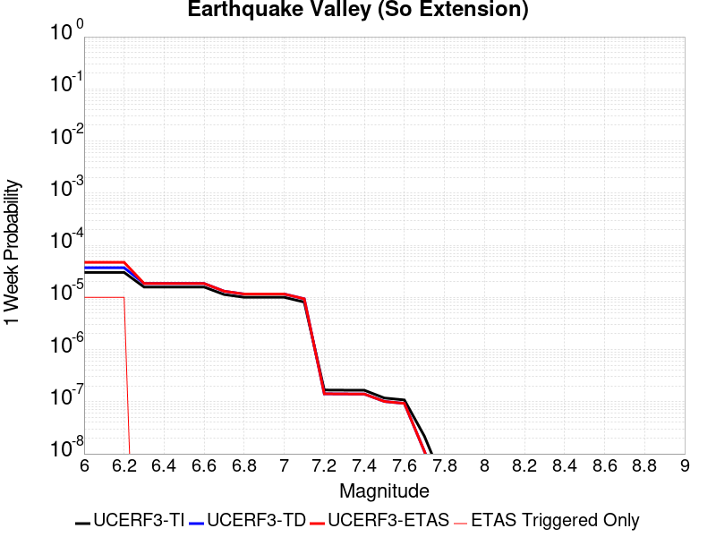 |  |  |  |

| Magnitude | 1 wk TI Prob | 1 wk TD Prob | 1 wk ETAS Prob | 1 wk ETAS/TD Gain | 1 wk ETAS Triggered Only | 1 mo TI Prob | 1 mo TD Prob | 1 mo ETAS Prob | 1 mo ETAS/TD Gain | 1 mo ETAS Triggered Only | 1 yr TI Prob | 1 yr TD Prob | 1 yr ETAS Prob | 1 yr ETAS/TD Gain | 1 yr ETAS Triggered Only | 10 yr TI Prob | 10 yr TD Prob | 10 yr ETAS Prob | 10 yr ETAS/TD Gain | 10 yr ETAS Triggered Only |
|-----|-----|-----|-----|-----|-----|-----|-----|-----|-----|-----|-----|-----|-----|-----|-----|-----|-----|-----|-----|-----|
| 6.0 | 3.0194888E-5 | 3.711621E-5 | 6.308927E-5 | 1.6997768 | 2.5974026E-5 | 1.2940024E-4 | 1.5906284E-4 | 1.8503272E-4 | 1.1632681 | 2.5974026E-5 | 0.0015743093 | 0.0019353795 | 0.0019613032 | 1.0133947 | 2.5974026E-5 | 0.01563203 | 0.019235648 | 0.019261124 | 1.0013243 | 2.5974026E-5 |
| 6.1 | 3.0194888E-5 | 3.711621E-5 | 6.308927E-5 | 1.6997768 | 2.5974026E-5 | 1.2940024E-4 | 1.5906284E-4 | 1.8503272E-4 | 1.1632681 | 2.5974026E-5 | 0.0015743093 | 0.0019353795 | 0.0019613032 | 1.0133947 | 2.5974026E-5 | 0.01563203 | 0.019235648 | 0.019261124 | 1.0013243 | 2.5974026E-5 |
| 6.2 | 3.0194888E-5 | 3.711621E-5 | 6.308927E-5 | 1.6997768 | 2.5974026E-5 | 1.2940024E-4 | 1.5906284E-4 | 1.8503272E-4 | 1.1632681 | 2.5974026E-5 | 0.0015743093 | 0.0019353795 | 0.0019613032 | 1.0133947 | 2.5974026E-5 | 0.01563203 | 0.019235648 | 0.019261124 | 1.0013243 | 2.5974026E-5 |
| 6.3 | 1.5795305E-5 | 1.8463072E-5 | 1.8463072E-5 | 1.0 | 0.0 | 6.769241E-5 | 7.9125675E-5 | 7.9125675E-5 | 1.0 | 0.0 | 8.238434E-4 | 9.630403E-4 | 9.630403E-4 | 1.0 | 0.0 | 0.008207959 | 0.009599585 | 0.009599585 | 1.0 | 0.0 |
| 6.4 | 1.5795305E-5 | 1.8463072E-5 | 1.8463072E-5 | 1.0 | 0.0 | 6.769241E-5 | 7.9125675E-5 | 7.9125675E-5 | 1.0 | 0.0 | 8.238434E-4 | 9.630403E-4 | 9.630403E-4 | 1.0 | 0.0 | 0.008207959 | 0.009599585 | 0.009599585 | 1.0 | 0.0 |
| 6.5 | 1.5795305E-5 | 1.8463072E-5 | 1.8463072E-5 | 1.0 | 0.0 | 6.769241E-5 | 7.9125675E-5 | 7.9125675E-5 | 1.0 | 0.0 | 8.238434E-4 | 9.630403E-4 | 9.630403E-4 | 1.0 | 0.0 | 0.008207959 | 0.009599585 | 0.009599585 | 1.0 | 0.0 |
| 6.6 | 1.5795305E-5 | 1.8463072E-5 | 1.8463072E-5 | 1.0 | 0.0 | 6.769241E-5 | 7.9125675E-5 | 7.9125675E-5 | 1.0 | 0.0 | 8.238434E-4 | 9.630403E-4 | 9.630403E-4 | 1.0 | 0.0 | 0.008207959 | 0.009599585 | 0.009599585 | 1.0 | 0.0 |
| 6.7 | 1.1363076E-5 | 1.31493225E-5 | 1.31493225E-5 | 1.0 | 0.0 | 4.8697988E-5 | 5.635345E-5 | 5.635345E-5 | 1.0 | 0.0 | 5.927367E-4 | 6.8596355E-4 | 6.8596355E-4 | 1.0 | 0.0 | 0.0059115817 | 0.006845947 | 0.006845947 | 1.0 | 0.0 |
| 6.8 | 1.0049611E-5 | 1.1603959E-5 | 1.1603959E-5 | 1.0 | 0.0 | 4.306905E-5 | 4.973072E-5 | 4.973072E-5 | 1.0 | 0.0 | 5.242395E-4 | 6.053766E-4 | 6.053766E-4 | 1.0 | 0.0 | 0.0052300454 | 0.0060444633 | 0.0060444633 | 1.0 | 0.0 |
| 6.9 | 1.0049611E-5 | 1.1603959E-5 | 1.1603959E-5 | 1.0 | 0.0 | 4.306905E-5 | 4.973072E-5 | 4.973072E-5 | 1.0 | 0.0 | 5.242395E-4 | 6.053766E-4 | 6.053766E-4 | 1.0 | 0.0 | 0.0052300454 | 0.0060444633 | 0.0060444633 | 1.0 | 0.0 |
| 7.0 | 1.0049611E-5 | 1.1603959E-5 | 1.1603959E-5 | 1.0 | 0.0 | 4.306905E-5 | 4.973072E-5 | 4.973072E-5 | 1.0 | 0.0 | 5.242395E-4 | 6.053766E-4 | 6.053766E-4 | 1.0 | 0.0 | 0.0052300454 | 0.0060444633 | 0.0060444633 | 1.0 | 0.0 |
| 7.1 | 8.140254E-6 | 9.391277E-6 | 9.391277E-6 | 1.0 | 0.0 | 3.4886336E-5 | 4.0248084E-5 | 4.0248084E-5 | 1.0 | 0.0 | 4.2465836E-4 | 4.899774E-4 | 4.899774E-4 | 1.0 | 0.0 | 0.0042384774 | 0.0048955586 | 0.0048955586 | 1.0 | 0.0 |
| 7.2 | 1.673835E-7 | 1.4174799E-7 | 1.4174799E-7 | 1.0 | 0.0 | 7.173577E-7 | 6.0749124E-7 | 6.0749124E-7 | 1.0 | 0.0 | 8.733795E-6 | 7.396184E-6 | 7.396184E-6 | 1.0 | 0.0 | 8.733451E-5 | 7.395974E-5 | 7.395974E-5 | 1.0 | 0.0 |
| 7.3 | 1.6632116E-7 | 1.4072968E-7 | 1.4072968E-7 | 1.0 | 0.0 | 7.1280476E-7 | 6.031271E-7 | 6.031271E-7 | 1.0 | 0.0 | 8.678364E-6 | 7.3430515E-6 | 7.3430515E-6 | 1.0 | 0.0 | 8.6780245E-5 | 7.342844E-5 | 7.342844E-5 | 1.0 | 0.0 |
| 7.4 | 1.6569169E-7 | 1.4017557E-7 | 1.4017557E-7 | 1.0 | 0.0 | 7.1010703E-7 | 6.0075234E-7 | 6.0075234E-7 | 1.0 | 0.0 | 8.645519E-6 | 7.3141387E-6 | 7.3141387E-6 | 1.0 | 0.0 | 8.645182E-5 | 7.313934E-5 | 7.313934E-5 | 1.0 | 0.0 |
| 7.5 | 1.1764555E-7 | 1.0112932E-7 | 1.0112932E-7 | 1.0 | 0.0 | 5.041951E-7 | 4.334113E-7 | 4.334113E-7 | 1.0 | 0.0 | 6.138558E-6 | 5.276772E-6 | 5.276772E-6 | 1.0 | 0.0 | 6.1383886E-5 | 5.276668E-5 | 5.276668E-5 | 1.0 | 0.0 |
| 7.6 | 1.07927605E-7 | 9.277027E-8 | 9.277027E-8 | 1.0 | 0.0 | 4.6254678E-7 | 3.9758683E-7 | 3.9758683E-7 | 1.0 | 0.0 | 5.6314925E-6 | 4.840611E-6 | 4.840611E-6 | 1.0 | 0.0 | 5.63135E-5 | 4.8405265E-5 | 4.8405265E-5 | 1.0 | 0.0 |
| 7.7 | 2.1826905E-8 | 1.1201442E-8 | 1.1201442E-8 | 1.0 | 0.0 | 9.3543875E-8 | 4.800618E-8 | 4.800618E-8 | 1.0 | 0.0 | 1.1388961E-6 | 5.844751E-7 | 5.844751E-7 | 1.0 | 0.0 | 1.1388902E-5 | 5.8447413E-6 | 5.8447413E-6 | 1.0 | 0.0 |
| 7.8 | 2.6169649E-9 | 1.1991095E-9 | 1.1991095E-9 | 1.0 | 0.0 | 1.1215564E-8 | 5.1390403E-9 | 5.1390403E-9 | 1.0 | 0.0 | 1.3654947E-7 | 6.2567814E-8 | 6.2567814E-8 | 1.0 | 0.0 | 1.365494E-6 | 6.256781E-7 | 6.256781E-7 | 1.0 | 0.0 |

## Elsinore (Coyote Mountains)
*[(top)](#table-of-contents)*

| 1 Week | 1 Month | 1 Year | 10 Year |
|-----|-----|-----|-----|
|  |  |  |  |

| Magnitude | 1 wk TI Prob | 1 wk TD Prob | 1 wk ETAS Prob | 1 wk ETAS/TD Gain | 1 wk ETAS Triggered Only | 1 mo TI Prob | 1 mo TD Prob | 1 mo ETAS Prob | 1 mo ETAS/TD Gain | 1 mo ETAS Triggered Only | 1 yr TI Prob | 1 yr TD Prob | 1 yr ETAS Prob | 1 yr ETAS/TD Gain | 1 yr ETAS Triggered Only | 10 yr TI Prob | 10 yr TD Prob | 10 yr ETAS Prob | 10 yr ETAS/TD Gain | 10 yr ETAS Triggered Only |
|-----|-----|-----|-----|-----|-----|-----|-----|-----|-----|-----|-----|-----|-----|-----|-----|-----|-----|-----|-----|-----|
| 6.0 | 4.20513E-5 | 4.86968E-5 | 4.86968E-5 | 1.0 | 0.0 | 1.8020741E-4 | 2.0868712E-4 | 2.0868712E-4 | 1.0 | 0.0 | 0.0021918174 | 0.0025383183 | 0.0025383183 | 1.0 | 0.0 | 0.021703249 | 0.025144503 | 0.025169823 | 1.001007 | 2.5974026E-5 |
| 6.1 | 4.20513E-5 | 4.86968E-5 | 4.86968E-5 | 1.0 | 0.0 | 1.8020741E-4 | 2.0868712E-4 | 2.0868712E-4 | 1.0 | 0.0 | 0.0021918174 | 0.0025383183 | 0.0025383183 | 1.0 | 0.0 | 0.021703249 | 0.025144503 | 0.025169823 | 1.001007 | 2.5974026E-5 |
| 6.2 | 2.3413893E-5 | 2.47266E-5 | 2.47266E-5 | 1.0 | 0.0 | 1.0034139E-4 | 1.05967374E-4 | 1.05967374E-4 | 1.0 | 0.0 | 0.0012209718 | 0.0012894757 | 0.0012894757 | 1.0 | 0.0 | 0.012142851 | 0.012828605 | 0.0128542455 | 1.0019987 | 2.5974026E-5 |
| 6.3 | 2.3413893E-5 | 2.47266E-5 | 2.47266E-5 | 1.0 | 0.0 | 1.0034139E-4 | 1.05967374E-4 | 1.05967374E-4 | 1.0 | 0.0 | 0.0012209718 | 0.0012894757 | 0.0012894757 | 1.0 | 0.0 | 0.012142851 | 0.012828605 | 0.0128542455 | 1.0019987 | 2.5974026E-5 |
| 6.4 | 1.6894814E-5 | 1.658908E-5 | 1.658908E-5 | 1.0 | 0.0 | 7.240433E-5 | 7.109433E-5 | 7.109433E-5 | 1.0 | 0.0 | 8.811662E-4 | 8.6526637E-4 | 8.6526637E-4 | 1.0 | 0.0 | 0.0087768035 | 0.008622632 | 0.008622632 | 1.0 | 0.0 |
| 6.5 | 1.6894814E-5 | 1.658908E-5 | 1.658908E-5 | 1.0 | 0.0 | 7.240433E-5 | 7.109433E-5 | 7.109433E-5 | 1.0 | 0.0 | 8.811662E-4 | 8.6526637E-4 | 8.6526637E-4 | 1.0 | 0.0 | 0.0087768035 | 0.008622632 | 0.008622632 | 1.0 | 0.0 |
| 6.6 | 1.1910969E-5 | 1.0544801E-5 | 1.0544801E-5 | 1.0 | 0.0 | 5.1046012E-5 | 4.519129E-5 | 4.519129E-5 | 1.0 | 0.0 | 6.21308E-4 | 5.500782E-4 | 5.500782E-4 | 1.0 | 0.0 | 0.0061957375 | 0.0054884683 | 0.0054884683 | 1.0 | 0.0 |
| 6.7 | 9.1486E-6 | 7.213386E-6 | 7.213386E-6 | 1.0 | 0.0 | 3.9207694E-5 | 3.0914165E-5 | 3.0914165E-5 | 1.0 | 0.0 | 4.7724912E-4 | 3.763188E-4 | 3.763188E-4 | 1.0 | 0.0 | 0.0047622547 | 0.0037571958 | 0.0037571958 | 1.0 | 0.0 |
| 6.8 | 7.90441E-6 | 5.7381435E-6 | 5.7381435E-6 | 1.0 | 0.0 | 3.3875604E-5 | 2.459182E-5 | 2.459182E-5 | 1.0 | 0.0 | 4.1235742E-4 | 2.9936555E-4 | 2.9936555E-4 | 1.0 | 0.0 | 0.0041159308 | 0.0029897518 | 0.0029897518 | 1.0 | 0.0 |
| 6.9 | 7.77015E-6 | 5.5920314E-6 | 5.5920314E-6 | 1.0 | 0.0 | 3.3300217E-5 | 2.3965637E-5 | 2.3965637E-5 | 1.0 | 0.0 | 4.0535472E-4 | 2.9174384E-4 | 2.9174384E-4 | 1.0 | 0.0 | 0.004046161 | 0.0029137358 | 0.0029137358 | 1.0 | 0.0 |
| 7.0 | 7.675798E-6 | 5.4888405E-6 | 5.4888405E-6 | 1.0 | 0.0 | 3.289586E-5 | 2.3523397E-5 | 2.3523397E-5 | 1.0 | 0.0 | 4.004335E-4 | 2.8636097E-4 | 2.8636097E-4 | 1.0 | 0.0 | 0.003997127 | 0.0028600467 | 0.0028600467 | 1.0 | 0.0 |
| 7.1 | 7.447814E-6 | 5.247635E-6 | 5.247635E-6 | 1.0 | 0.0 | 3.191881E-5 | 2.2489678E-5 | 2.2489678E-5 | 1.0 | 0.0 | 3.8854225E-4 | 2.7377866E-4 | 2.7377866E-4 | 1.0 | 0.0 | 0.003878636 | 0.0027345386 | 0.0027345386 | 1.0 | 0.0 |
| 7.2 | 7.128185E-6 | 4.914247E-6 | 4.914247E-6 | 1.0 | 0.0 | 3.0549007E-5 | 2.1060896E-5 | 2.1060896E-5 | 1.0 | 0.0 | 3.7187067E-4 | 2.5638743E-4 | 2.5638743E-4 | 1.0 | 0.0 | 0.00371249 | 0.002561035 | 0.002561035 | 1.0 | 0.0 |
| 7.3 | 7.0913875E-6 | 4.8829074E-6 | 4.8829074E-6 | 1.0 | 0.0 | 3.0391306E-5 | 2.0926585E-5 | 2.0926585E-5 | 1.0 | 0.0 | 3.6995133E-4 | 2.5475258E-4 | 2.5475258E-4 | 1.0 | 0.0 | 0.0036933604 | 0.0025447241 | 0.0025447241 | 1.0 | 0.0 |
| 7.4 | 7.051521E-6 | 4.846747E-6 | 4.846747E-6 | 1.0 | 0.0 | 3.0220453E-5 | 2.0771615E-5 | 2.0771615E-5 | 1.0 | 0.0 | 3.6787192E-4 | 2.5286624E-4 | 2.5286624E-4 | 1.0 | 0.0 | 0.0036726352 | 0.002525904 | 0.002525904 | 1.0 | 0.0 |
| 7.5 | 6.910666E-6 | 4.742132E-6 | 4.742132E-6 | 1.0 | 0.0 | 2.9616802E-5 | 2.0323272E-5 | 2.0323272E-5 | 1.0 | 0.0 | 3.605249E-4 | 2.4740893E-4 | 2.4740893E-4 | 1.0 | 0.0 | 0.0035994058 | 0.0024714533 | 0.0024714533 | 1.0 | 0.0 |
| 7.6 | 6.341753E-6 | 4.3148316E-6 | 4.3148316E-6 | 1.0 | 0.0 | 2.7178658E-5 | 1.8492012E-5 | 1.8492012E-5 | 1.0 | 0.0 | 3.3084993E-4 | 2.2511814E-4 | 2.2511814E-4 | 1.0 | 0.0 | 0.0033035777 | 0.0022490167 | 0.0022490167 | 1.0 | 0.0 |
| 7.7 | 3.9205916E-6 | 2.2489335E-6 | 2.2489335E-6 | 1.0 | 0.0 | 1.6802427E-5 | 9.638255E-6 | 9.638255E-6 | 1.0 | 0.0 | 2.0455034E-4 | 1.17340176E-4 | 1.17340176E-4 | 1.0 | 0.0 | 0.0020436216 | 0.0011728555 | 0.0011728555 | 1.0 | 0.0 |
| 7.8 | 2.0846227E-7 | 8.5023146E-8 | 8.5023146E-8 | 1.0 | 0.0 | 8.9340944E-7 | 3.6438487E-7 | 3.6438487E-7 | 1.0 | 0.0 | 1.0877206E-5 | 4.43638E-6 | 4.43638E-6 | 1.0 | 0.0 | 1.0876673E-4 | 4.4363245E-5 | 4.4363245E-5 | 1.0 | 0.0 |
| 7.9 | 4.4969806E-9 | 2.272358E-9 | 2.272358E-9 | 1.0 | 0.0 | 1.9272775E-8 | 9.7386765E-9 | 9.7386765E-9 | 1.0 | 0.0 | 2.3464601E-7 | 1.1856839E-7 | 1.1856839E-7 | 1.0 | 0.0 | 2.3464577E-6 | 1.1856833E-6 | 1.1856833E-6 | 1.0 | 0.0 |

## San Andreas (Santa Cruz Mts) 2011 CFM
*[(top)](#table-of-contents)*

| 1 Week | 1 Month | 1 Year | 10 Year |
|-----|-----|-----|-----|
|  |  |  | 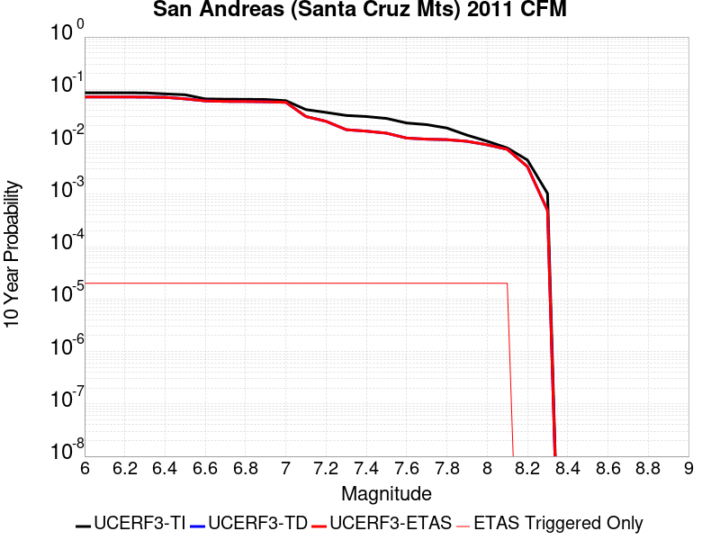 |

| Magnitude | 1 wk TI Prob | 1 wk TD Prob | 1 wk ETAS Prob | 1 wk ETAS/TD Gain | 1 wk ETAS Triggered Only | 1 mo TI Prob | 1 mo TD Prob | 1 mo ETAS Prob | 1 mo ETAS/TD Gain | 1 mo ETAS Triggered Only | 1 yr TI Prob | 1 yr TD Prob | 1 yr ETAS Prob | 1 yr ETAS/TD Gain | 1 yr ETAS Triggered Only | 10 yr TI Prob | 10 yr TD Prob | 10 yr ETAS Prob | 10 yr ETAS/TD Gain | 10 yr ETAS Triggered Only |
|-----|-----|-----|-----|-----|-----|-----|-----|-----|-----|-----|-----|-----|-----|-----|-----|-----|-----|-----|-----|-----|
| 6.0 | 1.7221631E-4 | 1.4025059E-4 | 1.6622097E-4 | 1.1851712 | 2.5974026E-5 | 7.378611E-4 | 6.009376E-4 | 6.26896E-4 | 1.0431966 | 2.5974026E-5 | 0.008946515 | 0.0072922586 | 0.007318043 | 1.0035359 | 2.5974026E-5 | 0.08594794 | 0.07167054 | 0.07169466 | 1.0003364 | 2.5974026E-5 |
| 6.1 | 1.7221631E-4 | 1.4025059E-4 | 1.6622097E-4 | 1.1851712 | 2.5974026E-5 | 7.378611E-4 | 6.009376E-4 | 6.26896E-4 | 1.0431966 | 2.5974026E-5 | 0.008946515 | 0.0072922586 | 0.007318043 | 1.0035359 | 2.5974026E-5 | 0.08594794 | 0.07167054 | 0.07169466 | 1.0003364 | 2.5974026E-5 |
| 6.2 | 1.7221631E-4 | 1.4025059E-4 | 1.6622097E-4 | 1.1851712 | 2.5974026E-5 | 7.378611E-4 | 6.009376E-4 | 6.26896E-4 | 1.0431966 | 2.5974026E-5 | 0.008946515 | 0.0072922586 | 0.007318043 | 1.0035359 | 2.5974026E-5 | 0.08594794 | 0.07167054 | 0.07169466 | 1.0003364 | 2.5974026E-5 |
| 6.3 | 1.716926E-4 | 1.3943961E-4 | 1.6541002E-4 | 1.1862484 | 2.5974026E-5 | 7.3561794E-4 | 5.974636E-4 | 6.234221E-4 | 1.0434479 | 2.5974026E-5 | 0.008919428 | 0.0072502443 | 0.00727603 | 1.0035565 | 2.5974026E-5 | 0.08569809 | 0.071280695 | 0.07130482 | 1.0003384 | 2.5974026E-5 |
| 6.4 | 1.6392978E-4 | 1.3814664E-4 | 1.6411708E-4 | 1.1879919 | 2.5974026E-5 | 7.02367E-4 | 5.9192476E-4 | 6.1788346E-4 | 1.0438546 | 2.5974026E-5 | 0.008517839 | 0.0071832547 | 0.007209042 | 1.00359 | 2.5974026E-5 | 0.08198654 | 0.07048169 | 0.070505835 | 1.0003425 | 2.5974026E-5 |
| 6.5 | 1.5742714E-4 | 1.2866968E-4 | 1.5464037E-4 | 1.2018399 | 2.5974026E-5 | 6.745133E-4 | 5.513267E-4 | 5.772864E-4 | 1.0470859 | 2.5974026E-5 | 0.00818132 | 0.0066920654 | 0.006717866 | 1.0038553 | 2.5974026E-5 | 0.078865945 | 0.065920696 | 0.065944955 | 1.000368 | 2.5974026E-5 |
| 6.6 | 1.3038084E-4 | 1.1787747E-4 | 1.4384843E-4 | 1.2203217 | 2.5974026E-5 | 5.5865536E-4 | 5.0509267E-4 | 5.310536E-4 | 1.0513983 | 2.5974026E-5 | 0.006780438 | 0.006132401 | 0.006158216 | 1.0042095 | 2.5974026E-5 | 0.0657725 | 0.060263954 | 0.060288362 | 1.0004051 | 2.5974026E-5 |
| 6.7 | 1.2867592E-4 | 1.1512854E-4 | 1.4109958E-4 | 1.225583 | 2.5974026E-5 | 5.5135164E-4 | 4.9331604E-4 | 5.1927724E-4 | 1.0526259 | 2.5974026E-5 | 0.0066920654 | 0.0059898165 | 0.006015635 | 1.0043104 | 2.5974026E-5 | 0.06494093 | 0.058969937 | 0.058994383 | 1.0004145 | 2.5974026E-5 |
| 6.8 | 1.2801298E-4 | 1.1450069E-4 | 1.4047175E-4 | 1.22682 | 2.5974026E-5 | 5.485117E-4 | 4.9062626E-4 | 5.165875E-4 | 1.0529146 | 2.5974026E-5 | 0.0066577005 | 0.0059572584 | 0.0059830775 | 1.0043341 | 2.5974026E-5 | 0.06461738 | 0.058682535 | 0.058706984 | 1.0004166 | 2.5974026E-5 |
| 6.9 | 1.269149E-4 | 1.1291407E-4 | 1.3888517E-4 | 1.2300075 | 2.5974026E-5 | 5.4380763E-4 | 4.83829E-4 | 5.097905E-4 | 1.0536584 | 2.5974026E-5 | 0.006600777 | 0.005874951 | 0.0059007723 | 1.0043951 | 2.5974026E-5 | 0.06408122 | 0.057951514 | 0.05797598 | 1.0004222 | 2.5974026E-5 |
| 7.0 | 1.2030331E-4 | 1.1018017E-4 | 1.3615133E-4 | 1.2357154 | 2.5974026E-5 | 5.154837E-4 | 4.7211658E-4 | 4.980783E-4 | 1.0549902 | 2.5974026E-5 | 0.006257969 | 0.005733111 | 0.005758936 | 1.0045046 | 2.5974026E-5 | 0.06084648 | 0.056605607 | 0.05663011 | 1.0004328 | 2.5974026E-5 |
| 7.1 | 8.049617E-5 | 5.538574E-5 | 8.1358325E-5 | 1.46894 | 2.5974026E-5 | 3.4493793E-4 | 2.3734606E-4 | 2.633139E-4 | 1.1094093 | 2.5974026E-5 | 0.0041915346 | 0.0028858953 | 0.0029117945 | 1.0089743 | 2.5974026E-5 | 0.041133516 | 0.030344456 | 0.030369643 | 1.00083 | 2.5974026E-5 |
| 7.2 | 7.093979E-5 | 4.4221182E-5 | 7.019406E-5 | 1.5873402 | 2.5974026E-5 | 3.0399222E-4 | 1.895057E-4 | 2.1547482E-4 | 1.137036 | 2.5974026E-5 | 0.0036948253 | 0.0023048148 | 0.0023307288 | 1.0112435 | 2.5974026E-5 | 0.03633994 | 0.024588754 | 0.024614088 | 1.0010303 | 2.5974026E-5 |
| 7.3 | 6.193693E-5 | 2.9864168E-5 | 5.583742E-5 | 1.8697128 | 2.5974026E-5 | 2.6541698E-4 | 1.2798302E-4 | 1.5395372E-4 | 1.202923 | 2.5974026E-5 | 0.0032266637 | 0.0015570815 | 0.001583015 | 1.0166552 | 2.5974026E-5 | 0.031802133 | 0.017008903 | 0.017034436 | 1.0015011 | 2.5974026E-5 |
| 7.4 | 5.906492E-5 | 2.7939626E-5 | 5.391293E-5 | 1.9296223 | 2.5974026E-5 | 2.5311083E-4 | 1.1973577E-4 | 1.4570668E-4 | 1.2169019 | 2.5974026E-5 | 0.0030772698 | 0.0014568097 | 0.0014827459 | 1.0178034 | 2.5974026E-5 | 0.030350044 | 0.015955238 | 0.015980797 | 1.0016019 | 2.5974026E-5 |
| 7.5 | 5.424296E-5 | 2.5520172E-5 | 5.1493535E-5 | 2.0177581 | 2.5974026E-5 | 2.324491E-4 | 1.0936759E-4 | 1.3533878E-4 | 1.2374669 | 2.5974026E-5 | 0.002826395 | 0.0013307383 | 0.0013566777 | 1.0194925 | 2.5974026E-5 | 0.027907165 | 0.014610685 | 0.01463628 | 1.0017518 | 2.5974026E-5 |
| 7.6 | 4.43084E-5 | 2.0571671E-5 | 4.6545163E-5 | 2.2625854 | 2.5974026E-5 | 1.8987931E-4 | 8.816132E-5 | 1.14133065E-4 | 1.2945933 | 2.5974026E-5 | 0.0023093296 | 0.0010728359 | 0.001098782 | 1.0241847 | 2.5974026E-5 | 0.022854783 | 0.011769547 | 0.011795215 | 1.0021809 | 2.5974026E-5 |
| 7.7 | 4.118098E-5 | 1.9574463E-5 | 4.5547982E-5 | 2.3269083 | 2.5974026E-5 | 1.7647797E-4 | 8.388786E-5 | 1.09859706E-4 | 1.309602 | 2.5974026E-5 | 0.002146502 | 0.0010208564 | 0.0010468039 | 1.0254174 | 2.5974026E-5 | 0.021258866 | 0.011211814 | 0.011237497 | 1.0022907 | 2.5974026E-5 |
| 7.8 | 3.5408906E-5 | 1.9186084E-5 | 4.515961E-5 | 2.353769 | 2.5974026E-5 | 1.5174363E-4 | 8.222348E-5 | 1.0819537E-4 | 1.3158696 | 2.5974026E-5 | 0.0018459131 | 0.0010006113 | 0.0010265594 | 1.0259322 | 2.5974026E-5 | 0.018306552 | 0.010983693 | 0.011009383 | 1.0023388 | 2.5974026E-5 |
| 7.9 | 2.5860836E-5 | 1.788097E-5 | 4.3854532E-5 | 2.4525812 | 2.5974026E-5 | 1.10827445E-4 | 7.663048E-5 | 1.0260251E-4 | 1.3389257 | 2.5974026E-5 | 0.001348489 | 9.32577E-4 | 9.585268E-4 | 1.027826 | 2.5974026E-5 | 0.013403354 | 0.010206873 | 0.010232582 | 1.0025188 | 2.5974026E-5 |
| 8.0 | 1.9777332E-5 | 1.5322148E-5 | 4.1295774E-5 | 2.695169 | 2.5974026E-5 | 8.4757245E-5 | 6.5664695E-5 | 9.163701E-5 | 1.3955295 | 2.5974026E-5 | 0.0010314309 | 7.991746E-4 | 8.251279E-4 | 1.0324751 | 2.5974026E-5 | 0.010266567 | 0.00876486 | 0.008790607 | 1.0029374 | 2.5974026E-5 |
| 8.1 | 1.468494E-5 | 1.2502896E-5 | 3.84766E-5 | 3.0774148 | 2.5974026E-5 | 6.293394E-5 | 5.3582742E-5 | 7.955538E-5 | 1.4847201 | 2.5974026E-5 | 7.6595135E-4 | 6.521748E-4 | 6.781319E-4 | 1.0398008 | 2.5974026E-5 | 0.0076331664 | 0.007179751 | 0.0072055385 | 1.0035917 | 2.5974026E-5 |
| 8.2 | 8.63836E-6 | 5.674352E-6 | 5.674352E-6 | 1.0 | 0.0 | 3.7021015E-5 | 2.4318424E-5 | 2.4318424E-5 | 1.0 | 0.0 | 4.5063766E-4 | 2.9603668E-4 | 2.9603668E-4 | 1.0 | 0.0 | 0.004497249 | 0.003357947 | 0.003357947 | 1.0 | 0.0 |
| 8.3 | 1.983087E-6 | 8.001618E-7 | 8.001618E-7 | 1.0 | 0.0 | 8.498917E-6 | 3.4292605E-6 | 3.4292605E-6 | 1.0 | 0.0 | 1.034694E-4 | 4.1750463E-5 | 4.1750463E-5 | 1.0 | 0.0 | 0.0010342124 | 4.915874E-4 | 4.915874E-4 | 1.0 | 0.0 |

## Blue Cut
*[(top)](#table-of-contents)*

| 1 Week | 1 Month | 1 Year | 10 Year |
|-----|-----|-----|-----|
|  |  |  |  |

| Magnitude | 1 wk TI Prob | 1 wk TD Prob | 1 wk ETAS Prob | 1 wk ETAS/TD Gain | 1 wk ETAS Triggered Only | 1 mo TI Prob | 1 mo TD Prob | 1 mo ETAS Prob | 1 mo ETAS/TD Gain | 1 mo ETAS Triggered Only | 1 yr TI Prob | 1 yr TD Prob | 1 yr ETAS Prob | 1 yr ETAS/TD Gain | 1 yr ETAS Triggered Only | 10 yr TI Prob | 10 yr TD Prob | 10 yr ETAS Prob | 10 yr ETAS/TD Gain | 10 yr ETAS Triggered Only |
|-----|-----|-----|-----|-----|-----|-----|-----|-----|-----|-----|-----|-----|-----|-----|-----|-----|-----|-----|-----|-----|
| 6.0 | 2.1227985E-5 | 2.2727847E-5 | 2.2727847E-5 | 1.0 | 0.0 | 9.097391E-5 | 9.7401746E-5 | 1.2337325E-4 | 1.266643 | 2.5974026E-5 | 0.0011070445 | 0.0011852792 | 0.0012112225 | 1.0218879 | 2.5974026E-5 | 0.011015458 | 0.011795422 | 0.011821089 | 1.002176 | 2.5974026E-5 |
| 6.1 | 2.1227985E-5 | 2.2727847E-5 | 2.2727847E-5 | 1.0 | 0.0 | 9.097391E-5 | 9.7401746E-5 | 1.2337325E-4 | 1.266643 | 2.5974026E-5 | 0.0011070445 | 0.0011852792 | 0.0012112225 | 1.0218879 | 2.5974026E-5 | 0.011015458 | 0.011795422 | 0.011821089 | 1.002176 | 2.5974026E-5 |
| 6.2 | 2.1227985E-5 | 2.2727847E-5 | 2.2727847E-5 | 1.0 | 0.0 | 9.097391E-5 | 9.7401746E-5 | 1.2337325E-4 | 1.266643 | 2.5974026E-5 | 0.0011070445 | 0.0011852792 | 0.0012112225 | 1.0218879 | 2.5974026E-5 | 0.011015458 | 0.011795422 | 0.011821089 | 1.002176 | 2.5974026E-5 |
| 6.3 | 1.1613981E-5 | 1.2357614E-5 | 1.2357614E-5 | 1.0 | 0.0 | 4.9773254E-5 | 5.2960197E-5 | 7.893285E-5 | 1.4904183 | 2.5974026E-5 | 6.0582085E-4 | 6.446121E-4 | 6.7056937E-4 | 1.0402681 | 2.5974026E-5 | 0.0060417196 | 0.006428671 | 0.006454478 | 1.0040144 | 2.5974026E-5 |
| 6.4 | 1.1613981E-5 | 1.2357614E-5 | 1.2357614E-5 | 1.0 | 0.0 | 4.9773254E-5 | 5.2960197E-5 | 7.893285E-5 | 1.4904183 | 2.5974026E-5 | 6.0582085E-4 | 6.446121E-4 | 6.7056937E-4 | 1.0402681 | 2.5974026E-5 | 0.0060417196 | 0.006428671 | 0.006454478 | 1.0040144 | 2.5974026E-5 |
| 6.5 | 8.931326E-6 | 9.484623E-6 | 9.484623E-6 | 1.0 | 0.0 | 3.8276554E-5 | 4.06478E-5 | 6.662077E-5 | 1.6389761 | 2.5974026E-5 | 4.6591737E-4 | 4.9478374E-4 | 5.2074494E-4 | 1.0524697 | 2.5974026E-5 | 0.0046494175 | 0.004937731 | 0.004963577 | 1.0052344 | 2.5974026E-5 |
| 6.6 | 7.345353E-6 | 7.792721E-6 | 7.792721E-6 | 1.0 | 0.0 | 3.1479703E-5 | 3.339699E-5 | 5.9370148E-5 | 1.7777096 | 2.5974026E-5 | 3.83198E-4 | 4.0654052E-4 | 4.32504E-4 | 1.0638644 | 2.5974026E-5 | 0.0038253788 | 0.00405876 | 0.0040846285 | 1.0063735 | 2.5974026E-5 |
| 6.7 | 6.2775666E-6 | 6.6572197E-6 | 6.6572197E-6 | 1.0 | 0.0 | 2.690358E-5 | 2.8530672E-5 | 2.8530672E-5 | 1.0 | 0.0 | 3.2750185E-4 | 3.473131E-4 | 3.473131E-4 | 1.0 | 0.0 | 0.0032701963 | 0.0034684443 | 0.0034684443 | 1.0 | 0.0 |
| 6.8 | 5.5234095E-6 | 5.8569303E-6 | 5.8569303E-6 | 1.0 | 0.0 | 2.367154E-5 | 2.5100928E-5 | 2.5100928E-5 | 1.0 | 0.0 | 2.8816288E-4 | 3.0556825E-4 | 3.0556825E-4 | 1.0 | 0.0 | 0.002877895 | 0.0030521972 | 0.0030521972 | 1.0 | 0.0 |
| 6.9 | 4.7780054E-6 | 5.066997E-6 | 5.066997E-6 | 1.0 | 0.0 | 2.0477004E-5 | 2.171556E-5 | 2.171556E-5 | 1.0 | 0.0 | 2.4927902E-4 | 2.643619E-4 | 2.643619E-4 | 1.0 | 0.0 | 0.0024899957 | 0.0026411668 | 0.0026411668 | 1.0 | 0.0 |
| 7.0 | 3.883171E-6 | 4.119778E-6 | 4.119778E-6 | 1.0 | 0.0 | 1.6642054E-5 | 1.7656112E-5 | 1.7656112E-5 | 1.0 | 0.0 | 2.0259817E-4 | 2.1494884E-4 | 2.1494884E-4 | 1.0 | 0.0 | 0.0020241356 | 0.0021480855 | 0.0021480855 | 1.0 | 0.0 |
| 7.1 | 2.8358215E-6 | 3.0106705E-6 | 3.0106705E-6 | 1.0 | 0.0 | 1.2153464E-5 | 1.2902847E-5 | 1.2902847E-5 | 1.0 | 0.0 | 1.4795837E-4 | 1.5708742E-4 | 1.5708742E-4 | 1.0 | 0.0 | 0.001478599 | 0.0015704094 | 0.0015704094 | 1.0 | 0.0 |

## Cady
*[(top)](#table-of-contents)*

| 1 Week | 1 Month | 1 Year | 10 Year |
|-----|-----|-----|-----|
|  |  |  | 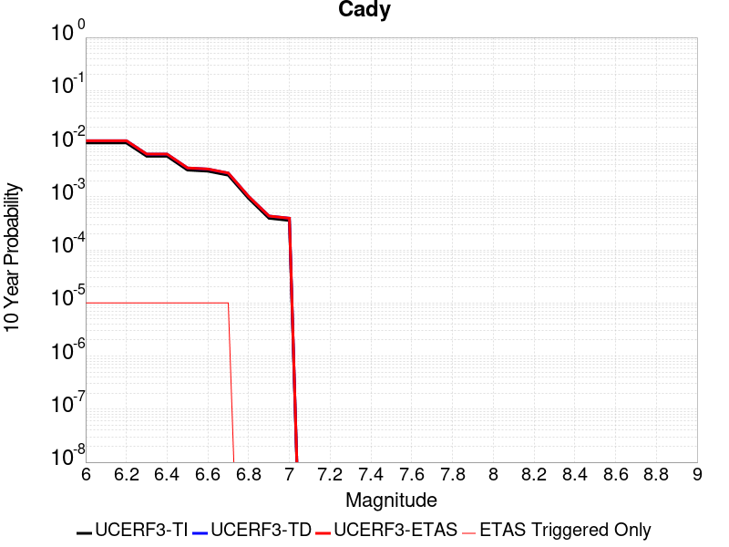 |

| Magnitude | 1 wk TI Prob | 1 wk TD Prob | 1 wk ETAS Prob | 1 wk ETAS/TD Gain | 1 wk ETAS Triggered Only | 1 mo TI Prob | 1 mo TD Prob | 1 mo ETAS Prob | 1 mo ETAS/TD Gain | 1 mo ETAS Triggered Only | 1 yr TI Prob | 1 yr TD Prob | 1 yr ETAS Prob | 1 yr ETAS/TD Gain | 1 yr ETAS Triggered Only | 10 yr TI Prob | 10 yr TD Prob | 10 yr ETAS Prob | 10 yr ETAS/TD Gain | 10 yr ETAS Triggered Only |
|-----|-----|-----|-----|-----|-----|-----|-----|-----|-----|-----|-----|-----|-----|-----|-----|-----|-----|-----|-----|-----|
| 6.0 | 1.9892565E-5 | 2.1869915E-5 | 4.7843372E-5 | 2.1876342 | 2.5974026E-5 | 8.525106E-5 | 9.372535E-5 | 1.1969694E-4 | 1.2771032 | 2.5974026E-5 | 0.0010374374 | 0.0011405998 | 0.0011665442 | 1.0227463 | 2.5974026E-5 | 0.010326075 | 0.011356481 | 0.01138216 | 1.0022612 | 2.5974026E-5 |
| 6.1 | 1.9892565E-5 | 2.1869915E-5 | 4.7843372E-5 | 2.1876342 | 2.5974026E-5 | 8.525106E-5 | 9.372535E-5 | 1.1969694E-4 | 1.2771032 | 2.5974026E-5 | 0.0010374374 | 0.0011405998 | 0.0011665442 | 1.0227463 | 2.5974026E-5 | 0.010326075 | 0.011356481 | 0.01138216 | 1.0022612 | 2.5974026E-5 |
| 6.2 | 1.9892565E-5 | 2.1869915E-5 | 4.7843372E-5 | 2.1876342 | 2.5974026E-5 | 8.525106E-5 | 9.372535E-5 | 1.1969694E-4 | 1.2771032 | 2.5974026E-5 | 0.0010374374 | 0.0011405998 | 0.0011665442 | 1.0227463 | 2.5974026E-5 | 0.010326075 | 0.011356481 | 0.01138216 | 1.0022612 | 2.5974026E-5 |
| 6.3 | 1.1117327E-5 | 1.218259E-5 | 3.81563E-5 | 3.1320353 | 2.5974026E-5 | 4.764482E-5 | 5.221023E-5 | 7.81829E-5 | 1.4974632 | 2.5974026E-5 | 5.7992124E-4 | 6.355057E-4 | 6.6146324E-4 | 1.0408455 | 2.5974026E-5 | 0.0057841022 | 0.006339993 | 0.006365802 | 1.0040709 | 2.5974026E-5 |
| 6.4 | 1.1117327E-5 | 1.218259E-5 | 3.81563E-5 | 3.1320353 | 2.5974026E-5 | 4.764482E-5 | 5.221023E-5 | 7.81829E-5 | 1.4974632 | 2.5974026E-5 | 5.7992124E-4 | 6.355057E-4 | 6.6146324E-4 | 1.0408455 | 2.5974026E-5 | 0.0057841022 | 0.006339993 | 0.006365802 | 1.0040709 | 2.5974026E-5 |
| 6.5 | 6.103093E-6 | 6.6752414E-6 | 3.2649095E-5 | 4.891073 | 2.5974026E-5 | 2.615585E-5 | 2.8607934E-5 | 5.4581218E-5 | 1.9079049 | 2.5974026E-5 | 3.1840094E-4 | 3.482585E-4 | 3.7422348E-4 | 1.0745566 | 2.5974026E-5 | 0.0031794512 | 0.0034783627 | 0.0035042462 | 1.0074413 | 2.5974026E-5 |
| 6.6 | 5.817237E-6 | 6.3687653E-6 | 3.2342625E-5 | 5.0783195 | 2.5974026E-5 | 2.4930776E-5 | 2.7294494E-5 | 5.326781E-5 | 1.9515954 | 2.5974026E-5 | 3.034899E-4 | 3.3227223E-4 | 3.5823765E-4 | 1.0781449 | 2.5974026E-5 | 0.0030307577 | 0.0033189778 | 0.0033448655 | 1.0078 | 2.5974026E-5 |
| 6.7 | 4.8846314E-6 | 5.343149E-6 | 3.1317035E-5 | 5.861157 | 2.5974026E-5 | 2.0933967E-5 | 2.2899076E-5 | 4.887251E-5 | 2.1342568 | 2.5974026E-5 | 2.5484123E-4 | 2.7877238E-4 | 3.0473917E-4 | 1.0931469 | 2.5974026E-5 | 0.0025454918 | 0.0027853833 | 0.002811285 | 1.0092992 | 2.5974026E-5 |
| 6.8 | 1.7788773E-6 | 1.9408171E-6 | 1.9408171E-6 | 1.0 | 0.0 | 7.6237375E-6 | 8.31777E-6 | 8.31777E-6 | 1.0 | 0.0 | 9.281505E-5 | 1.0126572E-4 | 1.0126572E-4 | 1.0 | 0.0 | 9.2776294E-4 | 0.0010123505 | 0.0010123505 | 1.0 | 0.0 |
| 6.9 | 7.5455404E-7 | 8.301368E-7 | 8.301368E-7 | 1.0 | 0.0 | 3.233799E-6 | 3.5577261E-6 | 3.5577261E-6 | 1.0 | 0.0 | 3.937079E-5 | 4.331479E-5 | 4.331479E-5 | 1.0 | 0.0 | 3.9363815E-4 | 4.330965E-4 | 4.330965E-4 | 1.0 | 0.0 |
| 7.0 | 6.8578805E-7 | 7.5457075E-7 | 7.5457075E-7 | 1.0 | 0.0 | 2.9390883E-6 | 3.2338726E-6 | 3.2338726E-6 | 1.0 | 0.0 | 3.578281E-5 | 3.937202E-5 | 3.937202E-5 | 1.0 | 0.0 | 3.577705E-4 | 3.9368295E-4 | 3.9368295E-4 | 1.0 | 0.0 |

