# Parent Section Magnitude-Probability Distributions

Only fault sections with at least one triggered aftershock are plotted. Sections are sorted by total supraseismogenic trigger rate (decreasing)

## Table Of Contents

* [San Jacinto (Anza) rev](#san-jacinto-anza-rev)
* [San Jacinto (Clark) rev](#san-jacinto-clark-rev)
* [San Andreas (San Bernardino N)](#san-andreas-san-bernardino-n)
* [San Jacinto (Stepovers Combined)](#san-jacinto-stepovers-combined)
* [San Andreas (Mojave S)](#san-andreas-mojave-s)
* [San Jacinto (San Bernardino)](#san-jacinto-san-bernardino)
* [San Jacinto (San Jacinto Valley) rev](#san-jacinto-san-jacinto-valley-rev)
* [San Jacinto (Coyote Creek)](#san-jacinto-coyote-creek)
* [San Andreas (Mojave N)](#san-andreas-mojave-n)
* [San Jacinto (Borrego)](#san-jacinto-borrego)
* [San Jacinto (Superstition Mtn)](#san-jacinto-superstition-mtn)
* [San Andreas (Big Bend)](#san-andreas-big-bend)
* [San Andreas (Coachella) rev](#san-andreas-coachella-rev)
* [San Andreas (Carrizo) rev](#san-andreas-carrizo-rev)
* [San Andreas (Cholame) rev](#san-andreas-cholame-rev)
* [Superstition Hills](#superstition-hills)
* [San Andreas (San Gorgonio Pass-Garnet HIll)](#san-andreas-san-gorgonio-pass-garnet-hill)
* [Imperial](#imperial)
* [San Jacinto (Lytle Creek connector)](#san-jacinto-lytle-creek-connector)
* [Brawley (Seismic Zone) alt 1](#brawley-seismic-zone-alt-1)
* [Elsinore (Glen Ivy) rev](#elsinore-glen-ivy-rev)
* [San Andreas (Parkfield)](#san-andreas-parkfield)
* [Earthquake Valley (No  Extension)](#earthquake-valley-no--extension)
* [San Andreas (San Bernardino S)](#san-andreas-san-bernardino-s)
* [Pleito](#pleito)
* [Rose Canyon](#rose-canyon)
* [San Andreas (Creeping Section) 2011 CFM](#san-andreas-creeping-section-2011-cfm)
* [Blue Cut](#blue-cut)
* [Coronado Bank alt1](#coronado-bank-alt1)
* [Earthquake Valley (So Extension)](#earthquake-valley-so-extension)
* [Earthquake Valley](#earthquake-valley)
* [Elsinore (Coyote Mountains)](#elsinore-coyote-mountains)
* [San Andreas (Santa Cruz Mts) 2011 CFM](#san-andreas-santa-cruz-mts-2011-cfm)
* [San Andreas (Peninsula) 2011 CFM](#san-andreas-peninsula-2011-cfm)
* [Cady](#cady)
* [Pisgah-Bullion Mtn-Mesquite Lk](#pisgah-bullion-mtn-mesquite-lk)

## San Jacinto (Anza) rev
*[(top)](#table-of-contents)*

| 1 Week | 1 Month | 1 Year | 10 Year |
|-----|-----|-----|-----|
|  |  |  |  |

| Magnitude | 1 wk TI Prob | 1 wk TD Prob | 1 wk ETAS Prob | 1 wk ETAS/TD Gain | 1 wk ETAS Triggered Only | 1 mo TI Prob | 1 mo TD Prob | 1 mo ETAS Prob | 1 mo ETAS/TD Gain | 1 mo ETAS Triggered Only | 1 yr TI Prob | 1 yr TD Prob | 1 yr ETAS Prob | 1 yr ETAS/TD Gain | 1 yr ETAS Triggered Only | 10 yr TI Prob | 10 yr TD Prob | 10 yr ETAS Prob | 10 yr ETAS/TD Gain | 10 yr ETAS Triggered Only |
|-----|-----|-----|-----|-----|-----|-----|-----|-----|-----|-----|-----|-----|-----|-----|-----|-----|-----|-----|-----|-----|
| 6.0 | 6.3015636E-5 | 4.4012224E-5 | 2.7269238E-4 | 6.195833 | 2.2869023E-4 | 2.7003905E-4 | 1.8861024E-4 | 5.2118785E-4 | 2.7633061 | 3.3264034E-4 | 0.0032827691 | 0.0022939236 | 0.0026672855 | 1.1627613 | 3.7422037E-4 | 0.032346968 | 0.02366162 | 0.024087882 | 1.0180148 | 4.3659043E-4 |
| 6.1 | 6.3015636E-5 | 4.4012224E-5 | 2.7269238E-4 | 6.195833 | 2.2869023E-4 | 2.7003905E-4 | 1.8861024E-4 | 5.2118785E-4 | 2.7633061 | 3.3264034E-4 | 0.0032827691 | 0.0022939236 | 0.0026672855 | 1.1627613 | 3.7422037E-4 | 0.032346968 | 0.02366162 | 0.024087882 | 1.0180148 | 4.3659043E-4 |
| 6.2 | 6.3015636E-5 | 4.4012224E-5 | 2.7269238E-4 | 6.195833 | 2.2869023E-4 | 2.7003905E-4 | 1.8861024E-4 | 5.2118785E-4 | 2.7633061 | 3.3264034E-4 | 0.0032827691 | 0.0022939236 | 0.0026672855 | 1.1627613 | 3.7422037E-4 | 0.032346968 | 0.02366162 | 0.024087882 | 1.0180148 | 4.3659043E-4 |
| 6.3 | 6.3015636E-5 | 4.4012224E-5 | 2.7269238E-4 | 6.195833 | 2.2869023E-4 | 2.7003905E-4 | 1.8861024E-4 | 5.2118785E-4 | 2.7633061 | 3.3264034E-4 | 0.0032827691 | 0.0022939236 | 0.0026672855 | 1.1627613 | 3.7422037E-4 | 0.032346968 | 0.02366162 | 0.024087882 | 1.0180148 | 4.3659043E-4 |
| 6.4 | 6.3015636E-5 | 4.4012224E-5 | 2.7269238E-4 | 6.195833 | 2.2869023E-4 | 2.7003905E-4 | 1.8861024E-4 | 5.2118785E-4 | 2.7633061 | 3.3264034E-4 | 0.0032827691 | 0.0022939236 | 0.0026672855 | 1.1627613 | 3.7422037E-4 | 0.032346968 | 0.02366162 | 0.024087882 | 1.0180148 | 4.3659043E-4 |
| 6.5 | 5.811017E-5 | 4.075744E-5 | 2.6943834E-4 | 6.610777 | 2.2869023E-4 | 2.4901982E-4 | 1.7466309E-4 | 4.8645894E-4 | 2.7851272 | 3.118503E-4 | 0.0030276014 | 0.0021244548 | 0.0024563887 | 1.1562442 | 3.3264034E-4 | 0.02986684 | 0.021944052 | 0.02231006 | 1.0166792 | 3.7422037E-4 |
| 6.6 | 5.811017E-5 | 4.075744E-5 | 2.6943834E-4 | 6.610777 | 2.2869023E-4 | 2.4901982E-4 | 1.7466309E-4 | 4.8645894E-4 | 2.7851272 | 3.118503E-4 | 0.0030276014 | 0.0021244548 | 0.0024563887 | 1.1562442 | 3.3264034E-4 | 0.02986684 | 0.021944052 | 0.02231006 | 1.0166792 | 3.7422037E-4 |
| 6.7 | 5.712442E-5 | 4.0173334E-5 | 2.6885438E-4 | 6.6923594 | 2.2869023E-4 | 2.4479596E-4 | 1.721601E-4 | 4.839567E-4 | 2.8110852 | 3.118503E-4 | 0.0029763177 | 0.0020940397 | 0.0024259835 | 1.1585183 | 3.3264034E-4 | 0.029367693 | 0.021632643 | 0.021998769 | 1.0169246 | 3.7422037E-4 |
| 6.8 | 5.6967532E-5 | 4.0028506E-5 | 2.6870958E-4 | 6.7129555 | 2.2869023E-4 | 2.4412372E-4 | 1.7153949E-4 | 4.833363E-4 | 2.8176386 | 3.118503E-4 | 0.0029681553 | 0.0020864983 | 0.0024184447 | 1.1590925 | 3.3264034E-4 | 0.029288229 | 0.021556264 | 0.021922417 | 1.0169859 | 3.7422037E-4 |
| 6.9 | 5.6211324E-5 | 3.9728853E-5 | 2.6841E-4 | 6.756047 | 2.2869023E-4 | 2.4088343E-4 | 1.7025543E-4 | 4.8205265E-4 | 2.8313496 | 3.118503E-4 | 0.0029288116 | 0.002070895 | 0.0024028462 | 1.1602937 | 3.3264034E-4 | 0.028905109 | 0.021393368 | 0.021759583 | 1.0171181 | 3.7422037E-4 |
| 7.0 | 5.4383527E-5 | 3.857445E-5 | 2.4646663E-4 | 6.3893757 | 2.0790022E-4 | 2.3305144E-4 | 1.6530862E-4 | 4.563208E-4 | 2.7604175 | 2.9106028E-4 | 0.0028337094 | 0.0020107795 | 0.0023220028 | 1.1547774 | 3.118503E-4 | 0.027978465 | 0.020779364 | 0.021105092 | 1.0156755 | 3.3264034E-4 |
| 7.1 | 5.1393665E-5 | 3.701462E-5 | 2.0332863E-4 | 5.493198 | 1.6632017E-4 | 2.2023996E-4 | 1.5862445E-4 | 4.0806513E-4 | 2.5725236 | 2.4948025E-4 | 0.0026781242 | 0.0019295464 | 0.0021992952 | 1.1397991 | 2.7027028E-4 | 0.026460782 | 0.019940337 | 0.020225592 | 1.0143055 | 2.9106028E-4 |
| 7.2 | 4.785222E-5 | 3.5343168E-5 | 1.6007888E-4 | 4.5292735 | 1.2474012E-4 | 2.0506482E-4 | 1.5146195E-4 | 3.385438E-4 | 2.235174 | 1.8711018E-4 | 0.0024938055 | 0.0018424931 | 0.0020292585 | 1.1013656 | 1.8711018E-4 | 0.024660049 | 0.01904172 | 0.019245662 | 1.0107102 | 2.0790022E-4 |
| 7.3 | 4.2143256E-5 | 3.442131E-5 | 1.5915715E-4 | 4.6237965 | 1.2474012E-4 | 1.8060145E-4 | 1.4751159E-4 | 3.1380722E-4 | 2.1273396 | 1.6632017E-4 | 0.002196605 | 0.0017944776 | 0.0019604992 | 1.0925181 | 1.6632017E-4 | 0.02175019 | 0.01854146 | 0.018704697 | 1.0088038 | 1.6632017E-4 |
| 7.4 | 4.0264713E-5 | 3.4054156E-5 | 1.5879003E-4 | 4.662868 | 1.2474012E-4 | 1.7255165E-4 | 1.4593823E-4 | 3.1223413E-4 | 2.1394951 | 1.6632017E-4 | 0.002098792 | 0.0017753534 | 0.0019413783 | 1.0935165 | 1.6632017E-4 | 0.020790804 | 0.01834325 | 0.01850652 | 1.0089008 | 1.6632017E-4 |
| 7.5 | 3.694492E-5 | 3.2754397E-5 | 1.5749043E-4 | 4.808223 | 1.2474012E-4 | 1.5832575E-4 | 1.4036844E-4 | 3.0666526E-4 | 2.1847165 | 1.6632017E-4 | 0.0019259118 | 0.0017076494 | 0.0018736855 | 1.0972308 | 1.6632017E-4 | 0.01909306 | 0.017652586 | 0.01781597 | 1.0092555 | 1.6632017E-4 |
| 7.6 | 3.200565E-5 | 3.00425E-5 | 1.5477887E-4 | 5.151997 | 1.2474012E-4 | 1.3715986E-4 | 1.2874723E-4 | 2.95046E-4 | 2.2916687 | 1.6632017E-4 | 0.001668642 | 0.0015663727 | 0.0017324324 | 1.1060154 | 1.6632017E-4 | 0.01656168 | 0.016226653 | 0.016390273 | 1.0100834 | 1.6632017E-4 |
| 7.7 | 2.731642E-5 | 2.661642E-5 | 1.5135322E-4 | 5.6864605 | 1.2474012E-4 | 1.1706512E-4 | 1.1406539E-4 | 2.803666E-4 | 2.457946 | 1.6632017E-4 | 0.001424336 | 0.0013878625 | 0.0015539519 | 1.1196728 | 1.6632017E-4 | 0.014152412 | 0.014440214 | 0.014604133 | 1.0113516 | 1.6632017E-4 |
| 7.8 | 2.3466424E-5 | 2.4005945E-5 | 1.2795355E-4 | 5.3300776 | 1.0395011E-4 | 1.0056651E-4 | 1.0287857E-4 | 2.2760587E-4 | 2.2123737 | 1.2474012E-4 | 0.0012237094 | 0.0012518278 | 0.0013764118 | 1.0995216 | 1.2474012E-4 | 0.012169928 | 0.013070661 | 0.01319377 | 1.0094187 | 1.2474012E-4 |
| 7.9 | 1.8611925E-5 | 1.935421E-5 | 1.233023E-4 | 6.370826 | 1.0395011E-4 | 7.9762955E-5 | 8.294398E-5 | 2.0767376E-4 | 2.5037835 | 1.2474012E-4 | 9.7068126E-4 | 0.0010093759 | 0.0011339901 | 1.1234567 | 1.2474012E-4 | 0.0096645225 | 0.010627878 | 0.010751292 | 1.0116123 | 1.2474012E-4 |
| 8.0 | 1.5460775E-5 | 1.6136648E-5 | 7.8505705E-5 | 4.8650565 | 6.237006E-5 | 6.6258784E-5 | 6.9155234E-5 | 1.5230957E-4 | 2.20243 | 8.3160085E-5 | 8.0640207E-4 | 8.4164046E-4 | 9.2473056E-4 | 1.098724 | 8.3160085E-5 | 0.008034821 | 0.008911137 | 0.008993556 | 1.009249 | 8.3160085E-5 |
| 8.1 | 9.983884E-6 | 8.503049E-6 | 5.0082737E-5 | 5.8899736 | 4.1580042E-5 | 4.2787375E-5 | 3.644113E-5 | 7.801966E-5 | 2.1409779 | 4.1580042E-5 | 5.2081177E-4 | 4.4358103E-4 | 4.851426E-4 | 1.0936956 | 4.1580042E-5 | 0.0051959283 | 0.0047649597 | 0.0048063416 | 1.0086846 | 4.1580042E-5 |
| 8.2 | 4.1226E-6 | 1.6203016E-6 | 1.6203016E-6 | 1.0 | 0.0 | 1.7668166E-5 | 6.944131E-6 | 6.944131E-6 | 1.0 | 0.0 | 2.1508869E-4 | 8.454155E-5 | 8.454155E-5 | 1.0 | 0.0 | 0.0021488064 | 9.789203E-4 | 9.789203E-4 | 1.0 | 0.0 |
| 8.3 | 1.2750878E-6 | 3.7928442E-7 | 3.7928442E-7 | 1.0 | 0.0 | 5.4646503E-6 | 1.6255036E-6 | 1.6255036E-6 | 1.0 | 0.0 | 6.653009E-5 | 1.9790332E-5 | 1.9790332E-5 | 1.0 | 0.0 | 6.6510175E-4 | 2.379671E-4 | 2.379671E-4 | 1.0 | 0.0 |

## San Jacinto (Clark) rev
*[(top)](#table-of-contents)*

| 1 Week | 1 Month | 1 Year | 10 Year |
|-----|-----|-----|-----|
|  |  |  |  |

| Magnitude | 1 wk TI Prob | 1 wk TD Prob | 1 wk ETAS Prob | 1 wk ETAS/TD Gain | 1 wk ETAS Triggered Only | 1 mo TI Prob | 1 mo TD Prob | 1 mo ETAS Prob | 1 mo ETAS/TD Gain | 1 mo ETAS Triggered Only | 1 yr TI Prob | 1 yr TD Prob | 1 yr ETAS Prob | 1 yr ETAS/TD Gain | 1 yr ETAS Triggered Only | 10 yr TI Prob | 10 yr TD Prob | 10 yr ETAS Prob | 10 yr ETAS/TD Gain | 10 yr ETAS Triggered Only |
|-----|-----|-----|-----|-----|-----|-----|-----|-----|-----|-----|-----|-----|-----|-----|-----|-----|-----|-----|-----|-----|
| 6.0 | 4.482615E-5 | 2.149583E-5 | 2.2939157E-4 | 10.671444 | 2.0790022E-4 | 1.9209793E-4 | 9.2121794E-5 | 3.6236717E-4 | 3.933566 | 2.7027028E-4 | 0.0023362834 | 0.0011210152 | 0.0014117492 | 1.2593489 | 2.9106028E-4 | 0.02311874 | 0.011682168 | 0.012010922 | 1.0281415 | 3.3264034E-4 |
| 6.1 | 4.482615E-5 | 2.149583E-5 | 2.2939157E-4 | 10.671444 | 2.0790022E-4 | 1.9209793E-4 | 9.2121794E-5 | 3.6236717E-4 | 3.933566 | 2.7027028E-4 | 0.0023362834 | 0.0011210152 | 0.0014117492 | 1.2593489 | 2.9106028E-4 | 0.02311874 | 0.011682168 | 0.012010922 | 1.0281415 | 3.3264034E-4 |
| 6.2 | 4.482615E-5 | 2.149583E-5 | 2.2939157E-4 | 10.671444 | 2.0790022E-4 | 1.9209793E-4 | 9.2121794E-5 | 3.6236717E-4 | 3.933566 | 2.7027028E-4 | 0.0023362834 | 0.0011210152 | 0.0014117492 | 1.2593489 | 2.9106028E-4 | 0.02311874 | 0.011682168 | 0.012010922 | 1.0281415 | 3.3264034E-4 |
| 6.3 | 4.482615E-5 | 2.149583E-5 | 2.2939157E-4 | 10.671444 | 2.0790022E-4 | 1.9209793E-4 | 9.2121794E-5 | 3.6236717E-4 | 3.933566 | 2.7027028E-4 | 0.0023362834 | 0.0011210152 | 0.0014117492 | 1.2593489 | 2.9106028E-4 | 0.02311874 | 0.011682168 | 0.012010922 | 1.0281415 | 3.3264034E-4 |
| 6.4 | 4.482615E-5 | 2.149583E-5 | 2.2939157E-4 | 10.671444 | 2.0790022E-4 | 1.9209793E-4 | 9.2121794E-5 | 3.6236717E-4 | 3.933566 | 2.7027028E-4 | 0.0023362834 | 0.0011210152 | 0.0014117492 | 1.2593489 | 2.9106028E-4 | 0.02311874 | 0.011682168 | 0.012010922 | 1.0281415 | 3.3264034E-4 |
| 6.5 | 3.7294863E-5 | 1.7663233E-5 | 1.8398046E-4 | 10.416013 | 1.6632017E-4 | 1.5982533E-4 | 7.56974E-5 | 2.8358187E-4 | 3.7462566 | 2.0790022E-4 | 0.0019441366 | 9.2123076E-4 | 0.0011497103 | 1.2480155 | 2.2869023E-4 | 0.01927216 | 0.009648823 | 0.009895897 | 1.0256065 | 2.4948025E-4 |
| 6.6 | 3.7294863E-5 | 1.7663233E-5 | 1.8398046E-4 | 10.416013 | 1.6632017E-4 | 1.5982533E-4 | 7.56974E-5 | 2.8358187E-4 | 3.7462566 | 2.0790022E-4 | 0.0019441366 | 9.2123076E-4 | 0.0011497103 | 1.2480155 | 2.2869023E-4 | 0.01927216 | 0.009648823 | 0.009895897 | 1.0256065 | 2.4948025E-4 |
| 6.7 | 3.6039248E-5 | 1.6904516E-5 | 1.624322E-4 | 9.608805 | 1.4553014E-4 | 1.5444479E-4 | 7.244594E-5 | 2.5954258E-4 | 3.582569 | 1.8711018E-4 | 0.0018787434 | 8.816767E-4 | 0.0010893936 | 1.2355931 | 2.0790022E-4 | 0.01862939 | 0.009247725 | 0.009474301 | 1.0245006 | 2.2869023E-4 |
| 6.8 | 3.5031844E-5 | 1.6527734E-5 | 1.412658E-4 | 8.547197 | 1.2474012E-4 | 1.5012783E-4 | 7.0831244E-5 | 2.3713963E-4 | 3.3479524 | 1.6632017E-4 | 0.0018262739 | 8.6203346E-4 | 0.0010489824 | 1.2168696 | 1.8711018E-4 | 0.01811338 | 0.009045837 | 0.009251857 | 1.022775 | 2.0790022E-4 |
| 6.9 | 3.435112E-5 | 1.6355121E-5 | 1.410932E-4 | 8.626851 | 1.2474012E-4 | 1.4721078E-4 | 7.009152E-5 | 2.3640002E-4 | 3.3727336 | 1.6632017E-4 | 0.0017908178 | 8.530343E-4 | 0.0010399849 | 1.2191595 | 1.8711018E-4 | 0.017764548 | 0.008953502 | 0.009159542 | 1.023012 | 2.0790022E-4 |
| 7.0 | 2.8959772E-5 | 1.459947E-5 | 1.1854806E-4 | 8.120025 | 1.0395011E-4 | 1.241074E-4 | 6.256767E-5 | 2.080887E-4 | 3.3258183 | 1.4553014E-4 | 0.0015099603 | 7.6149806E-4 | 9.276916E-4 | 1.2182455 | 1.6632017E-4 | 0.014997416 | 0.008010134 | 0.008175122 | 1.0205973 | 1.6632017E-4 |
| 7.1 | 2.6002877E-5 | 1.3069119E-5 | 7.5438365E-5 | 5.772261 | 6.237006E-5 | 1.11436144E-4 | 5.6009318E-5 | 1.599536E-4 | 2.855839 | 1.0395011E-4 | 0.0013558907 | 6.817023E-4 | 8.0635736E-4 | 1.1828586 | 1.2474012E-4 | 0.013476475 | 0.007175722 | 0.007299567 | 1.0172589 | 1.2474012E-4 |
| 7.2 | 2.2544838E-5 | 1.1479721E-5 | 3.2269505E-5 | 2.8110006 | 2.0790021E-5 | 9.661716E-5 | 4.9197886E-5 | 9.077588E-5 | 1.8451174 | 4.1580042E-5 | 0.001175679 | 5.9882115E-4 | 6.403763E-4 | 1.069395 | 4.1580042E-5 | 0.011694785 | 0.0063084844 | 0.006349802 | 1.0065496 | 4.1580042E-5 |
| 7.3 | 1.75334E-5 | 1.1014846E-5 | 3.1804637E-5 | 2.8874338 | 2.0790021E-5 | 7.514098E-5 | 4.7205634E-5 | 6.7994675E-5 | 1.4403932 | 2.0790021E-5 | 9.144575E-4 | 5.745785E-4 | 5.953565E-4 | 1.0361623 | 2.0790021E-5 | 0.009107036 | 0.0060420227 | 0.006062687 | 1.0034201 | 2.0790021E-5 |
| 7.4 | 1.5924552E-5 | 1.0810164E-5 | 3.159996E-5 | 2.923171 | 2.0790021E-5 | 6.82463E-5 | 4.632846E-5 | 6.7117515E-5 | 1.4487319 | 2.0790021E-5 | 8.305819E-4 | 5.639044E-4 | 5.8468274E-4 | 1.0368472 | 2.0790021E-5 | 0.008274844 | 0.005926856 | 0.005947523 | 1.003487 | 2.0790021E-5 |
| 7.5 | 1.3428931E-5 | 1.0040226E-5 | 3.0830037E-5 | 3.0706518 | 2.0790021E-5 | 5.7551293E-5 | 4.302884E-5 | 6.381796E-5 | 1.483144 | 2.0790021E-5 | 7.004617E-4 | 5.2375125E-4 | 5.445304E-4 | 1.0396737 | 2.0790021E-5 | 0.006982579 | 0.0055068806 | 0.005527556 | 1.0037545 | 2.0790021E-5 |
| 7.6 | 1.0688787E-5 | 8.787555E-6 | 2.9577393E-5 | 3.3658273 | 2.0790021E-5 | 4.5808283E-5 | 3.7660408E-5 | 5.844965E-5 | 1.5520184 | 2.0790021E-5 | 5.5757316E-4 | 4.584195E-4 | 4.7919998E-4 | 1.0453308 | 2.0790021E-5 | 0.005561762 | 0.004833719 | 0.0048544086 | 1.0042802 | 2.0790021E-5 |
| 7.7 | 8.81236E-6 | 7.634947E-6 | 2.8424809E-5 | 3.722987 | 2.0790021E-5 | 3.776671E-5 | 3.2720793E-5 | 5.3510135E-5 | 1.6353556 | 2.0790021E-5 | 4.597127E-4 | 3.9830306E-4 | 4.190848E-4 | 1.0521756 | 2.0790021E-5 | 0.0045876284 | 0.004223741 | 0.0042444435 | 1.0049014 | 2.0790021E-5 |
| 7.8 | 7.780431E-6 | 6.8541876E-6 | 2.7644066E-5 | 4.0331645 | 2.0790021E-5 | 3.3344273E-5 | 2.937476E-5 | 5.016417E-5 | 1.7077304 | 2.0790021E-5 | 4.0589093E-4 | 3.575792E-4 | 3.783618E-4 | 1.0581203 | 2.0790021E-5 | 0.0040515037 | 0.0038070125 | 0.0038277232 | 1.0054402 | 2.0790021E-5 |
| 7.9 | 6.5437994E-6 | 5.9273216E-6 | 2.671722E-5 | 4.507469 | 2.0790021E-5 | 2.8044553E-5 | 2.540256E-5 | 4.6192054E-5 | 1.8184015 | 2.0790021E-5 | 3.4138895E-4 | 3.0923245E-4 | 3.3001605E-4 | 1.0672102 | 2.0790021E-5 | 0.0034086495 | 0.0033131074 | 0.0033338286 | 1.0062543 | 2.0790021E-5 |
| 8.0 | 5.4488164E-6 | 4.943602E-6 | 2.573352E-5 | 5.205419 | 2.0790021E-5 | 2.3351862E-5 | 2.1186695E-5 | 4.1976276E-5 | 1.9812564 | 2.0790021E-5 | 2.8427184E-4 | 2.5791762E-4 | 2.787023E-4 | 1.0805864 | 2.0790021E-5 | 0.0028390845 | 0.0027807665 | 0.0028014986 | 1.0074556 | 2.0790021E-5 |
| 8.1 | 2.8397242E-6 | 1.4188071E-6 | 1.4188071E-6 | 1.0 | 0.0 | 1.217019E-5 | 6.080588E-6 | 6.080588E-6 | 1.0 | 0.0 | 1.4816198E-4 | 7.4028656E-5 | 7.4028656E-5 | 1.0 | 0.0 | 0.0014806325 | 8.4064476E-4 | 8.4064476E-4 | 1.0 | 0.0 |
| 8.2 | 2.030244E-6 | 6.6173953E-7 | 6.6173953E-7 | 1.0 | 0.0 | 8.701017E-6 | 2.8360234E-6 | 2.8360234E-6 | 1.0 | 0.0 | 1.05929736E-4 | 3.4528042E-5 | 3.4528042E-5 | 1.0 | 0.0 | 0.0010587925 | 4.1223396E-4 | 4.1223396E-4 | 1.0 | 0.0 |
| 8.3 | 1.0659804E-6 | 3.070894E-7 | 3.070894E-7 | 1.0 | 0.0 | 4.568479E-6 | 1.3160968E-6 | 1.3160968E-6 | 1.0 | 0.0 | 5.5619817E-5 | 1.6023365E-5 | 1.6023365E-5 | 1.0 | 0.0 | 5.5605895E-4 | 1.9428149E-4 | 1.9428149E-4 | 1.0 | 0.0 |

## San Andreas (San Bernardino N)
*[(top)](#table-of-contents)*

| 1 Week | 1 Month | 1 Year | 10 Year |
|-----|-----|-----|-----|
|  |  |  |  |

| Magnitude | 1 wk TI Prob | 1 wk TD Prob | 1 wk ETAS Prob | 1 wk ETAS/TD Gain | 1 wk ETAS Triggered Only | 1 mo TI Prob | 1 mo TD Prob | 1 mo ETAS Prob | 1 mo ETAS/TD Gain | 1 mo ETAS Triggered Only | 1 yr TI Prob | 1 yr TD Prob | 1 yr ETAS Prob | 1 yr ETAS/TD Gain | 1 yr ETAS Triggered Only | 10 yr TI Prob | 10 yr TD Prob | 10 yr ETAS Prob | 10 yr ETAS/TD Gain | 10 yr ETAS Triggered Only |
|-----|-----|-----|-----|-----|-----|-----|-----|-----|-----|-----|-----|-----|-----|-----|-----|-----|-----|-----|-----|-----|
| 6.0 | 1.4273766E-4 | 3.189915E-4 | 4.644752E-4 | 1.456074 | 1.4553014E-4 | 6.115894E-4 | 0.0013663961 | 0.0015532506 | 1.1367499 | 1.8711018E-4 | 0.0074207084 | 0.016510492 | 0.016694514 | 1.0111457 | 1.8711018E-4 | 0.07177748 | 0.15147589 | 0.15163466 | 1.0010481 | 1.8711018E-4 |
| 6.1 | 1.4273766E-4 | 3.189915E-4 | 4.644752E-4 | 1.456074 | 1.4553014E-4 | 6.115894E-4 | 0.0013663961 | 0.0015532506 | 1.1367499 | 1.8711018E-4 | 0.0074207084 | 0.016510492 | 0.016694514 | 1.0111457 | 1.8711018E-4 | 0.07177748 | 0.15147589 | 0.15163466 | 1.0010481 | 1.8711018E-4 |
| 6.2 | 1.4273766E-4 | 3.189915E-4 | 4.644752E-4 | 1.456074 | 1.4553014E-4 | 6.115894E-4 | 0.0013663961 | 0.0015532506 | 1.1367499 | 1.8711018E-4 | 0.0074207084 | 0.016510492 | 0.016694514 | 1.0111457 | 1.8711018E-4 | 0.07177748 | 0.15147589 | 0.15163466 | 1.0010481 | 1.8711018E-4 |
| 6.3 | 1.3730655E-4 | 3.0802502E-4 | 4.5351032E-4 | 1.4723166 | 1.4553014E-4 | 5.883239E-4 | 0.001319445 | 0.0015063083 | 1.1416227 | 1.8711018E-4 | 0.0071393442 | 0.015947336 | 0.016131463 | 1.0115459 | 1.8711018E-4 | 0.06914291 | 0.1467877 | 0.14694734 | 1.0010875 | 1.8711018E-4 |
| 6.4 | 1.3730655E-4 | 3.0802502E-4 | 4.5351032E-4 | 1.4723166 | 1.4553014E-4 | 5.883239E-4 | 0.001319445 | 0.0015063083 | 1.1416227 | 1.8711018E-4 | 0.0071393442 | 0.015947336 | 0.016131463 | 1.0115459 | 1.8711018E-4 | 0.06914291 | 0.1467877 | 0.14694734 | 1.0010875 | 1.8711018E-4 |
| 6.5 | 1.2942807E-4 | 2.921489E-4 | 4.3763654E-4 | 1.4979913 | 1.4553014E-4 | 5.545738E-4 | 0.0012514712 | 0.0014383472 | 1.149325 | 1.8711018E-4 | 0.0067310524 | 0.015131476 | 0.015315755 | 1.0121785 | 1.8711018E-4 | 0.06530788 | 0.13991421 | 0.14007515 | 1.0011503 | 1.8711018E-4 |
| 6.6 | 1.1125901E-4 | 2.5647978E-4 | 3.811879E-4 | 1.4862299 | 1.2474012E-4 | 4.767372E-4 | 0.0010987383 | 0.0012648758 | 1.1512074 | 1.6632017E-4 | 0.005788839 | 0.0132957315 | 0.013459841 | 1.0123429 | 1.6632017E-4 | 0.056403454 | 0.12421665 | 0.12436231 | 1.0011727 | 1.6632017E-4 |
| 6.7 | 1.02209575E-4 | 2.378085E-4 | 3.417339E-4 | 1.4370129 | 1.0395011E-4 | 4.3796748E-4 | 0.0010187826 | 0.0011641645 | 1.1427016 | 1.4553014E-4 | 0.0053192247 | 0.012333566 | 0.012477302 | 1.011654 | 1.4553014E-4 | 0.051936906 | 0.116000526 | 0.116129175 | 1.001109 | 1.4553014E-4 |
| 6.8 | 9.610582E-5 | 2.2302699E-4 | 3.2695392E-4 | 1.4659836 | 1.0395011E-4 | 4.1181705E-4 | 9.554805E-4 | 0.0011008716 | 1.1521654 | 1.4553014E-4 | 0.0050023515 | 0.011571199 | 0.011715044 | 1.0124314 | 1.4553014E-4 | 0.048912346 | 0.10941177 | 0.10954138 | 1.0011846 | 1.4553014E-4 |
| 6.9 | 9.3877505E-5 | 2.1757066E-4 | 3.2149814E-4 | 1.4776723 | 1.0395011E-4 | 4.0227012E-4 | 9.3211315E-4 | 0.0010775076 | 1.1559837 | 1.4553014E-4 | 0.0048866454 | 0.0112896785 | 0.011433566 | 1.012745 | 1.4553014E-4 | 0.04780577 | 0.10699908 | 0.10712903 | 1.0012146 | 1.4553014E-4 |
| 7.0 | 9.1019785E-5 | 2.1082193E-4 | 3.1475013E-4 | 1.4929667 | 1.0395011E-4 | 3.900265E-4 | 9.0321037E-4 | 0.001048609 | 1.1609799 | 1.4553014E-4 | 0.0047382377 | 0.010941371 | 0.011085309 | 1.0131553 | 1.4553014E-4 | 0.046384744 | 0.1039648 | 0.1040952 | 1.0012543 | 1.4553014E-4 |
| 7.1 | 8.771155E-5 | 2.0254731E-4 | 3.0647634E-4 | 1.51311 | 1.0395011E-4 | 3.758525E-4 | 8.677716E-4 | 0.0010131755 | 1.1675601 | 1.4553014E-4 | 0.0045664064 | 0.010514142 | 0.010658142 | 1.0136958 | 1.4553014E-4 | 0.044737056 | 0.100267194 | 0.10039813 | 1.0013059 | 1.4553014E-4 |
| 7.2 | 8.0830236E-5 | 1.865613E-4 | 2.90492E-4 | 1.5570861 | 1.0395011E-4 | 3.4636928E-4 | 7.993036E-4 | 9.447174E-4 | 1.1819257 | 1.4553014E-4 | 0.0042088944 | 0.009688209 | 0.009832329 | 1.0148759 | 1.4553014E-4 | 0.041300658 | 0.09298421 | 0.09311621 | 1.0014195 | 1.4553014E-4 |
| 7.3 | 7.7668235E-5 | 1.7594914E-4 | 2.7988094E-4 | 1.5906924 | 1.0395011E-4 | 3.328214E-4 | 7.538499E-4 | 8.9927035E-4 | 1.1929036 | 1.4553014E-4 | 0.0040445733 | 0.009139582 | 0.009283782 | 1.0157776 | 1.4553014E-4 | 0.03971748 | 0.0882316 | 0.088364296 | 1.0015038 | 1.4553014E-4 |
| 7.4 | 7.520177E-5 | 1.6811433E-4 | 2.7204695E-4 | 1.6182259 | 1.0395011E-4 | 3.2225347E-4 | 7.202911E-4 | 8.657164E-4 | 1.201898 | 1.4553014E-4 | 0.0039163795 | 0.008734352 | 0.008878611 | 1.0165163 | 1.4553014E-4 | 0.038480744 | 0.08467445 | 0.08480766 | 1.0015732 | 1.4553014E-4 |
| 7.5 | 7.274697E-5 | 1.6095651E-4 | 2.6488988E-4 | 1.6457233 | 1.0395011E-4 | 3.1173544E-4 | 6.896313E-4 | 8.350611E-4 | 1.2108805 | 1.4553014E-4 | 0.003788775 | 0.008363998 | 0.00850831 | 1.0172541 | 1.4553014E-4 | 0.03724827 | 0.08138077 | 0.081514455 | 1.0016427 | 1.4553014E-4 |
| 7.6 | 7.1185845E-5 | 1.56633E-4 | 2.6056683E-4 | 1.66355 | 1.0395011E-4 | 3.0504653E-4 | 6.7111163E-4 | 8.165441E-4 | 1.2167039 | 1.4553014E-4 | 0.0037076178 | 0.008140228 | 0.008284573 | 1.0177324 | 1.4553014E-4 | 0.036463667 | 0.079364 | 0.079497986 | 1.0016881 | 1.4553014E-4 |
| 7.7 | 6.709961E-5 | 1.4566159E-4 | 2.4959655E-4 | 1.7135372 | 1.0395011E-4 | 2.8753807E-4 | 6.2411465E-4 | 7.6955394E-4 | 1.2330331 | 1.4553014E-4 | 0.003495157 | 0.0075721624 | 0.0077165905 | 1.0190736 | 1.4553014E-4 | 0.034406938 | 0.07417128 | 0.07430602 | 1.0018165 | 1.4553014E-4 |
| 7.8 | 6.300812E-5 | 1.3437372E-4 | 2.3830985E-4 | 1.7734857 | 1.0395011E-4 | 2.7000686E-4 | 5.7576026E-4 | 7.2120666E-4 | 1.2526162 | 1.4553014E-4 | 0.0032823787 | 0.0069873813 | 0.0071318946 | 1.020682 | 1.4553014E-4 | 0.032343175 | 0.068779215 | 0.068914734 | 1.0019704 | 1.4553014E-4 |
| 7.9 | 4.983037E-5 | 9.9089295E-5 | 2.0302909E-4 | 2.048951 | 1.0395011E-4 | 2.1354125E-4 | 4.245993E-4 | 5.7006767E-4 | 1.3426015 | 1.4553014E-4 | 0.0025967648 | 0.005157254 | 0.005302034 | 1.028073 | 1.4553014E-4 | 0.025666296 | 0.051512357 | 0.05165039 | 1.0026796 | 1.4553014E-4 |
| 8.0 | 3.2211527E-5 | 5.439938E-5 | 1.1676605E-4 | 2.146459 | 6.237006E-5 | 1.380421E-4 | 2.3311938E-4 | 3.162601E-4 | 1.3566443 | 8.3160085E-5 | 0.0016793669 | 0.0028345364 | 0.0029174606 | 1.029255 | 8.3160085E-5 | 0.016667323 | 0.028895305 | 0.028976062 | 1.0027949 | 8.3160085E-5 |
| 8.1 | 1.743376E-5 | 1.9338206E-5 | 6.0917442E-5 | 3.1501083 | 4.1580042E-5 | 7.471398E-5 | 8.287539E-5 | 1.24452E-4 | 1.501676 | 4.1580042E-5 | 9.0926304E-4 | 0.0010085416 | 0.0010500796 | 1.0411863 | 4.1580042E-5 | 0.009055517 | 0.0107507445 | 0.010791877 | 1.003826 | 4.1580042E-5 |
| 8.2 | 7.831616E-6 | 5.343494E-6 | 5.343494E-6 | 1.0 | 0.0 | 3.3563636E-5 | 2.2900489E-5 | 2.2900489E-5 | 1.0 | 0.0 | 4.0856065E-4 | 2.7877785E-4 | 2.7877785E-4 | 1.0 | 0.0 | 0.004078103 | 0.0031442586 | 0.0031442586 | 1.0 | 0.0 |
| 8.3 | 1.983087E-6 | 8.001618E-7 | 8.001618E-7 | 1.0 | 0.0 | 8.498917E-6 | 3.4292605E-6 | 3.4292605E-6 | 1.0 | 0.0 | 1.034694E-4 | 4.1750463E-5 | 4.1750463E-5 | 1.0 | 0.0 | 0.0010342124 | 4.915874E-4 | 4.915874E-4 | 1.0 | 0.0 |

## San Jacinto (Stepovers Combined)
*[(top)](#table-of-contents)*

| 1 Week | 1 Month | 1 Year | 10 Year |
|-----|-----|-----|-----|
| 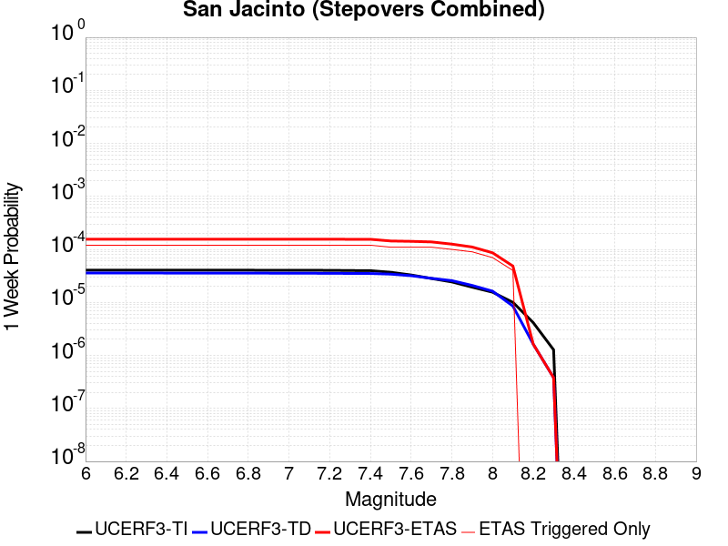 |  |  |  |

| Magnitude | 1 wk TI Prob | 1 wk TD Prob | 1 wk ETAS Prob | 1 wk ETAS/TD Gain | 1 wk ETAS Triggered Only | 1 mo TI Prob | 1 mo TD Prob | 1 mo ETAS Prob | 1 mo ETAS/TD Gain | 1 mo ETAS Triggered Only | 1 yr TI Prob | 1 yr TD Prob | 1 yr ETAS Prob | 1 yr ETAS/TD Gain | 1 yr ETAS Triggered Only | 10 yr TI Prob | 10 yr TD Prob | 10 yr ETAS Prob | 10 yr ETAS/TD Gain | 10 yr ETAS Triggered Only |
|-----|-----|-----|-----|-----|-----|-----|-----|-----|-----|-----|-----|-----|-----|-----|-----|-----|-----|-----|-----|-----|
| 6.0 | 4.0667746E-5 | 3.5886456E-5 | 1.606221E-4 | 4.475842 | 1.2474012E-4 | 1.742787E-4 | 1.5379004E-4 | 3.4087145E-4 | 2.2164729 | 1.8711018E-4 | 0.0021197782 | 0.0018707869 | 0.002057547 | 1.0998297 | 1.8711018E-4 | 0.020996714 | 0.019304737 | 0.019488234 | 1.0095054 | 1.8711018E-4 |
| 6.1 | 4.0667746E-5 | 3.5886456E-5 | 1.606221E-4 | 4.475842 | 1.2474012E-4 | 1.742787E-4 | 1.5379004E-4 | 3.4087145E-4 | 2.2164729 | 1.8711018E-4 | 0.0021197782 | 0.0018707869 | 0.002057547 | 1.0998297 | 1.8711018E-4 | 0.020996714 | 0.019304737 | 0.019488234 | 1.0095054 | 1.8711018E-4 |
| 6.2 | 4.0667746E-5 | 3.5886456E-5 | 1.606221E-4 | 4.475842 | 1.2474012E-4 | 1.742787E-4 | 1.5379004E-4 | 3.4087145E-4 | 2.2164729 | 1.8711018E-4 | 0.0021197782 | 0.0018707869 | 0.002057547 | 1.0998297 | 1.8711018E-4 | 0.020996714 | 0.019304737 | 0.019488234 | 1.0095054 | 1.8711018E-4 |
| 6.3 | 4.0667746E-5 | 3.5886456E-5 | 1.606221E-4 | 4.475842 | 1.2474012E-4 | 1.742787E-4 | 1.5379004E-4 | 3.4087145E-4 | 2.2164729 | 1.8711018E-4 | 0.0021197782 | 0.0018707869 | 0.002057547 | 1.0998297 | 1.8711018E-4 | 0.020996714 | 0.019304737 | 0.019488234 | 1.0095054 | 1.8711018E-4 |
| 6.4 | 4.0577226E-5 | 3.5758123E-5 | 1.6049379E-4 | 4.488317 | 1.2474012E-4 | 1.738908E-4 | 1.5324011E-4 | 3.4032163E-4 | 2.220839 | 1.8711018E-4 | 0.0021150648 | 0.0018641042 | 0.0020508657 | 1.1001883 | 1.8711018E-4 | 0.020950472 | 0.019239204 | 0.019422714 | 1.0095384 | 1.8711018E-4 |
| 6.5 | 4.0577226E-5 | 3.5758123E-5 | 1.6049379E-4 | 4.488317 | 1.2474012E-4 | 1.738908E-4 | 1.5324011E-4 | 3.4032163E-4 | 2.220839 | 1.8711018E-4 | 0.0021150648 | 0.0018641042 | 0.0020508657 | 1.1001883 | 1.8711018E-4 | 0.020950472 | 0.019239204 | 0.019422714 | 1.0095384 | 1.8711018E-4 |
| 6.6 | 4.053861E-5 | 3.570336E-5 | 1.6043903E-4 | 4.4936676 | 1.2474012E-4 | 1.7372532E-4 | 1.5300544E-4 | 3.40087E-4 | 2.2227118 | 1.8711018E-4 | 0.0021130538 | 0.0018612526 | 0.0020480144 | 1.100342 | 1.8711018E-4 | 0.020930743 | 0.019211238 | 0.019394755 | 1.0095525 | 1.8711018E-4 |
| 6.7 | 4.0516545E-5 | 3.5672376E-5 | 1.6040805E-4 | 4.496702 | 1.2474012E-4 | 1.7363077E-4 | 1.5287267E-4 | 3.3995425E-4 | 2.223774 | 1.8711018E-4 | 0.002111905 | 0.0018596391 | 0.0020464011 | 1.1004293 | 1.8711018E-4 | 0.020919468 | 0.019195411 | 0.01937893 | 1.0095606 | 1.8711018E-4 |
| 6.8 | 4.049434E-5 | 3.564377E-5 | 1.6037945E-4 | 4.4995084 | 1.2474012E-4 | 1.7353562E-4 | 1.5275009E-4 | 3.398317E-4 | 2.224756 | 1.8711018E-4 | 0.0021107488 | 0.0018581492 | 0.0020449117 | 1.10051 | 1.8711018E-4 | 0.020908125 | 0.019180743 | 0.019364264 | 1.009568 | 1.8711018E-4 |
| 6.9 | 4.046386E-5 | 3.5606176E-5 | 1.6034186E-4 | 4.5032034 | 1.2474012E-4 | 1.73405E-4 | 1.52589E-4 | 3.3967063E-4 | 2.2260494 | 1.8711018E-4 | 0.0021091616 | 0.0018561912 | 0.002042954 | 1.1006162 | 1.8711018E-4 | 0.020892553 | 0.019161444 | 0.019344969 | 1.0095779 | 1.8711018E-4 |
| 7.0 | 4.036382E-5 | 3.5486224E-5 | 1.6022193E-4 | 4.5150456 | 1.2474012E-4 | 1.7297632E-4 | 1.5207498E-4 | 3.3915672E-4 | 2.230194 | 1.8711018E-4 | 0.0021039525 | 0.0018499439 | 0.002036708 | 1.1009566 | 1.8711018E-4 | 0.02084144 | 0.019099811 | 0.019283347 | 1.0096093 | 1.8711018E-4 |
| 7.1 | 4.0343282E-5 | 3.5464604E-5 | 1.602003E-4 | 4.5171885 | 1.2474012E-4 | 1.7288832E-4 | 1.5198233E-4 | 3.3906408E-4 | 2.2309442 | 1.8711018E-4 | 0.002102883 | 0.0018488177 | 0.002035582 | 1.1010182 | 1.8711018E-4 | 0.020830948 | 0.019088656 | 0.019272193 | 1.0096151 | 1.8711018E-4 |
| 7.2 | 4.0257353E-5 | 3.536875E-5 | 1.6010446E-4 | 4.526721 | 1.2474012E-4 | 1.725201E-4 | 1.5157157E-4 | 3.386534E-4 | 2.2342806 | 1.8711018E-4 | 0.0020984085 | 0.0018438252 | 0.0020305903 | 1.1012923 | 1.8711018E-4 | 0.020787042 | 0.019039229 | 0.019222775 | 1.0096405 | 1.8711018E-4 |
| 7.3 | 3.9940667E-5 | 3.519391E-5 | 1.5992964E-4 | 4.544242 | 1.2474012E-4 | 1.7116306E-4 | 1.5082234E-4 | 3.1711743E-4 | 2.1025891 | 1.6632017E-4 | 0.0020819185 | 0.0018347187 | 0.0020007337 | 1.0904852 | 1.6632017E-4 | 0.020625217 | 0.018946571 | 0.01910974 | 1.008612 | 1.6632017E-4 |
| 7.4 | 3.9721202E-5 | 3.507809E-5 | 1.5981385E-4 | 4.5559444 | 1.2474012E-4 | 1.7022261E-4 | 1.5032603E-4 | 3.166212E-4 | 2.10623 | 1.6632017E-4 | 0.0020704903 | 0.0018286865 | 0.0019947025 | 1.0907843 | 1.6632017E-4 | 0.020513052 | 0.018885082 | 0.01904826 | 1.0086406 | 1.6632017E-4 |
| 7.5 | 3.7036873E-5 | 3.4133758E-5 | 1.5886963E-4 | 4.6543255 | 1.2474012E-4 | 1.5871979E-4 | 1.4627934E-4 | 3.125752E-4 | 2.1368375 | 1.6632017E-4 | 0.0019307006 | 0.0017794993 | 0.0019455235 | 1.0932983 | 1.6632017E-4 | 0.019140124 | 0.018380545 | 0.018543808 | 1.0088824 | 1.6632017E-4 |
| 7.6 | 3.2940967E-5 | 3.1889773E-5 | 1.5662592E-4 | 4.911478 | 1.2474012E-4 | 1.4116794E-4 | 1.3666331E-4 | 3.0296075E-4 | 2.2168405 | 1.6632017E-4 | 0.0017173645 | 0.0016626082 | 0.0018286519 | 1.0998694 | 1.6632017E-4 | 0.01704153 | 0.017200848 | 0.017364308 | 1.009503 | 1.6632017E-4 |
| 7.7 | 2.8236149E-5 | 2.8440829E-5 | 1.531774E-4 | 5.385828 | 1.2474012E-4 | 1.2100645E-4 | 1.21883575E-4 | 2.8818348E-4 | 2.364416 | 1.6632017E-4 | 0.0014722579 | 0.0014829235 | 0.0016489971 | 1.1119906 | 1.6632017E-4 | 0.014625421 | 0.015404444 | 0.015568202 | 1.0106306 | 1.6632017E-4 |
| 7.8 | 2.4329287E-5 | 2.5741047E-5 | 1.2968847E-4 | 5.0381975 | 1.0395011E-4 | 1.042642E-4 | 1.1031411E-4 | 2.3504048E-4 | 2.1306474 | 1.2474012E-4 | 0.0012686774 | 0.0013422477 | 0.0014668204 | 1.092809 | 1.2474012E-4 | 0.012614589 | 0.013989859 | 0.014112853 | 1.0087917 | 1.2474012E-4 |
| 7.9 | 1.9370926E-5 | 2.0896858E-5 | 1.248448E-4 | 5.974333 | 1.0395011E-4 | 8.301561E-5 | 8.9554895E-5 | 2.1428385E-4 | 2.3927653 | 1.2474012E-4 | 0.0010102465 | 0.0010897863 | 0.0012143905 | 1.1143382 | 1.2474012E-4 | 0.0100566605 | 0.011447777 | 0.01157109 | 1.0107718 | 1.2474012E-4 |
| 8.0 | 1.5583017E-5 | 1.6285441E-5 | 7.865449E-5 | 4.8297424 | 6.237006E-5 | 6.6782646E-5 | 6.9792884E-5 | 1.5294716E-4 | 2.1914434 | 8.3160085E-5 | 8.127754E-4 | 8.4939785E-4 | 9.324873E-4 | 1.0978216 | 8.3160085E-5 | 0.008098091 | 0.008991747 | 0.009074159 | 1.0091653 | 8.3160085E-5 |
| 8.1 | 1.0024873E-5 | 8.5264655E-6 | 5.010615E-5 | 5.8765445 | 4.1580042E-5 | 4.2963035E-5 | 3.6541485E-5 | 7.812001E-5 | 2.1378443 | 4.1580042E-5 | 5.229494E-4 | 4.448023E-4 | 4.8636386E-4 | 1.0934383 | 4.1580042E-5 | 0.0052172043 | 0.0047788825 | 0.004820264 | 1.0086592 | 4.1580042E-5 |
| 8.2 | 4.142796E-6 | 1.6287123E-6 | 1.6287123E-6 | 1.0 | 0.0 | 1.775472E-5 | 6.980177E-6 | 6.980177E-6 | 1.0 | 0.0 | 2.1614227E-4 | 8.498038E-5 | 8.498038E-5 | 1.0 | 0.0 | 0.0021593217 | 9.841041E-4 | 9.841041E-4 | 1.0 | 0.0 |
| 8.3 | 1.2750878E-6 | 3.7928442E-7 | 3.7928442E-7 | 1.0 | 0.0 | 5.4646503E-6 | 1.6255036E-6 | 1.6255036E-6 | 1.0 | 0.0 | 6.653009E-5 | 1.9790332E-5 | 1.9790332E-5 | 1.0 | 0.0 | 6.6510175E-4 | 2.379671E-4 | 2.379671E-4 | 1.0 | 0.0 |

## San Andreas (Mojave S)
*[(top)](#table-of-contents)*

| 1 Week | 1 Month | 1 Year | 10 Year |
|-----|-----|-----|-----|
|  |  |  |  |

| Magnitude | 1 wk TI Prob | 1 wk TD Prob | 1 wk ETAS Prob | 1 wk ETAS/TD Gain | 1 wk ETAS Triggered Only | 1 mo TI Prob | 1 mo TD Prob | 1 mo ETAS Prob | 1 mo ETAS/TD Gain | 1 mo ETAS Triggered Only | 1 yr TI Prob | 1 yr TD Prob | 1 yr ETAS Prob | 1 yr ETAS/TD Gain | 1 yr ETAS Triggered Only | 10 yr TI Prob | 10 yr TD Prob | 10 yr ETAS Prob | 10 yr ETAS/TD Gain | 10 yr ETAS Triggered Only |
|-----|-----|-----|-----|-----|-----|-----|-----|-----|-----|-----|-----|-----|-----|-----|-----|-----|-----|-----|-----|-----|
| 6.0 | 3.1064058E-4 | 6.784524E-4 | 7.82332E-4 | 1.1531125 | 1.0395011E-4 | 0.0013306376 | 0.0029045416 | 0.0030496488 | 1.0499588 | 1.4553014E-4 | 0.016080605 | 0.03475855 | 0.034899022 | 1.0040413 | 1.4553014E-4 | 0.1496549 | 0.28788635 | 0.28799 | 1.00036 | 1.4553014E-4 |
| 6.1 | 3.1064058E-4 | 6.784524E-4 | 7.82332E-4 | 1.1531125 | 1.0395011E-4 | 0.0013306376 | 0.0029045416 | 0.0030496488 | 1.0499588 | 1.4553014E-4 | 0.016080605 | 0.03475855 | 0.034899022 | 1.0040413 | 1.4553014E-4 | 0.1496549 | 0.28788635 | 0.28799 | 1.00036 | 1.4553014E-4 |
| 6.2 | 3.1064058E-4 | 6.784524E-4 | 7.82332E-4 | 1.1531125 | 1.0395011E-4 | 0.0013306376 | 0.0029045416 | 0.0030496488 | 1.0499588 | 1.4553014E-4 | 0.016080605 | 0.03475855 | 0.034899022 | 1.0040413 | 1.4553014E-4 | 0.1496549 | 0.28788635 | 0.28799 | 1.00036 | 1.4553014E-4 |
| 6.3 | 3.1064058E-4 | 6.784524E-4 | 7.82332E-4 | 1.1531125 | 1.0395011E-4 | 0.0013306376 | 0.0029045416 | 0.0030496488 | 1.0499588 | 1.4553014E-4 | 0.016080605 | 0.03475855 | 0.034899022 | 1.0040413 | 1.4553014E-4 | 0.1496549 | 0.28788635 | 0.28799 | 1.00036 | 1.4553014E-4 |
| 6.4 | 1.9872203E-4 | 4.354543E-4 | 5.393592E-4 | 1.2386125 | 1.0395011E-4 | 8.5138786E-4 | 0.0018649263 | 0.002010185 | 1.0778898 | 1.4553014E-4 | 0.010316478 | 0.022475269 | 0.022617528 | 1.0063295 | 1.4553014E-4 | 0.098504856 | 0.1984136 | 0.19853026 | 1.0005879 | 1.4553014E-4 |
| 6.5 | 1.291105E-4 | 2.9100254E-4 | 3.949224E-4 | 1.3571098 | 1.0395011E-4 | 5.5321335E-4 | 0.0012465604 | 0.0013919091 | 1.1165998 | 1.4553014E-4 | 0.006714592 | 0.015072101 | 0.015215437 | 1.00951 | 1.4553014E-4 | 0.065152965 | 0.13949637 | 0.1396216 | 1.0008978 | 1.4553014E-4 |
| 6.6 | 1.291105E-4 | 2.9100254E-4 | 3.949224E-4 | 1.3571098 | 1.0395011E-4 | 5.5321335E-4 | 0.0012465604 | 0.0013919091 | 1.1165998 | 1.4553014E-4 | 0.006714592 | 0.015072101 | 0.015215437 | 1.00951 | 1.4553014E-4 | 0.065152965 | 0.13949637 | 0.1396216 | 1.0008978 | 1.4553014E-4 |
| 6.7 | 1.08001186E-4 | 2.4676247E-4 | 3.5068693E-4 | 1.4211518 | 1.0395011E-4 | 4.6278012E-4 | 0.0010571254 | 0.0012025017 | 1.1375204 | 1.4553014E-4 | 0.0056198016 | 0.012794859 | 0.012938526 | 1.0112286 | 1.4553014E-4 | 0.054797906 | 0.120647244 | 0.120775215 | 1.0010607 | 1.4553014E-4 |
| 6.8 | 1.0624356E-4 | 2.4192933E-4 | 3.458543E-4 | 1.4295675 | 1.0395011E-4 | 4.5525006E-4 | 0.0010364285 | 0.0011818078 | 1.1402695 | 1.4553014E-4 | 0.0055285925 | 0.012545793 | 0.012689498 | 1.0114543 | 1.4553014E-4 | 0.053930566 | 0.11860254 | 0.118730806 | 1.0010815 | 1.4553014E-4 |
| 6.9 | 1.0393785E-4 | 2.3561994E-4 | 3.3954554E-4 | 1.4410731 | 1.0395011E-4 | 4.4537184E-4 | 0.0010094094 | 0.0011547926 | 1.1440281 | 1.4553014E-4 | 0.0054089287 | 0.012220567 | 0.012364319 | 1.0117631 | 1.4553014E-4 | 0.05279156 | 0.11589757 | 0.11602623 | 1.0011102 | 1.4553014E-4 |
| 7.0 | 1.0155622E-4 | 2.2930074E-4 | 3.33227E-4 | 1.4532313 | 1.0395011E-4 | 4.3516833E-4 | 9.823478E-4 | 0.0011277349 | 1.1479998 | 1.4553014E-4 | 0.005285311 | 0.01189473 | 0.01203853 | 1.0120893 | 1.4553014E-4 | 0.05161361 | 0.11315286 | 0.11328193 | 1.0011406 | 1.4553014E-4 |
| 7.1 | 9.885595E-5 | 2.2216808E-4 | 3.260951E-4 | 1.4677855 | 1.0395011E-4 | 4.2359953E-4 | 9.5180183E-4 | 0.0010971935 | 1.1527541 | 1.4553014E-4 | 0.0051451353 | 0.011526822 | 0.011670675 | 1.0124798 | 1.4553014E-4 | 0.05027629 | 0.11003228 | 0.1101618 | 1.0011771 | 1.4553014E-4 |
| 7.2 | 9.6411415E-5 | 2.1578232E-4 | 3.1970997E-4 | 1.481632 | 1.0395011E-4 | 4.1312634E-4 | 9.244539E-4 | 0.0010698495 | 1.1572773 | 1.4553014E-4 | 0.005018219 | 0.011197331 | 0.011341232 | 1.0128514 | 1.4553014E-4 | 0.049064007 | 0.10721889 | 0.10734882 | 1.0012118 | 1.4553014E-4 |
| 7.3 | 9.1180635E-5 | 1.979777E-4 | 3.0190722E-4 | 1.5249557 | 1.0395011E-4 | 3.907156E-4 | 8.4820006E-4 | 9.936068E-4 | 1.1714298 | 1.4553014E-4 | 0.004746591 | 0.010278056 | 0.01042209 | 1.0140138 | 1.4553014E-4 | 0.046464786 | 0.099382766 | 0.09951383 | 1.0013188 | 1.4553014E-4 |
| 7.4 | 8.887388E-5 | 1.9042684E-4 | 2.9435716E-4 | 1.5457755 | 1.0395011E-4 | 3.8083247E-4 | 8.158599E-4 | 9.612713E-4 | 1.1782309 | 1.4553014E-4 | 0.0046267817 | 0.009887956 | 0.0100320475 | 1.0145724 | 1.4553014E-4 | 0.045316286 | 0.09600473 | 0.09613629 | 1.0013703 | 1.4553014E-4 |
| 7.5 | 8.6750515E-5 | 1.8370777E-4 | 2.8763877E-4 | 1.565741 | 1.0395011E-4 | 3.7173493E-4 | 7.8708155E-4 | 9.3249715E-4 | 1.184753 | 1.4553014E-4 | 0.004516484 | 0.009540703 | 0.009684845 | 1.0151081 | 1.4553014E-4 | 0.04425787 | 0.09295863 | 0.09309063 | 1.00142 | 1.4553014E-4 |
| 7.6 | 8.453092E-5 | 1.7754246E-4 | 2.8147412E-4 | 1.5853903 | 1.0395011E-4 | 3.6222505E-4 | 7.606745E-4 | 9.060939E-4 | 1.1911718 | 1.4553014E-4 | 0.0044011753 | 0.009221964 | 0.009366152 | 1.0156353 | 1.4553014E-4 | 0.04315024 | 0.09010393 | 0.09023634 | 1.0014696 | 1.4553014E-4 |
| 7.7 | 8.259102E-5 | 1.7272946E-4 | 2.7666162E-4 | 1.6017048 | 1.0395011E-4 | 3.539135E-4 | 7.400592E-4 | 8.854816E-4 | 1.1965011 | 1.4553014E-4 | 0.004300386 | 0.008973069 | 0.009117293 | 1.016073 | 1.4553014E-4 | 0.042181134 | 0.08784187 | 0.087974615 | 1.0015112 | 1.4553014E-4 |
| 7.8 | 7.444844E-5 | 1.5567704E-4 | 2.5961097E-4 | 1.6676253 | 1.0395011E-4 | 3.1902574E-4 | 6.670168E-4 | 8.1244984E-4 | 1.2180351 | 1.4553014E-4 | 0.0038772223 | 0.008090743 | 0.008235095 | 1.0178417 | 1.4553014E-4 | 0.03810269 | 0.07956187 | 0.07969581 | 1.0016836 | 1.4553014E-4 |
| 7.9 | 5.2586525E-5 | 1.02012564E-4 | 2.0595206E-4 | 2.0188892 | 1.0395011E-4 | 2.2535135E-4 | 4.3712347E-4 | 5.8259E-4 | 1.3327813 | 1.4553014E-4 | 0.0027402006 | 0.0053090034 | 0.0054537607 | 1.0272664 | 1.4553014E-4 | 0.027066574 | 0.053109016 | 0.053246815 | 1.0025947 | 1.4553014E-4 |
| 8.0 | 3.379877E-5 | 5.5207278E-5 | 1.175739E-4 | 2.129681 | 6.237006E-5 | 1.4484383E-4 | 2.3658118E-4 | 3.1972158E-4 | 1.3514245 | 8.3160085E-5 | 0.0017620471 | 0.0028765732 | 0.002959494 | 1.0288262 | 8.3160085E-5 | 0.017481409 | 0.029390022 | 0.029470738 | 1.0027463 | 8.3160085E-5 |
| 8.1 | 1.8668277E-5 | 1.9850148E-5 | 6.142936E-5 | 3.0946553 | 4.1580042E-5 | 8.000444E-5 | 8.506929E-5 | 1.266458E-4 | 1.488737 | 4.1580042E-5 | 9.736188E-4 | 0.0010352272 | 0.0010767642 | 1.0401236 | 4.1580042E-5 | 0.009693642 | 0.011081195 | 0.011122314 | 1.0037107 | 4.1580042E-5 |
| 8.2 | 8.541571E-6 | 5.6655254E-6 | 5.6655254E-6 | 1.0 | 0.0 | 3.660622E-5 | 2.4280596E-5 | 2.4280596E-5 | 1.0 | 0.0 | 4.455896E-4 | 2.9557626E-4 | 2.9557626E-4 | 1.0 | 0.0 | 0.0044469717 | 0.003352735 | 0.003352735 | 1.0 | 0.0 |
| 8.3 | 1.983087E-6 | 8.001618E-7 | 8.001618E-7 | 1.0 | 0.0 | 8.498917E-6 | 3.4292605E-6 | 3.4292605E-6 | 1.0 | 0.0 | 1.034694E-4 | 4.1750463E-5 | 4.1750463E-5 | 1.0 | 0.0 | 0.0010342124 | 4.915874E-4 | 4.915874E-4 | 1.0 | 0.0 |

## San Jacinto (San Bernardino)
*[(top)](#table-of-contents)*

| 1 Week | 1 Month | 1 Year | 10 Year |
|-----|-----|-----|-----|
|  |  |  |  |

| Magnitude | 1 wk TI Prob | 1 wk TD Prob | 1 wk ETAS Prob | 1 wk ETAS/TD Gain | 1 wk ETAS Triggered Only | 1 mo TI Prob | 1 mo TD Prob | 1 mo ETAS Prob | 1 mo ETAS/TD Gain | 1 mo ETAS Triggered Only | 1 yr TI Prob | 1 yr TD Prob | 1 yr ETAS Prob | 1 yr ETAS/TD Gain | 1 yr ETAS Triggered Only | 10 yr TI Prob | 10 yr TD Prob | 10 yr ETAS Prob | 10 yr ETAS/TD Gain | 10 yr ETAS Triggered Only |
|-----|-----|-----|-----|-----|-----|-----|-----|-----|-----|-----|-----|-----|-----|-----|-----|-----|-----|-----|-----|-----|
| 6.0 | 3.409352E-5 | 3.6644473E-5 | 1.6138003E-4 | 4.403939 | 1.2474012E-4 | 1.461069E-4 | 1.570383E-4 | 3.2333235E-4 | 2.0589395 | 1.6632017E-4 | 0.0017774 | 0.0019102664 | 0.002076269 | 1.0869001 | 1.6632017E-4 | 0.01763251 | 0.019686501 | 0.019849546 | 1.0082821 | 1.6632017E-4 |
| 6.1 | 3.409352E-5 | 3.6644473E-5 | 1.6138003E-4 | 4.403939 | 1.2474012E-4 | 1.461069E-4 | 1.570383E-4 | 3.2333235E-4 | 2.0589395 | 1.6632017E-4 | 0.0017774 | 0.0019102664 | 0.002076269 | 1.0869001 | 1.6632017E-4 | 0.01763251 | 0.019686501 | 0.019849546 | 1.0082821 | 1.6632017E-4 |
| 6.2 | 3.409352E-5 | 3.6644473E-5 | 1.6138003E-4 | 4.403939 | 1.2474012E-4 | 1.461069E-4 | 1.570383E-4 | 3.2333235E-4 | 2.0589395 | 1.6632017E-4 | 0.0017774 | 0.0019102664 | 0.002076269 | 1.0869001 | 1.6632017E-4 | 0.01763251 | 0.019686501 | 0.019849546 | 1.0082821 | 1.6632017E-4 |
| 6.3 | 3.409352E-5 | 3.6644473E-5 | 1.6138003E-4 | 4.403939 | 1.2474012E-4 | 1.461069E-4 | 1.570383E-4 | 3.2333235E-4 | 2.0589395 | 1.6632017E-4 | 0.0017774 | 0.0019102664 | 0.002076269 | 1.0869001 | 1.6632017E-4 | 0.01763251 | 0.019686501 | 0.019849546 | 1.0082821 | 1.6632017E-4 |
| 6.4 | 3.400795E-5 | 3.6537E-5 | 1.6127256E-4 | 4.4139524 | 1.2474012E-4 | 1.4574021E-4 | 1.5657775E-4 | 3.2287187E-4 | 2.0620546 | 1.6632017E-4 | 0.0017729428 | 0.001904669 | 0.0020706723 | 1.087156 | 1.6632017E-4 | 0.017588645 | 0.01963153 | 0.019794585 | 1.0083058 | 1.6632017E-4 |
| 6.5 | 3.341482E-5 | 3.5796696E-5 | 1.6053235E-4 | 4.484558 | 1.2474012E-4 | 1.4319851E-4 | 1.534054E-4 | 3.1970005E-4 | 2.0840209 | 1.6632017E-4 | 0.0017420477 | 0.0018661121 | 0.0020321219 | 1.0889603 | 1.6632017E-4 | 0.017284546 | 0.019252725 | 0.019415842 | 1.0084724 | 1.6632017E-4 |
| 6.6 | 3.3364955E-5 | 3.5733832E-5 | 1.604695E-4 | 4.4906883 | 1.2474012E-4 | 1.4298483E-4 | 1.53136E-4 | 3.194307E-4 | 2.0859282 | 1.6632017E-4 | 0.0017394501 | 0.0018628379 | 0.0020288483 | 1.0891169 | 1.6632017E-4 | 0.017258976 | 0.019220559 | 0.019383682 | 1.0084869 | 1.6632017E-4 |
| 6.7 | 3.335922E-5 | 3.572359E-5 | 1.6045925E-4 | 4.491689 | 1.2474012E-4 | 1.4296026E-4 | 1.5309213E-4 | 3.1938683E-4 | 2.0862393 | 1.6632017E-4 | 0.0017391514 | 0.0018623046 | 0.002028315 | 1.0891424 | 1.6632017E-4 | 0.017256035 | 0.019215345 | 0.019378468 | 1.0084893 | 1.6632017E-4 |
| 6.8 | 3.327683E-5 | 3.5617508E-5 | 1.6035319E-4 | 4.502089 | 1.2474012E-4 | 1.4260718E-4 | 1.5263754E-4 | 3.1893232E-4 | 2.089475 | 1.6632017E-4 | 0.0017348597 | 0.0018567794 | 0.0020227907 | 1.0894083 | 1.6632017E-4 | 0.017213784 | 0.019161059 | 0.019324193 | 1.0085138 | 1.6632017E-4 |
| 6.9 | 3.3235785E-5 | 3.555837E-5 | 1.6029406E-4 | 4.507914 | 1.2474012E-4 | 1.4243131E-4 | 1.523841E-4 | 3.1867894E-4 | 2.0912871 | 1.6632017E-4 | 0.0017327217 | 0.0018536992 | 0.002019711 | 1.089557 | 1.6632017E-4 | 0.017192734 | 0.019130893 | 0.019294031 | 1.0085275 | 1.6632017E-4 |
| 7.0 | 3.3197095E-5 | 3.5498186E-5 | 1.6023389E-4 | 4.513861 | 1.2474012E-4 | 1.422655E-4 | 1.5212623E-4 | 3.1842108E-4 | 2.0931373 | 1.6632017E-4 | 0.0017307063 | 0.0018505648 | 0.0020165772 | 1.089709 | 1.6632017E-4 | 0.017172894 | 0.019100228 | 0.019263372 | 1.0085415 | 1.6632017E-4 |
| 7.1 | 3.3129716E-5 | 3.5378154E-5 | 1.6011386E-4 | 4.5257835 | 1.2474012E-4 | 1.4197677E-4 | 1.5161185E-4 | 3.1790682E-4 | 2.0968466 | 1.6632017E-4 | 0.0017271966 | 0.001844313 | 0.0020103264 | 1.0900137 | 1.6632017E-4 | 0.017138338 | 0.019039204 | 0.019202357 | 1.0085694 | 1.6632017E-4 |
| 7.2 | 3.3034008E-5 | 3.5245383E-5 | 1.5998111E-4 | 4.539066 | 1.2474012E-4 | 1.4156665E-4 | 1.5104291E-4 | 3.1733795E-4 | 2.1009789 | 1.6632017E-4 | 0.0017222111 | 0.0018373978 | 0.0020034125 | 1.0903531 | 1.6632017E-4 | 0.017089253 | 0.01897152 | 0.019134685 | 1.0086005 | 1.6632017E-4 |
| 7.3 | 3.2956614E-5 | 3.5112633E-5 | 1.5984838E-4 | 4.5524464 | 1.2474012E-4 | 1.4123498E-4 | 1.5047405E-4 | 3.1676918E-4 | 2.1051416 | 1.6632017E-4 | 0.0017181796 | 0.0018304836 | 0.0019964993 | 1.090695 | 1.6632017E-4 | 0.017049557 | 0.018904038 | 0.019067215 | 1.0086318 | 1.6632017E-4 |
| 7.4 | 3.2915937E-5 | 3.503396E-5 | 1.5976971E-4 | 4.560424 | 1.2474012E-4 | 1.4106068E-4 | 1.5013691E-4 | 3.1643212E-4 | 2.1076236 | 1.6632017E-4 | 0.0017160608 | 0.001826386 | 0.0019924024 | 1.0908989 | 1.6632017E-4 | 0.017028693 | 0.018864144 | 0.019027326 | 1.0086504 | 1.6632017E-4 |
| 7.5 | 3.281791E-5 | 3.4898356E-5 | 1.5963413E-4 | 4.5742593 | 1.2474012E-4 | 1.406406E-4 | 1.4955581E-4 | 3.158511E-4 | 2.111928 | 1.6632017E-4 | 0.0017109542 | 0.0018193228 | 0.0019853404 | 1.0912524 | 1.6632017E-4 | 0.016978411 | 0.018794795 | 0.018957991 | 1.008683 | 1.6632017E-4 |
| 7.6 | 3.2521442E-5 | 3.4622077E-5 | 1.5935788E-4 | 4.6027822 | 1.2474012E-4 | 1.3937015E-4 | 1.483719E-4 | 3.1466738E-4 | 2.1208017 | 1.6632017E-4 | 0.0016955109 | 0.0018049326 | 0.0019709526 | 1.0919813 | 1.6632017E-4 | 0.016826328 | 0.018651856 | 0.018815074 | 1.0087508 | 1.6632017E-4 |
| 7.7 | 3.0287873E-5 | 3.3098826E-5 | 1.5783482E-4 | 4.768593 | 1.2474012E-4 | 1.297987E-4 | 1.418444E-4 | 3.0814097E-4 | 2.1723874 | 1.6632017E-4 | 0.0015791537 | 0.0017255888 | 0.001891622 | 1.0962182 | 1.6632017E-4 | 0.01567979 | 0.017859232 | 0.018022582 | 1.0091466 | 1.6632017E-4 |
| 7.8 | 2.6316151E-5 | 3.0284582E-5 | 1.3423154E-4 | 4.432339 | 1.0395011E-4 | 1.1277862E-4 | 1.2978462E-4 | 2.5450854E-4 | 1.9610071 | 1.2474012E-4 | 0.0013722149 | 0.0015789834 | 0.0017035266 | 1.0788755 | 1.2474012E-4 | 0.013637724 | 0.016388219 | 0.016510915 | 1.0074868 | 1.2474012E-4 |
| 7.9 | 2.0761147E-5 | 2.3954779E-5 | 1.279024E-4 | 5.339327 | 1.0395011E-4 | 8.897331E-5 | 1.0265931E-4 | 2.2738663E-4 | 2.2149637 | 1.2474012E-4 | 0.0010827117 | 0.0012491613 | 0.0013737456 | 1.0997343 | 1.2474012E-4 | 0.010774517 | 0.013070523 | 0.013193633 | 1.0094188 | 1.2474012E-4 |
| 8.0 | 1.5738568E-5 | 1.6437572E-5 | 7.880661E-5 | 4.794297 | 6.237006E-5 | 6.744926E-5 | 7.044485E-5 | 1.5359907E-4 | 2.180416 | 8.3160085E-5 | 8.2088535E-4 | 8.573292E-4 | 9.40418E-4 | 1.0969158 | 8.3160085E-5 | 0.008178596 | 0.009078517 | 0.009160921 | 1.009077 | 8.3160085E-5 |
| 8.1 | 1.0105832E-5 | 8.566386E-6 | 5.014607E-5 | 5.853819 | 4.1580042E-5 | 4.3309992E-5 | 3.671257E-5 | 7.829109E-5 | 2.1325417 | 4.1580042E-5 | 5.2717153E-4 | 4.468844E-4 | 4.8844586E-4 | 1.0930027 | 4.1580042E-5 | 0.005259227 | 0.0048037446 | 0.0048451247 | 1.0086142 | 4.1580042E-5 |
| 8.2 | 4.189207E-6 | 1.647033E-6 | 1.647033E-6 | 1.0 | 0.0 | 1.7953622E-5 | 7.0586934E-6 | 7.0586934E-6 | 1.0 | 0.0 | 2.1856341E-4 | 8.593623E-5 | 8.593623E-5 | 1.0 | 0.0 | 0.0021834858 | 9.957465E-4 | 9.957465E-4 | 1.0 | 0.0 |
| 8.3 | 1.2758221E-6 | 3.7958202E-7 | 3.7958202E-7 | 1.0 | 0.0 | 5.4677976E-6 | 1.6267791E-6 | 1.6267791E-6 | 1.0 | 0.0 | 6.65684E-5 | 1.9805859E-5 | 1.9805859E-5 | 1.0 | 0.0 | 6.6548464E-4 | 2.3814397E-4 | 2.3814397E-4 | 1.0 | 0.0 |

## San Jacinto (San Jacinto Valley) rev
*[(top)](#table-of-contents)*

| 1 Week | 1 Month | 1 Year | 10 Year |
|-----|-----|-----|-----|
|  |  |  |  |

| Magnitude | 1 wk TI Prob | 1 wk TD Prob | 1 wk ETAS Prob | 1 wk ETAS/TD Gain | 1 wk ETAS Triggered Only | 1 mo TI Prob | 1 mo TD Prob | 1 mo ETAS Prob | 1 mo ETAS/TD Gain | 1 mo ETAS Triggered Only | 1 yr TI Prob | 1 yr TD Prob | 1 yr ETAS Prob | 1 yr ETAS/TD Gain | 1 yr ETAS Triggered Only | 10 yr TI Prob | 10 yr TD Prob | 10 yr ETAS Prob | 10 yr ETAS/TD Gain | 10 yr ETAS Triggered Only |
|-----|-----|-----|-----|-----|-----|-----|-----|-----|-----|-----|-----|-----|-----|-----|-----|-----|-----|-----|-----|-----|
| 6.0 | 3.652694E-5 | 3.5018347E-5 | 1.597541E-4 | 4.5620112 | 1.2474012E-4 | 1.5653463E-4 | 1.5007002E-4 | 3.163652E-4 | 2.1081176 | 1.6632017E-4 | 0.0019041431 | 0.001825573 | 0.0019915896 | 1.0909394 | 1.6632017E-4 | 0.018879099 | 0.018844653 | 0.019007837 | 1.0086595 | 1.6632017E-4 |
| 6.1 | 3.652694E-5 | 3.5018347E-5 | 1.597541E-4 | 4.5620112 | 1.2474012E-4 | 1.5653463E-4 | 1.5007002E-4 | 3.163652E-4 | 2.1081176 | 1.6632017E-4 | 0.0019041431 | 0.001825573 | 0.0019915896 | 1.0909394 | 1.6632017E-4 | 0.018879099 | 0.018844653 | 0.019007837 | 1.0086595 | 1.6632017E-4 |
| 6.2 | 3.652694E-5 | 3.5018347E-5 | 1.597541E-4 | 4.5620112 | 1.2474012E-4 | 1.5653463E-4 | 1.5007002E-4 | 3.163652E-4 | 2.1081176 | 1.6632017E-4 | 0.0019041431 | 0.001825573 | 0.0019915896 | 1.0909394 | 1.6632017E-4 | 0.018879099 | 0.018844653 | 0.019007837 | 1.0086595 | 1.6632017E-4 |
| 6.3 | 3.652694E-5 | 3.5018347E-5 | 1.597541E-4 | 4.5620112 | 1.2474012E-4 | 1.5653463E-4 | 1.5007002E-4 | 3.163652E-4 | 2.1081176 | 1.6632017E-4 | 0.0019041431 | 0.001825573 | 0.0019915896 | 1.0909394 | 1.6632017E-4 | 0.018879099 | 0.018844653 | 0.019007837 | 1.0086595 | 1.6632017E-4 |
| 6.4 | 3.646941E-5 | 3.4939785E-5 | 1.5967555E-4 | 4.570021 | 1.2474012E-4 | 1.5628811E-4 | 1.4973336E-4 | 3.160286E-4 | 2.1106093 | 1.6632017E-4 | 0.0019011468 | 0.0018214815 | 0.0019874987 | 1.0911441 | 1.6632017E-4 | 0.018849645 | 0.018804476 | 0.01896767 | 1.0086784 | 1.6632017E-4 |
| 6.5 | 3.646941E-5 | 3.4939785E-5 | 1.5967555E-4 | 4.570021 | 1.2474012E-4 | 1.5628811E-4 | 1.4973336E-4 | 3.160286E-4 | 2.1106093 | 1.6632017E-4 | 0.0019011468 | 0.0018214815 | 0.0019874987 | 1.0911441 | 1.6632017E-4 | 0.018849645 | 0.018804476 | 0.01896767 | 1.0086784 | 1.6632017E-4 |
| 6.6 | 3.6442503E-5 | 3.4903107E-5 | 1.5963888E-4 | 4.5737724 | 1.2474012E-4 | 1.561728E-4 | 1.4957618E-4 | 3.1587147E-4 | 2.1117766 | 1.6632017E-4 | 0.0018997455 | 0.0018195714 | 0.0019855888 | 1.0912399 | 1.6632017E-4 | 0.018835869 | 0.018785719 | 0.018948914 | 1.0086873 | 1.6632017E-4 |
| 6.7 | 3.6432113E-5 | 3.4888657E-5 | 1.5962443E-4 | 4.575253 | 1.2474012E-4 | 1.5612828E-4 | 1.4951426E-4 | 3.1580956E-4 | 2.112237 | 1.6632017E-4 | 0.0018992044 | 0.0018188187 | 0.0019848363 | 1.0912777 | 1.6632017E-4 | 0.018830549 | 0.018778332 | 0.01894153 | 1.0086907 | 1.6632017E-4 |
| 6.8 | 3.6409598E-5 | 3.4857654E-5 | 1.5959343E-4 | 4.578433 | 1.2474012E-4 | 1.560318E-4 | 1.493814E-4 | 3.1567673E-4 | 2.1132264 | 1.6632017E-4 | 0.0018980318 | 0.0018172039 | 0.0019832219 | 1.091359 | 1.6632017E-4 | 0.018819023 | 0.018762462 | 0.018925661 | 1.0086982 | 1.6632017E-4 |
| 6.9 | 3.638078E-5 | 3.4818E-5 | 1.5955378E-4 | 4.5825086 | 1.2474012E-4 | 1.5590832E-4 | 1.4921148E-4 | 3.1550683E-4 | 2.1144943 | 1.6632017E-4 | 0.0018965311 | 0.0018151386 | 0.0019811569 | 1.0914631 | 1.6632017E-4 | 0.018804269 | 0.018742163 | 0.018905366 | 1.0087078 | 1.6632017E-4 |
| 7.0 | 3.6294874E-5 | 3.469979E-5 | 1.5943559E-4 | 4.594713 | 1.2474012E-4 | 1.5554018E-4 | 1.4870493E-4 | 3.1500036E-4 | 2.1182914 | 1.6632017E-4 | 0.0018920569 | 0.0018089819 | 0.001975001 | 1.091775 | 1.6632017E-4 | 0.018760284 | 0.01868165 | 0.018844863 | 1.0087365 | 1.6632017E-4 |
| 7.1 | 3.6260717E-5 | 3.4656012E-5 | 1.5939181E-4 | 4.599254 | 1.2474012E-4 | 1.5539382E-4 | 1.4851733E-4 | 3.148128E-4 | 2.119704 | 1.6632017E-4 | 0.001890278 | 0.0018067015 | 0.0019727212 | 1.091891 | 1.6632017E-4 | 0.018742796 | 0.018659234 | 0.01882245 | 1.0087472 | 1.6632017E-4 |
| 7.2 | 3.6210204E-5 | 3.4590023E-5 | 1.5932583E-4 | 4.606121 | 1.2474012E-4 | 1.5517735E-4 | 1.4823455E-4 | 3.1453007E-4 | 2.1218405 | 1.6632017E-4 | 0.001887647 | 0.0018032645 | 0.0019692846 | 1.0920665 | 1.6632017E-4 | 0.01871693 | 0.018625425 | 0.018788647 | 1.0087634 | 1.6632017E-4 |
| 7.3 | 3.6119454E-5 | 3.447771E-5 | 1.5921354E-4 | 4.6178684 | 1.2474012E-4 | 1.5478847E-4 | 1.4775326E-4 | 3.1404887E-4 | 2.1254952 | 1.6632017E-4 | 0.0018829206 | 0.0017974145 | 0.0019634357 | 1.0923667 | 1.6632017E-4 | 0.018670462 | 0.018567692 | 0.018730925 | 1.0087912 | 1.6632017E-4 |
| 7.4 | 3.607848E-5 | 3.4424906E-5 | 1.5916074E-4 | 4.6234183 | 1.2474012E-4 | 1.5461289E-4 | 1.4752698E-4 | 3.1382262E-4 | 2.1272218 | 1.6632017E-4 | 0.0018807866 | 0.001794664 | 0.0019606857 | 1.0925086 | 1.6632017E-4 | 0.018649481 | 0.01854054 | 0.018703777 | 1.0088043 | 1.6632017E-4 |
| 7.5 | 3.5856774E-5 | 3.4232846E-5 | 1.589687E-4 | 4.643748 | 1.2474012E-4 | 1.5366284E-4 | 1.4670397E-4 | 3.1299973E-4 | 2.1335466 | 1.6632017E-4 | 0.0018692396 | 0.0017846603 | 0.0019506835 | 1.093028 | 1.6632017E-4 | 0.018535944 | 0.01844072 | 0.018603973 | 1.0088528 | 1.6632017E-4 |
| 7.6 | 3.286655E-5 | 3.2739328E-5 | 1.5747537E-4 | 4.8099756 | 1.2474012E-4 | 1.4084904E-4 | 1.4030386E-4 | 3.066007E-4 | 2.185262 | 1.6632017E-4 | 0.001713488 | 0.0017068633 | 0.0018728996 | 1.0972757 | 1.6632017E-4 | 0.017003361 | 0.017652057 | 0.01781544 | 1.0092558 | 1.6632017E-4 |
| 7.7 | 2.8882527E-5 | 2.9820016E-5 | 1.5455642E-4 | 5.182976 | 1.2474012E-4 | 1.237764E-4 | 1.2779381E-4 | 2.9409272E-4 | 2.3013065 | 1.6632017E-4 | 0.0015059357 | 0.0015547804 | 0.001720842 | 1.1068071 | 1.6632017E-4 | 0.014957713 | 0.016132638 | 0.016296275 | 1.0101433 | 1.6632017E-4 |
| 7.8 | 2.4950225E-5 | 2.7087162E-5 | 1.3103445E-4 | 4.837511 | 1.0395011E-4 | 1.0692515E-4 | 1.1608268E-4 | 2.4080832E-4 | 2.0744553 | 1.2474012E-4 | 0.0013010362 | 0.0014123913 | 0.0015369552 | 1.0881937 | 1.2474012E-4 | 0.012934455 | 0.014701912 | 0.014824819 | 1.0083599 | 1.2474012E-4 |
| 7.9 | 1.9881603E-5 | 2.200509E-5 | 1.2595291E-4 | 5.723808 | 1.0395011E-4 | 8.520408E-5 | 9.430412E-5 | 2.1903249E-4 | 2.3226182 | 1.2474012E-4 | 0.001036866 | 0.0011475488 | 0.0012721458 | 1.1085767 | 1.2474012E-4 | 0.010320415 | 0.012036041 | 0.01215928 | 1.0102391 | 1.2474012E-4 |
| 8.0 | 1.563292E-5 | 1.6338041E-5 | 7.870708E-5 | 4.817413 | 6.237006E-5 | 6.6996516E-5 | 7.00183E-5 | 1.5317256E-4 | 2.1876075 | 8.3160085E-5 | 8.153773E-4 | 8.521401E-4 | 9.352293E-4 | 1.0975065 | 8.3160085E-5 | 0.00812392 | 0.009021346 | 0.009103756 | 1.009135 | 8.3160085E-5 |
| 8.1 | 1.0045313E-5 | 8.536306E-6 | 5.0115992E-5 | 5.8709226 | 4.1580042E-5 | 4.305063E-5 | 3.658366E-5 | 7.816218E-5 | 2.1365325 | 4.1580042E-5 | 5.2401534E-4 | 4.4531559E-4 | 4.868771E-4 | 1.0933305 | 4.1580042E-5 | 0.0052278144 | 0.004784835 | 0.004826216 | 1.0086484 | 4.1580042E-5 |
| 8.2 | 4.1554413E-6 | 1.6334963E-6 | 1.6334963E-6 | 1.0 | 0.0 | 1.7808914E-5 | 7.0006795E-6 | 7.0006795E-6 | 1.0 | 0.0 | 2.1680194E-4 | 8.522997E-5 | 8.522997E-5 | 1.0 | 0.0 | 0.0021659054 | 9.870611E-4 | 9.870611E-4 | 1.0 | 0.0 |
| 8.3 | 1.2758221E-6 | 3.7958202E-7 | 3.7958202E-7 | 1.0 | 0.0 | 5.4677976E-6 | 1.6267791E-6 | 1.6267791E-6 | 1.0 | 0.0 | 6.65684E-5 | 1.9805859E-5 | 1.9805859E-5 | 1.0 | 0.0 | 6.6548464E-4 | 2.3814397E-4 | 2.3814397E-4 | 1.0 | 0.0 |

## San Jacinto (Coyote Creek)
*[(top)](#table-of-contents)*

| 1 Week | 1 Month | 1 Year | 10 Year |
|-----|-----|-----|-----|
|  |  |  | 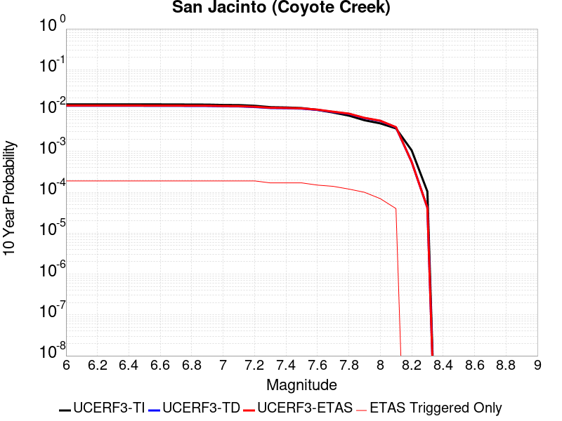 |

| Magnitude | 1 wk TI Prob | 1 wk TD Prob | 1 wk ETAS Prob | 1 wk ETAS/TD Gain | 1 wk ETAS Triggered Only | 1 mo TI Prob | 1 mo TD Prob | 1 mo ETAS Prob | 1 mo ETAS/TD Gain | 1 mo ETAS Triggered Only | 1 yr TI Prob | 1 yr TD Prob | 1 yr ETAS Prob | 1 yr ETAS/TD Gain | 1 yr ETAS Triggered Only | 10 yr TI Prob | 10 yr TD Prob | 10 yr ETAS Prob | 10 yr ETAS/TD Gain | 10 yr ETAS Triggered Only |
|-----|-----|-----|-----|-----|-----|-----|-----|-----|-----|-----|-----|-----|-----|-----|-----|-----|-----|-----|-----|-----|
| 6.0 | 2.7374346E-5 | 2.4500561E-5 | 1.2844811E-4 | 5.24266 | 1.0395011E-4 | 1.1731335E-4 | 1.04998195E-4 | 2.5051305E-4 | 2.3858798 | 1.4553014E-4 | 0.0014273542 | 0.001277606 | 0.0014229502 | 1.113763 | 1.4553014E-4 | 0.01418221 | 0.013113335 | 0.013277474 | 1.012517 | 1.6632017E-4 |
| 6.1 | 2.7374346E-5 | 2.4500561E-5 | 1.2844811E-4 | 5.24266 | 1.0395011E-4 | 1.1731335E-4 | 1.04998195E-4 | 2.5051305E-4 | 2.3858798 | 1.4553014E-4 | 0.0014273542 | 0.001277606 | 0.0014229502 | 1.113763 | 1.4553014E-4 | 0.01418221 | 0.013113335 | 0.013277474 | 1.012517 | 1.6632017E-4 |
| 6.2 | 2.7374346E-5 | 2.4500561E-5 | 1.2844811E-4 | 5.24266 | 1.0395011E-4 | 1.1731335E-4 | 1.04998195E-4 | 2.5051305E-4 | 2.3858798 | 1.4553014E-4 | 0.0014273542 | 0.001277606 | 0.0014229502 | 1.113763 | 1.4553014E-4 | 0.01418221 | 0.013113335 | 0.013277474 | 1.012517 | 1.6632017E-4 |
| 6.3 | 2.7374346E-5 | 2.4500561E-5 | 1.2844811E-4 | 5.24266 | 1.0395011E-4 | 1.1731335E-4 | 1.04998195E-4 | 2.5051305E-4 | 2.3858798 | 1.4553014E-4 | 0.0014273542 | 0.001277606 | 0.0014229502 | 1.113763 | 1.4553014E-4 | 0.01418221 | 0.013113335 | 0.013277474 | 1.012517 | 1.6632017E-4 |
| 6.4 | 2.7374346E-5 | 2.4500561E-5 | 1.2844811E-4 | 5.24266 | 1.0395011E-4 | 1.1731335E-4 | 1.04998195E-4 | 2.5051305E-4 | 2.3858798 | 1.4553014E-4 | 0.0014273542 | 0.001277606 | 0.0014229502 | 1.113763 | 1.4553014E-4 | 0.01418221 | 0.013113335 | 0.013277474 | 1.012517 | 1.6632017E-4 |
| 6.5 | 2.7282445E-5 | 2.43865E-5 | 1.2833407E-4 | 5.2625046 | 1.0395011E-4 | 1.16919524E-4 | 1.04509396E-4 | 2.5002434E-4 | 2.392362 | 1.4553014E-4 | 0.0014225657 | 0.0012716618 | 0.001417007 | 1.1142954 | 1.4553014E-4 | 0.014134934 | 0.013054601 | 0.01321875 | 1.0125741 | 1.6632017E-4 |
| 6.6 | 2.7282445E-5 | 2.43865E-5 | 1.2833407E-4 | 5.2625046 | 1.0395011E-4 | 1.16919524E-4 | 1.04509396E-4 | 2.5002434E-4 | 2.392362 | 1.4553014E-4 | 0.0014225657 | 0.0012716618 | 0.001417007 | 1.1142954 | 1.4553014E-4 | 0.014134934 | 0.013054601 | 0.01321875 | 1.0125741 | 1.6632017E-4 |
| 6.7 | 2.7216198E-5 | 2.4311526E-5 | 1.2825911E-4 | 5.27565 | 1.0395011E-4 | 1.1663563E-4 | 1.0418811E-4 | 2.497031E-4 | 2.3966563 | 1.4553014E-4 | 0.0014191137 | 0.0012677548 | 0.0014131005 | 1.1146481 | 1.4553014E-4 | 0.014100855 | 0.013015969 | 0.013180125 | 1.0126119 | 1.6632017E-4 |
| 6.8 | 2.7078617E-5 | 2.4228557E-5 | 1.2817614E-4 | 5.2902923 | 1.0395011E-4 | 1.1604605E-4 | 1.0383256E-4 | 2.493476E-4 | 2.4014394 | 1.4553014E-4 | 0.001411945 | 0.0012634309 | 0.0014087772 | 1.1150409 | 1.4553014E-4 | 0.014030075 | 0.012973026 | 0.013137189 | 1.0126542 | 1.6632017E-4 |
| 6.9 | 2.6982952E-5 | 2.4147872E-5 | 1.2809546E-4 | 5.3046274 | 1.0395011E-4 | 1.15636096E-4 | 1.0348679E-4 | 2.4900187E-4 | 2.4061222 | 1.4553014E-4 | 0.0014069602 | 0.0012592261 | 0.0014045731 | 1.1154256 | 1.4553014E-4 | 0.013980856 | 0.012931234 | 0.013095404 | 1.0126956 | 1.6632017E-4 |
| 7.0 | 2.6449972E-5 | 2.3724157E-5 | 1.276718E-4 | 5.3815103 | 1.0395011E-4 | 1.1335209E-4 | 1.0167101E-4 | 2.4718637E-4 | 2.4312375 | 1.4553014E-4 | 0.001379188 | 0.0012371443 | 0.0013824943 | 1.1174884 | 1.4553014E-4 | 0.0137065975 | 0.01271228 | 0.012876486 | 1.0129172 | 1.6632017E-4 |
| 7.1 | 2.6257849E-5 | 2.3549865E-5 | 1.2749752E-4 | 5.4139385 | 1.0395011E-4 | 1.1252879E-4 | 1.009241E-4 | 2.4643957E-4 | 2.4418306 | 1.4553014E-4 | 0.0013691769 | 0.0012280609 | 0.0013734123 | 1.1183585 | 1.4553014E-4 | 0.013607717 | 0.012621975 | 0.012786196 | 1.0130107 | 1.6632017E-4 |
| 7.2 | 2.5270041E-5 | 2.2742275E-5 | 1.2669002E-4 | 5.5706835 | 1.0395011E-4 | 1.0829568E-4 | 9.7463264E-5 | 2.4297922E-4 | 2.493034 | 1.4553014E-4 | 0.0013177024 | 0.0011859717 | 0.0013313292 | 1.1225641 | 1.4553014E-4 | 0.013099162 | 0.012202043 | 0.012366334 | 1.0134642 | 1.6632017E-4 |
| 7.3 | 2.339701E-5 | 2.1469774E-5 | 1.2541765E-4 | 5.8415914 | 1.0395011E-4 | 1.0026905E-4 | 9.201008E-5 | 2.3752684E-4 | 2.5815306 | 1.4553014E-4 | 0.001220092 | 0.0011196492 | 0.0012650164 | 1.1298329 | 1.4553014E-4 | 0.012134149 | 0.01153875 | 0.0116826 | 1.0124668 | 1.4553014E-4 |
| 7.4 | 2.296333E-5 | 2.1199014E-5 | 1.2514691E-4 | 5.903431 | 1.0395011E-4 | 9.841056E-5 | 9.084976E-5 | 2.3636669E-4 | 2.6017315 | 1.4553014E-4 | 0.0011974899 | 0.0011055367 | 0.0012509059 | 1.131492 | 1.4553014E-4 | 0.011910575 | 0.011397297 | 0.011541168 | 1.0126233 | 1.4553014E-4 |
| 7.5 | 2.2188895E-5 | 2.0718597E-5 | 1.2466655E-4 | 6.0171328 | 1.0395011E-4 | 9.50918E-5 | 8.879098E-5 | 2.343082E-4 | 2.638874 | 1.4553014E-4 | 0.0011571277 | 0.0010804961 | 0.0012258689 | 1.1345427 | 1.4553014E-4 | 0.011511209 | 0.011145198 | 0.011289106 | 1.0129122 | 1.4553014E-4 |
| 7.6 | 2.0013189E-5 | 1.9293082E-5 | 1.2324117E-4 | 6.387843 | 1.0395011E-4 | 8.5767984E-5 | 8.2682025E-5 | 2.2820014E-4 | 2.7599728 | 1.4553014E-4 | 0.001043725 | 0.0010061905 | 0.0011515743 | 1.1444893 | 1.4553014E-4 | 0.010388365 | 0.01039717 | 0.010541187 | 1.0138515 | 1.4553014E-4 |
| 7.7 | 1.7230794E-5 | 1.7065691E-5 | 1.2101402E-4 | 7.0910707 | 1.0395011E-4 | 7.384417E-5 | 7.313663E-5 | 2.1865613E-4 | 2.9896939 | 1.4553014E-4 | 8.986819E-4 | 8.900755E-4 | 0.0010354761 | 1.1633576 | 1.4553014E-4 | 0.008950562 | 0.009231347 | 0.009375533 | 1.0156193 | 1.4553014E-4 |
| 7.8 | 1.4478809E-5 | 1.5300193E-5 | 9.8459E-5 | 6.4351482 | 8.3160085E-5 | 6.205057E-5 | 6.557061E-5 | 1.6951389E-4 | 2.5852115 | 1.0395011E-4 | 7.552038E-4 | 7.980304E-4 | 9.0189755E-4 | 1.1301544 | 1.0395011E-4 | 0.0075264242 | 0.008303156 | 0.008406242 | 1.0124154 | 1.0395011E-4 |
| 7.9 | 1.1114467E-5 | 1.19146625E-5 | 9.507375E-5 | 7.9795594 | 8.3160085E-5 | 4.7632562E-5 | 5.106184E-5 | 1.5500664E-4 | 3.0356648 | 1.0395011E-4 | 5.797721E-4 | 6.215012E-4 | 7.2538666E-4 | 1.1671525 | 1.0395011E-4 | 0.0057826187 | 0.0065218983 | 0.006625171 | 1.0158347 | 1.0395011E-4 |
| 8.0 | 9.327402E-6 | 1.0142922E-5 | 5.172254E-5 | 5.099373 | 4.1580042E-5 | 3.9973966E-5 | 4.3468946E-5 | 1.058363E-4 | 2.4347565 | 6.237006E-5 | 4.8657437E-4 | 5.291065E-4 | 5.914435E-4 | 1.1178157 | 6.237006E-5 | 0.0048551033 | 0.0055780914 | 0.0056401133 | 1.0111189 | 6.237006E-5 |
| 8.1 | 7.0235833E-6 | 7.006159E-6 | 4.858591E-5 | 6.9347425 | 4.1580042E-5 | 3.0100724E-5 | 3.0026053E-5 | 7.1604845E-5 | 2.3847573 | 4.1580042E-5 | 3.664147E-4 | 3.655064E-4 | 4.0707126E-4 | 1.1137185 | 4.1580042E-5 | 0.003658111 | 0.0038821623 | 0.003923581 | 1.010669 | 4.1580042E-5 |
| 8.2 | 2.0358202E-6 | 9.35961E-7 | 9.35961E-7 | 1.0 | 0.0 | 8.724915E-6 | 4.0112554E-6 | 4.0112554E-6 | 1.0 | 0.0 | 1.06220665E-4 | 4.8835966E-5 | 4.8835966E-5 | 1.0 | 0.0 | 0.001061699 | 5.530527E-4 | 5.530527E-4 | 1.0 | 0.0 |
| 8.3 | 2.0051264E-7 | 6.953347E-8 | 6.953347E-8 | 1.0 | 0.0 | 8.5933965E-7 | 2.9800057E-7 | 2.9800057E-7 | 1.0 | 0.0 | 1.046241E-5 | 3.6281513E-6 | 3.6281513E-6 | 1.0 | 0.0 | 1.0461917E-4 | 4.2074455E-5 | 4.2074455E-5 | 1.0 | 0.0 |

## San Andreas (Mojave N)
*[(top)](#table-of-contents)*

| 1 Week | 1 Month | 1 Year | 10 Year |
|-----|-----|-----|-----|
|  |  |  |  |

| Magnitude | 1 wk TI Prob | 1 wk TD Prob | 1 wk ETAS Prob | 1 wk ETAS/TD Gain | 1 wk ETAS Triggered Only | 1 mo TI Prob | 1 mo TD Prob | 1 mo ETAS Prob | 1 mo ETAS/TD Gain | 1 mo ETAS Triggered Only | 1 yr TI Prob | 1 yr TD Prob | 1 yr ETAS Prob | 1 yr ETAS/TD Gain | 1 yr ETAS Triggered Only | 10 yr TI Prob | 10 yr TD Prob | 10 yr ETAS Prob | 10 yr ETAS/TD Gain | 10 yr ETAS Triggered Only |
|-----|-----|-----|-----|-----|-----|-----|-----|-----|-----|-----|-----|-----|-----|-----|-----|-----|-----|-----|-----|-----|
| 6.0 | 9.877682E-5 | 1.9746333E-4 | 3.0139292E-4 | 1.5263234 | 1.0395011E-4 | 4.2326056E-4 | 8.459972E-4 | 9.914042E-4 | 1.1718765 | 1.4553014E-4 | 0.0051410277 | 0.010251505 | 0.010395544 | 1.0140505 | 1.4553014E-4 | 0.05023708 | 0.09982648 | 0.09995748 | 1.0013123 | 1.4553014E-4 |
| 6.1 | 9.877682E-5 | 1.9746333E-4 | 3.0139292E-4 | 1.5263234 | 1.0395011E-4 | 4.2326056E-4 | 8.459972E-4 | 9.914042E-4 | 1.1718765 | 1.4553014E-4 | 0.0051410277 | 0.010251505 | 0.010395544 | 1.0140505 | 1.4553014E-4 | 0.05023708 | 0.09982648 | 0.09995748 | 1.0013123 | 1.4553014E-4 |
| 6.2 | 9.877682E-5 | 1.9746333E-4 | 3.0139292E-4 | 1.5263234 | 1.0395011E-4 | 4.2326056E-4 | 8.459972E-4 | 9.914042E-4 | 1.1718765 | 1.4553014E-4 | 0.0051410277 | 0.010251505 | 0.010395544 | 1.0140505 | 1.4553014E-4 | 0.05023708 | 0.09982648 | 0.09995748 | 1.0013123 | 1.4553014E-4 |
| 6.3 | 9.877682E-5 | 1.9746333E-4 | 3.0139292E-4 | 1.5263234 | 1.0395011E-4 | 4.2326056E-4 | 8.459972E-4 | 9.914042E-4 | 1.1718765 | 1.4553014E-4 | 0.0051410277 | 0.010251505 | 0.010395544 | 1.0140505 | 1.4553014E-4 | 0.05023708 | 0.09982648 | 0.09995748 | 1.0013123 | 1.4553014E-4 |
| 6.4 | 9.877682E-5 | 1.9746333E-4 | 3.0139292E-4 | 1.5263234 | 1.0395011E-4 | 4.2326056E-4 | 8.459972E-4 | 9.914042E-4 | 1.1718765 | 1.4553014E-4 | 0.0051410277 | 0.010251505 | 0.010395544 | 1.0140505 | 1.4553014E-4 | 0.05023708 | 0.09982648 | 0.09995748 | 1.0013123 | 1.4553014E-4 |
| 6.5 | 9.861474E-5 | 1.9719993E-4 | 3.0112953E-4 | 1.5270265 | 1.0395011E-4 | 4.2256617E-4 | 8.44869E-4 | 9.902762E-4 | 1.1721061 | 1.4553014E-4 | 0.0051326132 | 0.0102379 | 0.01038194 | 1.0140693 | 1.4553014E-4 | 0.050156746 | 0.09970412 | 0.099835135 | 1.001314 | 1.4553014E-4 |
| 6.6 | 9.861474E-5 | 1.9719993E-4 | 3.0112953E-4 | 1.5270265 | 1.0395011E-4 | 4.2256617E-4 | 8.44869E-4 | 9.902762E-4 | 1.1721061 | 1.4553014E-4 | 0.0051326132 | 0.0102379 | 0.01038194 | 1.0140693 | 1.4553014E-4 | 0.050156746 | 0.09970412 | 0.099835135 | 1.001314 | 1.4553014E-4 |
| 6.7 | 9.8552715E-5 | 1.9709907E-4 | 3.010287E-4 | 1.5272963 | 1.0395011E-4 | 4.223004E-4 | 8.4443705E-4 | 9.898443E-4 | 1.1721944 | 1.4553014E-4 | 0.0051293927 | 0.01023269 | 0.01037673 | 1.0140766 | 1.4553014E-4 | 0.050125998 | 0.09965707 | 0.0997881 | 1.0013148 | 1.4553014E-4 |
| 6.8 | 9.8464974E-5 | 1.9694971E-4 | 3.0087933E-4 | 1.5276963 | 1.0395011E-4 | 4.219245E-4 | 8.437973E-4 | 9.892046E-4 | 1.172325 | 1.4553014E-4 | 0.0051248376 | 0.010224974 | 0.010369016 | 1.0140873 | 1.4553014E-4 | 0.05008251 | 0.09958654 | 0.09971757 | 1.0013158 | 1.4553014E-4 |
| 6.9 | 9.825824E-5 | 1.9662795E-4 | 3.005576E-4 | 1.5285599 | 1.0395011E-4 | 4.2103877E-4 | 8.424193E-4 | 9.878268E-4 | 1.1726071 | 1.4553014E-4 | 0.0051141046 | 0.010208353 | 0.010352398 | 1.0141104 | 1.4553014E-4 | 0.049980022 | 0.09943499 | 0.09956604 | 1.0013181 | 1.4553014E-4 |
| 7.0 | 9.781462E-5 | 1.9593768E-4 | 2.9986742E-4 | 1.5304224 | 1.0395011E-4 | 4.1913814E-4 | 8.3946285E-4 | 9.848708E-4 | 1.1732155 | 1.4553014E-4 | 0.005091073 | 0.010172696 | 0.010316745 | 1.0141604 | 1.4553014E-4 | 0.04976007 | 0.09911008 | 0.09924119 | 1.0013229 | 1.4553014E-4 |
| 7.1 | 9.7121134E-5 | 1.9494945E-4 | 2.9887928E-4 | 1.5331117 | 1.0395011E-4 | 4.1616702E-4 | 8.352303E-4 | 9.806389E-4 | 1.174094 | 1.4553014E-4 | 0.005055068 | 0.0101216445 | 0.010265701 | 1.0142326 | 1.4553014E-4 | 0.04941613 | 0.098645054 | 0.09877623 | 1.0013298 | 1.4553014E-4 |
| 7.2 | 9.663819E-5 | 1.9425346E-4 | 2.9818335E-4 | 1.5350223 | 1.0395011E-4 | 4.1409794E-4 | 8.3224935E-4 | 9.776584E-4 | 1.1747181 | 1.4553014E-4 | 0.0050299936 | 0.010085688 | 0.010229751 | 1.0142839 | 1.4553014E-4 | 0.049176537 | 0.098317176 | 0.098448396 | 1.0013347 | 1.4553014E-4 |
| 7.3 | 9.6277574E-5 | 1.9377375E-4 | 2.9770372E-4 | 1.5363469 | 1.0395011E-4 | 4.125529E-4 | 8.3019485E-4 | 9.7560417E-4 | 1.1751509 | 1.4553014E-4 | 0.0050112694 | 0.0100609055 | 0.010204972 | 1.0143194 | 1.4553014E-4 | 0.04899759 | 0.098088905 | 0.09822016 | 1.0013381 | 1.4553014E-4 |
| 7.4 | 9.593308E-5 | 1.9316633E-4 | 2.9709635E-4 | 1.5380338 | 1.0395011E-4 | 4.1107697E-4 | 8.2759326E-4 | 9.73003E-4 | 1.1757019 | 1.4553014E-4 | 0.0049933824 | 0.010029524 | 0.010173594 | 1.0143646 | 1.4553014E-4 | 0.04882661 | 0.097804934 | 0.09793623 | 1.0013424 | 1.4553014E-4 |
| 7.5 | 9.561707E-5 | 1.9262238E-4 | 2.9655246E-4 | 1.5395535 | 1.0395011E-4 | 4.0972308E-4 | 8.252635E-4 | 9.706736E-4 | 1.1761984 | 1.4553014E-4 | 0.0049769743 | 0.010001419 | 0.010145494 | 1.0144054 | 1.4553014E-4 | 0.048669744 | 0.09754904 | 0.097680375 | 1.0013463 | 1.4553014E-4 |
| 7.6 | 9.418194E-5 | 1.891167E-4 | 2.9304714E-4 | 1.5495572 | 1.0395011E-4 | 4.0357444E-4 | 8.102486E-4 | 9.556608E-4 | 1.1794662 | 1.4553014E-4 | 0.004902454 | 0.009820274 | 0.009964375 | 1.0146738 | 1.4553014E-4 | 0.047957025 | 0.095921256 | 0.096052825 | 1.0013716 | 1.4553014E-4 |
| 7.7 | 8.202141E-5 | 1.6331924E-4 | 2.6725238E-4 | 1.6363802 | 1.0395011E-4 | 3.51473E-4 | 6.997519E-4 | 8.4518024E-4 | 1.2078284 | 1.4553014E-4 | 0.00427079 | 0.008486261 | 0.008630555 | 1.0170034 | 1.4553014E-4 | 0.04189639 | 0.08362149 | 0.083754845 | 1.0015948 | 1.4553014E-4 |
| 7.8 | 7.2859846E-5 | 1.4796063E-4 | 2.5189537E-4 | 1.7024485 | 1.0395011E-4 | 3.1221908E-4 | 6.339629E-4 | 7.794008E-4 | 1.2294108 | 1.4553014E-4 | 0.003794643 | 0.0076912264 | 0.007835638 | 1.018776 | 1.4553014E-4 | 0.037304975 | 0.07598348 | 0.076117955 | 1.0017698 | 1.4553014E-4 |
| 7.9 | 5.3874453E-5 | 1.0242607E-4 | 2.0636553E-4 | 2.0147753 | 1.0395011E-4 | 2.3087008E-4 | 4.3889505E-4 | 5.843613E-4 | 1.3314375 | 1.4553014E-4 | 0.0028072202 | 0.005330467 | 0.0054752217 | 1.027156 | 1.4553014E-4 | 0.02772022 | 0.05334444 | 0.053482205 | 1.0025826 | 1.4553014E-4 |
| 8.0 | 3.468538E-5 | 5.540432E-5 | 1.1777093E-4 | 2.1256633 | 6.237006E-5 | 1.4864317E-4 | 2.3742548E-4 | 3.2056583E-4 | 1.3501744 | 8.3160085E-5 | 0.0018082283 | 0.0028868255 | 0.0029697455 | 1.0287236 | 8.3160085E-5 | 0.017935853 | 0.029508779 | 0.029589485 | 1.002735 | 8.3160085E-5 |
| 8.1 | 1.9152367E-5 | 1.9948859E-5 | 6.152807E-5 | 3.0842903 | 4.1580042E-5 | 8.207899E-5 | 8.5492306E-5 | 1.270688E-4 | 1.4863185 | 4.1580042E-5 | 9.988535E-4 | 0.0010403725 | 0.0010819093 | 1.0399249 | 4.1580042E-5 | 0.009943757 | 0.011141689 | 0.0111828055 | 1.0036904 | 4.1580042E-5 |
| 8.2 | 8.643924E-6 | 5.680264E-6 | 5.680264E-6 | 1.0 | 0.0 | 3.704486E-5 | 2.4343763E-5 | 2.4343763E-5 | 1.0 | 0.0 | 4.5092785E-4 | 2.963451E-4 | 2.963451E-4 | 1.0 | 0.0 | 0.0045001395 | 0.0033610219 | 0.0033610219 | 1.0 | 0.0 |
| 8.3 | 1.983087E-6 | 8.001618E-7 | 8.001618E-7 | 1.0 | 0.0 | 8.498917E-6 | 3.4292605E-6 | 3.4292605E-6 | 1.0 | 0.0 | 1.034694E-4 | 4.1750463E-5 | 4.1750463E-5 | 1.0 | 0.0 | 0.0010342124 | 4.915874E-4 | 4.915874E-4 | 1.0 | 0.0 |

## San Jacinto (Borrego)
*[(top)](#table-of-contents)*

| 1 Week | 1 Month | 1 Year | 10 Year |
|-----|-----|-----|-----|
|  |  |  |  |

| Magnitude | 1 wk TI Prob | 1 wk TD Prob | 1 wk ETAS Prob | 1 wk ETAS/TD Gain | 1 wk ETAS Triggered Only | 1 mo TI Prob | 1 mo TD Prob | 1 mo ETAS Prob | 1 mo ETAS/TD Gain | 1 mo ETAS Triggered Only | 1 yr TI Prob | 1 yr TD Prob | 1 yr ETAS Prob | 1 yr ETAS/TD Gain | 1 yr ETAS Triggered Only | 10 yr TI Prob | 10 yr TD Prob | 10 yr ETAS Prob | 10 yr ETAS/TD Gain | 10 yr ETAS Triggered Only |
|-----|-----|-----|-----|-----|-----|-----|-----|-----|-----|-----|-----|-----|-----|-----|-----|-----|-----|-----|-----|-----|
| 6.0 | 3.543992E-5 | 2.8261535E-5 | 1.11419264E-4 | 3.9424353 | 8.3160085E-5 | 1.5187653E-4 | 1.2111531E-4 | 2.4584032E-4 | 2.029804 | 1.2474012E-4 | 0.0018475284 | 0.0014735938 | 0.0015981501 | 1.0845256 | 1.2474012E-4 | 0.018322436 | 0.015044008 | 0.015166872 | 1.0081669 | 1.2474012E-4 |
| 6.1 | 3.542281E-5 | 2.8261535E-5 | 1.11419264E-4 | 3.9424353 | 8.3160085E-5 | 1.5180321E-4 | 1.2111531E-4 | 2.4584032E-4 | 2.029804 | 1.2474012E-4 | 0.0018466372 | 0.0014735938 | 0.0015981501 | 1.0845256 | 1.2474012E-4 | 0.018313672 | 0.015044008 | 0.015166872 | 1.0081669 | 1.2474012E-4 |
| 6.2 | 3.4688688E-5 | 2.8261533E-5 | 1.11419264E-4 | 3.9424353 | 8.3160085E-5 | 1.4865733E-4 | 1.2111531E-4 | 2.4584032E-4 | 2.029804 | 1.2474012E-4 | 0.0018084005 | 0.0014735938 | 0.0015981501 | 1.0845256 | 1.2474012E-4 | 0.017937548 | 0.015044007 | 0.015166871 | 1.0081669 | 1.2474012E-4 |
| 6.3 | 3.2087122E-5 | 2.8106686E-5 | 1.1126443E-4 | 3.9586463 | 8.3160085E-5 | 1.3750899E-4 | 1.2045173E-4 | 2.4517684E-4 | 2.0354779 | 1.2474012E-4 | 0.0016728862 | 0.0014655257 | 0.001590083 | 1.0849916 | 1.2474012E-4 | 0.016603488 | 0.014965082 | 0.015087955 | 1.0082107 | 1.2474012E-4 |
| 6.4 | 3.1828724E-5 | 2.807361E-5 | 1.11231355E-4 | 3.9621325 | 8.3160085E-5 | 1.364017E-4 | 1.2030999E-4 | 2.450351E-4 | 2.0366979 | 1.2474012E-4 | 0.0016594254 | 0.0014638023 | 0.0015883598 | 1.0850918 | 1.2474012E-4 | 0.016470885 | 0.014948252 | 0.015071127 | 1.0082201 | 1.2474012E-4 |
| 6.5 | 3.1563577E-5 | 2.7812603E-5 | 1.1097037E-4 | 3.989931 | 8.3160085E-5 | 1.3526545E-4 | 1.1919149E-4 | 2.4391676E-4 | 2.0464275 | 1.2474012E-4 | 0.0016456128 | 0.0014502028 | 0.001574762 | 1.0858909 | 1.2474012E-4 | 0.0163348 | 0.014813996 | 0.014936889 | 1.0082957 | 1.2474012E-4 |
| 6.6 | 3.1467625E-5 | 2.7656239E-5 | 1.1081402E-4 | 4.0068364 | 8.3160085E-5 | 1.3485427E-4 | 1.1852142E-4 | 2.4324676E-4 | 2.0523443 | 1.2474012E-4 | 0.0016406142 | 0.0014420555 | 0.0015666157 | 1.0863769 | 1.2474012E-4 | 0.016285548 | 0.014733896 | 0.014856798 | 1.0083414 | 1.2474012E-4 |
| 6.7 | 3.1223695E-5 | 2.727366E-5 | 1.1043147E-4 | 4.0490155 | 8.3160085E-5 | 1.3380898E-4 | 1.1688194E-4 | 2.4160749E-4 | 2.067107 | 1.2474012E-4 | 0.0016279068 | 0.001422121 | 0.0015466837 | 1.0875894 | 1.2474012E-4 | 0.01616033 | 0.014537855 | 0.014660781 | 1.0084556 | 1.2474012E-4 |
| 6.8 | 3.1015585E-5 | 2.7093998E-5 | 1.1025183E-4 | 4.0692344 | 8.3160085E-5 | 1.3291716E-4 | 1.1611204E-4 | 2.4083767E-4 | 2.0741835 | 1.2474012E-4 | 0.001617065 | 0.0014127595 | 0.0015373235 | 1.0881706 | 1.2474012E-4 | 0.016053487 | 0.014444801 | 0.014567739 | 1.008511 | 1.2474012E-4 |
| 6.9 | 2.6641965E-5 | 2.2498154E-5 | 1.0565636E-4 | 4.6962237 | 8.3160085E-5 | 1.1417485E-4 | 9.641712E-5 | 2.2114522E-4 | 2.2936301 | 1.2474012E-4 | 0.0013891924 | 0.0011732503 | 0.001297844 | 1.1061954 | 1.2474012E-4 | 0.0138054015 | 0.01204618 | 0.012169417 | 1.0102304 | 1.2474012E-4 |
| 7.0 | 2.3854353E-5 | 2.0782958E-5 | 1.0394131E-4 | 5.0012765 | 8.3160085E-5 | 1.02228936E-4 | 8.9066794E-5 | 2.137958E-4 | 2.4003987 | 1.2474012E-4 | 0.0012439266 | 0.0010838513 | 0.0012084562 | 1.114965 | 1.2474012E-4 | 0.012369866 | 0.011141631 | 0.011264981 | 1.0110711 | 1.2474012E-4 |
| 7.1 | 2.3672901E-5 | 2.0619162E-5 | 1.0377753E-4 | 5.0330625 | 8.3160085E-5 | 1.0145135E-4 | 8.836485E-5 | 2.1309395E-4 | 2.4115238 | 1.2474012E-4 | 0.0012344702 | 0.0010753138 | 0.0011999197 | 1.1158787 | 1.2474012E-4 | 0.0122763505 | 0.011056654 | 0.011180015 | 1.0111572 | 1.2474012E-4 |
| 7.2 | 2.2717244E-5 | 1.9844307E-5 | 1.0300274E-4 | 5.1905437 | 8.3160085E-5 | 9.735599E-5 | 8.504427E-5 | 2.0977379E-4 | 2.4666421 | 1.2474012E-4 | 0.0011846646 | 0.0010349245 | 0.0011595356 | 1.1204059 | 1.2474012E-4 | 0.01178369 | 0.010653099 | 0.01077651 | 1.0115845 | 1.2474012E-4 |
| 7.3 | 2.1016205E-5 | 1.8682242E-5 | 1.0184077E-4 | 5.451207 | 8.3160085E-5 | 9.006634E-5 | 8.00643E-5 | 2.0479444E-4 | 2.5578744 | 1.2474012E-4 | 0.001096006 | 9.743491E-4 | 0.0010989676 | 1.1278993 | 1.2474012E-4 | 0.010906163 | 0.010046812 | 0.010170299 | 1.0122912 | 1.2474012E-4 |
| 7.4 | 2.0683625E-5 | 1.8483997E-5 | 1.01642545E-4 | 5.498948 | 8.3160085E-5 | 8.86411E-5 | 7.921474E-5 | 2.0394498E-4 | 2.5745838 | 1.2474012E-4 | 0.001078671 | 9.640148E-4 | 0.0010886347 | 1.1292717 | 1.2474012E-4 | 0.010734501 | 0.009943142 | 0.0100666415 | 1.0124207 | 1.2474012E-4 |
| 7.5 | 1.9993966E-5 | 1.8076502E-5 | 1.01235084E-4 | 5.6003695 | 8.3160085E-5 | 8.568561E-5 | 7.746843E-5 | 2.0219889E-4 | 2.6100812 | 1.2474012E-4 | 0.001042723 | 9.427721E-4 | 0.0010673946 | 1.1321874 | 1.2474012E-4 | 0.010378438 | 0.009728766 | 0.009852293 | 1.0126971 | 1.2474012E-4 |
| 7.6 | 1.788966E-5 | 1.671811E-5 | 9.98768E-5 | 5.9741683 | 8.3160085E-5 | 7.666772E-5 | 7.164709E-5 | 1.9637827E-4 | 2.7409108 | 1.2474012E-4 | 9.3302975E-4 | 8.7195594E-4 | 9.965873E-4 | 1.1429331 | 1.2474012E-4 | 0.00929122 | 0.009014663 | 0.009138279 | 1.0137128 | 1.2474012E-4 |
| 7.7 | 1.5125781E-5 | 1.451155E-5 | 9.7670425E-5 | 6.7305303 | 8.3160085E-5 | 6.4823165E-5 | 6.219088E-5 | 1.8692325E-4 | 3.0056376 | 1.2474012E-4 | 7.889362E-4 | 7.5691176E-4 | 8.8155747E-4 | 1.1646767 | 1.2474012E-4 | 0.007861412 | 0.007858045 | 0.007981806 | 1.0157495 | 1.2474012E-4 |
| 7.8 | 1.250089E-5 | 1.2893317E-5 | 7.526258E-5 | 5.8373322 | 6.237006E-5 | 5.3574146E-5 | 5.5255903E-5 | 1.3841139E-4 | 2.504916 | 8.3160085E-5 | 6.5207E-4 | 6.7253364E-4 | 7.556378E-4 | 1.1235688 | 8.3160085E-5 | 0.006501599 | 0.0070056715 | 0.007088249 | 1.0117872 | 8.3160085E-5 |
| 7.9 | 9.561E-6 | 9.9834015E-6 | 7.235284E-5 | 7.2473135 | 6.237006E-5 | 4.0975072E-5 | 4.278531E-5 | 1.2594183E-4 | 2.9435766 | 8.3160085E-5 | 4.987573E-4 | 5.207872E-4 | 6.0390396E-4 | 1.1595984 | 8.3160085E-5 | 0.0049763937 | 0.005472866 | 0.005555571 | 1.0151118 | 8.3160085E-5 |
| 8.0 | 8.01699E-6 | 8.50074E-6 | 2.9290584E-5 | 3.4456513 | 2.0790021E-5 | 3.4358076E-5 | 3.6431236E-5 | 7.800976E-5 | 2.1412878 | 4.1580042E-5 | 4.1822926E-4 | 4.4346057E-4 | 4.8502217E-4 | 1.093721 | 4.1580042E-5 | 0.0041744304 | 0.0046825903 | 0.0047239754 | 1.0088382 | 4.1580042E-5 |
| 8.1 | 6.541947E-6 | 6.6294883E-6 | 2.7419372E-5 | 4.135971 | 2.0790021E-5 | 2.8036617E-5 | 2.8411787E-5 | 4.9201215E-5 | 1.7317185 | 2.0790021E-5 | 3.4129233E-4 | 3.4585912E-4 | 3.6664197E-4 | 1.0600904 | 2.0790021E-5 | 0.0034076865 | 0.003669098 | 0.0036898118 | 1.0056455 | 2.0790021E-5 |
| 8.2 | 1.7968189E-6 | 8.2923634E-7 | 8.2923634E-7 | 1.0 | 0.0 | 7.70063E-6 | 3.5538653E-6 | 3.5538653E-6 | 1.0 | 0.0 | 9.3751136E-5 | 4.3267475E-5 | 4.3267475E-5 | 1.0 | 0.0 | 9.371159E-4 | 4.8922515E-4 | 4.8922515E-4 | 1.0 | 0.0 |
| 8.3 | 1.5167889E-7 | 5.1493988E-8 | 5.1493988E-8 | 1.0 | 0.0 | 6.500522E-7 | 2.206885E-7 | 2.206885E-7 | 1.0 | 0.0 | 7.9143565E-6 | 2.6868797E-6 | 2.6868797E-6 | 1.0 | 0.0 | 7.914075E-5 | 3.1145588E-5 | 3.1145588E-5 | 1.0 | 0.0 |

## San Jacinto (Superstition Mtn)
*[(top)](#table-of-contents)*

| 1 Week | 1 Month | 1 Year | 10 Year |
|-----|-----|-----|-----|
|  | 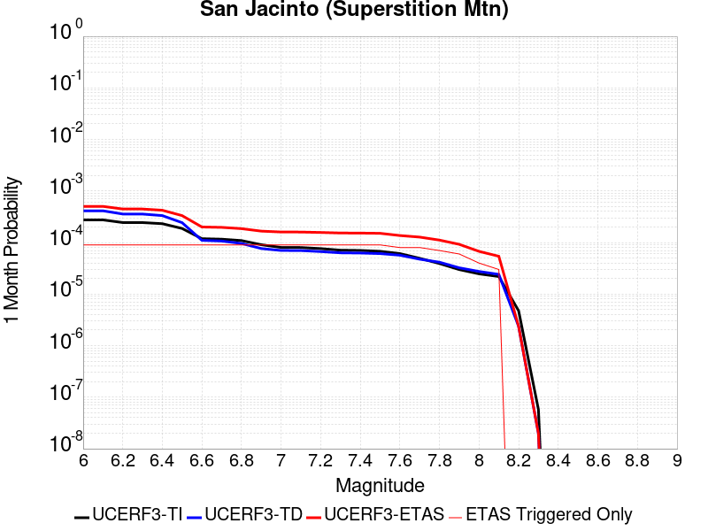 |  |  |

| Magnitude | 1 wk TI Prob | 1 wk TD Prob | 1 wk ETAS Prob | 1 wk ETAS/TD Gain | 1 wk ETAS Triggered Only | 1 mo TI Prob | 1 mo TD Prob | 1 mo ETAS Prob | 1 mo ETAS/TD Gain | 1 mo ETAS Triggered Only | 1 yr TI Prob | 1 yr TD Prob | 1 yr ETAS Prob | 1 yr ETAS/TD Gain | 1 yr ETAS Triggered Only | 10 yr TI Prob | 10 yr TD Prob | 10 yr ETAS Prob | 10 yr ETAS/TD Gain | 10 yr ETAS Triggered Only |
|-----|-----|-----|-----|-----|-----|-----|-----|-----|-----|-----|-----|-----|-----|-----|-----|-----|-----|-----|-----|-----|
| 6.0 | 6.4193904E-5 | 9.632058E-5 | 1.7947266E-4 | 1.8632846 | 8.3160085E-5 | 2.7508775E-4 | 4.1274485E-4 | 5.166521E-4 | 1.2517468 | 1.0395011E-4 | 0.0033440501 | 0.005014996 | 0.0051184245 | 1.0206239 | 1.0395011E-4 | 0.03294174 | 0.04898744 | 0.0490863 | 1.002018 | 1.0395011E-4 |
| 6.1 | 6.4193904E-5 | 9.632058E-5 | 1.7947266E-4 | 1.8632846 | 8.3160085E-5 | 2.7508775E-4 | 4.1274485E-4 | 5.166521E-4 | 1.2517468 | 1.0395011E-4 | 0.0033440501 | 0.005014996 | 0.0051184245 | 1.0206239 | 1.0395011E-4 | 0.03294174 | 0.04898744 | 0.0490863 | 1.002018 | 1.0395011E-4 |
| 6.2 | 5.7023593E-5 | 8.3450796E-5 | 1.6660395E-4 | 1.9964331 | 8.3160085E-5 | 2.4436394E-4 | 3.5760668E-4 | 4.615196E-4 | 1.2905788 | 1.0395011E-4 | 0.002971072 | 0.0043468177 | 0.004450316 | 1.0238101 | 1.0395011E-4 | 0.029316625 | 0.04266259 | 0.04276211 | 1.0023326 | 1.0395011E-4 |
| 6.3 | 5.6940098E-5 | 8.329596E-5 | 1.6644911E-4 | 1.9982855 | 8.3160085E-5 | 2.4400617E-4 | 3.569433E-4 | 4.6085627E-4 | 1.2911191 | 1.0395011E-4 | 0.002966728 | 0.004338773 | 0.0044422722 | 1.0238545 | 1.0395011E-4 | 0.029274331 | 0.04258588 | 0.042685404 | 1.002337 | 1.0395011E-4 |
| 6.4 | 5.4171585E-5 | 7.778227E-5 | 1.6093589E-4 | 2.069056 | 8.3160085E-5 | 2.3214328E-4 | 3.3331933E-4 | 4.372348E-4 | 1.3117595 | 1.0395011E-4 | 0.0028226813 | 0.0040522623 | 0.0041557914 | 1.0255485 | 1.0395011E-4 | 0.02787096 | 0.039872114 | 0.039971918 | 1.0025032 | 1.0395011E-4 |
| 6.5 | 4.375144E-5 | 5.6685432E-5 | 1.398408E-4 | 2.4669619 | 8.3160085E-5 | 1.874927E-4 | 2.4292158E-4 | 3.4684644E-4 | 1.4278123 | 1.0395011E-4 | 0.0022803338 | 0.0029547357 | 0.0030583788 | 1.0350769 | 1.0395011E-4 | 0.022570757 | 0.029376756 | 0.029477652 | 1.0034345 | 1.0395011E-4 |
| 6.6 | 2.772192E-5 | 2.5739886E-5 | 1.0889783E-4 | 4.230704 | 8.3160085E-5 | 1.1880282E-4 | 1.1030924E-4 | 2.1424788E-4 | 1.9422477 | 1.0395011E-4 | 0.0014454646 | 0.0013422071 | 0.0014460176 | 1.0773432 | 1.0395011E-4 | 0.014360986 | 0.013671017 | 0.013773547 | 1.0074997 | 1.0395011E-4 |
| 6.7 | 2.7124124E-5 | 2.4949653E-5 | 1.0810766E-4 | 4.3330326 | 8.3160085E-5 | 1.1624106E-4 | 1.0692281E-4 | 2.1086179E-4 | 1.9720937 | 1.0395011E-4 | 0.0014143161 | 0.0013010271 | 0.001404842 | 1.0797945 | 1.0395011E-4 | 0.014053487 | 0.013263782 | 0.013366353 | 1.0077332 | 1.0395011E-4 |
| 6.8 | 2.5475807E-5 | 2.2408816E-5 | 1.0556704E-4 | 4.71096 | 8.3160085E-5 | 1.0917746E-4 | 9.603431E-5 | 1.9997443E-4 | 2.0823228 | 1.0395011E-4 | 0.001328425 | 0.0011686027 | 0.0012724313 | 1.0888485 | 1.0395011E-4 | 0.0132051185 | 0.011948765 | 0.012051473 | 1.0085957 | 1.0395011E-4 |
| 6.9 | 2.1162023E-5 | 1.7852388E-5 | 1.01010985E-4 | 5.658122 | 8.3160085E-5 | 9.069123E-5 | 7.650801E-5 | 1.8045017E-4 | 2.3585787 | 1.0395011E-4 | 0.0011036064 | 9.3109085E-4 | 0.0010349442 | 1.1115394 | 1.0395011E-4 | 0.010981417 | 0.009564555 | 0.009667511 | 1.0107644 | 1.0395011E-4 |
| 7.0 | 1.8754288E-5 | 1.6378119E-5 | 9.953684E-5 | 6.0774283 | 8.3160085E-5 | 8.037304E-5 | 7.0190064E-5 | 1.7413287E-4 | 2.4808764 | 1.0395011E-4 | 9.781026E-4 | 8.542315E-4 | 9.580928E-4 | 1.1215845 | 1.0395011E-4 | 0.009738087 | 0.008782918 | 0.0088859545 | 1.0117315 | 1.0395011E-4 |
| 7.1 | 1.8678527E-5 | 1.6303058E-5 | 9.946179E-5 | 6.1008053 | 8.3160085E-5 | 8.0048376E-5 | 6.9868394E-5 | 1.7381123E-4 | 2.4876947 | 1.0395011E-4 | 9.7415317E-4 | 8.503182E-4 | 9.541799E-4 | 1.1221446 | 1.0395011E-4 | 0.009698939 | 0.008743743 | 0.008846785 | 1.0117846 | 1.0395011E-4 |
| 7.2 | 1.7804578E-5 | 1.559547E-5 | 9.875425E-5 | 6.33224 | 8.3160085E-5 | 7.6303106E-5 | 6.683602E-5 | 1.7077918E-4 | 2.5551965 | 1.0395011E-4 | 9.285943E-4 | 8.134271E-4 | 9.1729267E-4 | 1.1276888 | 1.0395011E-4 | 0.009247236 | 0.00837414 | 0.008477219 | 1.0123093 | 1.0395011E-4 |
| 7.3 | 1.6583685E-5 | 1.4742242E-5 | 9.79011E-5 | 6.640856 | 8.3160085E-5 | 7.1070994E-5 | 6.317952E-5 | 1.6712306E-4 | 2.6452093 | 1.0395011E-4 | 8.649459E-4 | 7.6894125E-4 | 8.728114E-4 | 1.1350821 | 1.0395011E-4 | 0.00861587 | 0.007928274 | 0.0080314 | 1.0130074 | 1.0395011E-4 |
| 7.4 | 1.6387552E-5 | 1.4606746E-5 | 9.776562E-5 | 6.6931825 | 8.3160085E-5 | 7.023047E-5 | 6.259885E-5 | 1.6654245E-4 | 2.6604714 | 1.0395011E-4 | 8.5472054E-4 | 7.618765E-4 | 8.657474E-4 | 1.1363356 | 1.0395011E-4 | 0.008514405 | 0.007857449 | 0.007960583 | 1.0131255 | 1.0395011E-4 |
| 7.5 | 1.5790754E-5 | 1.4245413E-5 | 9.7404314E-5 | 6.837591 | 8.3160085E-5 | 6.767291E-5 | 6.105035E-5 | 1.6499411E-4 | 2.7025907 | 1.0395011E-4 | 8.236062E-4 | 7.4303657E-4 | 8.469094E-4 | 1.1397951 | 1.0395011E-4 | 0.008205604 | 0.007666961 | 0.0077701136 | 1.0134542 | 1.0395011E-4 |
| 7.6 | 1.4248672E-5 | 1.3256656E-5 | 9.6415635E-5 | 7.2729983 | 8.3160085E-5 | 6.106431E-5 | 5.6813013E-5 | 1.607572E-4 | 2.8295844 | 1.0395011E-4 | 7.432043E-4 | 6.9148064E-4 | 7.953589E-4 | 1.1502258 | 1.0395011E-4 | 0.007407237 | 0.007145507 | 0.007248714 | 1.0144436 | 1.0395011E-4 |
| 7.7 | 1.15449975E-5 | 1.1097024E-5 | 9.425618E-5 | 8.493825 | 8.3160085E-5 | 4.947762E-5 | 4.7557813E-5 | 1.5150297E-4 | 3.185659 | 1.0395011E-4 | 6.022235E-4 | 5.788634E-4 | 6.827533E-4 | 1.1794723 | 1.0395011E-4 | 0.006005941 | 0.006011268 | 0.0061145932 | 1.0171885 | 1.0395011E-4 |
| 7.8 | 9.1391985E-6 | 9.700172E-6 | 7.2069626E-5 | 7.429727 | 6.237006E-5 | 3.9167408E-5 | 4.1571508E-5 | 1.2472813E-4 | 3.0003273 | 8.3160085E-5 | 4.767588E-4 | 5.060162E-4 | 5.891342E-4 | 1.1642596 | 8.3160085E-5 | 0.0047573727 | 0.005273771 | 0.0053564925 | 1.0156854 | 8.3160085E-5 |
| 7.9 | 6.973017E-6 | 7.5470216E-6 | 6.991661E-5 | 9.264133 | 6.237006E-5 | 2.9884017E-5 | 3.234398E-5 | 1.15501374E-4 | 3.5710316 | 8.3160085E-5 | 3.6377716E-4 | 3.9371738E-4 | 4.7684473E-4 | 1.2111346 | 8.3160085E-5 | 0.0036318225 | 0.004138271 | 0.004221087 | 1.0200123 | 8.3160085E-5 |
| 8.0 | 5.7638235E-6 | 6.4108012E-6 | 2.720069E-5 | 4.2429466 | 2.0790021E-5 | 2.4701867E-5 | 2.7474576E-5 | 6.905347E-5 | 2.513359 | 4.1580042E-5 | 3.0070372E-4 | 3.3445217E-4 | 3.760183E-4 | 1.1242813 | 4.1580042E-5 | 0.0030029714 | 0.0035325673 | 0.0035740004 | 1.0117289 | 4.1580042E-5 |
| 8.1 | 5.1124434E-6 | 5.633107E-6 | 2.6423011E-5 | 4.690664 | 2.0790021E-5 | 2.1910288E-5 | 2.4141666E-5 | 4.4931185E-5 | 1.8611468 | 2.0790021E-5 | 2.6672508E-4 | 2.9388565E-4 | 3.1466957E-4 | 1.070721 | 2.0790021E-5 | 0.0026640517 | 0.0031124477 | 0.003133173 | 1.0066588 | 2.0790021E-5 |
| 8.2 | 1.1075938E-6 | 5.527077E-7 | 5.527077E-7 | 1.0 | 0.0 | 4.7468216E-6 | 2.3687453E-6 | 2.3687453E-6 | 1.0 | 0.0 | 5.779102E-5 | 2.8839117E-5 | 2.8839117E-5 | 1.0 | 0.0 | 5.777599E-4 | 3.2405232E-4 | 3.2405232E-4 | 1.0 | 0.0 |
| 8.3 | 1.3584393E-8 | 4.6533355E-9 | 4.6533355E-9 | 1.0 | 0.0 | 5.8218827E-8 | 1.9942865E-8 | 1.9942865E-8 | 1.0 | 0.0 | 7.0881396E-7 | 2.428044E-7 | 2.428044E-7 | 1.0 | 0.0 | 7.0881174E-6 | 2.7157685E-6 | 2.7157685E-6 | 1.0 | 0.0 |

## San Andreas (Big Bend)
*[(top)](#table-of-contents)*

| 1 Week | 1 Month | 1 Year | 10 Year |
|-----|-----|-----|-----|
|  |  |  |  |

| Magnitude | 1 wk TI Prob | 1 wk TD Prob | 1 wk ETAS Prob | 1 wk ETAS/TD Gain | 1 wk ETAS Triggered Only | 1 mo TI Prob | 1 mo TD Prob | 1 mo ETAS Prob | 1 mo ETAS/TD Gain | 1 mo ETAS Triggered Only | 1 yr TI Prob | 1 yr TD Prob | 1 yr ETAS Prob | 1 yr ETAS/TD Gain | 1 yr ETAS Triggered Only | 10 yr TI Prob | 10 yr TD Prob | 10 yr ETAS Prob | 10 yr ETAS/TD Gain | 10 yr ETAS Triggered Only |
|-----|-----|-----|-----|-----|-----|-----|-----|-----|-----|-----|-----|-----|-----|-----|-----|-----|-----|-----|-----|-----|
| 6.0 | 1.0179969E-4 | 2.0410359E-4 | 2.6646093E-4 | 1.305518 | 6.237006E-5 | 4.362114E-4 | 8.7443745E-4 | 9.782966E-4 | 1.1187726 | 1.0395011E-4 | 0.0052979486 | 0.010594598 | 0.010697447 | 1.0097077 | 1.0395011E-4 | 0.051734097 | 0.10289851 | 0.10299177 | 1.0009062 | 1.0395011E-4 |
| 6.1 | 1.0179969E-4 | 2.0410359E-4 | 2.6646093E-4 | 1.305518 | 6.237006E-5 | 4.362114E-4 | 8.7443745E-4 | 9.782966E-4 | 1.1187726 | 1.0395011E-4 | 0.0052979486 | 0.010594598 | 0.010697447 | 1.0097077 | 1.0395011E-4 | 0.051734097 | 0.10289851 | 0.10299177 | 1.0009062 | 1.0395011E-4 |
| 6.2 | 1.0179969E-4 | 2.0410359E-4 | 2.6646093E-4 | 1.305518 | 6.237006E-5 | 4.362114E-4 | 8.7443745E-4 | 9.782966E-4 | 1.1187726 | 1.0395011E-4 | 0.0052979486 | 0.010594598 | 0.010697447 | 1.0097077 | 1.0395011E-4 | 0.051734097 | 0.10289851 | 0.10299177 | 1.0009062 | 1.0395011E-4 |
| 6.3 | 1.0179969E-4 | 2.0410359E-4 | 2.6646093E-4 | 1.305518 | 6.237006E-5 | 4.362114E-4 | 8.7443745E-4 | 9.782966E-4 | 1.1187726 | 1.0395011E-4 | 0.0052979486 | 0.010594598 | 0.010697447 | 1.0097077 | 1.0395011E-4 | 0.051734097 | 0.10289851 | 0.10299177 | 1.0009062 | 1.0395011E-4 |
| 6.4 | 9.1639464E-5 | 1.8760894E-4 | 2.499673E-4 | 1.3323848 | 6.237006E-5 | 3.9268145E-4 | 8.0379075E-4 | 9.076573E-4 | 1.1292208 | 1.0395011E-4 | 0.0047704205 | 0.009742365 | 0.009845302 | 1.010566 | 1.0395011E-4 | 0.046693064 | 0.09523404 | 0.095328085 | 1.0009875 | 1.0395011E-4 |
| 6.5 | 9.1639464E-5 | 1.8760894E-4 | 2.499673E-4 | 1.3323848 | 6.237006E-5 | 3.9268145E-4 | 8.0379075E-4 | 9.076573E-4 | 1.1292208 | 1.0395011E-4 | 0.0047704205 | 0.009742365 | 0.009845302 | 1.010566 | 1.0395011E-4 | 0.046693064 | 0.09523404 | 0.095328085 | 1.0009875 | 1.0395011E-4 |
| 6.6 | 9.042622E-5 | 1.8567167E-4 | 2.4803015E-4 | 1.3358535 | 6.237006E-5 | 3.8748336E-4 | 7.954933E-4 | 8.993607E-4 | 1.1305698 | 1.0395011E-4 | 0.0047074095 | 0.00964224 | 0.009745187 | 1.0106767 | 1.0395011E-4 | 0.046089325 | 0.094321586 | 0.09441573 | 1.0009981 | 1.0395011E-4 |
| 6.7 | 8.9836685E-5 | 1.8481225E-4 | 2.471708E-4 | 1.3374156 | 6.237006E-5 | 3.8495753E-4 | 7.918123E-4 | 8.956801E-4 | 1.1311773 | 1.0395011E-4 | 0.00467679 | 0.009597818 | 0.0097007705 | 1.0107267 | 1.0395011E-4 | 0.045795817 | 0.093915194 | 0.09400938 | 1.0010029 | 1.0395011E-4 |
| 6.8 | 8.9471854E-5 | 1.8427697E-4 | 2.4663555E-4 | 1.3383958 | 6.237006E-5 | 3.8339442E-4 | 7.8951963E-4 | 8.9338765E-4 | 1.1315585 | 1.0395011E-4 | 0.004657841 | 0.009570151 | 0.0096731065 | 1.0107579 | 1.0395011E-4 | 0.04561414 | 0.09366103 | 0.093755245 | 1.0010059 | 1.0395011E-4 |
| 6.9 | 8.858234E-5 | 1.830914E-4 | 2.4545004E-4 | 1.3405875 | 6.237006E-5 | 3.7958333E-4 | 7.8444165E-4 | 8.8831026E-4 | 1.1324108 | 1.0395011E-4 | 0.004611638 | 0.009508868 | 0.009611829 | 1.010828 | 1.0395011E-4 | 0.04517103 | 0.09309975 | 0.09319402 | 1.0010126 | 1.0395011E-4 |
| 7.0 | 8.7433385E-5 | 1.8147116E-4 | 2.4382991E-4 | 1.3436289 | 6.237006E-5 | 3.746607E-4 | 7.7750196E-4 | 8.813712E-4 | 1.1335936 | 1.0395011E-4 | 0.004551957 | 0.00942511 | 0.009528081 | 1.010925 | 1.0395011E-4 | 0.044598386 | 0.09233145 | 0.09242579 | 1.0010219 | 1.0395011E-4 |
| 7.1 | 8.684964E-5 | 1.805855E-4 | 2.429443E-4 | 1.3453145 | 6.237006E-5 | 3.7215967E-4 | 7.737085E-4 | 8.7757816E-4 | 1.1342491 | 1.0395011E-4 | 0.0045216335 | 0.009379324 | 0.009482299 | 1.0109789 | 1.0395011E-4 | 0.04430731 | 0.09191126 | 0.09200565 | 1.001027 | 1.0395011E-4 |
| 7.2 | 8.606521E-5 | 1.7948652E-4 | 2.418454E-4 | 1.3474293 | 6.237006E-5 | 3.6879873E-4 | 7.6900143E-4 | 8.7287155E-4 | 1.1350715 | 1.0395011E-4 | 0.0044808835 | 0.009322506 | 0.009425487 | 1.0110465 | 1.0395011E-4 | 0.043916024 | 0.09138969 | 0.091484144 | 1.0010335 | 1.0395011E-4 |
| 7.3 | 8.568266E-5 | 1.789004E-4 | 2.412593E-4 | 1.3485677 | 6.237006E-5 | 3.6715972E-4 | 7.6649094E-4 | 8.7036134E-4 | 1.1355143 | 1.0395011E-4 | 0.0044610105 | 0.009292203 | 0.009395187 | 1.0110829 | 1.0395011E-4 | 0.043725148 | 0.091109 | 0.09120347 | 1.001037 | 1.0395011E-4 |
| 7.4 | 8.5432206E-5 | 1.7852234E-4 | 2.4088127E-4 | 1.349306 | 6.237006E-5 | 3.6608664E-4 | 7.6487166E-4 | 8.6874224E-4 | 1.1358013 | 1.0395011E-4 | 0.004447999 | 0.0092726555 | 0.009375642 | 1.0111065 | 1.0395011E-4 | 0.043600157 | 0.0909278 | 0.0910223 | 1.0010393 | 1.0395011E-4 |
| 7.5 | 8.4791965E-5 | 1.7720247E-4 | 2.3956149E-4 | 1.3519082 | 6.237006E-5 | 3.633435E-4 | 7.5921835E-4 | 8.630895E-4 | 1.1368133 | 1.0395011E-4 | 0.0044147377 | 0.009204411 | 0.009307404 | 1.0111896 | 1.0395011E-4 | 0.043280575 | 0.090299375 | 0.090393946 | 1.0010473 | 1.0395011E-4 |
| 7.6 | 8.241105E-5 | 1.7160331E-4 | 2.3396267E-4 | 1.3633925 | 6.237006E-5 | 3.531424E-4 | 7.3523563E-4 | 8.3910936E-4 | 1.1412795 | 1.0395011E-4 | 0.0042910352 | 0.008914847 | 0.009017871 | 1.0115564 | 1.0395011E-4 | 0.042091176 | 0.087656416 | 0.087751254 | 1.001082 | 1.0395011E-4 |
| 7.7 | 7.00432E-5 | 1.4493566E-4 | 2.0729667E-4 | 1.430267 | 6.237006E-5 | 3.001506E-4 | 6.21005E-4 | 7.2489056E-4 | 1.1672862 | 1.0395011E-4 | 0.0036482112 | 0.0075345673 | 0.007637734 | 1.0136925 | 1.0395011E-4 | 0.035888977 | 0.07482006 | 0.07491623 | 1.0012854 | 1.0395011E-4 |
| 7.8 | 6.415362E-5 | 1.3229893E-4 | 1.9466074E-4 | 1.4713705 | 6.237006E-5 | 2.749151E-4 | 5.6687224E-4 | 6.7076343E-4 | 1.1832709 | 1.0395011E-4 | 0.0033419547 | 0.006879861 | 0.006983096 | 1.0150054 | 1.0395011E-4 | 0.03292141 | 0.06843511 | 0.068531945 | 1.001415 | 1.0395011E-4 |
| 7.9 | 4.939911E-5 | 9.529268E-5 | 1.576568E-4 | 1.6544482 | 6.237006E-5 | 2.116933E-4 | 4.083333E-4 | 5.12241E-4 | 1.2544677 | 1.0395011E-4 | 0.0025743195 | 0.004960135 | 0.0050635696 | 1.0208532 | 1.0395011E-4 | 0.025447013 | 0.049795263 | 0.049894035 | 1.0019836 | 1.0395011E-4 |
| 8.0 | 3.344983E-5 | 5.3353087E-5 | 1.1571982E-4 | 2.1689434 | 6.237006E-5 | 1.4334853E-4 | 2.2863605E-4 | 3.1177714E-4 | 1.3636394 | 8.3160085E-5 | 0.0017438711 | 0.0027800924 | 0.0028630213 | 1.0298295 | 8.3160085E-5 | 0.017302496 | 0.028475642 | 0.028556433 | 1.0028372 | 8.3160085E-5 |
| 8.1 | 1.9104898E-5 | 1.9721523E-5 | 6.130074E-5 | 3.108317 | 4.1580042E-5 | 8.1875565E-5 | 8.4518084E-5 | 1.2609462E-4 | 1.4919246 | 4.1580042E-5 | 9.963791E-4 | 0.0010285225 | 0.0010700598 | 1.0403854 | 4.1580042E-5 | 0.009919235 | 0.011036915 | 0.011078036 | 1.0037258 | 4.1580042E-5 |
| 8.2 | 8.643924E-6 | 5.680264E-6 | 5.680264E-6 | 1.0 | 0.0 | 3.704486E-5 | 2.4343763E-5 | 2.4343763E-5 | 1.0 | 0.0 | 4.5092785E-4 | 2.963451E-4 | 2.963451E-4 | 1.0 | 0.0 | 0.0045001395 | 0.0033610219 | 0.0033610219 | 1.0 | 0.0 |
| 8.3 | 1.983087E-6 | 8.001618E-7 | 8.001618E-7 | 1.0 | 0.0 | 8.498917E-6 | 3.4292605E-6 | 3.4292605E-6 | 1.0 | 0.0 | 1.034694E-4 | 4.1750463E-5 | 4.1750463E-5 | 1.0 | 0.0 | 0.0010342124 | 4.915874E-4 | 4.915874E-4 | 1.0 | 0.0 |

## San Andreas (Coachella) rev
*[(top)](#table-of-contents)*

| 1 Week | 1 Month | 1 Year | 10 Year |
|-----|-----|-----|-----|
|  |  |  |  |

| Magnitude | 1 wk TI Prob | 1 wk TD Prob | 1 wk ETAS Prob | 1 wk ETAS/TD Gain | 1 wk ETAS Triggered Only | 1 mo TI Prob | 1 mo TD Prob | 1 mo ETAS Prob | 1 mo ETAS/TD Gain | 1 mo ETAS Triggered Only | 1 yr TI Prob | 1 yr TD Prob | 1 yr ETAS Prob | 1 yr ETAS/TD Gain | 1 yr ETAS Triggered Only | 10 yr TI Prob | 10 yr TD Prob | 10 yr ETAS Prob | 10 yr ETAS/TD Gain | 10 yr ETAS Triggered Only |
|-----|-----|-----|-----|-----|-----|-----|-----|-----|-----|-----|-----|-----|-----|-----|-----|-----|-----|-----|-----|-----|
| 6.0 | 1.1925945E-4 | 3.291473E-4 | 3.4993046E-4 | 1.0631425 | 2.0790021E-5 | 5.110118E-4 | 0.0014098734 | 0.0014306342 | 1.0147252 | 2.0790021E-5 | 0.0062038354 | 0.017031463 | 0.017072333 | 1.0023998 | 4.1580042E-5 | 0.060334753 | 0.15336467 | 0.15343508 | 1.0004591 | 8.3160085E-5 |
| 6.1 | 1.1925945E-4 | 3.291473E-4 | 3.4993046E-4 | 1.0631425 | 2.0790021E-5 | 5.110118E-4 | 0.0014098734 | 0.0014306342 | 1.0147252 | 2.0790021E-5 | 0.0062038354 | 0.017031463 | 0.017072333 | 1.0023998 | 4.1580042E-5 | 0.060334753 | 0.15336467 | 0.15343508 | 1.0004591 | 8.3160085E-5 |
| 6.2 | 1.07432395E-4 | 3.0414126E-4 | 3.0414126E-4 | 1.0 | 0.0 | 4.603433E-4 | 0.0013028155 | 0.0013028155 | 1.0 | 0.0 | 0.005590286 | 0.01574753 | 0.015767993 | 1.0012994 | 2.0790021E-5 | 0.05451731 | 0.14254856 | 0.14258422 | 1.0002501 | 4.1580042E-5 |
| 6.3 | 1.0718766E-4 | 3.0359422E-4 | 3.0359422E-4 | 1.0 | 0.0 | 4.592948E-4 | 0.0013004733 | 0.0013004733 | 1.0 | 0.0 | 0.005577586 | 0.015719427 | 0.01573989 | 1.0013018 | 2.0790021E-5 | 0.054396555 | 0.142317 | 0.14235266 | 1.0002506 | 4.1580042E-5 |
| 6.4 | 1.0355944E-4 | 2.9567248E-4 | 2.9567248E-4 | 1.0 | 0.0 | 4.4375064E-4 | 0.0012665564 | 0.0012665564 | 1.0 | 0.0 | 0.0053892885 | 0.015312363 | 0.015332836 | 1.0013369 | 2.0790021E-5 | 0.052604496 | 0.13887933 | 0.13891514 | 1.0002578 | 4.1580042E-5 |
| 6.5 | 1.0227914E-4 | 2.9286597E-4 | 2.9286597E-4 | 1.0 | 0.0 | 4.382655E-4 | 0.00125454 | 0.00125454 | 1.0 | 0.0 | 0.0053228354 | 0.015168111 | 0.015188586 | 1.0013498 | 2.0790021E-5 | 0.051971316 | 0.13766108 | 0.13769695 | 1.0002605 | 4.1580042E-5 |
| 6.6 | 1.0116757E-4 | 2.9052264E-4 | 2.9052264E-4 | 1.0 | 0.0 | 4.3350324E-4 | 0.0012445069 | 0.0012445069 | 1.0 | 0.0 | 0.0052651367 | 0.015047651 | 0.015068128 | 1.0013608 | 2.0790021E-5 | 0.051421247 | 0.13663979 | 0.13667569 | 1.0002627 | 4.1580042E-5 |
| 6.7 | 1.0050676E-4 | 2.8910773E-4 | 2.8910773E-4 | 1.0 | 0.0 | 4.3067214E-4 | 0.0012384488 | 0.0012384488 | 1.0 | 0.0 | 0.005230834 | 0.014974909 | 0.014974909 | 1.0 | 0.0 | 0.051094085 | 0.13602425 | 0.13604221 | 1.0001321 | 2.0790021E-5 |
| 6.8 | 9.976819E-5 | 2.8713958E-4 | 2.8713958E-4 | 1.0 | 0.0 | 4.2750788E-4 | 0.0012300218 | 0.0012300218 | 1.0 | 0.0 | 0.0051924936 | 0.014873716 | 0.014873716 | 1.0 | 0.0 | 0.050728295 | 0.13517484 | 0.13519283 | 1.000133 | 2.0790021E-5 |
| 6.9 | 9.77719E-5 | 2.820934E-4 | 2.820934E-4 | 1.0 | 0.0 | 4.1895514E-4 | 0.0012084155 | 0.0012084155 | 1.0 | 0.0 | 0.0050888555 | 0.014614218 | 0.014614218 | 1.0 | 0.0 | 0.049738888 | 0.13300022 | 0.13301826 | 1.0001355 | 2.0790021E-5 |
| 7.0 | 8.500761E-5 | 2.4932486E-4 | 2.4932486E-4 | 1.0 | 0.0 | 3.6426744E-4 | 0.0010681008 | 0.0010681008 | 1.0 | 0.0 | 0.0044259406 | 0.012927375 | 0.012927375 | 1.0 | 0.0 | 0.04338823 | 0.11882093 | 0.11883925 | 1.0001541 | 2.0790021E-5 |
| 7.1 | 8.319876E-5 | 2.453303E-4 | 2.453303E-4 | 1.0 | 0.0 | 3.5651738E-4 | 0.0010509952 | 0.0010509952 | 1.0 | 0.0 | 0.004331963 | 0.012721565 | 0.012721565 | 1.0 | 0.0 | 0.042484846 | 0.11703406 | 0.11705242 | 1.0001569 | 2.0790021E-5 |
| 7.2 | 7.563917E-5 | 2.2575747E-4 | 2.2575747E-4 | 1.0 | 0.0 | 3.2412758E-4 | 9.6717634E-4 | 9.6717634E-4 | 1.0 | 0.0 | 0.0039391145 | 0.011712493 | 0.011712493 | 1.0 | 0.0 | 0.03870018 | 0.10842431 | 0.10844285 | 1.000171 | 2.0790021E-5 |
| 7.3 | 7.082985E-5 | 2.088487E-4 | 2.088487E-4 | 1.0 | 0.0 | 3.0352117E-4 | 8.947617E-4 | 8.947617E-4 | 1.0 | 0.0 | 0.0036891096 | 0.010839944 | 0.010839944 | 1.0 | 0.0 | 0.03628465 | 0.10092532 | 0.10094401 | 1.0001853 | 2.0790021E-5 |
| 7.4 | 5.146215E-5 | 1.4396245E-4 | 1.4396245E-4 | 1.0 | 0.0 | 2.2053342E-4 | 6.1683694E-4 | 6.1683694E-4 | 1.0 | 0.0 | 0.0026816884 | 0.007484321 | 0.007484321 | 1.0 | 0.0 | 0.02649557 | 0.07138268 | 0.07140199 | 1.0002705 | 2.0790021E-5 |
| 7.5 | 4.0285166E-5 | 1.10478424E-4 | 1.10478424E-4 | 1.0 | 0.0 | 1.7263928E-4 | 4.7339336E-4 | 4.7339336E-4 | 1.0 | 0.0 | 0.002099857 | 0.0057484037 | 0.0057484037 | 1.0 | 0.0 | 0.020801254 | 0.055483423 | 0.055483423 | 1.0 | 0.0 |
| 7.6 | 3.1168736E-5 | 8.533131E-5 | 8.533131E-5 | 1.0 | 0.0 | 1.3357346E-4 | 3.6565447E-4 | 3.6565447E-4 | 1.0 | 0.0 | 0.0016250437 | 0.004442783 | 0.004442783 | 1.0 | 0.0 | 0.016132116 | 0.043234903 | 0.043234903 | 1.0 | 0.0 |
| 7.7 | 2.2100989E-5 | 6.321754E-5 | 6.321754E-5 | 1.0 | 0.0 | 9.4715084E-5 | 2.7090422E-4 | 2.7090422E-4 | 1.0 | 0.0 | 0.001152546 | 0.0032932772 | 0.0032932772 | 1.0 | 0.0 | 0.011465867 | 0.032276515 | 0.032276515 | 1.0 | 0.0 |
| 7.8 | 1.7484861E-5 | 5.2535514E-5 | 5.2535514E-5 | 1.0 | 0.0 | 7.493296E-5 | 2.251328E-4 | 2.251328E-4 | 1.0 | 0.0 | 9.1192697E-4 | 0.0027375494 | 0.0027375494 | 1.0 | 0.0 | 0.009081938 | 0.026976457 | 0.026976457 | 1.0 | 0.0 |
| 7.9 | 1.3967285E-5 | 3.882949E-5 | 3.882949E-5 | 1.0 | 0.0 | 5.985842E-5 | 1.664015E-4 | 1.664015E-4 | 1.0 | 0.0 | 7.2853256E-4 | 0.002024057 | 0.002024057 | 1.0 | 0.0 | 0.0072614877 | 0.020189794 | 0.020189794 | 1.0 | 0.0 |
| 8.0 | 1.1887396E-5 | 3.158727E-5 | 3.158727E-5 | 1.0 | 0.0 | 5.094499E-5 | 1.3536701E-4 | 1.3536701E-4 | 1.0 | 0.0 | 6.200787E-4 | 0.0016468484 | 0.0016468484 | 1.0 | 0.0 | 0.006183513 | 0.01652257 | 0.01652257 | 1.0 | 0.0 |
| 8.1 | 5.100864E-6 | 9.187861E-6 | 9.187861E-6 | 1.0 | 0.0 | 2.1860664E-5 | 3.9375955E-5 | 3.9375955E-5 | 1.0 | 0.0 | 2.6612106E-4 | 4.7929693E-4 | 4.7929693E-4 | 1.0 | 0.0 | 0.002658026 | 0.005024468 | 0.005024468 | 1.0 | 0.0 |
| 8.2 | 2.3004484E-6 | 2.871653E-6 | 2.871653E-6 | 1.0 | 0.0 | 9.859027E-6 | 1.2307026E-5 | 1.2307026E-5 | 1.0 | 0.0 | 1.2002704E-4 | 1.4982777E-4 | 1.4982777E-4 | 1.0 | 0.0 | 0.0011996223 | 0.0016413967 | 0.0016413967 | 1.0 | 0.0 |
| 8.3 | 1.0424446E-7 | 6.0452116E-8 | 6.0452116E-8 | 1.0 | 0.0 | 4.4676187E-7 | 2.5908048E-7 | 2.5908048E-7 | 1.0 | 0.0 | 5.439312E-6 | 3.1543007E-6 | 3.1543007E-6 | 1.0 | 0.0 | 5.4391792E-5 | 3.313235E-5 | 3.313235E-5 | 1.0 | 0.0 |

## San Andreas (Carrizo) rev
*[(top)](#table-of-contents)*

| 1 Week | 1 Month | 1 Year | 10 Year |
|-----|-----|-----|-----|
|  |  |  |  |

| Magnitude | 1 wk TI Prob | 1 wk TD Prob | 1 wk ETAS Prob | 1 wk ETAS/TD Gain | 1 wk ETAS Triggered Only | 1 mo TI Prob | 1 mo TD Prob | 1 mo ETAS Prob | 1 mo ETAS/TD Gain | 1 mo ETAS Triggered Only | 1 yr TI Prob | 1 yr TD Prob | 1 yr ETAS Prob | 1 yr ETAS/TD Gain | 1 yr ETAS Triggered Only | 10 yr TI Prob | 10 yr TD Prob | 10 yr ETAS Prob | 10 yr ETAS/TD Gain | 10 yr ETAS Triggered Only |
|-----|-----|-----|-----|-----|-----|-----|-----|-----|-----|-----|-----|-----|-----|-----|-----|-----|-----|-----|-----|-----|
| 6.0 | 1.1674632E-4 | 2.4702487E-4 | 3.0937954E-4 | 1.2524226 | 6.237006E-5 | 5.002454E-4 | 0.0010582502 | 0.0011413223 | 1.0784994 | 8.3160085E-5 | 0.006073493 | 0.01280858 | 0.012890675 | 1.0064094 | 8.3160085E-5 | 0.0591016 | 0.12221004 | 0.12228304 | 1.0005974 | 8.3160085E-5 |
| 6.1 | 1.1674632E-4 | 2.4702487E-4 | 3.0937954E-4 | 1.2524226 | 6.237006E-5 | 5.002454E-4 | 0.0010582502 | 0.0011413223 | 1.0784994 | 8.3160085E-5 | 0.006073493 | 0.01280858 | 0.012890675 | 1.0064094 | 8.3160085E-5 | 0.0591016 | 0.12221004 | 0.12228304 | 1.0005974 | 8.3160085E-5 |
| 6.2 | 1.1674632E-4 | 2.4702487E-4 | 3.0937954E-4 | 1.2524226 | 6.237006E-5 | 5.002454E-4 | 0.0010582502 | 0.0011413223 | 1.0784994 | 8.3160085E-5 | 0.006073493 | 0.01280858 | 0.012890675 | 1.0064094 | 8.3160085E-5 | 0.0591016 | 0.12221004 | 0.12228304 | 1.0005974 | 8.3160085E-5 |
| 6.3 | 1.1674632E-4 | 2.4702487E-4 | 3.0937954E-4 | 1.2524226 | 6.237006E-5 | 5.002454E-4 | 0.0010582502 | 0.0011413223 | 1.0784994 | 8.3160085E-5 | 0.006073493 | 0.01280858 | 0.012890675 | 1.0064094 | 8.3160085E-5 | 0.0591016 | 0.12221004 | 0.12228304 | 1.0005974 | 8.3160085E-5 |
| 6.4 | 1.1674632E-4 | 2.4702487E-4 | 3.0937954E-4 | 1.2524226 | 6.237006E-5 | 5.002454E-4 | 0.0010582502 | 0.0011413223 | 1.0784994 | 8.3160085E-5 | 0.006073493 | 0.01280858 | 0.012890675 | 1.0064094 | 8.3160085E-5 | 0.0591016 | 0.12221004 | 0.12228304 | 1.0005974 | 8.3160085E-5 |
| 6.5 | 1.13136164E-4 | 2.4020836E-4 | 3.0256345E-4 | 1.2595874 | 6.237006E-5 | 4.847792E-4 | 0.0010290599 | 0.0011121343 | 1.0807285 | 8.3160085E-5 | 0.0058862255 | 0.0124572925 | 0.012539417 | 1.0065925 | 8.3160085E-5 | 0.057327334 | 0.119173534 | 0.11924678 | 1.0006146 | 8.3160085E-5 |
| 6.6 | 1.13136164E-4 | 2.4020836E-4 | 3.0256345E-4 | 1.2595874 | 6.237006E-5 | 4.847792E-4 | 0.0010290599 | 0.0011121343 | 1.0807285 | 8.3160085E-5 | 0.0058862255 | 0.0124572925 | 0.012539417 | 1.0065925 | 8.3160085E-5 | 0.057327334 | 0.119173534 | 0.11924678 | 1.0006146 | 8.3160085E-5 |
| 6.7 | 1.1149675E-4 | 2.3711297E-4 | 2.9946823E-4 | 1.2629771 | 6.237006E-5 | 4.777557E-4 | 0.0010158042 | 0.0010988798 | 1.081783 | 8.3160085E-5 | 0.0058011734 | 0.012297736 | 0.012379873 | 1.006679 | 8.3160085E-5 | 0.05652051 | 0.11779478 | 0.11786815 | 1.0006229 | 8.3160085E-5 |
| 6.8 | 1.1103589E-4 | 2.3612993E-4 | 2.9848528E-4 | 1.2640722 | 6.237006E-5 | 4.7578133E-4 | 0.0010115944 | 0.0010946704 | 1.0821238 | 8.3160085E-5 | 0.005777263 | 0.0122470595 | 0.012329201 | 1.0067071 | 8.3160085E-5 | 0.056293584 | 0.11735426 | 0.11742766 | 1.0006255 | 8.3160085E-5 |
| 6.9 | 1.1053259E-4 | 2.3504878E-4 | 2.9740419E-4 | 1.265287 | 6.237006E-5 | 4.7362508E-4 | 0.0010069646 | 0.0010900409 | 1.0825018 | 8.3160085E-5 | 0.0057511497 | 0.012191323 | 0.012273469 | 1.0067381 | 8.3160085E-5 | 0.05604569 | 0.11686914 | 0.11694258 | 1.0006284 | 8.3160085E-5 |
| 7.0 | 1.1005377E-4 | 2.3405258E-4 | 2.9640805E-4 | 1.2664164 | 6.237006E-5 | 4.7157376E-4 | 0.0010026984 | 0.0010857751 | 1.0828531 | 8.3160085E-5 | 0.0057263062 | 0.012139962 | 0.012222113 | 1.0067669 | 8.3160085E-5 | 0.055809796 | 0.11641989 | 0.11649337 | 1.0006311 | 8.3160085E-5 |
| 7.1 | 1.0308142E-4 | 2.190775E-4 | 2.814339E-4 | 1.2846317 | 6.237006E-5 | 4.417027E-4 | 9.3856675E-4 | 0.0010216488 | 1.08852 | 8.3160085E-5 | 0.0053644776 | 0.011367505 | 0.01144972 | 1.0072324 | 8.3160085E-5 | 0.052368138 | 0.10967 | 0.10974404 | 1.0006751 | 8.3160085E-5 |
| 7.2 | 1.0027479E-4 | 2.131273E-4 | 2.7548408E-4 | 1.2925799 | 6.237006E-5 | 4.296783E-4 | 9.13084E-4 | 9.961682E-4 | 1.0909929 | 8.3160085E-5 | 0.0052187922 | 0.011060443 | 0.011142683 | 1.0074356 | 8.3160085E-5 | 0.050979212 | 0.10696822 | 0.107042484 | 1.0006943 | 8.3160085E-5 |
| 7.3 | 9.816942E-5 | 2.0782916E-4 | 2.7018625E-4 | 1.3000402 | 6.237006E-5 | 4.2065824E-4 | 8.9039333E-4 | 9.734794E-4 | 1.0933138 | 8.3160085E-5 | 0.005109493 | 0.0107869515 | 0.010869215 | 1.0076262 | 8.3160085E-5 | 0.049935985 | 0.10453878 | 0.104613245 | 1.0007123 | 8.3160085E-5 |
| 7.4 | 9.5634205E-5 | 2.0145954E-4 | 2.6381703E-4 | 1.3095286 | 6.237006E-5 | 4.0979648E-4 | 8.6311327E-4 | 9.4620156E-4 | 1.0962658 | 8.3160085E-5 | 0.0049778637 | 0.010458045 | 0.010540335 | 1.0078686 | 8.3160085E-5 | 0.048678253 | 0.10159893 | 0.10167365 | 1.0007354 | 8.3160085E-5 |
| 7.5 | 8.052417E-5 | 1.6424242E-4 | 2.2660223E-4 | 1.3796816 | 6.237006E-5 | 3.4505792E-4 | 7.037064E-4 | 7.8680797E-4 | 1.1180912 | 8.3160085E-5 | 0.0041929903 | 0.008534053 | 0.008616504 | 1.0096613 | 8.3160085E-5 | 0.04114753 | 0.0841919 | 0.08426806 | 1.0009046 | 8.3160085E-5 |
| 7.6 | 7.897024E-5 | 1.6073721E-4 | 2.2309725E-4 | 1.3879627 | 6.237006E-5 | 3.384E-4 | 6.886921E-4 | 7.717949E-4 | 1.1206676 | 8.3160085E-5 | 0.0041122385 | 0.008352671 | 0.008435136 | 1.0098729 | 8.3160085E-5 | 0.040369697 | 0.08251935 | 0.082595654 | 1.0009246 | 8.3160085E-5 |
| 7.7 | 6.707427E-5 | 1.3553763E-4 | 1.9789924E-4 | 1.4601055 | 6.237006E-5 | 2.8742946E-4 | 5.807463E-4 | 6.638581E-4 | 1.1431121 | 8.3160085E-5 | 0.003493839 | 0.0070476984 | 0.007130272 | 1.0117165 | 8.3160085E-5 | 0.034394164 | 0.07030739 | 0.0703847 | 1.0010997 | 8.3160085E-5 |
| 7.8 | 6.147705E-5 | 1.244901E-4 | 1.8685241E-4 | 1.5009418 | 6.237006E-5 | 2.6344648E-4 | 5.3341995E-4 | 6.165357E-4 | 1.1558167 | 8.3160085E-5 | 0.0032027436 | 0.006475076 | 0.006557698 | 1.0127599 | 8.3160085E-5 | 0.031569764 | 0.0646608 | 0.06473859 | 1.001203 | 8.3160085E-5 |
| 7.9 | 4.7636717E-5 | 9.061984E-5 | 1.5298426E-4 | 1.6881982 | 6.237006E-5 | 2.0414138E-4 | 3.8831294E-4 | 4.7144073E-4 | 1.2140743 | 8.3160085E-5 | 0.0024825884 | 0.00471747 | 0.0048002377 | 1.017545 | 8.3160085E-5 | 0.024550365 | 0.04748465 | 0.047563862 | 1.0016681 | 8.3160085E-5 |
| 8.0 | 3.3554235E-5 | 5.3263848E-5 | 1.1563059E-4 | 2.170902 | 6.237006E-5 | 1.4379594E-4 | 2.2825366E-4 | 2.906095E-4 | 1.2731866 | 6.237006E-5 | 0.0017493097 | 0.0027754488 | 0.0028376456 | 1.0224097 | 6.237006E-5 | 0.017356034 | 0.028435072 | 0.028495668 | 1.0021311 | 6.237006E-5 |
| 8.1 | 1.9175432E-5 | 1.9734262E-5 | 6.131348E-5 | 3.106956 | 4.1580042E-5 | 8.217783E-5 | 8.457267E-5 | 1.261492E-4 | 1.4916071 | 4.1580042E-5 | 0.0010000558 | 0.0010291865 | 0.0010707238 | 1.0403593 | 4.1580042E-5 | 0.009955673 | 0.011045657 | 0.011086778 | 1.0037228 | 4.1580042E-5 |
| 8.2 | 8.643924E-6 | 5.680264E-6 | 5.680264E-6 | 1.0 | 0.0 | 3.704486E-5 | 2.4343763E-5 | 2.4343763E-5 | 1.0 | 0.0 | 4.5092785E-4 | 2.963451E-4 | 2.963451E-4 | 1.0 | 0.0 | 0.0045001395 | 0.0033610219 | 0.0033610219 | 1.0 | 0.0 |
| 8.3 | 1.983087E-6 | 8.001618E-7 | 8.001618E-7 | 1.0 | 0.0 | 8.498917E-6 | 3.4292605E-6 | 3.4292605E-6 | 1.0 | 0.0 | 1.034694E-4 | 4.1750463E-5 | 4.1750463E-5 | 1.0 | 0.0 | 0.0010342124 | 4.915874E-4 | 4.915874E-4 | 1.0 | 0.0 |

## San Andreas (Cholame) rev
*[(top)](#table-of-contents)*

| 1 Week | 1 Month | 1 Year | 10 Year |
|-----|-----|-----|-----|
|  |  |  |  |

| Magnitude | 1 wk TI Prob | 1 wk TD Prob | 1 wk ETAS Prob | 1 wk ETAS/TD Gain | 1 wk ETAS Triggered Only | 1 mo TI Prob | 1 mo TD Prob | 1 mo ETAS Prob | 1 mo ETAS/TD Gain | 1 mo ETAS Triggered Only | 1 yr TI Prob | 1 yr TD Prob | 1 yr ETAS Prob | 1 yr ETAS/TD Gain | 1 yr ETAS Triggered Only | 10 yr TI Prob | 10 yr TD Prob | 10 yr ETAS Prob | 10 yr ETAS/TD Gain | 10 yr ETAS Triggered Only |
|-----|-----|-----|-----|-----|-----|-----|-----|-----|-----|-----|-----|-----|-----|-----|-----|-----|-----|-----|-----|-----|
| 6.0 | 1.2302514E-4 | 2.558767E-4 | 3.182308E-4 | 1.2436881 | 6.237006E-5 | 5.27144E-4 | 0.0010961553 | 0.0011792241 | 1.0757821 | 8.3160085E-5 | 0.0063991086 | 0.013264549 | 0.013346606 | 1.0061862 | 8.3160085E-5 | 0.06217949 | 0.12598167 | 0.12605436 | 1.000577 | 8.3160085E-5 |
| 6.1 | 1.2302514E-4 | 2.558767E-4 | 3.182308E-4 | 1.2436881 | 6.237006E-5 | 5.27144E-4 | 0.0010961553 | 0.0011792241 | 1.0757821 | 8.3160085E-5 | 0.0063991086 | 0.013264549 | 0.013346606 | 1.0061862 | 8.3160085E-5 | 0.06217949 | 0.12598167 | 0.12605436 | 1.000577 | 8.3160085E-5 |
| 6.2 | 1.2203569E-4 | 2.5403977E-4 | 3.16394E-4 | 1.2454506 | 6.237006E-5 | 5.2290526E-4 | 0.0010882893 | 0.0011713589 | 1.0763304 | 8.3160085E-5 | 0.006347804 | 0.013169942 | 0.013252007 | 1.0062312 | 8.3160085E-5 | 0.061695136 | 0.12516876 | 0.1252415 | 1.0005813 | 8.3160085E-5 |
| 6.3 | 1.2142645E-4 | 2.528966E-4 | 3.152509E-4 | 1.2465605 | 6.237006E-5 | 5.202953E-4 | 0.001083394 | 0.0011664641 | 1.0766757 | 8.3160085E-5 | 0.006316212 | 0.013111061 | 0.013193131 | 1.0062596 | 8.3160085E-5 | 0.06139677 | 0.12466285 | 0.12473564 | 1.0005839 | 8.3160085E-5 |
| 6.4 | 1.1865206E-4 | 2.4792837E-4 | 3.1028298E-4 | 1.2515025 | 6.237006E-5 | 5.0840975E-4 | 0.0010621191 | 0.0011451908 | 1.0782132 | 8.3160085E-5 | 0.006172335 | 0.012855121 | 0.012937212 | 1.0063859 | 8.3160085E-5 | 0.060036868 | 0.12245626 | 0.12252923 | 1.0005959 | 8.3160085E-5 |
| 6.5 | 1.17443946E-4 | 2.4584573E-4 | 3.0820046E-4 | 1.2536335 | 6.237006E-5 | 5.032341E-4 | 0.0010532007 | 0.0011362733 | 1.0788763 | 8.3160085E-5 | 0.006109677 | 0.012747813 | 0.012829913 | 1.0064403 | 8.3160085E-5 | 0.059444077 | 0.12152345 | 0.12159651 | 1.0006012 | 8.3160085E-5 |
| 6.6 | 1.13579066E-4 | 2.388898E-4 | 3.0124496E-4 | 1.2610207 | 6.237006E-5 | 4.866766E-4 | 0.0010234133 | 0.0011064883 | 1.0811744 | 8.3160085E-5 | 0.0059092017 | 0.012389328 | 0.012471458 | 1.0066291 | 8.3160085E-5 | 0.057545185 | 0.1184282 | 0.118501514 | 1.000619 | 8.3160085E-5 |
| 6.7 | 1.1271412E-4 | 2.3732395E-4 | 2.996792E-4 | 1.2627432 | 6.237006E-5 | 4.829711E-4 | 0.0010167077 | 0.0010997833 | 1.0817103 | 8.3160085E-5 | 0.005864331 | 0.012308614 | 0.01239075 | 1.0066731 | 8.3160085E-5 | 0.057119697 | 0.117728546 | 0.11780192 | 1.0006232 | 8.3160085E-5 |
| 6.8 | 1.1217975E-4 | 2.361992E-4 | 2.985545E-4 | 1.2639947 | 6.237006E-5 | 4.8068175E-4 | 0.001011891 | 0.001094967 | 1.0820997 | 8.3160085E-5 | 0.005836608 | 0.012250633 | 0.012332774 | 1.006705 | 8.3160085E-5 | 0.056856725 | 0.11722409 | 0.1172975 | 1.0006262 | 8.3160085E-5 |
| 6.9 | 1.1146753E-4 | 2.346768E-4 | 2.9703224E-4 | 1.2657076 | 6.237006E-5 | 4.7763053E-4 | 0.0010053716 | 0.0010884481 | 1.0826327 | 8.3160085E-5 | 0.0057996577 | 0.012172148 | 0.012254295 | 1.0067488 | 8.3160085E-5 | 0.056506127 | 0.11654113 | 0.116614595 | 1.0006304 | 8.3160085E-5 |
| 7.0 | 1.0965793E-4 | 2.3088048E-4 | 2.9323614E-4 | 1.2700777 | 6.237006E-5 | 4.698779E-4 | 9.89114E-4 | 0.0010721919 | 1.0839921 | 8.3160085E-5 | 0.005705768 | 0.011976405 | 0.01205857 | 1.0068605 | 8.3160085E-5 | 0.055614736 | 0.1148323 | 0.11490591 | 1.000641 | 8.3160085E-5 |
| 7.1 | 9.927982E-5 | 2.0893132E-4 | 2.7128836E-4 | 1.298457 | 6.237006E-5 | 4.2541555E-4 | 8.9511374E-4 | 9.781994E-4 | 1.0928214 | 8.3160085E-5 | 0.0051671406 | 0.010843857 | 0.010926115 | 1.0075858 | 8.3160085E-5 | 0.05048634 | 0.10489253 | 0.10496697 | 1.0007097 | 8.3160085E-5 |
| 7.2 | 9.696786E-5 | 2.0394818E-4 | 2.6630552E-4 | 1.3057508 | 6.237006E-5 | 4.1551032E-4 | 8.737719E-4 | 9.568593E-4 | 1.0950905 | 8.3160085E-5 | 0.00504711 | 0.010586574 | 0.010668853 | 1.0077721 | 8.3160085E-5 | 0.04934009 | 0.10262802 | 0.10270265 | 1.0007272 | 8.3160085E-5 |
| 7.3 | 9.4727984E-5 | 1.9818364E-4 | 2.6054133E-4 | 1.314646 | 6.237006E-5 | 4.0591392E-4 | 8.49083E-4 | 9.3217246E-4 | 1.0978578 | 8.3160085E-5 | 0.0049308087 | 0.010288864 | 0.010371169 | 1.0079994 | 8.3160085E-5 | 0.048228268 | 0.09998308 | 0.10005793 | 1.0007486 | 8.3160085E-5 |
| 7.4 | 9.220358E-5 | 1.9182474E-4 | 2.5418284E-4 | 1.3250785 | 6.237006E-5 | 3.9509835E-4 | 8.21848E-4 | 9.049397E-4 | 1.1011035 | 8.3160085E-5 | 0.004799717 | 0.00996035 | 0.010042681 | 1.008266 | 8.3160085E-5 | 0.046973653 | 0.09703452 | 0.09710961 | 1.0007739 | 8.3160085E-5 |
| 7.5 | 7.71631E-5 | 1.5475159E-4 | 2.17112E-4 | 1.402971 | 6.237006E-5 | 3.306571E-4 | 6.630527E-4 | 7.4615766E-4 | 1.1253369 | 8.3160085E-5 | 0.0040183207 | 0.008042862 | 0.008125353 | 1.0102564 | 8.3160085E-5 | 0.03946433 | 0.07961034 | 0.07968688 | 1.0009614 | 8.3160085E-5 |
| 7.6 | 7.5634416E-5 | 1.5130898E-4 | 2.136696E-4 | 1.412141 | 6.237006E-5 | 3.241072E-4 | 6.4830604E-4 | 7.314122E-4 | 1.1281897 | 8.3160085E-5 | 0.0039388672 | 0.007864631 | 0.007947138 | 1.0104908 | 8.3160085E-5 | 0.038697794 | 0.07795997 | 0.07803664 | 1.0009836 | 8.3160085E-5 |
| 7.7 | 6.3783E-5 | 1.2622074E-4 | 1.8858293E-4 | 1.4940724 | 6.237006E-5 | 2.7332708E-4 | 5.408339E-4 | 6.2394905E-4 | 1.1536795 | 8.3160085E-5 | 0.0033226798 | 0.0065648016 | 0.0066474155 | 1.0125844 | 8.3160085E-5 | 0.032734364 | 0.06574206 | 0.065819755 | 1.0011818 | 8.3160085E-5 |
| 7.8 | 5.863422E-5 | 1.16556854E-4 | 1.7891964E-4 | 1.5350418 | 6.237006E-5 | 2.512653E-4 | 4.994338E-4 | 5.8255234E-4 | 1.1664256 | 8.3160085E-5 | 0.003054864 | 0.0060636755 | 0.0061463313 | 1.0136313 | 8.3160085E-5 | 0.030132094 | 0.060756896 | 0.060835 | 1.0012856 | 8.3160085E-5 |
| 7.9 | 4.595283E-5 | 8.6021086E-5 | 1.4838578E-4 | 1.7249931 | 6.237006E-5 | 1.9692584E-4 | 3.686097E-4 | 4.5173915E-4 | 1.2255216 | 8.3160085E-5 | 0.0023949358 | 0.0044785957 | 0.0045613833 | 1.0184852 | 8.3160085E-5 | 0.023692891 | 0.04519146 | 0.04527086 | 1.001757 | 8.3160085E-5 |
| 8.0 | 3.2950178E-5 | 5.187817E-5 | 1.14245E-4 | 2.2021785 | 6.237006E-5 | 1.412074E-4 | 2.2231608E-4 | 2.8467228E-4 | 1.2804844 | 6.237006E-5 | 0.0017178444 | 0.0027033405 | 0.002765542 | 1.0230091 | 6.237006E-5 | 0.017046256 | 0.027724383 | 0.027785024 | 1.0021873 | 6.237006E-5 |
| 8.1 | 1.9177472E-5 | 1.9734442E-5 | 6.1313665E-5 | 3.1069367 | 4.1580042E-5 | 8.218658E-5 | 8.457344E-5 | 1.2614997E-4 | 1.4916027 | 4.1580042E-5 | 0.0010001622 | 0.0010291958 | 0.0010707332 | 1.0403589 | 4.1580042E-5 | 0.009956728 | 0.011045779 | 0.0110869 | 1.0037228 | 4.1580042E-5 |
| 8.2 | 8.643924E-6 | 5.680264E-6 | 5.680264E-6 | 1.0 | 0.0 | 3.704486E-5 | 2.4343763E-5 | 2.4343763E-5 | 1.0 | 0.0 | 4.5092785E-4 | 2.963451E-4 | 2.963451E-4 | 1.0 | 0.0 | 0.0045001395 | 0.0033610219 | 0.0033610219 | 1.0 | 0.0 |
| 8.3 | 1.983087E-6 | 8.001618E-7 | 8.001618E-7 | 1.0 | 0.0 | 8.498917E-6 | 3.4292605E-6 | 3.4292605E-6 | 1.0 | 0.0 | 1.034694E-4 | 4.1750463E-5 | 4.1750463E-5 | 1.0 | 0.0 | 0.0010342124 | 4.915874E-4 | 4.915874E-4 | 1.0 | 0.0 |

## Superstition Hills
*[(top)](#table-of-contents)*

| 1 Week | 1 Month | 1 Year | 10 Year |
|-----|-----|-----|-----|
|  |  |  |  |

| Magnitude | 1 wk TI Prob | 1 wk TD Prob | 1 wk ETAS Prob | 1 wk ETAS/TD Gain | 1 wk ETAS Triggered Only | 1 mo TI Prob | 1 mo TD Prob | 1 mo ETAS Prob | 1 mo ETAS/TD Gain | 1 mo ETAS Triggered Only | 1 yr TI Prob | 1 yr TD Prob | 1 yr ETAS Prob | 1 yr ETAS/TD Gain | 1 yr ETAS Triggered Only | 10 yr TI Prob | 10 yr TD Prob | 10 yr ETAS Prob | 10 yr ETAS/TD Gain | 10 yr ETAS Triggered Only |
|-----|-----|-----|-----|-----|-----|-----|-----|-----|-----|-----|-----|-----|-----|-----|-----|-----|-----|-----|-----|-----|
| 6.0 | 6.6865185E-5 | 1.4263028E-5 | 7.6632205E-5 | 5.372786 | 6.237006E-5 | 2.8653358E-4 | 6.1125924E-5 | 1.2349218E-4 | 2.0202913 | 6.237006E-5 | 0.0034829667 | 7.4397033E-4 | 8.06294E-4 | 1.0837717 | 6.237006E-5 | 0.03428881 | 0.0075850785 | 0.0076469756 | 1.0081604 | 6.237006E-5 |
| 6.1 | 6.544851E-5 | 1.4263028E-5 | 7.66322E-5 | 5.372786 | 6.237006E-5 | 2.8046346E-4 | 6.1125924E-5 | 1.2349218E-4 | 2.0202913 | 6.237006E-5 | 0.0034092965 | 7.4397033E-4 | 8.06294E-4 | 1.0837717 | 6.237006E-5 | 0.033574644 | 0.0075850775 | 0.0076469746 | 1.0081604 | 6.237006E-5 |
| 6.2 | 6.544851E-5 | 1.4263028E-5 | 7.66322E-5 | 5.372786 | 6.237006E-5 | 2.8046346E-4 | 6.1125924E-5 | 1.2349218E-4 | 2.0202913 | 6.237006E-5 | 0.0034092965 | 7.4397033E-4 | 8.06294E-4 | 1.0837717 | 6.237006E-5 | 0.033574644 | 0.0075850775 | 0.0076469746 | 1.0081604 | 6.237006E-5 |
| 6.3 | 5.2402065E-5 | 1.4263027E-5 | 7.66322E-5 | 5.3727865 | 6.237006E-5 | 2.2456095E-4 | 6.112592E-5 | 1.2349217E-4 | 2.0202913 | 6.237006E-5 | 0.0027306017 | 7.439703E-4 | 8.062939E-4 | 1.0837717 | 6.237006E-5 | 0.02697292 | 0.0075850706 | 0.0076469677 | 1.0081604 | 6.237006E-5 |
| 6.4 | 4.542238E-5 | 1.4263026E-5 | 7.66322E-5 | 5.372787 | 6.237006E-5 | 1.9465282E-4 | 6.112592E-5 | 1.2349217E-4 | 2.0202916 | 6.237006E-5 | 0.0023673223 | 7.439702E-4 | 8.0629386E-4 | 1.0837717 | 6.237006E-5 | 0.023422617 | 0.007585067 | 0.007646964 | 1.0081604 | 6.237006E-5 |
| 6.5 | 2.9672969E-5 | 1.4263024E-5 | 7.66322E-5 | 5.3727875 | 6.237006E-5 | 1.2716366E-4 | 6.112591E-5 | 1.2349215E-4 | 2.0202916 | 6.237006E-5 | 0.0015471181 | 7.439701E-4 | 8.062938E-4 | 1.0837717 | 6.237006E-5 | 0.015363912 | 0.0075850594 | 0.007646956 | 1.0081604 | 6.237006E-5 |
| 6.6 | 2.6056105E-5 | 1.39279155E-5 | 7.629711E-5 | 5.477999 | 6.237006E-5 | 1.1166424E-4 | 5.968979E-5 | 1.2205613E-4 | 2.044841 | 6.237006E-5 | 0.0013586642 | 7.264971E-4 | 7.8882184E-4 | 1.085788 | 6.237006E-5 | 0.013503874 | 0.0074090934 | 0.0074710017 | 1.0083556 | 6.237006E-5 |
| 6.7 | 1.4611248E-5 | 1.3507138E-5 | 7.5876356E-5 | 5.617501 | 6.237006E-5 | 6.261813E-5 | 5.7886537E-5 | 1.2025299E-4 | 2.0773914 | 6.237006E-5 | 7.6210906E-4 | 7.0455676E-4 | 7.668829E-4 | 1.0884614 | 6.237006E-5 | 0.0075950073 | 0.00718999 | 0.0072519113 | 1.0086122 | 6.237006E-5 |
| 6.8 | 1.30607E-5 | 1.10972E-5 | 7.346657E-5 | 6.6202803 | 6.237006E-5 | 5.597323E-5 | 4.755861E-5 | 1.09925706E-4 | 2.3113735 | 6.237006E-5 | 6.8126095E-4 | 5.7888107E-4 | 6.41215E-4 | 1.1076801 | 6.237006E-5 | 0.006791762 | 0.005935272 | 0.0059972717 | 1.010446 | 6.237006E-5 |
| 6.9 | 1.0443096E-5 | 8.302914E-6 | 7.067246E-5 | 8.5117655 | 6.237006E-5 | 4.4755358E-5 | 3.5583445E-5 | 9.795129E-5 | 2.7527208 | 6.237006E-5 | 5.447602E-4 | 4.331447E-4 | 4.9548777E-4 | 1.1439313 | 6.237006E-5 | 0.005434267 | 0.004465156 | 0.0045272475 | 1.0139058 | 6.237006E-5 |
| 7.0 | 8.045912E-6 | 6.8377494E-6 | 6.920739E-5 | 10.121368 | 6.237006E-5 | 3.4482026E-5 | 2.9304318E-5 | 9.1672555E-5 | 3.128295 | 6.237006E-5 | 4.197378E-4 | 3.567227E-4 | 4.1907054E-4 | 1.1747795 | 6.237006E-5 | 0.0041894587 | 0.0036842793 | 0.0037464197 | 1.0168663 | 6.237006E-5 |
| 7.1 | 8.045912E-6 | 6.8377494E-6 | 6.920739E-5 | 10.121368 | 6.237006E-5 | 3.4482026E-5 | 2.9304318E-5 | 9.1672555E-5 | 3.128295 | 6.237006E-5 | 4.197378E-4 | 3.567227E-4 | 4.1907054E-4 | 1.1747795 | 6.237006E-5 | 0.0041894587 | 0.0036842793 | 0.0037464197 | 1.0168663 | 6.237006E-5 |
| 7.2 | 7.375506E-6 | 6.3429165E-6 | 6.871259E-5 | 10.832964 | 6.237006E-5 | 3.1608928E-5 | 2.7183649E-5 | 8.955201E-5 | 3.294334 | 6.237006E-5 | 3.8477074E-4 | 3.3091154E-4 | 3.9326097E-4 | 1.1884172 | 6.237006E-5 | 0.003841052 | 0.003423995 | 0.0034861518 | 1.0181532 | 6.237006E-5 |
| 7.3 | 6.6063913E-6 | 5.8938135E-6 | 6.826351E-5 | 11.582231 | 6.237006E-5 | 2.8312797E-5 | 2.525896E-5 | 8.762745E-5 | 3.469163 | 6.237006E-5 | 3.446538E-4 | 3.074852E-4 | 3.6983608E-4 | 1.2027769 | 6.237006E-5 | 0.0034411973 | 0.0031874662 | 0.0032496375 | 1.0195049 | 6.237006E-5 |
| 7.4 | 6.4313126E-6 | 5.77493E-6 | 6.814463E-5 | 11.80008 | 6.237006E-5 | 2.7562477E-5 | 2.4749468E-5 | 8.711799E-5 | 3.5199943 | 6.237006E-5 | 3.355215E-4 | 3.012838E-4 | 3.636351E-4 | 1.206952 | 6.237006E-5 | 0.0033501536 | 0.0031250583 | 0.0031872336 | 1.0198957 | 6.237006E-5 |
| 7.5 | 6.0742927E-6 | 5.569611E-6 | 6.793933E-5 | 12.198217 | 6.237006E-5 | 2.6032423E-5 | 2.3869547E-5 | 8.623812E-5 | 3.612893 | 6.237006E-5 | 3.1689866E-4 | 2.9057366E-4 | 3.5292562E-4 | 1.2145822 | 6.237006E-5 | 0.0031644711 | 0.0030162872 | 0.003078469 | 1.0206153 | 6.237006E-5 |
| 7.6 | 5.6987187E-6 | 5.3866315E-6 | 6.775636E-5 | 12.578614 | 6.237006E-5 | 2.4422852E-5 | 2.3085362E-5 | 8.545398E-5 | 3.7016523 | 6.237006E-5 | 2.9730765E-4 | 2.810287E-4 | 3.4338125E-4 | 1.2218724 | 6.237006E-5 | 0.002969102 | 0.0029189105 | 0.0029810984 | 1.0213052 | 6.237006E-5 |
| 7.7 | 5.1658035E-6 | 5.0156445E-6 | 6.7385394E-5 | 13.435041 | 6.237006E-5 | 2.2138971E-5 | 2.1495447E-5 | 8.386417E-5 | 3.9014852 | 6.237006E-5 | 2.6950863E-4 | 2.6167626E-4 | 3.2403E-4 | 1.2382858 | 6.237006E-5 | 0.00269182 | 0.0027229479 | 0.002785148 | 1.022843 | 6.237006E-5 |
| 7.8 | 3.6864697E-6 | 4.2830957E-6 | 4.586296E-5 | 10.7079 | 4.1580042E-5 | 1.579906E-5 | 1.8355997E-5 | 5.9935275E-5 | 3.2651603 | 4.1580042E-5 | 1.9233658E-4 | 2.2346184E-4 | 2.650326E-4 | 1.1860306 | 4.1580042E-5 | 0.0019217018 | 0.0023343216 | 0.0023758046 | 1.0177709 | 4.1580042E-5 |
| 7.9 | 3.0265903E-6 | 3.6441354E-6 | 4.5224024E-5 | 12.410084 | 4.1580042E-5 | 1.2971037E-5 | 1.5617632E-5 | 5.7197023E-5 | 3.6623366 | 4.1580042E-5 | 1.5791094E-4 | 1.9012854E-4 | 2.3170067E-4 | 1.2186528 | 4.1580042E-5 | 0.0015779877 | 0.0019953814 | 0.0020368786 | 1.0207965 | 4.1580042E-5 |
| 8.0 | 2.5271493E-6 | 3.1608417E-6 | 2.3950797E-5 | 7.5773478 | 2.0790021E-5 | 1.0830595E-5 | 1.3546397E-5 | 3.4336135E-5 | 2.534706 | 2.0790021E-5 | 1.3185451E-4 | 1.6491534E-4 | 1.8570192E-4 | 1.126044 | 2.0790021E-5 | 0.0013177631 | 0.0017359158 | 0.0017566697 | 1.0119556 | 2.0790021E-5 |
| 8.1 | 2.3749135E-6 | 2.9884177E-6 | 2.3778377E-5 | 7.956845 | 2.0790021E-5 | 1.0178161E-5 | 1.2807444E-5 | 3.35972E-5 | 2.6232555 | 2.0790021E-5 | 1.2391206E-4 | 1.5591992E-4 | 1.7670669E-4 | 1.133317 | 2.0790021E-5 | 0.0012384299 | 0.0016418818 | 0.0016626377 | 1.0126415 | 2.0790021E-5 |
| 8.2 | 1.7186406E-9 | 1.1783147E-9 | 1.1783147E-9 | 1.0 | 0.0 | 7.3656024E-9 | 5.04992E-9 | 5.04992E-9 | 1.0 | 0.0 | 8.9676206E-8 | 6.148278E-8 | 6.148278E-8 | 1.0 | 0.0 | 8.9676166E-7 | 6.572634E-7 | 6.572634E-7 | 1.0 | 0.0 |

## San Andreas (San Gorgonio Pass-Garnet HIll)
*[(top)](#table-of-contents)*

| 1 Week | 1 Month | 1 Year | 10 Year |
|-----|-----|-----|-----|
|  |  |  |  |

| Magnitude | 1 wk TI Prob | 1 wk TD Prob | 1 wk ETAS Prob | 1 wk ETAS/TD Gain | 1 wk ETAS Triggered Only | 1 mo TI Prob | 1 mo TD Prob | 1 mo ETAS Prob | 1 mo ETAS/TD Gain | 1 mo ETAS Triggered Only | 1 yr TI Prob | 1 yr TD Prob | 1 yr ETAS Prob | 1 yr ETAS/TD Gain | 1 yr ETAS Triggered Only | 10 yr TI Prob | 10 yr TD Prob | 10 yr ETAS Prob | 10 yr ETAS/TD Gain | 10 yr ETAS Triggered Only |
|-----|-----|-----|-----|-----|-----|-----|-----|-----|-----|-----|-----|-----|-----|-----|-----|-----|-----|-----|-----|-----|
| 6.0 | 8.31567E-5 | 2.3545265E-4 | 2.3545265E-4 | 1.0 | 0.0 | 3.5633717E-4 | 0.0010086936 | 0.0010294626 | 1.0205901 | 2.0790021E-5 | 0.004329778 | 0.012211585 | 0.012252658 | 1.0033634 | 4.1580042E-5 | 0.042463828 | 0.11324443 | 0.113299735 | 1.0004884 | 6.237006E-5 |
| 6.1 | 8.31567E-5 | 2.3545265E-4 | 2.3545265E-4 | 1.0 | 0.0 | 3.5633717E-4 | 0.0010086936 | 0.0010294626 | 1.0205901 | 2.0790021E-5 | 0.004329778 | 0.012211585 | 0.012252658 | 1.0033634 | 4.1580042E-5 | 0.042463828 | 0.11324443 | 0.113299735 | 1.0004884 | 6.237006E-5 |
| 6.2 | 8.31567E-5 | 2.3545265E-4 | 2.3545265E-4 | 1.0 | 0.0 | 3.5633717E-4 | 0.0010086936 | 0.0010294626 | 1.0205901 | 2.0790021E-5 | 0.004329778 | 0.012211585 | 0.012252658 | 1.0033634 | 4.1580042E-5 | 0.042463828 | 0.11324443 | 0.113299735 | 1.0004884 | 6.237006E-5 |
| 6.3 | 8.31567E-5 | 2.3545265E-4 | 2.3545265E-4 | 1.0 | 0.0 | 3.5633717E-4 | 0.0010086936 | 0.0010294626 | 1.0205901 | 2.0790021E-5 | 0.004329778 | 0.012211585 | 0.012252658 | 1.0033634 | 4.1580042E-5 | 0.042463828 | 0.11324443 | 0.113299735 | 1.0004884 | 6.237006E-5 |
| 6.4 | 8.059055E-5 | 2.3101942E-4 | 2.3101942E-4 | 1.0 | 0.0 | 3.4534236E-4 | 9.897087E-4 | 0.0010104781 | 1.0209854 | 2.0790021E-5 | 0.0041964394 | 0.011983341 | 0.012024422 | 1.0034282 | 4.1580042E-5 | 0.041180745 | 0.11122319 | 0.11127862 | 1.0004984 | 6.237006E-5 |
| 6.5 | 8.059055E-5 | 2.3101942E-4 | 2.3101942E-4 | 1.0 | 0.0 | 3.4534236E-4 | 9.897087E-4 | 0.0010104781 | 1.0209854 | 2.0790021E-5 | 0.0041964394 | 0.011983341 | 0.012024422 | 1.0034282 | 4.1580042E-5 | 0.041180745 | 0.11122319 | 0.11127862 | 1.0004984 | 6.237006E-5 |
| 6.6 | 7.619237E-5 | 2.2345147E-4 | 2.2345147E-4 | 1.0 | 0.0 | 3.2649786E-4 | 9.572999E-4 | 9.780701E-4 | 1.0216966 | 2.0790021E-5 | 0.0039678677 | 0.011593396 | 0.011634493 | 1.0035449 | 4.1580042E-5 | 0.03897764 | 0.1077565 | 0.10781215 | 1.0005164 | 6.237006E-5 |
| 6.7 | 7.440636E-5 | 2.2020619E-4 | 2.2020619E-4 | 1.0 | 0.0 | 3.188454E-4 | 9.434017E-4 | 9.641721E-4 | 1.0220165 | 2.0790021E-5 | 0.0038750346 | 0.011425967 | 0.01144652 | 1.0017987 | 2.0790021E-5 | 0.038081564 | 0.10626462 | 0.10630178 | 1.0003498 | 4.1580042E-5 |
| 6.8 | 7.3735864E-5 | 2.186723E-4 | 2.186723E-4 | 1.0 | 0.0 | 3.1597257E-4 | 9.368327E-4 | 9.576032E-4 | 1.022171 | 2.0790021E-5 | 0.0038401815 | 0.011346827 | 0.011367382 | 1.0018114 | 2.0790021E-5 | 0.03774495 | 0.10556438 | 0.105601564 | 1.0003523 | 4.1580042E-5 |
| 6.9 | 7.27575E-5 | 2.1635788E-4 | 2.1635788E-4 | 1.0 | 0.0 | 3.117806E-4 | 9.2692085E-4 | 9.476916E-4 | 1.0224084 | 2.0790021E-5 | 0.003789323 | 0.011227401 | 0.011247958 | 1.0018309 | 2.0790021E-5 | 0.037253562 | 0.10451131 | 0.10454855 | 1.0003563 | 4.1580042E-5 |
| 7.0 | 7.102591E-5 | 2.1219115E-4 | 2.1219115E-4 | 1.0 | 0.0 | 3.0436125E-4 | 9.0907596E-4 | 9.298471E-4 | 1.0228486 | 2.0790021E-5 | 0.003699303 | 0.011012354 | 0.011032915 | 1.001867 | 2.0790021E-5 | 0.03638325 | 0.10261181 | 0.10264912 | 1.0003636 | 4.1580042E-5 |
| 7.1 | 7.028513E-5 | 2.1054245E-4 | 2.1054245E-4 | 1.0 | 0.0 | 3.0118722E-4 | 9.02015E-4 | 9.227863E-4 | 1.0230277 | 2.0790021E-5 | 0.0036607897 | 0.010927253 | 0.010947816 | 1.0018818 | 2.0790021E-5 | 0.036010686 | 0.10185316 | 0.101890504 | 1.0003667 | 4.1580042E-5 |
| 7.2 | 6.8498244E-5 | 2.0661353E-4 | 2.0661353E-4 | 1.0 | 0.0 | 2.9353087E-4 | 8.851883E-4 | 9.059599E-4 | 1.0234658 | 2.0790021E-5 | 0.003567883 | 0.01072442 | 0.010744987 | 1.0019177 | 2.0790021E-5 | 0.035111405 | 0.1000435 | 0.10008092 | 1.0003741 | 4.1580042E-5 |
| 7.3 | 6.622592E-5 | 1.9886195E-4 | 1.9886195E-4 | 1.0 | 0.0 | 2.8379448E-4 | 8.519893E-4 | 8.7276165E-4 | 1.0243809 | 2.0790021E-5 | 0.0034497243 | 0.010324122 | 0.010344697 | 1.001993 | 2.0790021E-5 | 0.033966612 | 0.096531354 | 0.09656892 | 1.0003892 | 4.1580042E-5 |
| 7.4 | 5.1050705E-5 | 1.4818583E-4 | 1.4818583E-4 | 1.0 | 0.0 | 2.1877038E-4 | 6.3492847E-4 | 6.557053E-4 | 1.0327231 | 2.0790021E-5 | 0.002660276 | 0.00770305 | 0.0077236798 | 1.0026782 | 2.0790021E-5 | 0.02628654 | 0.073422804 | 0.07346133 | 1.0005248 | 4.1580042E-5 |
| 7.5 | 3.9302922E-5 | 1.12425034E-4 | 1.12425034E-4 | 1.0 | 0.0 | 1.6843023E-4 | 4.8173292E-4 | 5.025129E-4 | 1.043136 | 2.0790021E-5 | 0.0020487092 | 0.0058493963 | 0.0058700647 | 1.0035335 | 2.0790021E-5 | 0.020299247 | 0.05650614 | 0.056525752 | 1.0003471 | 2.0790021E-5 |
| 7.6 | 2.9851626E-5 | 8.594978E-5 | 8.594978E-5 | 1.0 | 0.0 | 1.2792926E-4 | 3.6830435E-4 | 3.890867E-4 | 1.0564271 | 2.0790021E-5 | 0.0015564259 | 0.004474912 | 0.0044956086 | 1.0046251 | 2.0790021E-5 | 0.0154556995 | 0.04364114 | 0.043661024 | 1.0004556 | 2.0790021E-5 |
| 7.7 | 2.1135214E-5 | 6.441881E-5 | 6.441881E-5 | 1.0 | 0.0 | 9.0576345E-5 | 2.7605143E-4 | 2.968357E-4 | 1.0752914 | 2.0790021E-5 | 0.0011022091 | 0.003355752 | 0.0033764723 | 1.0061746 | 2.0790021E-5 | 0.010967582 | 0.03298265 | 0.033002753 | 1.0006095 | 2.0790021E-5 |
| 7.8 | 1.883379E-5 | 5.6456047E-5 | 5.6456047E-5 | 1.0 | 0.0 | 8.0713755E-5 | 2.4193207E-4 | 2.6271705E-4 | 1.0859125 | 2.0790021E-5 | 9.822468E-4 | 0.0029415477 | 0.0029622766 | 1.0070469 | 2.0790021E-5 | 0.0097791655 | 0.029063748 | 0.029083934 | 1.0006945 | 2.0790021E-5 |
| 7.9 | 1.5156185E-5 | 4.232976E-5 | 4.232976E-5 | 1.0 | 0.0 | 6.495346E-5 | 1.8140065E-4 | 2.021869E-4 | 1.1145875 | 2.0790021E-5 | 7.9052144E-4 | 0.0022063174 | 0.0022270614 | 1.0094022 | 2.0790021E-5 | 0.007877152 | 0.02206722 | 0.022087554 | 1.0009214 | 2.0790021E-5 |
| 8.0 | 1.1405907E-5 | 3.0480802E-5 | 3.0480802E-5 | 1.0 | 0.0 | 4.8881542E-5 | 1.3062547E-4 | 1.3062547E-4 | 1.0 | 0.0 | 5.9497025E-4 | 0.0015892059 | 0.0015892059 | 1.0 | 0.0 | 0.005933798 | 0.016007971 | 0.016007971 | 1.0 | 0.0 |
| 8.1 | 4.3511436E-6 | 7.554156E-6 | 7.554156E-6 | 1.0 | 0.0 | 1.8647626E-5 | 3.2374555E-5 | 3.2374555E-5 | 1.0 | 0.0 | 2.2701119E-4 | 3.9408906E-4 | 3.9408906E-4 | 1.0 | 0.0 | 0.0022677942 | 0.0042083836 | 0.0042083836 | 1.0 | 0.0 |
| 8.2 | 2.3042528E-6 | 2.8181848E-6 | 2.8181848E-6 | 1.0 | 0.0 | 9.875332E-6 | 1.207788E-5 | 1.207788E-5 | 1.0 | 0.0 | 1.2022553E-4 | 1.470383E-4 | 1.470383E-4 | 1.0 | 0.0 | 0.0012016051 | 0.001642521 | 0.001642521 | 1.0 | 0.0 |
| 8.3 | 5.202968E-7 | 3.2857102E-7 | 3.2857102E-7 | 1.0 | 0.0 | 2.2298414E-6 | 1.4081608E-6 | 1.4081608E-6 | 1.0 | 0.0 | 2.714798E-5 | 1.7144237E-5 | 1.7144237E-5 | 1.0 | 0.0 | 2.7144665E-4 | 2.0274338E-4 | 2.0274338E-4 | 1.0 | 0.0 |

## Imperial
*[(top)](#table-of-contents)*

| 1 Week | 1 Month | 1 Year | 10 Year |
|-----|-----|-----|-----|
|  |  |  |  |

| Magnitude | 1 wk TI Prob | 1 wk TD Prob | 1 wk ETAS Prob | 1 wk ETAS/TD Gain | 1 wk ETAS Triggered Only | 1 mo TI Prob | 1 mo TD Prob | 1 mo ETAS Prob | 1 mo ETAS/TD Gain | 1 mo ETAS Triggered Only | 1 yr TI Prob | 1 yr TD Prob | 1 yr ETAS Prob | 1 yr ETAS/TD Gain | 1 yr ETAS Triggered Only | 10 yr TI Prob | 10 yr TD Prob | 10 yr ETAS Prob | 10 yr ETAS/TD Gain | 10 yr ETAS Triggered Only |
|-----|-----|-----|-----|-----|-----|-----|-----|-----|-----|-----|-----|-----|-----|-----|-----|-----|-----|-----|-----|-----|
| 6.0 | 2.7496446E-4 | 5.1111897E-4 | 5.1111897E-4 | 1.0 | 0.0 | 0.0011778869 | 0.0021887107 | 0.0022094552 | 1.009478 | 2.0790021E-5 | 0.0142467655 | 0.026309898 | 0.026330141 | 1.0007694 | 2.0790021E-5 | 0.13367249 | 0.22988556 | 0.22991759 | 1.0001392 | 4.1580042E-5 |
| 6.1 | 2.5356023E-4 | 4.9151987E-4 | 4.9151987E-4 | 1.0 | 0.0 | 0.001086234 | 0.0021048519 | 0.0021255983 | 1.0098563 | 2.0790021E-5 | 0.013144928 | 0.02531982 | 0.025340084 | 1.0008003 | 2.0790021E-5 | 0.123940155 | 0.22113477 | 0.22116716 | 1.0001465 | 4.1580042E-5 |
| 6.2 | 2.4820742E-4 | 4.8238455E-4 | 4.8238455E-4 | 1.0 | 0.0 | 0.0010633124 | 0.0020657626 | 0.0020865097 | 1.0100433 | 2.0790021E-5 | 0.01286919 | 0.02485531 | 0.024875583 | 1.0008156 | 2.0790021E-5 | 0.12148927 | 0.21762344 | 0.21765597 | 1.0001495 | 4.1580042E-5 |
| 6.3 | 2.3205351E-4 | 4.6330655E-4 | 4.6330655E-4 | 1.0 | 0.0 | 9.94136E-4 | 0.001984126 | 0.0020048746 | 1.0104574 | 2.0790021E-5 | 0.012036599 | 0.023878967 | 0.02389926 | 1.0008498 | 2.0790021E-5 | 0.11405133 | 0.20944852 | 0.20948139 | 1.000157 | 4.1580042E-5 |
| 6.4 | 2.0304754E-4 | 4.0301133E-4 | 4.0301133E-4 | 1.0 | 0.0 | 8.6991355E-4 | 0.001726063 | 0.001726063 | 1.0 | 0.0 | 0.010539869 | 0.020807855 | 0.020807855 | 1.0 | 0.0 | 0.100537635 | 0.18657975 | 0.18659666 | 1.0000906 | 2.0790021E-5 |
| 6.5 | 1.854992E-4 | 3.7385584E-4 | 3.7385584E-4 | 1.0 | 0.0 | 7.9475436E-4 | 0.0016012681 | 0.0016012681 | 1.0 | 0.0 | 0.009633281 | 0.019320047 | 0.019320047 | 1.0 | 0.0 | 0.0922623 | 0.17474523 | 0.1747624 | 1.0000982 | 2.0790021E-5 |
| 6.6 | 1.6586106E-4 | 3.4395838E-4 | 3.4395838E-4 | 1.0 | 0.0 | 7.106394E-4 | 0.0014732849 | 0.0014732849 | 1.0 | 0.0 | 0.008617763 | 0.017784782 | 0.017784782 | 1.0 | 0.0 | 0.08291132 | 0.16212535 | 0.16214277 | 1.0001074 | 2.0790021E-5 |
| 6.7 | 1.4224656E-4 | 3.1083007E-4 | 3.1083007E-4 | 1.0 | 0.0 | 6.094856E-4 | 0.0013314572 | 0.0013314572 | 1.0 | 0.0 | 0.0073952693 | 0.016090635 | 0.016090635 | 1.0 | 0.0 | 0.07153955 | 0.14770412 | 0.14772184 | 1.0001199 | 2.0790021E-5 |
| 6.8 | 1.2317259E-4 | 2.805236E-4 | 2.805236E-4 | 1.0 | 0.0 | 5.2777573E-4 | 0.0012016965 | 0.0012016965 | 1.0 | 0.0 | 0.0064067547 | 0.014533926 | 0.014533926 | 1.0 | 0.0 | 0.06225166 | 0.13398027 | 0.13399829 | 1.0001343 | 2.0790021E-5 |
| 6.9 | 9.859898E-5 | 2.520523E-4 | 2.520523E-4 | 1.0 | 0.0 | 4.2249862E-4 | 0.0010797812 | 0.0010797812 | 1.0 | 0.0 | 0.0051317946 | 0.013068073 | 0.013068073 | 1.0 | 0.0 | 0.05014893 | 0.12018268 | 0.12020097 | 1.0001522 | 2.0790021E-5 |
| 7.0 | 7.3191884E-5 | 2.1404427E-4 | 2.1404427E-4 | 1.0 | 0.0 | 3.136418E-4 | 9.1701327E-4 | 9.1701327E-4 | 1.0 | 0.0 | 0.003811904 | 0.011108178 | 0.011108178 | 1.0 | 0.0 | 0.037471764 | 0.102628276 | 0.10264693 | 1.0001818 | 2.0790021E-5 |
| 7.1 | 7.1760296E-5 | 2.1103678E-4 | 2.1103678E-4 | 1.0 | 0.0 | 3.0750787E-4 | 9.041331E-4 | 9.041331E-4 | 1.0 | 0.0 | 0.003737482 | 0.010952948 | 0.010952948 | 1.0 | 0.0 | 0.03675245 | 0.10125723 | 0.10127591 | 1.0001845 | 2.0790021E-5 |
| 7.2 | 6.46614E-5 | 1.9266602E-4 | 1.9266602E-4 | 1.0 | 0.0 | 2.7709085E-4 | 8.2545326E-4 | 8.2545326E-4 | 1.0 | 0.0 | 0.0033683628 | 0.010004213 | 0.010004213 | 1.0 | 0.0 | 0.033177625 | 0.0930473 | 0.093066156 | 1.0002027 | 2.0790021E-5 |
| 7.3 | 6.088115E-5 | 1.7931883E-4 | 1.7931883E-4 | 1.0 | 0.0 | 2.6089314E-4 | 7.682858E-4 | 7.682858E-4 | 1.0 | 0.0 | 0.0031717476 | 0.009314345 | 0.009314345 | 1.0 | 0.0 | 0.031268585 | 0.08707713 | 0.08709611 | 1.0002179 | 2.0790021E-5 |
| 7.4 | 4.199346E-5 | 1.1601593E-4 | 1.1601593E-4 | 1.0 | 0.0 | 1.7995955E-4 | 4.971173E-4 | 4.971173E-4 | 1.0 | 0.0 | 0.0021888057 | 0.0060357777 | 0.0060357777 | 1.0 | 0.0 | 0.02167372 | 0.057841793 | 0.05786138 | 1.0003387 | 2.0790021E-5 |
| 7.5 | 3.130448E-5 | 8.408645E-5 | 8.408645E-5 | 1.0 | 0.0 | 1.3415517E-4 | 3.6032108E-4 | 3.6032108E-4 | 1.0 | 0.0 | 0.0016321153 | 0.004378145 | 0.004378145 | 1.0 | 0.0 | 0.016201803 | 0.042471316 | 0.042471316 | 1.0 | 0.0 |
| 7.6 | 2.3074248E-5 | 6.1484934E-5 | 6.1484934E-5 | 1.0 | 0.0 | 9.888588E-5 | 2.6348038E-4 | 2.6348038E-4 | 1.0 | 0.0 | 0.0012032706 | 0.0032031788 | 0.0032031788 | 1.0 | 0.0 | 0.011967761 | 0.031318657 | 0.031318657 | 1.0 | 0.0 |
| 7.7 | 1.45864815E-5 | 4.06565E-5 | 4.06565E-5 | 1.0 | 0.0 | 6.2511994E-5 | 1.7423055E-4 | 1.7423055E-4 | 1.0 | 0.0 | 7.608177E-4 | 0.0021191987 | 0.0021191987 | 1.0 | 0.0 | 0.007582182 | 0.020870956 | 0.020870956 | 1.0 | 0.0 |
| 7.8 | 1.0352979E-5 | 3.1412455E-5 | 3.1412455E-5 | 1.0 | 0.0 | 4.4369157E-5 | 1.3461788E-4 | 1.3461788E-4 | 1.0 | 0.0 | 5.400606E-4 | 0.001637743 | 0.001637743 | 1.0 | 0.0 | 0.0053875 | 0.01622328 | 0.01622328 | 1.0 | 0.0 |
| 7.9 | 8.137906E-6 | 2.2512344E-5 | 2.2512344E-5 | 1.0 | 0.0 | 3.4876273E-5 | 9.647791E-5 | 9.647791E-5 | 1.0 | 0.0 | 4.2453592E-4 | 0.0011739866 | 0.0011739866 | 1.0 | 0.0 | 0.004237258 | 0.011786923 | 0.011786923 | 1.0 | 0.0 |
| 8.0 | 6.93792E-6 | 1.832156E-5 | 1.832156E-5 | 1.0 | 0.0 | 2.9733603E-5 | 7.8518606E-5 | 7.8518606E-5 | 1.0 | 0.0 | 3.6194647E-4 | 9.555456E-4 | 9.555456E-4 | 1.0 | 0.0 | 0.0036135751 | 0.009648206 | 0.009648206 | 1.0 | 0.0 |
| 8.1 | 3.4286315E-6 | 6.5264885E-6 | 6.5264885E-6 | 1.0 | 0.0 | 1.4694053E-5 | 2.7970365E-5 | 2.7970365E-5 | 1.0 | 0.0 | 1.7888541E-4 | 3.4048612E-4 | 3.4048612E-4 | 1.0 | 0.0 | 0.0017874148 | 0.0035586485 | 0.0035586485 | 1.0 | 0.0 |
| 8.2 | 1.4906886E-6 | 1.99294E-6 | 1.99294E-6 | 1.0 | 0.0 | 6.3886496E-6 | 8.541144E-6 | 8.541144E-6 | 1.0 | 0.0 | 7.7779034E-5 | 1.0398349E-4 | 1.0398349E-4 | 1.0 | 0.0 | 7.775182E-4 | 0.0011363715 | 0.0011363715 | 1.0 | 0.0 |
| 8.3 | 2.5758007E-8 | 1.5070936E-8 | 1.5070936E-8 | 1.0 | 0.0 | 1.10391454E-7 | 6.458973E-8 | 6.458973E-8 | 1.0 | 0.0 | 1.3440151E-6 | 7.863799E-7 | 7.863799E-7 | 1.0 | 0.0 | 1.344007E-5 | 8.194007E-6 | 8.194007E-6 | 1.0 | 0.0 |

## San Jacinto (Lytle Creek connector)
*[(top)](#table-of-contents)*

| 1 Week | 1 Month | 1 Year | 10 Year |
|-----|-----|-----|-----|
|  |  |  |  |

| Magnitude | 1 wk TI Prob | 1 wk TD Prob | 1 wk ETAS Prob | 1 wk ETAS/TD Gain | 1 wk ETAS Triggered Only | 1 mo TI Prob | 1 mo TD Prob | 1 mo ETAS Prob | 1 mo ETAS/TD Gain | 1 mo ETAS Triggered Only | 1 yr TI Prob | 1 yr TD Prob | 1 yr ETAS Prob | 1 yr ETAS/TD Gain | 1 yr ETAS Triggered Only | 10 yr TI Prob | 10 yr TD Prob | 10 yr ETAS Prob | 10 yr ETAS/TD Gain | 10 yr ETAS Triggered Only |
|-----|-----|-----|-----|-----|-----|-----|-----|-----|-----|-----|-----|-----|-----|-----|-----|-----|-----|-----|-----|-----|
| 6.0 | 6.693995E-6 | 6.766212E-6 | 2.7556092E-5 | 4.0726023 | 2.0790021E-5 | 2.8688235E-5 | 2.899773E-5 | 7.057656E-5 | 2.433865 | 4.1580042E-5 | 3.492233E-4 | 3.5299026E-4 | 3.9455562E-4 | 1.1177522 | 4.1580042E-5 | 0.00348675 | 0.0036045043 | 0.0036459344 | 1.011494 | 4.1580042E-5 |
| 6.1 | 6.693995E-6 | 6.766212E-6 | 2.7556092E-5 | 4.0726023 | 2.0790021E-5 | 2.8688235E-5 | 2.899773E-5 | 7.057656E-5 | 2.433865 | 4.1580042E-5 | 3.492233E-4 | 3.5299026E-4 | 3.9455562E-4 | 1.1177522 | 4.1580042E-5 | 0.00348675 | 0.0036045043 | 0.0036459344 | 1.011494 | 4.1580042E-5 |
| 6.2 | 6.693995E-6 | 6.766212E-6 | 2.7556092E-5 | 4.0726023 | 2.0790021E-5 | 2.8688235E-5 | 2.899773E-5 | 7.057656E-5 | 2.433865 | 4.1580042E-5 | 3.492233E-4 | 3.5299026E-4 | 3.9455562E-4 | 1.1177522 | 4.1580042E-5 | 0.00348675 | 0.0036045043 | 0.0036459344 | 1.011494 | 4.1580042E-5 |
| 6.3 | 6.693995E-6 | 6.766212E-6 | 2.7556092E-5 | 4.0726023 | 2.0790021E-5 | 2.8688235E-5 | 2.899773E-5 | 7.057656E-5 | 2.433865 | 4.1580042E-5 | 3.492233E-4 | 3.5299026E-4 | 3.9455562E-4 | 1.1177522 | 4.1580042E-5 | 0.00348675 | 0.0036045043 | 0.0036459344 | 1.011494 | 4.1580042E-5 |
| 6.4 | 6.693995E-6 | 6.766212E-6 | 2.7556092E-5 | 4.0726023 | 2.0790021E-5 | 2.8688235E-5 | 2.899773E-5 | 7.057656E-5 | 2.433865 | 4.1580042E-5 | 3.492233E-4 | 3.5299026E-4 | 3.9455562E-4 | 1.1177522 | 4.1580042E-5 | 0.00348675 | 0.0036045043 | 0.0036459344 | 1.011494 | 4.1580042E-5 |
| 6.5 | 6.6561875E-6 | 6.7264195E-6 | 2.75163E-5 | 4.09078 | 2.0790021E-5 | 2.8526205E-5 | 2.8827195E-5 | 7.040604E-5 | 2.4423478 | 4.1580042E-5 | 3.472512E-4 | 3.5091466E-4 | 3.924801E-4 | 1.1184489 | 4.1580042E-5 | 0.0034670907 | 0.0035838154 | 0.0036252465 | 1.0115606 | 4.1580042E-5 |
| 6.6 | 6.6561875E-6 | 6.7264195E-6 | 2.75163E-5 | 4.09078 | 2.0790021E-5 | 2.8526205E-5 | 2.8827195E-5 | 7.040604E-5 | 2.4423478 | 4.1580042E-5 | 3.472512E-4 | 3.5091466E-4 | 3.924801E-4 | 1.1184489 | 4.1580042E-5 | 0.0034670907 | 0.0035838154 | 0.0036252465 | 1.0115606 | 4.1580042E-5 |
| 6.7 | 6.5802237E-6 | 6.6455714E-6 | 2.7435453E-5 | 4.1283817 | 2.0790021E-5 | 2.8200653E-5 | 2.8480708E-5 | 7.005956E-5 | 2.4598954 | 4.1580042E-5 | 3.4328885E-4 | 3.4669755E-4 | 3.8826317E-4 | 1.1198902 | 4.1580042E-5 | 0.0034275902 | 0.003541779 | 0.0035832117 | 1.0116982 | 4.1580042E-5 |
| 6.8 | 6.575632E-6 | 6.640055E-6 | 2.7429938E-5 | 4.1309805 | 2.0790021E-5 | 2.8180975E-5 | 2.8457069E-5 | 7.003592E-5 | 2.4611082 | 4.1580042E-5 | 3.4304935E-4 | 3.464098E-4 | 3.8797542E-4 | 1.1199898 | 4.1580042E-5 | 0.0034252026 | 0.0035389108 | 0.0035803437 | 1.0117078 | 4.1580042E-5 |
| 6.9 | 6.570433E-6 | 6.6314337E-6 | 2.7421316E-5 | 4.1350513 | 2.0790021E-5 | 2.8158694E-5 | 2.8420121E-5 | 6.999898E-5 | 2.463008 | 4.1580042E-5 | 3.4277816E-4 | 3.459601E-4 | 3.8752577E-4 | 1.1201458 | 4.1580042E-5 | 0.0034224992 | 0.0035344283 | 0.0035758612 | 1.0117227 | 4.1580042E-5 |
| 7.0 | 6.5643826E-6 | 6.621537E-6 | 2.741142E-5 | 4.1397367 | 2.0790021E-5 | 2.8132765E-5 | 2.8377706E-5 | 6.995657E-5 | 2.4651945 | 4.1580042E-5 | 3.424626E-4 | 3.4544387E-4 | 3.8700955E-4 | 1.1203254 | 4.1580042E-5 | 0.0034193532 | 0.0035292825 | 0.0035707157 | 1.0117399 | 4.1580042E-5 |
| 7.1 | 6.557402E-6 | 6.6102307E-6 | 2.7400114E-5 | 4.1451073 | 2.0790021E-5 | 2.8102848E-5 | 2.8329252E-5 | 6.9908114E-5 | 2.4677007 | 4.1580042E-5 | 3.4209844E-4 | 3.4485414E-4 | 3.8641982E-4 | 1.1205312 | 4.1580042E-5 | 0.0034157229 | 0.0035234047 | 0.0035648383 | 1.0117595 | 4.1580042E-5 |
| 7.2 | 6.546394E-6 | 6.5921618E-6 | 2.7382046E-5 | 4.153728 | 2.0790021E-5 | 2.8055672E-5 | 2.8251816E-5 | 6.983068E-5 | 2.4717238 | 4.1580042E-5 | 3.4152428E-4 | 3.4391164E-4 | 3.8547738E-4 | 1.1208616 | 4.1580042E-5 | 0.0034099987 | 0.003514014 | 0.003555448 | 1.0117911 | 4.1580042E-5 |
| 7.3 | 6.5364216E-6 | 6.572879E-6 | 2.7362763E-5 | 4.1629796 | 2.0790021E-5 | 2.8012933E-5 | 2.816918E-5 | 6.974805E-5 | 2.4760413 | 4.1580042E-5 | 3.4100408E-4 | 3.4290587E-4 | 3.8447164E-4 | 1.1212163 | 4.1580042E-5 | 0.003404813 | 0.003504003 | 0.0035454372 | 1.0118248 | 4.1580042E-5 |
| 7.4 | 6.5269523E-6 | 6.553889E-6 | 2.7343773E-5 | 4.172145 | 2.0790021E-5 | 2.7972354E-5 | 2.8087794E-5 | 6.966667E-5 | 2.4803183 | 4.1580042E-5 | 3.4051016E-4 | 3.419153E-4 | 3.8348112E-4 | 1.1215676 | 4.1580042E-5 | 0.0033998888 | 0.0034941523 | 0.003535587 | 1.0118583 | 4.1580042E-5 |
| 7.5 | 6.5111835E-6 | 6.5300806E-6 | 2.7319966E-5 | 4.1837106 | 2.0790021E-5 | 2.7904773E-5 | 2.798576E-5 | 6.956464E-5 | 2.4857156 | 4.1580042E-5 | 3.3968766E-4 | 3.4067343E-4 | 3.822393E-4 | 1.122011 | 4.1580042E-5 | 0.0033916887 | 0.0034817832 | 0.0035232184 | 1.0119005 | 4.1580042E-5 |
| 7.6 | 6.4768806E-6 | 6.489061E-6 | 2.7278948E-5 | 4.203836 | 2.0790021E-5 | 2.7757764E-5 | 2.7809965E-5 | 6.938885E-5 | 2.4951074 | 4.1580042E-5 | 3.3789838E-4 | 3.385338E-4 | 3.8009975E-4 | 1.1227823 | 4.1580042E-5 | 0.0033738504 | 0.0034604485 | 0.0035018846 | 1.0119742 | 4.1580042E-5 |
| 7.7 | 6.1655364E-6 | 6.280712E-6 | 2.7070602E-5 | 4.310117 | 2.0790021E-5 | 2.642346E-5 | 2.691706E-5 | 6.849598E-5 | 2.5447052 | 4.1580042E-5 | 3.2165812E-4 | 3.27666E-4 | 3.692324E-4 | 1.1268561 | 4.1580042E-5 | 0.0032119295 | 0.0033516511 | 0.0033930917 | 1.0123643 | 4.1580042E-5 |
| 7.8 | 5.5043524E-6 | 5.8386922E-6 | 2.6628592E-5 | 4.560712 | 2.0790021E-5 | 2.3589868E-5 | 2.5022726E-5 | 4.5812227E-5 | 1.8308247 | 2.0790021E-5 | 2.871688E-4 | 3.0460916E-4 | 3.2539284E-4 | 1.0682306 | 2.0790021E-5 | 0.0028679797 | 0.0031201732 | 0.0031408984 | 1.0066423 | 2.0790021E-5 |
| 7.9 | 3.889249E-6 | 4.159367E-6 | 2.4949302E-5 | 5.9983406 | 2.0790021E-5 | 1.6668104E-5 | 1.7825738E-5 | 3.8615388E-5 | 2.1662714 | 2.0790021E-5 | 2.0291525E-4 | 2.1700677E-4 | 2.377923E-4 | 1.0957828 | 2.0790021E-5 | 0.0020273007 | 0.0022375188 | 0.0022582621 | 1.0092708 | 2.0790021E-5 |
| 8.0 | 2.668535E-6 | 2.588679E-6 | 2.588679E-6 | 1.0 | 0.0 | 1.1436528E-5 | 1.1094292E-5 | 1.1094292E-5 | 1.0 | 0.0 | 1.3923083E-4 | 1.3506466E-4 | 1.3506466E-4 | 1.0 | 0.0 | 0.0013914363 | 0.0014061021 | 0.0014061021 | 1.0 | 0.0 |
| 8.1 | 1.5911459E-6 | 1.2491577E-6 | 1.2491577E-6 | 1.0 | 0.0 | 6.8191785E-6 | 5.353522E-6 | 5.353522E-6 | 1.0 | 0.0 | 8.3020335E-5 | 6.5177206E-5 | 6.5177206E-5 | 1.0 | 0.0 | 8.298933E-4 | 6.8574783E-4 | 6.8574783E-4 | 1.0 | 0.0 |
| 8.2 | 6.1294963E-7 | 2.2715274E-7 | 2.2715274E-7 | 1.0 | 0.0 | 2.6269242E-6 | 9.735113E-7 | 9.735113E-7 | 1.0 | 0.0 | 3.1982334E-5 | 1.1852437E-5 | 1.1852437E-5 | 1.0 | 0.0 | 3.1977732E-4 | 1.3291596E-4 | 1.3291596E-4 | 1.0 | 0.0 |
| 8.3 | 1.762871E-7 | 4.9813675E-8 | 4.9813675E-8 | 1.0 | 0.0 | 7.5551594E-7 | 2.1348716E-7 | 2.1348716E-7 | 1.0 | 0.0 | 9.1983675E-6 | 2.599203E-6 | 2.599203E-6 | 1.0 | 0.0 | 9.197987E-5 | 2.9990626E-5 | 2.9990626E-5 | 1.0 | 0.0 |

## Brawley (Seismic Zone) alt 1
*[(top)](#table-of-contents)*

| 1 Week | 1 Month | 1 Year | 10 Year |
|-----|-----|-----|-----|
|  |  |  |  |

| Magnitude | 1 wk TI Prob | 1 wk TD Prob | 1 wk ETAS Prob | 1 wk ETAS/TD Gain | 1 wk ETAS Triggered Only | 1 mo TI Prob | 1 mo TD Prob | 1 mo ETAS Prob | 1 mo ETAS/TD Gain | 1 mo ETAS Triggered Only | 1 yr TI Prob | 1 yr TD Prob | 1 yr ETAS Prob | 1 yr ETAS/TD Gain | 1 yr ETAS Triggered Only | 10 yr TI Prob | 10 yr TD Prob | 10 yr ETAS Prob | 10 yr ETAS/TD Gain | 10 yr ETAS Triggered Only |
|-----|-----|-----|-----|-----|-----|-----|-----|-----|-----|-----|-----|-----|-----|-----|-----|-----|-----|-----|-----|-----|
| 6.0 | 2.2521618E-4 | 4.803704E-4 | 4.803704E-4 | 1.0 | 0.0 | 9.6485513E-4 | 0.0020571435 | 0.0020778906 | 1.0100855 | 2.0790021E-5 | 0.011683988 | 0.024750125 | 0.024770401 | 1.0008192 | 2.0790021E-5 | 0.11088423 | 0.21487078 | 0.21490343 | 1.0001519 | 4.1580042E-5 |
| 6.1 | 2.2521618E-4 | 4.803704E-4 | 4.803704E-4 | 1.0 | 0.0 | 9.6485513E-4 | 0.0020571435 | 0.0020778906 | 1.0100855 | 2.0790021E-5 | 0.011683988 | 0.024750125 | 0.024770401 | 1.0008192 | 2.0790021E-5 | 0.11088423 | 0.21487078 | 0.21490343 | 1.0001519 | 4.1580042E-5 |
| 6.2 | 2.198148E-4 | 4.7112687E-4 | 4.7112687E-4 | 1.0 | 0.0 | 9.417233E-4 | 0.0020175898 | 0.002038338 | 1.0102836 | 2.0790021E-5 | 0.011405343 | 0.024279837 | 0.02430012 | 1.0008354 | 2.0790021E-5 | 0.10837428 | 0.2112889 | 0.2113217 | 1.0001552 | 4.1580042E-5 |
| 6.3 | 2.1704129E-4 | 4.654657E-4 | 4.654657E-4 | 1.0 | 0.0 | 9.298453E-4 | 0.001993365 | 0.0020141136 | 1.0104089 | 2.0790021E-5 | 0.011262234 | 0.023992386 | 0.024012677 | 1.0008458 | 2.0790021E-5 | 0.107082725 | 0.20917864 | 0.20921153 | 1.0001572 | 4.1580042E-5 |
| 6.4 | 1.876142E-4 | 4.0423116E-4 | 4.0423116E-4 | 1.0 | 0.0 | 8.038131E-4 | 0.0017312837 | 0.0017312837 | 1.0 | 0.0 | 0.00974259 | 0.020873617 | 0.020873617 | 1.0 | 0.0 | 0.093263686 | 0.18592408 | 0.18594101 | 1.0000911 | 2.0790021E-5 |
| 6.5 | 1.7390939E-4 | 3.784078E-4 | 3.784078E-4 | 1.0 | 0.0 | 7.45113E-4 | 0.0016207523 | 0.0016207523 | 1.0 | 0.0 | 0.009034078 | 0.019554611 | 0.019554611 | 1.0 | 0.0 | 0.086755216 | 0.17571972 | 0.17573686 | 1.0000975 | 2.0790021E-5 |
| 6.6 | 1.591791E-4 | 3.5236194E-4 | 3.5236194E-4 | 1.0 | 0.0 | 6.8201777E-4 | 0.0015092589 | 0.0015092589 | 1.0 | 0.0 | 0.008271996 | 0.018221226 | 0.018221226 | 1.0 | 0.0 | 0.07970774 | 0.16508435 | 0.1651017 | 1.0001051 | 2.0790021E-5 |
| 6.7 | 1.4268003E-4 | 3.2379685E-4 | 3.2379685E-4 | 1.0 | 0.0 | 6.1134255E-4 | 0.0013869712 | 0.0013869712 | 1.0 | 0.0 | 0.007417723 | 0.016756322 | 0.016756322 | 1.0 | 0.0 | 0.07174956 | 0.15315758 | 0.15317518 | 1.0001149 | 2.0790021E-5 |
| 6.8 | 1.239713E-4 | 2.932116E-4 | 2.932116E-4 | 1.0 | 0.0 | 5.3119735E-4 | 0.0012560224 | 0.0012560224 | 1.0 | 0.0 | 0.0064481674 | 0.015186317 | 0.015186317 | 1.0 | 0.0 | 0.06264243 | 0.13943222 | 0.13945012 | 1.0001283 | 2.0790021E-5 |
| 6.9 | 1.0180238E-4 | 2.6456433E-4 | 2.6456433E-4 | 1.0 | 0.0 | 4.3622297E-4 | 0.0011333587 | 0.0011333587 | 1.0 | 0.0 | 0.005298089 | 0.013712358 | 0.013712358 | 1.0 | 0.0 | 0.05173543 | 0.12577653 | 0.1257947 | 1.0001445 | 2.0790021E-5 |
| 7.0 | 7.6619996E-5 | 2.2548612E-4 | 2.2548612E-4 | 1.0 | 0.0 | 3.283301E-4 | 9.660144E-4 | 9.660144E-4 | 1.0 | 0.0 | 0.0039900932 | 0.011698519 | 0.011698519 | 1.0 | 0.0 | 0.039192066 | 0.10787473 | 0.10789327 | 1.0001719 | 2.0790021E-5 |
| 7.1 | 7.5127435E-5 | 2.222965E-4 | 2.222965E-4 | 1.0 | 0.0 | 3.2193496E-4 | 9.5235463E-4 | 9.5235463E-4 | 1.0 | 0.0 | 0.0039125155 | 0.011533984 | 0.011533984 | 1.0 | 0.0 | 0.038443442 | 0.10643124 | 0.10644981 | 1.0001745 | 2.0790021E-5 |
| 7.2 | 6.788582E-5 | 2.0351722E-4 | 2.0351722E-4 | 1.0 | 0.0 | 2.9090676E-4 | 8.719282E-4 | 8.719282E-4 | 1.0 | 0.0 | 0.0035360386 | 0.010564702 | 0.010564702 | 1.0 | 0.0 | 0.034803 | 0.09808476 | 0.09810351 | 1.0001912 | 2.0790021E-5 |
| 7.3 | 6.399602E-5 | 1.8976163E-4 | 1.8976163E-4 | 1.0 | 0.0 | 2.7423984E-4 | 8.130135E-4 | 8.130135E-4 | 1.0 | 0.0 | 0.0033337586 | 0.009854113 | 0.009854113 | 1.0 | 0.0 | 0.03284188 | 0.091958724 | 0.091977604 | 1.0002053 | 2.0790021E-5 |
| 7.4 | 4.506759E-5 | 1.2631947E-4 | 1.2631947E-4 | 1.0 | 0.0 | 1.9313251E-4 | 5.4125773E-4 | 5.4125773E-4 | 1.0 | 0.0 | 0.0023488526 | 0.0065700784 | 0.0065700784 | 1.0 | 0.0 | 0.023241805 | 0.062813066 | 0.06283255 | 1.0003102 | 2.0790021E-5 |
| 7.5 | 3.43289E-5 | 9.422243E-5 | 9.422243E-5 | 1.0 | 0.0 | 1.4711556E-4 | 4.037482E-4 | 4.037482E-4 | 1.0 | 0.0 | 0.0017896603 | 0.004904618 | 0.004904618 | 1.0 | 0.0 | 0.01775316 | 0.04744282 | 0.04744282 | 1.0 | 0.0 |
| 7.6 | 2.5980507E-5 | 7.128511E-5 | 7.128511E-5 | 1.0 | 0.0 | 1.1134028E-4 | 3.05472E-4 | 3.05472E-4 | 1.0 | 0.0 | 0.001354725 | 0.0037128036 | 0.0037128036 | 1.0 | 0.0 | 0.013464959 | 0.036181886 | 0.036181886 | 1.0 | 0.0 |
| 7.7 | 1.7292105E-5 | 5.0051847E-5 | 5.0051847E-5 | 1.0 | 0.0 | 7.4106916E-5 | 2.1449031E-4 | 2.1449031E-4 | 1.0 | 0.0 | 9.018782E-4 | 0.002608298 | 0.002608298 | 1.0 | 0.0 | 0.008982267 | 0.0255827 | 0.0255827 | 1.0 | 0.0 |
| 7.8 | 1.2927471E-5 | 4.025381E-5 | 4.025381E-5 | 1.0 | 0.0 | 5.5402274E-5 | 1.7250494E-4 | 1.7250494E-4 | 1.0 | 0.0 | 6.743139E-4 | 0.0020982272 | 0.0020982272 | 1.0 | 0.0 | 0.0067227143 | 0.020686088 | 0.020686088 | 1.0 | 0.0 |
| 7.9 | 1.0200774E-5 | 2.9199016E-5 | 2.9199016E-5 | 1.0 | 0.0 | 4.371687E-5 | 1.2513265E-4 | 1.2513265E-4 | 1.0 | 0.0 | 5.321229E-4 | 0.0015224264 | 0.0015224264 | 1.0 | 0.0 | 0.005308505 | 0.015200868 | 0.015200868 | 1.0 | 0.0 |
| 8.0 | 8.650396E-6 | 2.3666194E-5 | 2.3666194E-5 | 1.0 | 0.0 | 3.70726E-5 | 1.0142261E-4 | 1.0142261E-4 | 1.0 | 0.0 | 4.5126543E-4 | 0.0012341216 | 0.0012341216 | 1.0 | 0.0 | 0.0045035016 | 0.012392036 | 0.012392036 | 1.0 | 0.0 |
| 8.1 | 3.9368224E-6 | 7.495482E-6 | 7.495482E-6 | 1.0 | 0.0 | 1.6871985E-5 | 3.21231E-5 | 3.21231E-5 | 1.0 | 0.0 | 2.0539707E-4 | 3.9102868E-4 | 3.9102868E-4 | 1.0 | 0.0 | 0.0020520731 | 0.004084044 | 0.004084044 | 1.0 | 0.0 |
| 8.2 | 1.7101195E-6 | 2.2821782E-6 | 2.2821782E-6 | 1.0 | 0.0 | 7.329063E-6 | 9.780727E-6 | 9.780727E-6 | 1.0 | 0.0 | 8.922769E-5 | 1.1907388E-4 | 1.1907388E-4 | 1.0 | 0.0 | 8.9191867E-4 | 0.0012996283 | 0.0012996283 | 1.0 | 0.0 |
| 8.3 | 3.0346666E-8 | 1.7889603E-8 | 1.7889603E-8 | 1.0 | 0.0 | 1.3005713E-7 | 7.666972E-8 | 7.666972E-8 | 1.0 | 0.0 | 1.5834444E-6 | 9.3345375E-7 | 9.3345375E-7 | 1.0 | 0.0 | 1.5834332E-5 | 9.728626E-6 | 9.728626E-6 | 1.0 | 0.0 |

## Elsinore (Glen Ivy) rev
*[(top)](#table-of-contents)*

| 1 Week | 1 Month | 1 Year | 10 Year |
|-----|-----|-----|-----|
|  |  |  |  |

| Magnitude | 1 wk TI Prob | 1 wk TD Prob | 1 wk ETAS Prob | 1 wk ETAS/TD Gain | 1 wk ETAS Triggered Only | 1 mo TI Prob | 1 mo TD Prob | 1 mo ETAS Prob | 1 mo ETAS/TD Gain | 1 mo ETAS Triggered Only | 1 yr TI Prob | 1 yr TD Prob | 1 yr ETAS Prob | 1 yr ETAS/TD Gain | 1 yr ETAS Triggered Only | 10 yr TI Prob | 10 yr TD Prob | 10 yr ETAS Prob | 10 yr ETAS/TD Gain | 10 yr ETAS Triggered Only |
|-----|-----|-----|-----|-----|-----|-----|-----|-----|-----|-----|-----|-----|-----|-----|-----|-----|-----|-----|-----|-----|
| 6.0 | 1.6204086E-4 | 2.9444287E-4 | 3.1522676E-4 | 1.0705872 | 2.0790021E-5 | 6.94276E-4 | 0.0012614432 | 0.0012822071 | 1.0164603 | 2.0790021E-5 | 0.008420097 | 0.01527141 | 0.015312355 | 1.0026811 | 4.1580042E-5 | 0.081081145 | 0.1398329 | 0.13986866 | 1.0002558 | 4.1580042E-5 |
| 6.1 | 1.6204086E-4 | 2.9444287E-4 | 3.1522676E-4 | 1.0705872 | 2.0790021E-5 | 6.94276E-4 | 0.0012614432 | 0.0012822071 | 1.0164603 | 2.0790021E-5 | 0.008420097 | 0.01527141 | 0.015312355 | 1.0026811 | 4.1580042E-5 | 0.081081145 | 0.1398329 | 0.13986866 | 1.0002558 | 4.1580042E-5 |
| 6.2 | 1.6204086E-4 | 2.9444287E-4 | 3.1522676E-4 | 1.0705872 | 2.0790021E-5 | 6.94276E-4 | 0.0012614432 | 0.0012822071 | 1.0164603 | 2.0790021E-5 | 0.008420097 | 0.01527141 | 0.015312355 | 1.0026811 | 4.1580042E-5 | 0.081081145 | 0.1398329 | 0.13986866 | 1.0002558 | 4.1580042E-5 |
| 6.3 | 1.0111737E-4 | 1.7747794E-4 | 1.7747794E-4 | 1.0 | 0.0 | 4.332882E-4 | 7.6051534E-4 | 7.6051534E-4 | 1.0 | 0.0 | 0.005262531 | 0.0092407605 | 0.0092407605 | 1.0 | 0.0 | 0.0513964 | 0.08718332 | 0.08718332 | 1.0 | 0.0 |
| 6.4 | 1.0111737E-4 | 1.7747794E-4 | 1.7747794E-4 | 1.0 | 0.0 | 4.332882E-4 | 7.6051534E-4 | 7.6051534E-4 | 1.0 | 0.0 | 0.005262531 | 0.0092407605 | 0.0092407605 | 1.0 | 0.0 | 0.0513964 | 0.08718332 | 0.08718332 | 1.0 | 0.0 |
| 6.5 | 3.6624708E-5 | 4.648968E-5 | 4.648968E-5 | 1.0 | 0.0 | 1.569536E-4 | 1.9922832E-4 | 1.9922832E-4 | 1.0 | 0.0 | 0.001909235 | 0.002423268 | 0.002423268 | 1.0 | 0.0 | 0.01892915 | 0.023819776 | 0.023819776 | 1.0 | 0.0 |
| 6.6 | 2.5051324E-5 | 2.62082E-5 | 2.62082E-5 | 1.0 | 0.0 | 1.073584E-4 | 1.1231627E-4 | 1.1231627E-4 | 1.0 | 0.0 | 0.0013063047 | 0.0013666375 | 0.0013666375 | 1.0 | 0.0 | 0.012986525 | 0.013595992 | 0.013595992 | 1.0 | 0.0 |
| 6.7 | 2.2189772E-5 | 2.2120003E-5 | 2.2120003E-5 | 1.0 | 0.0 | 9.509556E-5 | 9.479677E-5 | 9.479677E-5 | 1.0 | 0.0 | 0.0011571734 | 0.0011535762 | 0.0011535762 | 1.0 | 0.0 | 0.011511663 | 0.011489917 | 0.011489917 | 1.0 | 0.0 |
| 6.8 | 1.6654378E-5 | 1.4465826E-5 | 1.4465826E-5 | 1.0 | 0.0 | 7.137396E-5 | 6.199496E-5 | 6.199496E-5 | 1.0 | 0.0 | 8.686314E-4 | 7.5453235E-4 | 7.5453235E-4 | 1.0 | 0.0 | 0.008652439 | 0.007525044 | 0.007525044 | 1.0 | 0.0 |
| 6.9 | 1.5042909E-5 | 1.2355792E-5 | 1.2355792E-5 | 1.0 | 0.0 | 6.446802E-5 | 5.295234E-5 | 5.295234E-5 | 1.0 | 0.0 | 7.8461546E-4 | 6.445072E-4 | 6.445072E-4 | 1.0 | 0.0 | 0.007818509 | 0.006430585 | 0.006430585 | 1.0 | 0.0 |
| 7.0 | 1.4361385E-5 | 1.1473409E-5 | 1.1473409E-5 | 1.0 | 0.0 | 6.154734E-5 | 4.9170845E-5 | 4.9170845E-5 | 1.0 | 0.0 | 7.490812E-4 | 5.984935E-4 | 5.984935E-4 | 1.0 | 0.0 | 0.007465612 | 0.005972814 | 0.005972814 | 1.0 | 0.0 |
| 7.1 | 1.3265571E-5 | 1.0264765E-5 | 1.0264765E-5 | 1.0 | 0.0 | 5.6851208E-5 | 4.399112E-5 | 4.399112E-5 | 1.0 | 0.0 | 6.919436E-4 | 5.354628E-4 | 5.354628E-4 | 1.0 | 0.0 | 0.006897931 | 0.0053452267 | 0.0053452267 | 1.0 | 0.0 |
| 7.2 | 1.1596403E-5 | 8.521792E-6 | 8.521792E-6 | 1.0 | 0.0 | 4.9697923E-5 | 3.6521462E-5 | 3.6521462E-5 | 1.0 | 0.0 | 6.049042E-4 | 4.4455976E-4 | 4.4455976E-4 | 1.0 | 0.0 | 0.006032603 | 0.0044380995 | 0.0044380995 | 1.0 | 0.0 |
| 7.3 | 1.0150827E-5 | 7.253003E-6 | 7.253003E-6 | 1.0 | 0.0 | 4.3502816E-5 | 3.1083935E-5 | 3.1083935E-5 | 1.0 | 0.0 | 5.2951806E-4 | 3.7838265E-4 | 3.7838265E-4 | 1.0 | 0.0 | 0.005282581 | 0.0037777624 | 0.0037777624 | 1.0 | 0.0 |
| 7.4 | 9.080705E-6 | 6.365048E-6 | 6.365048E-6 | 1.0 | 0.0 | 3.8916725E-5 | 2.72785E-5 | 2.72785E-5 | 1.0 | 0.0 | 4.7370812E-4 | 3.320665E-4 | 3.320665E-4 | 1.0 | 0.0 | 0.004726996 | 0.0033158541 | 0.0033158541 | 1.0 | 0.0 |
| 7.5 | 7.671649E-6 | 5.2361775E-6 | 5.2361775E-6 | 1.0 | 0.0 | 3.287808E-5 | 2.2440574E-5 | 2.2440574E-5 | 1.0 | 0.0 | 4.0021708E-4 | 2.73181E-4 | 2.73181E-4 | 1.0 | 0.0 | 0.0039949706 | 0.0027285772 | 0.0027285772 | 1.0 | 0.0 |
| 7.6 | 6.990086E-6 | 4.6968826E-6 | 4.6968826E-6 | 1.0 | 0.0 | 2.9957167E-5 | 2.012935E-5 | 2.012935E-5 | 1.0 | 0.0 | 3.6466747E-4 | 2.4504843E-4 | 2.4504843E-4 | 1.0 | 0.0 | 0.0036406964 | 0.002447899 | 0.002447899 | 1.0 | 0.0 |
| 7.7 | 4.163505E-6 | 2.334804E-6 | 2.334804E-6 | 1.0 | 0.0 | 1.7843471E-5 | 1.0006269E-5 | 1.0006269E-5 | 1.0 | 0.0 | 2.172226E-4 | 1.2182026E-4 | 1.2182026E-4 | 1.0 | 0.0 | 0.0021701038 | 0.0012176081 | 0.0012176081 | 1.0 | 0.0 |
| 7.8 | 2.2692414E-7 | 9.402787E-8 | 9.402787E-8 | 1.0 | 0.0 | 9.725317E-7 | 4.0297653E-7 | 4.0297653E-7 | 1.0 | 0.0 | 1.1840509E-5 | 4.9062314E-6 | 4.9062314E-6 | 1.0 | 0.0 | 1.1839878E-4 | 4.906156E-5 | 4.906156E-5 | 1.0 | 0.0 |
| 7.9 | 6.676829E-9 | 3.444583E-9 | 3.444583E-9 | 1.0 | 0.0 | 2.861498E-8 | 1.4762499E-8 | 1.4762499E-8 | 1.0 | 0.0 | 3.4838732E-7 | 1.797334E-7 | 1.797334E-7 | 1.0 | 0.0 | 3.4838679E-6 | 1.7973327E-6 | 1.7973327E-6 | 1.0 | 0.0 |

## San Andreas (Parkfield)
*[(top)](#table-of-contents)*

| 1 Week | 1 Month | 1 Year | 10 Year |
|-----|-----|-----|-----|
| 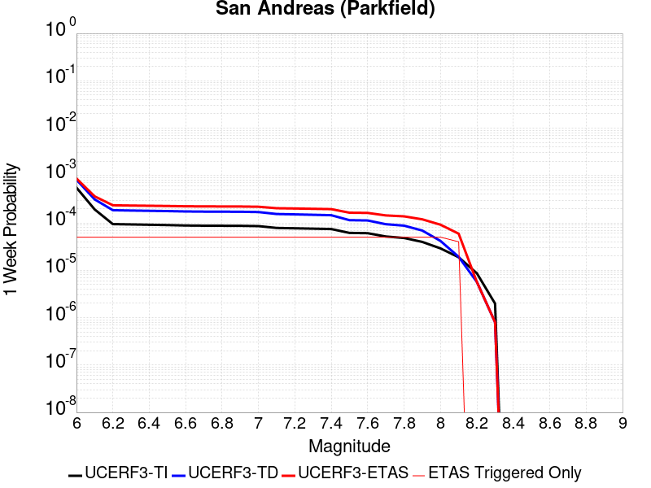 |  |  |  |

| Magnitude | 1 wk TI Prob | 1 wk TD Prob | 1 wk ETAS Prob | 1 wk ETAS/TD Gain | 1 wk ETAS Triggered Only | 1 mo TI Prob | 1 mo TD Prob | 1 mo ETAS Prob | 1 mo ETAS/TD Gain | 1 mo ETAS Triggered Only | 1 yr TI Prob | 1 yr TD Prob | 1 yr ETAS Prob | 1 yr ETAS/TD Gain | 1 yr ETAS Triggered Only | 10 yr TI Prob | 10 yr TD Prob | 10 yr ETAS Prob | 10 yr ETAS/TD Gain | 10 yr ETAS Triggered Only |
|-----|-----|-----|-----|-----|-----|-----|-----|-----|-----|-----|-----|-----|-----|-----|-----|-----|-----|-----|-----|-----|
| 6.0 | 5.556969E-4 | 8.1651966E-4 | 8.580658E-4 | 1.050882 | 4.1580042E-5 | 0.0023793848 | 0.0034952953 | 0.0035367298 | 1.0118544 | 4.1580042E-5 | 0.028586963 | 0.042068228 | 0.04210806 | 1.0009468 | 4.1580042E-5 | 0.25176284 | 0.34289595 | 0.34292325 | 1.0000796 | 4.1580042E-5 |
| 6.1 | 1.925858E-4 | 3.137197E-4 | 3.552867E-4 | 1.1324972 | 4.1580042E-5 | 8.2510663E-4 | 0.001343927 | 0.0013854512 | 1.0308976 | 4.1580042E-5 | 0.0099994885 | 0.016313266 | 0.016354168 | 1.0025072 | 4.1580042E-5 | 0.095613256 | 0.15234688 | 0.15238212 | 1.0002314 | 4.1580042E-5 |
| 6.2 | 9.4306815E-5 | 1.854751E-4 | 2.2704742E-4 | 1.2241397 | 4.1580042E-5 | 4.0410945E-4 | 7.946524E-4 | 8.361994E-4 | 1.0522833 | 4.1580042E-5 | 0.0049089384 | 0.009632187 | 0.009673366 | 1.0042752 | 4.1580042E-5 | 0.048019063 | 0.0931797 | 0.09321741 | 1.0004046 | 4.1580042E-5 |
| 6.3 | 9.283051E-5 | 1.8242722E-4 | 2.2399968E-4 | 1.2278851 | 4.1580042E-5 | 3.9778434E-4 | 7.815979E-4 | 8.231455E-4 | 1.0531572 | 4.1580042E-5 | 0.0048322747 | 0.009474651 | 0.009515837 | 1.004347 | 4.1580042E-5 | 0.047285385 | 0.09183048 | 0.09186824 | 1.0004112 | 4.1580042E-5 |
| 6.4 | 9.138826E-5 | 1.8002909E-4 | 2.2160166E-4 | 1.2309213 | 4.1580042E-5 | 3.916052E-4 | 7.7132636E-4 | 8.128743E-4 | 1.0538657 | 4.1580042E-5 | 0.0047573745 | 0.009350671 | 0.009391863 | 1.0044051 | 4.1580042E-5 | 0.046568092 | 0.0907278 | 0.09076561 | 1.0004168 | 4.1580042E-5 |
| 6.5 | 9.000255E-5 | 1.7759205E-4 | 2.1916472E-4 | 1.2340907 | 4.1580042E-5 | 3.8566816E-4 | 7.60888E-4 | 8.0243644E-4 | 1.0546051 | 4.1580042E-5 | 0.0046854047 | 0.009224672 | 0.009265868 | 1.0044659 | 4.1580042E-5 | 0.045878403 | 0.089605525 | 0.08964338 | 1.0004225 | 4.1580042E-5 |
| 6.6 | 8.8109264E-5 | 1.743648E-4 | 2.1593759E-4 | 1.2384242 | 4.1580042E-5 | 3.7755648E-4 | 7.470649E-4 | 7.8861386E-4 | 1.0556163 | 4.1580042E-5 | 0.0045870654 | 0.0090578 | 0.009099004 | 1.0045489 | 4.1580042E-5 | 0.04493529 | 0.088123694 | 0.08816161 | 1.0004302 | 4.1580042E-5 |
| 6.7 | 8.738073E-5 | 1.7302726E-4 | 2.1460012E-4 | 1.2402676 | 4.1580042E-5 | 3.7443507E-4 | 7.4133585E-4 | 7.8288506E-4 | 1.0560464 | 4.1580042E-5 | 0.0045492216 | 0.008988673 | 0.009029879 | 1.0045842 | 4.1580042E-5 | 0.04457213 | 0.08752088 | 0.08755883 | 1.0004336 | 4.1580042E-5 |
| 6.8 | 8.710195E-5 | 1.7247576E-4 | 2.1404863E-4 | 1.241036 | 4.1580042E-5 | 3.7324068E-4 | 7.389736E-4 | 7.805229E-4 | 1.0562257 | 4.1580042E-5 | 0.0045347405 | 0.008960159 | 0.009001366 | 1.004599 | 4.1580042E-5 | 0.04443313 | 0.08726624 | 0.08730419 | 1.0004349 | 4.1580042E-5 |
| 6.9 | 8.6801556E-5 | 1.7187938E-4 | 2.1345227E-4 | 1.2418725 | 4.1580042E-5 | 3.7195362E-4 | 7.364191E-4 | 7.7796855E-4 | 1.0564209 | 4.1580042E-5 | 0.0045191357 | 0.008929313 | 0.008970521 | 1.004615 | 4.1580042E-5 | 0.044283327 | 0.08699028 | 0.08702825 | 1.0004364 | 4.1580042E-5 |
| 7.0 | 8.5571606E-5 | 1.6938374E-4 | 2.1095674E-4 | 1.2454368 | 4.1580042E-5 | 3.6668387E-4 | 7.2572957E-4 | 7.672794E-4 | 1.0572525 | 4.1580042E-5 | 0.004455241 | 0.008800226 | 0.00884144 | 1.0046833 | 4.1580042E-5 | 0.043669727 | 0.08583031 | 0.08586832 | 1.0004429 | 4.1580042E-5 |
| 7.1 | 7.82589E-5 | 1.5408327E-4 | 1.9565692E-4 | 1.2698127 | 4.1580042E-5 | 3.3535215E-4 | 6.6019053E-4 | 7.017431E-4 | 1.0629402 | 4.1580042E-5 | 0.0040752706 | 0.008008373 | 0.00804962 | 1.0051504 | 4.1580042E-5 | 0.040013418 | 0.078711875 | 0.078750186 | 1.0004867 | 4.1580042E-5 |
| 7.2 | 7.690929E-5 | 1.5143286E-4 | 1.930066E-4 | 1.2745358 | 4.1580042E-5 | 3.2956956E-4 | 6.488373E-4 | 6.9039036E-4 | 1.0640423 | 4.1580042E-5 | 0.004005129 | 0.007871154 | 0.007912407 | 1.005241 | 4.1580042E-5 | 0.0393371 | 0.07747872 | 0.07751708 | 1.0004951 | 4.1580042E-5 |
| 7.3 | 7.5543794E-5 | 1.4836296E-4 | 1.8993682E-4 | 1.2802173 | 4.1580042E-5 | 3.2371894E-4 | 6.35687E-4 | 6.7724066E-4 | 1.065368 | 4.1580042E-5 | 0.003934157 | 0.007712193 | 0.0077534523 | 1.0053499 | 4.1580042E-5 | 0.038652334 | 0.0760293 | 0.07606772 | 1.0005053 | 4.1580042E-5 |
| 7.4 | 7.4214564E-5 | 1.4533575E-4 | 1.8690975E-4 | 1.2860548 | 4.1580042E-5 | 3.1802364E-4 | 6.227196E-4 | 6.642737E-4 | 1.0667301 | 4.1580042E-5 | 0.003865065 | 0.007555419 | 0.007596685 | 1.0054618 | 4.1580042E-5 | 0.03798529 | 0.07458969 | 0.074628174 | 1.0005158 | 4.1580042E-5 |
| 7.5 | 6.149578E-5 | 1.1424215E-4 | 1.5581744E-4 | 1.3639225 | 4.1580042E-5 | 2.6352672E-4 | 4.8951746E-4 | 5.3107715E-4 | 1.0848993 | 4.1580042E-5 | 0.0032037178 | 0.005943622 | 0.0059849545 | 1.0069542 | 4.1580042E-5 | 0.03157923 | 0.05963148 | 0.059670582 | 1.0006557 | 4.1580042E-5 |
| 7.6 | 6.0643448E-5 | 1.1250723E-4 | 1.5408259E-4 | 1.369535 | 4.1580042E-5 | 2.598746E-4 | 4.8208487E-4 | 5.2364485E-4 | 1.0862089 | 4.1580042E-5 | 0.0031593828 | 0.00585362 | 0.0058949566 | 1.0070617 | 4.1580042E-5 | 0.031148417 | 0.05878424 | 0.058823373 | 1.0006658 | 4.1580042E-5 |
| 7.7 | 5.1652263E-5 | 9.382579E-5 | 1.3540192E-4 | 1.4431206 | 4.1580042E-5 | 2.2134806E-4 | 4.0204855E-4 | 4.4361188E-4 | 1.1033789 | 4.1580042E-5 | 0.002691582 | 0.0048839655 | 0.0049253427 | 1.008472 | 4.1580042E-5 | 0.026592141 | 0.049511142 | 0.049550664 | 1.0007982 | 4.1580042E-5 |
| 7.8 | 4.8090482E-5 | 8.7510394E-5 | 1.290868E-4 | 1.4751024 | 4.1580042E-5 | 2.060858E-4 | 3.7499066E-4 | 4.1655512E-4 | 1.1108413 | 4.1580042E-5 | 0.0025062072 | 0.0045559625 | 0.0045973533 | 1.0090849 | 4.1580042E-5 | 0.024781305 | 0.046203107 | 0.046242766 | 1.0008583 | 4.1580042E-5 |
| 7.9 | 3.970278E-5 | 6.899808E-5 | 1.1057525E-4 | 1.6025845 | 4.1580042E-5 | 1.7014367E-4 | 2.9567254E-4 | 3.372403E-4 | 1.1405871 | 4.1580042E-5 | 0.002069531 | 0.0035938753 | 0.003635306 | 1.0115281 | 4.1580042E-5 | 0.020503636 | 0.036596112 | 0.03663617 | 1.0010946 | 4.1580042E-5 |
| 8.0 | 2.8982335E-5 | 4.1650288E-5 | 8.3228595E-5 | 1.9982718 | 4.1580042E-5 | 1.2420409E-4 | 1.7848902E-4 | 2.2006164E-4 | 1.2329142 | 4.1580042E-5 | 0.0015111357 | 0.0021709392 | 0.002212429 | 1.0191114 | 4.1580042E-5 | 0.015009012 | 0.022486161 | 0.022526806 | 1.0018076 | 4.1580042E-5 |
| 8.1 | 1.8836186E-5 | 1.9220972E-5 | 6.0800216E-5 | 3.1632226 | 4.1580042E-5 | 8.0724014E-5 | 8.2373E-5 | 1.2394962E-4 | 1.504736 | 4.1580042E-5 | 9.823717E-4 | 0.0010024305 | 0.0010439688 | 1.0414376 | 4.1580042E-5 | 0.009780403 | 0.010771171 | 0.010812303 | 1.0038188 | 4.1580042E-5 |
| 8.2 | 8.643924E-6 | 5.680264E-6 | 5.680264E-6 | 1.0 | 0.0 | 3.704486E-5 | 2.4343763E-5 | 2.4343763E-5 | 1.0 | 0.0 | 4.5092785E-4 | 2.963451E-4 | 2.963451E-4 | 1.0 | 0.0 | 0.0045001395 | 0.0033610219 | 0.0033610219 | 1.0 | 0.0 |
| 8.3 | 1.983087E-6 | 8.001618E-7 | 8.001618E-7 | 1.0 | 0.0 | 8.498917E-6 | 3.4292605E-6 | 3.4292605E-6 | 1.0 | 0.0 | 1.034694E-4 | 4.1750463E-5 | 4.1750463E-5 | 1.0 | 0.0 | 0.0010342124 | 4.915874E-4 | 4.915874E-4 | 1.0 | 0.0 |

## Earthquake Valley (No  Extension)
*[(top)](#table-of-contents)*

| 1 Week | 1 Month | 1 Year | 10 Year |
|-----|-----|-----|-----|
|  |  |  |  |

| Magnitude | 1 wk TI Prob | 1 wk TD Prob | 1 wk ETAS Prob | 1 wk ETAS/TD Gain | 1 wk ETAS Triggered Only | 1 mo TI Prob | 1 mo TD Prob | 1 mo ETAS Prob | 1 mo ETAS/TD Gain | 1 mo ETAS Triggered Only | 1 yr TI Prob | 1 yr TD Prob | 1 yr ETAS Prob | 1 yr ETAS/TD Gain | 1 yr ETAS Triggered Only | 10 yr TI Prob | 10 yr TD Prob | 10 yr ETAS Prob | 10 yr ETAS/TD Gain | 10 yr ETAS Triggered Only |
|-----|-----|-----|-----|-----|-----|-----|-----|-----|-----|-----|-----|-----|-----|-----|-----|-----|-----|-----|-----|-----|
| 6.0 | 2.1859703E-5 | 2.5218891E-5 | 2.5218891E-5 | 1.0 | 0.0 | 9.3681076E-5 | 1.080773E-4 | 1.2886508E-4 | 1.1923417 | 2.0790021E-5 | 0.0011399703 | 0.0013151922 | 0.0013359549 | 1.0157868 | 2.0790021E-5 | 0.011341401 | 0.013088471 | 0.013129507 | 1.0031353 | 4.1580042E-5 |
| 6.1 | 2.1859703E-5 | 2.5218891E-5 | 2.5218891E-5 | 1.0 | 0.0 | 9.3681076E-5 | 1.080773E-4 | 1.2886508E-4 | 1.1923417 | 2.0790021E-5 | 0.0011399703 | 0.0013151922 | 0.0013359549 | 1.0157868 | 2.0790021E-5 | 0.011341401 | 0.013088471 | 0.013129507 | 1.0031353 | 4.1580042E-5 |
| 6.2 | 2.1859703E-5 | 2.5218891E-5 | 2.5218891E-5 | 1.0 | 0.0 | 9.3681076E-5 | 1.080773E-4 | 1.2886508E-4 | 1.1923417 | 2.0790021E-5 | 0.0011399703 | 0.0013151922 | 0.0013359549 | 1.0157868 | 2.0790021E-5 | 0.011341401 | 0.013088471 | 0.013129507 | 1.0031353 | 4.1580042E-5 |
| 6.3 | 2.1859703E-5 | 2.5218891E-5 | 2.5218891E-5 | 1.0 | 0.0 | 9.3681076E-5 | 1.080773E-4 | 1.2886508E-4 | 1.1923417 | 2.0790021E-5 | 0.0011399703 | 0.0013151922 | 0.0013359549 | 1.0157868 | 2.0790021E-5 | 0.011341401 | 0.013088471 | 0.013129507 | 1.0031353 | 4.1580042E-5 |
| 6.4 | 2.1859703E-5 | 2.5218891E-5 | 2.5218891E-5 | 1.0 | 0.0 | 9.3681076E-5 | 1.080773E-4 | 1.2886508E-4 | 1.1923417 | 2.0790021E-5 | 0.0011399703 | 0.0013151922 | 0.0013359549 | 1.0157868 | 2.0790021E-5 | 0.011341401 | 0.013088471 | 0.013129507 | 1.0031353 | 4.1580042E-5 |
| 6.5 | 2.1859703E-5 | 2.5218891E-5 | 2.5218891E-5 | 1.0 | 0.0 | 9.3681076E-5 | 1.080773E-4 | 1.2886508E-4 | 1.1923417 | 2.0790021E-5 | 0.0011399703 | 0.0013151922 | 0.0013359549 | 1.0157868 | 2.0790021E-5 | 0.011341401 | 0.013088471 | 0.013129507 | 1.0031353 | 4.1580042E-5 |
| 6.6 | 1.597E-5 | 1.8371084E-5 | 1.8371084E-5 | 1.0 | 0.0 | 6.8441055E-5 | 7.873133E-5 | 7.873133E-5 | 1.0 | 0.0 | 8.329513E-4 | 9.582199E-4 | 9.582199E-4 | 1.0 | 0.0 | 0.008298361 | 0.009549504 | 0.009570096 | 1.0021563 | 2.0790021E-5 |
| 6.7 | 1.597E-5 | 1.8371084E-5 | 1.8371084E-5 | 1.0 | 0.0 | 6.8441055E-5 | 7.873133E-5 | 7.873133E-5 | 1.0 | 0.0 | 8.329513E-4 | 9.582199E-4 | 9.582199E-4 | 1.0 | 0.0 | 0.008298361 | 0.009549504 | 0.009570096 | 1.0021563 | 2.0790021E-5 |
| 6.8 | 1.5315149E-5 | 1.7616308E-5 | 1.7616308E-5 | 1.0 | 0.0 | 6.5634704E-5 | 7.549677E-5 | 7.549677E-5 | 1.0 | 0.0 | 7.988095E-4 | 9.1887236E-4 | 9.1887236E-4 | 1.0 | 0.0 | 0.007959441 | 0.009159285 | 0.009179884 | 1.002249 | 2.0790021E-5 |
| 6.9 | 1.3634728E-5 | 1.5688578E-5 | 1.5688578E-5 | 1.0 | 0.0 | 5.8433237E-5 | 6.7235494E-5 | 6.7235494E-5 | 1.0 | 0.0 | 7.1119244E-4 | 8.183669E-4 | 8.183669E-4 | 1.0 | 0.0 | 0.007089207 | 0.008161617 | 0.008182237 | 1.0025265 | 2.0790021E-5 |
| 7.0 | 1.3496271E-5 | 1.5530493E-5 | 1.5530493E-5 | 1.0 | 0.0 | 5.783988E-5 | 6.655802E-5 | 6.655802E-5 | 1.0 | 0.0 | 7.03973E-4 | 8.101249E-4 | 8.101249E-4 | 1.0 | 0.0 | 0.007017471 | 0.008079798 | 0.008100419 | 1.0025523 | 2.0790021E-5 |
| 7.1 | 8.242798E-6 | 9.480524E-6 | 9.480524E-6 | 1.0 | 0.0 | 3.53258E-5 | 4.0630563E-5 | 4.0630563E-5 | 1.0 | 0.0 | 4.300067E-4 | 4.94632E-4 | 4.94632E-4 | 1.0 | 0.0 | 0.004291756 | 0.004941898 | 0.004941898 | 1.0 | 0.0 |
| 7.2 | 2.6506527E-7 | 2.259121E-7 | 2.259121E-7 | 1.0 | 0.0 | 1.1359936E-6 | 9.681944E-7 | 9.681944E-7 | 1.0 | 0.0 | 1.3830633E-5 | 1.1787707E-5 | 1.1787707E-5 | 1.0 | 0.0 | 1.3829772E-4 | 1.17871234E-4 | 1.17871234E-4 | 1.0 | 0.0 |
| 7.3 | 2.5810488E-7 | 2.1986037E-7 | 2.1986037E-7 | 1.0 | 0.0 | 1.1061633E-6 | 9.422584E-7 | 9.422584E-7 | 1.0 | 0.0 | 1.3467455E-5 | 1.147194E-5 | 1.147194E-5 | 1.0 | 0.0 | 1.3466639E-4 | 1.1471389E-4 | 1.1471389E-4 | 1.0 | 0.0 |
| 7.4 | 2.2676066E-7 | 1.9140145E-7 | 1.9140145E-7 | 1.0 | 0.0 | 9.71831E-7 | 8.202917E-7 | 8.202917E-7 | 1.0 | 0.0 | 1.1831979E-5 | 9.987009E-6 | 9.987009E-6 | 1.0 | 0.0 | 1.1831349E-4 | 9.9865996E-5 | 9.9865996E-5 | 1.0 | 0.0 |
| 7.5 | 1.5553917E-7 | 1.3136662E-7 | 1.3136662E-7 | 1.0 | 0.0 | 6.6659624E-7 | 5.629997E-7 | 5.629997E-7 | 1.0 | 0.0 | 8.115779E-6 | 6.854502E-6 | 6.854502E-6 | 1.0 | 0.0 | 8.115482E-5 | 6.854312E-5 | 6.854312E-5 | 1.0 | 0.0 |
| 7.6 | 1.3448629E-7 | 1.1310612E-7 | 1.1310612E-7 | 1.0 | 0.0 | 5.7636964E-7 | 4.8474044E-7 | 4.8474044E-7 | 1.0 | 0.0 | 7.017278E-6 | 5.901701E-6 | 5.901701E-6 | 1.0 | 0.0 | 7.0170565E-5 | 5.9015656E-5 | 5.9015656E-5 | 1.0 | 0.0 |
| 7.7 | 2.9719402E-8 | 1.4609411E-8 | 1.4609411E-8 | 1.0 | 0.0 | 1.2736886E-7 | 6.261176E-8 | 6.261176E-8 | 1.0 | 0.0 | 1.5507147E-6 | 7.6229793E-7 | 7.6229793E-7 | 1.0 | 0.0 | 1.550704E-5 | 7.622959E-6 | 7.622959E-6 | 1.0 | 0.0 |
| 7.8 | 7.4390196E-9 | 3.2560412E-9 | 3.2560412E-9 | 1.0 | 0.0 | 3.1881513E-8 | 1.3954462E-8 | 1.3954462E-8 | 1.0 | 0.0 | 3.8815733E-7 | 1.6989556E-7 | 1.6989556E-7 | 1.0 | 0.0 | 3.8815665E-6 | 1.6989545E-6 | 1.6989545E-6 | 1.0 | 0.0 |
| 7.9 | 1.5373532E-9 | 8.451272E-10 | 8.451272E-10 | 1.0 | 0.0 | 6.5886567E-9 | 3.6219738E-9 | 3.6219738E-9 | 1.0 | 0.0 | 8.021689E-8 | 4.4097533E-8 | 4.4097533E-8 | 1.0 | 0.0 | 8.0216864E-7 | 4.409753E-7 | 4.409753E-7 | 1.0 | 0.0 |

## San Andreas (San Bernardino S)
*[(top)](#table-of-contents)*

| 1 Week | 1 Month | 1 Year | 10 Year |
|-----|-----|-----|-----|
| 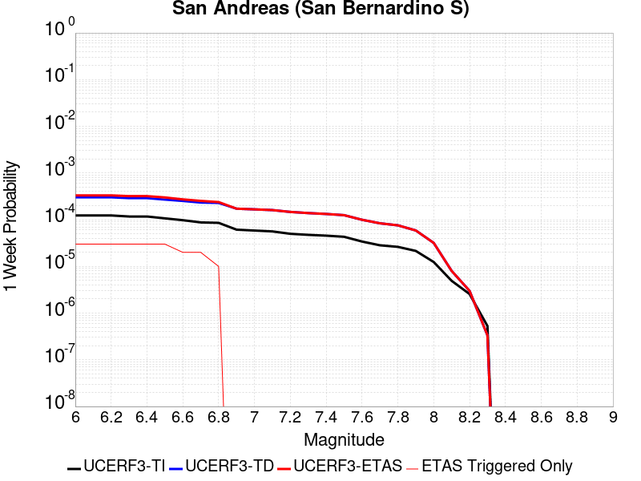 |  |  | 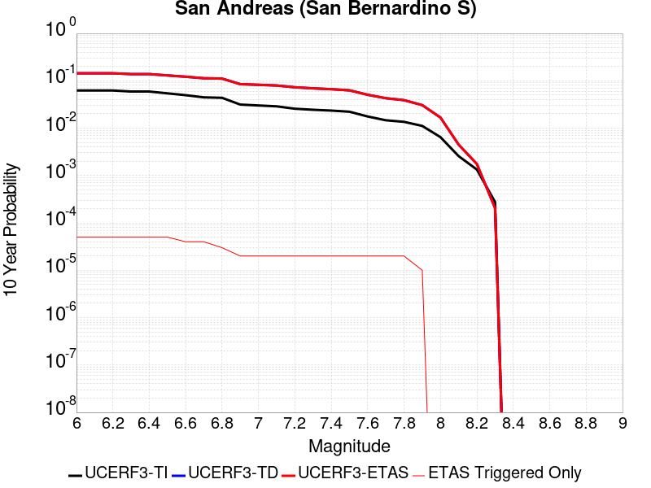 |

| Magnitude | 1 wk TI Prob | 1 wk TD Prob | 1 wk ETAS Prob | 1 wk ETAS/TD Gain | 1 wk ETAS Triggered Only | 1 mo TI Prob | 1 mo TD Prob | 1 mo ETAS Prob | 1 mo ETAS/TD Gain | 1 mo ETAS Triggered Only | 1 yr TI Prob | 1 yr TD Prob | 1 yr ETAS Prob | 1 yr ETAS/TD Gain | 1 yr ETAS Triggered Only | 10 yr TI Prob | 10 yr TD Prob | 10 yr ETAS Prob | 10 yr ETAS/TD Gain | 10 yr ETAS Triggered Only |
|-----|-----|-----|-----|-----|-----|-----|-----|-----|-----|-----|-----|-----|-----|-----|-----|-----|-----|-----|-----|-----|
| 6.0 | 1.2336002E-4 | 3.0197148E-4 | 3.227552E-4 | 1.0688268 | 2.0790021E-5 | 5.2857865E-4 | 0.0012935478 | 0.0013350741 | 1.0321026 | 4.1580042E-5 | 0.006416472 | 0.01564021 | 0.01568114 | 1.002617 | 4.1580042E-5 | 0.06234337 | 0.14364538 | 0.14368099 | 1.0002478 | 4.1580042E-5 |
| 6.1 | 1.2336002E-4 | 3.0197148E-4 | 3.227552E-4 | 1.0688268 | 2.0790021E-5 | 5.2857865E-4 | 0.0012935478 | 0.0013350741 | 1.0321026 | 4.1580042E-5 | 0.006416472 | 0.01564021 | 0.01568114 | 1.002617 | 4.1580042E-5 | 0.06234337 | 0.14364538 | 0.14368099 | 1.0002478 | 4.1580042E-5 |
| 6.2 | 1.2336002E-4 | 3.0197148E-4 | 3.227552E-4 | 1.0688268 | 2.0790021E-5 | 5.2857865E-4 | 0.0012935478 | 0.0013350741 | 1.0321026 | 4.1580042E-5 | 0.006416472 | 0.01564021 | 0.01568114 | 1.002617 | 4.1580042E-5 | 0.06234337 | 0.14364538 | 0.14368099 | 1.0002478 | 4.1580042E-5 |
| 6.3 | 1.1712257E-4 | 2.898341E-4 | 3.1061808E-4 | 1.07171 | 2.0790021E-5 | 5.018573E-4 | 0.0012415807 | 0.0012831091 | 1.033448 | 4.1580042E-5 | 0.006093008 | 0.015016349 | 0.015057305 | 1.0027274 | 4.1580042E-5 | 0.059286322 | 0.13835679 | 0.13839261 | 1.0002589 | 4.1580042E-5 |
| 6.4 | 1.1712257E-4 | 2.898341E-4 | 3.1061808E-4 | 1.07171 | 2.0790021E-5 | 5.018573E-4 | 0.0012415807 | 0.0012831091 | 1.033448 | 4.1580042E-5 | 0.006093008 | 0.015016349 | 0.015057305 | 1.0027274 | 4.1580042E-5 | 0.059286322 | 0.13835679 | 0.13839261 | 1.0002589 | 4.1580042E-5 |
| 6.5 | 1.0689076E-4 | 2.6993037E-4 | 2.907148E-4 | 1.0769992 | 2.0790021E-5 | 4.5802278E-4 | 0.0011563565 | 0.0011978885 | 1.0359162 | 4.1580042E-5 | 0.0055621783 | 0.013992408 | 0.014033406 | 1.00293 | 4.1580042E-5 | 0.05425003 | 0.12960236 | 0.12963854 | 1.0002793 | 4.1580042E-5 |
| 6.6 | 9.7648895E-5 | 2.5234558E-4 | 2.5234558E-4 | 1.0 | 0.0 | 4.1842813E-4 | 0.0010810565 | 0.0011018241 | 1.0192105 | 2.0790021E-5 | 0.005082469 | 0.013086828 | 0.013107346 | 1.0015678 | 2.0790021E-5 | 0.049677886 | 0.12176599 | 0.12178425 | 1.00015 | 2.0790021E-5 |
| 6.7 | 8.757013E-5 | 2.3302004E-4 | 2.3302004E-4 | 1.0 | 0.0 | 3.7524657E-4 | 9.982976E-4 | 0.0010190668 | 1.0208046 | 2.0790021E-5 | 0.00455906 | 0.012090651 | 0.01211119 | 1.0016987 | 2.0790021E-5 | 0.04466656 | 0.11311712 | 0.113135554 | 1.000163 | 2.0790021E-5 |
| 6.8 | 8.562978E-5 | 2.2860448E-4 | 2.2860448E-4 | 1.0 | 0.0 | 3.6693315E-4 | 9.79388E-4 | 0.0010001577 | 1.0212067 | 2.0790021E-5 | 0.004458263 | 0.01186295 | 0.0118834935 | 1.0017318 | 2.0790021E-5 | 0.043698758 | 0.111118436 | 0.11113692 | 1.0001663 | 2.0790021E-5 |
| 6.9 | 6.124075E-5 | 1.7228001E-4 | 1.7228001E-4 | 1.0 | 0.0 | 2.6243398E-4 | 7.3813484E-4 | 7.589095E-4 | 1.0281448 | 2.0790021E-5 | 0.0031904527 | 0.008949972 | 0.008970575 | 1.0023022 | 2.0790021E-5 | 0.031450346 | 0.08488899 | 0.084908016 | 1.0002241 | 2.0790021E-5 |
| 7.0 | 5.8598747E-5 | 1.66553E-4 | 1.66553E-4 | 1.0 | 0.0 | 2.5111332E-4 | 7.136041E-4 | 7.343793E-4 | 1.029113 | 2.0790021E-5 | 0.0030530186 | 0.008653718 | 0.008674328 | 1.0023817 | 2.0790021E-5 | 0.03011414 | 0.082203336 | 0.08222242 | 1.0002321 | 2.0790021E-5 |
| 7.1 | 5.613814E-5 | 1.6072052E-4 | 1.6072052E-4 | 1.0 | 0.0 | 2.4056983E-4 | 6.8862113E-4 | 7.0939685E-4 | 1.03017 | 2.0790021E-5 | 0.0029250039 | 0.008351917 | 0.008372534 | 1.0024685 | 2.0790021E-5 | 0.028868021 | 0.07949258 | 0.07951171 | 1.0002408 | 2.0790021E-5 |
| 7.2 | 4.991222E-5 | 1.4674799E-4 | 1.4674799E-4 | 1.0 | 0.0 | 2.1389198E-4 | 6.287687E-4 | 6.495457E-4 | 1.0330439 | 2.0790021E-5 | 0.002601025 | 0.007628494 | 0.0076491255 | 1.0027045 | 2.0790021E-5 | 0.025707912 | 0.07293082 | 0.07295009 | 1.0002643 | 2.0790021E-5 |
| 7.3 | 4.7410045E-5 | 1.3865474E-4 | 1.3865474E-4 | 1.0 | 0.0 | 2.0317009E-4 | 5.940996E-4 | 6.1487727E-4 | 1.0349734 | 2.0790021E-5 | 0.0024707897 | 0.0072092614 | 0.0072299014 | 1.002863 | 2.0790021E-5 | 0.024434982 | 0.06919559 | 0.06921495 | 1.0002797 | 2.0790021E-5 |
| 7.4 | 4.5556746E-5 | 1.3270804E-4 | 1.3270804E-4 | 1.0 | 0.0 | 1.952286E-4 | 5.686251E-4 | 5.894033E-4 | 1.0365411 | 2.0790021E-5 | 0.002374317 | 0.0069011156 | 0.006921762 | 1.0029918 | 2.0790021E-5 | 0.023491086 | 0.066436276 | 0.066455685 | 1.0002922 | 2.0790021E-5 |
| 7.5 | 4.3084514E-5 | 1.2502912E-4 | 1.2502912E-4 | 1.0 | 0.0 | 1.8463485E-4 | 5.357294E-4 | 5.5650825E-4 | 1.0387862 | 2.0790021E-5 | 0.0022456115 | 0.0065030716 | 0.0065237265 | 1.0031762 | 2.0790021E-5 | 0.022230545 | 0.062825486 | 0.06284498 | 1.0003102 | 2.0790021E-5 |
| 7.6 | 3.408608E-5 | 9.969324E-5 | 9.969324E-5 | 1.0 | 0.0 | 1.4607502E-4 | 4.271869E-4 | 4.4796802E-4 | 1.0486465 | 2.0790021E-5 | 0.0017770125 | 0.005188624 | 0.005209306 | 1.003986 | 2.0790021E-5 | 0.017628696 | 0.05061345 | 0.05063319 | 1.0003899 | 2.0790021E-5 |
| 7.7 | 2.8315713E-5 | 8.374454E-5 | 8.374454E-5 | 1.0 | 0.0 | 1.2134742E-4 | 3.5885582E-4 | 3.796384E-4 | 1.0579134 | 2.0790021E-5 | 0.0014764034 | 0.0043603266 | 0.0043810257 | 1.0047472 | 2.0790021E-5 | 0.01466633 | 0.04283281 | 0.042852707 | 1.0004646 | 2.0790021E-5 |
| 7.8 | 2.6222975E-5 | 7.580657E-5 | 7.580657E-5 | 1.0 | 0.0 | 1.1237934E-4 | 3.2484488E-4 | 3.4562816E-4 | 1.063979 | 2.0790021E-5 | 0.0013673597 | 0.0039478205 | 0.0039685285 | 1.0052454 | 2.0790021E-5 | 0.013589768 | 0.038964145 | 0.038984127 | 1.0005127 | 2.0790021E-5 |
| 7.9 | 2.1469694E-5 | 5.8860456E-5 | 5.8860456E-5 | 1.0 | 0.0 | 9.200973E-5 | 2.5223472E-4 | 2.730195E-4 | 1.0824025 | 2.0790021E-5 | 0.0011196428 | 0.0030666364 | 0.0030873627 | 1.0067587 | 2.0790021E-5 | 0.011140184 | 0.030598465 | 0.03061862 | 1.0006586 | 2.0790021E-5 |
| 8.0 | 1.2420249E-5 | 3.1867392E-5 | 3.1867392E-5 | 1.0 | 0.0 | 5.322855E-5 | 1.365674E-4 | 1.365674E-4 | 1.0 | 0.0 | 6.478649E-4 | 0.001661441 | 0.001661441 | 1.0 | 0.0 | 0.0064597935 | 0.016778521 | 0.016778521 | 1.0 | 0.0 |
| 8.1 | 4.9197724E-6 | 8.025736E-6 | 8.025736E-6 | 1.0 | 0.0 | 2.1084568E-5 | 3.439556E-5 | 3.439556E-5 | 1.0 | 0.0 | 2.566744E-4 | 4.186856E-4 | 4.186856E-4 | 1.0 | 0.0 | 0.002563781 | 0.004486374 | 0.004486374 | 1.0 | 0.0 |
| 8.2 | 2.5634774E-6 | 2.999787E-6 | 2.999787E-6 | 1.0 | 0.0 | 1.0986286E-5 | 1.2856167E-5 | 1.2856167E-5 | 1.0 | 0.0 | 1.3374983E-4 | 1.5651264E-4 | 1.5651264E-4 | 1.0 | 0.0 | 0.0013366934 | 0.00175384 | 0.00175384 | 1.0 | 0.0 |
| 8.3 | 5.2850464E-7 | 3.3367226E-7 | 3.3367226E-7 | 1.0 | 0.0 | 2.2650179E-6 | 1.4300233E-6 | 1.4300233E-6 | 1.0 | 0.0 | 2.7576245E-5 | 1.7410408E-5 | 1.7410408E-5 | 1.0 | 0.0 | 2.7572823E-4 | 2.0592175E-4 | 2.0592175E-4 | 1.0 | 0.0 |

## Pleito
*[(top)](#table-of-contents)*

| 1 Week | 1 Month | 1 Year | 10 Year |
|-----|-----|-----|-----|
|  |  |  | 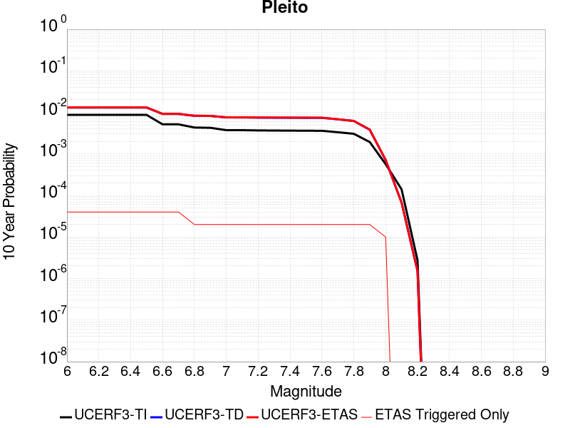 |

| Magnitude | 1 wk TI Prob | 1 wk TD Prob | 1 wk ETAS Prob | 1 wk ETAS/TD Gain | 1 wk ETAS Triggered Only | 1 mo TI Prob | 1 mo TD Prob | 1 mo ETAS Prob | 1 mo ETAS/TD Gain | 1 mo ETAS Triggered Only | 1 yr TI Prob | 1 yr TD Prob | 1 yr ETAS Prob | 1 yr ETAS/TD Gain | 1 yr ETAS Triggered Only | 10 yr TI Prob | 10 yr TD Prob | 10 yr ETAS Prob | 10 yr ETAS/TD Gain | 10 yr ETAS Triggered Only |
|-----|-----|-----|-----|-----|-----|-----|-----|-----|-----|-----|-----|-----|-----|-----|-----|-----|-----|-----|-----|-----|
| 6.0 | 1.6763008E-5 | 2.5027999E-5 | 4.5817498E-5 | 1.8306497 | 2.0790021E-5 | 7.183948E-5 | 1.0725885E-4 | 1.4883443E-4 | 1.3876191 | 4.1580042E-5 | 8.742947E-4 | 0.0013051664 | 0.0013466921 | 1.0318165 | 4.1580042E-5 | 0.00870863 | 0.013087297 | 0.013128333 | 1.0031356 | 4.1580042E-5 |
| 6.1 | 1.6763008E-5 | 2.5027999E-5 | 4.5817498E-5 | 1.8306497 | 2.0790021E-5 | 7.183948E-5 | 1.0725885E-4 | 1.4883443E-4 | 1.3876191 | 4.1580042E-5 | 8.742947E-4 | 0.0013051664 | 0.0013466921 | 1.0318165 | 4.1580042E-5 | 0.00870863 | 0.013087297 | 0.013128333 | 1.0031356 | 4.1580042E-5 |
| 6.2 | 1.6763008E-5 | 2.5027999E-5 | 4.5817498E-5 | 1.8306497 | 2.0790021E-5 | 7.183948E-5 | 1.0725885E-4 | 1.4883443E-4 | 1.3876191 | 4.1580042E-5 | 8.742947E-4 | 0.0013051664 | 0.0013466921 | 1.0318165 | 4.1580042E-5 | 0.00870863 | 0.013087297 | 0.013128333 | 1.0031356 | 4.1580042E-5 |
| 6.3 | 1.6763008E-5 | 2.5027999E-5 | 4.5817498E-5 | 1.8306497 | 2.0790021E-5 | 7.183948E-5 | 1.0725885E-4 | 1.4883443E-4 | 1.3876191 | 4.1580042E-5 | 8.742947E-4 | 0.0013051664 | 0.0013466921 | 1.0318165 | 4.1580042E-5 | 0.00870863 | 0.013087297 | 0.013128333 | 1.0031356 | 4.1580042E-5 |
| 6.4 | 1.6763008E-5 | 2.5027999E-5 | 4.5817498E-5 | 1.8306497 | 2.0790021E-5 | 7.183948E-5 | 1.0725885E-4 | 1.4883443E-4 | 1.3876191 | 4.1580042E-5 | 8.742947E-4 | 0.0013051664 | 0.0013466921 | 1.0318165 | 4.1580042E-5 | 0.00870863 | 0.013087297 | 0.013128333 | 1.0031356 | 4.1580042E-5 |
| 6.5 | 1.6763008E-5 | 2.5027999E-5 | 4.5817498E-5 | 1.8306497 | 2.0790021E-5 | 7.183948E-5 | 1.0725885E-4 | 1.4883443E-4 | 1.3876191 | 4.1580042E-5 | 8.742947E-4 | 0.0013051664 | 0.0013466921 | 1.0318165 | 4.1580042E-5 | 0.00870863 | 0.013087297 | 0.013128333 | 1.0031356 | 4.1580042E-5 |
| 6.6 | 9.910213E-6 | 1.7474815E-5 | 3.8264472E-5 | 2.1896925 | 2.0790021E-5 | 4.247165E-5 | 7.488994E-5 | 1.16466865E-4 | 1.5551738 | 4.1580042E-5 | 5.169696E-4 | 9.114073E-4 | 9.5294946E-4 | 1.0455803 | 4.1580042E-5 | 0.0051576863 | 0.009182575 | 0.009223773 | 1.0044866 | 4.1580042E-5 |
| 6.7 | 9.910213E-6 | 1.7474815E-5 | 3.8264472E-5 | 2.1896925 | 2.0790021E-5 | 4.247165E-5 | 7.488994E-5 | 1.16466865E-4 | 1.5551738 | 4.1580042E-5 | 5.169696E-4 | 9.114073E-4 | 9.5294946E-4 | 1.0455803 | 4.1580042E-5 | 0.0051576863 | 0.009182575 | 0.009223773 | 1.0044866 | 4.1580042E-5 |
| 6.8 | 8.300162E-6 | 1.5733694E-5 | 3.652339E-5 | 2.3213484 | 2.0790021E-5 | 3.557164E-5 | 6.742839E-5 | 1.09005625E-4 | 1.6166133 | 4.1580042E-5 | 4.3299864E-4 | 8.2063285E-4 | 8.6217874E-4 | 1.0506266 | 4.1580042E-5 | 0.004321559 | 0.008281754 | 0.00832299 | 1.0049791 | 4.1580042E-5 |
| 6.9 | 8.183114E-6 | 1.5604792E-5 | 3.639449E-5 | 2.3322635 | 2.0790021E-5 | 3.5070017E-5 | 6.6875975E-5 | 1.08453234E-4 | 1.621707 | 4.1580042E-5 | 4.2689382E-4 | 8.1391225E-4 | 8.554585E-4 | 1.0510451 | 4.1580042E-5 | 0.0042607468 | 0.0082150465 | 0.008256285 | 1.0050199 | 4.1580042E-5 |
| 7.0 | 7.1748823E-6 | 1.4388531E-5 | 3.517825E-5 | 2.4448814 | 2.0790021E-5 | 3.0749135E-5 | 6.1663675E-5 | 1.0324115E-4 | 1.674262 | 4.1580042E-5 | 3.743064E-4 | 7.504972E-4 | 7.920461E-4 | 1.0553617 | 4.1580042E-5 | 0.0037367654 | 0.007585022 | 0.007626287 | 1.0054402 | 4.1580042E-5 |
| 7.1 | 7.1671807E-6 | 1.4378867E-5 | 3.516859E-5 | 2.4458525 | 2.0790021E-5 | 3.0716128E-5 | 6.162226E-5 | 1.0319974E-4 | 1.6747153 | 4.1580042E-5 | 3.7390468E-4 | 7.499933E-4 | 7.915422E-4 | 1.055399 | 4.1580042E-5 | 0.0037327618 | 0.0075800177 | 0.0076212827 | 1.0054439 | 4.1580042E-5 |
| 7.2 | 7.0649667E-6 | 1.4225317E-5 | 3.501504E-5 | 2.4614596 | 2.0790021E-5 | 3.0278077E-5 | 6.096422E-5 | 1.0254173E-4 | 1.6819985 | 4.1580042E-5 | 3.6857324E-4 | 7.4198714E-4 | 7.835363E-4 | 1.0559971 | 4.1580042E-5 | 0.0036796255 | 0.007500352 | 0.00754162 | 1.0055022 | 4.1580042E-5 |
| 7.3 | 7.02082E-6 | 1.4168281E-5 | 3.4958008E-5 | 2.4673429 | 2.0790021E-5 | 3.008888E-5 | 6.0719794E-5 | 1.02297316E-4 | 1.684744 | 4.1580042E-5 | 3.6627054E-4 | 7.390133E-4 | 7.805626E-4 | 1.0562227 | 4.1580042E-5 | 0.0036566744 | 0.0074706026 | 0.007511872 | 1.0055243 | 4.1580042E-5 |
| 7.4 | 6.987146E-6 | 1.4127567E-5 | 3.4917295E-5 | 2.4715717 | 2.0790021E-5 | 2.9944567E-5 | 6.0545313E-5 | 1.0212284E-4 | 1.6867175 | 4.1580042E-5 | 3.6451413E-4 | 7.3689036E-4 | 7.784398E-4 | 1.0563848 | 4.1580042E-5 | 0.0036391679 | 0.0074493987 | 0.007490669 | 1.0055401 | 4.1580042E-5 |
| 7.5 | 6.9494554E-6 | 1.4084261E-5 | 3.487399E-5 | 2.4760964 | 2.0790021E-5 | 2.9783041E-5 | 6.035973E-5 | 1.0193726E-4 | 1.6888291 | 4.1580042E-5 | 3.625482E-4 | 7.346324E-4 | 7.761819E-4 | 1.0565583 | 4.1580042E-5 | 0.0036195726 | 0.0074269213 | 0.0074681924 | 1.005557 | 4.1580042E-5 |
| 7.6 | 6.92694E-6 | 1.4042984E-5 | 3.4832712E-5 | 2.4804351 | 2.0790021E-5 | 2.9686547E-5 | 6.0182832E-5 | 1.0176037E-4 | 1.6908538 | 4.1580042E-5 | 3.6137376E-4 | 7.324802E-4 | 7.7402976E-4 | 1.0567245 | 4.1580042E-5 | 0.0036078666 | 0.007405478 | 0.00744675 | 1.0055732 | 4.1580042E-5 |
| 7.7 | 6.395867E-6 | 1.2911186E-5 | 3.3700937E-5 | 2.6102126 | 2.0790021E-5 | 2.741057E-5 | 5.5332483E-5 | 9.6910226E-5 | 1.7514166 | 4.1580042E-5 | 3.336726E-4 | 6.734651E-4 | 7.150171E-4 | 1.0616989 | 4.1580042E-5 | 0.0033317201 | 0.0068187383 | 0.006860035 | 1.0060563 | 4.1580042E-5 |
| 7.8 | 5.8664327E-6 | 1.1757821E-5 | 3.25476E-5 | 2.7681656 | 2.0790021E-5 | 2.5141611E-5 | 5.038969E-5 | 9.196764E-5 | 1.8251281 | 4.1580042E-5 | 3.060561E-4 | 6.13322E-4 | 6.548766E-4 | 1.0677532 | 4.1580042E-5 | 0.0030563495 | 0.0062136077 | 0.0062549296 | 1.0066502 | 4.1580042E-5 |
| 7.9 | 3.7167474E-6 | 7.2485695E-6 | 2.803844E-5 | 3.8681343 | 2.0790021E-5 | 1.592882E-5 | 3.106493E-5 | 7.264368E-5 | 2.3384466 | 4.1580042E-5 | 1.9391612E-4 | 3.7815003E-4 | 4.1971434E-4 | 1.1099149 | 4.1580042E-5 | 0.0019374699 | 0.0038358897 | 0.00387731 | 1.0107982 | 4.1580042E-5 |
| 8.0 | 1.0903841E-6 | 1.3175929E-6 | 1.3175929E-6 | 1.0 | 0.0 | 4.6730665E-6 | 5.6468148E-6 | 2.6436717E-5 | 4.6817045 | 2.0790021E-5 | 5.68931E-5 | 6.874781E-5 | 8.953641E-5 | 1.3023891 | 2.0790021E-5 | 5.6878536E-4 | 7.097497E-4 | 7.30525E-4 | 1.0292712 | 2.0790021E-5 |
| 8.1 | 2.6894583E-7 | 1.1559236E-7 | 1.1559236E-7 | 1.0 | 0.0 | 1.1526245E-6 | 4.9539574E-7 | 4.9539574E-7 | 1.0 | 0.0 | 1.4033113E-5 | 6.0314264E-6 | 6.0314264E-6 | 1.0 | 0.0 | 1.4032227E-4 | 6.73526E-5 | 6.73526E-5 | 1.0 | 0.0 |
| 8.2 | 5.2967013E-9 | 2.5757556E-9 | 2.5757556E-9 | 1.0 | 0.0 | 2.2700148E-8 | 1.1038953E-8 | 1.1038953E-8 | 1.0 | 0.0 | 2.7637427E-7 | 1.3439924E-7 | 1.3439924E-7 | 1.0 | 0.0 | 2.7637393E-6 | 1.5250008E-6 | 1.5250008E-6 | 1.0 | 0.0 |

## Rose Canyon
*[(top)](#table-of-contents)*

| 1 Week | 1 Month | 1 Year | 10 Year |
|-----|-----|-----|-----|
|  | 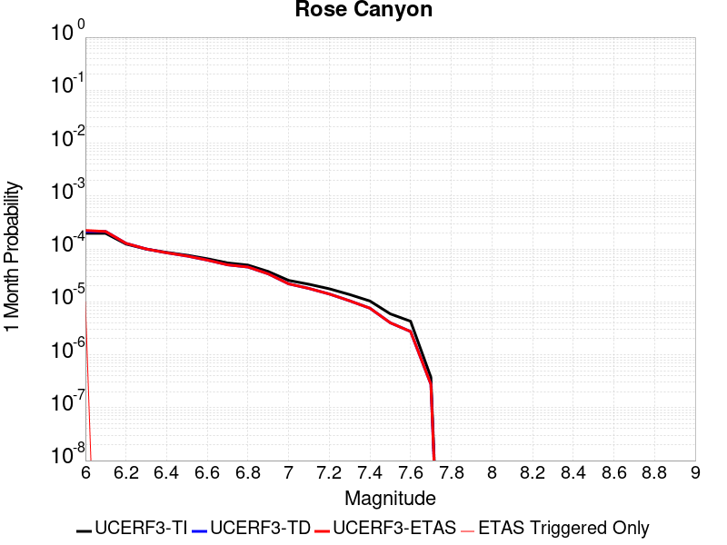 |  |  |

| Magnitude | 1 wk TI Prob | 1 wk TD Prob | 1 wk ETAS Prob | 1 wk ETAS/TD Gain | 1 wk ETAS Triggered Only | 1 mo TI Prob | 1 mo TD Prob | 1 mo ETAS Prob | 1 mo ETAS/TD Gain | 1 mo ETAS Triggered Only | 1 yr TI Prob | 1 yr TD Prob | 1 yr ETAS Prob | 1 yr ETAS/TD Gain | 1 yr ETAS Triggered Only | 10 yr TI Prob | 10 yr TD Prob | 10 yr ETAS Prob | 10 yr ETAS/TD Gain | 10 yr ETAS Triggered Only |
|-----|-----|-----|-----|-----|-----|-----|-----|-----|-----|-----|-----|-----|-----|-----|-----|-----|-----|-----|-----|-----|
| 6.0 | 4.5923203E-5 | 4.9851275E-5 | 4.9851275E-5 | 1.0 | 0.0 | 1.9679888E-4 | 2.1363217E-4 | 2.1363217E-4 | 1.0 | 0.0 | 0.0023933933 | 0.0025980715 | 0.0026188076 | 1.0079813 | 2.0790021E-5 | 0.023677798 | 0.02568982 | 0.025730332 | 1.001577 | 4.1580042E-5 |
| 6.1 | 4.5923203E-5 | 4.9851275E-5 | 4.9851275E-5 | 1.0 | 0.0 | 1.9679888E-4 | 2.1363217E-4 | 2.1363217E-4 | 1.0 | 0.0 | 0.0023933933 | 0.0025980715 | 0.0026188076 | 1.0079813 | 2.0790021E-5 | 0.023677798 | 0.02568982 | 0.025730332 | 1.001577 | 4.1580042E-5 |
| 6.2 | 2.8844734E-5 | 2.9769451E-5 | 2.9769451E-5 | 1.0 | 0.0 | 1.2361443E-4 | 1.2757732E-4 | 1.2757732E-4 | 1.0 | 0.0 | 0.0015039665 | 0.0015521768 | 0.0015521768 | 1.0 | 0.0 | 0.0149382865 | 0.015414888 | 0.015414888 | 1.0 | 0.0 |
| 6.3 | 2.3171577E-5 | 2.3251425E-5 | 2.3251425E-5 | 1.0 | 0.0 | 9.9302975E-5 | 9.964523E-5 | 9.964523E-5 | 1.0 | 0.0 | 0.0012083431 | 0.001212519 | 0.001212519 | 1.0 | 0.0 | 0.012017938 | 0.012063286 | 0.012063286 | 1.0 | 0.0 |
| 6.4 | 2.0066604E-5 | 1.9727737E-5 | 1.9727737E-5 | 1.0 | 0.0 | 8.599689E-5 | 8.454476E-5 | 8.454476E-5 | 1.0 | 0.0 | 0.0010465092 | 0.0010288565 | 0.0010288565 | 1.0 | 0.0 | 0.010415946 | 0.010250669 | 0.010250669 | 1.0 | 0.0 |
| 6.5 | 1.776989E-5 | 1.7155178E-5 | 1.7155178E-5 | 1.0 | 0.0 | 7.615444E-5 | 7.352016E-5 | 7.352016E-5 | 1.0 | 0.0 | 9.267859E-4 | 8.947473E-4 | 8.947473E-4 | 1.0 | 0.0 | 0.009229303 | 0.008921383 | 0.008921383 | 1.0 | 0.0 |
| 6.6 | 1.5227364E-5 | 1.436118E-5 | 1.436118E-5 | 1.0 | 0.0 | 6.52585E-5 | 6.154649E-5 | 6.154649E-5 | 1.0 | 0.0 | 7.942326E-4 | 7.4907613E-4 | 7.4907613E-4 | 1.0 | 0.0 | 0.007914 | 0.0074789803 | 0.0074789803 | 1.0 | 0.0 |
| 6.7 | 1.2703898E-5 | 1.168615E-5 | 1.168615E-5 | 1.0 | 0.0 | 5.4444143E-5 | 5.0082563E-5 | 5.0082563E-5 | 1.0 | 0.0 | 6.626558E-4 | 6.0958887E-4 | 6.0958887E-4 | 1.0 | 0.0 | 0.006606833 | 0.0060905092 | 0.0060905092 | 1.0 | 0.0 |
| 6.8 | 1.1554917E-5 | 1.0620452E-5 | 1.0620452E-5 | 1.0 | 0.0 | 4.9520135E-5 | 4.551545E-5 | 4.551545E-5 | 1.0 | 0.0 | 6.0274085E-4 | 5.5401376E-4 | 5.5401376E-4 | 1.0 | 0.0 | 0.0060110865 | 0.0055420734 | 0.0055420734 | 1.0 | 0.0 |
| 6.9 | 8.732078E-6 | 7.886201E-6 | 7.886201E-6 | 1.0 | 0.0 | 3.7422655E-5 | 3.3797583E-5 | 3.3797583E-5 | 1.0 | 0.0 | 4.5552556E-4 | 4.1141085E-4 | 4.1141085E-4 | 1.0 | 0.0 | 0.0045459294 | 0.004123286 | 0.004123286 | 1.0 | 0.0 |
| 7.0 | 5.9337494E-6 | 5.1104976E-6 | 5.1104976E-6 | 1.0 | 0.0 | 2.5430107E-5 | 2.190195E-5 | 2.190195E-5 | 1.0 | 0.0 | 3.0956755E-4 | 2.6662374E-4 | 2.6662374E-4 | 1.0 | 0.0 | 0.0030913667 | 0.0026630543 | 0.0026630543 | 1.0 | 0.0 |
| 7.1 | 5.013409E-6 | 4.1798767E-6 | 4.1798767E-6 | 1.0 | 0.0 | 2.1485863E-5 | 1.7913635E-5 | 1.7913635E-5 | 1.0 | 0.0 | 2.6155898E-4 | 2.1807678E-4 | 2.1807678E-4 | 1.0 | 0.0 | 0.0026125133 | 0.0021786394 | 0.0021786394 | 1.0 | 0.0 |
| 7.2 | 4.120763E-6 | 3.2843095E-6 | 3.2843095E-6 | 1.0 | 0.0 | 1.7660293E-5 | 1.4075537E-5 | 1.4075537E-5 | 1.0 | 0.0 | 2.1499286E-4 | 1.7135628E-4 | 1.7135628E-4 | 1.0 | 0.0 | 0.0021478499 | 0.0017122511 | 0.0017122511 | 1.0 | 0.0 |
| 7.3 | 3.2081239E-6 | 2.4422322E-6 | 2.4422322E-6 | 1.0 | 0.0 | 1.374903E-5 | 1.0466669E-5 | 1.0466669E-5 | 1.0 | 0.0 | 1.6738157E-4 | 1.274243E-4 | 1.274243E-4 | 1.0 | 0.0 | 0.0016725556 | 0.0012735194 | 0.0012735194 | 1.0 | 0.0 |
| 7.4 | 2.4194755E-6 | 1.7694528E-6 | 1.7694528E-6 | 1.0 | 0.0 | 1.0369139E-5 | 7.5833473E-6 | 7.5833473E-6 | 1.0 | 0.0 | 1.2623696E-4 | 9.23234E-5 | 9.23234E-5 | 1.0 | 0.0 | 0.0012616527 | 9.228558E-4 | 9.228558E-4 | 1.0 | 0.0 |
| 7.5 | 1.3842889E-6 | 9.3900115E-7 | 9.3900115E-7 | 1.0 | 0.0 | 5.9326535E-6 | 4.024285E-6 | 4.024285E-6 | 1.0 | 0.0 | 7.222766E-5 | 4.89946E-5 | 4.89946E-5 | 1.0 | 0.0 | 7.220419E-4 | 4.898415E-4 | 4.898415E-4 | 1.0 | 0.0 |
| 7.6 | 1.0021575E-6 | 6.414722E-7 | 6.414722E-7 | 1.0 | 0.0 | 4.2949537E-6 | 2.7491637E-6 | 2.7491637E-6 | 1.0 | 0.0 | 5.2289808E-5 | 3.3470576E-5 | 3.3470576E-5 | 1.0 | 0.0 | 5.2277505E-4 | 3.346575E-4 | 3.346575E-4 | 1.0 | 0.0 |
| 7.7 | 8.7620116E-8 | 6.4511134E-8 | 6.4511134E-8 | 1.0 | 0.0 | 3.7551473E-7 | 2.7647627E-7 | 2.7647627E-7 | 1.0 | 0.0 | 4.5718825E-6 | 3.3660936E-6 | 3.3660936E-6 | 1.0 | 0.0 | 4.5717883E-5 | 3.3660453E-5 | 3.3660453E-5 | 1.0 | 0.0 |

## San Andreas (Creeping Section) 2011 CFM
*[(top)](#table-of-contents)*

| 1 Week | 1 Month | 1 Year | 10 Year |
|-----|-----|-----|-----|
|  | 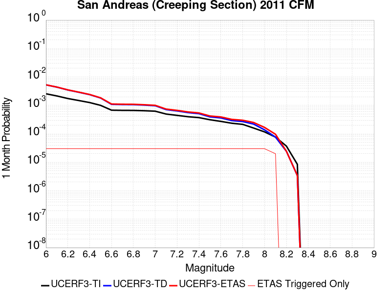 |  |  |

| Magnitude | 1 wk TI Prob | 1 wk TD Prob | 1 wk ETAS Prob | 1 wk ETAS/TD Gain | 1 wk ETAS Triggered Only | 1 mo TI Prob | 1 mo TD Prob | 1 mo ETAS Prob | 1 mo ETAS/TD Gain | 1 mo ETAS Triggered Only | 1 yr TI Prob | 1 yr TD Prob | 1 yr ETAS Prob | 1 yr ETAS/TD Gain | 1 yr ETAS Triggered Only | 10 yr TI Prob | 10 yr TD Prob | 10 yr ETAS Prob | 10 yr ETAS/TD Gain | 10 yr ETAS Triggered Only |
|-----|-----|-----|-----|-----|-----|-----|-----|-----|-----|-----|-----|-----|-----|-----|-----|-----|-----|-----|-----|-----|
| 6.0 | 5.986481E-4 | 0.0012321565 | 0.001252921 | 1.0168521 | 2.0790021E-5 | 0.0025631124 | 0.005265187 | 0.0052858675 | 1.0039278 | 2.0790021E-5 | 0.030762846 | 0.06143059 | 0.0614501 | 1.0003177 | 2.0790021E-5 | 0.26835477 | 0.42711884 | 0.42713076 | 1.0000279 | 2.0790021E-5 |
| 6.1 | 5.015945E-4 | 0.0010255221 | 0.0010462909 | 1.0202519 | 2.0790021E-5 | 0.00214792 | 0.0043839044 | 0.0044046035 | 1.0047215 | 2.0790021E-5 | 0.025839351 | 0.051435083 | 0.0514548 | 1.0003834 | 2.0790021E-5 | 0.23032776 | 0.37398085 | 0.37399384 | 1.0000348 | 2.0790021E-5 |
| 6.2 | 4.073338E-4 | 8.143994E-4 | 8.351725E-4 | 1.0255072 | 2.0790021E-5 | 0.0017445484 | 0.0034829527 | 0.0035036702 | 1.0059483 | 2.0790021E-5 | 0.021034058 | 0.04111887 | 0.041138805 | 1.0004848 | 2.0790021E-5 | 0.19150782 | 0.31425294 | 0.3142672 | 1.0000454 | 2.0790021E-5 |
| 6.3 | 3.464099E-4 | 6.7759946E-4 | 6.983754E-4 | 1.0306611 | 2.0790021E-5 | 0.0014837692 | 0.0028987958 | 0.0029195254 | 1.0071511 | 2.0790021E-5 | 0.017915873 | 0.0343766 | 0.034396674 | 1.000584 | 2.0790021E-5 | 0.16538359 | 0.27260998 | 0.27262512 | 1.0000554 | 2.0790021E-5 |
| 6.4 | 2.935057E-4 | 5.581249E-4 | 5.7890336E-4 | 1.037229 | 2.0790021E-5 | 0.0012572751 | 0.0023884408 | 0.002409181 | 1.0086837 | 2.0790021E-5 | 0.015200248 | 0.028453352 | 0.02847355 | 1.0007099 | 2.0790021E-5 | 0.14201577 | 0.23435058 | 0.23436649 | 1.000068 | 2.0790021E-5 |
| 6.5 | 2.3409708E-4 | 4.2464296E-4 | 4.4542414E-4 | 1.048938 | 2.0790021E-5 | 0.0010028875 | 0.0018178936 | 0.0018386459 | 1.0114155 | 2.0790021E-5 | 0.012141965 | 0.021777635 | 0.021797972 | 1.0009339 | 2.0790021E-5 | 0.11499573 | 0.18827106 | 0.18828793 | 1.0000896 | 2.0790021E-5 |
| 6.6 | 1.5842178E-4 | 2.5439166E-4 | 2.751764E-4 | 1.0817037 | 2.0790021E-5 | 6.7877385E-4 | 0.0010897855 | 0.0011105529 | 1.0190563 | 2.0790021E-5 | 0.0082328 | 0.013186039 | 0.0132065555 | 1.0015559 | 2.0790021E-5 | 0.07934396 | 0.12469782 | 0.12471602 | 1.0001459 | 2.0790021E-5 |
| 6.7 | 1.5616413E-4 | 2.497475E-4 | 2.7053236E-4 | 1.0832233 | 2.0790021E-5 | 6.691031E-4 | 0.0010699016 | 0.0010906693 | 1.019411 | 2.0790021E-5 | 0.0081159435 | 0.012947458 | 0.012967979 | 1.0015849 | 2.0790021E-5 | 0.0782586 | 0.122724846 | 0.122743085 | 1.0001487 | 2.0790021E-5 |
| 6.8 | 1.5538467E-4 | 2.4797782E-4 | 2.6876267E-4 | 1.0838175 | 2.0790021E-5 | 6.6576427E-4 | 0.001062324 | 0.001083092 | 1.0195495 | 2.0790021E-5 | 0.008075596 | 0.012856445 | 0.012876968 | 1.0015963 | 2.0790021E-5 | 0.07788358 | 0.121953905 | 0.12197216 | 1.0001497 | 2.0790021E-5 |
| 6.9 | 1.5153569E-4 | 2.3903942E-4 | 2.5982448E-4 | 1.0869524 | 2.0790021E-5 | 6.49277E-4 | 0.0010240544 | 0.0010448231 | 1.0202808 | 2.0790021E-5 | 0.007876333 | 0.012397124 | 0.012417656 | 1.0016562 | 2.0790021E-5 | 0.07602952 | 0.118018895 | 0.11803723 | 1.0001553 | 2.0790021E-5 |
| 7.0 | 1.4588932E-4 | 2.2754297E-4 | 2.4832826E-4 | 1.0913466 | 2.0790021E-5 | 6.250901E-4 | 9.748217E-4 | 9.955914E-4 | 1.0213062 | 2.0790021E-5 | 0.0075839474 | 0.01180438 | 0.0118249245 | 1.0017405 | 2.0790021E-5 | 0.073302895 | 0.112846896 | 0.11286534 | 1.0001634 | 2.0790021E-5 |
| 7.1 | 1.1565079E-4 | 1.659106E-4 | 1.8669717E-4 | 1.1252878 | 2.0790021E-5 | 4.955521E-4 | 7.1085256E-4 | 7.316278E-4 | 1.0292258 | 2.0790021E-5 | 0.006016669 | 0.008620496 | 0.008641107 | 1.0023909 | 2.0790021E-5 | 0.058563538 | 0.085055165 | 0.08507419 | 1.0002236 | 2.0790021E-5 |
| 7.2 | 1.0393792E-4 | 1.4905258E-4 | 1.698395E-4 | 1.1394603 | 2.0790021E-5 | 4.4537216E-4 | 6.386412E-4 | 6.594179E-4 | 1.0325327 | 2.0790021E-5 | 0.005408933 | 0.0077479114 | 0.0077685406 | 1.0026625 | 2.0790021E-5 | 0.052791595 | 0.07693036 | 0.076949544 | 1.0002495 | 2.0790021E-5 |
| 7.3 | 9.332884E-5 | 1.303591E-4 | 1.511464E-4 | 1.1594619 | 2.0790021E-5 | 3.999194E-4 | 5.5856287E-4 | 5.793413E-4 | 1.0371997 | 2.0790021E-5 | 0.0048581534 | 0.0067794374 | 0.0068000867 | 1.0030458 | 2.0790021E-5 | 0.047533102 | 0.06765879 | 0.06767817 | 1.0002865 | 2.0790021E-5 |
| 7.4 | 8.670252E-5 | 1.1942912E-4 | 1.4021665E-4 | 1.1740575 | 2.0790021E-5 | 3.715293E-4 | 5.117393E-4 | 5.3251866E-4 | 1.0406054 | 2.0790021E-5 | 0.004513991 | 0.006212752 | 0.006233413 | 1.0033256 | 2.0790021E-5 | 0.044233937 | 0.062263906 | 0.0622834 | 1.0003132 | 2.0790021E-5 |
| 7.5 | 7.3036405E-5 | 9.20819E-5 | 1.1287001E-4 | 1.2257566 | 2.0790021E-5 | 3.129756E-4 | 3.9457713E-4 | 4.1535895E-4 | 1.0526686 | 2.0790021E-5 | 0.0038038217 | 0.004793417 | 0.0048141074 | 1.0043164 | 2.0790021E-5 | 0.03739367 | 0.048842624 | 0.048862398 | 1.0004048 | 2.0790021E-5 |
| 7.6 | 6.3935775E-5 | 8.463472E-5 | 1.0542297E-4 | 1.2456234 | 2.0790021E-5 | 2.7398168E-4 | 3.6266987E-4 | 3.8345234E-4 | 1.0573041 | 2.0790021E-5 | 0.0033306254 | 0.0044065854 | 0.004427284 | 1.0046972 | 2.0790021E-5 | 0.032811474 | 0.044864945 | 0.044884805 | 1.0004426 | 2.0790021E-5 |
| 7.7 | 5.5050095E-5 | 6.824078E-5 | 8.902938E-5 | 1.3046361 | 2.0790021E-5 | 2.3590765E-4 | 2.924277E-4 | 3.1321164E-4 | 1.0710738 | 2.0790021E-5 | 0.0028683927 | 0.0035544995 | 0.0035752156 | 1.0058281 | 2.0790021E-5 | 0.0283165 | 0.036581945 | 0.036601976 | 1.0005475 | 2.0790021E-5 |
| 7.8 | 5.027131E-5 | 6.311271E-5 | 8.390142E-5 | 1.3293902 | 2.0790021E-5 | 2.1543067E-4 | 2.7045503E-4 | 2.912394E-4 | 1.0768497 | 2.0790021E-5 | 0.0026197135 | 0.0032878215 | 0.0033085432 | 1.0063026 | 2.0790021E-5 | 0.025890453 | 0.033847377 | 0.033867463 | 1.0005934 | 2.0790021E-5 |
| 7.9 | 3.7271806E-5 | 5.1421433E-5 | 7.221039E-5 | 1.4042858 | 2.0790021E-5 | 1.5972654E-4 | 2.2035897E-4 | 2.411444E-4 | 1.0943253 | 2.0790021E-5 | 0.0019429359 | 0.0026795717 | 0.002700306 | 1.0077379 | 2.0790021E-5 | 0.019260362 | 0.027654678 | 0.027674893 | 1.000731 | 2.0790021E-5 |
| 8.0 | 2.7310243E-5 | 3.2223743E-5 | 5.3013093E-5 | 1.6451563 | 2.0790021E-5 | 1.17038646E-4 | 1.3809444E-4 | 1.5888161E-4 | 1.1505286 | 2.0790021E-5 | 0.0014240141 | 0.0016800042 | 0.0017007593 | 1.0123541 | 2.0790021E-5 | 0.014149235 | 0.017617824 | 0.017638247 | 1.0011593 | 2.0790021E-5 |
| 8.1 | 1.7940547E-5 | 1.7913762E-5 | 3.8703412E-5 | 2.1605406 | 2.0790021E-5 | 7.688579E-5 | 7.677101E-5 | 9.755944E-5 | 1.2707849 | 2.0790021E-5 | 9.3568244E-4 | 9.342868E-4 | 9.550574E-4 | 1.0222315 | 2.0790021E-5 | 0.009317525 | 0.010068464 | 0.010089045 | 1.0020441 | 2.0790021E-5 |
| 8.2 | 8.643924E-6 | 5.680264E-6 | 5.680264E-6 | 1.0 | 0.0 | 3.704486E-5 | 2.4343763E-5 | 2.4343763E-5 | 1.0 | 0.0 | 4.5092785E-4 | 2.963451E-4 | 2.963451E-4 | 1.0 | 0.0 | 0.0045001395 | 0.0033610219 | 0.0033610219 | 1.0 | 0.0 |
| 8.3 | 1.983087E-6 | 8.001618E-7 | 8.001618E-7 | 1.0 | 0.0 | 8.498917E-6 | 3.4292605E-6 | 3.4292605E-6 | 1.0 | 0.0 | 1.034694E-4 | 4.1750463E-5 | 4.1750463E-5 | 1.0 | 0.0 | 0.0010342124 | 4.915874E-4 | 4.915874E-4 | 1.0 | 0.0 |

## Blue Cut
*[(top)](#table-of-contents)*

| 1 Week | 1 Month | 1 Year | 10 Year |
|-----|-----|-----|-----|
|  |  |  |  |

| Magnitude | 1 wk TI Prob | 1 wk TD Prob | 1 wk ETAS Prob | 1 wk ETAS/TD Gain | 1 wk ETAS Triggered Only | 1 mo TI Prob | 1 mo TD Prob | 1 mo ETAS Prob | 1 mo ETAS/TD Gain | 1 mo ETAS Triggered Only | 1 yr TI Prob | 1 yr TD Prob | 1 yr ETAS Prob | 1 yr ETAS/TD Gain | 1 yr ETAS Triggered Only | 10 yr TI Prob | 10 yr TD Prob | 10 yr ETAS Prob | 10 yr ETAS/TD Gain | 10 yr ETAS Triggered Only |
|-----|-----|-----|-----|-----|-----|-----|-----|-----|-----|-----|-----|-----|-----|-----|-----|-----|-----|-----|-----|-----|
| 6.0 | 2.1227985E-5 | 2.2727847E-5 | 2.2727847E-5 | 1.0 | 0.0 | 9.097391E-5 | 9.7401746E-5 | 1.18189746E-4 | 1.2134253 | 2.0790021E-5 | 0.0011070445 | 0.0011852792 | 0.0012060447 | 1.0175194 | 2.0790021E-5 | 0.011015458 | 0.011795422 | 0.011815967 | 1.0017418 | 2.0790021E-5 |
| 6.1 | 2.1227985E-5 | 2.2727847E-5 | 2.2727847E-5 | 1.0 | 0.0 | 9.097391E-5 | 9.7401746E-5 | 1.18189746E-4 | 1.2134253 | 2.0790021E-5 | 0.0011070445 | 0.0011852792 | 0.0012060447 | 1.0175194 | 2.0790021E-5 | 0.011015458 | 0.011795422 | 0.011815967 | 1.0017418 | 2.0790021E-5 |
| 6.2 | 2.1227985E-5 | 2.2727847E-5 | 2.2727847E-5 | 1.0 | 0.0 | 9.097391E-5 | 9.7401746E-5 | 1.18189746E-4 | 1.2134253 | 2.0790021E-5 | 0.0011070445 | 0.0011852792 | 0.0012060447 | 1.0175194 | 2.0790021E-5 | 0.011015458 | 0.011795422 | 0.011815967 | 1.0017418 | 2.0790021E-5 |
| 6.3 | 1.1613981E-5 | 1.2357614E-5 | 1.2357614E-5 | 1.0 | 0.0 | 4.9773254E-5 | 5.2960197E-5 | 7.3749114E-5 | 1.3925385 | 2.0790021E-5 | 6.0582085E-4 | 6.446121E-4 | 6.653887E-4 | 1.0322312 | 2.0790021E-5 | 0.0060417196 | 0.006428671 | 0.0064493273 | 1.0032132 | 2.0790021E-5 |
| 6.4 | 1.1613981E-5 | 1.2357614E-5 | 1.2357614E-5 | 1.0 | 0.0 | 4.9773254E-5 | 5.2960197E-5 | 7.3749114E-5 | 1.3925385 | 2.0790021E-5 | 6.0582085E-4 | 6.446121E-4 | 6.653887E-4 | 1.0322312 | 2.0790021E-5 | 0.0060417196 | 0.006428671 | 0.0064493273 | 1.0032132 | 2.0790021E-5 |
| 6.5 | 8.931326E-6 | 9.484623E-6 | 9.484623E-6 | 1.0 | 0.0 | 3.8276554E-5 | 4.06478E-5 | 6.143698E-5 | 1.5114465 | 2.0790021E-5 | 4.6591737E-4 | 4.9478374E-4 | 5.155635E-4 | 1.0419976 | 2.0790021E-5 | 0.0046494175 | 0.004937731 | 0.0049584187 | 1.0041896 | 2.0790021E-5 |
| 6.6 | 7.345353E-6 | 7.792721E-6 | 7.792721E-6 | 1.0 | 0.0 | 3.1479703E-5 | 3.339699E-5 | 5.4186316E-5 | 1.622491 | 2.0790021E-5 | 3.83198E-4 | 4.0654052E-4 | 4.2732208E-4 | 1.051118 | 2.0790021E-5 | 0.0038253788 | 0.00405876 | 0.0040794658 | 1.0051014 | 2.0790021E-5 |
| 6.7 | 6.2775666E-6 | 6.6572197E-6 | 6.6572197E-6 | 1.0 | 0.0 | 2.690358E-5 | 2.8530672E-5 | 2.8530672E-5 | 1.0 | 0.0 | 3.2750185E-4 | 3.473131E-4 | 3.473131E-4 | 1.0 | 0.0 | 0.0032701963 | 0.0034684443 | 0.0034684443 | 1.0 | 0.0 |
| 6.8 | 5.5234095E-6 | 5.8569303E-6 | 5.8569303E-6 | 1.0 | 0.0 | 2.367154E-5 | 2.5100928E-5 | 2.5100928E-5 | 1.0 | 0.0 | 2.8816288E-4 | 3.0556825E-4 | 3.0556825E-4 | 1.0 | 0.0 | 0.002877895 | 0.0030521972 | 0.0030521972 | 1.0 | 0.0 |
| 6.9 | 4.7780054E-6 | 5.066997E-6 | 5.066997E-6 | 1.0 | 0.0 | 2.0477004E-5 | 2.171556E-5 | 2.171556E-5 | 1.0 | 0.0 | 2.4927902E-4 | 2.643619E-4 | 2.643619E-4 | 1.0 | 0.0 | 0.0024899957 | 0.0026411668 | 0.0026411668 | 1.0 | 0.0 |
| 7.0 | 3.883171E-6 | 4.119778E-6 | 4.119778E-6 | 1.0 | 0.0 | 1.6642054E-5 | 1.7656112E-5 | 1.7656112E-5 | 1.0 | 0.0 | 2.0259817E-4 | 2.1494884E-4 | 2.1494884E-4 | 1.0 | 0.0 | 0.0020241356 | 0.0021480855 | 0.0021480855 | 1.0 | 0.0 |
| 7.1 | 2.8358215E-6 | 3.0106705E-6 | 3.0106705E-6 | 1.0 | 0.0 | 1.2153464E-5 | 1.2902847E-5 | 1.2902847E-5 | 1.0 | 0.0 | 1.4795837E-4 | 1.5708742E-4 | 1.5708742E-4 | 1.0 | 0.0 | 0.001478599 | 0.0015704094 | 0.0015704094 | 1.0 | 0.0 |

## Coronado Bank alt1
*[(top)](#table-of-contents)*

| 1 Week | 1 Month | 1 Year | 10 Year |
|-----|-----|-----|-----|
|  |  |  |  |

| Magnitude | 1 wk TI Prob | 1 wk TD Prob | 1 wk ETAS Prob | 1 wk ETAS/TD Gain | 1 wk ETAS Triggered Only | 1 mo TI Prob | 1 mo TD Prob | 1 mo ETAS Prob | 1 mo ETAS/TD Gain | 1 mo ETAS Triggered Only | 1 yr TI Prob | 1 yr TD Prob | 1 yr ETAS Prob | 1 yr ETAS/TD Gain | 1 yr ETAS Triggered Only | 10 yr TI Prob | 10 yr TD Prob | 10 yr ETAS Prob | 10 yr ETAS/TD Gain | 10 yr ETAS Triggered Only |
|-----|-----|-----|-----|-----|-----|-----|-----|-----|-----|-----|-----|-----|-----|-----|-----|-----|-----|-----|-----|-----|
| 6.0 | 7.533492E-5 | 9.4070165E-5 | 1.1485823E-4 | 1.2209847 | 2.0790021E-5 | 3.22824E-4 | 4.0309978E-4 | 4.2388143E-4 | 1.0515546 | 2.0790021E-5 | 0.0039233007 | 0.0048973025 | 0.004917991 | 1.0042244 | 2.0790021E-5 | 0.03854755 | 0.04796287 | 0.047982663 | 1.0004127 | 2.0790021E-5 |
| 6.1 | 4.1807285E-5 | 5.054759E-5 | 5.054759E-5 | 1.0 | 0.0 | 1.7916178E-4 | 2.1661512E-4 | 2.1661512E-4 | 1.0 | 0.0 | 0.0021791123 | 0.0026341788 | 0.0026341788 | 1.0 | 0.0 | 0.021578677 | 0.02603881 | 0.02603881 | 1.0 | 0.0 |
| 6.2 | 4.1807285E-5 | 5.054759E-5 | 5.054759E-5 | 1.0 | 0.0 | 1.7916178E-4 | 2.1661512E-4 | 2.1661512E-4 | 1.0 | 0.0 | 0.0021791123 | 0.0026341788 | 0.0026341788 | 1.0 | 0.0 | 0.021578677 | 0.02603881 | 0.02603881 | 1.0 | 0.0 |
| 6.3 | 3.1793104E-5 | 3.774784E-5 | 3.774784E-5 | 1.0 | 0.0 | 1.3624904E-4 | 1.6176661E-4 | 1.6176661E-4 | 1.0 | 0.0 | 0.0016575698 | 0.001967761 | 0.001967761 | 1.0 | 0.0 | 0.016452603 | 0.019507261 | 0.019507261 | 1.0 | 0.0 |
| 6.4 | 2.9878007E-5 | 3.5369583E-5 | 3.5369583E-5 | 1.0 | 0.0 | 1.2804232E-4 | 1.515753E-4 | 1.515753E-4 | 1.0 | 0.0 | 0.0015578003 | 0.0018438987 | 0.0018438987 | 1.0 | 0.0 | 0.015469253 | 0.018289756 | 0.018289756 | 1.0 | 0.0 |
| 6.5 | 2.4512565E-5 | 2.8790253E-5 | 2.8790253E-5 | 1.0 | 0.0 | 1.0504962E-4 | 1.233811E-4 | 1.233811E-4 | 1.0 | 0.0 | 0.0012782287 | 0.0015011567 | 0.0015011567 | 1.0 | 0.0 | 0.012709012 | 0.014913132 | 0.014913132 | 1.0 | 0.0 |
| 6.6 | 2.1317413E-5 | 2.4928675E-5 | 2.4928675E-5 | 1.0 | 0.0 | 9.135714E-5 | 1.0683292E-4 | 1.0683292E-4 | 1.0 | 0.0 | 0.0011117056 | 0.001299937 | 0.001299937 | 1.0 | 0.0 | 0.011061605 | 0.012925743 | 0.012925743 | 1.0 | 0.0 |
| 6.7 | 1.8585655E-5 | 2.165353E-5 | 2.165353E-5 | 1.0 | 0.0 | 7.9650374E-5 | 9.279766E-5 | 9.279766E-5 | 1.0 | 0.0 | 9.6931186E-4 | 0.0011292464 | 0.0011292464 | 1.0 | 0.0 | 0.0096509475 | 0.011237249 | 0.011237249 | 1.0 | 0.0 |
| 6.8 | 1.5862879E-5 | 1.8435097E-5 | 1.8435097E-5 | 1.0 | 0.0 | 6.798199E-5 | 7.900528E-5 | 7.900528E-5 | 1.0 | 0.0 | 8.273665E-4 | 9.614841E-4 | 9.614841E-4 | 1.0 | 0.0 | 0.008242928 | 0.009575228 | 0.009575228 | 1.0 | 0.0 |
| 6.9 | 1.3021509E-5 | 1.5107951E-5 | 1.5107951E-5 | 1.0 | 0.0 | 5.5805274E-5 | 6.4746855E-5 | 6.4746855E-5 | 1.0 | 0.0 | 6.792174E-4 | 7.88026E-4 | 7.88026E-4 | 1.0 | 0.0 | 0.006771452 | 0.007854144 | 0.007854144 | 1.0 | 0.0 |
| 7.0 | 1.0974371E-5 | 1.2730811E-5 | 1.2730811E-5 | 1.0 | 0.0 | 4.7032172E-5 | 5.455958E-5 | 5.455958E-5 | 1.0 | 0.0 | 5.7246623E-4 | 6.64078E-4 | 6.64078E-4 | 1.0 | 0.0 | 0.0057099373 | 0.0066226884 | 0.0066226884 | 1.0 | 0.0 |
| 7.1 | 8.766221E-6 | 1.01724445E-5 | 1.01724445E-5 | 1.0 | 0.0 | 3.7568978E-5 | 4.359556E-5 | 4.359556E-5 | 1.0 | 0.0 | 4.573063E-4 | 5.3066394E-4 | 5.3066394E-4 | 1.0 | 0.0 | 0.0045636636 | 0.00529567 | 0.00529567 | 1.0 | 0.0 |
| 7.2 | 8.026024E-7 | 8.3347965E-7 | 8.3347965E-7 | 1.0 | 0.0 | 3.43972E-6 | 3.5720507E-6 | 3.5720507E-6 | 1.0 | 0.0 | 4.1877785E-5 | 4.348886E-5 | 4.348886E-5 | 1.0 | 0.0 | 4.1869894E-4 | 4.348046E-4 | 4.348046E-4 | 1.0 | 0.0 |
| 7.3 | 3.7293114E-7 | 3.7012265E-7 | 3.7012265E-7 | 1.0 | 0.0 | 1.5982754E-6 | 1.5862389E-6 | 1.5862389E-6 | 1.0 | 0.0 | 1.9458828E-5 | 1.9312289E-5 | 1.9312289E-5 | 1.0 | 0.0 | 1.9457124E-4 | 1.9310617E-4 | 1.9310617E-4 | 1.0 | 0.0 |
| 7.4 | 2.0557036E-7 | 1.9680401E-7 | 1.9680401E-7 | 1.0 | 0.0 | 8.810155E-7 | 8.434455E-7 | 8.434455E-7 | 1.0 | 0.0 | 1.0726311E-5 | 1.0268901E-5 | 1.0268901E-5 | 1.0 | 0.0 | 1.0725793E-4 | 1.02684295E-4 | 1.02684295E-4 | 1.0 | 0.0 |
| 7.5 | 6.845446E-8 | 6.281132E-8 | 6.281132E-8 | 1.0 | 0.0 | 2.9337625E-7 | 2.6919133E-7 | 2.6919133E-7 | 1.0 | 0.0 | 3.5718497E-6 | 3.2773994E-6 | 3.2773994E-6 | 1.0 | 0.0 | 3.5717923E-5 | 3.277352E-5 | 3.277352E-5 | 1.0 | 0.0 |
| 7.6 | 6.0975145E-9 | 5.5323337E-9 | 5.5323337E-9 | 1.0 | 0.0 | 2.6132206E-8 | 2.3710001E-8 | 2.3710001E-8 | 1.0 | 0.0 | 3.1815955E-7 | 2.8866924E-7 | 2.8866924E-7 | 1.0 | 0.0 | 3.181591E-6 | 2.8866896E-6 | 2.8866896E-6 | 1.0 | 0.0 |

## Earthquake Valley (So Extension)
*[(top)](#table-of-contents)*

| 1 Week | 1 Month | 1 Year | 10 Year |
|-----|-----|-----|-----|
|  |  |  |  |

| Magnitude | 1 wk TI Prob | 1 wk TD Prob | 1 wk ETAS Prob | 1 wk ETAS/TD Gain | 1 wk ETAS Triggered Only | 1 mo TI Prob | 1 mo TD Prob | 1 mo ETAS Prob | 1 mo ETAS/TD Gain | 1 mo ETAS Triggered Only | 1 yr TI Prob | 1 yr TD Prob | 1 yr ETAS Prob | 1 yr ETAS/TD Gain | 1 yr ETAS Triggered Only | 10 yr TI Prob | 10 yr TD Prob | 10 yr ETAS Prob | 10 yr ETAS/TD Gain | 10 yr ETAS Triggered Only |
|-----|-----|-----|-----|-----|-----|-----|-----|-----|-----|-----|-----|-----|-----|-----|-----|-----|-----|-----|-----|-----|
| 6.0 | 3.0194888E-5 | 3.711621E-5 | 5.7905458E-5 | 1.5601125 | 2.0790021E-5 | 1.2940024E-4 | 1.5906284E-4 | 1.7984955E-4 | 1.1306823 | 2.0790021E-5 | 0.0015743093 | 0.0019353795 | 0.0019561292 | 1.0107213 | 2.0790021E-5 | 0.01563203 | 0.019235648 | 0.019256039 | 1.00106 | 2.0790021E-5 |
| 6.1 | 3.0194888E-5 | 3.711621E-5 | 5.7905458E-5 | 1.5601125 | 2.0790021E-5 | 1.2940024E-4 | 1.5906284E-4 | 1.7984955E-4 | 1.1306823 | 2.0790021E-5 | 0.0015743093 | 0.0019353795 | 0.0019561292 | 1.0107213 | 2.0790021E-5 | 0.01563203 | 0.019235648 | 0.019256039 | 1.00106 | 2.0790021E-5 |
| 6.2 | 3.0194888E-5 | 3.711621E-5 | 5.7905458E-5 | 1.5601125 | 2.0790021E-5 | 1.2940024E-4 | 1.5906284E-4 | 1.7984955E-4 | 1.1306823 | 2.0790021E-5 | 0.0015743093 | 0.0019353795 | 0.0019561292 | 1.0107213 | 2.0790021E-5 | 0.01563203 | 0.019235648 | 0.019256039 | 1.00106 | 2.0790021E-5 |
| 6.3 | 1.5795305E-5 | 1.8463072E-5 | 1.8463072E-5 | 1.0 | 0.0 | 6.769241E-5 | 7.9125675E-5 | 7.9125675E-5 | 1.0 | 0.0 | 8.238434E-4 | 9.630403E-4 | 9.630403E-4 | 1.0 | 0.0 | 0.008207959 | 0.009599585 | 0.009599585 | 1.0 | 0.0 |
| 6.4 | 1.5795305E-5 | 1.8463072E-5 | 1.8463072E-5 | 1.0 | 0.0 | 6.769241E-5 | 7.9125675E-5 | 7.9125675E-5 | 1.0 | 0.0 | 8.238434E-4 | 9.630403E-4 | 9.630403E-4 | 1.0 | 0.0 | 0.008207959 | 0.009599585 | 0.009599585 | 1.0 | 0.0 |
| 6.5 | 1.5795305E-5 | 1.8463072E-5 | 1.8463072E-5 | 1.0 | 0.0 | 6.769241E-5 | 7.9125675E-5 | 7.9125675E-5 | 1.0 | 0.0 | 8.238434E-4 | 9.630403E-4 | 9.630403E-4 | 1.0 | 0.0 | 0.008207959 | 0.009599585 | 0.009599585 | 1.0 | 0.0 |
| 6.6 | 1.5795305E-5 | 1.8463072E-5 | 1.8463072E-5 | 1.0 | 0.0 | 6.769241E-5 | 7.9125675E-5 | 7.9125675E-5 | 1.0 | 0.0 | 8.238434E-4 | 9.630403E-4 | 9.630403E-4 | 1.0 | 0.0 | 0.008207959 | 0.009599585 | 0.009599585 | 1.0 | 0.0 |
| 6.7 | 1.1363076E-5 | 1.31493225E-5 | 1.31493225E-5 | 1.0 | 0.0 | 4.8697988E-5 | 5.635345E-5 | 5.635345E-5 | 1.0 | 0.0 | 5.927367E-4 | 6.8596355E-4 | 6.8596355E-4 | 1.0 | 0.0 | 0.0059115817 | 0.006845947 | 0.006845947 | 1.0 | 0.0 |
| 6.8 | 1.0049611E-5 | 1.1603959E-5 | 1.1603959E-5 | 1.0 | 0.0 | 4.306905E-5 | 4.973072E-5 | 4.973072E-5 | 1.0 | 0.0 | 5.242395E-4 | 6.053766E-4 | 6.053766E-4 | 1.0 | 0.0 | 0.0052300454 | 0.0060444633 | 0.0060444633 | 1.0 | 0.0 |
| 6.9 | 1.0049611E-5 | 1.1603959E-5 | 1.1603959E-5 | 1.0 | 0.0 | 4.306905E-5 | 4.973072E-5 | 4.973072E-5 | 1.0 | 0.0 | 5.242395E-4 | 6.053766E-4 | 6.053766E-4 | 1.0 | 0.0 | 0.0052300454 | 0.0060444633 | 0.0060444633 | 1.0 | 0.0 |
| 7.0 | 1.0049611E-5 | 1.1603959E-5 | 1.1603959E-5 | 1.0 | 0.0 | 4.306905E-5 | 4.973072E-5 | 4.973072E-5 | 1.0 | 0.0 | 5.242395E-4 | 6.053766E-4 | 6.053766E-4 | 1.0 | 0.0 | 0.0052300454 | 0.0060444633 | 0.0060444633 | 1.0 | 0.0 |
| 7.1 | 8.140254E-6 | 9.391277E-6 | 9.391277E-6 | 1.0 | 0.0 | 3.4886336E-5 | 4.0248084E-5 | 4.0248084E-5 | 1.0 | 0.0 | 4.2465836E-4 | 4.899774E-4 | 4.899774E-4 | 1.0 | 0.0 | 0.0042384774 | 0.0048955586 | 0.0048955586 | 1.0 | 0.0 |
| 7.2 | 1.673835E-7 | 1.4174799E-7 | 1.4174799E-7 | 1.0 | 0.0 | 7.173577E-7 | 6.0749124E-7 | 6.0749124E-7 | 1.0 | 0.0 | 8.733795E-6 | 7.396184E-6 | 7.396184E-6 | 1.0 | 0.0 | 8.733451E-5 | 7.395974E-5 | 7.395974E-5 | 1.0 | 0.0 |
| 7.3 | 1.6632116E-7 | 1.4072968E-7 | 1.4072968E-7 | 1.0 | 0.0 | 7.1280476E-7 | 6.031271E-7 | 6.031271E-7 | 1.0 | 0.0 | 8.678364E-6 | 7.3430515E-6 | 7.3430515E-6 | 1.0 | 0.0 | 8.6780245E-5 | 7.342844E-5 | 7.342844E-5 | 1.0 | 0.0 |
| 7.4 | 1.6569169E-7 | 1.4017557E-7 | 1.4017557E-7 | 1.0 | 0.0 | 7.1010703E-7 | 6.0075234E-7 | 6.0075234E-7 | 1.0 | 0.0 | 8.645519E-6 | 7.3141387E-6 | 7.3141387E-6 | 1.0 | 0.0 | 8.645182E-5 | 7.313934E-5 | 7.313934E-5 | 1.0 | 0.0 |
| 7.5 | 1.1764555E-7 | 1.0112932E-7 | 1.0112932E-7 | 1.0 | 0.0 | 5.041951E-7 | 4.334113E-7 | 4.334113E-7 | 1.0 | 0.0 | 6.138558E-6 | 5.276772E-6 | 5.276772E-6 | 1.0 | 0.0 | 6.1383886E-5 | 5.276668E-5 | 5.276668E-5 | 1.0 | 0.0 |
| 7.6 | 1.07927605E-7 | 9.277027E-8 | 9.277027E-8 | 1.0 | 0.0 | 4.6254678E-7 | 3.9758683E-7 | 3.9758683E-7 | 1.0 | 0.0 | 5.6314925E-6 | 4.840611E-6 | 4.840611E-6 | 1.0 | 0.0 | 5.63135E-5 | 4.8405265E-5 | 4.8405265E-5 | 1.0 | 0.0 |
| 7.7 | 2.1826905E-8 | 1.1201442E-8 | 1.1201442E-8 | 1.0 | 0.0 | 9.3543875E-8 | 4.800618E-8 | 4.800618E-8 | 1.0 | 0.0 | 1.1388961E-6 | 5.844751E-7 | 5.844751E-7 | 1.0 | 0.0 | 1.1388902E-5 | 5.8447413E-6 | 5.8447413E-6 | 1.0 | 0.0 |
| 7.8 | 2.6169649E-9 | 1.1991095E-9 | 1.1991095E-9 | 1.0 | 0.0 | 1.1215564E-8 | 5.1390403E-9 | 5.1390403E-9 | 1.0 | 0.0 | 1.3654947E-7 | 6.2567814E-8 | 6.2567814E-8 | 1.0 | 0.0 | 1.365494E-6 | 6.256781E-7 | 6.256781E-7 | 1.0 | 0.0 |

## Earthquake Valley
*[(top)](#table-of-contents)*

| 1 Week | 1 Month | 1 Year | 10 Year |
|-----|-----|-----|-----|
| 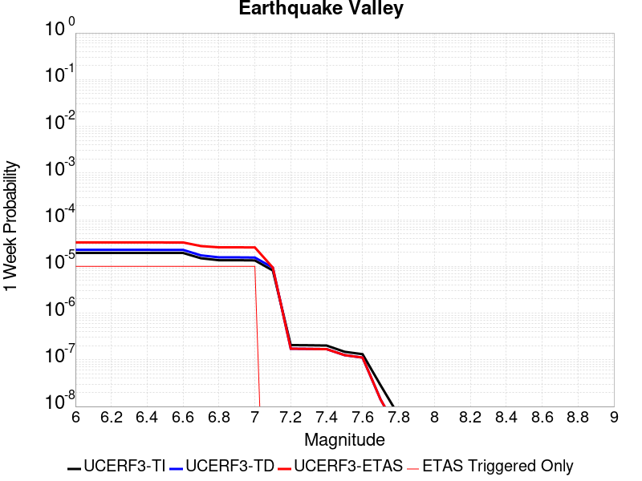 |  |  |  |

| Magnitude | 1 wk TI Prob | 1 wk TD Prob | 1 wk ETAS Prob | 1 wk ETAS/TD Gain | 1 wk ETAS Triggered Only | 1 mo TI Prob | 1 mo TD Prob | 1 mo ETAS Prob | 1 mo ETAS/TD Gain | 1 mo ETAS Triggered Only | 1 yr TI Prob | 1 yr TD Prob | 1 yr ETAS Prob | 1 yr ETAS/TD Gain | 1 yr ETAS Triggered Only | 10 yr TI Prob | 10 yr TD Prob | 10 yr ETAS Prob | 10 yr ETAS/TD Gain | 10 yr ETAS Triggered Only |
|-----|-----|-----|-----|-----|-----|-----|-----|-----|-----|-----|-----|-----|-----|-----|-----|-----|-----|-----|-----|-----|
| 6.0 | 1.9416384E-5 | 2.2603754E-5 | 2.2603754E-5 | 1.0 | 0.0 | 8.321042E-5 | 9.687031E-5 | 9.687031E-5 | 1.0 | 0.0 | 0.001012616 | 0.0011788778 | 0.0011788778 | 1.0 | 0.0 | 0.010080142 | 0.011738093 | 0.011758639 | 1.0017503 | 2.0790021E-5 |
| 6.1 | 1.9416384E-5 | 2.2603754E-5 | 2.2603754E-5 | 1.0 | 0.0 | 8.321042E-5 | 9.687031E-5 | 9.687031E-5 | 1.0 | 0.0 | 0.001012616 | 0.0011788778 | 0.0011788778 | 1.0 | 0.0 | 0.010080142 | 0.011738093 | 0.011758639 | 1.0017503 | 2.0790021E-5 |
| 6.2 | 1.9416384E-5 | 2.2603754E-5 | 2.2603754E-5 | 1.0 | 0.0 | 8.321042E-5 | 9.687031E-5 | 9.687031E-5 | 1.0 | 0.0 | 0.001012616 | 0.0011788778 | 0.0011788778 | 1.0 | 0.0 | 0.010080142 | 0.011738093 | 0.011758639 | 1.0017503 | 2.0790021E-5 |
| 6.3 | 1.9416384E-5 | 2.2603754E-5 | 2.2603754E-5 | 1.0 | 0.0 | 8.321042E-5 | 9.687031E-5 | 9.687031E-5 | 1.0 | 0.0 | 0.001012616 | 0.0011788778 | 0.0011788778 | 1.0 | 0.0 | 0.010080142 | 0.011738093 | 0.011758639 | 1.0017503 | 2.0790021E-5 |
| 6.4 | 1.9416384E-5 | 2.2603754E-5 | 2.2603754E-5 | 1.0 | 0.0 | 8.321042E-5 | 9.687031E-5 | 9.687031E-5 | 1.0 | 0.0 | 0.001012616 | 0.0011788778 | 0.0011788778 | 1.0 | 0.0 | 0.010080142 | 0.011738093 | 0.011758639 | 1.0017503 | 2.0790021E-5 |
| 6.5 | 1.9389157E-5 | 2.2572318E-5 | 2.2572318E-5 | 1.0 | 0.0 | 8.309374E-5 | 9.6735595E-5 | 9.6735595E-5 | 1.0 | 0.0 | 0.0010111968 | 0.0011772393 | 0.0011772393 | 1.0 | 0.0 | 0.010066078 | 0.011721881 | 0.011742428 | 1.0017529 | 2.0790021E-5 |
| 6.6 | 1.9389157E-5 | 2.2572318E-5 | 2.2572318E-5 | 1.0 | 0.0 | 8.309374E-5 | 9.6735595E-5 | 9.6735595E-5 | 1.0 | 0.0 | 0.0010111968 | 0.0011772393 | 0.0011772393 | 1.0 | 0.0 | 0.010066078 | 0.011721881 | 0.011742428 | 1.0017529 | 2.0790021E-5 |
| 6.7 | 1.4925434E-5 | 1.7222386E-5 | 1.7222386E-5 | 1.0 | 0.0 | 6.396457E-5 | 7.380862E-5 | 7.380862E-5 | 1.0 | 0.0 | 7.7849044E-4 | 8.9833466E-4 | 8.9833466E-4 | 1.0 | 0.0 | 0.007757689 | 0.008955422 | 0.0089760255 | 1.0023007 | 2.0790021E-5 |
| 6.8 | 1.3570335E-5 | 1.5629566E-5 | 1.5629566E-5 | 1.0 | 0.0 | 5.8157282E-5 | 6.69826E-5 | 6.69826E-5 | 1.0 | 0.0 | 7.0783484E-4 | 8.152902E-4 | 8.152902E-4 | 1.0 | 0.0 | 0.0070558446 | 0.008131076 | 0.008151696 | 1.002536 | 2.0790021E-5 |
| 6.9 | 1.3570335E-5 | 1.5629566E-5 | 1.5629566E-5 | 1.0 | 0.0 | 5.8157282E-5 | 6.69826E-5 | 6.69826E-5 | 1.0 | 0.0 | 7.0783484E-4 | 8.152902E-4 | 8.152902E-4 | 1.0 | 0.0 | 0.0070558446 | 0.008131076 | 0.008151696 | 1.002536 | 2.0790021E-5 |
| 7.0 | 1.3433392E-5 | 1.5472993E-5 | 1.5472993E-5 | 1.0 | 0.0 | 5.757041E-5 | 6.631161E-5 | 6.631161E-5 | 1.0 | 0.0 | 7.0069433E-4 | 8.07127E-4 | 8.07127E-4 | 1.0 | 0.0 | 0.006984891 | 0.008050037 | 0.008070659 | 1.0025618 | 2.0790021E-5 |
| 7.1 | 8.181609E-6 | 9.424742E-6 | 9.424742E-6 | 1.0 | 0.0 | 3.5063567E-5 | 4.0391504E-5 | 4.0391504E-5 | 1.0 | 0.0 | 4.268153E-4 | 4.917228E-4 | 4.917228E-4 | 1.0 | 0.0 | 0.0042599645 | 0.0049129347 | 0.0049129347 | 1.0 | 0.0 |
| 7.2 | 2.0663983E-7 | 1.7290735E-7 | 1.7290735E-7 | 1.0 | 0.0 | 8.855989E-7 | 7.410313E-7 | 7.410313E-7 | 1.0 | 0.0 | 1.0782113E-5 | 9.022022E-6 | 9.022022E-6 | 1.0 | 0.0 | 1.07815904E-4 | 9.021692E-5 | 9.021692E-5 | 1.0 | 0.0 |
| 7.3 | 2.0462376E-7 | 1.7106106E-7 | 1.7106106E-7 | 1.0 | 0.0 | 8.7695867E-7 | 7.3311867E-7 | 7.3311867E-7 | 1.0 | 0.0 | 1.0676919E-5 | 8.925687E-6 | 8.925687E-6 | 1.0 | 0.0 | 1.0676406E-4 | 8.925364E-5 | 8.925364E-5 | 1.0 | 0.0 |
| 7.4 | 2.0171088E-7 | 1.6888337E-7 | 1.6888337E-7 | 1.0 | 0.0 | 8.644749E-7 | 7.237857E-7 | 7.237857E-7 | 1.0 | 0.0 | 1.0524931E-5 | 8.812059E-6 | 8.812059E-6 | 1.0 | 0.0 | 1.05244326E-4 | 8.811746E-5 | 8.811746E-5 | 1.0 | 0.0 |
| 7.5 | 1.4847944E-7 | 1.2582723E-7 | 1.2582723E-7 | 1.0 | 0.0 | 6.363403E-7 | 5.392595E-7 | 5.392595E-7 | 1.0 | 0.0 | 7.747416E-6 | 6.5654663E-6 | 6.5654663E-6 | 1.0 | 0.0 | 7.747146E-5 | 6.5652945E-5 | 6.5652945E-5 | 1.0 | 0.0 |
| 7.6 | 1.3185847E-7 | 1.1145084E-7 | 1.1145084E-7 | 1.0 | 0.0 | 5.6510765E-7 | 4.776464E-7 | 4.776464E-7 | 1.0 | 0.0 | 6.8801637E-6 | 5.815331E-6 | 5.815331E-6 | 1.0 | 0.0 | 6.8799505E-5 | 5.8152003E-5 | 5.8152003E-5 | 1.0 | 0.0 |
| 7.7 | 2.8609954E-8 | 1.419746E-8 | 1.419746E-8 | 1.0 | 0.0 | 1.2261408E-7 | 6.0846254E-8 | 6.0846254E-8 | 1.0 | 0.0 | 1.4928254E-6 | 7.4080293E-7 | 7.4080293E-7 | 1.0 | 0.0 | 1.4928154E-5 | 7.4080103E-6 | 7.4080103E-6 | 1.0 | 0.0 |
| 7.8 | 6.527266E-9 | 2.928577E-9 | 2.928577E-9 | 1.0 | 0.0 | 2.7973995E-8 | 1.2551044E-8 | 1.2551044E-8 | 1.0 | 0.0 | 3.4058334E-7 | 1.5280895E-7 | 1.5280895E-7 | 1.0 | 0.0 | 3.4058282E-6 | 1.5280887E-6 | 1.5280887E-6 | 1.0 | 0.0 |
| 7.9 | 1.2898267E-9 | 7.136971E-10 | 7.136971E-10 | 1.0 | 0.0 | 5.527829E-9 | 3.058702E-9 | 3.058702E-9 | 1.0 | 0.0 | 6.7301315E-8 | 3.7239698E-8 | 3.7239698E-8 | 1.0 | 0.0 | 6.7301295E-7 | 3.7239695E-7 | 3.7239695E-7 | 1.0 | 0.0 |

## Elsinore (Coyote Mountains)
*[(top)](#table-of-contents)*

| 1 Week | 1 Month | 1 Year | 10 Year |
|-----|-----|-----|-----|
|  |  |  |  |

| Magnitude | 1 wk TI Prob | 1 wk TD Prob | 1 wk ETAS Prob | 1 wk ETAS/TD Gain | 1 wk ETAS Triggered Only | 1 mo TI Prob | 1 mo TD Prob | 1 mo ETAS Prob | 1 mo ETAS/TD Gain | 1 mo ETAS Triggered Only | 1 yr TI Prob | 1 yr TD Prob | 1 yr ETAS Prob | 1 yr ETAS/TD Gain | 1 yr ETAS Triggered Only | 10 yr TI Prob | 10 yr TD Prob | 10 yr ETAS Prob | 10 yr ETAS/TD Gain | 10 yr ETAS Triggered Only |
|-----|-----|-----|-----|-----|-----|-----|-----|-----|-----|-----|-----|-----|-----|-----|-----|-----|-----|-----|-----|-----|
| 6.0 | 4.20513E-5 | 4.86968E-5 | 4.86968E-5 | 1.0 | 0.0 | 1.8020741E-4 | 2.0868712E-4 | 2.0868712E-4 | 1.0 | 0.0 | 0.0021918174 | 0.0025383183 | 0.0025383183 | 1.0 | 0.0 | 0.021703249 | 0.025144503 | 0.02516477 | 1.000806 | 2.0790021E-5 |
| 6.1 | 4.20513E-5 | 4.86968E-5 | 4.86968E-5 | 1.0 | 0.0 | 1.8020741E-4 | 2.0868712E-4 | 2.0868712E-4 | 1.0 | 0.0 | 0.0021918174 | 0.0025383183 | 0.0025383183 | 1.0 | 0.0 | 0.021703249 | 0.025144503 | 0.02516477 | 1.000806 | 2.0790021E-5 |
| 6.2 | 2.3413893E-5 | 2.47266E-5 | 2.47266E-5 | 1.0 | 0.0 | 1.0034139E-4 | 1.05967374E-4 | 1.05967374E-4 | 1.0 | 0.0 | 0.0012209718 | 0.0012894757 | 0.0012894757 | 1.0 | 0.0 | 0.012142851 | 0.012828605 | 0.012849129 | 1.0015998 | 2.0790021E-5 |
| 6.3 | 2.3413893E-5 | 2.47266E-5 | 2.47266E-5 | 1.0 | 0.0 | 1.0034139E-4 | 1.05967374E-4 | 1.05967374E-4 | 1.0 | 0.0 | 0.0012209718 | 0.0012894757 | 0.0012894757 | 1.0 | 0.0 | 0.012142851 | 0.012828605 | 0.012849129 | 1.0015998 | 2.0790021E-5 |
| 6.4 | 1.6894814E-5 | 1.658908E-5 | 1.658908E-5 | 1.0 | 0.0 | 7.240433E-5 | 7.109433E-5 | 7.109433E-5 | 1.0 | 0.0 | 8.811662E-4 | 8.6526637E-4 | 8.6526637E-4 | 1.0 | 0.0 | 0.0087768035 | 0.008622632 | 0.008622632 | 1.0 | 0.0 |
| 6.5 | 1.6894814E-5 | 1.658908E-5 | 1.658908E-5 | 1.0 | 0.0 | 7.240433E-5 | 7.109433E-5 | 7.109433E-5 | 1.0 | 0.0 | 8.811662E-4 | 8.6526637E-4 | 8.6526637E-4 | 1.0 | 0.0 | 0.0087768035 | 0.008622632 | 0.008622632 | 1.0 | 0.0 |
| 6.6 | 1.1910969E-5 | 1.0544801E-5 | 1.0544801E-5 | 1.0 | 0.0 | 5.1046012E-5 | 4.519129E-5 | 4.519129E-5 | 1.0 | 0.0 | 6.21308E-4 | 5.500782E-4 | 5.500782E-4 | 1.0 | 0.0 | 0.0061957375 | 0.0054884683 | 0.0054884683 | 1.0 | 0.0 |
| 6.7 | 9.1486E-6 | 7.213386E-6 | 7.213386E-6 | 1.0 | 0.0 | 3.9207694E-5 | 3.0914165E-5 | 3.0914165E-5 | 1.0 | 0.0 | 4.7724912E-4 | 3.763188E-4 | 3.763188E-4 | 1.0 | 0.0 | 0.0047622547 | 0.0037571958 | 0.0037571958 | 1.0 | 0.0 |
| 6.8 | 7.90441E-6 | 5.7381435E-6 | 5.7381435E-6 | 1.0 | 0.0 | 3.3875604E-5 | 2.459182E-5 | 2.459182E-5 | 1.0 | 0.0 | 4.1235742E-4 | 2.9936555E-4 | 2.9936555E-4 | 1.0 | 0.0 | 0.0041159308 | 0.0029897518 | 0.0029897518 | 1.0 | 0.0 |
| 6.9 | 7.77015E-6 | 5.5920314E-6 | 5.5920314E-6 | 1.0 | 0.0 | 3.3300217E-5 | 2.3965637E-5 | 2.3965637E-5 | 1.0 | 0.0 | 4.0535472E-4 | 2.9174384E-4 | 2.9174384E-4 | 1.0 | 0.0 | 0.004046161 | 0.0029137358 | 0.0029137358 | 1.0 | 0.0 |
| 7.0 | 7.675798E-6 | 5.4888405E-6 | 5.4888405E-6 | 1.0 | 0.0 | 3.289586E-5 | 2.3523397E-5 | 2.3523397E-5 | 1.0 | 0.0 | 4.004335E-4 | 2.8636097E-4 | 2.8636097E-4 | 1.0 | 0.0 | 0.003997127 | 0.0028600467 | 0.0028600467 | 1.0 | 0.0 |
| 7.1 | 7.447814E-6 | 5.247635E-6 | 5.247635E-6 | 1.0 | 0.0 | 3.191881E-5 | 2.2489678E-5 | 2.2489678E-5 | 1.0 | 0.0 | 3.8854225E-4 | 2.7377866E-4 | 2.7377866E-4 | 1.0 | 0.0 | 0.003878636 | 0.0027345386 | 0.0027345386 | 1.0 | 0.0 |
| 7.2 | 7.128185E-6 | 4.914247E-6 | 4.914247E-6 | 1.0 | 0.0 | 3.0549007E-5 | 2.1060896E-5 | 2.1060896E-5 | 1.0 | 0.0 | 3.7187067E-4 | 2.5638743E-4 | 2.5638743E-4 | 1.0 | 0.0 | 0.00371249 | 0.002561035 | 0.002561035 | 1.0 | 0.0 |
| 7.3 | 7.0913875E-6 | 4.8829074E-6 | 4.8829074E-6 | 1.0 | 0.0 | 3.0391306E-5 | 2.0926585E-5 | 2.0926585E-5 | 1.0 | 0.0 | 3.6995133E-4 | 2.5475258E-4 | 2.5475258E-4 | 1.0 | 0.0 | 0.0036933604 | 0.0025447241 | 0.0025447241 | 1.0 | 0.0 |
| 7.4 | 7.051521E-6 | 4.846747E-6 | 4.846747E-6 | 1.0 | 0.0 | 3.0220453E-5 | 2.0771615E-5 | 2.0771615E-5 | 1.0 | 0.0 | 3.6787192E-4 | 2.5286624E-4 | 2.5286624E-4 | 1.0 | 0.0 | 0.0036726352 | 0.002525904 | 0.002525904 | 1.0 | 0.0 |
| 7.5 | 6.910666E-6 | 4.742132E-6 | 4.742132E-6 | 1.0 | 0.0 | 2.9616802E-5 | 2.0323272E-5 | 2.0323272E-5 | 1.0 | 0.0 | 3.605249E-4 | 2.4740893E-4 | 2.4740893E-4 | 1.0 | 0.0 | 0.0035994058 | 0.0024714533 | 0.0024714533 | 1.0 | 0.0 |
| 7.6 | 6.341753E-6 | 4.3148316E-6 | 4.3148316E-6 | 1.0 | 0.0 | 2.7178658E-5 | 1.8492012E-5 | 1.8492012E-5 | 1.0 | 0.0 | 3.3084993E-4 | 2.2511814E-4 | 2.2511814E-4 | 1.0 | 0.0 | 0.0033035777 | 0.0022490167 | 0.0022490167 | 1.0 | 0.0 |
| 7.7 | 3.9205916E-6 | 2.2489335E-6 | 2.2489335E-6 | 1.0 | 0.0 | 1.6802427E-5 | 9.638255E-6 | 9.638255E-6 | 1.0 | 0.0 | 2.0455034E-4 | 1.17340176E-4 | 1.17340176E-4 | 1.0 | 0.0 | 0.0020436216 | 0.0011728555 | 0.0011728555 | 1.0 | 0.0 |
| 7.8 | 2.0846227E-7 | 8.5023146E-8 | 8.5023146E-8 | 1.0 | 0.0 | 8.9340944E-7 | 3.6438487E-7 | 3.6438487E-7 | 1.0 | 0.0 | 1.0877206E-5 | 4.43638E-6 | 4.43638E-6 | 1.0 | 0.0 | 1.0876673E-4 | 4.4363245E-5 | 4.4363245E-5 | 1.0 | 0.0 |
| 7.9 | 4.4969806E-9 | 2.272358E-9 | 2.272358E-9 | 1.0 | 0.0 | 1.9272775E-8 | 9.7386765E-9 | 9.7386765E-9 | 1.0 | 0.0 | 2.3464601E-7 | 1.1856839E-7 | 1.1856839E-7 | 1.0 | 0.0 | 2.3464577E-6 | 1.1856833E-6 | 1.1856833E-6 | 1.0 | 0.0 |

## San Andreas (Santa Cruz Mts) 2011 CFM
*[(top)](#table-of-contents)*

| 1 Week | 1 Month | 1 Year | 10 Year |
|-----|-----|-----|-----|
|  |  |  |  |

| Magnitude | 1 wk TI Prob | 1 wk TD Prob | 1 wk ETAS Prob | 1 wk ETAS/TD Gain | 1 wk ETAS Triggered Only | 1 mo TI Prob | 1 mo TD Prob | 1 mo ETAS Prob | 1 mo ETAS/TD Gain | 1 mo ETAS Triggered Only | 1 yr TI Prob | 1 yr TD Prob | 1 yr ETAS Prob | 1 yr ETAS/TD Gain | 1 yr ETAS Triggered Only | 10 yr TI Prob | 10 yr TD Prob | 10 yr ETAS Prob | 10 yr ETAS/TD Gain | 10 yr ETAS Triggered Only |
|-----|-----|-----|-----|-----|-----|-----|-----|-----|-----|-----|-----|-----|-----|-----|-----|-----|-----|-----|-----|-----|
| 6.0 | 1.7221631E-4 | 1.4025059E-4 | 1.610377E-4 | 1.148214 | 2.0790021E-5 | 7.378611E-4 | 6.009376E-4 | 6.217151E-4 | 1.0345752 | 2.0790021E-5 | 0.008946515 | 0.0072922586 | 0.007312897 | 1.0028301 | 2.0790021E-5 | 0.08594794 | 0.07167054 | 0.071689844 | 1.0002693 | 2.0790021E-5 |
| 6.1 | 1.7221631E-4 | 1.4025059E-4 | 1.610377E-4 | 1.148214 | 2.0790021E-5 | 7.378611E-4 | 6.009376E-4 | 6.217151E-4 | 1.0345752 | 2.0790021E-5 | 0.008946515 | 0.0072922586 | 0.007312897 | 1.0028301 | 2.0790021E-5 | 0.08594794 | 0.07167054 | 0.071689844 | 1.0002693 | 2.0790021E-5 |
| 6.2 | 1.7221631E-4 | 1.4025059E-4 | 1.610377E-4 | 1.148214 | 2.0790021E-5 | 7.378611E-4 | 6.009376E-4 | 6.217151E-4 | 1.0345752 | 2.0790021E-5 | 0.008946515 | 0.0072922586 | 0.007312897 | 1.0028301 | 2.0790021E-5 | 0.08594794 | 0.07167054 | 0.071689844 | 1.0002693 | 2.0790021E-5 |
| 6.3 | 1.716926E-4 | 1.3943961E-4 | 1.6022673E-4 | 1.1490761 | 2.0790021E-5 | 7.3561794E-4 | 5.974636E-4 | 6.1824115E-4 | 1.0347763 | 2.0790021E-5 | 0.008919428 | 0.0072502443 | 0.0072708833 | 1.0028467 | 2.0790021E-5 | 0.08569809 | 0.071280695 | 0.0713 | 1.0002708 | 2.0790021E-5 |
| 6.4 | 1.6392978E-4 | 1.3814664E-4 | 1.5893379E-4 | 1.1504716 | 2.0790021E-5 | 7.02367E-4 | 5.9192476E-4 | 6.127025E-4 | 1.035102 | 2.0790021E-5 | 0.008517839 | 0.0071832547 | 0.007203895 | 1.0028734 | 2.0790021E-5 | 0.08198654 | 0.07048169 | 0.070501015 | 1.0002742 | 2.0790021E-5 |
| 6.5 | 1.5742714E-4 | 1.2866968E-4 | 1.4945703E-4 | 1.1615559 | 2.0790021E-5 | 6.745133E-4 | 5.513267E-4 | 5.721053E-4 | 1.0376883 | 2.0790021E-5 | 0.00818132 | 0.0066920654 | 0.006712716 | 1.0030859 | 2.0790021E-5 | 0.078865945 | 0.065920696 | 0.06594011 | 1.0002946 | 2.0790021E-5 |
| 6.6 | 1.3038084E-4 | 1.1787747E-4 | 1.3866504E-4 | 1.1763489 | 2.0790021E-5 | 5.5865536E-4 | 5.0509267E-4 | 5.2587216E-4 | 1.04114 | 2.0790021E-5 | 0.006780438 | 0.006132401 | 0.006153064 | 1.0033695 | 2.0790021E-5 | 0.0657725 | 0.060263954 | 0.060283493 | 1.0003242 | 2.0790021E-5 |
| 6.7 | 1.2867592E-4 | 1.1512854E-4 | 1.3591617E-4 | 1.1805601 | 2.0790021E-5 | 5.5135164E-4 | 4.9331604E-4 | 5.140958E-4 | 1.0421226 | 2.0790021E-5 | 0.0066920654 | 0.0059898165 | 0.006010482 | 1.0034502 | 2.0790021E-5 | 0.06494093 | 0.058969937 | 0.058989502 | 1.0003318 | 2.0790021E-5 |
| 6.8 | 1.2801298E-4 | 1.1450069E-4 | 1.3528833E-4 | 1.1815504 | 2.0790021E-5 | 5.485117E-4 | 4.9062626E-4 | 5.1140605E-4 | 1.0423536 | 2.0790021E-5 | 0.0066577005 | 0.0059572584 | 0.0059779244 | 1.0034691 | 2.0790021E-5 | 0.06461738 | 0.058682535 | 0.058702104 | 1.0003335 | 2.0790021E-5 |
| 6.9 | 1.269149E-4 | 1.1291407E-4 | 1.3370175E-4 | 1.1841017 | 2.0790021E-5 | 5.4380763E-4 | 4.83829E-4 | 5.0460896E-4 | 1.042949 | 2.0790021E-5 | 0.006600777 | 0.005874951 | 0.005895619 | 1.003518 | 2.0790021E-5 | 0.06408122 | 0.057951514 | 0.057971098 | 1.000338 | 2.0790021E-5 |
| 7.0 | 1.2030331E-4 | 1.1018017E-4 | 1.3096789E-4 | 1.1886704 | 2.0790021E-5 | 5.154837E-4 | 4.7211658E-4 | 4.9289677E-4 | 1.0440149 | 2.0790021E-5 | 0.006257969 | 0.005733111 | 0.0057537816 | 1.0036055 | 2.0790021E-5 | 0.06084648 | 0.056605607 | 0.05662522 | 1.0003465 | 2.0790021E-5 |
| 7.1 | 8.049617E-5 | 5.538574E-5 | 7.6174605E-5 | 1.375347 | 2.0790021E-5 | 3.4493793E-4 | 2.3734606E-4 | 2.5813113E-4 | 1.0875729 | 2.0790021E-5 | 0.0041915346 | 0.0028858953 | 0.0029066254 | 1.0071832 | 2.0790021E-5 | 0.041133516 | 0.030344456 | 0.030364616 | 1.0006644 | 2.0790021E-5 |
| 7.2 | 7.093979E-5 | 4.4221182E-5 | 6.501028E-5 | 1.4701164 | 2.0790021E-5 | 3.0399222E-4 | 1.895057E-4 | 2.102918E-4 | 1.1096858 | 2.0790021E-5 | 0.0036948253 | 0.0023048148 | 0.0023255567 | 1.0089995 | 2.0790021E-5 | 0.03633994 | 0.024588754 | 0.024609033 | 1.0008247 | 2.0790021E-5 |
| 7.3 | 6.193693E-5 | 2.9864168E-5 | 5.065357E-5 | 1.696132 | 2.0790021E-5 | 2.6541698E-4 | 1.2798302E-4 | 1.4877038E-4 | 1.1624228 | 2.0790021E-5 | 0.0032266637 | 0.0015570815 | 0.001577839 | 1.0133312 | 2.0790021E-5 | 0.031802133 | 0.017008903 | 0.01702934 | 1.0012015 | 2.0790021E-5 |
| 7.4 | 5.906492E-5 | 2.7939626E-5 | 4.8729067E-5 | 1.7440844 | 2.0790021E-5 | 2.5311083E-4 | 1.1973577E-4 | 1.405233E-4 | 1.1736118 | 2.0790021E-5 | 0.0030772698 | 0.0014568097 | 0.0014775695 | 1.0142502 | 2.0790021E-5 | 0.030350044 | 0.015955238 | 0.015975695 | 1.0012822 | 2.0790021E-5 |
| 7.5 | 5.424296E-5 | 2.5520172E-5 | 4.6309662E-5 | 1.8146297 | 2.0790021E-5 | 2.324491E-4 | 1.0936759E-4 | 1.3015533E-4 | 1.1900723 | 2.0790021E-5 | 0.002826395 | 0.0013307383 | 0.0013515006 | 1.0156021 | 2.0790021E-5 | 0.027907165 | 0.014610685 | 0.014631172 | 1.0014021 | 2.0790021E-5 |
| 7.6 | 4.43084E-5 | 2.0571671E-5 | 4.1361265E-5 | 2.0105934 | 2.0790021E-5 | 1.8987931E-4 | 8.816132E-5 | 1.0894951E-4 | 1.2357972 | 2.0790021E-5 | 0.0023093296 | 0.0010728359 | 0.0010936036 | 1.0193578 | 2.0790021E-5 | 0.022854783 | 0.011769547 | 0.011790093 | 1.0017456 | 2.0790021E-5 |
| 7.7 | 4.118098E-5 | 1.9574463E-5 | 4.0364077E-5 | 2.0620782 | 2.0790021E-5 | 1.7647797E-4 | 8.388786E-5 | 1.0467614E-4 | 1.2478104 | 2.0790021E-5 | 0.002146502 | 0.0010208564 | 0.0010416252 | 1.0203445 | 2.0790021E-5 | 0.021258866 | 0.011211814 | 0.011232371 | 1.0018336 | 2.0790021E-5 |
| 7.8 | 3.5408906E-5 | 1.9186084E-5 | 3.9975705E-5 | 2.0835783 | 2.0790021E-5 | 1.5174363E-4 | 8.222348E-5 | 1.0301179E-4 | 1.2528269 | 2.0790021E-5 | 0.0018459131 | 0.0010006113 | 0.0010213805 | 1.0207565 | 2.0790021E-5 | 0.018306552 | 0.010983693 | 0.011004255 | 1.0018721 | 2.0790021E-5 |
| 7.9 | 2.5860836E-5 | 1.788097E-5 | 3.867062E-5 | 2.162669 | 2.0790021E-5 | 1.10827445E-4 | 7.663048E-5 | 9.74189E-5 | 1.2712815 | 2.0790021E-5 | 0.001348489 | 9.32577E-4 | 9.533476E-4 | 1.0222723 | 2.0790021E-5 | 0.013403354 | 0.010206873 | 0.01022745 | 1.0020161 | 2.0790021E-5 |
| 8.0 | 1.9777332E-5 | 1.5322148E-5 | 3.611185E-5 | 2.35684 | 2.0790021E-5 | 8.4757245E-5 | 6.5664695E-5 | 8.645335E-5 | 1.316588 | 2.0790021E-5 | 0.0010314309 | 7.991746E-4 | 8.1994804E-4 | 1.0259936 | 2.0790021E-5 | 0.010266567 | 0.00876486 | 0.0087854685 | 1.0023512 | 2.0790021E-5 |
| 8.1 | 1.468494E-5 | 1.2502896E-5 | 3.3292657E-5 | 2.6627955 | 2.0790021E-5 | 6.293394E-5 | 5.3582742E-5 | 7.4371645E-5 | 1.3879777 | 2.0790021E-5 | 7.6595135E-4 | 6.521748E-4 | 6.729513E-4 | 1.0318573 | 2.0790021E-5 | 0.0076331664 | 0.007179751 | 0.007200392 | 1.0028749 | 2.0790021E-5 |
| 8.2 | 8.63836E-6 | 5.674352E-6 | 5.674352E-6 | 1.0 | 0.0 | 3.7021015E-5 | 2.4318424E-5 | 2.4318424E-5 | 1.0 | 0.0 | 4.5063766E-4 | 2.9603668E-4 | 2.9603668E-4 | 1.0 | 0.0 | 0.004497249 | 0.003357947 | 0.003357947 | 1.0 | 0.0 |
| 8.3 | 1.983087E-6 | 8.001618E-7 | 8.001618E-7 | 1.0 | 0.0 | 8.498917E-6 | 3.4292605E-6 | 3.4292605E-6 | 1.0 | 0.0 | 1.034694E-4 | 4.1750463E-5 | 4.1750463E-5 | 1.0 | 0.0 | 0.0010342124 | 4.915874E-4 | 4.915874E-4 | 1.0 | 0.0 |

## San Andreas (Peninsula) 2011 CFM
*[(top)](#table-of-contents)*

| 1 Week | 1 Month | 1 Year | 10 Year |
|-----|-----|-----|-----|
|  |  |  |  |

| Magnitude | 1 wk TI Prob | 1 wk TD Prob | 1 wk ETAS Prob | 1 wk ETAS/TD Gain | 1 wk ETAS Triggered Only | 1 mo TI Prob | 1 mo TD Prob | 1 mo ETAS Prob | 1 mo ETAS/TD Gain | 1 mo ETAS Triggered Only | 1 yr TI Prob | 1 yr TD Prob | 1 yr ETAS Prob | 1 yr ETAS/TD Gain | 1 yr ETAS Triggered Only | 10 yr TI Prob | 10 yr TD Prob | 10 yr ETAS Prob | 10 yr ETAS/TD Gain | 10 yr ETAS Triggered Only |
|-----|-----|-----|-----|-----|-----|-----|-----|-----|-----|-----|-----|-----|-----|-----|-----|-----|-----|-----|-----|-----|
| 6.0 | 8.6200685E-5 | 2.6140377E-5 | 4.6929854E-5 | 1.7953014 | 2.0790021E-5 | 3.6937918E-4 | 1.1202538E-4 | 1.3281307E-4 | 1.1855624 | 2.0790021E-5 | 0.0044879215 | 0.0013630574 | 0.0013838192 | 1.0152317 | 2.0790021E-5 | 0.043983612 | 0.015279642 | 0.015300115 | 1.0013398 | 2.0790021E-5 |
| 6.1 | 8.6200685E-5 | 2.6140377E-5 | 4.6929854E-5 | 1.7953014 | 2.0790021E-5 | 3.6937918E-4 | 1.1202538E-4 | 1.3281307E-4 | 1.1855624 | 2.0790021E-5 | 0.0044879215 | 0.0013630574 | 0.0013838192 | 1.0152317 | 2.0790021E-5 | 0.043983612 | 0.015279642 | 0.015300115 | 1.0013398 | 2.0790021E-5 |
| 6.2 | 8.6200685E-5 | 2.6140377E-5 | 4.6929854E-5 | 1.7953014 | 2.0790021E-5 | 3.6937918E-4 | 1.1202538E-4 | 1.3281307E-4 | 1.1855624 | 2.0790021E-5 | 0.0044879215 | 0.0013630574 | 0.0013838192 | 1.0152317 | 2.0790021E-5 | 0.043983612 | 0.015279642 | 0.015300115 | 1.0013398 | 2.0790021E-5 |
| 6.3 | 8.551163E-5 | 2.582592E-5 | 4.6615405E-5 | 1.8049852 | 2.0790021E-5 | 3.6642692E-4 | 1.1067783E-4 | 1.3146555E-4 | 1.1878219 | 2.0790021E-5 | 0.004452125 | 0.0013466714 | 0.0013674333 | 1.0154173 | 2.0790021E-5 | 0.043639794 | 0.015102992 | 0.015123468 | 1.0013558 | 2.0790021E-5 |
| 6.4 | 8.551163E-5 | 2.582592E-5 | 4.6615405E-5 | 1.8049852 | 2.0790021E-5 | 3.6642692E-4 | 1.1067783E-4 | 1.3146555E-4 | 1.1878219 | 2.0790021E-5 | 0.004452125 | 0.0013466714 | 0.0013674333 | 1.0154173 | 2.0790021E-5 | 0.043639794 | 0.015102992 | 0.015123468 | 1.0013558 | 2.0790021E-5 |
| 6.5 | 8.511146E-5 | 2.5643623E-5 | 4.6433113E-5 | 1.8107078 | 2.0790021E-5 | 3.647124E-4 | 1.09896624E-4 | 1.3068436E-4 | 1.1891571 | 2.0790021E-5 | 0.004431336 | 0.0013371719 | 0.0013579341 | 1.015527 | 2.0790021E-5 | 0.04344007 | 0.015000985 | 0.015021463 | 1.0013651 | 2.0790021E-5 |
| 6.6 | 8.4985084E-5 | 2.5573196E-5 | 4.6362686E-5 | 1.8129406 | 2.0790021E-5 | 3.6417096E-4 | 1.0959481E-4 | 1.3038256E-4 | 1.1896782 | 2.0790021E-5 | 0.0044247704 | 0.0013335019 | 0.0013542642 | 1.0155698 | 2.0790021E-5 | 0.043376986 | 0.014962403 | 0.014982882 | 1.0013686 | 2.0790021E-5 |
| 6.7 | 8.462618E-5 | 2.5398518E-5 | 4.618801E-5 | 1.8185318 | 2.0790021E-5 | 3.6263323E-4 | 1.0884626E-4 | 1.2963402E-4 | 1.1909827 | 2.0790021E-5 | 0.004406125 | 0.0013243994 | 0.0013451618 | 1.0156769 | 2.0790021E-5 | 0.043197807 | 0.014865392 | 0.0148858735 | 1.0013778 | 2.0790021E-5 |
| 6.8 | 8.42337E-5 | 2.5291727E-5 | 4.6081223E-5 | 1.821988 | 2.0790021E-5 | 3.6095164E-4 | 1.0838862E-4 | 1.2917639E-4 | 1.1917892 | 2.0790021E-5 | 0.004385734 | 0.0013188344 | 0.0013395969 | 1.0157431 | 2.0790021E-5 | 0.043001823 | 0.01480478 | 0.014825261 | 1.0013835 | 2.0790021E-5 |
| 6.9 | 8.365989E-5 | 2.5092304E-5 | 4.5881803E-5 | 1.8285209 | 2.0790021E-5 | 3.5849313E-4 | 1.07534026E-4 | 1.283218E-4 | 1.1933136 | 2.0790021E-5 | 0.004355922 | 0.0013084421 | 0.001329205 | 1.0158683 | 2.0790021E-5 | 0.04271523 | 0.014695167 | 0.014715651 | 1.0013939 | 2.0790021E-5 |
| 7.0 | 8.30936E-5 | 2.485017E-5 | 4.5639674E-5 | 1.8365941 | 2.0790021E-5 | 3.560668E-4 | 1.0649639E-4 | 1.2728419E-4 | 1.1951973 | 2.0790021E-5 | 0.004326499 | 0.0012958241 | 0.0013165871 | 1.016023 | 2.0790021E-5 | 0.042432297 | 0.0145642925 | 0.01458478 | 1.0014067 | 2.0790021E-5 |
| 7.1 | 8.041264E-5 | 2.4528608E-5 | 4.531812E-5 | 1.8475617 | 2.0790021E-5 | 3.4458007E-4 | 1.0511838E-4 | 1.2590621E-4 | 1.1977564 | 2.0790021E-5 | 0.0041871946 | 0.0012790667 | 0.00129983 | 1.0162333 | 2.0790021E-5 | 0.041091725 | 0.014382651 | 0.014403142 | 1.0014247 | 2.0790021E-5 |
| 7.2 | 7.8427016E-5 | 2.3942212E-5 | 4.4731732E-5 | 1.868321 | 2.0790021E-5 | 3.3607247E-4 | 1.02605445E-4 | 1.2339333E-4 | 1.2026002 | 2.0790021E-5 | 0.004084008 | 0.0012485072 | 0.0012692712 | 1.0166311 | 2.0790021E-5 | 0.040097635 | 0.014061596 | 0.014082094 | 1.0014577 | 2.0790021E-5 |
| 7.3 | 7.721087E-5 | 2.37235E-5 | 4.4513028E-5 | 1.8763263 | 2.0790021E-5 | 3.3086175E-4 | 1.01668185E-4 | 1.224561E-4 | 1.2044681 | 2.0790021E-5 | 0.004020803 | 0.0012371091 | 0.0012578734 | 1.0167845 | 2.0790021E-5 | 0.03948827 | 0.013943321 | 0.01396382 | 1.0014702 | 2.0790021E-5 |
| 7.4 | 7.3536525E-5 | 2.1785814E-5 | 4.2575382E-5 | 1.9542708 | 2.0790021E-5 | 3.1511846E-4 | 9.336444E-5 | 1.1415252E-4 | 1.2226552 | 2.0790021E-5 | 0.0038298194 | 0.0011361206 | 0.001156887 | 1.0182784 | 2.0790021E-5 | 0.037644852 | 0.012873475 | 0.012893998 | 1.0015942 | 2.0790021E-5 |
| 7.5 | 6.806207E-5 | 1.9516918E-5 | 4.030653E-5 | 2.0652099 | 2.0790021E-5 | 2.9166197E-4 | 8.364126E-5 | 1.0442954E-4 | 1.248541 | 2.0790021E-5 | 0.0035452035 | 0.0010178577 | 0.0010386265 | 1.0204045 | 2.0790021E-5 | 0.034891766 | 0.0115886405 | 0.01160919 | 1.0017732 | 2.0790021E-5 |
| 7.6 | 5.6731416E-5 | 1.4749307E-5 | 3.5539022E-5 | 2.4095383 | 2.0790021E-5 | 2.43112E-4 | 6.320979E-5 | 8.399849E-5 | 1.3288844 | 2.0790021E-5 | 0.0029558712 | 7.6930755E-4 | 7.9008157E-4 | 1.0270035 | 2.0790021E-5 | 0.02916862 | 0.0088075185 | 0.008828126 | 1.0023397 | 2.0790021E-5 |
| 7.7 | 4.946994E-5 | 1.3774739E-5 | 3.4564473E-5 | 2.5092652 | 2.0790021E-5 | 2.1199681E-4 | 5.9033264E-5 | 7.982206E-5 | 1.3521539 | 2.0790021E-5 | 0.002578006 | 7.1849313E-4 | 7.392682E-4 | 1.0289148 | 2.0790021E-5 | 0.02548303 | 0.00820545 | 0.00822607 | 1.0025129 | 2.0790021E-5 |
| 7.8 | 3.9718198E-5 | 1.3490156E-5 | 3.4279896E-5 | 2.5411046 | 2.0790021E-5 | 1.7020974E-4 | 5.781367E-5 | 7.860249E-5 | 1.3595831 | 2.0790021E-5 | 0.0020703338 | 7.036543E-4 | 7.244297E-4 | 1.029525 | 2.0790021E-5 | 0.020511515 | 0.008001879 | 0.008022502 | 1.0025773 | 2.0790021E-5 |
| 7.9 | 2.4115114E-5 | 1.2634918E-5 | 3.3424676E-5 | 2.6454208 | 2.0790021E-5 | 1.0334639E-4 | 5.4148524E-5 | 7.4937416E-5 | 1.3839235 | 2.0790021E-5 | 0.001257516 | 6.5905903E-4 | 6.798353E-4 | 1.0315242 | 2.0790021E-5 | 0.012504238 | 0.0074038287 | 0.0074244644 | 1.0027872 | 2.0790021E-5 |
| 8.0 | 1.7756569E-5 | 1.181544E-5 | 3.2605214E-5 | 2.759543 | 2.0790021E-5 | 7.6097356E-5 | 5.063662E-5 | 7.142559E-5 | 1.410552 | 2.0790021E-5 | 9.260915E-4 | 6.163266E-4 | 6.371038E-4 | 1.0337113 | 2.0790021E-5 | 0.009222416 | 0.006877804 | 0.006898451 | 1.0030019 | 2.0790021E-5 |
| 8.1 | 1.3159258E-5 | 1.0088933E-5 | 3.0878742E-5 | 3.060655 | 2.0790021E-5 | 5.6395602E-5 | 4.3237567E-5 | 6.402669E-5 | 1.4808116 | 2.0790021E-5 | 6.864001E-4 | 5.262903E-4 | 5.470694E-4 | 1.0394821 | 2.0790021E-5 | 0.0068428386 | 0.005874056 | 0.005894724 | 1.0035185 | 2.0790021E-5 |
| 8.2 | 8.635426E-6 | 5.672124E-6 | 5.672124E-6 | 1.0 | 0.0 | 3.700844E-5 | 2.4308876E-5 | 2.4308876E-5 | 1.0 | 0.0 | 4.5048463E-4 | 2.9592047E-4 | 2.9592047E-4 | 1.0 | 0.0 | 0.004495725 | 0.0033567175 | 0.0033567175 | 1.0 | 0.0 |
| 8.3 | 1.983087E-6 | 8.001618E-7 | 8.001618E-7 | 1.0 | 0.0 | 8.498917E-6 | 3.4292605E-6 | 3.4292605E-6 | 1.0 | 0.0 | 1.034694E-4 | 4.1750463E-5 | 4.1750463E-5 | 1.0 | 0.0 | 0.0010342124 | 4.915874E-4 | 4.915874E-4 | 1.0 | 0.0 |

## Cady
*[(top)](#table-of-contents)*

| 1 Week | 1 Month | 1 Year | 10 Year |
|-----|-----|-----|-----|
|  |  | 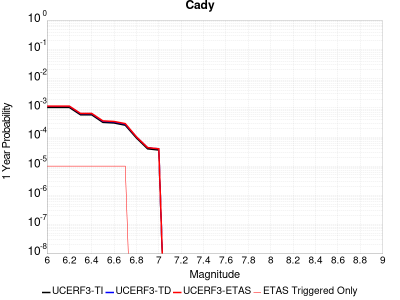 |  |

| Magnitude | 1 wk TI Prob | 1 wk TD Prob | 1 wk ETAS Prob | 1 wk ETAS/TD Gain | 1 wk ETAS Triggered Only | 1 mo TI Prob | 1 mo TD Prob | 1 mo ETAS Prob | 1 mo ETAS/TD Gain | 1 mo ETAS Triggered Only | 1 yr TI Prob | 1 yr TD Prob | 1 yr ETAS Prob | 1 yr ETAS/TD Gain | 1 yr ETAS Triggered Only | 10 yr TI Prob | 10 yr TD Prob | 10 yr ETAS Prob | 10 yr ETAS/TD Gain | 10 yr ETAS Triggered Only |
|-----|-----|-----|-----|-----|-----|-----|-----|-----|-----|-----|-----|-----|-----|-----|-----|-----|-----|-----|-----|-----|
| 6.0 | 1.9892565E-5 | 2.1869915E-5 | 4.265948E-5 | 1.9506012 | 2.0790021E-5 | 8.525106E-5 | 9.372535E-5 | 1.1451342E-4 | 1.2217977 | 2.0790021E-5 | 0.0010374374 | 0.0011405998 | 0.0011613661 | 1.0182065 | 2.0790021E-5 | 0.010326075 | 0.011356481 | 0.011377035 | 1.0018098 | 2.0790021E-5 |
| 6.1 | 1.9892565E-5 | 2.1869915E-5 | 4.265948E-5 | 1.9506012 | 2.0790021E-5 | 8.525106E-5 | 9.372535E-5 | 1.1451342E-4 | 1.2217977 | 2.0790021E-5 | 0.0010374374 | 0.0011405998 | 0.0011613661 | 1.0182065 | 2.0790021E-5 | 0.010326075 | 0.011356481 | 0.011377035 | 1.0018098 | 2.0790021E-5 |
| 6.2 | 1.9892565E-5 | 2.1869915E-5 | 4.265948E-5 | 1.9506012 | 2.0790021E-5 | 8.525106E-5 | 9.372535E-5 | 1.1451342E-4 | 1.2217977 | 2.0790021E-5 | 0.0010374374 | 0.0011405998 | 0.0011613661 | 1.0182065 | 2.0790021E-5 | 0.010326075 | 0.011356481 | 0.011377035 | 1.0018098 | 2.0790021E-5 |
| 6.3 | 1.1117327E-5 | 1.218259E-5 | 3.2972355E-5 | 2.7065146 | 2.0790021E-5 | 4.764482E-5 | 5.221023E-5 | 7.2999166E-5 | 1.3981774 | 2.0790021E-5 | 5.7992124E-4 | 6.355057E-4 | 6.5628253E-4 | 1.0326934 | 2.0790021E-5 | 0.0057841022 | 0.006339993 | 0.006360651 | 1.0032583 | 2.0790021E-5 |
| 6.4 | 1.1117327E-5 | 1.218259E-5 | 3.2972355E-5 | 2.7065146 | 2.0790021E-5 | 4.764482E-5 | 5.221023E-5 | 7.2999166E-5 | 1.3981774 | 2.0790021E-5 | 5.7992124E-4 | 6.355057E-4 | 6.5628253E-4 | 1.0326934 | 2.0790021E-5 | 0.0057841022 | 0.006339993 | 0.006360651 | 1.0032583 | 2.0790021E-5 |
| 6.5 | 6.103093E-6 | 6.6752414E-6 | 2.7465123E-5 | 4.1144767 | 2.0790021E-5 | 2.615585E-5 | 2.8607934E-5 | 4.939736E-5 | 1.7267014 | 2.0790021E-5 | 3.1840094E-4 | 3.482585E-4 | 3.6904129E-4 | 1.0596763 | 2.0790021E-5 | 0.0031794512 | 0.0034783627 | 0.0034990804 | 1.0059562 | 2.0790021E-5 |
| 6.6 | 5.817237E-6 | 6.3687653E-6 | 2.7158654E-5 | 4.2643514 | 2.0790021E-5 | 2.4930776E-5 | 2.7294494E-5 | 4.8083948E-5 | 1.761672 | 2.0790021E-5 | 3.034899E-4 | 3.3227223E-4 | 3.5305537E-4 | 1.0625484 | 2.0790021E-5 | 0.0030307577 | 0.0033189778 | 0.0033396988 | 1.0062432 | 2.0790021E-5 |
| 6.7 | 4.8846314E-6 | 5.343149E-6 | 2.6133059E-5 | 4.890947 | 2.0790021E-5 | 2.0933967E-5 | 2.2899076E-5 | 4.3688622E-5 | 1.907877 | 2.0790021E-5 | 2.5484123E-4 | 2.7877238E-4 | 2.995566E-4 | 1.0745562 | 2.0790021E-5 | 0.0025454918 | 0.0027853833 | 0.0028061154 | 1.0074432 | 2.0790021E-5 |
| 6.8 | 1.7788773E-6 | 1.9408171E-6 | 1.9408171E-6 | 1.0 | 0.0 | 7.6237375E-6 | 8.31777E-6 | 8.31777E-6 | 1.0 | 0.0 | 9.281505E-5 | 1.0126572E-4 | 1.0126572E-4 | 1.0 | 0.0 | 9.2776294E-4 | 0.0010123505 | 0.0010123505 | 1.0 | 0.0 |
| 6.9 | 7.5455404E-7 | 8.301368E-7 | 8.301368E-7 | 1.0 | 0.0 | 3.233799E-6 | 3.5577261E-6 | 3.5577261E-6 | 1.0 | 0.0 | 3.937079E-5 | 4.331479E-5 | 4.331479E-5 | 1.0 | 0.0 | 3.9363815E-4 | 4.330965E-4 | 4.330965E-4 | 1.0 | 0.0 |
| 7.0 | 6.8578805E-7 | 7.5457075E-7 | 7.5457075E-7 | 1.0 | 0.0 | 2.9390883E-6 | 3.2338726E-6 | 3.2338726E-6 | 1.0 | 0.0 | 3.578281E-5 | 3.937202E-5 | 3.937202E-5 | 1.0 | 0.0 | 3.577705E-4 | 3.9368295E-4 | 3.9368295E-4 | 1.0 | 0.0 |

## Pisgah-Bullion Mtn-Mesquite Lk
*[(top)](#table-of-contents)*

| 1 Week | 1 Month | 1 Year | 10 Year |
|-----|-----|-----|-----|
|  |  |  |  |

| Magnitude | 1 wk TI Prob | 1 wk TD Prob | 1 wk ETAS Prob | 1 wk ETAS/TD Gain | 1 wk ETAS Triggered Only | 1 mo TI Prob | 1 mo TD Prob | 1 mo ETAS Prob | 1 mo ETAS/TD Gain | 1 mo ETAS Triggered Only | 1 yr TI Prob | 1 yr TD Prob | 1 yr ETAS Prob | 1 yr ETAS/TD Gain | 1 yr ETAS Triggered Only | 10 yr TI Prob | 10 yr TD Prob | 10 yr ETAS Prob | 10 yr ETAS/TD Gain | 10 yr ETAS Triggered Only |
|-----|-----|-----|-----|-----|-----|-----|-----|-----|-----|-----|-----|-----|-----|-----|-----|-----|-----|-----|-----|-----|
| 6.0 | 3.0240792E-5 | 2.4106846E-5 | 4.4896366E-5 | 1.8623906 | 2.0790021E-5 | 1.2959696E-4 | 1.0331153E-4 | 1.240994E-4 | 1.2012154 | 2.0790021E-5 | 0.0015767008 | 0.0012571929 | 0.0012779569 | 1.0165161 | 2.0790021E-5 | 0.015655609 | 0.012510845 | 0.0125313755 | 1.0016409 | 2.0790021E-5 |
| 6.1 | 3.0240792E-5 | 2.4106846E-5 | 4.4896366E-5 | 1.8623906 | 2.0790021E-5 | 1.2959696E-4 | 1.0331153E-4 | 1.240994E-4 | 1.2012154 | 2.0790021E-5 | 0.0015767008 | 0.0012571929 | 0.0012779569 | 1.0165161 | 2.0790021E-5 | 0.015655609 | 0.012510845 | 0.0125313755 | 1.0016409 | 2.0790021E-5 |
| 6.2 | 3.0240792E-5 | 2.4106846E-5 | 4.4896366E-5 | 1.8623906 | 2.0790021E-5 | 1.2959696E-4 | 1.0331153E-4 | 1.240994E-4 | 1.2012154 | 2.0790021E-5 | 0.0015767008 | 0.0012571929 | 0.0012779569 | 1.0165161 | 2.0790021E-5 | 0.015655609 | 0.012510845 | 0.0125313755 | 1.0016409 | 2.0790021E-5 |
| 6.3 | 2.0498217E-5 | 1.3645967E-5 | 1.3645967E-5 | 1.0 | 0.0 | 8.784654E-5 | 5.8481495E-5 | 5.8481495E-5 | 1.0 | 0.0 | 0.0010690069 | 7.117958E-4 | 7.117958E-4 | 1.0 | 0.0 | 0.01063879 | 0.007096788 | 0.007096788 | 1.0 | 0.0 |
| 6.4 | 2.0498217E-5 | 1.3645967E-5 | 1.3645967E-5 | 1.0 | 0.0 | 8.784654E-5 | 5.8481495E-5 | 5.8481495E-5 | 1.0 | 0.0 | 0.0010690069 | 7.117958E-4 | 7.117958E-4 | 1.0 | 0.0 | 0.01063879 | 0.007096788 | 0.007096788 | 1.0 | 0.0 |
| 6.5 | 1.7316182E-5 | 1.04830515E-5 | 1.04830515E-5 | 1.0 | 0.0 | 7.42101E-5 | 4.4926648E-5 | 4.4926648E-5 | 1.0 | 0.0 | 9.0313336E-4 | 5.4685463E-4 | 5.4685463E-4 | 1.0 | 0.0 | 0.008994718 | 0.0054560862 | 0.0054560862 | 1.0 | 0.0 |
| 6.6 | 1.5251077E-5 | 8.41909E-6 | 8.41909E-6 | 1.0 | 0.0 | 6.536012E-5 | 3.6081354E-5 | 3.6081354E-5 | 1.0 | 0.0 | 7.9546886E-4 | 4.3920917E-4 | 4.3920917E-4 | 1.0 | 0.0 | 0.007926274 | 0.0043841293 | 0.0043841293 | 1.0 | 0.0 |
| 6.7 | 1.2997425E-5 | 6.415197E-6 | 6.415197E-6 | 1.0 | 0.0 | 5.570206E-5 | 2.7493437E-5 | 2.7493437E-5 | 1.0 | 0.0 | 6.7796157E-4 | 3.3468584E-4 | 3.3468584E-4 | 1.0 | 0.0 | 0.0067589693 | 0.0033422785 | 0.0033422785 | 1.0 | 0.0 |
| 6.8 | 1.035386E-5 | 4.3361665E-6 | 4.3361665E-6 | 1.0 | 0.0 | 4.437293E-5 | 1.8583443E-5 | 1.8583443E-5 | 1.0 | 0.0 | 5.401065E-4 | 2.262308E-4 | 2.262308E-4 | 1.0 | 0.0 | 0.0053879567 | 0.0022600917 | 0.0022600917 | 1.0 | 0.0 |
| 6.9 | 8.816252E-6 | 3.5832113E-6 | 3.5832113E-6 | 1.0 | 0.0 | 3.778339E-5 | 1.5356532E-5 | 1.5356532E-5 | 1.0 | 0.0 | 4.5991567E-4 | 1.8695033E-4 | 1.8695033E-4 | 1.0 | 0.0 | 0.00458965 | 0.0018679891 | 0.0018679891 | 1.0 | 0.0 |
| 7.0 | 6.8232207E-6 | 2.569746E-6 | 2.569746E-6 | 1.0 | 0.0 | 2.9242048E-5 | 1.1013151E-5 | 1.1013151E-5 | 1.0 | 0.0 | 3.5596377E-4 | 1.3407719E-4 | 1.3407719E-4 | 1.0 | 0.0 | 0.0035539411 | 0.001339994 | 0.001339994 | 1.0 | 0.0 |
| 7.1 | 5.837013E-6 | 2.229158E-6 | 2.229158E-6 | 1.0 | 0.0 | 2.501553E-5 | 9.5535015E-6 | 9.5535015E-6 | 1.0 | 0.0 | 3.045215E-4 | 1.16307965E-4 | 1.16307965E-4 | 1.0 | 0.0 | 0.0030410455 | 0.0011625 | 0.0011625 | 1.0 | 0.0 |
| 7.2 | 4.278052E-6 | 1.6289536E-6 | 1.6289536E-6 | 1.0 | 0.0 | 1.833438E-5 | 6.981212E-6 | 6.981212E-6 | 1.0 | 0.0 | 2.231982E-4 | 8.4993175E-5 | 8.4993175E-5 | 1.0 | 0.0 | 0.0022297418 | 8.496299E-4 | 8.496299E-4 | 1.0 | 0.0 |
| 7.3 | 1.8803692E-6 | 8.3536554E-7 | 8.3536554E-7 | 1.0 | 0.0 | 8.0587E-6 | 3.580134E-6 | 3.580134E-6 | 1.0 | 0.0 | 9.811026E-5 | 4.3587406E-5 | 4.3587406E-5 | 1.0 | 0.0 | 9.806695E-4 | 4.3580306E-4 | 4.3580306E-4 | 1.0 | 0.0 |

