# Parent Section Magnitude-Probability Distributions

Only fault sections with at least one triggered aftershock are plotted. Sections are sorted by total supraseismogenic trigger rate (decreasing)

## Table Of Contents

* [Garlock (Central)](#garlock-central)
* [Tank Canyon](#tank-canyon)
* [Little Lake](#little-lake)
* [Airport Lake](#airport-lake)
* [Owl Lake](#owl-lake)
* [Panamint Valley](#panamint-valley)
* [Garlock (East)](#garlock-east)
* [Ash Hill](#ash-hill)
* [Hunter Mountain-Saline Valley](#hunter-mountain-saline-valley)
* [Blackwater](#blackwater)
* [Garlock (West)](#garlock-west)
* [McLean Lake](#mclean-lake)
* [Goldstone Lake](#goldstone-lake)
* [Gravel Hills-Harper Lk](#gravel-hills-harper-lk)
* [So Sierra Nevada](#so-sierra-nevada)
* [Coyote Canyon](#coyote-canyon)
* [San Andreas (Mojave N)](#san-andreas-mojave-n)
* [San Andreas (Mojave S)](#san-andreas-mojave-s)
* [Death Valley (So)](#death-valley-so)
* [Towne Pass](#towne-pass)
* [Nelson Lake](#nelson-lake)
* [San Andreas (San Bernardino N)](#san-andreas-san-bernardino-n)
* [Lenwood-Lockhart-Old Woman Springs](#lenwood-lockhart-old-woman-springs)
* [Paradise](#paradise)
* [Bicycle Lake](#bicycle-lake)
* [Garlic Springs](#garlic-springs)
* [San Andreas (San Bernardino S)](#san-andreas-san-bernardino-s)
* [Death Valley (Black Mtns Frontal)](#death-valley-black-mtns-frontal)
* [Coyote Lake](#coyote-lake)
* [San Andreas (Big Bend)](#san-andreas-big-bend)
* [Helendale-So Lockhart](#helendale-so-lockhart)
* [San Andreas (San Gorgonio Pass-Garnet HIll)](#san-andreas-san-gorgonio-pass-garnet-hill)
* [Manix-Afton Hills](#manix-afton-hills)
* [San Andreas (Coachella) rev](#san-andreas-coachella-rev)
* [Scodie Lineament](#scodie-lineament)
* [Lake Isabella (Seismicity)](#lake-isabella-seismicity)
* [San Andreas (Carrizo) rev](#san-andreas-carrizo-rev)
* [Sierra Nevada  (No Extension)](#sierra-nevada--no-extension)
* [White Wolf (Extension)](#white-wolf-extension)
* [Death Valley (No)](#death-valley-no)
* [Death Valley (Fish Lake Valley)](#death-valley-fish-lake-valley)
* [Cady](#cady)
* [San Andreas (Cholame) rev](#san-andreas-cholame-rev)
* [Baker](#baker)
* [Santa Ynez (West)](#santa-ynez-west)
* [San Andreas (Parkfield)](#san-andreas-parkfield)
* [Ludlow](#ludlow)
* [Calico-Hidalgo](#calico-hidalgo)
* [Great Valley 09 (Laguna Seca)](#great-valley-09-laguna-seca)
* [Owens Valley](#owens-valley)
* [Santa Ynez (East)](#santa-ynez-east)
* [San Jacinto (San Bernardino)](#san-jacinto-san-bernardino)
* [Red Pass](#red-pass)
* [Rose Canyon](#rose-canyon)
* [Mission Creek](#mission-creek)
* [San Jacinto (Lytle Creek connector)](#san-jacinto-lytle-creek-connector)
* [San Jacinto (Stepovers Combined)](#san-jacinto-stepovers-combined)
* [Brawley (Seismic Zone) alt 1](#brawley-seismic-zone-alt-1)
* [Dry Mountain](#dry-mountain)
* [San Jacinto (San Jacinto Valley) rev](#san-jacinto-san-jacinto-valley-rev)
* [Imperial](#imperial)
* [Deep Springs](#deep-springs)
* [San Jacinto (Anza) rev](#san-jacinto-anza-rev)
* [Santa Rosa Island](#santa-rosa-island)
* [Big Pine (East)](#big-pine-east)
* [San Jacinto (Superstition Mtn)](#san-jacinto-superstition-mtn)
* [San Andreas (North Branch Mill Creek)](#san-andreas-north-branch-mill-creek)
* [Whittier alt 1](#whittier-alt-1)
* [Coronado Bank alt1](#coronado-bank-alt1)
* [Mono Lake 2011 CFM](#mono-lake-2011-cfm)
* [Lost Hills](#lost-hills)
* [Elsinore (Glen Ivy) rev](#elsinore-glen-ivy-rev)
* [San Jacinto (Borrego)](#san-jacinto-borrego)
* [Ortigalita (South)](#ortigalita-south)
* [San Clemente](#san-clemente)
* [Kern Canyon (South Kern) 2011](#kern-canyon-south-kern-2011)
* [Kern Canyon (Lake Isabella) 2011](#kern-canyon-lake-isabella-2011)
* [Malibu Coast (Extension) alt 1](#malibu-coast-extension-alt-1)
* [Santa Ynez River](#santa-ynez-river)
* [Santa Cruz Island](#santa-cruz-island)
* [San Jacinto (Coyote Creek)](#san-jacinto-coyote-creek)
* [Tin Mountain](#tin-mountain)
* [Mission Ridge-Arroyo Parida-Santa Ana](#mission-ridge-arroyo-parida-santa-ana)
* [Sheephole](#sheephole)
* [Santa Cruz Catalina Ridge alt1](#santa-cruz-catalina-ridge-alt1)
* [Cucamonga](#cucamonga)
* [Rinconada 2011 CFM](#rinconada-2011-cfm)
* [San Diego Trough north alt1](#san-diego-trough-north-alt1)
* [Camp Rock 2011](#camp-rock-2011)
* [Sierra Madre](#sierra-madre)
* [Pleito](#pleito)
* [Shoreline](#shoreline)
* [Robinson Creek](#robinson-creek)
* [Kern Canyon (North Kern) 2011](#kern-canyon-north-kern-2011)
* [San Gabriel](#san-gabriel)
* [Cleghorn Pass](#cleghorn-pass)
* [Independence rev 2011](#independence-rev-2011)
* [Malibu Coast alt 1](#malibu-coast-alt-1)
* [Palos Verdes](#palos-verdes)
* [Homestead Valley 2011](#homestead-valley-2011)
* [Pisgah-Bullion Mtn-Mesquite Lk](#pisgah-bullion-mtn-mesquite-lk)
* [White Mountains](#white-mountains)
* [Superstition Hills](#superstition-hills)
* [Los Alamos 2011 CFM](#los-alamos-2011-cfm)
* [Red Mountain](#red-mountain)
* [Los Alamos extension](#los-alamos-extension)
* [Ventura-Pitas Point](#ventura-pitas-point)
* [San Pedro Basin](#san-pedro-basin)
* [Raymond](#raymond)
* [Carlsbad](#carlsbad)
* [Bullion Mountains](#bullion-mountains)
* [San Jacinto (Clark) rev](#san-jacinto-clark-rev)
* [Hollywood](#hollywood)
* [Big Pine (Central)](#big-pine-central)
* [Great Valley 10 (Panoche)](#great-valley-10-panoche)
* [Channel Islands Thrust](#channel-islands-thrust)
* [San Cayetano](#san-cayetano)
* [Oak Ridge (Onshore)](#oak-ridge-onshore)
* [San Diego Trough south](#san-diego-trough-south)
* [Elysian Park (Upper)](#elysian-park-upper)
* [Hosgri](#hosgri)
* [San Andreas (Creeping Section) 2011 CFM](#san-andreas-creeping-section-2011-cfm)
* [Cleghorn Lake](#cleghorn-lake)
* [Simi-Santa Rosa](#simi-santa-rosa)
* [Oceanic - West Huasna](#oceanic---west-huasna)
* [Great Valley 11](#great-valley-11)

## Garlock (Central)
*[(top)](#table-of-contents)*

| 1 Week | 1 Month | 1 Year | 10 Year |
|-----|-----|-----|-----|
| 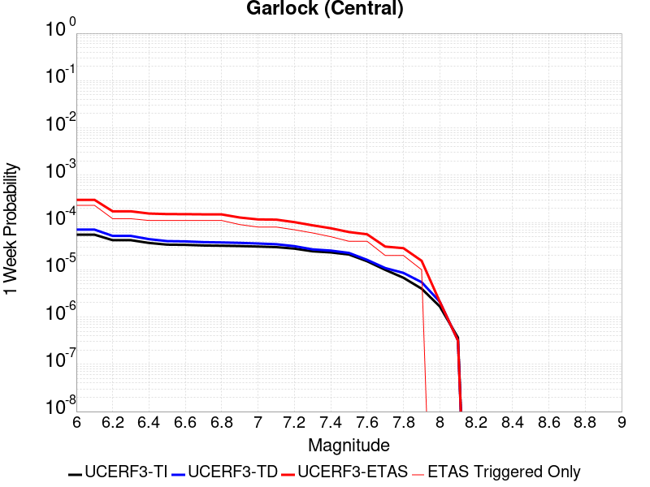 |  |  |  |

| Magnitude | 1 wk TI Prob | 1 wk TD Prob | 1 wk ETAS Prob | 1 wk ETAS/TD Gain | 1 wk ETAS Triggered Only | 1 mo TI Prob | 1 mo TD Prob | 1 mo ETAS Prob | 1 mo ETAS/TD Gain | 1 mo ETAS Triggered Only | 1 yr TI Prob | 1 yr TD Prob | 1 yr ETAS Prob | 1 yr ETAS/TD Gain | 1 yr ETAS Triggered Only | 10 yr TI Prob | 10 yr TD Prob | 10 yr ETAS Prob | 10 yr ETAS/TD Gain | 10 yr ETAS Triggered Only |
|-----|-----|-----|-----|-----|-----|-----|-----|-----|-----|-----|-----|-----|-----|-----|-----|-----|-----|-----|-----|-----|
| 6.0 | 5.5131142E-5 | 7.052713E-5 | 3.005109E-4 | 4.2609262 | 2.3E-4 | 2.3625491E-4 | 3.0222448E-4 | 0.0012519374 | 4.142409 | 9.5E-4 | 0.0028726095 | 0.0036734391 | 0.012301627 | 3.348804 | 0.00866 | 0.028357591 | 0.03619004 | 0.06440076 | 1.779516 | 0.02927 |
| 6.1 | 5.5131142E-5 | 7.052713E-5 | 3.005109E-4 | 4.2609262 | 2.3E-4 | 2.3625491E-4 | 3.0222448E-4 | 0.0012519374 | 4.142409 | 9.5E-4 | 0.0028726095 | 0.0036734391 | 0.012301627 | 3.348804 | 0.00866 | 0.028357591 | 0.03619004 | 0.06440076 | 1.779516 | 0.02927 |
| 6.2 | 4.216245E-5 | 5.1916577E-5 | 1.7191035E-4 | 3.3112805 | 1.2E-4 | 1.806837E-4 | 2.2248081E-4 | 8.1234955E-4 | 3.651324 | 5.9E-4 | 0.0021976046 | 0.0027053708 | 0.008020951 | 2.9648252 | 0.00533 | 0.021759989 | 0.026775723 | 0.04450787 | 1.6622472 | 0.01822 |
| 6.3 | 4.216245E-5 | 5.1916577E-5 | 1.7191035E-4 | 3.3112805 | 1.2E-4 | 1.806837E-4 | 2.2248081E-4 | 8.1234955E-4 | 3.651324 | 5.9E-4 | 0.0021976046 | 0.0027053708 | 0.008020951 | 2.9648252 | 0.00533 | 0.021759989 | 0.026775723 | 0.04450787 | 1.6622472 | 0.01822 |
| 6.4 | 3.6858168E-5 | 4.4354918E-5 | 1.5435004E-4 | 3.4798856 | 1.1E-4 | 1.5795401E-4 | 1.900788E-4 | 6.999819E-4 | 3.6825879 | 5.1E-4 | 0.0019213937 | 0.0023117785 | 0.0064821155 | 2.8039517 | 0.00418 | 0.019048655 | 0.022951225 | 0.036678758 | 1.5981178 | 0.01405 |
| 6.5 | 3.39199E-5 | 4.0258143E-5 | 1.5025372E-4 | 3.7322564 | 1.1E-4 | 1.453629E-4 | 1.725236E-4 | 6.324442E-4 | 3.6658418 | 4.6E-4 | 0.0017683565 | 0.0020984733 | 0.005860562 | 2.7927742 | 0.00377 | 0.017543508 | 0.020880483 | 0.033178225 | 1.5889586 | 0.01256 |
| 6.6 | 3.3571985E-5 | 3.9711384E-5 | 1.4970702E-4 | 3.7698765 | 1.1E-4 | 1.4387199E-4 | 1.7018068E-4 | 6.301024E-4 | 3.7025497 | 4.6E-4 | 0.0017502342 | 0.0020700025 | 0.0058321985 | 2.817484 | 0.00377 | 0.017365133 | 0.020603985 | 0.032875817 | 1.5956048 | 0.01253 |
| 6.7 | 3.2580007E-5 | 3.832636E-5 | 1.4832214E-4 | 3.8699772 | 1.1E-4 | 1.3962112E-4 | 1.6424562E-4 | 6.0417334E-4 | 3.678475 | 4.4E-4 | 0.0016985617 | 0.0019978778 | 0.0055906856 | 2.798312 | 0.0036 | 0.016856372 | 0.019892093 | 0.031643588 | 1.590762 | 0.01199 |
| 6.8 | 3.2185937E-5 | 3.7751946E-5 | 1.4774779E-4 | 3.9136472 | 1.1E-4 | 1.3793244E-4 | 1.6178413E-4 | 5.917146E-4 | 3.6574326 | 4.3E-4 | 0.0016780337 | 0.001967964 | 0.005481037 | 2.7851307 | 0.00352 | 0.016654192 | 0.019597549 | 0.031117277 | 1.5878148 | 0.01175 |
| 6.9 | 3.165394E-5 | 3.6954847E-5 | 1.2695152E-4 | 3.4353144 | 9.0E-5 | 1.3565269E-4 | 1.5836844E-4 | 5.683035E-4 | 3.5884898 | 4.1E-4 | 0.0016503202 | 0.0019264519 | 0.005309921 | 2.7563217 | 0.00339 | 0.01638118 | 0.019189706 | 0.03033171 | 1.5806241 | 0.01136 |
| 7.0 | 3.0903822E-5 | 3.5857098E-5 | 1.1585423E-4 | 3.2309983 | 8.0E-5 | 1.3243823E-4 | 1.5366435E-4 | 5.4360443E-4 | 3.537609 | 3.9E-4 | 0.0016112428 | 0.0018692794 | 0.005133167 | 2.7460673 | 0.00327 | 0.015996104 | 0.018630488 | 0.029347043 | 1.575216 | 0.01092 |
| 7.1 | 3.0069863E-5 | 3.462148E-5 | 1.1461871E-4 | 3.3106241 | 8.0E-5 | 1.2886449E-4 | 1.4836945E-4 | 5.2831304E-4 | 3.560794 | 3.8E-4 | 0.0015677959 | 0.0018049226 | 0.0049392553 | 2.7365468 | 0.00314 | 0.01556781 | 0.017997267 | 0.028210094 | 1.5674655 | 0.0104 |
| 7.2 | 2.7957109E-5 | 3.150137E-5 | 1.01499165E-4 | 3.2220554 | 7.0E-5 | 1.1981068E-4 | 1.34999E-4 | 4.749531E-4 | 3.518197 | 3.4E-4 | 0.0014577188 | 0.0016423933 | 0.00425809 | 2.592613 | 0.00262 | 0.014481937 | 0.016396116 | 0.02495347 | 1.5219135 | 0.0087 |
| 7.3 | 2.4519275E-5 | 2.6921938E-5 | 8.692032E-5 | 3.2286057 | 6.0E-5 | 1.0507837E-4 | 1.15374714E-4 | 3.4534818E-4 | 2.9932745 | 2.3E-4 | 0.0012785783 | 0.0014037968 | 0.0032911436 | 2.3444588 | 0.00189 | 0.012712469 | 0.0140340645 | 0.020275228 | 1.4447154 | 0.00633 |
| 7.4 | 2.3225532E-5 | 2.5402072E-5 | 7.54008E-5 | 2.9682932 | 5.0E-5 | 9.95342E-5 | 1.0886157E-4 | 3.088398E-4 | 2.8369956 | 2.0E-4 | 0.0012111551 | 0.0013245982 | 0.0030523066 | 2.3043263 | 0.00173 | 0.012045753 | 0.0132495295 | 0.018814802 | 1.4200355 | 0.00564 |
| 7.5 | 2.097765E-5 | 2.2676577E-5 | 6.267567E-5 | 2.7638948 | 4.0E-5 | 8.9901114E-5 | 9.718177E-5 | 2.3716816E-4 | 2.4404593 | 1.4E-4 | 0.0010939965 | 0.0011825578 | 0.002580902 | 2.1824746 | 0.0014 | 0.010886264 | 0.011838898 | 0.01626586 | 1.3739336 | 0.00448 |
| 7.6 | 1.511254E-5 | 1.6166656E-5 | 5.616601E-5 | 3.4741886 | 4.0E-5 | 6.476642E-5 | 6.9283866E-5 | 1.4927832E-4 | 2.15459 | 8.0E-5 | 7.882459E-4 | 8.4321253E-4 | 0.0016025717 | 1.9005549 | 7.6E-4 | 0.007854558 | 0.008473388 | 0.010902627 | 1.2866906 | 0.00245 |
| 7.7 | 9.934069E-6 | 1.0840946E-5 | 3.084073E-5 | 2.8448377 | 2.0E-5 | 4.2573887E-5 | 4.646037E-5 | 7.645898E-5 | 1.6456816 | 3.0E-5 | 5.182138E-4 | 5.655086E-4 | 8.0537284E-4 | 1.4241568 | 2.4E-4 | 0.00517007 | 0.005711988 | 0.006537247 | 1.1444784 | 8.3E-4 |
| 7.8 | 6.7562896E-6 | 8.56065E-6 | 2.8560478E-5 | 3.3362513 | 2.0E-5 | 2.8955206E-5 | 3.6687983E-5 | 6.668688E-5 | 1.8176764 | 3.0E-5 | 3.5247262E-4 | 4.465848E-4 | 6.165089E-4 | 1.3804967 | 1.7E-4 | 0.0035191406 | 0.0045154993 | 0.0050331512 | 1.1146389 | 5.2E-4 |
| 7.9 | 3.975453E-6 | 5.4508955E-6 | 1.5450842E-5 | 2.834551 | 1.0E-5 | 1.7037546E-5 | 2.3360772E-5 | 3.336054E-5 | 1.428058 | 1.0E-5 | 2.0741238E-4 | 2.8438037E-4 | 3.8435194E-4 | 1.3515418 | 1.0E-4 | 0.002072189 | 0.0028752622 | 0.0031943421 | 1.1109742 | 3.2E-4 |
| 8.0 | 1.6729537E-6 | 2.104827E-6 | 2.104827E-6 | 1.0 | 0.0 | 7.169782E-6 | 9.020656E-6 | 9.020656E-6 | 1.0 | 0.0 | 8.7288594E-5 | 1.0982099E-4 | 1.298188E-4 | 1.1820946 | 2.0E-5 | 8.7254314E-4 | 0.0011113439 | 0.0012212216 | 1.0988693 | 1.1E-4 |
| 8.1 | 3.6733252E-7 | 3.188225E-7 | 3.188225E-7 | 1.0 | 0.0 | 1.5742813E-6 | 1.3663815E-6 | 1.3663815E-6 | 1.0 | 0.0 | 1.9166706E-5 | 1.6635584E-5 | 1.6635584E-5 | 1.0 | 0.0 | 1.9165053E-4 | 1.6837404E-4 | 1.7837236E-4 | 1.0593816 | 1.0E-5 |

## Tank Canyon
*[(top)](#table-of-contents)*

| 1 Week | 1 Month | 1 Year | 10 Year |
|-----|-----|-----|-----|
|  |  | 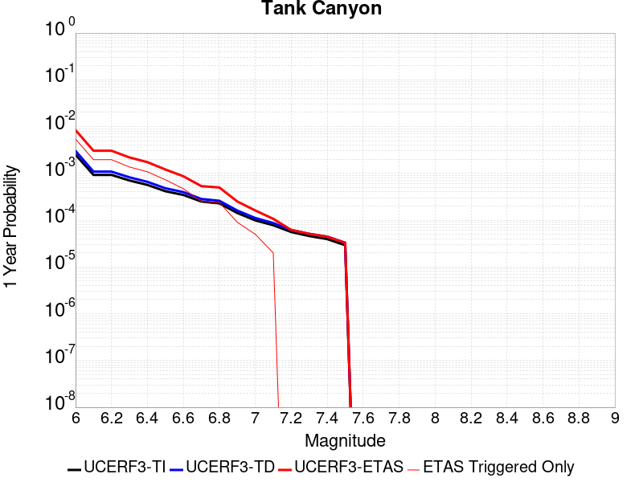 |  |

| Magnitude | 1 wk TI Prob | 1 wk TD Prob | 1 wk ETAS Prob | 1 wk ETAS/TD Gain | 1 wk ETAS Triggered Only | 1 mo TI Prob | 1 mo TD Prob | 1 mo ETAS Prob | 1 mo ETAS/TD Gain | 1 mo ETAS Triggered Only | 1 yr TI Prob | 1 yr TD Prob | 1 yr ETAS Prob | 1 yr ETAS/TD Gain | 1 yr ETAS Triggered Only | 10 yr TI Prob | 10 yr TD Prob | 10 yr ETAS Prob | 10 yr ETAS/TD Gain | 10 yr ETAS Triggered Only |
|-----|-----|-----|-----|-----|-----|-----|-----|-----|-----|-----|-----|-----|-----|-----|-----|-----|-----|-----|-----|-----|
| 6.0 | 4.8284557E-5 | 5.8030648E-5 | 1.5802485E-4 | 2.7231274 | 1.0E-4 | 2.0691741E-4 | 2.4868292E-4 | 9.185163E-4 | 3.693524 | 6.7E-4 | 0.0025163088 | 0.0030241746 | 0.008427784 | 2.7868044 | 0.00542 | 0.02488006 | 0.029897593 | 0.049483962 | 1.6551151 | 0.02019 |
| 6.1 | 1.7796336E-5 | 2.0894317E-5 | 5.089369E-5 | 2.4357672 | 3.0E-5 | 7.626778E-5 | 8.954422E-5 | 3.0952453E-4 | 3.4566667 | 2.2E-4 | 9.281647E-4 | 0.0010896939 | 0.003047558 | 2.7967105 | 0.00196 | 0.009242975 | 0.010847858 | 0.01806867 | 1.6656439 | 0.0073 |
| 6.2 | 1.7796336E-5 | 2.0894317E-5 | 5.089369E-5 | 2.4357672 | 3.0E-5 | 7.626778E-5 | 8.954422E-5 | 3.0952453E-4 | 3.4566667 | 2.2E-4 | 9.281647E-4 | 0.0010896939 | 0.003047558 | 2.7967105 | 0.00196 | 0.009242975 | 0.010847858 | 0.01806867 | 1.6656439 | 0.0073 |
| 6.3 | 1.3515912E-5 | 1.5774984E-5 | 2.5774825E-5 | 1.633905 | 1.0E-5 | 5.792405E-5 | 6.7605455E-5 | 2.2759465E-4 | 3.3665128 | 1.6E-4 | 7.049971E-4 | 8.228093E-4 | 0.002191682 | 2.6636574 | 0.00137 | 0.007027647 | 0.008200501 | 0.0133479405 | 1.6276982 | 0.00519 |
| 6.4 | 1.0870146E-5 | 1.2630132E-5 | 2.2630005E-5 | 1.7917473 | 1.0E-5 | 4.658551E-5 | 5.4128115E-5 | 1.5412271E-4 | 2.8473687 | 1.0E-4 | 5.67031E-4 | 6.588283E-4 | 0.0017381167 | 2.6381938 | 0.00108 | 0.005655863 | 0.006571022 | 0.010514935 | 1.6001978 | 0.00397 |
| 6.5 | 7.964826E-6 | 9.2047985E-6 | 1.9204706E-5 | 2.08638 | 1.0E-5 | 3.4134522E-5 | 3.9448598E-5 | 1.09445835E-4 | 2.774391 | 7.0E-5 | 4.1550855E-4 | 4.8019143E-4 | 0.0012098409 | 2.5194972 | 7.3E-4 | 0.0041473247 | 0.004793096 | 0.0074702026 | 1.5585339 | 0.00269 |
| 6.6 | 6.6317E-6 | 7.619393E-6 | 7.619393E-6 | 1.0 | 0.0 | 2.8421264E-5 | 3.2654185E-5 | 7.265288E-5 | 2.224918 | 4.0E-5 | 3.4597394E-4 | 3.9750125E-4 | 8.673144E-4 | 2.1819162 | 4.7E-4 | 0.0034543579 | 0.003969311 | 0.0059514116 | 1.4993565 | 0.00199 |
| 6.7 | 4.793663E-6 | 5.4357165E-6 | 5.4357165E-6 | 1.0 | 0.0 | 2.0544108E-5 | 2.3295745E-5 | 2.3295745E-5 | 1.0 | 0.0 | 2.500958E-4 | 2.8359317E-4 | 5.335223E-4 | 1.8812945 | 2.5E-4 | 0.0024981452 | 0.0028332595 | 0.0038603414 | 1.3625089 | 0.00103 |
| 6.8 | 4.382823E-6 | 4.9737705E-6 | 4.9737705E-6 | 1.0 | 0.0 | 1.8783392E-5 | 2.131601E-5 | 2.131601E-5 | 1.0 | 0.0 | 2.286638E-4 | 2.5949578E-4 | 4.994335E-4 | 1.9246305 | 2.4E-4 | 0.0022842865 | 0.0025928544 | 0.003530417 | 1.3615948 | 9.4E-4 |
| 6.9 | 2.729601E-6 | 3.0766787E-6 | 3.0766787E-6 | 1.0 | 0.0 | 1.1698237E-5 | 1.3185707E-5 | 1.3185707E-5 | 1.0 | 0.0 | 1.4241673E-4 | 1.6052538E-4 | 2.5051093E-4 | 1.560569 | 9.0E-5 | 0.001423255 | 0.001604344 | 0.0020436381 | 1.2738154 | 4.4E-4 |
| 7.0 | 1.8987357E-6 | 2.1293376E-6 | 2.1293376E-6 | 1.0 | 0.0 | 8.137413E-6 | 9.125705E-6 | 9.125705E-6 | 1.0 | 0.0 | 9.90685E-5 | 1.111005E-4 | 1.6109494E-4 | 1.449993 | 5.0E-5 | 9.902435E-4 | 0.0011105182 | 0.001320285 | 1.1888909 | 2.1E-4 |
| 7.1 | 1.4928986E-6 | 1.6653191E-6 | 1.6653191E-6 | 1.0 | 0.0 | 6.398121E-6 | 7.1370655E-6 | 7.1370655E-6 | 1.0 | 0.0 | 7.789434E-5 | 8.68909E-5 | 1.0688916E-4 | 1.2301537 | 2.0E-5 | 7.786704E-4 | 8.6862716E-4 | 0.0010085056 | 1.1610339 | 1.4E-4 |
| 7.2 | 1.069082E-6 | 1.1833093E-6 | 1.1833093E-6 | 1.0 | 0.0 | 4.581772E-6 | 5.071319E-6 | 5.071319E-6 | 1.0 | 0.0 | 5.5781646E-5 | 6.174209E-5 | 6.174209E-5 | 1.0 | 0.0 | 5.576765E-4 | 6.173017E-4 | 6.972523E-4 | 1.1295162 | 8.0E-5 |
| 7.3 | 8.776551E-7 | 9.773756E-7 | 9.773756E-7 | 1.0 | 0.0 | 3.7613736E-6 | 4.188749E-6 | 4.188749E-6 | 1.0 | 0.0 | 4.579376E-5 | 5.0997343E-5 | 5.0997343E-5 | 1.0 | 0.0 | 4.5784327E-4 | 5.0990743E-4 | 5.6987687E-4 | 1.1176084 | 6.0E-5 |
| 7.4 | 7.55721E-7 | 8.5119603E-7 | 8.5119603E-7 | 1.0 | 0.0 | 3.2388E-6 | 3.6479807E-6 | 3.6479807E-6 | 1.0 | 0.0 | 3.9431678E-5 | 4.441378E-5 | 4.441378E-5 | 1.0 | 0.0 | 3.942468E-4 | 4.4409992E-4 | 4.940777E-4 | 1.1125373 | 5.0E-5 |
| 7.5 | 5.587665E-7 | 6.306862E-7 | 6.306862E-7 | 1.0 | 0.0 | 2.3947114E-6 | 2.7029407E-6 | 2.7029407E-6 | 1.0 | 0.0 | 2.915522E-5 | 3.2908305E-5 | 3.2908305E-5 | 1.0 | 0.0 | 2.9151395E-4 | 3.2908304E-4 | 3.5907316E-4 | 1.0911324 | 3.0E-5 |

## Little Lake
*[(top)](#table-of-contents)*

| 1 Week | 1 Month | 1 Year | 10 Year |
|-----|-----|-----|-----|
|  | 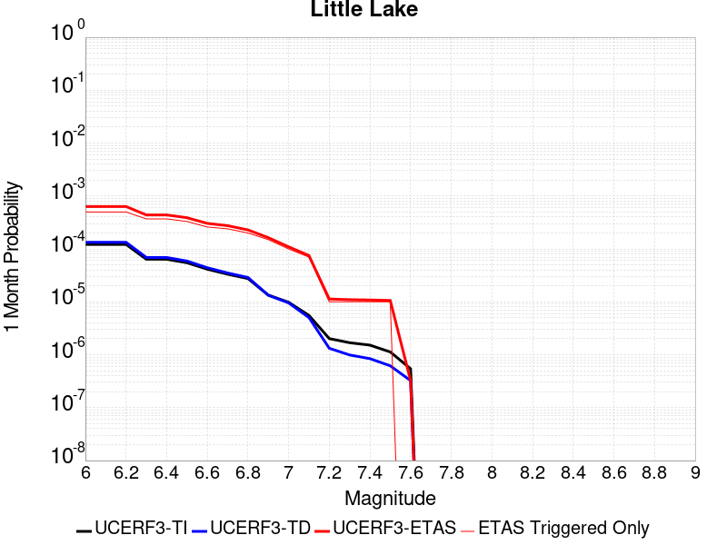 |  | 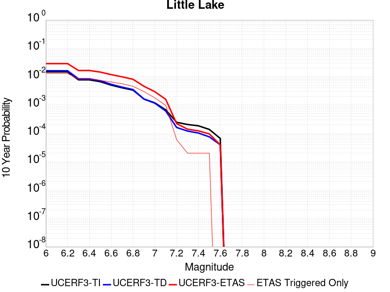 |

| Magnitude | 1 wk TI Prob | 1 wk TD Prob | 1 wk ETAS Prob | 1 wk ETAS/TD Gain | 1 wk ETAS Triggered Only | 1 mo TI Prob | 1 mo TD Prob | 1 mo ETAS Prob | 1 mo ETAS/TD Gain | 1 mo ETAS Triggered Only | 1 yr TI Prob | 1 yr TD Prob | 1 yr ETAS Prob | 1 yr ETAS/TD Gain | 1 yr ETAS Triggered Only | 10 yr TI Prob | 10 yr TD Prob | 10 yr ETAS Prob | 10 yr ETAS/TD Gain | 10 yr ETAS Triggered Only |
|-----|-----|-----|-----|-----|-----|-----|-----|-----|-----|-----|-----|-----|-----|-----|-----|-----|-----|-----|-----|-----|
| 6.0 | 2.8424427E-5 | 3.1224343E-5 | 1.21221536E-4 | 3.8822763 | 9.0E-5 | 1.2181328E-4 | 1.338125E-4 | 6.3374557E-4 | 4.7360716 | 5.0E-4 | 0.0014820677 | 0.0016280831 | 0.005541701 | 3.4038196 | 0.00392 | 0.014722223 | 0.01617498 | 0.028925352 | 1.7882775 | 0.01296 |
| 6.1 | 2.8424427E-5 | 3.1224343E-5 | 1.21221536E-4 | 3.8822763 | 9.0E-5 | 1.2181328E-4 | 1.338125E-4 | 6.3374557E-4 | 4.7360716 | 5.0E-4 | 0.0014820677 | 0.0016280831 | 0.005541701 | 3.4038196 | 0.00392 | 0.014722223 | 0.01617498 | 0.028925352 | 1.7882775 | 0.01296 |
| 6.2 | 2.8424427E-5 | 3.1224343E-5 | 1.21221536E-4 | 3.8822763 | 9.0E-5 | 1.2181328E-4 | 1.338125E-4 | 6.3374557E-4 | 4.7360716 | 5.0E-4 | 0.0014820677 | 0.0016280831 | 0.005541701 | 3.4038196 | 0.00392 | 0.014722223 | 0.01617498 | 0.028925352 | 1.7882775 | 0.01296 |
| 6.3 | 1.48860645E-5 | 1.6090038E-5 | 1.0608859E-4 | 6.593433 | 9.0E-5 | 6.379586E-5 | 6.895565E-5 | 4.3893012E-4 | 6.365398 | 3.7E-4 | 7.7643775E-4 | 8.3923986E-4 | 0.0033371418 | 3.9763863 | 0.0025 | 0.007737305 | 0.008363526 | 0.016524695 | 1.9758047 | 0.00823 |
| 6.4 | 1.48860645E-5 | 1.6090038E-5 | 1.0608859E-4 | 6.593433 | 9.0E-5 | 6.379586E-5 | 6.895565E-5 | 4.3893012E-4 | 6.365398 | 3.7E-4 | 7.7643775E-4 | 8.3923986E-4 | 0.0033371418 | 3.9763863 | 0.0025 | 0.007737305 | 0.008363526 | 0.016524695 | 1.9758047 | 0.00823 |
| 6.5 | 1.2797581E-5 | 1.3772795E-5 | 8.377183E-5 | 6.082413 | 7.0E-5 | 5.4845623E-5 | 5.9025075E-5 | 3.890056E-4 | 6.590514 | 3.3E-4 | 6.675408E-4 | 7.1841903E-4 | 0.0029568097 | 4.1157174 | 0.00224 | 0.006655392 | 0.007163519 | 0.014530365 | 2.0283837 | 0.00742 |
| 6.6 | 9.661896E-6 | 1.0294141E-5 | 6.0293627E-5 | 5.8570814 | 5.0E-5 | 4.1407468E-5 | 4.4117096E-5 | 3.0410563E-4 | 6.893147 | 2.6E-4 | 5.040193E-4 | 5.370095E-4 | 0.0024559784 | 4.573436 | 0.00192 | 0.005028777 | 0.0053587253 | 0.011813947 | 2.204619 | 0.00649 |
| 6.7 | 7.767871E-6 | 8.203577E-6 | 4.820325E-5 | 5.8758817 | 4.0E-5 | 3.329045E-5 | 3.515779E-5 | 2.7514936E-4 | 7.8261275 | 2.4E-4 | 4.0523586E-4 | 4.2797578E-4 | 0.0020972611 | 4.90042 | 0.00167 | 0.004044977 | 0.004272869 | 0.009878812 | 2.311986 | 0.00563 |
| 6.8 | 6.4235196E-6 | 6.7388983E-6 | 2.6738764E-5 | 3.9678242 | 2.0E-5 | 2.752908E-5 | 2.8880746E-5 | 2.2887497E-4 | 7.924829 | 2.0E-4 | 3.35115E-4 | 3.515792E-4 | 0.0016411257 | 4.667869 | 0.00129 | 0.003346101 | 0.0035114915 | 0.008075409 | 2.299709 | 0.00458 |
| 6.9 | 3.1283696E-6 | 3.113294E-6 | 1.3113263E-5 | 4.212022 | 1.0E-5 | 1.3407229E-5 | 1.3342629E-5 | 1.6334062E-4 | 12.242012 | 1.5E-4 | 1.6322079E-4 | 1.6243591E-4 | 9.62306E-4 | 5.924219 | 8.0E-4 | 0.0016310095 | 0.0016233202 | 0.0045984825 | 2.832764 | 0.00298 |
| 7.0 | 2.290603E-6 | 2.2295237E-6 | 1.2229501E-5 | 5.485253 | 1.0E-5 | 9.816834E-6 | 9.555072E-6 | 1.09554116E-4 | 11.465546 | 1.0E-4 | 1.19513395E-4 | 1.16327836E-4 | 5.96272E-4 | 5.125789 | 4.8E-4 | 0.0011944914 | 0.0011627717 | 0.0029506902 | 2.537635 | 0.00179 |
| 7.1 | 1.293693E-6 | 1.1782039E-6 | 1.1178192E-5 | 9.487485 | 1.0E-5 | 5.5443866E-6 | 5.0494396E-6 | 7.504909E-5 | 14.862855 | 7.0E-5 | 6.750081E-5 | 6.147589E-5 | 3.314593E-4 | 5.3916955 | 2.7E-4 | 6.7480316E-4 | 6.1465736E-4 | 0.0015840612 | 2.577145 | 9.7E-4 |
| 7.2 | 4.715842E-7 | 3.0942377E-7 | 3.0942377E-7 | 1.0 | 0.0 | 2.0210737E-6 | 1.3261013E-6 | 1.1326088E-5 | 8.540893 | 1.0E-5 | 2.4606294E-5 | 1.614517E-5 | 3.6144847E-5 | 2.2387407 | 2.0E-5 | 2.460357E-4 | 1.614405E-4 | 2.2143082E-4 | 1.371594 | 6.0E-5 |
| 7.3 | 3.9430947E-7 | 2.3119982E-7 | 2.3119982E-7 | 1.0 | 0.0 | 1.6898966E-6 | 9.90856E-7 | 1.0990846E-5 | 11.092274 | 1.0E-5 | 2.0574296E-5 | 1.2063606E-5 | 2.2063485E-5 | 1.8289295 | 1.0E-5 | 2.0572392E-4 | 1.20629586E-4 | 1.4062718E-4 | 1.1657768 | 2.0E-5 |
| 7.4 | 3.547123E-7 | 1.9699995E-7 | 1.9699995E-7 | 1.0 | 0.0 | 1.5201948E-6 | 8.4428524E-7 | 1.0844276E-5 | 12.844329 | 1.0E-5 | 1.8508214E-5 | 1.0279125E-5 | 2.0279022E-5 | 1.9728354 | 1.0E-5 | 1.8506673E-4 | 1.0278656E-4 | 1.227845E-4 | 1.194558 | 2.0E-5 |
| 7.5 | 2.6354266E-7 | 1.443762E-7 | 1.443762E-7 | 1.0 | 0.0 | 1.129468E-6 | 6.18755E-7 | 1.0618749E-5 | 17.161476 | 1.0E-5 | 1.3751187E-5 | 7.5333164E-6 | 1.753324E-5 | 2.3274267 | 1.0E-5 | 1.3750336E-4 | 7.533066E-5 | 9.532915E-5 | 1.2654761 | 2.0E-5 |
| 7.6 | 1.269913E-7 | 7.5787106E-8 | 7.5787106E-8 | 1.0 | 0.0 | 5.4424834E-7 | 3.2480185E-7 | 3.2480185E-7 | 1.0 | 0.0 | 6.6262032E-6 | 3.9544557E-6 | 3.9544557E-6 | 1.0 | 0.0 | 6.626006E-5 | 3.9543887E-5 | 3.9543887E-5 | 1.0 | 0.0 |

## Airport Lake
*[(top)](#table-of-contents)*

| 1 Week | 1 Month | 1 Year | 10 Year |
|-----|-----|-----|-----|
|  |  |  |  |

| Magnitude | 1 wk TI Prob | 1 wk TD Prob | 1 wk ETAS Prob | 1 wk ETAS/TD Gain | 1 wk ETAS Triggered Only | 1 mo TI Prob | 1 mo TD Prob | 1 mo ETAS Prob | 1 mo ETAS/TD Gain | 1 mo ETAS Triggered Only | 1 yr TI Prob | 1 yr TD Prob | 1 yr ETAS Prob | 1 yr ETAS/TD Gain | 1 yr ETAS Triggered Only | 10 yr TI Prob | 10 yr TD Prob | 10 yr ETAS Prob | 10 yr ETAS/TD Gain | 10 yr ETAS Triggered Only |
|-----|-----|-----|-----|-----|-----|-----|-----|-----|-----|-----|-----|-----|-----|-----|-----|-----|-----|-----|-----|-----|
| 6.0 | 1.2387061E-5 | 1.310742E-5 | 7.310663E-5 | 5.5775 | 6.0E-5 | 5.3086325E-5 | 5.617361E-5 | 4.8614945E-4 | 8.65441 | 4.3E-4 | 6.461343E-4 | 6.837275E-4 | 0.003781608 | 5.53087 | 0.0031 | 0.0064425888 | 0.006819051 | 0.017217655 | 2.5249343 | 0.01047 |
| 6.1 | 1.2387061E-5 | 1.310742E-5 | 7.310663E-5 | 5.5775 | 6.0E-5 | 5.3086325E-5 | 5.617361E-5 | 4.8614945E-4 | 8.65441 | 4.3E-4 | 6.461343E-4 | 6.837275E-4 | 0.003781608 | 5.53087 | 0.0031 | 0.0064425888 | 0.006819051 | 0.017217655 | 2.5249343 | 0.01047 |
| 6.2 | 1.2387061E-5 | 1.310742E-5 | 7.310663E-5 | 5.5775 | 6.0E-5 | 5.3086325E-5 | 5.617361E-5 | 4.8614945E-4 | 8.65441 | 4.3E-4 | 6.461343E-4 | 6.837275E-4 | 0.003781608 | 5.53087 | 0.0031 | 0.0064425888 | 0.006819051 | 0.017217655 | 2.5249343 | 0.01047 |
| 6.3 | 1.2387061E-5 | 1.310742E-5 | 7.310663E-5 | 5.5775 | 6.0E-5 | 5.3086325E-5 | 5.617361E-5 | 4.8614945E-4 | 8.65441 | 4.3E-4 | 6.461343E-4 | 6.837275E-4 | 0.003781608 | 5.53087 | 0.0031 | 0.0064425888 | 0.006819051 | 0.017217655 | 2.5249343 | 0.01047 |
| 6.4 | 1.2387061E-5 | 1.310742E-5 | 7.310663E-5 | 5.5775 | 6.0E-5 | 5.3086325E-5 | 5.617361E-5 | 4.8614945E-4 | 8.65441 | 4.3E-4 | 6.461343E-4 | 6.837275E-4 | 0.003781608 | 5.53087 | 0.0031 | 0.0064425888 | 0.006819051 | 0.017217655 | 2.5249343 | 0.01047 |
| 6.5 | 6.9922594E-6 | 7.387259E-6 | 4.7386962E-5 | 6.4146886 | 4.0E-5 | 2.996648E-5 | 3.1659325E-5 | 3.3164982E-4 | 10.47558 | 3.0E-4 | 3.6478083E-4 | 3.8538955E-4 | 0.00261453 | 6.784123 | 0.00223 | 0.003641826 | 0.00384775 | 0.011637661 | 3.0245366 | 0.00782 |
| 6.6 | 6.9922594E-6 | 7.387259E-6 | 4.7386962E-5 | 6.4146886 | 4.0E-5 | 2.996648E-5 | 3.1659325E-5 | 3.3164982E-4 | 10.47558 | 3.0E-4 | 3.6478083E-4 | 3.8538955E-4 | 0.00261453 | 6.784123 | 0.00223 | 0.003641826 | 0.00384775 | 0.011637661 | 3.0245366 | 0.00782 |
| 6.7 | 5.477277E-6 | 5.787904E-6 | 4.5787674E-5 | 7.910925 | 4.0E-5 | 2.3473833E-5 | 2.480509E-5 | 2.947984E-4 | 11.884594 | 2.7E-4 | 2.8575645E-4 | 3.01964E-4 | 0.0022013902 | 7.290241 | 0.0019 | 0.0028538927 | 0.003015921 | 0.009615956 | 3.1883976 | 0.00662 |
| 6.8 | 3.9950432E-6 | 4.2204183E-6 | 3.422029E-5 | 8.108271 | 3.0E-5 | 1.7121502E-5 | 1.8087398E-5 | 2.4808323E-4 | 13.715807 | 2.3E-4 | 2.0843433E-4 | 2.2019456E-4 | 0.0016498797 | 7.492827 | 0.00143 | 0.0020823893 | 0.002200035 | 0.007328727 | 3.3311865 | 0.00514 |
| 6.9 | 2.95695E-6 | 3.124011E-6 | 2.3123948E-5 | 7.402006 | 2.0E-5 | 1.2672582E-5 | 1.3388563E-5 | 1.7338642E-4 | 12.950338 | 1.6E-4 | 1.5427776E-4 | 1.6299583E-4 | 0.0011728312 | 7.1954675 | 0.00101 | 0.001541707 | 0.0016289854 | 0.0054128114 | 3.3228116 | 0.00379 |
| 7.0 | 1.456072E-6 | 1.5413165E-6 | 1.1541301E-5 | 7.4879503 | 1.0E-5 | 6.2402937E-6 | 6.605631E-6 | 9.6605036E-5 | 14.62465 | 9.0E-5 | 7.597293E-5 | 8.0421596E-5 | 5.203862E-4 | 6.4707274 | 4.4E-4 | 7.594696E-4 | 8.040239E-4 | 0.0024526971 | 3.0505278 | 0.00165 |
| 7.1 | 6.995192E-7 | 7.41144E-7 | 1.0741137E-5 | 14.492645 | 1.0E-5 | 2.997936E-6 | 3.1763313E-6 | 6.317614E-5 | 19.889658 | 6.0E-5 | 3.649926E-5 | 3.8671835E-5 | 2.8866215E-4 | 7.4644036 | 2.5E-4 | 3.6493264E-4 | 3.8671834E-4 | 0.0012863703 | 3.3263752 | 9.0E-4 |

## Owl Lake
*[(top)](#table-of-contents)*

| 1 Week | 1 Month | 1 Year | 10 Year |
|-----|-----|-----|-----|
| 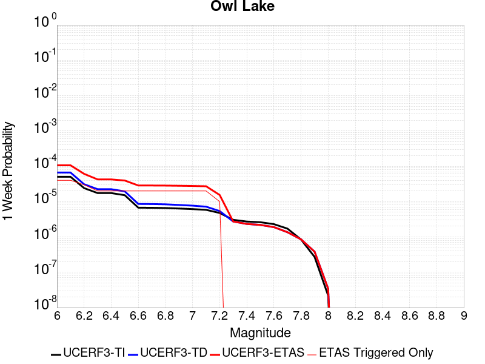 |  |  | 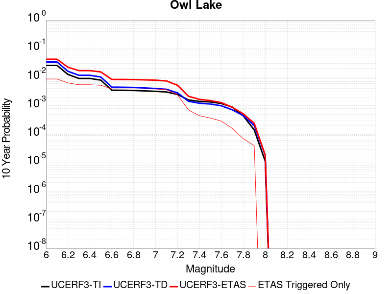 |

| Magnitude | 1 wk TI Prob | 1 wk TD Prob | 1 wk ETAS Prob | 1 wk ETAS/TD Gain | 1 wk ETAS Triggered Only | 1 mo TI Prob | 1 mo TD Prob | 1 mo ETAS Prob | 1 mo ETAS/TD Gain | 1 mo ETAS Triggered Only | 1 yr TI Prob | 1 yr TD Prob | 1 yr ETAS Prob | 1 yr ETAS/TD Gain | 1 yr ETAS Triggered Only | 10 yr TI Prob | 10 yr TD Prob | 10 yr ETAS Prob | 10 yr ETAS/TD Gain | 10 yr ETAS Triggered Only |
|-----|-----|-----|-----|-----|-----|-----|-----|-----|-----|-----|-----|-----|-----|-----|-----|-----|-----|-----|-----|-----|
| 6.0 | 5.0320643E-5 | 6.650206E-5 | 1.0649941E-4 | 1.6014451 | 4.0E-5 | 2.1564208E-4 | 2.8498351E-4 | 5.049208E-4 | 1.7717545 | 2.2E-4 | 0.0026222812 | 0.0034650606 | 0.0057471255 | 1.658593 | 0.00229 | 0.02591553 | 0.034214236 | 0.042568285 | 1.2441688 | 0.00865 |
| 6.1 | 5.0320643E-5 | 6.650206E-5 | 1.0649941E-4 | 1.6014451 | 4.0E-5 | 2.1564208E-4 | 2.8498351E-4 | 5.049208E-4 | 1.7717545 | 2.2E-4 | 0.0026222812 | 0.0034650606 | 0.0057471255 | 1.658593 | 0.00229 | 0.02591553 | 0.034214236 | 0.042568285 | 1.2441688 | 0.00865 |
| 6.2 | 2.4125871E-5 | 3.1060143E-5 | 6.105921E-5 | 1.9658381 | 3.0E-5 | 1.0339249E-4 | 1.3310876E-4 | 3.0308613E-4 | 2.276981 | 1.7E-4 | 0.0012580766 | 0.001619572 | 0.0033667379 | 2.0787823 | 0.00175 | 0.012509781 | 0.016112005 | 0.0223105 | 1.3847128 | 0.0063 |
| 6.3 | 1.7433485E-5 | 2.24214E-5 | 4.242095E-5 | 1.8919849 | 2.0E-5 | 7.471279E-5 | 9.608907E-5 | 2.560737E-4 | 2.6649618 | 1.6E-4 | 9.0924866E-4 | 0.0011693999 | 0.0027575404 | 2.3580818 | 0.00159 | 0.009055373 | 0.011663593 | 0.017050028 | 1.461816 | 0.00545 |
| 6.4 | 1.7433485E-5 | 2.24214E-5 | 4.242095E-5 | 1.8919849 | 2.0E-5 | 7.471279E-5 | 9.608907E-5 | 2.560737E-4 | 2.6649618 | 1.6E-4 | 9.0924866E-4 | 0.0011693999 | 0.0027575404 | 2.3580818 | 0.00159 | 0.009055373 | 0.011663593 | 0.017050028 | 1.461816 | 0.00545 |
| 6.5 | 1.5182742E-5 | 1.949046E-5 | 3.949007E-5 | 2.026123 | 2.0E-5 | 6.506727E-5 | 8.352873E-5 | 2.4351536E-4 | 2.9153485 | 1.6E-4 | 7.919061E-4 | 0.0010166283 | 0.002535083 | 2.4936182 | 0.00152 | 0.0078909 | 0.010150774 | 0.015307888 | 1.5080513 | 0.00521 |
| 6.6 | 6.7271576E-6 | 8.591771E-6 | 2.85916E-5 | 3.3277886 | 2.0E-5 | 2.8830356E-5 | 3.6821388E-5 | 1.4681734E-4 | 3.987284 | 1.1E-4 | 3.5095305E-4 | 4.482139E-4 | 0.001607694 | 3.58689 | 0.00116 | 0.0035039932 | 0.0044914745 | 0.008364002 | 1.8621953 | 0.00389 |
| 6.7 | 6.682835E-6 | 8.524159E-6 | 2.852399E-5 | 3.3462524 | 2.0E-5 | 2.8640408E-5 | 3.653163E-5 | 1.4652761E-4 | 4.010979 | 1.1E-4 | 3.4864116E-4 | 4.4468755E-4 | 0.0016041717 | 3.6074133 | 0.00116 | 0.003480947 | 0.00445635 | 0.008329015 | 1.8690217 | 0.00389 |
| 6.8 | 6.5774975E-6 | 8.370473E-6 | 2.8370305E-5 | 3.3893313 | 2.0E-5 | 2.8188972E-5 | 3.5872992E-5 | 1.4586905E-4 | 4.0662637 | 1.1E-4 | 3.4314668E-4 | 4.3667183E-4 | 0.0015961652 | 3.655297 | 0.00116 | 0.0034261728 | 0.0043763383 | 0.0082493145 | 1.8849809 | 0.00389 |
| 6.9 | 6.363419E-6 | 8.043218E-6 | 2.8043058E-5 | 3.486547 | 2.0E-5 | 2.727151E-5 | 3.447051E-5 | 1.4446671E-4 | 4.1910233 | 1.1E-4 | 3.3198006E-4 | 4.1960328E-4 | 0.0015691207 | 3.739534 | 0.00115 | 0.0033148455 | 0.0042061214 | 0.008069802 | 1.9185851 | 0.00388 |
| 7.0 | 6.1342453E-6 | 7.6748665E-6 | 2.7674712E-5 | 3.6058886 | 2.0E-5 | 2.6289357E-5 | 3.28919E-5 | 1.4288828E-4 | 4.344178 | 1.1E-4 | 3.2002592E-4 | 4.0039085E-4 | 0.0015399344 | 3.846078 | 0.00114 | 0.0031956544 | 0.0040145195 | 0.007859023 | 1.9576498 | 0.00386 |
| 7.1 | 5.842926E-6 | 7.1846043E-6 | 2.718446E-5 | 3.7837102 | 2.0E-5 | 2.504087E-5 | 3.079083E-5 | 1.4078744E-4 | 4.5723825 | 1.1E-4 | 3.0482994E-4 | 3.7481933E-4 | 0.001474407 | 3.9336474 | 0.0011 | 0.0030441214 | 0.0037595115 | 0.0073957895 | 1.9672208 | 0.00365 |
| 7.2 | 4.77173E-6 | 5.3932195E-6 | 1.5393165E-5 | 2.85417 | 1.0E-5 | 2.045011E-5 | 2.3113615E-5 | 1.13111535E-4 | 4.8937187 | 9.0E-5 | 2.4895166E-4 | 2.81376E-4 | 9.511875E-4 | 3.3804855 | 6.7E-4 | 0.0024867293 | 0.0028271396 | 0.005210383 | 1.8429874 | 0.00239 |
| 7.3 | 3.0494948E-6 | 2.737526E-6 | 2.737526E-6 | 1.0 | 0.0 | 1.3069198E-5 | 1.1732202E-5 | 3.173197E-5 | 2.7046897 | 2.0E-5 | 1.5910587E-4 | 1.4283037E-4 | 3.0280752E-4 | 2.12005 | 1.6E-4 | 0.0015899199 | 0.0014376519 | 0.0021466312 | 1.4931508 | 7.1E-4 |
| 7.4 | 2.7263884E-6 | 2.3310124E-6 | 2.3310124E-6 | 1.0 | 0.0 | 1.1684469E-5 | 9.990015E-6 | 9.990015E-6 | 1.0 | 0.0 | 1.4224913E-4 | 1.2162175E-4 | 2.3160837E-4 | 1.9043335 | 1.1E-4 | 0.0014215811 | 0.0012247597 | 0.0016742087 | 1.366969 | 4.5E-4 |
| 7.5 | 2.6090431E-6 | 2.1905125E-6 | 2.1905125E-6 | 1.0 | 0.0 | 1.1181565E-5 | 9.387878E-6 | 9.387878E-6 | 1.0 | 0.0 | 1.3612706E-4 | 1.1429151E-4 | 2.0428123E-4 | 1.7873701 | 9.0E-5 | 0.001360437 | 0.001151283 | 0.0015208571 | 1.3210106 | 3.7E-4 |
| 7.6 | 2.3008756E-6 | 1.8948737E-6 | 1.8948737E-6 | 1.0 | 0.0 | 9.860858E-6 | 8.120863E-6 | 8.120863E-6 | 1.0 | 0.0 | 1.20049335E-4 | 9.8867094E-5 | 1.7885919E-4 | 1.809087 | 8.0E-5 | 0.001199845 | 9.967766E-4 | 0.0012864876 | 1.2906479 | 2.9E-4 |
| 7.7 | 1.7184348E-6 | 1.3617366E-6 | 1.3617366E-6 | 1.0 | 0.0 | 7.3646997E-6 | 5.836001E-6 | 5.836001E-6 | 1.0 | 0.0 | 8.966153E-5 | 7.1051036E-5 | 1.3104678E-4 | 1.8444034 | 6.0E-5 | 8.962536E-4 | 7.1850076E-4 | 8.783858E-4 | 1.222526 | 1.6E-4 |
| 7.8 | 8.4612907E-7 | 8.5453513E-7 | 8.5453513E-7 | 1.0 | 0.0 | 3.6262625E-6 | 3.6622885E-6 | 3.6622885E-6 | 1.0 | 0.0 | 4.4148852E-5 | 4.4587472E-5 | 7.458613E-5 | 1.6728047 | 3.0E-5 | 4.414008E-4 | 4.515909E-4 | 5.2155927E-4 | 1.1549375 | 7.0E-5 |
| 7.9 | 2.716738E-7 | 3.8247714E-7 | 3.8247714E-7 | 1.0 | 0.0 | 1.1643157E-6 | 1.6391868E-6 | 1.6391868E-6 | 1.0 | 0.0 | 1.4175452E-5 | 1.9956928E-5 | 2.9956727E-5 | 1.5010692 | 1.0E-5 | 1.4174548E-4 | 2.0159378E-4 | 2.4158572E-4 | 1.1983788 | 4.0E-5 |
| 8.0 | 2.1995428E-8 | 3.4308833E-8 | 3.4308833E-8 | 1.0 | 0.0 | 9.426611E-8 | 1.4703785E-7 | 1.4703785E-7 | 1.0 | 0.0 | 1.1476893E-6 | 1.7901851E-6 | 1.7901851E-6 | 1.0 | 0.0 | 1.14768345E-5 | 1.845032E-5 | 1.845032E-5 | 1.0 | 0.0 |

## Panamint Valley
*[(top)](#table-of-contents)*

| 1 Week | 1 Month | 1 Year | 10 Year |
|-----|-----|-----|-----|
|  |  |  | 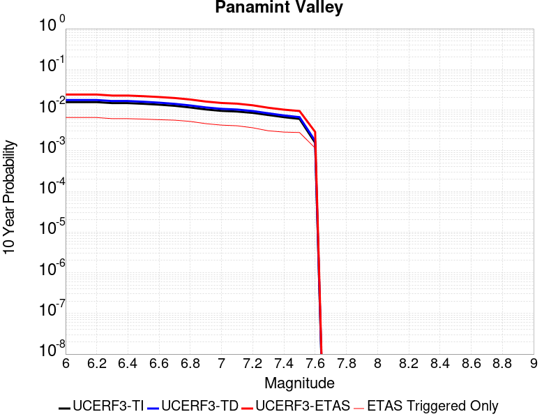 |

| Magnitude | 1 wk TI Prob | 1 wk TD Prob | 1 wk ETAS Prob | 1 wk ETAS/TD Gain | 1 wk ETAS Triggered Only | 1 mo TI Prob | 1 mo TD Prob | 1 mo ETAS Prob | 1 mo ETAS/TD Gain | 1 mo ETAS Triggered Only | 1 yr TI Prob | 1 yr TD Prob | 1 yr ETAS Prob | 1 yr ETAS/TD Gain | 1 yr ETAS Triggered Only | 10 yr TI Prob | 10 yr TD Prob | 10 yr ETAS Prob | 10 yr ETAS/TD Gain | 10 yr ETAS Triggered Only |
|-----|-----|-----|-----|-----|-----|-----|-----|-----|-----|-----|-----|-----|-----|-----|-----|-----|-----|-----|-----|-----|
| 6.0 | 3.0211835E-5 | 3.4023484E-5 | 9.4021445E-5 | 2.7634277 | 6.0E-5 | 1.2947287E-4 | 1.4580695E-4 | 3.6577487E-4 | 2.5086243 | 2.2E-4 | 0.0015751923 | 0.0017737837 | 0.0036704135 | 2.0692565 | 0.0019 | 0.015640736 | 0.01760265 | 0.024027528 | 1.364995 | 0.00654 |
| 6.1 | 3.0211835E-5 | 3.4023484E-5 | 9.4021445E-5 | 2.7634277 | 6.0E-5 | 1.2947287E-4 | 1.4580695E-4 | 3.6577487E-4 | 2.5086243 | 2.2E-4 | 0.0015751923 | 0.0017737837 | 0.0036704135 | 2.0692565 | 0.0019 | 0.015640736 | 0.01760265 | 0.024027528 | 1.364995 | 0.00654 |
| 6.2 | 3.0211835E-5 | 3.4023484E-5 | 9.4021445E-5 | 2.7634277 | 6.0E-5 | 1.2947287E-4 | 1.4580695E-4 | 3.6577487E-4 | 2.5086243 | 2.2E-4 | 0.0015751923 | 0.0017737837 | 0.0036704135 | 2.0692565 | 0.0019 | 0.015640736 | 0.01760265 | 0.024027528 | 1.364995 | 0.00654 |
| 6.3 | 2.8573924E-5 | 3.2139673E-5 | 9.213774E-5 | 2.8667917 | 6.0E-5 | 1.2245393E-4 | 1.3773434E-4 | 3.5770403E-4 | 2.5970578 | 2.2E-4 | 0.001489857 | 0.0016756536 | 0.003502587 | 2.0902812 | 0.00183 | 0.01479908 | 0.016636195 | 0.022674048 | 1.3629348 | 0.00614 |
| 6.4 | 2.8573924E-5 | 3.2139673E-5 | 9.213774E-5 | 2.8667917 | 6.0E-5 | 1.2245393E-4 | 1.3773434E-4 | 3.5770403E-4 | 2.5970578 | 2.2E-4 | 0.001489857 | 0.0016756536 | 0.003502587 | 2.0902812 | 0.00183 | 0.01479908 | 0.016636195 | 0.022674048 | 1.3629348 | 0.00614 |
| 6.5 | 2.7468774E-5 | 3.0864077E-5 | 9.0862224E-5 | 2.9439476 | 6.0E-5 | 1.1771801E-4 | 1.3226808E-4 | 3.5223897E-4 | 2.6630688 | 2.2E-4 | 0.0014322745 | 0.0016092017 | 0.0033563855 | 2.0857458 | 0.00175 | 0.014230782 | 0.015981393 | 0.021865824 | 1.3682052 | 0.00598 |
| 6.6 | 2.6135967E-5 | 2.92863E-5 | 8.928454E-5 | 3.0486796 | 6.0E-5 | 1.1200648E-4 | 1.2550682E-4 | 3.454792E-4 | 2.7526727 | 2.2E-4 | 0.0013628257 | 0.0015270011 | 0.0032144205 | 2.1050544 | 0.00169 | 0.013544982 | 0.015170941 | 0.020873101 | 1.3758607 | 0.00579 |
| 6.7 | 2.4498746E-5 | 2.7373395E-5 | 8.737175E-5 | 3.1918495 | 6.0E-5 | 1.04990395E-4 | 1.1730941E-4 | 3.372836E-4 | 2.8751624 | 2.2E-4 | 0.0012775084 | 0.0014273315 | 0.0031049335 | 2.1753416 | 0.00168 | 0.012701893 | 0.014187287 | 0.019737411 | 1.3912041 | 0.00563 |
| 6.8 | 2.2244329E-5 | 2.4965222E-5 | 6.4964224E-5 | 2.6021888 | 4.0E-5 | 9.532935E-5 | 1.06989544E-4 | 2.969692E-4 | 2.7756846 | 1.9E-4 | 0.0011600169 | 0.0013018411 | 0.0028997583 | 2.2274287 | 0.0016 | 0.011539802 | 0.012947384 | 0.01812941 | 1.4002373 | 0.00525 |
| 6.9 | 1.9902658E-5 | 2.2317723E-5 | 6.231683E-5 | 2.7922575 | 4.0E-5 | 8.529431E-5 | 9.564398E-5 | 2.856258E-4 | 2.9863436 | 1.9E-4 | 0.0010379635 | 0.001163862 | 0.0025921976 | 2.227238 | 0.00143 | 0.010331288 | 0.011582118 | 0.01614861 | 1.3942708 | 0.00462 |
| 7.0 | 1.8353881E-5 | 2.0591762E-5 | 5.0591145E-5 | 2.4568632 | 3.0E-5 | 7.865712E-5 | 8.824752E-5 | 2.6823164E-4 | 3.0395372 | 1.8E-4 | 9.5722964E-4 | 0.0010739018 | 0.0024124628 | 2.2464464 | 0.00134 | 0.009531168 | 0.010691315 | 0.014905769 | 1.3941942 | 0.00426 |
| 7.1 | 1.7667631E-5 | 1.9796691E-5 | 4.9796097E-5 | 2.515375 | 3.0E-5 | 7.571623E-5 | 8.48403E-5 | 2.6482504E-4 | 3.1214533 | 1.8E-4 | 9.2145515E-4 | 0.0010324589 | 0.0023011477 | 2.2288034 | 0.00127 | 0.009176437 | 0.010280767 | 0.014338616 | 1.3947029 | 0.0041 |
| 7.2 | 1.6381597E-5 | 1.8179968E-5 | 4.8179423E-5 | 2.650138 | 3.0E-5 | 7.020495E-5 | 7.791192E-5 | 2.3789945E-4 | 3.053441 | 1.6E-4 | 8.544101E-4 | 9.4818213E-4 | 0.0021070822 | 2.2222335 | 0.00116 | 0.008511325 | 0.009445293 | 0.013070723 | 1.3838346 | 0.00366 |
| 7.3 | 1.4520491E-5 | 1.598425E-5 | 4.598377E-5 | 2.8768175 | 3.0E-5 | 6.222919E-5 | 6.850222E-5 | 1.9849332E-4 | 2.8976188 | 1.3E-4 | 7.57377E-4 | 8.3371165E-4 | 0.001832878 | 2.1984556 | 0.001 | 0.0075480095 | 0.008308204 | 0.011372532 | 1.3688315 | 0.00309 |
| 7.4 | 1.2852287E-5 | 1.4160967E-5 | 3.4160683E-5 | 2.412313 | 2.0E-5 | 5.5080065E-5 | 6.0688537E-5 | 1.7068186E-4 | 2.8124235 | 1.1E-4 | 6.7039346E-4 | 7.386483E-4 | 0.0016879466 | 2.285183 | 9.5E-4 | 0.0066837464 | 0.007364114 | 0.010212979 | 1.3868579 | 0.00287 |
| 7.5 | 1.1637851E-5 | 1.2851749E-5 | 3.285149E-5 | 2.5561886 | 2.0E-5 | 4.987555E-5 | 5.5077846E-5 | 1.6507179E-4 | 2.9970632 | 1.1E-4 | 6.070656E-4 | 6.703822E-4 | 0.0016197453 | 2.416152 | 9.5E-4 | 0.006054099 | 0.006685738 | 0.009467018 | 1.4160019 | 0.0028 |
| 7.6 | 3.0068115E-6 | 3.3388849E-6 | 1.3338851E-5 | 3.9950018 | 1.0E-5 | 1.2886271E-5 | 1.4309469E-5 | 4.430904E-5 | 3.0964837 | 3.0E-5 | 1.5687906E-4 | 1.7421118E-4 | 5.741415E-4 | 3.295664 | 4.0E-4 | 0.0015676835 | 0.0017415364 | 0.0028995164 | 1.6649185 | 0.00116 |

## Garlock (East)
*[(top)](#table-of-contents)*

| 1 Week | 1 Month | 1 Year | 10 Year |
|-----|-----|-----|-----|
|  |  |  |  |

| Magnitude | 1 wk TI Prob | 1 wk TD Prob | 1 wk ETAS Prob | 1 wk ETAS/TD Gain | 1 wk ETAS Triggered Only | 1 mo TI Prob | 1 mo TD Prob | 1 mo ETAS Prob | 1 mo ETAS/TD Gain | 1 mo ETAS Triggered Only | 1 yr TI Prob | 1 yr TD Prob | 1 yr ETAS Prob | 1 yr ETAS/TD Gain | 1 yr ETAS Triggered Only | 10 yr TI Prob | 10 yr TD Prob | 10 yr ETAS Prob | 10 yr ETAS/TD Gain | 10 yr ETAS Triggered Only |
|-----|-----|-----|-----|-----|-----|-----|-----|-----|-----|-----|-----|-----|-----|-----|-----|-----|-----|-----|-----|-----|
| 6.0 | 4.5092507E-5 | 6.307739E-5 | 1.2307361E-4 | 1.9511526 | 6.0E-5 | 1.9323928E-4 | 2.7030616E-4 | 4.302629E-4 | 1.5917614 | 1.6E-4 | 0.0023501497 | 0.0032864586 | 0.004931036 | 1.5004102 | 0.00165 | 0.023254504 | 0.032467946 | 0.03806028 | 1.1722417 | 0.00578 |
| 6.1 | 4.5092507E-5 | 6.307739E-5 | 1.2307361E-4 | 1.9511526 | 6.0E-5 | 1.9323928E-4 | 2.7030616E-4 | 4.302629E-4 | 1.5917614 | 1.6E-4 | 0.0023501497 | 0.0032864586 | 0.004931036 | 1.5004102 | 0.00165 | 0.023254504 | 0.032467946 | 0.03806028 | 1.1722417 | 0.00578 |
| 6.2 | 2.6674514E-5 | 3.4650213E-5 | 8.4648476E-5 | 2.4429426 | 5.0E-5 | 1.1431433E-4 | 1.4849265E-4 | 2.9847038E-4 | 2.010001 | 1.5E-4 | 0.0013908884 | 0.001806432 | 0.0030142462 | 1.6686187 | 0.00121 | 0.01382215 | 0.017971361 | 0.022095881 | 1.2295052 | 0.0042 |
| 6.3 | 2.6674514E-5 | 3.4650213E-5 | 8.4648476E-5 | 2.4429426 | 5.0E-5 | 1.1431433E-4 | 1.4849265E-4 | 2.9847038E-4 | 2.010001 | 1.5E-4 | 0.0013908884 | 0.001806432 | 0.0030142462 | 1.6686187 | 0.00121 | 0.01382215 | 0.017971361 | 0.022095881 | 1.2295052 | 0.0042 |
| 6.4 | 2.5312667E-5 | 3.247676E-5 | 8.247513E-5 | 2.5395124 | 5.0E-5 | 1.0847834E-4 | 1.3917885E-4 | 2.8915796E-4 | 2.0776 | 1.5E-4 | 0.0013199237 | 0.0016932151 | 0.0028911831 | 1.707511 | 0.0012 | 0.013121112 | 0.016844597 | 0.020895198 | 1.2404689 | 0.00412 |
| 6.5 | 2.5312667E-5 | 3.247676E-5 | 8.247513E-5 | 2.5395124 | 5.0E-5 | 1.0847834E-4 | 1.3917885E-4 | 2.8915796E-4 | 2.0776 | 1.5E-4 | 0.0013199237 | 0.0016932151 | 0.0028911831 | 1.707511 | 0.0012 | 0.013121112 | 0.016844597 | 0.020895198 | 1.2404689 | 0.00412 |
| 6.6 | 2.246556E-5 | 2.8259894E-5 | 6.825876E-5 | 2.4153936 | 4.0E-5 | 9.627742E-5 | 1.2110834E-4 | 2.410938E-4 | 1.9907284 | 1.2E-4 | 0.0011715472 | 0.0014735204 | 0.0026018554 | 1.765741 | 0.00113 | 0.011653901 | 0.01467946 | 0.018482797 | 1.2590925 | 0.00386 |
| 6.7 | 2.2241198E-5 | 2.7928969E-5 | 6.792785E-5 | 2.4321647 | 4.0E-5 | 9.531594E-5 | 1.1969022E-4 | 2.3967585E-4 | 2.002468 | 1.2E-4 | 0.0011598538 | 0.001456278 | 0.0025846325 | 1.7748208 | 0.00113 | 0.011538187 | 0.014508775 | 0.018302916 | 1.2615067 | 0.00385 |
| 6.8 | 1.9528685E-5 | 2.4013507E-5 | 6.401254E-5 | 2.6656892 | 4.0E-5 | 8.369167E-5 | 1.02911086E-4 | 2.1289976E-4 | 2.068774 | 1.1E-4 | 0.0010184698 | 0.001252242 | 0.0022809522 | 1.8214947 | 0.00103 | 0.010138147 | 0.012496738 | 0.016101126 | 1.2884263 | 0.00365 |
| 6.9 | 1.3318621E-5 | 1.529246E-5 | 5.529185E-5 | 3.615628 | 4.0E-5 | 5.7078556E-5 | 6.5537504E-5 | 1.755303E-4 | 2.6783183 | 1.1E-4 | 6.9470983E-4 | 7.9763273E-4 | 0.001706907 | 2.139966 | 9.1E-4 | 0.0069254204 | 0.007989063 | 0.011163498 | 1.3973476 | 0.0032 |
| 7.0 | 1.1760853E-5 | 1.3198189E-5 | 5.3197662E-5 | 4.0306787 | 4.0E-5 | 5.0402683E-5 | 5.656247E-5 | 1.6655624E-4 | 2.9446425 | 1.1E-4 | 6.134799E-4 | 6.884355E-4 | 0.0015378504 | 2.2338336 | 8.5E-4 | 0.0061178906 | 0.0069041625 | 0.009903312 | 1.4343973 | 0.00302 |
| 7.1 | 1.0064758E-5 | 1.0990294E-5 | 5.0989853E-5 | 4.639535 | 4.0E-5 | 4.3133965E-5 | 4.7100428E-5 | 1.5709524E-4 | 3.3353252 | 1.1E-4 | 5.2502943E-4 | 5.7330035E-4 | 0.0013728418 | 2.394629 | 8.0E-4 | 0.005237907 | 0.0057586147 | 0.00862203 | 1.4972403 | 0.00288 |
| 7.2 | 9.768808E-6 | 1.0585581E-5 | 5.0585157E-5 | 4.778685 | 4.0E-5 | 4.186565E-5 | 4.5366003E-5 | 1.5536102E-4 | 3.4246132 | 1.1E-4 | 5.095951E-4 | 5.5219466E-4 | 0.0013517529 | 2.4479644 | 8.0E-4 | 0.0050842804 | 0.0055485056 | 0.008382692 | 1.5108018 | 0.00285 |
| 7.3 | 9.344516E-6 | 1.0029644E-5 | 5.002924E-5 | 4.9881377 | 4.0E-5 | 4.004731E-5 | 4.2983498E-5 | 1.5297877E-4 | 3.5590117 | 1.1E-4 | 4.8746695E-4 | 5.2320195E-4 | 0.0012828043 | 2.451834 | 7.6E-4 | 0.0048639905 | 0.005259389 | 0.007905399 | 1.5031022 | 0.00266 |
| 7.4 | 9.023491E-6 | 9.574172E-6 | 4.9573788E-5 | 5.1778674 | 4.0E-5 | 3.867153E-5 | 4.1031537E-5 | 1.5102702E-4 | 3.6807547 | 1.1E-4 | 4.7072413E-4 | 4.994478E-4 | 0.0011791082 | 2.3608236 | 6.8E-4 | 0.004697283 | 0.005021993 | 0.0073900404 | 1.4715354 | 0.00238 |
| 7.5 | 7.081253E-6 | 7.162152E-6 | 3.716194E-5 | 5.1886554 | 3.0E-5 | 3.0347876E-5 | 3.069458E-5 | 8.069305E-5 | 2.628902 | 5.0E-5 | 3.6942272E-4 | 3.7364318E-4 | 7.535012E-4 | 2.016633 | 3.8E-4 | 0.003688092 | 0.0037629043 | 0.005077937 | 1.3494729 | 0.00132 |
| 7.6 | 6.116396E-6 | 6.0273055E-6 | 3.6027126E-5 | 5.977319 | 3.0E-5 | 2.6212863E-5 | 2.5831054E-5 | 7.582976E-5 | 2.9356046 | 5.0E-5 | 3.1909486E-4 | 3.1444797E-4 | 5.443756E-4 | 1.7312106 | 2.3E-4 | 0.0031863707 | 0.0031710283 | 0.0039585233 | 1.2483405 | 7.9E-4 |
| 7.7 | 4.797145E-6 | 4.8215775E-6 | 2.482148E-5 | 5.1480002 | 2.0E-5 | 2.055903E-5 | 2.066374E-5 | 5.066312E-5 | 2.4517884 | 3.0E-5 | 2.5027743E-4 | 2.5155212E-4 | 3.915169E-4 | 1.5564047 | 1.4E-4 | 0.0024999576 | 0.0025428312 | 0.0030415598 | 1.1961312 | 5.0E-4 |
| 7.8 | 3.4028885E-6 | 4.0359305E-6 | 2.403585E-5 | 5.9554667 | 2.0E-5 | 1.4583726E-5 | 1.7296732E-5 | 4.7296213E-5 | 2.7344017 | 3.0E-5 | 1.775424E-4 | 2.1056744E-4 | 3.1054637E-4 | 1.4748073 | 1.0E-4 | 0.0017740062 | 0.002131191 | 0.0024305517 | 1.1404663 | 3.0E-4 |
| 7.9 | 2.5928412E-6 | 3.4211007E-6 | 1.3421067E-5 | 3.9230258 | 1.0E-5 | 1.1112129E-5 | 1.4661779E-5 | 2.4661631E-5 | 1.6820354 | 1.0E-5 | 1.3528178E-4 | 1.784926E-4 | 2.584783E-4 | 1.4481179 | 8.0E-5 | 0.0013519945 | 0.0018065803 | 0.0020261828 | 1.121557 | 2.2E-4 |
| 8.0 | 1.3743648E-6 | 1.6955245E-6 | 1.6955245E-6 | 1.0 | 0.0 | 5.8901214E-6 | 7.2665134E-6 | 7.2665134E-6 | 1.0 | 0.0 | 7.1709874E-5 | 8.846624E-5 | 1.0846447E-4 | 1.2260549 | 2.0E-5 | 7.1686733E-4 | 8.952292E-4 | 9.751576E-4 | 1.0892826 | 8.0E-5 |
| 8.1 | 3.6733252E-7 | 3.188225E-7 | 3.188225E-7 | 1.0 | 0.0 | 1.5742813E-6 | 1.3663815E-6 | 1.3663815E-6 | 1.0 | 0.0 | 1.9166706E-5 | 1.6635584E-5 | 1.6635584E-5 | 1.0 | 0.0 | 1.9165053E-4 | 1.6837404E-4 | 1.7837236E-4 | 1.0593816 | 1.0E-5 |

## Ash Hill
*[(top)](#table-of-contents)*

| 1 Week | 1 Month | 1 Year | 10 Year |
|-----|-----|-----|-----|
| 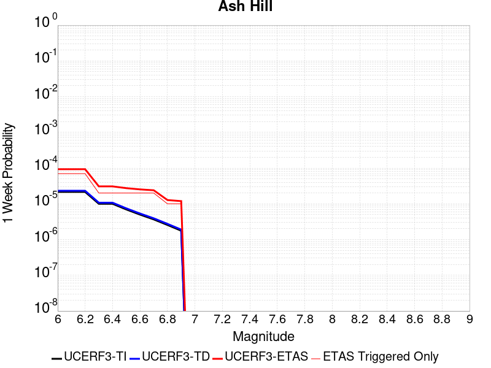 |  |  |  |

| Magnitude | 1 wk TI Prob | 1 wk TD Prob | 1 wk ETAS Prob | 1 wk ETAS/TD Gain | 1 wk ETAS Triggered Only | 1 mo TI Prob | 1 mo TD Prob | 1 mo ETAS Prob | 1 mo ETAS/TD Gain | 1 mo ETAS Triggered Only | 1 yr TI Prob | 1 yr TD Prob | 1 yr ETAS Prob | 1 yr ETAS/TD Gain | 1 yr ETAS Triggered Only | 10 yr TI Prob | 10 yr TD Prob | 10 yr ETAS Prob | 10 yr ETAS/TD Gain | 10 yr ETAS Triggered Only |
|-----|-----|-----|-----|-----|-----|-----|-----|-----|-----|-----|-----|-----|-----|-----|-----|-----|-----|-----|-----|-----|
| 6.0 | 2.1545662E-5 | 2.3204439E-5 | 9.320281E-5 | 4.0165944 | 7.0E-5 | 9.2335285E-5 | 9.944425E-5 | 2.8942537E-4 | 2.910428 | 1.9E-4 | 0.0011236023 | 0.0012101415 | 0.002618435 | 2.163743 | 0.00141 | 0.011179381 | 0.012043508 | 0.016064491 | 1.3338714 | 0.00407 |
| 6.1 | 2.1545662E-5 | 2.3204439E-5 | 9.320281E-5 | 4.0165944 | 7.0E-5 | 9.2335285E-5 | 9.944425E-5 | 2.8942537E-4 | 2.910428 | 1.9E-4 | 0.0011236023 | 0.0012101415 | 0.002618435 | 2.163743 | 0.00141 | 0.011179381 | 0.012043508 | 0.016064491 | 1.3338714 | 0.00407 |
| 6.2 | 2.1545662E-5 | 2.3204439E-5 | 9.320281E-5 | 4.0165944 | 7.0E-5 | 9.2335285E-5 | 9.944425E-5 | 2.8942537E-4 | 2.910428 | 1.9E-4 | 0.0011236023 | 0.0012101415 | 0.002618435 | 2.163743 | 0.00141 | 0.011179381 | 0.012043508 | 0.016064491 | 1.3338714 | 0.00407 |
| 6.3 | 1.0025529E-5 | 1.0751285E-5 | 3.075107E-5 | 2.8602228 | 2.0E-5 | 4.2965847E-5 | 4.60762E-5 | 1.06073436E-4 | 2.3021307 | 6.0E-5 | 5.229836E-4 | 5.608465E-4 | 0.0011005437 | 1.9622902 | 5.4E-4 | 0.005217545 | 0.005595625 | 0.0070474553 | 1.2594581 | 0.00146 |
| 6.4 | 1.0025529E-5 | 1.0751285E-5 | 3.075107E-5 | 2.8602228 | 2.0E-5 | 4.2965847E-5 | 4.60762E-5 | 1.06073436E-4 | 2.3021307 | 6.0E-5 | 5.229836E-4 | 5.608465E-4 | 0.0011005437 | 1.9622902 | 5.4E-4 | 0.005217545 | 0.005595625 | 0.0070474553 | 1.2594581 | 0.00146 |
| 6.5 | 6.9617327E-6 | 7.4596164E-6 | 2.7459468E-5 | 3.681083 | 2.0E-5 | 2.9835655E-5 | 3.196944E-5 | 8.196784E-5 | 2.5639436 | 5.0E-5 | 3.6318856E-4 | 3.891671E-4 | 7.590231E-4 | 1.9503784 | 3.7E-4 | 0.0036259557 | 0.003885711 | 0.0048320196 | 1.2435355 | 9.5E-4 |
| 6.6 | 4.9919777E-6 | 5.3488257E-6 | 2.5348718E-5 | 4.7391186 | 2.0E-5 | 2.1394015E-5 | 2.2923374E-5 | 7.292223E-5 | 3.1811297 | 5.0E-5 | 2.60441E-4 | 2.7906304E-4 | 5.689821E-4 | 2.0389018 | 2.9E-4 | 0.0026013597 | 0.0027877854 | 0.0035456666 | 1.2718579 | 7.6E-4 |
| 6.7 | 3.6630722E-6 | 3.9262E-6 | 2.392612E-5 | 6.0939636 | 2.0E-5 | 1.5698786E-5 | 1.6826496E-5 | 5.6825822E-5 | 3.3771632 | 4.0E-5 | 1.9111596E-4 | 2.0484907E-4 | 4.048081E-4 | 1.9761286 | 2.0E-4 | 0.0019095168 | 0.002047166 | 0.0025361627 | 1.2388653 | 4.9E-4 |
| 6.8 | 2.5599613E-6 | 2.7460408E-6 | 1.2746013E-5 | 4.6415963 | 1.0E-5 | 1.0971216E-5 | 1.1768721E-5 | 3.1768486E-5 | 2.6994 | 2.0E-5 | 1.3356637E-4 | 1.4327971E-4 | 2.632625E-4 | 1.8374027 | 1.2E-4 | 0.0013348613 | 0.0014323586 | 0.0017419147 | 1.2161162 | 3.1E-4 |
| 6.9 | 1.7684905E-6 | 1.8976453E-6 | 1.1897627E-5 | 6.2696786 | 1.0E-5 | 7.579223E-6 | 8.132766E-6 | 2.8132603E-5 | 3.459168 | 2.0E-5 | 9.2273134E-5 | 9.9016426E-5 | 1.7900851E-4 | 1.8078668 | 8.0E-5 | 9.223483E-4 | 9.901642E-4 | 0.0012299266 | 1.242144 | 2.4E-4 |

## Hunter Mountain-Saline Valley
*[(top)](#table-of-contents)*

| 1 Week | 1 Month | 1 Year | 10 Year |
|-----|-----|-----|-----|
|  |  |  |  |

| Magnitude | 1 wk TI Prob | 1 wk TD Prob | 1 wk ETAS Prob | 1 wk ETAS/TD Gain | 1 wk ETAS Triggered Only | 1 mo TI Prob | 1 mo TD Prob | 1 mo ETAS Prob | 1 mo ETAS/TD Gain | 1 mo ETAS Triggered Only | 1 yr TI Prob | 1 yr TD Prob | 1 yr ETAS Prob | 1 yr ETAS/TD Gain | 1 yr ETAS Triggered Only | 10 yr TI Prob | 10 yr TD Prob | 10 yr ETAS Prob | 10 yr ETAS/TD Gain | 10 yr ETAS Triggered Only |
|-----|-----|-----|-----|-----|-----|-----|-----|-----|-----|-----|-----|-----|-----|-----|-----|-----|-----|-----|-----|-----|
| 6.0 | 4.5103672E-5 | 5.4641754E-5 | 7.464066E-5 | 1.3660004 | 2.0E-5 | 1.9328714E-4 | 2.341591E-4 | 3.5413099E-4 | 1.5123521 | 1.2E-4 | 0.002350731 | 0.002847334 | 0.0038245434 | 1.3432016 | 9.8E-4 | 0.023260195 | 0.028128138 | 0.03099516 | 1.1019272 | 0.00295 |
| 6.1 | 4.5103672E-5 | 5.4641754E-5 | 7.464066E-5 | 1.3660004 | 2.0E-5 | 1.9328714E-4 | 2.341591E-4 | 3.5413099E-4 | 1.5123521 | 1.2E-4 | 0.002350731 | 0.002847334 | 0.0038245434 | 1.3432016 | 9.8E-4 | 0.023260195 | 0.028128138 | 0.03099516 | 1.1019272 | 0.00295 |
| 6.2 | 3.9363465E-5 | 4.712291E-5 | 6.712197E-5 | 1.424402 | 2.0E-5 | 1.6868966E-4 | 2.0194055E-4 | 3.219163E-4 | 1.5941143 | 1.2E-4 | 0.002051862 | 0.0024559896 | 0.0034335826 | 1.3980445 | 9.8E-4 | 0.020330196 | 0.024303507 | 0.027172053 | 1.1180302 | 0.00294 |
| 6.3 | 3.9363465E-5 | 4.712291E-5 | 6.712197E-5 | 1.424402 | 2.0E-5 | 1.6868966E-4 | 2.0194055E-4 | 3.219163E-4 | 1.5941143 | 1.2E-4 | 0.002051862 | 0.0024559896 | 0.0034335826 | 1.3980445 | 9.8E-4 | 0.020330196 | 0.024303507 | 0.027172053 | 1.1180302 | 0.00294 |
| 6.4 | 3.2311684E-5 | 3.7996815E-5 | 5.7996054E-5 | 1.5263399 | 2.0E-5 | 1.384713E-4 | 1.6283369E-4 | 2.7281579E-4 | 1.6754259 | 1.1E-4 | 0.0016845843 | 0.0019807662 | 0.0029488448 | 1.4887395 | 9.7E-4 | 0.016718714 | 0.01963916 | 0.022501815 | 1.1457626 | 0.00292 |
| 6.5 | 3.2311684E-5 | 3.7996815E-5 | 5.7996054E-5 | 1.5263399 | 2.0E-5 | 1.384713E-4 | 1.6283369E-4 | 2.7281579E-4 | 1.6754259 | 1.1E-4 | 0.0016845843 | 0.0019807662 | 0.0029488448 | 1.4887395 | 9.7E-4 | 0.016718714 | 0.01963916 | 0.022501815 | 1.1457626 | 0.00292 |
| 6.6 | 2.9305844E-5 | 3.4222314E-5 | 5.422163E-5 | 1.584394 | 2.0E-5 | 1.2559042E-4 | 1.4665918E-4 | 2.5664305E-4 | 1.7499284 | 1.1E-4 | 0.0015279909 | 0.001784175 | 0.0027524445 | 1.5426986 | 9.7E-4 | 0.015175272 | 0.017705692 | 0.020564169 | 1.161444 | 0.00291 |
| 6.7 | 2.7826512E-5 | 3.238223E-5 | 5.2381583E-5 | 1.6176027 | 2.0E-5 | 1.19251024E-4 | 1.3877395E-4 | 2.4875868E-4 | 1.792546 | 1.1E-4 | 0.0014509142 | 0.0016883238 | 0.0026566861 | 1.5735644 | 9.7E-4 | 0.014414776 | 0.016761934 | 0.019623157 | 1.1706977 | 0.00291 |
| 6.8 | 2.3389874E-5 | 2.6897427E-5 | 4.689689E-5 | 1.7435455 | 2.0E-5 | 1.0023846E-4 | 1.1526986E-4 | 2.2525719E-4 | 1.9541724 | 1.1E-4 | 0.00121972 | 0.0014025545 | 0.002361208 | 1.6835054 | 9.6E-4 | 0.01213047 | 0.013942506 | 0.016802073 | 1.2050971 | 0.0029 |
| 6.9 | 2.069209E-5 | 2.3596622E-5 | 4.359615E-5 | 1.847559 | 2.0E-5 | 8.867737E-5 | 1.01124664E-4 | 2.1111354E-4 | 2.0876563 | 1.1E-4 | 0.0010791123 | 0.0012305336 | 0.0021893522 | 1.7791893 | 9.6E-4 | 0.010738871 | 0.012241493 | 0.015096115 | 1.2331923 | 0.00289 |
| 7.0 | 1.7462342E-5 | 1.9655285E-5 | 3.965489E-5 | 2.017518 | 2.0E-5 | 7.483646E-5 | 8.4234336E-5 | 1.9422507E-4 | 2.3057706 | 1.1E-4 | 9.1075303E-4 | 0.0010250933 | 0.0019741193 | 1.925795 | 9.5E-4 | 0.009070295 | 0.010206539 | 0.013047246 | 1.2783222 | 0.00287 |
| 7.1 | 1.4807709E-5 | 1.645985E-5 | 3.645952E-5 | 2.2150578 | 2.0E-5 | 6.3460066E-5 | 7.05404E-5 | 1.8053265E-4 | 2.5592802 | 1.1E-4 | 7.723524E-4 | 8.585075E-4 | 0.0018076919 | 2.1056216 | 9.5E-4 | 0.007696735 | 0.008554153 | 0.0113996025 | 1.3326396 | 0.00287 |
| 7.2 | 1.4180048E-5 | 1.5715666E-5 | 3.571535E-5 | 2.2725954 | 2.0E-5 | 6.077022E-5 | 6.735121E-5 | 1.773438E-4 | 2.6331198 | 1.1E-4 | 7.396263E-4 | 8.1970874E-4 | 0.00176893 | 2.1579983 | 9.5E-4 | 0.0073716943 | 0.00816906 | 0.0110156145 | 1.3484557 | 0.00287 |
| 7.3 | 1.3730402E-5 | 1.518887E-5 | 3.5188565E-5 | 2.3167336 | 2.0E-5 | 5.8843252E-5 | 6.509363E-5 | 1.7508646E-4 | 2.6897635 | 1.1E-4 | 7.161811E-4 | 7.922428E-4 | 0.0017414902 | 2.1981773 | 9.5E-4 | 0.007138774 | 0.007896374 | 0.010743711 | 1.360588 | 0.00287 |
| 7.4 | 1.2810095E-5 | 1.4124731E-5 | 3.412445E-5 | 2.4159362 | 2.0E-5 | 5.489925E-5 | 6.0533246E-5 | 1.7052659E-4 | 2.8170733 | 1.1E-4 | 6.681934E-4 | 7.3675887E-4 | 0.0016860589 | 2.2884812 | 9.5E-4 | 0.006661878 | 0.0073453137 | 0.010184306 | 1.3865039 | 0.00286 |
| 7.5 | 1.1595659E-5 | 1.2815512E-5 | 3.2815256E-5 | 2.5605888 | 2.0E-5 | 4.9694736E-5 | 5.492255E-5 | 1.649165E-4 | 3.00271 | 1.1E-4 | 6.0486543E-4 | 6.6849263E-4 | 0.0016178576 | 2.4201577 | 9.5E-4 | 0.006032217 | 0.006666925 | 0.009438324 | 1.4156938 | 0.00279 |
| 7.6 | 2.997694E-6 | 3.3309905E-6 | 1.3330957E-5 | 4.0021 | 1.0E-5 | 1.28471975E-5 | 1.4275636E-5 | 4.427521E-5 | 3.1014524 | 3.0E-5 | 1.564034E-4 | 1.7379932E-4 | 5.737298E-4 | 3.301105 | 4.0E-4 | 0.0015629337 | 0.0017374133 | 0.002895398 | 1.6664991 | 0.00116 |

## Blackwater
*[(top)](#table-of-contents)*

| 1 Week | 1 Month | 1 Year | 10 Year |
|-----|-----|-----|-----|
|  |  |  |  |

| Magnitude | 1 wk TI Prob | 1 wk TD Prob | 1 wk ETAS Prob | 1 wk ETAS/TD Gain | 1 wk ETAS Triggered Only | 1 mo TI Prob | 1 mo TD Prob | 1 mo ETAS Prob | 1 mo ETAS/TD Gain | 1 mo ETAS Triggered Only | 1 yr TI Prob | 1 yr TD Prob | 1 yr ETAS Prob | 1 yr ETAS/TD Gain | 1 yr ETAS Triggered Only | 10 yr TI Prob | 10 yr TD Prob | 10 yr ETAS Prob | 10 yr ETAS/TD Gain | 10 yr ETAS Triggered Only |
|-----|-----|-----|-----|-----|-----|-----|-----|-----|-----|-----|-----|-----|-----|-----|-----|-----|-----|-----|-----|-----|
| 6.0 | 3.0708583E-5 | 3.3110347E-5 | 7.310902E-5 | 2.2080417 | 4.0E-5 | 1.3160157E-4 | 1.4189453E-4 | 2.3188177E-4 | 1.6341839 | 9.0E-5 | 0.0016010714 | 0.0017263339 | 0.002475039 | 1.4336966 | 7.5E-4 | 0.015895851 | 0.017143084 | 0.01957074 | 1.1416115 | 0.00247 |
| 6.1 | 3.0708583E-5 | 3.3110347E-5 | 7.310902E-5 | 2.2080417 | 4.0E-5 | 1.3160157E-4 | 1.4189453E-4 | 2.3188177E-4 | 1.6341839 | 9.0E-5 | 0.0016010714 | 0.0017263339 | 0.002475039 | 1.4336966 | 7.5E-4 | 0.015895851 | 0.017143084 | 0.01957074 | 1.1416115 | 0.00247 |
| 6.2 | 1.1707779E-5 | 1.2550173E-5 | 3.254992E-5 | 2.5935836 | 2.0E-5 | 5.017523E-5 | 5.37854E-5 | 1.0378271E-4 | 1.9295703 | 5.0E-5 | 6.107122E-4 | 6.546501E-4 | 9.6444716E-4 | 1.4732254 | 3.1E-4 | 0.006090366 | 0.0065281885 | 0.007432248 | 1.1384854 | 9.1E-4 |
| 6.3 | 1.1707779E-5 | 1.2550173E-5 | 3.254992E-5 | 2.5935836 | 2.0E-5 | 5.017523E-5 | 5.37854E-5 | 1.0378271E-4 | 1.9295703 | 5.0E-5 | 6.107122E-4 | 6.546501E-4 | 9.6444716E-4 | 1.4732254 | 3.1E-4 | 0.006090366 | 0.0065281885 | 0.007432248 | 1.1384854 | 9.1E-4 |
| 6.4 | 7.929244E-6 | 8.483413E-6 | 2.8483244E-5 | 3.3575218 | 2.0E-5 | 3.3982033E-5 | 3.6357E-5 | 7.635554E-5 | 2.1001608 | 4.0E-5 | 4.136527E-4 | 4.4256062E-4 | 6.524677E-4 | 1.4743012 | 2.1E-4 | 0.0041288356 | 0.0044171987 | 0.0050543714 | 1.1442482 | 6.4E-4 |
| 6.5 | 5.8832115E-6 | 6.2884124E-6 | 1.628835E-5 | 2.5902166 | 1.0E-5 | 2.521352E-5 | 2.6950074E-5 | 4.6949535E-5 | 1.742093 | 2.0E-5 | 3.0693135E-4 | 3.2807028E-4 | 4.6802437E-4 | 1.4265978 | 1.4E-4 | 0.0030650778 | 0.0032761132 | 0.0037346063 | 1.1399503 | 4.6E-4 |
| 6.6 | 5.8832115E-6 | 6.2884124E-6 | 1.628835E-5 | 2.5902166 | 1.0E-5 | 2.521352E-5 | 2.6950074E-5 | 4.6949535E-5 | 1.742093 | 2.0E-5 | 3.0693135E-4 | 3.2807028E-4 | 4.6802437E-4 | 1.4265978 | 1.4E-4 | 0.0030650778 | 0.0032761132 | 0.0037346063 | 1.1399503 | 4.6E-4 |
| 6.7 | 3.0715053E-6 | 3.2827281E-6 | 3.2827281E-6 | 1.0 | 0.0 | 1.3163528E-5 | 1.4068765E-5 | 1.4068765E-5 | 1.0 | 0.0 | 1.6025416E-4 | 1.7127492E-4 | 2.1126807E-4 | 1.2335026 | 4.0E-5 | 0.0016013865 | 0.0017115438 | 0.0019311673 | 1.1283189 | 2.2E-4 |
| 6.8 | 2.2722281E-6 | 2.4296949E-6 | 2.4296949E-6 | 1.0 | 0.0 | 9.738084E-6 | 1.0412941E-5 | 1.0412941E-5 | 1.0 | 0.0 | 1.1855473E-4 | 1.267711E-4 | 1.6676604E-4 | 1.3154893 | 4.0E-5 | 0.001184915 | 0.0012670781 | 0.0014468501 | 1.1418791 | 1.8E-4 |
| 6.9 | 9.952399E-7 | 1.065771E-6 | 1.065771E-6 | 1.0 | 0.0 | 4.265307E-6 | 4.567585E-6 | 4.567585E-6 | 1.0 | 0.0 | 5.1928873E-5 | 5.5609446E-5 | 6.560889E-5 | 1.1798155 | 1.0E-5 | 5.191674E-4 | 5.56006E-4 | 5.959837E-4 | 1.0719017 | 4.0E-5 |
| 7.0 | 4.7385504E-7 | 5.07759E-7 | 5.07759E-7 | 1.0 | 0.0 | 2.0308057E-6 | 2.17611E-6 | 2.17611E-6 | 1.0 | 0.0 | 2.4724779E-5 | 2.6494141E-5 | 3.6493875E-5 | 1.377432 | 1.0E-5 | 2.4722028E-4 | 2.649414E-4 | 2.849361E-4 | 1.0754684 | 2.0E-5 |

## Garlock (West)
*[(top)](#table-of-contents)*

| 1 Week | 1 Month | 1 Year | 10 Year |
|-----|-----|-----|-----|
|  |  | 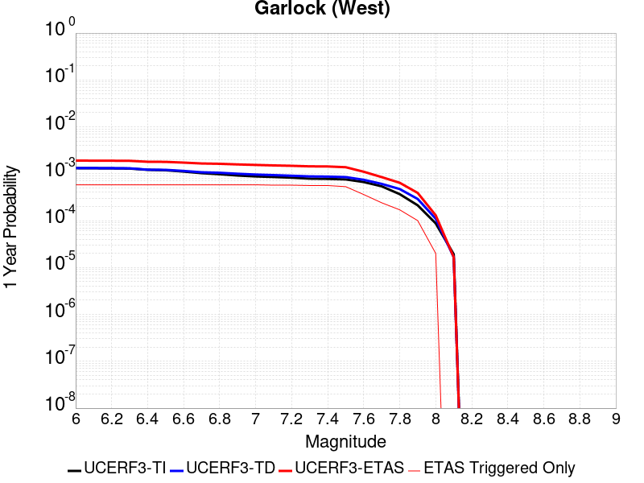 |  |

| Magnitude | 1 wk TI Prob | 1 wk TD Prob | 1 wk ETAS Prob | 1 wk ETAS/TD Gain | 1 wk ETAS Triggered Only | 1 mo TI Prob | 1 mo TD Prob | 1 mo ETAS Prob | 1 mo ETAS/TD Gain | 1 mo ETAS Triggered Only | 1 yr TI Prob | 1 yr TD Prob | 1 yr ETAS Prob | 1 yr ETAS/TD Gain | 1 yr ETAS Triggered Only | 10 yr TI Prob | 10 yr TD Prob | 10 yr ETAS Prob | 10 yr ETAS/TD Gain | 10 yr ETAS Triggered Only |
|-----|-----|-----|-----|-----|-----|-----|-----|-----|-----|-----|-----|-----|-----|-----|-----|-----|-----|-----|-----|-----|
| 6.0 | 2.5181727E-5 | 2.541563E-5 | 5.541487E-5 | 2.180346 | 3.0E-5 | 1.0791722E-4 | 1.08919594E-4 | 1.6891306E-4 | 1.5508051 | 6.0E-5 | 0.0013131002 | 0.0013252929 | 0.0019045242 | 1.4370592 | 5.8E-4 | 0.013053683 | 0.013254034 | 0.01540514 | 1.1622982 | 0.00218 |
| 6.1 | 2.5077732E-5 | 2.531663E-5 | 5.531587E-5 | 2.1849618 | 3.0E-5 | 1.0747157E-4 | 1.08495355E-4 | 1.6848884E-4 | 1.5529591 | 6.0E-5 | 0.001307681 | 0.0013201339 | 0.0018993682 | 1.4387693 | 5.8E-4 | 0.013000126 | 0.013203059 | 0.015354277 | 1.1629332 | 0.00218 |
| 6.2 | 2.494612E-5 | 2.5198151E-5 | 5.5197394E-5 | 2.1905336 | 3.0E-5 | 1.0690756E-4 | 1.07987624E-4 | 1.6798114E-4 | 1.5555593 | 6.0E-5 | 0.0013008224 | 0.0013139598 | 0.0018931978 | 1.4408338 | 5.8E-4 | 0.012932341 | 0.013142049 | 0.0152934 | 1.1636997 | 0.00218 |
| 6.3 | 2.4733758E-5 | 2.5017298E-5 | 5.501655E-5 | 2.1991403 | 3.0E-5 | 1.0599751E-4 | 1.0721261E-4 | 1.6720618E-4 | 1.5595757 | 6.0E-5 | 0.0012897556 | 0.0013045353 | 0.0018837787 | 1.4440228 | 5.8E-4 | 0.012822957 | 0.013048915 | 0.015200469 | 1.1648837 | 0.00218 |
| 6.4 | 2.3237335E-5 | 2.3395121E-5 | 5.339442E-5 | 2.2822886 | 3.0E-5 | 9.958477E-5 | 1.0026097E-4 | 1.6025495E-4 | 1.5983783 | 6.0E-5 | 0.0012117702 | 0.0012199966 | 0.001799289 | 1.4748312 | 5.8E-4 | 0.012051838 | 0.012213092 | 0.0143664675 | 1.176317 | 0.00218 |
| 6.5 | 2.2732203E-5 | 2.3208771E-5 | 5.3208074E-5 | 2.2925847 | 3.0E-5 | 9.742009E-5 | 9.9462384E-5 | 1.5945642E-4 | 1.6031832 | 6.0E-5 | 0.0011854442 | 0.0012102847 | 0.0017895827 | 1.478646 | 5.8E-4 | 0.011791403 | 0.012117037 | 0.014270621 | 1.177732 | 0.00218 |
| 6.6 | 2.1319436E-5 | 2.1987496E-5 | 5.1986837E-5 | 2.3643818 | 3.0E-5 | 9.136581E-5 | 9.4228744E-5 | 1.5422309E-4 | 1.6366884 | 6.0E-5 | 0.001111811 | 0.0011466335 | 0.0017259684 | 1.5052485 | 5.8E-4 | 0.011062649 | 0.011487249 | 0.013642208 | 1.1875956 | 0.00218 |
| 6.7 | 1.970802E-5 | 2.0605292E-5 | 5.0604674E-5 | 2.4559066 | 3.0E-5 | 8.446021E-5 | 8.8305416E-5 | 1.4830011E-4 | 1.6794001 | 6.0E-5 | 0.001027818 | 0.0010745899 | 0.0016539666 | 1.5391608 | 5.8E-4 | 0.010230771 | 0.010773982 | 0.012930495 | 1.2001593 | 0.00218 |
| 6.8 | 1.8744462E-5 | 2.0111074E-5 | 5.0110473E-5 | 2.4916854 | 3.0E-5 | 8.033094E-5 | 8.618749E-5 | 1.4618231E-4 | 1.6960968 | 6.0E-5 | 9.775903E-4 | 0.0010488292 | 0.0016282209 | 1.5524176 | 5.8E-4 | 0.009733009 | 0.010518834 | 0.012675903 | 1.2050673 | 0.00218 |
| 6.9 | 1.7559682E-5 | 1.916173E-5 | 4.9161154E-5 | 2.5655906 | 3.0E-5 | 7.5253614E-5 | 8.211912E-5 | 1.421142E-4 | 1.7305859 | 6.0E-5 | 9.158276E-4 | 9.993432E-4 | 0.0015787636 | 1.5798012 | 5.8E-4 | 0.0091206245 | 0.010028337 | 0.012166676 | 1.2132297 | 0.00216 |
| 7.0 | 1.6794445E-5 | 1.842183E-5 | 4.8421276E-5 | 2.6284728 | 3.0E-5 | 7.197421E-5 | 7.894832E-5 | 1.3894358E-4 | 1.7599308 | 6.0E-5 | 8.759337E-4 | 9.6077326E-4 | 0.001540216 | 1.6031004 | 5.8E-4 | 0.008724891 | 0.009645915 | 0.011785079 | 1.221769 | 0.00216 |
| 7.1 | 1.6337795E-5 | 1.7921551E-5 | 4.7921014E-5 | 2.6739323 | 3.0E-5 | 7.0017246E-5 | 7.68044E-5 | 1.2680056E-4 | 1.6509544 | 5.0E-5 | 8.521265E-4 | 9.3469373E-4 | 0.0015041609 | 1.6092554 | 5.7E-4 | 0.008488664 | 0.009387246 | 0.011497252 | 1.2247736 | 0.00213 |
| 7.2 | 1.5780008E-5 | 1.7369428E-5 | 4.7368907E-5 | 2.7271426 | 3.0E-5 | 6.762685E-5 | 7.4438285E-5 | 1.2443456E-4 | 1.6716473 | 5.0E-5 | 8.2304585E-4 | 9.059107E-4 | 0.0014753942 | 1.6286311 | 5.7E-4 | 0.008200042 | 0.009101729 | 0.0111826155 | 1.2286254 | 0.0021 |
| 7.3 | 1.5058865E-5 | 1.6821039E-5 | 4.6820533E-5 | 2.7834508 | 3.0E-5 | 6.45364E-5 | 7.208818E-5 | 1.2208457E-4 | 1.693545 | 5.0E-5 | 7.854473E-4 | 8.773214E-4 | 0.00143683 | 1.6377466 | 5.6E-4 | 0.00782677 | 0.008817707 | 0.010889279 | 1.234933 | 0.00209 |
| 7.4 | 1.4887923E-5 | 1.665638E-5 | 4.665588E-5 | 2.8010814 | 3.0E-5 | 6.380382E-5 | 7.138254E-5 | 1.2137897E-4 | 1.7004013 | 5.0E-5 | 7.7653467E-4 | 8.687372E-4 | 0.0014282507 | 1.6440538 | 5.6E-4 | 0.0077382675 | 0.00873225 | 0.010774261 | 1.2338471 | 0.00206 |
| 7.5 | 1.4509299E-5 | 1.624691E-5 | 4.6246423E-5 | 2.8464751 | 3.0E-5 | 6.218123E-5 | 6.962776E-5 | 1.1962428E-4 | 1.7180544 | 5.0E-5 | 7.567935E-4 | 8.4738946E-4 | 0.0013769404 | 1.6249202 | 5.3E-4 | 0.0075422134 | 0.008519804 | 0.010433361 | 1.224601 | 0.00193 |
| 7.6 | 1.2756717E-5 | 1.4238502E-5 | 4.4238077E-5 | 3.106933 | 3.0E-5 | 5.4670498E-5 | 6.102073E-5 | 1.1101768E-4 | 1.8193437 | 5.0E-5 | 6.6541E-4 | 7.4267486E-4 | 0.0011024075 | 1.4843743 | 3.6E-4 | 0.006634211 | 0.0074784467 | 0.008758799 | 1.1712058 | 0.00129 |
| 7.7 | 1.0328985E-5 | 1.16359415E-5 | 3.1635707E-5 | 2.7187922 | 2.0E-5 | 4.4266326E-5 | 4.9867373E-5 | 7.986587E-5 | 1.6015658 | 3.0E-5 | 5.388092E-4 | 6.069665E-4 | 8.468208E-4 | 1.3951689 | 2.4E-4 | 0.0053750467 | 0.0061294893 | 0.0069544017 | 1.134581 | 8.3E-4 |
| 7.8 | 7.0306583E-6 | 9.039967E-6 | 2.9039786E-5 | 3.2123775 | 2.0E-5 | 3.0131043E-5 | 3.8742142E-5 | 6.874098E-5 | 1.7743206 | 3.0E-5 | 3.667837E-4 | 4.7158365E-4 | 6.415035E-4 | 1.3603175 | 1.7E-4 | 0.003661789 | 0.004768301 | 0.0052858214 | 1.1085335 | 5.2E-4 |
| 7.9 | 4.060633E-6 | 5.5468727E-6 | 1.5546817E-5 | 2.8028078 | 1.0E-5 | 1.7402595E-5 | 2.3772094E-5 | 3.3771856E-5 | 1.4206513 | 1.0E-5 | 2.11856E-4 | 2.8938692E-4 | 3.8935797E-4 | 1.3454581 | 1.0E-4 | 0.0021165414 | 0.0029266786 | 0.003245742 | 1.1090189 | 3.2E-4 |
| 8.0 | 1.6729537E-6 | 2.104827E-6 | 2.104827E-6 | 1.0 | 0.0 | 7.169782E-6 | 9.020656E-6 | 9.020656E-6 | 1.0 | 0.0 | 8.7288594E-5 | 1.0982099E-4 | 1.298188E-4 | 1.1820946 | 2.0E-5 | 8.7254314E-4 | 0.0011113439 | 0.0012212216 | 1.0988693 | 1.1E-4 |
| 8.1 | 3.6733252E-7 | 3.188225E-7 | 3.188225E-7 | 1.0 | 0.0 | 1.5742813E-6 | 1.3663815E-6 | 1.3663815E-6 | 1.0 | 0.0 | 1.9166706E-5 | 1.6635584E-5 | 1.6635584E-5 | 1.0 | 0.0 | 1.9165053E-4 | 1.6837404E-4 | 1.7837236E-4 | 1.0593816 | 1.0E-5 |

## McLean Lake
*[(top)](#table-of-contents)*

| 1 Week | 1 Month | 1 Year | 10 Year |
|-----|-----|-----|-----|
|  |  |  |  |

| Magnitude | 1 wk TI Prob | 1 wk TD Prob | 1 wk ETAS Prob | 1 wk ETAS/TD Gain | 1 wk ETAS Triggered Only | 1 mo TI Prob | 1 mo TD Prob | 1 mo ETAS Prob | 1 mo ETAS/TD Gain | 1 mo ETAS Triggered Only | 1 yr TI Prob | 1 yr TD Prob | 1 yr ETAS Prob | 1 yr ETAS/TD Gain | 1 yr ETAS Triggered Only | 10 yr TI Prob | 10 yr TD Prob | 10 yr ETAS Prob | 10 yr ETAS/TD Gain | 10 yr ETAS Triggered Only |
|-----|-----|-----|-----|-----|-----|-----|-----|-----|-----|-----|-----|-----|-----|-----|-----|-----|-----|-----|-----|-----|
| 6.0 | 1.7360222E-5 | 1.8508483E-5 | 1.8508483E-5 | 1.0 | 0.0 | 7.439883E-5 | 7.9319936E-5 | 1.1931676E-4 | 1.5042468 | 4.0E-5 | 9.0542925E-4 | 9.65341E-4 | 0.001285032 | 1.3311691 | 3.2E-4 | 0.009017491 | 0.009616322 | 0.0111118015 | 1.1555147 | 0.00151 |
| 6.1 | 9.062689E-6 | 9.595349E-6 | 9.595349E-6 | 1.0 | 0.0 | 3.8839516E-5 | 4.112233E-5 | 6.112151E-5 | 1.4863337 | 2.0E-5 | 4.727685E-4 | 5.0055824E-4 | 6.904631E-4 | 1.3793862 | 1.9E-4 | 0.0047176396 | 0.004995191 | 0.005821045 | 1.1653298 | 8.3E-4 |
| 6.2 | 9.062689E-6 | 9.595349E-6 | 9.595349E-6 | 1.0 | 0.0 | 3.8839516E-5 | 4.112233E-5 | 6.112151E-5 | 1.4863337 | 2.0E-5 | 4.727685E-4 | 5.0055824E-4 | 6.904631E-4 | 1.3793862 | 1.9E-4 | 0.0047176396 | 0.004995191 | 0.005821045 | 1.1653298 | 8.3E-4 |
| 6.3 | 7.2575485E-6 | 7.670149E-6 | 7.670149E-6 | 1.0 | 0.0 | 3.110341E-5 | 3.2871696E-5 | 4.2871365E-5 | 1.3042032 | 1.0E-5 | 3.786182E-4 | 4.0014653E-4 | 5.400905E-4 | 1.3497318 | 1.4E-4 | 0.0037797375 | 0.0039949655 | 0.004592568 | 1.1495891 | 6.0E-4 |
| 6.4 | 7.2575485E-6 | 7.670149E-6 | 7.670149E-6 | 1.0 | 0.0 | 3.110341E-5 | 3.2871696E-5 | 4.2871365E-5 | 1.3042032 | 1.0E-5 | 3.786182E-4 | 4.0014653E-4 | 5.400905E-4 | 1.3497318 | 1.4E-4 | 0.0037797375 | 0.0039949655 | 0.004592568 | 1.1495891 | 6.0E-4 |
| 6.5 | 6.06582E-6 | 6.4058863E-6 | 6.4058863E-6 | 1.0 | 0.0 | 2.5996113E-5 | 2.7453547E-5 | 3.7453272E-5 | 1.3642417 | 1.0E-5 | 3.164567E-4 | 3.3420217E-4 | 4.241721E-4 | 1.2692081 | 9.0E-5 | 0.0031600643 | 0.0033376347 | 0.0037960992 | 1.1373621 | 4.6E-4 |
| 6.6 | 5.598744E-6 | 5.9121135E-6 | 5.9121135E-6 | 1.0 | 0.0 | 2.3994397E-5 | 2.533742E-5 | 3.5337165E-5 | 1.3946632 | 1.0E-5 | 2.9209262E-4 | 3.0844583E-4 | 3.9841805E-4 | 1.2916955 | 9.0E-5 | 0.0029170897 | 0.0030808067 | 0.0035393895 | 1.1488515 | 4.6E-4 |
| 6.7 | 5.246996E-6 | 5.5408987E-6 | 5.5408987E-6 | 1.0 | 0.0 | 2.2486933E-5 | 2.3746526E-5 | 3.374629E-5 | 1.4211042 | 1.0E-5 | 2.73744E-4 | 2.8908197E-4 | 3.6905883E-4 | 1.2766582 | 8.0E-5 | 0.0027340704 | 0.0028876835 | 0.0032964996 | 1.1415724 | 4.1E-4 |
| 6.8 | 4.02324E-6 | 4.248234E-6 | 4.248234E-6 | 1.0 | 0.0 | 1.7242342E-5 | 1.8206623E-5 | 2.8206441E-5 | 1.5492407 | 1.0E-5 | 2.099053E-4 | 2.2164904E-4 | 2.9163354E-4 | 1.3157446 | 7.0E-5 | 0.0020970714 | 0.0022148644 | 0.002584045 | 1.1666831 | 3.7E-4 |
| 6.9 | 6.835972E-7 | 7.141714E-7 | 7.141714E-7 | 1.0 | 0.0 | 2.9296991E-6 | 3.0607328E-6 | 3.0607328E-6 | 1.0 | 0.0 | 3.56685E-5 | 3.7264104E-5 | 5.7263358E-5 | 1.5366895 | 2.0E-5 | 3.5662777E-4 | 3.7260982E-4 | 4.4258373E-4 | 1.1877941 | 7.0E-5 |

## Goldstone Lake
*[(top)](#table-of-contents)*

| 1 Week | 1 Month | 1 Year | 10 Year |
|-----|-----|-----|-----|
|  |  |  |  |

| Magnitude | 1 wk TI Prob | 1 wk TD Prob | 1 wk ETAS Prob | 1 wk ETAS/TD Gain | 1 wk ETAS Triggered Only | 1 mo TI Prob | 1 mo TD Prob | 1 mo ETAS Prob | 1 mo ETAS/TD Gain | 1 mo ETAS Triggered Only | 1 yr TI Prob | 1 yr TD Prob | 1 yr ETAS Prob | 1 yr ETAS/TD Gain | 1 yr ETAS Triggered Only | 10 yr TI Prob | 10 yr TD Prob | 10 yr ETAS Prob | 10 yr ETAS/TD Gain | 10 yr ETAS Triggered Only |
|-----|-----|-----|-----|-----|-----|-----|-----|-----|-----|-----|-----|-----|-----|-----|-----|-----|-----|-----|-----|-----|
| 6.0 | 2.671352E-5 | 3.0399511E-5 | 3.0399511E-5 | 1.0 | 0.0 | 1.1448149E-4 | 1.3027822E-4 | 1.6027431E-4 | 1.2302464 | 3.0E-5 | 0.001392921 | 0.0015851799 | 0.0018847043 | 1.1889529 | 3.0E-4 | 0.013842222 | 0.015758255 | 0.017067298 | 1.0830702 | 0.00133 |
| 6.1 | 2.671352E-5 | 3.0399511E-5 | 3.0399511E-5 | 1.0 | 0.0 | 1.1448149E-4 | 1.3027822E-4 | 1.6027431E-4 | 1.2302464 | 3.0E-5 | 0.001392921 | 0.0015851799 | 0.0018847043 | 1.1889529 | 3.0E-4 | 0.013842222 | 0.015758255 | 0.017067298 | 1.0830702 | 0.00133 |
| 6.2 | 1.4197047E-5 | 1.6108332E-5 | 1.6108332E-5 | 1.0 | 0.0 | 6.0843064E-5 | 6.903444E-5 | 8.903306E-5 | 1.2896905 | 2.0E-5 | 7.4051257E-4 | 8.40269E-4 | 0.0010201178 | 1.2140371 | 1.8E-4 | 0.007380498 | 0.008380629 | 0.009084679 | 1.0840092 | 7.1E-4 |
| 6.3 | 1.4197047E-5 | 1.6108332E-5 | 1.6108332E-5 | 1.0 | 0.0 | 6.0843064E-5 | 6.903444E-5 | 8.903306E-5 | 1.2896905 | 2.0E-5 | 7.4051257E-4 | 8.40269E-4 | 0.0010201178 | 1.2140371 | 1.8E-4 | 0.007380498 | 0.008380629 | 0.009084679 | 1.0840092 | 7.1E-4 |
| 6.4 | 1.3238931E-5 | 1.5019718E-5 | 1.5019718E-5 | 1.0 | 0.0 | 5.6737044E-5 | 6.436919E-5 | 8.43679E-5 | 1.3106877 | 2.0E-5 | 6.9055456E-4 | 7.835112E-4 | 9.633702E-4 | 1.229555 | 1.8E-4 | 0.006884126 | 0.007817129 | 0.008491813 | 1.0863085 | 6.8E-4 |
| 6.5 | 1.3238931E-5 | 1.5019718E-5 | 1.5019718E-5 | 1.0 | 0.0 | 5.6737044E-5 | 6.436919E-5 | 8.43679E-5 | 1.3106877 | 2.0E-5 | 6.9055456E-4 | 7.835112E-4 | 9.633702E-4 | 1.229555 | 1.8E-4 | 0.006884126 | 0.007817129 | 0.008491813 | 1.0863085 | 6.8E-4 |
| 6.6 | 1.1328278E-5 | 1.2864885E-5 | 1.2864885E-5 | 1.0 | 0.0 | 4.8548856E-5 | 5.51346E-5 | 7.5133496E-5 | 1.3627286 | 2.0E-5 | 5.90922E-4 | 6.711528E-4 | 8.410387E-4 | 1.2531255 | 1.7E-4 | 0.0058935313 | 0.006700662 | 0.0072966414 | 1.0889434 | 6.0E-4 |
| 6.7 | 8.651175E-6 | 9.8320315E-6 | 9.8320315E-6 | 1.0 | 0.0 | 3.707594E-5 | 4.2137108E-5 | 6.213626E-5 | 1.474621 | 2.0E-5 | 4.5130608E-4 | 5.129892E-4 | 6.629122E-4 | 1.2922539 | 1.5E-4 | 0.0045039062 | 0.005126942 | 0.0056542247 | 1.1028454 | 5.3E-4 |
| 6.8 | 1.0215377E-6 | 1.1764322E-6 | 1.1764322E-6 | 1.0 | 0.0 | 4.378012E-6 | 5.0418435E-6 | 5.0418435E-6 | 1.0 | 0.0 | 5.3300988E-5 | 6.138283E-5 | 7.1382216E-5 | 1.162902 | 1.0E-5 | 5.3288206E-4 | 6.1367E-4 | 6.436516E-4 | 1.0488563 | 3.0E-5 |
| 6.9 | 7.9360774E-7 | 9.291845E-7 | 9.291845E-7 | 1.0 | 0.0 | 3.4011714E-6 | 3.982214E-6 | 3.982214E-6 | 1.0 | 0.0 | 4.1408475E-5 | 4.8482445E-5 | 5.848196E-5 | 1.2062502 | 1.0E-5 | 4.140076E-4 | 4.847257E-4 | 4.947208E-4 | 1.0206202 | 1.0E-5 |
| 7.0 | 7.4382757E-7 | 8.755545E-7 | 8.755545E-7 | 1.0 | 0.0 | 3.1878285E-6 | 3.7523716E-6 | 3.7523716E-6 | 1.0 | 0.0 | 3.8811122E-5 | 4.5684235E-5 | 4.5684235E-5 | 1.0 | 0.0 | 3.8804344E-4 | 4.5675508E-4 | 4.5675508E-4 | 1.0 | 0.0 |
| 7.1 | 6.4709513E-7 | 7.7191027E-7 | 7.7191027E-7 | 1.0 | 0.0 | 2.773262E-6 | 3.308183E-6 | 3.308183E-6 | 1.0 | 0.0 | 3.376394E-5 | 4.0276445E-5 | 4.0276445E-5 | 1.0 | 0.0 | 3.375881E-4 | 4.0269742E-4 | 4.0269742E-4 | 1.0 | 0.0 |
| 7.2 | 6.356704E-7 | 7.59611E-7 | 7.59611E-7 | 1.0 | 0.0 | 2.7242988E-6 | 3.255472E-6 | 3.255472E-6 | 1.0 | 0.0 | 3.3167835E-5 | 3.963471E-5 | 3.963471E-5 | 1.0 | 0.0 | 3.3162883E-4 | 3.9628235E-4 | 3.9628235E-4 | 1.0 | 0.0 |
| 7.3 | 5.7695723E-7 | 6.9041647E-7 | 6.9041647E-7 | 1.0 | 0.0 | 2.4726714E-6 | 2.9589248E-6 | 2.9589248E-6 | 1.0 | 0.0 | 3.0104358E-5 | 3.6024372E-5 | 3.6024372E-5 | 1.0 | 0.0 | 3.0100282E-4 | 3.6019107E-4 | 3.6019107E-4 | 1.0 | 0.0 |
| 7.4 | 5.209647E-7 | 6.200819E-7 | 6.200819E-7 | 1.0 | 0.0 | 2.232704E-6 | 2.6574912E-6 | 2.6574912E-6 | 1.0 | 0.0 | 2.718283E-5 | 3.2354532E-5 | 3.2354532E-5 | 1.0 | 0.0 | 2.7179506E-4 | 3.235038E-4 | 3.235038E-4 | 1.0 | 0.0 |
| 7.5 | 4.512955E-7 | 5.355911E-7 | 5.355911E-7 | 1.0 | 0.0 | 1.934122E-6 | 2.2953886E-6 | 2.2953886E-6 | 1.0 | 0.0 | 2.3547682E-5 | 2.7946053E-5 | 2.7946053E-5 | 1.0 | 0.0 | 2.3545188E-4 | 2.794307E-4 | 2.794307E-4 | 1.0 | 0.0 |
| 7.6 | 2.21172E-7 | 2.6045035E-7 | 2.6045035E-7 | 1.0 | 0.0 | 9.478797E-7 | 1.1162155E-6 | 1.1162155E-6 | 1.0 | 0.0 | 1.1540374E-5 | 1.3589866E-5 | 1.3589866E-5 | 1.0 | 0.0 | 1.1539775E-4 | 1.3589318E-4 | 1.3589318E-4 | 1.0 | 0.0 |

## Gravel Hills-Harper Lk
*[(top)](#table-of-contents)*

| 1 Week | 1 Month | 1 Year | 10 Year |
|-----|-----|-----|-----|
|  |  |  |  |

| Magnitude | 1 wk TI Prob | 1 wk TD Prob | 1 wk ETAS Prob | 1 wk ETAS/TD Gain | 1 wk ETAS Triggered Only | 1 mo TI Prob | 1 mo TD Prob | 1 mo ETAS Prob | 1 mo ETAS/TD Gain | 1 mo ETAS Triggered Only | 1 yr TI Prob | 1 yr TD Prob | 1 yr ETAS Prob | 1 yr ETAS/TD Gain | 1 yr ETAS Triggered Only | 10 yr TI Prob | 10 yr TD Prob | 10 yr ETAS Prob | 10 yr ETAS/TD Gain | 10 yr ETAS Triggered Only |
|-----|-----|-----|-----|-----|-----|-----|-----|-----|-----|-----|-----|-----|-----|-----|-----|-----|-----|-----|-----|-----|
| 6.0 | 3.0679566E-5 | 3.148774E-5 | 5.148711E-5 | 1.6351478 | 2.0E-5 | 1.3147724E-4 | 1.349417E-4 | 1.6493766E-4 | 1.2222883 | 3.0E-5 | 0.0015995599 | 0.0016418946 | 0.0019314184 | 1.1763352 | 2.9E-4 | 0.015880952 | 0.016319245 | 0.017588194 | 1.0777577 | 0.00129 |
| 6.1 | 3.0679566E-5 | 3.148774E-5 | 5.148711E-5 | 1.6351478 | 2.0E-5 | 1.3147724E-4 | 1.349417E-4 | 1.6493766E-4 | 1.2222883 | 3.0E-5 | 0.0015995599 | 0.0016418946 | 0.0019314184 | 1.1763352 | 2.9E-4 | 0.015880952 | 0.016319245 | 0.017588194 | 1.0777577 | 0.00129 |
| 6.2 | 1.514536E-5 | 1.3643342E-5 | 1.3643342E-5 | 1.0 | 0.0 | 6.490707E-5 | 5.847022E-5 | 5.847022E-5 | 1.0 | 0.0 | 7.8995706E-4 | 7.116543E-4 | 8.315689E-4 | 1.1685011 | 1.2E-4 | 0.007871548 | 0.007094957 | 0.007541764 | 1.0629753 | 4.5E-4 |
| 6.3 | 1.514536E-5 | 1.3643342E-5 | 1.3643342E-5 | 1.0 | 0.0 | 6.490707E-5 | 5.847022E-5 | 5.847022E-5 | 1.0 | 0.0 | 7.8995706E-4 | 7.116543E-4 | 8.315689E-4 | 1.1685011 | 1.2E-4 | 0.007871548 | 0.007094957 | 0.007541764 | 1.0629753 | 4.5E-4 |
| 6.4 | 1.2532521E-5 | 1.0695702E-5 | 1.0695702E-5 | 1.0 | 0.0 | 5.37097E-5 | 4.583795E-5 | 4.583795E-5 | 1.0 | 0.0 | 6.537194E-4 | 5.5794E-4 | 6.3789537E-4 | 1.1433046 | 8.0E-5 | 0.0065179965 | 0.005565983 | 0.00583448 | 1.048239 | 2.7E-4 |
| 6.5 | 1.1094058E-5 | 9.088617E-6 | 9.088617E-6 | 1.0 | 0.0 | 4.7545094E-5 | 3.8950657E-5 | 3.8950657E-5 | 1.0 | 0.0 | 5.787078E-4 | 4.7412512E-4 | 5.141062E-4 | 1.0843259 | 4.0E-5 | 0.0057720304 | 0.004731544 | 0.0048907865 | 1.0336556 | 1.6E-4 |
| 6.6 | 9.688328E-6 | 7.535737E-6 | 7.535737E-6 | 1.0 | 0.0 | 4.1520743E-5 | 3.229563E-5 | 3.229563E-5 | 1.0 | 0.0 | 5.053978E-4 | 3.931309E-4 | 4.1312305E-4 | 1.0508536 | 2.0E-5 | 0.0050424994 | 0.0039246115 | 0.0040242192 | 1.0253803 | 1.0E-4 |
| 6.7 | 8.974824E-6 | 6.7530295E-6 | 6.7530295E-6 | 1.0 | 0.0 | 3.8462964E-5 | 2.8941246E-5 | 2.8941246E-5 | 1.0 | 0.0 | 4.6818596E-4 | 3.523049E-4 | 3.7229786E-4 | 1.056749 | 2.0E-5 | 0.004672008 | 0.0035176852 | 0.003577474 | 1.0169966 | 6.0E-5 |
| 6.8 | 7.4780046E-6 | 5.118971E-6 | 5.118971E-6 | 1.0 | 0.0 | 3.20482E-5 | 2.193827E-5 | 2.193827E-5 | 1.0 | 0.0 | 3.9011694E-4 | 2.6706708E-4 | 2.7706442E-4 | 1.0374337 | 1.0E-5 | 0.0038943281 | 0.0026675998 | 0.0026975197 | 1.011216 | 3.0E-5 |
| 6.9 | 6.3409307E-6 | 3.9097204E-6 | 3.9097204E-6 | 1.0 | 0.0 | 2.7175134E-5 | 1.6755843E-5 | 1.6755843E-5 | 1.0 | 0.0 | 3.3080703E-4 | 2.0398428E-4 | 2.0398428E-4 | 1.0 | 0.0 | 0.0033031502 | 0.0020380686 | 0.0020580278 | 1.0097932 | 2.0E-5 |
| 7.0 | 5.1239335E-6 | 2.6074922E-6 | 2.6074922E-6 | 1.0 | 0.0 | 2.195953E-5 | 1.11749205E-5 | 1.11749205E-5 | 1.0 | 0.0 | 2.6732447E-4 | 1.3604641E-4 | 1.3604641E-4 | 1.0 | 0.0 | 0.0026700313 | 0.0013596566 | 0.0013696429 | 1.0073448 | 1.0E-5 |
| 7.1 | 4.438899E-6 | 2.099888E-6 | 2.099888E-6 | 1.0 | 0.0 | 1.9023713E-5 | 8.99949E-6 | 8.99949E-6 | 1.0 | 0.0 | 2.315891E-4 | 1.0956351E-4 | 1.0956351E-4 | 1.0 | 0.0 | 0.002313479 | 0.0010951168 | 0.0010951168 | 1.0 | 0.0 |
| 7.2 | 3.50367E-6 | 1.2626889E-6 | 1.2626889E-6 | 1.0 | 0.0 | 1.5015643E-5 | 5.411513E-6 | 5.411513E-6 | 1.0 | 0.0 | 1.8280011E-4 | 6.5883265E-5 | 6.5883265E-5 | 1.0 | 0.0 | 0.0018264982 | 6.586455E-4 | 6.586455E-4 | 1.0 | 0.0 |
| 7.3 | 2.561638E-6 | 7.128456E-7 | 7.128456E-7 | 1.0 | 0.0 | 1.0978401E-5 | 3.0550489E-6 | 3.0550489E-6 | 1.0 | 0.0 | 1.3365384E-4 | 3.7194608E-5 | 3.7194608E-5 | 1.0 | 0.0 | 0.0013357349 | 3.718858E-4 | 3.718858E-4 | 1.0 | 0.0 |
| 7.4 | 2.0368864E-6 | 5.312883E-7 | 5.312883E-7 | 1.0 | 0.0 | 8.729483E-6 | 2.276948E-6 | 2.276948E-6 | 1.0 | 0.0 | 1.06276275E-4 | 2.7721495E-5 | 2.7721495E-5 | 1.0 | 0.0 | 0.0010622547 | 2.771809E-4 | 2.771809E-4 | 1.0 | 0.0 |
| 7.5 | 1.1681728E-6 | 3.6084492E-7 | 3.6084492E-7 | 1.0 | 0.0 | 5.0064455E-6 | 1.5464774E-6 | 1.5464774E-6 | 1.0 | 0.0 | 6.0951766E-5 | 1.8828205E-5 | 1.8828205E-5 | 1.0 | 0.0 | 6.093505E-4 | 1.8826655E-4 | 1.8826655E-4 | 1.0 | 0.0 |
| 7.6 | 1.3154387E-7 | 7.1411584E-8 | 7.1411584E-8 | 1.0 | 0.0 | 5.6375933E-7 | 3.0604963E-7 | 3.0604963E-7 | 1.0 | 0.0 | 6.863748E-6 | 3.7261493E-6 | 3.7261493E-6 | 1.0 | 0.0 | 6.863536E-5 | 3.7261027E-5 | 3.7261027E-5 | 1.0 | 0.0 |

## So Sierra Nevada
*[(top)](#table-of-contents)*

| 1 Week | 1 Month | 1 Year | 10 Year |
|-----|-----|-----|-----|
|  |  |  |  |

| Magnitude | 1 wk TI Prob | 1 wk TD Prob | 1 wk ETAS Prob | 1 wk ETAS/TD Gain | 1 wk ETAS Triggered Only | 1 mo TI Prob | 1 mo TD Prob | 1 mo ETAS Prob | 1 mo ETAS/TD Gain | 1 mo ETAS Triggered Only | 1 yr TI Prob | 1 yr TD Prob | 1 yr ETAS Prob | 1 yr ETAS/TD Gain | 1 yr ETAS Triggered Only | 10 yr TI Prob | 10 yr TD Prob | 10 yr ETAS Prob | 10 yr ETAS/TD Gain | 10 yr ETAS Triggered Only |
|-----|-----|-----|-----|-----|-----|-----|-----|-----|-----|-----|-----|-----|-----|-----|-----|-----|-----|-----|-----|-----|
| 6.0 | 1.15488665E-5 | 1.1082973E-5 | 1.1082973E-5 | 1.0 | 0.0 | 4.9494203E-5 | 4.7497662E-5 | 6.7496716E-5 | 1.4210534 | 2.0E-5 | 6.024253E-4 | 5.7814334E-4 | 8.779699E-4 | 1.5186024 | 3.0E-4 | 0.006007948 | 0.0057676625 | 0.00704028 | 1.220647 | 0.00128 |
| 6.1 | 1.15488665E-5 | 1.1082973E-5 | 1.1082973E-5 | 1.0 | 0.0 | 4.9494203E-5 | 4.7497662E-5 | 6.7496716E-5 | 1.4210534 | 2.0E-5 | 6.024253E-4 | 5.7814334E-4 | 8.779699E-4 | 1.5186024 | 3.0E-4 | 0.006007948 | 0.0057676625 | 0.00704028 | 1.220647 | 0.00128 |
| 6.2 | 1.15488665E-5 | 1.1082973E-5 | 1.1082973E-5 | 1.0 | 0.0 | 4.9494203E-5 | 4.7497662E-5 | 6.7496716E-5 | 1.4210534 | 2.0E-5 | 6.024253E-4 | 5.7814334E-4 | 8.779699E-4 | 1.5186024 | 3.0E-4 | 0.006007948 | 0.0057676625 | 0.00704028 | 1.220647 | 0.00128 |
| 6.3 | 1.15488665E-5 | 1.1082973E-5 | 1.1082973E-5 | 1.0 | 0.0 | 4.9494203E-5 | 4.7497662E-5 | 6.7496716E-5 | 1.4210534 | 2.0E-5 | 6.024253E-4 | 5.7814334E-4 | 8.779699E-4 | 1.5186024 | 3.0E-4 | 0.006007948 | 0.0057676625 | 0.00704028 | 1.220647 | 0.00128 |
| 6.4 | 1.15488665E-5 | 1.1082973E-5 | 1.1082973E-5 | 1.0 | 0.0 | 4.9494203E-5 | 4.7497662E-5 | 6.7496716E-5 | 1.4210534 | 2.0E-5 | 6.024253E-4 | 5.7814334E-4 | 8.779699E-4 | 1.5186024 | 3.0E-4 | 0.006007948 | 0.0057676625 | 0.00704028 | 1.220647 | 0.00128 |
| 6.5 | 1.15488665E-5 | 1.1082973E-5 | 1.1082973E-5 | 1.0 | 0.0 | 4.9494203E-5 | 4.7497662E-5 | 6.7496716E-5 | 1.4210534 | 2.0E-5 | 6.024253E-4 | 5.7814334E-4 | 8.779699E-4 | 1.5186024 | 3.0E-4 | 0.006007948 | 0.0057676625 | 0.00704028 | 1.220647 | 0.00128 |
| 6.6 | 7.587044E-6 | 6.937891E-6 | 6.937891E-6 | 1.0 | 0.0 | 3.2515498E-5 | 2.9733497E-5 | 3.97332E-5 | 1.336311 | 1.0E-5 | 3.9580427E-4 | 3.6194813E-4 | 5.4188294E-4 | 1.4971288 | 1.8E-4 | 0.003951 | 0.0036138778 | 0.004331276 | 1.198512 | 7.2E-4 |
| 6.7 | 7.587044E-6 | 6.937891E-6 | 6.937891E-6 | 1.0 | 0.0 | 3.2515498E-5 | 2.9733497E-5 | 3.97332E-5 | 1.336311 | 1.0E-5 | 3.9580427E-4 | 3.6194813E-4 | 5.4188294E-4 | 1.4971288 | 1.8E-4 | 0.003951 | 0.0036138778 | 0.004331276 | 1.198512 | 7.2E-4 |
| 6.8 | 5.9026956E-6 | 5.1812262E-6 | 5.1812262E-6 | 1.0 | 0.0 | 2.5297022E-5 | 2.2205073E-5 | 3.220485E-5 | 1.4503375 | 1.0E-5 | 3.0794772E-4 | 2.703144E-4 | 4.1027655E-4 | 1.5177754 | 1.4E-4 | 0.0030752132 | 0.0026999721 | 0.0032085953 | 1.1883808 | 5.1E-4 |
| 6.9 | 5.0118915E-6 | 4.2540473E-6 | 4.2540473E-6 | 1.0 | 0.0 | 2.1479358E-5 | 1.8231507E-5 | 2.8231325E-5 | 1.548491 | 1.0E-5 | 2.614798E-4 | 2.2194673E-4 | 3.1192673E-4 | 1.4054127 | 9.0E-5 | 0.0026117235 | 0.002217323 | 0.0026264142 | 1.1844976 | 4.1E-4 |
| 7.0 | 4.4924795E-6 | 3.7154264E-6 | 3.7154264E-6 | 1.0 | 0.0 | 1.925334E-5 | 1.5923162E-5 | 2.5923004E-5 | 1.628006 | 1.0E-5 | 2.3438422E-4 | 1.9384788E-4 | 2.5383625E-4 | 1.309461 | 6.0E-5 | 0.0023413717 | 0.001936851 | 0.0022562311 | 1.1648966 | 3.2E-4 |
| 7.1 | 3.9118436E-6 | 3.1133516E-6 | 3.1133516E-6 | 1.0 | 0.0 | 1.6764936E-5 | 1.334287E-5 | 2.3342736E-5 | 1.7494539 | 1.0E-5 | 2.0409399E-4 | 1.6243791E-4 | 2.024314E-4 | 1.246208 | 4.0E-5 | 0.0020390663 | 0.0016232479 | 0.0018528745 | 1.1414613 | 2.3E-4 |
| 7.2 | 3.4200818E-6 | 2.60672E-6 | 2.60672E-6 | 1.0 | 0.0 | 1.4657411E-5 | 1.1171613E-5 | 2.1171501E-5 | 1.895116 | 1.0E-5 | 1.7843937E-4 | 1.360064E-4 | 1.7600096E-4 | 1.2940638 | 4.0E-5 | 0.0017829615 | 0.0013592814 | 0.0015590095 | 1.1469365 | 2.0E-4 |
| 7.3 | 2.6593618E-6 | 1.8295226E-6 | 1.8295226E-6 | 1.0 | 0.0 | 1.13972155E-5 | 7.840789E-6 | 1.784071E-5 | 2.2753718 | 1.0E-5 | 1.3875226E-4 | 9.545772E-5 | 1.2545486E-4 | 1.3142452 | 3.0E-5 | 0.0013866565 | 9.541961E-4 | 0.0010640911 | 1.1151702 | 1.1E-4 |
| 7.4 | 2.2577992E-6 | 1.4374411E-6 | 1.4374411E-6 | 1.0 | 0.0 | 9.676246E-6 | 6.160449E-6 | 1.6160388E-5 | 2.6232483 | 1.0E-5 | 1.1780193E-4 | 7.500114E-5 | 1.0499889E-4 | 1.3999639 | 3.0E-5 | 0.001177395 | 7.4978336E-4 | 8.597009E-4 | 1.146599 | 1.1E-4 |
| 7.5 | 1.489319E-6 | 7.3617747E-7 | 7.3617747E-7 | 1.0 | 0.0 | 6.3827797E-6 | 3.1550426E-6 | 1.3155011E-5 | 4.1695194 | 1.0E-5 | 7.770758E-5 | 3.841197E-5 | 5.8411202E-5 | 1.520651 | 2.0E-5 | 7.7680405E-4 | 3.8405374E-4 | 4.3403453E-4 | 1.1301401 | 5.0E-5 |
| 7.6 | 1.0680322E-6 | 4.6654165E-7 | 4.6654165E-7 | 1.0 | 0.0 | 4.577273E-6 | 1.9994627E-6 | 1.9994627E-6 | 1.0 | 0.0 | 5.5726876E-5 | 2.434319E-5 | 3.4342946E-5 | 1.4107826 | 1.0E-5 | 5.5712904E-4 | 2.4340549E-4 | 2.7339818E-4 | 1.1232212 | 3.0E-5 |
| 7.7 | 5.509146E-7 | 1.5609099E-7 | 1.5609099E-7 | 1.0 | 0.0 | 2.3610605E-6 | 6.6896126E-7 | 6.6896126E-7 | 1.0 | 0.0 | 2.8745531E-5 | 8.144574E-6 | 8.144574E-6 | 1.0 | 0.0 | 2.8741814E-4 | 8.144287E-5 | 8.144287E-5 | 1.0 | 0.0 |

## Coyote Canyon
*[(top)](#table-of-contents)*

| 1 Week | 1 Month | 1 Year | 10 Year |
|-----|-----|-----|-----|
|  |  |  |  |

| Magnitude | 1 wk TI Prob | 1 wk TD Prob | 1 wk ETAS Prob | 1 wk ETAS/TD Gain | 1 wk ETAS Triggered Only | 1 mo TI Prob | 1 mo TD Prob | 1 mo ETAS Prob | 1 mo ETAS/TD Gain | 1 mo ETAS Triggered Only | 1 yr TI Prob | 1 yr TD Prob | 1 yr ETAS Prob | 1 yr ETAS/TD Gain | 1 yr ETAS Triggered Only | 10 yr TI Prob | 10 yr TD Prob | 10 yr ETAS Prob | 10 yr ETAS/TD Gain | 10 yr ETAS Triggered Only |
|-----|-----|-----|-----|-----|-----|-----|-----|-----|-----|-----|-----|-----|-----|-----|-----|-----|-----|-----|-----|-----|
| 6.0 | 3.5090034E-5 | 4.039849E-5 | 4.039849E-5 | 1.0 | 0.0 | 1.503772E-4 | 1.7312635E-4 | 2.2311769E-4 | 1.2887564 | 5.0E-5 | 0.0018293047 | 0.0021060333 | 0.0023854438 | 1.1326714 | 2.8E-4 | 0.018143194 | 0.020886712 | 0.021797286 | 1.0435959 | 9.3E-4 |
| 6.1 | 3.5090034E-5 | 4.039849E-5 | 4.039849E-5 | 1.0 | 0.0 | 1.503772E-4 | 1.7312635E-4 | 2.2311769E-4 | 1.2887564 | 5.0E-5 | 0.0018293047 | 0.0021060333 | 0.0023854438 | 1.1326714 | 2.8E-4 | 0.018143194 | 0.020886712 | 0.021797286 | 1.0435959 | 9.3E-4 |
| 6.2 | 1.841879E-5 | 2.1076794E-5 | 2.1076794E-5 | 1.0 | 0.0 | 7.8935285E-5 | 9.032657E-5 | 1.3032295E-4 | 1.4427977 | 4.0E-5 | 9.606133E-4 | 0.0010992733 | 0.0012391194 | 1.1272168 | 1.4E-4 | 0.0095647145 | 0.01094846 | 0.011403423 | 1.041555 | 4.6E-4 |
| 6.3 | 1.841879E-5 | 2.1076794E-5 | 2.1076794E-5 | 1.0 | 0.0 | 7.8935285E-5 | 9.032657E-5 | 1.3032295E-4 | 1.4427977 | 4.0E-5 | 9.606133E-4 | 0.0010992733 | 0.0012391194 | 1.1272168 | 1.4E-4 | 0.0095647145 | 0.01094846 | 0.011403423 | 1.041555 | 4.6E-4 |
| 6.4 | 1.712201E-5 | 1.958093E-5 | 1.958093E-5 | 1.0 | 0.0 | 7.337798E-5 | 8.391614E-5 | 1.1391362E-4 | 1.3574698 | 3.0E-5 | 8.930107E-4 | 0.0010213008 | 0.001151168 | 1.1271586 | 1.3E-4 | 0.008894307 | 0.010176007 | 0.010581834 | 1.0398809 | 4.1E-4 |
| 6.5 | 1.4744935E-5 | 1.6850421E-5 | 1.6850421E-5 | 1.0 | 0.0 | 6.3191044E-5 | 7.221462E-5 | 1.02212456E-4 | 1.4153984 | 3.0E-5 | 7.6907943E-4 | 8.7895204E-4 | 9.788641E-4 | 1.1136719 | 1.0E-4 | 0.007664232 | 0.008763967 | 0.009130725 | 1.0418483 | 3.7E-4 |
| 6.6 | 1.2017839E-5 | 1.373506E-5 | 1.373506E-5 | 1.0 | 0.0 | 5.150401E-5 | 5.8863716E-5 | 8.886195E-5 | 1.5096219 | 3.0E-5 | 6.268809E-4 | 7.165188E-4 | 7.964615E-4 | 1.111571 | 8.0E-5 | 0.0062511545 | 0.007150793 | 0.007458576 | 1.0430418 | 3.1E-4 |
| 6.7 | 1.00956095E-5 | 1.1542766E-5 | 1.1542766E-5 | 1.0 | 0.0 | 4.326618E-5 | 4.946855E-5 | 6.946756E-5 | 1.4042773 | 2.0E-5 | 5.266384E-4 | 6.022003E-4 | 6.621641E-4 | 1.0995747 | 6.0E-5 | 0.005253921 | 0.006014225 | 0.006292541 | 1.0462763 | 2.8E-4 |

## San Andreas (Mojave N)
*[(top)](#table-of-contents)*

| 1 Week | 1 Month | 1 Year | 10 Year |
|-----|-----|-----|-----|
|  |  |  |  |

| Magnitude | 1 wk TI Prob | 1 wk TD Prob | 1 wk ETAS Prob | 1 wk ETAS/TD Gain | 1 wk ETAS Triggered Only | 1 mo TI Prob | 1 mo TD Prob | 1 mo ETAS Prob | 1 mo ETAS/TD Gain | 1 mo ETAS Triggered Only | 1 yr TI Prob | 1 yr TD Prob | 1 yr ETAS Prob | 1 yr ETAS/TD Gain | 1 yr ETAS Triggered Only | 10 yr TI Prob | 10 yr TD Prob | 10 yr ETAS Prob | 10 yr ETAS/TD Gain | 10 yr ETAS Triggered Only |
|-----|-----|-----|-----|-----|-----|-----|-----|-----|-----|-----|-----|-----|-----|-----|-----|-----|-----|-----|-----|-----|
| 6.0 | 9.877682E-5 | 1.9776075E-4 | 2.177568E-4 | 1.1011122 | 2.0E-5 | 4.2326056E-4 | 8.4727095E-4 | 8.7724556E-4 | 1.0353777 | 3.0E-5 | 0.0051410277 | 0.0102668675 | 0.010534096 | 1.0260282 | 2.7E-4 | 0.05023708 | 0.099955246 | 0.10085529 | 1.0090045 | 0.001 |
| 6.1 | 9.877682E-5 | 1.9776075E-4 | 2.177568E-4 | 1.1011122 | 2.0E-5 | 4.2326056E-4 | 8.4727095E-4 | 8.7724556E-4 | 1.0353777 | 3.0E-5 | 0.0051410277 | 0.0102668675 | 0.010534096 | 1.0260282 | 2.7E-4 | 0.05023708 | 0.099955246 | 0.10085529 | 1.0090045 | 0.001 |
| 6.2 | 9.877682E-5 | 1.9776075E-4 | 2.177568E-4 | 1.1011122 | 2.0E-5 | 4.2326056E-4 | 8.4727095E-4 | 8.7724556E-4 | 1.0353777 | 3.0E-5 | 0.0051410277 | 0.0102668675 | 0.010534096 | 1.0260282 | 2.7E-4 | 0.05023708 | 0.099955246 | 0.10085529 | 1.0090045 | 0.001 |
| 6.3 | 9.877682E-5 | 1.9776075E-4 | 2.177568E-4 | 1.1011122 | 2.0E-5 | 4.2326056E-4 | 8.4727095E-4 | 8.7724556E-4 | 1.0353777 | 3.0E-5 | 0.0051410277 | 0.0102668675 | 0.010534096 | 1.0260282 | 2.7E-4 | 0.05023708 | 0.099955246 | 0.10085529 | 1.0090045 | 0.001 |
| 6.4 | 9.877682E-5 | 1.9776075E-4 | 2.177568E-4 | 1.1011122 | 2.0E-5 | 4.2326056E-4 | 8.4727095E-4 | 8.7724556E-4 | 1.0353777 | 3.0E-5 | 0.0051410277 | 0.0102668675 | 0.010534096 | 1.0260282 | 2.7E-4 | 0.05023708 | 0.099955246 | 0.10085529 | 1.0090045 | 0.001 |
| 6.5 | 9.861474E-5 | 1.9749727E-4 | 2.1749332E-4 | 1.1012472 | 2.0E-5 | 4.2256617E-4 | 8.461425E-4 | 8.761171E-4 | 1.0354251 | 3.0E-5 | 0.0051326132 | 0.010253257 | 0.010520489 | 1.0260631 | 2.7E-4 | 0.050156746 | 0.099832535 | 0.10073271 | 1.0090168 | 0.001 |
| 6.6 | 9.861474E-5 | 1.9749727E-4 | 2.1749332E-4 | 1.1012472 | 2.0E-5 | 4.2256617E-4 | 8.461425E-4 | 8.761171E-4 | 1.0354251 | 3.0E-5 | 0.0051326132 | 0.010253257 | 0.010520489 | 1.0260631 | 2.7E-4 | 0.050156746 | 0.099832535 | 0.10073271 | 1.0090168 | 0.001 |
| 6.7 | 9.8552715E-5 | 1.9739637E-4 | 2.1739241E-4 | 1.101299 | 2.0E-5 | 4.223004E-4 | 8.4571034E-4 | 8.7568496E-4 | 1.0354432 | 3.0E-5 | 0.0051293927 | 0.010248045 | 0.010515279 | 1.0260764 | 2.7E-4 | 0.050125998 | 0.099785656 | 0.10068587 | 1.0090215 | 0.001 |
| 6.8 | 9.8464974E-5 | 1.9724689E-4 | 2.1724294E-4 | 1.1013758 | 2.0E-5 | 4.219245E-4 | 8.450701E-4 | 8.7504473E-4 | 1.03547 | 3.0E-5 | 0.0051248376 | 0.010240325 | 0.010507559 | 1.0260963 | 2.7E-4 | 0.05008251 | 0.09971554 | 0.10061582 | 1.0090286 | 0.001 |
| 6.9 | 9.825824E-5 | 1.9692494E-4 | 2.16921E-4 | 1.1015415 | 2.0E-5 | 4.2103877E-4 | 8.436913E-4 | 8.7366597E-4 | 1.0355281 | 3.0E-5 | 0.0051141046 | 0.010223695 | 0.010490934 | 1.0261393 | 2.7E-4 | 0.049980022 | 0.09956403 | 0.10046447 | 1.0090438 | 0.001 |
| 7.0 | 9.781462E-5 | 1.9623434E-4 | 2.162304E-4 | 1.1018989 | 2.0E-5 | 4.1913814E-4 | 8.407334E-4 | 8.707082E-4 | 1.0356531 | 3.0E-5 | 0.005091073 | 0.01018802 | 0.010455269 | 1.0262318 | 2.7E-4 | 0.04976007 | 0.09923901 | 0.10013977 | 1.0090767 | 0.001 |
| 7.1 | 9.7121134E-5 | 1.9524565E-4 | 2.1524176E-4 | 1.1024151 | 2.0E-5 | 4.1616702E-4 | 8.36499E-4 | 8.664739E-4 | 1.0358337 | 3.0E-5 | 0.005055068 | 0.010136947 | 0.01040421 | 1.0263653 | 2.7E-4 | 0.04941613 | 0.098773584 | 0.099674806 | 1.0091242 | 0.001 |
| 7.2 | 9.663819E-5 | 1.9454934E-4 | 2.1454545E-4 | 1.1027817 | 2.0E-5 | 4.1409794E-4 | 8.3351665E-4 | 8.634917E-4 | 1.0359621 | 3.0E-5 | 0.0050299936 | 0.010100975 | 0.0103682475 | 1.02646 | 2.7E-4 | 0.049176537 | 0.09844558 | 0.09934714 | 1.0091579 | 0.001 |
| 7.3 | 9.6277574E-5 | 1.9406926E-4 | 2.1406537E-4 | 1.103036 | 2.0E-5 | 4.125529E-4 | 8.3146046E-4 | 8.614355E-4 | 1.036051 | 3.0E-5 | 0.0050112694 | 0.010076172 | 0.010343451 | 1.0265259 | 2.7E-4 | 0.04899759 | 0.09821709 | 0.09911887 | 1.0091815 | 0.001 |
| 7.4 | 9.593308E-5 | 1.9346135E-4 | 2.1345749E-4 | 1.1033598 | 2.0E-5 | 4.1107697E-4 | 8.2885684E-4 | 8.58832E-4 | 1.0361644 | 3.0E-5 | 0.0049933824 | 0.010044766 | 0.010312053 | 1.0266097 | 2.7E-4 | 0.04882661 | 0.097932816 | 0.09883489 | 1.0092111 | 0.001 |
| 7.5 | 9.561707E-5 | 1.9291692E-4 | 2.1291307E-4 | 1.1036515 | 2.0E-5 | 4.0972308E-4 | 8.2652504E-4 | 8.5650024E-4 | 1.0362666 | 3.0E-5 | 0.0049769743 | 0.010016638 | 0.010283933 | 1.0266851 | 2.7E-4 | 0.048669744 | 0.09767725 | 0.09857958 | 1.0092378 | 0.001 |
| 7.6 | 9.418194E-5 | 1.8940943E-4 | 2.0940565E-4 | 1.1055714 | 2.0E-5 | 4.0357444E-4 | 8.115024E-4 | 8.4147806E-4 | 1.0369384 | 3.0E-5 | 0.004902454 | 0.009835402 | 0.010102746 | 1.0271819 | 2.7E-4 | 0.047957025 | 0.09604854 | 0.09694345 | 1.0093173 | 9.9E-4 |
| 7.7 | 8.202141E-5 | 1.6358694E-4 | 1.8358367E-4 | 1.1222391 | 2.0E-5 | 3.51473E-4 | 7.008986E-4 | 7.308775E-4 | 1.0427722 | 3.0E-5 | 0.00427079 | 0.008500112 | 0.0087479865 | 1.0291613 | 2.5E-4 | 0.04189639 | 0.08373406 | 0.08453121 | 1.00952 | 8.7E-4 |
| 7.8 | 7.2859846E-5 | 1.4820062E-4 | 1.6819766E-4 | 1.1349322 | 2.0E-5 | 3.1221908E-4 | 6.349909E-4 | 6.649719E-4 | 1.0472147 | 3.0E-5 | 0.003794643 | 0.007703654 | 0.007882267 | 1.0231855 | 1.8E-4 | 0.037304975 | 0.07608722 | 0.07661386 | 1.0069214 | 5.7E-4 |
| 7.9 | 5.3874453E-5 | 1.0259301E-4 | 1.1259199E-4 | 1.0974625 | 1.0E-5 | 2.3087008E-4 | 4.3961027E-4 | 4.4960587E-4 | 1.0227374 | 1.0E-5 | 0.0028072202 | 0.005339132 | 0.0054385983 | 1.0186297 | 1.0E-4 | 0.02772022 | 0.053424004 | 0.053736374 | 1.005847 | 3.3E-4 |
| 8.0 | 3.468538E-5 | 5.5501387E-5 | 5.5501387E-5 | 1.0 | 0.0 | 1.4864317E-4 | 2.378414E-4 | 2.378414E-4 | 1.0 | 0.0 | 0.0018082283 | 0.002891876 | 0.0029118182 | 1.0068959 | 2.0E-5 | 0.017935853 | 0.029556429 | 0.02966318 | 1.0036117 | 1.1E-4 |
| 8.1 | 1.9152367E-5 | 1.9994615E-5 | 1.9994615E-5 | 1.0 | 0.0 | 8.207899E-5 | 8.568839E-5 | 8.568839E-5 | 1.0 | 0.0 | 9.988535E-4 | 0.0010427575 | 0.0010427575 | 1.0 | 0.0 | 0.009943757 | 0.011166247 | 0.011176134 | 1.0008856 | 1.0E-5 |
| 8.2 | 8.643924E-6 | 5.6977096E-6 | 5.6977096E-6 | 1.0 | 0.0 | 3.704486E-5 | 2.4418528E-5 | 2.4418528E-5 | 1.0 | 0.0 | 4.5092785E-4 | 2.9725512E-4 | 2.9725512E-4 | 1.0 | 0.0 | 0.0045001395 | 0.0033707586 | 0.0033707586 | 1.0 | 0.0 |
| 8.3 | 1.983087E-6 | 8.03092E-7 | 8.03092E-7 | 1.0 | 0.0 | 8.498917E-6 | 3.4418185E-6 | 3.4418185E-6 | 1.0 | 0.0 | 1.034694E-4 | 4.1903353E-5 | 4.1903353E-5 | 1.0 | 0.0 | 0.0010342124 | 4.932912E-4 | 4.932912E-4 | 1.0 | 0.0 |

## San Andreas (Mojave S)
*[(top)](#table-of-contents)*

| 1 Week | 1 Month | 1 Year | 10 Year |
|-----|-----|-----|-----|
|  |  |  |  |

| Magnitude | 1 wk TI Prob | 1 wk TD Prob | 1 wk ETAS Prob | 1 wk ETAS/TD Gain | 1 wk ETAS Triggered Only | 1 mo TI Prob | 1 mo TD Prob | 1 mo ETAS Prob | 1 mo ETAS/TD Gain | 1 mo ETAS Triggered Only | 1 yr TI Prob | 1 yr TD Prob | 1 yr ETAS Prob | 1 yr ETAS/TD Gain | 1 yr ETAS Triggered Only | 10 yr TI Prob | 10 yr TD Prob | 10 yr ETAS Prob | 10 yr ETAS/TD Gain | 10 yr ETAS Triggered Only |
|-----|-----|-----|-----|-----|-----|-----|-----|-----|-----|-----|-----|-----|-----|-----|-----|-----|-----|-----|-----|-----|
| 6.0 | 3.1064058E-4 | 6.787821E-4 | 6.9876853E-4 | 1.0294446 | 2.0E-5 | 0.0013306376 | 0.0029059513 | 0.0029358643 | 1.0102936 | 3.0E-5 | 0.016080605 | 0.034933366 | 0.03517463 | 1.0069065 | 2.5E-4 | 0.1496549 | 0.28799823 | 0.28861767 | 1.0021509 | 8.7E-4 |
| 6.1 | 3.1064058E-4 | 6.787821E-4 | 6.9876853E-4 | 1.0294446 | 2.0E-5 | 0.0013306376 | 0.0029059513 | 0.0029358643 | 1.0102936 | 3.0E-5 | 0.016080605 | 0.034933366 | 0.03517463 | 1.0069065 | 2.5E-4 | 0.1496549 | 0.28799823 | 0.28861767 | 1.0021509 | 8.7E-4 |
| 6.2 | 3.1064058E-4 | 6.787821E-4 | 6.9876853E-4 | 1.0294446 | 2.0E-5 | 0.0013306376 | 0.0029059513 | 0.0029358643 | 1.0102936 | 3.0E-5 | 0.016080605 | 0.034933366 | 0.03517463 | 1.0069065 | 2.5E-4 | 0.1496549 | 0.28799823 | 0.28861767 | 1.0021509 | 8.7E-4 |
| 6.3 | 3.1064058E-4 | 6.787821E-4 | 6.9876853E-4 | 1.0294446 | 2.0E-5 | 0.0013306376 | 0.0029059513 | 0.0029358643 | 1.0102936 | 3.0E-5 | 0.016080605 | 0.034933366 | 0.03517463 | 1.0069065 | 2.5E-4 | 0.1496549 | 0.28799823 | 0.28861767 | 1.0021509 | 8.7E-4 |
| 6.4 | 1.9872203E-4 | 4.3576726E-4 | 4.5575853E-4 | 1.045876 | 2.0E-5 | 8.5138786E-4 | 0.0018662655 | 0.0018962095 | 1.0160449 | 3.0E-5 | 0.010316478 | 0.022491239 | 0.022696516 | 1.009127 | 2.1E-4 | 0.098504856 | 0.1985724 | 0.19920553 | 1.0031884 | 7.9E-4 |
| 6.5 | 1.291105E-4 | 2.9130123E-4 | 3.112954E-4 | 1.0686375 | 2.0E-5 | 5.5321335E-4 | 0.0012478393 | 0.0012778018 | 1.0240116 | 3.0E-5 | 0.006714592 | 0.0150874555 | 0.015284438 | 1.013056 | 2.0E-4 | 0.065152965 | 0.1395987 | 0.14020959 | 1.004376 | 7.1E-4 |
| 6.6 | 1.291105E-4 | 2.9130123E-4 | 3.112954E-4 | 1.0686375 | 2.0E-5 | 5.5321335E-4 | 0.0012478393 | 0.0012778018 | 1.0240116 | 3.0E-5 | 0.006714592 | 0.0150874555 | 0.015284438 | 1.013056 | 2.0E-4 | 0.065152965 | 0.1395987 | 0.14020959 | 1.004376 | 7.1E-4 |
| 6.7 | 1.08001186E-4 | 2.4705642E-4 | 2.6705148E-4 | 1.0809332 | 2.0E-5 | 4.6278012E-4 | 0.0010583842 | 0.0010883524 | 1.0283151 | 3.0E-5 | 0.0056198016 | 0.012810004 | 0.0130074425 | 1.0154128 | 2.0E-4 | 0.054797906 | 0.12075099 | 0.12135768 | 1.0050242 | 6.9E-4 |
| 6.8 | 1.0624356E-4 | 2.422225E-4 | 2.6221765E-4 | 1.0825487 | 2.0E-5 | 4.5525006E-4 | 0.0010376839 | 0.0010676527 | 1.0288806 | 3.0E-5 | 0.0055285925 | 0.012560902 | 0.01275839 | 1.0157224 | 2.0E-4 | 0.053930566 | 0.118706286 | 0.11931438 | 1.0051227 | 6.9E-4 |
| 6.9 | 1.0393785E-4 | 2.3591195E-4 | 2.5590725E-4 | 1.0847574 | 2.0E-5 | 4.4537184E-4 | 0.00101066 | 0.0010406296 | 1.0296535 | 3.0E-5 | 0.0054089287 | 0.012235622 | 0.012433174 | 1.0161457 | 2.0E-4 | 0.05279156 | 0.115999304 | 0.11660926 | 1.0052583 | 6.9E-4 |
| 7.0 | 1.0155622E-4 | 2.2959142E-4 | 2.4958682E-4 | 1.0870913 | 2.0E-5 | 4.3516833E-4 | 9.835926E-4 | 0.001013563 | 1.0304705 | 3.0E-5 | 0.005285311 | 0.0119097205 | 0.012107339 | 1.016593 | 2.0E-4 | 0.05161361 | 0.11325455 | 0.1138664 | 1.0054024 | 6.9E-4 |
| 7.1 | 9.885595E-5 | 2.2245757E-4 | 2.4245313E-4 | 1.0898848 | 2.0E-5 | 4.2359953E-4 | 9.530416E-4 | 9.830131E-4 | 1.0314481 | 3.0E-5 | 0.0051451353 | 0.011541757 | 0.011739449 | 1.0171283 | 2.0E-4 | 0.05027629 | 0.11013834 | 0.110752344 | 1.0055748 | 6.9E-4 |
| 7.2 | 9.6411415E-5 | 2.1607071E-4 | 2.360664E-4 | 1.0925423 | 2.0E-5 | 4.1312634E-4 | 9.25689E-4 | 9.5566123E-4 | 1.0323783 | 3.0E-5 | 0.005018219 | 0.011212214 | 0.011409971 | 1.0176377 | 2.0E-4 | 0.049064007 | 0.107323565 | 0.10793951 | 1.0057392 | 6.9E-4 |
| 7.3 | 9.1180635E-5 | 1.9825736E-4 | 2.182534E-4 | 1.1008589 | 2.0E-5 | 3.907156E-4 | 8.4939785E-4 | 8.7937235E-4 | 1.0352892 | 3.0E-5 | 0.004746591 | 0.010292501 | 0.010490443 | 1.0192317 | 2.0E-4 | 0.046464786 | 0.099497505 | 0.10011885 | 1.0062449 | 6.9E-4 |
| 7.4 | 8.887388E-5 | 1.9070327E-4 | 2.1069945E-4 | 1.104855 | 2.0E-5 | 3.8083247E-4 | 8.170438E-4 | 8.470193E-4 | 1.0366877 | 3.0E-5 | 0.0046267817 | 0.00990224 | 0.010100259 | 1.0199975 | 2.0E-4 | 0.045316286 | 0.09611765 | 0.09674133 | 1.0064887 | 6.9E-4 |
| 7.5 | 8.6750515E-5 | 1.839814E-4 | 2.0397773E-4 | 1.1086867 | 2.0E-5 | 3.7173493E-4 | 7.8825356E-4 | 8.182299E-4 | 1.0380288 | 3.0E-5 | 0.004516484 | 0.009554848 | 0.009752937 | 1.0207318 | 2.0E-4 | 0.04425787 | 0.09307148 | 0.093697265 | 1.0067236 | 6.9E-4 |
| 7.6 | 8.453092E-5 | 1.778132E-4 | 1.9780964E-4 | 1.1124576 | 2.0E-5 | 3.6222505E-4 | 7.618341E-4 | 7.918112E-4 | 1.0393486 | 3.0E-5 | 0.0044011753 | 0.009235963 | 0.009434116 | 1.0214545 | 2.0E-4 | 0.04315024 | 0.090216406 | 0.09083506 | 1.0068574 | 6.8E-4 |
| 7.7 | 8.259102E-5 | 1.7299718E-4 | 1.9299373E-4 | 1.1155888 | 2.0E-5 | 3.539135E-4 | 7.4120593E-4 | 7.711837E-4 | 1.0404446 | 3.0E-5 | 0.004300386 | 0.008986915 | 0.009185118 | 1.0220546 | 2.0E-4 | 0.042181134 | 0.08795453 | 0.08857472 | 1.0070512 | 6.8E-4 |
| 7.8 | 7.444844E-5 | 1.5592044E-4 | 1.7591733E-4 | 1.1282506 | 2.0E-5 | 3.1902574E-4 | 6.680594E-4 | 6.9803937E-4 | 1.0448762 | 3.0E-5 | 0.0038772223 | 0.008103342 | 0.008281884 | 1.0220331 | 1.8E-4 | 0.03810269 | 0.07966676 | 0.08019136 | 1.0065848 | 5.7E-4 |
| 7.9 | 5.2586525E-5 | 1.02177764E-4 | 1.1217674E-4 | 1.0978587 | 1.0E-5 | 2.2535135E-4 | 4.3783122E-4 | 4.4782684E-4 | 1.0228299 | 1.0E-5 | 0.0027402006 | 0.005317578 | 0.0054170466 | 1.0187056 | 1.0E-4 | 0.027066574 | 0.053187672 | 0.05350012 | 1.0058744 | 3.3E-4 |
| 8.0 | 3.379877E-5 | 5.5303437E-5 | 5.5303437E-5 | 1.0 | 0.0 | 1.4484383E-4 | 2.369932E-4 | 2.369932E-4 | 1.0 | 0.0 | 0.0017620471 | 0.0028815763 | 0.0029015187 | 1.0069207 | 2.0E-5 | 0.017481409 | 0.029437171 | 0.029543934 | 1.0036268 | 1.1E-4 |
| 8.1 | 1.8668277E-5 | 1.9895462E-5 | 1.9895462E-5 | 1.0 | 0.0 | 8.000444E-5 | 8.5263484E-5 | 8.5263484E-5 | 1.0 | 0.0 | 9.736188E-4 | 0.0010375893 | 0.0010375893 | 1.0 | 0.0 | 0.009693642 | 0.0111055 | 0.011115389 | 1.0008905 | 1.0E-5 |
| 8.2 | 8.541571E-6 | 5.682909E-6 | 5.682909E-6 | 1.0 | 0.0 | 3.660622E-5 | 2.4355097E-5 | 2.4355097E-5 | 1.0 | 0.0 | 4.455896E-4 | 2.9648305E-4 | 2.9648305E-4 | 1.0 | 0.0 | 0.0044469717 | 0.0033624389 | 0.0033624389 | 1.0 | 0.0 |
| 8.3 | 1.983087E-6 | 8.03092E-7 | 8.03092E-7 | 1.0 | 0.0 | 8.498917E-6 | 3.4418185E-6 | 3.4418185E-6 | 1.0 | 0.0 | 1.034694E-4 | 4.1903353E-5 | 4.1903353E-5 | 1.0 | 0.0 | 0.0010342124 | 4.932912E-4 | 4.932912E-4 | 1.0 | 0.0 |

## Death Valley (So)
*[(top)](#table-of-contents)*

| 1 Week | 1 Month | 1 Year | 10 Year |
|-----|-----|-----|-----|
|  |  |  |  |

| Magnitude | 1 wk TI Prob | 1 wk TD Prob | 1 wk ETAS Prob | 1 wk ETAS/TD Gain | 1 wk ETAS Triggered Only | 1 mo TI Prob | 1 mo TD Prob | 1 mo ETAS Prob | 1 mo ETAS/TD Gain | 1 mo ETAS Triggered Only | 1 yr TI Prob | 1 yr TD Prob | 1 yr ETAS Prob | 1 yr ETAS/TD Gain | 1 yr ETAS Triggered Only | 10 yr TI Prob | 10 yr TD Prob | 10 yr ETAS Prob | 10 yr ETAS/TD Gain | 10 yr ETAS Triggered Only |
|-----|-----|-----|-----|-----|-----|-----|-----|-----|-----|-----|-----|-----|-----|-----|-----|-----|-----|-----|-----|-----|
| 6.0 | 2.0684236E-5 | 2.5662677E-5 | 2.5662677E-5 | 1.0 | 0.0 | 8.864371E-5 | 1.0997836E-4 | 1.2997616E-4 | 1.181834 | 2.0E-5 | 0.0010787029 | 0.0013381811 | 0.0015978331 | 1.1940336 | 2.6E-4 | 0.010734817 | 0.013306319 | 0.014214077 | 1.0682201 | 9.2E-4 |
| 6.1 | 2.0684236E-5 | 2.5662677E-5 | 2.5662677E-5 | 1.0 | 0.0 | 8.864371E-5 | 1.0997836E-4 | 1.2997616E-4 | 1.181834 | 2.0E-5 | 0.0010787029 | 0.0013381811 | 0.0015978331 | 1.1940336 | 2.6E-4 | 0.010734817 | 0.013306319 | 0.014214077 | 1.0682201 | 9.2E-4 |
| 6.2 | 2.0684236E-5 | 2.5662677E-5 | 2.5662677E-5 | 1.0 | 0.0 | 8.864371E-5 | 1.0997836E-4 | 1.2997616E-4 | 1.181834 | 2.0E-5 | 0.0010787029 | 0.0013381811 | 0.0015978331 | 1.1940336 | 2.6E-4 | 0.010734817 | 0.013306319 | 0.014214077 | 1.0682201 | 9.2E-4 |
| 6.3 | 2.0240292E-5 | 2.5162406E-5 | 2.5162406E-5 | 1.0 | 0.0 | 8.6741224E-5 | 1.0783452E-4 | 1.2783236E-4 | 1.1854494 | 2.0E-5 | 0.0010555626 | 0.0013121114 | 0.0015717703 | 1.1978939 | 2.6E-4 | 0.010505628 | 0.013048702 | 0.013956698 | 1.0695851 | 9.2E-4 |
| 6.4 | 2.0240292E-5 | 2.5162406E-5 | 2.5162406E-5 | 1.0 | 0.0 | 8.6741224E-5 | 1.0783452E-4 | 1.2783236E-4 | 1.1854494 | 2.0E-5 | 0.0010555626 | 0.0013121114 | 0.0015717703 | 1.1978939 | 2.6E-4 | 0.010505628 | 0.013048702 | 0.013956698 | 1.0695851 | 9.2E-4 |
| 6.5 | 1.9962767E-5 | 2.485145E-5 | 2.485145E-5 | 1.0 | 0.0 | 8.55519E-5 | 1.0650196E-4 | 1.2649983E-4 | 1.18777 | 2.0E-5 | 0.0010410968 | 0.0012959068 | 0.0015555699 | 1.2003717 | 2.6E-4 | 0.010362327 | 0.012888544 | 0.013757203 | 1.0673977 | 8.8E-4 |
| 6.6 | 1.8937297E-5 | 2.3347273E-5 | 2.3347273E-5 | 1.0 | 0.0 | 8.115732E-5 | 1.00055986E-4 | 1.20053985E-4 | 1.1998681 | 2.0E-5 | 9.876423E-4 | 0.0012175154 | 0.001467211 | 1.2050862 | 2.5E-4 | 0.009832645 | 0.012112974 | 0.012913163 | 1.0660604 | 8.1E-4 |
| 6.7 | 1.8621096E-5 | 2.2947315E-5 | 2.2947315E-5 | 1.0 | 0.0 | 7.980225E-5 | 9.834202E-5 | 1.18340045E-4 | 1.2033519 | 2.0E-5 | 9.711593E-4 | 0.0011966709 | 0.0014463718 | 1.2086629 | 2.5E-4 | 0.009669261 | 0.011906779 | 0.012677493 | 1.0647289 | 7.8E-4 |
| 6.8 | 1.7830353E-5 | 2.1837437E-5 | 2.1837437E-5 | 1.0 | 0.0 | 7.641356E-5 | 9.358574E-5 | 1.035848E-4 | 1.1068438 | 1.0E-5 | 9.29938E-4 | 0.0011388249 | 0.0013585744 | 1.1929616 | 2.2E-4 | 0.009260561 | 0.01133347 | 0.012055197 | 1.063681 | 7.3E-4 |
| 6.9 | 1.3135183E-5 | 1.5317451E-5 | 1.5317451E-5 | 1.0 | 0.0 | 5.6292425E-5 | 6.564461E-5 | 7.564395E-5 | 1.1523254 | 1.0E-5 | 6.8514474E-4 | 7.989365E-4 | 9.688007E-4 | 1.2126129 | 1.7E-4 | 0.006830362 | 0.007962177 | 0.008418514 | 1.0573132 | 4.6E-4 |
| 7.0 | 1.1507512E-5 | 1.3164633E-5 | 1.3164633E-5 | 1.0 | 0.0 | 4.9316975E-5 | 5.6418667E-5 | 5.6418667E-5 | 1.0 | 0.0 | 6.002687E-4 | 6.866866E-4 | 7.96611E-4 | 1.1600795 | 1.1E-4 | 0.0059864987 | 0.006846945 | 0.0071448907 | 1.0435152 | 3.0E-4 |
| 7.1 | 9.715903E-6 | 1.0872741E-5 | 1.0872741E-5 | 1.0 | 0.0 | 4.1638916E-5 | 4.6596655E-5 | 4.6596655E-5 | 1.0 | 0.0 | 5.068359E-4 | 5.6717085E-4 | 6.171425E-4 | 1.0881069 | 5.0E-5 | 0.0050568148 | 0.005657766 | 0.005796974 | 1.0246048 | 1.4E-4 |
| 7.2 | 9.233269E-6 | 1.0293213E-5 | 1.0293213E-5 | 1.0 | 0.0 | 3.9570554E-5 | 4.4113047E-5 | 4.4113047E-5 | 1.0 | 0.0 | 4.81665E-4 | 5.369482E-4 | 5.7692674E-4 | 1.074455 | 4.0E-5 | 0.0048062233 | 0.005356941 | 0.0054663513 | 1.0204241 | 1.1E-4 |
| 7.3 | 8.8041315E-6 | 9.814489E-6 | 9.814489E-6 | 1.0 | 0.0 | 3.7731446E-5 | 4.206144E-5 | 4.206144E-5 | 1.0 | 0.0 | 4.592835E-4 | 5.1198195E-4 | 5.519615E-4 | 1.0780878 | 4.0E-5 | 0.0045833546 | 0.0051084515 | 0.0051979916 | 1.0175278 | 9.0E-5 |
| 7.4 | 8.708749E-6 | 9.713466E-6 | 9.713466E-6 | 1.0 | 0.0 | 3.7322676E-5 | 4.16285E-5 | 4.16285E-5 | 1.0 | 0.0 | 4.5430884E-4 | 5.0671335E-4 | 5.3669815E-4 | 1.059175 | 3.0E-5 | 0.004533812 | 0.0050560064 | 0.005135602 | 1.0157428 | 8.0E-5 |
| 7.5 | 8.612678E-6 | 9.61107E-6 | 9.61107E-6 | 1.0 | 0.0 | 3.6910955E-5 | 4.1189673E-5 | 4.1189673E-5 | 1.0 | 0.0 | 4.492982E-4 | 5.013731E-4 | 5.31358E-4 | 1.0598056 | 3.0E-5 | 0.004483909 | 0.0050028455 | 0.005082445 | 1.0159109 | 8.0E-5 |
| 7.6 | 8.319024E-6 | 9.289999E-6 | 9.289999E-6 | 1.0 | 0.0 | 3.5652476E-5 | 3.9813698E-5 | 3.9813698E-5 | 1.0 | 0.0 | 4.3398244E-4 | 4.8462817E-4 | 5.0461845E-4 | 1.0412488 | 2.0E-5 | 0.0043313587 | 0.0048361374 | 0.004905799 | 1.0144044 | 7.0E-5 |
| 7.7 | 7.4718328E-6 | 8.350678E-6 | 8.350678E-6 | 1.0 | 0.0 | 3.2021748E-5 | 3.578815E-5 | 3.578815E-5 | 1.0 | 0.0 | 3.8979502E-4 | 4.356377E-4 | 4.5562896E-4 | 1.0458897 | 2.0E-5 | 0.00389112 | 0.0043482427 | 0.0044179386 | 1.0160284 | 7.0E-5 |
| 7.8 | 3.4586725E-7 | 3.649392E-7 | 3.649392E-7 | 1.0 | 0.0 | 1.4822873E-6 | 1.5640243E-6 | 1.5640243E-6 | 1.0 | 0.0 | 1.80467E-5 | 1.9041834E-5 | 1.9041834E-5 | 1.0 | 0.0 | 1.8045233E-4 | 1.9040247E-4 | 2.0040057E-4 | 1.0525104 | 1.0E-5 |
| 7.9 | 2.5591178E-9 | 2.6703204E-9 | 2.6703204E-9 | 1.0 | 0.0 | 1.0967647E-8 | 1.14442305E-8 | 1.14442305E-8 | 1.0 | 0.0 | 1.335311E-7 | 1.3933351E-7 | 1.3933351E-7 | 1.0 | 0.0 | 1.3353102E-6 | 1.3933351E-6 | 1.3933351E-6 | 1.0 | 0.0 |

## Towne Pass
*[(top)](#table-of-contents)*

| 1 Week | 1 Month | 1 Year | 10 Year |
|-----|-----|-----|-----|
|  |  |  |  |

| Magnitude | 1 wk TI Prob | 1 wk TD Prob | 1 wk ETAS Prob | 1 wk ETAS/TD Gain | 1 wk ETAS Triggered Only | 1 mo TI Prob | 1 mo TD Prob | 1 mo ETAS Prob | 1 mo ETAS/TD Gain | 1 mo ETAS Triggered Only | 1 yr TI Prob | 1 yr TD Prob | 1 yr ETAS Prob | 1 yr ETAS/TD Gain | 1 yr ETAS Triggered Only | 10 yr TI Prob | 10 yr TD Prob | 10 yr ETAS Prob | 10 yr ETAS/TD Gain | 10 yr ETAS Triggered Only |
|-----|-----|-----|-----|-----|-----|-----|-----|-----|-----|-----|-----|-----|-----|-----|-----|-----|-----|-----|-----|-----|
| 6.0 | 3.849728E-6 | 3.8948883E-6 | 3.8948883E-6 | 1.0 | 0.0 | 1.649873E-5 | 1.6692296E-5 | 4.6691795E-5 | 2.7972062 | 3.0E-5 | 2.0085352E-4 | 2.0321413E-4 | 3.8317757E-4 | 1.8855852 | 1.8E-4 | 0.0020067208 | 0.0020307123 | 0.0027692094 | 1.3636642 | 7.4E-4 |
| 6.1 | 3.849728E-6 | 3.8948883E-6 | 3.8948883E-6 | 1.0 | 0.0 | 1.649873E-5 | 1.6692296E-5 | 4.6691795E-5 | 2.7972062 | 3.0E-5 | 2.0085352E-4 | 2.0321413E-4 | 3.8317757E-4 | 1.8855852 | 1.8E-4 | 0.0020067208 | 0.0020307123 | 0.0027692094 | 1.3636642 | 7.4E-4 |
| 6.2 | 3.849728E-6 | 3.8948883E-6 | 3.8948883E-6 | 1.0 | 0.0 | 1.649873E-5 | 1.6692296E-5 | 4.6691795E-5 | 2.7972062 | 3.0E-5 | 2.0085352E-4 | 2.0321413E-4 | 3.8317757E-4 | 1.8855852 | 1.8E-4 | 0.0020067208 | 0.0020307123 | 0.0027692094 | 1.3636642 | 7.4E-4 |
| 6.3 | 3.849728E-6 | 3.8948883E-6 | 3.8948883E-6 | 1.0 | 0.0 | 1.649873E-5 | 1.6692296E-5 | 4.6691795E-5 | 2.7972062 | 3.0E-5 | 2.0085352E-4 | 2.0321413E-4 | 3.8317757E-4 | 1.8855852 | 1.8E-4 | 0.0020067208 | 0.0020307123 | 0.0027692094 | 1.3636642 | 7.4E-4 |
| 6.4 | 3.849728E-6 | 3.8948883E-6 | 3.8948883E-6 | 1.0 | 0.0 | 1.649873E-5 | 1.6692296E-5 | 4.6691795E-5 | 2.7972062 | 3.0E-5 | 2.0085352E-4 | 2.0321413E-4 | 3.8317757E-4 | 1.8855852 | 1.8E-4 | 0.0020067208 | 0.0020307123 | 0.0027692094 | 1.3636642 | 7.4E-4 |
| 6.5 | 1.1953545E-6 | 1.2031874E-6 | 1.2031874E-6 | 1.0 | 0.0 | 5.1229376E-6 | 5.156508E-6 | 5.156508E-6 | 1.0 | 0.0 | 6.236998E-5 | 6.2778796E-5 | 8.277754E-5 | 1.3185589 | 2.0E-5 | 6.235248E-4 | 6.276223E-4 | 7.375533E-4 | 1.1751547 | 1.1E-4 |
| 6.6 | 1.1953545E-6 | 1.2031874E-6 | 1.2031874E-6 | 1.0 | 0.0 | 5.1229376E-6 | 5.156508E-6 | 5.156508E-6 | 1.0 | 0.0 | 6.236998E-5 | 6.2778796E-5 | 8.277754E-5 | 1.3185589 | 2.0E-5 | 6.235248E-4 | 6.276223E-4 | 7.375533E-4 | 1.1751547 | 1.1E-4 |
| 6.7 | 8.375951E-7 | 8.411784E-7 | 8.411784E-7 | 1.0 | 0.0 | 3.5896885E-6 | 3.6050455E-6 | 3.6050455E-6 | 1.0 | 0.0 | 4.370358E-5 | 4.3890603E-5 | 4.3890603E-5 | 1.0 | 0.0 | 4.3694986E-4 | 4.3882505E-4 | 4.8880314E-4 | 1.1138906 | 5.0E-5 |
| 6.8 | 6.38041E-7 | 6.393139E-7 | 6.393139E-7 | 1.0 | 0.0 | 2.7344586E-6 | 2.7399142E-6 | 2.7399142E-6 | 1.0 | 0.0 | 3.3291526E-5 | 3.335798E-5 | 3.335798E-5 | 1.0 | 0.0 | 3.3286537E-4 | 3.3353356E-4 | 3.6352355E-4 | 1.089916 | 3.0E-5 |
| 6.9 | 5.3460053E-7 | 5.346245E-7 | 5.346245E-7 | 1.0 | 0.0 | 2.2911431E-6 | 2.2912461E-6 | 2.2912461E-6 | 1.0 | 0.0 | 2.789431E-5 | 2.7895598E-5 | 2.7895598E-5 | 1.0 | 0.0 | 2.789081E-4 | 2.7892427E-4 | 2.989187E-4 | 1.071684 | 2.0E-5 |
| 7.0 | 3.557783E-7 | 3.5331936E-7 | 3.5331936E-7 | 1.0 | 0.0 | 1.5247632E-6 | 1.514225E-6 | 1.514225E-6 | 1.0 | 0.0 | 1.8563835E-5 | 1.8435543E-5 | 1.8435543E-5 | 1.0 | 0.0 | 1.8562283E-4 | 1.8434097E-4 | 1.9433913E-4 | 1.0542372 | 1.0E-5 |
| 7.1 | 3.037942E-7 | 3.0009218E-7 | 3.0009218E-7 | 1.0 | 0.0 | 1.3019744E-6 | 1.2861087E-6 | 1.2861087E-6 | 1.0 | 0.0 | 1.5851423E-5 | 1.5658268E-5 | 1.5658268E-5 | 1.0 | 0.0 | 1.5850292E-4 | 1.565724E-4 | 1.6657084E-4 | 1.0638583 | 1.0E-5 |
| 7.2 | 2.0808248E-7 | 2.0223403E-7 | 2.0223403E-7 | 1.0 | 0.0 | 8.917818E-7 | 8.66717E-7 | 8.66717E-7 | 1.0 | 0.0 | 1.0857389E-5 | 1.0552233E-5 | 1.0552233E-5 | 1.0 | 0.0 | 1.0856859E-4 | 1.05517785E-4 | 1.15516734E-4 | 1.0947608 | 1.0E-5 |
| 7.3 | 1.1162073E-7 | 1.0640391E-7 | 1.0640391E-7 | 1.0 | 0.0 | 4.7837443E-7 | 4.560167E-7 | 4.560167E-7 | 1.0 | 0.0 | 5.8241935E-6 | 5.551991E-6 | 5.551991E-6 | 1.0 | 0.0 | 5.8240406E-5 | 5.551872E-5 | 6.5518165E-5 | 1.1801094 | 1.0E-5 |

## Nelson Lake
*[(top)](#table-of-contents)*

| 1 Week | 1 Month | 1 Year | 10 Year |
|-----|-----|-----|-----|
|  |  |  |  |

| Magnitude | 1 wk TI Prob | 1 wk TD Prob | 1 wk ETAS Prob | 1 wk ETAS/TD Gain | 1 wk ETAS Triggered Only | 1 mo TI Prob | 1 mo TD Prob | 1 mo ETAS Prob | 1 mo ETAS/TD Gain | 1 mo ETAS Triggered Only | 1 yr TI Prob | 1 yr TD Prob | 1 yr ETAS Prob | 1 yr ETAS/TD Gain | 1 yr ETAS Triggered Only | 10 yr TI Prob | 10 yr TD Prob | 10 yr ETAS Prob | 10 yr ETAS/TD Gain | 10 yr ETAS Triggered Only |
|-----|-----|-----|-----|-----|-----|-----|-----|-----|-----|-----|-----|-----|-----|-----|-----|-----|-----|-----|-----|-----|
| 6.0 | 9.913453E-6 | 1.01938695E-5 | 1.01938695E-5 | 1.0 | 0.0 | 4.2485535E-5 | 4.3687338E-5 | 5.36869E-5 | 1.2288892 | 1.0E-5 | 5.1713863E-4 | 5.317739E-4 | 6.6170475E-4 | 1.2443348 | 1.3E-4 | 0.0051593683 | 0.0053060423 | 0.0059227524 | 1.1162279 | 6.2E-4 |
| 6.1 | 9.913453E-6 | 1.01938695E-5 | 1.01938695E-5 | 1.0 | 0.0 | 4.2485535E-5 | 4.3687338E-5 | 5.36869E-5 | 1.2288892 | 1.0E-5 | 5.1713863E-4 | 5.317739E-4 | 6.6170475E-4 | 1.2443348 | 1.3E-4 | 0.0051593683 | 0.0053060423 | 0.0059227524 | 1.1162279 | 6.2E-4 |
| 6.2 | 4.5596407E-6 | 4.6971063E-6 | 4.6971063E-6 | 1.0 | 0.0 | 1.954117E-5 | 2.0130308E-5 | 3.0130106E-5 | 1.4967533 | 1.0E-5 | 2.3788778E-4 | 2.4506022E-4 | 3.1504306E-4 | 1.2855741 | 7.0E-5 | 0.0023763329 | 0.0024480259 | 0.0026974138 | 1.1018732 | 2.5E-4 |
| 6.3 | 4.5596407E-6 | 4.6971063E-6 | 4.6971063E-6 | 1.0 | 0.0 | 1.954117E-5 | 2.0130308E-5 | 3.0130106E-5 | 1.4967533 | 1.0E-5 | 2.3788778E-4 | 2.4506022E-4 | 3.1504306E-4 | 1.2855741 | 7.0E-5 | 0.0023763329 | 0.0024480259 | 0.0026974138 | 1.1018732 | 2.5E-4 |
| 6.4 | 3.4025713E-6 | 3.5105213E-6 | 3.5105213E-6 | 1.0 | 0.0 | 1.4582367E-5 | 1.504501E-5 | 1.504501E-5 | 1.0 | 0.0 | 1.7752586E-4 | 1.8315844E-4 | 2.231511E-4 | 1.2183502 | 4.0E-5 | 0.001773841 | 0.0018301577 | 0.00201981 | 1.1036261 | 1.9E-4 |
| 6.5 | 2.8352947E-6 | 2.928395E-6 | 2.928395E-6 | 1.0 | 0.0 | 1.2151207E-5 | 1.2550208E-5 | 1.2550208E-5 | 1.0 | 0.0 | 1.479309E-4 | 1.5278882E-4 | 1.8278424E-4 | 1.1963195 | 3.0E-5 | 0.0014783246 | 0.0015269116 | 0.001696652 | 1.1111659 | 1.7E-4 |
| 6.6 | 2.251518E-6 | 2.3295197E-6 | 2.3295197E-6 | 1.0 | 0.0 | 9.649328E-6 | 9.983622E-6 | 9.983622E-6 | 1.0 | 0.0 | 1.1747423E-4 | 1.2154444E-4 | 1.515408E-4 | 1.2467933 | 3.0E-5 | 0.0011741214 | 0.0012148414 | 0.0013646592 | 1.123323 | 1.5E-4 |
| 6.7 | 1.8911853E-6 | 1.9595363E-6 | 1.9595363E-6 | 1.0 | 0.0 | 8.105055E-6 | 8.397989E-6 | 8.397989E-6 | 1.0 | 0.0 | 9.867457E-5 | 1.0224131E-4 | 1.3223824E-4 | 1.2933935 | 3.0E-5 | 9.863076E-4 | 0.0010220003 | 0.0011418776 | 1.1172968 | 1.2E-4 |
| 6.8 | 1.4874814E-6 | 1.54416E-6 | 1.54416E-6 | 1.0 | 0.0 | 6.374905E-6 | 6.617815E-6 | 6.617815E-6 | 1.0 | 0.0 | 7.76117E-5 | 8.0569436E-5 | 1.1056702E-4 | 1.3723196 | 3.0E-5 | 7.75846E-4 | 8.054534E-4 | 9.0537284E-4 | 1.1240537 | 1.0E-4 |
| 6.9 | 6.835972E-7 | 7.141714E-7 | 7.141714E-7 | 1.0 | 0.0 | 2.9296991E-6 | 3.0607328E-6 | 3.0607328E-6 | 1.0 | 0.0 | 3.56685E-5 | 3.7264104E-5 | 5.7263358E-5 | 1.5366895 | 2.0E-5 | 3.5662777E-4 | 3.7260982E-4 | 4.4258373E-4 | 1.1877941 | 7.0E-5 |

## San Andreas (San Bernardino N)
*[(top)](#table-of-contents)*

| 1 Week | 1 Month | 1 Year | 10 Year |
|-----|-----|-----|-----|
|  |  |  |  |

| Magnitude | 1 wk TI Prob | 1 wk TD Prob | 1 wk ETAS Prob | 1 wk ETAS/TD Gain | 1 wk ETAS Triggered Only | 1 mo TI Prob | 1 mo TD Prob | 1 mo ETAS Prob | 1 mo ETAS/TD Gain | 1 mo ETAS Triggered Only | 1 yr TI Prob | 1 yr TD Prob | 1 yr ETAS Prob | 1 yr ETAS/TD Gain | 1 yr ETAS Triggered Only | 10 yr TI Prob | 10 yr TD Prob | 10 yr ETAS Prob | 10 yr ETAS/TD Gain | 10 yr ETAS Triggered Only |
|-----|-----|-----|-----|-----|-----|-----|-----|-----|-----|-----|-----|-----|-----|-----|-----|-----|-----|-----|-----|-----|
| 6.0 | 1.4273766E-4 | 3.192405E-4 | 3.292373E-4 | 1.0313144 | 1.0E-5 | 6.115894E-4 | 0.0013674621 | 0.0013774484 | 1.0073028 | 1.0E-5 | 0.0074207084 | 0.016523276 | 0.016660962 | 1.0083328 | 1.4E-4 | 0.07177748 | 0.1516057 | 0.15201291 | 1.0026861 | 4.8E-4 |
| 6.1 | 1.4273766E-4 | 3.192405E-4 | 3.292373E-4 | 1.0313144 | 1.0E-5 | 6.115894E-4 | 0.0013674621 | 0.0013774484 | 1.0073028 | 1.0E-5 | 0.0074207084 | 0.016523276 | 0.016660962 | 1.0083328 | 1.4E-4 | 0.07177748 | 0.1516057 | 0.15201291 | 1.0026861 | 4.8E-4 |
| 6.2 | 1.4273766E-4 | 3.192405E-4 | 3.292373E-4 | 1.0313144 | 1.0E-5 | 6.115894E-4 | 0.0013674621 | 0.0013774484 | 1.0073028 | 1.0E-5 | 0.0074207084 | 0.016523276 | 0.016660962 | 1.0083328 | 1.4E-4 | 0.07177748 | 0.1516057 | 0.15201291 | 1.0026861 | 4.8E-4 |
| 6.3 | 1.3730655E-4 | 3.0827327E-4 | 3.182702E-4 | 1.0324287 | 1.0E-5 | 5.883239E-4 | 0.001320508 | 0.0013304948 | 1.0075629 | 1.0E-5 | 0.0071393442 | 0.015960088 | 0.016097853 | 1.0086318 | 1.4E-4 | 0.06914291 | 0.14690769 | 0.14731717 | 1.0027874 | 4.8E-4 |
| 6.4 | 1.3730655E-4 | 3.0827327E-4 | 3.182702E-4 | 1.0324287 | 1.0E-5 | 5.883239E-4 | 0.001320508 | 0.0013304948 | 1.0075629 | 1.0E-5 | 0.0071393442 | 0.015960088 | 0.016097853 | 1.0086318 | 1.4E-4 | 0.06914291 | 0.14690769 | 0.14731717 | 1.0027874 | 4.8E-4 |
| 6.5 | 1.2942807E-4 | 2.9239443E-4 | 3.0239148E-4 | 1.0341904 | 1.0E-5 | 5.545738E-4 | 0.0012525222 | 0.0012625097 | 1.0079739 | 1.0E-5 | 0.0067310524 | 0.015144096 | 0.015281975 | 1.0091045 | 1.4E-4 | 0.06530788 | 0.14003406 | 0.14044686 | 1.0029477 | 4.8E-4 |
| 6.6 | 1.1125901E-4 | 2.5671977E-4 | 2.6671722E-4 | 1.0389429 | 1.0E-5 | 4.767372E-4 | 0.001099766 | 0.001109755 | 1.0090828 | 1.0E-5 | 0.005788839 | 0.013308092 | 0.013446229 | 1.0103799 | 1.4E-4 | 0.056403454 | 0.12434329 | 0.12474609 | 1.0032394 | 4.6E-4 |
| 6.7 | 1.02209575E-4 | 2.380462E-4 | 2.480438E-4 | 1.0419986 | 1.0E-5 | 4.3796748E-4 | 0.0010198005 | 0.0010297903 | 1.0097958 | 1.0E-5 | 0.0053192247 | 0.012345819 | 0.01248409 | 1.0111998 | 1.4E-4 | 0.051936906 | 0.11613439 | 0.116532125 | 1.0034248 | 4.5E-4 |
| 6.8 | 9.610582E-5 | 2.2326318E-4 | 2.3326094E-4 | 1.0447801 | 1.0E-5 | 4.1181705E-4 | 9.5649203E-4 | 9.6648245E-4 | 1.0104449 | 1.0E-5 | 0.0050023515 | 0.011583383 | 0.011721761 | 1.0119463 | 1.4E-4 | 0.048912346 | 0.109504715 | 0.10988763 | 1.0034968 | 4.3E-4 |
| 6.9 | 9.3877505E-5 | 2.1780569E-4 | 2.2780351E-4 | 1.0459025 | 1.0E-5 | 4.0227012E-4 | 9.331197E-4 | 9.431103E-4 | 1.0107068 | 1.0E-5 | 0.0048866454 | 0.011301806 | 0.011440224 | 1.0122474 | 1.4E-4 | 0.04780577 | 0.107092276 | 0.10747623 | 1.0035852 | 4.3E-4 |
| 7.0 | 9.1019785E-5 | 2.110556E-4 | 2.2105349E-4 | 1.0473709 | 1.0E-5 | 3.900265E-4 | 9.042111E-4 | 9.14202E-4 | 1.0110494 | 1.0E-5 | 0.0047382377 | 0.010953433 | 0.011091899 | 1.0126414 | 1.4E-4 | 0.046384744 | 0.10405547 | 0.104440734 | 1.0037024 | 4.3E-4 |
| 7.1 | 8.771155E-5 | 2.027798E-4 | 2.1277777E-4 | 1.0493046 | 1.0E-5 | 3.758525E-4 | 8.687674E-4 | 8.7875867E-4 | 1.0115006 | 1.0E-5 | 0.0045664064 | 0.010526149 | 0.010664674 | 1.0131602 | 1.4E-4 | 0.044737056 | 0.10036254 | 0.10074939 | 1.0038545 | 4.3E-4 |
| 7.2 | 8.0830236E-5 | 1.8678936E-4 | 1.9678749E-4 | 1.0535263 | 1.0E-5 | 3.4636928E-4 | 8.0028037E-4 | 8.1027235E-4 | 1.0124856 | 1.0E-5 | 0.0042088944 | 0.009699996 | 0.009838638 | 1.014293 | 1.4E-4 | 0.041300658 | 0.093075216 | 0.093465194 | 1.00419 | 4.3E-4 |
| 7.3 | 7.7668235E-5 | 1.7617265E-4 | 1.8617089E-4 | 1.0567524 | 1.0E-5 | 3.328214E-4 | 7.5480726E-4 | 7.647997E-4 | 1.0132384 | 1.0E-5 | 0.0040445733 | 0.009151139 | 0.009289858 | 1.0151587 | 1.4E-4 | 0.03971748 | 0.08832667 | 0.08871869 | 1.0044383 | 4.3E-4 |
| 7.4 | 7.520177E-5 | 1.6833472E-4 | 1.7833304E-4 | 1.0593954 | 1.0E-5 | 3.2225347E-4 | 7.212351E-4 | 7.312279E-4 | 1.0138551 | 1.0E-5 | 0.0039163795 | 0.008745753 | 0.008884529 | 1.0158677 | 1.4E-4 | 0.038480744 | 0.08476769 | 0.08516125 | 1.0046427 | 4.3E-4 |
| 7.5 | 7.274697E-5 | 1.6117416E-4 | 1.7117255E-4 | 1.0620347 | 1.0E-5 | 3.1173544E-4 | 6.905636E-4 | 7.005567E-4 | 1.0144709 | 1.0E-5 | 0.003788775 | 0.008375261 | 0.008514089 | 1.0165759 | 1.4E-4 | 0.03724827 | 0.081473894 | 0.08185968 | 1.004735 | 4.2E-4 |
| 7.6 | 7.1185845E-5 | 1.5684881E-4 | 1.6684724E-4 | 1.0637456 | 1.0E-5 | 3.0504653E-4 | 6.72036E-4 | 6.8202935E-4 | 1.0148702 | 1.0E-5 | 0.0037076178 | 0.008151398 | 0.008290257 | 1.017035 | 1.4E-4 | 0.036463667 | 0.07945682 | 0.07984345 | 1.0048659 | 4.2E-4 |
| 7.7 | 6.709961E-5 | 1.4587214E-4 | 1.5587067E-4 | 1.0685432 | 1.0E-5 | 2.8753807E-4 | 6.250166E-4 | 6.350103E-4 | 1.0159895 | 1.0E-5 | 0.003495157 | 0.0075830673 | 0.0077220052 | 1.0183222 | 1.4E-4 | 0.034406938 | 0.07426412 | 0.074652925 | 1.0052354 | 4.2E-4 |
| 7.8 | 6.300812E-5 | 1.3457326E-4 | 1.4457191E-4 | 1.074299 | 1.0E-5 | 2.7000686E-4 | 5.766151E-4 | 5.866093E-4 | 1.0173326 | 1.0E-5 | 0.0032823787 | 0.0069977217 | 0.007136742 | 1.0198665 | 1.4E-4 | 0.032343175 | 0.068868324 | 0.0692594 | 1.0056787 | 4.2E-4 |
| 7.9 | 4.983037E-5 | 9.924693E-5 | 1.09245935E-4 | 1.1007488 | 1.0E-5 | 2.1354125E-4 | 4.2527466E-4 | 4.352704E-4 | 1.0235043 | 1.0E-5 | 0.0025967648 | 0.0051654377 | 0.005264921 | 1.0192595 | 1.0E-4 | 0.025666296 | 0.051587414 | 0.051890906 | 1.0058831 | 3.2E-4 |
| 8.0 | 3.2211527E-5 | 5.449244E-5 | 5.449244E-5 | 1.0 | 0.0 | 1.380421E-4 | 2.3351813E-4 | 2.3351813E-4 | 1.0 | 0.0 | 0.0016793669 | 0.0028393783 | 0.0028593217 | 1.0070238 | 2.0E-5 | 0.016667323 | 0.02894078 | 0.029047595 | 1.0036908 | 1.1E-4 |
| 8.1 | 1.743376E-5 | 1.9381363E-5 | 1.9381363E-5 | 1.0 | 0.0 | 7.471398E-5 | 8.306034E-5 | 8.306034E-5 | 1.0 | 0.0 | 9.0926304E-4 | 0.0010107912 | 0.0010107912 | 1.0 | 0.0 | 0.009055517 | 0.010773817 | 0.010783709 | 1.0009181 | 1.0E-5 |
| 8.2 | 7.831616E-6 | 5.3595663E-6 | 5.3595663E-6 | 1.0 | 0.0 | 3.3563636E-5 | 2.2969367E-5 | 2.2969367E-5 | 1.0 | 0.0 | 4.0856065E-4 | 2.7961624E-4 | 2.7961624E-4 | 1.0 | 0.0 | 0.004078103 | 0.0031532173 | 0.0031532173 | 1.0 | 0.0 |
| 8.3 | 1.983087E-6 | 8.03092E-7 | 8.03092E-7 | 1.0 | 0.0 | 8.498917E-6 | 3.4418185E-6 | 3.4418185E-6 | 1.0 | 0.0 | 1.034694E-4 | 4.1903353E-5 | 4.1903353E-5 | 1.0 | 0.0 | 0.0010342124 | 4.932912E-4 | 4.932912E-4 | 1.0 | 0.0 |

## Lenwood-Lockhart-Old Woman Springs
*[(top)](#table-of-contents)*

| 1 Week | 1 Month | 1 Year | 10 Year |
|-----|-----|-----|-----|
|  |  |  |  |

| Magnitude | 1 wk TI Prob | 1 wk TD Prob | 1 wk ETAS Prob | 1 wk ETAS/TD Gain | 1 wk ETAS Triggered Only | 1 mo TI Prob | 1 mo TD Prob | 1 mo ETAS Prob | 1 mo ETAS/TD Gain | 1 mo ETAS Triggered Only | 1 yr TI Prob | 1 yr TD Prob | 1 yr ETAS Prob | 1 yr ETAS/TD Gain | 1 yr ETAS Triggered Only | 10 yr TI Prob | 10 yr TD Prob | 10 yr ETAS Prob | 10 yr ETAS/TD Gain | 10 yr ETAS Triggered Only |
|-----|-----|-----|-----|-----|-----|-----|-----|-----|-----|-----|-----|-----|-----|-----|-----|-----|-----|-----|-----|-----|
| 6.0 | 3.744542E-5 | 4.3985314E-5 | 4.3985314E-5 | 1.0 | 0.0 | 1.604705E-4 | 1.8849583E-4 | 2.0849207E-4 | 1.1060832 | 2.0E-5 | 0.0019519776 | 0.0022926936 | 0.0024124186 | 1.0522202 | 1.2E-4 | 0.019349206 | 0.022708435 | 0.0232264 | 1.0228094 | 5.3E-4 |
| 6.1 | 3.744542E-5 | 4.3985314E-5 | 4.3985314E-5 | 1.0 | 0.0 | 1.604705E-4 | 1.8849583E-4 | 2.0849207E-4 | 1.1060832 | 2.0E-5 | 0.0019519776 | 0.0022926936 | 0.0024124186 | 1.0522202 | 1.2E-4 | 0.019349206 | 0.022708435 | 0.0232264 | 1.0228094 | 5.3E-4 |
| 6.2 | 3.744542E-5 | 4.3985314E-5 | 4.3985314E-5 | 1.0 | 0.0 | 1.604705E-4 | 1.8849583E-4 | 2.0849207E-4 | 1.1060832 | 2.0E-5 | 0.0019519776 | 0.0022926936 | 0.0024124186 | 1.0522202 | 1.2E-4 | 0.019349206 | 0.022708435 | 0.0232264 | 1.0228094 | 5.3E-4 |
| 6.3 | 2.1079984E-5 | 2.5364154E-5 | 2.5364154E-5 | 1.0 | 0.0 | 9.0339665E-5 | 1.086991E-4 | 1.18698015E-4 | 1.0919871 | 1.0E-5 | 0.0010993304 | 0.0013226281 | 0.0013426017 | 1.0151014 | 2.0E-5 | 0.010939079 | 0.013149779 | 0.01334715 | 1.0150094 | 2.0E-4 |
| 6.4 | 2.1079984E-5 | 2.5364154E-5 | 2.5364154E-5 | 1.0 | 0.0 | 9.0339665E-5 | 1.086991E-4 | 1.18698015E-4 | 1.0919871 | 1.0E-5 | 0.0010993304 | 0.0013226281 | 0.0013426017 | 1.0151014 | 2.0E-5 | 0.010939079 | 0.013149779 | 0.01334715 | 1.0150094 | 2.0E-4 |
| 6.5 | 1.7397282E-5 | 2.0671434E-5 | 2.0671434E-5 | 1.0 | 0.0 | 7.455765E-5 | 8.8588924E-5 | 8.8588924E-5 | 1.0 | 0.0 | 9.073613E-4 | 0.0010780481 | 0.0010880374 | 1.009266 | 1.0E-5 | 0.009036654 | 0.010729481 | 0.010858085 | 1.0119861 | 1.3E-4 |
| 6.6 | 1.52050325E-5 | 1.7687784E-5 | 1.7687784E-5 | 1.0 | 0.0 | 6.51628E-5 | 7.580263E-5 | 7.580263E-5 | 1.0 | 0.0 | 7.9306826E-4 | 9.225141E-4 | 9.325049E-4 | 1.0108299 | 1.0E-5 | 0.007902439 | 0.00918771 | 0.009306607 | 1.0129409 | 1.2E-4 |
| 6.7 | 1.332523E-5 | 1.5271666E-5 | 1.5271666E-5 | 1.0 | 0.0 | 5.7106878E-5 | 6.544839E-5 | 6.544839E-5 | 1.0 | 0.0 | 6.950544E-4 | 7.965487E-4 | 8.065407E-4 | 1.0125442 | 1.0E-5 | 0.006928845 | 0.007937566 | 0.008026852 | 1.0112485 | 9.0E-5 |
| 6.8 | 1.1525329E-5 | 1.3037817E-5 | 1.3037817E-5 | 1.0 | 0.0 | 4.9393333E-5 | 5.5875185E-5 | 5.5875185E-5 | 1.0 | 0.0 | 6.011979E-4 | 6.800723E-4 | 6.900655E-4 | 1.0146943 | 1.0E-5 | 0.00599574 | 0.006780363 | 0.0068498887 | 1.0102539 | 7.0E-5 |
| 6.9 | 1.0253909E-5 | 1.1520762E-5 | 1.1520762E-5 | 1.0 | 0.0 | 4.3944583E-5 | 4.9373783E-5 | 4.9373783E-5 | 1.0 | 0.0 | 5.3489394E-4 | 6.009636E-4 | 6.109576E-4 | 1.0166299 | 1.0E-5 | 0.0053360825 | 0.0059937644 | 0.006033525 | 1.0066336 | 4.0E-5 |
| 7.0 | 8.104563E-6 | 8.996812E-6 | 8.996812E-6 | 1.0 | 0.0 | 3.4733377E-5 | 3.855721E-5 | 3.855721E-5 | 1.0 | 0.0 | 4.2279682E-4 | 4.6933533E-4 | 4.7933063E-4 | 1.0212967 | 1.0E-5 | 0.0042199334 | 0.0046836897 | 0.004713549 | 1.0063752 | 3.0E-5 |
| 7.1 | 6.7986157E-6 | 7.5206867E-6 | 7.5206867E-6 | 1.0 | 0.0 | 2.91366E-5 | 3.2231128E-5 | 3.2231128E-5 | 1.0 | 0.0 | 3.5468035E-4 | 3.9234548E-4 | 4.0234157E-4 | 1.0254778 | 1.0E-5 | 0.003541148 | 0.0039167446 | 0.003936666 | 1.0050863 | 2.0E-5 |
| 7.2 | 5.6893327E-6 | 6.2845693E-6 | 6.2845693E-6 | 1.0 | 0.0 | 2.4382627E-5 | 2.6933601E-5 | 2.6933601E-5 | 1.0 | 0.0 | 2.9681803E-4 | 3.2786923E-4 | 3.2786923E-4 | 1.0 | 0.0 | 0.002964219 | 0.003274054 | 0.0032840213 | 1.0030444 | 1.0E-5 |
| 7.3 | 4.253348E-6 | 4.7092835E-6 | 4.7092835E-6 | 1.0 | 0.0 | 1.8228506E-5 | 2.0182499E-5 | 2.0182499E-5 | 1.0 | 0.0 | 2.2190946E-4 | 2.4569605E-4 | 2.4569605E-4 | 1.0 | 0.0 | 0.00221688 | 0.002454425 | 0.0024644006 | 1.0040643 | 1.0E-5 |
| 7.4 | 2.5448119E-6 | 2.852467E-6 | 2.852467E-6 | 1.0 | 0.0 | 1.0906291E-5 | 1.2224811E-5 | 1.2224811E-5 | 1.0 | 0.0 | 1.3277601E-4 | 1.4882856E-4 | 1.4882856E-4 | 1.0 | 0.0 | 0.001326967 | 0.0014874511 | 0.0014874511 | 1.0 | 0.0 |
| 7.5 | 4.3706837E-8 | 4.564038E-8 | 4.564038E-8 | 1.0 | 0.0 | 1.8731501E-7 | 1.9560161E-7 | 1.9560161E-7 | 1.0 | 0.0 | 2.2805577E-6 | 2.3814475E-6 | 2.3814475E-6 | 1.0 | 0.0 | 2.2805343E-5 | 2.3814277E-5 | 2.3814277E-5 | 1.0 | 0.0 |

## Paradise
*[(top)](#table-of-contents)*

| 1 Week | 1 Month | 1 Year | 10 Year |
|-----|-----|-----|-----|
|  |  |  |  |

| Magnitude | 1 wk TI Prob | 1 wk TD Prob | 1 wk ETAS Prob | 1 wk ETAS/TD Gain | 1 wk ETAS Triggered Only | 1 mo TI Prob | 1 mo TD Prob | 1 mo ETAS Prob | 1 mo ETAS/TD Gain | 1 mo ETAS Triggered Only | 1 yr TI Prob | 1 yr TD Prob | 1 yr ETAS Prob | 1 yr ETAS/TD Gain | 1 yr ETAS Triggered Only | 10 yr TI Prob | 10 yr TD Prob | 10 yr ETAS Prob | 10 yr ETAS/TD Gain | 10 yr ETAS Triggered Only |
|-----|-----|-----|-----|-----|-----|-----|-----|-----|-----|-----|-----|-----|-----|-----|-----|-----|-----|-----|-----|-----|
| 6.0 | 1.4851273E-5 | 1.6703456E-5 | 1.6703456E-5 | 1.0 | 0.0 | 6.364676E-5 | 7.1584414E-5 | 8.15837E-5 | 1.1396853 | 1.0E-5 | 7.7462377E-4 | 8.7121536E-4 | 9.911108E-4 | 1.1376187 | 1.2E-4 | 0.0077192914 | 0.008680381 | 0.009156214 | 1.0548171 | 4.8E-4 |
| 6.1 | 1.4851273E-5 | 1.6703456E-5 | 1.6703456E-5 | 1.0 | 0.0 | 6.364676E-5 | 7.1584414E-5 | 8.15837E-5 | 1.1396853 | 1.0E-5 | 7.7462377E-4 | 8.7121536E-4 | 9.911108E-4 | 1.1376187 | 1.2E-4 | 0.0077192914 | 0.008680381 | 0.009156214 | 1.0548171 | 4.8E-4 |
| 6.2 | 1.4851273E-5 | 1.6703456E-5 | 1.6703456E-5 | 1.0 | 0.0 | 6.364676E-5 | 7.1584414E-5 | 8.15837E-5 | 1.1396853 | 1.0E-5 | 7.7462377E-4 | 8.7121536E-4 | 9.911108E-4 | 1.1376187 | 1.2E-4 | 0.0077192914 | 0.008680381 | 0.009156214 | 1.0548171 | 4.8E-4 |
| 6.3 | 1.0426831E-5 | 1.1895049E-5 | 1.1895049E-5 | 1.0 | 0.0 | 4.4685654E-5 | 5.0977822E-5 | 5.0977822E-5 | 1.0 | 0.0 | 5.43912E-4 | 6.204842E-4 | 6.6045934E-4 | 1.0644258 | 4.0E-5 | 0.0054258266 | 0.0061881263 | 0.0063968264 | 1.033726 | 2.1E-4 |
| 6.4 | 1.0426831E-5 | 1.1895049E-5 | 1.1895049E-5 | 1.0 | 0.0 | 4.4685654E-5 | 5.0977822E-5 | 5.0977822E-5 | 1.0 | 0.0 | 5.43912E-4 | 6.204842E-4 | 6.6045934E-4 | 1.0644258 | 4.0E-5 | 0.0054258266 | 0.0061881263 | 0.0063968264 | 1.033726 | 2.1E-4 |
| 6.5 | 9.25027E-6 | 1.0625829E-5 | 1.0625829E-5 | 1.0 | 0.0 | 3.964341E-5 | 4.55385E-5 | 4.55385E-5 | 1.0 | 0.0 | 4.8255164E-4 | 5.5429514E-4 | 5.94273E-4 | 1.0721238 | 4.0E-5 | 0.0048150513 | 0.0055296253 | 0.005688741 | 1.0287751 | 1.6E-4 |
| 6.6 | 7.904275E-6 | 9.164694E-6 | 9.164694E-6 | 1.0 | 0.0 | 3.3875025E-5 | 3.9276692E-5 | 3.9276692E-5 | 1.0 | 0.0 | 4.1235037E-4 | 4.7809273E-4 | 5.180736E-4 | 1.0836258 | 4.0E-5 | 0.0041158604 | 0.004771039 | 0.004850657 | 1.0166879 | 8.0E-5 |
| 6.7 | 7.2061953E-6 | 8.412088E-6 | 8.412088E-6 | 1.0 | 0.0 | 3.088333E-5 | 3.605133E-5 | 3.605133E-5 | 1.0 | 0.0 | 3.7593965E-4 | 4.3884022E-4 | 4.6882706E-4 | 1.068332 | 3.0E-5 | 0.003753043 | 0.0043801055 | 0.0044497987 | 1.0159113 | 7.0E-5 |
| 6.8 | 6.6948724E-6 | 7.84677E-6 | 7.84677E-6 | 1.0 | 0.0 | 2.8691995E-5 | 3.3628603E-5 | 3.3628603E-5 | 1.0 | 0.0 | 3.4926904E-4 | 4.093549E-4 | 4.2934672E-4 | 1.0488373 | 2.0E-5 | 0.003487206 | 0.0040863664 | 0.004146121 | 1.0146229 | 6.0E-5 |
| 6.9 | 6.0421025E-6 | 7.134931E-6 | 7.134931E-6 | 1.0 | 0.0 | 2.5894467E-5 | 3.0577936E-5 | 3.0577936E-5 | 1.0 | 0.0 | 3.1521954E-4 | 3.7222618E-4 | 3.9221873E-4 | 1.0537108 | 2.0E-5 | 0.0031477278 | 0.0037163654 | 0.003756217 | 1.0107232 | 4.0E-5 |
| 7.0 | 4.134091E-6 | 5.083875E-6 | 5.083875E-6 | 1.0 | 0.0 | 1.7717413E-5 | 2.178786E-5 | 2.178786E-5 | 1.0 | 0.0 | 2.1568815E-4 | 2.6523645E-4 | 2.7523382E-4 | 1.0376922 | 1.0E-5 | 0.0021547892 | 0.0026493522 | 0.0026692993 | 1.007529 | 2.0E-5 |
| 7.1 | 3.7674888E-6 | 4.6352625E-6 | 4.6352625E-6 | 1.0 | 0.0 | 1.6146281E-5 | 1.9865269E-5 | 1.9865269E-5 | 1.0 | 0.0 | 1.9656324E-4 | 2.4183432E-4 | 2.518319E-4 | 1.0413406 | 1.0E-5 | 0.0019638946 | 0.0024158622 | 0.002425838 | 1.0041293 | 1.0E-5 |
| 7.2 | 3.4065345E-6 | 4.1598973E-6 | 4.1598973E-6 | 1.0 | 0.0 | 1.4599351E-5 | 1.7828017E-5 | 1.7828017E-5 | 1.0 | 0.0 | 1.777326E-4 | 2.17036E-4 | 2.2703382E-4 | 1.0460653 | 1.0E-5 | 0.0017759053 | 0.0021683886 | 0.002178367 | 1.0046017 | 1.0E-5 |
| 7.3 | 2.9934936E-6 | 3.6320548E-6 | 3.6320548E-6 | 1.0 | 0.0 | 1.2829195E-5 | 1.5565865E-5 | 1.5565865E-5 | 1.0 | 0.0 | 1.5618425E-4 | 1.8949939E-4 | 1.994975E-4 | 1.0527606 | 1.0E-5 | 0.0015607453 | 0.0018935235 | 0.0019035046 | 1.0052712 | 1.0E-5 |
| 7.4 | 2.4049796E-6 | 2.890442E-6 | 2.890442E-6 | 1.0 | 0.0 | 1.0307015E-5 | 1.2387558E-5 | 1.2387558E-5 | 1.0 | 0.0 | 1.2548068E-4 | 1.5080952E-4 | 1.60808E-4 | 1.0662988 | 1.0E-5 | 0.0012540985 | 0.0015072132 | 0.0015171982 | 1.0066248 | 1.0E-5 |
| 7.5 | 1.2710091E-6 | 1.5144661E-6 | 1.5144661E-6 | 1.0 | 0.0 | 5.44717E-6 | 6.4905603E-6 | 6.4905603E-6 | 1.0 | 0.0 | 6.631728E-5 | 7.902096E-5 | 8.902016E-5 | 1.1265388 | 1.0E-5 | 6.6297496E-4 | 7.900513E-4 | 8.000434E-4 | 1.0126474 | 1.0E-5 |
| 7.6 | 2.21172E-7 | 2.6045035E-7 | 2.6045035E-7 | 1.0 | 0.0 | 9.478797E-7 | 1.1162155E-6 | 1.1162155E-6 | 1.0 | 0.0 | 1.1540374E-5 | 1.3589866E-5 | 1.3589866E-5 | 1.0 | 0.0 | 1.1539775E-4 | 1.3589318E-4 | 1.3589318E-4 | 1.0 | 0.0 |

## Bicycle Lake
*[(top)](#table-of-contents)*

| 1 Week | 1 Month | 1 Year | 10 Year |
|-----|-----|-----|-----|
|  |  |  |  |

| Magnitude | 1 wk TI Prob | 1 wk TD Prob | 1 wk ETAS Prob | 1 wk ETAS/TD Gain | 1 wk ETAS Triggered Only | 1 mo TI Prob | 1 mo TD Prob | 1 mo ETAS Prob | 1 mo ETAS/TD Gain | 1 mo ETAS Triggered Only | 1 yr TI Prob | 1 yr TD Prob | 1 yr ETAS Prob | 1 yr ETAS/TD Gain | 1 yr ETAS Triggered Only | 10 yr TI Prob | 10 yr TD Prob | 10 yr ETAS Prob | 10 yr ETAS/TD Gain | 10 yr ETAS Triggered Only |
|-----|-----|-----|-----|-----|-----|-----|-----|-----|-----|-----|-----|-----|-----|-----|-----|-----|-----|-----|-----|-----|
| 6.0 | 1.9621975E-5 | 2.2112774E-5 | 2.2112774E-5 | 1.0 | 0.0 | 8.4091465E-5 | 9.476635E-5 | 1.2476351E-4 | 1.3165381 | 3.0E-5 | 0.0010233327 | 0.0011533048 | 0.0012831548 | 1.1125896 | 1.3E-4 | 0.01018633 | 0.011486525 | 0.011901701 | 1.0361446 | 4.2E-4 |
| 6.1 | 1.9621975E-5 | 2.2112774E-5 | 2.2112774E-5 | 1.0 | 0.0 | 8.4091465E-5 | 9.476635E-5 | 1.2476351E-4 | 1.3165381 | 3.0E-5 | 0.0010233327 | 0.0011533048 | 0.0012831548 | 1.1125896 | 1.3E-4 | 0.01018633 | 0.011486525 | 0.011901701 | 1.0361446 | 4.2E-4 |
| 6.2 | 9.9971285E-6 | 1.1263615E-5 | 1.1263615E-5 | 1.0 | 0.0 | 4.2844134E-5 | 4.8272035E-5 | 6.827107E-5 | 1.4142985 | 2.0E-5 | 5.2150246E-4 | 5.8760564E-4 | 6.6755863E-4 | 1.1360657 | 8.0E-5 | 0.0052028033 | 0.0058656316 | 0.006084341 | 1.0372866 | 2.2E-4 |
| 6.3 | 9.589428E-6 | 1.08060085E-5 | 1.08060085E-5 | 1.0 | 0.0 | 4.10969E-5 | 4.6310935E-5 | 6.631001E-5 | 1.4318434 | 2.0E-5 | 5.002399E-4 | 5.637417E-4 | 6.4369664E-4 | 1.141829 | 8.0E-5 | 0.0049911533 | 0.0056282133 | 0.005837031 | 1.037102 | 2.1E-4 |
| 6.4 | 9.589428E-6 | 1.08060085E-5 | 1.08060085E-5 | 1.0 | 0.0 | 4.10969E-5 | 4.6310935E-5 | 6.631001E-5 | 1.4318434 | 2.0E-5 | 5.002399E-4 | 5.637417E-4 | 6.4369664E-4 | 1.141829 | 8.0E-5 | 0.0049911533 | 0.0056282133 | 0.005837031 | 1.037102 | 2.1E-4 |
| 6.5 | 5.557707E-6 | 6.290234E-6 | 6.290234E-6 | 1.0 | 0.0 | 2.3818526E-5 | 2.695802E-5 | 4.695748E-5 | 1.7418742 | 2.0E-5 | 2.8995197E-4 | 3.2819138E-4 | 3.881717E-4 | 1.1827601 | 6.0E-5 | 0.0028957394 | 0.0032797072 | 0.0034391824 | 1.0486249 | 1.6E-4 |
| 6.6 | 4.8742945E-6 | 5.517357E-6 | 5.517357E-6 | 1.0 | 0.0 | 2.0889667E-5 | 2.3645749E-5 | 4.3645276E-5 | 1.845798 | 2.0E-5 | 2.54302E-4 | 2.878752E-4 | 3.378608E-4 | 1.1736363 | 5.0E-5 | 0.002540112 | 0.0028775956 | 0.0030171927 | 1.0485117 | 1.4E-4 |
| 6.7 | 3.991108E-6 | 4.519252E-6 | 4.519252E-6 | 1.0 | 0.0 | 1.7104636E-5 | 1.9368223E-5 | 2.936803E-5 | 1.5162996 | 1.0E-5 | 2.0822904E-4 | 2.3580811E-4 | 2.6580103E-4 | 1.1271921 | 3.0E-5 | 0.0020803404 | 0.002358081 | 0.0024777981 | 1.0507689 | 1.2E-4 |

## Garlic Springs
*[(top)](#table-of-contents)*

| 1 Week | 1 Month | 1 Year | 10 Year |
|-----|-----|-----|-----|
|  |  |  |  |

| Magnitude | 1 wk TI Prob | 1 wk TD Prob | 1 wk ETAS Prob | 1 wk ETAS/TD Gain | 1 wk ETAS Triggered Only | 1 mo TI Prob | 1 mo TD Prob | 1 mo ETAS Prob | 1 mo ETAS/TD Gain | 1 mo ETAS Triggered Only | 1 yr TI Prob | 1 yr TD Prob | 1 yr ETAS Prob | 1 yr ETAS/TD Gain | 1 yr ETAS Triggered Only | 10 yr TI Prob | 10 yr TD Prob | 10 yr ETAS Prob | 10 yr ETAS/TD Gain | 10 yr ETAS Triggered Only |
|-----|-----|-----|-----|-----|-----|-----|-----|-----|-----|-----|-----|-----|-----|-----|-----|-----|-----|-----|-----|-----|
| 6.0 | 1.6760017E-5 | 1.8789557E-5 | 1.8789557E-5 | 1.0 | 0.0 | 7.182667E-5 | 8.052485E-5 | 8.052485E-5 | 1.0 | 0.0 | 8.7413884E-4 | 9.800666E-4 | 0.0010400078 | 1.0611603 | 6.0E-5 | 0.008707083 | 0.009769005 | 0.010006661 | 1.0243275 | 2.4E-4 |
| 6.1 | 9.852767E-6 | 1.0980613E-5 | 1.0980613E-5 | 1.0 | 0.0 | 4.222546E-5 | 4.7059322E-5 | 4.7059322E-5 | 1.0 | 0.0 | 5.139737E-4 | 5.728677E-4 | 6.128448E-4 | 1.0697842 | 4.0E-5 | 0.005127866 | 0.0057208766 | 0.005899847 | 1.0312837 | 1.8E-4 |
| 6.2 | 9.852767E-6 | 1.0980613E-5 | 1.0980613E-5 | 1.0 | 0.0 | 4.222546E-5 | 4.7059322E-5 | 4.7059322E-5 | 1.0 | 0.0 | 5.139737E-4 | 5.728677E-4 | 6.128448E-4 | 1.0697842 | 4.0E-5 | 0.005127866 | 0.0057208766 | 0.005899847 | 1.0312837 | 1.8E-4 |
| 6.3 | 4.3167724E-6 | 4.7809012E-6 | 4.7809012E-6 | 1.0 | 0.0 | 1.8500323E-5 | 2.0489546E-5 | 2.0489546E-5 | 1.0 | 0.0 | 2.2521814E-4 | 2.4945472E-4 | 2.6944972E-4 | 1.0801549 | 2.0E-5 | 0.0022499003 | 0.002494008 | 0.0025438834 | 1.0199981 | 5.0E-5 |
| 6.4 | 4.3167724E-6 | 4.7809012E-6 | 4.7809012E-6 | 1.0 | 0.0 | 1.8500323E-5 | 2.0489546E-5 | 2.0489546E-5 | 1.0 | 0.0 | 2.2521814E-4 | 2.4945472E-4 | 2.6944972E-4 | 1.0801549 | 2.0E-5 | 0.0022499003 | 0.002494008 | 0.0025438834 | 1.0199981 | 5.0E-5 |
| 6.5 | 4.3167724E-6 | 4.7809012E-6 | 4.7809012E-6 | 1.0 | 0.0 | 1.8500323E-5 | 2.0489546E-5 | 2.0489546E-5 | 1.0 | 0.0 | 2.2521814E-4 | 2.4945472E-4 | 2.6944972E-4 | 1.0801549 | 2.0E-5 | 0.0022499003 | 0.002494008 | 0.0025438834 | 1.0199981 | 5.0E-5 |
| 6.6 | 4.301311E-6 | 4.763759E-6 | 4.763759E-6 | 1.0 | 0.0 | 1.8434059E-5 | 2.041608E-5 | 2.041608E-5 | 1.0 | 0.0 | 2.2441156E-4 | 2.485605E-4 | 2.6855554E-4 | 1.0804433 | 2.0E-5 | 0.0022418506 | 0.0024850857 | 0.0025349616 | 1.0200701 | 5.0E-5 |
| 6.7 | 3.8599724E-6 | 4.273619E-6 | 4.273619E-6 | 1.0 | 0.0 | 1.6542634E-5 | 1.8315512E-5 | 1.8315512E-5 | 1.0 | 0.0 | 2.0138794E-4 | 2.2299134E-4 | 2.3298911E-4 | 1.0448347 | 1.0E-5 | 0.0020120554 | 0.0022299134 | 0.0022598465 | 1.0134234 | 3.0E-5 |

## San Andreas (San Bernardino S)
*[(top)](#table-of-contents)*

| 1 Week | 1 Month | 1 Year | 10 Year |
|-----|-----|-----|-----|
|  |  |  |  |

| Magnitude | 1 wk TI Prob | 1 wk TD Prob | 1 wk ETAS Prob | 1 wk ETAS/TD Gain | 1 wk ETAS Triggered Only | 1 mo TI Prob | 1 mo TD Prob | 1 mo ETAS Prob | 1 mo ETAS/TD Gain | 1 mo ETAS Triggered Only | 1 yr TI Prob | 1 yr TD Prob | 1 yr ETAS Prob | 1 yr ETAS/TD Gain | 1 yr ETAS Triggered Only | 10 yr TI Prob | 10 yr TD Prob | 10 yr ETAS Prob | 10 yr ETAS/TD Gain | 10 yr ETAS Triggered Only |
|-----|-----|-----|-----|-----|-----|-----|-----|-----|-----|-----|-----|-----|-----|-----|-----|-----|-----|-----|-----|-----|
| 6.0 | 1.2336002E-4 | 3.021488E-4 | 3.1214577E-4 | 1.0330863 | 1.0E-5 | 5.2857865E-4 | 0.0012943071 | 0.0013042941 | 1.0077162 | 1.0E-5 | 0.006416472 | 0.015649324 | 0.01571823 | 1.004403 | 7.0E-5 | 0.06234337 | 0.14352836 | 0.14374247 | 1.0014918 | 2.5E-4 |
| 6.1 | 1.2336002E-4 | 3.021488E-4 | 3.1214577E-4 | 1.0330863 | 1.0E-5 | 5.2857865E-4 | 0.0012943071 | 0.0013042941 | 1.0077162 | 1.0E-5 | 0.006416472 | 0.015649324 | 0.01571823 | 1.004403 | 7.0E-5 | 0.06234337 | 0.14352836 | 0.14374247 | 1.0014918 | 2.5E-4 |
| 6.2 | 1.2336002E-4 | 3.021488E-4 | 3.1214577E-4 | 1.0330863 | 1.0E-5 | 5.2857865E-4 | 0.0012943071 | 0.0013042941 | 1.0077162 | 1.0E-5 | 0.006416472 | 0.015649324 | 0.01571823 | 1.004403 | 7.0E-5 | 0.06234337 | 0.14352836 | 0.14374247 | 1.0014918 | 2.5E-4 |
| 6.3 | 1.1712257E-4 | 2.9000887E-4 | 3.0000595E-4 | 1.0344718 | 1.0E-5 | 5.018573E-4 | 0.001242329 | 0.0012523165 | 1.0080394 | 1.0E-5 | 0.006093008 | 0.015025338 | 0.015094286 | 1.0045888 | 7.0E-5 | 0.059286322 | 0.13823654 | 0.13845198 | 1.0015585 | 2.5E-4 |
| 6.4 | 1.1712257E-4 | 2.9000887E-4 | 3.0000595E-4 | 1.0344718 | 1.0E-5 | 5.018573E-4 | 0.001242329 | 0.0012523165 | 1.0080394 | 1.0E-5 | 0.006093008 | 0.015025338 | 0.015094286 | 1.0045888 | 7.0E-5 | 0.059286322 | 0.13823654 | 0.13845198 | 1.0015585 | 2.5E-4 |
| 6.5 | 1.0689076E-4 | 2.7010107E-4 | 2.8009838E-4 | 1.0370132 | 1.0E-5 | 4.5802278E-4 | 0.0011570874 | 0.0011670758 | 1.0086324 | 1.0E-5 | 0.0055621783 | 0.014001195 | 0.014070216 | 1.0049295 | 7.0E-5 | 0.05425003 | 0.12946856 | 0.12968619 | 1.001681 | 2.5E-4 |
| 6.6 | 9.7648895E-5 | 2.525115E-4 | 2.6250895E-4 | 1.0395921 | 1.0E-5 | 4.1842813E-4 | 0.001081767 | 0.0010917563 | 1.0092342 | 1.0E-5 | 0.005082469 | 0.013095378 | 0.013164462 | 1.0052754 | 7.0E-5 | 0.049677886 | 0.12163687 | 0.12185646 | 1.0018053 | 2.5E-4 |
| 6.7 | 8.757013E-5 | 2.3318568E-4 | 2.4318336E-4 | 1.0428743 | 1.0E-5 | 3.7524657E-4 | 9.990069E-4 | 0.001008997 | 1.01 | 1.0E-5 | 0.00455906 | 0.012099195 | 0.012158469 | 1.004899 | 6.0E-5 | 0.04466656 | 0.11290926 | 0.11311329 | 1.0018071 | 2.3E-4 |
| 6.8 | 8.562978E-5 | 2.287683E-4 | 2.3876602E-4 | 1.0437024 | 1.0E-5 | 3.6693315E-4 | 9.800895E-4 | 9.900798E-4 | 1.0101931 | 1.0E-5 | 0.004458263 | 0.011871402 | 0.01193069 | 1.0049942 | 6.0E-5 | 0.043698758 | 0.11091876 | 0.11112325 | 1.0018436 | 2.3E-4 |
| 6.9 | 6.124075E-5 | 1.7241943E-4 | 1.824177E-4 | 1.057988 | 1.0E-5 | 2.6243398E-4 | 7.38732E-4 | 7.487246E-4 | 1.0135267 | 1.0E-5 | 0.0031904527 | 0.008957182 | 0.008996824 | 1.0044256 | 4.0E-5 | 0.031450346 | 0.08494229 | 0.085125305 | 1.0021546 | 2.0E-4 |
| 7.0 | 5.8598747E-5 | 1.6669121E-4 | 1.7668954E-4 | 1.0599811 | 1.0E-5 | 2.5111332E-4 | 7.141961E-4 | 7.24189E-4 | 1.0139917 | 1.0E-5 | 0.0030530186 | 0.008660869 | 0.008700523 | 1.0045785 | 4.0E-5 | 0.03011414 | 0.08225354 | 0.08243709 | 1.0022315 | 2.0E-4 |
| 7.1 | 5.613814E-5 | 1.6085792E-4 | 1.7085632E-4 | 1.0621567 | 1.0E-5 | 2.4056983E-4 | 6.8920973E-4 | 6.992028E-4 | 1.0144994 | 1.0E-5 | 0.0029250039 | 0.008359028 | 0.008398694 | 1.0047452 | 4.0E-5 | 0.028868021 | 0.07954759 | 0.07973168 | 1.0023142 | 2.0E-4 |
| 7.2 | 4.991222E-5 | 1.4688133E-4 | 1.5687986E-4 | 1.0680722 | 1.0E-5 | 2.1389198E-4 | 6.2933995E-4 | 6.393336E-4 | 1.0158796 | 1.0E-5 | 0.002601025 | 0.0076354 | 0.0076750945 | 1.0051987 | 4.0E-5 | 0.025707912 | 0.072983615 | 0.073169015 | 1.0025403 | 2.0E-4 |
| 7.3 | 4.7410045E-5 | 1.3878467E-4 | 1.4878328E-4 | 1.072044 | 1.0E-5 | 2.0317009E-4 | 5.9465616E-4 | 6.0465024E-4 | 1.0168065 | 1.0E-5 | 0.0024707897 | 0.007215993 | 0.007255704 | 1.0055033 | 4.0E-5 | 0.024434982 | 0.069250636 | 0.06943679 | 1.002688 | 2.0E-4 |
| 7.4 | 4.5556746E-5 | 1.3283573E-4 | 1.4283441E-4 | 1.0752709 | 1.0E-5 | 1.952286E-4 | 5.6917215E-4 | 5.791664E-4 | 1.0175594 | 1.0E-5 | 0.002374317 | 0.006907733 | 0.006947457 | 1.0057507 | 4.0E-5 | 0.023491086 | 0.06649033 | 0.06667703 | 1.002808 | 2.0E-4 |
| 7.5 | 4.3084514E-5 | 1.2515417E-4 | 1.3515292E-4 | 1.0798914 | 1.0E-5 | 1.8463485E-4 | 5.36265E-4 | 5.462597E-4 | 1.0186375 | 1.0E-5 | 0.0022456115 | 0.0065095546 | 0.006549294 | 1.0061048 | 4.0E-5 | 0.022230545 | 0.06287914 | 0.06305719 | 1.0028317 | 1.9E-4 |
| 7.6 | 3.408608E-5 | 9.980791E-5 | 1.0980691E-4 | 1.1001824 | 1.0E-5 | 1.4607502E-4 | 4.2767817E-4 | 4.376739E-4 | 1.023372 | 1.0E-5 | 0.0017770125 | 0.0051945765 | 0.0052343686 | 1.0076604 | 4.0E-5 | 0.017628696 | 0.050663467 | 0.05084384 | 1.0035602 | 1.9E-4 |
| 7.7 | 2.8315713E-5 | 8.385238E-5 | 9.385154E-5 | 1.1192472 | 1.0E-5 | 1.2134742E-4 | 3.5931784E-4 | 3.6931425E-4 | 1.0278205 | 1.0E-5 | 0.0014764034 | 0.004365929 | 0.0044057546 | 1.0091219 | 4.0E-5 | 0.01466633 | 0.042880848 | 0.0430627 | 1.0042409 | 1.9E-4 |
| 7.8 | 2.6222975E-5 | 7.590742E-5 | 8.590666E-5 | 1.1317295 | 1.0E-5 | 1.1237934E-4 | 3.2527698E-4 | 3.352737E-4 | 1.030733 | 1.0E-5 | 0.0013673597 | 0.003953062 | 0.003992904 | 1.0100788 | 4.0E-5 | 0.013589768 | 0.039009463 | 0.03919205 | 1.0046806 | 1.9E-4 |
| 7.9 | 2.1469694E-5 | 5.894481E-5 | 6.8944224E-5 | 1.1696402 | 1.0E-5 | 9.200973E-5 | 2.5259616E-4 | 2.6259365E-4 | 1.0395789 | 1.0E-5 | 0.0011196428 | 0.0030710245 | 0.003110902 | 1.012985 | 4.0E-5 | 0.011140184 | 0.030637663 | 0.030821841 | 1.0060115 | 1.9E-4 |
| 8.0 | 1.2420249E-5 | 3.1914617E-5 | 3.1914617E-5 | 1.0 | 0.0 | 5.322855E-5 | 1.3676977E-4 | 1.3676977E-4 | 1.0 | 0.0 | 6.478649E-4 | 0.0016639011 | 0.0016738845 | 1.0059999 | 1.0E-5 | 0.0064597935 | 0.016800638 | 0.016879296 | 1.0046817 | 8.0E-5 |
| 8.1 | 4.9197724E-6 | 8.043094E-6 | 8.043094E-6 | 1.0 | 0.0 | 2.1084568E-5 | 3.4469947E-5 | 3.4469947E-5 | 1.0 | 0.0 | 2.566744E-4 | 4.195909E-4 | 4.195909E-4 | 1.0 | 0.0 | 0.002563781 | 0.004495275 | 0.004495275 | 1.0 | 0.0 |
| 8.2 | 2.5634774E-6 | 3.007763E-6 | 3.007763E-6 | 1.0 | 0.0 | 1.0986286E-5 | 1.2890349E-5 | 1.2890349E-5 | 1.0 | 0.0 | 1.3374983E-4 | 1.5692876E-4 | 1.5692876E-4 | 1.0 | 0.0 | 0.0013366934 | 0.001758091 | 0.001758091 | 1.0 | 0.0 |
| 8.3 | 5.2850464E-7 | 3.3472529E-7 | 3.3472529E-7 | 1.0 | 0.0 | 2.2650179E-6 | 1.4345362E-6 | 1.4345362E-6 | 1.0 | 0.0 | 2.7576245E-5 | 1.7465352E-5 | 1.7465352E-5 | 1.0 | 0.0 | 2.7572823E-4 | 2.0654638E-4 | 2.0654638E-4 | 1.0 | 0.0 |

## Death Valley (Black Mtns Frontal)
*[(top)](#table-of-contents)*

| 1 Week | 1 Month | 1 Year | 10 Year |
|-----|-----|-----|-----|
|  |  |  |  |

| Magnitude | 1 wk TI Prob | 1 wk TD Prob | 1 wk ETAS Prob | 1 wk ETAS/TD Gain | 1 wk ETAS Triggered Only | 1 mo TI Prob | 1 mo TD Prob | 1 mo ETAS Prob | 1 mo ETAS/TD Gain | 1 mo ETAS Triggered Only | 1 yr TI Prob | 1 yr TD Prob | 1 yr ETAS Prob | 1 yr ETAS/TD Gain | 1 yr ETAS Triggered Only | 10 yr TI Prob | 10 yr TD Prob | 10 yr ETAS Prob | 10 yr ETAS/TD Gain | 10 yr ETAS Triggered Only |
|-----|-----|-----|-----|-----|-----|-----|-----|-----|-----|-----|-----|-----|-----|-----|-----|-----|-----|-----|-----|-----|
| 6.0 | 1.6707214E-5 | 1.8682647E-5 | 1.8682647E-5 | 1.0 | 0.0 | 7.160038E-5 | 8.006607E-5 | 8.006607E-5 | 1.0 | 0.0 | 8.71386E-4 | 9.743761E-4 | 0.0010343177 | 1.0615178 | 6.0E-5 | 0.00867977 | 0.009701895 | 0.009909857 | 1.0214353 | 2.1E-4 |
| 6.1 | 1.6707214E-5 | 1.8682647E-5 | 1.8682647E-5 | 1.0 | 0.0 | 7.160038E-5 | 8.006607E-5 | 8.006607E-5 | 1.0 | 0.0 | 8.71386E-4 | 9.743761E-4 | 0.0010343177 | 1.0615178 | 6.0E-5 | 0.00867977 | 0.009701895 | 0.009909857 | 1.0214353 | 2.1E-4 |
| 6.2 | 1.6707214E-5 | 1.8682647E-5 | 1.8682647E-5 | 1.0 | 0.0 | 7.160038E-5 | 8.006607E-5 | 8.006607E-5 | 1.0 | 0.0 | 8.71386E-4 | 9.743761E-4 | 0.0010343177 | 1.0615178 | 6.0E-5 | 0.00867977 | 0.009701895 | 0.009909857 | 1.0214353 | 2.1E-4 |
| 6.3 | 1.6707214E-5 | 1.8682647E-5 | 1.8682647E-5 | 1.0 | 0.0 | 7.160038E-5 | 8.006607E-5 | 8.006607E-5 | 1.0 | 0.0 | 8.71386E-4 | 9.743761E-4 | 0.0010343177 | 1.0615178 | 6.0E-5 | 0.00867977 | 0.009701895 | 0.009909857 | 1.0214353 | 2.1E-4 |
| 6.4 | 1.5515609E-5 | 1.7349708E-5 | 1.7349708E-5 | 1.0 | 0.0 | 6.649377E-5 | 7.4353804E-5 | 7.4353804E-5 | 1.0 | 0.0 | 8.0926094E-4 | 9.0488774E-4 | 9.648335E-4 | 1.0662465 | 6.0E-5 | 0.008063202 | 0.009012718 | 0.009210915 | 1.0219909 | 2.0E-4 |
| 6.5 | 1.5515609E-5 | 1.7349708E-5 | 1.7349708E-5 | 1.0 | 0.0 | 6.649377E-5 | 7.4353804E-5 | 7.4353804E-5 | 1.0 | 0.0 | 8.0926094E-4 | 9.0488774E-4 | 9.648335E-4 | 1.0662465 | 6.0E-5 | 0.008063202 | 0.009012718 | 0.009210915 | 1.0219909 | 2.0E-4 |
| 6.6 | 1.5041828E-5 | 1.6820291E-5 | 1.6820291E-5 | 1.0 | 0.0 | 6.4463384E-5 | 7.208501E-5 | 7.208501E-5 | 1.0 | 0.0 | 7.8455906E-4 | 8.772875E-4 | 9.3723484E-4 | 1.0683327 | 6.0E-5 | 0.00781795 | 0.008738899 | 0.008927239 | 1.0215518 | 1.9E-4 |
| 6.7 | 1.4634985E-5 | 1.6366874E-5 | 1.6366874E-5 | 1.0 | 0.0 | 6.271985E-5 | 7.014189E-5 | 7.014189E-5 | 1.0 | 0.0 | 7.6334673E-4 | 8.536487E-4 | 9.1359747E-4 | 1.0702266 | 6.0E-5 | 0.007607299 | 0.008504334 | 0.008682803 | 1.0209857 | 1.8E-4 |
| 6.8 | 1.4209158E-5 | 1.5892603E-5 | 1.5892603E-5 | 1.0 | 0.0 | 6.089497E-5 | 6.810941E-5 | 6.810941E-5 | 1.0 | 0.0 | 7.4114406E-4 | 8.289222E-4 | 8.888725E-4 | 1.0723232 | 6.0E-5 | 0.007386771 | 0.008258919 | 0.008437433 | 1.0216147 | 1.8E-4 |
| 6.9 | 1.3780098E-5 | 1.5414846E-5 | 1.5414846E-5 | 1.0 | 0.0 | 5.9056227E-5 | 6.6061984E-5 | 6.6061984E-5 | 1.0 | 0.0 | 7.1877235E-4 | 8.040133E-4 | 8.539731E-4 | 1.0621381 | 5.0E-5 | 0.0071645193 | 0.00801164 | 0.008160438 | 1.0185728 | 1.5E-4 |
| 7.0 | 1.3585064E-5 | 1.5198274E-5 | 1.5198274E-5 | 1.0 | 0.0 | 5.8220405E-5 | 6.513386E-5 | 6.513386E-5 | 1.0 | 0.0 | 7.086029E-4 | 7.9272175E-4 | 8.4268214E-4 | 1.0630238 | 5.0E-5 | 0.007063476 | 0.007899533 | 0.008028506 | 1.0163267 | 1.3E-4 |
| 7.1 | 1.3398601E-5 | 1.4991331E-5 | 1.4991331E-5 | 1.0 | 0.0 | 5.742131E-5 | 6.424701E-5 | 6.424701E-5 | 1.0 | 0.0 | 6.9888023E-4 | 7.819321E-4 | 8.31893E-4 | 1.0638942 | 5.0E-5 | 0.0069668638 | 0.007792398 | 0.007921385 | 1.0165529 | 1.3E-4 |
| 7.2 | 1.3126312E-5 | 1.4689368E-5 | 1.4689368E-5 | 1.0 | 0.0 | 5.6254412E-5 | 6.2952946E-5 | 6.2952946E-5 | 1.0 | 0.0 | 6.846822E-4 | 7.661881E-4 | 8.061574E-4 | 1.0521665 | 4.0E-5 | 0.006825765 | 0.0076360493 | 0.007735286 | 1.0129957 | 1.0E-4 |
| 7.3 | 1.2922429E-5 | 1.4463459E-5 | 1.4463459E-5 | 1.0 | 0.0 | 5.5380664E-5 | 6.1984814E-5 | 6.1984814E-5 | 1.0 | 0.0 | 6.74051E-4 | 7.5440924E-4 | 7.9437904E-4 | 1.0529816 | 4.0E-5 | 0.006720101 | 0.007519064 | 0.007608387 | 1.0118796 | 9.0E-5 |
| 7.4 | 1.2768878E-5 | 1.4293339E-5 | 1.4293339E-5 | 1.0 | 0.0 | 5.4722615E-5 | 6.1255756E-5 | 6.1255756E-5 | 1.0 | 0.0 | 6.660441E-4 | 7.455391E-4 | 7.7551673E-4 | 1.0402093 | 3.0E-5 | 0.0066405144 | 0.0074309595 | 0.007510365 | 1.0106858 | 8.0E-5 |
| 7.5 | 1.2521929E-5 | 1.4021427E-5 | 1.4021427E-5 | 1.0 | 0.0 | 5.366431E-5 | 6.0090475E-5 | 6.0090475E-5 | 1.0 | 0.0 | 6.531671E-4 | 7.313614E-4 | 7.6133944E-4 | 1.0409894 | 3.0E-5 | 0.006512506 | 0.0072901216 | 0.007369539 | 1.0108937 | 8.0E-5 |
| 7.6 | 1.1301089E-5 | 1.2656657E-5 | 1.2656657E-5 | 1.0 | 0.0 | 4.8432343E-5 | 5.4241722E-5 | 5.4241722E-5 | 1.0 | 0.0 | 5.895042E-4 | 6.6019816E-4 | 6.80185E-4 | 1.0302739 | 2.0E-5 | 0.0058794282 | 0.006582922 | 0.006652461 | 1.0105636 | 7.0E-5 |
| 7.7 | 9.189108E-6 | 1.02902695E-5 | 1.02902695E-5 | 1.0 | 0.0 | 3.93813E-5 | 4.4100438E-5 | 4.4100438E-5 | 1.0 | 0.0 | 4.7936183E-4 | 5.367956E-4 | 5.5678486E-4 | 1.0372381 | 2.0E-5 | 0.004783291 | 0.0053555015 | 0.0054251268 | 1.0130007 | 7.0E-5 |
| 7.8 | 3.4586725E-7 | 3.649392E-7 | 3.649392E-7 | 1.0 | 0.0 | 1.4822873E-6 | 1.5640243E-6 | 1.5640243E-6 | 1.0 | 0.0 | 1.80467E-5 | 1.9041834E-5 | 1.9041834E-5 | 1.0 | 0.0 | 1.8045233E-4 | 1.9040247E-4 | 2.0040057E-4 | 1.0525104 | 1.0E-5 |
| 7.9 | 2.5591178E-9 | 2.6703204E-9 | 2.6703204E-9 | 1.0 | 0.0 | 1.0967647E-8 | 1.14442305E-8 | 1.14442305E-8 | 1.0 | 0.0 | 1.335311E-7 | 1.3933351E-7 | 1.3933351E-7 | 1.0 | 0.0 | 1.3353102E-6 | 1.3933351E-6 | 1.3933351E-6 | 1.0 | 0.0 |

## Coyote Lake
*[(top)](#table-of-contents)*

| 1 Week | 1 Month | 1 Year | 10 Year |
|-----|-----|-----|-----|
|  |  |  |  |

| Magnitude | 1 wk TI Prob | 1 wk TD Prob | 1 wk ETAS Prob | 1 wk ETAS/TD Gain | 1 wk ETAS Triggered Only | 1 mo TI Prob | 1 mo TD Prob | 1 mo ETAS Prob | 1 mo ETAS/TD Gain | 1 mo ETAS Triggered Only | 1 yr TI Prob | 1 yr TD Prob | 1 yr ETAS Prob | 1 yr ETAS/TD Gain | 1 yr ETAS Triggered Only | 10 yr TI Prob | 10 yr TD Prob | 10 yr ETAS Prob | 10 yr ETAS/TD Gain | 10 yr ETAS Triggered Only |
|-----|-----|-----|-----|-----|-----|-----|-----|-----|-----|-----|-----|-----|-----|-----|-----|-----|-----|-----|-----|-----|
| 6.0 | 1.980352E-5 | 2.1718486E-5 | 2.1718486E-5 | 1.0 | 0.0 | 8.486947E-5 | 9.307631E-5 | 9.307631E-5 | 1.0 | 0.0 | 0.0010327959 | 0.0011326871 | 0.0011726419 | 1.0352743 | 4.0E-5 | 0.010280091 | 0.011276324 | 0.01143452 | 1.014029 | 1.6E-4 |
| 6.1 | 1.980352E-5 | 2.1718486E-5 | 2.1718486E-5 | 1.0 | 0.0 | 8.486947E-5 | 9.307631E-5 | 9.307631E-5 | 1.0 | 0.0 | 0.0010327959 | 0.0011326871 | 0.0011726419 | 1.0352743 | 4.0E-5 | 0.010280091 | 0.011276324 | 0.01143452 | 1.014029 | 1.6E-4 |
| 6.2 | 1.980352E-5 | 2.1718486E-5 | 2.1718486E-5 | 1.0 | 0.0 | 8.486947E-5 | 9.307631E-5 | 9.307631E-5 | 1.0 | 0.0 | 0.0010327959 | 0.0011326871 | 0.0011726419 | 1.0352743 | 4.0E-5 | 0.010280091 | 0.011276324 | 0.01143452 | 1.014029 | 1.6E-4 |
| 6.3 | 1.5344787E-5 | 1.6829776E-5 | 1.6829776E-5 | 1.0 | 0.0 | 6.576172E-5 | 7.2125964E-5 | 7.2125964E-5 | 1.0 | 0.0 | 8.003548E-4 | 8.778411E-4 | 9.1780594E-4 | 1.0455264 | 4.0E-5 | 0.007974784 | 0.008749787 | 0.008878649 | 1.0147275 | 1.3E-4 |
| 6.4 | 1.5344787E-5 | 1.6829776E-5 | 1.6829776E-5 | 1.0 | 0.0 | 6.576172E-5 | 7.2125964E-5 | 7.2125964E-5 | 1.0 | 0.0 | 8.003548E-4 | 8.778411E-4 | 9.1780594E-4 | 1.0455264 | 4.0E-5 | 0.007974784 | 0.008749787 | 0.008878649 | 1.0147275 | 1.3E-4 |
| 6.5 | 1.4189697E-5 | 1.5566431E-5 | 1.5566431E-5 | 1.0 | 0.0 | 6.081157E-5 | 6.671191E-5 | 6.671191E-5 | 1.0 | 0.0 | 7.401293E-4 | 8.119752E-4 | 8.5194275E-4 | 1.0492226 | 4.0E-5 | 0.0073766913 | 0.008096034 | 0.008224982 | 1.0159272 | 1.3E-4 |
| 6.6 | 1.3469301E-5 | 1.4779616E-5 | 1.4779616E-5 | 1.0 | 0.0 | 5.7724297E-5 | 6.334001E-5 | 6.334001E-5 | 1.0 | 0.0 | 7.025667E-4 | 7.7095185E-4 | 8.0092874E-4 | 1.038883 | 3.0E-5 | 0.0070034964 | 0.007688684 | 0.0078077614 | 1.0154873 | 1.2E-4 |
| 6.7 | 1.3027966E-5 | 1.4289481E-5 | 1.4289481E-5 | 1.0 | 0.0 | 5.5832945E-5 | 6.123953E-5 | 6.123953E-5 | 1.0 | 0.0 | 6.7955407E-4 | 7.453961E-4 | 7.6538115E-4 | 1.0268114 | 2.0E-5 | 0.006774798 | 0.0074348426 | 0.0075340993 | 1.0133501 | 1.0E-4 |
| 6.8 | 5.695434E-6 | 6.2276704E-6 | 6.2276704E-6 | 1.0 | 0.0 | 2.4408775E-5 | 2.6689911E-5 | 2.6689911E-5 | 1.0 | 0.0 | 2.971363E-4 | 3.2493126E-4 | 3.2493126E-4 | 1.0 | 0.0 | 0.0029673933 | 0.0032475055 | 0.003277408 | 1.0092078 | 3.0E-5 |
| 6.9 | 4.385688E-6 | 4.79556E-6 | 4.79556E-6 | 1.0 | 0.0 | 1.879567E-5 | 2.0552401E-5 | 2.0552401E-5 | 1.0 | 0.0 | 2.2881327E-4 | 2.5022548E-4 | 2.5022548E-4 | 1.0 | 0.0 | 0.002285778 | 0.0025022547 | 0.0025122298 | 1.0039864 | 1.0E-5 |

## San Andreas (Big Bend)
*[(top)](#table-of-contents)*

| 1 Week | 1 Month | 1 Year | 10 Year |
|-----|-----|-----|-----|
| 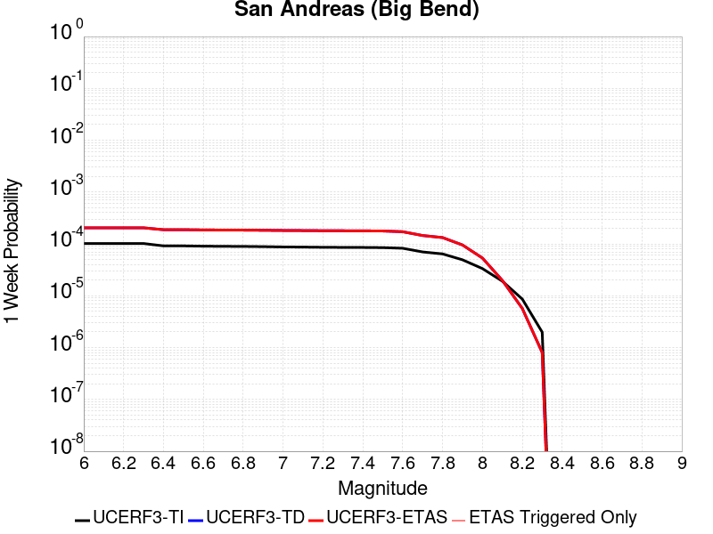 |  |  |  |

| Magnitude | 1 wk TI Prob | 1 wk TD Prob | 1 wk ETAS Prob | 1 wk ETAS/TD Gain | 1 wk ETAS Triggered Only | 1 mo TI Prob | 1 mo TD Prob | 1 mo ETAS Prob | 1 mo ETAS/TD Gain | 1 mo ETAS Triggered Only | 1 yr TI Prob | 1 yr TD Prob | 1 yr ETAS Prob | 1 yr ETAS/TD Gain | 1 yr ETAS Triggered Only | 10 yr TI Prob | 10 yr TD Prob | 10 yr ETAS Prob | 10 yr ETAS/TD Gain | 10 yr ETAS Triggered Only |
|-----|-----|-----|-----|-----|-----|-----|-----|-----|-----|-----|-----|-----|-----|-----|-----|-----|-----|-----|-----|-----|
| 6.0 | 1.0179969E-4 | 2.0439133E-4 | 2.0439133E-4 | 1.0 | 0.0 | 4.362114E-4 | 8.7566976E-4 | 8.7566976E-4 | 1.0 | 0.0 | 0.0052979486 | 0.010609456 | 0.01061935 | 1.0009326 | 1.0E-5 | 0.051734097 | 0.10307849 | 0.103222005 | 1.0013922 | 1.6E-4 |
| 6.1 | 1.0179969E-4 | 2.0439133E-4 | 2.0439133E-4 | 1.0 | 0.0 | 4.362114E-4 | 8.7566976E-4 | 8.7566976E-4 | 1.0 | 0.0 | 0.0052979486 | 0.010609456 | 0.01061935 | 1.0009326 | 1.0E-5 | 0.051734097 | 0.10307849 | 0.103222005 | 1.0013922 | 1.6E-4 |
| 6.2 | 1.0179969E-4 | 2.0439133E-4 | 2.0439133E-4 | 1.0 | 0.0 | 4.362114E-4 | 8.7566976E-4 | 8.7566976E-4 | 1.0 | 0.0 | 0.0052979486 | 0.010609456 | 0.01061935 | 1.0009326 | 1.0E-5 | 0.051734097 | 0.10307849 | 0.103222005 | 1.0013922 | 1.6E-4 |
| 6.3 | 1.0179969E-4 | 2.0439133E-4 | 2.0439133E-4 | 1.0 | 0.0 | 4.362114E-4 | 8.7566976E-4 | 8.7566976E-4 | 1.0 | 0.0 | 0.0052979486 | 0.010609456 | 0.01061935 | 1.0009326 | 1.0E-5 | 0.051734097 | 0.10307849 | 0.103222005 | 1.0013922 | 1.6E-4 |
| 6.4 | 9.1639464E-5 | 1.878947E-4 | 1.878947E-4 | 1.0 | 0.0 | 3.9268145E-4 | 8.050147E-4 | 8.050147E-4 | 1.0 | 0.0 | 0.0047704205 | 0.009757133 | 0.009767035 | 1.001015 | 1.0E-5 | 0.046693064 | 0.09534738 | 0.0954469 | 1.0010437 | 1.1E-4 |
| 6.5 | 9.1639464E-5 | 1.878947E-4 | 1.878947E-4 | 1.0 | 0.0 | 3.9268145E-4 | 8.050147E-4 | 8.050147E-4 | 1.0 | 0.0 | 0.0047704205 | 0.009757133 | 0.009767035 | 1.001015 | 1.0E-5 | 0.046693064 | 0.09534738 | 0.0954469 | 1.0010437 | 1.1E-4 |
| 6.6 | 9.042622E-5 | 1.8595652E-4 | 1.8595652E-4 | 1.0 | 0.0 | 3.8748336E-4 | 7.9671334E-4 | 7.9671334E-4 | 1.0 | 0.0 | 0.0047074095 | 0.009656962 | 0.009666866 | 1.0010256 | 1.0E-5 | 0.046089325 | 0.09444226 | 0.094532825 | 1.0009588 | 1.0E-4 |
| 6.7 | 8.9836685E-5 | 1.8509693E-4 | 1.8509693E-4 | 1.0 | 0.0 | 3.8495753E-4 | 7.930316E-4 | 7.930316E-4 | 1.0 | 0.0 | 0.00467679 | 0.009612533 | 0.009622437 | 1.0010303 | 1.0E-5 | 0.045795817 | 0.09403585 | 0.09412645 | 1.0009634 | 1.0E-4 |
| 6.8 | 8.9471854E-5 | 1.8456133E-4 | 1.8456133E-4 | 1.0 | 0.0 | 3.8339442E-4 | 7.907375E-4 | 7.907375E-4 | 1.0 | 0.0 | 0.004657841 | 0.009584849 | 0.009594752 | 1.0010333 | 1.0E-5 | 0.04561414 | 0.09378241 | 0.09387303 | 1.0009663 | 1.0E-4 |
| 6.9 | 8.858234E-5 | 1.8337523E-4 | 1.8337523E-4 | 1.0 | 0.0 | 3.7958333E-4 | 7.856573E-4 | 7.856573E-4 | 1.0 | 0.0 | 0.004611638 | 0.009523539 | 0.0095334435 | 1.00104 | 1.0E-5 | 0.04517103 | 0.0932211 | 0.093302704 | 1.0008755 | 9.0E-5 |
| 7.0 | 8.7433385E-5 | 1.8175425E-4 | 1.8175425E-4 | 1.0 | 0.0 | 3.746607E-4 | 7.787144E-4 | 7.787144E-4 | 1.0 | 0.0 | 0.004551957 | 0.009439744 | 0.00944965 | 1.0010494 | 1.0E-5 | 0.044598386 | 0.09245298 | 0.09253466 | 1.0008835 | 9.0E-5 |
| 7.1 | 8.684964E-5 | 1.8086818E-4 | 1.8086818E-4 | 1.0 | 0.0 | 3.7215967E-4 | 7.749193E-4 | 7.749193E-4 | 1.0 | 0.0 | 0.0045216335 | 0.009393938 | 0.009403844 | 1.0010545 | 1.0E-5 | 0.04430731 | 0.09203265 | 0.09211437 | 1.0008879 | 9.0E-5 |
| 7.2 | 8.606521E-5 | 1.797687E-4 | 1.797687E-4 | 1.0 | 0.0 | 3.6879873E-4 | 7.7021E-4 | 7.7021E-4 | 1.0 | 0.0 | 0.0044808835 | 0.009337096 | 0.009347002 | 1.001061 | 1.0E-5 | 0.043916024 | 0.09151156 | 0.091593325 | 1.0008935 | 9.0E-5 |
| 7.3 | 8.568266E-5 | 1.7918213E-4 | 1.7918213E-4 | 1.0 | 0.0 | 3.6715972E-4 | 7.676976E-4 | 7.676976E-4 | 1.0 | 0.0 | 0.0044610105 | 0.009306768 | 0.009316675 | 1.0010645 | 1.0E-5 | 0.043725148 | 0.091230355 | 0.09131215 | 1.0008966 | 9.0E-5 |
| 7.4 | 8.5432206E-5 | 1.7880375E-4 | 1.7880375E-4 | 1.0 | 0.0 | 3.6608664E-4 | 7.660769E-4 | 7.660769E-4 | 1.0 | 0.0 | 0.004447999 | 0.0092872055 | 0.009297112 | 1.0010668 | 1.0E-5 | 0.043600157 | 0.09104886 | 0.09113066 | 1.0008985 | 9.0E-5 |
| 7.5 | 8.4791965E-5 | 1.7748248E-4 | 1.7748248E-4 | 1.0 | 0.0 | 3.633435E-4 | 7.6041766E-4 | 7.6041766E-4 | 1.0 | 0.0 | 0.0044147377 | 0.009218889 | 0.009228797 | 1.0010747 | 1.0E-5 | 0.043280575 | 0.09042219 | 0.09049495 | 1.0008048 | 8.0E-5 |
| 7.6 | 8.241105E-5 | 1.718787E-4 | 1.718787E-4 | 1.0 | 0.0 | 3.531424E-4 | 7.364152E-4 | 7.364152E-4 | 1.0 | 0.0 | 0.0042910352 | 0.008929091 | 0.008939002 | 1.00111 | 1.0E-5 | 0.042091176 | 0.0877777 | 0.08784155 | 1.0007274 | 7.0E-5 |
| 7.7 | 7.00432E-5 | 1.4518453E-4 | 1.4518453E-4 | 1.0 | 0.0 | 3.001506E-4 | 6.220711E-4 | 6.220711E-4 | 1.0 | 0.0 | 0.0036482112 | 0.0075474572 | 0.007557382 | 1.001315 | 1.0E-5 | 0.035888977 | 0.07492516 | 0.074971415 | 1.0006174 | 5.0E-5 |
| 7.8 | 6.415362E-5 | 1.3252265E-4 | 1.3252265E-4 | 1.0 | 0.0 | 2.749151E-4 | 5.6783063E-4 | 5.6783063E-4 | 1.0 | 0.0 | 0.0033419547 | 0.0068914555 | 0.0069013867 | 1.0014411 | 1.0E-5 | 0.03292141 | 0.06853228 | 0.068578854 | 1.0006796 | 5.0E-5 |
| 7.9 | 4.939911E-5 | 9.5451695E-5 | 9.5451695E-5 | 1.0 | 0.0 | 2.116933E-4 | 4.0901455E-4 | 4.0901455E-4 | 1.0 | 0.0 | 0.0025743195 | 0.0049683917 | 0.0049683917 | 1.0 | 0.0 | 0.025447013 | 0.049871314 | 0.049880814 | 1.0001905 | 1.0E-5 |
| 8.0 | 3.344983E-5 | 5.344848E-5 | 5.344848E-5 | 1.0 | 0.0 | 1.4334853E-4 | 2.290448E-4 | 2.290448E-4 | 1.0 | 0.0 | 0.0017438711 | 0.0027850564 | 0.0027850564 | 1.0 | 0.0 | 0.017302496 | 0.028522544 | 0.028522544 | 1.0 | 0.0 |
| 8.1 | 1.9104898E-5 | 1.9767354E-5 | 1.9767354E-5 | 1.0 | 0.0 | 8.1875565E-5 | 8.471449E-5 | 8.471449E-5 | 1.0 | 0.0 | 9.963791E-4 | 0.0010309116 | 0.0010309116 | 1.0 | 0.0 | 0.009919235 | 0.0110616665 | 0.0110616665 | 1.0 | 0.0 |
| 8.2 | 8.643924E-6 | 5.6977096E-6 | 5.6977096E-6 | 1.0 | 0.0 | 3.704486E-5 | 2.4418528E-5 | 2.4418528E-5 | 1.0 | 0.0 | 4.5092785E-4 | 2.9725512E-4 | 2.9725512E-4 | 1.0 | 0.0 | 0.0045001395 | 0.0033707586 | 0.0033707586 | 1.0 | 0.0 |
| 8.3 | 1.983087E-6 | 8.03092E-7 | 8.03092E-7 | 1.0 | 0.0 | 8.498917E-6 | 3.4418185E-6 | 3.4418185E-6 | 1.0 | 0.0 | 1.034694E-4 | 4.1903353E-5 | 4.1903353E-5 | 1.0 | 0.0 | 0.0010342124 | 4.932912E-4 | 4.932912E-4 | 1.0 | 0.0 |

## Helendale-So Lockhart
*[(top)](#table-of-contents)*

| 1 Week | 1 Month | 1 Year | 10 Year |
|-----|-----|-----|-----|
|  |  |  |  |

| Magnitude | 1 wk TI Prob | 1 wk TD Prob | 1 wk ETAS Prob | 1 wk ETAS/TD Gain | 1 wk ETAS Triggered Only | 1 mo TI Prob | 1 mo TD Prob | 1 mo ETAS Prob | 1 mo ETAS/TD Gain | 1 mo ETAS Triggered Only | 1 yr TI Prob | 1 yr TD Prob | 1 yr ETAS Prob | 1 yr ETAS/TD Gain | 1 yr ETAS Triggered Only | 10 yr TI Prob | 10 yr TD Prob | 10 yr ETAS Prob | 10 yr ETAS/TD Gain | 10 yr ETAS Triggered Only |
|-----|-----|-----|-----|-----|-----|-----|-----|-----|-----|-----|-----|-----|-----|-----|-----|-----|-----|-----|-----|-----|
| 6.0 | 1.7296055E-5 | 1.8108494E-5 | 1.8108494E-5 | 1.0 | 0.0 | 7.412385E-5 | 7.760564E-5 | 7.760564E-5 | 1.0 | 0.0 | 9.0208417E-4 | 9.4445987E-4 | 9.64441E-4 | 1.0211561 | 2.0E-5 | 0.008984311 | 0.009406581 | 0.009545264 | 1.0147432 | 1.4E-4 |
| 6.1 | 1.7296055E-5 | 1.8108494E-5 | 1.8108494E-5 | 1.0 | 0.0 | 7.412385E-5 | 7.760564E-5 | 7.760564E-5 | 1.0 | 0.0 | 9.0208417E-4 | 9.4445987E-4 | 9.64441E-4 | 1.0211561 | 2.0E-5 | 0.008984311 | 0.009406581 | 0.009545264 | 1.0147432 | 1.4E-4 |
| 6.2 | 1.7296055E-5 | 1.8108494E-5 | 1.8108494E-5 | 1.0 | 0.0 | 7.412385E-5 | 7.760564E-5 | 7.760564E-5 | 1.0 | 0.0 | 9.0208417E-4 | 9.4445987E-4 | 9.64441E-4 | 1.0211561 | 2.0E-5 | 0.008984311 | 0.009406581 | 0.009545264 | 1.0147432 | 1.4E-4 |
| 6.3 | 1.0669118E-5 | 1.1138166E-5 | 1.1138166E-5 | 1.0 | 0.0 | 4.5723988E-5 | 4.7734142E-5 | 4.7734142E-5 | 1.0 | 0.0 | 5.5654737E-4 | 5.81011E-4 | 6.0099934E-4 | 1.0344027 | 2.0E-5 | 0.0055515557 | 0.005795216 | 0.005924463 | 1.0223023 | 1.3E-4 |
| 6.4 | 1.0669118E-5 | 1.1138166E-5 | 1.1138166E-5 | 1.0 | 0.0 | 4.5723988E-5 | 4.7734142E-5 | 4.7734142E-5 | 1.0 | 0.0 | 5.5654737E-4 | 5.81011E-4 | 6.0099934E-4 | 1.0344027 | 2.0E-5 | 0.0055515557 | 0.005795216 | 0.005924463 | 1.0223023 | 1.3E-4 |
| 6.5 | 8.790038E-6 | 9.172431E-6 | 9.172431E-6 | 1.0 | 0.0 | 3.767105E-5 | 3.9309834E-5 | 3.9309834E-5 | 1.0 | 0.0 | 4.585485E-4 | 4.784937E-4 | 4.884889E-4 | 1.0208889 | 1.0E-5 | 0.0045760344 | 0.0047747986 | 0.004874321 | 1.0208433 | 1.0E-4 |
| 6.6 | 7.396949E-6 | 7.717409E-6 | 7.717409E-6 | 1.0 | 0.0 | 3.1700827E-5 | 3.3074197E-5 | 3.3074197E-5 | 1.0 | 0.0 | 3.858892E-4 | 4.0260496E-4 | 4.1260093E-4 | 1.0248282 | 1.0E-5 | 0.003852198 | 0.0040188627 | 0.004108501 | 1.0223044 | 9.0E-5 |
| 6.7 | 6.4600285E-6 | 6.7396645E-6 | 6.7396645E-6 | 1.0 | 0.0 | 2.7685543E-5 | 2.8883962E-5 | 2.8883962E-5 | 1.0 | 0.0 | 3.3701936E-4 | 3.5160626E-4 | 3.6160275E-4 | 1.0284309 | 1.0E-5 | 0.0033650869 | 0.0035105813 | 0.0036002654 | 1.0255468 | 9.0E-5 |
| 6.8 | 5.600104E-6 | 5.8373935E-6 | 5.8373935E-6 | 1.0 | 0.0 | 2.4000226E-5 | 2.5017165E-5 | 2.5017165E-5 | 1.0 | 0.0 | 2.9216358E-4 | 3.0454202E-4 | 3.1453895E-4 | 1.0328262 | 1.0E-5 | 0.0029177975 | 0.0030413081 | 0.0031110952 | 1.0229464 | 7.0E-5 |
| 6.9 | 4.839122E-6 | 5.040684E-6 | 5.040684E-6 | 1.0 | 0.0 | 2.0738931E-5 | 2.1602755E-5 | 2.1602755E-5 | 1.0 | 0.0 | 2.5246723E-4 | 2.6298227E-4 | 2.7297964E-4 | 1.0380154 | 1.0E-5 | 0.002521806 | 0.002626758 | 0.0026666531 | 1.0151879 | 4.0E-5 |
| 7.0 | 3.6937633E-6 | 3.8460953E-6 | 3.8460953E-6 | 1.0 | 0.0 | 1.5830317E-5 | 1.6483164E-5 | 1.6483164E-5 | 1.0 | 0.0 | 1.9271708E-4 | 2.0066433E-4 | 2.1066233E-4 | 1.0498245 | 1.0E-5 | 0.0019255003 | 0.002004863 | 0.0020248229 | 1.0099558 | 2.0E-5 |
| 7.1 | 2.7858857E-6 | 2.8985091E-6 | 2.8985091E-6 | 1.0 | 0.0 | 1.1939455E-5 | 1.2422124E-5 | 1.2422124E-5 | 1.0 | 0.0 | 1.4535317E-4 | 1.5122908E-4 | 1.6122757E-4 | 1.0661149 | 1.0E-5 | 0.0014525814 | 0.0015112832 | 0.001531253 | 1.0132138 | 2.0E-5 |
| 7.2 | 2.1672065E-6 | 2.2545207E-6 | 2.2545207E-6 | 1.0 | 0.0 | 9.2879945E-6 | 9.662197E-6 | 9.662197E-6 | 1.0 | 0.0 | 1.1307546E-4 | 1.17631076E-4 | 1.17631076E-4 | 1.0 | 0.0 | 0.0011301794 | 0.0011757064 | 0.0011856946 | 1.0084956 | 1.0E-5 |
| 7.3 | 1.4823496E-6 | 1.5425605E-6 | 1.5425605E-6 | 1.0 | 0.0 | 6.3529114E-6 | 6.610958E-6 | 6.610958E-6 | 1.0 | 0.0 | 7.734395E-5 | 8.0485595E-5 | 8.0485595E-5 | 1.0 | 0.0 | 7.731704E-4 | 8.045795E-4 | 8.145715E-4 | 1.0124189 | 1.0E-5 |
| 7.4 | 4.2321457E-7 | 4.4119244E-7 | 4.4119244E-7 | 1.0 | 0.0 | 1.8137755E-6 | 1.8908236E-6 | 1.8908236E-6 | 1.0 | 0.0 | 2.2082493E-5 | 2.302058E-5 | 2.302058E-5 | 1.0 | 0.0 | 2.2080299E-4 | 2.3018649E-4 | 2.3018649E-4 | 1.0 | 0.0 |
| 7.5 | 5.6942316E-8 | 5.9430164E-8 | 5.9430164E-8 | 1.0 | 0.0 | 2.440385E-7 | 2.5470067E-7 | 2.5470067E-7 | 1.0 | 0.0 | 2.9711643E-6 | 3.1009772E-6 | 3.1009772E-6 | 1.0 | 0.0 | 2.9711247E-5 | 3.100942E-5 | 3.100942E-5 | 1.0 | 0.0 |

## San Andreas (San Gorgonio Pass-Garnet HIll)
*[(top)](#table-of-contents)*

| 1 Week | 1 Month | 1 Year | 10 Year |
|-----|-----|-----|-----|
|  |  |  |  |

| Magnitude | 1 wk TI Prob | 1 wk TD Prob | 1 wk ETAS Prob | 1 wk ETAS/TD Gain | 1 wk ETAS Triggered Only | 1 mo TI Prob | 1 mo TD Prob | 1 mo ETAS Prob | 1 mo ETAS/TD Gain | 1 mo ETAS Triggered Only | 1 yr TI Prob | 1 yr TD Prob | 1 yr ETAS Prob | 1 yr ETAS/TD Gain | 1 yr ETAS Triggered Only | 10 yr TI Prob | 10 yr TD Prob | 10 yr ETAS Prob | 10 yr ETAS/TD Gain | 10 yr ETAS Triggered Only |
|-----|-----|-----|-----|-----|-----|-----|-----|-----|-----|-----|-----|-----|-----|-----|-----|-----|-----|-----|-----|-----|
| 6.0 | 8.31567E-5 | 2.3562524E-4 | 2.556205E-4 | 1.0848606 | 2.0E-5 | 3.5633717E-4 | 0.0010094292 | 0.001029409 | 1.0197932 | 2.0E-5 | 0.004329778 | 0.012220471 | 0.01226986 | 1.0040416 | 5.0E-5 | 0.042463828 | 0.113311715 | 0.11343585 | 1.0010955 | 1.4E-4 |
| 6.1 | 8.31567E-5 | 2.3562524E-4 | 2.556205E-4 | 1.0848606 | 2.0E-5 | 3.5633717E-4 | 0.0010094292 | 0.001029409 | 1.0197932 | 2.0E-5 | 0.004329778 | 0.012220471 | 0.01226986 | 1.0040416 | 5.0E-5 | 0.042463828 | 0.113311715 | 0.11343585 | 1.0010955 | 1.4E-4 |
| 6.2 | 8.31567E-5 | 2.3562524E-4 | 2.556205E-4 | 1.0848606 | 2.0E-5 | 3.5633717E-4 | 0.0010094292 | 0.001029409 | 1.0197932 | 2.0E-5 | 0.004329778 | 0.012220471 | 0.01226986 | 1.0040416 | 5.0E-5 | 0.042463828 | 0.113311715 | 0.11343585 | 1.0010955 | 1.4E-4 |
| 6.3 | 8.31567E-5 | 2.3562524E-4 | 2.556205E-4 | 1.0848606 | 2.0E-5 | 3.5633717E-4 | 0.0010094292 | 0.001029409 | 1.0197932 | 2.0E-5 | 0.004329778 | 0.012220471 | 0.01226986 | 1.0040416 | 5.0E-5 | 0.042463828 | 0.113311715 | 0.11343585 | 1.0010955 | 1.4E-4 |
| 6.4 | 8.059055E-5 | 2.3119045E-4 | 2.5118582E-4 | 1.0864887 | 2.0E-5 | 3.4534236E-4 | 9.904407E-4 | 0.001010421 | 1.0201731 | 2.0E-5 | 0.0041964394 | 0.011992186 | 0.012041586 | 1.0041194 | 5.0E-5 | 0.041180745 | 0.1112903 | 0.111414716 | 1.001118 | 1.4E-4 |
| 6.5 | 8.059055E-5 | 2.3119045E-4 | 2.5118582E-4 | 1.0864887 | 2.0E-5 | 3.4534236E-4 | 9.904407E-4 | 0.001010421 | 1.0201731 | 2.0E-5 | 0.0041964394 | 0.011992186 | 0.012041586 | 1.0041194 | 5.0E-5 | 0.041180745 | 0.1112903 | 0.111414716 | 1.001118 | 1.4E-4 |
| 6.6 | 7.619237E-5 | 2.2362181E-4 | 2.4361734E-4 | 1.0894167 | 2.0E-5 | 3.2649786E-4 | 9.5802953E-4 | 9.780104E-4 | 1.0208561 | 2.0E-5 | 0.0039678677 | 0.011602184 | 0.011651604 | 1.0042596 | 5.0E-5 | 0.03897764 | 0.10782342 | 0.107948326 | 1.0011585 | 1.4E-4 |
| 6.7 | 7.440636E-5 | 2.2037624E-4 | 2.4037184E-4 | 1.0907339 | 2.0E-5 | 3.188454E-4 | 9.4413E-4 | 9.641111E-4 | 1.0211635 | 2.0E-5 | 0.0038750346 | 0.011434742 | 0.011474284 | 1.0034581 | 4.0E-5 | 0.038081564 | 0.106331535 | 0.10644771 | 1.0010926 | 1.3E-4 |
| 6.8 | 7.3735864E-5 | 2.188422E-4 | 2.388378E-4 | 1.0913701 | 2.0E-5 | 3.1597257E-4 | 9.375603E-4 | 9.575415E-4 | 1.021312 | 2.0E-5 | 0.0038401815 | 0.011355594 | 0.01139514 | 1.0034825 | 4.0E-5 | 0.03774495 | 0.10563124 | 0.105747506 | 1.0011007 | 1.3E-4 |
| 6.9 | 7.27575E-5 | 2.1652757E-4 | 2.3652324E-4 | 1.092347 | 2.0E-5 | 3.117806E-4 | 9.276475E-4 | 9.47629E-4 | 1.0215399 | 2.0E-5 | 0.003789323 | 0.011236158 | 0.011275709 | 1.0035199 | 4.0E-5 | 0.037253562 | 0.104578175 | 0.10469458 | 1.001113 | 1.3E-4 |
| 7.0 | 7.102591E-5 | 2.1236026E-4 | 2.3235602E-4 | 1.0941596 | 2.0E-5 | 3.0436125E-4 | 9.0980023E-4 | 9.2978205E-4 | 1.0219629 | 2.0E-5 | 0.003699303 | 0.011021083 | 0.011060642 | 1.0035894 | 4.0E-5 | 0.03638325 | 0.10267828 | 0.10278595 | 1.0010487 | 1.2E-4 |
| 7.1 | 7.028513E-5 | 2.1071128E-4 | 2.3070707E-4 | 1.0948966 | 2.0E-5 | 3.0118722E-4 | 9.027381E-4 | 9.2272E-4 | 1.0221348 | 2.0E-5 | 0.0036607897 | 0.010935969 | 0.010975531 | 1.0036176 | 4.0E-5 | 0.036010686 | 0.10191966 | 0.10202743 | 1.0010574 | 1.2E-4 |
| 7.2 | 6.8498244E-5 | 2.0678174E-4 | 2.267776E-4 | 1.0967003 | 2.0E-5 | 2.9353087E-4 | 8.859087E-4 | 9.05891E-4 | 1.0225557 | 2.0E-5 | 0.003567883 | 0.010733105 | 0.010772675 | 1.0036868 | 4.0E-5 | 0.035111405 | 0.10010953 | 0.10021752 | 1.0010787 | 1.2E-4 |
| 7.3 | 6.622592E-5 | 1.9902832E-4 | 2.1902434E-4 | 1.1004682 | 2.0E-5 | 2.8379448E-4 | 8.5270184E-4 | 8.726848E-4 | 1.0234349 | 2.0E-5 | 0.0034497243 | 0.010332716 | 0.010372302 | 1.0038311 | 4.0E-5 | 0.033966612 | 0.09659856 | 0.09670697 | 1.0011222 | 1.2E-4 |
| 7.4 | 5.1050705E-5 | 1.4832379E-4 | 1.6832082E-4 | 1.1348201 | 2.0E-5 | 2.1877038E-4 | 6.3551945E-4 | 6.5550674E-4 | 1.0314503 | 2.0E-5 | 0.002660276 | 0.0077101947 | 0.0077498863 | 1.0051479 | 4.0E-5 | 0.02628654 | 0.07348015 | 0.07358207 | 1.001387 | 1.1E-4 |
| 7.5 | 3.9302922E-5 | 1.12521535E-4 | 1.225204E-4 | 1.0888618 | 1.0E-5 | 1.6843023E-4 | 4.8214634E-4 | 4.921415E-4 | 1.0207306 | 1.0E-5 | 0.0020487092 | 0.0058544027 | 0.005884227 | 1.0050943 | 3.0E-5 | 0.020299247 | 0.05654851 | 0.056642856 | 1.0016683 | 1.0E-4 |
| 7.6 | 2.9851626E-5 | 8.603564E-5 | 9.603478E-5 | 1.116221 | 1.0E-5 | 1.2792926E-4 | 3.686722E-4 | 3.786685E-4 | 1.0271144 | 1.0E-5 | 0.0015564259 | 0.004479372 | 0.0045092376 | 1.0066674 | 3.0E-5 | 0.0154556995 | 0.04367895 | 0.043774582 | 1.0021894 | 1.0E-4 |
| 7.7 | 2.1135214E-5 | 6.449506E-5 | 7.449442E-5 | 1.1550406 | 1.0E-5 | 9.0576345E-5 | 2.7637815E-4 | 2.863754E-4 | 1.0361723 | 1.0E-5 | 0.0011022091 | 0.0033597178 | 0.0033896172 | 1.0088993 | 3.0E-5 | 0.010967582 | 0.033017963 | 0.03311466 | 1.0029286 | 1.0E-4 |
| 7.8 | 1.883379E-5 | 5.652603E-5 | 6.652546E-5 | 1.1768997 | 1.0E-5 | 8.0713755E-5 | 2.4223194E-4 | 2.522295E-4 | 1.0412728 | 1.0E-5 | 9.822468E-4 | 0.0029451887 | 0.0029751004 | 1.0101562 | 3.0E-5 | 0.0097791655 | 0.0290964 | 0.02919349 | 1.0033369 | 1.0E-4 |
| 7.9 | 1.5156185E-5 | 4.2387484E-5 | 5.2387062E-5 | 1.2359087 | 1.0E-5 | 6.495346E-5 | 1.81648E-4 | 1.9164619E-4 | 1.0550416 | 1.0E-5 | 7.9052144E-4 | 0.0022093228 | 0.0022392564 | 1.0135489 | 3.0E-5 | 0.007877152 | 0.02209441 | 0.0221922 | 1.004426 | 1.0E-4 |
| 8.0 | 1.1405907E-5 | 3.0524523E-5 | 3.0524523E-5 | 1.0 | 0.0 | 4.8881542E-5 | 1.3081283E-4 | 1.3081283E-4 | 1.0 | 0.0 | 5.9497025E-4 | 0.0015914837 | 0.0015914837 | 1.0 | 0.0 | 0.005933798 | 0.016028497 | 0.016087536 | 1.0036833 | 6.0E-5 |
| 8.1 | 4.3511436E-6 | 7.5699663E-6 | 7.5699663E-6 | 1.0 | 0.0 | 1.8647626E-5 | 3.244231E-5 | 3.244231E-5 | 1.0 | 0.0 | 2.2701119E-4 | 3.949137E-4 | 3.949137E-4 | 1.0 | 0.0 | 0.0022677942 | 0.004216413 | 0.004216413 | 1.0 | 0.0 |
| 8.2 | 2.3042528E-6 | 2.8255195E-6 | 2.8255195E-6 | 1.0 | 0.0 | 9.875332E-6 | 1.2109313E-5 | 1.2109313E-5 | 1.0 | 0.0 | 1.2022553E-4 | 1.4742096E-4 | 1.4742096E-4 | 1.0 | 0.0 | 0.0012016051 | 0.0016463845 | 0.0016463845 | 1.0 | 0.0 |
| 8.3 | 5.202968E-7 | 3.2961114E-7 | 3.2961114E-7 | 1.0 | 0.0 | 2.2298414E-6 | 1.4126184E-6 | 1.4126184E-6 | 1.0 | 0.0 | 2.714798E-5 | 1.7198507E-5 | 1.7198507E-5 | 1.0 | 0.0 | 2.7144665E-4 | 2.0334951E-4 | 2.0334951E-4 | 1.0 | 0.0 |

## Manix-Afton Hills
*[(top)](#table-of-contents)*

| 1 Week | 1 Month | 1 Year | 10 Year |
|-----|-----|-----|-----|
|  |  |  |  |

| Magnitude | 1 wk TI Prob | 1 wk TD Prob | 1 wk ETAS Prob | 1 wk ETAS/TD Gain | 1 wk ETAS Triggered Only | 1 mo TI Prob | 1 mo TD Prob | 1 mo ETAS Prob | 1 mo ETAS/TD Gain | 1 mo ETAS Triggered Only | 1 yr TI Prob | 1 yr TD Prob | 1 yr ETAS Prob | 1 yr ETAS/TD Gain | 1 yr ETAS Triggered Only | 10 yr TI Prob | 10 yr TD Prob | 10 yr ETAS Prob | 10 yr ETAS/TD Gain | 10 yr ETAS Triggered Only |
|-----|-----|-----|-----|-----|-----|-----|-----|-----|-----|-----|-----|-----|-----|-----|-----|-----|-----|-----|-----|-----|
| 6.0 | 1.3783202E-5 | 1.4716672E-5 | 1.4716672E-5 | 1.0 | 0.0 | 5.906953E-5 | 6.307002E-5 | 6.307002E-5 | 1.0 | 0.0 | 7.189342E-4 | 7.6762453E-4 | 7.8760914E-4 | 1.0260344 | 2.0E-5 | 0.0071661277 | 0.007651488 | 0.0077507226 | 1.0129694 | 1.0E-4 |
| 6.1 | 1.3783202E-5 | 1.4716672E-5 | 1.4716672E-5 | 1.0 | 0.0 | 5.906953E-5 | 6.307002E-5 | 6.307002E-5 | 1.0 | 0.0 | 7.189342E-4 | 7.6762453E-4 | 7.8760914E-4 | 1.0260344 | 2.0E-5 | 0.0071661277 | 0.007651488 | 0.0077507226 | 1.0129694 | 1.0E-4 |
| 6.2 | 1.3783202E-5 | 1.4716672E-5 | 1.4716672E-5 | 1.0 | 0.0 | 5.906953E-5 | 6.307002E-5 | 6.307002E-5 | 1.0 | 0.0 | 7.189342E-4 | 7.6762453E-4 | 7.8760914E-4 | 1.0260344 | 2.0E-5 | 0.0071661277 | 0.007651488 | 0.0077507226 | 1.0129694 | 1.0E-4 |
| 6.3 | 1.10494875E-5 | 1.1797611E-5 | 1.1797611E-5 | 1.0 | 0.0 | 4.7354086E-5 | 5.0560266E-5 | 5.0560266E-5 | 1.0 | 0.0 | 5.763835E-4 | 6.154078E-4 | 6.3539547E-4 | 1.0324788 | 2.0E-5 | 0.005748908 | 0.006138077 | 0.0062076473 | 1.0113342 | 7.0E-5 |
| 6.4 | 1.10494875E-5 | 1.1797611E-5 | 1.1797611E-5 | 1.0 | 0.0 | 4.7354086E-5 | 5.0560266E-5 | 5.0560266E-5 | 1.0 | 0.0 | 5.763835E-4 | 6.154078E-4 | 6.3539547E-4 | 1.0324788 | 2.0E-5 | 0.005748908 | 0.006138077 | 0.0062076473 | 1.0113342 | 7.0E-5 |
| 6.5 | 9.788949E-6 | 1.0458327E-5 | 1.0458327E-5 | 1.0 | 0.0 | 4.1951964E-5 | 4.4820685E-5 | 4.4820685E-5 | 1.0 | 0.0 | 5.1064545E-4 | 5.4556446E-4 | 5.6555355E-4 | 1.0366393 | 2.0E-5 | 0.0050947363 | 0.005443179 | 0.0054929066 | 1.0091358 | 5.0E-5 |
| 6.6 | 8.810006E-6 | 9.417266E-6 | 9.417266E-6 | 1.0 | 0.0 | 3.775662E-5 | 4.0359137E-5 | 4.0359137E-5 | 1.0 | 0.0 | 4.5958988E-4 | 4.912706E-4 | 5.1126076E-4 | 1.0406908 | 2.0E-5 | 0.0045864056 | 0.004902729 | 0.0049524833 | 1.0101484 | 5.0E-5 |
| 6.7 | 8.80128E-6 | 9.40774E-6 | 9.40774E-6 | 1.0 | 0.0 | 3.7719226E-5 | 4.0318315E-5 | 4.0318315E-5 | 1.0 | 0.0 | 4.591348E-4 | 4.907738E-4 | 5.10764E-4 | 1.040732 | 2.0E-5 | 0.004581874 | 0.004897783 | 0.004947538 | 1.0101587 | 5.0E-5 |
| 6.8 | 6.8994877E-6 | 7.3829756E-6 | 7.3829756E-6 | 1.0 | 0.0 | 2.9568899E-5 | 3.1640986E-5 | 3.1640986E-5 | 1.0 | 0.0 | 3.5994186E-4 | 3.8516909E-4 | 4.0516138E-4 | 1.0519053 | 2.0E-5 | 0.003593594 | 0.003845821 | 0.0038757054 | 1.0077707 | 3.0E-5 |
| 6.9 | 4.9328037E-6 | 5.273E-6 | 5.273E-6 | 1.0 | 0.0 | 2.1140417E-5 | 2.259841E-5 | 2.259841E-5 | 1.0 | 0.0 | 2.5735417E-4 | 2.7510707E-4 | 2.7510707E-4 | 1.0 | 0.0 | 0.0025705635 | 0.0027482708 | 0.0027582431 | 1.0036286 | 1.0E-5 |
| 7.0 | 3.347973E-6 | 3.5914945E-6 | 3.5914945E-6 | 1.0 | 0.0 | 1.4348378E-5 | 1.5392052E-5 | 1.5392052E-5 | 1.0 | 0.0 | 1.746775E-4 | 1.8738622E-4 | 1.8738622E-4 | 1.0 | 0.0 | 0.0017454025 | 0.001872685 | 0.001872685 | 1.0 | 0.0 |
| 7.1 | 1.2073567E-6 | 1.2940011E-6 | 1.2940011E-6 | 1.0 | 0.0 | 5.1743755E-6 | 5.5457167E-6 | 5.5457167E-6 | 1.0 | 0.0 | 6.29962E-5 | 6.751864E-5 | 6.751864E-5 | 1.0 | 0.0 | 6.297835E-4 | 6.751416E-4 | 6.751416E-4 | 1.0 | 0.0 |

## San Andreas (Coachella) rev
*[(top)](#table-of-contents)*

| 1 Week | 1 Month | 1 Year | 10 Year |
|-----|-----|-----|-----|
|  |  |  |  |

| Magnitude | 1 wk TI Prob | 1 wk TD Prob | 1 wk ETAS Prob | 1 wk ETAS/TD Gain | 1 wk ETAS Triggered Only | 1 mo TI Prob | 1 mo TD Prob | 1 mo ETAS Prob | 1 mo ETAS/TD Gain | 1 mo ETAS Triggered Only | 1 yr TI Prob | 1 yr TD Prob | 1 yr ETAS Prob | 1 yr ETAS/TD Gain | 1 yr ETAS Triggered Only | 10 yr TI Prob | 10 yr TD Prob | 10 yr ETAS Prob | 10 yr ETAS/TD Gain | 10 yr ETAS Triggered Only |
|-----|-----|-----|-----|-----|-----|-----|-----|-----|-----|-----|-----|-----|-----|-----|-----|-----|-----|-----|-----|-----|
| 6.0 | 1.1925945E-4 | 3.293347E-4 | 3.393314E-4 | 1.0303543 | 1.0E-5 | 5.110118E-4 | 0.0014106757 | 0.0014206616 | 1.0070788 | 1.0E-5 | 0.0062038354 | 0.017041078 | 0.017060738 | 1.0011536 | 2.0E-5 | 0.060334753 | 0.15345098 | 0.15352717 | 1.0004965 | 9.0E-5 |
| 6.1 | 1.1925945E-4 | 3.293347E-4 | 3.393314E-4 | 1.0303543 | 1.0E-5 | 5.110118E-4 | 0.0014106757 | 0.0014206616 | 1.0070788 | 1.0E-5 | 0.0062038354 | 0.017041078 | 0.017060738 | 1.0011536 | 2.0E-5 | 0.060334753 | 0.15345098 | 0.15352717 | 1.0004965 | 9.0E-5 |
| 6.2 | 1.07432395E-4 | 3.0432845E-4 | 3.143254E-4 | 1.0328492 | 1.0E-5 | 4.603433E-4 | 0.0013036169 | 0.001313604 | 1.007661 | 1.0E-5 | 0.005590286 | 0.01575715 | 0.015766991 | 1.0006247 | 1.0E-5 | 0.05451731 | 0.1426199 | 0.14268848 | 1.0004809 | 8.0E-5 |
| 6.3 | 1.0718766E-4 | 3.0378142E-4 | 3.1377838E-4 | 1.0329084 | 1.0E-5 | 4.592948E-4 | 0.0013012749 | 0.0013112618 | 1.0076748 | 1.0E-5 | 0.005577586 | 0.015729045 | 0.015738888 | 1.0006257 | 1.0E-5 | 0.054396555 | 0.14238833 | 0.14245695 | 1.0004818 | 8.0E-5 |
| 6.4 | 1.0355944E-4 | 2.9585947E-4 | 3.058565E-4 | 1.0337899 | 1.0E-5 | 4.4375064E-4 | 0.0012673569 | 0.0012773443 | 1.0078804 | 1.0E-5 | 0.0053892885 | 0.015321974 | 0.015331821 | 1.0006427 | 1.0E-5 | 0.052604496 | 0.13894996 | 0.13901885 | 1.0004958 | 8.0E-5 |
| 6.5 | 1.0227914E-4 | 2.9305284E-4 | 3.0304992E-4 | 1.0341135 | 1.0E-5 | 4.382655E-4 | 0.0012553403 | 0.0012653277 | 1.0079559 | 1.0E-5 | 0.0053228354 | 0.015177718 | 0.015187567 | 1.0006489 | 1.0E-5 | 0.051971316 | 0.13772787 | 0.13779685 | 1.0005008 | 8.0E-5 |
| 6.6 | 1.0116757E-4 | 2.9070946E-4 | 3.0070657E-4 | 1.0343887 | 1.0E-5 | 4.3350324E-4 | 0.0012453068 | 0.0012552943 | 1.0080202 | 1.0E-5 | 0.0052651367 | 0.0150572555 | 0.015067104 | 1.0006541 | 1.0E-5 | 0.051421247 | 0.13670717 | 0.13677624 | 1.0005052 | 8.0E-5 |
| 6.7 | 1.0050676E-4 | 2.892945E-4 | 2.992916E-4 | 1.0345569 | 1.0E-5 | 4.3067214E-4 | 0.0012392484 | 0.001249236 | 1.0080594 | 1.0E-5 | 0.005230834 | 0.014984512 | 0.014994361 | 1.0006573 | 1.0E-5 | 0.051094085 | 0.13609292 | 0.13616203 | 1.0005078 | 8.0E-5 |
| 6.8 | 9.976819E-5 | 2.8732617E-4 | 2.9732328E-4 | 1.0347936 | 1.0E-5 | 4.2750788E-4 | 0.0012308207 | 0.0012408084 | 1.0081147 | 1.0E-5 | 0.0051924936 | 0.0148833105 | 0.014893161 | 1.0006618 | 1.0E-5 | 0.050728295 | 0.13524346 | 0.13531265 | 1.0005115 | 8.0E-5 |
| 6.9 | 9.77719E-5 | 2.822789E-4 | 2.922761E-4 | 1.035416 | 1.0E-5 | 4.1895514E-4 | 0.0012092098 | 0.0012191978 | 1.0082599 | 1.0E-5 | 0.0050888555 | 0.01462376 | 0.014633614 | 1.0006738 | 1.0E-5 | 0.049738888 | 0.13306782 | 0.13313718 | 1.0005212 | 8.0E-5 |
| 7.0 | 8.500761E-5 | 2.4950205E-4 | 2.5949956E-4 | 1.0400698 | 1.0E-5 | 3.6426744E-4 | 0.0010688596 | 0.0010788488 | 1.0093458 | 1.0E-5 | 0.0044259406 | 0.012936504 | 0.012946374 | 1.000763 | 1.0E-5 | 0.04338823 | 0.11889175 | 0.11895343 | 1.0005188 | 7.0E-5 |
| 7.1 | 8.319876E-5 | 2.455059E-4 | 2.5550343E-4 | 1.0407223 | 1.0E-5 | 3.5651738E-4 | 0.001051747 | 0.0010617365 | 1.009498 | 1.0E-5 | 0.004331963 | 0.012730612 | 0.012740485 | 1.0007755 | 1.0E-5 | 0.042484846 | 0.11710406 | 0.11716586 | 1.0005277 | 7.0E-5 |
| 7.2 | 7.563917E-5 | 2.2592882E-4 | 2.3592655E-4 | 1.0442517 | 1.0E-5 | 3.2412758E-4 | 9.6791016E-4 | 9.779005E-4 | 1.0103215 | 1.0E-5 | 0.0039391145 | 0.011721333 | 0.011731215 | 1.0008432 | 1.0E-5 | 0.03870018 | 0.10849314 | 0.10855555 | 1.0005752 | 7.0E-5 |
| 7.3 | 7.082985E-5 | 2.0901479E-4 | 2.1901271E-4 | 1.0478336 | 1.0E-5 | 3.0352117E-4 | 8.954731E-4 | 9.0546417E-4 | 1.0111573 | 1.0E-5 | 0.0036891096 | 0.010848519 | 0.010858411 | 1.0009118 | 1.0E-5 | 0.03628465 | 0.10099214 | 0.10105508 | 1.0006231 | 7.0E-5 |
| 7.4 | 5.146215E-5 | 1.4409437E-4 | 1.5409294E-4 | 1.069389 | 1.0E-5 | 2.2053342E-4 | 6.17402E-4 | 6.273959E-4 | 1.016187 | 1.0E-5 | 0.0026816884 | 0.007491154 | 0.0075010792 | 1.0013249 | 1.0E-5 | 0.02649557 | 0.071437456 | 0.07149317 | 1.0007799 | 6.0E-5 |
| 7.5 | 4.0285166E-5 | 1.1056937E-4 | 1.1056937E-4 | 1.0 | 0.0 | 1.7263928E-4 | 4.7378297E-4 | 4.7378297E-4 | 1.0 | 0.0 | 0.002099857 | 0.0057531223 | 0.0057531223 | 1.0 | 0.0 | 0.020801254 | 0.05552344 | 0.055570662 | 1.0008506 | 5.0E-5 |
| 7.6 | 3.1168736E-5 | 8.541207E-5 | 8.541207E-5 | 1.0 | 0.0 | 1.3357346E-4 | 3.6600052E-4 | 3.6600052E-4 | 1.0 | 0.0 | 0.0016250437 | 0.0044469787 | 0.0044469787 | 1.0 | 0.0 | 0.016132116 | 0.043270428 | 0.043318264 | 1.0011055 | 5.0E-5 |
| 7.7 | 2.2100989E-5 | 6.3288535E-5 | 6.3288535E-5 | 1.0 | 0.0 | 9.4715084E-5 | 2.712084E-4 | 2.712084E-4 | 1.0 | 0.0 | 0.001152546 | 0.0032969695 | 0.0032969695 | 1.0 | 0.0 | 0.011465867 | 0.03230943 | 0.032357816 | 1.0014975 | 5.0E-5 |
| 7.8 | 1.7484861E-5 | 5.259904E-5 | 5.259904E-5 | 1.0 | 0.0 | 7.493296E-5 | 2.25405E-4 | 2.25405E-4 | 1.0 | 0.0 | 9.1192697E-4 | 0.002740855 | 0.002740855 | 1.0 | 0.0 | 0.009081938 | 0.027005956 | 0.027054604 | 1.0018015 | 5.0E-5 |
| 7.9 | 1.3967285E-5 | 3.8881648E-5 | 3.8881648E-5 | 1.0 | 0.0 | 5.985842E-5 | 1.66625E-4 | 1.66625E-4 | 1.0 | 0.0 | 7.2853256E-4 | 0.002026773 | 0.002026773 | 1.0 | 0.0 | 0.0072614877 | 0.020214181 | 0.020263169 | 1.0024235 | 5.0E-5 |
| 8.0 | 1.1887396E-5 | 3.163221E-5 | 3.163221E-5 | 1.0 | 0.0 | 5.094499E-5 | 1.3555957E-4 | 1.3555957E-4 | 1.0 | 0.0 | 6.200787E-4 | 0.0016491894 | 0.0016491894 | 1.0 | 0.0 | 0.006183513 | 0.016543467 | 0.016582804 | 1.0023779 | 4.0E-5 |
| 8.1 | 5.100864E-6 | 9.206228E-6 | 9.206228E-6 | 1.0 | 0.0 | 2.1860664E-5 | 3.945467E-5 | 3.945467E-5 | 1.0 | 0.0 | 2.6612106E-4 | 4.8025485E-4 | 4.8025485E-4 | 1.0 | 0.0 | 0.002658026 | 0.005033692 | 0.005033692 | 1.0 | 0.0 |
| 8.2 | 2.3004484E-6 | 2.8790541E-6 | 2.8790541E-6 | 1.0 | 0.0 | 9.859027E-6 | 1.2338745E-5 | 1.2338745E-5 | 1.0 | 0.0 | 1.2002704E-4 | 1.502139E-4 | 1.502139E-4 | 1.0 | 0.0 | 0.0011996223 | 0.0016452369 | 0.0016452369 | 1.0 | 0.0 |
| 8.3 | 1.0424446E-7 | 6.06564E-8 | 6.06564E-8 | 1.0 | 0.0 | 4.4676187E-7 | 2.5995598E-7 | 2.5995598E-7 | 1.0 | 0.0 | 5.439312E-6 | 3.1649597E-6 | 3.1649597E-6 | 1.0 | 0.0 | 5.4391792E-5 | 3.3241125E-5 | 3.3241125E-5 | 1.0 | 0.0 |

## Scodie Lineament
*[(top)](#table-of-contents)*

| 1 Week | 1 Month | 1 Year | 10 Year |
|-----|-----|-----|-----|
|  |  |  |  |

| Magnitude | 1 wk TI Prob | 1 wk TD Prob | 1 wk ETAS Prob | 1 wk ETAS/TD Gain | 1 wk ETAS Triggered Only | 1 mo TI Prob | 1 mo TD Prob | 1 mo ETAS Prob | 1 mo ETAS/TD Gain | 1 mo ETAS Triggered Only | 1 yr TI Prob | 1 yr TD Prob | 1 yr ETAS Prob | 1 yr ETAS/TD Gain | 1 yr ETAS Triggered Only | 10 yr TI Prob | 10 yr TD Prob | 10 yr ETAS Prob | 10 yr ETAS/TD Gain | 10 yr ETAS Triggered Only |
|-----|-----|-----|-----|-----|-----|-----|-----|-----|-----|-----|-----|-----|-----|-----|-----|-----|-----|-----|-----|-----|
| 6.0 | 3.2919327E-6 | 3.0139438E-6 | 3.0139438E-6 | 1.0 | 0.0 | 1.4108206E-5 | 1.2916856E-5 | 1.2916856E-5 | 1.0 | 0.0 | 1.7175387E-4 | 1.5725454E-4 | 1.7725141E-4 | 1.1271623 | 2.0E-5 | 0.0017162118 | 0.0015717444 | 0.001661603 | 1.0571712 | 9.0E-5 |
| 6.1 | 1.8663811E-6 | 1.5494277E-6 | 1.5494277E-6 | 1.0 | 0.0 | 7.998751E-6 | 6.6403904E-6 | 6.6403904E-6 | 1.0 | 0.0 | 9.738045E-5 | 8.084425E-5 | 8.084425E-5 | 1.0 | 0.0 | 9.7337784E-4 | 8.0819725E-4 | 8.3817303E-4 | 1.0370897 | 3.0E-5 |
| 6.2 | 1.8663811E-6 | 1.5494277E-6 | 1.5494277E-6 | 1.0 | 0.0 | 7.998751E-6 | 6.6403904E-6 | 6.6403904E-6 | 1.0 | 0.0 | 9.738045E-5 | 8.084425E-5 | 8.084425E-5 | 1.0 | 0.0 | 9.7337784E-4 | 8.0819725E-4 | 8.3817303E-4 | 1.0370897 | 3.0E-5 |
| 6.3 | 1.8663811E-6 | 1.5494277E-6 | 1.5494277E-6 | 1.0 | 0.0 | 7.998751E-6 | 6.6403904E-6 | 6.6403904E-6 | 1.0 | 0.0 | 9.738045E-5 | 8.084425E-5 | 8.084425E-5 | 1.0 | 0.0 | 9.7337784E-4 | 8.0819725E-4 | 8.3817303E-4 | 1.0370897 | 3.0E-5 |
| 6.4 | 1.8663811E-6 | 1.5494277E-6 | 1.5494277E-6 | 1.0 | 0.0 | 7.998751E-6 | 6.6403904E-6 | 6.6403904E-6 | 1.0 | 0.0 | 9.738045E-5 | 8.084425E-5 | 8.084425E-5 | 1.0 | 0.0 | 9.7337784E-4 | 8.0819725E-4 | 8.3817303E-4 | 1.0370897 | 3.0E-5 |
| 6.5 | 1.8106311E-6 | 1.4913481E-6 | 1.4913481E-6 | 1.0 | 0.0 | 7.759824E-6 | 6.3914795E-6 | 6.3914795E-6 | 1.0 | 0.0 | 9.447177E-5 | 7.781398E-5 | 7.781398E-5 | 1.0 | 0.0 | 9.4431615E-4 | 7.77916E-4 | 8.0789265E-4 | 1.0385345 | 3.0E-5 |
| 6.6 | 1.2414679E-6 | 8.9999105E-7 | 8.9999105E-7 | 1.0 | 0.0 | 5.320566E-6 | 3.8570993E-6 | 3.8570993E-6 | 1.0 | 0.0 | 6.477596E-5 | 4.695926E-5 | 4.695926E-5 | 1.0 | 0.0 | 6.475708E-4 | 4.6950203E-4 | 4.8949267E-4 | 1.0425783 | 2.0E-5 |
| 6.7 | 1.1062215E-6 | 7.596368E-7 | 7.596368E-7 | 1.0 | 0.0 | 4.7409408E-6 | 3.2555824E-6 | 3.2555824E-6 | 1.0 | 0.0 | 5.7719422E-5 | 3.9636067E-5 | 3.9636067E-5 | 1.0 | 0.0 | 5.770443E-4 | 3.9629696E-4 | 4.06293E-4 | 1.0252236 | 1.0E-5 |
| 6.8 | 1.0006736E-6 | 6.5022294E-7 | 6.5022294E-7 | 1.0 | 0.0 | 4.288594E-6 | 2.7866672E-6 | 2.7866672E-6 | 1.0 | 0.0 | 5.221238E-5 | 3.3927205E-5 | 3.3927205E-5 | 1.0 | 0.0 | 5.220012E-4 | 3.3922633E-4 | 3.4922294E-4 | 1.0294689 | 1.0E-5 |
| 6.9 | 9.167364E-7 | 5.633286E-7 | 5.633286E-7 | 1.0 | 0.0 | 3.9288643E-6 | 2.4142637E-6 | 2.4142637E-6 | 1.0 | 0.0 | 4.7832873E-5 | 2.939332E-5 | 2.939332E-5 | 1.0 | 0.0 | 4.782258E-4 | 2.939E-4 | 2.939E-4 | 1.0 | 0.0 |
| 7.0 | 7.6987664E-7 | 4.1147558E-7 | 4.1147558E-7 | 1.0 | 0.0 | 3.2994672E-6 | 1.7634658E-6 | 1.7634658E-6 | 1.0 | 0.0 | 4.0170275E-5 | 2.1470025E-5 | 2.1470025E-5 | 1.0 | 0.0 | 4.0163012E-4 | 2.1468336E-4 | 2.1468336E-4 | 1.0 | 0.0 |
| 7.1 | 7.1038727E-7 | 3.522412E-7 | 3.522412E-7 | 1.0 | 0.0 | 3.0445133E-6 | 1.5096044E-6 | 1.5096044E-6 | 1.0 | 0.0 | 3.706632E-5 | 1.8379314E-5 | 1.8379314E-5 | 1.0 | 0.0 | 3.7060137E-4 | 1.8378143E-4 | 1.8378143E-4 | 1.0 | 0.0 |
| 7.2 | 2.0799602E-7 | 3.1221255E-8 | 3.1221255E-8 | 1.0 | 0.0 | 8.914113E-7 | 1.3380537E-7 | 1.3380537E-7 | 1.0 | 0.0 | 1.0852878E-5 | 1.6290792E-6 | 1.6290792E-6 | 1.0 | 0.0 | 1.08523476E-4 | 1.629068E-5 | 1.629068E-5 | 1.0 | 0.0 |
| 7.3 | 1.5048182E-7 | 1.5970407E-8 | 1.5970407E-8 | 1.0 | 0.0 | 6.449219E-7 | 6.84446E-8 | 6.84446E-8 | 1.0 | 0.0 | 7.851896E-6 | 8.3331275E-7 | 8.3331275E-7 | 1.0 | 0.0 | 7.851618E-5 | 8.333099E-6 | 8.333099E-6 | 1.0 | 0.0 |
| 7.4 | 5.9334678E-8 | 4.879844E-9 | 4.879844E-9 | 1.0 | 0.0 | 2.5429145E-7 | 2.0913618E-8 | 2.0913618E-8 | 1.0 | 0.0 | 3.095994E-6 | 2.5462327E-7 | 2.5462327E-7 | 1.0 | 0.0 | 3.095951E-5 | 2.546231E-6 | 2.546231E-6 | 1.0 | 0.0 |

## Lake Isabella (Seismicity)
*[(top)](#table-of-contents)*

| 1 Week | 1 Month | 1 Year | 10 Year |
|-----|-----|-----|-----|
|  |  | 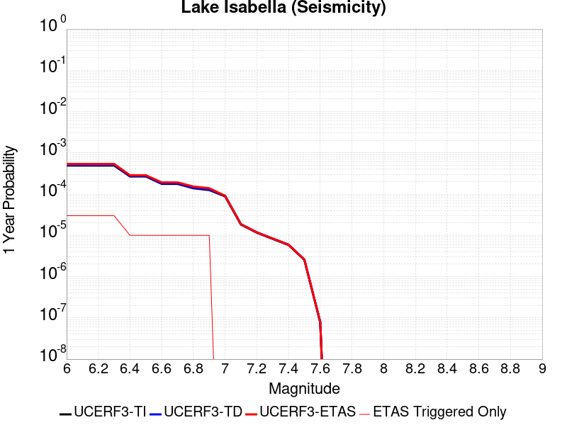 |  |

| Magnitude | 1 wk TI Prob | 1 wk TD Prob | 1 wk ETAS Prob | 1 wk ETAS/TD Gain | 1 wk ETAS Triggered Only | 1 mo TI Prob | 1 mo TD Prob | 1 mo ETAS Prob | 1 mo ETAS/TD Gain | 1 mo ETAS Triggered Only | 1 yr TI Prob | 1 yr TD Prob | 1 yr ETAS Prob | 1 yr ETAS/TD Gain | 1 yr ETAS Triggered Only | 10 yr TI Prob | 10 yr TD Prob | 10 yr ETAS Prob | 10 yr ETAS/TD Gain | 10 yr ETAS Triggered Only |
|-----|-----|-----|-----|-----|-----|-----|-----|-----|-----|-----|-----|-----|-----|-----|-----|-----|-----|-----|-----|-----|
| 6.0 | 9.431637E-6 | 9.743454E-6 | 9.743454E-6 | 1.0 | 0.0 | 4.0420677E-5 | 4.1757063E-5 | 4.1757063E-5 | 1.0 | 0.0 | 4.920106E-4 | 5.0828676E-4 | 5.382715E-4 | 1.0589918 | 3.0E-5 | 0.004909227 | 0.005072535 | 0.0051620784 | 1.0176526 | 9.0E-5 |
| 6.1 | 9.431637E-6 | 9.743454E-6 | 9.743454E-6 | 1.0 | 0.0 | 4.0420677E-5 | 4.1757063E-5 | 4.1757063E-5 | 1.0 | 0.0 | 4.920106E-4 | 5.0828676E-4 | 5.382715E-4 | 1.0589918 | 3.0E-5 | 0.004909227 | 0.005072535 | 0.0051620784 | 1.0176526 | 9.0E-5 |
| 6.2 | 9.431637E-6 | 9.743454E-6 | 9.743454E-6 | 1.0 | 0.0 | 4.0420677E-5 | 4.1757063E-5 | 4.1757063E-5 | 1.0 | 0.0 | 4.920106E-4 | 5.0828676E-4 | 5.382715E-4 | 1.0589918 | 3.0E-5 | 0.004909227 | 0.005072535 | 0.0051620784 | 1.0176526 | 9.0E-5 |
| 6.3 | 9.431637E-6 | 9.743454E-6 | 9.743454E-6 | 1.0 | 0.0 | 4.0420677E-5 | 4.1757063E-5 | 4.1757063E-5 | 1.0 | 0.0 | 4.920106E-4 | 5.0828676E-4 | 5.382715E-4 | 1.0589918 | 3.0E-5 | 0.004909227 | 0.005072535 | 0.0051620784 | 1.0176526 | 9.0E-5 |
| 6.4 | 5.144063E-6 | 5.300981E-6 | 5.300981E-6 | 1.0 | 0.0 | 2.2045799E-5 | 2.271831E-5 | 2.271831E-5 | 1.0 | 0.0 | 2.6837454E-4 | 2.7656378E-4 | 2.86561E-4 | 1.0361481 | 1.0E-5 | 0.0026805066 | 0.0027625365 | 0.0027824813 | 1.0072197 | 2.0E-5 |
| 6.5 | 5.144063E-6 | 5.300981E-6 | 5.300981E-6 | 1.0 | 0.0 | 2.2045799E-5 | 2.271831E-5 | 2.271831E-5 | 1.0 | 0.0 | 2.6837454E-4 | 2.7656378E-4 | 2.86561E-4 | 1.0361481 | 1.0E-5 | 0.0026805066 | 0.0027625365 | 0.0027824813 | 1.0072197 | 2.0E-5 |
| 6.6 | 3.4009804E-6 | 3.4993525E-6 | 3.4993525E-6 | 1.0 | 0.0 | 1.4575549E-5 | 1.4997147E-5 | 1.4997147E-5 | 1.0 | 0.0 | 1.7744285E-4 | 1.8257658E-4 | 1.9257475E-4 | 1.0547615 | 1.0E-5 | 0.0017730123 | 0.0018244236 | 0.001844387 | 1.0109423 | 2.0E-5 |
| 6.7 | 3.3880428E-6 | 3.4862178E-6 | 3.4862178E-6 | 1.0 | 0.0 | 1.4520103E-5 | 1.4940857E-5 | 1.4940857E-5 | 1.0 | 0.0 | 1.767679E-4 | 1.8189136E-4 | 1.9188954E-4 | 1.0549679 | 1.0E-5 | 0.0017662736 | 0.0018175826 | 0.0018375462 | 1.0109836 | 2.0E-5 |
| 6.8 | 2.6582E-6 | 2.734137E-6 | 2.734137E-6 | 1.0 | 0.0 | 1.1392236E-5 | 1.1717686E-5 | 1.1717686E-5 | 1.0 | 0.0 | 1.3869164E-4 | 1.4265483E-4 | 1.526534E-4 | 1.0700892 | 1.0E-5 | 0.0013860512 | 0.0014257646 | 0.0014457362 | 1.0140076 | 2.0E-5 |
| 6.9 | 2.406011E-6 | 2.4747242E-6 | 2.4747242E-6 | 1.0 | 0.0 | 1.0311434E-5 | 1.0605925E-5 | 1.0605925E-5 | 1.0 | 0.0 | 1.2553448E-4 | 1.2912082E-4 | 1.3911953E-4 | 1.0774368 | 1.0E-5 | 0.0012546359 | 0.0012905875 | 0.0013005746 | 1.0077384 | 1.0E-5 |
| 7.0 | 1.6953097E-6 | 1.7432128E-6 | 1.7432128E-6 | 1.0 | 0.0 | 7.265593E-6 | 7.4708964E-6 | 7.4708964E-6 | 1.0 | 0.0 | 8.8455E-5 | 9.0955415E-5 | 9.0955415E-5 | 1.0 | 0.0 | 8.84198E-4 | 9.092847E-4 | 9.092847E-4 | 1.0 | 0.0 |
| 7.1 | 3.5013824E-7 | 3.5718844E-7 | 3.5718844E-7 | 1.0 | 0.0 | 1.5005916E-6 | 1.5308068E-6 | 1.5308068E-6 | 1.0 | 0.0 | 1.826955E-5 | 1.8637416E-5 | 1.8637416E-5 | 1.0 | 0.0 | 1.8268047E-4 | 1.8635878E-4 | 1.8635878E-4 | 1.0 | 0.0 |
| 7.2 | 2.2321095E-7 | 2.2753035E-7 | 2.2753035E-7 | 1.0 | 0.0 | 9.56618E-7 | 9.751298E-7 | 9.751298E-7 | 1.0 | 0.0 | 1.1646762E-5 | 1.1872141E-5 | 1.1872141E-5 | 1.0 | 0.0 | 1.1646151E-4 | 1.1871517E-4 | 1.1871517E-4 | 1.0 | 0.0 |
| 7.3 | 1.5760406E-7 | 1.6062644E-7 | 1.6062644E-7 | 1.0 | 0.0 | 6.7544585E-7 | 6.8839887E-7 | 6.8839887E-7 | 1.0 | 0.0 | 8.223522E-6 | 8.381225E-6 | 8.381225E-6 | 1.0 | 0.0 | 8.2232174E-5 | 8.380915E-5 | 8.380915E-5 | 1.0 | 0.0 |
| 7.4 | 1.1216497E-7 | 1.14329396E-7 | 1.14329396E-7 | 1.0 | 0.0 | 4.8070694E-7 | 4.8998305E-7 | 4.8998305E-7 | 1.0 | 0.0 | 5.852591E-6 | 5.9655276E-6 | 5.9655276E-6 | 1.0 | 0.0 | 5.8524372E-5 | 5.9653717E-5 | 5.9653717E-5 | 1.0 | 0.0 |
| 7.5 | 4.885185E-8 | 4.97931E-8 | 4.97931E-8 | 1.0 | 0.0 | 2.0936506E-7 | 2.1339899E-7 | 2.1339899E-7 | 1.0 | 0.0 | 2.5490165E-6 | 2.5981299E-6 | 2.5981299E-6 | 1.0 | 0.0 | 2.5489873E-5 | 2.5981013E-5 | 2.5981013E-5 | 1.0 | 0.0 |
| 7.6 | 1.504641E-9 | 1.5319457E-9 | 1.5319457E-9 | 1.0 | 0.0 | 6.4484613E-9 | 6.5654815E-9 | 6.5654815E-9 | 1.0 | 0.0 | 7.851001E-8 | 7.9934736E-8 | 7.9934736E-8 | 1.0 | 0.0 | 7.8509987E-7 | 7.993474E-7 | 7.993474E-7 | 1.0 | 0.0 |

## San Andreas (Carrizo) rev
*[(top)](#table-of-contents)*

| 1 Week | 1 Month | 1 Year | 10 Year |
|-----|-----|-----|-----|
|  |  |  |  |

| Magnitude | 1 wk TI Prob | 1 wk TD Prob | 1 wk ETAS Prob | 1 wk ETAS/TD Gain | 1 wk ETAS Triggered Only | 1 mo TI Prob | 1 mo TD Prob | 1 mo ETAS Prob | 1 mo ETAS/TD Gain | 1 mo ETAS Triggered Only | 1 yr TI Prob | 1 yr TD Prob | 1 yr ETAS Prob | 1 yr ETAS/TD Gain | 1 yr ETAS Triggered Only | 10 yr TI Prob | 10 yr TD Prob | 10 yr ETAS Prob | 10 yr ETAS/TD Gain | 10 yr ETAS Triggered Only |
|-----|-----|-----|-----|-----|-----|-----|-----|-----|-----|-----|-----|-----|-----|-----|-----|-----|-----|-----|-----|-----|
| 6.0 | 1.1674632E-4 | 2.4735075E-4 | 2.4735075E-4 | 1.0 | 0.0 | 5.002454E-4 | 0.0010596456 | 0.0010596456 | 1.0 | 0.0 | 0.006073493 | 0.01282537 | 0.012845113 | 1.0015395 | 2.0E-5 | 0.0591016 | 0.12233894 | 0.12240915 | 1.0005739 | 8.0E-5 |
| 6.1 | 1.1674632E-4 | 2.4735075E-4 | 2.4735075E-4 | 1.0 | 0.0 | 5.002454E-4 | 0.0010596456 | 0.0010596456 | 1.0 | 0.0 | 0.006073493 | 0.01282537 | 0.012845113 | 1.0015395 | 2.0E-5 | 0.0591016 | 0.12233894 | 0.12240915 | 1.0005739 | 8.0E-5 |
| 6.2 | 1.1674632E-4 | 2.4735075E-4 | 2.4735075E-4 | 1.0 | 0.0 | 5.002454E-4 | 0.0010596456 | 0.0010596456 | 1.0 | 0.0 | 0.006073493 | 0.01282537 | 0.012845113 | 1.0015395 | 2.0E-5 | 0.0591016 | 0.12233894 | 0.12240915 | 1.0005739 | 8.0E-5 |
| 6.3 | 1.1674632E-4 | 2.4735075E-4 | 2.4735075E-4 | 1.0 | 0.0 | 5.002454E-4 | 0.0010596456 | 0.0010596456 | 1.0 | 0.0 | 0.006073493 | 0.01282537 | 0.012845113 | 1.0015395 | 2.0E-5 | 0.0591016 | 0.12233894 | 0.12240915 | 1.0005739 | 8.0E-5 |
| 6.4 | 1.1674632E-4 | 2.4735075E-4 | 2.4735075E-4 | 1.0 | 0.0 | 5.002454E-4 | 0.0010596456 | 0.0010596456 | 1.0 | 0.0 | 0.006073493 | 0.01282537 | 0.012845113 | 1.0015395 | 2.0E-5 | 0.0591016 | 0.12233894 | 0.12240915 | 1.0005739 | 8.0E-5 |
| 6.5 | 1.13136164E-4 | 2.4053232E-4 | 2.4053232E-4 | 1.0 | 0.0 | 4.847792E-4 | 0.0010304471 | 0.0010304471 | 1.0 | 0.0 | 0.0058862255 | 0.012473989 | 0.01249374 | 1.0015833 | 2.0E-5 | 0.057327334 | 0.1193131 | 0.11938355 | 1.0005906 | 8.0E-5 |
| 6.6 | 1.13136164E-4 | 2.4053232E-4 | 2.4053232E-4 | 1.0 | 0.0 | 4.847792E-4 | 0.0010304471 | 0.0010304471 | 1.0 | 0.0 | 0.0058862255 | 0.012473989 | 0.01249374 | 1.0015833 | 2.0E-5 | 0.057327334 | 0.1193131 | 0.11938355 | 1.0005906 | 8.0E-5 |
| 6.7 | 1.1149675E-4 | 2.3743608E-4 | 2.3743608E-4 | 1.0 | 0.0 | 4.777557E-4 | 0.0010171878 | 0.0010171878 | 1.0 | 0.0 | 0.0058011734 | 0.012314392 | 0.012334146 | 1.0016041 | 2.0E-5 | 0.05652051 | 0.11793444 | 0.11800501 | 1.0005983 | 8.0E-5 |
| 6.8 | 1.1103589E-4 | 2.3645275E-4 | 2.3645275E-4 | 1.0 | 0.0 | 4.7578133E-4 | 0.0010129769 | 0.0010129769 | 1.0 | 0.0 | 0.005777263 | 0.012263701 | 0.0122834565 | 1.0016109 | 2.0E-5 | 0.056293584 | 0.11749365 | 0.11756425 | 1.0006009 | 8.0E-5 |
| 6.9 | 1.1053259E-4 | 2.3537115E-4 | 2.3537115E-4 | 1.0 | 0.0 | 4.7362508E-4 | 0.001008345 | 0.001008345 | 1.0 | 0.0 | 0.0057511497 | 0.012207942 | 0.012227698 | 1.0016183 | 2.0E-5 | 0.05604569 | 0.11700893 | 0.11707957 | 1.0006037 | 8.0E-5 |
| 7.0 | 1.1005377E-4 | 2.3437444E-4 | 2.3437444E-4 | 1.0 | 0.0 | 4.7157376E-4 | 0.0010040768 | 0.0010040768 | 1.0 | 0.0 | 0.0057263062 | 0.012156556 | 0.012176313 | 1.0016252 | 2.0E-5 | 0.055809796 | 0.11656142 | 0.1166321 | 1.0006063 | 8.0E-5 |
| 7.1 | 1.0308142E-4 | 2.1939685E-4 | 2.1939685E-4 | 1.0 | 0.0 | 4.417027E-4 | 9.3993446E-4 | 9.3993446E-4 | 1.0 | 0.0 | 0.0053644776 | 0.011383984 | 0.011403756 | 1.0017369 | 2.0E-5 | 0.052368138 | 0.10978247 | 0.109853685 | 1.0006487 | 8.0E-5 |
| 7.2 | 1.0027479E-4 | 2.1344489E-4 | 2.1344489E-4 | 1.0 | 0.0 | 4.296783E-4 | 9.1444416E-4 | 9.1444416E-4 | 1.0 | 0.0 | 0.0052187922 | 0.011076834 | 0.011096613 | 1.0017855 | 2.0E-5 | 0.050979212 | 0.10707959 | 0.107151024 | 1.0006671 | 8.0E-5 |
| 7.3 | 9.816942E-5 | 2.0814197E-4 | 2.0814197E-4 | 1.0 | 0.0 | 4.2065824E-4 | 8.9173304E-4 | 8.9173304E-4 | 1.0 | 0.0 | 0.005109493 | 0.010803102 | 0.010822886 | 1.0018313 | 2.0E-5 | 0.049935985 | 0.104646824 | 0.104718454 | 1.0006845 | 8.0E-5 |
| 7.4 | 9.5634205E-5 | 2.0176586E-4 | 2.0176586E-4 | 1.0 | 0.0 | 4.0979648E-4 | 8.644252E-4 | 8.644252E-4 | 1.0 | 0.0 | 0.0049778637 | 0.010473864 | 0.010493655 | 1.0018895 | 2.0E-5 | 0.048678253 | 0.101716645 | 0.101788506 | 1.0007066 | 8.0E-5 |
| 7.5 | 8.052417E-5 | 1.6451105E-4 | 1.6451105E-4 | 1.0 | 0.0 | 3.4505792E-4 | 7.04857E-4 | 7.04857E-4 | 1.0 | 0.0 | 0.0041929903 | 0.008547952 | 0.008557867 | 1.0011599 | 1.0E-5 | 0.04114753 | 0.084312156 | 0.0843671 | 1.0006516 | 6.0E-5 |
| 7.6 | 7.897024E-5 | 1.6100207E-4 | 1.6100207E-4 | 1.0 | 0.0 | 3.384E-4 | 6.8982656E-4 | 6.8982656E-4 | 1.0 | 0.0 | 0.0041122385 | 0.008366377 | 0.008376293 | 1.0011853 | 1.0E-5 | 0.040369697 | 0.082638144 | 0.08269319 | 1.000666 | 6.0E-5 |
| 7.7 | 6.707427E-5 | 1.3577673E-4 | 1.3577673E-4 | 1.0 | 0.0 | 2.8742946E-4 | 5.8177055E-4 | 5.8177055E-4 | 1.0 | 0.0 | 0.003493839 | 0.0070600878 | 0.0070700175 | 1.0014064 | 1.0E-5 | 0.034394164 | 0.07040862 | 0.070445806 | 1.0005281 | 4.0E-5 |
| 7.8 | 6.147705E-5 | 1.2470582E-4 | 1.2470582E-4 | 1.0 | 0.0 | 2.6344648E-4 | 5.343441E-4 | 5.343441E-4 | 1.0 | 0.0 | 0.0032027436 | 0.0064862603 | 0.0064961957 | 1.0015317 | 1.0E-5 | 0.031569764 | 0.06475467 | 0.06479208 | 1.0005777 | 4.0E-5 |
| 7.9 | 4.7636717E-5 | 9.077387E-5 | 9.077387E-5 | 1.0 | 0.0 | 2.0414138E-4 | 3.889729E-4 | 3.889729E-4 | 1.0 | 0.0 | 0.0024825884 | 0.00472547 | 0.00472547 | 1.0 | 0.0 | 0.024550365 | 0.04755852 | 0.04756804 | 1.0002003 | 1.0E-5 |
| 8.0 | 3.3554235E-5 | 5.3359265E-5 | 5.3359265E-5 | 1.0 | 0.0 | 1.4379594E-4 | 2.2866254E-4 | 2.2866254E-4 | 1.0 | 0.0 | 0.0017493097 | 0.002780414 | 0.002780414 | 1.0 | 0.0 | 0.017356034 | 0.028482024 | 0.028482024 | 1.0 | 0.0 |
| 8.1 | 1.9175432E-5 | 1.9780156E-5 | 1.9780156E-5 | 1.0 | 0.0 | 8.217783E-5 | 8.4769345E-5 | 8.4769345E-5 | 1.0 | 0.0 | 0.0010000558 | 0.0010315789 | 0.0010315789 | 1.0 | 0.0 | 0.009955673 | 0.011070444 | 0.011070444 | 1.0 | 0.0 |
| 8.2 | 8.643924E-6 | 5.6977096E-6 | 5.6977096E-6 | 1.0 | 0.0 | 3.704486E-5 | 2.4418528E-5 | 2.4418528E-5 | 1.0 | 0.0 | 4.5092785E-4 | 2.9725512E-4 | 2.9725512E-4 | 1.0 | 0.0 | 0.0045001395 | 0.0033707586 | 0.0033707586 | 1.0 | 0.0 |
| 8.3 | 1.983087E-6 | 8.03092E-7 | 8.03092E-7 | 1.0 | 0.0 | 8.498917E-6 | 3.4418185E-6 | 3.4418185E-6 | 1.0 | 0.0 | 1.034694E-4 | 4.1903353E-5 | 4.1903353E-5 | 1.0 | 0.0 | 0.0010342124 | 4.932912E-4 | 4.932912E-4 | 1.0 | 0.0 |

## Sierra Nevada  (No Extension)
*[(top)](#table-of-contents)*

| 1 Week | 1 Month | 1 Year | 10 Year |
|-----|-----|-----|-----|
|  |  |  |  |

| Magnitude | 1 wk TI Prob | 1 wk TD Prob | 1 wk ETAS Prob | 1 wk ETAS/TD Gain | 1 wk ETAS Triggered Only | 1 mo TI Prob | 1 mo TD Prob | 1 mo ETAS Prob | 1 mo ETAS/TD Gain | 1 mo ETAS Triggered Only | 1 yr TI Prob | 1 yr TD Prob | 1 yr ETAS Prob | 1 yr ETAS/TD Gain | 1 yr ETAS Triggered Only | 10 yr TI Prob | 10 yr TD Prob | 10 yr ETAS Prob | 10 yr ETAS/TD Gain | 10 yr ETAS Triggered Only |
|-----|-----|-----|-----|-----|-----|-----|-----|-----|-----|-----|-----|-----|-----|-----|-----|-----|-----|-----|-----|-----|
| 6.0 | 7.7690465E-6 | 6.978902E-6 | 6.978902E-6 | 1.0 | 0.0 | 3.329549E-5 | 2.9909439E-5 | 3.990914E-5 | 1.3343326 | 1.0E-5 | 4.0529718E-4 | 3.6412245E-4 | 3.9411153E-4 | 1.0823599 | 3.0E-5 | 0.004045588 | 0.0036387763 | 0.0037085214 | 1.0191672 | 7.0E-5 |
| 6.1 | 7.7690465E-6 | 6.978902E-6 | 6.978902E-6 | 1.0 | 0.0 | 3.329549E-5 | 2.9909439E-5 | 3.990914E-5 | 1.3343326 | 1.0E-5 | 4.0529718E-4 | 3.6412245E-4 | 3.9411153E-4 | 1.0823599 | 3.0E-5 | 0.004045588 | 0.0036387763 | 0.0037085214 | 1.0191672 | 7.0E-5 |
| 6.2 | 7.7690465E-6 | 6.978902E-6 | 6.978902E-6 | 1.0 | 0.0 | 3.329549E-5 | 2.9909439E-5 | 3.990914E-5 | 1.3343326 | 1.0E-5 | 4.0529718E-4 | 3.6412245E-4 | 3.9411153E-4 | 1.0823599 | 3.0E-5 | 0.004045588 | 0.0036387763 | 0.0037085214 | 1.0191672 | 7.0E-5 |
| 6.3 | 7.7690465E-6 | 6.978902E-6 | 6.978902E-6 | 1.0 | 0.0 | 3.329549E-5 | 2.9909439E-5 | 3.990914E-5 | 1.3343326 | 1.0E-5 | 4.0529718E-4 | 3.6412245E-4 | 3.9411153E-4 | 1.0823599 | 3.0E-5 | 0.004045588 | 0.0036387763 | 0.0037085214 | 1.0191672 | 7.0E-5 |
| 6.4 | 7.7690465E-6 | 6.978902E-6 | 6.978902E-6 | 1.0 | 0.0 | 3.329549E-5 | 2.9909439E-5 | 3.990914E-5 | 1.3343326 | 1.0E-5 | 4.0529718E-4 | 3.6412245E-4 | 3.9411153E-4 | 1.0823599 | 3.0E-5 | 0.004045588 | 0.0036387763 | 0.0037085214 | 1.0191672 | 7.0E-5 |
| 6.5 | 7.7690465E-6 | 6.978902E-6 | 6.978902E-6 | 1.0 | 0.0 | 3.329549E-5 | 2.9909439E-5 | 3.990914E-5 | 1.3343326 | 1.0E-5 | 4.0529718E-4 | 3.6412245E-4 | 3.9411153E-4 | 1.0823599 | 3.0E-5 | 0.004045588 | 0.0036387763 | 0.0037085214 | 1.0191672 | 7.0E-5 |
| 6.6 | 2.653E-6 | 1.6159876E-6 | 1.6159876E-6 | 1.0 | 0.0 | 1.136995E-5 | 6.9256425E-6 | 1.6925573E-5 | 2.4438994 | 1.0E-5 | 1.3842035E-4 | 8.4316474E-5 | 1.14313945E-4 | 1.3557724 | 3.0E-5 | 0.0013833415 | 8.4284827E-4 | 9.1278926E-4 | 1.0829817 | 7.0E-5 |
| 6.7 | 2.5902466E-6 | 1.55131E-6 | 1.55131E-6 | 1.0 | 0.0 | 1.11010095E-5 | 6.6484545E-6 | 1.6648388E-5 | 2.504099 | 1.0E-5 | 1.351464E-4 | 8.094196E-5 | 1.1093953E-4 | 1.370606 | 3.0E-5 | 0.0013506424 | 8.0912776E-4 | 8.790711E-4 | 1.086443 | 7.0E-5 |
| 6.8 | 2.5853892E-6 | 1.5481049E-6 | 1.5481049E-6 | 1.0 | 0.0 | 1.1080193E-5 | 6.634719E-6 | 1.6634653E-5 | 2.5072129 | 1.0E-5 | 1.34893E-4 | 8.0774735E-5 | 1.10772315E-4 | 1.3713733 | 3.0E-5 | 0.0013481114 | 8.0745673E-4 | 8.774002E-4 | 1.086622 | 7.0E-5 |
| 6.9 | 2.458257E-6 | 1.423154E-6 | 1.423154E-6 | 1.0 | 0.0 | 1.0535345E-5 | 6.0992174E-6 | 1.6099157E-5 | 2.6395447 | 1.0E-5 | 1.2826028E-4 | 7.425546E-5 | 1.0425323E-4 | 1.4039807 | 3.0E-5 | 0.0012818627 | 7.4230845E-4 | 8.122565E-4 | 1.0942304 | 7.0E-5 |
| 7.0 | 2.4341468E-6 | 1.4001124E-6 | 1.4001124E-6 | 1.0 | 0.0 | 1.0432016E-5 | 6.000468E-6 | 1.6000407E-5 | 2.6665266 | 1.0E-5 | 1.270024E-4 | 7.305327E-5 | 1.03051076E-4 | 1.4106293 | 3.0E-5 | 0.0012692984 | 7.3029444E-4 | 8.0024335E-4 | 1.0957818 | 7.0E-5 |
| 7.1 | 2.3652476E-6 | 1.3350465E-6 | 1.3350465E-6 | 1.0 | 0.0 | 1.0136736E-5 | 5.7216153E-6 | 1.5721558E-5 | 2.7477481 | 1.0E-5 | 1.2340778E-4 | 6.9658454E-5 | 9.965636E-5 | 1.4306427 | 3.0E-5 | 0.0012333926 | 6.963679E-4 | 7.6631916E-4 | 1.1004516 | 7.0E-5 |
| 7.2 | 2.272158E-6 | 1.2513275E-6 | 1.2513275E-6 | 1.0 | 0.0 | 9.737784E-6 | 5.3628214E-6 | 1.5362768E-5 | 2.86468 | 1.0E-5 | 1.1855107E-4 | 6.5290405E-5 | 9.528845E-5 | 1.4594556 | 3.0E-5 | 0.0011848784 | 6.5271376E-4 | 7.226681E-4 | 1.1071745 | 7.0E-5 |
| 7.3 | 2.1382127E-6 | 1.1429823E-6 | 1.1429823E-6 | 1.0 | 0.0 | 9.163737E-6 | 4.8984866E-6 | 1.4898438E-5 | 3.041437 | 1.0E-5 | 1.1156279E-4 | 5.9637456E-5 | 7.9636266E-5 | 1.3353397 | 2.0E-5 | 0.001115068 | 5.962157E-4 | 6.461859E-4 | 1.0838122 | 5.0E-5 |
| 7.4 | 1.9048055E-6 | 9.584813E-7 | 9.584813E-7 | 1.0 | 0.0 | 8.163426E-6 | 4.1077706E-6 | 1.410773E-5 | 3.4344006 | 1.0E-5 | 9.9385186E-5 | 5.0010967E-5 | 7.000997E-5 | 1.3998923 | 2.0E-5 | 9.934074E-4 | 4.999978E-4 | 5.499728E-4 | 1.0999504 | 5.0E-5 |
| 7.5 | 1.5373403E-6 | 7.568179E-7 | 7.568179E-7 | 1.0 | 0.0 | 6.5885843E-6 | 3.2435014E-6 | 1.3243469E-5 | 4.083078 | 1.0E-5 | 8.021306E-5 | 3.9488918E-5 | 5.9488128E-5 | 1.5064512 | 2.0E-5 | 8.0184115E-4 | 3.9481948E-4 | 4.4479975E-4 | 1.1265901 | 5.0E-5 |
| 7.6 | 1.0680322E-6 | 4.6654165E-7 | 4.6654165E-7 | 1.0 | 0.0 | 4.577273E-6 | 1.9994627E-6 | 1.9994627E-6 | 1.0 | 0.0 | 5.5726876E-5 | 2.434319E-5 | 3.4342946E-5 | 1.4107826 | 1.0E-5 | 5.5712904E-4 | 2.4340549E-4 | 2.7339818E-4 | 1.1232212 | 3.0E-5 |
| 7.7 | 5.509146E-7 | 1.5609099E-7 | 1.5609099E-7 | 1.0 | 0.0 | 2.3610605E-6 | 6.6896126E-7 | 6.6896126E-7 | 1.0 | 0.0 | 2.8745531E-5 | 8.144574E-6 | 8.144574E-6 | 1.0 | 0.0 | 2.8741814E-4 | 8.144287E-5 | 8.144287E-5 | 1.0 | 0.0 |

## White Wolf (Extension)
*[(top)](#table-of-contents)*

| 1 Week | 1 Month | 1 Year | 10 Year |
|-----|-----|-----|-----|
|  |  |  |  |

| Magnitude | 1 wk TI Prob | 1 wk TD Prob | 1 wk ETAS Prob | 1 wk ETAS/TD Gain | 1 wk ETAS Triggered Only | 1 mo TI Prob | 1 mo TD Prob | 1 mo ETAS Prob | 1 mo ETAS/TD Gain | 1 mo ETAS Triggered Only | 1 yr TI Prob | 1 yr TD Prob | 1 yr ETAS Prob | 1 yr ETAS/TD Gain | 1 yr ETAS Triggered Only | 10 yr TI Prob | 10 yr TD Prob | 10 yr ETAS Prob | 10 yr ETAS/TD Gain | 10 yr ETAS Triggered Only |
|-----|-----|-----|-----|-----|-----|-----|-----|-----|-----|-----|-----|-----|-----|-----|-----|-----|-----|-----|-----|-----|
| 6.0 | 8.222555E-6 | 6.0683383E-6 | 6.0683383E-6 | 1.0 | 0.0 | 3.5239045E-5 | 2.6006943E-5 | 2.6006943E-5 | 1.0 | 0.0 | 4.289509E-4 | 3.1659513E-4 | 3.2659198E-4 | 1.031576 | 1.0E-5 | 0.0042812387 | 0.0031620935 | 0.0032418405 | 1.0252197 | 8.0E-5 |
| 6.1 | 8.222555E-6 | 6.0683383E-6 | 6.0683383E-6 | 1.0 | 0.0 | 3.5239045E-5 | 2.6006943E-5 | 2.6006943E-5 | 1.0 | 0.0 | 4.289509E-4 | 3.1659513E-4 | 3.2659198E-4 | 1.031576 | 1.0E-5 | 0.0042812387 | 0.0031620935 | 0.0032418405 | 1.0252197 | 8.0E-5 |
| 6.2 | 8.222555E-6 | 6.0683383E-6 | 6.0683383E-6 | 1.0 | 0.0 | 3.5239045E-5 | 2.6006943E-5 | 2.6006943E-5 | 1.0 | 0.0 | 4.289509E-4 | 3.1659513E-4 | 3.2659198E-4 | 1.031576 | 1.0E-5 | 0.0042812387 | 0.0031620935 | 0.0032418405 | 1.0252197 | 8.0E-5 |
| 6.3 | 8.222555E-6 | 6.0683383E-6 | 6.0683383E-6 | 1.0 | 0.0 | 3.5239045E-5 | 2.6006943E-5 | 2.6006943E-5 | 1.0 | 0.0 | 4.289509E-4 | 3.1659513E-4 | 3.2659198E-4 | 1.031576 | 1.0E-5 | 0.0042812387 | 0.0031620935 | 0.0032418405 | 1.0252197 | 8.0E-5 |
| 6.4 | 5.821773E-6 | 3.5582095E-6 | 3.5582095E-6 | 1.0 | 0.0 | 2.4950215E-5 | 1.5249387E-5 | 1.5249387E-5 | 1.0 | 0.0 | 3.0372653E-4 | 1.8564655E-4 | 1.8564655E-4 | 1.0 | 0.0 | 0.0030331176 | 0.0018550231 | 0.0019149118 | 1.0322846 | 6.0E-5 |
| 6.5 | 5.766023E-6 | 3.50013E-6 | 3.50013E-6 | 1.0 | 0.0 | 2.4711293E-5 | 1.5000477E-5 | 1.5000477E-5 | 1.0 | 0.0 | 3.0081844E-4 | 1.826166E-4 | 1.826166E-4 | 1.0 | 0.0 | 0.0030041158 | 0.0018247736 | 0.0018846642 | 1.0328208 | 6.0E-5 |
| 6.6 | 4.643576E-6 | 2.333386E-6 | 2.333386E-6 | 1.0 | 0.0 | 1.9900888E-5 | 1.000019E-5 | 1.000019E-5 | 1.0 | 0.0 | 2.4226638E-4 | 1.2174594E-4 | 1.2174594E-4 | 1.0 | 0.0 | 0.0024200242 | 0.0012168349 | 0.0012567862 | 1.0328321 | 4.0E-5 |
| 6.7 | 3.9529173E-6 | 1.648954E-6 | 1.648954E-6 | 1.0 | 0.0 | 1.6940963E-5 | 7.066928E-6 | 7.066928E-6 | 1.0 | 0.0 | 2.0623671E-4 | 8.603664E-5 | 8.603664E-5 | 1.0 | 0.0 | 0.002060454 | 8.6005183E-4 | 8.800346E-4 | 1.0232344 | 2.0E-5 |
| 6.8 | 3.4377522E-6 | 1.2250233E-6 | 1.2250233E-6 | 1.0 | 0.0 | 1.473314E-5 | 5.25009E-6 | 5.25009E-6 | 1.0 | 0.0 | 1.7936122E-4 | 6.3918065E-5 | 6.3918065E-5 | 1.0 | 0.0 | 0.0017921652 | 6.390059E-4 | 6.5899314E-4 | 1.0312786 | 2.0E-5 |
| 6.9 | 3.1367306E-6 | 1.0038159E-6 | 1.0038159E-6 | 1.0 | 0.0 | 1.3443062E-5 | 4.3020614E-6 | 4.3020614E-6 | 1.0 | 0.0 | 1.63657E-4 | 5.2376417E-5 | 5.2376417E-5 | 1.0 | 0.0 | 0.0016353652 | 5.236484E-4 | 5.236484E-4 | 1.0 | 0.0 |
| 7.0 | 2.8298145E-6 | 7.432419E-7 | 7.432419E-7 | 1.0 | 0.0 | 1.2127721E-5 | 3.1853187E-6 | 3.1853187E-6 | 1.0 | 0.0 | 1.47645E-4 | 3.8780618E-5 | 3.8780618E-5 | 1.0 | 0.0 | 0.0014754693 | 3.877435E-4 | 3.877435E-4 | 1.0 | 0.0 |
| 7.1 | 2.4091064E-6 | 5.4257515E-7 | 5.4257515E-7 | 1.0 | 0.0 | 1.03247E-5 | 2.3253203E-6 | 2.3253203E-6 | 1.0 | 0.0 | 1.2569598E-4 | 2.831045E-5 | 2.831045E-5 | 1.0 | 0.0 | 0.001256249 | 2.8307247E-4 | 2.8307247E-4 | 1.0 | 0.0 |
| 7.2 | 1.3875518E-6 | 1.07572305E-7 | 1.07572305E-7 | 1.0 | 0.0 | 5.9466374E-6 | 4.610241E-7 | 4.610241E-7 | 1.0 | 0.0 | 7.23979E-5 | 5.6129547E-6 | 5.6129547E-6 | 1.0 | 0.0 | 7.2374323E-4 | 5.6128247E-5 | 5.6128247E-5 | 1.0 | 0.0 |
| 7.3 | 7.056077E-7 | 5.0103107E-8 | 5.0103107E-8 | 1.0 | 0.0 | 3.0240296E-6 | 2.1472759E-7 | 2.1472759E-7 | 1.0 | 0.0 | 3.681694E-5 | 2.6143057E-6 | 2.6143057E-6 | 1.0 | 0.0 | 3.681084E-4 | 2.6142796E-5 | 2.6142796E-5 | 1.0 | 0.0 |
| 7.4 | 5.9334678E-8 | 4.879844E-9 | 4.879844E-9 | 1.0 | 0.0 | 2.5429145E-7 | 2.0913618E-8 | 2.0913618E-8 | 1.0 | 0.0 | 3.095994E-6 | 2.5462327E-7 | 2.5462327E-7 | 1.0 | 0.0 | 3.095951E-5 | 2.546231E-6 | 2.546231E-6 | 1.0 | 0.0 |

## Death Valley (No)
*[(top)](#table-of-contents)*

| 1 Week | 1 Month | 1 Year | 10 Year |
|-----|-----|-----|-----|
|  |  |  |  |

| Magnitude | 1 wk TI Prob | 1 wk TD Prob | 1 wk ETAS Prob | 1 wk ETAS/TD Gain | 1 wk ETAS Triggered Only | 1 mo TI Prob | 1 mo TD Prob | 1 mo ETAS Prob | 1 mo ETAS/TD Gain | 1 mo ETAS Triggered Only | 1 yr TI Prob | 1 yr TD Prob | 1 yr ETAS Prob | 1 yr ETAS/TD Gain | 1 yr ETAS Triggered Only | 10 yr TI Prob | 10 yr TD Prob | 10 yr ETAS Prob | 10 yr ETAS/TD Gain | 10 yr ETAS Triggered Only |
|-----|-----|-----|-----|-----|-----|-----|-----|-----|-----|-----|-----|-----|-----|-----|-----|-----|-----|-----|-----|-----|
| 6.0 | 2.0074807E-5 | 2.2515453E-5 | 2.2515453E-5 | 1.0 | 0.0 | 8.603206E-5 | 9.649127E-5 | 9.649127E-5 | 1.0 | 0.0 | 0.001046937 | 0.0011741555 | 0.001194132 | 1.0170135 | 2.0E-5 | 0.010420183 | 0.0116804335 | 0.011759499 | 1.0067691 | 8.0E-5 |
| 6.1 | 2.0074807E-5 | 2.2515453E-5 | 2.2515453E-5 | 1.0 | 0.0 | 8.603206E-5 | 9.649127E-5 | 9.649127E-5 | 1.0 | 0.0 | 0.001046937 | 0.0011741555 | 0.001194132 | 1.0170135 | 2.0E-5 | 0.010420183 | 0.0116804335 | 0.011759499 | 1.0067691 | 8.0E-5 |
| 6.2 | 2.0074807E-5 | 2.2515453E-5 | 2.2515453E-5 | 1.0 | 0.0 | 8.603206E-5 | 9.649127E-5 | 9.649127E-5 | 1.0 | 0.0 | 0.001046937 | 0.0011741555 | 0.001194132 | 1.0170135 | 2.0E-5 | 0.010420183 | 0.0116804335 | 0.011759499 | 1.0067691 | 8.0E-5 |
| 6.3 | 1.9050609E-5 | 2.1351429E-5 | 2.1351429E-5 | 1.0 | 0.0 | 8.164292E-5 | 9.150295E-5 | 9.150295E-5 | 1.0 | 0.0 | 9.935491E-4 | 0.0011134858 | 0.0011334636 | 1.0179416 | 2.0E-5 | 0.009891188 | 0.0110798925 | 0.011159006 | 1.0071403 | 8.0E-5 |
| 6.4 | 1.9050609E-5 | 2.1351429E-5 | 2.1351429E-5 | 1.0 | 0.0 | 8.164292E-5 | 9.150295E-5 | 9.150295E-5 | 1.0 | 0.0 | 9.935491E-4 | 0.0011134858 | 0.0011334636 | 1.0179416 | 2.0E-5 | 0.009891188 | 0.0110798925 | 0.011159006 | 1.0071403 | 8.0E-5 |
| 6.5 | 1.8367004E-5 | 2.0574898E-5 | 2.0574898E-5 | 1.0 | 0.0 | 7.8713354E-5 | 8.81752E-5 | 8.81752E-5 | 1.0 | 0.0 | 9.5791375E-4 | 0.0010730108 | 0.0010929895 | 1.0186192 | 2.0E-5 | 0.009537951 | 0.010679088 | 0.010758233 | 1.0074112 | 8.0E-5 |
| 6.6 | 1.779439E-5 | 1.9924324E-5 | 1.9924324E-5 | 1.0 | 0.0 | 7.625944E-5 | 8.53872E-5 | 8.53872E-5 | 1.0 | 0.0 | 9.280632E-4 | 0.0010390998 | 0.001059079 | 1.0192274 | 2.0E-5 | 0.009241969 | 0.010343172 | 0.010422343 | 1.0076545 | 8.0E-5 |
| 6.7 | 1.7025437E-5 | 1.9056193E-5 | 1.9056193E-5 | 1.0 | 0.0 | 7.296412E-5 | 8.1666876E-5 | 8.1666876E-5 | 1.0 | 0.0 | 8.87976E-4 | 9.938468E-4 | 0.0010138269 | 1.0201038 | 2.0E-5 | 0.008844362 | 0.009894742 | 0.009973951 | 1.0080051 | 8.0E-5 |
| 6.8 | 1.6545107E-5 | 1.8524992E-5 | 1.8524992E-5 | 1.0 | 0.0 | 7.090568E-5 | 7.939044E-5 | 7.939044E-5 | 1.0 | 0.0 | 8.629347E-4 | 9.661561E-4 | 9.861367E-4 | 1.0206805 | 2.0E-5 | 0.008595915 | 0.009620261 | 0.009699492 | 1.0082358 | 8.0E-5 |
| 6.9 | 1.615478E-5 | 1.8099821E-5 | 1.8099821E-5 | 1.0 | 0.0 | 6.9232934E-5 | 7.7568395E-5 | 7.7568395E-5 | 1.0 | 0.0 | 8.4258494E-4 | 9.439921E-4 | 9.6397323E-4 | 1.0211666 | 2.0E-5 | 0.008393973 | 0.009400517 | 0.009479765 | 1.0084301 | 8.0E-5 |
| 7.0 | 1.5894311E-5 | 1.7817643E-5 | 1.7817643E-5 | 1.0 | 0.0 | 6.81167E-5 | 7.635912E-5 | 7.635912E-5 | 1.0 | 0.0 | 8.2900526E-4 | 9.2928193E-4 | 9.4926334E-4 | 1.021502 | 2.0E-5 | 0.008259195 | 0.00925465 | 0.0093339095 | 1.0085644 | 8.0E-5 |
| 7.1 | 1.5602263E-5 | 1.7495406E-5 | 1.7495406E-5 | 1.0 | 0.0 | 6.6865134E-5 | 7.497819E-5 | 7.497819E-5 | 1.0 | 0.0 | 8.137789E-4 | 9.1248326E-4 | 9.32465E-4 | 1.0218983 | 2.0E-5 | 0.008108052 | 0.00908805 | 0.009167322 | 1.0087228 | 8.0E-5 |
| 7.2 | 1.5323829E-5 | 1.7182314E-5 | 1.7182314E-5 | 1.0 | 0.0 | 6.56719E-5 | 7.3636445E-5 | 7.3636445E-5 | 1.0 | 0.0 | 7.99262E-4 | 8.961611E-4 | 9.161431E-4 | 1.0222974 | 2.0E-5 | 0.007963934 | 0.008926149 | 0.009005436 | 1.0088824 | 8.0E-5 |
| 7.3 | 1.4556212E-5 | 1.63135E-5 | 1.63135E-5 | 1.0 | 0.0 | 6.238227E-5 | 6.9913156E-5 | 6.9913156E-5 | 1.0 | 0.0 | 7.592395E-4 | 8.508661E-4 | 8.7084906E-4 | 1.0234854 | 2.0E-5 | 0.0075665074 | 0.008476729 | 0.00855605 | 1.0093576 | 8.0E-5 |
| 7.4 | 1.411725E-5 | 1.581865E-5 | 1.581865E-5 | 1.0 | 0.0 | 6.0501097E-5 | 6.779248E-5 | 6.779248E-5 | 1.0 | 0.0 | 7.363519E-4 | 8.2506676E-4 | 8.4505026E-4 | 1.0242205 | 2.0E-5 | 0.0073391674 | 0.008220671 | 0.008290095 | 1.0084451 | 7.0E-5 |
| 7.5 | 1.3503312E-5 | 1.5136551E-5 | 1.5136551E-5 | 1.0 | 0.0 | 5.7870053E-5 | 6.486935E-5 | 6.486935E-5 | 1.0 | 0.0 | 7.043401E-4 | 7.89504E-4 | 8.0948824E-4 | 1.0253123 | 2.0E-5 | 0.007021119 | 0.0078676175 | 0.007937067 | 1.0088272 | 7.0E-5 |
| 7.6 | 1.1279839E-5 | 1.2634832E-5 | 1.2634832E-5 | 1.0 | 0.0 | 4.834127E-5 | 5.414819E-5 | 5.414819E-5 | 1.0 | 0.0 | 5.88396E-4 | 6.590601E-4 | 6.790469E-4 | 1.0303262 | 2.0E-5 | 0.005868405 | 0.0065716086 | 0.0066411486 | 1.0105819 | 7.0E-5 |
| 7.7 | 9.189108E-6 | 1.02902695E-5 | 1.02902695E-5 | 1.0 | 0.0 | 3.93813E-5 | 4.4100438E-5 | 4.4100438E-5 | 1.0 | 0.0 | 4.7936183E-4 | 5.367956E-4 | 5.5678486E-4 | 1.0372381 | 2.0E-5 | 0.004783291 | 0.0053555015 | 0.0054251268 | 1.0130007 | 7.0E-5 |
| 7.8 | 3.4586725E-7 | 3.649392E-7 | 3.649392E-7 | 1.0 | 0.0 | 1.4822873E-6 | 1.5640243E-6 | 1.5640243E-6 | 1.0 | 0.0 | 1.80467E-5 | 1.9041834E-5 | 1.9041834E-5 | 1.0 | 0.0 | 1.8045233E-4 | 1.9040247E-4 | 2.0040057E-4 | 1.0525104 | 1.0E-5 |
| 7.9 | 2.5591178E-9 | 2.6703204E-9 | 2.6703204E-9 | 1.0 | 0.0 | 1.0967647E-8 | 1.14442305E-8 | 1.14442305E-8 | 1.0 | 0.0 | 1.335311E-7 | 1.3933351E-7 | 1.3933351E-7 | 1.0 | 0.0 | 1.3353102E-6 | 1.3933351E-6 | 1.3933351E-6 | 1.0 | 0.0 |

## Death Valley (Fish Lake Valley)
*[(top)](#table-of-contents)*

| 1 Week | 1 Month | 1 Year | 10 Year |
|-----|-----|-----|-----|
|  |  |  |  |

| Magnitude | 1 wk TI Prob | 1 wk TD Prob | 1 wk ETAS Prob | 1 wk ETAS/TD Gain | 1 wk ETAS Triggered Only | 1 mo TI Prob | 1 mo TD Prob | 1 mo ETAS Prob | 1 mo ETAS/TD Gain | 1 mo ETAS Triggered Only | 1 yr TI Prob | 1 yr TD Prob | 1 yr ETAS Prob | 1 yr ETAS/TD Gain | 1 yr ETAS Triggered Only | 10 yr TI Prob | 10 yr TD Prob | 10 yr ETAS Prob | 10 yr ETAS/TD Gain | 10 yr ETAS Triggered Only |
|-----|-----|-----|-----|-----|-----|-----|-----|-----|-----|-----|-----|-----|-----|-----|-----|-----|-----|-----|-----|-----|
| 6.0 | 3.872328E-5 | 4.7324924E-5 | 4.7324924E-5 | 1.0 | 0.0 | 1.6594635E-4 | 2.0280655E-4 | 2.0280655E-4 | 1.0 | 0.0 | 0.0020185246 | 0.0024666248 | 0.0024865756 | 1.0080882 | 2.0E-5 | 0.02000288 | 0.024418214 | 0.024496261 | 1.0031962 | 8.0E-5 |
| 6.1 | 3.872328E-5 | 4.7324924E-5 | 4.7324924E-5 | 1.0 | 0.0 | 1.6594635E-4 | 2.0280655E-4 | 2.0280655E-4 | 1.0 | 0.0 | 0.0020185246 | 0.0024666248 | 0.0024865756 | 1.0080882 | 2.0E-5 | 0.02000288 | 0.024418214 | 0.024496261 | 1.0031962 | 8.0E-5 |
| 6.2 | 3.872328E-5 | 4.7324924E-5 | 4.7324924E-5 | 1.0 | 0.0 | 1.6594635E-4 | 2.0280655E-4 | 2.0280655E-4 | 1.0 | 0.0 | 0.0020185246 | 0.0024666248 | 0.0024865756 | 1.0080882 | 2.0E-5 | 0.02000288 | 0.024418214 | 0.024496261 | 1.0031962 | 8.0E-5 |
| 6.3 | 2.8356371E-5 | 3.3645272E-5 | 3.3645272E-5 | 1.0 | 0.0 | 1.2152165E-4 | 1.4418634E-4 | 1.4418634E-4 | 1.0 | 0.0 | 0.0014785219 | 0.0017541246 | 0.0017740896 | 1.0113817 | 2.0E-5 | 0.014687235 | 0.01740996 | 0.017488567 | 1.004515 | 8.0E-5 |
| 6.4 | 2.8356371E-5 | 3.3645272E-5 | 3.3645272E-5 | 1.0 | 0.0 | 1.2152165E-4 | 1.4418634E-4 | 1.4418634E-4 | 1.0 | 0.0 | 0.0014785219 | 0.0017541246 | 0.0017740896 | 1.0113817 | 2.0E-5 | 0.014687235 | 0.01740996 | 0.017488567 | 1.004515 | 8.0E-5 |
| 6.5 | 2.4448687E-5 | 2.86353E-5 | 2.86353E-5 | 1.0 | 0.0 | 1.0477588E-4 | 1.2271723E-4 | 1.2271723E-4 | 1.0 | 0.0 | 0.0012748998 | 0.0014931058 | 0.0015130759 | 1.0133749 | 2.0E-5 | 0.012676105 | 0.014835633 | 0.0149144465 | 1.0053124 | 8.0E-5 |
| 6.6 | 2.1298161E-5 | 2.4682227E-5 | 2.4682227E-5 | 1.0 | 0.0 | 9.127464E-5 | 1.05776875E-4 | 1.05776875E-4 | 1.0 | 0.0 | 0.0011107022 | 0.0012871058 | 0.0013070802 | 1.0155188 | 2.0E-5 | 0.011051672 | 0.012799946 | 0.012878922 | 1.00617 | 8.0E-5 |
| 6.7 | 1.8959729E-5 | 2.1799455E-5 | 2.1799455E-5 | 1.0 | 0.0 | 8.125345E-5 | 9.3423034E-5 | 9.3423034E-5 | 1.0 | 0.0 | 9.888117E-4 | 0.0011368576 | 0.0011568349 | 1.0175724 | 2.0E-5 | 0.009844234 | 0.011313084 | 0.011392179 | 1.0069915 | 8.0E-5 |
| 6.8 | 1.6691629E-5 | 1.9033387E-5 | 1.9033387E-5 | 1.0 | 0.0 | 7.153359E-5 | 8.1569204E-5 | 8.1569204E-5 | 1.0 | 0.0 | 8.7057345E-4 | 9.926695E-4 | 0.0010126496 | 1.0201277 | 2.0E-5 | 0.008671708 | 0.009884115 | 0.009953423 | 1.0070121 | 7.0E-5 |
| 6.9 | 1.450505E-5 | 1.640158E-5 | 1.640158E-5 | 1.0 | 0.0 | 6.216302E-5 | 7.029065E-5 | 7.029065E-5 | 1.0 | 0.0 | 7.5657194E-4 | 8.554614E-4 | 8.7544427E-4 | 1.0233592 | 2.0E-5 | 0.007540013 | 0.008522617 | 0.00859202 | 1.0081434 | 7.0E-5 |
| 7.0 | 1.2940855E-5 | 1.4548097E-5 | 1.4548097E-5 | 1.0 | 0.0 | 5.545963E-5 | 6.234753E-5 | 6.234753E-5 | 1.0 | 0.0 | 6.750118E-4 | 7.588226E-4 | 7.7880744E-4 | 1.0263367 | 2.0E-5 | 0.006729651 | 0.007562934 | 0.0076324046 | 1.0091857 | 7.0E-5 |
| 7.1 | 1.2544658E-5 | 1.4087917E-5 | 1.4087917E-5 | 1.0 | 0.0 | 5.3761712E-5 | 6.0375423E-5 | 6.0375423E-5 | 1.0 | 0.0 | 6.5435225E-4 | 7.3482847E-4 | 7.548138E-4 | 1.0271972 | 2.0E-5 | 0.006524288 | 0.007324581 | 0.0073940684 | 1.0094869 | 7.0E-5 |
| 7.2 | 1.2489416E-5 | 1.4025337E-5 | 1.4025337E-5 | 1.0 | 0.0 | 5.3524967E-5 | 6.0107235E-5 | 6.0107235E-5 | 1.0 | 0.0 | 6.514716E-4 | 7.3156547E-4 | 7.5155083E-4 | 1.0273186 | 2.0E-5 | 0.006495651 | 0.007292166 | 0.0073616556 | 1.0095294 | 7.0E-5 |
| 7.3 | 1.2368307E-5 | 1.3889381E-5 | 1.3889381E-5 | 1.0 | 0.0 | 5.3005948E-5 | 5.9524595E-5 | 5.9524595E-5 | 1.0 | 0.0 | 6.451563E-4 | 7.2447653E-4 | 7.444621E-4 | 1.0275861 | 2.0E-5 | 0.0064328653 | 0.0072217397 | 0.007291234 | 1.0096229 | 7.0E-5 |
| 7.4 | 1.2161707E-5 | 1.3657275E-5 | 1.3657275E-5 | 1.0 | 0.0 | 5.212056E-5 | 5.85299E-5 | 5.85299E-5 | 1.0 | 0.0 | 6.3438306E-4 | 7.123741E-4 | 7.323599E-4 | 1.0280552 | 2.0E-5 | 0.006325751 | 0.0071014953 | 0.007170998 | 1.0097871 | 7.0E-5 |
| 7.5 | 1.1707948E-5 | 1.3154615E-5 | 1.3154615E-5 | 1.0 | 0.0 | 5.0175953E-5 | 5.6375735E-5 | 5.6375735E-5 | 1.0 | 0.0 | 6.10721E-4 | 6.86164E-4 | 7.061503E-4 | 1.0291276 | 2.0E-5 | 0.0060904534 | 0.006841038 | 0.0069105593 | 1.0101624 | 7.0E-5 |
| 7.6 | 1.0319538E-5 | 1.158759E-5 | 1.158759E-5 | 1.0 | 0.0 | 4.4225842E-5 | 4.9660182E-5 | 4.9660182E-5 | 1.0 | 0.0 | 5.383166E-4 | 6.044502E-4 | 6.244381E-4 | 1.033068 | 2.0E-5 | 0.0053701443 | 0.0060285935 | 0.0060981717 | 1.0115414 | 7.0E-5 |
| 7.7 | 8.937764E-6 | 1.00296365E-5 | 1.00296365E-5 | 1.0 | 0.0 | 3.830414E-5 | 4.2983476E-5 | 4.2983476E-5 | 1.0 | 0.0 | 4.6625308E-4 | 5.232032E-4 | 5.431927E-4 | 1.0382061 | 2.0E-5 | 0.0046527605 | 0.0052202246 | 0.005289859 | 1.0133394 | 7.0E-5 |
| 7.8 | 3.108007E-7 | 3.2857093E-7 | 3.2857093E-7 | 1.0 | 0.0 | 1.3320023E-6 | 1.4081604E-6 | 1.4081604E-6 | 1.0 | 0.0 | 1.6217007E-5 | 1.7144223E-5 | 1.7144223E-5 | 1.0 | 0.0 | 1.6215823E-4 | 1.7142938E-4 | 1.8142766E-4 | 1.058323 | 1.0E-5 |
| 7.9 | 2.5591178E-9 | 2.6703204E-9 | 2.6703204E-9 | 1.0 | 0.0 | 1.0967647E-8 | 1.14442305E-8 | 1.14442305E-8 | 1.0 | 0.0 | 1.335311E-7 | 1.3933351E-7 | 1.3933351E-7 | 1.0 | 0.0 | 1.3353102E-6 | 1.3933351E-6 | 1.3933351E-6 | 1.0 | 0.0 |

## Cady
*[(top)](#table-of-contents)*

| 1 Week | 1 Month | 1 Year | 10 Year |
|-----|-----|-----|-----|
|  |  |  |  |

| Magnitude | 1 wk TI Prob | 1 wk TD Prob | 1 wk ETAS Prob | 1 wk ETAS/TD Gain | 1 wk ETAS Triggered Only | 1 mo TI Prob | 1 mo TD Prob | 1 mo ETAS Prob | 1 mo ETAS/TD Gain | 1 mo ETAS Triggered Only | 1 yr TI Prob | 1 yr TD Prob | 1 yr ETAS Prob | 1 yr ETAS/TD Gain | 1 yr ETAS Triggered Only | 10 yr TI Prob | 10 yr TD Prob | 10 yr ETAS Prob | 10 yr ETAS/TD Gain | 10 yr ETAS Triggered Only |
|-----|-----|-----|-----|-----|-----|-----|-----|-----|-----|-----|-----|-----|-----|-----|-----|-----|-----|-----|-----|-----|
| 6.0 | 1.9892565E-5 | 2.1870894E-5 | 2.1870894E-5 | 1.0 | 0.0 | 8.525106E-5 | 9.372955E-5 | 9.372955E-5 | 1.0 | 0.0 | 0.0010374374 | 0.0011406508 | 0.0011506394 | 1.0087569 | 1.0E-5 | 0.010326075 | 0.011356987 | 0.011436079 | 1.0069641 | 8.0E-5 |
| 6.1 | 1.9892565E-5 | 2.1870894E-5 | 2.1870894E-5 | 1.0 | 0.0 | 8.525106E-5 | 9.372955E-5 | 9.372955E-5 | 1.0 | 0.0 | 0.0010374374 | 0.0011406508 | 0.0011506394 | 1.0087569 | 1.0E-5 | 0.010326075 | 0.011356987 | 0.011436079 | 1.0069641 | 8.0E-5 |
| 6.2 | 1.9892565E-5 | 2.1870894E-5 | 2.1870894E-5 | 1.0 | 0.0 | 8.525106E-5 | 9.372955E-5 | 9.372955E-5 | 1.0 | 0.0 | 0.0010374374 | 0.0011406508 | 0.0011506394 | 1.0087569 | 1.0E-5 | 0.010326075 | 0.011356987 | 0.011436079 | 1.0069641 | 8.0E-5 |
| 6.3 | 1.1117327E-5 | 1.2183115E-5 | 1.2183115E-5 | 1.0 | 0.0 | 4.764482E-5 | 5.2212483E-5 | 5.2212483E-5 | 1.0 | 0.0 | 5.7992124E-4 | 6.355331E-4 | 6.355331E-4 | 1.0 | 0.0 | 0.0057841022 | 0.0063402657 | 0.006350202 | 1.0015672 | 1.0E-5 |
| 6.4 | 1.1117327E-5 | 1.2183115E-5 | 1.2183115E-5 | 1.0 | 0.0 | 4.764482E-5 | 5.2212483E-5 | 5.2212483E-5 | 1.0 | 0.0 | 5.7992124E-4 | 6.355331E-4 | 6.355331E-4 | 1.0 | 0.0 | 0.0057841022 | 0.0063402657 | 0.006350202 | 1.0015672 | 1.0E-5 |
| 6.5 | 6.103093E-6 | 6.675523E-6 | 6.675523E-6 | 1.0 | 0.0 | 2.615585E-5 | 2.8609142E-5 | 2.8609142E-5 | 1.0 | 0.0 | 3.1840094E-4 | 3.482732E-4 | 3.482732E-4 | 1.0 | 0.0 | 0.0031794512 | 0.0034785094 | 0.0034785094 | 1.0 | 0.0 |
| 6.6 | 5.817237E-6 | 6.3690372E-6 | 6.3690372E-6 | 1.0 | 0.0 | 2.4930776E-5 | 2.7295659E-5 | 2.7295659E-5 | 1.0 | 0.0 | 3.034899E-4 | 3.3228644E-4 | 3.3228644E-4 | 1.0 | 0.0 | 0.0030307577 | 0.003319119 | 0.003319119 | 1.0 | 0.0 |
| 6.7 | 4.8846314E-6 | 5.343375E-6 | 5.343375E-6 | 1.0 | 0.0 | 2.0933967E-5 | 2.2900043E-5 | 2.2900043E-5 | 1.0 | 0.0 | 2.5484123E-4 | 2.7878417E-4 | 2.7878417E-4 | 1.0 | 0.0 | 0.0025454918 | 0.002785501 | 0.002785501 | 1.0 | 0.0 |
| 6.8 | 1.7788773E-6 | 1.9408967E-6 | 1.9408967E-6 | 1.0 | 0.0 | 7.6237375E-6 | 8.318111E-6 | 8.318111E-6 | 1.0 | 0.0 | 9.281505E-5 | 1.0126988E-4 | 1.0126988E-4 | 1.0 | 0.0 | 9.2776294E-4 | 0.001012392 | 0.001012392 | 1.0 | 0.0 |
| 6.9 | 7.5455404E-7 | 8.301742E-7 | 8.301742E-7 | 1.0 | 0.0 | 3.233799E-6 | 3.5578864E-6 | 3.5578864E-6 | 1.0 | 0.0 | 3.937079E-5 | 4.3316744E-5 | 4.3316744E-5 | 1.0 | 0.0 | 3.9363815E-4 | 4.33116E-4 | 4.33116E-4 | 1.0 | 0.0 |
| 7.0 | 6.8578805E-7 | 7.546048E-7 | 7.546048E-7 | 1.0 | 0.0 | 2.9390883E-6 | 3.2340185E-6 | 3.2340185E-6 | 1.0 | 0.0 | 3.578281E-5 | 3.9373794E-5 | 3.9373794E-5 | 1.0 | 0.0 | 3.577705E-4 | 3.937007E-4 | 3.937007E-4 | 1.0 | 0.0 |

## San Andreas (Cholame) rev
*[(top)](#table-of-contents)*

| 1 Week | 1 Month | 1 Year | 10 Year |
|-----|-----|-----|-----|
|  |  |  |  |

| Magnitude | 1 wk TI Prob | 1 wk TD Prob | 1 wk ETAS Prob | 1 wk ETAS/TD Gain | 1 wk ETAS Triggered Only | 1 mo TI Prob | 1 mo TD Prob | 1 mo ETAS Prob | 1 mo ETAS/TD Gain | 1 mo ETAS Triggered Only | 1 yr TI Prob | 1 yr TD Prob | 1 yr ETAS Prob | 1 yr ETAS/TD Gain | 1 yr ETAS Triggered Only | 10 yr TI Prob | 10 yr TD Prob | 10 yr ETAS Prob | 10 yr ETAS/TD Gain | 10 yr ETAS Triggered Only |
|-----|-----|-----|-----|-----|-----|-----|-----|-----|-----|-----|-----|-----|-----|-----|-----|-----|-----|-----|-----|-----|
| 6.0 | 1.2302514E-4 | 2.5620946E-4 | 2.5620946E-4 | 1.0 | 0.0 | 5.27144E-4 | 0.0010975801 | 0.0010975801 | 1.0 | 0.0 | 0.0063991086 | 0.013281686 | 0.01330142 | 1.0014858 | 2.0E-5 | 0.06217949 | 0.12609705 | 0.12615822 | 1.0004852 | 7.0E-5 |
| 6.1 | 1.2302514E-4 | 2.5620946E-4 | 2.5620946E-4 | 1.0 | 0.0 | 5.27144E-4 | 0.0010975801 | 0.0010975801 | 1.0 | 0.0 | 0.0063991086 | 0.013281686 | 0.01330142 | 1.0014858 | 2.0E-5 | 0.06217949 | 0.12609705 | 0.12615822 | 1.0004852 | 7.0E-5 |
| 6.2 | 1.2203569E-4 | 2.543721E-4 | 2.543721E-4 | 1.0 | 0.0 | 5.2290526E-4 | 0.0010897124 | 0.0010897124 | 1.0 | 0.0 | 0.006347804 | 0.013187059 | 0.013206796 | 1.0014967 | 2.0E-5 | 0.061695136 | 0.12528318 | 0.12534443 | 1.0004888 | 7.0E-5 |
| 6.3 | 1.2142645E-4 | 2.5322873E-4 | 2.5322873E-4 | 1.0 | 0.0 | 5.202953E-4 | 0.0010848163 | 0.0010848163 | 1.0 | 0.0 | 0.006316212 | 0.01312817 | 0.013147907 | 1.0015035 | 2.0E-5 | 0.06139677 | 0.12477621 | 0.124837466 | 1.000491 | 7.0E-5 |
| 6.4 | 1.1865206E-4 | 2.4825873E-4 | 2.4825873E-4 | 1.0 | 0.0 | 5.0840975E-4 | 0.0010635338 | 0.0010635338 | 1.0 | 0.0 | 0.006172335 | 0.012872143 | 0.012891885 | 1.0015337 | 2.0E-5 | 0.060036868 | 0.12256189 | 0.12262331 | 1.0005012 | 7.0E-5 |
| 6.5 | 1.17443946E-4 | 2.4617487E-4 | 2.4617487E-4 | 1.0 | 0.0 | 5.032341E-4 | 0.0010546101 | 0.0010546101 | 1.0 | 0.0 | 0.006109677 | 0.012764772 | 0.012784517 | 1.0015469 | 2.0E-5 | 0.059444077 | 0.121628776 | 0.121690266 | 1.0005056 | 7.0E-5 |
| 6.6 | 1.13579066E-4 | 2.3921469E-4 | 2.3921469E-4 | 1.0 | 0.0 | 4.866766E-4 | 0.0010248045 | 0.0010248045 | 1.0 | 0.0 | 0.0059092017 | 0.012406075 | 0.012425827 | 1.0015922 | 2.0E-5 | 0.057545185 | 0.11853692 | 0.11859862 | 1.0005206 | 7.0E-5 |
| 6.7 | 1.1271412E-4 | 2.37648E-4 | 2.37648E-4 | 1.0 | 0.0 | 4.829711E-4 | 0.0010180954 | 0.0010180954 | 1.0 | 0.0 | 0.005864331 | 0.0123253185 | 0.012345072 | 1.0016026 | 2.0E-5 | 0.057119697 | 0.11783829 | 0.117900044 | 1.000524 | 7.0E-5 |
| 6.8 | 1.1217975E-4 | 2.3652242E-4 | 2.3652242E-4 | 1.0 | 0.0 | 4.8068175E-4 | 0.0010132752 | 0.0010132752 | 1.0 | 0.0 | 0.005836608 | 0.012267296 | 0.0122870505 | 1.0016104 | 2.0E-5 | 0.056856725 | 0.1173341 | 0.117395885 | 1.0005265 | 7.0E-5 |
| 6.9 | 1.1146753E-4 | 2.3499908E-4 | 2.3499908E-4 | 1.0 | 0.0 | 4.7763053E-4 | 0.0010067518 | 0.0010067518 | 1.0 | 0.0 | 0.0057996577 | 0.012188764 | 0.01220852 | 1.0016209 | 2.0E-5 | 0.056506127 | 0.116651826 | 0.11671366 | 1.0005301 | 7.0E-5 |
| 7.0 | 1.0965793E-4 | 2.3119999E-4 | 2.3119999E-4 | 1.0 | 0.0 | 4.698779E-4 | 9.904824E-4 | 9.904824E-4 | 1.0 | 0.0 | 0.005705768 | 0.011992881 | 0.012012642 | 1.0016477 | 2.0E-5 | 0.055614736 | 0.11494537 | 0.11500732 | 1.000539 | 7.0E-5 |
| 7.1 | 9.927982E-5 | 2.0923797E-4 | 2.0923797E-4 | 1.0 | 0.0 | 4.2541555E-4 | 8.964271E-4 | 8.964271E-4 | 1.0 | 0.0 | 0.0051671406 | 0.010859689 | 0.010879471 | 1.0018216 | 2.0E-5 | 0.05048634 | 0.10500768 | 0.10507033 | 1.0005966 | 7.0E-5 |
| 7.2 | 9.696786E-5 | 2.0425368E-4 | 2.0425368E-4 | 1.0 | 0.0 | 4.1551032E-4 | 8.750803E-4 | 8.750803E-4 | 1.0 | 0.0 | 0.00504711 | 0.010602349 | 0.010622137 | 1.0018663 | 2.0E-5 | 0.04934009 | 0.10273633 | 0.10279914 | 1.0006113 | 7.0E-5 |
| 7.3 | 9.4727984E-5 | 1.9848399E-4 | 1.9848399E-4 | 1.0 | 0.0 | 4.0591392E-4 | 8.5036934E-4 | 8.5036934E-4 | 1.0 | 0.0 | 0.0049308087 | 0.010304378 | 0.010324173 | 1.0019209 | 2.0E-5 | 0.048228268 | 0.10008811 | 0.10015111 | 1.0006294 | 7.0E-5 |
| 7.4 | 9.220358E-5 | 1.921186E-4 | 1.921186E-4 | 1.0 | 0.0 | 3.9509835E-4 | 8.231066E-4 | 8.231066E-4 | 1.0 | 0.0 | 0.004799717 | 0.009975533 | 0.009995334 | 1.001985 | 2.0E-5 | 0.046973653 | 0.097149335 | 0.09721253 | 1.0006505 | 7.0E-5 |
| 7.5 | 7.71631E-5 | 1.5500798E-4 | 1.5500798E-4 | 1.0 | 0.0 | 3.306571E-4 | 6.64151E-4 | 6.64151E-4 | 1.0 | 0.0 | 0.0040183207 | 0.008056134 | 0.0080660535 | 1.0012313 | 1.0E-5 | 0.03946433 | 0.079726785 | 0.07977279 | 1.0005771 | 5.0E-5 |
| 7.6 | 7.5634416E-5 | 1.5156166E-4 | 1.5156166E-4 | 1.0 | 0.0 | 3.241072E-4 | 6.493885E-4 | 6.493885E-4 | 1.0 | 0.0 | 0.0039388672 | 0.007877714 | 0.007887635 | 1.0012594 | 1.0E-5 | 0.038697794 | 0.07807489 | 0.078120984 | 1.0005904 | 5.0E-5 |
| 7.7 | 6.3783E-5 | 1.2644773E-4 | 1.2644773E-4 | 1.0 | 0.0 | 2.7332708E-4 | 5.418064E-4 | 5.418064E-4 | 1.0 | 0.0 | 0.0033226798 | 0.0065765698 | 0.0065865037 | 1.0015105 | 1.0E-5 | 0.032734364 | 0.06583957 | 0.065867595 | 1.0004257 | 3.0E-5 |
| 7.8 | 5.863422E-5 | 1.1676277E-4 | 1.1676277E-4 | 1.0 | 0.0 | 2.512653E-4 | 5.00316E-4 | 5.00316E-4 | 1.0 | 0.0 | 0.003054864 | 0.0060743564 | 0.0060842955 | 1.0016363 | 1.0E-5 | 0.030132094 | 0.060846217 | 0.060874395 | 1.000463 | 3.0E-5 |
| 7.9 | 4.595283E-5 | 8.616968E-5 | 8.616968E-5 | 1.0 | 0.0 | 1.9692584E-4 | 3.6924638E-4 | 3.6924638E-4 | 1.0 | 0.0 | 0.0023949358 | 0.004486315 | 0.004486315 | 1.0 | 0.0 | 0.023692891 | 0.04526289 | 0.04526289 | 1.0 | 0.0 |
| 8.0 | 3.2950178E-5 | 5.197179E-5 | 5.197179E-5 | 1.0 | 0.0 | 1.412074E-4 | 2.2271724E-4 | 2.2271724E-4 | 1.0 | 0.0 | 0.0017178444 | 0.0027082122 | 0.0027082122 | 1.0 | 0.0 | 0.017046256 | 0.027770488 | 0.027770488 | 1.0 | 0.0 |
| 8.1 | 1.9177472E-5 | 1.9780337E-5 | 1.9780337E-5 | 1.0 | 0.0 | 8.218658E-5 | 8.477012E-5 | 8.477012E-5 | 1.0 | 0.0 | 0.0010001622 | 0.0010315882 | 0.0010315882 | 1.0 | 0.0 | 0.009956728 | 0.011070567 | 0.011070567 | 1.0 | 0.0 |
| 8.2 | 8.643924E-6 | 5.6977096E-6 | 5.6977096E-6 | 1.0 | 0.0 | 3.704486E-5 | 2.4418528E-5 | 2.4418528E-5 | 1.0 | 0.0 | 4.5092785E-4 | 2.9725512E-4 | 2.9725512E-4 | 1.0 | 0.0 | 0.0045001395 | 0.0033707586 | 0.0033707586 | 1.0 | 0.0 |
| 8.3 | 1.983087E-6 | 8.03092E-7 | 8.03092E-7 | 1.0 | 0.0 | 8.498917E-6 | 3.4418185E-6 | 3.4418185E-6 | 1.0 | 0.0 | 1.034694E-4 | 4.1903353E-5 | 4.1903353E-5 | 1.0 | 0.0 | 0.0010342124 | 4.932912E-4 | 4.932912E-4 | 1.0 | 0.0 |

## Baker
*[(top)](#table-of-contents)*

| 1 Week | 1 Month | 1 Year | 10 Year |
|-----|-----|-----|-----|
|  |  |  |  |

| Magnitude | 1 wk TI Prob | 1 wk TD Prob | 1 wk ETAS Prob | 1 wk ETAS/TD Gain | 1 wk ETAS Triggered Only | 1 mo TI Prob | 1 mo TD Prob | 1 mo ETAS Prob | 1 mo ETAS/TD Gain | 1 mo ETAS Triggered Only | 1 yr TI Prob | 1 yr TD Prob | 1 yr ETAS Prob | 1 yr ETAS/TD Gain | 1 yr ETAS Triggered Only | 10 yr TI Prob | 10 yr TD Prob | 10 yr ETAS Prob | 10 yr ETAS/TD Gain | 10 yr ETAS Triggered Only |
|-----|-----|-----|-----|-----|-----|-----|-----|-----|-----|-----|-----|-----|-----|-----|-----|-----|-----|-----|-----|-----|
| 6.0 | 5.695525E-6 | 5.835645E-6 | 5.835645E-6 | 1.0 | 0.0 | 2.4409164E-5 | 2.500969E-5 | 2.500969E-5 | 1.0 | 0.0 | 2.9714106E-4 | 3.0445444E-4 | 3.2444834E-4 | 1.0656713 | 2.0E-5 | 0.0029674405 | 0.003040769 | 0.0031105562 | 1.0229505 | 7.0E-5 |
| 6.1 | 5.695525E-6 | 5.835645E-6 | 5.835645E-6 | 1.0 | 0.0 | 2.4409164E-5 | 2.500969E-5 | 2.500969E-5 | 1.0 | 0.0 | 2.9714106E-4 | 3.0445444E-4 | 3.2444834E-4 | 1.0656713 | 2.0E-5 | 0.0029674405 | 0.003040769 | 0.0031105562 | 1.0229505 | 7.0E-5 |
| 6.2 | 5.695525E-6 | 5.835645E-6 | 5.835645E-6 | 1.0 | 0.0 | 2.4409164E-5 | 2.500969E-5 | 2.500969E-5 | 1.0 | 0.0 | 2.9714106E-4 | 3.0445444E-4 | 3.2444834E-4 | 1.0656713 | 2.0E-5 | 0.0029674405 | 0.003040769 | 0.0031105562 | 1.0229505 | 7.0E-5 |
| 6.3 | 3.2995713E-6 | 3.3841566E-6 | 3.3841566E-6 | 1.0 | 0.0 | 1.4140943E-5 | 1.450345E-5 | 1.450345E-5 | 1.0 | 0.0 | 1.7215237E-4 | 1.7656566E-4 | 1.9656213E-4 | 1.1132523 | 2.0E-5 | 0.0017201907 | 0.001764301 | 0.0018142128 | 1.0282898 | 5.0E-5 |
| 6.4 | 3.2995713E-6 | 3.3841566E-6 | 3.3841566E-6 | 1.0 | 0.0 | 1.4140943E-5 | 1.450345E-5 | 1.450345E-5 | 1.0 | 0.0 | 1.7215237E-4 | 1.7656566E-4 | 1.9656213E-4 | 1.1132523 | 2.0E-5 | 0.0017201907 | 0.001764301 | 0.0018142128 | 1.0282898 | 5.0E-5 |
| 6.5 | 2.782202E-6 | 2.8562697E-6 | 2.8562697E-6 | 1.0 | 0.0 | 1.1923668E-5 | 1.22411E-5 | 1.22411E-5 | 1.0 | 0.0 | 1.4516099E-4 | 1.4902554E-4 | 1.6902256E-4 | 1.1341852 | 2.0E-5 | 0.001450662 | 0.0014892888 | 0.0015392143 | 1.0335231 | 5.0E-5 |
| 6.6 | 2.3163404E-6 | 2.3812972E-6 | 2.3812972E-6 | 1.0 | 0.0 | 9.927136E-6 | 1.0205521E-5 | 1.0205521E-5 | 1.0 | 0.0 | 1.20856166E-4 | 1.2424534E-4 | 1.4424286E-4 | 1.1609519 | 2.0E-5 | 0.0012079047 | 0.001241779 | 0.0012917169 | 1.0402148 | 5.0E-5 |
| 6.7 | 2.037056E-6 | 2.0968484E-6 | 2.0968484E-6 | 1.0 | 0.0 | 8.7302105E-6 | 8.986463E-6 | 8.986463E-6 | 1.0 | 0.0 | 1.0628513E-4 | 1.0940486E-4 | 1.1940376E-4 | 1.0913936 | 1.0E-5 | 0.0010623431 | 0.0010935261 | 0.0011234933 | 1.0274042 | 3.0E-5 |
| 6.8 | 1.8356744E-6 | 1.8918561E-6 | 1.8918561E-6 | 1.0 | 0.0 | 7.867153E-6 | 8.10793E-6 | 8.10793E-6 | 1.0 | 0.0 | 9.577837E-5 | 9.8709716E-5 | 1.0870873E-4 | 1.1012971 | 1.0E-5 | 9.57371E-4 | 9.866727E-4 | 0.0010166431 | 1.0303752 | 3.0E-5 |
| 6.9 | 1.6310546E-6 | 1.6835133E-6 | 1.6835133E-6 | 1.0 | 0.0 | 6.9902153E-6 | 7.215038E-6 | 7.215038E-6 | 1.0 | 0.0 | 8.510255E-5 | 8.783966E-5 | 9.783878E-5 | 1.1138338 | 1.0E-5 | 8.5069967E-4 | 8.780607E-4 | 9.0803433E-4 | 1.0341362 | 3.0E-5 |
| 7.0 | 1.2058036E-6 | 1.2511322E-6 | 1.2511322E-6 | 1.0 | 0.0 | 5.1677193E-6 | 5.361984E-6 | 5.361984E-6 | 1.0 | 0.0 | 6.291517E-5 | 6.528023E-5 | 7.5279575E-5 | 1.1531757 | 1.0E-5 | 6.289736E-4 | 6.526128E-4 | 6.825932E-4 | 1.0459391 | 3.0E-5 |
| 7.1 | 1.052382E-6 | 1.0954135E-6 | 1.0954135E-6 | 1.0 | 0.0 | 4.5102006E-6 | 4.6946207E-6 | 4.6946207E-6 | 1.0 | 0.0 | 5.491031E-5 | 5.7155517E-5 | 6.715494E-5 | 1.1749512 | 1.0E-5 | 5.4896745E-4 | 5.7140907E-4 | 6.013919E-4 | 1.0524718 | 3.0E-5 |
| 7.2 | 1.0067454E-6 | 1.0490194E-6 | 1.0490194E-6 | 1.0 | 0.0 | 4.3146156E-6 | 4.4957897E-6 | 4.4957897E-6 | 1.0 | 0.0 | 5.252918E-5 | 5.4734868E-5 | 6.4734326E-5 | 1.1826888 | 1.0E-5 | 5.251676E-4 | 5.4721476E-4 | 5.7719834E-4 | 1.0547931 | 3.0E-5 |
| 7.3 | 9.3596316E-7 | 9.770137E-7 | 9.770137E-7 | 1.0 | 0.0 | 4.0112645E-6 | 4.1871945E-6 | 4.1871945E-6 | 1.0 | 0.0 | 4.8836053E-5 | 5.097791E-5 | 6.09774E-5 | 1.1961534 | 1.0E-5 | 4.8825322E-4 | 5.0966296E-4 | 5.2965275E-4 | 1.0392216 | 2.0E-5 |
| 7.4 | 8.8117395E-7 | 9.210006E-7 | 9.210006E-7 | 1.0 | 0.0 | 3.7764542E-6 | 3.9471397E-6 | 3.9471397E-6 | 1.0 | 0.0 | 4.5977362E-5 | 4.805537E-5 | 5.805489E-5 | 1.2080833 | 1.0E-5 | 4.596785E-4 | 4.8045054E-4 | 5.0044095E-4 | 1.0416076 | 2.0E-5 |
| 7.5 | 8.292386E-7 | 8.676859E-7 | 8.676859E-7 | 1.0 | 0.0 | 3.5538749E-6 | 3.7186485E-6 | 3.7186485E-6 | 1.0 | 0.0 | 4.326757E-5 | 4.5273613E-5 | 5.527316E-5 | 1.2208692 | 1.0E-5 | 4.3259145E-4 | 4.5264463E-4 | 4.7263558E-4 | 1.0441648 | 2.0E-5 |
| 7.6 | 7.553842E-7 | 7.9166085E-7 | 7.9166085E-7 | 1.0 | 0.0 | 3.2373566E-6 | 3.3928277E-6 | 3.3928277E-6 | 1.0 | 0.0 | 3.9414106E-5 | 4.1306903E-5 | 4.1306903E-5 | 1.0 | 0.0 | 3.9407116E-4 | 4.1299296E-4 | 4.229888E-4 | 1.0242035 | 1.0E-5 |
| 7.7 | 6.5285366E-7 | 6.854722E-7 | 6.854722E-7 | 1.0 | 0.0 | 2.797941E-6 | 2.9377347E-6 | 2.9377347E-6 | 1.0 | 0.0 | 3.40644E-5 | 3.576634E-5 | 3.576634E-5 | 1.0 | 0.0 | 3.405918E-4 | 3.576065E-4 | 3.6760292E-4 | 1.0279537 | 1.0E-5 |
| 7.8 | 3.4586725E-7 | 3.649392E-7 | 3.649392E-7 | 1.0 | 0.0 | 1.4822873E-6 | 1.5640243E-6 | 1.5640243E-6 | 1.0 | 0.0 | 1.80467E-5 | 1.9041834E-5 | 1.9041834E-5 | 1.0 | 0.0 | 1.8045233E-4 | 1.9040247E-4 | 2.0040057E-4 | 1.0525104 | 1.0E-5 |
| 7.9 | 2.5591178E-9 | 2.6703204E-9 | 2.6703204E-9 | 1.0 | 0.0 | 1.0967647E-8 | 1.14442305E-8 | 1.14442305E-8 | 1.0 | 0.0 | 1.335311E-7 | 1.3933351E-7 | 1.3933351E-7 | 1.0 | 0.0 | 1.3353102E-6 | 1.3933351E-6 | 1.3933351E-6 | 1.0 | 0.0 |

## Santa Ynez (West)
*[(top)](#table-of-contents)*

| 1 Week | 1 Month | 1 Year | 10 Year |
|-----|-----|-----|-----|
|  |  | 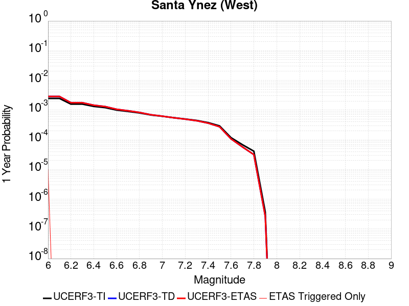 |  |

| Magnitude | 1 wk TI Prob | 1 wk TD Prob | 1 wk ETAS Prob | 1 wk ETAS/TD Gain | 1 wk ETAS Triggered Only | 1 mo TI Prob | 1 mo TD Prob | 1 mo ETAS Prob | 1 mo ETAS/TD Gain | 1 mo ETAS Triggered Only | 1 yr TI Prob | 1 yr TD Prob | 1 yr ETAS Prob | 1 yr ETAS/TD Gain | 1 yr ETAS Triggered Only | 10 yr TI Prob | 10 yr TD Prob | 10 yr ETAS Prob | 10 yr ETAS/TD Gain | 10 yr ETAS Triggered Only |
|-----|-----|-----|-----|-----|-----|-----|-----|-----|-----|-----|-----|-----|-----|-----|-----|-----|-----|-----|-----|-----|
| 6.0 | 4.7352758E-5 | 5.5029144E-5 | 5.5029144E-5 | 1.0 | 0.0 | 2.0292461E-4 | 2.3581888E-4 | 2.458165E-4 | 1.0423955 | 1.0E-5 | 0.0024678076 | 0.002867584 | 0.0028775553 | 1.0034772 | 1.0E-5 | 0.024405818 | 0.02833391 | 0.028401928 | 1.0024005 | 7.0E-5 |
| 6.1 | 4.7352758E-5 | 5.5029144E-5 | 5.5029144E-5 | 1.0 | 0.0 | 2.0292461E-4 | 2.3581888E-4 | 2.3581888E-4 | 1.0 | 0.0 | 0.0024678076 | 0.002867584 | 0.002867584 | 1.0 | 0.0 | 0.024405818 | 0.02833391 | 0.028382493 | 1.0017147 | 5.0E-5 |
| 6.2 | 3.0415853E-5 | 3.3954537E-5 | 3.3954537E-5 | 1.0 | 0.0 | 1.3034715E-4 | 1.4551154E-4 | 1.4551154E-4 | 1.0 | 0.0 | 0.0015858212 | 0.0017701987 | 0.0017701987 | 1.0 | 0.0 | 0.015745522 | 0.017564919 | 0.017584568 | 1.0011187 | 2.0E-5 |
| 6.3 | 3.0415853E-5 | 3.3954537E-5 | 3.3954537E-5 | 1.0 | 0.0 | 1.3034715E-4 | 1.4551154E-4 | 1.4551154E-4 | 1.0 | 0.0 | 0.0015858212 | 0.0017701987 | 0.0017701987 | 1.0 | 0.0 | 0.015745522 | 0.017564919 | 0.017584568 | 1.0011187 | 2.0E-5 |
| 6.4 | 2.5452082E-5 | 2.7934693E-5 | 2.7934693E-5 | 1.0 | 0.0 | 1.09075794E-4 | 1.1971473E-4 | 1.1971473E-4 | 1.0 | 0.0 | 0.0013271887 | 0.0014565713 | 0.0014565713 | 1.0 | 0.0 | 0.013192902 | 0.014472412 | 0.014482267 | 1.0006809 | 1.0E-5 |
| 6.5 | 2.3143784E-5 | 2.5147265E-5 | 2.5147265E-5 | 1.0 | 0.0 | 9.9183875E-5 | 1.0776962E-4 | 1.0776962E-4 | 1.0 | 0.0 | 0.0012068948 | 0.00131132 | 0.00131132 | 1.0 | 0.0 | 0.012003611 | 0.01303749 | 0.01304736 | 1.000757 | 1.0E-5 |
| 6.6 | 1.9118515E-5 | 2.0368354E-5 | 2.0368354E-5 | 1.0 | 0.0 | 8.193392E-5 | 8.7290064E-5 | 8.7290064E-5 | 1.0 | 0.0 | 9.97089E-4 | 0.0010622463 | 0.0010622463 | 1.0 | 0.0 | 0.00992627 | 0.010572601 | 0.0105824955 | 1.0009358 | 1.0E-5 |
| 6.7 | 1.722807E-5 | 1.8158258E-5 | 1.8158258E-5 | 1.0 | 0.0 | 7.3832496E-5 | 7.781882E-5 | 7.781882E-5 | 1.0 | 0.0 | 8.985399E-4 | 9.470379E-4 | 9.470379E-4 | 1.0 | 0.0 | 0.008949154 | 0.009430667 | 0.009440573 | 1.0010504 | 1.0E-5 |
| 6.8 | 1.5317364E-5 | 1.5936357E-5 | 1.5936357E-5 | 1.0 | 0.0 | 6.56442E-5 | 6.829691E-5 | 6.829691E-5 | 1.0 | 0.0 | 7.98925E-4 | 8.3120196E-4 | 8.3120196E-4 | 1.0 | 0.0 | 0.007960589 | 0.008281419 | 0.008291337 | 1.0011976 | 1.0E-5 |
| 6.9 | 1.3071226E-5 | 1.33372E-5 | 1.33372E-5 | 1.0 | 0.0 | 5.6018336E-5 | 5.7158188E-5 | 5.7158188E-5 | 1.0 | 0.0 | 6.8180985E-4 | 6.95681E-4 | 6.95681E-4 | 1.0 | 0.0 | 0.0067972173 | 0.006935293 | 0.0069452235 | 1.001432 | 1.0E-5 |
| 7.0 | 1.1836986E-5 | 1.1939313E-5 | 1.1939313E-5 | 1.0 | 0.0 | 5.0728955E-5 | 5.1167488E-5 | 5.1167488E-5 | 1.0 | 0.0 | 6.1745E-4 | 6.227878E-4 | 6.227878E-4 | 1.0 | 0.0 | 0.006157372 | 0.0062106177 | 0.006220556 | 1.0016001 | 1.0E-5 |
| 7.1 | 1.0597169E-5 | 1.054777E-5 | 1.054777E-5 | 1.0 | 0.0 | 4.541565E-5 | 4.5203953E-5 | 4.5203953E-5 | 1.0 | 0.0 | 5.5279525E-4 | 5.502203E-4 | 5.502203E-4 | 1.0 | 0.0 | 0.0055142213 | 0.005488711 | 0.005498656 | 1.0018119 | 1.0E-5 |
| 7.2 | 9.59113E-6 | 9.464241E-6 | 9.464241E-6 | 1.0 | 0.0 | 4.11042E-5 | 4.0560408E-5 | 4.0560408E-5 | 1.0 | 0.0 | 5.0032866E-4 | 4.9371214E-4 | 4.9371214E-4 | 1.0 | 0.0 | 0.004992037 | 0.0049262717 | 0.0049362225 | 1.0020199 | 1.0E-5 |
| 7.3 | 8.586084E-6 | 8.384226E-6 | 8.384226E-6 | 1.0 | 0.0 | 3.679698E-5 | 3.593191E-5 | 3.593191E-5 | 1.0 | 0.0 | 4.4791115E-4 | 4.3738424E-4 | 4.3738424E-4 | 1.0 | 0.0 | 0.004470094 | 0.0043653455 | 0.0043753018 | 1.0022807 | 1.0E-5 |
| 7.4 | 7.2622997E-6 | 6.9555335E-6 | 6.9555335E-6 | 1.0 | 0.0 | 3.112377E-5 | 2.9809094E-5 | 2.9809094E-5 | 1.0 | 0.0 | 3.78866E-4 | 3.6286624E-4 | 3.6286624E-4 | 1.0 | 0.0 | 0.0037822074 | 0.0036228378 | 0.0036328016 | 1.0027503 | 1.0E-5 |
| 7.5 | 5.627296E-6 | 5.254387E-6 | 5.254387E-6 | 1.0 | 0.0 | 2.411676E-5 | 2.251861E-5 | 2.251861E-5 | 1.0 | 0.0 | 2.9358198E-4 | 2.741303E-4 | 2.741303E-4 | 1.0 | 0.0 | 0.0029319443 | 0.0027379936 | 0.0027479662 | 1.0036423 | 1.0E-5 |
| 7.6 | 2.265244E-6 | 2.061622E-6 | 2.061622E-6 | 1.0 | 0.0 | 9.708152E-6 | 8.835493E-6 | 8.835493E-6 | 1.0 | 0.0 | 1.18190335E-4 | 1.07566906E-4 | 1.07566906E-4 | 1.0 | 0.0 | 0.001181275 | 0.001075157 | 0.001075157 | 1.0 | 0.0 |
| 7.7 | 1.3099874E-6 | 1.1020487E-6 | 1.1020487E-6 | 1.0 | 0.0 | 5.61422E-6 | 4.723058E-6 | 4.723058E-6 | 1.0 | 0.0 | 6.8350986E-5 | 5.7501733E-5 | 5.7501733E-5 | 1.0 | 0.0 | 6.832996E-4 | 5.7487097E-4 | 5.7487097E-4 | 1.0 | 0.0 |
| 7.8 | 7.903951E-7 | 6.0735323E-7 | 6.0735323E-7 | 1.0 | 0.0 | 3.3874032E-6 | 2.60294E-6 | 2.60294E-6 | 1.0 | 0.0 | 4.1240855E-5 | 3.1690346E-5 | 3.1690346E-5 | 1.0 | 0.0 | 4.12332E-4 | 3.168596E-4 | 3.168596E-4 | 1.0 | 0.0 |
| 7.9 | 7.0753297E-9 | 5.0913718E-9 | 5.0913718E-9 | 1.0 | 0.0 | 3.032284E-8 | 2.1820165E-8 | 2.1820165E-8 | 1.0 | 0.0 | 3.6918053E-7 | 2.6566047E-7 | 2.6566047E-7 | 1.0 | 0.0 | 3.691799E-6 | 2.6566026E-6 | 2.6566026E-6 | 1.0 | 0.0 |

## San Andreas (Parkfield)
*[(top)](#table-of-contents)*

| 1 Week | 1 Month | 1 Year | 10 Year |
|-----|-----|-----|-----|
|  |  |  |  |

| Magnitude | 1 wk TI Prob | 1 wk TD Prob | 1 wk ETAS Prob | 1 wk ETAS/TD Gain | 1 wk ETAS Triggered Only | 1 mo TI Prob | 1 mo TD Prob | 1 mo ETAS Prob | 1 mo ETAS/TD Gain | 1 mo ETAS Triggered Only | 1 yr TI Prob | 1 yr TD Prob | 1 yr ETAS Prob | 1 yr ETAS/TD Gain | 1 yr ETAS Triggered Only | 10 yr TI Prob | 10 yr TD Prob | 10 yr ETAS Prob | 10 yr ETAS/TD Gain | 10 yr ETAS Triggered Only |
|-----|-----|-----|-----|-----|-----|-----|-----|-----|-----|-----|-----|-----|-----|-----|-----|-----|-----|-----|-----|-----|
| 6.0 | 5.556969E-4 | 8.196157E-4 | 8.2960754E-4 | 1.0121908 | 1.0E-5 | 0.0023793848 | 0.003508534 | 0.003518499 | 1.0028402 | 1.0E-5 | 0.028586963 | 0.04230748 | 0.042326637 | 1.0004528 | 2.0E-5 | 0.25176284 | 0.34340525 | 0.34345123 | 1.0001339 | 7.0E-5 |
| 6.1 | 1.925858E-4 | 3.1452163E-4 | 3.1452163E-4 | 1.0 | 0.0 | 8.2510663E-4 | 0.0013473612 | 0.0013473612 | 1.0 | 0.0 | 0.0099994885 | 0.01644815 | 0.01644815 | 1.0 | 0.0 | 0.095613256 | 0.15261516 | 0.15262364 | 1.0000556 | 1.0E-5 |
| 6.2 | 9.4306815E-5 | 1.857338E-4 | 1.857338E-4 | 1.0 | 0.0 | 4.0410945E-4 | 7.957605E-4 | 7.957605E-4 | 1.0 | 0.0 | 0.0049089384 | 0.009645544 | 0.009645544 | 1.0 | 0.0 | 0.048019063 | 0.09328519 | 0.09328519 | 1.0 | 0.0 |
| 6.3 | 9.283051E-5 | 1.8268503E-4 | 1.8268503E-4 | 1.0 | 0.0 | 3.9778434E-4 | 7.827022E-4 | 7.827022E-4 | 1.0 | 0.0 | 0.0048322747 | 0.009487969 | 0.009487969 | 1.0 | 0.0 | 0.047285385 | 0.09193527 | 0.09193527 | 1.0 | 0.0 |
| 6.4 | 9.138826E-5 | 1.8028545E-4 | 1.8028545E-4 | 1.0 | 0.0 | 3.916052E-4 | 7.724244E-4 | 7.724244E-4 | 1.0 | 0.0 | 0.0047573745 | 0.009363926 | 0.009363926 | 1.0 | 0.0 | 0.046568092 | 0.09082691 | 0.09082691 | 1.0 | 0.0 |
| 6.5 | 9.000255E-5 | 1.7784708E-4 | 1.7784708E-4 | 1.0 | 0.0 | 3.8566816E-4 | 7.6198025E-4 | 7.6198025E-4 | 1.0 | 0.0 | 0.0046854047 | 0.009237877 | 0.009237877 | 1.0 | 0.0 | 0.045878403 | 0.08970428 | 0.08970428 | 1.0 | 0.0 |
| 6.6 | 8.8109264E-5 | 1.7461648E-4 | 1.7461648E-4 | 1.0 | 0.0 | 3.7755648E-4 | 7.481429E-4 | 7.481429E-4 | 1.0 | 0.0 | 0.0045870654 | 0.009070832 | 0.009070832 | 1.0 | 0.0 | 0.04493529 | 0.08822243 | 0.08822243 | 1.0 | 0.0 |
| 6.7 | 8.738073E-5 | 1.732782E-4 | 1.732782E-4 | 1.0 | 0.0 | 3.7443507E-4 | 7.4241066E-4 | 7.4241066E-4 | 1.0 | 0.0 | 0.0045492216 | 0.009001653 | 0.009001653 | 1.0 | 0.0 | 0.04457213 | 0.08762003 | 0.08762003 | 1.0 | 0.0 |
| 6.8 | 8.710195E-5 | 1.7272614E-4 | 1.7272614E-4 | 1.0 | 0.0 | 3.7324068E-4 | 7.4004603E-4 | 7.4004603E-4 | 1.0 | 0.0 | 0.0045347405 | 0.008973109 | 0.008973109 | 1.0 | 0.0 | 0.04443313 | 0.08736509 | 0.08736509 | 1.0 | 0.0 |
| 6.9 | 8.6801556E-5 | 1.721293E-4 | 1.721293E-4 | 1.0 | 0.0 | 3.7195362E-4 | 7.374896E-4 | 7.374896E-4 | 1.0 | 0.0 | 0.0045191357 | 0.00894224 | 0.00894224 | 1.0 | 0.0 | 0.044283327 | 0.08708887 | 0.08708887 | 1.0 | 0.0 |
| 7.0 | 8.5571606E-5 | 1.6963162E-4 | 1.6963162E-4 | 1.0 | 0.0 | 3.6668387E-4 | 7.267913E-4 | 7.267913E-4 | 1.0 | 0.0 | 0.004455241 | 0.008813049 | 0.008813049 | 1.0 | 0.0 | 0.043669727 | 0.08592802 | 0.08592802 | 1.0 | 0.0 |
| 7.1 | 7.82589E-5 | 1.5432172E-4 | 1.5432172E-4 | 1.0 | 0.0 | 3.3535215E-4 | 6.6121196E-4 | 6.6121196E-4 | 1.0 | 0.0 | 0.0040752706 | 0.008020718 | 0.008020718 | 1.0 | 0.0 | 0.040013418 | 0.07880654 | 0.07880654 | 1.0 | 0.0 |
| 7.2 | 7.690929E-5 | 1.5167004E-4 | 1.5167004E-4 | 1.0 | 0.0 | 3.2956956E-4 | 6.4985326E-4 | 6.4985326E-4 | 1.0 | 0.0 | 0.004005129 | 0.007883434 | 0.007883434 | 1.0 | 0.0 | 0.0393371 | 0.07757192 | 0.07757192 | 1.0 | 0.0 |
| 7.3 | 7.5543794E-5 | 1.4859712E-4 | 1.4859712E-4 | 1.0 | 0.0 | 3.2371894E-4 | 6.3669006E-4 | 6.3669006E-4 | 1.0 | 0.0 | 0.003934157 | 0.0077243187 | 0.0077243187 | 1.0 | 0.0 | 0.038652334 | 0.07612144 | 0.07612144 | 1.0 | 0.0 |
| 7.4 | 7.4214564E-5 | 1.4556678E-4 | 1.4556678E-4 | 1.0 | 0.0 | 3.1802364E-4 | 6.237092E-4 | 6.237092E-4 | 1.0 | 0.0 | 0.003865065 | 0.0075673843 | 0.0075673843 | 1.0 | 0.0 | 0.03798529 | 0.07468088 | 0.07468088 | 1.0 | 0.0 |
| 7.5 | 6.149578E-5 | 1.144406E-4 | 1.144406E-4 | 1.0 | 0.0 | 2.6352672E-4 | 4.9036765E-4 | 4.9036765E-4 | 1.0 | 0.0 | 0.0032037178 | 0.0059539163 | 0.0059539163 | 1.0 | 0.0 | 0.03157923 | 0.05972373 | 0.05972373 | 1.0 | 0.0 |
| 7.6 | 6.0643448E-5 | 1.1270398E-4 | 1.1270398E-4 | 1.0 | 0.0 | 2.598746E-4 | 4.8292775E-4 | 4.8292775E-4 | 1.0 | 0.0 | 0.0031593828 | 0.005863827 | 0.005863827 | 1.0 | 0.0 | 0.031148417 | 0.05887575 | 0.05887575 | 1.0 | 0.0 |
| 7.7 | 5.1652263E-5 | 9.400266E-5 | 9.400266E-5 | 1.0 | 0.0 | 2.2134806E-4 | 4.0280636E-4 | 4.0280636E-4 | 1.0 | 0.0 | 0.002691582 | 0.00489315 | 0.00489315 | 1.0 | 0.0 | 0.026592141 | 0.049591094 | 0.049591094 | 1.0 | 0.0 |
| 7.8 | 4.8090482E-5 | 8.767364E-5 | 8.767364E-5 | 1.0 | 0.0 | 2.060858E-4 | 3.7569006E-4 | 3.7569006E-4 | 1.0 | 0.0 | 0.0025062072 | 0.004564442 | 0.004564442 | 1.0 | 0.0 | 0.024781305 | 0.046276424 | 0.046276424 | 1.0 | 0.0 |
| 7.9 | 3.970278E-5 | 6.912467E-5 | 6.912467E-5 | 1.0 | 0.0 | 1.7014367E-4 | 2.9621494E-4 | 2.9621494E-4 | 1.0 | 0.0 | 0.002069531 | 0.003600457 | 0.003600457 | 1.0 | 0.0 | 0.020503636 | 0.036656603 | 0.036656603 | 1.0 | 0.0 |
| 8.0 | 2.8982335E-5 | 4.1731022E-5 | 4.1731022E-5 | 1.0 | 0.0 | 1.2420409E-4 | 1.7883499E-4 | 1.7883499E-4 | 1.0 | 0.0 | 0.0015111357 | 0.002175143 | 0.002175143 | 1.0 | 0.0 | 0.015009012 | 0.022526473 | 0.022526473 | 1.0 | 0.0 |
| 8.1 | 1.8836186E-5 | 1.9266132E-5 | 1.9266132E-5 | 1.0 | 0.0 | 8.0724014E-5 | 8.256653E-5 | 8.256653E-5 | 1.0 | 0.0 | 9.823717E-4 | 0.0010047846 | 0.0010047846 | 1.0 | 0.0 | 0.009780403 | 0.010795261 | 0.010795261 | 1.0 | 0.0 |
| 8.2 | 8.643924E-6 | 5.6977096E-6 | 5.6977096E-6 | 1.0 | 0.0 | 3.704486E-5 | 2.4418528E-5 | 2.4418528E-5 | 1.0 | 0.0 | 4.5092785E-4 | 2.9725512E-4 | 2.9725512E-4 | 1.0 | 0.0 | 0.0045001395 | 0.0033707586 | 0.0033707586 | 1.0 | 0.0 |
| 8.3 | 1.983087E-6 | 8.03092E-7 | 8.03092E-7 | 1.0 | 0.0 | 8.498917E-6 | 3.4418185E-6 | 3.4418185E-6 | 1.0 | 0.0 | 1.034694E-4 | 4.1903353E-5 | 4.1903353E-5 | 1.0 | 0.0 | 0.0010342124 | 4.932912E-4 | 4.932912E-4 | 1.0 | 0.0 |

## Ludlow
*[(top)](#table-of-contents)*

| 1 Week | 1 Month | 1 Year | 10 Year |
|-----|-----|-----|-----|
|  |  |  |  |

| Magnitude | 1 wk TI Prob | 1 wk TD Prob | 1 wk ETAS Prob | 1 wk ETAS/TD Gain | 1 wk ETAS Triggered Only | 1 mo TI Prob | 1 mo TD Prob | 1 mo ETAS Prob | 1 mo ETAS/TD Gain | 1 mo ETAS Triggered Only | 1 yr TI Prob | 1 yr TD Prob | 1 yr ETAS Prob | 1 yr ETAS/TD Gain | 1 yr ETAS Triggered Only | 10 yr TI Prob | 10 yr TD Prob | 10 yr ETAS Prob | 10 yr ETAS/TD Gain | 10 yr ETAS Triggered Only |
|-----|-----|-----|-----|-----|-----|-----|-----|-----|-----|-----|-----|-----|-----|-----|-----|-----|-----|-----|-----|-----|
| 6.0 | 2.2407607E-5 | 2.366468E-5 | 2.366468E-5 | 1.0 | 0.0 | 9.602906E-5 | 1.0141636E-4 | 1.0141636E-4 | 1.0 | 0.0 | 0.0011685267 | 0.0012340889 | 0.0012440766 | 1.0080931 | 1.0E-5 | 0.011624013 | 0.012276872 | 0.012316382 | 1.0032182 | 4.0E-5 |
| 6.1 | 2.2407607E-5 | 2.366468E-5 | 2.366468E-5 | 1.0 | 0.0 | 9.602906E-5 | 1.0141636E-4 | 1.0141636E-4 | 1.0 | 0.0 | 0.0011685267 | 0.0012340889 | 0.0012440766 | 1.0080931 | 1.0E-5 | 0.011624013 | 0.012276872 | 0.012316382 | 1.0032182 | 4.0E-5 |
| 6.2 | 1.0781252E-5 | 1.1369131E-5 | 1.1369131E-5 | 1.0 | 0.0 | 4.620455E-5 | 4.872396E-5 | 4.872396E-5 | 1.0 | 0.0 | 5.623952E-4 | 5.930568E-4 | 6.0305087E-4 | 1.0168518 | 1.0E-5 | 0.00560974 | 0.0059151603 | 0.0059251008 | 1.0016806 | 1.0E-5 |
| 6.3 | 1.0781252E-5 | 1.1369131E-5 | 1.1369131E-5 | 1.0 | 0.0 | 4.620455E-5 | 4.872396E-5 | 4.872396E-5 | 1.0 | 0.0 | 5.623952E-4 | 5.930568E-4 | 6.0305087E-4 | 1.0168518 | 1.0E-5 | 0.00560974 | 0.0059151603 | 0.0059251008 | 1.0016806 | 1.0E-5 |
| 6.4 | 7.814439E-6 | 8.24024E-6 | 8.24024E-6 | 1.0 | 0.0 | 3.3490025E-5 | 3.5314846E-5 | 3.5314846E-5 | 1.0 | 0.0 | 4.0766477E-4 | 4.2987484E-4 | 4.3987052E-4 | 1.0232526 | 1.0E-5 | 0.0040691774 | 0.0042905794 | 0.0043005366 | 1.0023206 | 1.0E-5 |
| 6.5 | 6.4986366E-6 | 6.8530103E-6 | 6.8530103E-6 | 1.0 | 0.0 | 2.7851002E-5 | 2.9369718E-5 | 2.9369718E-5 | 1.0 | 0.0 | 3.390332E-4 | 3.5751858E-4 | 3.67515E-4 | 1.0279605 | 1.0E-5 | 0.003385164 | 0.0035695303 | 0.0035794945 | 1.0027915 | 1.0E-5 |
| 6.6 | 5.582177E-6 | 5.887809E-6 | 5.887809E-6 | 1.0 | 0.0 | 2.3923398E-5 | 2.5233228E-5 | 2.5233228E-5 | 1.0 | 0.0 | 2.9122844E-4 | 3.0717195E-4 | 3.171689E-4 | 1.0325451 | 1.0E-5 | 0.0029084706 | 0.003067547 | 0.0030775163 | 1.0032499 | 1.0E-5 |
| 6.7 | 4.6858763E-6 | 4.941938E-6 | 4.941938E-6 | 1.0 | 0.0 | 2.0082172E-5 | 2.1179565E-5 | 2.1179565E-5 | 1.0 | 0.0 | 2.4447302E-4 | 2.5783124E-4 | 2.6782867E-4 | 1.0387751 | 1.0E-5 | 0.0024420423 | 0.0025753775 | 0.002585352 | 1.0038729 | 1.0E-5 |
| 6.8 | 3.5584908E-6 | 3.7531668E-6 | 3.7531668E-6 | 1.0 | 0.0 | 1.5250586E-5 | 1.6084903E-5 | 1.6084903E-5 | 1.0 | 0.0 | 1.8566006E-4 | 1.9581651E-4 | 2.0581455E-4 | 1.0510582 | 1.0E-5 | 0.0018550502 | 0.0019564808 | 0.001966461 | 1.0051012 | 1.0E-5 |
| 6.9 | 2.532834E-6 | 2.6718233E-6 | 2.6718233E-6 | 1.0 | 0.0 | 1.0854958E-5 | 1.1450623E-5 | 1.1450623E-5 | 1.0 | 0.0 | 1.3215111E-4 | 1.3940269E-4 | 1.494013E-4 | 1.0717247 | 1.0E-5 | 0.0013207254 | 0.0013931801 | 0.0014031661 | 1.0071678 | 1.0E-5 |
| 7.0 | 1.7083285E-6 | 1.8024995E-6 | 1.8024995E-6 | 1.0 | 0.0 | 7.3213873E-6 | 7.724976E-6 | 7.724976E-6 | 1.0 | 0.0 | 8.913424E-5 | 9.404769E-5 | 1.0404675E-4 | 1.1063191 | 1.0E-5 | 8.9098496E-4 | 9.400954E-4 | 9.50086E-4 | 1.0106273 | 1.0E-5 |
| 7.1 | 1.0905424E-6 | 1.1501132E-6 | 1.1501132E-6 | 1.0 | 0.0 | 4.6737446E-6 | 4.929048E-6 | 4.929048E-6 | 1.0 | 0.0 | 5.6901354E-5 | 6.0009606E-5 | 7.000901E-5 | 1.16663 | 1.0E-5 | 5.6886784E-4 | 5.999438E-4 | 6.099378E-4 | 1.0166582 | 1.0E-5 |
| 7.2 | 6.06668E-7 | 6.3891764E-7 | 6.3891764E-7 | 1.0 | 0.0 | 2.600003E-6 | 2.738216E-6 | 2.738216E-6 | 1.0 | 0.0 | 3.1654577E-5 | 3.333734E-5 | 3.333734E-5 | 1.0 | 0.0 | 3.1650066E-4 | 3.3333022E-4 | 3.3333022E-4 | 1.0 | 0.0 |

## Calico-Hidalgo
*[(top)](#table-of-contents)*

| 1 Week | 1 Month | 1 Year | 10 Year |
|-----|-----|-----|-----|
|  |  |  |  |

| Magnitude | 1 wk TI Prob | 1 wk TD Prob | 1 wk ETAS Prob | 1 wk ETAS/TD Gain | 1 wk ETAS Triggered Only | 1 mo TI Prob | 1 mo TD Prob | 1 mo ETAS Prob | 1 mo ETAS/TD Gain | 1 mo ETAS Triggered Only | 1 yr TI Prob | 1 yr TD Prob | 1 yr ETAS Prob | 1 yr ETAS/TD Gain | 1 yr ETAS Triggered Only | 10 yr TI Prob | 10 yr TD Prob | 10 yr ETAS Prob | 10 yr ETAS/TD Gain | 10 yr ETAS Triggered Only |
|-----|-----|-----|-----|-----|-----|-----|-----|-----|-----|-----|-----|-----|-----|-----|-----|-----|-----|-----|-----|-----|
| 6.0 | 4.0906612E-5 | 5.0748884E-5 | 5.0748884E-5 | 1.0 | 0.0 | 1.7530227E-4 | 2.1747938E-4 | 2.1747938E-4 | 1.0 | 0.0 | 0.0021322158 | 0.0026449955 | 0.002654969 | 1.0037707 | 1.0E-5 | 0.02111873 | 0.026175499 | 0.02622419 | 1.0018601 | 5.0E-5 |
| 6.1 | 4.0906612E-5 | 5.0748884E-5 | 5.0748884E-5 | 1.0 | 0.0 | 1.7530227E-4 | 2.1747938E-4 | 2.1747938E-4 | 1.0 | 0.0 | 0.0021322158 | 0.0026449955 | 0.002654969 | 1.0037707 | 1.0E-5 | 0.02111873 | 0.026175499 | 0.02622419 | 1.0018601 | 5.0E-5 |
| 6.2 | 4.0906612E-5 | 5.0748884E-5 | 5.0748884E-5 | 1.0 | 0.0 | 1.7530227E-4 | 2.1747938E-4 | 2.1747938E-4 | 1.0 | 0.0 | 0.0021322158 | 0.0026449955 | 0.002654969 | 1.0037707 | 1.0E-5 | 0.02111873 | 0.026175499 | 0.02622419 | 1.0018601 | 5.0E-5 |
| 6.3 | 2.4242801E-5 | 3.011025E-5 | 3.011025E-5 | 1.0 | 0.0 | 1.0389358E-4 | 1.2903774E-4 | 1.2903774E-4 | 1.0 | 0.0 | 0.0012641704 | 0.0015699358 | 0.0015799202 | 1.0063597 | 1.0E-5 | 0.01257003 | 0.015592136 | 0.015631512 | 1.0025254 | 4.0E-5 |
| 6.4 | 2.4242801E-5 | 3.011025E-5 | 3.011025E-5 | 1.0 | 0.0 | 1.0389358E-4 | 1.2903774E-4 | 1.2903774E-4 | 1.0 | 0.0 | 0.0012641704 | 0.0015699358 | 0.0015799202 | 1.0063597 | 1.0E-5 | 0.01257003 | 0.015592136 | 0.015631512 | 1.0025254 | 4.0E-5 |
| 6.5 | 2.0286952E-5 | 2.5330412E-5 | 2.5330412E-5 | 1.0 | 0.0 | 8.694118E-5 | 1.08554486E-4 | 1.08554486E-4 | 1.0 | 0.0 | 0.0010579949 | 0.0013208668 | 0.0013308534 | 1.0075607 | 1.0E-5 | 0.010529719 | 0.013132095 | 0.013171569 | 1.003006 | 4.0E-5 |
| 6.6 | 2.0269223E-5 | 2.5311354E-5 | 2.5311354E-5 | 1.0 | 0.0 | 8.6865206E-5 | 1.08472814E-4 | 1.08472814E-4 | 1.0 | 0.0 | 0.0010570707 | 0.0013198735 | 0.0013298603 | 1.0075665 | 1.0E-5 | 0.010520565 | 0.013122281 | 0.013161756 | 1.0030082 | 4.0E-5 |
| 6.7 | 1.799852E-5 | 2.2553324E-5 | 2.2553324E-5 | 1.0 | 0.0 | 7.713423E-5 | 9.665361E-5 | 9.665361E-5 | 1.0 | 0.0 | 9.3870464E-4 | 0.001176137 | 0.0011861252 | 1.0084925 | 1.0E-5 | 0.009347493 | 0.011700736 | 0.011730386 | 1.0025339 | 3.0E-5 |
| 6.8 | 1.7458793E-5 | 2.1854452E-5 | 2.1854452E-5 | 1.0 | 0.0 | 7.4821255E-5 | 9.365865E-5 | 9.365865E-5 | 1.0 | 0.0 | 9.10568E-4 | 0.001139712 | 0.0011497007 | 1.0087641 | 1.0E-5 | 0.009068459 | 0.011340256 | 0.011369916 | 1.0026155 | 3.0E-5 |
| 6.9 | 1.542884E-5 | 1.9036697E-5 | 1.9036697E-5 | 1.0 | 0.0 | 6.612192E-5 | 8.158337E-5 | 8.158337E-5 | 1.0 | 0.0 | 8.04737E-4 | 9.928381E-4 | 0.0010028281 | 1.0100621 | 1.0E-5 | 0.008018291 | 0.009885424 | 0.009905226 | 1.0020032 | 2.0E-5 |
| 7.0 | 1.468253E-5 | 1.804084E-5 | 1.804084E-5 | 1.0 | 0.0 | 6.292361E-5 | 7.731567E-5 | 7.731567E-5 | 1.0 | 0.0 | 7.658257E-4 | 9.409248E-4 | 9.509154E-4 | 1.0106179 | 1.0E-5 | 0.0076319184 | 0.009370777 | 0.009390589 | 1.0021143 | 2.0E-5 |
| 7.1 | 1.3139281E-5 | 1.6210259E-5 | 1.6210259E-5 | 1.0 | 0.0 | 5.6309986E-5 | 6.9470756E-5 | 6.9470756E-5 | 1.0 | 0.0 | 6.853584E-4 | 8.4549084E-4 | 8.5548236E-4 | 1.0118175 | 1.0E-5 | 0.0068324856 | 0.008424039 | 0.008433955 | 1.0011771 | 1.0E-5 |
| 7.2 | 1.1127404E-5 | 1.38748655E-5 | 1.38748655E-5 | 1.0 | 0.0 | 4.7688E-5 | 5.9462418E-5 | 5.9462418E-5 | 1.0 | 0.0 | 5.8044674E-4 | 7.2372536E-4 | 7.337181E-4 | 1.0138074 | 1.0E-5 | 0.0057893298 | 0.0072147925 | 0.0072247204 | 1.001376 | 1.0E-5 |
| 7.3 | 9.808154E-6 | 1.2182047E-5 | 1.2182047E-5 | 1.0 | 0.0 | 4.2034266E-5 | 5.2207786E-5 | 5.2207786E-5 | 1.0 | 0.0 | 5.11647E-4 | 6.3545513E-4 | 6.454488E-4 | 1.0157268 | 1.0E-5 | 0.0051047057 | 0.0063374573 | 0.006347394 | 1.001568 | 1.0E-5 |
| 7.4 | 7.942452E-6 | 9.795631E-6 | 9.795631E-6 | 1.0 | 0.0 | 3.4038632E-5 | 4.1980653E-5 | 4.1980653E-5 | 1.0 | 0.0 | 4.1434157E-4 | 5.1100407E-4 | 5.2099896E-4 | 1.0195593 | 1.0E-5 | 0.0041356985 | 0.0050992323 | 0.005109181 | 1.0019511 | 1.0E-5 |
| 7.5 | 4.7121216E-6 | 5.774994E-6 | 5.774994E-6 | 1.0 | 0.0 | 2.019465E-5 | 2.4749783E-5 | 2.4749783E-5 | 1.0 | 0.0 | 2.4584212E-4 | 3.012946E-4 | 3.1129157E-4 | 1.0331801 | 1.0E-5 | 0.0024557032 | 0.003009614 | 0.0030195839 | 1.0033127 | 1.0E-5 |
| 7.6 | 2.21172E-7 | 2.6045035E-7 | 2.6045035E-7 | 1.0 | 0.0 | 9.478797E-7 | 1.1162155E-6 | 1.1162155E-6 | 1.0 | 0.0 | 1.1540374E-5 | 1.3589866E-5 | 1.3589866E-5 | 1.0 | 0.0 | 1.1539775E-4 | 1.3589318E-4 | 1.3589318E-4 | 1.0 | 0.0 |

## Great Valley 09 (Laguna Seca)
*[(top)](#table-of-contents)*

| 1 Week | 1 Month | 1 Year | 10 Year |
|-----|-----|-----|-----|
|  |  |  |  |

| Magnitude | 1 wk TI Prob | 1 wk TD Prob | 1 wk ETAS Prob | 1 wk ETAS/TD Gain | 1 wk ETAS Triggered Only | 1 mo TI Prob | 1 mo TD Prob | 1 mo ETAS Prob | 1 mo ETAS/TD Gain | 1 mo ETAS Triggered Only | 1 yr TI Prob | 1 yr TD Prob | 1 yr ETAS Prob | 1 yr ETAS/TD Gain | 1 yr ETAS Triggered Only | 10 yr TI Prob | 10 yr TD Prob | 10 yr ETAS Prob | 10 yr ETAS/TD Gain | 10 yr ETAS Triggered Only |
|-----|-----|-----|-----|-----|-----|-----|-----|-----|-----|-----|-----|-----|-----|-----|-----|-----|-----|-----|-----|-----|
| 6.0 | 5.4353277E-5 | 7.0624345E-5 | 7.0624345E-5 | 1.0 | 0.0 | 2.3292181E-4 | 3.026398E-4 | 3.026398E-4 | 1.0 | 0.0 | 0.0028321352 | 0.0036783922 | 0.0036983185 | 1.0054171 | 2.0E-5 | 0.02796312 | 0.036176626 | 0.036224816 | 1.0013322 | 5.0E-5 |
| 6.1 | 4.5578287E-5 | 5.8319547E-5 | 5.8319547E-5 | 1.0 | 0.0 | 1.953209E-4 | 2.4991555E-4 | 2.4991555E-4 | 1.0 | 0.0 | 0.0023754383 | 0.0030384634 | 0.0030584026 | 1.0065622 | 2.0E-5 | 0.023502063 | 0.029968858 | 0.030007659 | 1.0012947 | 4.0E-5 |
| 6.2 | 2.8536782E-5 | 3.4789246E-5 | 3.4789246E-5 | 1.0 | 0.0 | 1.2229476E-4 | 1.4908778E-4 | 1.4908778E-4 | 1.0 | 0.0 | 0.0014879217 | 0.0018136038 | 0.0018136038 | 1.0 | 0.0 | 0.014779986 | 0.017984975 | 0.017994795 | 1.000546 | 1.0E-5 |
| 6.3 | 2.3698774E-5 | 2.8254173E-5 | 2.8254173E-5 | 1.0 | 0.0 | 1.01562226E-4 | 1.2108309E-4 | 1.2108309E-4 | 1.0 | 0.0 | 0.0012358186 | 0.0014731776 | 0.0014731776 | 1.0 | 0.0 | 0.012289686 | 0.0146322185 | 0.014642072 | 1.0006734 | 1.0E-5 |
| 6.4 | 1.9191197E-5 | 2.2152493E-5 | 2.2152493E-5 | 1.0 | 0.0 | 8.2245395E-5 | 9.49359E-5 | 9.49359E-5 | 1.0 | 0.0 | 0.0010008777 | 0.0011552332 | 0.0011552332 | 1.0 | 0.0 | 0.009963818 | 0.011492161 | 0.011502046 | 1.0008602 | 1.0E-5 |
| 6.5 | 1.5203241E-5 | 1.682143E-5 | 1.682143E-5 | 1.0 | 0.0 | 6.5155116E-5 | 7.208989E-5 | 7.208989E-5 | 1.0 | 0.0 | 7.9297484E-4 | 8.7735086E-4 | 8.7735086E-4 | 1.0 | 0.0 | 0.007901512 | 0.008739939 | 0.008749851 | 1.0011342 | 1.0E-5 |
| 6.6 | 1.0984925E-5 | 1.12532E-5 | 1.12532E-5 | 1.0 | 0.0 | 4.70774E-5 | 4.8227128E-5 | 4.8227128E-5 | 1.0 | 0.0 | 5.730166E-4 | 5.870109E-4 | 5.870109E-4 | 1.0 | 0.0 | 0.005715413 | 0.005854993 | 0.0058649345 | 1.0016979 | 1.0E-5 |
| 6.7 | 9.134616E-6 | 9.027989E-6 | 9.027989E-6 | 1.0 | 0.0 | 3.9147766E-5 | 3.8690825E-5 | 3.8690825E-5 | 1.0 | 0.0 | 4.7651984E-4 | 4.7096136E-4 | 4.7096136E-4 | 1.0 | 0.0 | 0.004754993 | 0.004699878 | 0.004709831 | 1.0021178 | 1.0E-5 |
| 6.8 | 7.785589E-6 | 7.458606E-6 | 7.458606E-6 | 1.0 | 0.0 | 3.3366385E-5 | 3.196507E-5 | 3.196507E-5 | 1.0 | 0.0 | 4.0616E-4 | 3.891073E-4 | 3.891073E-4 | 1.0 | 0.0 | 0.0040541845 | 0.0038844643 | 0.0038944255 | 1.0025643 | 1.0E-5 |
| 6.9 | 5.579095E-6 | 4.902893E-6 | 4.902893E-6 | 1.0 | 0.0 | 2.3910188E-5 | 2.1012238E-5 | 2.1012238E-5 | 1.0 | 0.0 | 2.9106764E-4 | 2.5579534E-4 | 2.5579534E-4 | 1.0 | 0.0 | 0.002906867 | 0.0025551468 | 0.0025551468 | 1.0 | 0.0 |
| 7.0 | 2.6816688E-6 | 1.5228632E-6 | 1.5228632E-6 | 1.0 | 0.0 | 1.1492816E-5 | 6.5265403E-6 | 6.5265403E-6 | 1.0 | 0.0 | 1.3991605E-4 | 7.945782E-5 | 7.945782E-5 | 1.0 | 0.0 | 0.0013982799 | 7.9430285E-4 | 7.9430285E-4 | 1.0 | 0.0 |
| 7.1 | 1.9951021E-6 | 7.4606226E-7 | 7.4606226E-7 | 1.0 | 0.0 | 8.55041E-6 | 3.197406E-6 | 3.197406E-6 | 1.0 | 0.0 | 1.0409627E-4 | 3.8927763E-5 | 3.8927763E-5 | 1.0 | 0.0 | 0.0010404752 | 3.892136E-4 | 3.892136E-4 | 1.0 | 0.0 |
| 7.2 | 1.9951021E-6 | 7.4606226E-7 | 7.4606226E-7 | 1.0 | 0.0 | 8.55041E-6 | 3.197406E-6 | 3.197406E-6 | 1.0 | 0.0 | 1.0409627E-4 | 3.8927763E-5 | 3.8927763E-5 | 1.0 | 0.0 | 0.0010404752 | 3.892136E-4 | 3.892136E-4 | 1.0 | 0.0 |
| 7.3 | 1.7087556E-6 | 6.584123E-7 | 6.584123E-7 | 1.0 | 0.0 | 7.3232177E-6 | 2.8217642E-6 | 2.8217642E-6 | 1.0 | 0.0 | 8.915652E-5 | 3.4354478E-5 | 3.4354478E-5 | 1.0 | 0.0 | 8.9120766E-4 | 3.4349572E-4 | 3.4349572E-4 | 1.0 | 0.0 |
| 7.4 | 1.3804846E-6 | 6.077937E-7 | 6.077937E-7 | 1.0 | 0.0 | 5.916349E-6 | 2.6048278E-6 | 2.6048278E-6 | 1.0 | 0.0 | 7.2029165E-5 | 3.1713356E-5 | 3.1713356E-5 | 1.0 | 0.0 | 7.200583E-4 | 3.1709234E-4 | 3.1709234E-4 | 1.0 | 0.0 |
| 7.5 | 1.3804846E-6 | 6.077937E-7 | 6.077937E-7 | 1.0 | 0.0 | 5.916349E-6 | 2.6048278E-6 | 2.6048278E-6 | 1.0 | 0.0 | 7.2029165E-5 | 3.1713356E-5 | 3.1713356E-5 | 1.0 | 0.0 | 7.200583E-4 | 3.1709234E-4 | 3.1709234E-4 | 1.0 | 0.0 |

## Owens Valley
*[(top)](#table-of-contents)*

| 1 Week | 1 Month | 1 Year | 10 Year |
|-----|-----|-----|-----|
|  |  |  |  |

| Magnitude | 1 wk TI Prob | 1 wk TD Prob | 1 wk ETAS Prob | 1 wk ETAS/TD Gain | 1 wk ETAS Triggered Only | 1 mo TI Prob | 1 mo TD Prob | 1 mo ETAS Prob | 1 mo ETAS/TD Gain | 1 mo ETAS Triggered Only | 1 yr TI Prob | 1 yr TD Prob | 1 yr ETAS Prob | 1 yr ETAS/TD Gain | 1 yr ETAS Triggered Only | 10 yr TI Prob | 10 yr TD Prob | 10 yr ETAS Prob | 10 yr ETAS/TD Gain | 10 yr ETAS Triggered Only |
|-----|-----|-----|-----|-----|-----|-----|-----|-----|-----|-----|-----|-----|-----|-----|-----|-----|-----|-----|-----|-----|
| 6.0 | 4.83821E-5 | 3.6590025E-6 | 3.6590025E-6 | 1.0 | 0.0 | 2.0733538E-4 | 1.5681351E-5 | 2.5681195E-5 | 1.6376902 | 1.0E-5 | 0.002521386 | 1.9090474E-4 | 2.20899E-4 | 1.1571164 | 3.0E-5 | 0.024929691 | 0.001945429 | 0.0019953318 | 1.0256512 | 5.0E-5 |
| 6.1 | 4.83821E-5 | 3.6590025E-6 | 3.6590025E-6 | 1.0 | 0.0 | 2.0733538E-4 | 1.5681351E-5 | 2.5681195E-5 | 1.6376902 | 1.0E-5 | 0.002521386 | 1.9090474E-4 | 2.20899E-4 | 1.1571164 | 3.0E-5 | 0.024929691 | 0.001945429 | 0.0019953318 | 1.0256512 | 5.0E-5 |
| 6.2 | 4.83821E-5 | 3.6590025E-6 | 3.6590025E-6 | 1.0 | 0.0 | 2.0733538E-4 | 1.5681351E-5 | 2.5681195E-5 | 1.6376902 | 1.0E-5 | 0.002521386 | 1.9090474E-4 | 2.20899E-4 | 1.1571164 | 3.0E-5 | 0.024929691 | 0.001945429 | 0.0019953318 | 1.0256512 | 5.0E-5 |
| 6.3 | 3.953008E-5 | 3.1731875E-6 | 3.1731875E-6 | 1.0 | 0.0 | 1.6940363E-4 | 1.3599308E-5 | 2.3599172E-5 | 1.7353215 | 1.0E-5 | 0.002060538 | 1.6555973E-4 | 1.8555642E-4 | 1.1207824 | 2.0E-5 | 0.020415364 | 0.0016679796 | 0.0017079129 | 1.0239412 | 4.0E-5 |
| 6.4 | 3.953008E-5 | 3.1731875E-6 | 3.1731875E-6 | 1.0 | 0.0 | 1.6940363E-4 | 1.3599308E-5 | 2.3599172E-5 | 1.7353215 | 1.0E-5 | 0.002060538 | 1.6555973E-4 | 1.8555642E-4 | 1.1207824 | 2.0E-5 | 0.020415364 | 0.0016679796 | 0.0017079129 | 1.0239412 | 4.0E-5 |
| 6.5 | 3.457342E-5 | 2.9831178E-6 | 2.9831178E-6 | 1.0 | 0.0 | 1.4816338E-4 | 1.27847325E-5 | 2.2784605E-5 | 1.7821729 | 1.0E-5 | 0.0018023965 | 1.556437E-4 | 1.7564058E-4 | 1.1284786 | 2.0E-5 | 0.017878477 | 0.0015617217 | 0.0016016592 | 1.0255728 | 4.0E-5 |
| 6.6 | 3.1127765E-5 | 2.8830236E-6 | 2.8830236E-6 | 1.0 | 0.0 | 1.3339789E-4 | 1.2355761E-5 | 2.2355638E-5 | 1.809329 | 1.0E-5 | 0.0016229092 | 1.504217E-4 | 1.7041869E-4 | 1.1329396 | 2.0E-5 | 0.016111081 | 0.0015050536 | 0.0015449934 | 1.0265372 | 4.0E-5 |
| 6.7 | 2.806885E-5 | 2.8166403E-6 | 2.8166403E-6 | 1.0 | 0.0 | 1.2028952E-4 | 1.2071263E-5 | 2.2071143E-5 | 1.8284037 | 1.0E-5 | 0.001463541 | 1.4695841E-4 | 1.6695546E-4 | 1.1360729 | 2.0E-5 | 0.014539397 | 0.0014690319 | 0.0015089732 | 1.0271888 | 4.0E-5 |
| 6.8 | 2.524524E-5 | 2.2407692E-6 | 2.2407692E-6 | 1.0 | 0.0 | 1.0818939E-4 | 9.603263E-6 | 1.9603167E-5 | 2.0413027 | 1.0E-5 | 0.0013164099 | 1.1691376E-4 | 1.3691142E-4 | 1.1710463 | 2.0E-5 | 0.01308639 | 0.0011688021 | 0.0012087554 | 1.034183 | 4.0E-5 |
| 6.9 | 2.2704568E-5 | 1.6121219E-6 | 1.6121219E-6 | 1.0 | 0.0 | 9.730166E-5 | 6.9090756E-6 | 1.6909007E-5 | 2.4473617 | 1.0E-5 | 0.0011840039 | 8.411476E-5 | 1.0411308E-4 | 1.2377504 | 2.0E-5 | 0.011777153 | 8.410387E-4 | 8.810051E-4 | 1.0475203 | 4.0E-5 |
| 7.0 | 2.0871712E-5 | 1.5432902E-6 | 1.5432902E-6 | 1.0 | 0.0 | 8.944713E-5 | 6.6140838E-6 | 1.6614018E-5 | 2.5119152 | 1.0E-5 | 0.0010884746 | 8.052351E-5 | 1.005219E-4 | 1.2483547 | 2.0E-5 | 0.010831586 | 8.051063E-4 | 8.4507413E-4 | 1.0496429 | 4.0E-5 |
| 7.1 | 1.944928E-5 | 1.389613E-6 | 1.389613E-6 | 1.0 | 0.0 | 8.335139E-5 | 5.9554704E-6 | 1.5955411E-5 | 2.6791184 | 1.0E-5 | 0.0010143308 | 7.250545E-5 | 9.2504E-5 | 1.2758213 | 2.0E-5 | 0.010097133 | 7.2496664E-4 | 7.649376E-4 | 1.055135 | 4.0E-5 |
| 7.2 | 1.7876306E-5 | 1.251724E-6 | 1.251724E-6 | 1.0 | 0.0 | 7.6610486E-5 | 5.364521E-6 | 1.5364467E-5 | 2.8640895 | 1.0E-5 | 9.3233347E-4 | 6.531109E-5 | 8.530978E-5 | 1.3062067 | 2.0E-5 | 0.009284316 | 6.5303134E-4 | 6.930052E-4 | 1.0612128 | 4.0E-5 |
| 7.3 | 1.2618672E-5 | 1.1141256E-6 | 1.1141256E-6 | 1.0 | 0.0 | 5.40789E-5 | 4.7748154E-6 | 1.4774768E-5 | 3.094312 | 1.0E-5 | 6.582117E-4 | 5.8131835E-5 | 7.813067E-5 | 1.3440256 | 2.0E-5 | 0.0065626553 | 5.812735E-4 | 6.2125025E-4 | 1.0687745 | 4.0E-5 |
| 7.4 | 7.4874442E-6 | 8.5705943E-7 | 8.5705943E-7 | 1.0 | 0.0 | 3.208865E-5 | 3.673107E-6 | 1.36730705E-5 | 3.722481 | 1.0E-5 | 3.906093E-4 | 4.4719163E-5 | 6.471827E-5 | 1.4472156 | 2.0E-5 | 0.003899234 | 4.4716612E-4 | 4.8714824E-4 | 1.0894122 | 4.0E-5 |
| 7.5 | 2.4734156E-6 | 6.083305E-7 | 6.083305E-7 | 1.0 | 0.0 | 1.060031E-5 | 2.607128E-6 | 1.2607102E-5 | 4.835628 | 1.0E-5 | 1.2905113E-4 | 3.1741325E-5 | 5.174069E-5 | 1.6300734 | 2.0E-5 | 0.0012897621 | 3.1736825E-4 | 3.5735554E-4 | 1.1259966 | 4.0E-5 |
| 7.6 | 1.1328841E-6 | 3.2038136E-7 | 3.2038136E-7 | 1.0 | 0.0 | 4.8552088E-6 | 1.3730622E-6 | 1.3730622E-6 | 1.0 | 0.0 | 5.9110564E-5 | 1.6716906E-5 | 2.671674E-5 | 1.5981869 | 1.0E-5 | 5.9094845E-4 | 1.6715667E-4 | 1.8715333E-4 | 1.1196282 | 2.0E-5 |
| 7.7 | 4.8613185E-7 | 8.992513E-8 | 8.992513E-8 | 1.0 | 0.0 | 2.0834207E-6 | 3.8539335E-7 | 3.8539335E-7 | 1.0 | 0.0 | 2.536535E-5 | 4.6921546E-6 | 4.6921546E-6 | 1.0 | 0.0 | 2.5362454E-4 | 4.6920624E-5 | 4.6920624E-5 | 1.0 | 0.0 |

## Santa Ynez (East)
*[(top)](#table-of-contents)*

| 1 Week | 1 Month | 1 Year | 10 Year |
|-----|-----|-----|-----|
|  |  |  |  |

| Magnitude | 1 wk TI Prob | 1 wk TD Prob | 1 wk ETAS Prob | 1 wk ETAS/TD Gain | 1 wk ETAS Triggered Only | 1 mo TI Prob | 1 mo TD Prob | 1 mo ETAS Prob | 1 mo ETAS/TD Gain | 1 mo ETAS Triggered Only | 1 yr TI Prob | 1 yr TD Prob | 1 yr ETAS Prob | 1 yr ETAS/TD Gain | 1 yr ETAS Triggered Only | 10 yr TI Prob | 10 yr TD Prob | 10 yr ETAS Prob | 10 yr ETAS/TD Gain | 10 yr ETAS Triggered Only |
|-----|-----|-----|-----|-----|-----|-----|-----|-----|-----|-----|-----|-----|-----|-----|-----|-----|-----|-----|-----|-----|
| 6.0 | 3.2269712E-5 | 3.678756E-5 | 3.678756E-5 | 1.0 | 0.0 | 1.3829143E-4 | 1.5765478E-4 | 1.5765478E-4 | 1.0 | 0.0 | 0.0016823979 | 0.001918342 | 0.0019283227 | 1.0052029 | 1.0E-5 | 0.016697178 | 0.01907539 | 0.019114627 | 1.002057 | 4.0E-5 |
| 6.1 | 3.2269712E-5 | 3.678756E-5 | 3.678756E-5 | 1.0 | 0.0 | 1.3829143E-4 | 1.5765478E-4 | 1.5765478E-4 | 1.0 | 0.0 | 0.0016823979 | 0.001918342 | 0.0019283227 | 1.0052029 | 1.0E-5 | 0.016697178 | 0.01907539 | 0.019114627 | 1.002057 | 4.0E-5 |
| 6.2 | 3.2269712E-5 | 3.678756E-5 | 3.678756E-5 | 1.0 | 0.0 | 1.3829143E-4 | 1.5765478E-4 | 1.5765478E-4 | 1.0 | 0.0 | 0.0016823979 | 0.001918342 | 0.0019283227 | 1.0052029 | 1.0E-5 | 0.016697178 | 0.01907539 | 0.019114627 | 1.002057 | 4.0E-5 |
| 6.3 | 3.2269712E-5 | 3.678756E-5 | 3.678756E-5 | 1.0 | 0.0 | 1.3829143E-4 | 1.5765478E-4 | 1.5765478E-4 | 1.0 | 0.0 | 0.0016823979 | 0.001918342 | 0.0019283227 | 1.0052029 | 1.0E-5 | 0.016697178 | 0.01907539 | 0.019114627 | 1.002057 | 4.0E-5 |
| 6.4 | 1.4404779E-5 | 1.4858348E-5 | 1.4858348E-5 | 1.0 | 0.0 | 6.1733306E-5 | 6.367711E-5 | 6.367711E-5 | 1.0 | 0.0 | 7.513438E-4 | 7.749981E-4 | 7.749981E-4 | 1.0 | 0.0 | 0.0074880854 | 0.007723505 | 0.007733428 | 1.0012847 | 1.0E-5 |
| 6.5 | 1.4404779E-5 | 1.4858348E-5 | 1.4858348E-5 | 1.0 | 0.0 | 6.1733306E-5 | 6.367711E-5 | 6.367711E-5 | 1.0 | 0.0 | 7.513438E-4 | 7.749981E-4 | 7.749981E-4 | 1.0 | 0.0 | 0.0074880854 | 0.007723505 | 0.007733428 | 1.0012847 | 1.0E-5 |
| 6.6 | 1.280208E-5 | 1.3019393E-5 | 1.3019393E-5 | 1.0 | 0.0 | 5.4864904E-5 | 5.5796216E-5 | 5.5796216E-5 | 1.0 | 0.0 | 6.6777546E-4 | 6.7910895E-4 | 6.7910895E-4 | 1.0 | 0.0 | 0.006657724 | 0.006770548 | 0.00678048 | 1.001467 | 1.0E-5 |
| 6.7 | 1.2457027E-5 | 1.2635673E-5 | 1.2635673E-5 | 1.0 | 0.0 | 5.3386164E-5 | 5.415177E-5 | 5.415177E-5 | 1.0 | 0.0 | 6.497827E-4 | 6.591E-4 | 6.591E-4 | 1.0 | 0.0 | 0.00647886 | 0.00657165 | 0.0065815845 | 1.0015117 | 1.0E-5 |
| 6.8 | 1.2095134E-5 | 1.2237899E-5 | 1.2237899E-5 | 1.0 | 0.0 | 5.1835254E-5 | 5.2447092E-5 | 5.2447092E-5 | 1.0 | 0.0 | 6.309115E-4 | 6.383579E-4 | 6.383579E-4 | 1.0 | 0.0 | 0.0062912325 | 0.0063654305 | 0.006375367 | 1.0015609 | 1.0E-5 |
| 6.9 | 1.1104036E-5 | 1.1163822E-5 | 1.1163822E-5 | 1.0 | 0.0 | 4.758786E-5 | 4.7844078E-5 | 4.7844078E-5 | 1.0 | 0.0 | 5.7922816E-4 | 5.823472E-4 | 5.823472E-4 | 1.0 | 0.0 | 0.005777207 | 0.005808358 | 0.0058183 | 1.0017116 | 1.0E-5 |
| 7.0 | 1.0577444E-5 | 1.0587852E-5 | 1.0587852E-5 | 1.0 | 0.0 | 4.5331115E-5 | 4.5375724E-5 | 4.5375724E-5 | 1.0 | 0.0 | 5.5176654E-4 | 5.523106E-4 | 5.523106E-4 | 1.0 | 0.0 | 0.0055039856 | 0.005509518 | 0.005519463 | 1.0018051 | 1.0E-5 |
| 7.1 | 1.0021775E-5 | 9.986881E-6 | 9.986881E-6 | 1.0 | 0.0 | 4.294976E-5 | 4.2800224E-5 | 4.2800224E-5 | 1.0 | 0.0 | 5.2278786E-4 | 5.2096933E-4 | 5.2096933E-4 | 1.0 | 0.0 | 0.0052155964 | 0.005197613 | 0.005207561 | 1.0019139 | 1.0E-5 |
| 7.2 | 8.874109E-6 | 8.754106E-6 | 8.754106E-6 | 1.0 | 0.0 | 3.8031343E-5 | 3.7517064E-5 | 3.7517064E-5 | 1.0 | 0.0 | 4.629332E-4 | 4.566756E-4 | 4.566756E-4 | 1.0 | 0.0 | 0.0046197 | 0.0045574894 | 0.004567444 | 1.0021842 | 1.0E-5 |
| 7.3 | 7.5504267E-6 | 7.5095954E-6 | 7.5095954E-6 | 1.0 | 0.0 | 3.235857E-5 | 3.218359E-5 | 3.218359E-5 | 1.0 | 0.0 | 3.9389438E-4 | 3.9176576E-4 | 3.9176576E-4 | 1.0 | 0.0 | 0.0039319694 | 0.0039108586 | 0.003920819 | 1.002547 | 1.0E-5 |
| 7.4 | 6.309394E-6 | 6.186864E-6 | 6.186864E-6 | 1.0 | 0.0 | 2.703998E-5 | 2.6514868E-5 | 2.6514868E-5 | 1.0 | 0.0 | 3.2916202E-4 | 3.2277164E-4 | 3.2277164E-4 | 1.0 | 0.0 | 0.003286749 | 0.0032231258 | 0.0032330935 | 1.0030925 | 1.0E-5 |
| 7.5 | 4.6103073E-6 | 4.4433336E-6 | 4.4433336E-6 | 1.0 | 0.0 | 1.975831E-5 | 1.9042722E-5 | 1.9042722E-5 | 1.0 | 0.0 | 2.4053088E-4 | 2.3182118E-4 | 2.3182118E-4 | 1.0 | 0.0 | 0.002402707 | 0.002315863 | 0.0023258398 | 1.004308 | 1.0E-5 |
| 7.6 | 1.2858658E-6 | 1.3012219E-6 | 1.3012219E-6 | 1.0 | 0.0 | 5.5108417E-6 | 5.576654E-6 | 5.576654E-6 | 1.0 | 0.0 | 6.7092435E-5 | 6.7893714E-5 | 6.7893714E-5 | 1.0 | 0.0 | 6.707218E-4 | 6.787366E-4 | 6.787366E-4 | 1.0 | 0.0 |
| 7.7 | 5.3302307E-7 | 5.613818E-7 | 5.613818E-7 | 1.0 | 0.0 | 2.2843826E-6 | 2.4059198E-6 | 2.4059198E-6 | 1.0 | 0.0 | 2.7812002E-5 | 2.9291718E-5 | 2.9291718E-5 | 1.0 | 0.0 | 2.7808524E-4 | 2.9288215E-4 | 2.9288215E-4 | 1.0 | 0.0 |
| 7.8 | 4.613933E-8 | 4.8041173E-8 | 4.8041173E-8 | 1.0 | 0.0 | 1.9773998E-7 | 2.0589073E-7 | 2.0589073E-7 | 1.0 | 0.0 | 2.4074816E-6 | 2.5067168E-6 | 2.5067168E-6 | 1.0 | 0.0 | 2.4074554E-5 | 2.5066896E-5 | 2.5066896E-5 | 1.0 | 0.0 |

## San Jacinto (San Bernardino)
*[(top)](#table-of-contents)*

| 1 Week | 1 Month | 1 Year | 10 Year |
|-----|-----|-----|-----|
|  |  |  |  |

| Magnitude | 1 wk TI Prob | 1 wk TD Prob | 1 wk ETAS Prob | 1 wk ETAS/TD Gain | 1 wk ETAS Triggered Only | 1 mo TI Prob | 1 mo TD Prob | 1 mo ETAS Prob | 1 mo ETAS/TD Gain | 1 mo ETAS Triggered Only | 1 yr TI Prob | 1 yr TD Prob | 1 yr ETAS Prob | 1 yr ETAS/TD Gain | 1 yr ETAS Triggered Only | 10 yr TI Prob | 10 yr TD Prob | 10 yr ETAS Prob | 10 yr ETAS/TD Gain | 10 yr ETAS Triggered Only |
|-----|-----|-----|-----|-----|-----|-----|-----|-----|-----|-----|-----|-----|-----|-----|-----|-----|-----|-----|-----|-----|
| 6.0 | 3.409352E-5 | 3.6698886E-5 | 3.6698886E-5 | 1.0 | 0.0 | 1.461069E-4 | 1.5727147E-4 | 1.5727147E-4 | 1.0 | 0.0 | 0.0017774 | 0.0019131001 | 0.0019330619 | 1.0104343 | 2.0E-5 | 0.01763251 | 0.019713895 | 0.019762909 | 1.0024862 | 5.0E-5 |
| 6.1 | 3.409352E-5 | 3.6698886E-5 | 3.6698886E-5 | 1.0 | 0.0 | 1.461069E-4 | 1.5727147E-4 | 1.5727147E-4 | 1.0 | 0.0 | 0.0017774 | 0.0019131001 | 0.0019330619 | 1.0104343 | 2.0E-5 | 0.01763251 | 0.019713895 | 0.019762909 | 1.0024862 | 5.0E-5 |
| 6.2 | 3.409352E-5 | 3.6698886E-5 | 3.6698886E-5 | 1.0 | 0.0 | 1.461069E-4 | 1.5727147E-4 | 1.5727147E-4 | 1.0 | 0.0 | 0.0017774 | 0.0019131001 | 0.0019330619 | 1.0104343 | 2.0E-5 | 0.01763251 | 0.019713895 | 0.019762909 | 1.0024862 | 5.0E-5 |
| 6.3 | 3.409352E-5 | 3.6698886E-5 | 3.6698886E-5 | 1.0 | 0.0 | 1.461069E-4 | 1.5727147E-4 | 1.5727147E-4 | 1.0 | 0.0 | 0.0017774 | 0.0019131001 | 0.0019330619 | 1.0104343 | 2.0E-5 | 0.01763251 | 0.019713895 | 0.019762909 | 1.0024862 | 5.0E-5 |
| 6.4 | 3.400795E-5 | 3.65914E-5 | 3.65914E-5 | 1.0 | 0.0 | 1.4574021E-4 | 1.5681087E-4 | 1.5681087E-4 | 1.0 | 0.0 | 0.0017729428 | 0.0019075022 | 0.001927464 | 1.0104649 | 2.0E-5 | 0.017588645 | 0.01965892 | 0.019707937 | 1.0024934 | 5.0E-5 |
| 6.5 | 3.341482E-5 | 3.5851015E-5 | 3.5851015E-5 | 1.0 | 0.0 | 1.4319851E-4 | 1.5363816E-4 | 1.5363816E-4 | 1.0 | 0.0 | 0.0017420477 | 0.0018689411 | 0.0018889038 | 1.0106813 | 2.0E-5 | 0.017284546 | 0.019280083 | 0.01932912 | 1.0025433 | 5.0E-5 |
| 6.6 | 3.3364955E-5 | 3.578814E-5 | 3.578814E-5 | 1.0 | 0.0 | 1.4298483E-4 | 1.5336873E-4 | 1.5336873E-4 | 1.0 | 0.0 | 0.0017394501 | 0.0018656666 | 0.0018856294 | 1.0107 | 2.0E-5 | 0.017258976 | 0.019247914 | 0.019296952 | 1.0025477 | 5.0E-5 |
| 6.7 | 3.335922E-5 | 3.57779E-5 | 3.57779E-5 | 1.0 | 0.0 | 1.4296026E-4 | 1.5332486E-4 | 1.5332486E-4 | 1.0 | 0.0 | 0.0017391514 | 0.0018651333 | 0.001885096 | 1.0107031 | 2.0E-5 | 0.017256035 | 0.019242698 | 0.019291736 | 1.0025483 | 5.0E-5 |
| 6.8 | 3.327683E-5 | 3.5671805E-5 | 3.5671805E-5 | 1.0 | 0.0 | 1.4260718E-4 | 1.5287021E-4 | 1.5287021E-4 | 1.0 | 0.0 | 0.0017348597 | 0.0018596074 | 0.0018795702 | 1.0107349 | 2.0E-5 | 0.017213784 | 0.019188406 | 0.019237448 | 1.0025557 | 5.0E-5 |
| 6.9 | 3.3235785E-5 | 3.5612655E-5 | 3.5612655E-5 | 1.0 | 0.0 | 1.4243131E-4 | 1.5261675E-4 | 1.5261675E-4 | 1.0 | 0.0 | 0.0017327217 | 0.0018565268 | 0.0018764896 | 1.0107528 | 2.0E-5 | 0.017192734 | 0.019158235 | 0.019207278 | 1.0025599 | 5.0E-5 |
| 7.0 | 3.3197095E-5 | 3.5552468E-5 | 3.5552468E-5 | 1.0 | 0.0 | 1.422655E-4 | 1.5235883E-4 | 1.5235883E-4 | 1.0 | 0.0 | 0.0017307063 | 0.0018533919 | 0.0018733549 | 1.010771 | 2.0E-5 | 0.017172894 | 0.019127563 | 0.019176606 | 1.0025641 | 5.0E-5 |
| 7.1 | 3.3129716E-5 | 3.543241E-5 | 3.543241E-5 | 1.0 | 0.0 | 1.4197677E-4 | 1.5184436E-4 | 1.5184436E-4 | 1.0 | 0.0 | 0.0017271966 | 0.0018471389 | 0.001867102 | 1.0108075 | 2.0E-5 | 0.017138338 | 0.019066531 | 0.019115578 | 1.0025724 | 5.0E-5 |
| 7.2 | 3.3034008E-5 | 3.5299625E-5 | 3.5299625E-5 | 1.0 | 0.0 | 1.4156665E-4 | 1.5127534E-4 | 1.5127534E-4 | 1.0 | 0.0 | 0.0017222111 | 0.0018402229 | 0.0018601861 | 1.0108483 | 2.0E-5 | 0.017089253 | 0.018998845 | 0.019047895 | 1.0025817 | 5.0E-5 |
| 7.3 | 3.2956614E-5 | 3.5166842E-5 | 3.5166842E-5 | 1.0 | 0.0 | 1.4123498E-4 | 1.5070634E-4 | 1.5070634E-4 | 1.0 | 0.0 | 0.0017181796 | 0.0018333071 | 0.0018532703 | 1.0108893 | 2.0E-5 | 0.017049557 | 0.01893136 | 0.018980416 | 1.0025911 | 5.0E-5 |
| 7.4 | 3.2915937E-5 | 3.5088146E-5 | 3.5088146E-5 | 1.0 | 0.0 | 1.4106068E-4 | 1.5036912E-4 | 1.5036912E-4 | 1.0 | 0.0 | 0.0017160608 | 0.0018292081 | 0.0018491716 | 1.0109137 | 2.0E-5 | 0.017028693 | 0.018891452 | 0.018940508 | 1.0025967 | 5.0E-5 |
| 7.5 | 3.281791E-5 | 3.49525E-5 | 3.49525E-5 | 1.0 | 0.0 | 1.406406E-4 | 1.4978784E-4 | 1.4978784E-4 | 1.0 | 0.0 | 0.0017109542 | 0.001822143 | 0.0018421066 | 1.010956 | 2.0E-5 | 0.016978411 | 0.018822093 | 0.01887115 | 1.0026065 | 5.0E-5 |
| 7.6 | 3.2521442E-5 | 3.4676123E-5 | 3.4676123E-5 | 1.0 | 0.0 | 1.3937015E-4 | 1.486035E-4 | 1.486035E-4 | 1.0 | 0.0 | 0.0016955109 | 0.0018077476 | 0.0018277115 | 1.0110435 | 2.0E-5 | 0.016826328 | 0.018679118 | 0.018728184 | 1.0026268 | 5.0E-5 |
| 7.7 | 3.0287873E-5 | 3.3152228E-5 | 3.3152228E-5 | 1.0 | 0.0 | 1.297987E-4 | 1.4207324E-4 | 1.4207324E-4 | 1.0 | 0.0 | 0.0015791537 | 0.0017283706 | 0.001748336 | 1.0115516 | 2.0E-5 | 0.01567979 | 0.017886313 | 0.01793542 | 1.0027454 | 5.0E-5 |
| 7.8 | 2.6316151E-5 | 3.0335985E-5 | 3.0335985E-5 | 1.0 | 0.0 | 1.1277862E-4 | 1.3000489E-4 | 1.3000489E-4 | 1.0 | 0.0 | 0.0013722149 | 0.0015816614 | 0.0016016298 | 1.012625 | 2.0E-5 | 0.013637724 | 0.016414337 | 0.016463514 | 1.0029961 | 5.0E-5 |
| 7.9 | 2.0761147E-5 | 2.3999637E-5 | 2.3999637E-5 | 1.0 | 0.0 | 8.897331E-5 | 1.0285153E-4 | 1.0285153E-4 | 1.0 | 0.0 | 0.0010827117 | 0.0012514989 | 0.001271474 | 1.0159608 | 2.0E-5 | 0.010774517 | 0.013093576 | 0.013133053 | 1.0030149 | 4.0E-5 |
| 8.0 | 1.5738568E-5 | 1.6471204E-5 | 1.6471204E-5 | 1.0 | 0.0 | 6.744926E-5 | 7.058897E-5 | 7.058897E-5 | 1.0 | 0.0 | 8.2088535E-4 | 8.5908256E-4 | 8.6907396E-4 | 1.0116303 | 1.0E-5 | 0.008178596 | 0.009096126 | 0.009125853 | 1.0032681 | 3.0E-5 |
| 8.1 | 1.0105832E-5 | 8.585794E-6 | 8.585794E-6 | 1.0 | 0.0 | 4.3309992E-5 | 3.6795744E-5 | 3.6795744E-5 | 1.0 | 0.0 | 5.2717153E-4 | 4.4789663E-4 | 4.4789663E-4 | 1.0 | 0.0 | 0.005259227 | 0.004814717 | 0.0048246686 | 1.002067 | 1.0E-5 |
| 8.2 | 4.189207E-6 | 1.6528313E-6 | 1.6528313E-6 | 1.0 | 0.0 | 1.7953622E-5 | 7.083544E-6 | 7.083544E-6 | 1.0 | 0.0 | 2.1856341E-4 | 8.623876E-5 | 8.623876E-5 | 1.0 | 0.0 | 0.0021834858 | 9.99241E-4 | 9.99241E-4 | 1.0 | 0.0 |
| 8.3 | 1.2758221E-6 | 3.8116477E-7 | 3.8116477E-7 | 1.0 | 0.0 | 5.4677976E-6 | 1.6335623E-6 | 1.6335623E-6 | 1.0 | 0.0 | 6.65684E-5 | 1.9888445E-5 | 1.9888445E-5 | 1.0 | 0.0 | 6.6548464E-4 | 2.3906765E-4 | 2.3906765E-4 | 1.0 | 0.0 |

## Red Pass
*[(top)](#table-of-contents)*

| 1 Week | 1 Month | 1 Year | 10 Year |
|-----|-----|-----|-----|
|  |  |  |  |

| Magnitude | 1 wk TI Prob | 1 wk TD Prob | 1 wk ETAS Prob | 1 wk ETAS/TD Gain | 1 wk ETAS Triggered Only | 1 mo TI Prob | 1 mo TD Prob | 1 mo ETAS Prob | 1 mo ETAS/TD Gain | 1 mo ETAS Triggered Only | 1 yr TI Prob | 1 yr TD Prob | 1 yr ETAS Prob | 1 yr ETAS/TD Gain | 1 yr ETAS Triggered Only | 10 yr TI Prob | 10 yr TD Prob | 10 yr ETAS Prob | 10 yr ETAS/TD Gain | 10 yr ETAS Triggered Only |
|-----|-----|-----|-----|-----|-----|-----|-----|-----|-----|-----|-----|-----|-----|-----|-----|-----|-----|-----|-----|-----|
| 6.0 | 8.258278E-6 | 8.552971E-6 | 1.8552886E-5 | 2.1691744 | 1.0E-5 | 3.539214E-5 | 3.6655176E-5 | 4.665481E-5 | 1.2728027 | 1.0E-5 | 4.308141E-4 | 4.4620328E-4 | 4.5619882E-4 | 1.0224013 | 1.0E-5 | 0.0042997985 | 0.004454832 | 0.0045046094 | 1.0111737 | 5.0E-5 |
| 6.1 | 3.649988E-6 | 3.776045E-6 | 1.3776007E-5 | 3.6482635 | 1.0E-5 | 1.5642712E-5 | 1.6182978E-5 | 2.6182815E-5 | 1.6179233 | 1.0E-5 | 1.9043336E-4 | 1.970147E-4 | 2.0701272E-4 | 1.0507476 | 1.0E-5 | 0.0019027026 | 0.0019688678 | 0.0019888284 | 1.0101382 | 2.0E-5 |
| 6.2 | 3.649988E-6 | 3.776045E-6 | 1.3776007E-5 | 3.6482635 | 1.0E-5 | 1.5642712E-5 | 1.6182978E-5 | 2.6182815E-5 | 1.6179233 | 1.0E-5 | 1.9043336E-4 | 1.970147E-4 | 2.0701272E-4 | 1.0507476 | 1.0E-5 | 0.0019027026 | 0.0019688678 | 0.0019888284 | 1.0101382 | 2.0E-5 |
| 6.3 | 1.3924937E-6 | 1.4413996E-6 | 1.1441385E-5 | 7.937691 | 1.0E-5 | 5.9678164E-6 | 6.1774203E-6 | 1.6177359E-5 | 2.6187887 | 1.0E-5 | 7.265574E-5 | 7.520891E-5 | 8.5208165E-5 | 1.1329529 | 1.0E-5 | 7.263199E-4 | 7.519734E-4 | 7.6196593E-4 | 1.0132884 | 1.0E-5 |
| 6.4 | 1.3924937E-6 | 1.4413996E-6 | 1.1441385E-5 | 7.937691 | 1.0E-5 | 5.9678164E-6 | 6.1774203E-6 | 1.6177359E-5 | 2.6187887 | 1.0E-5 | 7.265574E-5 | 7.520891E-5 | 8.5208165E-5 | 1.1329529 | 1.0E-5 | 7.263199E-4 | 7.519734E-4 | 7.6196593E-4 | 1.0132884 | 1.0E-5 |
| 6.5 | 9.876812E-7 | 1.0223921E-6 | 1.1022382E-5 | 10.780973 | 1.0E-5 | 4.2329125E-6 | 4.3816804E-6 | 1.4381637E-5 | 3.2822194 | 1.0E-5 | 5.153449E-5 | 5.3346957E-5 | 6.334642E-5 | 1.1874421 | 1.0E-5 | 5.1522546E-4 | 5.334696E-4 | 5.4346427E-4 | 1.0187352 | 1.0E-5 |

## Rose Canyon
*[(top)](#table-of-contents)*

| 1 Week | 1 Month | 1 Year | 10 Year |
|-----|-----|-----|-----|
|  |  |  |  |

| Magnitude | 1 wk TI Prob | 1 wk TD Prob | 1 wk ETAS Prob | 1 wk ETAS/TD Gain | 1 wk ETAS Triggered Only | 1 mo TI Prob | 1 mo TD Prob | 1 mo ETAS Prob | 1 mo ETAS/TD Gain | 1 mo ETAS Triggered Only | 1 yr TI Prob | 1 yr TD Prob | 1 yr ETAS Prob | 1 yr ETAS/TD Gain | 1 yr ETAS Triggered Only | 10 yr TI Prob | 10 yr TD Prob | 10 yr ETAS Prob | 10 yr ETAS/TD Gain | 10 yr ETAS Triggered Only |
|-----|-----|-----|-----|-----|-----|-----|-----|-----|-----|-----|-----|-----|-----|-----|-----|-----|-----|-----|-----|-----|
| 6.0 | 4.5923203E-5 | 4.985551E-5 | 4.985551E-5 | 1.0 | 0.0 | 1.9679888E-4 | 2.1365033E-4 | 2.1365033E-4 | 1.0 | 0.0 | 0.0023933933 | 0.0025982866 | 0.0026082606 | 1.0038387 | 1.0E-5 | 0.023677798 | 0.025716998 | 0.02575597 | 1.0015154 | 4.0E-5 |
| 6.1 | 4.5923203E-5 | 4.985551E-5 | 4.985551E-5 | 1.0 | 0.0 | 1.9679888E-4 | 2.1365033E-4 | 2.1365033E-4 | 1.0 | 0.0 | 0.0023933933 | 0.0025982866 | 0.0026082606 | 1.0038387 | 1.0E-5 | 0.023677798 | 0.025716998 | 0.025746226 | 1.0011365 | 3.0E-5 |
| 6.2 | 2.8844734E-5 | 2.977088E-5 | 2.977088E-5 | 1.0 | 0.0 | 1.2361443E-4 | 1.2758344E-4 | 1.2758344E-4 | 1.0 | 0.0 | 0.0015039665 | 0.0015522504 | 0.0015522504 | 1.0 | 0.0 | 0.0149382865 | 0.015430494 | 0.015430494 | 1.0 | 0.0 |
| 6.3 | 2.3171577E-5 | 2.3252216E-5 | 2.3252216E-5 | 1.0 | 0.0 | 9.9302975E-5 | 9.964863E-5 | 9.964863E-5 | 1.0 | 0.0 | 0.0012083431 | 0.0012125603 | 0.0012125603 | 1.0 | 0.0 | 0.012017938 | 0.012071634 | 0.012071634 | 1.0 | 0.0 |
| 6.4 | 2.0066604E-5 | 1.9728404E-5 | 1.9728404E-5 | 1.0 | 0.0 | 8.599689E-5 | 8.4547624E-5 | 8.4547624E-5 | 1.0 | 0.0 | 0.0010465092 | 0.0010288913 | 0.0010288913 | 1.0 | 0.0 | 0.010415946 | 0.010255877 | 0.010255877 | 1.0 | 0.0 |
| 6.5 | 1.776989E-5 | 1.7155813E-5 | 1.7155813E-5 | 1.0 | 0.0 | 7.615444E-5 | 7.352288E-5 | 7.352288E-5 | 1.0 | 0.0 | 9.267859E-4 | 8.947805E-4 | 8.947805E-4 | 1.0 | 0.0 | 0.009229303 | 0.008926582 | 0.008926582 | 1.0 | 0.0 |
| 6.6 | 1.5227364E-5 | 1.4361777E-5 | 1.4361777E-5 | 1.0 | 0.0 | 6.52585E-5 | 6.154905E-5 | 6.154905E-5 | 1.0 | 0.0 | 7.942326E-4 | 7.491073E-4 | 7.491073E-4 | 1.0 | 0.0 | 0.007914 | 0.007483076 | 0.007483076 | 1.0 | 0.0 |
| 6.7 | 1.2703898E-5 | 1.1686707E-5 | 1.1686707E-5 | 1.0 | 0.0 | 5.4444143E-5 | 5.008495E-5 | 5.008495E-5 | 1.0 | 0.0 | 6.626558E-4 | 6.0961785E-4 | 6.0961785E-4 | 1.0 | 0.0 | 0.006606833 | 0.0060927463 | 0.0060927463 | 1.0 | 0.0 |
| 6.8 | 1.1554917E-5 | 1.0620928E-5 | 1.0620928E-5 | 1.0 | 0.0 | 4.9520135E-5 | 4.5517492E-5 | 4.5517492E-5 | 1.0 | 0.0 | 6.0274085E-4 | 5.540386E-4 | 5.540386E-4 | 1.0 | 0.0 | 0.0060110865 | 0.005544497 | 0.005544497 | 1.0 | 0.0 |
| 6.9 | 8.732078E-6 | 7.8866615E-6 | 7.8866615E-6 | 1.0 | 0.0 | 3.7422655E-5 | 3.3799555E-5 | 3.3799555E-5 | 1.0 | 0.0 | 4.5552556E-4 | 4.1143483E-4 | 4.1143483E-4 | 1.0 | 0.0 | 0.0045459294 | 0.0041235248 | 0.0041235248 | 1.0 | 0.0 |
| 7.0 | 5.9337494E-6 | 5.110885E-6 | 5.110885E-6 | 1.0 | 0.0 | 2.5430107E-5 | 2.1903608E-5 | 2.1903608E-5 | 1.0 | 0.0 | 3.0956755E-4 | 2.6664394E-4 | 2.6664394E-4 | 1.0 | 0.0 | 0.0030913667 | 0.0026632557 | 0.0026632557 | 1.0 | 0.0 |
| 7.1 | 5.013409E-6 | 4.1802273E-6 | 4.1802273E-6 | 1.0 | 0.0 | 2.1485863E-5 | 1.7915136E-5 | 1.7915136E-5 | 1.0 | 0.0 | 2.6155898E-4 | 2.1809507E-4 | 2.1809507E-4 | 1.0 | 0.0 | 0.0026125133 | 0.002178822 | 0.002178822 | 1.0 | 0.0 |
| 7.2 | 4.120763E-6 | 3.2846376E-6 | 3.2846376E-6 | 1.0 | 0.0 | 1.7660293E-5 | 1.4076943E-5 | 1.4076943E-5 | 1.0 | 0.0 | 2.1499286E-4 | 1.713734E-4 | 1.713734E-4 | 1.0 | 0.0 | 0.0021478499 | 0.001712422 | 0.001712422 | 1.0 | 0.0 |
| 7.3 | 3.2081239E-6 | 2.4425412E-6 | 2.4425412E-6 | 1.0 | 0.0 | 1.374903E-5 | 1.0467992E-5 | 1.0467992E-5 | 1.0 | 0.0 | 1.6738157E-4 | 1.2744042E-4 | 1.2744042E-4 | 1.0 | 0.0 | 0.0016725556 | 0.0012736804 | 0.0012736804 | 1.0 | 0.0 |
| 7.4 | 2.4194755E-6 | 1.7695078E-6 | 1.7695078E-6 | 1.0 | 0.0 | 1.0369139E-5 | 7.5835833E-6 | 7.5835833E-6 | 1.0 | 0.0 | 1.2623696E-4 | 9.232626E-5 | 9.232626E-5 | 1.0 | 0.0 | 0.0012616527 | 9.2288444E-4 | 9.2288444E-4 | 1.0 | 0.0 |
| 7.5 | 1.3842889E-6 | 9.390369E-7 | 9.390369E-7 | 1.0 | 0.0 | 5.9326535E-6 | 4.0244377E-6 | 4.0244377E-6 | 1.0 | 0.0 | 7.222766E-5 | 4.8996466E-5 | 4.8996466E-5 | 1.0 | 0.0 | 7.220419E-4 | 4.898602E-4 | 4.898602E-4 | 1.0 | 0.0 |
| 7.6 | 1.0021575E-6 | 6.415037E-7 | 6.415037E-7 | 1.0 | 0.0 | 4.2949537E-6 | 2.7492986E-6 | 2.7492986E-6 | 1.0 | 0.0 | 5.2289808E-5 | 3.3472217E-5 | 3.3472217E-5 | 1.0 | 0.0 | 5.2277505E-4 | 3.346739E-4 | 3.346739E-4 | 1.0 | 0.0 |
| 7.7 | 8.7620116E-8 | 6.4512484E-8 | 6.4512484E-8 | 1.0 | 0.0 | 3.7551473E-7 | 2.7648204E-7 | 2.7648204E-7 | 1.0 | 0.0 | 4.5718825E-6 | 3.366164E-6 | 3.366164E-6 | 1.0 | 0.0 | 4.5717883E-5 | 3.366116E-5 | 3.366116E-5 | 1.0 | 0.0 |

## Mission Creek
*[(top)](#table-of-contents)*

| 1 Week | 1 Month | 1 Year | 10 Year |
|-----|-----|-----|-----|
|  |  |  |  |

| Magnitude | 1 wk TI Prob | 1 wk TD Prob | 1 wk ETAS Prob | 1 wk ETAS/TD Gain | 1 wk ETAS Triggered Only | 1 mo TI Prob | 1 mo TD Prob | 1 mo ETAS Prob | 1 mo ETAS/TD Gain | 1 mo ETAS Triggered Only | 1 yr TI Prob | 1 yr TD Prob | 1 yr ETAS Prob | 1 yr ETAS/TD Gain | 1 yr ETAS Triggered Only | 10 yr TI Prob | 10 yr TD Prob | 10 yr ETAS Prob | 10 yr ETAS/TD Gain | 10 yr ETAS Triggered Only |
|-----|-----|-----|-----|-----|-----|-----|-----|-----|-----|-----|-----|-----|-----|-----|-----|-----|-----|-----|-----|-----|
| 6.0 | 1.1549387E-5 | 1.6422371E-5 | 1.6422371E-5 | 1.0 | 0.0 | 4.9496433E-5 | 7.037978E-5 | 7.037978E-5 | 1.0 | 0.0 | 6.0245243E-4 | 8.565519E-4 | 8.665434E-4 | 1.0116647 | 1.0E-5 | 0.006008218 | 0.008560089 | 0.008609662 | 1.0057911 | 5.0E-5 |
| 6.1 | 1.1549387E-5 | 1.6422371E-5 | 1.6422371E-5 | 1.0 | 0.0 | 4.9496433E-5 | 7.037978E-5 | 7.037978E-5 | 1.0 | 0.0 | 6.0245243E-4 | 8.565519E-4 | 8.665434E-4 | 1.0116647 | 1.0E-5 | 0.006008218 | 0.008560089 | 0.008609662 | 1.0057911 | 5.0E-5 |
| 6.2 | 1.1549387E-5 | 1.6422371E-5 | 1.6422371E-5 | 1.0 | 0.0 | 4.9496433E-5 | 7.037978E-5 | 7.037978E-5 | 1.0 | 0.0 | 6.0245243E-4 | 8.565519E-4 | 8.665434E-4 | 1.0116647 | 1.0E-5 | 0.006008218 | 0.008560089 | 0.008609662 | 1.0057911 | 5.0E-5 |
| 6.3 | 1.1549387E-5 | 1.6422371E-5 | 1.6422371E-5 | 1.0 | 0.0 | 4.9496433E-5 | 7.037978E-5 | 7.037978E-5 | 1.0 | 0.0 | 6.0245243E-4 | 8.565519E-4 | 8.665434E-4 | 1.0116647 | 1.0E-5 | 0.006008218 | 0.008560089 | 0.008609662 | 1.0057911 | 5.0E-5 |
| 6.4 | 1.1549387E-5 | 1.6422371E-5 | 1.6422371E-5 | 1.0 | 0.0 | 4.9496433E-5 | 7.037978E-5 | 7.037978E-5 | 1.0 | 0.0 | 6.0245243E-4 | 8.565519E-4 | 8.665434E-4 | 1.0116647 | 1.0E-5 | 0.006008218 | 0.008560089 | 0.008609662 | 1.0057911 | 5.0E-5 |
| 6.5 | 1.1549387E-5 | 1.6422371E-5 | 1.6422371E-5 | 1.0 | 0.0 | 4.9496433E-5 | 7.037978E-5 | 7.037978E-5 | 1.0 | 0.0 | 6.0245243E-4 | 8.565519E-4 | 8.665434E-4 | 1.0116647 | 1.0E-5 | 0.006008218 | 0.008560089 | 0.008609662 | 1.0057911 | 5.0E-5 |
| 6.6 | 9.202681E-6 | 1.3944876E-5 | 1.3944876E-5 | 1.0 | 0.0 | 3.9439463E-5 | 5.9762435E-5 | 5.9762435E-5 | 1.0 | 0.0 | 4.800697E-4 | 7.273738E-4 | 7.3736656E-4 | 1.013738 | 1.0E-5 | 0.004790339 | 0.007276938 | 0.007326574 | 1.006821 | 5.0E-5 |
| 6.7 | 9.019164E-6 | 1.375048E-5 | 1.375048E-5 | 1.0 | 0.0 | 3.8652986E-5 | 5.8929352E-5 | 5.8929352E-5 | 1.0 | 0.0 | 4.7049852E-4 | 7.172377E-4 | 7.272305E-4 | 1.0139323 | 1.0E-5 | 0.004695036 | 0.007176234 | 0.0072258753 | 1.0069175 | 5.0E-5 |
| 6.8 | 8.673558E-6 | 1.3372381E-5 | 1.3372381E-5 | 1.0 | 0.0 | 3.717186E-5 | 5.7308993E-5 | 5.7308993E-5 | 1.0 | 0.0 | 4.524734E-4 | 6.975225E-4 | 7.075155E-4 | 1.0143265 | 1.0E-5 | 0.0045155324 | 0.0069803223 | 0.0070299734 | 1.007113 | 5.0E-5 |
| 6.9 | 7.002255E-6 | 1.1575849E-5 | 1.1575849E-5 | 1.0 | 0.0 | 3.000932E-5 | 4.960988E-5 | 4.960988E-5 | 1.0 | 0.0 | 3.653022E-4 | 6.0383976E-4 | 6.138337E-4 | 1.0165507 | 1.0E-5 | 0.0036470229 | 0.0060487976 | 0.006098495 | 1.0082161 | 5.0E-5 |
| 7.0 | 5.84644E-6 | 9.768164E-6 | 9.768164E-6 | 1.0 | 0.0 | 2.5055931E-5 | 4.1862913E-5 | 4.1862913E-5 | 1.0 | 0.0 | 3.0501327E-4 | 5.0956634E-4 | 5.1956123E-4 | 1.0196146 | 1.0E-5 | 0.0030459496 | 0.0051105767 | 0.005160321 | 1.0097337 | 5.0E-5 |
| 7.1 | 5.54703E-6 | 9.422302E-6 | 9.422302E-6 | 1.0 | 0.0 | 2.377277E-5 | 4.03807E-5 | 4.03807E-5 | 1.0 | 0.0 | 2.8939504E-4 | 4.9152854E-4 | 5.0152367E-4 | 1.0203347 | 1.0E-5 | 0.0028901845 | 0.0049310043 | 0.0049807574 | 1.0100899 | 5.0E-5 |
| 7.2 | 4.384709E-6 | 7.770266E-6 | 7.770266E-6 | 1.0 | 0.0 | 1.8791474E-5 | 3.3300737E-5 | 3.3300737E-5 | 1.0 | 0.0 | 2.2876218E-4 | 4.0536473E-4 | 4.1536067E-4 | 1.0246592 | 1.0E-5 | 0.0022852682 | 0.004072859 | 0.0041226554 | 1.0122263 | 5.0E-5 |
| 7.3 | 3.7888456E-6 | 7.0024025E-6 | 7.0024025E-6 | 1.0 | 0.0 | 1.623781E-5 | 3.0009971E-5 | 3.0009971E-5 | 1.0 | 0.0 | 1.9767738E-4 | 3.653135E-4 | 3.7530984E-4 | 1.0273638 | 1.0E-5 | 0.0019750162 | 0.0036737104 | 0.0037235268 | 1.0135602 | 5.0E-5 |
| 7.4 | 2.1982462E-6 | 5.108155E-6 | 5.108155E-6 | 1.0 | 0.0 | 9.421021E-6 | 2.189191E-5 | 2.189191E-5 | 1.0 | 0.0 | 1.1469489E-4 | 2.665016E-4 | 2.7649893E-4 | 1.0375133 | 1.0E-5 | 0.0011463572 | 0.0026881823 | 0.002738048 | 1.0185499 | 5.0E-5 |
| 7.5 | 2.051923E-6 | 4.6970845E-6 | 4.6970845E-6 | 1.0 | 0.0 | 8.793926E-6 | 2.0130208E-5 | 2.0130208E-5 | 1.0 | 0.0 | 1.0706078E-4 | 2.4505786E-4 | 2.550554E-4 | 1.0407966 | 1.0E-5 | 0.0010700922 | 0.0024748126 | 0.0025246888 | 1.0201535 | 5.0E-5 |
| 7.6 | 1.8733427E-6 | 4.2026363E-6 | 4.2026363E-6 | 1.0 | 0.0 | 8.028587E-6 | 1.8011175E-5 | 1.8011175E-5 | 1.0 | 0.0 | 9.774366E-5 | 2.1926407E-4 | 2.2926187E-4 | 1.0455971 | 1.0E-5 | 9.770069E-4 | 0.0022180458 | 0.0022679348 | 1.0224924 | 5.0E-5 |
| 7.7 | 1.8411953E-6 | 4.1217827E-6 | 4.1217827E-6 | 1.0 | 0.0 | 7.890813E-6 | 1.7664664E-5 | 1.7664664E-5 | 1.0 | 0.0 | 9.606641E-5 | 2.1504615E-4 | 2.25044E-4 | 1.0464916 | 1.0E-5 | 9.6024893E-4 | 0.002176058 | 0.0022259492 | 1.0229273 | 5.0E-5 |
| 7.8 | 1.7194251E-6 | 3.7837615E-6 | 3.7837615E-6 | 1.0 | 0.0 | 7.368944E-6 | 1.621602E-5 | 1.621602E-5 | 1.0 | 0.0 | 8.97132E-5 | 1.9741224E-4 | 2.0741027E-4 | 1.0506455 | 1.0E-5 | 8.967699E-4 | 0.0019993095 | 0.0020492096 | 1.0249586 | 5.0E-5 |
| 7.9 | 1.4035052E-6 | 3.0101937E-6 | 3.0101937E-6 | 1.0 | 0.0 | 6.0150082E-6 | 1.2900767E-5 | 1.2900767E-5 | 1.0 | 0.0 | 7.3230265E-5 | 1.5705558E-4 | 1.6705401E-4 | 1.0636617 | 1.0E-5 | 7.3206134E-4 | 0.001593388 | 0.0016433084 | 1.0313296 | 5.0E-5 |
| 8.0 | 3.9318823E-7 | 5.6747587E-7 | 5.6747587E-7 | 1.0 | 0.0 | 1.6850913E-6 | 2.4320373E-6 | 2.4320373E-6 | 1.0 | 0.0 | 2.0515794E-5 | 2.9609657E-5 | 3.960936E-5 | 1.3377177 | 1.0E-5 | 2.0513899E-4 | 3.0674192E-4 | 3.2673578E-4 | 1.0651814 | 2.0E-5 |
| 8.1 | 1.596793E-7 | 1.18881545E-7 | 1.18881545E-7 | 1.0 | 0.0 | 6.8433974E-7 | 5.094922E-7 | 5.094922E-7 | 1.0 | 0.0 | 8.331805E-6 | 6.203051E-6 | 6.203051E-6 | 1.0 | 0.0 | 8.331492E-5 | 6.826213E-5 | 6.826213E-5 | 1.0 | 0.0 |
| 8.2 | 4.9003038E-8 | 2.6734613E-8 | 2.6734613E-8 | 1.0 | 0.0 | 2.10013E-7 | 1.14576906E-7 | 1.14576906E-7 | 1.0 | 0.0 | 2.5569052E-6 | 1.394973E-6 | 1.394973E-6 | 1.0 | 0.0 | 2.556876E-5 | 1.5670115E-5 | 1.5670115E-5 | 1.0 | 0.0 |

## San Jacinto (Lytle Creek connector)
*[(top)](#table-of-contents)*

| 1 Week | 1 Month | 1 Year | 10 Year |
|-----|-----|-----|-----|
|  |  |  |  |

| Magnitude | 1 wk TI Prob | 1 wk TD Prob | 1 wk ETAS Prob | 1 wk ETAS/TD Gain | 1 wk ETAS Triggered Only | 1 mo TI Prob | 1 mo TD Prob | 1 mo ETAS Prob | 1 mo ETAS/TD Gain | 1 mo ETAS Triggered Only | 1 yr TI Prob | 1 yr TD Prob | 1 yr ETAS Prob | 1 yr ETAS/TD Gain | 1 yr ETAS Triggered Only | 10 yr TI Prob | 10 yr TD Prob | 10 yr ETAS Prob | 10 yr ETAS/TD Gain | 10 yr ETAS Triggered Only |
|-----|-----|-----|-----|-----|-----|-----|-----|-----|-----|-----|-----|-----|-----|-----|-----|-----|-----|-----|-----|-----|
| 6.0 | 6.693995E-6 | 6.775656E-6 | 6.775656E-6 | 1.0 | 0.0 | 2.8688235E-5 | 2.9038201E-5 | 2.9038201E-5 | 1.0 | 0.0 | 3.492233E-4 | 3.5348284E-4 | 3.7347578E-4 | 1.0565598 | 2.0E-5 | 0.00348675 | 0.0036091348 | 0.0036489905 | 1.011043 | 4.0E-5 |
| 6.1 | 6.693995E-6 | 6.775656E-6 | 6.775656E-6 | 1.0 | 0.0 | 2.8688235E-5 | 2.9038201E-5 | 2.9038201E-5 | 1.0 | 0.0 | 3.492233E-4 | 3.5348284E-4 | 3.7347578E-4 | 1.0565598 | 2.0E-5 | 0.00348675 | 0.0036091348 | 0.0036489905 | 1.011043 | 4.0E-5 |
| 6.2 | 6.693995E-6 | 6.775656E-6 | 6.775656E-6 | 1.0 | 0.0 | 2.8688235E-5 | 2.9038201E-5 | 2.9038201E-5 | 1.0 | 0.0 | 3.492233E-4 | 3.5348284E-4 | 3.7347578E-4 | 1.0565598 | 2.0E-5 | 0.00348675 | 0.0036091348 | 0.0036489905 | 1.011043 | 4.0E-5 |
| 6.3 | 6.693995E-6 | 6.775656E-6 | 6.775656E-6 | 1.0 | 0.0 | 2.8688235E-5 | 2.9038201E-5 | 2.9038201E-5 | 1.0 | 0.0 | 3.492233E-4 | 3.5348284E-4 | 3.7347578E-4 | 1.0565598 | 2.0E-5 | 0.00348675 | 0.0036091348 | 0.0036489905 | 1.011043 | 4.0E-5 |
| 6.4 | 6.693995E-6 | 6.775656E-6 | 6.775656E-6 | 1.0 | 0.0 | 2.8688235E-5 | 2.9038201E-5 | 2.9038201E-5 | 1.0 | 0.0 | 3.492233E-4 | 3.5348284E-4 | 3.7347578E-4 | 1.0565598 | 2.0E-5 | 0.00348675 | 0.0036091348 | 0.0036489905 | 1.011043 | 4.0E-5 |
| 6.5 | 6.6561875E-6 | 6.735862E-6 | 6.735862E-6 | 1.0 | 0.0 | 2.8526205E-5 | 2.8867662E-5 | 2.8867662E-5 | 1.0 | 0.0 | 3.472512E-4 | 3.514072E-4 | 3.7140015E-4 | 1.0568941 | 2.0E-5 | 0.0034670907 | 0.0035884455 | 0.003628302 | 1.0111068 | 4.0E-5 |
| 6.6 | 6.6561875E-6 | 6.735862E-6 | 6.735862E-6 | 1.0 | 0.0 | 2.8526205E-5 | 2.8867662E-5 | 2.8867662E-5 | 1.0 | 0.0 | 3.472512E-4 | 3.514072E-4 | 3.7140015E-4 | 1.0568941 | 2.0E-5 | 0.0034670907 | 0.0035884455 | 0.003628302 | 1.0111068 | 4.0E-5 |
| 6.7 | 6.5802237E-6 | 6.6550115E-6 | 6.6550115E-6 | 1.0 | 0.0 | 2.8200653E-5 | 2.8521166E-5 | 2.8521166E-5 | 1.0 | 0.0 | 3.4328885E-4 | 3.4718995E-4 | 3.67183E-4 | 1.0575854 | 2.0E-5 | 0.0034275902 | 0.0035464081 | 0.0035862662 | 1.011239 | 4.0E-5 |
| 6.8 | 6.575632E-6 | 6.6494945E-6 | 6.6494945E-6 | 1.0 | 0.0 | 2.8180975E-5 | 2.8497523E-5 | 2.8497523E-5 | 1.0 | 0.0 | 3.4304935E-4 | 3.4690218E-4 | 3.6689526E-4 | 1.0576332 | 2.0E-5 | 0.0034252026 | 0.0035435397 | 0.003583398 | 1.0112481 | 4.0E-5 |
| 6.9 | 6.570433E-6 | 6.640872E-6 | 6.640872E-6 | 1.0 | 0.0 | 2.8158694E-5 | 2.846057E-5 | 2.846057E-5 | 1.0 | 0.0 | 3.4277816E-4 | 3.4645243E-4 | 3.6644549E-4 | 1.057708 | 2.0E-5 | 0.0034224992 | 0.0035390565 | 0.003578915 | 1.0112624 | 4.0E-5 |
| 7.0 | 6.5643826E-6 | 6.6309735E-6 | 6.6309735E-6 | 1.0 | 0.0 | 2.8132765E-5 | 2.841815E-5 | 2.841815E-5 | 1.0 | 0.0 | 3.424626E-4 | 3.459361E-4 | 3.6592918E-4 | 1.0577941 | 2.0E-5 | 0.0034193532 | 0.0035339098 | 0.0035737685 | 1.0112789 | 4.0E-5 |
| 7.1 | 6.557402E-6 | 6.619666E-6 | 6.619666E-6 | 1.0 | 0.0 | 2.8102848E-5 | 2.8369688E-5 | 2.8369688E-5 | 1.0 | 0.0 | 3.4209844E-4 | 3.4534629E-4 | 3.6533937E-4 | 1.0578929 | 2.0E-5 | 0.0034157229 | 0.003528031 | 0.00356789 | 1.0112978 | 4.0E-5 |
| 7.2 | 6.546394E-6 | 6.6015937E-6 | 6.6015937E-6 | 1.0 | 0.0 | 2.8055672E-5 | 2.8292237E-5 | 2.8292237E-5 | 1.0 | 0.0 | 3.4152428E-4 | 3.444036E-4 | 3.6439675E-4 | 1.0580513 | 2.0E-5 | 0.0034099987 | 0.0035186391 | 0.0035584983 | 1.011328 | 4.0E-5 |
| 7.3 | 6.5364216E-6 | 6.582306E-6 | 6.582306E-6 | 1.0 | 0.0 | 2.8012933E-5 | 2.8209577E-5 | 2.8209577E-5 | 1.0 | 0.0 | 3.4100408E-4 | 3.4339755E-4 | 3.633907E-4 | 1.0582216 | 2.0E-5 | 0.003404813 | 0.0035086246 | 0.0035484843 | 1.0113605 | 4.0E-5 |
| 7.4 | 6.5269523E-6 | 6.563309E-6 | 6.563309E-6 | 1.0 | 0.0 | 2.7972354E-5 | 2.8128165E-5 | 2.8128165E-5 | 1.0 | 0.0 | 3.4051016E-4 | 3.4240665E-4 | 3.6239982E-4 | 1.05839 | 2.0E-5 | 0.0033998888 | 0.003498752 | 0.003538612 | 1.0113926 | 4.0E-5 |
| 7.5 | 6.5111835E-6 | 6.539493E-6 | 6.539493E-6 | 1.0 | 0.0 | 2.7904773E-5 | 2.8026097E-5 | 2.8026097E-5 | 1.0 | 0.0 | 3.3968766E-4 | 3.4116438E-4 | 3.6115758E-4 | 1.0586028 | 2.0E-5 | 0.0033916887 | 0.0034863793 | 0.00352624 | 1.0114332 | 4.0E-5 |
| 7.6 | 6.4768806E-6 | 6.4984624E-6 | 6.4984624E-6 | 1.0 | 0.0 | 2.7757764E-5 | 2.7850258E-5 | 2.7850258E-5 | 1.0 | 0.0 | 3.3789838E-4 | 3.390242E-4 | 3.5901743E-4 | 1.0589728 | 2.0E-5 | 0.0033738504 | 0.003465041 | 0.0035049026 | 1.0115038 | 4.0E-5 |
| 7.7 | 6.1655364E-6 | 6.290041E-6 | 6.290041E-6 | 1.0 | 0.0 | 2.642346E-5 | 2.6957041E-5 | 2.6957041E-5 | 1.0 | 0.0 | 3.2165812E-4 | 3.2815262E-4 | 3.4814604E-4 | 1.0609273 | 2.0E-5 | 0.0032119295 | 0.003356201 | 0.0033960668 | 1.0118783 | 4.0E-5 |
| 7.8 | 5.5043524E-6 | 5.847769E-6 | 5.847769E-6 | 1.0 | 0.0 | 2.3589868E-5 | 2.5061627E-5 | 2.5061627E-5 | 1.0 | 0.0 | 2.871688E-4 | 3.0508265E-4 | 3.2507654E-4 | 1.065536 | 2.0E-5 | 0.0028679797 | 0.0031245665 | 0.0031644413 | 1.0127618 | 4.0E-5 |
| 7.9 | 3.889249E-6 | 4.166778E-6 | 4.166778E-6 | 1.0 | 0.0 | 1.6668104E-5 | 1.7857497E-5 | 1.7857497E-5 | 1.0 | 0.0 | 2.0291525E-4 | 2.1739339E-4 | 2.1739339E-4 | 1.0 | 0.0 | 0.0020273007 | 0.0022412247 | 0.00226118 | 1.0089037 | 2.0E-5 |
| 8.0 | 2.668535E-6 | 2.5937286E-6 | 2.5937286E-6 | 1.0 | 0.0 | 1.1436528E-5 | 1.11159325E-5 | 1.11159325E-5 | 1.0 | 0.0 | 1.3923083E-4 | 1.353281E-4 | 1.353281E-4 | 1.0 | 0.0 | 0.0013914363 | 0.0014085842 | 0.001428556 | 1.0141786 | 2.0E-5 |
| 8.1 | 1.5911459E-6 | 1.2518766E-6 | 1.2518766E-6 | 1.0 | 0.0 | 6.8191785E-6 | 5.3651743E-6 | 5.3651743E-6 | 1.0 | 0.0 | 8.3020335E-5 | 6.531906E-5 | 6.531906E-5 | 1.0 | 0.0 | 8.298933E-4 | 6.870334E-4 | 6.9702655E-4 | 1.0145453 | 1.0E-5 |
| 8.2 | 6.1294963E-7 | 2.2795858E-7 | 2.2795858E-7 | 1.0 | 0.0 | 2.6269242E-6 | 9.76965E-7 | 9.76965E-7 | 1.0 | 0.0 | 3.1982334E-5 | 1.1894484E-5 | 1.1894484E-5 | 1.0 | 0.0 | 3.1977732E-4 | 1.333802E-4 | 1.333802E-4 | 1.0 | 0.0 |
| 8.3 | 1.762871E-7 | 5.0017345E-8 | 5.0017345E-8 | 1.0 | 0.0 | 7.5551594E-7 | 2.1436003E-7 | 2.1436003E-7 | 1.0 | 0.0 | 9.1983675E-6 | 2.6098303E-6 | 2.6098303E-6 | 1.0 | 0.0 | 9.197987E-5 | 3.0106346E-5 | 3.0106346E-5 | 1.0 | 0.0 |

## San Jacinto (Stepovers Combined)
*[(top)](#table-of-contents)*

| 1 Week | 1 Month | 1 Year | 10 Year |
|-----|-----|-----|-----|
|  |  |  |  |

| Magnitude | 1 wk TI Prob | 1 wk TD Prob | 1 wk ETAS Prob | 1 wk ETAS/TD Gain | 1 wk ETAS Triggered Only | 1 mo TI Prob | 1 mo TD Prob | 1 mo ETAS Prob | 1 mo ETAS/TD Gain | 1 mo ETAS Triggered Only | 1 yr TI Prob | 1 yr TD Prob | 1 yr ETAS Prob | 1 yr ETAS/TD Gain | 1 yr ETAS Triggered Only | 10 yr TI Prob | 10 yr TD Prob | 10 yr ETAS Prob | 10 yr ETAS/TD Gain | 10 yr ETAS Triggered Only |
|-----|-----|-----|-----|-----|-----|-----|-----|-----|-----|-----|-----|-----|-----|-----|-----|-----|-----|-----|-----|-----|
| 6.0 | 4.0667746E-5 | 3.593577E-5 | 3.593577E-5 | 1.0 | 0.0 | 1.742787E-4 | 1.5400135E-4 | 1.5400135E-4 | 1.0 | 0.0 | 0.0021197782 | 0.0018733551 | 0.0018833365 | 1.005328 | 1.0E-5 | 0.020996714 | 0.019329922 | 0.01936915 | 1.0020293 | 4.0E-5 |
| 6.1 | 4.0667746E-5 | 3.593577E-5 | 3.593577E-5 | 1.0 | 0.0 | 1.742787E-4 | 1.5400135E-4 | 1.5400135E-4 | 1.0 | 0.0 | 0.0021197782 | 0.0018733551 | 0.0018833365 | 1.005328 | 1.0E-5 | 0.020996714 | 0.019329922 | 0.01936915 | 1.0020293 | 4.0E-5 |
| 6.2 | 4.0667746E-5 | 3.593577E-5 | 3.593577E-5 | 1.0 | 0.0 | 1.742787E-4 | 1.5400135E-4 | 1.5400135E-4 | 1.0 | 0.0 | 0.0021197782 | 0.0018733551 | 0.0018833365 | 1.005328 | 1.0E-5 | 0.020996714 | 0.019329922 | 0.01936915 | 1.0020293 | 4.0E-5 |
| 6.3 | 4.0667746E-5 | 3.593577E-5 | 3.593577E-5 | 1.0 | 0.0 | 1.742787E-4 | 1.5400135E-4 | 1.5400135E-4 | 1.0 | 0.0 | 0.0021197782 | 0.0018733551 | 0.0018833365 | 1.005328 | 1.0E-5 | 0.020996714 | 0.019329922 | 0.01936915 | 1.0020293 | 4.0E-5 |
| 6.4 | 4.0577226E-5 | 3.5807414E-5 | 3.5807414E-5 | 1.0 | 0.0 | 1.738908E-4 | 1.5345133E-4 | 1.5345133E-4 | 1.0 | 0.0 | 0.0021150648 | 0.0018666714 | 0.0018766527 | 1.0053471 | 1.0E-5 | 0.020950472 | 0.019264381 | 0.01930361 | 1.0020363 | 4.0E-5 |
| 6.5 | 4.0577226E-5 | 3.5807414E-5 | 3.5807414E-5 | 1.0 | 0.0 | 1.738908E-4 | 1.5345133E-4 | 1.5345133E-4 | 1.0 | 0.0 | 0.0021150648 | 0.0018666714 | 0.0018766527 | 1.0053471 | 1.0E-5 | 0.020950472 | 0.019264381 | 0.01930361 | 1.0020363 | 4.0E-5 |
| 6.6 | 4.053861E-5 | 3.575264E-5 | 3.575264E-5 | 1.0 | 0.0 | 1.7372532E-4 | 1.5321662E-4 | 1.5321662E-4 | 1.0 | 0.0 | 0.0021130538 | 0.0018638192 | 0.0018738006 | 1.0053554 | 1.0E-5 | 0.020930743 | 0.019236412 | 0.019275643 | 1.0020394 | 4.0E-5 |
| 6.7 | 4.0516545E-5 | 3.5721652E-5 | 3.5721652E-5 | 1.0 | 0.0 | 1.7363077E-4 | 1.5308382E-4 | 1.5308382E-4 | 1.0 | 0.0 | 0.002111905 | 0.0018622054 | 0.0018721869 | 1.00536 | 1.0E-5 | 0.020919468 | 0.019220583 | 0.019259814 | 1.0020411 | 4.0E-5 |
| 6.8 | 4.049434E-5 | 3.5693043E-5 | 3.5693043E-5 | 1.0 | 0.0 | 1.7353562E-4 | 1.5296122E-4 | 1.5296122E-4 | 1.0 | 0.0 | 0.0021107488 | 0.0018607154 | 0.0018706968 | 1.0053643 | 1.0E-5 | 0.020908125 | 0.019205913 | 0.019245146 | 1.0020427 | 4.0E-5 |
| 6.9 | 4.046386E-5 | 3.565544E-5 | 3.565544E-5 | 1.0 | 0.0 | 1.73405E-4 | 1.528001E-4 | 1.528001E-4 | 1.0 | 0.0 | 0.0021091616 | 0.001858757 | 0.0018687384 | 1.0053699 | 1.0E-5 | 0.020892553 | 0.01918661 | 0.019225843 | 1.0020448 | 4.0E-5 |
| 7.0 | 4.036382E-5 | 3.5535464E-5 | 3.5535464E-5 | 1.0 | 0.0 | 1.7297632E-4 | 1.5228597E-4 | 1.5228597E-4 | 1.0 | 0.0 | 0.0021039525 | 0.0018525083 | 0.0018624899 | 1.0053881 | 1.0E-5 | 0.02084144 | 0.019124964 | 0.019164199 | 1.0020515 | 4.0E-5 |
| 7.1 | 4.0343282E-5 | 3.5513836E-5 | 3.5513836E-5 | 1.0 | 0.0 | 1.7288832E-4 | 1.521933E-4 | 1.521933E-4 | 1.0 | 0.0 | 0.002102883 | 0.001851382 | 0.0018613634 | 1.0053914 | 1.0E-5 | 0.020830948 | 0.019113807 | 0.019153042 | 1.0020528 | 4.0E-5 |
| 7.2 | 4.0257353E-5 | 3.541796E-5 | 3.541796E-5 | 1.0 | 0.0 | 1.725201E-4 | 1.5178244E-4 | 1.5178244E-4 | 1.0 | 0.0 | 0.0020984085 | 0.0018463883 | 0.0018563699 | 1.005406 | 1.0E-5 | 0.020787042 | 0.019064372 | 0.019103609 | 1.0020581 | 4.0E-5 |
| 7.3 | 3.9940667E-5 | 3.5243003E-5 | 3.5243003E-5 | 1.0 | 0.0 | 1.7116306E-4 | 1.5103271E-4 | 1.5103271E-4 | 1.0 | 0.0 | 0.0020819185 | 0.0018372758 | 0.0018472574 | 1.0054328 | 1.0E-5 | 0.020625217 | 0.018971652 | 0.019010894 | 1.0020684 | 4.0E-5 |
| 7.4 | 3.9721202E-5 | 3.5127105E-5 | 3.5127105E-5 | 1.0 | 0.0 | 1.7022261E-4 | 1.5053607E-4 | 1.5053607E-4 | 1.0 | 0.0 | 0.0020704903 | 0.0018312393 | 0.001841221 | 1.0054507 | 1.0E-5 | 0.020513052 | 0.018910129 | 0.018949373 | 1.0020753 | 4.0E-5 |
| 7.5 | 3.7036873E-5 | 3.4181918E-5 | 3.4181918E-5 | 1.0 | 0.0 | 1.5871979E-4 | 1.4648572E-4 | 1.4648572E-4 | 1.0 | 0.0 | 0.0019307006 | 0.0017820079 | 0.00179199 | 1.0056016 | 1.0E-5 | 0.019140124 | 0.018405149 | 0.018444413 | 1.0021333 | 4.0E-5 |
| 7.6 | 3.2940967E-5 | 3.1936757E-5 | 3.1936757E-5 | 1.0 | 0.0 | 1.4116794E-4 | 1.3686465E-4 | 1.3686465E-4 | 1.0 | 0.0 | 0.0017173645 | 0.0016650558 | 0.0016750391 | 1.0059958 | 1.0E-5 | 0.01704153 | 0.017224846 | 0.017264158 | 1.0022823 | 4.0E-5 |
| 7.7 | 2.8236149E-5 | 2.8486598E-5 | 2.8486598E-5 | 1.0 | 0.0 | 1.2100645E-4 | 1.2207971E-4 | 1.2207971E-4 | 1.0 | 0.0 | 0.0014722579 | 0.0014853082 | 0.0014952933 | 1.0067226 | 1.0E-5 | 0.014625421 | 0.015428044 | 0.015467427 | 1.0025526 | 4.0E-5 |
| 7.8 | 2.4329287E-5 | 2.5784952E-5 | 2.5784952E-5 | 1.0 | 0.0 | 1.042642E-4 | 1.1050226E-4 | 1.1050226E-4 | 1.0 | 0.0 | 0.0012686774 | 0.0013445356 | 0.0013545222 | 1.0074275 | 1.0E-5 | 0.012614589 | 0.014012562 | 0.014052002 | 1.0028145 | 4.0E-5 |
| 7.9 | 1.9370926E-5 | 2.093652E-5 | 2.093652E-5 | 1.0 | 0.0 | 8.301561E-5 | 8.972486E-5 | 8.972486E-5 | 1.0 | 0.0 | 0.0010102465 | 0.0010918536 | 0.0011018426 | 1.0091487 | 1.0E-5 | 0.0100566605 | 0.011468324 | 0.01149798 | 1.0025859 | 3.0E-5 |
| 8.0 | 1.5583017E-5 | 1.6318647E-5 | 1.6318647E-5 | 1.0 | 0.0 | 6.6782646E-5 | 6.993519E-5 | 6.993519E-5 | 1.0 | 0.0 | 8.127754E-4 | 8.5112907E-4 | 8.611205E-4 | 1.0117391 | 1.0E-5 | 0.008098091 | 0.009009133 | 0.009038863 | 1.0033 | 3.0E-5 |
| 8.1 | 1.0024873E-5 | 8.545713E-6 | 8.545713E-6 | 1.0 | 0.0 | 4.2963035E-5 | 3.6623973E-5 | 3.6623973E-5 | 1.0 | 0.0 | 5.229494E-4 | 4.458062E-4 | 4.458062E-4 | 1.0 | 0.0 | 0.0052172043 | 0.0047897636 | 0.0047997157 | 1.0020778 | 1.0E-5 |
| 8.2 | 4.142796E-6 | 1.6344326E-6 | 1.6344326E-6 | 1.0 | 0.0 | 1.775472E-5 | 7.004692E-6 | 7.004692E-6 | 1.0 | 0.0 | 2.1614227E-4 | 8.527882E-5 | 8.527882E-5 | 1.0 | 0.0 | 0.0021593217 | 9.875537E-4 | 9.875537E-4 | 1.0 | 0.0 |
| 8.3 | 1.2750878E-6 | 3.8086614E-7 | 3.8086614E-7 | 1.0 | 0.0 | 5.4646503E-6 | 1.6322825E-6 | 1.6322825E-6 | 1.0 | 0.0 | 6.653009E-5 | 1.9872863E-5 | 1.9872863E-5 | 1.0 | 0.0 | 6.6510175E-4 | 2.3889022E-4 | 2.3889022E-4 | 1.0 | 0.0 |

## Brawley (Seismic Zone) alt 1
*[(top)](#table-of-contents)*

| 1 Week | 1 Month | 1 Year | 10 Year |
|-----|-----|-----|-----|
|  |  |  |  |

| Magnitude | 1 wk TI Prob | 1 wk TD Prob | 1 wk ETAS Prob | 1 wk ETAS/TD Gain | 1 wk ETAS Triggered Only | 1 mo TI Prob | 1 mo TD Prob | 1 mo ETAS Prob | 1 mo ETAS/TD Gain | 1 mo ETAS Triggered Only | 1 yr TI Prob | 1 yr TD Prob | 1 yr ETAS Prob | 1 yr ETAS/TD Gain | 1 yr ETAS Triggered Only | 10 yr TI Prob | 10 yr TD Prob | 10 yr ETAS Prob | 10 yr ETAS/TD Gain | 10 yr ETAS Triggered Only |
|-----|-----|-----|-----|-----|-----|-----|-----|-----|-----|-----|-----|-----|-----|-----|-----|-----|-----|-----|-----|-----|
| 6.0 | 2.2521618E-4 | 4.8070337E-4 | 4.9069856E-4 | 1.0207928 | 1.0E-5 | 9.6485513E-4 | 0.0020585682 | 0.0020685478 | 1.0048478 | 1.0E-5 | 0.011683988 | 0.024765817 | 0.024775568 | 1.0003937 | 1.0E-5 | 0.11088423 | 0.21499763 | 0.21502903 | 1.000146 | 4.0E-5 |
| 6.1 | 2.2521618E-4 | 4.8070337E-4 | 4.9069856E-4 | 1.0207928 | 1.0E-5 | 9.6485513E-4 | 0.0020585682 | 0.0020685478 | 1.0048478 | 1.0E-5 | 0.011683988 | 0.024765817 | 0.024775568 | 1.0003937 | 1.0E-5 | 0.11088423 | 0.21499763 | 0.21502903 | 1.000146 | 4.0E-5 |
| 6.2 | 2.198148E-4 | 4.7145315E-4 | 4.8144843E-4 | 1.021201 | 1.0E-5 | 9.417233E-4 | 0.002018986 | 0.0020289659 | 1.004943 | 1.0E-5 | 0.011405343 | 0.024295429 | 0.024305185 | 1.0004016 | 1.0E-5 | 0.10837428 | 0.21141443 | 0.21144597 | 1.0001493 | 4.0E-5 |
| 6.3 | 2.1704129E-4 | 4.6579094E-4 | 4.7578628E-4 | 1.0214589 | 1.0E-5 | 9.298453E-4 | 0.0019947567 | 0.0020047368 | 1.0050031 | 1.0E-5 | 0.011262234 | 0.024007872 | 0.024017632 | 1.0004065 | 1.0E-5 | 0.107082725 | 0.20930418 | 0.2093358 | 1.0001512 | 4.0E-5 |
| 6.4 | 1.876142E-4 | 4.0454802E-4 | 4.1454396E-4 | 1.024709 | 1.0E-5 | 8.038131E-4 | 0.0017326399 | 0.0017426225 | 1.0057615 | 1.0E-5 | 0.00974259 | 0.020888532 | 0.020898322 | 1.0004687 | 1.0E-5 | 0.093263686 | 0.1860518 | 0.18608434 | 1.000175 | 4.0E-5 |
| 6.5 | 1.7390939E-4 | 3.7871502E-4 | 3.8871125E-4 | 1.0263951 | 1.0E-5 | 7.45113E-4 | 0.0016220673 | 0.0016320511 | 1.006155 | 1.0E-5 | 0.009034078 | 0.019569512 | 0.019579317 | 1.000501 | 1.0E-5 | 0.086755216 | 0.1758458 | 0.17587876 | 1.0001875 | 4.0E-5 |
| 6.6 | 1.591791E-4 | 3.5265562E-4 | 3.626521E-4 | 1.0283463 | 1.0E-5 | 6.8201777E-4 | 0.0015105162 | 0.0015205011 | 1.0066103 | 1.0E-5 | 0.008271996 | 0.018237172 | 0.018246988 | 1.0005383 | 1.0E-5 | 0.07970774 | 0.16520704 | 0.16524044 | 1.0002022 | 4.0E-5 |
| 6.7 | 1.4268003E-4 | 3.2407636E-4 | 3.3407312E-4 | 1.030847 | 1.0E-5 | 6.1134255E-4 | 0.0013881678 | 0.001398154 | 1.0071937 | 1.0E-5 | 0.007417723 | 0.016771527 | 0.01678136 | 1.0005863 | 1.0E-5 | 0.07174956 | 0.15326874 | 0.15330261 | 1.000221 | 4.0E-5 |
| 6.8 | 1.239713E-4 | 2.934546E-4 | 3.0345164E-4 | 1.0340668 | 1.0E-5 | 5.3119735E-4 | 0.0012570627 | 0.00126705 | 1.0079451 | 1.0E-5 | 0.0064481674 | 0.015198808 | 0.015208656 | 1.0006479 | 1.0E-5 | 0.06264243 | 0.13953029 | 0.13956471 | 1.0002466 | 4.0E-5 |
| 6.9 | 1.0180238E-4 | 2.6476177E-4 | 2.7475914E-4 | 1.0377598 | 1.0E-5 | 4.3622297E-4 | 0.0011342042 | 0.0011441929 | 1.0088067 | 1.0E-5 | 0.005298089 | 0.013722523 | 0.013732387 | 1.0007187 | 1.0E-5 | 0.05173543 | 0.12585612 | 0.12588234 | 1.0002084 | 3.0E-5 |
| 7.0 | 7.6619996E-5 | 2.2564566E-4 | 2.356434E-4 | 1.0443072 | 1.0E-5 | 3.283301E-4 | 9.6669764E-4 | 9.76688E-4 | 1.0103345 | 1.0E-5 | 0.0039900932 | 0.011706749 | 0.011716632 | 1.0008442 | 1.0E-5 | 0.039192066 | 0.1079396 | 0.10796636 | 1.000248 | 3.0E-5 |
| 7.1 | 7.5127435E-5 | 2.2245449E-4 | 2.3245226E-4 | 1.044943 | 1.0E-5 | 3.2193496E-4 | 9.5303124E-4 | 9.630217E-4 | 1.0104828 | 1.0E-5 | 0.0039125155 | 0.011542136 | 0.01155202 | 1.0008564 | 1.0E-5 | 0.038443442 | 0.10649542 | 0.10652222 | 1.0002517 | 3.0E-5 |
| 7.2 | 6.788582E-5 | 2.0367105E-4 | 2.1366902E-4 | 1.0490888 | 1.0E-5 | 2.9090676E-4 | 8.7258697E-4 | 8.8257826E-4 | 1.0114502 | 1.0E-5 | 0.0035360386 | 0.010572646 | 0.01058254 | 1.0009358 | 1.0E-5 | 0.034803 | 0.098147675 | 0.09817473 | 1.0002756 | 3.0E-5 |
| 7.3 | 6.399602E-5 | 1.8991069E-4 | 1.999088E-4 | 1.0526463 | 1.0E-5 | 2.7423984E-4 | 8.13652E-4 | 8.236439E-4 | 1.0122802 | 1.0E-5 | 0.0033337586 | 0.009861816 | 0.009871718 | 1.001004 | 1.0E-5 | 0.03284188 | 0.09201925 | 0.09204649 | 1.000296 | 3.0E-5 |
| 7.4 | 4.506759E-5 | 1.2643458E-4 | 1.3643331E-4 | 1.0790823 | 1.0E-5 | 1.9313251E-4 | 5.4175087E-4 | 5.517454E-4 | 1.0184487 | 1.0E-5 | 0.0023488526 | 0.0065760463 | 0.0065859808 | 1.0015106 | 1.0E-5 | 0.023241805 | 0.06286115 | 0.06287989 | 1.0002981 | 2.0E-5 |
| 7.5 | 3.43289E-5 | 9.4296825E-5 | 9.4296825E-5 | 1.0 | 0.0 | 1.4711556E-4 | 4.04067E-4 | 4.04067E-4 | 1.0 | 0.0 | 0.0017896603 | 0.0049084816 | 0.0049084816 | 1.0 | 0.0 | 0.01775316 | 0.04747594 | 0.047485467 | 1.0002006 | 1.0E-5 |
| 7.6 | 2.5980507E-5 | 7.134984E-5 | 7.134984E-5 | 1.0 | 0.0 | 1.1134028E-4 | 3.057493E-4 | 3.057493E-4 | 1.0 | 0.0 | 0.001354725 | 0.0037161687 | 0.0037161687 | 1.0 | 0.0 | 0.013464959 | 0.03621054 | 0.036220178 | 1.0002662 | 1.0E-5 |
| 7.7 | 1.7292105E-5 | 5.010702E-5 | 5.010702E-5 | 1.0 | 0.0 | 7.4106916E-5 | 2.1472674E-4 | 2.1472674E-4 | 1.0 | 0.0 | 9.018782E-4 | 0.0026111696 | 0.0026111696 | 1.0 | 0.0 | 0.008982267 | 0.025608722 | 0.025618466 | 1.0003805 | 1.0E-5 |
| 7.8 | 1.2927471E-5 | 4.0302075E-5 | 4.0302075E-5 | 1.0 | 0.0 | 5.5402274E-5 | 1.7271176E-4 | 1.7271176E-4 | 1.0 | 0.0 | 6.743139E-4 | 0.0021007406 | 0.0021007406 | 1.0 | 0.0 | 0.0067227143 | 0.020708842 | 0.020718634 | 1.0004729 | 1.0E-5 |
| 7.9 | 1.0200774E-5 | 2.9238132E-5 | 2.9238132E-5 | 1.0 | 0.0 | 4.371687E-5 | 1.2530027E-4 | 1.2530027E-4 | 1.0 | 0.0 | 5.321229E-4 | 0.0015244643 | 0.0015244643 | 1.0 | 0.0 | 0.005308505 | 0.015219339 | 0.015229187 | 1.0006471 | 1.0E-5 |
| 8.0 | 8.650396E-6 | 2.3699842E-5 | 2.3699842E-5 | 1.0 | 0.0 | 3.70726E-5 | 1.015668E-4 | 1.015668E-4 | 1.0 | 0.0 | 4.5126543E-4 | 0.0012358752 | 0.0012358752 | 1.0 | 0.0 | 0.0045035016 | 0.012407804 | 0.012407804 | 1.0 | 0.0 |
| 8.1 | 3.9368224E-6 | 7.5101375E-6 | 7.5101375E-6 | 1.0 | 0.0 | 1.6871985E-5 | 3.2185908E-5 | 3.2185908E-5 | 1.0 | 0.0 | 2.0539707E-4 | 3.917931E-4 | 3.917931E-4 | 1.0 | 0.0 | 0.0020520731 | 0.0040913746 | 0.0040913746 | 1.0 | 0.0 |
| 8.2 | 1.7101195E-6 | 2.287936E-6 | 2.287936E-6 | 1.0 | 0.0 | 7.329063E-6 | 9.805403E-6 | 9.805403E-6 | 1.0 | 0.0 | 8.922769E-5 | 1.1937428E-4 | 1.1937428E-4 | 1.0 | 0.0 | 8.9191867E-4 | 0.0013026036 | 0.0013026036 | 1.0 | 0.0 |
| 8.3 | 3.0346666E-8 | 1.7951235E-8 | 1.7951235E-8 | 1.0 | 0.0 | 1.3005713E-7 | 7.6933866E-8 | 7.6933866E-8 | 1.0 | 0.0 | 1.5834444E-6 | 9.366697E-7 | 9.366697E-7 | 1.0 | 0.0 | 1.5834332E-5 | 9.760835E-6 | 9.760835E-6 | 1.0 | 0.0 |

## Dry Mountain
*[(top)](#table-of-contents)*

| 1 Week | 1 Month | 1 Year | 10 Year |
|-----|-----|-----|-----|
|  |  |  |  |

| Magnitude | 1 wk TI Prob | 1 wk TD Prob | 1 wk ETAS Prob | 1 wk ETAS/TD Gain | 1 wk ETAS Triggered Only | 1 mo TI Prob | 1 mo TD Prob | 1 mo ETAS Prob | 1 mo ETAS/TD Gain | 1 mo ETAS Triggered Only | 1 yr TI Prob | 1 yr TD Prob | 1 yr ETAS Prob | 1 yr ETAS/TD Gain | 1 yr ETAS Triggered Only | 10 yr TI Prob | 10 yr TD Prob | 10 yr ETAS Prob | 10 yr ETAS/TD Gain | 10 yr ETAS Triggered Only |
|-----|-----|-----|-----|-----|-----|-----|-----|-----|-----|-----|-----|-----|-----|-----|-----|-----|-----|-----|-----|-----|
| 6.0 | 6.222801E-6 | 6.4406418E-6 | 6.4406418E-6 | 1.0 | 0.0 | 2.6668875E-5 | 2.7602548E-5 | 2.7602548E-5 | 1.0 | 0.0 | 3.2464517E-4 | 3.360251E-4 | 3.360251E-4 | 1.0 | 0.0 | 0.0032417132 | 0.0033567331 | 0.0033965989 | 1.0118763 | 4.0E-5 |
| 6.1 | 6.222801E-6 | 6.4406418E-6 | 6.4406418E-6 | 1.0 | 0.0 | 2.6668875E-5 | 2.7602548E-5 | 2.7602548E-5 | 1.0 | 0.0 | 3.2464517E-4 | 3.360251E-4 | 3.360251E-4 | 1.0 | 0.0 | 0.0032417132 | 0.0033567331 | 0.0033965989 | 1.0118763 | 4.0E-5 |
| 6.2 | 6.222801E-6 | 6.4406418E-6 | 6.4406418E-6 | 1.0 | 0.0 | 2.6668875E-5 | 2.7602548E-5 | 2.7602548E-5 | 1.0 | 0.0 | 3.2464517E-4 | 3.360251E-4 | 3.360251E-4 | 1.0 | 0.0 | 0.0032417132 | 0.0033567331 | 0.0033965989 | 1.0118763 | 4.0E-5 |
| 6.3 | 6.222801E-6 | 6.4406418E-6 | 6.4406418E-6 | 1.0 | 0.0 | 2.6668875E-5 | 2.7602548E-5 | 2.7602548E-5 | 1.0 | 0.0 | 3.2464517E-4 | 3.360251E-4 | 3.360251E-4 | 1.0 | 0.0 | 0.0032417132 | 0.0033567331 | 0.0033965989 | 1.0118763 | 4.0E-5 |
| 6.4 | 6.222801E-6 | 6.4406418E-6 | 6.4406418E-6 | 1.0 | 0.0 | 2.6668875E-5 | 2.7602548E-5 | 2.7602548E-5 | 1.0 | 0.0 | 3.2464517E-4 | 3.360251E-4 | 3.360251E-4 | 1.0 | 0.0 | 0.0032417132 | 0.0033567331 | 0.0033965989 | 1.0118763 | 4.0E-5 |
| 6.5 | 2.8528623E-6 | 2.9527464E-6 | 2.9527464E-6 | 1.0 | 0.0 | 1.22264955E-5 | 1.2654615E-5 | 1.2654615E-5 | 1.0 | 0.0 | 1.4884741E-4 | 1.5406775E-4 | 1.5406775E-4 | 1.0 | 0.0 | 0.0014874774 | 0.0015404631 | 0.0015704168 | 1.0194447 | 3.0E-5 |
| 6.6 | 2.8528623E-6 | 2.9527464E-6 | 2.9527464E-6 | 1.0 | 0.0 | 1.22264955E-5 | 1.2654615E-5 | 1.2654615E-5 | 1.0 | 0.0 | 1.4884741E-4 | 1.5406775E-4 | 1.5406775E-4 | 1.0 | 0.0 | 0.0014874774 | 0.0015404631 | 0.0015704168 | 1.0194447 | 3.0E-5 |
| 6.7 | 2.541E-6 | 2.6298721E-6 | 2.6298721E-6 | 1.0 | 0.0 | 1.0889954E-5 | 1.127088E-5 | 1.127088E-5 | 1.0 | 0.0 | 1.3257713E-4 | 1.3722297E-4 | 1.3722297E-4 | 1.0 | 0.0 | 0.0013249806 | 0.0013722297 | 0.0014021886 | 1.0218322 | 3.0E-5 |

## San Jacinto (San Jacinto Valley) rev
*[(top)](#table-of-contents)*

| 1 Week | 1 Month | 1 Year | 10 Year |
|-----|-----|-----|-----|
|  |  |  |  |

| Magnitude | 1 wk TI Prob | 1 wk TD Prob | 1 wk ETAS Prob | 1 wk ETAS/TD Gain | 1 wk ETAS Triggered Only | 1 mo TI Prob | 1 mo TD Prob | 1 mo ETAS Prob | 1 mo ETAS/TD Gain | 1 mo ETAS Triggered Only | 1 yr TI Prob | 1 yr TD Prob | 1 yr ETAS Prob | 1 yr ETAS/TD Gain | 1 yr ETAS Triggered Only | 10 yr TI Prob | 10 yr TD Prob | 10 yr ETAS Prob | 10 yr ETAS/TD Gain | 10 yr ETAS Triggered Only |
|-----|-----|-----|-----|-----|-----|-----|-----|-----|-----|-----|-----|-----|-----|-----|-----|-----|-----|-----|-----|-----|
| 6.0 | 3.652694E-5 | 3.506841E-5 | 3.506841E-5 | 1.0 | 0.0 | 1.5653463E-4 | 1.5028454E-4 | 1.5028454E-4 | 1.0 | 0.0 | 0.0019041431 | 0.0018281805 | 0.0018381623 | 1.0054599 | 1.0E-5 | 0.018879099 | 0.018870065 | 0.018909309 | 1.0020797 | 4.0E-5 |
| 6.1 | 3.652694E-5 | 3.506841E-5 | 3.506841E-5 | 1.0 | 0.0 | 1.5653463E-4 | 1.5028454E-4 | 1.5028454E-4 | 1.0 | 0.0 | 0.0019041431 | 0.0018281805 | 0.0018381623 | 1.0054599 | 1.0E-5 | 0.018879099 | 0.018870065 | 0.018909309 | 1.0020797 | 4.0E-5 |
| 6.2 | 3.652694E-5 | 3.506841E-5 | 3.506841E-5 | 1.0 | 0.0 | 1.5653463E-4 | 1.5028454E-4 | 1.5028454E-4 | 1.0 | 0.0 | 0.0019041431 | 0.0018281805 | 0.0018381623 | 1.0054599 | 1.0E-5 | 0.018879099 | 0.018870065 | 0.018909309 | 1.0020797 | 4.0E-5 |
| 6.3 | 3.652694E-5 | 3.506841E-5 | 3.506841E-5 | 1.0 | 0.0 | 1.5653463E-4 | 1.5028454E-4 | 1.5028454E-4 | 1.0 | 0.0 | 0.0019041431 | 0.0018281805 | 0.0018381623 | 1.0054599 | 1.0E-5 | 0.018879099 | 0.018870065 | 0.018909309 | 1.0020797 | 4.0E-5 |
| 6.4 | 3.646941E-5 | 3.4989836E-5 | 3.4989836E-5 | 1.0 | 0.0 | 1.5628811E-4 | 1.4994782E-4 | 1.4994782E-4 | 1.0 | 0.0 | 0.0019011468 | 0.0018240884 | 0.0018340702 | 1.0054722 | 1.0E-5 | 0.018849645 | 0.018829884 | 0.018869132 | 1.0020843 | 4.0E-5 |
| 6.5 | 3.646941E-5 | 3.4989836E-5 | 3.4989836E-5 | 1.0 | 0.0 | 1.5628811E-4 | 1.4994782E-4 | 1.4994782E-4 | 1.0 | 0.0 | 0.0019011468 | 0.0018240884 | 0.0018340702 | 1.0054722 | 1.0E-5 | 0.018849645 | 0.018829884 | 0.018869132 | 1.0020843 | 4.0E-5 |
| 6.6 | 3.6442503E-5 | 3.4953155E-5 | 3.4953155E-5 | 1.0 | 0.0 | 1.561728E-4 | 1.4979063E-4 | 1.4979063E-4 | 1.0 | 0.0 | 0.0018997455 | 0.001822178 | 0.0018321598 | 1.0054779 | 1.0E-5 | 0.018835869 | 0.018811125 | 0.018850373 | 1.0020864 | 4.0E-5 |
| 6.7 | 3.6432113E-5 | 3.49387E-5 | 3.49387E-5 | 1.0 | 0.0 | 1.5612828E-4 | 1.497287E-4 | 1.497287E-4 | 1.0 | 0.0 | 0.0018992044 | 0.0018214253 | 0.0018314071 | 1.0054802 | 1.0E-5 | 0.018830549 | 0.018803736 | 0.018842984 | 1.0020872 | 4.0E-5 |
| 6.8 | 3.6409598E-5 | 3.490769E-5 | 3.490769E-5 | 1.0 | 0.0 | 1.560318E-4 | 1.4959583E-4 | 1.4959583E-4 | 1.0 | 0.0 | 0.0018980318 | 0.0018198102 | 0.001829792 | 1.005485 | 1.0E-5 | 0.018819023 | 0.018787863 | 0.018827112 | 1.002089 | 4.0E-5 |
| 6.9 | 3.638078E-5 | 3.4868033E-5 | 3.4868033E-5 | 1.0 | 0.0 | 1.5590832E-4 | 1.4942588E-4 | 1.4942588E-4 | 1.0 | 0.0 | 0.0018965311 | 0.0018177446 | 0.0018277264 | 1.0054914 | 1.0E-5 | 0.018804269 | 0.018767562 | 0.018806811 | 1.0020913 | 4.0E-5 |
| 7.0 | 3.6294874E-5 | 3.4749803E-5 | 3.4749803E-5 | 1.0 | 0.0 | 1.5554018E-4 | 1.4891925E-4 | 1.4891925E-4 | 1.0 | 0.0 | 0.0018920569 | 0.0018115868 | 0.0018215686 | 1.00551 | 1.0E-5 | 0.018760284 | 0.01870704 | 0.018746292 | 1.0020982 | 4.0E-5 |
| 7.1 | 3.6260717E-5 | 3.470602E-5 | 3.470602E-5 | 1.0 | 0.0 | 1.5539382E-4 | 1.4873162E-4 | 1.4873162E-4 | 1.0 | 0.0 | 0.001890278 | 0.0018093061 | 0.001819288 | 1.005517 | 1.0E-5 | 0.018742796 | 0.018684618 | 0.018723872 | 1.0021008 | 4.0E-5 |
| 7.2 | 3.6210204E-5 | 3.464002E-5 | 3.464002E-5 | 1.0 | 0.0 | 1.5517735E-4 | 1.484488E-4 | 1.484488E-4 | 1.0 | 0.0 | 0.001887647 | 0.0018058686 | 0.0018158505 | 1.0055275 | 1.0E-5 | 0.01871693 | 0.018650813 | 0.018690066 | 1.0021046 | 4.0E-5 |
| 7.3 | 3.6119454E-5 | 3.4527686E-5 | 3.4527686E-5 | 1.0 | 0.0 | 1.5478847E-4 | 1.4796741E-4 | 1.4796741E-4 | 1.0 | 0.0 | 0.0018829206 | 0.0018000174 | 0.0018099995 | 1.0055455 | 1.0E-5 | 0.018670462 | 0.018593071 | 0.018632328 | 1.0021113 | 4.0E-5 |
| 7.4 | 3.607848E-5 | 3.4474862E-5 | 3.4474862E-5 | 1.0 | 0.0 | 1.5461289E-4 | 1.4774106E-4 | 1.4774106E-4 | 1.0 | 0.0 | 0.0018807866 | 0.0017972661 | 0.0018072481 | 1.005554 | 1.0E-5 | 0.018649481 | 0.018565912 | 0.018605169 | 1.0021145 | 4.0E-5 |
| 7.5 | 3.5856774E-5 | 3.4282726E-5 | 3.4282726E-5 | 1.0 | 0.0 | 1.5366284E-4 | 1.4691771E-4 | 1.4691771E-4 | 1.0 | 0.0 | 0.0018692396 | 0.0017872583 | 0.0017972405 | 1.0055852 | 1.0E-5 | 0.018535944 | 0.018466054 | 0.018505316 | 1.0021261 | 4.0E-5 |
| 7.6 | 3.286655E-5 | 3.278832E-5 | 3.278832E-5 | 1.0 | 0.0 | 1.4084904E-4 | 1.4051382E-4 | 1.4051382E-4 | 1.0 | 0.0 | 0.001713488 | 0.0017094155 | 0.0017193983 | 1.00584 | 1.0E-5 | 0.017003361 | 0.017676897 | 0.01771619 | 1.0022229 | 4.0E-5 |
| 7.7 | 2.8882527E-5 | 2.9867973E-5 | 2.9867973E-5 | 1.0 | 0.0 | 1.237764E-4 | 1.2799933E-4 | 1.2799933E-4 | 1.0 | 0.0 | 0.0015059357 | 0.0015572789 | 0.0015672634 | 1.0064114 | 1.0E-5 | 0.014957713 | 0.016157264 | 0.016196618 | 1.0024357 | 4.0E-5 |
| 7.8 | 2.4950225E-5 | 2.7133232E-5 | 2.7133232E-5 | 1.0 | 0.0 | 1.0692515E-4 | 1.162801E-4 | 1.162801E-4 | 1.0 | 0.0 | 0.0013010362 | 0.0014147918 | 0.0014247776 | 1.0070581 | 1.0E-5 | 0.012934455 | 0.014725633 | 0.014765044 | 1.0026764 | 4.0E-5 |
| 7.9 | 1.9881603E-5 | 2.2046566E-5 | 2.2046566E-5 | 1.0 | 0.0 | 8.520408E-5 | 9.448187E-5 | 9.448187E-5 | 1.0 | 0.0 | 0.001036866 | 0.0011497105 | 0.001159699 | 1.0086879 | 1.0E-5 | 0.010320415 | 0.012057447 | 0.012087084 | 1.0024581 | 3.0E-5 |
| 8.0 | 1.563292E-5 | 1.6371385E-5 | 1.6371385E-5 | 1.0 | 0.0 | 6.6996516E-5 | 7.016119E-5 | 7.016119E-5 | 1.0 | 0.0 | 8.153773E-4 | 8.538785E-4 | 8.6386997E-4 | 1.0117012 | 1.0E-5 | 0.00812392 | 0.009038802 | 0.009068531 | 1.003289 | 3.0E-5 |
| 8.1 | 1.0045313E-5 | 8.555592E-6 | 8.555592E-6 | 1.0 | 0.0 | 4.305063E-5 | 3.6666308E-5 | 3.6666308E-5 | 1.0 | 0.0 | 5.2401534E-4 | 4.463214E-4 | 4.463214E-4 | 1.0 | 0.0 | 0.0052278144 | 0.0047957366 | 0.0048056887 | 1.0020752 | 1.0E-5 |
| 8.2 | 4.1554413E-6 | 1.6392363E-6 | 1.6392363E-6 | 1.0 | 0.0 | 1.7808914E-5 | 7.0252795E-6 | 7.0252795E-6 | 1.0 | 0.0 | 2.1680194E-4 | 8.552946E-5 | 8.552946E-5 | 1.0 | 0.0 | 0.0021659054 | 9.905221E-4 | 9.905221E-4 | 1.0 | 0.0 |
| 8.3 | 1.2758221E-6 | 3.8116477E-7 | 3.8116477E-7 | 1.0 | 0.0 | 5.4677976E-6 | 1.6335623E-6 | 1.6335623E-6 | 1.0 | 0.0 | 6.65684E-5 | 1.9888445E-5 | 1.9888445E-5 | 1.0 | 0.0 | 6.6548464E-4 | 2.3906765E-4 | 2.3906765E-4 | 1.0 | 0.0 |

## Imperial
*[(top)](#table-of-contents)*

| 1 Week | 1 Month | 1 Year | 10 Year |
|-----|-----|-----|-----|
|  |  |  | 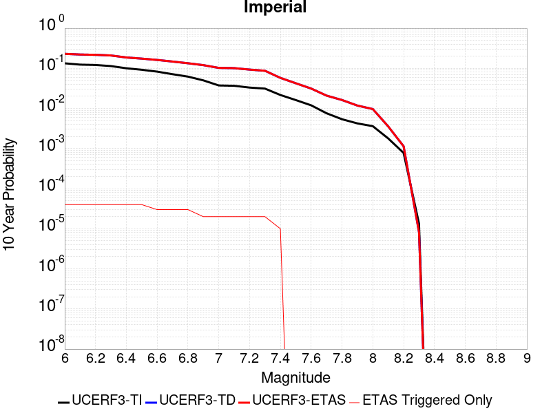 |

| Magnitude | 1 wk TI Prob | 1 wk TD Prob | 1 wk ETAS Prob | 1 wk ETAS/TD Gain | 1 wk ETAS Triggered Only | 1 mo TI Prob | 1 mo TD Prob | 1 mo ETAS Prob | 1 mo ETAS/TD Gain | 1 mo ETAS Triggered Only | 1 yr TI Prob | 1 yr TD Prob | 1 yr ETAS Prob | 1 yr ETAS/TD Gain | 1 yr ETAS Triggered Only | 10 yr TI Prob | 10 yr TD Prob | 10 yr ETAS Prob | 10 yr ETAS/TD Gain | 10 yr ETAS Triggered Only |
|-----|-----|-----|-----|-----|-----|-----|-----|-----|-----|-----|-----|-----|-----|-----|-----|-----|-----|-----|-----|-----|
| 6.0 | 2.7496446E-4 | 5.115827E-4 | 5.215776E-4 | 1.0195372 | 1.0E-5 | 0.0011778869 | 0.002190695 | 0.002200673 | 1.0045547 | 1.0E-5 | 0.0142467655 | 0.026352981 | 0.026362719 | 1.0003694 | 1.0E-5 | 0.13367249 | 0.23006031 | 0.2300911 | 1.0001339 | 4.0E-5 |
| 6.1 | 2.5356023E-4 | 4.919239E-4 | 5.0191896E-4 | 1.0203184 | 1.0E-5 | 0.001086234 | 0.0021065807 | 0.0021165595 | 1.004737 | 1.0E-5 | 0.013144928 | 0.025350703 | 0.025360448 | 1.0003844 | 1.0E-5 | 0.123940155 | 0.22129422 | 0.22132538 | 1.0001408 | 4.0E-5 |
| 6.2 | 2.4820742E-4 | 4.8278185E-4 | 4.9277704E-4 | 1.0207033 | 1.0E-5 | 0.0010633124 | 0.0020674628 | 0.0020774421 | 1.0048269 | 1.0E-5 | 0.01286919 | 0.024886098 | 0.02489585 | 1.0003918 | 1.0E-5 | 0.12148927 | 0.21778174 | 0.21781303 | 1.0001436 | 4.0E-5 |
| 6.3 | 2.3205351E-4 | 4.6365795E-4 | 4.7365332E-4 | 1.0215576 | 1.0E-5 | 9.94136E-4 | 0.0019856296 | 0.0019956096 | 1.0050262 | 1.0E-5 | 0.012036599 | 0.023911534 | 0.023921294 | 1.0004082 | 1.0E-5 | 0.11405133 | 0.20959716 | 0.20962876 | 1.0001508 | 4.0E-5 |
| 6.4 | 2.0304754E-4 | 4.0335435E-4 | 4.133503E-4 | 1.0247821 | 1.0E-5 | 8.6991355E-4 | 0.0017275312 | 0.0017375139 | 1.0057786 | 1.0E-5 | 0.010539869 | 0.020839904 | 0.020849695 | 1.0004698 | 1.0E-5 | 0.100537635 | 0.1867312 | 0.18676373 | 1.0001742 | 4.0E-5 |
| 6.5 | 1.854992E-4 | 3.7418207E-4 | 3.8417833E-4 | 1.0267149 | 1.0E-5 | 7.9475436E-4 | 0.0016026646 | 0.0016126485 | 1.0062296 | 1.0E-5 | 0.009633281 | 0.019343896 | 0.019353703 | 1.000507 | 1.0E-5 | 0.0922623 | 0.1748929 | 0.1749259 | 1.0001887 | 4.0E-5 |
| 6.6 | 1.6586106E-4 | 3.442611E-4 | 3.5425765E-4 | 1.0290377 | 1.0E-5 | 7.106394E-4 | 0.0014745808 | 0.001484566 | 1.0067716 | 1.0E-5 | 0.008617763 | 0.017809173 | 0.017818995 | 1.0005515 | 1.0E-5 | 0.08291132 | 0.1622572 | 0.16228233 | 1.0001549 | 3.0E-5 |
| 6.7 | 1.4224656E-4 | 3.1110435E-4 | 3.2110122E-4 | 1.0321336 | 1.0E-5 | 6.094856E-4 | 0.0013326315 | 0.0013426181 | 1.007494 | 1.0E-5 | 0.0073952693 | 0.01610558 | 0.01611542 | 1.000611 | 1.0E-5 | 0.07153955 | 0.14781453 | 0.1478401 | 1.000173 | 3.0E-5 |
| 6.8 | 1.2317259E-4 | 2.807606E-4 | 2.907578E-4 | 1.0356076 | 1.0E-5 | 5.2777573E-4 | 0.0012027113 | 0.0012126992 | 1.0083046 | 1.0E-5 | 0.0064067547 | 0.014546118 | 0.014555973 | 1.0006775 | 1.0E-5 | 0.06225166 | 0.1340771 | 0.13410309 | 1.0001937 | 3.0E-5 |
| 6.9 | 9.859898E-5 | 2.5224016E-4 | 2.6223765E-4 | 1.0396347 | 1.0E-5 | 4.2249862E-4 | 0.0010805858 | 0.001090575 | 1.0092442 | 1.0E-5 | 0.0051317946 | 0.013077753 | 0.013087622 | 1.0007547 | 1.0E-5 | 0.05014893 | 0.120259084 | 0.120276675 | 1.0001463 | 2.0E-5 |
| 7.0 | 7.3191884E-5 | 2.1419373E-4 | 2.2419158E-4 | 1.0466768 | 1.0E-5 | 3.136418E-4 | 9.176534E-4 | 9.276442E-4 | 1.0108874 | 1.0E-5 | 0.003811904 | 0.011115892 | 0.011125781 | 1.0008897 | 1.0E-5 | 0.037471764 | 0.1026894 | 0.10270734 | 1.0001748 | 2.0E-5 |
| 7.1 | 7.1760296E-5 | 2.1118471E-4 | 2.2118259E-4 | 1.047342 | 1.0E-5 | 3.0750787E-4 | 9.047666E-4 | 9.1475755E-4 | 1.0110426 | 1.0E-5 | 0.003737482 | 0.0109605845 | 0.010970474 | 1.0009024 | 1.0E-5 | 0.03675245 | 0.10131763 | 0.10133561 | 1.0001774 | 2.0E-5 |
| 7.2 | 6.46614E-5 | 1.928098E-4 | 2.0280787E-4 | 1.0518546 | 1.0E-5 | 2.7709085E-4 | 8.260691E-4 | 8.3606085E-4 | 1.0120956 | 1.0E-5 | 0.0033683628 | 0.010011642 | 0.010021542 | 1.0009888 | 1.0E-5 | 0.033177625 | 0.093106404 | 0.093124546 | 1.0001948 | 2.0E-5 |
| 7.3 | 6.088115E-5 | 1.7945796E-4 | 1.8945616E-4 | 1.0557134 | 1.0E-5 | 2.6089314E-4 | 7.6888176E-4 | 7.7887403E-4 | 1.012996 | 1.0E-5 | 0.0031717476 | 0.009321539 | 0.009331445 | 1.0010628 | 1.0E-5 | 0.031268585 | 0.0871338 | 0.08715206 | 1.0002096 | 2.0E-5 |
| 7.4 | 4.199346E-5 | 1.16121126E-4 | 1.2611996E-4 | 1.086107 | 1.0E-5 | 1.7995955E-4 | 4.9756793E-4 | 5.0756295E-4 | 1.0200877 | 1.0E-5 | 0.0021888057 | 0.006041235 | 0.0060511744 | 1.0016453 | 1.0E-5 | 0.02167372 | 0.05788582 | 0.05789524 | 1.0001627 | 1.0E-5 |
| 7.5 | 3.130448E-5 | 8.415097E-5 | 8.415097E-5 | 1.0 | 0.0 | 1.3415517E-4 | 3.6059748E-4 | 3.6059748E-4 | 1.0 | 0.0 | 0.0016321153 | 0.004381497 | 0.004381497 | 1.0 | 0.0 | 0.016201803 | 0.04250023 | 0.04250023 | 1.0 | 0.0 |
| 7.6 | 2.3074248E-5 | 6.1539846E-5 | 6.1539846E-5 | 1.0 | 0.0 | 9.888588E-5 | 2.6371566E-4 | 2.6371566E-4 | 1.0 | 0.0 | 0.0012032706 | 0.0032060347 | 0.0032060347 | 1.0 | 0.0 | 0.011967761 | 0.031343028 | 0.031343028 | 1.0 | 0.0 |
| 7.7 | 1.45864815E-5 | 4.070195E-5 | 4.070195E-5 | 1.0 | 0.0 | 6.2511994E-5 | 1.744253E-4 | 1.744253E-4 | 1.0 | 0.0 | 7.608177E-4 | 0.0021215652 | 0.0021215652 | 1.0 | 0.0 | 0.007582182 | 0.020892669 | 0.020892669 | 1.0 | 0.0 |
| 7.8 | 1.0352979E-5 | 3.145131E-5 | 3.145131E-5 | 1.0 | 0.0 | 4.4369157E-5 | 1.3478436E-4 | 1.3478436E-4 | 1.0 | 0.0 | 5.400606E-4 | 0.0016397669 | 0.0016397669 | 1.0 | 0.0 | 0.0053875 | 0.016241789 | 0.016241789 | 1.0 | 0.0 |
| 7.9 | 8.137906E-6 | 2.2543607E-5 | 2.2543607E-5 | 1.0 | 0.0 | 3.4876273E-5 | 9.661189E-5 | 9.661189E-5 | 1.0 | 0.0 | 4.2453592E-4 | 0.001175616 | 0.001175616 | 1.0 | 0.0 | 0.004237258 | 0.011801708 | 0.011801708 | 1.0 | 0.0 |
| 8.0 | 6.93792E-6 | 1.8348495E-5 | 1.8348495E-5 | 1.0 | 0.0 | 2.9733603E-5 | 7.863404E-5 | 7.863404E-5 | 1.0 | 0.0 | 3.6194647E-4 | 9.569497E-4 | 9.569497E-4 | 1.0 | 0.0 | 0.0036135751 | 0.009660901 | 0.009660901 | 1.0 | 0.0 |
| 8.1 | 3.4286315E-6 | 6.5390655E-6 | 6.5390655E-6 | 1.0 | 0.0 | 1.4694053E-5 | 2.8024266E-5 | 2.8024266E-5 | 1.0 | 0.0 | 1.7888541E-4 | 3.4114212E-4 | 3.4114212E-4 | 1.0 | 0.0 | 0.0017874148 | 0.0035649294 | 0.0035649294 | 1.0 | 0.0 |
| 8.2 | 1.4906886E-6 | 1.997894E-6 | 1.997894E-6 | 1.0 | 0.0 | 6.3886496E-6 | 8.562375E-6 | 8.562375E-6 | 1.0 | 0.0 | 7.7779034E-5 | 1.0424196E-4 | 1.0424196E-4 | 1.0 | 0.0 | 7.775182E-4 | 0.0011389287 | 0.0011389287 | 1.0 | 0.0 |
| 8.3 | 2.5758007E-8 | 1.5123195E-8 | 1.5123195E-8 | 1.0 | 0.0 | 1.10391454E-7 | 6.481369E-8 | 6.481369E-8 | 1.0 | 0.0 | 1.3440151E-6 | 7.891067E-7 | 7.891067E-7 | 1.0 | 0.0 | 1.344007E-5 | 8.22108E-6 | 8.22108E-6 | 1.0 | 0.0 |

## Deep Springs
*[(top)](#table-of-contents)*

| 1 Week | 1 Month | 1 Year | 10 Year |
|-----|-----|-----|-----|
|  |  |  |  |

| Magnitude | 1 wk TI Prob | 1 wk TD Prob | 1 wk ETAS Prob | 1 wk ETAS/TD Gain | 1 wk ETAS Triggered Only | 1 mo TI Prob | 1 mo TD Prob | 1 mo ETAS Prob | 1 mo ETAS/TD Gain | 1 mo ETAS Triggered Only | 1 yr TI Prob | 1 yr TD Prob | 1 yr ETAS Prob | 1 yr ETAS/TD Gain | 1 yr ETAS Triggered Only | 10 yr TI Prob | 10 yr TD Prob | 10 yr ETAS Prob | 10 yr ETAS/TD Gain | 10 yr ETAS Triggered Only |
|-----|-----|-----|-----|-----|-----|-----|-----|-----|-----|-----|-----|-----|-----|-----|-----|-----|-----|-----|-----|-----|
| 6.0 | 1.9810619E-5 | 2.3134195E-5 | 2.3134195E-5 | 1.0 | 0.0 | 8.489989E-5 | 9.914565E-5 | 9.914565E-5 | 1.0 | 0.0 | 0.001033166 | 0.0012069383 | 0.0012069383 | 1.0 | 0.0 | 0.010283757 | 0.012053703 | 0.012093221 | 1.0032785 | 4.0E-5 |
| 6.1 | 1.9810619E-5 | 2.3134195E-5 | 2.3134195E-5 | 1.0 | 0.0 | 8.489989E-5 | 9.914565E-5 | 9.914565E-5 | 1.0 | 0.0 | 0.001033166 | 0.0012069383 | 0.0012069383 | 1.0 | 0.0 | 0.010283757 | 0.012053703 | 0.012093221 | 1.0032785 | 4.0E-5 |
| 6.2 | 1.9810619E-5 | 2.3134195E-5 | 2.3134195E-5 | 1.0 | 0.0 | 8.489989E-5 | 9.914565E-5 | 9.914565E-5 | 1.0 | 0.0 | 0.001033166 | 0.0012069383 | 0.0012069383 | 1.0 | 0.0 | 0.010283757 | 0.012053703 | 0.012093221 | 1.0032785 | 4.0E-5 |
| 6.3 | 1.9810619E-5 | 2.3134195E-5 | 2.3134195E-5 | 1.0 | 0.0 | 8.489989E-5 | 9.914565E-5 | 9.914565E-5 | 1.0 | 0.0 | 0.001033166 | 0.0012069383 | 0.0012069383 | 1.0 | 0.0 | 0.010283757 | 0.012053703 | 0.012093221 | 1.0032785 | 4.0E-5 |
| 6.4 | 1.9810619E-5 | 2.3134195E-5 | 2.3134195E-5 | 1.0 | 0.0 | 8.489989E-5 | 9.914565E-5 | 9.914565E-5 | 1.0 | 0.0 | 0.001033166 | 0.0012069383 | 0.0012069383 | 1.0 | 0.0 | 0.010283757 | 0.012053703 | 0.012093221 | 1.0032785 | 4.0E-5 |
| 6.5 | 1.7190405E-5 | 2.0069328E-5 | 2.0069328E-5 | 1.0 | 0.0 | 7.367108E-5 | 8.60114E-5 | 8.60114E-5 | 1.0 | 0.0 | 8.9657627E-4 | 0.0010471885 | 0.0010471885 | 1.0 | 0.0 | 0.008929676 | 0.010471852 | 0.010511433 | 1.0037798 | 4.0E-5 |
| 6.6 | 1.7190405E-5 | 2.0069328E-5 | 2.0069328E-5 | 1.0 | 0.0 | 7.367108E-5 | 8.60114E-5 | 8.60114E-5 | 1.0 | 0.0 | 8.9657627E-4 | 0.0010471885 | 0.0010471885 | 1.0 | 0.0 | 0.008929676 | 0.010471852 | 0.010511433 | 1.0037798 | 4.0E-5 |

## San Jacinto (Anza) rev
*[(top)](#table-of-contents)*

| 1 Week | 1 Month | 1 Year | 10 Year |
|-----|-----|-----|-----|
|  |  |  |  |

| Magnitude | 1 wk TI Prob | 1 wk TD Prob | 1 wk ETAS Prob | 1 wk ETAS/TD Gain | 1 wk ETAS Triggered Only | 1 mo TI Prob | 1 mo TD Prob | 1 mo ETAS Prob | 1 mo ETAS/TD Gain | 1 mo ETAS Triggered Only | 1 yr TI Prob | 1 yr TD Prob | 1 yr ETAS Prob | 1 yr ETAS/TD Gain | 1 yr ETAS Triggered Only | 10 yr TI Prob | 10 yr TD Prob | 10 yr ETAS Prob | 10 yr ETAS/TD Gain | 10 yr ETAS Triggered Only |
|-----|-----|-----|-----|-----|-----|-----|-----|-----|-----|-----|-----|-----|-----|-----|-----|-----|-----|-----|-----|-----|
| 6.0 | 6.3015636E-5 | 4.406826E-5 | 4.406826E-5 | 1.0 | 0.0 | 2.7003905E-4 | 1.8885038E-4 | 1.8885038E-4 | 1.0 | 0.0 | 0.0032827691 | 0.002296841 | 0.002306818 | 1.0043437 | 1.0E-5 | 0.032346968 | 0.023689214 | 0.023728266 | 1.0016485 | 4.0E-5 |
| 6.1 | 6.3015636E-5 | 4.406826E-5 | 4.406826E-5 | 1.0 | 0.0 | 2.7003905E-4 | 1.8885038E-4 | 1.8885038E-4 | 1.0 | 0.0 | 0.0032827691 | 0.002296841 | 0.002306818 | 1.0043437 | 1.0E-5 | 0.032346968 | 0.023689214 | 0.023728266 | 1.0016485 | 4.0E-5 |
| 6.2 | 6.3015636E-5 | 4.406826E-5 | 4.406826E-5 | 1.0 | 0.0 | 2.7003905E-4 | 1.8885038E-4 | 1.8885038E-4 | 1.0 | 0.0 | 0.0032827691 | 0.002296841 | 0.002306818 | 1.0043437 | 1.0E-5 | 0.032346968 | 0.023689214 | 0.023728266 | 1.0016485 | 4.0E-5 |
| 6.3 | 6.3015636E-5 | 4.406826E-5 | 4.406826E-5 | 1.0 | 0.0 | 2.7003905E-4 | 1.8885038E-4 | 1.8885038E-4 | 1.0 | 0.0 | 0.0032827691 | 0.002296841 | 0.002306818 | 1.0043437 | 1.0E-5 | 0.032346968 | 0.023689214 | 0.023728266 | 1.0016485 | 4.0E-5 |
| 6.4 | 6.3015636E-5 | 4.406826E-5 | 4.406826E-5 | 1.0 | 0.0 | 2.7003905E-4 | 1.8885038E-4 | 1.8885038E-4 | 1.0 | 0.0 | 0.0032827691 | 0.002296841 | 0.002306818 | 1.0043437 | 1.0E-5 | 0.032346968 | 0.023689214 | 0.023728266 | 1.0016485 | 4.0E-5 |
| 6.5 | 5.811017E-5 | 4.081348E-5 | 4.081348E-5 | 1.0 | 0.0 | 2.4901982E-4 | 1.7490322E-4 | 1.7490322E-4 | 1.0 | 0.0 | 0.0030276014 | 0.002127373 | 0.0021373515 | 1.0046906 | 1.0E-5 | 0.02986684 | 0.021970509 | 0.02200963 | 1.0017806 | 4.0E-5 |
| 6.6 | 5.811017E-5 | 4.081348E-5 | 4.081348E-5 | 1.0 | 0.0 | 2.4901982E-4 | 1.7490322E-4 | 1.7490322E-4 | 1.0 | 0.0 | 0.0030276014 | 0.002127373 | 0.0021373515 | 1.0046906 | 1.0E-5 | 0.02986684 | 0.021970509 | 0.02200963 | 1.0017806 | 4.0E-5 |
| 6.7 | 5.712442E-5 | 4.022816E-5 | 4.022816E-5 | 1.0 | 0.0 | 2.4479596E-4 | 1.7239503E-4 | 1.7239503E-4 | 1.0 | 0.0 | 0.0029763177 | 0.0020968947 | 0.0021068736 | 1.004759 | 1.0E-5 | 0.029367693 | 0.02165928 | 0.021698413 | 1.0018067 | 4.0E-5 |
| 6.8 | 5.6967532E-5 | 4.0083007E-5 | 4.0083007E-5 | 1.0 | 0.0 | 2.4412372E-4 | 1.7177303E-4 | 1.7177303E-4 | 1.0 | 0.0 | 0.0029681553 | 0.0020893363 | 0.0020993154 | 1.0047762 | 1.0E-5 | 0.029288229 | 0.021584194 | 0.02162333 | 1.0018132 | 4.0E-5 |
| 6.9 | 5.6211324E-5 | 3.9782844E-5 | 3.9782844E-5 | 1.0 | 0.0 | 2.4088343E-4 | 1.704868E-4 | 1.704868E-4 | 1.0 | 0.0 | 0.0029288116 | 0.0020737064 | 0.0020836857 | 1.0048122 | 1.0E-5 | 0.028905109 | 0.021422373 | 0.021461517 | 1.0018272 | 4.0E-5 |
| 7.0 | 5.4383527E-5 | 3.862694E-5 | 3.862694E-5 | 1.0 | 0.0 | 2.3305144E-4 | 1.6553355E-4 | 1.6553355E-4 | 1.0 | 0.0 | 0.0028337094 | 0.0020135131 | 0.002023493 | 1.0049565 | 1.0E-5 | 0.027978465 | 0.020806205 | 0.020845372 | 1.0018826 | 4.0E-5 |
| 7.1 | 5.1393665E-5 | 3.7065107E-5 | 3.7065107E-5 | 1.0 | 0.0 | 2.2023996E-4 | 1.588408E-4 | 1.588408E-4 | 1.0 | 0.0 | 0.0026781242 | 0.0019321758 | 0.0019421565 | 1.0051655 | 1.0E-5 | 0.026460782 | 0.019968942 | 0.020008143 | 1.0019631 | 4.0E-5 |
| 7.2 | 4.785222E-5 | 3.539179E-5 | 3.539179E-5 | 1.0 | 0.0 | 2.0506482E-4 | 1.516703E-4 | 1.516703E-4 | 1.0 | 0.0 | 0.0024938055 | 0.0018450255 | 0.001855007 | 1.00541 | 1.0E-5 | 0.024660049 | 0.019066842 | 0.01910608 | 1.0020579 | 4.0E-5 |
| 7.3 | 4.2143256E-5 | 3.446838E-5 | 3.446838E-5 | 1.0 | 0.0 | 1.8060145E-4 | 1.4771329E-4 | 1.4771329E-4 | 1.0 | 0.0 | 0.002196605 | 0.0017969293 | 0.0018069113 | 1.005555 | 1.0E-5 | 0.02175019 | 0.018565647 | 0.018604906 | 1.0021145 | 4.0E-5 |
| 7.4 | 4.0264713E-5 | 3.410079E-5 | 3.410079E-5 | 1.0 | 0.0 | 1.7255165E-4 | 1.4613809E-4 | 1.4613809E-4 | 1.0 | 0.0 | 0.002098792 | 0.0017777827 | 0.0017877648 | 1.005615 | 1.0E-5 | 0.020790804 | 0.018367078 | 0.018406345 | 1.0021378 | 4.0E-5 |
| 7.5 | 3.694492E-5 | 3.28E-5 | 3.28E-5 | 1.0 | 0.0 | 1.5832575E-4 | 1.4056388E-4 | 1.4056388E-4 | 1.0 | 0.0 | 0.0019259118 | 0.0017100249 | 0.0017200079 | 1.0058379 | 1.0E-5 | 0.01909306 | 0.017675918 | 0.01771521 | 1.002223 | 4.0E-5 |
| 7.6 | 3.200565E-5 | 3.0086683E-5 | 3.0086683E-5 | 1.0 | 0.0 | 1.3715986E-4 | 1.2893656E-4 | 1.2893656E-4 | 1.0 | 0.0 | 0.001668642 | 0.0015686746 | 0.0015786589 | 1.0063648 | 1.0E-5 | 0.01656168 | 0.016249256 | 0.016288606 | 1.0024216 | 4.0E-5 |
| 7.7 | 2.731642E-5 | 2.6659396E-5 | 2.6659396E-5 | 1.0 | 0.0 | 1.1706512E-4 | 1.1424955E-4 | 1.1424955E-4 | 1.0 | 0.0 | 0.001424336 | 0.0013901019 | 0.001400088 | 1.0071837 | 1.0E-5 | 0.014152412 | 0.014462419 | 0.014501841 | 1.0027258 | 4.0E-5 |
| 7.8 | 2.3466424E-5 | 2.4047136E-5 | 2.4047136E-5 | 1.0 | 0.0 | 1.0056651E-4 | 1.03055085E-4 | 1.03055085E-4 | 1.0 | 0.0 | 0.0012237094 | 0.0012539744 | 0.0012639618 | 1.0079646 | 1.0E-5 | 0.012169928 | 0.013092016 | 0.013131492 | 1.0030153 | 4.0E-5 |
| 7.9 | 1.8611925E-5 | 1.9391406E-5 | 1.9391406E-5 | 1.0 | 0.0 | 7.9762955E-5 | 8.310338E-5 | 8.310338E-5 | 1.0 | 0.0 | 9.7068126E-4 | 0.0010113148 | 0.0010213046 | 1.0098782 | 1.0E-5 | 0.0096645225 | 0.010647203 | 0.010676883 | 1.0027876 | 3.0E-5 |
| 8.0 | 1.5460775E-5 | 1.616953E-5 | 1.616953E-5 | 1.0 | 0.0 | 6.6258784E-5 | 6.929615E-5 | 6.929615E-5 | 1.0 | 0.0 | 8.0640207E-4 | 8.433548E-4 | 8.533463E-4 | 1.0118474 | 1.0E-5 | 0.008034821 | 0.008928339 | 0.0089580715 | 1.0033301 | 3.0E-5 |
| 8.1 | 9.983884E-6 | 8.522178E-6 | 8.522178E-6 | 1.0 | 0.0 | 4.2787375E-5 | 3.6523114E-5 | 3.6523114E-5 | 1.0 | 0.0 | 5.2081177E-4 | 4.445787E-4 | 4.445787E-4 | 1.0 | 0.0 | 0.0051959283 | 0.0047757714 | 0.004785724 | 1.0020839 | 1.0E-5 |
| 8.2 | 4.1226E-6 | 1.6259771E-6 | 1.6259771E-6 | 1.0 | 0.0 | 1.7668166E-5 | 6.9684547E-6 | 6.9684547E-6 | 1.0 | 0.0 | 2.1508869E-4 | 8.4837666E-5 | 8.4837666E-5 | 1.0 | 0.0 | 0.0021488064 | 9.823426E-4 | 9.823426E-4 | 1.0 | 0.0 |
| 8.3 | 1.2750878E-6 | 3.8086614E-7 | 3.8086614E-7 | 1.0 | 0.0 | 5.4646503E-6 | 1.6322825E-6 | 1.6322825E-6 | 1.0 | 0.0 | 6.653009E-5 | 1.9872863E-5 | 1.9872863E-5 | 1.0 | 0.0 | 6.6510175E-4 | 2.3889022E-4 | 2.3889022E-4 | 1.0 | 0.0 |

## Santa Rosa Island
*[(top)](#table-of-contents)*

| 1 Week | 1 Month | 1 Year | 10 Year |
|-----|-----|-----|-----|
|  |  |  |  |

| Magnitude | 1 wk TI Prob | 1 wk TD Prob | 1 wk ETAS Prob | 1 wk ETAS/TD Gain | 1 wk ETAS Triggered Only | 1 mo TI Prob | 1 mo TD Prob | 1 mo ETAS Prob | 1 mo ETAS/TD Gain | 1 mo ETAS Triggered Only | 1 yr TI Prob | 1 yr TD Prob | 1 yr ETAS Prob | 1 yr ETAS/TD Gain | 1 yr ETAS Triggered Only | 10 yr TI Prob | 10 yr TD Prob | 10 yr ETAS Prob | 10 yr ETAS/TD Gain | 10 yr ETAS Triggered Only |
|-----|-----|-----|-----|-----|-----|-----|-----|-----|-----|-----|-----|-----|-----|-----|-----|-----|-----|-----|-----|-----|
| 6.0 | 4.1143165E-5 | 4.7129644E-5 | 4.7129644E-5 | 1.0 | 0.0 | 1.7631594E-4 | 2.0196967E-4 | 2.0196967E-4 | 1.0 | 0.0 | 0.002144533 | 0.0024564045 | 0.00246638 | 1.004061 | 1.0E-5 | 0.021239553 | 0.024313204 | 0.024342475 | 1.0012039 | 3.0E-5 |
| 6.1 | 2.1061249E-5 | 2.3882938E-5 | 2.3882938E-5 | 1.0 | 0.0 | 9.0259375E-5 | 1.023516E-4 | 1.023516E-4 | 1.0 | 0.0 | 0.0010983539 | 0.0012454473 | 0.0012454473 | 1.0 | 0.0 | 0.01092941 | 0.01238772 | 0.012407472 | 1.0015945 | 2.0E-5 |
| 6.2 | 2.1061249E-5 | 2.3882938E-5 | 2.3882938E-5 | 1.0 | 0.0 | 9.0259375E-5 | 1.023516E-4 | 1.023516E-4 | 1.0 | 0.0 | 0.0010983539 | 0.0012454473 | 0.0012454473 | 1.0 | 0.0 | 0.01092941 | 0.01238772 | 0.012407472 | 1.0015945 | 2.0E-5 |
| 6.3 | 1.5158236E-5 | 1.7086639E-5 | 1.7086639E-5 | 1.0 | 0.0 | 6.496225E-5 | 7.322646E-5 | 7.322646E-5 | 1.0 | 0.0 | 7.906284E-4 | 8.9117954E-4 | 8.9117954E-4 | 1.0 | 0.0 | 0.007878214 | 0.008877312 | 0.008887223 | 1.0011165 | 1.0E-5 |
| 6.4 | 1.2341918E-5 | 1.3862524E-5 | 1.3862524E-5 | 1.0 | 0.0 | 5.2892858E-5 | 5.940951E-5 | 5.940951E-5 | 1.0 | 0.0 | 6.437803E-4 | 7.2307885E-4 | 7.2307885E-4 | 1.0 | 0.0 | 0.006419184 | 0.0072080996 | 0.0072080996 | 1.0 | 0.0 |
| 6.5 | 9.061158E-6 | 1.0123719E-5 | 1.0123719E-5 | 1.0 | 0.0 | 3.883296E-5 | 4.3386677E-5 | 4.3386677E-5 | 1.0 | 0.0 | 4.726887E-4 | 5.2811013E-4 | 5.2811013E-4 | 1.0 | 0.0 | 0.004716845 | 0.0052690897 | 0.0052690897 | 1.0 | 0.0 |
| 6.6 | 7.5461685E-6 | 8.406138E-6 | 8.406138E-6 | 1.0 | 0.0 | 3.2340322E-5 | 3.602583E-5 | 3.602583E-5 | 1.0 | 0.0 | 3.936723E-4 | 4.3853052E-4 | 4.3853052E-4 | 1.0 | 0.0 | 0.003929756 | 0.004377082 | 0.004377082 | 1.0 | 0.0 |
| 6.7 | 5.5023775E-6 | 6.0910675E-6 | 6.0910675E-6 | 1.0 | 0.0 | 2.3581404E-5 | 2.6104331E-5 | 2.6104331E-5 | 1.0 | 0.0 | 2.8706578E-4 | 3.1777716E-4 | 3.1777716E-4 | 1.0 | 0.0 | 0.0028669522 | 0.0031735497 | 0.0031735497 | 1.0 | 0.0 |
| 6.8 | 3.7351679E-6 | 4.0853142E-6 | 4.0853142E-6 | 1.0 | 0.0 | 1.6007763E-5 | 1.7508386E-5 | 1.7508386E-5 | 1.0 | 0.0 | 1.948771E-4 | 2.1314624E-4 | 2.1314624E-4 | 1.0 | 0.0 | 0.0019470629 | 0.0021296637 | 0.0021296637 | 1.0 | 0.0 |
| 6.9 | 2.456366E-6 | 2.630324E-6 | 2.630324E-6 | 1.0 | 0.0 | 1.0527241E-5 | 1.12727685E-5 | 1.12727685E-5 | 1.0 | 0.0 | 1.2816161E-4 | 1.3723734E-4 | 1.3723734E-4 | 1.0 | 0.0 | 0.0012808773 | 0.0013715288 | 0.0013715288 | 1.0 | 0.0 |
| 7.0 | 2.3245157E-6 | 2.48374E-6 | 2.48374E-6 | 1.0 | 0.0 | 9.962172E-6 | 1.0644557E-5 | 1.0644557E-5 | 1.0 | 0.0 | 1.2128269E-4 | 1.295898E-4 | 1.295898E-4 | 1.0 | 0.0 | 0.0012121652 | 0.0012951444 | 0.0012951444 | 1.0 | 0.0 |
| 7.1 | 2.2248344E-6 | 2.3741507E-6 | 2.3741507E-6 | 1.0 | 0.0 | 9.53497E-6 | 1.0174892E-5 | 1.0174892E-5 | 1.0 | 0.0 | 1.1608207E-4 | 1.2387229E-4 | 1.2387229E-4 | 1.0 | 0.0 | 0.0011602144 | 0.0012380343 | 0.0012380343 | 1.0 | 0.0 |
| 7.2 | 2.1350402E-6 | 2.2770103E-6 | 2.2770103E-6 | 1.0 | 0.0 | 9.150141E-6 | 9.758579E-6 | 9.758579E-6 | 1.0 | 0.0 | 1.1139726E-4 | 1.1880423E-4 | 1.1880423E-4 | 1.0 | 0.0 | 0.0011134144 | 0.0011874092 | 0.0011874092 | 1.0 | 0.0 |
| 7.3 | 1.9793572E-6 | 2.109504E-6 | 2.109504E-6 | 1.0 | 0.0 | 8.482932E-6 | 9.0407E-6 | 9.0407E-6 | 1.0 | 0.0 | 1.032748E-4 | 1.1006498E-4 | 1.1006498E-4 | 1.0 | 0.0 | 0.0010322682 | 0.0011001065 | 0.0011001065 | 1.0 | 0.0 |
| 7.4 | 1.6951194E-6 | 1.8052382E-6 | 1.8052382E-6 | 1.0 | 0.0 | 7.264777E-6 | 7.736712E-6 | 7.736712E-6 | 1.0 | 0.0 | 8.844508E-5 | 9.4190415E-5 | 9.4190415E-5 | 1.0 | 0.0 | 8.840988E-4 | 9.415066E-4 | 9.415066E-4 | 1.0 | 0.0 |
| 7.5 | 8.987207E-7 | 9.5154235E-7 | 9.5154235E-7 | 1.0 | 0.0 | 3.8516546E-6 | 4.0780324E-6 | 4.0780324E-6 | 1.0 | 0.0 | 4.6892885E-5 | 4.9648923E-5 | 4.9648923E-5 | 1.0 | 0.0 | 4.688299E-4 | 4.963795E-4 | 4.963795E-4 | 1.0 | 0.0 |
| 7.6 | 3.8783037E-7 | 4.0540277E-7 | 4.0540277E-7 | 1.0 | 0.0 | 1.6621291E-6 | 1.7374393E-6 | 1.7374393E-6 | 1.0 | 0.0 | 2.0236233E-5 | 2.1153126E-5 | 2.1153126E-5 | 1.0 | 0.0 | 2.023439E-4 | 2.1151177E-4 | 2.1151177E-4 | 1.0 | 0.0 |
| 7.7 | 6.181804E-8 | 6.340373E-8 | 6.340373E-8 | 1.0 | 0.0 | 2.6493444E-7 | 2.7173024E-7 | 2.7173024E-7 | 1.0 | 0.0 | 3.225572E-6 | 3.3083109E-6 | 3.3083109E-6 | 1.0 | 0.0 | 3.225525E-5 | 3.3082622E-5 | 3.3082622E-5 | 1.0 | 0.0 |
| 7.8 | 1.3704449E-9 | 1.3965641E-9 | 1.3965641E-9 | 1.0 | 0.0 | 5.873335E-9 | 5.985275E-9 | 5.985275E-9 | 1.0 | 0.0 | 7.1507856E-8 | 7.287072E-8 | 7.287072E-8 | 1.0 | 0.0 | 7.1507833E-7 | 7.2870705E-7 | 7.2870705E-7 | 1.0 | 0.0 |

## Big Pine (East)
*[(top)](#table-of-contents)*

| 1 Week | 1 Month | 1 Year | 10 Year |
|-----|-----|-----|-----|
| 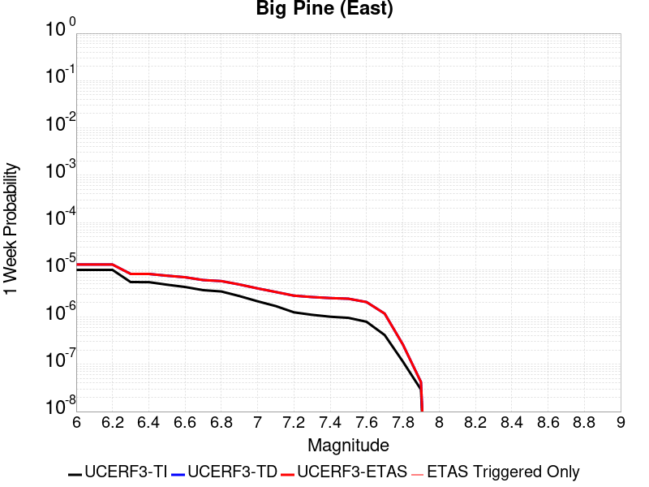 |  |  |  |

| Magnitude | 1 wk TI Prob | 1 wk TD Prob | 1 wk ETAS Prob | 1 wk ETAS/TD Gain | 1 wk ETAS Triggered Only | 1 mo TI Prob | 1 mo TD Prob | 1 mo ETAS Prob | 1 mo ETAS/TD Gain | 1 mo ETAS Triggered Only | 1 yr TI Prob | 1 yr TD Prob | 1 yr ETAS Prob | 1 yr ETAS/TD Gain | 1 yr ETAS Triggered Only | 10 yr TI Prob | 10 yr TD Prob | 10 yr ETAS Prob | 10 yr ETAS/TD Gain | 10 yr ETAS Triggered Only |
|-----|-----|-----|-----|-----|-----|-----|-----|-----|-----|-----|-----|-----|-----|-----|-----|-----|-----|-----|-----|-----|
| 6.0 | 9.916913E-6 | 1.287016E-5 | 1.287016E-5 | 1.0 | 0.0 | 4.250036E-5 | 5.515679E-5 | 5.515679E-5 | 1.0 | 0.0 | 5.173191E-4 | 6.713492E-4 | 6.713492E-4 | 1.0 | 0.0 | 0.0051611643 | 0.006697424 | 0.0067272233 | 1.0044494 | 3.0E-5 |
| 6.1 | 9.916913E-6 | 1.287016E-5 | 1.287016E-5 | 1.0 | 0.0 | 4.250036E-5 | 5.515679E-5 | 5.515679E-5 | 1.0 | 0.0 | 5.173191E-4 | 6.713492E-4 | 6.713492E-4 | 1.0 | 0.0 | 0.0051611643 | 0.006697424 | 0.0067272233 | 1.0044494 | 3.0E-5 |
| 6.2 | 9.916913E-6 | 1.287016E-5 | 1.287016E-5 | 1.0 | 0.0 | 4.250036E-5 | 5.515679E-5 | 5.515679E-5 | 1.0 | 0.0 | 5.173191E-4 | 6.713492E-4 | 6.713492E-4 | 1.0 | 0.0 | 0.0051611643 | 0.006697424 | 0.0067272233 | 1.0044494 | 3.0E-5 |
| 6.3 | 5.479711E-6 | 8.164536E-6 | 8.164536E-6 | 1.0 | 0.0 | 2.3484265E-5 | 3.4990415E-5 | 3.4990415E-5 | 1.0 | 0.0 | 2.858834E-4 | 4.2592824E-4 | 4.2592824E-4 | 1.0 | 0.0 | 0.0028551589 | 0.0042534643 | 0.004273379 | 1.0046821 | 2.0E-5 |
| 6.4 | 5.465009E-6 | 8.148823E-6 | 8.148823E-6 | 1.0 | 0.0 | 2.3421257E-5 | 3.492308E-5 | 3.492308E-5 | 1.0 | 0.0 | 2.851165E-4 | 4.2510874E-4 | 4.2510874E-4 | 1.0 | 0.0 | 0.0028475097 | 0.0042453003 | 0.0042652157 | 1.0046911 | 2.0E-5 |
| 6.5 | 4.826767E-6 | 7.473661E-6 | 7.473661E-6 | 1.0 | 0.0 | 2.068598E-5 | 3.20296E-5 | 3.20296E-5 | 1.0 | 0.0 | 2.518227E-4 | 3.898934E-4 | 3.898934E-4 | 1.0 | 0.0 | 0.0025153751 | 0.0038943964 | 0.0039143185 | 1.0051156 | 2.0E-5 |
| 6.6 | 4.3146847E-6 | 6.933431E-6 | 6.933431E-6 | 1.0 | 0.0 | 1.8491375E-5 | 2.971438E-5 | 2.971438E-5 | 1.0 | 0.0 | 2.2510924E-4 | 3.6171498E-4 | 3.6171498E-4 | 1.0 | 0.0 | 0.0022488134 | 0.003613533 | 0.0036334607 | 1.0055147 | 2.0E-5 |
| 6.7 | 3.6968106E-6 | 6.0437064E-6 | 6.0437064E-6 | 1.0 | 0.0 | 1.5843378E-5 | 2.590135E-5 | 2.590135E-5 | 1.0 | 0.0 | 1.9287605E-4 | 3.1530487E-4 | 3.1530487E-4 | 1.0 | 0.0 | 0.0019270873 | 0.0031507544 | 0.0031706914 | 1.0063276 | 2.0E-5 |
| 6.8 | 3.4671132E-6 | 5.74911E-6 | 5.74911E-6 | 1.0 | 0.0 | 1.4858972E-5 | 2.4638819E-5 | 2.4638819E-5 | 1.0 | 0.0 | 1.8089297E-4 | 2.999378E-4 | 2.999378E-4 | 1.0 | 0.0 | 0.0018074579 | 0.0029975004 | 0.0030174404 | 1.0066522 | 2.0E-5 |
| 6.9 | 2.7686972E-6 | 4.868562E-6 | 4.868562E-6 | 1.0 | 0.0 | 1.1865792E-5 | 2.0865102E-5 | 2.0865102E-5 | 1.0 | 0.0 | 1.4445644E-4 | 2.5400377E-4 | 2.5400377E-4 | 1.0 | 0.0 | 0.0014436257 | 0.0025392363 | 0.002549211 | 1.0039282 | 1.0E-5 |
| 7.0 | 2.1472624E-6 | 4.0244204E-6 | 4.0244204E-6 | 1.0 | 0.0 | 9.20252E-6 | 1.7247405E-5 | 1.7247405E-5 | 1.0 | 0.0 | 1.12034926E-4 | 2.0996746E-4 | 2.0996746E-4 | 1.0 | 0.0 | 0.0011197845 | 0.002099781 | 0.00210976 | 1.0047524 | 1.0E-5 |
| 7.1 | 1.7018335E-6 | 3.3807E-6 | 3.3807E-6 | 1.0 | 0.0 | 7.293552E-6 | 1.4488636E-5 | 1.4488636E-5 | 1.0 | 0.0 | 8.879537E-5 | 1.7638523E-4 | 1.7638523E-4 | 1.0 | 0.0 | 8.87599E-4 | 0.0017645162 | 0.0017744986 | 1.0056573 | 1.0E-5 |
| 7.2 | 1.25603E-6 | 2.82833E-6 | 2.82833E-6 | 1.0 | 0.0 | 5.3829745E-6 | 1.212136E-5 | 1.212136E-5 | 1.0 | 0.0 | 6.553574E-5 | 1.4756779E-4 | 1.4756779E-4 | 1.0 | 0.0 | 6.551642E-4 | 0.0014767376 | 0.0014867227 | 1.0067617 | 1.0E-5 |
| 7.3 | 1.112297E-6 | 2.642299E-6 | 2.642299E-6 | 1.0 | 0.0 | 4.7669787E-6 | 1.132409E-5 | 1.132409E-5 | 1.0 | 0.0 | 5.803642E-5 | 1.378623E-4 | 1.378623E-4 | 1.0 | 0.0 | 5.802127E-4 | 0.0013796334 | 0.0013896195 | 1.0072383 | 1.0E-5 |
| 7.4 | 1.0137181E-6 | 2.51409E-6 | 2.51409E-6 | 1.0 | 0.0 | 4.3444993E-6 | 1.0774628E-5 | 1.0774628E-5 | 1.0 | 0.0 | 5.2892992E-5 | 1.3117342E-4 | 1.3117342E-4 | 1.0 | 0.0 | 5.288041E-4 | 0.0013126103 | 0.0013225973 | 1.0076084 | 1.0E-5 |
| 7.5 | 9.598608E-7 | 2.4368398E-6 | 2.4368398E-6 | 1.0 | 0.0 | 4.1136827E-6 | 1.04435585E-5 | 1.04435585E-5 | 1.0 | 0.0 | 5.0082934E-5 | 1.2714312E-4 | 1.2714312E-4 | 1.0 | 0.0 | 5.007165E-4 | 0.0012721665 | 0.0012821538 | 1.0078506 | 1.0E-5 |
| 7.6 | 7.929459E-7 | 2.0710943E-6 | 2.0710943E-6 | 1.0 | 0.0 | 3.3983351E-6 | 8.876089E-6 | 8.876089E-6 | 1.0 | 0.0 | 4.1373947E-5 | 1.08061206E-4 | 1.08061206E-4 | 1.0 | 0.0 | 4.1366243E-4 | 0.0010817931 | 0.0010817931 | 1.0 | 0.0 |
| 7.7 | 4.155788E-7 | 1.1791816E-6 | 1.1791816E-6 | 1.0 | 0.0 | 1.7810507E-6 | 5.053626E-6 | 5.053626E-6 | 1.0 | 0.0 | 2.1684076E-5 | 6.1526196E-5 | 6.1526196E-5 | 1.0 | 0.0 | 2.1681961E-4 | 6.179514E-4 | 6.179514E-4 | 1.0 | 0.0 |
| 7.8 | 1.14666925E-7 | 2.6336778E-7 | 2.6336778E-7 | 1.0 | 0.0 | 4.914296E-7 | 1.1287186E-6 | 1.1287186E-6 | 1.0 | 0.0 | 5.9831386E-6 | 1.3742067E-5 | 1.3742067E-5 | 1.0 | 0.0 | 5.9829777E-5 | 1.3848986E-4 | 1.3848986E-4 | 1.0 | 0.0 |
| 7.9 | 2.9231824E-8 | 4.215957E-8 | 4.215957E-8 | 1.0 | 0.0 | 1.2527924E-7 | 1.8068387E-7 | 1.8068387E-7 | 1.0 | 0.0 | 1.5252737E-6 | 2.199824E-6 | 2.199824E-6 | 1.0 | 0.0 | 1.5252632E-5 | 2.2334592E-5 | 2.2334592E-5 | 1.0 | 0.0 |

## San Jacinto (Superstition Mtn)
*[(top)](#table-of-contents)*

| 1 Week | 1 Month | 1 Year | 10 Year |
|-----|-----|-----|-----|
|  |  |  |  |

| Magnitude | 1 wk TI Prob | 1 wk TD Prob | 1 wk ETAS Prob | 1 wk ETAS/TD Gain | 1 wk ETAS Triggered Only | 1 mo TI Prob | 1 mo TD Prob | 1 mo ETAS Prob | 1 mo ETAS/TD Gain | 1 mo ETAS Triggered Only | 1 yr TI Prob | 1 yr TD Prob | 1 yr ETAS Prob | 1 yr ETAS/TD Gain | 1 yr ETAS Triggered Only | 10 yr TI Prob | 10 yr TD Prob | 10 yr ETAS Prob | 10 yr ETAS/TD Gain | 10 yr ETAS Triggered Only |
|-----|-----|-----|-----|-----|-----|-----|-----|-----|-----|-----|-----|-----|-----|-----|-----|-----|-----|-----|-----|-----|
| 6.0 | 6.4193904E-5 | 9.634393E-5 | 9.634393E-5 | 1.0 | 0.0 | 2.7508775E-4 | 4.128469E-4 | 4.128469E-4 | 1.0 | 0.0 | 0.0033440501 | 0.005016248 | 0.005016248 | 1.0 | 0.0 | 0.03294174 | 0.048990756 | 0.04901929 | 1.0005823 | 3.0E-5 |
| 6.1 | 6.4193904E-5 | 9.634393E-5 | 9.634393E-5 | 1.0 | 0.0 | 2.7508775E-4 | 4.128469E-4 | 4.128469E-4 | 1.0 | 0.0 | 0.0033440501 | 0.005016248 | 0.005016248 | 1.0 | 0.0 | 0.03294174 | 0.048990756 | 0.04901929 | 1.0005823 | 3.0E-5 |
| 6.2 | 5.7023593E-5 | 8.347356E-5 | 8.347356E-5 | 1.0 | 0.0 | 2.4436394E-4 | 3.577042E-4 | 3.577042E-4 | 1.0 | 0.0 | 0.002971072 | 0.0043479973 | 0.0043479973 | 1.0 | 0.0 | 0.029316625 | 0.042665236 | 0.042693954 | 1.0006732 | 3.0E-5 |
| 6.3 | 5.6940098E-5 | 8.331872E-5 | 8.331872E-5 | 1.0 | 0.0 | 2.4400617E-4 | 3.5704082E-4 | 3.5704082E-4 | 1.0 | 0.0 | 0.002966728 | 0.0043399525 | 0.0043399525 | 1.0 | 0.0 | 0.029274331 | 0.042588525 | 0.042617247 | 1.0006744 | 3.0E-5 |
| 6.4 | 5.4171585E-5 | 7.780469E-5 | 7.780469E-5 | 1.0 | 0.0 | 2.3214328E-4 | 3.3341534E-4 | 3.3341534E-4 | 1.0 | 0.0 | 0.0028226813 | 0.0040534274 | 0.0040534274 | 1.0 | 0.0 | 0.02787096 | 0.039874446 | 0.03990325 | 1.0007224 | 3.0E-5 |
| 6.5 | 4.375144E-5 | 5.6707195E-5 | 5.6707195E-5 | 1.0 | 0.0 | 1.874927E-4 | 2.4301483E-4 | 2.4301483E-4 | 1.0 | 0.0 | 0.0022803338 | 0.002955868 | 0.002955868 | 1.0 | 0.0 | 0.022570757 | 0.02937985 | 0.029408969 | 1.0009911 | 3.0E-5 |
| 6.6 | 2.772192E-5 | 2.5760337E-5 | 2.5760337E-5 | 1.0 | 0.0 | 1.1880282E-4 | 1.1039688E-4 | 1.1039688E-4 | 1.0 | 0.0 | 0.0014454646 | 0.0013432729 | 0.0013432729 | 1.0 | 0.0 | 0.014360986 | 0.013682515 | 0.013692378 | 1.0007209 | 1.0E-5 |
| 6.7 | 2.7124124E-5 | 2.4969977E-5 | 2.4969977E-5 | 1.0 | 0.0 | 1.1624106E-4 | 1.0700991E-4 | 1.0700991E-4 | 1.0 | 0.0 | 0.0014143161 | 0.0013020863 | 0.0013020863 | 1.0 | 0.0 | 0.014053487 | 0.013275415 | 0.013285282 | 1.0007433 | 1.0E-5 |
| 6.8 | 2.5475807E-5 | 2.242862E-5 | 2.242862E-5 | 1.0 | 0.0 | 1.0917746E-4 | 9.611918E-5 | 9.611918E-5 | 1.0 | 0.0 | 0.001328425 | 0.0011696349 | 0.0011696349 | 1.0 | 0.0 | 0.0132051185 | 0.011960137 | 0.011970017 | 1.0008261 | 1.0E-5 |
| 6.9 | 2.1162023E-5 | 1.7870736E-5 | 1.7870736E-5 | 1.0 | 0.0 | 9.069123E-5 | 7.658664E-5 | 7.658664E-5 | 1.0 | 0.0 | 0.0011036064 | 9.320473E-4 | 9.320473E-4 | 1.0 | 0.0 | 0.010981417 | 0.009574609 | 0.009574609 | 1.0 | 0.0 |
| 7.0 | 1.8754288E-5 | 1.6395672E-5 | 1.6395672E-5 | 1.0 | 0.0 | 8.037304E-5 | 7.026529E-5 | 7.026529E-5 | 1.0 | 0.0 | 9.781026E-4 | 8.551467E-4 | 8.551467E-4 | 1.0 | 0.0 | 0.009738087 | 0.008792502 | 0.008792502 | 1.0 | 0.0 |
| 7.1 | 1.8678527E-5 | 1.632059E-5 | 1.632059E-5 | 1.0 | 0.0 | 8.0048376E-5 | 6.9943526E-5 | 6.9943526E-5 | 1.0 | 0.0 | 9.7415317E-4 | 8.5123227E-4 | 8.5123227E-4 | 1.0 | 0.0 | 0.009698939 | 0.008753329 | 0.008753329 | 1.0 | 0.0 |
| 7.2 | 1.7804578E-5 | 1.561283E-5 | 1.561283E-5 | 1.0 | 0.0 | 7.6303106E-5 | 6.691043E-5 | 6.691043E-5 | 1.0 | 0.0 | 9.285943E-4 | 8.143323E-4 | 8.143323E-4 | 1.0 | 0.0 | 0.009247236 | 0.008383427 | 0.008383427 | 1.0 | 0.0 |
| 7.3 | 1.6583685E-5 | 1.4759392E-5 | 1.4759392E-5 | 1.0 | 0.0 | 7.1070994E-5 | 6.3253014E-5 | 6.3253014E-5 | 1.0 | 0.0 | 8.649459E-4 | 7.6983543E-4 | 7.6983543E-4 | 1.0 | 0.0 | 0.00861587 | 0.0079374695 | 0.0079374695 | 1.0 | 0.0 |
| 7.4 | 1.6387552E-5 | 1.4623859E-5 | 1.4623859E-5 | 1.0 | 0.0 | 7.023047E-5 | 6.267219E-5 | 6.267219E-5 | 1.0 | 0.0 | 8.5472054E-4 | 7.627688E-4 | 7.627688E-4 | 1.0 | 0.0 | 0.008514405 | 0.007866634 | 0.007866634 | 1.0 | 0.0 |
| 7.5 | 1.5790754E-5 | 1.4262351E-5 | 1.4262351E-5 | 1.0 | 0.0 | 6.767291E-5 | 6.112294E-5 | 6.112294E-5 | 1.0 | 0.0 | 8.236062E-4 | 7.4391975E-4 | 7.4391975E-4 | 1.0 | 0.0 | 0.008205604 | 0.0076760887 | 0.0076760887 | 1.0 | 0.0 |
| 7.6 | 1.4248672E-5 | 1.3273142E-5 | 1.3273142E-5 | 1.0 | 0.0 | 6.106431E-5 | 5.6883662E-5 | 5.6883662E-5 | 1.0 | 0.0 | 7.432043E-4 | 6.923403E-4 | 6.923403E-4 | 1.0 | 0.0 | 0.007407237 | 0.007154425 | 0.007154425 | 1.0 | 0.0 |
| 7.7 | 1.15449975E-5 | 1.11128675E-5 | 1.11128675E-5 | 1.0 | 0.0 | 4.947762E-5 | 4.7625712E-5 | 4.7625712E-5 | 1.0 | 0.0 | 6.022235E-4 | 5.796896E-4 | 5.796896E-4 | 1.0 | 0.0 | 0.006005941 | 0.006019901 | 0.006019901 | 1.0 | 0.0 |
| 7.8 | 9.1391985E-6 | 9.71535E-6 | 9.71535E-6 | 1.0 | 0.0 | 3.9167408E-5 | 4.1636555E-5 | 4.1636555E-5 | 1.0 | 0.0 | 4.767588E-4 | 5.0680776E-4 | 5.0680776E-4 | 1.0 | 0.0 | 0.0047573727 | 0.005282193 | 0.005282193 | 1.0 | 0.0 |
| 7.9 | 6.973017E-6 | 7.5605362E-6 | 7.5605362E-6 | 1.0 | 0.0 | 2.9884017E-5 | 3.24019E-5 | 3.24019E-5 | 1.0 | 0.0 | 3.6377716E-4 | 3.9442227E-4 | 3.9442227E-4 | 1.0 | 0.0 | 0.0036318225 | 0.004145804 | 0.004145804 | 1.0 | 0.0 |
| 8.0 | 5.7638235E-6 | 6.423127E-6 | 6.423127E-6 | 1.0 | 0.0 | 2.4701867E-5 | 2.7527401E-5 | 2.7527401E-5 | 1.0 | 0.0 | 3.0070372E-4 | 3.350951E-4 | 3.350951E-4 | 1.0 | 0.0 | 0.0030029714 | 0.0035395592 | 0.0035395592 | 1.0 | 0.0 |
| 8.1 | 5.1124434E-6 | 5.6443296E-6 | 5.6443296E-6 | 1.0 | 0.0 | 2.1910288E-5 | 2.4189761E-5 | 2.4189761E-5 | 1.0 | 0.0 | 2.6672508E-4 | 2.9447107E-4 | 2.9447107E-4 | 1.0 | 0.0 | 0.0026640517 | 0.0031189213 | 0.0031189213 | 1.0 | 0.0 |
| 8.2 | 1.1075938E-6 | 5.5435544E-7 | 5.5435544E-7 | 1.0 | 0.0 | 4.7468216E-6 | 2.375807E-6 | 2.375807E-6 | 1.0 | 0.0 | 5.779102E-5 | 2.8925091E-5 | 2.8925091E-5 | 1.0 | 0.0 | 5.777599E-4 | 3.2504022E-4 | 3.2504022E-4 | 1.0 | 0.0 |
| 8.3 | 1.3584393E-8 | 4.6689412E-9 | 4.6689412E-9 | 1.0 | 0.0 | 5.8218827E-8 | 2.0009749E-8 | 2.0009749E-8 | 1.0 | 0.0 | 7.0881396E-7 | 2.4361867E-7 | 2.4361867E-7 | 1.0 | 0.0 | 7.0881174E-6 | 2.7256112E-6 | 2.7256112E-6 | 1.0 | 0.0 |

## San Andreas (North Branch Mill Creek)
*[(top)](#table-of-contents)*

| 1 Week | 1 Month | 1 Year | 10 Year |
|-----|-----|-----|-----|
|  |  |  |  |

| Magnitude | 1 wk TI Prob | 1 wk TD Prob | 1 wk ETAS Prob | 1 wk ETAS/TD Gain | 1 wk ETAS Triggered Only | 1 mo TI Prob | 1 mo TD Prob | 1 mo ETAS Prob | 1 mo ETAS/TD Gain | 1 mo ETAS Triggered Only | 1 yr TI Prob | 1 yr TD Prob | 1 yr ETAS Prob | 1 yr ETAS/TD Gain | 1 yr ETAS Triggered Only | 10 yr TI Prob | 10 yr TD Prob | 10 yr ETAS Prob | 10 yr ETAS/TD Gain | 10 yr ETAS Triggered Only |
|-----|-----|-----|-----|-----|-----|-----|-----|-----|-----|-----|-----|-----|-----|-----|-----|-----|-----|-----|-----|-----|
| 6.0 | 1.3461156E-5 | 2.3795441E-5 | 2.3795441E-5 | 1.0 | 0.0 | 5.7689394E-5 | 1.0197649E-4 | 1.0197649E-4 | 1.0 | 0.0 | 7.02142E-4 | 0.00124086 | 0.0012608352 | 1.0160979 | 2.0E-5 | 0.0069992766 | 0.01237965 | 0.012409279 | 1.0023934 | 3.0E-5 |
| 6.1 | 1.3461156E-5 | 2.3795441E-5 | 2.3795441E-5 | 1.0 | 0.0 | 5.7689394E-5 | 1.0197649E-4 | 1.0197649E-4 | 1.0 | 0.0 | 7.02142E-4 | 0.00124086 | 0.0012608352 | 1.0160979 | 2.0E-5 | 0.0069992766 | 0.01237965 | 0.012409279 | 1.0023934 | 3.0E-5 |
| 6.2 | 1.3461156E-5 | 2.3795441E-5 | 2.3795441E-5 | 1.0 | 0.0 | 5.7689394E-5 | 1.0197649E-4 | 1.0197649E-4 | 1.0 | 0.0 | 7.02142E-4 | 0.00124086 | 0.0012608352 | 1.0160979 | 2.0E-5 | 0.0069992766 | 0.01237965 | 0.012409279 | 1.0023934 | 3.0E-5 |
| 6.3 | 1.3461156E-5 | 2.3795441E-5 | 2.3795441E-5 | 1.0 | 0.0 | 5.7689394E-5 | 1.0197649E-4 | 1.0197649E-4 | 1.0 | 0.0 | 7.02142E-4 | 0.00124086 | 0.0012608352 | 1.0160979 | 2.0E-5 | 0.0069992766 | 0.01237965 | 0.012409279 | 1.0023934 | 3.0E-5 |
| 6.4 | 1.3461156E-5 | 2.3795441E-5 | 2.3795441E-5 | 1.0 | 0.0 | 5.7689394E-5 | 1.0197649E-4 | 1.0197649E-4 | 1.0 | 0.0 | 7.02142E-4 | 0.00124086 | 0.0012608352 | 1.0160979 | 2.0E-5 | 0.0069992766 | 0.01237965 | 0.012409279 | 1.0023934 | 3.0E-5 |
| 6.5 | 1.3450706E-5 | 2.3784398E-5 | 2.3784398E-5 | 1.0 | 0.0 | 5.764461E-5 | 1.0192917E-4 | 1.0192917E-4 | 1.0 | 0.0 | 7.0159714E-4 | 0.0012402845 | 0.0012602597 | 1.0161053 | 2.0E-5 | 0.006993862 | 0.012373959 | 0.012403588 | 1.0023944 | 3.0E-5 |
| 6.6 | 1.3074523E-5 | 2.3398576E-5 | 2.3398576E-5 | 1.0 | 0.0 | 5.6032466E-5 | 1.0027578E-4 | 1.0027578E-4 | 1.0 | 0.0 | 6.8198174E-4 | 0.001220177 | 0.0012401527 | 1.016371 | 2.0E-5 | 0.006798926 | 0.012175101 | 0.012204736 | 1.002434 | 3.0E-5 |
| 6.7 | 1.3050216E-5 | 2.337385E-5 | 2.337385E-5 | 1.0 | 0.0 | 5.59283E-5 | 1.0016982E-4 | 1.0016982E-4 | 1.0 | 0.0 | 6.8071426E-4 | 0.0012188886 | 0.0012388641 | 1.0163884 | 2.0E-5 | 0.0067863287 | 0.012162356 | 0.012191991 | 1.0024366 | 3.0E-5 |
| 6.8 | 1.29049395E-5 | 2.32222E-5 | 2.32222E-5 | 1.0 | 0.0 | 5.530571E-5 | 9.951993E-5 | 9.951993E-5 | 1.0 | 0.0 | 6.73139E-4 | 0.0012109849 | 0.0012309607 | 1.0164955 | 2.0E-5 | 0.0067110364 | 0.012084181 | 0.012113819 | 1.0024526 | 3.0E-5 |
| 6.9 | 1.2867369E-5 | 2.318156E-5 | 2.318156E-5 | 1.0 | 0.0 | 5.51447E-5 | 9.934577E-5 | 9.934577E-5 | 1.0 | 0.0 | 6.711799E-4 | 0.001208867 | 0.0012288428 | 1.0165244 | 2.0E-5 | 0.006691564 | 0.012063231 | 0.01209287 | 1.0024569 | 3.0E-5 |
| 7.0 | 1.2495996E-5 | 2.257962E-5 | 2.257962E-5 | 1.0 | 0.0 | 5.3553173E-5 | 9.676623E-5 | 9.676623E-5 | 1.0 | 0.0 | 6.518148E-4 | 0.001177495 | 0.0011974714 | 1.0169653 | 2.0E-5 | 0.0064990623 | 0.011752842 | 0.011782489 | 1.0025226 | 3.0E-5 |
| 7.1 | 1.2452067E-5 | 2.2524602E-5 | 2.2524602E-5 | 1.0 | 0.0 | 5.3364907E-5 | 9.653046E-5 | 9.653046E-5 | 1.0 | 0.0 | 6.4952404E-4 | 0.0011746276 | 0.0011946041 | 1.0170066 | 2.0E-5 | 0.0064762887 | 0.01172447 | 0.011754119 | 1.0025288 | 3.0E-5 |
| 7.2 | 1.2002777E-5 | 2.190156E-5 | 2.190156E-5 | 1.0 | 0.0 | 5.143946E-5 | 9.3860464E-5 | 9.3860464E-5 | 1.0 | 0.0 | 6.2609545E-4 | 0.0011421548 | 0.001162132 | 1.0174907 | 2.0E-5 | 0.006243344 | 0.011403128 | 0.011432786 | 1.0026009 | 3.0E-5 |
| 7.3 | 1.1923425E-5 | 2.1771075E-5 | 2.1771075E-5 | 1.0 | 0.0 | 5.109939E-5 | 9.3301285E-5 | 9.3301285E-5 | 1.0 | 0.0 | 6.219575E-4 | 0.0011353539 | 0.0011553313 | 1.0175956 | 2.0E-5 | 0.0062021962 | 0.011335842 | 0.011365502 | 1.0026165 | 3.0E-5 |
| 7.4 | 1.16105175E-5 | 2.1141923E-5 | 2.1141923E-5 | 1.0 | 0.0 | 4.975841E-5 | 9.060511E-5 | 9.060511E-5 | 1.0 | 0.0 | 6.0564023E-4 | 0.0011025616 | 0.0011225395 | 1.0181196 | 2.0E-5 | 0.006039923 | 0.011011789 | 0.011041459 | 1.0026944 | 3.0E-5 |
| 7.5 | 1.1037265E-5 | 1.9831246E-5 | 1.9831246E-5 | 1.0 | 0.0 | 4.7301706E-5 | 8.49883E-5 | 8.49883E-5 | 1.0 | 0.0 | 5.757461E-4 | 0.0010342436 | 0.0010542229 | 1.0193177 | 2.0E-5 | 0.005742567 | 0.010337447 | 0.010367137 | 1.0028721 | 3.0E-5 |
| 7.6 | 1.0720915E-5 | 1.9269566E-5 | 1.9269566E-5 | 1.0 | 0.0 | 4.5945973E-5 | 8.258125E-5 | 8.258125E-5 | 1.0 | 0.0 | 5.592486E-4 | 0.0010049652 | 0.001024945 | 1.0198811 | 2.0E-5 | 0.005578433 | 0.0100473575 | 0.010077056 | 1.0029559 | 3.0E-5 |
| 7.7 | 9.276279E-6 | 1.6702284E-5 | 1.6702284E-5 | 1.0 | 0.0 | 3.9754876E-5 | 7.157927E-5 | 7.157927E-5 | 1.0 | 0.0 | 4.839081E-4 | 8.7113085E-4 | 8.911134E-4 | 1.0229386 | 2.0E-5 | 0.0048285574 | 0.008720079 | 0.0087498175 | 1.0034103 | 3.0E-5 |
| 7.8 | 5.8346777E-6 | 1.1366761E-5 | 1.1366761E-5 | 1.0 | 0.0 | 2.5005522E-5 | 4.871378E-5 | 4.871378E-5 | 1.0 | 0.0 | 3.043997E-4 | 5.92929E-4 | 6.129171E-4 | 1.0337108 | 2.0E-5 | 0.0030398308 | 0.005955996 | 0.0059858174 | 1.0050069 | 3.0E-5 |
| 7.9 | 4.690204E-6 | 8.685537E-6 | 8.685537E-6 | 1.0 | 0.0 | 2.0100719E-5 | 3.72232E-5 | 3.72232E-5 | 1.0 | 0.0 | 2.4469878E-4 | 4.5309833E-4 | 4.7308925E-4 | 1.0441206 | 2.0E-5 | 0.002444295 | 0.004561701 | 0.0045915637 | 1.0065465 | 3.0E-5 |
| 8.0 | 2.9570454E-6 | 4.9548426E-6 | 4.9548426E-6 | 1.0 | 0.0 | 1.267299E-5 | 2.1234866E-5 | 2.1234866E-5 | 1.0 | 0.0 | 1.5428272E-4 | 2.5850386E-4 | 2.5850386E-4 | 1.0 | 0.0 | 0.0015417566 | 0.0026058592 | 0.0026058592 | 1.0 | 0.0 |
| 8.1 | 1.6376824E-6 | 2.2535437E-6 | 2.2535437E-6 | 1.0 | 0.0 | 7.01862E-6 | 9.658008E-6 | 9.658008E-6 | 1.0 | 0.0 | 8.544835E-5 | 1.17579926E-4 | 1.17579926E-4 | 1.0 | 0.0 | 8.54155E-4 | 0.0011902921 | 0.0011902921 | 1.0 | 0.0 |
| 8.2 | 6.9631557E-7 | 4.7123552E-7 | 4.7123552E-7 | 1.0 | 0.0 | 2.984206E-6 | 2.0195791E-6 | 2.0195791E-6 | 1.0 | 0.0 | 3.63321E-5 | 2.4588102E-5 | 2.4588102E-5 | 1.0 | 0.0 | 3.6326164E-4 | 2.5452123E-4 | 2.5452123E-4 | 1.0 | 0.0 |
| 8.3 | 1.7876137E-7 | 8.720215E-8 | 8.720215E-8 | 1.0 | 0.0 | 7.661199E-7 | 3.7372345E-7 | 3.7372345E-7 | 1.0 | 0.0 | 9.32747E-6 | 4.550074E-6 | 4.550074E-6 | 1.0 | 0.0 | 9.3270784E-5 | 4.7747813E-5 | 4.7747813E-5 | 1.0 | 0.0 |

## Whittier alt 1
*[(top)](#table-of-contents)*

| 1 Week | 1 Month | 1 Year | 10 Year |
|-----|-----|-----|-----|
|  |  |  |  |

| Magnitude | 1 wk TI Prob | 1 wk TD Prob | 1 wk ETAS Prob | 1 wk ETAS/TD Gain | 1 wk ETAS Triggered Only | 1 mo TI Prob | 1 mo TD Prob | 1 mo ETAS Prob | 1 mo ETAS/TD Gain | 1 mo ETAS Triggered Only | 1 yr TI Prob | 1 yr TD Prob | 1 yr ETAS Prob | 1 yr ETAS/TD Gain | 1 yr ETAS Triggered Only | 10 yr TI Prob | 10 yr TD Prob | 10 yr ETAS Prob | 10 yr ETAS/TD Gain | 10 yr ETAS Triggered Only |
|-----|-----|-----|-----|-----|-----|-----|-----|-----|-----|-----|-----|-----|-----|-----|-----|-----|-----|-----|-----|-----|
| 6.0 | 4.2554693E-5 | 4.730361E-5 | 4.730361E-5 | 1.0 | 0.0 | 1.8236451E-4 | 2.0271583E-4 | 2.0271583E-4 | 1.0 | 0.0 | 0.002218027 | 0.0024655939 | 0.002475569 | 1.0040458 | 1.0E-5 | 0.02196019 | 0.024416463 | 0.024445731 | 1.0011986 | 3.0E-5 |
| 6.1 | 4.2554693E-5 | 4.730361E-5 | 4.730361E-5 | 1.0 | 0.0 | 1.8236451E-4 | 2.0271583E-4 | 2.0271583E-4 | 1.0 | 0.0 | 0.002218027 | 0.0024655939 | 0.002475569 | 1.0040458 | 1.0E-5 | 0.02196019 | 0.024416463 | 0.024445731 | 1.0011986 | 3.0E-5 |
| 6.2 | 4.2554693E-5 | 4.730361E-5 | 4.730361E-5 | 1.0 | 0.0 | 1.8236451E-4 | 2.0271583E-4 | 2.0271583E-4 | 1.0 | 0.0 | 0.002218027 | 0.0024655939 | 0.002475569 | 1.0040458 | 1.0E-5 | 0.02196019 | 0.024416463 | 0.024445731 | 1.0011986 | 3.0E-5 |
| 6.3 | 1.9617712E-5 | 1.8297122E-5 | 1.8297122E-5 | 1.0 | 0.0 | 8.40732E-5 | 7.8413985E-5 | 7.8413985E-5 | 1.0 | 0.0 | 0.0010231105 | 9.542912E-4 | 9.542912E-4 | 1.0 | 0.0 | 0.01018413 | 0.009505207 | 0.009515111 | 1.001042 | 1.0E-5 |
| 6.4 | 1.5611336E-5 | 1.3628588E-5 | 1.3628588E-5 | 1.0 | 0.0 | 6.690401E-5 | 5.840696E-5 | 5.840696E-5 | 1.0 | 0.0 | 8.142519E-4 | 7.1087875E-4 | 7.1087875E-4 | 1.0 | 0.0 | 0.008112748 | 0.0070879958 | 0.0070879958 | 1.0 | 0.0 |
| 6.5 | 1.5150166E-5 | 1.31249735E-5 | 1.31249735E-5 | 1.0 | 0.0 | 6.492767E-5 | 5.6248708E-5 | 5.6248708E-5 | 1.0 | 0.0 | 7.9020765E-4 | 6.846187E-4 | 6.846187E-4 | 1.0 | 0.0 | 0.007874036 | 0.00682703 | 0.00682703 | 1.0 | 0.0 |
| 6.6 | 1.295588E-5 | 1.0400808E-5 | 1.0400808E-5 | 1.0 | 0.0 | 5.552402E-5 | 4.457414E-5 | 4.457414E-5 | 1.0 | 0.0 | 6.7579525E-4 | 5.42557E-4 | 5.42557E-4 | 1.0 | 0.0 | 0.006737438 | 0.005413881 | 0.005413881 | 1.0 | 0.0 |
| 6.7 | 1.2542085E-5 | 9.918925E-6 | 9.918925E-6 | 1.0 | 0.0 | 5.3750682E-5 | 4.2508993E-5 | 4.2508993E-5 | 1.0 | 0.0 | 6.542181E-4 | 5.17426E-4 | 5.17426E-4 | 1.0 | 0.0 | 0.006522954 | 0.005163753 | 0.005163753 | 1.0 | 0.0 |
| 6.8 | 1.2195878E-5 | 9.5143E-6 | 9.5143E-6 | 1.0 | 0.0 | 5.2267E-5 | 4.0774943E-5 | 4.0774943E-5 | 1.0 | 0.0 | 6.36165E-4 | 4.963237E-4 | 4.963237E-4 | 1.0 | 0.0 | 0.0063434686 | 0.0049536214 | 0.0049536214 | 1.0 | 0.0 |
| 6.9 | 1.1580298E-5 | 8.790526E-6 | 8.790526E-6 | 1.0 | 0.0 | 4.9628903E-5 | 3.767315E-5 | 3.767315E-5 | 1.0 | 0.0 | 6.040644E-4 | 4.5857576E-4 | 4.5857576E-4 | 1.0 | 0.0 | 0.00602425 | 0.0045776456 | 0.0045776456 | 1.0 | 0.0 |
| 7.0 | 1.0964795E-5 | 8.100324E-6 | 8.100324E-6 | 1.0 | 0.0 | 4.6991136E-5 | 3.4715216E-5 | 3.4715216E-5 | 1.0 | 0.0 | 5.7196687E-4 | 4.2257734E-4 | 4.2257734E-4 | 1.0 | 0.0 | 0.0057049696 | 0.0042190407 | 0.0042190407 | 1.0 | 0.0 |
| 7.1 | 1.0230601E-5 | 7.3414058E-6 | 7.3414058E-6 | 1.0 | 0.0 | 4.3844695E-5 | 3.1462798E-5 | 3.1462798E-5 | 1.0 | 0.0 | 5.336784E-4 | 3.8299352E-4 | 3.8299352E-4 | 1.0 | 0.0 | 0.005323986 | 0.0038245192 | 0.0038245192 | 1.0 | 0.0 |
| 7.2 | 9.40865E-6 | 6.556863E-6 | 6.556863E-6 | 1.0 | 0.0 | 4.032216E-5 | 2.8100545E-5 | 2.8100545E-5 | 1.0 | 0.0 | 4.908117E-4 | 3.4207167E-4 | 3.4207167E-4 | 1.0 | 0.0 | 0.0048972913 | 0.0034165764 | 0.0034165764 | 1.0 | 0.0 |
| 7.3 | 8.237384E-6 | 5.6095814E-6 | 5.6095814E-6 | 1.0 | 0.0 | 3.5302593E-5 | 2.4040848E-5 | 2.4040848E-5 | 1.0 | 0.0 | 4.2972428E-4 | 2.9265907E-4 | 2.9265907E-4 | 1.0 | 0.0 | 0.0042889426 | 0.0029230677 | 0.0029230677 | 1.0 | 0.0 |
| 7.4 | 7.5316966E-6 | 5.0386675E-6 | 5.0386675E-6 | 1.0 | 0.0 | 3.2278298E-5 | 2.1594116E-5 | 2.1594116E-5 | 1.0 | 0.0 | 3.9291743E-4 | 2.6287764E-4 | 2.6287764E-4 | 1.0 | 0.0 | 0.0039222343 | 0.0026257804 | 0.0026257804 | 1.0 | 0.0 |
| 7.5 | 6.149649E-6 | 3.9426677E-6 | 3.9426677E-6 | 1.0 | 0.0 | 2.6355372E-5 | 1.6897044E-5 | 1.6897044E-5 | 1.0 | 0.0 | 3.208294E-4 | 2.0570299E-4 | 2.0570299E-4 | 1.0 | 0.0 | 0.003203666 | 0.0020552154 | 0.0020552154 | 1.0 | 0.0 |
| 7.6 | 5.457711E-6 | 3.4029658E-6 | 3.4029658E-6 | 1.0 | 0.0 | 2.338998E-5 | 1.4584062E-5 | 1.4584062E-5 | 1.0 | 0.0 | 2.8473578E-4 | 1.775473E-4 | 1.775473E-4 | 1.0 | 0.0 | 0.0028437122 | 0.0017741357 | 0.0017741357 | 1.0 | 0.0 |
| 7.7 | 4.1676276E-6 | 2.33899E-6 | 2.33899E-6 | 1.0 | 0.0 | 1.7861139E-5 | 1.0024209E-5 | 1.0024209E-5 | 1.0 | 0.0 | 2.1743766E-4 | 1.2203865E-4 | 1.2203865E-4 | 1.0 | 0.0 | 0.0021722503 | 0.0012197897 | 0.0012197897 | 1.0 | 0.0 |
| 7.8 | 2.2692414E-7 | 9.4046044E-8 | 9.4046044E-8 | 1.0 | 0.0 | 9.725317E-7 | 4.0305443E-7 | 4.0305443E-7 | 1.0 | 0.0 | 1.1840509E-5 | 4.9071796E-6 | 4.9071796E-6 | 1.0 | 0.0 | 1.1839878E-4 | 4.9071044E-5 | 4.9071044E-5 | 1.0 | 0.0 |
| 7.9 | 6.676829E-9 | 3.4450212E-9 | 3.4450212E-9 | 1.0 | 0.0 | 2.861498E-8 | 1.4764377E-8 | 1.4764377E-8 | 1.0 | 0.0 | 3.4838732E-7 | 1.7975627E-7 | 1.7975627E-7 | 1.0 | 0.0 | 3.4838679E-6 | 1.7975615E-6 | 1.7975615E-6 | 1.0 | 0.0 |

## Coronado Bank alt1
*[(top)](#table-of-contents)*

| 1 Week | 1 Month | 1 Year | 10 Year |
|-----|-----|-----|-----|
|  |  |  |  |

| Magnitude | 1 wk TI Prob | 1 wk TD Prob | 1 wk ETAS Prob | 1 wk ETAS/TD Gain | 1 wk ETAS Triggered Only | 1 mo TI Prob | 1 mo TD Prob | 1 mo ETAS Prob | 1 mo ETAS/TD Gain | 1 mo ETAS Triggered Only | 1 yr TI Prob | 1 yr TD Prob | 1 yr ETAS Prob | 1 yr ETAS/TD Gain | 1 yr ETAS Triggered Only | 10 yr TI Prob | 10 yr TD Prob | 10 yr ETAS Prob | 10 yr ETAS/TD Gain | 10 yr ETAS Triggered Only |
|-----|-----|-----|-----|-----|-----|-----|-----|-----|-----|-----|-----|-----|-----|-----|-----|-----|-----|-----|-----|-----|
| 6.0 | 7.533492E-5 | 9.408097E-5 | 9.408097E-5 | 1.0 | 0.0 | 3.22824E-4 | 4.031459E-4 | 4.031459E-4 | 1.0 | 0.0 | 0.0039233007 | 0.0048978417 | 0.0048978417 | 1.0 | 0.0 | 0.03854755 | 0.04796802 | 0.04798706 | 1.000397 | 2.0E-5 |
| 6.1 | 4.1807285E-5 | 5.0552433E-5 | 5.0552433E-5 | 1.0 | 0.0 | 1.7916178E-4 | 2.166358E-4 | 2.166358E-4 | 1.0 | 0.0 | 0.0021791123 | 0.002634428 | 0.002634428 | 1.0 | 0.0 | 0.021578677 | 0.026041234 | 0.026050974 | 1.000374 | 1.0E-5 |
| 6.2 | 4.1807285E-5 | 5.0552433E-5 | 5.0552433E-5 | 1.0 | 0.0 | 1.7916178E-4 | 2.166358E-4 | 2.166358E-4 | 1.0 | 0.0 | 0.0021791123 | 0.002634428 | 0.002634428 | 1.0 | 0.0 | 0.021578677 | 0.026041234 | 0.026050974 | 1.000374 | 1.0E-5 |
| 6.3 | 3.1793104E-5 | 3.7751055E-5 | 3.7751055E-5 | 1.0 | 0.0 | 1.3624904E-4 | 1.6178034E-4 | 1.6178034E-4 | 1.0 | 0.0 | 0.0016575698 | 0.0019679281 | 0.0019679281 | 1.0 | 0.0 | 0.016452603 | 0.019508902 | 0.019518707 | 1.0005026 | 1.0E-5 |
| 6.4 | 2.9878007E-5 | 3.5372537E-5 | 3.5372537E-5 | 1.0 | 0.0 | 1.2804232E-4 | 1.5158791E-4 | 1.5158791E-4 | 1.0 | 0.0 | 0.0015578003 | 0.0018440526 | 0.0018440526 | 1.0 | 0.0 | 0.015469253 | 0.018291268 | 0.018301085 | 1.0005367 | 1.0E-5 |
| 6.5 | 2.4512565E-5 | 2.8792538E-5 | 2.8792538E-5 | 1.0 | 0.0 | 1.0504962E-4 | 1.2339091E-4 | 1.2339091E-4 | 1.0 | 0.0 | 0.0012782287 | 0.0015012758 | 0.0015012758 | 1.0 | 0.0 | 0.012709012 | 0.014914308 | 0.014924159 | 1.0006605 | 1.0E-5 |
| 6.6 | 2.1317413E-5 | 2.4930598E-5 | 2.4930598E-5 | 1.0 | 0.0 | 9.135714E-5 | 1.0684117E-4 | 1.0684117E-4 | 1.0 | 0.0 | 0.0011117056 | 0.0013000374 | 0.0013000374 | 1.0 | 0.0 | 0.011061605 | 0.012926734 | 0.012936605 | 1.0007635 | 1.0E-5 |
| 6.7 | 1.8585655E-5 | 2.165516E-5 | 2.165516E-5 | 1.0 | 0.0 | 7.9650374E-5 | 9.280464E-5 | 9.280464E-5 | 1.0 | 0.0 | 9.6931186E-4 | 0.0011293314 | 0.0011293314 | 1.0 | 0.0 | 0.0096509475 | 0.01123809 | 0.011247978 | 1.0008799 | 1.0E-5 |
| 6.8 | 1.5862879E-5 | 1.8436464E-5 | 1.8436464E-5 | 1.0 | 0.0 | 6.798199E-5 | 7.901113E-5 | 7.901113E-5 | 1.0 | 0.0 | 8.273665E-4 | 9.615553E-4 | 9.615553E-4 | 1.0 | 0.0 | 0.008242928 | 0.009575934 | 0.009585838 | 1.0010343 | 1.0E-5 |
| 6.9 | 1.3021509E-5 | 1.510906E-5 | 1.510906E-5 | 1.0 | 0.0 | 5.5805274E-5 | 6.4751606E-5 | 6.4751606E-5 | 1.0 | 0.0 | 6.792174E-4 | 7.880838E-4 | 7.880838E-4 | 1.0 | 0.0 | 0.006771452 | 0.007854718 | 0.007864639 | 1.0012631 | 1.0E-5 |
| 7.0 | 1.0974371E-5 | 1.2731747E-5 | 1.2731747E-5 | 1.0 | 0.0 | 4.7032172E-5 | 5.456359E-5 | 5.456359E-5 | 1.0 | 0.0 | 5.7246623E-4 | 6.6412677E-4 | 6.6412677E-4 | 1.0 | 0.0 | 0.0057099373 | 0.0066231736 | 0.006633107 | 1.0014999 | 1.0E-5 |
| 7.1 | 8.766221E-6 | 1.0173197E-5 | 1.0173197E-5 | 1.0 | 0.0 | 3.7568978E-5 | 4.3598782E-5 | 4.3598782E-5 | 1.0 | 0.0 | 4.573063E-4 | 5.3070317E-4 | 5.3070317E-4 | 1.0 | 0.0 | 0.0045636636 | 0.005296061 | 0.005306008 | 1.0018781 | 1.0E-5 |
| 7.2 | 8.026024E-7 | 8.335044E-7 | 8.335044E-7 | 1.0 | 0.0 | 3.43972E-6 | 3.5721566E-6 | 3.5721566E-6 | 1.0 | 0.0 | 4.1877785E-5 | 4.3490152E-5 | 4.3490152E-5 | 1.0 | 0.0 | 4.1869894E-4 | 4.3481748E-4 | 4.3481748E-4 | 1.0 | 0.0 |
| 7.3 | 3.7293114E-7 | 3.7013072E-7 | 3.7013072E-7 | 1.0 | 0.0 | 1.5982754E-6 | 1.5862736E-6 | 1.5862736E-6 | 1.0 | 0.0 | 1.9458828E-5 | 1.931271E-5 | 1.931271E-5 | 1.0 | 0.0 | 1.9457124E-4 | 1.9311039E-4 | 1.9311039E-4 | 1.0 | 0.0 |
| 7.4 | 2.0557036E-7 | 1.9680748E-7 | 1.9680748E-7 | 1.0 | 0.0 | 8.810155E-7 | 8.434604E-7 | 8.434604E-7 | 1.0 | 0.0 | 1.0726311E-5 | 1.0269082E-5 | 1.0269082E-5 | 1.0 | 0.0 | 1.0725793E-4 | 1.0268611E-4 | 1.0268611E-4 | 1.0 | 0.0 |
| 7.5 | 6.845446E-8 | 6.281208E-8 | 6.281208E-8 | 1.0 | 0.0 | 2.9337625E-7 | 2.6919457E-7 | 2.6919457E-7 | 1.0 | 0.0 | 3.5718497E-6 | 3.277439E-6 | 3.277439E-6 | 1.0 | 0.0 | 3.5717923E-5 | 3.2773918E-5 | 3.2773918E-5 | 1.0 | 0.0 |
| 7.6 | 6.0975145E-9 | 5.5323826E-9 | 5.5323826E-9 | 1.0 | 0.0 | 2.6132206E-8 | 2.371021E-8 | 2.371021E-8 | 1.0 | 0.0 | 3.1815955E-7 | 2.886718E-7 | 2.886718E-7 | 1.0 | 0.0 | 3.181591E-6 | 2.8867153E-6 | 2.8867153E-6 | 1.0 | 0.0 |

## Mono Lake 2011 CFM
*[(top)](#table-of-contents)*

| 1 Week | 1 Month | 1 Year | 10 Year |
|-----|-----|-----|-----|
| 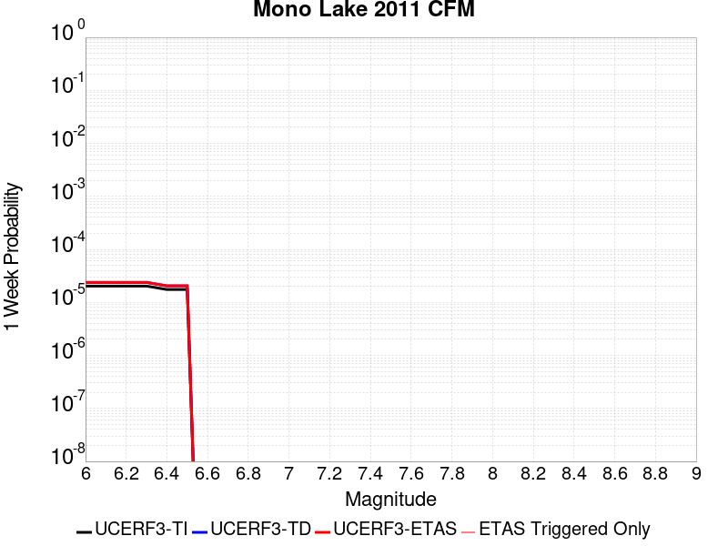 |  |  |  |

| Magnitude | 1 wk TI Prob | 1 wk TD Prob | 1 wk ETAS Prob | 1 wk ETAS/TD Gain | 1 wk ETAS Triggered Only | 1 mo TI Prob | 1 mo TD Prob | 1 mo ETAS Prob | 1 mo ETAS/TD Gain | 1 mo ETAS Triggered Only | 1 yr TI Prob | 1 yr TD Prob | 1 yr ETAS Prob | 1 yr ETAS/TD Gain | 1 yr ETAS Triggered Only | 10 yr TI Prob | 10 yr TD Prob | 10 yr ETAS Prob | 10 yr ETAS/TD Gain | 10 yr ETAS Triggered Only |
|-----|-----|-----|-----|-----|-----|-----|-----|-----|-----|-----|-----|-----|-----|-----|-----|-----|-----|-----|-----|-----|
| 6.0 | 2.0341662E-5 | 2.385117E-5 | 2.385117E-5 | 1.0 | 0.0 | 8.717564E-5 | 1.0221829E-4 | 1.0221829E-4 | 1.0 | 0.0 | 0.0010608466 | 0.0012443291 | 0.0012443291 | 1.0 | 0.0 | 0.010557966 | 0.012425788 | 0.012455415 | 1.0023843 | 3.0E-5 |
| 6.1 | 2.0341662E-5 | 2.385117E-5 | 2.385117E-5 | 1.0 | 0.0 | 8.717564E-5 | 1.0221829E-4 | 1.0221829E-4 | 1.0 | 0.0 | 0.0010608466 | 0.0012443291 | 0.0012443291 | 1.0 | 0.0 | 0.010557966 | 0.012425788 | 0.012455415 | 1.0023843 | 3.0E-5 |
| 6.2 | 2.0341662E-5 | 2.385117E-5 | 2.385117E-5 | 1.0 | 0.0 | 8.717564E-5 | 1.0221829E-4 | 1.0221829E-4 | 1.0 | 0.0 | 0.0010608466 | 0.0012443291 | 0.0012443291 | 1.0 | 0.0 | 0.010557966 | 0.012425788 | 0.012455415 | 1.0023843 | 3.0E-5 |
| 6.3 | 2.0341662E-5 | 2.385117E-5 | 2.385117E-5 | 1.0 | 0.0 | 8.717564E-5 | 1.0221829E-4 | 1.0221829E-4 | 1.0 | 0.0 | 0.0010608466 | 0.0012443291 | 0.0012443291 | 1.0 | 0.0 | 0.010557966 | 0.012425788 | 0.012455415 | 1.0023843 | 3.0E-5 |
| 6.4 | 1.749821E-5 | 2.051073E-5 | 2.051073E-5 | 1.0 | 0.0 | 7.499018E-5 | 8.790312E-5 | 8.790312E-5 | 1.0 | 0.0 | 9.1262296E-4 | 0.00107022 | 0.00107022 | 1.0 | 0.0 | 0.009088841 | 0.010702155 | 0.010731833 | 1.0027732 | 3.0E-5 |
| 6.5 | 1.749821E-5 | 2.051073E-5 | 2.051073E-5 | 1.0 | 0.0 | 7.499018E-5 | 8.790312E-5 | 8.790312E-5 | 1.0 | 0.0 | 9.1262296E-4 | 0.00107022 | 0.00107022 | 1.0 | 0.0 | 0.009088841 | 0.010702155 | 0.010731833 | 1.0027732 | 3.0E-5 |

## Lost Hills
*[(top)](#table-of-contents)*

| 1 Week | 1 Month | 1 Year | 10 Year |
|-----|-----|-----|-----|
|  |  |  |  |

| Magnitude | 1 wk TI Prob | 1 wk TD Prob | 1 wk ETAS Prob | 1 wk ETAS/TD Gain | 1 wk ETAS Triggered Only | 1 mo TI Prob | 1 mo TD Prob | 1 mo ETAS Prob | 1 mo ETAS/TD Gain | 1 mo ETAS Triggered Only | 1 yr TI Prob | 1 yr TD Prob | 1 yr ETAS Prob | 1 yr ETAS/TD Gain | 1 yr ETAS Triggered Only | 10 yr TI Prob | 10 yr TD Prob | 10 yr ETAS Prob | 10 yr ETAS/TD Gain | 10 yr ETAS Triggered Only |
|-----|-----|-----|-----|-----|-----|-----|-----|-----|-----|-----|-----|-----|-----|-----|-----|-----|-----|-----|-----|-----|
| 6.0 | 2.233523E-5 | 2.5124113E-5 | 2.5124113E-5 | 1.0 | 0.0 | 9.571891E-5 | 1.0767128E-4 | 1.0767128E-4 | 1.0 | 0.0 | 0.0011647546 | 0.0013102778 | 0.0013202648 | 1.007622 | 1.0E-5 | 0.011586686 | 0.0130421445 | 0.013071753 | 1.0022702 | 3.0E-5 |
| 6.1 | 2.233523E-5 | 2.5124113E-5 | 2.5124113E-5 | 1.0 | 0.0 | 9.571891E-5 | 1.0767128E-4 | 1.0767128E-4 | 1.0 | 0.0 | 0.0011647546 | 0.0013102778 | 0.0013202648 | 1.007622 | 1.0E-5 | 0.011586686 | 0.0130421445 | 0.013071753 | 1.0022702 | 3.0E-5 |
| 6.2 | 2.233523E-5 | 2.5124113E-5 | 2.5124113E-5 | 1.0 | 0.0 | 9.571891E-5 | 1.0767128E-4 | 1.0767128E-4 | 1.0 | 0.0 | 0.0011647546 | 0.0013102778 | 0.0013202648 | 1.007622 | 1.0E-5 | 0.011586686 | 0.0130421445 | 0.013071753 | 1.0022702 | 3.0E-5 |
| 6.3 | 2.233523E-5 | 2.5124113E-5 | 2.5124113E-5 | 1.0 | 0.0 | 9.571891E-5 | 1.0767128E-4 | 1.0767128E-4 | 1.0 | 0.0 | 0.0011647546 | 0.0013102778 | 0.0013202648 | 1.007622 | 1.0E-5 | 0.011586686 | 0.0130421445 | 0.013071753 | 1.0022702 | 3.0E-5 |
| 6.4 | 1.2288092E-5 | 1.379053E-5 | 1.379053E-5 | 1.0 | 0.0 | 5.2662188E-5 | 5.910146E-5 | 5.910146E-5 | 1.0 | 0.0 | 6.409735E-4 | 7.1941665E-4 | 7.2940945E-4 | 1.0138901 | 1.0E-5 | 0.006391279 | 0.0071800957 | 0.007190024 | 1.0013827 | 1.0E-5 |
| 6.5 | 1.2288092E-5 | 1.379053E-5 | 1.379053E-5 | 1.0 | 0.0 | 5.2662188E-5 | 5.910146E-5 | 5.910146E-5 | 1.0 | 0.0 | 6.409735E-4 | 7.1941665E-4 | 7.2940945E-4 | 1.0138901 | 1.0E-5 | 0.006391279 | 0.0071800957 | 0.007190024 | 1.0013827 | 1.0E-5 |
| 6.6 | 8.58281E-6 | 9.640408E-6 | 9.640408E-6 | 1.0 | 0.0 | 3.6782953E-5 | 4.131585E-5 | 4.131585E-5 | 1.0 | 0.0 | 4.4774043E-4 | 5.029877E-4 | 5.1298266E-4 | 1.0198712 | 1.0E-5 | 0.0044683935 | 0.0050266637 | 0.0050366134 | 1.0019794 | 1.0E-5 |
| 6.7 | 7.205685E-6 | 8.093876E-6 | 8.093876E-6 | 1.0 | 0.0 | 3.088114E-5 | 3.468804E-5 | 3.468804E-5 | 1.0 | 0.0 | 3.7591302E-4 | 4.223269E-4 | 4.323227E-4 | 1.0236683 | 1.0E-5 | 0.0037527776 | 0.004223269 | 0.004233227 | 1.0023578 | 1.0E-5 |

## Elsinore (Glen Ivy) rev
*[(top)](#table-of-contents)*

| 1 Week | 1 Month | 1 Year | 10 Year |
|-----|-----|-----|-----|
|  |  |  |  |

| Magnitude | 1 wk TI Prob | 1 wk TD Prob | 1 wk ETAS Prob | 1 wk ETAS/TD Gain | 1 wk ETAS Triggered Only | 1 mo TI Prob | 1 mo TD Prob | 1 mo ETAS Prob | 1 mo ETAS/TD Gain | 1 mo ETAS Triggered Only | 1 yr TI Prob | 1 yr TD Prob | 1 yr ETAS Prob | 1 yr ETAS/TD Gain | 1 yr ETAS Triggered Only | 10 yr TI Prob | 10 yr TD Prob | 10 yr ETAS Prob | 10 yr ETAS/TD Gain | 10 yr ETAS Triggered Only |
|-----|-----|-----|-----|-----|-----|-----|-----|-----|-----|-----|-----|-----|-----|-----|-----|-----|-----|-----|-----|-----|
| 6.0 | 1.6204086E-4 | 2.9447937E-4 | 2.9447937E-4 | 1.0 | 0.0 | 6.94276E-4 | 0.0012615235 | 0.0012615235 | 1.0 | 0.0 | 0.008420097 | 0.015272417 | 0.015282264 | 1.0006448 | 1.0E-5 | 0.081081145 | 0.14011244 | 0.14013824 | 1.000184 | 3.0E-5 |
| 6.1 | 1.6204086E-4 | 2.9447937E-4 | 2.9447937E-4 | 1.0 | 0.0 | 6.94276E-4 | 0.0012615235 | 0.0012615235 | 1.0 | 0.0 | 0.008420097 | 0.015272417 | 0.015282264 | 1.0006448 | 1.0E-5 | 0.081081145 | 0.14011244 | 0.14013824 | 1.000184 | 3.0E-5 |
| 6.2 | 1.6204086E-4 | 2.9447937E-4 | 2.9447937E-4 | 1.0 | 0.0 | 6.94276E-4 | 0.0012615235 | 0.0012615235 | 1.0 | 0.0 | 0.008420097 | 0.015272417 | 0.015282264 | 1.0006448 | 1.0E-5 | 0.081081145 | 0.14011244 | 0.14013824 | 1.000184 | 3.0E-5 |
| 6.3 | 1.0111737E-4 | 1.7748876E-4 | 1.7748876E-4 | 1.0 | 0.0 | 4.332882E-4 | 7.6056167E-4 | 7.6056167E-4 | 1.0 | 0.0 | 0.005262531 | 0.00924132 | 0.009251228 | 1.001072 | 1.0E-5 | 0.0513964 | 0.087263584 | 0.08728184 | 1.0002092 | 2.0E-5 |
| 6.4 | 1.0111737E-4 | 1.7748876E-4 | 1.7748876E-4 | 1.0 | 0.0 | 4.332882E-4 | 7.6056167E-4 | 7.6056167E-4 | 1.0 | 0.0 | 0.005262531 | 0.00924132 | 0.009251228 | 1.001072 | 1.0E-5 | 0.0513964 | 0.087263584 | 0.08728184 | 1.0002092 | 2.0E-5 |
| 6.5 | 3.6624708E-5 | 4.6500507E-5 | 4.6500507E-5 | 1.0 | 0.0 | 1.569536E-4 | 1.9927471E-4 | 1.9927471E-4 | 1.0 | 0.0 | 0.001909235 | 0.0024238315 | 0.0024238315 | 1.0 | 0.0 | 0.01892915 | 0.023745155 | 0.023745155 | 1.0 | 0.0 |
| 6.6 | 2.5051324E-5 | 2.6213434E-5 | 2.6213434E-5 | 1.0 | 0.0 | 1.073584E-4 | 1.12338705E-4 | 1.12338705E-4 | 1.0 | 0.0 | 0.0013063047 | 0.0013669104 | 0.0013669104 | 1.0 | 0.0 | 0.012986525 | 0.013595471 | 0.013595471 | 1.0 | 0.0 |
| 6.7 | 2.2189772E-5 | 2.2124646E-5 | 2.2124646E-5 | 1.0 | 0.0 | 9.509556E-5 | 9.481667E-5 | 9.481667E-5 | 1.0 | 0.0 | 0.0011571734 | 0.0011538182 | 0.0011538182 | 1.0 | 0.0 | 0.011511663 | 0.011488986 | 0.011488986 | 1.0 | 0.0 |
| 6.8 | 1.6654378E-5 | 1.4468248E-5 | 1.4468248E-5 | 1.0 | 0.0 | 7.137396E-5 | 6.200533E-5 | 6.200533E-5 | 1.0 | 0.0 | 8.686314E-4 | 7.5465866E-4 | 7.5465866E-4 | 1.0 | 0.0 | 0.008652439 | 0.007525933 | 0.007525933 | 1.0 | 0.0 |
| 6.9 | 1.5042909E-5 | 1.2357921E-5 | 1.2357921E-5 | 1.0 | 0.0 | 6.446802E-5 | 5.296146E-5 | 5.296146E-5 | 1.0 | 0.0 | 7.8461546E-4 | 6.446182E-4 | 6.446182E-4 | 1.0 | 0.0 | 0.007818509 | 0.00643132 | 0.00643132 | 1.0 | 0.0 |
| 7.0 | 1.4361385E-5 | 1.147535E-5 | 1.147535E-5 | 1.0 | 0.0 | 6.154734E-5 | 4.917916E-5 | 4.917916E-5 | 1.0 | 0.0 | 7.490812E-4 | 5.985947E-4 | 5.985947E-4 | 1.0 | 0.0 | 0.007465612 | 0.00597348 | 0.00597348 | 1.0 | 0.0 |
| 7.1 | 1.3265571E-5 | 1.0266514E-5 | 1.0266514E-5 | 1.0 | 0.0 | 5.6851208E-5 | 4.399862E-5 | 4.399862E-5 | 1.0 | 0.0 | 6.919436E-4 | 5.355541E-4 | 5.355541E-4 | 1.0 | 0.0 | 0.006897931 | 0.005345853 | 0.005345853 | 1.0 | 0.0 |
| 7.2 | 1.1596403E-5 | 8.523238E-6 | 8.523238E-6 | 1.0 | 0.0 | 4.9697923E-5 | 3.6527657E-5 | 3.6527657E-5 | 1.0 | 0.0 | 6.049042E-4 | 4.446352E-4 | 4.446352E-4 | 1.0 | 0.0 | 0.006032603 | 0.0044389023 | 0.0044389023 | 1.0 | 0.0 |
| 7.3 | 1.0150827E-5 | 7.25424E-6 | 7.25424E-6 | 1.0 | 0.0 | 4.3502816E-5 | 3.1089236E-5 | 3.1089236E-5 | 1.0 | 0.0 | 5.2951806E-4 | 3.7844718E-4 | 3.7844718E-4 | 1.0 | 0.0 | 0.005282581 | 0.0037784118 | 0.0037784118 | 1.0 | 0.0 |
| 7.4 | 9.080705E-6 | 6.366131E-6 | 6.366131E-6 | 1.0 | 0.0 | 3.8916725E-5 | 2.728314E-5 | 2.728314E-5 | 1.0 | 0.0 | 4.7370812E-4 | 3.3212296E-4 | 3.3212296E-4 | 1.0 | 0.0 | 0.004726996 | 0.0033164187 | 0.0033164187 | 1.0 | 0.0 |
| 7.5 | 7.671649E-6 | 5.237054E-6 | 5.237054E-6 | 1.0 | 0.0 | 3.287808E-5 | 2.2444332E-5 | 2.2444332E-5 | 1.0 | 0.0 | 4.0021708E-4 | 2.7322673E-4 | 2.7322673E-4 | 1.0 | 0.0 | 0.0039949706 | 0.0027290336 | 0.0027290336 | 1.0 | 0.0 |
| 7.6 | 6.990086E-6 | 4.697688E-6 | 4.697688E-6 | 1.0 | 0.0 | 2.9957167E-5 | 2.01328E-5 | 2.01328E-5 | 1.0 | 0.0 | 3.6466747E-4 | 2.4509043E-4 | 2.4509043E-4 | 1.0 | 0.0 | 0.0036406964 | 0.002448318 | 0.002448318 | 1.0 | 0.0 |
| 7.7 | 4.163505E-6 | 2.3353284E-6 | 2.3353284E-6 | 1.0 | 0.0 | 1.7843471E-5 | 1.0008516E-5 | 1.0008516E-5 | 1.0 | 0.0 | 2.172226E-4 | 1.2184761E-4 | 1.2184761E-4 | 1.0 | 0.0 | 0.0021701038 | 0.0012178815 | 0.0012178815 | 1.0 | 0.0 |
| 7.8 | 2.2692414E-7 | 9.4046044E-8 | 9.4046044E-8 | 1.0 | 0.0 | 9.725317E-7 | 4.0305443E-7 | 4.0305443E-7 | 1.0 | 0.0 | 1.1840509E-5 | 4.9071796E-6 | 4.9071796E-6 | 1.0 | 0.0 | 1.1839878E-4 | 4.9071044E-5 | 4.9071044E-5 | 1.0 | 0.0 |
| 7.9 | 6.676829E-9 | 3.4450212E-9 | 3.4450212E-9 | 1.0 | 0.0 | 2.861498E-8 | 1.4764377E-8 | 1.4764377E-8 | 1.0 | 0.0 | 3.4838732E-7 | 1.7975627E-7 | 1.7975627E-7 | 1.0 | 0.0 | 3.4838679E-6 | 1.7975615E-6 | 1.7975615E-6 | 1.0 | 0.0 |

## San Jacinto (Borrego)
*[(top)](#table-of-contents)*

| 1 Week | 1 Month | 1 Year | 10 Year |
|-----|-----|-----|-----|
|  |  |  |  |

| Magnitude | 1 wk TI Prob | 1 wk TD Prob | 1 wk ETAS Prob | 1 wk ETAS/TD Gain | 1 wk ETAS Triggered Only | 1 mo TI Prob | 1 mo TD Prob | 1 mo ETAS Prob | 1 mo ETAS/TD Gain | 1 mo ETAS Triggered Only | 1 yr TI Prob | 1 yr TD Prob | 1 yr ETAS Prob | 1 yr ETAS/TD Gain | 1 yr ETAS Triggered Only | 10 yr TI Prob | 10 yr TD Prob | 10 yr ETAS Prob | 10 yr ETAS/TD Gain | 10 yr ETAS Triggered Only |
|-----|-----|-----|-----|-----|-----|-----|-----|-----|-----|-----|-----|-----|-----|-----|-----|-----|-----|-----|-----|-----|
| 6.0 | 3.543992E-5 | 2.8287226E-5 | 2.8287226E-5 | 1.0 | 0.0 | 1.5187653E-4 | 1.2122541E-4 | 1.2122541E-4 | 1.0 | 0.0 | 0.0018475284 | 0.0014749324 | 0.0014849177 | 1.00677 | 1.0E-5 | 0.018322436 | 0.015057925 | 0.015077624 | 1.0013082 | 2.0E-5 |
| 6.1 | 3.542281E-5 | 2.8287226E-5 | 2.8287226E-5 | 1.0 | 0.0 | 1.5180321E-4 | 1.2122541E-4 | 1.2122541E-4 | 1.0 | 0.0 | 0.0018466372 | 0.0014749324 | 0.0014849177 | 1.00677 | 1.0E-5 | 0.018313672 | 0.015057925 | 0.015077624 | 1.0013082 | 2.0E-5 |
| 6.2 | 3.4688688E-5 | 2.8287226E-5 | 2.8287226E-5 | 1.0 | 0.0 | 1.4865733E-4 | 1.212254E-4 | 1.212254E-4 | 1.0 | 0.0 | 0.0018084005 | 0.0014749324 | 0.0014849177 | 1.00677 | 1.0E-5 | 0.017937548 | 0.015057924 | 0.015077624 | 1.0013082 | 2.0E-5 |
| 6.3 | 3.2087122E-5 | 2.8132377E-5 | 2.8132377E-5 | 1.0 | 0.0 | 1.3750899E-4 | 1.2056183E-4 | 1.2056183E-4 | 1.0 | 0.0 | 0.0016728862 | 0.0014668644 | 0.0014768497 | 1.0068072 | 1.0E-5 | 0.016603488 | 0.014978999 | 0.0149987 | 1.0013152 | 2.0E-5 |
| 6.4 | 3.1828724E-5 | 2.80993E-5 | 2.80993E-5 | 1.0 | 0.0 | 1.364017E-4 | 1.2042009E-4 | 1.2042009E-4 | 1.0 | 0.0 | 0.0016594254 | 0.001465141 | 0.0014751262 | 1.0068153 | 1.0E-5 | 0.016470885 | 0.014962169 | 0.01498187 | 1.0013167 | 2.0E-5 |
| 6.5 | 3.1563577E-5 | 2.7838281E-5 | 2.7838281E-5 | 1.0 | 0.0 | 1.3526545E-4 | 1.19301534E-4 | 1.19301534E-4 | 1.0 | 0.0 | 0.0016456128 | 0.0014515407 | 0.0014615261 | 1.0068792 | 1.0E-5 | 0.0163348 | 0.014827895 | 0.014847599 | 1.0013288 | 2.0E-5 |
| 6.6 | 3.1467625E-5 | 2.7681903E-5 | 2.7681903E-5 | 1.0 | 0.0 | 1.3485427E-4 | 1.186314E-4 | 1.186314E-4 | 1.0 | 0.0 | 0.0016406142 | 0.0014433927 | 0.0014533782 | 1.0069181 | 1.0E-5 | 0.016285548 | 0.014747789 | 0.014767494 | 1.0013361 | 2.0E-5 |
| 6.7 | 3.1223695E-5 | 2.729926E-5 | 2.729926E-5 | 1.0 | 0.0 | 1.3380898E-4 | 1.1699166E-4 | 1.1699166E-4 | 1.0 | 0.0 | 0.0016279068 | 0.001423455 | 0.0014334407 | 1.0070151 | 1.0E-5 | 0.01616033 | 0.014551916 | 0.014571626 | 1.0013543 | 2.0E-5 |
| 6.8 | 3.1015585E-5 | 2.7119557E-5 | 2.7119557E-5 | 1.0 | 0.0 | 1.3291716E-4 | 1.1622156E-4 | 1.1622156E-4 | 1.0 | 0.0 | 0.001617065 | 0.0014140913 | 0.0014240772 | 1.0070617 | 1.0E-5 | 0.016053487 | 0.014458852 | 0.014478562 | 1.0013633 | 2.0E-5 |
| 6.9 | 2.6641965E-5 | 2.2522252E-5 | 2.2522252E-5 | 1.0 | 0.0 | 1.1417485E-4 | 9.652039E-5 | 9.652039E-5 | 1.0 | 0.0 | 0.0013891924 | 0.0011745061 | 0.0011844945 | 1.0085043 | 1.0E-5 | 0.0138054015 | 0.012058906 | 0.012068786 | 1.0008192 | 1.0E-5 |
| 7.0 | 2.3854353E-5 | 2.080623E-5 | 2.080623E-5 | 1.0 | 0.0 | 1.02228936E-4 | 8.9166526E-5 | 8.9166526E-5 | 1.0 | 0.0 | 0.0012439266 | 0.0010850644 | 0.0010950535 | 1.009206 | 1.0E-5 | 0.012369866 | 0.011153843 | 0.011163732 | 1.0008866 | 1.0E-5 |
| 7.1 | 2.3672901E-5 | 2.0642405E-5 | 2.0642405E-5 | 1.0 | 0.0 | 1.0145135E-4 | 8.846447E-5 | 8.846447E-5 | 1.0 | 0.0 | 0.0012344702 | 0.0010765253 | 0.0010865146 | 1.0092791 | 1.0E-5 | 0.0122763505 | 0.011068861 | 0.01107875 | 1.0008935 | 1.0E-5 |
| 7.2 | 2.2717244E-5 | 1.9867373E-5 | 1.9867373E-5 | 1.0 | 0.0 | 9.735599E-5 | 8.5143125E-5 | 8.5143125E-5 | 1.0 | 0.0 | 0.0011846646 | 0.001036127 | 0.0010461166 | 1.0096413 | 1.0E-5 | 0.01178369 | 0.010664992 | 0.0106748855 | 1.0009277 | 1.0E-5 |
| 7.3 | 2.1016205E-5 | 1.8705E-5 | 1.8705E-5 | 1.0 | 0.0 | 9.006634E-5 | 8.016183E-5 | 8.016183E-5 | 1.0 | 0.0 | 0.001096006 | 9.7553537E-4 | 9.855257E-4 | 1.0102408 | 1.0E-5 | 0.010906163 | 0.0100586815 | 0.0100685805 | 1.0009842 | 1.0E-5 |
| 7.4 | 2.0683625E-5 | 1.8506682E-5 | 1.8506682E-5 | 1.0 | 0.0 | 8.86411E-5 | 7.9311954E-5 | 7.9311954E-5 | 1.0 | 0.0 | 0.001078671 | 9.6519734E-4 | 9.751877E-4 | 1.0103506 | 1.0E-5 | 0.010734501 | 0.009954984 | 0.009964885 | 1.0009946 | 1.0E-5 |
| 7.5 | 1.9993966E-5 | 1.8098988E-5 | 1.8098988E-5 | 1.0 | 0.0 | 8.568561E-5 | 7.75648E-5 | 7.75648E-5 | 1.0 | 0.0 | 0.001042723 | 9.439444E-4 | 9.539349E-4 | 1.0105839 | 1.0E-5 | 0.010378438 | 0.009740542 | 0.009750444 | 1.0010166 | 1.0E-5 |
| 7.6 | 1.788966E-5 | 1.6740021E-5 | 1.6740021E-5 | 1.0 | 0.0 | 7.666772E-5 | 7.1740986E-5 | 7.1740986E-5 | 1.0 | 0.0 | 9.3302975E-4 | 8.7309827E-4 | 8.8308955E-4 | 1.0114435 | 1.0E-5 | 0.00929122 | 0.009026147 | 0.009036057 | 1.0010979 | 1.0E-5 |
| 7.7 | 1.5125781E-5 | 1.45328095E-5 | 1.45328095E-5 | 1.0 | 0.0 | 6.4823165E-5 | 6.2281986E-5 | 6.2281986E-5 | 1.0 | 0.0 | 7.889362E-4 | 7.580202E-4 | 7.6801266E-4 | 1.0131823 | 1.0E-5 | 0.007861412 | 0.007869238 | 0.0078791585 | 1.0012608 | 1.0E-5 |
| 7.8 | 1.250089E-5 | 1.2913758E-5 | 1.2913758E-5 | 1.0 | 0.0 | 5.3574146E-5 | 5.5343506E-5 | 5.5343506E-5 | 1.0 | 0.0 | 6.5207E-4 | 6.7359954E-4 | 6.835928E-4 | 1.0148356 | 1.0E-5 | 0.006501599 | 0.0070165154 | 0.007026445 | 1.0014153 | 1.0E-5 |
| 7.9 | 9.561E-6 | 1.0001537E-5 | 1.0001537E-5 | 1.0 | 0.0 | 4.0975072E-5 | 4.286303E-5 | 4.286303E-5 | 1.0 | 0.0 | 4.987573E-4 | 5.21733E-4 | 5.317278E-4 | 1.0191569 | 1.0E-5 | 0.0049763937 | 0.005482605 | 0.0054925503 | 1.001814 | 1.0E-5 |
| 8.0 | 8.01699E-6 | 8.51725E-6 | 8.51725E-6 | 1.0 | 0.0 | 3.4358076E-5 | 3.6501988E-5 | 3.6501988E-5 | 1.0 | 0.0 | 4.1822926E-4 | 4.4432166E-4 | 4.543172E-4 | 1.0224962 | 1.0E-5 | 0.0041744304 | 0.0046916213 | 0.0047015743 | 1.0021214 | 1.0E-5 |
| 8.1 | 6.541947E-6 | 6.6429566E-6 | 6.6429566E-6 | 1.0 | 0.0 | 2.8036617E-5 | 2.8469505E-5 | 2.8469505E-5 | 1.0 | 0.0 | 3.4129233E-4 | 3.4656163E-4 | 3.4656163E-4 | 1.0 | 0.0 | 0.0034076865 | 0.0036766983 | 0.0036766983 | 1.0 | 0.0 |
| 8.2 | 1.7968189E-6 | 8.318235E-7 | 8.318235E-7 | 1.0 | 0.0 | 7.70063E-6 | 3.5649532E-6 | 3.5649532E-6 | 1.0 | 0.0 | 9.3751136E-5 | 4.3402466E-5 | 4.3402466E-5 | 1.0 | 0.0 | 9.371159E-4 | 4.9075804E-4 | 4.9075804E-4 | 1.0 | 0.0 |
| 8.3 | 1.5167889E-7 | 5.1682637E-8 | 5.1682637E-8 | 1.0 | 0.0 | 6.500522E-7 | 2.21497E-7 | 2.21497E-7 | 1.0 | 0.0 | 7.9143565E-6 | 2.6967232E-6 | 2.6967232E-6 | 1.0 | 0.0 | 7.914075E-5 | 3.125474E-5 | 3.125474E-5 | 1.0 | 0.0 |

## Ortigalita (South)
*[(top)](#table-of-contents)*

| 1 Week | 1 Month | 1 Year | 10 Year |
|-----|-----|-----|-----|
|  |  |  |  |

| Magnitude | 1 wk TI Prob | 1 wk TD Prob | 1 wk ETAS Prob | 1 wk ETAS/TD Gain | 1 wk ETAS Triggered Only | 1 mo TI Prob | 1 mo TD Prob | 1 mo ETAS Prob | 1 mo ETAS/TD Gain | 1 mo ETAS Triggered Only | 1 yr TI Prob | 1 yr TD Prob | 1 yr ETAS Prob | 1 yr ETAS/TD Gain | 1 yr ETAS Triggered Only | 10 yr TI Prob | 10 yr TD Prob | 10 yr ETAS Prob | 10 yr ETAS/TD Gain | 10 yr ETAS Triggered Only |
|-----|-----|-----|-----|-----|-----|-----|-----|-----|-----|-----|-----|-----|-----|-----|-----|-----|-----|-----|-----|-----|
| 6.0 | 3.72394E-5 | 4.3295102E-5 | 4.3295102E-5 | 1.0 | 0.0 | 1.5958765E-4 | 1.855381E-4 | 1.855381E-4 | 1.0 | 0.0 | 0.0019412481 | 0.0022567427 | 0.0022667202 | 1.0044211 | 1.0E-5 | 0.019243775 | 0.022354675 | 0.02237423 | 1.0008746 | 2.0E-5 |
| 6.1 | 2.7299884E-5 | 3.1519343E-5 | 3.1519343E-5 | 1.0 | 0.0 | 1.16994255E-4 | 1.3507622E-4 | 1.3507622E-4 | 1.0 | 0.0 | 0.0014234743 | 0.0016433684 | 0.0016433684 | 1.0 | 0.0 | 0.014143906 | 0.016318098 | 0.016327934 | 1.0006028 | 1.0E-5 |
| 6.2 | 2.7299884E-5 | 3.1519343E-5 | 3.1519343E-5 | 1.0 | 0.0 | 1.16994255E-4 | 1.3507622E-4 | 1.3507622E-4 | 1.0 | 0.0 | 0.0014234743 | 0.0016433684 | 0.0016433684 | 1.0 | 0.0 | 0.014143906 | 0.016318098 | 0.016327934 | 1.0006028 | 1.0E-5 |
| 6.3 | 2.0546433E-5 | 2.3651486E-5 | 2.3651486E-5 | 1.0 | 0.0 | 8.805317E-5 | 1.01359685E-4 | 1.01359685E-4 | 1.0 | 0.0 | 0.00107152 | 0.0012333745 | 0.0012333745 | 1.0 | 0.0 | 0.010663681 | 0.0122673595 | 0.012277237 | 1.0008051 | 1.0E-5 |
| 6.4 | 2.0546433E-5 | 2.3651486E-5 | 2.3651486E-5 | 1.0 | 0.0 | 8.805317E-5 | 1.01359685E-4 | 1.01359685E-4 | 1.0 | 0.0 | 0.00107152 | 0.0012333745 | 0.0012333745 | 1.0 | 0.0 | 0.010663681 | 0.0122673595 | 0.012277237 | 1.0008051 | 1.0E-5 |
| 6.5 | 1.7779594E-5 | 2.0464298E-5 | 2.0464298E-5 | 1.0 | 0.0 | 7.619603E-5 | 8.7701264E-5 | 8.7701264E-5 | 1.0 | 0.0 | 9.272918E-4 | 0.0010672535 | 0.0010672535 | 1.0 | 0.0 | 0.009234319 | 0.010622749 | 0.010632643 | 1.0009314 | 1.0E-5 |
| 6.6 | 1.6272212E-5 | 1.8730836E-5 | 1.8730836E-5 | 1.0 | 0.0 | 6.973618E-5 | 8.0272606E-5 | 8.0272606E-5 | 1.0 | 0.0 | 8.487073E-4 | 9.768931E-4 | 9.768931E-4 | 1.0 | 0.0 | 0.008454733 | 0.009727292 | 0.009727292 | 1.0 | 0.0 |
| 6.7 | 1.3051484E-5 | 1.5051695E-5 | 1.5051695E-5 | 1.0 | 0.0 | 5.593373E-5 | 6.450572E-5 | 6.450572E-5 | 1.0 | 0.0 | 6.807804E-4 | 7.8508374E-4 | 7.8508374E-4 | 1.0 | 0.0 | 0.006786986 | 0.0078240875 | 0.0078240875 | 1.0 | 0.0 |
| 6.8 | 1.04277415E-5 | 1.1997347E-5 | 1.1997347E-5 | 1.0 | 0.0 | 4.4689557E-5 | 5.141623E-5 | 5.141623E-5 | 1.0 | 0.0 | 5.439595E-4 | 6.2582025E-4 | 6.2582025E-4 | 1.0 | 0.0 | 0.0054262993 | 0.0062413346 | 0.0062413346 | 1.0 | 0.0 |
| 6.9 | 7.639968E-6 | 8.798974E-6 | 8.798974E-6 | 1.0 | 0.0 | 3.274231E-5 | 3.7709375E-5 | 3.7709375E-5 | 1.0 | 0.0 | 3.9856473E-4 | 4.590208E-4 | 4.590208E-4 | 1.0 | 0.0 | 0.003978506 | 0.0045813145 | 0.0045813145 | 1.0 | 0.0 |
| 7.0 | 3.919831E-6 | 4.5374004E-6 | 4.5374004E-6 | 1.0 | 0.0 | 1.679917E-5 | 1.944587E-5 | 1.944587E-5 | 1.0 | 0.0 | 2.045107E-4 | 2.3672986E-4 | 2.3672986E-4 | 1.0 | 0.0 | 0.0020432258 | 0.0023649856 | 0.0023649856 | 1.0 | 0.0 |
| 7.1 | 1.6017933E-6 | 1.8587097E-6 | 1.8587097E-6 | 1.0 | 0.0 | 6.8648105E-6 | 7.96588E-6 | 7.96588E-6 | 1.0 | 0.0 | 8.357586E-5 | 9.698134E-5 | 9.698134E-5 | 1.0 | 0.0 | 8.3544437E-4 | 9.694951E-4 | 9.694951E-4 | 1.0 | 0.0 |

## San Clemente
*[(top)](#table-of-contents)*

| 1 Week | 1 Month | 1 Year | 10 Year |
|-----|-----|-----|-----|
|  | 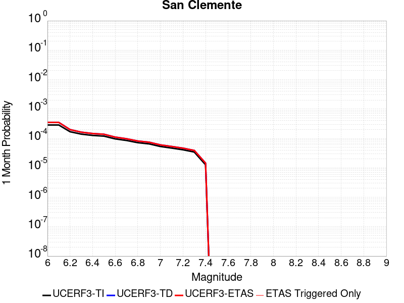 |  |  |

| Magnitude | 1 wk TI Prob | 1 wk TD Prob | 1 wk ETAS Prob | 1 wk ETAS/TD Gain | 1 wk ETAS Triggered Only | 1 mo TI Prob | 1 mo TD Prob | 1 mo ETAS Prob | 1 mo ETAS/TD Gain | 1 mo ETAS Triggered Only | 1 yr TI Prob | 1 yr TD Prob | 1 yr ETAS Prob | 1 yr ETAS/TD Gain | 1 yr ETAS Triggered Only | 10 yr TI Prob | 10 yr TD Prob | 10 yr ETAS Prob | 10 yr ETAS/TD Gain | 10 yr ETAS Triggered Only |
|-----|-----|-----|-----|-----|-----|-----|-----|-----|-----|-----|-----|-----|-----|-----|-----|-----|-----|-----|-----|-----|
| 6.0 | 6.681379E-5 | 8.174019E-5 | 8.174019E-5 | 1.0 | 0.0 | 2.8631336E-4 | 3.5027132E-4 | 3.5027132E-4 | 1.0 | 0.0 | 0.003480294 | 0.00425671 | 0.004266667 | 1.0023392 | 1.0E-5 | 0.03426291 | 0.041806895 | 0.041826062 | 1.0004584 | 2.0E-5 |
| 6.1 | 6.681379E-5 | 8.174019E-5 | 8.174019E-5 | 1.0 | 0.0 | 2.8631336E-4 | 3.5027132E-4 | 3.5027132E-4 | 1.0 | 0.0 | 0.003480294 | 0.00425671 | 0.004266667 | 1.0023392 | 1.0E-5 | 0.03426291 | 0.041806895 | 0.041826062 | 1.0004584 | 2.0E-5 |
| 6.2 | 3.9400576E-5 | 4.6499594E-5 | 4.6499594E-5 | 1.0 | 0.0 | 1.6884868E-4 | 1.9926908E-4 | 1.9926908E-4 | 1.0 | 0.0 | 0.0020537945 | 0.0024234534 | 0.0024334292 | 1.0041163 | 1.0E-5 | 0.020349167 | 0.023976889 | 0.023996409 | 1.0008141 | 2.0E-5 |
| 6.3 | 3.2590255E-5 | 3.7964324E-5 | 3.7964324E-5 | 1.0 | 0.0 | 1.3966505E-4 | 1.6269425E-4 | 1.6269425E-4 | 1.0 | 0.0 | 0.0016990956 | 0.0019790332 | 0.0019890133 | 1.005043 | 1.0E-5 | 0.01686163 | 0.01961788 | 0.019637488 | 1.0009995 | 2.0E-5 |
| 6.4 | 2.9454652E-5 | 3.4128178E-5 | 3.4128178E-5 | 1.0 | 0.0 | 1.2622811E-4 | 1.4625557E-4 | 1.4625557E-4 | 1.0 | 0.0 | 0.0015357438 | 0.0017792335 | 0.0017892156 | 1.0056103 | 1.0E-5 | 0.015251739 | 0.017653057 | 0.017672705 | 1.0011129 | 2.0E-5 |
| 6.5 | 2.790836E-5 | 3.2275817E-5 | 3.2275817E-5 | 1.0 | 0.0 | 1.1960178E-4 | 1.3831774E-4 | 1.3831774E-4 | 1.0 | 0.0 | 0.001455179 | 0.0016827434 | 0.0016927266 | 1.0059327 | 1.0E-5 | 0.014456868 | 0.016703034 | 0.0167227 | 1.0011774 | 2.0E-5 |
| 6.6 | 2.2492153E-5 | 2.5783846E-5 | 2.5783846E-5 | 1.0 | 0.0 | 9.639138E-5 | 1.10497596E-4 | 1.10497596E-4 | 1.0 | 0.0 | 0.0011729331 | 0.0013444927 | 0.0013444927 | 1.0 | 0.0 | 0.011667615 | 0.013365303 | 0.013365303 | 1.0 | 0.0 |
| 6.7 | 1.9862755E-5 | 2.2684462E-5 | 2.2684462E-5 | 1.0 | 0.0 | 8.512331E-5 | 9.721557E-5 | 9.721557E-5 | 1.0 | 0.0 | 0.0010358836 | 0.0011829681 | 0.0011829681 | 1.0 | 0.0 | 0.010310682 | 0.011768005 | 0.011768005 | 1.0 | 0.0 |
| 6.8 | 1.6697575E-5 | 1.8992305E-5 | 1.8992305E-5 | 1.0 | 0.0 | 7.155907E-5 | 8.139311E-5 | 8.139311E-5 | 1.0 | 0.0 | 8.7088346E-4 | 9.9052E-4 | 9.9052E-4 | 1.0 | 0.0 | 0.008674784 | 0.009862079 | 0.009862079 | 1.0 | 0.0 |
| 6.9 | 1.5218415E-5 | 1.7282506E-5 | 1.7282506E-5 | 1.0 | 0.0 | 6.522015E-5 | 7.406583E-5 | 7.406583E-5 | 1.0 | 0.0 | 7.93766E-4 | 9.013872E-4 | 9.013872E-4 | 1.0 | 0.0 | 0.007909367 | 0.008978258 | 0.008978258 | 1.0 | 0.0 |
| 7.0 | 1.2392958E-5 | 1.4043469E-5 | 1.4043469E-5 | 1.0 | 0.0 | 5.3111595E-5 | 6.0184946E-5 | 6.0184946E-5 | 1.0 | 0.0 | 6.4644177E-4 | 7.3251297E-4 | 7.3251297E-4 | 1.0 | 0.0 | 0.0064456454 | 0.0073017725 | 0.0073017725 | 1.0 | 0.0 |
| 7.1 | 1.0934128E-5 | 1.2384317E-5 | 1.2384317E-5 | 1.0 | 0.0 | 4.6859706E-5 | 5.3074607E-5 | 5.3074607E-5 | 1.0 | 0.0 | 5.7036756E-4 | 6.459991E-4 | 6.459991E-4 | 1.0 | 0.0 | 0.0056890585 | 0.0064419596 | 0.0064419596 | 1.0 | 0.0 |
| 7.2 | 9.5798805E-6 | 1.0852996E-5 | 1.0852996E-5 | 1.0 | 0.0 | 4.1055984E-5 | 4.651205E-5 | 4.651205E-5 | 1.0 | 0.0 | 4.9974193E-4 | 5.6614424E-4 | 5.6614424E-4 | 1.0 | 0.0 | 0.0049861963 | 0.0056477445 | 0.0056477445 | 1.0 | 0.0 |
| 7.3 | 8.0167365E-6 | 9.090723E-6 | 9.090723E-6 | 1.0 | 0.0 | 3.4356988E-5 | 3.89597E-5 | 3.89597E-5 | 1.0 | 0.0 | 4.1821605E-4 | 4.742382E-4 | 4.742382E-4 | 1.0 | 0.0 | 0.0041742986 | 0.0047329655 | 0.0047329655 | 1.0 | 0.0 |
| 7.4 | 2.9581017E-6 | 3.3649653E-6 | 3.3649653E-6 | 1.0 | 0.0 | 1.2677518E-5 | 1.4421228E-5 | 1.4421228E-5 | 1.0 | 0.0 | 1.5433785E-4 | 1.7556937E-4 | 1.7556937E-4 | 1.0 | 0.0 | 0.001542307 | 0.0017548024 | 0.0017548024 | 1.0 | 0.0 |

## Kern Canyon (South Kern) 2011
*[(top)](#table-of-contents)*

| 1 Week | 1 Month | 1 Year | 10 Year |
|-----|-----|-----|-----|
|  |  |  |  |

| Magnitude | 1 wk TI Prob | 1 wk TD Prob | 1 wk ETAS Prob | 1 wk ETAS/TD Gain | 1 wk ETAS Triggered Only | 1 mo TI Prob | 1 mo TD Prob | 1 mo ETAS Prob | 1 mo ETAS/TD Gain | 1 mo ETAS Triggered Only | 1 yr TI Prob | 1 yr TD Prob | 1 yr ETAS Prob | 1 yr ETAS/TD Gain | 1 yr ETAS Triggered Only | 10 yr TI Prob | 10 yr TD Prob | 10 yr ETAS Prob | 10 yr ETAS/TD Gain | 10 yr ETAS Triggered Only |
|-----|-----|-----|-----|-----|-----|-----|-----|-----|-----|-----|-----|-----|-----|-----|-----|-----|-----|-----|-----|-----|
| 6.0 | 4.105075E-6 | 4.114162E-6 | 4.114162E-6 | 1.0 | 0.0 | 1.7593058E-5 | 1.7632008E-5 | 1.7632008E-5 | 1.0 | 0.0 | 2.1417443E-4 | 2.1464919E-4 | 2.2464704E-4 | 1.0465777 | 1.0E-5 | 0.0021396813 | 0.0021444825 | 0.0021644398 | 1.0093063 | 2.0E-5 |
| 6.1 | 4.105075E-6 | 4.114162E-6 | 4.114162E-6 | 1.0 | 0.0 | 1.7593058E-5 | 1.7632008E-5 | 1.7632008E-5 | 1.0 | 0.0 | 2.1417443E-4 | 2.1464919E-4 | 2.2464704E-4 | 1.0465777 | 1.0E-5 | 0.0021396813 | 0.0021444825 | 0.0021644398 | 1.0093063 | 2.0E-5 |
| 6.2 | 4.105075E-6 | 4.114162E-6 | 4.114162E-6 | 1.0 | 0.0 | 1.7593058E-5 | 1.7632008E-5 | 1.7632008E-5 | 1.0 | 0.0 | 2.1417443E-4 | 2.1464919E-4 | 2.2464704E-4 | 1.0465777 | 1.0E-5 | 0.0021396813 | 0.0021444825 | 0.0021644398 | 1.0093063 | 2.0E-5 |
| 6.3 | 4.105075E-6 | 4.114162E-6 | 4.114162E-6 | 1.0 | 0.0 | 1.7593058E-5 | 1.7632008E-5 | 1.7632008E-5 | 1.0 | 0.0 | 2.1417443E-4 | 2.1464919E-4 | 2.2464704E-4 | 1.0465777 | 1.0E-5 | 0.0021396813 | 0.0021444825 | 0.0021644398 | 1.0093063 | 2.0E-5 |
| 6.4 | 4.105075E-6 | 4.114162E-6 | 4.114162E-6 | 1.0 | 0.0 | 1.7593058E-5 | 1.7632008E-5 | 1.7632008E-5 | 1.0 | 0.0 | 2.1417443E-4 | 2.1464919E-4 | 2.2464704E-4 | 1.0465777 | 1.0E-5 | 0.0021396813 | 0.0021444825 | 0.0021644398 | 1.0093063 | 2.0E-5 |
| 6.5 | 2.9849807E-6 | 2.973473E-6 | 2.973473E-6 | 1.0 | 0.0 | 1.2792712E-5 | 1.2743395E-5 | 1.2743395E-5 | 1.0 | 0.0 | 1.5574014E-4 | 1.5513993E-4 | 1.651384E-4 | 1.0644479 | 1.0E-5 | 0.0015563103 | 0.0015503315 | 0.0015603161 | 1.0064403 | 1.0E-5 |
| 6.6 | 2.9849807E-6 | 2.973473E-6 | 2.973473E-6 | 1.0 | 0.0 | 1.2792712E-5 | 1.2743395E-5 | 1.2743395E-5 | 1.0 | 0.0 | 1.5574014E-4 | 1.5513993E-4 | 1.651384E-4 | 1.0644479 | 1.0E-5 | 0.0015563103 | 0.0015503315 | 0.0015603161 | 1.0064403 | 1.0E-5 |
| 6.7 | 2.6756725E-6 | 2.658507E-6 | 2.658507E-6 | 1.0 | 0.0 | 1.1467117E-5 | 1.1393552E-5 | 1.1393552E-5 | 1.0 | 0.0 | 1.396032E-4 | 1.3870778E-4 | 1.4870639E-4 | 1.0720841 | 1.0E-5 | 0.0013951553 | 0.0013862229 | 0.0013962091 | 1.0072038 | 1.0E-5 |
| 6.8 | 2.3283721E-6 | 2.30503E-6 | 2.30503E-6 | 1.0 | 0.0 | 9.9787E-6 | 9.878662E-6 | 9.878662E-6 | 1.0 | 0.0 | 1.214839E-4 | 1.2026615E-4 | 1.3026495E-4 | 1.083139 | 1.0E-5 | 0.001214175 | 0.0012020181 | 0.0012120061 | 1.0083094 | 1.0E-5 |
| 6.9 | 2.0972677E-6 | 2.0698692E-6 | 2.0698692E-6 | 1.0 | 0.0 | 8.988259E-6 | 8.8708375E-6 | 8.8708375E-6 | 1.0 | 0.0 | 1.0942656E-4 | 1.07997155E-4 | 1.17996075E-4 | 1.0925851 | 1.0E-5 | 0.0010937268 | 0.0010794526 | 0.0010894418 | 1.009254 | 1.0E-5 |
| 7.0 | 1.7132242E-6 | 1.6788921E-6 | 1.6788921E-6 | 1.0 | 0.0 | 7.3423685E-6 | 7.1952322E-6 | 7.1952322E-6 | 1.0 | 0.0 | 8.938967E-5 | 8.759847E-5 | 9.759759E-5 | 1.1141473 | 1.0E-5 | 8.935372E-4 | 8.756432E-4 | 8.856345E-4 | 1.0114101 | 1.0E-5 |
| 7.1 | 1.4215541E-6 | 1.3817324E-6 | 1.3817324E-6 | 1.0 | 0.0 | 6.0923603E-6 | 5.9216973E-6 | 5.9216973E-6 | 1.0 | 0.0 | 7.417196E-5 | 7.2094306E-5 | 8.209358E-5 | 1.1386973 | 1.0E-5 | 7.414721E-4 | 7.207119E-4 | 7.307047E-4 | 1.0138651 | 1.0E-5 |
| 7.2 | 9.097853E-7 | 8.6048084E-7 | 8.6048084E-7 | 1.0 | 0.0 | 3.899074E-6 | 3.6877698E-6 | 3.6877698E-6 | 1.0 | 0.0 | 4.7470192E-5 | 4.4897683E-5 | 4.4897683E-5 | 1.0 | 0.0 | 4.7460053E-4 | 4.488872E-4 | 4.488872E-4 | 1.0 | 0.0 |
| 7.3 | 6.144169E-7 | 5.62892E-7 | 5.62892E-7 | 1.0 | 0.0 | 2.6332125E-6 | 2.4123922E-6 | 2.4123922E-6 | 1.0 | 0.0 | 3.205889E-5 | 2.9370483E-5 | 2.9370483E-5 | 1.0 | 0.0 | 3.2054266E-4 | 2.9366653E-4 | 2.9366653E-4 | 1.0 | 0.0 |
| 7.4 | 4.049844E-7 | 3.573319E-7 | 3.573319E-7 | 1.0 | 0.0 | 1.7356463E-6 | 1.5314216E-6 | 1.5314216E-6 | 1.0 | 0.0 | 2.1131287E-5 | 1.8644902E-5 | 1.8644902E-5 | 1.0 | 0.0 | 2.1129279E-4 | 1.8643362E-4 | 1.8643362E-4 | 1.0 | 0.0 |
| 7.5 | 1.9871162E-7 | 1.5833022E-7 | 1.5833022E-7 | 1.0 | 0.0 | 8.5162094E-7 | 6.785579E-7 | 6.785579E-7 | 1.0 | 0.0 | 1.0368436E-5 | 8.261412E-6 | 8.261412E-6 | 1.0 | 0.0 | 1.0367952E-4 | 8.2611135E-5 | 8.2611135E-5 | 1.0 | 0.0 |
| 7.6 | 2.572245E-8 | 1.735611E-8 | 1.735611E-8 | 1.0 | 0.0 | 1.10239064E-7 | 7.438332E-8 | 7.438332E-8 | 1.0 | 0.0 | 1.3421597E-6 | 9.056166E-7 | 9.056166E-7 | 1.0 | 0.0 | 1.3421517E-5 | 9.056134E-6 | 9.056134E-6 | 1.0 | 0.0 |

## Kern Canyon (Lake Isabella) 2011
*[(top)](#table-of-contents)*

| 1 Week | 1 Month | 1 Year | 10 Year |
|-----|-----|-----|-----|
|  |  |  |  |

| Magnitude | 1 wk TI Prob | 1 wk TD Prob | 1 wk ETAS Prob | 1 wk ETAS/TD Gain | 1 wk ETAS Triggered Only | 1 mo TI Prob | 1 mo TD Prob | 1 mo ETAS Prob | 1 mo ETAS/TD Gain | 1 mo ETAS Triggered Only | 1 yr TI Prob | 1 yr TD Prob | 1 yr ETAS Prob | 1 yr ETAS/TD Gain | 1 yr ETAS Triggered Only | 10 yr TI Prob | 10 yr TD Prob | 10 yr ETAS Prob | 10 yr ETAS/TD Gain | 10 yr ETAS Triggered Only |
|-----|-----|-----|-----|-----|-----|-----|-----|-----|-----|-----|-----|-----|-----|-----|-----|-----|-----|-----|-----|-----|
| 6.0 | 4.2387383E-6 | 4.0021437E-6 | 4.0021437E-6 | 1.0 | 0.0 | 1.8165894E-5 | 1.7151942E-5 | 1.7151942E-5 | 1.0 | 0.0 | 2.2114732E-4 | 2.0880674E-4 | 2.1880466E-4 | 1.0478811 | 1.0E-5 | 0.0022092736 | 0.0020862895 | 0.0021062477 | 1.0095664 | 2.0E-5 |
| 6.1 | 4.2387383E-6 | 4.0021437E-6 | 4.0021437E-6 | 1.0 | 0.0 | 1.8165894E-5 | 1.7151942E-5 | 1.7151942E-5 | 1.0 | 0.0 | 2.2114732E-4 | 2.0880674E-4 | 2.1880466E-4 | 1.0478811 | 1.0E-5 | 0.0022092736 | 0.0020862895 | 0.0021062477 | 1.0095664 | 2.0E-5 |
| 6.2 | 4.2387383E-6 | 4.0021437E-6 | 4.0021437E-6 | 1.0 | 0.0 | 1.8165894E-5 | 1.7151942E-5 | 1.7151942E-5 | 1.0 | 0.0 | 2.2114732E-4 | 2.0880674E-4 | 2.1880466E-4 | 1.0478811 | 1.0E-5 | 0.0022092736 | 0.0020862895 | 0.0021062477 | 1.0095664 | 2.0E-5 |
| 6.3 | 4.2387383E-6 | 4.0021437E-6 | 4.0021437E-6 | 1.0 | 0.0 | 1.8165894E-5 | 1.7151942E-5 | 1.7151942E-5 | 1.0 | 0.0 | 2.2114732E-4 | 2.0880674E-4 | 2.1880466E-4 | 1.0478811 | 1.0E-5 | 0.0022092736 | 0.0020862895 | 0.0021062477 | 1.0095664 | 2.0E-5 |
| 6.4 | 4.2387383E-6 | 4.0021437E-6 | 4.0021437E-6 | 1.0 | 0.0 | 1.8165894E-5 | 1.7151942E-5 | 1.7151942E-5 | 1.0 | 0.0 | 2.2114732E-4 | 2.0880674E-4 | 2.1880466E-4 | 1.0478811 | 1.0E-5 | 0.0022092736 | 0.0020862895 | 0.0021062477 | 1.0095664 | 2.0E-5 |
| 6.5 | 2.7857532E-6 | 2.5181948E-6 | 2.5181948E-6 | 1.0 | 0.0 | 1.1938888E-5 | 1.07922215E-5 | 1.07922215E-5 | 1.0 | 0.0 | 1.4534626E-4 | 1.313877E-4 | 1.413864E-4 | 1.0761006 | 1.0E-5 | 0.0014525123 | 0.0013131329 | 0.0013331067 | 1.0152107 | 2.0E-5 |
| 6.6 | 2.2233348E-6 | 1.9443867E-6 | 1.9443867E-6 | 1.0 | 0.0 | 9.528543E-6 | 8.33306E-6 | 8.33306E-6 | 1.0 | 0.0 | 1.1600384E-4 | 1.01450365E-4 | 1.1144935E-4 | 1.0985603 | 1.0E-5 | 0.001159433 | 0.0010140492 | 0.001024039 | 1.0098515 | 1.0E-5 |
| 6.7 | 2.1635126E-6 | 1.883762E-6 | 1.883762E-6 | 1.0 | 0.0 | 9.272164E-6 | 8.073242E-6 | 8.073242E-6 | 1.0 | 0.0 | 1.1288274E-4 | 9.828737E-5 | 1.0828638E-4 | 1.1017325 | 1.0E-5 | 0.0011282542 | 9.824471E-4 | 9.924372E-4 | 1.0101687 | 1.0E-5 |
| 6.8 | 1.8685711E-6 | 1.58337E-6 | 1.58337E-6 | 1.0 | 0.0 | 8.008137E-6 | 6.785854E-6 | 6.785854E-6 | 1.0 | 0.0 | 9.74947E-5 | 8.261469E-5 | 9.261387E-5 | 1.1210339 | 1.0E-5 | 9.745194E-4 | 8.258447E-4 | 8.3583646E-4 | 1.0120988 | 1.0E-5 |
| 6.9 | 1.5815071E-6 | 1.3066867E-6 | 1.3066867E-6 | 1.0 | 0.0 | 6.77787E-6 | 5.600074E-6 | 5.600074E-6 | 1.0 | 0.0 | 8.251744E-5 | 6.81788E-5 | 7.817811E-5 | 1.1466632 | 1.0E-5 | 8.248681E-4 | 6.815815E-4 | 6.9157465E-4 | 1.0146618 | 1.0E-5 |
| 7.0 | 1.3772564E-6 | 1.1212396E-6 | 1.1212396E-6 | 1.0 | 0.0 | 5.9025137E-6 | 4.805304E-6 | 4.805304E-6 | 1.0 | 0.0 | 7.186073E-5 | 5.8503025E-5 | 6.850244E-5 | 1.1709213 | 1.0E-5 | 7.18375E-4 | 5.8487826E-4 | 5.9487246E-4 | 1.0170876 | 1.0E-5 |
| 7.1 | 1.0916998E-6 | 8.765059E-7 | 8.765059E-7 | 1.0 | 0.0 | 4.678705E-6 | 3.7564487E-6 | 3.7564487E-6 | 1.0 | 0.0 | 5.6961744E-5 | 4.5733814E-5 | 5.573336E-5 | 1.2186466 | 1.0E-5 | 5.6947145E-4 | 4.572454E-4 | 4.672408E-4 | 1.0218601 | 1.0E-5 |
| 7.2 | 7.6277024E-7 | 5.9023245E-7 | 5.9023245E-7 | 1.0 | 0.0 | 3.2690114E-6 | 2.529565E-6 | 2.529565E-6 | 1.0 | 0.0 | 3.9799485E-5 | 3.0797026E-5 | 3.0797026E-5 | 1.0 | 0.0 | 3.9792358E-4 | 3.079282E-4 | 3.079282E-4 | 1.0 | 0.0 |
| 7.3 | 5.3265916E-7 | 4.3830636E-7 | 4.3830636E-7 | 1.0 | 0.0 | 2.282823E-6 | 1.8784546E-6 | 1.8784546E-6 | 1.0 | 0.0 | 2.7793016E-5 | 2.2869948E-5 | 2.2869948E-5 | 1.0 | 0.0 | 2.778954E-4 | 2.2867632E-4 | 2.2867632E-4 | 1.0 | 0.0 |
| 7.4 | 3.4946007E-7 | 3.0069955E-7 | 3.0069955E-7 | 1.0 | 0.0 | 1.497685E-6 | 1.2887118E-6 | 1.2887118E-6 | 1.0 | 0.0 | 1.8234163E-5 | 1.5689955E-5 | 1.5689955E-5 | 1.0 | 0.0 | 1.8232666E-4 | 1.568887E-4 | 1.568887E-4 | 1.0 | 0.0 |
| 7.5 | 1.8317026E-7 | 1.4247213E-7 | 1.4247213E-7 | 1.0 | 0.0 | 7.850152E-7 | 6.105947E-7 | 6.105947E-7 | 1.0 | 0.0 | 9.557518E-6 | 7.4339664E-6 | 7.4339664E-6 | 1.0 | 0.0 | 9.5571064E-5 | 7.433725E-5 | 7.433725E-5 | 1.0 | 0.0 |
| 7.6 | 2.572245E-8 | 1.735611E-8 | 1.735611E-8 | 1.0 | 0.0 | 1.10239064E-7 | 7.438332E-8 | 7.438332E-8 | 1.0 | 0.0 | 1.3421597E-6 | 9.056166E-7 | 9.056166E-7 | 1.0 | 0.0 | 1.3421517E-5 | 9.056134E-6 | 9.056134E-6 | 1.0 | 0.0 |

## Malibu Coast (Extension) alt 1
*[(top)](#table-of-contents)*

| 1 Week | 1 Month | 1 Year | 10 Year |
|-----|-----|-----|-----|
|  |  |  |  |

| Magnitude | 1 wk TI Prob | 1 wk TD Prob | 1 wk ETAS Prob | 1 wk ETAS/TD Gain | 1 wk ETAS Triggered Only | 1 mo TI Prob | 1 mo TD Prob | 1 mo ETAS Prob | 1 mo ETAS/TD Gain | 1 mo ETAS Triggered Only | 1 yr TI Prob | 1 yr TD Prob | 1 yr ETAS Prob | 1 yr ETAS/TD Gain | 1 yr ETAS Triggered Only | 10 yr TI Prob | 10 yr TD Prob | 10 yr ETAS Prob | 10 yr ETAS/TD Gain | 10 yr ETAS Triggered Only |
|-----|-----|-----|-----|-----|-----|-----|-----|-----|-----|-----|-----|-----|-----|-----|-----|-----|-----|-----|-----|-----|
| 6.0 | 8.930738E-6 | 9.332366E-6 | 9.332366E-6 | 1.0 | 0.0 | 3.827403E-5 | 3.999525E-5 | 3.999525E-5 | 1.0 | 0.0 | 4.6588664E-4 | 4.868351E-4 | 4.9683027E-4 | 1.0205308 | 1.0E-5 | 0.0046491115 | 0.004857869 | 0.0048777717 | 1.004097 | 2.0E-5 |
| 6.1 | 7.199952E-6 | 7.532988E-6 | 7.532988E-6 | 1.0 | 0.0 | 3.0856572E-5 | 3.228384E-5 | 3.228384E-5 | 1.0 | 0.0 | 3.75614E-4 | 3.9298544E-4 | 4.029815E-4 | 1.0254363 | 1.0E-5 | 0.0037497976 | 0.0039229714 | 0.003932932 | 1.002539 | 1.0E-5 |
| 6.2 | 6.3721413E-6 | 6.6692733E-6 | 6.6692733E-6 | 1.0 | 0.0 | 2.7308892E-5 | 2.858229E-5 | 2.858229E-5 | 1.0 | 0.0 | 3.3243504E-4 | 3.4793417E-4 | 3.579307E-4 | 1.0287311 | 1.0E-5 | 0.0033193815 | 0.0034739343 | 0.0034838996 | 1.0028685 | 1.0E-5 |
| 6.3 | 6.016345E-6 | 6.297547E-6 | 6.297547E-6 | 1.0 | 0.0 | 2.578408E-5 | 2.698921E-5 | 2.698921E-5 | 1.0 | 0.0 | 3.1387596E-4 | 3.285444E-4 | 3.385411E-4 | 1.0304273 | 1.0E-5 | 0.00313433 | 0.0032806231 | 0.0032905901 | 1.0030382 | 1.0E-5 |
| 6.4 | 5.8104883E-6 | 6.0818757E-6 | 6.0818757E-6 | 1.0 | 0.0 | 2.4901856E-5 | 2.6064923E-5 | 2.6064923E-5 | 1.0 | 0.0 | 3.031379E-4 | 3.1729453E-4 | 3.2729137E-4 | 1.0315064 | 1.0E-5 | 0.0030272473 | 0.00316845 | 0.0031784181 | 1.0031462 | 1.0E-5 |
| 6.5 | 5.476925E-6 | 5.7297343E-6 | 5.7297343E-6 | 1.0 | 0.0 | 2.3472323E-5 | 2.4555775E-5 | 2.4555775E-5 | 1.0 | 0.0 | 2.8573806E-4 | 2.9892585E-4 | 3.0892284E-4 | 1.0334431 | 1.0E-5 | 0.0028537093 | 0.0029852695 | 0.0029952396 | 1.0033398 | 1.0E-5 |
| 6.6 | 5.222387E-6 | 5.4607153E-6 | 5.4607153E-6 | 1.0 | 0.0 | 2.2381464E-5 | 2.3402858E-5 | 2.3402858E-5 | 1.0 | 0.0 | 2.7246025E-4 | 2.8489283E-4 | 2.9488996E-4 | 1.0350909 | 1.0E-5 | 0.0027212645 | 0.0028453066 | 0.002855278 | 1.0035045 | 1.0E-5 |
| 6.7 | 5.0337076E-6 | 5.2611745E-6 | 5.2611745E-6 | 1.0 | 0.0 | 2.1572854E-5 | 2.2547696E-5 | 2.2547696E-5 | 1.0 | 0.0 | 2.6261783E-4 | 2.744839E-4 | 2.8448115E-4 | 1.036422 | 1.0E-5 | 0.002623077 | 0.0027414788 | 0.0027514515 | 1.0036377 | 1.0E-5 |
| 6.8 | 4.5675624E-6 | 4.7605804E-6 | 4.7605804E-6 | 1.0 | 0.0 | 1.9575122E-5 | 2.0402329E-5 | 2.0402329E-5 | 1.0 | 0.0 | 2.3830103E-4 | 2.4837023E-4 | 2.5836774E-4 | 1.0402524 | 1.0E-5 | 0.0023804565 | 0.0024809462 | 0.0024909214 | 1.0040207 | 1.0E-5 |
| 6.9 | 4.2802412E-6 | 4.4537683E-6 | 4.4537683E-6 | 1.0 | 0.0 | 1.8343762E-5 | 1.908744E-5 | 1.908744E-5 | 1.0 | 0.0 | 2.2331243E-4 | 2.3236494E-4 | 2.4236261E-4 | 1.0430257 | 1.0E-5 | 0.0022308815 | 0.0023212365 | 0.0023312133 | 1.0042981 | 1.0E-5 |
| 7.0 | 3.9794063E-6 | 4.1317194E-6 | 4.1317194E-6 | 1.0 | 0.0 | 1.7054486E-5 | 1.7707249E-5 | 1.7707249E-5 | 1.0 | 0.0 | 2.0761859E-4 | 2.1556456E-4 | 2.1556456E-4 | 1.0 | 0.0 | 0.0020742472 | 0.0021535682 | 0.0021535682 | 1.0 | 0.0 |
| 7.1 | 3.7730424E-6 | 3.9127626E-6 | 3.9127626E-6 | 1.0 | 0.0 | 1.6170083E-5 | 1.6768874E-5 | 1.6768874E-5 | 1.0 | 0.0 | 1.9685295E-4 | 2.0414204E-4 | 2.0414204E-4 | 1.0 | 0.0 | 0.0019667868 | 0.002039558 | 0.002039558 | 1.0 | 0.0 |
| 7.2 | 3.424985E-6 | 3.5427515E-6 | 3.5427515E-6 | 1.0 | 0.0 | 1.4678424E-5 | 1.5183133E-5 | 1.5183133E-5 | 1.0 | 0.0 | 1.7869516E-4 | 1.8483908E-4 | 1.8483908E-4 | 1.0 | 0.0 | 0.0017855153 | 0.0018468655 | 0.0018468655 | 1.0 | 0.0 |
| 7.3 | 2.6966375E-6 | 2.760745E-6 | 2.760745E-6 | 1.0 | 0.0 | 1.15569665E-5 | 1.1831711E-5 | 1.1831711E-5 | 1.0 | 0.0 | 1.4069698E-4 | 1.4404161E-4 | 1.4404161E-4 | 1.0 | 0.0 | 0.0014060794 | 0.0014394865 | 0.0014394865 | 1.0 | 0.0 |
| 7.4 | 2.215957E-6 | 2.2502823E-6 | 2.2502823E-6 | 1.0 | 0.0 | 9.496924E-6 | 9.644032E-6 | 9.644032E-6 | 1.0 | 0.0 | 1.1561892E-4 | 1.174098E-4 | 1.174098E-4 | 1.0 | 0.0 | 0.0011555878 | 0.0011734813 | 0.0011734813 | 1.0 | 0.0 |
| 7.5 | 1.2040218E-6 | 1.2223807E-6 | 1.2223807E-6 | 1.0 | 0.0 | 5.160083E-6 | 5.238764E-6 | 5.238764E-6 | 1.0 | 0.0 | 6.2822204E-5 | 6.3780106E-5 | 6.3780106E-5 | 1.0 | 0.0 | 6.280445E-4 | 6.376199E-4 | 6.376199E-4 | 1.0 | 0.0 |
| 7.6 | 6.6157446E-7 | 6.68147E-7 | 6.68147E-7 | 1.0 | 0.0 | 2.835316E-6 | 2.863484E-6 | 2.863484E-6 | 1.0 | 0.0 | 3.4519428E-5 | 3.4862376E-5 | 3.4862376E-5 | 1.0 | 0.0 | 3.4514067E-4 | 3.4857058E-4 | 3.4857058E-4 | 1.0 | 0.0 |
| 7.7 | 2.6012302E-7 | 2.4366304E-7 | 2.4366304E-7 | 1.0 | 0.0 | 1.1148124E-6 | 1.0442698E-6 | 1.0442698E-6 | 1.0 | 0.0 | 1.3572758E-5 | 1.2713922E-5 | 1.2713922E-5 | 1.0 | 0.0 | 1.3571928E-4 | 1.2713301E-4 | 1.2713301E-4 | 1.0 | 0.0 |
| 7.8 | 2.8323132E-8 | 2.027471E-8 | 2.027471E-8 | 1.0 | 0.0 | 1.2138484E-7 | 8.689161E-8 | 8.689161E-8 | 1.0 | 0.0 | 1.4778595E-6 | 1.0579049E-6 | 1.0579049E-6 | 1.0 | 0.0 | 1.4778497E-5 | 1.0579007E-5 | 1.0579007E-5 | 1.0 | 0.0 |

## Santa Ynez River
*[(top)](#table-of-contents)*

| 1 Week | 1 Month | 1 Year | 10 Year |
|-----|-----|-----|-----|
|  |  |  |  |

| Magnitude | 1 wk TI Prob | 1 wk TD Prob | 1 wk ETAS Prob | 1 wk ETAS/TD Gain | 1 wk ETAS Triggered Only | 1 mo TI Prob | 1 mo TD Prob | 1 mo ETAS Prob | 1 mo ETAS/TD Gain | 1 mo ETAS Triggered Only | 1 yr TI Prob | 1 yr TD Prob | 1 yr ETAS Prob | 1 yr ETAS/TD Gain | 1 yr ETAS Triggered Only | 10 yr TI Prob | 10 yr TD Prob | 10 yr ETAS Prob | 10 yr ETAS/TD Gain | 10 yr ETAS Triggered Only |
|-----|-----|-----|-----|-----|-----|-----|-----|-----|-----|-----|-----|-----|-----|-----|-----|-----|-----|-----|-----|-----|
| 6.0 | 1.6396456E-5 | 1.7215305E-5 | 1.7215305E-5 | 1.0 | 0.0 | 7.026863E-5 | 7.377799E-5 | 7.377799E-5 | 1.0 | 0.0 | 8.551848E-4 | 8.979124E-4 | 8.979124E-4 | 1.0 | 0.0 | 0.0085190125 | 0.008946396 | 0.008956307 | 1.0011078 | 1.0E-5 |
| 6.1 | 1.6396456E-5 | 1.7215305E-5 | 1.7215305E-5 | 1.0 | 0.0 | 7.026863E-5 | 7.377799E-5 | 7.377799E-5 | 1.0 | 0.0 | 8.551848E-4 | 8.979124E-4 | 8.979124E-4 | 1.0 | 0.0 | 0.0085190125 | 0.008946396 | 0.008956307 | 1.0011078 | 1.0E-5 |
| 6.2 | 1.6396456E-5 | 1.7215305E-5 | 1.7215305E-5 | 1.0 | 0.0 | 7.026863E-5 | 7.377799E-5 | 7.377799E-5 | 1.0 | 0.0 | 8.551848E-4 | 8.979124E-4 | 8.979124E-4 | 1.0 | 0.0 | 0.0085190125 | 0.008946396 | 0.008956307 | 1.0011078 | 1.0E-5 |
| 6.3 | 9.736976E-6 | 1.012563E-5 | 1.012563E-5 | 1.0 | 0.0 | 4.172923E-5 | 4.3394863E-5 | 4.3394863E-5 | 1.0 | 0.0 | 5.0793495E-4 | 5.282094E-4 | 5.282094E-4 | 1.0 | 0.0 | 0.005067755 | 0.0052700453 | 0.0052799922 | 1.0018876 | 1.0E-5 |
| 6.4 | 9.736976E-6 | 1.012563E-5 | 1.012563E-5 | 1.0 | 0.0 | 4.172923E-5 | 4.3394863E-5 | 4.3394863E-5 | 1.0 | 0.0 | 5.0793495E-4 | 5.282094E-4 | 5.282094E-4 | 1.0 | 0.0 | 0.005067755 | 0.0052700453 | 0.0052799922 | 1.0018876 | 1.0E-5 |
| 6.5 | 7.081964E-6 | 7.332381E-6 | 7.332381E-6 | 1.0 | 0.0 | 3.035092E-5 | 3.142412E-5 | 3.142412E-5 | 1.0 | 0.0 | 3.694598E-4 | 3.8252308E-4 | 3.8252308E-4 | 1.0 | 0.0 | 0.0036884616 | 0.0038188084 | 0.00382877 | 1.0026087 | 1.0E-5 |
| 6.6 | 5.873247E-6 | 6.0618636E-6 | 6.0618636E-6 | 1.0 | 0.0 | 2.5170815E-5 | 2.5979161E-5 | 2.5979161E-5 | 1.0 | 0.0 | 3.064116E-4 | 3.1625124E-4 | 3.1625124E-4 | 1.0 | 0.0 | 0.0030598943 | 0.0031580995 | 0.0031580995 | 1.0 | 0.0 |
| 6.7 | 4.973277E-6 | 5.1177626E-6 | 5.1177626E-6 | 1.0 | 0.0 | 2.1313872E-5 | 2.1933087E-5 | 2.1933087E-5 | 1.0 | 0.0 | 2.5946548E-4 | 2.6700308E-4 | 2.6700308E-4 | 1.0 | 0.0 | 0.0025916274 | 0.002666872 | 0.002666872 | 1.0 | 0.0 |
| 6.8 | 4.396492E-6 | 4.512673E-6 | 4.512673E-6 | 1.0 | 0.0 | 1.884197E-5 | 1.9339886E-5 | 1.9339886E-5 | 1.0 | 0.0 | 2.2937685E-4 | 2.3543801E-4 | 2.3543801E-4 | 1.0 | 0.0 | 0.0022914023 | 0.0023519213 | 0.0023519213 | 1.0 | 0.0 |
| 6.9 | 3.5255632E-6 | 3.602801E-6 | 3.602801E-6 | 1.0 | 0.0 | 1.5109469E-5 | 1.5440486E-5 | 1.5440486E-5 | 1.0 | 0.0 | 1.8394225E-4 | 1.8797185E-4 | 1.8797185E-4 | 1.0 | 0.0 | 0.0018379007 | 0.0018781447 | 0.0018781447 | 1.0 | 0.0 |
| 7.0 | 3.211603E-6 | 3.275041E-6 | 3.275041E-6 | 1.0 | 0.0 | 1.376394E-5 | 1.4035816E-5 | 1.4035816E-5 | 1.0 | 0.0 | 1.6756308E-4 | 1.708728E-4 | 1.708728E-4 | 1.0 | 0.0 | 0.0016743679 | 0.0017074283 | 0.0017074283 | 1.0 | 0.0 |
| 7.1 | 2.5094619E-6 | 2.5421277E-6 | 2.5421277E-6 | 1.0 | 0.0 | 1.0754793E-5 | 1.0894788E-5 | 1.0894788E-5 | 1.0 | 0.0 | 1.3093173E-4 | 1.3263602E-4 | 1.3263602E-4 | 1.0 | 0.0 | 0.0013085462 | 0.0013255747 | 0.0013255747 | 1.0 | 0.0 |
| 7.2 | 2.0515774E-6 | 2.0630205E-6 | 2.0630205E-6 | 1.0 | 0.0 | 8.792445E-6 | 8.841486E-6 | 8.841486E-6 | 1.0 | 0.0 | 1.0704277E-4 | 1.07639826E-4 | 1.07639826E-4 | 1.0 | 0.0 | 0.0010699122 | 0.0010758812 | 0.0010758812 | 1.0 | 0.0 |
| 7.3 | 1.6845745E-6 | 1.6783699E-6 | 1.6783699E-6 | 1.0 | 0.0 | 7.219585E-6 | 7.1929944E-6 | 7.1929944E-6 | 1.0 | 0.0 | 8.78949E-5 | 8.7571214E-5 | 8.7571214E-5 | 1.0 | 0.0 | 8.7860145E-4 | 8.7536994E-4 | 8.7536994E-4 | 1.0 | 0.0 |
| 7.4 | 1.3600285E-6 | 1.3341984E-6 | 1.3341984E-6 | 1.0 | 0.0 | 5.82868E-6 | 5.7179805E-6 | 5.7179805E-6 | 1.0 | 0.0 | 7.096187E-5 | 6.961421E-5 | 6.961421E-5 | 1.0 | 0.0 | 7.0939213E-4 | 6.959263E-4 | 6.959263E-4 | 1.0 | 0.0 |
| 7.5 | 9.735342E-7 | 9.2966314E-7 | 9.2966314E-7 | 1.0 | 0.0 | 4.172283E-6 | 3.9842644E-6 | 3.9842644E-6 | 1.0 | 0.0 | 5.079636E-5 | 4.8507358E-5 | 4.8507358E-5 | 1.0 | 0.0 | 5.0784746E-4 | 4.849694E-4 | 4.849694E-4 | 1.0 | 0.0 |
| 7.6 | 5.067187E-7 | 4.7802826E-7 | 4.7802826E-7 | 1.0 | 0.0 | 2.1716498E-6 | 2.0486907E-6 | 2.0486907E-6 | 1.0 | 0.0 | 2.6439517E-5 | 2.4942532E-5 | 2.4942532E-5 | 1.0 | 0.0 | 2.643637E-4 | 2.493981E-4 | 2.493981E-4 | 1.0 | 0.0 |
| 7.7 | 2.769089E-7 | 2.5768088E-7 | 2.5768088E-7 | 1.0 | 0.0 | 1.1867519E-6 | 1.1043461E-6 | 1.1043461E-6 | 1.0 | 0.0 | 1.4448608E-5 | 1.3445331E-5 | 1.3445331E-5 | 1.0 | 0.0 | 1.444767E-4 | 1.344452E-4 | 1.344452E-4 | 1.0 | 0.0 |
| 7.8 | 1.7044663E-7 | 1.545393E-7 | 1.545393E-7 | 1.0 | 0.0 | 7.3048534E-7 | 6.623111E-7 | 6.623111E-7 | 1.0 | 0.0 | 8.893623E-6 | 8.063608E-6 | 8.063608E-6 | 1.0 | 0.0 | 8.893267E-5 | 8.0633174E-5 | 8.0633174E-5 | 1.0 | 0.0 |
| 7.9 | 4.8344287E-8 | 4.09248E-8 | 4.09248E-8 | 1.0 | 0.0 | 2.0718979E-7 | 1.7539199E-7 | 1.7539199E-7 | 1.0 | 0.0 | 2.5225327E-6 | 2.1353953E-6 | 2.1353953E-6 | 1.0 | 0.0 | 2.5225041E-5 | 2.1353753E-5 | 2.1353753E-5 | 1.0 | 0.0 |

## Santa Cruz Island
*[(top)](#table-of-contents)*

| 1 Week | 1 Month | 1 Year | 10 Year |
|-----|-----|-----|-----|
|  |  |  |  |

| Magnitude | 1 wk TI Prob | 1 wk TD Prob | 1 wk ETAS Prob | 1 wk ETAS/TD Gain | 1 wk ETAS Triggered Only | 1 mo TI Prob | 1 mo TD Prob | 1 mo ETAS Prob | 1 mo ETAS/TD Gain | 1 mo ETAS Triggered Only | 1 yr TI Prob | 1 yr TD Prob | 1 yr ETAS Prob | 1 yr ETAS/TD Gain | 1 yr ETAS Triggered Only | 10 yr TI Prob | 10 yr TD Prob | 10 yr ETAS Prob | 10 yr ETAS/TD Gain | 10 yr ETAS Triggered Only |
|-----|-----|-----|-----|-----|-----|-----|-----|-----|-----|-----|-----|-----|-----|-----|-----|-----|-----|-----|-----|-----|
| 6.0 | 2.9164563E-5 | 3.1614705E-5 | 3.1614705E-5 | 1.0 | 0.0 | 1.2498499E-4 | 1.3548532E-4 | 1.3548532E-4 | 1.0 | 0.0 | 0.0015206301 | 0.0016484221 | 0.0016484221 | 1.0 | 0.0 | 0.015102667 | 0.016375694 | 0.016395368 | 1.0012013 | 2.0E-5 |
| 6.1 | 2.9164563E-5 | 3.1614705E-5 | 3.1614705E-5 | 1.0 | 0.0 | 1.2498499E-4 | 1.3548532E-4 | 1.3548532E-4 | 1.0 | 0.0 | 0.0015206301 | 0.0016484221 | 0.0016484221 | 1.0 | 0.0 | 0.015102667 | 0.016375694 | 0.016395368 | 1.0012013 | 2.0E-5 |
| 6.2 | 2.9164563E-5 | 3.1614705E-5 | 3.1614705E-5 | 1.0 | 0.0 | 1.2498499E-4 | 1.3548532E-4 | 1.3548532E-4 | 1.0 | 0.0 | 0.0015206301 | 0.0016484221 | 0.0016484221 | 1.0 | 0.0 | 0.015102667 | 0.016375694 | 0.016395368 | 1.0012013 | 2.0E-5 |
| 6.3 | 1.6635553E-5 | 1.7811459E-5 | 1.7811459E-5 | 1.0 | 0.0 | 7.1293274E-5 | 7.633269E-5 | 7.633269E-5 | 1.0 | 0.0 | 8.6765E-4 | 9.2897256E-4 | 9.2897256E-4 | 1.0 | 0.0 | 0.008642701 | 0.009252766 | 0.009262674 | 1.0010707 | 1.0E-5 |
| 6.4 | 1.6635553E-5 | 1.7811459E-5 | 1.7811459E-5 | 1.0 | 0.0 | 7.1293274E-5 | 7.633269E-5 | 7.633269E-5 | 1.0 | 0.0 | 8.6765E-4 | 9.2897256E-4 | 9.2897256E-4 | 1.0 | 0.0 | 0.008642701 | 0.009252766 | 0.009262674 | 1.0010707 | 1.0E-5 |
| 6.5 | 1.2238748E-5 | 1.3047874E-5 | 1.3047874E-5 | 1.0 | 0.0 | 5.2450723E-5 | 5.591828E-5 | 5.591828E-5 | 1.0 | 0.0 | 6.3840044E-4 | 6.805961E-4 | 6.805961E-4 | 1.0 | 0.0 | 0.0063656955 | 0.006785516 | 0.0067954483 | 1.0014638 | 1.0E-5 |
| 6.6 | 1.0489767E-5 | 1.116068E-5 | 1.116068E-5 | 1.0 | 0.0 | 4.495537E-5 | 4.783062E-5 | 4.783062E-5 | 1.0 | 0.0 | 5.4719415E-4 | 5.821844E-4 | 5.821844E-4 | 1.0 | 0.0 | 0.005458487 | 0.005806834 | 0.005816776 | 1.0017121 | 1.0E-5 |
| 6.7 | 8.699222E-6 | 9.240045E-6 | 9.240045E-6 | 1.0 | 0.0 | 3.7281847E-5 | 3.9599596E-5 | 3.9599596E-5 | 1.0 | 0.0 | 4.5381195E-4 | 4.8201898E-4 | 4.8201898E-4 | 1.0 | 0.0 | 0.0045288634 | 0.0048098024 | 0.0048098024 | 1.0 | 0.0 |
| 6.8 | 8.307732E-6 | 8.819996E-6 | 8.819996E-6 | 1.0 | 0.0 | 3.560408E-5 | 3.779944E-5 | 3.779944E-5 | 1.0 | 0.0 | 4.3339343E-4 | 4.6011142E-4 | 4.6011142E-4 | 1.0 | 0.0 | 0.004325492 | 0.0045916415 | 0.0045916415 | 1.0 | 0.0 |
| 6.9 | 8.073121E-6 | 8.567926E-6 | 8.567926E-6 | 1.0 | 0.0 | 3.459863E-5 | 3.6719168E-5 | 3.6719168E-5 | 1.0 | 0.0 | 4.2115687E-4 | 4.4696458E-4 | 4.4696458E-4 | 1.0 | 0.0 | 0.004203596 | 0.004460708 | 0.004460708 | 1.0 | 0.0 |
| 7.0 | 7.617019E-6 | 8.0774425E-6 | 8.0774425E-6 | 1.0 | 0.0 | 3.264396E-5 | 3.4617155E-5 | 3.4617155E-5 | 1.0 | 0.0 | 3.9736772E-4 | 4.2138272E-4 | 4.2138272E-4 | 1.0 | 0.0 | 0.003966579 | 0.004205885 | 0.004205885 | 1.0 | 0.0 |
| 7.1 | 7.1224836E-6 | 7.548358E-6 | 7.548358E-6 | 1.0 | 0.0 | 3.052457E-5 | 3.2349708E-5 | 3.2349708E-5 | 1.0 | 0.0 | 3.715733E-4 | 3.9378685E-4 | 3.9378685E-4 | 1.0 | 0.0 | 0.003709526 | 0.003930934 | 0.003930934 | 1.0 | 0.0 |
| 7.2 | 6.441115E-6 | 6.8297322E-6 | 6.8297322E-6 | 1.0 | 0.0 | 2.7604487E-5 | 2.9269953E-5 | 2.9269953E-5 | 1.0 | 0.0 | 3.360328E-4 | 3.5630364E-4 | 3.5630364E-4 | 1.0 | 0.0 | 0.0033552512 | 0.0035573523 | 0.0035573523 | 1.0 | 0.0 |
| 7.3 | 5.494274E-6 | 5.82198E-6 | 5.82198E-6 | 1.0 | 0.0 | 2.3546674E-5 | 2.4951103E-5 | 2.4951103E-5 | 1.0 | 0.0 | 2.8664304E-4 | 3.0373756E-4 | 3.0373756E-4 | 1.0 | 0.0 | 0.002862736 | 0.003033247 | 0.003033247 | 1.0 | 0.0 |
| 7.4 | 4.0802624E-6 | 4.3136783E-6 | 4.3136783E-6 | 1.0 | 0.0 | 1.7486722E-5 | 1.8487062E-5 | 1.8487062E-5 | 1.0 | 0.0 | 2.1288003E-4 | 2.250568E-4 | 2.250568E-4 | 1.0 | 0.0 | 0.0021267622 | 0.002248298 | 0.002248298 | 1.0 | 0.0 |
| 7.5 | 2.3584746E-6 | 2.4760386E-6 | 2.4760386E-6 | 1.0 | 0.0 | 1.0107709E-5 | 1.0611551E-5 | 1.0611551E-5 | 1.0 | 0.0 | 1.2305441E-4 | 1.2918803E-4 | 1.2918803E-4 | 1.0 | 0.0 | 0.0012298629 | 0.0012911343 | 0.0012911343 | 1.0 | 0.0 |
| 7.6 | 9.4981914E-7 | 9.863383E-7 | 9.863383E-7 | 1.0 | 0.0 | 4.0706473E-6 | 4.227157E-6 | 4.227157E-6 | 1.0 | 0.0 | 4.9559E-5 | 5.1464434E-5 | 5.1464434E-5 | 1.0 | 0.0 | 4.954795E-4 | 5.1452644E-4 | 5.1452644E-4 | 1.0 | 0.0 |
| 7.7 | 2.6013532E-7 | 2.6421532E-7 | 2.6421532E-7 | 1.0 | 0.0 | 1.1148652E-6 | 1.1323508E-6 | 1.1323508E-6 | 1.0 | 0.0 | 1.3573399E-5 | 1.3786284E-5 | 1.3786284E-5 | 1.0 | 0.0 | 1.357257E-4 | 1.3785437E-4 | 1.3785437E-4 | 1.0 | 0.0 |
| 7.8 | 4.1522263E-8 | 3.96624E-8 | 3.96624E-8 | 1.0 | 0.0 | 1.7795254E-7 | 1.699817E-7 | 1.699817E-7 | 1.0 | 0.0 | 2.16657E-6 | 2.0695254E-6 | 2.0695254E-6 | 1.0 | 0.0 | 2.1665488E-5 | 2.0695083E-5 | 2.0695083E-5 | 1.0 | 0.0 |
| 7.9 | 7.7242046E-10 | 5.94891E-10 | 5.94891E-10 | 1.0 | 0.0 | 3.3103735E-9 | 2.5495333E-9 | 2.5495333E-9 | 1.0 | 0.0 | 4.0303796E-8 | 3.1040564E-8 | 3.1040564E-8 | 1.0 | 0.0 | 4.030379E-7 | 3.1040562E-7 | 3.1040562E-7 | 1.0 | 0.0 |

## San Jacinto (Coyote Creek)
*[(top)](#table-of-contents)*

| 1 Week | 1 Month | 1 Year | 10 Year |
|-----|-----|-----|-----|
|  |  |  |  |

| Magnitude | 1 wk TI Prob | 1 wk TD Prob | 1 wk ETAS Prob | 1 wk ETAS/TD Gain | 1 wk ETAS Triggered Only | 1 mo TI Prob | 1 mo TD Prob | 1 mo ETAS Prob | 1 mo ETAS/TD Gain | 1 mo ETAS Triggered Only | 1 yr TI Prob | 1 yr TD Prob | 1 yr ETAS Prob | 1 yr ETAS/TD Gain | 1 yr ETAS Triggered Only | 10 yr TI Prob | 10 yr TD Prob | 10 yr ETAS Prob | 10 yr ETAS/TD Gain | 10 yr ETAS Triggered Only |
|-----|-----|-----|-----|-----|-----|-----|-----|-----|-----|-----|-----|-----|-----|-----|-----|-----|-----|-----|-----|-----|
| 6.0 | 2.7374346E-5 | 2.4527963E-5 | 2.4527963E-5 | 1.0 | 0.0 | 1.1731335E-4 | 1.05115614E-4 | 1.05115614E-4 | 1.0 | 0.0 | 0.0014273542 | 0.001279034 | 0.0012890211 | 1.0078084 | 1.0E-5 | 0.01418221 | 0.013127761 | 0.0131474985 | 1.0015035 | 2.0E-5 |
| 6.1 | 2.7374346E-5 | 2.4527963E-5 | 2.4527963E-5 | 1.0 | 0.0 | 1.1731335E-4 | 1.05115614E-4 | 1.05115614E-4 | 1.0 | 0.0 | 0.0014273542 | 0.001279034 | 0.0012890211 | 1.0078084 | 1.0E-5 | 0.01418221 | 0.013127761 | 0.0131474985 | 1.0015035 | 2.0E-5 |
| 6.2 | 2.7374346E-5 | 2.4527963E-5 | 2.4527963E-5 | 1.0 | 0.0 | 1.1731335E-4 | 1.05115614E-4 | 1.05115614E-4 | 1.0 | 0.0 | 0.0014273542 | 0.001279034 | 0.0012890211 | 1.0078084 | 1.0E-5 | 0.01418221 | 0.013127761 | 0.0131474985 | 1.0015035 | 2.0E-5 |
| 6.3 | 2.7374346E-5 | 2.4527963E-5 | 2.4527963E-5 | 1.0 | 0.0 | 1.1731335E-4 | 1.05115614E-4 | 1.05115614E-4 | 1.0 | 0.0 | 0.0014273542 | 0.001279034 | 0.0012890211 | 1.0078084 | 1.0E-5 | 0.01418221 | 0.013127761 | 0.0131474985 | 1.0015035 | 2.0E-5 |
| 6.4 | 2.7374346E-5 | 2.4527963E-5 | 2.4527963E-5 | 1.0 | 0.0 | 1.1731335E-4 | 1.05115614E-4 | 1.05115614E-4 | 1.0 | 0.0 | 0.0014273542 | 0.001279034 | 0.0012890211 | 1.0078084 | 1.0E-5 | 0.01418221 | 0.013127761 | 0.0131474985 | 1.0015035 | 2.0E-5 |
| 6.5 | 2.7282445E-5 | 2.4413888E-5 | 2.4413888E-5 | 1.0 | 0.0 | 1.16919524E-4 | 1.04626764E-4 | 1.04626764E-4 | 1.0 | 0.0 | 0.0014225657 | 0.0012730892 | 0.0012830765 | 1.0078449 | 1.0E-5 | 0.014134934 | 0.013069022 | 0.013088761 | 1.0015104 | 2.0E-5 |
| 6.6 | 2.7282445E-5 | 2.4413888E-5 | 2.4413888E-5 | 1.0 | 0.0 | 1.16919524E-4 | 1.04626764E-4 | 1.04626764E-4 | 1.0 | 0.0 | 0.0014225657 | 0.0012730892 | 0.0012830765 | 1.0078449 | 1.0E-5 | 0.014134934 | 0.013069022 | 0.013088761 | 1.0015104 | 2.0E-5 |
| 6.7 | 2.7216198E-5 | 2.4338908E-5 | 2.4338908E-5 | 1.0 | 0.0 | 1.1663563E-4 | 1.0430545E-4 | 1.0430545E-4 | 1.0 | 0.0 | 0.0014191137 | 0.0012691817 | 0.001279169 | 1.0078691 | 1.0E-5 | 0.014100855 | 0.0130303865 | 0.013050126 | 1.0015149 | 2.0E-5 |
| 6.8 | 2.7078617E-5 | 2.4255922E-5 | 2.4255922E-5 | 1.0 | 0.0 | 1.1604605E-4 | 1.03949824E-4 | 1.03949824E-4 | 1.0 | 0.0 | 0.001411945 | 0.001264857 | 0.0012748444 | 1.0078961 | 1.0E-5 | 0.014030075 | 0.012987436 | 0.013007176 | 1.0015199 | 2.0E-5 |
| 6.9 | 2.6982952E-5 | 2.417522E-5 | 2.417522E-5 | 1.0 | 0.0 | 1.15636096E-4 | 1.0360399E-4 | 1.0360399E-4 | 1.0 | 0.0 | 0.0014069602 | 0.0012606514 | 0.0012706388 | 1.0079224 | 1.0E-5 | 0.013980856 | 0.012945623 | 0.012965364 | 1.0015249 | 2.0E-5 |
| 7.0 | 2.6449972E-5 | 2.3751447E-5 | 2.3751447E-5 | 1.0 | 0.0 | 1.1335209E-4 | 1.0178796E-4 | 1.0178796E-4 | 1.0 | 0.0 | 0.001379188 | 0.0012385666 | 0.0012485542 | 1.0080638 | 1.0E-5 | 0.0137065975 | 0.012726609 | 0.012746355 | 1.0015515 | 2.0E-5 |
| 7.1 | 2.6257849E-5 | 2.3577122E-5 | 2.3577122E-5 | 1.0 | 0.0 | 1.1252879E-4 | 1.0104092E-4 | 1.0104092E-4 | 1.0 | 0.0 | 0.0013691769 | 0.0012294815 | 0.0012394693 | 1.0081235 | 1.0E-5 | 0.013607717 | 0.012636292 | 0.01265604 | 1.0015627 | 2.0E-5 |
| 7.2 | 2.5270041E-5 | 2.2769347E-5 | 2.2769347E-5 | 1.0 | 0.0 | 1.0829568E-4 | 9.757928E-5 | 9.757928E-5 | 1.0 | 0.0 | 0.0013177024 | 0.0011873826 | 0.0011973708 | 1.0084119 | 1.0E-5 | 0.013099162 | 0.012216041 | 0.012235796 | 1.0016172 | 2.0E-5 |
| 7.3 | 2.339701E-5 | 2.1496458E-5 | 2.1496458E-5 | 1.0 | 0.0 | 1.0026905E-4 | 9.2124435E-5 | 9.2124435E-5 | 1.0 | 0.0 | 0.001220092 | 0.00112104 | 0.0011310289 | 1.0089103 | 1.0E-5 | 0.012134149 | 0.011552678 | 0.011572448 | 1.0017112 | 2.0E-5 |
| 7.4 | 2.296333E-5 | 2.1225596E-5 | 2.1225596E-5 | 1.0 | 0.0 | 9.841056E-5 | 9.096368E-5 | 9.096368E-5 | 1.0 | 0.0 | 0.0011974899 | 0.0011069222 | 0.0011169112 | 1.009024 | 1.0E-5 | 0.011910575 | 0.011411205 | 0.011430977 | 1.0017327 | 2.0E-5 |
| 7.5 | 2.2188895E-5 | 2.0744961E-5 | 2.0744961E-5 | 1.0 | 0.0 | 9.50918E-5 | 8.890396E-5 | 8.890396E-5 | 1.0 | 0.0 | 0.0011571277 | 0.0010818703 | 0.0010918594 | 1.0092332 | 1.0E-5 | 0.011511209 | 0.011159028 | 0.011178805 | 1.0017723 | 2.0E-5 |
| 7.6 | 2.0013189E-5 | 1.9318855E-5 | 1.9318855E-5 | 1.0 | 0.0 | 8.5767984E-5 | 8.2792474E-5 | 8.2792474E-5 | 1.0 | 0.0 | 0.001043725 | 0.001007534 | 0.0010175239 | 1.0099152 | 1.0E-5 | 0.010388365 | 0.010410703 | 0.010430494 | 1.0019011 | 2.0E-5 |
| 7.7 | 1.7230794E-5 | 1.7090808E-5 | 1.7090808E-5 | 1.0 | 0.0 | 7.384417E-5 | 7.3244264E-5 | 7.3244264E-5 | 1.0 | 0.0 | 8.986819E-4 | 8.9138496E-4 | 9.013761E-4 | 1.0112085 | 1.0E-5 | 0.008950562 | 0.009244588 | 0.009264403 | 1.0021434 | 2.0E-5 |
| 7.8 | 1.4478809E-5 | 1.532439E-5 | 1.532439E-5 | 1.0 | 0.0 | 6.205057E-5 | 6.567431E-5 | 6.567431E-5 | 1.0 | 0.0 | 7.552038E-4 | 7.99292E-4 | 8.09284E-4 | 1.0125011 | 1.0E-5 | 0.0075264242 | 0.008315994 | 0.008335828 | 1.002385 | 2.0E-5 |
| 7.9 | 1.1114467E-5 | 1.19361675E-5 | 1.19361675E-5 | 1.0 | 0.0 | 4.7632562E-5 | 5.1154002E-5 | 5.1154002E-5 | 1.0 | 0.0 | 5.797721E-4 | 6.226226E-4 | 6.326164E-4 | 1.016051 | 1.0E-5 | 0.0057826187 | 0.006533432 | 0.006553301 | 1.0030411 | 2.0E-5 |
| 8.0 | 9.327402E-6 | 1.0162452E-5 | 1.0162452E-5 | 1.0 | 0.0 | 3.9973966E-5 | 4.355264E-5 | 4.355264E-5 | 1.0 | 0.0 | 4.8657437E-4 | 5.30125E-4 | 5.4011965E-4 | 1.0188534 | 1.0E-5 | 0.0048551033 | 0.0055887057 | 0.005608594 | 1.0035586 | 2.0E-5 |
| 8.1 | 7.0235833E-6 | 7.0205424E-6 | 7.0205424E-6 | 1.0 | 0.0 | 3.0100724E-5 | 3.0087695E-5 | 3.0087695E-5 | 1.0 | 0.0 | 3.664147E-4 | 3.6625663E-4 | 3.6625663E-4 | 1.0 | 0.0 | 0.003658111 | 0.00389028 | 0.00389028 | 1.0 | 0.0 |
| 8.2 | 2.0358202E-6 | 9.389082E-7 | 9.389082E-7 | 1.0 | 0.0 | 8.724915E-6 | 4.023886E-6 | 4.023886E-6 | 1.0 | 0.0 | 1.06220665E-4 | 4.8989736E-5 | 4.8989736E-5 | 1.0 | 0.0 | 0.001061699 | 5.547972E-4 | 5.547972E-4 | 1.0 | 0.0 |
| 8.3 | 2.0051264E-7 | 6.978827E-8 | 6.978827E-8 | 1.0 | 0.0 | 8.5933965E-7 | 2.9909256E-7 | 2.9909256E-7 | 1.0 | 0.0 | 1.046241E-5 | 3.6414463E-6 | 3.6414463E-6 | 1.0 | 0.0 | 1.0461917E-4 | 4.221924E-5 | 4.221924E-5 | 1.0 | 0.0 |

## Tin Mountain
*[(top)](#table-of-contents)*

| 1 Week | 1 Month | 1 Year | 10 Year |
|-----|-----|-----|-----|
|  |  |  |  |

| Magnitude | 1 wk TI Prob | 1 wk TD Prob | 1 wk ETAS Prob | 1 wk ETAS/TD Gain | 1 wk ETAS Triggered Only | 1 mo TI Prob | 1 mo TD Prob | 1 mo ETAS Prob | 1 mo ETAS/TD Gain | 1 mo ETAS Triggered Only | 1 yr TI Prob | 1 yr TD Prob | 1 yr ETAS Prob | 1 yr ETAS/TD Gain | 1 yr ETAS Triggered Only | 10 yr TI Prob | 10 yr TD Prob | 10 yr ETAS Prob | 10 yr ETAS/TD Gain | 10 yr ETAS Triggered Only |
|-----|-----|-----|-----|-----|-----|-----|-----|-----|-----|-----|-----|-----|-----|-----|-----|-----|-----|-----|-----|-----|
| 6.0 | 4.083776E-6 | 4.1821013E-6 | 4.1821013E-6 | 1.0 | 0.0 | 1.750178E-5 | 1.792319E-5 | 1.792319E-5 | 1.0 | 0.0 | 2.1306332E-4 | 2.181967E-4 | 2.181967E-4 | 1.0 | 0.0 | 0.0021285915 | 0.0021801905 | 0.002200147 | 1.0091535 | 2.0E-5 |
| 6.1 | 4.083776E-6 | 4.1821013E-6 | 4.1821013E-6 | 1.0 | 0.0 | 1.750178E-5 | 1.792319E-5 | 1.792319E-5 | 1.0 | 0.0 | 2.1306332E-4 | 2.181967E-4 | 2.181967E-4 | 1.0 | 0.0 | 0.0021285915 | 0.0021801905 | 0.002200147 | 1.0091535 | 2.0E-5 |
| 6.2 | 4.083776E-6 | 4.1821013E-6 | 4.1821013E-6 | 1.0 | 0.0 | 1.750178E-5 | 1.792319E-5 | 1.792319E-5 | 1.0 | 0.0 | 2.1306332E-4 | 2.181967E-4 | 2.181967E-4 | 1.0 | 0.0 | 0.0021285915 | 0.0021801905 | 0.002200147 | 1.0091535 | 2.0E-5 |
| 6.3 | 4.083776E-6 | 4.1821013E-6 | 4.1821013E-6 | 1.0 | 0.0 | 1.750178E-5 | 1.792319E-5 | 1.792319E-5 | 1.0 | 0.0 | 2.1306332E-4 | 2.181967E-4 | 2.181967E-4 | 1.0 | 0.0 | 0.0021285915 | 0.0021801905 | 0.002200147 | 1.0091535 | 2.0E-5 |
| 6.4 | 4.083776E-6 | 4.1821013E-6 | 4.1821013E-6 | 1.0 | 0.0 | 1.750178E-5 | 1.792319E-5 | 1.792319E-5 | 1.0 | 0.0 | 2.1306332E-4 | 2.181967E-4 | 2.181967E-4 | 1.0 | 0.0 | 0.0021285915 | 0.0021801905 | 0.002200147 | 1.0091535 | 2.0E-5 |
| 6.5 | 2.3143427E-6 | 2.3734979E-6 | 2.3734979E-6 | 1.0 | 0.0 | 9.9185745E-6 | 1.0172099E-5 | 1.0172099E-5 | 1.0 | 0.0 | 1.2075195E-4 | 1.2383904E-4 | 1.2383904E-4 | 1.0 | 0.0 | 0.0012068636 | 0.0012377762 | 0.0012377762 | 1.0 | 0.0 |
| 6.6 | 2.3143427E-6 | 2.3734979E-6 | 2.3734979E-6 | 1.0 | 0.0 | 9.9185745E-6 | 1.0172099E-5 | 1.0172099E-5 | 1.0 | 0.0 | 1.2075195E-4 | 1.2383904E-4 | 1.2383904E-4 | 1.0 | 0.0 | 0.0012068636 | 0.0012377762 | 0.0012377762 | 1.0 | 0.0 |
| 6.7 | 1.7029532E-6 | 1.7500636E-6 | 1.7500636E-6 | 1.0 | 0.0 | 7.2983503E-6 | 7.500254E-6 | 7.500254E-6 | 1.0 | 0.0 | 8.885379E-5 | 9.13123E-5 | 9.13123E-5 | 1.0 | 0.0 | 8.881827E-4 | 9.128005E-4 | 9.128005E-4 | 1.0 | 0.0 |
| 6.8 | 1.2914646E-6 | 1.3301619E-6 | 1.3301619E-6 | 1.0 | 0.0 | 5.534837E-6 | 5.700684E-6 | 5.700684E-6 | 1.0 | 0.0 | 6.738455E-5 | 6.9404065E-5 | 6.9404065E-5 | 1.0 | 0.0 | 6.736412E-4 | 6.938672E-4 | 6.938672E-4 | 1.0 | 0.0 |
| 6.9 | 5.8708974E-7 | 6.118439E-7 | 6.118439E-7 | 1.0 | 0.0 | 2.5160964E-6 | 2.6221858E-6 | 2.6221858E-6 | 1.0 | 0.0 | 3.0633044E-5 | 3.1924686E-5 | 3.1924686E-5 | 1.0 | 0.0 | 3.0628822E-4 | 3.192051E-4 | 3.192051E-4 | 1.0 | 0.0 |
| 7.0 | 4.6248786E-7 | 4.833235E-7 | 4.833235E-7 | 1.0 | 0.0 | 1.9820893E-6 | 2.0713849E-6 | 2.0713849E-6 | 1.0 | 0.0 | 2.413167E-5 | 2.5218857E-5 | 2.5218857E-5 | 1.0 | 0.0 | 2.412905E-4 | 2.5216365E-4 | 2.5216365E-4 | 1.0 | 0.0 |
| 7.1 | 3.804606E-7 | 3.988224E-7 | 3.988224E-7 | 1.0 | 0.0 | 1.6305444E-6 | 1.709238E-6 | 1.709238E-6 | 1.0 | 0.0 | 1.9851697E-5 | 2.0809808E-5 | 2.0809808E-5 | 1.0 | 0.0 | 1.9849923E-4 | 2.0808195E-4 | 2.0808195E-4 | 1.0 | 0.0 |
| 7.2 | 3.5864858E-7 | 3.7627206E-7 | 3.7627206E-7 | 1.0 | 0.0 | 1.5370645E-6 | 1.6125937E-6 | 1.6125937E-6 | 1.0 | 0.0 | 1.87136E-5 | 1.9633186E-5 | 1.9633186E-5 | 1.0 | 0.0 | 1.8712023E-4 | 1.9631782E-4 | 1.9631782E-4 | 1.0 | 0.0 |
| 7.3 | 3.342063E-7 | 3.5073174E-7 | 3.5073174E-7 | 1.0 | 0.0 | 1.4323119E-6 | 1.5031353E-6 | 1.5031353E-6 | 1.0 | 0.0 | 1.7438259E-5 | 1.8300552E-5 | 1.8300552E-5 | 1.0 | 0.0 | 1.743689E-4 | 1.8299375E-4 | 1.8299375E-4 | 1.0 | 0.0 |
| 7.4 | 2.971242E-7 | 3.1174397E-7 | 3.1174397E-7 | 1.0 | 0.0 | 1.2733886E-6 | 1.3360451E-6 | 1.3360451E-6 | 1.0 | 0.0 | 1.5503398E-5 | 1.6266262E-5 | 1.6266262E-5 | 1.0 | 0.0 | 1.5502315E-4 | 1.6265399E-4 | 1.6265399E-4 | 1.0 | 0.0 |
| 7.5 | 1.4326713E-7 | 1.5016566E-7 | 1.5016566E-7 | 1.0 | 0.0 | 6.140018E-7 | 6.4356715E-7 | 6.4356715E-7 | 1.0 | 0.0 | 7.4754466E-6 | 7.83543E-6 | 7.83543E-6 | 1.0 | 0.0 | 7.475195E-5 | 7.83543E-5 | 7.83543E-5 | 1.0 | 0.0 |

## Mission Ridge-Arroyo Parida-Santa Ana
*[(top)](#table-of-contents)*

| 1 Week | 1 Month | 1 Year | 10 Year |
|-----|-----|-----|-----|
|  |  |  |  |

| Magnitude | 1 wk TI Prob | 1 wk TD Prob | 1 wk ETAS Prob | 1 wk ETAS/TD Gain | 1 wk ETAS Triggered Only | 1 mo TI Prob | 1 mo TD Prob | 1 mo ETAS Prob | 1 mo ETAS/TD Gain | 1 mo ETAS Triggered Only | 1 yr TI Prob | 1 yr TD Prob | 1 yr ETAS Prob | 1 yr ETAS/TD Gain | 1 yr ETAS Triggered Only | 10 yr TI Prob | 10 yr TD Prob | 10 yr ETAS Prob | 10 yr ETAS/TD Gain | 10 yr ETAS Triggered Only |
|-----|-----|-----|-----|-----|-----|-----|-----|-----|-----|-----|-----|-----|-----|-----|-----|-----|-----|-----|-----|-----|
| 6.0 | 4.169034E-5 | 4.7191937E-5 | 4.7191937E-5 | 1.0 | 0.0 | 1.7866064E-4 | 2.0224035E-4 | 2.0224035E-4 | 1.0 | 0.0 | 0.0021730233 | 0.0024603356 | 0.0024603356 | 1.0 | 0.0 | 0.021518968 | 0.024412958 | 0.024432471 | 1.0007992 | 2.0E-5 |
| 6.1 | 1.73813E-5 | 1.686745E-5 | 1.686745E-5 | 1.0 | 0.0 | 7.4489166E-5 | 7.228713E-5 | 7.228713E-5 | 1.0 | 0.0 | 9.065282E-4 | 8.797511E-4 | 8.797511E-4 | 1.0 | 0.0 | 0.009028391 | 0.008763919 | 0.008773832 | 1.001131 | 1.0E-5 |
| 6.2 | 1.4622182E-5 | 1.3683733E-5 | 1.3683733E-5 | 1.0 | 0.0 | 6.2664985E-5 | 5.8643276E-5 | 5.8643276E-5 | 1.0 | 0.0 | 7.6267915E-4 | 7.137519E-4 | 7.137519E-4 | 1.0 | 0.0 | 0.007600669 | 0.0071151294 | 0.007125058 | 1.0013955 | 1.0E-5 |
| 6.3 | 1.3552434E-5 | 1.2491876E-5 | 1.2491876E-5 | 1.0 | 0.0 | 5.8080568E-5 | 5.353553E-5 | 5.353553E-5 | 1.0 | 0.0 | 7.069015E-4 | 6.5160333E-4 | 6.5160333E-4 | 1.0 | 0.0 | 0.00704657 | 0.006497382 | 0.006507317 | 1.0015291 | 1.0E-5 |
| 6.4 | 1.30977305E-5 | 1.1988528E-5 | 1.1988528E-5 | 1.0 | 0.0 | 5.613192E-5 | 5.137841E-5 | 5.137841E-5 | 1.0 | 0.0 | 6.831918E-4 | 6.2535563E-4 | 6.2535563E-4 | 1.0 | 0.0 | 0.006810953 | 0.006236396 | 0.006236396 | 1.0 | 0.0 |
| 6.5 | 1.225205E-5 | 1.1057649E-5 | 1.1057649E-5 | 1.0 | 0.0 | 5.2507727E-5 | 4.738908E-5 | 4.738908E-5 | 1.0 | 0.0 | 6.3909404E-4 | 5.76812E-4 | 5.76812E-4 | 1.0 | 0.0 | 0.006372592 | 0.0057535497 | 0.0057535497 | 1.0 | 0.0 |
| 6.6 | 1.1352241E-5 | 1.00718535E-5 | 1.00718535E-5 | 1.0 | 0.0 | 4.8651553E-5 | 4.3164382E-5 | 4.3164382E-5 | 1.0 | 0.0 | 5.921717E-4 | 5.2540173E-4 | 5.2540173E-4 | 1.0 | 0.0 | 0.0059059616 | 0.0052419333 | 0.0052419333 | 1.0 | 0.0 |
| 6.7 | 1.0864116E-5 | 9.524972E-6 | 9.524972E-6 | 1.0 | 0.0 | 4.6559664E-5 | 4.082068E-5 | 4.082068E-5 | 1.0 | 0.0 | 5.667165E-4 | 4.9688044E-4 | 4.9688044E-4 | 1.0 | 0.0 | 0.005652734 | 0.00495802 | 0.00495802 | 1.0 | 0.0 |
| 6.8 | 1.0666365E-5 | 9.307602E-6 | 9.307602E-6 | 1.0 | 0.0 | 4.571219E-5 | 3.9889124E-5 | 3.9889124E-5 | 1.0 | 0.0 | 5.564038E-4 | 4.8554386E-4 | 4.8554386E-4 | 1.0 | 0.0 | 0.005550127 | 0.004845154 | 0.004845154 | 1.0 | 0.0 |
| 6.9 | 1.0038665E-5 | 8.599359E-6 | 8.599359E-6 | 1.0 | 0.0 | 4.302214E-5 | 3.6853886E-5 | 3.6853886E-5 | 1.0 | 0.0 | 5.236687E-4 | 4.4860548E-4 | 4.4860548E-4 | 1.0 | 0.0 | 0.005224364 | 0.004477301 | 0.004477301 | 1.0 | 0.0 |
| 7.0 | 9.5379955E-6 | 8.031942E-6 | 8.031942E-6 | 1.0 | 0.0 | 4.0876483E-5 | 3.4422166E-5 | 3.4422166E-5 | 1.0 | 0.0 | 4.975576E-4 | 4.19011E-4 | 4.19011E-4 | 1.0 | 0.0 | 0.00496445 | 0.0041825003 | 0.0041825003 | 1.0 | 0.0 |
| 7.1 | 9.207389E-6 | 7.658941E-6 | 7.658941E-6 | 1.0 | 0.0 | 3.945964E-5 | 3.282363E-5 | 3.282363E-5 | 1.0 | 0.0 | 4.803152E-4 | 3.9955613E-4 | 3.9955613E-4 | 1.0 | 0.0 | 0.004792784 | 0.003988665 | 0.003988665 | 1.0 | 0.0 |
| 7.2 | 7.638091E-6 | 5.9361164E-6 | 5.9361164E-6 | 1.0 | 0.0 | 3.2734264E-5 | 2.5440253E-5 | 2.5440253E-5 | 1.0 | 0.0 | 3.984668E-4 | 3.0969136E-4 | 3.0969136E-4 | 1.0 | 0.0 | 0.0039775306 | 0.0030927458 | 0.0030927458 | 1.0 | 0.0 |
| 7.3 | 7.2500147E-6 | 5.6008244E-6 | 5.6008244E-6 | 1.0 | 0.0 | 3.1071122E-5 | 2.4003313E-5 | 2.4003313E-5 | 1.0 | 0.0 | 3.7822526E-4 | 2.9220147E-4 | 2.9220147E-4 | 1.0 | 0.0 | 0.0037758215 | 0.002918319 | 0.002918319 | 1.0 | 0.0 |
| 7.4 | 6.3899715E-6 | 4.9225455E-6 | 4.9225455E-6 | 1.0 | 0.0 | 2.7385306E-5 | 2.1096454E-5 | 2.1096454E-5 | 1.0 | 0.0 | 3.3336508E-4 | 2.5681924E-4 | 2.5681924E-4 | 1.0 | 0.0 | 0.0033286542 | 0.0025653602 | 0.0025653602 | 1.0 | 0.0 |
| 7.5 | 5.379025E-6 | 4.0871573E-6 | 4.0871573E-6 | 1.0 | 0.0 | 2.305276E-5 | 1.7516271E-5 | 1.7516271E-5 | 1.0 | 0.0 | 2.806312E-4 | 2.1323982E-4 | 2.1323982E-4 | 1.0 | 0.0 | 0.0028027708 | 0.0021303636 | 0.0021303636 | 1.0 | 0.0 |
| 7.6 | 4.1270696E-6 | 3.090647E-6 | 3.090647E-6 | 1.0 | 0.0 | 1.768732E-5 | 1.32455625E-5 | 1.32455625E-5 | 1.0 | 0.0 | 2.1532185E-4 | 1.6125287E-4 | 1.6125287E-4 | 1.0 | 0.0 | 0.0021511333 | 0.0016113668 | 0.0016113668 | 1.0 | 0.0 |
| 7.7 | 2.5406805E-6 | 1.829531E-6 | 1.829531E-6 | 1.0 | 0.0 | 1.0888585E-5 | 7.840824E-6 | 7.840824E-6 | 1.0 | 0.0 | 1.3256045E-4 | 9.5457915E-5 | 9.5457915E-5 | 1.0 | 0.0 | 0.0013248142 | 9.5417525E-4 | 9.5417525E-4 | 1.0 | 0.0 |
| 7.8 | 4.8608285E-7 | 3.512806E-7 | 3.512806E-7 | 1.0 | 0.0 | 2.0832106E-6 | 1.5054874E-6 | 1.5054874E-6 | 1.0 | 0.0 | 2.5362791E-5 | 1.8329156E-5 | 1.8329156E-5 | 1.0 | 0.0 | 2.5359896E-4 | 1.8327656E-4 | 1.8327656E-4 | 1.0 | 0.0 |
| 7.9 | 2.0472514E-8 | 1.2703858E-8 | 1.2703858E-8 | 1.0 | 0.0 | 8.7739345E-8 | 5.4445106E-8 | 5.4445106E-8 | 1.0 | 0.0 | 1.068226E-6 | 6.6286896E-7 | 6.6286896E-7 | 1.0 | 0.0 | 1.0682209E-5 | 6.6286707E-6 | 6.6286707E-6 | 1.0 | 0.0 |
| 8.0 | 4.443582E-9 | 2.0382376E-9 | 2.0382376E-9 | 1.0 | 0.0 | 1.9043922E-8 | 8.735303E-9 | 8.735303E-9 | 1.0 | 0.0 | 2.3185973E-7 | 1.0635232E-7 | 1.0635232E-7 | 1.0 | 0.0 | 2.3185949E-6 | 1.0635227E-6 | 1.0635227E-6 | 1.0 | 0.0 |

## Sheephole
*[(top)](#table-of-contents)*

| 1 Week | 1 Month | 1 Year | 10 Year |
|-----|-----|-----|-----|
|  |  |  |  |

| Magnitude | 1 wk TI Prob | 1 wk TD Prob | 1 wk ETAS Prob | 1 wk ETAS/TD Gain | 1 wk ETAS Triggered Only | 1 mo TI Prob | 1 mo TD Prob | 1 mo ETAS Prob | 1 mo ETAS/TD Gain | 1 mo ETAS Triggered Only | 1 yr TI Prob | 1 yr TD Prob | 1 yr ETAS Prob | 1 yr ETAS/TD Gain | 1 yr ETAS Triggered Only | 10 yr TI Prob | 10 yr TD Prob | 10 yr ETAS Prob | 10 yr ETAS/TD Gain | 10 yr ETAS Triggered Only |
|-----|-----|-----|-----|-----|-----|-----|-----|-----|-----|-----|-----|-----|-----|-----|-----|-----|-----|-----|-----|-----|
| 6.0 | 4.5579695E-6 | 4.742337E-6 | 4.742337E-6 | 1.0 | 0.0 | 1.9534009E-5 | 2.0324174E-5 | 2.0324174E-5 | 1.0 | 0.0 | 2.3780059E-4 | 2.4742426E-4 | 2.574218E-4 | 1.0404065 | 1.0E-5 | 0.0023754628 | 0.0024720326 | 0.0024919831 | 1.0080705 | 2.0E-5 |
| 6.1 | 4.5579695E-6 | 4.742337E-6 | 4.742337E-6 | 1.0 | 0.0 | 1.9534009E-5 | 2.0324174E-5 | 2.0324174E-5 | 1.0 | 0.0 | 2.3780059E-4 | 2.4742426E-4 | 2.574218E-4 | 1.0404065 | 1.0E-5 | 0.0023754628 | 0.0024720326 | 0.0024919831 | 1.0080705 | 2.0E-5 |
| 6.2 | 2.6677674E-6 | 2.7880985E-6 | 2.7880985E-6 | 1.0 | 0.0 | 1.1433239E-5 | 1.1948945E-5 | 1.1948945E-5 | 1.0 | 0.0 | 1.3919079E-4 | 1.4546976E-4 | 1.5546831E-4 | 1.0687329 | 1.0E-5 | 0.0013910364 | 0.0014538513 | 0.0014638369 | 1.0068682 | 1.0E-5 |
| 6.3 | 2.6677674E-6 | 2.7880985E-6 | 2.7880985E-6 | 1.0 | 0.0 | 1.1433239E-5 | 1.1948945E-5 | 1.1948945E-5 | 1.0 | 0.0 | 1.3919079E-4 | 1.4546976E-4 | 1.5546831E-4 | 1.0687329 | 1.0E-5 | 0.0013910364 | 0.0014538513 | 0.0014638369 | 1.0068682 | 1.0E-5 |
| 6.4 | 2.2159759E-6 | 2.3235093E-6 | 2.3235093E-6 | 1.0 | 0.0 | 9.497005E-6 | 9.957864E-6 | 9.957864E-6 | 1.0 | 0.0 | 1.156199E-4 | 1.2123106E-4 | 1.3122984E-4 | 1.0824771 | 1.0E-5 | 0.0011555976 | 0.0012117287 | 0.0012217165 | 1.0082427 | 1.0E-5 |
| 6.5 | 2.1986082E-6 | 2.3053854E-6 | 2.3053854E-6 | 1.0 | 0.0 | 9.4225725E-6 | 9.88019E-6 | 9.88019E-6 | 1.0 | 0.0 | 1.1471378E-4 | 1.20285484E-4 | 1.3028427E-4 | 1.0831256 | 1.0E-5 | 0.0011465458 | 0.0012022831 | 0.001212271 | 1.0083075 | 1.0E-5 |
| 6.6 | 1.5232331E-6 | 1.6023572E-6 | 1.6023572E-6 | 1.0 | 0.0 | 6.5281256E-6 | 6.867228E-6 | 6.867228E-6 | 1.0 | 0.0 | 7.947703E-5 | 8.360548E-5 | 9.360465E-5 | 1.1195993 | 1.0E-5 | 7.9448614E-4 | 8.3575904E-4 | 8.457507E-4 | 1.0119551 | 1.0E-5 |
| 6.7 | 1.3137362E-6 | 1.3832281E-6 | 1.3832281E-6 | 1.0 | 0.0 | 5.6302856E-6 | 5.928108E-6 | 5.928108E-6 | 1.0 | 0.0 | 6.854657E-5 | 7.2172465E-5 | 8.217174E-5 | 1.138547 | 1.0E-5 | 6.8525434E-4 | 7.2150416E-4 | 7.314969E-4 | 1.01385 | 1.0E-5 |
| 6.8 | 1.2275751E-6 | 1.2926678E-6 | 1.2926678E-6 | 1.0 | 0.0 | 5.2610258E-6 | 5.539994E-6 | 5.539994E-6 | 1.0 | 0.0 | 6.4051106E-5 | 6.744747E-5 | 7.74468E-5 | 1.1482536 | 1.0E-5 | 6.4032647E-4 | 6.742834E-4 | 6.842767E-4 | 1.0148206 | 1.0E-5 |
| 6.9 | 1.1837088E-6 | 1.2464715E-6 | 1.2464715E-6 | 1.0 | 0.0 | 5.0730278E-6 | 5.3420104E-6 | 5.3420104E-6 | 1.0 | 0.0 | 6.176237E-5 | 6.503717E-5 | 7.503652E-5 | 1.1537483 | 1.0E-5 | 6.17452E-4 | 6.5019453E-4 | 6.6018803E-4 | 1.01537 | 1.0E-5 |
| 7.0 | 9.849371E-7 | 1.0369348E-6 | 1.0369348E-6 | 1.0 | 0.0 | 4.2211523E-6 | 4.4439994E-6 | 4.4439994E-6 | 1.0 | 0.0 | 5.1391315E-5 | 5.4104454E-5 | 6.4103915E-5 | 1.1848177 | 1.0E-5 | 5.137943E-4 | 5.409229E-4 | 5.5091747E-4 | 1.018477 | 1.0E-5 |
| 7.1 | 8.1643645E-7 | 8.5941986E-7 | 8.5941986E-7 | 1.0 | 0.0 | 3.4990085E-6 | 3.6832232E-6 | 3.6832232E-6 | 1.0 | 0.0 | 4.2599597E-5 | 4.4842407E-5 | 5.484196E-5 | 1.2229931 | 1.0E-5 | 4.259143E-4 | 4.483422E-4 | 4.5833774E-4 | 1.0222944 | 1.0E-5 |
| 7.2 | 5.7295756E-7 | 6.031277E-7 | 6.031277E-7 | 1.0 | 0.0 | 2.45553E-6 | 2.584831E-6 | 2.584831E-6 | 1.0 | 0.0 | 2.9895667E-5 | 3.1469932E-5 | 3.1469932E-5 | 1.0 | 0.0 | 2.9891645E-4 | 3.1466142E-4 | 3.1466142E-4 | 1.0 | 0.0 |

## Santa Cruz Catalina Ridge alt1
*[(top)](#table-of-contents)*

| 1 Week | 1 Month | 1 Year | 10 Year |
|-----|-----|-----|-----|
|  |  |  |  |

| Magnitude | 1 wk TI Prob | 1 wk TD Prob | 1 wk ETAS Prob | 1 wk ETAS/TD Gain | 1 wk ETAS Triggered Only | 1 mo TI Prob | 1 mo TD Prob | 1 mo ETAS Prob | 1 mo ETAS/TD Gain | 1 mo ETAS Triggered Only | 1 yr TI Prob | 1 yr TD Prob | 1 yr ETAS Prob | 1 yr ETAS/TD Gain | 1 yr ETAS Triggered Only | 10 yr TI Prob | 10 yr TD Prob | 10 yr ETAS Prob | 10 yr ETAS/TD Gain | 10 yr ETAS Triggered Only |
|-----|-----|-----|-----|-----|-----|-----|-----|-----|-----|-----|-----|-----|-----|-----|-----|-----|-----|-----|-----|-----|
| 6.0 | 3.2833184E-5 | 3.658209E-5 | 3.658209E-5 | 1.0 | 0.0 | 1.4070606E-4 | 1.567719E-4 | 1.567719E-4 | 1.0 | 0.0 | 0.00171175 | 0.0019071936 | 0.0019171746 | 1.0052333 | 1.0E-5 | 0.016986247 | 0.018925192 | 0.018944815 | 1.0010368 | 2.0E-5 |
| 6.1 | 1.9835548E-5 | 2.1670805E-5 | 2.1670805E-5 | 1.0 | 0.0 | 8.500672E-5 | 9.287168E-5 | 9.287168E-5 | 1.0 | 0.0 | 0.0010344655 | 0.0011301464 | 0.0011301464 | 1.0 | 0.0 | 0.010296632 | 0.011246128 | 0.011256016 | 1.0008792 | 1.0E-5 |
| 6.2 | 1.9835548E-5 | 2.1670805E-5 | 2.1670805E-5 | 1.0 | 0.0 | 8.500672E-5 | 9.287168E-5 | 9.287168E-5 | 1.0 | 0.0 | 0.0010344655 | 0.0011301464 | 0.0011301464 | 1.0 | 0.0 | 0.010296632 | 0.011246128 | 0.011256016 | 1.0008792 | 1.0E-5 |
| 6.3 | 1.5728183E-5 | 1.7041943E-5 | 1.7041943E-5 | 1.0 | 0.0 | 6.7404755E-5 | 7.3034884E-5 | 7.3034884E-5 | 1.0 | 0.0 | 8.2034385E-4 | 8.888431E-4 | 8.888431E-4 | 1.0 | 0.0 | 0.008173222 | 0.008853561 | 0.008863473 | 1.0011195 | 1.0E-5 |
| 6.4 | 1.5728183E-5 | 1.7041943E-5 | 1.7041943E-5 | 1.0 | 0.0 | 6.7404755E-5 | 7.3034884E-5 | 7.3034884E-5 | 1.0 | 0.0 | 8.2034385E-4 | 8.888431E-4 | 8.888431E-4 | 1.0 | 0.0 | 0.008173222 | 0.008853561 | 0.008863473 | 1.0011195 | 1.0E-5 |
| 6.5 | 1.3707734E-5 | 1.4801142E-5 | 1.4801142E-5 | 1.0 | 0.0 | 5.8746107E-5 | 6.3431944E-5 | 6.3431944E-5 | 1.0 | 0.0 | 7.1499916E-4 | 7.720138E-4 | 7.720138E-4 | 1.0 | 0.0 | 0.0071270303 | 0.0076937177 | 0.007703641 | 1.0012897 | 1.0E-5 |
| 6.6 | 1.2539813E-5 | 1.3516117E-5 | 1.3516117E-5 | 1.0 | 0.0 | 5.3740947E-5 | 5.7924943E-5 | 5.7924943E-5 | 1.0 | 0.0 | 6.540996E-4 | 7.0501067E-4 | 7.0501067E-4 | 1.0 | 0.0 | 0.0065217763 | 0.007028044 | 0.007037974 | 1.0014129 | 1.0E-5 |
| 6.7 | 1.1504083E-5 | 1.2382673E-5 | 1.2382673E-5 | 1.0 | 0.0 | 4.930228E-5 | 5.306753E-5 | 5.306753E-5 | 1.0 | 0.0 | 6.0008996E-4 | 6.4590765E-4 | 6.4590765E-4 | 1.0 | 0.0 | 0.005984721 | 0.006440533 | 0.0064504687 | 1.0015427 | 1.0E-5 |
| 6.8 | 1.012739E-5 | 1.088161E-5 | 1.088161E-5 | 1.0 | 0.0 | 4.340238E-5 | 4.6634646E-5 | 4.6634646E-5 | 1.0 | 0.0 | 5.282958E-4 | 5.6763046E-4 | 5.6763046E-4 | 1.0 | 0.0 | 0.0052704164 | 0.0056619747 | 0.005671918 | 1.0017562 | 1.0E-5 |
| 6.9 | 8.9607865E-6 | 9.613036E-6 | 9.613036E-6 | 1.0 | 0.0 | 3.8402806E-5 | 4.119808E-5 | 4.119808E-5 | 1.0 | 0.0 | 4.6745385E-4 | 5.0147227E-4 | 5.0147227E-4 | 1.0 | 0.0 | 0.0046647177 | 0.0050035263 | 0.0050035263 | 1.0 | 0.0 |
| 7.0 | 8.046829E-6 | 8.623205E-6 | 8.623205E-6 | 1.0 | 0.0 | 3.4485955E-5 | 3.6956073E-5 | 3.6956073E-5 | 1.0 | 0.0 | 4.1978562E-4 | 4.498481E-4 | 4.498481E-4 | 1.0 | 0.0 | 0.004189935 | 0.0044894656 | 0.0044894656 | 1.0 | 0.0 |
| 7.1 | 7.136131E-6 | 7.640681E-6 | 7.640681E-6 | 1.0 | 0.0 | 3.0583058E-5 | 3.2745367E-5 | 3.2745367E-5 | 1.0 | 0.0 | 3.7228514E-4 | 3.9860263E-4 | 3.9860263E-4 | 1.0 | 0.0 | 0.0037166206 | 0.003978953 | 0.003978953 | 1.0 | 0.0 |
| 7.2 | 6.362014E-6 | 6.807629E-6 | 6.807629E-6 | 1.0 | 0.0 | 2.726549E-5 | 2.917523E-5 | 2.917523E-5 | 1.0 | 0.0 | 3.3190678E-4 | 3.5515116E-4 | 3.5515116E-4 | 1.0 | 0.0 | 0.0033141149 | 0.0035459045 | 0.0035459045 | 1.0 | 0.0 |
| 7.3 | 5.004101E-6 | 5.35381E-6 | 5.35381E-6 | 1.0 | 0.0 | 2.1445969E-5 | 2.2944703E-5 | 2.2944703E-5 | 1.0 | 0.0 | 2.6107338E-4 | 2.7931647E-4 | 2.7931647E-4 | 1.0 | 0.0 | 0.002607669 | 0.0027897088 | 0.0027897088 | 1.0 | 0.0 |
| 7.4 | 3.4901443E-6 | 3.733511E-6 | 3.733511E-6 | 1.0 | 0.0 | 1.4957676E-5 | 1.6000666E-5 | 1.6000666E-5 | 1.0 | 0.0 | 1.8209449E-4 | 1.9479108E-4 | 1.9479108E-4 | 1.0 | 0.0 | 0.0018194534 | 0.001946242 | 0.001946242 | 1.0 | 0.0 |
| 7.5 | 1.1215045E-6 | 1.1897936E-6 | 1.1897936E-6 | 1.0 | 0.0 | 4.806439E-6 | 5.0991057E-6 | 5.0991057E-6 | 1.0 | 0.0 | 5.851682E-5 | 6.2079875E-5 | 6.2079875E-5 | 1.0 | 0.0 | 5.850142E-4 | 6.2062836E-4 | 6.2062836E-4 | 1.0 | 0.0 |
| 7.6 | 2.8599047E-7 | 2.995997E-7 | 2.995997E-7 | 1.0 | 0.0 | 1.2256729E-6 | 1.283998E-6 | 1.283998E-6 | 1.0 | 0.0 | 1.4922465E-5 | 1.5632566E-5 | 1.5632566E-5 | 1.0 | 0.0 | 1.4921463E-4 | 1.563148E-4 | 1.563148E-4 | 1.0 | 0.0 |
| 7.7 | 2.0781519E-7 | 2.1749993E-7 | 2.1749993E-7 | 1.0 | 0.0 | 8.906362E-7 | 9.321422E-7 | 9.321422E-7 | 1.0 | 0.0 | 1.08434415E-5 | 1.1348773E-5 | 1.1348773E-5 | 1.0 | 0.0 | 1.0842913E-4 | 1.13482034E-4 | 1.13482034E-4 | 1.0 | 0.0 |
| 7.8 | 3.614776E-8 | 3.7649766E-8 | 3.7649766E-8 | 1.0 | 0.0 | 1.5491896E-7 | 1.6135613E-7 | 1.6135613E-7 | 1.0 | 0.0 | 1.8861368E-6 | 1.9645092E-6 | 1.9645092E-6 | 1.0 | 0.0 | 1.8861208E-5 | 1.9644931E-5 | 1.9644931E-5 | 1.0 | 0.0 |

## Cucamonga
*[(top)](#table-of-contents)*

| 1 Week | 1 Month | 1 Year | 10 Year |
|-----|-----|-----|-----|
|  |  |  |  |

| Magnitude | 1 wk TI Prob | 1 wk TD Prob | 1 wk ETAS Prob | 1 wk ETAS/TD Gain | 1 wk ETAS Triggered Only | 1 mo TI Prob | 1 mo TD Prob | 1 mo ETAS Prob | 1 mo ETAS/TD Gain | 1 mo ETAS Triggered Only | 1 yr TI Prob | 1 yr TD Prob | 1 yr ETAS Prob | 1 yr ETAS/TD Gain | 1 yr ETAS Triggered Only | 10 yr TI Prob | 10 yr TD Prob | 10 yr ETAS Prob | 10 yr ETAS/TD Gain | 10 yr ETAS Triggered Only |
|-----|-----|-----|-----|-----|-----|-----|-----|-----|-----|-----|-----|-----|-----|-----|-----|-----|-----|-----|-----|-----|
| 6.0 | 1.1848348E-5 | 1.17670925E-5 | 1.17670925E-5 | 1.0 | 0.0 | 5.0777642E-5 | 5.0429437E-5 | 5.0429437E-5 | 1.0 | 0.0 | 6.180424E-4 | 6.1380817E-4 | 6.1380817E-4 | 1.0 | 0.0 | 0.0061632637 | 0.0061221076 | 0.0061419853 | 1.0032469 | 2.0E-5 |
| 6.1 | 1.1848348E-5 | 1.17670925E-5 | 1.17670925E-5 | 1.0 | 0.0 | 5.0777642E-5 | 5.0429437E-5 | 5.0429437E-5 | 1.0 | 0.0 | 6.180424E-4 | 6.1380817E-4 | 6.1380817E-4 | 1.0 | 0.0 | 0.0061632637 | 0.0061221076 | 0.0061419853 | 1.0032469 | 2.0E-5 |
| 6.2 | 1.1848348E-5 | 1.17670925E-5 | 1.17670925E-5 | 1.0 | 0.0 | 5.0777642E-5 | 5.0429437E-5 | 5.0429437E-5 | 1.0 | 0.0 | 6.180424E-4 | 6.1380817E-4 | 6.1380817E-4 | 1.0 | 0.0 | 0.0061632637 | 0.0061221076 | 0.0061419853 | 1.0032469 | 2.0E-5 |
| 6.3 | 1.1848348E-5 | 1.17670925E-5 | 1.17670925E-5 | 1.0 | 0.0 | 5.0777642E-5 | 5.0429437E-5 | 5.0429437E-5 | 1.0 | 0.0 | 6.180424E-4 | 6.1380817E-4 | 6.1380817E-4 | 1.0 | 0.0 | 0.0061632637 | 0.0061221076 | 0.0061419853 | 1.0032469 | 2.0E-5 |
| 6.4 | 1.1848348E-5 | 1.17670925E-5 | 1.17670925E-5 | 1.0 | 0.0 | 5.0777642E-5 | 5.0429437E-5 | 5.0429437E-5 | 1.0 | 0.0 | 6.180424E-4 | 6.1380817E-4 | 6.1380817E-4 | 1.0 | 0.0 | 0.0061632637 | 0.0061221076 | 0.0061419853 | 1.0032469 | 2.0E-5 |
| 6.5 | 1.16988695E-5 | 1.1606054E-5 | 1.1606054E-5 | 1.0 | 0.0 | 5.013705E-5 | 4.9739298E-5 | 4.9739298E-5 | 1.0 | 0.0 | 6.102476E-4 | 6.054104E-4 | 6.054104E-4 | 1.0 | 0.0 | 0.006085745 | 0.006038587 | 0.0060584666 | 1.0032921 | 2.0E-5 |
| 6.6 | 1.16988695E-5 | 1.1606054E-5 | 1.1606054E-5 | 1.0 | 0.0 | 5.013705E-5 | 4.9739298E-5 | 4.9739298E-5 | 1.0 | 0.0 | 6.102476E-4 | 6.054104E-4 | 6.054104E-4 | 1.0 | 0.0 | 0.006085745 | 0.006038587 | 0.0060584666 | 1.0032921 | 2.0E-5 |
| 6.7 | 1.1397107E-5 | 1.1144225E-5 | 1.1144225E-5 | 1.0 | 0.0 | 4.884383E-5 | 4.7760106E-5 | 4.7760106E-5 | 1.0 | 0.0 | 5.9451134E-4 | 5.8132666E-4 | 5.8132666E-4 | 1.0 | 0.0 | 0.005929234 | 0.005799015 | 0.0058188993 | 1.0034288 | 2.0E-5 |
| 6.8 | 1.058387E-5 | 9.810881E-6 | 9.810881E-6 | 1.0 | 0.0 | 4.5358654E-5 | 4.2045962E-5 | 4.2045962E-5 | 1.0 | 0.0 | 5.521017E-4 | 5.1179045E-4 | 5.1179045E-4 | 1.0 | 0.0 | 0.00550732 | 0.0051069306 | 0.0051168795 | 1.0019481 | 1.0E-5 |
| 6.9 | 9.690046E-6 | 8.603143E-6 | 8.603143E-6 | 1.0 | 0.0 | 4.1528107E-5 | 3.6870097E-5 | 3.6870097E-5 | 1.0 | 0.0 | 5.054874E-4 | 4.4880138E-4 | 4.4880138E-4 | 1.0 | 0.0 | 0.005043391 | 0.0044796886 | 0.0044896435 | 1.0022223 | 1.0E-5 |
| 7.0 | 9.381461E-6 | 8.210172E-6 | 8.210172E-6 | 1.0 | 0.0 | 4.020564E-5 | 3.5185978E-5 | 3.5185978E-5 | 1.0 | 0.0 | 4.893937E-4 | 4.2830547E-4 | 4.2830547E-4 | 1.0 | 0.0 | 0.0048831734 | 0.0042755352 | 0.0042854925 | 1.0023289 | 1.0E-5 |
| 7.1 | 8.946492E-6 | 7.804522E-6 | 7.804522E-6 | 1.0 | 0.0 | 3.8341543E-5 | 3.3447526E-5 | 3.3447526E-5 | 1.0 | 0.0 | 4.667083E-4 | 4.0714786E-4 | 4.0714786E-4 | 1.0 | 0.0 | 0.0046572937 | 0.0040647564 | 0.0040747155 | 1.0024502 | 1.0E-5 |
| 7.2 | 8.251016E-6 | 6.996471E-6 | 6.996471E-6 | 1.0 | 0.0 | 3.5361016E-5 | 2.9984532E-5 | 2.9984532E-5 | 1.0 | 0.0 | 4.3043532E-4 | 3.6500077E-4 | 3.6500077E-4 | 1.0 | 0.0 | 0.0042960253 | 0.0036447465 | 0.0036547102 | 1.0027337 | 1.0E-5 |
| 7.3 | 7.717881E-6 | 6.5069044E-6 | 6.5069044E-6 | 1.0 | 0.0 | 3.3076216E-5 | 2.7886435E-5 | 2.7886435E-5 | 1.0 | 0.0 | 4.026285E-4 | 3.394647E-4 | 3.394647E-4 | 1.0 | 0.0 | 0.004018998 | 0.0033902028 | 0.0034001688 | 1.0029397 | 1.0E-5 |
| 7.4 | 7.275623E-6 | 6.0517787E-6 | 6.0517787E-6 | 1.0 | 0.0 | 3.118087E-5 | 2.5935939E-5 | 2.5935939E-5 | 1.0 | 0.0 | 3.7956095E-4 | 3.1572452E-4 | 3.1572452E-4 | 1.0 | 0.0 | 0.0037891332 | 0.0031534997 | 0.003163468 | 1.0031611 | 1.0E-5 |
| 7.5 | 6.5109502E-6 | 5.118215E-6 | 5.118215E-6 | 1.0 | 0.0 | 2.7903774E-5 | 2.1935024E-5 | 2.1935024E-5 | 1.0 | 0.0 | 3.3967546E-4 | 2.6702633E-4 | 2.6702633E-4 | 1.0 | 0.0 | 0.0033915674 | 0.0026677852 | 0.0026677852 | 1.0 | 0.0 |
| 7.6 | 5.4495326E-6 | 3.924325E-6 | 3.924325E-6 | 1.0 | 0.0 | 2.335493E-5 | 1.6818427E-5 | 1.6818427E-5 | 1.0 | 0.0 | 2.8430918E-4 | 2.0474517E-4 | 2.0474517E-4 | 1.0 | 0.0 | 0.0028394572 | 0.0020462915 | 0.0020462915 | 1.0 | 0.0 |
| 7.7 | 4.7997164E-6 | 3.2144694E-6 | 3.2144694E-6 | 1.0 | 0.0 | 2.057005E-5 | 1.3776225E-5 | 1.3776225E-5 | 1.0 | 0.0 | 2.504116E-4 | 1.6771267E-4 | 1.6771267E-4 | 1.0 | 0.0 | 0.002501296 | 0.0016766037 | 0.0016766037 | 1.0 | 0.0 |
| 7.8 | 3.3941733E-6 | 2.0715684E-6 | 2.0715684E-6 | 1.0 | 0.0 | 1.4546376E-5 | 8.87812E-6 | 8.87812E-6 | 1.0 | 0.0 | 1.7708774E-4 | 1.0808576E-4 | 1.0808576E-4 | 1.0 | 0.0 | 0.0017694668 | 0.0010803964 | 0.0010803964 | 1.0 | 0.0 |
| 7.9 | 9.750552E-7 | 5.172442E-7 | 5.172442E-7 | 1.0 | 0.0 | 4.178801E-6 | 2.216759E-6 | 2.216759E-6 | 1.0 | 0.0 | 5.0875715E-5 | 2.6988711E-5 | 2.6988711E-5 | 1.0 | 0.0 | 5.086407E-4 | 2.6985473E-4 | 2.6985473E-4 | 1.0 | 0.0 |
| 8.0 | 1.133857E-7 | 6.0683725E-8 | 6.0683725E-8 | 1.0 | 0.0 | 4.8593864E-7 | 2.6007308E-7 | 2.6007308E-7 | 1.0 | 0.0 | 5.9162867E-6 | 3.166385E-6 | 3.166385E-6 | 1.0 | 0.0 | 5.916129E-5 | 3.1663418E-5 | 3.1663418E-5 | 1.0 | 0.0 |

## Rinconada 2011 CFM
*[(top)](#table-of-contents)*

| 1 Week | 1 Month | 1 Year | 10 Year |
|-----|-----|-----|-----|
|  |  |  |  |

| Magnitude | 1 wk TI Prob | 1 wk TD Prob | 1 wk ETAS Prob | 1 wk ETAS/TD Gain | 1 wk ETAS Triggered Only | 1 mo TI Prob | 1 mo TD Prob | 1 mo ETAS Prob | 1 mo ETAS/TD Gain | 1 mo ETAS Triggered Only | 1 yr TI Prob | 1 yr TD Prob | 1 yr ETAS Prob | 1 yr ETAS/TD Gain | 1 yr ETAS Triggered Only | 10 yr TI Prob | 10 yr TD Prob | 10 yr ETAS Prob | 10 yr ETAS/TD Gain | 10 yr ETAS Triggered Only |
|-----|-----|-----|-----|-----|-----|-----|-----|-----|-----|-----|-----|-----|-----|-----|-----|-----|-----|-----|-----|-----|
| 6.0 | 1.5752368E-5 | 1.6277765E-5 | 1.6277765E-5 | 1.0 | 0.0 | 6.75084E-5 | 6.9760004E-5 | 7.975931E-5 | 1.1433386 | 1.0E-5 | 8.2160486E-4 | 8.4900024E-4 | 8.5899176E-4 | 1.0117686 | 1.0E-5 | 0.008185739 | 0.008457948 | 0.008477779 | 1.0023446 | 2.0E-5 |
| 6.1 | 1.0966133E-5 | 1.1325116E-5 | 1.1325116E-5 | 1.0 | 0.0 | 4.6996865E-5 | 4.8535312E-5 | 4.8535312E-5 | 1.0 | 0.0 | 5.720366E-4 | 5.9075793E-4 | 5.9075793E-4 | 1.0 | 0.0 | 0.0057056635 | 0.0058919713 | 0.0058919713 | 1.0 | 0.0 |
| 6.2 | 1.0966133E-5 | 1.1325116E-5 | 1.1325116E-5 | 1.0 | 0.0 | 4.6996865E-5 | 4.8535312E-5 | 4.8535312E-5 | 1.0 | 0.0 | 5.720366E-4 | 5.9075793E-4 | 5.9075793E-4 | 1.0 | 0.0 | 0.0057056635 | 0.0058919713 | 0.0058919713 | 1.0 | 0.0 |
| 6.3 | 8.926149E-6 | 9.214449E-6 | 9.214449E-6 | 1.0 | 0.0 | 3.8254362E-5 | 3.9489903E-5 | 3.9489903E-5 | 1.0 | 0.0 | 4.6564735E-4 | 4.806838E-4 | 4.806838E-4 | 1.0 | 0.0 | 0.0046467283 | 0.004796486 | 0.004796486 | 1.0 | 0.0 |
| 6.4 | 7.676955E-6 | 7.921616E-6 | 7.921616E-6 | 1.0 | 0.0 | 3.290082E-5 | 3.394934E-5 | 3.394934E-5 | 1.0 | 0.0 | 4.0049385E-4 | 4.1325504E-4 | 4.1325504E-4 | 1.0 | 0.0 | 0.0039977287 | 0.004124892 | 0.004124892 | 1.0 | 0.0 |
| 6.5 | 6.1671026E-6 | 6.360081E-6 | 6.360081E-6 | 1.0 | 0.0 | 2.6430173E-5 | 2.7257207E-5 | 2.7257207E-5 | 1.0 | 0.0 | 3.2173982E-4 | 3.3180602E-4 | 3.3180602E-4 | 1.0 | 0.0 | 0.003212744 | 0.0033131184 | 0.0033131184 | 1.0 | 0.0 |
| 6.6 | 5.553456E-6 | 5.7258194E-6 | 5.7258194E-6 | 1.0 | 0.0 | 2.3800309E-5 | 2.4538997E-5 | 2.4538997E-5 | 1.0 | 0.0 | 2.897302E-4 | 2.9872137E-4 | 2.9872137E-4 | 1.0 | 0.0 | 0.0028935277 | 0.002983207 | 0.002983207 | 1.0 | 0.0 |
| 6.7 | 4.787857E-6 | 4.9341656E-6 | 4.9341656E-6 | 1.0 | 0.0 | 2.0519226E-5 | 2.1146254E-5 | 2.1146254E-5 | 1.0 | 0.0 | 2.4979294E-4 | 2.5742524E-4 | 2.5742524E-4 | 1.0 | 0.0 | 0.0024951235 | 0.0025712764 | 0.0025712764 | 1.0 | 0.0 |
| 6.8 | 3.9955166E-6 | 4.114172E-6 | 4.114172E-6 | 1.0 | 0.0 | 1.7123532E-5 | 1.7632046E-5 | 1.7632046E-5 | 1.0 | 0.0 | 2.0845905E-4 | 2.1464904E-4 | 2.1464904E-4 | 1.0 | 0.0 | 0.002082636 | 0.0021444208 | 0.0021444208 | 1.0 | 0.0 |
| 6.9 | 3.4250072E-6 | 3.523022E-6 | 3.523022E-6 | 1.0 | 0.0 | 1.46785205E-5 | 1.5098579E-5 | 1.5098579E-5 | 1.0 | 0.0 | 1.7869633E-4 | 1.8380971E-4 | 1.8380971E-4 | 1.0 | 0.0 | 0.001785527 | 0.0018365793 | 0.0018365793 | 1.0 | 0.0 |
| 7.0 | 2.7712713E-6 | 2.8471475E-6 | 2.8471475E-6 | 1.0 | 0.0 | 1.1876823E-5 | 1.2202004E-5 | 1.2202004E-5 | 1.0 | 0.0 | 1.4459073E-4 | 1.4854928E-4 | 1.4854928E-4 | 1.0 | 0.0 | 0.0014449668 | 0.0014845014 | 0.0014845014 | 1.0 | 0.0 |
| 7.1 | 2.227358E-6 | 2.2860465E-6 | 2.2860465E-6 | 1.0 | 0.0 | 9.545785E-6 | 9.797306E-6 | 9.797306E-6 | 1.0 | 0.0 | 1.16213734E-4 | 1.19275675E-4 | 1.19275675E-4 | 1.0 | 0.0 | 0.0011615298 | 0.0011921177 | 0.0011921177 | 1.0 | 0.0 |
| 7.2 | 1.581796E-6 | 1.6211375E-6 | 1.6211375E-6 | 1.0 | 0.0 | 6.779108E-6 | 6.9477137E-6 | 6.9477137E-6 | 1.0 | 0.0 | 8.253252E-5 | 8.458513E-5 | 8.458513E-5 | 1.0 | 0.0 | 8.250187E-4 | 8.4552995E-4 | 8.4552995E-4 | 1.0 | 0.0 |
| 7.3 | 1.0306567E-6 | 1.0547964E-6 | 1.0547964E-6 | 1.0 | 0.0 | 4.4170924E-6 | 4.520548E-6 | 4.520548E-6 | 1.0 | 0.0 | 5.3776774E-5 | 5.5036286E-5 | 5.5036286E-5 | 1.0 | 0.0 | 5.376376E-4 | 5.502268E-4 | 5.502268E-4 | 1.0 | 0.0 |
| 7.4 | 6.535541E-7 | 6.6836935E-7 | 6.6836935E-7 | 1.0 | 0.0 | 2.800943E-6 | 2.864437E-6 | 2.864437E-6 | 1.0 | 0.0 | 3.4100947E-5 | 3.4873963E-5 | 3.4873963E-5 | 1.0 | 0.0 | 3.4095717E-4 | 3.4868502E-4 | 3.4868502E-4 | 1.0 | 0.0 |
| 7.5 | 3.2656962E-7 | 3.3321513E-7 | 3.3321513E-7 | 1.0 | 0.0 | 1.3995833E-6 | 1.428064E-6 | 1.428064E-6 | 1.0 | 0.0 | 1.7039794E-5 | 1.7386541E-5 | 1.7386541E-5 | 1.0 | 0.0 | 1.7038487E-4 | 1.7385185E-4 | 1.7385185E-4 | 1.0 | 0.0 |
| 7.6 | 9.754343E-8 | 9.822387E-8 | 9.822387E-8 | 1.0 | 0.0 | 4.180432E-7 | 4.2095937E-7 | 4.2095937E-7 | 1.0 | 0.0 | 5.089664E-6 | 5.125168E-6 | 5.125168E-6 | 1.0 | 0.0 | 5.0895473E-5 | 5.125051E-5 | 5.125051E-5 | 1.0 | 0.0 |
| 7.7 | 6.0001453E-9 | 5.8501075E-9 | 5.8501075E-9 | 1.0 | 0.0 | 2.5714908E-8 | 2.507189E-8 | 2.507189E-8 | 1.0 | 0.0 | 3.1307894E-7 | 3.052502E-7 | 3.052502E-7 | 1.0 | 0.0 | 3.1307852E-6 | 3.0524982E-6 | 3.0524982E-6 | 1.0 | 0.0 |
| 7.8 | 7.400003E-11 | 7.465817E-11 | 7.465817E-11 | 1.0 | 0.0 | 3.171432E-10 | 3.199636E-10 | 3.199636E-10 | 1.0 | 0.0 | 3.861218E-9 | 3.8955568E-9 | 3.8955568E-9 | 1.0 | 0.0 | 3.861218E-8 | 3.895557E-8 | 3.895557E-8 | 1.0 | 0.0 |

## San Diego Trough north alt1
*[(top)](#table-of-contents)*

| 1 Week | 1 Month | 1 Year | 10 Year |
|-----|-----|-----|-----|
|  |  |  |  |

| Magnitude | 1 wk TI Prob | 1 wk TD Prob | 1 wk ETAS Prob | 1 wk ETAS/TD Gain | 1 wk ETAS Triggered Only | 1 mo TI Prob | 1 mo TD Prob | 1 mo ETAS Prob | 1 mo ETAS/TD Gain | 1 mo ETAS Triggered Only | 1 yr TI Prob | 1 yr TD Prob | 1 yr ETAS Prob | 1 yr ETAS/TD Gain | 1 yr ETAS Triggered Only | 10 yr TI Prob | 10 yr TD Prob | 10 yr ETAS Prob | 10 yr ETAS/TD Gain | 10 yr ETAS Triggered Only |
|-----|-----|-----|-----|-----|-----|-----|-----|-----|-----|-----|-----|-----|-----|-----|-----|-----|-----|-----|-----|-----|
| 6.0 | 7.329252E-5 | 8.831448E-5 | 8.831448E-5 | 1.0 | 0.0 | 3.14073E-4 | 3.784394E-4 | 3.784394E-4 | 1.0 | 0.0 | 0.0038171355 | 0.004598331 | 0.004608285 | 1.0021647 | 1.0E-5 | 0.03752231 | 0.045095697 | 0.045114797 | 1.0004236 | 2.0E-5 |
| 6.1 | 3.7940346E-5 | 4.493188E-5 | 4.493188E-5 | 1.0 | 0.0 | 1.6259136E-4 | 1.9255154E-4 | 1.9255154E-4 | 1.0 | 0.0 | 0.0019777524 | 0.0023418681 | 0.0023418681 | 1.0 | 0.0 | 0.019602431 | 0.023180531 | 0.023190299 | 1.0004214 | 1.0E-5 |
| 6.2 | 2.8645263E-5 | 3.3327586E-5 | 3.3327586E-5 | 1.0 | 0.0 | 1.2275964E-4 | 1.4282485E-4 | 1.4282485E-4 | 1.0 | 0.0 | 0.0014935739 | 0.0017375267 | 0.0017375267 | 1.0 | 0.0 | 0.0148357535 | 0.01724206 | 0.017251886 | 1.0005699 | 1.0E-5 |
| 6.3 | 2.8645263E-5 | 3.3327586E-5 | 3.3327586E-5 | 1.0 | 0.0 | 1.2275964E-4 | 1.4282485E-4 | 1.4282485E-4 | 1.0 | 0.0 | 0.0014935739 | 0.0017375267 | 0.0017375267 | 1.0 | 0.0 | 0.0148357535 | 0.01724206 | 0.017251886 | 1.0005699 | 1.0E-5 |
| 6.4 | 2.2204576E-5 | 2.5469471E-5 | 2.5469471E-5 | 1.0 | 0.0 | 9.5159E-5 | 1.09150365E-4 | 1.09150365E-4 | 1.0 | 0.0 | 0.001157945 | 0.001328105 | 0.001328105 | 1.0 | 0.0 | 0.011519298 | 0.013202846 | 0.013212714 | 1.0007474 | 1.0E-5 |
| 6.5 | 2.1004838E-5 | 2.4044339E-5 | 2.4044339E-5 | 1.0 | 0.0 | 9.0017624E-5 | 1.03043145E-4 | 1.03043145E-4 | 1.0 | 0.0 | 0.0010954136 | 0.0012538371 | 0.0012538371 | 1.0 | 0.0 | 0.010900296 | 0.0124687115 | 0.012478587 | 1.000792 | 1.0E-5 |
| 6.6 | 1.820557E-5 | 2.0720934E-5 | 2.0720934E-5 | 1.0 | 0.0 | 7.802154E-5 | 8.880101E-5 | 8.880101E-5 | 1.0 | 0.0 | 9.4949827E-4 | 0.0010806215 | 0.0010806215 | 1.0 | 0.0 | 0.009454516 | 0.010754339 | 0.010764232 | 1.0009198 | 1.0E-5 |
| 6.7 | 1.5884485E-5 | 1.7997138E-5 | 1.7997138E-5 | 1.0 | 0.0 | 6.807459E-5 | 7.712832E-5 | 7.712832E-5 | 1.0 | 0.0 | 8.284929E-4 | 9.3863555E-4 | 9.3863555E-4 | 1.0 | 0.0 | 0.008254109 | 0.009347077 | 0.009356984 | 1.0010599 | 1.0E-5 |
| 6.8 | 1.4331171E-5 | 1.6213055E-5 | 1.6213055E-5 | 1.0 | 0.0 | 6.141786E-5 | 6.9482674E-5 | 6.9482674E-5 | 1.0 | 0.0 | 7.4750587E-4 | 8.4562524E-4 | 8.4562524E-4 | 1.0 | 0.0 | 0.0074499645 | 0.008424343 | 0.008434258 | 1.0011771 | 1.0E-5 |
| 6.9 | 1.2574203E-5 | 1.4216281E-5 | 1.4216281E-5 | 1.0 | 0.0 | 5.3888325E-5 | 6.0925504E-5 | 6.0925504E-5 | 1.0 | 0.0 | 6.558929E-4 | 7.4151694E-4 | 7.4151694E-4 | 1.0 | 0.0 | 0.0065396037 | 0.0073906137 | 0.00740054 | 1.001343 | 1.0E-5 |
| 7.0 | 1.0883844E-5 | 1.2298254E-5 | 1.2298254E-5 | 1.0 | 0.0 | 4.664421E-5 | 5.2705745E-5 | 5.2705745E-5 | 1.0 | 0.0 | 5.677453E-4 | 6.415045E-4 | 6.415045E-4 | 1.0 | 0.0 | 0.00566297 | 0.006396655 | 0.006396655 | 1.0 | 0.0 |
| 7.1 | 9.393088E-6 | 1.0614793E-5 | 1.0614793E-5 | 1.0 | 0.0 | 4.025547E-5 | 4.549118E-5 | 4.549118E-5 | 1.0 | 0.0 | 4.900001E-4 | 5.537151E-4 | 5.537151E-4 | 1.0 | 0.0 | 0.0048892107 | 0.005523451 | 0.005523451 | 1.0 | 0.0 |
| 7.2 | 8.190791E-6 | 9.265472E-6 | 9.265472E-6 | 1.0 | 0.0 | 3.510292E-5 | 3.9708564E-5 | 3.9708564E-5 | 1.0 | 0.0 | 4.2729423E-4 | 4.833452E-4 | 4.833452E-4 | 1.0 | 0.0 | 0.0042647356 | 0.00482302 | 0.00482302 | 1.0 | 0.0 |
| 7.3 | 6.268162E-6 | 7.0949823E-6 | 7.0949823E-6 | 1.0 | 0.0 | 2.6863276E-5 | 3.0406714E-5 | 3.0406714E-5 | 1.0 | 0.0 | 3.2701128E-4 | 3.7013929E-4 | 3.7013929E-4 | 1.0 | 0.0 | 0.003265305 | 0.003695274 | 0.003695274 | 1.0 | 0.0 |
| 7.4 | 4.985186E-6 | 5.646898E-6 | 5.646898E-6 | 1.0 | 0.0 | 2.1364907E-5 | 2.4200768E-5 | 2.4200768E-5 | 1.0 | 0.0 | 2.600867E-4 | 2.9460492E-4 | 2.9460492E-4 | 1.0 | 0.0 | 0.002597825 | 0.0029421852 | 0.0029421852 | 1.0 | 0.0 |
| 7.5 | 1.7489613E-6 | 1.9710953E-6 | 1.9710953E-6 | 1.0 | 0.0 | 7.495527E-6 | 8.447525E-6 | 8.447525E-6 | 1.0 | 0.0 | 9.125422E-5 | 1.0284399E-4 | 1.0284399E-4 | 1.0 | 0.0 | 9.1216754E-4 | 0.0010279859 | 0.0010279859 | 1.0 | 0.0 |
| 7.6 | 1.6988751E-7 | 1.7536988E-7 | 1.7536988E-7 | 1.0 | 0.0 | 7.2808916E-7 | 7.51585E-7 | 7.51585E-7 | 1.0 | 0.0 | 8.864449E-6 | 9.150511E-6 | 9.150511E-6 | 1.0 | 0.0 | 8.8640954E-5 | 9.150154E-5 | 9.150154E-5 | 1.0 | 0.0 |

## Camp Rock 2011
*[(top)](#table-of-contents)*

| 1 Week | 1 Month | 1 Year | 10 Year |
|-----|-----|-----|-----|
|  |  |  |  |

| Magnitude | 1 wk TI Prob | 1 wk TD Prob | 1 wk ETAS Prob | 1 wk ETAS/TD Gain | 1 wk ETAS Triggered Only | 1 mo TI Prob | 1 mo TD Prob | 1 mo ETAS Prob | 1 mo ETAS/TD Gain | 1 mo ETAS Triggered Only | 1 yr TI Prob | 1 yr TD Prob | 1 yr ETAS Prob | 1 yr ETAS/TD Gain | 1 yr ETAS Triggered Only | 10 yr TI Prob | 10 yr TD Prob | 10 yr ETAS Prob | 10 yr ETAS/TD Gain | 10 yr ETAS Triggered Only |
|-----|-----|-----|-----|-----|-----|-----|-----|-----|-----|-----|-----|-----|-----|-----|-----|-----|-----|-----|-----|-----|
| 6.0 | 1.6710783E-5 | 4.25261E-6 | 4.25261E-6 | 1.0 | 0.0 | 7.161568E-5 | 1.8225346E-5 | 1.8225346E-5 | 1.0 | 0.0 | 8.7157206E-4 | 2.2187151E-4 | 2.2187151E-4 | 1.0 | 0.0 | 0.008681616 | 0.0022165528 | 0.0022365085 | 1.009003 | 2.0E-5 |
| 6.1 | 1.6710783E-5 | 4.25261E-6 | 4.25261E-6 | 1.0 | 0.0 | 7.161568E-5 | 1.8225346E-5 | 1.8225346E-5 | 1.0 | 0.0 | 8.7157206E-4 | 2.2187151E-4 | 2.2187151E-4 | 1.0 | 0.0 | 0.008681616 | 0.0022165528 | 0.0022365085 | 1.009003 | 2.0E-5 |
| 6.2 | 1.6710783E-5 | 4.25261E-6 | 4.25261E-6 | 1.0 | 0.0 | 7.161568E-5 | 1.8225346E-5 | 1.8225346E-5 | 1.0 | 0.0 | 8.7157206E-4 | 2.2187151E-4 | 2.2187151E-4 | 1.0 | 0.0 | 0.008681616 | 0.0022165528 | 0.0022365085 | 1.009003 | 2.0E-5 |
| 6.3 | 1.6710783E-5 | 4.25261E-6 | 4.25261E-6 | 1.0 | 0.0 | 7.161568E-5 | 1.8225346E-5 | 1.8225346E-5 | 1.0 | 0.0 | 8.7157206E-4 | 2.2187151E-4 | 2.2187151E-4 | 1.0 | 0.0 | 0.008681616 | 0.0022165528 | 0.0022365085 | 1.009003 | 2.0E-5 |
| 6.4 | 7.982846E-6 | 3.6840236E-6 | 3.6840236E-6 | 1.0 | 0.0 | 3.421175E-5 | 1.5788579E-5 | 1.5788579E-5 | 1.0 | 0.0 | 4.1644843E-4 | 1.9220934E-4 | 1.9220934E-4 | 1.0 | 0.0 | 0.0041566887 | 0.0019204657 | 0.0019404273 | 1.0103941 | 2.0E-5 |
| 6.5 | 7.982846E-6 | 3.6840236E-6 | 3.6840236E-6 | 1.0 | 0.0 | 3.421175E-5 | 1.5788579E-5 | 1.5788579E-5 | 1.0 | 0.0 | 4.1644843E-4 | 1.9220934E-4 | 1.9220934E-4 | 1.0 | 0.0 | 0.0041566887 | 0.0019204657 | 0.0019404273 | 1.0103941 | 2.0E-5 |
| 6.6 | 7.048869E-6 | 3.426219E-6 | 3.426219E-6 | 1.0 | 0.0 | 3.0209088E-5 | 1.4683716E-5 | 1.4683716E-5 | 1.0 | 0.0 | 3.677336E-4 | 1.7875989E-4 | 1.7875989E-4 | 1.0 | 0.0 | 0.0036712566 | 0.0017861925 | 0.0017961747 | 1.0055885 | 1.0E-5 |
| 6.7 | 6.987307E-6 | 3.364176E-6 | 3.364176E-6 | 1.0 | 0.0 | 2.9945259E-5 | 1.441782E-5 | 1.441782E-5 | 1.0 | 0.0 | 3.6452254E-4 | 1.7552314E-4 | 1.7552314E-4 | 1.0 | 0.0 | 0.0036392517 | 0.0017538761 | 0.0017638586 | 1.0056916 | 1.0E-5 |
| 6.8 | 6.3737602E-6 | 3.119728E-6 | 3.119728E-6 | 1.0 | 0.0 | 2.731583E-5 | 1.3370196E-5 | 1.3370196E-5 | 1.0 | 0.0 | 3.3251947E-4 | 1.6277027E-4 | 1.6277027E-4 | 1.0 | 0.0 | 0.0033202237 | 0.001626539 | 0.0016365228 | 1.006138 | 1.0E-5 |
| 6.9 | 6.112211E-6 | 2.9348532E-6 | 2.9348532E-6 | 1.0 | 0.0 | 2.6194928E-5 | 1.2577882E-5 | 1.2577882E-5 | 1.0 | 0.0 | 3.1887658E-4 | 1.5312525E-4 | 1.5312525E-4 | 1.0 | 0.0 | 0.003184194 | 0.0015302252 | 0.0015402099 | 1.006525 | 1.0E-5 |
| 7.0 | 5.5140117E-6 | 2.6436333E-6 | 2.6436333E-6 | 1.0 | 0.0 | 2.3631264E-5 | 1.1329808E-5 | 1.1329808E-5 | 1.0 | 0.0 | 2.8767265E-4 | 1.3793194E-4 | 1.3793194E-4 | 1.0 | 0.0 | 0.0028730053 | 0.0013784886 | 0.0013884748 | 1.0072443 | 1.0E-5 |
| 7.1 | 4.8151105E-6 | 2.1357594E-6 | 2.1357594E-6 | 1.0 | 0.0 | 2.0636026E-5 | 9.153224E-6 | 9.153224E-6 | 1.0 | 0.0 | 2.5121463E-4 | 1.11435016E-4 | 1.11435016E-4 | 1.0 | 0.0 | 0.0025093083 | 0.0011138134 | 0.0011138134 | 1.0 | 0.0 |
| 7.2 | 3.818335E-6 | 1.2949251E-6 | 1.2949251E-6 | 1.0 | 0.0 | 1.6364189E-5 | 5.549668E-6 | 5.549668E-6 | 1.0 | 0.0 | 1.9921579E-4 | 6.75652E-5 | 6.75652E-5 | 1.0 | 0.0 | 0.0019903728 | 6.754548E-4 | 6.754548E-4 | 1.0 | 0.0 |
| 7.3 | 2.7166698E-6 | 7.393409E-7 | 7.393409E-7 | 1.0 | 0.0 | 1.1642818E-5 | 3.1686002E-6 | 3.1686002E-6 | 1.0 | 0.0 | 1.4174209E-4 | 3.8577047E-5 | 3.8577047E-5 | 1.0 | 0.0 | 0.0014165172 | 3.857055E-4 | 3.857055E-4 | 1.0 | 0.0 |
| 7.4 | 2.0893426E-6 | 5.4700416E-7 | 5.4700416E-7 | 1.0 | 0.0 | 8.954295E-6 | 2.3443015E-6 | 2.3443015E-6 | 1.0 | 0.0 | 1.0901308E-4 | 2.8541503E-5 | 2.8541503E-5 | 1.0 | 0.0 | 0.0010895962 | 2.8537892E-4 | 2.8537892E-4 | 1.0 | 0.0 |
| 7.5 | 1.1681728E-6 | 3.6084492E-7 | 3.6084492E-7 | 1.0 | 0.0 | 5.0064455E-6 | 1.5464774E-6 | 1.5464774E-6 | 1.0 | 0.0 | 6.0951766E-5 | 1.8828205E-5 | 1.8828205E-5 | 1.0 | 0.0 | 6.093505E-4 | 1.8826655E-4 | 1.8826655E-4 | 1.0 | 0.0 |
| 7.6 | 1.3154387E-7 | 7.1411584E-8 | 7.1411584E-8 | 1.0 | 0.0 | 5.6375933E-7 | 3.0604963E-7 | 3.0604963E-7 | 1.0 | 0.0 | 6.863748E-6 | 3.7261493E-6 | 3.7261493E-6 | 1.0 | 0.0 | 6.863536E-5 | 3.7261027E-5 | 3.7261027E-5 | 1.0 | 0.0 |

## Sierra Madre
*[(top)](#table-of-contents)*

| 1 Week | 1 Month | 1 Year | 10 Year |
|-----|-----|-----|-----|
|  |  |  |  |

| Magnitude | 1 wk TI Prob | 1 wk TD Prob | 1 wk ETAS Prob | 1 wk ETAS/TD Gain | 1 wk ETAS Triggered Only | 1 mo TI Prob | 1 mo TD Prob | 1 mo ETAS Prob | 1 mo ETAS/TD Gain | 1 mo ETAS Triggered Only | 1 yr TI Prob | 1 yr TD Prob | 1 yr ETAS Prob | 1 yr ETAS/TD Gain | 1 yr ETAS Triggered Only | 10 yr TI Prob | 10 yr TD Prob | 10 yr ETAS Prob | 10 yr ETAS/TD Gain | 10 yr ETAS Triggered Only |
|-----|-----|-----|-----|-----|-----|-----|-----|-----|-----|-----|-----|-----|-----|-----|-----|-----|-----|-----|-----|-----|
| 6.0 | 1.3379373E-5 | 1.1014728E-5 | 1.1014728E-5 | 1.0 | 0.0 | 5.7338908E-5 | 4.7205132E-5 | 4.7205132E-5 | 1.0 | 0.0 | 6.978776E-4 | 5.745724E-4 | 5.745724E-4 | 1.0 | 0.0 | 0.0069569005 | 0.0057310937 | 0.005750979 | 1.0034697 | 2.0E-5 |
| 6.1 | 1.3379373E-5 | 1.1014728E-5 | 1.1014728E-5 | 1.0 | 0.0 | 5.7338908E-5 | 4.7205132E-5 | 4.7205132E-5 | 1.0 | 0.0 | 6.978776E-4 | 5.745724E-4 | 5.745724E-4 | 1.0 | 0.0 | 0.0069569005 | 0.0057310937 | 0.005750979 | 1.0034697 | 2.0E-5 |
| 6.2 | 1.3379373E-5 | 1.1014728E-5 | 1.1014728E-5 | 1.0 | 0.0 | 5.7338908E-5 | 4.7205132E-5 | 4.7205132E-5 | 1.0 | 0.0 | 6.978776E-4 | 5.745724E-4 | 5.745724E-4 | 1.0 | 0.0 | 0.0069569005 | 0.0057310937 | 0.005750979 | 1.0034697 | 2.0E-5 |
| 6.3 | 1.3379373E-5 | 1.1014728E-5 | 1.1014728E-5 | 1.0 | 0.0 | 5.7338908E-5 | 4.7205132E-5 | 4.7205132E-5 | 1.0 | 0.0 | 6.978776E-4 | 5.745724E-4 | 5.745724E-4 | 1.0 | 0.0 | 0.0069569005 | 0.0057310937 | 0.005750979 | 1.0034697 | 2.0E-5 |
| 6.4 | 1.3379373E-5 | 1.1014728E-5 | 1.1014728E-5 | 1.0 | 0.0 | 5.7338908E-5 | 4.7205132E-5 | 4.7205132E-5 | 1.0 | 0.0 | 6.978776E-4 | 5.745724E-4 | 5.745724E-4 | 1.0 | 0.0 | 0.0069569005 | 0.0057310937 | 0.005750979 | 1.0034697 | 2.0E-5 |
| 6.5 | 1.26563245E-5 | 1.0243899E-5 | 1.0243899E-5 | 1.0 | 0.0 | 5.4240263E-5 | 4.390169E-5 | 4.390169E-5 | 1.0 | 0.0 | 6.601751E-4 | 5.343731E-4 | 5.343731E-4 | 1.0 | 0.0 | 0.006582173 | 0.005331064 | 0.005350957 | 1.0037316 | 2.0E-5 |
| 6.6 | 1.26563245E-5 | 1.0243899E-5 | 1.0243899E-5 | 1.0 | 0.0 | 5.4240263E-5 | 4.390169E-5 | 4.390169E-5 | 1.0 | 0.0 | 6.601751E-4 | 5.343731E-4 | 5.343731E-4 | 1.0 | 0.0 | 0.006582173 | 0.005331064 | 0.005350957 | 1.0037316 | 2.0E-5 |
| 6.7 | 1.2502474E-5 | 1.0079983E-5 | 1.0079983E-5 | 1.0 | 0.0 | 5.3580934E-5 | 4.319922E-5 | 4.319922E-5 | 1.0 | 0.0 | 6.521526E-4 | 5.2582467E-4 | 5.2582467E-4 | 1.0 | 0.0 | 0.0065024206 | 0.0052459845 | 0.00526588 | 1.0037924 | 2.0E-5 |
| 6.8 | 1.2454966E-5 | 1.0032231E-5 | 1.0032231E-5 | 1.0 | 0.0 | 5.3377335E-5 | 4.2994572E-5 | 4.2994572E-5 | 1.0 | 0.0 | 6.4967526E-4 | 5.2333425E-4 | 5.2333425E-4 | 1.0 | 0.0 | 0.006477792 | 0.005221198 | 0.0052410937 | 1.0038105 | 2.0E-5 |
| 6.9 | 1.2225574E-5 | 9.805964E-6 | 9.805964E-6 | 1.0 | 0.0 | 5.2394265E-5 | 4.2024887E-5 | 4.2024887E-5 | 1.0 | 0.0 | 6.3771347E-4 | 5.1153393E-4 | 5.1153393E-4 | 1.0 | 0.0 | 0.006358865 | 0.005103742 | 0.0051236395 | 1.0038987 | 2.0E-5 |
| 7.0 | 1.182946E-5 | 9.412331E-6 | 9.412331E-6 | 1.0 | 0.0 | 5.06967E-5 | 4.033794E-5 | 4.033794E-5 | 1.0 | 0.0 | 6.1705755E-4 | 4.910048E-4 | 4.910048E-4 | 1.0 | 0.0 | 0.006153469 | 0.004899372 | 0.004919274 | 1.0040622 | 2.0E-5 |
| 7.1 | 1.14369095E-5 | 8.9989935E-6 | 8.9989935E-6 | 1.0 | 0.0 | 4.9014405E-5 | 3.856655E-5 | 3.856655E-5 | 1.0 | 0.0 | 5.9658696E-4 | 4.6944758E-4 | 4.6944758E-4 | 1.0 | 0.0 | 0.005949879 | 0.0046847253 | 0.004704632 | 1.0042492 | 2.0E-5 |
| 7.2 | 1.0836419E-5 | 8.411949E-6 | 8.411949E-6 | 1.0 | 0.0 | 4.644097E-5 | 3.605072E-5 | 3.605072E-5 | 1.0 | 0.0 | 5.652721E-4 | 4.3883003E-4 | 4.3883003E-4 | 1.0 | 0.0 | 0.0056383642 | 0.0043797926 | 0.004389749 | 1.0022732 | 1.0E-5 |
| 7.3 | 1.0403439E-5 | 8.032992E-6 | 8.032992E-6 | 1.0 | 0.0 | 4.4585406E-5 | 3.442666E-5 | 3.442666E-5 | 1.0 | 0.0 | 5.426921E-4 | 4.190649E-4 | 4.190649E-4 | 1.0 | 0.0 | 0.005413687 | 0.004182902 | 0.0041928603 | 1.0023807 | 1.0E-5 |
| 7.4 | 9.768864E-6 | 7.4262393E-6 | 7.4262393E-6 | 1.0 | 0.0 | 4.186589E-5 | 3.1826356E-5 | 3.1826356E-5 | 1.0 | 0.0 | 5.09598E-4 | 3.8741788E-4 | 3.8741788E-4 | 1.0 | 0.0 | 0.0050843097 | 0.0038675773 | 0.0038775387 | 1.0025756 | 1.0E-5 |
| 7.5 | 8.687089E-6 | 6.4610877E-6 | 6.4610877E-6 | 1.0 | 0.0 | 3.722985E-5 | 2.7690086E-5 | 2.7690086E-5 | 1.0 | 0.0 | 4.5317915E-4 | 3.370755E-4 | 3.370755E-4 | 1.0 | 0.0 | 0.004522561 | 0.00336579 | 0.00336579 | 1.0 | 0.0 |
| 7.6 | 6.3506063E-6 | 4.4400854E-6 | 4.4400854E-6 | 1.0 | 0.0 | 2.72166E-5 | 1.9028801E-5 | 1.9028801E-5 | 1.0 | 0.0 | 3.3131172E-4 | 2.3165128E-4 | 2.3165128E-4 | 1.0 | 0.0 | 0.003308182 | 0.0023141836 | 0.0023141836 | 1.0 | 0.0 |
| 7.7 | 4.62223E-6 | 2.9420698E-6 | 2.9420698E-6 | 1.0 | 0.0 | 1.9809406E-5 | 1.260881E-5 | 1.260881E-5 | 1.0 | 0.0 | 2.4115283E-4 | 1.5350146E-4 | 1.5350146E-4 | 1.0 | 0.0 | 0.0024089129 | 0.0015340135 | 0.0015340135 | 1.0 | 0.0 |
| 7.8 | 3.2145008E-6 | 1.9557137E-6 | 1.9557137E-6 | 1.0 | 0.0 | 1.3776359E-5 | 8.381604E-6 | 8.381604E-6 | 1.0 | 0.0 | 1.6771426E-4 | 1.0204126E-4 | 1.0204126E-4 | 1.0 | 0.0 | 0.0016758774 | 0.0010199397 | 0.0010199397 | 1.0 | 0.0 |
| 7.9 | 1.0391769E-6 | 5.6194466E-7 | 5.6194466E-7 | 1.0 | 0.0 | 4.4536077E-6 | 2.4083322E-6 | 2.4083322E-6 | 1.0 | 0.0 | 5.4221324E-5 | 2.9321052E-5 | 2.9321052E-5 | 1.0 | 0.0 | 5.4208096E-4 | 2.9317226E-4 | 2.9317226E-4 | 1.0 | 0.0 |
| 8.0 | 1.210983E-7 | 6.6287406E-8 | 6.6287406E-8 | 1.0 | 0.0 | 5.1899264E-7 | 2.8408886E-7 | 2.8408886E-7 | 1.0 | 0.0 | 6.3187167E-6 | 3.4587765E-6 | 3.4587765E-6 | 1.0 | 0.0 | 6.318537E-5 | 3.4587243E-5 | 3.4587243E-5 | 1.0 | 0.0 |

## Pleito
*[(top)](#table-of-contents)*

| 1 Week | 1 Month | 1 Year | 10 Year |
|-----|-----|-----|-----|
|  |  |  |  |

| Magnitude | 1 wk TI Prob | 1 wk TD Prob | 1 wk ETAS Prob | 1 wk ETAS/TD Gain | 1 wk ETAS Triggered Only | 1 mo TI Prob | 1 mo TD Prob | 1 mo ETAS Prob | 1 mo ETAS/TD Gain | 1 mo ETAS Triggered Only | 1 yr TI Prob | 1 yr TD Prob | 1 yr ETAS Prob | 1 yr ETAS/TD Gain | 1 yr ETAS Triggered Only | 10 yr TI Prob | 10 yr TD Prob | 10 yr ETAS Prob | 10 yr ETAS/TD Gain | 10 yr ETAS Triggered Only |
|-----|-----|-----|-----|-----|-----|-----|-----|-----|-----|-----|-----|-----|-----|-----|-----|-----|-----|-----|-----|-----|
| 6.0 | 1.6763008E-5 | 2.5050993E-5 | 2.5050993E-5 | 1.0 | 0.0 | 7.183948E-5 | 1.0735739E-4 | 1.0735739E-4 | 1.0 | 0.0 | 8.742947E-4 | 0.0013063647 | 0.0013063647 | 1.0 | 0.0 | 0.00870863 | 0.013098892 | 0.01311863 | 1.0015068 | 2.0E-5 |
| 6.1 | 1.6763008E-5 | 2.5050993E-5 | 2.5050993E-5 | 1.0 | 0.0 | 7.183948E-5 | 1.0735739E-4 | 1.0735739E-4 | 1.0 | 0.0 | 8.742947E-4 | 0.0013063647 | 0.0013063647 | 1.0 | 0.0 | 0.00870863 | 0.013098892 | 0.01311863 | 1.0015068 | 2.0E-5 |
| 6.2 | 1.6763008E-5 | 2.5050993E-5 | 2.5050993E-5 | 1.0 | 0.0 | 7.183948E-5 | 1.0735739E-4 | 1.0735739E-4 | 1.0 | 0.0 | 8.742947E-4 | 0.0013063647 | 0.0013063647 | 1.0 | 0.0 | 0.00870863 | 0.013098892 | 0.01311863 | 1.0015068 | 2.0E-5 |
| 6.3 | 1.6763008E-5 | 2.5050993E-5 | 2.5050993E-5 | 1.0 | 0.0 | 7.183948E-5 | 1.0735739E-4 | 1.0735739E-4 | 1.0 | 0.0 | 8.742947E-4 | 0.0013063647 | 0.0013063647 | 1.0 | 0.0 | 0.00870863 | 0.013098892 | 0.01311863 | 1.0015068 | 2.0E-5 |
| 6.4 | 1.6763008E-5 | 2.5050993E-5 | 2.5050993E-5 | 1.0 | 0.0 | 7.183948E-5 | 1.0735739E-4 | 1.0735739E-4 | 1.0 | 0.0 | 8.742947E-4 | 0.0013063647 | 0.0013063647 | 1.0 | 0.0 | 0.00870863 | 0.013098892 | 0.01311863 | 1.0015068 | 2.0E-5 |
| 6.5 | 1.6763008E-5 | 2.5050993E-5 | 2.5050993E-5 | 1.0 | 0.0 | 7.183948E-5 | 1.0735739E-4 | 1.0735739E-4 | 1.0 | 0.0 | 8.742947E-4 | 0.0013063647 | 0.0013063647 | 1.0 | 0.0 | 0.00870863 | 0.013098892 | 0.01311863 | 1.0015068 | 2.0E-5 |
| 6.6 | 9.910213E-6 | 1.7497461E-5 | 1.7497461E-5 | 1.0 | 0.0 | 4.247165E-5 | 7.498699E-5 | 7.498699E-5 | 1.0 | 0.0 | 5.169696E-4 | 9.125879E-4 | 9.125879E-4 | 1.0 | 0.0 | 0.0051576863 | 0.009194036 | 0.009203944 | 1.0010777 | 1.0E-5 |
| 6.7 | 9.910213E-6 | 1.7497461E-5 | 1.7497461E-5 | 1.0 | 0.0 | 4.247165E-5 | 7.498699E-5 | 7.498699E-5 | 1.0 | 0.0 | 5.169696E-4 | 9.125879E-4 | 9.125879E-4 | 1.0 | 0.0 | 0.0051576863 | 0.009194036 | 0.009203944 | 1.0010777 | 1.0E-5 |
| 6.8 | 8.300162E-6 | 1.5756277E-5 | 1.5756277E-5 | 1.0 | 0.0 | 3.557164E-5 | 6.7525165E-5 | 6.7525165E-5 | 1.0 | 0.0 | 4.3299864E-4 | 8.218102E-4 | 8.218102E-4 | 1.0 | 0.0 | 0.004321559 | 0.008293192 | 0.00830311 | 1.0011958 | 1.0E-5 |
| 6.9 | 8.183114E-6 | 1.5627364E-5 | 1.5627364E-5 | 1.0 | 0.0 | 3.5070017E-5 | 6.697271E-5 | 6.697271E-5 | 1.0 | 0.0 | 4.2689382E-4 | 8.150891E-4 | 8.150891E-4 | 1.0 | 0.0 | 0.0042607468 | 0.00822648 | 0.008236398 | 1.0012056 | 1.0E-5 |
| 7.0 | 7.1748823E-6 | 1.4410856E-5 | 1.4410856E-5 | 1.0 | 0.0 | 3.0749135E-5 | 6.1759354E-5 | 6.1759354E-5 | 1.0 | 0.0 | 3.743064E-4 | 7.5166125E-4 | 7.5166125E-4 | 1.0 | 0.0 | 0.0037367654 | 0.0075960835 | 0.0076060076 | 1.0013064 | 1.0E-5 |
| 7.1 | 7.1671807E-6 | 1.4401189E-5 | 1.4401189E-5 | 1.0 | 0.0 | 3.0716128E-5 | 6.1717925E-5 | 6.1717925E-5 | 1.0 | 0.0 | 3.7390468E-4 | 7.5115723E-4 | 7.5115723E-4 | 1.0 | 0.0 | 0.0037327618 | 0.0075910776 | 0.0076010018 | 1.0013074 | 1.0E-5 |
| 7.2 | 7.0649667E-6 | 1.4247566E-5 | 1.4247566E-5 | 1.0 | 0.0 | 3.0278077E-5 | 6.105957E-5 | 6.105957E-5 | 1.0 | 0.0 | 3.6857324E-4 | 7.431472E-4 | 7.431472E-4 | 1.0 | 0.0 | 0.0036796255 | 0.007511377 | 0.007521302 | 1.0013213 | 1.0E-5 |
| 7.3 | 7.02082E-6 | 1.41904875E-5 | 1.41904875E-5 | 1.0 | 0.0 | 3.008888E-5 | 6.081496E-5 | 6.081496E-5 | 1.0 | 0.0 | 3.6627054E-4 | 7.401711E-4 | 7.401711E-4 | 1.0 | 0.0 | 0.0036566744 | 0.007481603 | 0.007491528 | 1.0013266 | 1.0E-5 |
| 7.4 | 6.987146E-6 | 1.41497485E-5 | 1.41497485E-5 | 1.0 | 0.0 | 2.9944567E-5 | 6.0640374E-5 | 6.0640374E-5 | 1.0 | 0.0 | 3.6451413E-4 | 7.38047E-4 | 7.38047E-4 | 1.0 | 0.0 | 0.0036391679 | 0.0074603884 | 0.0074703135 | 1.0013304 | 1.0E-5 |
| 7.5 | 6.9494554E-6 | 1.4106426E-5 | 1.4106426E-5 | 1.0 | 0.0 | 2.9783041E-5 | 6.045471E-5 | 6.045471E-5 | 1.0 | 0.0 | 3.625482E-4 | 7.357881E-4 | 7.357881E-4 | 1.0 | 0.0 | 0.0036195726 | 0.007437902 | 0.0074478276 | 1.0013344 | 1.0E-5 |
| 7.6 | 6.92694E-6 | 1.4065115E-5 | 1.4065115E-5 | 1.0 | 0.0 | 2.9686547E-5 | 6.027767E-5 | 6.027767E-5 | 1.0 | 0.0 | 3.6137376E-4 | 7.3363405E-4 | 7.3363405E-4 | 1.0 | 0.0 | 0.0036078666 | 0.00741644 | 0.0074263657 | 1.0013384 | 1.0E-5 |
| 7.7 | 6.395867E-6 | 1.29323935E-5 | 1.29323935E-5 | 1.0 | 0.0 | 2.741057E-5 | 5.542337E-5 | 5.542337E-5 | 1.0 | 0.0 | 3.336726E-4 | 6.745709E-4 | 6.745709E-4 | 1.0 | 0.0 | 0.0033317201 | 0.00682919 | 0.0068391217 | 1.0014544 | 1.0E-5 |
| 7.8 | 5.8664327E-6 | 1.17772115E-5 | 1.17772115E-5 | 1.0 | 0.0 | 2.5141611E-5 | 5.0472787E-5 | 5.0472787E-5 | 1.0 | 0.0 | 3.060561E-4 | 6.1433314E-4 | 6.1433314E-4 | 1.0 | 0.0 | 0.0030563495 | 0.0062232045 | 0.006233142 | 1.0015969 | 1.0E-5 |
| 7.9 | 3.7167474E-6 | 7.2603493E-6 | 7.2603493E-6 | 1.0 | 0.0 | 1.592882E-5 | 3.1115414E-5 | 3.1115414E-5 | 1.0 | 0.0 | 1.9391612E-4 | 3.7876447E-4 | 3.7876447E-4 | 1.0 | 0.0 | 0.0019374699 | 0.0038419242 | 0.0038419242 | 1.0 | 0.0 |
| 8.0 | 1.0903841E-6 | 1.3201607E-6 | 1.3201607E-6 | 1.0 | 0.0 | 4.6730665E-6 | 5.657819E-6 | 5.657819E-6 | 1.0 | 0.0 | 5.68931E-5 | 6.888179E-5 | 6.888179E-5 | 1.0 | 0.0 | 5.6878536E-4 | 7.1112433E-4 | 7.1112433E-4 | 1.0 | 0.0 |
| 8.1 | 2.6894583E-7 | 1.1603311E-7 | 1.1603311E-7 | 1.0 | 0.0 | 1.1526245E-6 | 4.9728465E-7 | 4.9728465E-7 | 1.0 | 0.0 | 1.4033113E-5 | 6.054424E-6 | 6.054424E-6 | 1.0 | 0.0 | 1.4032227E-4 | 6.760477E-5 | 6.760477E-5 | 1.0 | 0.0 |
| 8.2 | 5.2967013E-9 | 2.586265E-9 | 2.586265E-9 | 1.0 | 0.0 | 2.2700148E-8 | 1.1083992E-8 | 1.1083992E-8 | 1.0 | 0.0 | 2.7637427E-7 | 1.349476E-7 | 1.349476E-7 | 1.0 | 0.0 | 2.7637393E-6 | 1.5311099E-6 | 1.5311099E-6 | 1.0 | 0.0 |

## Shoreline
*[(top)](#table-of-contents)*

| 1 Week | 1 Month | 1 Year | 10 Year |
|-----|-----|-----|-----|
|  |  |  |  |

| Magnitude | 1 wk TI Prob | 1 wk TD Prob | 1 wk ETAS Prob | 1 wk ETAS/TD Gain | 1 wk ETAS Triggered Only | 1 mo TI Prob | 1 mo TD Prob | 1 mo ETAS Prob | 1 mo ETAS/TD Gain | 1 mo ETAS Triggered Only | 1 yr TI Prob | 1 yr TD Prob | 1 yr ETAS Prob | 1 yr ETAS/TD Gain | 1 yr ETAS Triggered Only | 10 yr TI Prob | 10 yr TD Prob | 10 yr ETAS Prob | 10 yr ETAS/TD Gain | 10 yr ETAS Triggered Only |
|-----|-----|-----|-----|-----|-----|-----|-----|-----|-----|-----|-----|-----|-----|-----|-----|-----|-----|-----|-----|-----|
| 6.0 | 3.9888673E-6 | 4.0486184E-6 | 4.0486184E-6 | 1.0 | 0.0 | 1.7095033E-5 | 1.7351136E-5 | 1.7351136E-5 | 1.0 | 0.0 | 2.0811215E-4 | 2.1123521E-4 | 2.1123521E-4 | 1.0 | 0.0 | 0.0020791737 | 0.0021108931 | 0.002120872 | 1.0047274 | 1.0E-5 |
| 6.1 | 3.9888673E-6 | 4.0486184E-6 | 4.0486184E-6 | 1.0 | 0.0 | 1.7095033E-5 | 1.7351136E-5 | 1.7351136E-5 | 1.0 | 0.0 | 2.0811215E-4 | 2.1123521E-4 | 2.1123521E-4 | 1.0 | 0.0 | 0.0020791737 | 0.0021108931 | 0.002120872 | 1.0047274 | 1.0E-5 |
| 6.2 | 1.4039653E-6 | 1.4104743E-6 | 1.4104743E-6 | 1.0 | 0.0 | 6.0169805E-6 | 6.044876E-6 | 6.044876E-6 | 1.0 | 0.0 | 7.325427E-5 | 7.359394E-5 | 7.359394E-5 | 1.0 | 0.0 | 7.3230127E-4 | 7.357017E-4 | 7.357017E-4 | 1.0 | 0.0 |
| 6.3 | 1.4039653E-6 | 1.4104743E-6 | 1.4104743E-6 | 1.0 | 0.0 | 6.0169805E-6 | 6.044876E-6 | 6.044876E-6 | 1.0 | 0.0 | 7.325427E-5 | 7.359394E-5 | 7.359394E-5 | 1.0 | 0.0 | 7.3230127E-4 | 7.357017E-4 | 7.357017E-4 | 1.0 | 0.0 |
| 6.4 | 1.3314152E-6 | 1.3365378E-6 | 1.3365378E-6 | 1.0 | 0.0 | 5.7060524E-6 | 5.7280067E-6 | 5.7280067E-6 | 1.0 | 0.0 | 6.946897E-5 | 6.973631E-5 | 6.973631E-5 | 1.0 | 0.0 | 6.9447263E-4 | 6.971496E-4 | 6.971496E-4 | 1.0 | 0.0 |
| 6.5 | 1.1187026E-6 | 1.1207237E-6 | 1.1207237E-6 | 1.0 | 0.0 | 4.794431E-6 | 4.803093E-6 | 4.803093E-6 | 1.0 | 0.0 | 5.8370628E-5 | 5.847611E-5 | 5.847611E-5 | 1.0 | 0.0 | 5.83553E-4 | 5.8460975E-4 | 5.8460975E-4 | 1.0 | 0.0 |
| 6.6 | 9.793089E-7 | 9.788374E-7 | 9.788374E-7 | 1.0 | 0.0 | 4.1970316E-6 | 4.195011E-6 | 4.195011E-6 | 1.0 | 0.0 | 5.1097657E-5 | 5.1073075E-5 | 5.1073075E-5 | 1.0 | 0.0 | 5.108591E-4 | 5.1061466E-4 | 5.1061466E-4 | 1.0 | 0.0 |
| 6.7 | 8.995986E-7 | 8.9761687E-7 | 8.9761687E-7 | 1.0 | 0.0 | 3.8554167E-6 | 3.846924E-6 | 3.846924E-6 | 1.0 | 0.0 | 4.693869E-5 | 4.68353E-5 | 4.68353E-5 | 1.0 | 0.0 | 4.6928777E-4 | 4.6825525E-4 | 4.6825525E-4 | 1.0 | 0.0 |
| 6.8 | 7.931612E-7 | 7.883609E-7 | 7.883609E-7 | 1.0 | 0.0 | 3.3992578E-6 | 3.3786855E-6 | 3.3786855E-6 | 1.0 | 0.0 | 4.1385178E-5 | 4.1134725E-5 | 4.1134725E-5 | 1.0 | 0.0 | 4.1377472E-4 | 4.1127164E-4 | 4.1127164E-4 | 1.0 | 0.0 |
| 6.9 | 7.1465956E-7 | 7.0811126E-7 | 7.0811126E-7 | 1.0 | 0.0 | 3.062823E-6 | 3.034759E-6 | 3.034759E-6 | 1.0 | 0.0 | 3.7289232E-5 | 3.6947567E-5 | 3.6947567E-5 | 1.0 | 0.0 | 3.7282976E-4 | 3.694146E-4 | 3.694146E-4 | 1.0 | 0.0 |
| 7.0 | 6.389046E-7 | 6.302443E-7 | 6.302443E-7 | 1.0 | 0.0 | 2.7381598E-6 | 2.7010442E-6 | 2.7010442E-6 | 1.0 | 0.0 | 3.3336586E-5 | 3.288472E-5 | 3.288472E-5 | 1.0 | 0.0 | 3.3331584E-4 | 3.2879878E-4 | 3.2879878E-4 | 1.0 | 0.0 |
| 7.1 | 5.4300875E-7 | 5.313945E-7 | 5.313945E-7 | 1.0 | 0.0 | 2.3271782E-6 | 2.2774032E-6 | 2.2774032E-6 | 1.0 | 0.0 | 2.8333026E-5 | 2.772703E-5 | 2.772703E-5 | 1.0 | 0.0 | 2.8329415E-4 | 2.772358E-4 | 2.772358E-4 | 1.0 | 0.0 |
| 7.2 | 4.6768855E-7 | 4.5375756E-7 | 4.5375756E-7 | 1.0 | 0.0 | 2.0043778E-6 | 1.9446738E-6 | 1.9446738E-6 | 1.0 | 0.0 | 2.4403027E-5 | 2.3676146E-5 | 2.3676146E-5 | 1.0 | 0.0 | 2.4400349E-4 | 2.3673629E-4 | 2.3673629E-4 | 1.0 | 0.0 |
| 7.3 | 4.0966103E-7 | 3.9411535E-7 | 3.9411535E-7 | 1.0 | 0.0 | 1.7556889E-6 | 1.6890647E-6 | 1.6890647E-6 | 1.0 | 0.0 | 2.1375303E-5 | 2.0564168E-5 | 2.0564168E-5 | 1.0 | 0.0 | 2.1373246E-4 | 2.056227E-4 | 2.056227E-4 | 1.0 | 0.0 |
| 7.4 | 3.5105785E-7 | 3.3388906E-7 | 3.3388906E-7 | 1.0 | 0.0 | 1.5045327E-6 | 1.4309524E-6 | 1.4309524E-6 | 1.0 | 0.0 | 1.8317533E-5 | 1.7421706E-5 | 1.7421706E-5 | 1.0 | 0.0 | 1.8316023E-4 | 1.7420342E-4 | 1.7420342E-4 | 1.0 | 0.0 |
| 7.5 | 2.8737534E-7 | 2.684395E-7 | 2.684395E-7 | 1.0 | 0.0 | 1.2316079E-6 | 1.1504544E-6 | 1.1504544E-6 | 1.0 | 0.0 | 1.4994724E-5 | 1.4006693E-5 | 1.4006693E-5 | 1.0 | 0.0 | 1.4993713E-4 | 1.4005812E-4 | 1.4005812E-4 | 1.0 | 0.0 |
| 7.6 | 2.0924051E-7 | 1.8801568E-7 | 1.8801568E-7 | 1.0 | 0.0 | 8.967448E-7 | 8.0578116E-7 | 8.0578116E-7 | 1.0 | 0.0 | 1.0917813E-5 | 9.810342E-6 | 9.810342E-6 | 1.0 | 0.0 | 1.0917276E-4 | 9.8099095E-5 | 9.8099095E-5 | 1.0 | 0.0 |
| 7.7 | 1.392265E-7 | 1.15645925E-7 | 1.15645925E-7 | 1.0 | 0.0 | 5.9668486E-7 | 4.956253E-7 | 4.956253E-7 | 1.0 | 0.0 | 7.2646135E-6 | 6.034221E-6 | 6.034221E-6 | 1.0 | 0.0 | 7.2643765E-5 | 6.034058E-5 | 6.034058E-5 | 1.0 | 0.0 |
| 7.8 | 8.1080074E-8 | 5.6054684E-8 | 5.6054684E-8 | 1.0 | 0.0 | 3.4748598E-7 | 2.4023436E-7 | 2.4023436E-7 | 1.0 | 0.0 | 4.2306337E-6 | 2.9248492E-6 | 2.9248492E-6 | 1.0 | 0.0 | 4.230553E-5 | 2.9248107E-5 | 2.9248107E-5 | 1.0 | 0.0 |
| 7.9 | 5.0859036E-8 | 2.7417439E-8 | 2.7417439E-8 | 1.0 | 0.0 | 2.1796728E-7 | 1.17503305E-7 | 1.17503305E-7 | 1.0 | 0.0 | 2.6537484E-6 | 1.4306017E-6 | 1.4306017E-6 | 1.0 | 0.0 | 2.6537167E-5 | 1.4305926E-5 | 1.4305926E-5 | 1.0 | 0.0 |
| 8.0 | 3.1760536E-8 | 1.3711715E-8 | 1.3711715E-8 | 1.0 | 0.0 | 1.3611657E-7 | 5.8764492E-8 | 5.8764492E-8 | 1.0 | 0.0 | 1.6572179E-6 | 7.154574E-7 | 7.154574E-7 | 1.0 | 0.0 | 1.6572056E-5 | 7.1545514E-6 | 7.1545514E-6 | 1.0 | 0.0 |
| 8.1 | 1.2947896E-8 | 5.721934E-9 | 5.721934E-9 | 1.0 | 0.0 | 5.5490982E-8 | 2.4522572E-8 | 2.4522572E-8 | 1.0 | 0.0 | 6.756025E-7 | 2.9856227E-7 | 2.9856227E-7 | 1.0 | 0.0 | 6.7560045E-6 | 2.985619E-6 | 2.985619E-6 | 1.0 | 0.0 |

## Robinson Creek
*[(top)](#table-of-contents)*

| 1 Week | 1 Month | 1 Year | 10 Year |
|-----|-----|-----|-----|
|  |  |  |  |

| Magnitude | 1 wk TI Prob | 1 wk TD Prob | 1 wk ETAS Prob | 1 wk ETAS/TD Gain | 1 wk ETAS Triggered Only | 1 mo TI Prob | 1 mo TD Prob | 1 mo ETAS Prob | 1 mo ETAS/TD Gain | 1 mo ETAS Triggered Only | 1 yr TI Prob | 1 yr TD Prob | 1 yr ETAS Prob | 1 yr ETAS/TD Gain | 1 yr ETAS Triggered Only | 10 yr TI Prob | 10 yr TD Prob | 10 yr ETAS Prob | 10 yr ETAS/TD Gain | 10 yr ETAS Triggered Only |
|-----|-----|-----|-----|-----|-----|-----|-----|-----|-----|-----|-----|-----|-----|-----|-----|-----|-----|-----|-----|-----|
| 6.0 | 1.3705327E-5 | 1.5294925E-5 | 1.5294925E-5 | 1.0 | 0.0 | 5.8735794E-5 | 6.5549684E-5 | 6.5549684E-5 | 1.0 | 0.0 | 7.1487366E-4 | 7.9806737E-4 | 7.9806737E-4 | 1.0 | 0.0 | 0.0071257832 | 0.007980674 | 0.007990594 | 1.001243 | 1.0E-5 |
| 6.1 | 1.3705327E-5 | 1.5294925E-5 | 1.5294925E-5 | 1.0 | 0.0 | 5.8735794E-5 | 6.5549684E-5 | 6.5549684E-5 | 1.0 | 0.0 | 7.1487366E-4 | 7.9806737E-4 | 7.9806737E-4 | 1.0 | 0.0 | 0.0071257832 | 0.007980674 | 0.007990594 | 1.001243 | 1.0E-5 |
| 6.2 | 1.3705327E-5 | 1.5294925E-5 | 1.5294925E-5 | 1.0 | 0.0 | 5.8735794E-5 | 6.5549684E-5 | 6.5549684E-5 | 1.0 | 0.0 | 7.1487366E-4 | 7.9806737E-4 | 7.9806737E-4 | 1.0 | 0.0 | 0.0071257832 | 0.007980674 | 0.007990594 | 1.001243 | 1.0E-5 |
| 6.3 | 1.3705327E-5 | 1.5294925E-5 | 1.5294925E-5 | 1.0 | 0.0 | 5.8735794E-5 | 6.5549684E-5 | 6.5549684E-5 | 1.0 | 0.0 | 7.1487366E-4 | 7.9806737E-4 | 7.9806737E-4 | 1.0 | 0.0 | 0.0071257832 | 0.007980674 | 0.007990594 | 1.001243 | 1.0E-5 |
| 6.4 | 1.3705327E-5 | 1.5294925E-5 | 1.5294925E-5 | 1.0 | 0.0 | 5.8735794E-5 | 6.5549684E-5 | 6.5549684E-5 | 1.0 | 0.0 | 7.1487366E-4 | 7.9806737E-4 | 7.9806737E-4 | 1.0 | 0.0 | 0.0071257832 | 0.007980674 | 0.007990594 | 1.001243 | 1.0E-5 |

## Kern Canyon (North Kern) 2011
*[(top)](#table-of-contents)*

| 1 Week | 1 Month | 1 Year | 10 Year |
|-----|-----|-----|-----|
|  |  |  |  |

| Magnitude | 1 wk TI Prob | 1 wk TD Prob | 1 wk ETAS Prob | 1 wk ETAS/TD Gain | 1 wk ETAS Triggered Only | 1 mo TI Prob | 1 mo TD Prob | 1 mo ETAS Prob | 1 mo ETAS/TD Gain | 1 mo ETAS Triggered Only | 1 yr TI Prob | 1 yr TD Prob | 1 yr ETAS Prob | 1 yr ETAS/TD Gain | 1 yr ETAS Triggered Only | 10 yr TI Prob | 10 yr TD Prob | 10 yr ETAS Prob | 10 yr ETAS/TD Gain | 10 yr ETAS Triggered Only |
|-----|-----|-----|-----|-----|-----|-----|-----|-----|-----|-----|-----|-----|-----|-----|-----|-----|-----|-----|-----|-----|
| 6.0 | 6.6264497E-6 | 6.7582387E-6 | 6.7582387E-6 | 1.0 | 0.0 | 2.8398761E-5 | 2.8963605E-5 | 2.8963605E-5 | 1.0 | 0.0 | 3.4570007E-4 | 3.5258284E-4 | 3.5258284E-4 | 1.0 | 0.0 | 0.0034516277 | 0.003521023 | 0.0035309878 | 1.00283 | 1.0E-5 |
| 6.1 | 6.6264497E-6 | 6.7582387E-6 | 6.7582387E-6 | 1.0 | 0.0 | 2.8398761E-5 | 2.8963605E-5 | 2.8963605E-5 | 1.0 | 0.0 | 3.4570007E-4 | 3.5258284E-4 | 3.5258284E-4 | 1.0 | 0.0 | 0.0034516277 | 0.003521023 | 0.0035309878 | 1.00283 | 1.0E-5 |
| 6.2 | 6.6264497E-6 | 6.7582387E-6 | 6.7582387E-6 | 1.0 | 0.0 | 2.8398761E-5 | 2.8963605E-5 | 2.8963605E-5 | 1.0 | 0.0 | 3.4570007E-4 | 3.5258284E-4 | 3.5258284E-4 | 1.0 | 0.0 | 0.0034516277 | 0.003521023 | 0.0035309878 | 1.00283 | 1.0E-5 |
| 6.3 | 6.6264497E-6 | 6.7582387E-6 | 6.7582387E-6 | 1.0 | 0.0 | 2.8398761E-5 | 2.8963605E-5 | 2.8963605E-5 | 1.0 | 0.0 | 3.4570007E-4 | 3.5258284E-4 | 3.5258284E-4 | 1.0 | 0.0 | 0.0034516277 | 0.003521023 | 0.0035309878 | 1.00283 | 1.0E-5 |
| 6.4 | 6.6264497E-6 | 6.7582387E-6 | 6.7582387E-6 | 1.0 | 0.0 | 2.8398761E-5 | 2.8963605E-5 | 2.8963605E-5 | 1.0 | 0.0 | 3.4570007E-4 | 3.5258284E-4 | 3.5258284E-4 | 1.0 | 0.0 | 0.0034516277 | 0.003521023 | 0.0035309878 | 1.00283 | 1.0E-5 |
| 6.5 | 3.2162225E-6 | 3.25748E-6 | 3.25748E-6 | 1.0 | 0.0 | 1.3783738E-5 | 1.3960559E-5 | 1.3960559E-5 | 1.0 | 0.0 | 1.6780409E-4 | 1.6995736E-4 | 1.6995736E-4 | 1.0 | 0.0 | 0.0016767744 | 0.0016983534 | 0.0016983534 | 1.0 | 0.0 |
| 6.6 | 3.2162225E-6 | 3.25748E-6 | 3.25748E-6 | 1.0 | 0.0 | 1.3783738E-5 | 1.3960559E-5 | 1.3960559E-5 | 1.0 | 0.0 | 1.6780409E-4 | 1.6995736E-4 | 1.6995736E-4 | 1.0 | 0.0 | 0.0016767744 | 0.0016983534 | 0.0016983534 | 1.0 | 0.0 |
| 6.7 | 2.1908265E-6 | 2.2073693E-6 | 2.2073693E-6 | 1.0 | 0.0 | 9.389223E-6 | 9.460121E-6 | 9.460121E-6 | 1.0 | 0.0 | 1.1430779E-4 | 1.15171075E-4 | 1.15171075E-4 | 1.0 | 0.0 | 0.0011424901 | 0.0011511333 | 0.0011511333 | 1.0 | 0.0 |
| 6.8 | 1.7303895E-6 | 1.7367418E-6 | 1.7367418E-6 | 1.0 | 0.0 | 7.415934E-6 | 7.443158E-6 | 7.443158E-6 | 1.0 | 0.0 | 9.028525E-5 | 9.061678E-5 | 9.061678E-5 | 1.0 | 0.0 | 9.024858E-4 | 9.05808E-4 | 9.05808E-4 | 1.0 | 0.0 |
| 6.9 | 1.3700314E-6 | 1.3690089E-6 | 1.3690089E-6 | 1.0 | 0.0 | 5.87155E-6 | 5.867168E-6 | 5.867168E-6 | 1.0 | 0.0 | 7.148377E-5 | 7.143048E-5 | 7.143048E-5 | 1.0 | 0.0 | 7.146078E-4 | 7.1407977E-4 | 7.1407977E-4 | 1.0 | 0.0 |
| 7.0 | 1.1467797E-6 | 1.1415029E-6 | 1.1415029E-6 | 1.0 | 0.0 | 4.9147607E-6 | 4.892146E-6 | 4.892146E-6 | 1.0 | 0.0 | 5.983557E-5 | 5.9560283E-5 | 5.9560283E-5 | 1.0 | 0.0 | 5.981946E-4 | 5.954464E-4 | 5.954464E-4 | 1.0 | 0.0 |
| 7.1 | 9.3952065E-7 | 9.303694E-7 | 9.303694E-7 | 1.0 | 0.0 | 4.026511E-6 | 3.9872916E-6 | 3.9872916E-6 | 1.0 | 0.0 | 4.9021666E-5 | 4.854421E-5 | 4.854421E-5 | 1.0 | 0.0 | 4.901085E-4 | 4.8533786E-4 | 4.8533786E-4 | 1.0 | 0.0 |
| 7.2 | 6.858055E-7 | 6.72004E-7 | 6.72004E-7 | 1.0 | 0.0 | 2.939163E-6 | 2.8800139E-6 | 2.8800139E-6 | 1.0 | 0.0 | 3.5783723E-5 | 3.5063615E-5 | 3.5063615E-5 | 1.0 | 0.0 | 3.5777962E-4 | 3.505817E-4 | 3.505817E-4 | 1.0 | 0.0 |
| 7.3 | 5.1101983E-7 | 4.939855E-7 | 4.939855E-7 | 1.0 | 0.0 | 2.1900833E-6 | 2.117079E-6 | 2.117079E-6 | 1.0 | 0.0 | 2.6663936E-5 | 2.5775136E-5 | 2.5775136E-5 | 1.0 | 0.0 | 2.6660739E-4 | 2.5772196E-4 | 2.5772196E-4 | 1.0 | 0.0 |
| 7.4 | 3.4999414E-7 | 3.299977E-7 | 3.299977E-7 | 1.0 | 0.0 | 1.499974E-6 | 1.4142751E-6 | 1.4142751E-6 | 1.0 | 0.0 | 1.8262032E-5 | 1.7218666E-5 | 1.7218666E-5 | 1.0 | 0.0 | 1.826053E-4 | 1.7217356E-4 | 1.7217356E-4 | 1.0 | 0.0 |
| 7.5 | 1.7021522E-7 | 1.4752008E-7 | 1.4752008E-7 | 1.0 | 0.0 | 7.2949354E-7 | 6.3222876E-7 | 6.3222876E-7 | 1.0 | 0.0 | 8.881548E-6 | 7.697359E-6 | 7.697359E-6 | 1.0 | 0.0 | 8.8811925E-5 | 7.6971E-5 | 7.6971E-5 | 1.0 | 0.0 |
| 7.6 | 2.572245E-8 | 1.735611E-8 | 1.735611E-8 | 1.0 | 0.0 | 1.10239064E-7 | 7.438332E-8 | 7.438332E-8 | 1.0 | 0.0 | 1.3421597E-6 | 9.056166E-7 | 9.056166E-7 | 1.0 | 0.0 | 1.3421517E-5 | 9.056134E-6 | 9.056134E-6 | 1.0 | 0.0 |

## San Gabriel
*[(top)](#table-of-contents)*

| 1 Week | 1 Month | 1 Year | 10 Year |
|-----|-----|-----|-----|
|  |  |  |  |

| Magnitude | 1 wk TI Prob | 1 wk TD Prob | 1 wk ETAS Prob | 1 wk ETAS/TD Gain | 1 wk ETAS Triggered Only | 1 mo TI Prob | 1 mo TD Prob | 1 mo ETAS Prob | 1 mo ETAS/TD Gain | 1 mo ETAS Triggered Only | 1 yr TI Prob | 1 yr TD Prob | 1 yr ETAS Prob | 1 yr ETAS/TD Gain | 1 yr ETAS Triggered Only | 10 yr TI Prob | 10 yr TD Prob | 10 yr ETAS Prob | 10 yr ETAS/TD Gain | 10 yr ETAS Triggered Only |
|-----|-----|-----|-----|-----|-----|-----|-----|-----|-----|-----|-----|-----|-----|-----|-----|-----|-----|-----|-----|-----|
| 6.0 | 1.083775E-5 | 1.2076895E-5 | 1.2076895E-5 | 1.0 | 0.0 | 4.6446676E-5 | 5.1757153E-5 | 5.1757153E-5 | 1.0 | 0.0 | 5.653415E-4 | 6.299725E-4 | 6.399662E-4 | 1.0158637 | 1.0E-5 | 0.0056390543 | 0.0062936684 | 0.006303605 | 1.0015789 | 1.0E-5 |
| 6.1 | 1.083775E-5 | 1.2076895E-5 | 1.2076895E-5 | 1.0 | 0.0 | 4.6446676E-5 | 5.1757153E-5 | 5.1757153E-5 | 1.0 | 0.0 | 5.653415E-4 | 6.299725E-4 | 6.399662E-4 | 1.0158637 | 1.0E-5 | 0.0056390543 | 0.0062936684 | 0.006303605 | 1.0015789 | 1.0E-5 |
| 6.2 | 1.083775E-5 | 1.2076895E-5 | 1.2076895E-5 | 1.0 | 0.0 | 4.6446676E-5 | 5.1757153E-5 | 5.1757153E-5 | 1.0 | 0.0 | 5.653415E-4 | 6.299725E-4 | 6.399662E-4 | 1.0158637 | 1.0E-5 | 0.0056390543 | 0.0062936684 | 0.006303605 | 1.0015789 | 1.0E-5 |
| 6.3 | 1.083775E-5 | 1.2076895E-5 | 1.2076895E-5 | 1.0 | 0.0 | 4.6446676E-5 | 5.1757153E-5 | 5.1757153E-5 | 1.0 | 0.0 | 5.653415E-4 | 6.299725E-4 | 6.399662E-4 | 1.0158637 | 1.0E-5 | 0.0056390543 | 0.0062936684 | 0.006303605 | 1.0015789 | 1.0E-5 |
| 6.4 | 1.083775E-5 | 1.2076895E-5 | 1.2076895E-5 | 1.0 | 0.0 | 4.6446676E-5 | 5.1757153E-5 | 5.1757153E-5 | 1.0 | 0.0 | 5.653415E-4 | 6.299725E-4 | 6.399662E-4 | 1.0158637 | 1.0E-5 | 0.0056390543 | 0.0062936684 | 0.006303605 | 1.0015789 | 1.0E-5 |
| 6.5 | 6.7317824E-6 | 7.807702E-6 | 7.807702E-6 | 1.0 | 0.0 | 2.8850178E-5 | 3.3461158E-5 | 3.3461158E-5 | 1.0 | 0.0 | 3.511943E-4 | 4.0731448E-4 | 4.1731042E-4 | 1.024541 | 1.0E-5 | 0.003506398 | 0.00407648 | 0.0040864395 | 1.0024431 | 1.0E-5 |
| 6.6 | 6.7317824E-6 | 7.807702E-6 | 7.807702E-6 | 1.0 | 0.0 | 2.8850178E-5 | 3.3461158E-5 | 3.3461158E-5 | 1.0 | 0.0 | 3.511943E-4 | 4.0731448E-4 | 4.1731042E-4 | 1.024541 | 1.0E-5 | 0.003506398 | 0.00407648 | 0.0040864395 | 1.0024431 | 1.0E-5 |
| 6.7 | 6.274881E-6 | 7.33654E-6 | 7.33654E-6 | 1.0 | 0.0 | 2.6892068E-5 | 3.144194E-5 | 3.144194E-5 | 1.0 | 0.0 | 3.2736175E-4 | 3.8273935E-4 | 3.8273935E-4 | 1.0 | 0.0 | 0.0032687993 | 0.0038315954 | 0.0038315954 | 1.0 | 0.0 |
| 6.8 | 5.996209E-6 | 7.04921E-6 | 7.04921E-6 | 1.0 | 0.0 | 2.5697784E-5 | 3.0210556E-5 | 3.0210556E-5 | 1.0 | 0.0 | 3.128256E-4 | 3.677524E-4 | 3.677524E-4 | 1.0 | 0.0 | 0.003123856 | 0.0036822294 | 0.0036822294 | 1.0 | 0.0 |
| 6.9 | 5.686331E-6 | 6.7138985E-6 | 6.7138985E-6 | 1.0 | 0.0 | 2.4369761E-5 | 2.8773538E-5 | 2.8773538E-5 | 1.0 | 0.0 | 2.9666146E-4 | 3.5026245E-4 | 3.5026245E-4 | 1.0 | 0.0 | 0.0029626573 | 0.0035078935 | 0.0035078935 | 1.0 | 0.0 |
| 7.0 | 5.2329838E-6 | 6.2375525E-6 | 6.2375525E-6 | 1.0 | 0.0 | 2.242688E-5 | 2.6732097E-5 | 2.6732097E-5 | 1.0 | 0.0 | 2.7301308E-4 | 3.2541546E-4 | 3.2541546E-4 | 1.0 | 0.0 | 0.002726779 | 0.0032601668 | 0.0032601668 | 1.0 | 0.0 |
| 7.1 | 5.135671E-6 | 6.1274427E-6 | 6.1274427E-6 | 1.0 | 0.0 | 2.2009834E-5 | 2.6260208E-5 | 2.6260208E-5 | 1.0 | 0.0 | 2.6793676E-4 | 3.196719E-4 | 3.196719E-4 | 1.0 | 0.0 | 0.0026761394 | 0.0032028982 | 0.0032028982 | 1.0 | 0.0 |
| 7.2 | 4.989062E-6 | 5.9604195E-6 | 5.9604195E-6 | 1.0 | 0.0 | 2.1381518E-5 | 2.554441E-5 | 2.554441E-5 | 1.0 | 0.0 | 2.6028889E-4 | 3.109596E-4 | 3.109596E-4 | 1.0 | 0.0 | 0.0025998424 | 0.003116022 | 0.003116022 | 1.0 | 0.0 |
| 7.3 | 4.8219395E-6 | 5.7916154E-6 | 5.7916154E-6 | 1.0 | 0.0 | 2.0665291E-5 | 2.4820978E-5 | 2.4820978E-5 | 1.0 | 0.0 | 2.5157086E-4 | 3.0215428E-4 | 3.0215428E-4 | 1.0 | 0.0 | 0.0025128627 | 0.0030282123 | 0.0030282123 | 1.0 | 0.0 |
| 7.4 | 4.7118383E-6 | 5.6798494E-6 | 5.6798494E-6 | 1.0 | 0.0 | 2.0193436E-5 | 2.4341989E-5 | 2.4341989E-5 | 1.0 | 0.0 | 2.4582737E-4 | 2.9632417E-4 | 2.9632417E-4 | 1.0 | 0.0 | 0.002455556 | 0.002970068 | 0.002970068 | 1.0 | 0.0 |
| 7.5 | 4.5506545E-6 | 5.524742E-6 | 5.524742E-6 | 1.0 | 0.0 | 1.9502659E-5 | 2.3677256E-5 | 2.3677256E-5 | 1.0 | 0.0 | 2.37419E-4 | 2.8823322E-4 | 2.8823322E-4 | 1.0 | 0.0 | 0.002371655 | 0.0028893705 | 0.0028893705 | 1.0 | 0.0 |
| 7.6 | 4.343636E-6 | 5.3168696E-6 | 5.3168696E-6 | 1.0 | 0.0 | 1.861545E-5 | 2.278639E-5 | 2.278639E-5 | 1.0 | 0.0 | 2.2661954E-4 | 2.7738974E-4 | 2.7738974E-4 | 1.0 | 0.0 | 0.0022638857 | 0.0027812037 | 0.0027812037 | 1.0 | 0.0 |
| 7.7 | 2.936235E-6 | 2.8031802E-6 | 2.8031802E-6 | 1.0 | 0.0 | 1.2583803E-5 | 1.2013574E-5 | 1.2013574E-5 | 1.0 | 0.0 | 1.5319703E-4 | 1.4625548E-4 | 1.4625548E-4 | 1.0 | 0.0 | 0.0015309147 | 0.0014690724 | 0.0014690724 | 1.0 | 0.0 |
| 7.8 | 1.4541639E-6 | 9.3633867E-7 | 9.3633867E-7 | 1.0 | 0.0 | 6.232116E-6 | 4.012874E-6 | 4.012874E-6 | 1.0 | 0.0 | 7.587337E-5 | 4.8855643E-5 | 4.8855643E-5 | 1.0 | 0.0 | 7.584747E-4 | 4.9353024E-4 | 4.9353024E-4 | 1.0 | 0.0 |
| 7.9 | 8.098958E-7 | 2.5097074E-7 | 2.5097074E-7 | 1.0 | 0.0 | 3.4709774E-6 | 1.0755883E-6 | 1.0755883E-6 | 1.0 | 0.0 | 4.225833E-5 | 1.3095209E-5 | 1.3095209E-5 | 1.0 | 0.0 | 4.2250296E-4 | 1.3418084E-4 | 1.3418084E-4 | 1.0 | 0.0 |
| 8.0 | 5.2473234E-7 | 8.107068E-8 | 8.107068E-8 | 1.0 | 0.0 | 2.248851E-6 | 3.4744573E-7 | 3.4744573E-7 | 1.0 | 0.0 | 2.7379416E-5 | 4.2301435E-6 | 4.2301435E-6 | 1.0 | 0.0 | 2.7376044E-4 | 4.453608E-5 | 4.453608E-5 | 1.0 | 0.0 |
| 8.1 | 3.3162388E-7 | 4.3873914E-8 | 4.3873914E-8 | 1.0 | 0.0 | 1.4212444E-6 | 1.8803104E-7 | 1.8803104E-7 | 1.0 | 0.0 | 1.7303513E-5 | 2.2892755E-6 | 2.2892755E-6 | 1.0 | 0.0 | 1.7302166E-4 | 2.427293E-5 | 2.427293E-5 | 1.0 | 0.0 |
| 8.2 | 1.0235345E-7 | 1.48010155E-8 | 1.48010155E-8 | 1.0 | 0.0 | 4.3865757E-7 | 6.343292E-8 | 6.343292E-8 | 1.0 | 0.0 | 5.340643E-6 | 7.722955E-7 | 7.722955E-7 | 1.0 | 0.0 | 5.3405143E-5 | 8.347832E-6 | 8.347832E-6 | 1.0 | 0.0 |

## Cleghorn Pass
*[(top)](#table-of-contents)*

| 1 Week | 1 Month | 1 Year | 10 Year |
|-----|-----|-----|-----|
|  |  |  |  |

| Magnitude | 1 wk TI Prob | 1 wk TD Prob | 1 wk ETAS Prob | 1 wk ETAS/TD Gain | 1 wk ETAS Triggered Only | 1 mo TI Prob | 1 mo TD Prob | 1 mo ETAS Prob | 1 mo ETAS/TD Gain | 1 mo ETAS Triggered Only | 1 yr TI Prob | 1 yr TD Prob | 1 yr ETAS Prob | 1 yr ETAS/TD Gain | 1 yr ETAS Triggered Only | 10 yr TI Prob | 10 yr TD Prob | 10 yr ETAS Prob | 10 yr ETAS/TD Gain | 10 yr ETAS Triggered Only |
|-----|-----|-----|-----|-----|-----|-----|-----|-----|-----|-----|-----|-----|-----|-----|-----|-----|-----|-----|-----|-----|
| 6.0 | 1.0522846E-5 | 1.1043698E-5 | 1.1043698E-5 | 1.0 | 0.0 | 4.509713E-5 | 4.732957E-5 | 4.732957E-5 | 1.0 | 0.0 | 5.4891926E-4 | 5.7613786E-4 | 5.7613786E-4 | 1.0 | 0.0 | 0.0054756533 | 0.0057516103 | 0.0057615526 | 1.0017287 | 1.0E-5 |
| 6.1 | 1.0522846E-5 | 1.1043698E-5 | 1.1043698E-5 | 1.0 | 0.0 | 4.509713E-5 | 4.732957E-5 | 4.732957E-5 | 1.0 | 0.0 | 5.4891926E-4 | 5.7613786E-4 | 5.7613786E-4 | 1.0 | 0.0 | 0.0054756533 | 0.0057516103 | 0.0057615526 | 1.0017287 | 1.0E-5 |
| 6.2 | 2.1045846E-6 | 2.208814E-6 | 2.208814E-6 | 1.0 | 0.0 | 9.019617E-6 | 9.466335E-6 | 9.466335E-6 | 1.0 | 0.0 | 1.098083E-4 | 1.1525073E-4 | 1.1525073E-4 | 1.0 | 0.0 | 0.0010975406 | 0.0011523212 | 0.0011623097 | 1.0086682 | 1.0E-5 |
| 6.3 | 2.1045846E-6 | 2.208814E-6 | 2.208814E-6 | 1.0 | 0.0 | 9.019617E-6 | 9.466335E-6 | 9.466335E-6 | 1.0 | 0.0 | 1.098083E-4 | 1.1525073E-4 | 1.1525073E-4 | 1.0 | 0.0 | 0.0010975406 | 0.0011523212 | 0.0011623097 | 1.0086682 | 1.0E-5 |
| 6.4 | 1.7259927E-6 | 1.8113781E-6 | 1.8113781E-6 | 1.0 | 0.0 | 7.3970905E-6 | 7.763048E-6 | 7.763048E-6 | 1.0 | 0.0 | 9.005586E-5 | 9.451512E-5 | 9.451512E-5 | 1.0 | 0.0 | 9.001937E-4 | 9.451512E-4 | 9.5514173E-4 | 1.0105703 | 1.0E-5 |

## Independence rev 2011
*[(top)](#table-of-contents)*

| 1 Week | 1 Month | 1 Year | 10 Year |
|-----|-----|-----|-----|
|  |  |  |  |

| Magnitude | 1 wk TI Prob | 1 wk TD Prob | 1 wk ETAS Prob | 1 wk ETAS/TD Gain | 1 wk ETAS Triggered Only | 1 mo TI Prob | 1 mo TD Prob | 1 mo ETAS Prob | 1 mo ETAS/TD Gain | 1 mo ETAS Triggered Only | 1 yr TI Prob | 1 yr TD Prob | 1 yr ETAS Prob | 1 yr ETAS/TD Gain | 1 yr ETAS Triggered Only | 10 yr TI Prob | 10 yr TD Prob | 10 yr ETAS Prob | 10 yr ETAS/TD Gain | 10 yr ETAS Triggered Only |
|-----|-----|-----|-----|-----|-----|-----|-----|-----|-----|-----|-----|-----|-----|-----|-----|-----|-----|-----|-----|-----|
| 6.0 | 4.422171E-6 | 4.3270034E-6 | 4.3270034E-6 | 1.0 | 0.0 | 1.8952025E-5 | 1.8544186E-5 | 1.8544186E-5 | 1.0 | 0.0 | 2.3071647E-4 | 2.2575505E-4 | 2.2575505E-4 | 1.0 | 0.0 | 0.0023047708 | 0.0022555508 | 0.0022655283 | 1.0044235 | 1.0E-5 |
| 6.1 | 4.422171E-6 | 4.3270034E-6 | 4.3270034E-6 | 1.0 | 0.0 | 1.8952025E-5 | 1.8544186E-5 | 1.8544186E-5 | 1.0 | 0.0 | 2.3071647E-4 | 2.2575505E-4 | 2.2575505E-4 | 1.0 | 0.0 | 0.0023047708 | 0.0022555508 | 0.0022655283 | 1.0044235 | 1.0E-5 |
| 6.2 | 4.422171E-6 | 4.3270034E-6 | 4.3270034E-6 | 1.0 | 0.0 | 1.8952025E-5 | 1.8544186E-5 | 1.8544186E-5 | 1.0 | 0.0 | 2.3071647E-4 | 2.2575505E-4 | 2.2575505E-4 | 1.0 | 0.0 | 0.0023047708 | 0.0022555508 | 0.0022655283 | 1.0044235 | 1.0E-5 |
| 6.3 | 4.422171E-6 | 4.3270034E-6 | 4.3270034E-6 | 1.0 | 0.0 | 1.8952025E-5 | 1.8544186E-5 | 1.8544186E-5 | 1.0 | 0.0 | 2.3071647E-4 | 2.2575505E-4 | 2.2575505E-4 | 1.0 | 0.0 | 0.0023047708 | 0.0022555508 | 0.0022655283 | 1.0044235 | 1.0E-5 |
| 6.4 | 4.422171E-6 | 4.3270034E-6 | 4.3270034E-6 | 1.0 | 0.0 | 1.8952025E-5 | 1.8544186E-5 | 1.8544186E-5 | 1.0 | 0.0 | 2.3071647E-4 | 2.2575505E-4 | 2.2575505E-4 | 1.0 | 0.0 | 0.0023047708 | 0.0022555508 | 0.0022655283 | 1.0044235 | 1.0E-5 |
| 6.5 | 4.422171E-6 | 4.3270034E-6 | 4.3270034E-6 | 1.0 | 0.0 | 1.8952025E-5 | 1.8544186E-5 | 1.8544186E-5 | 1.0 | 0.0 | 2.3071647E-4 | 2.2575505E-4 | 2.2575505E-4 | 1.0 | 0.0 | 0.0023047708 | 0.0022555508 | 0.0022655283 | 1.0044235 | 1.0E-5 |
| 6.6 | 2.663744E-6 | 2.5325571E-6 | 2.5325571E-6 | 1.0 | 0.0 | 1.1415996E-5 | 1.0853773E-5 | 1.0853773E-5 | 1.0 | 0.0 | 1.3898089E-4 | 1.3213717E-4 | 1.3213717E-4 | 1.0 | 0.0 | 0.0013889399 | 0.0013206343 | 0.0013306211 | 1.0075622 | 1.0E-5 |
| 6.7 | 2.663744E-6 | 2.5325571E-6 | 2.5325571E-6 | 1.0 | 0.0 | 1.1415996E-5 | 1.0853773E-5 | 1.0853773E-5 | 1.0 | 0.0 | 1.3898089E-4 | 1.3213717E-4 | 1.3213717E-4 | 1.0 | 0.0 | 0.0013889399 | 0.0013206343 | 0.0013306211 | 1.0075622 | 1.0E-5 |
| 6.8 | 1.9716529E-6 | 1.8327473E-6 | 1.8327473E-6 | 1.0 | 0.0 | 8.449913E-6 | 7.854609E-6 | 7.854609E-6 | 1.0 | 0.0 | 1.0287284E-4 | 9.562579E-5 | 9.562579E-5 | 1.0 | 0.0 | 0.0010282523 | 9.558594E-4 | 9.658498E-4 | 1.0104518 | 1.0E-5 |
| 6.9 | 1.8788617E-6 | 1.7434695E-6 | 1.7434695E-6 | 1.0 | 0.0 | 8.0522395E-6 | 7.4719915E-6 | 7.4719915E-6 | 1.0 | 0.0 | 9.80316E-5 | 9.096782E-5 | 9.096782E-5 | 1.0 | 0.0 | 9.798837E-4 | 9.0931787E-4 | 9.1930875E-4 | 1.0109873 | 1.0E-5 |
| 7.0 | 1.5045488E-6 | 1.3853398E-6 | 1.3853398E-6 | 1.0 | 0.0 | 6.44805E-6 | 5.9371578E-6 | 5.9371578E-6 | 1.0 | 0.0 | 7.8502184E-5 | 7.228255E-5 | 7.228255E-5 | 1.0 | 0.0 | 7.8474457E-4 | 7.225955E-4 | 7.325883E-4 | 1.013829 | 1.0E-5 |
| 7.1 | 1.272341E-6 | 1.1628496E-6 | 1.1628496E-6 | 1.0 | 0.0 | 5.4528787E-6 | 4.9836317E-6 | 4.9836317E-6 | 1.0 | 0.0 | 6.6386776E-5 | 6.0674058E-5 | 6.0674058E-5 | 1.0 | 0.0 | 6.636695E-4 | 6.0657813E-4 | 6.165721E-4 | 1.0164759 | 1.0E-5 |
| 7.2 | 1.0416892E-6 | 9.4128166E-7 | 9.4128166E-7 | 1.0 | 0.0 | 4.464375E-6 | 4.0340583E-6 | 4.0340583E-6 | 1.0 | 0.0 | 5.4352407E-5 | 4.9113572E-5 | 4.9113572E-5 | 1.0 | 0.0 | 5.4339116E-4 | 4.91029E-4 | 5.0102413E-4 | 1.0203553 | 1.0E-5 |
| 7.3 | 7.9450155E-7 | 7.23719E-7 | 7.23719E-7 | 1.0 | 0.0 | 3.4050022E-6 | 3.1016493E-6 | 3.1016493E-6 | 1.0 | 0.0 | 4.1455114E-5 | 3.7761936E-5 | 3.7761936E-5 | 1.0 | 0.0 | 4.144738E-4 | 3.775563E-4 | 3.8755254E-4 | 1.0264761 | 1.0E-5 |
| 7.4 | 5.3893444E-7 | 5.02087E-7 | 5.02087E-7 | 1.0 | 0.0 | 2.309717E-6 | 2.1517997E-6 | 2.1517997E-6 | 1.0 | 0.0 | 2.8120441E-5 | 2.619785E-5 | 2.619785E-5 | 1.0 | 0.0 | 2.8116882E-4 | 2.6194807E-4 | 2.7194544E-4 | 1.0381655 | 1.0E-5 |
| 7.5 | 3.8852085E-7 | 3.683442E-7 | 3.683442E-7 | 1.0 | 0.0 | 1.6650882E-6 | 1.578617E-6 | 1.578617E-6 | 1.0 | 0.0 | 2.027226E-5 | 1.9219495E-5 | 1.9219495E-5 | 1.0 | 0.0 | 2.0270412E-4 | 1.9217854E-4 | 2.0217661E-4 | 1.052025 | 1.0E-5 |
| 7.6 | 2.414929E-7 | 2.3462194E-7 | 2.3462194E-7 | 1.0 | 0.0 | 1.0349692E-6 | 1.0055222E-6 | 1.0055222E-6 | 1.0 | 0.0 | 1.2600677E-5 | 1.2242165E-5 | 1.2242165E-5 | 1.0 | 0.0 | 1.2599962E-4 | 1.2241503E-4 | 1.3241381E-4 | 1.0816793 | 1.0E-5 |
| 7.7 | 6.8298014E-8 | 6.859946E-8 | 6.859946E-8 | 1.0 | 0.0 | 2.9270575E-7 | 2.939977E-7 | 2.939977E-7 | 1.0 | 0.0 | 3.5636867E-6 | 3.5794162E-6 | 3.5794162E-6 | 1.0 | 0.0 | 3.5636294E-5 | 3.5793633E-5 | 3.5793633E-5 | 1.0 | 0.0 |

## Malibu Coast alt 1
*[(top)](#table-of-contents)*

| 1 Week | 1 Month | 1 Year | 10 Year |
|-----|-----|-----|-----|
|  |  |  |  |

| Magnitude | 1 wk TI Prob | 1 wk TD Prob | 1 wk ETAS Prob | 1 wk ETAS/TD Gain | 1 wk ETAS Triggered Only | 1 mo TI Prob | 1 mo TD Prob | 1 mo ETAS Prob | 1 mo ETAS/TD Gain | 1 mo ETAS Triggered Only | 1 yr TI Prob | 1 yr TD Prob | 1 yr ETAS Prob | 1 yr ETAS/TD Gain | 1 yr ETAS Triggered Only | 10 yr TI Prob | 10 yr TD Prob | 10 yr ETAS Prob | 10 yr ETAS/TD Gain | 10 yr ETAS Triggered Only |
|-----|-----|-----|-----|-----|-----|-----|-----|-----|-----|-----|-----|-----|-----|-----|-----|-----|-----|-----|-----|-----|
| 6.0 | 1.6572556E-5 | 1.760678E-5 | 1.760678E-5 | 1.0 | 0.0 | 7.102331E-5 | 7.545555E-5 | 7.545555E-5 | 1.0 | 0.0 | 8.6436566E-4 | 9.183031E-4 | 9.282939E-4 | 1.0108796 | 1.0E-5 | 0.0086101135 | 0.009147021 | 0.009156929 | 1.0010833 | 1.0E-5 |
| 6.1 | 1.6572556E-5 | 1.760678E-5 | 1.760678E-5 | 1.0 | 0.0 | 7.102331E-5 | 7.545555E-5 | 7.545555E-5 | 1.0 | 0.0 | 8.6436566E-4 | 9.183031E-4 | 9.183031E-4 | 1.0 | 0.0 | 0.0086101135 | 0.009147021 | 0.009147021 | 1.0 | 0.0 |
| 6.2 | 1.1085717E-5 | 1.1562417E-5 | 1.1562417E-5 | 1.0 | 0.0 | 4.750935E-5 | 4.9552295E-5 | 4.9552295E-5 | 1.0 | 0.0 | 5.782728E-4 | 6.0313573E-4 | 6.0313573E-4 | 1.0 | 0.0 | 0.0057677035 | 0.0060153594 | 0.0060153594 | 1.0 | 0.0 |
| 6.3 | 1.0208568E-5 | 1.0596962E-5 | 1.0596962E-5 | 1.0 | 0.0 | 4.375027E-5 | 4.541478E-5 | 4.541478E-5 | 1.0 | 0.0 | 5.325294E-4 | 5.527876E-4 | 5.527876E-4 | 1.0 | 0.0 | 0.0053125503 | 0.0055144336 | 0.0055144336 | 1.0 | 0.0 |
| 6.4 | 9.0682315E-6 | 9.346687E-6 | 9.346687E-6 | 1.0 | 0.0 | 3.8863272E-5 | 4.0056628E-5 | 4.0056628E-5 | 1.0 | 0.0 | 4.730576E-4 | 4.8758235E-4 | 4.8758235E-4 | 1.0 | 0.0 | 0.0047205184 | 0.0048653395 | 0.0048653395 | 1.0 | 0.0 |
| 6.5 | 7.605796E-6 | 7.751828E-6 | 7.751828E-6 | 1.0 | 0.0 | 3.259586E-5 | 3.3221702E-5 | 3.3221702E-5 | 1.0 | 0.0 | 3.9678233E-4 | 4.044005E-4 | 4.044005E-4 | 1.0 | 0.0 | 0.0039607463 | 0.0040367837 | 0.0040367837 | 1.0 | 0.0 |
| 6.6 | 5.889873E-6 | 5.8818387E-6 | 5.8818387E-6 | 1.0 | 0.0 | 2.5242069E-5 | 2.5207637E-5 | 2.5207637E-5 | 1.0 | 0.0 | 3.0727885E-4 | 3.0685985E-4 | 3.0685985E-4 | 1.0 | 0.0 | 0.003068543 | 0.0030643742 | 0.0030643742 | 1.0 | 0.0 |
| 6.7 | 5.66586E-6 | 5.643858E-6 | 5.643858E-6 | 1.0 | 0.0 | 2.428203E-5 | 2.418774E-5 | 2.418774E-5 | 1.0 | 0.0 | 2.955936E-4 | 2.9444604E-4 | 2.9444604E-4 | 1.0 | 0.0 | 0.0029520073 | 0.002940571 | 0.002940571 | 1.0 | 0.0 |
| 6.8 | 5.521556E-6 | 5.4915968E-6 | 5.4915968E-6 | 1.0 | 0.0 | 2.3663597E-5 | 2.3535202E-5 | 2.3535202E-5 | 1.0 | 0.0 | 2.880662E-4 | 2.865035E-4 | 2.865035E-4 | 1.0 | 0.0 | 0.0028769306 | 0.002861353 | 0.002861353 | 1.0 | 0.0 |
| 6.9 | 5.29752E-6 | 5.2520077E-6 | 5.2520077E-6 | 1.0 | 0.0 | 2.270346E-5 | 2.250841E-5 | 2.250841E-5 | 1.0 | 0.0 | 2.7637955E-4 | 2.7400552E-4 | 2.7400552E-4 | 1.0 | 0.0 | 0.0027603607 | 0.0027366872 | 0.0027366872 | 1.0 | 0.0 |
| 7.0 | 5.106743E-6 | 5.0496856E-6 | 5.0496856E-6 | 1.0 | 0.0 | 2.1885859E-5 | 2.164133E-5 | 2.164133E-5 | 1.0 | 0.0 | 2.6642776E-4 | 2.6345142E-4 | 2.6345142E-4 | 1.0 | 0.0 | 0.0026610855 | 0.0026314007 | 0.0026314007 | 1.0 | 0.0 |
| 7.1 | 4.8469647E-6 | 4.772274E-6 | 4.772274E-6 | 1.0 | 0.0 | 2.0772539E-5 | 2.0452444E-5 | 2.0452444E-5 | 1.0 | 0.0 | 2.528763E-4 | 2.489801E-4 | 2.489801E-4 | 1.0 | 0.0 | 0.0025258875 | 0.0024870196 | 0.0024870196 | 1.0 | 0.0 |
| 7.2 | 4.545514E-6 | 4.4499684E-6 | 4.4499684E-6 | 1.0 | 0.0 | 1.9480629E-5 | 1.9071154E-5 | 1.9071154E-5 | 1.0 | 0.0 | 2.3715083E-4 | 2.3216663E-4 | 2.3216663E-4 | 1.0 | 0.0 | 0.0023689792 | 0.0023192484 | 0.0023192484 | 1.0 | 0.0 |
| 7.3 | 3.794097E-6 | 3.653364E-6 | 3.653364E-6 | 1.0 | 0.0 | 1.6260314E-5 | 1.565718E-5 | 1.565718E-5 | 1.0 | 0.0 | 1.9795135E-4 | 1.9060953E-4 | 1.9060953E-4 | 1.0 | 0.0 | 0.001977751 | 0.0019044651 | 0.0019044651 | 1.0 | 0.0 |
| 7.4 | 2.808217E-6 | 2.7201909E-6 | 2.7201909E-6 | 1.0 | 0.0 | 1.203516E-5 | 1.16579085E-5 | 1.16579085E-5 | 1.0 | 0.0 | 1.4651821E-4 | 1.4192582E-4 | 1.4192582E-4 | 1.0 | 0.0 | 0.0014642165 | 0.0014183545 | 0.0014183545 | 1.0 | 0.0 |
| 7.5 | 1.83809E-6 | 1.8197867E-6 | 1.8197867E-6 | 1.0 | 0.0 | 7.877505E-6 | 7.799063E-6 | 7.799063E-6 | 1.0 | 0.0 | 9.59044E-5 | 9.494947E-5 | 9.494947E-5 | 1.0 | 0.0 | 9.5863023E-4 | 9.4909105E-4 | 9.4909105E-4 | 1.0 | 0.0 |
| 7.6 | 1.1292672E-6 | 1.1005859E-6 | 1.1005859E-6 | 1.0 | 0.0 | 4.839708E-6 | 4.716788E-6 | 4.716788E-6 | 1.0 | 0.0 | 5.8921847E-5 | 5.7425397E-5 | 5.7425397E-5 | 1.0 | 0.0 | 5.890623E-4 | 5.741072E-4 | 5.741072E-4 | 1.0 | 0.0 |
| 7.7 | 5.065272E-7 | 4.6113746E-7 | 4.6113746E-7 | 1.0 | 0.0 | 2.170829E-6 | 1.976302E-6 | 1.976302E-6 | 1.0 | 0.0 | 2.6429525E-5 | 2.406122E-5 | 2.406122E-5 | 1.0 | 0.0 | 2.642638E-4 | 2.405873E-4 | 2.405873E-4 | 1.0 | 0.0 |
| 7.8 | 8.952991E-8 | 6.7165054E-8 | 6.7165054E-8 | 1.0 | 0.0 | 3.8369956E-7 | 2.878502E-7 | 2.878502E-7 | 1.0 | 0.0 | 4.671532E-6 | 3.504571E-6 | 3.504571E-6 | 1.0 | 0.0 | 4.671434E-5 | 3.5045177E-5 | 3.5045177E-5 | 1.0 | 0.0 |
| 7.9 | 8.007447E-10 | 6.163353E-10 | 6.163353E-10 | 1.0 | 0.0 | 3.4317629E-9 | 2.6414377E-9 | 2.6414377E-9 | 1.0 | 0.0 | 4.1781714E-8 | 3.21595E-8 | 3.21595E-8 | 1.0 | 0.0 | 4.1781706E-7 | 3.21595E-7 | 3.21595E-7 | 1.0 | 0.0 |

## Palos Verdes
*[(top)](#table-of-contents)*

| 1 Week | 1 Month | 1 Year | 10 Year |
|-----|-----|-----|-----|
|  |  |  |  |

| Magnitude | 1 wk TI Prob | 1 wk TD Prob | 1 wk ETAS Prob | 1 wk ETAS/TD Gain | 1 wk ETAS Triggered Only | 1 mo TI Prob | 1 mo TD Prob | 1 mo ETAS Prob | 1 mo ETAS/TD Gain | 1 mo ETAS Triggered Only | 1 yr TI Prob | 1 yr TD Prob | 1 yr ETAS Prob | 1 yr ETAS/TD Gain | 1 yr ETAS Triggered Only | 10 yr TI Prob | 10 yr TD Prob | 10 yr ETAS Prob | 10 yr ETAS/TD Gain | 10 yr ETAS Triggered Only |
|-----|-----|-----|-----|-----|-----|-----|-----|-----|-----|-----|-----|-----|-----|-----|-----|-----|-----|-----|-----|-----|
| 6.0 | 6.126063E-5 | 7.6330376E-5 | 7.6330376E-5 | 1.0 | 0.0 | 2.6251914E-4 | 3.270905E-4 | 3.270905E-4 | 1.0 | 0.0 | 0.0031914865 | 0.0039755865 | 0.0039755865 | 1.0 | 0.0 | 0.031460393 | 0.03910121 | 0.03911082 | 1.0002457 | 1.0E-5 |
| 6.1 | 6.126063E-5 | 7.6330376E-5 | 7.6330376E-5 | 1.0 | 0.0 | 2.6251914E-4 | 3.270905E-4 | 3.270905E-4 | 1.0 | 0.0 | 0.0031914865 | 0.0039755865 | 0.0039755865 | 1.0 | 0.0 | 0.031460393 | 0.03910121 | 0.03911082 | 1.0002457 | 1.0E-5 |
| 6.2 | 6.126063E-5 | 7.6330376E-5 | 7.6330376E-5 | 1.0 | 0.0 | 2.6251914E-4 | 3.270905E-4 | 3.270905E-4 | 1.0 | 0.0 | 0.0031914865 | 0.0039755865 | 0.0039755865 | 1.0 | 0.0 | 0.031460393 | 0.03910121 | 0.03911082 | 1.0002457 | 1.0E-5 |
| 6.3 | 4.0838047E-5 | 4.981036E-5 | 4.981036E-5 | 1.0 | 0.0 | 1.7500846E-4 | 2.134567E-4 | 2.134567E-4 | 1.0 | 0.0 | 0.0021286458 | 0.0025959418 | 0.0025959418 | 1.0 | 0.0 | 0.021083709 | 0.025677864 | 0.025687605 | 1.0003794 | 1.0E-5 |
| 6.4 | 4.0838047E-5 | 4.981036E-5 | 4.981036E-5 | 1.0 | 0.0 | 1.7500846E-4 | 2.134567E-4 | 2.134567E-4 | 1.0 | 0.0 | 0.0021286458 | 0.0025959418 | 0.0025959418 | 1.0 | 0.0 | 0.021083709 | 0.025677864 | 0.025687605 | 1.0003794 | 1.0E-5 |
| 6.5 | 3.0512005E-5 | 3.6602694E-5 | 3.6602694E-5 | 1.0 | 0.0 | 1.3075917E-4 | 1.5685991E-4 | 1.5685991E-4 | 1.0 | 0.0 | 0.0015908304 | 0.0019082119 | 0.0019082119 | 1.0 | 0.0 | 0.015794903 | 0.018930215 | 0.018940026 | 1.0005182 | 1.0E-5 |
| 6.6 | 2.9255087E-5 | 3.5194545E-5 | 3.5194545E-5 | 1.0 | 0.0 | 1.2537291E-4 | 1.5082568E-4 | 1.5082568E-4 | 1.0 | 0.0 | 0.0015253464 | 0.0018348689 | 0.0018348689 | 1.0 | 0.0 | 0.015149189 | 0.018208817 | 0.018218635 | 1.0005392 | 1.0E-5 |
| 6.7 | 2.287198E-5 | 2.7277874E-5 | 2.7277874E-5 | 1.0 | 0.0 | 9.801909E-5 | 1.1690045E-4 | 1.1690045E-4 | 1.0 | 0.0 | 0.001192729 | 0.0014224257 | 0.0014224257 | 1.0 | 0.0 | 0.011863477 | 0.014142464 | 0.014152323 | 1.0006971 | 1.0E-5 |
| 6.8 | 2.1325764E-5 | 2.5459663E-5 | 2.5459663E-5 | 1.0 | 0.0 | 9.139293E-5 | 1.0910879E-4 | 1.0910879E-4 | 1.0 | 0.0 | 0.001112141 | 0.0013276804 | 0.0013276804 | 1.0 | 0.0 | 0.011065915 | 0.013206541 | 0.013216409 | 1.0007472 | 1.0E-5 |
| 6.9 | 1.9009392E-5 | 2.2637892E-5 | 2.2637892E-5 | 1.0 | 0.0 | 8.1466285E-5 | 9.7016426E-5 | 9.7016426E-5 | 1.0 | 0.0 | 9.914007E-4 | 0.0011806225 | 0.0011806225 | 1.0 | 0.0 | 0.009869894 | 0.011752209 | 0.011762091 | 1.0008409 | 1.0E-5 |
| 7.0 | 1.7098473E-5 | 2.034111E-5 | 2.034111E-5 | 1.0 | 0.0 | 7.3277115E-5 | 8.717375E-5 | 8.717375E-5 | 1.0 | 0.0 | 8.917837E-4 | 0.0010609091 | 0.0010609091 | 1.0 | 0.0 | 0.008882134 | 0.010566899 | 0.010576793 | 1.0009364 | 1.0E-5 |
| 7.1 | 1.5982785E-5 | 1.9015106E-5 | 1.9015106E-5 | 1.0 | 0.0 | 6.849585E-5 | 8.149125E-5 | 8.149125E-5 | 1.0 | 0.0 | 8.336179E-4 | 9.917893E-4 | 9.917893E-4 | 1.0 | 0.0 | 0.008304977 | 0.009882012 | 0.009891913 | 1.001002 | 1.0E-5 |
| 7.2 | 1.4468002E-5 | 1.7215683E-5 | 1.7215683E-5 | 1.0 | 0.0 | 6.200425E-5 | 7.377989E-5 | 7.377989E-5 | 1.0 | 0.0 | 7.546402E-4 | 8.979842E-4 | 8.979842E-4 | 1.0 | 0.0 | 0.007520827 | 0.008951845 | 0.008961755 | 1.0011071 | 1.0E-5 |
| 7.3 | 5.288233E-6 | 6.2098748E-6 | 6.2098748E-6 | 1.0 | 0.0 | 2.2663658E-5 | 2.6613676E-5 | 2.6613676E-5 | 1.0 | 0.0 | 2.7589512E-4 | 3.2400832E-4 | 3.2400832E-4 | 1.0 | 0.0 | 0.0027555283 | 0.0032387897 | 0.0032387897 | 1.0 | 0.0 |
| 7.4 | 8.279556E-7 | 8.409082E-7 | 8.409082E-7 | 1.0 | 0.0 | 3.5483763E-6 | 3.6038878E-6 | 3.6038878E-6 | 1.0 | 0.0 | 4.3200624E-5 | 4.3876524E-5 | 4.3876524E-5 | 1.0 | 0.0 | 4.3192226E-4 | 4.3868585E-4 | 4.3868585E-4 | 1.0 | 0.0 |
| 7.5 | 6.559831E-7 | 6.667843E-7 | 6.667843E-7 | 1.0 | 0.0 | 2.8113532E-6 | 2.8576442E-6 | 2.8576442E-6 | 1.0 | 0.0 | 3.4227687E-5 | 3.479133E-5 | 3.479133E-5 | 1.0 | 0.0 | 3.4222414E-4 | 3.4786545E-4 | 3.4786545E-4 | 1.0 | 0.0 |
| 7.6 | 3.5018968E-7 | 3.5623466E-7 | 3.5623466E-7 | 1.0 | 0.0 | 1.500812E-6 | 1.5267194E-6 | 1.5267194E-6 | 1.0 | 0.0 | 1.8272232E-5 | 1.8587696E-5 | 1.8587696E-5 | 1.0 | 0.0 | 1.8270731E-4 | 1.8586603E-4 | 1.8586603E-4 | 1.0 | 0.0 |
| 7.7 | 1.1986104E-7 | 1.2199591E-7 | 1.2199591E-7 | 1.0 | 0.0 | 5.1369005E-7 | 5.228395E-7 | 5.228395E-7 | 1.0 | 0.0 | 6.2541585E-6 | 6.365553E-6 | 6.365553E-6 | 1.0 | 0.0 | 6.2539824E-5 | 6.365375E-5 | 6.365375E-5 | 1.0 | 0.0 |
| 7.8 | 3.0445005E-8 | 3.1030922E-8 | 3.1030922E-8 | 1.0 | 0.0 | 1.3047858E-7 | 1.3298967E-7 | 1.3298967E-7 | 1.0 | 0.0 | 1.5885756E-6 | 1.6191482E-6 | 1.6191482E-6 | 1.0 | 0.0 | 1.5885644E-5 | 1.6191385E-5 | 1.6191385E-5 | 1.0 | 0.0 |

## Homestead Valley 2011
*[(top)](#table-of-contents)*

| 1 Week | 1 Month | 1 Year | 10 Year |
|-----|-----|-----|-----|
|  |  |  |  |

| Magnitude | 1 wk TI Prob | 1 wk TD Prob | 1 wk ETAS Prob | 1 wk ETAS/TD Gain | 1 wk ETAS Triggered Only | 1 mo TI Prob | 1 mo TD Prob | 1 mo ETAS Prob | 1 mo ETAS/TD Gain | 1 mo ETAS Triggered Only | 1 yr TI Prob | 1 yr TD Prob | 1 yr ETAS Prob | 1 yr ETAS/TD Gain | 1 yr ETAS Triggered Only | 10 yr TI Prob | 10 yr TD Prob | 10 yr ETAS Prob | 10 yr ETAS/TD Gain | 10 yr ETAS Triggered Only |
|-----|-----|-----|-----|-----|-----|-----|-----|-----|-----|-----|-----|-----|-----|-----|-----|-----|-----|-----|-----|-----|
| 6.0 | 1.539795E-5 | 6.318713E-6 | 6.318713E-6 | 1.0 | 0.0 | 6.5989545E-5 | 2.7080036E-5 | 2.7080036E-5 | 1.0 | 0.0 | 8.0312655E-4 | 3.2967032E-4 | 3.2967032E-4 | 1.0 | 0.0 | 0.008002302 | 0.0032938498 | 0.0033038168 | 1.003026 | 1.0E-5 |
| 6.1 | 1.539795E-5 | 6.318713E-6 | 6.318713E-6 | 1.0 | 0.0 | 6.5989545E-5 | 2.7080036E-5 | 2.7080036E-5 | 1.0 | 0.0 | 8.0312655E-4 | 3.2967032E-4 | 3.2967032E-4 | 1.0 | 0.0 | 0.008002302 | 0.0032938498 | 0.0033038168 | 1.003026 | 1.0E-5 |
| 6.2 | 1.539795E-5 | 6.318713E-6 | 6.318713E-6 | 1.0 | 0.0 | 6.5989545E-5 | 2.7080036E-5 | 2.7080036E-5 | 1.0 | 0.0 | 8.0312655E-4 | 3.2967032E-4 | 3.2967032E-4 | 1.0 | 0.0 | 0.008002302 | 0.0032938498 | 0.0033038168 | 1.003026 | 1.0E-5 |
| 6.3 | 1.539795E-5 | 6.318713E-6 | 6.318713E-6 | 1.0 | 0.0 | 6.5989545E-5 | 2.7080036E-5 | 2.7080036E-5 | 1.0 | 0.0 | 8.0312655E-4 | 3.2967032E-4 | 3.2967032E-4 | 1.0 | 0.0 | 0.008002302 | 0.0032938498 | 0.0033038168 | 1.003026 | 1.0E-5 |
| 6.4 | 1.539795E-5 | 6.318713E-6 | 6.318713E-6 | 1.0 | 0.0 | 6.5989545E-5 | 2.7080036E-5 | 2.7080036E-5 | 1.0 | 0.0 | 8.0312655E-4 | 3.2967032E-4 | 3.2967032E-4 | 1.0 | 0.0 | 0.008002302 | 0.0032938498 | 0.0033038168 | 1.003026 | 1.0E-5 |
| 6.5 | 1.0265258E-5 | 2.9095384E-6 | 2.9095384E-6 | 1.0 | 0.0 | 4.3993223E-5 | 1.2469431E-5 | 1.2469431E-5 | 1.0 | 0.0 | 5.3548586E-4 | 1.5181185E-4 | 1.5181185E-4 | 1.0 | 0.0 | 0.005341973 | 0.0015177783 | 0.0015177783 | 1.0 | 0.0 |
| 6.6 | 6.664671E-6 | 5.399408E-7 | 5.399408E-7 | 1.0 | 0.0 | 2.8562565E-5 | 2.3140308E-6 | 2.3140308E-6 | 1.0 | 0.0 | 3.476937E-4 | 2.817308E-5 | 2.817308E-5 | 1.0 | 0.0 | 0.003471502 | 2.8170703E-4 | 2.8170703E-4 | 1.0 | 0.0 |
| 6.7 | 6.5954046E-6 | 5.399408E-7 | 5.399408E-7 | 1.0 | 0.0 | 2.8265715E-5 | 2.3140308E-6 | 2.3140308E-6 | 1.0 | 0.0 | 3.4408073E-4 | 2.817308E-5 | 2.817308E-5 | 1.0 | 0.0 | 0.0034354846 | 2.8170703E-4 | 2.8170703E-4 | 1.0 | 0.0 |
| 6.8 | 4.648189E-6 | 2.3407313E-7 | 2.3407313E-7 | 1.0 | 0.0 | 1.9920659E-5 | 1.0031702E-6 | 1.0031702E-6 | 1.0 | 0.0 | 2.4250703E-4 | 1.2213533E-5 | 1.2213533E-5 | 1.0 | 0.0 | 0.0024224254 | 1.2212912E-4 | 1.2212912E-4 | 1.0 | 0.0 |
| 6.9 | 4.1428534E-6 | 1.9437317E-7 | 1.9437317E-7 | 1.0 | 0.0 | 1.7754966E-5 | 8.330276E-7 | 8.330276E-7 | 1.0 | 0.0 | 2.1614527E-4 | 1.01420665E-5 | 1.01420665E-5 | 1.0 | 0.0 | 0.0021593515 | 1.0141634E-4 | 1.0141634E-4 | 1.0 | 0.0 |
| 7.0 | 3.0673707E-6 | 1.5410134E-7 | 1.5410134E-7 | 1.0 | 0.0 | 1.3145808E-5 | 6.604342E-7 | 6.604342E-7 | 1.0 | 0.0 | 1.6003846E-4 | 8.040757E-6 | 8.040757E-6 | 1.0 | 0.0 | 0.0015992324 | 8.040477E-5 | 8.040477E-5 | 1.0 | 0.0 |
| 7.1 | 2.340854E-6 | 1.4721114E-7 | 1.4721114E-7 | 1.0 | 0.0 | 1.0032193E-5 | 6.309047E-7 | 6.309047E-7 | 1.0 | 0.0 | 1.221351E-4 | 7.6812385E-6 | 7.6812385E-6 | 1.0 | 0.0 | 0.00122068 | 7.680983E-5 | 7.680983E-5 | 1.0 | 0.0 |
| 7.2 | 1.3754182E-6 | 1.3945862E-7 | 1.3945862E-7 | 1.0 | 0.0 | 5.8946357E-6 | 5.976797E-7 | 5.976797E-7 | 1.0 | 0.0 | 7.176483E-5 | 7.2767266E-6 | 7.2767266E-6 | 1.0 | 0.0 | 7.174166E-4 | 7.2764975E-5 | 7.2764975E-5 | 1.0 | 0.0 |
| 7.3 | 1.2573237E-6 | 1.3850143E-7 | 1.3850143E-7 | 1.0 | 0.0 | 5.388519E-6 | 5.9357745E-7 | 5.9357745E-7 | 1.0 | 0.0 | 6.560324E-5 | 7.226782E-6 | 7.226782E-6 | 1.0 | 0.0 | 6.558388E-4 | 7.226557E-5 | 7.226557E-5 | 1.0 | 0.0 |
| 7.4 | 1.0994207E-6 | 1.3127773E-7 | 1.3127773E-7 | 1.0 | 0.0 | 4.7117946E-6 | 5.626187E-7 | 5.626187E-7 | 1.0 | 0.0 | 5.736459E-5 | 6.8498625E-6 | 6.8498625E-6 | 1.0 | 0.0 | 5.734978E-4 | 6.849661E-5 | 6.849661E-5 | 1.0 | 0.0 |
| 7.5 | 5.5569126E-7 | 6.783441E-8 | 6.783441E-8 | 1.0 | 0.0 | 2.3815317E-6 | 2.9071884E-7 | 2.9071884E-7 | 1.0 | 0.0 | 2.8994764E-5 | 3.5394967E-6 | 3.5394967E-6 | 1.0 | 0.0 | 2.899098E-4 | 3.5394467E-5 | 3.5394467E-5 | 1.0 | 0.0 |

## Pisgah-Bullion Mtn-Mesquite Lk
*[(top)](#table-of-contents)*

| 1 Week | 1 Month | 1 Year | 10 Year |
|-----|-----|-----|-----|
|  |  |  |  |

| Magnitude | 1 wk TI Prob | 1 wk TD Prob | 1 wk ETAS Prob | 1 wk ETAS/TD Gain | 1 wk ETAS Triggered Only | 1 mo TI Prob | 1 mo TD Prob | 1 mo ETAS Prob | 1 mo ETAS/TD Gain | 1 mo ETAS Triggered Only | 1 yr TI Prob | 1 yr TD Prob | 1 yr ETAS Prob | 1 yr ETAS/TD Gain | 1 yr ETAS Triggered Only | 10 yr TI Prob | 10 yr TD Prob | 10 yr ETAS Prob | 10 yr ETAS/TD Gain | 10 yr ETAS Triggered Only |
|-----|-----|-----|-----|-----|-----|-----|-----|-----|-----|-----|-----|-----|-----|-----|-----|-----|-----|-----|-----|-----|
| 6.0 | 3.0240792E-5 | 2.4108052E-5 | 2.4108052E-5 | 1.0 | 0.0 | 1.2959696E-4 | 1.0331671E-4 | 1.0331671E-4 | 1.0 | 0.0 | 0.0015767008 | 0.0012572559 | 0.0012672433 | 1.0079439 | 1.0E-5 | 0.015655609 | 0.0125114685 | 0.012521343 | 1.0007893 | 1.0E-5 |
| 6.1 | 3.0240792E-5 | 2.4108052E-5 | 2.4108052E-5 | 1.0 | 0.0 | 1.2959696E-4 | 1.0331671E-4 | 1.0331671E-4 | 1.0 | 0.0 | 0.0015767008 | 0.0012572559 | 0.0012672433 | 1.0079439 | 1.0E-5 | 0.015655609 | 0.0125114685 | 0.012521343 | 1.0007893 | 1.0E-5 |
| 6.2 | 3.0240792E-5 | 2.4108052E-5 | 2.4108052E-5 | 1.0 | 0.0 | 1.2959696E-4 | 1.0331671E-4 | 1.0331671E-4 | 1.0 | 0.0 | 0.0015767008 | 0.0012572559 | 0.0012672433 | 1.0079439 | 1.0E-5 | 0.015655609 | 0.0125114685 | 0.012521343 | 1.0007893 | 1.0E-5 |
| 6.3 | 2.0498217E-5 | 1.3646522E-5 | 1.3646522E-5 | 1.0 | 0.0 | 8.784654E-5 | 5.8483874E-5 | 5.8483874E-5 | 1.0 | 0.0 | 0.0010690069 | 7.118248E-4 | 7.218177E-4 | 1.0140384 | 1.0E-5 | 0.01063879 | 0.007097076 | 0.007107005 | 1.001399 | 1.0E-5 |
| 6.4 | 2.0498217E-5 | 1.3646522E-5 | 1.3646522E-5 | 1.0 | 0.0 | 8.784654E-5 | 5.8483874E-5 | 5.8483874E-5 | 1.0 | 0.0 | 0.0010690069 | 7.118248E-4 | 7.218177E-4 | 1.0140384 | 1.0E-5 | 0.01063879 | 0.007097076 | 0.007107005 | 1.001399 | 1.0E-5 |
| 6.5 | 1.7316182E-5 | 1.0483453E-5 | 1.0483453E-5 | 1.0 | 0.0 | 7.42101E-5 | 4.4928365E-5 | 4.4928365E-5 | 1.0 | 0.0 | 9.0313336E-4 | 5.468755E-4 | 5.568701E-4 | 1.0182757 | 1.0E-5 | 0.008994718 | 0.0054562944 | 0.00546624 | 1.0018227 | 1.0E-5 |
| 6.6 | 1.5251077E-5 | 8.419396E-6 | 8.419396E-6 | 1.0 | 0.0 | 6.536012E-5 | 3.6082667E-5 | 3.6082667E-5 | 1.0 | 0.0 | 7.9546886E-4 | 4.3922517E-4 | 4.3922517E-4 | 1.0 | 0.0 | 0.007926274 | 0.0043842886 | 0.0043842886 | 1.0 | 0.0 |
| 6.7 | 1.2997425E-5 | 6.4154183E-6 | 6.4154183E-6 | 1.0 | 0.0 | 5.570206E-5 | 2.7494387E-5 | 2.7494387E-5 | 1.0 | 0.0 | 6.7796157E-4 | 3.346974E-4 | 3.346974E-4 | 1.0 | 0.0 | 0.0067589693 | 0.0033423938 | 0.0033423938 | 1.0 | 0.0 |
| 6.8 | 1.035386E-5 | 4.3363752E-6 | 4.3363752E-6 | 1.0 | 0.0 | 4.437293E-5 | 1.8584338E-5 | 1.8584338E-5 | 1.0 | 0.0 | 5.401065E-4 | 2.262417E-4 | 2.262417E-4 | 1.0 | 0.0 | 0.0053879567 | 0.0022602004 | 0.0022602004 | 1.0 | 0.0 |
| 6.9 | 8.816252E-6 | 3.583395E-6 | 3.583395E-6 | 1.0 | 0.0 | 3.778339E-5 | 1.535732E-5 | 1.535732E-5 | 1.0 | 0.0 | 4.5991567E-4 | 1.8695992E-4 | 1.8695992E-4 | 1.0 | 0.0 | 0.00458965 | 0.0018680848 | 0.0018680848 | 1.0 | 0.0 |
| 7.0 | 6.8232207E-6 | 2.569908E-6 | 2.569908E-6 | 1.0 | 0.0 | 2.9242048E-5 | 1.1013847E-5 | 1.1013847E-5 | 1.0 | 0.0 | 3.5596377E-4 | 1.3408565E-4 | 1.3408565E-4 | 1.0 | 0.0 | 0.0035539411 | 0.0013400787 | 0.0013400787 | 1.0 | 0.0 |
| 7.1 | 5.837013E-6 | 2.2292968E-6 | 2.2292968E-6 | 1.0 | 0.0 | 2.501553E-5 | 9.554095E-6 | 9.554095E-6 | 1.0 | 0.0 | 3.045215E-4 | 1.163152E-4 | 1.163152E-4 | 1.0 | 0.0 | 0.0030410455 | 0.0011625723 | 0.0011625723 | 1.0 | 0.0 |
| 7.2 | 4.278052E-6 | 1.6290362E-6 | 1.6290362E-6 | 1.0 | 0.0 | 1.833438E-5 | 6.9815665E-6 | 6.9815665E-6 | 1.0 | 0.0 | 2.231982E-4 | 8.499749E-5 | 8.499749E-5 | 1.0 | 0.0 | 0.0022297418 | 8.4967306E-4 | 8.4967306E-4 | 1.0 | 0.0 |
| 7.3 | 1.8803692E-6 | 8.354166E-7 | 8.354166E-7 | 1.0 | 0.0 | 8.0587E-6 | 3.5803528E-6 | 3.5803528E-6 | 1.0 | 0.0 | 9.811026E-5 | 4.359007E-5 | 4.359007E-5 | 1.0 | 0.0 | 9.806695E-4 | 4.358297E-4 | 4.358297E-4 | 1.0 | 0.0 |

## White Mountains
*[(top)](#table-of-contents)*

| 1 Week | 1 Month | 1 Year | 10 Year |
|-----|-----|-----|-----|
|  |  |  |  |

| Magnitude | 1 wk TI Prob | 1 wk TD Prob | 1 wk ETAS Prob | 1 wk ETAS/TD Gain | 1 wk ETAS Triggered Only | 1 mo TI Prob | 1 mo TD Prob | 1 mo ETAS Prob | 1 mo ETAS/TD Gain | 1 mo ETAS Triggered Only | 1 yr TI Prob | 1 yr TD Prob | 1 yr ETAS Prob | 1 yr ETAS/TD Gain | 1 yr ETAS Triggered Only | 10 yr TI Prob | 10 yr TD Prob | 10 yr ETAS Prob | 10 yr ETAS/TD Gain | 10 yr ETAS Triggered Only |
|-----|-----|-----|-----|-----|-----|-----|-----|-----|-----|-----|-----|-----|-----|-----|-----|-----|-----|-----|-----|-----|
| 6.0 | 3.503579E-5 | 3.3800257E-5 | 3.3800257E-5 | 1.0 | 0.0 | 1.5014476E-4 | 1.4485088E-4 | 1.4485088E-4 | 1.0 | 0.0 | 0.0018264796 | 0.0017622539 | 0.0017722363 | 1.0056646 | 1.0E-5 | 0.018115403 | 0.01749514 | 0.017504966 | 1.0005616 | 1.0E-5 |
| 6.1 | 3.503579E-5 | 3.3800257E-5 | 3.3800257E-5 | 1.0 | 0.0 | 1.5014476E-4 | 1.4485088E-4 | 1.4485088E-4 | 1.0 | 0.0 | 0.0018264796 | 0.0017622539 | 0.0017722363 | 1.0056646 | 1.0E-5 | 0.018115403 | 0.01749514 | 0.017504966 | 1.0005616 | 1.0E-5 |
| 6.2 | 3.503579E-5 | 3.3800257E-5 | 3.3800257E-5 | 1.0 | 0.0 | 1.5014476E-4 | 1.4485088E-4 | 1.4485088E-4 | 1.0 | 0.0 | 0.0018264796 | 0.0017622539 | 0.0017722363 | 1.0056646 | 1.0E-5 | 0.018115403 | 0.01749514 | 0.017504966 | 1.0005616 | 1.0E-5 |
| 6.3 | 1.7818425E-5 | 1.592327E-5 | 1.592327E-5 | 1.0 | 0.0 | 7.636245E-5 | 6.824088E-5 | 6.824088E-5 | 1.0 | 0.0 | 9.293162E-4 | 8.305303E-4 | 8.305303E-4 | 1.0 | 0.0 | 0.009254395 | 0.008275724 | 0.008275724 | 1.0 | 0.0 |
| 6.4 | 1.7818425E-5 | 1.592327E-5 | 1.592327E-5 | 1.0 | 0.0 | 7.636245E-5 | 6.824088E-5 | 6.824088E-5 | 1.0 | 0.0 | 9.293162E-4 | 8.305303E-4 | 8.305303E-4 | 1.0 | 0.0 | 0.009254395 | 0.008275724 | 0.008275724 | 1.0 | 0.0 |
| 6.5 | 1.3397557E-5 | 1.1341375E-5 | 1.1341375E-5 | 1.0 | 0.0 | 5.741684E-5 | 4.8605027E-5 | 4.8605027E-5 | 1.0 | 0.0 | 6.988258E-4 | 5.916125E-4 | 5.916125E-4 | 1.0 | 0.0 | 0.006966323 | 0.0059010815 | 0.0059010815 | 1.0 | 0.0 |
| 6.6 | 1.0818695E-5 | 8.629217E-6 | 8.629217E-6 | 1.0 | 0.0 | 4.6365014E-5 | 3.6981855E-5 | 3.6981855E-5 | 1.0 | 0.0 | 5.6434784E-4 | 4.5016542E-4 | 4.5016542E-4 | 1.0 | 0.0 | 0.005629168 | 0.0044929725 | 0.0044929725 | 1.0 | 0.0 |
| 6.7 | 9.067908E-6 | 6.8055047E-6 | 6.8055047E-6 | 1.0 | 0.0 | 3.8861883E-5 | 2.916614E-5 | 2.916614E-5 | 1.0 | 0.0 | 4.7304068E-4 | 3.550431E-4 | 3.550431E-4 | 1.0 | 0.0 | 0.00472035 | 0.0035450761 | 0.0035450761 | 1.0 | 0.0 |
| 6.8 | 7.295947E-6 | 4.938639E-6 | 4.938639E-6 | 1.0 | 0.0 | 3.126797E-5 | 2.1165431E-5 | 2.1165431E-5 | 1.0 | 0.0 | 3.8062103E-4 | 2.576598E-4 | 2.576598E-4 | 1.0 | 0.0 | 0.0037996976 | 0.0025737234 | 0.0025737234 | 1.0 | 0.0 |
| 6.9 | 6.2243444E-6 | 3.834076E-6 | 3.834076E-6 | 1.0 | 0.0 | 2.6675489E-5 | 1.6431653E-5 | 1.6431653E-5 | 1.0 | 0.0 | 3.2472567E-4 | 2.0003755E-4 | 2.0003755E-4 | 1.0 | 0.0 | 0.0032425157 | 0.0019986276 | 0.0019986276 | 1.0 | 0.0 |
| 7.0 | 4.9878413E-6 | 2.681138E-6 | 2.681138E-6 | 1.0 | 0.0 | 2.1376287E-5 | 1.1490543E-5 | 1.1490543E-5 | 1.0 | 0.0 | 2.602252E-4 | 1.3988865E-4 | 1.3988865E-4 | 1.0 | 0.0 | 0.002599207 | 0.0013980322 | 0.0013980322 | 1.0 | 0.0 |
| 7.1 | 4.0252844E-6 | 1.8871991E-6 | 1.8871991E-6 | 1.0 | 0.0 | 1.7251105E-5 | 8.087972E-6 | 8.087972E-6 | 1.0 | 0.0 | 2.1001195E-4 | 9.846674E-5 | 9.846674E-5 | 1.0 | 0.0 | 0.0020981359 | 9.842439E-4 | 9.842439E-4 | 1.0 | 0.0 |
| 7.2 | 3.3284066E-6 | 1.2831748E-6 | 1.2831748E-6 | 1.0 | 0.0 | 1.4264522E-5 | 5.4993097E-6 | 5.4993097E-6 | 1.0 | 0.0 | 1.736567E-4 | 6.695214E-5 | 6.695214E-5 | 1.0 | 0.0 | 0.0017352107 | 6.693298E-4 | 6.693298E-4 | 1.0 | 0.0 |
| 7.3 | 2.458226E-6 | 6.0684505E-7 | 6.0684505E-7 | 1.0 | 0.0 | 1.0535211E-5 | 2.6007622E-6 | 2.6007622E-6 | 1.0 | 0.0 | 1.2825865E-4 | 3.1663858E-5 | 3.1663858E-5 | 1.0 | 0.0 | 0.0012818464 | 3.165972E-4 | 3.165972E-4 | 1.0 | 0.0 |
| 7.4 | 1.965953E-6 | 3.1185388E-7 | 3.1185388E-7 | 1.0 | 0.0 | 8.425486E-6 | 1.336516E-6 | 1.336516E-6 | 1.0 | 0.0 | 1.0257547E-4 | 1.6271963E-5 | 1.6271963E-5 | 1.0 | 0.0 | 0.0010252813 | 1.6270783E-4 | 1.6270783E-4 | 1.0 | 0.0 |
| 7.5 | 1.2014192E-6 | 1.8310524E-7 | 1.8310524E-7 | 1.0 | 0.0 | 5.148929E-6 | 7.847365E-7 | 7.847365E-7 | 1.0 | 0.0 | 6.2686406E-5 | 9.554126E-6 | 9.554126E-6 | 1.0 | 0.0 | 6.266873E-4 | 9.553724E-5 | 9.553724E-5 | 1.0 | 0.0 |
| 7.6 | 2.5612175E-7 | 4.9121528E-8 | 4.9121528E-8 | 1.0 | 0.0 | 1.0976642E-6 | 2.1052082E-7 | 2.1052082E-7 | 1.0 | 0.0 | 1.3363979E-5 | 2.5630884E-6 | 2.5630884E-6 | 1.0 | 0.0 | 1.3363175E-4 | 2.5630625E-5 | 2.5630625E-5 | 1.0 | 0.0 |

## Superstition Hills
*[(top)](#table-of-contents)*

| 1 Week | 1 Month | 1 Year | 10 Year |
|-----|-----|-----|-----|
|  |  |  |  |

| Magnitude | 1 wk TI Prob | 1 wk TD Prob | 1 wk ETAS Prob | 1 wk ETAS/TD Gain | 1 wk ETAS Triggered Only | 1 mo TI Prob | 1 mo TD Prob | 1 mo ETAS Prob | 1 mo ETAS/TD Gain | 1 mo ETAS Triggered Only | 1 yr TI Prob | 1 yr TD Prob | 1 yr ETAS Prob | 1 yr ETAS/TD Gain | 1 yr ETAS Triggered Only | 10 yr TI Prob | 10 yr TD Prob | 10 yr ETAS Prob | 10 yr ETAS/TD Gain | 10 yr ETAS Triggered Only |
|-----|-----|-----|-----|-----|-----|-----|-----|-----|-----|-----|-----|-----|-----|-----|-----|-----|-----|-----|-----|-----|
| 6.0 | 6.6865185E-5 | 1.4273175E-5 | 1.4273175E-5 | 1.0 | 0.0 | 2.8653358E-4 | 6.116941E-5 | 6.116941E-5 | 1.0 | 0.0 | 0.0034829667 | 7.4449944E-4 | 7.4449944E-4 | 1.0 | 0.0 | 0.03428881 | 0.007591972 | 0.0076018963 | 1.0013071 | 1.0E-5 |
| 6.1 | 6.544851E-5 | 1.4273175E-5 | 1.4273175E-5 | 1.0 | 0.0 | 2.8046346E-4 | 6.116941E-5 | 6.116941E-5 | 1.0 | 0.0 | 0.0034092965 | 7.4449944E-4 | 7.4449944E-4 | 1.0 | 0.0 | 0.033574644 | 0.0075919717 | 0.007601896 | 1.0013071 | 1.0E-5 |
| 6.2 | 6.544851E-5 | 1.4273175E-5 | 1.4273175E-5 | 1.0 | 0.0 | 2.8046346E-4 | 6.116941E-5 | 6.116941E-5 | 1.0 | 0.0 | 0.0034092965 | 7.4449944E-4 | 7.4449944E-4 | 1.0 | 0.0 | 0.033574644 | 0.0075919717 | 0.007601896 | 1.0013071 | 1.0E-5 |
| 6.3 | 5.2402065E-5 | 1.4273174E-5 | 1.4273174E-5 | 1.0 | 0.0 | 2.2456095E-4 | 6.1169405E-5 | 6.1169405E-5 | 1.0 | 0.0 | 0.0027306017 | 7.444993E-4 | 7.444993E-4 | 1.0 | 0.0 | 0.02697292 | 0.0075919647 | 0.0076018884 | 1.0013071 | 1.0E-5 |
| 6.4 | 4.542238E-5 | 1.4273173E-5 | 1.4273173E-5 | 1.0 | 0.0 | 1.9465282E-4 | 6.11694E-5 | 6.11694E-5 | 1.0 | 0.0 | 0.0023673223 | 7.444993E-4 | 7.444993E-4 | 1.0 | 0.0 | 0.023422617 | 0.007591961 | 0.007601885 | 1.0013071 | 1.0E-5 |
| 6.5 | 2.9672969E-5 | 1.42731715E-5 | 1.42731715E-5 | 1.0 | 0.0 | 1.2716366E-4 | 6.116939E-5 | 6.116939E-5 | 1.0 | 0.0 | 0.0015471181 | 7.444992E-4 | 7.444992E-4 | 1.0 | 0.0 | 0.015363912 | 0.007591953 | 0.007601877 | 1.0013071 | 1.0E-5 |
| 6.6 | 2.6056105E-5 | 1.3937986E-5 | 1.3937986E-5 | 1.0 | 0.0 | 1.1166424E-4 | 5.9732953E-5 | 5.9732953E-5 | 1.0 | 0.0 | 0.0013586642 | 7.2702224E-4 | 7.2702224E-4 | 1.0 | 0.0 | 0.013503874 | 0.0074159484 | 0.0074258745 | 1.0013385 | 1.0E-5 |
| 6.7 | 1.4611248E-5 | 1.351714E-5 | 1.351714E-5 | 1.0 | 0.0 | 6.261813E-5 | 5.7929406E-5 | 5.7929406E-5 | 1.0 | 0.0 | 7.6210906E-4 | 7.0507836E-4 | 7.0507836E-4 | 1.0 | 0.0 | 0.0075950073 | 0.0071968106 | 0.0072067385 | 1.0013795 | 1.0E-5 |
| 6.8 | 1.30607E-5 | 1.1106715E-5 | 1.1106715E-5 | 1.0 | 0.0 | 5.597323E-5 | 4.7599387E-5 | 4.7599387E-5 | 1.0 | 0.0 | 6.8126095E-4 | 5.793773E-4 | 5.793773E-4 | 1.0 | 0.0 | 0.006791762 | 0.005941829 | 0.00595177 | 1.001673 | 1.0E-5 |
| 6.9 | 1.0443096E-5 | 8.311616E-6 | 8.311616E-6 | 1.0 | 0.0 | 4.4755358E-5 | 3.562074E-5 | 3.562074E-5 | 1.0 | 0.0 | 5.447602E-4 | 4.3359856E-4 | 4.3359856E-4 | 1.0 | 0.0 | 0.005434267 | 0.0044704224 | 0.0044704224 | 1.0 | 0.0 |
| 7.0 | 8.045912E-6 | 6.8456607E-6 | 6.8456607E-6 | 1.0 | 0.0 | 3.4482026E-5 | 2.9338222E-5 | 2.9338222E-5 | 1.0 | 0.0 | 4.197378E-4 | 3.5713537E-4 | 3.5713537E-4 | 1.0 | 0.0 | 0.0041894587 | 0.003689072 | 0.003689072 | 1.0 | 0.0 |
| 7.1 | 8.045912E-6 | 6.8456607E-6 | 6.8456607E-6 | 1.0 | 0.0 | 3.4482026E-5 | 2.9338222E-5 | 2.9338222E-5 | 1.0 | 0.0 | 4.197378E-4 | 3.5713537E-4 | 3.5713537E-4 | 1.0 | 0.0 | 0.0041894587 | 0.003689072 | 0.003689072 | 1.0 | 0.0 |
| 7.2 | 7.375506E-6 | 6.3506923E-6 | 6.3506923E-6 | 1.0 | 0.0 | 3.1608928E-5 | 2.7216973E-5 | 2.7216973E-5 | 1.0 | 0.0 | 3.8477074E-4 | 3.3131716E-4 | 3.3131716E-4 | 1.0 | 0.0 | 0.003841052 | 0.0034285255 | 0.0034285255 | 1.0 | 0.0 |
| 7.3 | 6.6063913E-6 | 5.901456E-6 | 5.901456E-6 | 1.0 | 0.0 | 2.8312797E-5 | 2.5291714E-5 | 2.5291714E-5 | 1.0 | 0.0 | 3.446538E-4 | 3.0788383E-4 | 3.0788383E-4 | 1.0 | 0.0 | 0.0034411973 | 0.003191939 | 0.003191939 | 1.0 | 0.0 |
| 7.4 | 6.4313126E-6 | 5.7825428E-6 | 5.7825428E-6 | 1.0 | 0.0 | 2.7562477E-5 | 2.4782095E-5 | 2.4782095E-5 | 1.0 | 0.0 | 3.355215E-4 | 3.0168096E-4 | 3.0168096E-4 | 1.0 | 0.0 | 0.0033501536 | 0.003129517 | 0.003129517 | 1.0 | 0.0 |
| 7.5 | 6.0742927E-6 | 5.5771307E-6 | 5.5771307E-6 | 1.0 | 0.0 | 2.6032423E-5 | 2.3901774E-5 | 2.3901774E-5 | 1.0 | 0.0 | 3.1689866E-4 | 2.9096592E-4 | 2.9096592E-4 | 1.0 | 0.0 | 0.0031644711 | 0.0030207068 | 0.0030207068 | 1.0 | 0.0 |
| 7.6 | 5.6987187E-6 | 5.3940425E-6 | 5.3940425E-6 | 1.0 | 0.0 | 2.4422852E-5 | 2.3117123E-5 | 2.3117123E-5 | 1.0 | 0.0 | 2.9730765E-4 | 2.8141533E-4 | 2.8141533E-4 | 1.0 | 0.0 | 0.002969102 | 0.0029232858 | 0.0029232858 | 1.0 | 0.0 |
| 7.7 | 5.1658035E-6 | 5.02293E-6 | 5.02293E-6 | 1.0 | 0.0 | 2.2138971E-5 | 2.152667E-5 | 2.152667E-5 | 1.0 | 0.0 | 2.6950863E-4 | 2.620563E-4 | 2.620563E-4 | 1.0 | 0.0 | 0.00269182 | 0.0027272531 | 0.0027272531 | 1.0 | 0.0 |
| 7.8 | 3.6864697E-6 | 4.29008E-6 | 4.29008E-6 | 1.0 | 0.0 | 1.579906E-5 | 1.8385932E-5 | 1.8385932E-5 | 1.0 | 0.0 | 1.9233658E-4 | 2.2382621E-4 | 2.2382621E-4 | 1.0 | 0.0 | 0.0019217018 | 0.0023384604 | 0.0023384604 | 1.0 | 0.0 |
| 7.9 | 3.0265903E-6 | 3.6505774E-6 | 3.6505774E-6 | 1.0 | 0.0 | 1.2971037E-5 | 1.564524E-5 | 1.564524E-5 | 1.0 | 0.0 | 1.5791094E-4 | 1.9046462E-4 | 1.9046462E-4 | 1.0 | 0.0 | 0.0015779877 | 0.0019992029 | 0.0019992029 | 1.0 | 0.0 |
| 8.0 | 2.5271493E-6 | 3.1667134E-6 | 3.1667134E-6 | 1.0 | 0.0 | 1.0830595E-5 | 1.3571561E-5 | 1.3571561E-5 | 1.0 | 0.0 | 1.3185451E-4 | 1.6522167E-4 | 1.6522167E-4 | 1.0 | 0.0 | 0.0013177631 | 0.0017394812 | 0.0017394812 | 1.0 | 0.0 |
| 8.1 | 2.3749135E-6 | 2.9940338E-6 | 2.9940338E-6 | 1.0 | 0.0 | 1.0178161E-5 | 1.2831513E-5 | 1.2831513E-5 | 1.0 | 0.0 | 1.2391206E-4 | 1.5621292E-4 | 1.5621292E-4 | 1.0 | 0.0 | 0.0012384299 | 0.0016453161 | 0.0016453161 | 1.0 | 0.0 |
| 8.2 | 1.7186406E-9 | 1.1813182E-9 | 1.1813182E-9 | 1.0 | 0.0 | 7.3656024E-9 | 5.062792E-9 | 5.062792E-9 | 1.0 | 0.0 | 8.9676206E-8 | 6.163949E-8 | 6.163949E-8 | 1.0 | 0.0 | 8.9676166E-7 | 6.5901946E-7 | 6.5901946E-7 | 1.0 | 0.0 |

## Los Alamos 2011 CFM
*[(top)](#table-of-contents)*

| 1 Week | 1 Month | 1 Year | 10 Year |
|-----|-----|-----|-----|
|  |  |  |  |

| Magnitude | 1 wk TI Prob | 1 wk TD Prob | 1 wk ETAS Prob | 1 wk ETAS/TD Gain | 1 wk ETAS Triggered Only | 1 mo TI Prob | 1 mo TD Prob | 1 mo ETAS Prob | 1 mo ETAS/TD Gain | 1 mo ETAS Triggered Only | 1 yr TI Prob | 1 yr TD Prob | 1 yr ETAS Prob | 1 yr ETAS/TD Gain | 1 yr ETAS Triggered Only | 10 yr TI Prob | 10 yr TD Prob | 10 yr ETAS Prob | 10 yr ETAS/TD Gain | 10 yr ETAS Triggered Only |
|-----|-----|-----|-----|-----|-----|-----|-----|-----|-----|-----|-----|-----|-----|-----|-----|-----|-----|-----|-----|-----|
| 6.0 | 4.6284417E-6 | 4.752661E-6 | 4.752661E-6 | 1.0 | 0.0 | 1.9836029E-5 | 2.03684E-5 | 2.03684E-5 | 1.0 | 0.0 | 2.4147688E-4 | 2.479588E-4 | 2.479588E-4 | 1.0 | 0.0 | 0.0024121467 | 0.0024769956 | 0.0024869707 | 1.0040271 | 1.0E-5 |
| 6.1 | 4.6284417E-6 | 4.752661E-6 | 4.752661E-6 | 1.0 | 0.0 | 1.9836029E-5 | 2.03684E-5 | 2.03684E-5 | 1.0 | 0.0 | 2.4147688E-4 | 2.479588E-4 | 2.479588E-4 | 1.0 | 0.0 | 0.0024121467 | 0.0024769956 | 0.0024869707 | 1.0040271 | 1.0E-5 |
| 6.2 | 4.6284417E-6 | 4.752661E-6 | 4.752661E-6 | 1.0 | 0.0 | 1.9836029E-5 | 2.03684E-5 | 2.03684E-5 | 1.0 | 0.0 | 2.4147688E-4 | 2.479588E-4 | 2.479588E-4 | 1.0 | 0.0 | 0.0024121467 | 0.0024769956 | 0.0024869707 | 1.0040271 | 1.0E-5 |
| 6.3 | 4.6284417E-6 | 4.752661E-6 | 4.752661E-6 | 1.0 | 0.0 | 1.9836029E-5 | 2.03684E-5 | 2.03684E-5 | 1.0 | 0.0 | 2.4147688E-4 | 2.479588E-4 | 2.479588E-4 | 1.0 | 0.0 | 0.0024121467 | 0.0024769956 | 0.0024869707 | 1.0040271 | 1.0E-5 |
| 6.4 | 4.6284417E-6 | 4.752661E-6 | 4.752661E-6 | 1.0 | 0.0 | 1.9836029E-5 | 2.03684E-5 | 2.03684E-5 | 1.0 | 0.0 | 2.4147688E-4 | 2.479588E-4 | 2.479588E-4 | 1.0 | 0.0 | 0.0024121467 | 0.0024769956 | 0.0024869707 | 1.0040271 | 1.0E-5 |
| 6.5 | 4.6284417E-6 | 4.752661E-6 | 4.752661E-6 | 1.0 | 0.0 | 1.9836029E-5 | 2.03684E-5 | 2.03684E-5 | 1.0 | 0.0 | 2.4147688E-4 | 2.479588E-4 | 2.479588E-4 | 1.0 | 0.0 | 0.0024121467 | 0.0024769956 | 0.0024869707 | 1.0040271 | 1.0E-5 |
| 6.6 | 4.6284417E-6 | 4.752661E-6 | 4.752661E-6 | 1.0 | 0.0 | 1.9836029E-5 | 2.03684E-5 | 2.03684E-5 | 1.0 | 0.0 | 2.4147688E-4 | 2.479588E-4 | 2.479588E-4 | 1.0 | 0.0 | 0.0024121467 | 0.0024769956 | 0.0024869707 | 1.0040271 | 1.0E-5 |
| 6.7 | 4.062321E-6 | 4.1671665E-6 | 4.1671665E-6 | 1.0 | 0.0 | 1.7409831E-5 | 1.7859173E-5 | 1.7859173E-5 | 1.0 | 0.0 | 2.1194408E-4 | 2.1741525E-4 | 2.1741525E-4 | 1.0 | 0.0 | 0.0021174205 | 0.002172175 | 0.0021821533 | 1.0045937 | 1.0E-5 |
| 6.8 | 4.062321E-6 | 4.1671665E-6 | 4.1671665E-6 | 1.0 | 0.0 | 1.7409831E-5 | 1.7859173E-5 | 1.7859173E-5 | 1.0 | 0.0 | 2.1194408E-4 | 2.1741525E-4 | 2.1741525E-4 | 1.0 | 0.0 | 0.0021174205 | 0.002172175 | 0.0021821533 | 1.0045937 | 1.0E-5 |
| 6.9 | 3.2936077E-6 | 3.3736326E-6 | 3.3736326E-6 | 1.0 | 0.0 | 1.4115385E-5 | 1.445835E-5 | 1.445835E-5 | 1.0 | 0.0 | 1.7184127E-4 | 1.7601713E-4 | 1.7601713E-4 | 1.0 | 0.0 | 0.0017170844 | 0.0017588699 | 0.0017688522 | 1.0056754 | 1.0E-5 |
| 7.0 | 3.1687898E-6 | 3.245471E-6 | 3.245471E-6 | 1.0 | 0.0 | 1.3580457E-5 | 1.3909093E-5 | 1.3909093E-5 | 1.0 | 0.0 | 1.6532952E-4 | 1.6933098E-4 | 1.6933098E-4 | 1.0 | 0.0 | 0.0016520657 | 0.0016921111 | 0.0017020942 | 1.0058998 | 1.0E-5 |
| 7.1 | 2.9379228E-6 | 3.007943E-6 | 3.007943E-6 | 1.0 | 0.0 | 1.25910365E-5 | 1.2891125E-5 | 1.2891125E-5 | 1.0 | 0.0 | 1.5328509E-4 | 1.5693906E-4 | 1.5693906E-4 | 1.0 | 0.0 | 0.001531794 | 0.0015683714 | 0.0015783558 | 1.006366 | 1.0E-5 |
| 7.2 | 2.0020686E-6 | 2.0420737E-6 | 2.0420737E-6 | 1.0 | 0.0 | 8.580266E-6 | 8.7517155E-6 | 8.7517155E-6 | 1.0 | 0.0 | 1.0445973E-4 | 1.0654697E-4 | 1.0654697E-4 | 1.0 | 0.0 | 0.0010441064 | 0.0010649633 | 0.0010649633 | 1.0 | 0.0 |
| 7.3 | 1.7364243E-6 | 1.7682771E-6 | 1.7682771E-6 | 1.0 | 0.0 | 7.441797E-6 | 7.5783087E-6 | 7.5783087E-6 | 1.0 | 0.0 | 9.0600115E-5 | 9.226203E-5 | 9.226203E-5 | 1.0 | 0.0 | 9.0563187E-4 | 9.2224043E-4 | 9.2224043E-4 | 1.0 | 0.0 |
| 7.4 | 1.5718434E-6 | 1.5986857E-6 | 1.5986857E-6 | 1.0 | 0.0 | 6.7364545E-6 | 6.8514923E-6 | 6.8514923E-6 | 1.0 | 0.0 | 8.201325E-5 | 8.341375E-5 | 8.341375E-5 | 1.0 | 0.0 | 8.198299E-4 | 8.338274E-4 | 8.338274E-4 | 1.0 | 0.0 |
| 7.5 | 1.3841119E-6 | 1.4046105E-6 | 1.4046105E-6 | 1.0 | 0.0 | 5.9318945E-6 | 6.019746E-6 | 6.019746E-6 | 1.0 | 0.0 | 7.221842E-5 | 7.328796E-5 | 7.328796E-5 | 1.0 | 0.0 | 7.2194956E-4 | 7.3264085E-4 | 7.3264085E-4 | 1.0 | 0.0 |
| 7.6 | 1.0843726E-6 | 1.0937085E-6 | 1.0937085E-6 | 1.0 | 0.0 | 4.647303E-6 | 4.6873142E-6 | 4.6873142E-6 | 1.0 | 0.0 | 5.6579443E-5 | 5.706658E-5 | 5.706658E-5 | 1.0 | 0.0 | 5.656504E-4 | 5.7052186E-4 | 5.7052186E-4 | 1.0 | 0.0 |
| 7.7 | 5.544814E-7 | 5.5032865E-7 | 5.5032865E-7 | 1.0 | 0.0 | 2.3763469E-6 | 2.3585492E-6 | 2.3585492E-6 | 1.0 | 0.0 | 2.8931638E-5 | 2.8714961E-5 | 2.8714961E-5 | 1.0 | 0.0 | 2.8927872E-4 | 2.8711266E-4 | 2.8711266E-4 | 1.0 | 0.0 |
| 7.8 | 2.0707465E-7 | 1.9784216E-7 | 1.9784216E-7 | 1.0 | 0.0 | 8.874625E-7 | 8.478946E-7 | 8.478946E-7 | 1.0 | 0.0 | 1.08048025E-5 | 1.0323069E-5 | 1.0323069E-5 | 1.0 | 0.0 | 1.0804277E-4 | 1.0322594E-4 | 1.0322594E-4 | 1.0 | 0.0 |
| 7.9 | 3.9821284E-8 | 3.4341404E-8 | 3.4341404E-8 | 1.0 | 0.0 | 1.7066264E-7 | 1.4717745E-7 | 1.4717745E-7 | 1.0 | 0.0 | 2.0778157E-6 | 1.791884E-6 | 1.791884E-6 | 1.0 | 0.0 | 2.0777963E-5 | 1.79187E-5 | 1.79187E-5 | 1.0 | 0.0 |
| 8.0 | 7.880441E-11 | 8.2373997E-11 | 8.2373997E-11 | 1.0 | 0.0 | 3.3773329E-10 | 3.530315E-10 | 3.530315E-10 | 1.0 | 0.0 | 4.1119033E-9 | 4.298158E-9 | 4.298158E-9 | 1.0 | 0.0 | 4.1119034E-8 | 4.298158E-8 | 4.298158E-8 | 1.0 | 0.0 |

## Red Mountain
*[(top)](#table-of-contents)*

| 1 Week | 1 Month | 1 Year | 10 Year |
|-----|-----|-----|-----|
|  |  |  |  |

| Magnitude | 1 wk TI Prob | 1 wk TD Prob | 1 wk ETAS Prob | 1 wk ETAS/TD Gain | 1 wk ETAS Triggered Only | 1 mo TI Prob | 1 mo TD Prob | 1 mo ETAS Prob | 1 mo ETAS/TD Gain | 1 mo ETAS Triggered Only | 1 yr TI Prob | 1 yr TD Prob | 1 yr ETAS Prob | 1 yr ETAS/TD Gain | 1 yr ETAS Triggered Only | 10 yr TI Prob | 10 yr TD Prob | 10 yr ETAS Prob | 10 yr ETAS/TD Gain | 10 yr ETAS Triggered Only |
|-----|-----|-----|-----|-----|-----|-----|-----|-----|-----|-----|-----|-----|-----|-----|-----|-----|-----|-----|-----|-----|
| 6.0 | 4.1810763E-5 | 4.7635483E-5 | 4.7635483E-5 | 1.0 | 0.0 | 1.7917668E-4 | 2.0413703E-4 | 2.0413703E-4 | 1.0 | 0.0 | 0.0021792934 | 0.0024827004 | 0.0024827004 | 1.0 | 0.0 | 0.021580452 | 0.024567284 | 0.024577038 | 1.0003971 | 1.0E-5 |
| 6.1 | 4.1810763E-5 | 4.7635483E-5 | 4.7635483E-5 | 1.0 | 0.0 | 1.7917668E-4 | 2.0413703E-4 | 2.0413703E-4 | 1.0 | 0.0 | 0.0021792934 | 0.0024827004 | 0.0024827004 | 1.0 | 0.0 | 0.021580452 | 0.024567284 | 0.024577038 | 1.0003971 | 1.0E-5 |
| 6.2 | 4.1810763E-5 | 4.7635483E-5 | 4.7635483E-5 | 1.0 | 0.0 | 1.7917668E-4 | 2.0413703E-4 | 2.0413703E-4 | 1.0 | 0.0 | 0.0021792934 | 0.0024827004 | 0.0024827004 | 1.0 | 0.0 | 0.021580452 | 0.024567284 | 0.024577038 | 1.0003971 | 1.0E-5 |
| 6.3 | 4.1810763E-5 | 4.7635483E-5 | 4.7635483E-5 | 1.0 | 0.0 | 1.7917668E-4 | 2.0413703E-4 | 2.0413703E-4 | 1.0 | 0.0 | 0.0021792934 | 0.0024827004 | 0.0024827004 | 1.0 | 0.0 | 0.021580452 | 0.024567284 | 0.024577038 | 1.0003971 | 1.0E-5 |
| 6.4 | 4.1810763E-5 | 4.7635483E-5 | 4.7635483E-5 | 1.0 | 0.0 | 1.7917668E-4 | 2.0413703E-4 | 2.0413703E-4 | 1.0 | 0.0 | 0.0021792934 | 0.0024827004 | 0.0024827004 | 1.0 | 0.0 | 0.021580452 | 0.024567284 | 0.024577038 | 1.0003971 | 1.0E-5 |
| 6.5 | 3.154503E-5 | 3.5392066E-5 | 3.5392066E-5 | 1.0 | 0.0 | 1.3518598E-4 | 1.5167198E-4 | 1.5167198E-4 | 1.0 | 0.0 | 0.0016446467 | 0.0018451347 | 0.0018451347 | 1.0 | 0.0 | 0.01632528 | 0.018307813 | 0.01831763 | 1.0005362 | 1.0E-5 |
| 6.6 | 3.1535834E-5 | 3.5381436E-5 | 3.5381436E-5 | 1.0 | 0.0 | 1.3514658E-4 | 1.5162645E-4 | 1.5162645E-4 | 1.0 | 0.0 | 0.0016441676 | 0.0018445811 | 0.0018445811 | 1.0 | 0.0 | 0.01632056 | 0.018302368 | 0.018312186 | 1.0005363 | 1.0E-5 |
| 6.7 | 2.8267326E-5 | 3.1497573E-5 | 3.1497573E-5 | 1.0 | 0.0 | 1.2114006E-4 | 1.3498309E-4 | 1.3498309E-4 | 1.0 | 0.0 | 0.0014738824 | 0.0016422655 | 0.0016422655 | 1.0 | 0.0 | 0.014641452 | 0.016310073 | 0.01631991 | 1.0006031 | 1.0E-5 |
| 6.8 | 2.8212884E-5 | 3.1435407E-5 | 3.1435407E-5 | 1.0 | 0.0 | 1.20906756E-4 | 1.347167E-4 | 1.347167E-4 | 1.0 | 0.0 | 0.0014710457 | 0.0016390271 | 0.0016390271 | 1.0 | 0.0 | 0.014613459 | 0.016278164 | 0.016288001 | 1.0006043 | 1.0E-5 |
| 6.9 | 2.4227871E-5 | 2.673041E-5 | 2.673041E-5 | 1.0 | 0.0 | 1.03829596E-4 | 1.145543E-4 | 1.145543E-4 | 1.0 | 0.0 | 0.0012633923 | 0.0013938823 | 0.0013938823 | 1.0 | 0.0 | 0.012562336 | 0.013859099 | 0.013868961 | 1.0007116 | 1.0E-5 |
| 7.0 | 2.348524E-5 | 2.5858344E-5 | 2.5858344E-5 | 1.0 | 0.0 | 1.0064714E-4 | 1.1081719E-4 | 1.1081719E-4 | 1.0 | 0.0 | 0.0012246901 | 0.0013484401 | 0.0013484401 | 1.0 | 0.0 | 0.012179627 | 0.01341023 | 0.013420097 | 1.0007356 | 1.0E-5 |
| 7.1 | 2.2311642E-5 | 2.448409E-5 | 2.448409E-5 | 1.0 | 0.0 | 9.561782E-5 | 1.0492802E-4 | 1.0492802E-4 | 1.0 | 0.0 | 0.0011635252 | 0.001276825 | 0.001276825 | 1.0 | 0.0 | 0.01157452 | 0.01270242 | 0.012712293 | 1.0007772 | 1.0E-5 |
| 7.2 | 1.6533986E-5 | 1.7684886E-5 | 1.7684886E-5 | 1.0 | 0.0 | 7.085802E-5 | 7.579053E-5 | 7.579053E-5 | 1.0 | 0.0 | 8.623549E-4 | 9.224226E-4 | 9.224226E-4 | 1.0 | 0.0 | 0.008590161 | 0.009192229 | 0.009192229 | 1.0 | 0.0 |
| 7.3 | 1.4703092E-5 | 1.5572228E-5 | 1.5572228E-5 | 1.0 | 0.0 | 6.301173E-5 | 6.6736764E-5 | 6.6736764E-5 | 1.0 | 0.0 | 7.668978E-4 | 8.122789E-4 | 8.122789E-4 | 1.0 | 0.0 | 0.0076425658 | 0.008099186 | 0.008099186 | 1.0 | 0.0 |
| 7.4 | 6.1331984E-6 | 5.531928E-6 | 5.531928E-6 | 1.0 | 0.0 | 2.6284872E-5 | 2.3708051E-5 | 2.3708051E-5 | 1.0 | 0.0 | 3.199713E-4 | 2.8860781E-4 | 2.8860781E-4 | 1.0 | 0.0 | 0.0031951098 | 0.0028823845 | 0.0028823845 | 1.0 | 0.0 |
| 7.5 | 5.954766E-6 | 5.341466E-6 | 5.341466E-6 | 1.0 | 0.0 | 2.5520176E-5 | 2.28918E-5 | 2.28918E-5 | 1.0 | 0.0 | 3.1066386E-4 | 2.7867255E-4 | 2.7867255E-4 | 1.0 | 0.0 | 0.003102299 | 0.002783285 | 0.002783285 | 1.0 | 0.0 |
| 7.6 | 4.9726646E-6 | 4.317793E-6 | 4.317793E-6 | 1.0 | 0.0 | 2.1311245E-5 | 1.8504696E-5 | 1.8504696E-5 | 1.0 | 0.0 | 2.5943352E-4 | 2.2527172E-4 | 2.2527172E-4 | 1.0 | 0.0 | 0.0025913084 | 0.0022504684 | 0.0022504684 | 1.0 | 0.0 |
| 7.7 | 3.3613894E-6 | 2.8543946E-6 | 2.8543946E-6 | 1.0 | 0.0 | 1.4405875E-5 | 1.2233064E-5 | 1.2233064E-5 | 1.0 | 0.0 | 1.7537741E-4 | 1.4892763E-4 | 1.4892763E-4 | 1.0 | 0.0 | 0.0017523908 | 0.0014883046 | 0.0014883046 | 1.0 | 0.0 |
| 7.8 | 1.1828961E-6 | 1.0130594E-6 | 1.0130594E-6 | 1.0 | 0.0 | 5.069545E-6 | 4.341676E-6 | 4.341676E-6 | 1.0 | 0.0 | 6.171996E-5 | 5.2858653E-5 | 5.2858653E-5 | 1.0 | 0.0 | 6.170282E-4 | 5.2846374E-4 | 5.2846374E-4 | 1.0 | 0.0 |
| 7.9 | 2.2967266E-7 | 1.8625958E-7 | 1.8625958E-7 | 1.0 | 0.0 | 9.843111E-7 | 7.9825514E-7 | 7.9825514E-7 | 1.0 | 0.0 | 1.19839215E-5 | 9.718716E-6 | 9.718716E-6 | 1.0 | 0.0 | 1.1983275E-4 | 9.718319E-5 | 9.718319E-5 | 1.0 | 0.0 |

## Los Alamos extension
*[(top)](#table-of-contents)*

| 1 Week | 1 Month | 1 Year | 10 Year |
|-----|-----|-----|-----|
|  |  |  |  |

| Magnitude | 1 wk TI Prob | 1 wk TD Prob | 1 wk ETAS Prob | 1 wk ETAS/TD Gain | 1 wk ETAS Triggered Only | 1 mo TI Prob | 1 mo TD Prob | 1 mo ETAS Prob | 1 mo ETAS/TD Gain | 1 mo ETAS Triggered Only | 1 yr TI Prob | 1 yr TD Prob | 1 yr ETAS Prob | 1 yr ETAS/TD Gain | 1 yr ETAS Triggered Only | 10 yr TI Prob | 10 yr TD Prob | 10 yr ETAS Prob | 10 yr ETAS/TD Gain | 10 yr ETAS Triggered Only |
|-----|-----|-----|-----|-----|-----|-----|-----|-----|-----|-----|-----|-----|-----|-----|-----|-----|-----|-----|-----|-----|
| 6.0 | 4.0146506E-6 | 4.0870564E-6 | 4.0870564E-6 | 1.0 | 0.0 | 1.7205533E-5 | 1.7515846E-5 | 1.7515846E-5 | 1.0 | 0.0 | 2.0945723E-4 | 2.1323565E-4 | 2.1323565E-4 | 1.0 | 0.0 | 0.0020925992 | 0.0021304197 | 0.0021403984 | 1.0046839 | 1.0E-5 |
| 6.1 | 4.0146506E-6 | 4.0870564E-6 | 4.0870564E-6 | 1.0 | 0.0 | 1.7205533E-5 | 1.7515846E-5 | 1.7515846E-5 | 1.0 | 0.0 | 2.0945723E-4 | 2.1323565E-4 | 2.1323565E-4 | 1.0 | 0.0 | 0.0020925992 | 0.0021304197 | 0.0021403984 | 1.0046839 | 1.0E-5 |
| 6.2 | 4.0146506E-6 | 4.0870564E-6 | 4.0870564E-6 | 1.0 | 0.0 | 1.7205533E-5 | 1.7515846E-5 | 1.7515846E-5 | 1.0 | 0.0 | 2.0945723E-4 | 2.1323565E-4 | 2.1323565E-4 | 1.0 | 0.0 | 0.0020925992 | 0.0021304197 | 0.0021403984 | 1.0046839 | 1.0E-5 |
| 6.3 | 4.0146506E-6 | 4.0870564E-6 | 4.0870564E-6 | 1.0 | 0.0 | 1.7205533E-5 | 1.7515846E-5 | 1.7515846E-5 | 1.0 | 0.0 | 2.0945723E-4 | 2.1323565E-4 | 2.1323565E-4 | 1.0 | 0.0 | 0.0020925992 | 0.0021304197 | 0.0021403984 | 1.0046839 | 1.0E-5 |
| 6.4 | 4.0146506E-6 | 4.0870564E-6 | 4.0870564E-6 | 1.0 | 0.0 | 1.7205533E-5 | 1.7515846E-5 | 1.7515846E-5 | 1.0 | 0.0 | 2.0945723E-4 | 2.1323565E-4 | 2.1323565E-4 | 1.0 | 0.0 | 0.0020925992 | 0.0021304197 | 0.0021403984 | 1.0046839 | 1.0E-5 |
| 6.5 | 4.0146506E-6 | 4.0870564E-6 | 4.0870564E-6 | 1.0 | 0.0 | 1.7205533E-5 | 1.7515846E-5 | 1.7515846E-5 | 1.0 | 0.0 | 2.0945723E-4 | 2.1323565E-4 | 2.1323565E-4 | 1.0 | 0.0 | 0.0020925992 | 0.0021304197 | 0.0021403984 | 1.0046839 | 1.0E-5 |
| 6.6 | 4.0146506E-6 | 4.0870564E-6 | 4.0870564E-6 | 1.0 | 0.0 | 1.7205533E-5 | 1.7515846E-5 | 1.7515846E-5 | 1.0 | 0.0 | 2.0945723E-4 | 2.1323565E-4 | 2.1323565E-4 | 1.0 | 0.0 | 0.0020925992 | 0.0021304197 | 0.0021403984 | 1.0046839 | 1.0E-5 |
| 6.7 | 4.0146506E-6 | 4.0870564E-6 | 4.0870564E-6 | 1.0 | 0.0 | 1.7205533E-5 | 1.7515846E-5 | 1.7515846E-5 | 1.0 | 0.0 | 2.0945723E-4 | 2.1323565E-4 | 2.1323565E-4 | 1.0 | 0.0 | 0.0020925992 | 0.0021304197 | 0.0021403984 | 1.0046839 | 1.0E-5 |
| 6.8 | 3.6584688E-6 | 3.7196912E-6 | 3.7196912E-6 | 1.0 | 0.0 | 1.5679057E-5 | 1.5941441E-5 | 1.5941441E-5 | 1.0 | 0.0 | 1.9087581E-4 | 1.940707E-4 | 1.940707E-4 | 1.0 | 0.0 | 0.0019071194 | 0.0019391046 | 0.0019490853 | 1.005147 | 1.0E-5 |
| 6.9 | 3.644631E-6 | 3.7053985E-6 | 3.7053985E-6 | 1.0 | 0.0 | 1.5619753E-5 | 1.5880189E-5 | 1.5880189E-5 | 1.0 | 0.0 | 1.901539E-4 | 1.9332508E-4 | 1.9332508E-4 | 1.0 | 0.0 | 0.0018999127 | 0.0019316614 | 0.001941642 | 1.0051669 | 1.0E-5 |
| 7.0 | 3.6318522E-6 | 3.6921565E-6 | 3.6921565E-6 | 1.0 | 0.0 | 1.5564989E-5 | 1.5823436E-5 | 1.5823436E-5 | 1.0 | 0.0 | 1.8948725E-4 | 1.9263425E-4 | 1.9263425E-4 | 1.0 | 0.0 | 0.0018932576 | 0.0019247651 | 0.0019347458 | 1.0051855 | 1.0E-5 |
| 7.1 | 3.5001724E-6 | 3.5562023E-6 | 3.5562023E-6 | 1.0 | 0.0 | 1.5000653E-5 | 1.5240783E-5 | 1.5240783E-5 | 1.0 | 0.0 | 1.8261763E-4 | 1.8554165E-4 | 1.8554165E-4 | 1.0 | 0.0 | 0.0018246764 | 0.0018539581 | 0.0018639396 | 1.0053838 | 1.0E-5 |
| 7.2 | 2.5204702E-6 | 2.5443107E-6 | 2.5443107E-6 | 1.0 | 0.0 | 1.080197E-5 | 1.0904143E-5 | 1.0904143E-5 | 1.0 | 0.0 | 1.3150605E-4 | 1.327499E-4 | 1.327499E-4 | 1.0 | 0.0 | 0.0013142825 | 0.0013267117 | 0.0013267117 | 1.0 | 0.0 |
| 7.3 | 2.1399692E-6 | 2.150672E-6 | 2.150672E-6 | 1.0 | 0.0 | 9.1712645E-6 | 9.217133E-6 | 9.217133E-6 | 1.0 | 0.0 | 1.1165442E-4 | 1.1221285E-4 | 1.1221285E-4 | 1.0 | 0.0 | 0.0011159834 | 0.0011215652 | 0.0011215652 | 1.0 | 0.0 |
| 7.4 | 1.9660122E-6 | 1.9707422E-6 | 1.9707422E-6 | 1.0 | 0.0 | 8.42574E-6 | 8.446011E-6 | 8.446011E-6 | 1.0 | 0.0 | 1.0257855E-4 | 1.02825354E-4 | 1.02825354E-4 | 1.0 | 0.0 | 0.0010253121 | 0.0010277809 | 0.0010277809 | 1.0 | 0.0 |
| 7.5 | 1.7204633E-6 | 1.7155479E-6 | 1.7155479E-6 | 1.0 | 0.0 | 7.373393E-6 | 7.352328E-6 | 7.352328E-6 | 1.0 | 0.0 | 8.976737E-5 | 8.951094E-5 | 8.951094E-5 | 1.0 | 0.0 | 8.9731114E-4 | 8.9475187E-4 | 8.9475187E-4 | 1.0 | 0.0 |
| 7.6 | 1.3717638E-6 | 1.3539483E-6 | 1.3539483E-6 | 1.0 | 0.0 | 5.878974E-6 | 5.802623E-6 | 5.802623E-6 | 1.0 | 0.0 | 7.157416E-5 | 7.0644666E-5 | 7.0644666E-5 | 1.0 | 0.0 | 7.1551115E-4 | 7.0622476E-4 | 7.0622476E-4 | 1.0 | 0.0 |
| 7.7 | 8.272564E-7 | 7.959965E-7 | 7.959965E-7 | 1.0 | 0.0 | 3.5453797E-6 | 3.4114091E-6 | 3.4114091E-6 | 1.0 | 0.0 | 4.3164142E-5 | 4.1533116E-5 | 4.1533116E-5 | 1.0 | 0.0 | 4.315576E-4 | 4.1525374E-4 | 4.1525374E-4 | 1.0 | 0.0 |
| 7.8 | 3.9708277E-7 | 3.673035E-7 | 3.673035E-7 | 1.0 | 0.0 | 1.7017821E-6 | 1.574157E-6 | 1.574157E-6 | 1.0 | 0.0 | 2.0719E-5 | 1.9165192E-5 | 1.9165192E-5 | 1.0 | 0.0 | 2.071707E-4 | 1.9163547E-4 | 1.9163547E-4 | 1.0 | 0.0 |
| 7.9 | 9.292528E-8 | 7.8916464E-8 | 7.8916464E-8 | 1.0 | 0.0 | 3.9825116E-7 | 3.382134E-7 | 3.382134E-7 | 1.0 | 0.0 | 4.848697E-6 | 4.1177404E-6 | 4.1177404E-6 | 1.0 | 0.0 | 4.8485912E-5 | 4.117665E-5 | 4.117665E-5 | 1.0 | 0.0 |
| 8.0 | 7.880441E-11 | 8.2373997E-11 | 8.2373997E-11 | 1.0 | 0.0 | 3.3773329E-10 | 3.530315E-10 | 3.530315E-10 | 1.0 | 0.0 | 4.1119033E-9 | 4.298158E-9 | 4.298158E-9 | 1.0 | 0.0 | 4.1119034E-8 | 4.298158E-8 | 4.298158E-8 | 1.0 | 0.0 |

## Ventura-Pitas Point
*[(top)](#table-of-contents)*

| 1 Week | 1 Month | 1 Year | 10 Year |
|-----|-----|-----|-----|
|  |  |  |  |

| Magnitude | 1 wk TI Prob | 1 wk TD Prob | 1 wk ETAS Prob | 1 wk ETAS/TD Gain | 1 wk ETAS Triggered Only | 1 mo TI Prob | 1 mo TD Prob | 1 mo ETAS Prob | 1 mo ETAS/TD Gain | 1 mo ETAS Triggered Only | 1 yr TI Prob | 1 yr TD Prob | 1 yr ETAS Prob | 1 yr ETAS/TD Gain | 1 yr ETAS Triggered Only | 10 yr TI Prob | 10 yr TD Prob | 10 yr ETAS Prob | 10 yr ETAS/TD Gain | 10 yr ETAS Triggered Only |
|-----|-----|-----|-----|-----|-----|-----|-----|-----|-----|-----|-----|-----|-----|-----|-----|-----|-----|-----|-----|-----|
| 6.0 | 3.3179622E-5 | 3.377478E-5 | 3.377478E-5 | 1.0 | 0.0 | 1.4219063E-4 | 1.4474249E-4 | 1.4474249E-4 | 1.0 | 0.0 | 0.0017297962 | 0.0017610724 | 0.0017710548 | 1.0056684 | 1.0E-5 | 0.017163932 | 0.017496916 | 0.01750674 | 1.0005615 | 1.0E-5 |
| 6.1 | 3.3179622E-5 | 3.377478E-5 | 3.377478E-5 | 1.0 | 0.0 | 1.4219063E-4 | 1.4474249E-4 | 1.4474249E-4 | 1.0 | 0.0 | 0.0017297962 | 0.0017610724 | 0.0017710548 | 1.0056684 | 1.0E-5 | 0.017163932 | 0.017496916 | 0.01750674 | 1.0005615 | 1.0E-5 |
| 6.2 | 3.3179622E-5 | 3.377478E-5 | 3.377478E-5 | 1.0 | 0.0 | 1.4219063E-4 | 1.4474249E-4 | 1.4474249E-4 | 1.0 | 0.0 | 0.0017297962 | 0.0017610724 | 0.0017710548 | 1.0056684 | 1.0E-5 | 0.017163932 | 0.017496916 | 0.01750674 | 1.0005615 | 1.0E-5 |
| 6.3 | 3.3179622E-5 | 3.377478E-5 | 3.377478E-5 | 1.0 | 0.0 | 1.4219063E-4 | 1.4474249E-4 | 1.4474249E-4 | 1.0 | 0.0 | 0.0017297962 | 0.0017610724 | 0.0017710548 | 1.0056684 | 1.0E-5 | 0.017163932 | 0.017496916 | 0.01750674 | 1.0005615 | 1.0E-5 |
| 6.4 | 1.8754668E-5 | 1.7044209E-5 | 1.7044209E-5 | 1.0 | 0.0 | 8.037467E-5 | 7.304469E-5 | 7.304469E-5 | 1.0 | 0.0 | 9.781223E-4 | 8.8897947E-4 | 8.8897947E-4 | 1.0 | 0.0 | 0.009738282 | 0.008856747 | 0.008856747 | 1.0 | 0.0 |
| 6.5 | 1.8754668E-5 | 1.7044209E-5 | 1.7044209E-5 | 1.0 | 0.0 | 8.037467E-5 | 7.304469E-5 | 7.304469E-5 | 1.0 | 0.0 | 9.781223E-4 | 8.8897947E-4 | 8.8897947E-4 | 1.0 | 0.0 | 0.009738282 | 0.008856747 | 0.008856747 | 1.0 | 0.0 |
| 6.6 | 1.4361558E-5 | 1.2143709E-5 | 1.2143709E-5 | 1.0 | 0.0 | 6.154808E-5 | 5.204344E-5 | 5.204344E-5 | 1.0 | 0.0 | 7.490902E-4 | 6.3344697E-4 | 6.3344697E-4 | 1.0 | 0.0 | 0.0074657016 | 0.0063168467 | 0.0063168467 | 1.0 | 0.0 |
| 6.7 | 1.4361558E-5 | 1.2143709E-5 | 1.2143709E-5 | 1.0 | 0.0 | 6.154808E-5 | 5.204344E-5 | 5.204344E-5 | 1.0 | 0.0 | 7.490902E-4 | 6.3344697E-4 | 6.3344697E-4 | 1.0 | 0.0 | 0.0074657016 | 0.0063168467 | 0.0063168467 | 1.0 | 0.0 |
| 6.8 | 1.3663846E-5 | 1.1365349E-5 | 1.1365349E-5 | 1.0 | 0.0 | 5.8558027E-5 | 4.870774E-5 | 4.870774E-5 | 1.0 | 0.0 | 7.127108E-4 | 5.928573E-4 | 5.928573E-4 | 1.0 | 0.0 | 0.007104293 | 0.005913149 | 0.005913149 | 1.0 | 0.0 |
| 6.9 | 1.3644157E-5 | 1.1343435E-5 | 1.1343435E-5 | 1.0 | 0.0 | 5.8473648E-5 | 4.861383E-5 | 4.861383E-5 | 1.0 | 0.0 | 7.116841E-4 | 5.917146E-4 | 5.917146E-4 | 1.0 | 0.0 | 0.007094092 | 0.0059017823 | 0.0059017823 | 1.0 | 0.0 |
| 7.0 | 1.3568845E-5 | 1.12629405E-5 | 1.12629405E-5 | 1.0 | 0.0 | 5.8150898E-5 | 4.8268863E-5 | 4.8268863E-5 | 1.0 | 0.0 | 7.077572E-4 | 5.875169E-4 | 5.875169E-4 | 1.0 | 0.0 | 0.007055073 | 0.0058600274 | 0.0058600274 | 1.0 | 0.0 |
| 7.1 | 1.306572E-5 | 1.0738889E-5 | 1.0738889E-5 | 1.0 | 0.0 | 5.599474E-5 | 4.6023008E-5 | 4.6023008E-5 | 1.0 | 0.0 | 6.815227E-4 | 5.601879E-4 | 5.601879E-4 | 1.0 | 0.0 | 0.0067943637 | 0.005588139 | 0.005588139 | 1.0 | 0.0 |
| 7.2 | 1.232604E-5 | 1.0010889E-5 | 1.0010889E-5 | 1.0 | 0.0 | 5.2824813E-5 | 4.2903113E-5 | 4.2903113E-5 | 1.0 | 0.0 | 6.429523E-4 | 5.22222E-4 | 5.22222E-4 | 1.0 | 0.0 | 0.0064109527 | 0.005210316 | 0.005210316 | 1.0 | 0.0 |
| 7.3 | 1.0917261E-5 | 8.857076E-6 | 8.857076E-6 | 1.0 | 0.0 | 4.678742E-5 | 3.7958354E-5 | 3.7958354E-5 | 1.0 | 0.0 | 5.69488E-4 | 4.6204653E-4 | 4.6204653E-4 | 1.0 | 0.0 | 0.0056803077 | 0.0046112 | 0.0046112 | 1.0 | 0.0 |
| 7.4 | 1.039959E-5 | 8.436376E-6 | 8.436376E-6 | 1.0 | 0.0 | 4.456891E-5 | 3.6155405E-5 | 3.6155405E-5 | 1.0 | 0.0 | 5.424914E-4 | 4.401047E-4 | 4.401047E-4 | 1.0 | 0.0 | 0.0054116896 | 0.0043926695 | 0.0043926695 | 1.0 | 0.0 |
| 7.5 | 9.015877E-6 | 7.3091705E-6 | 7.3091705E-6 | 1.0 | 0.0 | 3.86389E-5 | 3.132465E-5 | 3.132465E-5 | 1.0 | 0.0 | 4.7032707E-4 | 3.8131227E-4 | 3.8131227E-4 | 1.0 | 0.0 | 0.004693329 | 0.003806901 | 0.003806901 | 1.0 | 0.0 |
| 7.6 | 4.900162E-6 | 3.8765284E-6 | 3.8765284E-6 | 1.0 | 0.0 | 2.1000526E-5 | 1.6613589E-5 | 1.6613589E-5 | 1.0 | 0.0 | 2.556514E-4 | 2.0225179E-4 | 2.0225179E-4 | 1.0 | 0.0 | 0.0025535747 | 0.0020206908 | 0.0020206908 | 1.0 | 0.0 |
| 7.7 | 3.8850626E-6 | 3.128739E-6 | 3.128739E-6 | 1.0 | 0.0 | 1.6650163E-5 | 1.3408813E-5 | 1.3408813E-5 | 1.0 | 0.0 | 2.0269687E-4 | 1.6324015E-4 | 1.6324015E-4 | 1.0 | 0.0 | 0.002025121 | 0.0016312118 | 0.0016312118 | 1.0 | 0.0 |
| 7.8 | 2.4654719E-6 | 2.0310429E-6 | 2.0310429E-6 | 1.0 | 0.0 | 1.0566265E-5 | 8.704441E-6 | 8.704441E-6 | 1.0 | 0.0 | 1.2863669E-4 | 1.05971456E-4 | 1.05971456E-4 | 1.0 | 0.0 | 0.0012856225 | 0.001059214 | 0.001059214 | 1.0 | 0.0 |
| 7.9 | 4.095894E-7 | 3.2777814E-7 | 3.2777814E-7 | 1.0 | 0.0 | 1.7553821E-6 | 1.4047627E-6 | 1.4047627E-6 | 1.0 | 0.0 | 2.1371567E-5 | 1.7102855E-5 | 1.7102855E-5 | 1.0 | 0.0 | 2.1369511E-4 | 1.710157E-4 | 1.710157E-4 | 1.0 | 0.0 |
| 8.0 | 7.791402E-9 | 5.686057E-9 | 5.686057E-9 | 1.0 | 0.0 | 3.3391725E-8 | 2.4368816E-8 | 2.4368816E-8 | 1.0 | 0.0 | 4.0654416E-7 | 2.966903E-7 | 2.966903E-7 | 1.0 | 0.0 | 4.065434E-6 | 2.966901E-6 | 2.966901E-6 | 1.0 | 0.0 |

## San Pedro Basin
*[(top)](#table-of-contents)*

| 1 Week | 1 Month | 1 Year | 10 Year |
|-----|-----|-----|-----|
|  |  |  |  |

| Magnitude | 1 wk TI Prob | 1 wk TD Prob | 1 wk ETAS Prob | 1 wk ETAS/TD Gain | 1 wk ETAS Triggered Only | 1 mo TI Prob | 1 mo TD Prob | 1 mo ETAS Prob | 1 mo ETAS/TD Gain | 1 mo ETAS Triggered Only | 1 yr TI Prob | 1 yr TD Prob | 1 yr ETAS Prob | 1 yr ETAS/TD Gain | 1 yr ETAS Triggered Only | 10 yr TI Prob | 10 yr TD Prob | 10 yr ETAS Prob | 10 yr ETAS/TD Gain | 10 yr ETAS Triggered Only |
|-----|-----|-----|-----|-----|-----|-----|-----|-----|-----|-----|-----|-----|-----|-----|-----|-----|-----|-----|-----|-----|
| 6.0 | 5.3449043E-5 | 6.343723E-5 | 6.343723E-5 | 1.0 | 0.0 | 2.2904722E-4 | 2.7184878E-4 | 2.7184878E-4 | 1.0 | 0.0 | 0.0027850836 | 0.003305337 | 0.003305337 | 1.0 | 0.0 | 0.027504366 | 0.0326234 | 0.032633074 | 1.0002965 | 1.0E-5 |
| 6.1 | 5.3449043E-5 | 6.343723E-5 | 6.343723E-5 | 1.0 | 0.0 | 2.2904722E-4 | 2.7184878E-4 | 2.7184878E-4 | 1.0 | 0.0 | 0.0027850836 | 0.003305337 | 0.003305337 | 1.0 | 0.0 | 0.027504366 | 0.0326234 | 0.032633074 | 1.0002965 | 1.0E-5 |
| 6.2 | 2.3189454E-5 | 2.6665639E-5 | 2.6665639E-5 | 1.0 | 0.0 | 9.9379584E-5 | 1.14276554E-4 | 1.14276554E-4 | 1.0 | 0.0 | 0.0012092749 | 0.0013904761 | 0.0013904761 | 1.0 | 0.0 | 0.012027155 | 0.013822634 | 0.013822634 | 1.0 | 0.0 |
| 6.3 | 2.3189454E-5 | 2.6665639E-5 | 2.6665639E-5 | 1.0 | 0.0 | 9.9379584E-5 | 1.14276554E-4 | 1.14276554E-4 | 1.0 | 0.0 | 0.0012092749 | 0.0013904761 | 0.0013904761 | 1.0 | 0.0 | 0.012027155 | 0.013822634 | 0.013822634 | 1.0 | 0.0 |
| 6.4 | 1.966056E-5 | 2.2481885E-5 | 2.2481885E-5 | 1.0 | 0.0 | 8.425682E-5 | 9.6347605E-5 | 9.6347605E-5 | 1.0 | 0.0 | 0.001025344 | 0.001172441 | 0.001172441 | 1.0 | 0.0 | 0.010206259 | 0.011666648 | 0.011666648 | 1.0 | 0.0 |
| 6.5 | 1.7342953E-5 | 1.9760968E-5 | 1.9760968E-5 | 1.0 | 0.0 | 7.4324824E-5 | 8.468732E-5 | 8.468732E-5 | 1.0 | 0.0 | 9.04529E-4 | 0.0010306174 | 0.0010306174 | 1.0 | 0.0 | 0.009008561 | 0.0102621075 | 0.0102621075 | 1.0 | 0.0 |
| 6.6 | 1.439804E-5 | 1.6335405E-5 | 1.6335405E-5 | 1.0 | 0.0 | 6.170443E-5 | 7.000718E-5 | 7.000718E-5 | 1.0 | 0.0 | 7.509924E-4 | 8.5203635E-4 | 8.5203635E-4 | 1.0 | 0.0 | 0.0074845953 | 0.008490904 | 0.008490904 | 1.0 | 0.0 |
| 6.7 | 1.2634884E-5 | 1.4296203E-5 | 1.4296203E-5 | 1.0 | 0.0 | 5.414838E-5 | 6.1268176E-5 | 6.1268176E-5 | 1.0 | 0.0 | 6.590571E-4 | 7.457152E-4 | 7.457152E-4 | 1.0 | 0.0 | 0.006571059 | 0.007435155 | 0.007435155 | 1.0 | 0.0 |
| 6.8 | 1.146091E-5 | 1.2942942E-5 | 1.2942942E-5 | 1.0 | 0.0 | 4.911726E-5 | 5.546874E-5 | 5.546874E-5 | 1.0 | 0.0 | 5.9783855E-4 | 6.7515246E-4 | 6.7515246E-4 | 1.0 | 0.0 | 0.0059623276 | 0.006733958 | 0.006733958 | 1.0 | 0.0 |
| 6.9 | 9.109035E-6 | 1.0242523E-5 | 1.0242523E-5 | 1.0 | 0.0 | 3.9038136E-5 | 4.3895947E-5 | 4.3895947E-5 | 1.0 | 0.0 | 4.7518566E-4 | 5.3433015E-4 | 5.3433015E-4 | 1.0 | 0.0 | 0.0047417083 | 0.0053332127 | 0.0053332127 | 1.0 | 0.0 |
| 7.0 | 5.9351028E-6 | 6.5883833E-6 | 6.5883833E-6 | 1.0 | 0.0 | 2.5435906E-5 | 2.8235756E-5 | 2.8235756E-5 | 1.0 | 0.0 | 3.0963816E-4 | 3.4373975E-4 | 3.4373975E-4 | 1.0 | 0.0 | 0.0030920706 | 0.0034344017 | 0.0034344017 | 1.0 | 0.0 |
| 7.1 | 2.1557585E-6 | 2.2101883E-6 | 2.2101883E-6 | 1.0 | 0.0 | 9.238933E-6 | 9.472202E-6 | 9.472202E-6 | 1.0 | 0.0 | 1.1247819E-4 | 1.15318115E-4 | 1.15318115E-4 | 1.0 | 0.0 | 0.0011242128 | 0.0011525981 | 0.0011525981 | 1.0 | 0.0 |
| 7.2 | 2.1251979E-6 | 2.1785281E-6 | 2.1785281E-6 | 1.0 | 0.0 | 9.107958E-6 | 9.336517E-6 | 9.336517E-6 | 1.0 | 0.0 | 1.1088375E-4 | 1.1366632E-4 | 1.1366632E-4 | 1.0 | 0.0 | 0.0011082845 | 0.0011360971 | 0.0011360971 | 1.0 | 0.0 |
| 7.3 | 1.7145798E-6 | 1.7446838E-6 | 1.7446838E-6 | 1.0 | 0.0 | 7.3481783E-6 | 7.477195E-6 | 7.477195E-6 | 1.0 | 0.0 | 8.94604E-5 | 9.103114E-5 | 9.103114E-5 | 1.0 | 0.0 | 8.9424395E-4 | 9.099477E-4 | 9.099477E-4 | 1.0 | 0.0 |
| 7.4 | 1.4467993E-6 | 1.4645104E-6 | 1.4645104E-6 | 1.0 | 0.0 | 6.200554E-6 | 6.2764584E-6 | 6.2764584E-6 | 1.0 | 0.0 | 7.548913E-5 | 7.641328E-5 | 7.641328E-5 | 1.0 | 0.0 | 7.546349E-4 | 7.638773E-4 | 7.638773E-4 | 1.0 | 0.0 |
| 7.5 | 1.2803735E-6 | 1.2934353E-6 | 1.2934353E-6 | 1.0 | 0.0 | 5.487303E-6 | 5.543283E-6 | 5.543283E-6 | 1.0 | 0.0 | 6.680587E-5 | 6.748745E-5 | 6.748745E-5 | 1.0 | 0.0 | 6.678579E-4 | 6.746766E-4 | 6.746766E-4 | 1.0 | 0.0 |
| 7.6 | 6.755009E-7 | 6.770983E-7 | 6.770983E-7 | 1.0 | 0.0 | 2.8950008E-6 | 2.901847E-6 | 2.901847E-6 | 1.0 | 0.0 | 3.5246063E-5 | 3.532947E-5 | 3.532947E-5 | 1.0 | 0.0 | 3.5240475E-4 | 3.5324428E-4 | 3.5324428E-4 | 1.0 | 0.0 |
| 7.7 | 6.211885E-8 | 4.5714994E-8 | 4.5714994E-8 | 1.0 | 0.0 | 2.6622362E-7 | 1.959214E-7 | 1.959214E-7 | 1.0 | 0.0 | 3.2412677E-6 | 2.3853406E-6 | 2.3853406E-6 | 1.0 | 0.0 | 3.2412205E-5 | 2.385317E-5 | 2.385317E-5 | 1.0 | 0.0 |
| 7.8 | 2.6580573E-9 | 1.5159547E-9 | 1.5159547E-9 | 1.0 | 0.0 | 1.1391674E-8 | 6.4969488E-9 | 6.4969488E-9 | 1.0 | 0.0 | 1.3869362E-7 | 7.9100346E-8 | 7.9100346E-8 | 1.0 | 0.0 | 1.3869354E-6 | 7.910035E-7 | 7.910035E-7 | 1.0 | 0.0 |

## Raymond
*[(top)](#table-of-contents)*

| 1 Week | 1 Month | 1 Year | 10 Year |
|-----|-----|-----|-----|
|  |  |  |  |

| Magnitude | 1 wk TI Prob | 1 wk TD Prob | 1 wk ETAS Prob | 1 wk ETAS/TD Gain | 1 wk ETAS Triggered Only | 1 mo TI Prob | 1 mo TD Prob | 1 mo ETAS Prob | 1 mo ETAS/TD Gain | 1 mo ETAS Triggered Only | 1 yr TI Prob | 1 yr TD Prob | 1 yr ETAS Prob | 1 yr ETAS/TD Gain | 1 yr ETAS Triggered Only | 10 yr TI Prob | 10 yr TD Prob | 10 yr ETAS Prob | 10 yr ETAS/TD Gain | 10 yr ETAS Triggered Only |
|-----|-----|-----|-----|-----|-----|-----|-----|-----|-----|-----|-----|-----|-----|-----|-----|-----|-----|-----|-----|-----|
| 6.0 | 1.5157413E-5 | 1.582088E-5 | 1.582088E-5 | 1.0 | 0.0 | 6.4958724E-5 | 6.780215E-5 | 6.780215E-5 | 1.0 | 0.0 | 7.905855E-4 | 8.252037E-4 | 8.252037E-4 | 1.0 | 0.0 | 0.007877788 | 0.0082239015 | 0.008233819 | 1.0012059 | 1.0E-5 |
| 6.1 | 1.5157413E-5 | 1.582088E-5 | 1.582088E-5 | 1.0 | 0.0 | 6.4958724E-5 | 6.780215E-5 | 6.780215E-5 | 1.0 | 0.0 | 7.905855E-4 | 8.252037E-4 | 8.252037E-4 | 1.0 | 0.0 | 0.007877788 | 0.0082239015 | 0.008233819 | 1.0012059 | 1.0E-5 |
| 6.2 | 1.5157413E-5 | 1.582088E-5 | 1.582088E-5 | 1.0 | 0.0 | 6.4958724E-5 | 6.780215E-5 | 6.780215E-5 | 1.0 | 0.0 | 7.905855E-4 | 8.252037E-4 | 8.252037E-4 | 1.0 | 0.0 | 0.007877788 | 0.0082239015 | 0.008233819 | 1.0012059 | 1.0E-5 |
| 6.3 | 1.5157413E-5 | 1.582088E-5 | 1.582088E-5 | 1.0 | 0.0 | 6.4958724E-5 | 6.780215E-5 | 6.780215E-5 | 1.0 | 0.0 | 7.905855E-4 | 8.252037E-4 | 8.252037E-4 | 1.0 | 0.0 | 0.007877788 | 0.0082239015 | 0.008233819 | 1.0012059 | 1.0E-5 |
| 6.4 | 1.3941944E-5 | 1.44645655E-5 | 1.44645655E-5 | 1.0 | 0.0 | 5.9749822E-5 | 6.198965E-5 | 6.198965E-5 | 1.0 | 0.0 | 7.2721124E-4 | 7.54486E-4 | 7.54486E-4 | 1.0 | 0.0 | 0.007248361 | 0.007521567 | 0.0075314916 | 1.0013195 | 1.0E-5 |
| 6.5 | 1.3941944E-5 | 1.44645655E-5 | 1.44645655E-5 | 1.0 | 0.0 | 5.9749822E-5 | 6.198965E-5 | 6.198965E-5 | 1.0 | 0.0 | 7.2721124E-4 | 7.54486E-4 | 7.54486E-4 | 1.0 | 0.0 | 0.007248361 | 0.007521567 | 0.0075314916 | 1.0013195 | 1.0E-5 |
| 6.6 | 1.0542609E-5 | 1.0678581E-5 | 1.0678581E-5 | 1.0 | 0.0 | 4.5181827E-5 | 4.5764576E-5 | 4.5764576E-5 | 1.0 | 0.0 | 5.499499E-4 | 5.5704673E-4 | 5.5704673E-4 | 1.0 | 0.0 | 0.005485909 | 0.005557051 | 0.0055669956 | 1.0017896 | 1.0E-5 |
| 6.7 | 1.0542609E-5 | 1.0678581E-5 | 1.0678581E-5 | 1.0 | 0.0 | 4.5181827E-5 | 4.5764576E-5 | 4.5764576E-5 | 1.0 | 0.0 | 5.499499E-4 | 5.5704673E-4 | 5.5704673E-4 | 1.0 | 0.0 | 0.005485909 | 0.005557051 | 0.0055669956 | 1.0017896 | 1.0E-5 |
| 6.8 | 1.0079132E-5 | 1.0183924E-5 | 1.0183924E-5 | 1.0 | 0.0 | 4.3195567E-5 | 4.364469E-5 | 4.364469E-5 | 1.0 | 0.0 | 5.257791E-4 | 5.312499E-4 | 5.312499E-4 | 1.0 | 0.0 | 0.0052453685 | 0.0053003347 | 0.0053102816 | 1.0018767 | 1.0E-5 |
| 6.9 | 7.721598E-6 | 7.5544704E-6 | 7.5544704E-6 | 1.0 | 0.0 | 3.3092143E-5 | 3.2375905E-5 | 3.2375905E-5 | 1.0 | 0.0 | 4.0282236E-4 | 3.9410658E-4 | 3.9410658E-4 | 1.0 | 0.0 | 0.0040209293 | 0.0039341953 | 0.0039441558 | 1.0025318 | 1.0E-5 |
| 7.0 | 7.137566E-6 | 6.9165394E-6 | 6.9165394E-6 | 1.0 | 0.0 | 3.058921E-5 | 2.9641982E-5 | 2.9641982E-5 | 1.0 | 0.0 | 3.7236E-4 | 3.6083243E-4 | 3.6083243E-4 | 1.0 | 0.0 | 0.0037173668 | 0.003602569 | 0.003612533 | 1.0027658 | 1.0E-5 |
| 7.1 | 5.654976E-6 | 5.303981E-6 | 5.303981E-6 | 1.0 | 0.0 | 2.4235387E-5 | 2.2731152E-5 | 2.2731152E-5 | 1.0 | 0.0 | 2.9502588E-4 | 2.7671683E-4 | 2.7671683E-4 | 1.0 | 0.0 | 0.0029463451 | 0.0027637386 | 0.002773711 | 1.0036083 | 1.0E-5 |
| 7.2 | 4.9358455E-6 | 4.5307347E-6 | 4.5307347E-6 | 1.0 | 0.0 | 2.1153453E-5 | 1.941729E-5 | 1.941729E-5 | 1.0 | 0.0 | 2.5751285E-4 | 2.3637999E-4 | 2.3637999E-4 | 1.0 | 0.0 | 0.0025721465 | 0.0023612927 | 0.0023612927 | 1.0 | 0.0 |
| 7.3 | 4.2368597E-6 | 3.809383E-6 | 3.809383E-6 | 1.0 | 0.0 | 1.8157843E-5 | 1.6325826E-5 | 1.6325826E-5 | 1.0 | 0.0 | 2.2104931E-4 | 1.9874891E-4 | 1.9874891E-4 | 1.0 | 0.0 | 0.0022082955 | 0.0019857152 | 0.0019857152 | 1.0 | 0.0 |
| 7.4 | 3.4999923E-6 | 3.047115E-6 | 3.047115E-6 | 1.0 | 0.0 | 1.49998805E-5 | 1.3058999E-5 | 1.3058999E-5 | 1.0 | 0.0 | 1.8260824E-4 | 1.5898178E-4 | 1.5898178E-4 | 1.0 | 0.0 | 0.0018245826 | 0.0015886811 | 0.0015886811 | 1.0 | 0.0 |
| 7.5 | 2.738017E-6 | 2.3048315E-6 | 2.3048315E-6 | 1.0 | 0.0 | 1.1734306E-5 | 9.877813E-6 | 9.877813E-6 | 1.0 | 0.0 | 1.428558E-4 | 1.202558E-4 | 1.202558E-4 | 1.0 | 0.0 | 0.0014276401 | 0.0012019065 | 0.0012019065 | 1.0 | 0.0 |
| 7.6 | 1.8186392E-6 | 1.4442822E-6 | 1.4442822E-6 | 1.0 | 0.0 | 7.794145E-6 | 6.1897667E-6 | 6.1897667E-6 | 1.0 | 0.0 | 9.488958E-5 | 7.535784E-5 | 7.535784E-5 | 1.0 | 0.0 | 9.4849075E-4 | 7.5331924E-4 | 7.5331924E-4 | 1.0 | 0.0 |
| 7.7 | 1.0660348E-6 | 7.6598167E-7 | 7.6598167E-7 | 1.0 | 0.0 | 4.5687125E-6 | 3.2827745E-6 | 3.2827745E-6 | 1.0 | 0.0 | 5.5622655E-5 | 3.9967064E-5 | 3.9967064E-5 | 1.0 | 0.0 | 5.5608735E-4 | 3.995927E-4 | 3.995927E-4 | 1.0 | 0.0 |
| 7.8 | 6.913602E-7 | 4.3339372E-7 | 4.3339372E-7 | 1.0 | 0.0 | 2.962969E-6 | 1.8574003E-6 | 1.8574003E-6 | 1.0 | 0.0 | 3.607355E-5 | 2.2613622E-5 | 2.2613622E-5 | 1.0 | 0.0 | 3.6067693E-4 | 2.2610591E-4 | 2.2610591E-4 | 1.0 | 0.0 |
| 7.9 | 7.425201E-8 | 5.3351876E-8 | 5.3351876E-8 | 1.0 | 0.0 | 3.1822285E-7 | 2.2865089E-7 | 2.2865089E-7 | 1.0 | 0.0 | 3.874356E-6 | 2.7838223E-6 | 2.7838223E-6 | 1.0 | 0.0 | 3.8742884E-5 | 2.7838005E-5 | 2.7838005E-5 | 1.0 | 0.0 |

## Carlsbad
*[(top)](#table-of-contents)*

| 1 Week | 1 Month | 1 Year | 10 Year |
|-----|-----|-----|-----|
|  |  |  |  |

| Magnitude | 1 wk TI Prob | 1 wk TD Prob | 1 wk ETAS Prob | 1 wk ETAS/TD Gain | 1 wk ETAS Triggered Only | 1 mo TI Prob | 1 mo TD Prob | 1 mo ETAS Prob | 1 mo ETAS/TD Gain | 1 mo ETAS Triggered Only | 1 yr TI Prob | 1 yr TD Prob | 1 yr ETAS Prob | 1 yr ETAS/TD Gain | 1 yr ETAS Triggered Only | 10 yr TI Prob | 10 yr TD Prob | 10 yr ETAS Prob | 10 yr ETAS/TD Gain | 10 yr ETAS Triggered Only |
|-----|-----|-----|-----|-----|-----|-----|-----|-----|-----|-----|-----|-----|-----|-----|-----|-----|-----|-----|-----|-----|
| 6.0 | 4.9038536E-6 | 4.9886753E-6 | 4.9886753E-6 | 1.0 | 0.0 | 2.1016345E-5 | 2.1379865E-5 | 2.1379865E-5 | 1.0 | 0.0 | 2.5584397E-4 | 2.602692E-4 | 2.602692E-4 | 1.0 | 0.0 | 0.002555496 | 0.002599691 | 0.002609665 | 1.0038366 | 1.0E-5 |
| 6.1 | 4.9038536E-6 | 4.9886753E-6 | 4.9886753E-6 | 1.0 | 0.0 | 2.1016345E-5 | 2.1379865E-5 | 2.1379865E-5 | 1.0 | 0.0 | 2.5584397E-4 | 2.602692E-4 | 2.602692E-4 | 1.0 | 0.0 | 0.002555496 | 0.002599691 | 0.002609665 | 1.0038366 | 1.0E-5 |
| 6.2 | 4.3820614E-6 | 4.456126E-6 | 4.456126E-6 | 1.0 | 0.0 | 1.8780129E-5 | 1.9097546E-5 | 1.9097546E-5 | 1.0 | 0.0 | 2.2862408E-4 | 2.3248816E-4 | 2.3248816E-4 | 1.0 | 0.0 | 0.00228389 | 0.0023224852 | 0.002332462 | 1.0042957 | 1.0E-5 |
| 6.3 | 4.302872E-6 | 4.374349E-6 | 4.374349E-6 | 1.0 | 0.0 | 1.8440749E-5 | 1.8747076E-5 | 1.8747076E-5 | 1.0 | 0.0 | 2.24493E-4 | 2.282221E-4 | 2.282221E-4 | 1.0 | 0.0 | 0.0022426634 | 0.0022799126 | 0.0022898896 | 1.0043762 | 1.0E-5 |
| 6.4 | 4.0835243E-6 | 4.1489625E-6 | 4.1489625E-6 | 1.0 | 0.0 | 1.75007E-5 | 1.7781147E-5 | 1.7781147E-5 | 1.0 | 0.0 | 2.1305021E-4 | 2.1646431E-4 | 2.1646431E-4 | 1.0 | 0.0 | 0.0021284607 | 0.0021625685 | 0.002172547 | 1.0046141 | 1.0E-5 |
| 6.5 | 3.987806E-6 | 4.050177E-6 | 4.050177E-6 | 1.0 | 0.0 | 1.7090486E-5 | 1.7357786E-5 | 1.7357786E-5 | 1.0 | 0.0 | 2.080568E-4 | 2.113109E-4 | 2.113109E-4 | 1.0 | 0.0 | 0.002078621 | 0.0021111334 | 0.0021211123 | 1.0047268 | 1.0E-5 |
| 6.6 | 3.8707576E-6 | 3.928753E-6 | 3.928753E-6 | 1.0 | 0.0 | 1.6588854E-5 | 1.6837404E-5 | 1.6837404E-5 | 1.0 | 0.0 | 2.0195059E-4 | 2.0497646E-4 | 2.0497646E-4 | 1.0 | 0.0 | 0.0020176715 | 0.0020479076 | 0.0020578871 | 1.004873 | 1.0E-5 |
| 6.7 | 3.3093434E-6 | 3.3435078E-6 | 3.3435078E-6 | 1.0 | 0.0 | 1.4182823E-5 | 1.4329241E-5 | 1.4329241E-5 | 1.0 | 0.0 | 1.7266218E-4 | 1.7444459E-4 | 1.7444459E-4 | 1.0 | 0.0 | 0.001725281 | 0.0017430827 | 0.0017530653 | 1.0057269 | 1.0E-5 |
| 6.8 | 3.136983E-6 | 3.167515E-6 | 3.167515E-6 | 1.0 | 0.0 | 1.3444143E-5 | 1.3574994E-5 | 1.3574994E-5 | 1.0 | 0.0 | 1.6367015E-4 | 1.6526307E-4 | 1.6526307E-4 | 1.0 | 0.0 | 0.0016354966 | 0.0016514075 | 0.0016613909 | 1.0060455 | 1.0E-5 |
| 6.9 | 2.9056644E-6 | 2.927744E-6 | 2.927744E-6 | 1.0 | 0.0 | 1.2452788E-5 | 1.25474135E-5 | 1.25474135E-5 | 1.0 | 0.0 | 1.5160214E-4 | 1.527541E-4 | 1.527541E-4 | 1.0 | 0.0 | 0.0015149876 | 0.0015264964 | 0.0015364811 | 1.0065409 | 1.0E-5 |
| 7.0 | 2.5071035E-6 | 2.5122638E-6 | 2.5122638E-6 | 1.0 | 0.0 | 1.0744685E-5 | 1.07668E-5 | 1.07668E-5 | 1.0 | 0.0 | 1.308087E-4 | 1.3107793E-4 | 1.3107793E-4 | 1.0 | 0.0 | 0.0013073172 | 0.0013100095 | 0.0013199964 | 1.0076236 | 1.0E-5 |
| 7.1 | 2.1786877E-6 | 2.168643E-6 | 2.168643E-6 | 1.0 | 0.0 | 9.3372E-6 | 9.294152E-6 | 9.294152E-6 | 1.0 | 0.0 | 1.13674476E-4 | 1.13150454E-4 | 1.13150454E-4 | 1.0 | 0.0 | 0.0011361635 | 0.0011309313 | 0.00114092 | 1.0088322 | 1.0E-5 |
| 7.2 | 1.6628418E-6 | 1.621947E-6 | 1.621947E-6 | 1.0 | 0.0 | 7.1264453E-6 | 6.9511834E-6 | 6.9511834E-6 | 1.0 | 0.0 | 8.676102E-5 | 8.462739E-5 | 8.462739E-5 | 1.0 | 0.0 | 8.672715E-4 | 8.459538E-4 | 8.459538E-4 | 1.0 | 0.0 |
| 7.3 | 1.0595926E-6 | 9.819433E-7 | 9.819433E-7 | 1.0 | 0.0 | 4.541103E-6 | 4.208322E-6 | 4.208322E-6 | 1.0 | 0.0 | 5.5286528E-5 | 5.1235125E-5 | 5.1235125E-5 | 1.0 | 0.0 | 5.527277E-4 | 5.1223405E-4 | 5.1223405E-4 | 1.0 | 0.0 |
| 7.4 | 7.956623E-7 | 7.1756864E-7 | 7.1756864E-7 | 1.0 | 0.0 | 3.4099767E-6 | 3.0752906E-6 | 3.0752906E-6 | 1.0 | 0.0 | 4.1515676E-5 | 3.7441027E-5 | 3.7441027E-5 | 1.0 | 0.0 | 4.150792E-4 | 3.743479E-4 | 3.743479E-4 | 1.0 | 0.0 |
| 7.5 | 5.1043804E-7 | 4.4490335E-7 | 4.4490335E-7 | 1.0 | 0.0 | 2.1875896E-6 | 1.9067272E-6 | 1.9067272E-6 | 1.0 | 0.0 | 2.663358E-5 | 2.3214163E-5 | 2.3214163E-5 | 1.0 | 0.0 | 2.6630386E-4 | 2.3211795E-4 | 2.3211795E-4 | 1.0 | 0.0 |
| 7.6 | 2.3723294E-7 | 1.9898684E-7 | 1.9898684E-7 | 1.0 | 0.0 | 1.0167122E-6 | 8.528005E-7 | 8.528005E-7 | 1.0 | 0.0 | 1.2378401E-5 | 1.03828E-5 | 1.03828E-5 | 1.0 | 0.0 | 1.237771E-4 | 1.0382342E-4 | 1.0382342E-4 | 1.0 | 0.0 |
| 7.7 | 1.9992152E-8 | 9.86545E-9 | 9.86545E-9 | 1.0 | 0.0 | 8.568065E-8 | 4.2280497E-8 | 4.2280497E-8 | 1.0 | 0.0 | 1.0431614E-6 | 5.147651E-7 | 5.147651E-7 | 1.0 | 0.0 | 1.0431565E-5 | 5.147651E-6 | 5.147651E-6 | 1.0 | 0.0 |

## Bullion Mountains
*[(top)](#table-of-contents)*

| 1 Week | 1 Month | 1 Year | 10 Year |
|-----|-----|-----|-----|
|  |  |  |  |

| Magnitude | 1 wk TI Prob | 1 wk TD Prob | 1 wk ETAS Prob | 1 wk ETAS/TD Gain | 1 wk ETAS Triggered Only | 1 mo TI Prob | 1 mo TD Prob | 1 mo ETAS Prob | 1 mo ETAS/TD Gain | 1 mo ETAS Triggered Only | 1 yr TI Prob | 1 yr TD Prob | 1 yr ETAS Prob | 1 yr ETAS/TD Gain | 1 yr ETAS Triggered Only | 10 yr TI Prob | 10 yr TD Prob | 10 yr ETAS Prob | 10 yr ETAS/TD Gain | 10 yr ETAS Triggered Only |
|-----|-----|-----|-----|-----|-----|-----|-----|-----|-----|-----|-----|-----|-----|-----|-----|-----|-----|-----|-----|-----|
| 6.0 | 1.6420427E-5 | 1.4701249E-5 | 1.4701249E-5 | 1.0 | 0.0 | 7.037136E-5 | 6.300405E-5 | 6.300405E-5 | 1.0 | 0.0 | 8.5643446E-4 | 7.6684274E-4 | 7.6684274E-4 | 1.0 | 0.0 | 0.008531413 | 0.007645764 | 0.0076556876 | 1.001298 | 1.0E-5 |
| 6.1 | 1.6420427E-5 | 1.4701249E-5 | 1.4701249E-5 | 1.0 | 0.0 | 7.037136E-5 | 6.300405E-5 | 6.300405E-5 | 1.0 | 0.0 | 8.5643446E-4 | 7.6684274E-4 | 7.6684274E-4 | 1.0 | 0.0 | 0.008531413 | 0.007645764 | 0.0076556876 | 1.001298 | 1.0E-5 |
| 6.2 | 1.6420427E-5 | 1.4701249E-5 | 1.4701249E-5 | 1.0 | 0.0 | 7.037136E-5 | 6.300405E-5 | 6.300405E-5 | 1.0 | 0.0 | 8.5643446E-4 | 7.6684274E-4 | 7.6684274E-4 | 1.0 | 0.0 | 0.008531413 | 0.007645764 | 0.0076556876 | 1.001298 | 1.0E-5 |
| 6.3 | 1.2046778E-5 | 9.868659E-6 | 9.868659E-6 | 1.0 | 0.0 | 5.1628023E-5 | 4.2293697E-5 | 4.2293697E-5 | 1.0 | 0.0 | 6.283899E-4 | 5.148273E-4 | 5.148273E-4 | 1.0 | 0.0 | 0.0062661595 | 0.005138631 | 0.005138631 | 1.0 | 0.0 |
| 6.4 | 1.2046778E-5 | 9.868659E-6 | 9.868659E-6 | 1.0 | 0.0 | 5.1628023E-5 | 4.2293697E-5 | 4.2293697E-5 | 1.0 | 0.0 | 6.283899E-4 | 5.148273E-4 | 5.148273E-4 | 1.0 | 0.0 | 0.0062661595 | 0.005138631 | 0.005138631 | 1.0 | 0.0 |
| 6.5 | 1.0244343E-5 | 7.884665E-6 | 7.884665E-6 | 1.0 | 0.0 | 4.390359E-5 | 3.37911E-5 | 3.37911E-5 | 1.0 | 0.0 | 5.343951E-4 | 4.113497E-4 | 4.113497E-4 | 1.0 | 0.0 | 0.005331118 | 0.0041079163 | 0.0041079163 | 1.0 | 0.0 |
| 6.6 | 9.605408E-6 | 7.1823133E-6 | 7.1823133E-6 | 1.0 | 0.0 | 4.1165385E-5 | 3.0781095E-5 | 3.0781095E-5 | 1.0 | 0.0 | 5.010733E-4 | 3.7471575E-4 | 3.7471575E-4 | 1.0 | 0.0 | 0.00499945 | 0.0037428387 | 0.0037428387 | 1.0 | 0.0 |
| 6.7 | 8.60418E-6 | 6.128214E-6 | 6.128214E-6 | 1.0 | 0.0 | 3.687454E-5 | 2.6263619E-5 | 2.6263619E-5 | 1.0 | 0.0 | 4.48855E-4 | 3.1973215E-4 | 3.1973215E-4 | 1.0 | 0.0 | 0.004479495 | 0.0031946357 | 0.0031946357 | 1.0 | 0.0 |
| 6.8 | 5.187994E-6 | 2.5653967E-6 | 2.5653967E-6 | 1.0 | 0.0 | 2.223407E-5 | 1.0994534E-5 | 1.0994534E-5 | 1.0 | 0.0 | 2.7066618E-4 | 1.3385422E-4 | 1.3385422E-4 | 1.0 | 0.0 | 0.0027033675 | 0.0013381282 | 0.0013381282 | 1.0 | 0.0 |
| 6.9 | 4.5302368E-6 | 2.34626E-6 | 2.34626E-6 | 1.0 | 0.0 | 1.9415156E-5 | 1.0055383E-5 | 1.0055383E-5 | 1.0 | 0.0 | 2.3635388E-4 | 1.2242139E-4 | 1.2242139E-4 | 1.0 | 0.0 | 0.0023610266 | 0.0012239293 | 0.0012239293 | 1.0 | 0.0 |
| 7.0 | 3.431668E-6 | 1.68976E-6 | 1.68976E-6 | 1.0 | 0.0 | 1.4707065E-5 | 7.241829E-6 | 7.241829E-6 | 1.0 | 0.0 | 1.7904381E-4 | 8.816926E-5 | 8.816926E-5 | 1.0 | 0.0 | 0.0017889962 | 8.816926E-4 | 8.816926E-4 | 1.0 | 0.0 |

## San Jacinto (Clark) rev
*[(top)](#table-of-contents)*

| 1 Week | 1 Month | 1 Year | 10 Year |
|-----|-----|-----|-----|
|  |  |  |  |

| Magnitude | 1 wk TI Prob | 1 wk TD Prob | 1 wk ETAS Prob | 1 wk ETAS/TD Gain | 1 wk ETAS Triggered Only | 1 mo TI Prob | 1 mo TD Prob | 1 mo ETAS Prob | 1 mo ETAS/TD Gain | 1 mo ETAS Triggered Only | 1 yr TI Prob | 1 yr TD Prob | 1 yr ETAS Prob | 1 yr ETAS/TD Gain | 1 yr ETAS Triggered Only | 10 yr TI Prob | 10 yr TD Prob | 10 yr ETAS Prob | 10 yr ETAS/TD Gain | 10 yr ETAS Triggered Only |
|-----|-----|-----|-----|-----|-----|-----|-----|-----|-----|-----|-----|-----|-----|-----|-----|-----|-----|-----|-----|-----|
| 6.0 | 4.482615E-5 | 2.1526977E-5 | 2.1526977E-5 | 1.0 | 0.0 | 1.9209793E-4 | 9.2255264E-5 | 9.2255264E-5 | 1.0 | 0.0 | 0.0023362834 | 0.0011226386 | 0.0011226386 | 1.0 | 0.0 | 0.02311874 | 0.011695787 | 0.0117056705 | 1.000845 | 1.0E-5 |
| 6.1 | 4.482615E-5 | 2.1526977E-5 | 2.1526977E-5 | 1.0 | 0.0 | 1.9209793E-4 | 9.2255264E-5 | 9.2255264E-5 | 1.0 | 0.0 | 0.0023362834 | 0.0011226386 | 0.0011226386 | 1.0 | 0.0 | 0.02311874 | 0.011695787 | 0.0117056705 | 1.000845 | 1.0E-5 |
| 6.2 | 4.482615E-5 | 2.1526977E-5 | 2.1526977E-5 | 1.0 | 0.0 | 1.9209793E-4 | 9.2255264E-5 | 9.2255264E-5 | 1.0 | 0.0 | 0.0023362834 | 0.0011226386 | 0.0011226386 | 1.0 | 0.0 | 0.02311874 | 0.011695787 | 0.0117056705 | 1.000845 | 1.0E-5 |
| 6.3 | 4.482615E-5 | 2.1526977E-5 | 2.1526977E-5 | 1.0 | 0.0 | 1.9209793E-4 | 9.2255264E-5 | 9.2255264E-5 | 1.0 | 0.0 | 0.0023362834 | 0.0011226386 | 0.0011226386 | 1.0 | 0.0 | 0.02311874 | 0.011695787 | 0.0117056705 | 1.000845 | 1.0E-5 |
| 6.4 | 4.482615E-5 | 2.1526977E-5 | 2.1526977E-5 | 1.0 | 0.0 | 1.9209793E-4 | 9.2255264E-5 | 9.2255264E-5 | 1.0 | 0.0 | 0.0023362834 | 0.0011226386 | 0.0011226386 | 1.0 | 0.0 | 0.02311874 | 0.011695787 | 0.0117056705 | 1.000845 | 1.0E-5 |
| 6.5 | 3.7294863E-5 | 1.7687616E-5 | 1.7687616E-5 | 1.0 | 0.0 | 1.5982533E-4 | 7.5801894E-5 | 7.5801894E-5 | 1.0 | 0.0 | 0.0019441366 | 9.225019E-4 | 9.225019E-4 | 1.0 | 0.0 | 0.01927216 | 0.009664257 | 0.00967416 | 1.0010247 | 1.0E-5 |
| 6.6 | 3.7294863E-5 | 1.7687616E-5 | 1.7687616E-5 | 1.0 | 0.0 | 1.5982533E-4 | 7.5801894E-5 | 7.5801894E-5 | 1.0 | 0.0 | 0.0019441366 | 9.225019E-4 | 9.225019E-4 | 1.0 | 0.0 | 0.01927216 | 0.009664257 | 0.00967416 | 1.0010247 | 1.0E-5 |
| 6.7 | 3.6039248E-5 | 1.69289E-5 | 1.69289E-5 | 1.0 | 0.0 | 1.5444479E-4 | 7.2550436E-5 | 7.2550436E-5 | 1.0 | 0.0 | 0.0018787434 | 8.829479E-4 | 8.829479E-4 | 1.0 | 0.0 | 0.01862939 | 0.009260324 | 0.009270231 | 1.0010699 | 1.0E-5 |
| 6.8 | 3.5031844E-5 | 1.6551763E-5 | 1.6551763E-5 | 1.0 | 0.0 | 1.5012783E-4 | 7.093422E-5 | 7.093422E-5 | 1.0 | 0.0 | 0.0018262739 | 8.632862E-4 | 8.632862E-4 | 1.0 | 0.0 | 0.01811338 | 0.009058125 | 0.009068035 | 1.001094 | 1.0E-5 |
| 6.9 | 3.435112E-5 | 1.637915E-5 | 1.637915E-5 | 1.0 | 0.0 | 1.4721078E-4 | 7.0194495E-5 | 7.0194495E-5 | 1.0 | 0.0 | 0.0017908178 | 8.542871E-4 | 8.542871E-4 | 1.0 | 0.0 | 0.017764548 | 0.008965791 | 0.008975701 | 1.0011053 | 1.0E-5 |
| 7.0 | 2.8959772E-5 | 1.4622013E-5 | 1.4622013E-5 | 1.0 | 0.0 | 1.241074E-4 | 6.266428E-5 | 6.266428E-5 | 1.0 | 0.0 | 0.0015099603 | 7.626734E-4 | 7.626734E-4 | 1.0 | 0.0 | 0.014997416 | 0.0080216685 | 0.008031588 | 1.0012367 | 1.0E-5 |
| 7.1 | 2.6002877E-5 | 1.30896715E-5 | 1.30896715E-5 | 1.0 | 0.0 | 1.11436144E-4 | 5.6097397E-5 | 5.6097397E-5 | 1.0 | 0.0 | 0.0013558907 | 6.82774E-4 | 6.82774E-4 | 1.0 | 0.0 | 0.013476475 | 0.0071890415 | 0.00719897 | 1.001381 | 1.0E-5 |
| 7.2 | 2.2544838E-5 | 1.1498431E-5 | 1.1498431E-5 | 1.0 | 0.0 | 9.661716E-5 | 4.9278067E-5 | 4.9278067E-5 | 1.0 | 0.0 | 0.001175679 | 5.997968E-4 | 5.997968E-4 | 1.0 | 0.0 | 0.011694785 | 0.0063182735 | 0.0063282107 | 1.0015727 | 1.0E-5 |
| 7.3 | 1.75334E-5 | 1.1032191E-5 | 1.1032191E-5 | 1.0 | 0.0 | 7.514098E-5 | 4.7279966E-5 | 4.7279966E-5 | 1.0 | 0.0 | 9.144575E-4 | 5.75483E-4 | 5.75483E-4 | 1.0 | 0.0 | 0.009107036 | 0.006050846 | 0.006060785 | 1.0016427 | 1.0E-5 |
| 7.4 | 1.5924552E-5 | 1.08271515E-5 | 1.08271515E-5 | 1.0 | 0.0 | 6.82463E-5 | 4.6401263E-5 | 4.6401263E-5 | 1.0 | 0.0 | 8.305819E-4 | 5.6479033E-4 | 5.6479033E-4 | 1.0 | 0.0 | 0.008274844 | 0.0059353216 | 0.0059452625 | 1.0016748 | 1.0E-5 |
| 7.5 | 1.3428931E-5 | 1.0056406E-5 | 1.0056406E-5 | 1.0 | 0.0 | 5.7551293E-5 | 4.3098178E-5 | 4.3098178E-5 | 1.0 | 0.0 | 7.004617E-4 | 5.245951E-4 | 5.245951E-4 | 1.0 | 0.0 | 0.006982579 | 0.005514915 | 0.0055248598 | 1.0018033 | 1.0E-5 |
| 7.6 | 1.0688787E-5 | 8.802918E-6 | 8.802918E-6 | 1.0 | 0.0 | 4.5808283E-5 | 3.7726248E-5 | 3.7726248E-5 | 1.0 | 0.0 | 5.5757316E-4 | 4.5922076E-4 | 4.5922076E-4 | 1.0 | 0.0 | 0.005561762 | 0.0048413044 | 0.0048512556 | 1.0020555 | 1.0E-5 |
| 7.7 | 8.81236E-6 | 7.649779E-6 | 7.649779E-6 | 1.0 | 0.0 | 3.776671E-5 | 3.2784355E-5 | 3.2784355E-5 | 1.0 | 0.0 | 4.597127E-4 | 3.9907664E-4 | 3.9907664E-4 | 1.0 | 0.0 | 0.0045876284 | 0.004231197 | 0.0042411545 | 1.0023534 | 1.0E-5 |
| 7.8 | 7.780431E-6 | 6.8681925E-6 | 6.8681925E-6 | 1.0 | 0.0 | 3.3344273E-5 | 2.943478E-5 | 2.943478E-5 | 1.0 | 0.0 | 4.0589093E-4 | 3.583097E-4 | 3.583097E-4 | 1.0 | 0.0 | 0.0040515037 | 0.0038140207 | 0.0038239826 | 1.0026119 | 1.0E-5 |
| 7.9 | 6.5437994E-6 | 5.9404247E-6 | 5.9404247E-6 | 1.0 | 0.0 | 2.8044553E-5 | 2.5458716E-5 | 2.5458716E-5 | 1.0 | 0.0 | 3.4138895E-4 | 3.0991595E-4 | 3.0991595E-4 | 1.0 | 0.0 | 0.0034086495 | 0.003319661 | 0.0033296277 | 1.0030024 | 1.0E-5 |
| 8.0 | 5.4488164E-6 | 4.955069E-6 | 4.955069E-6 | 1.0 | 0.0 | 2.3351862E-5 | 2.1235839E-5 | 2.1235839E-5 | 1.0 | 0.0 | 2.8427184E-4 | 2.5851582E-4 | 2.5851582E-4 | 1.0 | 0.0 | 0.0028390845 | 0.00278645 | 0.0027964222 | 1.0035788 | 1.0E-5 |
| 8.1 | 2.8397242E-6 | 1.4233195E-6 | 1.4233195E-6 | 1.0 | 0.0 | 1.217019E-5 | 6.0999264E-6 | 6.0999264E-6 | 1.0 | 0.0 | 1.4816198E-4 | 7.4264084E-5 | 7.4264084E-5 | 1.0 | 0.0 | 0.0014806325 | 8.4322854E-4 | 8.532201E-4 | 1.0118492 | 1.0E-5 |
| 8.2 | 2.030244E-6 | 6.643813E-7 | 6.643813E-7 | 1.0 | 0.0 | 8.701017E-6 | 2.8473453E-6 | 2.8473453E-6 | 1.0 | 0.0 | 1.05929736E-4 | 3.466588E-5 | 3.466588E-5 | 1.0 | 0.0 | 0.0010587925 | 4.1386398E-4 | 4.1386398E-4 | 1.0 | 0.0 |
| 8.3 | 1.0659804E-6 | 3.0840553E-7 | 3.0840553E-7 | 1.0 | 0.0 | 4.568479E-6 | 1.3217374E-6 | 1.3217374E-6 | 1.0 | 0.0 | 5.5619817E-5 | 1.6092037E-5 | 1.6092037E-5 | 1.0 | 0.0 | 5.5605895E-4 | 1.9505368E-4 | 1.9505368E-4 | 1.0 | 0.0 |

## Hollywood
*[(top)](#table-of-contents)*

| 1 Week | 1 Month | 1 Year | 10 Year |
|-----|-----|-----|-----|
|  |  |  |  |

| Magnitude | 1 wk TI Prob | 1 wk TD Prob | 1 wk ETAS Prob | 1 wk ETAS/TD Gain | 1 wk ETAS Triggered Only | 1 mo TI Prob | 1 mo TD Prob | 1 mo ETAS Prob | 1 mo ETAS/TD Gain | 1 mo ETAS Triggered Only | 1 yr TI Prob | 1 yr TD Prob | 1 yr ETAS Prob | 1 yr ETAS/TD Gain | 1 yr ETAS Triggered Only | 10 yr TI Prob | 10 yr TD Prob | 10 yr ETAS Prob | 10 yr ETAS/TD Gain | 10 yr ETAS Triggered Only |
|-----|-----|-----|-----|-----|-----|-----|-----|-----|-----|-----|-----|-----|-----|-----|-----|-----|-----|-----|-----|-----|
| 6.0 | 1.24487615E-5 | 1.259996E-5 | 1.259996E-5 | 1.0 | 0.0 | 5.3350745E-5 | 5.3998738E-5 | 5.3998738E-5 | 1.0 | 0.0 | 6.4935174E-4 | 6.57241E-4 | 6.57241E-4 | 1.0 | 0.0 | 0.0064745755 | 0.0065534604 | 0.006563395 | 1.0015159 | 1.0E-5 |
| 6.1 | 1.24487615E-5 | 1.259996E-5 | 1.259996E-5 | 1.0 | 0.0 | 5.3350745E-5 | 5.3998738E-5 | 5.3998738E-5 | 1.0 | 0.0 | 6.4935174E-4 | 6.57241E-4 | 6.57241E-4 | 1.0 | 0.0 | 0.0064745755 | 0.0065534604 | 0.006563395 | 1.0015159 | 1.0E-5 |
| 6.2 | 1.24487615E-5 | 1.259996E-5 | 1.259996E-5 | 1.0 | 0.0 | 5.3350745E-5 | 5.3998738E-5 | 5.3998738E-5 | 1.0 | 0.0 | 6.4935174E-4 | 6.57241E-4 | 6.57241E-4 | 1.0 | 0.0 | 0.0064745755 | 0.0065534604 | 0.006563395 | 1.0015159 | 1.0E-5 |
| 6.3 | 1.24487615E-5 | 1.259996E-5 | 1.259996E-5 | 1.0 | 0.0 | 5.3350745E-5 | 5.3998738E-5 | 5.3998738E-5 | 1.0 | 0.0 | 6.4935174E-4 | 6.57241E-4 | 6.57241E-4 | 1.0 | 0.0 | 0.0064745755 | 0.0065534604 | 0.006563395 | 1.0015159 | 1.0E-5 |
| 6.4 | 1.2431024E-5 | 1.2580564E-5 | 1.2580564E-5 | 1.0 | 0.0 | 5.327473E-5 | 5.3915614E-5 | 5.3915614E-5 | 1.0 | 0.0 | 6.4842677E-4 | 6.5622956E-4 | 6.5622956E-4 | 1.0 | 0.0 | 0.0064653796 | 0.006543406 | 0.0065533402 | 1.0015182 | 1.0E-5 |
| 6.5 | 1.1242222E-5 | 1.1324125E-5 | 1.1324125E-5 | 1.0 | 0.0 | 4.8180063E-5 | 4.8531077E-5 | 4.8531077E-5 | 1.0 | 0.0 | 5.864344E-4 | 5.9070834E-4 | 5.9070834E-4 | 1.0 | 0.0 | 0.0058488925 | 0.005891669 | 0.00590161 | 1.0016873 | 1.0E-5 |
| 6.6 | 1.1234066E-5 | 1.1315235E-5 | 1.1315235E-5 | 1.0 | 0.0 | 4.8145106E-5 | 4.8492977E-5 | 4.8492977E-5 | 1.0 | 0.0 | 5.86009E-4 | 5.902447E-4 | 5.902447E-4 | 1.0 | 0.0 | 0.005844661 | 0.005887057 | 0.0058969986 | 1.0016886 | 1.0E-5 |
| 6.7 | 1.12294E-5 | 1.1309974E-5 | 1.1309974E-5 | 1.0 | 0.0 | 4.812511E-5 | 4.8470432E-5 | 4.8470432E-5 | 1.0 | 0.0 | 5.857657E-4 | 5.8997044E-4 | 5.8997044E-4 | 1.0 | 0.0 | 0.0058422405 | 0.005884329 | 0.00589427 | 1.0016894 | 1.0E-5 |
| 6.8 | 1.0252819E-5 | 1.0224077E-5 | 1.0224077E-5 | 1.0 | 0.0 | 4.3939912E-5 | 4.381675E-5 | 4.381675E-5 | 1.0 | 0.0 | 5.3483713E-4 | 5.333405E-4 | 5.333405E-4 | 1.0 | 0.0 | 0.005335517 | 0.0053208317 | 0.005330778 | 1.0018694 | 1.0E-5 |
| 6.9 | 9.252289E-6 | 9.115266E-6 | 9.115266E-6 | 1.0 | 0.0 | 3.9652066E-5 | 3.9064853E-5 | 3.9064853E-5 | 1.0 | 0.0 | 4.8265693E-4 | 4.755124E-4 | 4.755124E-4 | 1.0 | 0.0 | 0.0048161 | 0.004745123 | 0.0047550756 | 1.0020974 | 1.0E-5 |
| 7.0 | 8.474604E-6 | 8.262758E-6 | 8.262758E-6 | 1.0 | 0.0 | 3.6319227E-5 | 3.5411347E-5 | 3.5411347E-5 | 1.0 | 0.0 | 4.4209688E-4 | 4.310493E-4 | 4.310493E-4 | 1.0 | 0.0 | 0.004412184 | 0.0043022824 | 0.0043122396 | 1.0023143 | 1.0E-5 |
| 7.1 | 6.643643E-6 | 6.271815E-6 | 6.271815E-6 | 1.0 | 0.0 | 2.8472443E-5 | 2.6878932E-5 | 2.6878932E-5 | 1.0 | 0.0 | 3.4659685E-4 | 3.272023E-4 | 3.272023E-4 | 1.0 | 0.0 | 0.0034605677 | 0.0032672514 | 0.0032772187 | 1.0030507 | 1.0E-5 |
| 7.2 | 5.549002E-6 | 5.1116026E-6 | 5.1116026E-6 | 1.0 | 0.0 | 2.378122E-5 | 2.1906686E-5 | 2.1906686E-5 | 1.0 | 0.0 | 2.8949787E-4 | 2.666814E-4 | 2.666814E-4 | 1.0 | 0.0 | 0.0028912104 | 0.0026636303 | 0.0026636303 | 1.0 | 0.0 |
| 7.3 | 4.3059727E-6 | 3.9622937E-6 | 3.9622937E-6 | 1.0 | 0.0 | 1.8454039E-5 | 1.6981148E-5 | 1.6981148E-5 | 1.0 | 0.0 | 2.2465475E-4 | 2.0672596E-4 | 2.0672596E-4 | 1.0 | 0.0 | 0.0022442779 | 0.0020653468 | 0.0020653468 | 1.0 | 0.0 |
| 7.4 | 2.8550733E-6 | 2.703229E-6 | 2.703229E-6 | 1.0 | 0.0 | 1.2235971E-5 | 1.1585215E-5 | 1.1585215E-5 | 1.0 | 0.0 | 1.4896276E-4 | 1.4104092E-4 | 1.4104092E-4 | 1.0 | 0.0 | 0.0014886294 | 0.0014095191 | 0.0014095191 | 1.0 | 0.0 |
| 7.5 | 1.9927045E-6 | 1.899097E-6 | 1.899097E-6 | 1.0 | 0.0 | 8.540134E-6 | 8.138963E-6 | 8.138963E-6 | 1.0 | 0.0 | 1.0397117E-4 | 9.9087396E-5 | 9.9087396E-5 | 1.0 | 0.0 | 0.0010392254 | 9.904357E-4 | 9.904357E-4 | 1.0 | 0.0 |
| 7.6 | 1.345084E-6 | 1.2225903E-6 | 1.2225903E-6 | 1.0 | 0.0 | 5.764633E-6 | 5.2396626E-6 | 5.2396626E-6 | 1.0 | 0.0 | 7.018215E-5 | 6.379104E-5 | 6.379104E-5 | 1.0 | 0.0 | 7.0159987E-4 | 6.377293E-4 | 6.377293E-4 | 1.0 | 0.0 |
| 7.7 | 7.6835164E-7 | 6.285111E-7 | 6.285111E-7 | 1.0 | 0.0 | 3.2929315E-6 | 2.6936161E-6 | 2.6936161E-6 | 1.0 | 0.0 | 4.00907E-5 | 3.2794298E-5 | 3.2794298E-5 | 1.0 | 0.0 | 4.0083472E-4 | 3.2789606E-4 | 3.2789606E-4 | 1.0 | 0.0 |
| 7.8 | 3.6562128E-7 | 2.4595752E-7 | 2.4595752E-7 | 1.0 | 0.0 | 1.5669474E-6 | 1.0541032E-6 | 1.0541032E-6 | 1.0 | 0.0 | 1.9077417E-5 | 1.2833635E-5 | 1.2833635E-5 | 1.0 | 0.0 | 1.907578E-4 | 1.2832931E-4 | 1.2832931E-4 | 1.0 | 0.0 |
| 7.9 | 7.5024424E-8 | 5.3946767E-8 | 5.3946767E-8 | 1.0 | 0.0 | 3.215332E-7 | 2.3120042E-7 | 2.3120042E-7 | 1.0 | 0.0 | 3.91466E-6 | 2.814863E-6 | 2.814863E-6 | 1.0 | 0.0 | 3.9145907E-5 | 2.8148403E-5 | 2.8148403E-5 | 1.0 | 0.0 |

## Big Pine (Central)
*[(top)](#table-of-contents)*

| 1 Week | 1 Month | 1 Year | 10 Year |
|-----|-----|-----|-----|
|  |  |  |  |

| Magnitude | 1 wk TI Prob | 1 wk TD Prob | 1 wk ETAS Prob | 1 wk ETAS/TD Gain | 1 wk ETAS Triggered Only | 1 mo TI Prob | 1 mo TD Prob | 1 mo ETAS Prob | 1 mo ETAS/TD Gain | 1 mo ETAS Triggered Only | 1 yr TI Prob | 1 yr TD Prob | 1 yr ETAS Prob | 1 yr ETAS/TD Gain | 1 yr ETAS Triggered Only | 10 yr TI Prob | 10 yr TD Prob | 10 yr ETAS Prob | 10 yr ETAS/TD Gain | 10 yr ETAS Triggered Only |
|-----|-----|-----|-----|-----|-----|-----|-----|-----|-----|-----|-----|-----|-----|-----|-----|-----|-----|-----|-----|-----|
| 6.0 | 1.2706755E-5 | 1.42711515E-5 | 1.42711515E-5 | 1.0 | 0.0 | 5.4456385E-5 | 6.116085E-5 | 6.116085E-5 | 1.0 | 0.0 | 6.628048E-4 | 7.4441556E-4 | 7.4441556E-4 | 1.0 | 0.0 | 0.006608314 | 0.007424118 | 0.007434044 | 1.0013369 | 1.0E-5 |
| 6.1 | 8.342579E-6 | 9.529089E-6 | 9.529089E-6 | 1.0 | 0.0 | 3.5753423E-5 | 4.0838437E-5 | 4.0838437E-5 | 1.0 | 0.0 | 4.3521097E-4 | 4.971163E-4 | 4.971163E-4 | 1.0 | 0.0 | 0.0043435963 | 0.0049634664 | 0.0049734167 | 1.0020047 | 1.0E-5 |
| 6.2 | 6.923899E-6 | 7.98471E-6 | 7.98471E-6 | 1.0 | 0.0 | 2.9673516E-5 | 3.4219844E-5 | 3.4219844E-5 | 1.0 | 0.0 | 3.6121515E-4 | 4.1656624E-4 | 4.1656624E-4 | 1.0 | 0.0 | 0.003606286 | 0.0041610305 | 0.004170989 | 1.0023932 | 1.0E-5 |
| 6.3 | 2.728396E-6 | 3.4397376E-6 | 3.4397376E-6 | 1.0 | 0.0 | 1.1693074E-5 | 1.4741654E-5 | 1.4741654E-5 | 1.0 | 0.0 | 1.4235388E-4 | 1.7946573E-4 | 1.7946573E-4 | 1.0 | 0.0 | 0.0014226272 | 0.0017945818 | 0.0017945818 | 1.0 | 0.0 |
| 6.4 | 2.7136944E-6 | 3.4240247E-6 | 3.4240247E-6 | 1.0 | 0.0 | 1.1630066E-5 | 1.4674314E-5 | 1.4674314E-5 | 1.0 | 0.0 | 1.4158686E-4 | 1.78646E-4 | 1.78646E-4 | 1.0 | 0.0 | 0.0014149669 | 0.0017863978 | 0.0017863978 | 1.0 | 0.0 |
| 6.5 | 2.6971882E-6 | 3.406363E-6 | 3.406363E-6 | 1.0 | 0.0 | 1.1559327E-5 | 1.4598622E-5 | 1.4598622E-5 | 1.0 | 0.0 | 1.4072572E-4 | 1.7772459E-4 | 1.7772459E-4 | 1.0 | 0.0 | 0.0014063664 | 0.0017771984 | 0.0017771984 | 1.0 | 0.0 |
| 6.6 | 2.669092E-6 | 3.3763722E-6 | 3.3763722E-6 | 1.0 | 0.0 | 1.1438916E-5 | 1.4470091E-5 | 1.4470091E-5 | 1.0 | 0.0 | 1.3925991E-4 | 1.7615999E-4 | 1.7615999E-4 | 1.0 | 0.0 | 0.0013917267 | 0.0017615772 | 0.0017615772 | 1.0 | 0.0 |
| 6.7 | 2.6408059E-6 | 3.3463878E-6 | 3.3463878E-6 | 1.0 | 0.0 | 1.1317691E-5 | 1.4341588E-5 | 1.4341588E-5 | 1.0 | 0.0 | 1.3778417E-4 | 1.7459571E-4 | 1.7459571E-4 | 1.0 | 0.0 | 0.0013769877 | 0.0017459592 | 0.0017459592 | 1.0 | 0.0 |
| 6.8 | 2.1786943E-6 | 2.8697611E-6 | 2.8697611E-6 | 1.0 | 0.0 | 9.337228E-6 | 1.2298923E-5 | 1.2298923E-5 | 1.0 | 0.0 | 1.1367482E-4 | 1.4972982E-4 | 1.4972982E-4 | 1.0 | 0.0 | 0.0011361669 | 0.0014976497 | 0.0014976497 | 1.0 | 0.0 |
| 6.9 | 1.4411696E-6 | 2.0831505E-6 | 2.0831505E-6 | 1.0 | 0.0 | 6.1764263E-6 | 8.927759E-6 | 8.927759E-6 | 1.0 | 0.0 | 7.51954E-5 | 1.08690314E-4 | 1.08690314E-4 | 1.0 | 0.0 | 7.5169955E-4 | 0.0010876871 | 0.0010876871 | 1.0 | 0.0 |
| 7.0 | 1.0073411E-6 | 1.5673421E-6 | 1.5673421E-6 | 1.0 | 0.0 | 4.317169E-6 | 6.717164E-6 | 6.717164E-6 | 1.0 | 0.0 | 5.2560266E-5 | 8.177856E-5 | 8.177856E-5 | 1.0 | 0.0 | 5.2547833E-4 | 8.187888E-4 | 8.187888E-4 | 1.0 | 0.0 |
| 7.1 | 8.947104E-7 | 1.4431444E-6 | 1.4431444E-6 | 1.0 | 0.0 | 3.834468E-6 | 6.1848905E-6 | 6.1848905E-6 | 1.0 | 0.0 | 4.6683643E-5 | 7.529859E-5 | 7.529859E-5 | 1.0 | 0.0 | 4.6673836E-4 | 7.5403467E-4 | 7.5403467E-4 | 1.0 | 0.0 |
| 7.2 | 5.215166E-7 | 1.0232025E-6 | 1.0232025E-6 | 1.0 | 0.0 | 2.2350691E-6 | 4.3851464E-6 | 4.3851464E-6 | 1.0 | 0.0 | 2.7211627E-5 | 5.3387892E-5 | 5.3387892E-5 | 1.0 | 0.0 | 2.7208295E-4 | 5.3504435E-4 | 5.3504435E-4 | 1.0 | 0.0 |
| 7.3 | 4.4024807E-7 | 9.33637E-7 | 9.33637E-7 | 1.0 | 0.0 | 1.8867761E-6 | 4.0012956E-6 | 4.0012956E-6 | 1.0 | 0.0 | 2.2971257E-5 | 4.8714726E-5 | 4.8714726E-5 | 1.0 | 0.0 | 2.2968883E-4 | 4.883342E-4 | 4.883342E-4 | 1.0 | 0.0 |
| 7.4 | 3.6130905E-7 | 8.471693E-7 | 8.471693E-7 | 1.0 | 0.0 | 1.5484665E-6 | 3.6307208E-6 | 3.6307208E-6 | 1.0 | 0.0 | 1.8852415E-5 | 4.4203167E-5 | 4.4203167E-5 | 1.0 | 0.0 | 1.8850817E-4 | 4.4322718E-4 | 4.4322718E-4 | 1.0 | 0.0 |
| 7.5 | 3.408184E-7 | 8.2188546E-7 | 8.2188546E-7 | 1.0 | 0.0 | 1.4606494E-6 | 3.5223616E-6 | 3.5223616E-6 | 1.0 | 0.0 | 1.7783263E-5 | 4.288395E-5 | 4.288395E-5 | 1.0 | 0.0 | 1.778184E-4 | 4.300175E-4 | 4.300175E-4 | 1.0 | 0.0 |
| 7.6 | 3.1428627E-7 | 7.838396E-7 | 7.838396E-7 | 1.0 | 0.0 | 1.3469405E-6 | 3.3593083E-6 | 3.3593083E-6 | 1.0 | 0.0 | 1.6398877E-5 | 4.089885E-5 | 4.089885E-5 | 1.0 | 0.0 | 1.6397667E-4 | 4.101473E-4 | 4.101473E-4 | 1.0 | 0.0 |
| 7.7 | 1.7972785E-7 | 5.1592986E-7 | 5.1592986E-7 | 1.0 | 0.0 | 7.70262E-7 | 2.211126E-6 | 2.211126E-6 | 1.0 | 0.0 | 9.377899E-6 | 2.6920137E-5 | 2.6920137E-5 | 1.0 | 0.0 | 9.377503E-5 | 2.7041318E-4 | 2.7041318E-4 | 1.0 | 0.0 |
| 7.8 | 4.9230927E-8 | 1.2173236E-7 | 1.2173236E-7 | 1.0 | 0.0 | 2.1098968E-7 | 5.2171E-7 | 5.2171E-7 | 1.0 | 0.0 | 2.5687964E-6 | 6.3518023E-6 | 6.3518023E-6 | 1.0 | 0.0 | 2.5687666E-5 | 6.393693E-5 | 6.393693E-5 | 1.0 | 0.0 |
| 7.9 | 3.6805972E-9 | 4.182059E-9 | 4.182059E-9 | 1.0 | 0.0 | 1.5773987E-8 | 1.792311E-8 | 1.792311E-8 | 1.0 | 0.0 | 1.9204828E-7 | 2.1821384E-7 | 2.1821384E-7 | 1.0 | 0.0 | 1.920481E-6 | 2.230094E-6 | 2.230094E-6 | 1.0 | 0.0 |

## Great Valley 10 (Panoche)
*[(top)](#table-of-contents)*

| 1 Week | 1 Month | 1 Year | 10 Year |
|-----|-----|-----|-----|
|  |  |  |  |

| Magnitude | 1 wk TI Prob | 1 wk TD Prob | 1 wk ETAS Prob | 1 wk ETAS/TD Gain | 1 wk ETAS Triggered Only | 1 mo TI Prob | 1 mo TD Prob | 1 mo ETAS Prob | 1 mo ETAS/TD Gain | 1 mo ETAS Triggered Only | 1 yr TI Prob | 1 yr TD Prob | 1 yr ETAS Prob | 1 yr ETAS/TD Gain | 1 yr ETAS Triggered Only | 10 yr TI Prob | 10 yr TD Prob | 10 yr ETAS Prob | 10 yr ETAS/TD Gain | 10 yr ETAS Triggered Only |
|-----|-----|-----|-----|-----|-----|-----|-----|-----|-----|-----|-----|-----|-----|-----|-----|-----|-----|-----|-----|-----|
| 6.0 | 1.6014626E-5 | 1.6590579E-5 | 1.6590579E-5 | 1.0 | 0.0 | 6.863231E-5 | 7.110058E-5 | 7.110058E-5 | 1.0 | 0.0 | 8.35278E-4 | 8.6531125E-4 | 8.6531125E-4 | 1.0 | 0.0 | 0.008321454 | 0.008620031 | 0.008629945 | 1.0011501 | 1.0E-5 |
| 6.1 | 1.6014626E-5 | 1.6590579E-5 | 1.6590579E-5 | 1.0 | 0.0 | 6.863231E-5 | 7.110058E-5 | 7.110058E-5 | 1.0 | 0.0 | 8.35278E-4 | 8.6531125E-4 | 8.6531125E-4 | 1.0 | 0.0 | 0.008321454 | 0.008620031 | 0.008629945 | 1.0011501 | 1.0E-5 |
| 6.2 | 1.56782E-5 | 1.6213371E-5 | 1.6213371E-5 | 1.0 | 0.0 | 6.719056E-5 | 6.948405E-5 | 6.948405E-5 | 1.0 | 0.0 | 8.17738E-4 | 8.4564544E-4 | 8.4564544E-4 | 1.0 | 0.0 | 0.008147354 | 0.008424875 | 0.008434791 | 1.001177 | 1.0E-5 |
| 6.3 | 1.5263338E-5 | 1.5738051E-5 | 1.5738051E-5 | 1.0 | 0.0 | 6.541267E-5 | 6.744708E-5 | 6.744708E-5 | 1.0 | 0.0 | 7.961082E-4 | 8.2086417E-4 | 8.2086417E-4 | 1.0 | 0.0 | 0.007932622 | 0.0081789065 | 0.008188825 | 1.0012127 | 1.0E-5 |
| 6.4 | 1.4720723E-5 | 1.5113384E-5 | 1.5113384E-5 | 1.0 | 0.0 | 6.308728E-5 | 6.4770065E-5 | 6.4770065E-5 | 1.0 | 0.0 | 7.67817E-4 | 7.882955E-4 | 7.882955E-4 | 1.0 | 0.0 | 0.007651695 | 0.007855562 | 0.007865483 | 1.001263 | 1.0E-5 |
| 6.5 | 1.408264E-5 | 1.4369286E-5 | 1.4369286E-5 | 1.0 | 0.0 | 6.0352773E-5 | 6.158123E-5 | 6.158123E-5 | 1.0 | 0.0 | 7.3454727E-4 | 7.494987E-4 | 7.494987E-4 | 1.0 | 0.0 | 0.0073212404 | 0.0074702585 | 0.007480184 | 1.0013286 | 1.0E-5 |
| 6.6 | 1.3197086E-5 | 1.3334225E-5 | 1.3334225E-5 | 1.0 | 0.0 | 5.6557717E-5 | 5.714545E-5 | 5.714545E-5 | 1.0 | 0.0 | 6.8837265E-4 | 6.9552887E-4 | 6.9552887E-4 | 1.0 | 0.0 | 0.006862442 | 0.0069340523 | 0.006943983 | 1.0014322 | 1.0E-5 |
| 6.7 | 1.017583E-5 | 9.754019E-6 | 9.754019E-6 | 1.0 | 0.0 | 4.360997E-5 | 4.180228E-5 | 4.180228E-5 | 1.0 | 0.0 | 5.30822E-4 | 5.0882634E-4 | 5.0882634E-4 | 1.0 | 0.0 | 0.0052955584 | 0.0050768657 | 0.005086815 | 1.0019597 | 1.0E-5 |
| 6.8 | 8.557912E-6 | 7.879681E-6 | 7.879681E-6 | 1.0 | 0.0 | 3.667625E-5 | 3.3769637E-5 | 3.3769637E-5 | 1.0 | 0.0 | 4.4644187E-4 | 4.1106978E-4 | 4.1106978E-4 | 1.0 | 0.0 | 0.0044554602 | 0.004103301 | 0.00411326 | 1.0024271 | 1.0E-5 |
| 6.9 | 6.14664E-6 | 5.096644E-6 | 5.096644E-6 | 1.0 | 0.0 | 2.6342475E-5 | 2.1842587E-5 | 2.1842587E-5 | 1.0 | 0.0 | 3.2067244E-4 | 2.6590243E-4 | 2.6590243E-4 | 1.0 | 0.0 | 0.003202101 | 0.002655981 | 0.002655981 | 1.0 | 0.0 |
| 7.0 | 3.2310581E-6 | 1.6965324E-6 | 1.6965324E-6 | 1.0 | 0.0 | 1.3847319E-5 | 7.2708335E-6 | 7.2708335E-6 | 1.0 | 0.0 | 1.6857806E-4 | 8.851889E-5 | 8.851889E-5 | 1.0 | 0.0 | 0.0016845023 | 8.8484574E-4 | 8.8484574E-4 | 1.0 | 0.0 |
| 7.1 | 2.544492E-6 | 9.1973163E-7 | 9.1973163E-7 | 1.0 | 0.0 | 1.090492E-5 | 3.9417014E-6 | 3.9417014E-6 | 1.0 | 0.0 | 1.327593E-4 | 4.7989208E-5 | 4.7989208E-5 | 1.0 | 0.0 | 0.0013268003 | 4.797932E-4 | 4.797932E-4 | 1.0 | 0.0 |
| 7.2 | 2.4479045E-6 | 8.8493084E-7 | 8.8493084E-7 | 1.0 | 0.0 | 1.0490977E-5 | 3.7925554E-6 | 3.7925554E-6 | 1.0 | 0.0 | 1.2772017E-4 | 4.6173434E-5 | 4.6173434E-5 | 1.0 | 0.0 | 0.0012764678 | 4.6164313E-4 | 4.6164313E-4 | 1.0 | 0.0 |
| 7.3 | 2.0559578E-6 | 7.8990666E-7 | 7.8990666E-7 | 1.0 | 0.0 | 8.811218E-6 | 3.3853103E-6 | 3.3853103E-6 | 1.0 | 0.0 | 1.072713E-4 | 4.121542E-5 | 4.121542E-5 | 1.0 | 0.0 | 0.0010721954 | 4.120824E-4 | 4.120824E-4 | 1.0 | 0.0 |
| 7.4 | 1.727687E-6 | 7.392881E-7 | 7.392881E-7 | 1.0 | 0.0 | 7.404352E-6 | 3.168374E-6 | 3.168374E-6 | 1.0 | 0.0 | 9.0144255E-5 | 3.8574315E-5 | 3.8574315E-5 | 1.0 | 0.0 | 9.0107694E-4 | 3.8568082E-4 | 3.8568082E-4 | 1.0 | 0.0 |
| 7.5 | 1.5002679E-6 | 6.550585E-7 | 6.550585E-7 | 1.0 | 0.0 | 6.4297037E-6 | 2.807391E-6 | 2.807391E-6 | 1.0 | 0.0 | 7.827883E-5 | 3.417949E-5 | 3.417949E-5 | 1.0 | 0.0 | 7.825126E-4 | 3.417465E-4 | 3.417465E-4 | 1.0 | 0.0 |

## Channel Islands Thrust
*[(top)](#table-of-contents)*

| 1 Week | 1 Month | 1 Year | 10 Year |
|-----|-----|-----|-----|
|  |  |  |  |

| Magnitude | 1 wk TI Prob | 1 wk TD Prob | 1 wk ETAS Prob | 1 wk ETAS/TD Gain | 1 wk ETAS Triggered Only | 1 mo TI Prob | 1 mo TD Prob | 1 mo ETAS Prob | 1 mo ETAS/TD Gain | 1 mo ETAS Triggered Only | 1 yr TI Prob | 1 yr TD Prob | 1 yr ETAS Prob | 1 yr ETAS/TD Gain | 1 yr ETAS Triggered Only | 10 yr TI Prob | 10 yr TD Prob | 10 yr ETAS Prob | 10 yr ETAS/TD Gain | 10 yr ETAS Triggered Only |
|-----|-----|-----|-----|-----|-----|-----|-----|-----|-----|-----|-----|-----|-----|-----|-----|-----|-----|-----|-----|-----|
| 6.0 | 2.2156251E-5 | 2.4103952E-5 | 2.4103952E-5 | 1.0 | 0.0 | 9.495191E-5 | 1.03299164E-4 | 1.03299164E-4 | 1.0 | 0.0 | 0.0011554264 | 0.0012570483 | 0.0012670358 | 1.0079452 | 1.0E-5 | 0.011494373 | 0.012509981 | 0.012519856 | 1.0007894 | 1.0E-5 |
| 6.1 | 2.2156251E-5 | 2.4103952E-5 | 2.4103952E-5 | 1.0 | 0.0 | 9.495191E-5 | 1.03299164E-4 | 1.03299164E-4 | 1.0 | 0.0 | 0.0011554264 | 0.0012570483 | 0.0012670358 | 1.0079452 | 1.0E-5 | 0.011494373 | 0.012509981 | 0.012519856 | 1.0007894 | 1.0E-5 |
| 6.2 | 2.2156251E-5 | 2.4103952E-5 | 2.4103952E-5 | 1.0 | 0.0 | 9.495191E-5 | 1.03299164E-4 | 1.03299164E-4 | 1.0 | 0.0 | 0.0011554264 | 0.0012570483 | 0.0012670358 | 1.0079452 | 1.0E-5 | 0.011494373 | 0.012509981 | 0.012519856 | 1.0007894 | 1.0E-5 |
| 6.3 | 2.2156251E-5 | 2.4103952E-5 | 2.4103952E-5 | 1.0 | 0.0 | 9.495191E-5 | 1.03299164E-4 | 1.03299164E-4 | 1.0 | 0.0 | 0.0011554264 | 0.0012570483 | 0.0012670358 | 1.0079452 | 1.0E-5 | 0.011494373 | 0.012509981 | 0.012519856 | 1.0007894 | 1.0E-5 |
| 6.4 | 2.2156251E-5 | 2.4103952E-5 | 2.4103952E-5 | 1.0 | 0.0 | 9.495191E-5 | 1.03299164E-4 | 1.03299164E-4 | 1.0 | 0.0 | 0.0011554264 | 0.0012570483 | 0.0012670358 | 1.0079452 | 1.0E-5 | 0.011494373 | 0.012509981 | 0.012519856 | 1.0007894 | 1.0E-5 |
| 6.5 | 2.2156251E-5 | 2.4103952E-5 | 2.4103952E-5 | 1.0 | 0.0 | 9.495191E-5 | 1.03299164E-4 | 1.03299164E-4 | 1.0 | 0.0 | 0.0011554264 | 0.0012570483 | 0.0012670358 | 1.0079452 | 1.0E-5 | 0.011494373 | 0.012509981 | 0.012519856 | 1.0007894 | 1.0E-5 |
| 6.6 | 2.2156251E-5 | 2.4103952E-5 | 2.4103952E-5 | 1.0 | 0.0 | 9.495191E-5 | 1.03299164E-4 | 1.03299164E-4 | 1.0 | 0.0 | 0.0011554264 | 0.0012570483 | 0.0012670358 | 1.0079452 | 1.0E-5 | 0.011494373 | 0.012509981 | 0.012519856 | 1.0007894 | 1.0E-5 |
| 6.7 | 1.0601296E-5 | 1.1384308E-5 | 1.1384308E-5 | 1.0 | 0.0 | 4.5433335E-5 | 4.8789007E-5 | 4.8789007E-5 | 1.0 | 0.0 | 5.5301044E-4 | 5.9384917E-4 | 6.038432E-4 | 1.0168293 | 1.0E-5 | 0.005516363 | 0.005923125 | 0.005933066 | 1.0016783 | 1.0E-5 |
| 6.8 | 1.0246747E-5 | 1.1001261E-5 | 1.1001261E-5 | 1.0 | 0.0 | 4.391389E-5 | 4.7147438E-5 | 4.7147438E-5 | 1.0 | 0.0 | 5.345204E-4 | 5.7387364E-4 | 5.838679E-4 | 1.0174154 | 1.0E-5 | 0.0053323656 | 0.0057244077 | 0.0057343505 | 1.0017369 | 1.0E-5 |
| 6.9 | 9.049551E-6 | 9.703627E-6 | 9.703627E-6 | 1.0 | 0.0 | 3.878322E-5 | 4.1586336E-5 | 4.1586336E-5 | 1.0 | 0.0 | 4.7208337E-4 | 5.0620013E-4 | 5.161951E-4 | 1.019745 | 1.0E-5 | 0.0047108172 | 0.0050508888 | 0.005060838 | 1.0019698 | 1.0E-5 |
| 7.0 | 8.6542195E-6 | 9.278407E-6 | 9.278407E-6 | 1.0 | 0.0 | 3.7088983E-5 | 3.9764018E-5 | 3.9764018E-5 | 1.0 | 0.0 | 4.5146482E-4 | 4.8402345E-4 | 4.8402345E-4 | 1.0 | 0.0 | 0.004505487 | 0.0048301048 | 0.0048301048 | 1.0 | 0.0 |
| 7.1 | 8.391028E-6 | 8.996617E-6 | 8.996617E-6 | 1.0 | 0.0 | 3.5961057E-5 | 3.8556384E-5 | 3.8556384E-5 | 1.0 | 0.0 | 4.3773788E-4 | 4.6932694E-4 | 4.6932694E-4 | 1.0 | 0.0 | 0.004368766 | 0.0046837684 | 0.0046837684 | 1.0 | 0.0 |
| 7.2 | 5.965188E-6 | 6.3741977E-6 | 6.3741977E-6 | 1.0 | 0.0 | 2.556484E-5 | 2.7317707E-5 | 2.7317707E-5 | 1.0 | 0.0 | 3.1120746E-4 | 3.3254287E-4 | 3.3254287E-4 | 1.0 | 0.0 | 0.00310772 | 0.0033205107 | 0.0033205107 | 1.0 | 0.0 |
| 7.3 | 4.877518E-6 | 5.2080377E-6 | 5.2080377E-6 | 1.0 | 0.0 | 2.0903482E-5 | 2.2319973E-5 | 2.2319973E-5 | 1.0 | 0.0 | 2.5447016E-4 | 2.7171226E-4 | 2.7171226E-4 | 1.0 | 0.0 | 0.0025417898 | 0.0027138465 | 0.0027138465 | 1.0 | 0.0 |
| 7.4 | 3.8829853E-6 | 4.1434746E-6 | 4.1434746E-6 | 1.0 | 0.0 | 1.664126E-5 | 1.775763E-5 | 1.775763E-5 | 1.0 | 0.0 | 2.0258849E-4 | 2.1617812E-4 | 2.1617812E-4 | 1.0 | 0.0 | 0.002024039 | 0.00215972 | 0.00215972 | 1.0 | 0.0 |
| 7.5 | 1.3489616E-6 | 1.4283158E-6 | 1.4283158E-6 | 1.0 | 0.0 | 5.7812517E-6 | 6.1213395E-6 | 6.1213395E-6 | 1.0 | 0.0 | 7.038446E-5 | 7.45248E-5 | 7.45248E-5 | 1.0 | 0.0 | 7.036218E-4 | 7.4500206E-4 | 7.4500206E-4 | 1.0 | 0.0 |
| 7.6 | 6.058192E-7 | 6.3560657E-7 | 6.3560657E-7 | 1.0 | 0.0 | 2.5963652E-6 | 2.7240253E-6 | 2.7240253E-6 | 1.0 | 0.0 | 3.161029E-5 | 3.316452E-5 | 3.316452E-5 | 1.0 | 0.0 | 3.1605794E-4 | 3.3159732E-4 | 3.3159732E-4 | 1.0 | 0.0 |
| 7.7 | 2.2170494E-7 | 2.2615413E-7 | 2.2615413E-7 | 1.0 | 0.0 | 9.5016367E-7 | 9.692317E-7 | 9.692317E-7 | 1.0 | 0.0 | 1.1568181E-5 | 1.1800344E-5 | 1.1800344E-5 | 1.0 | 0.0 | 1.1567579E-4 | 1.1799828E-4 | 1.1799828E-4 | 1.0 | 0.0 |
| 7.8 | 2.1613102E-8 | 1.5471286E-8 | 1.5471286E-8 | 1.0 | 0.0 | 9.262757E-8 | 6.630551E-8 | 6.630551E-8 | 1.0 | 0.0 | 1.1277401E-6 | 8.072694E-7 | 8.072694E-7 | 1.0 | 0.0 | 1.1277344E-5 | 8.072672E-6 | 8.072672E-6 | 1.0 | 0.0 |

## San Cayetano
*[(top)](#table-of-contents)*

| 1 Week | 1 Month | 1 Year | 10 Year |
|-----|-----|-----|-----|
|  |  |  |  |

| Magnitude | 1 wk TI Prob | 1 wk TD Prob | 1 wk ETAS Prob | 1 wk ETAS/TD Gain | 1 wk ETAS Triggered Only | 1 mo TI Prob | 1 mo TD Prob | 1 mo ETAS Prob | 1 mo ETAS/TD Gain | 1 mo ETAS Triggered Only | 1 yr TI Prob | 1 yr TD Prob | 1 yr ETAS Prob | 1 yr ETAS/TD Gain | 1 yr ETAS Triggered Only | 10 yr TI Prob | 10 yr TD Prob | 10 yr ETAS Prob | 10 yr ETAS/TD Gain | 10 yr ETAS Triggered Only |
|-----|-----|-----|-----|-----|-----|-----|-----|-----|-----|-----|-----|-----|-----|-----|-----|-----|-----|-----|-----|-----|
| 6.0 | 2.3476267E-5 | 1.819905E-5 | 1.819905E-5 | 1.0 | 0.0 | 1.0060869E-4 | 7.799362E-5 | 7.799362E-5 | 1.0 | 0.0 | 0.0012242225 | 9.4916235E-4 | 9.4916235E-4 | 1.0 | 0.0 | 0.012175002 | 0.0094521465 | 0.009462052 | 1.001048 | 1.0E-5 |
| 6.1 | 2.3476267E-5 | 1.819905E-5 | 1.819905E-5 | 1.0 | 0.0 | 1.0060869E-4 | 7.799362E-5 | 7.799362E-5 | 1.0 | 0.0 | 0.0012242225 | 9.4916235E-4 | 9.4916235E-4 | 1.0 | 0.0 | 0.012175002 | 0.0094521465 | 0.009462052 | 1.001048 | 1.0E-5 |
| 6.2 | 2.3476267E-5 | 1.819905E-5 | 1.819905E-5 | 1.0 | 0.0 | 1.0060869E-4 | 7.799362E-5 | 7.799362E-5 | 1.0 | 0.0 | 0.0012242225 | 9.4916235E-4 | 9.4916235E-4 | 1.0 | 0.0 | 0.012175002 | 0.0094521465 | 0.009462052 | 1.001048 | 1.0E-5 |
| 6.3 | 2.3476267E-5 | 1.819905E-5 | 1.819905E-5 | 1.0 | 0.0 | 1.0060869E-4 | 7.799362E-5 | 7.799362E-5 | 1.0 | 0.0 | 0.0012242225 | 9.4916235E-4 | 9.4916235E-4 | 1.0 | 0.0 | 0.012175002 | 0.0094521465 | 0.009462052 | 1.001048 | 1.0E-5 |
| 6.4 | 2.3476267E-5 | 1.819905E-5 | 1.819905E-5 | 1.0 | 0.0 | 1.0060869E-4 | 7.799362E-5 | 7.799362E-5 | 1.0 | 0.0 | 0.0012242225 | 9.4916235E-4 | 9.4916235E-4 | 1.0 | 0.0 | 0.012175002 | 0.0094521465 | 0.009462052 | 1.001048 | 1.0E-5 |
| 6.5 | 2.3476267E-5 | 1.819905E-5 | 1.819905E-5 | 1.0 | 0.0 | 1.0060869E-4 | 7.799362E-5 | 7.799362E-5 | 1.0 | 0.0 | 0.0012242225 | 9.4916235E-4 | 9.4916235E-4 | 1.0 | 0.0 | 0.012175002 | 0.0094521465 | 0.009462052 | 1.001048 | 1.0E-5 |
| 6.6 | 2.3476267E-5 | 1.819905E-5 | 1.819905E-5 | 1.0 | 0.0 | 1.0060869E-4 | 7.799362E-5 | 7.799362E-5 | 1.0 | 0.0 | 0.0012242225 | 9.4916235E-4 | 9.4916235E-4 | 1.0 | 0.0 | 0.012175002 | 0.0094521465 | 0.009462052 | 1.001048 | 1.0E-5 |
| 6.7 | 2.3476267E-5 | 1.819905E-5 | 1.819905E-5 | 1.0 | 0.0 | 1.0060869E-4 | 7.799362E-5 | 7.799362E-5 | 1.0 | 0.0 | 0.0012242225 | 9.4916235E-4 | 9.4916235E-4 | 1.0 | 0.0 | 0.012175002 | 0.0094521465 | 0.009462052 | 1.001048 | 1.0E-5 |
| 6.8 | 2.3241924E-5 | 1.7966484E-5 | 1.7966484E-5 | 1.0 | 0.0 | 9.960445E-5 | 7.699696E-5 | 7.699696E-5 | 1.0 | 0.0 | 0.0012120095 | 9.3703845E-4 | 9.3703845E-4 | 1.0 | 0.0 | 0.012054204 | 0.009331863 | 0.00934177 | 1.0010616 | 1.0E-5 |
| 6.9 | 2.2761007E-5 | 1.7461487E-5 | 1.7461487E-5 | 1.0 | 0.0 | 9.7543525E-5 | 7.483282E-5 | 7.483282E-5 | 1.0 | 0.0 | 0.0011869454 | 9.1071223E-4 | 9.1071223E-4 | 1.0 | 0.0 | 0.011806256 | 0.009070765 | 0.0090806745 | 1.0010924 | 1.0E-5 |
| 7.0 | 2.240283E-5 | 1.7094953E-5 | 1.7094953E-5 | 1.0 | 0.0 | 9.600859E-5 | 7.326205E-5 | 7.326205E-5 | 1.0 | 0.0 | 0.0011682777 | 8.916039E-4 | 8.916039E-4 | 1.0 | 0.0 | 0.011621549 | 0.008881215 | 0.008891126 | 1.0011159 | 1.0E-5 |
| 7.1 | 2.1871154E-5 | 1.6612219E-5 | 1.6612219E-5 | 1.0 | 0.0 | 9.373015E-5 | 7.11933E-5 | 7.11933E-5 | 1.0 | 0.0 | 0.0011405671 | 8.6643716E-4 | 8.6643716E-4 | 1.0 | 0.0 | 0.011347309 | 0.008631526 | 0.0086414395 | 1.0011486 | 1.0E-5 |
| 7.2 | 2.0714133E-5 | 1.558787E-5 | 1.558787E-5 | 1.0 | 0.0 | 8.8771834E-5 | 6.680347E-5 | 6.680347E-5 | 1.0 | 0.0 | 0.0010802611 | 8.13032E-4 | 8.13032E-4 | 1.0 | 0.0 | 0.010750249 | 0.008101483 | 0.008111402 | 1.0012244 | 1.0E-5 |
| 7.3 | 1.8408395E-5 | 1.4016696E-5 | 1.4016696E-5 | 1.0 | 0.0 | 7.8890735E-5 | 6.007019E-5 | 6.007019E-5 | 1.0 | 0.0 | 9.600714E-4 | 7.3111214E-4 | 7.3111214E-4 | 1.0 | 0.0 | 0.009559342 | 0.007287935 | 0.007297862 | 1.0013621 | 1.0E-5 |
| 7.4 | 1.6856795E-5 | 1.2868149E-5 | 1.2868149E-5 | 1.0 | 0.0 | 7.2241404E-5 | 5.514806E-5 | 5.514806E-5 | 1.0 | 0.0 | 8.7918417E-4 | 6.712237E-4 | 6.712237E-4 | 1.0 | 0.0 | 0.00875714 | 0.0066927765 | 0.0067027095 | 1.0014842 | 1.0E-5 |
| 7.5 | 1.2822778E-5 | 9.592451E-6 | 9.592451E-6 | 1.0 | 0.0 | 5.495361E-5 | 4.1109863E-5 | 4.1109863E-5 | 1.0 | 0.0 | 6.688548E-4 | 5.003992E-4 | 5.003992E-4 | 1.0 | 0.0 | 0.006668452 | 0.0049930713 | 0.0050030216 | 1.0019928 | 1.0E-5 |
| 7.6 | 5.6272684E-6 | 3.858293E-6 | 3.858293E-6 | 1.0 | 0.0 | 2.4116642E-5 | 1.6535438E-5 | 1.6535438E-5 | 1.0 | 0.0 | 2.9358055E-4 | 2.0130046E-4 | 2.0130046E-4 | 1.0 | 0.0 | 0.0029319301 | 0.002011192 | 0.002011192 | 1.0 | 0.0 |
| 7.7 | 3.5261346E-6 | 2.342859E-6 | 2.342859E-6 | 1.0 | 0.0 | 1.5111918E-5 | 1.0040787E-5 | 1.0040787E-5 | 1.0 | 0.0 | 1.8397206E-4 | 1.222398E-4 | 1.222398E-4 | 1.0 | 0.0 | 0.0018381984 | 0.0012217329 | 0.0012217329 | 1.0 | 0.0 |
| 7.8 | 1.4826929E-6 | 1.0574129E-6 | 1.0574129E-6 | 1.0 | 0.0 | 6.354383E-6 | 4.5317615E-6 | 4.5317615E-6 | 1.0 | 0.0 | 7.736187E-5 | 5.5172823E-5 | 5.5172823E-5 | 1.0 | 0.0 | 7.733494E-4 | 5.5159326E-4 | 5.5159326E-4 | 1.0 | 0.0 |
| 7.9 | 2.7568166E-7 | 1.699652E-7 | 1.699652E-7 | 1.0 | 0.0 | 1.1814923E-6 | 7.284221E-7 | 7.284221E-7 | 1.0 | 0.0 | 1.4384574E-5 | 8.868503E-6 | 8.868503E-6 | 1.0 | 0.0 | 1.4383643E-4 | 8.8681525E-5 | 8.8681525E-5 | 1.0 | 0.0 |
| 8.0 | 5.407832E-8 | 2.6948175E-8 | 2.6948175E-8 | 1.0 | 0.0 | 2.3176422E-7 | 1.1549217E-7 | 1.1549217E-7 | 1.0 | 0.0 | 2.8217257E-6 | 1.4061163E-6 | 1.4061163E-6 | 1.0 | 0.0 | 2.8216898E-5 | 1.4061078E-5 | 1.4061078E-5 | 1.0 | 0.0 |

## Oak Ridge (Onshore)
*[(top)](#table-of-contents)*

| 1 Week | 1 Month | 1 Year | 10 Year |
|-----|-----|-----|-----|
|  | 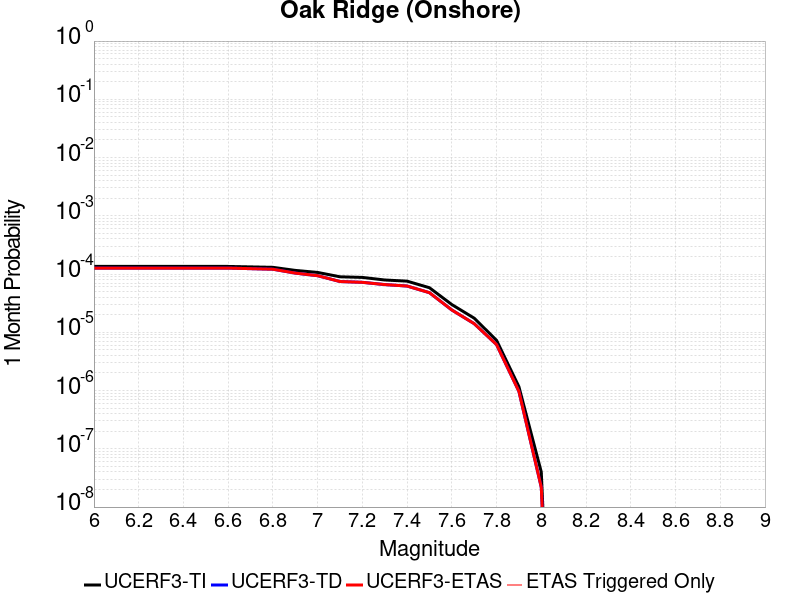 |  |  |

| Magnitude | 1 wk TI Prob | 1 wk TD Prob | 1 wk ETAS Prob | 1 wk ETAS/TD Gain | 1 wk ETAS Triggered Only | 1 mo TI Prob | 1 mo TD Prob | 1 mo ETAS Prob | 1 mo ETAS/TD Gain | 1 mo ETAS Triggered Only | 1 yr TI Prob | 1 yr TD Prob | 1 yr ETAS Prob | 1 yr ETAS/TD Gain | 1 yr ETAS Triggered Only | 10 yr TI Prob | 10 yr TD Prob | 10 yr ETAS Prob | 10 yr ETAS/TD Gain | 10 yr ETAS Triggered Only |
|-----|-----|-----|-----|-----|-----|-----|-----|-----|-----|-----|-----|-----|-----|-----|-----|-----|-----|-----|-----|-----|
| 6.0 | 3.155064E-5 | 2.9556595E-5 | 2.9556595E-5 | 1.0 | 0.0 | 1.3521002E-4 | 1.2666518E-4 | 1.2666518E-4 | 1.0 | 0.0 | 0.001644939 | 0.0015410958 | 0.0015410958 | 1.0 | 0.0 | 0.01632816 | 0.015308729 | 0.015318576 | 1.0006433 | 1.0E-5 |
| 6.1 | 3.155064E-5 | 2.9556595E-5 | 2.9556595E-5 | 1.0 | 0.0 | 1.3521002E-4 | 1.2666518E-4 | 1.2666518E-4 | 1.0 | 0.0 | 0.001644939 | 0.0015410958 | 0.0015410958 | 1.0 | 0.0 | 0.01632816 | 0.015308729 | 0.015318576 | 1.0006433 | 1.0E-5 |
| 6.2 | 3.155064E-5 | 2.9556595E-5 | 2.9556595E-5 | 1.0 | 0.0 | 1.3521002E-4 | 1.2666518E-4 | 1.2666518E-4 | 1.0 | 0.0 | 0.001644939 | 0.0015410958 | 0.0015410958 | 1.0 | 0.0 | 0.01632816 | 0.015308729 | 0.015318576 | 1.0006433 | 1.0E-5 |
| 6.3 | 3.155064E-5 | 2.9556595E-5 | 2.9556595E-5 | 1.0 | 0.0 | 1.3521002E-4 | 1.2666518E-4 | 1.2666518E-4 | 1.0 | 0.0 | 0.001644939 | 0.0015410958 | 0.0015410958 | 1.0 | 0.0 | 0.01632816 | 0.015308729 | 0.015318576 | 1.0006433 | 1.0E-5 |
| 6.4 | 3.155064E-5 | 2.9556595E-5 | 2.9556595E-5 | 1.0 | 0.0 | 1.3521002E-4 | 1.2666518E-4 | 1.2666518E-4 | 1.0 | 0.0 | 0.001644939 | 0.0015410958 | 0.0015410958 | 1.0 | 0.0 | 0.01632816 | 0.015308729 | 0.015318576 | 1.0006433 | 1.0E-5 |
| 6.5 | 3.155064E-5 | 2.9556595E-5 | 2.9556595E-5 | 1.0 | 0.0 | 1.3521002E-4 | 1.2666518E-4 | 1.2666518E-4 | 1.0 | 0.0 | 0.001644939 | 0.0015410958 | 0.0015410958 | 1.0 | 0.0 | 0.01632816 | 0.015308729 | 0.015318576 | 1.0006433 | 1.0E-5 |
| 6.6 | 3.155064E-5 | 2.9556595E-5 | 2.9556595E-5 | 1.0 | 0.0 | 1.3521002E-4 | 1.2666518E-4 | 1.2666518E-4 | 1.0 | 0.0 | 0.001644939 | 0.0015410958 | 0.0015410958 | 1.0 | 0.0 | 0.01632816 | 0.015308729 | 0.015318576 | 1.0006433 | 1.0E-5 |
| 6.7 | 3.098897E-5 | 2.8894132E-5 | 2.8894132E-5 | 1.0 | 0.0 | 1.328031E-4 | 1.2382634E-4 | 1.2382634E-4 | 1.0 | 0.0 | 0.0016156785 | 0.0015065807 | 0.0015065807 | 1.0 | 0.0 | 0.016039822 | 0.014968249 | 0.014978099 | 1.000658 | 1.0E-5 |
| 6.8 | 3.0449872E-5 | 2.826877E-5 | 2.826877E-5 | 1.0 | 0.0 | 1.3049292E-4 | 1.2114646E-4 | 1.2114646E-4 | 1.0 | 0.0 | 0.0015875935 | 0.0014739975 | 0.0014739975 | 1.0 | 0.0 | 0.015762992 | 0.014646715 | 0.014656568 | 1.0006727 | 1.0E-5 |
| 6.9 | 2.697928E-5 | 2.4245583E-5 | 2.4245583E-5 | 1.0 | 0.0 | 1.15620365E-4 | 1.0390562E-4 | 1.0390562E-4 | 1.0 | 0.0 | 0.0014067689 | 0.0012643384 | 0.0012643384 | 1.0 | 0.0 | 0.0139789665 | 0.012574302 | 0.012584176 | 1.0007852 | 1.0E-5 |
| 7.0 | 2.4893961E-5 | 2.1885888E-5 | 2.1885888E-5 | 1.0 | 0.0 | 1.0668404E-4 | 9.379339E-5 | 9.379339E-5 | 1.0 | 0.0 | 0.0012981043 | 0.0011413541 | 0.0011413541 | 1.0 | 0.0 | 0.012905477 | 0.01135734 | 0.01135734 | 1.0 | 0.0 |
| 7.1 | 2.0945363E-5 | 1.7374661E-5 | 1.7374661E-5 | 1.0 | 0.0 | 8.976275E-5 | 7.446073E-5 | 7.446073E-5 | 1.0 | 0.0 | 0.0010923136 | 9.061871E-4 | 9.061871E-4 | 1.0 | 0.0 | 0.0108696 | 0.009025986 | 0.009025986 | 1.0 | 0.0 |
| 7.2 | 2.0439404E-5 | 1.6829184E-5 | 1.6829184E-5 | 1.0 | 0.0 | 8.7594504E-5 | 7.212311E-5 | 7.212311E-5 | 1.0 | 0.0 | 0.0010659413 | 8.777498E-4 | 8.777498E-4 | 1.0 | 0.0 | 0.010608427 | 0.008743879 | 0.008743879 | 1.0 | 0.0 |
| 7.3 | 1.8463334E-5 | 1.539873E-5 | 1.539873E-5 | 1.0 | 0.0 | 7.912617E-5 | 6.599291E-5 | 6.599291E-5 | 1.0 | 0.0 | 9.6293533E-4 | 8.0317183E-4 | 8.0317183E-4 | 1.0 | 0.0 | 0.009587734 | 0.008003687 | 0.008003687 | 1.0 | 0.0 |
| 7.4 | 1.763139E-5 | 1.453269E-5 | 1.453269E-5 | 1.0 | 0.0 | 7.556091E-5 | 6.228149E-5 | 6.228149E-5 | 1.0 | 0.0 | 9.1956573E-4 | 7.5801736E-4 | 7.5801736E-4 | 1.0 | 0.0 | 0.009157699 | 0.007555255 | 0.007555255 | 1.0 | 0.0 |
| 7.5 | 1.3594944E-5 | 1.1176469E-5 | 1.1176469E-5 | 1.0 | 0.0 | 5.8262744E-5 | 4.7898287E-5 | 4.7898287E-5 | 1.0 | 0.0 | 7.0911803E-4 | 5.8300816E-4 | 5.8300816E-4 | 1.0 | 0.0 | 0.007068595 | 0.005815234 | 0.005815234 | 1.0 | 0.0 |
| 7.6 | 6.9889534E-6 | 5.6396198E-6 | 5.6396198E-6 | 1.0 | 0.0 | 2.9952313E-5 | 2.4169578E-5 | 2.4169578E-5 | 1.0 | 0.0 | 3.646084E-4 | 2.942253E-4 | 2.942253E-4 | 1.0 | 0.0 | 0.0036401073 | 0.0029384017 | 0.0029384017 | 1.0 | 0.0 |
| 7.7 | 4.0824193E-6 | 3.2852045E-6 | 3.2852045E-6 | 1.0 | 0.0 | 1.7495966E-5 | 1.4079372E-5 | 1.4079372E-5 | 1.0 | 0.0 | 2.1299256E-4 | 1.7140301E-4 | 1.7140301E-4 | 1.0 | 0.0 | 0.0021278851 | 0.0017127214 | 0.0017127214 | 1.0 | 0.0 |
| 7.8 | 1.7023609E-6 | 1.437845E-6 | 1.437845E-6 | 1.0 | 0.0 | 7.295812E-6 | 6.1621786E-6 | 6.1621786E-6 | 1.0 | 0.0 | 8.882289E-5 | 7.502197E-5 | 7.502197E-5 | 1.0 | 0.0 | 8.8787393E-4 | 7.499692E-4 | 7.499692E-4 | 1.0 | 0.0 |
| 7.9 | 2.721225E-7 | 2.262672E-7 | 2.262672E-7 | 1.0 | 0.0 | 1.1662388E-6 | 9.697162E-7 | 9.697162E-7 | 1.0 | 0.0 | 1.4198865E-5 | 1.1806234E-5 | 1.1806234E-5 | 1.0 | 0.0 | 1.4197957E-4 | 1.1805635E-4 | 1.1805635E-4 | 1.0 | 0.0 |
| 8.0 | 9.364255E-9 | 5.1314974E-9 | 5.1314974E-9 | 1.0 | 0.0 | 4.0132523E-8 | 2.1992133E-8 | 2.1992133E-8 | 1.0 | 0.0 | 4.8861335E-7 | 2.6775416E-7 | 2.6775416E-7 | 1.0 | 0.0 | 4.8861225E-6 | 2.6775388E-6 | 2.6775388E-6 | 1.0 | 0.0 |

## San Diego Trough south
*[(top)](#table-of-contents)*

| 1 Week | 1 Month | 1 Year | 10 Year |
|-----|-----|-----|-----|
|  |  |  |  |

| Magnitude | 1 wk TI Prob | 1 wk TD Prob | 1 wk ETAS Prob | 1 wk ETAS/TD Gain | 1 wk ETAS Triggered Only | 1 mo TI Prob | 1 mo TD Prob | 1 mo ETAS Prob | 1 mo ETAS/TD Gain | 1 mo ETAS Triggered Only | 1 yr TI Prob | 1 yr TD Prob | 1 yr ETAS Prob | 1 yr ETAS/TD Gain | 1 yr ETAS Triggered Only | 10 yr TI Prob | 10 yr TD Prob | 10 yr ETAS Prob | 10 yr ETAS/TD Gain | 10 yr ETAS Triggered Only |
|-----|-----|-----|-----|-----|-----|-----|-----|-----|-----|-----|-----|-----|-----|-----|-----|-----|-----|-----|-----|-----|
| 6.0 | 8.279495E-5 | 1.044034E-4 | 1.044034E-4 | 1.0 | 0.0 | 3.5478722E-4 | 4.4736237E-4 | 4.4736237E-4 | 1.0 | 0.0 | 0.004310982 | 0.0054335385 | 0.0054335385 | 1.0 | 0.0 | 0.042283054 | 0.053064886 | 0.053074356 | 1.0001785 | 1.0E-5 |
| 6.1 | 4.6961468E-5 | 5.7803503E-5 | 5.7803503E-5 | 1.0 | 0.0 | 2.0124791E-4 | 2.4770614E-4 | 2.4770614E-4 | 1.0 | 0.0 | 0.00244744 | 0.0030117221 | 0.0030117221 | 1.0 | 0.0 | 0.024206603 | 0.029716685 | 0.029726388 | 1.0003265 | 1.0E-5 |
| 6.2 | 3.5079658E-5 | 4.2190553E-5 | 4.2190553E-5 | 1.0 | 0.0 | 1.5033272E-4 | 1.8080376E-4 | 1.8080376E-4 | 1.0 | 0.0 | 0.0018287642 | 0.0021990812 | 0.0021990812 | 1.0 | 0.0 | 0.018137876 | 0.021775542 | 0.021785324 | 1.0004492 | 1.0E-5 |
| 6.3 | 3.5079658E-5 | 4.2190553E-5 | 4.2190553E-5 | 1.0 | 0.0 | 1.5033272E-4 | 1.8080376E-4 | 1.8080376E-4 | 1.0 | 0.0 | 0.0018287642 | 0.0021990812 | 0.0021990812 | 1.0 | 0.0 | 0.018137876 | 0.021775542 | 0.021785324 | 1.0004492 | 1.0E-5 |
| 6.4 | 2.7196904E-5 | 3.2119835E-5 | 3.2119835E-5 | 1.0 | 0.0 | 1.16552954E-4 | 1.3764923E-4 | 1.3764923E-4 | 1.0 | 0.0 | 0.0014181085 | 0.0016746031 | 0.0016746031 | 1.0 | 0.0 | 0.014090929 | 0.016621428 | 0.01663126 | 1.0005916 | 1.0E-5 |
| 6.5 | 2.5584688E-5 | 3.0131734E-5 | 3.0131734E-5 | 1.0 | 0.0 | 1.0964406E-4 | 1.291297E-4 | 1.291297E-4 | 1.0 | 0.0 | 0.0013340989 | 0.0015710322 | 0.0015710322 | 1.0 | 0.0 | 0.013261181 | 0.015600793 | 0.015610637 | 1.000631 | 1.0E-5 |
| 6.6 | 2.2034688E-5 | 2.5767253E-5 | 2.5767253E-5 | 1.0 | 0.0 | 9.443096E-5 | 1.1042646E-4 | 1.1042646E-4 | 1.0 | 0.0 | 0.0011490905 | 0.0013436206 | 0.0013436206 | 1.0 | 0.0 | 0.011431668 | 0.013355961 | 0.0133658275 | 1.0007387 | 1.0E-5 |
| 6.7 | 1.9394853E-5 | 2.256248E-5 | 2.256248E-5 | 1.0 | 0.0 | 8.311815E-5 | 9.669279E-5 | 9.669279E-5 | 1.0 | 0.0 | 0.0010114936 | 0.0011766042 | 0.0011766042 | 1.0 | 0.0 | 0.01006902 | 0.011704452 | 0.0117143355 | 1.0008444 | 1.0E-5 |
| 6.8 | 1.7615313E-5 | 2.0421458E-5 | 2.0421458E-5 | 1.0 | 0.0 | 7.549201E-5 | 8.751762E-5 | 8.751762E-5 | 1.0 | 0.0 | 9.1872766E-4 | 0.0010650106 | 0.0010650106 | 1.0 | 0.0 | 0.009149387 | 0.010599634 | 0.010609528 | 1.0009334 | 1.0E-5 |
| 6.9 | 1.5621423E-5 | 1.8041805E-5 | 1.8041805E-5 | 1.0 | 0.0 | 6.6947236E-5 | 7.731975E-5 | 7.731975E-5 | 1.0 | 0.0 | 8.147778E-4 | 9.4096496E-4 | 9.4096496E-4 | 1.0 | 0.0 | 0.008117969 | 0.0093702525 | 0.009380159 | 1.0010571 | 1.0E-5 |
| 7.0 | 1.3444376E-5 | 1.5461097E-5 | 1.5461097E-5 | 1.0 | 0.0 | 5.7617483E-5 | 6.6260174E-5 | 6.6260174E-5 | 1.0 | 0.0 | 7.0126704E-4 | 8.0642186E-4 | 8.0642186E-4 | 1.0 | 0.0 | 0.006990582 | 0.008035289 | 0.008035289 | 1.0 | 0.0 |
| 7.1 | 1.2268361E-5 | 1.4084725E-5 | 1.4084725E-5 | 1.0 | 0.0 | 5.2577634E-5 | 6.0361726E-5 | 6.0361726E-5 | 1.0 | 0.0 | 6.399447E-4 | 7.3465885E-4 | 7.3465885E-4 | 1.0 | 0.0 | 0.0063810493 | 0.0073226076 | 0.0073226076 | 1.0 | 0.0 |
| 7.2 | 1.0922655E-5 | 1.2523862E-5 | 1.2523862E-5 | 1.0 | 0.0 | 4.681054E-5 | 5.3672607E-5 | 5.3672607E-5 | 1.0 | 0.0 | 5.697693E-4 | 6.532706E-4 | 6.532706E-4 | 1.0 | 0.0 | 0.0056831064 | 0.0065137832 | 0.0065137832 | 1.0 | 0.0 |
| 7.3 | 6.1106753E-6 | 6.9341727E-6 | 6.9341727E-6 | 1.0 | 0.0 | 2.6188345E-5 | 2.9717547E-5 | 2.9717547E-5 | 1.0 | 0.0 | 3.1879646E-4 | 3.6175147E-4 | 3.6175147E-4 | 1.0 | 0.0 | 0.0031833951 | 0.0036116713 | 0.0036116713 | 1.0 | 0.0 |
| 7.4 | 4.933187E-6 | 5.5937626E-6 | 5.5937626E-6 | 1.0 | 0.0 | 2.114206E-5 | 2.3973049E-5 | 2.3973049E-5 | 1.0 | 0.0 | 2.5737417E-4 | 2.918332E-4 | 2.918332E-4 | 1.0 | 0.0 | 0.002570763 | 0.0029145407 | 0.0029145407 | 1.0 | 0.0 |
| 7.5 | 1.7489613E-6 | 1.9710953E-6 | 1.9710953E-6 | 1.0 | 0.0 | 7.495527E-6 | 8.447525E-6 | 8.447525E-6 | 1.0 | 0.0 | 9.125422E-5 | 1.0284399E-4 | 1.0284399E-4 | 1.0 | 0.0 | 9.1216754E-4 | 0.0010279859 | 0.0010279859 | 1.0 | 0.0 |
| 7.6 | 1.6988751E-7 | 1.7536988E-7 | 1.7536988E-7 | 1.0 | 0.0 | 7.2808916E-7 | 7.51585E-7 | 7.51585E-7 | 1.0 | 0.0 | 8.864449E-6 | 9.150511E-6 | 9.150511E-6 | 1.0 | 0.0 | 8.8640954E-5 | 9.150154E-5 | 9.150154E-5 | 1.0 | 0.0 |

## Elysian Park (Upper)
*[(top)](#table-of-contents)*

| 1 Week | 1 Month | 1 Year | 10 Year |
|-----|-----|-----|-----|
|  |  |  |  |

| Magnitude | 1 wk TI Prob | 1 wk TD Prob | 1 wk ETAS Prob | 1 wk ETAS/TD Gain | 1 wk ETAS Triggered Only | 1 mo TI Prob | 1 mo TD Prob | 1 mo ETAS Prob | 1 mo ETAS/TD Gain | 1 mo ETAS Triggered Only | 1 yr TI Prob | 1 yr TD Prob | 1 yr ETAS Prob | 1 yr ETAS/TD Gain | 1 yr ETAS Triggered Only | 10 yr TI Prob | 10 yr TD Prob | 10 yr ETAS Prob | 10 yr ETAS/TD Gain | 10 yr ETAS Triggered Only |
|-----|-----|-----|-----|-----|-----|-----|-----|-----|-----|-----|-----|-----|-----|-----|-----|-----|-----|-----|-----|-----|
| 6.0 | 3.1876025E-5 | 3.7077545E-5 | 3.7077545E-5 | 1.0 | 0.0 | 1.3660437E-4 | 1.5889683E-4 | 1.5889683E-4 | 1.0 | 0.0 | 0.0016618895 | 0.0019333293 | 0.0019333293 | 1.0 | 0.0 | 0.016495159 | 0.019211618 | 0.019221427 | 1.0005106 | 1.0E-5 |
| 6.1 | 3.1876025E-5 | 3.7077545E-5 | 3.7077545E-5 | 1.0 | 0.0 | 1.3660437E-4 | 1.5889683E-4 | 1.5889683E-4 | 1.0 | 0.0 | 0.0016618895 | 0.0019333293 | 0.0019333293 | 1.0 | 0.0 | 0.016495159 | 0.019211618 | 0.019221427 | 1.0005106 | 1.0E-5 |
| 6.2 | 3.1876025E-5 | 3.7077545E-5 | 3.7077545E-5 | 1.0 | 0.0 | 1.3660437E-4 | 1.5889683E-4 | 1.5889683E-4 | 1.0 | 0.0 | 0.0016618895 | 0.0019333293 | 0.0019333293 | 1.0 | 0.0 | 0.016495159 | 0.019211618 | 0.019221427 | 1.0005106 | 1.0E-5 |
| 6.3 | 3.1876025E-5 | 3.7077545E-5 | 3.7077545E-5 | 1.0 | 0.0 | 1.3660437E-4 | 1.5889683E-4 | 1.5889683E-4 | 1.0 | 0.0 | 0.0016618895 | 0.0019333293 | 0.0019333293 | 1.0 | 0.0 | 0.016495159 | 0.019211618 | 0.019221427 | 1.0005106 | 1.0E-5 |
| 6.4 | 1.9273462E-5 | 2.1222253E-5 | 2.1222253E-5 | 1.0 | 0.0 | 8.259794E-5 | 9.095032E-5 | 9.095032E-5 | 1.0 | 0.0 | 0.001005166 | 0.0011069297 | 0.0011069297 | 1.0 | 0.0 | 0.010006315 | 0.011030999 | 0.011030999 | 1.0 | 0.0 |
| 6.5 | 1.9273462E-5 | 2.1222253E-5 | 2.1222253E-5 | 1.0 | 0.0 | 8.259794E-5 | 9.095032E-5 | 9.095032E-5 | 1.0 | 0.0 | 0.001005166 | 0.0011069297 | 0.0011069297 | 1.0 | 0.0 | 0.010006315 | 0.011030999 | 0.011030999 | 1.0 | 0.0 |
| 6.6 | 9.813258E-6 | 9.671207E-6 | 9.671207E-6 | 1.0 | 0.0 | 4.205614E-5 | 4.1447413E-5 | 4.1447413E-5 | 1.0 | 0.0 | 5.119132E-4 | 5.045127E-4 | 5.045127E-4 | 1.0 | 0.0 | 0.005107356 | 0.005034398 | 0.005034398 | 1.0 | 0.0 |
| 6.7 | 9.801478E-6 | 9.658773E-6 | 9.658773E-6 | 1.0 | 0.0 | 4.2005657E-5 | 4.1394123E-5 | 4.1394123E-5 | 1.0 | 0.0 | 5.112989E-4 | 5.038642E-4 | 5.038642E-4 | 1.0 | 0.0 | 0.0051012407 | 0.0050279424 | 0.0050279424 | 1.0 | 0.0 |
| 6.8 | 8.102489E-6 | 7.777476E-6 | 7.777476E-6 | 1.0 | 0.0 | 3.4724493E-5 | 3.333164E-5 | 3.333164E-5 | 1.0 | 0.0 | 4.2268867E-4 | 4.0574212E-4 | 4.0574212E-4 | 1.0 | 0.0 | 0.004218856 | 0.004050508 | 0.004050508 | 1.0 | 0.0 |
| 6.9 | 6.08275E-6 | 5.484186E-6 | 5.484186E-6 | 1.0 | 0.0 | 2.6068668E-5 | 2.3503448E-5 | 2.3503448E-5 | 1.0 | 0.0 | 3.173398E-4 | 2.8611766E-4 | 2.8611766E-4 | 1.0 | 0.0 | 0.0031688702 | 0.0028575708 | 0.0028575708 | 1.0 | 0.0 |
| 7.0 | 5.5995934E-6 | 4.985263E-6 | 4.985263E-6 | 1.0 | 0.0 | 2.3998036E-5 | 2.1365242E-5 | 2.1365242E-5 | 1.0 | 0.0 | 2.9213692E-4 | 2.6009144E-4 | 2.6009144E-4 | 1.0 | 0.0 | 0.0029175316 | 0.0025979376 | 0.0025979376 | 1.0 | 0.0 |
| 7.1 | 4.709881E-6 | 4.089447E-6 | 4.089447E-6 | 1.0 | 0.0 | 2.0185047E-5 | 1.7526085E-5 | 1.7526085E-5 | 1.0 | 0.0 | 2.4572524E-4 | 2.1335961E-4 | 2.1335961E-4 | 1.0 | 0.0 | 0.002454537 | 0.0021315892 | 0.0021315892 | 1.0 | 0.0 |
| 7.2 | 3.6063436E-6 | 2.9794394E-6 | 2.9794394E-6 | 1.0 | 0.0 | 1.5455667E-5 | 1.2768965E-5 | 1.2768965E-5 | 1.0 | 0.0 | 1.881565E-4 | 1.5545115E-4 | 1.5545115E-4 | 1.0 | 0.0 | 0.0018799726 | 0.0015534355 | 0.0015534355 | 1.0 | 0.0 |
| 7.3 | 2.471135E-6 | 2.0965454E-6 | 2.0965454E-6 | 1.0 | 0.0 | 1.0590536E-5 | 8.985164E-6 | 8.985164E-6 | 1.0 | 0.0 | 1.2893214E-4 | 1.0938895E-4 | 1.0938895E-4 | 1.0 | 0.0 | 0.0012885736 | 0.0010933583 | 0.0010933583 | 1.0 | 0.0 |
| 7.4 | 1.163943E-6 | 1.028153E-6 | 1.028153E-6 | 1.0 | 0.0 | 4.988318E-6 | 4.4063627E-6 | 4.4063627E-6 | 1.0 | 0.0 | 6.0731076E-5 | 5.3646174E-5 | 5.3646174E-5 | 1.0 | 0.0 | 6.071448E-4 | 5.363352E-4 | 5.363352E-4 | 1.0 | 0.0 |
| 7.5 | 4.99459E-7 | 4.9203555E-7 | 4.9203555E-7 | 1.0 | 0.0 | 2.140537E-6 | 2.1087221E-6 | 2.1087221E-6 | 1.0 | 0.0 | 2.6060725E-5 | 2.5673406E-5 | 2.5673406E-5 | 1.0 | 0.0 | 2.605767E-4 | 2.5670597E-4 | 2.5670597E-4 | 1.0 | 0.0 |
| 7.6 | 2.4667852E-7 | 2.4792715E-7 | 2.4792715E-7 | 1.0 | 0.0 | 1.0571932E-6 | 1.0625446E-6 | 1.0625446E-6 | 1.0 | 0.0 | 1.2871251E-5 | 1.2936407E-5 | 1.2936407E-5 | 1.0 | 0.0 | 1.2870505E-4 | 1.2935691E-4 | 1.2935691E-4 | 1.0 | 0.0 |
| 7.7 | 8.2312795E-8 | 7.394253E-8 | 7.394253E-8 | 1.0 | 0.0 | 3.527691E-7 | 3.1689652E-7 | 3.1689652E-7 | 1.0 | 0.0 | 4.294955E-6 | 3.8582093E-6 | 3.8582093E-6 | 1.0 | 0.0 | 4.2948723E-5 | 3.858154E-5 | 3.858154E-5 | 1.0 | 0.0 |
| 7.8 | 2.7819295E-8 | 1.7621199E-8 | 1.7621199E-8 | 1.0 | 0.0 | 1.1922555E-7 | 7.551942E-8 | 7.551942E-8 | 1.0 | 0.0 | 1.45157E-6 | 9.194487E-7 | 9.194487E-7 | 1.0 | 0.0 | 1.45156055E-5 | 9.194464E-6 | 9.194464E-6 | 1.0 | 0.0 |

## Hosgri
*[(top)](#table-of-contents)*

| 1 Week | 1 Month | 1 Year | 10 Year |
|-----|-----|-----|-----|
|  |  |  |  |

| Magnitude | 1 wk TI Prob | 1 wk TD Prob | 1 wk ETAS Prob | 1 wk ETAS/TD Gain | 1 wk ETAS Triggered Only | 1 mo TI Prob | 1 mo TD Prob | 1 mo ETAS Prob | 1 mo ETAS/TD Gain | 1 mo ETAS Triggered Only | 1 yr TI Prob | 1 yr TD Prob | 1 yr ETAS Prob | 1 yr ETAS/TD Gain | 1 yr ETAS Triggered Only | 10 yr TI Prob | 10 yr TD Prob | 10 yr ETAS Prob | 10 yr ETAS/TD Gain | 10 yr ETAS Triggered Only |
|-----|-----|-----|-----|-----|-----|-----|-----|-----|-----|-----|-----|-----|-----|-----|-----|-----|-----|-----|-----|-----|
| 6.0 | 2.883978E-5 | 2.9147013E-5 | 2.9147013E-5 | 1.0 | 0.0 | 1.235932E-4 | 1.2490994E-4 | 1.2490994E-4 | 1.0 | 0.0 | 0.0015037085 | 0.001519745 | 0.001519745 | 1.0 | 0.0 | 0.01493574 | 0.01509731 | 0.015107159 | 1.0006523 | 1.0E-5 |
| 6.1 | 2.883978E-5 | 2.9147013E-5 | 2.9147013E-5 | 1.0 | 0.0 | 1.235932E-4 | 1.2490994E-4 | 1.2490994E-4 | 1.0 | 0.0 | 0.0015037085 | 0.001519745 | 0.001519745 | 1.0 | 0.0 | 0.01493574 | 0.01509731 | 0.015107159 | 1.0006523 | 1.0E-5 |
| 6.2 | 2.883978E-5 | 2.9147013E-5 | 2.9147013E-5 | 1.0 | 0.0 | 1.235932E-4 | 1.2490994E-4 | 1.2490994E-4 | 1.0 | 0.0 | 0.0015037085 | 0.001519745 | 0.001519745 | 1.0 | 0.0 | 0.01493574 | 0.01509731 | 0.015107159 | 1.0006523 | 1.0E-5 |
| 6.3 | 2.2914428E-5 | 2.26571E-5 | 2.26571E-5 | 1.0 | 0.0 | 9.8200995E-5 | 9.7098266E-5 | 9.7098266E-5 | 1.0 | 0.0 | 0.0011949413 | 0.0011815352 | 0.0011815352 | 1.0 | 0.0 | 0.011885363 | 0.011753944 | 0.011763827 | 1.0008408 | 1.0E-5 |
| 6.4 | 2.0195741E-5 | 1.9710304E-5 | 1.9710304E-5 | 1.0 | 0.0 | 8.65503E-5 | 8.447001E-5 | 8.447001E-5 | 1.0 | 0.0 | 0.0010532405 | 0.0010279391 | 0.0010279391 | 1.0 | 0.0 | 0.010482626 | 0.0102329 | 0.010242797 | 1.0009673 | 1.0E-5 |
| 6.5 | 1.9924333E-5 | 1.9422621E-5 | 1.9422621E-5 | 1.0 | 0.0 | 8.53872E-5 | 8.323716E-5 | 8.323716E-5 | 1.0 | 0.0 | 0.0010390934 | 0.0010129432 | 0.0010129432 | 1.0 | 0.0 | 0.010342481 | 0.010084308 | 0.010094207 | 1.0009817 | 1.0E-5 |
| 6.6 | 1.809694E-5 | 1.7471153E-5 | 1.7471153E-5 | 1.0 | 0.0 | 7.7556004E-5 | 7.4874224E-5 | 7.4874224E-5 | 1.0 | 0.0 | 9.438353E-4 | 9.1121375E-4 | 9.1121375E-4 | 1.0 | 0.0 | 0.009398366 | 0.009075727 | 0.009085637 | 1.0010918 | 1.0E-5 |
| 6.7 | 1.675989E-5 | 1.6055079E-5 | 1.6055079E-5 | 1.0 | 0.0 | 7.182612E-5 | 6.8805675E-5 | 6.8805675E-5 | 1.0 | 0.0 | 8.7413215E-4 | 8.373882E-4 | 8.373882E-4 | 1.0 | 0.0 | 0.008707017 | 0.008343244 | 0.008353161 | 1.0011885 | 1.0E-5 |
| 6.8 | 1.5401129E-5 | 1.4625865E-5 | 1.4625865E-5 | 1.0 | 0.0 | 6.6003166E-5 | 6.268078E-5 | 6.268078E-5 | 1.0 | 0.0 | 8.032922E-4 | 7.6287217E-4 | 7.6287217E-4 | 1.0 | 0.0 | 0.008003947 | 0.007603407 | 0.007603407 | 1.0 | 0.0 |
| 6.9 | 1.356559E-5 | 1.2701038E-5 | 1.2701038E-5 | 1.0 | 0.0 | 5.8136946E-5 | 5.443189E-5 | 5.443189E-5 | 1.0 | 0.0 | 7.0758746E-4 | 6.625072E-4 | 6.625072E-4 | 1.0 | 0.0 | 0.007053386 | 0.0066061355 | 0.0066061355 | 1.0 | 0.0 |
| 7.0 | 1.2030819E-5 | 1.11063955E-5 | 1.11063955E-5 | 1.0 | 0.0 | 5.155963E-5 | 4.759797E-5 | 4.759797E-5 | 1.0 | 0.0 | 6.275577E-4 | 5.793513E-4 | 5.793513E-4 | 1.0 | 0.0 | 0.006257884 | 0.005779179 | 0.005779179 | 1.0 | 0.0 |
| 7.1 | 1.0972698E-5 | 1.0032196E-5 | 1.0032196E-5 | 1.0 | 0.0 | 4.7025E-5 | 4.2994416E-5 | 4.2994416E-5 | 1.0 | 0.0 | 5.72379E-4 | 5.233314E-4 | 5.233314E-4 | 1.0 | 0.0 | 0.0057090693 | 0.0052217506 | 0.0052217506 | 1.0 | 0.0 |
| 7.2 | 9.961926E-6 | 9.044454E-6 | 9.044454E-6 | 1.0 | 0.0 | 4.2693267E-5 | 3.876137E-5 | 3.876137E-5 | 1.0 | 0.0 | 5.1966653E-4 | 4.7181753E-4 | 4.7181753E-4 | 1.0 | 0.0 | 0.00518453 | 0.004708913 | 0.004708913 | 1.0 | 0.0 |
| 7.3 | 8.700929E-6 | 7.837471E-6 | 7.837471E-6 | 1.0 | 0.0 | 3.7289166E-5 | 3.3588727E-5 | 3.3588727E-5 | 1.0 | 0.0 | 4.53901E-4 | 4.0886604E-4 | 4.0886604E-4 | 1.0 | 0.0 | 0.00452975 | 0.0040818863 | 0.0040818863 | 1.0 | 0.0 |
| 7.4 | 7.866285E-6 | 7.007855E-6 | 7.007855E-6 | 1.0 | 0.0 | 3.3712215E-5 | 3.0033318E-5 | 3.0033318E-5 | 1.0 | 0.0 | 4.103689E-4 | 3.6559431E-4 | 3.6559431E-4 | 1.0 | 0.0 | 0.004096119 | 0.0036506748 | 0.0036506748 | 1.0 | 0.0 |
| 7.5 | 6.8381305E-6 | 5.9684867E-6 | 5.9684867E-6 | 1.0 | 0.0 | 2.9305946E-5 | 2.5578976E-5 | 2.5578976E-5 | 1.0 | 0.0 | 3.5674145E-4 | 3.1137958E-4 | 3.1137958E-4 | 1.0 | 0.0 | 0.0035616932 | 0.0031101764 | 0.0031101764 | 1.0 | 0.0 |
| 7.6 | 5.503376E-6 | 4.603562E-6 | 4.603562E-6 | 1.0 | 0.0 | 2.3585684E-5 | 1.9729403E-5 | 1.9729403E-5 | 1.0 | 0.0 | 2.8711787E-4 | 2.4017901E-4 | 2.4017901E-4 | 1.0 | 0.0 | 0.002867472 | 0.002399936 | 0.002399936 | 1.0 | 0.0 |
| 7.7 | 3.6144982E-6 | 2.6597554E-6 | 2.6597554E-6 | 1.0 | 0.0 | 1.5490614E-5 | 1.1398902E-5 | 1.1398902E-5 | 1.0 | 0.0 | 1.8858191E-4 | 1.387728E-4 | 1.387728E-4 | 1.0 | 0.0 | 0.0018842196 | 0.0013876014 | 0.0013876014 | 1.0 | 0.0 |
| 7.8 | 1.9853494E-6 | 1.1423446E-6 | 1.1423446E-6 | 1.0 | 0.0 | 8.508612E-6 | 4.895753E-6 | 4.895753E-6 | 1.0 | 0.0 | 1.0358743E-4 | 5.9604165E-5 | 5.9604165E-5 | 1.0 | 0.0 | 0.0010353916 | 5.966203E-4 | 5.966203E-4 | 1.0 | 0.0 |
| 7.9 | 1.1818757E-6 | 5.3426476E-7 | 5.3426476E-7 | 1.0 | 0.0 | 5.0651715E-6 | 2.289704E-6 | 2.289704E-6 | 1.0 | 0.0 | 6.1666724E-5 | 2.787679E-5 | 2.787679E-5 | 1.0 | 0.0 | 6.1649614E-4 | 2.7943164E-4 | 2.7943164E-4 | 1.0 | 0.0 |
| 8.0 | 6.962958E-7 | 2.7459228E-7 | 2.7459228E-7 | 1.0 | 0.0 | 2.9841215E-6 | 1.1768235E-6 | 1.1768235E-6 | 1.0 | 0.0 | 3.6331072E-5 | 1.4327732E-5 | 1.4327732E-5 | 1.0 | 0.0 | 3.6325134E-4 | 1.4384619E-4 | 1.4384619E-4 | 1.0 | 0.0 |
| 8.1 | 1.5033264E-7 | 6.596487E-8 | 6.596487E-8 | 1.0 | 0.0 | 6.442826E-7 | 2.8270654E-7 | 2.8270654E-7 | 1.0 | 0.0 | 7.844113E-6 | 3.4419468E-6 | 3.4419468E-6 | 1.0 | 0.0 | 7.843835E-5 | 3.443866E-5 | 3.443866E-5 | 1.0 | 0.0 |

## San Andreas (Creeping Section) 2011 CFM
*[(top)](#table-of-contents)*

| 1 Week | 1 Month | 1 Year | 10 Year |
|-----|-----|-----|-----|
|  |  | 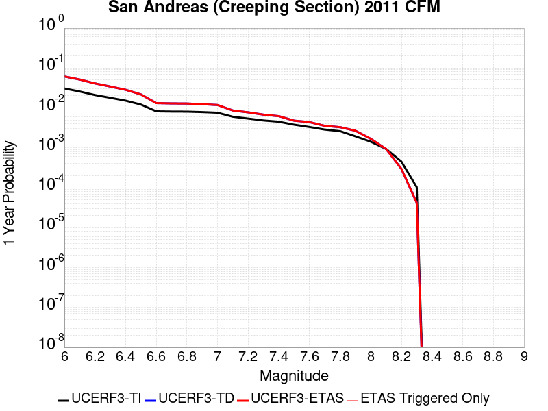 | 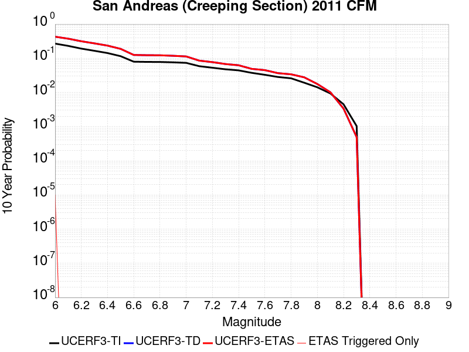 |

| Magnitude | 1 wk TI Prob | 1 wk TD Prob | 1 wk ETAS Prob | 1 wk ETAS/TD Gain | 1 wk ETAS Triggered Only | 1 mo TI Prob | 1 mo TD Prob | 1 mo ETAS Prob | 1 mo ETAS/TD Gain | 1 mo ETAS Triggered Only | 1 yr TI Prob | 1 yr TD Prob | 1 yr ETAS Prob | 1 yr ETAS/TD Gain | 1 yr ETAS Triggered Only | 10 yr TI Prob | 10 yr TD Prob | 10 yr ETAS Prob | 10 yr ETAS/TD Gain | 10 yr ETAS Triggered Only |
|-----|-----|-----|-----|-----|-----|-----|-----|-----|-----|-----|-----|-----|-----|-----|-----|-----|-----|-----|-----|-----|
| 6.0 | 5.986481E-4 | 0.0012325553 | 0.0012325553 | 1.0 | 0.0 | 0.0025631124 | 0.005266854 | 0.005266854 | 1.0 | 0.0 | 0.030762846 | 0.06144948 | 0.06144948 | 1.0 | 0.0 | 0.26835477 | 0.42722628 | 0.427232 | 1.0000134 | 1.0E-5 |
| 6.1 | 5.015945E-4 | 0.0010258537 | 0.0010258537 | 1.0 | 0.0 | 0.00214792 | 0.004385292 | 0.004385292 | 1.0 | 0.0 | 0.025839351 | 0.051450968 | 0.051450968 | 1.0 | 0.0 | 0.23032776 | 0.3740849 | 0.3740849 | 1.0 | 0.0 |
| 6.2 | 4.073338E-4 | 8.1474165E-4 | 8.1474165E-4 | 1.0 | 0.0 | 0.0017445484 | 0.0034843285 | 0.0034843285 | 1.0 | 0.0 | 0.021034058 | 0.041134704 | 0.041134704 | 1.0 | 0.0 | 0.19150782 | 0.3143651 | 0.3143651 | 1.0 | 0.0 |
| 6.3 | 3.464099E-4 | 6.7793916E-4 | 6.7793916E-4 | 1.0 | 0.0 | 0.0014837692 | 0.0029001664 | 0.0029001664 | 1.0 | 0.0 | 0.017915873 | 0.034392558 | 0.034392558 | 1.0 | 0.0 | 0.16538359 | 0.27272856 | 0.27272856 | 1.0 | 0.0 |
| 6.4 | 2.935057E-4 | 5.584641E-4 | 5.584641E-4 | 1.0 | 0.0 | 0.0012572751 | 0.0023898159 | 0.0023898159 | 1.0 | 0.0 | 0.015200248 | 0.028469477 | 0.028469477 | 1.0 | 0.0 | 0.14201577 | 0.2344757 | 0.2344757 | 1.0 | 0.0 |
| 6.5 | 2.3409708E-4 | 4.2496185E-4 | 4.2496185E-4 | 1.0 | 0.0 | 0.0010028875 | 0.0018192625 | 0.0018192625 | 1.0 | 0.0 | 0.012141965 | 0.0217939 | 0.0217939 | 1.0 | 0.0 | 0.11499573 | 0.18840386 | 0.18840386 | 1.0 | 0.0 |
| 6.6 | 1.5842178E-4 | 2.5470764E-4 | 2.5470764E-4 | 1.0 | 0.0 | 6.7877385E-4 | 0.0010911382 | 0.0010911382 | 1.0 | 0.0 | 0.0082328 | 0.013202358 | 0.013202358 | 1.0 | 0.0 | 0.07934396 | 0.12483977 | 0.12483977 | 1.0 | 0.0 |
| 6.7 | 1.5616413E-4 | 2.5006253E-4 | 2.5006253E-4 | 1.0 | 0.0 | 6.691031E-4 | 0.0010712504 | 0.0010712504 | 1.0 | 0.0 | 0.0081159435 | 0.012963722 | 0.012963722 | 1.0 | 0.0 | 0.0782586 | 0.12286673 | 0.12286673 | 1.0 | 0.0 |
| 6.8 | 1.5538467E-4 | 2.4829208E-4 | 2.4829208E-4 | 1.0 | 0.0 | 6.6576427E-4 | 0.0010636697 | 0.0010636697 | 1.0 | 0.0 | 0.008075596 | 0.012872641 | 0.012872641 | 1.0 | 0.0 | 0.07788358 | 0.12209562 | 0.12209562 | 1.0 | 0.0 |
| 6.9 | 1.5153569E-4 | 2.393508E-4 | 2.393508E-4 | 1.0 | 0.0 | 6.49277E-4 | 0.0010253879 | 0.0010253879 | 1.0 | 0.0 | 0.007876333 | 0.012413176 | 0.012413176 | 1.0 | 0.0 | 0.07602952 | 0.11816019 | 0.11816019 | 1.0 | 0.0 |
| 7.0 | 1.4588932E-4 | 2.2785114E-4 | 2.2785114E-4 | 1.0 | 0.0 | 6.250901E-4 | 9.761414E-4 | 9.761414E-4 | 1.0 | 0.0 | 0.0075839474 | 0.011820274 | 0.011820274 | 1.0 | 0.0 | 0.073302895 | 0.11298796 | 0.11298796 | 1.0 | 0.0 |
| 7.1 | 1.1565079E-4 | 1.6616726E-4 | 1.6616726E-4 | 1.0 | 0.0 | 4.955521E-4 | 7.1195187E-4 | 7.1195187E-4 | 1.0 | 0.0 | 0.006016669 | 0.008633775 | 0.008633775 | 1.0 | 0.0 | 0.058563538 | 0.08517011 | 0.08517011 | 1.0 | 0.0 |
| 7.2 | 1.0393792E-4 | 1.4929587E-4 | 1.4929587E-4 | 1.0 | 0.0 | 4.4537216E-4 | 6.3968333E-4 | 6.3968333E-4 | 1.0 | 0.0 | 0.005408933 | 0.0077605103 | 0.0077605103 | 1.0 | 0.0 | 0.052791595 | 0.077039525 | 0.077039525 | 1.0 | 0.0 |
| 7.3 | 9.332884E-5 | 1.3056838E-4 | 1.3056838E-4 | 1.0 | 0.0 | 3.999194E-4 | 5.594594E-4 | 5.594594E-4 | 1.0 | 0.0 | 0.0048581534 | 0.006790285 | 0.006790285 | 1.0 | 0.0 | 0.047533102 | 0.06775478 | 0.06775478 | 1.0 | 0.0 |
| 7.4 | 8.670252E-5 | 1.1963028E-4 | 1.1963028E-4 | 1.0 | 0.0 | 3.715293E-4 | 5.1260105E-4 | 5.1260105E-4 | 1.0 | 0.0 | 0.004513991 | 0.006223184 | 0.006223184 | 1.0 | 0.0 | 0.044233937 | 0.062357232 | 0.062357232 | 1.0 | 0.0 |
| 7.5 | 7.3036405E-5 | 9.225246E-5 | 9.225246E-5 | 1.0 | 0.0 | 3.129756E-4 | 3.9530787E-4 | 3.9530787E-4 | 1.0 | 0.0 | 0.0038038217 | 0.004802275 | 0.004802275 | 1.0 | 0.0 | 0.03739367 | 0.048923004 | 0.048923004 | 1.0 | 0.0 |
| 7.6 | 6.3935775E-5 | 8.4789404E-5 | 8.4789404E-5 | 1.0 | 0.0 | 2.7398168E-4 | 3.6333266E-4 | 3.6333266E-4 | 1.0 | 0.0 | 0.0033306254 | 0.004414622 | 0.004414622 | 1.0 | 0.0 | 0.032811474 | 0.04493806 | 0.04493806 | 1.0 | 0.0 |
| 7.7 | 5.5050095E-5 | 6.8378184E-5 | 6.8378184E-5 | 1.0 | 0.0 | 2.3590765E-4 | 2.9301646E-4 | 2.9301646E-4 | 1.0 | 0.0 | 0.0028683927 | 0.0035616441 | 0.0035616441 | 1.0 | 0.0 | 0.0283165 | 0.036648374 | 0.036648374 | 1.0 | 0.0 |
| 7.8 | 5.027131E-5 | 6.323841E-5 | 6.323841E-5 | 1.0 | 0.0 | 2.1543067E-4 | 2.7099362E-4 | 2.7099362E-4 | 1.0 | 0.0 | 0.0026197135 | 0.0032943594 | 0.0032943594 | 1.0 | 0.0 | 0.025890453 | 0.033908583 | 0.033908583 | 1.0 | 0.0 |
| 7.9 | 3.7271806E-5 | 5.152281E-5 | 5.152281E-5 | 1.0 | 0.0 | 1.5972654E-4 | 2.2079336E-4 | 2.2079336E-4 | 1.0 | 0.0 | 0.0019429359 | 0.0026848475 | 0.0026848475 | 1.0 | 0.0 | 0.019260362 | 0.02770457 | 0.02770457 | 1.0 | 0.0 |
| 8.0 | 2.7310243E-5 | 3.2291005E-5 | 3.2291005E-5 | 1.0 | 0.0 | 1.17038646E-4 | 1.3838267E-4 | 1.3838267E-4 | 1.0 | 0.0 | 0.0014240141 | 0.001683508 | 0.001683508 | 1.0 | 0.0 | 0.014149235 | 0.017652206 | 0.017652206 | 1.0 | 0.0 |
| 8.1 | 1.7940547E-5 | 1.795652E-5 | 1.795652E-5 | 1.0 | 0.0 | 7.688579E-5 | 7.6954246E-5 | 7.6954246E-5 | 1.0 | 0.0 | 9.3568244E-4 | 9.3651575E-4 | 9.3651575E-4 | 1.0 | 0.0 | 0.009317525 | 0.0100913895 | 0.0100913895 | 1.0 | 0.0 |
| 8.2 | 8.643924E-6 | 5.6977096E-6 | 5.6977096E-6 | 1.0 | 0.0 | 3.704486E-5 | 2.4418528E-5 | 2.4418528E-5 | 1.0 | 0.0 | 4.5092785E-4 | 2.9725512E-4 | 2.9725512E-4 | 1.0 | 0.0 | 0.0045001395 | 0.0033707586 | 0.0033707586 | 1.0 | 0.0 |
| 8.3 | 1.983087E-6 | 8.03092E-7 | 8.03092E-7 | 1.0 | 0.0 | 8.498917E-6 | 3.4418185E-6 | 3.4418185E-6 | 1.0 | 0.0 | 1.034694E-4 | 4.1903353E-5 | 4.1903353E-5 | 1.0 | 0.0 | 0.0010342124 | 4.932912E-4 | 4.932912E-4 | 1.0 | 0.0 |

## Cleghorn Lake
*[(top)](#table-of-contents)*

| 1 Week | 1 Month | 1 Year | 10 Year |
|-----|-----|-----|-----|
|  |  |  |  |

| Magnitude | 1 wk TI Prob | 1 wk TD Prob | 1 wk ETAS Prob | 1 wk ETAS/TD Gain | 1 wk ETAS Triggered Only | 1 mo TI Prob | 1 mo TD Prob | 1 mo ETAS Prob | 1 mo ETAS/TD Gain | 1 mo ETAS Triggered Only | 1 yr TI Prob | 1 yr TD Prob | 1 yr ETAS Prob | 1 yr ETAS/TD Gain | 1 yr ETAS Triggered Only | 10 yr TI Prob | 10 yr TD Prob | 10 yr ETAS Prob | 10 yr ETAS/TD Gain | 10 yr ETAS Triggered Only |
|-----|-----|-----|-----|-----|-----|-----|-----|-----|-----|-----|-----|-----|-----|-----|-----|-----|-----|-----|-----|-----|
| 6.0 | 1.5467183E-5 | 1.6802338E-5 | 1.6802338E-5 | 1.0 | 0.0 | 6.6286244E-5 | 7.200834E-5 | 7.200834E-5 | 1.0 | 0.0 | 8.067362E-4 | 8.764038E-4 | 8.8639505E-4 | 1.0114002 | 1.0E-5 | 0.008038137 | 0.008734909 | 0.008744821 | 1.0011349 | 1.0E-5 |
| 6.1 | 1.5467183E-5 | 1.6802338E-5 | 1.6802338E-5 | 1.0 | 0.0 | 6.6286244E-5 | 7.200834E-5 | 7.200834E-5 | 1.0 | 0.0 | 8.067362E-4 | 8.764038E-4 | 8.8639505E-4 | 1.0114002 | 1.0E-5 | 0.008038137 | 0.008734909 | 0.008744821 | 1.0011349 | 1.0E-5 |
| 6.2 | 1.2624631E-5 | 1.36880135E-5 | 1.36880135E-5 | 1.0 | 0.0 | 5.410444E-5 | 5.866187E-5 | 5.866187E-5 | 1.0 | 0.0 | 6.585225E-4 | 7.1402296E-4 | 7.240158E-4 | 1.0139952 | 1.0E-5 | 0.0065657445 | 0.0071220887 | 0.0071320175 | 1.001394 | 1.0E-5 |
| 6.3 | 1.2624631E-5 | 1.36880135E-5 | 1.36880135E-5 | 1.0 | 0.0 | 5.410444E-5 | 5.866187E-5 | 5.866187E-5 | 1.0 | 0.0 | 6.585225E-4 | 7.1402296E-4 | 7.240158E-4 | 1.0139952 | 1.0E-5 | 0.0065657445 | 0.0071220887 | 0.0071320175 | 1.001394 | 1.0E-5 |
| 6.4 | 9.417684E-6 | 1.0174711E-5 | 1.0174711E-5 | 1.0 | 0.0 | 4.036088E-5 | 4.3605407E-5 | 4.3605407E-5 | 1.0 | 0.0 | 4.912829E-4 | 5.3080765E-4 | 5.408023E-4 | 1.0188292 | 1.0E-5 | 0.004901982 | 0.005299438 | 0.005309385 | 1.001877 | 1.0E-5 |
| 6.5 | 9.368219E-6 | 1.01221185E-5 | 1.01221185E-5 | 1.0 | 0.0 | 4.014889E-5 | 4.338002E-5 | 4.338002E-5 | 1.0 | 0.0 | 4.8870314E-4 | 5.280649E-4 | 5.380596E-4 | 1.0189271 | 1.0E-5 | 0.004876298 | 0.0052721407 | 0.0052820877 | 1.0018867 | 1.0E-5 |
| 6.6 | 7.803798E-6 | 8.445729E-6 | 8.445729E-6 | 1.0 | 0.0 | 3.3444423E-5 | 3.6195703E-5 | 3.6195703E-5 | 1.0 | 0.0 | 4.0710976E-4 | 4.4063354E-4 | 4.5062913E-4 | 1.0226846 | 1.0E-5 | 0.0040636472 | 0.00440152 | 0.0044114757 | 1.002262 | 1.0E-5 |
| 6.7 | 2.3108669E-6 | 2.4446254E-6 | 2.4446254E-6 | 1.0 | 0.0 | 9.903678E-6 | 1.0476925E-5 | 1.0476925E-5 | 1.0 | 0.0 | 1.205706E-4 | 1.2754928E-4 | 1.37548E-4 | 1.0783911 | 1.0E-5 | 0.001205052 | 0.0012747794 | 0.0012847667 | 1.0078346 | 1.0E-5 |
| 6.8 | 2.0882828E-6 | 2.206984E-6 | 2.206984E-6 | 1.0 | 0.0 | 8.949753E-6 | 9.458469E-6 | 9.458469E-6 | 1.0 | 0.0 | 1.08957785E-4 | 1.1515094E-4 | 1.2514979E-4 | 1.0868325 | 1.0E-5 | 0.0010890438 | 0.0011509296 | 0.0011609182 | 1.0086787 | 1.0E-5 |
| 6.9 | 1.876935E-6 | 1.9816694E-6 | 1.9816694E-6 | 1.0 | 0.0 | 8.043982E-6 | 8.4928415E-6 | 8.4928415E-6 | 1.0 | 0.0 | 9.7931086E-5 | 1.0339561E-4 | 1.1339457E-4 | 1.0967059 | 1.0E-5 | 9.788794E-4 | 0.001033491 | 0.0010434806 | 1.009666 | 1.0E-5 |
| 7.0 | 1.5357559E-6 | 1.6207824E-6 | 1.6207824E-6 | 1.0 | 0.0 | 6.5817944E-6 | 6.946193E-6 | 6.946193E-6 | 1.0 | 0.0 | 8.01304E-5 | 8.4566745E-5 | 9.45659E-5 | 1.1182398 | 1.0E-5 | 8.010151E-4 | 8.4535807E-4 | 8.5534964E-4 | 1.0118194 | 1.0E-5 |
| 7.1 | 1.0905424E-6 | 1.1501132E-6 | 1.1501132E-6 | 1.0 | 0.0 | 4.6737446E-6 | 4.929048E-6 | 4.929048E-6 | 1.0 | 0.0 | 5.6901354E-5 | 6.0009606E-5 | 7.000901E-5 | 1.16663 | 1.0E-5 | 5.6886784E-4 | 5.999438E-4 | 6.099378E-4 | 1.0166582 | 1.0E-5 |
| 7.2 | 6.06668E-7 | 6.3891764E-7 | 6.3891764E-7 | 1.0 | 0.0 | 2.600003E-6 | 2.738216E-6 | 2.738216E-6 | 1.0 | 0.0 | 3.1654577E-5 | 3.333734E-5 | 3.333734E-5 | 1.0 | 0.0 | 3.1650066E-4 | 3.3333022E-4 | 3.3333022E-4 | 1.0 | 0.0 |

## Simi-Santa Rosa
*[(top)](#table-of-contents)*

| 1 Week | 1 Month | 1 Year | 10 Year |
|-----|-----|-----|-----|
|  |  |  |  |

| Magnitude | 1 wk TI Prob | 1 wk TD Prob | 1 wk ETAS Prob | 1 wk ETAS/TD Gain | 1 wk ETAS Triggered Only | 1 mo TI Prob | 1 mo TD Prob | 1 mo ETAS Prob | 1 mo ETAS/TD Gain | 1 mo ETAS Triggered Only | 1 yr TI Prob | 1 yr TD Prob | 1 yr ETAS Prob | 1 yr ETAS/TD Gain | 1 yr ETAS Triggered Only | 10 yr TI Prob | 10 yr TD Prob | 10 yr ETAS Prob | 10 yr ETAS/TD Gain | 10 yr ETAS Triggered Only |
|-----|-----|-----|-----|-----|-----|-----|-----|-----|-----|-----|-----|-----|-----|-----|-----|-----|-----|-----|-----|-----|
| 6.0 | 2.198912E-5 | 2.2292093E-5 | 2.2292093E-5 | 1.0 | 0.0 | 9.4235686E-5 | 9.553429E-5 | 9.553429E-5 | 1.0 | 0.0 | 0.0011467156 | 0.0011625533 | 0.0011725416 | 1.0085918 | 1.0E-5 | 0.011408163 | 0.01156917 | 0.011579054 | 1.0008544 | 1.0E-5 |
| 6.1 | 2.198912E-5 | 2.2292093E-5 | 2.2292093E-5 | 1.0 | 0.0 | 9.4235686E-5 | 9.553429E-5 | 9.553429E-5 | 1.0 | 0.0 | 0.0011467156 | 0.0011625533 | 0.0011725416 | 1.0085918 | 1.0E-5 | 0.011408163 | 0.01156917 | 0.011579054 | 1.0008544 | 1.0E-5 |
| 6.2 | 1.69983E-5 | 1.6681315E-5 | 1.6681315E-5 | 1.0 | 0.0 | 7.284782E-5 | 7.148956E-5 | 7.148956E-5 | 1.0 | 0.0 | 8.865613E-4 | 8.70067E-4 | 8.800583E-4 | 1.0114833 | 1.0E-5 | 0.008830327 | 0.00866953 | 0.008679444 | 1.0011435 | 1.0E-5 |
| 6.3 | 1.69983E-5 | 1.6681315E-5 | 1.6681315E-5 | 1.0 | 0.0 | 7.284782E-5 | 7.148956E-5 | 7.148956E-5 | 1.0 | 0.0 | 8.865613E-4 | 8.70067E-4 | 8.800583E-4 | 1.0114833 | 1.0E-5 | 0.008830327 | 0.00866953 | 0.008679444 | 1.0011435 | 1.0E-5 |
| 6.4 | 1.4666188E-5 | 1.4063506E-5 | 1.4063506E-5 | 1.0 | 0.0 | 6.285358E-5 | 6.0270915E-5 | 6.0270915E-5 | 1.0 | 0.0 | 7.6497364E-4 | 7.335763E-4 | 7.335763E-4 | 1.0 | 0.0 | 0.0076234564 | 0.007314027 | 0.007314027 | 1.0 | 0.0 |
| 6.5 | 1.4666188E-5 | 1.4063506E-5 | 1.4063506E-5 | 1.0 | 0.0 | 6.285358E-5 | 6.0270915E-5 | 6.0270915E-5 | 1.0 | 0.0 | 7.6497364E-4 | 7.335763E-4 | 7.335763E-4 | 1.0 | 0.0 | 0.0076234564 | 0.007314027 | 0.007314027 | 1.0 | 0.0 |
| 6.6 | 1.4377586E-5 | 1.3740329E-5 | 1.3740329E-5 | 1.0 | 0.0 | 6.1616774E-5 | 5.8885937E-5 | 5.8885937E-5 | 1.0 | 0.0 | 7.4992597E-4 | 7.1672536E-4 | 7.1672536E-4 | 1.0 | 0.0 | 0.007474003 | 0.00714661 | 0.00714661 | 1.0 | 0.0 |
| 6.7 | 1.3881404E-5 | 1.321794E-5 | 1.321794E-5 | 1.0 | 0.0 | 5.9490372E-5 | 5.6647226E-5 | 5.6647226E-5 | 1.0 | 0.0 | 7.240546E-4 | 6.894865E-4 | 6.894865E-4 | 1.0 | 0.0 | 0.007217 | 0.0068759266 | 0.0068759266 | 1.0 | 0.0 |
| 6.8 | 1.0176516E-5 | 9.161656E-6 | 9.161656E-6 | 1.0 | 0.0 | 4.3612912E-5 | 3.926374E-5 | 3.926374E-5 | 1.0 | 0.0 | 5.308578E-4 | 4.7794782E-4 | 4.7794782E-4 | 1.0 | 0.0 | 0.0052959146 | 0.004770835 | 0.004770835 | 1.0 | 0.0 |
| 6.9 | 9.699797E-6 | 8.781883E-6 | 8.781883E-6 | 1.0 | 0.0 | 4.15699E-5 | 3.763619E-5 | 3.763619E-5 | 1.0 | 0.0 | 5.05996E-4 | 4.581407E-4 | 4.581407E-4 | 1.0 | 0.0 | 0.005048454 | 0.0045735827 | 0.0045735827 | 1.0 | 0.0 |
| 7.0 | 7.4049476E-6 | 6.5646555E-6 | 6.5646555E-6 | 1.0 | 0.0 | 3.1735104E-5 | 2.8134005E-5 | 2.8134005E-5 | 1.0 | 0.0 | 3.8630638E-4 | 3.4249036E-4 | 3.4249036E-4 | 1.0 | 0.0 | 0.0038563553 | 0.0034208694 | 0.0034208694 | 1.0 | 0.0 |
| 7.1 | 3.873439E-6 | 2.7617994E-6 | 2.7617994E-6 | 1.0 | 0.0 | 1.6600346E-5 | 1.183623E-5 | 1.183623E-5 | 1.0 | 0.0 | 2.0209046E-4 | 1.4409682E-4 | 1.4409682E-4 | 1.0 | 0.0 | 0.0020190678 | 0.0014400574 | 0.0014400574 | 1.0 | 0.0 |
| 7.2 | 3.417706E-6 | 2.3696928E-6 | 2.3696928E-6 | 1.0 | 0.0 | 1.4647229E-5 | 1.0155788E-5 | 1.0155788E-5 | 1.0 | 0.0 | 1.7831543E-4 | 1.2363993E-4 | 1.2363993E-4 | 1.0 | 0.0 | 0.0017817242 | 0.0012357337 | 0.0012357337 | 1.0 | 0.0 |
| 7.3 | 1.90225E-6 | 1.4088159E-6 | 1.4088159E-6 | 1.0 | 0.0 | 8.152474E-6 | 6.037769E-6 | 6.037769E-6 | 1.0 | 0.0 | 9.9251854E-5 | 7.350738E-5 | 7.350738E-5 | 1.0 | 0.0 | 9.920754E-4 | 7.348329E-4 | 7.348329E-4 | 1.0 | 0.0 |
| 7.4 | 1.5170556E-6 | 1.1037696E-6 | 1.1037696E-6 | 1.0 | 0.0 | 6.5016507E-6 | 4.7304325E-6 | 4.7304325E-6 | 1.0 | 0.0 | 7.915472E-5 | 5.7591504E-5 | 5.7591504E-5 | 1.0 | 0.0 | 7.9126534E-4 | 5.757669E-4 | 5.757669E-4 | 1.0 | 0.0 |
| 7.5 | 1.178732E-6 | 8.546819E-7 | 8.546819E-7 | 1.0 | 0.0 | 5.0516987E-6 | 3.6629174E-6 | 3.6629174E-6 | 1.0 | 0.0 | 6.1502695E-5 | 4.4595115E-5 | 4.4595115E-5 | 1.0 | 0.0 | 6.148568E-4 | 4.4586262E-4 | 4.4586262E-4 | 1.0 | 0.0 |
| 7.6 | 6.8722386E-7 | 4.8036196E-7 | 4.8036196E-7 | 1.0 | 0.0 | 2.9452417E-6 | 2.0586924E-6 | 2.0586924E-6 | 1.0 | 0.0 | 3.5857727E-5 | 2.5064293E-5 | 2.5064293E-5 | 1.0 | 0.0 | 3.5851944E-4 | 2.506148E-4 | 2.506148E-4 | 1.0 | 0.0 |
| 7.7 | 5.5126515E-7 | 3.6831145E-7 | 3.6831145E-7 | 1.0 | 0.0 | 2.3625628E-6 | 1.5784767E-6 | 1.5784767E-6 | 1.0 | 0.0 | 2.8763823E-5 | 1.9217785E-5 | 1.9217785E-5 | 1.0 | 0.0 | 2.87601E-4 | 1.9216134E-4 | 1.9216134E-4 | 1.0 | 0.0 |
| 7.8 | 3.3860243E-7 | 2.0142214E-7 | 2.0142214E-7 | 1.0 | 0.0 | 1.4511525E-6 | 8.6323746E-7 | 8.6323746E-7 | 1.0 | 0.0 | 1.7667637E-5 | 1.0509865E-5 | 1.0509865E-5 | 1.0 | 0.0 | 1.7666233E-4 | 1.0509374E-4 | 1.0509374E-4 | 1.0 | 0.0 |
| 7.9 | 2.7955386E-7 | 1.4708469E-7 | 1.4708469E-7 | 1.0 | 0.0 | 1.1980875E-6 | 6.303628E-7 | 6.303628E-7 | 1.0 | 0.0 | 1.4586617E-5 | 7.67464E-6 | 7.67464E-6 | 1.0 | 0.0 | 1.458566E-4 | 7.6743796E-5 | 7.6743796E-5 | 1.0 | 0.0 |
| 8.0 | 5.6259015E-8 | 3.3431377E-8 | 3.3431377E-8 | 1.0 | 0.0 | 2.4111003E-7 | 1.4327733E-7 | 1.4327733E-7 | 1.0 | 0.0 | 2.9355108E-6 | 1.7444002E-6 | 1.7444002E-6 | 1.0 | 0.0 | 2.935472E-5 | 1.744388E-5 | 1.744388E-5 | 1.0 | 0.0 |

## Oceanic - West Huasna
*[(top)](#table-of-contents)*

| 1 Week | 1 Month | 1 Year | 10 Year |
|-----|-----|-----|-----|
|  |  |  |  |

| Magnitude | 1 wk TI Prob | 1 wk TD Prob | 1 wk ETAS Prob | 1 wk ETAS/TD Gain | 1 wk ETAS Triggered Only | 1 mo TI Prob | 1 mo TD Prob | 1 mo ETAS Prob | 1 mo ETAS/TD Gain | 1 mo ETAS Triggered Only | 1 yr TI Prob | 1 yr TD Prob | 1 yr ETAS Prob | 1 yr ETAS/TD Gain | 1 yr ETAS Triggered Only | 10 yr TI Prob | 10 yr TD Prob | 10 yr ETAS Prob | 10 yr ETAS/TD Gain | 10 yr ETAS Triggered Only |
|-----|-----|-----|-----|-----|-----|-----|-----|-----|-----|-----|-----|-----|-----|-----|-----|-----|-----|-----|-----|-----|
| 6.0 | 3.195567E-5 | 2.7940421E-5 | 2.7940421E-5 | 1.0 | 0.0 | 1.3694567E-4 | 1.1973941E-4 | 1.1973941E-4 | 1.0 | 0.0 | 0.0016660384 | 0.0014568956 | 0.001466881 | 1.0068539 | 1.0E-5 | 0.016536033 | 0.014478003 | 0.014487858 | 1.0006807 | 1.0E-5 |
| 6.1 | 2.1156782E-5 | 1.758208E-5 | 1.758208E-5 | 1.0 | 0.0 | 9.066878E-5 | 7.534966E-5 | 7.534966E-5 | 1.0 | 0.0 | 0.0011033333 | 9.170053E-4 | 9.269962E-4 | 1.010895 | 1.0E-5 | 0.010978713 | 0.009133223 | 0.009143132 | 1.0010849 | 1.0E-5 |
| 6.2 | 1.6195117E-5 | 1.3332899E-5 | 1.3332899E-5 | 1.0 | 0.0 | 6.9405796E-5 | 5.7139758E-5 | 5.7139758E-5 | 1.0 | 0.0 | 8.44688E-4 | 6.954571E-4 | 7.0545013E-4 | 1.014369 | 1.0E-5 | 0.008414844 | 0.006933101 | 0.0069430317 | 1.0014323 | 1.0E-5 |
| 6.3 | 1.3559345E-5 | 1.1183633E-5 | 1.1183633E-5 | 1.0 | 0.0 | 5.811018E-5 | 4.792898E-5 | 4.792898E-5 | 1.0 | 0.0 | 7.072618E-4 | 5.8338005E-4 | 5.933742E-4 | 1.0171314 | 1.0E-5 | 0.0070501505 | 0.0058186045 | 0.0058285464 | 1.0017086 | 1.0E-5 |
| 6.4 | 1.2120619E-5 | 1.0004825E-5 | 1.0004825E-5 | 1.0 | 0.0 | 5.1944477E-5 | 4.287712E-5 | 4.287712E-5 | 1.0 | 0.0 | 6.322405E-4 | 5.219044E-4 | 5.3189916E-4 | 1.0191506 | 1.0E-5 | 0.006304447 | 0.0052068545 | 0.0052168025 | 1.0019106 | 1.0E-5 |
| 6.5 | 1.13511915E-5 | 9.371029E-6 | 9.371029E-6 | 1.0 | 0.0 | 4.8647056E-5 | 4.0160936E-5 | 4.0160936E-5 | 1.0 | 0.0 | 5.9211696E-4 | 4.888501E-4 | 4.9884524E-4 | 1.0204462 | 1.0E-5 | 0.0059054173 | 0.004877807 | 0.0048877583 | 1.0020401 | 1.0E-5 |
| 6.6 | 9.850605E-6 | 8.138455E-6 | 8.138455E-6 | 1.0 | 0.0 | 4.2216197E-5 | 3.4878627E-5 | 3.4878627E-5 | 1.0 | 0.0 | 5.1386096E-4 | 4.2456476E-4 | 4.2456476E-4 | 1.0 | 0.0 | 0.0051267436 | 0.004237569 | 0.004237569 | 1.0 | 0.0 |
| 6.7 | 8.8558645E-6 | 7.321203E-6 | 7.321203E-6 | 1.0 | 0.0 | 3.7953152E-5 | 3.137621E-5 | 3.137621E-5 | 1.0 | 0.0 | 4.6198163E-4 | 3.8193856E-4 | 3.8193856E-4 | 1.0 | 0.0 | 0.004610224 | 0.003812847 | 0.003812847 | 1.0 | 0.0 |
| 6.8 | 7.67136E-6 | 6.394222E-6 | 6.394222E-6 | 1.0 | 0.0 | 3.2876844E-5 | 2.7403521E-5 | 2.7403521E-5 | 1.0 | 0.0 | 4.0020206E-4 | 3.3358694E-4 | 3.3358694E-4 | 1.0 | 0.0 | 0.003994821 | 0.003330883 | 0.003330883 | 1.0 | 0.0 |
| 6.9 | 6.534529E-6 | 5.4605175E-6 | 5.4605175E-6 | 1.0 | 0.0 | 2.8004823E-5 | 2.340201E-5 | 2.340201E-5 | 1.0 | 0.0 | 3.4090536E-4 | 2.8488235E-4 | 2.8488235E-4 | 1.0 | 0.0 | 0.0034038287 | 0.0028451884 | 0.0028451884 | 1.0 | 0.0 |
| 7.0 | 5.460525E-6 | 4.571803E-6 | 4.571803E-6 | 1.0 | 0.0 | 2.3402039E-5 | 1.9593293E-5 | 1.9593293E-5 | 1.0 | 0.0 | 2.8488258E-4 | 2.3852236E-4 | 2.3852236E-4 | 1.0 | 0.0 | 0.0028451765 | 0.0023826775 | 0.0023826775 | 1.0 | 0.0 |
| 7.1 | 4.4825083E-6 | 3.7540499E-6 | 3.7540499E-6 | 1.0 | 0.0 | 1.9210609E-5 | 1.6088687E-5 | 1.6088687E-5 | 1.0 | 0.0 | 2.3386406E-4 | 1.9586226E-4 | 1.9586226E-4 | 1.0 | 0.0 | 0.002336181 | 0.0019569085 | 0.0019569085 | 1.0 | 0.0 |
| 7.2 | 2.821708E-6 | 2.4263547E-6 | 2.4263547E-6 | 1.0 | 0.0 | 1.2092979E-5 | 1.0398622E-5 | 1.0398622E-5 | 1.0 | 0.0 | 1.4722206E-4 | 1.2659587E-4 | 1.2659587E-4 | 1.0 | 0.0 | 0.0014712457 | 0.0012652401 | 0.0012652401 | 1.0 | 0.0 |
| 7.3 | 2.0644757E-6 | 1.7700398E-6 | 1.7700398E-6 | 1.0 | 0.0 | 8.847723E-6 | 7.585863E-6 | 7.585863E-6 | 1.0 | 0.0 | 1.0771569E-4 | 9.235397E-5 | 9.235397E-5 | 1.0 | 0.0 | 0.001076635 | 9.231578E-4 | 9.231578E-4 | 1.0 | 0.0 |
| 7.4 | 1.6980367E-6 | 1.4391854E-6 | 1.4391854E-6 | 1.0 | 0.0 | 7.27728E-6 | 6.167923E-6 | 6.167923E-6 | 1.0 | 0.0 | 8.8597284E-5 | 7.509188E-5 | 7.509188E-5 | 1.0 | 0.0 | 8.8561967E-4 | 7.506668E-4 | 7.506668E-4 | 1.0 | 0.0 |
| 7.5 | 1.3637683E-6 | 1.1313589E-6 | 1.1313589E-6 | 1.0 | 0.0 | 5.844708E-6 | 4.8486722E-6 | 4.8486722E-6 | 1.0 | 0.0 | 7.1156996E-5 | 5.9030986E-5 | 5.9030986E-5 | 1.0 | 0.0 | 7.1134215E-4 | 5.9015467E-4 | 5.9015467E-4 | 1.0 | 0.0 |
| 7.6 | 9.802994E-7 | 7.6876063E-7 | 7.6876063E-7 | 1.0 | 0.0 | 4.2012766E-6 | 3.2946841E-6 | 3.2946841E-6 | 1.0 | 0.0 | 5.1149345E-5 | 4.011204E-5 | 4.011204E-5 | 1.0 | 0.0 | 5.113757E-4 | 4.0104956E-4 | 4.0104956E-4 | 1.0 | 0.0 |
| 7.7 | 5.986191E-7 | 4.0135038E-7 | 4.0135038E-7 | 1.0 | 0.0 | 2.5655079E-6 | 1.7200719E-6 | 1.7200719E-6 | 1.0 | 0.0 | 3.1234613E-5 | 2.0941674E-5 | 2.0941674E-5 | 1.0 | 0.0 | 3.123022E-4 | 2.093985E-4 | 2.093985E-4 | 1.0 | 0.0 |
| 7.8 | 2.9189815E-7 | 1.5355025E-7 | 1.5355025E-7 | 1.0 | 0.0 | 1.2509914E-6 | 6.580723E-7 | 6.580723E-7 | 1.0 | 0.0 | 1.5230714E-5 | 8.012001E-6 | 8.012001E-6 | 1.0 | 0.0 | 1.522967E-4 | 8.011857E-5 | 8.011857E-5 | 1.0 | 0.0 |
| 7.9 | 1.2057845E-7 | 4.658935E-8 | 4.658935E-8 | 1.0 | 0.0 | 5.1676466E-7 | 1.9966863E-7 | 1.9966863E-7 | 1.0 | 0.0 | 6.2915915E-6 | 2.4309627E-6 | 2.4309627E-6 | 1.0 | 0.0 | 6.2914136E-5 | 2.4310804E-5 | 2.4310804E-5 | 1.0 | 0.0 |
| 8.0 | 3.3806387E-9 | 9.1524444E-10 | 9.1524444E-10 | 1.0 | 0.0 | 1.4488451E-8 | 3.9224766E-9 | 3.9224766E-9 | 1.0 | 0.0 | 1.7639688E-7 | 4.7756146E-8 | 4.7756146E-8 | 1.0 | 0.0 | 1.7639674E-6 | 4.787699E-7 | 4.787699E-7 | 1.0 | 0.0 |

## Great Valley 11
*[(top)](#table-of-contents)*

| 1 Week | 1 Month | 1 Year | 10 Year |
|-----|-----|-----|-----|
|  |  |  |  |

| Magnitude | 1 wk TI Prob | 1 wk TD Prob | 1 wk ETAS Prob | 1 wk ETAS/TD Gain | 1 wk ETAS Triggered Only | 1 mo TI Prob | 1 mo TD Prob | 1 mo ETAS Prob | 1 mo ETAS/TD Gain | 1 mo ETAS Triggered Only | 1 yr TI Prob | 1 yr TD Prob | 1 yr ETAS Prob | 1 yr ETAS/TD Gain | 1 yr ETAS Triggered Only | 10 yr TI Prob | 10 yr TD Prob | 10 yr ETAS Prob | 10 yr ETAS/TD Gain | 10 yr ETAS Triggered Only |
|-----|-----|-----|-----|-----|-----|-----|-----|-----|-----|-----|-----|-----|-----|-----|-----|-----|-----|-----|-----|-----|
| 6.0 | 2.8099583E-5 | 2.9862114E-5 | 2.9862114E-5 | 1.0 | 0.0 | 1.20421224E-4 | 1.2797462E-4 | 1.2797462E-4 | 1.0 | 0.0 | 0.0014651422 | 0.001557051 | 0.001557051 | 1.0 | 0.0 | 0.0145552 | 0.015468949 | 0.015478794 | 1.0006365 | 1.0E-5 |
| 6.1 | 2.483194E-5 | 2.5932683E-5 | 2.5932683E-5 | 1.0 | 0.0 | 1.0641825E-4 | 1.1113569E-4 | 1.1113569E-4 | 1.0 | 0.0 | 0.0012948721 | 0.0013523003 | 0.0013523003 | 1.0 | 0.0 | 0.012873529 | 0.01344713 | 0.013456996 | 1.0007336 | 1.0E-5 |
| 6.2 | 2.483194E-5 | 2.5932683E-5 | 2.5932683E-5 | 1.0 | 0.0 | 1.0641825E-4 | 1.1113569E-4 | 1.1113569E-4 | 1.0 | 0.0 | 0.0012948721 | 0.0013523003 | 0.0013523003 | 1.0 | 0.0 | 0.012873529 | 0.01344713 | 0.013456996 | 1.0007336 | 1.0E-5 |
| 6.3 | 2.0257901E-5 | 2.0418134E-5 | 2.0418134E-5 | 1.0 | 0.0 | 8.681669E-5 | 8.7503584E-5 | 8.7503584E-5 | 1.0 | 0.0 | 0.0010564806 | 0.001064877 | 0.001064877 | 1.0 | 0.0 | 0.01051472 | 0.010601919 | 0.0106118135 | 1.0009332 | 1.0E-5 |
| 6.4 | 1.8054898E-5 | 1.7797287E-5 | 1.7797287E-5 | 1.0 | 0.0 | 7.737584E-5 | 7.627207E-5 | 7.627207E-5 | 1.0 | 0.0 | 9.416436E-4 | 9.282543E-4 | 9.282543E-4 | 1.0 | 0.0 | 0.009376635 | 0.009247515 | 0.009257423 | 1.0010713 | 1.0E-5 |
| 6.5 | 1.34804895E-5 | 1.233149E-5 | 1.233149E-5 | 1.0 | 0.0 | 5.777225E-5 | 5.2848194E-5 | 5.2848194E-5 | 1.0 | 0.0 | 7.031501E-4 | 6.43241E-4 | 6.43241E-4 | 1.0 | 0.0 | 0.007009294 | 0.006414229 | 0.006424165 | 1.001549 | 1.0E-5 |
| 6.6 | 1.294883E-5 | 1.1742389E-5 | 1.1742389E-5 | 1.0 | 0.0 | 5.5493805E-5 | 5.032358E-5 | 5.032358E-5 | 1.0 | 0.0 | 6.754276E-4 | 6.125214E-4 | 6.125214E-4 | 1.0 | 0.0 | 0.006733784 | 0.0061087576 | 0.0061186966 | 1.001627 | 1.0E-5 |
| 6.7 | 1.1272237E-5 | 9.820388E-6 | 9.820388E-6 | 1.0 | 0.0 | 4.8308695E-5 | 4.2086718E-5 | 4.2086718E-5 | 1.0 | 0.0 | 5.879996E-4 | 5.1228807E-4 | 5.1228807E-4 | 1.0 | 0.0 | 0.005864462 | 0.005111356 | 0.0051213047 | 1.0019464 | 1.0E-5 |
| 6.8 | 9.8337505E-6 | 8.201132E-6 | 8.201132E-6 | 1.0 | 0.0 | 4.2143965E-5 | 3.5147248E-5 | 3.5147248E-5 | 1.0 | 0.0 | 5.1298196E-4 | 4.278358E-4 | 4.278358E-4 | 1.0 | 0.0 | 0.005117994 | 0.0042703315 | 0.0042802887 | 1.0023317 | 1.0E-5 |
| 6.9 | 7.4224813E-6 | 5.418097E-6 | 5.418097E-6 | 1.0 | 0.0 | 3.1810247E-5 | 2.3220216E-5 | 2.3220216E-5 | 1.0 | 0.0 | 3.872209E-4 | 2.8267087E-4 | 2.8267087E-4 | 1.0 | 0.0 | 0.0038654688 | 0.0028232543 | 0.0028232543 | 1.0 | 0.0 |
| 7.0 | 4.4628923E-6 | 2.0128664E-6 | 2.0128664E-6 | 1.0 | 0.0 | 1.912654E-5 | 8.626543E-6 | 8.626543E-6 | 1.0 | 0.0 | 2.3284076E-4 | 1.0502321E-4 | 1.0502321E-4 | 1.0 | 0.0 | 0.0023259693 | 0.0010497473 | 0.0010497473 | 1.0 | 0.0 |
| 7.1 | 3.5546527E-6 | 1.1867173E-6 | 1.1867173E-6 | 1.0 | 0.0 | 1.5234136E-5 | 5.085922E-6 | 5.085922E-6 | 1.0 | 0.0 | 1.8545982E-4 | 6.191941E-5 | 6.191941E-5 | 1.0 | 0.0 | 0.0018530512 | 6.1902835E-4 | 6.1902835E-4 | 1.0 | 0.0 |
| 7.2 | 3.2039936E-6 | 1.1264436E-6 | 1.1264436E-6 | 1.0 | 0.0 | 1.3731329E-5 | 4.8276074E-6 | 4.8276074E-6 | 1.0 | 0.0 | 1.671661E-4 | 5.87746E-5 | 5.87746E-5 | 1.0 | 0.0 | 0.0016704041 | 5.875973E-4 | 5.875973E-4 | 1.0 | 0.0 |
| 7.3 | 2.8120473E-6 | 1.0314195E-6 | 1.0314195E-6 | 1.0 | 0.0 | 1.2051575E-5 | 4.4203625E-6 | 4.4203625E-6 | 1.0 | 0.0 | 1.4671806E-4 | 5.381665E-5 | 5.381665E-5 | 1.0 | 0.0 | 0.0014662122 | 5.380428E-4 | 5.380428E-4 | 1.0 | 0.0 |
| 7.4 | 2.4837766E-6 | 9.80801E-7 | 9.80801E-7 | 1.0 | 0.0 | 1.0644713E-5 | 4.203426E-6 | 4.203426E-6 | 1.0 | 0.0 | 1.2959167E-4 | 5.1175582E-5 | 5.1175582E-5 | 1.0 | 0.0 | 0.0012951613 | 5.116446E-4 | 5.116446E-4 | 1.0 | 0.0 |
| 7.5 | 1.5002679E-6 | 6.550585E-7 | 6.550585E-7 | 1.0 | 0.0 | 6.4297037E-6 | 2.807391E-6 | 2.807391E-6 | 1.0 | 0.0 | 7.827883E-5 | 3.417949E-5 | 3.417949E-5 | 1.0 | 0.0 | 7.825126E-4 | 3.417465E-4 | 3.417465E-4 | 1.0 | 0.0 |

