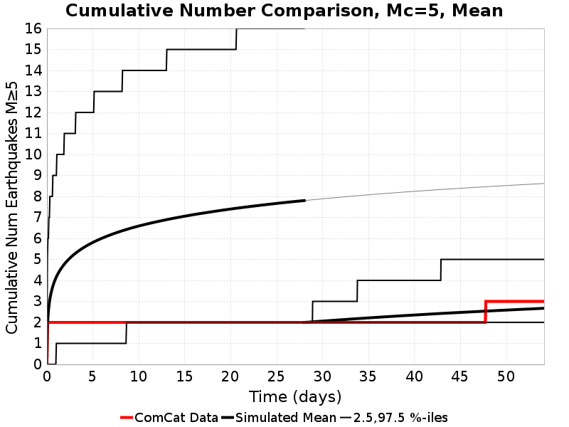
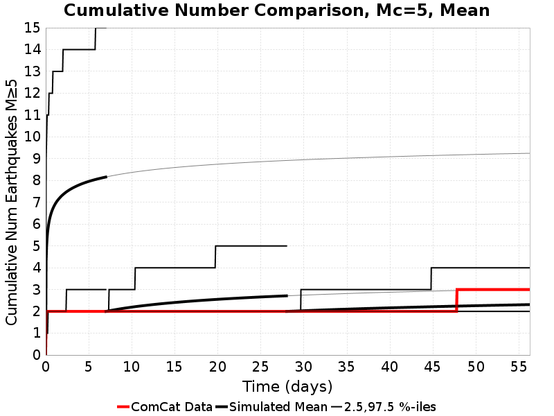

# Ridgecrest M6.4 & M7.1 Summary Figures and Tables

This is a landing page for various Ridgecrest figures and tables

## Summary Tables

### M6.4 Summary Table

| Name | 1 Week Prob M≥7.1 | 1 Month Prob M≥7.1 | 1 Month Mean Num M≥3.5 | 1 Month Median Num M≥3.5 | 1 Month Garlock Prob M≥7 | 1 Month SAF Mojave Prob M≥7 |
|-----|-----|-----|-----|-----|-----|-----|
| M6.4, Point Source | 0.290% | 0.375% | 51.6 | 45.0 | 0.218% | 0.099% |
| *M6.4, ShakeMap Source* | *0.451%* | *0.569%* | *53.0* | *45.0* | *0.428%* | *0.116%* |
| **Range** | **[0.290% 0.451%]** | **[0.375% 0.569%]** | **[51.6 53.0]** | **[45.0 45.0]** | **[0.218% 0.428%]** | **[0.099% 0.116%]** |
| **Gain (w.r.t. M6.4, ShakeMap Source)** | **[0.64 1.00]** | **[0.66 1.00]** | **[0.97 1.00]** | **[1.00 1.00]** | **[0.51 1.00]** | **[0.85 1.00]** |

### M7.1, Geometry Variations Summary Table

| Name | 1 Week Prob M≥7.1 | 1 Month Prob M≥7.1 | 1 Month Mean Num M≥3.5 | 1 Month Median Num M≥3.5 | 1 Month Garlock Prob M≥7 | 1 Month SAF Mojave Prob M≥7 |
|-----|-----|-----|-----|-----|-----|-----|
| M7.1, Point Source | 0.978% | 1.318% | 270.2 | 255.0 | 0.648% | 0.132% |
| *M7.1, ShakeMap Source* | *2.991%* | *3.707%* | *286.2* | *257.0* | *3.123%* | *0.294%* |
| M7.1, Prev ShakeMap Source (V10) | 4.547% | 5.619% | 298.9 | 260.0 | 5.079% | 0.451% |
| M7.1, Quad Source | 3.945% | 4.870% | 294.1 | 258.0 | 4.384% | 0.432% |
| M7.1, Inverted Source | 4.784% | 5.838% | 302.2 | 261.0 | 5.269% | 0.476% |
| M7.1, Inverted Source (minSlip=0.5) | 1.849% | 2.354% | 279.8 | 258.0 | 1.545% | 0.209% |
| **Range** | **[0.978% 4.784%]** | **[1.318% 5.838%]** | **[270.2 302.2]** | **[255.0 261.0]** | **[0.648% 5.269%]** | **[0.132% 0.476%]** |
| **Gain (w.r.t. M7.1, ShakeMap Source)** | **[0.33 1.60]** | **[0.36 1.57]** | **[0.94 1.06]** | **[0.99 1.02]** | **[0.21 1.69]** | **[0.45 1.62]** |

### M7.1, Parameter Variations Summary Table

| Name | 1 Week Prob M≥7.1 | 1 Month Prob M≥7.1 | 1 Month Mean Num M≥3.5 | 1 Month Median Num M≥3.5 | 1 Month Garlock Prob M≥7 | 1 Month SAF Mojave Prob M≥7 |
|-----|-----|-----|-----|-----|-----|-----|
| *M7.1, ShakeMap Source* | *2.991%* | *3.707%* | *286.2* | *257.0* | *3.123%* | *0.294%* |
| M7.1, ShakeMap Source, No Faults | 4.903% | 6.360% | 343.3 | 267.0 | N/A | N/A |
| M7.1, ShakeMap Source, NoERT Branch | 3.480% | 4.529% | 295.1 | 258.0 | 3.934% | 0.405% |
| M7.1, ShakeMap Source, Seq. Specific | 3.852% | 4.261% | 299.0 | 294.0 | 3.696% | 0.352% |
| M7.1, ShakeMap Source, No TotRateScaleFactor) | 2.969% | 3.794% | 287.1 | 258.0 | 3.180% | 0.322% |
| **Range** | **[2.969% 4.903%]** | **[3.707% 6.360%]** | **[286.2 343.3]** | **[257.0 294.0]** | **[3.123% 3.934%]** | **[0.294% 0.405%]** |
| **Gain (w.r.t. M7.1, ShakeMap Source)** | **[0.99 1.64]** | **[1.00 1.72]** | **[1.00 1.20]** | **[1.00 1.14]** | **[1.00 1.26]** | **[1.00 1.38]** |
## Cumulative Number Plots

### ShakeMap Surfaces

| Min Mag | M&ge;3.5 | M&ge;4 | M&ge;5 |
|-----|-----|-----|-----|
| **Mean** |  |  |  |
| **Median** |  |  |  |

### Point Sources

| Min Mag | M&ge;3.5 | M&ge;4 | M&ge;5 |
|-----|-----|-----|-----|
| **Mean** |  |  |  |
| **Median** |  |  |  |

### ShakeMap Surfaces, No Faults

| Min Mag | M&ge;3.5 | M&ge;4 | M&ge;5 |
|-----|-----|-----|-----|
| **Mean** |  |  |  |
| **Median** |  |  |  |

### ShakeMap Surfaces, Sequence Specific Params

| Min Mag | M&ge;3.5 | M&ge;4 | M&ge;5 |
|-----|-----|-----|-----|
| **Mean** |  |  |  |
| **Median** |  |  |  |
