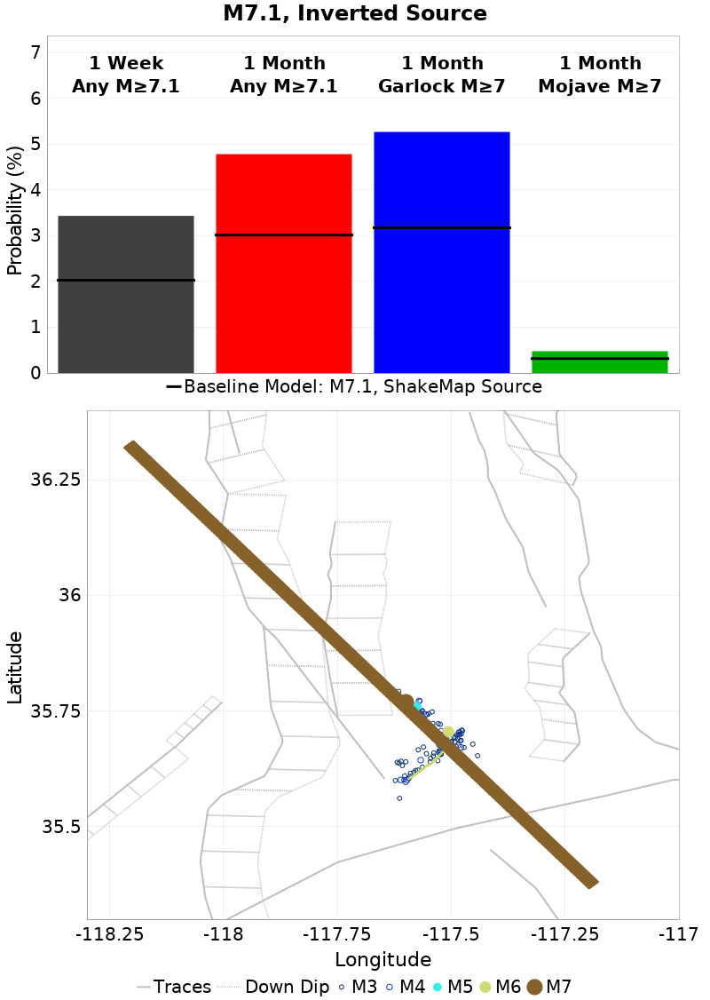
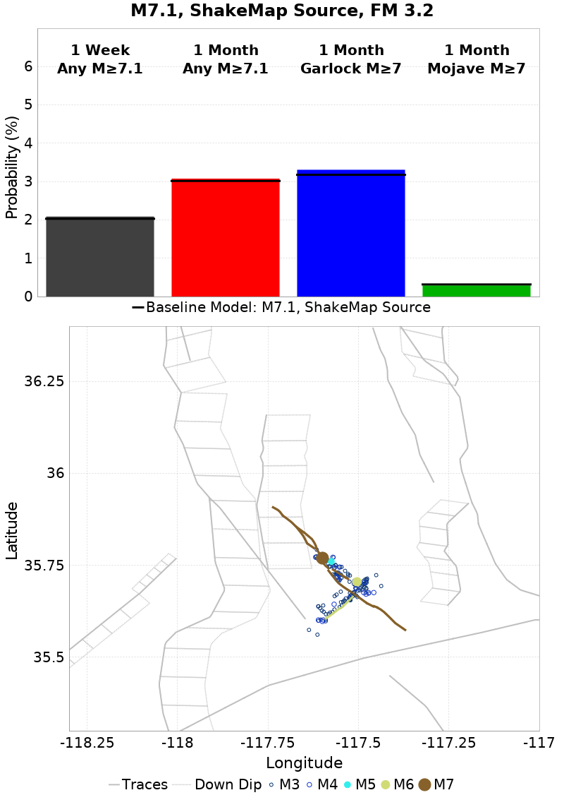
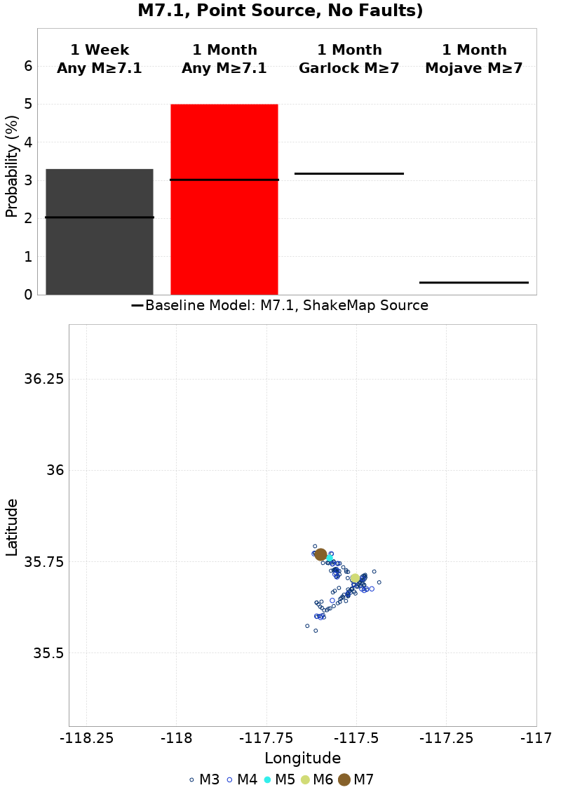
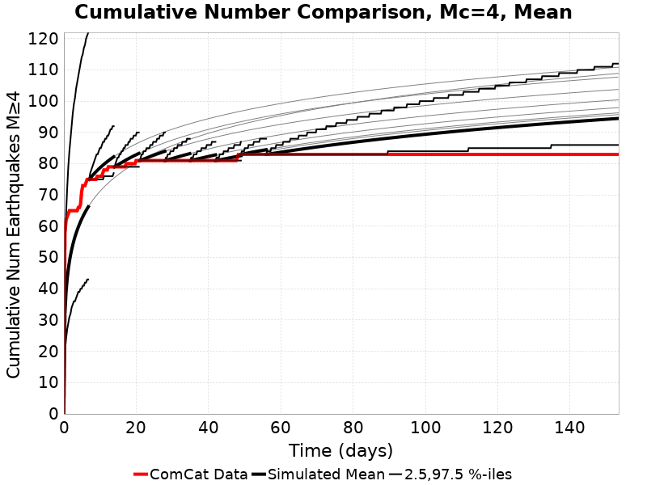
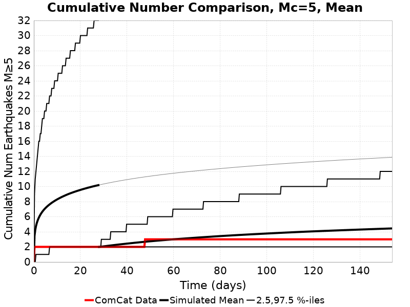
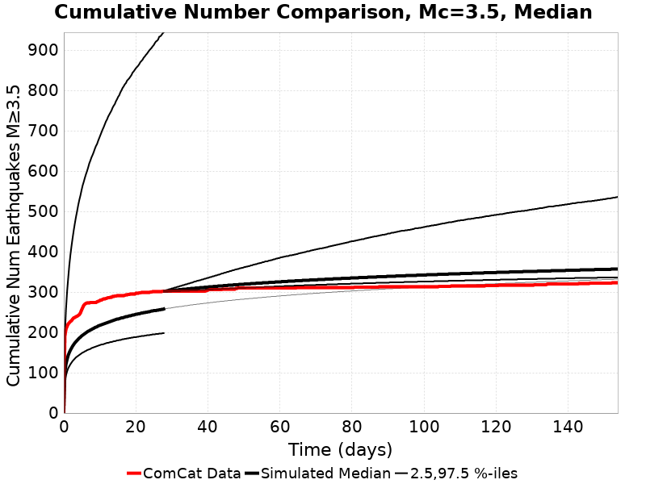
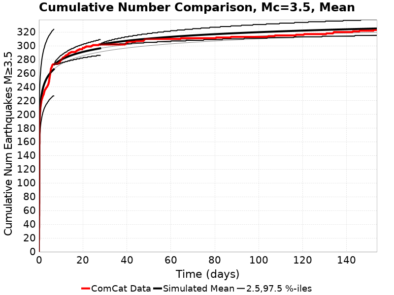
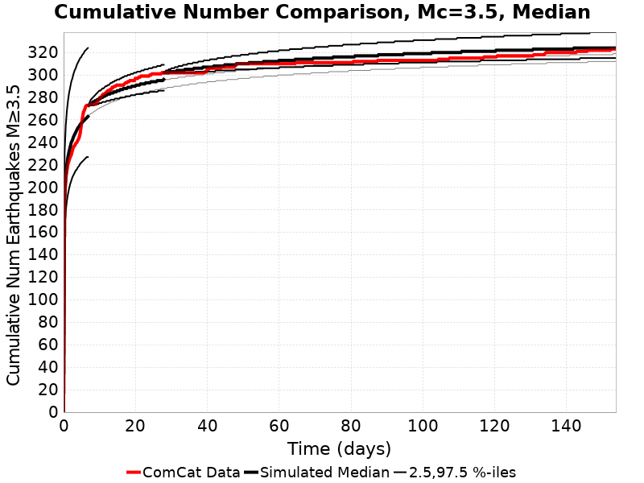
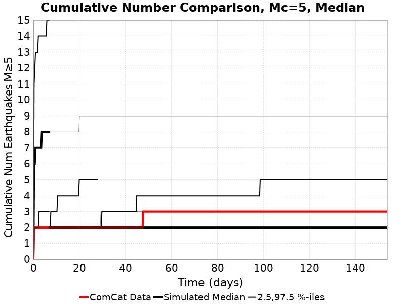

# Ridgecrest M6.4 & M7.1 Summary Figures and Tables

This is a landing page for various Ridgecrest figures and tables. Click on the simulation names in the tables below to see the details of each simulation, along with *many* plots.

Download my [2019 SCEC Annual Meeting poster here.](Milner_2019_SCEC_Poster.pdf), or [read the abstract here](https://www.scec.org/publication/9401).

You can also view the complete list of UCERF3-ETAS simulations [here](../README.md), though the list is quite long and not all are for Ridgecrest.

* [Summary Tables](#summary-tables)
  * [M6.4 Summary Table](#m64-summary-table)
    * [M6.4 Input Maps](#m64-input-maps)
  * [M7.1, Geometry Variations Summary Table](#m71-geometry-variations-summary-table)
    * [M7.1, Geometry Variations Input Maps](#m71-geometry-variations-input-maps)
  * [M7.1, Parameter Variations Summary Table](#m71-parameter-variations-summary-table)
    * [M7.1, Parameter Variations Input Maps](#m71-parameter-variations-input-maps)
* [Cumulative Number Plots](#cumulative-number-plots)
  * [ShakeMap Surfaces](#shakemap-surfaces)
  * [Point Sources](#point-sources)
  * [ShakeMap Surfaces, No Faults](#shakemap-surfaces-no-faults)
  * [ShakeMap Surfaces, Sequence Specific Params](#shakemap-surfaces-sequence-specific-params)

## Summary Tables

### M6.4 Summary Table

| Name | 1 Week Prob M≥7.1 | 1 Month Prob M≥7.1 | 1 Month Mean Num M≥3.5 | 1 Month Median Num M≥3.5 | 1 Month Garlock Prob M≥7 | 1 Month SAF Mojave Prob M≥7 |
|-----|-----|-----|-----|-----|-----|-----|
| [M6.4, Point Source](../2019_08_20-ComCatM6p4_ci38443183_PointSources-noSpont-full_td-scale1.14/README.md) | 0.290% | 0.375% | 51.6 | 45.0 | 0.218% | 0.099% |
| *[M6.4, ShakeMap Source](../2019_08_20-ComCatM6p4_ci38443183_ShakeMapSurface-noSpont-full_td-scale1.14/README.md)* | *0.451%* | *0.569%* | *53.0* | *45.0* | *0.428%* | *0.116%* |
| **Range** | **[0.290% 0.451%]** | **[0.375% 0.569%]** | **[51.6 53.0]** | **[45.0 45.0]** | **[0.218% 0.428%]** | **[0.099% 0.116%]** |
| **Gain (w.r.t. M6.4, ShakeMap Source)** | **[0.64 1.00]** | **[0.66 1.00]** | **[0.97 1.00]** | **[1.00 1.00]** | **[0.51 1.00]** | **[0.85 1.00]** |
#### M6.4 Input Maps

| **[M6.4, Point Source](../2019_08_20-ComCatM6p4_ci38443183_PointSources-noSpont-full_td-scale1.14/README.md)** | **[M6.4, ShakeMap Source](../2019_08_20-ComCatM6p4_ci38443183_ShakeMapSurface-noSpont-full_td-scale1.14/README.md)** |
|-----|-----|
|  |  |

### M7.1, Geometry Variations Summary Table

| Name | 1 Week Prob M≥7.1 | 1 Month Prob M≥7.1 | 1 Month Mean Num M≥3.5 | 1 Month Median Num M≥3.5 | 1 Month Garlock Prob M≥7 | 1 Month SAF Mojave Prob M≥7 |
|-----|-----|-----|-----|-----|-----|-----|
| [M7.1, Point Source](../2019_08_20-ComCatM7p1_ci38457511_PointSources-noSpont-full_td-scale1.14/README.md) | 0.978% | 1.318% | 270.2 | 255.0 | 0.648% | 0.132% |
| *[M7.1, ShakeMap Source](../2019_09_04-ComCatM7p1_ci38457511_ShakeMapSurfaces/README.md)* | *3.014%* | *3.755%* | *287.1* | *258.0* | *3.174%* | *0.315%* |
| [M7.1, ShakeMap Source (Culled)](../2019_09_04-ComCatM7p1_ci38457511_ShakeMapSurfaces_CulledSurface/README.md) | 3.462% | 4.362% | 291.0 | 258.0 | 3.764% | 0.363% |
| [M7.1, ShakeMap Source (Planar Extents)](../2019_09_03-ComCatM7p1_ci38457511_ShakeMapSurfaces_PlanarExtents/README.md) | 4.416% | 5.450% | 298.9 | 260.0 | 4.976% | 0.434% |
| [M7.1, Prev ShakeMap Source (V10)](../2019_08_30-ComCatM7p1_ci38457511_ShakeMapSurface_Version10/README.md) | 4.547% | 5.619% | 298.9 | 260.0 | 5.079% | 0.451% |
| [M7.1, Quad Source](../2019_07_11-ComCatM7p1_ci38457511_FiniteSurface-noSpont-full_td-scale1.14/README.md) | 3.945% | 4.870% | 294.1 | 258.0 | 4.384% | 0.432% |
| [M7.1, Inverted Source](../2019_07_18-ComCatM7p1_ci38457511_InvertedSurface_ShakeMapSurface-noSpont-full_td-scale1.14/README.md) | 4.784% | 5.838% | 302.2 | 261.0 | 5.269% | 0.476% |
| [M7.1, Inverted Source (minSlip=0.5)](../2019_08_20-ComCatM7p1_ci38457511_InvertedSurface_minSlip0p5_ShakeMapSurface-noSpont-full_td-scale1.14/README.md) | 1.849% | 2.354% | 279.8 | 258.0 | 1.545% | 0.209% |
| **Range** | **[0.978% 4.784%]** | **[1.318% 5.838%]** | **[270.2 302.2]** | **[255.0 261.0]** | **[0.648% 5.269%]** | **[0.132% 0.476%]** |
| **Gain (w.r.t. M7.1, ShakeMap Source)** | **[0.32 1.59]** | **[0.35 1.55]** | **[0.94 1.05]** | **[0.99 1.01]** | **[0.20 1.66]** | **[0.42 1.51]** |
#### M7.1, Geometry Variations Input Maps

| **[M7.1, Point Source](../2019_08_20-ComCatM7p1_ci38457511_PointSources-noSpont-full_td-scale1.14/README.md)** | **[M7.1, ShakeMap Source](../2019_09_04-ComCatM7p1_ci38457511_ShakeMapSurfaces/README.md)** | **[M7.1, ShakeMap Source (Culled)](../2019_09_04-ComCatM7p1_ci38457511_ShakeMapSurfaces_CulledSurface/README.md)** | **[M7.1, ShakeMap Source (Planar Extents)](../2019_09_03-ComCatM7p1_ci38457511_ShakeMapSurfaces_PlanarExtents/README.md)** |
|-----|-----|-----|-----|
|  |  |  |  |
| **[M7.1, Prev ShakeMap Source (V10)](../2019_08_30-ComCatM7p1_ci38457511_ShakeMapSurface_Version10/README.md)** | **[M7.1, Quad Source](../2019_07_11-ComCatM7p1_ci38457511_FiniteSurface-noSpont-full_td-scale1.14/README.md)** | **[M7.1, Inverted Source](../2019_07_18-ComCatM7p1_ci38457511_InvertedSurface_ShakeMapSurface-noSpont-full_td-scale1.14/README.md)** | **[M7.1, Inverted Source (minSlip=0.5)](../2019_08_20-ComCatM7p1_ci38457511_InvertedSurface_minSlip0p5_ShakeMapSurface-noSpont-full_td-scale1.14/README.md)** |
|  |  |  |  |

### M7.1, Parameter Variations Summary Table

| Name | 1 Week Prob M≥7.1 | 1 Month Prob M≥7.1 | 1 Month Mean Num M≥3.5 | 1 Month Median Num M≥3.5 | 1 Month Garlock Prob M≥7 | 1 Month SAF Mojave Prob M≥7 |
|-----|-----|-----|-----|-----|-----|-----|
| *[M7.1, ShakeMap Source](../2019_09_04-ComCatM7p1_ci38457511_ShakeMapSurfaces/README.md)* | *3.014%* | *3.755%* | *287.1* | *258.0* | *3.174%* | *0.315%* |
| [M7.1, ShakeMap Source, No Faults](../2019_08_20-ComCatM7p1_ci38457511_ShakeMapSurfaces_NoFaults-noSpont-poisson-griddedOnly/README.md) | 4.903% | 6.360% | 343.3 | 267.0 | N/A | N/A |
| [M7.1, ShakeMap Source, NoERT Branch](../2019_08_09-ComCatM7p1_ci38457511_ShakeMapSurfaces_NoERT-noSpont-no_ert/README.md) | 3.480% | 4.529% | 295.1 | 258.0 | 3.934% | 0.405% |
| [M7.1, ShakeMap Source, FM 3.2](../2019_09_04-ComCatM7p1_ci38457511_ShakeMapSurfaces_FM3_2/README.md) | 3.075% | 3.912% | 286.6 | 257.0 | 3.306% | 0.290% |
| [M7.1, ShakeMap Source, Early Catalog](../2019_07_16-ComCatM7p1_ci38457511_ShakeMapSurfaces-noSpont-full_td-scale1.14/README.md) | 2.991% | 3.707% | 286.2 | 257.0 | 3.123% | 0.294% |
| [M7.1, ShakeMap Source, Seq. Specific](../2019_08_30-ComCatM7p1_ci38457511_MainshockLog10_k_2p3_ShakeMapSurfaces_Log10_k_3p03_p1p15_c0p002/README.md) | 3.852% | 4.261% | 299.0 | 294.0 | 3.696% | 0.352% |
| [M7.1, ShakeMap Source, No TotRateScaleFactor)](../2019_09_02-ComCatM7p1_ci38457511_ShakeMapSurfaces_ScaleFactor1p0/README.md) | 2.969% | 3.794% | 287.1 | 258.0 | 3.180% | 0.322% |
| [M7.1, Point Source, No Faults)](../2019_09_03-ComCatM7p1_ci38457511_PointSources_NoFaults/README.md) | 4.997% | 6.436% | 341.6 | 267.0 | N/A | N/A |
| **Range** | **[2.969% 4.997%]** | **[3.707% 6.436%]** | **[286.2 343.3]** | **[257.0 294.0]** | **[3.123% 3.934%]** | **[0.290% 0.405%]** |
| **Gain (w.r.t. M7.1, ShakeMap Source)** | **[0.99 1.66]** | **[0.99 1.71]** | **[1.00 1.20]** | **[1.00 1.14]** | **[0.98 1.24]** | **[0.92 1.29]** |
#### M7.1, Parameter Variations Input Maps

| **[M7.1, ShakeMap Source](../2019_09_04-ComCatM7p1_ci38457511_ShakeMapSurfaces/README.md)** | **[M7.1, ShakeMap Source, No Faults](../2019_08_20-ComCatM7p1_ci38457511_ShakeMapSurfaces_NoFaults-noSpont-poisson-griddedOnly/README.md)** | **[M7.1, ShakeMap Source, NoERT Branch](../2019_08_09-ComCatM7p1_ci38457511_ShakeMapSurfaces_NoERT-noSpont-no_ert/README.md)** | **[M7.1, ShakeMap Source, FM 3.2](../2019_09_04-ComCatM7p1_ci38457511_ShakeMapSurfaces_FM3_2/README.md)** |
|-----|-----|-----|-----|
|  |  |  |  |
| **[M7.1, ShakeMap Source, Early Catalog](../2019_07_16-ComCatM7p1_ci38457511_ShakeMapSurfaces-noSpont-full_td-scale1.14/README.md)** | **[M7.1, ShakeMap Source, Seq. Specific](../2019_08_30-ComCatM7p1_ci38457511_MainshockLog10_k_2p3_ShakeMapSurfaces_Log10_k_3p03_p1p15_c0p002/README.md)** | **[M7.1, ShakeMap Source, No TotRateScaleFactor)](../2019_09_02-ComCatM7p1_ci38457511_ShakeMapSurfaces_ScaleFactor1p0/README.md)** | **[M7.1, Point Source, No Faults)](../2019_09_03-ComCatM7p1_ci38457511_PointSources_NoFaults/README.md)** |
|  |  |  |  |
## Cumulative Number Plots

### ShakeMap Surfaces

| Min Mag | M&ge;3.5 | M&ge;4 | M&ge;5 |
|-----|-----|-----|-----|
| **Mean** |  |  |  |
| **Median** |  |  |  |

### Point Sources

| Min Mag | M&ge;3.5 | M&ge;4 | M&ge;5 |
|-----|-----|-----|-----|
| **Mean** |  |  |  |
| **Median** |  |  |  |

### ShakeMap Surfaces, No Faults

| Min Mag | M&ge;3.5 | M&ge;4 | M&ge;5 |
|-----|-----|-----|-----|
| **Mean** |  |  |  |
| **Median** |  |  |  |

### ShakeMap Surfaces, Sequence Specific Params

| Min Mag | M&ge;3.5 | M&ge;4 | M&ge;5 |
|-----|-----|-----|-----|
| **Mean** |  |  |  |
| **Median** |  |  |  |

